cola Report for Hierarchical Partitioning - 'TCGA_LUNG_methylation'
==================

**Date**: 2021-07-22 20:16:37 CEST, **cola version**: 1.9.4

----------------------------------------------------------------

<style type='text/css'>

body, td, th {
   font-family: Arial,Helvetica,sans-serif;
   background-color: white;
   font-size: 13px;
  max-width: 800px;
  margin: auto;
  margin-left:210px;
  padding: 0px 10px 0px 10px;
  border-left: 1px solid #EEEEEE;
  line-height: 150%;
}

tt, code, pre {
   font-family: 'DejaVu Sans Mono', 'Droid Sans Mono', 'Lucida Console', Consolas, Monaco, 

monospace;
}

h1 {
   font-size:2.2em;
}

h2 {
   font-size:1.8em;
}

h3 {
   font-size:1.4em;
}

h4 {
   font-size:1.0em;
}

h5 {
   font-size:0.9em;
}

h6 {
   font-size:0.8em;
}

a {
  text-decoration: none;
  color: #0366d6;
}

a:hover {
  text-decoration: underline;
}

a:visited {
   color: #0366d6;
}

pre, img {
  max-width: 100%;
}
pre {
  overflow-x: auto;
}
pre code {
   display: block; padding: 0.5em;
}

code {
  font-size: 92%;
  border: 1px solid #ccc;
}

code[class] {
  background-color: #F8F8F8;
}

table, td, th {
  border: 1px solid #ccc;
}

blockquote {
   color:#666666;
   margin:0;
   padding-left: 1em;
   border-left: 0.5em #EEE solid;
}

hr {
   height: 0px;
   border-bottom: none;
   border-top-width: thin;
   border-top-style: dotted;
   border-top-color: #999999;
}

@media print {
   * {
      background: transparent !important;
      color: black !important;
      filter:none !important;
      -ms-filter: none !important;
   }

   body {
      font-size:12pt;
      max-width:100%;
   }

   a, a:visited {
      text-decoration: underline;
   }

   hr {
      visibility: hidden;
      page-break-before: always;
   }

   pre, blockquote {
      padding-right: 1em;
      page-break-inside: avoid;
   }

   tr, img {
      page-break-inside: avoid;
   }

   img {
      max-width: 100% !important;
   }

   @page :left {
      margin: 15mm 20mm 15mm 10mm;
   }

   @page :right {
      margin: 15mm 10mm 15mm 20mm;
   }

   p, h2, h3 {
      orphans: 3; widows: 3;
   }

   h2, h3 {
      page-break-after: avoid;
   }
}
</style>


## Summary


First the variable is renamed to `res_rh`.


```r
res_rh = rh
```


The partition hierarchy and all available functions which can be applied to `res_rh` object.


```r
res_rh
```

```
#> A 'HierarchicalPartition' object with 4 combinations of top-value methods and partitioning methods.
#>   On a matrix with 375955 rows and 907 columns.
#>   Performed in total 154000 partitions.
#>   There are 77 groups under the following parameters:
#>     - min_samples: 9
#>     - mean_silhouette_cutoff: 0.9
#>     - min_n_signatures: 1000 (signatures are selected based on:)
#>       - fdr_cutoff: 0.05
#>       - group_diff: 0.25
#> 
#> Hierarchy of the partition:
#>   0, 907 cols
#>   |-- 01, 128 cols, 4160 signatures
#>   |   |-- 011, 40 cols, 26140 signatures
#>   |   |   |-- 0111, 17 cols (b)
#>   |   |   |-- 0112, 14 cols (b)
#>   |   |   |-- 0113, 3 cols (b)
#>   |   |   `-- 0114, 6 cols (b)
#>   |   |-- 012, 38 cols, 6247 signatures
#>   |   |   |-- 0121, 23 cols, 198 signatures (c)
#>   |   |   |-- 0122, 6 cols (b)
#>   |   |   `-- 0123, 9 cols (b)
#>   |   |-- 013, 31 cols, 10893 signatures
#>   |   |   |-- 0131, 11 cols (b)
#>   |   |   |-- 0132, 10 cols (b)
#>   |   |   |-- 0133, 2 cols (b)
#>   |   |   `-- 0134, 8 cols (b)
#>   |   `-- 014, 19 cols, 107 signatures (c)
#>   |-- 02, 290 cols, 7180 signatures
#>   |   |-- 021, 73 cols, 6744 signatures
#>   |   |   |-- 0211, 16 cols (b)
#>   |   |   |-- 0212, 17 cols (b)
#>   |   |   |-- 0213, 26 cols, 2922 signatures
#>   |   |   |   |-- 02131, 17 cols (b)
#>   |   |   |   `-- 02132, 9 cols (b)
#>   |   |   `-- 0214, 14 cols (b)
#>   |   |-- 022, 44 cols, 2507 signatures
#>   |   |   |-- 0221, 21 cols, 3223 signatures
#>   |   |   |   |-- 02211, 5 cols (b)
#>   |   |   |   `-- 02212, 16 cols (b)
#>   |   |   |-- 0222, 15 cols (b)
#>   |   |   `-- 0223, 8 cols (b)
#>   |   |-- 023, 93 cols, 5315 signatures
#>   |   |   |-- 0231, 23 cols, 9072 signatures
#>   |   |   |   |-- 02311, 10 cols (b)
#>   |   |   |   |-- 02312, 7 cols (b)
#>   |   |   |   |-- 02313, 2 cols (b)
#>   |   |   |   `-- 02314, 4 cols (b)
#>   |   |   |-- 0232, 16 cols (b)
#>   |   |   |-- 0233, 17 cols (b)
#>   |   |   |-- 0234, 27 cols, 5955 signatures
#>   |   |   |   |-- 02341, 10 cols (b)
#>   |   |   |   |-- 02342, 4 cols (b)
#>   |   |   |   |-- 02343, 4 cols (b)
#>   |   |   |   |-- 02344, 2 cols (b)
#>   |   |   |   `-- 02345, 7 cols (b)
#>   |   |   `-- 0235, 10 cols (b)
#>   |   `-- 024, 80 cols, 2667 signatures
#>   |       |-- 0241, 32 cols, 20 signatures (c)
#>   |       `-- 0242, 48 cols, 3829 signatures
#>   |           |-- 02421, 9 cols (b)
#>   |           |-- 02422, 18 cols, 146 signatures (c)
#>   |           `-- 02423, 21 cols, 48 signatures (c)
#>   |-- 03, 48 cols, 17308 signatures
#>   |   |-- 031, 8 cols (b)
#>   |   `-- 032, 40 cols, 842 signatures (c)
#>   |-- 04, 83 cols, 23556 signatures
#>   |   |-- 041, 34 cols, 1325 signatures
#>   |   |   |-- 0411, 20 cols, 241 signatures (c)
#>   |   |   `-- 0412, 14 cols (b)
#>   |   |-- 042, 31 cols, 5593 signatures
#>   |   |   |-- 0421, 11 cols (b)
#>   |   |   |-- 0422, 15 cols (b)
#>   |   |   `-- 0423, 5 cols (b)
#>   |   `-- 043, 18 cols, 1393 signatures
#>   |       |-- 0431, 12 cols (b)
#>   |       `-- 0432, 6 cols (b)
#>   |-- 05, 89 cols, 3363 signatures
#>   |   |-- 051, 36 cols, 2908 signatures
#>   |   |   |-- 0511, 11 cols (b)
#>   |   |   |-- 0512, 8 cols (b)
#>   |   |   |-- 0513, 15 cols (b)
#>   |   |   `-- 0514, 2 cols (b)
#>   |   `-- 052, 53 cols, 9538 signatures
#>   |       |-- 0521, 17 cols (b)
#>   |       |-- 0522, 13 cols (b)
#>   |       |-- 0523, 3 cols (b)
#>   |       |-- 0524, 6 cols (b)
#>   |       `-- 0525, 14 cols (b)
#>   |-- 06, 131 cols, 1256 signatures
#>   |   |-- 061, 45 cols, 5122 signatures
#>   |   |   |-- 0611, 14 cols (b)
#>   |   |   |-- 0612, 18 cols, 3090 signatures
#>   |   |   |   |-- 06121, 5 cols (b)
#>   |   |   |   |-- 06122, 9 cols (b)
#>   |   |   |   `-- 06123, 4 cols (b)
#>   |   |   `-- 0613, 13 cols (b)
#>   |   `-- 062, 86 cols, 241 signatures (c)
#>   `-- 07, 138 cols, 2814 signatures
#>       |-- 071, 59 cols, 3229 signatures
#>       |   |-- 0711, 29 cols, 1063 signatures
#>       |   |   |-- 07111, 22 cols, 6049 signatures
#>       |   |   |   |-- 071111, 4 cols (b)
#>       |   |   |   |-- 071112, 7 cols (b)
#>       |   |   |   |-- 071113, 2 cols (b)
#>       |   |   |   |-- 071114, 3 cols (b)
#>       |   |   |   `-- 071115, 6 cols (b)
#>       |   |   `-- 07112, 7 cols (b)
#>       |   |-- 0712, 16 cols (b)
#>       |   `-- 0713, 14 cols (b)
#>       |-- 072, 46 cols, 1019 signatures
#>       |   |-- 0721, 31 cols, 5220 signatures
#>       |   |   |-- 07211, 9 cols (b)
#>       |   |   |-- 07212, 11 cols (b)
#>       |   |   |-- 07213, 8 cols (b)
#>       |   |   `-- 07214, 3 cols (b)
#>       |   `-- 0722, 15 cols (b)
#>       `-- 073, 33 cols, 4655 signatures
#>           |-- 0731, 10 cols (b)
#>           |-- 0732, 14 cols (b)
#>           `-- 0733, 9 cols (b)
#> Stop reason:
#>   b) Subgroup had too few columns.
#>   c) There were too few signatures.
#> 
#> Following methods can be applied to this 'HierarchicalPartition' object:
#>  [1] "all_leaves"            "all_nodes"             "cola_report"           "collect_classes"      
#>  [5] "colnames"              "compare_signatures"    "dimension_reduction"   "functional_enrichment"
#>  [9] "get_anno_col"          "get_anno"              "get_children_nodes"    "get_classes"          
#> [13] "get_matrix"            "get_signatures"        "is_leaf_node"          "max_depth"            
#> [17] "merge_node"            "ncol"                  "node_info"             "node_level"           
#> [21] "nrow"                  "rownames"              "show"                  "split_node"           
#> [25] "suggest_best_k"        "test_to_known_factors" "top_rows_heatmap"      "top_rows_overlap"     
#> 
#> You can get result for a single node by e.g. object["01"]
```

The call of `hierarchical_partition()` was:


```
#> hierarchical_partition(data = mat, top_n = 1000, top_value_method = c("SD", "ATC"), 
#>     partition_method = c("kmeans", "skmeans"), subset = 500, group_diff = 0.25, min_n_signatures = 1000, 
#>     filter_fun = function(mat) {
#>         s = rowSds(mat)
#>         order(-s)[1:30000]
#>     }, max_k = 8, scale_rows = FALSE, cores = 4)
```

Dimension of the input matrix:


```r
mat = get_matrix(res_rh)
dim(mat)
```

```
#> [1] 375955    907
```

All the methods that were tried:


```r
res_rh@param$combination_method
```

```
#> [[1]]
#> [1] "SD"     "kmeans"
#> 
#> [[2]]
#> [1] "ATC"    "kmeans"
#> 
#> [[3]]
#> [1] "SD"      "skmeans"
#> 
#> [[4]]
#> [1] "ATC"     "skmeans"
```

### Density distribution

The density distribution for each sample is visualized as one column in the following heatmap.
The clustering is based on the distance which is the Kolmogorov-Smirnov statistic between two distributions.


```r
library(ComplexHeatmap)
densityHeatmap(mat, ylab = "value", cluster_columns = TRUE, show_column_names = FALSE,
    mc.cores = 1)
```

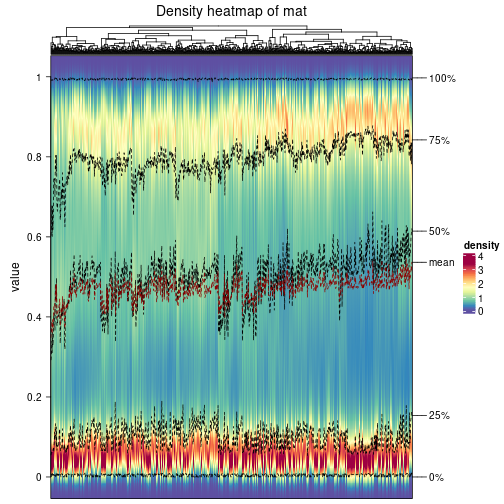


Some values about the hierarchy:


```r
all_nodes(res_rh)
```

```
#>   [1] "0"      "01"     "011"    "0111"   "0112"   "0113"   "0114"   "012"    "0121"   "0122"  
#>  [11] "0123"   "013"    "0131"   "0132"   "0133"   "0134"   "014"    "02"     "021"    "0211"  
#>  [21] "0212"   "0213"   "02131"  "02132"  "0214"   "022"    "0221"   "02211"  "02212"  "0222"  
#>  [31] "0223"   "023"    "0231"   "02311"  "02312"  "02313"  "02314"  "0232"   "0233"   "0234"  
#>  [41] "02341"  "02342"  "02343"  "02344"  "02345"  "0235"   "024"    "0241"   "0242"   "02421" 
#>  [51] "02422"  "02423"  "03"     "031"    "032"    "04"     "041"    "0411"   "0412"   "042"   
#>  [61] "0421"   "0422"   "0423"   "043"    "0431"   "0432"   "05"     "051"    "0511"   "0512"  
#>  [71] "0513"   "0514"   "052"    "0521"   "0522"   "0523"   "0524"   "0525"   "06"     "061"   
#>  [81] "0611"   "0612"   "06121"  "06122"  "06123"  "0613"   "062"    "07"     "071"    "0711"  
#>  [91] "07111"  "071111" "071112" "071113" "071114" "071115" "07112"  "0712"   "0713"   "072"   
#> [101] "0721"   "07211"  "07212"  "07213"  "07214"  "0722"   "073"    "0731"   "0732"   "0733"
```

```r
all_leaves(res_rh)
```

```
#>  [1] "0111"   "0112"   "0113"   "0114"   "0121"   "0122"   "0123"   "0131"   "0132"   "0133"  
#> [11] "0134"   "014"    "0211"   "0212"   "02131"  "02132"  "0214"   "02211"  "02212"  "0222"  
#> [21] "0223"   "02311"  "02312"  "02313"  "02314"  "0232"   "0233"   "02341"  "02342"  "02343" 
#> [31] "02344"  "02345"  "0235"   "0241"   "02421"  "02422"  "02423"  "031"    "032"    "0411"  
#> [41] "0412"   "0421"   "0422"   "0423"   "0431"   "0432"   "0511"   "0512"   "0513"   "0514"  
#> [51] "0521"   "0522"   "0523"   "0524"   "0525"   "0611"   "06121"  "06122"  "06123"  "0613"  
#> [61] "062"    "071111" "071112" "071113" "071114" "071115" "07112"  "0712"   "0713"   "07211" 
#> [71] "07212"  "07213"  "07214"  "0722"   "0731"   "0732"   "0733"
```

```r
node_info(res_rh)
```

```
#>         id best_method depth best_k n_columns n_signatures p_signatures is_leaf
#> 1        0 ATC:skmeans     1      7       907        54725     1.46e-01   FALSE
#> 2       01 ATC:skmeans     2      4       128         4160     1.11e-02   FALSE
#> 3      011  ATC:kmeans     3      4        40        26140     6.95e-02   FALSE
#> 4     0111 not applied     4     NA        17           NA           NA    TRUE
#> 5     0112 not applied     4     NA        14           NA           NA    TRUE
#> 6     0113 not applied     4     NA         3           NA           NA    TRUE
#> 7     0114 not applied     4     NA         6           NA           NA    TRUE
#> 8      012 ATC:skmeans     3      3        38         6247     1.66e-02   FALSE
#> 9     0121 ATC:skmeans     4      2        23          198     5.27e-04    TRUE
#> 10    0122 not applied     4     NA         6           NA           NA    TRUE
#> 11    0123 not applied     4     NA         9           NA           NA    TRUE
#> 12     013  ATC:kmeans     3      4        31        10893     2.90e-02   FALSE
#> 13    0131 not applied     4     NA        11           NA           NA    TRUE
#> 14    0132 not applied     4     NA        10           NA           NA    TRUE
#> 15    0133 not applied     4     NA         2           NA           NA    TRUE
#> 16    0134 not applied     4     NA         8           NA           NA    TRUE
#> 17     014  ATC:kmeans     3      2        19          107     2.85e-04    TRUE
#> 18      02  ATC:kmeans     2      4       290         7180     1.91e-02   FALSE
#> 19     021  ATC:kmeans     3      4        73         6744     1.79e-02   FALSE
#> 20    0211 not applied     4     NA        16           NA           NA    TRUE
#> 21    0212 not applied     4     NA        17           NA           NA    TRUE
#> 22    0213  ATC:kmeans     4      2        26         2922     7.77e-03   FALSE
#> 23   02131 not applied     5     NA        17           NA           NA    TRUE
#> 24   02132 not applied     5     NA         9           NA           NA    TRUE
#> 25    0214 not applied     4     NA        14           NA           NA    TRUE
#> 26     022  SD:skmeans     3      3        44         2507     6.67e-03   FALSE
#> 27    0221  ATC:kmeans     4      2        21         3223     8.57e-03   FALSE
#> 28   02211 not applied     5     NA         5           NA           NA    TRUE
#> 29   02212 not applied     5     NA        16           NA           NA    TRUE
#> 30    0222 not applied     4     NA        15           NA           NA    TRUE
#> 31    0223 not applied     4     NA         8           NA           NA    TRUE
#> 32     023 ATC:skmeans     3      5        93         5315     1.41e-02   FALSE
#> 33    0231  ATC:kmeans     4      4        23         9072     2.41e-02   FALSE
#> 34   02311 not applied     5     NA        10           NA           NA    TRUE
#> 35   02312 not applied     5     NA         7           NA           NA    TRUE
#> 36   02313 not applied     5     NA         2           NA           NA    TRUE
#> 37   02314 not applied     5     NA         4           NA           NA    TRUE
#> 38    0232 not applied     4     NA        16           NA           NA    TRUE
#> 39    0233 not applied     4     NA        17           NA           NA    TRUE
#> 40    0234 ATC:skmeans     4      5        27         5955     1.58e-02   FALSE
#> 41   02341 not applied     5     NA        10           NA           NA    TRUE
#> 42   02342 not applied     5     NA         4           NA           NA    TRUE
#> 43   02343 not applied     5     NA         4           NA           NA    TRUE
#> 44   02344 not applied     5     NA         2           NA           NA    TRUE
#> 45   02345 not applied     5     NA         7           NA           NA    TRUE
#> 46    0235 not applied     4     NA        10           NA           NA    TRUE
#> 47     024   SD:kmeans     3      2        80         2667     7.09e-03   FALSE
#> 48    0241 ATC:skmeans     4      2        32           20     5.32e-05    TRUE
#> 49    0242 ATC:skmeans     4      3        48         3829     1.02e-02   FALSE
#> 50   02421 not applied     5     NA         9           NA           NA    TRUE
#> 51   02422 ATC:skmeans     5      3        18          146     3.88e-04    TRUE
#> 52   02423  ATC:kmeans     5      2        21           48     1.28e-04    TRUE
#> 53      03  ATC:kmeans     2      2        48        17308     4.60e-02   FALSE
#> 54     031 not applied     3     NA         8           NA           NA    TRUE
#> 55     032 ATC:skmeans     3      2        40          842     2.24e-03    TRUE
#> 56      04  ATC:kmeans     2      3        83        23556     6.27e-02   FALSE
#> 57     041  ATC:kmeans     3      2        34         1325     3.52e-03   FALSE
#> 58    0411 ATC:skmeans     4      3        20          241     6.41e-04    TRUE
#> 59    0412 not applied     4     NA        14           NA           NA    TRUE
#> 60     042 ATC:skmeans     3      3        31         5593     1.49e-02   FALSE
#> 61    0421 not applied     4     NA        11           NA           NA    TRUE
#> 62    0422 not applied     4     NA        15           NA           NA    TRUE
#> 63    0423 not applied     4     NA         5           NA           NA    TRUE
#> 64     043  ATC:kmeans     3      2        18         1393     3.71e-03   FALSE
#> 65    0431 not applied     4     NA        12           NA           NA    TRUE
#> 66    0432 not applied     4     NA         6           NA           NA    TRUE
#> 67      05   SD:kmeans     2      2        89         3363     8.95e-03   FALSE
#> 68     051  ATC:kmeans     3      4        36         2908     7.73e-03   FALSE
#> 69    0511 not applied     4     NA        11           NA           NA    TRUE
#> 70    0512 not applied     4     NA         8           NA           NA    TRUE
#> 71    0513 not applied     4     NA        15           NA           NA    TRUE
#> 72    0514 not applied     4     NA         2           NA           NA    TRUE
#> 73     052 ATC:skmeans     3      5        53         9538     2.54e-02   FALSE
#> 74    0521 not applied     4     NA        17           NA           NA    TRUE
#> 75    0522 not applied     4     NA        13           NA           NA    TRUE
#> 76    0523 not applied     4     NA         3           NA           NA    TRUE
#> 77    0524 not applied     4     NA         6           NA           NA    TRUE
#> 78    0525 not applied     4     NA        14           NA           NA    TRUE
#> 79      06 ATC:skmeans     2      2       131         1256     3.34e-03   FALSE
#> 80     061  ATC:kmeans     3      3        45         5122     1.36e-02   FALSE
#> 81    0611 not applied     4     NA        14           NA           NA    TRUE
#> 82    0612  ATC:kmeans     4      3        18         3090     8.22e-03   FALSE
#> 83   06121 not applied     5     NA         5           NA           NA    TRUE
#> 84   06122 not applied     5     NA         9           NA           NA    TRUE
#> 85   06123 not applied     5     NA         4           NA           NA    TRUE
#> 86    0613 not applied     4     NA        13           NA           NA    TRUE
#> 87     062  ATC:kmeans     3      2        86          241     6.41e-04    TRUE
#> 88      07  SD:skmeans     2      3       138         2814     7.48e-03   FALSE
#> 89     071  ATC:kmeans     3      3        59         3229     8.59e-03   FALSE
#> 90    0711  ATC:kmeans     4      2        29         1063     2.83e-03   FALSE
#> 91   07111 ATC:skmeans     5      5        22         6049     1.61e-02   FALSE
#> 92  071111 not applied     6     NA         4           NA           NA    TRUE
#> 93  071112 not applied     6     NA         7           NA           NA    TRUE
#> 94  071113 not applied     6     NA         2           NA           NA    TRUE
#> 95  071114 not applied     6     NA         3           NA           NA    TRUE
#> 96  071115 not applied     6     NA         6           NA           NA    TRUE
#> 97   07112 not applied     5     NA         7           NA           NA    TRUE
#> 98    0712 not applied     4     NA        16           NA           NA    TRUE
#> 99    0713 not applied     4     NA        14           NA           NA    TRUE
#> 100    072  ATC:kmeans     3      2        46         1019     2.71e-03   FALSE
#> 101   0721 ATC:skmeans     4      4        31         5220     1.39e-02   FALSE
#> 102  07211 not applied     5     NA         9           NA           NA    TRUE
#> 103  07212 not applied     5     NA        11           NA           NA    TRUE
#> 104  07213 not applied     5     NA         8           NA           NA    TRUE
#> 105  07214 not applied     5     NA         3           NA           NA    TRUE
#> 106   0722 not applied     4     NA        15           NA           NA    TRUE
#> 107    073  SD:skmeans     3      3        33         4655     1.24e-02   FALSE
#> 108   0731 not applied     4     NA        10           NA           NA    TRUE
#> 109   0732 not applied     4     NA        14           NA           NA    TRUE
#> 110   0733 not applied     4     NA         9           NA           NA    TRUE
```

In the output from `node_info()`, there are the following columns:

- `id`: The node id.
- `best_method`: The best method selected.
- `depth`: Depth of the node in the hierarchy.
- `best_k`: Best number of groups of the partition on that node.
- `n_columns`: Number of columns in the submatrix.
- `n_signatures`: Number of signatures with the `best_k`.
- `p_signatures`: Proportion of hte signatures in total number of rows in the matrix.
- `is_leaf`: Whether the node is a leaf.

Labels of nodes are encoded in a special way. The number of digits
correspond to the depth of the node in the hierarchy and the value of the
digits correspond to the index of the subgroup in the current node, E.g. a label
of “012” means the node is the second subgroup of the partition which is the
first subgroup of the root node.

### Suggest the best k


Following table shows the best `k` (number of partitions) for each node in the
partition hierarchy. Clicking on the node name in the table goes to the
corresponding section for the partitioning on that node.

[The cola vignette](https://jokergoo.github.io/cola_vignettes/cola.html#toc_13)
explains the definition of the metrics used for determining the best
number of partitions.


```r
suggest_best_k(res_rh)
```


|Node                    |Best method                                         |Is leaf   |Best k |1-PAC |Mean silhouette |Concordance | #samples|   |
|:-----------------------|:---------------------------------------------------|:---------|:------|:-----|:---------------|:-----------|--------:|:--|
|[Node0](#Node0)         |ATC:skmeans                                         |          |8      |0.94  |0.86            |0.93        |      907|*  |
|[Node01](#Node01)       |ATC:skmeans                                         |          |4      |1.00  |0.96            |0.98        |      128|** |
|[Node011](#Node011)     |ATC:kmeans                                          |          |4      |0.99  |0.95            |0.98        |       40|** |
|Node0111-leaf           |<span style='color:grey;'><i>not applied</i></span> |✓ (b)     |       |      |                |            |       17|   |
|Node0112-leaf           |<span style='color:grey;'><i>not applied</i></span> |✓ (b)     |       |      |                |            |       14|   |
|Node0113-leaf           |<span style='color:grey;'><i>not applied</i></span> |✓ (b)     |       |      |                |            |        3|   |
|Node0114-leaf           |<span style='color:grey;'><i>not applied</i></span> |✓ (b)     |       |      |                |            |        6|   |
|[Node012](#Node012)     |ATC:skmeans                                         |          |4      |0.93  |0.92            |0.96        |       38|*  |
|Node0121-leaf           |ATC:skmeans                                         |✓ (&#99;) |3      |1.00  |0.95            |0.98        |       23|** |
|Node0122-leaf           |<span style='color:grey;'><i>not applied</i></span> |✓ (b)     |       |      |                |            |        6|   |
|Node0123-leaf           |<span style='color:grey;'><i>not applied</i></span> |✓ (b)     |       |      |                |            |        9|   |
|[Node013](#Node013)     |ATC:kmeans                                          |          |4      |1.00  |0.97            |0.98        |       31|** |
|Node0131-leaf           |<span style='color:grey;'><i>not applied</i></span> |✓ (b)     |       |      |                |            |       11|   |
|Node0132-leaf           |<span style='color:grey;'><i>not applied</i></span> |✓ (b)     |       |      |                |            |       10|   |
|Node0133-leaf           |<span style='color:grey;'><i>not applied</i></span> |✓ (b)     |       |      |                |            |        2|   |
|Node0134-leaf           |<span style='color:grey;'><i>not applied</i></span> |✓ (b)     |       |      |                |            |        8|   |
|Node014-leaf            |ATC:kmeans                                          |✓ (&#99;) |2      |1.00  |1.00            |1.00        |       19|** |
|[Node02](#Node02)       |ATC:kmeans                                          |          |4      |1.00  |0.96            |0.96        |      290|** |
|[Node021](#Node021)     |ATC:kmeans                                          |          |4      |1.00  |1.00            |1.00        |       73|** |
|Node0211-leaf           |<span style='color:grey;'><i>not applied</i></span> |✓ (b)     |       |      |                |            |       16|   |
|Node0212-leaf           |<span style='color:grey;'><i>not applied</i></span> |✓ (b)     |       |      |                |            |       17|   |
|[Node0213](#Node0213)   |ATC:kmeans                                          |          |2      |1.00  |1.00            |1.00        |       26|** |
|Node02131-leaf          |<span style='color:grey;'><i>not applied</i></span> |✓ (b)     |       |      |                |            |       17|   |
|Node02132-leaf          |<span style='color:grey;'><i>not applied</i></span> |✓ (b)     |       |      |                |            |        9|   |
|Node0214-leaf           |<span style='color:grey;'><i>not applied</i></span> |✓ (b)     |       |      |                |            |       14|   |
|[Node022](#Node022)     |SD:skmeans                                          |          |3      |0.97  |0.96            |0.97        |       44|** |
|[Node0221](#Node0221)   |ATC:kmeans                                          |          |2      |1.00  |1.00            |1.00        |       21|** |
|Node02211-leaf          |<span style='color:grey;'><i>not applied</i></span> |✓ (b)     |       |      |                |            |        5|   |
|Node02212-leaf          |<span style='color:grey;'><i>not applied</i></span> |✓ (b)     |       |      |                |            |       16|   |
|Node0222-leaf           |<span style='color:grey;'><i>not applied</i></span> |✓ (b)     |       |      |                |            |       15|   |
|Node0223-leaf           |<span style='color:grey;'><i>not applied</i></span> |✓ (b)     |       |      |                |            |        8|   |
|[Node023](#Node023)     |ATC:skmeans                                         |          |5      |1.00  |0.97            |0.99        |       93|** |
|[Node0231](#Node0231)   |ATC:kmeans                                          |          |5      |0.92  |0.96            |0.94        |       23|*  |
|Node02311-leaf          |<span style='color:grey;'><i>not applied</i></span> |✓ (b)     |       |      |                |            |       10|   |
|Node02312-leaf          |<span style='color:grey;'><i>not applied</i></span> |✓ (b)     |       |      |                |            |        7|   |
|Node02313-leaf          |<span style='color:grey;'><i>not applied</i></span> |✓ (b)     |       |      |                |            |        2|   |
|Node02314-leaf          |<span style='color:grey;'><i>not applied</i></span> |✓ (b)     |       |      |                |            |        4|   |
|Node0232-leaf           |<span style='color:grey;'><i>not applied</i></span> |✓ (b)     |       |      |                |            |       16|   |
|Node0233-leaf           |<span style='color:grey;'><i>not applied</i></span> |✓ (b)     |       |      |                |            |       17|   |
|[Node0234](#Node0234)   |ATC:skmeans                                         |          |5      |1.00  |0.99            |0.99        |       27|** |
|Node02341-leaf          |<span style='color:grey;'><i>not applied</i></span> |✓ (b)     |       |      |                |            |       10|   |
|Node02342-leaf          |<span style='color:grey;'><i>not applied</i></span> |✓ (b)     |       |      |                |            |        4|   |
|Node02343-leaf          |<span style='color:grey;'><i>not applied</i></span> |✓ (b)     |       |      |                |            |        4|   |
|Node02344-leaf          |<span style='color:grey;'><i>not applied</i></span> |✓ (b)     |       |      |                |            |        2|   |
|Node02345-leaf          |<span style='color:grey;'><i>not applied</i></span> |✓ (b)     |       |      |                |            |        7|   |
|Node0235-leaf           |<span style='color:grey;'><i>not applied</i></span> |✓ (b)     |       |      |                |            |       10|   |
|[Node024](#Node024)     |SD:kmeans                                           |          |2      |1.00  |1.00            |1.00        |       80|** |
|Node0241-leaf           |ATC:skmeans                                         |✓ (&#99;) |2      |1.00  |1.00            |1.00        |       32|** |
|[Node0242](#Node0242)   |ATC:skmeans                                         |          |3      |1.00  |1.00            |1.00        |       48|** |
|Node02421-leaf          |<span style='color:grey;'><i>not applied</i></span> |✓ (b)     |       |      |                |            |        9|   |
|Node02422-leaf          |ATC:skmeans                                         |✓ (&#99;) |2      |0.63  |0.95            |0.97        |       18|   |
|Node02423-leaf          |ATC:kmeans                                          |✓ (&#99;) |2      |1.00  |1.00            |1.00        |       21|** |
|[Node03](#Node03)       |ATC:kmeans                                          |          |3      |0.93  |0.92            |0.97        |       48|*  |
|Node031-leaf            |<span style='color:grey;'><i>not applied</i></span> |✓ (b)     |       |      |                |            |        8|   |
|Node032-leaf            |ATC:skmeans                                         |✓ (&#99;) |4      |0.91  |0.93            |0.97        |       40|*  |
|[Node04](#Node04)       |ATC:kmeans                                          |          |3      |1.00  |0.97            |0.99        |       83|** |
|[Node041](#Node041)     |ATC:kmeans                                          |          |2      |1.00  |1.00            |1.00        |       34|** |
|Node0411-leaf           |ATC:skmeans                                         |✓ (&#99;) |3      |0.92  |0.97            |0.99        |       20|*  |
|Node0412-leaf           |<span style='color:grey;'><i>not applied</i></span> |✓ (b)     |       |      |                |            |       14|   |
|[Node042](#Node042)     |ATC:skmeans                                         |          |3      |1.00  |0.99            |0.99        |       31|** |
|Node0421-leaf           |<span style='color:grey;'><i>not applied</i></span> |✓ (b)     |       |      |                |            |       11|   |
|Node0422-leaf           |<span style='color:grey;'><i>not applied</i></span> |✓ (b)     |       |      |                |            |       15|   |
|Node0423-leaf           |<span style='color:grey;'><i>not applied</i></span> |✓ (b)     |       |      |                |            |        5|   |
|[Node043](#Node043)     |ATC:kmeans                                          |          |2      |1.00  |1.00            |1.00        |       18|** |
|Node0431-leaf           |<span style='color:grey;'><i>not applied</i></span> |✓ (b)     |       |      |                |            |       12|   |
|Node0432-leaf           |<span style='color:grey;'><i>not applied</i></span> |✓ (b)     |       |      |                |            |        6|   |
|[Node05](#Node05)       |SD:kmeans                                           |          |2      |1.00  |1.00            |1.00        |       89|** |
|[Node051](#Node051)     |ATC:kmeans                                          |          |6      |0.91  |0.90            |0.87        |       36|*  |
|Node0511-leaf           |<span style='color:grey;'><i>not applied</i></span> |✓ (b)     |       |      |                |            |       11|   |
|Node0512-leaf           |<span style='color:grey;'><i>not applied</i></span> |✓ (b)     |       |      |                |            |        8|   |
|Node0513-leaf           |<span style='color:grey;'><i>not applied</i></span> |✓ (b)     |       |      |                |            |       15|   |
|Node0514-leaf           |<span style='color:grey;'><i>not applied</i></span> |✓ (b)     |       |      |                |            |        2|   |
|[Node052](#Node052)     |ATC:skmeans                                         |          |6      |1.00  |0.96            |0.98        |       53|** |
|Node0521-leaf           |<span style='color:grey;'><i>not applied</i></span> |✓ (b)     |       |      |                |            |       17|   |
|Node0522-leaf           |<span style='color:grey;'><i>not applied</i></span> |✓ (b)     |       |      |                |            |       13|   |
|Node0523-leaf           |<span style='color:grey;'><i>not applied</i></span> |✓ (b)     |       |      |                |            |        3|   |
|Node0524-leaf           |<span style='color:grey;'><i>not applied</i></span> |✓ (b)     |       |      |                |            |        6|   |
|Node0525-leaf           |<span style='color:grey;'><i>not applied</i></span> |✓ (b)     |       |      |                |            |       14|   |
|[Node06](#Node06)       |ATC:skmeans                                         |          |2      |1.00  |0.97            |0.99        |      131|** |
|[Node061](#Node061)     |ATC:kmeans                                          |          |4      |0.91  |0.92            |0.95        |       45|*  |
|Node0611-leaf           |<span style='color:grey;'><i>not applied</i></span> |✓ (b)     |       |      |                |            |       14|   |
|[Node0612](#Node0612)   |ATC:kmeans                                          |          |2      |1.00  |1.00            |1.00        |       18|** |
|Node06121-leaf          |<span style='color:grey;'><i>not applied</i></span> |✓ (b)     |       |      |                |            |        5|   |
|Node06122-leaf          |<span style='color:grey;'><i>not applied</i></span> |✓ (b)     |       |      |                |            |        9|   |
|Node06123-leaf          |<span style='color:grey;'><i>not applied</i></span> |✓ (b)     |       |      |                |            |        4|   |
|Node0613-leaf           |<span style='color:grey;'><i>not applied</i></span> |✓ (b)     |       |      |                |            |       13|   |
|Node062-leaf            |ATC:kmeans                                          |✓ (&#99;) |2      |1.00  |0.99            |1.00        |       86|** |
|[Node07](#Node07)       |SD:skmeans                                          |          |5      |0.95  |0.93            |0.96        |      138|*  |
|[Node071](#Node071)     |ATC:kmeans                                          |          |3      |1.00  |0.98            |0.99        |       59|** |
|[Node0711](#Node0711)   |ATC:kmeans                                          |          |2      |1.00  |1.00            |1.00        |       29|** |
|[Node07111](#Node07111) |ATC:skmeans                                         |          |5      |1.00  |1.00            |1.00        |       22|** |
|Node071111-leaf         |<span style='color:grey;'><i>not applied</i></span> |✓ (b)     |       |      |                |            |        4|   |
|Node071112-leaf         |<span style='color:grey;'><i>not applied</i></span> |✓ (b)     |       |      |                |            |        7|   |
|Node071113-leaf         |<span style='color:grey;'><i>not applied</i></span> |✓ (b)     |       |      |                |            |        2|   |
|Node071114-leaf         |<span style='color:grey;'><i>not applied</i></span> |✓ (b)     |       |      |                |            |        3|   |
|Node071115-leaf         |<span style='color:grey;'><i>not applied</i></span> |✓ (b)     |       |      |                |            |        6|   |
|Node07112-leaf          |<span style='color:grey;'><i>not applied</i></span> |✓ (b)     |       |      |                |            |        7|   |
|Node0712-leaf           |<span style='color:grey;'><i>not applied</i></span> |✓ (b)     |       |      |                |            |       16|   |
|Node0713-leaf           |<span style='color:grey;'><i>not applied</i></span> |✓ (b)     |       |      |                |            |       14|   |
|[Node072](#Node072)     |ATC:kmeans                                          |          |2      |1.00  |0.98            |0.99        |       46|** |
|[Node0721](#Node0721)   |ATC:skmeans                                         |          |4      |0.98  |0.96            |0.97        |       31|** |
|Node07211-leaf          |<span style='color:grey;'><i>not applied</i></span> |✓ (b)     |       |      |                |            |        9|   |
|Node07212-leaf          |<span style='color:grey;'><i>not applied</i></span> |✓ (b)     |       |      |                |            |       11|   |
|Node07213-leaf          |<span style='color:grey;'><i>not applied</i></span> |✓ (b)     |       |      |                |            |        8|   |
|Node07214-leaf          |<span style='color:grey;'><i>not applied</i></span> |✓ (b)     |       |      |                |            |        3|   |
|Node0722-leaf           |<span style='color:grey;'><i>not applied</i></span> |✓ (b)     |       |      |                |            |       15|   |
|[Node073](#Node073)     |SD:skmeans                                          |          |3      |1.00  |0.97            |0.98        |       33|** |
|Node0731-leaf           |<span style='color:grey;'><i>not applied</i></span> |✓ (b)     |       |      |                |            |       10|   |
|Node0732-leaf           |<span style='color:grey;'><i>not applied</i></span> |✓ (b)     |       |      |                |            |       14|   |
|Node0733-leaf           |<span style='color:grey;'><i>not applied</i></span> |✓ (b)     |       |      |                |            |        9|   |


Stop reason: b) Subgroup had too few columns. c) There were too few signatures. 

\*\*: 1-PAC > 0.95, \*: 1-PAC > 0.9


### Partition hierarchy

The nodes of the hierarchy can be merged by setting the `merge_node` parameters. Here we 
control the hierarchy with the `min_n_signatures` parameter. The value of `min_n_signatures` is
from `node_info()`.


<style type='text/css'>


.ui-helper-hidden {
	display: none;
}
.ui-helper-hidden-accessible {
	border: 0;
	clip: rect(0 0 0 0);
	height: 1px;
	margin: -1px;
	overflow: hidden;
	padding: 0;
	position: absolute;
	width: 1px;
}
.ui-helper-reset {
	margin: 0;
	padding: 0;
	border: 0;
	outline: 0;
	line-height: 1.3;
	text-decoration: none;
	font-size: 100%;
	list-style: none;
}
.ui-helper-clearfix:before,
.ui-helper-clearfix:after {
	content: "";
	display: table;
	border-collapse: collapse;
}
.ui-helper-clearfix:after {
	clear: both;
}
.ui-helper-zfix {
	width: 100%;
	height: 100%;
	top: 0;
	left: 0;
	position: absolute;
	opacity: 0;
	filter:Alpha(Opacity=0); 
}

.ui-front {
	z-index: 100;
}


.ui-state-disabled {
	cursor: default !important;
	pointer-events: none;
}


.ui-icon {
	display: inline-block;
	vertical-align: middle;
	margin-top: -.25em;
	position: relative;
	text-indent: -99999px;
	overflow: hidden;
	background-repeat: no-repeat;
}

.ui-widget-icon-block {
	left: 50%;
	margin-left: -8px;
	display: block;
}


.ui-widget-overlay {
	position: fixed;
	top: 0;
	left: 0;
	width: 100%;
	height: 100%;
}
.ui-accordion .ui-accordion-header {
	display: block;
	cursor: pointer;
	position: relative;
	margin: 2px 0 0 0;
	padding: .5em .5em .5em .7em;
	font-size: 100%;
}
.ui-accordion .ui-accordion-content {
	padding: 1em 2.2em;
	border-top: 0;
	overflow: auto;
}
.ui-autocomplete {
	position: absolute;
	top: 0;
	left: 0;
	cursor: default;
}
.ui-menu {
	list-style: none;
	padding: 0;
	margin: 0;
	display: block;
	outline: 0;
}
.ui-menu .ui-menu {
	position: absolute;
}
.ui-menu .ui-menu-item {
	margin: 0;
	cursor: pointer;
	
	list-style-image: url("data:image/gif;base64,R0lGODlhAQABAIAAAAAAAP///yH5BAEAAAAALAAAAAABAAEAAAIBRAA7");
}
.ui-menu .ui-menu-item-wrapper {
	position: relative;
	padding: 3px 1em 3px .4em;
}
.ui-menu .ui-menu-divider {
	margin: 5px 0;
	height: 0;
	font-size: 0;
	line-height: 0;
	border-width: 1px 0 0 0;
}
.ui-menu .ui-state-focus,
.ui-menu .ui-state-active {
	margin: -1px;
}


.ui-menu-icons {
	position: relative;
}
.ui-menu-icons .ui-menu-item-wrapper {
	padding-left: 2em;
}


.ui-menu .ui-icon {
	position: absolute;
	top: 0;
	bottom: 0;
	left: .2em;
	margin: auto 0;
}


.ui-menu .ui-menu-icon {
	left: auto;
	right: 0;
}
.ui-button {
	padding: .4em 1em;
	display: inline-block;
	position: relative;
	line-height: normal;
	margin-right: .1em;
	cursor: pointer;
	vertical-align: middle;
	text-align: center;
	-webkit-user-select: none;
	-moz-user-select: none;
	-ms-user-select: none;
	user-select: none;

	
	overflow: visible;
}

.ui-button,
.ui-button:link,
.ui-button:visited,
.ui-button:hover,
.ui-button:active {
	text-decoration: none;
}


.ui-button-icon-only {
	width: 2em;
	box-sizing: border-box;
	text-indent: -9999px;
	white-space: nowrap;
}


input.ui-button.ui-button-icon-only {
	text-indent: 0;
}


.ui-button-icon-only .ui-icon {
	position: absolute;
	top: 50%;
	left: 50%;
	margin-top: -8px;
	margin-left: -8px;
}

.ui-button.ui-icon-notext .ui-icon {
	padding: 0;
	width: 2.1em;
	height: 2.1em;
	text-indent: -9999px;
	white-space: nowrap;

}

input.ui-button.ui-icon-notext .ui-icon {
	width: auto;
	height: auto;
	text-indent: 0;
	white-space: normal;
	padding: .4em 1em;
}


input.ui-button::-moz-focus-inner,
button.ui-button::-moz-focus-inner {
	border: 0;
	padding: 0;
}
.ui-controlgroup {
	vertical-align: middle;
	display: inline-block;
}
.ui-controlgroup > .ui-controlgroup-item {
	float: left;
	margin-left: 0;
	margin-right: 0;
}
.ui-controlgroup > .ui-controlgroup-item:focus,
.ui-controlgroup > .ui-controlgroup-item.ui-visual-focus {
	z-index: 9999;
}
.ui-controlgroup-vertical > .ui-controlgroup-item {
	display: block;
	float: none;
	width: 100%;
	margin-top: 0;
	margin-bottom: 0;
	text-align: left;
}
.ui-controlgroup-vertical .ui-controlgroup-item {
	box-sizing: border-box;
}
.ui-controlgroup .ui-controlgroup-label {
	padding: .4em 1em;
}
.ui-controlgroup .ui-controlgroup-label span {
	font-size: 80%;
}
.ui-controlgroup-horizontal .ui-controlgroup-label + .ui-controlgroup-item {
	border-left: none;
}
.ui-controlgroup-vertical .ui-controlgroup-label + .ui-controlgroup-item {
	border-top: none;
}
.ui-controlgroup-horizontal .ui-controlgroup-label.ui-widget-content {
	border-right: none;
}
.ui-controlgroup-vertical .ui-controlgroup-label.ui-widget-content {
	border-bottom: none;
}


.ui-controlgroup-vertical .ui-spinner-input {

	
	width: 75%;
	width: calc( 100% - 2.4em );
}
.ui-controlgroup-vertical .ui-spinner .ui-spinner-up {
	border-top-style: solid;
}

.ui-checkboxradio-label .ui-icon-background {
	box-shadow: inset 1px 1px 1px #ccc;
	border-radius: .12em;
	border: none;
}
.ui-checkboxradio-radio-label .ui-icon-background {
	width: 16px;
	height: 16px;
	border-radius: 1em;
	overflow: visible;
	border: none;
}
.ui-checkboxradio-radio-label.ui-checkboxradio-checked .ui-icon,
.ui-checkboxradio-radio-label.ui-checkboxradio-checked:hover .ui-icon {
	background-image: none;
	width: 8px;
	height: 8px;
	border-width: 4px;
	border-style: solid;
}
.ui-checkboxradio-disabled {
	pointer-events: none;
}
.ui-datepicker {
	width: 17em;
	padding: .2em .2em 0;
	display: none;
}
.ui-datepicker .ui-datepicker-header {
	position: relative;
	padding: .2em 0;
}
.ui-datepicker .ui-datepicker-prev,
.ui-datepicker .ui-datepicker-next {
	position: absolute;
	top: 2px;
	width: 1.8em;
	height: 1.8em;
}
.ui-datepicker .ui-datepicker-prev-hover,
.ui-datepicker .ui-datepicker-next-hover {
	top: 1px;
}
.ui-datepicker .ui-datepicker-prev {
	left: 2px;
}
.ui-datepicker .ui-datepicker-next {
	right: 2px;
}
.ui-datepicker .ui-datepicker-prev-hover {
	left: 1px;
}
.ui-datepicker .ui-datepicker-next-hover {
	right: 1px;
}
.ui-datepicker .ui-datepicker-prev span,
.ui-datepicker .ui-datepicker-next span {
	display: block;
	position: absolute;
	left: 50%;
	margin-left: -8px;
	top: 50%;
	margin-top: -8px;
}
.ui-datepicker .ui-datepicker-title {
	margin: 0 2.3em;
	line-height: 1.8em;
	text-align: center;
}
.ui-datepicker .ui-datepicker-title select {
	font-size: 1em;
	margin: 1px 0;
}
.ui-datepicker select.ui-datepicker-month,
.ui-datepicker select.ui-datepicker-year {
	width: 45%;
}
.ui-datepicker table {
	width: 100%;
	font-size: .9em;
	border-collapse: collapse;
	margin: 0 0 .4em;
}
.ui-datepicker th {
	padding: .7em .3em;
	text-align: center;
	font-weight: bold;
	border: 0;
}
.ui-datepicker td {
	border: 0;
	padding: 1px;
}
.ui-datepicker td span,
.ui-datepicker td a {
	display: block;
	padding: .2em;
	text-align: right;
	text-decoration: none;
}
.ui-datepicker .ui-datepicker-buttonpane {
	background-image: none;
	margin: .7em 0 0 0;
	padding: 0 .2em;
	border-left: 0;
	border-right: 0;
	border-bottom: 0;
}
.ui-datepicker .ui-datepicker-buttonpane button {
	float: right;
	margin: .5em .2em .4em;
	cursor: pointer;
	padding: .2em .6em .3em .6em;
	width: auto;
	overflow: visible;
}
.ui-datepicker .ui-datepicker-buttonpane button.ui-datepicker-current {
	float: left;
}


.ui-datepicker.ui-datepicker-multi {
	width: auto;
}
.ui-datepicker-multi .ui-datepicker-group {
	float: left;
}
.ui-datepicker-multi .ui-datepicker-group table {
	width: 95%;
	margin: 0 auto .4em;
}
.ui-datepicker-multi-2 .ui-datepicker-group {
	width: 50%;
}
.ui-datepicker-multi-3 .ui-datepicker-group {
	width: 33.3%;
}
.ui-datepicker-multi-4 .ui-datepicker-group {
	width: 25%;
}
.ui-datepicker-multi .ui-datepicker-group-last .ui-datepicker-header,
.ui-datepicker-multi .ui-datepicker-group-middle .ui-datepicker-header {
	border-left-width: 0;
}
.ui-datepicker-multi .ui-datepicker-buttonpane {
	clear: left;
}
.ui-datepicker-row-break {
	clear: both;
	width: 100%;
	font-size: 0;
}


.ui-datepicker-rtl {
	direction: rtl;
}
.ui-datepicker-rtl .ui-datepicker-prev {
	right: 2px;
	left: auto;
}
.ui-datepicker-rtl .ui-datepicker-next {
	left: 2px;
	right: auto;
}
.ui-datepicker-rtl .ui-datepicker-prev:hover {
	right: 1px;
	left: auto;
}
.ui-datepicker-rtl .ui-datepicker-next:hover {
	left: 1px;
	right: auto;
}
.ui-datepicker-rtl .ui-datepicker-buttonpane {
	clear: right;
}
.ui-datepicker-rtl .ui-datepicker-buttonpane button {
	float: left;
}
.ui-datepicker-rtl .ui-datepicker-buttonpane button.ui-datepicker-current,
.ui-datepicker-rtl .ui-datepicker-group {
	float: right;
}
.ui-datepicker-rtl .ui-datepicker-group-last .ui-datepicker-header,
.ui-datepicker-rtl .ui-datepicker-group-middle .ui-datepicker-header {
	border-right-width: 0;
	border-left-width: 1px;
}


.ui-datepicker .ui-icon {
	display: block;
	text-indent: -99999px;
	overflow: hidden;
	background-repeat: no-repeat;
	left: .5em;
	top: .3em;
}
.ui-dialog {
	position: absolute;
	top: 0;
	left: 0;
	padding: .2em;
	outline: 0;
}
.ui-dialog .ui-dialog-titlebar {
	padding: .4em 1em;
	position: relative;
}
.ui-dialog .ui-dialog-title {
	float: left;
	margin: .1em 0;
	white-space: nowrap;
	width: 90%;
	overflow: hidden;
	text-overflow: ellipsis;
}
.ui-dialog .ui-dialog-titlebar-close {
	position: absolute;
	right: .3em;
	top: 50%;
	width: 20px;
	margin: -10px 0 0 0;
	padding: 1px;
	height: 20px;
}
.ui-dialog .ui-dialog-content {
	position: relative;
	border: 0;
	padding: .5em 1em;
	background: none;
	overflow: auto;
}
.ui-dialog .ui-dialog-buttonpane {
	text-align: left;
	border-width: 1px 0 0 0;
	background-image: none;
	margin-top: .5em;
	padding: .3em 1em .5em .4em;
}
.ui-dialog .ui-dialog-buttonpane .ui-dialog-buttonset {
	float: right;
}
.ui-dialog .ui-dialog-buttonpane button {
	margin: .5em .4em .5em 0;
	cursor: pointer;
}
.ui-dialog .ui-resizable-n {
	height: 2px;
	top: 0;
}
.ui-dialog .ui-resizable-e {
	width: 2px;
	right: 0;
}
.ui-dialog .ui-resizable-s {
	height: 2px;
	bottom: 0;
}
.ui-dialog .ui-resizable-w {
	width: 2px;
	left: 0;
}
.ui-dialog .ui-resizable-se,
.ui-dialog .ui-resizable-sw,
.ui-dialog .ui-resizable-ne,
.ui-dialog .ui-resizable-nw {
	width: 7px;
	height: 7px;
}
.ui-dialog .ui-resizable-se {
	right: 0;
	bottom: 0;
}
.ui-dialog .ui-resizable-sw {
	left: 0;
	bottom: 0;
}
.ui-dialog .ui-resizable-ne {
	right: 0;
	top: 0;
}
.ui-dialog .ui-resizable-nw {
	left: 0;
	top: 0;
}
.ui-draggable .ui-dialog-titlebar {
	cursor: move;
}
.ui-draggable-handle {
	-ms-touch-action: none;
	touch-action: none;
}
.ui-resizable {
	position: relative;
}
.ui-resizable-handle {
	position: absolute;
	font-size: 0.1px;
	display: block;
	-ms-touch-action: none;
	touch-action: none;
}
.ui-resizable-disabled .ui-resizable-handle,
.ui-resizable-autohide .ui-resizable-handle {
	display: none;
}
.ui-resizable-n {
	cursor: n-resize;
	height: 7px;
	width: 100%;
	top: -5px;
	left: 0;
}
.ui-resizable-s {
	cursor: s-resize;
	height: 7px;
	width: 100%;
	bottom: -5px;
	left: 0;
}
.ui-resizable-e {
	cursor: e-resize;
	width: 7px;
	right: -5px;
	top: 0;
	height: 100%;
}
.ui-resizable-w {
	cursor: w-resize;
	width: 7px;
	left: -5px;
	top: 0;
	height: 100%;
}
.ui-resizable-se {
	cursor: se-resize;
	width: 12px;
	height: 12px;
	right: 1px;
	bottom: 1px;
}
.ui-resizable-sw {
	cursor: sw-resize;
	width: 9px;
	height: 9px;
	left: -5px;
	bottom: -5px;
}
.ui-resizable-nw {
	cursor: nw-resize;
	width: 9px;
	height: 9px;
	left: -5px;
	top: -5px;
}
.ui-resizable-ne {
	cursor: ne-resize;
	width: 9px;
	height: 9px;
	right: -5px;
	top: -5px;
}
.ui-progressbar {
	height: 2em;
	text-align: left;
	overflow: hidden;
}
.ui-progressbar .ui-progressbar-value {
	margin: -1px;
	height: 100%;
}
.ui-progressbar .ui-progressbar-overlay {
	background: url("");
	height: 100%;
	filter: alpha(opacity=25); 
	opacity: 0.25;
}
.ui-progressbar-indeterminate .ui-progressbar-value {
	background-image: none;
}
.ui-selectable {
	-ms-touch-action: none;
	touch-action: none;
}
.ui-selectable-helper {
	position: absolute;
	z-index: 100;
	border: 1px dotted black;
}
.ui-selectmenu-menu {
	padding: 0;
	margin: 0;
	position: absolute;
	top: 0;
	left: 0;
	display: none;
}
.ui-selectmenu-menu .ui-menu {
	overflow: auto;
	overflow-x: hidden;
	padding-bottom: 1px;
}
.ui-selectmenu-menu .ui-menu .ui-selectmenu-optgroup {
	font-size: 1em;
	font-weight: bold;
	line-height: 1.5;
	padding: 2px 0.4em;
	margin: 0.5em 0 0 0;
	height: auto;
	border: 0;
}
.ui-selectmenu-open {
	display: block;
}
.ui-selectmenu-text {
	display: block;
	margin-right: 20px;
	overflow: hidden;
	text-overflow: ellipsis;
}
.ui-selectmenu-button.ui-button {
	text-align: left;
	white-space: nowrap;
	width: 14em;
}
.ui-selectmenu-icon.ui-icon {
	float: right;
	margin-top: 0;
}
.ui-slider {
	position: relative;
	text-align: left;
}
.ui-slider .ui-slider-handle {
	position: absolute;
	z-index: 2;
	width: 1.2em;
	height: 1.2em;
	cursor: default;
	-ms-touch-action: none;
	touch-action: none;
}
.ui-slider .ui-slider-range {
	position: absolute;
	z-index: 1;
	font-size: .7em;
	display: block;
	border: 0;
	background-position: 0 0;
}


.ui-slider.ui-state-disabled .ui-slider-handle,
.ui-slider.ui-state-disabled .ui-slider-range {
	filter: inherit;
}

.ui-slider-horizontal {
	height: .8em;
}
.ui-slider-horizontal .ui-slider-handle {
	top: -.3em;
	margin-left: -.6em;
}
.ui-slider-horizontal .ui-slider-range {
	top: 0;
	height: 100%;
}
.ui-slider-horizontal .ui-slider-range-min {
	left: 0;
}
.ui-slider-horizontal .ui-slider-range-max {
	right: 0;
}

.ui-slider-vertical {
	width: .8em;
	height: 100px;
}
.ui-slider-vertical .ui-slider-handle {
	left: -.3em;
	margin-left: 0;
	margin-bottom: -.6em;
}
.ui-slider-vertical .ui-slider-range {
	left: 0;
	width: 100%;
}
.ui-slider-vertical .ui-slider-range-min {
	bottom: 0;
}
.ui-slider-vertical .ui-slider-range-max {
	top: 0;
}
.ui-sortable-handle {
	-ms-touch-action: none;
	touch-action: none;
}
.ui-spinner {
	position: relative;
	display: inline-block;
	overflow: hidden;
	padding: 0;
	vertical-align: middle;
}
.ui-spinner-input {
	border: none;
	background: none;
	color: inherit;
	padding: .222em 0;
	margin: .2em 0;
	vertical-align: middle;
	margin-left: .4em;
	margin-right: 2em;
}
.ui-spinner-button {
	width: 1.6em;
	height: 50%;
	font-size: .5em;
	padding: 0;
	margin: 0;
	text-align: center;
	position: absolute;
	cursor: default;
	display: block;
	overflow: hidden;
	right: 0;
}

.ui-spinner a.ui-spinner-button {
	border-top-style: none;
	border-bottom-style: none;
	border-right-style: none;
}
.ui-spinner-up {
	top: 0;
}
.ui-spinner-down {
	bottom: 0;
}
.ui-tabs {
	position: relative;
	padding: .2em;
}
.ui-tabs .ui-tabs-nav {
	margin: 0;
	padding: .2em .2em 0;
}
.ui-tabs .ui-tabs-nav li {
	list-style: none;
	float: left;
	position: relative;
	top: 0;
	margin: 1px .2em 0 0;
	border-bottom-width: 0;
	padding: 0;
	white-space: nowrap;
}
.ui-tabs .ui-tabs-nav .ui-tabs-anchor {
	float: left;
	padding: .5em 1em;
	text-decoration: none;
}
.ui-tabs .ui-tabs-nav li.ui-tabs-active {
	margin-bottom: -1px;
	padding-bottom: 1px;
}
.ui-tabs .ui-tabs-nav li.ui-tabs-active .ui-tabs-anchor,
.ui-tabs .ui-tabs-nav li.ui-state-disabled .ui-tabs-anchor,
.ui-tabs .ui-tabs-nav li.ui-tabs-loading .ui-tabs-anchor {
	cursor: text;
}
.ui-tabs-collapsible .ui-tabs-nav li.ui-tabs-active .ui-tabs-anchor {
	cursor: pointer;
}
.ui-tabs .ui-tabs-panel {
	display: block;
	border-width: 0;
	padding: 1em 1.4em;
	background: none;
}
.ui-tooltip {
	padding: 8px;
	position: absolute;
	z-index: 9999;
	max-width: 300px;
}
body .ui-tooltip {
	border-width: 2px;
}

.ui-widget {
	font-family: Arial,Helvetica,sans-serif;
	font-size: 1em;
}
.ui-widget .ui-widget {
	font-size: 1em;
}
.ui-widget input,
.ui-widget select,
.ui-widget textarea,
.ui-widget button {
	font-family: Arial,Helvetica,sans-serif;
	font-size: 1em;
}
.ui-widget.ui-widget-content {
	border: 1px solid #c5c5c5;
}
.ui-widget-content {
	border: 1px solid #dddddd;
	background: #ffffff;
	color: #333333;
}
.ui-widget-content a {
	color: #333333;
}
.ui-widget-header {
	border: 1px solid #dddddd;
	background: #e9e9e9;
	color: #333333;
	font-weight: bold;
}
.ui-widget-header a {
	color: #333333;
}


.ui-state-default,
.ui-widget-content .ui-state-default,
.ui-widget-header .ui-state-default,
.ui-button,


html .ui-button.ui-state-disabled:hover,
html .ui-button.ui-state-disabled:active {
	border: 1px solid #c5c5c5;
	background: #f6f6f6;
	font-weight: normal;
	color: #454545;
}
.ui-state-default a,
.ui-state-default a:link,
.ui-state-default a:visited,
a.ui-button,
a:link.ui-button,
a:visited.ui-button,
.ui-button {
	color: #454545;
	text-decoration: none;
}
.ui-state-hover,
.ui-widget-content .ui-state-hover,
.ui-widget-header .ui-state-hover,
.ui-state-focus,
.ui-widget-content .ui-state-focus,
.ui-widget-header .ui-state-focus,
.ui-button:hover,
.ui-button:focus {
	border: 1px solid #cccccc;
	background: #ededed;
	font-weight: normal;
	color: #2b2b2b;
}
.ui-state-hover a,
.ui-state-hover a:hover,
.ui-state-hover a:link,
.ui-state-hover a:visited,
.ui-state-focus a,
.ui-state-focus a:hover,
.ui-state-focus a:link,
.ui-state-focus a:visited,
a.ui-button:hover,
a.ui-button:focus {
	color: #2b2b2b;
	text-decoration: none;
}

.ui-visual-focus {
	box-shadow: 0 0 3px 1px rgb(94, 158, 214);
}
.ui-state-active,
.ui-widget-content .ui-state-active,
.ui-widget-header .ui-state-active,
a.ui-button:active,
.ui-button:active,
.ui-button.ui-state-active:hover {
	border: 1px solid #003eff;
	background: #007fff;
	font-weight: normal;
	color: #ffffff;
}
.ui-icon-background,
.ui-state-active .ui-icon-background {
	border: #003eff;
	background-color: #ffffff;
}
.ui-state-active a,
.ui-state-active a:link,
.ui-state-active a:visited {
	color: #ffffff;
	text-decoration: none;
}


.ui-state-highlight,
.ui-widget-content .ui-state-highlight,
.ui-widget-header .ui-state-highlight {
	border: 1px solid #dad55e;
	background: #fffa90;
	color: #777620;
}
.ui-state-checked {
	border: 1px solid #dad55e;
	background: #fffa90;
}
.ui-state-highlight a,
.ui-widget-content .ui-state-highlight a,
.ui-widget-header .ui-state-highlight a {
	color: #777620;
}
.ui-state-error,
.ui-widget-content .ui-state-error,
.ui-widget-header .ui-state-error {
	border: 1px solid #f1a899;
	background: #fddfdf;
	color: #5f3f3f;
}
.ui-state-error a,
.ui-widget-content .ui-state-error a,
.ui-widget-header .ui-state-error a {
	color: #5f3f3f;
}
.ui-state-error-text,
.ui-widget-content .ui-state-error-text,
.ui-widget-header .ui-state-error-text {
	color: #5f3f3f;
}
.ui-priority-primary,
.ui-widget-content .ui-priority-primary,
.ui-widget-header .ui-priority-primary {
	font-weight: bold;
}
.ui-priority-secondary,
.ui-widget-content .ui-priority-secondary,
.ui-widget-header .ui-priority-secondary {
	opacity: .7;
	filter:Alpha(Opacity=70); 
	font-weight: normal;
}
.ui-state-disabled,
.ui-widget-content .ui-state-disabled,
.ui-widget-header .ui-state-disabled {
	opacity: .35;
	filter:Alpha(Opacity=35); 
	background-image: none;
}
.ui-state-disabled .ui-icon {
	filter:Alpha(Opacity=35); 
}


.ui-icon {
	width: 16px;
	height: 16px;
}
.ui-icon,
.ui-widget-content .ui-icon {
	background-image: url("images/ui-icons_444444_256x240.png");
}
.ui-widget-header .ui-icon {
	background-image: url("images/ui-icons_444444_256x240.png");
}
.ui-state-hover .ui-icon,
.ui-state-focus .ui-icon,
.ui-button:hover .ui-icon,
.ui-button:focus .ui-icon {
	background-image: url("images/ui-icons_555555_256x240.png");
}
.ui-state-active .ui-icon,
.ui-button:active .ui-icon {
	background-image: url("images/ui-icons_ffffff_256x240.png");
}
.ui-state-highlight .ui-icon,
.ui-button .ui-state-highlight.ui-icon {
	background-image: url("images/ui-icons_777620_256x240.png");
}
.ui-state-error .ui-icon,
.ui-state-error-text .ui-icon {
	background-image: url("images/ui-icons_cc0000_256x240.png");
}
.ui-button .ui-icon {
	background-image: url("images/ui-icons_777777_256x240.png");
}


.ui-icon-blank { background-position: 16px 16px; }
.ui-icon-caret-1-n { background-position: 0 0; }
.ui-icon-caret-1-ne { background-position: -16px 0; }
.ui-icon-caret-1-e { background-position: -32px 0; }
.ui-icon-caret-1-se { background-position: -48px 0; }
.ui-icon-caret-1-s { background-position: -65px 0; }
.ui-icon-caret-1-sw { background-position: -80px 0; }
.ui-icon-caret-1-w { background-position: -96px 0; }
.ui-icon-caret-1-nw { background-position: -112px 0; }
.ui-icon-caret-2-n-s { background-position: -128px 0; }
.ui-icon-caret-2-e-w { background-position: -144px 0; }
.ui-icon-triangle-1-n { background-position: 0 -16px; }
.ui-icon-triangle-1-ne { background-position: -16px -16px; }
.ui-icon-triangle-1-e { background-position: -32px -16px; }
.ui-icon-triangle-1-se { background-position: -48px -16px; }
.ui-icon-triangle-1-s { background-position: -65px -16px; }
.ui-icon-triangle-1-sw { background-position: -80px -16px; }
.ui-icon-triangle-1-w { background-position: -96px -16px; }
.ui-icon-triangle-1-nw { background-position: -112px -16px; }
.ui-icon-triangle-2-n-s { background-position: -128px -16px; }
.ui-icon-triangle-2-e-w { background-position: -144px -16px; }
.ui-icon-arrow-1-n { background-position: 0 -32px; }
.ui-icon-arrow-1-ne { background-position: -16px -32px; }
.ui-icon-arrow-1-e { background-position: -32px -32px; }
.ui-icon-arrow-1-se { background-position: -48px -32px; }
.ui-icon-arrow-1-s { background-position: -65px -32px; }
.ui-icon-arrow-1-sw { background-position: -80px -32px; }
.ui-icon-arrow-1-w { background-position: -96px -32px; }
.ui-icon-arrow-1-nw { background-position: -112px -32px; }
.ui-icon-arrow-2-n-s { background-position: -128px -32px; }
.ui-icon-arrow-2-ne-sw { background-position: -144px -32px; }
.ui-icon-arrow-2-e-w { background-position: -160px -32px; }
.ui-icon-arrow-2-se-nw { background-position: -176px -32px; }
.ui-icon-arrowstop-1-n { background-position: -192px -32px; }
.ui-icon-arrowstop-1-e { background-position: -208px -32px; }
.ui-icon-arrowstop-1-s { background-position: -224px -32px; }
.ui-icon-arrowstop-1-w { background-position: -240px -32px; }
.ui-icon-arrowthick-1-n { background-position: 1px -48px; }
.ui-icon-arrowthick-1-ne { background-position: -16px -48px; }
.ui-icon-arrowthick-1-e { background-position: -32px -48px; }
.ui-icon-arrowthick-1-se { background-position: -48px -48px; }
.ui-icon-arrowthick-1-s { background-position: -64px -48px; }
.ui-icon-arrowthick-1-sw { background-position: -80px -48px; }
.ui-icon-arrowthick-1-w { background-position: -96px -48px; }
.ui-icon-arrowthick-1-nw { background-position: -112px -48px; }
.ui-icon-arrowthick-2-n-s { background-position: -128px -48px; }
.ui-icon-arrowthick-2-ne-sw { background-position: -144px -48px; }
.ui-icon-arrowthick-2-e-w { background-position: -160px -48px; }
.ui-icon-arrowthick-2-se-nw { background-position: -176px -48px; }
.ui-icon-arrowthickstop-1-n { background-position: -192px -48px; }
.ui-icon-arrowthickstop-1-e { background-position: -208px -48px; }
.ui-icon-arrowthickstop-1-s { background-position: -224px -48px; }
.ui-icon-arrowthickstop-1-w { background-position: -240px -48px; }
.ui-icon-arrowreturnthick-1-w { background-position: 0 -64px; }
.ui-icon-arrowreturnthick-1-n { background-position: -16px -64px; }
.ui-icon-arrowreturnthick-1-e { background-position: -32px -64px; }
.ui-icon-arrowreturnthick-1-s { background-position: -48px -64px; }
.ui-icon-arrowreturn-1-w { background-position: -64px -64px; }
.ui-icon-arrowreturn-1-n { background-position: -80px -64px; }
.ui-icon-arrowreturn-1-e { background-position: -96px -64px; }
.ui-icon-arrowreturn-1-s { background-position: -112px -64px; }
.ui-icon-arrowrefresh-1-w { background-position: -128px -64px; }
.ui-icon-arrowrefresh-1-n { background-position: -144px -64px; }
.ui-icon-arrowrefresh-1-e { background-position: -160px -64px; }
.ui-icon-arrowrefresh-1-s { background-position: -176px -64px; }
.ui-icon-arrow-4 { background-position: 0 -80px; }
.ui-icon-arrow-4-diag { background-position: -16px -80px; }
.ui-icon-extlink { background-position: -32px -80px; }
.ui-icon-newwin { background-position: -48px -80px; }
.ui-icon-refresh { background-position: -64px -80px; }
.ui-icon-shuffle { background-position: -80px -80px; }
.ui-icon-transfer-e-w { background-position: -96px -80px; }
.ui-icon-transferthick-e-w { background-position: -112px -80px; }
.ui-icon-folder-collapsed { background-position: 0 -96px; }
.ui-icon-folder-open { background-position: -16px -96px; }
.ui-icon-document { background-position: -32px -96px; }
.ui-icon-document-b { background-position: -48px -96px; }
.ui-icon-note { background-position: -64px -96px; }
.ui-icon-mail-closed { background-position: -80px -96px; }
.ui-icon-mail-open { background-position: -96px -96px; }
.ui-icon-suitcase { background-position: -112px -96px; }
.ui-icon-comment { background-position: -128px -96px; }
.ui-icon-person { background-position: -144px -96px; }
.ui-icon-print { background-position: -160px -96px; }
.ui-icon-trash { background-position: -176px -96px; }
.ui-icon-locked { background-position: -192px -96px; }
.ui-icon-unlocked { background-position: -208px -96px; }
.ui-icon-bookmark { background-position: -224px -96px; }
.ui-icon-tag { background-position: -240px -96px; }
.ui-icon-home { background-position: 0 -112px; }
.ui-icon-flag { background-position: -16px -112px; }
.ui-icon-calendar { background-position: -32px -112px; }
.ui-icon-cart { background-position: -48px -112px; }
.ui-icon-pencil { background-position: -64px -112px; }
.ui-icon-clock { background-position: -80px -112px; }
.ui-icon-disk { background-position: -96px -112px; }
.ui-icon-calculator { background-position: -112px -112px; }
.ui-icon-zoomin { background-position: -128px -112px; }
.ui-icon-zoomout { background-position: -144px -112px; }
.ui-icon-search { background-position: -160px -112px; }
.ui-icon-wrench { background-position: -176px -112px; }
.ui-icon-gear { background-position: -192px -112px; }
.ui-icon-heart { background-position: -208px -112px; }
.ui-icon-star { background-position: -224px -112px; }
.ui-icon-link { background-position: -240px -112px; }
.ui-icon-cancel { background-position: 0 -128px; }
.ui-icon-plus { background-position: -16px -128px; }
.ui-icon-plusthick { background-position: -32px -128px; }
.ui-icon-minus { background-position: -48px -128px; }
.ui-icon-minusthick { background-position: -64px -128px; }
.ui-icon-close { background-position: -80px -128px; }
.ui-icon-closethick { background-position: -96px -128px; }
.ui-icon-key { background-position: -112px -128px; }
.ui-icon-lightbulb { background-position: -128px -128px; }
.ui-icon-scissors { background-position: -144px -128px; }
.ui-icon-clipboard { background-position: -160px -128px; }
.ui-icon-copy { background-position: -176px -128px; }
.ui-icon-contact { background-position: -192px -128px; }
.ui-icon-image { background-position: -208px -128px; }
.ui-icon-video { background-position: -224px -128px; }
.ui-icon-script { background-position: -240px -128px; }
.ui-icon-alert { background-position: 0 -144px; }
.ui-icon-info { background-position: -16px -144px; }
.ui-icon-notice { background-position: -32px -144px; }
.ui-icon-help { background-position: -48px -144px; }
.ui-icon-check { background-position: -64px -144px; }
.ui-icon-bullet { background-position: -80px -144px; }
.ui-icon-radio-on { background-position: -96px -144px; }
.ui-icon-radio-off { background-position: -112px -144px; }
.ui-icon-pin-w { background-position: -128px -144px; }
.ui-icon-pin-s { background-position: -144px -144px; }
.ui-icon-play { background-position: 0 -160px; }
.ui-icon-pause { background-position: -16px -160px; }
.ui-icon-seek-next { background-position: -32px -160px; }
.ui-icon-seek-prev { background-position: -48px -160px; }
.ui-icon-seek-end { background-position: -64px -160px; }
.ui-icon-seek-start { background-position: -80px -160px; }

.ui-icon-seek-first { background-position: -80px -160px; }
.ui-icon-stop { background-position: -96px -160px; }
.ui-icon-eject { background-position: -112px -160px; }
.ui-icon-volume-off { background-position: -128px -160px; }
.ui-icon-volume-on { background-position: -144px -160px; }
.ui-icon-power { background-position: 0 -176px; }
.ui-icon-signal-diag { background-position: -16px -176px; }
.ui-icon-signal { background-position: -32px -176px; }
.ui-icon-battery-0 { background-position: -48px -176px; }
.ui-icon-battery-1 { background-position: -64px -176px; }
.ui-icon-battery-2 { background-position: -80px -176px; }
.ui-icon-battery-3 { background-position: -96px -176px; }
.ui-icon-circle-plus { background-position: 0 -192px; }
.ui-icon-circle-minus { background-position: -16px -192px; }
.ui-icon-circle-close { background-position: -32px -192px; }
.ui-icon-circle-triangle-e { background-position: -48px -192px; }
.ui-icon-circle-triangle-s { background-position: -64px -192px; }
.ui-icon-circle-triangle-w { background-position: -80px -192px; }
.ui-icon-circle-triangle-n { background-position: -96px -192px; }
.ui-icon-circle-arrow-e { background-position: -112px -192px; }
.ui-icon-circle-arrow-s { background-position: -128px -192px; }
.ui-icon-circle-arrow-w { background-position: -144px -192px; }
.ui-icon-circle-arrow-n { background-position: -160px -192px; }
.ui-icon-circle-zoomin { background-position: -176px -192px; }
.ui-icon-circle-zoomout { background-position: -192px -192px; }
.ui-icon-circle-check { background-position: -208px -192px; }
.ui-icon-circlesmall-plus { background-position: 0 -208px; }
.ui-icon-circlesmall-minus { background-position: -16px -208px; }
.ui-icon-circlesmall-close { background-position: -32px -208px; }
.ui-icon-squaresmall-plus { background-position: -48px -208px; }
.ui-icon-squaresmall-minus { background-position: -64px -208px; }
.ui-icon-squaresmall-close { background-position: -80px -208px; }
.ui-icon-grip-dotted-vertical { background-position: 0 -224px; }
.ui-icon-grip-dotted-horizontal { background-position: -16px -224px; }
.ui-icon-grip-solid-vertical { background-position: -32px -224px; }
.ui-icon-grip-solid-horizontal { background-position: -48px -224px; }
.ui-icon-gripsmall-diagonal-se { background-position: -64px -224px; }
.ui-icon-grip-diagonal-se { background-position: -80px -224px; }


.ui-corner-all,
.ui-corner-top,
.ui-corner-left,
.ui-corner-tl {
	border-top-left-radius: 3px;
}
.ui-corner-all,
.ui-corner-top,
.ui-corner-right,
.ui-corner-tr {
	border-top-right-radius: 3px;
}
.ui-corner-all,
.ui-corner-bottom,
.ui-corner-left,
.ui-corner-bl {
	border-bottom-left-radius: 3px;
}
.ui-corner-all,
.ui-corner-bottom,
.ui-corner-right,
.ui-corner-br {
	border-bottom-right-radius: 3px;
}


.ui-widget-overlay {
	background: #aaaaaa;
	opacity: .3;
	filter: Alpha(Opacity=30); 
}
.ui-widget-shadow {
	-webkit-box-shadow: 0px 0px 5px #666666;
	box-shadow: 0px 0px 5px #666666;
} 
</style>
<script src='js/jquery-1.12.4.js'></script>
<script src='js/jquery-ui.js'></script>

<script>
$( function() {
	$( '#tabs-collect-classes-from-hierarchical-partition' ).tabs();
} );
</script>
<div id='tabs-collect-classes-from-hierarchical-partition'>
<ul>
<li><a href='#tab-collect-classes-from-hierarchical-partition-1'>n_signatures ≥ 1019</a></li>
<li><a href='#tab-collect-classes-from-hierarchical-partition-2'>n_signatures ≥ 1063</a></li>
<li><a href='#tab-collect-classes-from-hierarchical-partition-3'>n_signatures ≥ 1256</a></li>
<li><a href='#tab-collect-classes-from-hierarchical-partition-4'>n_signatures ≥ 1325</a></li>
<li><a href='#tab-collect-classes-from-hierarchical-partition-5'>n_signatures ≥ 1393</a></li>
<li><a href='#tab-collect-classes-from-hierarchical-partition-6'>n_signatures ≥ 2507</a></li>
<li><a href='#tab-collect-classes-from-hierarchical-partition-7'>n_signatures ≥ 2667</a></li>
<li><a href='#tab-collect-classes-from-hierarchical-partition-8'>n_signatures ≥ 2814</a></li>
<li><a href='#tab-collect-classes-from-hierarchical-partition-9'>n_signatures ≥ 2908</a></li>
<li><a href='#tab-collect-classes-from-hierarchical-partition-10'>n_signatures ≥ 2922</a></li>
<li><a href='#tab-collect-classes-from-hierarchical-partition-11'>n_signatures ≥ 3090</a></li>
<li><a href='#tab-collect-classes-from-hierarchical-partition-12'>n_signatures ≥ 3223</a></li>
<li><a href='#tab-collect-classes-from-hierarchical-partition-13'>n_signatures ≥ 3229</a></li>
<li><a href='#tab-collect-classes-from-hierarchical-partition-14'>n_signatures ≥ 3363</a></li>
<li><a href='#tab-collect-classes-from-hierarchical-partition-15'>n_signatures ≥ 3829</a></li>
<li><a href='#tab-collect-classes-from-hierarchical-partition-16'>n_signatures ≥ 4160</a></li>
<li><a href='#tab-collect-classes-from-hierarchical-partition-17'>n_signatures ≥ 4655</a></li>
<li><a href='#tab-collect-classes-from-hierarchical-partition-18'>n_signatures ≥ 5122</a></li>
<li><a href='#tab-collect-classes-from-hierarchical-partition-19'>n_signatures ≥ 5220</a></li>
<li><a href='#tab-collect-classes-from-hierarchical-partition-20'>n_signatures ≥ 5315</a></li>
<li><a href='#tab-collect-classes-from-hierarchical-partition-21'>n_signatures ≥ 5593</a></li>
<li><a href='#tab-collect-classes-from-hierarchical-partition-22'>n_signatures ≥ 5955</a></li>
<li><a href='#tab-collect-classes-from-hierarchical-partition-23'>n_signatures ≥ 6049</a></li>
<li><a href='#tab-collect-classes-from-hierarchical-partition-24'>n_signatures ≥ 6247</a></li>
<li><a href='#tab-collect-classes-from-hierarchical-partition-25'>n_signatures ≥ 6744</a></li>
<li><a href='#tab-collect-classes-from-hierarchical-partition-26'>n_signatures ≥ 7180</a></li>
<li><a href='#tab-collect-classes-from-hierarchical-partition-27'>n_signatures ≥ 9072</a></li>
<li><a href='#tab-collect-classes-from-hierarchical-partition-28'>n_signatures ≥ 9538</a></li>
<li><a href='#tab-collect-classes-from-hierarchical-partition-29'>n_signatures ≥ 10893</a></li>
<li><a href='#tab-collect-classes-from-hierarchical-partition-30'>n_signatures ≥ 17308</a></li>
<li><a href='#tab-collect-classes-from-hierarchical-partition-31'>n_signatures ≥ 23556</a></li>
<li><a href='#tab-collect-classes-from-hierarchical-partition-32'>n_signatures ≥ 26140</a></li>
<li><a href='#tab-collect-classes-from-hierarchical-partition-33'>n_signatures ≥ 54725</a></li>
</ul>
<div id='tab-collect-classes-from-hierarchical-partition-1'>
<pre><code class="r">collect_classes(res_rh, merge_node = merge_node_param(min_n_signatures = 1019))
</code></pre>

<p>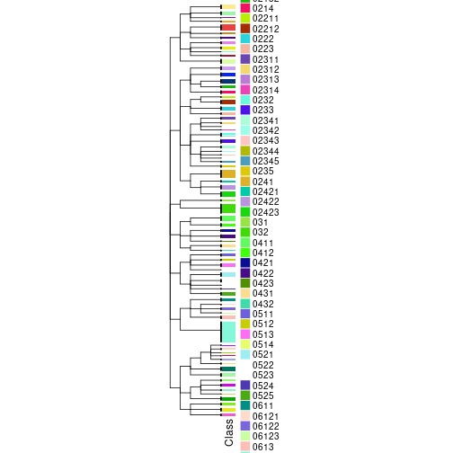</p>

</div>
<div id='tab-collect-classes-from-hierarchical-partition-2'>
<pre><code class="r">collect_classes(res_rh, merge_node = merge_node_param(min_n_signatures = 1063))
</code></pre>

<p>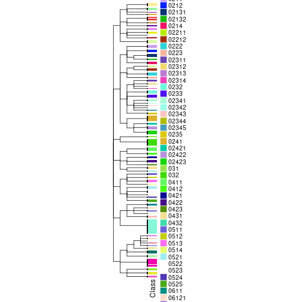</p>

</div>
<div id='tab-collect-classes-from-hierarchical-partition-3'>
<pre><code class="r">collect_classes(res_rh, merge_node = merge_node_param(min_n_signatures = 1256))
</code></pre>

<p>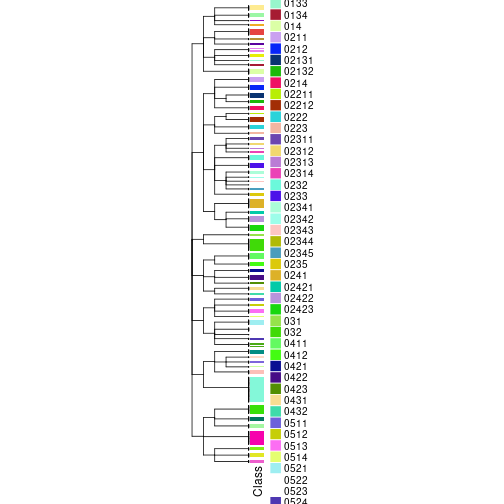</p>

</div>
<div id='tab-collect-classes-from-hierarchical-partition-4'>
<pre><code class="r">collect_classes(res_rh, merge_node = merge_node_param(min_n_signatures = 1325))
</code></pre>

<pre><code>#&gt; Error in lt[[hierarchy[i, 1]]]$AddChildNode({: attempt to apply non-function
</code></pre>

</div>
<div id='tab-collect-classes-from-hierarchical-partition-5'>
<pre><code class="r">collect_classes(res_rh, merge_node = merge_node_param(min_n_signatures = 1393))
</code></pre>

<pre><code>#&gt; Error in lt[[hierarchy[i, 1]]]$AddChildNode({: attempt to apply non-function
</code></pre>

</div>
<div id='tab-collect-classes-from-hierarchical-partition-6'>
<pre><code class="r">collect_classes(res_rh, merge_node = merge_node_param(min_n_signatures = 2507))
</code></pre>

<pre><code>#&gt; Error in lt[[hierarchy[i, 1]]]$AddChildNode({: attempt to apply non-function
</code></pre>

</div>
<div id='tab-collect-classes-from-hierarchical-partition-7'>
<pre><code class="r">collect_classes(res_rh, merge_node = merge_node_param(min_n_signatures = 2667))
</code></pre>

<pre><code>#&gt; Error in lt[[hierarchy[i, 1]]]$AddChildNode({: attempt to apply non-function
</code></pre>

</div>
<div id='tab-collect-classes-from-hierarchical-partition-8'>
<pre><code class="r">collect_classes(res_rh, merge_node = merge_node_param(min_n_signatures = 2814))
</code></pre>

<pre><code>#&gt; Error in lt[[hierarchy[i, 1]]]$AddChildNode({: attempt to apply non-function
</code></pre>

</div>
<div id='tab-collect-classes-from-hierarchical-partition-9'>
<pre><code class="r">collect_classes(res_rh, merge_node = merge_node_param(min_n_signatures = 2908))
</code></pre>

<pre><code>#&gt; Error in lt[[hierarchy[i, 1]]]$AddChildNode({: attempt to apply non-function
</code></pre>

</div>
<div id='tab-collect-classes-from-hierarchical-partition-10'>
<pre><code class="r">collect_classes(res_rh, merge_node = merge_node_param(min_n_signatures = 2922))
</code></pre>

<pre><code>#&gt; Error in lt[[hierarchy[i, 1]]]$AddChildNode({: attempt to apply non-function
</code></pre>

</div>
<div id='tab-collect-classes-from-hierarchical-partition-11'>
<pre><code class="r">collect_classes(res_rh, merge_node = merge_node_param(min_n_signatures = 3090))
</code></pre>

<pre><code>#&gt; Error in lt[[hierarchy[i, 1]]]$AddChildNode({: attempt to apply non-function
</code></pre>

</div>
<div id='tab-collect-classes-from-hierarchical-partition-12'>
<pre><code class="r">collect_classes(res_rh, merge_node = merge_node_param(min_n_signatures = 3223))
</code></pre>

<p></p>

</div>
<div id='tab-collect-classes-from-hierarchical-partition-13'>
<pre><code class="r">collect_classes(res_rh, merge_node = merge_node_param(min_n_signatures = 3229))
</code></pre>

<p>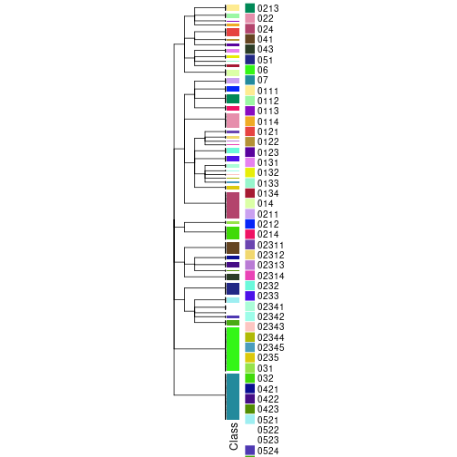</p>

</div>
<div id='tab-collect-classes-from-hierarchical-partition-14'>
<pre><code class="r">collect_classes(res_rh, merge_node = merge_node_param(min_n_signatures = 3363))
</code></pre>

<p></p>

</div>
<div id='tab-collect-classes-from-hierarchical-partition-15'>
<pre><code class="r">collect_classes(res_rh, merge_node = merge_node_param(min_n_signatures = 3829))
</code></pre>

<p>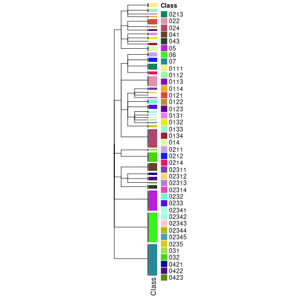</p>

</div>
<div id='tab-collect-classes-from-hierarchical-partition-16'>
<pre><code class="r">collect_classes(res_rh, merge_node = merge_node_param(min_n_signatures = 4160))
</code></pre>

<p></p>

</div>
<div id='tab-collect-classes-from-hierarchical-partition-17'>
<pre><code class="r">collect_classes(res_rh, merge_node = merge_node_param(min_n_signatures = 4655))
</code></pre>

<p>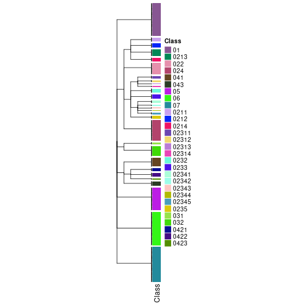</p>

</div>
<div id='tab-collect-classes-from-hierarchical-partition-18'>
<pre><code class="r">collect_classes(res_rh, merge_node = merge_node_param(min_n_signatures = 5122))
</code></pre>

<p></p>

</div>
<div id='tab-collect-classes-from-hierarchical-partition-19'>
<pre><code class="r">collect_classes(res_rh, merge_node = merge_node_param(min_n_signatures = 5220))
</code></pre>

<p></p>

</div>
<div id='tab-collect-classes-from-hierarchical-partition-20'>
<pre><code class="r">collect_classes(res_rh, merge_node = merge_node_param(min_n_signatures = 5315))
</code></pre>

<p></p>

</div>
<div id='tab-collect-classes-from-hierarchical-partition-21'>
<pre><code class="r">collect_classes(res_rh, merge_node = merge_node_param(min_n_signatures = 5593))
</code></pre>

<p>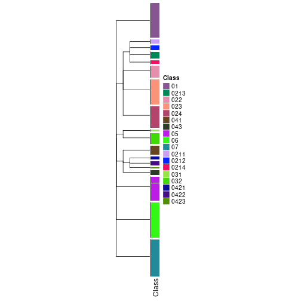</p>

</div>
<div id='tab-collect-classes-from-hierarchical-partition-22'>
<pre><code class="r">collect_classes(res_rh, merge_node = merge_node_param(min_n_signatures = 5955))
</code></pre>

<p>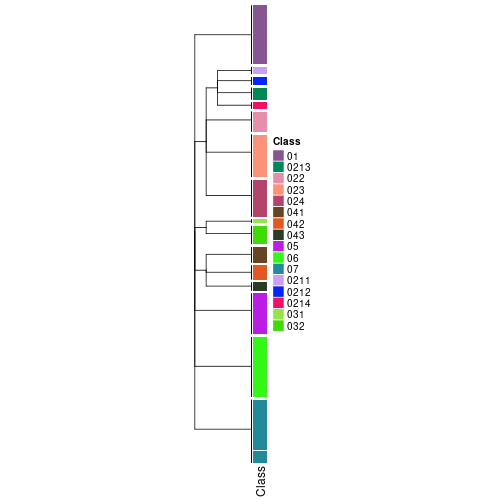</p>

</div>
<div id='tab-collect-classes-from-hierarchical-partition-23'>
<pre><code class="r">collect_classes(res_rh, merge_node = merge_node_param(min_n_signatures = 6049))
</code></pre>

<p></p>

</div>
<div id='tab-collect-classes-from-hierarchical-partition-24'>
<pre><code class="r">collect_classes(res_rh, merge_node = merge_node_param(min_n_signatures = 6247))
</code></pre>

<p>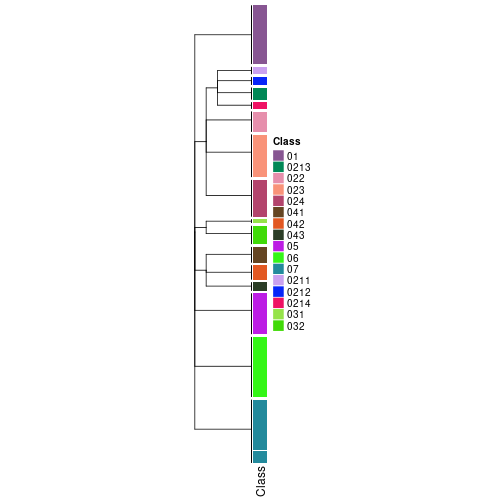</p>

</div>
<div id='tab-collect-classes-from-hierarchical-partition-25'>
<pre><code class="r">collect_classes(res_rh, merge_node = merge_node_param(min_n_signatures = 6744))
</code></pre>

<p></p>

</div>
<div id='tab-collect-classes-from-hierarchical-partition-26'>
<pre><code class="r">collect_classes(res_rh, merge_node = merge_node_param(min_n_signatures = 7180))
</code></pre>

<p>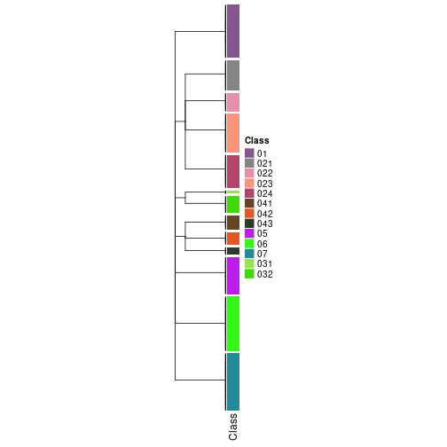</p>

</div>
<div id='tab-collect-classes-from-hierarchical-partition-27'>
<pre><code class="r">collect_classes(res_rh, merge_node = merge_node_param(min_n_signatures = 9072))
</code></pre>

<p></p>

</div>
<div id='tab-collect-classes-from-hierarchical-partition-28'>
<pre><code class="r">collect_classes(res_rh, merge_node = merge_node_param(min_n_signatures = 9538))
</code></pre>

<p>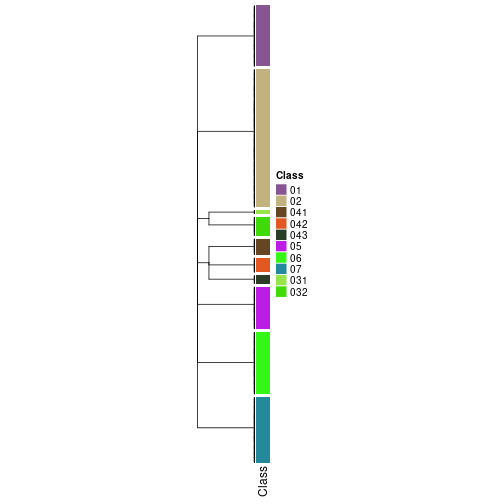</p>

</div>
<div id='tab-collect-classes-from-hierarchical-partition-29'>
<pre><code class="r">collect_classes(res_rh, merge_node = merge_node_param(min_n_signatures = 10893))
</code></pre>

<p></p>

</div>
<div id='tab-collect-classes-from-hierarchical-partition-30'>
<pre><code class="r">collect_classes(res_rh, merge_node = merge_node_param(min_n_signatures = 17308))
</code></pre>

<p></p>

</div>
<div id='tab-collect-classes-from-hierarchical-partition-31'>
<pre><code class="r">collect_classes(res_rh, merge_node = merge_node_param(min_n_signatures = 23556))
</code></pre>

<p>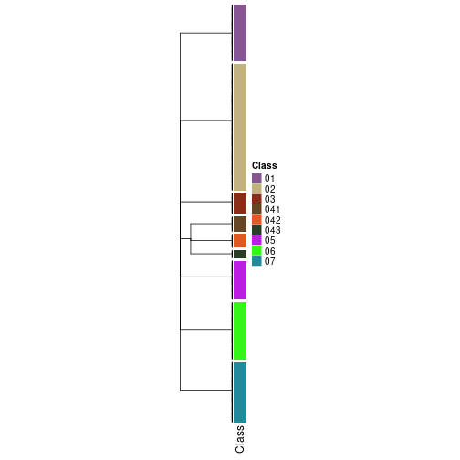</p>

</div>
<div id='tab-collect-classes-from-hierarchical-partition-32'>
<pre><code class="r">collect_classes(res_rh, merge_node = merge_node_param(min_n_signatures = 26140))
</code></pre>

<p>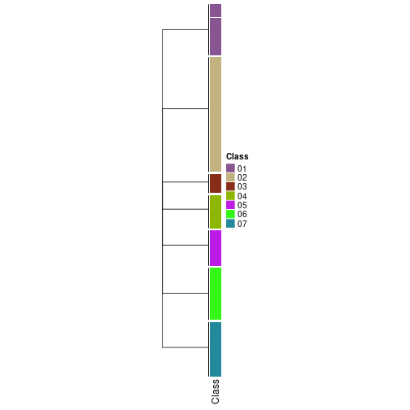</p>

</div>
<div id='tab-collect-classes-from-hierarchical-partition-33'>
<pre><code class="r">collect_classes(res_rh, merge_node = merge_node_param(min_n_signatures = 54725))
</code></pre>

<p></p>

</div>
</div>

Following shows the table of the partitions (You need to click the **show/hide
code output** link to see it).


<script>
$( function() {
	$( '#tabs-get-classes-from-hierarchical-partition' ).tabs();
} );
</script>
<div id='tabs-get-classes-from-hierarchical-partition'>
<ul>
<li><a href='#tab-get-classes-from-hierarchical-partition-1'>n_signatures ≥ 1019</a></li>
<li><a href='#tab-get-classes-from-hierarchical-partition-2'>n_signatures ≥ 1063</a></li>
<li><a href='#tab-get-classes-from-hierarchical-partition-3'>n_signatures ≥ 1256</a></li>
<li><a href='#tab-get-classes-from-hierarchical-partition-4'>n_signatures ≥ 1325</a></li>
<li><a href='#tab-get-classes-from-hierarchical-partition-5'>n_signatures ≥ 1393</a></li>
<li><a href='#tab-get-classes-from-hierarchical-partition-6'>n_signatures ≥ 2507</a></li>
<li><a href='#tab-get-classes-from-hierarchical-partition-7'>n_signatures ≥ 2667</a></li>
<li><a href='#tab-get-classes-from-hierarchical-partition-8'>n_signatures ≥ 2814</a></li>
<li><a href='#tab-get-classes-from-hierarchical-partition-9'>n_signatures ≥ 2908</a></li>
<li><a href='#tab-get-classes-from-hierarchical-partition-10'>n_signatures ≥ 2922</a></li>
<li><a href='#tab-get-classes-from-hierarchical-partition-11'>n_signatures ≥ 3090</a></li>
<li><a href='#tab-get-classes-from-hierarchical-partition-12'>n_signatures ≥ 3223</a></li>
<li><a href='#tab-get-classes-from-hierarchical-partition-13'>n_signatures ≥ 3229</a></li>
<li><a href='#tab-get-classes-from-hierarchical-partition-14'>n_signatures ≥ 3363</a></li>
<li><a href='#tab-get-classes-from-hierarchical-partition-15'>n_signatures ≥ 3829</a></li>
<li><a href='#tab-get-classes-from-hierarchical-partition-16'>n_signatures ≥ 4160</a></li>
<li><a href='#tab-get-classes-from-hierarchical-partition-17'>n_signatures ≥ 4655</a></li>
<li><a href='#tab-get-classes-from-hierarchical-partition-18'>n_signatures ≥ 5122</a></li>
<li><a href='#tab-get-classes-from-hierarchical-partition-19'>n_signatures ≥ 5220</a></li>
<li><a href='#tab-get-classes-from-hierarchical-partition-20'>n_signatures ≥ 5315</a></li>
<li><a href='#tab-get-classes-from-hierarchical-partition-21'>n_signatures ≥ 5593</a></li>
<li><a href='#tab-get-classes-from-hierarchical-partition-22'>n_signatures ≥ 5955</a></li>
<li><a href='#tab-get-classes-from-hierarchical-partition-23'>n_signatures ≥ 6049</a></li>
<li><a href='#tab-get-classes-from-hierarchical-partition-24'>n_signatures ≥ 6247</a></li>
<li><a href='#tab-get-classes-from-hierarchical-partition-25'>n_signatures ≥ 6744</a></li>
<li><a href='#tab-get-classes-from-hierarchical-partition-26'>n_signatures ≥ 7180</a></li>
<li><a href='#tab-get-classes-from-hierarchical-partition-27'>n_signatures ≥ 9072</a></li>
<li><a href='#tab-get-classes-from-hierarchical-partition-28'>n_signatures ≥ 9538</a></li>
<li><a href='#tab-get-classes-from-hierarchical-partition-29'>n_signatures ≥ 10893</a></li>
<li><a href='#tab-get-classes-from-hierarchical-partition-30'>n_signatures ≥ 17308</a></li>
<li><a href='#tab-get-classes-from-hierarchical-partition-31'>n_signatures ≥ 23556</a></li>
<li><a href='#tab-get-classes-from-hierarchical-partition-32'>n_signatures ≥ 26140</a></li>
<li><a href='#tab-get-classes-from-hierarchical-partition-33'>n_signatures ≥ 54725</a></li>
</ul>

<div id='tab-get-classes-from-hierarchical-partition-1'>
<p><a id='tab-get-classes-from-hierarchical-partition-1-a' style='color:#0366d6' href='#'>show/hide code output</a></p>
<pre><code class="r">get_classes(res_rh, merge_node = merge_node_param(min_n_signatures = 1019))
</code></pre>

<pre><code>#&gt; TCGA.44.4112.01 TCGA.NJ.A4YP.01 TCGA.22.4613.01 TCGA.90.7769.01 TCGA.77.A5G1.01 TCGA.86.8278.01 
#&gt;         &quot;02423&quot;          &quot;0241&quot;          &quot;0431&quot;          &quot;0411&quot;          &quot;0733&quot;         &quot;02423&quot; 
#&gt; TCGA.77.A5G3.01 TCGA.62.A470.01 TCGA.44.6778.01 TCGA.49.AARQ.01 TCGA.97.A4M1.01 TCGA.55.6975.01 
#&gt;          &quot;0411&quot;           &quot;032&quot;           &quot;032&quot;         &quot;02423&quot;          &quot;0211&quot;          &quot;0732&quot; 
#&gt; TCGA.99.8033.01 TCGA.43.7656.01 TCGA.85.8481.01 TCGA.56.A4ZK.01 TCGA.77.8156.01 TCGA.43.A475.01 
#&gt;         &quot;02131&quot;         &quot;06122&quot;          &quot;0112&quot;           &quot;062&quot;          &quot;0112&quot;          &quot;0123&quot; 
#&gt; TCGA.69.8255.01 TCGA.69.8453.01 TCGA.97.8552.01 TCGA.53.A4EZ.01 TCGA.58.A46N.01 TCGA.63.A5MW.01 
#&gt;           &quot;032&quot;         &quot;02343&quot;          &quot;0214&quot;          &quot;0235&quot;          &quot;0411&quot;           &quot;062&quot; 
#&gt; TCGA.85.8479.01 TCGA.68.8251.01 TCGA.44.2659.11 TCGA.34.7107.01 TCGA.50.5066.01 TCGA.55.7910.01 
#&gt;           &quot;062&quot;          &quot;0121&quot;          &quot;0511&quot;          &quot;0412&quot;          &quot;0212&quot;        &quot;071113&quot; 
#&gt; TCGA.62.A46U.01 TCGA.MP.A4T8.01 TCGA.78.7539.01 TCGA.39.5040.01 TCGA.63.A5M9.01 TCGA.92.8063.01 
#&gt;         &quot;02422&quot;          &quot;0241&quot;          &quot;0712&quot;          &quot;0732&quot;           &quot;062&quot;          &quot;0121&quot; 
#&gt; TCGA.56.7823.01 TCGA.43.3920.11 TCGA.MP.A4SY.01 TCGA.44.5645.11 TCGA.93.A4JN.01 TCGA.86.A4JF.01 
#&gt;          &quot;0422&quot;          &quot;0524&quot;          &quot;0241&quot;          &quot;0511&quot;          &quot;0241&quot;          &quot;0241&quot; 
#&gt; TCGA.37.A5EM.01 TCGA.63.6202.01 TCGA.98.A53I.01 TCGA.44.7660.01 TCGA.98.8020.01 TCGA.58.8391.01 
#&gt;           &quot;062&quot;          &quot;0241&quot;           &quot;062&quot;          &quot;0113&quot;         &quot;06121&quot;          &quot;0411&quot; 
#&gt; TCGA.85.8580.01 TCGA.86.6851.01 TCGA.34.5232.01 TCGA.39.5031.01 TCGA.62.8398.01 TCGA.J2.A4AG.01 
#&gt;          &quot;0123&quot;          &quot;0713&quot;          &quot;0131&quot;           &quot;062&quot;          &quot;0731&quot;         &quot;02345&quot; 
#&gt; TCGA.92.7340.01 TCGA.85.8287.01 TCGA.56.8622.01 TCGA.22.5471.01 TCGA.85.7950.01 TCGA.85.A4QR.01 
#&gt;          &quot;0122&quot;          &quot;0112&quot;          &quot;0613&quot;           &quot;062&quot;          &quot;0611&quot;          &quot;0422&quot; 
#&gt; TCGA.MP.A4TI.01 TCGA.77.8138.01 TCGA.55.8208.01 TCGA.22.5480.01 TCGA.58.8388.01 TCGA.62.8394.01 
#&gt;          &quot;0241&quot;          &quot;0111&quot;          &quot;0212&quot;           &quot;062&quot;           &quot;062&quot;          &quot;0713&quot; 
#&gt; TCGA.63.7022.01 TCGA.85.8584.01 TCGA.77.8128.01 TCGA.97.8176.01 TCGA.NJ.A4YI.01 TCGA.44.2665.11 
#&gt;          &quot;0132&quot;          &quot;0212&quot;          &quot;0431&quot;          &quot;0731&quot;         &quot;02212&quot;          &quot;0511&quot; 
#&gt; TCGA.85.7699.01 TCGA.33.AAS8.01 TCGA.50.5931.01 TCGA.22.5473.11 TCGA.49.AAR4.01 TCGA.56.8626.01 
#&gt;           &quot;062&quot;           &quot;062&quot;           &quot;062&quot;          &quot;0521&quot;         &quot;02311&quot;           &quot;014&quot; 
#&gt; TCGA.39.5028.11 TCGA.22.4601.01 TCGA.86.8281.01 TCGA.22.5482.11 TCGA.55.6984.01 TCGA.MN.A4N1.01 
#&gt;          &quot;0114&quot;          &quot;0412&quot;         &quot;07211&quot;          &quot;0525&quot;         &quot;02344&quot;          &quot;0223&quot; 
#&gt; TCGA.91.6847.01 TCGA.86.8358.01 TCGA.77.A5G8.01 TCGA.85.8355.01 TCGA.75.6206.01 TCGA.MP.A4TC.01 
#&gt;           &quot;031&quot;         &quot;07212&quot;           &quot;062&quot;          &quot;0111&quot;          &quot;0211&quot;          &quot;0241&quot; 
#&gt; TCGA.78.7149.01 TCGA.49.6744.01 TCGA.91.6831.01 TCGA.L9.A743.01 TCGA.05.4410.01 TCGA.86.7954.01 
#&gt;         &quot;07211&quot;         &quot;02341&quot;          &quot;0732&quot;         &quot;02311&quot;          &quot;0241&quot;        &quot;071112&quot; 
#&gt; TCGA.22.4593.01 TCGA.43.5670.01 TCGA.39.5030.11 TCGA.62.A46Y.01 TCGA.50.6597.01 TCGA.NC.A5HE.01 
#&gt;          &quot;0422&quot;           &quot;062&quot;          &quot;0513&quot;         &quot;02423&quot;         &quot;02423&quot;          &quot;0121&quot; 
#&gt; TCGA.05.4384.01 TCGA.55.6642.01 TCGA.44.6144.01 TCGA.34.5240.01 TCGA.63.5131.01 TCGA.05.4415.01 
#&gt;          &quot;0211&quot;         &quot;07212&quot;           &quot;032&quot;          &quot;0412&quot;          &quot;0423&quot;          &quot;0732&quot; 
#&gt; TCGA.44.A479.01 TCGA.86.7955.01 TCGA.55.8087.01 TCGA.85.A50M.01 TCGA.MP.A4TH.01 TCGA.75.6214.01 
#&gt;        &quot;071115&quot;           &quot;032&quot;          &quot;0211&quot;          &quot;0212&quot;         &quot;02131&quot;          &quot;0133&quot; 
#&gt; TCGA.22.5489.11 TCGA.55.8207.01 TCGA.44.2662.11 TCGA.NC.A5HI.01 TCGA.77.8009.01 TCGA.86.6562.01 
#&gt;          &quot;0525&quot;          &quot;0222&quot;          &quot;0521&quot;         &quot;06121&quot;          &quot;0412&quot;          &quot;0235&quot; 
#&gt; TCGA.43.A56U.01 TCGA.56.8503.01 TCGA.86.8074.01 TCGA.34.5236.01 TCGA.NK.A5D1.01 TCGA.50.5930.11 
#&gt;          &quot;0132&quot;          &quot;0131&quot;          &quot;0235&quot;          &quot;0112&quot;           &quot;062&quot;          &quot;0524&quot; 
#&gt; TCGA.33.6737.01 TCGA.56.7223.01 TCGA.22.5474.11 TCGA.39.5011.01 TCGA.MP.A4SW.01 TCGA.22.5492.11 
#&gt;         &quot;07213&quot;           &quot;031&quot;          &quot;0524&quot;         &quot;02312&quot;          &quot;0241&quot;          &quot;0511&quot; 
#&gt; TCGA.67.6216.01 TCGA.22.5485.11 TCGA.21.5783.01 TCGA.55.8203.01 TCGA.J2.8194.01 TCGA.33.4583.11 
#&gt;         &quot;02423&quot;          &quot;0513&quot;           &quot;062&quot;         &quot;02423&quot;          &quot;0713&quot;          &quot;0525&quot; 
#&gt; TCGA.55.6968.01 TCGA.55.8619.01 TCGA.77.8153.01 TCGA.L3.A4E7.01 TCGA.44.2668.01 TCGA.90.A59Q.01 
#&gt;         &quot;07212&quot;         &quot;02344&quot;          &quot;0431&quot;          &quot;0114&quot;          &quot;0241&quot;          &quot;0134&quot; 
#&gt; TCGA.55.A57B.01 TCGA.55.8507.01 TCGA.94.7557.01 TCGA.55.6971.01 TCGA.49.AAR0.01 TCGA.85.6798.01 
#&gt;          &quot;0713&quot;           &quot;032&quot;         &quot;06123&quot;         &quot;02131&quot;          &quot;0731&quot;           &quot;062&quot; 
#&gt; TCGA.22.5491.11 TCGA.75.7027.01 TCGA.98.7454.01 TCGA.55.8614.01 TCGA.L9.A444.01 TCGA.56.8083.01 
#&gt;          &quot;0525&quot;         &quot;07213&quot;          &quot;0212&quot;           &quot;014&quot;         &quot;02422&quot;          &quot;0423&quot; 
#&gt; TCGA.85.7696.01 TCGA.77.A5G6.01 TCGA.90.A4ED.01 TCGA.56.A4BX.01 TCGA.NC.A5HG.01 TCGA.50.5072.01 
#&gt;           &quot;062&quot;          &quot;0432&quot;          &quot;0613&quot;          &quot;0422&quot;          &quot;0422&quot;          &quot;0732&quot; 
#&gt; TCGA.37.5819.01 TCGA.62.A46V.01 TCGA.55.8512.01 TCGA.77.6843.01 TCGA.77.8130.01 TCGA.34.5928.01 
#&gt;           &quot;032&quot;         &quot;02212&quot;          &quot;0731&quot;           &quot;062&quot;          &quot;0611&quot;           &quot;062&quot; 
#&gt; TCGA.44.A47G.01 TCGA.69.8253.01 TCGA.91.6849.01 TCGA.44.6146.11 TCGA.22.A5C4.01 TCGA.33.A5GW.01 
#&gt;         &quot;02422&quot;          &quot;0232&quot;          &quot;0232&quot;          &quot;0521&quot;           &quot;062&quot;          &quot;0411&quot; 
#&gt; TCGA.94.8035.01 TCGA.50.5944.01 TCGA.94.A5I4.01 TCGA.O2.A5IC.01 TCGA.44.2665.01 TCGA.86.8279.01 
#&gt;         &quot;06123&quot;          &quot;0211&quot;           &quot;062&quot;         &quot;07112&quot;         &quot;02423&quot;         &quot;07211&quot; 
#&gt; TCGA.85.A53L.01 TCGA.63.5128.01 TCGA.63.A5MU.01 TCGA.62.A46P.01 TCGA.98.A53C.01 TCGA.44.2666.01 
#&gt;          &quot;0121&quot;          &quot;0411&quot;          &quot;0422&quot;          &quot;0222&quot;          &quot;0514&quot;          &quot;0241&quot; 
#&gt; TCGA.56.A4ZJ.01 TCGA.55.8096.01 TCGA.44.6148.01 TCGA.55.A494.01 TCGA.44.3917.01 TCGA.97.7547.01 
#&gt;          &quot;0131&quot;        &quot;071112&quot;          &quot;0114&quot;         &quot;02421&quot;          &quot;0712&quot;          &quot;0211&quot; 
#&gt; TCGA.69.8254.01 TCGA.77.8145.01 TCGA.53.7624.01 TCGA.O2.A52W.01 TCGA.43.6771.11 TCGA.75.5125.01 
#&gt;          &quot;0233&quot;          &quot;0613&quot;         &quot;07112&quot;           &quot;062&quot;          &quot;0522&quot;          &quot;0241&quot; 
#&gt; TCGA.63.A5MV.01 TCGA.34.5231.01 TCGA.33.AASD.01 TCGA.77.8140.01 TCGA.69.7973.01 TCGA.22.5478.01 
#&gt;          &quot;0112&quot;          &quot;0422&quot;          &quot;0411&quot;         &quot;06121&quot;          &quot;0211&quot;         &quot;06123&quot; 
#&gt; TCGA.86.8054.01 TCGA.90.7964.01 TCGA.L4.A4E5.01 TCGA.68.8250.01 TCGA.44.6775.01 TCGA.55.7913.01 
#&gt;           &quot;032&quot;           &quot;062&quot;          &quot;0235&quot;           &quot;062&quot;         &quot;02341&quot;        &quot;071115&quot; 
#&gt; TCGA.56.8504.01 TCGA.NC.A5HP.01 TCGA.55.7911.01 TCGA.33.4566.01 TCGA.58.8393.01 TCGA.63.A5MS.01 
#&gt;           &quot;062&quot;          &quot;0412&quot;         &quot;02422&quot;          &quot;0722&quot;          &quot;0123&quot;          &quot;0121&quot; 
#&gt; TCGA.MP.A4T9.01 TCGA.55.6712.01 TCGA.86.7714.01 TCGA.78.8640.01 TCGA.44.7670.01 TCGA.39.5037.01 
#&gt;         &quot;02341&quot;          &quot;0241&quot;          &quot;0232&quot;          &quot;0732&quot;         &quot;07112&quot;          &quot;0431&quot; 
#&gt; TCGA.39.5011.11 TCGA.95.7948.01 TCGA.63.A5MP.01 TCGA.39.5021.11 TCGA.85.8072.01 TCGA.55.A4DG.01 
#&gt;          &quot;0511&quot;         &quot;02421&quot;          &quot;0121&quot;          &quot;0521&quot;           &quot;062&quot;          &quot;0223&quot; 
#&gt; TCGA.34.5929.11 TCGA.55.7816.01 TCGA.77.A5GH.01 TCGA.39.5019.11 TCGA.55.7815.01 TCGA.85.A510.01 
#&gt;          &quot;0511&quot;          &quot;0512&quot;           &quot;014&quot;          &quot;0522&quot;         &quot;02342&quot;           &quot;032&quot; 
#&gt; TCGA.52.7622.01 TCGA.50.6593.11 TCGA.77.7337.01 TCGA.37.A5EN.01 TCGA.77.8148.01 TCGA.18.5592.01 
#&gt;          &quot;0134&quot;          &quot;0512&quot;          &quot;0611&quot;          &quot;0411&quot;          &quot;0421&quot;          &quot;0412&quot; 
#&gt; TCGA.05.5423.01 TCGA.92.7341.01 TCGA.22.4613.11 TCGA.34.A5IX.01 TCGA.56.8623.01 TCGA.63.A5MI.01 
#&gt;          &quot;0233&quot;          &quot;0411&quot;          &quot;0511&quot;          &quot;0121&quot;          &quot;0522&quot;         &quot;06123&quot; 
#&gt; TCGA.44.2656.11 TCGA.85.A4CL.01 TCGA.44.6778.11 TCGA.34.8454.01 TCGA.55.6985.01 TCGA.77.8146.01 
#&gt;          &quot;0522&quot;           &quot;062&quot;          &quot;0522&quot;          &quot;0132&quot;         &quot;02341&quot;           &quot;014&quot; 
#&gt; TCGA.38.4631.11 TCGA.L9.A5IP.01 TCGA.56.7582.01 TCGA.55.8615.01 TCGA.56.8309.01 TCGA.55.7281.01 
#&gt;          &quot;0513&quot;        &quot;071111&quot;          &quot;0412&quot;         &quot;07214&quot;          &quot;0111&quot;         &quot;02423&quot; 
#&gt; TCGA.93.7347.01 TCGA.MP.A4TF.01 TCGA.44.6777.01 TCGA.62.A471.01 TCGA.49.4490.01 TCGA.97.8177.01 
#&gt;         &quot;02341&quot;          &quot;0713&quot;         &quot;02345&quot;          &quot;0732&quot;        &quot;071112&quot;         &quot;02131&quot; 
#&gt; TCGA.63.7021.01 TCGA.99.7458.01 TCGA.85.8352.01 TCGA.85.7698.01 TCGA.77.8139.01 TCGA.39.5019.01 
#&gt;          &quot;0111&quot;          &quot;0233&quot;           &quot;031&quot;           &quot;062&quot;         &quot;06122&quot;           &quot;062&quot; 
#&gt; TCGA.64.5775.01 TCGA.91.A4BD.01 TCGA.38.6178.01 TCGA.44.A47B.01 TCGA.22.4599.01 TCGA.85.8052.01 
#&gt;           &quot;032&quot;          &quot;0214&quot;         &quot;02423&quot;          &quot;0222&quot;           &quot;062&quot;           &quot;062&quot; 
#&gt; TCGA.55.6979.01 TCGA.55.7573.01 TCGA.55.8097.01 TCGA.05.5429.01 TCGA.77.7142.01 TCGA.93.A4JP.01 
#&gt;          &quot;0212&quot;          &quot;0214&quot;          &quot;0211&quot;          &quot;0222&quot;           &quot;062&quot;         &quot;02132&quot; 
#&gt; TCGA.NC.A5HK.01 TCGA.05.5425.01 TCGA.S2.AA1A.01 TCGA.93.A4JQ.01 TCGA.78.7160.01 TCGA.50.5946.02 
#&gt;         &quot;07112&quot;         &quot;07213&quot;         &quot;02131&quot;          &quot;0212&quot;         &quot;02132&quot;           &quot;032&quot; 
#&gt; TCGA.58.8387.01 TCGA.43.7658.01 TCGA.96.A4JK.01 TCGA.50.5066.02 TCGA.33.4579.11 TCGA.43.6143.01 
#&gt;          &quot;0112&quot;           &quot;031&quot;           &quot;062&quot;         &quot;07213&quot;          &quot;0511&quot;          &quot;0423&quot; 
#&gt; TCGA.56.8305.01 TCGA.55.8092.01 TCGA.75.6207.01 TCGA.75.5122.01 TCGA.97.7938.01 TCGA.49.AARE.01 
#&gt;           &quot;062&quot;          &quot;0722&quot;          &quot;0722&quot;          &quot;0241&quot;          &quot;0232&quot;          &quot;0713&quot; 
#&gt; TCGA.44.7671.01 TCGA.55.7726.01 TCGA.50.5055.01 TCGA.85.6560.01 TCGA.98.8022.01 TCGA.91.8496.01 
#&gt;          &quot;0211&quot;          &quot;0134&quot;          &quot;0212&quot;         &quot;02313&quot;          &quot;0613&quot;          &quot;0211&quot; 
#&gt; TCGA.43.5668.01 TCGA.21.5786.01 TCGA.MP.A4T2.01 TCGA.62.A46R.01 TCGA.34.8456.01 TCGA.69.7764.01 
#&gt;          &quot;0732&quot;           &quot;062&quot;          &quot;0214&quot;         &quot;02211&quot;          &quot;0431&quot;         &quot;07211&quot; 
#&gt; TCGA.91.6840.01 TCGA.95.7043.01 TCGA.L9.A443.01 TCGA.86.7701.01 TCGA.56.7222.01 TCGA.52.7812.01 
#&gt;        &quot;071114&quot;          &quot;0713&quot;         &quot;02423&quot;          &quot;0241&quot;          &quot;0422&quot;          &quot;0241&quot; 
#&gt; TCGA.94.8490.01 TCGA.73.4676.01 TCGA.55.8514.01 TCGA.78.7162.01 TCGA.L9.A50W.01 TCGA.39.5028.01 
#&gt;          &quot;0411&quot;          &quot;0722&quot;           &quot;032&quot;          &quot;0214&quot;          &quot;0232&quot;          &quot;0111&quot; 
#&gt; TCGA.50.8460.01 TCGA.55.8505.01 TCGA.86.A4P8.01 TCGA.67.6217.01 TCGA.22.5482.01 TCGA.33.4586.11 
#&gt;          &quot;0233&quot;          &quot;0732&quot;          &quot;0512&quot;          &quot;0233&quot;          &quot;0411&quot;          &quot;0521&quot; 
#&gt; TCGA.78.7535.01 TCGA.93.7348.01 TCGA.86.8671.01 TCGA.21.5782.01 TCGA.39.5039.11 TCGA.50.6592.01 
#&gt;          &quot;0223&quot;         &quot;02131&quot;         &quot;02312&quot;          &quot;0613&quot;          &quot;0521&quot;         &quot;02314&quot; 
#&gt; TCGA.97.7546.01 TCGA.44.7661.01 TCGA.95.7944.01 TCGA.38.4632.11 TCGA.77.8008.01 TCGA.97.A4M0.01 
#&gt;          &quot;0214&quot;         &quot;02312&quot;          &quot;0212&quot;          &quot;0522&quot;          &quot;0112&quot;         &quot;02212&quot; 
#&gt; TCGA.50.5933.01 TCGA.86.8280.01 TCGA.22.4609.01 TCGA.78.8660.01 TCGA.43.8115.01 TCGA.44.2655.11 
#&gt;          &quot;0223&quot;          &quot;0214&quot;           &quot;014&quot;          &quot;0241&quot;          &quot;0123&quot;          &quot;0511&quot; 
#&gt; TCGA.39.5016.01 TCGA.55.7907.01 TCGA.49.6767.01 TCGA.MP.A4TK.01 TCGA.33.4582.11 TCGA.78.7155.01 
#&gt;           &quot;062&quot;          &quot;0223&quot;         &quot;02314&quot;         &quot;02422&quot;          &quot;0525&quot;           &quot;032&quot; 
#&gt; TCGA.85.A4CN.01 TCGA.56.A5DS.01 TCGA.69.7761.01 TCGA.91.6835.01 TCGA.O2.A52N.01 TCGA.78.7540.01 
#&gt;           &quot;062&quot;          &quot;0132&quot;         &quot;02311&quot;         &quot;02345&quot;           &quot;062&quot;         &quot;02421&quot; 
#&gt; TCGA.50.5939.11 TCGA.95.A4VN.01 TCGA.46.6026.01 TCGA.85.7710.01 TCGA.44.A47F.01 TCGA.55.A48Z.01 
#&gt;          &quot;0525&quot;         &quot;02345&quot;          &quot;0422&quot;          &quot;0412&quot;          &quot;0233&quot;         &quot;02131&quot; 
#&gt; TCGA.85.8664.01 TCGA.69.7763.01 TCGA.34.5241.01 TCGA.43.A474.01 TCGA.96.A4JL.01 TCGA.NC.A5HO.01 
#&gt;           &quot;062&quot;          &quot;0241&quot;          &quot;0111&quot;          &quot;0422&quot;          &quot;0122&quot;           &quot;062&quot; 
#&gt; TCGA.J2.A4AE.01 TCGA.75.6203.01 TCGA.77.8133.01 TCGA.50.5942.01 TCGA.22.5473.01 TCGA.33.AASI.01 
#&gt;         &quot;02423&quot;          &quot;0512&quot;           &quot;062&quot;          &quot;0232&quot;          &quot;0411&quot;           &quot;014&quot; 
#&gt; TCGA.98.A53B.01 TCGA.50.6590.01 TCGA.18.4721.11 TCGA.78.7148.01 TCGA.80.5608.01 TCGA.43.6647.01 
#&gt;          &quot;0613&quot;         &quot;02422&quot;          &quot;0521&quot;          &quot;0731&quot;          &quot;0233&quot;          &quot;0131&quot; 
#&gt; TCGA.55.8205.01 TCGA.55.8511.01 TCGA.77.A5GA.01 TCGA.56.6546.01 TCGA.44.7669.01 TCGA.85.7697.01 
#&gt;          &quot;0712&quot;         &quot;02211&quot;          &quot;0121&quot;          &quot;0112&quot;           &quot;032&quot;          &quot;0111&quot; 
#&gt; TCGA.50.6594.11 TCGA.56.5898.01 TCGA.99.8025.01 TCGA.77.6842.01 TCGA.34.8455.01 TCGA.43.A56V.01 
#&gt;          &quot;0513&quot;           &quot;062&quot;         &quot;02211&quot;          &quot;0113&quot;          &quot;0611&quot;         &quot;06122&quot; 
#&gt; TCGA.55.7283.01 TCGA.91.6830.01 TCGA.77.8154.01 TCGA.49.4488.11 TCGA.MN.A4N4.01 TCGA.22.5477.11 
#&gt;         &quot;02212&quot;        &quot;071112&quot;          &quot;0422&quot;          &quot;0512&quot;         &quot;07213&quot;          &quot;0521&quot; 
#&gt; TCGA.85.A4QQ.01 TCGA.55.A491.01 TCGA.22.5491.01 TCGA.39.5022.01 TCGA.63.A5MR.01 TCGA.44.8120.01 
#&gt;           &quot;062&quot;          &quot;0235&quot;          &quot;0432&quot;          &quot;0733&quot;          &quot;0134&quot;          &quot;0722&quot; 
#&gt; TCGA.77.7139.01 TCGA.MN.A4N5.01 TCGA.37.A5EL.01 TCGA.39.5036.01 TCGA.58.8392.01 TCGA.73.A9RS.01 
#&gt;          &quot;0422&quot;          &quot;0241&quot;           &quot;062&quot;           &quot;062&quot;          &quot;0431&quot;          &quot;0722&quot; 
#&gt; TCGA.69.7978.01 TCGA.55.8299.01 TCGA.22.5479.01 TCGA.44.8117.01 TCGA.MP.A4TD.01 TCGA.49.AAR2.01 
#&gt;          &quot;0241&quot;          &quot;0212&quot;           &quot;062&quot;         &quot;02211&quot;          &quot;0241&quot;           &quot;032&quot; 
#&gt; TCGA.05.4405.01 TCGA.70.6722.01 TCGA.39.5035.11 TCGA.83.5908.01 TCGA.55.6980.01 TCGA.44.6146.01 
#&gt;         &quot;02212&quot;          &quot;0733&quot;          &quot;0513&quot;         &quot;02422&quot;         &quot;02132&quot;          &quot;0232&quot; 
#&gt; TCGA.58.A46K.01 TCGA.94.A5I6.01 TCGA.69.7979.01 TCGA.56.A4BY.01 TCGA.85.8049.01 TCGA.95.7039.01 
#&gt;           &quot;062&quot;          &quot;0121&quot;          &quot;0712&quot;           &quot;062&quot;          &quot;0121&quot;          &quot;0712&quot; 
#&gt; TCGA.18.3417.01 TCGA.62.8397.01 TCGA.56.8201.01 TCGA.44.6145.11 TCGA.91.6848.01 TCGA.63.7023.01 
#&gt;           &quot;062&quot;          &quot;0211&quot;           &quot;014&quot;          &quot;0513&quot;          &quot;0732&quot;          &quot;0432&quot; 
#&gt; TCGA.97.7552.01 TCGA.50.5936.01 TCGA.33.6738.01 TCGA.91.7771.01 TCGA.18.5595.11 TCGA.56.A4BW.01 
#&gt;         &quot;02343&quot;         &quot;02132&quot;          &quot;0732&quot;          &quot;0233&quot;          &quot;0524&quot;           &quot;062&quot; 
#&gt; TCGA.56.8308.01 TCGA.NJ.A4YG.01 TCGA.86.8359.01 TCGA.55.8301.01 TCGA.43.6773.01 TCGA.78.7146.01 
#&gt;           &quot;062&quot;          &quot;0241&quot;          &quot;0235&quot;         &quot;02342&quot;          &quot;0733&quot;          &quot;0712&quot; 
#&gt; TCGA.44.3918.01 TCGA.50.5935.11 TCGA.63.7020.01 TCGA.33.AASJ.01 TCGA.85.8353.01 TCGA.49.6743.01 
#&gt;         &quot;02422&quot;          &quot;0513&quot;          &quot;0613&quot;          &quot;0412&quot;          &quot;0121&quot;        &quot;071111&quot; 
#&gt; TCGA.22.5478.11 TCGA.55.8621.01 TCGA.78.7161.01 TCGA.85.8070.01 TCGA.NC.A5HQ.01 TCGA.49.6745.11 
#&gt;          &quot;0521&quot;         &quot;02131&quot;          &quot;0712&quot;          &quot;0431&quot;           &quot;062&quot;          &quot;0525&quot; 
#&gt; TCGA.96.7545.01 TCGA.44.A4SU.01 TCGA.97.7937.01 TCGA.49.AARR.01 TCGA.05.5428.01 TCGA.98.A53A.01 
#&gt;          &quot;0121&quot;        &quot;071112&quot;          &quot;0722&quot;          &quot;0522&quot;          &quot;0722&quot;          &quot;0432&quot; 
#&gt; TCGA.49.6745.01 TCGA.85.8276.01 TCGA.64.5774.01 TCGA.44.A4SS.01 TCGA.55.8089.01 TCGA.55.8094.01 
#&gt;          &quot;0222&quot;          &quot;0121&quot;           &quot;032&quot;          &quot;0212&quot;         &quot;02311&quot;           &quot;032&quot; 
#&gt; TCGA.LA.A446.01 TCGA.NC.A5HT.01 TCGA.58.8386.01 TCGA.77.A5GF.01 TCGA.NJ.A4YQ.01 TCGA.55.7574.01 
#&gt;           &quot;062&quot;          &quot;0422&quot;           &quot;014&quot;           &quot;062&quot;         &quot;02314&quot;         &quot;02422&quot; 
#&gt; TCGA.56.7731.01 TCGA.56.8304.01 TCGA.22.5481.01 TCGA.63.A5MN.01 TCGA.50.8459.01 TCGA.NC.A5HR.01 
#&gt;          &quot;0131&quot;         &quot;06121&quot;           &quot;031&quot;          &quot;0212&quot;         &quot;02343&quot;           &quot;062&quot; 
#&gt; TCGA.96.8169.01 TCGA.18.5592.11 TCGA.33.4589.01 TCGA.78.8648.01 TCGA.L9.A8F4.01 TCGA.91.A4BC.01 
#&gt;          &quot;0133&quot;          &quot;0525&quot;          &quot;0134&quot;          &quot;0212&quot;        &quot;071115&quot;         &quot;07212&quot; 
#&gt; TCGA.NC.A5HJ.01 TCGA.44.2656.01 TCGA.J2.A4AD.01 TCGA.85.A4PA.01 TCGA.86.8673.01 TCGA.73.7499.01 
#&gt;         &quot;02132&quot;          &quot;0241&quot;        &quot;071111&quot;          &quot;0523&quot;          &quot;0222&quot;          &quot;0235&quot; 
#&gt; TCGA.98.8023.01 TCGA.97.A4LX.01 TCGA.56.8625.01 TCGA.43.6770.01 TCGA.60.2703.01 TCGA.77.A5GB.01 
#&gt;          &quot;0112&quot;          &quot;0212&quot;          &quot;0123&quot;          &quot;0431&quot;          &quot;0112&quot;          &quot;0114&quot; 
#&gt; TCGA.38.4631.01 TCGA.39.5029.01 TCGA.99.AA5R.01 TCGA.05.4390.01 TCGA.MP.A4T7.01 TCGA.69.7765.01 
#&gt;         &quot;07112&quot;         &quot;06122&quot;          &quot;0512&quot;          &quot;0712&quot;          &quot;0233&quot;          &quot;0222&quot; 
#&gt; TCGA.95.8494.01 TCGA.90.A4EE.01 TCGA.97.8171.01 TCGA.34.5929.01 TCGA.50.8457.01 TCGA.55.6972.01 
#&gt;          &quot;0222&quot;          &quot;0121&quot;          &quot;0232&quot;          &quot;0423&quot;          &quot;0233&quot;          &quot;0731&quot; 
#&gt; TCGA.97.A4M5.01 TCGA.53.7626.01 TCGA.44.5645.01 TCGA.22.5483.01 TCGA.56.8629.01 TCGA.63.A5MG.01 
#&gt;         &quot;02132&quot;         &quot;02341&quot;          &quot;0214&quot;           &quot;031&quot;           &quot;062&quot;          &quot;0122&quot; 
#&gt; TCGA.78.7158.01 TCGA.86.8056.01 TCGA.69.7980.01 TCGA.77.7140.01 TCGA.77.7465.01 TCGA.94.8491.01 
#&gt;         &quot;02421&quot;         &quot;02423&quot;          &quot;0235&quot;          &quot;0431&quot;          &quot;0611&quot;          &quot;0122&quot; 
#&gt; TCGA.43.7657.01 TCGA.85.A4JC.01 TCGA.NC.A5HF.01 TCGA.05.4433.01 TCGA.50.5932.01 TCGA.63.A5MB.01 
#&gt;           &quot;062&quot;          &quot;0111&quot;          &quot;0421&quot;         &quot;07213&quot;         &quot;07211&quot;          &quot;0412&quot; 
#&gt; TCGA.97.8175.01 TCGA.50.7109.01 TCGA.86.8668.01 TCGA.MP.A4T4.01 TCGA.44.A47A.01 TCGA.73.4676.11 
#&gt;         &quot;02423&quot;         &quot;07212&quot;          &quot;0233&quot;         &quot;02312&quot;         &quot;02212&quot;          &quot;0522&quot; 
#&gt; TCGA.NJ.A55O.01 TCGA.55.8508.01 TCGA.71.6725.01 TCGA.33.4579.01 TCGA.77.7138.01 TCGA.68.A59I.01 
#&gt;          &quot;0214&quot;          &quot;0713&quot;          &quot;0712&quot;          &quot;0611&quot;          &quot;0114&quot;          &quot;0132&quot; 
#&gt; TCGA.93.A4JO.01 TCGA.44.6145.01 TCGA.97.8547.01 TCGA.44.6147.01 TCGA.77.8131.01 TCGA.94.A4VJ.01 
#&gt;         &quot;02311&quot;          &quot;0212&quot;         &quot;02423&quot;         &quot;02423&quot;          &quot;0111&quot;           &quot;062&quot; 
#&gt; TCGA.56.A5DR.01 TCGA.86.8075.01 TCGA.34.5927.01 TCGA.60.2697.01 TCGA.85.7844.01 TCGA.68.7756.01 
#&gt;         &quot;06122&quot;        &quot;071112&quot;          &quot;0423&quot;          &quot;0523&quot;           &quot;062&quot;           &quot;014&quot; 
#&gt; TCGA.43.5668.11 TCGA.78.7633.01 TCGA.75.6211.01 TCGA.77.8007.01 TCGA.55.8510.01 TCGA.49.AARO.01 
#&gt;          &quot;0521&quot;         &quot;07211&quot;           &quot;032&quot;          &quot;0241&quot;         &quot;02345&quot;         &quot;02312&quot; 
#&gt; TCGA.98.8021.01 TCGA.55.8090.01 TCGA.86.8073.01 TCGA.58.A46J.01 TCGA.91.6828.01 TCGA.49.4514.01 
#&gt;           &quot;062&quot;          &quot;0222&quot;          &quot;0241&quot;          &quot;0112&quot;          &quot;0241&quot;        &quot;071115&quot; 
#&gt; TCGA.22.5472.01 TCGA.NC.A5HN.01 TCGA.34.5239.01 TCGA.05.4396.01 TCGA.75.5147.01 TCGA.92.8064.01 
#&gt;          &quot;0611&quot;          &quot;0422&quot;          &quot;0611&quot;          &quot;0722&quot;         &quot;07112&quot;          &quot;0121&quot; 
#&gt; TCGA.85.A50Z.01 TCGA.77.7463.01 TCGA.55.8204.01 TCGA.86.7711.01 TCGA.44.5643.01 TCGA.O2.A52V.01 
#&gt;          &quot;0111&quot;         &quot;06122&quot;          &quot;0131&quot;          &quot;0733&quot;           &quot;062&quot;          &quot;0123&quot; 
#&gt; TCGA.L4.A4E6.01 TCGA.86.8076.01 TCGA.97.A4M6.01 TCGA.33.4586.01 TCGA.85.6175.01 TCGA.75.7031.01 
#&gt;          &quot;0524&quot;         &quot;02343&quot;         &quot;02131&quot;           &quot;062&quot;          &quot;0131&quot;           &quot;032&quot; 
#&gt; TCGA.39.5039.01 TCGA.39.5024.01 TCGA.50.5044.01 TCGA.64.5781.01 TCGA.73.4658.11 TCGA.52.7810.01 
#&gt;          &quot;0111&quot;          &quot;0132&quot;         &quot;02341&quot;         &quot;02314&quot;          &quot;0512&quot;          &quot;0611&quot; 
#&gt; TCGA.44.8119.01 TCGA.05.5420.01 TCGA.43.3394.11 TCGA.NJ.A4YF.01 TCGA.38.7271.01 TCGA.49.AAR3.01 
#&gt;           &quot;032&quot;          &quot;0733&quot;          &quot;0525&quot;          &quot;0235&quot;         &quot;02422&quot;         &quot;02311&quot; 
#&gt; TCGA.90.7767.01 TCGA.78.7154.01 TCGA.39.5016.11 TCGA.90.6837.01 TCGA.77.8150.01 TCGA.MP.A4TJ.01 
#&gt;           &quot;062&quot;          &quot;0722&quot;          &quot;0522&quot;          &quot;0525&quot;          &quot;0431&quot;         &quot;02131&quot; 
#&gt; TCGA.33.4582.01 TCGA.69.7760.01 TCGA.55.A4DF.01 TCGA.44.7667.01 TCGA.44.6148.11 TCGA.49.4512.01 
#&gt;           &quot;062&quot;          &quot;0232&quot;           &quot;032&quot;          &quot;0713&quot;          &quot;0525&quot;          &quot;0233&quot; 
#&gt; TCGA.50.5939.01 TCGA.33.A4WN.01 TCGA.18.5595.01 TCGA.O1.A52J.01 TCGA.50.6592.11 TCGA.78.7167.01 
#&gt;          &quot;0212&quot;          &quot;0121&quot;          &quot;0432&quot;        &quot;071114&quot;          &quot;0513&quot;         &quot;07211&quot; 
#&gt; TCGA.78.8662.01 TCGA.05.4427.01 TCGA.78.7143.01 TCGA.97.A4M3.01 TCGA.NK.A5CT.01 TCGA.78.7220.01 
#&gt;           &quot;032&quot;          &quot;0712&quot;         &quot;02421&quot;          &quot;0232&quot;           &quot;014&quot;           &quot;032&quot; 
#&gt; TCGA.86.8585.01 TCGA.75.6205.01 TCGA.99.8028.01 TCGA.55.7903.01 TCGA.49.4487.01 TCGA.50.5933.11 
#&gt;          &quot;0733&quot;         &quot;02422&quot;         &quot;02312&quot;          &quot;0222&quot;          &quot;0212&quot;          &quot;0521&quot; 
#&gt; TCGA.55.A493.01 TCGA.78.7147.01 TCGA.44.5644.01 TCGA.75.5126.01 TCGA.85.8288.01 TCGA.50.6591.01 
#&gt;         &quot;02422&quot;          &quot;0712&quot;           &quot;032&quot;         &quot;02422&quot;          &quot;0611&quot;           &quot;031&quot; 
#&gt; TCGA.55.8085.01 TCGA.55.8206.01 TCGA.97.7553.01 TCGA.MP.A4TE.01 TCGA.78.7542.01 TCGA.79.5596.01 
#&gt;         &quot;07211&quot;          &quot;0214&quot;         &quot;02131&quot;         &quot;07212&quot;          &quot;0722&quot;          &quot;0421&quot; 
#&gt; TCGA.18.4721.01 TCGA.85.8351.01 TCGA.85.7843.01 TCGA.60.2709.01 TCGA.NJ.A7XG.01 TCGA.55.A48X.01 
#&gt;          &quot;0121&quot;           &quot;014&quot;           &quot;062&quot;          &quot;0121&quot;          &quot;0232&quot;         &quot;02345&quot; 
#&gt; TCGA.98.A53D.01 TCGA.85.8666.01 TCGA.94.7943.01 TCGA.64.5778.01 TCGA.49.AAR9.01 TCGA.50.6594.01 
#&gt;          &quot;0524&quot;          &quot;0121&quot;           &quot;014&quot;          &quot;0214&quot;          &quot;0732&quot;          &quot;0233&quot; 
#&gt; TCGA.NK.A5CX.01 TCGA.44.2668.11 TCGA.95.A4VK.01 TCGA.78.7153.01 TCGA.56.7221.01 TCGA.49.4488.01 
#&gt;           &quot;014&quot;          &quot;0522&quot;          &quot;0713&quot;         &quot;02212&quot;         &quot;06122&quot;          &quot;0712&quot; 
#&gt; TCGA.63.A5ML.01 TCGA.55.7728.01 TCGA.22.5477.01 TCGA.98.A538.01 TCGA.55.7994.01 TCGA.67.6215.01 
#&gt;          &quot;0412&quot;         &quot;02131&quot;          &quot;0412&quot;         &quot;06122&quot;          &quot;0722&quot;         &quot;02421&quot; 
#&gt; TCGA.85.8071.01 TCGA.78.7537.01 TCGA.39.5034.11 TCGA.98.A53H.01 TCGA.55.6982.01 TCGA.XC.AA0X.01 
#&gt;          &quot;0422&quot;          &quot;0232&quot;          &quot;0513&quot;          &quot;0514&quot;         &quot;02423&quot;          &quot;0132&quot; 
#&gt; TCGA.L9.A7SV.01 TCGA.39.5036.11 TCGA.98.A53J.01 TCGA.85.8277.01 TCGA.MP.A5C7.01 TCGA.05.4424.01 
#&gt;           &quot;032&quot;          &quot;0521&quot;           &quot;062&quot;           &quot;062&quot;          &quot;0713&quot;          &quot;0733&quot; 
#&gt; TCGA.77.8143.01 TCGA.55.7227.01 TCGA.85.6561.01 TCGA.77.6845.01 TCGA.56.7730.01 TCGA.86.A456.01 
#&gt;          &quot;0421&quot;          &quot;0222&quot;          &quot;0121&quot;          &quot;0411&quot;          &quot;0411&quot;         &quot;02212&quot; 
#&gt; TCGA.39.5035.01 TCGA.56.7579.01 TCGA.22.4599.11 TCGA.58.A46M.01 TCGA.77.7338.01 TCGA.80.5611.01 
#&gt;          &quot;0611&quot;          &quot;0421&quot;          &quot;0513&quot;           &quot;062&quot;           &quot;062&quot;           &quot;032&quot; 
#&gt; TCGA.44.6774.01 TCGA.85.8582.01 TCGA.49.AAQV.01 TCGA.39.5031.11 TCGA.49.6742.01 TCGA.63.A5MH.01 
#&gt;         &quot;02131&quot;           &quot;014&quot;         &quot;02131&quot;          &quot;0513&quot;           &quot;032&quot;          &quot;0432&quot; 
#&gt; TCGA.51.6867.01 TCGA.73.7498.01 TCGA.34.5234.01 TCGA.38.4632.01 TCGA.69.7974.01 TCGA.63.A5MJ.01 
#&gt;           &quot;062&quot;          &quot;0211&quot;          &quot;0131&quot;          &quot;0223&quot;         &quot;02212&quot;           &quot;062&quot; 
#&gt; TCGA.55.6986.01 TCGA.50.5936.11 TCGA.4B.A93V.01 TCGA.22.4605.01 TCGA.22.5471.11 TCGA.49.6761.01 
#&gt;         &quot;02423&quot;          &quot;0521&quot;        &quot;071113&quot;          &quot;0134&quot;          &quot;0525&quot;         &quot;02422&quot; 
#&gt; TCGA.MP.A4T6.01 TCGA.56.8624.01 TCGA.94.7033.01 TCGA.86.A4D0.01 TCGA.62.A46O.01 TCGA.44.6779.01 
#&gt;         &quot;02421&quot;          &quot;0114&quot;           &quot;014&quot;         &quot;07212&quot;           &quot;032&quot;         &quot;02422&quot; 
#&gt; TCGA.78.7159.01 TCGA.86.A4P7.01 TCGA.50.5932.11 TCGA.73.4658.01 TCGA.22.5480.11 TCGA.85.A513.01 
#&gt;          &quot;0712&quot;         &quot;02422&quot;          &quot;0521&quot;         &quot;02422&quot;          &quot;0513&quot;         &quot;02341&quot; 
#&gt; TCGA.60.2704.01 TCGA.63.A5MT.01 TCGA.99.8032.01 TCGA.50.5935.01 TCGA.55.7727.01 TCGA.55.6981.01 
#&gt;          &quot;0111&quot;           &quot;014&quot;         &quot;07212&quot;          &quot;0232&quot;          &quot;0222&quot;         &quot;02345&quot; 
#&gt; TCGA.55.7724.01 TCGA.78.8655.01 TCGA.78.7163.01 TCGA.97.7941.01 TCGA.MP.A4TA.01 TCGA.56.7822.01 
#&gt;          &quot;0132&quot;         &quot;02212&quot;          &quot;0211&quot;          &quot;0233&quot;        &quot;071115&quot;          &quot;0613&quot; 
#&gt; TCGA.56.A62T.01 TCGA.75.5146.01 TCGA.50.5931.11 TCGA.55.7914.01 TCGA.22.4601.11 TCGA.75.7030.01 
#&gt;           &quot;062&quot;          &quot;0731&quot;          &quot;0513&quot;         &quot;02212&quot;          &quot;0513&quot;         &quot;02132&quot; 
#&gt; TCGA.85.A4JB.01 TCGA.56.A49D.01 TCGA.62.A472.01 TCGA.64.5779.01 TCGA.05.4417.01 TCGA.67.4679.01 
#&gt;          &quot;0112&quot;         &quot;06122&quot;          &quot;0222&quot;         &quot;07212&quot;         &quot;02423&quot;          &quot;0232&quot; 
#&gt; TCGA.39.5034.01 TCGA.55.8620.01 TCGA.55.7570.01 TCGA.50.6673.01 TCGA.77.A5FZ.01 TCGA.97.7554.01 
#&gt;           &quot;032&quot;           &quot;032&quot;           &quot;032&quot;          &quot;0713&quot;          &quot;0523&quot;         &quot;02211&quot; 
#&gt; TCGA.33.4589.11 TCGA.39.5030.01 TCGA.58.8390.01 TCGA.75.7025.01 TCGA.18.3417.11 TCGA.55.5899.01 
#&gt;          &quot;0511&quot;          &quot;0132&quot;          &quot;0421&quot;          &quot;0214&quot;          &quot;0522&quot;           &quot;032&quot; 
#&gt; TCGA.95.8039.01 TCGA.44.6144.11 TCGA.43.8118.01 TCGA.50.5941.01 TCGA.62.8399.01 TCGA.95.7562.01 
#&gt;          &quot;0241&quot;          &quot;0521&quot;          &quot;0134&quot;         &quot;02341&quot;           &quot;032&quot;          &quot;0722&quot; 
#&gt; TCGA.68.7757.01 TCGA.97.8174.01 TCGA.55.7576.01 TCGA.55.7725.01 TCGA.38.A44F.01 TCGA.39.5029.11 
#&gt;           &quot;014&quot;          &quot;0233&quot;          &quot;0223&quot;          &quot;0232&quot;         &quot;02132&quot;          &quot;0525&quot; 
#&gt; TCGA.80.5607.01 TCGA.55.8091.01 TCGA.62.8395.01 TCGA.92.8065.01 TCGA.86.8672.01 TCGA.64.5815.01 
#&gt;         &quot;02423&quot;          &quot;0214&quot;         &quot;02421&quot;          &quot;0123&quot;          &quot;0241&quot;          &quot;0241&quot; 
#&gt; TCGA.75.6212.01 TCGA.52.7811.01 TCGA.50.5930.01 TCGA.77.8136.01 TCGA.22.5474.01 TCGA.68.A59J.01 
#&gt;          &quot;0214&quot;          &quot;0112&quot;          &quot;0733&quot;          &quot;0134&quot;           &quot;062&quot;           &quot;062&quot; 
#&gt; TCGA.33.4587.01 TCGA.39.5027.01 TCGA.55.7284.01 TCGA.22.5492.01 TCGA.91.6829.01 TCGA.22.5485.01 
#&gt;          &quot;0113&quot;          &quot;0431&quot;         &quot;07213&quot;          &quot;0613&quot;          &quot;0722&quot;          &quot;0411&quot; 
#&gt; TCGA.86.8669.01 TCGA.44.6776.01 TCGA.33.4583.01 TCGA.55.6983.01 TCGA.93.8067.01 TCGA.69.A59K.01 
#&gt;         &quot;07212&quot;          &quot;0211&quot;          &quot;0412&quot;          &quot;0233&quot;          &quot;0222&quot;         &quot;02212&quot; 
#&gt; TCGA.64.1679.01 TCGA.MF.A522.01 TCGA.91.8499.01 TCGA.95.7567.01 TCGA.49.AARN.01 TCGA.56.8628.01 
#&gt;        &quot;071111&quot;          &quot;0411&quot;           &quot;032&quot;          &quot;0223&quot;         &quot;02212&quot;          &quot;0111&quot; 
#&gt; TCGA.21.A5DI.01 TCGA.91.6836.01 TCGA.55.8616.01 TCGA.97.8172.01 TCGA.50.5051.01 TCGA.77.7141.01 
#&gt;          &quot;0111&quot;         &quot;02212&quot;          &quot;0712&quot;         &quot;02423&quot;          &quot;0712&quot;           &quot;062&quot; 
#&gt; TCGA.90.7766.01 TCGA.O2.A52Q.01 TCGA.50.5045.01 TCGA.22.5489.01 TCGA.44.6147.11 TCGA.70.6723.01 
#&gt;         &quot;06121&quot;         &quot;02313&quot;         &quot;02131&quot;          &quot;0121&quot;          &quot;0513&quot;          &quot;0411&quot; 
#&gt; TCGA.NC.A5HD.01 TCGA.64.1681.01 TCGA.78.7150.01 TCGA.NC.A5HM.01 TCGA.86.8674.01 TCGA.46.6025.01 
#&gt;           &quot;062&quot;        &quot;071114&quot;           &quot;032&quot;           &quot;062&quot;          &quot;0731&quot;           &quot;062&quot; 
#&gt; TCGA.55.6978.01 TCGA.56.5897.01 TCGA.52.7809.01 TCGA.95.A4VP.01 TCGA.85.8048.01 TCGA.43.8116.01 
#&gt;         &quot;02311&quot;          &quot;0111&quot;           &quot;062&quot;         &quot;02131&quot;          &quot;0111&quot;          &quot;0611&quot; 
#&gt; TCGA.55.A490.01 TCGA.68.7755.01 TCGA.05.5715.01 TCGA.55.A492.01 TCGA.NC.A5HH.01 TCGA.22.5472.11 
#&gt;           &quot;032&quot;          &quot;0411&quot;         &quot;02421&quot;          &quot;0211&quot;          &quot;0421&quot;          &quot;0525&quot; 
#&gt; TCGA.96.8170.01 TCGA.55.6969.01 TCGA.21.5787.01 TCGA.78.7166.01 TCGA.55.A48Y.01 TCGA.44.5643.11 
#&gt;          &quot;0132&quot;           &quot;032&quot;           &quot;032&quot;          &quot;0731&quot;         &quot;02342&quot;          &quot;0521&quot; 
#&gt; TCGA.86.7953.01 TCGA.85.8350.01 TCGA.MP.A4SV.01 TCGA.50.6595.01 TCGA.LA.A7SW.01 TCGA.55.6543.01 
#&gt;        &quot;071115&quot;           &quot;062&quot;          &quot;0722&quot;         &quot;02312&quot;          &quot;0613&quot;          &quot;0211&quot; 
#&gt; TCGA.91.8497.01 TCGA.50.5049.01 TCGA.96.7544.01 TCGA.97.A4M2.01 TCGA.NC.A5HL.01 TCGA.55.8513.01 
#&gt;          &quot;0233&quot;         &quot;02311&quot;          &quot;0611&quot;         &quot;02132&quot;          &quot;0121&quot;          &quot;0512&quot; 
#&gt; TCGA.44.7659.01 TCGA.43.6771.01 TCGA.62.8402.01 TCGA.55.7995.01 TCGA.05.5420.11 TCGA.77.A5G7.01 
#&gt;          &quot;0222&quot;           &quot;014&quot;          &quot;0713&quot;         &quot;07112&quot;          &quot;0521&quot;          &quot;0613&quot; 
#&gt; TCGA.NJ.A55R.01 TCGA.35.5375.01 TCGA.97.A4M7.01 TCGA.86.8055.01 TCGA.6A.AB49.01 TCGA.78.7536.01 
#&gt;         &quot;07212&quot;          &quot;0122&quot;         &quot;02342&quot;          &quot;0732&quot;           &quot;014&quot;           &quot;032&quot; 
#&gt; TCGA.33.AASB.01 TCGA.78.7156.01 TCGA.44.7662.01 TCGA.55.8506.01 TCGA.85.A511.01 TCGA.55.6970.01 
#&gt;         &quot;07213&quot;          &quot;0731&quot;         &quot;02311&quot;          &quot;0712&quot;          &quot;0111&quot;         &quot;02131&quot; 
#&gt; TCGA.NK.A7XE.01 TCGA.56.6545.01 TCGA.50.5068.01 TCGA.33.4566.11 TCGA.56.8307.01 TCGA.NK.A5CR.01 
#&gt;          &quot;0121&quot;          &quot;0131&quot;         &quot;02341&quot;          &quot;0522&quot;          &quot;0613&quot;          &quot;0421&quot; 
#&gt; TCGA.53.7813.01 TCGA.NJ.A55A.01 TCGA.63.A5MM.01 TCGA.77.6844.01 TCGA.71.8520.01 TCGA.56.8082.01 
#&gt;          &quot;0713&quot;          &quot;0131&quot;          &quot;0122&quot;          &quot;0421&quot;         &quot;02212&quot;          &quot;0421&quot; 
#&gt; TCGA.39.5037.11 TCGA.98.A539.01 TCGA.O2.A52S.01 TCGA.21.5784.01 TCGA.44.7672.01 TCGA.97.8179.01 
#&gt;          &quot;0522&quot;          &quot;0613&quot;           &quot;062&quot;          &quot;0131&quot;         &quot;02422&quot;         &quot;07211&quot; 
#&gt; TCGA.L3.A524.01 TCGA.39.5021.01 TCGA.55.6987.01 TCGA.85.A5B5.01 TCGA.58.A46L.01 TCGA.77.8144.01 
#&gt;          &quot;0411&quot;          &quot;0112&quot;         &quot;02311&quot;          &quot;0411&quot;           &quot;062&quot;           &quot;062&quot; 
#&gt; TCGA.J1.A4AH.01 TCGA.86.7713.01 TCGA.78.7152.01 TCGA.50.5946.01 TCGA.56.7580.01 TCGA.62.A46S.01 
#&gt;           &quot;062&quot;         &quot;07214&quot;          &quot;0241&quot;           &quot;032&quot;          &quot;0611&quot;         &quot;07214&quot; 
#&gt; TCGA.95.7947.01 TCGA.J2.8192.01 TCGA.78.7145.01 TCGA.63.A5MY.01 TCGA.50.6593.01 TCGA.33.AASL.01 
#&gt;          &quot;0732&quot;        &quot;071112&quot;          &quot;0232&quot;          &quot;0421&quot;          &quot;0235&quot;          &quot;0123&quot; 
#&gt; TCGA.85.A512.01 TCGA.85.8354.01 TCGA.O2.A5IB.01 TCGA.50.6591.11 TCGA.77.7335.01 TCGA.55.8302.01 
#&gt;          &quot;0412&quot;          &quot;0431&quot;           &quot;031&quot;          &quot;0511&quot;          &quot;0123&quot;          &quot;0241&quot; 
#&gt; TCGA.05.4425.01 
#&gt;         &quot;02212&quot;
</code></pre>

<script>
$('#tab-get-classes-from-hierarchical-partition-1-a').parent().next().next().hide();
$('#tab-get-classes-from-hierarchical-partition-1-a').click(function(){
  $('#tab-get-classes-from-hierarchical-partition-1-a').parent().next().next().toggle();
  return(false);
});
</script>
</div>

<div id='tab-get-classes-from-hierarchical-partition-2'>
<p><a id='tab-get-classes-from-hierarchical-partition-2-a' style='color:#0366d6' href='#'>show/hide code output</a></p>
<pre><code class="r">get_classes(res_rh, merge_node = merge_node_param(min_n_signatures = 1063))
</code></pre>

<pre><code>#&gt; TCGA.44.4112.01 TCGA.NJ.A4YP.01 TCGA.22.4613.01 TCGA.90.7769.01 TCGA.77.A5G1.01 TCGA.86.8278.01 
#&gt;         &quot;02423&quot;          &quot;0241&quot;          &quot;0431&quot;          &quot;0411&quot;          &quot;0733&quot;         &quot;02423&quot; 
#&gt; TCGA.77.A5G3.01 TCGA.62.A470.01 TCGA.44.6778.01 TCGA.49.AARQ.01 TCGA.97.A4M1.01 TCGA.55.6975.01 
#&gt;          &quot;0411&quot;           &quot;032&quot;           &quot;032&quot;         &quot;02423&quot;          &quot;0211&quot;          &quot;0732&quot; 
#&gt; TCGA.99.8033.01 TCGA.43.7656.01 TCGA.85.8481.01 TCGA.56.A4ZK.01 TCGA.77.8156.01 TCGA.43.A475.01 
#&gt;         &quot;02131&quot;         &quot;06122&quot;          &quot;0112&quot;           &quot;062&quot;          &quot;0112&quot;          &quot;0123&quot; 
#&gt; TCGA.69.8255.01 TCGA.69.8453.01 TCGA.97.8552.01 TCGA.53.A4EZ.01 TCGA.58.A46N.01 TCGA.63.A5MW.01 
#&gt;           &quot;032&quot;         &quot;02343&quot;          &quot;0214&quot;          &quot;0235&quot;          &quot;0411&quot;           &quot;062&quot; 
#&gt; TCGA.85.8479.01 TCGA.68.8251.01 TCGA.44.2659.11 TCGA.34.7107.01 TCGA.50.5066.01 TCGA.55.7910.01 
#&gt;           &quot;062&quot;          &quot;0121&quot;          &quot;0511&quot;          &quot;0412&quot;          &quot;0212&quot;        &quot;071113&quot; 
#&gt; TCGA.62.A46U.01 TCGA.MP.A4T8.01 TCGA.78.7539.01 TCGA.39.5040.01 TCGA.63.A5M9.01 TCGA.92.8063.01 
#&gt;         &quot;02422&quot;          &quot;0241&quot;          &quot;0712&quot;          &quot;0732&quot;           &quot;062&quot;          &quot;0121&quot; 
#&gt; TCGA.56.7823.01 TCGA.43.3920.11 TCGA.MP.A4SY.01 TCGA.44.5645.11 TCGA.93.A4JN.01 TCGA.86.A4JF.01 
#&gt;          &quot;0422&quot;          &quot;0524&quot;          &quot;0241&quot;          &quot;0511&quot;          &quot;0241&quot;          &quot;0241&quot; 
#&gt; TCGA.37.A5EM.01 TCGA.63.6202.01 TCGA.98.A53I.01 TCGA.44.7660.01 TCGA.98.8020.01 TCGA.58.8391.01 
#&gt;           &quot;062&quot;          &quot;0241&quot;           &quot;062&quot;          &quot;0113&quot;         &quot;06121&quot;          &quot;0411&quot; 
#&gt; TCGA.85.8580.01 TCGA.86.6851.01 TCGA.34.5232.01 TCGA.39.5031.01 TCGA.62.8398.01 TCGA.J2.A4AG.01 
#&gt;          &quot;0123&quot;          &quot;0713&quot;          &quot;0131&quot;           &quot;062&quot;          &quot;0731&quot;         &quot;02345&quot; 
#&gt; TCGA.92.7340.01 TCGA.85.8287.01 TCGA.56.8622.01 TCGA.22.5471.01 TCGA.85.7950.01 TCGA.85.A4QR.01 
#&gt;          &quot;0122&quot;          &quot;0112&quot;          &quot;0613&quot;           &quot;062&quot;          &quot;0611&quot;          &quot;0422&quot; 
#&gt; TCGA.MP.A4TI.01 TCGA.77.8138.01 TCGA.55.8208.01 TCGA.22.5480.01 TCGA.58.8388.01 TCGA.62.8394.01 
#&gt;          &quot;0241&quot;          &quot;0111&quot;          &quot;0212&quot;           &quot;062&quot;           &quot;062&quot;          &quot;0713&quot; 
#&gt; TCGA.63.7022.01 TCGA.85.8584.01 TCGA.77.8128.01 TCGA.97.8176.01 TCGA.NJ.A4YI.01 TCGA.44.2665.11 
#&gt;          &quot;0132&quot;          &quot;0212&quot;          &quot;0431&quot;          &quot;0731&quot;         &quot;02212&quot;          &quot;0511&quot; 
#&gt; TCGA.85.7699.01 TCGA.33.AAS8.01 TCGA.50.5931.01 TCGA.22.5473.11 TCGA.49.AAR4.01 TCGA.56.8626.01 
#&gt;           &quot;062&quot;           &quot;062&quot;           &quot;062&quot;          &quot;0521&quot;         &quot;02311&quot;           &quot;014&quot; 
#&gt; TCGA.39.5028.11 TCGA.22.4601.01 TCGA.86.8281.01 TCGA.22.5482.11 TCGA.55.6984.01 TCGA.MN.A4N1.01 
#&gt;          &quot;0114&quot;          &quot;0412&quot;           &quot;072&quot;          &quot;0525&quot;         &quot;02344&quot;          &quot;0223&quot; 
#&gt; TCGA.91.6847.01 TCGA.86.8358.01 TCGA.77.A5G8.01 TCGA.85.8355.01 TCGA.75.6206.01 TCGA.MP.A4TC.01 
#&gt;           &quot;031&quot;           &quot;072&quot;           &quot;062&quot;          &quot;0111&quot;          &quot;0211&quot;          &quot;0241&quot; 
#&gt; TCGA.78.7149.01 TCGA.49.6744.01 TCGA.91.6831.01 TCGA.L9.A743.01 TCGA.05.4410.01 TCGA.86.7954.01 
#&gt;           &quot;072&quot;         &quot;02341&quot;          &quot;0732&quot;         &quot;02311&quot;          &quot;0241&quot;        &quot;071112&quot; 
#&gt; TCGA.22.4593.01 TCGA.43.5670.01 TCGA.39.5030.11 TCGA.62.A46Y.01 TCGA.50.6597.01 TCGA.NC.A5HE.01 
#&gt;          &quot;0422&quot;           &quot;062&quot;          &quot;0513&quot;         &quot;02423&quot;         &quot;02423&quot;          &quot;0121&quot; 
#&gt; TCGA.05.4384.01 TCGA.55.6642.01 TCGA.44.6144.01 TCGA.34.5240.01 TCGA.63.5131.01 TCGA.05.4415.01 
#&gt;          &quot;0211&quot;           &quot;072&quot;           &quot;032&quot;          &quot;0412&quot;          &quot;0423&quot;          &quot;0732&quot; 
#&gt; TCGA.44.A479.01 TCGA.86.7955.01 TCGA.55.8087.01 TCGA.85.A50M.01 TCGA.MP.A4TH.01 TCGA.75.6214.01 
#&gt;        &quot;071115&quot;           &quot;032&quot;          &quot;0211&quot;          &quot;0212&quot;         &quot;02131&quot;          &quot;0133&quot; 
#&gt; TCGA.22.5489.11 TCGA.55.8207.01 TCGA.44.2662.11 TCGA.NC.A5HI.01 TCGA.77.8009.01 TCGA.86.6562.01 
#&gt;          &quot;0525&quot;          &quot;0222&quot;          &quot;0521&quot;         &quot;06121&quot;          &quot;0412&quot;          &quot;0235&quot; 
#&gt; TCGA.43.A56U.01 TCGA.56.8503.01 TCGA.86.8074.01 TCGA.34.5236.01 TCGA.NK.A5D1.01 TCGA.50.5930.11 
#&gt;          &quot;0132&quot;          &quot;0131&quot;          &quot;0235&quot;          &quot;0112&quot;           &quot;062&quot;          &quot;0524&quot; 
#&gt; TCGA.33.6737.01 TCGA.56.7223.01 TCGA.22.5474.11 TCGA.39.5011.01 TCGA.MP.A4SW.01 TCGA.22.5492.11 
#&gt;           &quot;072&quot;           &quot;031&quot;          &quot;0524&quot;         &quot;02312&quot;          &quot;0241&quot;          &quot;0511&quot; 
#&gt; TCGA.67.6216.01 TCGA.22.5485.11 TCGA.21.5783.01 TCGA.55.8203.01 TCGA.J2.8194.01 TCGA.33.4583.11 
#&gt;         &quot;02423&quot;          &quot;0513&quot;           &quot;062&quot;         &quot;02423&quot;          &quot;0713&quot;          &quot;0525&quot; 
#&gt; TCGA.55.6968.01 TCGA.55.8619.01 TCGA.77.8153.01 TCGA.L3.A4E7.01 TCGA.44.2668.01 TCGA.90.A59Q.01 
#&gt;           &quot;072&quot;         &quot;02344&quot;          &quot;0431&quot;          &quot;0114&quot;          &quot;0241&quot;          &quot;0134&quot; 
#&gt; TCGA.55.A57B.01 TCGA.55.8507.01 TCGA.94.7557.01 TCGA.55.6971.01 TCGA.49.AAR0.01 TCGA.85.6798.01 
#&gt;          &quot;0713&quot;           &quot;032&quot;         &quot;06123&quot;         &quot;02131&quot;          &quot;0731&quot;           &quot;062&quot; 
#&gt; TCGA.22.5491.11 TCGA.75.7027.01 TCGA.98.7454.01 TCGA.55.8614.01 TCGA.L9.A444.01 TCGA.56.8083.01 
#&gt;          &quot;0525&quot;           &quot;072&quot;          &quot;0212&quot;           &quot;014&quot;         &quot;02422&quot;          &quot;0423&quot; 
#&gt; TCGA.85.7696.01 TCGA.77.A5G6.01 TCGA.90.A4ED.01 TCGA.56.A4BX.01 TCGA.NC.A5HG.01 TCGA.50.5072.01 
#&gt;           &quot;062&quot;          &quot;0432&quot;          &quot;0613&quot;          &quot;0422&quot;          &quot;0422&quot;          &quot;0732&quot; 
#&gt; TCGA.37.5819.01 TCGA.62.A46V.01 TCGA.55.8512.01 TCGA.77.6843.01 TCGA.77.8130.01 TCGA.34.5928.01 
#&gt;           &quot;032&quot;         &quot;02212&quot;          &quot;0731&quot;           &quot;062&quot;          &quot;0611&quot;           &quot;062&quot; 
#&gt; TCGA.44.A47G.01 TCGA.69.8253.01 TCGA.91.6849.01 TCGA.44.6146.11 TCGA.22.A5C4.01 TCGA.33.A5GW.01 
#&gt;         &quot;02422&quot;          &quot;0232&quot;          &quot;0232&quot;          &quot;0521&quot;           &quot;062&quot;          &quot;0411&quot; 
#&gt; TCGA.94.8035.01 TCGA.50.5944.01 TCGA.94.A5I4.01 TCGA.O2.A5IC.01 TCGA.44.2665.01 TCGA.86.8279.01 
#&gt;         &quot;06123&quot;          &quot;0211&quot;           &quot;062&quot;         &quot;07112&quot;         &quot;02423&quot;           &quot;072&quot; 
#&gt; TCGA.85.A53L.01 TCGA.63.5128.01 TCGA.63.A5MU.01 TCGA.62.A46P.01 TCGA.98.A53C.01 TCGA.44.2666.01 
#&gt;          &quot;0121&quot;          &quot;0411&quot;          &quot;0422&quot;          &quot;0222&quot;          &quot;0514&quot;          &quot;0241&quot; 
#&gt; TCGA.56.A4ZJ.01 TCGA.55.8096.01 TCGA.44.6148.01 TCGA.55.A494.01 TCGA.44.3917.01 TCGA.97.7547.01 
#&gt;          &quot;0131&quot;        &quot;071112&quot;          &quot;0114&quot;         &quot;02421&quot;          &quot;0712&quot;          &quot;0211&quot; 
#&gt; TCGA.69.8254.01 TCGA.77.8145.01 TCGA.53.7624.01 TCGA.O2.A52W.01 TCGA.43.6771.11 TCGA.75.5125.01 
#&gt;          &quot;0233&quot;          &quot;0613&quot;         &quot;07112&quot;           &quot;062&quot;          &quot;0522&quot;          &quot;0241&quot; 
#&gt; TCGA.63.A5MV.01 TCGA.34.5231.01 TCGA.33.AASD.01 TCGA.77.8140.01 TCGA.69.7973.01 TCGA.22.5478.01 
#&gt;          &quot;0112&quot;          &quot;0422&quot;          &quot;0411&quot;         &quot;06121&quot;          &quot;0211&quot;         &quot;06123&quot; 
#&gt; TCGA.86.8054.01 TCGA.90.7964.01 TCGA.L4.A4E5.01 TCGA.68.8250.01 TCGA.44.6775.01 TCGA.55.7913.01 
#&gt;           &quot;032&quot;           &quot;062&quot;          &quot;0235&quot;           &quot;062&quot;         &quot;02341&quot;        &quot;071115&quot; 
#&gt; TCGA.56.8504.01 TCGA.NC.A5HP.01 TCGA.55.7911.01 TCGA.33.4566.01 TCGA.58.8393.01 TCGA.63.A5MS.01 
#&gt;           &quot;062&quot;          &quot;0412&quot;         &quot;02422&quot;           &quot;072&quot;          &quot;0123&quot;          &quot;0121&quot; 
#&gt; TCGA.MP.A4T9.01 TCGA.55.6712.01 TCGA.86.7714.01 TCGA.78.8640.01 TCGA.44.7670.01 TCGA.39.5037.01 
#&gt;         &quot;02341&quot;          &quot;0241&quot;          &quot;0232&quot;          &quot;0732&quot;         &quot;07112&quot;          &quot;0431&quot; 
#&gt; TCGA.39.5011.11 TCGA.95.7948.01 TCGA.63.A5MP.01 TCGA.39.5021.11 TCGA.85.8072.01 TCGA.55.A4DG.01 
#&gt;          &quot;0511&quot;         &quot;02421&quot;          &quot;0121&quot;          &quot;0521&quot;           &quot;062&quot;          &quot;0223&quot; 
#&gt; TCGA.34.5929.11 TCGA.55.7816.01 TCGA.77.A5GH.01 TCGA.39.5019.11 TCGA.55.7815.01 TCGA.85.A510.01 
#&gt;          &quot;0511&quot;          &quot;0512&quot;           &quot;014&quot;          &quot;0522&quot;         &quot;02342&quot;           &quot;032&quot; 
#&gt; TCGA.52.7622.01 TCGA.50.6593.11 TCGA.77.7337.01 TCGA.37.A5EN.01 TCGA.77.8148.01 TCGA.18.5592.01 
#&gt;          &quot;0134&quot;          &quot;0512&quot;          &quot;0611&quot;          &quot;0411&quot;          &quot;0421&quot;          &quot;0412&quot; 
#&gt; TCGA.05.5423.01 TCGA.92.7341.01 TCGA.22.4613.11 TCGA.34.A5IX.01 TCGA.56.8623.01 TCGA.63.A5MI.01 
#&gt;          &quot;0233&quot;          &quot;0411&quot;          &quot;0511&quot;          &quot;0121&quot;          &quot;0522&quot;         &quot;06123&quot; 
#&gt; TCGA.44.2656.11 TCGA.85.A4CL.01 TCGA.44.6778.11 TCGA.34.8454.01 TCGA.55.6985.01 TCGA.77.8146.01 
#&gt;          &quot;0522&quot;           &quot;062&quot;          &quot;0522&quot;          &quot;0132&quot;         &quot;02341&quot;           &quot;014&quot; 
#&gt; TCGA.38.4631.11 TCGA.L9.A5IP.01 TCGA.56.7582.01 TCGA.55.8615.01 TCGA.56.8309.01 TCGA.55.7281.01 
#&gt;          &quot;0513&quot;        &quot;071111&quot;          &quot;0412&quot;           &quot;072&quot;          &quot;0111&quot;         &quot;02423&quot; 
#&gt; TCGA.93.7347.01 TCGA.MP.A4TF.01 TCGA.44.6777.01 TCGA.62.A471.01 TCGA.49.4490.01 TCGA.97.8177.01 
#&gt;         &quot;02341&quot;          &quot;0713&quot;         &quot;02345&quot;          &quot;0732&quot;        &quot;071112&quot;         &quot;02131&quot; 
#&gt; TCGA.63.7021.01 TCGA.99.7458.01 TCGA.85.8352.01 TCGA.85.7698.01 TCGA.77.8139.01 TCGA.39.5019.01 
#&gt;          &quot;0111&quot;          &quot;0233&quot;           &quot;031&quot;           &quot;062&quot;         &quot;06122&quot;           &quot;062&quot; 
#&gt; TCGA.64.5775.01 TCGA.91.A4BD.01 TCGA.38.6178.01 TCGA.44.A47B.01 TCGA.22.4599.01 TCGA.85.8052.01 
#&gt;           &quot;032&quot;          &quot;0214&quot;         &quot;02423&quot;          &quot;0222&quot;           &quot;062&quot;           &quot;062&quot; 
#&gt; TCGA.55.6979.01 TCGA.55.7573.01 TCGA.55.8097.01 TCGA.05.5429.01 TCGA.77.7142.01 TCGA.93.A4JP.01 
#&gt;          &quot;0212&quot;          &quot;0214&quot;          &quot;0211&quot;          &quot;0222&quot;           &quot;062&quot;         &quot;02132&quot; 
#&gt; TCGA.NC.A5HK.01 TCGA.05.5425.01 TCGA.S2.AA1A.01 TCGA.93.A4JQ.01 TCGA.78.7160.01 TCGA.50.5946.02 
#&gt;         &quot;07112&quot;           &quot;072&quot;         &quot;02131&quot;          &quot;0212&quot;         &quot;02132&quot;           &quot;032&quot; 
#&gt; TCGA.58.8387.01 TCGA.43.7658.01 TCGA.96.A4JK.01 TCGA.50.5066.02 TCGA.33.4579.11 TCGA.43.6143.01 
#&gt;          &quot;0112&quot;           &quot;031&quot;           &quot;062&quot;           &quot;072&quot;          &quot;0511&quot;          &quot;0423&quot; 
#&gt; TCGA.56.8305.01 TCGA.55.8092.01 TCGA.75.6207.01 TCGA.75.5122.01 TCGA.97.7938.01 TCGA.49.AARE.01 
#&gt;           &quot;062&quot;           &quot;072&quot;           &quot;072&quot;          &quot;0241&quot;          &quot;0232&quot;          &quot;0713&quot; 
#&gt; TCGA.44.7671.01 TCGA.55.7726.01 TCGA.50.5055.01 TCGA.85.6560.01 TCGA.98.8022.01 TCGA.91.8496.01 
#&gt;          &quot;0211&quot;          &quot;0134&quot;          &quot;0212&quot;         &quot;02313&quot;          &quot;0613&quot;          &quot;0211&quot; 
#&gt; TCGA.43.5668.01 TCGA.21.5786.01 TCGA.MP.A4T2.01 TCGA.62.A46R.01 TCGA.34.8456.01 TCGA.69.7764.01 
#&gt;          &quot;0732&quot;           &quot;062&quot;          &quot;0214&quot;         &quot;02211&quot;          &quot;0431&quot;           &quot;072&quot; 
#&gt; TCGA.91.6840.01 TCGA.95.7043.01 TCGA.L9.A443.01 TCGA.86.7701.01 TCGA.56.7222.01 TCGA.52.7812.01 
#&gt;        &quot;071114&quot;          &quot;0713&quot;         &quot;02423&quot;          &quot;0241&quot;          &quot;0422&quot;          &quot;0241&quot; 
#&gt; TCGA.94.8490.01 TCGA.73.4676.01 TCGA.55.8514.01 TCGA.78.7162.01 TCGA.L9.A50W.01 TCGA.39.5028.01 
#&gt;          &quot;0411&quot;           &quot;072&quot;           &quot;032&quot;          &quot;0214&quot;          &quot;0232&quot;          &quot;0111&quot; 
#&gt; TCGA.50.8460.01 TCGA.55.8505.01 TCGA.86.A4P8.01 TCGA.67.6217.01 TCGA.22.5482.01 TCGA.33.4586.11 
#&gt;          &quot;0233&quot;          &quot;0732&quot;          &quot;0512&quot;          &quot;0233&quot;          &quot;0411&quot;          &quot;0521&quot; 
#&gt; TCGA.78.7535.01 TCGA.93.7348.01 TCGA.86.8671.01 TCGA.21.5782.01 TCGA.39.5039.11 TCGA.50.6592.01 
#&gt;          &quot;0223&quot;         &quot;02131&quot;         &quot;02312&quot;          &quot;0613&quot;          &quot;0521&quot;         &quot;02314&quot; 
#&gt; TCGA.97.7546.01 TCGA.44.7661.01 TCGA.95.7944.01 TCGA.38.4632.11 TCGA.77.8008.01 TCGA.97.A4M0.01 
#&gt;          &quot;0214&quot;         &quot;02312&quot;          &quot;0212&quot;          &quot;0522&quot;          &quot;0112&quot;         &quot;02212&quot; 
#&gt; TCGA.50.5933.01 TCGA.86.8280.01 TCGA.22.4609.01 TCGA.78.8660.01 TCGA.43.8115.01 TCGA.44.2655.11 
#&gt;          &quot;0223&quot;          &quot;0214&quot;           &quot;014&quot;          &quot;0241&quot;          &quot;0123&quot;          &quot;0511&quot; 
#&gt; TCGA.39.5016.01 TCGA.55.7907.01 TCGA.49.6767.01 TCGA.MP.A4TK.01 TCGA.33.4582.11 TCGA.78.7155.01 
#&gt;           &quot;062&quot;          &quot;0223&quot;         &quot;02314&quot;         &quot;02422&quot;          &quot;0525&quot;           &quot;032&quot; 
#&gt; TCGA.85.A4CN.01 TCGA.56.A5DS.01 TCGA.69.7761.01 TCGA.91.6835.01 TCGA.O2.A52N.01 TCGA.78.7540.01 
#&gt;           &quot;062&quot;          &quot;0132&quot;         &quot;02311&quot;         &quot;02345&quot;           &quot;062&quot;         &quot;02421&quot; 
#&gt; TCGA.50.5939.11 TCGA.95.A4VN.01 TCGA.46.6026.01 TCGA.85.7710.01 TCGA.44.A47F.01 TCGA.55.A48Z.01 
#&gt;          &quot;0525&quot;         &quot;02345&quot;          &quot;0422&quot;          &quot;0412&quot;          &quot;0233&quot;         &quot;02131&quot; 
#&gt; TCGA.85.8664.01 TCGA.69.7763.01 TCGA.34.5241.01 TCGA.43.A474.01 TCGA.96.A4JL.01 TCGA.NC.A5HO.01 
#&gt;           &quot;062&quot;          &quot;0241&quot;          &quot;0111&quot;          &quot;0422&quot;          &quot;0122&quot;           &quot;062&quot; 
#&gt; TCGA.J2.A4AE.01 TCGA.75.6203.01 TCGA.77.8133.01 TCGA.50.5942.01 TCGA.22.5473.01 TCGA.33.AASI.01 
#&gt;         &quot;02423&quot;          &quot;0512&quot;           &quot;062&quot;          &quot;0232&quot;          &quot;0411&quot;           &quot;014&quot; 
#&gt; TCGA.98.A53B.01 TCGA.50.6590.01 TCGA.18.4721.11 TCGA.78.7148.01 TCGA.80.5608.01 TCGA.43.6647.01 
#&gt;          &quot;0613&quot;         &quot;02422&quot;          &quot;0521&quot;          &quot;0731&quot;          &quot;0233&quot;          &quot;0131&quot; 
#&gt; TCGA.55.8205.01 TCGA.55.8511.01 TCGA.77.A5GA.01 TCGA.56.6546.01 TCGA.44.7669.01 TCGA.85.7697.01 
#&gt;          &quot;0712&quot;         &quot;02211&quot;          &quot;0121&quot;          &quot;0112&quot;           &quot;032&quot;          &quot;0111&quot; 
#&gt; TCGA.50.6594.11 TCGA.56.5898.01 TCGA.99.8025.01 TCGA.77.6842.01 TCGA.34.8455.01 TCGA.43.A56V.01 
#&gt;          &quot;0513&quot;           &quot;062&quot;         &quot;02211&quot;          &quot;0113&quot;          &quot;0611&quot;         &quot;06122&quot; 
#&gt; TCGA.55.7283.01 TCGA.91.6830.01 TCGA.77.8154.01 TCGA.49.4488.11 TCGA.MN.A4N4.01 TCGA.22.5477.11 
#&gt;         &quot;02212&quot;        &quot;071112&quot;          &quot;0422&quot;          &quot;0512&quot;           &quot;072&quot;          &quot;0521&quot; 
#&gt; TCGA.85.A4QQ.01 TCGA.55.A491.01 TCGA.22.5491.01 TCGA.39.5022.01 TCGA.63.A5MR.01 TCGA.44.8120.01 
#&gt;           &quot;062&quot;          &quot;0235&quot;          &quot;0432&quot;          &quot;0733&quot;          &quot;0134&quot;           &quot;072&quot; 
#&gt; TCGA.77.7139.01 TCGA.MN.A4N5.01 TCGA.37.A5EL.01 TCGA.39.5036.01 TCGA.58.8392.01 TCGA.73.A9RS.01 
#&gt;          &quot;0422&quot;          &quot;0241&quot;           &quot;062&quot;           &quot;062&quot;          &quot;0431&quot;           &quot;072&quot; 
#&gt; TCGA.69.7978.01 TCGA.55.8299.01 TCGA.22.5479.01 TCGA.44.8117.01 TCGA.MP.A4TD.01 TCGA.49.AAR2.01 
#&gt;          &quot;0241&quot;          &quot;0212&quot;           &quot;062&quot;         &quot;02211&quot;          &quot;0241&quot;           &quot;032&quot; 
#&gt; TCGA.05.4405.01 TCGA.70.6722.01 TCGA.39.5035.11 TCGA.83.5908.01 TCGA.55.6980.01 TCGA.44.6146.01 
#&gt;         &quot;02212&quot;          &quot;0733&quot;          &quot;0513&quot;         &quot;02422&quot;         &quot;02132&quot;          &quot;0232&quot; 
#&gt; TCGA.58.A46K.01 TCGA.94.A5I6.01 TCGA.69.7979.01 TCGA.56.A4BY.01 TCGA.85.8049.01 TCGA.95.7039.01 
#&gt;           &quot;062&quot;          &quot;0121&quot;          &quot;0712&quot;           &quot;062&quot;          &quot;0121&quot;          &quot;0712&quot; 
#&gt; TCGA.18.3417.01 TCGA.62.8397.01 TCGA.56.8201.01 TCGA.44.6145.11 TCGA.91.6848.01 TCGA.63.7023.01 
#&gt;           &quot;062&quot;          &quot;0211&quot;           &quot;014&quot;          &quot;0513&quot;          &quot;0732&quot;          &quot;0432&quot; 
#&gt; TCGA.97.7552.01 TCGA.50.5936.01 TCGA.33.6738.01 TCGA.91.7771.01 TCGA.18.5595.11 TCGA.56.A4BW.01 
#&gt;         &quot;02343&quot;         &quot;02132&quot;          &quot;0732&quot;          &quot;0233&quot;          &quot;0524&quot;           &quot;062&quot; 
#&gt; TCGA.56.8308.01 TCGA.NJ.A4YG.01 TCGA.86.8359.01 TCGA.55.8301.01 TCGA.43.6773.01 TCGA.78.7146.01 
#&gt;           &quot;062&quot;          &quot;0241&quot;          &quot;0235&quot;         &quot;02342&quot;          &quot;0733&quot;          &quot;0712&quot; 
#&gt; TCGA.44.3918.01 TCGA.50.5935.11 TCGA.63.7020.01 TCGA.33.AASJ.01 TCGA.85.8353.01 TCGA.49.6743.01 
#&gt;         &quot;02422&quot;          &quot;0513&quot;          &quot;0613&quot;          &quot;0412&quot;          &quot;0121&quot;        &quot;071111&quot; 
#&gt; TCGA.22.5478.11 TCGA.55.8621.01 TCGA.78.7161.01 TCGA.85.8070.01 TCGA.NC.A5HQ.01 TCGA.49.6745.11 
#&gt;          &quot;0521&quot;         &quot;02131&quot;          &quot;0712&quot;          &quot;0431&quot;           &quot;062&quot;          &quot;0525&quot; 
#&gt; TCGA.96.7545.01 TCGA.44.A4SU.01 TCGA.97.7937.01 TCGA.49.AARR.01 TCGA.05.5428.01 TCGA.98.A53A.01 
#&gt;          &quot;0121&quot;        &quot;071112&quot;           &quot;072&quot;          &quot;0522&quot;           &quot;072&quot;          &quot;0432&quot; 
#&gt; TCGA.49.6745.01 TCGA.85.8276.01 TCGA.64.5774.01 TCGA.44.A4SS.01 TCGA.55.8089.01 TCGA.55.8094.01 
#&gt;          &quot;0222&quot;          &quot;0121&quot;           &quot;032&quot;          &quot;0212&quot;         &quot;02311&quot;           &quot;032&quot; 
#&gt; TCGA.LA.A446.01 TCGA.NC.A5HT.01 TCGA.58.8386.01 TCGA.77.A5GF.01 TCGA.NJ.A4YQ.01 TCGA.55.7574.01 
#&gt;           &quot;062&quot;          &quot;0422&quot;           &quot;014&quot;           &quot;062&quot;         &quot;02314&quot;         &quot;02422&quot; 
#&gt; TCGA.56.7731.01 TCGA.56.8304.01 TCGA.22.5481.01 TCGA.63.A5MN.01 TCGA.50.8459.01 TCGA.NC.A5HR.01 
#&gt;          &quot;0131&quot;         &quot;06121&quot;           &quot;031&quot;          &quot;0212&quot;         &quot;02343&quot;           &quot;062&quot; 
#&gt; TCGA.96.8169.01 TCGA.18.5592.11 TCGA.33.4589.01 TCGA.78.8648.01 TCGA.L9.A8F4.01 TCGA.91.A4BC.01 
#&gt;          &quot;0133&quot;          &quot;0525&quot;          &quot;0134&quot;          &quot;0212&quot;        &quot;071115&quot;           &quot;072&quot; 
#&gt; TCGA.NC.A5HJ.01 TCGA.44.2656.01 TCGA.J2.A4AD.01 TCGA.85.A4PA.01 TCGA.86.8673.01 TCGA.73.7499.01 
#&gt;         &quot;02132&quot;          &quot;0241&quot;        &quot;071111&quot;          &quot;0523&quot;          &quot;0222&quot;          &quot;0235&quot; 
#&gt; TCGA.98.8023.01 TCGA.97.A4LX.01 TCGA.56.8625.01 TCGA.43.6770.01 TCGA.60.2703.01 TCGA.77.A5GB.01 
#&gt;          &quot;0112&quot;          &quot;0212&quot;          &quot;0123&quot;          &quot;0431&quot;          &quot;0112&quot;          &quot;0114&quot; 
#&gt; TCGA.38.4631.01 TCGA.39.5029.01 TCGA.99.AA5R.01 TCGA.05.4390.01 TCGA.MP.A4T7.01 TCGA.69.7765.01 
#&gt;         &quot;07112&quot;         &quot;06122&quot;          &quot;0512&quot;          &quot;0712&quot;          &quot;0233&quot;          &quot;0222&quot; 
#&gt; TCGA.95.8494.01 TCGA.90.A4EE.01 TCGA.97.8171.01 TCGA.34.5929.01 TCGA.50.8457.01 TCGA.55.6972.01 
#&gt;          &quot;0222&quot;          &quot;0121&quot;          &quot;0232&quot;          &quot;0423&quot;          &quot;0233&quot;          &quot;0731&quot; 
#&gt; TCGA.97.A4M5.01 TCGA.53.7626.01 TCGA.44.5645.01 TCGA.22.5483.01 TCGA.56.8629.01 TCGA.63.A5MG.01 
#&gt;         &quot;02132&quot;         &quot;02341&quot;          &quot;0214&quot;           &quot;031&quot;           &quot;062&quot;          &quot;0122&quot; 
#&gt; TCGA.78.7158.01 TCGA.86.8056.01 TCGA.69.7980.01 TCGA.77.7140.01 TCGA.77.7465.01 TCGA.94.8491.01 
#&gt;         &quot;02421&quot;         &quot;02423&quot;          &quot;0235&quot;          &quot;0431&quot;          &quot;0611&quot;          &quot;0122&quot; 
#&gt; TCGA.43.7657.01 TCGA.85.A4JC.01 TCGA.NC.A5HF.01 TCGA.05.4433.01 TCGA.50.5932.01 TCGA.63.A5MB.01 
#&gt;           &quot;062&quot;          &quot;0111&quot;          &quot;0421&quot;           &quot;072&quot;           &quot;072&quot;          &quot;0412&quot; 
#&gt; TCGA.97.8175.01 TCGA.50.7109.01 TCGA.86.8668.01 TCGA.MP.A4T4.01 TCGA.44.A47A.01 TCGA.73.4676.11 
#&gt;         &quot;02423&quot;           &quot;072&quot;          &quot;0233&quot;         &quot;02312&quot;         &quot;02212&quot;          &quot;0522&quot; 
#&gt; TCGA.NJ.A55O.01 TCGA.55.8508.01 TCGA.71.6725.01 TCGA.33.4579.01 TCGA.77.7138.01 TCGA.68.A59I.01 
#&gt;          &quot;0214&quot;          &quot;0713&quot;          &quot;0712&quot;          &quot;0611&quot;          &quot;0114&quot;          &quot;0132&quot; 
#&gt; TCGA.93.A4JO.01 TCGA.44.6145.01 TCGA.97.8547.01 TCGA.44.6147.01 TCGA.77.8131.01 TCGA.94.A4VJ.01 
#&gt;         &quot;02311&quot;          &quot;0212&quot;         &quot;02423&quot;         &quot;02423&quot;          &quot;0111&quot;           &quot;062&quot; 
#&gt; TCGA.56.A5DR.01 TCGA.86.8075.01 TCGA.34.5927.01 TCGA.60.2697.01 TCGA.85.7844.01 TCGA.68.7756.01 
#&gt;         &quot;06122&quot;        &quot;071112&quot;          &quot;0423&quot;          &quot;0523&quot;           &quot;062&quot;           &quot;014&quot; 
#&gt; TCGA.43.5668.11 TCGA.78.7633.01 TCGA.75.6211.01 TCGA.77.8007.01 TCGA.55.8510.01 TCGA.49.AARO.01 
#&gt;          &quot;0521&quot;           &quot;072&quot;           &quot;032&quot;          &quot;0241&quot;         &quot;02345&quot;         &quot;02312&quot; 
#&gt; TCGA.98.8021.01 TCGA.55.8090.01 TCGA.86.8073.01 TCGA.58.A46J.01 TCGA.91.6828.01 TCGA.49.4514.01 
#&gt;           &quot;062&quot;          &quot;0222&quot;          &quot;0241&quot;          &quot;0112&quot;          &quot;0241&quot;        &quot;071115&quot; 
#&gt; TCGA.22.5472.01 TCGA.NC.A5HN.01 TCGA.34.5239.01 TCGA.05.4396.01 TCGA.75.5147.01 TCGA.92.8064.01 
#&gt;          &quot;0611&quot;          &quot;0422&quot;          &quot;0611&quot;           &quot;072&quot;         &quot;07112&quot;          &quot;0121&quot; 
#&gt; TCGA.85.A50Z.01 TCGA.77.7463.01 TCGA.55.8204.01 TCGA.86.7711.01 TCGA.44.5643.01 TCGA.O2.A52V.01 
#&gt;          &quot;0111&quot;         &quot;06122&quot;          &quot;0131&quot;          &quot;0733&quot;           &quot;062&quot;          &quot;0123&quot; 
#&gt; TCGA.L4.A4E6.01 TCGA.86.8076.01 TCGA.97.A4M6.01 TCGA.33.4586.01 TCGA.85.6175.01 TCGA.75.7031.01 
#&gt;          &quot;0524&quot;         &quot;02343&quot;         &quot;02131&quot;           &quot;062&quot;          &quot;0131&quot;           &quot;032&quot; 
#&gt; TCGA.39.5039.01 TCGA.39.5024.01 TCGA.50.5044.01 TCGA.64.5781.01 TCGA.73.4658.11 TCGA.52.7810.01 
#&gt;          &quot;0111&quot;          &quot;0132&quot;         &quot;02341&quot;         &quot;02314&quot;          &quot;0512&quot;          &quot;0611&quot; 
#&gt; TCGA.44.8119.01 TCGA.05.5420.01 TCGA.43.3394.11 TCGA.NJ.A4YF.01 TCGA.38.7271.01 TCGA.49.AAR3.01 
#&gt;           &quot;032&quot;          &quot;0733&quot;          &quot;0525&quot;          &quot;0235&quot;         &quot;02422&quot;         &quot;02311&quot; 
#&gt; TCGA.90.7767.01 TCGA.78.7154.01 TCGA.39.5016.11 TCGA.90.6837.01 TCGA.77.8150.01 TCGA.MP.A4TJ.01 
#&gt;           &quot;062&quot;           &quot;072&quot;          &quot;0522&quot;          &quot;0525&quot;          &quot;0431&quot;         &quot;02131&quot; 
#&gt; TCGA.33.4582.01 TCGA.69.7760.01 TCGA.55.A4DF.01 TCGA.44.7667.01 TCGA.44.6148.11 TCGA.49.4512.01 
#&gt;           &quot;062&quot;          &quot;0232&quot;           &quot;032&quot;          &quot;0713&quot;          &quot;0525&quot;          &quot;0233&quot; 
#&gt; TCGA.50.5939.01 TCGA.33.A4WN.01 TCGA.18.5595.01 TCGA.O1.A52J.01 TCGA.50.6592.11 TCGA.78.7167.01 
#&gt;          &quot;0212&quot;          &quot;0121&quot;          &quot;0432&quot;        &quot;071114&quot;          &quot;0513&quot;           &quot;072&quot; 
#&gt; TCGA.78.8662.01 TCGA.05.4427.01 TCGA.78.7143.01 TCGA.97.A4M3.01 TCGA.NK.A5CT.01 TCGA.78.7220.01 
#&gt;           &quot;032&quot;          &quot;0712&quot;         &quot;02421&quot;          &quot;0232&quot;           &quot;014&quot;           &quot;032&quot; 
#&gt; TCGA.86.8585.01 TCGA.75.6205.01 TCGA.99.8028.01 TCGA.55.7903.01 TCGA.49.4487.01 TCGA.50.5933.11 
#&gt;          &quot;0733&quot;         &quot;02422&quot;         &quot;02312&quot;          &quot;0222&quot;          &quot;0212&quot;          &quot;0521&quot; 
#&gt; TCGA.55.A493.01 TCGA.78.7147.01 TCGA.44.5644.01 TCGA.75.5126.01 TCGA.85.8288.01 TCGA.50.6591.01 
#&gt;         &quot;02422&quot;          &quot;0712&quot;           &quot;032&quot;         &quot;02422&quot;          &quot;0611&quot;           &quot;031&quot; 
#&gt; TCGA.55.8085.01 TCGA.55.8206.01 TCGA.97.7553.01 TCGA.MP.A4TE.01 TCGA.78.7542.01 TCGA.79.5596.01 
#&gt;           &quot;072&quot;          &quot;0214&quot;         &quot;02131&quot;           &quot;072&quot;           &quot;072&quot;          &quot;0421&quot; 
#&gt; TCGA.18.4721.01 TCGA.85.8351.01 TCGA.85.7843.01 TCGA.60.2709.01 TCGA.NJ.A7XG.01 TCGA.55.A48X.01 
#&gt;          &quot;0121&quot;           &quot;014&quot;           &quot;062&quot;          &quot;0121&quot;          &quot;0232&quot;         &quot;02345&quot; 
#&gt; TCGA.98.A53D.01 TCGA.85.8666.01 TCGA.94.7943.01 TCGA.64.5778.01 TCGA.49.AAR9.01 TCGA.50.6594.01 
#&gt;          &quot;0524&quot;          &quot;0121&quot;           &quot;014&quot;          &quot;0214&quot;          &quot;0732&quot;          &quot;0233&quot; 
#&gt; TCGA.NK.A5CX.01 TCGA.44.2668.11 TCGA.95.A4VK.01 TCGA.78.7153.01 TCGA.56.7221.01 TCGA.49.4488.01 
#&gt;           &quot;014&quot;          &quot;0522&quot;          &quot;0713&quot;         &quot;02212&quot;         &quot;06122&quot;          &quot;0712&quot; 
#&gt; TCGA.63.A5ML.01 TCGA.55.7728.01 TCGA.22.5477.01 TCGA.98.A538.01 TCGA.55.7994.01 TCGA.67.6215.01 
#&gt;          &quot;0412&quot;         &quot;02131&quot;          &quot;0412&quot;         &quot;06122&quot;           &quot;072&quot;         &quot;02421&quot; 
#&gt; TCGA.85.8071.01 TCGA.78.7537.01 TCGA.39.5034.11 TCGA.98.A53H.01 TCGA.55.6982.01 TCGA.XC.AA0X.01 
#&gt;          &quot;0422&quot;          &quot;0232&quot;          &quot;0513&quot;          &quot;0514&quot;         &quot;02423&quot;          &quot;0132&quot; 
#&gt; TCGA.L9.A7SV.01 TCGA.39.5036.11 TCGA.98.A53J.01 TCGA.85.8277.01 TCGA.MP.A5C7.01 TCGA.05.4424.01 
#&gt;           &quot;032&quot;          &quot;0521&quot;           &quot;062&quot;           &quot;062&quot;          &quot;0713&quot;          &quot;0733&quot; 
#&gt; TCGA.77.8143.01 TCGA.55.7227.01 TCGA.85.6561.01 TCGA.77.6845.01 TCGA.56.7730.01 TCGA.86.A456.01 
#&gt;          &quot;0421&quot;          &quot;0222&quot;          &quot;0121&quot;          &quot;0411&quot;          &quot;0411&quot;         &quot;02212&quot; 
#&gt; TCGA.39.5035.01 TCGA.56.7579.01 TCGA.22.4599.11 TCGA.58.A46M.01 TCGA.77.7338.01 TCGA.80.5611.01 
#&gt;          &quot;0611&quot;          &quot;0421&quot;          &quot;0513&quot;           &quot;062&quot;           &quot;062&quot;           &quot;032&quot; 
#&gt; TCGA.44.6774.01 TCGA.85.8582.01 TCGA.49.AAQV.01 TCGA.39.5031.11 TCGA.49.6742.01 TCGA.63.A5MH.01 
#&gt;         &quot;02131&quot;           &quot;014&quot;         &quot;02131&quot;          &quot;0513&quot;           &quot;032&quot;          &quot;0432&quot; 
#&gt; TCGA.51.6867.01 TCGA.73.7498.01 TCGA.34.5234.01 TCGA.38.4632.01 TCGA.69.7974.01 TCGA.63.A5MJ.01 
#&gt;           &quot;062&quot;          &quot;0211&quot;          &quot;0131&quot;          &quot;0223&quot;         &quot;02212&quot;           &quot;062&quot; 
#&gt; TCGA.55.6986.01 TCGA.50.5936.11 TCGA.4B.A93V.01 TCGA.22.4605.01 TCGA.22.5471.11 TCGA.49.6761.01 
#&gt;         &quot;02423&quot;          &quot;0521&quot;        &quot;071113&quot;          &quot;0134&quot;          &quot;0525&quot;         &quot;02422&quot; 
#&gt; TCGA.MP.A4T6.01 TCGA.56.8624.01 TCGA.94.7033.01 TCGA.86.A4D0.01 TCGA.62.A46O.01 TCGA.44.6779.01 
#&gt;         &quot;02421&quot;          &quot;0114&quot;           &quot;014&quot;           &quot;072&quot;           &quot;032&quot;         &quot;02422&quot; 
#&gt; TCGA.78.7159.01 TCGA.86.A4P7.01 TCGA.50.5932.11 TCGA.73.4658.01 TCGA.22.5480.11 TCGA.85.A513.01 
#&gt;          &quot;0712&quot;         &quot;02422&quot;          &quot;0521&quot;         &quot;02422&quot;          &quot;0513&quot;         &quot;02341&quot; 
#&gt; TCGA.60.2704.01 TCGA.63.A5MT.01 TCGA.99.8032.01 TCGA.50.5935.01 TCGA.55.7727.01 TCGA.55.6981.01 
#&gt;          &quot;0111&quot;           &quot;014&quot;           &quot;072&quot;          &quot;0232&quot;          &quot;0222&quot;         &quot;02345&quot; 
#&gt; TCGA.55.7724.01 TCGA.78.8655.01 TCGA.78.7163.01 TCGA.97.7941.01 TCGA.MP.A4TA.01 TCGA.56.7822.01 
#&gt;          &quot;0132&quot;         &quot;02212&quot;          &quot;0211&quot;          &quot;0233&quot;        &quot;071115&quot;          &quot;0613&quot; 
#&gt; TCGA.56.A62T.01 TCGA.75.5146.01 TCGA.50.5931.11 TCGA.55.7914.01 TCGA.22.4601.11 TCGA.75.7030.01 
#&gt;           &quot;062&quot;          &quot;0731&quot;          &quot;0513&quot;         &quot;02212&quot;          &quot;0513&quot;         &quot;02132&quot; 
#&gt; TCGA.85.A4JB.01 TCGA.56.A49D.01 TCGA.62.A472.01 TCGA.64.5779.01 TCGA.05.4417.01 TCGA.67.4679.01 
#&gt;          &quot;0112&quot;         &quot;06122&quot;          &quot;0222&quot;           &quot;072&quot;         &quot;02423&quot;          &quot;0232&quot; 
#&gt; TCGA.39.5034.01 TCGA.55.8620.01 TCGA.55.7570.01 TCGA.50.6673.01 TCGA.77.A5FZ.01 TCGA.97.7554.01 
#&gt;           &quot;032&quot;           &quot;032&quot;           &quot;032&quot;          &quot;0713&quot;          &quot;0523&quot;         &quot;02211&quot; 
#&gt; TCGA.33.4589.11 TCGA.39.5030.01 TCGA.58.8390.01 TCGA.75.7025.01 TCGA.18.3417.11 TCGA.55.5899.01 
#&gt;          &quot;0511&quot;          &quot;0132&quot;          &quot;0421&quot;          &quot;0214&quot;          &quot;0522&quot;           &quot;032&quot; 
#&gt; TCGA.95.8039.01 TCGA.44.6144.11 TCGA.43.8118.01 TCGA.50.5941.01 TCGA.62.8399.01 TCGA.95.7562.01 
#&gt;          &quot;0241&quot;          &quot;0521&quot;          &quot;0134&quot;         &quot;02341&quot;           &quot;032&quot;           &quot;072&quot; 
#&gt; TCGA.68.7757.01 TCGA.97.8174.01 TCGA.55.7576.01 TCGA.55.7725.01 TCGA.38.A44F.01 TCGA.39.5029.11 
#&gt;           &quot;014&quot;          &quot;0233&quot;          &quot;0223&quot;          &quot;0232&quot;         &quot;02132&quot;          &quot;0525&quot; 
#&gt; TCGA.80.5607.01 TCGA.55.8091.01 TCGA.62.8395.01 TCGA.92.8065.01 TCGA.86.8672.01 TCGA.64.5815.01 
#&gt;         &quot;02423&quot;          &quot;0214&quot;         &quot;02421&quot;          &quot;0123&quot;          &quot;0241&quot;          &quot;0241&quot; 
#&gt; TCGA.75.6212.01 TCGA.52.7811.01 TCGA.50.5930.01 TCGA.77.8136.01 TCGA.22.5474.01 TCGA.68.A59J.01 
#&gt;          &quot;0214&quot;          &quot;0112&quot;          &quot;0733&quot;          &quot;0134&quot;           &quot;062&quot;           &quot;062&quot; 
#&gt; TCGA.33.4587.01 TCGA.39.5027.01 TCGA.55.7284.01 TCGA.22.5492.01 TCGA.91.6829.01 TCGA.22.5485.01 
#&gt;          &quot;0113&quot;          &quot;0431&quot;           &quot;072&quot;          &quot;0613&quot;           &quot;072&quot;          &quot;0411&quot; 
#&gt; TCGA.86.8669.01 TCGA.44.6776.01 TCGA.33.4583.01 TCGA.55.6983.01 TCGA.93.8067.01 TCGA.69.A59K.01 
#&gt;           &quot;072&quot;          &quot;0211&quot;          &quot;0412&quot;          &quot;0233&quot;          &quot;0222&quot;         &quot;02212&quot; 
#&gt; TCGA.64.1679.01 TCGA.MF.A522.01 TCGA.91.8499.01 TCGA.95.7567.01 TCGA.49.AARN.01 TCGA.56.8628.01 
#&gt;        &quot;071111&quot;          &quot;0411&quot;           &quot;032&quot;          &quot;0223&quot;         &quot;02212&quot;          &quot;0111&quot; 
#&gt; TCGA.21.A5DI.01 TCGA.91.6836.01 TCGA.55.8616.01 TCGA.97.8172.01 TCGA.50.5051.01 TCGA.77.7141.01 
#&gt;          &quot;0111&quot;         &quot;02212&quot;          &quot;0712&quot;         &quot;02423&quot;          &quot;0712&quot;           &quot;062&quot; 
#&gt; TCGA.90.7766.01 TCGA.O2.A52Q.01 TCGA.50.5045.01 TCGA.22.5489.01 TCGA.44.6147.11 TCGA.70.6723.01 
#&gt;         &quot;06121&quot;         &quot;02313&quot;         &quot;02131&quot;          &quot;0121&quot;          &quot;0513&quot;          &quot;0411&quot; 
#&gt; TCGA.NC.A5HD.01 TCGA.64.1681.01 TCGA.78.7150.01 TCGA.NC.A5HM.01 TCGA.86.8674.01 TCGA.46.6025.01 
#&gt;           &quot;062&quot;        &quot;071114&quot;           &quot;032&quot;           &quot;062&quot;          &quot;0731&quot;           &quot;062&quot; 
#&gt; TCGA.55.6978.01 TCGA.56.5897.01 TCGA.52.7809.01 TCGA.95.A4VP.01 TCGA.85.8048.01 TCGA.43.8116.01 
#&gt;         &quot;02311&quot;          &quot;0111&quot;           &quot;062&quot;         &quot;02131&quot;          &quot;0111&quot;          &quot;0611&quot; 
#&gt; TCGA.55.A490.01 TCGA.68.7755.01 TCGA.05.5715.01 TCGA.55.A492.01 TCGA.NC.A5HH.01 TCGA.22.5472.11 
#&gt;           &quot;032&quot;          &quot;0411&quot;         &quot;02421&quot;          &quot;0211&quot;          &quot;0421&quot;          &quot;0525&quot; 
#&gt; TCGA.96.8170.01 TCGA.55.6969.01 TCGA.21.5787.01 TCGA.78.7166.01 TCGA.55.A48Y.01 TCGA.44.5643.11 
#&gt;          &quot;0132&quot;           &quot;032&quot;           &quot;032&quot;          &quot;0731&quot;         &quot;02342&quot;          &quot;0521&quot; 
#&gt; TCGA.86.7953.01 TCGA.85.8350.01 TCGA.MP.A4SV.01 TCGA.50.6595.01 TCGA.LA.A7SW.01 TCGA.55.6543.01 
#&gt;        &quot;071115&quot;           &quot;062&quot;           &quot;072&quot;         &quot;02312&quot;          &quot;0613&quot;          &quot;0211&quot; 
#&gt; TCGA.91.8497.01 TCGA.50.5049.01 TCGA.96.7544.01 TCGA.97.A4M2.01 TCGA.NC.A5HL.01 TCGA.55.8513.01 
#&gt;          &quot;0233&quot;         &quot;02311&quot;          &quot;0611&quot;         &quot;02132&quot;          &quot;0121&quot;          &quot;0512&quot; 
#&gt; TCGA.44.7659.01 TCGA.43.6771.01 TCGA.62.8402.01 TCGA.55.7995.01 TCGA.05.5420.11 TCGA.77.A5G7.01 
#&gt;          &quot;0222&quot;           &quot;014&quot;          &quot;0713&quot;         &quot;07112&quot;          &quot;0521&quot;          &quot;0613&quot; 
#&gt; TCGA.NJ.A55R.01 TCGA.35.5375.01 TCGA.97.A4M7.01 TCGA.86.8055.01 TCGA.6A.AB49.01 TCGA.78.7536.01 
#&gt;           &quot;072&quot;          &quot;0122&quot;         &quot;02342&quot;          &quot;0732&quot;           &quot;014&quot;           &quot;032&quot; 
#&gt; TCGA.33.AASB.01 TCGA.78.7156.01 TCGA.44.7662.01 TCGA.55.8506.01 TCGA.85.A511.01 TCGA.55.6970.01 
#&gt;           &quot;072&quot;          &quot;0731&quot;         &quot;02311&quot;          &quot;0712&quot;          &quot;0111&quot;         &quot;02131&quot; 
#&gt; TCGA.NK.A7XE.01 TCGA.56.6545.01 TCGA.50.5068.01 TCGA.33.4566.11 TCGA.56.8307.01 TCGA.NK.A5CR.01 
#&gt;          &quot;0121&quot;          &quot;0131&quot;         &quot;02341&quot;          &quot;0522&quot;          &quot;0613&quot;          &quot;0421&quot; 
#&gt; TCGA.53.7813.01 TCGA.NJ.A55A.01 TCGA.63.A5MM.01 TCGA.77.6844.01 TCGA.71.8520.01 TCGA.56.8082.01 
#&gt;          &quot;0713&quot;          &quot;0131&quot;          &quot;0122&quot;          &quot;0421&quot;         &quot;02212&quot;          &quot;0421&quot; 
#&gt; TCGA.39.5037.11 TCGA.98.A539.01 TCGA.O2.A52S.01 TCGA.21.5784.01 TCGA.44.7672.01 TCGA.97.8179.01 
#&gt;          &quot;0522&quot;          &quot;0613&quot;           &quot;062&quot;          &quot;0131&quot;         &quot;02422&quot;           &quot;072&quot; 
#&gt; TCGA.L3.A524.01 TCGA.39.5021.01 TCGA.55.6987.01 TCGA.85.A5B5.01 TCGA.58.A46L.01 TCGA.77.8144.01 
#&gt;          &quot;0411&quot;          &quot;0112&quot;         &quot;02311&quot;          &quot;0411&quot;           &quot;062&quot;           &quot;062&quot; 
#&gt; TCGA.J1.A4AH.01 TCGA.86.7713.01 TCGA.78.7152.01 TCGA.50.5946.01 TCGA.56.7580.01 TCGA.62.A46S.01 
#&gt;           &quot;062&quot;           &quot;072&quot;          &quot;0241&quot;           &quot;032&quot;          &quot;0611&quot;           &quot;072&quot; 
#&gt; TCGA.95.7947.01 TCGA.J2.8192.01 TCGA.78.7145.01 TCGA.63.A5MY.01 TCGA.50.6593.01 TCGA.33.AASL.01 
#&gt;          &quot;0732&quot;        &quot;071112&quot;          &quot;0232&quot;          &quot;0421&quot;          &quot;0235&quot;          &quot;0123&quot; 
#&gt; TCGA.85.A512.01 TCGA.85.8354.01 TCGA.O2.A5IB.01 TCGA.50.6591.11 TCGA.77.7335.01 TCGA.55.8302.01 
#&gt;          &quot;0412&quot;          &quot;0431&quot;           &quot;031&quot;          &quot;0511&quot;          &quot;0123&quot;          &quot;0241&quot; 
#&gt; TCGA.05.4425.01 
#&gt;         &quot;02212&quot;
</code></pre>

<script>
$('#tab-get-classes-from-hierarchical-partition-2-a').parent().next().next().hide();
$('#tab-get-classes-from-hierarchical-partition-2-a').click(function(){
  $('#tab-get-classes-from-hierarchical-partition-2-a').parent().next().next().toggle();
  return(false);
});
</script>
</div>

<div id='tab-get-classes-from-hierarchical-partition-3'>
<p><a id='tab-get-classes-from-hierarchical-partition-3-a' style='color:#0366d6' href='#'>show/hide code output</a></p>
<pre><code class="r">get_classes(res_rh, merge_node = merge_node_param(min_n_signatures = 1256))
</code></pre>

<pre><code>#&gt; TCGA.44.4112.01 TCGA.NJ.A4YP.01 TCGA.22.4613.01 TCGA.90.7769.01 TCGA.77.A5G1.01 TCGA.86.8278.01 
#&gt;         &quot;02423&quot;          &quot;0241&quot;          &quot;0431&quot;          &quot;0411&quot;          &quot;0733&quot;         &quot;02423&quot; 
#&gt; TCGA.77.A5G3.01 TCGA.62.A470.01 TCGA.44.6778.01 TCGA.49.AARQ.01 TCGA.97.A4M1.01 TCGA.55.6975.01 
#&gt;          &quot;0411&quot;           &quot;032&quot;           &quot;032&quot;         &quot;02423&quot;          &quot;0211&quot;          &quot;0732&quot; 
#&gt; TCGA.99.8033.01 TCGA.43.7656.01 TCGA.85.8481.01 TCGA.56.A4ZK.01 TCGA.77.8156.01 TCGA.43.A475.01 
#&gt;         &quot;02131&quot;         &quot;06122&quot;          &quot;0112&quot;           &quot;062&quot;          &quot;0112&quot;          &quot;0123&quot; 
#&gt; TCGA.69.8255.01 TCGA.69.8453.01 TCGA.97.8552.01 TCGA.53.A4EZ.01 TCGA.58.A46N.01 TCGA.63.A5MW.01 
#&gt;           &quot;032&quot;         &quot;02343&quot;          &quot;0214&quot;          &quot;0235&quot;          &quot;0411&quot;           &quot;062&quot; 
#&gt; TCGA.85.8479.01 TCGA.68.8251.01 TCGA.44.2659.11 TCGA.34.7107.01 TCGA.50.5066.01 TCGA.55.7910.01 
#&gt;           &quot;062&quot;          &quot;0121&quot;          &quot;0511&quot;          &quot;0412&quot;          &quot;0212&quot;          &quot;0711&quot; 
#&gt; TCGA.62.A46U.01 TCGA.MP.A4T8.01 TCGA.78.7539.01 TCGA.39.5040.01 TCGA.63.A5M9.01 TCGA.92.8063.01 
#&gt;         &quot;02422&quot;          &quot;0241&quot;          &quot;0712&quot;          &quot;0732&quot;           &quot;062&quot;          &quot;0121&quot; 
#&gt; TCGA.56.7823.01 TCGA.43.3920.11 TCGA.MP.A4SY.01 TCGA.44.5645.11 TCGA.93.A4JN.01 TCGA.86.A4JF.01 
#&gt;          &quot;0422&quot;          &quot;0524&quot;          &quot;0241&quot;          &quot;0511&quot;          &quot;0241&quot;          &quot;0241&quot; 
#&gt; TCGA.37.A5EM.01 TCGA.63.6202.01 TCGA.98.A53I.01 TCGA.44.7660.01 TCGA.98.8020.01 TCGA.58.8391.01 
#&gt;           &quot;062&quot;          &quot;0241&quot;           &quot;062&quot;          &quot;0113&quot;         &quot;06121&quot;          &quot;0411&quot; 
#&gt; TCGA.85.8580.01 TCGA.86.6851.01 TCGA.34.5232.01 TCGA.39.5031.01 TCGA.62.8398.01 TCGA.J2.A4AG.01 
#&gt;          &quot;0123&quot;          &quot;0713&quot;          &quot;0131&quot;           &quot;062&quot;          &quot;0731&quot;         &quot;02345&quot; 
#&gt; TCGA.92.7340.01 TCGA.85.8287.01 TCGA.56.8622.01 TCGA.22.5471.01 TCGA.85.7950.01 TCGA.85.A4QR.01 
#&gt;          &quot;0122&quot;          &quot;0112&quot;          &quot;0613&quot;           &quot;062&quot;          &quot;0611&quot;          &quot;0422&quot; 
#&gt; TCGA.MP.A4TI.01 TCGA.77.8138.01 TCGA.55.8208.01 TCGA.22.5480.01 TCGA.58.8388.01 TCGA.62.8394.01 
#&gt;          &quot;0241&quot;          &quot;0111&quot;          &quot;0212&quot;           &quot;062&quot;           &quot;062&quot;          &quot;0713&quot; 
#&gt; TCGA.63.7022.01 TCGA.85.8584.01 TCGA.77.8128.01 TCGA.97.8176.01 TCGA.NJ.A4YI.01 TCGA.44.2665.11 
#&gt;          &quot;0132&quot;          &quot;0212&quot;          &quot;0431&quot;          &quot;0731&quot;         &quot;02212&quot;          &quot;0511&quot; 
#&gt; TCGA.85.7699.01 TCGA.33.AAS8.01 TCGA.50.5931.01 TCGA.22.5473.11 TCGA.49.AAR4.01 TCGA.56.8626.01 
#&gt;           &quot;062&quot;           &quot;062&quot;           &quot;062&quot;          &quot;0521&quot;         &quot;02311&quot;           &quot;014&quot; 
#&gt; TCGA.39.5028.11 TCGA.22.4601.01 TCGA.86.8281.01 TCGA.22.5482.11 TCGA.55.6984.01 TCGA.MN.A4N1.01 
#&gt;          &quot;0114&quot;          &quot;0412&quot;           &quot;072&quot;          &quot;0525&quot;         &quot;02344&quot;          &quot;0223&quot; 
#&gt; TCGA.91.6847.01 TCGA.86.8358.01 TCGA.77.A5G8.01 TCGA.85.8355.01 TCGA.75.6206.01 TCGA.MP.A4TC.01 
#&gt;           &quot;031&quot;           &quot;072&quot;           &quot;062&quot;          &quot;0111&quot;          &quot;0211&quot;          &quot;0241&quot; 
#&gt; TCGA.78.7149.01 TCGA.49.6744.01 TCGA.91.6831.01 TCGA.L9.A743.01 TCGA.05.4410.01 TCGA.86.7954.01 
#&gt;           &quot;072&quot;         &quot;02341&quot;          &quot;0732&quot;         &quot;02311&quot;          &quot;0241&quot;          &quot;0711&quot; 
#&gt; TCGA.22.4593.01 TCGA.43.5670.01 TCGA.39.5030.11 TCGA.62.A46Y.01 TCGA.50.6597.01 TCGA.NC.A5HE.01 
#&gt;          &quot;0422&quot;           &quot;062&quot;          &quot;0513&quot;         &quot;02423&quot;         &quot;02423&quot;          &quot;0121&quot; 
#&gt; TCGA.05.4384.01 TCGA.55.6642.01 TCGA.44.6144.01 TCGA.34.5240.01 TCGA.63.5131.01 TCGA.05.4415.01 
#&gt;          &quot;0211&quot;           &quot;072&quot;           &quot;032&quot;          &quot;0412&quot;          &quot;0423&quot;          &quot;0732&quot; 
#&gt; TCGA.44.A479.01 TCGA.86.7955.01 TCGA.55.8087.01 TCGA.85.A50M.01 TCGA.MP.A4TH.01 TCGA.75.6214.01 
#&gt;          &quot;0711&quot;           &quot;032&quot;          &quot;0211&quot;          &quot;0212&quot;         &quot;02131&quot;          &quot;0133&quot; 
#&gt; TCGA.22.5489.11 TCGA.55.8207.01 TCGA.44.2662.11 TCGA.NC.A5HI.01 TCGA.77.8009.01 TCGA.86.6562.01 
#&gt;          &quot;0525&quot;          &quot;0222&quot;          &quot;0521&quot;         &quot;06121&quot;          &quot;0412&quot;          &quot;0235&quot; 
#&gt; TCGA.43.A56U.01 TCGA.56.8503.01 TCGA.86.8074.01 TCGA.34.5236.01 TCGA.NK.A5D1.01 TCGA.50.5930.11 
#&gt;          &quot;0132&quot;          &quot;0131&quot;          &quot;0235&quot;          &quot;0112&quot;           &quot;062&quot;          &quot;0524&quot; 
#&gt; TCGA.33.6737.01 TCGA.56.7223.01 TCGA.22.5474.11 TCGA.39.5011.01 TCGA.MP.A4SW.01 TCGA.22.5492.11 
#&gt;           &quot;072&quot;           &quot;031&quot;          &quot;0524&quot;         &quot;02312&quot;          &quot;0241&quot;          &quot;0511&quot; 
#&gt; TCGA.67.6216.01 TCGA.22.5485.11 TCGA.21.5783.01 TCGA.55.8203.01 TCGA.J2.8194.01 TCGA.33.4583.11 
#&gt;         &quot;02423&quot;          &quot;0513&quot;           &quot;062&quot;         &quot;02423&quot;          &quot;0713&quot;          &quot;0525&quot; 
#&gt; TCGA.55.6968.01 TCGA.55.8619.01 TCGA.77.8153.01 TCGA.L3.A4E7.01 TCGA.44.2668.01 TCGA.90.A59Q.01 
#&gt;           &quot;072&quot;         &quot;02344&quot;          &quot;0431&quot;          &quot;0114&quot;          &quot;0241&quot;          &quot;0134&quot; 
#&gt; TCGA.55.A57B.01 TCGA.55.8507.01 TCGA.94.7557.01 TCGA.55.6971.01 TCGA.49.AAR0.01 TCGA.85.6798.01 
#&gt;          &quot;0713&quot;           &quot;032&quot;         &quot;06123&quot;         &quot;02131&quot;          &quot;0731&quot;           &quot;062&quot; 
#&gt; TCGA.22.5491.11 TCGA.75.7027.01 TCGA.98.7454.01 TCGA.55.8614.01 TCGA.L9.A444.01 TCGA.56.8083.01 
#&gt;          &quot;0525&quot;           &quot;072&quot;          &quot;0212&quot;           &quot;014&quot;         &quot;02422&quot;          &quot;0423&quot; 
#&gt; TCGA.85.7696.01 TCGA.77.A5G6.01 TCGA.90.A4ED.01 TCGA.56.A4BX.01 TCGA.NC.A5HG.01 TCGA.50.5072.01 
#&gt;           &quot;062&quot;          &quot;0432&quot;          &quot;0613&quot;          &quot;0422&quot;          &quot;0422&quot;          &quot;0732&quot; 
#&gt; TCGA.37.5819.01 TCGA.62.A46V.01 TCGA.55.8512.01 TCGA.77.6843.01 TCGA.77.8130.01 TCGA.34.5928.01 
#&gt;           &quot;032&quot;         &quot;02212&quot;          &quot;0731&quot;           &quot;062&quot;          &quot;0611&quot;           &quot;062&quot; 
#&gt; TCGA.44.A47G.01 TCGA.69.8253.01 TCGA.91.6849.01 TCGA.44.6146.11 TCGA.22.A5C4.01 TCGA.33.A5GW.01 
#&gt;         &quot;02422&quot;          &quot;0232&quot;          &quot;0232&quot;          &quot;0521&quot;           &quot;062&quot;          &quot;0411&quot; 
#&gt; TCGA.94.8035.01 TCGA.50.5944.01 TCGA.94.A5I4.01 TCGA.O2.A5IC.01 TCGA.44.2665.01 TCGA.86.8279.01 
#&gt;         &quot;06123&quot;          &quot;0211&quot;           &quot;062&quot;          &quot;0711&quot;         &quot;02423&quot;           &quot;072&quot; 
#&gt; TCGA.85.A53L.01 TCGA.63.5128.01 TCGA.63.A5MU.01 TCGA.62.A46P.01 TCGA.98.A53C.01 TCGA.44.2666.01 
#&gt;          &quot;0121&quot;          &quot;0411&quot;          &quot;0422&quot;          &quot;0222&quot;          &quot;0514&quot;          &quot;0241&quot; 
#&gt; TCGA.56.A4ZJ.01 TCGA.55.8096.01 TCGA.44.6148.01 TCGA.55.A494.01 TCGA.44.3917.01 TCGA.97.7547.01 
#&gt;          &quot;0131&quot;          &quot;0711&quot;          &quot;0114&quot;         &quot;02421&quot;          &quot;0712&quot;          &quot;0211&quot; 
#&gt; TCGA.69.8254.01 TCGA.77.8145.01 TCGA.53.7624.01 TCGA.O2.A52W.01 TCGA.43.6771.11 TCGA.75.5125.01 
#&gt;          &quot;0233&quot;          &quot;0613&quot;          &quot;0711&quot;           &quot;062&quot;          &quot;0522&quot;          &quot;0241&quot; 
#&gt; TCGA.63.A5MV.01 TCGA.34.5231.01 TCGA.33.AASD.01 TCGA.77.8140.01 TCGA.69.7973.01 TCGA.22.5478.01 
#&gt;          &quot;0112&quot;          &quot;0422&quot;          &quot;0411&quot;         &quot;06121&quot;          &quot;0211&quot;         &quot;06123&quot; 
#&gt; TCGA.86.8054.01 TCGA.90.7964.01 TCGA.L4.A4E5.01 TCGA.68.8250.01 TCGA.44.6775.01 TCGA.55.7913.01 
#&gt;           &quot;032&quot;           &quot;062&quot;          &quot;0235&quot;           &quot;062&quot;         &quot;02341&quot;          &quot;0711&quot; 
#&gt; TCGA.56.8504.01 TCGA.NC.A5HP.01 TCGA.55.7911.01 TCGA.33.4566.01 TCGA.58.8393.01 TCGA.63.A5MS.01 
#&gt;           &quot;062&quot;          &quot;0412&quot;         &quot;02422&quot;           &quot;072&quot;          &quot;0123&quot;          &quot;0121&quot; 
#&gt; TCGA.MP.A4T9.01 TCGA.55.6712.01 TCGA.86.7714.01 TCGA.78.8640.01 TCGA.44.7670.01 TCGA.39.5037.01 
#&gt;         &quot;02341&quot;          &quot;0241&quot;          &quot;0232&quot;          &quot;0732&quot;          &quot;0711&quot;          &quot;0431&quot; 
#&gt; TCGA.39.5011.11 TCGA.95.7948.01 TCGA.63.A5MP.01 TCGA.39.5021.11 TCGA.85.8072.01 TCGA.55.A4DG.01 
#&gt;          &quot;0511&quot;         &quot;02421&quot;          &quot;0121&quot;          &quot;0521&quot;           &quot;062&quot;          &quot;0223&quot; 
#&gt; TCGA.34.5929.11 TCGA.55.7816.01 TCGA.77.A5GH.01 TCGA.39.5019.11 TCGA.55.7815.01 TCGA.85.A510.01 
#&gt;          &quot;0511&quot;          &quot;0512&quot;           &quot;014&quot;          &quot;0522&quot;         &quot;02342&quot;           &quot;032&quot; 
#&gt; TCGA.52.7622.01 TCGA.50.6593.11 TCGA.77.7337.01 TCGA.37.A5EN.01 TCGA.77.8148.01 TCGA.18.5592.01 
#&gt;          &quot;0134&quot;          &quot;0512&quot;          &quot;0611&quot;          &quot;0411&quot;          &quot;0421&quot;          &quot;0412&quot; 
#&gt; TCGA.05.5423.01 TCGA.92.7341.01 TCGA.22.4613.11 TCGA.34.A5IX.01 TCGA.56.8623.01 TCGA.63.A5MI.01 
#&gt;          &quot;0233&quot;          &quot;0411&quot;          &quot;0511&quot;          &quot;0121&quot;          &quot;0522&quot;         &quot;06123&quot; 
#&gt; TCGA.44.2656.11 TCGA.85.A4CL.01 TCGA.44.6778.11 TCGA.34.8454.01 TCGA.55.6985.01 TCGA.77.8146.01 
#&gt;          &quot;0522&quot;           &quot;062&quot;          &quot;0522&quot;          &quot;0132&quot;         &quot;02341&quot;           &quot;014&quot; 
#&gt; TCGA.38.4631.11 TCGA.L9.A5IP.01 TCGA.56.7582.01 TCGA.55.8615.01 TCGA.56.8309.01 TCGA.55.7281.01 
#&gt;          &quot;0513&quot;          &quot;0711&quot;          &quot;0412&quot;           &quot;072&quot;          &quot;0111&quot;         &quot;02423&quot; 
#&gt; TCGA.93.7347.01 TCGA.MP.A4TF.01 TCGA.44.6777.01 TCGA.62.A471.01 TCGA.49.4490.01 TCGA.97.8177.01 
#&gt;         &quot;02341&quot;          &quot;0713&quot;         &quot;02345&quot;          &quot;0732&quot;          &quot;0711&quot;         &quot;02131&quot; 
#&gt; TCGA.63.7021.01 TCGA.99.7458.01 TCGA.85.8352.01 TCGA.85.7698.01 TCGA.77.8139.01 TCGA.39.5019.01 
#&gt;          &quot;0111&quot;          &quot;0233&quot;           &quot;031&quot;           &quot;062&quot;         &quot;06122&quot;           &quot;062&quot; 
#&gt; TCGA.64.5775.01 TCGA.91.A4BD.01 TCGA.38.6178.01 TCGA.44.A47B.01 TCGA.22.4599.01 TCGA.85.8052.01 
#&gt;           &quot;032&quot;          &quot;0214&quot;         &quot;02423&quot;          &quot;0222&quot;           &quot;062&quot;           &quot;062&quot; 
#&gt; TCGA.55.6979.01 TCGA.55.7573.01 TCGA.55.8097.01 TCGA.05.5429.01 TCGA.77.7142.01 TCGA.93.A4JP.01 
#&gt;          &quot;0212&quot;          &quot;0214&quot;          &quot;0211&quot;          &quot;0222&quot;           &quot;062&quot;         &quot;02132&quot; 
#&gt; TCGA.NC.A5HK.01 TCGA.05.5425.01 TCGA.S2.AA1A.01 TCGA.93.A4JQ.01 TCGA.78.7160.01 TCGA.50.5946.02 
#&gt;          &quot;0711&quot;           &quot;072&quot;         &quot;02131&quot;          &quot;0212&quot;         &quot;02132&quot;           &quot;032&quot; 
#&gt; TCGA.58.8387.01 TCGA.43.7658.01 TCGA.96.A4JK.01 TCGA.50.5066.02 TCGA.33.4579.11 TCGA.43.6143.01 
#&gt;          &quot;0112&quot;           &quot;031&quot;           &quot;062&quot;           &quot;072&quot;          &quot;0511&quot;          &quot;0423&quot; 
#&gt; TCGA.56.8305.01 TCGA.55.8092.01 TCGA.75.6207.01 TCGA.75.5122.01 TCGA.97.7938.01 TCGA.49.AARE.01 
#&gt;           &quot;062&quot;           &quot;072&quot;           &quot;072&quot;          &quot;0241&quot;          &quot;0232&quot;          &quot;0713&quot; 
#&gt; TCGA.44.7671.01 TCGA.55.7726.01 TCGA.50.5055.01 TCGA.85.6560.01 TCGA.98.8022.01 TCGA.91.8496.01 
#&gt;          &quot;0211&quot;          &quot;0134&quot;          &quot;0212&quot;         &quot;02313&quot;          &quot;0613&quot;          &quot;0211&quot; 
#&gt; TCGA.43.5668.01 TCGA.21.5786.01 TCGA.MP.A4T2.01 TCGA.62.A46R.01 TCGA.34.8456.01 TCGA.69.7764.01 
#&gt;          &quot;0732&quot;           &quot;062&quot;          &quot;0214&quot;         &quot;02211&quot;          &quot;0431&quot;           &quot;072&quot; 
#&gt; TCGA.91.6840.01 TCGA.95.7043.01 TCGA.L9.A443.01 TCGA.86.7701.01 TCGA.56.7222.01 TCGA.52.7812.01 
#&gt;          &quot;0711&quot;          &quot;0713&quot;         &quot;02423&quot;          &quot;0241&quot;          &quot;0422&quot;          &quot;0241&quot; 
#&gt; TCGA.94.8490.01 TCGA.73.4676.01 TCGA.55.8514.01 TCGA.78.7162.01 TCGA.L9.A50W.01 TCGA.39.5028.01 
#&gt;          &quot;0411&quot;           &quot;072&quot;           &quot;032&quot;          &quot;0214&quot;          &quot;0232&quot;          &quot;0111&quot; 
#&gt; TCGA.50.8460.01 TCGA.55.8505.01 TCGA.86.A4P8.01 TCGA.67.6217.01 TCGA.22.5482.01 TCGA.33.4586.11 
#&gt;          &quot;0233&quot;          &quot;0732&quot;          &quot;0512&quot;          &quot;0233&quot;          &quot;0411&quot;          &quot;0521&quot; 
#&gt; TCGA.78.7535.01 TCGA.93.7348.01 TCGA.86.8671.01 TCGA.21.5782.01 TCGA.39.5039.11 TCGA.50.6592.01 
#&gt;          &quot;0223&quot;         &quot;02131&quot;         &quot;02312&quot;          &quot;0613&quot;          &quot;0521&quot;         &quot;02314&quot; 
#&gt; TCGA.97.7546.01 TCGA.44.7661.01 TCGA.95.7944.01 TCGA.38.4632.11 TCGA.77.8008.01 TCGA.97.A4M0.01 
#&gt;          &quot;0214&quot;         &quot;02312&quot;          &quot;0212&quot;          &quot;0522&quot;          &quot;0112&quot;         &quot;02212&quot; 
#&gt; TCGA.50.5933.01 TCGA.86.8280.01 TCGA.22.4609.01 TCGA.78.8660.01 TCGA.43.8115.01 TCGA.44.2655.11 
#&gt;          &quot;0223&quot;          &quot;0214&quot;           &quot;014&quot;          &quot;0241&quot;          &quot;0123&quot;          &quot;0511&quot; 
#&gt; TCGA.39.5016.01 TCGA.55.7907.01 TCGA.49.6767.01 TCGA.MP.A4TK.01 TCGA.33.4582.11 TCGA.78.7155.01 
#&gt;           &quot;062&quot;          &quot;0223&quot;         &quot;02314&quot;         &quot;02422&quot;          &quot;0525&quot;           &quot;032&quot; 
#&gt; TCGA.85.A4CN.01 TCGA.56.A5DS.01 TCGA.69.7761.01 TCGA.91.6835.01 TCGA.O2.A52N.01 TCGA.78.7540.01 
#&gt;           &quot;062&quot;          &quot;0132&quot;         &quot;02311&quot;         &quot;02345&quot;           &quot;062&quot;         &quot;02421&quot; 
#&gt; TCGA.50.5939.11 TCGA.95.A4VN.01 TCGA.46.6026.01 TCGA.85.7710.01 TCGA.44.A47F.01 TCGA.55.A48Z.01 
#&gt;          &quot;0525&quot;         &quot;02345&quot;          &quot;0422&quot;          &quot;0412&quot;          &quot;0233&quot;         &quot;02131&quot; 
#&gt; TCGA.85.8664.01 TCGA.69.7763.01 TCGA.34.5241.01 TCGA.43.A474.01 TCGA.96.A4JL.01 TCGA.NC.A5HO.01 
#&gt;           &quot;062&quot;          &quot;0241&quot;          &quot;0111&quot;          &quot;0422&quot;          &quot;0122&quot;           &quot;062&quot; 
#&gt; TCGA.J2.A4AE.01 TCGA.75.6203.01 TCGA.77.8133.01 TCGA.50.5942.01 TCGA.22.5473.01 TCGA.33.AASI.01 
#&gt;         &quot;02423&quot;          &quot;0512&quot;           &quot;062&quot;          &quot;0232&quot;          &quot;0411&quot;           &quot;014&quot; 
#&gt; TCGA.98.A53B.01 TCGA.50.6590.01 TCGA.18.4721.11 TCGA.78.7148.01 TCGA.80.5608.01 TCGA.43.6647.01 
#&gt;          &quot;0613&quot;         &quot;02422&quot;          &quot;0521&quot;          &quot;0731&quot;          &quot;0233&quot;          &quot;0131&quot; 
#&gt; TCGA.55.8205.01 TCGA.55.8511.01 TCGA.77.A5GA.01 TCGA.56.6546.01 TCGA.44.7669.01 TCGA.85.7697.01 
#&gt;          &quot;0712&quot;         &quot;02211&quot;          &quot;0121&quot;          &quot;0112&quot;           &quot;032&quot;          &quot;0111&quot; 
#&gt; TCGA.50.6594.11 TCGA.56.5898.01 TCGA.99.8025.01 TCGA.77.6842.01 TCGA.34.8455.01 TCGA.43.A56V.01 
#&gt;          &quot;0513&quot;           &quot;062&quot;         &quot;02211&quot;          &quot;0113&quot;          &quot;0611&quot;         &quot;06122&quot; 
#&gt; TCGA.55.7283.01 TCGA.91.6830.01 TCGA.77.8154.01 TCGA.49.4488.11 TCGA.MN.A4N4.01 TCGA.22.5477.11 
#&gt;         &quot;02212&quot;          &quot;0711&quot;          &quot;0422&quot;          &quot;0512&quot;           &quot;072&quot;          &quot;0521&quot; 
#&gt; TCGA.85.A4QQ.01 TCGA.55.A491.01 TCGA.22.5491.01 TCGA.39.5022.01 TCGA.63.A5MR.01 TCGA.44.8120.01 
#&gt;           &quot;062&quot;          &quot;0235&quot;          &quot;0432&quot;          &quot;0733&quot;          &quot;0134&quot;           &quot;072&quot; 
#&gt; TCGA.77.7139.01 TCGA.MN.A4N5.01 TCGA.37.A5EL.01 TCGA.39.5036.01 TCGA.58.8392.01 TCGA.73.A9RS.01 
#&gt;          &quot;0422&quot;          &quot;0241&quot;           &quot;062&quot;           &quot;062&quot;          &quot;0431&quot;           &quot;072&quot; 
#&gt; TCGA.69.7978.01 TCGA.55.8299.01 TCGA.22.5479.01 TCGA.44.8117.01 TCGA.MP.A4TD.01 TCGA.49.AAR2.01 
#&gt;          &quot;0241&quot;          &quot;0212&quot;           &quot;062&quot;         &quot;02211&quot;          &quot;0241&quot;           &quot;032&quot; 
#&gt; TCGA.05.4405.01 TCGA.70.6722.01 TCGA.39.5035.11 TCGA.83.5908.01 TCGA.55.6980.01 TCGA.44.6146.01 
#&gt;         &quot;02212&quot;          &quot;0733&quot;          &quot;0513&quot;         &quot;02422&quot;         &quot;02132&quot;          &quot;0232&quot; 
#&gt; TCGA.58.A46K.01 TCGA.94.A5I6.01 TCGA.69.7979.01 TCGA.56.A4BY.01 TCGA.85.8049.01 TCGA.95.7039.01 
#&gt;           &quot;062&quot;          &quot;0121&quot;          &quot;0712&quot;           &quot;062&quot;          &quot;0121&quot;          &quot;0712&quot; 
#&gt; TCGA.18.3417.01 TCGA.62.8397.01 TCGA.56.8201.01 TCGA.44.6145.11 TCGA.91.6848.01 TCGA.63.7023.01 
#&gt;           &quot;062&quot;          &quot;0211&quot;           &quot;014&quot;          &quot;0513&quot;          &quot;0732&quot;          &quot;0432&quot; 
#&gt; TCGA.97.7552.01 TCGA.50.5936.01 TCGA.33.6738.01 TCGA.91.7771.01 TCGA.18.5595.11 TCGA.56.A4BW.01 
#&gt;         &quot;02343&quot;         &quot;02132&quot;          &quot;0732&quot;          &quot;0233&quot;          &quot;0524&quot;           &quot;062&quot; 
#&gt; TCGA.56.8308.01 TCGA.NJ.A4YG.01 TCGA.86.8359.01 TCGA.55.8301.01 TCGA.43.6773.01 TCGA.78.7146.01 
#&gt;           &quot;062&quot;          &quot;0241&quot;          &quot;0235&quot;         &quot;02342&quot;          &quot;0733&quot;          &quot;0712&quot; 
#&gt; TCGA.44.3918.01 TCGA.50.5935.11 TCGA.63.7020.01 TCGA.33.AASJ.01 TCGA.85.8353.01 TCGA.49.6743.01 
#&gt;         &quot;02422&quot;          &quot;0513&quot;          &quot;0613&quot;          &quot;0412&quot;          &quot;0121&quot;          &quot;0711&quot; 
#&gt; TCGA.22.5478.11 TCGA.55.8621.01 TCGA.78.7161.01 TCGA.85.8070.01 TCGA.NC.A5HQ.01 TCGA.49.6745.11 
#&gt;          &quot;0521&quot;         &quot;02131&quot;          &quot;0712&quot;          &quot;0431&quot;           &quot;062&quot;          &quot;0525&quot; 
#&gt; TCGA.96.7545.01 TCGA.44.A4SU.01 TCGA.97.7937.01 TCGA.49.AARR.01 TCGA.05.5428.01 TCGA.98.A53A.01 
#&gt;          &quot;0121&quot;          &quot;0711&quot;           &quot;072&quot;          &quot;0522&quot;           &quot;072&quot;          &quot;0432&quot; 
#&gt; TCGA.49.6745.01 TCGA.85.8276.01 TCGA.64.5774.01 TCGA.44.A4SS.01 TCGA.55.8089.01 TCGA.55.8094.01 
#&gt;          &quot;0222&quot;          &quot;0121&quot;           &quot;032&quot;          &quot;0212&quot;         &quot;02311&quot;           &quot;032&quot; 
#&gt; TCGA.LA.A446.01 TCGA.NC.A5HT.01 TCGA.58.8386.01 TCGA.77.A5GF.01 TCGA.NJ.A4YQ.01 TCGA.55.7574.01 
#&gt;           &quot;062&quot;          &quot;0422&quot;           &quot;014&quot;           &quot;062&quot;         &quot;02314&quot;         &quot;02422&quot; 
#&gt; TCGA.56.7731.01 TCGA.56.8304.01 TCGA.22.5481.01 TCGA.63.A5MN.01 TCGA.50.8459.01 TCGA.NC.A5HR.01 
#&gt;          &quot;0131&quot;         &quot;06121&quot;           &quot;031&quot;          &quot;0212&quot;         &quot;02343&quot;           &quot;062&quot; 
#&gt; TCGA.96.8169.01 TCGA.18.5592.11 TCGA.33.4589.01 TCGA.78.8648.01 TCGA.L9.A8F4.01 TCGA.91.A4BC.01 
#&gt;          &quot;0133&quot;          &quot;0525&quot;          &quot;0134&quot;          &quot;0212&quot;          &quot;0711&quot;           &quot;072&quot; 
#&gt; TCGA.NC.A5HJ.01 TCGA.44.2656.01 TCGA.J2.A4AD.01 TCGA.85.A4PA.01 TCGA.86.8673.01 TCGA.73.7499.01 
#&gt;         &quot;02132&quot;          &quot;0241&quot;          &quot;0711&quot;          &quot;0523&quot;          &quot;0222&quot;          &quot;0235&quot; 
#&gt; TCGA.98.8023.01 TCGA.97.A4LX.01 TCGA.56.8625.01 TCGA.43.6770.01 TCGA.60.2703.01 TCGA.77.A5GB.01 
#&gt;          &quot;0112&quot;          &quot;0212&quot;          &quot;0123&quot;          &quot;0431&quot;          &quot;0112&quot;          &quot;0114&quot; 
#&gt; TCGA.38.4631.01 TCGA.39.5029.01 TCGA.99.AA5R.01 TCGA.05.4390.01 TCGA.MP.A4T7.01 TCGA.69.7765.01 
#&gt;          &quot;0711&quot;         &quot;06122&quot;          &quot;0512&quot;          &quot;0712&quot;          &quot;0233&quot;          &quot;0222&quot; 
#&gt; TCGA.95.8494.01 TCGA.90.A4EE.01 TCGA.97.8171.01 TCGA.34.5929.01 TCGA.50.8457.01 TCGA.55.6972.01 
#&gt;          &quot;0222&quot;          &quot;0121&quot;          &quot;0232&quot;          &quot;0423&quot;          &quot;0233&quot;          &quot;0731&quot; 
#&gt; TCGA.97.A4M5.01 TCGA.53.7626.01 TCGA.44.5645.01 TCGA.22.5483.01 TCGA.56.8629.01 TCGA.63.A5MG.01 
#&gt;         &quot;02132&quot;         &quot;02341&quot;          &quot;0214&quot;           &quot;031&quot;           &quot;062&quot;          &quot;0122&quot; 
#&gt; TCGA.78.7158.01 TCGA.86.8056.01 TCGA.69.7980.01 TCGA.77.7140.01 TCGA.77.7465.01 TCGA.94.8491.01 
#&gt;         &quot;02421&quot;         &quot;02423&quot;          &quot;0235&quot;          &quot;0431&quot;          &quot;0611&quot;          &quot;0122&quot; 
#&gt; TCGA.43.7657.01 TCGA.85.A4JC.01 TCGA.NC.A5HF.01 TCGA.05.4433.01 TCGA.50.5932.01 TCGA.63.A5MB.01 
#&gt;           &quot;062&quot;          &quot;0111&quot;          &quot;0421&quot;           &quot;072&quot;           &quot;072&quot;          &quot;0412&quot; 
#&gt; TCGA.97.8175.01 TCGA.50.7109.01 TCGA.86.8668.01 TCGA.MP.A4T4.01 TCGA.44.A47A.01 TCGA.73.4676.11 
#&gt;         &quot;02423&quot;           &quot;072&quot;          &quot;0233&quot;         &quot;02312&quot;         &quot;02212&quot;          &quot;0522&quot; 
#&gt; TCGA.NJ.A55O.01 TCGA.55.8508.01 TCGA.71.6725.01 TCGA.33.4579.01 TCGA.77.7138.01 TCGA.68.A59I.01 
#&gt;          &quot;0214&quot;          &quot;0713&quot;          &quot;0712&quot;          &quot;0611&quot;          &quot;0114&quot;          &quot;0132&quot; 
#&gt; TCGA.93.A4JO.01 TCGA.44.6145.01 TCGA.97.8547.01 TCGA.44.6147.01 TCGA.77.8131.01 TCGA.94.A4VJ.01 
#&gt;         &quot;02311&quot;          &quot;0212&quot;         &quot;02423&quot;         &quot;02423&quot;          &quot;0111&quot;           &quot;062&quot; 
#&gt; TCGA.56.A5DR.01 TCGA.86.8075.01 TCGA.34.5927.01 TCGA.60.2697.01 TCGA.85.7844.01 TCGA.68.7756.01 
#&gt;         &quot;06122&quot;          &quot;0711&quot;          &quot;0423&quot;          &quot;0523&quot;           &quot;062&quot;           &quot;014&quot; 
#&gt; TCGA.43.5668.11 TCGA.78.7633.01 TCGA.75.6211.01 TCGA.77.8007.01 TCGA.55.8510.01 TCGA.49.AARO.01 
#&gt;          &quot;0521&quot;           &quot;072&quot;           &quot;032&quot;          &quot;0241&quot;         &quot;02345&quot;         &quot;02312&quot; 
#&gt; TCGA.98.8021.01 TCGA.55.8090.01 TCGA.86.8073.01 TCGA.58.A46J.01 TCGA.91.6828.01 TCGA.49.4514.01 
#&gt;           &quot;062&quot;          &quot;0222&quot;          &quot;0241&quot;          &quot;0112&quot;          &quot;0241&quot;          &quot;0711&quot; 
#&gt; TCGA.22.5472.01 TCGA.NC.A5HN.01 TCGA.34.5239.01 TCGA.05.4396.01 TCGA.75.5147.01 TCGA.92.8064.01 
#&gt;          &quot;0611&quot;          &quot;0422&quot;          &quot;0611&quot;           &quot;072&quot;          &quot;0711&quot;          &quot;0121&quot; 
#&gt; TCGA.85.A50Z.01 TCGA.77.7463.01 TCGA.55.8204.01 TCGA.86.7711.01 TCGA.44.5643.01 TCGA.O2.A52V.01 
#&gt;          &quot;0111&quot;         &quot;06122&quot;          &quot;0131&quot;          &quot;0733&quot;           &quot;062&quot;          &quot;0123&quot; 
#&gt; TCGA.L4.A4E6.01 TCGA.86.8076.01 TCGA.97.A4M6.01 TCGA.33.4586.01 TCGA.85.6175.01 TCGA.75.7031.01 
#&gt;          &quot;0524&quot;         &quot;02343&quot;         &quot;02131&quot;           &quot;062&quot;          &quot;0131&quot;           &quot;032&quot; 
#&gt; TCGA.39.5039.01 TCGA.39.5024.01 TCGA.50.5044.01 TCGA.64.5781.01 TCGA.73.4658.11 TCGA.52.7810.01 
#&gt;          &quot;0111&quot;          &quot;0132&quot;         &quot;02341&quot;         &quot;02314&quot;          &quot;0512&quot;          &quot;0611&quot; 
#&gt; TCGA.44.8119.01 TCGA.05.5420.01 TCGA.43.3394.11 TCGA.NJ.A4YF.01 TCGA.38.7271.01 TCGA.49.AAR3.01 
#&gt;           &quot;032&quot;          &quot;0733&quot;          &quot;0525&quot;          &quot;0235&quot;         &quot;02422&quot;         &quot;02311&quot; 
#&gt; TCGA.90.7767.01 TCGA.78.7154.01 TCGA.39.5016.11 TCGA.90.6837.01 TCGA.77.8150.01 TCGA.MP.A4TJ.01 
#&gt;           &quot;062&quot;           &quot;072&quot;          &quot;0522&quot;          &quot;0525&quot;          &quot;0431&quot;         &quot;02131&quot; 
#&gt; TCGA.33.4582.01 TCGA.69.7760.01 TCGA.55.A4DF.01 TCGA.44.7667.01 TCGA.44.6148.11 TCGA.49.4512.01 
#&gt;           &quot;062&quot;          &quot;0232&quot;           &quot;032&quot;          &quot;0713&quot;          &quot;0525&quot;          &quot;0233&quot; 
#&gt; TCGA.50.5939.01 TCGA.33.A4WN.01 TCGA.18.5595.01 TCGA.O1.A52J.01 TCGA.50.6592.11 TCGA.78.7167.01 
#&gt;          &quot;0212&quot;          &quot;0121&quot;          &quot;0432&quot;          &quot;0711&quot;          &quot;0513&quot;           &quot;072&quot; 
#&gt; TCGA.78.8662.01 TCGA.05.4427.01 TCGA.78.7143.01 TCGA.97.A4M3.01 TCGA.NK.A5CT.01 TCGA.78.7220.01 
#&gt;           &quot;032&quot;          &quot;0712&quot;         &quot;02421&quot;          &quot;0232&quot;           &quot;014&quot;           &quot;032&quot; 
#&gt; TCGA.86.8585.01 TCGA.75.6205.01 TCGA.99.8028.01 TCGA.55.7903.01 TCGA.49.4487.01 TCGA.50.5933.11 
#&gt;          &quot;0733&quot;         &quot;02422&quot;         &quot;02312&quot;          &quot;0222&quot;          &quot;0212&quot;          &quot;0521&quot; 
#&gt; TCGA.55.A493.01 TCGA.78.7147.01 TCGA.44.5644.01 TCGA.75.5126.01 TCGA.85.8288.01 TCGA.50.6591.01 
#&gt;         &quot;02422&quot;          &quot;0712&quot;           &quot;032&quot;         &quot;02422&quot;          &quot;0611&quot;           &quot;031&quot; 
#&gt; TCGA.55.8085.01 TCGA.55.8206.01 TCGA.97.7553.01 TCGA.MP.A4TE.01 TCGA.78.7542.01 TCGA.79.5596.01 
#&gt;           &quot;072&quot;          &quot;0214&quot;         &quot;02131&quot;           &quot;072&quot;           &quot;072&quot;          &quot;0421&quot; 
#&gt; TCGA.18.4721.01 TCGA.85.8351.01 TCGA.85.7843.01 TCGA.60.2709.01 TCGA.NJ.A7XG.01 TCGA.55.A48X.01 
#&gt;          &quot;0121&quot;           &quot;014&quot;           &quot;062&quot;          &quot;0121&quot;          &quot;0232&quot;         &quot;02345&quot; 
#&gt; TCGA.98.A53D.01 TCGA.85.8666.01 TCGA.94.7943.01 TCGA.64.5778.01 TCGA.49.AAR9.01 TCGA.50.6594.01 
#&gt;          &quot;0524&quot;          &quot;0121&quot;           &quot;014&quot;          &quot;0214&quot;          &quot;0732&quot;          &quot;0233&quot; 
#&gt; TCGA.NK.A5CX.01 TCGA.44.2668.11 TCGA.95.A4VK.01 TCGA.78.7153.01 TCGA.56.7221.01 TCGA.49.4488.01 
#&gt;           &quot;014&quot;          &quot;0522&quot;          &quot;0713&quot;         &quot;02212&quot;         &quot;06122&quot;          &quot;0712&quot; 
#&gt; TCGA.63.A5ML.01 TCGA.55.7728.01 TCGA.22.5477.01 TCGA.98.A538.01 TCGA.55.7994.01 TCGA.67.6215.01 
#&gt;          &quot;0412&quot;         &quot;02131&quot;          &quot;0412&quot;         &quot;06122&quot;           &quot;072&quot;         &quot;02421&quot; 
#&gt; TCGA.85.8071.01 TCGA.78.7537.01 TCGA.39.5034.11 TCGA.98.A53H.01 TCGA.55.6982.01 TCGA.XC.AA0X.01 
#&gt;          &quot;0422&quot;          &quot;0232&quot;          &quot;0513&quot;          &quot;0514&quot;         &quot;02423&quot;          &quot;0132&quot; 
#&gt; TCGA.L9.A7SV.01 TCGA.39.5036.11 TCGA.98.A53J.01 TCGA.85.8277.01 TCGA.MP.A5C7.01 TCGA.05.4424.01 
#&gt;           &quot;032&quot;          &quot;0521&quot;           &quot;062&quot;           &quot;062&quot;          &quot;0713&quot;          &quot;0733&quot; 
#&gt; TCGA.77.8143.01 TCGA.55.7227.01 TCGA.85.6561.01 TCGA.77.6845.01 TCGA.56.7730.01 TCGA.86.A456.01 
#&gt;          &quot;0421&quot;          &quot;0222&quot;          &quot;0121&quot;          &quot;0411&quot;          &quot;0411&quot;         &quot;02212&quot; 
#&gt; TCGA.39.5035.01 TCGA.56.7579.01 TCGA.22.4599.11 TCGA.58.A46M.01 TCGA.77.7338.01 TCGA.80.5611.01 
#&gt;          &quot;0611&quot;          &quot;0421&quot;          &quot;0513&quot;           &quot;062&quot;           &quot;062&quot;           &quot;032&quot; 
#&gt; TCGA.44.6774.01 TCGA.85.8582.01 TCGA.49.AAQV.01 TCGA.39.5031.11 TCGA.49.6742.01 TCGA.63.A5MH.01 
#&gt;         &quot;02131&quot;           &quot;014&quot;         &quot;02131&quot;          &quot;0513&quot;           &quot;032&quot;          &quot;0432&quot; 
#&gt; TCGA.51.6867.01 TCGA.73.7498.01 TCGA.34.5234.01 TCGA.38.4632.01 TCGA.69.7974.01 TCGA.63.A5MJ.01 
#&gt;           &quot;062&quot;          &quot;0211&quot;          &quot;0131&quot;          &quot;0223&quot;         &quot;02212&quot;           &quot;062&quot; 
#&gt; TCGA.55.6986.01 TCGA.50.5936.11 TCGA.4B.A93V.01 TCGA.22.4605.01 TCGA.22.5471.11 TCGA.49.6761.01 
#&gt;         &quot;02423&quot;          &quot;0521&quot;          &quot;0711&quot;          &quot;0134&quot;          &quot;0525&quot;         &quot;02422&quot; 
#&gt; TCGA.MP.A4T6.01 TCGA.56.8624.01 TCGA.94.7033.01 TCGA.86.A4D0.01 TCGA.62.A46O.01 TCGA.44.6779.01 
#&gt;         &quot;02421&quot;          &quot;0114&quot;           &quot;014&quot;           &quot;072&quot;           &quot;032&quot;         &quot;02422&quot; 
#&gt; TCGA.78.7159.01 TCGA.86.A4P7.01 TCGA.50.5932.11 TCGA.73.4658.01 TCGA.22.5480.11 TCGA.85.A513.01 
#&gt;          &quot;0712&quot;         &quot;02422&quot;          &quot;0521&quot;         &quot;02422&quot;          &quot;0513&quot;         &quot;02341&quot; 
#&gt; TCGA.60.2704.01 TCGA.63.A5MT.01 TCGA.99.8032.01 TCGA.50.5935.01 TCGA.55.7727.01 TCGA.55.6981.01 
#&gt;          &quot;0111&quot;           &quot;014&quot;           &quot;072&quot;          &quot;0232&quot;          &quot;0222&quot;         &quot;02345&quot; 
#&gt; TCGA.55.7724.01 TCGA.78.8655.01 TCGA.78.7163.01 TCGA.97.7941.01 TCGA.MP.A4TA.01 TCGA.56.7822.01 
#&gt;          &quot;0132&quot;         &quot;02212&quot;          &quot;0211&quot;          &quot;0233&quot;          &quot;0711&quot;          &quot;0613&quot; 
#&gt; TCGA.56.A62T.01 TCGA.75.5146.01 TCGA.50.5931.11 TCGA.55.7914.01 TCGA.22.4601.11 TCGA.75.7030.01 
#&gt;           &quot;062&quot;          &quot;0731&quot;          &quot;0513&quot;         &quot;02212&quot;          &quot;0513&quot;         &quot;02132&quot; 
#&gt; TCGA.85.A4JB.01 TCGA.56.A49D.01 TCGA.62.A472.01 TCGA.64.5779.01 TCGA.05.4417.01 TCGA.67.4679.01 
#&gt;          &quot;0112&quot;         &quot;06122&quot;          &quot;0222&quot;           &quot;072&quot;         &quot;02423&quot;          &quot;0232&quot; 
#&gt; TCGA.39.5034.01 TCGA.55.8620.01 TCGA.55.7570.01 TCGA.50.6673.01 TCGA.77.A5FZ.01 TCGA.97.7554.01 
#&gt;           &quot;032&quot;           &quot;032&quot;           &quot;032&quot;          &quot;0713&quot;          &quot;0523&quot;         &quot;02211&quot; 
#&gt; TCGA.33.4589.11 TCGA.39.5030.01 TCGA.58.8390.01 TCGA.75.7025.01 TCGA.18.3417.11 TCGA.55.5899.01 
#&gt;          &quot;0511&quot;          &quot;0132&quot;          &quot;0421&quot;          &quot;0214&quot;          &quot;0522&quot;           &quot;032&quot; 
#&gt; TCGA.95.8039.01 TCGA.44.6144.11 TCGA.43.8118.01 TCGA.50.5941.01 TCGA.62.8399.01 TCGA.95.7562.01 
#&gt;          &quot;0241&quot;          &quot;0521&quot;          &quot;0134&quot;         &quot;02341&quot;           &quot;032&quot;           &quot;072&quot; 
#&gt; TCGA.68.7757.01 TCGA.97.8174.01 TCGA.55.7576.01 TCGA.55.7725.01 TCGA.38.A44F.01 TCGA.39.5029.11 
#&gt;           &quot;014&quot;          &quot;0233&quot;          &quot;0223&quot;          &quot;0232&quot;         &quot;02132&quot;          &quot;0525&quot; 
#&gt; TCGA.80.5607.01 TCGA.55.8091.01 TCGA.62.8395.01 TCGA.92.8065.01 TCGA.86.8672.01 TCGA.64.5815.01 
#&gt;         &quot;02423&quot;          &quot;0214&quot;         &quot;02421&quot;          &quot;0123&quot;          &quot;0241&quot;          &quot;0241&quot; 
#&gt; TCGA.75.6212.01 TCGA.52.7811.01 TCGA.50.5930.01 TCGA.77.8136.01 TCGA.22.5474.01 TCGA.68.A59J.01 
#&gt;          &quot;0214&quot;          &quot;0112&quot;          &quot;0733&quot;          &quot;0134&quot;           &quot;062&quot;           &quot;062&quot; 
#&gt; TCGA.33.4587.01 TCGA.39.5027.01 TCGA.55.7284.01 TCGA.22.5492.01 TCGA.91.6829.01 TCGA.22.5485.01 
#&gt;          &quot;0113&quot;          &quot;0431&quot;           &quot;072&quot;          &quot;0613&quot;           &quot;072&quot;          &quot;0411&quot; 
#&gt; TCGA.86.8669.01 TCGA.44.6776.01 TCGA.33.4583.01 TCGA.55.6983.01 TCGA.93.8067.01 TCGA.69.A59K.01 
#&gt;           &quot;072&quot;          &quot;0211&quot;          &quot;0412&quot;          &quot;0233&quot;          &quot;0222&quot;         &quot;02212&quot; 
#&gt; TCGA.64.1679.01 TCGA.MF.A522.01 TCGA.91.8499.01 TCGA.95.7567.01 TCGA.49.AARN.01 TCGA.56.8628.01 
#&gt;          &quot;0711&quot;          &quot;0411&quot;           &quot;032&quot;          &quot;0223&quot;         &quot;02212&quot;          &quot;0111&quot; 
#&gt; TCGA.21.A5DI.01 TCGA.91.6836.01 TCGA.55.8616.01 TCGA.97.8172.01 TCGA.50.5051.01 TCGA.77.7141.01 
#&gt;          &quot;0111&quot;         &quot;02212&quot;          &quot;0712&quot;         &quot;02423&quot;          &quot;0712&quot;           &quot;062&quot; 
#&gt; TCGA.90.7766.01 TCGA.O2.A52Q.01 TCGA.50.5045.01 TCGA.22.5489.01 TCGA.44.6147.11 TCGA.70.6723.01 
#&gt;         &quot;06121&quot;         &quot;02313&quot;         &quot;02131&quot;          &quot;0121&quot;          &quot;0513&quot;          &quot;0411&quot; 
#&gt; TCGA.NC.A5HD.01 TCGA.64.1681.01 TCGA.78.7150.01 TCGA.NC.A5HM.01 TCGA.86.8674.01 TCGA.46.6025.01 
#&gt;           &quot;062&quot;          &quot;0711&quot;           &quot;032&quot;           &quot;062&quot;          &quot;0731&quot;           &quot;062&quot; 
#&gt; TCGA.55.6978.01 TCGA.56.5897.01 TCGA.52.7809.01 TCGA.95.A4VP.01 TCGA.85.8048.01 TCGA.43.8116.01 
#&gt;         &quot;02311&quot;          &quot;0111&quot;           &quot;062&quot;         &quot;02131&quot;          &quot;0111&quot;          &quot;0611&quot; 
#&gt; TCGA.55.A490.01 TCGA.68.7755.01 TCGA.05.5715.01 TCGA.55.A492.01 TCGA.NC.A5HH.01 TCGA.22.5472.11 
#&gt;           &quot;032&quot;          &quot;0411&quot;         &quot;02421&quot;          &quot;0211&quot;          &quot;0421&quot;          &quot;0525&quot; 
#&gt; TCGA.96.8170.01 TCGA.55.6969.01 TCGA.21.5787.01 TCGA.78.7166.01 TCGA.55.A48Y.01 TCGA.44.5643.11 
#&gt;          &quot;0132&quot;           &quot;032&quot;           &quot;032&quot;          &quot;0731&quot;         &quot;02342&quot;          &quot;0521&quot; 
#&gt; TCGA.86.7953.01 TCGA.85.8350.01 TCGA.MP.A4SV.01 TCGA.50.6595.01 TCGA.LA.A7SW.01 TCGA.55.6543.01 
#&gt;          &quot;0711&quot;           &quot;062&quot;           &quot;072&quot;         &quot;02312&quot;          &quot;0613&quot;          &quot;0211&quot; 
#&gt; TCGA.91.8497.01 TCGA.50.5049.01 TCGA.96.7544.01 TCGA.97.A4M2.01 TCGA.NC.A5HL.01 TCGA.55.8513.01 
#&gt;          &quot;0233&quot;         &quot;02311&quot;          &quot;0611&quot;         &quot;02132&quot;          &quot;0121&quot;          &quot;0512&quot; 
#&gt; TCGA.44.7659.01 TCGA.43.6771.01 TCGA.62.8402.01 TCGA.55.7995.01 TCGA.05.5420.11 TCGA.77.A5G7.01 
#&gt;          &quot;0222&quot;           &quot;014&quot;          &quot;0713&quot;          &quot;0711&quot;          &quot;0521&quot;          &quot;0613&quot; 
#&gt; TCGA.NJ.A55R.01 TCGA.35.5375.01 TCGA.97.A4M7.01 TCGA.86.8055.01 TCGA.6A.AB49.01 TCGA.78.7536.01 
#&gt;           &quot;072&quot;          &quot;0122&quot;         &quot;02342&quot;          &quot;0732&quot;           &quot;014&quot;           &quot;032&quot; 
#&gt; TCGA.33.AASB.01 TCGA.78.7156.01 TCGA.44.7662.01 TCGA.55.8506.01 TCGA.85.A511.01 TCGA.55.6970.01 
#&gt;           &quot;072&quot;          &quot;0731&quot;         &quot;02311&quot;          &quot;0712&quot;          &quot;0111&quot;         &quot;02131&quot; 
#&gt; TCGA.NK.A7XE.01 TCGA.56.6545.01 TCGA.50.5068.01 TCGA.33.4566.11 TCGA.56.8307.01 TCGA.NK.A5CR.01 
#&gt;          &quot;0121&quot;          &quot;0131&quot;         &quot;02341&quot;          &quot;0522&quot;          &quot;0613&quot;          &quot;0421&quot; 
#&gt; TCGA.53.7813.01 TCGA.NJ.A55A.01 TCGA.63.A5MM.01 TCGA.77.6844.01 TCGA.71.8520.01 TCGA.56.8082.01 
#&gt;          &quot;0713&quot;          &quot;0131&quot;          &quot;0122&quot;          &quot;0421&quot;         &quot;02212&quot;          &quot;0421&quot; 
#&gt; TCGA.39.5037.11 TCGA.98.A539.01 TCGA.O2.A52S.01 TCGA.21.5784.01 TCGA.44.7672.01 TCGA.97.8179.01 
#&gt;          &quot;0522&quot;          &quot;0613&quot;           &quot;062&quot;          &quot;0131&quot;         &quot;02422&quot;           &quot;072&quot; 
#&gt; TCGA.L3.A524.01 TCGA.39.5021.01 TCGA.55.6987.01 TCGA.85.A5B5.01 TCGA.58.A46L.01 TCGA.77.8144.01 
#&gt;          &quot;0411&quot;          &quot;0112&quot;         &quot;02311&quot;          &quot;0411&quot;           &quot;062&quot;           &quot;062&quot; 
#&gt; TCGA.J1.A4AH.01 TCGA.86.7713.01 TCGA.78.7152.01 TCGA.50.5946.01 TCGA.56.7580.01 TCGA.62.A46S.01 
#&gt;           &quot;062&quot;           &quot;072&quot;          &quot;0241&quot;           &quot;032&quot;          &quot;0611&quot;           &quot;072&quot; 
#&gt; TCGA.95.7947.01 TCGA.J2.8192.01 TCGA.78.7145.01 TCGA.63.A5MY.01 TCGA.50.6593.01 TCGA.33.AASL.01 
#&gt;          &quot;0732&quot;          &quot;0711&quot;          &quot;0232&quot;          &quot;0421&quot;          &quot;0235&quot;          &quot;0123&quot; 
#&gt; TCGA.85.A512.01 TCGA.85.8354.01 TCGA.O2.A5IB.01 TCGA.50.6591.11 TCGA.77.7335.01 TCGA.55.8302.01 
#&gt;          &quot;0412&quot;          &quot;0431&quot;           &quot;031&quot;          &quot;0511&quot;          &quot;0123&quot;          &quot;0241&quot; 
#&gt; TCGA.05.4425.01 
#&gt;         &quot;02212&quot;
</code></pre>

<script>
$('#tab-get-classes-from-hierarchical-partition-3-a').parent().next().next().hide();
$('#tab-get-classes-from-hierarchical-partition-3-a').click(function(){
  $('#tab-get-classes-from-hierarchical-partition-3-a').parent().next().next().toggle();
  return(false);
});
</script>
</div>

<div id='tab-get-classes-from-hierarchical-partition-4'>
<p><a id='tab-get-classes-from-hierarchical-partition-4-a' style='color:#0366d6' href='#'>show/hide code output</a></p>
<pre><code class="r">get_classes(res_rh, merge_node = merge_node_param(min_n_signatures = 1325))
</code></pre>

<pre><code>#&gt; TCGA.44.4112.01 TCGA.NJ.A4YP.01 TCGA.22.4613.01 TCGA.90.7769.01 TCGA.77.A5G1.01 TCGA.86.8278.01 
#&gt;         &quot;02423&quot;          &quot;0241&quot;          &quot;0431&quot;          &quot;0411&quot;          &quot;0733&quot;         &quot;02423&quot; 
#&gt; TCGA.77.A5G3.01 TCGA.62.A470.01 TCGA.44.6778.01 TCGA.49.AARQ.01 TCGA.97.A4M1.01 TCGA.55.6975.01 
#&gt;          &quot;0411&quot;           &quot;032&quot;           &quot;032&quot;         &quot;02423&quot;          &quot;0211&quot;          &quot;0732&quot; 
#&gt; TCGA.99.8033.01 TCGA.43.7656.01 TCGA.85.8481.01 TCGA.56.A4ZK.01 TCGA.77.8156.01 TCGA.43.A475.01 
#&gt;         &quot;02131&quot;         &quot;06122&quot;          &quot;0112&quot;            &quot;06&quot;          &quot;0112&quot;          &quot;0123&quot; 
#&gt; TCGA.69.8255.01 TCGA.69.8453.01 TCGA.97.8552.01 TCGA.53.A4EZ.01 TCGA.58.A46N.01 TCGA.63.A5MW.01 
#&gt;           &quot;032&quot;         &quot;02343&quot;          &quot;0214&quot;          &quot;0235&quot;          &quot;0411&quot;            &quot;06&quot; 
#&gt; TCGA.85.8479.01 TCGA.68.8251.01 TCGA.44.2659.11 TCGA.34.7107.01 TCGA.50.5066.01 TCGA.55.7910.01 
#&gt;            &quot;06&quot;          &quot;0121&quot;          &quot;0511&quot;          &quot;0412&quot;          &quot;0212&quot;          &quot;0711&quot; 
#&gt; TCGA.62.A46U.01 TCGA.MP.A4T8.01 TCGA.78.7539.01 TCGA.39.5040.01 TCGA.63.A5M9.01 TCGA.92.8063.01 
#&gt;         &quot;02422&quot;          &quot;0241&quot;          &quot;0712&quot;          &quot;0732&quot;            &quot;06&quot;          &quot;0121&quot; 
#&gt; TCGA.56.7823.01 TCGA.43.3920.11 TCGA.MP.A4SY.01 TCGA.44.5645.11 TCGA.93.A4JN.01 TCGA.86.A4JF.01 
#&gt;          &quot;0422&quot;          &quot;0524&quot;          &quot;0241&quot;          &quot;0511&quot;          &quot;0241&quot;          &quot;0241&quot; 
#&gt; TCGA.37.A5EM.01 TCGA.63.6202.01 TCGA.98.A53I.01 TCGA.44.7660.01 TCGA.98.8020.01 TCGA.58.8391.01 
#&gt;            &quot;06&quot;          &quot;0241&quot;            &quot;06&quot;          &quot;0113&quot;         &quot;06121&quot;          &quot;0411&quot; 
#&gt; TCGA.85.8580.01 TCGA.86.6851.01 TCGA.34.5232.01 TCGA.39.5031.01 TCGA.62.8398.01 TCGA.J2.A4AG.01 
#&gt;          &quot;0123&quot;          &quot;0713&quot;          &quot;0131&quot;            &quot;06&quot;          &quot;0731&quot;         &quot;02345&quot; 
#&gt; TCGA.92.7340.01 TCGA.85.8287.01 TCGA.56.8622.01 TCGA.22.5471.01 TCGA.85.7950.01 TCGA.85.A4QR.01 
#&gt;          &quot;0122&quot;          &quot;0112&quot;            &quot;06&quot;            &quot;06&quot;            &quot;06&quot;          &quot;0422&quot; 
#&gt; TCGA.MP.A4TI.01 TCGA.77.8138.01 TCGA.55.8208.01 TCGA.22.5480.01 TCGA.58.8388.01 TCGA.62.8394.01 
#&gt;          &quot;0241&quot;          &quot;0111&quot;          &quot;0212&quot;            &quot;06&quot;            &quot;06&quot;          &quot;0713&quot; 
#&gt; TCGA.63.7022.01 TCGA.85.8584.01 TCGA.77.8128.01 TCGA.97.8176.01 TCGA.NJ.A4YI.01 TCGA.44.2665.11 
#&gt;          &quot;0132&quot;          &quot;0212&quot;          &quot;0431&quot;          &quot;0731&quot;         &quot;02212&quot;          &quot;0511&quot; 
#&gt; TCGA.85.7699.01 TCGA.33.AAS8.01 TCGA.50.5931.01 TCGA.22.5473.11 TCGA.49.AAR4.01 TCGA.56.8626.01 
#&gt;            &quot;06&quot;            &quot;06&quot;            &quot;06&quot;          &quot;0521&quot;         &quot;02311&quot;           &quot;014&quot; 
#&gt; TCGA.39.5028.11 TCGA.22.4601.01 TCGA.86.8281.01 TCGA.22.5482.11 TCGA.55.6984.01 TCGA.MN.A4N1.01 
#&gt;          &quot;0114&quot;          &quot;0412&quot;           &quot;072&quot;          &quot;0525&quot;         &quot;02344&quot;          &quot;0223&quot; 
#&gt; TCGA.91.6847.01 TCGA.86.8358.01 TCGA.77.A5G8.01 TCGA.85.8355.01 TCGA.75.6206.01 TCGA.MP.A4TC.01 
#&gt;           &quot;031&quot;           &quot;072&quot;            &quot;06&quot;          &quot;0111&quot;          &quot;0211&quot;          &quot;0241&quot; 
#&gt; TCGA.78.7149.01 TCGA.49.6744.01 TCGA.91.6831.01 TCGA.L9.A743.01 TCGA.05.4410.01 TCGA.86.7954.01 
#&gt;           &quot;072&quot;         &quot;02341&quot;          &quot;0732&quot;         &quot;02311&quot;          &quot;0241&quot;          &quot;0711&quot; 
#&gt; TCGA.22.4593.01 TCGA.43.5670.01 TCGA.39.5030.11 TCGA.62.A46Y.01 TCGA.50.6597.01 TCGA.NC.A5HE.01 
#&gt;          &quot;0422&quot;            &quot;06&quot;          &quot;0513&quot;         &quot;02423&quot;         &quot;02423&quot;          &quot;0121&quot; 
#&gt; TCGA.05.4384.01 TCGA.55.6642.01 TCGA.44.6144.01 TCGA.34.5240.01 TCGA.63.5131.01 TCGA.05.4415.01 
#&gt;          &quot;0211&quot;           &quot;072&quot;           &quot;032&quot;          &quot;0412&quot;          &quot;0423&quot;          &quot;0732&quot; 
#&gt; TCGA.44.A479.01 TCGA.86.7955.01 TCGA.55.8087.01 TCGA.85.A50M.01 TCGA.MP.A4TH.01 TCGA.75.6214.01 
#&gt;          &quot;0711&quot;           &quot;032&quot;          &quot;0211&quot;          &quot;0212&quot;         &quot;02131&quot;          &quot;0133&quot; 
#&gt; TCGA.22.5489.11 TCGA.55.8207.01 TCGA.44.2662.11 TCGA.NC.A5HI.01 TCGA.77.8009.01 TCGA.86.6562.01 
#&gt;          &quot;0525&quot;          &quot;0222&quot;          &quot;0521&quot;         &quot;06121&quot;          &quot;0412&quot;          &quot;0235&quot; 
#&gt; TCGA.43.A56U.01 TCGA.56.8503.01 TCGA.86.8074.01 TCGA.34.5236.01 TCGA.NK.A5D1.01 TCGA.50.5930.11 
#&gt;          &quot;0132&quot;          &quot;0131&quot;          &quot;0235&quot;          &quot;0112&quot;            &quot;06&quot;          &quot;0524&quot; 
#&gt; TCGA.33.6737.01 TCGA.56.7223.01 TCGA.22.5474.11 TCGA.39.5011.01 TCGA.MP.A4SW.01 TCGA.22.5492.11 
#&gt;           &quot;072&quot;           &quot;031&quot;          &quot;0524&quot;         &quot;02312&quot;          &quot;0241&quot;          &quot;0511&quot; 
#&gt; TCGA.67.6216.01 TCGA.22.5485.11 TCGA.21.5783.01 TCGA.55.8203.01 TCGA.J2.8194.01 TCGA.33.4583.11 
#&gt;         &quot;02423&quot;          &quot;0513&quot;            &quot;06&quot;         &quot;02423&quot;          &quot;0713&quot;          &quot;0525&quot; 
#&gt; TCGA.55.6968.01 TCGA.55.8619.01 TCGA.77.8153.01 TCGA.L3.A4E7.01 TCGA.44.2668.01 TCGA.90.A59Q.01 
#&gt;           &quot;072&quot;         &quot;02344&quot;          &quot;0431&quot;          &quot;0114&quot;          &quot;0241&quot;          &quot;0134&quot; 
#&gt; TCGA.55.A57B.01 TCGA.55.8507.01 TCGA.94.7557.01 TCGA.55.6971.01 TCGA.49.AAR0.01 TCGA.85.6798.01 
#&gt;          &quot;0713&quot;           &quot;032&quot;         &quot;06123&quot;         &quot;02131&quot;          &quot;0731&quot;            &quot;06&quot; 
#&gt; TCGA.22.5491.11 TCGA.75.7027.01 TCGA.98.7454.01 TCGA.55.8614.01 TCGA.L9.A444.01 TCGA.56.8083.01 
#&gt;          &quot;0525&quot;           &quot;072&quot;          &quot;0212&quot;           &quot;014&quot;         &quot;02422&quot;          &quot;0423&quot; 
#&gt; TCGA.85.7696.01 TCGA.77.A5G6.01 TCGA.90.A4ED.01 TCGA.56.A4BX.01 TCGA.NC.A5HG.01 TCGA.50.5072.01 
#&gt;            &quot;06&quot;          &quot;0432&quot;            &quot;06&quot;          &quot;0422&quot;          &quot;0422&quot;          &quot;0732&quot; 
#&gt; TCGA.37.5819.01 TCGA.62.A46V.01 TCGA.55.8512.01 TCGA.77.6843.01 TCGA.77.8130.01 TCGA.34.5928.01 
#&gt;           &quot;032&quot;         &quot;02212&quot;          &quot;0731&quot;            &quot;06&quot;            &quot;06&quot;            &quot;06&quot; 
#&gt; TCGA.44.A47G.01 TCGA.69.8253.01 TCGA.91.6849.01 TCGA.44.6146.11 TCGA.22.A5C4.01 TCGA.33.A5GW.01 
#&gt;         &quot;02422&quot;          &quot;0232&quot;          &quot;0232&quot;          &quot;0521&quot;            &quot;06&quot;          &quot;0411&quot; 
#&gt; TCGA.94.8035.01 TCGA.50.5944.01 TCGA.94.A5I4.01 TCGA.O2.A5IC.01 TCGA.44.2665.01 TCGA.86.8279.01 
#&gt;         &quot;06123&quot;          &quot;0211&quot;            &quot;06&quot;          &quot;0711&quot;         &quot;02423&quot;           &quot;072&quot; 
#&gt; TCGA.85.A53L.01 TCGA.63.5128.01 TCGA.63.A5MU.01 TCGA.62.A46P.01 TCGA.98.A53C.01 TCGA.44.2666.01 
#&gt;          &quot;0121&quot;          &quot;0411&quot;          &quot;0422&quot;          &quot;0222&quot;          &quot;0514&quot;          &quot;0241&quot; 
#&gt; TCGA.56.A4ZJ.01 TCGA.55.8096.01 TCGA.44.6148.01 TCGA.55.A494.01 TCGA.44.3917.01 TCGA.97.7547.01 
#&gt;          &quot;0131&quot;          &quot;0711&quot;          &quot;0114&quot;         &quot;02421&quot;          &quot;0712&quot;          &quot;0211&quot; 
#&gt; TCGA.69.8254.01 TCGA.77.8145.01 TCGA.53.7624.01 TCGA.O2.A52W.01 TCGA.43.6771.11 TCGA.75.5125.01 
#&gt;          &quot;0233&quot;            &quot;06&quot;          &quot;0711&quot;            &quot;06&quot;          &quot;0522&quot;          &quot;0241&quot; 
#&gt; TCGA.63.A5MV.01 TCGA.34.5231.01 TCGA.33.AASD.01 TCGA.77.8140.01 TCGA.69.7973.01 TCGA.22.5478.01 
#&gt;          &quot;0112&quot;          &quot;0422&quot;          &quot;0411&quot;         &quot;06121&quot;          &quot;0211&quot;         &quot;06123&quot; 
#&gt; TCGA.86.8054.01 TCGA.90.7964.01 TCGA.L4.A4E5.01 TCGA.68.8250.01 TCGA.44.6775.01 TCGA.55.7913.01 
#&gt;           &quot;032&quot;            &quot;06&quot;          &quot;0235&quot;            &quot;06&quot;         &quot;02341&quot;          &quot;0711&quot; 
#&gt; TCGA.56.8504.01 TCGA.NC.A5HP.01 TCGA.55.7911.01 TCGA.33.4566.01 TCGA.58.8393.01 TCGA.63.A5MS.01 
#&gt;            &quot;06&quot;          &quot;0412&quot;         &quot;02422&quot;           &quot;072&quot;          &quot;0123&quot;          &quot;0121&quot; 
#&gt; TCGA.MP.A4T9.01 TCGA.55.6712.01 TCGA.86.7714.01 TCGA.78.8640.01 TCGA.44.7670.01 TCGA.39.5037.01 
#&gt;         &quot;02341&quot;          &quot;0241&quot;          &quot;0232&quot;          &quot;0732&quot;          &quot;0711&quot;          &quot;0431&quot; 
#&gt; TCGA.39.5011.11 TCGA.95.7948.01 TCGA.63.A5MP.01 TCGA.39.5021.11 TCGA.85.8072.01 TCGA.55.A4DG.01 
#&gt;          &quot;0511&quot;         &quot;02421&quot;          &quot;0121&quot;          &quot;0521&quot;            &quot;06&quot;          &quot;0223&quot; 
#&gt; TCGA.34.5929.11 TCGA.55.7816.01 TCGA.77.A5GH.01 TCGA.39.5019.11 TCGA.55.7815.01 TCGA.85.A510.01 
#&gt;          &quot;0511&quot;          &quot;0512&quot;           &quot;014&quot;          &quot;0522&quot;         &quot;02342&quot;           &quot;032&quot; 
#&gt; TCGA.52.7622.01 TCGA.50.6593.11 TCGA.77.7337.01 TCGA.37.A5EN.01 TCGA.77.8148.01 TCGA.18.5592.01 
#&gt;          &quot;0134&quot;          &quot;0512&quot;            &quot;06&quot;          &quot;0411&quot;          &quot;0421&quot;          &quot;0412&quot; 
#&gt; TCGA.05.5423.01 TCGA.92.7341.01 TCGA.22.4613.11 TCGA.34.A5IX.01 TCGA.56.8623.01 TCGA.63.A5MI.01 
#&gt;          &quot;0233&quot;          &quot;0411&quot;          &quot;0511&quot;          &quot;0121&quot;          &quot;0522&quot;         &quot;06123&quot; 
#&gt; TCGA.44.2656.11 TCGA.85.A4CL.01 TCGA.44.6778.11 TCGA.34.8454.01 TCGA.55.6985.01 TCGA.77.8146.01 
#&gt;          &quot;0522&quot;            &quot;06&quot;          &quot;0522&quot;          &quot;0132&quot;         &quot;02341&quot;           &quot;014&quot; 
#&gt; TCGA.38.4631.11 TCGA.L9.A5IP.01 TCGA.56.7582.01 TCGA.55.8615.01 TCGA.56.8309.01 TCGA.55.7281.01 
#&gt;          &quot;0513&quot;          &quot;0711&quot;          &quot;0412&quot;           &quot;072&quot;          &quot;0111&quot;         &quot;02423&quot; 
#&gt; TCGA.93.7347.01 TCGA.MP.A4TF.01 TCGA.44.6777.01 TCGA.62.A471.01 TCGA.49.4490.01 TCGA.97.8177.01 
#&gt;         &quot;02341&quot;          &quot;0713&quot;         &quot;02345&quot;          &quot;0732&quot;          &quot;0711&quot;         &quot;02131&quot; 
#&gt; TCGA.63.7021.01 TCGA.99.7458.01 TCGA.85.8352.01 TCGA.85.7698.01 TCGA.77.8139.01 TCGA.39.5019.01 
#&gt;          &quot;0111&quot;          &quot;0233&quot;           &quot;031&quot;            &quot;06&quot;         &quot;06122&quot;            &quot;06&quot; 
#&gt; TCGA.64.5775.01 TCGA.91.A4BD.01 TCGA.38.6178.01 TCGA.44.A47B.01 TCGA.22.4599.01 TCGA.85.8052.01 
#&gt;           &quot;032&quot;          &quot;0214&quot;         &quot;02423&quot;          &quot;0222&quot;            &quot;06&quot;            &quot;06&quot; 
#&gt; TCGA.55.6979.01 TCGA.55.7573.01 TCGA.55.8097.01 TCGA.05.5429.01 TCGA.77.7142.01 TCGA.93.A4JP.01 
#&gt;          &quot;0212&quot;          &quot;0214&quot;          &quot;0211&quot;          &quot;0222&quot;            &quot;06&quot;         &quot;02132&quot; 
#&gt; TCGA.NC.A5HK.01 TCGA.05.5425.01 TCGA.S2.AA1A.01 TCGA.93.A4JQ.01 TCGA.78.7160.01 TCGA.50.5946.02 
#&gt;          &quot;0711&quot;           &quot;072&quot;         &quot;02131&quot;          &quot;0212&quot;         &quot;02132&quot;           &quot;032&quot; 
#&gt; TCGA.58.8387.01 TCGA.43.7658.01 TCGA.96.A4JK.01 TCGA.50.5066.02 TCGA.33.4579.11 TCGA.43.6143.01 
#&gt;          &quot;0112&quot;           &quot;031&quot;            &quot;06&quot;           &quot;072&quot;          &quot;0511&quot;          &quot;0423&quot; 
#&gt; TCGA.56.8305.01 TCGA.55.8092.01 TCGA.75.6207.01 TCGA.75.5122.01 TCGA.97.7938.01 TCGA.49.AARE.01 
#&gt;            &quot;06&quot;           &quot;072&quot;           &quot;072&quot;          &quot;0241&quot;          &quot;0232&quot;          &quot;0713&quot; 
#&gt; TCGA.44.7671.01 TCGA.55.7726.01 TCGA.50.5055.01 TCGA.85.6560.01 TCGA.98.8022.01 TCGA.91.8496.01 
#&gt;          &quot;0211&quot;          &quot;0134&quot;          &quot;0212&quot;         &quot;02313&quot;            &quot;06&quot;          &quot;0211&quot; 
#&gt; TCGA.43.5668.01 TCGA.21.5786.01 TCGA.MP.A4T2.01 TCGA.62.A46R.01 TCGA.34.8456.01 TCGA.69.7764.01 
#&gt;          &quot;0732&quot;            &quot;06&quot;          &quot;0214&quot;         &quot;02211&quot;          &quot;0431&quot;           &quot;072&quot; 
#&gt; TCGA.91.6840.01 TCGA.95.7043.01 TCGA.L9.A443.01 TCGA.86.7701.01 TCGA.56.7222.01 TCGA.52.7812.01 
#&gt;          &quot;0711&quot;          &quot;0713&quot;         &quot;02423&quot;          &quot;0241&quot;          &quot;0422&quot;          &quot;0241&quot; 
#&gt; TCGA.94.8490.01 TCGA.73.4676.01 TCGA.55.8514.01 TCGA.78.7162.01 TCGA.L9.A50W.01 TCGA.39.5028.01 
#&gt;          &quot;0411&quot;           &quot;072&quot;           &quot;032&quot;          &quot;0214&quot;          &quot;0232&quot;          &quot;0111&quot; 
#&gt; TCGA.50.8460.01 TCGA.55.8505.01 TCGA.86.A4P8.01 TCGA.67.6217.01 TCGA.22.5482.01 TCGA.33.4586.11 
#&gt;          &quot;0233&quot;          &quot;0732&quot;          &quot;0512&quot;          &quot;0233&quot;          &quot;0411&quot;          &quot;0521&quot; 
#&gt; TCGA.78.7535.01 TCGA.93.7348.01 TCGA.86.8671.01 TCGA.21.5782.01 TCGA.39.5039.11 TCGA.50.6592.01 
#&gt;          &quot;0223&quot;         &quot;02131&quot;         &quot;02312&quot;            &quot;06&quot;          &quot;0521&quot;         &quot;02314&quot; 
#&gt; TCGA.97.7546.01 TCGA.44.7661.01 TCGA.95.7944.01 TCGA.38.4632.11 TCGA.77.8008.01 TCGA.97.A4M0.01 
#&gt;          &quot;0214&quot;         &quot;02312&quot;          &quot;0212&quot;          &quot;0522&quot;          &quot;0112&quot;         &quot;02212&quot; 
#&gt; TCGA.50.5933.01 TCGA.86.8280.01 TCGA.22.4609.01 TCGA.78.8660.01 TCGA.43.8115.01 TCGA.44.2655.11 
#&gt;          &quot;0223&quot;          &quot;0214&quot;           &quot;014&quot;          &quot;0241&quot;          &quot;0123&quot;          &quot;0511&quot; 
#&gt; TCGA.39.5016.01 TCGA.55.7907.01 TCGA.49.6767.01 TCGA.MP.A4TK.01 TCGA.33.4582.11 TCGA.78.7155.01 
#&gt;            &quot;06&quot;          &quot;0223&quot;         &quot;02314&quot;         &quot;02422&quot;          &quot;0525&quot;           &quot;032&quot; 
#&gt; TCGA.85.A4CN.01 TCGA.56.A5DS.01 TCGA.69.7761.01 TCGA.91.6835.01 TCGA.O2.A52N.01 TCGA.78.7540.01 
#&gt;            &quot;06&quot;          &quot;0132&quot;         &quot;02311&quot;         &quot;02345&quot;            &quot;06&quot;         &quot;02421&quot; 
#&gt; TCGA.50.5939.11 TCGA.95.A4VN.01 TCGA.46.6026.01 TCGA.85.7710.01 TCGA.44.A47F.01 TCGA.55.A48Z.01 
#&gt;          &quot;0525&quot;         &quot;02345&quot;          &quot;0422&quot;          &quot;0412&quot;          &quot;0233&quot;         &quot;02131&quot; 
#&gt; TCGA.85.8664.01 TCGA.69.7763.01 TCGA.34.5241.01 TCGA.43.A474.01 TCGA.96.A4JL.01 TCGA.NC.A5HO.01 
#&gt;            &quot;06&quot;          &quot;0241&quot;          &quot;0111&quot;          &quot;0422&quot;          &quot;0122&quot;            &quot;06&quot; 
#&gt; TCGA.J2.A4AE.01 TCGA.75.6203.01 TCGA.77.8133.01 TCGA.50.5942.01 TCGA.22.5473.01 TCGA.33.AASI.01 
#&gt;         &quot;02423&quot;          &quot;0512&quot;            &quot;06&quot;          &quot;0232&quot;          &quot;0411&quot;           &quot;014&quot; 
#&gt; TCGA.98.A53B.01 TCGA.50.6590.01 TCGA.18.4721.11 TCGA.78.7148.01 TCGA.80.5608.01 TCGA.43.6647.01 
#&gt;            &quot;06&quot;         &quot;02422&quot;          &quot;0521&quot;          &quot;0731&quot;          &quot;0233&quot;          &quot;0131&quot; 
#&gt; TCGA.55.8205.01 TCGA.55.8511.01 TCGA.77.A5GA.01 TCGA.56.6546.01 TCGA.44.7669.01 TCGA.85.7697.01 
#&gt;          &quot;0712&quot;         &quot;02211&quot;          &quot;0121&quot;          &quot;0112&quot;           &quot;032&quot;          &quot;0111&quot; 
#&gt; TCGA.50.6594.11 TCGA.56.5898.01 TCGA.99.8025.01 TCGA.77.6842.01 TCGA.34.8455.01 TCGA.43.A56V.01 
#&gt;          &quot;0513&quot;            &quot;06&quot;         &quot;02211&quot;          &quot;0113&quot;            &quot;06&quot;         &quot;06122&quot; 
#&gt; TCGA.55.7283.01 TCGA.91.6830.01 TCGA.77.8154.01 TCGA.49.4488.11 TCGA.MN.A4N4.01 TCGA.22.5477.11 
#&gt;         &quot;02212&quot;          &quot;0711&quot;          &quot;0422&quot;          &quot;0512&quot;           &quot;072&quot;          &quot;0521&quot; 
#&gt; TCGA.85.A4QQ.01 TCGA.55.A491.01 TCGA.22.5491.01 TCGA.39.5022.01 TCGA.63.A5MR.01 TCGA.44.8120.01 
#&gt;            &quot;06&quot;          &quot;0235&quot;          &quot;0432&quot;          &quot;0733&quot;          &quot;0134&quot;           &quot;072&quot; 
#&gt; TCGA.77.7139.01 TCGA.MN.A4N5.01 TCGA.37.A5EL.01 TCGA.39.5036.01 TCGA.58.8392.01 TCGA.73.A9RS.01 
#&gt;          &quot;0422&quot;          &quot;0241&quot;            &quot;06&quot;            &quot;06&quot;          &quot;0431&quot;           &quot;072&quot; 
#&gt; TCGA.69.7978.01 TCGA.55.8299.01 TCGA.22.5479.01 TCGA.44.8117.01 TCGA.MP.A4TD.01 TCGA.49.AAR2.01 
#&gt;          &quot;0241&quot;          &quot;0212&quot;            &quot;06&quot;         &quot;02211&quot;          &quot;0241&quot;           &quot;032&quot; 
#&gt; TCGA.05.4405.01 TCGA.70.6722.01 TCGA.39.5035.11 TCGA.83.5908.01 TCGA.55.6980.01 TCGA.44.6146.01 
#&gt;         &quot;02212&quot;          &quot;0733&quot;          &quot;0513&quot;         &quot;02422&quot;         &quot;02132&quot;          &quot;0232&quot; 
#&gt; TCGA.58.A46K.01 TCGA.94.A5I6.01 TCGA.69.7979.01 TCGA.56.A4BY.01 TCGA.85.8049.01 TCGA.95.7039.01 
#&gt;            &quot;06&quot;          &quot;0121&quot;          &quot;0712&quot;            &quot;06&quot;          &quot;0121&quot;          &quot;0712&quot; 
#&gt; TCGA.18.3417.01 TCGA.62.8397.01 TCGA.56.8201.01 TCGA.44.6145.11 TCGA.91.6848.01 TCGA.63.7023.01 
#&gt;            &quot;06&quot;          &quot;0211&quot;           &quot;014&quot;          &quot;0513&quot;          &quot;0732&quot;          &quot;0432&quot; 
#&gt; TCGA.97.7552.01 TCGA.50.5936.01 TCGA.33.6738.01 TCGA.91.7771.01 TCGA.18.5595.11 TCGA.56.A4BW.01 
#&gt;         &quot;02343&quot;         &quot;02132&quot;          &quot;0732&quot;          &quot;0233&quot;          &quot;0524&quot;            &quot;06&quot; 
#&gt; TCGA.56.8308.01 TCGA.NJ.A4YG.01 TCGA.86.8359.01 TCGA.55.8301.01 TCGA.43.6773.01 TCGA.78.7146.01 
#&gt;            &quot;06&quot;          &quot;0241&quot;          &quot;0235&quot;         &quot;02342&quot;          &quot;0733&quot;          &quot;0712&quot; 
#&gt; TCGA.44.3918.01 TCGA.50.5935.11 TCGA.63.7020.01 TCGA.33.AASJ.01 TCGA.85.8353.01 TCGA.49.6743.01 
#&gt;         &quot;02422&quot;          &quot;0513&quot;            &quot;06&quot;          &quot;0412&quot;          &quot;0121&quot;          &quot;0711&quot; 
#&gt; TCGA.22.5478.11 TCGA.55.8621.01 TCGA.78.7161.01 TCGA.85.8070.01 TCGA.NC.A5HQ.01 TCGA.49.6745.11 
#&gt;          &quot;0521&quot;         &quot;02131&quot;          &quot;0712&quot;          &quot;0431&quot;            &quot;06&quot;          &quot;0525&quot; 
#&gt; TCGA.96.7545.01 TCGA.44.A4SU.01 TCGA.97.7937.01 TCGA.49.AARR.01 TCGA.05.5428.01 TCGA.98.A53A.01 
#&gt;          &quot;0121&quot;          &quot;0711&quot;           &quot;072&quot;          &quot;0522&quot;           &quot;072&quot;          &quot;0432&quot; 
#&gt; TCGA.49.6745.01 TCGA.85.8276.01 TCGA.64.5774.01 TCGA.44.A4SS.01 TCGA.55.8089.01 TCGA.55.8094.01 
#&gt;          &quot;0222&quot;          &quot;0121&quot;           &quot;032&quot;          &quot;0212&quot;         &quot;02311&quot;           &quot;032&quot; 
#&gt; TCGA.LA.A446.01 TCGA.NC.A5HT.01 TCGA.58.8386.01 TCGA.77.A5GF.01 TCGA.NJ.A4YQ.01 TCGA.55.7574.01 
#&gt;            &quot;06&quot;          &quot;0422&quot;           &quot;014&quot;            &quot;06&quot;         &quot;02314&quot;         &quot;02422&quot; 
#&gt; TCGA.56.7731.01 TCGA.56.8304.01 TCGA.22.5481.01 TCGA.63.A5MN.01 TCGA.50.8459.01 TCGA.NC.A5HR.01 
#&gt;          &quot;0131&quot;         &quot;06121&quot;           &quot;031&quot;          &quot;0212&quot;         &quot;02343&quot;            &quot;06&quot; 
#&gt; TCGA.96.8169.01 TCGA.18.5592.11 TCGA.33.4589.01 TCGA.78.8648.01 TCGA.L9.A8F4.01 TCGA.91.A4BC.01 
#&gt;          &quot;0133&quot;          &quot;0525&quot;          &quot;0134&quot;          &quot;0212&quot;          &quot;0711&quot;           &quot;072&quot; 
#&gt; TCGA.NC.A5HJ.01 TCGA.44.2656.01 TCGA.J2.A4AD.01 TCGA.85.A4PA.01 TCGA.86.8673.01 TCGA.73.7499.01 
#&gt;         &quot;02132&quot;          &quot;0241&quot;          &quot;0711&quot;          &quot;0523&quot;          &quot;0222&quot;          &quot;0235&quot; 
#&gt; TCGA.98.8023.01 TCGA.97.A4LX.01 TCGA.56.8625.01 TCGA.43.6770.01 TCGA.60.2703.01 TCGA.77.A5GB.01 
#&gt;          &quot;0112&quot;          &quot;0212&quot;          &quot;0123&quot;          &quot;0431&quot;          &quot;0112&quot;          &quot;0114&quot; 
#&gt; TCGA.38.4631.01 TCGA.39.5029.01 TCGA.99.AA5R.01 TCGA.05.4390.01 TCGA.MP.A4T7.01 TCGA.69.7765.01 
#&gt;          &quot;0711&quot;         &quot;06122&quot;          &quot;0512&quot;          &quot;0712&quot;          &quot;0233&quot;          &quot;0222&quot; 
#&gt; TCGA.95.8494.01 TCGA.90.A4EE.01 TCGA.97.8171.01 TCGA.34.5929.01 TCGA.50.8457.01 TCGA.55.6972.01 
#&gt;          &quot;0222&quot;          &quot;0121&quot;          &quot;0232&quot;          &quot;0423&quot;          &quot;0233&quot;          &quot;0731&quot; 
#&gt; TCGA.97.A4M5.01 TCGA.53.7626.01 TCGA.44.5645.01 TCGA.22.5483.01 TCGA.56.8629.01 TCGA.63.A5MG.01 
#&gt;         &quot;02132&quot;         &quot;02341&quot;          &quot;0214&quot;           &quot;031&quot;            &quot;06&quot;          &quot;0122&quot; 
#&gt; TCGA.78.7158.01 TCGA.86.8056.01 TCGA.69.7980.01 TCGA.77.7140.01 TCGA.77.7465.01 TCGA.94.8491.01 
#&gt;         &quot;02421&quot;         &quot;02423&quot;          &quot;0235&quot;          &quot;0431&quot;            &quot;06&quot;          &quot;0122&quot; 
#&gt; TCGA.43.7657.01 TCGA.85.A4JC.01 TCGA.NC.A5HF.01 TCGA.05.4433.01 TCGA.50.5932.01 TCGA.63.A5MB.01 
#&gt;            &quot;06&quot;          &quot;0111&quot;          &quot;0421&quot;           &quot;072&quot;           &quot;072&quot;          &quot;0412&quot; 
#&gt; TCGA.97.8175.01 TCGA.50.7109.01 TCGA.86.8668.01 TCGA.MP.A4T4.01 TCGA.44.A47A.01 TCGA.73.4676.11 
#&gt;         &quot;02423&quot;           &quot;072&quot;          &quot;0233&quot;         &quot;02312&quot;         &quot;02212&quot;          &quot;0522&quot; 
#&gt; TCGA.NJ.A55O.01 TCGA.55.8508.01 TCGA.71.6725.01 TCGA.33.4579.01 TCGA.77.7138.01 TCGA.68.A59I.01 
#&gt;          &quot;0214&quot;          &quot;0713&quot;          &quot;0712&quot;            &quot;06&quot;          &quot;0114&quot;          &quot;0132&quot; 
#&gt; TCGA.93.A4JO.01 TCGA.44.6145.01 TCGA.97.8547.01 TCGA.44.6147.01 TCGA.77.8131.01 TCGA.94.A4VJ.01 
#&gt;         &quot;02311&quot;          &quot;0212&quot;         &quot;02423&quot;         &quot;02423&quot;          &quot;0111&quot;            &quot;06&quot; 
#&gt; TCGA.56.A5DR.01 TCGA.86.8075.01 TCGA.34.5927.01 TCGA.60.2697.01 TCGA.85.7844.01 TCGA.68.7756.01 
#&gt;         &quot;06122&quot;          &quot;0711&quot;          &quot;0423&quot;          &quot;0523&quot;            &quot;06&quot;           &quot;014&quot; 
#&gt; TCGA.43.5668.11 TCGA.78.7633.01 TCGA.75.6211.01 TCGA.77.8007.01 TCGA.55.8510.01 TCGA.49.AARO.01 
#&gt;          &quot;0521&quot;           &quot;072&quot;           &quot;032&quot;          &quot;0241&quot;         &quot;02345&quot;         &quot;02312&quot; 
#&gt; TCGA.98.8021.01 TCGA.55.8090.01 TCGA.86.8073.01 TCGA.58.A46J.01 TCGA.91.6828.01 TCGA.49.4514.01 
#&gt;            &quot;06&quot;          &quot;0222&quot;          &quot;0241&quot;          &quot;0112&quot;          &quot;0241&quot;          &quot;0711&quot; 
#&gt; TCGA.22.5472.01 TCGA.NC.A5HN.01 TCGA.34.5239.01 TCGA.05.4396.01 TCGA.75.5147.01 TCGA.92.8064.01 
#&gt;            &quot;06&quot;          &quot;0422&quot;            &quot;06&quot;           &quot;072&quot;          &quot;0711&quot;          &quot;0121&quot; 
#&gt; TCGA.85.A50Z.01 TCGA.77.7463.01 TCGA.55.8204.01 TCGA.86.7711.01 TCGA.44.5643.01 TCGA.O2.A52V.01 
#&gt;          &quot;0111&quot;         &quot;06122&quot;          &quot;0131&quot;          &quot;0733&quot;            &quot;06&quot;          &quot;0123&quot; 
#&gt; TCGA.L4.A4E6.01 TCGA.86.8076.01 TCGA.97.A4M6.01 TCGA.33.4586.01 TCGA.85.6175.01 TCGA.75.7031.01 
#&gt;          &quot;0524&quot;         &quot;02343&quot;         &quot;02131&quot;            &quot;06&quot;          &quot;0131&quot;           &quot;032&quot; 
#&gt; TCGA.39.5039.01 TCGA.39.5024.01 TCGA.50.5044.01 TCGA.64.5781.01 TCGA.73.4658.11 TCGA.52.7810.01 
#&gt;          &quot;0111&quot;          &quot;0132&quot;         &quot;02341&quot;         &quot;02314&quot;          &quot;0512&quot;            &quot;06&quot; 
#&gt; TCGA.44.8119.01 TCGA.05.5420.01 TCGA.43.3394.11 TCGA.NJ.A4YF.01 TCGA.38.7271.01 TCGA.49.AAR3.01 
#&gt;           &quot;032&quot;          &quot;0733&quot;          &quot;0525&quot;          &quot;0235&quot;         &quot;02422&quot;         &quot;02311&quot; 
#&gt; TCGA.90.7767.01 TCGA.78.7154.01 TCGA.39.5016.11 TCGA.90.6837.01 TCGA.77.8150.01 TCGA.MP.A4TJ.01 
#&gt;            &quot;06&quot;           &quot;072&quot;          &quot;0522&quot;          &quot;0525&quot;          &quot;0431&quot;         &quot;02131&quot; 
#&gt; TCGA.33.4582.01 TCGA.69.7760.01 TCGA.55.A4DF.01 TCGA.44.7667.01 TCGA.44.6148.11 TCGA.49.4512.01 
#&gt;            &quot;06&quot;          &quot;0232&quot;           &quot;032&quot;          &quot;0713&quot;          &quot;0525&quot;          &quot;0233&quot; 
#&gt; TCGA.50.5939.01 TCGA.33.A4WN.01 TCGA.18.5595.01 TCGA.O1.A52J.01 TCGA.50.6592.11 TCGA.78.7167.01 
#&gt;          &quot;0212&quot;          &quot;0121&quot;          &quot;0432&quot;          &quot;0711&quot;          &quot;0513&quot;           &quot;072&quot; 
#&gt; TCGA.78.8662.01 TCGA.05.4427.01 TCGA.78.7143.01 TCGA.97.A4M3.01 TCGA.NK.A5CT.01 TCGA.78.7220.01 
#&gt;           &quot;032&quot;          &quot;0712&quot;         &quot;02421&quot;          &quot;0232&quot;           &quot;014&quot;           &quot;032&quot; 
#&gt; TCGA.86.8585.01 TCGA.75.6205.01 TCGA.99.8028.01 TCGA.55.7903.01 TCGA.49.4487.01 TCGA.50.5933.11 
#&gt;          &quot;0733&quot;         &quot;02422&quot;         &quot;02312&quot;          &quot;0222&quot;          &quot;0212&quot;          &quot;0521&quot; 
#&gt; TCGA.55.A493.01 TCGA.78.7147.01 TCGA.44.5644.01 TCGA.75.5126.01 TCGA.85.8288.01 TCGA.50.6591.01 
#&gt;         &quot;02422&quot;          &quot;0712&quot;           &quot;032&quot;         &quot;02422&quot;            &quot;06&quot;           &quot;031&quot; 
#&gt; TCGA.55.8085.01 TCGA.55.8206.01 TCGA.97.7553.01 TCGA.MP.A4TE.01 TCGA.78.7542.01 TCGA.79.5596.01 
#&gt;           &quot;072&quot;          &quot;0214&quot;         &quot;02131&quot;           &quot;072&quot;           &quot;072&quot;          &quot;0421&quot; 
#&gt; TCGA.18.4721.01 TCGA.85.8351.01 TCGA.85.7843.01 TCGA.60.2709.01 TCGA.NJ.A7XG.01 TCGA.55.A48X.01 
#&gt;          &quot;0121&quot;           &quot;014&quot;            &quot;06&quot;          &quot;0121&quot;          &quot;0232&quot;         &quot;02345&quot; 
#&gt; TCGA.98.A53D.01 TCGA.85.8666.01 TCGA.94.7943.01 TCGA.64.5778.01 TCGA.49.AAR9.01 TCGA.50.6594.01 
#&gt;          &quot;0524&quot;          &quot;0121&quot;           &quot;014&quot;          &quot;0214&quot;          &quot;0732&quot;          &quot;0233&quot; 
#&gt; TCGA.NK.A5CX.01 TCGA.44.2668.11 TCGA.95.A4VK.01 TCGA.78.7153.01 TCGA.56.7221.01 TCGA.49.4488.01 
#&gt;           &quot;014&quot;          &quot;0522&quot;          &quot;0713&quot;         &quot;02212&quot;         &quot;06122&quot;          &quot;0712&quot; 
#&gt; TCGA.63.A5ML.01 TCGA.55.7728.01 TCGA.22.5477.01 TCGA.98.A538.01 TCGA.55.7994.01 TCGA.67.6215.01 
#&gt;          &quot;0412&quot;         &quot;02131&quot;          &quot;0412&quot;         &quot;06122&quot;           &quot;072&quot;         &quot;02421&quot; 
#&gt; TCGA.85.8071.01 TCGA.78.7537.01 TCGA.39.5034.11 TCGA.98.A53H.01 TCGA.55.6982.01 TCGA.XC.AA0X.01 
#&gt;          &quot;0422&quot;          &quot;0232&quot;          &quot;0513&quot;          &quot;0514&quot;         &quot;02423&quot;          &quot;0132&quot; 
#&gt; TCGA.L9.A7SV.01 TCGA.39.5036.11 TCGA.98.A53J.01 TCGA.85.8277.01 TCGA.MP.A5C7.01 TCGA.05.4424.01 
#&gt;           &quot;032&quot;          &quot;0521&quot;            &quot;06&quot;            &quot;06&quot;          &quot;0713&quot;          &quot;0733&quot; 
#&gt; TCGA.77.8143.01 TCGA.55.7227.01 TCGA.85.6561.01 TCGA.77.6845.01 TCGA.56.7730.01 TCGA.86.A456.01 
#&gt;          &quot;0421&quot;          &quot;0222&quot;          &quot;0121&quot;          &quot;0411&quot;          &quot;0411&quot;         &quot;02212&quot; 
#&gt; TCGA.39.5035.01 TCGA.56.7579.01 TCGA.22.4599.11 TCGA.58.A46M.01 TCGA.77.7338.01 TCGA.80.5611.01 
#&gt;            &quot;06&quot;          &quot;0421&quot;          &quot;0513&quot;            &quot;06&quot;            &quot;06&quot;           &quot;032&quot; 
#&gt; TCGA.44.6774.01 TCGA.85.8582.01 TCGA.49.AAQV.01 TCGA.39.5031.11 TCGA.49.6742.01 TCGA.63.A5MH.01 
#&gt;         &quot;02131&quot;           &quot;014&quot;         &quot;02131&quot;          &quot;0513&quot;           &quot;032&quot;          &quot;0432&quot; 
#&gt; TCGA.51.6867.01 TCGA.73.7498.01 TCGA.34.5234.01 TCGA.38.4632.01 TCGA.69.7974.01 TCGA.63.A5MJ.01 
#&gt;            &quot;06&quot;          &quot;0211&quot;          &quot;0131&quot;          &quot;0223&quot;         &quot;02212&quot;            &quot;06&quot; 
#&gt; TCGA.55.6986.01 TCGA.50.5936.11 TCGA.4B.A93V.01 TCGA.22.4605.01 TCGA.22.5471.11 TCGA.49.6761.01 
#&gt;         &quot;02423&quot;          &quot;0521&quot;          &quot;0711&quot;          &quot;0134&quot;          &quot;0525&quot;         &quot;02422&quot; 
#&gt; TCGA.MP.A4T6.01 TCGA.56.8624.01 TCGA.94.7033.01 TCGA.86.A4D0.01 TCGA.62.A46O.01 TCGA.44.6779.01 
#&gt;         &quot;02421&quot;          &quot;0114&quot;           &quot;014&quot;           &quot;072&quot;           &quot;032&quot;         &quot;02422&quot; 
#&gt; TCGA.78.7159.01 TCGA.86.A4P7.01 TCGA.50.5932.11 TCGA.73.4658.01 TCGA.22.5480.11 TCGA.85.A513.01 
#&gt;          &quot;0712&quot;         &quot;02422&quot;          &quot;0521&quot;         &quot;02422&quot;          &quot;0513&quot;         &quot;02341&quot; 
#&gt; TCGA.60.2704.01 TCGA.63.A5MT.01 TCGA.99.8032.01 TCGA.50.5935.01 TCGA.55.7727.01 TCGA.55.6981.01 
#&gt;          &quot;0111&quot;           &quot;014&quot;           &quot;072&quot;          &quot;0232&quot;          &quot;0222&quot;         &quot;02345&quot; 
#&gt; TCGA.55.7724.01 TCGA.78.8655.01 TCGA.78.7163.01 TCGA.97.7941.01 TCGA.MP.A4TA.01 TCGA.56.7822.01 
#&gt;          &quot;0132&quot;         &quot;02212&quot;          &quot;0211&quot;          &quot;0233&quot;          &quot;0711&quot;            &quot;06&quot; 
#&gt; TCGA.56.A62T.01 TCGA.75.5146.01 TCGA.50.5931.11 TCGA.55.7914.01 TCGA.22.4601.11 TCGA.75.7030.01 
#&gt;            &quot;06&quot;          &quot;0731&quot;          &quot;0513&quot;         &quot;02212&quot;          &quot;0513&quot;         &quot;02132&quot; 
#&gt; TCGA.85.A4JB.01 TCGA.56.A49D.01 TCGA.62.A472.01 TCGA.64.5779.01 TCGA.05.4417.01 TCGA.67.4679.01 
#&gt;          &quot;0112&quot;         &quot;06122&quot;          &quot;0222&quot;           &quot;072&quot;         &quot;02423&quot;          &quot;0232&quot; 
#&gt; TCGA.39.5034.01 TCGA.55.8620.01 TCGA.55.7570.01 TCGA.50.6673.01 TCGA.77.A5FZ.01 TCGA.97.7554.01 
#&gt;           &quot;032&quot;           &quot;032&quot;           &quot;032&quot;          &quot;0713&quot;          &quot;0523&quot;         &quot;02211&quot; 
#&gt; TCGA.33.4589.11 TCGA.39.5030.01 TCGA.58.8390.01 TCGA.75.7025.01 TCGA.18.3417.11 TCGA.55.5899.01 
#&gt;          &quot;0511&quot;          &quot;0132&quot;          &quot;0421&quot;          &quot;0214&quot;          &quot;0522&quot;           &quot;032&quot; 
#&gt; TCGA.95.8039.01 TCGA.44.6144.11 TCGA.43.8118.01 TCGA.50.5941.01 TCGA.62.8399.01 TCGA.95.7562.01 
#&gt;          &quot;0241&quot;          &quot;0521&quot;          &quot;0134&quot;         &quot;02341&quot;           &quot;032&quot;           &quot;072&quot; 
#&gt; TCGA.68.7757.01 TCGA.97.8174.01 TCGA.55.7576.01 TCGA.55.7725.01 TCGA.38.A44F.01 TCGA.39.5029.11 
#&gt;           &quot;014&quot;          &quot;0233&quot;          &quot;0223&quot;          &quot;0232&quot;         &quot;02132&quot;          &quot;0525&quot; 
#&gt; TCGA.80.5607.01 TCGA.55.8091.01 TCGA.62.8395.01 TCGA.92.8065.01 TCGA.86.8672.01 TCGA.64.5815.01 
#&gt;         &quot;02423&quot;          &quot;0214&quot;         &quot;02421&quot;          &quot;0123&quot;          &quot;0241&quot;          &quot;0241&quot; 
#&gt; TCGA.75.6212.01 TCGA.52.7811.01 TCGA.50.5930.01 TCGA.77.8136.01 TCGA.22.5474.01 TCGA.68.A59J.01 
#&gt;          &quot;0214&quot;          &quot;0112&quot;          &quot;0733&quot;          &quot;0134&quot;            &quot;06&quot;            &quot;06&quot; 
#&gt; TCGA.33.4587.01 TCGA.39.5027.01 TCGA.55.7284.01 TCGA.22.5492.01 TCGA.91.6829.01 TCGA.22.5485.01 
#&gt;          &quot;0113&quot;          &quot;0431&quot;           &quot;072&quot;            &quot;06&quot;           &quot;072&quot;          &quot;0411&quot; 
#&gt; TCGA.86.8669.01 TCGA.44.6776.01 TCGA.33.4583.01 TCGA.55.6983.01 TCGA.93.8067.01 TCGA.69.A59K.01 
#&gt;           &quot;072&quot;          &quot;0211&quot;          &quot;0412&quot;          &quot;0233&quot;          &quot;0222&quot;         &quot;02212&quot; 
#&gt; TCGA.64.1679.01 TCGA.MF.A522.01 TCGA.91.8499.01 TCGA.95.7567.01 TCGA.49.AARN.01 TCGA.56.8628.01 
#&gt;          &quot;0711&quot;          &quot;0411&quot;           &quot;032&quot;          &quot;0223&quot;         &quot;02212&quot;          &quot;0111&quot; 
#&gt; TCGA.21.A5DI.01 TCGA.91.6836.01 TCGA.55.8616.01 TCGA.97.8172.01 TCGA.50.5051.01 TCGA.77.7141.01 
#&gt;          &quot;0111&quot;         &quot;02212&quot;          &quot;0712&quot;         &quot;02423&quot;          &quot;0712&quot;            &quot;06&quot; 
#&gt; TCGA.90.7766.01 TCGA.O2.A52Q.01 TCGA.50.5045.01 TCGA.22.5489.01 TCGA.44.6147.11 TCGA.70.6723.01 
#&gt;         &quot;06121&quot;         &quot;02313&quot;         &quot;02131&quot;          &quot;0121&quot;          &quot;0513&quot;          &quot;0411&quot; 
#&gt; TCGA.NC.A5HD.01 TCGA.64.1681.01 TCGA.78.7150.01 TCGA.NC.A5HM.01 TCGA.86.8674.01 TCGA.46.6025.01 
#&gt;            &quot;06&quot;          &quot;0711&quot;           &quot;032&quot;            &quot;06&quot;          &quot;0731&quot;            &quot;06&quot; 
#&gt; TCGA.55.6978.01 TCGA.56.5897.01 TCGA.52.7809.01 TCGA.95.A4VP.01 TCGA.85.8048.01 TCGA.43.8116.01 
#&gt;         &quot;02311&quot;          &quot;0111&quot;            &quot;06&quot;         &quot;02131&quot;          &quot;0111&quot;            &quot;06&quot; 
#&gt; TCGA.55.A490.01 TCGA.68.7755.01 TCGA.05.5715.01 TCGA.55.A492.01 TCGA.NC.A5HH.01 TCGA.22.5472.11 
#&gt;           &quot;032&quot;          &quot;0411&quot;         &quot;02421&quot;          &quot;0211&quot;          &quot;0421&quot;          &quot;0525&quot; 
#&gt; TCGA.96.8170.01 TCGA.55.6969.01 TCGA.21.5787.01 TCGA.78.7166.01 TCGA.55.A48Y.01 TCGA.44.5643.11 
#&gt;          &quot;0132&quot;           &quot;032&quot;           &quot;032&quot;          &quot;0731&quot;         &quot;02342&quot;          &quot;0521&quot; 
#&gt; TCGA.86.7953.01 TCGA.85.8350.01 TCGA.MP.A4SV.01 TCGA.50.6595.01 TCGA.LA.A7SW.01 TCGA.55.6543.01 
#&gt;          &quot;0711&quot;            &quot;06&quot;           &quot;072&quot;         &quot;02312&quot;            &quot;06&quot;          &quot;0211&quot; 
#&gt; TCGA.91.8497.01 TCGA.50.5049.01 TCGA.96.7544.01 TCGA.97.A4M2.01 TCGA.NC.A5HL.01 TCGA.55.8513.01 
#&gt;          &quot;0233&quot;         &quot;02311&quot;            &quot;06&quot;         &quot;02132&quot;          &quot;0121&quot;          &quot;0512&quot; 
#&gt; TCGA.44.7659.01 TCGA.43.6771.01 TCGA.62.8402.01 TCGA.55.7995.01 TCGA.05.5420.11 TCGA.77.A5G7.01 
#&gt;          &quot;0222&quot;           &quot;014&quot;          &quot;0713&quot;          &quot;0711&quot;          &quot;0521&quot;            &quot;06&quot; 
#&gt; TCGA.NJ.A55R.01 TCGA.35.5375.01 TCGA.97.A4M7.01 TCGA.86.8055.01 TCGA.6A.AB49.01 TCGA.78.7536.01 
#&gt;           &quot;072&quot;          &quot;0122&quot;         &quot;02342&quot;          &quot;0732&quot;           &quot;014&quot;           &quot;032&quot; 
#&gt; TCGA.33.AASB.01 TCGA.78.7156.01 TCGA.44.7662.01 TCGA.55.8506.01 TCGA.85.A511.01 TCGA.55.6970.01 
#&gt;           &quot;072&quot;          &quot;0731&quot;         &quot;02311&quot;          &quot;0712&quot;          &quot;0111&quot;         &quot;02131&quot; 
#&gt; TCGA.NK.A7XE.01 TCGA.56.6545.01 TCGA.50.5068.01 TCGA.33.4566.11 TCGA.56.8307.01 TCGA.NK.A5CR.01 
#&gt;          &quot;0121&quot;          &quot;0131&quot;         &quot;02341&quot;          &quot;0522&quot;            &quot;06&quot;          &quot;0421&quot; 
#&gt; TCGA.53.7813.01 TCGA.NJ.A55A.01 TCGA.63.A5MM.01 TCGA.77.6844.01 TCGA.71.8520.01 TCGA.56.8082.01 
#&gt;          &quot;0713&quot;          &quot;0131&quot;          &quot;0122&quot;          &quot;0421&quot;         &quot;02212&quot;          &quot;0421&quot; 
#&gt; TCGA.39.5037.11 TCGA.98.A539.01 TCGA.O2.A52S.01 TCGA.21.5784.01 TCGA.44.7672.01 TCGA.97.8179.01 
#&gt;          &quot;0522&quot;            &quot;06&quot;            &quot;06&quot;          &quot;0131&quot;         &quot;02422&quot;           &quot;072&quot; 
#&gt; TCGA.L3.A524.01 TCGA.39.5021.01 TCGA.55.6987.01 TCGA.85.A5B5.01 TCGA.58.A46L.01 TCGA.77.8144.01 
#&gt;          &quot;0411&quot;          &quot;0112&quot;         &quot;02311&quot;          &quot;0411&quot;            &quot;06&quot;            &quot;06&quot; 
#&gt; TCGA.J1.A4AH.01 TCGA.86.7713.01 TCGA.78.7152.01 TCGA.50.5946.01 TCGA.56.7580.01 TCGA.62.A46S.01 
#&gt;            &quot;06&quot;           &quot;072&quot;          &quot;0241&quot;           &quot;032&quot;            &quot;06&quot;           &quot;072&quot; 
#&gt; TCGA.95.7947.01 TCGA.J2.8192.01 TCGA.78.7145.01 TCGA.63.A5MY.01 TCGA.50.6593.01 TCGA.33.AASL.01 
#&gt;          &quot;0732&quot;          &quot;0711&quot;          &quot;0232&quot;          &quot;0421&quot;          &quot;0235&quot;          &quot;0123&quot; 
#&gt; TCGA.85.A512.01 TCGA.85.8354.01 TCGA.O2.A5IB.01 TCGA.50.6591.11 TCGA.77.7335.01 TCGA.55.8302.01 
#&gt;          &quot;0412&quot;          &quot;0431&quot;           &quot;031&quot;          &quot;0511&quot;          &quot;0123&quot;          &quot;0241&quot; 
#&gt; TCGA.05.4425.01 
#&gt;         &quot;02212&quot;
</code></pre>

<script>
$('#tab-get-classes-from-hierarchical-partition-4-a').parent().next().next().hide();
$('#tab-get-classes-from-hierarchical-partition-4-a').click(function(){
  $('#tab-get-classes-from-hierarchical-partition-4-a').parent().next().next().toggle();
  return(false);
});
</script>
</div>

<div id='tab-get-classes-from-hierarchical-partition-5'>
<p><a id='tab-get-classes-from-hierarchical-partition-5-a' style='color:#0366d6' href='#'>show/hide code output</a></p>
<pre><code class="r">get_classes(res_rh, merge_node = merge_node_param(min_n_signatures = 1393))
</code></pre>

<pre><code>#&gt; TCGA.44.4112.01 TCGA.NJ.A4YP.01 TCGA.22.4613.01 TCGA.90.7769.01 TCGA.77.A5G1.01 TCGA.86.8278.01 
#&gt;         &quot;02423&quot;          &quot;0241&quot;          &quot;0431&quot;           &quot;041&quot;          &quot;0733&quot;         &quot;02423&quot; 
#&gt; TCGA.77.A5G3.01 TCGA.62.A470.01 TCGA.44.6778.01 TCGA.49.AARQ.01 TCGA.97.A4M1.01 TCGA.55.6975.01 
#&gt;           &quot;041&quot;           &quot;032&quot;           &quot;032&quot;         &quot;02423&quot;          &quot;0211&quot;          &quot;0732&quot; 
#&gt; TCGA.99.8033.01 TCGA.43.7656.01 TCGA.85.8481.01 TCGA.56.A4ZK.01 TCGA.77.8156.01 TCGA.43.A475.01 
#&gt;         &quot;02131&quot;         &quot;06122&quot;          &quot;0112&quot;            &quot;06&quot;          &quot;0112&quot;          &quot;0123&quot; 
#&gt; TCGA.69.8255.01 TCGA.69.8453.01 TCGA.97.8552.01 TCGA.53.A4EZ.01 TCGA.58.A46N.01 TCGA.63.A5MW.01 
#&gt;           &quot;032&quot;         &quot;02343&quot;          &quot;0214&quot;          &quot;0235&quot;           &quot;041&quot;            &quot;06&quot; 
#&gt; TCGA.85.8479.01 TCGA.68.8251.01 TCGA.44.2659.11 TCGA.34.7107.01 TCGA.50.5066.01 TCGA.55.7910.01 
#&gt;            &quot;06&quot;          &quot;0121&quot;          &quot;0511&quot;           &quot;041&quot;          &quot;0212&quot;          &quot;0711&quot; 
#&gt; TCGA.62.A46U.01 TCGA.MP.A4T8.01 TCGA.78.7539.01 TCGA.39.5040.01 TCGA.63.A5M9.01 TCGA.92.8063.01 
#&gt;         &quot;02422&quot;          &quot;0241&quot;          &quot;0712&quot;          &quot;0732&quot;            &quot;06&quot;          &quot;0121&quot; 
#&gt; TCGA.56.7823.01 TCGA.43.3920.11 TCGA.MP.A4SY.01 TCGA.44.5645.11 TCGA.93.A4JN.01 TCGA.86.A4JF.01 
#&gt;          &quot;0422&quot;          &quot;0524&quot;          &quot;0241&quot;          &quot;0511&quot;          &quot;0241&quot;          &quot;0241&quot; 
#&gt; TCGA.37.A5EM.01 TCGA.63.6202.01 TCGA.98.A53I.01 TCGA.44.7660.01 TCGA.98.8020.01 TCGA.58.8391.01 
#&gt;            &quot;06&quot;          &quot;0241&quot;            &quot;06&quot;          &quot;0113&quot;         &quot;06121&quot;           &quot;041&quot; 
#&gt; TCGA.85.8580.01 TCGA.86.6851.01 TCGA.34.5232.01 TCGA.39.5031.01 TCGA.62.8398.01 TCGA.J2.A4AG.01 
#&gt;          &quot;0123&quot;          &quot;0713&quot;          &quot;0131&quot;            &quot;06&quot;          &quot;0731&quot;         &quot;02345&quot; 
#&gt; TCGA.92.7340.01 TCGA.85.8287.01 TCGA.56.8622.01 TCGA.22.5471.01 TCGA.85.7950.01 TCGA.85.A4QR.01 
#&gt;          &quot;0122&quot;          &quot;0112&quot;            &quot;06&quot;            &quot;06&quot;            &quot;06&quot;          &quot;0422&quot; 
#&gt; TCGA.MP.A4TI.01 TCGA.77.8138.01 TCGA.55.8208.01 TCGA.22.5480.01 TCGA.58.8388.01 TCGA.62.8394.01 
#&gt;          &quot;0241&quot;          &quot;0111&quot;          &quot;0212&quot;            &quot;06&quot;            &quot;06&quot;          &quot;0713&quot; 
#&gt; TCGA.63.7022.01 TCGA.85.8584.01 TCGA.77.8128.01 TCGA.97.8176.01 TCGA.NJ.A4YI.01 TCGA.44.2665.11 
#&gt;          &quot;0132&quot;          &quot;0212&quot;          &quot;0431&quot;          &quot;0731&quot;         &quot;02212&quot;          &quot;0511&quot; 
#&gt; TCGA.85.7699.01 TCGA.33.AAS8.01 TCGA.50.5931.01 TCGA.22.5473.11 TCGA.49.AAR4.01 TCGA.56.8626.01 
#&gt;            &quot;06&quot;            &quot;06&quot;            &quot;06&quot;          &quot;0521&quot;         &quot;02311&quot;           &quot;014&quot; 
#&gt; TCGA.39.5028.11 TCGA.22.4601.01 TCGA.86.8281.01 TCGA.22.5482.11 TCGA.55.6984.01 TCGA.MN.A4N1.01 
#&gt;          &quot;0114&quot;           &quot;041&quot;           &quot;072&quot;          &quot;0525&quot;         &quot;02344&quot;          &quot;0223&quot; 
#&gt; TCGA.91.6847.01 TCGA.86.8358.01 TCGA.77.A5G8.01 TCGA.85.8355.01 TCGA.75.6206.01 TCGA.MP.A4TC.01 
#&gt;           &quot;031&quot;           &quot;072&quot;            &quot;06&quot;          &quot;0111&quot;          &quot;0211&quot;          &quot;0241&quot; 
#&gt; TCGA.78.7149.01 TCGA.49.6744.01 TCGA.91.6831.01 TCGA.L9.A743.01 TCGA.05.4410.01 TCGA.86.7954.01 
#&gt;           &quot;072&quot;         &quot;02341&quot;          &quot;0732&quot;         &quot;02311&quot;          &quot;0241&quot;          &quot;0711&quot; 
#&gt; TCGA.22.4593.01 TCGA.43.5670.01 TCGA.39.5030.11 TCGA.62.A46Y.01 TCGA.50.6597.01 TCGA.NC.A5HE.01 
#&gt;          &quot;0422&quot;            &quot;06&quot;          &quot;0513&quot;         &quot;02423&quot;         &quot;02423&quot;          &quot;0121&quot; 
#&gt; TCGA.05.4384.01 TCGA.55.6642.01 TCGA.44.6144.01 TCGA.34.5240.01 TCGA.63.5131.01 TCGA.05.4415.01 
#&gt;          &quot;0211&quot;           &quot;072&quot;           &quot;032&quot;           &quot;041&quot;          &quot;0423&quot;          &quot;0732&quot; 
#&gt; TCGA.44.A479.01 TCGA.86.7955.01 TCGA.55.8087.01 TCGA.85.A50M.01 TCGA.MP.A4TH.01 TCGA.75.6214.01 
#&gt;          &quot;0711&quot;           &quot;032&quot;          &quot;0211&quot;          &quot;0212&quot;         &quot;02131&quot;          &quot;0133&quot; 
#&gt; TCGA.22.5489.11 TCGA.55.8207.01 TCGA.44.2662.11 TCGA.NC.A5HI.01 TCGA.77.8009.01 TCGA.86.6562.01 
#&gt;          &quot;0525&quot;          &quot;0222&quot;          &quot;0521&quot;         &quot;06121&quot;           &quot;041&quot;          &quot;0235&quot; 
#&gt; TCGA.43.A56U.01 TCGA.56.8503.01 TCGA.86.8074.01 TCGA.34.5236.01 TCGA.NK.A5D1.01 TCGA.50.5930.11 
#&gt;          &quot;0132&quot;          &quot;0131&quot;          &quot;0235&quot;          &quot;0112&quot;            &quot;06&quot;          &quot;0524&quot; 
#&gt; TCGA.33.6737.01 TCGA.56.7223.01 TCGA.22.5474.11 TCGA.39.5011.01 TCGA.MP.A4SW.01 TCGA.22.5492.11 
#&gt;           &quot;072&quot;           &quot;031&quot;          &quot;0524&quot;         &quot;02312&quot;          &quot;0241&quot;          &quot;0511&quot; 
#&gt; TCGA.67.6216.01 TCGA.22.5485.11 TCGA.21.5783.01 TCGA.55.8203.01 TCGA.J2.8194.01 TCGA.33.4583.11 
#&gt;         &quot;02423&quot;          &quot;0513&quot;            &quot;06&quot;         &quot;02423&quot;          &quot;0713&quot;          &quot;0525&quot; 
#&gt; TCGA.55.6968.01 TCGA.55.8619.01 TCGA.77.8153.01 TCGA.L3.A4E7.01 TCGA.44.2668.01 TCGA.90.A59Q.01 
#&gt;           &quot;072&quot;         &quot;02344&quot;          &quot;0431&quot;          &quot;0114&quot;          &quot;0241&quot;          &quot;0134&quot; 
#&gt; TCGA.55.A57B.01 TCGA.55.8507.01 TCGA.94.7557.01 TCGA.55.6971.01 TCGA.49.AAR0.01 TCGA.85.6798.01 
#&gt;          &quot;0713&quot;           &quot;032&quot;         &quot;06123&quot;         &quot;02131&quot;          &quot;0731&quot;            &quot;06&quot; 
#&gt; TCGA.22.5491.11 TCGA.75.7027.01 TCGA.98.7454.01 TCGA.55.8614.01 TCGA.L9.A444.01 TCGA.56.8083.01 
#&gt;          &quot;0525&quot;           &quot;072&quot;          &quot;0212&quot;           &quot;014&quot;         &quot;02422&quot;          &quot;0423&quot; 
#&gt; TCGA.85.7696.01 TCGA.77.A5G6.01 TCGA.90.A4ED.01 TCGA.56.A4BX.01 TCGA.NC.A5HG.01 TCGA.50.5072.01 
#&gt;            &quot;06&quot;          &quot;0432&quot;            &quot;06&quot;          &quot;0422&quot;          &quot;0422&quot;          &quot;0732&quot; 
#&gt; TCGA.37.5819.01 TCGA.62.A46V.01 TCGA.55.8512.01 TCGA.77.6843.01 TCGA.77.8130.01 TCGA.34.5928.01 
#&gt;           &quot;032&quot;         &quot;02212&quot;          &quot;0731&quot;            &quot;06&quot;            &quot;06&quot;            &quot;06&quot; 
#&gt; TCGA.44.A47G.01 TCGA.69.8253.01 TCGA.91.6849.01 TCGA.44.6146.11 TCGA.22.A5C4.01 TCGA.33.A5GW.01 
#&gt;         &quot;02422&quot;          &quot;0232&quot;          &quot;0232&quot;          &quot;0521&quot;            &quot;06&quot;           &quot;041&quot; 
#&gt; TCGA.94.8035.01 TCGA.50.5944.01 TCGA.94.A5I4.01 TCGA.O2.A5IC.01 TCGA.44.2665.01 TCGA.86.8279.01 
#&gt;         &quot;06123&quot;          &quot;0211&quot;            &quot;06&quot;          &quot;0711&quot;         &quot;02423&quot;           &quot;072&quot; 
#&gt; TCGA.85.A53L.01 TCGA.63.5128.01 TCGA.63.A5MU.01 TCGA.62.A46P.01 TCGA.98.A53C.01 TCGA.44.2666.01 
#&gt;          &quot;0121&quot;           &quot;041&quot;          &quot;0422&quot;          &quot;0222&quot;          &quot;0514&quot;          &quot;0241&quot; 
#&gt; TCGA.56.A4ZJ.01 TCGA.55.8096.01 TCGA.44.6148.01 TCGA.55.A494.01 TCGA.44.3917.01 TCGA.97.7547.01 
#&gt;          &quot;0131&quot;          &quot;0711&quot;          &quot;0114&quot;         &quot;02421&quot;          &quot;0712&quot;          &quot;0211&quot; 
#&gt; TCGA.69.8254.01 TCGA.77.8145.01 TCGA.53.7624.01 TCGA.O2.A52W.01 TCGA.43.6771.11 TCGA.75.5125.01 
#&gt;          &quot;0233&quot;            &quot;06&quot;          &quot;0711&quot;            &quot;06&quot;          &quot;0522&quot;          &quot;0241&quot; 
#&gt; TCGA.63.A5MV.01 TCGA.34.5231.01 TCGA.33.AASD.01 TCGA.77.8140.01 TCGA.69.7973.01 TCGA.22.5478.01 
#&gt;          &quot;0112&quot;          &quot;0422&quot;           &quot;041&quot;         &quot;06121&quot;          &quot;0211&quot;         &quot;06123&quot; 
#&gt; TCGA.86.8054.01 TCGA.90.7964.01 TCGA.L4.A4E5.01 TCGA.68.8250.01 TCGA.44.6775.01 TCGA.55.7913.01 
#&gt;           &quot;032&quot;            &quot;06&quot;          &quot;0235&quot;            &quot;06&quot;         &quot;02341&quot;          &quot;0711&quot; 
#&gt; TCGA.56.8504.01 TCGA.NC.A5HP.01 TCGA.55.7911.01 TCGA.33.4566.01 TCGA.58.8393.01 TCGA.63.A5MS.01 
#&gt;            &quot;06&quot;           &quot;041&quot;         &quot;02422&quot;           &quot;072&quot;          &quot;0123&quot;          &quot;0121&quot; 
#&gt; TCGA.MP.A4T9.01 TCGA.55.6712.01 TCGA.86.7714.01 TCGA.78.8640.01 TCGA.44.7670.01 TCGA.39.5037.01 
#&gt;         &quot;02341&quot;          &quot;0241&quot;          &quot;0232&quot;          &quot;0732&quot;          &quot;0711&quot;          &quot;0431&quot; 
#&gt; TCGA.39.5011.11 TCGA.95.7948.01 TCGA.63.A5MP.01 TCGA.39.5021.11 TCGA.85.8072.01 TCGA.55.A4DG.01 
#&gt;          &quot;0511&quot;         &quot;02421&quot;          &quot;0121&quot;          &quot;0521&quot;            &quot;06&quot;          &quot;0223&quot; 
#&gt; TCGA.34.5929.11 TCGA.55.7816.01 TCGA.77.A5GH.01 TCGA.39.5019.11 TCGA.55.7815.01 TCGA.85.A510.01 
#&gt;          &quot;0511&quot;          &quot;0512&quot;           &quot;014&quot;          &quot;0522&quot;         &quot;02342&quot;           &quot;032&quot; 
#&gt; TCGA.52.7622.01 TCGA.50.6593.11 TCGA.77.7337.01 TCGA.37.A5EN.01 TCGA.77.8148.01 TCGA.18.5592.01 
#&gt;          &quot;0134&quot;          &quot;0512&quot;            &quot;06&quot;           &quot;041&quot;          &quot;0421&quot;           &quot;041&quot; 
#&gt; TCGA.05.5423.01 TCGA.92.7341.01 TCGA.22.4613.11 TCGA.34.A5IX.01 TCGA.56.8623.01 TCGA.63.A5MI.01 
#&gt;          &quot;0233&quot;           &quot;041&quot;          &quot;0511&quot;          &quot;0121&quot;          &quot;0522&quot;         &quot;06123&quot; 
#&gt; TCGA.44.2656.11 TCGA.85.A4CL.01 TCGA.44.6778.11 TCGA.34.8454.01 TCGA.55.6985.01 TCGA.77.8146.01 
#&gt;          &quot;0522&quot;            &quot;06&quot;          &quot;0522&quot;          &quot;0132&quot;         &quot;02341&quot;           &quot;014&quot; 
#&gt; TCGA.38.4631.11 TCGA.L9.A5IP.01 TCGA.56.7582.01 TCGA.55.8615.01 TCGA.56.8309.01 TCGA.55.7281.01 
#&gt;          &quot;0513&quot;          &quot;0711&quot;           &quot;041&quot;           &quot;072&quot;          &quot;0111&quot;         &quot;02423&quot; 
#&gt; TCGA.93.7347.01 TCGA.MP.A4TF.01 TCGA.44.6777.01 TCGA.62.A471.01 TCGA.49.4490.01 TCGA.97.8177.01 
#&gt;         &quot;02341&quot;          &quot;0713&quot;         &quot;02345&quot;          &quot;0732&quot;          &quot;0711&quot;         &quot;02131&quot; 
#&gt; TCGA.63.7021.01 TCGA.99.7458.01 TCGA.85.8352.01 TCGA.85.7698.01 TCGA.77.8139.01 TCGA.39.5019.01 
#&gt;          &quot;0111&quot;          &quot;0233&quot;           &quot;031&quot;            &quot;06&quot;         &quot;06122&quot;            &quot;06&quot; 
#&gt; TCGA.64.5775.01 TCGA.91.A4BD.01 TCGA.38.6178.01 TCGA.44.A47B.01 TCGA.22.4599.01 TCGA.85.8052.01 
#&gt;           &quot;032&quot;          &quot;0214&quot;         &quot;02423&quot;          &quot;0222&quot;            &quot;06&quot;            &quot;06&quot; 
#&gt; TCGA.55.6979.01 TCGA.55.7573.01 TCGA.55.8097.01 TCGA.05.5429.01 TCGA.77.7142.01 TCGA.93.A4JP.01 
#&gt;          &quot;0212&quot;          &quot;0214&quot;          &quot;0211&quot;          &quot;0222&quot;            &quot;06&quot;         &quot;02132&quot; 
#&gt; TCGA.NC.A5HK.01 TCGA.05.5425.01 TCGA.S2.AA1A.01 TCGA.93.A4JQ.01 TCGA.78.7160.01 TCGA.50.5946.02 
#&gt;          &quot;0711&quot;           &quot;072&quot;         &quot;02131&quot;          &quot;0212&quot;         &quot;02132&quot;           &quot;032&quot; 
#&gt; TCGA.58.8387.01 TCGA.43.7658.01 TCGA.96.A4JK.01 TCGA.50.5066.02 TCGA.33.4579.11 TCGA.43.6143.01 
#&gt;          &quot;0112&quot;           &quot;031&quot;            &quot;06&quot;           &quot;072&quot;          &quot;0511&quot;          &quot;0423&quot; 
#&gt; TCGA.56.8305.01 TCGA.55.8092.01 TCGA.75.6207.01 TCGA.75.5122.01 TCGA.97.7938.01 TCGA.49.AARE.01 
#&gt;            &quot;06&quot;           &quot;072&quot;           &quot;072&quot;          &quot;0241&quot;          &quot;0232&quot;          &quot;0713&quot; 
#&gt; TCGA.44.7671.01 TCGA.55.7726.01 TCGA.50.5055.01 TCGA.85.6560.01 TCGA.98.8022.01 TCGA.91.8496.01 
#&gt;          &quot;0211&quot;          &quot;0134&quot;          &quot;0212&quot;         &quot;02313&quot;            &quot;06&quot;          &quot;0211&quot; 
#&gt; TCGA.43.5668.01 TCGA.21.5786.01 TCGA.MP.A4T2.01 TCGA.62.A46R.01 TCGA.34.8456.01 TCGA.69.7764.01 
#&gt;          &quot;0732&quot;            &quot;06&quot;          &quot;0214&quot;         &quot;02211&quot;          &quot;0431&quot;           &quot;072&quot; 
#&gt; TCGA.91.6840.01 TCGA.95.7043.01 TCGA.L9.A443.01 TCGA.86.7701.01 TCGA.56.7222.01 TCGA.52.7812.01 
#&gt;          &quot;0711&quot;          &quot;0713&quot;         &quot;02423&quot;          &quot;0241&quot;          &quot;0422&quot;          &quot;0241&quot; 
#&gt; TCGA.94.8490.01 TCGA.73.4676.01 TCGA.55.8514.01 TCGA.78.7162.01 TCGA.L9.A50W.01 TCGA.39.5028.01 
#&gt;           &quot;041&quot;           &quot;072&quot;           &quot;032&quot;          &quot;0214&quot;          &quot;0232&quot;          &quot;0111&quot; 
#&gt; TCGA.50.8460.01 TCGA.55.8505.01 TCGA.86.A4P8.01 TCGA.67.6217.01 TCGA.22.5482.01 TCGA.33.4586.11 
#&gt;          &quot;0233&quot;          &quot;0732&quot;          &quot;0512&quot;          &quot;0233&quot;           &quot;041&quot;          &quot;0521&quot; 
#&gt; TCGA.78.7535.01 TCGA.93.7348.01 TCGA.86.8671.01 TCGA.21.5782.01 TCGA.39.5039.11 TCGA.50.6592.01 
#&gt;          &quot;0223&quot;         &quot;02131&quot;         &quot;02312&quot;            &quot;06&quot;          &quot;0521&quot;         &quot;02314&quot; 
#&gt; TCGA.97.7546.01 TCGA.44.7661.01 TCGA.95.7944.01 TCGA.38.4632.11 TCGA.77.8008.01 TCGA.97.A4M0.01 
#&gt;          &quot;0214&quot;         &quot;02312&quot;          &quot;0212&quot;          &quot;0522&quot;          &quot;0112&quot;         &quot;02212&quot; 
#&gt; TCGA.50.5933.01 TCGA.86.8280.01 TCGA.22.4609.01 TCGA.78.8660.01 TCGA.43.8115.01 TCGA.44.2655.11 
#&gt;          &quot;0223&quot;          &quot;0214&quot;           &quot;014&quot;          &quot;0241&quot;          &quot;0123&quot;          &quot;0511&quot; 
#&gt; TCGA.39.5016.01 TCGA.55.7907.01 TCGA.49.6767.01 TCGA.MP.A4TK.01 TCGA.33.4582.11 TCGA.78.7155.01 
#&gt;            &quot;06&quot;          &quot;0223&quot;         &quot;02314&quot;         &quot;02422&quot;          &quot;0525&quot;           &quot;032&quot; 
#&gt; TCGA.85.A4CN.01 TCGA.56.A5DS.01 TCGA.69.7761.01 TCGA.91.6835.01 TCGA.O2.A52N.01 TCGA.78.7540.01 
#&gt;            &quot;06&quot;          &quot;0132&quot;         &quot;02311&quot;         &quot;02345&quot;            &quot;06&quot;         &quot;02421&quot; 
#&gt; TCGA.50.5939.11 TCGA.95.A4VN.01 TCGA.46.6026.01 TCGA.85.7710.01 TCGA.44.A47F.01 TCGA.55.A48Z.01 
#&gt;          &quot;0525&quot;         &quot;02345&quot;          &quot;0422&quot;           &quot;041&quot;          &quot;0233&quot;         &quot;02131&quot; 
#&gt; TCGA.85.8664.01 TCGA.69.7763.01 TCGA.34.5241.01 TCGA.43.A474.01 TCGA.96.A4JL.01 TCGA.NC.A5HO.01 
#&gt;            &quot;06&quot;          &quot;0241&quot;          &quot;0111&quot;          &quot;0422&quot;          &quot;0122&quot;            &quot;06&quot; 
#&gt; TCGA.J2.A4AE.01 TCGA.75.6203.01 TCGA.77.8133.01 TCGA.50.5942.01 TCGA.22.5473.01 TCGA.33.AASI.01 
#&gt;         &quot;02423&quot;          &quot;0512&quot;            &quot;06&quot;          &quot;0232&quot;           &quot;041&quot;           &quot;014&quot; 
#&gt; TCGA.98.A53B.01 TCGA.50.6590.01 TCGA.18.4721.11 TCGA.78.7148.01 TCGA.80.5608.01 TCGA.43.6647.01 
#&gt;            &quot;06&quot;         &quot;02422&quot;          &quot;0521&quot;          &quot;0731&quot;          &quot;0233&quot;          &quot;0131&quot; 
#&gt; TCGA.55.8205.01 TCGA.55.8511.01 TCGA.77.A5GA.01 TCGA.56.6546.01 TCGA.44.7669.01 TCGA.85.7697.01 
#&gt;          &quot;0712&quot;         &quot;02211&quot;          &quot;0121&quot;          &quot;0112&quot;           &quot;032&quot;          &quot;0111&quot; 
#&gt; TCGA.50.6594.11 TCGA.56.5898.01 TCGA.99.8025.01 TCGA.77.6842.01 TCGA.34.8455.01 TCGA.43.A56V.01 
#&gt;          &quot;0513&quot;            &quot;06&quot;         &quot;02211&quot;          &quot;0113&quot;            &quot;06&quot;         &quot;06122&quot; 
#&gt; TCGA.55.7283.01 TCGA.91.6830.01 TCGA.77.8154.01 TCGA.49.4488.11 TCGA.MN.A4N4.01 TCGA.22.5477.11 
#&gt;         &quot;02212&quot;          &quot;0711&quot;          &quot;0422&quot;          &quot;0512&quot;           &quot;072&quot;          &quot;0521&quot; 
#&gt; TCGA.85.A4QQ.01 TCGA.55.A491.01 TCGA.22.5491.01 TCGA.39.5022.01 TCGA.63.A5MR.01 TCGA.44.8120.01 
#&gt;            &quot;06&quot;          &quot;0235&quot;          &quot;0432&quot;          &quot;0733&quot;          &quot;0134&quot;           &quot;072&quot; 
#&gt; TCGA.77.7139.01 TCGA.MN.A4N5.01 TCGA.37.A5EL.01 TCGA.39.5036.01 TCGA.58.8392.01 TCGA.73.A9RS.01 
#&gt;          &quot;0422&quot;          &quot;0241&quot;            &quot;06&quot;            &quot;06&quot;          &quot;0431&quot;           &quot;072&quot; 
#&gt; TCGA.69.7978.01 TCGA.55.8299.01 TCGA.22.5479.01 TCGA.44.8117.01 TCGA.MP.A4TD.01 TCGA.49.AAR2.01 
#&gt;          &quot;0241&quot;          &quot;0212&quot;            &quot;06&quot;         &quot;02211&quot;          &quot;0241&quot;           &quot;032&quot; 
#&gt; TCGA.05.4405.01 TCGA.70.6722.01 TCGA.39.5035.11 TCGA.83.5908.01 TCGA.55.6980.01 TCGA.44.6146.01 
#&gt;         &quot;02212&quot;          &quot;0733&quot;          &quot;0513&quot;         &quot;02422&quot;         &quot;02132&quot;          &quot;0232&quot; 
#&gt; TCGA.58.A46K.01 TCGA.94.A5I6.01 TCGA.69.7979.01 TCGA.56.A4BY.01 TCGA.85.8049.01 TCGA.95.7039.01 
#&gt;            &quot;06&quot;          &quot;0121&quot;          &quot;0712&quot;            &quot;06&quot;          &quot;0121&quot;          &quot;0712&quot; 
#&gt; TCGA.18.3417.01 TCGA.62.8397.01 TCGA.56.8201.01 TCGA.44.6145.11 TCGA.91.6848.01 TCGA.63.7023.01 
#&gt;            &quot;06&quot;          &quot;0211&quot;           &quot;014&quot;          &quot;0513&quot;          &quot;0732&quot;          &quot;0432&quot; 
#&gt; TCGA.97.7552.01 TCGA.50.5936.01 TCGA.33.6738.01 TCGA.91.7771.01 TCGA.18.5595.11 TCGA.56.A4BW.01 
#&gt;         &quot;02343&quot;         &quot;02132&quot;          &quot;0732&quot;          &quot;0233&quot;          &quot;0524&quot;            &quot;06&quot; 
#&gt; TCGA.56.8308.01 TCGA.NJ.A4YG.01 TCGA.86.8359.01 TCGA.55.8301.01 TCGA.43.6773.01 TCGA.78.7146.01 
#&gt;            &quot;06&quot;          &quot;0241&quot;          &quot;0235&quot;         &quot;02342&quot;          &quot;0733&quot;          &quot;0712&quot; 
#&gt; TCGA.44.3918.01 TCGA.50.5935.11 TCGA.63.7020.01 TCGA.33.AASJ.01 TCGA.85.8353.01 TCGA.49.6743.01 
#&gt;         &quot;02422&quot;          &quot;0513&quot;            &quot;06&quot;           &quot;041&quot;          &quot;0121&quot;          &quot;0711&quot; 
#&gt; TCGA.22.5478.11 TCGA.55.8621.01 TCGA.78.7161.01 TCGA.85.8070.01 TCGA.NC.A5HQ.01 TCGA.49.6745.11 
#&gt;          &quot;0521&quot;         &quot;02131&quot;          &quot;0712&quot;          &quot;0431&quot;            &quot;06&quot;          &quot;0525&quot; 
#&gt; TCGA.96.7545.01 TCGA.44.A4SU.01 TCGA.97.7937.01 TCGA.49.AARR.01 TCGA.05.5428.01 TCGA.98.A53A.01 
#&gt;          &quot;0121&quot;          &quot;0711&quot;           &quot;072&quot;          &quot;0522&quot;           &quot;072&quot;          &quot;0432&quot; 
#&gt; TCGA.49.6745.01 TCGA.85.8276.01 TCGA.64.5774.01 TCGA.44.A4SS.01 TCGA.55.8089.01 TCGA.55.8094.01 
#&gt;          &quot;0222&quot;          &quot;0121&quot;           &quot;032&quot;          &quot;0212&quot;         &quot;02311&quot;           &quot;032&quot; 
#&gt; TCGA.LA.A446.01 TCGA.NC.A5HT.01 TCGA.58.8386.01 TCGA.77.A5GF.01 TCGA.NJ.A4YQ.01 TCGA.55.7574.01 
#&gt;            &quot;06&quot;          &quot;0422&quot;           &quot;014&quot;            &quot;06&quot;         &quot;02314&quot;         &quot;02422&quot; 
#&gt; TCGA.56.7731.01 TCGA.56.8304.01 TCGA.22.5481.01 TCGA.63.A5MN.01 TCGA.50.8459.01 TCGA.NC.A5HR.01 
#&gt;          &quot;0131&quot;         &quot;06121&quot;           &quot;031&quot;          &quot;0212&quot;         &quot;02343&quot;            &quot;06&quot; 
#&gt; TCGA.96.8169.01 TCGA.18.5592.11 TCGA.33.4589.01 TCGA.78.8648.01 TCGA.L9.A8F4.01 TCGA.91.A4BC.01 
#&gt;          &quot;0133&quot;          &quot;0525&quot;          &quot;0134&quot;          &quot;0212&quot;          &quot;0711&quot;           &quot;072&quot; 
#&gt; TCGA.NC.A5HJ.01 TCGA.44.2656.01 TCGA.J2.A4AD.01 TCGA.85.A4PA.01 TCGA.86.8673.01 TCGA.73.7499.01 
#&gt;         &quot;02132&quot;          &quot;0241&quot;          &quot;0711&quot;          &quot;0523&quot;          &quot;0222&quot;          &quot;0235&quot; 
#&gt; TCGA.98.8023.01 TCGA.97.A4LX.01 TCGA.56.8625.01 TCGA.43.6770.01 TCGA.60.2703.01 TCGA.77.A5GB.01 
#&gt;          &quot;0112&quot;          &quot;0212&quot;          &quot;0123&quot;          &quot;0431&quot;          &quot;0112&quot;          &quot;0114&quot; 
#&gt; TCGA.38.4631.01 TCGA.39.5029.01 TCGA.99.AA5R.01 TCGA.05.4390.01 TCGA.MP.A4T7.01 TCGA.69.7765.01 
#&gt;          &quot;0711&quot;         &quot;06122&quot;          &quot;0512&quot;          &quot;0712&quot;          &quot;0233&quot;          &quot;0222&quot; 
#&gt; TCGA.95.8494.01 TCGA.90.A4EE.01 TCGA.97.8171.01 TCGA.34.5929.01 TCGA.50.8457.01 TCGA.55.6972.01 
#&gt;          &quot;0222&quot;          &quot;0121&quot;          &quot;0232&quot;          &quot;0423&quot;          &quot;0233&quot;          &quot;0731&quot; 
#&gt; TCGA.97.A4M5.01 TCGA.53.7626.01 TCGA.44.5645.01 TCGA.22.5483.01 TCGA.56.8629.01 TCGA.63.A5MG.01 
#&gt;         &quot;02132&quot;         &quot;02341&quot;          &quot;0214&quot;           &quot;031&quot;            &quot;06&quot;          &quot;0122&quot; 
#&gt; TCGA.78.7158.01 TCGA.86.8056.01 TCGA.69.7980.01 TCGA.77.7140.01 TCGA.77.7465.01 TCGA.94.8491.01 
#&gt;         &quot;02421&quot;         &quot;02423&quot;          &quot;0235&quot;          &quot;0431&quot;            &quot;06&quot;          &quot;0122&quot; 
#&gt; TCGA.43.7657.01 TCGA.85.A4JC.01 TCGA.NC.A5HF.01 TCGA.05.4433.01 TCGA.50.5932.01 TCGA.63.A5MB.01 
#&gt;            &quot;06&quot;          &quot;0111&quot;          &quot;0421&quot;           &quot;072&quot;           &quot;072&quot;           &quot;041&quot; 
#&gt; TCGA.97.8175.01 TCGA.50.7109.01 TCGA.86.8668.01 TCGA.MP.A4T4.01 TCGA.44.A47A.01 TCGA.73.4676.11 
#&gt;         &quot;02423&quot;           &quot;072&quot;          &quot;0233&quot;         &quot;02312&quot;         &quot;02212&quot;          &quot;0522&quot; 
#&gt; TCGA.NJ.A55O.01 TCGA.55.8508.01 TCGA.71.6725.01 TCGA.33.4579.01 TCGA.77.7138.01 TCGA.68.A59I.01 
#&gt;          &quot;0214&quot;          &quot;0713&quot;          &quot;0712&quot;            &quot;06&quot;          &quot;0114&quot;          &quot;0132&quot; 
#&gt; TCGA.93.A4JO.01 TCGA.44.6145.01 TCGA.97.8547.01 TCGA.44.6147.01 TCGA.77.8131.01 TCGA.94.A4VJ.01 
#&gt;         &quot;02311&quot;          &quot;0212&quot;         &quot;02423&quot;         &quot;02423&quot;          &quot;0111&quot;            &quot;06&quot; 
#&gt; TCGA.56.A5DR.01 TCGA.86.8075.01 TCGA.34.5927.01 TCGA.60.2697.01 TCGA.85.7844.01 TCGA.68.7756.01 
#&gt;         &quot;06122&quot;          &quot;0711&quot;          &quot;0423&quot;          &quot;0523&quot;            &quot;06&quot;           &quot;014&quot; 
#&gt; TCGA.43.5668.11 TCGA.78.7633.01 TCGA.75.6211.01 TCGA.77.8007.01 TCGA.55.8510.01 TCGA.49.AARO.01 
#&gt;          &quot;0521&quot;           &quot;072&quot;           &quot;032&quot;          &quot;0241&quot;         &quot;02345&quot;         &quot;02312&quot; 
#&gt; TCGA.98.8021.01 TCGA.55.8090.01 TCGA.86.8073.01 TCGA.58.A46J.01 TCGA.91.6828.01 TCGA.49.4514.01 
#&gt;            &quot;06&quot;          &quot;0222&quot;          &quot;0241&quot;          &quot;0112&quot;          &quot;0241&quot;          &quot;0711&quot; 
#&gt; TCGA.22.5472.01 TCGA.NC.A5HN.01 TCGA.34.5239.01 TCGA.05.4396.01 TCGA.75.5147.01 TCGA.92.8064.01 
#&gt;            &quot;06&quot;          &quot;0422&quot;            &quot;06&quot;           &quot;072&quot;          &quot;0711&quot;          &quot;0121&quot; 
#&gt; TCGA.85.A50Z.01 TCGA.77.7463.01 TCGA.55.8204.01 TCGA.86.7711.01 TCGA.44.5643.01 TCGA.O2.A52V.01 
#&gt;          &quot;0111&quot;         &quot;06122&quot;          &quot;0131&quot;          &quot;0733&quot;            &quot;06&quot;          &quot;0123&quot; 
#&gt; TCGA.L4.A4E6.01 TCGA.86.8076.01 TCGA.97.A4M6.01 TCGA.33.4586.01 TCGA.85.6175.01 TCGA.75.7031.01 
#&gt;          &quot;0524&quot;         &quot;02343&quot;         &quot;02131&quot;            &quot;06&quot;          &quot;0131&quot;           &quot;032&quot; 
#&gt; TCGA.39.5039.01 TCGA.39.5024.01 TCGA.50.5044.01 TCGA.64.5781.01 TCGA.73.4658.11 TCGA.52.7810.01 
#&gt;          &quot;0111&quot;          &quot;0132&quot;         &quot;02341&quot;         &quot;02314&quot;          &quot;0512&quot;            &quot;06&quot; 
#&gt; TCGA.44.8119.01 TCGA.05.5420.01 TCGA.43.3394.11 TCGA.NJ.A4YF.01 TCGA.38.7271.01 TCGA.49.AAR3.01 
#&gt;           &quot;032&quot;          &quot;0733&quot;          &quot;0525&quot;          &quot;0235&quot;         &quot;02422&quot;         &quot;02311&quot; 
#&gt; TCGA.90.7767.01 TCGA.78.7154.01 TCGA.39.5016.11 TCGA.90.6837.01 TCGA.77.8150.01 TCGA.MP.A4TJ.01 
#&gt;            &quot;06&quot;           &quot;072&quot;          &quot;0522&quot;          &quot;0525&quot;          &quot;0431&quot;         &quot;02131&quot; 
#&gt; TCGA.33.4582.01 TCGA.69.7760.01 TCGA.55.A4DF.01 TCGA.44.7667.01 TCGA.44.6148.11 TCGA.49.4512.01 
#&gt;            &quot;06&quot;          &quot;0232&quot;           &quot;032&quot;          &quot;0713&quot;          &quot;0525&quot;          &quot;0233&quot; 
#&gt; TCGA.50.5939.01 TCGA.33.A4WN.01 TCGA.18.5595.01 TCGA.O1.A52J.01 TCGA.50.6592.11 TCGA.78.7167.01 
#&gt;          &quot;0212&quot;          &quot;0121&quot;          &quot;0432&quot;          &quot;0711&quot;          &quot;0513&quot;           &quot;072&quot; 
#&gt; TCGA.78.8662.01 TCGA.05.4427.01 TCGA.78.7143.01 TCGA.97.A4M3.01 TCGA.NK.A5CT.01 TCGA.78.7220.01 
#&gt;           &quot;032&quot;          &quot;0712&quot;         &quot;02421&quot;          &quot;0232&quot;           &quot;014&quot;           &quot;032&quot; 
#&gt; TCGA.86.8585.01 TCGA.75.6205.01 TCGA.99.8028.01 TCGA.55.7903.01 TCGA.49.4487.01 TCGA.50.5933.11 
#&gt;          &quot;0733&quot;         &quot;02422&quot;         &quot;02312&quot;          &quot;0222&quot;          &quot;0212&quot;          &quot;0521&quot; 
#&gt; TCGA.55.A493.01 TCGA.78.7147.01 TCGA.44.5644.01 TCGA.75.5126.01 TCGA.85.8288.01 TCGA.50.6591.01 
#&gt;         &quot;02422&quot;          &quot;0712&quot;           &quot;032&quot;         &quot;02422&quot;            &quot;06&quot;           &quot;031&quot; 
#&gt; TCGA.55.8085.01 TCGA.55.8206.01 TCGA.97.7553.01 TCGA.MP.A4TE.01 TCGA.78.7542.01 TCGA.79.5596.01 
#&gt;           &quot;072&quot;          &quot;0214&quot;         &quot;02131&quot;           &quot;072&quot;           &quot;072&quot;          &quot;0421&quot; 
#&gt; TCGA.18.4721.01 TCGA.85.8351.01 TCGA.85.7843.01 TCGA.60.2709.01 TCGA.NJ.A7XG.01 TCGA.55.A48X.01 
#&gt;          &quot;0121&quot;           &quot;014&quot;            &quot;06&quot;          &quot;0121&quot;          &quot;0232&quot;         &quot;02345&quot; 
#&gt; TCGA.98.A53D.01 TCGA.85.8666.01 TCGA.94.7943.01 TCGA.64.5778.01 TCGA.49.AAR9.01 TCGA.50.6594.01 
#&gt;          &quot;0524&quot;          &quot;0121&quot;           &quot;014&quot;          &quot;0214&quot;          &quot;0732&quot;          &quot;0233&quot; 
#&gt; TCGA.NK.A5CX.01 TCGA.44.2668.11 TCGA.95.A4VK.01 TCGA.78.7153.01 TCGA.56.7221.01 TCGA.49.4488.01 
#&gt;           &quot;014&quot;          &quot;0522&quot;          &quot;0713&quot;         &quot;02212&quot;         &quot;06122&quot;          &quot;0712&quot; 
#&gt; TCGA.63.A5ML.01 TCGA.55.7728.01 TCGA.22.5477.01 TCGA.98.A538.01 TCGA.55.7994.01 TCGA.67.6215.01 
#&gt;           &quot;041&quot;         &quot;02131&quot;           &quot;041&quot;         &quot;06122&quot;           &quot;072&quot;         &quot;02421&quot; 
#&gt; TCGA.85.8071.01 TCGA.78.7537.01 TCGA.39.5034.11 TCGA.98.A53H.01 TCGA.55.6982.01 TCGA.XC.AA0X.01 
#&gt;          &quot;0422&quot;          &quot;0232&quot;          &quot;0513&quot;          &quot;0514&quot;         &quot;02423&quot;          &quot;0132&quot; 
#&gt; TCGA.L9.A7SV.01 TCGA.39.5036.11 TCGA.98.A53J.01 TCGA.85.8277.01 TCGA.MP.A5C7.01 TCGA.05.4424.01 
#&gt;           &quot;032&quot;          &quot;0521&quot;            &quot;06&quot;            &quot;06&quot;          &quot;0713&quot;          &quot;0733&quot; 
#&gt; TCGA.77.8143.01 TCGA.55.7227.01 TCGA.85.6561.01 TCGA.77.6845.01 TCGA.56.7730.01 TCGA.86.A456.01 
#&gt;          &quot;0421&quot;          &quot;0222&quot;          &quot;0121&quot;           &quot;041&quot;           &quot;041&quot;         &quot;02212&quot; 
#&gt; TCGA.39.5035.01 TCGA.56.7579.01 TCGA.22.4599.11 TCGA.58.A46M.01 TCGA.77.7338.01 TCGA.80.5611.01 
#&gt;            &quot;06&quot;          &quot;0421&quot;          &quot;0513&quot;            &quot;06&quot;            &quot;06&quot;           &quot;032&quot; 
#&gt; TCGA.44.6774.01 TCGA.85.8582.01 TCGA.49.AAQV.01 TCGA.39.5031.11 TCGA.49.6742.01 TCGA.63.A5MH.01 
#&gt;         &quot;02131&quot;           &quot;014&quot;         &quot;02131&quot;          &quot;0513&quot;           &quot;032&quot;          &quot;0432&quot; 
#&gt; TCGA.51.6867.01 TCGA.73.7498.01 TCGA.34.5234.01 TCGA.38.4632.01 TCGA.69.7974.01 TCGA.63.A5MJ.01 
#&gt;            &quot;06&quot;          &quot;0211&quot;          &quot;0131&quot;          &quot;0223&quot;         &quot;02212&quot;            &quot;06&quot; 
#&gt; TCGA.55.6986.01 TCGA.50.5936.11 TCGA.4B.A93V.01 TCGA.22.4605.01 TCGA.22.5471.11 TCGA.49.6761.01 
#&gt;         &quot;02423&quot;          &quot;0521&quot;          &quot;0711&quot;          &quot;0134&quot;          &quot;0525&quot;         &quot;02422&quot; 
#&gt; TCGA.MP.A4T6.01 TCGA.56.8624.01 TCGA.94.7033.01 TCGA.86.A4D0.01 TCGA.62.A46O.01 TCGA.44.6779.01 
#&gt;         &quot;02421&quot;          &quot;0114&quot;           &quot;014&quot;           &quot;072&quot;           &quot;032&quot;         &quot;02422&quot; 
#&gt; TCGA.78.7159.01 TCGA.86.A4P7.01 TCGA.50.5932.11 TCGA.73.4658.01 TCGA.22.5480.11 TCGA.85.A513.01 
#&gt;          &quot;0712&quot;         &quot;02422&quot;          &quot;0521&quot;         &quot;02422&quot;          &quot;0513&quot;         &quot;02341&quot; 
#&gt; TCGA.60.2704.01 TCGA.63.A5MT.01 TCGA.99.8032.01 TCGA.50.5935.01 TCGA.55.7727.01 TCGA.55.6981.01 
#&gt;          &quot;0111&quot;           &quot;014&quot;           &quot;072&quot;          &quot;0232&quot;          &quot;0222&quot;         &quot;02345&quot; 
#&gt; TCGA.55.7724.01 TCGA.78.8655.01 TCGA.78.7163.01 TCGA.97.7941.01 TCGA.MP.A4TA.01 TCGA.56.7822.01 
#&gt;          &quot;0132&quot;         &quot;02212&quot;          &quot;0211&quot;          &quot;0233&quot;          &quot;0711&quot;            &quot;06&quot; 
#&gt; TCGA.56.A62T.01 TCGA.75.5146.01 TCGA.50.5931.11 TCGA.55.7914.01 TCGA.22.4601.11 TCGA.75.7030.01 
#&gt;            &quot;06&quot;          &quot;0731&quot;          &quot;0513&quot;         &quot;02212&quot;          &quot;0513&quot;         &quot;02132&quot; 
#&gt; TCGA.85.A4JB.01 TCGA.56.A49D.01 TCGA.62.A472.01 TCGA.64.5779.01 TCGA.05.4417.01 TCGA.67.4679.01 
#&gt;          &quot;0112&quot;         &quot;06122&quot;          &quot;0222&quot;           &quot;072&quot;         &quot;02423&quot;          &quot;0232&quot; 
#&gt; TCGA.39.5034.01 TCGA.55.8620.01 TCGA.55.7570.01 TCGA.50.6673.01 TCGA.77.A5FZ.01 TCGA.97.7554.01 
#&gt;           &quot;032&quot;           &quot;032&quot;           &quot;032&quot;          &quot;0713&quot;          &quot;0523&quot;         &quot;02211&quot; 
#&gt; TCGA.33.4589.11 TCGA.39.5030.01 TCGA.58.8390.01 TCGA.75.7025.01 TCGA.18.3417.11 TCGA.55.5899.01 
#&gt;          &quot;0511&quot;          &quot;0132&quot;          &quot;0421&quot;          &quot;0214&quot;          &quot;0522&quot;           &quot;032&quot; 
#&gt; TCGA.95.8039.01 TCGA.44.6144.11 TCGA.43.8118.01 TCGA.50.5941.01 TCGA.62.8399.01 TCGA.95.7562.01 
#&gt;          &quot;0241&quot;          &quot;0521&quot;          &quot;0134&quot;         &quot;02341&quot;           &quot;032&quot;           &quot;072&quot; 
#&gt; TCGA.68.7757.01 TCGA.97.8174.01 TCGA.55.7576.01 TCGA.55.7725.01 TCGA.38.A44F.01 TCGA.39.5029.11 
#&gt;           &quot;014&quot;          &quot;0233&quot;          &quot;0223&quot;          &quot;0232&quot;         &quot;02132&quot;          &quot;0525&quot; 
#&gt; TCGA.80.5607.01 TCGA.55.8091.01 TCGA.62.8395.01 TCGA.92.8065.01 TCGA.86.8672.01 TCGA.64.5815.01 
#&gt;         &quot;02423&quot;          &quot;0214&quot;         &quot;02421&quot;          &quot;0123&quot;          &quot;0241&quot;          &quot;0241&quot; 
#&gt; TCGA.75.6212.01 TCGA.52.7811.01 TCGA.50.5930.01 TCGA.77.8136.01 TCGA.22.5474.01 TCGA.68.A59J.01 
#&gt;          &quot;0214&quot;          &quot;0112&quot;          &quot;0733&quot;          &quot;0134&quot;            &quot;06&quot;            &quot;06&quot; 
#&gt; TCGA.33.4587.01 TCGA.39.5027.01 TCGA.55.7284.01 TCGA.22.5492.01 TCGA.91.6829.01 TCGA.22.5485.01 
#&gt;          &quot;0113&quot;          &quot;0431&quot;           &quot;072&quot;            &quot;06&quot;           &quot;072&quot;           &quot;041&quot; 
#&gt; TCGA.86.8669.01 TCGA.44.6776.01 TCGA.33.4583.01 TCGA.55.6983.01 TCGA.93.8067.01 TCGA.69.A59K.01 
#&gt;           &quot;072&quot;          &quot;0211&quot;           &quot;041&quot;          &quot;0233&quot;          &quot;0222&quot;         &quot;02212&quot; 
#&gt; TCGA.64.1679.01 TCGA.MF.A522.01 TCGA.91.8499.01 TCGA.95.7567.01 TCGA.49.AARN.01 TCGA.56.8628.01 
#&gt;          &quot;0711&quot;           &quot;041&quot;           &quot;032&quot;          &quot;0223&quot;         &quot;02212&quot;          &quot;0111&quot; 
#&gt; TCGA.21.A5DI.01 TCGA.91.6836.01 TCGA.55.8616.01 TCGA.97.8172.01 TCGA.50.5051.01 TCGA.77.7141.01 
#&gt;          &quot;0111&quot;         &quot;02212&quot;          &quot;0712&quot;         &quot;02423&quot;          &quot;0712&quot;            &quot;06&quot; 
#&gt; TCGA.90.7766.01 TCGA.O2.A52Q.01 TCGA.50.5045.01 TCGA.22.5489.01 TCGA.44.6147.11 TCGA.70.6723.01 
#&gt;         &quot;06121&quot;         &quot;02313&quot;         &quot;02131&quot;          &quot;0121&quot;          &quot;0513&quot;           &quot;041&quot; 
#&gt; TCGA.NC.A5HD.01 TCGA.64.1681.01 TCGA.78.7150.01 TCGA.NC.A5HM.01 TCGA.86.8674.01 TCGA.46.6025.01 
#&gt;            &quot;06&quot;          &quot;0711&quot;           &quot;032&quot;            &quot;06&quot;          &quot;0731&quot;            &quot;06&quot; 
#&gt; TCGA.55.6978.01 TCGA.56.5897.01 TCGA.52.7809.01 TCGA.95.A4VP.01 TCGA.85.8048.01 TCGA.43.8116.01 
#&gt;         &quot;02311&quot;          &quot;0111&quot;            &quot;06&quot;         &quot;02131&quot;          &quot;0111&quot;            &quot;06&quot; 
#&gt; TCGA.55.A490.01 TCGA.68.7755.01 TCGA.05.5715.01 TCGA.55.A492.01 TCGA.NC.A5HH.01 TCGA.22.5472.11 
#&gt;           &quot;032&quot;           &quot;041&quot;         &quot;02421&quot;          &quot;0211&quot;          &quot;0421&quot;          &quot;0525&quot; 
#&gt; TCGA.96.8170.01 TCGA.55.6969.01 TCGA.21.5787.01 TCGA.78.7166.01 TCGA.55.A48Y.01 TCGA.44.5643.11 
#&gt;          &quot;0132&quot;           &quot;032&quot;           &quot;032&quot;          &quot;0731&quot;         &quot;02342&quot;          &quot;0521&quot; 
#&gt; TCGA.86.7953.01 TCGA.85.8350.01 TCGA.MP.A4SV.01 TCGA.50.6595.01 TCGA.LA.A7SW.01 TCGA.55.6543.01 
#&gt;          &quot;0711&quot;            &quot;06&quot;           &quot;072&quot;         &quot;02312&quot;            &quot;06&quot;          &quot;0211&quot; 
#&gt; TCGA.91.8497.01 TCGA.50.5049.01 TCGA.96.7544.01 TCGA.97.A4M2.01 TCGA.NC.A5HL.01 TCGA.55.8513.01 
#&gt;          &quot;0233&quot;         &quot;02311&quot;            &quot;06&quot;         &quot;02132&quot;          &quot;0121&quot;          &quot;0512&quot; 
#&gt; TCGA.44.7659.01 TCGA.43.6771.01 TCGA.62.8402.01 TCGA.55.7995.01 TCGA.05.5420.11 TCGA.77.A5G7.01 
#&gt;          &quot;0222&quot;           &quot;014&quot;          &quot;0713&quot;          &quot;0711&quot;          &quot;0521&quot;            &quot;06&quot; 
#&gt; TCGA.NJ.A55R.01 TCGA.35.5375.01 TCGA.97.A4M7.01 TCGA.86.8055.01 TCGA.6A.AB49.01 TCGA.78.7536.01 
#&gt;           &quot;072&quot;          &quot;0122&quot;         &quot;02342&quot;          &quot;0732&quot;           &quot;014&quot;           &quot;032&quot; 
#&gt; TCGA.33.AASB.01 TCGA.78.7156.01 TCGA.44.7662.01 TCGA.55.8506.01 TCGA.85.A511.01 TCGA.55.6970.01 
#&gt;           &quot;072&quot;          &quot;0731&quot;         &quot;02311&quot;          &quot;0712&quot;          &quot;0111&quot;         &quot;02131&quot; 
#&gt; TCGA.NK.A7XE.01 TCGA.56.6545.01 TCGA.50.5068.01 TCGA.33.4566.11 TCGA.56.8307.01 TCGA.NK.A5CR.01 
#&gt;          &quot;0121&quot;          &quot;0131&quot;         &quot;02341&quot;          &quot;0522&quot;            &quot;06&quot;          &quot;0421&quot; 
#&gt; TCGA.53.7813.01 TCGA.NJ.A55A.01 TCGA.63.A5MM.01 TCGA.77.6844.01 TCGA.71.8520.01 TCGA.56.8082.01 
#&gt;          &quot;0713&quot;          &quot;0131&quot;          &quot;0122&quot;          &quot;0421&quot;         &quot;02212&quot;          &quot;0421&quot; 
#&gt; TCGA.39.5037.11 TCGA.98.A539.01 TCGA.O2.A52S.01 TCGA.21.5784.01 TCGA.44.7672.01 TCGA.97.8179.01 
#&gt;          &quot;0522&quot;            &quot;06&quot;            &quot;06&quot;          &quot;0131&quot;         &quot;02422&quot;           &quot;072&quot; 
#&gt; TCGA.L3.A524.01 TCGA.39.5021.01 TCGA.55.6987.01 TCGA.85.A5B5.01 TCGA.58.A46L.01 TCGA.77.8144.01 
#&gt;           &quot;041&quot;          &quot;0112&quot;         &quot;02311&quot;           &quot;041&quot;            &quot;06&quot;            &quot;06&quot; 
#&gt; TCGA.J1.A4AH.01 TCGA.86.7713.01 TCGA.78.7152.01 TCGA.50.5946.01 TCGA.56.7580.01 TCGA.62.A46S.01 
#&gt;            &quot;06&quot;           &quot;072&quot;          &quot;0241&quot;           &quot;032&quot;            &quot;06&quot;           &quot;072&quot; 
#&gt; TCGA.95.7947.01 TCGA.J2.8192.01 TCGA.78.7145.01 TCGA.63.A5MY.01 TCGA.50.6593.01 TCGA.33.AASL.01 
#&gt;          &quot;0732&quot;          &quot;0711&quot;          &quot;0232&quot;          &quot;0421&quot;          &quot;0235&quot;          &quot;0123&quot; 
#&gt; TCGA.85.A512.01 TCGA.85.8354.01 TCGA.O2.A5IB.01 TCGA.50.6591.11 TCGA.77.7335.01 TCGA.55.8302.01 
#&gt;           &quot;041&quot;          &quot;0431&quot;           &quot;031&quot;          &quot;0511&quot;          &quot;0123&quot;          &quot;0241&quot; 
#&gt; TCGA.05.4425.01 
#&gt;         &quot;02212&quot;
</code></pre>

<script>
$('#tab-get-classes-from-hierarchical-partition-5-a').parent().next().next().hide();
$('#tab-get-classes-from-hierarchical-partition-5-a').click(function(){
  $('#tab-get-classes-from-hierarchical-partition-5-a').parent().next().next().toggle();
  return(false);
});
</script>
</div>

<div id='tab-get-classes-from-hierarchical-partition-6'>
<p><a id='tab-get-classes-from-hierarchical-partition-6-a' style='color:#0366d6' href='#'>show/hide code output</a></p>
<pre><code class="r">get_classes(res_rh, merge_node = merge_node_param(min_n_signatures = 2507))
</code></pre>

<pre><code>#&gt; TCGA.44.4112.01 TCGA.NJ.A4YP.01 TCGA.22.4613.01 TCGA.90.7769.01 TCGA.77.A5G1.01 TCGA.86.8278.01 
#&gt;         &quot;02423&quot;          &quot;0241&quot;           &quot;043&quot;           &quot;041&quot;          &quot;0733&quot;         &quot;02423&quot; 
#&gt; TCGA.77.A5G3.01 TCGA.62.A470.01 TCGA.44.6778.01 TCGA.49.AARQ.01 TCGA.97.A4M1.01 TCGA.55.6975.01 
#&gt;           &quot;041&quot;           &quot;032&quot;           &quot;032&quot;         &quot;02423&quot;          &quot;0211&quot;          &quot;0732&quot; 
#&gt; TCGA.99.8033.01 TCGA.43.7656.01 TCGA.85.8481.01 TCGA.56.A4ZK.01 TCGA.77.8156.01 TCGA.43.A475.01 
#&gt;         &quot;02131&quot;         &quot;06122&quot;          &quot;0112&quot;            &quot;06&quot;          &quot;0112&quot;          &quot;0123&quot; 
#&gt; TCGA.69.8255.01 TCGA.69.8453.01 TCGA.97.8552.01 TCGA.53.A4EZ.01 TCGA.58.A46N.01 TCGA.63.A5MW.01 
#&gt;           &quot;032&quot;         &quot;02343&quot;          &quot;0214&quot;          &quot;0235&quot;           &quot;041&quot;            &quot;06&quot; 
#&gt; TCGA.85.8479.01 TCGA.68.8251.01 TCGA.44.2659.11 TCGA.34.7107.01 TCGA.50.5066.01 TCGA.55.7910.01 
#&gt;            &quot;06&quot;          &quot;0121&quot;          &quot;0511&quot;           &quot;041&quot;          &quot;0212&quot;          &quot;0711&quot; 
#&gt; TCGA.62.A46U.01 TCGA.MP.A4T8.01 TCGA.78.7539.01 TCGA.39.5040.01 TCGA.63.A5M9.01 TCGA.92.8063.01 
#&gt;         &quot;02422&quot;          &quot;0241&quot;          &quot;0712&quot;          &quot;0732&quot;            &quot;06&quot;          &quot;0121&quot; 
#&gt; TCGA.56.7823.01 TCGA.43.3920.11 TCGA.MP.A4SY.01 TCGA.44.5645.11 TCGA.93.A4JN.01 TCGA.86.A4JF.01 
#&gt;          &quot;0422&quot;          &quot;0524&quot;          &quot;0241&quot;          &quot;0511&quot;          &quot;0241&quot;          &quot;0241&quot; 
#&gt; TCGA.37.A5EM.01 TCGA.63.6202.01 TCGA.98.A53I.01 TCGA.44.7660.01 TCGA.98.8020.01 TCGA.58.8391.01 
#&gt;            &quot;06&quot;          &quot;0241&quot;            &quot;06&quot;          &quot;0113&quot;         &quot;06121&quot;           &quot;041&quot; 
#&gt; TCGA.85.8580.01 TCGA.86.6851.01 TCGA.34.5232.01 TCGA.39.5031.01 TCGA.62.8398.01 TCGA.J2.A4AG.01 
#&gt;          &quot;0123&quot;          &quot;0713&quot;          &quot;0131&quot;            &quot;06&quot;          &quot;0731&quot;         &quot;02345&quot; 
#&gt; TCGA.92.7340.01 TCGA.85.8287.01 TCGA.56.8622.01 TCGA.22.5471.01 TCGA.85.7950.01 TCGA.85.A4QR.01 
#&gt;          &quot;0122&quot;          &quot;0112&quot;            &quot;06&quot;            &quot;06&quot;            &quot;06&quot;          &quot;0422&quot; 
#&gt; TCGA.MP.A4TI.01 TCGA.77.8138.01 TCGA.55.8208.01 TCGA.22.5480.01 TCGA.58.8388.01 TCGA.62.8394.01 
#&gt;          &quot;0241&quot;          &quot;0111&quot;          &quot;0212&quot;            &quot;06&quot;            &quot;06&quot;          &quot;0713&quot; 
#&gt; TCGA.63.7022.01 TCGA.85.8584.01 TCGA.77.8128.01 TCGA.97.8176.01 TCGA.NJ.A4YI.01 TCGA.44.2665.11 
#&gt;          &quot;0132&quot;          &quot;0212&quot;           &quot;043&quot;          &quot;0731&quot;         &quot;02212&quot;          &quot;0511&quot; 
#&gt; TCGA.85.7699.01 TCGA.33.AAS8.01 TCGA.50.5931.01 TCGA.22.5473.11 TCGA.49.AAR4.01 TCGA.56.8626.01 
#&gt;            &quot;06&quot;            &quot;06&quot;            &quot;06&quot;          &quot;0521&quot;         &quot;02311&quot;           &quot;014&quot; 
#&gt; TCGA.39.5028.11 TCGA.22.4601.01 TCGA.86.8281.01 TCGA.22.5482.11 TCGA.55.6984.01 TCGA.MN.A4N1.01 
#&gt;          &quot;0114&quot;           &quot;041&quot;           &quot;072&quot;          &quot;0525&quot;         &quot;02344&quot;          &quot;0223&quot; 
#&gt; TCGA.91.6847.01 TCGA.86.8358.01 TCGA.77.A5G8.01 TCGA.85.8355.01 TCGA.75.6206.01 TCGA.MP.A4TC.01 
#&gt;           &quot;031&quot;           &quot;072&quot;            &quot;06&quot;          &quot;0111&quot;          &quot;0211&quot;          &quot;0241&quot; 
#&gt; TCGA.78.7149.01 TCGA.49.6744.01 TCGA.91.6831.01 TCGA.L9.A743.01 TCGA.05.4410.01 TCGA.86.7954.01 
#&gt;           &quot;072&quot;         &quot;02341&quot;          &quot;0732&quot;         &quot;02311&quot;          &quot;0241&quot;          &quot;0711&quot; 
#&gt; TCGA.22.4593.01 TCGA.43.5670.01 TCGA.39.5030.11 TCGA.62.A46Y.01 TCGA.50.6597.01 TCGA.NC.A5HE.01 
#&gt;          &quot;0422&quot;            &quot;06&quot;          &quot;0513&quot;         &quot;02423&quot;         &quot;02423&quot;          &quot;0121&quot; 
#&gt; TCGA.05.4384.01 TCGA.55.6642.01 TCGA.44.6144.01 TCGA.34.5240.01 TCGA.63.5131.01 TCGA.05.4415.01 
#&gt;          &quot;0211&quot;           &quot;072&quot;           &quot;032&quot;           &quot;041&quot;          &quot;0423&quot;          &quot;0732&quot; 
#&gt; TCGA.44.A479.01 TCGA.86.7955.01 TCGA.55.8087.01 TCGA.85.A50M.01 TCGA.MP.A4TH.01 TCGA.75.6214.01 
#&gt;          &quot;0711&quot;           &quot;032&quot;          &quot;0211&quot;          &quot;0212&quot;         &quot;02131&quot;          &quot;0133&quot; 
#&gt; TCGA.22.5489.11 TCGA.55.8207.01 TCGA.44.2662.11 TCGA.NC.A5HI.01 TCGA.77.8009.01 TCGA.86.6562.01 
#&gt;          &quot;0525&quot;          &quot;0222&quot;          &quot;0521&quot;         &quot;06121&quot;           &quot;041&quot;          &quot;0235&quot; 
#&gt; TCGA.43.A56U.01 TCGA.56.8503.01 TCGA.86.8074.01 TCGA.34.5236.01 TCGA.NK.A5D1.01 TCGA.50.5930.11 
#&gt;          &quot;0132&quot;          &quot;0131&quot;          &quot;0235&quot;          &quot;0112&quot;            &quot;06&quot;          &quot;0524&quot; 
#&gt; TCGA.33.6737.01 TCGA.56.7223.01 TCGA.22.5474.11 TCGA.39.5011.01 TCGA.MP.A4SW.01 TCGA.22.5492.11 
#&gt;           &quot;072&quot;           &quot;031&quot;          &quot;0524&quot;         &quot;02312&quot;          &quot;0241&quot;          &quot;0511&quot; 
#&gt; TCGA.67.6216.01 TCGA.22.5485.11 TCGA.21.5783.01 TCGA.55.8203.01 TCGA.J2.8194.01 TCGA.33.4583.11 
#&gt;         &quot;02423&quot;          &quot;0513&quot;            &quot;06&quot;         &quot;02423&quot;          &quot;0713&quot;          &quot;0525&quot; 
#&gt; TCGA.55.6968.01 TCGA.55.8619.01 TCGA.77.8153.01 TCGA.L3.A4E7.01 TCGA.44.2668.01 TCGA.90.A59Q.01 
#&gt;           &quot;072&quot;         &quot;02344&quot;           &quot;043&quot;          &quot;0114&quot;          &quot;0241&quot;          &quot;0134&quot; 
#&gt; TCGA.55.A57B.01 TCGA.55.8507.01 TCGA.94.7557.01 TCGA.55.6971.01 TCGA.49.AAR0.01 TCGA.85.6798.01 
#&gt;          &quot;0713&quot;           &quot;032&quot;         &quot;06123&quot;         &quot;02131&quot;          &quot;0731&quot;            &quot;06&quot; 
#&gt; TCGA.22.5491.11 TCGA.75.7027.01 TCGA.98.7454.01 TCGA.55.8614.01 TCGA.L9.A444.01 TCGA.56.8083.01 
#&gt;          &quot;0525&quot;           &quot;072&quot;          &quot;0212&quot;           &quot;014&quot;         &quot;02422&quot;          &quot;0423&quot; 
#&gt; TCGA.85.7696.01 TCGA.77.A5G6.01 TCGA.90.A4ED.01 TCGA.56.A4BX.01 TCGA.NC.A5HG.01 TCGA.50.5072.01 
#&gt;            &quot;06&quot;           &quot;043&quot;            &quot;06&quot;          &quot;0422&quot;          &quot;0422&quot;          &quot;0732&quot; 
#&gt; TCGA.37.5819.01 TCGA.62.A46V.01 TCGA.55.8512.01 TCGA.77.6843.01 TCGA.77.8130.01 TCGA.34.5928.01 
#&gt;           &quot;032&quot;         &quot;02212&quot;          &quot;0731&quot;            &quot;06&quot;            &quot;06&quot;            &quot;06&quot; 
#&gt; TCGA.44.A47G.01 TCGA.69.8253.01 TCGA.91.6849.01 TCGA.44.6146.11 TCGA.22.A5C4.01 TCGA.33.A5GW.01 
#&gt;         &quot;02422&quot;          &quot;0232&quot;          &quot;0232&quot;          &quot;0521&quot;            &quot;06&quot;           &quot;041&quot; 
#&gt; TCGA.94.8035.01 TCGA.50.5944.01 TCGA.94.A5I4.01 TCGA.O2.A5IC.01 TCGA.44.2665.01 TCGA.86.8279.01 
#&gt;         &quot;06123&quot;          &quot;0211&quot;            &quot;06&quot;          &quot;0711&quot;         &quot;02423&quot;           &quot;072&quot; 
#&gt; TCGA.85.A53L.01 TCGA.63.5128.01 TCGA.63.A5MU.01 TCGA.62.A46P.01 TCGA.98.A53C.01 TCGA.44.2666.01 
#&gt;          &quot;0121&quot;           &quot;041&quot;          &quot;0422&quot;          &quot;0222&quot;          &quot;0514&quot;          &quot;0241&quot; 
#&gt; TCGA.56.A4ZJ.01 TCGA.55.8096.01 TCGA.44.6148.01 TCGA.55.A494.01 TCGA.44.3917.01 TCGA.97.7547.01 
#&gt;          &quot;0131&quot;          &quot;0711&quot;          &quot;0114&quot;         &quot;02421&quot;          &quot;0712&quot;          &quot;0211&quot; 
#&gt; TCGA.69.8254.01 TCGA.77.8145.01 TCGA.53.7624.01 TCGA.O2.A52W.01 TCGA.43.6771.11 TCGA.75.5125.01 
#&gt;          &quot;0233&quot;            &quot;06&quot;          &quot;0711&quot;            &quot;06&quot;          &quot;0522&quot;          &quot;0241&quot; 
#&gt; TCGA.63.A5MV.01 TCGA.34.5231.01 TCGA.33.AASD.01 TCGA.77.8140.01 TCGA.69.7973.01 TCGA.22.5478.01 
#&gt;          &quot;0112&quot;          &quot;0422&quot;           &quot;041&quot;         &quot;06121&quot;          &quot;0211&quot;         &quot;06123&quot; 
#&gt; TCGA.86.8054.01 TCGA.90.7964.01 TCGA.L4.A4E5.01 TCGA.68.8250.01 TCGA.44.6775.01 TCGA.55.7913.01 
#&gt;           &quot;032&quot;            &quot;06&quot;          &quot;0235&quot;            &quot;06&quot;         &quot;02341&quot;          &quot;0711&quot; 
#&gt; TCGA.56.8504.01 TCGA.NC.A5HP.01 TCGA.55.7911.01 TCGA.33.4566.01 TCGA.58.8393.01 TCGA.63.A5MS.01 
#&gt;            &quot;06&quot;           &quot;041&quot;         &quot;02422&quot;           &quot;072&quot;          &quot;0123&quot;          &quot;0121&quot; 
#&gt; TCGA.MP.A4T9.01 TCGA.55.6712.01 TCGA.86.7714.01 TCGA.78.8640.01 TCGA.44.7670.01 TCGA.39.5037.01 
#&gt;         &quot;02341&quot;          &quot;0241&quot;          &quot;0232&quot;          &quot;0732&quot;          &quot;0711&quot;           &quot;043&quot; 
#&gt; TCGA.39.5011.11 TCGA.95.7948.01 TCGA.63.A5MP.01 TCGA.39.5021.11 TCGA.85.8072.01 TCGA.55.A4DG.01 
#&gt;          &quot;0511&quot;         &quot;02421&quot;          &quot;0121&quot;          &quot;0521&quot;            &quot;06&quot;          &quot;0223&quot; 
#&gt; TCGA.34.5929.11 TCGA.55.7816.01 TCGA.77.A5GH.01 TCGA.39.5019.11 TCGA.55.7815.01 TCGA.85.A510.01 
#&gt;          &quot;0511&quot;          &quot;0512&quot;           &quot;014&quot;          &quot;0522&quot;         &quot;02342&quot;           &quot;032&quot; 
#&gt; TCGA.52.7622.01 TCGA.50.6593.11 TCGA.77.7337.01 TCGA.37.A5EN.01 TCGA.77.8148.01 TCGA.18.5592.01 
#&gt;          &quot;0134&quot;          &quot;0512&quot;            &quot;06&quot;           &quot;041&quot;          &quot;0421&quot;           &quot;041&quot; 
#&gt; TCGA.05.5423.01 TCGA.92.7341.01 TCGA.22.4613.11 TCGA.34.A5IX.01 TCGA.56.8623.01 TCGA.63.A5MI.01 
#&gt;          &quot;0233&quot;           &quot;041&quot;          &quot;0511&quot;          &quot;0121&quot;          &quot;0522&quot;         &quot;06123&quot; 
#&gt; TCGA.44.2656.11 TCGA.85.A4CL.01 TCGA.44.6778.11 TCGA.34.8454.01 TCGA.55.6985.01 TCGA.77.8146.01 
#&gt;          &quot;0522&quot;            &quot;06&quot;          &quot;0522&quot;          &quot;0132&quot;         &quot;02341&quot;           &quot;014&quot; 
#&gt; TCGA.38.4631.11 TCGA.L9.A5IP.01 TCGA.56.7582.01 TCGA.55.8615.01 TCGA.56.8309.01 TCGA.55.7281.01 
#&gt;          &quot;0513&quot;          &quot;0711&quot;           &quot;041&quot;           &quot;072&quot;          &quot;0111&quot;         &quot;02423&quot; 
#&gt; TCGA.93.7347.01 TCGA.MP.A4TF.01 TCGA.44.6777.01 TCGA.62.A471.01 TCGA.49.4490.01 TCGA.97.8177.01 
#&gt;         &quot;02341&quot;          &quot;0713&quot;         &quot;02345&quot;          &quot;0732&quot;          &quot;0711&quot;         &quot;02131&quot; 
#&gt; TCGA.63.7021.01 TCGA.99.7458.01 TCGA.85.8352.01 TCGA.85.7698.01 TCGA.77.8139.01 TCGA.39.5019.01 
#&gt;          &quot;0111&quot;          &quot;0233&quot;           &quot;031&quot;            &quot;06&quot;         &quot;06122&quot;            &quot;06&quot; 
#&gt; TCGA.64.5775.01 TCGA.91.A4BD.01 TCGA.38.6178.01 TCGA.44.A47B.01 TCGA.22.4599.01 TCGA.85.8052.01 
#&gt;           &quot;032&quot;          &quot;0214&quot;         &quot;02423&quot;          &quot;0222&quot;            &quot;06&quot;            &quot;06&quot; 
#&gt; TCGA.55.6979.01 TCGA.55.7573.01 TCGA.55.8097.01 TCGA.05.5429.01 TCGA.77.7142.01 TCGA.93.A4JP.01 
#&gt;          &quot;0212&quot;          &quot;0214&quot;          &quot;0211&quot;          &quot;0222&quot;            &quot;06&quot;         &quot;02132&quot; 
#&gt; TCGA.NC.A5HK.01 TCGA.05.5425.01 TCGA.S2.AA1A.01 TCGA.93.A4JQ.01 TCGA.78.7160.01 TCGA.50.5946.02 
#&gt;          &quot;0711&quot;           &quot;072&quot;         &quot;02131&quot;          &quot;0212&quot;         &quot;02132&quot;           &quot;032&quot; 
#&gt; TCGA.58.8387.01 TCGA.43.7658.01 TCGA.96.A4JK.01 TCGA.50.5066.02 TCGA.33.4579.11 TCGA.43.6143.01 
#&gt;          &quot;0112&quot;           &quot;031&quot;            &quot;06&quot;           &quot;072&quot;          &quot;0511&quot;          &quot;0423&quot; 
#&gt; TCGA.56.8305.01 TCGA.55.8092.01 TCGA.75.6207.01 TCGA.75.5122.01 TCGA.97.7938.01 TCGA.49.AARE.01 
#&gt;            &quot;06&quot;           &quot;072&quot;           &quot;072&quot;          &quot;0241&quot;          &quot;0232&quot;          &quot;0713&quot; 
#&gt; TCGA.44.7671.01 TCGA.55.7726.01 TCGA.50.5055.01 TCGA.85.6560.01 TCGA.98.8022.01 TCGA.91.8496.01 
#&gt;          &quot;0211&quot;          &quot;0134&quot;          &quot;0212&quot;         &quot;02313&quot;            &quot;06&quot;          &quot;0211&quot; 
#&gt; TCGA.43.5668.01 TCGA.21.5786.01 TCGA.MP.A4T2.01 TCGA.62.A46R.01 TCGA.34.8456.01 TCGA.69.7764.01 
#&gt;          &quot;0732&quot;            &quot;06&quot;          &quot;0214&quot;         &quot;02211&quot;           &quot;043&quot;           &quot;072&quot; 
#&gt; TCGA.91.6840.01 TCGA.95.7043.01 TCGA.L9.A443.01 TCGA.86.7701.01 TCGA.56.7222.01 TCGA.52.7812.01 
#&gt;          &quot;0711&quot;          &quot;0713&quot;         &quot;02423&quot;          &quot;0241&quot;          &quot;0422&quot;          &quot;0241&quot; 
#&gt; TCGA.94.8490.01 TCGA.73.4676.01 TCGA.55.8514.01 TCGA.78.7162.01 TCGA.L9.A50W.01 TCGA.39.5028.01 
#&gt;           &quot;041&quot;           &quot;072&quot;           &quot;032&quot;          &quot;0214&quot;          &quot;0232&quot;          &quot;0111&quot; 
#&gt; TCGA.50.8460.01 TCGA.55.8505.01 TCGA.86.A4P8.01 TCGA.67.6217.01 TCGA.22.5482.01 TCGA.33.4586.11 
#&gt;          &quot;0233&quot;          &quot;0732&quot;          &quot;0512&quot;          &quot;0233&quot;           &quot;041&quot;          &quot;0521&quot; 
#&gt; TCGA.78.7535.01 TCGA.93.7348.01 TCGA.86.8671.01 TCGA.21.5782.01 TCGA.39.5039.11 TCGA.50.6592.01 
#&gt;          &quot;0223&quot;         &quot;02131&quot;         &quot;02312&quot;            &quot;06&quot;          &quot;0521&quot;         &quot;02314&quot; 
#&gt; TCGA.97.7546.01 TCGA.44.7661.01 TCGA.95.7944.01 TCGA.38.4632.11 TCGA.77.8008.01 TCGA.97.A4M0.01 
#&gt;          &quot;0214&quot;         &quot;02312&quot;          &quot;0212&quot;          &quot;0522&quot;          &quot;0112&quot;         &quot;02212&quot; 
#&gt; TCGA.50.5933.01 TCGA.86.8280.01 TCGA.22.4609.01 TCGA.78.8660.01 TCGA.43.8115.01 TCGA.44.2655.11 
#&gt;          &quot;0223&quot;          &quot;0214&quot;           &quot;014&quot;          &quot;0241&quot;          &quot;0123&quot;          &quot;0511&quot; 
#&gt; TCGA.39.5016.01 TCGA.55.7907.01 TCGA.49.6767.01 TCGA.MP.A4TK.01 TCGA.33.4582.11 TCGA.78.7155.01 
#&gt;            &quot;06&quot;          &quot;0223&quot;         &quot;02314&quot;         &quot;02422&quot;          &quot;0525&quot;           &quot;032&quot; 
#&gt; TCGA.85.A4CN.01 TCGA.56.A5DS.01 TCGA.69.7761.01 TCGA.91.6835.01 TCGA.O2.A52N.01 TCGA.78.7540.01 
#&gt;            &quot;06&quot;          &quot;0132&quot;         &quot;02311&quot;         &quot;02345&quot;            &quot;06&quot;         &quot;02421&quot; 
#&gt; TCGA.50.5939.11 TCGA.95.A4VN.01 TCGA.46.6026.01 TCGA.85.7710.01 TCGA.44.A47F.01 TCGA.55.A48Z.01 
#&gt;          &quot;0525&quot;         &quot;02345&quot;          &quot;0422&quot;           &quot;041&quot;          &quot;0233&quot;         &quot;02131&quot; 
#&gt; TCGA.85.8664.01 TCGA.69.7763.01 TCGA.34.5241.01 TCGA.43.A474.01 TCGA.96.A4JL.01 TCGA.NC.A5HO.01 
#&gt;            &quot;06&quot;          &quot;0241&quot;          &quot;0111&quot;          &quot;0422&quot;          &quot;0122&quot;            &quot;06&quot; 
#&gt; TCGA.J2.A4AE.01 TCGA.75.6203.01 TCGA.77.8133.01 TCGA.50.5942.01 TCGA.22.5473.01 TCGA.33.AASI.01 
#&gt;         &quot;02423&quot;          &quot;0512&quot;            &quot;06&quot;          &quot;0232&quot;           &quot;041&quot;           &quot;014&quot; 
#&gt; TCGA.98.A53B.01 TCGA.50.6590.01 TCGA.18.4721.11 TCGA.78.7148.01 TCGA.80.5608.01 TCGA.43.6647.01 
#&gt;            &quot;06&quot;         &quot;02422&quot;          &quot;0521&quot;          &quot;0731&quot;          &quot;0233&quot;          &quot;0131&quot; 
#&gt; TCGA.55.8205.01 TCGA.55.8511.01 TCGA.77.A5GA.01 TCGA.56.6546.01 TCGA.44.7669.01 TCGA.85.7697.01 
#&gt;          &quot;0712&quot;         &quot;02211&quot;          &quot;0121&quot;          &quot;0112&quot;           &quot;032&quot;          &quot;0111&quot; 
#&gt; TCGA.50.6594.11 TCGA.56.5898.01 TCGA.99.8025.01 TCGA.77.6842.01 TCGA.34.8455.01 TCGA.43.A56V.01 
#&gt;          &quot;0513&quot;            &quot;06&quot;         &quot;02211&quot;          &quot;0113&quot;            &quot;06&quot;         &quot;06122&quot; 
#&gt; TCGA.55.7283.01 TCGA.91.6830.01 TCGA.77.8154.01 TCGA.49.4488.11 TCGA.MN.A4N4.01 TCGA.22.5477.11 
#&gt;         &quot;02212&quot;          &quot;0711&quot;          &quot;0422&quot;          &quot;0512&quot;           &quot;072&quot;          &quot;0521&quot; 
#&gt; TCGA.85.A4QQ.01 TCGA.55.A491.01 TCGA.22.5491.01 TCGA.39.5022.01 TCGA.63.A5MR.01 TCGA.44.8120.01 
#&gt;            &quot;06&quot;          &quot;0235&quot;           &quot;043&quot;          &quot;0733&quot;          &quot;0134&quot;           &quot;072&quot; 
#&gt; TCGA.77.7139.01 TCGA.MN.A4N5.01 TCGA.37.A5EL.01 TCGA.39.5036.01 TCGA.58.8392.01 TCGA.73.A9RS.01 
#&gt;          &quot;0422&quot;          &quot;0241&quot;            &quot;06&quot;            &quot;06&quot;           &quot;043&quot;           &quot;072&quot; 
#&gt; TCGA.69.7978.01 TCGA.55.8299.01 TCGA.22.5479.01 TCGA.44.8117.01 TCGA.MP.A4TD.01 TCGA.49.AAR2.01 
#&gt;          &quot;0241&quot;          &quot;0212&quot;            &quot;06&quot;         &quot;02211&quot;          &quot;0241&quot;           &quot;032&quot; 
#&gt; TCGA.05.4405.01 TCGA.70.6722.01 TCGA.39.5035.11 TCGA.83.5908.01 TCGA.55.6980.01 TCGA.44.6146.01 
#&gt;         &quot;02212&quot;          &quot;0733&quot;          &quot;0513&quot;         &quot;02422&quot;         &quot;02132&quot;          &quot;0232&quot; 
#&gt; TCGA.58.A46K.01 TCGA.94.A5I6.01 TCGA.69.7979.01 TCGA.56.A4BY.01 TCGA.85.8049.01 TCGA.95.7039.01 
#&gt;            &quot;06&quot;          &quot;0121&quot;          &quot;0712&quot;            &quot;06&quot;          &quot;0121&quot;          &quot;0712&quot; 
#&gt; TCGA.18.3417.01 TCGA.62.8397.01 TCGA.56.8201.01 TCGA.44.6145.11 TCGA.91.6848.01 TCGA.63.7023.01 
#&gt;            &quot;06&quot;          &quot;0211&quot;           &quot;014&quot;          &quot;0513&quot;          &quot;0732&quot;           &quot;043&quot; 
#&gt; TCGA.97.7552.01 TCGA.50.5936.01 TCGA.33.6738.01 TCGA.91.7771.01 TCGA.18.5595.11 TCGA.56.A4BW.01 
#&gt;         &quot;02343&quot;         &quot;02132&quot;          &quot;0732&quot;          &quot;0233&quot;          &quot;0524&quot;            &quot;06&quot; 
#&gt; TCGA.56.8308.01 TCGA.NJ.A4YG.01 TCGA.86.8359.01 TCGA.55.8301.01 TCGA.43.6773.01 TCGA.78.7146.01 
#&gt;            &quot;06&quot;          &quot;0241&quot;          &quot;0235&quot;         &quot;02342&quot;          &quot;0733&quot;          &quot;0712&quot; 
#&gt; TCGA.44.3918.01 TCGA.50.5935.11 TCGA.63.7020.01 TCGA.33.AASJ.01 TCGA.85.8353.01 TCGA.49.6743.01 
#&gt;         &quot;02422&quot;          &quot;0513&quot;            &quot;06&quot;           &quot;041&quot;          &quot;0121&quot;          &quot;0711&quot; 
#&gt; TCGA.22.5478.11 TCGA.55.8621.01 TCGA.78.7161.01 TCGA.85.8070.01 TCGA.NC.A5HQ.01 TCGA.49.6745.11 
#&gt;          &quot;0521&quot;         &quot;02131&quot;          &quot;0712&quot;           &quot;043&quot;            &quot;06&quot;          &quot;0525&quot; 
#&gt; TCGA.96.7545.01 TCGA.44.A4SU.01 TCGA.97.7937.01 TCGA.49.AARR.01 TCGA.05.5428.01 TCGA.98.A53A.01 
#&gt;          &quot;0121&quot;          &quot;0711&quot;           &quot;072&quot;          &quot;0522&quot;           &quot;072&quot;           &quot;043&quot; 
#&gt; TCGA.49.6745.01 TCGA.85.8276.01 TCGA.64.5774.01 TCGA.44.A4SS.01 TCGA.55.8089.01 TCGA.55.8094.01 
#&gt;          &quot;0222&quot;          &quot;0121&quot;           &quot;032&quot;          &quot;0212&quot;         &quot;02311&quot;           &quot;032&quot; 
#&gt; TCGA.LA.A446.01 TCGA.NC.A5HT.01 TCGA.58.8386.01 TCGA.77.A5GF.01 TCGA.NJ.A4YQ.01 TCGA.55.7574.01 
#&gt;            &quot;06&quot;          &quot;0422&quot;           &quot;014&quot;            &quot;06&quot;         &quot;02314&quot;         &quot;02422&quot; 
#&gt; TCGA.56.7731.01 TCGA.56.8304.01 TCGA.22.5481.01 TCGA.63.A5MN.01 TCGA.50.8459.01 TCGA.NC.A5HR.01 
#&gt;          &quot;0131&quot;         &quot;06121&quot;           &quot;031&quot;          &quot;0212&quot;         &quot;02343&quot;            &quot;06&quot; 
#&gt; TCGA.96.8169.01 TCGA.18.5592.11 TCGA.33.4589.01 TCGA.78.8648.01 TCGA.L9.A8F4.01 TCGA.91.A4BC.01 
#&gt;          &quot;0133&quot;          &quot;0525&quot;          &quot;0134&quot;          &quot;0212&quot;          &quot;0711&quot;           &quot;072&quot; 
#&gt; TCGA.NC.A5HJ.01 TCGA.44.2656.01 TCGA.J2.A4AD.01 TCGA.85.A4PA.01 TCGA.86.8673.01 TCGA.73.7499.01 
#&gt;         &quot;02132&quot;          &quot;0241&quot;          &quot;0711&quot;          &quot;0523&quot;          &quot;0222&quot;          &quot;0235&quot; 
#&gt; TCGA.98.8023.01 TCGA.97.A4LX.01 TCGA.56.8625.01 TCGA.43.6770.01 TCGA.60.2703.01 TCGA.77.A5GB.01 
#&gt;          &quot;0112&quot;          &quot;0212&quot;          &quot;0123&quot;           &quot;043&quot;          &quot;0112&quot;          &quot;0114&quot; 
#&gt; TCGA.38.4631.01 TCGA.39.5029.01 TCGA.99.AA5R.01 TCGA.05.4390.01 TCGA.MP.A4T7.01 TCGA.69.7765.01 
#&gt;          &quot;0711&quot;         &quot;06122&quot;          &quot;0512&quot;          &quot;0712&quot;          &quot;0233&quot;          &quot;0222&quot; 
#&gt; TCGA.95.8494.01 TCGA.90.A4EE.01 TCGA.97.8171.01 TCGA.34.5929.01 TCGA.50.8457.01 TCGA.55.6972.01 
#&gt;          &quot;0222&quot;          &quot;0121&quot;          &quot;0232&quot;          &quot;0423&quot;          &quot;0233&quot;          &quot;0731&quot; 
#&gt; TCGA.97.A4M5.01 TCGA.53.7626.01 TCGA.44.5645.01 TCGA.22.5483.01 TCGA.56.8629.01 TCGA.63.A5MG.01 
#&gt;         &quot;02132&quot;         &quot;02341&quot;          &quot;0214&quot;           &quot;031&quot;            &quot;06&quot;          &quot;0122&quot; 
#&gt; TCGA.78.7158.01 TCGA.86.8056.01 TCGA.69.7980.01 TCGA.77.7140.01 TCGA.77.7465.01 TCGA.94.8491.01 
#&gt;         &quot;02421&quot;         &quot;02423&quot;          &quot;0235&quot;           &quot;043&quot;            &quot;06&quot;          &quot;0122&quot; 
#&gt; TCGA.43.7657.01 TCGA.85.A4JC.01 TCGA.NC.A5HF.01 TCGA.05.4433.01 TCGA.50.5932.01 TCGA.63.A5MB.01 
#&gt;            &quot;06&quot;          &quot;0111&quot;          &quot;0421&quot;           &quot;072&quot;           &quot;072&quot;           &quot;041&quot; 
#&gt; TCGA.97.8175.01 TCGA.50.7109.01 TCGA.86.8668.01 TCGA.MP.A4T4.01 TCGA.44.A47A.01 TCGA.73.4676.11 
#&gt;         &quot;02423&quot;           &quot;072&quot;          &quot;0233&quot;         &quot;02312&quot;         &quot;02212&quot;          &quot;0522&quot; 
#&gt; TCGA.NJ.A55O.01 TCGA.55.8508.01 TCGA.71.6725.01 TCGA.33.4579.01 TCGA.77.7138.01 TCGA.68.A59I.01 
#&gt;          &quot;0214&quot;          &quot;0713&quot;          &quot;0712&quot;            &quot;06&quot;          &quot;0114&quot;          &quot;0132&quot; 
#&gt; TCGA.93.A4JO.01 TCGA.44.6145.01 TCGA.97.8547.01 TCGA.44.6147.01 TCGA.77.8131.01 TCGA.94.A4VJ.01 
#&gt;         &quot;02311&quot;          &quot;0212&quot;         &quot;02423&quot;         &quot;02423&quot;          &quot;0111&quot;            &quot;06&quot; 
#&gt; TCGA.56.A5DR.01 TCGA.86.8075.01 TCGA.34.5927.01 TCGA.60.2697.01 TCGA.85.7844.01 TCGA.68.7756.01 
#&gt;         &quot;06122&quot;          &quot;0711&quot;          &quot;0423&quot;          &quot;0523&quot;            &quot;06&quot;           &quot;014&quot; 
#&gt; TCGA.43.5668.11 TCGA.78.7633.01 TCGA.75.6211.01 TCGA.77.8007.01 TCGA.55.8510.01 TCGA.49.AARO.01 
#&gt;          &quot;0521&quot;           &quot;072&quot;           &quot;032&quot;          &quot;0241&quot;         &quot;02345&quot;         &quot;02312&quot; 
#&gt; TCGA.98.8021.01 TCGA.55.8090.01 TCGA.86.8073.01 TCGA.58.A46J.01 TCGA.91.6828.01 TCGA.49.4514.01 
#&gt;            &quot;06&quot;          &quot;0222&quot;          &quot;0241&quot;          &quot;0112&quot;          &quot;0241&quot;          &quot;0711&quot; 
#&gt; TCGA.22.5472.01 TCGA.NC.A5HN.01 TCGA.34.5239.01 TCGA.05.4396.01 TCGA.75.5147.01 TCGA.92.8064.01 
#&gt;            &quot;06&quot;          &quot;0422&quot;            &quot;06&quot;           &quot;072&quot;          &quot;0711&quot;          &quot;0121&quot; 
#&gt; TCGA.85.A50Z.01 TCGA.77.7463.01 TCGA.55.8204.01 TCGA.86.7711.01 TCGA.44.5643.01 TCGA.O2.A52V.01 
#&gt;          &quot;0111&quot;         &quot;06122&quot;          &quot;0131&quot;          &quot;0733&quot;            &quot;06&quot;          &quot;0123&quot; 
#&gt; TCGA.L4.A4E6.01 TCGA.86.8076.01 TCGA.97.A4M6.01 TCGA.33.4586.01 TCGA.85.6175.01 TCGA.75.7031.01 
#&gt;          &quot;0524&quot;         &quot;02343&quot;         &quot;02131&quot;            &quot;06&quot;          &quot;0131&quot;           &quot;032&quot; 
#&gt; TCGA.39.5039.01 TCGA.39.5024.01 TCGA.50.5044.01 TCGA.64.5781.01 TCGA.73.4658.11 TCGA.52.7810.01 
#&gt;          &quot;0111&quot;          &quot;0132&quot;         &quot;02341&quot;         &quot;02314&quot;          &quot;0512&quot;            &quot;06&quot; 
#&gt; TCGA.44.8119.01 TCGA.05.5420.01 TCGA.43.3394.11 TCGA.NJ.A4YF.01 TCGA.38.7271.01 TCGA.49.AAR3.01 
#&gt;           &quot;032&quot;          &quot;0733&quot;          &quot;0525&quot;          &quot;0235&quot;         &quot;02422&quot;         &quot;02311&quot; 
#&gt; TCGA.90.7767.01 TCGA.78.7154.01 TCGA.39.5016.11 TCGA.90.6837.01 TCGA.77.8150.01 TCGA.MP.A4TJ.01 
#&gt;            &quot;06&quot;           &quot;072&quot;          &quot;0522&quot;          &quot;0525&quot;           &quot;043&quot;         &quot;02131&quot; 
#&gt; TCGA.33.4582.01 TCGA.69.7760.01 TCGA.55.A4DF.01 TCGA.44.7667.01 TCGA.44.6148.11 TCGA.49.4512.01 
#&gt;            &quot;06&quot;          &quot;0232&quot;           &quot;032&quot;          &quot;0713&quot;          &quot;0525&quot;          &quot;0233&quot; 
#&gt; TCGA.50.5939.01 TCGA.33.A4WN.01 TCGA.18.5595.01 TCGA.O1.A52J.01 TCGA.50.6592.11 TCGA.78.7167.01 
#&gt;          &quot;0212&quot;          &quot;0121&quot;           &quot;043&quot;          &quot;0711&quot;          &quot;0513&quot;           &quot;072&quot; 
#&gt; TCGA.78.8662.01 TCGA.05.4427.01 TCGA.78.7143.01 TCGA.97.A4M3.01 TCGA.NK.A5CT.01 TCGA.78.7220.01 
#&gt;           &quot;032&quot;          &quot;0712&quot;         &quot;02421&quot;          &quot;0232&quot;           &quot;014&quot;           &quot;032&quot; 
#&gt; TCGA.86.8585.01 TCGA.75.6205.01 TCGA.99.8028.01 TCGA.55.7903.01 TCGA.49.4487.01 TCGA.50.5933.11 
#&gt;          &quot;0733&quot;         &quot;02422&quot;         &quot;02312&quot;          &quot;0222&quot;          &quot;0212&quot;          &quot;0521&quot; 
#&gt; TCGA.55.A493.01 TCGA.78.7147.01 TCGA.44.5644.01 TCGA.75.5126.01 TCGA.85.8288.01 TCGA.50.6591.01 
#&gt;         &quot;02422&quot;          &quot;0712&quot;           &quot;032&quot;         &quot;02422&quot;            &quot;06&quot;           &quot;031&quot; 
#&gt; TCGA.55.8085.01 TCGA.55.8206.01 TCGA.97.7553.01 TCGA.MP.A4TE.01 TCGA.78.7542.01 TCGA.79.5596.01 
#&gt;           &quot;072&quot;          &quot;0214&quot;         &quot;02131&quot;           &quot;072&quot;           &quot;072&quot;          &quot;0421&quot; 
#&gt; TCGA.18.4721.01 TCGA.85.8351.01 TCGA.85.7843.01 TCGA.60.2709.01 TCGA.NJ.A7XG.01 TCGA.55.A48X.01 
#&gt;          &quot;0121&quot;           &quot;014&quot;            &quot;06&quot;          &quot;0121&quot;          &quot;0232&quot;         &quot;02345&quot; 
#&gt; TCGA.98.A53D.01 TCGA.85.8666.01 TCGA.94.7943.01 TCGA.64.5778.01 TCGA.49.AAR9.01 TCGA.50.6594.01 
#&gt;          &quot;0524&quot;          &quot;0121&quot;           &quot;014&quot;          &quot;0214&quot;          &quot;0732&quot;          &quot;0233&quot; 
#&gt; TCGA.NK.A5CX.01 TCGA.44.2668.11 TCGA.95.A4VK.01 TCGA.78.7153.01 TCGA.56.7221.01 TCGA.49.4488.01 
#&gt;           &quot;014&quot;          &quot;0522&quot;          &quot;0713&quot;         &quot;02212&quot;         &quot;06122&quot;          &quot;0712&quot; 
#&gt; TCGA.63.A5ML.01 TCGA.55.7728.01 TCGA.22.5477.01 TCGA.98.A538.01 TCGA.55.7994.01 TCGA.67.6215.01 
#&gt;           &quot;041&quot;         &quot;02131&quot;           &quot;041&quot;         &quot;06122&quot;           &quot;072&quot;         &quot;02421&quot; 
#&gt; TCGA.85.8071.01 TCGA.78.7537.01 TCGA.39.5034.11 TCGA.98.A53H.01 TCGA.55.6982.01 TCGA.XC.AA0X.01 
#&gt;          &quot;0422&quot;          &quot;0232&quot;          &quot;0513&quot;          &quot;0514&quot;         &quot;02423&quot;          &quot;0132&quot; 
#&gt; TCGA.L9.A7SV.01 TCGA.39.5036.11 TCGA.98.A53J.01 TCGA.85.8277.01 TCGA.MP.A5C7.01 TCGA.05.4424.01 
#&gt;           &quot;032&quot;          &quot;0521&quot;            &quot;06&quot;            &quot;06&quot;          &quot;0713&quot;          &quot;0733&quot; 
#&gt; TCGA.77.8143.01 TCGA.55.7227.01 TCGA.85.6561.01 TCGA.77.6845.01 TCGA.56.7730.01 TCGA.86.A456.01 
#&gt;          &quot;0421&quot;          &quot;0222&quot;          &quot;0121&quot;           &quot;041&quot;           &quot;041&quot;         &quot;02212&quot; 
#&gt; TCGA.39.5035.01 TCGA.56.7579.01 TCGA.22.4599.11 TCGA.58.A46M.01 TCGA.77.7338.01 TCGA.80.5611.01 
#&gt;            &quot;06&quot;          &quot;0421&quot;          &quot;0513&quot;            &quot;06&quot;            &quot;06&quot;           &quot;032&quot; 
#&gt; TCGA.44.6774.01 TCGA.85.8582.01 TCGA.49.AAQV.01 TCGA.39.5031.11 TCGA.49.6742.01 TCGA.63.A5MH.01 
#&gt;         &quot;02131&quot;           &quot;014&quot;         &quot;02131&quot;          &quot;0513&quot;           &quot;032&quot;           &quot;043&quot; 
#&gt; TCGA.51.6867.01 TCGA.73.7498.01 TCGA.34.5234.01 TCGA.38.4632.01 TCGA.69.7974.01 TCGA.63.A5MJ.01 
#&gt;            &quot;06&quot;          &quot;0211&quot;          &quot;0131&quot;          &quot;0223&quot;         &quot;02212&quot;            &quot;06&quot; 
#&gt; TCGA.55.6986.01 TCGA.50.5936.11 TCGA.4B.A93V.01 TCGA.22.4605.01 TCGA.22.5471.11 TCGA.49.6761.01 
#&gt;         &quot;02423&quot;          &quot;0521&quot;          &quot;0711&quot;          &quot;0134&quot;          &quot;0525&quot;         &quot;02422&quot; 
#&gt; TCGA.MP.A4T6.01 TCGA.56.8624.01 TCGA.94.7033.01 TCGA.86.A4D0.01 TCGA.62.A46O.01 TCGA.44.6779.01 
#&gt;         &quot;02421&quot;          &quot;0114&quot;           &quot;014&quot;           &quot;072&quot;           &quot;032&quot;         &quot;02422&quot; 
#&gt; TCGA.78.7159.01 TCGA.86.A4P7.01 TCGA.50.5932.11 TCGA.73.4658.01 TCGA.22.5480.11 TCGA.85.A513.01 
#&gt;          &quot;0712&quot;         &quot;02422&quot;          &quot;0521&quot;         &quot;02422&quot;          &quot;0513&quot;         &quot;02341&quot; 
#&gt; TCGA.60.2704.01 TCGA.63.A5MT.01 TCGA.99.8032.01 TCGA.50.5935.01 TCGA.55.7727.01 TCGA.55.6981.01 
#&gt;          &quot;0111&quot;           &quot;014&quot;           &quot;072&quot;          &quot;0232&quot;          &quot;0222&quot;         &quot;02345&quot; 
#&gt; TCGA.55.7724.01 TCGA.78.8655.01 TCGA.78.7163.01 TCGA.97.7941.01 TCGA.MP.A4TA.01 TCGA.56.7822.01 
#&gt;          &quot;0132&quot;         &quot;02212&quot;          &quot;0211&quot;          &quot;0233&quot;          &quot;0711&quot;            &quot;06&quot; 
#&gt; TCGA.56.A62T.01 TCGA.75.5146.01 TCGA.50.5931.11 TCGA.55.7914.01 TCGA.22.4601.11 TCGA.75.7030.01 
#&gt;            &quot;06&quot;          &quot;0731&quot;          &quot;0513&quot;         &quot;02212&quot;          &quot;0513&quot;         &quot;02132&quot; 
#&gt; TCGA.85.A4JB.01 TCGA.56.A49D.01 TCGA.62.A472.01 TCGA.64.5779.01 TCGA.05.4417.01 TCGA.67.4679.01 
#&gt;          &quot;0112&quot;         &quot;06122&quot;          &quot;0222&quot;           &quot;072&quot;         &quot;02423&quot;          &quot;0232&quot; 
#&gt; TCGA.39.5034.01 TCGA.55.8620.01 TCGA.55.7570.01 TCGA.50.6673.01 TCGA.77.A5FZ.01 TCGA.97.7554.01 
#&gt;           &quot;032&quot;           &quot;032&quot;           &quot;032&quot;          &quot;0713&quot;          &quot;0523&quot;         &quot;02211&quot; 
#&gt; TCGA.33.4589.11 TCGA.39.5030.01 TCGA.58.8390.01 TCGA.75.7025.01 TCGA.18.3417.11 TCGA.55.5899.01 
#&gt;          &quot;0511&quot;          &quot;0132&quot;          &quot;0421&quot;          &quot;0214&quot;          &quot;0522&quot;           &quot;032&quot; 
#&gt; TCGA.95.8039.01 TCGA.44.6144.11 TCGA.43.8118.01 TCGA.50.5941.01 TCGA.62.8399.01 TCGA.95.7562.01 
#&gt;          &quot;0241&quot;          &quot;0521&quot;          &quot;0134&quot;         &quot;02341&quot;           &quot;032&quot;           &quot;072&quot; 
#&gt; TCGA.68.7757.01 TCGA.97.8174.01 TCGA.55.7576.01 TCGA.55.7725.01 TCGA.38.A44F.01 TCGA.39.5029.11 
#&gt;           &quot;014&quot;          &quot;0233&quot;          &quot;0223&quot;          &quot;0232&quot;         &quot;02132&quot;          &quot;0525&quot; 
#&gt; TCGA.80.5607.01 TCGA.55.8091.01 TCGA.62.8395.01 TCGA.92.8065.01 TCGA.86.8672.01 TCGA.64.5815.01 
#&gt;         &quot;02423&quot;          &quot;0214&quot;         &quot;02421&quot;          &quot;0123&quot;          &quot;0241&quot;          &quot;0241&quot; 
#&gt; TCGA.75.6212.01 TCGA.52.7811.01 TCGA.50.5930.01 TCGA.77.8136.01 TCGA.22.5474.01 TCGA.68.A59J.01 
#&gt;          &quot;0214&quot;          &quot;0112&quot;          &quot;0733&quot;          &quot;0134&quot;            &quot;06&quot;            &quot;06&quot; 
#&gt; TCGA.33.4587.01 TCGA.39.5027.01 TCGA.55.7284.01 TCGA.22.5492.01 TCGA.91.6829.01 TCGA.22.5485.01 
#&gt;          &quot;0113&quot;           &quot;043&quot;           &quot;072&quot;            &quot;06&quot;           &quot;072&quot;           &quot;041&quot; 
#&gt; TCGA.86.8669.01 TCGA.44.6776.01 TCGA.33.4583.01 TCGA.55.6983.01 TCGA.93.8067.01 TCGA.69.A59K.01 
#&gt;           &quot;072&quot;          &quot;0211&quot;           &quot;041&quot;          &quot;0233&quot;          &quot;0222&quot;         &quot;02212&quot; 
#&gt; TCGA.64.1679.01 TCGA.MF.A522.01 TCGA.91.8499.01 TCGA.95.7567.01 TCGA.49.AARN.01 TCGA.56.8628.01 
#&gt;          &quot;0711&quot;           &quot;041&quot;           &quot;032&quot;          &quot;0223&quot;         &quot;02212&quot;          &quot;0111&quot; 
#&gt; TCGA.21.A5DI.01 TCGA.91.6836.01 TCGA.55.8616.01 TCGA.97.8172.01 TCGA.50.5051.01 TCGA.77.7141.01 
#&gt;          &quot;0111&quot;         &quot;02212&quot;          &quot;0712&quot;         &quot;02423&quot;          &quot;0712&quot;            &quot;06&quot; 
#&gt; TCGA.90.7766.01 TCGA.O2.A52Q.01 TCGA.50.5045.01 TCGA.22.5489.01 TCGA.44.6147.11 TCGA.70.6723.01 
#&gt;         &quot;06121&quot;         &quot;02313&quot;         &quot;02131&quot;          &quot;0121&quot;          &quot;0513&quot;           &quot;041&quot; 
#&gt; TCGA.NC.A5HD.01 TCGA.64.1681.01 TCGA.78.7150.01 TCGA.NC.A5HM.01 TCGA.86.8674.01 TCGA.46.6025.01 
#&gt;            &quot;06&quot;          &quot;0711&quot;           &quot;032&quot;            &quot;06&quot;          &quot;0731&quot;            &quot;06&quot; 
#&gt; TCGA.55.6978.01 TCGA.56.5897.01 TCGA.52.7809.01 TCGA.95.A4VP.01 TCGA.85.8048.01 TCGA.43.8116.01 
#&gt;         &quot;02311&quot;          &quot;0111&quot;            &quot;06&quot;         &quot;02131&quot;          &quot;0111&quot;            &quot;06&quot; 
#&gt; TCGA.55.A490.01 TCGA.68.7755.01 TCGA.05.5715.01 TCGA.55.A492.01 TCGA.NC.A5HH.01 TCGA.22.5472.11 
#&gt;           &quot;032&quot;           &quot;041&quot;         &quot;02421&quot;          &quot;0211&quot;          &quot;0421&quot;          &quot;0525&quot; 
#&gt; TCGA.96.8170.01 TCGA.55.6969.01 TCGA.21.5787.01 TCGA.78.7166.01 TCGA.55.A48Y.01 TCGA.44.5643.11 
#&gt;          &quot;0132&quot;           &quot;032&quot;           &quot;032&quot;          &quot;0731&quot;         &quot;02342&quot;          &quot;0521&quot; 
#&gt; TCGA.86.7953.01 TCGA.85.8350.01 TCGA.MP.A4SV.01 TCGA.50.6595.01 TCGA.LA.A7SW.01 TCGA.55.6543.01 
#&gt;          &quot;0711&quot;            &quot;06&quot;           &quot;072&quot;         &quot;02312&quot;            &quot;06&quot;          &quot;0211&quot; 
#&gt; TCGA.91.8497.01 TCGA.50.5049.01 TCGA.96.7544.01 TCGA.97.A4M2.01 TCGA.NC.A5HL.01 TCGA.55.8513.01 
#&gt;          &quot;0233&quot;         &quot;02311&quot;            &quot;06&quot;         &quot;02132&quot;          &quot;0121&quot;          &quot;0512&quot; 
#&gt; TCGA.44.7659.01 TCGA.43.6771.01 TCGA.62.8402.01 TCGA.55.7995.01 TCGA.05.5420.11 TCGA.77.A5G7.01 
#&gt;          &quot;0222&quot;           &quot;014&quot;          &quot;0713&quot;          &quot;0711&quot;          &quot;0521&quot;            &quot;06&quot; 
#&gt; TCGA.NJ.A55R.01 TCGA.35.5375.01 TCGA.97.A4M7.01 TCGA.86.8055.01 TCGA.6A.AB49.01 TCGA.78.7536.01 
#&gt;           &quot;072&quot;          &quot;0122&quot;         &quot;02342&quot;          &quot;0732&quot;           &quot;014&quot;           &quot;032&quot; 
#&gt; TCGA.33.AASB.01 TCGA.78.7156.01 TCGA.44.7662.01 TCGA.55.8506.01 TCGA.85.A511.01 TCGA.55.6970.01 
#&gt;           &quot;072&quot;          &quot;0731&quot;         &quot;02311&quot;          &quot;0712&quot;          &quot;0111&quot;         &quot;02131&quot; 
#&gt; TCGA.NK.A7XE.01 TCGA.56.6545.01 TCGA.50.5068.01 TCGA.33.4566.11 TCGA.56.8307.01 TCGA.NK.A5CR.01 
#&gt;          &quot;0121&quot;          &quot;0131&quot;         &quot;02341&quot;          &quot;0522&quot;            &quot;06&quot;          &quot;0421&quot; 
#&gt; TCGA.53.7813.01 TCGA.NJ.A55A.01 TCGA.63.A5MM.01 TCGA.77.6844.01 TCGA.71.8520.01 TCGA.56.8082.01 
#&gt;          &quot;0713&quot;          &quot;0131&quot;          &quot;0122&quot;          &quot;0421&quot;         &quot;02212&quot;          &quot;0421&quot; 
#&gt; TCGA.39.5037.11 TCGA.98.A539.01 TCGA.O2.A52S.01 TCGA.21.5784.01 TCGA.44.7672.01 TCGA.97.8179.01 
#&gt;          &quot;0522&quot;            &quot;06&quot;            &quot;06&quot;          &quot;0131&quot;         &quot;02422&quot;           &quot;072&quot; 
#&gt; TCGA.L3.A524.01 TCGA.39.5021.01 TCGA.55.6987.01 TCGA.85.A5B5.01 TCGA.58.A46L.01 TCGA.77.8144.01 
#&gt;           &quot;041&quot;          &quot;0112&quot;         &quot;02311&quot;           &quot;041&quot;            &quot;06&quot;            &quot;06&quot; 
#&gt; TCGA.J1.A4AH.01 TCGA.86.7713.01 TCGA.78.7152.01 TCGA.50.5946.01 TCGA.56.7580.01 TCGA.62.A46S.01 
#&gt;            &quot;06&quot;           &quot;072&quot;          &quot;0241&quot;           &quot;032&quot;            &quot;06&quot;           &quot;072&quot; 
#&gt; TCGA.95.7947.01 TCGA.J2.8192.01 TCGA.78.7145.01 TCGA.63.A5MY.01 TCGA.50.6593.01 TCGA.33.AASL.01 
#&gt;          &quot;0732&quot;          &quot;0711&quot;          &quot;0232&quot;          &quot;0421&quot;          &quot;0235&quot;          &quot;0123&quot; 
#&gt; TCGA.85.A512.01 TCGA.85.8354.01 TCGA.O2.A5IB.01 TCGA.50.6591.11 TCGA.77.7335.01 TCGA.55.8302.01 
#&gt;           &quot;041&quot;           &quot;043&quot;           &quot;031&quot;          &quot;0511&quot;          &quot;0123&quot;          &quot;0241&quot; 
#&gt; TCGA.05.4425.01 
#&gt;         &quot;02212&quot;
</code></pre>

<script>
$('#tab-get-classes-from-hierarchical-partition-6-a').parent().next().next().hide();
$('#tab-get-classes-from-hierarchical-partition-6-a').click(function(){
  $('#tab-get-classes-from-hierarchical-partition-6-a').parent().next().next().toggle();
  return(false);
});
</script>
</div>

<div id='tab-get-classes-from-hierarchical-partition-7'>
<p><a id='tab-get-classes-from-hierarchical-partition-7-a' style='color:#0366d6' href='#'>show/hide code output</a></p>
<pre><code class="r">get_classes(res_rh, merge_node = merge_node_param(min_n_signatures = 2667))
</code></pre>

<pre><code>#&gt; TCGA.44.4112.01 TCGA.NJ.A4YP.01 TCGA.22.4613.01 TCGA.90.7769.01 TCGA.77.A5G1.01 TCGA.86.8278.01 
#&gt;         &quot;02423&quot;          &quot;0241&quot;           &quot;043&quot;           &quot;041&quot;          &quot;0733&quot;         &quot;02423&quot; 
#&gt; TCGA.77.A5G3.01 TCGA.62.A470.01 TCGA.44.6778.01 TCGA.49.AARQ.01 TCGA.97.A4M1.01 TCGA.55.6975.01 
#&gt;           &quot;041&quot;           &quot;032&quot;           &quot;032&quot;         &quot;02423&quot;          &quot;0211&quot;          &quot;0732&quot; 
#&gt; TCGA.99.8033.01 TCGA.43.7656.01 TCGA.85.8481.01 TCGA.56.A4ZK.01 TCGA.77.8156.01 TCGA.43.A475.01 
#&gt;         &quot;02131&quot;         &quot;06122&quot;          &quot;0112&quot;            &quot;06&quot;          &quot;0112&quot;          &quot;0123&quot; 
#&gt; TCGA.69.8255.01 TCGA.69.8453.01 TCGA.97.8552.01 TCGA.53.A4EZ.01 TCGA.58.A46N.01 TCGA.63.A5MW.01 
#&gt;           &quot;032&quot;         &quot;02343&quot;          &quot;0214&quot;          &quot;0235&quot;           &quot;041&quot;            &quot;06&quot; 
#&gt; TCGA.85.8479.01 TCGA.68.8251.01 TCGA.44.2659.11 TCGA.34.7107.01 TCGA.50.5066.01 TCGA.55.7910.01 
#&gt;            &quot;06&quot;          &quot;0121&quot;          &quot;0511&quot;           &quot;041&quot;          &quot;0212&quot;          &quot;0711&quot; 
#&gt; TCGA.62.A46U.01 TCGA.MP.A4T8.01 TCGA.78.7539.01 TCGA.39.5040.01 TCGA.63.A5M9.01 TCGA.92.8063.01 
#&gt;         &quot;02422&quot;          &quot;0241&quot;          &quot;0712&quot;          &quot;0732&quot;            &quot;06&quot;          &quot;0121&quot; 
#&gt; TCGA.56.7823.01 TCGA.43.3920.11 TCGA.MP.A4SY.01 TCGA.44.5645.11 TCGA.93.A4JN.01 TCGA.86.A4JF.01 
#&gt;          &quot;0422&quot;          &quot;0524&quot;          &quot;0241&quot;          &quot;0511&quot;          &quot;0241&quot;          &quot;0241&quot; 
#&gt; TCGA.37.A5EM.01 TCGA.63.6202.01 TCGA.98.A53I.01 TCGA.44.7660.01 TCGA.98.8020.01 TCGA.58.8391.01 
#&gt;            &quot;06&quot;          &quot;0241&quot;            &quot;06&quot;          &quot;0113&quot;         &quot;06121&quot;           &quot;041&quot; 
#&gt; TCGA.85.8580.01 TCGA.86.6851.01 TCGA.34.5232.01 TCGA.39.5031.01 TCGA.62.8398.01 TCGA.J2.A4AG.01 
#&gt;          &quot;0123&quot;          &quot;0713&quot;          &quot;0131&quot;            &quot;06&quot;          &quot;0731&quot;         &quot;02345&quot; 
#&gt; TCGA.92.7340.01 TCGA.85.8287.01 TCGA.56.8622.01 TCGA.22.5471.01 TCGA.85.7950.01 TCGA.85.A4QR.01 
#&gt;          &quot;0122&quot;          &quot;0112&quot;            &quot;06&quot;            &quot;06&quot;            &quot;06&quot;          &quot;0422&quot; 
#&gt; TCGA.MP.A4TI.01 TCGA.77.8138.01 TCGA.55.8208.01 TCGA.22.5480.01 TCGA.58.8388.01 TCGA.62.8394.01 
#&gt;          &quot;0241&quot;          &quot;0111&quot;          &quot;0212&quot;            &quot;06&quot;            &quot;06&quot;          &quot;0713&quot; 
#&gt; TCGA.63.7022.01 TCGA.85.8584.01 TCGA.77.8128.01 TCGA.97.8176.01 TCGA.NJ.A4YI.01 TCGA.44.2665.11 
#&gt;          &quot;0132&quot;          &quot;0212&quot;           &quot;043&quot;          &quot;0731&quot;           &quot;022&quot;          &quot;0511&quot; 
#&gt; TCGA.85.7699.01 TCGA.33.AAS8.01 TCGA.50.5931.01 TCGA.22.5473.11 TCGA.49.AAR4.01 TCGA.56.8626.01 
#&gt;            &quot;06&quot;            &quot;06&quot;            &quot;06&quot;          &quot;0521&quot;         &quot;02311&quot;           &quot;014&quot; 
#&gt; TCGA.39.5028.11 TCGA.22.4601.01 TCGA.86.8281.01 TCGA.22.5482.11 TCGA.55.6984.01 TCGA.MN.A4N1.01 
#&gt;          &quot;0114&quot;           &quot;041&quot;           &quot;072&quot;          &quot;0525&quot;         &quot;02344&quot;           &quot;022&quot; 
#&gt; TCGA.91.6847.01 TCGA.86.8358.01 TCGA.77.A5G8.01 TCGA.85.8355.01 TCGA.75.6206.01 TCGA.MP.A4TC.01 
#&gt;           &quot;031&quot;           &quot;072&quot;            &quot;06&quot;          &quot;0111&quot;          &quot;0211&quot;          &quot;0241&quot; 
#&gt; TCGA.78.7149.01 TCGA.49.6744.01 TCGA.91.6831.01 TCGA.L9.A743.01 TCGA.05.4410.01 TCGA.86.7954.01 
#&gt;           &quot;072&quot;         &quot;02341&quot;          &quot;0732&quot;         &quot;02311&quot;          &quot;0241&quot;          &quot;0711&quot; 
#&gt; TCGA.22.4593.01 TCGA.43.5670.01 TCGA.39.5030.11 TCGA.62.A46Y.01 TCGA.50.6597.01 TCGA.NC.A5HE.01 
#&gt;          &quot;0422&quot;            &quot;06&quot;          &quot;0513&quot;         &quot;02423&quot;         &quot;02423&quot;          &quot;0121&quot; 
#&gt; TCGA.05.4384.01 TCGA.55.6642.01 TCGA.44.6144.01 TCGA.34.5240.01 TCGA.63.5131.01 TCGA.05.4415.01 
#&gt;          &quot;0211&quot;           &quot;072&quot;           &quot;032&quot;           &quot;041&quot;          &quot;0423&quot;          &quot;0732&quot; 
#&gt; TCGA.44.A479.01 TCGA.86.7955.01 TCGA.55.8087.01 TCGA.85.A50M.01 TCGA.MP.A4TH.01 TCGA.75.6214.01 
#&gt;          &quot;0711&quot;           &quot;032&quot;          &quot;0211&quot;          &quot;0212&quot;         &quot;02131&quot;          &quot;0133&quot; 
#&gt; TCGA.22.5489.11 TCGA.55.8207.01 TCGA.44.2662.11 TCGA.NC.A5HI.01 TCGA.77.8009.01 TCGA.86.6562.01 
#&gt;          &quot;0525&quot;           &quot;022&quot;          &quot;0521&quot;         &quot;06121&quot;           &quot;041&quot;          &quot;0235&quot; 
#&gt; TCGA.43.A56U.01 TCGA.56.8503.01 TCGA.86.8074.01 TCGA.34.5236.01 TCGA.NK.A5D1.01 TCGA.50.5930.11 
#&gt;          &quot;0132&quot;          &quot;0131&quot;          &quot;0235&quot;          &quot;0112&quot;            &quot;06&quot;          &quot;0524&quot; 
#&gt; TCGA.33.6737.01 TCGA.56.7223.01 TCGA.22.5474.11 TCGA.39.5011.01 TCGA.MP.A4SW.01 TCGA.22.5492.11 
#&gt;           &quot;072&quot;           &quot;031&quot;          &quot;0524&quot;         &quot;02312&quot;          &quot;0241&quot;          &quot;0511&quot; 
#&gt; TCGA.67.6216.01 TCGA.22.5485.11 TCGA.21.5783.01 TCGA.55.8203.01 TCGA.J2.8194.01 TCGA.33.4583.11 
#&gt;         &quot;02423&quot;          &quot;0513&quot;            &quot;06&quot;         &quot;02423&quot;          &quot;0713&quot;          &quot;0525&quot; 
#&gt; TCGA.55.6968.01 TCGA.55.8619.01 TCGA.77.8153.01 TCGA.L3.A4E7.01 TCGA.44.2668.01 TCGA.90.A59Q.01 
#&gt;           &quot;072&quot;         &quot;02344&quot;           &quot;043&quot;          &quot;0114&quot;          &quot;0241&quot;          &quot;0134&quot; 
#&gt; TCGA.55.A57B.01 TCGA.55.8507.01 TCGA.94.7557.01 TCGA.55.6971.01 TCGA.49.AAR0.01 TCGA.85.6798.01 
#&gt;          &quot;0713&quot;           &quot;032&quot;         &quot;06123&quot;         &quot;02131&quot;          &quot;0731&quot;            &quot;06&quot; 
#&gt; TCGA.22.5491.11 TCGA.75.7027.01 TCGA.98.7454.01 TCGA.55.8614.01 TCGA.L9.A444.01 TCGA.56.8083.01 
#&gt;          &quot;0525&quot;           &quot;072&quot;          &quot;0212&quot;           &quot;014&quot;         &quot;02422&quot;          &quot;0423&quot; 
#&gt; TCGA.85.7696.01 TCGA.77.A5G6.01 TCGA.90.A4ED.01 TCGA.56.A4BX.01 TCGA.NC.A5HG.01 TCGA.50.5072.01 
#&gt;            &quot;06&quot;           &quot;043&quot;            &quot;06&quot;          &quot;0422&quot;          &quot;0422&quot;          &quot;0732&quot; 
#&gt; TCGA.37.5819.01 TCGA.62.A46V.01 TCGA.55.8512.01 TCGA.77.6843.01 TCGA.77.8130.01 TCGA.34.5928.01 
#&gt;           &quot;032&quot;           &quot;022&quot;          &quot;0731&quot;            &quot;06&quot;            &quot;06&quot;            &quot;06&quot; 
#&gt; TCGA.44.A47G.01 TCGA.69.8253.01 TCGA.91.6849.01 TCGA.44.6146.11 TCGA.22.A5C4.01 TCGA.33.A5GW.01 
#&gt;         &quot;02422&quot;          &quot;0232&quot;          &quot;0232&quot;          &quot;0521&quot;            &quot;06&quot;           &quot;041&quot; 
#&gt; TCGA.94.8035.01 TCGA.50.5944.01 TCGA.94.A5I4.01 TCGA.O2.A5IC.01 TCGA.44.2665.01 TCGA.86.8279.01 
#&gt;         &quot;06123&quot;          &quot;0211&quot;            &quot;06&quot;          &quot;0711&quot;         &quot;02423&quot;           &quot;072&quot; 
#&gt; TCGA.85.A53L.01 TCGA.63.5128.01 TCGA.63.A5MU.01 TCGA.62.A46P.01 TCGA.98.A53C.01 TCGA.44.2666.01 
#&gt;          &quot;0121&quot;           &quot;041&quot;          &quot;0422&quot;           &quot;022&quot;          &quot;0514&quot;          &quot;0241&quot; 
#&gt; TCGA.56.A4ZJ.01 TCGA.55.8096.01 TCGA.44.6148.01 TCGA.55.A494.01 TCGA.44.3917.01 TCGA.97.7547.01 
#&gt;          &quot;0131&quot;          &quot;0711&quot;          &quot;0114&quot;         &quot;02421&quot;          &quot;0712&quot;          &quot;0211&quot; 
#&gt; TCGA.69.8254.01 TCGA.77.8145.01 TCGA.53.7624.01 TCGA.O2.A52W.01 TCGA.43.6771.11 TCGA.75.5125.01 
#&gt;          &quot;0233&quot;            &quot;06&quot;          &quot;0711&quot;            &quot;06&quot;          &quot;0522&quot;          &quot;0241&quot; 
#&gt; TCGA.63.A5MV.01 TCGA.34.5231.01 TCGA.33.AASD.01 TCGA.77.8140.01 TCGA.69.7973.01 TCGA.22.5478.01 
#&gt;          &quot;0112&quot;          &quot;0422&quot;           &quot;041&quot;         &quot;06121&quot;          &quot;0211&quot;         &quot;06123&quot; 
#&gt; TCGA.86.8054.01 TCGA.90.7964.01 TCGA.L4.A4E5.01 TCGA.68.8250.01 TCGA.44.6775.01 TCGA.55.7913.01 
#&gt;           &quot;032&quot;            &quot;06&quot;          &quot;0235&quot;            &quot;06&quot;         &quot;02341&quot;          &quot;0711&quot; 
#&gt; TCGA.56.8504.01 TCGA.NC.A5HP.01 TCGA.55.7911.01 TCGA.33.4566.01 TCGA.58.8393.01 TCGA.63.A5MS.01 
#&gt;            &quot;06&quot;           &quot;041&quot;         &quot;02422&quot;           &quot;072&quot;          &quot;0123&quot;          &quot;0121&quot; 
#&gt; TCGA.MP.A4T9.01 TCGA.55.6712.01 TCGA.86.7714.01 TCGA.78.8640.01 TCGA.44.7670.01 TCGA.39.5037.01 
#&gt;         &quot;02341&quot;          &quot;0241&quot;          &quot;0232&quot;          &quot;0732&quot;          &quot;0711&quot;           &quot;043&quot; 
#&gt; TCGA.39.5011.11 TCGA.95.7948.01 TCGA.63.A5MP.01 TCGA.39.5021.11 TCGA.85.8072.01 TCGA.55.A4DG.01 
#&gt;          &quot;0511&quot;         &quot;02421&quot;          &quot;0121&quot;          &quot;0521&quot;            &quot;06&quot;           &quot;022&quot; 
#&gt; TCGA.34.5929.11 TCGA.55.7816.01 TCGA.77.A5GH.01 TCGA.39.5019.11 TCGA.55.7815.01 TCGA.85.A510.01 
#&gt;          &quot;0511&quot;          &quot;0512&quot;           &quot;014&quot;          &quot;0522&quot;         &quot;02342&quot;           &quot;032&quot; 
#&gt; TCGA.52.7622.01 TCGA.50.6593.11 TCGA.77.7337.01 TCGA.37.A5EN.01 TCGA.77.8148.01 TCGA.18.5592.01 
#&gt;          &quot;0134&quot;          &quot;0512&quot;            &quot;06&quot;           &quot;041&quot;          &quot;0421&quot;           &quot;041&quot; 
#&gt; TCGA.05.5423.01 TCGA.92.7341.01 TCGA.22.4613.11 TCGA.34.A5IX.01 TCGA.56.8623.01 TCGA.63.A5MI.01 
#&gt;          &quot;0233&quot;           &quot;041&quot;          &quot;0511&quot;          &quot;0121&quot;          &quot;0522&quot;         &quot;06123&quot; 
#&gt; TCGA.44.2656.11 TCGA.85.A4CL.01 TCGA.44.6778.11 TCGA.34.8454.01 TCGA.55.6985.01 TCGA.77.8146.01 
#&gt;          &quot;0522&quot;            &quot;06&quot;          &quot;0522&quot;          &quot;0132&quot;         &quot;02341&quot;           &quot;014&quot; 
#&gt; TCGA.38.4631.11 TCGA.L9.A5IP.01 TCGA.56.7582.01 TCGA.55.8615.01 TCGA.56.8309.01 TCGA.55.7281.01 
#&gt;          &quot;0513&quot;          &quot;0711&quot;           &quot;041&quot;           &quot;072&quot;          &quot;0111&quot;         &quot;02423&quot; 
#&gt; TCGA.93.7347.01 TCGA.MP.A4TF.01 TCGA.44.6777.01 TCGA.62.A471.01 TCGA.49.4490.01 TCGA.97.8177.01 
#&gt;         &quot;02341&quot;          &quot;0713&quot;         &quot;02345&quot;          &quot;0732&quot;          &quot;0711&quot;         &quot;02131&quot; 
#&gt; TCGA.63.7021.01 TCGA.99.7458.01 TCGA.85.8352.01 TCGA.85.7698.01 TCGA.77.8139.01 TCGA.39.5019.01 
#&gt;          &quot;0111&quot;          &quot;0233&quot;           &quot;031&quot;            &quot;06&quot;         &quot;06122&quot;            &quot;06&quot; 
#&gt; TCGA.64.5775.01 TCGA.91.A4BD.01 TCGA.38.6178.01 TCGA.44.A47B.01 TCGA.22.4599.01 TCGA.85.8052.01 
#&gt;           &quot;032&quot;          &quot;0214&quot;         &quot;02423&quot;           &quot;022&quot;            &quot;06&quot;            &quot;06&quot; 
#&gt; TCGA.55.6979.01 TCGA.55.7573.01 TCGA.55.8097.01 TCGA.05.5429.01 TCGA.77.7142.01 TCGA.93.A4JP.01 
#&gt;          &quot;0212&quot;          &quot;0214&quot;          &quot;0211&quot;           &quot;022&quot;            &quot;06&quot;         &quot;02132&quot; 
#&gt; TCGA.NC.A5HK.01 TCGA.05.5425.01 TCGA.S2.AA1A.01 TCGA.93.A4JQ.01 TCGA.78.7160.01 TCGA.50.5946.02 
#&gt;          &quot;0711&quot;           &quot;072&quot;         &quot;02131&quot;          &quot;0212&quot;         &quot;02132&quot;           &quot;032&quot; 
#&gt; TCGA.58.8387.01 TCGA.43.7658.01 TCGA.96.A4JK.01 TCGA.50.5066.02 TCGA.33.4579.11 TCGA.43.6143.01 
#&gt;          &quot;0112&quot;           &quot;031&quot;            &quot;06&quot;           &quot;072&quot;          &quot;0511&quot;          &quot;0423&quot; 
#&gt; TCGA.56.8305.01 TCGA.55.8092.01 TCGA.75.6207.01 TCGA.75.5122.01 TCGA.97.7938.01 TCGA.49.AARE.01 
#&gt;            &quot;06&quot;           &quot;072&quot;           &quot;072&quot;          &quot;0241&quot;          &quot;0232&quot;          &quot;0713&quot; 
#&gt; TCGA.44.7671.01 TCGA.55.7726.01 TCGA.50.5055.01 TCGA.85.6560.01 TCGA.98.8022.01 TCGA.91.8496.01 
#&gt;          &quot;0211&quot;          &quot;0134&quot;          &quot;0212&quot;         &quot;02313&quot;            &quot;06&quot;          &quot;0211&quot; 
#&gt; TCGA.43.5668.01 TCGA.21.5786.01 TCGA.MP.A4T2.01 TCGA.62.A46R.01 TCGA.34.8456.01 TCGA.69.7764.01 
#&gt;          &quot;0732&quot;            &quot;06&quot;          &quot;0214&quot;           &quot;022&quot;           &quot;043&quot;           &quot;072&quot; 
#&gt; TCGA.91.6840.01 TCGA.95.7043.01 TCGA.L9.A443.01 TCGA.86.7701.01 TCGA.56.7222.01 TCGA.52.7812.01 
#&gt;          &quot;0711&quot;          &quot;0713&quot;         &quot;02423&quot;          &quot;0241&quot;          &quot;0422&quot;          &quot;0241&quot; 
#&gt; TCGA.94.8490.01 TCGA.73.4676.01 TCGA.55.8514.01 TCGA.78.7162.01 TCGA.L9.A50W.01 TCGA.39.5028.01 
#&gt;           &quot;041&quot;           &quot;072&quot;           &quot;032&quot;          &quot;0214&quot;          &quot;0232&quot;          &quot;0111&quot; 
#&gt; TCGA.50.8460.01 TCGA.55.8505.01 TCGA.86.A4P8.01 TCGA.67.6217.01 TCGA.22.5482.01 TCGA.33.4586.11 
#&gt;          &quot;0233&quot;          &quot;0732&quot;          &quot;0512&quot;          &quot;0233&quot;           &quot;041&quot;          &quot;0521&quot; 
#&gt; TCGA.78.7535.01 TCGA.93.7348.01 TCGA.86.8671.01 TCGA.21.5782.01 TCGA.39.5039.11 TCGA.50.6592.01 
#&gt;           &quot;022&quot;         &quot;02131&quot;         &quot;02312&quot;            &quot;06&quot;          &quot;0521&quot;         &quot;02314&quot; 
#&gt; TCGA.97.7546.01 TCGA.44.7661.01 TCGA.95.7944.01 TCGA.38.4632.11 TCGA.77.8008.01 TCGA.97.A4M0.01 
#&gt;          &quot;0214&quot;         &quot;02312&quot;          &quot;0212&quot;          &quot;0522&quot;          &quot;0112&quot;           &quot;022&quot; 
#&gt; TCGA.50.5933.01 TCGA.86.8280.01 TCGA.22.4609.01 TCGA.78.8660.01 TCGA.43.8115.01 TCGA.44.2655.11 
#&gt;           &quot;022&quot;          &quot;0214&quot;           &quot;014&quot;          &quot;0241&quot;          &quot;0123&quot;          &quot;0511&quot; 
#&gt; TCGA.39.5016.01 TCGA.55.7907.01 TCGA.49.6767.01 TCGA.MP.A4TK.01 TCGA.33.4582.11 TCGA.78.7155.01 
#&gt;            &quot;06&quot;           &quot;022&quot;         &quot;02314&quot;         &quot;02422&quot;          &quot;0525&quot;           &quot;032&quot; 
#&gt; TCGA.85.A4CN.01 TCGA.56.A5DS.01 TCGA.69.7761.01 TCGA.91.6835.01 TCGA.O2.A52N.01 TCGA.78.7540.01 
#&gt;            &quot;06&quot;          &quot;0132&quot;         &quot;02311&quot;         &quot;02345&quot;            &quot;06&quot;         &quot;02421&quot; 
#&gt; TCGA.50.5939.11 TCGA.95.A4VN.01 TCGA.46.6026.01 TCGA.85.7710.01 TCGA.44.A47F.01 TCGA.55.A48Z.01 
#&gt;          &quot;0525&quot;         &quot;02345&quot;          &quot;0422&quot;           &quot;041&quot;          &quot;0233&quot;         &quot;02131&quot; 
#&gt; TCGA.85.8664.01 TCGA.69.7763.01 TCGA.34.5241.01 TCGA.43.A474.01 TCGA.96.A4JL.01 TCGA.NC.A5HO.01 
#&gt;            &quot;06&quot;          &quot;0241&quot;          &quot;0111&quot;          &quot;0422&quot;          &quot;0122&quot;            &quot;06&quot; 
#&gt; TCGA.J2.A4AE.01 TCGA.75.6203.01 TCGA.77.8133.01 TCGA.50.5942.01 TCGA.22.5473.01 TCGA.33.AASI.01 
#&gt;         &quot;02423&quot;          &quot;0512&quot;            &quot;06&quot;          &quot;0232&quot;           &quot;041&quot;           &quot;014&quot; 
#&gt; TCGA.98.A53B.01 TCGA.50.6590.01 TCGA.18.4721.11 TCGA.78.7148.01 TCGA.80.5608.01 TCGA.43.6647.01 
#&gt;            &quot;06&quot;         &quot;02422&quot;          &quot;0521&quot;          &quot;0731&quot;          &quot;0233&quot;          &quot;0131&quot; 
#&gt; TCGA.55.8205.01 TCGA.55.8511.01 TCGA.77.A5GA.01 TCGA.56.6546.01 TCGA.44.7669.01 TCGA.85.7697.01 
#&gt;          &quot;0712&quot;           &quot;022&quot;          &quot;0121&quot;          &quot;0112&quot;           &quot;032&quot;          &quot;0111&quot; 
#&gt; TCGA.50.6594.11 TCGA.56.5898.01 TCGA.99.8025.01 TCGA.77.6842.01 TCGA.34.8455.01 TCGA.43.A56V.01 
#&gt;          &quot;0513&quot;            &quot;06&quot;           &quot;022&quot;          &quot;0113&quot;            &quot;06&quot;         &quot;06122&quot; 
#&gt; TCGA.55.7283.01 TCGA.91.6830.01 TCGA.77.8154.01 TCGA.49.4488.11 TCGA.MN.A4N4.01 TCGA.22.5477.11 
#&gt;           &quot;022&quot;          &quot;0711&quot;          &quot;0422&quot;          &quot;0512&quot;           &quot;072&quot;          &quot;0521&quot; 
#&gt; TCGA.85.A4QQ.01 TCGA.55.A491.01 TCGA.22.5491.01 TCGA.39.5022.01 TCGA.63.A5MR.01 TCGA.44.8120.01 
#&gt;            &quot;06&quot;          &quot;0235&quot;           &quot;043&quot;          &quot;0733&quot;          &quot;0134&quot;           &quot;072&quot; 
#&gt; TCGA.77.7139.01 TCGA.MN.A4N5.01 TCGA.37.A5EL.01 TCGA.39.5036.01 TCGA.58.8392.01 TCGA.73.A9RS.01 
#&gt;          &quot;0422&quot;          &quot;0241&quot;            &quot;06&quot;            &quot;06&quot;           &quot;043&quot;           &quot;072&quot; 
#&gt; TCGA.69.7978.01 TCGA.55.8299.01 TCGA.22.5479.01 TCGA.44.8117.01 TCGA.MP.A4TD.01 TCGA.49.AAR2.01 
#&gt;          &quot;0241&quot;          &quot;0212&quot;            &quot;06&quot;           &quot;022&quot;          &quot;0241&quot;           &quot;032&quot; 
#&gt; TCGA.05.4405.01 TCGA.70.6722.01 TCGA.39.5035.11 TCGA.83.5908.01 TCGA.55.6980.01 TCGA.44.6146.01 
#&gt;           &quot;022&quot;          &quot;0733&quot;          &quot;0513&quot;         &quot;02422&quot;         &quot;02132&quot;          &quot;0232&quot; 
#&gt; TCGA.58.A46K.01 TCGA.94.A5I6.01 TCGA.69.7979.01 TCGA.56.A4BY.01 TCGA.85.8049.01 TCGA.95.7039.01 
#&gt;            &quot;06&quot;          &quot;0121&quot;          &quot;0712&quot;            &quot;06&quot;          &quot;0121&quot;          &quot;0712&quot; 
#&gt; TCGA.18.3417.01 TCGA.62.8397.01 TCGA.56.8201.01 TCGA.44.6145.11 TCGA.91.6848.01 TCGA.63.7023.01 
#&gt;            &quot;06&quot;          &quot;0211&quot;           &quot;014&quot;          &quot;0513&quot;          &quot;0732&quot;           &quot;043&quot; 
#&gt; TCGA.97.7552.01 TCGA.50.5936.01 TCGA.33.6738.01 TCGA.91.7771.01 TCGA.18.5595.11 TCGA.56.A4BW.01 
#&gt;         &quot;02343&quot;         &quot;02132&quot;          &quot;0732&quot;          &quot;0233&quot;          &quot;0524&quot;            &quot;06&quot; 
#&gt; TCGA.56.8308.01 TCGA.NJ.A4YG.01 TCGA.86.8359.01 TCGA.55.8301.01 TCGA.43.6773.01 TCGA.78.7146.01 
#&gt;            &quot;06&quot;          &quot;0241&quot;          &quot;0235&quot;         &quot;02342&quot;          &quot;0733&quot;          &quot;0712&quot; 
#&gt; TCGA.44.3918.01 TCGA.50.5935.11 TCGA.63.7020.01 TCGA.33.AASJ.01 TCGA.85.8353.01 TCGA.49.6743.01 
#&gt;         &quot;02422&quot;          &quot;0513&quot;            &quot;06&quot;           &quot;041&quot;          &quot;0121&quot;          &quot;0711&quot; 
#&gt; TCGA.22.5478.11 TCGA.55.8621.01 TCGA.78.7161.01 TCGA.85.8070.01 TCGA.NC.A5HQ.01 TCGA.49.6745.11 
#&gt;          &quot;0521&quot;         &quot;02131&quot;          &quot;0712&quot;           &quot;043&quot;            &quot;06&quot;          &quot;0525&quot; 
#&gt; TCGA.96.7545.01 TCGA.44.A4SU.01 TCGA.97.7937.01 TCGA.49.AARR.01 TCGA.05.5428.01 TCGA.98.A53A.01 
#&gt;          &quot;0121&quot;          &quot;0711&quot;           &quot;072&quot;          &quot;0522&quot;           &quot;072&quot;           &quot;043&quot; 
#&gt; TCGA.49.6745.01 TCGA.85.8276.01 TCGA.64.5774.01 TCGA.44.A4SS.01 TCGA.55.8089.01 TCGA.55.8094.01 
#&gt;           &quot;022&quot;          &quot;0121&quot;           &quot;032&quot;          &quot;0212&quot;         &quot;02311&quot;           &quot;032&quot; 
#&gt; TCGA.LA.A446.01 TCGA.NC.A5HT.01 TCGA.58.8386.01 TCGA.77.A5GF.01 TCGA.NJ.A4YQ.01 TCGA.55.7574.01 
#&gt;            &quot;06&quot;          &quot;0422&quot;           &quot;014&quot;            &quot;06&quot;         &quot;02314&quot;         &quot;02422&quot; 
#&gt; TCGA.56.7731.01 TCGA.56.8304.01 TCGA.22.5481.01 TCGA.63.A5MN.01 TCGA.50.8459.01 TCGA.NC.A5HR.01 
#&gt;          &quot;0131&quot;         &quot;06121&quot;           &quot;031&quot;          &quot;0212&quot;         &quot;02343&quot;            &quot;06&quot; 
#&gt; TCGA.96.8169.01 TCGA.18.5592.11 TCGA.33.4589.01 TCGA.78.8648.01 TCGA.L9.A8F4.01 TCGA.91.A4BC.01 
#&gt;          &quot;0133&quot;          &quot;0525&quot;          &quot;0134&quot;          &quot;0212&quot;          &quot;0711&quot;           &quot;072&quot; 
#&gt; TCGA.NC.A5HJ.01 TCGA.44.2656.01 TCGA.J2.A4AD.01 TCGA.85.A4PA.01 TCGA.86.8673.01 TCGA.73.7499.01 
#&gt;         &quot;02132&quot;          &quot;0241&quot;          &quot;0711&quot;          &quot;0523&quot;           &quot;022&quot;          &quot;0235&quot; 
#&gt; TCGA.98.8023.01 TCGA.97.A4LX.01 TCGA.56.8625.01 TCGA.43.6770.01 TCGA.60.2703.01 TCGA.77.A5GB.01 
#&gt;          &quot;0112&quot;          &quot;0212&quot;          &quot;0123&quot;           &quot;043&quot;          &quot;0112&quot;          &quot;0114&quot; 
#&gt; TCGA.38.4631.01 TCGA.39.5029.01 TCGA.99.AA5R.01 TCGA.05.4390.01 TCGA.MP.A4T7.01 TCGA.69.7765.01 
#&gt;          &quot;0711&quot;         &quot;06122&quot;          &quot;0512&quot;          &quot;0712&quot;          &quot;0233&quot;           &quot;022&quot; 
#&gt; TCGA.95.8494.01 TCGA.90.A4EE.01 TCGA.97.8171.01 TCGA.34.5929.01 TCGA.50.8457.01 TCGA.55.6972.01 
#&gt;           &quot;022&quot;          &quot;0121&quot;          &quot;0232&quot;          &quot;0423&quot;          &quot;0233&quot;          &quot;0731&quot; 
#&gt; TCGA.97.A4M5.01 TCGA.53.7626.01 TCGA.44.5645.01 TCGA.22.5483.01 TCGA.56.8629.01 TCGA.63.A5MG.01 
#&gt;         &quot;02132&quot;         &quot;02341&quot;          &quot;0214&quot;           &quot;031&quot;            &quot;06&quot;          &quot;0122&quot; 
#&gt; TCGA.78.7158.01 TCGA.86.8056.01 TCGA.69.7980.01 TCGA.77.7140.01 TCGA.77.7465.01 TCGA.94.8491.01 
#&gt;         &quot;02421&quot;         &quot;02423&quot;          &quot;0235&quot;           &quot;043&quot;            &quot;06&quot;          &quot;0122&quot; 
#&gt; TCGA.43.7657.01 TCGA.85.A4JC.01 TCGA.NC.A5HF.01 TCGA.05.4433.01 TCGA.50.5932.01 TCGA.63.A5MB.01 
#&gt;            &quot;06&quot;          &quot;0111&quot;          &quot;0421&quot;           &quot;072&quot;           &quot;072&quot;           &quot;041&quot; 
#&gt; TCGA.97.8175.01 TCGA.50.7109.01 TCGA.86.8668.01 TCGA.MP.A4T4.01 TCGA.44.A47A.01 TCGA.73.4676.11 
#&gt;         &quot;02423&quot;           &quot;072&quot;          &quot;0233&quot;         &quot;02312&quot;           &quot;022&quot;          &quot;0522&quot; 
#&gt; TCGA.NJ.A55O.01 TCGA.55.8508.01 TCGA.71.6725.01 TCGA.33.4579.01 TCGA.77.7138.01 TCGA.68.A59I.01 
#&gt;          &quot;0214&quot;          &quot;0713&quot;          &quot;0712&quot;            &quot;06&quot;          &quot;0114&quot;          &quot;0132&quot; 
#&gt; TCGA.93.A4JO.01 TCGA.44.6145.01 TCGA.97.8547.01 TCGA.44.6147.01 TCGA.77.8131.01 TCGA.94.A4VJ.01 
#&gt;         &quot;02311&quot;          &quot;0212&quot;         &quot;02423&quot;         &quot;02423&quot;          &quot;0111&quot;            &quot;06&quot; 
#&gt; TCGA.56.A5DR.01 TCGA.86.8075.01 TCGA.34.5927.01 TCGA.60.2697.01 TCGA.85.7844.01 TCGA.68.7756.01 
#&gt;         &quot;06122&quot;          &quot;0711&quot;          &quot;0423&quot;          &quot;0523&quot;            &quot;06&quot;           &quot;014&quot; 
#&gt; TCGA.43.5668.11 TCGA.78.7633.01 TCGA.75.6211.01 TCGA.77.8007.01 TCGA.55.8510.01 TCGA.49.AARO.01 
#&gt;          &quot;0521&quot;           &quot;072&quot;           &quot;032&quot;          &quot;0241&quot;         &quot;02345&quot;         &quot;02312&quot; 
#&gt; TCGA.98.8021.01 TCGA.55.8090.01 TCGA.86.8073.01 TCGA.58.A46J.01 TCGA.91.6828.01 TCGA.49.4514.01 
#&gt;            &quot;06&quot;           &quot;022&quot;          &quot;0241&quot;          &quot;0112&quot;          &quot;0241&quot;          &quot;0711&quot; 
#&gt; TCGA.22.5472.01 TCGA.NC.A5HN.01 TCGA.34.5239.01 TCGA.05.4396.01 TCGA.75.5147.01 TCGA.92.8064.01 
#&gt;            &quot;06&quot;          &quot;0422&quot;            &quot;06&quot;           &quot;072&quot;          &quot;0711&quot;          &quot;0121&quot; 
#&gt; TCGA.85.A50Z.01 TCGA.77.7463.01 TCGA.55.8204.01 TCGA.86.7711.01 TCGA.44.5643.01 TCGA.O2.A52V.01 
#&gt;          &quot;0111&quot;         &quot;06122&quot;          &quot;0131&quot;          &quot;0733&quot;            &quot;06&quot;          &quot;0123&quot; 
#&gt; TCGA.L4.A4E6.01 TCGA.86.8076.01 TCGA.97.A4M6.01 TCGA.33.4586.01 TCGA.85.6175.01 TCGA.75.7031.01 
#&gt;          &quot;0524&quot;         &quot;02343&quot;         &quot;02131&quot;            &quot;06&quot;          &quot;0131&quot;           &quot;032&quot; 
#&gt; TCGA.39.5039.01 TCGA.39.5024.01 TCGA.50.5044.01 TCGA.64.5781.01 TCGA.73.4658.11 TCGA.52.7810.01 
#&gt;          &quot;0111&quot;          &quot;0132&quot;         &quot;02341&quot;         &quot;02314&quot;          &quot;0512&quot;            &quot;06&quot; 
#&gt; TCGA.44.8119.01 TCGA.05.5420.01 TCGA.43.3394.11 TCGA.NJ.A4YF.01 TCGA.38.7271.01 TCGA.49.AAR3.01 
#&gt;           &quot;032&quot;          &quot;0733&quot;          &quot;0525&quot;          &quot;0235&quot;         &quot;02422&quot;         &quot;02311&quot; 
#&gt; TCGA.90.7767.01 TCGA.78.7154.01 TCGA.39.5016.11 TCGA.90.6837.01 TCGA.77.8150.01 TCGA.MP.A4TJ.01 
#&gt;            &quot;06&quot;           &quot;072&quot;          &quot;0522&quot;          &quot;0525&quot;           &quot;043&quot;         &quot;02131&quot; 
#&gt; TCGA.33.4582.01 TCGA.69.7760.01 TCGA.55.A4DF.01 TCGA.44.7667.01 TCGA.44.6148.11 TCGA.49.4512.01 
#&gt;            &quot;06&quot;          &quot;0232&quot;           &quot;032&quot;          &quot;0713&quot;          &quot;0525&quot;          &quot;0233&quot; 
#&gt; TCGA.50.5939.01 TCGA.33.A4WN.01 TCGA.18.5595.01 TCGA.O1.A52J.01 TCGA.50.6592.11 TCGA.78.7167.01 
#&gt;          &quot;0212&quot;          &quot;0121&quot;           &quot;043&quot;          &quot;0711&quot;          &quot;0513&quot;           &quot;072&quot; 
#&gt; TCGA.78.8662.01 TCGA.05.4427.01 TCGA.78.7143.01 TCGA.97.A4M3.01 TCGA.NK.A5CT.01 TCGA.78.7220.01 
#&gt;           &quot;032&quot;          &quot;0712&quot;         &quot;02421&quot;          &quot;0232&quot;           &quot;014&quot;           &quot;032&quot; 
#&gt; TCGA.86.8585.01 TCGA.75.6205.01 TCGA.99.8028.01 TCGA.55.7903.01 TCGA.49.4487.01 TCGA.50.5933.11 
#&gt;          &quot;0733&quot;         &quot;02422&quot;         &quot;02312&quot;           &quot;022&quot;          &quot;0212&quot;          &quot;0521&quot; 
#&gt; TCGA.55.A493.01 TCGA.78.7147.01 TCGA.44.5644.01 TCGA.75.5126.01 TCGA.85.8288.01 TCGA.50.6591.01 
#&gt;         &quot;02422&quot;          &quot;0712&quot;           &quot;032&quot;         &quot;02422&quot;            &quot;06&quot;           &quot;031&quot; 
#&gt; TCGA.55.8085.01 TCGA.55.8206.01 TCGA.97.7553.01 TCGA.MP.A4TE.01 TCGA.78.7542.01 TCGA.79.5596.01 
#&gt;           &quot;072&quot;          &quot;0214&quot;         &quot;02131&quot;           &quot;072&quot;           &quot;072&quot;          &quot;0421&quot; 
#&gt; TCGA.18.4721.01 TCGA.85.8351.01 TCGA.85.7843.01 TCGA.60.2709.01 TCGA.NJ.A7XG.01 TCGA.55.A48X.01 
#&gt;          &quot;0121&quot;           &quot;014&quot;            &quot;06&quot;          &quot;0121&quot;          &quot;0232&quot;         &quot;02345&quot; 
#&gt; TCGA.98.A53D.01 TCGA.85.8666.01 TCGA.94.7943.01 TCGA.64.5778.01 TCGA.49.AAR9.01 TCGA.50.6594.01 
#&gt;          &quot;0524&quot;          &quot;0121&quot;           &quot;014&quot;          &quot;0214&quot;          &quot;0732&quot;          &quot;0233&quot; 
#&gt; TCGA.NK.A5CX.01 TCGA.44.2668.11 TCGA.95.A4VK.01 TCGA.78.7153.01 TCGA.56.7221.01 TCGA.49.4488.01 
#&gt;           &quot;014&quot;          &quot;0522&quot;          &quot;0713&quot;           &quot;022&quot;         &quot;06122&quot;          &quot;0712&quot; 
#&gt; TCGA.63.A5ML.01 TCGA.55.7728.01 TCGA.22.5477.01 TCGA.98.A538.01 TCGA.55.7994.01 TCGA.67.6215.01 
#&gt;           &quot;041&quot;         &quot;02131&quot;           &quot;041&quot;         &quot;06122&quot;           &quot;072&quot;         &quot;02421&quot; 
#&gt; TCGA.85.8071.01 TCGA.78.7537.01 TCGA.39.5034.11 TCGA.98.A53H.01 TCGA.55.6982.01 TCGA.XC.AA0X.01 
#&gt;          &quot;0422&quot;          &quot;0232&quot;          &quot;0513&quot;          &quot;0514&quot;         &quot;02423&quot;          &quot;0132&quot; 
#&gt; TCGA.L9.A7SV.01 TCGA.39.5036.11 TCGA.98.A53J.01 TCGA.85.8277.01 TCGA.MP.A5C7.01 TCGA.05.4424.01 
#&gt;           &quot;032&quot;          &quot;0521&quot;            &quot;06&quot;            &quot;06&quot;          &quot;0713&quot;          &quot;0733&quot; 
#&gt; TCGA.77.8143.01 TCGA.55.7227.01 TCGA.85.6561.01 TCGA.77.6845.01 TCGA.56.7730.01 TCGA.86.A456.01 
#&gt;          &quot;0421&quot;           &quot;022&quot;          &quot;0121&quot;           &quot;041&quot;           &quot;041&quot;           &quot;022&quot; 
#&gt; TCGA.39.5035.01 TCGA.56.7579.01 TCGA.22.4599.11 TCGA.58.A46M.01 TCGA.77.7338.01 TCGA.80.5611.01 
#&gt;            &quot;06&quot;          &quot;0421&quot;          &quot;0513&quot;            &quot;06&quot;            &quot;06&quot;           &quot;032&quot; 
#&gt; TCGA.44.6774.01 TCGA.85.8582.01 TCGA.49.AAQV.01 TCGA.39.5031.11 TCGA.49.6742.01 TCGA.63.A5MH.01 
#&gt;         &quot;02131&quot;           &quot;014&quot;         &quot;02131&quot;          &quot;0513&quot;           &quot;032&quot;           &quot;043&quot; 
#&gt; TCGA.51.6867.01 TCGA.73.7498.01 TCGA.34.5234.01 TCGA.38.4632.01 TCGA.69.7974.01 TCGA.63.A5MJ.01 
#&gt;            &quot;06&quot;          &quot;0211&quot;          &quot;0131&quot;           &quot;022&quot;           &quot;022&quot;            &quot;06&quot; 
#&gt; TCGA.55.6986.01 TCGA.50.5936.11 TCGA.4B.A93V.01 TCGA.22.4605.01 TCGA.22.5471.11 TCGA.49.6761.01 
#&gt;         &quot;02423&quot;          &quot;0521&quot;          &quot;0711&quot;          &quot;0134&quot;          &quot;0525&quot;         &quot;02422&quot; 
#&gt; TCGA.MP.A4T6.01 TCGA.56.8624.01 TCGA.94.7033.01 TCGA.86.A4D0.01 TCGA.62.A46O.01 TCGA.44.6779.01 
#&gt;         &quot;02421&quot;          &quot;0114&quot;           &quot;014&quot;           &quot;072&quot;           &quot;032&quot;         &quot;02422&quot; 
#&gt; TCGA.78.7159.01 TCGA.86.A4P7.01 TCGA.50.5932.11 TCGA.73.4658.01 TCGA.22.5480.11 TCGA.85.A513.01 
#&gt;          &quot;0712&quot;         &quot;02422&quot;          &quot;0521&quot;         &quot;02422&quot;          &quot;0513&quot;         &quot;02341&quot; 
#&gt; TCGA.60.2704.01 TCGA.63.A5MT.01 TCGA.99.8032.01 TCGA.50.5935.01 TCGA.55.7727.01 TCGA.55.6981.01 
#&gt;          &quot;0111&quot;           &quot;014&quot;           &quot;072&quot;          &quot;0232&quot;           &quot;022&quot;         &quot;02345&quot; 
#&gt; TCGA.55.7724.01 TCGA.78.8655.01 TCGA.78.7163.01 TCGA.97.7941.01 TCGA.MP.A4TA.01 TCGA.56.7822.01 
#&gt;          &quot;0132&quot;           &quot;022&quot;          &quot;0211&quot;          &quot;0233&quot;          &quot;0711&quot;            &quot;06&quot; 
#&gt; TCGA.56.A62T.01 TCGA.75.5146.01 TCGA.50.5931.11 TCGA.55.7914.01 TCGA.22.4601.11 TCGA.75.7030.01 
#&gt;            &quot;06&quot;          &quot;0731&quot;          &quot;0513&quot;           &quot;022&quot;          &quot;0513&quot;         &quot;02132&quot; 
#&gt; TCGA.85.A4JB.01 TCGA.56.A49D.01 TCGA.62.A472.01 TCGA.64.5779.01 TCGA.05.4417.01 TCGA.67.4679.01 
#&gt;          &quot;0112&quot;         &quot;06122&quot;           &quot;022&quot;           &quot;072&quot;         &quot;02423&quot;          &quot;0232&quot; 
#&gt; TCGA.39.5034.01 TCGA.55.8620.01 TCGA.55.7570.01 TCGA.50.6673.01 TCGA.77.A5FZ.01 TCGA.97.7554.01 
#&gt;           &quot;032&quot;           &quot;032&quot;           &quot;032&quot;          &quot;0713&quot;          &quot;0523&quot;           &quot;022&quot; 
#&gt; TCGA.33.4589.11 TCGA.39.5030.01 TCGA.58.8390.01 TCGA.75.7025.01 TCGA.18.3417.11 TCGA.55.5899.01 
#&gt;          &quot;0511&quot;          &quot;0132&quot;          &quot;0421&quot;          &quot;0214&quot;          &quot;0522&quot;           &quot;032&quot; 
#&gt; TCGA.95.8039.01 TCGA.44.6144.11 TCGA.43.8118.01 TCGA.50.5941.01 TCGA.62.8399.01 TCGA.95.7562.01 
#&gt;          &quot;0241&quot;          &quot;0521&quot;          &quot;0134&quot;         &quot;02341&quot;           &quot;032&quot;           &quot;072&quot; 
#&gt; TCGA.68.7757.01 TCGA.97.8174.01 TCGA.55.7576.01 TCGA.55.7725.01 TCGA.38.A44F.01 TCGA.39.5029.11 
#&gt;           &quot;014&quot;          &quot;0233&quot;           &quot;022&quot;          &quot;0232&quot;         &quot;02132&quot;          &quot;0525&quot; 
#&gt; TCGA.80.5607.01 TCGA.55.8091.01 TCGA.62.8395.01 TCGA.92.8065.01 TCGA.86.8672.01 TCGA.64.5815.01 
#&gt;         &quot;02423&quot;          &quot;0214&quot;         &quot;02421&quot;          &quot;0123&quot;          &quot;0241&quot;          &quot;0241&quot; 
#&gt; TCGA.75.6212.01 TCGA.52.7811.01 TCGA.50.5930.01 TCGA.77.8136.01 TCGA.22.5474.01 TCGA.68.A59J.01 
#&gt;          &quot;0214&quot;          &quot;0112&quot;          &quot;0733&quot;          &quot;0134&quot;            &quot;06&quot;            &quot;06&quot; 
#&gt; TCGA.33.4587.01 TCGA.39.5027.01 TCGA.55.7284.01 TCGA.22.5492.01 TCGA.91.6829.01 TCGA.22.5485.01 
#&gt;          &quot;0113&quot;           &quot;043&quot;           &quot;072&quot;            &quot;06&quot;           &quot;072&quot;           &quot;041&quot; 
#&gt; TCGA.86.8669.01 TCGA.44.6776.01 TCGA.33.4583.01 TCGA.55.6983.01 TCGA.93.8067.01 TCGA.69.A59K.01 
#&gt;           &quot;072&quot;          &quot;0211&quot;           &quot;041&quot;          &quot;0233&quot;           &quot;022&quot;           &quot;022&quot; 
#&gt; TCGA.64.1679.01 TCGA.MF.A522.01 TCGA.91.8499.01 TCGA.95.7567.01 TCGA.49.AARN.01 TCGA.56.8628.01 
#&gt;          &quot;0711&quot;           &quot;041&quot;           &quot;032&quot;           &quot;022&quot;           &quot;022&quot;          &quot;0111&quot; 
#&gt; TCGA.21.A5DI.01 TCGA.91.6836.01 TCGA.55.8616.01 TCGA.97.8172.01 TCGA.50.5051.01 TCGA.77.7141.01 
#&gt;          &quot;0111&quot;           &quot;022&quot;          &quot;0712&quot;         &quot;02423&quot;          &quot;0712&quot;            &quot;06&quot; 
#&gt; TCGA.90.7766.01 TCGA.O2.A52Q.01 TCGA.50.5045.01 TCGA.22.5489.01 TCGA.44.6147.11 TCGA.70.6723.01 
#&gt;         &quot;06121&quot;         &quot;02313&quot;         &quot;02131&quot;          &quot;0121&quot;          &quot;0513&quot;           &quot;041&quot; 
#&gt; TCGA.NC.A5HD.01 TCGA.64.1681.01 TCGA.78.7150.01 TCGA.NC.A5HM.01 TCGA.86.8674.01 TCGA.46.6025.01 
#&gt;            &quot;06&quot;          &quot;0711&quot;           &quot;032&quot;            &quot;06&quot;          &quot;0731&quot;            &quot;06&quot; 
#&gt; TCGA.55.6978.01 TCGA.56.5897.01 TCGA.52.7809.01 TCGA.95.A4VP.01 TCGA.85.8048.01 TCGA.43.8116.01 
#&gt;         &quot;02311&quot;          &quot;0111&quot;            &quot;06&quot;         &quot;02131&quot;          &quot;0111&quot;            &quot;06&quot; 
#&gt; TCGA.55.A490.01 TCGA.68.7755.01 TCGA.05.5715.01 TCGA.55.A492.01 TCGA.NC.A5HH.01 TCGA.22.5472.11 
#&gt;           &quot;032&quot;           &quot;041&quot;         &quot;02421&quot;          &quot;0211&quot;          &quot;0421&quot;          &quot;0525&quot; 
#&gt; TCGA.96.8170.01 TCGA.55.6969.01 TCGA.21.5787.01 TCGA.78.7166.01 TCGA.55.A48Y.01 TCGA.44.5643.11 
#&gt;          &quot;0132&quot;           &quot;032&quot;           &quot;032&quot;          &quot;0731&quot;         &quot;02342&quot;          &quot;0521&quot; 
#&gt; TCGA.86.7953.01 TCGA.85.8350.01 TCGA.MP.A4SV.01 TCGA.50.6595.01 TCGA.LA.A7SW.01 TCGA.55.6543.01 
#&gt;          &quot;0711&quot;            &quot;06&quot;           &quot;072&quot;         &quot;02312&quot;            &quot;06&quot;          &quot;0211&quot; 
#&gt; TCGA.91.8497.01 TCGA.50.5049.01 TCGA.96.7544.01 TCGA.97.A4M2.01 TCGA.NC.A5HL.01 TCGA.55.8513.01 
#&gt;          &quot;0233&quot;         &quot;02311&quot;            &quot;06&quot;         &quot;02132&quot;          &quot;0121&quot;          &quot;0512&quot; 
#&gt; TCGA.44.7659.01 TCGA.43.6771.01 TCGA.62.8402.01 TCGA.55.7995.01 TCGA.05.5420.11 TCGA.77.A5G7.01 
#&gt;           &quot;022&quot;           &quot;014&quot;          &quot;0713&quot;          &quot;0711&quot;          &quot;0521&quot;            &quot;06&quot; 
#&gt; TCGA.NJ.A55R.01 TCGA.35.5375.01 TCGA.97.A4M7.01 TCGA.86.8055.01 TCGA.6A.AB49.01 TCGA.78.7536.01 
#&gt;           &quot;072&quot;          &quot;0122&quot;         &quot;02342&quot;          &quot;0732&quot;           &quot;014&quot;           &quot;032&quot; 
#&gt; TCGA.33.AASB.01 TCGA.78.7156.01 TCGA.44.7662.01 TCGA.55.8506.01 TCGA.85.A511.01 TCGA.55.6970.01 
#&gt;           &quot;072&quot;          &quot;0731&quot;         &quot;02311&quot;          &quot;0712&quot;          &quot;0111&quot;         &quot;02131&quot; 
#&gt; TCGA.NK.A7XE.01 TCGA.56.6545.01 TCGA.50.5068.01 TCGA.33.4566.11 TCGA.56.8307.01 TCGA.NK.A5CR.01 
#&gt;          &quot;0121&quot;          &quot;0131&quot;         &quot;02341&quot;          &quot;0522&quot;            &quot;06&quot;          &quot;0421&quot; 
#&gt; TCGA.53.7813.01 TCGA.NJ.A55A.01 TCGA.63.A5MM.01 TCGA.77.6844.01 TCGA.71.8520.01 TCGA.56.8082.01 
#&gt;          &quot;0713&quot;          &quot;0131&quot;          &quot;0122&quot;          &quot;0421&quot;           &quot;022&quot;          &quot;0421&quot; 
#&gt; TCGA.39.5037.11 TCGA.98.A539.01 TCGA.O2.A52S.01 TCGA.21.5784.01 TCGA.44.7672.01 TCGA.97.8179.01 
#&gt;          &quot;0522&quot;            &quot;06&quot;            &quot;06&quot;          &quot;0131&quot;         &quot;02422&quot;           &quot;072&quot; 
#&gt; TCGA.L3.A524.01 TCGA.39.5021.01 TCGA.55.6987.01 TCGA.85.A5B5.01 TCGA.58.A46L.01 TCGA.77.8144.01 
#&gt;           &quot;041&quot;          &quot;0112&quot;         &quot;02311&quot;           &quot;041&quot;            &quot;06&quot;            &quot;06&quot; 
#&gt; TCGA.J1.A4AH.01 TCGA.86.7713.01 TCGA.78.7152.01 TCGA.50.5946.01 TCGA.56.7580.01 TCGA.62.A46S.01 
#&gt;            &quot;06&quot;           &quot;072&quot;          &quot;0241&quot;           &quot;032&quot;            &quot;06&quot;           &quot;072&quot; 
#&gt; TCGA.95.7947.01 TCGA.J2.8192.01 TCGA.78.7145.01 TCGA.63.A5MY.01 TCGA.50.6593.01 TCGA.33.AASL.01 
#&gt;          &quot;0732&quot;          &quot;0711&quot;          &quot;0232&quot;          &quot;0421&quot;          &quot;0235&quot;          &quot;0123&quot; 
#&gt; TCGA.85.A512.01 TCGA.85.8354.01 TCGA.O2.A5IB.01 TCGA.50.6591.11 TCGA.77.7335.01 TCGA.55.8302.01 
#&gt;           &quot;041&quot;           &quot;043&quot;           &quot;031&quot;          &quot;0511&quot;          &quot;0123&quot;          &quot;0241&quot; 
#&gt; TCGA.05.4425.01 
#&gt;           &quot;022&quot;
</code></pre>

<script>
$('#tab-get-classes-from-hierarchical-partition-7-a').parent().next().next().hide();
$('#tab-get-classes-from-hierarchical-partition-7-a').click(function(){
  $('#tab-get-classes-from-hierarchical-partition-7-a').parent().next().next().toggle();
  return(false);
});
</script>
</div>

<div id='tab-get-classes-from-hierarchical-partition-8'>
<p><a id='tab-get-classes-from-hierarchical-partition-8-a' style='color:#0366d6' href='#'>show/hide code output</a></p>
<pre><code class="r">get_classes(res_rh, merge_node = merge_node_param(min_n_signatures = 2814))
</code></pre>

<pre><code>#&gt; TCGA.44.4112.01 TCGA.NJ.A4YP.01 TCGA.22.4613.01 TCGA.90.7769.01 TCGA.77.A5G1.01 TCGA.86.8278.01 
#&gt;           &quot;024&quot;           &quot;024&quot;           &quot;043&quot;           &quot;041&quot;          &quot;0733&quot;           &quot;024&quot; 
#&gt; TCGA.77.A5G3.01 TCGA.62.A470.01 TCGA.44.6778.01 TCGA.49.AARQ.01 TCGA.97.A4M1.01 TCGA.55.6975.01 
#&gt;           &quot;041&quot;           &quot;032&quot;           &quot;032&quot;           &quot;024&quot;          &quot;0211&quot;          &quot;0732&quot; 
#&gt; TCGA.99.8033.01 TCGA.43.7656.01 TCGA.85.8481.01 TCGA.56.A4ZK.01 TCGA.77.8156.01 TCGA.43.A475.01 
#&gt;         &quot;02131&quot;         &quot;06122&quot;          &quot;0112&quot;            &quot;06&quot;          &quot;0112&quot;          &quot;0123&quot; 
#&gt; TCGA.69.8255.01 TCGA.69.8453.01 TCGA.97.8552.01 TCGA.53.A4EZ.01 TCGA.58.A46N.01 TCGA.63.A5MW.01 
#&gt;           &quot;032&quot;         &quot;02343&quot;          &quot;0214&quot;          &quot;0235&quot;           &quot;041&quot;            &quot;06&quot; 
#&gt; TCGA.85.8479.01 TCGA.68.8251.01 TCGA.44.2659.11 TCGA.34.7107.01 TCGA.50.5066.01 TCGA.55.7910.01 
#&gt;            &quot;06&quot;          &quot;0121&quot;          &quot;0511&quot;           &quot;041&quot;          &quot;0212&quot;          &quot;0711&quot; 
#&gt; TCGA.62.A46U.01 TCGA.MP.A4T8.01 TCGA.78.7539.01 TCGA.39.5040.01 TCGA.63.A5M9.01 TCGA.92.8063.01 
#&gt;           &quot;024&quot;           &quot;024&quot;          &quot;0712&quot;          &quot;0732&quot;            &quot;06&quot;          &quot;0121&quot; 
#&gt; TCGA.56.7823.01 TCGA.43.3920.11 TCGA.MP.A4SY.01 TCGA.44.5645.11 TCGA.93.A4JN.01 TCGA.86.A4JF.01 
#&gt;          &quot;0422&quot;          &quot;0524&quot;           &quot;024&quot;          &quot;0511&quot;           &quot;024&quot;           &quot;024&quot; 
#&gt; TCGA.37.A5EM.01 TCGA.63.6202.01 TCGA.98.A53I.01 TCGA.44.7660.01 TCGA.98.8020.01 TCGA.58.8391.01 
#&gt;            &quot;06&quot;           &quot;024&quot;            &quot;06&quot;          &quot;0113&quot;         &quot;06121&quot;           &quot;041&quot; 
#&gt; TCGA.85.8580.01 TCGA.86.6851.01 TCGA.34.5232.01 TCGA.39.5031.01 TCGA.62.8398.01 TCGA.J2.A4AG.01 
#&gt;          &quot;0123&quot;          &quot;0713&quot;          &quot;0131&quot;            &quot;06&quot;          &quot;0731&quot;         &quot;02345&quot; 
#&gt; TCGA.92.7340.01 TCGA.85.8287.01 TCGA.56.8622.01 TCGA.22.5471.01 TCGA.85.7950.01 TCGA.85.A4QR.01 
#&gt;          &quot;0122&quot;          &quot;0112&quot;            &quot;06&quot;            &quot;06&quot;            &quot;06&quot;          &quot;0422&quot; 
#&gt; TCGA.MP.A4TI.01 TCGA.77.8138.01 TCGA.55.8208.01 TCGA.22.5480.01 TCGA.58.8388.01 TCGA.62.8394.01 
#&gt;           &quot;024&quot;          &quot;0111&quot;          &quot;0212&quot;            &quot;06&quot;            &quot;06&quot;          &quot;0713&quot; 
#&gt; TCGA.63.7022.01 TCGA.85.8584.01 TCGA.77.8128.01 TCGA.97.8176.01 TCGA.NJ.A4YI.01 TCGA.44.2665.11 
#&gt;          &quot;0132&quot;          &quot;0212&quot;           &quot;043&quot;          &quot;0731&quot;           &quot;022&quot;          &quot;0511&quot; 
#&gt; TCGA.85.7699.01 TCGA.33.AAS8.01 TCGA.50.5931.01 TCGA.22.5473.11 TCGA.49.AAR4.01 TCGA.56.8626.01 
#&gt;            &quot;06&quot;            &quot;06&quot;            &quot;06&quot;          &quot;0521&quot;         &quot;02311&quot;           &quot;014&quot; 
#&gt; TCGA.39.5028.11 TCGA.22.4601.01 TCGA.86.8281.01 TCGA.22.5482.11 TCGA.55.6984.01 TCGA.MN.A4N1.01 
#&gt;          &quot;0114&quot;           &quot;041&quot;           &quot;072&quot;          &quot;0525&quot;         &quot;02344&quot;           &quot;022&quot; 
#&gt; TCGA.91.6847.01 TCGA.86.8358.01 TCGA.77.A5G8.01 TCGA.85.8355.01 TCGA.75.6206.01 TCGA.MP.A4TC.01 
#&gt;           &quot;031&quot;           &quot;072&quot;            &quot;06&quot;          &quot;0111&quot;          &quot;0211&quot;           &quot;024&quot; 
#&gt; TCGA.78.7149.01 TCGA.49.6744.01 TCGA.91.6831.01 TCGA.L9.A743.01 TCGA.05.4410.01 TCGA.86.7954.01 
#&gt;           &quot;072&quot;         &quot;02341&quot;          &quot;0732&quot;         &quot;02311&quot;           &quot;024&quot;          &quot;0711&quot; 
#&gt; TCGA.22.4593.01 TCGA.43.5670.01 TCGA.39.5030.11 TCGA.62.A46Y.01 TCGA.50.6597.01 TCGA.NC.A5HE.01 
#&gt;          &quot;0422&quot;            &quot;06&quot;          &quot;0513&quot;           &quot;024&quot;           &quot;024&quot;          &quot;0121&quot; 
#&gt; TCGA.05.4384.01 TCGA.55.6642.01 TCGA.44.6144.01 TCGA.34.5240.01 TCGA.63.5131.01 TCGA.05.4415.01 
#&gt;          &quot;0211&quot;           &quot;072&quot;           &quot;032&quot;           &quot;041&quot;          &quot;0423&quot;          &quot;0732&quot; 
#&gt; TCGA.44.A479.01 TCGA.86.7955.01 TCGA.55.8087.01 TCGA.85.A50M.01 TCGA.MP.A4TH.01 TCGA.75.6214.01 
#&gt;          &quot;0711&quot;           &quot;032&quot;          &quot;0211&quot;          &quot;0212&quot;         &quot;02131&quot;          &quot;0133&quot; 
#&gt; TCGA.22.5489.11 TCGA.55.8207.01 TCGA.44.2662.11 TCGA.NC.A5HI.01 TCGA.77.8009.01 TCGA.86.6562.01 
#&gt;          &quot;0525&quot;           &quot;022&quot;          &quot;0521&quot;         &quot;06121&quot;           &quot;041&quot;          &quot;0235&quot; 
#&gt; TCGA.43.A56U.01 TCGA.56.8503.01 TCGA.86.8074.01 TCGA.34.5236.01 TCGA.NK.A5D1.01 TCGA.50.5930.11 
#&gt;          &quot;0132&quot;          &quot;0131&quot;          &quot;0235&quot;          &quot;0112&quot;            &quot;06&quot;          &quot;0524&quot; 
#&gt; TCGA.33.6737.01 TCGA.56.7223.01 TCGA.22.5474.11 TCGA.39.5011.01 TCGA.MP.A4SW.01 TCGA.22.5492.11 
#&gt;           &quot;072&quot;           &quot;031&quot;          &quot;0524&quot;         &quot;02312&quot;           &quot;024&quot;          &quot;0511&quot; 
#&gt; TCGA.67.6216.01 TCGA.22.5485.11 TCGA.21.5783.01 TCGA.55.8203.01 TCGA.J2.8194.01 TCGA.33.4583.11 
#&gt;           &quot;024&quot;          &quot;0513&quot;            &quot;06&quot;           &quot;024&quot;          &quot;0713&quot;          &quot;0525&quot; 
#&gt; TCGA.55.6968.01 TCGA.55.8619.01 TCGA.77.8153.01 TCGA.L3.A4E7.01 TCGA.44.2668.01 TCGA.90.A59Q.01 
#&gt;           &quot;072&quot;         &quot;02344&quot;           &quot;043&quot;          &quot;0114&quot;           &quot;024&quot;          &quot;0134&quot; 
#&gt; TCGA.55.A57B.01 TCGA.55.8507.01 TCGA.94.7557.01 TCGA.55.6971.01 TCGA.49.AAR0.01 TCGA.85.6798.01 
#&gt;          &quot;0713&quot;           &quot;032&quot;         &quot;06123&quot;         &quot;02131&quot;          &quot;0731&quot;            &quot;06&quot; 
#&gt; TCGA.22.5491.11 TCGA.75.7027.01 TCGA.98.7454.01 TCGA.55.8614.01 TCGA.L9.A444.01 TCGA.56.8083.01 
#&gt;          &quot;0525&quot;           &quot;072&quot;          &quot;0212&quot;           &quot;014&quot;           &quot;024&quot;          &quot;0423&quot; 
#&gt; TCGA.85.7696.01 TCGA.77.A5G6.01 TCGA.90.A4ED.01 TCGA.56.A4BX.01 TCGA.NC.A5HG.01 TCGA.50.5072.01 
#&gt;            &quot;06&quot;           &quot;043&quot;            &quot;06&quot;          &quot;0422&quot;          &quot;0422&quot;          &quot;0732&quot; 
#&gt; TCGA.37.5819.01 TCGA.62.A46V.01 TCGA.55.8512.01 TCGA.77.6843.01 TCGA.77.8130.01 TCGA.34.5928.01 
#&gt;           &quot;032&quot;           &quot;022&quot;          &quot;0731&quot;            &quot;06&quot;            &quot;06&quot;            &quot;06&quot; 
#&gt; TCGA.44.A47G.01 TCGA.69.8253.01 TCGA.91.6849.01 TCGA.44.6146.11 TCGA.22.A5C4.01 TCGA.33.A5GW.01 
#&gt;           &quot;024&quot;          &quot;0232&quot;          &quot;0232&quot;          &quot;0521&quot;            &quot;06&quot;           &quot;041&quot; 
#&gt; TCGA.94.8035.01 TCGA.50.5944.01 TCGA.94.A5I4.01 TCGA.O2.A5IC.01 TCGA.44.2665.01 TCGA.86.8279.01 
#&gt;         &quot;06123&quot;          &quot;0211&quot;            &quot;06&quot;          &quot;0711&quot;           &quot;024&quot;           &quot;072&quot; 
#&gt; TCGA.85.A53L.01 TCGA.63.5128.01 TCGA.63.A5MU.01 TCGA.62.A46P.01 TCGA.98.A53C.01 TCGA.44.2666.01 
#&gt;          &quot;0121&quot;           &quot;041&quot;          &quot;0422&quot;           &quot;022&quot;          &quot;0514&quot;           &quot;024&quot; 
#&gt; TCGA.56.A4ZJ.01 TCGA.55.8096.01 TCGA.44.6148.01 TCGA.55.A494.01 TCGA.44.3917.01 TCGA.97.7547.01 
#&gt;          &quot;0131&quot;          &quot;0711&quot;          &quot;0114&quot;           &quot;024&quot;          &quot;0712&quot;          &quot;0211&quot; 
#&gt; TCGA.69.8254.01 TCGA.77.8145.01 TCGA.53.7624.01 TCGA.O2.A52W.01 TCGA.43.6771.11 TCGA.75.5125.01 
#&gt;          &quot;0233&quot;            &quot;06&quot;          &quot;0711&quot;            &quot;06&quot;          &quot;0522&quot;           &quot;024&quot; 
#&gt; TCGA.63.A5MV.01 TCGA.34.5231.01 TCGA.33.AASD.01 TCGA.77.8140.01 TCGA.69.7973.01 TCGA.22.5478.01 
#&gt;          &quot;0112&quot;          &quot;0422&quot;           &quot;041&quot;         &quot;06121&quot;          &quot;0211&quot;         &quot;06123&quot; 
#&gt; TCGA.86.8054.01 TCGA.90.7964.01 TCGA.L4.A4E5.01 TCGA.68.8250.01 TCGA.44.6775.01 TCGA.55.7913.01 
#&gt;           &quot;032&quot;            &quot;06&quot;          &quot;0235&quot;            &quot;06&quot;         &quot;02341&quot;          &quot;0711&quot; 
#&gt; TCGA.56.8504.01 TCGA.NC.A5HP.01 TCGA.55.7911.01 TCGA.33.4566.01 TCGA.58.8393.01 TCGA.63.A5MS.01 
#&gt;            &quot;06&quot;           &quot;041&quot;           &quot;024&quot;           &quot;072&quot;          &quot;0123&quot;          &quot;0121&quot; 
#&gt; TCGA.MP.A4T9.01 TCGA.55.6712.01 TCGA.86.7714.01 TCGA.78.8640.01 TCGA.44.7670.01 TCGA.39.5037.01 
#&gt;         &quot;02341&quot;           &quot;024&quot;          &quot;0232&quot;          &quot;0732&quot;          &quot;0711&quot;           &quot;043&quot; 
#&gt; TCGA.39.5011.11 TCGA.95.7948.01 TCGA.63.A5MP.01 TCGA.39.5021.11 TCGA.85.8072.01 TCGA.55.A4DG.01 
#&gt;          &quot;0511&quot;           &quot;024&quot;          &quot;0121&quot;          &quot;0521&quot;            &quot;06&quot;           &quot;022&quot; 
#&gt; TCGA.34.5929.11 TCGA.55.7816.01 TCGA.77.A5GH.01 TCGA.39.5019.11 TCGA.55.7815.01 TCGA.85.A510.01 
#&gt;          &quot;0511&quot;          &quot;0512&quot;           &quot;014&quot;          &quot;0522&quot;         &quot;02342&quot;           &quot;032&quot; 
#&gt; TCGA.52.7622.01 TCGA.50.6593.11 TCGA.77.7337.01 TCGA.37.A5EN.01 TCGA.77.8148.01 TCGA.18.5592.01 
#&gt;          &quot;0134&quot;          &quot;0512&quot;            &quot;06&quot;           &quot;041&quot;          &quot;0421&quot;           &quot;041&quot; 
#&gt; TCGA.05.5423.01 TCGA.92.7341.01 TCGA.22.4613.11 TCGA.34.A5IX.01 TCGA.56.8623.01 TCGA.63.A5MI.01 
#&gt;          &quot;0233&quot;           &quot;041&quot;          &quot;0511&quot;          &quot;0121&quot;          &quot;0522&quot;         &quot;06123&quot; 
#&gt; TCGA.44.2656.11 TCGA.85.A4CL.01 TCGA.44.6778.11 TCGA.34.8454.01 TCGA.55.6985.01 TCGA.77.8146.01 
#&gt;          &quot;0522&quot;            &quot;06&quot;          &quot;0522&quot;          &quot;0132&quot;         &quot;02341&quot;           &quot;014&quot; 
#&gt; TCGA.38.4631.11 TCGA.L9.A5IP.01 TCGA.56.7582.01 TCGA.55.8615.01 TCGA.56.8309.01 TCGA.55.7281.01 
#&gt;          &quot;0513&quot;          &quot;0711&quot;           &quot;041&quot;           &quot;072&quot;          &quot;0111&quot;           &quot;024&quot; 
#&gt; TCGA.93.7347.01 TCGA.MP.A4TF.01 TCGA.44.6777.01 TCGA.62.A471.01 TCGA.49.4490.01 TCGA.97.8177.01 
#&gt;         &quot;02341&quot;          &quot;0713&quot;         &quot;02345&quot;          &quot;0732&quot;          &quot;0711&quot;         &quot;02131&quot; 
#&gt; TCGA.63.7021.01 TCGA.99.7458.01 TCGA.85.8352.01 TCGA.85.7698.01 TCGA.77.8139.01 TCGA.39.5019.01 
#&gt;          &quot;0111&quot;          &quot;0233&quot;           &quot;031&quot;            &quot;06&quot;         &quot;06122&quot;            &quot;06&quot; 
#&gt; TCGA.64.5775.01 TCGA.91.A4BD.01 TCGA.38.6178.01 TCGA.44.A47B.01 TCGA.22.4599.01 TCGA.85.8052.01 
#&gt;           &quot;032&quot;          &quot;0214&quot;           &quot;024&quot;           &quot;022&quot;            &quot;06&quot;            &quot;06&quot; 
#&gt; TCGA.55.6979.01 TCGA.55.7573.01 TCGA.55.8097.01 TCGA.05.5429.01 TCGA.77.7142.01 TCGA.93.A4JP.01 
#&gt;          &quot;0212&quot;          &quot;0214&quot;          &quot;0211&quot;           &quot;022&quot;            &quot;06&quot;         &quot;02132&quot; 
#&gt; TCGA.NC.A5HK.01 TCGA.05.5425.01 TCGA.S2.AA1A.01 TCGA.93.A4JQ.01 TCGA.78.7160.01 TCGA.50.5946.02 
#&gt;          &quot;0711&quot;           &quot;072&quot;         &quot;02131&quot;          &quot;0212&quot;         &quot;02132&quot;           &quot;032&quot; 
#&gt; TCGA.58.8387.01 TCGA.43.7658.01 TCGA.96.A4JK.01 TCGA.50.5066.02 TCGA.33.4579.11 TCGA.43.6143.01 
#&gt;          &quot;0112&quot;           &quot;031&quot;            &quot;06&quot;           &quot;072&quot;          &quot;0511&quot;          &quot;0423&quot; 
#&gt; TCGA.56.8305.01 TCGA.55.8092.01 TCGA.75.6207.01 TCGA.75.5122.01 TCGA.97.7938.01 TCGA.49.AARE.01 
#&gt;            &quot;06&quot;           &quot;072&quot;           &quot;072&quot;           &quot;024&quot;          &quot;0232&quot;          &quot;0713&quot; 
#&gt; TCGA.44.7671.01 TCGA.55.7726.01 TCGA.50.5055.01 TCGA.85.6560.01 TCGA.98.8022.01 TCGA.91.8496.01 
#&gt;          &quot;0211&quot;          &quot;0134&quot;          &quot;0212&quot;         &quot;02313&quot;            &quot;06&quot;          &quot;0211&quot; 
#&gt; TCGA.43.5668.01 TCGA.21.5786.01 TCGA.MP.A4T2.01 TCGA.62.A46R.01 TCGA.34.8456.01 TCGA.69.7764.01 
#&gt;          &quot;0732&quot;            &quot;06&quot;          &quot;0214&quot;           &quot;022&quot;           &quot;043&quot;           &quot;072&quot; 
#&gt; TCGA.91.6840.01 TCGA.95.7043.01 TCGA.L9.A443.01 TCGA.86.7701.01 TCGA.56.7222.01 TCGA.52.7812.01 
#&gt;          &quot;0711&quot;          &quot;0713&quot;           &quot;024&quot;           &quot;024&quot;          &quot;0422&quot;           &quot;024&quot; 
#&gt; TCGA.94.8490.01 TCGA.73.4676.01 TCGA.55.8514.01 TCGA.78.7162.01 TCGA.L9.A50W.01 TCGA.39.5028.01 
#&gt;           &quot;041&quot;           &quot;072&quot;           &quot;032&quot;          &quot;0214&quot;          &quot;0232&quot;          &quot;0111&quot; 
#&gt; TCGA.50.8460.01 TCGA.55.8505.01 TCGA.86.A4P8.01 TCGA.67.6217.01 TCGA.22.5482.01 TCGA.33.4586.11 
#&gt;          &quot;0233&quot;          &quot;0732&quot;          &quot;0512&quot;          &quot;0233&quot;           &quot;041&quot;          &quot;0521&quot; 
#&gt; TCGA.78.7535.01 TCGA.93.7348.01 TCGA.86.8671.01 TCGA.21.5782.01 TCGA.39.5039.11 TCGA.50.6592.01 
#&gt;           &quot;022&quot;         &quot;02131&quot;         &quot;02312&quot;            &quot;06&quot;          &quot;0521&quot;         &quot;02314&quot; 
#&gt; TCGA.97.7546.01 TCGA.44.7661.01 TCGA.95.7944.01 TCGA.38.4632.11 TCGA.77.8008.01 TCGA.97.A4M0.01 
#&gt;          &quot;0214&quot;         &quot;02312&quot;          &quot;0212&quot;          &quot;0522&quot;          &quot;0112&quot;           &quot;022&quot; 
#&gt; TCGA.50.5933.01 TCGA.86.8280.01 TCGA.22.4609.01 TCGA.78.8660.01 TCGA.43.8115.01 TCGA.44.2655.11 
#&gt;           &quot;022&quot;          &quot;0214&quot;           &quot;014&quot;           &quot;024&quot;          &quot;0123&quot;          &quot;0511&quot; 
#&gt; TCGA.39.5016.01 TCGA.55.7907.01 TCGA.49.6767.01 TCGA.MP.A4TK.01 TCGA.33.4582.11 TCGA.78.7155.01 
#&gt;            &quot;06&quot;           &quot;022&quot;         &quot;02314&quot;           &quot;024&quot;          &quot;0525&quot;           &quot;032&quot; 
#&gt; TCGA.85.A4CN.01 TCGA.56.A5DS.01 TCGA.69.7761.01 TCGA.91.6835.01 TCGA.O2.A52N.01 TCGA.78.7540.01 
#&gt;            &quot;06&quot;          &quot;0132&quot;         &quot;02311&quot;         &quot;02345&quot;            &quot;06&quot;           &quot;024&quot; 
#&gt; TCGA.50.5939.11 TCGA.95.A4VN.01 TCGA.46.6026.01 TCGA.85.7710.01 TCGA.44.A47F.01 TCGA.55.A48Z.01 
#&gt;          &quot;0525&quot;         &quot;02345&quot;          &quot;0422&quot;           &quot;041&quot;          &quot;0233&quot;         &quot;02131&quot; 
#&gt; TCGA.85.8664.01 TCGA.69.7763.01 TCGA.34.5241.01 TCGA.43.A474.01 TCGA.96.A4JL.01 TCGA.NC.A5HO.01 
#&gt;            &quot;06&quot;           &quot;024&quot;          &quot;0111&quot;          &quot;0422&quot;          &quot;0122&quot;            &quot;06&quot; 
#&gt; TCGA.J2.A4AE.01 TCGA.75.6203.01 TCGA.77.8133.01 TCGA.50.5942.01 TCGA.22.5473.01 TCGA.33.AASI.01 
#&gt;           &quot;024&quot;          &quot;0512&quot;            &quot;06&quot;          &quot;0232&quot;           &quot;041&quot;           &quot;014&quot; 
#&gt; TCGA.98.A53B.01 TCGA.50.6590.01 TCGA.18.4721.11 TCGA.78.7148.01 TCGA.80.5608.01 TCGA.43.6647.01 
#&gt;            &quot;06&quot;           &quot;024&quot;          &quot;0521&quot;          &quot;0731&quot;          &quot;0233&quot;          &quot;0131&quot; 
#&gt; TCGA.55.8205.01 TCGA.55.8511.01 TCGA.77.A5GA.01 TCGA.56.6546.01 TCGA.44.7669.01 TCGA.85.7697.01 
#&gt;          &quot;0712&quot;           &quot;022&quot;          &quot;0121&quot;          &quot;0112&quot;           &quot;032&quot;          &quot;0111&quot; 
#&gt; TCGA.50.6594.11 TCGA.56.5898.01 TCGA.99.8025.01 TCGA.77.6842.01 TCGA.34.8455.01 TCGA.43.A56V.01 
#&gt;          &quot;0513&quot;            &quot;06&quot;           &quot;022&quot;          &quot;0113&quot;            &quot;06&quot;         &quot;06122&quot; 
#&gt; TCGA.55.7283.01 TCGA.91.6830.01 TCGA.77.8154.01 TCGA.49.4488.11 TCGA.MN.A4N4.01 TCGA.22.5477.11 
#&gt;           &quot;022&quot;          &quot;0711&quot;          &quot;0422&quot;          &quot;0512&quot;           &quot;072&quot;          &quot;0521&quot; 
#&gt; TCGA.85.A4QQ.01 TCGA.55.A491.01 TCGA.22.5491.01 TCGA.39.5022.01 TCGA.63.A5MR.01 TCGA.44.8120.01 
#&gt;            &quot;06&quot;          &quot;0235&quot;           &quot;043&quot;          &quot;0733&quot;          &quot;0134&quot;           &quot;072&quot; 
#&gt; TCGA.77.7139.01 TCGA.MN.A4N5.01 TCGA.37.A5EL.01 TCGA.39.5036.01 TCGA.58.8392.01 TCGA.73.A9RS.01 
#&gt;          &quot;0422&quot;           &quot;024&quot;            &quot;06&quot;            &quot;06&quot;           &quot;043&quot;           &quot;072&quot; 
#&gt; TCGA.69.7978.01 TCGA.55.8299.01 TCGA.22.5479.01 TCGA.44.8117.01 TCGA.MP.A4TD.01 TCGA.49.AAR2.01 
#&gt;           &quot;024&quot;          &quot;0212&quot;            &quot;06&quot;           &quot;022&quot;           &quot;024&quot;           &quot;032&quot; 
#&gt; TCGA.05.4405.01 TCGA.70.6722.01 TCGA.39.5035.11 TCGA.83.5908.01 TCGA.55.6980.01 TCGA.44.6146.01 
#&gt;           &quot;022&quot;          &quot;0733&quot;          &quot;0513&quot;           &quot;024&quot;         &quot;02132&quot;          &quot;0232&quot; 
#&gt; TCGA.58.A46K.01 TCGA.94.A5I6.01 TCGA.69.7979.01 TCGA.56.A4BY.01 TCGA.85.8049.01 TCGA.95.7039.01 
#&gt;            &quot;06&quot;          &quot;0121&quot;          &quot;0712&quot;            &quot;06&quot;          &quot;0121&quot;          &quot;0712&quot; 
#&gt; TCGA.18.3417.01 TCGA.62.8397.01 TCGA.56.8201.01 TCGA.44.6145.11 TCGA.91.6848.01 TCGA.63.7023.01 
#&gt;            &quot;06&quot;          &quot;0211&quot;           &quot;014&quot;          &quot;0513&quot;          &quot;0732&quot;           &quot;043&quot; 
#&gt; TCGA.97.7552.01 TCGA.50.5936.01 TCGA.33.6738.01 TCGA.91.7771.01 TCGA.18.5595.11 TCGA.56.A4BW.01 
#&gt;         &quot;02343&quot;         &quot;02132&quot;          &quot;0732&quot;          &quot;0233&quot;          &quot;0524&quot;            &quot;06&quot; 
#&gt; TCGA.56.8308.01 TCGA.NJ.A4YG.01 TCGA.86.8359.01 TCGA.55.8301.01 TCGA.43.6773.01 TCGA.78.7146.01 
#&gt;            &quot;06&quot;           &quot;024&quot;          &quot;0235&quot;         &quot;02342&quot;          &quot;0733&quot;          &quot;0712&quot; 
#&gt; TCGA.44.3918.01 TCGA.50.5935.11 TCGA.63.7020.01 TCGA.33.AASJ.01 TCGA.85.8353.01 TCGA.49.6743.01 
#&gt;           &quot;024&quot;          &quot;0513&quot;            &quot;06&quot;           &quot;041&quot;          &quot;0121&quot;          &quot;0711&quot; 
#&gt; TCGA.22.5478.11 TCGA.55.8621.01 TCGA.78.7161.01 TCGA.85.8070.01 TCGA.NC.A5HQ.01 TCGA.49.6745.11 
#&gt;          &quot;0521&quot;         &quot;02131&quot;          &quot;0712&quot;           &quot;043&quot;            &quot;06&quot;          &quot;0525&quot; 
#&gt; TCGA.96.7545.01 TCGA.44.A4SU.01 TCGA.97.7937.01 TCGA.49.AARR.01 TCGA.05.5428.01 TCGA.98.A53A.01 
#&gt;          &quot;0121&quot;          &quot;0711&quot;           &quot;072&quot;          &quot;0522&quot;           &quot;072&quot;           &quot;043&quot; 
#&gt; TCGA.49.6745.01 TCGA.85.8276.01 TCGA.64.5774.01 TCGA.44.A4SS.01 TCGA.55.8089.01 TCGA.55.8094.01 
#&gt;           &quot;022&quot;          &quot;0121&quot;           &quot;032&quot;          &quot;0212&quot;         &quot;02311&quot;           &quot;032&quot; 
#&gt; TCGA.LA.A446.01 TCGA.NC.A5HT.01 TCGA.58.8386.01 TCGA.77.A5GF.01 TCGA.NJ.A4YQ.01 TCGA.55.7574.01 
#&gt;            &quot;06&quot;          &quot;0422&quot;           &quot;014&quot;            &quot;06&quot;         &quot;02314&quot;           &quot;024&quot; 
#&gt; TCGA.56.7731.01 TCGA.56.8304.01 TCGA.22.5481.01 TCGA.63.A5MN.01 TCGA.50.8459.01 TCGA.NC.A5HR.01 
#&gt;          &quot;0131&quot;         &quot;06121&quot;           &quot;031&quot;          &quot;0212&quot;         &quot;02343&quot;            &quot;06&quot; 
#&gt; TCGA.96.8169.01 TCGA.18.5592.11 TCGA.33.4589.01 TCGA.78.8648.01 TCGA.L9.A8F4.01 TCGA.91.A4BC.01 
#&gt;          &quot;0133&quot;          &quot;0525&quot;          &quot;0134&quot;          &quot;0212&quot;          &quot;0711&quot;           &quot;072&quot; 
#&gt; TCGA.NC.A5HJ.01 TCGA.44.2656.01 TCGA.J2.A4AD.01 TCGA.85.A4PA.01 TCGA.86.8673.01 TCGA.73.7499.01 
#&gt;         &quot;02132&quot;           &quot;024&quot;          &quot;0711&quot;          &quot;0523&quot;           &quot;022&quot;          &quot;0235&quot; 
#&gt; TCGA.98.8023.01 TCGA.97.A4LX.01 TCGA.56.8625.01 TCGA.43.6770.01 TCGA.60.2703.01 TCGA.77.A5GB.01 
#&gt;          &quot;0112&quot;          &quot;0212&quot;          &quot;0123&quot;           &quot;043&quot;          &quot;0112&quot;          &quot;0114&quot; 
#&gt; TCGA.38.4631.01 TCGA.39.5029.01 TCGA.99.AA5R.01 TCGA.05.4390.01 TCGA.MP.A4T7.01 TCGA.69.7765.01 
#&gt;          &quot;0711&quot;         &quot;06122&quot;          &quot;0512&quot;          &quot;0712&quot;          &quot;0233&quot;           &quot;022&quot; 
#&gt; TCGA.95.8494.01 TCGA.90.A4EE.01 TCGA.97.8171.01 TCGA.34.5929.01 TCGA.50.8457.01 TCGA.55.6972.01 
#&gt;           &quot;022&quot;          &quot;0121&quot;          &quot;0232&quot;          &quot;0423&quot;          &quot;0233&quot;          &quot;0731&quot; 
#&gt; TCGA.97.A4M5.01 TCGA.53.7626.01 TCGA.44.5645.01 TCGA.22.5483.01 TCGA.56.8629.01 TCGA.63.A5MG.01 
#&gt;         &quot;02132&quot;         &quot;02341&quot;          &quot;0214&quot;           &quot;031&quot;            &quot;06&quot;          &quot;0122&quot; 
#&gt; TCGA.78.7158.01 TCGA.86.8056.01 TCGA.69.7980.01 TCGA.77.7140.01 TCGA.77.7465.01 TCGA.94.8491.01 
#&gt;           &quot;024&quot;           &quot;024&quot;          &quot;0235&quot;           &quot;043&quot;            &quot;06&quot;          &quot;0122&quot; 
#&gt; TCGA.43.7657.01 TCGA.85.A4JC.01 TCGA.NC.A5HF.01 TCGA.05.4433.01 TCGA.50.5932.01 TCGA.63.A5MB.01 
#&gt;            &quot;06&quot;          &quot;0111&quot;          &quot;0421&quot;           &quot;072&quot;           &quot;072&quot;           &quot;041&quot; 
#&gt; TCGA.97.8175.01 TCGA.50.7109.01 TCGA.86.8668.01 TCGA.MP.A4T4.01 TCGA.44.A47A.01 TCGA.73.4676.11 
#&gt;           &quot;024&quot;           &quot;072&quot;          &quot;0233&quot;         &quot;02312&quot;           &quot;022&quot;          &quot;0522&quot; 
#&gt; TCGA.NJ.A55O.01 TCGA.55.8508.01 TCGA.71.6725.01 TCGA.33.4579.01 TCGA.77.7138.01 TCGA.68.A59I.01 
#&gt;          &quot;0214&quot;          &quot;0713&quot;          &quot;0712&quot;            &quot;06&quot;          &quot;0114&quot;          &quot;0132&quot; 
#&gt; TCGA.93.A4JO.01 TCGA.44.6145.01 TCGA.97.8547.01 TCGA.44.6147.01 TCGA.77.8131.01 TCGA.94.A4VJ.01 
#&gt;         &quot;02311&quot;          &quot;0212&quot;           &quot;024&quot;           &quot;024&quot;          &quot;0111&quot;            &quot;06&quot; 
#&gt; TCGA.56.A5DR.01 TCGA.86.8075.01 TCGA.34.5927.01 TCGA.60.2697.01 TCGA.85.7844.01 TCGA.68.7756.01 
#&gt;         &quot;06122&quot;          &quot;0711&quot;          &quot;0423&quot;          &quot;0523&quot;            &quot;06&quot;           &quot;014&quot; 
#&gt; TCGA.43.5668.11 TCGA.78.7633.01 TCGA.75.6211.01 TCGA.77.8007.01 TCGA.55.8510.01 TCGA.49.AARO.01 
#&gt;          &quot;0521&quot;           &quot;072&quot;           &quot;032&quot;           &quot;024&quot;         &quot;02345&quot;         &quot;02312&quot; 
#&gt; TCGA.98.8021.01 TCGA.55.8090.01 TCGA.86.8073.01 TCGA.58.A46J.01 TCGA.91.6828.01 TCGA.49.4514.01 
#&gt;            &quot;06&quot;           &quot;022&quot;           &quot;024&quot;          &quot;0112&quot;           &quot;024&quot;          &quot;0711&quot; 
#&gt; TCGA.22.5472.01 TCGA.NC.A5HN.01 TCGA.34.5239.01 TCGA.05.4396.01 TCGA.75.5147.01 TCGA.92.8064.01 
#&gt;            &quot;06&quot;          &quot;0422&quot;            &quot;06&quot;           &quot;072&quot;          &quot;0711&quot;          &quot;0121&quot; 
#&gt; TCGA.85.A50Z.01 TCGA.77.7463.01 TCGA.55.8204.01 TCGA.86.7711.01 TCGA.44.5643.01 TCGA.O2.A52V.01 
#&gt;          &quot;0111&quot;         &quot;06122&quot;          &quot;0131&quot;          &quot;0733&quot;            &quot;06&quot;          &quot;0123&quot; 
#&gt; TCGA.L4.A4E6.01 TCGA.86.8076.01 TCGA.97.A4M6.01 TCGA.33.4586.01 TCGA.85.6175.01 TCGA.75.7031.01 
#&gt;          &quot;0524&quot;         &quot;02343&quot;         &quot;02131&quot;            &quot;06&quot;          &quot;0131&quot;           &quot;032&quot; 
#&gt; TCGA.39.5039.01 TCGA.39.5024.01 TCGA.50.5044.01 TCGA.64.5781.01 TCGA.73.4658.11 TCGA.52.7810.01 
#&gt;          &quot;0111&quot;          &quot;0132&quot;         &quot;02341&quot;         &quot;02314&quot;          &quot;0512&quot;            &quot;06&quot; 
#&gt; TCGA.44.8119.01 TCGA.05.5420.01 TCGA.43.3394.11 TCGA.NJ.A4YF.01 TCGA.38.7271.01 TCGA.49.AAR3.01 
#&gt;           &quot;032&quot;          &quot;0733&quot;          &quot;0525&quot;          &quot;0235&quot;           &quot;024&quot;         &quot;02311&quot; 
#&gt; TCGA.90.7767.01 TCGA.78.7154.01 TCGA.39.5016.11 TCGA.90.6837.01 TCGA.77.8150.01 TCGA.MP.A4TJ.01 
#&gt;            &quot;06&quot;           &quot;072&quot;          &quot;0522&quot;          &quot;0525&quot;           &quot;043&quot;         &quot;02131&quot; 
#&gt; TCGA.33.4582.01 TCGA.69.7760.01 TCGA.55.A4DF.01 TCGA.44.7667.01 TCGA.44.6148.11 TCGA.49.4512.01 
#&gt;            &quot;06&quot;          &quot;0232&quot;           &quot;032&quot;          &quot;0713&quot;          &quot;0525&quot;          &quot;0233&quot; 
#&gt; TCGA.50.5939.01 TCGA.33.A4WN.01 TCGA.18.5595.01 TCGA.O1.A52J.01 TCGA.50.6592.11 TCGA.78.7167.01 
#&gt;          &quot;0212&quot;          &quot;0121&quot;           &quot;043&quot;          &quot;0711&quot;          &quot;0513&quot;           &quot;072&quot; 
#&gt; TCGA.78.8662.01 TCGA.05.4427.01 TCGA.78.7143.01 TCGA.97.A4M3.01 TCGA.NK.A5CT.01 TCGA.78.7220.01 
#&gt;           &quot;032&quot;          &quot;0712&quot;           &quot;024&quot;          &quot;0232&quot;           &quot;014&quot;           &quot;032&quot; 
#&gt; TCGA.86.8585.01 TCGA.75.6205.01 TCGA.99.8028.01 TCGA.55.7903.01 TCGA.49.4487.01 TCGA.50.5933.11 
#&gt;          &quot;0733&quot;           &quot;024&quot;         &quot;02312&quot;           &quot;022&quot;          &quot;0212&quot;          &quot;0521&quot; 
#&gt; TCGA.55.A493.01 TCGA.78.7147.01 TCGA.44.5644.01 TCGA.75.5126.01 TCGA.85.8288.01 TCGA.50.6591.01 
#&gt;           &quot;024&quot;          &quot;0712&quot;           &quot;032&quot;           &quot;024&quot;            &quot;06&quot;           &quot;031&quot; 
#&gt; TCGA.55.8085.01 TCGA.55.8206.01 TCGA.97.7553.01 TCGA.MP.A4TE.01 TCGA.78.7542.01 TCGA.79.5596.01 
#&gt;           &quot;072&quot;          &quot;0214&quot;         &quot;02131&quot;           &quot;072&quot;           &quot;072&quot;          &quot;0421&quot; 
#&gt; TCGA.18.4721.01 TCGA.85.8351.01 TCGA.85.7843.01 TCGA.60.2709.01 TCGA.NJ.A7XG.01 TCGA.55.A48X.01 
#&gt;          &quot;0121&quot;           &quot;014&quot;            &quot;06&quot;          &quot;0121&quot;          &quot;0232&quot;         &quot;02345&quot; 
#&gt; TCGA.98.A53D.01 TCGA.85.8666.01 TCGA.94.7943.01 TCGA.64.5778.01 TCGA.49.AAR9.01 TCGA.50.6594.01 
#&gt;          &quot;0524&quot;          &quot;0121&quot;           &quot;014&quot;          &quot;0214&quot;          &quot;0732&quot;          &quot;0233&quot; 
#&gt; TCGA.NK.A5CX.01 TCGA.44.2668.11 TCGA.95.A4VK.01 TCGA.78.7153.01 TCGA.56.7221.01 TCGA.49.4488.01 
#&gt;           &quot;014&quot;          &quot;0522&quot;          &quot;0713&quot;           &quot;022&quot;         &quot;06122&quot;          &quot;0712&quot; 
#&gt; TCGA.63.A5ML.01 TCGA.55.7728.01 TCGA.22.5477.01 TCGA.98.A538.01 TCGA.55.7994.01 TCGA.67.6215.01 
#&gt;           &quot;041&quot;         &quot;02131&quot;           &quot;041&quot;         &quot;06122&quot;           &quot;072&quot;           &quot;024&quot; 
#&gt; TCGA.85.8071.01 TCGA.78.7537.01 TCGA.39.5034.11 TCGA.98.A53H.01 TCGA.55.6982.01 TCGA.XC.AA0X.01 
#&gt;          &quot;0422&quot;          &quot;0232&quot;          &quot;0513&quot;          &quot;0514&quot;           &quot;024&quot;          &quot;0132&quot; 
#&gt; TCGA.L9.A7SV.01 TCGA.39.5036.11 TCGA.98.A53J.01 TCGA.85.8277.01 TCGA.MP.A5C7.01 TCGA.05.4424.01 
#&gt;           &quot;032&quot;          &quot;0521&quot;            &quot;06&quot;            &quot;06&quot;          &quot;0713&quot;          &quot;0733&quot; 
#&gt; TCGA.77.8143.01 TCGA.55.7227.01 TCGA.85.6561.01 TCGA.77.6845.01 TCGA.56.7730.01 TCGA.86.A456.01 
#&gt;          &quot;0421&quot;           &quot;022&quot;          &quot;0121&quot;           &quot;041&quot;           &quot;041&quot;           &quot;022&quot; 
#&gt; TCGA.39.5035.01 TCGA.56.7579.01 TCGA.22.4599.11 TCGA.58.A46M.01 TCGA.77.7338.01 TCGA.80.5611.01 
#&gt;            &quot;06&quot;          &quot;0421&quot;          &quot;0513&quot;            &quot;06&quot;            &quot;06&quot;           &quot;032&quot; 
#&gt; TCGA.44.6774.01 TCGA.85.8582.01 TCGA.49.AAQV.01 TCGA.39.5031.11 TCGA.49.6742.01 TCGA.63.A5MH.01 
#&gt;         &quot;02131&quot;           &quot;014&quot;         &quot;02131&quot;          &quot;0513&quot;           &quot;032&quot;           &quot;043&quot; 
#&gt; TCGA.51.6867.01 TCGA.73.7498.01 TCGA.34.5234.01 TCGA.38.4632.01 TCGA.69.7974.01 TCGA.63.A5MJ.01 
#&gt;            &quot;06&quot;          &quot;0211&quot;          &quot;0131&quot;           &quot;022&quot;           &quot;022&quot;            &quot;06&quot; 
#&gt; TCGA.55.6986.01 TCGA.50.5936.11 TCGA.4B.A93V.01 TCGA.22.4605.01 TCGA.22.5471.11 TCGA.49.6761.01 
#&gt;           &quot;024&quot;          &quot;0521&quot;          &quot;0711&quot;          &quot;0134&quot;          &quot;0525&quot;           &quot;024&quot; 
#&gt; TCGA.MP.A4T6.01 TCGA.56.8624.01 TCGA.94.7033.01 TCGA.86.A4D0.01 TCGA.62.A46O.01 TCGA.44.6779.01 
#&gt;           &quot;024&quot;          &quot;0114&quot;           &quot;014&quot;           &quot;072&quot;           &quot;032&quot;           &quot;024&quot; 
#&gt; TCGA.78.7159.01 TCGA.86.A4P7.01 TCGA.50.5932.11 TCGA.73.4658.01 TCGA.22.5480.11 TCGA.85.A513.01 
#&gt;          &quot;0712&quot;           &quot;024&quot;          &quot;0521&quot;           &quot;024&quot;          &quot;0513&quot;         &quot;02341&quot; 
#&gt; TCGA.60.2704.01 TCGA.63.A5MT.01 TCGA.99.8032.01 TCGA.50.5935.01 TCGA.55.7727.01 TCGA.55.6981.01 
#&gt;          &quot;0111&quot;           &quot;014&quot;           &quot;072&quot;          &quot;0232&quot;           &quot;022&quot;         &quot;02345&quot; 
#&gt; TCGA.55.7724.01 TCGA.78.8655.01 TCGA.78.7163.01 TCGA.97.7941.01 TCGA.MP.A4TA.01 TCGA.56.7822.01 
#&gt;          &quot;0132&quot;           &quot;022&quot;          &quot;0211&quot;          &quot;0233&quot;          &quot;0711&quot;            &quot;06&quot; 
#&gt; TCGA.56.A62T.01 TCGA.75.5146.01 TCGA.50.5931.11 TCGA.55.7914.01 TCGA.22.4601.11 TCGA.75.7030.01 
#&gt;            &quot;06&quot;          &quot;0731&quot;          &quot;0513&quot;           &quot;022&quot;          &quot;0513&quot;         &quot;02132&quot; 
#&gt; TCGA.85.A4JB.01 TCGA.56.A49D.01 TCGA.62.A472.01 TCGA.64.5779.01 TCGA.05.4417.01 TCGA.67.4679.01 
#&gt;          &quot;0112&quot;         &quot;06122&quot;           &quot;022&quot;           &quot;072&quot;           &quot;024&quot;          &quot;0232&quot; 
#&gt; TCGA.39.5034.01 TCGA.55.8620.01 TCGA.55.7570.01 TCGA.50.6673.01 TCGA.77.A5FZ.01 TCGA.97.7554.01 
#&gt;           &quot;032&quot;           &quot;032&quot;           &quot;032&quot;          &quot;0713&quot;          &quot;0523&quot;           &quot;022&quot; 
#&gt; TCGA.33.4589.11 TCGA.39.5030.01 TCGA.58.8390.01 TCGA.75.7025.01 TCGA.18.3417.11 TCGA.55.5899.01 
#&gt;          &quot;0511&quot;          &quot;0132&quot;          &quot;0421&quot;          &quot;0214&quot;          &quot;0522&quot;           &quot;032&quot; 
#&gt; TCGA.95.8039.01 TCGA.44.6144.11 TCGA.43.8118.01 TCGA.50.5941.01 TCGA.62.8399.01 TCGA.95.7562.01 
#&gt;           &quot;024&quot;          &quot;0521&quot;          &quot;0134&quot;         &quot;02341&quot;           &quot;032&quot;           &quot;072&quot; 
#&gt; TCGA.68.7757.01 TCGA.97.8174.01 TCGA.55.7576.01 TCGA.55.7725.01 TCGA.38.A44F.01 TCGA.39.5029.11 
#&gt;           &quot;014&quot;          &quot;0233&quot;           &quot;022&quot;          &quot;0232&quot;         &quot;02132&quot;          &quot;0525&quot; 
#&gt; TCGA.80.5607.01 TCGA.55.8091.01 TCGA.62.8395.01 TCGA.92.8065.01 TCGA.86.8672.01 TCGA.64.5815.01 
#&gt;           &quot;024&quot;          &quot;0214&quot;           &quot;024&quot;          &quot;0123&quot;           &quot;024&quot;           &quot;024&quot; 
#&gt; TCGA.75.6212.01 TCGA.52.7811.01 TCGA.50.5930.01 TCGA.77.8136.01 TCGA.22.5474.01 TCGA.68.A59J.01 
#&gt;          &quot;0214&quot;          &quot;0112&quot;          &quot;0733&quot;          &quot;0134&quot;            &quot;06&quot;            &quot;06&quot; 
#&gt; TCGA.33.4587.01 TCGA.39.5027.01 TCGA.55.7284.01 TCGA.22.5492.01 TCGA.91.6829.01 TCGA.22.5485.01 
#&gt;          &quot;0113&quot;           &quot;043&quot;           &quot;072&quot;            &quot;06&quot;           &quot;072&quot;           &quot;041&quot; 
#&gt; TCGA.86.8669.01 TCGA.44.6776.01 TCGA.33.4583.01 TCGA.55.6983.01 TCGA.93.8067.01 TCGA.69.A59K.01 
#&gt;           &quot;072&quot;          &quot;0211&quot;           &quot;041&quot;          &quot;0233&quot;           &quot;022&quot;           &quot;022&quot; 
#&gt; TCGA.64.1679.01 TCGA.MF.A522.01 TCGA.91.8499.01 TCGA.95.7567.01 TCGA.49.AARN.01 TCGA.56.8628.01 
#&gt;          &quot;0711&quot;           &quot;041&quot;           &quot;032&quot;           &quot;022&quot;           &quot;022&quot;          &quot;0111&quot; 
#&gt; TCGA.21.A5DI.01 TCGA.91.6836.01 TCGA.55.8616.01 TCGA.97.8172.01 TCGA.50.5051.01 TCGA.77.7141.01 
#&gt;          &quot;0111&quot;           &quot;022&quot;          &quot;0712&quot;           &quot;024&quot;          &quot;0712&quot;            &quot;06&quot; 
#&gt; TCGA.90.7766.01 TCGA.O2.A52Q.01 TCGA.50.5045.01 TCGA.22.5489.01 TCGA.44.6147.11 TCGA.70.6723.01 
#&gt;         &quot;06121&quot;         &quot;02313&quot;         &quot;02131&quot;          &quot;0121&quot;          &quot;0513&quot;           &quot;041&quot; 
#&gt; TCGA.NC.A5HD.01 TCGA.64.1681.01 TCGA.78.7150.01 TCGA.NC.A5HM.01 TCGA.86.8674.01 TCGA.46.6025.01 
#&gt;            &quot;06&quot;          &quot;0711&quot;           &quot;032&quot;            &quot;06&quot;          &quot;0731&quot;            &quot;06&quot; 
#&gt; TCGA.55.6978.01 TCGA.56.5897.01 TCGA.52.7809.01 TCGA.95.A4VP.01 TCGA.85.8048.01 TCGA.43.8116.01 
#&gt;         &quot;02311&quot;          &quot;0111&quot;            &quot;06&quot;         &quot;02131&quot;          &quot;0111&quot;            &quot;06&quot; 
#&gt; TCGA.55.A490.01 TCGA.68.7755.01 TCGA.05.5715.01 TCGA.55.A492.01 TCGA.NC.A5HH.01 TCGA.22.5472.11 
#&gt;           &quot;032&quot;           &quot;041&quot;           &quot;024&quot;          &quot;0211&quot;          &quot;0421&quot;          &quot;0525&quot; 
#&gt; TCGA.96.8170.01 TCGA.55.6969.01 TCGA.21.5787.01 TCGA.78.7166.01 TCGA.55.A48Y.01 TCGA.44.5643.11 
#&gt;          &quot;0132&quot;           &quot;032&quot;           &quot;032&quot;          &quot;0731&quot;         &quot;02342&quot;          &quot;0521&quot; 
#&gt; TCGA.86.7953.01 TCGA.85.8350.01 TCGA.MP.A4SV.01 TCGA.50.6595.01 TCGA.LA.A7SW.01 TCGA.55.6543.01 
#&gt;          &quot;0711&quot;            &quot;06&quot;           &quot;072&quot;         &quot;02312&quot;            &quot;06&quot;          &quot;0211&quot; 
#&gt; TCGA.91.8497.01 TCGA.50.5049.01 TCGA.96.7544.01 TCGA.97.A4M2.01 TCGA.NC.A5HL.01 TCGA.55.8513.01 
#&gt;          &quot;0233&quot;         &quot;02311&quot;            &quot;06&quot;         &quot;02132&quot;          &quot;0121&quot;          &quot;0512&quot; 
#&gt; TCGA.44.7659.01 TCGA.43.6771.01 TCGA.62.8402.01 TCGA.55.7995.01 TCGA.05.5420.11 TCGA.77.A5G7.01 
#&gt;           &quot;022&quot;           &quot;014&quot;          &quot;0713&quot;          &quot;0711&quot;          &quot;0521&quot;            &quot;06&quot; 
#&gt; TCGA.NJ.A55R.01 TCGA.35.5375.01 TCGA.97.A4M7.01 TCGA.86.8055.01 TCGA.6A.AB49.01 TCGA.78.7536.01 
#&gt;           &quot;072&quot;          &quot;0122&quot;         &quot;02342&quot;          &quot;0732&quot;           &quot;014&quot;           &quot;032&quot; 
#&gt; TCGA.33.AASB.01 TCGA.78.7156.01 TCGA.44.7662.01 TCGA.55.8506.01 TCGA.85.A511.01 TCGA.55.6970.01 
#&gt;           &quot;072&quot;          &quot;0731&quot;         &quot;02311&quot;          &quot;0712&quot;          &quot;0111&quot;         &quot;02131&quot; 
#&gt; TCGA.NK.A7XE.01 TCGA.56.6545.01 TCGA.50.5068.01 TCGA.33.4566.11 TCGA.56.8307.01 TCGA.NK.A5CR.01 
#&gt;          &quot;0121&quot;          &quot;0131&quot;         &quot;02341&quot;          &quot;0522&quot;            &quot;06&quot;          &quot;0421&quot; 
#&gt; TCGA.53.7813.01 TCGA.NJ.A55A.01 TCGA.63.A5MM.01 TCGA.77.6844.01 TCGA.71.8520.01 TCGA.56.8082.01 
#&gt;          &quot;0713&quot;          &quot;0131&quot;          &quot;0122&quot;          &quot;0421&quot;           &quot;022&quot;          &quot;0421&quot; 
#&gt; TCGA.39.5037.11 TCGA.98.A539.01 TCGA.O2.A52S.01 TCGA.21.5784.01 TCGA.44.7672.01 TCGA.97.8179.01 
#&gt;          &quot;0522&quot;            &quot;06&quot;            &quot;06&quot;          &quot;0131&quot;           &quot;024&quot;           &quot;072&quot; 
#&gt; TCGA.L3.A524.01 TCGA.39.5021.01 TCGA.55.6987.01 TCGA.85.A5B5.01 TCGA.58.A46L.01 TCGA.77.8144.01 
#&gt;           &quot;041&quot;          &quot;0112&quot;         &quot;02311&quot;           &quot;041&quot;            &quot;06&quot;            &quot;06&quot; 
#&gt; TCGA.J1.A4AH.01 TCGA.86.7713.01 TCGA.78.7152.01 TCGA.50.5946.01 TCGA.56.7580.01 TCGA.62.A46S.01 
#&gt;            &quot;06&quot;           &quot;072&quot;           &quot;024&quot;           &quot;032&quot;            &quot;06&quot;           &quot;072&quot; 
#&gt; TCGA.95.7947.01 TCGA.J2.8192.01 TCGA.78.7145.01 TCGA.63.A5MY.01 TCGA.50.6593.01 TCGA.33.AASL.01 
#&gt;          &quot;0732&quot;          &quot;0711&quot;          &quot;0232&quot;          &quot;0421&quot;          &quot;0235&quot;          &quot;0123&quot; 
#&gt; TCGA.85.A512.01 TCGA.85.8354.01 TCGA.O2.A5IB.01 TCGA.50.6591.11 TCGA.77.7335.01 TCGA.55.8302.01 
#&gt;           &quot;041&quot;           &quot;043&quot;           &quot;031&quot;          &quot;0511&quot;          &quot;0123&quot;           &quot;024&quot; 
#&gt; TCGA.05.4425.01 
#&gt;           &quot;022&quot;
</code></pre>

<script>
$('#tab-get-classes-from-hierarchical-partition-8-a').parent().next().next().hide();
$('#tab-get-classes-from-hierarchical-partition-8-a').click(function(){
  $('#tab-get-classes-from-hierarchical-partition-8-a').parent().next().next().toggle();
  return(false);
});
</script>
</div>

<div id='tab-get-classes-from-hierarchical-partition-9'>
<p><a id='tab-get-classes-from-hierarchical-partition-9-a' style='color:#0366d6' href='#'>show/hide code output</a></p>
<pre><code class="r">get_classes(res_rh, merge_node = merge_node_param(min_n_signatures = 2908))
</code></pre>

<pre><code>#&gt; TCGA.44.4112.01 TCGA.NJ.A4YP.01 TCGA.22.4613.01 TCGA.90.7769.01 TCGA.77.A5G1.01 TCGA.86.8278.01 
#&gt;           &quot;024&quot;           &quot;024&quot;           &quot;043&quot;           &quot;041&quot;            &quot;07&quot;           &quot;024&quot; 
#&gt; TCGA.77.A5G3.01 TCGA.62.A470.01 TCGA.44.6778.01 TCGA.49.AARQ.01 TCGA.97.A4M1.01 TCGA.55.6975.01 
#&gt;           &quot;041&quot;           &quot;032&quot;           &quot;032&quot;           &quot;024&quot;          &quot;0211&quot;            &quot;07&quot; 
#&gt; TCGA.99.8033.01 TCGA.43.7656.01 TCGA.85.8481.01 TCGA.56.A4ZK.01 TCGA.77.8156.01 TCGA.43.A475.01 
#&gt;         &quot;02131&quot;         &quot;06122&quot;          &quot;0112&quot;            &quot;06&quot;          &quot;0112&quot;          &quot;0123&quot; 
#&gt; TCGA.69.8255.01 TCGA.69.8453.01 TCGA.97.8552.01 TCGA.53.A4EZ.01 TCGA.58.A46N.01 TCGA.63.A5MW.01 
#&gt;           &quot;032&quot;         &quot;02343&quot;          &quot;0214&quot;          &quot;0235&quot;           &quot;041&quot;            &quot;06&quot; 
#&gt; TCGA.85.8479.01 TCGA.68.8251.01 TCGA.44.2659.11 TCGA.34.7107.01 TCGA.50.5066.01 TCGA.55.7910.01 
#&gt;            &quot;06&quot;          &quot;0121&quot;          &quot;0511&quot;           &quot;041&quot;          &quot;0212&quot;            &quot;07&quot; 
#&gt; TCGA.62.A46U.01 TCGA.MP.A4T8.01 TCGA.78.7539.01 TCGA.39.5040.01 TCGA.63.A5M9.01 TCGA.92.8063.01 
#&gt;           &quot;024&quot;           &quot;024&quot;            &quot;07&quot;            &quot;07&quot;            &quot;06&quot;          &quot;0121&quot; 
#&gt; TCGA.56.7823.01 TCGA.43.3920.11 TCGA.MP.A4SY.01 TCGA.44.5645.11 TCGA.93.A4JN.01 TCGA.86.A4JF.01 
#&gt;          &quot;0422&quot;          &quot;0524&quot;           &quot;024&quot;          &quot;0511&quot;           &quot;024&quot;           &quot;024&quot; 
#&gt; TCGA.37.A5EM.01 TCGA.63.6202.01 TCGA.98.A53I.01 TCGA.44.7660.01 TCGA.98.8020.01 TCGA.58.8391.01 
#&gt;            &quot;06&quot;           &quot;024&quot;            &quot;06&quot;          &quot;0113&quot;         &quot;06121&quot;           &quot;041&quot; 
#&gt; TCGA.85.8580.01 TCGA.86.6851.01 TCGA.34.5232.01 TCGA.39.5031.01 TCGA.62.8398.01 TCGA.J2.A4AG.01 
#&gt;          &quot;0123&quot;            &quot;07&quot;          &quot;0131&quot;            &quot;06&quot;            &quot;07&quot;         &quot;02345&quot; 
#&gt; TCGA.92.7340.01 TCGA.85.8287.01 TCGA.56.8622.01 TCGA.22.5471.01 TCGA.85.7950.01 TCGA.85.A4QR.01 
#&gt;          &quot;0122&quot;          &quot;0112&quot;            &quot;06&quot;            &quot;06&quot;            &quot;06&quot;          &quot;0422&quot; 
#&gt; TCGA.MP.A4TI.01 TCGA.77.8138.01 TCGA.55.8208.01 TCGA.22.5480.01 TCGA.58.8388.01 TCGA.62.8394.01 
#&gt;           &quot;024&quot;          &quot;0111&quot;          &quot;0212&quot;            &quot;06&quot;            &quot;06&quot;            &quot;07&quot; 
#&gt; TCGA.63.7022.01 TCGA.85.8584.01 TCGA.77.8128.01 TCGA.97.8176.01 TCGA.NJ.A4YI.01 TCGA.44.2665.11 
#&gt;          &quot;0132&quot;          &quot;0212&quot;           &quot;043&quot;            &quot;07&quot;           &quot;022&quot;          &quot;0511&quot; 
#&gt; TCGA.85.7699.01 TCGA.33.AAS8.01 TCGA.50.5931.01 TCGA.22.5473.11 TCGA.49.AAR4.01 TCGA.56.8626.01 
#&gt;            &quot;06&quot;            &quot;06&quot;            &quot;06&quot;          &quot;0521&quot;         &quot;02311&quot;           &quot;014&quot; 
#&gt; TCGA.39.5028.11 TCGA.22.4601.01 TCGA.86.8281.01 TCGA.22.5482.11 TCGA.55.6984.01 TCGA.MN.A4N1.01 
#&gt;          &quot;0114&quot;           &quot;041&quot;            &quot;07&quot;          &quot;0525&quot;         &quot;02344&quot;           &quot;022&quot; 
#&gt; TCGA.91.6847.01 TCGA.86.8358.01 TCGA.77.A5G8.01 TCGA.85.8355.01 TCGA.75.6206.01 TCGA.MP.A4TC.01 
#&gt;           &quot;031&quot;            &quot;07&quot;            &quot;06&quot;          &quot;0111&quot;          &quot;0211&quot;           &quot;024&quot; 
#&gt; TCGA.78.7149.01 TCGA.49.6744.01 TCGA.91.6831.01 TCGA.L9.A743.01 TCGA.05.4410.01 TCGA.86.7954.01 
#&gt;            &quot;07&quot;         &quot;02341&quot;            &quot;07&quot;         &quot;02311&quot;           &quot;024&quot;            &quot;07&quot; 
#&gt; TCGA.22.4593.01 TCGA.43.5670.01 TCGA.39.5030.11 TCGA.62.A46Y.01 TCGA.50.6597.01 TCGA.NC.A5HE.01 
#&gt;          &quot;0422&quot;            &quot;06&quot;          &quot;0513&quot;           &quot;024&quot;           &quot;024&quot;          &quot;0121&quot; 
#&gt; TCGA.05.4384.01 TCGA.55.6642.01 TCGA.44.6144.01 TCGA.34.5240.01 TCGA.63.5131.01 TCGA.05.4415.01 
#&gt;          &quot;0211&quot;            &quot;07&quot;           &quot;032&quot;           &quot;041&quot;          &quot;0423&quot;            &quot;07&quot; 
#&gt; TCGA.44.A479.01 TCGA.86.7955.01 TCGA.55.8087.01 TCGA.85.A50M.01 TCGA.MP.A4TH.01 TCGA.75.6214.01 
#&gt;            &quot;07&quot;           &quot;032&quot;          &quot;0211&quot;          &quot;0212&quot;         &quot;02131&quot;          &quot;0133&quot; 
#&gt; TCGA.22.5489.11 TCGA.55.8207.01 TCGA.44.2662.11 TCGA.NC.A5HI.01 TCGA.77.8009.01 TCGA.86.6562.01 
#&gt;          &quot;0525&quot;           &quot;022&quot;          &quot;0521&quot;         &quot;06121&quot;           &quot;041&quot;          &quot;0235&quot; 
#&gt; TCGA.43.A56U.01 TCGA.56.8503.01 TCGA.86.8074.01 TCGA.34.5236.01 TCGA.NK.A5D1.01 TCGA.50.5930.11 
#&gt;          &quot;0132&quot;          &quot;0131&quot;          &quot;0235&quot;          &quot;0112&quot;            &quot;06&quot;          &quot;0524&quot; 
#&gt; TCGA.33.6737.01 TCGA.56.7223.01 TCGA.22.5474.11 TCGA.39.5011.01 TCGA.MP.A4SW.01 TCGA.22.5492.11 
#&gt;            &quot;07&quot;           &quot;031&quot;          &quot;0524&quot;         &quot;02312&quot;           &quot;024&quot;          &quot;0511&quot; 
#&gt; TCGA.67.6216.01 TCGA.22.5485.11 TCGA.21.5783.01 TCGA.55.8203.01 TCGA.J2.8194.01 TCGA.33.4583.11 
#&gt;           &quot;024&quot;          &quot;0513&quot;            &quot;06&quot;           &quot;024&quot;            &quot;07&quot;          &quot;0525&quot; 
#&gt; TCGA.55.6968.01 TCGA.55.8619.01 TCGA.77.8153.01 TCGA.L3.A4E7.01 TCGA.44.2668.01 TCGA.90.A59Q.01 
#&gt;            &quot;07&quot;         &quot;02344&quot;           &quot;043&quot;          &quot;0114&quot;           &quot;024&quot;          &quot;0134&quot; 
#&gt; TCGA.55.A57B.01 TCGA.55.8507.01 TCGA.94.7557.01 TCGA.55.6971.01 TCGA.49.AAR0.01 TCGA.85.6798.01 
#&gt;            &quot;07&quot;           &quot;032&quot;         &quot;06123&quot;         &quot;02131&quot;            &quot;07&quot;            &quot;06&quot; 
#&gt; TCGA.22.5491.11 TCGA.75.7027.01 TCGA.98.7454.01 TCGA.55.8614.01 TCGA.L9.A444.01 TCGA.56.8083.01 
#&gt;          &quot;0525&quot;            &quot;07&quot;          &quot;0212&quot;           &quot;014&quot;           &quot;024&quot;          &quot;0423&quot; 
#&gt; TCGA.85.7696.01 TCGA.77.A5G6.01 TCGA.90.A4ED.01 TCGA.56.A4BX.01 TCGA.NC.A5HG.01 TCGA.50.5072.01 
#&gt;            &quot;06&quot;           &quot;043&quot;            &quot;06&quot;          &quot;0422&quot;          &quot;0422&quot;            &quot;07&quot; 
#&gt; TCGA.37.5819.01 TCGA.62.A46V.01 TCGA.55.8512.01 TCGA.77.6843.01 TCGA.77.8130.01 TCGA.34.5928.01 
#&gt;           &quot;032&quot;           &quot;022&quot;            &quot;07&quot;            &quot;06&quot;            &quot;06&quot;            &quot;06&quot; 
#&gt; TCGA.44.A47G.01 TCGA.69.8253.01 TCGA.91.6849.01 TCGA.44.6146.11 TCGA.22.A5C4.01 TCGA.33.A5GW.01 
#&gt;           &quot;024&quot;          &quot;0232&quot;          &quot;0232&quot;          &quot;0521&quot;            &quot;06&quot;           &quot;041&quot; 
#&gt; TCGA.94.8035.01 TCGA.50.5944.01 TCGA.94.A5I4.01 TCGA.O2.A5IC.01 TCGA.44.2665.01 TCGA.86.8279.01 
#&gt;         &quot;06123&quot;          &quot;0211&quot;            &quot;06&quot;            &quot;07&quot;           &quot;024&quot;            &quot;07&quot; 
#&gt; TCGA.85.A53L.01 TCGA.63.5128.01 TCGA.63.A5MU.01 TCGA.62.A46P.01 TCGA.98.A53C.01 TCGA.44.2666.01 
#&gt;          &quot;0121&quot;           &quot;041&quot;          &quot;0422&quot;           &quot;022&quot;          &quot;0514&quot;           &quot;024&quot; 
#&gt; TCGA.56.A4ZJ.01 TCGA.55.8096.01 TCGA.44.6148.01 TCGA.55.A494.01 TCGA.44.3917.01 TCGA.97.7547.01 
#&gt;          &quot;0131&quot;            &quot;07&quot;          &quot;0114&quot;           &quot;024&quot;            &quot;07&quot;          &quot;0211&quot; 
#&gt; TCGA.69.8254.01 TCGA.77.8145.01 TCGA.53.7624.01 TCGA.O2.A52W.01 TCGA.43.6771.11 TCGA.75.5125.01 
#&gt;          &quot;0233&quot;            &quot;06&quot;            &quot;07&quot;            &quot;06&quot;          &quot;0522&quot;           &quot;024&quot; 
#&gt; TCGA.63.A5MV.01 TCGA.34.5231.01 TCGA.33.AASD.01 TCGA.77.8140.01 TCGA.69.7973.01 TCGA.22.5478.01 
#&gt;          &quot;0112&quot;          &quot;0422&quot;           &quot;041&quot;         &quot;06121&quot;          &quot;0211&quot;         &quot;06123&quot; 
#&gt; TCGA.86.8054.01 TCGA.90.7964.01 TCGA.L4.A4E5.01 TCGA.68.8250.01 TCGA.44.6775.01 TCGA.55.7913.01 
#&gt;           &quot;032&quot;            &quot;06&quot;          &quot;0235&quot;            &quot;06&quot;         &quot;02341&quot;            &quot;07&quot; 
#&gt; TCGA.56.8504.01 TCGA.NC.A5HP.01 TCGA.55.7911.01 TCGA.33.4566.01 TCGA.58.8393.01 TCGA.63.A5MS.01 
#&gt;            &quot;06&quot;           &quot;041&quot;           &quot;024&quot;            &quot;07&quot;          &quot;0123&quot;          &quot;0121&quot; 
#&gt; TCGA.MP.A4T9.01 TCGA.55.6712.01 TCGA.86.7714.01 TCGA.78.8640.01 TCGA.44.7670.01 TCGA.39.5037.01 
#&gt;         &quot;02341&quot;           &quot;024&quot;          &quot;0232&quot;            &quot;07&quot;            &quot;07&quot;           &quot;043&quot; 
#&gt; TCGA.39.5011.11 TCGA.95.7948.01 TCGA.63.A5MP.01 TCGA.39.5021.11 TCGA.85.8072.01 TCGA.55.A4DG.01 
#&gt;          &quot;0511&quot;           &quot;024&quot;          &quot;0121&quot;          &quot;0521&quot;            &quot;06&quot;           &quot;022&quot; 
#&gt; TCGA.34.5929.11 TCGA.55.7816.01 TCGA.77.A5GH.01 TCGA.39.5019.11 TCGA.55.7815.01 TCGA.85.A510.01 
#&gt;          &quot;0511&quot;          &quot;0512&quot;           &quot;014&quot;          &quot;0522&quot;         &quot;02342&quot;           &quot;032&quot; 
#&gt; TCGA.52.7622.01 TCGA.50.6593.11 TCGA.77.7337.01 TCGA.37.A5EN.01 TCGA.77.8148.01 TCGA.18.5592.01 
#&gt;          &quot;0134&quot;          &quot;0512&quot;            &quot;06&quot;           &quot;041&quot;          &quot;0421&quot;           &quot;041&quot; 
#&gt; TCGA.05.5423.01 TCGA.92.7341.01 TCGA.22.4613.11 TCGA.34.A5IX.01 TCGA.56.8623.01 TCGA.63.A5MI.01 
#&gt;          &quot;0233&quot;           &quot;041&quot;          &quot;0511&quot;          &quot;0121&quot;          &quot;0522&quot;         &quot;06123&quot; 
#&gt; TCGA.44.2656.11 TCGA.85.A4CL.01 TCGA.44.6778.11 TCGA.34.8454.01 TCGA.55.6985.01 TCGA.77.8146.01 
#&gt;          &quot;0522&quot;            &quot;06&quot;          &quot;0522&quot;          &quot;0132&quot;         &quot;02341&quot;           &quot;014&quot; 
#&gt; TCGA.38.4631.11 TCGA.L9.A5IP.01 TCGA.56.7582.01 TCGA.55.8615.01 TCGA.56.8309.01 TCGA.55.7281.01 
#&gt;          &quot;0513&quot;            &quot;07&quot;           &quot;041&quot;            &quot;07&quot;          &quot;0111&quot;           &quot;024&quot; 
#&gt; TCGA.93.7347.01 TCGA.MP.A4TF.01 TCGA.44.6777.01 TCGA.62.A471.01 TCGA.49.4490.01 TCGA.97.8177.01 
#&gt;         &quot;02341&quot;            &quot;07&quot;         &quot;02345&quot;            &quot;07&quot;            &quot;07&quot;         &quot;02131&quot; 
#&gt; TCGA.63.7021.01 TCGA.99.7458.01 TCGA.85.8352.01 TCGA.85.7698.01 TCGA.77.8139.01 TCGA.39.5019.01 
#&gt;          &quot;0111&quot;          &quot;0233&quot;           &quot;031&quot;            &quot;06&quot;         &quot;06122&quot;            &quot;06&quot; 
#&gt; TCGA.64.5775.01 TCGA.91.A4BD.01 TCGA.38.6178.01 TCGA.44.A47B.01 TCGA.22.4599.01 TCGA.85.8052.01 
#&gt;           &quot;032&quot;          &quot;0214&quot;           &quot;024&quot;           &quot;022&quot;            &quot;06&quot;            &quot;06&quot; 
#&gt; TCGA.55.6979.01 TCGA.55.7573.01 TCGA.55.8097.01 TCGA.05.5429.01 TCGA.77.7142.01 TCGA.93.A4JP.01 
#&gt;          &quot;0212&quot;          &quot;0214&quot;          &quot;0211&quot;           &quot;022&quot;            &quot;06&quot;         &quot;02132&quot; 
#&gt; TCGA.NC.A5HK.01 TCGA.05.5425.01 TCGA.S2.AA1A.01 TCGA.93.A4JQ.01 TCGA.78.7160.01 TCGA.50.5946.02 
#&gt;            &quot;07&quot;            &quot;07&quot;         &quot;02131&quot;          &quot;0212&quot;         &quot;02132&quot;           &quot;032&quot; 
#&gt; TCGA.58.8387.01 TCGA.43.7658.01 TCGA.96.A4JK.01 TCGA.50.5066.02 TCGA.33.4579.11 TCGA.43.6143.01 
#&gt;          &quot;0112&quot;           &quot;031&quot;            &quot;06&quot;            &quot;07&quot;          &quot;0511&quot;          &quot;0423&quot; 
#&gt; TCGA.56.8305.01 TCGA.55.8092.01 TCGA.75.6207.01 TCGA.75.5122.01 TCGA.97.7938.01 TCGA.49.AARE.01 
#&gt;            &quot;06&quot;            &quot;07&quot;            &quot;07&quot;           &quot;024&quot;          &quot;0232&quot;            &quot;07&quot; 
#&gt; TCGA.44.7671.01 TCGA.55.7726.01 TCGA.50.5055.01 TCGA.85.6560.01 TCGA.98.8022.01 TCGA.91.8496.01 
#&gt;          &quot;0211&quot;          &quot;0134&quot;          &quot;0212&quot;         &quot;02313&quot;            &quot;06&quot;          &quot;0211&quot; 
#&gt; TCGA.43.5668.01 TCGA.21.5786.01 TCGA.MP.A4T2.01 TCGA.62.A46R.01 TCGA.34.8456.01 TCGA.69.7764.01 
#&gt;            &quot;07&quot;            &quot;06&quot;          &quot;0214&quot;           &quot;022&quot;           &quot;043&quot;            &quot;07&quot; 
#&gt; TCGA.91.6840.01 TCGA.95.7043.01 TCGA.L9.A443.01 TCGA.86.7701.01 TCGA.56.7222.01 TCGA.52.7812.01 
#&gt;            &quot;07&quot;            &quot;07&quot;           &quot;024&quot;           &quot;024&quot;          &quot;0422&quot;           &quot;024&quot; 
#&gt; TCGA.94.8490.01 TCGA.73.4676.01 TCGA.55.8514.01 TCGA.78.7162.01 TCGA.L9.A50W.01 TCGA.39.5028.01 
#&gt;           &quot;041&quot;            &quot;07&quot;           &quot;032&quot;          &quot;0214&quot;          &quot;0232&quot;          &quot;0111&quot; 
#&gt; TCGA.50.8460.01 TCGA.55.8505.01 TCGA.86.A4P8.01 TCGA.67.6217.01 TCGA.22.5482.01 TCGA.33.4586.11 
#&gt;          &quot;0233&quot;            &quot;07&quot;          &quot;0512&quot;          &quot;0233&quot;           &quot;041&quot;          &quot;0521&quot; 
#&gt; TCGA.78.7535.01 TCGA.93.7348.01 TCGA.86.8671.01 TCGA.21.5782.01 TCGA.39.5039.11 TCGA.50.6592.01 
#&gt;           &quot;022&quot;         &quot;02131&quot;         &quot;02312&quot;            &quot;06&quot;          &quot;0521&quot;         &quot;02314&quot; 
#&gt; TCGA.97.7546.01 TCGA.44.7661.01 TCGA.95.7944.01 TCGA.38.4632.11 TCGA.77.8008.01 TCGA.97.A4M0.01 
#&gt;          &quot;0214&quot;         &quot;02312&quot;          &quot;0212&quot;          &quot;0522&quot;          &quot;0112&quot;           &quot;022&quot; 
#&gt; TCGA.50.5933.01 TCGA.86.8280.01 TCGA.22.4609.01 TCGA.78.8660.01 TCGA.43.8115.01 TCGA.44.2655.11 
#&gt;           &quot;022&quot;          &quot;0214&quot;           &quot;014&quot;           &quot;024&quot;          &quot;0123&quot;          &quot;0511&quot; 
#&gt; TCGA.39.5016.01 TCGA.55.7907.01 TCGA.49.6767.01 TCGA.MP.A4TK.01 TCGA.33.4582.11 TCGA.78.7155.01 
#&gt;            &quot;06&quot;           &quot;022&quot;         &quot;02314&quot;           &quot;024&quot;          &quot;0525&quot;           &quot;032&quot; 
#&gt; TCGA.85.A4CN.01 TCGA.56.A5DS.01 TCGA.69.7761.01 TCGA.91.6835.01 TCGA.O2.A52N.01 TCGA.78.7540.01 
#&gt;            &quot;06&quot;          &quot;0132&quot;         &quot;02311&quot;         &quot;02345&quot;            &quot;06&quot;           &quot;024&quot; 
#&gt; TCGA.50.5939.11 TCGA.95.A4VN.01 TCGA.46.6026.01 TCGA.85.7710.01 TCGA.44.A47F.01 TCGA.55.A48Z.01 
#&gt;          &quot;0525&quot;         &quot;02345&quot;          &quot;0422&quot;           &quot;041&quot;          &quot;0233&quot;         &quot;02131&quot; 
#&gt; TCGA.85.8664.01 TCGA.69.7763.01 TCGA.34.5241.01 TCGA.43.A474.01 TCGA.96.A4JL.01 TCGA.NC.A5HO.01 
#&gt;            &quot;06&quot;           &quot;024&quot;          &quot;0111&quot;          &quot;0422&quot;          &quot;0122&quot;            &quot;06&quot; 
#&gt; TCGA.J2.A4AE.01 TCGA.75.6203.01 TCGA.77.8133.01 TCGA.50.5942.01 TCGA.22.5473.01 TCGA.33.AASI.01 
#&gt;           &quot;024&quot;          &quot;0512&quot;            &quot;06&quot;          &quot;0232&quot;           &quot;041&quot;           &quot;014&quot; 
#&gt; TCGA.98.A53B.01 TCGA.50.6590.01 TCGA.18.4721.11 TCGA.78.7148.01 TCGA.80.5608.01 TCGA.43.6647.01 
#&gt;            &quot;06&quot;           &quot;024&quot;          &quot;0521&quot;            &quot;07&quot;          &quot;0233&quot;          &quot;0131&quot; 
#&gt; TCGA.55.8205.01 TCGA.55.8511.01 TCGA.77.A5GA.01 TCGA.56.6546.01 TCGA.44.7669.01 TCGA.85.7697.01 
#&gt;            &quot;07&quot;           &quot;022&quot;          &quot;0121&quot;          &quot;0112&quot;           &quot;032&quot;          &quot;0111&quot; 
#&gt; TCGA.50.6594.11 TCGA.56.5898.01 TCGA.99.8025.01 TCGA.77.6842.01 TCGA.34.8455.01 TCGA.43.A56V.01 
#&gt;          &quot;0513&quot;            &quot;06&quot;           &quot;022&quot;          &quot;0113&quot;            &quot;06&quot;         &quot;06122&quot; 
#&gt; TCGA.55.7283.01 TCGA.91.6830.01 TCGA.77.8154.01 TCGA.49.4488.11 TCGA.MN.A4N4.01 TCGA.22.5477.11 
#&gt;           &quot;022&quot;            &quot;07&quot;          &quot;0422&quot;          &quot;0512&quot;            &quot;07&quot;          &quot;0521&quot; 
#&gt; TCGA.85.A4QQ.01 TCGA.55.A491.01 TCGA.22.5491.01 TCGA.39.5022.01 TCGA.63.A5MR.01 TCGA.44.8120.01 
#&gt;            &quot;06&quot;          &quot;0235&quot;           &quot;043&quot;            &quot;07&quot;          &quot;0134&quot;            &quot;07&quot; 
#&gt; TCGA.77.7139.01 TCGA.MN.A4N5.01 TCGA.37.A5EL.01 TCGA.39.5036.01 TCGA.58.8392.01 TCGA.73.A9RS.01 
#&gt;          &quot;0422&quot;           &quot;024&quot;            &quot;06&quot;            &quot;06&quot;           &quot;043&quot;            &quot;07&quot; 
#&gt; TCGA.69.7978.01 TCGA.55.8299.01 TCGA.22.5479.01 TCGA.44.8117.01 TCGA.MP.A4TD.01 TCGA.49.AAR2.01 
#&gt;           &quot;024&quot;          &quot;0212&quot;            &quot;06&quot;           &quot;022&quot;           &quot;024&quot;           &quot;032&quot; 
#&gt; TCGA.05.4405.01 TCGA.70.6722.01 TCGA.39.5035.11 TCGA.83.5908.01 TCGA.55.6980.01 TCGA.44.6146.01 
#&gt;           &quot;022&quot;            &quot;07&quot;          &quot;0513&quot;           &quot;024&quot;         &quot;02132&quot;          &quot;0232&quot; 
#&gt; TCGA.58.A46K.01 TCGA.94.A5I6.01 TCGA.69.7979.01 TCGA.56.A4BY.01 TCGA.85.8049.01 TCGA.95.7039.01 
#&gt;            &quot;06&quot;          &quot;0121&quot;            &quot;07&quot;            &quot;06&quot;          &quot;0121&quot;            &quot;07&quot; 
#&gt; TCGA.18.3417.01 TCGA.62.8397.01 TCGA.56.8201.01 TCGA.44.6145.11 TCGA.91.6848.01 TCGA.63.7023.01 
#&gt;            &quot;06&quot;          &quot;0211&quot;           &quot;014&quot;          &quot;0513&quot;            &quot;07&quot;           &quot;043&quot; 
#&gt; TCGA.97.7552.01 TCGA.50.5936.01 TCGA.33.6738.01 TCGA.91.7771.01 TCGA.18.5595.11 TCGA.56.A4BW.01 
#&gt;         &quot;02343&quot;         &quot;02132&quot;            &quot;07&quot;          &quot;0233&quot;          &quot;0524&quot;            &quot;06&quot; 
#&gt; TCGA.56.8308.01 TCGA.NJ.A4YG.01 TCGA.86.8359.01 TCGA.55.8301.01 TCGA.43.6773.01 TCGA.78.7146.01 
#&gt;            &quot;06&quot;           &quot;024&quot;          &quot;0235&quot;         &quot;02342&quot;            &quot;07&quot;            &quot;07&quot; 
#&gt; TCGA.44.3918.01 TCGA.50.5935.11 TCGA.63.7020.01 TCGA.33.AASJ.01 TCGA.85.8353.01 TCGA.49.6743.01 
#&gt;           &quot;024&quot;          &quot;0513&quot;            &quot;06&quot;           &quot;041&quot;          &quot;0121&quot;            &quot;07&quot; 
#&gt; TCGA.22.5478.11 TCGA.55.8621.01 TCGA.78.7161.01 TCGA.85.8070.01 TCGA.NC.A5HQ.01 TCGA.49.6745.11 
#&gt;          &quot;0521&quot;         &quot;02131&quot;            &quot;07&quot;           &quot;043&quot;            &quot;06&quot;          &quot;0525&quot; 
#&gt; TCGA.96.7545.01 TCGA.44.A4SU.01 TCGA.97.7937.01 TCGA.49.AARR.01 TCGA.05.5428.01 TCGA.98.A53A.01 
#&gt;          &quot;0121&quot;            &quot;07&quot;            &quot;07&quot;          &quot;0522&quot;            &quot;07&quot;           &quot;043&quot; 
#&gt; TCGA.49.6745.01 TCGA.85.8276.01 TCGA.64.5774.01 TCGA.44.A4SS.01 TCGA.55.8089.01 TCGA.55.8094.01 
#&gt;           &quot;022&quot;          &quot;0121&quot;           &quot;032&quot;          &quot;0212&quot;         &quot;02311&quot;           &quot;032&quot; 
#&gt; TCGA.LA.A446.01 TCGA.NC.A5HT.01 TCGA.58.8386.01 TCGA.77.A5GF.01 TCGA.NJ.A4YQ.01 TCGA.55.7574.01 
#&gt;            &quot;06&quot;          &quot;0422&quot;           &quot;014&quot;            &quot;06&quot;         &quot;02314&quot;           &quot;024&quot; 
#&gt; TCGA.56.7731.01 TCGA.56.8304.01 TCGA.22.5481.01 TCGA.63.A5MN.01 TCGA.50.8459.01 TCGA.NC.A5HR.01 
#&gt;          &quot;0131&quot;         &quot;06121&quot;           &quot;031&quot;          &quot;0212&quot;         &quot;02343&quot;            &quot;06&quot; 
#&gt; TCGA.96.8169.01 TCGA.18.5592.11 TCGA.33.4589.01 TCGA.78.8648.01 TCGA.L9.A8F4.01 TCGA.91.A4BC.01 
#&gt;          &quot;0133&quot;          &quot;0525&quot;          &quot;0134&quot;          &quot;0212&quot;            &quot;07&quot;            &quot;07&quot; 
#&gt; TCGA.NC.A5HJ.01 TCGA.44.2656.01 TCGA.J2.A4AD.01 TCGA.85.A4PA.01 TCGA.86.8673.01 TCGA.73.7499.01 
#&gt;         &quot;02132&quot;           &quot;024&quot;            &quot;07&quot;          &quot;0523&quot;           &quot;022&quot;          &quot;0235&quot; 
#&gt; TCGA.98.8023.01 TCGA.97.A4LX.01 TCGA.56.8625.01 TCGA.43.6770.01 TCGA.60.2703.01 TCGA.77.A5GB.01 
#&gt;          &quot;0112&quot;          &quot;0212&quot;          &quot;0123&quot;           &quot;043&quot;          &quot;0112&quot;          &quot;0114&quot; 
#&gt; TCGA.38.4631.01 TCGA.39.5029.01 TCGA.99.AA5R.01 TCGA.05.4390.01 TCGA.MP.A4T7.01 TCGA.69.7765.01 
#&gt;            &quot;07&quot;         &quot;06122&quot;          &quot;0512&quot;            &quot;07&quot;          &quot;0233&quot;           &quot;022&quot; 
#&gt; TCGA.95.8494.01 TCGA.90.A4EE.01 TCGA.97.8171.01 TCGA.34.5929.01 TCGA.50.8457.01 TCGA.55.6972.01 
#&gt;           &quot;022&quot;          &quot;0121&quot;          &quot;0232&quot;          &quot;0423&quot;          &quot;0233&quot;            &quot;07&quot; 
#&gt; TCGA.97.A4M5.01 TCGA.53.7626.01 TCGA.44.5645.01 TCGA.22.5483.01 TCGA.56.8629.01 TCGA.63.A5MG.01 
#&gt;         &quot;02132&quot;         &quot;02341&quot;          &quot;0214&quot;           &quot;031&quot;            &quot;06&quot;          &quot;0122&quot; 
#&gt; TCGA.78.7158.01 TCGA.86.8056.01 TCGA.69.7980.01 TCGA.77.7140.01 TCGA.77.7465.01 TCGA.94.8491.01 
#&gt;           &quot;024&quot;           &quot;024&quot;          &quot;0235&quot;           &quot;043&quot;            &quot;06&quot;          &quot;0122&quot; 
#&gt; TCGA.43.7657.01 TCGA.85.A4JC.01 TCGA.NC.A5HF.01 TCGA.05.4433.01 TCGA.50.5932.01 TCGA.63.A5MB.01 
#&gt;            &quot;06&quot;          &quot;0111&quot;          &quot;0421&quot;            &quot;07&quot;            &quot;07&quot;           &quot;041&quot; 
#&gt; TCGA.97.8175.01 TCGA.50.7109.01 TCGA.86.8668.01 TCGA.MP.A4T4.01 TCGA.44.A47A.01 TCGA.73.4676.11 
#&gt;           &quot;024&quot;            &quot;07&quot;          &quot;0233&quot;         &quot;02312&quot;           &quot;022&quot;          &quot;0522&quot; 
#&gt; TCGA.NJ.A55O.01 TCGA.55.8508.01 TCGA.71.6725.01 TCGA.33.4579.01 TCGA.77.7138.01 TCGA.68.A59I.01 
#&gt;          &quot;0214&quot;            &quot;07&quot;            &quot;07&quot;            &quot;06&quot;          &quot;0114&quot;          &quot;0132&quot; 
#&gt; TCGA.93.A4JO.01 TCGA.44.6145.01 TCGA.97.8547.01 TCGA.44.6147.01 TCGA.77.8131.01 TCGA.94.A4VJ.01 
#&gt;         &quot;02311&quot;          &quot;0212&quot;           &quot;024&quot;           &quot;024&quot;          &quot;0111&quot;            &quot;06&quot; 
#&gt; TCGA.56.A5DR.01 TCGA.86.8075.01 TCGA.34.5927.01 TCGA.60.2697.01 TCGA.85.7844.01 TCGA.68.7756.01 
#&gt;         &quot;06122&quot;            &quot;07&quot;          &quot;0423&quot;          &quot;0523&quot;            &quot;06&quot;           &quot;014&quot; 
#&gt; TCGA.43.5668.11 TCGA.78.7633.01 TCGA.75.6211.01 TCGA.77.8007.01 TCGA.55.8510.01 TCGA.49.AARO.01 
#&gt;          &quot;0521&quot;            &quot;07&quot;           &quot;032&quot;           &quot;024&quot;         &quot;02345&quot;         &quot;02312&quot; 
#&gt; TCGA.98.8021.01 TCGA.55.8090.01 TCGA.86.8073.01 TCGA.58.A46J.01 TCGA.91.6828.01 TCGA.49.4514.01 
#&gt;            &quot;06&quot;           &quot;022&quot;           &quot;024&quot;          &quot;0112&quot;           &quot;024&quot;            &quot;07&quot; 
#&gt; TCGA.22.5472.01 TCGA.NC.A5HN.01 TCGA.34.5239.01 TCGA.05.4396.01 TCGA.75.5147.01 TCGA.92.8064.01 
#&gt;            &quot;06&quot;          &quot;0422&quot;            &quot;06&quot;            &quot;07&quot;            &quot;07&quot;          &quot;0121&quot; 
#&gt; TCGA.85.A50Z.01 TCGA.77.7463.01 TCGA.55.8204.01 TCGA.86.7711.01 TCGA.44.5643.01 TCGA.O2.A52V.01 
#&gt;          &quot;0111&quot;         &quot;06122&quot;          &quot;0131&quot;            &quot;07&quot;            &quot;06&quot;          &quot;0123&quot; 
#&gt; TCGA.L4.A4E6.01 TCGA.86.8076.01 TCGA.97.A4M6.01 TCGA.33.4586.01 TCGA.85.6175.01 TCGA.75.7031.01 
#&gt;          &quot;0524&quot;         &quot;02343&quot;         &quot;02131&quot;            &quot;06&quot;          &quot;0131&quot;           &quot;032&quot; 
#&gt; TCGA.39.5039.01 TCGA.39.5024.01 TCGA.50.5044.01 TCGA.64.5781.01 TCGA.73.4658.11 TCGA.52.7810.01 
#&gt;          &quot;0111&quot;          &quot;0132&quot;         &quot;02341&quot;         &quot;02314&quot;          &quot;0512&quot;            &quot;06&quot; 
#&gt; TCGA.44.8119.01 TCGA.05.5420.01 TCGA.43.3394.11 TCGA.NJ.A4YF.01 TCGA.38.7271.01 TCGA.49.AAR3.01 
#&gt;           &quot;032&quot;            &quot;07&quot;          &quot;0525&quot;          &quot;0235&quot;           &quot;024&quot;         &quot;02311&quot; 
#&gt; TCGA.90.7767.01 TCGA.78.7154.01 TCGA.39.5016.11 TCGA.90.6837.01 TCGA.77.8150.01 TCGA.MP.A4TJ.01 
#&gt;            &quot;06&quot;            &quot;07&quot;          &quot;0522&quot;          &quot;0525&quot;           &quot;043&quot;         &quot;02131&quot; 
#&gt; TCGA.33.4582.01 TCGA.69.7760.01 TCGA.55.A4DF.01 TCGA.44.7667.01 TCGA.44.6148.11 TCGA.49.4512.01 
#&gt;            &quot;06&quot;          &quot;0232&quot;           &quot;032&quot;            &quot;07&quot;          &quot;0525&quot;          &quot;0233&quot; 
#&gt; TCGA.50.5939.01 TCGA.33.A4WN.01 TCGA.18.5595.01 TCGA.O1.A52J.01 TCGA.50.6592.11 TCGA.78.7167.01 
#&gt;          &quot;0212&quot;          &quot;0121&quot;           &quot;043&quot;            &quot;07&quot;          &quot;0513&quot;            &quot;07&quot; 
#&gt; TCGA.78.8662.01 TCGA.05.4427.01 TCGA.78.7143.01 TCGA.97.A4M3.01 TCGA.NK.A5CT.01 TCGA.78.7220.01 
#&gt;           &quot;032&quot;            &quot;07&quot;           &quot;024&quot;          &quot;0232&quot;           &quot;014&quot;           &quot;032&quot; 
#&gt; TCGA.86.8585.01 TCGA.75.6205.01 TCGA.99.8028.01 TCGA.55.7903.01 TCGA.49.4487.01 TCGA.50.5933.11 
#&gt;            &quot;07&quot;           &quot;024&quot;         &quot;02312&quot;           &quot;022&quot;          &quot;0212&quot;          &quot;0521&quot; 
#&gt; TCGA.55.A493.01 TCGA.78.7147.01 TCGA.44.5644.01 TCGA.75.5126.01 TCGA.85.8288.01 TCGA.50.6591.01 
#&gt;           &quot;024&quot;            &quot;07&quot;           &quot;032&quot;           &quot;024&quot;            &quot;06&quot;           &quot;031&quot; 
#&gt; TCGA.55.8085.01 TCGA.55.8206.01 TCGA.97.7553.01 TCGA.MP.A4TE.01 TCGA.78.7542.01 TCGA.79.5596.01 
#&gt;            &quot;07&quot;          &quot;0214&quot;         &quot;02131&quot;            &quot;07&quot;            &quot;07&quot;          &quot;0421&quot; 
#&gt; TCGA.18.4721.01 TCGA.85.8351.01 TCGA.85.7843.01 TCGA.60.2709.01 TCGA.NJ.A7XG.01 TCGA.55.A48X.01 
#&gt;          &quot;0121&quot;           &quot;014&quot;            &quot;06&quot;          &quot;0121&quot;          &quot;0232&quot;         &quot;02345&quot; 
#&gt; TCGA.98.A53D.01 TCGA.85.8666.01 TCGA.94.7943.01 TCGA.64.5778.01 TCGA.49.AAR9.01 TCGA.50.6594.01 
#&gt;          &quot;0524&quot;          &quot;0121&quot;           &quot;014&quot;          &quot;0214&quot;            &quot;07&quot;          &quot;0233&quot; 
#&gt; TCGA.NK.A5CX.01 TCGA.44.2668.11 TCGA.95.A4VK.01 TCGA.78.7153.01 TCGA.56.7221.01 TCGA.49.4488.01 
#&gt;           &quot;014&quot;          &quot;0522&quot;            &quot;07&quot;           &quot;022&quot;         &quot;06122&quot;            &quot;07&quot; 
#&gt; TCGA.63.A5ML.01 TCGA.55.7728.01 TCGA.22.5477.01 TCGA.98.A538.01 TCGA.55.7994.01 TCGA.67.6215.01 
#&gt;           &quot;041&quot;         &quot;02131&quot;           &quot;041&quot;         &quot;06122&quot;            &quot;07&quot;           &quot;024&quot; 
#&gt; TCGA.85.8071.01 TCGA.78.7537.01 TCGA.39.5034.11 TCGA.98.A53H.01 TCGA.55.6982.01 TCGA.XC.AA0X.01 
#&gt;          &quot;0422&quot;          &quot;0232&quot;          &quot;0513&quot;          &quot;0514&quot;           &quot;024&quot;          &quot;0132&quot; 
#&gt; TCGA.L9.A7SV.01 TCGA.39.5036.11 TCGA.98.A53J.01 TCGA.85.8277.01 TCGA.MP.A5C7.01 TCGA.05.4424.01 
#&gt;           &quot;032&quot;          &quot;0521&quot;            &quot;06&quot;            &quot;06&quot;            &quot;07&quot;            &quot;07&quot; 
#&gt; TCGA.77.8143.01 TCGA.55.7227.01 TCGA.85.6561.01 TCGA.77.6845.01 TCGA.56.7730.01 TCGA.86.A456.01 
#&gt;          &quot;0421&quot;           &quot;022&quot;          &quot;0121&quot;           &quot;041&quot;           &quot;041&quot;           &quot;022&quot; 
#&gt; TCGA.39.5035.01 TCGA.56.7579.01 TCGA.22.4599.11 TCGA.58.A46M.01 TCGA.77.7338.01 TCGA.80.5611.01 
#&gt;            &quot;06&quot;          &quot;0421&quot;          &quot;0513&quot;            &quot;06&quot;            &quot;06&quot;           &quot;032&quot; 
#&gt; TCGA.44.6774.01 TCGA.85.8582.01 TCGA.49.AAQV.01 TCGA.39.5031.11 TCGA.49.6742.01 TCGA.63.A5MH.01 
#&gt;         &quot;02131&quot;           &quot;014&quot;         &quot;02131&quot;          &quot;0513&quot;           &quot;032&quot;           &quot;043&quot; 
#&gt; TCGA.51.6867.01 TCGA.73.7498.01 TCGA.34.5234.01 TCGA.38.4632.01 TCGA.69.7974.01 TCGA.63.A5MJ.01 
#&gt;            &quot;06&quot;          &quot;0211&quot;          &quot;0131&quot;           &quot;022&quot;           &quot;022&quot;            &quot;06&quot; 
#&gt; TCGA.55.6986.01 TCGA.50.5936.11 TCGA.4B.A93V.01 TCGA.22.4605.01 TCGA.22.5471.11 TCGA.49.6761.01 
#&gt;           &quot;024&quot;          &quot;0521&quot;            &quot;07&quot;          &quot;0134&quot;          &quot;0525&quot;           &quot;024&quot; 
#&gt; TCGA.MP.A4T6.01 TCGA.56.8624.01 TCGA.94.7033.01 TCGA.86.A4D0.01 TCGA.62.A46O.01 TCGA.44.6779.01 
#&gt;           &quot;024&quot;          &quot;0114&quot;           &quot;014&quot;            &quot;07&quot;           &quot;032&quot;           &quot;024&quot; 
#&gt; TCGA.78.7159.01 TCGA.86.A4P7.01 TCGA.50.5932.11 TCGA.73.4658.01 TCGA.22.5480.11 TCGA.85.A513.01 
#&gt;            &quot;07&quot;           &quot;024&quot;          &quot;0521&quot;           &quot;024&quot;          &quot;0513&quot;         &quot;02341&quot; 
#&gt; TCGA.60.2704.01 TCGA.63.A5MT.01 TCGA.99.8032.01 TCGA.50.5935.01 TCGA.55.7727.01 TCGA.55.6981.01 
#&gt;          &quot;0111&quot;           &quot;014&quot;            &quot;07&quot;          &quot;0232&quot;           &quot;022&quot;         &quot;02345&quot; 
#&gt; TCGA.55.7724.01 TCGA.78.8655.01 TCGA.78.7163.01 TCGA.97.7941.01 TCGA.MP.A4TA.01 TCGA.56.7822.01 
#&gt;          &quot;0132&quot;           &quot;022&quot;          &quot;0211&quot;          &quot;0233&quot;            &quot;07&quot;            &quot;06&quot; 
#&gt; TCGA.56.A62T.01 TCGA.75.5146.01 TCGA.50.5931.11 TCGA.55.7914.01 TCGA.22.4601.11 TCGA.75.7030.01 
#&gt;            &quot;06&quot;            &quot;07&quot;          &quot;0513&quot;           &quot;022&quot;          &quot;0513&quot;         &quot;02132&quot; 
#&gt; TCGA.85.A4JB.01 TCGA.56.A49D.01 TCGA.62.A472.01 TCGA.64.5779.01 TCGA.05.4417.01 TCGA.67.4679.01 
#&gt;          &quot;0112&quot;         &quot;06122&quot;           &quot;022&quot;            &quot;07&quot;           &quot;024&quot;          &quot;0232&quot; 
#&gt; TCGA.39.5034.01 TCGA.55.8620.01 TCGA.55.7570.01 TCGA.50.6673.01 TCGA.77.A5FZ.01 TCGA.97.7554.01 
#&gt;           &quot;032&quot;           &quot;032&quot;           &quot;032&quot;            &quot;07&quot;          &quot;0523&quot;           &quot;022&quot; 
#&gt; TCGA.33.4589.11 TCGA.39.5030.01 TCGA.58.8390.01 TCGA.75.7025.01 TCGA.18.3417.11 TCGA.55.5899.01 
#&gt;          &quot;0511&quot;          &quot;0132&quot;          &quot;0421&quot;          &quot;0214&quot;          &quot;0522&quot;           &quot;032&quot; 
#&gt; TCGA.95.8039.01 TCGA.44.6144.11 TCGA.43.8118.01 TCGA.50.5941.01 TCGA.62.8399.01 TCGA.95.7562.01 
#&gt;           &quot;024&quot;          &quot;0521&quot;          &quot;0134&quot;         &quot;02341&quot;           &quot;032&quot;            &quot;07&quot; 
#&gt; TCGA.68.7757.01 TCGA.97.8174.01 TCGA.55.7576.01 TCGA.55.7725.01 TCGA.38.A44F.01 TCGA.39.5029.11 
#&gt;           &quot;014&quot;          &quot;0233&quot;           &quot;022&quot;          &quot;0232&quot;         &quot;02132&quot;          &quot;0525&quot; 
#&gt; TCGA.80.5607.01 TCGA.55.8091.01 TCGA.62.8395.01 TCGA.92.8065.01 TCGA.86.8672.01 TCGA.64.5815.01 
#&gt;           &quot;024&quot;          &quot;0214&quot;           &quot;024&quot;          &quot;0123&quot;           &quot;024&quot;           &quot;024&quot; 
#&gt; TCGA.75.6212.01 TCGA.52.7811.01 TCGA.50.5930.01 TCGA.77.8136.01 TCGA.22.5474.01 TCGA.68.A59J.01 
#&gt;          &quot;0214&quot;          &quot;0112&quot;            &quot;07&quot;          &quot;0134&quot;            &quot;06&quot;            &quot;06&quot; 
#&gt; TCGA.33.4587.01 TCGA.39.5027.01 TCGA.55.7284.01 TCGA.22.5492.01 TCGA.91.6829.01 TCGA.22.5485.01 
#&gt;          &quot;0113&quot;           &quot;043&quot;            &quot;07&quot;            &quot;06&quot;            &quot;07&quot;           &quot;041&quot; 
#&gt; TCGA.86.8669.01 TCGA.44.6776.01 TCGA.33.4583.01 TCGA.55.6983.01 TCGA.93.8067.01 TCGA.69.A59K.01 
#&gt;            &quot;07&quot;          &quot;0211&quot;           &quot;041&quot;          &quot;0233&quot;           &quot;022&quot;           &quot;022&quot; 
#&gt; TCGA.64.1679.01 TCGA.MF.A522.01 TCGA.91.8499.01 TCGA.95.7567.01 TCGA.49.AARN.01 TCGA.56.8628.01 
#&gt;            &quot;07&quot;           &quot;041&quot;           &quot;032&quot;           &quot;022&quot;           &quot;022&quot;          &quot;0111&quot; 
#&gt; TCGA.21.A5DI.01 TCGA.91.6836.01 TCGA.55.8616.01 TCGA.97.8172.01 TCGA.50.5051.01 TCGA.77.7141.01 
#&gt;          &quot;0111&quot;           &quot;022&quot;            &quot;07&quot;           &quot;024&quot;            &quot;07&quot;            &quot;06&quot; 
#&gt; TCGA.90.7766.01 TCGA.O2.A52Q.01 TCGA.50.5045.01 TCGA.22.5489.01 TCGA.44.6147.11 TCGA.70.6723.01 
#&gt;         &quot;06121&quot;         &quot;02313&quot;         &quot;02131&quot;          &quot;0121&quot;          &quot;0513&quot;           &quot;041&quot; 
#&gt; TCGA.NC.A5HD.01 TCGA.64.1681.01 TCGA.78.7150.01 TCGA.NC.A5HM.01 TCGA.86.8674.01 TCGA.46.6025.01 
#&gt;            &quot;06&quot;            &quot;07&quot;           &quot;032&quot;            &quot;06&quot;            &quot;07&quot;            &quot;06&quot; 
#&gt; TCGA.55.6978.01 TCGA.56.5897.01 TCGA.52.7809.01 TCGA.95.A4VP.01 TCGA.85.8048.01 TCGA.43.8116.01 
#&gt;         &quot;02311&quot;          &quot;0111&quot;            &quot;06&quot;         &quot;02131&quot;          &quot;0111&quot;            &quot;06&quot; 
#&gt; TCGA.55.A490.01 TCGA.68.7755.01 TCGA.05.5715.01 TCGA.55.A492.01 TCGA.NC.A5HH.01 TCGA.22.5472.11 
#&gt;           &quot;032&quot;           &quot;041&quot;           &quot;024&quot;          &quot;0211&quot;          &quot;0421&quot;          &quot;0525&quot; 
#&gt; TCGA.96.8170.01 TCGA.55.6969.01 TCGA.21.5787.01 TCGA.78.7166.01 TCGA.55.A48Y.01 TCGA.44.5643.11 
#&gt;          &quot;0132&quot;           &quot;032&quot;           &quot;032&quot;            &quot;07&quot;         &quot;02342&quot;          &quot;0521&quot; 
#&gt; TCGA.86.7953.01 TCGA.85.8350.01 TCGA.MP.A4SV.01 TCGA.50.6595.01 TCGA.LA.A7SW.01 TCGA.55.6543.01 
#&gt;            &quot;07&quot;            &quot;06&quot;            &quot;07&quot;         &quot;02312&quot;            &quot;06&quot;          &quot;0211&quot; 
#&gt; TCGA.91.8497.01 TCGA.50.5049.01 TCGA.96.7544.01 TCGA.97.A4M2.01 TCGA.NC.A5HL.01 TCGA.55.8513.01 
#&gt;          &quot;0233&quot;         &quot;02311&quot;            &quot;06&quot;         &quot;02132&quot;          &quot;0121&quot;          &quot;0512&quot; 
#&gt; TCGA.44.7659.01 TCGA.43.6771.01 TCGA.62.8402.01 TCGA.55.7995.01 TCGA.05.5420.11 TCGA.77.A5G7.01 
#&gt;           &quot;022&quot;           &quot;014&quot;            &quot;07&quot;            &quot;07&quot;          &quot;0521&quot;            &quot;06&quot; 
#&gt; TCGA.NJ.A55R.01 TCGA.35.5375.01 TCGA.97.A4M7.01 TCGA.86.8055.01 TCGA.6A.AB49.01 TCGA.78.7536.01 
#&gt;            &quot;07&quot;          &quot;0122&quot;         &quot;02342&quot;            &quot;07&quot;           &quot;014&quot;           &quot;032&quot; 
#&gt; TCGA.33.AASB.01 TCGA.78.7156.01 TCGA.44.7662.01 TCGA.55.8506.01 TCGA.85.A511.01 TCGA.55.6970.01 
#&gt;            &quot;07&quot;            &quot;07&quot;         &quot;02311&quot;            &quot;07&quot;          &quot;0111&quot;         &quot;02131&quot; 
#&gt; TCGA.NK.A7XE.01 TCGA.56.6545.01 TCGA.50.5068.01 TCGA.33.4566.11 TCGA.56.8307.01 TCGA.NK.A5CR.01 
#&gt;          &quot;0121&quot;          &quot;0131&quot;         &quot;02341&quot;          &quot;0522&quot;            &quot;06&quot;          &quot;0421&quot; 
#&gt; TCGA.53.7813.01 TCGA.NJ.A55A.01 TCGA.63.A5MM.01 TCGA.77.6844.01 TCGA.71.8520.01 TCGA.56.8082.01 
#&gt;            &quot;07&quot;          &quot;0131&quot;          &quot;0122&quot;          &quot;0421&quot;           &quot;022&quot;          &quot;0421&quot; 
#&gt; TCGA.39.5037.11 TCGA.98.A539.01 TCGA.O2.A52S.01 TCGA.21.5784.01 TCGA.44.7672.01 TCGA.97.8179.01 
#&gt;          &quot;0522&quot;            &quot;06&quot;            &quot;06&quot;          &quot;0131&quot;           &quot;024&quot;            &quot;07&quot; 
#&gt; TCGA.L3.A524.01 TCGA.39.5021.01 TCGA.55.6987.01 TCGA.85.A5B5.01 TCGA.58.A46L.01 TCGA.77.8144.01 
#&gt;           &quot;041&quot;          &quot;0112&quot;         &quot;02311&quot;           &quot;041&quot;            &quot;06&quot;            &quot;06&quot; 
#&gt; TCGA.J1.A4AH.01 TCGA.86.7713.01 TCGA.78.7152.01 TCGA.50.5946.01 TCGA.56.7580.01 TCGA.62.A46S.01 
#&gt;            &quot;06&quot;            &quot;07&quot;           &quot;024&quot;           &quot;032&quot;            &quot;06&quot;            &quot;07&quot; 
#&gt; TCGA.95.7947.01 TCGA.J2.8192.01 TCGA.78.7145.01 TCGA.63.A5MY.01 TCGA.50.6593.01 TCGA.33.AASL.01 
#&gt;            &quot;07&quot;            &quot;07&quot;          &quot;0232&quot;          &quot;0421&quot;          &quot;0235&quot;          &quot;0123&quot; 
#&gt; TCGA.85.A512.01 TCGA.85.8354.01 TCGA.O2.A5IB.01 TCGA.50.6591.11 TCGA.77.7335.01 TCGA.55.8302.01 
#&gt;           &quot;041&quot;           &quot;043&quot;           &quot;031&quot;          &quot;0511&quot;          &quot;0123&quot;           &quot;024&quot; 
#&gt; TCGA.05.4425.01 
#&gt;           &quot;022&quot;
</code></pre>

<script>
$('#tab-get-classes-from-hierarchical-partition-9-a').parent().next().next().hide();
$('#tab-get-classes-from-hierarchical-partition-9-a').click(function(){
  $('#tab-get-classes-from-hierarchical-partition-9-a').parent().next().next().toggle();
  return(false);
});
</script>
</div>

<div id='tab-get-classes-from-hierarchical-partition-10'>
<p><a id='tab-get-classes-from-hierarchical-partition-10-a' style='color:#0366d6' href='#'>show/hide code output</a></p>
<pre><code class="r">get_classes(res_rh, merge_node = merge_node_param(min_n_signatures = 2922))
</code></pre>

<pre><code>#&gt; TCGA.44.4112.01 TCGA.NJ.A4YP.01 TCGA.22.4613.01 TCGA.90.7769.01 TCGA.77.A5G1.01 TCGA.86.8278.01 
#&gt;           &quot;024&quot;           &quot;024&quot;           &quot;043&quot;           &quot;041&quot;            &quot;07&quot;           &quot;024&quot; 
#&gt; TCGA.77.A5G3.01 TCGA.62.A470.01 TCGA.44.6778.01 TCGA.49.AARQ.01 TCGA.97.A4M1.01 TCGA.55.6975.01 
#&gt;           &quot;041&quot;           &quot;032&quot;           &quot;032&quot;           &quot;024&quot;          &quot;0211&quot;            &quot;07&quot; 
#&gt; TCGA.99.8033.01 TCGA.43.7656.01 TCGA.85.8481.01 TCGA.56.A4ZK.01 TCGA.77.8156.01 TCGA.43.A475.01 
#&gt;         &quot;02131&quot;         &quot;06122&quot;          &quot;0112&quot;            &quot;06&quot;          &quot;0112&quot;          &quot;0123&quot; 
#&gt; TCGA.69.8255.01 TCGA.69.8453.01 TCGA.97.8552.01 TCGA.53.A4EZ.01 TCGA.58.A46N.01 TCGA.63.A5MW.01 
#&gt;           &quot;032&quot;         &quot;02343&quot;          &quot;0214&quot;          &quot;0235&quot;           &quot;041&quot;            &quot;06&quot; 
#&gt; TCGA.85.8479.01 TCGA.68.8251.01 TCGA.44.2659.11 TCGA.34.7107.01 TCGA.50.5066.01 TCGA.55.7910.01 
#&gt;            &quot;06&quot;          &quot;0121&quot;           &quot;051&quot;           &quot;041&quot;          &quot;0212&quot;            &quot;07&quot; 
#&gt; TCGA.62.A46U.01 TCGA.MP.A4T8.01 TCGA.78.7539.01 TCGA.39.5040.01 TCGA.63.A5M9.01 TCGA.92.8063.01 
#&gt;           &quot;024&quot;           &quot;024&quot;            &quot;07&quot;            &quot;07&quot;            &quot;06&quot;          &quot;0121&quot; 
#&gt; TCGA.56.7823.01 TCGA.43.3920.11 TCGA.MP.A4SY.01 TCGA.44.5645.11 TCGA.93.A4JN.01 TCGA.86.A4JF.01 
#&gt;          &quot;0422&quot;          &quot;0524&quot;           &quot;024&quot;           &quot;051&quot;           &quot;024&quot;           &quot;024&quot; 
#&gt; TCGA.37.A5EM.01 TCGA.63.6202.01 TCGA.98.A53I.01 TCGA.44.7660.01 TCGA.98.8020.01 TCGA.58.8391.01 
#&gt;            &quot;06&quot;           &quot;024&quot;            &quot;06&quot;          &quot;0113&quot;         &quot;06121&quot;           &quot;041&quot; 
#&gt; TCGA.85.8580.01 TCGA.86.6851.01 TCGA.34.5232.01 TCGA.39.5031.01 TCGA.62.8398.01 TCGA.J2.A4AG.01 
#&gt;          &quot;0123&quot;            &quot;07&quot;          &quot;0131&quot;            &quot;06&quot;            &quot;07&quot;         &quot;02345&quot; 
#&gt; TCGA.92.7340.01 TCGA.85.8287.01 TCGA.56.8622.01 TCGA.22.5471.01 TCGA.85.7950.01 TCGA.85.A4QR.01 
#&gt;          &quot;0122&quot;          &quot;0112&quot;            &quot;06&quot;            &quot;06&quot;            &quot;06&quot;          &quot;0422&quot; 
#&gt; TCGA.MP.A4TI.01 TCGA.77.8138.01 TCGA.55.8208.01 TCGA.22.5480.01 TCGA.58.8388.01 TCGA.62.8394.01 
#&gt;           &quot;024&quot;          &quot;0111&quot;          &quot;0212&quot;            &quot;06&quot;            &quot;06&quot;            &quot;07&quot; 
#&gt; TCGA.63.7022.01 TCGA.85.8584.01 TCGA.77.8128.01 TCGA.97.8176.01 TCGA.NJ.A4YI.01 TCGA.44.2665.11 
#&gt;          &quot;0132&quot;          &quot;0212&quot;           &quot;043&quot;            &quot;07&quot;           &quot;022&quot;           &quot;051&quot; 
#&gt; TCGA.85.7699.01 TCGA.33.AAS8.01 TCGA.50.5931.01 TCGA.22.5473.11 TCGA.49.AAR4.01 TCGA.56.8626.01 
#&gt;            &quot;06&quot;            &quot;06&quot;            &quot;06&quot;          &quot;0521&quot;         &quot;02311&quot;           &quot;014&quot; 
#&gt; TCGA.39.5028.11 TCGA.22.4601.01 TCGA.86.8281.01 TCGA.22.5482.11 TCGA.55.6984.01 TCGA.MN.A4N1.01 
#&gt;          &quot;0114&quot;           &quot;041&quot;            &quot;07&quot;          &quot;0525&quot;         &quot;02344&quot;           &quot;022&quot; 
#&gt; TCGA.91.6847.01 TCGA.86.8358.01 TCGA.77.A5G8.01 TCGA.85.8355.01 TCGA.75.6206.01 TCGA.MP.A4TC.01 
#&gt;           &quot;031&quot;            &quot;07&quot;            &quot;06&quot;          &quot;0111&quot;          &quot;0211&quot;           &quot;024&quot; 
#&gt; TCGA.78.7149.01 TCGA.49.6744.01 TCGA.91.6831.01 TCGA.L9.A743.01 TCGA.05.4410.01 TCGA.86.7954.01 
#&gt;            &quot;07&quot;         &quot;02341&quot;            &quot;07&quot;         &quot;02311&quot;           &quot;024&quot;            &quot;07&quot; 
#&gt; TCGA.22.4593.01 TCGA.43.5670.01 TCGA.39.5030.11 TCGA.62.A46Y.01 TCGA.50.6597.01 TCGA.NC.A5HE.01 
#&gt;          &quot;0422&quot;            &quot;06&quot;           &quot;051&quot;           &quot;024&quot;           &quot;024&quot;          &quot;0121&quot; 
#&gt; TCGA.05.4384.01 TCGA.55.6642.01 TCGA.44.6144.01 TCGA.34.5240.01 TCGA.63.5131.01 TCGA.05.4415.01 
#&gt;          &quot;0211&quot;            &quot;07&quot;           &quot;032&quot;           &quot;041&quot;          &quot;0423&quot;            &quot;07&quot; 
#&gt; TCGA.44.A479.01 TCGA.86.7955.01 TCGA.55.8087.01 TCGA.85.A50M.01 TCGA.MP.A4TH.01 TCGA.75.6214.01 
#&gt;            &quot;07&quot;           &quot;032&quot;          &quot;0211&quot;          &quot;0212&quot;         &quot;02131&quot;          &quot;0133&quot; 
#&gt; TCGA.22.5489.11 TCGA.55.8207.01 TCGA.44.2662.11 TCGA.NC.A5HI.01 TCGA.77.8009.01 TCGA.86.6562.01 
#&gt;          &quot;0525&quot;           &quot;022&quot;          &quot;0521&quot;         &quot;06121&quot;           &quot;041&quot;          &quot;0235&quot; 
#&gt; TCGA.43.A56U.01 TCGA.56.8503.01 TCGA.86.8074.01 TCGA.34.5236.01 TCGA.NK.A5D1.01 TCGA.50.5930.11 
#&gt;          &quot;0132&quot;          &quot;0131&quot;          &quot;0235&quot;          &quot;0112&quot;            &quot;06&quot;          &quot;0524&quot; 
#&gt; TCGA.33.6737.01 TCGA.56.7223.01 TCGA.22.5474.11 TCGA.39.5011.01 TCGA.MP.A4SW.01 TCGA.22.5492.11 
#&gt;            &quot;07&quot;           &quot;031&quot;          &quot;0524&quot;         &quot;02312&quot;           &quot;024&quot;           &quot;051&quot; 
#&gt; TCGA.67.6216.01 TCGA.22.5485.11 TCGA.21.5783.01 TCGA.55.8203.01 TCGA.J2.8194.01 TCGA.33.4583.11 
#&gt;           &quot;024&quot;           &quot;051&quot;            &quot;06&quot;           &quot;024&quot;            &quot;07&quot;          &quot;0525&quot; 
#&gt; TCGA.55.6968.01 TCGA.55.8619.01 TCGA.77.8153.01 TCGA.L3.A4E7.01 TCGA.44.2668.01 TCGA.90.A59Q.01 
#&gt;            &quot;07&quot;         &quot;02344&quot;           &quot;043&quot;          &quot;0114&quot;           &quot;024&quot;          &quot;0134&quot; 
#&gt; TCGA.55.A57B.01 TCGA.55.8507.01 TCGA.94.7557.01 TCGA.55.6971.01 TCGA.49.AAR0.01 TCGA.85.6798.01 
#&gt;            &quot;07&quot;           &quot;032&quot;         &quot;06123&quot;         &quot;02131&quot;            &quot;07&quot;            &quot;06&quot; 
#&gt; TCGA.22.5491.11 TCGA.75.7027.01 TCGA.98.7454.01 TCGA.55.8614.01 TCGA.L9.A444.01 TCGA.56.8083.01 
#&gt;          &quot;0525&quot;            &quot;07&quot;          &quot;0212&quot;           &quot;014&quot;           &quot;024&quot;          &quot;0423&quot; 
#&gt; TCGA.85.7696.01 TCGA.77.A5G6.01 TCGA.90.A4ED.01 TCGA.56.A4BX.01 TCGA.NC.A5HG.01 TCGA.50.5072.01 
#&gt;            &quot;06&quot;           &quot;043&quot;            &quot;06&quot;          &quot;0422&quot;          &quot;0422&quot;            &quot;07&quot; 
#&gt; TCGA.37.5819.01 TCGA.62.A46V.01 TCGA.55.8512.01 TCGA.77.6843.01 TCGA.77.8130.01 TCGA.34.5928.01 
#&gt;           &quot;032&quot;           &quot;022&quot;            &quot;07&quot;            &quot;06&quot;            &quot;06&quot;            &quot;06&quot; 
#&gt; TCGA.44.A47G.01 TCGA.69.8253.01 TCGA.91.6849.01 TCGA.44.6146.11 TCGA.22.A5C4.01 TCGA.33.A5GW.01 
#&gt;           &quot;024&quot;          &quot;0232&quot;          &quot;0232&quot;          &quot;0521&quot;            &quot;06&quot;           &quot;041&quot; 
#&gt; TCGA.94.8035.01 TCGA.50.5944.01 TCGA.94.A5I4.01 TCGA.O2.A5IC.01 TCGA.44.2665.01 TCGA.86.8279.01 
#&gt;         &quot;06123&quot;          &quot;0211&quot;            &quot;06&quot;            &quot;07&quot;           &quot;024&quot;            &quot;07&quot; 
#&gt; TCGA.85.A53L.01 TCGA.63.5128.01 TCGA.63.A5MU.01 TCGA.62.A46P.01 TCGA.98.A53C.01 TCGA.44.2666.01 
#&gt;          &quot;0121&quot;           &quot;041&quot;          &quot;0422&quot;           &quot;022&quot;           &quot;051&quot;           &quot;024&quot; 
#&gt; TCGA.56.A4ZJ.01 TCGA.55.8096.01 TCGA.44.6148.01 TCGA.55.A494.01 TCGA.44.3917.01 TCGA.97.7547.01 
#&gt;          &quot;0131&quot;            &quot;07&quot;          &quot;0114&quot;           &quot;024&quot;            &quot;07&quot;          &quot;0211&quot; 
#&gt; TCGA.69.8254.01 TCGA.77.8145.01 TCGA.53.7624.01 TCGA.O2.A52W.01 TCGA.43.6771.11 TCGA.75.5125.01 
#&gt;          &quot;0233&quot;            &quot;06&quot;            &quot;07&quot;            &quot;06&quot;          &quot;0522&quot;           &quot;024&quot; 
#&gt; TCGA.63.A5MV.01 TCGA.34.5231.01 TCGA.33.AASD.01 TCGA.77.8140.01 TCGA.69.7973.01 TCGA.22.5478.01 
#&gt;          &quot;0112&quot;          &quot;0422&quot;           &quot;041&quot;         &quot;06121&quot;          &quot;0211&quot;         &quot;06123&quot; 
#&gt; TCGA.86.8054.01 TCGA.90.7964.01 TCGA.L4.A4E5.01 TCGA.68.8250.01 TCGA.44.6775.01 TCGA.55.7913.01 
#&gt;           &quot;032&quot;            &quot;06&quot;          &quot;0235&quot;            &quot;06&quot;         &quot;02341&quot;            &quot;07&quot; 
#&gt; TCGA.56.8504.01 TCGA.NC.A5HP.01 TCGA.55.7911.01 TCGA.33.4566.01 TCGA.58.8393.01 TCGA.63.A5MS.01 
#&gt;            &quot;06&quot;           &quot;041&quot;           &quot;024&quot;            &quot;07&quot;          &quot;0123&quot;          &quot;0121&quot; 
#&gt; TCGA.MP.A4T9.01 TCGA.55.6712.01 TCGA.86.7714.01 TCGA.78.8640.01 TCGA.44.7670.01 TCGA.39.5037.01 
#&gt;         &quot;02341&quot;           &quot;024&quot;          &quot;0232&quot;            &quot;07&quot;            &quot;07&quot;           &quot;043&quot; 
#&gt; TCGA.39.5011.11 TCGA.95.7948.01 TCGA.63.A5MP.01 TCGA.39.5021.11 TCGA.85.8072.01 TCGA.55.A4DG.01 
#&gt;           &quot;051&quot;           &quot;024&quot;          &quot;0121&quot;          &quot;0521&quot;            &quot;06&quot;           &quot;022&quot; 
#&gt; TCGA.34.5929.11 TCGA.55.7816.01 TCGA.77.A5GH.01 TCGA.39.5019.11 TCGA.55.7815.01 TCGA.85.A510.01 
#&gt;           &quot;051&quot;           &quot;051&quot;           &quot;014&quot;          &quot;0522&quot;         &quot;02342&quot;           &quot;032&quot; 
#&gt; TCGA.52.7622.01 TCGA.50.6593.11 TCGA.77.7337.01 TCGA.37.A5EN.01 TCGA.77.8148.01 TCGA.18.5592.01 
#&gt;          &quot;0134&quot;           &quot;051&quot;            &quot;06&quot;           &quot;041&quot;          &quot;0421&quot;           &quot;041&quot; 
#&gt; TCGA.05.5423.01 TCGA.92.7341.01 TCGA.22.4613.11 TCGA.34.A5IX.01 TCGA.56.8623.01 TCGA.63.A5MI.01 
#&gt;          &quot;0233&quot;           &quot;041&quot;           &quot;051&quot;          &quot;0121&quot;          &quot;0522&quot;         &quot;06123&quot; 
#&gt; TCGA.44.2656.11 TCGA.85.A4CL.01 TCGA.44.6778.11 TCGA.34.8454.01 TCGA.55.6985.01 TCGA.77.8146.01 
#&gt;          &quot;0522&quot;            &quot;06&quot;          &quot;0522&quot;          &quot;0132&quot;         &quot;02341&quot;           &quot;014&quot; 
#&gt; TCGA.38.4631.11 TCGA.L9.A5IP.01 TCGA.56.7582.01 TCGA.55.8615.01 TCGA.56.8309.01 TCGA.55.7281.01 
#&gt;           &quot;051&quot;            &quot;07&quot;           &quot;041&quot;            &quot;07&quot;          &quot;0111&quot;           &quot;024&quot; 
#&gt; TCGA.93.7347.01 TCGA.MP.A4TF.01 TCGA.44.6777.01 TCGA.62.A471.01 TCGA.49.4490.01 TCGA.97.8177.01 
#&gt;         &quot;02341&quot;            &quot;07&quot;         &quot;02345&quot;            &quot;07&quot;            &quot;07&quot;         &quot;02131&quot; 
#&gt; TCGA.63.7021.01 TCGA.99.7458.01 TCGA.85.8352.01 TCGA.85.7698.01 TCGA.77.8139.01 TCGA.39.5019.01 
#&gt;          &quot;0111&quot;          &quot;0233&quot;           &quot;031&quot;            &quot;06&quot;         &quot;06122&quot;            &quot;06&quot; 
#&gt; TCGA.64.5775.01 TCGA.91.A4BD.01 TCGA.38.6178.01 TCGA.44.A47B.01 TCGA.22.4599.01 TCGA.85.8052.01 
#&gt;           &quot;032&quot;          &quot;0214&quot;           &quot;024&quot;           &quot;022&quot;            &quot;06&quot;            &quot;06&quot; 
#&gt; TCGA.55.6979.01 TCGA.55.7573.01 TCGA.55.8097.01 TCGA.05.5429.01 TCGA.77.7142.01 TCGA.93.A4JP.01 
#&gt;          &quot;0212&quot;          &quot;0214&quot;          &quot;0211&quot;           &quot;022&quot;            &quot;06&quot;         &quot;02132&quot; 
#&gt; TCGA.NC.A5HK.01 TCGA.05.5425.01 TCGA.S2.AA1A.01 TCGA.93.A4JQ.01 TCGA.78.7160.01 TCGA.50.5946.02 
#&gt;            &quot;07&quot;            &quot;07&quot;         &quot;02131&quot;          &quot;0212&quot;         &quot;02132&quot;           &quot;032&quot; 
#&gt; TCGA.58.8387.01 TCGA.43.7658.01 TCGA.96.A4JK.01 TCGA.50.5066.02 TCGA.33.4579.11 TCGA.43.6143.01 
#&gt;          &quot;0112&quot;           &quot;031&quot;            &quot;06&quot;            &quot;07&quot;           &quot;051&quot;          &quot;0423&quot; 
#&gt; TCGA.56.8305.01 TCGA.55.8092.01 TCGA.75.6207.01 TCGA.75.5122.01 TCGA.97.7938.01 TCGA.49.AARE.01 
#&gt;            &quot;06&quot;            &quot;07&quot;            &quot;07&quot;           &quot;024&quot;          &quot;0232&quot;            &quot;07&quot; 
#&gt; TCGA.44.7671.01 TCGA.55.7726.01 TCGA.50.5055.01 TCGA.85.6560.01 TCGA.98.8022.01 TCGA.91.8496.01 
#&gt;          &quot;0211&quot;          &quot;0134&quot;          &quot;0212&quot;         &quot;02313&quot;            &quot;06&quot;          &quot;0211&quot; 
#&gt; TCGA.43.5668.01 TCGA.21.5786.01 TCGA.MP.A4T2.01 TCGA.62.A46R.01 TCGA.34.8456.01 TCGA.69.7764.01 
#&gt;            &quot;07&quot;            &quot;06&quot;          &quot;0214&quot;           &quot;022&quot;           &quot;043&quot;            &quot;07&quot; 
#&gt; TCGA.91.6840.01 TCGA.95.7043.01 TCGA.L9.A443.01 TCGA.86.7701.01 TCGA.56.7222.01 TCGA.52.7812.01 
#&gt;            &quot;07&quot;            &quot;07&quot;           &quot;024&quot;           &quot;024&quot;          &quot;0422&quot;           &quot;024&quot; 
#&gt; TCGA.94.8490.01 TCGA.73.4676.01 TCGA.55.8514.01 TCGA.78.7162.01 TCGA.L9.A50W.01 TCGA.39.5028.01 
#&gt;           &quot;041&quot;            &quot;07&quot;           &quot;032&quot;          &quot;0214&quot;          &quot;0232&quot;          &quot;0111&quot; 
#&gt; TCGA.50.8460.01 TCGA.55.8505.01 TCGA.86.A4P8.01 TCGA.67.6217.01 TCGA.22.5482.01 TCGA.33.4586.11 
#&gt;          &quot;0233&quot;            &quot;07&quot;           &quot;051&quot;          &quot;0233&quot;           &quot;041&quot;          &quot;0521&quot; 
#&gt; TCGA.78.7535.01 TCGA.93.7348.01 TCGA.86.8671.01 TCGA.21.5782.01 TCGA.39.5039.11 TCGA.50.6592.01 
#&gt;           &quot;022&quot;         &quot;02131&quot;         &quot;02312&quot;            &quot;06&quot;          &quot;0521&quot;         &quot;02314&quot; 
#&gt; TCGA.97.7546.01 TCGA.44.7661.01 TCGA.95.7944.01 TCGA.38.4632.11 TCGA.77.8008.01 TCGA.97.A4M0.01 
#&gt;          &quot;0214&quot;         &quot;02312&quot;          &quot;0212&quot;          &quot;0522&quot;          &quot;0112&quot;           &quot;022&quot; 
#&gt; TCGA.50.5933.01 TCGA.86.8280.01 TCGA.22.4609.01 TCGA.78.8660.01 TCGA.43.8115.01 TCGA.44.2655.11 
#&gt;           &quot;022&quot;          &quot;0214&quot;           &quot;014&quot;           &quot;024&quot;          &quot;0123&quot;           &quot;051&quot; 
#&gt; TCGA.39.5016.01 TCGA.55.7907.01 TCGA.49.6767.01 TCGA.MP.A4TK.01 TCGA.33.4582.11 TCGA.78.7155.01 
#&gt;            &quot;06&quot;           &quot;022&quot;         &quot;02314&quot;           &quot;024&quot;          &quot;0525&quot;           &quot;032&quot; 
#&gt; TCGA.85.A4CN.01 TCGA.56.A5DS.01 TCGA.69.7761.01 TCGA.91.6835.01 TCGA.O2.A52N.01 TCGA.78.7540.01 
#&gt;            &quot;06&quot;          &quot;0132&quot;         &quot;02311&quot;         &quot;02345&quot;            &quot;06&quot;           &quot;024&quot; 
#&gt; TCGA.50.5939.11 TCGA.95.A4VN.01 TCGA.46.6026.01 TCGA.85.7710.01 TCGA.44.A47F.01 TCGA.55.A48Z.01 
#&gt;          &quot;0525&quot;         &quot;02345&quot;          &quot;0422&quot;           &quot;041&quot;          &quot;0233&quot;         &quot;02131&quot; 
#&gt; TCGA.85.8664.01 TCGA.69.7763.01 TCGA.34.5241.01 TCGA.43.A474.01 TCGA.96.A4JL.01 TCGA.NC.A5HO.01 
#&gt;            &quot;06&quot;           &quot;024&quot;          &quot;0111&quot;          &quot;0422&quot;          &quot;0122&quot;            &quot;06&quot; 
#&gt; TCGA.J2.A4AE.01 TCGA.75.6203.01 TCGA.77.8133.01 TCGA.50.5942.01 TCGA.22.5473.01 TCGA.33.AASI.01 
#&gt;           &quot;024&quot;           &quot;051&quot;            &quot;06&quot;          &quot;0232&quot;           &quot;041&quot;           &quot;014&quot; 
#&gt; TCGA.98.A53B.01 TCGA.50.6590.01 TCGA.18.4721.11 TCGA.78.7148.01 TCGA.80.5608.01 TCGA.43.6647.01 
#&gt;            &quot;06&quot;           &quot;024&quot;          &quot;0521&quot;            &quot;07&quot;          &quot;0233&quot;          &quot;0131&quot; 
#&gt; TCGA.55.8205.01 TCGA.55.8511.01 TCGA.77.A5GA.01 TCGA.56.6546.01 TCGA.44.7669.01 TCGA.85.7697.01 
#&gt;            &quot;07&quot;           &quot;022&quot;          &quot;0121&quot;          &quot;0112&quot;           &quot;032&quot;          &quot;0111&quot; 
#&gt; TCGA.50.6594.11 TCGA.56.5898.01 TCGA.99.8025.01 TCGA.77.6842.01 TCGA.34.8455.01 TCGA.43.A56V.01 
#&gt;           &quot;051&quot;            &quot;06&quot;           &quot;022&quot;          &quot;0113&quot;            &quot;06&quot;         &quot;06122&quot; 
#&gt; TCGA.55.7283.01 TCGA.91.6830.01 TCGA.77.8154.01 TCGA.49.4488.11 TCGA.MN.A4N4.01 TCGA.22.5477.11 
#&gt;           &quot;022&quot;            &quot;07&quot;          &quot;0422&quot;           &quot;051&quot;            &quot;07&quot;          &quot;0521&quot; 
#&gt; TCGA.85.A4QQ.01 TCGA.55.A491.01 TCGA.22.5491.01 TCGA.39.5022.01 TCGA.63.A5MR.01 TCGA.44.8120.01 
#&gt;            &quot;06&quot;          &quot;0235&quot;           &quot;043&quot;            &quot;07&quot;          &quot;0134&quot;            &quot;07&quot; 
#&gt; TCGA.77.7139.01 TCGA.MN.A4N5.01 TCGA.37.A5EL.01 TCGA.39.5036.01 TCGA.58.8392.01 TCGA.73.A9RS.01 
#&gt;          &quot;0422&quot;           &quot;024&quot;            &quot;06&quot;            &quot;06&quot;           &quot;043&quot;            &quot;07&quot; 
#&gt; TCGA.69.7978.01 TCGA.55.8299.01 TCGA.22.5479.01 TCGA.44.8117.01 TCGA.MP.A4TD.01 TCGA.49.AAR2.01 
#&gt;           &quot;024&quot;          &quot;0212&quot;            &quot;06&quot;           &quot;022&quot;           &quot;024&quot;           &quot;032&quot; 
#&gt; TCGA.05.4405.01 TCGA.70.6722.01 TCGA.39.5035.11 TCGA.83.5908.01 TCGA.55.6980.01 TCGA.44.6146.01 
#&gt;           &quot;022&quot;            &quot;07&quot;           &quot;051&quot;           &quot;024&quot;         &quot;02132&quot;          &quot;0232&quot; 
#&gt; TCGA.58.A46K.01 TCGA.94.A5I6.01 TCGA.69.7979.01 TCGA.56.A4BY.01 TCGA.85.8049.01 TCGA.95.7039.01 
#&gt;            &quot;06&quot;          &quot;0121&quot;            &quot;07&quot;            &quot;06&quot;          &quot;0121&quot;            &quot;07&quot; 
#&gt; TCGA.18.3417.01 TCGA.62.8397.01 TCGA.56.8201.01 TCGA.44.6145.11 TCGA.91.6848.01 TCGA.63.7023.01 
#&gt;            &quot;06&quot;          &quot;0211&quot;           &quot;014&quot;           &quot;051&quot;            &quot;07&quot;           &quot;043&quot; 
#&gt; TCGA.97.7552.01 TCGA.50.5936.01 TCGA.33.6738.01 TCGA.91.7771.01 TCGA.18.5595.11 TCGA.56.A4BW.01 
#&gt;         &quot;02343&quot;         &quot;02132&quot;            &quot;07&quot;          &quot;0233&quot;          &quot;0524&quot;            &quot;06&quot; 
#&gt; TCGA.56.8308.01 TCGA.NJ.A4YG.01 TCGA.86.8359.01 TCGA.55.8301.01 TCGA.43.6773.01 TCGA.78.7146.01 
#&gt;            &quot;06&quot;           &quot;024&quot;          &quot;0235&quot;         &quot;02342&quot;            &quot;07&quot;            &quot;07&quot; 
#&gt; TCGA.44.3918.01 TCGA.50.5935.11 TCGA.63.7020.01 TCGA.33.AASJ.01 TCGA.85.8353.01 TCGA.49.6743.01 
#&gt;           &quot;024&quot;           &quot;051&quot;            &quot;06&quot;           &quot;041&quot;          &quot;0121&quot;            &quot;07&quot; 
#&gt; TCGA.22.5478.11 TCGA.55.8621.01 TCGA.78.7161.01 TCGA.85.8070.01 TCGA.NC.A5HQ.01 TCGA.49.6745.11 
#&gt;          &quot;0521&quot;         &quot;02131&quot;            &quot;07&quot;           &quot;043&quot;            &quot;06&quot;          &quot;0525&quot; 
#&gt; TCGA.96.7545.01 TCGA.44.A4SU.01 TCGA.97.7937.01 TCGA.49.AARR.01 TCGA.05.5428.01 TCGA.98.A53A.01 
#&gt;          &quot;0121&quot;            &quot;07&quot;            &quot;07&quot;          &quot;0522&quot;            &quot;07&quot;           &quot;043&quot; 
#&gt; TCGA.49.6745.01 TCGA.85.8276.01 TCGA.64.5774.01 TCGA.44.A4SS.01 TCGA.55.8089.01 TCGA.55.8094.01 
#&gt;           &quot;022&quot;          &quot;0121&quot;           &quot;032&quot;          &quot;0212&quot;         &quot;02311&quot;           &quot;032&quot; 
#&gt; TCGA.LA.A446.01 TCGA.NC.A5HT.01 TCGA.58.8386.01 TCGA.77.A5GF.01 TCGA.NJ.A4YQ.01 TCGA.55.7574.01 
#&gt;            &quot;06&quot;          &quot;0422&quot;           &quot;014&quot;            &quot;06&quot;         &quot;02314&quot;           &quot;024&quot; 
#&gt; TCGA.56.7731.01 TCGA.56.8304.01 TCGA.22.5481.01 TCGA.63.A5MN.01 TCGA.50.8459.01 TCGA.NC.A5HR.01 
#&gt;          &quot;0131&quot;         &quot;06121&quot;           &quot;031&quot;          &quot;0212&quot;         &quot;02343&quot;            &quot;06&quot; 
#&gt; TCGA.96.8169.01 TCGA.18.5592.11 TCGA.33.4589.01 TCGA.78.8648.01 TCGA.L9.A8F4.01 TCGA.91.A4BC.01 
#&gt;          &quot;0133&quot;          &quot;0525&quot;          &quot;0134&quot;          &quot;0212&quot;            &quot;07&quot;            &quot;07&quot; 
#&gt; TCGA.NC.A5HJ.01 TCGA.44.2656.01 TCGA.J2.A4AD.01 TCGA.85.A4PA.01 TCGA.86.8673.01 TCGA.73.7499.01 
#&gt;         &quot;02132&quot;           &quot;024&quot;            &quot;07&quot;          &quot;0523&quot;           &quot;022&quot;          &quot;0235&quot; 
#&gt; TCGA.98.8023.01 TCGA.97.A4LX.01 TCGA.56.8625.01 TCGA.43.6770.01 TCGA.60.2703.01 TCGA.77.A5GB.01 
#&gt;          &quot;0112&quot;          &quot;0212&quot;          &quot;0123&quot;           &quot;043&quot;          &quot;0112&quot;          &quot;0114&quot; 
#&gt; TCGA.38.4631.01 TCGA.39.5029.01 TCGA.99.AA5R.01 TCGA.05.4390.01 TCGA.MP.A4T7.01 TCGA.69.7765.01 
#&gt;            &quot;07&quot;         &quot;06122&quot;           &quot;051&quot;            &quot;07&quot;          &quot;0233&quot;           &quot;022&quot; 
#&gt; TCGA.95.8494.01 TCGA.90.A4EE.01 TCGA.97.8171.01 TCGA.34.5929.01 TCGA.50.8457.01 TCGA.55.6972.01 
#&gt;           &quot;022&quot;          &quot;0121&quot;          &quot;0232&quot;          &quot;0423&quot;          &quot;0233&quot;            &quot;07&quot; 
#&gt; TCGA.97.A4M5.01 TCGA.53.7626.01 TCGA.44.5645.01 TCGA.22.5483.01 TCGA.56.8629.01 TCGA.63.A5MG.01 
#&gt;         &quot;02132&quot;         &quot;02341&quot;          &quot;0214&quot;           &quot;031&quot;            &quot;06&quot;          &quot;0122&quot; 
#&gt; TCGA.78.7158.01 TCGA.86.8056.01 TCGA.69.7980.01 TCGA.77.7140.01 TCGA.77.7465.01 TCGA.94.8491.01 
#&gt;           &quot;024&quot;           &quot;024&quot;          &quot;0235&quot;           &quot;043&quot;            &quot;06&quot;          &quot;0122&quot; 
#&gt; TCGA.43.7657.01 TCGA.85.A4JC.01 TCGA.NC.A5HF.01 TCGA.05.4433.01 TCGA.50.5932.01 TCGA.63.A5MB.01 
#&gt;            &quot;06&quot;          &quot;0111&quot;          &quot;0421&quot;            &quot;07&quot;            &quot;07&quot;           &quot;041&quot; 
#&gt; TCGA.97.8175.01 TCGA.50.7109.01 TCGA.86.8668.01 TCGA.MP.A4T4.01 TCGA.44.A47A.01 TCGA.73.4676.11 
#&gt;           &quot;024&quot;            &quot;07&quot;          &quot;0233&quot;         &quot;02312&quot;           &quot;022&quot;          &quot;0522&quot; 
#&gt; TCGA.NJ.A55O.01 TCGA.55.8508.01 TCGA.71.6725.01 TCGA.33.4579.01 TCGA.77.7138.01 TCGA.68.A59I.01 
#&gt;          &quot;0214&quot;            &quot;07&quot;            &quot;07&quot;            &quot;06&quot;          &quot;0114&quot;          &quot;0132&quot; 
#&gt; TCGA.93.A4JO.01 TCGA.44.6145.01 TCGA.97.8547.01 TCGA.44.6147.01 TCGA.77.8131.01 TCGA.94.A4VJ.01 
#&gt;         &quot;02311&quot;          &quot;0212&quot;           &quot;024&quot;           &quot;024&quot;          &quot;0111&quot;            &quot;06&quot; 
#&gt; TCGA.56.A5DR.01 TCGA.86.8075.01 TCGA.34.5927.01 TCGA.60.2697.01 TCGA.85.7844.01 TCGA.68.7756.01 
#&gt;         &quot;06122&quot;            &quot;07&quot;          &quot;0423&quot;          &quot;0523&quot;            &quot;06&quot;           &quot;014&quot; 
#&gt; TCGA.43.5668.11 TCGA.78.7633.01 TCGA.75.6211.01 TCGA.77.8007.01 TCGA.55.8510.01 TCGA.49.AARO.01 
#&gt;          &quot;0521&quot;            &quot;07&quot;           &quot;032&quot;           &quot;024&quot;         &quot;02345&quot;         &quot;02312&quot; 
#&gt; TCGA.98.8021.01 TCGA.55.8090.01 TCGA.86.8073.01 TCGA.58.A46J.01 TCGA.91.6828.01 TCGA.49.4514.01 
#&gt;            &quot;06&quot;           &quot;022&quot;           &quot;024&quot;          &quot;0112&quot;           &quot;024&quot;            &quot;07&quot; 
#&gt; TCGA.22.5472.01 TCGA.NC.A5HN.01 TCGA.34.5239.01 TCGA.05.4396.01 TCGA.75.5147.01 TCGA.92.8064.01 
#&gt;            &quot;06&quot;          &quot;0422&quot;            &quot;06&quot;            &quot;07&quot;            &quot;07&quot;          &quot;0121&quot; 
#&gt; TCGA.85.A50Z.01 TCGA.77.7463.01 TCGA.55.8204.01 TCGA.86.7711.01 TCGA.44.5643.01 TCGA.O2.A52V.01 
#&gt;          &quot;0111&quot;         &quot;06122&quot;          &quot;0131&quot;            &quot;07&quot;            &quot;06&quot;          &quot;0123&quot; 
#&gt; TCGA.L4.A4E6.01 TCGA.86.8076.01 TCGA.97.A4M6.01 TCGA.33.4586.01 TCGA.85.6175.01 TCGA.75.7031.01 
#&gt;          &quot;0524&quot;         &quot;02343&quot;         &quot;02131&quot;            &quot;06&quot;          &quot;0131&quot;           &quot;032&quot; 
#&gt; TCGA.39.5039.01 TCGA.39.5024.01 TCGA.50.5044.01 TCGA.64.5781.01 TCGA.73.4658.11 TCGA.52.7810.01 
#&gt;          &quot;0111&quot;          &quot;0132&quot;         &quot;02341&quot;         &quot;02314&quot;           &quot;051&quot;            &quot;06&quot; 
#&gt; TCGA.44.8119.01 TCGA.05.5420.01 TCGA.43.3394.11 TCGA.NJ.A4YF.01 TCGA.38.7271.01 TCGA.49.AAR3.01 
#&gt;           &quot;032&quot;            &quot;07&quot;          &quot;0525&quot;          &quot;0235&quot;           &quot;024&quot;         &quot;02311&quot; 
#&gt; TCGA.90.7767.01 TCGA.78.7154.01 TCGA.39.5016.11 TCGA.90.6837.01 TCGA.77.8150.01 TCGA.MP.A4TJ.01 
#&gt;            &quot;06&quot;            &quot;07&quot;          &quot;0522&quot;          &quot;0525&quot;           &quot;043&quot;         &quot;02131&quot; 
#&gt; TCGA.33.4582.01 TCGA.69.7760.01 TCGA.55.A4DF.01 TCGA.44.7667.01 TCGA.44.6148.11 TCGA.49.4512.01 
#&gt;            &quot;06&quot;          &quot;0232&quot;           &quot;032&quot;            &quot;07&quot;          &quot;0525&quot;          &quot;0233&quot; 
#&gt; TCGA.50.5939.01 TCGA.33.A4WN.01 TCGA.18.5595.01 TCGA.O1.A52J.01 TCGA.50.6592.11 TCGA.78.7167.01 
#&gt;          &quot;0212&quot;          &quot;0121&quot;           &quot;043&quot;            &quot;07&quot;           &quot;051&quot;            &quot;07&quot; 
#&gt; TCGA.78.8662.01 TCGA.05.4427.01 TCGA.78.7143.01 TCGA.97.A4M3.01 TCGA.NK.A5CT.01 TCGA.78.7220.01 
#&gt;           &quot;032&quot;            &quot;07&quot;           &quot;024&quot;          &quot;0232&quot;           &quot;014&quot;           &quot;032&quot; 
#&gt; TCGA.86.8585.01 TCGA.75.6205.01 TCGA.99.8028.01 TCGA.55.7903.01 TCGA.49.4487.01 TCGA.50.5933.11 
#&gt;            &quot;07&quot;           &quot;024&quot;         &quot;02312&quot;           &quot;022&quot;          &quot;0212&quot;          &quot;0521&quot; 
#&gt; TCGA.55.A493.01 TCGA.78.7147.01 TCGA.44.5644.01 TCGA.75.5126.01 TCGA.85.8288.01 TCGA.50.6591.01 
#&gt;           &quot;024&quot;            &quot;07&quot;           &quot;032&quot;           &quot;024&quot;            &quot;06&quot;           &quot;031&quot; 
#&gt; TCGA.55.8085.01 TCGA.55.8206.01 TCGA.97.7553.01 TCGA.MP.A4TE.01 TCGA.78.7542.01 TCGA.79.5596.01 
#&gt;            &quot;07&quot;          &quot;0214&quot;         &quot;02131&quot;            &quot;07&quot;            &quot;07&quot;          &quot;0421&quot; 
#&gt; TCGA.18.4721.01 TCGA.85.8351.01 TCGA.85.7843.01 TCGA.60.2709.01 TCGA.NJ.A7XG.01 TCGA.55.A48X.01 
#&gt;          &quot;0121&quot;           &quot;014&quot;            &quot;06&quot;          &quot;0121&quot;          &quot;0232&quot;         &quot;02345&quot; 
#&gt; TCGA.98.A53D.01 TCGA.85.8666.01 TCGA.94.7943.01 TCGA.64.5778.01 TCGA.49.AAR9.01 TCGA.50.6594.01 
#&gt;          &quot;0524&quot;          &quot;0121&quot;           &quot;014&quot;          &quot;0214&quot;            &quot;07&quot;          &quot;0233&quot; 
#&gt; TCGA.NK.A5CX.01 TCGA.44.2668.11 TCGA.95.A4VK.01 TCGA.78.7153.01 TCGA.56.7221.01 TCGA.49.4488.01 
#&gt;           &quot;014&quot;          &quot;0522&quot;            &quot;07&quot;           &quot;022&quot;         &quot;06122&quot;            &quot;07&quot; 
#&gt; TCGA.63.A5ML.01 TCGA.55.7728.01 TCGA.22.5477.01 TCGA.98.A538.01 TCGA.55.7994.01 TCGA.67.6215.01 
#&gt;           &quot;041&quot;         &quot;02131&quot;           &quot;041&quot;         &quot;06122&quot;            &quot;07&quot;           &quot;024&quot; 
#&gt; TCGA.85.8071.01 TCGA.78.7537.01 TCGA.39.5034.11 TCGA.98.A53H.01 TCGA.55.6982.01 TCGA.XC.AA0X.01 
#&gt;          &quot;0422&quot;          &quot;0232&quot;           &quot;051&quot;           &quot;051&quot;           &quot;024&quot;          &quot;0132&quot; 
#&gt; TCGA.L9.A7SV.01 TCGA.39.5036.11 TCGA.98.A53J.01 TCGA.85.8277.01 TCGA.MP.A5C7.01 TCGA.05.4424.01 
#&gt;           &quot;032&quot;          &quot;0521&quot;            &quot;06&quot;            &quot;06&quot;            &quot;07&quot;            &quot;07&quot; 
#&gt; TCGA.77.8143.01 TCGA.55.7227.01 TCGA.85.6561.01 TCGA.77.6845.01 TCGA.56.7730.01 TCGA.86.A456.01 
#&gt;          &quot;0421&quot;           &quot;022&quot;          &quot;0121&quot;           &quot;041&quot;           &quot;041&quot;           &quot;022&quot; 
#&gt; TCGA.39.5035.01 TCGA.56.7579.01 TCGA.22.4599.11 TCGA.58.A46M.01 TCGA.77.7338.01 TCGA.80.5611.01 
#&gt;            &quot;06&quot;          &quot;0421&quot;           &quot;051&quot;            &quot;06&quot;            &quot;06&quot;           &quot;032&quot; 
#&gt; TCGA.44.6774.01 TCGA.85.8582.01 TCGA.49.AAQV.01 TCGA.39.5031.11 TCGA.49.6742.01 TCGA.63.A5MH.01 
#&gt;         &quot;02131&quot;           &quot;014&quot;         &quot;02131&quot;           &quot;051&quot;           &quot;032&quot;           &quot;043&quot; 
#&gt; TCGA.51.6867.01 TCGA.73.7498.01 TCGA.34.5234.01 TCGA.38.4632.01 TCGA.69.7974.01 TCGA.63.A5MJ.01 
#&gt;            &quot;06&quot;          &quot;0211&quot;          &quot;0131&quot;           &quot;022&quot;           &quot;022&quot;            &quot;06&quot; 
#&gt; TCGA.55.6986.01 TCGA.50.5936.11 TCGA.4B.A93V.01 TCGA.22.4605.01 TCGA.22.5471.11 TCGA.49.6761.01 
#&gt;           &quot;024&quot;          &quot;0521&quot;            &quot;07&quot;          &quot;0134&quot;          &quot;0525&quot;           &quot;024&quot; 
#&gt; TCGA.MP.A4T6.01 TCGA.56.8624.01 TCGA.94.7033.01 TCGA.86.A4D0.01 TCGA.62.A46O.01 TCGA.44.6779.01 
#&gt;           &quot;024&quot;          &quot;0114&quot;           &quot;014&quot;            &quot;07&quot;           &quot;032&quot;           &quot;024&quot; 
#&gt; TCGA.78.7159.01 TCGA.86.A4P7.01 TCGA.50.5932.11 TCGA.73.4658.01 TCGA.22.5480.11 TCGA.85.A513.01 
#&gt;            &quot;07&quot;           &quot;024&quot;          &quot;0521&quot;           &quot;024&quot;           &quot;051&quot;         &quot;02341&quot; 
#&gt; TCGA.60.2704.01 TCGA.63.A5MT.01 TCGA.99.8032.01 TCGA.50.5935.01 TCGA.55.7727.01 TCGA.55.6981.01 
#&gt;          &quot;0111&quot;           &quot;014&quot;            &quot;07&quot;          &quot;0232&quot;           &quot;022&quot;         &quot;02345&quot; 
#&gt; TCGA.55.7724.01 TCGA.78.8655.01 TCGA.78.7163.01 TCGA.97.7941.01 TCGA.MP.A4TA.01 TCGA.56.7822.01 
#&gt;          &quot;0132&quot;           &quot;022&quot;          &quot;0211&quot;          &quot;0233&quot;            &quot;07&quot;            &quot;06&quot; 
#&gt; TCGA.56.A62T.01 TCGA.75.5146.01 TCGA.50.5931.11 TCGA.55.7914.01 TCGA.22.4601.11 TCGA.75.7030.01 
#&gt;            &quot;06&quot;            &quot;07&quot;           &quot;051&quot;           &quot;022&quot;           &quot;051&quot;         &quot;02132&quot; 
#&gt; TCGA.85.A4JB.01 TCGA.56.A49D.01 TCGA.62.A472.01 TCGA.64.5779.01 TCGA.05.4417.01 TCGA.67.4679.01 
#&gt;          &quot;0112&quot;         &quot;06122&quot;           &quot;022&quot;            &quot;07&quot;           &quot;024&quot;          &quot;0232&quot; 
#&gt; TCGA.39.5034.01 TCGA.55.8620.01 TCGA.55.7570.01 TCGA.50.6673.01 TCGA.77.A5FZ.01 TCGA.97.7554.01 
#&gt;           &quot;032&quot;           &quot;032&quot;           &quot;032&quot;            &quot;07&quot;          &quot;0523&quot;           &quot;022&quot; 
#&gt; TCGA.33.4589.11 TCGA.39.5030.01 TCGA.58.8390.01 TCGA.75.7025.01 TCGA.18.3417.11 TCGA.55.5899.01 
#&gt;           &quot;051&quot;          &quot;0132&quot;          &quot;0421&quot;          &quot;0214&quot;          &quot;0522&quot;           &quot;032&quot; 
#&gt; TCGA.95.8039.01 TCGA.44.6144.11 TCGA.43.8118.01 TCGA.50.5941.01 TCGA.62.8399.01 TCGA.95.7562.01 
#&gt;           &quot;024&quot;          &quot;0521&quot;          &quot;0134&quot;         &quot;02341&quot;           &quot;032&quot;            &quot;07&quot; 
#&gt; TCGA.68.7757.01 TCGA.97.8174.01 TCGA.55.7576.01 TCGA.55.7725.01 TCGA.38.A44F.01 TCGA.39.5029.11 
#&gt;           &quot;014&quot;          &quot;0233&quot;           &quot;022&quot;          &quot;0232&quot;         &quot;02132&quot;          &quot;0525&quot; 
#&gt; TCGA.80.5607.01 TCGA.55.8091.01 TCGA.62.8395.01 TCGA.92.8065.01 TCGA.86.8672.01 TCGA.64.5815.01 
#&gt;           &quot;024&quot;          &quot;0214&quot;           &quot;024&quot;          &quot;0123&quot;           &quot;024&quot;           &quot;024&quot; 
#&gt; TCGA.75.6212.01 TCGA.52.7811.01 TCGA.50.5930.01 TCGA.77.8136.01 TCGA.22.5474.01 TCGA.68.A59J.01 
#&gt;          &quot;0214&quot;          &quot;0112&quot;            &quot;07&quot;          &quot;0134&quot;            &quot;06&quot;            &quot;06&quot; 
#&gt; TCGA.33.4587.01 TCGA.39.5027.01 TCGA.55.7284.01 TCGA.22.5492.01 TCGA.91.6829.01 TCGA.22.5485.01 
#&gt;          &quot;0113&quot;           &quot;043&quot;            &quot;07&quot;            &quot;06&quot;            &quot;07&quot;           &quot;041&quot; 
#&gt; TCGA.86.8669.01 TCGA.44.6776.01 TCGA.33.4583.01 TCGA.55.6983.01 TCGA.93.8067.01 TCGA.69.A59K.01 
#&gt;            &quot;07&quot;          &quot;0211&quot;           &quot;041&quot;          &quot;0233&quot;           &quot;022&quot;           &quot;022&quot; 
#&gt; TCGA.64.1679.01 TCGA.MF.A522.01 TCGA.91.8499.01 TCGA.95.7567.01 TCGA.49.AARN.01 TCGA.56.8628.01 
#&gt;            &quot;07&quot;           &quot;041&quot;           &quot;032&quot;           &quot;022&quot;           &quot;022&quot;          &quot;0111&quot; 
#&gt; TCGA.21.A5DI.01 TCGA.91.6836.01 TCGA.55.8616.01 TCGA.97.8172.01 TCGA.50.5051.01 TCGA.77.7141.01 
#&gt;          &quot;0111&quot;           &quot;022&quot;            &quot;07&quot;           &quot;024&quot;            &quot;07&quot;            &quot;06&quot; 
#&gt; TCGA.90.7766.01 TCGA.O2.A52Q.01 TCGA.50.5045.01 TCGA.22.5489.01 TCGA.44.6147.11 TCGA.70.6723.01 
#&gt;         &quot;06121&quot;         &quot;02313&quot;         &quot;02131&quot;          &quot;0121&quot;           &quot;051&quot;           &quot;041&quot; 
#&gt; TCGA.NC.A5HD.01 TCGA.64.1681.01 TCGA.78.7150.01 TCGA.NC.A5HM.01 TCGA.86.8674.01 TCGA.46.6025.01 
#&gt;            &quot;06&quot;            &quot;07&quot;           &quot;032&quot;            &quot;06&quot;            &quot;07&quot;            &quot;06&quot; 
#&gt; TCGA.55.6978.01 TCGA.56.5897.01 TCGA.52.7809.01 TCGA.95.A4VP.01 TCGA.85.8048.01 TCGA.43.8116.01 
#&gt;         &quot;02311&quot;          &quot;0111&quot;            &quot;06&quot;         &quot;02131&quot;          &quot;0111&quot;            &quot;06&quot; 
#&gt; TCGA.55.A490.01 TCGA.68.7755.01 TCGA.05.5715.01 TCGA.55.A492.01 TCGA.NC.A5HH.01 TCGA.22.5472.11 
#&gt;           &quot;032&quot;           &quot;041&quot;           &quot;024&quot;          &quot;0211&quot;          &quot;0421&quot;          &quot;0525&quot; 
#&gt; TCGA.96.8170.01 TCGA.55.6969.01 TCGA.21.5787.01 TCGA.78.7166.01 TCGA.55.A48Y.01 TCGA.44.5643.11 
#&gt;          &quot;0132&quot;           &quot;032&quot;           &quot;032&quot;            &quot;07&quot;         &quot;02342&quot;          &quot;0521&quot; 
#&gt; TCGA.86.7953.01 TCGA.85.8350.01 TCGA.MP.A4SV.01 TCGA.50.6595.01 TCGA.LA.A7SW.01 TCGA.55.6543.01 
#&gt;            &quot;07&quot;            &quot;06&quot;            &quot;07&quot;         &quot;02312&quot;            &quot;06&quot;          &quot;0211&quot; 
#&gt; TCGA.91.8497.01 TCGA.50.5049.01 TCGA.96.7544.01 TCGA.97.A4M2.01 TCGA.NC.A5HL.01 TCGA.55.8513.01 
#&gt;          &quot;0233&quot;         &quot;02311&quot;            &quot;06&quot;         &quot;02132&quot;          &quot;0121&quot;           &quot;051&quot; 
#&gt; TCGA.44.7659.01 TCGA.43.6771.01 TCGA.62.8402.01 TCGA.55.7995.01 TCGA.05.5420.11 TCGA.77.A5G7.01 
#&gt;           &quot;022&quot;           &quot;014&quot;            &quot;07&quot;            &quot;07&quot;          &quot;0521&quot;            &quot;06&quot; 
#&gt; TCGA.NJ.A55R.01 TCGA.35.5375.01 TCGA.97.A4M7.01 TCGA.86.8055.01 TCGA.6A.AB49.01 TCGA.78.7536.01 
#&gt;            &quot;07&quot;          &quot;0122&quot;         &quot;02342&quot;            &quot;07&quot;           &quot;014&quot;           &quot;032&quot; 
#&gt; TCGA.33.AASB.01 TCGA.78.7156.01 TCGA.44.7662.01 TCGA.55.8506.01 TCGA.85.A511.01 TCGA.55.6970.01 
#&gt;            &quot;07&quot;            &quot;07&quot;         &quot;02311&quot;            &quot;07&quot;          &quot;0111&quot;         &quot;02131&quot; 
#&gt; TCGA.NK.A7XE.01 TCGA.56.6545.01 TCGA.50.5068.01 TCGA.33.4566.11 TCGA.56.8307.01 TCGA.NK.A5CR.01 
#&gt;          &quot;0121&quot;          &quot;0131&quot;         &quot;02341&quot;          &quot;0522&quot;            &quot;06&quot;          &quot;0421&quot; 
#&gt; TCGA.53.7813.01 TCGA.NJ.A55A.01 TCGA.63.A5MM.01 TCGA.77.6844.01 TCGA.71.8520.01 TCGA.56.8082.01 
#&gt;            &quot;07&quot;          &quot;0131&quot;          &quot;0122&quot;          &quot;0421&quot;           &quot;022&quot;          &quot;0421&quot; 
#&gt; TCGA.39.5037.11 TCGA.98.A539.01 TCGA.O2.A52S.01 TCGA.21.5784.01 TCGA.44.7672.01 TCGA.97.8179.01 
#&gt;          &quot;0522&quot;            &quot;06&quot;            &quot;06&quot;          &quot;0131&quot;           &quot;024&quot;            &quot;07&quot; 
#&gt; TCGA.L3.A524.01 TCGA.39.5021.01 TCGA.55.6987.01 TCGA.85.A5B5.01 TCGA.58.A46L.01 TCGA.77.8144.01 
#&gt;           &quot;041&quot;          &quot;0112&quot;         &quot;02311&quot;           &quot;041&quot;            &quot;06&quot;            &quot;06&quot; 
#&gt; TCGA.J1.A4AH.01 TCGA.86.7713.01 TCGA.78.7152.01 TCGA.50.5946.01 TCGA.56.7580.01 TCGA.62.A46S.01 
#&gt;            &quot;06&quot;            &quot;07&quot;           &quot;024&quot;           &quot;032&quot;            &quot;06&quot;            &quot;07&quot; 
#&gt; TCGA.95.7947.01 TCGA.J2.8192.01 TCGA.78.7145.01 TCGA.63.A5MY.01 TCGA.50.6593.01 TCGA.33.AASL.01 
#&gt;            &quot;07&quot;            &quot;07&quot;          &quot;0232&quot;          &quot;0421&quot;          &quot;0235&quot;          &quot;0123&quot; 
#&gt; TCGA.85.A512.01 TCGA.85.8354.01 TCGA.O2.A5IB.01 TCGA.50.6591.11 TCGA.77.7335.01 TCGA.55.8302.01 
#&gt;           &quot;041&quot;           &quot;043&quot;           &quot;031&quot;           &quot;051&quot;          &quot;0123&quot;           &quot;024&quot; 
#&gt; TCGA.05.4425.01 
#&gt;           &quot;022&quot;
</code></pre>

<script>
$('#tab-get-classes-from-hierarchical-partition-10-a').parent().next().next().hide();
$('#tab-get-classes-from-hierarchical-partition-10-a').click(function(){
  $('#tab-get-classes-from-hierarchical-partition-10-a').parent().next().next().toggle();
  return(false);
});
</script>
</div>

<div id='tab-get-classes-from-hierarchical-partition-11'>
<p><a id='tab-get-classes-from-hierarchical-partition-11-a' style='color:#0366d6' href='#'>show/hide code output</a></p>
<pre><code class="r">get_classes(res_rh, merge_node = merge_node_param(min_n_signatures = 3090))
</code></pre>

<pre><code>#&gt; TCGA.44.4112.01 TCGA.NJ.A4YP.01 TCGA.22.4613.01 TCGA.90.7769.01 TCGA.77.A5G1.01 TCGA.86.8278.01 
#&gt;           &quot;024&quot;           &quot;024&quot;           &quot;043&quot;           &quot;041&quot;            &quot;07&quot;           &quot;024&quot; 
#&gt; TCGA.77.A5G3.01 TCGA.62.A470.01 TCGA.44.6778.01 TCGA.49.AARQ.01 TCGA.97.A4M1.01 TCGA.55.6975.01 
#&gt;           &quot;041&quot;           &quot;032&quot;           &quot;032&quot;           &quot;024&quot;          &quot;0211&quot;            &quot;07&quot; 
#&gt; TCGA.99.8033.01 TCGA.43.7656.01 TCGA.85.8481.01 TCGA.56.A4ZK.01 TCGA.77.8156.01 TCGA.43.A475.01 
#&gt;          &quot;0213&quot;         &quot;06122&quot;          &quot;0112&quot;            &quot;06&quot;          &quot;0112&quot;          &quot;0123&quot; 
#&gt; TCGA.69.8255.01 TCGA.69.8453.01 TCGA.97.8552.01 TCGA.53.A4EZ.01 TCGA.58.A46N.01 TCGA.63.A5MW.01 
#&gt;           &quot;032&quot;         &quot;02343&quot;          &quot;0214&quot;          &quot;0235&quot;           &quot;041&quot;            &quot;06&quot; 
#&gt; TCGA.85.8479.01 TCGA.68.8251.01 TCGA.44.2659.11 TCGA.34.7107.01 TCGA.50.5066.01 TCGA.55.7910.01 
#&gt;            &quot;06&quot;          &quot;0121&quot;           &quot;051&quot;           &quot;041&quot;          &quot;0212&quot;            &quot;07&quot; 
#&gt; TCGA.62.A46U.01 TCGA.MP.A4T8.01 TCGA.78.7539.01 TCGA.39.5040.01 TCGA.63.A5M9.01 TCGA.92.8063.01 
#&gt;           &quot;024&quot;           &quot;024&quot;            &quot;07&quot;            &quot;07&quot;            &quot;06&quot;          &quot;0121&quot; 
#&gt; TCGA.56.7823.01 TCGA.43.3920.11 TCGA.MP.A4SY.01 TCGA.44.5645.11 TCGA.93.A4JN.01 TCGA.86.A4JF.01 
#&gt;          &quot;0422&quot;          &quot;0524&quot;           &quot;024&quot;           &quot;051&quot;           &quot;024&quot;           &quot;024&quot; 
#&gt; TCGA.37.A5EM.01 TCGA.63.6202.01 TCGA.98.A53I.01 TCGA.44.7660.01 TCGA.98.8020.01 TCGA.58.8391.01 
#&gt;            &quot;06&quot;           &quot;024&quot;            &quot;06&quot;          &quot;0113&quot;         &quot;06121&quot;           &quot;041&quot; 
#&gt; TCGA.85.8580.01 TCGA.86.6851.01 TCGA.34.5232.01 TCGA.39.5031.01 TCGA.62.8398.01 TCGA.J2.A4AG.01 
#&gt;          &quot;0123&quot;            &quot;07&quot;          &quot;0131&quot;            &quot;06&quot;            &quot;07&quot;         &quot;02345&quot; 
#&gt; TCGA.92.7340.01 TCGA.85.8287.01 TCGA.56.8622.01 TCGA.22.5471.01 TCGA.85.7950.01 TCGA.85.A4QR.01 
#&gt;          &quot;0122&quot;          &quot;0112&quot;            &quot;06&quot;            &quot;06&quot;            &quot;06&quot;          &quot;0422&quot; 
#&gt; TCGA.MP.A4TI.01 TCGA.77.8138.01 TCGA.55.8208.01 TCGA.22.5480.01 TCGA.58.8388.01 TCGA.62.8394.01 
#&gt;           &quot;024&quot;          &quot;0111&quot;          &quot;0212&quot;            &quot;06&quot;            &quot;06&quot;            &quot;07&quot; 
#&gt; TCGA.63.7022.01 TCGA.85.8584.01 TCGA.77.8128.01 TCGA.97.8176.01 TCGA.NJ.A4YI.01 TCGA.44.2665.11 
#&gt;          &quot;0132&quot;          &quot;0212&quot;           &quot;043&quot;            &quot;07&quot;           &quot;022&quot;           &quot;051&quot; 
#&gt; TCGA.85.7699.01 TCGA.33.AAS8.01 TCGA.50.5931.01 TCGA.22.5473.11 TCGA.49.AAR4.01 TCGA.56.8626.01 
#&gt;            &quot;06&quot;            &quot;06&quot;            &quot;06&quot;          &quot;0521&quot;         &quot;02311&quot;           &quot;014&quot; 
#&gt; TCGA.39.5028.11 TCGA.22.4601.01 TCGA.86.8281.01 TCGA.22.5482.11 TCGA.55.6984.01 TCGA.MN.A4N1.01 
#&gt;          &quot;0114&quot;           &quot;041&quot;            &quot;07&quot;          &quot;0525&quot;         &quot;02344&quot;           &quot;022&quot; 
#&gt; TCGA.91.6847.01 TCGA.86.8358.01 TCGA.77.A5G8.01 TCGA.85.8355.01 TCGA.75.6206.01 TCGA.MP.A4TC.01 
#&gt;           &quot;031&quot;            &quot;07&quot;            &quot;06&quot;          &quot;0111&quot;          &quot;0211&quot;           &quot;024&quot; 
#&gt; TCGA.78.7149.01 TCGA.49.6744.01 TCGA.91.6831.01 TCGA.L9.A743.01 TCGA.05.4410.01 TCGA.86.7954.01 
#&gt;            &quot;07&quot;         &quot;02341&quot;            &quot;07&quot;         &quot;02311&quot;           &quot;024&quot;            &quot;07&quot; 
#&gt; TCGA.22.4593.01 TCGA.43.5670.01 TCGA.39.5030.11 TCGA.62.A46Y.01 TCGA.50.6597.01 TCGA.NC.A5HE.01 
#&gt;          &quot;0422&quot;            &quot;06&quot;           &quot;051&quot;           &quot;024&quot;           &quot;024&quot;          &quot;0121&quot; 
#&gt; TCGA.05.4384.01 TCGA.55.6642.01 TCGA.44.6144.01 TCGA.34.5240.01 TCGA.63.5131.01 TCGA.05.4415.01 
#&gt;          &quot;0211&quot;            &quot;07&quot;           &quot;032&quot;           &quot;041&quot;          &quot;0423&quot;            &quot;07&quot; 
#&gt; TCGA.44.A479.01 TCGA.86.7955.01 TCGA.55.8087.01 TCGA.85.A50M.01 TCGA.MP.A4TH.01 TCGA.75.6214.01 
#&gt;            &quot;07&quot;           &quot;032&quot;          &quot;0211&quot;          &quot;0212&quot;          &quot;0213&quot;          &quot;0133&quot; 
#&gt; TCGA.22.5489.11 TCGA.55.8207.01 TCGA.44.2662.11 TCGA.NC.A5HI.01 TCGA.77.8009.01 TCGA.86.6562.01 
#&gt;          &quot;0525&quot;           &quot;022&quot;          &quot;0521&quot;         &quot;06121&quot;           &quot;041&quot;          &quot;0235&quot; 
#&gt; TCGA.43.A56U.01 TCGA.56.8503.01 TCGA.86.8074.01 TCGA.34.5236.01 TCGA.NK.A5D1.01 TCGA.50.5930.11 
#&gt;          &quot;0132&quot;          &quot;0131&quot;          &quot;0235&quot;          &quot;0112&quot;            &quot;06&quot;          &quot;0524&quot; 
#&gt; TCGA.33.6737.01 TCGA.56.7223.01 TCGA.22.5474.11 TCGA.39.5011.01 TCGA.MP.A4SW.01 TCGA.22.5492.11 
#&gt;            &quot;07&quot;           &quot;031&quot;          &quot;0524&quot;         &quot;02312&quot;           &quot;024&quot;           &quot;051&quot; 
#&gt; TCGA.67.6216.01 TCGA.22.5485.11 TCGA.21.5783.01 TCGA.55.8203.01 TCGA.J2.8194.01 TCGA.33.4583.11 
#&gt;           &quot;024&quot;           &quot;051&quot;            &quot;06&quot;           &quot;024&quot;            &quot;07&quot;          &quot;0525&quot; 
#&gt; TCGA.55.6968.01 TCGA.55.8619.01 TCGA.77.8153.01 TCGA.L3.A4E7.01 TCGA.44.2668.01 TCGA.90.A59Q.01 
#&gt;            &quot;07&quot;         &quot;02344&quot;           &quot;043&quot;          &quot;0114&quot;           &quot;024&quot;          &quot;0134&quot; 
#&gt; TCGA.55.A57B.01 TCGA.55.8507.01 TCGA.94.7557.01 TCGA.55.6971.01 TCGA.49.AAR0.01 TCGA.85.6798.01 
#&gt;            &quot;07&quot;           &quot;032&quot;         &quot;06123&quot;          &quot;0213&quot;            &quot;07&quot;            &quot;06&quot; 
#&gt; TCGA.22.5491.11 TCGA.75.7027.01 TCGA.98.7454.01 TCGA.55.8614.01 TCGA.L9.A444.01 TCGA.56.8083.01 
#&gt;          &quot;0525&quot;            &quot;07&quot;          &quot;0212&quot;           &quot;014&quot;           &quot;024&quot;          &quot;0423&quot; 
#&gt; TCGA.85.7696.01 TCGA.77.A5G6.01 TCGA.90.A4ED.01 TCGA.56.A4BX.01 TCGA.NC.A5HG.01 TCGA.50.5072.01 
#&gt;            &quot;06&quot;           &quot;043&quot;            &quot;06&quot;          &quot;0422&quot;          &quot;0422&quot;            &quot;07&quot; 
#&gt; TCGA.37.5819.01 TCGA.62.A46V.01 TCGA.55.8512.01 TCGA.77.6843.01 TCGA.77.8130.01 TCGA.34.5928.01 
#&gt;           &quot;032&quot;           &quot;022&quot;            &quot;07&quot;            &quot;06&quot;            &quot;06&quot;            &quot;06&quot; 
#&gt; TCGA.44.A47G.01 TCGA.69.8253.01 TCGA.91.6849.01 TCGA.44.6146.11 TCGA.22.A5C4.01 TCGA.33.A5GW.01 
#&gt;           &quot;024&quot;          &quot;0232&quot;          &quot;0232&quot;          &quot;0521&quot;            &quot;06&quot;           &quot;041&quot; 
#&gt; TCGA.94.8035.01 TCGA.50.5944.01 TCGA.94.A5I4.01 TCGA.O2.A5IC.01 TCGA.44.2665.01 TCGA.86.8279.01 
#&gt;         &quot;06123&quot;          &quot;0211&quot;            &quot;06&quot;            &quot;07&quot;           &quot;024&quot;            &quot;07&quot; 
#&gt; TCGA.85.A53L.01 TCGA.63.5128.01 TCGA.63.A5MU.01 TCGA.62.A46P.01 TCGA.98.A53C.01 TCGA.44.2666.01 
#&gt;          &quot;0121&quot;           &quot;041&quot;          &quot;0422&quot;           &quot;022&quot;           &quot;051&quot;           &quot;024&quot; 
#&gt; TCGA.56.A4ZJ.01 TCGA.55.8096.01 TCGA.44.6148.01 TCGA.55.A494.01 TCGA.44.3917.01 TCGA.97.7547.01 
#&gt;          &quot;0131&quot;            &quot;07&quot;          &quot;0114&quot;           &quot;024&quot;            &quot;07&quot;          &quot;0211&quot; 
#&gt; TCGA.69.8254.01 TCGA.77.8145.01 TCGA.53.7624.01 TCGA.O2.A52W.01 TCGA.43.6771.11 TCGA.75.5125.01 
#&gt;          &quot;0233&quot;            &quot;06&quot;            &quot;07&quot;            &quot;06&quot;          &quot;0522&quot;           &quot;024&quot; 
#&gt; TCGA.63.A5MV.01 TCGA.34.5231.01 TCGA.33.AASD.01 TCGA.77.8140.01 TCGA.69.7973.01 TCGA.22.5478.01 
#&gt;          &quot;0112&quot;          &quot;0422&quot;           &quot;041&quot;         &quot;06121&quot;          &quot;0211&quot;         &quot;06123&quot; 
#&gt; TCGA.86.8054.01 TCGA.90.7964.01 TCGA.L4.A4E5.01 TCGA.68.8250.01 TCGA.44.6775.01 TCGA.55.7913.01 
#&gt;           &quot;032&quot;            &quot;06&quot;          &quot;0235&quot;            &quot;06&quot;         &quot;02341&quot;            &quot;07&quot; 
#&gt; TCGA.56.8504.01 TCGA.NC.A5HP.01 TCGA.55.7911.01 TCGA.33.4566.01 TCGA.58.8393.01 TCGA.63.A5MS.01 
#&gt;            &quot;06&quot;           &quot;041&quot;           &quot;024&quot;            &quot;07&quot;          &quot;0123&quot;          &quot;0121&quot; 
#&gt; TCGA.MP.A4T9.01 TCGA.55.6712.01 TCGA.86.7714.01 TCGA.78.8640.01 TCGA.44.7670.01 TCGA.39.5037.01 
#&gt;         &quot;02341&quot;           &quot;024&quot;          &quot;0232&quot;            &quot;07&quot;            &quot;07&quot;           &quot;043&quot; 
#&gt; TCGA.39.5011.11 TCGA.95.7948.01 TCGA.63.A5MP.01 TCGA.39.5021.11 TCGA.85.8072.01 TCGA.55.A4DG.01 
#&gt;           &quot;051&quot;           &quot;024&quot;          &quot;0121&quot;          &quot;0521&quot;            &quot;06&quot;           &quot;022&quot; 
#&gt; TCGA.34.5929.11 TCGA.55.7816.01 TCGA.77.A5GH.01 TCGA.39.5019.11 TCGA.55.7815.01 TCGA.85.A510.01 
#&gt;           &quot;051&quot;           &quot;051&quot;           &quot;014&quot;          &quot;0522&quot;         &quot;02342&quot;           &quot;032&quot; 
#&gt; TCGA.52.7622.01 TCGA.50.6593.11 TCGA.77.7337.01 TCGA.37.A5EN.01 TCGA.77.8148.01 TCGA.18.5592.01 
#&gt;          &quot;0134&quot;           &quot;051&quot;            &quot;06&quot;           &quot;041&quot;          &quot;0421&quot;           &quot;041&quot; 
#&gt; TCGA.05.5423.01 TCGA.92.7341.01 TCGA.22.4613.11 TCGA.34.A5IX.01 TCGA.56.8623.01 TCGA.63.A5MI.01 
#&gt;          &quot;0233&quot;           &quot;041&quot;           &quot;051&quot;          &quot;0121&quot;          &quot;0522&quot;         &quot;06123&quot; 
#&gt; TCGA.44.2656.11 TCGA.85.A4CL.01 TCGA.44.6778.11 TCGA.34.8454.01 TCGA.55.6985.01 TCGA.77.8146.01 
#&gt;          &quot;0522&quot;            &quot;06&quot;          &quot;0522&quot;          &quot;0132&quot;         &quot;02341&quot;           &quot;014&quot; 
#&gt; TCGA.38.4631.11 TCGA.L9.A5IP.01 TCGA.56.7582.01 TCGA.55.8615.01 TCGA.56.8309.01 TCGA.55.7281.01 
#&gt;           &quot;051&quot;            &quot;07&quot;           &quot;041&quot;            &quot;07&quot;          &quot;0111&quot;           &quot;024&quot; 
#&gt; TCGA.93.7347.01 TCGA.MP.A4TF.01 TCGA.44.6777.01 TCGA.62.A471.01 TCGA.49.4490.01 TCGA.97.8177.01 
#&gt;         &quot;02341&quot;            &quot;07&quot;         &quot;02345&quot;            &quot;07&quot;            &quot;07&quot;          &quot;0213&quot; 
#&gt; TCGA.63.7021.01 TCGA.99.7458.01 TCGA.85.8352.01 TCGA.85.7698.01 TCGA.77.8139.01 TCGA.39.5019.01 
#&gt;          &quot;0111&quot;          &quot;0233&quot;           &quot;031&quot;            &quot;06&quot;         &quot;06122&quot;            &quot;06&quot; 
#&gt; TCGA.64.5775.01 TCGA.91.A4BD.01 TCGA.38.6178.01 TCGA.44.A47B.01 TCGA.22.4599.01 TCGA.85.8052.01 
#&gt;           &quot;032&quot;          &quot;0214&quot;           &quot;024&quot;           &quot;022&quot;            &quot;06&quot;            &quot;06&quot; 
#&gt; TCGA.55.6979.01 TCGA.55.7573.01 TCGA.55.8097.01 TCGA.05.5429.01 TCGA.77.7142.01 TCGA.93.A4JP.01 
#&gt;          &quot;0212&quot;          &quot;0214&quot;          &quot;0211&quot;           &quot;022&quot;            &quot;06&quot;          &quot;0213&quot; 
#&gt; TCGA.NC.A5HK.01 TCGA.05.5425.01 TCGA.S2.AA1A.01 TCGA.93.A4JQ.01 TCGA.78.7160.01 TCGA.50.5946.02 
#&gt;            &quot;07&quot;            &quot;07&quot;          &quot;0213&quot;          &quot;0212&quot;          &quot;0213&quot;           &quot;032&quot; 
#&gt; TCGA.58.8387.01 TCGA.43.7658.01 TCGA.96.A4JK.01 TCGA.50.5066.02 TCGA.33.4579.11 TCGA.43.6143.01 
#&gt;          &quot;0112&quot;           &quot;031&quot;            &quot;06&quot;            &quot;07&quot;           &quot;051&quot;          &quot;0423&quot; 
#&gt; TCGA.56.8305.01 TCGA.55.8092.01 TCGA.75.6207.01 TCGA.75.5122.01 TCGA.97.7938.01 TCGA.49.AARE.01 
#&gt;            &quot;06&quot;            &quot;07&quot;            &quot;07&quot;           &quot;024&quot;          &quot;0232&quot;            &quot;07&quot; 
#&gt; TCGA.44.7671.01 TCGA.55.7726.01 TCGA.50.5055.01 TCGA.85.6560.01 TCGA.98.8022.01 TCGA.91.8496.01 
#&gt;          &quot;0211&quot;          &quot;0134&quot;          &quot;0212&quot;         &quot;02313&quot;            &quot;06&quot;          &quot;0211&quot; 
#&gt; TCGA.43.5668.01 TCGA.21.5786.01 TCGA.MP.A4T2.01 TCGA.62.A46R.01 TCGA.34.8456.01 TCGA.69.7764.01 
#&gt;            &quot;07&quot;            &quot;06&quot;          &quot;0214&quot;           &quot;022&quot;           &quot;043&quot;            &quot;07&quot; 
#&gt; TCGA.91.6840.01 TCGA.95.7043.01 TCGA.L9.A443.01 TCGA.86.7701.01 TCGA.56.7222.01 TCGA.52.7812.01 
#&gt;            &quot;07&quot;            &quot;07&quot;           &quot;024&quot;           &quot;024&quot;          &quot;0422&quot;           &quot;024&quot; 
#&gt; TCGA.94.8490.01 TCGA.73.4676.01 TCGA.55.8514.01 TCGA.78.7162.01 TCGA.L9.A50W.01 TCGA.39.5028.01 
#&gt;           &quot;041&quot;            &quot;07&quot;           &quot;032&quot;          &quot;0214&quot;          &quot;0232&quot;          &quot;0111&quot; 
#&gt; TCGA.50.8460.01 TCGA.55.8505.01 TCGA.86.A4P8.01 TCGA.67.6217.01 TCGA.22.5482.01 TCGA.33.4586.11 
#&gt;          &quot;0233&quot;            &quot;07&quot;           &quot;051&quot;          &quot;0233&quot;           &quot;041&quot;          &quot;0521&quot; 
#&gt; TCGA.78.7535.01 TCGA.93.7348.01 TCGA.86.8671.01 TCGA.21.5782.01 TCGA.39.5039.11 TCGA.50.6592.01 
#&gt;           &quot;022&quot;          &quot;0213&quot;         &quot;02312&quot;            &quot;06&quot;          &quot;0521&quot;         &quot;02314&quot; 
#&gt; TCGA.97.7546.01 TCGA.44.7661.01 TCGA.95.7944.01 TCGA.38.4632.11 TCGA.77.8008.01 TCGA.97.A4M0.01 
#&gt;          &quot;0214&quot;         &quot;02312&quot;          &quot;0212&quot;          &quot;0522&quot;          &quot;0112&quot;           &quot;022&quot; 
#&gt; TCGA.50.5933.01 TCGA.86.8280.01 TCGA.22.4609.01 TCGA.78.8660.01 TCGA.43.8115.01 TCGA.44.2655.11 
#&gt;           &quot;022&quot;          &quot;0214&quot;           &quot;014&quot;           &quot;024&quot;          &quot;0123&quot;           &quot;051&quot; 
#&gt; TCGA.39.5016.01 TCGA.55.7907.01 TCGA.49.6767.01 TCGA.MP.A4TK.01 TCGA.33.4582.11 TCGA.78.7155.01 
#&gt;            &quot;06&quot;           &quot;022&quot;         &quot;02314&quot;           &quot;024&quot;          &quot;0525&quot;           &quot;032&quot; 
#&gt; TCGA.85.A4CN.01 TCGA.56.A5DS.01 TCGA.69.7761.01 TCGA.91.6835.01 TCGA.O2.A52N.01 TCGA.78.7540.01 
#&gt;            &quot;06&quot;          &quot;0132&quot;         &quot;02311&quot;         &quot;02345&quot;            &quot;06&quot;           &quot;024&quot; 
#&gt; TCGA.50.5939.11 TCGA.95.A4VN.01 TCGA.46.6026.01 TCGA.85.7710.01 TCGA.44.A47F.01 TCGA.55.A48Z.01 
#&gt;          &quot;0525&quot;         &quot;02345&quot;          &quot;0422&quot;           &quot;041&quot;          &quot;0233&quot;          &quot;0213&quot; 
#&gt; TCGA.85.8664.01 TCGA.69.7763.01 TCGA.34.5241.01 TCGA.43.A474.01 TCGA.96.A4JL.01 TCGA.NC.A5HO.01 
#&gt;            &quot;06&quot;           &quot;024&quot;          &quot;0111&quot;          &quot;0422&quot;          &quot;0122&quot;            &quot;06&quot; 
#&gt; TCGA.J2.A4AE.01 TCGA.75.6203.01 TCGA.77.8133.01 TCGA.50.5942.01 TCGA.22.5473.01 TCGA.33.AASI.01 
#&gt;           &quot;024&quot;           &quot;051&quot;            &quot;06&quot;          &quot;0232&quot;           &quot;041&quot;           &quot;014&quot; 
#&gt; TCGA.98.A53B.01 TCGA.50.6590.01 TCGA.18.4721.11 TCGA.78.7148.01 TCGA.80.5608.01 TCGA.43.6647.01 
#&gt;            &quot;06&quot;           &quot;024&quot;          &quot;0521&quot;            &quot;07&quot;          &quot;0233&quot;          &quot;0131&quot; 
#&gt; TCGA.55.8205.01 TCGA.55.8511.01 TCGA.77.A5GA.01 TCGA.56.6546.01 TCGA.44.7669.01 TCGA.85.7697.01 
#&gt;            &quot;07&quot;           &quot;022&quot;          &quot;0121&quot;          &quot;0112&quot;           &quot;032&quot;          &quot;0111&quot; 
#&gt; TCGA.50.6594.11 TCGA.56.5898.01 TCGA.99.8025.01 TCGA.77.6842.01 TCGA.34.8455.01 TCGA.43.A56V.01 
#&gt;           &quot;051&quot;            &quot;06&quot;           &quot;022&quot;          &quot;0113&quot;            &quot;06&quot;         &quot;06122&quot; 
#&gt; TCGA.55.7283.01 TCGA.91.6830.01 TCGA.77.8154.01 TCGA.49.4488.11 TCGA.MN.A4N4.01 TCGA.22.5477.11 
#&gt;           &quot;022&quot;            &quot;07&quot;          &quot;0422&quot;           &quot;051&quot;            &quot;07&quot;          &quot;0521&quot; 
#&gt; TCGA.85.A4QQ.01 TCGA.55.A491.01 TCGA.22.5491.01 TCGA.39.5022.01 TCGA.63.A5MR.01 TCGA.44.8120.01 
#&gt;            &quot;06&quot;          &quot;0235&quot;           &quot;043&quot;            &quot;07&quot;          &quot;0134&quot;            &quot;07&quot; 
#&gt; TCGA.77.7139.01 TCGA.MN.A4N5.01 TCGA.37.A5EL.01 TCGA.39.5036.01 TCGA.58.8392.01 TCGA.73.A9RS.01 
#&gt;          &quot;0422&quot;           &quot;024&quot;            &quot;06&quot;            &quot;06&quot;           &quot;043&quot;            &quot;07&quot; 
#&gt; TCGA.69.7978.01 TCGA.55.8299.01 TCGA.22.5479.01 TCGA.44.8117.01 TCGA.MP.A4TD.01 TCGA.49.AAR2.01 
#&gt;           &quot;024&quot;          &quot;0212&quot;            &quot;06&quot;           &quot;022&quot;           &quot;024&quot;           &quot;032&quot; 
#&gt; TCGA.05.4405.01 TCGA.70.6722.01 TCGA.39.5035.11 TCGA.83.5908.01 TCGA.55.6980.01 TCGA.44.6146.01 
#&gt;           &quot;022&quot;            &quot;07&quot;           &quot;051&quot;           &quot;024&quot;          &quot;0213&quot;          &quot;0232&quot; 
#&gt; TCGA.58.A46K.01 TCGA.94.A5I6.01 TCGA.69.7979.01 TCGA.56.A4BY.01 TCGA.85.8049.01 TCGA.95.7039.01 
#&gt;            &quot;06&quot;          &quot;0121&quot;            &quot;07&quot;            &quot;06&quot;          &quot;0121&quot;            &quot;07&quot; 
#&gt; TCGA.18.3417.01 TCGA.62.8397.01 TCGA.56.8201.01 TCGA.44.6145.11 TCGA.91.6848.01 TCGA.63.7023.01 
#&gt;            &quot;06&quot;          &quot;0211&quot;           &quot;014&quot;           &quot;051&quot;            &quot;07&quot;           &quot;043&quot; 
#&gt; TCGA.97.7552.01 TCGA.50.5936.01 TCGA.33.6738.01 TCGA.91.7771.01 TCGA.18.5595.11 TCGA.56.A4BW.01 
#&gt;         &quot;02343&quot;          &quot;0213&quot;            &quot;07&quot;          &quot;0233&quot;          &quot;0524&quot;            &quot;06&quot; 
#&gt; TCGA.56.8308.01 TCGA.NJ.A4YG.01 TCGA.86.8359.01 TCGA.55.8301.01 TCGA.43.6773.01 TCGA.78.7146.01 
#&gt;            &quot;06&quot;           &quot;024&quot;          &quot;0235&quot;         &quot;02342&quot;            &quot;07&quot;            &quot;07&quot; 
#&gt; TCGA.44.3918.01 TCGA.50.5935.11 TCGA.63.7020.01 TCGA.33.AASJ.01 TCGA.85.8353.01 TCGA.49.6743.01 
#&gt;           &quot;024&quot;           &quot;051&quot;            &quot;06&quot;           &quot;041&quot;          &quot;0121&quot;            &quot;07&quot; 
#&gt; TCGA.22.5478.11 TCGA.55.8621.01 TCGA.78.7161.01 TCGA.85.8070.01 TCGA.NC.A5HQ.01 TCGA.49.6745.11 
#&gt;          &quot;0521&quot;          &quot;0213&quot;            &quot;07&quot;           &quot;043&quot;            &quot;06&quot;          &quot;0525&quot; 
#&gt; TCGA.96.7545.01 TCGA.44.A4SU.01 TCGA.97.7937.01 TCGA.49.AARR.01 TCGA.05.5428.01 TCGA.98.A53A.01 
#&gt;          &quot;0121&quot;            &quot;07&quot;            &quot;07&quot;          &quot;0522&quot;            &quot;07&quot;           &quot;043&quot; 
#&gt; TCGA.49.6745.01 TCGA.85.8276.01 TCGA.64.5774.01 TCGA.44.A4SS.01 TCGA.55.8089.01 TCGA.55.8094.01 
#&gt;           &quot;022&quot;          &quot;0121&quot;           &quot;032&quot;          &quot;0212&quot;         &quot;02311&quot;           &quot;032&quot; 
#&gt; TCGA.LA.A446.01 TCGA.NC.A5HT.01 TCGA.58.8386.01 TCGA.77.A5GF.01 TCGA.NJ.A4YQ.01 TCGA.55.7574.01 
#&gt;            &quot;06&quot;          &quot;0422&quot;           &quot;014&quot;            &quot;06&quot;         &quot;02314&quot;           &quot;024&quot; 
#&gt; TCGA.56.7731.01 TCGA.56.8304.01 TCGA.22.5481.01 TCGA.63.A5MN.01 TCGA.50.8459.01 TCGA.NC.A5HR.01 
#&gt;          &quot;0131&quot;         &quot;06121&quot;           &quot;031&quot;          &quot;0212&quot;         &quot;02343&quot;            &quot;06&quot; 
#&gt; TCGA.96.8169.01 TCGA.18.5592.11 TCGA.33.4589.01 TCGA.78.8648.01 TCGA.L9.A8F4.01 TCGA.91.A4BC.01 
#&gt;          &quot;0133&quot;          &quot;0525&quot;          &quot;0134&quot;          &quot;0212&quot;            &quot;07&quot;            &quot;07&quot; 
#&gt; TCGA.NC.A5HJ.01 TCGA.44.2656.01 TCGA.J2.A4AD.01 TCGA.85.A4PA.01 TCGA.86.8673.01 TCGA.73.7499.01 
#&gt;          &quot;0213&quot;           &quot;024&quot;            &quot;07&quot;          &quot;0523&quot;           &quot;022&quot;          &quot;0235&quot; 
#&gt; TCGA.98.8023.01 TCGA.97.A4LX.01 TCGA.56.8625.01 TCGA.43.6770.01 TCGA.60.2703.01 TCGA.77.A5GB.01 
#&gt;          &quot;0112&quot;          &quot;0212&quot;          &quot;0123&quot;           &quot;043&quot;          &quot;0112&quot;          &quot;0114&quot; 
#&gt; TCGA.38.4631.01 TCGA.39.5029.01 TCGA.99.AA5R.01 TCGA.05.4390.01 TCGA.MP.A4T7.01 TCGA.69.7765.01 
#&gt;            &quot;07&quot;         &quot;06122&quot;           &quot;051&quot;            &quot;07&quot;          &quot;0233&quot;           &quot;022&quot; 
#&gt; TCGA.95.8494.01 TCGA.90.A4EE.01 TCGA.97.8171.01 TCGA.34.5929.01 TCGA.50.8457.01 TCGA.55.6972.01 
#&gt;           &quot;022&quot;          &quot;0121&quot;          &quot;0232&quot;          &quot;0423&quot;          &quot;0233&quot;            &quot;07&quot; 
#&gt; TCGA.97.A4M5.01 TCGA.53.7626.01 TCGA.44.5645.01 TCGA.22.5483.01 TCGA.56.8629.01 TCGA.63.A5MG.01 
#&gt;          &quot;0213&quot;         &quot;02341&quot;          &quot;0214&quot;           &quot;031&quot;            &quot;06&quot;          &quot;0122&quot; 
#&gt; TCGA.78.7158.01 TCGA.86.8056.01 TCGA.69.7980.01 TCGA.77.7140.01 TCGA.77.7465.01 TCGA.94.8491.01 
#&gt;           &quot;024&quot;           &quot;024&quot;          &quot;0235&quot;           &quot;043&quot;            &quot;06&quot;          &quot;0122&quot; 
#&gt; TCGA.43.7657.01 TCGA.85.A4JC.01 TCGA.NC.A5HF.01 TCGA.05.4433.01 TCGA.50.5932.01 TCGA.63.A5MB.01 
#&gt;            &quot;06&quot;          &quot;0111&quot;          &quot;0421&quot;            &quot;07&quot;            &quot;07&quot;           &quot;041&quot; 
#&gt; TCGA.97.8175.01 TCGA.50.7109.01 TCGA.86.8668.01 TCGA.MP.A4T4.01 TCGA.44.A47A.01 TCGA.73.4676.11 
#&gt;           &quot;024&quot;            &quot;07&quot;          &quot;0233&quot;         &quot;02312&quot;           &quot;022&quot;          &quot;0522&quot; 
#&gt; TCGA.NJ.A55O.01 TCGA.55.8508.01 TCGA.71.6725.01 TCGA.33.4579.01 TCGA.77.7138.01 TCGA.68.A59I.01 
#&gt;          &quot;0214&quot;            &quot;07&quot;            &quot;07&quot;            &quot;06&quot;          &quot;0114&quot;          &quot;0132&quot; 
#&gt; TCGA.93.A4JO.01 TCGA.44.6145.01 TCGA.97.8547.01 TCGA.44.6147.01 TCGA.77.8131.01 TCGA.94.A4VJ.01 
#&gt;         &quot;02311&quot;          &quot;0212&quot;           &quot;024&quot;           &quot;024&quot;          &quot;0111&quot;            &quot;06&quot; 
#&gt; TCGA.56.A5DR.01 TCGA.86.8075.01 TCGA.34.5927.01 TCGA.60.2697.01 TCGA.85.7844.01 TCGA.68.7756.01 
#&gt;         &quot;06122&quot;            &quot;07&quot;          &quot;0423&quot;          &quot;0523&quot;            &quot;06&quot;           &quot;014&quot; 
#&gt; TCGA.43.5668.11 TCGA.78.7633.01 TCGA.75.6211.01 TCGA.77.8007.01 TCGA.55.8510.01 TCGA.49.AARO.01 
#&gt;          &quot;0521&quot;            &quot;07&quot;           &quot;032&quot;           &quot;024&quot;         &quot;02345&quot;         &quot;02312&quot; 
#&gt; TCGA.98.8021.01 TCGA.55.8090.01 TCGA.86.8073.01 TCGA.58.A46J.01 TCGA.91.6828.01 TCGA.49.4514.01 
#&gt;            &quot;06&quot;           &quot;022&quot;           &quot;024&quot;          &quot;0112&quot;           &quot;024&quot;            &quot;07&quot; 
#&gt; TCGA.22.5472.01 TCGA.NC.A5HN.01 TCGA.34.5239.01 TCGA.05.4396.01 TCGA.75.5147.01 TCGA.92.8064.01 
#&gt;            &quot;06&quot;          &quot;0422&quot;            &quot;06&quot;            &quot;07&quot;            &quot;07&quot;          &quot;0121&quot; 
#&gt; TCGA.85.A50Z.01 TCGA.77.7463.01 TCGA.55.8204.01 TCGA.86.7711.01 TCGA.44.5643.01 TCGA.O2.A52V.01 
#&gt;          &quot;0111&quot;         &quot;06122&quot;          &quot;0131&quot;            &quot;07&quot;            &quot;06&quot;          &quot;0123&quot; 
#&gt; TCGA.L4.A4E6.01 TCGA.86.8076.01 TCGA.97.A4M6.01 TCGA.33.4586.01 TCGA.85.6175.01 TCGA.75.7031.01 
#&gt;          &quot;0524&quot;         &quot;02343&quot;          &quot;0213&quot;            &quot;06&quot;          &quot;0131&quot;           &quot;032&quot; 
#&gt; TCGA.39.5039.01 TCGA.39.5024.01 TCGA.50.5044.01 TCGA.64.5781.01 TCGA.73.4658.11 TCGA.52.7810.01 
#&gt;          &quot;0111&quot;          &quot;0132&quot;         &quot;02341&quot;         &quot;02314&quot;           &quot;051&quot;            &quot;06&quot; 
#&gt; TCGA.44.8119.01 TCGA.05.5420.01 TCGA.43.3394.11 TCGA.NJ.A4YF.01 TCGA.38.7271.01 TCGA.49.AAR3.01 
#&gt;           &quot;032&quot;            &quot;07&quot;          &quot;0525&quot;          &quot;0235&quot;           &quot;024&quot;         &quot;02311&quot; 
#&gt; TCGA.90.7767.01 TCGA.78.7154.01 TCGA.39.5016.11 TCGA.90.6837.01 TCGA.77.8150.01 TCGA.MP.A4TJ.01 
#&gt;            &quot;06&quot;            &quot;07&quot;          &quot;0522&quot;          &quot;0525&quot;           &quot;043&quot;          &quot;0213&quot; 
#&gt; TCGA.33.4582.01 TCGA.69.7760.01 TCGA.55.A4DF.01 TCGA.44.7667.01 TCGA.44.6148.11 TCGA.49.4512.01 
#&gt;            &quot;06&quot;          &quot;0232&quot;           &quot;032&quot;            &quot;07&quot;          &quot;0525&quot;          &quot;0233&quot; 
#&gt; TCGA.50.5939.01 TCGA.33.A4WN.01 TCGA.18.5595.01 TCGA.O1.A52J.01 TCGA.50.6592.11 TCGA.78.7167.01 
#&gt;          &quot;0212&quot;          &quot;0121&quot;           &quot;043&quot;            &quot;07&quot;           &quot;051&quot;            &quot;07&quot; 
#&gt; TCGA.78.8662.01 TCGA.05.4427.01 TCGA.78.7143.01 TCGA.97.A4M3.01 TCGA.NK.A5CT.01 TCGA.78.7220.01 
#&gt;           &quot;032&quot;            &quot;07&quot;           &quot;024&quot;          &quot;0232&quot;           &quot;014&quot;           &quot;032&quot; 
#&gt; TCGA.86.8585.01 TCGA.75.6205.01 TCGA.99.8028.01 TCGA.55.7903.01 TCGA.49.4487.01 TCGA.50.5933.11 
#&gt;            &quot;07&quot;           &quot;024&quot;         &quot;02312&quot;           &quot;022&quot;          &quot;0212&quot;          &quot;0521&quot; 
#&gt; TCGA.55.A493.01 TCGA.78.7147.01 TCGA.44.5644.01 TCGA.75.5126.01 TCGA.85.8288.01 TCGA.50.6591.01 
#&gt;           &quot;024&quot;            &quot;07&quot;           &quot;032&quot;           &quot;024&quot;            &quot;06&quot;           &quot;031&quot; 
#&gt; TCGA.55.8085.01 TCGA.55.8206.01 TCGA.97.7553.01 TCGA.MP.A4TE.01 TCGA.78.7542.01 TCGA.79.5596.01 
#&gt;            &quot;07&quot;          &quot;0214&quot;          &quot;0213&quot;            &quot;07&quot;            &quot;07&quot;          &quot;0421&quot; 
#&gt; TCGA.18.4721.01 TCGA.85.8351.01 TCGA.85.7843.01 TCGA.60.2709.01 TCGA.NJ.A7XG.01 TCGA.55.A48X.01 
#&gt;          &quot;0121&quot;           &quot;014&quot;            &quot;06&quot;          &quot;0121&quot;          &quot;0232&quot;         &quot;02345&quot; 
#&gt; TCGA.98.A53D.01 TCGA.85.8666.01 TCGA.94.7943.01 TCGA.64.5778.01 TCGA.49.AAR9.01 TCGA.50.6594.01 
#&gt;          &quot;0524&quot;          &quot;0121&quot;           &quot;014&quot;          &quot;0214&quot;            &quot;07&quot;          &quot;0233&quot; 
#&gt; TCGA.NK.A5CX.01 TCGA.44.2668.11 TCGA.95.A4VK.01 TCGA.78.7153.01 TCGA.56.7221.01 TCGA.49.4488.01 
#&gt;           &quot;014&quot;          &quot;0522&quot;            &quot;07&quot;           &quot;022&quot;         &quot;06122&quot;            &quot;07&quot; 
#&gt; TCGA.63.A5ML.01 TCGA.55.7728.01 TCGA.22.5477.01 TCGA.98.A538.01 TCGA.55.7994.01 TCGA.67.6215.01 
#&gt;           &quot;041&quot;          &quot;0213&quot;           &quot;041&quot;         &quot;06122&quot;            &quot;07&quot;           &quot;024&quot; 
#&gt; TCGA.85.8071.01 TCGA.78.7537.01 TCGA.39.5034.11 TCGA.98.A53H.01 TCGA.55.6982.01 TCGA.XC.AA0X.01 
#&gt;          &quot;0422&quot;          &quot;0232&quot;           &quot;051&quot;           &quot;051&quot;           &quot;024&quot;          &quot;0132&quot; 
#&gt; TCGA.L9.A7SV.01 TCGA.39.5036.11 TCGA.98.A53J.01 TCGA.85.8277.01 TCGA.MP.A5C7.01 TCGA.05.4424.01 
#&gt;           &quot;032&quot;          &quot;0521&quot;            &quot;06&quot;            &quot;06&quot;            &quot;07&quot;            &quot;07&quot; 
#&gt; TCGA.77.8143.01 TCGA.55.7227.01 TCGA.85.6561.01 TCGA.77.6845.01 TCGA.56.7730.01 TCGA.86.A456.01 
#&gt;          &quot;0421&quot;           &quot;022&quot;          &quot;0121&quot;           &quot;041&quot;           &quot;041&quot;           &quot;022&quot; 
#&gt; TCGA.39.5035.01 TCGA.56.7579.01 TCGA.22.4599.11 TCGA.58.A46M.01 TCGA.77.7338.01 TCGA.80.5611.01 
#&gt;            &quot;06&quot;          &quot;0421&quot;           &quot;051&quot;            &quot;06&quot;            &quot;06&quot;           &quot;032&quot; 
#&gt; TCGA.44.6774.01 TCGA.85.8582.01 TCGA.49.AAQV.01 TCGA.39.5031.11 TCGA.49.6742.01 TCGA.63.A5MH.01 
#&gt;          &quot;0213&quot;           &quot;014&quot;          &quot;0213&quot;           &quot;051&quot;           &quot;032&quot;           &quot;043&quot; 
#&gt; TCGA.51.6867.01 TCGA.73.7498.01 TCGA.34.5234.01 TCGA.38.4632.01 TCGA.69.7974.01 TCGA.63.A5MJ.01 
#&gt;            &quot;06&quot;          &quot;0211&quot;          &quot;0131&quot;           &quot;022&quot;           &quot;022&quot;            &quot;06&quot; 
#&gt; TCGA.55.6986.01 TCGA.50.5936.11 TCGA.4B.A93V.01 TCGA.22.4605.01 TCGA.22.5471.11 TCGA.49.6761.01 
#&gt;           &quot;024&quot;          &quot;0521&quot;            &quot;07&quot;          &quot;0134&quot;          &quot;0525&quot;           &quot;024&quot; 
#&gt; TCGA.MP.A4T6.01 TCGA.56.8624.01 TCGA.94.7033.01 TCGA.86.A4D0.01 TCGA.62.A46O.01 TCGA.44.6779.01 
#&gt;           &quot;024&quot;          &quot;0114&quot;           &quot;014&quot;            &quot;07&quot;           &quot;032&quot;           &quot;024&quot; 
#&gt; TCGA.78.7159.01 TCGA.86.A4P7.01 TCGA.50.5932.11 TCGA.73.4658.01 TCGA.22.5480.11 TCGA.85.A513.01 
#&gt;            &quot;07&quot;           &quot;024&quot;          &quot;0521&quot;           &quot;024&quot;           &quot;051&quot;         &quot;02341&quot; 
#&gt; TCGA.60.2704.01 TCGA.63.A5MT.01 TCGA.99.8032.01 TCGA.50.5935.01 TCGA.55.7727.01 TCGA.55.6981.01 
#&gt;          &quot;0111&quot;           &quot;014&quot;            &quot;07&quot;          &quot;0232&quot;           &quot;022&quot;         &quot;02345&quot; 
#&gt; TCGA.55.7724.01 TCGA.78.8655.01 TCGA.78.7163.01 TCGA.97.7941.01 TCGA.MP.A4TA.01 TCGA.56.7822.01 
#&gt;          &quot;0132&quot;           &quot;022&quot;          &quot;0211&quot;          &quot;0233&quot;            &quot;07&quot;            &quot;06&quot; 
#&gt; TCGA.56.A62T.01 TCGA.75.5146.01 TCGA.50.5931.11 TCGA.55.7914.01 TCGA.22.4601.11 TCGA.75.7030.01 
#&gt;            &quot;06&quot;            &quot;07&quot;           &quot;051&quot;           &quot;022&quot;           &quot;051&quot;          &quot;0213&quot; 
#&gt; TCGA.85.A4JB.01 TCGA.56.A49D.01 TCGA.62.A472.01 TCGA.64.5779.01 TCGA.05.4417.01 TCGA.67.4679.01 
#&gt;          &quot;0112&quot;         &quot;06122&quot;           &quot;022&quot;            &quot;07&quot;           &quot;024&quot;          &quot;0232&quot; 
#&gt; TCGA.39.5034.01 TCGA.55.8620.01 TCGA.55.7570.01 TCGA.50.6673.01 TCGA.77.A5FZ.01 TCGA.97.7554.01 
#&gt;           &quot;032&quot;           &quot;032&quot;           &quot;032&quot;            &quot;07&quot;          &quot;0523&quot;           &quot;022&quot; 
#&gt; TCGA.33.4589.11 TCGA.39.5030.01 TCGA.58.8390.01 TCGA.75.7025.01 TCGA.18.3417.11 TCGA.55.5899.01 
#&gt;           &quot;051&quot;          &quot;0132&quot;          &quot;0421&quot;          &quot;0214&quot;          &quot;0522&quot;           &quot;032&quot; 
#&gt; TCGA.95.8039.01 TCGA.44.6144.11 TCGA.43.8118.01 TCGA.50.5941.01 TCGA.62.8399.01 TCGA.95.7562.01 
#&gt;           &quot;024&quot;          &quot;0521&quot;          &quot;0134&quot;         &quot;02341&quot;           &quot;032&quot;            &quot;07&quot; 
#&gt; TCGA.68.7757.01 TCGA.97.8174.01 TCGA.55.7576.01 TCGA.55.7725.01 TCGA.38.A44F.01 TCGA.39.5029.11 
#&gt;           &quot;014&quot;          &quot;0233&quot;           &quot;022&quot;          &quot;0232&quot;          &quot;0213&quot;          &quot;0525&quot; 
#&gt; TCGA.80.5607.01 TCGA.55.8091.01 TCGA.62.8395.01 TCGA.92.8065.01 TCGA.86.8672.01 TCGA.64.5815.01 
#&gt;           &quot;024&quot;          &quot;0214&quot;           &quot;024&quot;          &quot;0123&quot;           &quot;024&quot;           &quot;024&quot; 
#&gt; TCGA.75.6212.01 TCGA.52.7811.01 TCGA.50.5930.01 TCGA.77.8136.01 TCGA.22.5474.01 TCGA.68.A59J.01 
#&gt;          &quot;0214&quot;          &quot;0112&quot;            &quot;07&quot;          &quot;0134&quot;            &quot;06&quot;            &quot;06&quot; 
#&gt; TCGA.33.4587.01 TCGA.39.5027.01 TCGA.55.7284.01 TCGA.22.5492.01 TCGA.91.6829.01 TCGA.22.5485.01 
#&gt;          &quot;0113&quot;           &quot;043&quot;            &quot;07&quot;            &quot;06&quot;            &quot;07&quot;           &quot;041&quot; 
#&gt; TCGA.86.8669.01 TCGA.44.6776.01 TCGA.33.4583.01 TCGA.55.6983.01 TCGA.93.8067.01 TCGA.69.A59K.01 
#&gt;            &quot;07&quot;          &quot;0211&quot;           &quot;041&quot;          &quot;0233&quot;           &quot;022&quot;           &quot;022&quot; 
#&gt; TCGA.64.1679.01 TCGA.MF.A522.01 TCGA.91.8499.01 TCGA.95.7567.01 TCGA.49.AARN.01 TCGA.56.8628.01 
#&gt;            &quot;07&quot;           &quot;041&quot;           &quot;032&quot;           &quot;022&quot;           &quot;022&quot;          &quot;0111&quot; 
#&gt; TCGA.21.A5DI.01 TCGA.91.6836.01 TCGA.55.8616.01 TCGA.97.8172.01 TCGA.50.5051.01 TCGA.77.7141.01 
#&gt;          &quot;0111&quot;           &quot;022&quot;            &quot;07&quot;           &quot;024&quot;            &quot;07&quot;            &quot;06&quot; 
#&gt; TCGA.90.7766.01 TCGA.O2.A52Q.01 TCGA.50.5045.01 TCGA.22.5489.01 TCGA.44.6147.11 TCGA.70.6723.01 
#&gt;         &quot;06121&quot;         &quot;02313&quot;          &quot;0213&quot;          &quot;0121&quot;           &quot;051&quot;           &quot;041&quot; 
#&gt; TCGA.NC.A5HD.01 TCGA.64.1681.01 TCGA.78.7150.01 TCGA.NC.A5HM.01 TCGA.86.8674.01 TCGA.46.6025.01 
#&gt;            &quot;06&quot;            &quot;07&quot;           &quot;032&quot;            &quot;06&quot;            &quot;07&quot;            &quot;06&quot; 
#&gt; TCGA.55.6978.01 TCGA.56.5897.01 TCGA.52.7809.01 TCGA.95.A4VP.01 TCGA.85.8048.01 TCGA.43.8116.01 
#&gt;         &quot;02311&quot;          &quot;0111&quot;            &quot;06&quot;          &quot;0213&quot;          &quot;0111&quot;            &quot;06&quot; 
#&gt; TCGA.55.A490.01 TCGA.68.7755.01 TCGA.05.5715.01 TCGA.55.A492.01 TCGA.NC.A5HH.01 TCGA.22.5472.11 
#&gt;           &quot;032&quot;           &quot;041&quot;           &quot;024&quot;          &quot;0211&quot;          &quot;0421&quot;          &quot;0525&quot; 
#&gt; TCGA.96.8170.01 TCGA.55.6969.01 TCGA.21.5787.01 TCGA.78.7166.01 TCGA.55.A48Y.01 TCGA.44.5643.11 
#&gt;          &quot;0132&quot;           &quot;032&quot;           &quot;032&quot;            &quot;07&quot;         &quot;02342&quot;          &quot;0521&quot; 
#&gt; TCGA.86.7953.01 TCGA.85.8350.01 TCGA.MP.A4SV.01 TCGA.50.6595.01 TCGA.LA.A7SW.01 TCGA.55.6543.01 
#&gt;            &quot;07&quot;            &quot;06&quot;            &quot;07&quot;         &quot;02312&quot;            &quot;06&quot;          &quot;0211&quot; 
#&gt; TCGA.91.8497.01 TCGA.50.5049.01 TCGA.96.7544.01 TCGA.97.A4M2.01 TCGA.NC.A5HL.01 TCGA.55.8513.01 
#&gt;          &quot;0233&quot;         &quot;02311&quot;            &quot;06&quot;          &quot;0213&quot;          &quot;0121&quot;           &quot;051&quot; 
#&gt; TCGA.44.7659.01 TCGA.43.6771.01 TCGA.62.8402.01 TCGA.55.7995.01 TCGA.05.5420.11 TCGA.77.A5G7.01 
#&gt;           &quot;022&quot;           &quot;014&quot;            &quot;07&quot;            &quot;07&quot;          &quot;0521&quot;            &quot;06&quot; 
#&gt; TCGA.NJ.A55R.01 TCGA.35.5375.01 TCGA.97.A4M7.01 TCGA.86.8055.01 TCGA.6A.AB49.01 TCGA.78.7536.01 
#&gt;            &quot;07&quot;          &quot;0122&quot;         &quot;02342&quot;            &quot;07&quot;           &quot;014&quot;           &quot;032&quot; 
#&gt; TCGA.33.AASB.01 TCGA.78.7156.01 TCGA.44.7662.01 TCGA.55.8506.01 TCGA.85.A511.01 TCGA.55.6970.01 
#&gt;            &quot;07&quot;            &quot;07&quot;         &quot;02311&quot;            &quot;07&quot;          &quot;0111&quot;          &quot;0213&quot; 
#&gt; TCGA.NK.A7XE.01 TCGA.56.6545.01 TCGA.50.5068.01 TCGA.33.4566.11 TCGA.56.8307.01 TCGA.NK.A5CR.01 
#&gt;          &quot;0121&quot;          &quot;0131&quot;         &quot;02341&quot;          &quot;0522&quot;            &quot;06&quot;          &quot;0421&quot; 
#&gt; TCGA.53.7813.01 TCGA.NJ.A55A.01 TCGA.63.A5MM.01 TCGA.77.6844.01 TCGA.71.8520.01 TCGA.56.8082.01 
#&gt;            &quot;07&quot;          &quot;0131&quot;          &quot;0122&quot;          &quot;0421&quot;           &quot;022&quot;          &quot;0421&quot; 
#&gt; TCGA.39.5037.11 TCGA.98.A539.01 TCGA.O2.A52S.01 TCGA.21.5784.01 TCGA.44.7672.01 TCGA.97.8179.01 
#&gt;          &quot;0522&quot;            &quot;06&quot;            &quot;06&quot;          &quot;0131&quot;           &quot;024&quot;            &quot;07&quot; 
#&gt; TCGA.L3.A524.01 TCGA.39.5021.01 TCGA.55.6987.01 TCGA.85.A5B5.01 TCGA.58.A46L.01 TCGA.77.8144.01 
#&gt;           &quot;041&quot;          &quot;0112&quot;         &quot;02311&quot;           &quot;041&quot;            &quot;06&quot;            &quot;06&quot; 
#&gt; TCGA.J1.A4AH.01 TCGA.86.7713.01 TCGA.78.7152.01 TCGA.50.5946.01 TCGA.56.7580.01 TCGA.62.A46S.01 
#&gt;            &quot;06&quot;            &quot;07&quot;           &quot;024&quot;           &quot;032&quot;            &quot;06&quot;            &quot;07&quot; 
#&gt; TCGA.95.7947.01 TCGA.J2.8192.01 TCGA.78.7145.01 TCGA.63.A5MY.01 TCGA.50.6593.01 TCGA.33.AASL.01 
#&gt;            &quot;07&quot;            &quot;07&quot;          &quot;0232&quot;          &quot;0421&quot;          &quot;0235&quot;          &quot;0123&quot; 
#&gt; TCGA.85.A512.01 TCGA.85.8354.01 TCGA.O2.A5IB.01 TCGA.50.6591.11 TCGA.77.7335.01 TCGA.55.8302.01 
#&gt;           &quot;041&quot;           &quot;043&quot;           &quot;031&quot;           &quot;051&quot;          &quot;0123&quot;           &quot;024&quot; 
#&gt; TCGA.05.4425.01 
#&gt;           &quot;022&quot;
</code></pre>

<script>
$('#tab-get-classes-from-hierarchical-partition-11-a').parent().next().next().hide();
$('#tab-get-classes-from-hierarchical-partition-11-a').click(function(){
  $('#tab-get-classes-from-hierarchical-partition-11-a').parent().next().next().toggle();
  return(false);
});
</script>
</div>

<div id='tab-get-classes-from-hierarchical-partition-12'>
<p><a id='tab-get-classes-from-hierarchical-partition-12-a' style='color:#0366d6' href='#'>show/hide code output</a></p>
<pre><code class="r">get_classes(res_rh, merge_node = merge_node_param(min_n_signatures = 3223))
</code></pre>

<pre><code>#&gt; TCGA.44.4112.01 TCGA.NJ.A4YP.01 TCGA.22.4613.01 TCGA.90.7769.01 TCGA.77.A5G1.01 TCGA.86.8278.01 
#&gt;           &quot;024&quot;           &quot;024&quot;           &quot;043&quot;           &quot;041&quot;            &quot;07&quot;           &quot;024&quot; 
#&gt; TCGA.77.A5G3.01 TCGA.62.A470.01 TCGA.44.6778.01 TCGA.49.AARQ.01 TCGA.97.A4M1.01 TCGA.55.6975.01 
#&gt;           &quot;041&quot;           &quot;032&quot;           &quot;032&quot;           &quot;024&quot;          &quot;0211&quot;            &quot;07&quot; 
#&gt; TCGA.99.8033.01 TCGA.43.7656.01 TCGA.85.8481.01 TCGA.56.A4ZK.01 TCGA.77.8156.01 TCGA.43.A475.01 
#&gt;          &quot;0213&quot;            &quot;06&quot;          &quot;0112&quot;            &quot;06&quot;          &quot;0112&quot;          &quot;0123&quot; 
#&gt; TCGA.69.8255.01 TCGA.69.8453.01 TCGA.97.8552.01 TCGA.53.A4EZ.01 TCGA.58.A46N.01 TCGA.63.A5MW.01 
#&gt;           &quot;032&quot;         &quot;02343&quot;          &quot;0214&quot;          &quot;0235&quot;           &quot;041&quot;            &quot;06&quot; 
#&gt; TCGA.85.8479.01 TCGA.68.8251.01 TCGA.44.2659.11 TCGA.34.7107.01 TCGA.50.5066.01 TCGA.55.7910.01 
#&gt;            &quot;06&quot;          &quot;0121&quot;           &quot;051&quot;           &quot;041&quot;          &quot;0212&quot;            &quot;07&quot; 
#&gt; TCGA.62.A46U.01 TCGA.MP.A4T8.01 TCGA.78.7539.01 TCGA.39.5040.01 TCGA.63.A5M9.01 TCGA.92.8063.01 
#&gt;           &quot;024&quot;           &quot;024&quot;            &quot;07&quot;            &quot;07&quot;            &quot;06&quot;          &quot;0121&quot; 
#&gt; TCGA.56.7823.01 TCGA.43.3920.11 TCGA.MP.A4SY.01 TCGA.44.5645.11 TCGA.93.A4JN.01 TCGA.86.A4JF.01 
#&gt;          &quot;0422&quot;          &quot;0524&quot;           &quot;024&quot;           &quot;051&quot;           &quot;024&quot;           &quot;024&quot; 
#&gt; TCGA.37.A5EM.01 TCGA.63.6202.01 TCGA.98.A53I.01 TCGA.44.7660.01 TCGA.98.8020.01 TCGA.58.8391.01 
#&gt;            &quot;06&quot;           &quot;024&quot;            &quot;06&quot;          &quot;0113&quot;            &quot;06&quot;           &quot;041&quot; 
#&gt; TCGA.85.8580.01 TCGA.86.6851.01 TCGA.34.5232.01 TCGA.39.5031.01 TCGA.62.8398.01 TCGA.J2.A4AG.01 
#&gt;          &quot;0123&quot;            &quot;07&quot;          &quot;0131&quot;            &quot;06&quot;            &quot;07&quot;         &quot;02345&quot; 
#&gt; TCGA.92.7340.01 TCGA.85.8287.01 TCGA.56.8622.01 TCGA.22.5471.01 TCGA.85.7950.01 TCGA.85.A4QR.01 
#&gt;          &quot;0122&quot;          &quot;0112&quot;            &quot;06&quot;            &quot;06&quot;            &quot;06&quot;          &quot;0422&quot; 
#&gt; TCGA.MP.A4TI.01 TCGA.77.8138.01 TCGA.55.8208.01 TCGA.22.5480.01 TCGA.58.8388.01 TCGA.62.8394.01 
#&gt;           &quot;024&quot;          &quot;0111&quot;          &quot;0212&quot;            &quot;06&quot;            &quot;06&quot;            &quot;07&quot; 
#&gt; TCGA.63.7022.01 TCGA.85.8584.01 TCGA.77.8128.01 TCGA.97.8176.01 TCGA.NJ.A4YI.01 TCGA.44.2665.11 
#&gt;          &quot;0132&quot;          &quot;0212&quot;           &quot;043&quot;            &quot;07&quot;           &quot;022&quot;           &quot;051&quot; 
#&gt; TCGA.85.7699.01 TCGA.33.AAS8.01 TCGA.50.5931.01 TCGA.22.5473.11 TCGA.49.AAR4.01 TCGA.56.8626.01 
#&gt;            &quot;06&quot;            &quot;06&quot;            &quot;06&quot;          &quot;0521&quot;         &quot;02311&quot;           &quot;014&quot; 
#&gt; TCGA.39.5028.11 TCGA.22.4601.01 TCGA.86.8281.01 TCGA.22.5482.11 TCGA.55.6984.01 TCGA.MN.A4N1.01 
#&gt;          &quot;0114&quot;           &quot;041&quot;            &quot;07&quot;          &quot;0525&quot;         &quot;02344&quot;           &quot;022&quot; 
#&gt; TCGA.91.6847.01 TCGA.86.8358.01 TCGA.77.A5G8.01 TCGA.85.8355.01 TCGA.75.6206.01 TCGA.MP.A4TC.01 
#&gt;           &quot;031&quot;            &quot;07&quot;            &quot;06&quot;          &quot;0111&quot;          &quot;0211&quot;           &quot;024&quot; 
#&gt; TCGA.78.7149.01 TCGA.49.6744.01 TCGA.91.6831.01 TCGA.L9.A743.01 TCGA.05.4410.01 TCGA.86.7954.01 
#&gt;            &quot;07&quot;         &quot;02341&quot;            &quot;07&quot;         &quot;02311&quot;           &quot;024&quot;            &quot;07&quot; 
#&gt; TCGA.22.4593.01 TCGA.43.5670.01 TCGA.39.5030.11 TCGA.62.A46Y.01 TCGA.50.6597.01 TCGA.NC.A5HE.01 
#&gt;          &quot;0422&quot;            &quot;06&quot;           &quot;051&quot;           &quot;024&quot;           &quot;024&quot;          &quot;0121&quot; 
#&gt; TCGA.05.4384.01 TCGA.55.6642.01 TCGA.44.6144.01 TCGA.34.5240.01 TCGA.63.5131.01 TCGA.05.4415.01 
#&gt;          &quot;0211&quot;            &quot;07&quot;           &quot;032&quot;           &quot;041&quot;          &quot;0423&quot;            &quot;07&quot; 
#&gt; TCGA.44.A479.01 TCGA.86.7955.01 TCGA.55.8087.01 TCGA.85.A50M.01 TCGA.MP.A4TH.01 TCGA.75.6214.01 
#&gt;            &quot;07&quot;           &quot;032&quot;          &quot;0211&quot;          &quot;0212&quot;          &quot;0213&quot;          &quot;0133&quot; 
#&gt; TCGA.22.5489.11 TCGA.55.8207.01 TCGA.44.2662.11 TCGA.NC.A5HI.01 TCGA.77.8009.01 TCGA.86.6562.01 
#&gt;          &quot;0525&quot;           &quot;022&quot;          &quot;0521&quot;            &quot;06&quot;           &quot;041&quot;          &quot;0235&quot; 
#&gt; TCGA.43.A56U.01 TCGA.56.8503.01 TCGA.86.8074.01 TCGA.34.5236.01 TCGA.NK.A5D1.01 TCGA.50.5930.11 
#&gt;          &quot;0132&quot;          &quot;0131&quot;          &quot;0235&quot;          &quot;0112&quot;            &quot;06&quot;          &quot;0524&quot; 
#&gt; TCGA.33.6737.01 TCGA.56.7223.01 TCGA.22.5474.11 TCGA.39.5011.01 TCGA.MP.A4SW.01 TCGA.22.5492.11 
#&gt;            &quot;07&quot;           &quot;031&quot;          &quot;0524&quot;         &quot;02312&quot;           &quot;024&quot;           &quot;051&quot; 
#&gt; TCGA.67.6216.01 TCGA.22.5485.11 TCGA.21.5783.01 TCGA.55.8203.01 TCGA.J2.8194.01 TCGA.33.4583.11 
#&gt;           &quot;024&quot;           &quot;051&quot;            &quot;06&quot;           &quot;024&quot;            &quot;07&quot;          &quot;0525&quot; 
#&gt; TCGA.55.6968.01 TCGA.55.8619.01 TCGA.77.8153.01 TCGA.L3.A4E7.01 TCGA.44.2668.01 TCGA.90.A59Q.01 
#&gt;            &quot;07&quot;         &quot;02344&quot;           &quot;043&quot;          &quot;0114&quot;           &quot;024&quot;          &quot;0134&quot; 
#&gt; TCGA.55.A57B.01 TCGA.55.8507.01 TCGA.94.7557.01 TCGA.55.6971.01 TCGA.49.AAR0.01 TCGA.85.6798.01 
#&gt;            &quot;07&quot;           &quot;032&quot;            &quot;06&quot;          &quot;0213&quot;            &quot;07&quot;            &quot;06&quot; 
#&gt; TCGA.22.5491.11 TCGA.75.7027.01 TCGA.98.7454.01 TCGA.55.8614.01 TCGA.L9.A444.01 TCGA.56.8083.01 
#&gt;          &quot;0525&quot;            &quot;07&quot;          &quot;0212&quot;           &quot;014&quot;           &quot;024&quot;          &quot;0423&quot; 
#&gt; TCGA.85.7696.01 TCGA.77.A5G6.01 TCGA.90.A4ED.01 TCGA.56.A4BX.01 TCGA.NC.A5HG.01 TCGA.50.5072.01 
#&gt;            &quot;06&quot;           &quot;043&quot;            &quot;06&quot;          &quot;0422&quot;          &quot;0422&quot;            &quot;07&quot; 
#&gt; TCGA.37.5819.01 TCGA.62.A46V.01 TCGA.55.8512.01 TCGA.77.6843.01 TCGA.77.8130.01 TCGA.34.5928.01 
#&gt;           &quot;032&quot;           &quot;022&quot;            &quot;07&quot;            &quot;06&quot;            &quot;06&quot;            &quot;06&quot; 
#&gt; TCGA.44.A47G.01 TCGA.69.8253.01 TCGA.91.6849.01 TCGA.44.6146.11 TCGA.22.A5C4.01 TCGA.33.A5GW.01 
#&gt;           &quot;024&quot;          &quot;0232&quot;          &quot;0232&quot;          &quot;0521&quot;            &quot;06&quot;           &quot;041&quot; 
#&gt; TCGA.94.8035.01 TCGA.50.5944.01 TCGA.94.A5I4.01 TCGA.O2.A5IC.01 TCGA.44.2665.01 TCGA.86.8279.01 
#&gt;            &quot;06&quot;          &quot;0211&quot;            &quot;06&quot;            &quot;07&quot;           &quot;024&quot;            &quot;07&quot; 
#&gt; TCGA.85.A53L.01 TCGA.63.5128.01 TCGA.63.A5MU.01 TCGA.62.A46P.01 TCGA.98.A53C.01 TCGA.44.2666.01 
#&gt;          &quot;0121&quot;           &quot;041&quot;          &quot;0422&quot;           &quot;022&quot;           &quot;051&quot;           &quot;024&quot; 
#&gt; TCGA.56.A4ZJ.01 TCGA.55.8096.01 TCGA.44.6148.01 TCGA.55.A494.01 TCGA.44.3917.01 TCGA.97.7547.01 
#&gt;          &quot;0131&quot;            &quot;07&quot;          &quot;0114&quot;           &quot;024&quot;            &quot;07&quot;          &quot;0211&quot; 
#&gt; TCGA.69.8254.01 TCGA.77.8145.01 TCGA.53.7624.01 TCGA.O2.A52W.01 TCGA.43.6771.11 TCGA.75.5125.01 
#&gt;          &quot;0233&quot;            &quot;06&quot;            &quot;07&quot;            &quot;06&quot;          &quot;0522&quot;           &quot;024&quot; 
#&gt; TCGA.63.A5MV.01 TCGA.34.5231.01 TCGA.33.AASD.01 TCGA.77.8140.01 TCGA.69.7973.01 TCGA.22.5478.01 
#&gt;          &quot;0112&quot;          &quot;0422&quot;           &quot;041&quot;            &quot;06&quot;          &quot;0211&quot;            &quot;06&quot; 
#&gt; TCGA.86.8054.01 TCGA.90.7964.01 TCGA.L4.A4E5.01 TCGA.68.8250.01 TCGA.44.6775.01 TCGA.55.7913.01 
#&gt;           &quot;032&quot;            &quot;06&quot;          &quot;0235&quot;            &quot;06&quot;         &quot;02341&quot;            &quot;07&quot; 
#&gt; TCGA.56.8504.01 TCGA.NC.A5HP.01 TCGA.55.7911.01 TCGA.33.4566.01 TCGA.58.8393.01 TCGA.63.A5MS.01 
#&gt;            &quot;06&quot;           &quot;041&quot;           &quot;024&quot;            &quot;07&quot;          &quot;0123&quot;          &quot;0121&quot; 
#&gt; TCGA.MP.A4T9.01 TCGA.55.6712.01 TCGA.86.7714.01 TCGA.78.8640.01 TCGA.44.7670.01 TCGA.39.5037.01 
#&gt;         &quot;02341&quot;           &quot;024&quot;          &quot;0232&quot;            &quot;07&quot;            &quot;07&quot;           &quot;043&quot; 
#&gt; TCGA.39.5011.11 TCGA.95.7948.01 TCGA.63.A5MP.01 TCGA.39.5021.11 TCGA.85.8072.01 TCGA.55.A4DG.01 
#&gt;           &quot;051&quot;           &quot;024&quot;          &quot;0121&quot;          &quot;0521&quot;            &quot;06&quot;           &quot;022&quot; 
#&gt; TCGA.34.5929.11 TCGA.55.7816.01 TCGA.77.A5GH.01 TCGA.39.5019.11 TCGA.55.7815.01 TCGA.85.A510.01 
#&gt;           &quot;051&quot;           &quot;051&quot;           &quot;014&quot;          &quot;0522&quot;         &quot;02342&quot;           &quot;032&quot; 
#&gt; TCGA.52.7622.01 TCGA.50.6593.11 TCGA.77.7337.01 TCGA.37.A5EN.01 TCGA.77.8148.01 TCGA.18.5592.01 
#&gt;          &quot;0134&quot;           &quot;051&quot;            &quot;06&quot;           &quot;041&quot;          &quot;0421&quot;           &quot;041&quot; 
#&gt; TCGA.05.5423.01 TCGA.92.7341.01 TCGA.22.4613.11 TCGA.34.A5IX.01 TCGA.56.8623.01 TCGA.63.A5MI.01 
#&gt;          &quot;0233&quot;           &quot;041&quot;           &quot;051&quot;          &quot;0121&quot;          &quot;0522&quot;            &quot;06&quot; 
#&gt; TCGA.44.2656.11 TCGA.85.A4CL.01 TCGA.44.6778.11 TCGA.34.8454.01 TCGA.55.6985.01 TCGA.77.8146.01 
#&gt;          &quot;0522&quot;            &quot;06&quot;          &quot;0522&quot;          &quot;0132&quot;         &quot;02341&quot;           &quot;014&quot; 
#&gt; TCGA.38.4631.11 TCGA.L9.A5IP.01 TCGA.56.7582.01 TCGA.55.8615.01 TCGA.56.8309.01 TCGA.55.7281.01 
#&gt;           &quot;051&quot;            &quot;07&quot;           &quot;041&quot;            &quot;07&quot;          &quot;0111&quot;           &quot;024&quot; 
#&gt; TCGA.93.7347.01 TCGA.MP.A4TF.01 TCGA.44.6777.01 TCGA.62.A471.01 TCGA.49.4490.01 TCGA.97.8177.01 
#&gt;         &quot;02341&quot;            &quot;07&quot;         &quot;02345&quot;            &quot;07&quot;            &quot;07&quot;          &quot;0213&quot; 
#&gt; TCGA.63.7021.01 TCGA.99.7458.01 TCGA.85.8352.01 TCGA.85.7698.01 TCGA.77.8139.01 TCGA.39.5019.01 
#&gt;          &quot;0111&quot;          &quot;0233&quot;           &quot;031&quot;            &quot;06&quot;            &quot;06&quot;            &quot;06&quot; 
#&gt; TCGA.64.5775.01 TCGA.91.A4BD.01 TCGA.38.6178.01 TCGA.44.A47B.01 TCGA.22.4599.01 TCGA.85.8052.01 
#&gt;           &quot;032&quot;          &quot;0214&quot;           &quot;024&quot;           &quot;022&quot;            &quot;06&quot;            &quot;06&quot; 
#&gt; TCGA.55.6979.01 TCGA.55.7573.01 TCGA.55.8097.01 TCGA.05.5429.01 TCGA.77.7142.01 TCGA.93.A4JP.01 
#&gt;          &quot;0212&quot;          &quot;0214&quot;          &quot;0211&quot;           &quot;022&quot;            &quot;06&quot;          &quot;0213&quot; 
#&gt; TCGA.NC.A5HK.01 TCGA.05.5425.01 TCGA.S2.AA1A.01 TCGA.93.A4JQ.01 TCGA.78.7160.01 TCGA.50.5946.02 
#&gt;            &quot;07&quot;            &quot;07&quot;          &quot;0213&quot;          &quot;0212&quot;          &quot;0213&quot;           &quot;032&quot; 
#&gt; TCGA.58.8387.01 TCGA.43.7658.01 TCGA.96.A4JK.01 TCGA.50.5066.02 TCGA.33.4579.11 TCGA.43.6143.01 
#&gt;          &quot;0112&quot;           &quot;031&quot;            &quot;06&quot;            &quot;07&quot;           &quot;051&quot;          &quot;0423&quot; 
#&gt; TCGA.56.8305.01 TCGA.55.8092.01 TCGA.75.6207.01 TCGA.75.5122.01 TCGA.97.7938.01 TCGA.49.AARE.01 
#&gt;            &quot;06&quot;            &quot;07&quot;            &quot;07&quot;           &quot;024&quot;          &quot;0232&quot;            &quot;07&quot; 
#&gt; TCGA.44.7671.01 TCGA.55.7726.01 TCGA.50.5055.01 TCGA.85.6560.01 TCGA.98.8022.01 TCGA.91.8496.01 
#&gt;          &quot;0211&quot;          &quot;0134&quot;          &quot;0212&quot;         &quot;02313&quot;            &quot;06&quot;          &quot;0211&quot; 
#&gt; TCGA.43.5668.01 TCGA.21.5786.01 TCGA.MP.A4T2.01 TCGA.62.A46R.01 TCGA.34.8456.01 TCGA.69.7764.01 
#&gt;            &quot;07&quot;            &quot;06&quot;          &quot;0214&quot;           &quot;022&quot;           &quot;043&quot;            &quot;07&quot; 
#&gt; TCGA.91.6840.01 TCGA.95.7043.01 TCGA.L9.A443.01 TCGA.86.7701.01 TCGA.56.7222.01 TCGA.52.7812.01 
#&gt;            &quot;07&quot;            &quot;07&quot;           &quot;024&quot;           &quot;024&quot;          &quot;0422&quot;           &quot;024&quot; 
#&gt; TCGA.94.8490.01 TCGA.73.4676.01 TCGA.55.8514.01 TCGA.78.7162.01 TCGA.L9.A50W.01 TCGA.39.5028.01 
#&gt;           &quot;041&quot;            &quot;07&quot;           &quot;032&quot;          &quot;0214&quot;          &quot;0232&quot;          &quot;0111&quot; 
#&gt; TCGA.50.8460.01 TCGA.55.8505.01 TCGA.86.A4P8.01 TCGA.67.6217.01 TCGA.22.5482.01 TCGA.33.4586.11 
#&gt;          &quot;0233&quot;            &quot;07&quot;           &quot;051&quot;          &quot;0233&quot;           &quot;041&quot;          &quot;0521&quot; 
#&gt; TCGA.78.7535.01 TCGA.93.7348.01 TCGA.86.8671.01 TCGA.21.5782.01 TCGA.39.5039.11 TCGA.50.6592.01 
#&gt;           &quot;022&quot;          &quot;0213&quot;         &quot;02312&quot;            &quot;06&quot;          &quot;0521&quot;         &quot;02314&quot; 
#&gt; TCGA.97.7546.01 TCGA.44.7661.01 TCGA.95.7944.01 TCGA.38.4632.11 TCGA.77.8008.01 TCGA.97.A4M0.01 
#&gt;          &quot;0214&quot;         &quot;02312&quot;          &quot;0212&quot;          &quot;0522&quot;          &quot;0112&quot;           &quot;022&quot; 
#&gt; TCGA.50.5933.01 TCGA.86.8280.01 TCGA.22.4609.01 TCGA.78.8660.01 TCGA.43.8115.01 TCGA.44.2655.11 
#&gt;           &quot;022&quot;          &quot;0214&quot;           &quot;014&quot;           &quot;024&quot;          &quot;0123&quot;           &quot;051&quot; 
#&gt; TCGA.39.5016.01 TCGA.55.7907.01 TCGA.49.6767.01 TCGA.MP.A4TK.01 TCGA.33.4582.11 TCGA.78.7155.01 
#&gt;            &quot;06&quot;           &quot;022&quot;         &quot;02314&quot;           &quot;024&quot;          &quot;0525&quot;           &quot;032&quot; 
#&gt; TCGA.85.A4CN.01 TCGA.56.A5DS.01 TCGA.69.7761.01 TCGA.91.6835.01 TCGA.O2.A52N.01 TCGA.78.7540.01 
#&gt;            &quot;06&quot;          &quot;0132&quot;         &quot;02311&quot;         &quot;02345&quot;            &quot;06&quot;           &quot;024&quot; 
#&gt; TCGA.50.5939.11 TCGA.95.A4VN.01 TCGA.46.6026.01 TCGA.85.7710.01 TCGA.44.A47F.01 TCGA.55.A48Z.01 
#&gt;          &quot;0525&quot;         &quot;02345&quot;          &quot;0422&quot;           &quot;041&quot;          &quot;0233&quot;          &quot;0213&quot; 
#&gt; TCGA.85.8664.01 TCGA.69.7763.01 TCGA.34.5241.01 TCGA.43.A474.01 TCGA.96.A4JL.01 TCGA.NC.A5HO.01 
#&gt;            &quot;06&quot;           &quot;024&quot;          &quot;0111&quot;          &quot;0422&quot;          &quot;0122&quot;            &quot;06&quot; 
#&gt; TCGA.J2.A4AE.01 TCGA.75.6203.01 TCGA.77.8133.01 TCGA.50.5942.01 TCGA.22.5473.01 TCGA.33.AASI.01 
#&gt;           &quot;024&quot;           &quot;051&quot;            &quot;06&quot;          &quot;0232&quot;           &quot;041&quot;           &quot;014&quot; 
#&gt; TCGA.98.A53B.01 TCGA.50.6590.01 TCGA.18.4721.11 TCGA.78.7148.01 TCGA.80.5608.01 TCGA.43.6647.01 
#&gt;            &quot;06&quot;           &quot;024&quot;          &quot;0521&quot;            &quot;07&quot;          &quot;0233&quot;          &quot;0131&quot; 
#&gt; TCGA.55.8205.01 TCGA.55.8511.01 TCGA.77.A5GA.01 TCGA.56.6546.01 TCGA.44.7669.01 TCGA.85.7697.01 
#&gt;            &quot;07&quot;           &quot;022&quot;          &quot;0121&quot;          &quot;0112&quot;           &quot;032&quot;          &quot;0111&quot; 
#&gt; TCGA.50.6594.11 TCGA.56.5898.01 TCGA.99.8025.01 TCGA.77.6842.01 TCGA.34.8455.01 TCGA.43.A56V.01 
#&gt;           &quot;051&quot;            &quot;06&quot;           &quot;022&quot;          &quot;0113&quot;            &quot;06&quot;            &quot;06&quot; 
#&gt; TCGA.55.7283.01 TCGA.91.6830.01 TCGA.77.8154.01 TCGA.49.4488.11 TCGA.MN.A4N4.01 TCGA.22.5477.11 
#&gt;           &quot;022&quot;            &quot;07&quot;          &quot;0422&quot;           &quot;051&quot;            &quot;07&quot;          &quot;0521&quot; 
#&gt; TCGA.85.A4QQ.01 TCGA.55.A491.01 TCGA.22.5491.01 TCGA.39.5022.01 TCGA.63.A5MR.01 TCGA.44.8120.01 
#&gt;            &quot;06&quot;          &quot;0235&quot;           &quot;043&quot;            &quot;07&quot;          &quot;0134&quot;            &quot;07&quot; 
#&gt; TCGA.77.7139.01 TCGA.MN.A4N5.01 TCGA.37.A5EL.01 TCGA.39.5036.01 TCGA.58.8392.01 TCGA.73.A9RS.01 
#&gt;          &quot;0422&quot;           &quot;024&quot;            &quot;06&quot;            &quot;06&quot;           &quot;043&quot;            &quot;07&quot; 
#&gt; TCGA.69.7978.01 TCGA.55.8299.01 TCGA.22.5479.01 TCGA.44.8117.01 TCGA.MP.A4TD.01 TCGA.49.AAR2.01 
#&gt;           &quot;024&quot;          &quot;0212&quot;            &quot;06&quot;           &quot;022&quot;           &quot;024&quot;           &quot;032&quot; 
#&gt; TCGA.05.4405.01 TCGA.70.6722.01 TCGA.39.5035.11 TCGA.83.5908.01 TCGA.55.6980.01 TCGA.44.6146.01 
#&gt;           &quot;022&quot;            &quot;07&quot;           &quot;051&quot;           &quot;024&quot;          &quot;0213&quot;          &quot;0232&quot; 
#&gt; TCGA.58.A46K.01 TCGA.94.A5I6.01 TCGA.69.7979.01 TCGA.56.A4BY.01 TCGA.85.8049.01 TCGA.95.7039.01 
#&gt;            &quot;06&quot;          &quot;0121&quot;            &quot;07&quot;            &quot;06&quot;          &quot;0121&quot;            &quot;07&quot; 
#&gt; TCGA.18.3417.01 TCGA.62.8397.01 TCGA.56.8201.01 TCGA.44.6145.11 TCGA.91.6848.01 TCGA.63.7023.01 
#&gt;            &quot;06&quot;          &quot;0211&quot;           &quot;014&quot;           &quot;051&quot;            &quot;07&quot;           &quot;043&quot; 
#&gt; TCGA.97.7552.01 TCGA.50.5936.01 TCGA.33.6738.01 TCGA.91.7771.01 TCGA.18.5595.11 TCGA.56.A4BW.01 
#&gt;         &quot;02343&quot;          &quot;0213&quot;            &quot;07&quot;          &quot;0233&quot;          &quot;0524&quot;            &quot;06&quot; 
#&gt; TCGA.56.8308.01 TCGA.NJ.A4YG.01 TCGA.86.8359.01 TCGA.55.8301.01 TCGA.43.6773.01 TCGA.78.7146.01 
#&gt;            &quot;06&quot;           &quot;024&quot;          &quot;0235&quot;         &quot;02342&quot;            &quot;07&quot;            &quot;07&quot; 
#&gt; TCGA.44.3918.01 TCGA.50.5935.11 TCGA.63.7020.01 TCGA.33.AASJ.01 TCGA.85.8353.01 TCGA.49.6743.01 
#&gt;           &quot;024&quot;           &quot;051&quot;            &quot;06&quot;           &quot;041&quot;          &quot;0121&quot;            &quot;07&quot; 
#&gt; TCGA.22.5478.11 TCGA.55.8621.01 TCGA.78.7161.01 TCGA.85.8070.01 TCGA.NC.A5HQ.01 TCGA.49.6745.11 
#&gt;          &quot;0521&quot;          &quot;0213&quot;            &quot;07&quot;           &quot;043&quot;            &quot;06&quot;          &quot;0525&quot; 
#&gt; TCGA.96.7545.01 TCGA.44.A4SU.01 TCGA.97.7937.01 TCGA.49.AARR.01 TCGA.05.5428.01 TCGA.98.A53A.01 
#&gt;          &quot;0121&quot;            &quot;07&quot;            &quot;07&quot;          &quot;0522&quot;            &quot;07&quot;           &quot;043&quot; 
#&gt; TCGA.49.6745.01 TCGA.85.8276.01 TCGA.64.5774.01 TCGA.44.A4SS.01 TCGA.55.8089.01 TCGA.55.8094.01 
#&gt;           &quot;022&quot;          &quot;0121&quot;           &quot;032&quot;          &quot;0212&quot;         &quot;02311&quot;           &quot;032&quot; 
#&gt; TCGA.LA.A446.01 TCGA.NC.A5HT.01 TCGA.58.8386.01 TCGA.77.A5GF.01 TCGA.NJ.A4YQ.01 TCGA.55.7574.01 
#&gt;            &quot;06&quot;          &quot;0422&quot;           &quot;014&quot;            &quot;06&quot;         &quot;02314&quot;           &quot;024&quot; 
#&gt; TCGA.56.7731.01 TCGA.56.8304.01 TCGA.22.5481.01 TCGA.63.A5MN.01 TCGA.50.8459.01 TCGA.NC.A5HR.01 
#&gt;          &quot;0131&quot;            &quot;06&quot;           &quot;031&quot;          &quot;0212&quot;         &quot;02343&quot;            &quot;06&quot; 
#&gt; TCGA.96.8169.01 TCGA.18.5592.11 TCGA.33.4589.01 TCGA.78.8648.01 TCGA.L9.A8F4.01 TCGA.91.A4BC.01 
#&gt;          &quot;0133&quot;          &quot;0525&quot;          &quot;0134&quot;          &quot;0212&quot;            &quot;07&quot;            &quot;07&quot; 
#&gt; TCGA.NC.A5HJ.01 TCGA.44.2656.01 TCGA.J2.A4AD.01 TCGA.85.A4PA.01 TCGA.86.8673.01 TCGA.73.7499.01 
#&gt;          &quot;0213&quot;           &quot;024&quot;            &quot;07&quot;          &quot;0523&quot;           &quot;022&quot;          &quot;0235&quot; 
#&gt; TCGA.98.8023.01 TCGA.97.A4LX.01 TCGA.56.8625.01 TCGA.43.6770.01 TCGA.60.2703.01 TCGA.77.A5GB.01 
#&gt;          &quot;0112&quot;          &quot;0212&quot;          &quot;0123&quot;           &quot;043&quot;          &quot;0112&quot;          &quot;0114&quot; 
#&gt; TCGA.38.4631.01 TCGA.39.5029.01 TCGA.99.AA5R.01 TCGA.05.4390.01 TCGA.MP.A4T7.01 TCGA.69.7765.01 
#&gt;            &quot;07&quot;            &quot;06&quot;           &quot;051&quot;            &quot;07&quot;          &quot;0233&quot;           &quot;022&quot; 
#&gt; TCGA.95.8494.01 TCGA.90.A4EE.01 TCGA.97.8171.01 TCGA.34.5929.01 TCGA.50.8457.01 TCGA.55.6972.01 
#&gt;           &quot;022&quot;          &quot;0121&quot;          &quot;0232&quot;          &quot;0423&quot;          &quot;0233&quot;            &quot;07&quot; 
#&gt; TCGA.97.A4M5.01 TCGA.53.7626.01 TCGA.44.5645.01 TCGA.22.5483.01 TCGA.56.8629.01 TCGA.63.A5MG.01 
#&gt;          &quot;0213&quot;         &quot;02341&quot;          &quot;0214&quot;           &quot;031&quot;            &quot;06&quot;          &quot;0122&quot; 
#&gt; TCGA.78.7158.01 TCGA.86.8056.01 TCGA.69.7980.01 TCGA.77.7140.01 TCGA.77.7465.01 TCGA.94.8491.01 
#&gt;           &quot;024&quot;           &quot;024&quot;          &quot;0235&quot;           &quot;043&quot;            &quot;06&quot;          &quot;0122&quot; 
#&gt; TCGA.43.7657.01 TCGA.85.A4JC.01 TCGA.NC.A5HF.01 TCGA.05.4433.01 TCGA.50.5932.01 TCGA.63.A5MB.01 
#&gt;            &quot;06&quot;          &quot;0111&quot;          &quot;0421&quot;            &quot;07&quot;            &quot;07&quot;           &quot;041&quot; 
#&gt; TCGA.97.8175.01 TCGA.50.7109.01 TCGA.86.8668.01 TCGA.MP.A4T4.01 TCGA.44.A47A.01 TCGA.73.4676.11 
#&gt;           &quot;024&quot;            &quot;07&quot;          &quot;0233&quot;         &quot;02312&quot;           &quot;022&quot;          &quot;0522&quot; 
#&gt; TCGA.NJ.A55O.01 TCGA.55.8508.01 TCGA.71.6725.01 TCGA.33.4579.01 TCGA.77.7138.01 TCGA.68.A59I.01 
#&gt;          &quot;0214&quot;            &quot;07&quot;            &quot;07&quot;            &quot;06&quot;          &quot;0114&quot;          &quot;0132&quot; 
#&gt; TCGA.93.A4JO.01 TCGA.44.6145.01 TCGA.97.8547.01 TCGA.44.6147.01 TCGA.77.8131.01 TCGA.94.A4VJ.01 
#&gt;         &quot;02311&quot;          &quot;0212&quot;           &quot;024&quot;           &quot;024&quot;          &quot;0111&quot;            &quot;06&quot; 
#&gt; TCGA.56.A5DR.01 TCGA.86.8075.01 TCGA.34.5927.01 TCGA.60.2697.01 TCGA.85.7844.01 TCGA.68.7756.01 
#&gt;            &quot;06&quot;            &quot;07&quot;          &quot;0423&quot;          &quot;0523&quot;            &quot;06&quot;           &quot;014&quot; 
#&gt; TCGA.43.5668.11 TCGA.78.7633.01 TCGA.75.6211.01 TCGA.77.8007.01 TCGA.55.8510.01 TCGA.49.AARO.01 
#&gt;          &quot;0521&quot;            &quot;07&quot;           &quot;032&quot;           &quot;024&quot;         &quot;02345&quot;         &quot;02312&quot; 
#&gt; TCGA.98.8021.01 TCGA.55.8090.01 TCGA.86.8073.01 TCGA.58.A46J.01 TCGA.91.6828.01 TCGA.49.4514.01 
#&gt;            &quot;06&quot;           &quot;022&quot;           &quot;024&quot;          &quot;0112&quot;           &quot;024&quot;            &quot;07&quot; 
#&gt; TCGA.22.5472.01 TCGA.NC.A5HN.01 TCGA.34.5239.01 TCGA.05.4396.01 TCGA.75.5147.01 TCGA.92.8064.01 
#&gt;            &quot;06&quot;          &quot;0422&quot;            &quot;06&quot;            &quot;07&quot;            &quot;07&quot;          &quot;0121&quot; 
#&gt; TCGA.85.A50Z.01 TCGA.77.7463.01 TCGA.55.8204.01 TCGA.86.7711.01 TCGA.44.5643.01 TCGA.O2.A52V.01 
#&gt;          &quot;0111&quot;            &quot;06&quot;          &quot;0131&quot;            &quot;07&quot;            &quot;06&quot;          &quot;0123&quot; 
#&gt; TCGA.L4.A4E6.01 TCGA.86.8076.01 TCGA.97.A4M6.01 TCGA.33.4586.01 TCGA.85.6175.01 TCGA.75.7031.01 
#&gt;          &quot;0524&quot;         &quot;02343&quot;          &quot;0213&quot;            &quot;06&quot;          &quot;0131&quot;           &quot;032&quot; 
#&gt; TCGA.39.5039.01 TCGA.39.5024.01 TCGA.50.5044.01 TCGA.64.5781.01 TCGA.73.4658.11 TCGA.52.7810.01 
#&gt;          &quot;0111&quot;          &quot;0132&quot;         &quot;02341&quot;         &quot;02314&quot;           &quot;051&quot;            &quot;06&quot; 
#&gt; TCGA.44.8119.01 TCGA.05.5420.01 TCGA.43.3394.11 TCGA.NJ.A4YF.01 TCGA.38.7271.01 TCGA.49.AAR3.01 
#&gt;           &quot;032&quot;            &quot;07&quot;          &quot;0525&quot;          &quot;0235&quot;           &quot;024&quot;         &quot;02311&quot; 
#&gt; TCGA.90.7767.01 TCGA.78.7154.01 TCGA.39.5016.11 TCGA.90.6837.01 TCGA.77.8150.01 TCGA.MP.A4TJ.01 
#&gt;            &quot;06&quot;            &quot;07&quot;          &quot;0522&quot;          &quot;0525&quot;           &quot;043&quot;          &quot;0213&quot; 
#&gt; TCGA.33.4582.01 TCGA.69.7760.01 TCGA.55.A4DF.01 TCGA.44.7667.01 TCGA.44.6148.11 TCGA.49.4512.01 
#&gt;            &quot;06&quot;          &quot;0232&quot;           &quot;032&quot;            &quot;07&quot;          &quot;0525&quot;          &quot;0233&quot; 
#&gt; TCGA.50.5939.01 TCGA.33.A4WN.01 TCGA.18.5595.01 TCGA.O1.A52J.01 TCGA.50.6592.11 TCGA.78.7167.01 
#&gt;          &quot;0212&quot;          &quot;0121&quot;           &quot;043&quot;            &quot;07&quot;           &quot;051&quot;            &quot;07&quot; 
#&gt; TCGA.78.8662.01 TCGA.05.4427.01 TCGA.78.7143.01 TCGA.97.A4M3.01 TCGA.NK.A5CT.01 TCGA.78.7220.01 
#&gt;           &quot;032&quot;            &quot;07&quot;           &quot;024&quot;          &quot;0232&quot;           &quot;014&quot;           &quot;032&quot; 
#&gt; TCGA.86.8585.01 TCGA.75.6205.01 TCGA.99.8028.01 TCGA.55.7903.01 TCGA.49.4487.01 TCGA.50.5933.11 
#&gt;            &quot;07&quot;           &quot;024&quot;         &quot;02312&quot;           &quot;022&quot;          &quot;0212&quot;          &quot;0521&quot; 
#&gt; TCGA.55.A493.01 TCGA.78.7147.01 TCGA.44.5644.01 TCGA.75.5126.01 TCGA.85.8288.01 TCGA.50.6591.01 
#&gt;           &quot;024&quot;            &quot;07&quot;           &quot;032&quot;           &quot;024&quot;            &quot;06&quot;           &quot;031&quot; 
#&gt; TCGA.55.8085.01 TCGA.55.8206.01 TCGA.97.7553.01 TCGA.MP.A4TE.01 TCGA.78.7542.01 TCGA.79.5596.01 
#&gt;            &quot;07&quot;          &quot;0214&quot;          &quot;0213&quot;            &quot;07&quot;            &quot;07&quot;          &quot;0421&quot; 
#&gt; TCGA.18.4721.01 TCGA.85.8351.01 TCGA.85.7843.01 TCGA.60.2709.01 TCGA.NJ.A7XG.01 TCGA.55.A48X.01 
#&gt;          &quot;0121&quot;           &quot;014&quot;            &quot;06&quot;          &quot;0121&quot;          &quot;0232&quot;         &quot;02345&quot; 
#&gt; TCGA.98.A53D.01 TCGA.85.8666.01 TCGA.94.7943.01 TCGA.64.5778.01 TCGA.49.AAR9.01 TCGA.50.6594.01 
#&gt;          &quot;0524&quot;          &quot;0121&quot;           &quot;014&quot;          &quot;0214&quot;            &quot;07&quot;          &quot;0233&quot; 
#&gt; TCGA.NK.A5CX.01 TCGA.44.2668.11 TCGA.95.A4VK.01 TCGA.78.7153.01 TCGA.56.7221.01 TCGA.49.4488.01 
#&gt;           &quot;014&quot;          &quot;0522&quot;            &quot;07&quot;           &quot;022&quot;            &quot;06&quot;            &quot;07&quot; 
#&gt; TCGA.63.A5ML.01 TCGA.55.7728.01 TCGA.22.5477.01 TCGA.98.A538.01 TCGA.55.7994.01 TCGA.67.6215.01 
#&gt;           &quot;041&quot;          &quot;0213&quot;           &quot;041&quot;            &quot;06&quot;            &quot;07&quot;           &quot;024&quot; 
#&gt; TCGA.85.8071.01 TCGA.78.7537.01 TCGA.39.5034.11 TCGA.98.A53H.01 TCGA.55.6982.01 TCGA.XC.AA0X.01 
#&gt;          &quot;0422&quot;          &quot;0232&quot;           &quot;051&quot;           &quot;051&quot;           &quot;024&quot;          &quot;0132&quot; 
#&gt; TCGA.L9.A7SV.01 TCGA.39.5036.11 TCGA.98.A53J.01 TCGA.85.8277.01 TCGA.MP.A5C7.01 TCGA.05.4424.01 
#&gt;           &quot;032&quot;          &quot;0521&quot;            &quot;06&quot;            &quot;06&quot;            &quot;07&quot;            &quot;07&quot; 
#&gt; TCGA.77.8143.01 TCGA.55.7227.01 TCGA.85.6561.01 TCGA.77.6845.01 TCGA.56.7730.01 TCGA.86.A456.01 
#&gt;          &quot;0421&quot;           &quot;022&quot;          &quot;0121&quot;           &quot;041&quot;           &quot;041&quot;           &quot;022&quot; 
#&gt; TCGA.39.5035.01 TCGA.56.7579.01 TCGA.22.4599.11 TCGA.58.A46M.01 TCGA.77.7338.01 TCGA.80.5611.01 
#&gt;            &quot;06&quot;          &quot;0421&quot;           &quot;051&quot;            &quot;06&quot;            &quot;06&quot;           &quot;032&quot; 
#&gt; TCGA.44.6774.01 TCGA.85.8582.01 TCGA.49.AAQV.01 TCGA.39.5031.11 TCGA.49.6742.01 TCGA.63.A5MH.01 
#&gt;          &quot;0213&quot;           &quot;014&quot;          &quot;0213&quot;           &quot;051&quot;           &quot;032&quot;           &quot;043&quot; 
#&gt; TCGA.51.6867.01 TCGA.73.7498.01 TCGA.34.5234.01 TCGA.38.4632.01 TCGA.69.7974.01 TCGA.63.A5MJ.01 
#&gt;            &quot;06&quot;          &quot;0211&quot;          &quot;0131&quot;           &quot;022&quot;           &quot;022&quot;            &quot;06&quot; 
#&gt; TCGA.55.6986.01 TCGA.50.5936.11 TCGA.4B.A93V.01 TCGA.22.4605.01 TCGA.22.5471.11 TCGA.49.6761.01 
#&gt;           &quot;024&quot;          &quot;0521&quot;            &quot;07&quot;          &quot;0134&quot;          &quot;0525&quot;           &quot;024&quot; 
#&gt; TCGA.MP.A4T6.01 TCGA.56.8624.01 TCGA.94.7033.01 TCGA.86.A4D0.01 TCGA.62.A46O.01 TCGA.44.6779.01 
#&gt;           &quot;024&quot;          &quot;0114&quot;           &quot;014&quot;            &quot;07&quot;           &quot;032&quot;           &quot;024&quot; 
#&gt; TCGA.78.7159.01 TCGA.86.A4P7.01 TCGA.50.5932.11 TCGA.73.4658.01 TCGA.22.5480.11 TCGA.85.A513.01 
#&gt;            &quot;07&quot;           &quot;024&quot;          &quot;0521&quot;           &quot;024&quot;           &quot;051&quot;         &quot;02341&quot; 
#&gt; TCGA.60.2704.01 TCGA.63.A5MT.01 TCGA.99.8032.01 TCGA.50.5935.01 TCGA.55.7727.01 TCGA.55.6981.01 
#&gt;          &quot;0111&quot;           &quot;014&quot;            &quot;07&quot;          &quot;0232&quot;           &quot;022&quot;         &quot;02345&quot; 
#&gt; TCGA.55.7724.01 TCGA.78.8655.01 TCGA.78.7163.01 TCGA.97.7941.01 TCGA.MP.A4TA.01 TCGA.56.7822.01 
#&gt;          &quot;0132&quot;           &quot;022&quot;          &quot;0211&quot;          &quot;0233&quot;            &quot;07&quot;            &quot;06&quot; 
#&gt; TCGA.56.A62T.01 TCGA.75.5146.01 TCGA.50.5931.11 TCGA.55.7914.01 TCGA.22.4601.11 TCGA.75.7030.01 
#&gt;            &quot;06&quot;            &quot;07&quot;           &quot;051&quot;           &quot;022&quot;           &quot;051&quot;          &quot;0213&quot; 
#&gt; TCGA.85.A4JB.01 TCGA.56.A49D.01 TCGA.62.A472.01 TCGA.64.5779.01 TCGA.05.4417.01 TCGA.67.4679.01 
#&gt;          &quot;0112&quot;            &quot;06&quot;           &quot;022&quot;            &quot;07&quot;           &quot;024&quot;          &quot;0232&quot; 
#&gt; TCGA.39.5034.01 TCGA.55.8620.01 TCGA.55.7570.01 TCGA.50.6673.01 TCGA.77.A5FZ.01 TCGA.97.7554.01 
#&gt;           &quot;032&quot;           &quot;032&quot;           &quot;032&quot;            &quot;07&quot;          &quot;0523&quot;           &quot;022&quot; 
#&gt; TCGA.33.4589.11 TCGA.39.5030.01 TCGA.58.8390.01 TCGA.75.7025.01 TCGA.18.3417.11 TCGA.55.5899.01 
#&gt;           &quot;051&quot;          &quot;0132&quot;          &quot;0421&quot;          &quot;0214&quot;          &quot;0522&quot;           &quot;032&quot; 
#&gt; TCGA.95.8039.01 TCGA.44.6144.11 TCGA.43.8118.01 TCGA.50.5941.01 TCGA.62.8399.01 TCGA.95.7562.01 
#&gt;           &quot;024&quot;          &quot;0521&quot;          &quot;0134&quot;         &quot;02341&quot;           &quot;032&quot;            &quot;07&quot; 
#&gt; TCGA.68.7757.01 TCGA.97.8174.01 TCGA.55.7576.01 TCGA.55.7725.01 TCGA.38.A44F.01 TCGA.39.5029.11 
#&gt;           &quot;014&quot;          &quot;0233&quot;           &quot;022&quot;          &quot;0232&quot;          &quot;0213&quot;          &quot;0525&quot; 
#&gt; TCGA.80.5607.01 TCGA.55.8091.01 TCGA.62.8395.01 TCGA.92.8065.01 TCGA.86.8672.01 TCGA.64.5815.01 
#&gt;           &quot;024&quot;          &quot;0214&quot;           &quot;024&quot;          &quot;0123&quot;           &quot;024&quot;           &quot;024&quot; 
#&gt; TCGA.75.6212.01 TCGA.52.7811.01 TCGA.50.5930.01 TCGA.77.8136.01 TCGA.22.5474.01 TCGA.68.A59J.01 
#&gt;          &quot;0214&quot;          &quot;0112&quot;            &quot;07&quot;          &quot;0134&quot;            &quot;06&quot;            &quot;06&quot; 
#&gt; TCGA.33.4587.01 TCGA.39.5027.01 TCGA.55.7284.01 TCGA.22.5492.01 TCGA.91.6829.01 TCGA.22.5485.01 
#&gt;          &quot;0113&quot;           &quot;043&quot;            &quot;07&quot;            &quot;06&quot;            &quot;07&quot;           &quot;041&quot; 
#&gt; TCGA.86.8669.01 TCGA.44.6776.01 TCGA.33.4583.01 TCGA.55.6983.01 TCGA.93.8067.01 TCGA.69.A59K.01 
#&gt;            &quot;07&quot;          &quot;0211&quot;           &quot;041&quot;          &quot;0233&quot;           &quot;022&quot;           &quot;022&quot; 
#&gt; TCGA.64.1679.01 TCGA.MF.A522.01 TCGA.91.8499.01 TCGA.95.7567.01 TCGA.49.AARN.01 TCGA.56.8628.01 
#&gt;            &quot;07&quot;           &quot;041&quot;           &quot;032&quot;           &quot;022&quot;           &quot;022&quot;          &quot;0111&quot; 
#&gt; TCGA.21.A5DI.01 TCGA.91.6836.01 TCGA.55.8616.01 TCGA.97.8172.01 TCGA.50.5051.01 TCGA.77.7141.01 
#&gt;          &quot;0111&quot;           &quot;022&quot;            &quot;07&quot;           &quot;024&quot;            &quot;07&quot;            &quot;06&quot; 
#&gt; TCGA.90.7766.01 TCGA.O2.A52Q.01 TCGA.50.5045.01 TCGA.22.5489.01 TCGA.44.6147.11 TCGA.70.6723.01 
#&gt;            &quot;06&quot;         &quot;02313&quot;          &quot;0213&quot;          &quot;0121&quot;           &quot;051&quot;           &quot;041&quot; 
#&gt; TCGA.NC.A5HD.01 TCGA.64.1681.01 TCGA.78.7150.01 TCGA.NC.A5HM.01 TCGA.86.8674.01 TCGA.46.6025.01 
#&gt;            &quot;06&quot;            &quot;07&quot;           &quot;032&quot;            &quot;06&quot;            &quot;07&quot;            &quot;06&quot; 
#&gt; TCGA.55.6978.01 TCGA.56.5897.01 TCGA.52.7809.01 TCGA.95.A4VP.01 TCGA.85.8048.01 TCGA.43.8116.01 
#&gt;         &quot;02311&quot;          &quot;0111&quot;            &quot;06&quot;          &quot;0213&quot;          &quot;0111&quot;            &quot;06&quot; 
#&gt; TCGA.55.A490.01 TCGA.68.7755.01 TCGA.05.5715.01 TCGA.55.A492.01 TCGA.NC.A5HH.01 TCGA.22.5472.11 
#&gt;           &quot;032&quot;           &quot;041&quot;           &quot;024&quot;          &quot;0211&quot;          &quot;0421&quot;          &quot;0525&quot; 
#&gt; TCGA.96.8170.01 TCGA.55.6969.01 TCGA.21.5787.01 TCGA.78.7166.01 TCGA.55.A48Y.01 TCGA.44.5643.11 
#&gt;          &quot;0132&quot;           &quot;032&quot;           &quot;032&quot;            &quot;07&quot;         &quot;02342&quot;          &quot;0521&quot; 
#&gt; TCGA.86.7953.01 TCGA.85.8350.01 TCGA.MP.A4SV.01 TCGA.50.6595.01 TCGA.LA.A7SW.01 TCGA.55.6543.01 
#&gt;            &quot;07&quot;            &quot;06&quot;            &quot;07&quot;         &quot;02312&quot;            &quot;06&quot;          &quot;0211&quot; 
#&gt; TCGA.91.8497.01 TCGA.50.5049.01 TCGA.96.7544.01 TCGA.97.A4M2.01 TCGA.NC.A5HL.01 TCGA.55.8513.01 
#&gt;          &quot;0233&quot;         &quot;02311&quot;            &quot;06&quot;          &quot;0213&quot;          &quot;0121&quot;           &quot;051&quot; 
#&gt; TCGA.44.7659.01 TCGA.43.6771.01 TCGA.62.8402.01 TCGA.55.7995.01 TCGA.05.5420.11 TCGA.77.A5G7.01 
#&gt;           &quot;022&quot;           &quot;014&quot;            &quot;07&quot;            &quot;07&quot;          &quot;0521&quot;            &quot;06&quot; 
#&gt; TCGA.NJ.A55R.01 TCGA.35.5375.01 TCGA.97.A4M7.01 TCGA.86.8055.01 TCGA.6A.AB49.01 TCGA.78.7536.01 
#&gt;            &quot;07&quot;          &quot;0122&quot;         &quot;02342&quot;            &quot;07&quot;           &quot;014&quot;           &quot;032&quot; 
#&gt; TCGA.33.AASB.01 TCGA.78.7156.01 TCGA.44.7662.01 TCGA.55.8506.01 TCGA.85.A511.01 TCGA.55.6970.01 
#&gt;            &quot;07&quot;            &quot;07&quot;         &quot;02311&quot;            &quot;07&quot;          &quot;0111&quot;          &quot;0213&quot; 
#&gt; TCGA.NK.A7XE.01 TCGA.56.6545.01 TCGA.50.5068.01 TCGA.33.4566.11 TCGA.56.8307.01 TCGA.NK.A5CR.01 
#&gt;          &quot;0121&quot;          &quot;0131&quot;         &quot;02341&quot;          &quot;0522&quot;            &quot;06&quot;          &quot;0421&quot; 
#&gt; TCGA.53.7813.01 TCGA.NJ.A55A.01 TCGA.63.A5MM.01 TCGA.77.6844.01 TCGA.71.8520.01 TCGA.56.8082.01 
#&gt;            &quot;07&quot;          &quot;0131&quot;          &quot;0122&quot;          &quot;0421&quot;           &quot;022&quot;          &quot;0421&quot; 
#&gt; TCGA.39.5037.11 TCGA.98.A539.01 TCGA.O2.A52S.01 TCGA.21.5784.01 TCGA.44.7672.01 TCGA.97.8179.01 
#&gt;          &quot;0522&quot;            &quot;06&quot;            &quot;06&quot;          &quot;0131&quot;           &quot;024&quot;            &quot;07&quot; 
#&gt; TCGA.L3.A524.01 TCGA.39.5021.01 TCGA.55.6987.01 TCGA.85.A5B5.01 TCGA.58.A46L.01 TCGA.77.8144.01 
#&gt;           &quot;041&quot;          &quot;0112&quot;         &quot;02311&quot;           &quot;041&quot;            &quot;06&quot;            &quot;06&quot; 
#&gt; TCGA.J1.A4AH.01 TCGA.86.7713.01 TCGA.78.7152.01 TCGA.50.5946.01 TCGA.56.7580.01 TCGA.62.A46S.01 
#&gt;            &quot;06&quot;            &quot;07&quot;           &quot;024&quot;           &quot;032&quot;            &quot;06&quot;            &quot;07&quot; 
#&gt; TCGA.95.7947.01 TCGA.J2.8192.01 TCGA.78.7145.01 TCGA.63.A5MY.01 TCGA.50.6593.01 TCGA.33.AASL.01 
#&gt;            &quot;07&quot;            &quot;07&quot;          &quot;0232&quot;          &quot;0421&quot;          &quot;0235&quot;          &quot;0123&quot; 
#&gt; TCGA.85.A512.01 TCGA.85.8354.01 TCGA.O2.A5IB.01 TCGA.50.6591.11 TCGA.77.7335.01 TCGA.55.8302.01 
#&gt;           &quot;041&quot;           &quot;043&quot;           &quot;031&quot;           &quot;051&quot;          &quot;0123&quot;           &quot;024&quot; 
#&gt; TCGA.05.4425.01 
#&gt;           &quot;022&quot;
</code></pre>

<script>
$('#tab-get-classes-from-hierarchical-partition-12-a').parent().next().next().hide();
$('#tab-get-classes-from-hierarchical-partition-12-a').click(function(){
  $('#tab-get-classes-from-hierarchical-partition-12-a').parent().next().next().toggle();
  return(false);
});
</script>
</div>

<div id='tab-get-classes-from-hierarchical-partition-13'>
<p><a id='tab-get-classes-from-hierarchical-partition-13-a' style='color:#0366d6' href='#'>show/hide code output</a></p>
<pre><code class="r">get_classes(res_rh, merge_node = merge_node_param(min_n_signatures = 3229))
</code></pre>

<pre><code>#&gt; TCGA.44.4112.01 TCGA.NJ.A4YP.01 TCGA.22.4613.01 TCGA.90.7769.01 TCGA.77.A5G1.01 TCGA.86.8278.01 
#&gt;           &quot;024&quot;           &quot;024&quot;           &quot;043&quot;           &quot;041&quot;            &quot;07&quot;           &quot;024&quot; 
#&gt; TCGA.77.A5G3.01 TCGA.62.A470.01 TCGA.44.6778.01 TCGA.49.AARQ.01 TCGA.97.A4M1.01 TCGA.55.6975.01 
#&gt;           &quot;041&quot;           &quot;032&quot;           &quot;032&quot;           &quot;024&quot;          &quot;0211&quot;            &quot;07&quot; 
#&gt; TCGA.99.8033.01 TCGA.43.7656.01 TCGA.85.8481.01 TCGA.56.A4ZK.01 TCGA.77.8156.01 TCGA.43.A475.01 
#&gt;          &quot;0213&quot;            &quot;06&quot;          &quot;0112&quot;            &quot;06&quot;          &quot;0112&quot;          &quot;0123&quot; 
#&gt; TCGA.69.8255.01 TCGA.69.8453.01 TCGA.97.8552.01 TCGA.53.A4EZ.01 TCGA.58.A46N.01 TCGA.63.A5MW.01 
#&gt;           &quot;032&quot;         &quot;02343&quot;          &quot;0214&quot;          &quot;0235&quot;           &quot;041&quot;            &quot;06&quot; 
#&gt; TCGA.85.8479.01 TCGA.68.8251.01 TCGA.44.2659.11 TCGA.34.7107.01 TCGA.50.5066.01 TCGA.55.7910.01 
#&gt;            &quot;06&quot;          &quot;0121&quot;           &quot;051&quot;           &quot;041&quot;          &quot;0212&quot;            &quot;07&quot; 
#&gt; TCGA.62.A46U.01 TCGA.MP.A4T8.01 TCGA.78.7539.01 TCGA.39.5040.01 TCGA.63.A5M9.01 TCGA.92.8063.01 
#&gt;           &quot;024&quot;           &quot;024&quot;            &quot;07&quot;            &quot;07&quot;            &quot;06&quot;          &quot;0121&quot; 
#&gt; TCGA.56.7823.01 TCGA.43.3920.11 TCGA.MP.A4SY.01 TCGA.44.5645.11 TCGA.93.A4JN.01 TCGA.86.A4JF.01 
#&gt;          &quot;0422&quot;          &quot;0524&quot;           &quot;024&quot;           &quot;051&quot;           &quot;024&quot;           &quot;024&quot; 
#&gt; TCGA.37.A5EM.01 TCGA.63.6202.01 TCGA.98.A53I.01 TCGA.44.7660.01 TCGA.98.8020.01 TCGA.58.8391.01 
#&gt;            &quot;06&quot;           &quot;024&quot;            &quot;06&quot;          &quot;0113&quot;            &quot;06&quot;           &quot;041&quot; 
#&gt; TCGA.85.8580.01 TCGA.86.6851.01 TCGA.34.5232.01 TCGA.39.5031.01 TCGA.62.8398.01 TCGA.J2.A4AG.01 
#&gt;          &quot;0123&quot;            &quot;07&quot;          &quot;0131&quot;            &quot;06&quot;            &quot;07&quot;         &quot;02345&quot; 
#&gt; TCGA.92.7340.01 TCGA.85.8287.01 TCGA.56.8622.01 TCGA.22.5471.01 TCGA.85.7950.01 TCGA.85.A4QR.01 
#&gt;          &quot;0122&quot;          &quot;0112&quot;            &quot;06&quot;            &quot;06&quot;            &quot;06&quot;          &quot;0422&quot; 
#&gt; TCGA.MP.A4TI.01 TCGA.77.8138.01 TCGA.55.8208.01 TCGA.22.5480.01 TCGA.58.8388.01 TCGA.62.8394.01 
#&gt;           &quot;024&quot;          &quot;0111&quot;          &quot;0212&quot;            &quot;06&quot;            &quot;06&quot;            &quot;07&quot; 
#&gt; TCGA.63.7022.01 TCGA.85.8584.01 TCGA.77.8128.01 TCGA.97.8176.01 TCGA.NJ.A4YI.01 TCGA.44.2665.11 
#&gt;          &quot;0132&quot;          &quot;0212&quot;           &quot;043&quot;            &quot;07&quot;           &quot;022&quot;           &quot;051&quot; 
#&gt; TCGA.85.7699.01 TCGA.33.AAS8.01 TCGA.50.5931.01 TCGA.22.5473.11 TCGA.49.AAR4.01 TCGA.56.8626.01 
#&gt;            &quot;06&quot;            &quot;06&quot;            &quot;06&quot;          &quot;0521&quot;         &quot;02311&quot;           &quot;014&quot; 
#&gt; TCGA.39.5028.11 TCGA.22.4601.01 TCGA.86.8281.01 TCGA.22.5482.11 TCGA.55.6984.01 TCGA.MN.A4N1.01 
#&gt;          &quot;0114&quot;           &quot;041&quot;            &quot;07&quot;          &quot;0525&quot;         &quot;02344&quot;           &quot;022&quot; 
#&gt; TCGA.91.6847.01 TCGA.86.8358.01 TCGA.77.A5G8.01 TCGA.85.8355.01 TCGA.75.6206.01 TCGA.MP.A4TC.01 
#&gt;           &quot;031&quot;            &quot;07&quot;            &quot;06&quot;          &quot;0111&quot;          &quot;0211&quot;           &quot;024&quot; 
#&gt; TCGA.78.7149.01 TCGA.49.6744.01 TCGA.91.6831.01 TCGA.L9.A743.01 TCGA.05.4410.01 TCGA.86.7954.01 
#&gt;            &quot;07&quot;         &quot;02341&quot;            &quot;07&quot;         &quot;02311&quot;           &quot;024&quot;            &quot;07&quot; 
#&gt; TCGA.22.4593.01 TCGA.43.5670.01 TCGA.39.5030.11 TCGA.62.A46Y.01 TCGA.50.6597.01 TCGA.NC.A5HE.01 
#&gt;          &quot;0422&quot;            &quot;06&quot;           &quot;051&quot;           &quot;024&quot;           &quot;024&quot;          &quot;0121&quot; 
#&gt; TCGA.05.4384.01 TCGA.55.6642.01 TCGA.44.6144.01 TCGA.34.5240.01 TCGA.63.5131.01 TCGA.05.4415.01 
#&gt;          &quot;0211&quot;            &quot;07&quot;           &quot;032&quot;           &quot;041&quot;          &quot;0423&quot;            &quot;07&quot; 
#&gt; TCGA.44.A479.01 TCGA.86.7955.01 TCGA.55.8087.01 TCGA.85.A50M.01 TCGA.MP.A4TH.01 TCGA.75.6214.01 
#&gt;            &quot;07&quot;           &quot;032&quot;          &quot;0211&quot;          &quot;0212&quot;          &quot;0213&quot;          &quot;0133&quot; 
#&gt; TCGA.22.5489.11 TCGA.55.8207.01 TCGA.44.2662.11 TCGA.NC.A5HI.01 TCGA.77.8009.01 TCGA.86.6562.01 
#&gt;          &quot;0525&quot;           &quot;022&quot;          &quot;0521&quot;            &quot;06&quot;           &quot;041&quot;          &quot;0235&quot; 
#&gt; TCGA.43.A56U.01 TCGA.56.8503.01 TCGA.86.8074.01 TCGA.34.5236.01 TCGA.NK.A5D1.01 TCGA.50.5930.11 
#&gt;          &quot;0132&quot;          &quot;0131&quot;          &quot;0235&quot;          &quot;0112&quot;            &quot;06&quot;          &quot;0524&quot; 
#&gt; TCGA.33.6737.01 TCGA.56.7223.01 TCGA.22.5474.11 TCGA.39.5011.01 TCGA.MP.A4SW.01 TCGA.22.5492.11 
#&gt;            &quot;07&quot;           &quot;031&quot;          &quot;0524&quot;         &quot;02312&quot;           &quot;024&quot;           &quot;051&quot; 
#&gt; TCGA.67.6216.01 TCGA.22.5485.11 TCGA.21.5783.01 TCGA.55.8203.01 TCGA.J2.8194.01 TCGA.33.4583.11 
#&gt;           &quot;024&quot;           &quot;051&quot;            &quot;06&quot;           &quot;024&quot;            &quot;07&quot;          &quot;0525&quot; 
#&gt; TCGA.55.6968.01 TCGA.55.8619.01 TCGA.77.8153.01 TCGA.L3.A4E7.01 TCGA.44.2668.01 TCGA.90.A59Q.01 
#&gt;            &quot;07&quot;         &quot;02344&quot;           &quot;043&quot;          &quot;0114&quot;           &quot;024&quot;          &quot;0134&quot; 
#&gt; TCGA.55.A57B.01 TCGA.55.8507.01 TCGA.94.7557.01 TCGA.55.6971.01 TCGA.49.AAR0.01 TCGA.85.6798.01 
#&gt;            &quot;07&quot;           &quot;032&quot;            &quot;06&quot;          &quot;0213&quot;            &quot;07&quot;            &quot;06&quot; 
#&gt; TCGA.22.5491.11 TCGA.75.7027.01 TCGA.98.7454.01 TCGA.55.8614.01 TCGA.L9.A444.01 TCGA.56.8083.01 
#&gt;          &quot;0525&quot;            &quot;07&quot;          &quot;0212&quot;           &quot;014&quot;           &quot;024&quot;          &quot;0423&quot; 
#&gt; TCGA.85.7696.01 TCGA.77.A5G6.01 TCGA.90.A4ED.01 TCGA.56.A4BX.01 TCGA.NC.A5HG.01 TCGA.50.5072.01 
#&gt;            &quot;06&quot;           &quot;043&quot;            &quot;06&quot;          &quot;0422&quot;          &quot;0422&quot;            &quot;07&quot; 
#&gt; TCGA.37.5819.01 TCGA.62.A46V.01 TCGA.55.8512.01 TCGA.77.6843.01 TCGA.77.8130.01 TCGA.34.5928.01 
#&gt;           &quot;032&quot;           &quot;022&quot;            &quot;07&quot;            &quot;06&quot;            &quot;06&quot;            &quot;06&quot; 
#&gt; TCGA.44.A47G.01 TCGA.69.8253.01 TCGA.91.6849.01 TCGA.44.6146.11 TCGA.22.A5C4.01 TCGA.33.A5GW.01 
#&gt;           &quot;024&quot;          &quot;0232&quot;          &quot;0232&quot;          &quot;0521&quot;            &quot;06&quot;           &quot;041&quot; 
#&gt; TCGA.94.8035.01 TCGA.50.5944.01 TCGA.94.A5I4.01 TCGA.O2.A5IC.01 TCGA.44.2665.01 TCGA.86.8279.01 
#&gt;            &quot;06&quot;          &quot;0211&quot;            &quot;06&quot;            &quot;07&quot;           &quot;024&quot;            &quot;07&quot; 
#&gt; TCGA.85.A53L.01 TCGA.63.5128.01 TCGA.63.A5MU.01 TCGA.62.A46P.01 TCGA.98.A53C.01 TCGA.44.2666.01 
#&gt;          &quot;0121&quot;           &quot;041&quot;          &quot;0422&quot;           &quot;022&quot;           &quot;051&quot;           &quot;024&quot; 
#&gt; TCGA.56.A4ZJ.01 TCGA.55.8096.01 TCGA.44.6148.01 TCGA.55.A494.01 TCGA.44.3917.01 TCGA.97.7547.01 
#&gt;          &quot;0131&quot;            &quot;07&quot;          &quot;0114&quot;           &quot;024&quot;            &quot;07&quot;          &quot;0211&quot; 
#&gt; TCGA.69.8254.01 TCGA.77.8145.01 TCGA.53.7624.01 TCGA.O2.A52W.01 TCGA.43.6771.11 TCGA.75.5125.01 
#&gt;          &quot;0233&quot;            &quot;06&quot;            &quot;07&quot;            &quot;06&quot;          &quot;0522&quot;           &quot;024&quot; 
#&gt; TCGA.63.A5MV.01 TCGA.34.5231.01 TCGA.33.AASD.01 TCGA.77.8140.01 TCGA.69.7973.01 TCGA.22.5478.01 
#&gt;          &quot;0112&quot;          &quot;0422&quot;           &quot;041&quot;            &quot;06&quot;          &quot;0211&quot;            &quot;06&quot; 
#&gt; TCGA.86.8054.01 TCGA.90.7964.01 TCGA.L4.A4E5.01 TCGA.68.8250.01 TCGA.44.6775.01 TCGA.55.7913.01 
#&gt;           &quot;032&quot;            &quot;06&quot;          &quot;0235&quot;            &quot;06&quot;         &quot;02341&quot;            &quot;07&quot; 
#&gt; TCGA.56.8504.01 TCGA.NC.A5HP.01 TCGA.55.7911.01 TCGA.33.4566.01 TCGA.58.8393.01 TCGA.63.A5MS.01 
#&gt;            &quot;06&quot;           &quot;041&quot;           &quot;024&quot;            &quot;07&quot;          &quot;0123&quot;          &quot;0121&quot; 
#&gt; TCGA.MP.A4T9.01 TCGA.55.6712.01 TCGA.86.7714.01 TCGA.78.8640.01 TCGA.44.7670.01 TCGA.39.5037.01 
#&gt;         &quot;02341&quot;           &quot;024&quot;          &quot;0232&quot;            &quot;07&quot;            &quot;07&quot;           &quot;043&quot; 
#&gt; TCGA.39.5011.11 TCGA.95.7948.01 TCGA.63.A5MP.01 TCGA.39.5021.11 TCGA.85.8072.01 TCGA.55.A4DG.01 
#&gt;           &quot;051&quot;           &quot;024&quot;          &quot;0121&quot;          &quot;0521&quot;            &quot;06&quot;           &quot;022&quot; 
#&gt; TCGA.34.5929.11 TCGA.55.7816.01 TCGA.77.A5GH.01 TCGA.39.5019.11 TCGA.55.7815.01 TCGA.85.A510.01 
#&gt;           &quot;051&quot;           &quot;051&quot;           &quot;014&quot;          &quot;0522&quot;         &quot;02342&quot;           &quot;032&quot; 
#&gt; TCGA.52.7622.01 TCGA.50.6593.11 TCGA.77.7337.01 TCGA.37.A5EN.01 TCGA.77.8148.01 TCGA.18.5592.01 
#&gt;          &quot;0134&quot;           &quot;051&quot;            &quot;06&quot;           &quot;041&quot;          &quot;0421&quot;           &quot;041&quot; 
#&gt; TCGA.05.5423.01 TCGA.92.7341.01 TCGA.22.4613.11 TCGA.34.A5IX.01 TCGA.56.8623.01 TCGA.63.A5MI.01 
#&gt;          &quot;0233&quot;           &quot;041&quot;           &quot;051&quot;          &quot;0121&quot;          &quot;0522&quot;            &quot;06&quot; 
#&gt; TCGA.44.2656.11 TCGA.85.A4CL.01 TCGA.44.6778.11 TCGA.34.8454.01 TCGA.55.6985.01 TCGA.77.8146.01 
#&gt;          &quot;0522&quot;            &quot;06&quot;          &quot;0522&quot;          &quot;0132&quot;         &quot;02341&quot;           &quot;014&quot; 
#&gt; TCGA.38.4631.11 TCGA.L9.A5IP.01 TCGA.56.7582.01 TCGA.55.8615.01 TCGA.56.8309.01 TCGA.55.7281.01 
#&gt;           &quot;051&quot;            &quot;07&quot;           &quot;041&quot;            &quot;07&quot;          &quot;0111&quot;           &quot;024&quot; 
#&gt; TCGA.93.7347.01 TCGA.MP.A4TF.01 TCGA.44.6777.01 TCGA.62.A471.01 TCGA.49.4490.01 TCGA.97.8177.01 
#&gt;         &quot;02341&quot;            &quot;07&quot;         &quot;02345&quot;            &quot;07&quot;            &quot;07&quot;          &quot;0213&quot; 
#&gt; TCGA.63.7021.01 TCGA.99.7458.01 TCGA.85.8352.01 TCGA.85.7698.01 TCGA.77.8139.01 TCGA.39.5019.01 
#&gt;          &quot;0111&quot;          &quot;0233&quot;           &quot;031&quot;            &quot;06&quot;            &quot;06&quot;            &quot;06&quot; 
#&gt; TCGA.64.5775.01 TCGA.91.A4BD.01 TCGA.38.6178.01 TCGA.44.A47B.01 TCGA.22.4599.01 TCGA.85.8052.01 
#&gt;           &quot;032&quot;          &quot;0214&quot;           &quot;024&quot;           &quot;022&quot;            &quot;06&quot;            &quot;06&quot; 
#&gt; TCGA.55.6979.01 TCGA.55.7573.01 TCGA.55.8097.01 TCGA.05.5429.01 TCGA.77.7142.01 TCGA.93.A4JP.01 
#&gt;          &quot;0212&quot;          &quot;0214&quot;          &quot;0211&quot;           &quot;022&quot;            &quot;06&quot;          &quot;0213&quot; 
#&gt; TCGA.NC.A5HK.01 TCGA.05.5425.01 TCGA.S2.AA1A.01 TCGA.93.A4JQ.01 TCGA.78.7160.01 TCGA.50.5946.02 
#&gt;            &quot;07&quot;            &quot;07&quot;          &quot;0213&quot;          &quot;0212&quot;          &quot;0213&quot;           &quot;032&quot; 
#&gt; TCGA.58.8387.01 TCGA.43.7658.01 TCGA.96.A4JK.01 TCGA.50.5066.02 TCGA.33.4579.11 TCGA.43.6143.01 
#&gt;          &quot;0112&quot;           &quot;031&quot;            &quot;06&quot;            &quot;07&quot;           &quot;051&quot;          &quot;0423&quot; 
#&gt; TCGA.56.8305.01 TCGA.55.8092.01 TCGA.75.6207.01 TCGA.75.5122.01 TCGA.97.7938.01 TCGA.49.AARE.01 
#&gt;            &quot;06&quot;            &quot;07&quot;            &quot;07&quot;           &quot;024&quot;          &quot;0232&quot;            &quot;07&quot; 
#&gt; TCGA.44.7671.01 TCGA.55.7726.01 TCGA.50.5055.01 TCGA.85.6560.01 TCGA.98.8022.01 TCGA.91.8496.01 
#&gt;          &quot;0211&quot;          &quot;0134&quot;          &quot;0212&quot;         &quot;02313&quot;            &quot;06&quot;          &quot;0211&quot; 
#&gt; TCGA.43.5668.01 TCGA.21.5786.01 TCGA.MP.A4T2.01 TCGA.62.A46R.01 TCGA.34.8456.01 TCGA.69.7764.01 
#&gt;            &quot;07&quot;            &quot;06&quot;          &quot;0214&quot;           &quot;022&quot;           &quot;043&quot;            &quot;07&quot; 
#&gt; TCGA.91.6840.01 TCGA.95.7043.01 TCGA.L9.A443.01 TCGA.86.7701.01 TCGA.56.7222.01 TCGA.52.7812.01 
#&gt;            &quot;07&quot;            &quot;07&quot;           &quot;024&quot;           &quot;024&quot;          &quot;0422&quot;           &quot;024&quot; 
#&gt; TCGA.94.8490.01 TCGA.73.4676.01 TCGA.55.8514.01 TCGA.78.7162.01 TCGA.L9.A50W.01 TCGA.39.5028.01 
#&gt;           &quot;041&quot;            &quot;07&quot;           &quot;032&quot;          &quot;0214&quot;          &quot;0232&quot;          &quot;0111&quot; 
#&gt; TCGA.50.8460.01 TCGA.55.8505.01 TCGA.86.A4P8.01 TCGA.67.6217.01 TCGA.22.5482.01 TCGA.33.4586.11 
#&gt;          &quot;0233&quot;            &quot;07&quot;           &quot;051&quot;          &quot;0233&quot;           &quot;041&quot;          &quot;0521&quot; 
#&gt; TCGA.78.7535.01 TCGA.93.7348.01 TCGA.86.8671.01 TCGA.21.5782.01 TCGA.39.5039.11 TCGA.50.6592.01 
#&gt;           &quot;022&quot;          &quot;0213&quot;         &quot;02312&quot;            &quot;06&quot;          &quot;0521&quot;         &quot;02314&quot; 
#&gt; TCGA.97.7546.01 TCGA.44.7661.01 TCGA.95.7944.01 TCGA.38.4632.11 TCGA.77.8008.01 TCGA.97.A4M0.01 
#&gt;          &quot;0214&quot;         &quot;02312&quot;          &quot;0212&quot;          &quot;0522&quot;          &quot;0112&quot;           &quot;022&quot; 
#&gt; TCGA.50.5933.01 TCGA.86.8280.01 TCGA.22.4609.01 TCGA.78.8660.01 TCGA.43.8115.01 TCGA.44.2655.11 
#&gt;           &quot;022&quot;          &quot;0214&quot;           &quot;014&quot;           &quot;024&quot;          &quot;0123&quot;           &quot;051&quot; 
#&gt; TCGA.39.5016.01 TCGA.55.7907.01 TCGA.49.6767.01 TCGA.MP.A4TK.01 TCGA.33.4582.11 TCGA.78.7155.01 
#&gt;            &quot;06&quot;           &quot;022&quot;         &quot;02314&quot;           &quot;024&quot;          &quot;0525&quot;           &quot;032&quot; 
#&gt; TCGA.85.A4CN.01 TCGA.56.A5DS.01 TCGA.69.7761.01 TCGA.91.6835.01 TCGA.O2.A52N.01 TCGA.78.7540.01 
#&gt;            &quot;06&quot;          &quot;0132&quot;         &quot;02311&quot;         &quot;02345&quot;            &quot;06&quot;           &quot;024&quot; 
#&gt; TCGA.50.5939.11 TCGA.95.A4VN.01 TCGA.46.6026.01 TCGA.85.7710.01 TCGA.44.A47F.01 TCGA.55.A48Z.01 
#&gt;          &quot;0525&quot;         &quot;02345&quot;          &quot;0422&quot;           &quot;041&quot;          &quot;0233&quot;          &quot;0213&quot; 
#&gt; TCGA.85.8664.01 TCGA.69.7763.01 TCGA.34.5241.01 TCGA.43.A474.01 TCGA.96.A4JL.01 TCGA.NC.A5HO.01 
#&gt;            &quot;06&quot;           &quot;024&quot;          &quot;0111&quot;          &quot;0422&quot;          &quot;0122&quot;            &quot;06&quot; 
#&gt; TCGA.J2.A4AE.01 TCGA.75.6203.01 TCGA.77.8133.01 TCGA.50.5942.01 TCGA.22.5473.01 TCGA.33.AASI.01 
#&gt;           &quot;024&quot;           &quot;051&quot;            &quot;06&quot;          &quot;0232&quot;           &quot;041&quot;           &quot;014&quot; 
#&gt; TCGA.98.A53B.01 TCGA.50.6590.01 TCGA.18.4721.11 TCGA.78.7148.01 TCGA.80.5608.01 TCGA.43.6647.01 
#&gt;            &quot;06&quot;           &quot;024&quot;          &quot;0521&quot;            &quot;07&quot;          &quot;0233&quot;          &quot;0131&quot; 
#&gt; TCGA.55.8205.01 TCGA.55.8511.01 TCGA.77.A5GA.01 TCGA.56.6546.01 TCGA.44.7669.01 TCGA.85.7697.01 
#&gt;            &quot;07&quot;           &quot;022&quot;          &quot;0121&quot;          &quot;0112&quot;           &quot;032&quot;          &quot;0111&quot; 
#&gt; TCGA.50.6594.11 TCGA.56.5898.01 TCGA.99.8025.01 TCGA.77.6842.01 TCGA.34.8455.01 TCGA.43.A56V.01 
#&gt;           &quot;051&quot;            &quot;06&quot;           &quot;022&quot;          &quot;0113&quot;            &quot;06&quot;            &quot;06&quot; 
#&gt; TCGA.55.7283.01 TCGA.91.6830.01 TCGA.77.8154.01 TCGA.49.4488.11 TCGA.MN.A4N4.01 TCGA.22.5477.11 
#&gt;           &quot;022&quot;            &quot;07&quot;          &quot;0422&quot;           &quot;051&quot;            &quot;07&quot;          &quot;0521&quot; 
#&gt; TCGA.85.A4QQ.01 TCGA.55.A491.01 TCGA.22.5491.01 TCGA.39.5022.01 TCGA.63.A5MR.01 TCGA.44.8120.01 
#&gt;            &quot;06&quot;          &quot;0235&quot;           &quot;043&quot;            &quot;07&quot;          &quot;0134&quot;            &quot;07&quot; 
#&gt; TCGA.77.7139.01 TCGA.MN.A4N5.01 TCGA.37.A5EL.01 TCGA.39.5036.01 TCGA.58.8392.01 TCGA.73.A9RS.01 
#&gt;          &quot;0422&quot;           &quot;024&quot;            &quot;06&quot;            &quot;06&quot;           &quot;043&quot;            &quot;07&quot; 
#&gt; TCGA.69.7978.01 TCGA.55.8299.01 TCGA.22.5479.01 TCGA.44.8117.01 TCGA.MP.A4TD.01 TCGA.49.AAR2.01 
#&gt;           &quot;024&quot;          &quot;0212&quot;            &quot;06&quot;           &quot;022&quot;           &quot;024&quot;           &quot;032&quot; 
#&gt; TCGA.05.4405.01 TCGA.70.6722.01 TCGA.39.5035.11 TCGA.83.5908.01 TCGA.55.6980.01 TCGA.44.6146.01 
#&gt;           &quot;022&quot;            &quot;07&quot;           &quot;051&quot;           &quot;024&quot;          &quot;0213&quot;          &quot;0232&quot; 
#&gt; TCGA.58.A46K.01 TCGA.94.A5I6.01 TCGA.69.7979.01 TCGA.56.A4BY.01 TCGA.85.8049.01 TCGA.95.7039.01 
#&gt;            &quot;06&quot;          &quot;0121&quot;            &quot;07&quot;            &quot;06&quot;          &quot;0121&quot;            &quot;07&quot; 
#&gt; TCGA.18.3417.01 TCGA.62.8397.01 TCGA.56.8201.01 TCGA.44.6145.11 TCGA.91.6848.01 TCGA.63.7023.01 
#&gt;            &quot;06&quot;          &quot;0211&quot;           &quot;014&quot;           &quot;051&quot;            &quot;07&quot;           &quot;043&quot; 
#&gt; TCGA.97.7552.01 TCGA.50.5936.01 TCGA.33.6738.01 TCGA.91.7771.01 TCGA.18.5595.11 TCGA.56.A4BW.01 
#&gt;         &quot;02343&quot;          &quot;0213&quot;            &quot;07&quot;          &quot;0233&quot;          &quot;0524&quot;            &quot;06&quot; 
#&gt; TCGA.56.8308.01 TCGA.NJ.A4YG.01 TCGA.86.8359.01 TCGA.55.8301.01 TCGA.43.6773.01 TCGA.78.7146.01 
#&gt;            &quot;06&quot;           &quot;024&quot;          &quot;0235&quot;         &quot;02342&quot;            &quot;07&quot;            &quot;07&quot; 
#&gt; TCGA.44.3918.01 TCGA.50.5935.11 TCGA.63.7020.01 TCGA.33.AASJ.01 TCGA.85.8353.01 TCGA.49.6743.01 
#&gt;           &quot;024&quot;           &quot;051&quot;            &quot;06&quot;           &quot;041&quot;          &quot;0121&quot;            &quot;07&quot; 
#&gt; TCGA.22.5478.11 TCGA.55.8621.01 TCGA.78.7161.01 TCGA.85.8070.01 TCGA.NC.A5HQ.01 TCGA.49.6745.11 
#&gt;          &quot;0521&quot;          &quot;0213&quot;            &quot;07&quot;           &quot;043&quot;            &quot;06&quot;          &quot;0525&quot; 
#&gt; TCGA.96.7545.01 TCGA.44.A4SU.01 TCGA.97.7937.01 TCGA.49.AARR.01 TCGA.05.5428.01 TCGA.98.A53A.01 
#&gt;          &quot;0121&quot;            &quot;07&quot;            &quot;07&quot;          &quot;0522&quot;            &quot;07&quot;           &quot;043&quot; 
#&gt; TCGA.49.6745.01 TCGA.85.8276.01 TCGA.64.5774.01 TCGA.44.A4SS.01 TCGA.55.8089.01 TCGA.55.8094.01 
#&gt;           &quot;022&quot;          &quot;0121&quot;           &quot;032&quot;          &quot;0212&quot;         &quot;02311&quot;           &quot;032&quot; 
#&gt; TCGA.LA.A446.01 TCGA.NC.A5HT.01 TCGA.58.8386.01 TCGA.77.A5GF.01 TCGA.NJ.A4YQ.01 TCGA.55.7574.01 
#&gt;            &quot;06&quot;          &quot;0422&quot;           &quot;014&quot;            &quot;06&quot;         &quot;02314&quot;           &quot;024&quot; 
#&gt; TCGA.56.7731.01 TCGA.56.8304.01 TCGA.22.5481.01 TCGA.63.A5MN.01 TCGA.50.8459.01 TCGA.NC.A5HR.01 
#&gt;          &quot;0131&quot;            &quot;06&quot;           &quot;031&quot;          &quot;0212&quot;         &quot;02343&quot;            &quot;06&quot; 
#&gt; TCGA.96.8169.01 TCGA.18.5592.11 TCGA.33.4589.01 TCGA.78.8648.01 TCGA.L9.A8F4.01 TCGA.91.A4BC.01 
#&gt;          &quot;0133&quot;          &quot;0525&quot;          &quot;0134&quot;          &quot;0212&quot;            &quot;07&quot;            &quot;07&quot; 
#&gt; TCGA.NC.A5HJ.01 TCGA.44.2656.01 TCGA.J2.A4AD.01 TCGA.85.A4PA.01 TCGA.86.8673.01 TCGA.73.7499.01 
#&gt;          &quot;0213&quot;           &quot;024&quot;            &quot;07&quot;          &quot;0523&quot;           &quot;022&quot;          &quot;0235&quot; 
#&gt; TCGA.98.8023.01 TCGA.97.A4LX.01 TCGA.56.8625.01 TCGA.43.6770.01 TCGA.60.2703.01 TCGA.77.A5GB.01 
#&gt;          &quot;0112&quot;          &quot;0212&quot;          &quot;0123&quot;           &quot;043&quot;          &quot;0112&quot;          &quot;0114&quot; 
#&gt; TCGA.38.4631.01 TCGA.39.5029.01 TCGA.99.AA5R.01 TCGA.05.4390.01 TCGA.MP.A4T7.01 TCGA.69.7765.01 
#&gt;            &quot;07&quot;            &quot;06&quot;           &quot;051&quot;            &quot;07&quot;          &quot;0233&quot;           &quot;022&quot; 
#&gt; TCGA.95.8494.01 TCGA.90.A4EE.01 TCGA.97.8171.01 TCGA.34.5929.01 TCGA.50.8457.01 TCGA.55.6972.01 
#&gt;           &quot;022&quot;          &quot;0121&quot;          &quot;0232&quot;          &quot;0423&quot;          &quot;0233&quot;            &quot;07&quot; 
#&gt; TCGA.97.A4M5.01 TCGA.53.7626.01 TCGA.44.5645.01 TCGA.22.5483.01 TCGA.56.8629.01 TCGA.63.A5MG.01 
#&gt;          &quot;0213&quot;         &quot;02341&quot;          &quot;0214&quot;           &quot;031&quot;            &quot;06&quot;          &quot;0122&quot; 
#&gt; TCGA.78.7158.01 TCGA.86.8056.01 TCGA.69.7980.01 TCGA.77.7140.01 TCGA.77.7465.01 TCGA.94.8491.01 
#&gt;           &quot;024&quot;           &quot;024&quot;          &quot;0235&quot;           &quot;043&quot;            &quot;06&quot;          &quot;0122&quot; 
#&gt; TCGA.43.7657.01 TCGA.85.A4JC.01 TCGA.NC.A5HF.01 TCGA.05.4433.01 TCGA.50.5932.01 TCGA.63.A5MB.01 
#&gt;            &quot;06&quot;          &quot;0111&quot;          &quot;0421&quot;            &quot;07&quot;            &quot;07&quot;           &quot;041&quot; 
#&gt; TCGA.97.8175.01 TCGA.50.7109.01 TCGA.86.8668.01 TCGA.MP.A4T4.01 TCGA.44.A47A.01 TCGA.73.4676.11 
#&gt;           &quot;024&quot;            &quot;07&quot;          &quot;0233&quot;         &quot;02312&quot;           &quot;022&quot;          &quot;0522&quot; 
#&gt; TCGA.NJ.A55O.01 TCGA.55.8508.01 TCGA.71.6725.01 TCGA.33.4579.01 TCGA.77.7138.01 TCGA.68.A59I.01 
#&gt;          &quot;0214&quot;            &quot;07&quot;            &quot;07&quot;            &quot;06&quot;          &quot;0114&quot;          &quot;0132&quot; 
#&gt; TCGA.93.A4JO.01 TCGA.44.6145.01 TCGA.97.8547.01 TCGA.44.6147.01 TCGA.77.8131.01 TCGA.94.A4VJ.01 
#&gt;         &quot;02311&quot;          &quot;0212&quot;           &quot;024&quot;           &quot;024&quot;          &quot;0111&quot;            &quot;06&quot; 
#&gt; TCGA.56.A5DR.01 TCGA.86.8075.01 TCGA.34.5927.01 TCGA.60.2697.01 TCGA.85.7844.01 TCGA.68.7756.01 
#&gt;            &quot;06&quot;            &quot;07&quot;          &quot;0423&quot;          &quot;0523&quot;            &quot;06&quot;           &quot;014&quot; 
#&gt; TCGA.43.5668.11 TCGA.78.7633.01 TCGA.75.6211.01 TCGA.77.8007.01 TCGA.55.8510.01 TCGA.49.AARO.01 
#&gt;          &quot;0521&quot;            &quot;07&quot;           &quot;032&quot;           &quot;024&quot;         &quot;02345&quot;         &quot;02312&quot; 
#&gt; TCGA.98.8021.01 TCGA.55.8090.01 TCGA.86.8073.01 TCGA.58.A46J.01 TCGA.91.6828.01 TCGA.49.4514.01 
#&gt;            &quot;06&quot;           &quot;022&quot;           &quot;024&quot;          &quot;0112&quot;           &quot;024&quot;            &quot;07&quot; 
#&gt; TCGA.22.5472.01 TCGA.NC.A5HN.01 TCGA.34.5239.01 TCGA.05.4396.01 TCGA.75.5147.01 TCGA.92.8064.01 
#&gt;            &quot;06&quot;          &quot;0422&quot;            &quot;06&quot;            &quot;07&quot;            &quot;07&quot;          &quot;0121&quot; 
#&gt; TCGA.85.A50Z.01 TCGA.77.7463.01 TCGA.55.8204.01 TCGA.86.7711.01 TCGA.44.5643.01 TCGA.O2.A52V.01 
#&gt;          &quot;0111&quot;            &quot;06&quot;          &quot;0131&quot;            &quot;07&quot;            &quot;06&quot;          &quot;0123&quot; 
#&gt; TCGA.L4.A4E6.01 TCGA.86.8076.01 TCGA.97.A4M6.01 TCGA.33.4586.01 TCGA.85.6175.01 TCGA.75.7031.01 
#&gt;          &quot;0524&quot;         &quot;02343&quot;          &quot;0213&quot;            &quot;06&quot;          &quot;0131&quot;           &quot;032&quot; 
#&gt; TCGA.39.5039.01 TCGA.39.5024.01 TCGA.50.5044.01 TCGA.64.5781.01 TCGA.73.4658.11 TCGA.52.7810.01 
#&gt;          &quot;0111&quot;          &quot;0132&quot;         &quot;02341&quot;         &quot;02314&quot;           &quot;051&quot;            &quot;06&quot; 
#&gt; TCGA.44.8119.01 TCGA.05.5420.01 TCGA.43.3394.11 TCGA.NJ.A4YF.01 TCGA.38.7271.01 TCGA.49.AAR3.01 
#&gt;           &quot;032&quot;            &quot;07&quot;          &quot;0525&quot;          &quot;0235&quot;           &quot;024&quot;         &quot;02311&quot; 
#&gt; TCGA.90.7767.01 TCGA.78.7154.01 TCGA.39.5016.11 TCGA.90.6837.01 TCGA.77.8150.01 TCGA.MP.A4TJ.01 
#&gt;            &quot;06&quot;            &quot;07&quot;          &quot;0522&quot;          &quot;0525&quot;           &quot;043&quot;          &quot;0213&quot; 
#&gt; TCGA.33.4582.01 TCGA.69.7760.01 TCGA.55.A4DF.01 TCGA.44.7667.01 TCGA.44.6148.11 TCGA.49.4512.01 
#&gt;            &quot;06&quot;          &quot;0232&quot;           &quot;032&quot;            &quot;07&quot;          &quot;0525&quot;          &quot;0233&quot; 
#&gt; TCGA.50.5939.01 TCGA.33.A4WN.01 TCGA.18.5595.01 TCGA.O1.A52J.01 TCGA.50.6592.11 TCGA.78.7167.01 
#&gt;          &quot;0212&quot;          &quot;0121&quot;           &quot;043&quot;            &quot;07&quot;           &quot;051&quot;            &quot;07&quot; 
#&gt; TCGA.78.8662.01 TCGA.05.4427.01 TCGA.78.7143.01 TCGA.97.A4M3.01 TCGA.NK.A5CT.01 TCGA.78.7220.01 
#&gt;           &quot;032&quot;            &quot;07&quot;           &quot;024&quot;          &quot;0232&quot;           &quot;014&quot;           &quot;032&quot; 
#&gt; TCGA.86.8585.01 TCGA.75.6205.01 TCGA.99.8028.01 TCGA.55.7903.01 TCGA.49.4487.01 TCGA.50.5933.11 
#&gt;            &quot;07&quot;           &quot;024&quot;         &quot;02312&quot;           &quot;022&quot;          &quot;0212&quot;          &quot;0521&quot; 
#&gt; TCGA.55.A493.01 TCGA.78.7147.01 TCGA.44.5644.01 TCGA.75.5126.01 TCGA.85.8288.01 TCGA.50.6591.01 
#&gt;           &quot;024&quot;            &quot;07&quot;           &quot;032&quot;           &quot;024&quot;            &quot;06&quot;           &quot;031&quot; 
#&gt; TCGA.55.8085.01 TCGA.55.8206.01 TCGA.97.7553.01 TCGA.MP.A4TE.01 TCGA.78.7542.01 TCGA.79.5596.01 
#&gt;            &quot;07&quot;          &quot;0214&quot;          &quot;0213&quot;            &quot;07&quot;            &quot;07&quot;          &quot;0421&quot; 
#&gt; TCGA.18.4721.01 TCGA.85.8351.01 TCGA.85.7843.01 TCGA.60.2709.01 TCGA.NJ.A7XG.01 TCGA.55.A48X.01 
#&gt;          &quot;0121&quot;           &quot;014&quot;            &quot;06&quot;          &quot;0121&quot;          &quot;0232&quot;         &quot;02345&quot; 
#&gt; TCGA.98.A53D.01 TCGA.85.8666.01 TCGA.94.7943.01 TCGA.64.5778.01 TCGA.49.AAR9.01 TCGA.50.6594.01 
#&gt;          &quot;0524&quot;          &quot;0121&quot;           &quot;014&quot;          &quot;0214&quot;            &quot;07&quot;          &quot;0233&quot; 
#&gt; TCGA.NK.A5CX.01 TCGA.44.2668.11 TCGA.95.A4VK.01 TCGA.78.7153.01 TCGA.56.7221.01 TCGA.49.4488.01 
#&gt;           &quot;014&quot;          &quot;0522&quot;            &quot;07&quot;           &quot;022&quot;            &quot;06&quot;            &quot;07&quot; 
#&gt; TCGA.63.A5ML.01 TCGA.55.7728.01 TCGA.22.5477.01 TCGA.98.A538.01 TCGA.55.7994.01 TCGA.67.6215.01 
#&gt;           &quot;041&quot;          &quot;0213&quot;           &quot;041&quot;            &quot;06&quot;            &quot;07&quot;           &quot;024&quot; 
#&gt; TCGA.85.8071.01 TCGA.78.7537.01 TCGA.39.5034.11 TCGA.98.A53H.01 TCGA.55.6982.01 TCGA.XC.AA0X.01 
#&gt;          &quot;0422&quot;          &quot;0232&quot;           &quot;051&quot;           &quot;051&quot;           &quot;024&quot;          &quot;0132&quot; 
#&gt; TCGA.L9.A7SV.01 TCGA.39.5036.11 TCGA.98.A53J.01 TCGA.85.8277.01 TCGA.MP.A5C7.01 TCGA.05.4424.01 
#&gt;           &quot;032&quot;          &quot;0521&quot;            &quot;06&quot;            &quot;06&quot;            &quot;07&quot;            &quot;07&quot; 
#&gt; TCGA.77.8143.01 TCGA.55.7227.01 TCGA.85.6561.01 TCGA.77.6845.01 TCGA.56.7730.01 TCGA.86.A456.01 
#&gt;          &quot;0421&quot;           &quot;022&quot;          &quot;0121&quot;           &quot;041&quot;           &quot;041&quot;           &quot;022&quot; 
#&gt; TCGA.39.5035.01 TCGA.56.7579.01 TCGA.22.4599.11 TCGA.58.A46M.01 TCGA.77.7338.01 TCGA.80.5611.01 
#&gt;            &quot;06&quot;          &quot;0421&quot;           &quot;051&quot;            &quot;06&quot;            &quot;06&quot;           &quot;032&quot; 
#&gt; TCGA.44.6774.01 TCGA.85.8582.01 TCGA.49.AAQV.01 TCGA.39.5031.11 TCGA.49.6742.01 TCGA.63.A5MH.01 
#&gt;          &quot;0213&quot;           &quot;014&quot;          &quot;0213&quot;           &quot;051&quot;           &quot;032&quot;           &quot;043&quot; 
#&gt; TCGA.51.6867.01 TCGA.73.7498.01 TCGA.34.5234.01 TCGA.38.4632.01 TCGA.69.7974.01 TCGA.63.A5MJ.01 
#&gt;            &quot;06&quot;          &quot;0211&quot;          &quot;0131&quot;           &quot;022&quot;           &quot;022&quot;            &quot;06&quot; 
#&gt; TCGA.55.6986.01 TCGA.50.5936.11 TCGA.4B.A93V.01 TCGA.22.4605.01 TCGA.22.5471.11 TCGA.49.6761.01 
#&gt;           &quot;024&quot;          &quot;0521&quot;            &quot;07&quot;          &quot;0134&quot;          &quot;0525&quot;           &quot;024&quot; 
#&gt; TCGA.MP.A4T6.01 TCGA.56.8624.01 TCGA.94.7033.01 TCGA.86.A4D0.01 TCGA.62.A46O.01 TCGA.44.6779.01 
#&gt;           &quot;024&quot;          &quot;0114&quot;           &quot;014&quot;            &quot;07&quot;           &quot;032&quot;           &quot;024&quot; 
#&gt; TCGA.78.7159.01 TCGA.86.A4P7.01 TCGA.50.5932.11 TCGA.73.4658.01 TCGA.22.5480.11 TCGA.85.A513.01 
#&gt;            &quot;07&quot;           &quot;024&quot;          &quot;0521&quot;           &quot;024&quot;           &quot;051&quot;         &quot;02341&quot; 
#&gt; TCGA.60.2704.01 TCGA.63.A5MT.01 TCGA.99.8032.01 TCGA.50.5935.01 TCGA.55.7727.01 TCGA.55.6981.01 
#&gt;          &quot;0111&quot;           &quot;014&quot;            &quot;07&quot;          &quot;0232&quot;           &quot;022&quot;         &quot;02345&quot; 
#&gt; TCGA.55.7724.01 TCGA.78.8655.01 TCGA.78.7163.01 TCGA.97.7941.01 TCGA.MP.A4TA.01 TCGA.56.7822.01 
#&gt;          &quot;0132&quot;           &quot;022&quot;          &quot;0211&quot;          &quot;0233&quot;            &quot;07&quot;            &quot;06&quot; 
#&gt; TCGA.56.A62T.01 TCGA.75.5146.01 TCGA.50.5931.11 TCGA.55.7914.01 TCGA.22.4601.11 TCGA.75.7030.01 
#&gt;            &quot;06&quot;            &quot;07&quot;           &quot;051&quot;           &quot;022&quot;           &quot;051&quot;          &quot;0213&quot; 
#&gt; TCGA.85.A4JB.01 TCGA.56.A49D.01 TCGA.62.A472.01 TCGA.64.5779.01 TCGA.05.4417.01 TCGA.67.4679.01 
#&gt;          &quot;0112&quot;            &quot;06&quot;           &quot;022&quot;            &quot;07&quot;           &quot;024&quot;          &quot;0232&quot; 
#&gt; TCGA.39.5034.01 TCGA.55.8620.01 TCGA.55.7570.01 TCGA.50.6673.01 TCGA.77.A5FZ.01 TCGA.97.7554.01 
#&gt;           &quot;032&quot;           &quot;032&quot;           &quot;032&quot;            &quot;07&quot;          &quot;0523&quot;           &quot;022&quot; 
#&gt; TCGA.33.4589.11 TCGA.39.5030.01 TCGA.58.8390.01 TCGA.75.7025.01 TCGA.18.3417.11 TCGA.55.5899.01 
#&gt;           &quot;051&quot;          &quot;0132&quot;          &quot;0421&quot;          &quot;0214&quot;          &quot;0522&quot;           &quot;032&quot; 
#&gt; TCGA.95.8039.01 TCGA.44.6144.11 TCGA.43.8118.01 TCGA.50.5941.01 TCGA.62.8399.01 TCGA.95.7562.01 
#&gt;           &quot;024&quot;          &quot;0521&quot;          &quot;0134&quot;         &quot;02341&quot;           &quot;032&quot;            &quot;07&quot; 
#&gt; TCGA.68.7757.01 TCGA.97.8174.01 TCGA.55.7576.01 TCGA.55.7725.01 TCGA.38.A44F.01 TCGA.39.5029.11 
#&gt;           &quot;014&quot;          &quot;0233&quot;           &quot;022&quot;          &quot;0232&quot;          &quot;0213&quot;          &quot;0525&quot; 
#&gt; TCGA.80.5607.01 TCGA.55.8091.01 TCGA.62.8395.01 TCGA.92.8065.01 TCGA.86.8672.01 TCGA.64.5815.01 
#&gt;           &quot;024&quot;          &quot;0214&quot;           &quot;024&quot;          &quot;0123&quot;           &quot;024&quot;           &quot;024&quot; 
#&gt; TCGA.75.6212.01 TCGA.52.7811.01 TCGA.50.5930.01 TCGA.77.8136.01 TCGA.22.5474.01 TCGA.68.A59J.01 
#&gt;          &quot;0214&quot;          &quot;0112&quot;            &quot;07&quot;          &quot;0134&quot;            &quot;06&quot;            &quot;06&quot; 
#&gt; TCGA.33.4587.01 TCGA.39.5027.01 TCGA.55.7284.01 TCGA.22.5492.01 TCGA.91.6829.01 TCGA.22.5485.01 
#&gt;          &quot;0113&quot;           &quot;043&quot;            &quot;07&quot;            &quot;06&quot;            &quot;07&quot;           &quot;041&quot; 
#&gt; TCGA.86.8669.01 TCGA.44.6776.01 TCGA.33.4583.01 TCGA.55.6983.01 TCGA.93.8067.01 TCGA.69.A59K.01 
#&gt;            &quot;07&quot;          &quot;0211&quot;           &quot;041&quot;          &quot;0233&quot;           &quot;022&quot;           &quot;022&quot; 
#&gt; TCGA.64.1679.01 TCGA.MF.A522.01 TCGA.91.8499.01 TCGA.95.7567.01 TCGA.49.AARN.01 TCGA.56.8628.01 
#&gt;            &quot;07&quot;           &quot;041&quot;           &quot;032&quot;           &quot;022&quot;           &quot;022&quot;          &quot;0111&quot; 
#&gt; TCGA.21.A5DI.01 TCGA.91.6836.01 TCGA.55.8616.01 TCGA.97.8172.01 TCGA.50.5051.01 TCGA.77.7141.01 
#&gt;          &quot;0111&quot;           &quot;022&quot;            &quot;07&quot;           &quot;024&quot;            &quot;07&quot;            &quot;06&quot; 
#&gt; TCGA.90.7766.01 TCGA.O2.A52Q.01 TCGA.50.5045.01 TCGA.22.5489.01 TCGA.44.6147.11 TCGA.70.6723.01 
#&gt;            &quot;06&quot;         &quot;02313&quot;          &quot;0213&quot;          &quot;0121&quot;           &quot;051&quot;           &quot;041&quot; 
#&gt; TCGA.NC.A5HD.01 TCGA.64.1681.01 TCGA.78.7150.01 TCGA.NC.A5HM.01 TCGA.86.8674.01 TCGA.46.6025.01 
#&gt;            &quot;06&quot;            &quot;07&quot;           &quot;032&quot;            &quot;06&quot;            &quot;07&quot;            &quot;06&quot; 
#&gt; TCGA.55.6978.01 TCGA.56.5897.01 TCGA.52.7809.01 TCGA.95.A4VP.01 TCGA.85.8048.01 TCGA.43.8116.01 
#&gt;         &quot;02311&quot;          &quot;0111&quot;            &quot;06&quot;          &quot;0213&quot;          &quot;0111&quot;            &quot;06&quot; 
#&gt; TCGA.55.A490.01 TCGA.68.7755.01 TCGA.05.5715.01 TCGA.55.A492.01 TCGA.NC.A5HH.01 TCGA.22.5472.11 
#&gt;           &quot;032&quot;           &quot;041&quot;           &quot;024&quot;          &quot;0211&quot;          &quot;0421&quot;          &quot;0525&quot; 
#&gt; TCGA.96.8170.01 TCGA.55.6969.01 TCGA.21.5787.01 TCGA.78.7166.01 TCGA.55.A48Y.01 TCGA.44.5643.11 
#&gt;          &quot;0132&quot;           &quot;032&quot;           &quot;032&quot;            &quot;07&quot;         &quot;02342&quot;          &quot;0521&quot; 
#&gt; TCGA.86.7953.01 TCGA.85.8350.01 TCGA.MP.A4SV.01 TCGA.50.6595.01 TCGA.LA.A7SW.01 TCGA.55.6543.01 
#&gt;            &quot;07&quot;            &quot;06&quot;            &quot;07&quot;         &quot;02312&quot;            &quot;06&quot;          &quot;0211&quot; 
#&gt; TCGA.91.8497.01 TCGA.50.5049.01 TCGA.96.7544.01 TCGA.97.A4M2.01 TCGA.NC.A5HL.01 TCGA.55.8513.01 
#&gt;          &quot;0233&quot;         &quot;02311&quot;            &quot;06&quot;          &quot;0213&quot;          &quot;0121&quot;           &quot;051&quot; 
#&gt; TCGA.44.7659.01 TCGA.43.6771.01 TCGA.62.8402.01 TCGA.55.7995.01 TCGA.05.5420.11 TCGA.77.A5G7.01 
#&gt;           &quot;022&quot;           &quot;014&quot;            &quot;07&quot;            &quot;07&quot;          &quot;0521&quot;            &quot;06&quot; 
#&gt; TCGA.NJ.A55R.01 TCGA.35.5375.01 TCGA.97.A4M7.01 TCGA.86.8055.01 TCGA.6A.AB49.01 TCGA.78.7536.01 
#&gt;            &quot;07&quot;          &quot;0122&quot;         &quot;02342&quot;            &quot;07&quot;           &quot;014&quot;           &quot;032&quot; 
#&gt; TCGA.33.AASB.01 TCGA.78.7156.01 TCGA.44.7662.01 TCGA.55.8506.01 TCGA.85.A511.01 TCGA.55.6970.01 
#&gt;            &quot;07&quot;            &quot;07&quot;         &quot;02311&quot;            &quot;07&quot;          &quot;0111&quot;          &quot;0213&quot; 
#&gt; TCGA.NK.A7XE.01 TCGA.56.6545.01 TCGA.50.5068.01 TCGA.33.4566.11 TCGA.56.8307.01 TCGA.NK.A5CR.01 
#&gt;          &quot;0121&quot;          &quot;0131&quot;         &quot;02341&quot;          &quot;0522&quot;            &quot;06&quot;          &quot;0421&quot; 
#&gt; TCGA.53.7813.01 TCGA.NJ.A55A.01 TCGA.63.A5MM.01 TCGA.77.6844.01 TCGA.71.8520.01 TCGA.56.8082.01 
#&gt;            &quot;07&quot;          &quot;0131&quot;          &quot;0122&quot;          &quot;0421&quot;           &quot;022&quot;          &quot;0421&quot; 
#&gt; TCGA.39.5037.11 TCGA.98.A539.01 TCGA.O2.A52S.01 TCGA.21.5784.01 TCGA.44.7672.01 TCGA.97.8179.01 
#&gt;          &quot;0522&quot;            &quot;06&quot;            &quot;06&quot;          &quot;0131&quot;           &quot;024&quot;            &quot;07&quot; 
#&gt; TCGA.L3.A524.01 TCGA.39.5021.01 TCGA.55.6987.01 TCGA.85.A5B5.01 TCGA.58.A46L.01 TCGA.77.8144.01 
#&gt;           &quot;041&quot;          &quot;0112&quot;         &quot;02311&quot;           &quot;041&quot;            &quot;06&quot;            &quot;06&quot; 
#&gt; TCGA.J1.A4AH.01 TCGA.86.7713.01 TCGA.78.7152.01 TCGA.50.5946.01 TCGA.56.7580.01 TCGA.62.A46S.01 
#&gt;            &quot;06&quot;            &quot;07&quot;           &quot;024&quot;           &quot;032&quot;            &quot;06&quot;            &quot;07&quot; 
#&gt; TCGA.95.7947.01 TCGA.J2.8192.01 TCGA.78.7145.01 TCGA.63.A5MY.01 TCGA.50.6593.01 TCGA.33.AASL.01 
#&gt;            &quot;07&quot;            &quot;07&quot;          &quot;0232&quot;          &quot;0421&quot;          &quot;0235&quot;          &quot;0123&quot; 
#&gt; TCGA.85.A512.01 TCGA.85.8354.01 TCGA.O2.A5IB.01 TCGA.50.6591.11 TCGA.77.7335.01 TCGA.55.8302.01 
#&gt;           &quot;041&quot;           &quot;043&quot;           &quot;031&quot;           &quot;051&quot;          &quot;0123&quot;           &quot;024&quot; 
#&gt; TCGA.05.4425.01 
#&gt;           &quot;022&quot;
</code></pre>

<script>
$('#tab-get-classes-from-hierarchical-partition-13-a').parent().next().next().hide();
$('#tab-get-classes-from-hierarchical-partition-13-a').click(function(){
  $('#tab-get-classes-from-hierarchical-partition-13-a').parent().next().next().toggle();
  return(false);
});
</script>
</div>

<div id='tab-get-classes-from-hierarchical-partition-14'>
<p><a id='tab-get-classes-from-hierarchical-partition-14-a' style='color:#0366d6' href='#'>show/hide code output</a></p>
<pre><code class="r">get_classes(res_rh, merge_node = merge_node_param(min_n_signatures = 3363))
</code></pre>

<pre><code>#&gt; TCGA.44.4112.01 TCGA.NJ.A4YP.01 TCGA.22.4613.01 TCGA.90.7769.01 TCGA.77.A5G1.01 TCGA.86.8278.01 
#&gt;           &quot;024&quot;           &quot;024&quot;           &quot;043&quot;           &quot;041&quot;            &quot;07&quot;           &quot;024&quot; 
#&gt; TCGA.77.A5G3.01 TCGA.62.A470.01 TCGA.44.6778.01 TCGA.49.AARQ.01 TCGA.97.A4M1.01 TCGA.55.6975.01 
#&gt;           &quot;041&quot;           &quot;032&quot;           &quot;032&quot;           &quot;024&quot;          &quot;0211&quot;            &quot;07&quot; 
#&gt; TCGA.99.8033.01 TCGA.43.7656.01 TCGA.85.8481.01 TCGA.56.A4ZK.01 TCGA.77.8156.01 TCGA.43.A475.01 
#&gt;          &quot;0213&quot;            &quot;06&quot;          &quot;0112&quot;            &quot;06&quot;          &quot;0112&quot;          &quot;0123&quot; 
#&gt; TCGA.69.8255.01 TCGA.69.8453.01 TCGA.97.8552.01 TCGA.53.A4EZ.01 TCGA.58.A46N.01 TCGA.63.A5MW.01 
#&gt;           &quot;032&quot;         &quot;02343&quot;          &quot;0214&quot;          &quot;0235&quot;           &quot;041&quot;            &quot;06&quot; 
#&gt; TCGA.85.8479.01 TCGA.68.8251.01 TCGA.44.2659.11 TCGA.34.7107.01 TCGA.50.5066.01 TCGA.55.7910.01 
#&gt;            &quot;06&quot;          &quot;0121&quot;           &quot;051&quot;           &quot;041&quot;          &quot;0212&quot;            &quot;07&quot; 
#&gt; TCGA.62.A46U.01 TCGA.MP.A4T8.01 TCGA.78.7539.01 TCGA.39.5040.01 TCGA.63.A5M9.01 TCGA.92.8063.01 
#&gt;           &quot;024&quot;           &quot;024&quot;            &quot;07&quot;            &quot;07&quot;            &quot;06&quot;          &quot;0121&quot; 
#&gt; TCGA.56.7823.01 TCGA.43.3920.11 TCGA.MP.A4SY.01 TCGA.44.5645.11 TCGA.93.A4JN.01 TCGA.86.A4JF.01 
#&gt;          &quot;0422&quot;          &quot;0524&quot;           &quot;024&quot;           &quot;051&quot;           &quot;024&quot;           &quot;024&quot; 
#&gt; TCGA.37.A5EM.01 TCGA.63.6202.01 TCGA.98.A53I.01 TCGA.44.7660.01 TCGA.98.8020.01 TCGA.58.8391.01 
#&gt;            &quot;06&quot;           &quot;024&quot;            &quot;06&quot;          &quot;0113&quot;            &quot;06&quot;           &quot;041&quot; 
#&gt; TCGA.85.8580.01 TCGA.86.6851.01 TCGA.34.5232.01 TCGA.39.5031.01 TCGA.62.8398.01 TCGA.J2.A4AG.01 
#&gt;          &quot;0123&quot;            &quot;07&quot;          &quot;0131&quot;            &quot;06&quot;            &quot;07&quot;         &quot;02345&quot; 
#&gt; TCGA.92.7340.01 TCGA.85.8287.01 TCGA.56.8622.01 TCGA.22.5471.01 TCGA.85.7950.01 TCGA.85.A4QR.01 
#&gt;          &quot;0122&quot;          &quot;0112&quot;            &quot;06&quot;            &quot;06&quot;            &quot;06&quot;          &quot;0422&quot; 
#&gt; TCGA.MP.A4TI.01 TCGA.77.8138.01 TCGA.55.8208.01 TCGA.22.5480.01 TCGA.58.8388.01 TCGA.62.8394.01 
#&gt;           &quot;024&quot;          &quot;0111&quot;          &quot;0212&quot;            &quot;06&quot;            &quot;06&quot;            &quot;07&quot; 
#&gt; TCGA.63.7022.01 TCGA.85.8584.01 TCGA.77.8128.01 TCGA.97.8176.01 TCGA.NJ.A4YI.01 TCGA.44.2665.11 
#&gt;          &quot;0132&quot;          &quot;0212&quot;           &quot;043&quot;            &quot;07&quot;           &quot;022&quot;           &quot;051&quot; 
#&gt; TCGA.85.7699.01 TCGA.33.AAS8.01 TCGA.50.5931.01 TCGA.22.5473.11 TCGA.49.AAR4.01 TCGA.56.8626.01 
#&gt;            &quot;06&quot;            &quot;06&quot;            &quot;06&quot;          &quot;0521&quot;         &quot;02311&quot;           &quot;014&quot; 
#&gt; TCGA.39.5028.11 TCGA.22.4601.01 TCGA.86.8281.01 TCGA.22.5482.11 TCGA.55.6984.01 TCGA.MN.A4N1.01 
#&gt;          &quot;0114&quot;           &quot;041&quot;            &quot;07&quot;          &quot;0525&quot;         &quot;02344&quot;           &quot;022&quot; 
#&gt; TCGA.91.6847.01 TCGA.86.8358.01 TCGA.77.A5G8.01 TCGA.85.8355.01 TCGA.75.6206.01 TCGA.MP.A4TC.01 
#&gt;           &quot;031&quot;            &quot;07&quot;            &quot;06&quot;          &quot;0111&quot;          &quot;0211&quot;           &quot;024&quot; 
#&gt; TCGA.78.7149.01 TCGA.49.6744.01 TCGA.91.6831.01 TCGA.L9.A743.01 TCGA.05.4410.01 TCGA.86.7954.01 
#&gt;            &quot;07&quot;         &quot;02341&quot;            &quot;07&quot;         &quot;02311&quot;           &quot;024&quot;            &quot;07&quot; 
#&gt; TCGA.22.4593.01 TCGA.43.5670.01 TCGA.39.5030.11 TCGA.62.A46Y.01 TCGA.50.6597.01 TCGA.NC.A5HE.01 
#&gt;          &quot;0422&quot;            &quot;06&quot;           &quot;051&quot;           &quot;024&quot;           &quot;024&quot;          &quot;0121&quot; 
#&gt; TCGA.05.4384.01 TCGA.55.6642.01 TCGA.44.6144.01 TCGA.34.5240.01 TCGA.63.5131.01 TCGA.05.4415.01 
#&gt;          &quot;0211&quot;            &quot;07&quot;           &quot;032&quot;           &quot;041&quot;          &quot;0423&quot;            &quot;07&quot; 
#&gt; TCGA.44.A479.01 TCGA.86.7955.01 TCGA.55.8087.01 TCGA.85.A50M.01 TCGA.MP.A4TH.01 TCGA.75.6214.01 
#&gt;            &quot;07&quot;           &quot;032&quot;          &quot;0211&quot;          &quot;0212&quot;          &quot;0213&quot;          &quot;0133&quot; 
#&gt; TCGA.22.5489.11 TCGA.55.8207.01 TCGA.44.2662.11 TCGA.NC.A5HI.01 TCGA.77.8009.01 TCGA.86.6562.01 
#&gt;          &quot;0525&quot;           &quot;022&quot;          &quot;0521&quot;            &quot;06&quot;           &quot;041&quot;          &quot;0235&quot; 
#&gt; TCGA.43.A56U.01 TCGA.56.8503.01 TCGA.86.8074.01 TCGA.34.5236.01 TCGA.NK.A5D1.01 TCGA.50.5930.11 
#&gt;          &quot;0132&quot;          &quot;0131&quot;          &quot;0235&quot;          &quot;0112&quot;            &quot;06&quot;          &quot;0524&quot; 
#&gt; TCGA.33.6737.01 TCGA.56.7223.01 TCGA.22.5474.11 TCGA.39.5011.01 TCGA.MP.A4SW.01 TCGA.22.5492.11 
#&gt;            &quot;07&quot;           &quot;031&quot;          &quot;0524&quot;         &quot;02312&quot;           &quot;024&quot;           &quot;051&quot; 
#&gt; TCGA.67.6216.01 TCGA.22.5485.11 TCGA.21.5783.01 TCGA.55.8203.01 TCGA.J2.8194.01 TCGA.33.4583.11 
#&gt;           &quot;024&quot;           &quot;051&quot;            &quot;06&quot;           &quot;024&quot;            &quot;07&quot;          &quot;0525&quot; 
#&gt; TCGA.55.6968.01 TCGA.55.8619.01 TCGA.77.8153.01 TCGA.L3.A4E7.01 TCGA.44.2668.01 TCGA.90.A59Q.01 
#&gt;            &quot;07&quot;         &quot;02344&quot;           &quot;043&quot;          &quot;0114&quot;           &quot;024&quot;          &quot;0134&quot; 
#&gt; TCGA.55.A57B.01 TCGA.55.8507.01 TCGA.94.7557.01 TCGA.55.6971.01 TCGA.49.AAR0.01 TCGA.85.6798.01 
#&gt;            &quot;07&quot;           &quot;032&quot;            &quot;06&quot;          &quot;0213&quot;            &quot;07&quot;            &quot;06&quot; 
#&gt; TCGA.22.5491.11 TCGA.75.7027.01 TCGA.98.7454.01 TCGA.55.8614.01 TCGA.L9.A444.01 TCGA.56.8083.01 
#&gt;          &quot;0525&quot;            &quot;07&quot;          &quot;0212&quot;           &quot;014&quot;           &quot;024&quot;          &quot;0423&quot; 
#&gt; TCGA.85.7696.01 TCGA.77.A5G6.01 TCGA.90.A4ED.01 TCGA.56.A4BX.01 TCGA.NC.A5HG.01 TCGA.50.5072.01 
#&gt;            &quot;06&quot;           &quot;043&quot;            &quot;06&quot;          &quot;0422&quot;          &quot;0422&quot;            &quot;07&quot; 
#&gt; TCGA.37.5819.01 TCGA.62.A46V.01 TCGA.55.8512.01 TCGA.77.6843.01 TCGA.77.8130.01 TCGA.34.5928.01 
#&gt;           &quot;032&quot;           &quot;022&quot;            &quot;07&quot;            &quot;06&quot;            &quot;06&quot;            &quot;06&quot; 
#&gt; TCGA.44.A47G.01 TCGA.69.8253.01 TCGA.91.6849.01 TCGA.44.6146.11 TCGA.22.A5C4.01 TCGA.33.A5GW.01 
#&gt;           &quot;024&quot;          &quot;0232&quot;          &quot;0232&quot;          &quot;0521&quot;            &quot;06&quot;           &quot;041&quot; 
#&gt; TCGA.94.8035.01 TCGA.50.5944.01 TCGA.94.A5I4.01 TCGA.O2.A5IC.01 TCGA.44.2665.01 TCGA.86.8279.01 
#&gt;            &quot;06&quot;          &quot;0211&quot;            &quot;06&quot;            &quot;07&quot;           &quot;024&quot;            &quot;07&quot; 
#&gt; TCGA.85.A53L.01 TCGA.63.5128.01 TCGA.63.A5MU.01 TCGA.62.A46P.01 TCGA.98.A53C.01 TCGA.44.2666.01 
#&gt;          &quot;0121&quot;           &quot;041&quot;          &quot;0422&quot;           &quot;022&quot;           &quot;051&quot;           &quot;024&quot; 
#&gt; TCGA.56.A4ZJ.01 TCGA.55.8096.01 TCGA.44.6148.01 TCGA.55.A494.01 TCGA.44.3917.01 TCGA.97.7547.01 
#&gt;          &quot;0131&quot;            &quot;07&quot;          &quot;0114&quot;           &quot;024&quot;            &quot;07&quot;          &quot;0211&quot; 
#&gt; TCGA.69.8254.01 TCGA.77.8145.01 TCGA.53.7624.01 TCGA.O2.A52W.01 TCGA.43.6771.11 TCGA.75.5125.01 
#&gt;          &quot;0233&quot;            &quot;06&quot;            &quot;07&quot;            &quot;06&quot;          &quot;0522&quot;           &quot;024&quot; 
#&gt; TCGA.63.A5MV.01 TCGA.34.5231.01 TCGA.33.AASD.01 TCGA.77.8140.01 TCGA.69.7973.01 TCGA.22.5478.01 
#&gt;          &quot;0112&quot;          &quot;0422&quot;           &quot;041&quot;            &quot;06&quot;          &quot;0211&quot;            &quot;06&quot; 
#&gt; TCGA.86.8054.01 TCGA.90.7964.01 TCGA.L4.A4E5.01 TCGA.68.8250.01 TCGA.44.6775.01 TCGA.55.7913.01 
#&gt;           &quot;032&quot;            &quot;06&quot;          &quot;0235&quot;            &quot;06&quot;         &quot;02341&quot;            &quot;07&quot; 
#&gt; TCGA.56.8504.01 TCGA.NC.A5HP.01 TCGA.55.7911.01 TCGA.33.4566.01 TCGA.58.8393.01 TCGA.63.A5MS.01 
#&gt;            &quot;06&quot;           &quot;041&quot;           &quot;024&quot;            &quot;07&quot;          &quot;0123&quot;          &quot;0121&quot; 
#&gt; TCGA.MP.A4T9.01 TCGA.55.6712.01 TCGA.86.7714.01 TCGA.78.8640.01 TCGA.44.7670.01 TCGA.39.5037.01 
#&gt;         &quot;02341&quot;           &quot;024&quot;          &quot;0232&quot;            &quot;07&quot;            &quot;07&quot;           &quot;043&quot; 
#&gt; TCGA.39.5011.11 TCGA.95.7948.01 TCGA.63.A5MP.01 TCGA.39.5021.11 TCGA.85.8072.01 TCGA.55.A4DG.01 
#&gt;           &quot;051&quot;           &quot;024&quot;          &quot;0121&quot;          &quot;0521&quot;            &quot;06&quot;           &quot;022&quot; 
#&gt; TCGA.34.5929.11 TCGA.55.7816.01 TCGA.77.A5GH.01 TCGA.39.5019.11 TCGA.55.7815.01 TCGA.85.A510.01 
#&gt;           &quot;051&quot;           &quot;051&quot;           &quot;014&quot;          &quot;0522&quot;         &quot;02342&quot;           &quot;032&quot; 
#&gt; TCGA.52.7622.01 TCGA.50.6593.11 TCGA.77.7337.01 TCGA.37.A5EN.01 TCGA.77.8148.01 TCGA.18.5592.01 
#&gt;          &quot;0134&quot;           &quot;051&quot;            &quot;06&quot;           &quot;041&quot;          &quot;0421&quot;           &quot;041&quot; 
#&gt; TCGA.05.5423.01 TCGA.92.7341.01 TCGA.22.4613.11 TCGA.34.A5IX.01 TCGA.56.8623.01 TCGA.63.A5MI.01 
#&gt;          &quot;0233&quot;           &quot;041&quot;           &quot;051&quot;          &quot;0121&quot;          &quot;0522&quot;            &quot;06&quot; 
#&gt; TCGA.44.2656.11 TCGA.85.A4CL.01 TCGA.44.6778.11 TCGA.34.8454.01 TCGA.55.6985.01 TCGA.77.8146.01 
#&gt;          &quot;0522&quot;            &quot;06&quot;          &quot;0522&quot;          &quot;0132&quot;         &quot;02341&quot;           &quot;014&quot; 
#&gt; TCGA.38.4631.11 TCGA.L9.A5IP.01 TCGA.56.7582.01 TCGA.55.8615.01 TCGA.56.8309.01 TCGA.55.7281.01 
#&gt;           &quot;051&quot;            &quot;07&quot;           &quot;041&quot;            &quot;07&quot;          &quot;0111&quot;           &quot;024&quot; 
#&gt; TCGA.93.7347.01 TCGA.MP.A4TF.01 TCGA.44.6777.01 TCGA.62.A471.01 TCGA.49.4490.01 TCGA.97.8177.01 
#&gt;         &quot;02341&quot;            &quot;07&quot;         &quot;02345&quot;            &quot;07&quot;            &quot;07&quot;          &quot;0213&quot; 
#&gt; TCGA.63.7021.01 TCGA.99.7458.01 TCGA.85.8352.01 TCGA.85.7698.01 TCGA.77.8139.01 TCGA.39.5019.01 
#&gt;          &quot;0111&quot;          &quot;0233&quot;           &quot;031&quot;            &quot;06&quot;            &quot;06&quot;            &quot;06&quot; 
#&gt; TCGA.64.5775.01 TCGA.91.A4BD.01 TCGA.38.6178.01 TCGA.44.A47B.01 TCGA.22.4599.01 TCGA.85.8052.01 
#&gt;           &quot;032&quot;          &quot;0214&quot;           &quot;024&quot;           &quot;022&quot;            &quot;06&quot;            &quot;06&quot; 
#&gt; TCGA.55.6979.01 TCGA.55.7573.01 TCGA.55.8097.01 TCGA.05.5429.01 TCGA.77.7142.01 TCGA.93.A4JP.01 
#&gt;          &quot;0212&quot;          &quot;0214&quot;          &quot;0211&quot;           &quot;022&quot;            &quot;06&quot;          &quot;0213&quot; 
#&gt; TCGA.NC.A5HK.01 TCGA.05.5425.01 TCGA.S2.AA1A.01 TCGA.93.A4JQ.01 TCGA.78.7160.01 TCGA.50.5946.02 
#&gt;            &quot;07&quot;            &quot;07&quot;          &quot;0213&quot;          &quot;0212&quot;          &quot;0213&quot;           &quot;032&quot; 
#&gt; TCGA.58.8387.01 TCGA.43.7658.01 TCGA.96.A4JK.01 TCGA.50.5066.02 TCGA.33.4579.11 TCGA.43.6143.01 
#&gt;          &quot;0112&quot;           &quot;031&quot;            &quot;06&quot;            &quot;07&quot;           &quot;051&quot;          &quot;0423&quot; 
#&gt; TCGA.56.8305.01 TCGA.55.8092.01 TCGA.75.6207.01 TCGA.75.5122.01 TCGA.97.7938.01 TCGA.49.AARE.01 
#&gt;            &quot;06&quot;            &quot;07&quot;            &quot;07&quot;           &quot;024&quot;          &quot;0232&quot;            &quot;07&quot; 
#&gt; TCGA.44.7671.01 TCGA.55.7726.01 TCGA.50.5055.01 TCGA.85.6560.01 TCGA.98.8022.01 TCGA.91.8496.01 
#&gt;          &quot;0211&quot;          &quot;0134&quot;          &quot;0212&quot;         &quot;02313&quot;            &quot;06&quot;          &quot;0211&quot; 
#&gt; TCGA.43.5668.01 TCGA.21.5786.01 TCGA.MP.A4T2.01 TCGA.62.A46R.01 TCGA.34.8456.01 TCGA.69.7764.01 
#&gt;            &quot;07&quot;            &quot;06&quot;          &quot;0214&quot;           &quot;022&quot;           &quot;043&quot;            &quot;07&quot; 
#&gt; TCGA.91.6840.01 TCGA.95.7043.01 TCGA.L9.A443.01 TCGA.86.7701.01 TCGA.56.7222.01 TCGA.52.7812.01 
#&gt;            &quot;07&quot;            &quot;07&quot;           &quot;024&quot;           &quot;024&quot;          &quot;0422&quot;           &quot;024&quot; 
#&gt; TCGA.94.8490.01 TCGA.73.4676.01 TCGA.55.8514.01 TCGA.78.7162.01 TCGA.L9.A50W.01 TCGA.39.5028.01 
#&gt;           &quot;041&quot;            &quot;07&quot;           &quot;032&quot;          &quot;0214&quot;          &quot;0232&quot;          &quot;0111&quot; 
#&gt; TCGA.50.8460.01 TCGA.55.8505.01 TCGA.86.A4P8.01 TCGA.67.6217.01 TCGA.22.5482.01 TCGA.33.4586.11 
#&gt;          &quot;0233&quot;            &quot;07&quot;           &quot;051&quot;          &quot;0233&quot;           &quot;041&quot;          &quot;0521&quot; 
#&gt; TCGA.78.7535.01 TCGA.93.7348.01 TCGA.86.8671.01 TCGA.21.5782.01 TCGA.39.5039.11 TCGA.50.6592.01 
#&gt;           &quot;022&quot;          &quot;0213&quot;         &quot;02312&quot;            &quot;06&quot;          &quot;0521&quot;         &quot;02314&quot; 
#&gt; TCGA.97.7546.01 TCGA.44.7661.01 TCGA.95.7944.01 TCGA.38.4632.11 TCGA.77.8008.01 TCGA.97.A4M0.01 
#&gt;          &quot;0214&quot;         &quot;02312&quot;          &quot;0212&quot;          &quot;0522&quot;          &quot;0112&quot;           &quot;022&quot; 
#&gt; TCGA.50.5933.01 TCGA.86.8280.01 TCGA.22.4609.01 TCGA.78.8660.01 TCGA.43.8115.01 TCGA.44.2655.11 
#&gt;           &quot;022&quot;          &quot;0214&quot;           &quot;014&quot;           &quot;024&quot;          &quot;0123&quot;           &quot;051&quot; 
#&gt; TCGA.39.5016.01 TCGA.55.7907.01 TCGA.49.6767.01 TCGA.MP.A4TK.01 TCGA.33.4582.11 TCGA.78.7155.01 
#&gt;            &quot;06&quot;           &quot;022&quot;         &quot;02314&quot;           &quot;024&quot;          &quot;0525&quot;           &quot;032&quot; 
#&gt; TCGA.85.A4CN.01 TCGA.56.A5DS.01 TCGA.69.7761.01 TCGA.91.6835.01 TCGA.O2.A52N.01 TCGA.78.7540.01 
#&gt;            &quot;06&quot;          &quot;0132&quot;         &quot;02311&quot;         &quot;02345&quot;            &quot;06&quot;           &quot;024&quot; 
#&gt; TCGA.50.5939.11 TCGA.95.A4VN.01 TCGA.46.6026.01 TCGA.85.7710.01 TCGA.44.A47F.01 TCGA.55.A48Z.01 
#&gt;          &quot;0525&quot;         &quot;02345&quot;          &quot;0422&quot;           &quot;041&quot;          &quot;0233&quot;          &quot;0213&quot; 
#&gt; TCGA.85.8664.01 TCGA.69.7763.01 TCGA.34.5241.01 TCGA.43.A474.01 TCGA.96.A4JL.01 TCGA.NC.A5HO.01 
#&gt;            &quot;06&quot;           &quot;024&quot;          &quot;0111&quot;          &quot;0422&quot;          &quot;0122&quot;            &quot;06&quot; 
#&gt; TCGA.J2.A4AE.01 TCGA.75.6203.01 TCGA.77.8133.01 TCGA.50.5942.01 TCGA.22.5473.01 TCGA.33.AASI.01 
#&gt;           &quot;024&quot;           &quot;051&quot;            &quot;06&quot;          &quot;0232&quot;           &quot;041&quot;           &quot;014&quot; 
#&gt; TCGA.98.A53B.01 TCGA.50.6590.01 TCGA.18.4721.11 TCGA.78.7148.01 TCGA.80.5608.01 TCGA.43.6647.01 
#&gt;            &quot;06&quot;           &quot;024&quot;          &quot;0521&quot;            &quot;07&quot;          &quot;0233&quot;          &quot;0131&quot; 
#&gt; TCGA.55.8205.01 TCGA.55.8511.01 TCGA.77.A5GA.01 TCGA.56.6546.01 TCGA.44.7669.01 TCGA.85.7697.01 
#&gt;            &quot;07&quot;           &quot;022&quot;          &quot;0121&quot;          &quot;0112&quot;           &quot;032&quot;          &quot;0111&quot; 
#&gt; TCGA.50.6594.11 TCGA.56.5898.01 TCGA.99.8025.01 TCGA.77.6842.01 TCGA.34.8455.01 TCGA.43.A56V.01 
#&gt;           &quot;051&quot;            &quot;06&quot;           &quot;022&quot;          &quot;0113&quot;            &quot;06&quot;            &quot;06&quot; 
#&gt; TCGA.55.7283.01 TCGA.91.6830.01 TCGA.77.8154.01 TCGA.49.4488.11 TCGA.MN.A4N4.01 TCGA.22.5477.11 
#&gt;           &quot;022&quot;            &quot;07&quot;          &quot;0422&quot;           &quot;051&quot;            &quot;07&quot;          &quot;0521&quot; 
#&gt; TCGA.85.A4QQ.01 TCGA.55.A491.01 TCGA.22.5491.01 TCGA.39.5022.01 TCGA.63.A5MR.01 TCGA.44.8120.01 
#&gt;            &quot;06&quot;          &quot;0235&quot;           &quot;043&quot;            &quot;07&quot;          &quot;0134&quot;            &quot;07&quot; 
#&gt; TCGA.77.7139.01 TCGA.MN.A4N5.01 TCGA.37.A5EL.01 TCGA.39.5036.01 TCGA.58.8392.01 TCGA.73.A9RS.01 
#&gt;          &quot;0422&quot;           &quot;024&quot;            &quot;06&quot;            &quot;06&quot;           &quot;043&quot;            &quot;07&quot; 
#&gt; TCGA.69.7978.01 TCGA.55.8299.01 TCGA.22.5479.01 TCGA.44.8117.01 TCGA.MP.A4TD.01 TCGA.49.AAR2.01 
#&gt;           &quot;024&quot;          &quot;0212&quot;            &quot;06&quot;           &quot;022&quot;           &quot;024&quot;           &quot;032&quot; 
#&gt; TCGA.05.4405.01 TCGA.70.6722.01 TCGA.39.5035.11 TCGA.83.5908.01 TCGA.55.6980.01 TCGA.44.6146.01 
#&gt;           &quot;022&quot;            &quot;07&quot;           &quot;051&quot;           &quot;024&quot;          &quot;0213&quot;          &quot;0232&quot; 
#&gt; TCGA.58.A46K.01 TCGA.94.A5I6.01 TCGA.69.7979.01 TCGA.56.A4BY.01 TCGA.85.8049.01 TCGA.95.7039.01 
#&gt;            &quot;06&quot;          &quot;0121&quot;            &quot;07&quot;            &quot;06&quot;          &quot;0121&quot;            &quot;07&quot; 
#&gt; TCGA.18.3417.01 TCGA.62.8397.01 TCGA.56.8201.01 TCGA.44.6145.11 TCGA.91.6848.01 TCGA.63.7023.01 
#&gt;            &quot;06&quot;          &quot;0211&quot;           &quot;014&quot;           &quot;051&quot;            &quot;07&quot;           &quot;043&quot; 
#&gt; TCGA.97.7552.01 TCGA.50.5936.01 TCGA.33.6738.01 TCGA.91.7771.01 TCGA.18.5595.11 TCGA.56.A4BW.01 
#&gt;         &quot;02343&quot;          &quot;0213&quot;            &quot;07&quot;          &quot;0233&quot;          &quot;0524&quot;            &quot;06&quot; 
#&gt; TCGA.56.8308.01 TCGA.NJ.A4YG.01 TCGA.86.8359.01 TCGA.55.8301.01 TCGA.43.6773.01 TCGA.78.7146.01 
#&gt;            &quot;06&quot;           &quot;024&quot;          &quot;0235&quot;         &quot;02342&quot;            &quot;07&quot;            &quot;07&quot; 
#&gt; TCGA.44.3918.01 TCGA.50.5935.11 TCGA.63.7020.01 TCGA.33.AASJ.01 TCGA.85.8353.01 TCGA.49.6743.01 
#&gt;           &quot;024&quot;           &quot;051&quot;            &quot;06&quot;           &quot;041&quot;          &quot;0121&quot;            &quot;07&quot; 
#&gt; TCGA.22.5478.11 TCGA.55.8621.01 TCGA.78.7161.01 TCGA.85.8070.01 TCGA.NC.A5HQ.01 TCGA.49.6745.11 
#&gt;          &quot;0521&quot;          &quot;0213&quot;            &quot;07&quot;           &quot;043&quot;            &quot;06&quot;          &quot;0525&quot; 
#&gt; TCGA.96.7545.01 TCGA.44.A4SU.01 TCGA.97.7937.01 TCGA.49.AARR.01 TCGA.05.5428.01 TCGA.98.A53A.01 
#&gt;          &quot;0121&quot;            &quot;07&quot;            &quot;07&quot;          &quot;0522&quot;            &quot;07&quot;           &quot;043&quot; 
#&gt; TCGA.49.6745.01 TCGA.85.8276.01 TCGA.64.5774.01 TCGA.44.A4SS.01 TCGA.55.8089.01 TCGA.55.8094.01 
#&gt;           &quot;022&quot;          &quot;0121&quot;           &quot;032&quot;          &quot;0212&quot;         &quot;02311&quot;           &quot;032&quot; 
#&gt; TCGA.LA.A446.01 TCGA.NC.A5HT.01 TCGA.58.8386.01 TCGA.77.A5GF.01 TCGA.NJ.A4YQ.01 TCGA.55.7574.01 
#&gt;            &quot;06&quot;          &quot;0422&quot;           &quot;014&quot;            &quot;06&quot;         &quot;02314&quot;           &quot;024&quot; 
#&gt; TCGA.56.7731.01 TCGA.56.8304.01 TCGA.22.5481.01 TCGA.63.A5MN.01 TCGA.50.8459.01 TCGA.NC.A5HR.01 
#&gt;          &quot;0131&quot;            &quot;06&quot;           &quot;031&quot;          &quot;0212&quot;         &quot;02343&quot;            &quot;06&quot; 
#&gt; TCGA.96.8169.01 TCGA.18.5592.11 TCGA.33.4589.01 TCGA.78.8648.01 TCGA.L9.A8F4.01 TCGA.91.A4BC.01 
#&gt;          &quot;0133&quot;          &quot;0525&quot;          &quot;0134&quot;          &quot;0212&quot;            &quot;07&quot;            &quot;07&quot; 
#&gt; TCGA.NC.A5HJ.01 TCGA.44.2656.01 TCGA.J2.A4AD.01 TCGA.85.A4PA.01 TCGA.86.8673.01 TCGA.73.7499.01 
#&gt;          &quot;0213&quot;           &quot;024&quot;            &quot;07&quot;          &quot;0523&quot;           &quot;022&quot;          &quot;0235&quot; 
#&gt; TCGA.98.8023.01 TCGA.97.A4LX.01 TCGA.56.8625.01 TCGA.43.6770.01 TCGA.60.2703.01 TCGA.77.A5GB.01 
#&gt;          &quot;0112&quot;          &quot;0212&quot;          &quot;0123&quot;           &quot;043&quot;          &quot;0112&quot;          &quot;0114&quot; 
#&gt; TCGA.38.4631.01 TCGA.39.5029.01 TCGA.99.AA5R.01 TCGA.05.4390.01 TCGA.MP.A4T7.01 TCGA.69.7765.01 
#&gt;            &quot;07&quot;            &quot;06&quot;           &quot;051&quot;            &quot;07&quot;          &quot;0233&quot;           &quot;022&quot; 
#&gt; TCGA.95.8494.01 TCGA.90.A4EE.01 TCGA.97.8171.01 TCGA.34.5929.01 TCGA.50.8457.01 TCGA.55.6972.01 
#&gt;           &quot;022&quot;          &quot;0121&quot;          &quot;0232&quot;          &quot;0423&quot;          &quot;0233&quot;            &quot;07&quot; 
#&gt; TCGA.97.A4M5.01 TCGA.53.7626.01 TCGA.44.5645.01 TCGA.22.5483.01 TCGA.56.8629.01 TCGA.63.A5MG.01 
#&gt;          &quot;0213&quot;         &quot;02341&quot;          &quot;0214&quot;           &quot;031&quot;            &quot;06&quot;          &quot;0122&quot; 
#&gt; TCGA.78.7158.01 TCGA.86.8056.01 TCGA.69.7980.01 TCGA.77.7140.01 TCGA.77.7465.01 TCGA.94.8491.01 
#&gt;           &quot;024&quot;           &quot;024&quot;          &quot;0235&quot;           &quot;043&quot;            &quot;06&quot;          &quot;0122&quot; 
#&gt; TCGA.43.7657.01 TCGA.85.A4JC.01 TCGA.NC.A5HF.01 TCGA.05.4433.01 TCGA.50.5932.01 TCGA.63.A5MB.01 
#&gt;            &quot;06&quot;          &quot;0111&quot;          &quot;0421&quot;            &quot;07&quot;            &quot;07&quot;           &quot;041&quot; 
#&gt; TCGA.97.8175.01 TCGA.50.7109.01 TCGA.86.8668.01 TCGA.MP.A4T4.01 TCGA.44.A47A.01 TCGA.73.4676.11 
#&gt;           &quot;024&quot;            &quot;07&quot;          &quot;0233&quot;         &quot;02312&quot;           &quot;022&quot;          &quot;0522&quot; 
#&gt; TCGA.NJ.A55O.01 TCGA.55.8508.01 TCGA.71.6725.01 TCGA.33.4579.01 TCGA.77.7138.01 TCGA.68.A59I.01 
#&gt;          &quot;0214&quot;            &quot;07&quot;            &quot;07&quot;            &quot;06&quot;          &quot;0114&quot;          &quot;0132&quot; 
#&gt; TCGA.93.A4JO.01 TCGA.44.6145.01 TCGA.97.8547.01 TCGA.44.6147.01 TCGA.77.8131.01 TCGA.94.A4VJ.01 
#&gt;         &quot;02311&quot;          &quot;0212&quot;           &quot;024&quot;           &quot;024&quot;          &quot;0111&quot;            &quot;06&quot; 
#&gt; TCGA.56.A5DR.01 TCGA.86.8075.01 TCGA.34.5927.01 TCGA.60.2697.01 TCGA.85.7844.01 TCGA.68.7756.01 
#&gt;            &quot;06&quot;            &quot;07&quot;          &quot;0423&quot;          &quot;0523&quot;            &quot;06&quot;           &quot;014&quot; 
#&gt; TCGA.43.5668.11 TCGA.78.7633.01 TCGA.75.6211.01 TCGA.77.8007.01 TCGA.55.8510.01 TCGA.49.AARO.01 
#&gt;          &quot;0521&quot;            &quot;07&quot;           &quot;032&quot;           &quot;024&quot;         &quot;02345&quot;         &quot;02312&quot; 
#&gt; TCGA.98.8021.01 TCGA.55.8090.01 TCGA.86.8073.01 TCGA.58.A46J.01 TCGA.91.6828.01 TCGA.49.4514.01 
#&gt;            &quot;06&quot;           &quot;022&quot;           &quot;024&quot;          &quot;0112&quot;           &quot;024&quot;            &quot;07&quot; 
#&gt; TCGA.22.5472.01 TCGA.NC.A5HN.01 TCGA.34.5239.01 TCGA.05.4396.01 TCGA.75.5147.01 TCGA.92.8064.01 
#&gt;            &quot;06&quot;          &quot;0422&quot;            &quot;06&quot;            &quot;07&quot;            &quot;07&quot;          &quot;0121&quot; 
#&gt; TCGA.85.A50Z.01 TCGA.77.7463.01 TCGA.55.8204.01 TCGA.86.7711.01 TCGA.44.5643.01 TCGA.O2.A52V.01 
#&gt;          &quot;0111&quot;            &quot;06&quot;          &quot;0131&quot;            &quot;07&quot;            &quot;06&quot;          &quot;0123&quot; 
#&gt; TCGA.L4.A4E6.01 TCGA.86.8076.01 TCGA.97.A4M6.01 TCGA.33.4586.01 TCGA.85.6175.01 TCGA.75.7031.01 
#&gt;          &quot;0524&quot;         &quot;02343&quot;          &quot;0213&quot;            &quot;06&quot;          &quot;0131&quot;           &quot;032&quot; 
#&gt; TCGA.39.5039.01 TCGA.39.5024.01 TCGA.50.5044.01 TCGA.64.5781.01 TCGA.73.4658.11 TCGA.52.7810.01 
#&gt;          &quot;0111&quot;          &quot;0132&quot;         &quot;02341&quot;         &quot;02314&quot;           &quot;051&quot;            &quot;06&quot; 
#&gt; TCGA.44.8119.01 TCGA.05.5420.01 TCGA.43.3394.11 TCGA.NJ.A4YF.01 TCGA.38.7271.01 TCGA.49.AAR3.01 
#&gt;           &quot;032&quot;            &quot;07&quot;          &quot;0525&quot;          &quot;0235&quot;           &quot;024&quot;         &quot;02311&quot; 
#&gt; TCGA.90.7767.01 TCGA.78.7154.01 TCGA.39.5016.11 TCGA.90.6837.01 TCGA.77.8150.01 TCGA.MP.A4TJ.01 
#&gt;            &quot;06&quot;            &quot;07&quot;          &quot;0522&quot;          &quot;0525&quot;           &quot;043&quot;          &quot;0213&quot; 
#&gt; TCGA.33.4582.01 TCGA.69.7760.01 TCGA.55.A4DF.01 TCGA.44.7667.01 TCGA.44.6148.11 TCGA.49.4512.01 
#&gt;            &quot;06&quot;          &quot;0232&quot;           &quot;032&quot;            &quot;07&quot;          &quot;0525&quot;          &quot;0233&quot; 
#&gt; TCGA.50.5939.01 TCGA.33.A4WN.01 TCGA.18.5595.01 TCGA.O1.A52J.01 TCGA.50.6592.11 TCGA.78.7167.01 
#&gt;          &quot;0212&quot;          &quot;0121&quot;           &quot;043&quot;            &quot;07&quot;           &quot;051&quot;            &quot;07&quot; 
#&gt; TCGA.78.8662.01 TCGA.05.4427.01 TCGA.78.7143.01 TCGA.97.A4M3.01 TCGA.NK.A5CT.01 TCGA.78.7220.01 
#&gt;           &quot;032&quot;            &quot;07&quot;           &quot;024&quot;          &quot;0232&quot;           &quot;014&quot;           &quot;032&quot; 
#&gt; TCGA.86.8585.01 TCGA.75.6205.01 TCGA.99.8028.01 TCGA.55.7903.01 TCGA.49.4487.01 TCGA.50.5933.11 
#&gt;            &quot;07&quot;           &quot;024&quot;         &quot;02312&quot;           &quot;022&quot;          &quot;0212&quot;          &quot;0521&quot; 
#&gt; TCGA.55.A493.01 TCGA.78.7147.01 TCGA.44.5644.01 TCGA.75.5126.01 TCGA.85.8288.01 TCGA.50.6591.01 
#&gt;           &quot;024&quot;            &quot;07&quot;           &quot;032&quot;           &quot;024&quot;            &quot;06&quot;           &quot;031&quot; 
#&gt; TCGA.55.8085.01 TCGA.55.8206.01 TCGA.97.7553.01 TCGA.MP.A4TE.01 TCGA.78.7542.01 TCGA.79.5596.01 
#&gt;            &quot;07&quot;          &quot;0214&quot;          &quot;0213&quot;            &quot;07&quot;            &quot;07&quot;          &quot;0421&quot; 
#&gt; TCGA.18.4721.01 TCGA.85.8351.01 TCGA.85.7843.01 TCGA.60.2709.01 TCGA.NJ.A7XG.01 TCGA.55.A48X.01 
#&gt;          &quot;0121&quot;           &quot;014&quot;            &quot;06&quot;          &quot;0121&quot;          &quot;0232&quot;         &quot;02345&quot; 
#&gt; TCGA.98.A53D.01 TCGA.85.8666.01 TCGA.94.7943.01 TCGA.64.5778.01 TCGA.49.AAR9.01 TCGA.50.6594.01 
#&gt;          &quot;0524&quot;          &quot;0121&quot;           &quot;014&quot;          &quot;0214&quot;            &quot;07&quot;          &quot;0233&quot; 
#&gt; TCGA.NK.A5CX.01 TCGA.44.2668.11 TCGA.95.A4VK.01 TCGA.78.7153.01 TCGA.56.7221.01 TCGA.49.4488.01 
#&gt;           &quot;014&quot;          &quot;0522&quot;            &quot;07&quot;           &quot;022&quot;            &quot;06&quot;            &quot;07&quot; 
#&gt; TCGA.63.A5ML.01 TCGA.55.7728.01 TCGA.22.5477.01 TCGA.98.A538.01 TCGA.55.7994.01 TCGA.67.6215.01 
#&gt;           &quot;041&quot;          &quot;0213&quot;           &quot;041&quot;            &quot;06&quot;            &quot;07&quot;           &quot;024&quot; 
#&gt; TCGA.85.8071.01 TCGA.78.7537.01 TCGA.39.5034.11 TCGA.98.A53H.01 TCGA.55.6982.01 TCGA.XC.AA0X.01 
#&gt;          &quot;0422&quot;          &quot;0232&quot;           &quot;051&quot;           &quot;051&quot;           &quot;024&quot;          &quot;0132&quot; 
#&gt; TCGA.L9.A7SV.01 TCGA.39.5036.11 TCGA.98.A53J.01 TCGA.85.8277.01 TCGA.MP.A5C7.01 TCGA.05.4424.01 
#&gt;           &quot;032&quot;          &quot;0521&quot;            &quot;06&quot;            &quot;06&quot;            &quot;07&quot;            &quot;07&quot; 
#&gt; TCGA.77.8143.01 TCGA.55.7227.01 TCGA.85.6561.01 TCGA.77.6845.01 TCGA.56.7730.01 TCGA.86.A456.01 
#&gt;          &quot;0421&quot;           &quot;022&quot;          &quot;0121&quot;           &quot;041&quot;           &quot;041&quot;           &quot;022&quot; 
#&gt; TCGA.39.5035.01 TCGA.56.7579.01 TCGA.22.4599.11 TCGA.58.A46M.01 TCGA.77.7338.01 TCGA.80.5611.01 
#&gt;            &quot;06&quot;          &quot;0421&quot;           &quot;051&quot;            &quot;06&quot;            &quot;06&quot;           &quot;032&quot; 
#&gt; TCGA.44.6774.01 TCGA.85.8582.01 TCGA.49.AAQV.01 TCGA.39.5031.11 TCGA.49.6742.01 TCGA.63.A5MH.01 
#&gt;          &quot;0213&quot;           &quot;014&quot;          &quot;0213&quot;           &quot;051&quot;           &quot;032&quot;           &quot;043&quot; 
#&gt; TCGA.51.6867.01 TCGA.73.7498.01 TCGA.34.5234.01 TCGA.38.4632.01 TCGA.69.7974.01 TCGA.63.A5MJ.01 
#&gt;            &quot;06&quot;          &quot;0211&quot;          &quot;0131&quot;           &quot;022&quot;           &quot;022&quot;            &quot;06&quot; 
#&gt; TCGA.55.6986.01 TCGA.50.5936.11 TCGA.4B.A93V.01 TCGA.22.4605.01 TCGA.22.5471.11 TCGA.49.6761.01 
#&gt;           &quot;024&quot;          &quot;0521&quot;            &quot;07&quot;          &quot;0134&quot;          &quot;0525&quot;           &quot;024&quot; 
#&gt; TCGA.MP.A4T6.01 TCGA.56.8624.01 TCGA.94.7033.01 TCGA.86.A4D0.01 TCGA.62.A46O.01 TCGA.44.6779.01 
#&gt;           &quot;024&quot;          &quot;0114&quot;           &quot;014&quot;            &quot;07&quot;           &quot;032&quot;           &quot;024&quot; 
#&gt; TCGA.78.7159.01 TCGA.86.A4P7.01 TCGA.50.5932.11 TCGA.73.4658.01 TCGA.22.5480.11 TCGA.85.A513.01 
#&gt;            &quot;07&quot;           &quot;024&quot;          &quot;0521&quot;           &quot;024&quot;           &quot;051&quot;         &quot;02341&quot; 
#&gt; TCGA.60.2704.01 TCGA.63.A5MT.01 TCGA.99.8032.01 TCGA.50.5935.01 TCGA.55.7727.01 TCGA.55.6981.01 
#&gt;          &quot;0111&quot;           &quot;014&quot;            &quot;07&quot;          &quot;0232&quot;           &quot;022&quot;         &quot;02345&quot; 
#&gt; TCGA.55.7724.01 TCGA.78.8655.01 TCGA.78.7163.01 TCGA.97.7941.01 TCGA.MP.A4TA.01 TCGA.56.7822.01 
#&gt;          &quot;0132&quot;           &quot;022&quot;          &quot;0211&quot;          &quot;0233&quot;            &quot;07&quot;            &quot;06&quot; 
#&gt; TCGA.56.A62T.01 TCGA.75.5146.01 TCGA.50.5931.11 TCGA.55.7914.01 TCGA.22.4601.11 TCGA.75.7030.01 
#&gt;            &quot;06&quot;            &quot;07&quot;           &quot;051&quot;           &quot;022&quot;           &quot;051&quot;          &quot;0213&quot; 
#&gt; TCGA.85.A4JB.01 TCGA.56.A49D.01 TCGA.62.A472.01 TCGA.64.5779.01 TCGA.05.4417.01 TCGA.67.4679.01 
#&gt;          &quot;0112&quot;            &quot;06&quot;           &quot;022&quot;            &quot;07&quot;           &quot;024&quot;          &quot;0232&quot; 
#&gt; TCGA.39.5034.01 TCGA.55.8620.01 TCGA.55.7570.01 TCGA.50.6673.01 TCGA.77.A5FZ.01 TCGA.97.7554.01 
#&gt;           &quot;032&quot;           &quot;032&quot;           &quot;032&quot;            &quot;07&quot;          &quot;0523&quot;           &quot;022&quot; 
#&gt; TCGA.33.4589.11 TCGA.39.5030.01 TCGA.58.8390.01 TCGA.75.7025.01 TCGA.18.3417.11 TCGA.55.5899.01 
#&gt;           &quot;051&quot;          &quot;0132&quot;          &quot;0421&quot;          &quot;0214&quot;          &quot;0522&quot;           &quot;032&quot; 
#&gt; TCGA.95.8039.01 TCGA.44.6144.11 TCGA.43.8118.01 TCGA.50.5941.01 TCGA.62.8399.01 TCGA.95.7562.01 
#&gt;           &quot;024&quot;          &quot;0521&quot;          &quot;0134&quot;         &quot;02341&quot;           &quot;032&quot;            &quot;07&quot; 
#&gt; TCGA.68.7757.01 TCGA.97.8174.01 TCGA.55.7576.01 TCGA.55.7725.01 TCGA.38.A44F.01 TCGA.39.5029.11 
#&gt;           &quot;014&quot;          &quot;0233&quot;           &quot;022&quot;          &quot;0232&quot;          &quot;0213&quot;          &quot;0525&quot; 
#&gt; TCGA.80.5607.01 TCGA.55.8091.01 TCGA.62.8395.01 TCGA.92.8065.01 TCGA.86.8672.01 TCGA.64.5815.01 
#&gt;           &quot;024&quot;          &quot;0214&quot;           &quot;024&quot;          &quot;0123&quot;           &quot;024&quot;           &quot;024&quot; 
#&gt; TCGA.75.6212.01 TCGA.52.7811.01 TCGA.50.5930.01 TCGA.77.8136.01 TCGA.22.5474.01 TCGA.68.A59J.01 
#&gt;          &quot;0214&quot;          &quot;0112&quot;            &quot;07&quot;          &quot;0134&quot;            &quot;06&quot;            &quot;06&quot; 
#&gt; TCGA.33.4587.01 TCGA.39.5027.01 TCGA.55.7284.01 TCGA.22.5492.01 TCGA.91.6829.01 TCGA.22.5485.01 
#&gt;          &quot;0113&quot;           &quot;043&quot;            &quot;07&quot;            &quot;06&quot;            &quot;07&quot;           &quot;041&quot; 
#&gt; TCGA.86.8669.01 TCGA.44.6776.01 TCGA.33.4583.01 TCGA.55.6983.01 TCGA.93.8067.01 TCGA.69.A59K.01 
#&gt;            &quot;07&quot;          &quot;0211&quot;           &quot;041&quot;          &quot;0233&quot;           &quot;022&quot;           &quot;022&quot; 
#&gt; TCGA.64.1679.01 TCGA.MF.A522.01 TCGA.91.8499.01 TCGA.95.7567.01 TCGA.49.AARN.01 TCGA.56.8628.01 
#&gt;            &quot;07&quot;           &quot;041&quot;           &quot;032&quot;           &quot;022&quot;           &quot;022&quot;          &quot;0111&quot; 
#&gt; TCGA.21.A5DI.01 TCGA.91.6836.01 TCGA.55.8616.01 TCGA.97.8172.01 TCGA.50.5051.01 TCGA.77.7141.01 
#&gt;          &quot;0111&quot;           &quot;022&quot;            &quot;07&quot;           &quot;024&quot;            &quot;07&quot;            &quot;06&quot; 
#&gt; TCGA.90.7766.01 TCGA.O2.A52Q.01 TCGA.50.5045.01 TCGA.22.5489.01 TCGA.44.6147.11 TCGA.70.6723.01 
#&gt;            &quot;06&quot;         &quot;02313&quot;          &quot;0213&quot;          &quot;0121&quot;           &quot;051&quot;           &quot;041&quot; 
#&gt; TCGA.NC.A5HD.01 TCGA.64.1681.01 TCGA.78.7150.01 TCGA.NC.A5HM.01 TCGA.86.8674.01 TCGA.46.6025.01 
#&gt;            &quot;06&quot;            &quot;07&quot;           &quot;032&quot;            &quot;06&quot;            &quot;07&quot;            &quot;06&quot; 
#&gt; TCGA.55.6978.01 TCGA.56.5897.01 TCGA.52.7809.01 TCGA.95.A4VP.01 TCGA.85.8048.01 TCGA.43.8116.01 
#&gt;         &quot;02311&quot;          &quot;0111&quot;            &quot;06&quot;          &quot;0213&quot;          &quot;0111&quot;            &quot;06&quot; 
#&gt; TCGA.55.A490.01 TCGA.68.7755.01 TCGA.05.5715.01 TCGA.55.A492.01 TCGA.NC.A5HH.01 TCGA.22.5472.11 
#&gt;           &quot;032&quot;           &quot;041&quot;           &quot;024&quot;          &quot;0211&quot;          &quot;0421&quot;          &quot;0525&quot; 
#&gt; TCGA.96.8170.01 TCGA.55.6969.01 TCGA.21.5787.01 TCGA.78.7166.01 TCGA.55.A48Y.01 TCGA.44.5643.11 
#&gt;          &quot;0132&quot;           &quot;032&quot;           &quot;032&quot;            &quot;07&quot;         &quot;02342&quot;          &quot;0521&quot; 
#&gt; TCGA.86.7953.01 TCGA.85.8350.01 TCGA.MP.A4SV.01 TCGA.50.6595.01 TCGA.LA.A7SW.01 TCGA.55.6543.01 
#&gt;            &quot;07&quot;            &quot;06&quot;            &quot;07&quot;         &quot;02312&quot;            &quot;06&quot;          &quot;0211&quot; 
#&gt; TCGA.91.8497.01 TCGA.50.5049.01 TCGA.96.7544.01 TCGA.97.A4M2.01 TCGA.NC.A5HL.01 TCGA.55.8513.01 
#&gt;          &quot;0233&quot;         &quot;02311&quot;            &quot;06&quot;          &quot;0213&quot;          &quot;0121&quot;           &quot;051&quot; 
#&gt; TCGA.44.7659.01 TCGA.43.6771.01 TCGA.62.8402.01 TCGA.55.7995.01 TCGA.05.5420.11 TCGA.77.A5G7.01 
#&gt;           &quot;022&quot;           &quot;014&quot;            &quot;07&quot;            &quot;07&quot;          &quot;0521&quot;            &quot;06&quot; 
#&gt; TCGA.NJ.A55R.01 TCGA.35.5375.01 TCGA.97.A4M7.01 TCGA.86.8055.01 TCGA.6A.AB49.01 TCGA.78.7536.01 
#&gt;            &quot;07&quot;          &quot;0122&quot;         &quot;02342&quot;            &quot;07&quot;           &quot;014&quot;           &quot;032&quot; 
#&gt; TCGA.33.AASB.01 TCGA.78.7156.01 TCGA.44.7662.01 TCGA.55.8506.01 TCGA.85.A511.01 TCGA.55.6970.01 
#&gt;            &quot;07&quot;            &quot;07&quot;         &quot;02311&quot;            &quot;07&quot;          &quot;0111&quot;          &quot;0213&quot; 
#&gt; TCGA.NK.A7XE.01 TCGA.56.6545.01 TCGA.50.5068.01 TCGA.33.4566.11 TCGA.56.8307.01 TCGA.NK.A5CR.01 
#&gt;          &quot;0121&quot;          &quot;0131&quot;         &quot;02341&quot;          &quot;0522&quot;            &quot;06&quot;          &quot;0421&quot; 
#&gt; TCGA.53.7813.01 TCGA.NJ.A55A.01 TCGA.63.A5MM.01 TCGA.77.6844.01 TCGA.71.8520.01 TCGA.56.8082.01 
#&gt;            &quot;07&quot;          &quot;0131&quot;          &quot;0122&quot;          &quot;0421&quot;           &quot;022&quot;          &quot;0421&quot; 
#&gt; TCGA.39.5037.11 TCGA.98.A539.01 TCGA.O2.A52S.01 TCGA.21.5784.01 TCGA.44.7672.01 TCGA.97.8179.01 
#&gt;          &quot;0522&quot;            &quot;06&quot;            &quot;06&quot;          &quot;0131&quot;           &quot;024&quot;            &quot;07&quot; 
#&gt; TCGA.L3.A524.01 TCGA.39.5021.01 TCGA.55.6987.01 TCGA.85.A5B5.01 TCGA.58.A46L.01 TCGA.77.8144.01 
#&gt;           &quot;041&quot;          &quot;0112&quot;         &quot;02311&quot;           &quot;041&quot;            &quot;06&quot;            &quot;06&quot; 
#&gt; TCGA.J1.A4AH.01 TCGA.86.7713.01 TCGA.78.7152.01 TCGA.50.5946.01 TCGA.56.7580.01 TCGA.62.A46S.01 
#&gt;            &quot;06&quot;            &quot;07&quot;           &quot;024&quot;           &quot;032&quot;            &quot;06&quot;            &quot;07&quot; 
#&gt; TCGA.95.7947.01 TCGA.J2.8192.01 TCGA.78.7145.01 TCGA.63.A5MY.01 TCGA.50.6593.01 TCGA.33.AASL.01 
#&gt;            &quot;07&quot;            &quot;07&quot;          &quot;0232&quot;          &quot;0421&quot;          &quot;0235&quot;          &quot;0123&quot; 
#&gt; TCGA.85.A512.01 TCGA.85.8354.01 TCGA.O2.A5IB.01 TCGA.50.6591.11 TCGA.77.7335.01 TCGA.55.8302.01 
#&gt;           &quot;041&quot;           &quot;043&quot;           &quot;031&quot;           &quot;051&quot;          &quot;0123&quot;           &quot;024&quot; 
#&gt; TCGA.05.4425.01 
#&gt;           &quot;022&quot;
</code></pre>

<script>
$('#tab-get-classes-from-hierarchical-partition-14-a').parent().next().next().hide();
$('#tab-get-classes-from-hierarchical-partition-14-a').click(function(){
  $('#tab-get-classes-from-hierarchical-partition-14-a').parent().next().next().toggle();
  return(false);
});
</script>
</div>

<div id='tab-get-classes-from-hierarchical-partition-15'>
<p><a id='tab-get-classes-from-hierarchical-partition-15-a' style='color:#0366d6' href='#'>show/hide code output</a></p>
<pre><code class="r">get_classes(res_rh, merge_node = merge_node_param(min_n_signatures = 3829))
</code></pre>

<pre><code>#&gt; TCGA.44.4112.01 TCGA.NJ.A4YP.01 TCGA.22.4613.01 TCGA.90.7769.01 TCGA.77.A5G1.01 TCGA.86.8278.01 
#&gt;           &quot;024&quot;           &quot;024&quot;           &quot;043&quot;           &quot;041&quot;            &quot;07&quot;           &quot;024&quot; 
#&gt; TCGA.77.A5G3.01 TCGA.62.A470.01 TCGA.44.6778.01 TCGA.49.AARQ.01 TCGA.97.A4M1.01 TCGA.55.6975.01 
#&gt;           &quot;041&quot;           &quot;032&quot;           &quot;032&quot;           &quot;024&quot;          &quot;0211&quot;            &quot;07&quot; 
#&gt; TCGA.99.8033.01 TCGA.43.7656.01 TCGA.85.8481.01 TCGA.56.A4ZK.01 TCGA.77.8156.01 TCGA.43.A475.01 
#&gt;          &quot;0213&quot;            &quot;06&quot;          &quot;0112&quot;            &quot;06&quot;          &quot;0112&quot;          &quot;0123&quot; 
#&gt; TCGA.69.8255.01 TCGA.69.8453.01 TCGA.97.8552.01 TCGA.53.A4EZ.01 TCGA.58.A46N.01 TCGA.63.A5MW.01 
#&gt;           &quot;032&quot;         &quot;02343&quot;          &quot;0214&quot;          &quot;0235&quot;           &quot;041&quot;            &quot;06&quot; 
#&gt; TCGA.85.8479.01 TCGA.68.8251.01 TCGA.44.2659.11 TCGA.34.7107.01 TCGA.50.5066.01 TCGA.55.7910.01 
#&gt;            &quot;06&quot;          &quot;0121&quot;            &quot;05&quot;           &quot;041&quot;          &quot;0212&quot;            &quot;07&quot; 
#&gt; TCGA.62.A46U.01 TCGA.MP.A4T8.01 TCGA.78.7539.01 TCGA.39.5040.01 TCGA.63.A5M9.01 TCGA.92.8063.01 
#&gt;           &quot;024&quot;           &quot;024&quot;            &quot;07&quot;            &quot;07&quot;            &quot;06&quot;          &quot;0121&quot; 
#&gt; TCGA.56.7823.01 TCGA.43.3920.11 TCGA.MP.A4SY.01 TCGA.44.5645.11 TCGA.93.A4JN.01 TCGA.86.A4JF.01 
#&gt;          &quot;0422&quot;            &quot;05&quot;           &quot;024&quot;            &quot;05&quot;           &quot;024&quot;           &quot;024&quot; 
#&gt; TCGA.37.A5EM.01 TCGA.63.6202.01 TCGA.98.A53I.01 TCGA.44.7660.01 TCGA.98.8020.01 TCGA.58.8391.01 
#&gt;            &quot;06&quot;           &quot;024&quot;            &quot;06&quot;          &quot;0113&quot;            &quot;06&quot;           &quot;041&quot; 
#&gt; TCGA.85.8580.01 TCGA.86.6851.01 TCGA.34.5232.01 TCGA.39.5031.01 TCGA.62.8398.01 TCGA.J2.A4AG.01 
#&gt;          &quot;0123&quot;            &quot;07&quot;          &quot;0131&quot;            &quot;06&quot;            &quot;07&quot;         &quot;02345&quot; 
#&gt; TCGA.92.7340.01 TCGA.85.8287.01 TCGA.56.8622.01 TCGA.22.5471.01 TCGA.85.7950.01 TCGA.85.A4QR.01 
#&gt;          &quot;0122&quot;          &quot;0112&quot;            &quot;06&quot;            &quot;06&quot;            &quot;06&quot;          &quot;0422&quot; 
#&gt; TCGA.MP.A4TI.01 TCGA.77.8138.01 TCGA.55.8208.01 TCGA.22.5480.01 TCGA.58.8388.01 TCGA.62.8394.01 
#&gt;           &quot;024&quot;          &quot;0111&quot;          &quot;0212&quot;            &quot;06&quot;            &quot;06&quot;            &quot;07&quot; 
#&gt; TCGA.63.7022.01 TCGA.85.8584.01 TCGA.77.8128.01 TCGA.97.8176.01 TCGA.NJ.A4YI.01 TCGA.44.2665.11 
#&gt;          &quot;0132&quot;          &quot;0212&quot;           &quot;043&quot;            &quot;07&quot;           &quot;022&quot;            &quot;05&quot; 
#&gt; TCGA.85.7699.01 TCGA.33.AAS8.01 TCGA.50.5931.01 TCGA.22.5473.11 TCGA.49.AAR4.01 TCGA.56.8626.01 
#&gt;            &quot;06&quot;            &quot;06&quot;            &quot;06&quot;            &quot;05&quot;         &quot;02311&quot;           &quot;014&quot; 
#&gt; TCGA.39.5028.11 TCGA.22.4601.01 TCGA.86.8281.01 TCGA.22.5482.11 TCGA.55.6984.01 TCGA.MN.A4N1.01 
#&gt;          &quot;0114&quot;           &quot;041&quot;            &quot;07&quot;            &quot;05&quot;         &quot;02344&quot;           &quot;022&quot; 
#&gt; TCGA.91.6847.01 TCGA.86.8358.01 TCGA.77.A5G8.01 TCGA.85.8355.01 TCGA.75.6206.01 TCGA.MP.A4TC.01 
#&gt;           &quot;031&quot;            &quot;07&quot;            &quot;06&quot;          &quot;0111&quot;          &quot;0211&quot;           &quot;024&quot; 
#&gt; TCGA.78.7149.01 TCGA.49.6744.01 TCGA.91.6831.01 TCGA.L9.A743.01 TCGA.05.4410.01 TCGA.86.7954.01 
#&gt;            &quot;07&quot;         &quot;02341&quot;            &quot;07&quot;         &quot;02311&quot;           &quot;024&quot;            &quot;07&quot; 
#&gt; TCGA.22.4593.01 TCGA.43.5670.01 TCGA.39.5030.11 TCGA.62.A46Y.01 TCGA.50.6597.01 TCGA.NC.A5HE.01 
#&gt;          &quot;0422&quot;            &quot;06&quot;            &quot;05&quot;           &quot;024&quot;           &quot;024&quot;          &quot;0121&quot; 
#&gt; TCGA.05.4384.01 TCGA.55.6642.01 TCGA.44.6144.01 TCGA.34.5240.01 TCGA.63.5131.01 TCGA.05.4415.01 
#&gt;          &quot;0211&quot;            &quot;07&quot;           &quot;032&quot;           &quot;041&quot;          &quot;0423&quot;            &quot;07&quot; 
#&gt; TCGA.44.A479.01 TCGA.86.7955.01 TCGA.55.8087.01 TCGA.85.A50M.01 TCGA.MP.A4TH.01 TCGA.75.6214.01 
#&gt;            &quot;07&quot;           &quot;032&quot;          &quot;0211&quot;          &quot;0212&quot;          &quot;0213&quot;          &quot;0133&quot; 
#&gt; TCGA.22.5489.11 TCGA.55.8207.01 TCGA.44.2662.11 TCGA.NC.A5HI.01 TCGA.77.8009.01 TCGA.86.6562.01 
#&gt;            &quot;05&quot;           &quot;022&quot;            &quot;05&quot;            &quot;06&quot;           &quot;041&quot;          &quot;0235&quot; 
#&gt; TCGA.43.A56U.01 TCGA.56.8503.01 TCGA.86.8074.01 TCGA.34.5236.01 TCGA.NK.A5D1.01 TCGA.50.5930.11 
#&gt;          &quot;0132&quot;          &quot;0131&quot;          &quot;0235&quot;          &quot;0112&quot;            &quot;06&quot;            &quot;05&quot; 
#&gt; TCGA.33.6737.01 TCGA.56.7223.01 TCGA.22.5474.11 TCGA.39.5011.01 TCGA.MP.A4SW.01 TCGA.22.5492.11 
#&gt;            &quot;07&quot;           &quot;031&quot;            &quot;05&quot;         &quot;02312&quot;           &quot;024&quot;            &quot;05&quot; 
#&gt; TCGA.67.6216.01 TCGA.22.5485.11 TCGA.21.5783.01 TCGA.55.8203.01 TCGA.J2.8194.01 TCGA.33.4583.11 
#&gt;           &quot;024&quot;            &quot;05&quot;            &quot;06&quot;           &quot;024&quot;            &quot;07&quot;            &quot;05&quot; 
#&gt; TCGA.55.6968.01 TCGA.55.8619.01 TCGA.77.8153.01 TCGA.L3.A4E7.01 TCGA.44.2668.01 TCGA.90.A59Q.01 
#&gt;            &quot;07&quot;         &quot;02344&quot;           &quot;043&quot;          &quot;0114&quot;           &quot;024&quot;          &quot;0134&quot; 
#&gt; TCGA.55.A57B.01 TCGA.55.8507.01 TCGA.94.7557.01 TCGA.55.6971.01 TCGA.49.AAR0.01 TCGA.85.6798.01 
#&gt;            &quot;07&quot;           &quot;032&quot;            &quot;06&quot;          &quot;0213&quot;            &quot;07&quot;            &quot;06&quot; 
#&gt; TCGA.22.5491.11 TCGA.75.7027.01 TCGA.98.7454.01 TCGA.55.8614.01 TCGA.L9.A444.01 TCGA.56.8083.01 
#&gt;            &quot;05&quot;            &quot;07&quot;          &quot;0212&quot;           &quot;014&quot;           &quot;024&quot;          &quot;0423&quot; 
#&gt; TCGA.85.7696.01 TCGA.77.A5G6.01 TCGA.90.A4ED.01 TCGA.56.A4BX.01 TCGA.NC.A5HG.01 TCGA.50.5072.01 
#&gt;            &quot;06&quot;           &quot;043&quot;            &quot;06&quot;          &quot;0422&quot;          &quot;0422&quot;            &quot;07&quot; 
#&gt; TCGA.37.5819.01 TCGA.62.A46V.01 TCGA.55.8512.01 TCGA.77.6843.01 TCGA.77.8130.01 TCGA.34.5928.01 
#&gt;           &quot;032&quot;           &quot;022&quot;            &quot;07&quot;            &quot;06&quot;            &quot;06&quot;            &quot;06&quot; 
#&gt; TCGA.44.A47G.01 TCGA.69.8253.01 TCGA.91.6849.01 TCGA.44.6146.11 TCGA.22.A5C4.01 TCGA.33.A5GW.01 
#&gt;           &quot;024&quot;          &quot;0232&quot;          &quot;0232&quot;            &quot;05&quot;            &quot;06&quot;           &quot;041&quot; 
#&gt; TCGA.94.8035.01 TCGA.50.5944.01 TCGA.94.A5I4.01 TCGA.O2.A5IC.01 TCGA.44.2665.01 TCGA.86.8279.01 
#&gt;            &quot;06&quot;          &quot;0211&quot;            &quot;06&quot;            &quot;07&quot;           &quot;024&quot;            &quot;07&quot; 
#&gt; TCGA.85.A53L.01 TCGA.63.5128.01 TCGA.63.A5MU.01 TCGA.62.A46P.01 TCGA.98.A53C.01 TCGA.44.2666.01 
#&gt;          &quot;0121&quot;           &quot;041&quot;          &quot;0422&quot;           &quot;022&quot;            &quot;05&quot;           &quot;024&quot; 
#&gt; TCGA.56.A4ZJ.01 TCGA.55.8096.01 TCGA.44.6148.01 TCGA.55.A494.01 TCGA.44.3917.01 TCGA.97.7547.01 
#&gt;          &quot;0131&quot;            &quot;07&quot;          &quot;0114&quot;           &quot;024&quot;            &quot;07&quot;          &quot;0211&quot; 
#&gt; TCGA.69.8254.01 TCGA.77.8145.01 TCGA.53.7624.01 TCGA.O2.A52W.01 TCGA.43.6771.11 TCGA.75.5125.01 
#&gt;          &quot;0233&quot;            &quot;06&quot;            &quot;07&quot;            &quot;06&quot;            &quot;05&quot;           &quot;024&quot; 
#&gt; TCGA.63.A5MV.01 TCGA.34.5231.01 TCGA.33.AASD.01 TCGA.77.8140.01 TCGA.69.7973.01 TCGA.22.5478.01 
#&gt;          &quot;0112&quot;          &quot;0422&quot;           &quot;041&quot;            &quot;06&quot;          &quot;0211&quot;            &quot;06&quot; 
#&gt; TCGA.86.8054.01 TCGA.90.7964.01 TCGA.L4.A4E5.01 TCGA.68.8250.01 TCGA.44.6775.01 TCGA.55.7913.01 
#&gt;           &quot;032&quot;            &quot;06&quot;          &quot;0235&quot;            &quot;06&quot;         &quot;02341&quot;            &quot;07&quot; 
#&gt; TCGA.56.8504.01 TCGA.NC.A5HP.01 TCGA.55.7911.01 TCGA.33.4566.01 TCGA.58.8393.01 TCGA.63.A5MS.01 
#&gt;            &quot;06&quot;           &quot;041&quot;           &quot;024&quot;            &quot;07&quot;          &quot;0123&quot;          &quot;0121&quot; 
#&gt; TCGA.MP.A4T9.01 TCGA.55.6712.01 TCGA.86.7714.01 TCGA.78.8640.01 TCGA.44.7670.01 TCGA.39.5037.01 
#&gt;         &quot;02341&quot;           &quot;024&quot;          &quot;0232&quot;            &quot;07&quot;            &quot;07&quot;           &quot;043&quot; 
#&gt; TCGA.39.5011.11 TCGA.95.7948.01 TCGA.63.A5MP.01 TCGA.39.5021.11 TCGA.85.8072.01 TCGA.55.A4DG.01 
#&gt;            &quot;05&quot;           &quot;024&quot;          &quot;0121&quot;            &quot;05&quot;            &quot;06&quot;           &quot;022&quot; 
#&gt; TCGA.34.5929.11 TCGA.55.7816.01 TCGA.77.A5GH.01 TCGA.39.5019.11 TCGA.55.7815.01 TCGA.85.A510.01 
#&gt;            &quot;05&quot;            &quot;05&quot;           &quot;014&quot;            &quot;05&quot;         &quot;02342&quot;           &quot;032&quot; 
#&gt; TCGA.52.7622.01 TCGA.50.6593.11 TCGA.77.7337.01 TCGA.37.A5EN.01 TCGA.77.8148.01 TCGA.18.5592.01 
#&gt;          &quot;0134&quot;            &quot;05&quot;            &quot;06&quot;           &quot;041&quot;          &quot;0421&quot;           &quot;041&quot; 
#&gt; TCGA.05.5423.01 TCGA.92.7341.01 TCGA.22.4613.11 TCGA.34.A5IX.01 TCGA.56.8623.01 TCGA.63.A5MI.01 
#&gt;          &quot;0233&quot;           &quot;041&quot;            &quot;05&quot;          &quot;0121&quot;            &quot;05&quot;            &quot;06&quot; 
#&gt; TCGA.44.2656.11 TCGA.85.A4CL.01 TCGA.44.6778.11 TCGA.34.8454.01 TCGA.55.6985.01 TCGA.77.8146.01 
#&gt;            &quot;05&quot;            &quot;06&quot;            &quot;05&quot;          &quot;0132&quot;         &quot;02341&quot;           &quot;014&quot; 
#&gt; TCGA.38.4631.11 TCGA.L9.A5IP.01 TCGA.56.7582.01 TCGA.55.8615.01 TCGA.56.8309.01 TCGA.55.7281.01 
#&gt;            &quot;05&quot;            &quot;07&quot;           &quot;041&quot;            &quot;07&quot;          &quot;0111&quot;           &quot;024&quot; 
#&gt; TCGA.93.7347.01 TCGA.MP.A4TF.01 TCGA.44.6777.01 TCGA.62.A471.01 TCGA.49.4490.01 TCGA.97.8177.01 
#&gt;         &quot;02341&quot;            &quot;07&quot;         &quot;02345&quot;            &quot;07&quot;            &quot;07&quot;          &quot;0213&quot; 
#&gt; TCGA.63.7021.01 TCGA.99.7458.01 TCGA.85.8352.01 TCGA.85.7698.01 TCGA.77.8139.01 TCGA.39.5019.01 
#&gt;          &quot;0111&quot;          &quot;0233&quot;           &quot;031&quot;            &quot;06&quot;            &quot;06&quot;            &quot;06&quot; 
#&gt; TCGA.64.5775.01 TCGA.91.A4BD.01 TCGA.38.6178.01 TCGA.44.A47B.01 TCGA.22.4599.01 TCGA.85.8052.01 
#&gt;           &quot;032&quot;          &quot;0214&quot;           &quot;024&quot;           &quot;022&quot;            &quot;06&quot;            &quot;06&quot; 
#&gt; TCGA.55.6979.01 TCGA.55.7573.01 TCGA.55.8097.01 TCGA.05.5429.01 TCGA.77.7142.01 TCGA.93.A4JP.01 
#&gt;          &quot;0212&quot;          &quot;0214&quot;          &quot;0211&quot;           &quot;022&quot;            &quot;06&quot;          &quot;0213&quot; 
#&gt; TCGA.NC.A5HK.01 TCGA.05.5425.01 TCGA.S2.AA1A.01 TCGA.93.A4JQ.01 TCGA.78.7160.01 TCGA.50.5946.02 
#&gt;            &quot;07&quot;            &quot;07&quot;          &quot;0213&quot;          &quot;0212&quot;          &quot;0213&quot;           &quot;032&quot; 
#&gt; TCGA.58.8387.01 TCGA.43.7658.01 TCGA.96.A4JK.01 TCGA.50.5066.02 TCGA.33.4579.11 TCGA.43.6143.01 
#&gt;          &quot;0112&quot;           &quot;031&quot;            &quot;06&quot;            &quot;07&quot;            &quot;05&quot;          &quot;0423&quot; 
#&gt; TCGA.56.8305.01 TCGA.55.8092.01 TCGA.75.6207.01 TCGA.75.5122.01 TCGA.97.7938.01 TCGA.49.AARE.01 
#&gt;            &quot;06&quot;            &quot;07&quot;            &quot;07&quot;           &quot;024&quot;          &quot;0232&quot;            &quot;07&quot; 
#&gt; TCGA.44.7671.01 TCGA.55.7726.01 TCGA.50.5055.01 TCGA.85.6560.01 TCGA.98.8022.01 TCGA.91.8496.01 
#&gt;          &quot;0211&quot;          &quot;0134&quot;          &quot;0212&quot;         &quot;02313&quot;            &quot;06&quot;          &quot;0211&quot; 
#&gt; TCGA.43.5668.01 TCGA.21.5786.01 TCGA.MP.A4T2.01 TCGA.62.A46R.01 TCGA.34.8456.01 TCGA.69.7764.01 
#&gt;            &quot;07&quot;            &quot;06&quot;          &quot;0214&quot;           &quot;022&quot;           &quot;043&quot;            &quot;07&quot; 
#&gt; TCGA.91.6840.01 TCGA.95.7043.01 TCGA.L9.A443.01 TCGA.86.7701.01 TCGA.56.7222.01 TCGA.52.7812.01 
#&gt;            &quot;07&quot;            &quot;07&quot;           &quot;024&quot;           &quot;024&quot;          &quot;0422&quot;           &quot;024&quot; 
#&gt; TCGA.94.8490.01 TCGA.73.4676.01 TCGA.55.8514.01 TCGA.78.7162.01 TCGA.L9.A50W.01 TCGA.39.5028.01 
#&gt;           &quot;041&quot;            &quot;07&quot;           &quot;032&quot;          &quot;0214&quot;          &quot;0232&quot;          &quot;0111&quot; 
#&gt; TCGA.50.8460.01 TCGA.55.8505.01 TCGA.86.A4P8.01 TCGA.67.6217.01 TCGA.22.5482.01 TCGA.33.4586.11 
#&gt;          &quot;0233&quot;            &quot;07&quot;            &quot;05&quot;          &quot;0233&quot;           &quot;041&quot;            &quot;05&quot; 
#&gt; TCGA.78.7535.01 TCGA.93.7348.01 TCGA.86.8671.01 TCGA.21.5782.01 TCGA.39.5039.11 TCGA.50.6592.01 
#&gt;           &quot;022&quot;          &quot;0213&quot;         &quot;02312&quot;            &quot;06&quot;            &quot;05&quot;         &quot;02314&quot; 
#&gt; TCGA.97.7546.01 TCGA.44.7661.01 TCGA.95.7944.01 TCGA.38.4632.11 TCGA.77.8008.01 TCGA.97.A4M0.01 
#&gt;          &quot;0214&quot;         &quot;02312&quot;          &quot;0212&quot;            &quot;05&quot;          &quot;0112&quot;           &quot;022&quot; 
#&gt; TCGA.50.5933.01 TCGA.86.8280.01 TCGA.22.4609.01 TCGA.78.8660.01 TCGA.43.8115.01 TCGA.44.2655.11 
#&gt;           &quot;022&quot;          &quot;0214&quot;           &quot;014&quot;           &quot;024&quot;          &quot;0123&quot;            &quot;05&quot; 
#&gt; TCGA.39.5016.01 TCGA.55.7907.01 TCGA.49.6767.01 TCGA.MP.A4TK.01 TCGA.33.4582.11 TCGA.78.7155.01 
#&gt;            &quot;06&quot;           &quot;022&quot;         &quot;02314&quot;           &quot;024&quot;            &quot;05&quot;           &quot;032&quot; 
#&gt; TCGA.85.A4CN.01 TCGA.56.A5DS.01 TCGA.69.7761.01 TCGA.91.6835.01 TCGA.O2.A52N.01 TCGA.78.7540.01 
#&gt;            &quot;06&quot;          &quot;0132&quot;         &quot;02311&quot;         &quot;02345&quot;            &quot;06&quot;           &quot;024&quot; 
#&gt; TCGA.50.5939.11 TCGA.95.A4VN.01 TCGA.46.6026.01 TCGA.85.7710.01 TCGA.44.A47F.01 TCGA.55.A48Z.01 
#&gt;            &quot;05&quot;         &quot;02345&quot;          &quot;0422&quot;           &quot;041&quot;          &quot;0233&quot;          &quot;0213&quot; 
#&gt; TCGA.85.8664.01 TCGA.69.7763.01 TCGA.34.5241.01 TCGA.43.A474.01 TCGA.96.A4JL.01 TCGA.NC.A5HO.01 
#&gt;            &quot;06&quot;           &quot;024&quot;          &quot;0111&quot;          &quot;0422&quot;          &quot;0122&quot;            &quot;06&quot; 
#&gt; TCGA.J2.A4AE.01 TCGA.75.6203.01 TCGA.77.8133.01 TCGA.50.5942.01 TCGA.22.5473.01 TCGA.33.AASI.01 
#&gt;           &quot;024&quot;            &quot;05&quot;            &quot;06&quot;          &quot;0232&quot;           &quot;041&quot;           &quot;014&quot; 
#&gt; TCGA.98.A53B.01 TCGA.50.6590.01 TCGA.18.4721.11 TCGA.78.7148.01 TCGA.80.5608.01 TCGA.43.6647.01 
#&gt;            &quot;06&quot;           &quot;024&quot;            &quot;05&quot;            &quot;07&quot;          &quot;0233&quot;          &quot;0131&quot; 
#&gt; TCGA.55.8205.01 TCGA.55.8511.01 TCGA.77.A5GA.01 TCGA.56.6546.01 TCGA.44.7669.01 TCGA.85.7697.01 
#&gt;            &quot;07&quot;           &quot;022&quot;          &quot;0121&quot;          &quot;0112&quot;           &quot;032&quot;          &quot;0111&quot; 
#&gt; TCGA.50.6594.11 TCGA.56.5898.01 TCGA.99.8025.01 TCGA.77.6842.01 TCGA.34.8455.01 TCGA.43.A56V.01 
#&gt;            &quot;05&quot;            &quot;06&quot;           &quot;022&quot;          &quot;0113&quot;            &quot;06&quot;            &quot;06&quot; 
#&gt; TCGA.55.7283.01 TCGA.91.6830.01 TCGA.77.8154.01 TCGA.49.4488.11 TCGA.MN.A4N4.01 TCGA.22.5477.11 
#&gt;           &quot;022&quot;            &quot;07&quot;          &quot;0422&quot;            &quot;05&quot;            &quot;07&quot;            &quot;05&quot; 
#&gt; TCGA.85.A4QQ.01 TCGA.55.A491.01 TCGA.22.5491.01 TCGA.39.5022.01 TCGA.63.A5MR.01 TCGA.44.8120.01 
#&gt;            &quot;06&quot;          &quot;0235&quot;           &quot;043&quot;            &quot;07&quot;          &quot;0134&quot;            &quot;07&quot; 
#&gt; TCGA.77.7139.01 TCGA.MN.A4N5.01 TCGA.37.A5EL.01 TCGA.39.5036.01 TCGA.58.8392.01 TCGA.73.A9RS.01 
#&gt;          &quot;0422&quot;           &quot;024&quot;            &quot;06&quot;            &quot;06&quot;           &quot;043&quot;            &quot;07&quot; 
#&gt; TCGA.69.7978.01 TCGA.55.8299.01 TCGA.22.5479.01 TCGA.44.8117.01 TCGA.MP.A4TD.01 TCGA.49.AAR2.01 
#&gt;           &quot;024&quot;          &quot;0212&quot;            &quot;06&quot;           &quot;022&quot;           &quot;024&quot;           &quot;032&quot; 
#&gt; TCGA.05.4405.01 TCGA.70.6722.01 TCGA.39.5035.11 TCGA.83.5908.01 TCGA.55.6980.01 TCGA.44.6146.01 
#&gt;           &quot;022&quot;            &quot;07&quot;            &quot;05&quot;           &quot;024&quot;          &quot;0213&quot;          &quot;0232&quot; 
#&gt; TCGA.58.A46K.01 TCGA.94.A5I6.01 TCGA.69.7979.01 TCGA.56.A4BY.01 TCGA.85.8049.01 TCGA.95.7039.01 
#&gt;            &quot;06&quot;          &quot;0121&quot;            &quot;07&quot;            &quot;06&quot;          &quot;0121&quot;            &quot;07&quot; 
#&gt; TCGA.18.3417.01 TCGA.62.8397.01 TCGA.56.8201.01 TCGA.44.6145.11 TCGA.91.6848.01 TCGA.63.7023.01 
#&gt;            &quot;06&quot;          &quot;0211&quot;           &quot;014&quot;            &quot;05&quot;            &quot;07&quot;           &quot;043&quot; 
#&gt; TCGA.97.7552.01 TCGA.50.5936.01 TCGA.33.6738.01 TCGA.91.7771.01 TCGA.18.5595.11 TCGA.56.A4BW.01 
#&gt;         &quot;02343&quot;          &quot;0213&quot;            &quot;07&quot;          &quot;0233&quot;            &quot;05&quot;            &quot;06&quot; 
#&gt; TCGA.56.8308.01 TCGA.NJ.A4YG.01 TCGA.86.8359.01 TCGA.55.8301.01 TCGA.43.6773.01 TCGA.78.7146.01 
#&gt;            &quot;06&quot;           &quot;024&quot;          &quot;0235&quot;         &quot;02342&quot;            &quot;07&quot;            &quot;07&quot; 
#&gt; TCGA.44.3918.01 TCGA.50.5935.11 TCGA.63.7020.01 TCGA.33.AASJ.01 TCGA.85.8353.01 TCGA.49.6743.01 
#&gt;           &quot;024&quot;            &quot;05&quot;            &quot;06&quot;           &quot;041&quot;          &quot;0121&quot;            &quot;07&quot; 
#&gt; TCGA.22.5478.11 TCGA.55.8621.01 TCGA.78.7161.01 TCGA.85.8070.01 TCGA.NC.A5HQ.01 TCGA.49.6745.11 
#&gt;            &quot;05&quot;          &quot;0213&quot;            &quot;07&quot;           &quot;043&quot;            &quot;06&quot;            &quot;05&quot; 
#&gt; TCGA.96.7545.01 TCGA.44.A4SU.01 TCGA.97.7937.01 TCGA.49.AARR.01 TCGA.05.5428.01 TCGA.98.A53A.01 
#&gt;          &quot;0121&quot;            &quot;07&quot;            &quot;07&quot;            &quot;05&quot;            &quot;07&quot;           &quot;043&quot; 
#&gt; TCGA.49.6745.01 TCGA.85.8276.01 TCGA.64.5774.01 TCGA.44.A4SS.01 TCGA.55.8089.01 TCGA.55.8094.01 
#&gt;           &quot;022&quot;          &quot;0121&quot;           &quot;032&quot;          &quot;0212&quot;         &quot;02311&quot;           &quot;032&quot; 
#&gt; TCGA.LA.A446.01 TCGA.NC.A5HT.01 TCGA.58.8386.01 TCGA.77.A5GF.01 TCGA.NJ.A4YQ.01 TCGA.55.7574.01 
#&gt;            &quot;06&quot;          &quot;0422&quot;           &quot;014&quot;            &quot;06&quot;         &quot;02314&quot;           &quot;024&quot; 
#&gt; TCGA.56.7731.01 TCGA.56.8304.01 TCGA.22.5481.01 TCGA.63.A5MN.01 TCGA.50.8459.01 TCGA.NC.A5HR.01 
#&gt;          &quot;0131&quot;            &quot;06&quot;           &quot;031&quot;          &quot;0212&quot;         &quot;02343&quot;            &quot;06&quot; 
#&gt; TCGA.96.8169.01 TCGA.18.5592.11 TCGA.33.4589.01 TCGA.78.8648.01 TCGA.L9.A8F4.01 TCGA.91.A4BC.01 
#&gt;          &quot;0133&quot;            &quot;05&quot;          &quot;0134&quot;          &quot;0212&quot;            &quot;07&quot;            &quot;07&quot; 
#&gt; TCGA.NC.A5HJ.01 TCGA.44.2656.01 TCGA.J2.A4AD.01 TCGA.85.A4PA.01 TCGA.86.8673.01 TCGA.73.7499.01 
#&gt;          &quot;0213&quot;           &quot;024&quot;            &quot;07&quot;            &quot;05&quot;           &quot;022&quot;          &quot;0235&quot; 
#&gt; TCGA.98.8023.01 TCGA.97.A4LX.01 TCGA.56.8625.01 TCGA.43.6770.01 TCGA.60.2703.01 TCGA.77.A5GB.01 
#&gt;          &quot;0112&quot;          &quot;0212&quot;          &quot;0123&quot;           &quot;043&quot;          &quot;0112&quot;          &quot;0114&quot; 
#&gt; TCGA.38.4631.01 TCGA.39.5029.01 TCGA.99.AA5R.01 TCGA.05.4390.01 TCGA.MP.A4T7.01 TCGA.69.7765.01 
#&gt;            &quot;07&quot;            &quot;06&quot;            &quot;05&quot;            &quot;07&quot;          &quot;0233&quot;           &quot;022&quot; 
#&gt; TCGA.95.8494.01 TCGA.90.A4EE.01 TCGA.97.8171.01 TCGA.34.5929.01 TCGA.50.8457.01 TCGA.55.6972.01 
#&gt;           &quot;022&quot;          &quot;0121&quot;          &quot;0232&quot;          &quot;0423&quot;          &quot;0233&quot;            &quot;07&quot; 
#&gt; TCGA.97.A4M5.01 TCGA.53.7626.01 TCGA.44.5645.01 TCGA.22.5483.01 TCGA.56.8629.01 TCGA.63.A5MG.01 
#&gt;          &quot;0213&quot;         &quot;02341&quot;          &quot;0214&quot;           &quot;031&quot;            &quot;06&quot;          &quot;0122&quot; 
#&gt; TCGA.78.7158.01 TCGA.86.8056.01 TCGA.69.7980.01 TCGA.77.7140.01 TCGA.77.7465.01 TCGA.94.8491.01 
#&gt;           &quot;024&quot;           &quot;024&quot;          &quot;0235&quot;           &quot;043&quot;            &quot;06&quot;          &quot;0122&quot; 
#&gt; TCGA.43.7657.01 TCGA.85.A4JC.01 TCGA.NC.A5HF.01 TCGA.05.4433.01 TCGA.50.5932.01 TCGA.63.A5MB.01 
#&gt;            &quot;06&quot;          &quot;0111&quot;          &quot;0421&quot;            &quot;07&quot;            &quot;07&quot;           &quot;041&quot; 
#&gt; TCGA.97.8175.01 TCGA.50.7109.01 TCGA.86.8668.01 TCGA.MP.A4T4.01 TCGA.44.A47A.01 TCGA.73.4676.11 
#&gt;           &quot;024&quot;            &quot;07&quot;          &quot;0233&quot;         &quot;02312&quot;           &quot;022&quot;            &quot;05&quot; 
#&gt; TCGA.NJ.A55O.01 TCGA.55.8508.01 TCGA.71.6725.01 TCGA.33.4579.01 TCGA.77.7138.01 TCGA.68.A59I.01 
#&gt;          &quot;0214&quot;            &quot;07&quot;            &quot;07&quot;            &quot;06&quot;          &quot;0114&quot;          &quot;0132&quot; 
#&gt; TCGA.93.A4JO.01 TCGA.44.6145.01 TCGA.97.8547.01 TCGA.44.6147.01 TCGA.77.8131.01 TCGA.94.A4VJ.01 
#&gt;         &quot;02311&quot;          &quot;0212&quot;           &quot;024&quot;           &quot;024&quot;          &quot;0111&quot;            &quot;06&quot; 
#&gt; TCGA.56.A5DR.01 TCGA.86.8075.01 TCGA.34.5927.01 TCGA.60.2697.01 TCGA.85.7844.01 TCGA.68.7756.01 
#&gt;            &quot;06&quot;            &quot;07&quot;          &quot;0423&quot;            &quot;05&quot;            &quot;06&quot;           &quot;014&quot; 
#&gt; TCGA.43.5668.11 TCGA.78.7633.01 TCGA.75.6211.01 TCGA.77.8007.01 TCGA.55.8510.01 TCGA.49.AARO.01 
#&gt;            &quot;05&quot;            &quot;07&quot;           &quot;032&quot;           &quot;024&quot;         &quot;02345&quot;         &quot;02312&quot; 
#&gt; TCGA.98.8021.01 TCGA.55.8090.01 TCGA.86.8073.01 TCGA.58.A46J.01 TCGA.91.6828.01 TCGA.49.4514.01 
#&gt;            &quot;06&quot;           &quot;022&quot;           &quot;024&quot;          &quot;0112&quot;           &quot;024&quot;            &quot;07&quot; 
#&gt; TCGA.22.5472.01 TCGA.NC.A5HN.01 TCGA.34.5239.01 TCGA.05.4396.01 TCGA.75.5147.01 TCGA.92.8064.01 
#&gt;            &quot;06&quot;          &quot;0422&quot;            &quot;06&quot;            &quot;07&quot;            &quot;07&quot;          &quot;0121&quot; 
#&gt; TCGA.85.A50Z.01 TCGA.77.7463.01 TCGA.55.8204.01 TCGA.86.7711.01 TCGA.44.5643.01 TCGA.O2.A52V.01 
#&gt;          &quot;0111&quot;            &quot;06&quot;          &quot;0131&quot;            &quot;07&quot;            &quot;06&quot;          &quot;0123&quot; 
#&gt; TCGA.L4.A4E6.01 TCGA.86.8076.01 TCGA.97.A4M6.01 TCGA.33.4586.01 TCGA.85.6175.01 TCGA.75.7031.01 
#&gt;            &quot;05&quot;         &quot;02343&quot;          &quot;0213&quot;            &quot;06&quot;          &quot;0131&quot;           &quot;032&quot; 
#&gt; TCGA.39.5039.01 TCGA.39.5024.01 TCGA.50.5044.01 TCGA.64.5781.01 TCGA.73.4658.11 TCGA.52.7810.01 
#&gt;          &quot;0111&quot;          &quot;0132&quot;         &quot;02341&quot;         &quot;02314&quot;            &quot;05&quot;            &quot;06&quot; 
#&gt; TCGA.44.8119.01 TCGA.05.5420.01 TCGA.43.3394.11 TCGA.NJ.A4YF.01 TCGA.38.7271.01 TCGA.49.AAR3.01 
#&gt;           &quot;032&quot;            &quot;07&quot;            &quot;05&quot;          &quot;0235&quot;           &quot;024&quot;         &quot;02311&quot; 
#&gt; TCGA.90.7767.01 TCGA.78.7154.01 TCGA.39.5016.11 TCGA.90.6837.01 TCGA.77.8150.01 TCGA.MP.A4TJ.01 
#&gt;            &quot;06&quot;            &quot;07&quot;            &quot;05&quot;            &quot;05&quot;           &quot;043&quot;          &quot;0213&quot; 
#&gt; TCGA.33.4582.01 TCGA.69.7760.01 TCGA.55.A4DF.01 TCGA.44.7667.01 TCGA.44.6148.11 TCGA.49.4512.01 
#&gt;            &quot;06&quot;          &quot;0232&quot;           &quot;032&quot;            &quot;07&quot;            &quot;05&quot;          &quot;0233&quot; 
#&gt; TCGA.50.5939.01 TCGA.33.A4WN.01 TCGA.18.5595.01 TCGA.O1.A52J.01 TCGA.50.6592.11 TCGA.78.7167.01 
#&gt;          &quot;0212&quot;          &quot;0121&quot;           &quot;043&quot;            &quot;07&quot;            &quot;05&quot;            &quot;07&quot; 
#&gt; TCGA.78.8662.01 TCGA.05.4427.01 TCGA.78.7143.01 TCGA.97.A4M3.01 TCGA.NK.A5CT.01 TCGA.78.7220.01 
#&gt;           &quot;032&quot;            &quot;07&quot;           &quot;024&quot;          &quot;0232&quot;           &quot;014&quot;           &quot;032&quot; 
#&gt; TCGA.86.8585.01 TCGA.75.6205.01 TCGA.99.8028.01 TCGA.55.7903.01 TCGA.49.4487.01 TCGA.50.5933.11 
#&gt;            &quot;07&quot;           &quot;024&quot;         &quot;02312&quot;           &quot;022&quot;          &quot;0212&quot;            &quot;05&quot; 
#&gt; TCGA.55.A493.01 TCGA.78.7147.01 TCGA.44.5644.01 TCGA.75.5126.01 TCGA.85.8288.01 TCGA.50.6591.01 
#&gt;           &quot;024&quot;            &quot;07&quot;           &quot;032&quot;           &quot;024&quot;            &quot;06&quot;           &quot;031&quot; 
#&gt; TCGA.55.8085.01 TCGA.55.8206.01 TCGA.97.7553.01 TCGA.MP.A4TE.01 TCGA.78.7542.01 TCGA.79.5596.01 
#&gt;            &quot;07&quot;          &quot;0214&quot;          &quot;0213&quot;            &quot;07&quot;            &quot;07&quot;          &quot;0421&quot; 
#&gt; TCGA.18.4721.01 TCGA.85.8351.01 TCGA.85.7843.01 TCGA.60.2709.01 TCGA.NJ.A7XG.01 TCGA.55.A48X.01 
#&gt;          &quot;0121&quot;           &quot;014&quot;            &quot;06&quot;          &quot;0121&quot;          &quot;0232&quot;         &quot;02345&quot; 
#&gt; TCGA.98.A53D.01 TCGA.85.8666.01 TCGA.94.7943.01 TCGA.64.5778.01 TCGA.49.AAR9.01 TCGA.50.6594.01 
#&gt;            &quot;05&quot;          &quot;0121&quot;           &quot;014&quot;          &quot;0214&quot;            &quot;07&quot;          &quot;0233&quot; 
#&gt; TCGA.NK.A5CX.01 TCGA.44.2668.11 TCGA.95.A4VK.01 TCGA.78.7153.01 TCGA.56.7221.01 TCGA.49.4488.01 
#&gt;           &quot;014&quot;            &quot;05&quot;            &quot;07&quot;           &quot;022&quot;            &quot;06&quot;            &quot;07&quot; 
#&gt; TCGA.63.A5ML.01 TCGA.55.7728.01 TCGA.22.5477.01 TCGA.98.A538.01 TCGA.55.7994.01 TCGA.67.6215.01 
#&gt;           &quot;041&quot;          &quot;0213&quot;           &quot;041&quot;            &quot;06&quot;            &quot;07&quot;           &quot;024&quot; 
#&gt; TCGA.85.8071.01 TCGA.78.7537.01 TCGA.39.5034.11 TCGA.98.A53H.01 TCGA.55.6982.01 TCGA.XC.AA0X.01 
#&gt;          &quot;0422&quot;          &quot;0232&quot;            &quot;05&quot;            &quot;05&quot;           &quot;024&quot;          &quot;0132&quot; 
#&gt; TCGA.L9.A7SV.01 TCGA.39.5036.11 TCGA.98.A53J.01 TCGA.85.8277.01 TCGA.MP.A5C7.01 TCGA.05.4424.01 
#&gt;           &quot;032&quot;            &quot;05&quot;            &quot;06&quot;            &quot;06&quot;            &quot;07&quot;            &quot;07&quot; 
#&gt; TCGA.77.8143.01 TCGA.55.7227.01 TCGA.85.6561.01 TCGA.77.6845.01 TCGA.56.7730.01 TCGA.86.A456.01 
#&gt;          &quot;0421&quot;           &quot;022&quot;          &quot;0121&quot;           &quot;041&quot;           &quot;041&quot;           &quot;022&quot; 
#&gt; TCGA.39.5035.01 TCGA.56.7579.01 TCGA.22.4599.11 TCGA.58.A46M.01 TCGA.77.7338.01 TCGA.80.5611.01 
#&gt;            &quot;06&quot;          &quot;0421&quot;            &quot;05&quot;            &quot;06&quot;            &quot;06&quot;           &quot;032&quot; 
#&gt; TCGA.44.6774.01 TCGA.85.8582.01 TCGA.49.AAQV.01 TCGA.39.5031.11 TCGA.49.6742.01 TCGA.63.A5MH.01 
#&gt;          &quot;0213&quot;           &quot;014&quot;          &quot;0213&quot;            &quot;05&quot;           &quot;032&quot;           &quot;043&quot; 
#&gt; TCGA.51.6867.01 TCGA.73.7498.01 TCGA.34.5234.01 TCGA.38.4632.01 TCGA.69.7974.01 TCGA.63.A5MJ.01 
#&gt;            &quot;06&quot;          &quot;0211&quot;          &quot;0131&quot;           &quot;022&quot;           &quot;022&quot;            &quot;06&quot; 
#&gt; TCGA.55.6986.01 TCGA.50.5936.11 TCGA.4B.A93V.01 TCGA.22.4605.01 TCGA.22.5471.11 TCGA.49.6761.01 
#&gt;           &quot;024&quot;            &quot;05&quot;            &quot;07&quot;          &quot;0134&quot;            &quot;05&quot;           &quot;024&quot; 
#&gt; TCGA.MP.A4T6.01 TCGA.56.8624.01 TCGA.94.7033.01 TCGA.86.A4D0.01 TCGA.62.A46O.01 TCGA.44.6779.01 
#&gt;           &quot;024&quot;          &quot;0114&quot;           &quot;014&quot;            &quot;07&quot;           &quot;032&quot;           &quot;024&quot; 
#&gt; TCGA.78.7159.01 TCGA.86.A4P7.01 TCGA.50.5932.11 TCGA.73.4658.01 TCGA.22.5480.11 TCGA.85.A513.01 
#&gt;            &quot;07&quot;           &quot;024&quot;            &quot;05&quot;           &quot;024&quot;            &quot;05&quot;         &quot;02341&quot; 
#&gt; TCGA.60.2704.01 TCGA.63.A5MT.01 TCGA.99.8032.01 TCGA.50.5935.01 TCGA.55.7727.01 TCGA.55.6981.01 
#&gt;          &quot;0111&quot;           &quot;014&quot;            &quot;07&quot;          &quot;0232&quot;           &quot;022&quot;         &quot;02345&quot; 
#&gt; TCGA.55.7724.01 TCGA.78.8655.01 TCGA.78.7163.01 TCGA.97.7941.01 TCGA.MP.A4TA.01 TCGA.56.7822.01 
#&gt;          &quot;0132&quot;           &quot;022&quot;          &quot;0211&quot;          &quot;0233&quot;            &quot;07&quot;            &quot;06&quot; 
#&gt; TCGA.56.A62T.01 TCGA.75.5146.01 TCGA.50.5931.11 TCGA.55.7914.01 TCGA.22.4601.11 TCGA.75.7030.01 
#&gt;            &quot;06&quot;            &quot;07&quot;            &quot;05&quot;           &quot;022&quot;            &quot;05&quot;          &quot;0213&quot; 
#&gt; TCGA.85.A4JB.01 TCGA.56.A49D.01 TCGA.62.A472.01 TCGA.64.5779.01 TCGA.05.4417.01 TCGA.67.4679.01 
#&gt;          &quot;0112&quot;            &quot;06&quot;           &quot;022&quot;            &quot;07&quot;           &quot;024&quot;          &quot;0232&quot; 
#&gt; TCGA.39.5034.01 TCGA.55.8620.01 TCGA.55.7570.01 TCGA.50.6673.01 TCGA.77.A5FZ.01 TCGA.97.7554.01 
#&gt;           &quot;032&quot;           &quot;032&quot;           &quot;032&quot;            &quot;07&quot;            &quot;05&quot;           &quot;022&quot; 
#&gt; TCGA.33.4589.11 TCGA.39.5030.01 TCGA.58.8390.01 TCGA.75.7025.01 TCGA.18.3417.11 TCGA.55.5899.01 
#&gt;            &quot;05&quot;          &quot;0132&quot;          &quot;0421&quot;          &quot;0214&quot;            &quot;05&quot;           &quot;032&quot; 
#&gt; TCGA.95.8039.01 TCGA.44.6144.11 TCGA.43.8118.01 TCGA.50.5941.01 TCGA.62.8399.01 TCGA.95.7562.01 
#&gt;           &quot;024&quot;            &quot;05&quot;          &quot;0134&quot;         &quot;02341&quot;           &quot;032&quot;            &quot;07&quot; 
#&gt; TCGA.68.7757.01 TCGA.97.8174.01 TCGA.55.7576.01 TCGA.55.7725.01 TCGA.38.A44F.01 TCGA.39.5029.11 
#&gt;           &quot;014&quot;          &quot;0233&quot;           &quot;022&quot;          &quot;0232&quot;          &quot;0213&quot;            &quot;05&quot; 
#&gt; TCGA.80.5607.01 TCGA.55.8091.01 TCGA.62.8395.01 TCGA.92.8065.01 TCGA.86.8672.01 TCGA.64.5815.01 
#&gt;           &quot;024&quot;          &quot;0214&quot;           &quot;024&quot;          &quot;0123&quot;           &quot;024&quot;           &quot;024&quot; 
#&gt; TCGA.75.6212.01 TCGA.52.7811.01 TCGA.50.5930.01 TCGA.77.8136.01 TCGA.22.5474.01 TCGA.68.A59J.01 
#&gt;          &quot;0214&quot;          &quot;0112&quot;            &quot;07&quot;          &quot;0134&quot;            &quot;06&quot;            &quot;06&quot; 
#&gt; TCGA.33.4587.01 TCGA.39.5027.01 TCGA.55.7284.01 TCGA.22.5492.01 TCGA.91.6829.01 TCGA.22.5485.01 
#&gt;          &quot;0113&quot;           &quot;043&quot;            &quot;07&quot;            &quot;06&quot;            &quot;07&quot;           &quot;041&quot; 
#&gt; TCGA.86.8669.01 TCGA.44.6776.01 TCGA.33.4583.01 TCGA.55.6983.01 TCGA.93.8067.01 TCGA.69.A59K.01 
#&gt;            &quot;07&quot;          &quot;0211&quot;           &quot;041&quot;          &quot;0233&quot;           &quot;022&quot;           &quot;022&quot; 
#&gt; TCGA.64.1679.01 TCGA.MF.A522.01 TCGA.91.8499.01 TCGA.95.7567.01 TCGA.49.AARN.01 TCGA.56.8628.01 
#&gt;            &quot;07&quot;           &quot;041&quot;           &quot;032&quot;           &quot;022&quot;           &quot;022&quot;          &quot;0111&quot; 
#&gt; TCGA.21.A5DI.01 TCGA.91.6836.01 TCGA.55.8616.01 TCGA.97.8172.01 TCGA.50.5051.01 TCGA.77.7141.01 
#&gt;          &quot;0111&quot;           &quot;022&quot;            &quot;07&quot;           &quot;024&quot;            &quot;07&quot;            &quot;06&quot; 
#&gt; TCGA.90.7766.01 TCGA.O2.A52Q.01 TCGA.50.5045.01 TCGA.22.5489.01 TCGA.44.6147.11 TCGA.70.6723.01 
#&gt;            &quot;06&quot;         &quot;02313&quot;          &quot;0213&quot;          &quot;0121&quot;            &quot;05&quot;           &quot;041&quot; 
#&gt; TCGA.NC.A5HD.01 TCGA.64.1681.01 TCGA.78.7150.01 TCGA.NC.A5HM.01 TCGA.86.8674.01 TCGA.46.6025.01 
#&gt;            &quot;06&quot;            &quot;07&quot;           &quot;032&quot;            &quot;06&quot;            &quot;07&quot;            &quot;06&quot; 
#&gt; TCGA.55.6978.01 TCGA.56.5897.01 TCGA.52.7809.01 TCGA.95.A4VP.01 TCGA.85.8048.01 TCGA.43.8116.01 
#&gt;         &quot;02311&quot;          &quot;0111&quot;            &quot;06&quot;          &quot;0213&quot;          &quot;0111&quot;            &quot;06&quot; 
#&gt; TCGA.55.A490.01 TCGA.68.7755.01 TCGA.05.5715.01 TCGA.55.A492.01 TCGA.NC.A5HH.01 TCGA.22.5472.11 
#&gt;           &quot;032&quot;           &quot;041&quot;           &quot;024&quot;          &quot;0211&quot;          &quot;0421&quot;            &quot;05&quot; 
#&gt; TCGA.96.8170.01 TCGA.55.6969.01 TCGA.21.5787.01 TCGA.78.7166.01 TCGA.55.A48Y.01 TCGA.44.5643.11 
#&gt;          &quot;0132&quot;           &quot;032&quot;           &quot;032&quot;            &quot;07&quot;         &quot;02342&quot;            &quot;05&quot; 
#&gt; TCGA.86.7953.01 TCGA.85.8350.01 TCGA.MP.A4SV.01 TCGA.50.6595.01 TCGA.LA.A7SW.01 TCGA.55.6543.01 
#&gt;            &quot;07&quot;            &quot;06&quot;            &quot;07&quot;         &quot;02312&quot;            &quot;06&quot;          &quot;0211&quot; 
#&gt; TCGA.91.8497.01 TCGA.50.5049.01 TCGA.96.7544.01 TCGA.97.A4M2.01 TCGA.NC.A5HL.01 TCGA.55.8513.01 
#&gt;          &quot;0233&quot;         &quot;02311&quot;            &quot;06&quot;          &quot;0213&quot;          &quot;0121&quot;            &quot;05&quot; 
#&gt; TCGA.44.7659.01 TCGA.43.6771.01 TCGA.62.8402.01 TCGA.55.7995.01 TCGA.05.5420.11 TCGA.77.A5G7.01 
#&gt;           &quot;022&quot;           &quot;014&quot;            &quot;07&quot;            &quot;07&quot;            &quot;05&quot;            &quot;06&quot; 
#&gt; TCGA.NJ.A55R.01 TCGA.35.5375.01 TCGA.97.A4M7.01 TCGA.86.8055.01 TCGA.6A.AB49.01 TCGA.78.7536.01 
#&gt;            &quot;07&quot;          &quot;0122&quot;         &quot;02342&quot;            &quot;07&quot;           &quot;014&quot;           &quot;032&quot; 
#&gt; TCGA.33.AASB.01 TCGA.78.7156.01 TCGA.44.7662.01 TCGA.55.8506.01 TCGA.85.A511.01 TCGA.55.6970.01 
#&gt;            &quot;07&quot;            &quot;07&quot;         &quot;02311&quot;            &quot;07&quot;          &quot;0111&quot;          &quot;0213&quot; 
#&gt; TCGA.NK.A7XE.01 TCGA.56.6545.01 TCGA.50.5068.01 TCGA.33.4566.11 TCGA.56.8307.01 TCGA.NK.A5CR.01 
#&gt;          &quot;0121&quot;          &quot;0131&quot;         &quot;02341&quot;            &quot;05&quot;            &quot;06&quot;          &quot;0421&quot; 
#&gt; TCGA.53.7813.01 TCGA.NJ.A55A.01 TCGA.63.A5MM.01 TCGA.77.6844.01 TCGA.71.8520.01 TCGA.56.8082.01 
#&gt;            &quot;07&quot;          &quot;0131&quot;          &quot;0122&quot;          &quot;0421&quot;           &quot;022&quot;          &quot;0421&quot; 
#&gt; TCGA.39.5037.11 TCGA.98.A539.01 TCGA.O2.A52S.01 TCGA.21.5784.01 TCGA.44.7672.01 TCGA.97.8179.01 
#&gt;            &quot;05&quot;            &quot;06&quot;            &quot;06&quot;          &quot;0131&quot;           &quot;024&quot;            &quot;07&quot; 
#&gt; TCGA.L3.A524.01 TCGA.39.5021.01 TCGA.55.6987.01 TCGA.85.A5B5.01 TCGA.58.A46L.01 TCGA.77.8144.01 
#&gt;           &quot;041&quot;          &quot;0112&quot;         &quot;02311&quot;           &quot;041&quot;            &quot;06&quot;            &quot;06&quot; 
#&gt; TCGA.J1.A4AH.01 TCGA.86.7713.01 TCGA.78.7152.01 TCGA.50.5946.01 TCGA.56.7580.01 TCGA.62.A46S.01 
#&gt;            &quot;06&quot;            &quot;07&quot;           &quot;024&quot;           &quot;032&quot;            &quot;06&quot;            &quot;07&quot; 
#&gt; TCGA.95.7947.01 TCGA.J2.8192.01 TCGA.78.7145.01 TCGA.63.A5MY.01 TCGA.50.6593.01 TCGA.33.AASL.01 
#&gt;            &quot;07&quot;            &quot;07&quot;          &quot;0232&quot;          &quot;0421&quot;          &quot;0235&quot;          &quot;0123&quot; 
#&gt; TCGA.85.A512.01 TCGA.85.8354.01 TCGA.O2.A5IB.01 TCGA.50.6591.11 TCGA.77.7335.01 TCGA.55.8302.01 
#&gt;           &quot;041&quot;           &quot;043&quot;           &quot;031&quot;            &quot;05&quot;          &quot;0123&quot;           &quot;024&quot; 
#&gt; TCGA.05.4425.01 
#&gt;           &quot;022&quot;
</code></pre>

<script>
$('#tab-get-classes-from-hierarchical-partition-15-a').parent().next().next().hide();
$('#tab-get-classes-from-hierarchical-partition-15-a').click(function(){
  $('#tab-get-classes-from-hierarchical-partition-15-a').parent().next().next().toggle();
  return(false);
});
</script>
</div>

<div id='tab-get-classes-from-hierarchical-partition-16'>
<p><a id='tab-get-classes-from-hierarchical-partition-16-a' style='color:#0366d6' href='#'>show/hide code output</a></p>
<pre><code class="r">get_classes(res_rh, merge_node = merge_node_param(min_n_signatures = 4160))
</code></pre>

<pre><code>#&gt; TCGA.44.4112.01 TCGA.NJ.A4YP.01 TCGA.22.4613.01 TCGA.90.7769.01 TCGA.77.A5G1.01 TCGA.86.8278.01 
#&gt;           &quot;024&quot;           &quot;024&quot;           &quot;043&quot;           &quot;041&quot;            &quot;07&quot;           &quot;024&quot; 
#&gt; TCGA.77.A5G3.01 TCGA.62.A470.01 TCGA.44.6778.01 TCGA.49.AARQ.01 TCGA.97.A4M1.01 TCGA.55.6975.01 
#&gt;           &quot;041&quot;           &quot;032&quot;           &quot;032&quot;           &quot;024&quot;          &quot;0211&quot;            &quot;07&quot; 
#&gt; TCGA.99.8033.01 TCGA.43.7656.01 TCGA.85.8481.01 TCGA.56.A4ZK.01 TCGA.77.8156.01 TCGA.43.A475.01 
#&gt;          &quot;0213&quot;            &quot;06&quot;          &quot;0112&quot;            &quot;06&quot;          &quot;0112&quot;          &quot;0123&quot; 
#&gt; TCGA.69.8255.01 TCGA.69.8453.01 TCGA.97.8552.01 TCGA.53.A4EZ.01 TCGA.58.A46N.01 TCGA.63.A5MW.01 
#&gt;           &quot;032&quot;         &quot;02343&quot;          &quot;0214&quot;          &quot;0235&quot;           &quot;041&quot;            &quot;06&quot; 
#&gt; TCGA.85.8479.01 TCGA.68.8251.01 TCGA.44.2659.11 TCGA.34.7107.01 TCGA.50.5066.01 TCGA.55.7910.01 
#&gt;            &quot;06&quot;          &quot;0121&quot;            &quot;05&quot;           &quot;041&quot;          &quot;0212&quot;            &quot;07&quot; 
#&gt; TCGA.62.A46U.01 TCGA.MP.A4T8.01 TCGA.78.7539.01 TCGA.39.5040.01 TCGA.63.A5M9.01 TCGA.92.8063.01 
#&gt;           &quot;024&quot;           &quot;024&quot;            &quot;07&quot;            &quot;07&quot;            &quot;06&quot;          &quot;0121&quot; 
#&gt; TCGA.56.7823.01 TCGA.43.3920.11 TCGA.MP.A4SY.01 TCGA.44.5645.11 TCGA.93.A4JN.01 TCGA.86.A4JF.01 
#&gt;          &quot;0422&quot;            &quot;05&quot;           &quot;024&quot;            &quot;05&quot;           &quot;024&quot;           &quot;024&quot; 
#&gt; TCGA.37.A5EM.01 TCGA.63.6202.01 TCGA.98.A53I.01 TCGA.44.7660.01 TCGA.98.8020.01 TCGA.58.8391.01 
#&gt;            &quot;06&quot;           &quot;024&quot;            &quot;06&quot;          &quot;0113&quot;            &quot;06&quot;           &quot;041&quot; 
#&gt; TCGA.85.8580.01 TCGA.86.6851.01 TCGA.34.5232.01 TCGA.39.5031.01 TCGA.62.8398.01 TCGA.J2.A4AG.01 
#&gt;          &quot;0123&quot;            &quot;07&quot;          &quot;0131&quot;            &quot;06&quot;            &quot;07&quot;         &quot;02345&quot; 
#&gt; TCGA.92.7340.01 TCGA.85.8287.01 TCGA.56.8622.01 TCGA.22.5471.01 TCGA.85.7950.01 TCGA.85.A4QR.01 
#&gt;          &quot;0122&quot;          &quot;0112&quot;            &quot;06&quot;            &quot;06&quot;            &quot;06&quot;          &quot;0422&quot; 
#&gt; TCGA.MP.A4TI.01 TCGA.77.8138.01 TCGA.55.8208.01 TCGA.22.5480.01 TCGA.58.8388.01 TCGA.62.8394.01 
#&gt;           &quot;024&quot;          &quot;0111&quot;          &quot;0212&quot;            &quot;06&quot;            &quot;06&quot;            &quot;07&quot; 
#&gt; TCGA.63.7022.01 TCGA.85.8584.01 TCGA.77.8128.01 TCGA.97.8176.01 TCGA.NJ.A4YI.01 TCGA.44.2665.11 
#&gt;          &quot;0132&quot;          &quot;0212&quot;           &quot;043&quot;            &quot;07&quot;           &quot;022&quot;            &quot;05&quot; 
#&gt; TCGA.85.7699.01 TCGA.33.AAS8.01 TCGA.50.5931.01 TCGA.22.5473.11 TCGA.49.AAR4.01 TCGA.56.8626.01 
#&gt;            &quot;06&quot;            &quot;06&quot;            &quot;06&quot;            &quot;05&quot;         &quot;02311&quot;           &quot;014&quot; 
#&gt; TCGA.39.5028.11 TCGA.22.4601.01 TCGA.86.8281.01 TCGA.22.5482.11 TCGA.55.6984.01 TCGA.MN.A4N1.01 
#&gt;          &quot;0114&quot;           &quot;041&quot;            &quot;07&quot;            &quot;05&quot;         &quot;02344&quot;           &quot;022&quot; 
#&gt; TCGA.91.6847.01 TCGA.86.8358.01 TCGA.77.A5G8.01 TCGA.85.8355.01 TCGA.75.6206.01 TCGA.MP.A4TC.01 
#&gt;           &quot;031&quot;            &quot;07&quot;            &quot;06&quot;          &quot;0111&quot;          &quot;0211&quot;           &quot;024&quot; 
#&gt; TCGA.78.7149.01 TCGA.49.6744.01 TCGA.91.6831.01 TCGA.L9.A743.01 TCGA.05.4410.01 TCGA.86.7954.01 
#&gt;            &quot;07&quot;         &quot;02341&quot;            &quot;07&quot;         &quot;02311&quot;           &quot;024&quot;            &quot;07&quot; 
#&gt; TCGA.22.4593.01 TCGA.43.5670.01 TCGA.39.5030.11 TCGA.62.A46Y.01 TCGA.50.6597.01 TCGA.NC.A5HE.01 
#&gt;          &quot;0422&quot;            &quot;06&quot;            &quot;05&quot;           &quot;024&quot;           &quot;024&quot;          &quot;0121&quot; 
#&gt; TCGA.05.4384.01 TCGA.55.6642.01 TCGA.44.6144.01 TCGA.34.5240.01 TCGA.63.5131.01 TCGA.05.4415.01 
#&gt;          &quot;0211&quot;            &quot;07&quot;           &quot;032&quot;           &quot;041&quot;          &quot;0423&quot;            &quot;07&quot; 
#&gt; TCGA.44.A479.01 TCGA.86.7955.01 TCGA.55.8087.01 TCGA.85.A50M.01 TCGA.MP.A4TH.01 TCGA.75.6214.01 
#&gt;            &quot;07&quot;           &quot;032&quot;          &quot;0211&quot;          &quot;0212&quot;          &quot;0213&quot;          &quot;0133&quot; 
#&gt; TCGA.22.5489.11 TCGA.55.8207.01 TCGA.44.2662.11 TCGA.NC.A5HI.01 TCGA.77.8009.01 TCGA.86.6562.01 
#&gt;            &quot;05&quot;           &quot;022&quot;            &quot;05&quot;            &quot;06&quot;           &quot;041&quot;          &quot;0235&quot; 
#&gt; TCGA.43.A56U.01 TCGA.56.8503.01 TCGA.86.8074.01 TCGA.34.5236.01 TCGA.NK.A5D1.01 TCGA.50.5930.11 
#&gt;          &quot;0132&quot;          &quot;0131&quot;          &quot;0235&quot;          &quot;0112&quot;            &quot;06&quot;            &quot;05&quot; 
#&gt; TCGA.33.6737.01 TCGA.56.7223.01 TCGA.22.5474.11 TCGA.39.5011.01 TCGA.MP.A4SW.01 TCGA.22.5492.11 
#&gt;            &quot;07&quot;           &quot;031&quot;            &quot;05&quot;         &quot;02312&quot;           &quot;024&quot;            &quot;05&quot; 
#&gt; TCGA.67.6216.01 TCGA.22.5485.11 TCGA.21.5783.01 TCGA.55.8203.01 TCGA.J2.8194.01 TCGA.33.4583.11 
#&gt;           &quot;024&quot;            &quot;05&quot;            &quot;06&quot;           &quot;024&quot;            &quot;07&quot;            &quot;05&quot; 
#&gt; TCGA.55.6968.01 TCGA.55.8619.01 TCGA.77.8153.01 TCGA.L3.A4E7.01 TCGA.44.2668.01 TCGA.90.A59Q.01 
#&gt;            &quot;07&quot;         &quot;02344&quot;           &quot;043&quot;          &quot;0114&quot;           &quot;024&quot;          &quot;0134&quot; 
#&gt; TCGA.55.A57B.01 TCGA.55.8507.01 TCGA.94.7557.01 TCGA.55.6971.01 TCGA.49.AAR0.01 TCGA.85.6798.01 
#&gt;            &quot;07&quot;           &quot;032&quot;            &quot;06&quot;          &quot;0213&quot;            &quot;07&quot;            &quot;06&quot; 
#&gt; TCGA.22.5491.11 TCGA.75.7027.01 TCGA.98.7454.01 TCGA.55.8614.01 TCGA.L9.A444.01 TCGA.56.8083.01 
#&gt;            &quot;05&quot;            &quot;07&quot;          &quot;0212&quot;           &quot;014&quot;           &quot;024&quot;          &quot;0423&quot; 
#&gt; TCGA.85.7696.01 TCGA.77.A5G6.01 TCGA.90.A4ED.01 TCGA.56.A4BX.01 TCGA.NC.A5HG.01 TCGA.50.5072.01 
#&gt;            &quot;06&quot;           &quot;043&quot;            &quot;06&quot;          &quot;0422&quot;          &quot;0422&quot;            &quot;07&quot; 
#&gt; TCGA.37.5819.01 TCGA.62.A46V.01 TCGA.55.8512.01 TCGA.77.6843.01 TCGA.77.8130.01 TCGA.34.5928.01 
#&gt;           &quot;032&quot;           &quot;022&quot;            &quot;07&quot;            &quot;06&quot;            &quot;06&quot;            &quot;06&quot; 
#&gt; TCGA.44.A47G.01 TCGA.69.8253.01 TCGA.91.6849.01 TCGA.44.6146.11 TCGA.22.A5C4.01 TCGA.33.A5GW.01 
#&gt;           &quot;024&quot;          &quot;0232&quot;          &quot;0232&quot;            &quot;05&quot;            &quot;06&quot;           &quot;041&quot; 
#&gt; TCGA.94.8035.01 TCGA.50.5944.01 TCGA.94.A5I4.01 TCGA.O2.A5IC.01 TCGA.44.2665.01 TCGA.86.8279.01 
#&gt;            &quot;06&quot;          &quot;0211&quot;            &quot;06&quot;            &quot;07&quot;           &quot;024&quot;            &quot;07&quot; 
#&gt; TCGA.85.A53L.01 TCGA.63.5128.01 TCGA.63.A5MU.01 TCGA.62.A46P.01 TCGA.98.A53C.01 TCGA.44.2666.01 
#&gt;          &quot;0121&quot;           &quot;041&quot;          &quot;0422&quot;           &quot;022&quot;            &quot;05&quot;           &quot;024&quot; 
#&gt; TCGA.56.A4ZJ.01 TCGA.55.8096.01 TCGA.44.6148.01 TCGA.55.A494.01 TCGA.44.3917.01 TCGA.97.7547.01 
#&gt;          &quot;0131&quot;            &quot;07&quot;          &quot;0114&quot;           &quot;024&quot;            &quot;07&quot;          &quot;0211&quot; 
#&gt; TCGA.69.8254.01 TCGA.77.8145.01 TCGA.53.7624.01 TCGA.O2.A52W.01 TCGA.43.6771.11 TCGA.75.5125.01 
#&gt;          &quot;0233&quot;            &quot;06&quot;            &quot;07&quot;            &quot;06&quot;            &quot;05&quot;           &quot;024&quot; 
#&gt; TCGA.63.A5MV.01 TCGA.34.5231.01 TCGA.33.AASD.01 TCGA.77.8140.01 TCGA.69.7973.01 TCGA.22.5478.01 
#&gt;          &quot;0112&quot;          &quot;0422&quot;           &quot;041&quot;            &quot;06&quot;          &quot;0211&quot;            &quot;06&quot; 
#&gt; TCGA.86.8054.01 TCGA.90.7964.01 TCGA.L4.A4E5.01 TCGA.68.8250.01 TCGA.44.6775.01 TCGA.55.7913.01 
#&gt;           &quot;032&quot;            &quot;06&quot;          &quot;0235&quot;            &quot;06&quot;         &quot;02341&quot;            &quot;07&quot; 
#&gt; TCGA.56.8504.01 TCGA.NC.A5HP.01 TCGA.55.7911.01 TCGA.33.4566.01 TCGA.58.8393.01 TCGA.63.A5MS.01 
#&gt;            &quot;06&quot;           &quot;041&quot;           &quot;024&quot;            &quot;07&quot;          &quot;0123&quot;          &quot;0121&quot; 
#&gt; TCGA.MP.A4T9.01 TCGA.55.6712.01 TCGA.86.7714.01 TCGA.78.8640.01 TCGA.44.7670.01 TCGA.39.5037.01 
#&gt;         &quot;02341&quot;           &quot;024&quot;          &quot;0232&quot;            &quot;07&quot;            &quot;07&quot;           &quot;043&quot; 
#&gt; TCGA.39.5011.11 TCGA.95.7948.01 TCGA.63.A5MP.01 TCGA.39.5021.11 TCGA.85.8072.01 TCGA.55.A4DG.01 
#&gt;            &quot;05&quot;           &quot;024&quot;          &quot;0121&quot;            &quot;05&quot;            &quot;06&quot;           &quot;022&quot; 
#&gt; TCGA.34.5929.11 TCGA.55.7816.01 TCGA.77.A5GH.01 TCGA.39.5019.11 TCGA.55.7815.01 TCGA.85.A510.01 
#&gt;            &quot;05&quot;            &quot;05&quot;           &quot;014&quot;            &quot;05&quot;         &quot;02342&quot;           &quot;032&quot; 
#&gt; TCGA.52.7622.01 TCGA.50.6593.11 TCGA.77.7337.01 TCGA.37.A5EN.01 TCGA.77.8148.01 TCGA.18.5592.01 
#&gt;          &quot;0134&quot;            &quot;05&quot;            &quot;06&quot;           &quot;041&quot;          &quot;0421&quot;           &quot;041&quot; 
#&gt; TCGA.05.5423.01 TCGA.92.7341.01 TCGA.22.4613.11 TCGA.34.A5IX.01 TCGA.56.8623.01 TCGA.63.A5MI.01 
#&gt;          &quot;0233&quot;           &quot;041&quot;            &quot;05&quot;          &quot;0121&quot;            &quot;05&quot;            &quot;06&quot; 
#&gt; TCGA.44.2656.11 TCGA.85.A4CL.01 TCGA.44.6778.11 TCGA.34.8454.01 TCGA.55.6985.01 TCGA.77.8146.01 
#&gt;            &quot;05&quot;            &quot;06&quot;            &quot;05&quot;          &quot;0132&quot;         &quot;02341&quot;           &quot;014&quot; 
#&gt; TCGA.38.4631.11 TCGA.L9.A5IP.01 TCGA.56.7582.01 TCGA.55.8615.01 TCGA.56.8309.01 TCGA.55.7281.01 
#&gt;            &quot;05&quot;            &quot;07&quot;           &quot;041&quot;            &quot;07&quot;          &quot;0111&quot;           &quot;024&quot; 
#&gt; TCGA.93.7347.01 TCGA.MP.A4TF.01 TCGA.44.6777.01 TCGA.62.A471.01 TCGA.49.4490.01 TCGA.97.8177.01 
#&gt;         &quot;02341&quot;            &quot;07&quot;         &quot;02345&quot;            &quot;07&quot;            &quot;07&quot;          &quot;0213&quot; 
#&gt; TCGA.63.7021.01 TCGA.99.7458.01 TCGA.85.8352.01 TCGA.85.7698.01 TCGA.77.8139.01 TCGA.39.5019.01 
#&gt;          &quot;0111&quot;          &quot;0233&quot;           &quot;031&quot;            &quot;06&quot;            &quot;06&quot;            &quot;06&quot; 
#&gt; TCGA.64.5775.01 TCGA.91.A4BD.01 TCGA.38.6178.01 TCGA.44.A47B.01 TCGA.22.4599.01 TCGA.85.8052.01 
#&gt;           &quot;032&quot;          &quot;0214&quot;           &quot;024&quot;           &quot;022&quot;            &quot;06&quot;            &quot;06&quot; 
#&gt; TCGA.55.6979.01 TCGA.55.7573.01 TCGA.55.8097.01 TCGA.05.5429.01 TCGA.77.7142.01 TCGA.93.A4JP.01 
#&gt;          &quot;0212&quot;          &quot;0214&quot;          &quot;0211&quot;           &quot;022&quot;            &quot;06&quot;          &quot;0213&quot; 
#&gt; TCGA.NC.A5HK.01 TCGA.05.5425.01 TCGA.S2.AA1A.01 TCGA.93.A4JQ.01 TCGA.78.7160.01 TCGA.50.5946.02 
#&gt;            &quot;07&quot;            &quot;07&quot;          &quot;0213&quot;          &quot;0212&quot;          &quot;0213&quot;           &quot;032&quot; 
#&gt; TCGA.58.8387.01 TCGA.43.7658.01 TCGA.96.A4JK.01 TCGA.50.5066.02 TCGA.33.4579.11 TCGA.43.6143.01 
#&gt;          &quot;0112&quot;           &quot;031&quot;            &quot;06&quot;            &quot;07&quot;            &quot;05&quot;          &quot;0423&quot; 
#&gt; TCGA.56.8305.01 TCGA.55.8092.01 TCGA.75.6207.01 TCGA.75.5122.01 TCGA.97.7938.01 TCGA.49.AARE.01 
#&gt;            &quot;06&quot;            &quot;07&quot;            &quot;07&quot;           &quot;024&quot;          &quot;0232&quot;            &quot;07&quot; 
#&gt; TCGA.44.7671.01 TCGA.55.7726.01 TCGA.50.5055.01 TCGA.85.6560.01 TCGA.98.8022.01 TCGA.91.8496.01 
#&gt;          &quot;0211&quot;          &quot;0134&quot;          &quot;0212&quot;         &quot;02313&quot;            &quot;06&quot;          &quot;0211&quot; 
#&gt; TCGA.43.5668.01 TCGA.21.5786.01 TCGA.MP.A4T2.01 TCGA.62.A46R.01 TCGA.34.8456.01 TCGA.69.7764.01 
#&gt;            &quot;07&quot;            &quot;06&quot;          &quot;0214&quot;           &quot;022&quot;           &quot;043&quot;            &quot;07&quot; 
#&gt; TCGA.91.6840.01 TCGA.95.7043.01 TCGA.L9.A443.01 TCGA.86.7701.01 TCGA.56.7222.01 TCGA.52.7812.01 
#&gt;            &quot;07&quot;            &quot;07&quot;           &quot;024&quot;           &quot;024&quot;          &quot;0422&quot;           &quot;024&quot; 
#&gt; TCGA.94.8490.01 TCGA.73.4676.01 TCGA.55.8514.01 TCGA.78.7162.01 TCGA.L9.A50W.01 TCGA.39.5028.01 
#&gt;           &quot;041&quot;            &quot;07&quot;           &quot;032&quot;          &quot;0214&quot;          &quot;0232&quot;          &quot;0111&quot; 
#&gt; TCGA.50.8460.01 TCGA.55.8505.01 TCGA.86.A4P8.01 TCGA.67.6217.01 TCGA.22.5482.01 TCGA.33.4586.11 
#&gt;          &quot;0233&quot;            &quot;07&quot;            &quot;05&quot;          &quot;0233&quot;           &quot;041&quot;            &quot;05&quot; 
#&gt; TCGA.78.7535.01 TCGA.93.7348.01 TCGA.86.8671.01 TCGA.21.5782.01 TCGA.39.5039.11 TCGA.50.6592.01 
#&gt;           &quot;022&quot;          &quot;0213&quot;         &quot;02312&quot;            &quot;06&quot;            &quot;05&quot;         &quot;02314&quot; 
#&gt; TCGA.97.7546.01 TCGA.44.7661.01 TCGA.95.7944.01 TCGA.38.4632.11 TCGA.77.8008.01 TCGA.97.A4M0.01 
#&gt;          &quot;0214&quot;         &quot;02312&quot;          &quot;0212&quot;            &quot;05&quot;          &quot;0112&quot;           &quot;022&quot; 
#&gt; TCGA.50.5933.01 TCGA.86.8280.01 TCGA.22.4609.01 TCGA.78.8660.01 TCGA.43.8115.01 TCGA.44.2655.11 
#&gt;           &quot;022&quot;          &quot;0214&quot;           &quot;014&quot;           &quot;024&quot;          &quot;0123&quot;            &quot;05&quot; 
#&gt; TCGA.39.5016.01 TCGA.55.7907.01 TCGA.49.6767.01 TCGA.MP.A4TK.01 TCGA.33.4582.11 TCGA.78.7155.01 
#&gt;            &quot;06&quot;           &quot;022&quot;         &quot;02314&quot;           &quot;024&quot;            &quot;05&quot;           &quot;032&quot; 
#&gt; TCGA.85.A4CN.01 TCGA.56.A5DS.01 TCGA.69.7761.01 TCGA.91.6835.01 TCGA.O2.A52N.01 TCGA.78.7540.01 
#&gt;            &quot;06&quot;          &quot;0132&quot;         &quot;02311&quot;         &quot;02345&quot;            &quot;06&quot;           &quot;024&quot; 
#&gt; TCGA.50.5939.11 TCGA.95.A4VN.01 TCGA.46.6026.01 TCGA.85.7710.01 TCGA.44.A47F.01 TCGA.55.A48Z.01 
#&gt;            &quot;05&quot;         &quot;02345&quot;          &quot;0422&quot;           &quot;041&quot;          &quot;0233&quot;          &quot;0213&quot; 
#&gt; TCGA.85.8664.01 TCGA.69.7763.01 TCGA.34.5241.01 TCGA.43.A474.01 TCGA.96.A4JL.01 TCGA.NC.A5HO.01 
#&gt;            &quot;06&quot;           &quot;024&quot;          &quot;0111&quot;          &quot;0422&quot;          &quot;0122&quot;            &quot;06&quot; 
#&gt; TCGA.J2.A4AE.01 TCGA.75.6203.01 TCGA.77.8133.01 TCGA.50.5942.01 TCGA.22.5473.01 TCGA.33.AASI.01 
#&gt;           &quot;024&quot;            &quot;05&quot;            &quot;06&quot;          &quot;0232&quot;           &quot;041&quot;           &quot;014&quot; 
#&gt; TCGA.98.A53B.01 TCGA.50.6590.01 TCGA.18.4721.11 TCGA.78.7148.01 TCGA.80.5608.01 TCGA.43.6647.01 
#&gt;            &quot;06&quot;           &quot;024&quot;            &quot;05&quot;            &quot;07&quot;          &quot;0233&quot;          &quot;0131&quot; 
#&gt; TCGA.55.8205.01 TCGA.55.8511.01 TCGA.77.A5GA.01 TCGA.56.6546.01 TCGA.44.7669.01 TCGA.85.7697.01 
#&gt;            &quot;07&quot;           &quot;022&quot;          &quot;0121&quot;          &quot;0112&quot;           &quot;032&quot;          &quot;0111&quot; 
#&gt; TCGA.50.6594.11 TCGA.56.5898.01 TCGA.99.8025.01 TCGA.77.6842.01 TCGA.34.8455.01 TCGA.43.A56V.01 
#&gt;            &quot;05&quot;            &quot;06&quot;           &quot;022&quot;          &quot;0113&quot;            &quot;06&quot;            &quot;06&quot; 
#&gt; TCGA.55.7283.01 TCGA.91.6830.01 TCGA.77.8154.01 TCGA.49.4488.11 TCGA.MN.A4N4.01 TCGA.22.5477.11 
#&gt;           &quot;022&quot;            &quot;07&quot;          &quot;0422&quot;            &quot;05&quot;            &quot;07&quot;            &quot;05&quot; 
#&gt; TCGA.85.A4QQ.01 TCGA.55.A491.01 TCGA.22.5491.01 TCGA.39.5022.01 TCGA.63.A5MR.01 TCGA.44.8120.01 
#&gt;            &quot;06&quot;          &quot;0235&quot;           &quot;043&quot;            &quot;07&quot;          &quot;0134&quot;            &quot;07&quot; 
#&gt; TCGA.77.7139.01 TCGA.MN.A4N5.01 TCGA.37.A5EL.01 TCGA.39.5036.01 TCGA.58.8392.01 TCGA.73.A9RS.01 
#&gt;          &quot;0422&quot;           &quot;024&quot;            &quot;06&quot;            &quot;06&quot;           &quot;043&quot;            &quot;07&quot; 
#&gt; TCGA.69.7978.01 TCGA.55.8299.01 TCGA.22.5479.01 TCGA.44.8117.01 TCGA.MP.A4TD.01 TCGA.49.AAR2.01 
#&gt;           &quot;024&quot;          &quot;0212&quot;            &quot;06&quot;           &quot;022&quot;           &quot;024&quot;           &quot;032&quot; 
#&gt; TCGA.05.4405.01 TCGA.70.6722.01 TCGA.39.5035.11 TCGA.83.5908.01 TCGA.55.6980.01 TCGA.44.6146.01 
#&gt;           &quot;022&quot;            &quot;07&quot;            &quot;05&quot;           &quot;024&quot;          &quot;0213&quot;          &quot;0232&quot; 
#&gt; TCGA.58.A46K.01 TCGA.94.A5I6.01 TCGA.69.7979.01 TCGA.56.A4BY.01 TCGA.85.8049.01 TCGA.95.7039.01 
#&gt;            &quot;06&quot;          &quot;0121&quot;            &quot;07&quot;            &quot;06&quot;          &quot;0121&quot;            &quot;07&quot; 
#&gt; TCGA.18.3417.01 TCGA.62.8397.01 TCGA.56.8201.01 TCGA.44.6145.11 TCGA.91.6848.01 TCGA.63.7023.01 
#&gt;            &quot;06&quot;          &quot;0211&quot;           &quot;014&quot;            &quot;05&quot;            &quot;07&quot;           &quot;043&quot; 
#&gt; TCGA.97.7552.01 TCGA.50.5936.01 TCGA.33.6738.01 TCGA.91.7771.01 TCGA.18.5595.11 TCGA.56.A4BW.01 
#&gt;         &quot;02343&quot;          &quot;0213&quot;            &quot;07&quot;          &quot;0233&quot;            &quot;05&quot;            &quot;06&quot; 
#&gt; TCGA.56.8308.01 TCGA.NJ.A4YG.01 TCGA.86.8359.01 TCGA.55.8301.01 TCGA.43.6773.01 TCGA.78.7146.01 
#&gt;            &quot;06&quot;           &quot;024&quot;          &quot;0235&quot;         &quot;02342&quot;            &quot;07&quot;            &quot;07&quot; 
#&gt; TCGA.44.3918.01 TCGA.50.5935.11 TCGA.63.7020.01 TCGA.33.AASJ.01 TCGA.85.8353.01 TCGA.49.6743.01 
#&gt;           &quot;024&quot;            &quot;05&quot;            &quot;06&quot;           &quot;041&quot;          &quot;0121&quot;            &quot;07&quot; 
#&gt; TCGA.22.5478.11 TCGA.55.8621.01 TCGA.78.7161.01 TCGA.85.8070.01 TCGA.NC.A5HQ.01 TCGA.49.6745.11 
#&gt;            &quot;05&quot;          &quot;0213&quot;            &quot;07&quot;           &quot;043&quot;            &quot;06&quot;            &quot;05&quot; 
#&gt; TCGA.96.7545.01 TCGA.44.A4SU.01 TCGA.97.7937.01 TCGA.49.AARR.01 TCGA.05.5428.01 TCGA.98.A53A.01 
#&gt;          &quot;0121&quot;            &quot;07&quot;            &quot;07&quot;            &quot;05&quot;            &quot;07&quot;           &quot;043&quot; 
#&gt; TCGA.49.6745.01 TCGA.85.8276.01 TCGA.64.5774.01 TCGA.44.A4SS.01 TCGA.55.8089.01 TCGA.55.8094.01 
#&gt;           &quot;022&quot;          &quot;0121&quot;           &quot;032&quot;          &quot;0212&quot;         &quot;02311&quot;           &quot;032&quot; 
#&gt; TCGA.LA.A446.01 TCGA.NC.A5HT.01 TCGA.58.8386.01 TCGA.77.A5GF.01 TCGA.NJ.A4YQ.01 TCGA.55.7574.01 
#&gt;            &quot;06&quot;          &quot;0422&quot;           &quot;014&quot;            &quot;06&quot;         &quot;02314&quot;           &quot;024&quot; 
#&gt; TCGA.56.7731.01 TCGA.56.8304.01 TCGA.22.5481.01 TCGA.63.A5MN.01 TCGA.50.8459.01 TCGA.NC.A5HR.01 
#&gt;          &quot;0131&quot;            &quot;06&quot;           &quot;031&quot;          &quot;0212&quot;         &quot;02343&quot;            &quot;06&quot; 
#&gt; TCGA.96.8169.01 TCGA.18.5592.11 TCGA.33.4589.01 TCGA.78.8648.01 TCGA.L9.A8F4.01 TCGA.91.A4BC.01 
#&gt;          &quot;0133&quot;            &quot;05&quot;          &quot;0134&quot;          &quot;0212&quot;            &quot;07&quot;            &quot;07&quot; 
#&gt; TCGA.NC.A5HJ.01 TCGA.44.2656.01 TCGA.J2.A4AD.01 TCGA.85.A4PA.01 TCGA.86.8673.01 TCGA.73.7499.01 
#&gt;          &quot;0213&quot;           &quot;024&quot;            &quot;07&quot;            &quot;05&quot;           &quot;022&quot;          &quot;0235&quot; 
#&gt; TCGA.98.8023.01 TCGA.97.A4LX.01 TCGA.56.8625.01 TCGA.43.6770.01 TCGA.60.2703.01 TCGA.77.A5GB.01 
#&gt;          &quot;0112&quot;          &quot;0212&quot;          &quot;0123&quot;           &quot;043&quot;          &quot;0112&quot;          &quot;0114&quot; 
#&gt; TCGA.38.4631.01 TCGA.39.5029.01 TCGA.99.AA5R.01 TCGA.05.4390.01 TCGA.MP.A4T7.01 TCGA.69.7765.01 
#&gt;            &quot;07&quot;            &quot;06&quot;            &quot;05&quot;            &quot;07&quot;          &quot;0233&quot;           &quot;022&quot; 
#&gt; TCGA.95.8494.01 TCGA.90.A4EE.01 TCGA.97.8171.01 TCGA.34.5929.01 TCGA.50.8457.01 TCGA.55.6972.01 
#&gt;           &quot;022&quot;          &quot;0121&quot;          &quot;0232&quot;          &quot;0423&quot;          &quot;0233&quot;            &quot;07&quot; 
#&gt; TCGA.97.A4M5.01 TCGA.53.7626.01 TCGA.44.5645.01 TCGA.22.5483.01 TCGA.56.8629.01 TCGA.63.A5MG.01 
#&gt;          &quot;0213&quot;         &quot;02341&quot;          &quot;0214&quot;           &quot;031&quot;            &quot;06&quot;          &quot;0122&quot; 
#&gt; TCGA.78.7158.01 TCGA.86.8056.01 TCGA.69.7980.01 TCGA.77.7140.01 TCGA.77.7465.01 TCGA.94.8491.01 
#&gt;           &quot;024&quot;           &quot;024&quot;          &quot;0235&quot;           &quot;043&quot;            &quot;06&quot;          &quot;0122&quot; 
#&gt; TCGA.43.7657.01 TCGA.85.A4JC.01 TCGA.NC.A5HF.01 TCGA.05.4433.01 TCGA.50.5932.01 TCGA.63.A5MB.01 
#&gt;            &quot;06&quot;          &quot;0111&quot;          &quot;0421&quot;            &quot;07&quot;            &quot;07&quot;           &quot;041&quot; 
#&gt; TCGA.97.8175.01 TCGA.50.7109.01 TCGA.86.8668.01 TCGA.MP.A4T4.01 TCGA.44.A47A.01 TCGA.73.4676.11 
#&gt;           &quot;024&quot;            &quot;07&quot;          &quot;0233&quot;         &quot;02312&quot;           &quot;022&quot;            &quot;05&quot; 
#&gt; TCGA.NJ.A55O.01 TCGA.55.8508.01 TCGA.71.6725.01 TCGA.33.4579.01 TCGA.77.7138.01 TCGA.68.A59I.01 
#&gt;          &quot;0214&quot;            &quot;07&quot;            &quot;07&quot;            &quot;06&quot;          &quot;0114&quot;          &quot;0132&quot; 
#&gt; TCGA.93.A4JO.01 TCGA.44.6145.01 TCGA.97.8547.01 TCGA.44.6147.01 TCGA.77.8131.01 TCGA.94.A4VJ.01 
#&gt;         &quot;02311&quot;          &quot;0212&quot;           &quot;024&quot;           &quot;024&quot;          &quot;0111&quot;            &quot;06&quot; 
#&gt; TCGA.56.A5DR.01 TCGA.86.8075.01 TCGA.34.5927.01 TCGA.60.2697.01 TCGA.85.7844.01 TCGA.68.7756.01 
#&gt;            &quot;06&quot;            &quot;07&quot;          &quot;0423&quot;            &quot;05&quot;            &quot;06&quot;           &quot;014&quot; 
#&gt; TCGA.43.5668.11 TCGA.78.7633.01 TCGA.75.6211.01 TCGA.77.8007.01 TCGA.55.8510.01 TCGA.49.AARO.01 
#&gt;            &quot;05&quot;            &quot;07&quot;           &quot;032&quot;           &quot;024&quot;         &quot;02345&quot;         &quot;02312&quot; 
#&gt; TCGA.98.8021.01 TCGA.55.8090.01 TCGA.86.8073.01 TCGA.58.A46J.01 TCGA.91.6828.01 TCGA.49.4514.01 
#&gt;            &quot;06&quot;           &quot;022&quot;           &quot;024&quot;          &quot;0112&quot;           &quot;024&quot;            &quot;07&quot; 
#&gt; TCGA.22.5472.01 TCGA.NC.A5HN.01 TCGA.34.5239.01 TCGA.05.4396.01 TCGA.75.5147.01 TCGA.92.8064.01 
#&gt;            &quot;06&quot;          &quot;0422&quot;            &quot;06&quot;            &quot;07&quot;            &quot;07&quot;          &quot;0121&quot; 
#&gt; TCGA.85.A50Z.01 TCGA.77.7463.01 TCGA.55.8204.01 TCGA.86.7711.01 TCGA.44.5643.01 TCGA.O2.A52V.01 
#&gt;          &quot;0111&quot;            &quot;06&quot;          &quot;0131&quot;            &quot;07&quot;            &quot;06&quot;          &quot;0123&quot; 
#&gt; TCGA.L4.A4E6.01 TCGA.86.8076.01 TCGA.97.A4M6.01 TCGA.33.4586.01 TCGA.85.6175.01 TCGA.75.7031.01 
#&gt;            &quot;05&quot;         &quot;02343&quot;          &quot;0213&quot;            &quot;06&quot;          &quot;0131&quot;           &quot;032&quot; 
#&gt; TCGA.39.5039.01 TCGA.39.5024.01 TCGA.50.5044.01 TCGA.64.5781.01 TCGA.73.4658.11 TCGA.52.7810.01 
#&gt;          &quot;0111&quot;          &quot;0132&quot;         &quot;02341&quot;         &quot;02314&quot;            &quot;05&quot;            &quot;06&quot; 
#&gt; TCGA.44.8119.01 TCGA.05.5420.01 TCGA.43.3394.11 TCGA.NJ.A4YF.01 TCGA.38.7271.01 TCGA.49.AAR3.01 
#&gt;           &quot;032&quot;            &quot;07&quot;            &quot;05&quot;          &quot;0235&quot;           &quot;024&quot;         &quot;02311&quot; 
#&gt; TCGA.90.7767.01 TCGA.78.7154.01 TCGA.39.5016.11 TCGA.90.6837.01 TCGA.77.8150.01 TCGA.MP.A4TJ.01 
#&gt;            &quot;06&quot;            &quot;07&quot;            &quot;05&quot;            &quot;05&quot;           &quot;043&quot;          &quot;0213&quot; 
#&gt; TCGA.33.4582.01 TCGA.69.7760.01 TCGA.55.A4DF.01 TCGA.44.7667.01 TCGA.44.6148.11 TCGA.49.4512.01 
#&gt;            &quot;06&quot;          &quot;0232&quot;           &quot;032&quot;            &quot;07&quot;            &quot;05&quot;          &quot;0233&quot; 
#&gt; TCGA.50.5939.01 TCGA.33.A4WN.01 TCGA.18.5595.01 TCGA.O1.A52J.01 TCGA.50.6592.11 TCGA.78.7167.01 
#&gt;          &quot;0212&quot;          &quot;0121&quot;           &quot;043&quot;            &quot;07&quot;            &quot;05&quot;            &quot;07&quot; 
#&gt; TCGA.78.8662.01 TCGA.05.4427.01 TCGA.78.7143.01 TCGA.97.A4M3.01 TCGA.NK.A5CT.01 TCGA.78.7220.01 
#&gt;           &quot;032&quot;            &quot;07&quot;           &quot;024&quot;          &quot;0232&quot;           &quot;014&quot;           &quot;032&quot; 
#&gt; TCGA.86.8585.01 TCGA.75.6205.01 TCGA.99.8028.01 TCGA.55.7903.01 TCGA.49.4487.01 TCGA.50.5933.11 
#&gt;            &quot;07&quot;           &quot;024&quot;         &quot;02312&quot;           &quot;022&quot;          &quot;0212&quot;            &quot;05&quot; 
#&gt; TCGA.55.A493.01 TCGA.78.7147.01 TCGA.44.5644.01 TCGA.75.5126.01 TCGA.85.8288.01 TCGA.50.6591.01 
#&gt;           &quot;024&quot;            &quot;07&quot;           &quot;032&quot;           &quot;024&quot;            &quot;06&quot;           &quot;031&quot; 
#&gt; TCGA.55.8085.01 TCGA.55.8206.01 TCGA.97.7553.01 TCGA.MP.A4TE.01 TCGA.78.7542.01 TCGA.79.5596.01 
#&gt;            &quot;07&quot;          &quot;0214&quot;          &quot;0213&quot;            &quot;07&quot;            &quot;07&quot;          &quot;0421&quot; 
#&gt; TCGA.18.4721.01 TCGA.85.8351.01 TCGA.85.7843.01 TCGA.60.2709.01 TCGA.NJ.A7XG.01 TCGA.55.A48X.01 
#&gt;          &quot;0121&quot;           &quot;014&quot;            &quot;06&quot;          &quot;0121&quot;          &quot;0232&quot;         &quot;02345&quot; 
#&gt; TCGA.98.A53D.01 TCGA.85.8666.01 TCGA.94.7943.01 TCGA.64.5778.01 TCGA.49.AAR9.01 TCGA.50.6594.01 
#&gt;            &quot;05&quot;          &quot;0121&quot;           &quot;014&quot;          &quot;0214&quot;            &quot;07&quot;          &quot;0233&quot; 
#&gt; TCGA.NK.A5CX.01 TCGA.44.2668.11 TCGA.95.A4VK.01 TCGA.78.7153.01 TCGA.56.7221.01 TCGA.49.4488.01 
#&gt;           &quot;014&quot;            &quot;05&quot;            &quot;07&quot;           &quot;022&quot;            &quot;06&quot;            &quot;07&quot; 
#&gt; TCGA.63.A5ML.01 TCGA.55.7728.01 TCGA.22.5477.01 TCGA.98.A538.01 TCGA.55.7994.01 TCGA.67.6215.01 
#&gt;           &quot;041&quot;          &quot;0213&quot;           &quot;041&quot;            &quot;06&quot;            &quot;07&quot;           &quot;024&quot; 
#&gt; TCGA.85.8071.01 TCGA.78.7537.01 TCGA.39.5034.11 TCGA.98.A53H.01 TCGA.55.6982.01 TCGA.XC.AA0X.01 
#&gt;          &quot;0422&quot;          &quot;0232&quot;            &quot;05&quot;            &quot;05&quot;           &quot;024&quot;          &quot;0132&quot; 
#&gt; TCGA.L9.A7SV.01 TCGA.39.5036.11 TCGA.98.A53J.01 TCGA.85.8277.01 TCGA.MP.A5C7.01 TCGA.05.4424.01 
#&gt;           &quot;032&quot;            &quot;05&quot;            &quot;06&quot;            &quot;06&quot;            &quot;07&quot;            &quot;07&quot; 
#&gt; TCGA.77.8143.01 TCGA.55.7227.01 TCGA.85.6561.01 TCGA.77.6845.01 TCGA.56.7730.01 TCGA.86.A456.01 
#&gt;          &quot;0421&quot;           &quot;022&quot;          &quot;0121&quot;           &quot;041&quot;           &quot;041&quot;           &quot;022&quot; 
#&gt; TCGA.39.5035.01 TCGA.56.7579.01 TCGA.22.4599.11 TCGA.58.A46M.01 TCGA.77.7338.01 TCGA.80.5611.01 
#&gt;            &quot;06&quot;          &quot;0421&quot;            &quot;05&quot;            &quot;06&quot;            &quot;06&quot;           &quot;032&quot; 
#&gt; TCGA.44.6774.01 TCGA.85.8582.01 TCGA.49.AAQV.01 TCGA.39.5031.11 TCGA.49.6742.01 TCGA.63.A5MH.01 
#&gt;          &quot;0213&quot;           &quot;014&quot;          &quot;0213&quot;            &quot;05&quot;           &quot;032&quot;           &quot;043&quot; 
#&gt; TCGA.51.6867.01 TCGA.73.7498.01 TCGA.34.5234.01 TCGA.38.4632.01 TCGA.69.7974.01 TCGA.63.A5MJ.01 
#&gt;            &quot;06&quot;          &quot;0211&quot;          &quot;0131&quot;           &quot;022&quot;           &quot;022&quot;            &quot;06&quot; 
#&gt; TCGA.55.6986.01 TCGA.50.5936.11 TCGA.4B.A93V.01 TCGA.22.4605.01 TCGA.22.5471.11 TCGA.49.6761.01 
#&gt;           &quot;024&quot;            &quot;05&quot;            &quot;07&quot;          &quot;0134&quot;            &quot;05&quot;           &quot;024&quot; 
#&gt; TCGA.MP.A4T6.01 TCGA.56.8624.01 TCGA.94.7033.01 TCGA.86.A4D0.01 TCGA.62.A46O.01 TCGA.44.6779.01 
#&gt;           &quot;024&quot;          &quot;0114&quot;           &quot;014&quot;            &quot;07&quot;           &quot;032&quot;           &quot;024&quot; 
#&gt; TCGA.78.7159.01 TCGA.86.A4P7.01 TCGA.50.5932.11 TCGA.73.4658.01 TCGA.22.5480.11 TCGA.85.A513.01 
#&gt;            &quot;07&quot;           &quot;024&quot;            &quot;05&quot;           &quot;024&quot;            &quot;05&quot;         &quot;02341&quot; 
#&gt; TCGA.60.2704.01 TCGA.63.A5MT.01 TCGA.99.8032.01 TCGA.50.5935.01 TCGA.55.7727.01 TCGA.55.6981.01 
#&gt;          &quot;0111&quot;           &quot;014&quot;            &quot;07&quot;          &quot;0232&quot;           &quot;022&quot;         &quot;02345&quot; 
#&gt; TCGA.55.7724.01 TCGA.78.8655.01 TCGA.78.7163.01 TCGA.97.7941.01 TCGA.MP.A4TA.01 TCGA.56.7822.01 
#&gt;          &quot;0132&quot;           &quot;022&quot;          &quot;0211&quot;          &quot;0233&quot;            &quot;07&quot;            &quot;06&quot; 
#&gt; TCGA.56.A62T.01 TCGA.75.5146.01 TCGA.50.5931.11 TCGA.55.7914.01 TCGA.22.4601.11 TCGA.75.7030.01 
#&gt;            &quot;06&quot;            &quot;07&quot;            &quot;05&quot;           &quot;022&quot;            &quot;05&quot;          &quot;0213&quot; 
#&gt; TCGA.85.A4JB.01 TCGA.56.A49D.01 TCGA.62.A472.01 TCGA.64.5779.01 TCGA.05.4417.01 TCGA.67.4679.01 
#&gt;          &quot;0112&quot;            &quot;06&quot;           &quot;022&quot;            &quot;07&quot;           &quot;024&quot;          &quot;0232&quot; 
#&gt; TCGA.39.5034.01 TCGA.55.8620.01 TCGA.55.7570.01 TCGA.50.6673.01 TCGA.77.A5FZ.01 TCGA.97.7554.01 
#&gt;           &quot;032&quot;           &quot;032&quot;           &quot;032&quot;            &quot;07&quot;            &quot;05&quot;           &quot;022&quot; 
#&gt; TCGA.33.4589.11 TCGA.39.5030.01 TCGA.58.8390.01 TCGA.75.7025.01 TCGA.18.3417.11 TCGA.55.5899.01 
#&gt;            &quot;05&quot;          &quot;0132&quot;          &quot;0421&quot;          &quot;0214&quot;            &quot;05&quot;           &quot;032&quot; 
#&gt; TCGA.95.8039.01 TCGA.44.6144.11 TCGA.43.8118.01 TCGA.50.5941.01 TCGA.62.8399.01 TCGA.95.7562.01 
#&gt;           &quot;024&quot;            &quot;05&quot;          &quot;0134&quot;         &quot;02341&quot;           &quot;032&quot;            &quot;07&quot; 
#&gt; TCGA.68.7757.01 TCGA.97.8174.01 TCGA.55.7576.01 TCGA.55.7725.01 TCGA.38.A44F.01 TCGA.39.5029.11 
#&gt;           &quot;014&quot;          &quot;0233&quot;           &quot;022&quot;          &quot;0232&quot;          &quot;0213&quot;            &quot;05&quot; 
#&gt; TCGA.80.5607.01 TCGA.55.8091.01 TCGA.62.8395.01 TCGA.92.8065.01 TCGA.86.8672.01 TCGA.64.5815.01 
#&gt;           &quot;024&quot;          &quot;0214&quot;           &quot;024&quot;          &quot;0123&quot;           &quot;024&quot;           &quot;024&quot; 
#&gt; TCGA.75.6212.01 TCGA.52.7811.01 TCGA.50.5930.01 TCGA.77.8136.01 TCGA.22.5474.01 TCGA.68.A59J.01 
#&gt;          &quot;0214&quot;          &quot;0112&quot;            &quot;07&quot;          &quot;0134&quot;            &quot;06&quot;            &quot;06&quot; 
#&gt; TCGA.33.4587.01 TCGA.39.5027.01 TCGA.55.7284.01 TCGA.22.5492.01 TCGA.91.6829.01 TCGA.22.5485.01 
#&gt;          &quot;0113&quot;           &quot;043&quot;            &quot;07&quot;            &quot;06&quot;            &quot;07&quot;           &quot;041&quot; 
#&gt; TCGA.86.8669.01 TCGA.44.6776.01 TCGA.33.4583.01 TCGA.55.6983.01 TCGA.93.8067.01 TCGA.69.A59K.01 
#&gt;            &quot;07&quot;          &quot;0211&quot;           &quot;041&quot;          &quot;0233&quot;           &quot;022&quot;           &quot;022&quot; 
#&gt; TCGA.64.1679.01 TCGA.MF.A522.01 TCGA.91.8499.01 TCGA.95.7567.01 TCGA.49.AARN.01 TCGA.56.8628.01 
#&gt;            &quot;07&quot;           &quot;041&quot;           &quot;032&quot;           &quot;022&quot;           &quot;022&quot;          &quot;0111&quot; 
#&gt; TCGA.21.A5DI.01 TCGA.91.6836.01 TCGA.55.8616.01 TCGA.97.8172.01 TCGA.50.5051.01 TCGA.77.7141.01 
#&gt;          &quot;0111&quot;           &quot;022&quot;            &quot;07&quot;           &quot;024&quot;            &quot;07&quot;            &quot;06&quot; 
#&gt; TCGA.90.7766.01 TCGA.O2.A52Q.01 TCGA.50.5045.01 TCGA.22.5489.01 TCGA.44.6147.11 TCGA.70.6723.01 
#&gt;            &quot;06&quot;         &quot;02313&quot;          &quot;0213&quot;          &quot;0121&quot;            &quot;05&quot;           &quot;041&quot; 
#&gt; TCGA.NC.A5HD.01 TCGA.64.1681.01 TCGA.78.7150.01 TCGA.NC.A5HM.01 TCGA.86.8674.01 TCGA.46.6025.01 
#&gt;            &quot;06&quot;            &quot;07&quot;           &quot;032&quot;            &quot;06&quot;            &quot;07&quot;            &quot;06&quot; 
#&gt; TCGA.55.6978.01 TCGA.56.5897.01 TCGA.52.7809.01 TCGA.95.A4VP.01 TCGA.85.8048.01 TCGA.43.8116.01 
#&gt;         &quot;02311&quot;          &quot;0111&quot;            &quot;06&quot;          &quot;0213&quot;          &quot;0111&quot;            &quot;06&quot; 
#&gt; TCGA.55.A490.01 TCGA.68.7755.01 TCGA.05.5715.01 TCGA.55.A492.01 TCGA.NC.A5HH.01 TCGA.22.5472.11 
#&gt;           &quot;032&quot;           &quot;041&quot;           &quot;024&quot;          &quot;0211&quot;          &quot;0421&quot;            &quot;05&quot; 
#&gt; TCGA.96.8170.01 TCGA.55.6969.01 TCGA.21.5787.01 TCGA.78.7166.01 TCGA.55.A48Y.01 TCGA.44.5643.11 
#&gt;          &quot;0132&quot;           &quot;032&quot;           &quot;032&quot;            &quot;07&quot;         &quot;02342&quot;            &quot;05&quot; 
#&gt; TCGA.86.7953.01 TCGA.85.8350.01 TCGA.MP.A4SV.01 TCGA.50.6595.01 TCGA.LA.A7SW.01 TCGA.55.6543.01 
#&gt;            &quot;07&quot;            &quot;06&quot;            &quot;07&quot;         &quot;02312&quot;            &quot;06&quot;          &quot;0211&quot; 
#&gt; TCGA.91.8497.01 TCGA.50.5049.01 TCGA.96.7544.01 TCGA.97.A4M2.01 TCGA.NC.A5HL.01 TCGA.55.8513.01 
#&gt;          &quot;0233&quot;         &quot;02311&quot;            &quot;06&quot;          &quot;0213&quot;          &quot;0121&quot;            &quot;05&quot; 
#&gt; TCGA.44.7659.01 TCGA.43.6771.01 TCGA.62.8402.01 TCGA.55.7995.01 TCGA.05.5420.11 TCGA.77.A5G7.01 
#&gt;           &quot;022&quot;           &quot;014&quot;            &quot;07&quot;            &quot;07&quot;            &quot;05&quot;            &quot;06&quot; 
#&gt; TCGA.NJ.A55R.01 TCGA.35.5375.01 TCGA.97.A4M7.01 TCGA.86.8055.01 TCGA.6A.AB49.01 TCGA.78.7536.01 
#&gt;            &quot;07&quot;          &quot;0122&quot;         &quot;02342&quot;            &quot;07&quot;           &quot;014&quot;           &quot;032&quot; 
#&gt; TCGA.33.AASB.01 TCGA.78.7156.01 TCGA.44.7662.01 TCGA.55.8506.01 TCGA.85.A511.01 TCGA.55.6970.01 
#&gt;            &quot;07&quot;            &quot;07&quot;         &quot;02311&quot;            &quot;07&quot;          &quot;0111&quot;          &quot;0213&quot; 
#&gt; TCGA.NK.A7XE.01 TCGA.56.6545.01 TCGA.50.5068.01 TCGA.33.4566.11 TCGA.56.8307.01 TCGA.NK.A5CR.01 
#&gt;          &quot;0121&quot;          &quot;0131&quot;         &quot;02341&quot;            &quot;05&quot;            &quot;06&quot;          &quot;0421&quot; 
#&gt; TCGA.53.7813.01 TCGA.NJ.A55A.01 TCGA.63.A5MM.01 TCGA.77.6844.01 TCGA.71.8520.01 TCGA.56.8082.01 
#&gt;            &quot;07&quot;          &quot;0131&quot;          &quot;0122&quot;          &quot;0421&quot;           &quot;022&quot;          &quot;0421&quot; 
#&gt; TCGA.39.5037.11 TCGA.98.A539.01 TCGA.O2.A52S.01 TCGA.21.5784.01 TCGA.44.7672.01 TCGA.97.8179.01 
#&gt;            &quot;05&quot;            &quot;06&quot;            &quot;06&quot;          &quot;0131&quot;           &quot;024&quot;            &quot;07&quot; 
#&gt; TCGA.L3.A524.01 TCGA.39.5021.01 TCGA.55.6987.01 TCGA.85.A5B5.01 TCGA.58.A46L.01 TCGA.77.8144.01 
#&gt;           &quot;041&quot;          &quot;0112&quot;         &quot;02311&quot;           &quot;041&quot;            &quot;06&quot;            &quot;06&quot; 
#&gt; TCGA.J1.A4AH.01 TCGA.86.7713.01 TCGA.78.7152.01 TCGA.50.5946.01 TCGA.56.7580.01 TCGA.62.A46S.01 
#&gt;            &quot;06&quot;            &quot;07&quot;           &quot;024&quot;           &quot;032&quot;            &quot;06&quot;            &quot;07&quot; 
#&gt; TCGA.95.7947.01 TCGA.J2.8192.01 TCGA.78.7145.01 TCGA.63.A5MY.01 TCGA.50.6593.01 TCGA.33.AASL.01 
#&gt;            &quot;07&quot;            &quot;07&quot;          &quot;0232&quot;          &quot;0421&quot;          &quot;0235&quot;          &quot;0123&quot; 
#&gt; TCGA.85.A512.01 TCGA.85.8354.01 TCGA.O2.A5IB.01 TCGA.50.6591.11 TCGA.77.7335.01 TCGA.55.8302.01 
#&gt;           &quot;041&quot;           &quot;043&quot;           &quot;031&quot;            &quot;05&quot;          &quot;0123&quot;           &quot;024&quot; 
#&gt; TCGA.05.4425.01 
#&gt;           &quot;022&quot;
</code></pre>

<script>
$('#tab-get-classes-from-hierarchical-partition-16-a').parent().next().next().hide();
$('#tab-get-classes-from-hierarchical-partition-16-a').click(function(){
  $('#tab-get-classes-from-hierarchical-partition-16-a').parent().next().next().toggle();
  return(false);
});
</script>
</div>

<div id='tab-get-classes-from-hierarchical-partition-17'>
<p><a id='tab-get-classes-from-hierarchical-partition-17-a' style='color:#0366d6' href='#'>show/hide code output</a></p>
<pre><code class="r">get_classes(res_rh, merge_node = merge_node_param(min_n_signatures = 4655))
</code></pre>

<pre><code>#&gt; TCGA.44.4112.01 TCGA.NJ.A4YP.01 TCGA.22.4613.01 TCGA.90.7769.01 TCGA.77.A5G1.01 TCGA.86.8278.01 
#&gt;           &quot;024&quot;           &quot;024&quot;           &quot;043&quot;           &quot;041&quot;            &quot;07&quot;           &quot;024&quot; 
#&gt; TCGA.77.A5G3.01 TCGA.62.A470.01 TCGA.44.6778.01 TCGA.49.AARQ.01 TCGA.97.A4M1.01 TCGA.55.6975.01 
#&gt;           &quot;041&quot;           &quot;032&quot;           &quot;032&quot;           &quot;024&quot;          &quot;0211&quot;            &quot;07&quot; 
#&gt; TCGA.99.8033.01 TCGA.43.7656.01 TCGA.85.8481.01 TCGA.56.A4ZK.01 TCGA.77.8156.01 TCGA.43.A475.01 
#&gt;          &quot;0213&quot;            &quot;06&quot;            &quot;01&quot;            &quot;06&quot;            &quot;01&quot;            &quot;01&quot; 
#&gt; TCGA.69.8255.01 TCGA.69.8453.01 TCGA.97.8552.01 TCGA.53.A4EZ.01 TCGA.58.A46N.01 TCGA.63.A5MW.01 
#&gt;           &quot;032&quot;         &quot;02343&quot;          &quot;0214&quot;          &quot;0235&quot;           &quot;041&quot;            &quot;06&quot; 
#&gt; TCGA.85.8479.01 TCGA.68.8251.01 TCGA.44.2659.11 TCGA.34.7107.01 TCGA.50.5066.01 TCGA.55.7910.01 
#&gt;            &quot;06&quot;            &quot;01&quot;            &quot;05&quot;           &quot;041&quot;          &quot;0212&quot;            &quot;07&quot; 
#&gt; TCGA.62.A46U.01 TCGA.MP.A4T8.01 TCGA.78.7539.01 TCGA.39.5040.01 TCGA.63.A5M9.01 TCGA.92.8063.01 
#&gt;           &quot;024&quot;           &quot;024&quot;            &quot;07&quot;            &quot;07&quot;            &quot;06&quot;            &quot;01&quot; 
#&gt; TCGA.56.7823.01 TCGA.43.3920.11 TCGA.MP.A4SY.01 TCGA.44.5645.11 TCGA.93.A4JN.01 TCGA.86.A4JF.01 
#&gt;          &quot;0422&quot;            &quot;05&quot;           &quot;024&quot;            &quot;05&quot;           &quot;024&quot;           &quot;024&quot; 
#&gt; TCGA.37.A5EM.01 TCGA.63.6202.01 TCGA.98.A53I.01 TCGA.44.7660.01 TCGA.98.8020.01 TCGA.58.8391.01 
#&gt;            &quot;06&quot;           &quot;024&quot;            &quot;06&quot;            &quot;01&quot;            &quot;06&quot;           &quot;041&quot; 
#&gt; TCGA.85.8580.01 TCGA.86.6851.01 TCGA.34.5232.01 TCGA.39.5031.01 TCGA.62.8398.01 TCGA.J2.A4AG.01 
#&gt;            &quot;01&quot;            &quot;07&quot;            &quot;01&quot;            &quot;06&quot;            &quot;07&quot;         &quot;02345&quot; 
#&gt; TCGA.92.7340.01 TCGA.85.8287.01 TCGA.56.8622.01 TCGA.22.5471.01 TCGA.85.7950.01 TCGA.85.A4QR.01 
#&gt;            &quot;01&quot;            &quot;01&quot;            &quot;06&quot;            &quot;06&quot;            &quot;06&quot;          &quot;0422&quot; 
#&gt; TCGA.MP.A4TI.01 TCGA.77.8138.01 TCGA.55.8208.01 TCGA.22.5480.01 TCGA.58.8388.01 TCGA.62.8394.01 
#&gt;           &quot;024&quot;            &quot;01&quot;          &quot;0212&quot;            &quot;06&quot;            &quot;06&quot;            &quot;07&quot; 
#&gt; TCGA.63.7022.01 TCGA.85.8584.01 TCGA.77.8128.01 TCGA.97.8176.01 TCGA.NJ.A4YI.01 TCGA.44.2665.11 
#&gt;            &quot;01&quot;          &quot;0212&quot;           &quot;043&quot;            &quot;07&quot;           &quot;022&quot;            &quot;05&quot; 
#&gt; TCGA.85.7699.01 TCGA.33.AAS8.01 TCGA.50.5931.01 TCGA.22.5473.11 TCGA.49.AAR4.01 TCGA.56.8626.01 
#&gt;            &quot;06&quot;            &quot;06&quot;            &quot;06&quot;            &quot;05&quot;         &quot;02311&quot;            &quot;01&quot; 
#&gt; TCGA.39.5028.11 TCGA.22.4601.01 TCGA.86.8281.01 TCGA.22.5482.11 TCGA.55.6984.01 TCGA.MN.A4N1.01 
#&gt;            &quot;01&quot;           &quot;041&quot;            &quot;07&quot;            &quot;05&quot;         &quot;02344&quot;           &quot;022&quot; 
#&gt; TCGA.91.6847.01 TCGA.86.8358.01 TCGA.77.A5G8.01 TCGA.85.8355.01 TCGA.75.6206.01 TCGA.MP.A4TC.01 
#&gt;           &quot;031&quot;            &quot;07&quot;            &quot;06&quot;            &quot;01&quot;          &quot;0211&quot;           &quot;024&quot; 
#&gt; TCGA.78.7149.01 TCGA.49.6744.01 TCGA.91.6831.01 TCGA.L9.A743.01 TCGA.05.4410.01 TCGA.86.7954.01 
#&gt;            &quot;07&quot;         &quot;02341&quot;            &quot;07&quot;         &quot;02311&quot;           &quot;024&quot;            &quot;07&quot; 
#&gt; TCGA.22.4593.01 TCGA.43.5670.01 TCGA.39.5030.11 TCGA.62.A46Y.01 TCGA.50.6597.01 TCGA.NC.A5HE.01 
#&gt;          &quot;0422&quot;            &quot;06&quot;            &quot;05&quot;           &quot;024&quot;           &quot;024&quot;            &quot;01&quot; 
#&gt; TCGA.05.4384.01 TCGA.55.6642.01 TCGA.44.6144.01 TCGA.34.5240.01 TCGA.63.5131.01 TCGA.05.4415.01 
#&gt;          &quot;0211&quot;            &quot;07&quot;           &quot;032&quot;           &quot;041&quot;          &quot;0423&quot;            &quot;07&quot; 
#&gt; TCGA.44.A479.01 TCGA.86.7955.01 TCGA.55.8087.01 TCGA.85.A50M.01 TCGA.MP.A4TH.01 TCGA.75.6214.01 
#&gt;            &quot;07&quot;           &quot;032&quot;          &quot;0211&quot;          &quot;0212&quot;          &quot;0213&quot;            &quot;01&quot; 
#&gt; TCGA.22.5489.11 TCGA.55.8207.01 TCGA.44.2662.11 TCGA.NC.A5HI.01 TCGA.77.8009.01 TCGA.86.6562.01 
#&gt;            &quot;05&quot;           &quot;022&quot;            &quot;05&quot;            &quot;06&quot;           &quot;041&quot;          &quot;0235&quot; 
#&gt; TCGA.43.A56U.01 TCGA.56.8503.01 TCGA.86.8074.01 TCGA.34.5236.01 TCGA.NK.A5D1.01 TCGA.50.5930.11 
#&gt;            &quot;01&quot;            &quot;01&quot;          &quot;0235&quot;            &quot;01&quot;            &quot;06&quot;            &quot;05&quot; 
#&gt; TCGA.33.6737.01 TCGA.56.7223.01 TCGA.22.5474.11 TCGA.39.5011.01 TCGA.MP.A4SW.01 TCGA.22.5492.11 
#&gt;            &quot;07&quot;           &quot;031&quot;            &quot;05&quot;         &quot;02312&quot;           &quot;024&quot;            &quot;05&quot; 
#&gt; TCGA.67.6216.01 TCGA.22.5485.11 TCGA.21.5783.01 TCGA.55.8203.01 TCGA.J2.8194.01 TCGA.33.4583.11 
#&gt;           &quot;024&quot;            &quot;05&quot;            &quot;06&quot;           &quot;024&quot;            &quot;07&quot;            &quot;05&quot; 
#&gt; TCGA.55.6968.01 TCGA.55.8619.01 TCGA.77.8153.01 TCGA.L3.A4E7.01 TCGA.44.2668.01 TCGA.90.A59Q.01 
#&gt;            &quot;07&quot;         &quot;02344&quot;           &quot;043&quot;            &quot;01&quot;           &quot;024&quot;            &quot;01&quot; 
#&gt; TCGA.55.A57B.01 TCGA.55.8507.01 TCGA.94.7557.01 TCGA.55.6971.01 TCGA.49.AAR0.01 TCGA.85.6798.01 
#&gt;            &quot;07&quot;           &quot;032&quot;            &quot;06&quot;          &quot;0213&quot;            &quot;07&quot;            &quot;06&quot; 
#&gt; TCGA.22.5491.11 TCGA.75.7027.01 TCGA.98.7454.01 TCGA.55.8614.01 TCGA.L9.A444.01 TCGA.56.8083.01 
#&gt;            &quot;05&quot;            &quot;07&quot;          &quot;0212&quot;            &quot;01&quot;           &quot;024&quot;          &quot;0423&quot; 
#&gt; TCGA.85.7696.01 TCGA.77.A5G6.01 TCGA.90.A4ED.01 TCGA.56.A4BX.01 TCGA.NC.A5HG.01 TCGA.50.5072.01 
#&gt;            &quot;06&quot;           &quot;043&quot;            &quot;06&quot;          &quot;0422&quot;          &quot;0422&quot;            &quot;07&quot; 
#&gt; TCGA.37.5819.01 TCGA.62.A46V.01 TCGA.55.8512.01 TCGA.77.6843.01 TCGA.77.8130.01 TCGA.34.5928.01 
#&gt;           &quot;032&quot;           &quot;022&quot;            &quot;07&quot;            &quot;06&quot;            &quot;06&quot;            &quot;06&quot; 
#&gt; TCGA.44.A47G.01 TCGA.69.8253.01 TCGA.91.6849.01 TCGA.44.6146.11 TCGA.22.A5C4.01 TCGA.33.A5GW.01 
#&gt;           &quot;024&quot;          &quot;0232&quot;          &quot;0232&quot;            &quot;05&quot;            &quot;06&quot;           &quot;041&quot; 
#&gt; TCGA.94.8035.01 TCGA.50.5944.01 TCGA.94.A5I4.01 TCGA.O2.A5IC.01 TCGA.44.2665.01 TCGA.86.8279.01 
#&gt;            &quot;06&quot;          &quot;0211&quot;            &quot;06&quot;            &quot;07&quot;           &quot;024&quot;            &quot;07&quot; 
#&gt; TCGA.85.A53L.01 TCGA.63.5128.01 TCGA.63.A5MU.01 TCGA.62.A46P.01 TCGA.98.A53C.01 TCGA.44.2666.01 
#&gt;            &quot;01&quot;           &quot;041&quot;          &quot;0422&quot;           &quot;022&quot;            &quot;05&quot;           &quot;024&quot; 
#&gt; TCGA.56.A4ZJ.01 TCGA.55.8096.01 TCGA.44.6148.01 TCGA.55.A494.01 TCGA.44.3917.01 TCGA.97.7547.01 
#&gt;            &quot;01&quot;            &quot;07&quot;            &quot;01&quot;           &quot;024&quot;            &quot;07&quot;          &quot;0211&quot; 
#&gt; TCGA.69.8254.01 TCGA.77.8145.01 TCGA.53.7624.01 TCGA.O2.A52W.01 TCGA.43.6771.11 TCGA.75.5125.01 
#&gt;          &quot;0233&quot;            &quot;06&quot;            &quot;07&quot;            &quot;06&quot;            &quot;05&quot;           &quot;024&quot; 
#&gt; TCGA.63.A5MV.01 TCGA.34.5231.01 TCGA.33.AASD.01 TCGA.77.8140.01 TCGA.69.7973.01 TCGA.22.5478.01 
#&gt;            &quot;01&quot;          &quot;0422&quot;           &quot;041&quot;            &quot;06&quot;          &quot;0211&quot;            &quot;06&quot; 
#&gt; TCGA.86.8054.01 TCGA.90.7964.01 TCGA.L4.A4E5.01 TCGA.68.8250.01 TCGA.44.6775.01 TCGA.55.7913.01 
#&gt;           &quot;032&quot;            &quot;06&quot;          &quot;0235&quot;            &quot;06&quot;         &quot;02341&quot;            &quot;07&quot; 
#&gt; TCGA.56.8504.01 TCGA.NC.A5HP.01 TCGA.55.7911.01 TCGA.33.4566.01 TCGA.58.8393.01 TCGA.63.A5MS.01 
#&gt;            &quot;06&quot;           &quot;041&quot;           &quot;024&quot;            &quot;07&quot;            &quot;01&quot;            &quot;01&quot; 
#&gt; TCGA.MP.A4T9.01 TCGA.55.6712.01 TCGA.86.7714.01 TCGA.78.8640.01 TCGA.44.7670.01 TCGA.39.5037.01 
#&gt;         &quot;02341&quot;           &quot;024&quot;          &quot;0232&quot;            &quot;07&quot;            &quot;07&quot;           &quot;043&quot; 
#&gt; TCGA.39.5011.11 TCGA.95.7948.01 TCGA.63.A5MP.01 TCGA.39.5021.11 TCGA.85.8072.01 TCGA.55.A4DG.01 
#&gt;            &quot;05&quot;           &quot;024&quot;            &quot;01&quot;            &quot;05&quot;            &quot;06&quot;           &quot;022&quot; 
#&gt; TCGA.34.5929.11 TCGA.55.7816.01 TCGA.77.A5GH.01 TCGA.39.5019.11 TCGA.55.7815.01 TCGA.85.A510.01 
#&gt;            &quot;05&quot;            &quot;05&quot;            &quot;01&quot;            &quot;05&quot;         &quot;02342&quot;           &quot;032&quot; 
#&gt; TCGA.52.7622.01 TCGA.50.6593.11 TCGA.77.7337.01 TCGA.37.A5EN.01 TCGA.77.8148.01 TCGA.18.5592.01 
#&gt;            &quot;01&quot;            &quot;05&quot;            &quot;06&quot;           &quot;041&quot;          &quot;0421&quot;           &quot;041&quot; 
#&gt; TCGA.05.5423.01 TCGA.92.7341.01 TCGA.22.4613.11 TCGA.34.A5IX.01 TCGA.56.8623.01 TCGA.63.A5MI.01 
#&gt;          &quot;0233&quot;           &quot;041&quot;            &quot;05&quot;            &quot;01&quot;            &quot;05&quot;            &quot;06&quot; 
#&gt; TCGA.44.2656.11 TCGA.85.A4CL.01 TCGA.44.6778.11 TCGA.34.8454.01 TCGA.55.6985.01 TCGA.77.8146.01 
#&gt;            &quot;05&quot;            &quot;06&quot;            &quot;05&quot;            &quot;01&quot;         &quot;02341&quot;            &quot;01&quot; 
#&gt; TCGA.38.4631.11 TCGA.L9.A5IP.01 TCGA.56.7582.01 TCGA.55.8615.01 TCGA.56.8309.01 TCGA.55.7281.01 
#&gt;            &quot;05&quot;            &quot;07&quot;           &quot;041&quot;            &quot;07&quot;            &quot;01&quot;           &quot;024&quot; 
#&gt; TCGA.93.7347.01 TCGA.MP.A4TF.01 TCGA.44.6777.01 TCGA.62.A471.01 TCGA.49.4490.01 TCGA.97.8177.01 
#&gt;         &quot;02341&quot;            &quot;07&quot;         &quot;02345&quot;            &quot;07&quot;            &quot;07&quot;          &quot;0213&quot; 
#&gt; TCGA.63.7021.01 TCGA.99.7458.01 TCGA.85.8352.01 TCGA.85.7698.01 TCGA.77.8139.01 TCGA.39.5019.01 
#&gt;            &quot;01&quot;          &quot;0233&quot;           &quot;031&quot;            &quot;06&quot;            &quot;06&quot;            &quot;06&quot; 
#&gt; TCGA.64.5775.01 TCGA.91.A4BD.01 TCGA.38.6178.01 TCGA.44.A47B.01 TCGA.22.4599.01 TCGA.85.8052.01 
#&gt;           &quot;032&quot;          &quot;0214&quot;           &quot;024&quot;           &quot;022&quot;            &quot;06&quot;            &quot;06&quot; 
#&gt; TCGA.55.6979.01 TCGA.55.7573.01 TCGA.55.8097.01 TCGA.05.5429.01 TCGA.77.7142.01 TCGA.93.A4JP.01 
#&gt;          &quot;0212&quot;          &quot;0214&quot;          &quot;0211&quot;           &quot;022&quot;            &quot;06&quot;          &quot;0213&quot; 
#&gt; TCGA.NC.A5HK.01 TCGA.05.5425.01 TCGA.S2.AA1A.01 TCGA.93.A4JQ.01 TCGA.78.7160.01 TCGA.50.5946.02 
#&gt;            &quot;07&quot;            &quot;07&quot;          &quot;0213&quot;          &quot;0212&quot;          &quot;0213&quot;           &quot;032&quot; 
#&gt; TCGA.58.8387.01 TCGA.43.7658.01 TCGA.96.A4JK.01 TCGA.50.5066.02 TCGA.33.4579.11 TCGA.43.6143.01 
#&gt;            &quot;01&quot;           &quot;031&quot;            &quot;06&quot;            &quot;07&quot;            &quot;05&quot;          &quot;0423&quot; 
#&gt; TCGA.56.8305.01 TCGA.55.8092.01 TCGA.75.6207.01 TCGA.75.5122.01 TCGA.97.7938.01 TCGA.49.AARE.01 
#&gt;            &quot;06&quot;            &quot;07&quot;            &quot;07&quot;           &quot;024&quot;          &quot;0232&quot;            &quot;07&quot; 
#&gt; TCGA.44.7671.01 TCGA.55.7726.01 TCGA.50.5055.01 TCGA.85.6560.01 TCGA.98.8022.01 TCGA.91.8496.01 
#&gt;          &quot;0211&quot;            &quot;01&quot;          &quot;0212&quot;         &quot;02313&quot;            &quot;06&quot;          &quot;0211&quot; 
#&gt; TCGA.43.5668.01 TCGA.21.5786.01 TCGA.MP.A4T2.01 TCGA.62.A46R.01 TCGA.34.8456.01 TCGA.69.7764.01 
#&gt;            &quot;07&quot;            &quot;06&quot;          &quot;0214&quot;           &quot;022&quot;           &quot;043&quot;            &quot;07&quot; 
#&gt; TCGA.91.6840.01 TCGA.95.7043.01 TCGA.L9.A443.01 TCGA.86.7701.01 TCGA.56.7222.01 TCGA.52.7812.01 
#&gt;            &quot;07&quot;            &quot;07&quot;           &quot;024&quot;           &quot;024&quot;          &quot;0422&quot;           &quot;024&quot; 
#&gt; TCGA.94.8490.01 TCGA.73.4676.01 TCGA.55.8514.01 TCGA.78.7162.01 TCGA.L9.A50W.01 TCGA.39.5028.01 
#&gt;           &quot;041&quot;            &quot;07&quot;           &quot;032&quot;          &quot;0214&quot;          &quot;0232&quot;            &quot;01&quot; 
#&gt; TCGA.50.8460.01 TCGA.55.8505.01 TCGA.86.A4P8.01 TCGA.67.6217.01 TCGA.22.5482.01 TCGA.33.4586.11 
#&gt;          &quot;0233&quot;            &quot;07&quot;            &quot;05&quot;          &quot;0233&quot;           &quot;041&quot;            &quot;05&quot; 
#&gt; TCGA.78.7535.01 TCGA.93.7348.01 TCGA.86.8671.01 TCGA.21.5782.01 TCGA.39.5039.11 TCGA.50.6592.01 
#&gt;           &quot;022&quot;          &quot;0213&quot;         &quot;02312&quot;            &quot;06&quot;            &quot;05&quot;         &quot;02314&quot; 
#&gt; TCGA.97.7546.01 TCGA.44.7661.01 TCGA.95.7944.01 TCGA.38.4632.11 TCGA.77.8008.01 TCGA.97.A4M0.01 
#&gt;          &quot;0214&quot;         &quot;02312&quot;          &quot;0212&quot;            &quot;05&quot;            &quot;01&quot;           &quot;022&quot; 
#&gt; TCGA.50.5933.01 TCGA.86.8280.01 TCGA.22.4609.01 TCGA.78.8660.01 TCGA.43.8115.01 TCGA.44.2655.11 
#&gt;           &quot;022&quot;          &quot;0214&quot;            &quot;01&quot;           &quot;024&quot;            &quot;01&quot;            &quot;05&quot; 
#&gt; TCGA.39.5016.01 TCGA.55.7907.01 TCGA.49.6767.01 TCGA.MP.A4TK.01 TCGA.33.4582.11 TCGA.78.7155.01 
#&gt;            &quot;06&quot;           &quot;022&quot;         &quot;02314&quot;           &quot;024&quot;            &quot;05&quot;           &quot;032&quot; 
#&gt; TCGA.85.A4CN.01 TCGA.56.A5DS.01 TCGA.69.7761.01 TCGA.91.6835.01 TCGA.O2.A52N.01 TCGA.78.7540.01 
#&gt;            &quot;06&quot;            &quot;01&quot;         &quot;02311&quot;         &quot;02345&quot;            &quot;06&quot;           &quot;024&quot; 
#&gt; TCGA.50.5939.11 TCGA.95.A4VN.01 TCGA.46.6026.01 TCGA.85.7710.01 TCGA.44.A47F.01 TCGA.55.A48Z.01 
#&gt;            &quot;05&quot;         &quot;02345&quot;          &quot;0422&quot;           &quot;041&quot;          &quot;0233&quot;          &quot;0213&quot; 
#&gt; TCGA.85.8664.01 TCGA.69.7763.01 TCGA.34.5241.01 TCGA.43.A474.01 TCGA.96.A4JL.01 TCGA.NC.A5HO.01 
#&gt;            &quot;06&quot;           &quot;024&quot;            &quot;01&quot;          &quot;0422&quot;            &quot;01&quot;            &quot;06&quot; 
#&gt; TCGA.J2.A4AE.01 TCGA.75.6203.01 TCGA.77.8133.01 TCGA.50.5942.01 TCGA.22.5473.01 TCGA.33.AASI.01 
#&gt;           &quot;024&quot;            &quot;05&quot;            &quot;06&quot;          &quot;0232&quot;           &quot;041&quot;            &quot;01&quot; 
#&gt; TCGA.98.A53B.01 TCGA.50.6590.01 TCGA.18.4721.11 TCGA.78.7148.01 TCGA.80.5608.01 TCGA.43.6647.01 
#&gt;            &quot;06&quot;           &quot;024&quot;            &quot;05&quot;            &quot;07&quot;          &quot;0233&quot;            &quot;01&quot; 
#&gt; TCGA.55.8205.01 TCGA.55.8511.01 TCGA.77.A5GA.01 TCGA.56.6546.01 TCGA.44.7669.01 TCGA.85.7697.01 
#&gt;            &quot;07&quot;           &quot;022&quot;            &quot;01&quot;            &quot;01&quot;           &quot;032&quot;            &quot;01&quot; 
#&gt; TCGA.50.6594.11 TCGA.56.5898.01 TCGA.99.8025.01 TCGA.77.6842.01 TCGA.34.8455.01 TCGA.43.A56V.01 
#&gt;            &quot;05&quot;            &quot;06&quot;           &quot;022&quot;            &quot;01&quot;            &quot;06&quot;            &quot;06&quot; 
#&gt; TCGA.55.7283.01 TCGA.91.6830.01 TCGA.77.8154.01 TCGA.49.4488.11 TCGA.MN.A4N4.01 TCGA.22.5477.11 
#&gt;           &quot;022&quot;            &quot;07&quot;          &quot;0422&quot;            &quot;05&quot;            &quot;07&quot;            &quot;05&quot; 
#&gt; TCGA.85.A4QQ.01 TCGA.55.A491.01 TCGA.22.5491.01 TCGA.39.5022.01 TCGA.63.A5MR.01 TCGA.44.8120.01 
#&gt;            &quot;06&quot;          &quot;0235&quot;           &quot;043&quot;            &quot;07&quot;            &quot;01&quot;            &quot;07&quot; 
#&gt; TCGA.77.7139.01 TCGA.MN.A4N5.01 TCGA.37.A5EL.01 TCGA.39.5036.01 TCGA.58.8392.01 TCGA.73.A9RS.01 
#&gt;          &quot;0422&quot;           &quot;024&quot;            &quot;06&quot;            &quot;06&quot;           &quot;043&quot;            &quot;07&quot; 
#&gt; TCGA.69.7978.01 TCGA.55.8299.01 TCGA.22.5479.01 TCGA.44.8117.01 TCGA.MP.A4TD.01 TCGA.49.AAR2.01 
#&gt;           &quot;024&quot;          &quot;0212&quot;            &quot;06&quot;           &quot;022&quot;           &quot;024&quot;           &quot;032&quot; 
#&gt; TCGA.05.4405.01 TCGA.70.6722.01 TCGA.39.5035.11 TCGA.83.5908.01 TCGA.55.6980.01 TCGA.44.6146.01 
#&gt;           &quot;022&quot;            &quot;07&quot;            &quot;05&quot;           &quot;024&quot;          &quot;0213&quot;          &quot;0232&quot; 
#&gt; TCGA.58.A46K.01 TCGA.94.A5I6.01 TCGA.69.7979.01 TCGA.56.A4BY.01 TCGA.85.8049.01 TCGA.95.7039.01 
#&gt;            &quot;06&quot;            &quot;01&quot;            &quot;07&quot;            &quot;06&quot;            &quot;01&quot;            &quot;07&quot; 
#&gt; TCGA.18.3417.01 TCGA.62.8397.01 TCGA.56.8201.01 TCGA.44.6145.11 TCGA.91.6848.01 TCGA.63.7023.01 
#&gt;            &quot;06&quot;          &quot;0211&quot;            &quot;01&quot;            &quot;05&quot;            &quot;07&quot;           &quot;043&quot; 
#&gt; TCGA.97.7552.01 TCGA.50.5936.01 TCGA.33.6738.01 TCGA.91.7771.01 TCGA.18.5595.11 TCGA.56.A4BW.01 
#&gt;         &quot;02343&quot;          &quot;0213&quot;            &quot;07&quot;          &quot;0233&quot;            &quot;05&quot;            &quot;06&quot; 
#&gt; TCGA.56.8308.01 TCGA.NJ.A4YG.01 TCGA.86.8359.01 TCGA.55.8301.01 TCGA.43.6773.01 TCGA.78.7146.01 
#&gt;            &quot;06&quot;           &quot;024&quot;          &quot;0235&quot;         &quot;02342&quot;            &quot;07&quot;            &quot;07&quot; 
#&gt; TCGA.44.3918.01 TCGA.50.5935.11 TCGA.63.7020.01 TCGA.33.AASJ.01 TCGA.85.8353.01 TCGA.49.6743.01 
#&gt;           &quot;024&quot;            &quot;05&quot;            &quot;06&quot;           &quot;041&quot;            &quot;01&quot;            &quot;07&quot; 
#&gt; TCGA.22.5478.11 TCGA.55.8621.01 TCGA.78.7161.01 TCGA.85.8070.01 TCGA.NC.A5HQ.01 TCGA.49.6745.11 
#&gt;            &quot;05&quot;          &quot;0213&quot;            &quot;07&quot;           &quot;043&quot;            &quot;06&quot;            &quot;05&quot; 
#&gt; TCGA.96.7545.01 TCGA.44.A4SU.01 TCGA.97.7937.01 TCGA.49.AARR.01 TCGA.05.5428.01 TCGA.98.A53A.01 
#&gt;            &quot;01&quot;            &quot;07&quot;            &quot;07&quot;            &quot;05&quot;            &quot;07&quot;           &quot;043&quot; 
#&gt; TCGA.49.6745.01 TCGA.85.8276.01 TCGA.64.5774.01 TCGA.44.A4SS.01 TCGA.55.8089.01 TCGA.55.8094.01 
#&gt;           &quot;022&quot;            &quot;01&quot;           &quot;032&quot;          &quot;0212&quot;         &quot;02311&quot;           &quot;032&quot; 
#&gt; TCGA.LA.A446.01 TCGA.NC.A5HT.01 TCGA.58.8386.01 TCGA.77.A5GF.01 TCGA.NJ.A4YQ.01 TCGA.55.7574.01 
#&gt;            &quot;06&quot;          &quot;0422&quot;            &quot;01&quot;            &quot;06&quot;         &quot;02314&quot;           &quot;024&quot; 
#&gt; TCGA.56.7731.01 TCGA.56.8304.01 TCGA.22.5481.01 TCGA.63.A5MN.01 TCGA.50.8459.01 TCGA.NC.A5HR.01 
#&gt;            &quot;01&quot;            &quot;06&quot;           &quot;031&quot;          &quot;0212&quot;         &quot;02343&quot;            &quot;06&quot; 
#&gt; TCGA.96.8169.01 TCGA.18.5592.11 TCGA.33.4589.01 TCGA.78.8648.01 TCGA.L9.A8F4.01 TCGA.91.A4BC.01 
#&gt;            &quot;01&quot;            &quot;05&quot;            &quot;01&quot;          &quot;0212&quot;            &quot;07&quot;            &quot;07&quot; 
#&gt; TCGA.NC.A5HJ.01 TCGA.44.2656.01 TCGA.J2.A4AD.01 TCGA.85.A4PA.01 TCGA.86.8673.01 TCGA.73.7499.01 
#&gt;          &quot;0213&quot;           &quot;024&quot;            &quot;07&quot;            &quot;05&quot;           &quot;022&quot;          &quot;0235&quot; 
#&gt; TCGA.98.8023.01 TCGA.97.A4LX.01 TCGA.56.8625.01 TCGA.43.6770.01 TCGA.60.2703.01 TCGA.77.A5GB.01 
#&gt;            &quot;01&quot;          &quot;0212&quot;            &quot;01&quot;           &quot;043&quot;            &quot;01&quot;            &quot;01&quot; 
#&gt; TCGA.38.4631.01 TCGA.39.5029.01 TCGA.99.AA5R.01 TCGA.05.4390.01 TCGA.MP.A4T7.01 TCGA.69.7765.01 
#&gt;            &quot;07&quot;            &quot;06&quot;            &quot;05&quot;            &quot;07&quot;          &quot;0233&quot;           &quot;022&quot; 
#&gt; TCGA.95.8494.01 TCGA.90.A4EE.01 TCGA.97.8171.01 TCGA.34.5929.01 TCGA.50.8457.01 TCGA.55.6972.01 
#&gt;           &quot;022&quot;            &quot;01&quot;          &quot;0232&quot;          &quot;0423&quot;          &quot;0233&quot;            &quot;07&quot; 
#&gt; TCGA.97.A4M5.01 TCGA.53.7626.01 TCGA.44.5645.01 TCGA.22.5483.01 TCGA.56.8629.01 TCGA.63.A5MG.01 
#&gt;          &quot;0213&quot;         &quot;02341&quot;          &quot;0214&quot;           &quot;031&quot;            &quot;06&quot;            &quot;01&quot; 
#&gt; TCGA.78.7158.01 TCGA.86.8056.01 TCGA.69.7980.01 TCGA.77.7140.01 TCGA.77.7465.01 TCGA.94.8491.01 
#&gt;           &quot;024&quot;           &quot;024&quot;          &quot;0235&quot;           &quot;043&quot;            &quot;06&quot;            &quot;01&quot; 
#&gt; TCGA.43.7657.01 TCGA.85.A4JC.01 TCGA.NC.A5HF.01 TCGA.05.4433.01 TCGA.50.5932.01 TCGA.63.A5MB.01 
#&gt;            &quot;06&quot;            &quot;01&quot;          &quot;0421&quot;            &quot;07&quot;            &quot;07&quot;           &quot;041&quot; 
#&gt; TCGA.97.8175.01 TCGA.50.7109.01 TCGA.86.8668.01 TCGA.MP.A4T4.01 TCGA.44.A47A.01 TCGA.73.4676.11 
#&gt;           &quot;024&quot;            &quot;07&quot;          &quot;0233&quot;         &quot;02312&quot;           &quot;022&quot;            &quot;05&quot; 
#&gt; TCGA.NJ.A55O.01 TCGA.55.8508.01 TCGA.71.6725.01 TCGA.33.4579.01 TCGA.77.7138.01 TCGA.68.A59I.01 
#&gt;          &quot;0214&quot;            &quot;07&quot;            &quot;07&quot;            &quot;06&quot;            &quot;01&quot;            &quot;01&quot; 
#&gt; TCGA.93.A4JO.01 TCGA.44.6145.01 TCGA.97.8547.01 TCGA.44.6147.01 TCGA.77.8131.01 TCGA.94.A4VJ.01 
#&gt;         &quot;02311&quot;          &quot;0212&quot;           &quot;024&quot;           &quot;024&quot;            &quot;01&quot;            &quot;06&quot; 
#&gt; TCGA.56.A5DR.01 TCGA.86.8075.01 TCGA.34.5927.01 TCGA.60.2697.01 TCGA.85.7844.01 TCGA.68.7756.01 
#&gt;            &quot;06&quot;            &quot;07&quot;          &quot;0423&quot;            &quot;05&quot;            &quot;06&quot;            &quot;01&quot; 
#&gt; TCGA.43.5668.11 TCGA.78.7633.01 TCGA.75.6211.01 TCGA.77.8007.01 TCGA.55.8510.01 TCGA.49.AARO.01 
#&gt;            &quot;05&quot;            &quot;07&quot;           &quot;032&quot;           &quot;024&quot;         &quot;02345&quot;         &quot;02312&quot; 
#&gt; TCGA.98.8021.01 TCGA.55.8090.01 TCGA.86.8073.01 TCGA.58.A46J.01 TCGA.91.6828.01 TCGA.49.4514.01 
#&gt;            &quot;06&quot;           &quot;022&quot;           &quot;024&quot;            &quot;01&quot;           &quot;024&quot;            &quot;07&quot; 
#&gt; TCGA.22.5472.01 TCGA.NC.A5HN.01 TCGA.34.5239.01 TCGA.05.4396.01 TCGA.75.5147.01 TCGA.92.8064.01 
#&gt;            &quot;06&quot;          &quot;0422&quot;            &quot;06&quot;            &quot;07&quot;            &quot;07&quot;            &quot;01&quot; 
#&gt; TCGA.85.A50Z.01 TCGA.77.7463.01 TCGA.55.8204.01 TCGA.86.7711.01 TCGA.44.5643.01 TCGA.O2.A52V.01 
#&gt;            &quot;01&quot;            &quot;06&quot;            &quot;01&quot;            &quot;07&quot;            &quot;06&quot;            &quot;01&quot; 
#&gt; TCGA.L4.A4E6.01 TCGA.86.8076.01 TCGA.97.A4M6.01 TCGA.33.4586.01 TCGA.85.6175.01 TCGA.75.7031.01 
#&gt;            &quot;05&quot;         &quot;02343&quot;          &quot;0213&quot;            &quot;06&quot;            &quot;01&quot;           &quot;032&quot; 
#&gt; TCGA.39.5039.01 TCGA.39.5024.01 TCGA.50.5044.01 TCGA.64.5781.01 TCGA.73.4658.11 TCGA.52.7810.01 
#&gt;            &quot;01&quot;            &quot;01&quot;         &quot;02341&quot;         &quot;02314&quot;            &quot;05&quot;            &quot;06&quot; 
#&gt; TCGA.44.8119.01 TCGA.05.5420.01 TCGA.43.3394.11 TCGA.NJ.A4YF.01 TCGA.38.7271.01 TCGA.49.AAR3.01 
#&gt;           &quot;032&quot;            &quot;07&quot;            &quot;05&quot;          &quot;0235&quot;           &quot;024&quot;         &quot;02311&quot; 
#&gt; TCGA.90.7767.01 TCGA.78.7154.01 TCGA.39.5016.11 TCGA.90.6837.01 TCGA.77.8150.01 TCGA.MP.A4TJ.01 
#&gt;            &quot;06&quot;            &quot;07&quot;            &quot;05&quot;            &quot;05&quot;           &quot;043&quot;          &quot;0213&quot; 
#&gt; TCGA.33.4582.01 TCGA.69.7760.01 TCGA.55.A4DF.01 TCGA.44.7667.01 TCGA.44.6148.11 TCGA.49.4512.01 
#&gt;            &quot;06&quot;          &quot;0232&quot;           &quot;032&quot;            &quot;07&quot;            &quot;05&quot;          &quot;0233&quot; 
#&gt; TCGA.50.5939.01 TCGA.33.A4WN.01 TCGA.18.5595.01 TCGA.O1.A52J.01 TCGA.50.6592.11 TCGA.78.7167.01 
#&gt;          &quot;0212&quot;            &quot;01&quot;           &quot;043&quot;            &quot;07&quot;            &quot;05&quot;            &quot;07&quot; 
#&gt; TCGA.78.8662.01 TCGA.05.4427.01 TCGA.78.7143.01 TCGA.97.A4M3.01 TCGA.NK.A5CT.01 TCGA.78.7220.01 
#&gt;           &quot;032&quot;            &quot;07&quot;           &quot;024&quot;          &quot;0232&quot;            &quot;01&quot;           &quot;032&quot; 
#&gt; TCGA.86.8585.01 TCGA.75.6205.01 TCGA.99.8028.01 TCGA.55.7903.01 TCGA.49.4487.01 TCGA.50.5933.11 
#&gt;            &quot;07&quot;           &quot;024&quot;         &quot;02312&quot;           &quot;022&quot;          &quot;0212&quot;            &quot;05&quot; 
#&gt; TCGA.55.A493.01 TCGA.78.7147.01 TCGA.44.5644.01 TCGA.75.5126.01 TCGA.85.8288.01 TCGA.50.6591.01 
#&gt;           &quot;024&quot;            &quot;07&quot;           &quot;032&quot;           &quot;024&quot;            &quot;06&quot;           &quot;031&quot; 
#&gt; TCGA.55.8085.01 TCGA.55.8206.01 TCGA.97.7553.01 TCGA.MP.A4TE.01 TCGA.78.7542.01 TCGA.79.5596.01 
#&gt;            &quot;07&quot;          &quot;0214&quot;          &quot;0213&quot;            &quot;07&quot;            &quot;07&quot;          &quot;0421&quot; 
#&gt; TCGA.18.4721.01 TCGA.85.8351.01 TCGA.85.7843.01 TCGA.60.2709.01 TCGA.NJ.A7XG.01 TCGA.55.A48X.01 
#&gt;            &quot;01&quot;            &quot;01&quot;            &quot;06&quot;            &quot;01&quot;          &quot;0232&quot;         &quot;02345&quot; 
#&gt; TCGA.98.A53D.01 TCGA.85.8666.01 TCGA.94.7943.01 TCGA.64.5778.01 TCGA.49.AAR9.01 TCGA.50.6594.01 
#&gt;            &quot;05&quot;            &quot;01&quot;            &quot;01&quot;          &quot;0214&quot;            &quot;07&quot;          &quot;0233&quot; 
#&gt; TCGA.NK.A5CX.01 TCGA.44.2668.11 TCGA.95.A4VK.01 TCGA.78.7153.01 TCGA.56.7221.01 TCGA.49.4488.01 
#&gt;            &quot;01&quot;            &quot;05&quot;            &quot;07&quot;           &quot;022&quot;            &quot;06&quot;            &quot;07&quot; 
#&gt; TCGA.63.A5ML.01 TCGA.55.7728.01 TCGA.22.5477.01 TCGA.98.A538.01 TCGA.55.7994.01 TCGA.67.6215.01 
#&gt;           &quot;041&quot;          &quot;0213&quot;           &quot;041&quot;            &quot;06&quot;            &quot;07&quot;           &quot;024&quot; 
#&gt; TCGA.85.8071.01 TCGA.78.7537.01 TCGA.39.5034.11 TCGA.98.A53H.01 TCGA.55.6982.01 TCGA.XC.AA0X.01 
#&gt;          &quot;0422&quot;          &quot;0232&quot;            &quot;05&quot;            &quot;05&quot;           &quot;024&quot;            &quot;01&quot; 
#&gt; TCGA.L9.A7SV.01 TCGA.39.5036.11 TCGA.98.A53J.01 TCGA.85.8277.01 TCGA.MP.A5C7.01 TCGA.05.4424.01 
#&gt;           &quot;032&quot;            &quot;05&quot;            &quot;06&quot;            &quot;06&quot;            &quot;07&quot;            &quot;07&quot; 
#&gt; TCGA.77.8143.01 TCGA.55.7227.01 TCGA.85.6561.01 TCGA.77.6845.01 TCGA.56.7730.01 TCGA.86.A456.01 
#&gt;          &quot;0421&quot;           &quot;022&quot;            &quot;01&quot;           &quot;041&quot;           &quot;041&quot;           &quot;022&quot; 
#&gt; TCGA.39.5035.01 TCGA.56.7579.01 TCGA.22.4599.11 TCGA.58.A46M.01 TCGA.77.7338.01 TCGA.80.5611.01 
#&gt;            &quot;06&quot;          &quot;0421&quot;            &quot;05&quot;            &quot;06&quot;            &quot;06&quot;           &quot;032&quot; 
#&gt; TCGA.44.6774.01 TCGA.85.8582.01 TCGA.49.AAQV.01 TCGA.39.5031.11 TCGA.49.6742.01 TCGA.63.A5MH.01 
#&gt;          &quot;0213&quot;            &quot;01&quot;          &quot;0213&quot;            &quot;05&quot;           &quot;032&quot;           &quot;043&quot; 
#&gt; TCGA.51.6867.01 TCGA.73.7498.01 TCGA.34.5234.01 TCGA.38.4632.01 TCGA.69.7974.01 TCGA.63.A5MJ.01 
#&gt;            &quot;06&quot;          &quot;0211&quot;            &quot;01&quot;           &quot;022&quot;           &quot;022&quot;            &quot;06&quot; 
#&gt; TCGA.55.6986.01 TCGA.50.5936.11 TCGA.4B.A93V.01 TCGA.22.4605.01 TCGA.22.5471.11 TCGA.49.6761.01 
#&gt;           &quot;024&quot;            &quot;05&quot;            &quot;07&quot;            &quot;01&quot;            &quot;05&quot;           &quot;024&quot; 
#&gt; TCGA.MP.A4T6.01 TCGA.56.8624.01 TCGA.94.7033.01 TCGA.86.A4D0.01 TCGA.62.A46O.01 TCGA.44.6779.01 
#&gt;           &quot;024&quot;            &quot;01&quot;            &quot;01&quot;            &quot;07&quot;           &quot;032&quot;           &quot;024&quot; 
#&gt; TCGA.78.7159.01 TCGA.86.A4P7.01 TCGA.50.5932.11 TCGA.73.4658.01 TCGA.22.5480.11 TCGA.85.A513.01 
#&gt;            &quot;07&quot;           &quot;024&quot;            &quot;05&quot;           &quot;024&quot;            &quot;05&quot;         &quot;02341&quot; 
#&gt; TCGA.60.2704.01 TCGA.63.A5MT.01 TCGA.99.8032.01 TCGA.50.5935.01 TCGA.55.7727.01 TCGA.55.6981.01 
#&gt;            &quot;01&quot;            &quot;01&quot;            &quot;07&quot;          &quot;0232&quot;           &quot;022&quot;         &quot;02345&quot; 
#&gt; TCGA.55.7724.01 TCGA.78.8655.01 TCGA.78.7163.01 TCGA.97.7941.01 TCGA.MP.A4TA.01 TCGA.56.7822.01 
#&gt;            &quot;01&quot;           &quot;022&quot;          &quot;0211&quot;          &quot;0233&quot;            &quot;07&quot;            &quot;06&quot; 
#&gt; TCGA.56.A62T.01 TCGA.75.5146.01 TCGA.50.5931.11 TCGA.55.7914.01 TCGA.22.4601.11 TCGA.75.7030.01 
#&gt;            &quot;06&quot;            &quot;07&quot;            &quot;05&quot;           &quot;022&quot;            &quot;05&quot;          &quot;0213&quot; 
#&gt; TCGA.85.A4JB.01 TCGA.56.A49D.01 TCGA.62.A472.01 TCGA.64.5779.01 TCGA.05.4417.01 TCGA.67.4679.01 
#&gt;            &quot;01&quot;            &quot;06&quot;           &quot;022&quot;            &quot;07&quot;           &quot;024&quot;          &quot;0232&quot; 
#&gt; TCGA.39.5034.01 TCGA.55.8620.01 TCGA.55.7570.01 TCGA.50.6673.01 TCGA.77.A5FZ.01 TCGA.97.7554.01 
#&gt;           &quot;032&quot;           &quot;032&quot;           &quot;032&quot;            &quot;07&quot;            &quot;05&quot;           &quot;022&quot; 
#&gt; TCGA.33.4589.11 TCGA.39.5030.01 TCGA.58.8390.01 TCGA.75.7025.01 TCGA.18.3417.11 TCGA.55.5899.01 
#&gt;            &quot;05&quot;            &quot;01&quot;          &quot;0421&quot;          &quot;0214&quot;            &quot;05&quot;           &quot;032&quot; 
#&gt; TCGA.95.8039.01 TCGA.44.6144.11 TCGA.43.8118.01 TCGA.50.5941.01 TCGA.62.8399.01 TCGA.95.7562.01 
#&gt;           &quot;024&quot;            &quot;05&quot;            &quot;01&quot;         &quot;02341&quot;           &quot;032&quot;            &quot;07&quot; 
#&gt; TCGA.68.7757.01 TCGA.97.8174.01 TCGA.55.7576.01 TCGA.55.7725.01 TCGA.38.A44F.01 TCGA.39.5029.11 
#&gt;            &quot;01&quot;          &quot;0233&quot;           &quot;022&quot;          &quot;0232&quot;          &quot;0213&quot;            &quot;05&quot; 
#&gt; TCGA.80.5607.01 TCGA.55.8091.01 TCGA.62.8395.01 TCGA.92.8065.01 TCGA.86.8672.01 TCGA.64.5815.01 
#&gt;           &quot;024&quot;          &quot;0214&quot;           &quot;024&quot;            &quot;01&quot;           &quot;024&quot;           &quot;024&quot; 
#&gt; TCGA.75.6212.01 TCGA.52.7811.01 TCGA.50.5930.01 TCGA.77.8136.01 TCGA.22.5474.01 TCGA.68.A59J.01 
#&gt;          &quot;0214&quot;            &quot;01&quot;            &quot;07&quot;            &quot;01&quot;            &quot;06&quot;            &quot;06&quot; 
#&gt; TCGA.33.4587.01 TCGA.39.5027.01 TCGA.55.7284.01 TCGA.22.5492.01 TCGA.91.6829.01 TCGA.22.5485.01 
#&gt;            &quot;01&quot;           &quot;043&quot;            &quot;07&quot;            &quot;06&quot;            &quot;07&quot;           &quot;041&quot; 
#&gt; TCGA.86.8669.01 TCGA.44.6776.01 TCGA.33.4583.01 TCGA.55.6983.01 TCGA.93.8067.01 TCGA.69.A59K.01 
#&gt;            &quot;07&quot;          &quot;0211&quot;           &quot;041&quot;          &quot;0233&quot;           &quot;022&quot;           &quot;022&quot; 
#&gt; TCGA.64.1679.01 TCGA.MF.A522.01 TCGA.91.8499.01 TCGA.95.7567.01 TCGA.49.AARN.01 TCGA.56.8628.01 
#&gt;            &quot;07&quot;           &quot;041&quot;           &quot;032&quot;           &quot;022&quot;           &quot;022&quot;            &quot;01&quot; 
#&gt; TCGA.21.A5DI.01 TCGA.91.6836.01 TCGA.55.8616.01 TCGA.97.8172.01 TCGA.50.5051.01 TCGA.77.7141.01 
#&gt;            &quot;01&quot;           &quot;022&quot;            &quot;07&quot;           &quot;024&quot;            &quot;07&quot;            &quot;06&quot; 
#&gt; TCGA.90.7766.01 TCGA.O2.A52Q.01 TCGA.50.5045.01 TCGA.22.5489.01 TCGA.44.6147.11 TCGA.70.6723.01 
#&gt;            &quot;06&quot;         &quot;02313&quot;          &quot;0213&quot;            &quot;01&quot;            &quot;05&quot;           &quot;041&quot; 
#&gt; TCGA.NC.A5HD.01 TCGA.64.1681.01 TCGA.78.7150.01 TCGA.NC.A5HM.01 TCGA.86.8674.01 TCGA.46.6025.01 
#&gt;            &quot;06&quot;            &quot;07&quot;           &quot;032&quot;            &quot;06&quot;            &quot;07&quot;            &quot;06&quot; 
#&gt; TCGA.55.6978.01 TCGA.56.5897.01 TCGA.52.7809.01 TCGA.95.A4VP.01 TCGA.85.8048.01 TCGA.43.8116.01 
#&gt;         &quot;02311&quot;            &quot;01&quot;            &quot;06&quot;          &quot;0213&quot;            &quot;01&quot;            &quot;06&quot; 
#&gt; TCGA.55.A490.01 TCGA.68.7755.01 TCGA.05.5715.01 TCGA.55.A492.01 TCGA.NC.A5HH.01 TCGA.22.5472.11 
#&gt;           &quot;032&quot;           &quot;041&quot;           &quot;024&quot;          &quot;0211&quot;          &quot;0421&quot;            &quot;05&quot; 
#&gt; TCGA.96.8170.01 TCGA.55.6969.01 TCGA.21.5787.01 TCGA.78.7166.01 TCGA.55.A48Y.01 TCGA.44.5643.11 
#&gt;            &quot;01&quot;           &quot;032&quot;           &quot;032&quot;            &quot;07&quot;         &quot;02342&quot;            &quot;05&quot; 
#&gt; TCGA.86.7953.01 TCGA.85.8350.01 TCGA.MP.A4SV.01 TCGA.50.6595.01 TCGA.LA.A7SW.01 TCGA.55.6543.01 
#&gt;            &quot;07&quot;            &quot;06&quot;            &quot;07&quot;         &quot;02312&quot;            &quot;06&quot;          &quot;0211&quot; 
#&gt; TCGA.91.8497.01 TCGA.50.5049.01 TCGA.96.7544.01 TCGA.97.A4M2.01 TCGA.NC.A5HL.01 TCGA.55.8513.01 
#&gt;          &quot;0233&quot;         &quot;02311&quot;            &quot;06&quot;          &quot;0213&quot;            &quot;01&quot;            &quot;05&quot; 
#&gt; TCGA.44.7659.01 TCGA.43.6771.01 TCGA.62.8402.01 TCGA.55.7995.01 TCGA.05.5420.11 TCGA.77.A5G7.01 
#&gt;           &quot;022&quot;            &quot;01&quot;            &quot;07&quot;            &quot;07&quot;            &quot;05&quot;            &quot;06&quot; 
#&gt; TCGA.NJ.A55R.01 TCGA.35.5375.01 TCGA.97.A4M7.01 TCGA.86.8055.01 TCGA.6A.AB49.01 TCGA.78.7536.01 
#&gt;            &quot;07&quot;            &quot;01&quot;         &quot;02342&quot;            &quot;07&quot;            &quot;01&quot;           &quot;032&quot; 
#&gt; TCGA.33.AASB.01 TCGA.78.7156.01 TCGA.44.7662.01 TCGA.55.8506.01 TCGA.85.A511.01 TCGA.55.6970.01 
#&gt;            &quot;07&quot;            &quot;07&quot;         &quot;02311&quot;            &quot;07&quot;            &quot;01&quot;          &quot;0213&quot; 
#&gt; TCGA.NK.A7XE.01 TCGA.56.6545.01 TCGA.50.5068.01 TCGA.33.4566.11 TCGA.56.8307.01 TCGA.NK.A5CR.01 
#&gt;            &quot;01&quot;            &quot;01&quot;         &quot;02341&quot;            &quot;05&quot;            &quot;06&quot;          &quot;0421&quot; 
#&gt; TCGA.53.7813.01 TCGA.NJ.A55A.01 TCGA.63.A5MM.01 TCGA.77.6844.01 TCGA.71.8520.01 TCGA.56.8082.01 
#&gt;            &quot;07&quot;            &quot;01&quot;            &quot;01&quot;          &quot;0421&quot;           &quot;022&quot;          &quot;0421&quot; 
#&gt; TCGA.39.5037.11 TCGA.98.A539.01 TCGA.O2.A52S.01 TCGA.21.5784.01 TCGA.44.7672.01 TCGA.97.8179.01 
#&gt;            &quot;05&quot;            &quot;06&quot;            &quot;06&quot;            &quot;01&quot;           &quot;024&quot;            &quot;07&quot; 
#&gt; TCGA.L3.A524.01 TCGA.39.5021.01 TCGA.55.6987.01 TCGA.85.A5B5.01 TCGA.58.A46L.01 TCGA.77.8144.01 
#&gt;           &quot;041&quot;            &quot;01&quot;         &quot;02311&quot;           &quot;041&quot;            &quot;06&quot;            &quot;06&quot; 
#&gt; TCGA.J1.A4AH.01 TCGA.86.7713.01 TCGA.78.7152.01 TCGA.50.5946.01 TCGA.56.7580.01 TCGA.62.A46S.01 
#&gt;            &quot;06&quot;            &quot;07&quot;           &quot;024&quot;           &quot;032&quot;            &quot;06&quot;            &quot;07&quot; 
#&gt; TCGA.95.7947.01 TCGA.J2.8192.01 TCGA.78.7145.01 TCGA.63.A5MY.01 TCGA.50.6593.01 TCGA.33.AASL.01 
#&gt;            &quot;07&quot;            &quot;07&quot;          &quot;0232&quot;          &quot;0421&quot;          &quot;0235&quot;            &quot;01&quot; 
#&gt; TCGA.85.A512.01 TCGA.85.8354.01 TCGA.O2.A5IB.01 TCGA.50.6591.11 TCGA.77.7335.01 TCGA.55.8302.01 
#&gt;           &quot;041&quot;           &quot;043&quot;           &quot;031&quot;            &quot;05&quot;            &quot;01&quot;           &quot;024&quot; 
#&gt; TCGA.05.4425.01 
#&gt;           &quot;022&quot;
</code></pre>

<script>
$('#tab-get-classes-from-hierarchical-partition-17-a').parent().next().next().hide();
$('#tab-get-classes-from-hierarchical-partition-17-a').click(function(){
  $('#tab-get-classes-from-hierarchical-partition-17-a').parent().next().next().toggle();
  return(false);
});
</script>
</div>

<div id='tab-get-classes-from-hierarchical-partition-18'>
<p><a id='tab-get-classes-from-hierarchical-partition-18-a' style='color:#0366d6' href='#'>show/hide code output</a></p>
<pre><code class="r">get_classes(res_rh, merge_node = merge_node_param(min_n_signatures = 5122))
</code></pre>

<pre><code>#&gt; TCGA.44.4112.01 TCGA.NJ.A4YP.01 TCGA.22.4613.01 TCGA.90.7769.01 TCGA.77.A5G1.01 TCGA.86.8278.01 
#&gt;           &quot;024&quot;           &quot;024&quot;           &quot;043&quot;           &quot;041&quot;            &quot;07&quot;           &quot;024&quot; 
#&gt; TCGA.77.A5G3.01 TCGA.62.A470.01 TCGA.44.6778.01 TCGA.49.AARQ.01 TCGA.97.A4M1.01 TCGA.55.6975.01 
#&gt;           &quot;041&quot;           &quot;032&quot;           &quot;032&quot;           &quot;024&quot;          &quot;0211&quot;            &quot;07&quot; 
#&gt; TCGA.99.8033.01 TCGA.43.7656.01 TCGA.85.8481.01 TCGA.56.A4ZK.01 TCGA.77.8156.01 TCGA.43.A475.01 
#&gt;          &quot;0213&quot;            &quot;06&quot;            &quot;01&quot;            &quot;06&quot;            &quot;01&quot;            &quot;01&quot; 
#&gt; TCGA.69.8255.01 TCGA.69.8453.01 TCGA.97.8552.01 TCGA.53.A4EZ.01 TCGA.58.A46N.01 TCGA.63.A5MW.01 
#&gt;           &quot;032&quot;         &quot;02343&quot;          &quot;0214&quot;          &quot;0235&quot;           &quot;041&quot;            &quot;06&quot; 
#&gt; TCGA.85.8479.01 TCGA.68.8251.01 TCGA.44.2659.11 TCGA.34.7107.01 TCGA.50.5066.01 TCGA.55.7910.01 
#&gt;            &quot;06&quot;            &quot;01&quot;            &quot;05&quot;           &quot;041&quot;          &quot;0212&quot;            &quot;07&quot; 
#&gt; TCGA.62.A46U.01 TCGA.MP.A4T8.01 TCGA.78.7539.01 TCGA.39.5040.01 TCGA.63.A5M9.01 TCGA.92.8063.01 
#&gt;           &quot;024&quot;           &quot;024&quot;            &quot;07&quot;            &quot;07&quot;            &quot;06&quot;            &quot;01&quot; 
#&gt; TCGA.56.7823.01 TCGA.43.3920.11 TCGA.MP.A4SY.01 TCGA.44.5645.11 TCGA.93.A4JN.01 TCGA.86.A4JF.01 
#&gt;          &quot;0422&quot;            &quot;05&quot;           &quot;024&quot;            &quot;05&quot;           &quot;024&quot;           &quot;024&quot; 
#&gt; TCGA.37.A5EM.01 TCGA.63.6202.01 TCGA.98.A53I.01 TCGA.44.7660.01 TCGA.98.8020.01 TCGA.58.8391.01 
#&gt;            &quot;06&quot;           &quot;024&quot;            &quot;06&quot;            &quot;01&quot;            &quot;06&quot;           &quot;041&quot; 
#&gt; TCGA.85.8580.01 TCGA.86.6851.01 TCGA.34.5232.01 TCGA.39.5031.01 TCGA.62.8398.01 TCGA.J2.A4AG.01 
#&gt;            &quot;01&quot;            &quot;07&quot;            &quot;01&quot;            &quot;06&quot;            &quot;07&quot;         &quot;02345&quot; 
#&gt; TCGA.92.7340.01 TCGA.85.8287.01 TCGA.56.8622.01 TCGA.22.5471.01 TCGA.85.7950.01 TCGA.85.A4QR.01 
#&gt;            &quot;01&quot;            &quot;01&quot;            &quot;06&quot;            &quot;06&quot;            &quot;06&quot;          &quot;0422&quot; 
#&gt; TCGA.MP.A4TI.01 TCGA.77.8138.01 TCGA.55.8208.01 TCGA.22.5480.01 TCGA.58.8388.01 TCGA.62.8394.01 
#&gt;           &quot;024&quot;            &quot;01&quot;          &quot;0212&quot;            &quot;06&quot;            &quot;06&quot;            &quot;07&quot; 
#&gt; TCGA.63.7022.01 TCGA.85.8584.01 TCGA.77.8128.01 TCGA.97.8176.01 TCGA.NJ.A4YI.01 TCGA.44.2665.11 
#&gt;            &quot;01&quot;          &quot;0212&quot;           &quot;043&quot;            &quot;07&quot;           &quot;022&quot;            &quot;05&quot; 
#&gt; TCGA.85.7699.01 TCGA.33.AAS8.01 TCGA.50.5931.01 TCGA.22.5473.11 TCGA.49.AAR4.01 TCGA.56.8626.01 
#&gt;            &quot;06&quot;            &quot;06&quot;            &quot;06&quot;            &quot;05&quot;         &quot;02311&quot;            &quot;01&quot; 
#&gt; TCGA.39.5028.11 TCGA.22.4601.01 TCGA.86.8281.01 TCGA.22.5482.11 TCGA.55.6984.01 TCGA.MN.A4N1.01 
#&gt;            &quot;01&quot;           &quot;041&quot;            &quot;07&quot;            &quot;05&quot;         &quot;02344&quot;           &quot;022&quot; 
#&gt; TCGA.91.6847.01 TCGA.86.8358.01 TCGA.77.A5G8.01 TCGA.85.8355.01 TCGA.75.6206.01 TCGA.MP.A4TC.01 
#&gt;           &quot;031&quot;            &quot;07&quot;            &quot;06&quot;            &quot;01&quot;          &quot;0211&quot;           &quot;024&quot; 
#&gt; TCGA.78.7149.01 TCGA.49.6744.01 TCGA.91.6831.01 TCGA.L9.A743.01 TCGA.05.4410.01 TCGA.86.7954.01 
#&gt;            &quot;07&quot;         &quot;02341&quot;            &quot;07&quot;         &quot;02311&quot;           &quot;024&quot;            &quot;07&quot; 
#&gt; TCGA.22.4593.01 TCGA.43.5670.01 TCGA.39.5030.11 TCGA.62.A46Y.01 TCGA.50.6597.01 TCGA.NC.A5HE.01 
#&gt;          &quot;0422&quot;            &quot;06&quot;            &quot;05&quot;           &quot;024&quot;           &quot;024&quot;            &quot;01&quot; 
#&gt; TCGA.05.4384.01 TCGA.55.6642.01 TCGA.44.6144.01 TCGA.34.5240.01 TCGA.63.5131.01 TCGA.05.4415.01 
#&gt;          &quot;0211&quot;            &quot;07&quot;           &quot;032&quot;           &quot;041&quot;          &quot;0423&quot;            &quot;07&quot; 
#&gt; TCGA.44.A479.01 TCGA.86.7955.01 TCGA.55.8087.01 TCGA.85.A50M.01 TCGA.MP.A4TH.01 TCGA.75.6214.01 
#&gt;            &quot;07&quot;           &quot;032&quot;          &quot;0211&quot;          &quot;0212&quot;          &quot;0213&quot;            &quot;01&quot; 
#&gt; TCGA.22.5489.11 TCGA.55.8207.01 TCGA.44.2662.11 TCGA.NC.A5HI.01 TCGA.77.8009.01 TCGA.86.6562.01 
#&gt;            &quot;05&quot;           &quot;022&quot;            &quot;05&quot;            &quot;06&quot;           &quot;041&quot;          &quot;0235&quot; 
#&gt; TCGA.43.A56U.01 TCGA.56.8503.01 TCGA.86.8074.01 TCGA.34.5236.01 TCGA.NK.A5D1.01 TCGA.50.5930.11 
#&gt;            &quot;01&quot;            &quot;01&quot;          &quot;0235&quot;            &quot;01&quot;            &quot;06&quot;            &quot;05&quot; 
#&gt; TCGA.33.6737.01 TCGA.56.7223.01 TCGA.22.5474.11 TCGA.39.5011.01 TCGA.MP.A4SW.01 TCGA.22.5492.11 
#&gt;            &quot;07&quot;           &quot;031&quot;            &quot;05&quot;         &quot;02312&quot;           &quot;024&quot;            &quot;05&quot; 
#&gt; TCGA.67.6216.01 TCGA.22.5485.11 TCGA.21.5783.01 TCGA.55.8203.01 TCGA.J2.8194.01 TCGA.33.4583.11 
#&gt;           &quot;024&quot;            &quot;05&quot;            &quot;06&quot;           &quot;024&quot;            &quot;07&quot;            &quot;05&quot; 
#&gt; TCGA.55.6968.01 TCGA.55.8619.01 TCGA.77.8153.01 TCGA.L3.A4E7.01 TCGA.44.2668.01 TCGA.90.A59Q.01 
#&gt;            &quot;07&quot;         &quot;02344&quot;           &quot;043&quot;            &quot;01&quot;           &quot;024&quot;            &quot;01&quot; 
#&gt; TCGA.55.A57B.01 TCGA.55.8507.01 TCGA.94.7557.01 TCGA.55.6971.01 TCGA.49.AAR0.01 TCGA.85.6798.01 
#&gt;            &quot;07&quot;           &quot;032&quot;            &quot;06&quot;          &quot;0213&quot;            &quot;07&quot;            &quot;06&quot; 
#&gt; TCGA.22.5491.11 TCGA.75.7027.01 TCGA.98.7454.01 TCGA.55.8614.01 TCGA.L9.A444.01 TCGA.56.8083.01 
#&gt;            &quot;05&quot;            &quot;07&quot;          &quot;0212&quot;            &quot;01&quot;           &quot;024&quot;          &quot;0423&quot; 
#&gt; TCGA.85.7696.01 TCGA.77.A5G6.01 TCGA.90.A4ED.01 TCGA.56.A4BX.01 TCGA.NC.A5HG.01 TCGA.50.5072.01 
#&gt;            &quot;06&quot;           &quot;043&quot;            &quot;06&quot;          &quot;0422&quot;          &quot;0422&quot;            &quot;07&quot; 
#&gt; TCGA.37.5819.01 TCGA.62.A46V.01 TCGA.55.8512.01 TCGA.77.6843.01 TCGA.77.8130.01 TCGA.34.5928.01 
#&gt;           &quot;032&quot;           &quot;022&quot;            &quot;07&quot;            &quot;06&quot;            &quot;06&quot;            &quot;06&quot; 
#&gt; TCGA.44.A47G.01 TCGA.69.8253.01 TCGA.91.6849.01 TCGA.44.6146.11 TCGA.22.A5C4.01 TCGA.33.A5GW.01 
#&gt;           &quot;024&quot;          &quot;0232&quot;          &quot;0232&quot;            &quot;05&quot;            &quot;06&quot;           &quot;041&quot; 
#&gt; TCGA.94.8035.01 TCGA.50.5944.01 TCGA.94.A5I4.01 TCGA.O2.A5IC.01 TCGA.44.2665.01 TCGA.86.8279.01 
#&gt;            &quot;06&quot;          &quot;0211&quot;            &quot;06&quot;            &quot;07&quot;           &quot;024&quot;            &quot;07&quot; 
#&gt; TCGA.85.A53L.01 TCGA.63.5128.01 TCGA.63.A5MU.01 TCGA.62.A46P.01 TCGA.98.A53C.01 TCGA.44.2666.01 
#&gt;            &quot;01&quot;           &quot;041&quot;          &quot;0422&quot;           &quot;022&quot;            &quot;05&quot;           &quot;024&quot; 
#&gt; TCGA.56.A4ZJ.01 TCGA.55.8096.01 TCGA.44.6148.01 TCGA.55.A494.01 TCGA.44.3917.01 TCGA.97.7547.01 
#&gt;            &quot;01&quot;            &quot;07&quot;            &quot;01&quot;           &quot;024&quot;            &quot;07&quot;          &quot;0211&quot; 
#&gt; TCGA.69.8254.01 TCGA.77.8145.01 TCGA.53.7624.01 TCGA.O2.A52W.01 TCGA.43.6771.11 TCGA.75.5125.01 
#&gt;          &quot;0233&quot;            &quot;06&quot;            &quot;07&quot;            &quot;06&quot;            &quot;05&quot;           &quot;024&quot; 
#&gt; TCGA.63.A5MV.01 TCGA.34.5231.01 TCGA.33.AASD.01 TCGA.77.8140.01 TCGA.69.7973.01 TCGA.22.5478.01 
#&gt;            &quot;01&quot;          &quot;0422&quot;           &quot;041&quot;            &quot;06&quot;          &quot;0211&quot;            &quot;06&quot; 
#&gt; TCGA.86.8054.01 TCGA.90.7964.01 TCGA.L4.A4E5.01 TCGA.68.8250.01 TCGA.44.6775.01 TCGA.55.7913.01 
#&gt;           &quot;032&quot;            &quot;06&quot;          &quot;0235&quot;            &quot;06&quot;         &quot;02341&quot;            &quot;07&quot; 
#&gt; TCGA.56.8504.01 TCGA.NC.A5HP.01 TCGA.55.7911.01 TCGA.33.4566.01 TCGA.58.8393.01 TCGA.63.A5MS.01 
#&gt;            &quot;06&quot;           &quot;041&quot;           &quot;024&quot;            &quot;07&quot;            &quot;01&quot;            &quot;01&quot; 
#&gt; TCGA.MP.A4T9.01 TCGA.55.6712.01 TCGA.86.7714.01 TCGA.78.8640.01 TCGA.44.7670.01 TCGA.39.5037.01 
#&gt;         &quot;02341&quot;           &quot;024&quot;          &quot;0232&quot;            &quot;07&quot;            &quot;07&quot;           &quot;043&quot; 
#&gt; TCGA.39.5011.11 TCGA.95.7948.01 TCGA.63.A5MP.01 TCGA.39.5021.11 TCGA.85.8072.01 TCGA.55.A4DG.01 
#&gt;            &quot;05&quot;           &quot;024&quot;            &quot;01&quot;            &quot;05&quot;            &quot;06&quot;           &quot;022&quot; 
#&gt; TCGA.34.5929.11 TCGA.55.7816.01 TCGA.77.A5GH.01 TCGA.39.5019.11 TCGA.55.7815.01 TCGA.85.A510.01 
#&gt;            &quot;05&quot;            &quot;05&quot;            &quot;01&quot;            &quot;05&quot;         &quot;02342&quot;           &quot;032&quot; 
#&gt; TCGA.52.7622.01 TCGA.50.6593.11 TCGA.77.7337.01 TCGA.37.A5EN.01 TCGA.77.8148.01 TCGA.18.5592.01 
#&gt;            &quot;01&quot;            &quot;05&quot;            &quot;06&quot;           &quot;041&quot;          &quot;0421&quot;           &quot;041&quot; 
#&gt; TCGA.05.5423.01 TCGA.92.7341.01 TCGA.22.4613.11 TCGA.34.A5IX.01 TCGA.56.8623.01 TCGA.63.A5MI.01 
#&gt;          &quot;0233&quot;           &quot;041&quot;            &quot;05&quot;            &quot;01&quot;            &quot;05&quot;            &quot;06&quot; 
#&gt; TCGA.44.2656.11 TCGA.85.A4CL.01 TCGA.44.6778.11 TCGA.34.8454.01 TCGA.55.6985.01 TCGA.77.8146.01 
#&gt;            &quot;05&quot;            &quot;06&quot;            &quot;05&quot;            &quot;01&quot;         &quot;02341&quot;            &quot;01&quot; 
#&gt; TCGA.38.4631.11 TCGA.L9.A5IP.01 TCGA.56.7582.01 TCGA.55.8615.01 TCGA.56.8309.01 TCGA.55.7281.01 
#&gt;            &quot;05&quot;            &quot;07&quot;           &quot;041&quot;            &quot;07&quot;            &quot;01&quot;           &quot;024&quot; 
#&gt; TCGA.93.7347.01 TCGA.MP.A4TF.01 TCGA.44.6777.01 TCGA.62.A471.01 TCGA.49.4490.01 TCGA.97.8177.01 
#&gt;         &quot;02341&quot;            &quot;07&quot;         &quot;02345&quot;            &quot;07&quot;            &quot;07&quot;          &quot;0213&quot; 
#&gt; TCGA.63.7021.01 TCGA.99.7458.01 TCGA.85.8352.01 TCGA.85.7698.01 TCGA.77.8139.01 TCGA.39.5019.01 
#&gt;            &quot;01&quot;          &quot;0233&quot;           &quot;031&quot;            &quot;06&quot;            &quot;06&quot;            &quot;06&quot; 
#&gt; TCGA.64.5775.01 TCGA.91.A4BD.01 TCGA.38.6178.01 TCGA.44.A47B.01 TCGA.22.4599.01 TCGA.85.8052.01 
#&gt;           &quot;032&quot;          &quot;0214&quot;           &quot;024&quot;           &quot;022&quot;            &quot;06&quot;            &quot;06&quot; 
#&gt; TCGA.55.6979.01 TCGA.55.7573.01 TCGA.55.8097.01 TCGA.05.5429.01 TCGA.77.7142.01 TCGA.93.A4JP.01 
#&gt;          &quot;0212&quot;          &quot;0214&quot;          &quot;0211&quot;           &quot;022&quot;            &quot;06&quot;          &quot;0213&quot; 
#&gt; TCGA.NC.A5HK.01 TCGA.05.5425.01 TCGA.S2.AA1A.01 TCGA.93.A4JQ.01 TCGA.78.7160.01 TCGA.50.5946.02 
#&gt;            &quot;07&quot;            &quot;07&quot;          &quot;0213&quot;          &quot;0212&quot;          &quot;0213&quot;           &quot;032&quot; 
#&gt; TCGA.58.8387.01 TCGA.43.7658.01 TCGA.96.A4JK.01 TCGA.50.5066.02 TCGA.33.4579.11 TCGA.43.6143.01 
#&gt;            &quot;01&quot;           &quot;031&quot;            &quot;06&quot;            &quot;07&quot;            &quot;05&quot;          &quot;0423&quot; 
#&gt; TCGA.56.8305.01 TCGA.55.8092.01 TCGA.75.6207.01 TCGA.75.5122.01 TCGA.97.7938.01 TCGA.49.AARE.01 
#&gt;            &quot;06&quot;            &quot;07&quot;            &quot;07&quot;           &quot;024&quot;          &quot;0232&quot;            &quot;07&quot; 
#&gt; TCGA.44.7671.01 TCGA.55.7726.01 TCGA.50.5055.01 TCGA.85.6560.01 TCGA.98.8022.01 TCGA.91.8496.01 
#&gt;          &quot;0211&quot;            &quot;01&quot;          &quot;0212&quot;         &quot;02313&quot;            &quot;06&quot;          &quot;0211&quot; 
#&gt; TCGA.43.5668.01 TCGA.21.5786.01 TCGA.MP.A4T2.01 TCGA.62.A46R.01 TCGA.34.8456.01 TCGA.69.7764.01 
#&gt;            &quot;07&quot;            &quot;06&quot;          &quot;0214&quot;           &quot;022&quot;           &quot;043&quot;            &quot;07&quot; 
#&gt; TCGA.91.6840.01 TCGA.95.7043.01 TCGA.L9.A443.01 TCGA.86.7701.01 TCGA.56.7222.01 TCGA.52.7812.01 
#&gt;            &quot;07&quot;            &quot;07&quot;           &quot;024&quot;           &quot;024&quot;          &quot;0422&quot;           &quot;024&quot; 
#&gt; TCGA.94.8490.01 TCGA.73.4676.01 TCGA.55.8514.01 TCGA.78.7162.01 TCGA.L9.A50W.01 TCGA.39.5028.01 
#&gt;           &quot;041&quot;            &quot;07&quot;           &quot;032&quot;          &quot;0214&quot;          &quot;0232&quot;            &quot;01&quot; 
#&gt; TCGA.50.8460.01 TCGA.55.8505.01 TCGA.86.A4P8.01 TCGA.67.6217.01 TCGA.22.5482.01 TCGA.33.4586.11 
#&gt;          &quot;0233&quot;            &quot;07&quot;            &quot;05&quot;          &quot;0233&quot;           &quot;041&quot;            &quot;05&quot; 
#&gt; TCGA.78.7535.01 TCGA.93.7348.01 TCGA.86.8671.01 TCGA.21.5782.01 TCGA.39.5039.11 TCGA.50.6592.01 
#&gt;           &quot;022&quot;          &quot;0213&quot;         &quot;02312&quot;            &quot;06&quot;            &quot;05&quot;         &quot;02314&quot; 
#&gt; TCGA.97.7546.01 TCGA.44.7661.01 TCGA.95.7944.01 TCGA.38.4632.11 TCGA.77.8008.01 TCGA.97.A4M0.01 
#&gt;          &quot;0214&quot;         &quot;02312&quot;          &quot;0212&quot;            &quot;05&quot;            &quot;01&quot;           &quot;022&quot; 
#&gt; TCGA.50.5933.01 TCGA.86.8280.01 TCGA.22.4609.01 TCGA.78.8660.01 TCGA.43.8115.01 TCGA.44.2655.11 
#&gt;           &quot;022&quot;          &quot;0214&quot;            &quot;01&quot;           &quot;024&quot;            &quot;01&quot;            &quot;05&quot; 
#&gt; TCGA.39.5016.01 TCGA.55.7907.01 TCGA.49.6767.01 TCGA.MP.A4TK.01 TCGA.33.4582.11 TCGA.78.7155.01 
#&gt;            &quot;06&quot;           &quot;022&quot;         &quot;02314&quot;           &quot;024&quot;            &quot;05&quot;           &quot;032&quot; 
#&gt; TCGA.85.A4CN.01 TCGA.56.A5DS.01 TCGA.69.7761.01 TCGA.91.6835.01 TCGA.O2.A52N.01 TCGA.78.7540.01 
#&gt;            &quot;06&quot;            &quot;01&quot;         &quot;02311&quot;         &quot;02345&quot;            &quot;06&quot;           &quot;024&quot; 
#&gt; TCGA.50.5939.11 TCGA.95.A4VN.01 TCGA.46.6026.01 TCGA.85.7710.01 TCGA.44.A47F.01 TCGA.55.A48Z.01 
#&gt;            &quot;05&quot;         &quot;02345&quot;          &quot;0422&quot;           &quot;041&quot;          &quot;0233&quot;          &quot;0213&quot; 
#&gt; TCGA.85.8664.01 TCGA.69.7763.01 TCGA.34.5241.01 TCGA.43.A474.01 TCGA.96.A4JL.01 TCGA.NC.A5HO.01 
#&gt;            &quot;06&quot;           &quot;024&quot;            &quot;01&quot;          &quot;0422&quot;            &quot;01&quot;            &quot;06&quot; 
#&gt; TCGA.J2.A4AE.01 TCGA.75.6203.01 TCGA.77.8133.01 TCGA.50.5942.01 TCGA.22.5473.01 TCGA.33.AASI.01 
#&gt;           &quot;024&quot;            &quot;05&quot;            &quot;06&quot;          &quot;0232&quot;           &quot;041&quot;            &quot;01&quot; 
#&gt; TCGA.98.A53B.01 TCGA.50.6590.01 TCGA.18.4721.11 TCGA.78.7148.01 TCGA.80.5608.01 TCGA.43.6647.01 
#&gt;            &quot;06&quot;           &quot;024&quot;            &quot;05&quot;            &quot;07&quot;          &quot;0233&quot;            &quot;01&quot; 
#&gt; TCGA.55.8205.01 TCGA.55.8511.01 TCGA.77.A5GA.01 TCGA.56.6546.01 TCGA.44.7669.01 TCGA.85.7697.01 
#&gt;            &quot;07&quot;           &quot;022&quot;            &quot;01&quot;            &quot;01&quot;           &quot;032&quot;            &quot;01&quot; 
#&gt; TCGA.50.6594.11 TCGA.56.5898.01 TCGA.99.8025.01 TCGA.77.6842.01 TCGA.34.8455.01 TCGA.43.A56V.01 
#&gt;            &quot;05&quot;            &quot;06&quot;           &quot;022&quot;            &quot;01&quot;            &quot;06&quot;            &quot;06&quot; 
#&gt; TCGA.55.7283.01 TCGA.91.6830.01 TCGA.77.8154.01 TCGA.49.4488.11 TCGA.MN.A4N4.01 TCGA.22.5477.11 
#&gt;           &quot;022&quot;            &quot;07&quot;          &quot;0422&quot;            &quot;05&quot;            &quot;07&quot;            &quot;05&quot; 
#&gt; TCGA.85.A4QQ.01 TCGA.55.A491.01 TCGA.22.5491.01 TCGA.39.5022.01 TCGA.63.A5MR.01 TCGA.44.8120.01 
#&gt;            &quot;06&quot;          &quot;0235&quot;           &quot;043&quot;            &quot;07&quot;            &quot;01&quot;            &quot;07&quot; 
#&gt; TCGA.77.7139.01 TCGA.MN.A4N5.01 TCGA.37.A5EL.01 TCGA.39.5036.01 TCGA.58.8392.01 TCGA.73.A9RS.01 
#&gt;          &quot;0422&quot;           &quot;024&quot;            &quot;06&quot;            &quot;06&quot;           &quot;043&quot;            &quot;07&quot; 
#&gt; TCGA.69.7978.01 TCGA.55.8299.01 TCGA.22.5479.01 TCGA.44.8117.01 TCGA.MP.A4TD.01 TCGA.49.AAR2.01 
#&gt;           &quot;024&quot;          &quot;0212&quot;            &quot;06&quot;           &quot;022&quot;           &quot;024&quot;           &quot;032&quot; 
#&gt; TCGA.05.4405.01 TCGA.70.6722.01 TCGA.39.5035.11 TCGA.83.5908.01 TCGA.55.6980.01 TCGA.44.6146.01 
#&gt;           &quot;022&quot;            &quot;07&quot;            &quot;05&quot;           &quot;024&quot;          &quot;0213&quot;          &quot;0232&quot; 
#&gt; TCGA.58.A46K.01 TCGA.94.A5I6.01 TCGA.69.7979.01 TCGA.56.A4BY.01 TCGA.85.8049.01 TCGA.95.7039.01 
#&gt;            &quot;06&quot;            &quot;01&quot;            &quot;07&quot;            &quot;06&quot;            &quot;01&quot;            &quot;07&quot; 
#&gt; TCGA.18.3417.01 TCGA.62.8397.01 TCGA.56.8201.01 TCGA.44.6145.11 TCGA.91.6848.01 TCGA.63.7023.01 
#&gt;            &quot;06&quot;          &quot;0211&quot;            &quot;01&quot;            &quot;05&quot;            &quot;07&quot;           &quot;043&quot; 
#&gt; TCGA.97.7552.01 TCGA.50.5936.01 TCGA.33.6738.01 TCGA.91.7771.01 TCGA.18.5595.11 TCGA.56.A4BW.01 
#&gt;         &quot;02343&quot;          &quot;0213&quot;            &quot;07&quot;          &quot;0233&quot;            &quot;05&quot;            &quot;06&quot; 
#&gt; TCGA.56.8308.01 TCGA.NJ.A4YG.01 TCGA.86.8359.01 TCGA.55.8301.01 TCGA.43.6773.01 TCGA.78.7146.01 
#&gt;            &quot;06&quot;           &quot;024&quot;          &quot;0235&quot;         &quot;02342&quot;            &quot;07&quot;            &quot;07&quot; 
#&gt; TCGA.44.3918.01 TCGA.50.5935.11 TCGA.63.7020.01 TCGA.33.AASJ.01 TCGA.85.8353.01 TCGA.49.6743.01 
#&gt;           &quot;024&quot;            &quot;05&quot;            &quot;06&quot;           &quot;041&quot;            &quot;01&quot;            &quot;07&quot; 
#&gt; TCGA.22.5478.11 TCGA.55.8621.01 TCGA.78.7161.01 TCGA.85.8070.01 TCGA.NC.A5HQ.01 TCGA.49.6745.11 
#&gt;            &quot;05&quot;          &quot;0213&quot;            &quot;07&quot;           &quot;043&quot;            &quot;06&quot;            &quot;05&quot; 
#&gt; TCGA.96.7545.01 TCGA.44.A4SU.01 TCGA.97.7937.01 TCGA.49.AARR.01 TCGA.05.5428.01 TCGA.98.A53A.01 
#&gt;            &quot;01&quot;            &quot;07&quot;            &quot;07&quot;            &quot;05&quot;            &quot;07&quot;           &quot;043&quot; 
#&gt; TCGA.49.6745.01 TCGA.85.8276.01 TCGA.64.5774.01 TCGA.44.A4SS.01 TCGA.55.8089.01 TCGA.55.8094.01 
#&gt;           &quot;022&quot;            &quot;01&quot;           &quot;032&quot;          &quot;0212&quot;         &quot;02311&quot;           &quot;032&quot; 
#&gt; TCGA.LA.A446.01 TCGA.NC.A5HT.01 TCGA.58.8386.01 TCGA.77.A5GF.01 TCGA.NJ.A4YQ.01 TCGA.55.7574.01 
#&gt;            &quot;06&quot;          &quot;0422&quot;            &quot;01&quot;            &quot;06&quot;         &quot;02314&quot;           &quot;024&quot; 
#&gt; TCGA.56.7731.01 TCGA.56.8304.01 TCGA.22.5481.01 TCGA.63.A5MN.01 TCGA.50.8459.01 TCGA.NC.A5HR.01 
#&gt;            &quot;01&quot;            &quot;06&quot;           &quot;031&quot;          &quot;0212&quot;         &quot;02343&quot;            &quot;06&quot; 
#&gt; TCGA.96.8169.01 TCGA.18.5592.11 TCGA.33.4589.01 TCGA.78.8648.01 TCGA.L9.A8F4.01 TCGA.91.A4BC.01 
#&gt;            &quot;01&quot;            &quot;05&quot;            &quot;01&quot;          &quot;0212&quot;            &quot;07&quot;            &quot;07&quot; 
#&gt; TCGA.NC.A5HJ.01 TCGA.44.2656.01 TCGA.J2.A4AD.01 TCGA.85.A4PA.01 TCGA.86.8673.01 TCGA.73.7499.01 
#&gt;          &quot;0213&quot;           &quot;024&quot;            &quot;07&quot;            &quot;05&quot;           &quot;022&quot;          &quot;0235&quot; 
#&gt; TCGA.98.8023.01 TCGA.97.A4LX.01 TCGA.56.8625.01 TCGA.43.6770.01 TCGA.60.2703.01 TCGA.77.A5GB.01 
#&gt;            &quot;01&quot;          &quot;0212&quot;            &quot;01&quot;           &quot;043&quot;            &quot;01&quot;            &quot;01&quot; 
#&gt; TCGA.38.4631.01 TCGA.39.5029.01 TCGA.99.AA5R.01 TCGA.05.4390.01 TCGA.MP.A4T7.01 TCGA.69.7765.01 
#&gt;            &quot;07&quot;            &quot;06&quot;            &quot;05&quot;            &quot;07&quot;          &quot;0233&quot;           &quot;022&quot; 
#&gt; TCGA.95.8494.01 TCGA.90.A4EE.01 TCGA.97.8171.01 TCGA.34.5929.01 TCGA.50.8457.01 TCGA.55.6972.01 
#&gt;           &quot;022&quot;            &quot;01&quot;          &quot;0232&quot;          &quot;0423&quot;          &quot;0233&quot;            &quot;07&quot; 
#&gt; TCGA.97.A4M5.01 TCGA.53.7626.01 TCGA.44.5645.01 TCGA.22.5483.01 TCGA.56.8629.01 TCGA.63.A5MG.01 
#&gt;          &quot;0213&quot;         &quot;02341&quot;          &quot;0214&quot;           &quot;031&quot;            &quot;06&quot;            &quot;01&quot; 
#&gt; TCGA.78.7158.01 TCGA.86.8056.01 TCGA.69.7980.01 TCGA.77.7140.01 TCGA.77.7465.01 TCGA.94.8491.01 
#&gt;           &quot;024&quot;           &quot;024&quot;          &quot;0235&quot;           &quot;043&quot;            &quot;06&quot;            &quot;01&quot; 
#&gt; TCGA.43.7657.01 TCGA.85.A4JC.01 TCGA.NC.A5HF.01 TCGA.05.4433.01 TCGA.50.5932.01 TCGA.63.A5MB.01 
#&gt;            &quot;06&quot;            &quot;01&quot;          &quot;0421&quot;            &quot;07&quot;            &quot;07&quot;           &quot;041&quot; 
#&gt; TCGA.97.8175.01 TCGA.50.7109.01 TCGA.86.8668.01 TCGA.MP.A4T4.01 TCGA.44.A47A.01 TCGA.73.4676.11 
#&gt;           &quot;024&quot;            &quot;07&quot;          &quot;0233&quot;         &quot;02312&quot;           &quot;022&quot;            &quot;05&quot; 
#&gt; TCGA.NJ.A55O.01 TCGA.55.8508.01 TCGA.71.6725.01 TCGA.33.4579.01 TCGA.77.7138.01 TCGA.68.A59I.01 
#&gt;          &quot;0214&quot;            &quot;07&quot;            &quot;07&quot;            &quot;06&quot;            &quot;01&quot;            &quot;01&quot; 
#&gt; TCGA.93.A4JO.01 TCGA.44.6145.01 TCGA.97.8547.01 TCGA.44.6147.01 TCGA.77.8131.01 TCGA.94.A4VJ.01 
#&gt;         &quot;02311&quot;          &quot;0212&quot;           &quot;024&quot;           &quot;024&quot;            &quot;01&quot;            &quot;06&quot; 
#&gt; TCGA.56.A5DR.01 TCGA.86.8075.01 TCGA.34.5927.01 TCGA.60.2697.01 TCGA.85.7844.01 TCGA.68.7756.01 
#&gt;            &quot;06&quot;            &quot;07&quot;          &quot;0423&quot;            &quot;05&quot;            &quot;06&quot;            &quot;01&quot; 
#&gt; TCGA.43.5668.11 TCGA.78.7633.01 TCGA.75.6211.01 TCGA.77.8007.01 TCGA.55.8510.01 TCGA.49.AARO.01 
#&gt;            &quot;05&quot;            &quot;07&quot;           &quot;032&quot;           &quot;024&quot;         &quot;02345&quot;         &quot;02312&quot; 
#&gt; TCGA.98.8021.01 TCGA.55.8090.01 TCGA.86.8073.01 TCGA.58.A46J.01 TCGA.91.6828.01 TCGA.49.4514.01 
#&gt;            &quot;06&quot;           &quot;022&quot;           &quot;024&quot;            &quot;01&quot;           &quot;024&quot;            &quot;07&quot; 
#&gt; TCGA.22.5472.01 TCGA.NC.A5HN.01 TCGA.34.5239.01 TCGA.05.4396.01 TCGA.75.5147.01 TCGA.92.8064.01 
#&gt;            &quot;06&quot;          &quot;0422&quot;            &quot;06&quot;            &quot;07&quot;            &quot;07&quot;            &quot;01&quot; 
#&gt; TCGA.85.A50Z.01 TCGA.77.7463.01 TCGA.55.8204.01 TCGA.86.7711.01 TCGA.44.5643.01 TCGA.O2.A52V.01 
#&gt;            &quot;01&quot;            &quot;06&quot;            &quot;01&quot;            &quot;07&quot;            &quot;06&quot;            &quot;01&quot; 
#&gt; TCGA.L4.A4E6.01 TCGA.86.8076.01 TCGA.97.A4M6.01 TCGA.33.4586.01 TCGA.85.6175.01 TCGA.75.7031.01 
#&gt;            &quot;05&quot;         &quot;02343&quot;          &quot;0213&quot;            &quot;06&quot;            &quot;01&quot;           &quot;032&quot; 
#&gt; TCGA.39.5039.01 TCGA.39.5024.01 TCGA.50.5044.01 TCGA.64.5781.01 TCGA.73.4658.11 TCGA.52.7810.01 
#&gt;            &quot;01&quot;            &quot;01&quot;         &quot;02341&quot;         &quot;02314&quot;            &quot;05&quot;            &quot;06&quot; 
#&gt; TCGA.44.8119.01 TCGA.05.5420.01 TCGA.43.3394.11 TCGA.NJ.A4YF.01 TCGA.38.7271.01 TCGA.49.AAR3.01 
#&gt;           &quot;032&quot;            &quot;07&quot;            &quot;05&quot;          &quot;0235&quot;           &quot;024&quot;         &quot;02311&quot; 
#&gt; TCGA.90.7767.01 TCGA.78.7154.01 TCGA.39.5016.11 TCGA.90.6837.01 TCGA.77.8150.01 TCGA.MP.A4TJ.01 
#&gt;            &quot;06&quot;            &quot;07&quot;            &quot;05&quot;            &quot;05&quot;           &quot;043&quot;          &quot;0213&quot; 
#&gt; TCGA.33.4582.01 TCGA.69.7760.01 TCGA.55.A4DF.01 TCGA.44.7667.01 TCGA.44.6148.11 TCGA.49.4512.01 
#&gt;            &quot;06&quot;          &quot;0232&quot;           &quot;032&quot;            &quot;07&quot;            &quot;05&quot;          &quot;0233&quot; 
#&gt; TCGA.50.5939.01 TCGA.33.A4WN.01 TCGA.18.5595.01 TCGA.O1.A52J.01 TCGA.50.6592.11 TCGA.78.7167.01 
#&gt;          &quot;0212&quot;            &quot;01&quot;           &quot;043&quot;            &quot;07&quot;            &quot;05&quot;            &quot;07&quot; 
#&gt; TCGA.78.8662.01 TCGA.05.4427.01 TCGA.78.7143.01 TCGA.97.A4M3.01 TCGA.NK.A5CT.01 TCGA.78.7220.01 
#&gt;           &quot;032&quot;            &quot;07&quot;           &quot;024&quot;          &quot;0232&quot;            &quot;01&quot;           &quot;032&quot; 
#&gt; TCGA.86.8585.01 TCGA.75.6205.01 TCGA.99.8028.01 TCGA.55.7903.01 TCGA.49.4487.01 TCGA.50.5933.11 
#&gt;            &quot;07&quot;           &quot;024&quot;         &quot;02312&quot;           &quot;022&quot;          &quot;0212&quot;            &quot;05&quot; 
#&gt; TCGA.55.A493.01 TCGA.78.7147.01 TCGA.44.5644.01 TCGA.75.5126.01 TCGA.85.8288.01 TCGA.50.6591.01 
#&gt;           &quot;024&quot;            &quot;07&quot;           &quot;032&quot;           &quot;024&quot;            &quot;06&quot;           &quot;031&quot; 
#&gt; TCGA.55.8085.01 TCGA.55.8206.01 TCGA.97.7553.01 TCGA.MP.A4TE.01 TCGA.78.7542.01 TCGA.79.5596.01 
#&gt;            &quot;07&quot;          &quot;0214&quot;          &quot;0213&quot;            &quot;07&quot;            &quot;07&quot;          &quot;0421&quot; 
#&gt; TCGA.18.4721.01 TCGA.85.8351.01 TCGA.85.7843.01 TCGA.60.2709.01 TCGA.NJ.A7XG.01 TCGA.55.A48X.01 
#&gt;            &quot;01&quot;            &quot;01&quot;            &quot;06&quot;            &quot;01&quot;          &quot;0232&quot;         &quot;02345&quot; 
#&gt; TCGA.98.A53D.01 TCGA.85.8666.01 TCGA.94.7943.01 TCGA.64.5778.01 TCGA.49.AAR9.01 TCGA.50.6594.01 
#&gt;            &quot;05&quot;            &quot;01&quot;            &quot;01&quot;          &quot;0214&quot;            &quot;07&quot;          &quot;0233&quot; 
#&gt; TCGA.NK.A5CX.01 TCGA.44.2668.11 TCGA.95.A4VK.01 TCGA.78.7153.01 TCGA.56.7221.01 TCGA.49.4488.01 
#&gt;            &quot;01&quot;            &quot;05&quot;            &quot;07&quot;           &quot;022&quot;            &quot;06&quot;            &quot;07&quot; 
#&gt; TCGA.63.A5ML.01 TCGA.55.7728.01 TCGA.22.5477.01 TCGA.98.A538.01 TCGA.55.7994.01 TCGA.67.6215.01 
#&gt;           &quot;041&quot;          &quot;0213&quot;           &quot;041&quot;            &quot;06&quot;            &quot;07&quot;           &quot;024&quot; 
#&gt; TCGA.85.8071.01 TCGA.78.7537.01 TCGA.39.5034.11 TCGA.98.A53H.01 TCGA.55.6982.01 TCGA.XC.AA0X.01 
#&gt;          &quot;0422&quot;          &quot;0232&quot;            &quot;05&quot;            &quot;05&quot;           &quot;024&quot;            &quot;01&quot; 
#&gt; TCGA.L9.A7SV.01 TCGA.39.5036.11 TCGA.98.A53J.01 TCGA.85.8277.01 TCGA.MP.A5C7.01 TCGA.05.4424.01 
#&gt;           &quot;032&quot;            &quot;05&quot;            &quot;06&quot;            &quot;06&quot;            &quot;07&quot;            &quot;07&quot; 
#&gt; TCGA.77.8143.01 TCGA.55.7227.01 TCGA.85.6561.01 TCGA.77.6845.01 TCGA.56.7730.01 TCGA.86.A456.01 
#&gt;          &quot;0421&quot;           &quot;022&quot;            &quot;01&quot;           &quot;041&quot;           &quot;041&quot;           &quot;022&quot; 
#&gt; TCGA.39.5035.01 TCGA.56.7579.01 TCGA.22.4599.11 TCGA.58.A46M.01 TCGA.77.7338.01 TCGA.80.5611.01 
#&gt;            &quot;06&quot;          &quot;0421&quot;            &quot;05&quot;            &quot;06&quot;            &quot;06&quot;           &quot;032&quot; 
#&gt; TCGA.44.6774.01 TCGA.85.8582.01 TCGA.49.AAQV.01 TCGA.39.5031.11 TCGA.49.6742.01 TCGA.63.A5MH.01 
#&gt;          &quot;0213&quot;            &quot;01&quot;          &quot;0213&quot;            &quot;05&quot;           &quot;032&quot;           &quot;043&quot; 
#&gt; TCGA.51.6867.01 TCGA.73.7498.01 TCGA.34.5234.01 TCGA.38.4632.01 TCGA.69.7974.01 TCGA.63.A5MJ.01 
#&gt;            &quot;06&quot;          &quot;0211&quot;            &quot;01&quot;           &quot;022&quot;           &quot;022&quot;            &quot;06&quot; 
#&gt; TCGA.55.6986.01 TCGA.50.5936.11 TCGA.4B.A93V.01 TCGA.22.4605.01 TCGA.22.5471.11 TCGA.49.6761.01 
#&gt;           &quot;024&quot;            &quot;05&quot;            &quot;07&quot;            &quot;01&quot;            &quot;05&quot;           &quot;024&quot; 
#&gt; TCGA.MP.A4T6.01 TCGA.56.8624.01 TCGA.94.7033.01 TCGA.86.A4D0.01 TCGA.62.A46O.01 TCGA.44.6779.01 
#&gt;           &quot;024&quot;            &quot;01&quot;            &quot;01&quot;            &quot;07&quot;           &quot;032&quot;           &quot;024&quot; 
#&gt; TCGA.78.7159.01 TCGA.86.A4P7.01 TCGA.50.5932.11 TCGA.73.4658.01 TCGA.22.5480.11 TCGA.85.A513.01 
#&gt;            &quot;07&quot;           &quot;024&quot;            &quot;05&quot;           &quot;024&quot;            &quot;05&quot;         &quot;02341&quot; 
#&gt; TCGA.60.2704.01 TCGA.63.A5MT.01 TCGA.99.8032.01 TCGA.50.5935.01 TCGA.55.7727.01 TCGA.55.6981.01 
#&gt;            &quot;01&quot;            &quot;01&quot;            &quot;07&quot;          &quot;0232&quot;           &quot;022&quot;         &quot;02345&quot; 
#&gt; TCGA.55.7724.01 TCGA.78.8655.01 TCGA.78.7163.01 TCGA.97.7941.01 TCGA.MP.A4TA.01 TCGA.56.7822.01 
#&gt;            &quot;01&quot;           &quot;022&quot;          &quot;0211&quot;          &quot;0233&quot;            &quot;07&quot;            &quot;06&quot; 
#&gt; TCGA.56.A62T.01 TCGA.75.5146.01 TCGA.50.5931.11 TCGA.55.7914.01 TCGA.22.4601.11 TCGA.75.7030.01 
#&gt;            &quot;06&quot;            &quot;07&quot;            &quot;05&quot;           &quot;022&quot;            &quot;05&quot;          &quot;0213&quot; 
#&gt; TCGA.85.A4JB.01 TCGA.56.A49D.01 TCGA.62.A472.01 TCGA.64.5779.01 TCGA.05.4417.01 TCGA.67.4679.01 
#&gt;            &quot;01&quot;            &quot;06&quot;           &quot;022&quot;            &quot;07&quot;           &quot;024&quot;          &quot;0232&quot; 
#&gt; TCGA.39.5034.01 TCGA.55.8620.01 TCGA.55.7570.01 TCGA.50.6673.01 TCGA.77.A5FZ.01 TCGA.97.7554.01 
#&gt;           &quot;032&quot;           &quot;032&quot;           &quot;032&quot;            &quot;07&quot;            &quot;05&quot;           &quot;022&quot; 
#&gt; TCGA.33.4589.11 TCGA.39.5030.01 TCGA.58.8390.01 TCGA.75.7025.01 TCGA.18.3417.11 TCGA.55.5899.01 
#&gt;            &quot;05&quot;            &quot;01&quot;          &quot;0421&quot;          &quot;0214&quot;            &quot;05&quot;           &quot;032&quot; 
#&gt; TCGA.95.8039.01 TCGA.44.6144.11 TCGA.43.8118.01 TCGA.50.5941.01 TCGA.62.8399.01 TCGA.95.7562.01 
#&gt;           &quot;024&quot;            &quot;05&quot;            &quot;01&quot;         &quot;02341&quot;           &quot;032&quot;            &quot;07&quot; 
#&gt; TCGA.68.7757.01 TCGA.97.8174.01 TCGA.55.7576.01 TCGA.55.7725.01 TCGA.38.A44F.01 TCGA.39.5029.11 
#&gt;            &quot;01&quot;          &quot;0233&quot;           &quot;022&quot;          &quot;0232&quot;          &quot;0213&quot;            &quot;05&quot; 
#&gt; TCGA.80.5607.01 TCGA.55.8091.01 TCGA.62.8395.01 TCGA.92.8065.01 TCGA.86.8672.01 TCGA.64.5815.01 
#&gt;           &quot;024&quot;          &quot;0214&quot;           &quot;024&quot;            &quot;01&quot;           &quot;024&quot;           &quot;024&quot; 
#&gt; TCGA.75.6212.01 TCGA.52.7811.01 TCGA.50.5930.01 TCGA.77.8136.01 TCGA.22.5474.01 TCGA.68.A59J.01 
#&gt;          &quot;0214&quot;            &quot;01&quot;            &quot;07&quot;            &quot;01&quot;            &quot;06&quot;            &quot;06&quot; 
#&gt; TCGA.33.4587.01 TCGA.39.5027.01 TCGA.55.7284.01 TCGA.22.5492.01 TCGA.91.6829.01 TCGA.22.5485.01 
#&gt;            &quot;01&quot;           &quot;043&quot;            &quot;07&quot;            &quot;06&quot;            &quot;07&quot;           &quot;041&quot; 
#&gt; TCGA.86.8669.01 TCGA.44.6776.01 TCGA.33.4583.01 TCGA.55.6983.01 TCGA.93.8067.01 TCGA.69.A59K.01 
#&gt;            &quot;07&quot;          &quot;0211&quot;           &quot;041&quot;          &quot;0233&quot;           &quot;022&quot;           &quot;022&quot; 
#&gt; TCGA.64.1679.01 TCGA.MF.A522.01 TCGA.91.8499.01 TCGA.95.7567.01 TCGA.49.AARN.01 TCGA.56.8628.01 
#&gt;            &quot;07&quot;           &quot;041&quot;           &quot;032&quot;           &quot;022&quot;           &quot;022&quot;            &quot;01&quot; 
#&gt; TCGA.21.A5DI.01 TCGA.91.6836.01 TCGA.55.8616.01 TCGA.97.8172.01 TCGA.50.5051.01 TCGA.77.7141.01 
#&gt;            &quot;01&quot;           &quot;022&quot;            &quot;07&quot;           &quot;024&quot;            &quot;07&quot;            &quot;06&quot; 
#&gt; TCGA.90.7766.01 TCGA.O2.A52Q.01 TCGA.50.5045.01 TCGA.22.5489.01 TCGA.44.6147.11 TCGA.70.6723.01 
#&gt;            &quot;06&quot;         &quot;02313&quot;          &quot;0213&quot;            &quot;01&quot;            &quot;05&quot;           &quot;041&quot; 
#&gt; TCGA.NC.A5HD.01 TCGA.64.1681.01 TCGA.78.7150.01 TCGA.NC.A5HM.01 TCGA.86.8674.01 TCGA.46.6025.01 
#&gt;            &quot;06&quot;            &quot;07&quot;           &quot;032&quot;            &quot;06&quot;            &quot;07&quot;            &quot;06&quot; 
#&gt; TCGA.55.6978.01 TCGA.56.5897.01 TCGA.52.7809.01 TCGA.95.A4VP.01 TCGA.85.8048.01 TCGA.43.8116.01 
#&gt;         &quot;02311&quot;            &quot;01&quot;            &quot;06&quot;          &quot;0213&quot;            &quot;01&quot;            &quot;06&quot; 
#&gt; TCGA.55.A490.01 TCGA.68.7755.01 TCGA.05.5715.01 TCGA.55.A492.01 TCGA.NC.A5HH.01 TCGA.22.5472.11 
#&gt;           &quot;032&quot;           &quot;041&quot;           &quot;024&quot;          &quot;0211&quot;          &quot;0421&quot;            &quot;05&quot; 
#&gt; TCGA.96.8170.01 TCGA.55.6969.01 TCGA.21.5787.01 TCGA.78.7166.01 TCGA.55.A48Y.01 TCGA.44.5643.11 
#&gt;            &quot;01&quot;           &quot;032&quot;           &quot;032&quot;            &quot;07&quot;         &quot;02342&quot;            &quot;05&quot; 
#&gt; TCGA.86.7953.01 TCGA.85.8350.01 TCGA.MP.A4SV.01 TCGA.50.6595.01 TCGA.LA.A7SW.01 TCGA.55.6543.01 
#&gt;            &quot;07&quot;            &quot;06&quot;            &quot;07&quot;         &quot;02312&quot;            &quot;06&quot;          &quot;0211&quot; 
#&gt; TCGA.91.8497.01 TCGA.50.5049.01 TCGA.96.7544.01 TCGA.97.A4M2.01 TCGA.NC.A5HL.01 TCGA.55.8513.01 
#&gt;          &quot;0233&quot;         &quot;02311&quot;            &quot;06&quot;          &quot;0213&quot;            &quot;01&quot;            &quot;05&quot; 
#&gt; TCGA.44.7659.01 TCGA.43.6771.01 TCGA.62.8402.01 TCGA.55.7995.01 TCGA.05.5420.11 TCGA.77.A5G7.01 
#&gt;           &quot;022&quot;            &quot;01&quot;            &quot;07&quot;            &quot;07&quot;            &quot;05&quot;            &quot;06&quot; 
#&gt; TCGA.NJ.A55R.01 TCGA.35.5375.01 TCGA.97.A4M7.01 TCGA.86.8055.01 TCGA.6A.AB49.01 TCGA.78.7536.01 
#&gt;            &quot;07&quot;            &quot;01&quot;         &quot;02342&quot;            &quot;07&quot;            &quot;01&quot;           &quot;032&quot; 
#&gt; TCGA.33.AASB.01 TCGA.78.7156.01 TCGA.44.7662.01 TCGA.55.8506.01 TCGA.85.A511.01 TCGA.55.6970.01 
#&gt;            &quot;07&quot;            &quot;07&quot;         &quot;02311&quot;            &quot;07&quot;            &quot;01&quot;          &quot;0213&quot; 
#&gt; TCGA.NK.A7XE.01 TCGA.56.6545.01 TCGA.50.5068.01 TCGA.33.4566.11 TCGA.56.8307.01 TCGA.NK.A5CR.01 
#&gt;            &quot;01&quot;            &quot;01&quot;         &quot;02341&quot;            &quot;05&quot;            &quot;06&quot;          &quot;0421&quot; 
#&gt; TCGA.53.7813.01 TCGA.NJ.A55A.01 TCGA.63.A5MM.01 TCGA.77.6844.01 TCGA.71.8520.01 TCGA.56.8082.01 
#&gt;            &quot;07&quot;            &quot;01&quot;            &quot;01&quot;          &quot;0421&quot;           &quot;022&quot;          &quot;0421&quot; 
#&gt; TCGA.39.5037.11 TCGA.98.A539.01 TCGA.O2.A52S.01 TCGA.21.5784.01 TCGA.44.7672.01 TCGA.97.8179.01 
#&gt;            &quot;05&quot;            &quot;06&quot;            &quot;06&quot;            &quot;01&quot;           &quot;024&quot;            &quot;07&quot; 
#&gt; TCGA.L3.A524.01 TCGA.39.5021.01 TCGA.55.6987.01 TCGA.85.A5B5.01 TCGA.58.A46L.01 TCGA.77.8144.01 
#&gt;           &quot;041&quot;            &quot;01&quot;         &quot;02311&quot;           &quot;041&quot;            &quot;06&quot;            &quot;06&quot; 
#&gt; TCGA.J1.A4AH.01 TCGA.86.7713.01 TCGA.78.7152.01 TCGA.50.5946.01 TCGA.56.7580.01 TCGA.62.A46S.01 
#&gt;            &quot;06&quot;            &quot;07&quot;           &quot;024&quot;           &quot;032&quot;            &quot;06&quot;            &quot;07&quot; 
#&gt; TCGA.95.7947.01 TCGA.J2.8192.01 TCGA.78.7145.01 TCGA.63.A5MY.01 TCGA.50.6593.01 TCGA.33.AASL.01 
#&gt;            &quot;07&quot;            &quot;07&quot;          &quot;0232&quot;          &quot;0421&quot;          &quot;0235&quot;            &quot;01&quot; 
#&gt; TCGA.85.A512.01 TCGA.85.8354.01 TCGA.O2.A5IB.01 TCGA.50.6591.11 TCGA.77.7335.01 TCGA.55.8302.01 
#&gt;           &quot;041&quot;           &quot;043&quot;           &quot;031&quot;            &quot;05&quot;            &quot;01&quot;           &quot;024&quot; 
#&gt; TCGA.05.4425.01 
#&gt;           &quot;022&quot;
</code></pre>

<script>
$('#tab-get-classes-from-hierarchical-partition-18-a').parent().next().next().hide();
$('#tab-get-classes-from-hierarchical-partition-18-a').click(function(){
  $('#tab-get-classes-from-hierarchical-partition-18-a').parent().next().next().toggle();
  return(false);
});
</script>
</div>

<div id='tab-get-classes-from-hierarchical-partition-19'>
<p><a id='tab-get-classes-from-hierarchical-partition-19-a' style='color:#0366d6' href='#'>show/hide code output</a></p>
<pre><code class="r">get_classes(res_rh, merge_node = merge_node_param(min_n_signatures = 5220))
</code></pre>

<pre><code>#&gt; TCGA.44.4112.01 TCGA.NJ.A4YP.01 TCGA.22.4613.01 TCGA.90.7769.01 TCGA.77.A5G1.01 TCGA.86.8278.01 
#&gt;           &quot;024&quot;           &quot;024&quot;           &quot;043&quot;           &quot;041&quot;            &quot;07&quot;           &quot;024&quot; 
#&gt; TCGA.77.A5G3.01 TCGA.62.A470.01 TCGA.44.6778.01 TCGA.49.AARQ.01 TCGA.97.A4M1.01 TCGA.55.6975.01 
#&gt;           &quot;041&quot;           &quot;032&quot;           &quot;032&quot;           &quot;024&quot;          &quot;0211&quot;            &quot;07&quot; 
#&gt; TCGA.99.8033.01 TCGA.43.7656.01 TCGA.85.8481.01 TCGA.56.A4ZK.01 TCGA.77.8156.01 TCGA.43.A475.01 
#&gt;          &quot;0213&quot;            &quot;06&quot;            &quot;01&quot;            &quot;06&quot;            &quot;01&quot;            &quot;01&quot; 
#&gt; TCGA.69.8255.01 TCGA.69.8453.01 TCGA.97.8552.01 TCGA.53.A4EZ.01 TCGA.58.A46N.01 TCGA.63.A5MW.01 
#&gt;           &quot;032&quot;         &quot;02343&quot;          &quot;0214&quot;          &quot;0235&quot;           &quot;041&quot;            &quot;06&quot; 
#&gt; TCGA.85.8479.01 TCGA.68.8251.01 TCGA.44.2659.11 TCGA.34.7107.01 TCGA.50.5066.01 TCGA.55.7910.01 
#&gt;            &quot;06&quot;            &quot;01&quot;            &quot;05&quot;           &quot;041&quot;          &quot;0212&quot;            &quot;07&quot; 
#&gt; TCGA.62.A46U.01 TCGA.MP.A4T8.01 TCGA.78.7539.01 TCGA.39.5040.01 TCGA.63.A5M9.01 TCGA.92.8063.01 
#&gt;           &quot;024&quot;           &quot;024&quot;            &quot;07&quot;            &quot;07&quot;            &quot;06&quot;            &quot;01&quot; 
#&gt; TCGA.56.7823.01 TCGA.43.3920.11 TCGA.MP.A4SY.01 TCGA.44.5645.11 TCGA.93.A4JN.01 TCGA.86.A4JF.01 
#&gt;          &quot;0422&quot;            &quot;05&quot;           &quot;024&quot;            &quot;05&quot;           &quot;024&quot;           &quot;024&quot; 
#&gt; TCGA.37.A5EM.01 TCGA.63.6202.01 TCGA.98.A53I.01 TCGA.44.7660.01 TCGA.98.8020.01 TCGA.58.8391.01 
#&gt;            &quot;06&quot;           &quot;024&quot;            &quot;06&quot;            &quot;01&quot;            &quot;06&quot;           &quot;041&quot; 
#&gt; TCGA.85.8580.01 TCGA.86.6851.01 TCGA.34.5232.01 TCGA.39.5031.01 TCGA.62.8398.01 TCGA.J2.A4AG.01 
#&gt;            &quot;01&quot;            &quot;07&quot;            &quot;01&quot;            &quot;06&quot;            &quot;07&quot;         &quot;02345&quot; 
#&gt; TCGA.92.7340.01 TCGA.85.8287.01 TCGA.56.8622.01 TCGA.22.5471.01 TCGA.85.7950.01 TCGA.85.A4QR.01 
#&gt;            &quot;01&quot;            &quot;01&quot;            &quot;06&quot;            &quot;06&quot;            &quot;06&quot;          &quot;0422&quot; 
#&gt; TCGA.MP.A4TI.01 TCGA.77.8138.01 TCGA.55.8208.01 TCGA.22.5480.01 TCGA.58.8388.01 TCGA.62.8394.01 
#&gt;           &quot;024&quot;            &quot;01&quot;          &quot;0212&quot;            &quot;06&quot;            &quot;06&quot;            &quot;07&quot; 
#&gt; TCGA.63.7022.01 TCGA.85.8584.01 TCGA.77.8128.01 TCGA.97.8176.01 TCGA.NJ.A4YI.01 TCGA.44.2665.11 
#&gt;            &quot;01&quot;          &quot;0212&quot;           &quot;043&quot;            &quot;07&quot;           &quot;022&quot;            &quot;05&quot; 
#&gt; TCGA.85.7699.01 TCGA.33.AAS8.01 TCGA.50.5931.01 TCGA.22.5473.11 TCGA.49.AAR4.01 TCGA.56.8626.01 
#&gt;            &quot;06&quot;            &quot;06&quot;            &quot;06&quot;            &quot;05&quot;         &quot;02311&quot;            &quot;01&quot; 
#&gt; TCGA.39.5028.11 TCGA.22.4601.01 TCGA.86.8281.01 TCGA.22.5482.11 TCGA.55.6984.01 TCGA.MN.A4N1.01 
#&gt;            &quot;01&quot;           &quot;041&quot;            &quot;07&quot;            &quot;05&quot;         &quot;02344&quot;           &quot;022&quot; 
#&gt; TCGA.91.6847.01 TCGA.86.8358.01 TCGA.77.A5G8.01 TCGA.85.8355.01 TCGA.75.6206.01 TCGA.MP.A4TC.01 
#&gt;           &quot;031&quot;            &quot;07&quot;            &quot;06&quot;            &quot;01&quot;          &quot;0211&quot;           &quot;024&quot; 
#&gt; TCGA.78.7149.01 TCGA.49.6744.01 TCGA.91.6831.01 TCGA.L9.A743.01 TCGA.05.4410.01 TCGA.86.7954.01 
#&gt;            &quot;07&quot;         &quot;02341&quot;            &quot;07&quot;         &quot;02311&quot;           &quot;024&quot;            &quot;07&quot; 
#&gt; TCGA.22.4593.01 TCGA.43.5670.01 TCGA.39.5030.11 TCGA.62.A46Y.01 TCGA.50.6597.01 TCGA.NC.A5HE.01 
#&gt;          &quot;0422&quot;            &quot;06&quot;            &quot;05&quot;           &quot;024&quot;           &quot;024&quot;            &quot;01&quot; 
#&gt; TCGA.05.4384.01 TCGA.55.6642.01 TCGA.44.6144.01 TCGA.34.5240.01 TCGA.63.5131.01 TCGA.05.4415.01 
#&gt;          &quot;0211&quot;            &quot;07&quot;           &quot;032&quot;           &quot;041&quot;          &quot;0423&quot;            &quot;07&quot; 
#&gt; TCGA.44.A479.01 TCGA.86.7955.01 TCGA.55.8087.01 TCGA.85.A50M.01 TCGA.MP.A4TH.01 TCGA.75.6214.01 
#&gt;            &quot;07&quot;           &quot;032&quot;          &quot;0211&quot;          &quot;0212&quot;          &quot;0213&quot;            &quot;01&quot; 
#&gt; TCGA.22.5489.11 TCGA.55.8207.01 TCGA.44.2662.11 TCGA.NC.A5HI.01 TCGA.77.8009.01 TCGA.86.6562.01 
#&gt;            &quot;05&quot;           &quot;022&quot;            &quot;05&quot;            &quot;06&quot;           &quot;041&quot;          &quot;0235&quot; 
#&gt; TCGA.43.A56U.01 TCGA.56.8503.01 TCGA.86.8074.01 TCGA.34.5236.01 TCGA.NK.A5D1.01 TCGA.50.5930.11 
#&gt;            &quot;01&quot;            &quot;01&quot;          &quot;0235&quot;            &quot;01&quot;            &quot;06&quot;            &quot;05&quot; 
#&gt; TCGA.33.6737.01 TCGA.56.7223.01 TCGA.22.5474.11 TCGA.39.5011.01 TCGA.MP.A4SW.01 TCGA.22.5492.11 
#&gt;            &quot;07&quot;           &quot;031&quot;            &quot;05&quot;         &quot;02312&quot;           &quot;024&quot;            &quot;05&quot; 
#&gt; TCGA.67.6216.01 TCGA.22.5485.11 TCGA.21.5783.01 TCGA.55.8203.01 TCGA.J2.8194.01 TCGA.33.4583.11 
#&gt;           &quot;024&quot;            &quot;05&quot;            &quot;06&quot;           &quot;024&quot;            &quot;07&quot;            &quot;05&quot; 
#&gt; TCGA.55.6968.01 TCGA.55.8619.01 TCGA.77.8153.01 TCGA.L3.A4E7.01 TCGA.44.2668.01 TCGA.90.A59Q.01 
#&gt;            &quot;07&quot;         &quot;02344&quot;           &quot;043&quot;            &quot;01&quot;           &quot;024&quot;            &quot;01&quot; 
#&gt; TCGA.55.A57B.01 TCGA.55.8507.01 TCGA.94.7557.01 TCGA.55.6971.01 TCGA.49.AAR0.01 TCGA.85.6798.01 
#&gt;            &quot;07&quot;           &quot;032&quot;            &quot;06&quot;          &quot;0213&quot;            &quot;07&quot;            &quot;06&quot; 
#&gt; TCGA.22.5491.11 TCGA.75.7027.01 TCGA.98.7454.01 TCGA.55.8614.01 TCGA.L9.A444.01 TCGA.56.8083.01 
#&gt;            &quot;05&quot;            &quot;07&quot;          &quot;0212&quot;            &quot;01&quot;           &quot;024&quot;          &quot;0423&quot; 
#&gt; TCGA.85.7696.01 TCGA.77.A5G6.01 TCGA.90.A4ED.01 TCGA.56.A4BX.01 TCGA.NC.A5HG.01 TCGA.50.5072.01 
#&gt;            &quot;06&quot;           &quot;043&quot;            &quot;06&quot;          &quot;0422&quot;          &quot;0422&quot;            &quot;07&quot; 
#&gt; TCGA.37.5819.01 TCGA.62.A46V.01 TCGA.55.8512.01 TCGA.77.6843.01 TCGA.77.8130.01 TCGA.34.5928.01 
#&gt;           &quot;032&quot;           &quot;022&quot;            &quot;07&quot;            &quot;06&quot;            &quot;06&quot;            &quot;06&quot; 
#&gt; TCGA.44.A47G.01 TCGA.69.8253.01 TCGA.91.6849.01 TCGA.44.6146.11 TCGA.22.A5C4.01 TCGA.33.A5GW.01 
#&gt;           &quot;024&quot;          &quot;0232&quot;          &quot;0232&quot;            &quot;05&quot;            &quot;06&quot;           &quot;041&quot; 
#&gt; TCGA.94.8035.01 TCGA.50.5944.01 TCGA.94.A5I4.01 TCGA.O2.A5IC.01 TCGA.44.2665.01 TCGA.86.8279.01 
#&gt;            &quot;06&quot;          &quot;0211&quot;            &quot;06&quot;            &quot;07&quot;           &quot;024&quot;            &quot;07&quot; 
#&gt; TCGA.85.A53L.01 TCGA.63.5128.01 TCGA.63.A5MU.01 TCGA.62.A46P.01 TCGA.98.A53C.01 TCGA.44.2666.01 
#&gt;            &quot;01&quot;           &quot;041&quot;          &quot;0422&quot;           &quot;022&quot;            &quot;05&quot;           &quot;024&quot; 
#&gt; TCGA.56.A4ZJ.01 TCGA.55.8096.01 TCGA.44.6148.01 TCGA.55.A494.01 TCGA.44.3917.01 TCGA.97.7547.01 
#&gt;            &quot;01&quot;            &quot;07&quot;            &quot;01&quot;           &quot;024&quot;            &quot;07&quot;          &quot;0211&quot; 
#&gt; TCGA.69.8254.01 TCGA.77.8145.01 TCGA.53.7624.01 TCGA.O2.A52W.01 TCGA.43.6771.11 TCGA.75.5125.01 
#&gt;          &quot;0233&quot;            &quot;06&quot;            &quot;07&quot;            &quot;06&quot;            &quot;05&quot;           &quot;024&quot; 
#&gt; TCGA.63.A5MV.01 TCGA.34.5231.01 TCGA.33.AASD.01 TCGA.77.8140.01 TCGA.69.7973.01 TCGA.22.5478.01 
#&gt;            &quot;01&quot;          &quot;0422&quot;           &quot;041&quot;            &quot;06&quot;          &quot;0211&quot;            &quot;06&quot; 
#&gt; TCGA.86.8054.01 TCGA.90.7964.01 TCGA.L4.A4E5.01 TCGA.68.8250.01 TCGA.44.6775.01 TCGA.55.7913.01 
#&gt;           &quot;032&quot;            &quot;06&quot;          &quot;0235&quot;            &quot;06&quot;         &quot;02341&quot;            &quot;07&quot; 
#&gt; TCGA.56.8504.01 TCGA.NC.A5HP.01 TCGA.55.7911.01 TCGA.33.4566.01 TCGA.58.8393.01 TCGA.63.A5MS.01 
#&gt;            &quot;06&quot;           &quot;041&quot;           &quot;024&quot;            &quot;07&quot;            &quot;01&quot;            &quot;01&quot; 
#&gt; TCGA.MP.A4T9.01 TCGA.55.6712.01 TCGA.86.7714.01 TCGA.78.8640.01 TCGA.44.7670.01 TCGA.39.5037.01 
#&gt;         &quot;02341&quot;           &quot;024&quot;          &quot;0232&quot;            &quot;07&quot;            &quot;07&quot;           &quot;043&quot; 
#&gt; TCGA.39.5011.11 TCGA.95.7948.01 TCGA.63.A5MP.01 TCGA.39.5021.11 TCGA.85.8072.01 TCGA.55.A4DG.01 
#&gt;            &quot;05&quot;           &quot;024&quot;            &quot;01&quot;            &quot;05&quot;            &quot;06&quot;           &quot;022&quot; 
#&gt; TCGA.34.5929.11 TCGA.55.7816.01 TCGA.77.A5GH.01 TCGA.39.5019.11 TCGA.55.7815.01 TCGA.85.A510.01 
#&gt;            &quot;05&quot;            &quot;05&quot;            &quot;01&quot;            &quot;05&quot;         &quot;02342&quot;           &quot;032&quot; 
#&gt; TCGA.52.7622.01 TCGA.50.6593.11 TCGA.77.7337.01 TCGA.37.A5EN.01 TCGA.77.8148.01 TCGA.18.5592.01 
#&gt;            &quot;01&quot;            &quot;05&quot;            &quot;06&quot;           &quot;041&quot;          &quot;0421&quot;           &quot;041&quot; 
#&gt; TCGA.05.5423.01 TCGA.92.7341.01 TCGA.22.4613.11 TCGA.34.A5IX.01 TCGA.56.8623.01 TCGA.63.A5MI.01 
#&gt;          &quot;0233&quot;           &quot;041&quot;            &quot;05&quot;            &quot;01&quot;            &quot;05&quot;            &quot;06&quot; 
#&gt; TCGA.44.2656.11 TCGA.85.A4CL.01 TCGA.44.6778.11 TCGA.34.8454.01 TCGA.55.6985.01 TCGA.77.8146.01 
#&gt;            &quot;05&quot;            &quot;06&quot;            &quot;05&quot;            &quot;01&quot;         &quot;02341&quot;            &quot;01&quot; 
#&gt; TCGA.38.4631.11 TCGA.L9.A5IP.01 TCGA.56.7582.01 TCGA.55.8615.01 TCGA.56.8309.01 TCGA.55.7281.01 
#&gt;            &quot;05&quot;            &quot;07&quot;           &quot;041&quot;            &quot;07&quot;            &quot;01&quot;           &quot;024&quot; 
#&gt; TCGA.93.7347.01 TCGA.MP.A4TF.01 TCGA.44.6777.01 TCGA.62.A471.01 TCGA.49.4490.01 TCGA.97.8177.01 
#&gt;         &quot;02341&quot;            &quot;07&quot;         &quot;02345&quot;            &quot;07&quot;            &quot;07&quot;          &quot;0213&quot; 
#&gt; TCGA.63.7021.01 TCGA.99.7458.01 TCGA.85.8352.01 TCGA.85.7698.01 TCGA.77.8139.01 TCGA.39.5019.01 
#&gt;            &quot;01&quot;          &quot;0233&quot;           &quot;031&quot;            &quot;06&quot;            &quot;06&quot;            &quot;06&quot; 
#&gt; TCGA.64.5775.01 TCGA.91.A4BD.01 TCGA.38.6178.01 TCGA.44.A47B.01 TCGA.22.4599.01 TCGA.85.8052.01 
#&gt;           &quot;032&quot;          &quot;0214&quot;           &quot;024&quot;           &quot;022&quot;            &quot;06&quot;            &quot;06&quot; 
#&gt; TCGA.55.6979.01 TCGA.55.7573.01 TCGA.55.8097.01 TCGA.05.5429.01 TCGA.77.7142.01 TCGA.93.A4JP.01 
#&gt;          &quot;0212&quot;          &quot;0214&quot;          &quot;0211&quot;           &quot;022&quot;            &quot;06&quot;          &quot;0213&quot; 
#&gt; TCGA.NC.A5HK.01 TCGA.05.5425.01 TCGA.S2.AA1A.01 TCGA.93.A4JQ.01 TCGA.78.7160.01 TCGA.50.5946.02 
#&gt;            &quot;07&quot;            &quot;07&quot;          &quot;0213&quot;          &quot;0212&quot;          &quot;0213&quot;           &quot;032&quot; 
#&gt; TCGA.58.8387.01 TCGA.43.7658.01 TCGA.96.A4JK.01 TCGA.50.5066.02 TCGA.33.4579.11 TCGA.43.6143.01 
#&gt;            &quot;01&quot;           &quot;031&quot;            &quot;06&quot;            &quot;07&quot;            &quot;05&quot;          &quot;0423&quot; 
#&gt; TCGA.56.8305.01 TCGA.55.8092.01 TCGA.75.6207.01 TCGA.75.5122.01 TCGA.97.7938.01 TCGA.49.AARE.01 
#&gt;            &quot;06&quot;            &quot;07&quot;            &quot;07&quot;           &quot;024&quot;          &quot;0232&quot;            &quot;07&quot; 
#&gt; TCGA.44.7671.01 TCGA.55.7726.01 TCGA.50.5055.01 TCGA.85.6560.01 TCGA.98.8022.01 TCGA.91.8496.01 
#&gt;          &quot;0211&quot;            &quot;01&quot;          &quot;0212&quot;         &quot;02313&quot;            &quot;06&quot;          &quot;0211&quot; 
#&gt; TCGA.43.5668.01 TCGA.21.5786.01 TCGA.MP.A4T2.01 TCGA.62.A46R.01 TCGA.34.8456.01 TCGA.69.7764.01 
#&gt;            &quot;07&quot;            &quot;06&quot;          &quot;0214&quot;           &quot;022&quot;           &quot;043&quot;            &quot;07&quot; 
#&gt; TCGA.91.6840.01 TCGA.95.7043.01 TCGA.L9.A443.01 TCGA.86.7701.01 TCGA.56.7222.01 TCGA.52.7812.01 
#&gt;            &quot;07&quot;            &quot;07&quot;           &quot;024&quot;           &quot;024&quot;          &quot;0422&quot;           &quot;024&quot; 
#&gt; TCGA.94.8490.01 TCGA.73.4676.01 TCGA.55.8514.01 TCGA.78.7162.01 TCGA.L9.A50W.01 TCGA.39.5028.01 
#&gt;           &quot;041&quot;            &quot;07&quot;           &quot;032&quot;          &quot;0214&quot;          &quot;0232&quot;            &quot;01&quot; 
#&gt; TCGA.50.8460.01 TCGA.55.8505.01 TCGA.86.A4P8.01 TCGA.67.6217.01 TCGA.22.5482.01 TCGA.33.4586.11 
#&gt;          &quot;0233&quot;            &quot;07&quot;            &quot;05&quot;          &quot;0233&quot;           &quot;041&quot;            &quot;05&quot; 
#&gt; TCGA.78.7535.01 TCGA.93.7348.01 TCGA.86.8671.01 TCGA.21.5782.01 TCGA.39.5039.11 TCGA.50.6592.01 
#&gt;           &quot;022&quot;          &quot;0213&quot;         &quot;02312&quot;            &quot;06&quot;            &quot;05&quot;         &quot;02314&quot; 
#&gt; TCGA.97.7546.01 TCGA.44.7661.01 TCGA.95.7944.01 TCGA.38.4632.11 TCGA.77.8008.01 TCGA.97.A4M0.01 
#&gt;          &quot;0214&quot;         &quot;02312&quot;          &quot;0212&quot;            &quot;05&quot;            &quot;01&quot;           &quot;022&quot; 
#&gt; TCGA.50.5933.01 TCGA.86.8280.01 TCGA.22.4609.01 TCGA.78.8660.01 TCGA.43.8115.01 TCGA.44.2655.11 
#&gt;           &quot;022&quot;          &quot;0214&quot;            &quot;01&quot;           &quot;024&quot;            &quot;01&quot;            &quot;05&quot; 
#&gt; TCGA.39.5016.01 TCGA.55.7907.01 TCGA.49.6767.01 TCGA.MP.A4TK.01 TCGA.33.4582.11 TCGA.78.7155.01 
#&gt;            &quot;06&quot;           &quot;022&quot;         &quot;02314&quot;           &quot;024&quot;            &quot;05&quot;           &quot;032&quot; 
#&gt; TCGA.85.A4CN.01 TCGA.56.A5DS.01 TCGA.69.7761.01 TCGA.91.6835.01 TCGA.O2.A52N.01 TCGA.78.7540.01 
#&gt;            &quot;06&quot;            &quot;01&quot;         &quot;02311&quot;         &quot;02345&quot;            &quot;06&quot;           &quot;024&quot; 
#&gt; TCGA.50.5939.11 TCGA.95.A4VN.01 TCGA.46.6026.01 TCGA.85.7710.01 TCGA.44.A47F.01 TCGA.55.A48Z.01 
#&gt;            &quot;05&quot;         &quot;02345&quot;          &quot;0422&quot;           &quot;041&quot;          &quot;0233&quot;          &quot;0213&quot; 
#&gt; TCGA.85.8664.01 TCGA.69.7763.01 TCGA.34.5241.01 TCGA.43.A474.01 TCGA.96.A4JL.01 TCGA.NC.A5HO.01 
#&gt;            &quot;06&quot;           &quot;024&quot;            &quot;01&quot;          &quot;0422&quot;            &quot;01&quot;            &quot;06&quot; 
#&gt; TCGA.J2.A4AE.01 TCGA.75.6203.01 TCGA.77.8133.01 TCGA.50.5942.01 TCGA.22.5473.01 TCGA.33.AASI.01 
#&gt;           &quot;024&quot;            &quot;05&quot;            &quot;06&quot;          &quot;0232&quot;           &quot;041&quot;            &quot;01&quot; 
#&gt; TCGA.98.A53B.01 TCGA.50.6590.01 TCGA.18.4721.11 TCGA.78.7148.01 TCGA.80.5608.01 TCGA.43.6647.01 
#&gt;            &quot;06&quot;           &quot;024&quot;            &quot;05&quot;            &quot;07&quot;          &quot;0233&quot;            &quot;01&quot; 
#&gt; TCGA.55.8205.01 TCGA.55.8511.01 TCGA.77.A5GA.01 TCGA.56.6546.01 TCGA.44.7669.01 TCGA.85.7697.01 
#&gt;            &quot;07&quot;           &quot;022&quot;            &quot;01&quot;            &quot;01&quot;           &quot;032&quot;            &quot;01&quot; 
#&gt; TCGA.50.6594.11 TCGA.56.5898.01 TCGA.99.8025.01 TCGA.77.6842.01 TCGA.34.8455.01 TCGA.43.A56V.01 
#&gt;            &quot;05&quot;            &quot;06&quot;           &quot;022&quot;            &quot;01&quot;            &quot;06&quot;            &quot;06&quot; 
#&gt; TCGA.55.7283.01 TCGA.91.6830.01 TCGA.77.8154.01 TCGA.49.4488.11 TCGA.MN.A4N4.01 TCGA.22.5477.11 
#&gt;           &quot;022&quot;            &quot;07&quot;          &quot;0422&quot;            &quot;05&quot;            &quot;07&quot;            &quot;05&quot; 
#&gt; TCGA.85.A4QQ.01 TCGA.55.A491.01 TCGA.22.5491.01 TCGA.39.5022.01 TCGA.63.A5MR.01 TCGA.44.8120.01 
#&gt;            &quot;06&quot;          &quot;0235&quot;           &quot;043&quot;            &quot;07&quot;            &quot;01&quot;            &quot;07&quot; 
#&gt; TCGA.77.7139.01 TCGA.MN.A4N5.01 TCGA.37.A5EL.01 TCGA.39.5036.01 TCGA.58.8392.01 TCGA.73.A9RS.01 
#&gt;          &quot;0422&quot;           &quot;024&quot;            &quot;06&quot;            &quot;06&quot;           &quot;043&quot;            &quot;07&quot; 
#&gt; TCGA.69.7978.01 TCGA.55.8299.01 TCGA.22.5479.01 TCGA.44.8117.01 TCGA.MP.A4TD.01 TCGA.49.AAR2.01 
#&gt;           &quot;024&quot;          &quot;0212&quot;            &quot;06&quot;           &quot;022&quot;           &quot;024&quot;           &quot;032&quot; 
#&gt; TCGA.05.4405.01 TCGA.70.6722.01 TCGA.39.5035.11 TCGA.83.5908.01 TCGA.55.6980.01 TCGA.44.6146.01 
#&gt;           &quot;022&quot;            &quot;07&quot;            &quot;05&quot;           &quot;024&quot;          &quot;0213&quot;          &quot;0232&quot; 
#&gt; TCGA.58.A46K.01 TCGA.94.A5I6.01 TCGA.69.7979.01 TCGA.56.A4BY.01 TCGA.85.8049.01 TCGA.95.7039.01 
#&gt;            &quot;06&quot;            &quot;01&quot;            &quot;07&quot;            &quot;06&quot;            &quot;01&quot;            &quot;07&quot; 
#&gt; TCGA.18.3417.01 TCGA.62.8397.01 TCGA.56.8201.01 TCGA.44.6145.11 TCGA.91.6848.01 TCGA.63.7023.01 
#&gt;            &quot;06&quot;          &quot;0211&quot;            &quot;01&quot;            &quot;05&quot;            &quot;07&quot;           &quot;043&quot; 
#&gt; TCGA.97.7552.01 TCGA.50.5936.01 TCGA.33.6738.01 TCGA.91.7771.01 TCGA.18.5595.11 TCGA.56.A4BW.01 
#&gt;         &quot;02343&quot;          &quot;0213&quot;            &quot;07&quot;          &quot;0233&quot;            &quot;05&quot;            &quot;06&quot; 
#&gt; TCGA.56.8308.01 TCGA.NJ.A4YG.01 TCGA.86.8359.01 TCGA.55.8301.01 TCGA.43.6773.01 TCGA.78.7146.01 
#&gt;            &quot;06&quot;           &quot;024&quot;          &quot;0235&quot;         &quot;02342&quot;            &quot;07&quot;            &quot;07&quot; 
#&gt; TCGA.44.3918.01 TCGA.50.5935.11 TCGA.63.7020.01 TCGA.33.AASJ.01 TCGA.85.8353.01 TCGA.49.6743.01 
#&gt;           &quot;024&quot;            &quot;05&quot;            &quot;06&quot;           &quot;041&quot;            &quot;01&quot;            &quot;07&quot; 
#&gt; TCGA.22.5478.11 TCGA.55.8621.01 TCGA.78.7161.01 TCGA.85.8070.01 TCGA.NC.A5HQ.01 TCGA.49.6745.11 
#&gt;            &quot;05&quot;          &quot;0213&quot;            &quot;07&quot;           &quot;043&quot;            &quot;06&quot;            &quot;05&quot; 
#&gt; TCGA.96.7545.01 TCGA.44.A4SU.01 TCGA.97.7937.01 TCGA.49.AARR.01 TCGA.05.5428.01 TCGA.98.A53A.01 
#&gt;            &quot;01&quot;            &quot;07&quot;            &quot;07&quot;            &quot;05&quot;            &quot;07&quot;           &quot;043&quot; 
#&gt; TCGA.49.6745.01 TCGA.85.8276.01 TCGA.64.5774.01 TCGA.44.A4SS.01 TCGA.55.8089.01 TCGA.55.8094.01 
#&gt;           &quot;022&quot;            &quot;01&quot;           &quot;032&quot;          &quot;0212&quot;         &quot;02311&quot;           &quot;032&quot; 
#&gt; TCGA.LA.A446.01 TCGA.NC.A5HT.01 TCGA.58.8386.01 TCGA.77.A5GF.01 TCGA.NJ.A4YQ.01 TCGA.55.7574.01 
#&gt;            &quot;06&quot;          &quot;0422&quot;            &quot;01&quot;            &quot;06&quot;         &quot;02314&quot;           &quot;024&quot; 
#&gt; TCGA.56.7731.01 TCGA.56.8304.01 TCGA.22.5481.01 TCGA.63.A5MN.01 TCGA.50.8459.01 TCGA.NC.A5HR.01 
#&gt;            &quot;01&quot;            &quot;06&quot;           &quot;031&quot;          &quot;0212&quot;         &quot;02343&quot;            &quot;06&quot; 
#&gt; TCGA.96.8169.01 TCGA.18.5592.11 TCGA.33.4589.01 TCGA.78.8648.01 TCGA.L9.A8F4.01 TCGA.91.A4BC.01 
#&gt;            &quot;01&quot;            &quot;05&quot;            &quot;01&quot;          &quot;0212&quot;            &quot;07&quot;            &quot;07&quot; 
#&gt; TCGA.NC.A5HJ.01 TCGA.44.2656.01 TCGA.J2.A4AD.01 TCGA.85.A4PA.01 TCGA.86.8673.01 TCGA.73.7499.01 
#&gt;          &quot;0213&quot;           &quot;024&quot;            &quot;07&quot;            &quot;05&quot;           &quot;022&quot;          &quot;0235&quot; 
#&gt; TCGA.98.8023.01 TCGA.97.A4LX.01 TCGA.56.8625.01 TCGA.43.6770.01 TCGA.60.2703.01 TCGA.77.A5GB.01 
#&gt;            &quot;01&quot;          &quot;0212&quot;            &quot;01&quot;           &quot;043&quot;            &quot;01&quot;            &quot;01&quot; 
#&gt; TCGA.38.4631.01 TCGA.39.5029.01 TCGA.99.AA5R.01 TCGA.05.4390.01 TCGA.MP.A4T7.01 TCGA.69.7765.01 
#&gt;            &quot;07&quot;            &quot;06&quot;            &quot;05&quot;            &quot;07&quot;          &quot;0233&quot;           &quot;022&quot; 
#&gt; TCGA.95.8494.01 TCGA.90.A4EE.01 TCGA.97.8171.01 TCGA.34.5929.01 TCGA.50.8457.01 TCGA.55.6972.01 
#&gt;           &quot;022&quot;            &quot;01&quot;          &quot;0232&quot;          &quot;0423&quot;          &quot;0233&quot;            &quot;07&quot; 
#&gt; TCGA.97.A4M5.01 TCGA.53.7626.01 TCGA.44.5645.01 TCGA.22.5483.01 TCGA.56.8629.01 TCGA.63.A5MG.01 
#&gt;          &quot;0213&quot;         &quot;02341&quot;          &quot;0214&quot;           &quot;031&quot;            &quot;06&quot;            &quot;01&quot; 
#&gt; TCGA.78.7158.01 TCGA.86.8056.01 TCGA.69.7980.01 TCGA.77.7140.01 TCGA.77.7465.01 TCGA.94.8491.01 
#&gt;           &quot;024&quot;           &quot;024&quot;          &quot;0235&quot;           &quot;043&quot;            &quot;06&quot;            &quot;01&quot; 
#&gt; TCGA.43.7657.01 TCGA.85.A4JC.01 TCGA.NC.A5HF.01 TCGA.05.4433.01 TCGA.50.5932.01 TCGA.63.A5MB.01 
#&gt;            &quot;06&quot;            &quot;01&quot;          &quot;0421&quot;            &quot;07&quot;            &quot;07&quot;           &quot;041&quot; 
#&gt; TCGA.97.8175.01 TCGA.50.7109.01 TCGA.86.8668.01 TCGA.MP.A4T4.01 TCGA.44.A47A.01 TCGA.73.4676.11 
#&gt;           &quot;024&quot;            &quot;07&quot;          &quot;0233&quot;         &quot;02312&quot;           &quot;022&quot;            &quot;05&quot; 
#&gt; TCGA.NJ.A55O.01 TCGA.55.8508.01 TCGA.71.6725.01 TCGA.33.4579.01 TCGA.77.7138.01 TCGA.68.A59I.01 
#&gt;          &quot;0214&quot;            &quot;07&quot;            &quot;07&quot;            &quot;06&quot;            &quot;01&quot;            &quot;01&quot; 
#&gt; TCGA.93.A4JO.01 TCGA.44.6145.01 TCGA.97.8547.01 TCGA.44.6147.01 TCGA.77.8131.01 TCGA.94.A4VJ.01 
#&gt;         &quot;02311&quot;          &quot;0212&quot;           &quot;024&quot;           &quot;024&quot;            &quot;01&quot;            &quot;06&quot; 
#&gt; TCGA.56.A5DR.01 TCGA.86.8075.01 TCGA.34.5927.01 TCGA.60.2697.01 TCGA.85.7844.01 TCGA.68.7756.01 
#&gt;            &quot;06&quot;            &quot;07&quot;          &quot;0423&quot;            &quot;05&quot;            &quot;06&quot;            &quot;01&quot; 
#&gt; TCGA.43.5668.11 TCGA.78.7633.01 TCGA.75.6211.01 TCGA.77.8007.01 TCGA.55.8510.01 TCGA.49.AARO.01 
#&gt;            &quot;05&quot;            &quot;07&quot;           &quot;032&quot;           &quot;024&quot;         &quot;02345&quot;         &quot;02312&quot; 
#&gt; TCGA.98.8021.01 TCGA.55.8090.01 TCGA.86.8073.01 TCGA.58.A46J.01 TCGA.91.6828.01 TCGA.49.4514.01 
#&gt;            &quot;06&quot;           &quot;022&quot;           &quot;024&quot;            &quot;01&quot;           &quot;024&quot;            &quot;07&quot; 
#&gt; TCGA.22.5472.01 TCGA.NC.A5HN.01 TCGA.34.5239.01 TCGA.05.4396.01 TCGA.75.5147.01 TCGA.92.8064.01 
#&gt;            &quot;06&quot;          &quot;0422&quot;            &quot;06&quot;            &quot;07&quot;            &quot;07&quot;            &quot;01&quot; 
#&gt; TCGA.85.A50Z.01 TCGA.77.7463.01 TCGA.55.8204.01 TCGA.86.7711.01 TCGA.44.5643.01 TCGA.O2.A52V.01 
#&gt;            &quot;01&quot;            &quot;06&quot;            &quot;01&quot;            &quot;07&quot;            &quot;06&quot;            &quot;01&quot; 
#&gt; TCGA.L4.A4E6.01 TCGA.86.8076.01 TCGA.97.A4M6.01 TCGA.33.4586.01 TCGA.85.6175.01 TCGA.75.7031.01 
#&gt;            &quot;05&quot;         &quot;02343&quot;          &quot;0213&quot;            &quot;06&quot;            &quot;01&quot;           &quot;032&quot; 
#&gt; TCGA.39.5039.01 TCGA.39.5024.01 TCGA.50.5044.01 TCGA.64.5781.01 TCGA.73.4658.11 TCGA.52.7810.01 
#&gt;            &quot;01&quot;            &quot;01&quot;         &quot;02341&quot;         &quot;02314&quot;            &quot;05&quot;            &quot;06&quot; 
#&gt; TCGA.44.8119.01 TCGA.05.5420.01 TCGA.43.3394.11 TCGA.NJ.A4YF.01 TCGA.38.7271.01 TCGA.49.AAR3.01 
#&gt;           &quot;032&quot;            &quot;07&quot;            &quot;05&quot;          &quot;0235&quot;           &quot;024&quot;         &quot;02311&quot; 
#&gt; TCGA.90.7767.01 TCGA.78.7154.01 TCGA.39.5016.11 TCGA.90.6837.01 TCGA.77.8150.01 TCGA.MP.A4TJ.01 
#&gt;            &quot;06&quot;            &quot;07&quot;            &quot;05&quot;            &quot;05&quot;           &quot;043&quot;          &quot;0213&quot; 
#&gt; TCGA.33.4582.01 TCGA.69.7760.01 TCGA.55.A4DF.01 TCGA.44.7667.01 TCGA.44.6148.11 TCGA.49.4512.01 
#&gt;            &quot;06&quot;          &quot;0232&quot;           &quot;032&quot;            &quot;07&quot;            &quot;05&quot;          &quot;0233&quot; 
#&gt; TCGA.50.5939.01 TCGA.33.A4WN.01 TCGA.18.5595.01 TCGA.O1.A52J.01 TCGA.50.6592.11 TCGA.78.7167.01 
#&gt;          &quot;0212&quot;            &quot;01&quot;           &quot;043&quot;            &quot;07&quot;            &quot;05&quot;            &quot;07&quot; 
#&gt; TCGA.78.8662.01 TCGA.05.4427.01 TCGA.78.7143.01 TCGA.97.A4M3.01 TCGA.NK.A5CT.01 TCGA.78.7220.01 
#&gt;           &quot;032&quot;            &quot;07&quot;           &quot;024&quot;          &quot;0232&quot;            &quot;01&quot;           &quot;032&quot; 
#&gt; TCGA.86.8585.01 TCGA.75.6205.01 TCGA.99.8028.01 TCGA.55.7903.01 TCGA.49.4487.01 TCGA.50.5933.11 
#&gt;            &quot;07&quot;           &quot;024&quot;         &quot;02312&quot;           &quot;022&quot;          &quot;0212&quot;            &quot;05&quot; 
#&gt; TCGA.55.A493.01 TCGA.78.7147.01 TCGA.44.5644.01 TCGA.75.5126.01 TCGA.85.8288.01 TCGA.50.6591.01 
#&gt;           &quot;024&quot;            &quot;07&quot;           &quot;032&quot;           &quot;024&quot;            &quot;06&quot;           &quot;031&quot; 
#&gt; TCGA.55.8085.01 TCGA.55.8206.01 TCGA.97.7553.01 TCGA.MP.A4TE.01 TCGA.78.7542.01 TCGA.79.5596.01 
#&gt;            &quot;07&quot;          &quot;0214&quot;          &quot;0213&quot;            &quot;07&quot;            &quot;07&quot;          &quot;0421&quot; 
#&gt; TCGA.18.4721.01 TCGA.85.8351.01 TCGA.85.7843.01 TCGA.60.2709.01 TCGA.NJ.A7XG.01 TCGA.55.A48X.01 
#&gt;            &quot;01&quot;            &quot;01&quot;            &quot;06&quot;            &quot;01&quot;          &quot;0232&quot;         &quot;02345&quot; 
#&gt; TCGA.98.A53D.01 TCGA.85.8666.01 TCGA.94.7943.01 TCGA.64.5778.01 TCGA.49.AAR9.01 TCGA.50.6594.01 
#&gt;            &quot;05&quot;            &quot;01&quot;            &quot;01&quot;          &quot;0214&quot;            &quot;07&quot;          &quot;0233&quot; 
#&gt; TCGA.NK.A5CX.01 TCGA.44.2668.11 TCGA.95.A4VK.01 TCGA.78.7153.01 TCGA.56.7221.01 TCGA.49.4488.01 
#&gt;            &quot;01&quot;            &quot;05&quot;            &quot;07&quot;           &quot;022&quot;            &quot;06&quot;            &quot;07&quot; 
#&gt; TCGA.63.A5ML.01 TCGA.55.7728.01 TCGA.22.5477.01 TCGA.98.A538.01 TCGA.55.7994.01 TCGA.67.6215.01 
#&gt;           &quot;041&quot;          &quot;0213&quot;           &quot;041&quot;            &quot;06&quot;            &quot;07&quot;           &quot;024&quot; 
#&gt; TCGA.85.8071.01 TCGA.78.7537.01 TCGA.39.5034.11 TCGA.98.A53H.01 TCGA.55.6982.01 TCGA.XC.AA0X.01 
#&gt;          &quot;0422&quot;          &quot;0232&quot;            &quot;05&quot;            &quot;05&quot;           &quot;024&quot;            &quot;01&quot; 
#&gt; TCGA.L9.A7SV.01 TCGA.39.5036.11 TCGA.98.A53J.01 TCGA.85.8277.01 TCGA.MP.A5C7.01 TCGA.05.4424.01 
#&gt;           &quot;032&quot;            &quot;05&quot;            &quot;06&quot;            &quot;06&quot;            &quot;07&quot;            &quot;07&quot; 
#&gt; TCGA.77.8143.01 TCGA.55.7227.01 TCGA.85.6561.01 TCGA.77.6845.01 TCGA.56.7730.01 TCGA.86.A456.01 
#&gt;          &quot;0421&quot;           &quot;022&quot;            &quot;01&quot;           &quot;041&quot;           &quot;041&quot;           &quot;022&quot; 
#&gt; TCGA.39.5035.01 TCGA.56.7579.01 TCGA.22.4599.11 TCGA.58.A46M.01 TCGA.77.7338.01 TCGA.80.5611.01 
#&gt;            &quot;06&quot;          &quot;0421&quot;            &quot;05&quot;            &quot;06&quot;            &quot;06&quot;           &quot;032&quot; 
#&gt; TCGA.44.6774.01 TCGA.85.8582.01 TCGA.49.AAQV.01 TCGA.39.5031.11 TCGA.49.6742.01 TCGA.63.A5MH.01 
#&gt;          &quot;0213&quot;            &quot;01&quot;          &quot;0213&quot;            &quot;05&quot;           &quot;032&quot;           &quot;043&quot; 
#&gt; TCGA.51.6867.01 TCGA.73.7498.01 TCGA.34.5234.01 TCGA.38.4632.01 TCGA.69.7974.01 TCGA.63.A5MJ.01 
#&gt;            &quot;06&quot;          &quot;0211&quot;            &quot;01&quot;           &quot;022&quot;           &quot;022&quot;            &quot;06&quot; 
#&gt; TCGA.55.6986.01 TCGA.50.5936.11 TCGA.4B.A93V.01 TCGA.22.4605.01 TCGA.22.5471.11 TCGA.49.6761.01 
#&gt;           &quot;024&quot;            &quot;05&quot;            &quot;07&quot;            &quot;01&quot;            &quot;05&quot;           &quot;024&quot; 
#&gt; TCGA.MP.A4T6.01 TCGA.56.8624.01 TCGA.94.7033.01 TCGA.86.A4D0.01 TCGA.62.A46O.01 TCGA.44.6779.01 
#&gt;           &quot;024&quot;            &quot;01&quot;            &quot;01&quot;            &quot;07&quot;           &quot;032&quot;           &quot;024&quot; 
#&gt; TCGA.78.7159.01 TCGA.86.A4P7.01 TCGA.50.5932.11 TCGA.73.4658.01 TCGA.22.5480.11 TCGA.85.A513.01 
#&gt;            &quot;07&quot;           &quot;024&quot;            &quot;05&quot;           &quot;024&quot;            &quot;05&quot;         &quot;02341&quot; 
#&gt; TCGA.60.2704.01 TCGA.63.A5MT.01 TCGA.99.8032.01 TCGA.50.5935.01 TCGA.55.7727.01 TCGA.55.6981.01 
#&gt;            &quot;01&quot;            &quot;01&quot;            &quot;07&quot;          &quot;0232&quot;           &quot;022&quot;         &quot;02345&quot; 
#&gt; TCGA.55.7724.01 TCGA.78.8655.01 TCGA.78.7163.01 TCGA.97.7941.01 TCGA.MP.A4TA.01 TCGA.56.7822.01 
#&gt;            &quot;01&quot;           &quot;022&quot;          &quot;0211&quot;          &quot;0233&quot;            &quot;07&quot;            &quot;06&quot; 
#&gt; TCGA.56.A62T.01 TCGA.75.5146.01 TCGA.50.5931.11 TCGA.55.7914.01 TCGA.22.4601.11 TCGA.75.7030.01 
#&gt;            &quot;06&quot;            &quot;07&quot;            &quot;05&quot;           &quot;022&quot;            &quot;05&quot;          &quot;0213&quot; 
#&gt; TCGA.85.A4JB.01 TCGA.56.A49D.01 TCGA.62.A472.01 TCGA.64.5779.01 TCGA.05.4417.01 TCGA.67.4679.01 
#&gt;            &quot;01&quot;            &quot;06&quot;           &quot;022&quot;            &quot;07&quot;           &quot;024&quot;          &quot;0232&quot; 
#&gt; TCGA.39.5034.01 TCGA.55.8620.01 TCGA.55.7570.01 TCGA.50.6673.01 TCGA.77.A5FZ.01 TCGA.97.7554.01 
#&gt;           &quot;032&quot;           &quot;032&quot;           &quot;032&quot;            &quot;07&quot;            &quot;05&quot;           &quot;022&quot; 
#&gt; TCGA.33.4589.11 TCGA.39.5030.01 TCGA.58.8390.01 TCGA.75.7025.01 TCGA.18.3417.11 TCGA.55.5899.01 
#&gt;            &quot;05&quot;            &quot;01&quot;          &quot;0421&quot;          &quot;0214&quot;            &quot;05&quot;           &quot;032&quot; 
#&gt; TCGA.95.8039.01 TCGA.44.6144.11 TCGA.43.8118.01 TCGA.50.5941.01 TCGA.62.8399.01 TCGA.95.7562.01 
#&gt;           &quot;024&quot;            &quot;05&quot;            &quot;01&quot;         &quot;02341&quot;           &quot;032&quot;            &quot;07&quot; 
#&gt; TCGA.68.7757.01 TCGA.97.8174.01 TCGA.55.7576.01 TCGA.55.7725.01 TCGA.38.A44F.01 TCGA.39.5029.11 
#&gt;            &quot;01&quot;          &quot;0233&quot;           &quot;022&quot;          &quot;0232&quot;          &quot;0213&quot;            &quot;05&quot; 
#&gt; TCGA.80.5607.01 TCGA.55.8091.01 TCGA.62.8395.01 TCGA.92.8065.01 TCGA.86.8672.01 TCGA.64.5815.01 
#&gt;           &quot;024&quot;          &quot;0214&quot;           &quot;024&quot;            &quot;01&quot;           &quot;024&quot;           &quot;024&quot; 
#&gt; TCGA.75.6212.01 TCGA.52.7811.01 TCGA.50.5930.01 TCGA.77.8136.01 TCGA.22.5474.01 TCGA.68.A59J.01 
#&gt;          &quot;0214&quot;            &quot;01&quot;            &quot;07&quot;            &quot;01&quot;            &quot;06&quot;            &quot;06&quot; 
#&gt; TCGA.33.4587.01 TCGA.39.5027.01 TCGA.55.7284.01 TCGA.22.5492.01 TCGA.91.6829.01 TCGA.22.5485.01 
#&gt;            &quot;01&quot;           &quot;043&quot;            &quot;07&quot;            &quot;06&quot;            &quot;07&quot;           &quot;041&quot; 
#&gt; TCGA.86.8669.01 TCGA.44.6776.01 TCGA.33.4583.01 TCGA.55.6983.01 TCGA.93.8067.01 TCGA.69.A59K.01 
#&gt;            &quot;07&quot;          &quot;0211&quot;           &quot;041&quot;          &quot;0233&quot;           &quot;022&quot;           &quot;022&quot; 
#&gt; TCGA.64.1679.01 TCGA.MF.A522.01 TCGA.91.8499.01 TCGA.95.7567.01 TCGA.49.AARN.01 TCGA.56.8628.01 
#&gt;            &quot;07&quot;           &quot;041&quot;           &quot;032&quot;           &quot;022&quot;           &quot;022&quot;            &quot;01&quot; 
#&gt; TCGA.21.A5DI.01 TCGA.91.6836.01 TCGA.55.8616.01 TCGA.97.8172.01 TCGA.50.5051.01 TCGA.77.7141.01 
#&gt;            &quot;01&quot;           &quot;022&quot;            &quot;07&quot;           &quot;024&quot;            &quot;07&quot;            &quot;06&quot; 
#&gt; TCGA.90.7766.01 TCGA.O2.A52Q.01 TCGA.50.5045.01 TCGA.22.5489.01 TCGA.44.6147.11 TCGA.70.6723.01 
#&gt;            &quot;06&quot;         &quot;02313&quot;          &quot;0213&quot;            &quot;01&quot;            &quot;05&quot;           &quot;041&quot; 
#&gt; TCGA.NC.A5HD.01 TCGA.64.1681.01 TCGA.78.7150.01 TCGA.NC.A5HM.01 TCGA.86.8674.01 TCGA.46.6025.01 
#&gt;            &quot;06&quot;            &quot;07&quot;           &quot;032&quot;            &quot;06&quot;            &quot;07&quot;            &quot;06&quot; 
#&gt; TCGA.55.6978.01 TCGA.56.5897.01 TCGA.52.7809.01 TCGA.95.A4VP.01 TCGA.85.8048.01 TCGA.43.8116.01 
#&gt;         &quot;02311&quot;            &quot;01&quot;            &quot;06&quot;          &quot;0213&quot;            &quot;01&quot;            &quot;06&quot; 
#&gt; TCGA.55.A490.01 TCGA.68.7755.01 TCGA.05.5715.01 TCGA.55.A492.01 TCGA.NC.A5HH.01 TCGA.22.5472.11 
#&gt;           &quot;032&quot;           &quot;041&quot;           &quot;024&quot;          &quot;0211&quot;          &quot;0421&quot;            &quot;05&quot; 
#&gt; TCGA.96.8170.01 TCGA.55.6969.01 TCGA.21.5787.01 TCGA.78.7166.01 TCGA.55.A48Y.01 TCGA.44.5643.11 
#&gt;            &quot;01&quot;           &quot;032&quot;           &quot;032&quot;            &quot;07&quot;         &quot;02342&quot;            &quot;05&quot; 
#&gt; TCGA.86.7953.01 TCGA.85.8350.01 TCGA.MP.A4SV.01 TCGA.50.6595.01 TCGA.LA.A7SW.01 TCGA.55.6543.01 
#&gt;            &quot;07&quot;            &quot;06&quot;            &quot;07&quot;         &quot;02312&quot;            &quot;06&quot;          &quot;0211&quot; 
#&gt; TCGA.91.8497.01 TCGA.50.5049.01 TCGA.96.7544.01 TCGA.97.A4M2.01 TCGA.NC.A5HL.01 TCGA.55.8513.01 
#&gt;          &quot;0233&quot;         &quot;02311&quot;            &quot;06&quot;          &quot;0213&quot;            &quot;01&quot;            &quot;05&quot; 
#&gt; TCGA.44.7659.01 TCGA.43.6771.01 TCGA.62.8402.01 TCGA.55.7995.01 TCGA.05.5420.11 TCGA.77.A5G7.01 
#&gt;           &quot;022&quot;            &quot;01&quot;            &quot;07&quot;            &quot;07&quot;            &quot;05&quot;            &quot;06&quot; 
#&gt; TCGA.NJ.A55R.01 TCGA.35.5375.01 TCGA.97.A4M7.01 TCGA.86.8055.01 TCGA.6A.AB49.01 TCGA.78.7536.01 
#&gt;            &quot;07&quot;            &quot;01&quot;         &quot;02342&quot;            &quot;07&quot;            &quot;01&quot;           &quot;032&quot; 
#&gt; TCGA.33.AASB.01 TCGA.78.7156.01 TCGA.44.7662.01 TCGA.55.8506.01 TCGA.85.A511.01 TCGA.55.6970.01 
#&gt;            &quot;07&quot;            &quot;07&quot;         &quot;02311&quot;            &quot;07&quot;            &quot;01&quot;          &quot;0213&quot; 
#&gt; TCGA.NK.A7XE.01 TCGA.56.6545.01 TCGA.50.5068.01 TCGA.33.4566.11 TCGA.56.8307.01 TCGA.NK.A5CR.01 
#&gt;            &quot;01&quot;            &quot;01&quot;         &quot;02341&quot;            &quot;05&quot;            &quot;06&quot;          &quot;0421&quot; 
#&gt; TCGA.53.7813.01 TCGA.NJ.A55A.01 TCGA.63.A5MM.01 TCGA.77.6844.01 TCGA.71.8520.01 TCGA.56.8082.01 
#&gt;            &quot;07&quot;            &quot;01&quot;            &quot;01&quot;          &quot;0421&quot;           &quot;022&quot;          &quot;0421&quot; 
#&gt; TCGA.39.5037.11 TCGA.98.A539.01 TCGA.O2.A52S.01 TCGA.21.5784.01 TCGA.44.7672.01 TCGA.97.8179.01 
#&gt;            &quot;05&quot;            &quot;06&quot;            &quot;06&quot;            &quot;01&quot;           &quot;024&quot;            &quot;07&quot; 
#&gt; TCGA.L3.A524.01 TCGA.39.5021.01 TCGA.55.6987.01 TCGA.85.A5B5.01 TCGA.58.A46L.01 TCGA.77.8144.01 
#&gt;           &quot;041&quot;            &quot;01&quot;         &quot;02311&quot;           &quot;041&quot;            &quot;06&quot;            &quot;06&quot; 
#&gt; TCGA.J1.A4AH.01 TCGA.86.7713.01 TCGA.78.7152.01 TCGA.50.5946.01 TCGA.56.7580.01 TCGA.62.A46S.01 
#&gt;            &quot;06&quot;            &quot;07&quot;           &quot;024&quot;           &quot;032&quot;            &quot;06&quot;            &quot;07&quot; 
#&gt; TCGA.95.7947.01 TCGA.J2.8192.01 TCGA.78.7145.01 TCGA.63.A5MY.01 TCGA.50.6593.01 TCGA.33.AASL.01 
#&gt;            &quot;07&quot;            &quot;07&quot;          &quot;0232&quot;          &quot;0421&quot;          &quot;0235&quot;            &quot;01&quot; 
#&gt; TCGA.85.A512.01 TCGA.85.8354.01 TCGA.O2.A5IB.01 TCGA.50.6591.11 TCGA.77.7335.01 TCGA.55.8302.01 
#&gt;           &quot;041&quot;           &quot;043&quot;           &quot;031&quot;            &quot;05&quot;            &quot;01&quot;           &quot;024&quot; 
#&gt; TCGA.05.4425.01 
#&gt;           &quot;022&quot;
</code></pre>

<script>
$('#tab-get-classes-from-hierarchical-partition-19-a').parent().next().next().hide();
$('#tab-get-classes-from-hierarchical-partition-19-a').click(function(){
  $('#tab-get-classes-from-hierarchical-partition-19-a').parent().next().next().toggle();
  return(false);
});
</script>
</div>

<div id='tab-get-classes-from-hierarchical-partition-20'>
<p><a id='tab-get-classes-from-hierarchical-partition-20-a' style='color:#0366d6' href='#'>show/hide code output</a></p>
<pre><code class="r">get_classes(res_rh, merge_node = merge_node_param(min_n_signatures = 5315))
</code></pre>

<pre><code>#&gt; TCGA.44.4112.01 TCGA.NJ.A4YP.01 TCGA.22.4613.01 TCGA.90.7769.01 TCGA.77.A5G1.01 TCGA.86.8278.01 
#&gt;           &quot;024&quot;           &quot;024&quot;           &quot;043&quot;           &quot;041&quot;            &quot;07&quot;           &quot;024&quot; 
#&gt; TCGA.77.A5G3.01 TCGA.62.A470.01 TCGA.44.6778.01 TCGA.49.AARQ.01 TCGA.97.A4M1.01 TCGA.55.6975.01 
#&gt;           &quot;041&quot;           &quot;032&quot;           &quot;032&quot;           &quot;024&quot;          &quot;0211&quot;            &quot;07&quot; 
#&gt; TCGA.99.8033.01 TCGA.43.7656.01 TCGA.85.8481.01 TCGA.56.A4ZK.01 TCGA.77.8156.01 TCGA.43.A475.01 
#&gt;          &quot;0213&quot;            &quot;06&quot;            &quot;01&quot;            &quot;06&quot;            &quot;01&quot;            &quot;01&quot; 
#&gt; TCGA.69.8255.01 TCGA.69.8453.01 TCGA.97.8552.01 TCGA.53.A4EZ.01 TCGA.58.A46N.01 TCGA.63.A5MW.01 
#&gt;           &quot;032&quot;         &quot;02343&quot;          &quot;0214&quot;          &quot;0235&quot;           &quot;041&quot;            &quot;06&quot; 
#&gt; TCGA.85.8479.01 TCGA.68.8251.01 TCGA.44.2659.11 TCGA.34.7107.01 TCGA.50.5066.01 TCGA.55.7910.01 
#&gt;            &quot;06&quot;            &quot;01&quot;            &quot;05&quot;           &quot;041&quot;          &quot;0212&quot;            &quot;07&quot; 
#&gt; TCGA.62.A46U.01 TCGA.MP.A4T8.01 TCGA.78.7539.01 TCGA.39.5040.01 TCGA.63.A5M9.01 TCGA.92.8063.01 
#&gt;           &quot;024&quot;           &quot;024&quot;            &quot;07&quot;            &quot;07&quot;            &quot;06&quot;            &quot;01&quot; 
#&gt; TCGA.56.7823.01 TCGA.43.3920.11 TCGA.MP.A4SY.01 TCGA.44.5645.11 TCGA.93.A4JN.01 TCGA.86.A4JF.01 
#&gt;          &quot;0422&quot;            &quot;05&quot;           &quot;024&quot;            &quot;05&quot;           &quot;024&quot;           &quot;024&quot; 
#&gt; TCGA.37.A5EM.01 TCGA.63.6202.01 TCGA.98.A53I.01 TCGA.44.7660.01 TCGA.98.8020.01 TCGA.58.8391.01 
#&gt;            &quot;06&quot;           &quot;024&quot;            &quot;06&quot;            &quot;01&quot;            &quot;06&quot;           &quot;041&quot; 
#&gt; TCGA.85.8580.01 TCGA.86.6851.01 TCGA.34.5232.01 TCGA.39.5031.01 TCGA.62.8398.01 TCGA.J2.A4AG.01 
#&gt;            &quot;01&quot;            &quot;07&quot;            &quot;01&quot;            &quot;06&quot;            &quot;07&quot;         &quot;02345&quot; 
#&gt; TCGA.92.7340.01 TCGA.85.8287.01 TCGA.56.8622.01 TCGA.22.5471.01 TCGA.85.7950.01 TCGA.85.A4QR.01 
#&gt;            &quot;01&quot;            &quot;01&quot;            &quot;06&quot;            &quot;06&quot;            &quot;06&quot;          &quot;0422&quot; 
#&gt; TCGA.MP.A4TI.01 TCGA.77.8138.01 TCGA.55.8208.01 TCGA.22.5480.01 TCGA.58.8388.01 TCGA.62.8394.01 
#&gt;           &quot;024&quot;            &quot;01&quot;          &quot;0212&quot;            &quot;06&quot;            &quot;06&quot;            &quot;07&quot; 
#&gt; TCGA.63.7022.01 TCGA.85.8584.01 TCGA.77.8128.01 TCGA.97.8176.01 TCGA.NJ.A4YI.01 TCGA.44.2665.11 
#&gt;            &quot;01&quot;          &quot;0212&quot;           &quot;043&quot;            &quot;07&quot;           &quot;022&quot;            &quot;05&quot; 
#&gt; TCGA.85.7699.01 TCGA.33.AAS8.01 TCGA.50.5931.01 TCGA.22.5473.11 TCGA.49.AAR4.01 TCGA.56.8626.01 
#&gt;            &quot;06&quot;            &quot;06&quot;            &quot;06&quot;            &quot;05&quot;         &quot;02311&quot;            &quot;01&quot; 
#&gt; TCGA.39.5028.11 TCGA.22.4601.01 TCGA.86.8281.01 TCGA.22.5482.11 TCGA.55.6984.01 TCGA.MN.A4N1.01 
#&gt;            &quot;01&quot;           &quot;041&quot;            &quot;07&quot;            &quot;05&quot;         &quot;02344&quot;           &quot;022&quot; 
#&gt; TCGA.91.6847.01 TCGA.86.8358.01 TCGA.77.A5G8.01 TCGA.85.8355.01 TCGA.75.6206.01 TCGA.MP.A4TC.01 
#&gt;           &quot;031&quot;            &quot;07&quot;            &quot;06&quot;            &quot;01&quot;          &quot;0211&quot;           &quot;024&quot; 
#&gt; TCGA.78.7149.01 TCGA.49.6744.01 TCGA.91.6831.01 TCGA.L9.A743.01 TCGA.05.4410.01 TCGA.86.7954.01 
#&gt;            &quot;07&quot;         &quot;02341&quot;            &quot;07&quot;         &quot;02311&quot;           &quot;024&quot;            &quot;07&quot; 
#&gt; TCGA.22.4593.01 TCGA.43.5670.01 TCGA.39.5030.11 TCGA.62.A46Y.01 TCGA.50.6597.01 TCGA.NC.A5HE.01 
#&gt;          &quot;0422&quot;            &quot;06&quot;            &quot;05&quot;           &quot;024&quot;           &quot;024&quot;            &quot;01&quot; 
#&gt; TCGA.05.4384.01 TCGA.55.6642.01 TCGA.44.6144.01 TCGA.34.5240.01 TCGA.63.5131.01 TCGA.05.4415.01 
#&gt;          &quot;0211&quot;            &quot;07&quot;           &quot;032&quot;           &quot;041&quot;          &quot;0423&quot;            &quot;07&quot; 
#&gt; TCGA.44.A479.01 TCGA.86.7955.01 TCGA.55.8087.01 TCGA.85.A50M.01 TCGA.MP.A4TH.01 TCGA.75.6214.01 
#&gt;            &quot;07&quot;           &quot;032&quot;          &quot;0211&quot;          &quot;0212&quot;          &quot;0213&quot;            &quot;01&quot; 
#&gt; TCGA.22.5489.11 TCGA.55.8207.01 TCGA.44.2662.11 TCGA.NC.A5HI.01 TCGA.77.8009.01 TCGA.86.6562.01 
#&gt;            &quot;05&quot;           &quot;022&quot;            &quot;05&quot;            &quot;06&quot;           &quot;041&quot;          &quot;0235&quot; 
#&gt; TCGA.43.A56U.01 TCGA.56.8503.01 TCGA.86.8074.01 TCGA.34.5236.01 TCGA.NK.A5D1.01 TCGA.50.5930.11 
#&gt;            &quot;01&quot;            &quot;01&quot;          &quot;0235&quot;            &quot;01&quot;            &quot;06&quot;            &quot;05&quot; 
#&gt; TCGA.33.6737.01 TCGA.56.7223.01 TCGA.22.5474.11 TCGA.39.5011.01 TCGA.MP.A4SW.01 TCGA.22.5492.11 
#&gt;            &quot;07&quot;           &quot;031&quot;            &quot;05&quot;         &quot;02312&quot;           &quot;024&quot;            &quot;05&quot; 
#&gt; TCGA.67.6216.01 TCGA.22.5485.11 TCGA.21.5783.01 TCGA.55.8203.01 TCGA.J2.8194.01 TCGA.33.4583.11 
#&gt;           &quot;024&quot;            &quot;05&quot;            &quot;06&quot;           &quot;024&quot;            &quot;07&quot;            &quot;05&quot; 
#&gt; TCGA.55.6968.01 TCGA.55.8619.01 TCGA.77.8153.01 TCGA.L3.A4E7.01 TCGA.44.2668.01 TCGA.90.A59Q.01 
#&gt;            &quot;07&quot;         &quot;02344&quot;           &quot;043&quot;            &quot;01&quot;           &quot;024&quot;            &quot;01&quot; 
#&gt; TCGA.55.A57B.01 TCGA.55.8507.01 TCGA.94.7557.01 TCGA.55.6971.01 TCGA.49.AAR0.01 TCGA.85.6798.01 
#&gt;            &quot;07&quot;           &quot;032&quot;            &quot;06&quot;          &quot;0213&quot;            &quot;07&quot;            &quot;06&quot; 
#&gt; TCGA.22.5491.11 TCGA.75.7027.01 TCGA.98.7454.01 TCGA.55.8614.01 TCGA.L9.A444.01 TCGA.56.8083.01 
#&gt;            &quot;05&quot;            &quot;07&quot;          &quot;0212&quot;            &quot;01&quot;           &quot;024&quot;          &quot;0423&quot; 
#&gt; TCGA.85.7696.01 TCGA.77.A5G6.01 TCGA.90.A4ED.01 TCGA.56.A4BX.01 TCGA.NC.A5HG.01 TCGA.50.5072.01 
#&gt;            &quot;06&quot;           &quot;043&quot;            &quot;06&quot;          &quot;0422&quot;          &quot;0422&quot;            &quot;07&quot; 
#&gt; TCGA.37.5819.01 TCGA.62.A46V.01 TCGA.55.8512.01 TCGA.77.6843.01 TCGA.77.8130.01 TCGA.34.5928.01 
#&gt;           &quot;032&quot;           &quot;022&quot;            &quot;07&quot;            &quot;06&quot;            &quot;06&quot;            &quot;06&quot; 
#&gt; TCGA.44.A47G.01 TCGA.69.8253.01 TCGA.91.6849.01 TCGA.44.6146.11 TCGA.22.A5C4.01 TCGA.33.A5GW.01 
#&gt;           &quot;024&quot;          &quot;0232&quot;          &quot;0232&quot;            &quot;05&quot;            &quot;06&quot;           &quot;041&quot; 
#&gt; TCGA.94.8035.01 TCGA.50.5944.01 TCGA.94.A5I4.01 TCGA.O2.A5IC.01 TCGA.44.2665.01 TCGA.86.8279.01 
#&gt;            &quot;06&quot;          &quot;0211&quot;            &quot;06&quot;            &quot;07&quot;           &quot;024&quot;            &quot;07&quot; 
#&gt; TCGA.85.A53L.01 TCGA.63.5128.01 TCGA.63.A5MU.01 TCGA.62.A46P.01 TCGA.98.A53C.01 TCGA.44.2666.01 
#&gt;            &quot;01&quot;           &quot;041&quot;          &quot;0422&quot;           &quot;022&quot;            &quot;05&quot;           &quot;024&quot; 
#&gt; TCGA.56.A4ZJ.01 TCGA.55.8096.01 TCGA.44.6148.01 TCGA.55.A494.01 TCGA.44.3917.01 TCGA.97.7547.01 
#&gt;            &quot;01&quot;            &quot;07&quot;            &quot;01&quot;           &quot;024&quot;            &quot;07&quot;          &quot;0211&quot; 
#&gt; TCGA.69.8254.01 TCGA.77.8145.01 TCGA.53.7624.01 TCGA.O2.A52W.01 TCGA.43.6771.11 TCGA.75.5125.01 
#&gt;          &quot;0233&quot;            &quot;06&quot;            &quot;07&quot;            &quot;06&quot;            &quot;05&quot;           &quot;024&quot; 
#&gt; TCGA.63.A5MV.01 TCGA.34.5231.01 TCGA.33.AASD.01 TCGA.77.8140.01 TCGA.69.7973.01 TCGA.22.5478.01 
#&gt;            &quot;01&quot;          &quot;0422&quot;           &quot;041&quot;            &quot;06&quot;          &quot;0211&quot;            &quot;06&quot; 
#&gt; TCGA.86.8054.01 TCGA.90.7964.01 TCGA.L4.A4E5.01 TCGA.68.8250.01 TCGA.44.6775.01 TCGA.55.7913.01 
#&gt;           &quot;032&quot;            &quot;06&quot;          &quot;0235&quot;            &quot;06&quot;         &quot;02341&quot;            &quot;07&quot; 
#&gt; TCGA.56.8504.01 TCGA.NC.A5HP.01 TCGA.55.7911.01 TCGA.33.4566.01 TCGA.58.8393.01 TCGA.63.A5MS.01 
#&gt;            &quot;06&quot;           &quot;041&quot;           &quot;024&quot;            &quot;07&quot;            &quot;01&quot;            &quot;01&quot; 
#&gt; TCGA.MP.A4T9.01 TCGA.55.6712.01 TCGA.86.7714.01 TCGA.78.8640.01 TCGA.44.7670.01 TCGA.39.5037.01 
#&gt;         &quot;02341&quot;           &quot;024&quot;          &quot;0232&quot;            &quot;07&quot;            &quot;07&quot;           &quot;043&quot; 
#&gt; TCGA.39.5011.11 TCGA.95.7948.01 TCGA.63.A5MP.01 TCGA.39.5021.11 TCGA.85.8072.01 TCGA.55.A4DG.01 
#&gt;            &quot;05&quot;           &quot;024&quot;            &quot;01&quot;            &quot;05&quot;            &quot;06&quot;           &quot;022&quot; 
#&gt; TCGA.34.5929.11 TCGA.55.7816.01 TCGA.77.A5GH.01 TCGA.39.5019.11 TCGA.55.7815.01 TCGA.85.A510.01 
#&gt;            &quot;05&quot;            &quot;05&quot;            &quot;01&quot;            &quot;05&quot;         &quot;02342&quot;           &quot;032&quot; 
#&gt; TCGA.52.7622.01 TCGA.50.6593.11 TCGA.77.7337.01 TCGA.37.A5EN.01 TCGA.77.8148.01 TCGA.18.5592.01 
#&gt;            &quot;01&quot;            &quot;05&quot;            &quot;06&quot;           &quot;041&quot;          &quot;0421&quot;           &quot;041&quot; 
#&gt; TCGA.05.5423.01 TCGA.92.7341.01 TCGA.22.4613.11 TCGA.34.A5IX.01 TCGA.56.8623.01 TCGA.63.A5MI.01 
#&gt;          &quot;0233&quot;           &quot;041&quot;            &quot;05&quot;            &quot;01&quot;            &quot;05&quot;            &quot;06&quot; 
#&gt; TCGA.44.2656.11 TCGA.85.A4CL.01 TCGA.44.6778.11 TCGA.34.8454.01 TCGA.55.6985.01 TCGA.77.8146.01 
#&gt;            &quot;05&quot;            &quot;06&quot;            &quot;05&quot;            &quot;01&quot;         &quot;02341&quot;            &quot;01&quot; 
#&gt; TCGA.38.4631.11 TCGA.L9.A5IP.01 TCGA.56.7582.01 TCGA.55.8615.01 TCGA.56.8309.01 TCGA.55.7281.01 
#&gt;            &quot;05&quot;            &quot;07&quot;           &quot;041&quot;            &quot;07&quot;            &quot;01&quot;           &quot;024&quot; 
#&gt; TCGA.93.7347.01 TCGA.MP.A4TF.01 TCGA.44.6777.01 TCGA.62.A471.01 TCGA.49.4490.01 TCGA.97.8177.01 
#&gt;         &quot;02341&quot;            &quot;07&quot;         &quot;02345&quot;            &quot;07&quot;            &quot;07&quot;          &quot;0213&quot; 
#&gt; TCGA.63.7021.01 TCGA.99.7458.01 TCGA.85.8352.01 TCGA.85.7698.01 TCGA.77.8139.01 TCGA.39.5019.01 
#&gt;            &quot;01&quot;          &quot;0233&quot;           &quot;031&quot;            &quot;06&quot;            &quot;06&quot;            &quot;06&quot; 
#&gt; TCGA.64.5775.01 TCGA.91.A4BD.01 TCGA.38.6178.01 TCGA.44.A47B.01 TCGA.22.4599.01 TCGA.85.8052.01 
#&gt;           &quot;032&quot;          &quot;0214&quot;           &quot;024&quot;           &quot;022&quot;            &quot;06&quot;            &quot;06&quot; 
#&gt; TCGA.55.6979.01 TCGA.55.7573.01 TCGA.55.8097.01 TCGA.05.5429.01 TCGA.77.7142.01 TCGA.93.A4JP.01 
#&gt;          &quot;0212&quot;          &quot;0214&quot;          &quot;0211&quot;           &quot;022&quot;            &quot;06&quot;          &quot;0213&quot; 
#&gt; TCGA.NC.A5HK.01 TCGA.05.5425.01 TCGA.S2.AA1A.01 TCGA.93.A4JQ.01 TCGA.78.7160.01 TCGA.50.5946.02 
#&gt;            &quot;07&quot;            &quot;07&quot;          &quot;0213&quot;          &quot;0212&quot;          &quot;0213&quot;           &quot;032&quot; 
#&gt; TCGA.58.8387.01 TCGA.43.7658.01 TCGA.96.A4JK.01 TCGA.50.5066.02 TCGA.33.4579.11 TCGA.43.6143.01 
#&gt;            &quot;01&quot;           &quot;031&quot;            &quot;06&quot;            &quot;07&quot;            &quot;05&quot;          &quot;0423&quot; 
#&gt; TCGA.56.8305.01 TCGA.55.8092.01 TCGA.75.6207.01 TCGA.75.5122.01 TCGA.97.7938.01 TCGA.49.AARE.01 
#&gt;            &quot;06&quot;            &quot;07&quot;            &quot;07&quot;           &quot;024&quot;          &quot;0232&quot;            &quot;07&quot; 
#&gt; TCGA.44.7671.01 TCGA.55.7726.01 TCGA.50.5055.01 TCGA.85.6560.01 TCGA.98.8022.01 TCGA.91.8496.01 
#&gt;          &quot;0211&quot;            &quot;01&quot;          &quot;0212&quot;         &quot;02313&quot;            &quot;06&quot;          &quot;0211&quot; 
#&gt; TCGA.43.5668.01 TCGA.21.5786.01 TCGA.MP.A4T2.01 TCGA.62.A46R.01 TCGA.34.8456.01 TCGA.69.7764.01 
#&gt;            &quot;07&quot;            &quot;06&quot;          &quot;0214&quot;           &quot;022&quot;           &quot;043&quot;            &quot;07&quot; 
#&gt; TCGA.91.6840.01 TCGA.95.7043.01 TCGA.L9.A443.01 TCGA.86.7701.01 TCGA.56.7222.01 TCGA.52.7812.01 
#&gt;            &quot;07&quot;            &quot;07&quot;           &quot;024&quot;           &quot;024&quot;          &quot;0422&quot;           &quot;024&quot; 
#&gt; TCGA.94.8490.01 TCGA.73.4676.01 TCGA.55.8514.01 TCGA.78.7162.01 TCGA.L9.A50W.01 TCGA.39.5028.01 
#&gt;           &quot;041&quot;            &quot;07&quot;           &quot;032&quot;          &quot;0214&quot;          &quot;0232&quot;            &quot;01&quot; 
#&gt; TCGA.50.8460.01 TCGA.55.8505.01 TCGA.86.A4P8.01 TCGA.67.6217.01 TCGA.22.5482.01 TCGA.33.4586.11 
#&gt;          &quot;0233&quot;            &quot;07&quot;            &quot;05&quot;          &quot;0233&quot;           &quot;041&quot;            &quot;05&quot; 
#&gt; TCGA.78.7535.01 TCGA.93.7348.01 TCGA.86.8671.01 TCGA.21.5782.01 TCGA.39.5039.11 TCGA.50.6592.01 
#&gt;           &quot;022&quot;          &quot;0213&quot;         &quot;02312&quot;            &quot;06&quot;            &quot;05&quot;         &quot;02314&quot; 
#&gt; TCGA.97.7546.01 TCGA.44.7661.01 TCGA.95.7944.01 TCGA.38.4632.11 TCGA.77.8008.01 TCGA.97.A4M0.01 
#&gt;          &quot;0214&quot;         &quot;02312&quot;          &quot;0212&quot;            &quot;05&quot;            &quot;01&quot;           &quot;022&quot; 
#&gt; TCGA.50.5933.01 TCGA.86.8280.01 TCGA.22.4609.01 TCGA.78.8660.01 TCGA.43.8115.01 TCGA.44.2655.11 
#&gt;           &quot;022&quot;          &quot;0214&quot;            &quot;01&quot;           &quot;024&quot;            &quot;01&quot;            &quot;05&quot; 
#&gt; TCGA.39.5016.01 TCGA.55.7907.01 TCGA.49.6767.01 TCGA.MP.A4TK.01 TCGA.33.4582.11 TCGA.78.7155.01 
#&gt;            &quot;06&quot;           &quot;022&quot;         &quot;02314&quot;           &quot;024&quot;            &quot;05&quot;           &quot;032&quot; 
#&gt; TCGA.85.A4CN.01 TCGA.56.A5DS.01 TCGA.69.7761.01 TCGA.91.6835.01 TCGA.O2.A52N.01 TCGA.78.7540.01 
#&gt;            &quot;06&quot;            &quot;01&quot;         &quot;02311&quot;         &quot;02345&quot;            &quot;06&quot;           &quot;024&quot; 
#&gt; TCGA.50.5939.11 TCGA.95.A4VN.01 TCGA.46.6026.01 TCGA.85.7710.01 TCGA.44.A47F.01 TCGA.55.A48Z.01 
#&gt;            &quot;05&quot;         &quot;02345&quot;          &quot;0422&quot;           &quot;041&quot;          &quot;0233&quot;          &quot;0213&quot; 
#&gt; TCGA.85.8664.01 TCGA.69.7763.01 TCGA.34.5241.01 TCGA.43.A474.01 TCGA.96.A4JL.01 TCGA.NC.A5HO.01 
#&gt;            &quot;06&quot;           &quot;024&quot;            &quot;01&quot;          &quot;0422&quot;            &quot;01&quot;            &quot;06&quot; 
#&gt; TCGA.J2.A4AE.01 TCGA.75.6203.01 TCGA.77.8133.01 TCGA.50.5942.01 TCGA.22.5473.01 TCGA.33.AASI.01 
#&gt;           &quot;024&quot;            &quot;05&quot;            &quot;06&quot;          &quot;0232&quot;           &quot;041&quot;            &quot;01&quot; 
#&gt; TCGA.98.A53B.01 TCGA.50.6590.01 TCGA.18.4721.11 TCGA.78.7148.01 TCGA.80.5608.01 TCGA.43.6647.01 
#&gt;            &quot;06&quot;           &quot;024&quot;            &quot;05&quot;            &quot;07&quot;          &quot;0233&quot;            &quot;01&quot; 
#&gt; TCGA.55.8205.01 TCGA.55.8511.01 TCGA.77.A5GA.01 TCGA.56.6546.01 TCGA.44.7669.01 TCGA.85.7697.01 
#&gt;            &quot;07&quot;           &quot;022&quot;            &quot;01&quot;            &quot;01&quot;           &quot;032&quot;            &quot;01&quot; 
#&gt; TCGA.50.6594.11 TCGA.56.5898.01 TCGA.99.8025.01 TCGA.77.6842.01 TCGA.34.8455.01 TCGA.43.A56V.01 
#&gt;            &quot;05&quot;            &quot;06&quot;           &quot;022&quot;            &quot;01&quot;            &quot;06&quot;            &quot;06&quot; 
#&gt; TCGA.55.7283.01 TCGA.91.6830.01 TCGA.77.8154.01 TCGA.49.4488.11 TCGA.MN.A4N4.01 TCGA.22.5477.11 
#&gt;           &quot;022&quot;            &quot;07&quot;          &quot;0422&quot;            &quot;05&quot;            &quot;07&quot;            &quot;05&quot; 
#&gt; TCGA.85.A4QQ.01 TCGA.55.A491.01 TCGA.22.5491.01 TCGA.39.5022.01 TCGA.63.A5MR.01 TCGA.44.8120.01 
#&gt;            &quot;06&quot;          &quot;0235&quot;           &quot;043&quot;            &quot;07&quot;            &quot;01&quot;            &quot;07&quot; 
#&gt; TCGA.77.7139.01 TCGA.MN.A4N5.01 TCGA.37.A5EL.01 TCGA.39.5036.01 TCGA.58.8392.01 TCGA.73.A9RS.01 
#&gt;          &quot;0422&quot;           &quot;024&quot;            &quot;06&quot;            &quot;06&quot;           &quot;043&quot;            &quot;07&quot; 
#&gt; TCGA.69.7978.01 TCGA.55.8299.01 TCGA.22.5479.01 TCGA.44.8117.01 TCGA.MP.A4TD.01 TCGA.49.AAR2.01 
#&gt;           &quot;024&quot;          &quot;0212&quot;            &quot;06&quot;           &quot;022&quot;           &quot;024&quot;           &quot;032&quot; 
#&gt; TCGA.05.4405.01 TCGA.70.6722.01 TCGA.39.5035.11 TCGA.83.5908.01 TCGA.55.6980.01 TCGA.44.6146.01 
#&gt;           &quot;022&quot;            &quot;07&quot;            &quot;05&quot;           &quot;024&quot;          &quot;0213&quot;          &quot;0232&quot; 
#&gt; TCGA.58.A46K.01 TCGA.94.A5I6.01 TCGA.69.7979.01 TCGA.56.A4BY.01 TCGA.85.8049.01 TCGA.95.7039.01 
#&gt;            &quot;06&quot;            &quot;01&quot;            &quot;07&quot;            &quot;06&quot;            &quot;01&quot;            &quot;07&quot; 
#&gt; TCGA.18.3417.01 TCGA.62.8397.01 TCGA.56.8201.01 TCGA.44.6145.11 TCGA.91.6848.01 TCGA.63.7023.01 
#&gt;            &quot;06&quot;          &quot;0211&quot;            &quot;01&quot;            &quot;05&quot;            &quot;07&quot;           &quot;043&quot; 
#&gt; TCGA.97.7552.01 TCGA.50.5936.01 TCGA.33.6738.01 TCGA.91.7771.01 TCGA.18.5595.11 TCGA.56.A4BW.01 
#&gt;         &quot;02343&quot;          &quot;0213&quot;            &quot;07&quot;          &quot;0233&quot;            &quot;05&quot;            &quot;06&quot; 
#&gt; TCGA.56.8308.01 TCGA.NJ.A4YG.01 TCGA.86.8359.01 TCGA.55.8301.01 TCGA.43.6773.01 TCGA.78.7146.01 
#&gt;            &quot;06&quot;           &quot;024&quot;          &quot;0235&quot;         &quot;02342&quot;            &quot;07&quot;            &quot;07&quot; 
#&gt; TCGA.44.3918.01 TCGA.50.5935.11 TCGA.63.7020.01 TCGA.33.AASJ.01 TCGA.85.8353.01 TCGA.49.6743.01 
#&gt;           &quot;024&quot;            &quot;05&quot;            &quot;06&quot;           &quot;041&quot;            &quot;01&quot;            &quot;07&quot; 
#&gt; TCGA.22.5478.11 TCGA.55.8621.01 TCGA.78.7161.01 TCGA.85.8070.01 TCGA.NC.A5HQ.01 TCGA.49.6745.11 
#&gt;            &quot;05&quot;          &quot;0213&quot;            &quot;07&quot;           &quot;043&quot;            &quot;06&quot;            &quot;05&quot; 
#&gt; TCGA.96.7545.01 TCGA.44.A4SU.01 TCGA.97.7937.01 TCGA.49.AARR.01 TCGA.05.5428.01 TCGA.98.A53A.01 
#&gt;            &quot;01&quot;            &quot;07&quot;            &quot;07&quot;            &quot;05&quot;            &quot;07&quot;           &quot;043&quot; 
#&gt; TCGA.49.6745.01 TCGA.85.8276.01 TCGA.64.5774.01 TCGA.44.A4SS.01 TCGA.55.8089.01 TCGA.55.8094.01 
#&gt;           &quot;022&quot;            &quot;01&quot;           &quot;032&quot;          &quot;0212&quot;         &quot;02311&quot;           &quot;032&quot; 
#&gt; TCGA.LA.A446.01 TCGA.NC.A5HT.01 TCGA.58.8386.01 TCGA.77.A5GF.01 TCGA.NJ.A4YQ.01 TCGA.55.7574.01 
#&gt;            &quot;06&quot;          &quot;0422&quot;            &quot;01&quot;            &quot;06&quot;         &quot;02314&quot;           &quot;024&quot; 
#&gt; TCGA.56.7731.01 TCGA.56.8304.01 TCGA.22.5481.01 TCGA.63.A5MN.01 TCGA.50.8459.01 TCGA.NC.A5HR.01 
#&gt;            &quot;01&quot;            &quot;06&quot;           &quot;031&quot;          &quot;0212&quot;         &quot;02343&quot;            &quot;06&quot; 
#&gt; TCGA.96.8169.01 TCGA.18.5592.11 TCGA.33.4589.01 TCGA.78.8648.01 TCGA.L9.A8F4.01 TCGA.91.A4BC.01 
#&gt;            &quot;01&quot;            &quot;05&quot;            &quot;01&quot;          &quot;0212&quot;            &quot;07&quot;            &quot;07&quot; 
#&gt; TCGA.NC.A5HJ.01 TCGA.44.2656.01 TCGA.J2.A4AD.01 TCGA.85.A4PA.01 TCGA.86.8673.01 TCGA.73.7499.01 
#&gt;          &quot;0213&quot;           &quot;024&quot;            &quot;07&quot;            &quot;05&quot;           &quot;022&quot;          &quot;0235&quot; 
#&gt; TCGA.98.8023.01 TCGA.97.A4LX.01 TCGA.56.8625.01 TCGA.43.6770.01 TCGA.60.2703.01 TCGA.77.A5GB.01 
#&gt;            &quot;01&quot;          &quot;0212&quot;            &quot;01&quot;           &quot;043&quot;            &quot;01&quot;            &quot;01&quot; 
#&gt; TCGA.38.4631.01 TCGA.39.5029.01 TCGA.99.AA5R.01 TCGA.05.4390.01 TCGA.MP.A4T7.01 TCGA.69.7765.01 
#&gt;            &quot;07&quot;            &quot;06&quot;            &quot;05&quot;            &quot;07&quot;          &quot;0233&quot;           &quot;022&quot; 
#&gt; TCGA.95.8494.01 TCGA.90.A4EE.01 TCGA.97.8171.01 TCGA.34.5929.01 TCGA.50.8457.01 TCGA.55.6972.01 
#&gt;           &quot;022&quot;            &quot;01&quot;          &quot;0232&quot;          &quot;0423&quot;          &quot;0233&quot;            &quot;07&quot; 
#&gt; TCGA.97.A4M5.01 TCGA.53.7626.01 TCGA.44.5645.01 TCGA.22.5483.01 TCGA.56.8629.01 TCGA.63.A5MG.01 
#&gt;          &quot;0213&quot;         &quot;02341&quot;          &quot;0214&quot;           &quot;031&quot;            &quot;06&quot;            &quot;01&quot; 
#&gt; TCGA.78.7158.01 TCGA.86.8056.01 TCGA.69.7980.01 TCGA.77.7140.01 TCGA.77.7465.01 TCGA.94.8491.01 
#&gt;           &quot;024&quot;           &quot;024&quot;          &quot;0235&quot;           &quot;043&quot;            &quot;06&quot;            &quot;01&quot; 
#&gt; TCGA.43.7657.01 TCGA.85.A4JC.01 TCGA.NC.A5HF.01 TCGA.05.4433.01 TCGA.50.5932.01 TCGA.63.A5MB.01 
#&gt;            &quot;06&quot;            &quot;01&quot;          &quot;0421&quot;            &quot;07&quot;            &quot;07&quot;           &quot;041&quot; 
#&gt; TCGA.97.8175.01 TCGA.50.7109.01 TCGA.86.8668.01 TCGA.MP.A4T4.01 TCGA.44.A47A.01 TCGA.73.4676.11 
#&gt;           &quot;024&quot;            &quot;07&quot;          &quot;0233&quot;         &quot;02312&quot;           &quot;022&quot;            &quot;05&quot; 
#&gt; TCGA.NJ.A55O.01 TCGA.55.8508.01 TCGA.71.6725.01 TCGA.33.4579.01 TCGA.77.7138.01 TCGA.68.A59I.01 
#&gt;          &quot;0214&quot;            &quot;07&quot;            &quot;07&quot;            &quot;06&quot;            &quot;01&quot;            &quot;01&quot; 
#&gt; TCGA.93.A4JO.01 TCGA.44.6145.01 TCGA.97.8547.01 TCGA.44.6147.01 TCGA.77.8131.01 TCGA.94.A4VJ.01 
#&gt;         &quot;02311&quot;          &quot;0212&quot;           &quot;024&quot;           &quot;024&quot;            &quot;01&quot;            &quot;06&quot; 
#&gt; TCGA.56.A5DR.01 TCGA.86.8075.01 TCGA.34.5927.01 TCGA.60.2697.01 TCGA.85.7844.01 TCGA.68.7756.01 
#&gt;            &quot;06&quot;            &quot;07&quot;          &quot;0423&quot;            &quot;05&quot;            &quot;06&quot;            &quot;01&quot; 
#&gt; TCGA.43.5668.11 TCGA.78.7633.01 TCGA.75.6211.01 TCGA.77.8007.01 TCGA.55.8510.01 TCGA.49.AARO.01 
#&gt;            &quot;05&quot;            &quot;07&quot;           &quot;032&quot;           &quot;024&quot;         &quot;02345&quot;         &quot;02312&quot; 
#&gt; TCGA.98.8021.01 TCGA.55.8090.01 TCGA.86.8073.01 TCGA.58.A46J.01 TCGA.91.6828.01 TCGA.49.4514.01 
#&gt;            &quot;06&quot;           &quot;022&quot;           &quot;024&quot;            &quot;01&quot;           &quot;024&quot;            &quot;07&quot; 
#&gt; TCGA.22.5472.01 TCGA.NC.A5HN.01 TCGA.34.5239.01 TCGA.05.4396.01 TCGA.75.5147.01 TCGA.92.8064.01 
#&gt;            &quot;06&quot;          &quot;0422&quot;            &quot;06&quot;            &quot;07&quot;            &quot;07&quot;            &quot;01&quot; 
#&gt; TCGA.85.A50Z.01 TCGA.77.7463.01 TCGA.55.8204.01 TCGA.86.7711.01 TCGA.44.5643.01 TCGA.O2.A52V.01 
#&gt;            &quot;01&quot;            &quot;06&quot;            &quot;01&quot;            &quot;07&quot;            &quot;06&quot;            &quot;01&quot; 
#&gt; TCGA.L4.A4E6.01 TCGA.86.8076.01 TCGA.97.A4M6.01 TCGA.33.4586.01 TCGA.85.6175.01 TCGA.75.7031.01 
#&gt;            &quot;05&quot;         &quot;02343&quot;          &quot;0213&quot;            &quot;06&quot;            &quot;01&quot;           &quot;032&quot; 
#&gt; TCGA.39.5039.01 TCGA.39.5024.01 TCGA.50.5044.01 TCGA.64.5781.01 TCGA.73.4658.11 TCGA.52.7810.01 
#&gt;            &quot;01&quot;            &quot;01&quot;         &quot;02341&quot;         &quot;02314&quot;            &quot;05&quot;            &quot;06&quot; 
#&gt; TCGA.44.8119.01 TCGA.05.5420.01 TCGA.43.3394.11 TCGA.NJ.A4YF.01 TCGA.38.7271.01 TCGA.49.AAR3.01 
#&gt;           &quot;032&quot;            &quot;07&quot;            &quot;05&quot;          &quot;0235&quot;           &quot;024&quot;         &quot;02311&quot; 
#&gt; TCGA.90.7767.01 TCGA.78.7154.01 TCGA.39.5016.11 TCGA.90.6837.01 TCGA.77.8150.01 TCGA.MP.A4TJ.01 
#&gt;            &quot;06&quot;            &quot;07&quot;            &quot;05&quot;            &quot;05&quot;           &quot;043&quot;          &quot;0213&quot; 
#&gt; TCGA.33.4582.01 TCGA.69.7760.01 TCGA.55.A4DF.01 TCGA.44.7667.01 TCGA.44.6148.11 TCGA.49.4512.01 
#&gt;            &quot;06&quot;          &quot;0232&quot;           &quot;032&quot;            &quot;07&quot;            &quot;05&quot;          &quot;0233&quot; 
#&gt; TCGA.50.5939.01 TCGA.33.A4WN.01 TCGA.18.5595.01 TCGA.O1.A52J.01 TCGA.50.6592.11 TCGA.78.7167.01 
#&gt;          &quot;0212&quot;            &quot;01&quot;           &quot;043&quot;            &quot;07&quot;            &quot;05&quot;            &quot;07&quot; 
#&gt; TCGA.78.8662.01 TCGA.05.4427.01 TCGA.78.7143.01 TCGA.97.A4M3.01 TCGA.NK.A5CT.01 TCGA.78.7220.01 
#&gt;           &quot;032&quot;            &quot;07&quot;           &quot;024&quot;          &quot;0232&quot;            &quot;01&quot;           &quot;032&quot; 
#&gt; TCGA.86.8585.01 TCGA.75.6205.01 TCGA.99.8028.01 TCGA.55.7903.01 TCGA.49.4487.01 TCGA.50.5933.11 
#&gt;            &quot;07&quot;           &quot;024&quot;         &quot;02312&quot;           &quot;022&quot;          &quot;0212&quot;            &quot;05&quot; 
#&gt; TCGA.55.A493.01 TCGA.78.7147.01 TCGA.44.5644.01 TCGA.75.5126.01 TCGA.85.8288.01 TCGA.50.6591.01 
#&gt;           &quot;024&quot;            &quot;07&quot;           &quot;032&quot;           &quot;024&quot;            &quot;06&quot;           &quot;031&quot; 
#&gt; TCGA.55.8085.01 TCGA.55.8206.01 TCGA.97.7553.01 TCGA.MP.A4TE.01 TCGA.78.7542.01 TCGA.79.5596.01 
#&gt;            &quot;07&quot;          &quot;0214&quot;          &quot;0213&quot;            &quot;07&quot;            &quot;07&quot;          &quot;0421&quot; 
#&gt; TCGA.18.4721.01 TCGA.85.8351.01 TCGA.85.7843.01 TCGA.60.2709.01 TCGA.NJ.A7XG.01 TCGA.55.A48X.01 
#&gt;            &quot;01&quot;            &quot;01&quot;            &quot;06&quot;            &quot;01&quot;          &quot;0232&quot;         &quot;02345&quot; 
#&gt; TCGA.98.A53D.01 TCGA.85.8666.01 TCGA.94.7943.01 TCGA.64.5778.01 TCGA.49.AAR9.01 TCGA.50.6594.01 
#&gt;            &quot;05&quot;            &quot;01&quot;            &quot;01&quot;          &quot;0214&quot;            &quot;07&quot;          &quot;0233&quot; 
#&gt; TCGA.NK.A5CX.01 TCGA.44.2668.11 TCGA.95.A4VK.01 TCGA.78.7153.01 TCGA.56.7221.01 TCGA.49.4488.01 
#&gt;            &quot;01&quot;            &quot;05&quot;            &quot;07&quot;           &quot;022&quot;            &quot;06&quot;            &quot;07&quot; 
#&gt; TCGA.63.A5ML.01 TCGA.55.7728.01 TCGA.22.5477.01 TCGA.98.A538.01 TCGA.55.7994.01 TCGA.67.6215.01 
#&gt;           &quot;041&quot;          &quot;0213&quot;           &quot;041&quot;            &quot;06&quot;            &quot;07&quot;           &quot;024&quot; 
#&gt; TCGA.85.8071.01 TCGA.78.7537.01 TCGA.39.5034.11 TCGA.98.A53H.01 TCGA.55.6982.01 TCGA.XC.AA0X.01 
#&gt;          &quot;0422&quot;          &quot;0232&quot;            &quot;05&quot;            &quot;05&quot;           &quot;024&quot;            &quot;01&quot; 
#&gt; TCGA.L9.A7SV.01 TCGA.39.5036.11 TCGA.98.A53J.01 TCGA.85.8277.01 TCGA.MP.A5C7.01 TCGA.05.4424.01 
#&gt;           &quot;032&quot;            &quot;05&quot;            &quot;06&quot;            &quot;06&quot;            &quot;07&quot;            &quot;07&quot; 
#&gt; TCGA.77.8143.01 TCGA.55.7227.01 TCGA.85.6561.01 TCGA.77.6845.01 TCGA.56.7730.01 TCGA.86.A456.01 
#&gt;          &quot;0421&quot;           &quot;022&quot;            &quot;01&quot;           &quot;041&quot;           &quot;041&quot;           &quot;022&quot; 
#&gt; TCGA.39.5035.01 TCGA.56.7579.01 TCGA.22.4599.11 TCGA.58.A46M.01 TCGA.77.7338.01 TCGA.80.5611.01 
#&gt;            &quot;06&quot;          &quot;0421&quot;            &quot;05&quot;            &quot;06&quot;            &quot;06&quot;           &quot;032&quot; 
#&gt; TCGA.44.6774.01 TCGA.85.8582.01 TCGA.49.AAQV.01 TCGA.39.5031.11 TCGA.49.6742.01 TCGA.63.A5MH.01 
#&gt;          &quot;0213&quot;            &quot;01&quot;          &quot;0213&quot;            &quot;05&quot;           &quot;032&quot;           &quot;043&quot; 
#&gt; TCGA.51.6867.01 TCGA.73.7498.01 TCGA.34.5234.01 TCGA.38.4632.01 TCGA.69.7974.01 TCGA.63.A5MJ.01 
#&gt;            &quot;06&quot;          &quot;0211&quot;            &quot;01&quot;           &quot;022&quot;           &quot;022&quot;            &quot;06&quot; 
#&gt; TCGA.55.6986.01 TCGA.50.5936.11 TCGA.4B.A93V.01 TCGA.22.4605.01 TCGA.22.5471.11 TCGA.49.6761.01 
#&gt;           &quot;024&quot;            &quot;05&quot;            &quot;07&quot;            &quot;01&quot;            &quot;05&quot;           &quot;024&quot; 
#&gt; TCGA.MP.A4T6.01 TCGA.56.8624.01 TCGA.94.7033.01 TCGA.86.A4D0.01 TCGA.62.A46O.01 TCGA.44.6779.01 
#&gt;           &quot;024&quot;            &quot;01&quot;            &quot;01&quot;            &quot;07&quot;           &quot;032&quot;           &quot;024&quot; 
#&gt; TCGA.78.7159.01 TCGA.86.A4P7.01 TCGA.50.5932.11 TCGA.73.4658.01 TCGA.22.5480.11 TCGA.85.A513.01 
#&gt;            &quot;07&quot;           &quot;024&quot;            &quot;05&quot;           &quot;024&quot;            &quot;05&quot;         &quot;02341&quot; 
#&gt; TCGA.60.2704.01 TCGA.63.A5MT.01 TCGA.99.8032.01 TCGA.50.5935.01 TCGA.55.7727.01 TCGA.55.6981.01 
#&gt;            &quot;01&quot;            &quot;01&quot;            &quot;07&quot;          &quot;0232&quot;           &quot;022&quot;         &quot;02345&quot; 
#&gt; TCGA.55.7724.01 TCGA.78.8655.01 TCGA.78.7163.01 TCGA.97.7941.01 TCGA.MP.A4TA.01 TCGA.56.7822.01 
#&gt;            &quot;01&quot;           &quot;022&quot;          &quot;0211&quot;          &quot;0233&quot;            &quot;07&quot;            &quot;06&quot; 
#&gt; TCGA.56.A62T.01 TCGA.75.5146.01 TCGA.50.5931.11 TCGA.55.7914.01 TCGA.22.4601.11 TCGA.75.7030.01 
#&gt;            &quot;06&quot;            &quot;07&quot;            &quot;05&quot;           &quot;022&quot;            &quot;05&quot;          &quot;0213&quot; 
#&gt; TCGA.85.A4JB.01 TCGA.56.A49D.01 TCGA.62.A472.01 TCGA.64.5779.01 TCGA.05.4417.01 TCGA.67.4679.01 
#&gt;            &quot;01&quot;            &quot;06&quot;           &quot;022&quot;            &quot;07&quot;           &quot;024&quot;          &quot;0232&quot; 
#&gt; TCGA.39.5034.01 TCGA.55.8620.01 TCGA.55.7570.01 TCGA.50.6673.01 TCGA.77.A5FZ.01 TCGA.97.7554.01 
#&gt;           &quot;032&quot;           &quot;032&quot;           &quot;032&quot;            &quot;07&quot;            &quot;05&quot;           &quot;022&quot; 
#&gt; TCGA.33.4589.11 TCGA.39.5030.01 TCGA.58.8390.01 TCGA.75.7025.01 TCGA.18.3417.11 TCGA.55.5899.01 
#&gt;            &quot;05&quot;            &quot;01&quot;          &quot;0421&quot;          &quot;0214&quot;            &quot;05&quot;           &quot;032&quot; 
#&gt; TCGA.95.8039.01 TCGA.44.6144.11 TCGA.43.8118.01 TCGA.50.5941.01 TCGA.62.8399.01 TCGA.95.7562.01 
#&gt;           &quot;024&quot;            &quot;05&quot;            &quot;01&quot;         &quot;02341&quot;           &quot;032&quot;            &quot;07&quot; 
#&gt; TCGA.68.7757.01 TCGA.97.8174.01 TCGA.55.7576.01 TCGA.55.7725.01 TCGA.38.A44F.01 TCGA.39.5029.11 
#&gt;            &quot;01&quot;          &quot;0233&quot;           &quot;022&quot;          &quot;0232&quot;          &quot;0213&quot;            &quot;05&quot; 
#&gt; TCGA.80.5607.01 TCGA.55.8091.01 TCGA.62.8395.01 TCGA.92.8065.01 TCGA.86.8672.01 TCGA.64.5815.01 
#&gt;           &quot;024&quot;          &quot;0214&quot;           &quot;024&quot;            &quot;01&quot;           &quot;024&quot;           &quot;024&quot; 
#&gt; TCGA.75.6212.01 TCGA.52.7811.01 TCGA.50.5930.01 TCGA.77.8136.01 TCGA.22.5474.01 TCGA.68.A59J.01 
#&gt;          &quot;0214&quot;            &quot;01&quot;            &quot;07&quot;            &quot;01&quot;            &quot;06&quot;            &quot;06&quot; 
#&gt; TCGA.33.4587.01 TCGA.39.5027.01 TCGA.55.7284.01 TCGA.22.5492.01 TCGA.91.6829.01 TCGA.22.5485.01 
#&gt;            &quot;01&quot;           &quot;043&quot;            &quot;07&quot;            &quot;06&quot;            &quot;07&quot;           &quot;041&quot; 
#&gt; TCGA.86.8669.01 TCGA.44.6776.01 TCGA.33.4583.01 TCGA.55.6983.01 TCGA.93.8067.01 TCGA.69.A59K.01 
#&gt;            &quot;07&quot;          &quot;0211&quot;           &quot;041&quot;          &quot;0233&quot;           &quot;022&quot;           &quot;022&quot; 
#&gt; TCGA.64.1679.01 TCGA.MF.A522.01 TCGA.91.8499.01 TCGA.95.7567.01 TCGA.49.AARN.01 TCGA.56.8628.01 
#&gt;            &quot;07&quot;           &quot;041&quot;           &quot;032&quot;           &quot;022&quot;           &quot;022&quot;            &quot;01&quot; 
#&gt; TCGA.21.A5DI.01 TCGA.91.6836.01 TCGA.55.8616.01 TCGA.97.8172.01 TCGA.50.5051.01 TCGA.77.7141.01 
#&gt;            &quot;01&quot;           &quot;022&quot;            &quot;07&quot;           &quot;024&quot;            &quot;07&quot;            &quot;06&quot; 
#&gt; TCGA.90.7766.01 TCGA.O2.A52Q.01 TCGA.50.5045.01 TCGA.22.5489.01 TCGA.44.6147.11 TCGA.70.6723.01 
#&gt;            &quot;06&quot;         &quot;02313&quot;          &quot;0213&quot;            &quot;01&quot;            &quot;05&quot;           &quot;041&quot; 
#&gt; TCGA.NC.A5HD.01 TCGA.64.1681.01 TCGA.78.7150.01 TCGA.NC.A5HM.01 TCGA.86.8674.01 TCGA.46.6025.01 
#&gt;            &quot;06&quot;            &quot;07&quot;           &quot;032&quot;            &quot;06&quot;            &quot;07&quot;            &quot;06&quot; 
#&gt; TCGA.55.6978.01 TCGA.56.5897.01 TCGA.52.7809.01 TCGA.95.A4VP.01 TCGA.85.8048.01 TCGA.43.8116.01 
#&gt;         &quot;02311&quot;            &quot;01&quot;            &quot;06&quot;          &quot;0213&quot;            &quot;01&quot;            &quot;06&quot; 
#&gt; TCGA.55.A490.01 TCGA.68.7755.01 TCGA.05.5715.01 TCGA.55.A492.01 TCGA.NC.A5HH.01 TCGA.22.5472.11 
#&gt;           &quot;032&quot;           &quot;041&quot;           &quot;024&quot;          &quot;0211&quot;          &quot;0421&quot;            &quot;05&quot; 
#&gt; TCGA.96.8170.01 TCGA.55.6969.01 TCGA.21.5787.01 TCGA.78.7166.01 TCGA.55.A48Y.01 TCGA.44.5643.11 
#&gt;            &quot;01&quot;           &quot;032&quot;           &quot;032&quot;            &quot;07&quot;         &quot;02342&quot;            &quot;05&quot; 
#&gt; TCGA.86.7953.01 TCGA.85.8350.01 TCGA.MP.A4SV.01 TCGA.50.6595.01 TCGA.LA.A7SW.01 TCGA.55.6543.01 
#&gt;            &quot;07&quot;            &quot;06&quot;            &quot;07&quot;         &quot;02312&quot;            &quot;06&quot;          &quot;0211&quot; 
#&gt; TCGA.91.8497.01 TCGA.50.5049.01 TCGA.96.7544.01 TCGA.97.A4M2.01 TCGA.NC.A5HL.01 TCGA.55.8513.01 
#&gt;          &quot;0233&quot;         &quot;02311&quot;            &quot;06&quot;          &quot;0213&quot;            &quot;01&quot;            &quot;05&quot; 
#&gt; TCGA.44.7659.01 TCGA.43.6771.01 TCGA.62.8402.01 TCGA.55.7995.01 TCGA.05.5420.11 TCGA.77.A5G7.01 
#&gt;           &quot;022&quot;            &quot;01&quot;            &quot;07&quot;            &quot;07&quot;            &quot;05&quot;            &quot;06&quot; 
#&gt; TCGA.NJ.A55R.01 TCGA.35.5375.01 TCGA.97.A4M7.01 TCGA.86.8055.01 TCGA.6A.AB49.01 TCGA.78.7536.01 
#&gt;            &quot;07&quot;            &quot;01&quot;         &quot;02342&quot;            &quot;07&quot;            &quot;01&quot;           &quot;032&quot; 
#&gt; TCGA.33.AASB.01 TCGA.78.7156.01 TCGA.44.7662.01 TCGA.55.8506.01 TCGA.85.A511.01 TCGA.55.6970.01 
#&gt;            &quot;07&quot;            &quot;07&quot;         &quot;02311&quot;            &quot;07&quot;            &quot;01&quot;          &quot;0213&quot; 
#&gt; TCGA.NK.A7XE.01 TCGA.56.6545.01 TCGA.50.5068.01 TCGA.33.4566.11 TCGA.56.8307.01 TCGA.NK.A5CR.01 
#&gt;            &quot;01&quot;            &quot;01&quot;         &quot;02341&quot;            &quot;05&quot;            &quot;06&quot;          &quot;0421&quot; 
#&gt; TCGA.53.7813.01 TCGA.NJ.A55A.01 TCGA.63.A5MM.01 TCGA.77.6844.01 TCGA.71.8520.01 TCGA.56.8082.01 
#&gt;            &quot;07&quot;            &quot;01&quot;            &quot;01&quot;          &quot;0421&quot;           &quot;022&quot;          &quot;0421&quot; 
#&gt; TCGA.39.5037.11 TCGA.98.A539.01 TCGA.O2.A52S.01 TCGA.21.5784.01 TCGA.44.7672.01 TCGA.97.8179.01 
#&gt;            &quot;05&quot;            &quot;06&quot;            &quot;06&quot;            &quot;01&quot;           &quot;024&quot;            &quot;07&quot; 
#&gt; TCGA.L3.A524.01 TCGA.39.5021.01 TCGA.55.6987.01 TCGA.85.A5B5.01 TCGA.58.A46L.01 TCGA.77.8144.01 
#&gt;           &quot;041&quot;            &quot;01&quot;         &quot;02311&quot;           &quot;041&quot;            &quot;06&quot;            &quot;06&quot; 
#&gt; TCGA.J1.A4AH.01 TCGA.86.7713.01 TCGA.78.7152.01 TCGA.50.5946.01 TCGA.56.7580.01 TCGA.62.A46S.01 
#&gt;            &quot;06&quot;            &quot;07&quot;           &quot;024&quot;           &quot;032&quot;            &quot;06&quot;            &quot;07&quot; 
#&gt; TCGA.95.7947.01 TCGA.J2.8192.01 TCGA.78.7145.01 TCGA.63.A5MY.01 TCGA.50.6593.01 TCGA.33.AASL.01 
#&gt;            &quot;07&quot;            &quot;07&quot;          &quot;0232&quot;          &quot;0421&quot;          &quot;0235&quot;            &quot;01&quot; 
#&gt; TCGA.85.A512.01 TCGA.85.8354.01 TCGA.O2.A5IB.01 TCGA.50.6591.11 TCGA.77.7335.01 TCGA.55.8302.01 
#&gt;           &quot;041&quot;           &quot;043&quot;           &quot;031&quot;            &quot;05&quot;            &quot;01&quot;           &quot;024&quot; 
#&gt; TCGA.05.4425.01 
#&gt;           &quot;022&quot;
</code></pre>

<script>
$('#tab-get-classes-from-hierarchical-partition-20-a').parent().next().next().hide();
$('#tab-get-classes-from-hierarchical-partition-20-a').click(function(){
  $('#tab-get-classes-from-hierarchical-partition-20-a').parent().next().next().toggle();
  return(false);
});
</script>
</div>

<div id='tab-get-classes-from-hierarchical-partition-21'>
<p><a id='tab-get-classes-from-hierarchical-partition-21-a' style='color:#0366d6' href='#'>show/hide code output</a></p>
<pre><code class="r">get_classes(res_rh, merge_node = merge_node_param(min_n_signatures = 5593))
</code></pre>

<pre><code>#&gt; TCGA.44.4112.01 TCGA.NJ.A4YP.01 TCGA.22.4613.01 TCGA.90.7769.01 TCGA.77.A5G1.01 TCGA.86.8278.01 
#&gt;           &quot;024&quot;           &quot;024&quot;           &quot;043&quot;           &quot;041&quot;            &quot;07&quot;           &quot;024&quot; 
#&gt; TCGA.77.A5G3.01 TCGA.62.A470.01 TCGA.44.6778.01 TCGA.49.AARQ.01 TCGA.97.A4M1.01 TCGA.55.6975.01 
#&gt;           &quot;041&quot;           &quot;032&quot;           &quot;032&quot;           &quot;024&quot;          &quot;0211&quot;            &quot;07&quot; 
#&gt; TCGA.99.8033.01 TCGA.43.7656.01 TCGA.85.8481.01 TCGA.56.A4ZK.01 TCGA.77.8156.01 TCGA.43.A475.01 
#&gt;          &quot;0213&quot;            &quot;06&quot;            &quot;01&quot;            &quot;06&quot;            &quot;01&quot;            &quot;01&quot; 
#&gt; TCGA.69.8255.01 TCGA.69.8453.01 TCGA.97.8552.01 TCGA.53.A4EZ.01 TCGA.58.A46N.01 TCGA.63.A5MW.01 
#&gt;           &quot;032&quot;           &quot;023&quot;          &quot;0214&quot;           &quot;023&quot;           &quot;041&quot;            &quot;06&quot; 
#&gt; TCGA.85.8479.01 TCGA.68.8251.01 TCGA.44.2659.11 TCGA.34.7107.01 TCGA.50.5066.01 TCGA.55.7910.01 
#&gt;            &quot;06&quot;            &quot;01&quot;            &quot;05&quot;           &quot;041&quot;          &quot;0212&quot;            &quot;07&quot; 
#&gt; TCGA.62.A46U.01 TCGA.MP.A4T8.01 TCGA.78.7539.01 TCGA.39.5040.01 TCGA.63.A5M9.01 TCGA.92.8063.01 
#&gt;           &quot;024&quot;           &quot;024&quot;            &quot;07&quot;            &quot;07&quot;            &quot;06&quot;            &quot;01&quot; 
#&gt; TCGA.56.7823.01 TCGA.43.3920.11 TCGA.MP.A4SY.01 TCGA.44.5645.11 TCGA.93.A4JN.01 TCGA.86.A4JF.01 
#&gt;          &quot;0422&quot;            &quot;05&quot;           &quot;024&quot;            &quot;05&quot;           &quot;024&quot;           &quot;024&quot; 
#&gt; TCGA.37.A5EM.01 TCGA.63.6202.01 TCGA.98.A53I.01 TCGA.44.7660.01 TCGA.98.8020.01 TCGA.58.8391.01 
#&gt;            &quot;06&quot;           &quot;024&quot;            &quot;06&quot;            &quot;01&quot;            &quot;06&quot;           &quot;041&quot; 
#&gt; TCGA.85.8580.01 TCGA.86.6851.01 TCGA.34.5232.01 TCGA.39.5031.01 TCGA.62.8398.01 TCGA.J2.A4AG.01 
#&gt;            &quot;01&quot;            &quot;07&quot;            &quot;01&quot;            &quot;06&quot;            &quot;07&quot;           &quot;023&quot; 
#&gt; TCGA.92.7340.01 TCGA.85.8287.01 TCGA.56.8622.01 TCGA.22.5471.01 TCGA.85.7950.01 TCGA.85.A4QR.01 
#&gt;            &quot;01&quot;            &quot;01&quot;            &quot;06&quot;            &quot;06&quot;            &quot;06&quot;          &quot;0422&quot; 
#&gt; TCGA.MP.A4TI.01 TCGA.77.8138.01 TCGA.55.8208.01 TCGA.22.5480.01 TCGA.58.8388.01 TCGA.62.8394.01 
#&gt;           &quot;024&quot;            &quot;01&quot;          &quot;0212&quot;            &quot;06&quot;            &quot;06&quot;            &quot;07&quot; 
#&gt; TCGA.63.7022.01 TCGA.85.8584.01 TCGA.77.8128.01 TCGA.97.8176.01 TCGA.NJ.A4YI.01 TCGA.44.2665.11 
#&gt;            &quot;01&quot;          &quot;0212&quot;           &quot;043&quot;            &quot;07&quot;           &quot;022&quot;            &quot;05&quot; 
#&gt; TCGA.85.7699.01 TCGA.33.AAS8.01 TCGA.50.5931.01 TCGA.22.5473.11 TCGA.49.AAR4.01 TCGA.56.8626.01 
#&gt;            &quot;06&quot;            &quot;06&quot;            &quot;06&quot;            &quot;05&quot;           &quot;023&quot;            &quot;01&quot; 
#&gt; TCGA.39.5028.11 TCGA.22.4601.01 TCGA.86.8281.01 TCGA.22.5482.11 TCGA.55.6984.01 TCGA.MN.A4N1.01 
#&gt;            &quot;01&quot;           &quot;041&quot;            &quot;07&quot;            &quot;05&quot;           &quot;023&quot;           &quot;022&quot; 
#&gt; TCGA.91.6847.01 TCGA.86.8358.01 TCGA.77.A5G8.01 TCGA.85.8355.01 TCGA.75.6206.01 TCGA.MP.A4TC.01 
#&gt;           &quot;031&quot;            &quot;07&quot;            &quot;06&quot;            &quot;01&quot;          &quot;0211&quot;           &quot;024&quot; 
#&gt; TCGA.78.7149.01 TCGA.49.6744.01 TCGA.91.6831.01 TCGA.L9.A743.01 TCGA.05.4410.01 TCGA.86.7954.01 
#&gt;            &quot;07&quot;           &quot;023&quot;            &quot;07&quot;           &quot;023&quot;           &quot;024&quot;            &quot;07&quot; 
#&gt; TCGA.22.4593.01 TCGA.43.5670.01 TCGA.39.5030.11 TCGA.62.A46Y.01 TCGA.50.6597.01 TCGA.NC.A5HE.01 
#&gt;          &quot;0422&quot;            &quot;06&quot;            &quot;05&quot;           &quot;024&quot;           &quot;024&quot;            &quot;01&quot; 
#&gt; TCGA.05.4384.01 TCGA.55.6642.01 TCGA.44.6144.01 TCGA.34.5240.01 TCGA.63.5131.01 TCGA.05.4415.01 
#&gt;          &quot;0211&quot;            &quot;07&quot;           &quot;032&quot;           &quot;041&quot;          &quot;0423&quot;            &quot;07&quot; 
#&gt; TCGA.44.A479.01 TCGA.86.7955.01 TCGA.55.8087.01 TCGA.85.A50M.01 TCGA.MP.A4TH.01 TCGA.75.6214.01 
#&gt;            &quot;07&quot;           &quot;032&quot;          &quot;0211&quot;          &quot;0212&quot;          &quot;0213&quot;            &quot;01&quot; 
#&gt; TCGA.22.5489.11 TCGA.55.8207.01 TCGA.44.2662.11 TCGA.NC.A5HI.01 TCGA.77.8009.01 TCGA.86.6562.01 
#&gt;            &quot;05&quot;           &quot;022&quot;            &quot;05&quot;            &quot;06&quot;           &quot;041&quot;           &quot;023&quot; 
#&gt; TCGA.43.A56U.01 TCGA.56.8503.01 TCGA.86.8074.01 TCGA.34.5236.01 TCGA.NK.A5D1.01 TCGA.50.5930.11 
#&gt;            &quot;01&quot;            &quot;01&quot;           &quot;023&quot;            &quot;01&quot;            &quot;06&quot;            &quot;05&quot; 
#&gt; TCGA.33.6737.01 TCGA.56.7223.01 TCGA.22.5474.11 TCGA.39.5011.01 TCGA.MP.A4SW.01 TCGA.22.5492.11 
#&gt;            &quot;07&quot;           &quot;031&quot;            &quot;05&quot;           &quot;023&quot;           &quot;024&quot;            &quot;05&quot; 
#&gt; TCGA.67.6216.01 TCGA.22.5485.11 TCGA.21.5783.01 TCGA.55.8203.01 TCGA.J2.8194.01 TCGA.33.4583.11 
#&gt;           &quot;024&quot;            &quot;05&quot;            &quot;06&quot;           &quot;024&quot;            &quot;07&quot;            &quot;05&quot; 
#&gt; TCGA.55.6968.01 TCGA.55.8619.01 TCGA.77.8153.01 TCGA.L3.A4E7.01 TCGA.44.2668.01 TCGA.90.A59Q.01 
#&gt;            &quot;07&quot;           &quot;023&quot;           &quot;043&quot;            &quot;01&quot;           &quot;024&quot;            &quot;01&quot; 
#&gt; TCGA.55.A57B.01 TCGA.55.8507.01 TCGA.94.7557.01 TCGA.55.6971.01 TCGA.49.AAR0.01 TCGA.85.6798.01 
#&gt;            &quot;07&quot;           &quot;032&quot;            &quot;06&quot;          &quot;0213&quot;            &quot;07&quot;            &quot;06&quot; 
#&gt; TCGA.22.5491.11 TCGA.75.7027.01 TCGA.98.7454.01 TCGA.55.8614.01 TCGA.L9.A444.01 TCGA.56.8083.01 
#&gt;            &quot;05&quot;            &quot;07&quot;          &quot;0212&quot;            &quot;01&quot;           &quot;024&quot;          &quot;0423&quot; 
#&gt; TCGA.85.7696.01 TCGA.77.A5G6.01 TCGA.90.A4ED.01 TCGA.56.A4BX.01 TCGA.NC.A5HG.01 TCGA.50.5072.01 
#&gt;            &quot;06&quot;           &quot;043&quot;            &quot;06&quot;          &quot;0422&quot;          &quot;0422&quot;            &quot;07&quot; 
#&gt; TCGA.37.5819.01 TCGA.62.A46V.01 TCGA.55.8512.01 TCGA.77.6843.01 TCGA.77.8130.01 TCGA.34.5928.01 
#&gt;           &quot;032&quot;           &quot;022&quot;            &quot;07&quot;            &quot;06&quot;            &quot;06&quot;            &quot;06&quot; 
#&gt; TCGA.44.A47G.01 TCGA.69.8253.01 TCGA.91.6849.01 TCGA.44.6146.11 TCGA.22.A5C4.01 TCGA.33.A5GW.01 
#&gt;           &quot;024&quot;           &quot;023&quot;           &quot;023&quot;            &quot;05&quot;            &quot;06&quot;           &quot;041&quot; 
#&gt; TCGA.94.8035.01 TCGA.50.5944.01 TCGA.94.A5I4.01 TCGA.O2.A5IC.01 TCGA.44.2665.01 TCGA.86.8279.01 
#&gt;            &quot;06&quot;          &quot;0211&quot;            &quot;06&quot;            &quot;07&quot;           &quot;024&quot;            &quot;07&quot; 
#&gt; TCGA.85.A53L.01 TCGA.63.5128.01 TCGA.63.A5MU.01 TCGA.62.A46P.01 TCGA.98.A53C.01 TCGA.44.2666.01 
#&gt;            &quot;01&quot;           &quot;041&quot;          &quot;0422&quot;           &quot;022&quot;            &quot;05&quot;           &quot;024&quot; 
#&gt; TCGA.56.A4ZJ.01 TCGA.55.8096.01 TCGA.44.6148.01 TCGA.55.A494.01 TCGA.44.3917.01 TCGA.97.7547.01 
#&gt;            &quot;01&quot;            &quot;07&quot;            &quot;01&quot;           &quot;024&quot;            &quot;07&quot;          &quot;0211&quot; 
#&gt; TCGA.69.8254.01 TCGA.77.8145.01 TCGA.53.7624.01 TCGA.O2.A52W.01 TCGA.43.6771.11 TCGA.75.5125.01 
#&gt;           &quot;023&quot;            &quot;06&quot;            &quot;07&quot;            &quot;06&quot;            &quot;05&quot;           &quot;024&quot; 
#&gt; TCGA.63.A5MV.01 TCGA.34.5231.01 TCGA.33.AASD.01 TCGA.77.8140.01 TCGA.69.7973.01 TCGA.22.5478.01 
#&gt;            &quot;01&quot;          &quot;0422&quot;           &quot;041&quot;            &quot;06&quot;          &quot;0211&quot;            &quot;06&quot; 
#&gt; TCGA.86.8054.01 TCGA.90.7964.01 TCGA.L4.A4E5.01 TCGA.68.8250.01 TCGA.44.6775.01 TCGA.55.7913.01 
#&gt;           &quot;032&quot;            &quot;06&quot;           &quot;023&quot;            &quot;06&quot;           &quot;023&quot;            &quot;07&quot; 
#&gt; TCGA.56.8504.01 TCGA.NC.A5HP.01 TCGA.55.7911.01 TCGA.33.4566.01 TCGA.58.8393.01 TCGA.63.A5MS.01 
#&gt;            &quot;06&quot;           &quot;041&quot;           &quot;024&quot;            &quot;07&quot;            &quot;01&quot;            &quot;01&quot; 
#&gt; TCGA.MP.A4T9.01 TCGA.55.6712.01 TCGA.86.7714.01 TCGA.78.8640.01 TCGA.44.7670.01 TCGA.39.5037.01 
#&gt;           &quot;023&quot;           &quot;024&quot;           &quot;023&quot;            &quot;07&quot;            &quot;07&quot;           &quot;043&quot; 
#&gt; TCGA.39.5011.11 TCGA.95.7948.01 TCGA.63.A5MP.01 TCGA.39.5021.11 TCGA.85.8072.01 TCGA.55.A4DG.01 
#&gt;            &quot;05&quot;           &quot;024&quot;            &quot;01&quot;            &quot;05&quot;            &quot;06&quot;           &quot;022&quot; 
#&gt; TCGA.34.5929.11 TCGA.55.7816.01 TCGA.77.A5GH.01 TCGA.39.5019.11 TCGA.55.7815.01 TCGA.85.A510.01 
#&gt;            &quot;05&quot;            &quot;05&quot;            &quot;01&quot;            &quot;05&quot;           &quot;023&quot;           &quot;032&quot; 
#&gt; TCGA.52.7622.01 TCGA.50.6593.11 TCGA.77.7337.01 TCGA.37.A5EN.01 TCGA.77.8148.01 TCGA.18.5592.01 
#&gt;            &quot;01&quot;            &quot;05&quot;            &quot;06&quot;           &quot;041&quot;          &quot;0421&quot;           &quot;041&quot; 
#&gt; TCGA.05.5423.01 TCGA.92.7341.01 TCGA.22.4613.11 TCGA.34.A5IX.01 TCGA.56.8623.01 TCGA.63.A5MI.01 
#&gt;           &quot;023&quot;           &quot;041&quot;            &quot;05&quot;            &quot;01&quot;            &quot;05&quot;            &quot;06&quot; 
#&gt; TCGA.44.2656.11 TCGA.85.A4CL.01 TCGA.44.6778.11 TCGA.34.8454.01 TCGA.55.6985.01 TCGA.77.8146.01 
#&gt;            &quot;05&quot;            &quot;06&quot;            &quot;05&quot;            &quot;01&quot;           &quot;023&quot;            &quot;01&quot; 
#&gt; TCGA.38.4631.11 TCGA.L9.A5IP.01 TCGA.56.7582.01 TCGA.55.8615.01 TCGA.56.8309.01 TCGA.55.7281.01 
#&gt;            &quot;05&quot;            &quot;07&quot;           &quot;041&quot;            &quot;07&quot;            &quot;01&quot;           &quot;024&quot; 
#&gt; TCGA.93.7347.01 TCGA.MP.A4TF.01 TCGA.44.6777.01 TCGA.62.A471.01 TCGA.49.4490.01 TCGA.97.8177.01 
#&gt;           &quot;023&quot;            &quot;07&quot;           &quot;023&quot;            &quot;07&quot;            &quot;07&quot;          &quot;0213&quot; 
#&gt; TCGA.63.7021.01 TCGA.99.7458.01 TCGA.85.8352.01 TCGA.85.7698.01 TCGA.77.8139.01 TCGA.39.5019.01 
#&gt;            &quot;01&quot;           &quot;023&quot;           &quot;031&quot;            &quot;06&quot;            &quot;06&quot;            &quot;06&quot; 
#&gt; TCGA.64.5775.01 TCGA.91.A4BD.01 TCGA.38.6178.01 TCGA.44.A47B.01 TCGA.22.4599.01 TCGA.85.8052.01 
#&gt;           &quot;032&quot;          &quot;0214&quot;           &quot;024&quot;           &quot;022&quot;            &quot;06&quot;            &quot;06&quot; 
#&gt; TCGA.55.6979.01 TCGA.55.7573.01 TCGA.55.8097.01 TCGA.05.5429.01 TCGA.77.7142.01 TCGA.93.A4JP.01 
#&gt;          &quot;0212&quot;          &quot;0214&quot;          &quot;0211&quot;           &quot;022&quot;            &quot;06&quot;          &quot;0213&quot; 
#&gt; TCGA.NC.A5HK.01 TCGA.05.5425.01 TCGA.S2.AA1A.01 TCGA.93.A4JQ.01 TCGA.78.7160.01 TCGA.50.5946.02 
#&gt;            &quot;07&quot;            &quot;07&quot;          &quot;0213&quot;          &quot;0212&quot;          &quot;0213&quot;           &quot;032&quot; 
#&gt; TCGA.58.8387.01 TCGA.43.7658.01 TCGA.96.A4JK.01 TCGA.50.5066.02 TCGA.33.4579.11 TCGA.43.6143.01 
#&gt;            &quot;01&quot;           &quot;031&quot;            &quot;06&quot;            &quot;07&quot;            &quot;05&quot;          &quot;0423&quot; 
#&gt; TCGA.56.8305.01 TCGA.55.8092.01 TCGA.75.6207.01 TCGA.75.5122.01 TCGA.97.7938.01 TCGA.49.AARE.01 
#&gt;            &quot;06&quot;            &quot;07&quot;            &quot;07&quot;           &quot;024&quot;           &quot;023&quot;            &quot;07&quot; 
#&gt; TCGA.44.7671.01 TCGA.55.7726.01 TCGA.50.5055.01 TCGA.85.6560.01 TCGA.98.8022.01 TCGA.91.8496.01 
#&gt;          &quot;0211&quot;            &quot;01&quot;          &quot;0212&quot;           &quot;023&quot;            &quot;06&quot;          &quot;0211&quot; 
#&gt; TCGA.43.5668.01 TCGA.21.5786.01 TCGA.MP.A4T2.01 TCGA.62.A46R.01 TCGA.34.8456.01 TCGA.69.7764.01 
#&gt;            &quot;07&quot;            &quot;06&quot;          &quot;0214&quot;           &quot;022&quot;           &quot;043&quot;            &quot;07&quot; 
#&gt; TCGA.91.6840.01 TCGA.95.7043.01 TCGA.L9.A443.01 TCGA.86.7701.01 TCGA.56.7222.01 TCGA.52.7812.01 
#&gt;            &quot;07&quot;            &quot;07&quot;           &quot;024&quot;           &quot;024&quot;          &quot;0422&quot;           &quot;024&quot; 
#&gt; TCGA.94.8490.01 TCGA.73.4676.01 TCGA.55.8514.01 TCGA.78.7162.01 TCGA.L9.A50W.01 TCGA.39.5028.01 
#&gt;           &quot;041&quot;            &quot;07&quot;           &quot;032&quot;          &quot;0214&quot;           &quot;023&quot;            &quot;01&quot; 
#&gt; TCGA.50.8460.01 TCGA.55.8505.01 TCGA.86.A4P8.01 TCGA.67.6217.01 TCGA.22.5482.01 TCGA.33.4586.11 
#&gt;           &quot;023&quot;            &quot;07&quot;            &quot;05&quot;           &quot;023&quot;           &quot;041&quot;            &quot;05&quot; 
#&gt; TCGA.78.7535.01 TCGA.93.7348.01 TCGA.86.8671.01 TCGA.21.5782.01 TCGA.39.5039.11 TCGA.50.6592.01 
#&gt;           &quot;022&quot;          &quot;0213&quot;           &quot;023&quot;            &quot;06&quot;            &quot;05&quot;           &quot;023&quot; 
#&gt; TCGA.97.7546.01 TCGA.44.7661.01 TCGA.95.7944.01 TCGA.38.4632.11 TCGA.77.8008.01 TCGA.97.A4M0.01 
#&gt;          &quot;0214&quot;           &quot;023&quot;          &quot;0212&quot;            &quot;05&quot;            &quot;01&quot;           &quot;022&quot; 
#&gt; TCGA.50.5933.01 TCGA.86.8280.01 TCGA.22.4609.01 TCGA.78.8660.01 TCGA.43.8115.01 TCGA.44.2655.11 
#&gt;           &quot;022&quot;          &quot;0214&quot;            &quot;01&quot;           &quot;024&quot;            &quot;01&quot;            &quot;05&quot; 
#&gt; TCGA.39.5016.01 TCGA.55.7907.01 TCGA.49.6767.01 TCGA.MP.A4TK.01 TCGA.33.4582.11 TCGA.78.7155.01 
#&gt;            &quot;06&quot;           &quot;022&quot;           &quot;023&quot;           &quot;024&quot;            &quot;05&quot;           &quot;032&quot; 
#&gt; TCGA.85.A4CN.01 TCGA.56.A5DS.01 TCGA.69.7761.01 TCGA.91.6835.01 TCGA.O2.A52N.01 TCGA.78.7540.01 
#&gt;            &quot;06&quot;            &quot;01&quot;           &quot;023&quot;           &quot;023&quot;            &quot;06&quot;           &quot;024&quot; 
#&gt; TCGA.50.5939.11 TCGA.95.A4VN.01 TCGA.46.6026.01 TCGA.85.7710.01 TCGA.44.A47F.01 TCGA.55.A48Z.01 
#&gt;            &quot;05&quot;           &quot;023&quot;          &quot;0422&quot;           &quot;041&quot;           &quot;023&quot;          &quot;0213&quot; 
#&gt; TCGA.85.8664.01 TCGA.69.7763.01 TCGA.34.5241.01 TCGA.43.A474.01 TCGA.96.A4JL.01 TCGA.NC.A5HO.01 
#&gt;            &quot;06&quot;           &quot;024&quot;            &quot;01&quot;          &quot;0422&quot;            &quot;01&quot;            &quot;06&quot; 
#&gt; TCGA.J2.A4AE.01 TCGA.75.6203.01 TCGA.77.8133.01 TCGA.50.5942.01 TCGA.22.5473.01 TCGA.33.AASI.01 
#&gt;           &quot;024&quot;            &quot;05&quot;            &quot;06&quot;           &quot;023&quot;           &quot;041&quot;            &quot;01&quot; 
#&gt; TCGA.98.A53B.01 TCGA.50.6590.01 TCGA.18.4721.11 TCGA.78.7148.01 TCGA.80.5608.01 TCGA.43.6647.01 
#&gt;            &quot;06&quot;           &quot;024&quot;            &quot;05&quot;            &quot;07&quot;           &quot;023&quot;            &quot;01&quot; 
#&gt; TCGA.55.8205.01 TCGA.55.8511.01 TCGA.77.A5GA.01 TCGA.56.6546.01 TCGA.44.7669.01 TCGA.85.7697.01 
#&gt;            &quot;07&quot;           &quot;022&quot;            &quot;01&quot;            &quot;01&quot;           &quot;032&quot;            &quot;01&quot; 
#&gt; TCGA.50.6594.11 TCGA.56.5898.01 TCGA.99.8025.01 TCGA.77.6842.01 TCGA.34.8455.01 TCGA.43.A56V.01 
#&gt;            &quot;05&quot;            &quot;06&quot;           &quot;022&quot;            &quot;01&quot;            &quot;06&quot;            &quot;06&quot; 
#&gt; TCGA.55.7283.01 TCGA.91.6830.01 TCGA.77.8154.01 TCGA.49.4488.11 TCGA.MN.A4N4.01 TCGA.22.5477.11 
#&gt;           &quot;022&quot;            &quot;07&quot;          &quot;0422&quot;            &quot;05&quot;            &quot;07&quot;            &quot;05&quot; 
#&gt; TCGA.85.A4QQ.01 TCGA.55.A491.01 TCGA.22.5491.01 TCGA.39.5022.01 TCGA.63.A5MR.01 TCGA.44.8120.01 
#&gt;            &quot;06&quot;           &quot;023&quot;           &quot;043&quot;            &quot;07&quot;            &quot;01&quot;            &quot;07&quot; 
#&gt; TCGA.77.7139.01 TCGA.MN.A4N5.01 TCGA.37.A5EL.01 TCGA.39.5036.01 TCGA.58.8392.01 TCGA.73.A9RS.01 
#&gt;          &quot;0422&quot;           &quot;024&quot;            &quot;06&quot;            &quot;06&quot;           &quot;043&quot;            &quot;07&quot; 
#&gt; TCGA.69.7978.01 TCGA.55.8299.01 TCGA.22.5479.01 TCGA.44.8117.01 TCGA.MP.A4TD.01 TCGA.49.AAR2.01 
#&gt;           &quot;024&quot;          &quot;0212&quot;            &quot;06&quot;           &quot;022&quot;           &quot;024&quot;           &quot;032&quot; 
#&gt; TCGA.05.4405.01 TCGA.70.6722.01 TCGA.39.5035.11 TCGA.83.5908.01 TCGA.55.6980.01 TCGA.44.6146.01 
#&gt;           &quot;022&quot;            &quot;07&quot;            &quot;05&quot;           &quot;024&quot;          &quot;0213&quot;           &quot;023&quot; 
#&gt; TCGA.58.A46K.01 TCGA.94.A5I6.01 TCGA.69.7979.01 TCGA.56.A4BY.01 TCGA.85.8049.01 TCGA.95.7039.01 
#&gt;            &quot;06&quot;            &quot;01&quot;            &quot;07&quot;            &quot;06&quot;            &quot;01&quot;            &quot;07&quot; 
#&gt; TCGA.18.3417.01 TCGA.62.8397.01 TCGA.56.8201.01 TCGA.44.6145.11 TCGA.91.6848.01 TCGA.63.7023.01 
#&gt;            &quot;06&quot;          &quot;0211&quot;            &quot;01&quot;            &quot;05&quot;            &quot;07&quot;           &quot;043&quot; 
#&gt; TCGA.97.7552.01 TCGA.50.5936.01 TCGA.33.6738.01 TCGA.91.7771.01 TCGA.18.5595.11 TCGA.56.A4BW.01 
#&gt;           &quot;023&quot;          &quot;0213&quot;            &quot;07&quot;           &quot;023&quot;            &quot;05&quot;            &quot;06&quot; 
#&gt; TCGA.56.8308.01 TCGA.NJ.A4YG.01 TCGA.86.8359.01 TCGA.55.8301.01 TCGA.43.6773.01 TCGA.78.7146.01 
#&gt;            &quot;06&quot;           &quot;024&quot;           &quot;023&quot;           &quot;023&quot;            &quot;07&quot;            &quot;07&quot; 
#&gt; TCGA.44.3918.01 TCGA.50.5935.11 TCGA.63.7020.01 TCGA.33.AASJ.01 TCGA.85.8353.01 TCGA.49.6743.01 
#&gt;           &quot;024&quot;            &quot;05&quot;            &quot;06&quot;           &quot;041&quot;            &quot;01&quot;            &quot;07&quot; 
#&gt; TCGA.22.5478.11 TCGA.55.8621.01 TCGA.78.7161.01 TCGA.85.8070.01 TCGA.NC.A5HQ.01 TCGA.49.6745.11 
#&gt;            &quot;05&quot;          &quot;0213&quot;            &quot;07&quot;           &quot;043&quot;            &quot;06&quot;            &quot;05&quot; 
#&gt; TCGA.96.7545.01 TCGA.44.A4SU.01 TCGA.97.7937.01 TCGA.49.AARR.01 TCGA.05.5428.01 TCGA.98.A53A.01 
#&gt;            &quot;01&quot;            &quot;07&quot;            &quot;07&quot;            &quot;05&quot;            &quot;07&quot;           &quot;043&quot; 
#&gt; TCGA.49.6745.01 TCGA.85.8276.01 TCGA.64.5774.01 TCGA.44.A4SS.01 TCGA.55.8089.01 TCGA.55.8094.01 
#&gt;           &quot;022&quot;            &quot;01&quot;           &quot;032&quot;          &quot;0212&quot;           &quot;023&quot;           &quot;032&quot; 
#&gt; TCGA.LA.A446.01 TCGA.NC.A5HT.01 TCGA.58.8386.01 TCGA.77.A5GF.01 TCGA.NJ.A4YQ.01 TCGA.55.7574.01 
#&gt;            &quot;06&quot;          &quot;0422&quot;            &quot;01&quot;            &quot;06&quot;           &quot;023&quot;           &quot;024&quot; 
#&gt; TCGA.56.7731.01 TCGA.56.8304.01 TCGA.22.5481.01 TCGA.63.A5MN.01 TCGA.50.8459.01 TCGA.NC.A5HR.01 
#&gt;            &quot;01&quot;            &quot;06&quot;           &quot;031&quot;          &quot;0212&quot;           &quot;023&quot;            &quot;06&quot; 
#&gt; TCGA.96.8169.01 TCGA.18.5592.11 TCGA.33.4589.01 TCGA.78.8648.01 TCGA.L9.A8F4.01 TCGA.91.A4BC.01 
#&gt;            &quot;01&quot;            &quot;05&quot;            &quot;01&quot;          &quot;0212&quot;            &quot;07&quot;            &quot;07&quot; 
#&gt; TCGA.NC.A5HJ.01 TCGA.44.2656.01 TCGA.J2.A4AD.01 TCGA.85.A4PA.01 TCGA.86.8673.01 TCGA.73.7499.01 
#&gt;          &quot;0213&quot;           &quot;024&quot;            &quot;07&quot;            &quot;05&quot;           &quot;022&quot;           &quot;023&quot; 
#&gt; TCGA.98.8023.01 TCGA.97.A4LX.01 TCGA.56.8625.01 TCGA.43.6770.01 TCGA.60.2703.01 TCGA.77.A5GB.01 
#&gt;            &quot;01&quot;          &quot;0212&quot;            &quot;01&quot;           &quot;043&quot;            &quot;01&quot;            &quot;01&quot; 
#&gt; TCGA.38.4631.01 TCGA.39.5029.01 TCGA.99.AA5R.01 TCGA.05.4390.01 TCGA.MP.A4T7.01 TCGA.69.7765.01 
#&gt;            &quot;07&quot;            &quot;06&quot;            &quot;05&quot;            &quot;07&quot;           &quot;023&quot;           &quot;022&quot; 
#&gt; TCGA.95.8494.01 TCGA.90.A4EE.01 TCGA.97.8171.01 TCGA.34.5929.01 TCGA.50.8457.01 TCGA.55.6972.01 
#&gt;           &quot;022&quot;            &quot;01&quot;           &quot;023&quot;          &quot;0423&quot;           &quot;023&quot;            &quot;07&quot; 
#&gt; TCGA.97.A4M5.01 TCGA.53.7626.01 TCGA.44.5645.01 TCGA.22.5483.01 TCGA.56.8629.01 TCGA.63.A5MG.01 
#&gt;          &quot;0213&quot;           &quot;023&quot;          &quot;0214&quot;           &quot;031&quot;            &quot;06&quot;            &quot;01&quot; 
#&gt; TCGA.78.7158.01 TCGA.86.8056.01 TCGA.69.7980.01 TCGA.77.7140.01 TCGA.77.7465.01 TCGA.94.8491.01 
#&gt;           &quot;024&quot;           &quot;024&quot;           &quot;023&quot;           &quot;043&quot;            &quot;06&quot;            &quot;01&quot; 
#&gt; TCGA.43.7657.01 TCGA.85.A4JC.01 TCGA.NC.A5HF.01 TCGA.05.4433.01 TCGA.50.5932.01 TCGA.63.A5MB.01 
#&gt;            &quot;06&quot;            &quot;01&quot;          &quot;0421&quot;            &quot;07&quot;            &quot;07&quot;           &quot;041&quot; 
#&gt; TCGA.97.8175.01 TCGA.50.7109.01 TCGA.86.8668.01 TCGA.MP.A4T4.01 TCGA.44.A47A.01 TCGA.73.4676.11 
#&gt;           &quot;024&quot;            &quot;07&quot;           &quot;023&quot;           &quot;023&quot;           &quot;022&quot;            &quot;05&quot; 
#&gt; TCGA.NJ.A55O.01 TCGA.55.8508.01 TCGA.71.6725.01 TCGA.33.4579.01 TCGA.77.7138.01 TCGA.68.A59I.01 
#&gt;          &quot;0214&quot;            &quot;07&quot;            &quot;07&quot;            &quot;06&quot;            &quot;01&quot;            &quot;01&quot; 
#&gt; TCGA.93.A4JO.01 TCGA.44.6145.01 TCGA.97.8547.01 TCGA.44.6147.01 TCGA.77.8131.01 TCGA.94.A4VJ.01 
#&gt;           &quot;023&quot;          &quot;0212&quot;           &quot;024&quot;           &quot;024&quot;            &quot;01&quot;            &quot;06&quot; 
#&gt; TCGA.56.A5DR.01 TCGA.86.8075.01 TCGA.34.5927.01 TCGA.60.2697.01 TCGA.85.7844.01 TCGA.68.7756.01 
#&gt;            &quot;06&quot;            &quot;07&quot;          &quot;0423&quot;            &quot;05&quot;            &quot;06&quot;            &quot;01&quot; 
#&gt; TCGA.43.5668.11 TCGA.78.7633.01 TCGA.75.6211.01 TCGA.77.8007.01 TCGA.55.8510.01 TCGA.49.AARO.01 
#&gt;            &quot;05&quot;            &quot;07&quot;           &quot;032&quot;           &quot;024&quot;           &quot;023&quot;           &quot;023&quot; 
#&gt; TCGA.98.8021.01 TCGA.55.8090.01 TCGA.86.8073.01 TCGA.58.A46J.01 TCGA.91.6828.01 TCGA.49.4514.01 
#&gt;            &quot;06&quot;           &quot;022&quot;           &quot;024&quot;            &quot;01&quot;           &quot;024&quot;            &quot;07&quot; 
#&gt; TCGA.22.5472.01 TCGA.NC.A5HN.01 TCGA.34.5239.01 TCGA.05.4396.01 TCGA.75.5147.01 TCGA.92.8064.01 
#&gt;            &quot;06&quot;          &quot;0422&quot;            &quot;06&quot;            &quot;07&quot;            &quot;07&quot;            &quot;01&quot; 
#&gt; TCGA.85.A50Z.01 TCGA.77.7463.01 TCGA.55.8204.01 TCGA.86.7711.01 TCGA.44.5643.01 TCGA.O2.A52V.01 
#&gt;            &quot;01&quot;            &quot;06&quot;            &quot;01&quot;            &quot;07&quot;            &quot;06&quot;            &quot;01&quot; 
#&gt; TCGA.L4.A4E6.01 TCGA.86.8076.01 TCGA.97.A4M6.01 TCGA.33.4586.01 TCGA.85.6175.01 TCGA.75.7031.01 
#&gt;            &quot;05&quot;           &quot;023&quot;          &quot;0213&quot;            &quot;06&quot;            &quot;01&quot;           &quot;032&quot; 
#&gt; TCGA.39.5039.01 TCGA.39.5024.01 TCGA.50.5044.01 TCGA.64.5781.01 TCGA.73.4658.11 TCGA.52.7810.01 
#&gt;            &quot;01&quot;            &quot;01&quot;           &quot;023&quot;           &quot;023&quot;            &quot;05&quot;            &quot;06&quot; 
#&gt; TCGA.44.8119.01 TCGA.05.5420.01 TCGA.43.3394.11 TCGA.NJ.A4YF.01 TCGA.38.7271.01 TCGA.49.AAR3.01 
#&gt;           &quot;032&quot;            &quot;07&quot;            &quot;05&quot;           &quot;023&quot;           &quot;024&quot;           &quot;023&quot; 
#&gt; TCGA.90.7767.01 TCGA.78.7154.01 TCGA.39.5016.11 TCGA.90.6837.01 TCGA.77.8150.01 TCGA.MP.A4TJ.01 
#&gt;            &quot;06&quot;            &quot;07&quot;            &quot;05&quot;            &quot;05&quot;           &quot;043&quot;          &quot;0213&quot; 
#&gt; TCGA.33.4582.01 TCGA.69.7760.01 TCGA.55.A4DF.01 TCGA.44.7667.01 TCGA.44.6148.11 TCGA.49.4512.01 
#&gt;            &quot;06&quot;           &quot;023&quot;           &quot;032&quot;            &quot;07&quot;            &quot;05&quot;           &quot;023&quot; 
#&gt; TCGA.50.5939.01 TCGA.33.A4WN.01 TCGA.18.5595.01 TCGA.O1.A52J.01 TCGA.50.6592.11 TCGA.78.7167.01 
#&gt;          &quot;0212&quot;            &quot;01&quot;           &quot;043&quot;            &quot;07&quot;            &quot;05&quot;            &quot;07&quot; 
#&gt; TCGA.78.8662.01 TCGA.05.4427.01 TCGA.78.7143.01 TCGA.97.A4M3.01 TCGA.NK.A5CT.01 TCGA.78.7220.01 
#&gt;           &quot;032&quot;            &quot;07&quot;           &quot;024&quot;           &quot;023&quot;            &quot;01&quot;           &quot;032&quot; 
#&gt; TCGA.86.8585.01 TCGA.75.6205.01 TCGA.99.8028.01 TCGA.55.7903.01 TCGA.49.4487.01 TCGA.50.5933.11 
#&gt;            &quot;07&quot;           &quot;024&quot;           &quot;023&quot;           &quot;022&quot;          &quot;0212&quot;            &quot;05&quot; 
#&gt; TCGA.55.A493.01 TCGA.78.7147.01 TCGA.44.5644.01 TCGA.75.5126.01 TCGA.85.8288.01 TCGA.50.6591.01 
#&gt;           &quot;024&quot;            &quot;07&quot;           &quot;032&quot;           &quot;024&quot;            &quot;06&quot;           &quot;031&quot; 
#&gt; TCGA.55.8085.01 TCGA.55.8206.01 TCGA.97.7553.01 TCGA.MP.A4TE.01 TCGA.78.7542.01 TCGA.79.5596.01 
#&gt;            &quot;07&quot;          &quot;0214&quot;          &quot;0213&quot;            &quot;07&quot;            &quot;07&quot;          &quot;0421&quot; 
#&gt; TCGA.18.4721.01 TCGA.85.8351.01 TCGA.85.7843.01 TCGA.60.2709.01 TCGA.NJ.A7XG.01 TCGA.55.A48X.01 
#&gt;            &quot;01&quot;            &quot;01&quot;            &quot;06&quot;            &quot;01&quot;           &quot;023&quot;           &quot;023&quot; 
#&gt; TCGA.98.A53D.01 TCGA.85.8666.01 TCGA.94.7943.01 TCGA.64.5778.01 TCGA.49.AAR9.01 TCGA.50.6594.01 
#&gt;            &quot;05&quot;            &quot;01&quot;            &quot;01&quot;          &quot;0214&quot;            &quot;07&quot;           &quot;023&quot; 
#&gt; TCGA.NK.A5CX.01 TCGA.44.2668.11 TCGA.95.A4VK.01 TCGA.78.7153.01 TCGA.56.7221.01 TCGA.49.4488.01 
#&gt;            &quot;01&quot;            &quot;05&quot;            &quot;07&quot;           &quot;022&quot;            &quot;06&quot;            &quot;07&quot; 
#&gt; TCGA.63.A5ML.01 TCGA.55.7728.01 TCGA.22.5477.01 TCGA.98.A538.01 TCGA.55.7994.01 TCGA.67.6215.01 
#&gt;           &quot;041&quot;          &quot;0213&quot;           &quot;041&quot;            &quot;06&quot;            &quot;07&quot;           &quot;024&quot; 
#&gt; TCGA.85.8071.01 TCGA.78.7537.01 TCGA.39.5034.11 TCGA.98.A53H.01 TCGA.55.6982.01 TCGA.XC.AA0X.01 
#&gt;          &quot;0422&quot;           &quot;023&quot;            &quot;05&quot;            &quot;05&quot;           &quot;024&quot;            &quot;01&quot; 
#&gt; TCGA.L9.A7SV.01 TCGA.39.5036.11 TCGA.98.A53J.01 TCGA.85.8277.01 TCGA.MP.A5C7.01 TCGA.05.4424.01 
#&gt;           &quot;032&quot;            &quot;05&quot;            &quot;06&quot;            &quot;06&quot;            &quot;07&quot;            &quot;07&quot; 
#&gt; TCGA.77.8143.01 TCGA.55.7227.01 TCGA.85.6561.01 TCGA.77.6845.01 TCGA.56.7730.01 TCGA.86.A456.01 
#&gt;          &quot;0421&quot;           &quot;022&quot;            &quot;01&quot;           &quot;041&quot;           &quot;041&quot;           &quot;022&quot; 
#&gt; TCGA.39.5035.01 TCGA.56.7579.01 TCGA.22.4599.11 TCGA.58.A46M.01 TCGA.77.7338.01 TCGA.80.5611.01 
#&gt;            &quot;06&quot;          &quot;0421&quot;            &quot;05&quot;            &quot;06&quot;            &quot;06&quot;           &quot;032&quot; 
#&gt; TCGA.44.6774.01 TCGA.85.8582.01 TCGA.49.AAQV.01 TCGA.39.5031.11 TCGA.49.6742.01 TCGA.63.A5MH.01 
#&gt;          &quot;0213&quot;            &quot;01&quot;          &quot;0213&quot;            &quot;05&quot;           &quot;032&quot;           &quot;043&quot; 
#&gt; TCGA.51.6867.01 TCGA.73.7498.01 TCGA.34.5234.01 TCGA.38.4632.01 TCGA.69.7974.01 TCGA.63.A5MJ.01 
#&gt;            &quot;06&quot;          &quot;0211&quot;            &quot;01&quot;           &quot;022&quot;           &quot;022&quot;            &quot;06&quot; 
#&gt; TCGA.55.6986.01 TCGA.50.5936.11 TCGA.4B.A93V.01 TCGA.22.4605.01 TCGA.22.5471.11 TCGA.49.6761.01 
#&gt;           &quot;024&quot;            &quot;05&quot;            &quot;07&quot;            &quot;01&quot;            &quot;05&quot;           &quot;024&quot; 
#&gt; TCGA.MP.A4T6.01 TCGA.56.8624.01 TCGA.94.7033.01 TCGA.86.A4D0.01 TCGA.62.A46O.01 TCGA.44.6779.01 
#&gt;           &quot;024&quot;            &quot;01&quot;            &quot;01&quot;            &quot;07&quot;           &quot;032&quot;           &quot;024&quot; 
#&gt; TCGA.78.7159.01 TCGA.86.A4P7.01 TCGA.50.5932.11 TCGA.73.4658.01 TCGA.22.5480.11 TCGA.85.A513.01 
#&gt;            &quot;07&quot;           &quot;024&quot;            &quot;05&quot;           &quot;024&quot;            &quot;05&quot;           &quot;023&quot; 
#&gt; TCGA.60.2704.01 TCGA.63.A5MT.01 TCGA.99.8032.01 TCGA.50.5935.01 TCGA.55.7727.01 TCGA.55.6981.01 
#&gt;            &quot;01&quot;            &quot;01&quot;            &quot;07&quot;           &quot;023&quot;           &quot;022&quot;           &quot;023&quot; 
#&gt; TCGA.55.7724.01 TCGA.78.8655.01 TCGA.78.7163.01 TCGA.97.7941.01 TCGA.MP.A4TA.01 TCGA.56.7822.01 
#&gt;            &quot;01&quot;           &quot;022&quot;          &quot;0211&quot;           &quot;023&quot;            &quot;07&quot;            &quot;06&quot; 
#&gt; TCGA.56.A62T.01 TCGA.75.5146.01 TCGA.50.5931.11 TCGA.55.7914.01 TCGA.22.4601.11 TCGA.75.7030.01 
#&gt;            &quot;06&quot;            &quot;07&quot;            &quot;05&quot;           &quot;022&quot;            &quot;05&quot;          &quot;0213&quot; 
#&gt; TCGA.85.A4JB.01 TCGA.56.A49D.01 TCGA.62.A472.01 TCGA.64.5779.01 TCGA.05.4417.01 TCGA.67.4679.01 
#&gt;            &quot;01&quot;            &quot;06&quot;           &quot;022&quot;            &quot;07&quot;           &quot;024&quot;           &quot;023&quot; 
#&gt; TCGA.39.5034.01 TCGA.55.8620.01 TCGA.55.7570.01 TCGA.50.6673.01 TCGA.77.A5FZ.01 TCGA.97.7554.01 
#&gt;           &quot;032&quot;           &quot;032&quot;           &quot;032&quot;            &quot;07&quot;            &quot;05&quot;           &quot;022&quot; 
#&gt; TCGA.33.4589.11 TCGA.39.5030.01 TCGA.58.8390.01 TCGA.75.7025.01 TCGA.18.3417.11 TCGA.55.5899.01 
#&gt;            &quot;05&quot;            &quot;01&quot;          &quot;0421&quot;          &quot;0214&quot;            &quot;05&quot;           &quot;032&quot; 
#&gt; TCGA.95.8039.01 TCGA.44.6144.11 TCGA.43.8118.01 TCGA.50.5941.01 TCGA.62.8399.01 TCGA.95.7562.01 
#&gt;           &quot;024&quot;            &quot;05&quot;            &quot;01&quot;           &quot;023&quot;           &quot;032&quot;            &quot;07&quot; 
#&gt; TCGA.68.7757.01 TCGA.97.8174.01 TCGA.55.7576.01 TCGA.55.7725.01 TCGA.38.A44F.01 TCGA.39.5029.11 
#&gt;            &quot;01&quot;           &quot;023&quot;           &quot;022&quot;           &quot;023&quot;          &quot;0213&quot;            &quot;05&quot; 
#&gt; TCGA.80.5607.01 TCGA.55.8091.01 TCGA.62.8395.01 TCGA.92.8065.01 TCGA.86.8672.01 TCGA.64.5815.01 
#&gt;           &quot;024&quot;          &quot;0214&quot;           &quot;024&quot;            &quot;01&quot;           &quot;024&quot;           &quot;024&quot; 
#&gt; TCGA.75.6212.01 TCGA.52.7811.01 TCGA.50.5930.01 TCGA.77.8136.01 TCGA.22.5474.01 TCGA.68.A59J.01 
#&gt;          &quot;0214&quot;            &quot;01&quot;            &quot;07&quot;            &quot;01&quot;            &quot;06&quot;            &quot;06&quot; 
#&gt; TCGA.33.4587.01 TCGA.39.5027.01 TCGA.55.7284.01 TCGA.22.5492.01 TCGA.91.6829.01 TCGA.22.5485.01 
#&gt;            &quot;01&quot;           &quot;043&quot;            &quot;07&quot;            &quot;06&quot;            &quot;07&quot;           &quot;041&quot; 
#&gt; TCGA.86.8669.01 TCGA.44.6776.01 TCGA.33.4583.01 TCGA.55.6983.01 TCGA.93.8067.01 TCGA.69.A59K.01 
#&gt;            &quot;07&quot;          &quot;0211&quot;           &quot;041&quot;           &quot;023&quot;           &quot;022&quot;           &quot;022&quot; 
#&gt; TCGA.64.1679.01 TCGA.MF.A522.01 TCGA.91.8499.01 TCGA.95.7567.01 TCGA.49.AARN.01 TCGA.56.8628.01 
#&gt;            &quot;07&quot;           &quot;041&quot;           &quot;032&quot;           &quot;022&quot;           &quot;022&quot;            &quot;01&quot; 
#&gt; TCGA.21.A5DI.01 TCGA.91.6836.01 TCGA.55.8616.01 TCGA.97.8172.01 TCGA.50.5051.01 TCGA.77.7141.01 
#&gt;            &quot;01&quot;           &quot;022&quot;            &quot;07&quot;           &quot;024&quot;            &quot;07&quot;            &quot;06&quot; 
#&gt; TCGA.90.7766.01 TCGA.O2.A52Q.01 TCGA.50.5045.01 TCGA.22.5489.01 TCGA.44.6147.11 TCGA.70.6723.01 
#&gt;            &quot;06&quot;           &quot;023&quot;          &quot;0213&quot;            &quot;01&quot;            &quot;05&quot;           &quot;041&quot; 
#&gt; TCGA.NC.A5HD.01 TCGA.64.1681.01 TCGA.78.7150.01 TCGA.NC.A5HM.01 TCGA.86.8674.01 TCGA.46.6025.01 
#&gt;            &quot;06&quot;            &quot;07&quot;           &quot;032&quot;            &quot;06&quot;            &quot;07&quot;            &quot;06&quot; 
#&gt; TCGA.55.6978.01 TCGA.56.5897.01 TCGA.52.7809.01 TCGA.95.A4VP.01 TCGA.85.8048.01 TCGA.43.8116.01 
#&gt;           &quot;023&quot;            &quot;01&quot;            &quot;06&quot;          &quot;0213&quot;            &quot;01&quot;            &quot;06&quot; 
#&gt; TCGA.55.A490.01 TCGA.68.7755.01 TCGA.05.5715.01 TCGA.55.A492.01 TCGA.NC.A5HH.01 TCGA.22.5472.11 
#&gt;           &quot;032&quot;           &quot;041&quot;           &quot;024&quot;          &quot;0211&quot;          &quot;0421&quot;            &quot;05&quot; 
#&gt; TCGA.96.8170.01 TCGA.55.6969.01 TCGA.21.5787.01 TCGA.78.7166.01 TCGA.55.A48Y.01 TCGA.44.5643.11 
#&gt;            &quot;01&quot;           &quot;032&quot;           &quot;032&quot;            &quot;07&quot;           &quot;023&quot;            &quot;05&quot; 
#&gt; TCGA.86.7953.01 TCGA.85.8350.01 TCGA.MP.A4SV.01 TCGA.50.6595.01 TCGA.LA.A7SW.01 TCGA.55.6543.01 
#&gt;            &quot;07&quot;            &quot;06&quot;            &quot;07&quot;           &quot;023&quot;            &quot;06&quot;          &quot;0211&quot; 
#&gt; TCGA.91.8497.01 TCGA.50.5049.01 TCGA.96.7544.01 TCGA.97.A4M2.01 TCGA.NC.A5HL.01 TCGA.55.8513.01 
#&gt;           &quot;023&quot;           &quot;023&quot;            &quot;06&quot;          &quot;0213&quot;            &quot;01&quot;            &quot;05&quot; 
#&gt; TCGA.44.7659.01 TCGA.43.6771.01 TCGA.62.8402.01 TCGA.55.7995.01 TCGA.05.5420.11 TCGA.77.A5G7.01 
#&gt;           &quot;022&quot;            &quot;01&quot;            &quot;07&quot;            &quot;07&quot;            &quot;05&quot;            &quot;06&quot; 
#&gt; TCGA.NJ.A55R.01 TCGA.35.5375.01 TCGA.97.A4M7.01 TCGA.86.8055.01 TCGA.6A.AB49.01 TCGA.78.7536.01 
#&gt;            &quot;07&quot;            &quot;01&quot;           &quot;023&quot;            &quot;07&quot;            &quot;01&quot;           &quot;032&quot; 
#&gt; TCGA.33.AASB.01 TCGA.78.7156.01 TCGA.44.7662.01 TCGA.55.8506.01 TCGA.85.A511.01 TCGA.55.6970.01 
#&gt;            &quot;07&quot;            &quot;07&quot;           &quot;023&quot;            &quot;07&quot;            &quot;01&quot;          &quot;0213&quot; 
#&gt; TCGA.NK.A7XE.01 TCGA.56.6545.01 TCGA.50.5068.01 TCGA.33.4566.11 TCGA.56.8307.01 TCGA.NK.A5CR.01 
#&gt;            &quot;01&quot;            &quot;01&quot;           &quot;023&quot;            &quot;05&quot;            &quot;06&quot;          &quot;0421&quot; 
#&gt; TCGA.53.7813.01 TCGA.NJ.A55A.01 TCGA.63.A5MM.01 TCGA.77.6844.01 TCGA.71.8520.01 TCGA.56.8082.01 
#&gt;            &quot;07&quot;            &quot;01&quot;            &quot;01&quot;          &quot;0421&quot;           &quot;022&quot;          &quot;0421&quot; 
#&gt; TCGA.39.5037.11 TCGA.98.A539.01 TCGA.O2.A52S.01 TCGA.21.5784.01 TCGA.44.7672.01 TCGA.97.8179.01 
#&gt;            &quot;05&quot;            &quot;06&quot;            &quot;06&quot;            &quot;01&quot;           &quot;024&quot;            &quot;07&quot; 
#&gt; TCGA.L3.A524.01 TCGA.39.5021.01 TCGA.55.6987.01 TCGA.85.A5B5.01 TCGA.58.A46L.01 TCGA.77.8144.01 
#&gt;           &quot;041&quot;            &quot;01&quot;           &quot;023&quot;           &quot;041&quot;            &quot;06&quot;            &quot;06&quot; 
#&gt; TCGA.J1.A4AH.01 TCGA.86.7713.01 TCGA.78.7152.01 TCGA.50.5946.01 TCGA.56.7580.01 TCGA.62.A46S.01 
#&gt;            &quot;06&quot;            &quot;07&quot;           &quot;024&quot;           &quot;032&quot;            &quot;06&quot;            &quot;07&quot; 
#&gt; TCGA.95.7947.01 TCGA.J2.8192.01 TCGA.78.7145.01 TCGA.63.A5MY.01 TCGA.50.6593.01 TCGA.33.AASL.01 
#&gt;            &quot;07&quot;            &quot;07&quot;           &quot;023&quot;          &quot;0421&quot;           &quot;023&quot;            &quot;01&quot; 
#&gt; TCGA.85.A512.01 TCGA.85.8354.01 TCGA.O2.A5IB.01 TCGA.50.6591.11 TCGA.77.7335.01 TCGA.55.8302.01 
#&gt;           &quot;041&quot;           &quot;043&quot;           &quot;031&quot;            &quot;05&quot;            &quot;01&quot;           &quot;024&quot; 
#&gt; TCGA.05.4425.01 
#&gt;           &quot;022&quot;
</code></pre>

<script>
$('#tab-get-classes-from-hierarchical-partition-21-a').parent().next().next().hide();
$('#tab-get-classes-from-hierarchical-partition-21-a').click(function(){
  $('#tab-get-classes-from-hierarchical-partition-21-a').parent().next().next().toggle();
  return(false);
});
</script>
</div>

<div id='tab-get-classes-from-hierarchical-partition-22'>
<p><a id='tab-get-classes-from-hierarchical-partition-22-a' style='color:#0366d6' href='#'>show/hide code output</a></p>
<pre><code class="r">get_classes(res_rh, merge_node = merge_node_param(min_n_signatures = 5955))
</code></pre>

<pre><code>#&gt; TCGA.44.4112.01 TCGA.NJ.A4YP.01 TCGA.22.4613.01 TCGA.90.7769.01 TCGA.77.A5G1.01 TCGA.86.8278.01 
#&gt;           &quot;024&quot;           &quot;024&quot;           &quot;043&quot;           &quot;041&quot;            &quot;07&quot;           &quot;024&quot; 
#&gt; TCGA.77.A5G3.01 TCGA.62.A470.01 TCGA.44.6778.01 TCGA.49.AARQ.01 TCGA.97.A4M1.01 TCGA.55.6975.01 
#&gt;           &quot;041&quot;           &quot;032&quot;           &quot;032&quot;           &quot;024&quot;          &quot;0211&quot;            &quot;07&quot; 
#&gt; TCGA.99.8033.01 TCGA.43.7656.01 TCGA.85.8481.01 TCGA.56.A4ZK.01 TCGA.77.8156.01 TCGA.43.A475.01 
#&gt;          &quot;0213&quot;            &quot;06&quot;            &quot;01&quot;            &quot;06&quot;            &quot;01&quot;            &quot;01&quot; 
#&gt; TCGA.69.8255.01 TCGA.69.8453.01 TCGA.97.8552.01 TCGA.53.A4EZ.01 TCGA.58.A46N.01 TCGA.63.A5MW.01 
#&gt;           &quot;032&quot;           &quot;023&quot;          &quot;0214&quot;           &quot;023&quot;           &quot;041&quot;            &quot;06&quot; 
#&gt; TCGA.85.8479.01 TCGA.68.8251.01 TCGA.44.2659.11 TCGA.34.7107.01 TCGA.50.5066.01 TCGA.55.7910.01 
#&gt;            &quot;06&quot;            &quot;01&quot;            &quot;05&quot;           &quot;041&quot;          &quot;0212&quot;            &quot;07&quot; 
#&gt; TCGA.62.A46U.01 TCGA.MP.A4T8.01 TCGA.78.7539.01 TCGA.39.5040.01 TCGA.63.A5M9.01 TCGA.92.8063.01 
#&gt;           &quot;024&quot;           &quot;024&quot;            &quot;07&quot;            &quot;07&quot;            &quot;06&quot;            &quot;01&quot; 
#&gt; TCGA.56.7823.01 TCGA.43.3920.11 TCGA.MP.A4SY.01 TCGA.44.5645.11 TCGA.93.A4JN.01 TCGA.86.A4JF.01 
#&gt;           &quot;042&quot;            &quot;05&quot;           &quot;024&quot;            &quot;05&quot;           &quot;024&quot;           &quot;024&quot; 
#&gt; TCGA.37.A5EM.01 TCGA.63.6202.01 TCGA.98.A53I.01 TCGA.44.7660.01 TCGA.98.8020.01 TCGA.58.8391.01 
#&gt;            &quot;06&quot;           &quot;024&quot;            &quot;06&quot;            &quot;01&quot;            &quot;06&quot;           &quot;041&quot; 
#&gt; TCGA.85.8580.01 TCGA.86.6851.01 TCGA.34.5232.01 TCGA.39.5031.01 TCGA.62.8398.01 TCGA.J2.A4AG.01 
#&gt;            &quot;01&quot;            &quot;07&quot;            &quot;01&quot;            &quot;06&quot;            &quot;07&quot;           &quot;023&quot; 
#&gt; TCGA.92.7340.01 TCGA.85.8287.01 TCGA.56.8622.01 TCGA.22.5471.01 TCGA.85.7950.01 TCGA.85.A4QR.01 
#&gt;            &quot;01&quot;            &quot;01&quot;            &quot;06&quot;            &quot;06&quot;            &quot;06&quot;           &quot;042&quot; 
#&gt; TCGA.MP.A4TI.01 TCGA.77.8138.01 TCGA.55.8208.01 TCGA.22.5480.01 TCGA.58.8388.01 TCGA.62.8394.01 
#&gt;           &quot;024&quot;            &quot;01&quot;          &quot;0212&quot;            &quot;06&quot;            &quot;06&quot;            &quot;07&quot; 
#&gt; TCGA.63.7022.01 TCGA.85.8584.01 TCGA.77.8128.01 TCGA.97.8176.01 TCGA.NJ.A4YI.01 TCGA.44.2665.11 
#&gt;            &quot;01&quot;          &quot;0212&quot;           &quot;043&quot;            &quot;07&quot;           &quot;022&quot;            &quot;05&quot; 
#&gt; TCGA.85.7699.01 TCGA.33.AAS8.01 TCGA.50.5931.01 TCGA.22.5473.11 TCGA.49.AAR4.01 TCGA.56.8626.01 
#&gt;            &quot;06&quot;            &quot;06&quot;            &quot;06&quot;            &quot;05&quot;           &quot;023&quot;            &quot;01&quot; 
#&gt; TCGA.39.5028.11 TCGA.22.4601.01 TCGA.86.8281.01 TCGA.22.5482.11 TCGA.55.6984.01 TCGA.MN.A4N1.01 
#&gt;            &quot;01&quot;           &quot;041&quot;            &quot;07&quot;            &quot;05&quot;           &quot;023&quot;           &quot;022&quot; 
#&gt; TCGA.91.6847.01 TCGA.86.8358.01 TCGA.77.A5G8.01 TCGA.85.8355.01 TCGA.75.6206.01 TCGA.MP.A4TC.01 
#&gt;           &quot;031&quot;            &quot;07&quot;            &quot;06&quot;            &quot;01&quot;          &quot;0211&quot;           &quot;024&quot; 
#&gt; TCGA.78.7149.01 TCGA.49.6744.01 TCGA.91.6831.01 TCGA.L9.A743.01 TCGA.05.4410.01 TCGA.86.7954.01 
#&gt;            &quot;07&quot;           &quot;023&quot;            &quot;07&quot;           &quot;023&quot;           &quot;024&quot;            &quot;07&quot; 
#&gt; TCGA.22.4593.01 TCGA.43.5670.01 TCGA.39.5030.11 TCGA.62.A46Y.01 TCGA.50.6597.01 TCGA.NC.A5HE.01 
#&gt;           &quot;042&quot;            &quot;06&quot;            &quot;05&quot;           &quot;024&quot;           &quot;024&quot;            &quot;01&quot; 
#&gt; TCGA.05.4384.01 TCGA.55.6642.01 TCGA.44.6144.01 TCGA.34.5240.01 TCGA.63.5131.01 TCGA.05.4415.01 
#&gt;          &quot;0211&quot;            &quot;07&quot;           &quot;032&quot;           &quot;041&quot;           &quot;042&quot;            &quot;07&quot; 
#&gt; TCGA.44.A479.01 TCGA.86.7955.01 TCGA.55.8087.01 TCGA.85.A50M.01 TCGA.MP.A4TH.01 TCGA.75.6214.01 
#&gt;            &quot;07&quot;           &quot;032&quot;          &quot;0211&quot;          &quot;0212&quot;          &quot;0213&quot;            &quot;01&quot; 
#&gt; TCGA.22.5489.11 TCGA.55.8207.01 TCGA.44.2662.11 TCGA.NC.A5HI.01 TCGA.77.8009.01 TCGA.86.6562.01 
#&gt;            &quot;05&quot;           &quot;022&quot;            &quot;05&quot;            &quot;06&quot;           &quot;041&quot;           &quot;023&quot; 
#&gt; TCGA.43.A56U.01 TCGA.56.8503.01 TCGA.86.8074.01 TCGA.34.5236.01 TCGA.NK.A5D1.01 TCGA.50.5930.11 
#&gt;            &quot;01&quot;            &quot;01&quot;           &quot;023&quot;            &quot;01&quot;            &quot;06&quot;            &quot;05&quot; 
#&gt; TCGA.33.6737.01 TCGA.56.7223.01 TCGA.22.5474.11 TCGA.39.5011.01 TCGA.MP.A4SW.01 TCGA.22.5492.11 
#&gt;            &quot;07&quot;           &quot;031&quot;            &quot;05&quot;           &quot;023&quot;           &quot;024&quot;            &quot;05&quot; 
#&gt; TCGA.67.6216.01 TCGA.22.5485.11 TCGA.21.5783.01 TCGA.55.8203.01 TCGA.J2.8194.01 TCGA.33.4583.11 
#&gt;           &quot;024&quot;            &quot;05&quot;            &quot;06&quot;           &quot;024&quot;            &quot;07&quot;            &quot;05&quot; 
#&gt; TCGA.55.6968.01 TCGA.55.8619.01 TCGA.77.8153.01 TCGA.L3.A4E7.01 TCGA.44.2668.01 TCGA.90.A59Q.01 
#&gt;            &quot;07&quot;           &quot;023&quot;           &quot;043&quot;            &quot;01&quot;           &quot;024&quot;            &quot;01&quot; 
#&gt; TCGA.55.A57B.01 TCGA.55.8507.01 TCGA.94.7557.01 TCGA.55.6971.01 TCGA.49.AAR0.01 TCGA.85.6798.01 
#&gt;            &quot;07&quot;           &quot;032&quot;            &quot;06&quot;          &quot;0213&quot;            &quot;07&quot;            &quot;06&quot; 
#&gt; TCGA.22.5491.11 TCGA.75.7027.01 TCGA.98.7454.01 TCGA.55.8614.01 TCGA.L9.A444.01 TCGA.56.8083.01 
#&gt;            &quot;05&quot;            &quot;07&quot;          &quot;0212&quot;            &quot;01&quot;           &quot;024&quot;           &quot;042&quot; 
#&gt; TCGA.85.7696.01 TCGA.77.A5G6.01 TCGA.90.A4ED.01 TCGA.56.A4BX.01 TCGA.NC.A5HG.01 TCGA.50.5072.01 
#&gt;            &quot;06&quot;           &quot;043&quot;            &quot;06&quot;           &quot;042&quot;           &quot;042&quot;            &quot;07&quot; 
#&gt; TCGA.37.5819.01 TCGA.62.A46V.01 TCGA.55.8512.01 TCGA.77.6843.01 TCGA.77.8130.01 TCGA.34.5928.01 
#&gt;           &quot;032&quot;           &quot;022&quot;            &quot;07&quot;            &quot;06&quot;            &quot;06&quot;            &quot;06&quot; 
#&gt; TCGA.44.A47G.01 TCGA.69.8253.01 TCGA.91.6849.01 TCGA.44.6146.11 TCGA.22.A5C4.01 TCGA.33.A5GW.01 
#&gt;           &quot;024&quot;           &quot;023&quot;           &quot;023&quot;            &quot;05&quot;            &quot;06&quot;           &quot;041&quot; 
#&gt; TCGA.94.8035.01 TCGA.50.5944.01 TCGA.94.A5I4.01 TCGA.O2.A5IC.01 TCGA.44.2665.01 TCGA.86.8279.01 
#&gt;            &quot;06&quot;          &quot;0211&quot;            &quot;06&quot;            &quot;07&quot;           &quot;024&quot;            &quot;07&quot; 
#&gt; TCGA.85.A53L.01 TCGA.63.5128.01 TCGA.63.A5MU.01 TCGA.62.A46P.01 TCGA.98.A53C.01 TCGA.44.2666.01 
#&gt;            &quot;01&quot;           &quot;041&quot;           &quot;042&quot;           &quot;022&quot;            &quot;05&quot;           &quot;024&quot; 
#&gt; TCGA.56.A4ZJ.01 TCGA.55.8096.01 TCGA.44.6148.01 TCGA.55.A494.01 TCGA.44.3917.01 TCGA.97.7547.01 
#&gt;            &quot;01&quot;            &quot;07&quot;            &quot;01&quot;           &quot;024&quot;            &quot;07&quot;          &quot;0211&quot; 
#&gt; TCGA.69.8254.01 TCGA.77.8145.01 TCGA.53.7624.01 TCGA.O2.A52W.01 TCGA.43.6771.11 TCGA.75.5125.01 
#&gt;           &quot;023&quot;            &quot;06&quot;            &quot;07&quot;            &quot;06&quot;            &quot;05&quot;           &quot;024&quot; 
#&gt; TCGA.63.A5MV.01 TCGA.34.5231.01 TCGA.33.AASD.01 TCGA.77.8140.01 TCGA.69.7973.01 TCGA.22.5478.01 
#&gt;            &quot;01&quot;           &quot;042&quot;           &quot;041&quot;            &quot;06&quot;          &quot;0211&quot;            &quot;06&quot; 
#&gt; TCGA.86.8054.01 TCGA.90.7964.01 TCGA.L4.A4E5.01 TCGA.68.8250.01 TCGA.44.6775.01 TCGA.55.7913.01 
#&gt;           &quot;032&quot;            &quot;06&quot;           &quot;023&quot;            &quot;06&quot;           &quot;023&quot;            &quot;07&quot; 
#&gt; TCGA.56.8504.01 TCGA.NC.A5HP.01 TCGA.55.7911.01 TCGA.33.4566.01 TCGA.58.8393.01 TCGA.63.A5MS.01 
#&gt;            &quot;06&quot;           &quot;041&quot;           &quot;024&quot;            &quot;07&quot;            &quot;01&quot;            &quot;01&quot; 
#&gt; TCGA.MP.A4T9.01 TCGA.55.6712.01 TCGA.86.7714.01 TCGA.78.8640.01 TCGA.44.7670.01 TCGA.39.5037.01 
#&gt;           &quot;023&quot;           &quot;024&quot;           &quot;023&quot;            &quot;07&quot;            &quot;07&quot;           &quot;043&quot; 
#&gt; TCGA.39.5011.11 TCGA.95.7948.01 TCGA.63.A5MP.01 TCGA.39.5021.11 TCGA.85.8072.01 TCGA.55.A4DG.01 
#&gt;            &quot;05&quot;           &quot;024&quot;            &quot;01&quot;            &quot;05&quot;            &quot;06&quot;           &quot;022&quot; 
#&gt; TCGA.34.5929.11 TCGA.55.7816.01 TCGA.77.A5GH.01 TCGA.39.5019.11 TCGA.55.7815.01 TCGA.85.A510.01 
#&gt;            &quot;05&quot;            &quot;05&quot;            &quot;01&quot;            &quot;05&quot;           &quot;023&quot;           &quot;032&quot; 
#&gt; TCGA.52.7622.01 TCGA.50.6593.11 TCGA.77.7337.01 TCGA.37.A5EN.01 TCGA.77.8148.01 TCGA.18.5592.01 
#&gt;            &quot;01&quot;            &quot;05&quot;            &quot;06&quot;           &quot;041&quot;           &quot;042&quot;           &quot;041&quot; 
#&gt; TCGA.05.5423.01 TCGA.92.7341.01 TCGA.22.4613.11 TCGA.34.A5IX.01 TCGA.56.8623.01 TCGA.63.A5MI.01 
#&gt;           &quot;023&quot;           &quot;041&quot;            &quot;05&quot;            &quot;01&quot;            &quot;05&quot;            &quot;06&quot; 
#&gt; TCGA.44.2656.11 TCGA.85.A4CL.01 TCGA.44.6778.11 TCGA.34.8454.01 TCGA.55.6985.01 TCGA.77.8146.01 
#&gt;            &quot;05&quot;            &quot;06&quot;            &quot;05&quot;            &quot;01&quot;           &quot;023&quot;            &quot;01&quot; 
#&gt; TCGA.38.4631.11 TCGA.L9.A5IP.01 TCGA.56.7582.01 TCGA.55.8615.01 TCGA.56.8309.01 TCGA.55.7281.01 
#&gt;            &quot;05&quot;            &quot;07&quot;           &quot;041&quot;            &quot;07&quot;            &quot;01&quot;           &quot;024&quot; 
#&gt; TCGA.93.7347.01 TCGA.MP.A4TF.01 TCGA.44.6777.01 TCGA.62.A471.01 TCGA.49.4490.01 TCGA.97.8177.01 
#&gt;           &quot;023&quot;            &quot;07&quot;           &quot;023&quot;            &quot;07&quot;            &quot;07&quot;          &quot;0213&quot; 
#&gt; TCGA.63.7021.01 TCGA.99.7458.01 TCGA.85.8352.01 TCGA.85.7698.01 TCGA.77.8139.01 TCGA.39.5019.01 
#&gt;            &quot;01&quot;           &quot;023&quot;           &quot;031&quot;            &quot;06&quot;            &quot;06&quot;            &quot;06&quot; 
#&gt; TCGA.64.5775.01 TCGA.91.A4BD.01 TCGA.38.6178.01 TCGA.44.A47B.01 TCGA.22.4599.01 TCGA.85.8052.01 
#&gt;           &quot;032&quot;          &quot;0214&quot;           &quot;024&quot;           &quot;022&quot;            &quot;06&quot;            &quot;06&quot; 
#&gt; TCGA.55.6979.01 TCGA.55.7573.01 TCGA.55.8097.01 TCGA.05.5429.01 TCGA.77.7142.01 TCGA.93.A4JP.01 
#&gt;          &quot;0212&quot;          &quot;0214&quot;          &quot;0211&quot;           &quot;022&quot;            &quot;06&quot;          &quot;0213&quot; 
#&gt; TCGA.NC.A5HK.01 TCGA.05.5425.01 TCGA.S2.AA1A.01 TCGA.93.A4JQ.01 TCGA.78.7160.01 TCGA.50.5946.02 
#&gt;            &quot;07&quot;            &quot;07&quot;          &quot;0213&quot;          &quot;0212&quot;          &quot;0213&quot;           &quot;032&quot; 
#&gt; TCGA.58.8387.01 TCGA.43.7658.01 TCGA.96.A4JK.01 TCGA.50.5066.02 TCGA.33.4579.11 TCGA.43.6143.01 
#&gt;            &quot;01&quot;           &quot;031&quot;            &quot;06&quot;            &quot;07&quot;            &quot;05&quot;           &quot;042&quot; 
#&gt; TCGA.56.8305.01 TCGA.55.8092.01 TCGA.75.6207.01 TCGA.75.5122.01 TCGA.97.7938.01 TCGA.49.AARE.01 
#&gt;            &quot;06&quot;            &quot;07&quot;            &quot;07&quot;           &quot;024&quot;           &quot;023&quot;            &quot;07&quot; 
#&gt; TCGA.44.7671.01 TCGA.55.7726.01 TCGA.50.5055.01 TCGA.85.6560.01 TCGA.98.8022.01 TCGA.91.8496.01 
#&gt;          &quot;0211&quot;            &quot;01&quot;          &quot;0212&quot;           &quot;023&quot;            &quot;06&quot;          &quot;0211&quot; 
#&gt; TCGA.43.5668.01 TCGA.21.5786.01 TCGA.MP.A4T2.01 TCGA.62.A46R.01 TCGA.34.8456.01 TCGA.69.7764.01 
#&gt;            &quot;07&quot;            &quot;06&quot;          &quot;0214&quot;           &quot;022&quot;           &quot;043&quot;            &quot;07&quot; 
#&gt; TCGA.91.6840.01 TCGA.95.7043.01 TCGA.L9.A443.01 TCGA.86.7701.01 TCGA.56.7222.01 TCGA.52.7812.01 
#&gt;            &quot;07&quot;            &quot;07&quot;           &quot;024&quot;           &quot;024&quot;           &quot;042&quot;           &quot;024&quot; 
#&gt; TCGA.94.8490.01 TCGA.73.4676.01 TCGA.55.8514.01 TCGA.78.7162.01 TCGA.L9.A50W.01 TCGA.39.5028.01 
#&gt;           &quot;041&quot;            &quot;07&quot;           &quot;032&quot;          &quot;0214&quot;           &quot;023&quot;            &quot;01&quot; 
#&gt; TCGA.50.8460.01 TCGA.55.8505.01 TCGA.86.A4P8.01 TCGA.67.6217.01 TCGA.22.5482.01 TCGA.33.4586.11 
#&gt;           &quot;023&quot;            &quot;07&quot;            &quot;05&quot;           &quot;023&quot;           &quot;041&quot;            &quot;05&quot; 
#&gt; TCGA.78.7535.01 TCGA.93.7348.01 TCGA.86.8671.01 TCGA.21.5782.01 TCGA.39.5039.11 TCGA.50.6592.01 
#&gt;           &quot;022&quot;          &quot;0213&quot;           &quot;023&quot;            &quot;06&quot;            &quot;05&quot;           &quot;023&quot; 
#&gt; TCGA.97.7546.01 TCGA.44.7661.01 TCGA.95.7944.01 TCGA.38.4632.11 TCGA.77.8008.01 TCGA.97.A4M0.01 
#&gt;          &quot;0214&quot;           &quot;023&quot;          &quot;0212&quot;            &quot;05&quot;            &quot;01&quot;           &quot;022&quot; 
#&gt; TCGA.50.5933.01 TCGA.86.8280.01 TCGA.22.4609.01 TCGA.78.8660.01 TCGA.43.8115.01 TCGA.44.2655.11 
#&gt;           &quot;022&quot;          &quot;0214&quot;            &quot;01&quot;           &quot;024&quot;            &quot;01&quot;            &quot;05&quot; 
#&gt; TCGA.39.5016.01 TCGA.55.7907.01 TCGA.49.6767.01 TCGA.MP.A4TK.01 TCGA.33.4582.11 TCGA.78.7155.01 
#&gt;            &quot;06&quot;           &quot;022&quot;           &quot;023&quot;           &quot;024&quot;            &quot;05&quot;           &quot;032&quot; 
#&gt; TCGA.85.A4CN.01 TCGA.56.A5DS.01 TCGA.69.7761.01 TCGA.91.6835.01 TCGA.O2.A52N.01 TCGA.78.7540.01 
#&gt;            &quot;06&quot;            &quot;01&quot;           &quot;023&quot;           &quot;023&quot;            &quot;06&quot;           &quot;024&quot; 
#&gt; TCGA.50.5939.11 TCGA.95.A4VN.01 TCGA.46.6026.01 TCGA.85.7710.01 TCGA.44.A47F.01 TCGA.55.A48Z.01 
#&gt;            &quot;05&quot;           &quot;023&quot;           &quot;042&quot;           &quot;041&quot;           &quot;023&quot;          &quot;0213&quot; 
#&gt; TCGA.85.8664.01 TCGA.69.7763.01 TCGA.34.5241.01 TCGA.43.A474.01 TCGA.96.A4JL.01 TCGA.NC.A5HO.01 
#&gt;            &quot;06&quot;           &quot;024&quot;            &quot;01&quot;           &quot;042&quot;            &quot;01&quot;            &quot;06&quot; 
#&gt; TCGA.J2.A4AE.01 TCGA.75.6203.01 TCGA.77.8133.01 TCGA.50.5942.01 TCGA.22.5473.01 TCGA.33.AASI.01 
#&gt;           &quot;024&quot;            &quot;05&quot;            &quot;06&quot;           &quot;023&quot;           &quot;041&quot;            &quot;01&quot; 
#&gt; TCGA.98.A53B.01 TCGA.50.6590.01 TCGA.18.4721.11 TCGA.78.7148.01 TCGA.80.5608.01 TCGA.43.6647.01 
#&gt;            &quot;06&quot;           &quot;024&quot;            &quot;05&quot;            &quot;07&quot;           &quot;023&quot;            &quot;01&quot; 
#&gt; TCGA.55.8205.01 TCGA.55.8511.01 TCGA.77.A5GA.01 TCGA.56.6546.01 TCGA.44.7669.01 TCGA.85.7697.01 
#&gt;            &quot;07&quot;           &quot;022&quot;            &quot;01&quot;            &quot;01&quot;           &quot;032&quot;            &quot;01&quot; 
#&gt; TCGA.50.6594.11 TCGA.56.5898.01 TCGA.99.8025.01 TCGA.77.6842.01 TCGA.34.8455.01 TCGA.43.A56V.01 
#&gt;            &quot;05&quot;            &quot;06&quot;           &quot;022&quot;            &quot;01&quot;            &quot;06&quot;            &quot;06&quot; 
#&gt; TCGA.55.7283.01 TCGA.91.6830.01 TCGA.77.8154.01 TCGA.49.4488.11 TCGA.MN.A4N4.01 TCGA.22.5477.11 
#&gt;           &quot;022&quot;            &quot;07&quot;           &quot;042&quot;            &quot;05&quot;            &quot;07&quot;            &quot;05&quot; 
#&gt; TCGA.85.A4QQ.01 TCGA.55.A491.01 TCGA.22.5491.01 TCGA.39.5022.01 TCGA.63.A5MR.01 TCGA.44.8120.01 
#&gt;            &quot;06&quot;           &quot;023&quot;           &quot;043&quot;            &quot;07&quot;            &quot;01&quot;            &quot;07&quot; 
#&gt; TCGA.77.7139.01 TCGA.MN.A4N5.01 TCGA.37.A5EL.01 TCGA.39.5036.01 TCGA.58.8392.01 TCGA.73.A9RS.01 
#&gt;           &quot;042&quot;           &quot;024&quot;            &quot;06&quot;            &quot;06&quot;           &quot;043&quot;            &quot;07&quot; 
#&gt; TCGA.69.7978.01 TCGA.55.8299.01 TCGA.22.5479.01 TCGA.44.8117.01 TCGA.MP.A4TD.01 TCGA.49.AAR2.01 
#&gt;           &quot;024&quot;          &quot;0212&quot;            &quot;06&quot;           &quot;022&quot;           &quot;024&quot;           &quot;032&quot; 
#&gt; TCGA.05.4405.01 TCGA.70.6722.01 TCGA.39.5035.11 TCGA.83.5908.01 TCGA.55.6980.01 TCGA.44.6146.01 
#&gt;           &quot;022&quot;            &quot;07&quot;            &quot;05&quot;           &quot;024&quot;          &quot;0213&quot;           &quot;023&quot; 
#&gt; TCGA.58.A46K.01 TCGA.94.A5I6.01 TCGA.69.7979.01 TCGA.56.A4BY.01 TCGA.85.8049.01 TCGA.95.7039.01 
#&gt;            &quot;06&quot;            &quot;01&quot;            &quot;07&quot;            &quot;06&quot;            &quot;01&quot;            &quot;07&quot; 
#&gt; TCGA.18.3417.01 TCGA.62.8397.01 TCGA.56.8201.01 TCGA.44.6145.11 TCGA.91.6848.01 TCGA.63.7023.01 
#&gt;            &quot;06&quot;          &quot;0211&quot;            &quot;01&quot;            &quot;05&quot;            &quot;07&quot;           &quot;043&quot; 
#&gt; TCGA.97.7552.01 TCGA.50.5936.01 TCGA.33.6738.01 TCGA.91.7771.01 TCGA.18.5595.11 TCGA.56.A4BW.01 
#&gt;           &quot;023&quot;          &quot;0213&quot;            &quot;07&quot;           &quot;023&quot;            &quot;05&quot;            &quot;06&quot; 
#&gt; TCGA.56.8308.01 TCGA.NJ.A4YG.01 TCGA.86.8359.01 TCGA.55.8301.01 TCGA.43.6773.01 TCGA.78.7146.01 
#&gt;            &quot;06&quot;           &quot;024&quot;           &quot;023&quot;           &quot;023&quot;            &quot;07&quot;            &quot;07&quot; 
#&gt; TCGA.44.3918.01 TCGA.50.5935.11 TCGA.63.7020.01 TCGA.33.AASJ.01 TCGA.85.8353.01 TCGA.49.6743.01 
#&gt;           &quot;024&quot;            &quot;05&quot;            &quot;06&quot;           &quot;041&quot;            &quot;01&quot;            &quot;07&quot; 
#&gt; TCGA.22.5478.11 TCGA.55.8621.01 TCGA.78.7161.01 TCGA.85.8070.01 TCGA.NC.A5HQ.01 TCGA.49.6745.11 
#&gt;            &quot;05&quot;          &quot;0213&quot;            &quot;07&quot;           &quot;043&quot;            &quot;06&quot;            &quot;05&quot; 
#&gt; TCGA.96.7545.01 TCGA.44.A4SU.01 TCGA.97.7937.01 TCGA.49.AARR.01 TCGA.05.5428.01 TCGA.98.A53A.01 
#&gt;            &quot;01&quot;            &quot;07&quot;            &quot;07&quot;            &quot;05&quot;            &quot;07&quot;           &quot;043&quot; 
#&gt; TCGA.49.6745.01 TCGA.85.8276.01 TCGA.64.5774.01 TCGA.44.A4SS.01 TCGA.55.8089.01 TCGA.55.8094.01 
#&gt;           &quot;022&quot;            &quot;01&quot;           &quot;032&quot;          &quot;0212&quot;           &quot;023&quot;           &quot;032&quot; 
#&gt; TCGA.LA.A446.01 TCGA.NC.A5HT.01 TCGA.58.8386.01 TCGA.77.A5GF.01 TCGA.NJ.A4YQ.01 TCGA.55.7574.01 
#&gt;            &quot;06&quot;           &quot;042&quot;            &quot;01&quot;            &quot;06&quot;           &quot;023&quot;           &quot;024&quot; 
#&gt; TCGA.56.7731.01 TCGA.56.8304.01 TCGA.22.5481.01 TCGA.63.A5MN.01 TCGA.50.8459.01 TCGA.NC.A5HR.01 
#&gt;            &quot;01&quot;            &quot;06&quot;           &quot;031&quot;          &quot;0212&quot;           &quot;023&quot;            &quot;06&quot; 
#&gt; TCGA.96.8169.01 TCGA.18.5592.11 TCGA.33.4589.01 TCGA.78.8648.01 TCGA.L9.A8F4.01 TCGA.91.A4BC.01 
#&gt;            &quot;01&quot;            &quot;05&quot;            &quot;01&quot;          &quot;0212&quot;            &quot;07&quot;            &quot;07&quot; 
#&gt; TCGA.NC.A5HJ.01 TCGA.44.2656.01 TCGA.J2.A4AD.01 TCGA.85.A4PA.01 TCGA.86.8673.01 TCGA.73.7499.01 
#&gt;          &quot;0213&quot;           &quot;024&quot;            &quot;07&quot;            &quot;05&quot;           &quot;022&quot;           &quot;023&quot; 
#&gt; TCGA.98.8023.01 TCGA.97.A4LX.01 TCGA.56.8625.01 TCGA.43.6770.01 TCGA.60.2703.01 TCGA.77.A5GB.01 
#&gt;            &quot;01&quot;          &quot;0212&quot;            &quot;01&quot;           &quot;043&quot;            &quot;01&quot;            &quot;01&quot; 
#&gt; TCGA.38.4631.01 TCGA.39.5029.01 TCGA.99.AA5R.01 TCGA.05.4390.01 TCGA.MP.A4T7.01 TCGA.69.7765.01 
#&gt;            &quot;07&quot;            &quot;06&quot;            &quot;05&quot;            &quot;07&quot;           &quot;023&quot;           &quot;022&quot; 
#&gt; TCGA.95.8494.01 TCGA.90.A4EE.01 TCGA.97.8171.01 TCGA.34.5929.01 TCGA.50.8457.01 TCGA.55.6972.01 
#&gt;           &quot;022&quot;            &quot;01&quot;           &quot;023&quot;           &quot;042&quot;           &quot;023&quot;            &quot;07&quot; 
#&gt; TCGA.97.A4M5.01 TCGA.53.7626.01 TCGA.44.5645.01 TCGA.22.5483.01 TCGA.56.8629.01 TCGA.63.A5MG.01 
#&gt;          &quot;0213&quot;           &quot;023&quot;          &quot;0214&quot;           &quot;031&quot;            &quot;06&quot;            &quot;01&quot; 
#&gt; TCGA.78.7158.01 TCGA.86.8056.01 TCGA.69.7980.01 TCGA.77.7140.01 TCGA.77.7465.01 TCGA.94.8491.01 
#&gt;           &quot;024&quot;           &quot;024&quot;           &quot;023&quot;           &quot;043&quot;            &quot;06&quot;            &quot;01&quot; 
#&gt; TCGA.43.7657.01 TCGA.85.A4JC.01 TCGA.NC.A5HF.01 TCGA.05.4433.01 TCGA.50.5932.01 TCGA.63.A5MB.01 
#&gt;            &quot;06&quot;            &quot;01&quot;           &quot;042&quot;            &quot;07&quot;            &quot;07&quot;           &quot;041&quot; 
#&gt; TCGA.97.8175.01 TCGA.50.7109.01 TCGA.86.8668.01 TCGA.MP.A4T4.01 TCGA.44.A47A.01 TCGA.73.4676.11 
#&gt;           &quot;024&quot;            &quot;07&quot;           &quot;023&quot;           &quot;023&quot;           &quot;022&quot;            &quot;05&quot; 
#&gt; TCGA.NJ.A55O.01 TCGA.55.8508.01 TCGA.71.6725.01 TCGA.33.4579.01 TCGA.77.7138.01 TCGA.68.A59I.01 
#&gt;          &quot;0214&quot;            &quot;07&quot;            &quot;07&quot;            &quot;06&quot;            &quot;01&quot;            &quot;01&quot; 
#&gt; TCGA.93.A4JO.01 TCGA.44.6145.01 TCGA.97.8547.01 TCGA.44.6147.01 TCGA.77.8131.01 TCGA.94.A4VJ.01 
#&gt;           &quot;023&quot;          &quot;0212&quot;           &quot;024&quot;           &quot;024&quot;            &quot;01&quot;            &quot;06&quot; 
#&gt; TCGA.56.A5DR.01 TCGA.86.8075.01 TCGA.34.5927.01 TCGA.60.2697.01 TCGA.85.7844.01 TCGA.68.7756.01 
#&gt;            &quot;06&quot;            &quot;07&quot;           &quot;042&quot;            &quot;05&quot;            &quot;06&quot;            &quot;01&quot; 
#&gt; TCGA.43.5668.11 TCGA.78.7633.01 TCGA.75.6211.01 TCGA.77.8007.01 TCGA.55.8510.01 TCGA.49.AARO.01 
#&gt;            &quot;05&quot;            &quot;07&quot;           &quot;032&quot;           &quot;024&quot;           &quot;023&quot;           &quot;023&quot; 
#&gt; TCGA.98.8021.01 TCGA.55.8090.01 TCGA.86.8073.01 TCGA.58.A46J.01 TCGA.91.6828.01 TCGA.49.4514.01 
#&gt;            &quot;06&quot;           &quot;022&quot;           &quot;024&quot;            &quot;01&quot;           &quot;024&quot;            &quot;07&quot; 
#&gt; TCGA.22.5472.01 TCGA.NC.A5HN.01 TCGA.34.5239.01 TCGA.05.4396.01 TCGA.75.5147.01 TCGA.92.8064.01 
#&gt;            &quot;06&quot;           &quot;042&quot;            &quot;06&quot;            &quot;07&quot;            &quot;07&quot;            &quot;01&quot; 
#&gt; TCGA.85.A50Z.01 TCGA.77.7463.01 TCGA.55.8204.01 TCGA.86.7711.01 TCGA.44.5643.01 TCGA.O2.A52V.01 
#&gt;            &quot;01&quot;            &quot;06&quot;            &quot;01&quot;            &quot;07&quot;            &quot;06&quot;            &quot;01&quot; 
#&gt; TCGA.L4.A4E6.01 TCGA.86.8076.01 TCGA.97.A4M6.01 TCGA.33.4586.01 TCGA.85.6175.01 TCGA.75.7031.01 
#&gt;            &quot;05&quot;           &quot;023&quot;          &quot;0213&quot;            &quot;06&quot;            &quot;01&quot;           &quot;032&quot; 
#&gt; TCGA.39.5039.01 TCGA.39.5024.01 TCGA.50.5044.01 TCGA.64.5781.01 TCGA.73.4658.11 TCGA.52.7810.01 
#&gt;            &quot;01&quot;            &quot;01&quot;           &quot;023&quot;           &quot;023&quot;            &quot;05&quot;            &quot;06&quot; 
#&gt; TCGA.44.8119.01 TCGA.05.5420.01 TCGA.43.3394.11 TCGA.NJ.A4YF.01 TCGA.38.7271.01 TCGA.49.AAR3.01 
#&gt;           &quot;032&quot;            &quot;07&quot;            &quot;05&quot;           &quot;023&quot;           &quot;024&quot;           &quot;023&quot; 
#&gt; TCGA.90.7767.01 TCGA.78.7154.01 TCGA.39.5016.11 TCGA.90.6837.01 TCGA.77.8150.01 TCGA.MP.A4TJ.01 
#&gt;            &quot;06&quot;            &quot;07&quot;            &quot;05&quot;            &quot;05&quot;           &quot;043&quot;          &quot;0213&quot; 
#&gt; TCGA.33.4582.01 TCGA.69.7760.01 TCGA.55.A4DF.01 TCGA.44.7667.01 TCGA.44.6148.11 TCGA.49.4512.01 
#&gt;            &quot;06&quot;           &quot;023&quot;           &quot;032&quot;            &quot;07&quot;            &quot;05&quot;           &quot;023&quot; 
#&gt; TCGA.50.5939.01 TCGA.33.A4WN.01 TCGA.18.5595.01 TCGA.O1.A52J.01 TCGA.50.6592.11 TCGA.78.7167.01 
#&gt;          &quot;0212&quot;            &quot;01&quot;           &quot;043&quot;            &quot;07&quot;            &quot;05&quot;            &quot;07&quot; 
#&gt; TCGA.78.8662.01 TCGA.05.4427.01 TCGA.78.7143.01 TCGA.97.A4M3.01 TCGA.NK.A5CT.01 TCGA.78.7220.01 
#&gt;           &quot;032&quot;            &quot;07&quot;           &quot;024&quot;           &quot;023&quot;            &quot;01&quot;           &quot;032&quot; 
#&gt; TCGA.86.8585.01 TCGA.75.6205.01 TCGA.99.8028.01 TCGA.55.7903.01 TCGA.49.4487.01 TCGA.50.5933.11 
#&gt;            &quot;07&quot;           &quot;024&quot;           &quot;023&quot;           &quot;022&quot;          &quot;0212&quot;            &quot;05&quot; 
#&gt; TCGA.55.A493.01 TCGA.78.7147.01 TCGA.44.5644.01 TCGA.75.5126.01 TCGA.85.8288.01 TCGA.50.6591.01 
#&gt;           &quot;024&quot;            &quot;07&quot;           &quot;032&quot;           &quot;024&quot;            &quot;06&quot;           &quot;031&quot; 
#&gt; TCGA.55.8085.01 TCGA.55.8206.01 TCGA.97.7553.01 TCGA.MP.A4TE.01 TCGA.78.7542.01 TCGA.79.5596.01 
#&gt;            &quot;07&quot;          &quot;0214&quot;          &quot;0213&quot;            &quot;07&quot;            &quot;07&quot;           &quot;042&quot; 
#&gt; TCGA.18.4721.01 TCGA.85.8351.01 TCGA.85.7843.01 TCGA.60.2709.01 TCGA.NJ.A7XG.01 TCGA.55.A48X.01 
#&gt;            &quot;01&quot;            &quot;01&quot;            &quot;06&quot;            &quot;01&quot;           &quot;023&quot;           &quot;023&quot; 
#&gt; TCGA.98.A53D.01 TCGA.85.8666.01 TCGA.94.7943.01 TCGA.64.5778.01 TCGA.49.AAR9.01 TCGA.50.6594.01 
#&gt;            &quot;05&quot;            &quot;01&quot;            &quot;01&quot;          &quot;0214&quot;            &quot;07&quot;           &quot;023&quot; 
#&gt; TCGA.NK.A5CX.01 TCGA.44.2668.11 TCGA.95.A4VK.01 TCGA.78.7153.01 TCGA.56.7221.01 TCGA.49.4488.01 
#&gt;            &quot;01&quot;            &quot;05&quot;            &quot;07&quot;           &quot;022&quot;            &quot;06&quot;            &quot;07&quot; 
#&gt; TCGA.63.A5ML.01 TCGA.55.7728.01 TCGA.22.5477.01 TCGA.98.A538.01 TCGA.55.7994.01 TCGA.67.6215.01 
#&gt;           &quot;041&quot;          &quot;0213&quot;           &quot;041&quot;            &quot;06&quot;            &quot;07&quot;           &quot;024&quot; 
#&gt; TCGA.85.8071.01 TCGA.78.7537.01 TCGA.39.5034.11 TCGA.98.A53H.01 TCGA.55.6982.01 TCGA.XC.AA0X.01 
#&gt;           &quot;042&quot;           &quot;023&quot;            &quot;05&quot;            &quot;05&quot;           &quot;024&quot;            &quot;01&quot; 
#&gt; TCGA.L9.A7SV.01 TCGA.39.5036.11 TCGA.98.A53J.01 TCGA.85.8277.01 TCGA.MP.A5C7.01 TCGA.05.4424.01 
#&gt;           &quot;032&quot;            &quot;05&quot;            &quot;06&quot;            &quot;06&quot;            &quot;07&quot;            &quot;07&quot; 
#&gt; TCGA.77.8143.01 TCGA.55.7227.01 TCGA.85.6561.01 TCGA.77.6845.01 TCGA.56.7730.01 TCGA.86.A456.01 
#&gt;           &quot;042&quot;           &quot;022&quot;            &quot;01&quot;           &quot;041&quot;           &quot;041&quot;           &quot;022&quot; 
#&gt; TCGA.39.5035.01 TCGA.56.7579.01 TCGA.22.4599.11 TCGA.58.A46M.01 TCGA.77.7338.01 TCGA.80.5611.01 
#&gt;            &quot;06&quot;           &quot;042&quot;            &quot;05&quot;            &quot;06&quot;            &quot;06&quot;           &quot;032&quot; 
#&gt; TCGA.44.6774.01 TCGA.85.8582.01 TCGA.49.AAQV.01 TCGA.39.5031.11 TCGA.49.6742.01 TCGA.63.A5MH.01 
#&gt;          &quot;0213&quot;            &quot;01&quot;          &quot;0213&quot;            &quot;05&quot;           &quot;032&quot;           &quot;043&quot; 
#&gt; TCGA.51.6867.01 TCGA.73.7498.01 TCGA.34.5234.01 TCGA.38.4632.01 TCGA.69.7974.01 TCGA.63.A5MJ.01 
#&gt;            &quot;06&quot;          &quot;0211&quot;            &quot;01&quot;           &quot;022&quot;           &quot;022&quot;            &quot;06&quot; 
#&gt; TCGA.55.6986.01 TCGA.50.5936.11 TCGA.4B.A93V.01 TCGA.22.4605.01 TCGA.22.5471.11 TCGA.49.6761.01 
#&gt;           &quot;024&quot;            &quot;05&quot;            &quot;07&quot;            &quot;01&quot;            &quot;05&quot;           &quot;024&quot; 
#&gt; TCGA.MP.A4T6.01 TCGA.56.8624.01 TCGA.94.7033.01 TCGA.86.A4D0.01 TCGA.62.A46O.01 TCGA.44.6779.01 
#&gt;           &quot;024&quot;            &quot;01&quot;            &quot;01&quot;            &quot;07&quot;           &quot;032&quot;           &quot;024&quot; 
#&gt; TCGA.78.7159.01 TCGA.86.A4P7.01 TCGA.50.5932.11 TCGA.73.4658.01 TCGA.22.5480.11 TCGA.85.A513.01 
#&gt;            &quot;07&quot;           &quot;024&quot;            &quot;05&quot;           &quot;024&quot;            &quot;05&quot;           &quot;023&quot; 
#&gt; TCGA.60.2704.01 TCGA.63.A5MT.01 TCGA.99.8032.01 TCGA.50.5935.01 TCGA.55.7727.01 TCGA.55.6981.01 
#&gt;            &quot;01&quot;            &quot;01&quot;            &quot;07&quot;           &quot;023&quot;           &quot;022&quot;           &quot;023&quot; 
#&gt; TCGA.55.7724.01 TCGA.78.8655.01 TCGA.78.7163.01 TCGA.97.7941.01 TCGA.MP.A4TA.01 TCGA.56.7822.01 
#&gt;            &quot;01&quot;           &quot;022&quot;          &quot;0211&quot;           &quot;023&quot;            &quot;07&quot;            &quot;06&quot; 
#&gt; TCGA.56.A62T.01 TCGA.75.5146.01 TCGA.50.5931.11 TCGA.55.7914.01 TCGA.22.4601.11 TCGA.75.7030.01 
#&gt;            &quot;06&quot;            &quot;07&quot;            &quot;05&quot;           &quot;022&quot;            &quot;05&quot;          &quot;0213&quot; 
#&gt; TCGA.85.A4JB.01 TCGA.56.A49D.01 TCGA.62.A472.01 TCGA.64.5779.01 TCGA.05.4417.01 TCGA.67.4679.01 
#&gt;            &quot;01&quot;            &quot;06&quot;           &quot;022&quot;            &quot;07&quot;           &quot;024&quot;           &quot;023&quot; 
#&gt; TCGA.39.5034.01 TCGA.55.8620.01 TCGA.55.7570.01 TCGA.50.6673.01 TCGA.77.A5FZ.01 TCGA.97.7554.01 
#&gt;           &quot;032&quot;           &quot;032&quot;           &quot;032&quot;            &quot;07&quot;            &quot;05&quot;           &quot;022&quot; 
#&gt; TCGA.33.4589.11 TCGA.39.5030.01 TCGA.58.8390.01 TCGA.75.7025.01 TCGA.18.3417.11 TCGA.55.5899.01 
#&gt;            &quot;05&quot;            &quot;01&quot;           &quot;042&quot;          &quot;0214&quot;            &quot;05&quot;           &quot;032&quot; 
#&gt; TCGA.95.8039.01 TCGA.44.6144.11 TCGA.43.8118.01 TCGA.50.5941.01 TCGA.62.8399.01 TCGA.95.7562.01 
#&gt;           &quot;024&quot;            &quot;05&quot;            &quot;01&quot;           &quot;023&quot;           &quot;032&quot;            &quot;07&quot; 
#&gt; TCGA.68.7757.01 TCGA.97.8174.01 TCGA.55.7576.01 TCGA.55.7725.01 TCGA.38.A44F.01 TCGA.39.5029.11 
#&gt;            &quot;01&quot;           &quot;023&quot;           &quot;022&quot;           &quot;023&quot;          &quot;0213&quot;            &quot;05&quot; 
#&gt; TCGA.80.5607.01 TCGA.55.8091.01 TCGA.62.8395.01 TCGA.92.8065.01 TCGA.86.8672.01 TCGA.64.5815.01 
#&gt;           &quot;024&quot;          &quot;0214&quot;           &quot;024&quot;            &quot;01&quot;           &quot;024&quot;           &quot;024&quot; 
#&gt; TCGA.75.6212.01 TCGA.52.7811.01 TCGA.50.5930.01 TCGA.77.8136.01 TCGA.22.5474.01 TCGA.68.A59J.01 
#&gt;          &quot;0214&quot;            &quot;01&quot;            &quot;07&quot;            &quot;01&quot;            &quot;06&quot;            &quot;06&quot; 
#&gt; TCGA.33.4587.01 TCGA.39.5027.01 TCGA.55.7284.01 TCGA.22.5492.01 TCGA.91.6829.01 TCGA.22.5485.01 
#&gt;            &quot;01&quot;           &quot;043&quot;            &quot;07&quot;            &quot;06&quot;            &quot;07&quot;           &quot;041&quot; 
#&gt; TCGA.86.8669.01 TCGA.44.6776.01 TCGA.33.4583.01 TCGA.55.6983.01 TCGA.93.8067.01 TCGA.69.A59K.01 
#&gt;            &quot;07&quot;          &quot;0211&quot;           &quot;041&quot;           &quot;023&quot;           &quot;022&quot;           &quot;022&quot; 
#&gt; TCGA.64.1679.01 TCGA.MF.A522.01 TCGA.91.8499.01 TCGA.95.7567.01 TCGA.49.AARN.01 TCGA.56.8628.01 
#&gt;            &quot;07&quot;           &quot;041&quot;           &quot;032&quot;           &quot;022&quot;           &quot;022&quot;            &quot;01&quot; 
#&gt; TCGA.21.A5DI.01 TCGA.91.6836.01 TCGA.55.8616.01 TCGA.97.8172.01 TCGA.50.5051.01 TCGA.77.7141.01 
#&gt;            &quot;01&quot;           &quot;022&quot;            &quot;07&quot;           &quot;024&quot;            &quot;07&quot;            &quot;06&quot; 
#&gt; TCGA.90.7766.01 TCGA.O2.A52Q.01 TCGA.50.5045.01 TCGA.22.5489.01 TCGA.44.6147.11 TCGA.70.6723.01 
#&gt;            &quot;06&quot;           &quot;023&quot;          &quot;0213&quot;            &quot;01&quot;            &quot;05&quot;           &quot;041&quot; 
#&gt; TCGA.NC.A5HD.01 TCGA.64.1681.01 TCGA.78.7150.01 TCGA.NC.A5HM.01 TCGA.86.8674.01 TCGA.46.6025.01 
#&gt;            &quot;06&quot;            &quot;07&quot;           &quot;032&quot;            &quot;06&quot;            &quot;07&quot;            &quot;06&quot; 
#&gt; TCGA.55.6978.01 TCGA.56.5897.01 TCGA.52.7809.01 TCGA.95.A4VP.01 TCGA.85.8048.01 TCGA.43.8116.01 
#&gt;           &quot;023&quot;            &quot;01&quot;            &quot;06&quot;          &quot;0213&quot;            &quot;01&quot;            &quot;06&quot; 
#&gt; TCGA.55.A490.01 TCGA.68.7755.01 TCGA.05.5715.01 TCGA.55.A492.01 TCGA.NC.A5HH.01 TCGA.22.5472.11 
#&gt;           &quot;032&quot;           &quot;041&quot;           &quot;024&quot;          &quot;0211&quot;           &quot;042&quot;            &quot;05&quot; 
#&gt; TCGA.96.8170.01 TCGA.55.6969.01 TCGA.21.5787.01 TCGA.78.7166.01 TCGA.55.A48Y.01 TCGA.44.5643.11 
#&gt;            &quot;01&quot;           &quot;032&quot;           &quot;032&quot;            &quot;07&quot;           &quot;023&quot;            &quot;05&quot; 
#&gt; TCGA.86.7953.01 TCGA.85.8350.01 TCGA.MP.A4SV.01 TCGA.50.6595.01 TCGA.LA.A7SW.01 TCGA.55.6543.01 
#&gt;            &quot;07&quot;            &quot;06&quot;            &quot;07&quot;           &quot;023&quot;            &quot;06&quot;          &quot;0211&quot; 
#&gt; TCGA.91.8497.01 TCGA.50.5049.01 TCGA.96.7544.01 TCGA.97.A4M2.01 TCGA.NC.A5HL.01 TCGA.55.8513.01 
#&gt;           &quot;023&quot;           &quot;023&quot;            &quot;06&quot;          &quot;0213&quot;            &quot;01&quot;            &quot;05&quot; 
#&gt; TCGA.44.7659.01 TCGA.43.6771.01 TCGA.62.8402.01 TCGA.55.7995.01 TCGA.05.5420.11 TCGA.77.A5G7.01 
#&gt;           &quot;022&quot;            &quot;01&quot;            &quot;07&quot;            &quot;07&quot;            &quot;05&quot;            &quot;06&quot; 
#&gt; TCGA.NJ.A55R.01 TCGA.35.5375.01 TCGA.97.A4M7.01 TCGA.86.8055.01 TCGA.6A.AB49.01 TCGA.78.7536.01 
#&gt;            &quot;07&quot;            &quot;01&quot;           &quot;023&quot;            &quot;07&quot;            &quot;01&quot;           &quot;032&quot; 
#&gt; TCGA.33.AASB.01 TCGA.78.7156.01 TCGA.44.7662.01 TCGA.55.8506.01 TCGA.85.A511.01 TCGA.55.6970.01 
#&gt;            &quot;07&quot;            &quot;07&quot;           &quot;023&quot;            &quot;07&quot;            &quot;01&quot;          &quot;0213&quot; 
#&gt; TCGA.NK.A7XE.01 TCGA.56.6545.01 TCGA.50.5068.01 TCGA.33.4566.11 TCGA.56.8307.01 TCGA.NK.A5CR.01 
#&gt;            &quot;01&quot;            &quot;01&quot;           &quot;023&quot;            &quot;05&quot;            &quot;06&quot;           &quot;042&quot; 
#&gt; TCGA.53.7813.01 TCGA.NJ.A55A.01 TCGA.63.A5MM.01 TCGA.77.6844.01 TCGA.71.8520.01 TCGA.56.8082.01 
#&gt;            &quot;07&quot;            &quot;01&quot;            &quot;01&quot;           &quot;042&quot;           &quot;022&quot;           &quot;042&quot; 
#&gt; TCGA.39.5037.11 TCGA.98.A539.01 TCGA.O2.A52S.01 TCGA.21.5784.01 TCGA.44.7672.01 TCGA.97.8179.01 
#&gt;            &quot;05&quot;            &quot;06&quot;            &quot;06&quot;            &quot;01&quot;           &quot;024&quot;            &quot;07&quot; 
#&gt; TCGA.L3.A524.01 TCGA.39.5021.01 TCGA.55.6987.01 TCGA.85.A5B5.01 TCGA.58.A46L.01 TCGA.77.8144.01 
#&gt;           &quot;041&quot;            &quot;01&quot;           &quot;023&quot;           &quot;041&quot;            &quot;06&quot;            &quot;06&quot; 
#&gt; TCGA.J1.A4AH.01 TCGA.86.7713.01 TCGA.78.7152.01 TCGA.50.5946.01 TCGA.56.7580.01 TCGA.62.A46S.01 
#&gt;            &quot;06&quot;            &quot;07&quot;           &quot;024&quot;           &quot;032&quot;            &quot;06&quot;            &quot;07&quot; 
#&gt; TCGA.95.7947.01 TCGA.J2.8192.01 TCGA.78.7145.01 TCGA.63.A5MY.01 TCGA.50.6593.01 TCGA.33.AASL.01 
#&gt;            &quot;07&quot;            &quot;07&quot;           &quot;023&quot;           &quot;042&quot;           &quot;023&quot;            &quot;01&quot; 
#&gt; TCGA.85.A512.01 TCGA.85.8354.01 TCGA.O2.A5IB.01 TCGA.50.6591.11 TCGA.77.7335.01 TCGA.55.8302.01 
#&gt;           &quot;041&quot;           &quot;043&quot;           &quot;031&quot;            &quot;05&quot;            &quot;01&quot;           &quot;024&quot; 
#&gt; TCGA.05.4425.01 
#&gt;           &quot;022&quot;
</code></pre>

<script>
$('#tab-get-classes-from-hierarchical-partition-22-a').parent().next().next().hide();
$('#tab-get-classes-from-hierarchical-partition-22-a').click(function(){
  $('#tab-get-classes-from-hierarchical-partition-22-a').parent().next().next().toggle();
  return(false);
});
</script>
</div>

<div id='tab-get-classes-from-hierarchical-partition-23'>
<p><a id='tab-get-classes-from-hierarchical-partition-23-a' style='color:#0366d6' href='#'>show/hide code output</a></p>
<pre><code class="r">get_classes(res_rh, merge_node = merge_node_param(min_n_signatures = 6049))
</code></pre>

<pre><code>#&gt; TCGA.44.4112.01 TCGA.NJ.A4YP.01 TCGA.22.4613.01 TCGA.90.7769.01 TCGA.77.A5G1.01 TCGA.86.8278.01 
#&gt;           &quot;024&quot;           &quot;024&quot;           &quot;043&quot;           &quot;041&quot;            &quot;07&quot;           &quot;024&quot; 
#&gt; TCGA.77.A5G3.01 TCGA.62.A470.01 TCGA.44.6778.01 TCGA.49.AARQ.01 TCGA.97.A4M1.01 TCGA.55.6975.01 
#&gt;           &quot;041&quot;           &quot;032&quot;           &quot;032&quot;           &quot;024&quot;          &quot;0211&quot;            &quot;07&quot; 
#&gt; TCGA.99.8033.01 TCGA.43.7656.01 TCGA.85.8481.01 TCGA.56.A4ZK.01 TCGA.77.8156.01 TCGA.43.A475.01 
#&gt;          &quot;0213&quot;            &quot;06&quot;            &quot;01&quot;            &quot;06&quot;            &quot;01&quot;            &quot;01&quot; 
#&gt; TCGA.69.8255.01 TCGA.69.8453.01 TCGA.97.8552.01 TCGA.53.A4EZ.01 TCGA.58.A46N.01 TCGA.63.A5MW.01 
#&gt;           &quot;032&quot;           &quot;023&quot;          &quot;0214&quot;           &quot;023&quot;           &quot;041&quot;            &quot;06&quot; 
#&gt; TCGA.85.8479.01 TCGA.68.8251.01 TCGA.44.2659.11 TCGA.34.7107.01 TCGA.50.5066.01 TCGA.55.7910.01 
#&gt;            &quot;06&quot;            &quot;01&quot;            &quot;05&quot;           &quot;041&quot;          &quot;0212&quot;            &quot;07&quot; 
#&gt; TCGA.62.A46U.01 TCGA.MP.A4T8.01 TCGA.78.7539.01 TCGA.39.5040.01 TCGA.63.A5M9.01 TCGA.92.8063.01 
#&gt;           &quot;024&quot;           &quot;024&quot;            &quot;07&quot;            &quot;07&quot;            &quot;06&quot;            &quot;01&quot; 
#&gt; TCGA.56.7823.01 TCGA.43.3920.11 TCGA.MP.A4SY.01 TCGA.44.5645.11 TCGA.93.A4JN.01 TCGA.86.A4JF.01 
#&gt;           &quot;042&quot;            &quot;05&quot;           &quot;024&quot;            &quot;05&quot;           &quot;024&quot;           &quot;024&quot; 
#&gt; TCGA.37.A5EM.01 TCGA.63.6202.01 TCGA.98.A53I.01 TCGA.44.7660.01 TCGA.98.8020.01 TCGA.58.8391.01 
#&gt;            &quot;06&quot;           &quot;024&quot;            &quot;06&quot;            &quot;01&quot;            &quot;06&quot;           &quot;041&quot; 
#&gt; TCGA.85.8580.01 TCGA.86.6851.01 TCGA.34.5232.01 TCGA.39.5031.01 TCGA.62.8398.01 TCGA.J2.A4AG.01 
#&gt;            &quot;01&quot;            &quot;07&quot;            &quot;01&quot;            &quot;06&quot;            &quot;07&quot;           &quot;023&quot; 
#&gt; TCGA.92.7340.01 TCGA.85.8287.01 TCGA.56.8622.01 TCGA.22.5471.01 TCGA.85.7950.01 TCGA.85.A4QR.01 
#&gt;            &quot;01&quot;            &quot;01&quot;            &quot;06&quot;            &quot;06&quot;            &quot;06&quot;           &quot;042&quot; 
#&gt; TCGA.MP.A4TI.01 TCGA.77.8138.01 TCGA.55.8208.01 TCGA.22.5480.01 TCGA.58.8388.01 TCGA.62.8394.01 
#&gt;           &quot;024&quot;            &quot;01&quot;          &quot;0212&quot;            &quot;06&quot;            &quot;06&quot;            &quot;07&quot; 
#&gt; TCGA.63.7022.01 TCGA.85.8584.01 TCGA.77.8128.01 TCGA.97.8176.01 TCGA.NJ.A4YI.01 TCGA.44.2665.11 
#&gt;            &quot;01&quot;          &quot;0212&quot;           &quot;043&quot;            &quot;07&quot;           &quot;022&quot;            &quot;05&quot; 
#&gt; TCGA.85.7699.01 TCGA.33.AAS8.01 TCGA.50.5931.01 TCGA.22.5473.11 TCGA.49.AAR4.01 TCGA.56.8626.01 
#&gt;            &quot;06&quot;            &quot;06&quot;            &quot;06&quot;            &quot;05&quot;           &quot;023&quot;            &quot;01&quot; 
#&gt; TCGA.39.5028.11 TCGA.22.4601.01 TCGA.86.8281.01 TCGA.22.5482.11 TCGA.55.6984.01 TCGA.MN.A4N1.01 
#&gt;            &quot;01&quot;           &quot;041&quot;            &quot;07&quot;            &quot;05&quot;           &quot;023&quot;           &quot;022&quot; 
#&gt; TCGA.91.6847.01 TCGA.86.8358.01 TCGA.77.A5G8.01 TCGA.85.8355.01 TCGA.75.6206.01 TCGA.MP.A4TC.01 
#&gt;           &quot;031&quot;            &quot;07&quot;            &quot;06&quot;            &quot;01&quot;          &quot;0211&quot;           &quot;024&quot; 
#&gt; TCGA.78.7149.01 TCGA.49.6744.01 TCGA.91.6831.01 TCGA.L9.A743.01 TCGA.05.4410.01 TCGA.86.7954.01 
#&gt;            &quot;07&quot;           &quot;023&quot;            &quot;07&quot;           &quot;023&quot;           &quot;024&quot;            &quot;07&quot; 
#&gt; TCGA.22.4593.01 TCGA.43.5670.01 TCGA.39.5030.11 TCGA.62.A46Y.01 TCGA.50.6597.01 TCGA.NC.A5HE.01 
#&gt;           &quot;042&quot;            &quot;06&quot;            &quot;05&quot;           &quot;024&quot;           &quot;024&quot;            &quot;01&quot; 
#&gt; TCGA.05.4384.01 TCGA.55.6642.01 TCGA.44.6144.01 TCGA.34.5240.01 TCGA.63.5131.01 TCGA.05.4415.01 
#&gt;          &quot;0211&quot;            &quot;07&quot;           &quot;032&quot;           &quot;041&quot;           &quot;042&quot;            &quot;07&quot; 
#&gt; TCGA.44.A479.01 TCGA.86.7955.01 TCGA.55.8087.01 TCGA.85.A50M.01 TCGA.MP.A4TH.01 TCGA.75.6214.01 
#&gt;            &quot;07&quot;           &quot;032&quot;          &quot;0211&quot;          &quot;0212&quot;          &quot;0213&quot;            &quot;01&quot; 
#&gt; TCGA.22.5489.11 TCGA.55.8207.01 TCGA.44.2662.11 TCGA.NC.A5HI.01 TCGA.77.8009.01 TCGA.86.6562.01 
#&gt;            &quot;05&quot;           &quot;022&quot;            &quot;05&quot;            &quot;06&quot;           &quot;041&quot;           &quot;023&quot; 
#&gt; TCGA.43.A56U.01 TCGA.56.8503.01 TCGA.86.8074.01 TCGA.34.5236.01 TCGA.NK.A5D1.01 TCGA.50.5930.11 
#&gt;            &quot;01&quot;            &quot;01&quot;           &quot;023&quot;            &quot;01&quot;            &quot;06&quot;            &quot;05&quot; 
#&gt; TCGA.33.6737.01 TCGA.56.7223.01 TCGA.22.5474.11 TCGA.39.5011.01 TCGA.MP.A4SW.01 TCGA.22.5492.11 
#&gt;            &quot;07&quot;           &quot;031&quot;            &quot;05&quot;           &quot;023&quot;           &quot;024&quot;            &quot;05&quot; 
#&gt; TCGA.67.6216.01 TCGA.22.5485.11 TCGA.21.5783.01 TCGA.55.8203.01 TCGA.J2.8194.01 TCGA.33.4583.11 
#&gt;           &quot;024&quot;            &quot;05&quot;            &quot;06&quot;           &quot;024&quot;            &quot;07&quot;            &quot;05&quot; 
#&gt; TCGA.55.6968.01 TCGA.55.8619.01 TCGA.77.8153.01 TCGA.L3.A4E7.01 TCGA.44.2668.01 TCGA.90.A59Q.01 
#&gt;            &quot;07&quot;           &quot;023&quot;           &quot;043&quot;            &quot;01&quot;           &quot;024&quot;            &quot;01&quot; 
#&gt; TCGA.55.A57B.01 TCGA.55.8507.01 TCGA.94.7557.01 TCGA.55.6971.01 TCGA.49.AAR0.01 TCGA.85.6798.01 
#&gt;            &quot;07&quot;           &quot;032&quot;            &quot;06&quot;          &quot;0213&quot;            &quot;07&quot;            &quot;06&quot; 
#&gt; TCGA.22.5491.11 TCGA.75.7027.01 TCGA.98.7454.01 TCGA.55.8614.01 TCGA.L9.A444.01 TCGA.56.8083.01 
#&gt;            &quot;05&quot;            &quot;07&quot;          &quot;0212&quot;            &quot;01&quot;           &quot;024&quot;           &quot;042&quot; 
#&gt; TCGA.85.7696.01 TCGA.77.A5G6.01 TCGA.90.A4ED.01 TCGA.56.A4BX.01 TCGA.NC.A5HG.01 TCGA.50.5072.01 
#&gt;            &quot;06&quot;           &quot;043&quot;            &quot;06&quot;           &quot;042&quot;           &quot;042&quot;            &quot;07&quot; 
#&gt; TCGA.37.5819.01 TCGA.62.A46V.01 TCGA.55.8512.01 TCGA.77.6843.01 TCGA.77.8130.01 TCGA.34.5928.01 
#&gt;           &quot;032&quot;           &quot;022&quot;            &quot;07&quot;            &quot;06&quot;            &quot;06&quot;            &quot;06&quot; 
#&gt; TCGA.44.A47G.01 TCGA.69.8253.01 TCGA.91.6849.01 TCGA.44.6146.11 TCGA.22.A5C4.01 TCGA.33.A5GW.01 
#&gt;           &quot;024&quot;           &quot;023&quot;           &quot;023&quot;            &quot;05&quot;            &quot;06&quot;           &quot;041&quot; 
#&gt; TCGA.94.8035.01 TCGA.50.5944.01 TCGA.94.A5I4.01 TCGA.O2.A5IC.01 TCGA.44.2665.01 TCGA.86.8279.01 
#&gt;            &quot;06&quot;          &quot;0211&quot;            &quot;06&quot;            &quot;07&quot;           &quot;024&quot;            &quot;07&quot; 
#&gt; TCGA.85.A53L.01 TCGA.63.5128.01 TCGA.63.A5MU.01 TCGA.62.A46P.01 TCGA.98.A53C.01 TCGA.44.2666.01 
#&gt;            &quot;01&quot;           &quot;041&quot;           &quot;042&quot;           &quot;022&quot;            &quot;05&quot;           &quot;024&quot; 
#&gt; TCGA.56.A4ZJ.01 TCGA.55.8096.01 TCGA.44.6148.01 TCGA.55.A494.01 TCGA.44.3917.01 TCGA.97.7547.01 
#&gt;            &quot;01&quot;            &quot;07&quot;            &quot;01&quot;           &quot;024&quot;            &quot;07&quot;          &quot;0211&quot; 
#&gt; TCGA.69.8254.01 TCGA.77.8145.01 TCGA.53.7624.01 TCGA.O2.A52W.01 TCGA.43.6771.11 TCGA.75.5125.01 
#&gt;           &quot;023&quot;            &quot;06&quot;            &quot;07&quot;            &quot;06&quot;            &quot;05&quot;           &quot;024&quot; 
#&gt; TCGA.63.A5MV.01 TCGA.34.5231.01 TCGA.33.AASD.01 TCGA.77.8140.01 TCGA.69.7973.01 TCGA.22.5478.01 
#&gt;            &quot;01&quot;           &quot;042&quot;           &quot;041&quot;            &quot;06&quot;          &quot;0211&quot;            &quot;06&quot; 
#&gt; TCGA.86.8054.01 TCGA.90.7964.01 TCGA.L4.A4E5.01 TCGA.68.8250.01 TCGA.44.6775.01 TCGA.55.7913.01 
#&gt;           &quot;032&quot;            &quot;06&quot;           &quot;023&quot;            &quot;06&quot;           &quot;023&quot;            &quot;07&quot; 
#&gt; TCGA.56.8504.01 TCGA.NC.A5HP.01 TCGA.55.7911.01 TCGA.33.4566.01 TCGA.58.8393.01 TCGA.63.A5MS.01 
#&gt;            &quot;06&quot;           &quot;041&quot;           &quot;024&quot;            &quot;07&quot;            &quot;01&quot;            &quot;01&quot; 
#&gt; TCGA.MP.A4T9.01 TCGA.55.6712.01 TCGA.86.7714.01 TCGA.78.8640.01 TCGA.44.7670.01 TCGA.39.5037.01 
#&gt;           &quot;023&quot;           &quot;024&quot;           &quot;023&quot;            &quot;07&quot;            &quot;07&quot;           &quot;043&quot; 
#&gt; TCGA.39.5011.11 TCGA.95.7948.01 TCGA.63.A5MP.01 TCGA.39.5021.11 TCGA.85.8072.01 TCGA.55.A4DG.01 
#&gt;            &quot;05&quot;           &quot;024&quot;            &quot;01&quot;            &quot;05&quot;            &quot;06&quot;           &quot;022&quot; 
#&gt; TCGA.34.5929.11 TCGA.55.7816.01 TCGA.77.A5GH.01 TCGA.39.5019.11 TCGA.55.7815.01 TCGA.85.A510.01 
#&gt;            &quot;05&quot;            &quot;05&quot;            &quot;01&quot;            &quot;05&quot;           &quot;023&quot;           &quot;032&quot; 
#&gt; TCGA.52.7622.01 TCGA.50.6593.11 TCGA.77.7337.01 TCGA.37.A5EN.01 TCGA.77.8148.01 TCGA.18.5592.01 
#&gt;            &quot;01&quot;            &quot;05&quot;            &quot;06&quot;           &quot;041&quot;           &quot;042&quot;           &quot;041&quot; 
#&gt; TCGA.05.5423.01 TCGA.92.7341.01 TCGA.22.4613.11 TCGA.34.A5IX.01 TCGA.56.8623.01 TCGA.63.A5MI.01 
#&gt;           &quot;023&quot;           &quot;041&quot;            &quot;05&quot;            &quot;01&quot;            &quot;05&quot;            &quot;06&quot; 
#&gt; TCGA.44.2656.11 TCGA.85.A4CL.01 TCGA.44.6778.11 TCGA.34.8454.01 TCGA.55.6985.01 TCGA.77.8146.01 
#&gt;            &quot;05&quot;            &quot;06&quot;            &quot;05&quot;            &quot;01&quot;           &quot;023&quot;            &quot;01&quot; 
#&gt; TCGA.38.4631.11 TCGA.L9.A5IP.01 TCGA.56.7582.01 TCGA.55.8615.01 TCGA.56.8309.01 TCGA.55.7281.01 
#&gt;            &quot;05&quot;            &quot;07&quot;           &quot;041&quot;            &quot;07&quot;            &quot;01&quot;           &quot;024&quot; 
#&gt; TCGA.93.7347.01 TCGA.MP.A4TF.01 TCGA.44.6777.01 TCGA.62.A471.01 TCGA.49.4490.01 TCGA.97.8177.01 
#&gt;           &quot;023&quot;            &quot;07&quot;           &quot;023&quot;            &quot;07&quot;            &quot;07&quot;          &quot;0213&quot; 
#&gt; TCGA.63.7021.01 TCGA.99.7458.01 TCGA.85.8352.01 TCGA.85.7698.01 TCGA.77.8139.01 TCGA.39.5019.01 
#&gt;            &quot;01&quot;           &quot;023&quot;           &quot;031&quot;            &quot;06&quot;            &quot;06&quot;            &quot;06&quot; 
#&gt; TCGA.64.5775.01 TCGA.91.A4BD.01 TCGA.38.6178.01 TCGA.44.A47B.01 TCGA.22.4599.01 TCGA.85.8052.01 
#&gt;           &quot;032&quot;          &quot;0214&quot;           &quot;024&quot;           &quot;022&quot;            &quot;06&quot;            &quot;06&quot; 
#&gt; TCGA.55.6979.01 TCGA.55.7573.01 TCGA.55.8097.01 TCGA.05.5429.01 TCGA.77.7142.01 TCGA.93.A4JP.01 
#&gt;          &quot;0212&quot;          &quot;0214&quot;          &quot;0211&quot;           &quot;022&quot;            &quot;06&quot;          &quot;0213&quot; 
#&gt; TCGA.NC.A5HK.01 TCGA.05.5425.01 TCGA.S2.AA1A.01 TCGA.93.A4JQ.01 TCGA.78.7160.01 TCGA.50.5946.02 
#&gt;            &quot;07&quot;            &quot;07&quot;          &quot;0213&quot;          &quot;0212&quot;          &quot;0213&quot;           &quot;032&quot; 
#&gt; TCGA.58.8387.01 TCGA.43.7658.01 TCGA.96.A4JK.01 TCGA.50.5066.02 TCGA.33.4579.11 TCGA.43.6143.01 
#&gt;            &quot;01&quot;           &quot;031&quot;            &quot;06&quot;            &quot;07&quot;            &quot;05&quot;           &quot;042&quot; 
#&gt; TCGA.56.8305.01 TCGA.55.8092.01 TCGA.75.6207.01 TCGA.75.5122.01 TCGA.97.7938.01 TCGA.49.AARE.01 
#&gt;            &quot;06&quot;            &quot;07&quot;            &quot;07&quot;           &quot;024&quot;           &quot;023&quot;            &quot;07&quot; 
#&gt; TCGA.44.7671.01 TCGA.55.7726.01 TCGA.50.5055.01 TCGA.85.6560.01 TCGA.98.8022.01 TCGA.91.8496.01 
#&gt;          &quot;0211&quot;            &quot;01&quot;          &quot;0212&quot;           &quot;023&quot;            &quot;06&quot;          &quot;0211&quot; 
#&gt; TCGA.43.5668.01 TCGA.21.5786.01 TCGA.MP.A4T2.01 TCGA.62.A46R.01 TCGA.34.8456.01 TCGA.69.7764.01 
#&gt;            &quot;07&quot;            &quot;06&quot;          &quot;0214&quot;           &quot;022&quot;           &quot;043&quot;            &quot;07&quot; 
#&gt; TCGA.91.6840.01 TCGA.95.7043.01 TCGA.L9.A443.01 TCGA.86.7701.01 TCGA.56.7222.01 TCGA.52.7812.01 
#&gt;            &quot;07&quot;            &quot;07&quot;           &quot;024&quot;           &quot;024&quot;           &quot;042&quot;           &quot;024&quot; 
#&gt; TCGA.94.8490.01 TCGA.73.4676.01 TCGA.55.8514.01 TCGA.78.7162.01 TCGA.L9.A50W.01 TCGA.39.5028.01 
#&gt;           &quot;041&quot;            &quot;07&quot;           &quot;032&quot;          &quot;0214&quot;           &quot;023&quot;            &quot;01&quot; 
#&gt; TCGA.50.8460.01 TCGA.55.8505.01 TCGA.86.A4P8.01 TCGA.67.6217.01 TCGA.22.5482.01 TCGA.33.4586.11 
#&gt;           &quot;023&quot;            &quot;07&quot;            &quot;05&quot;           &quot;023&quot;           &quot;041&quot;            &quot;05&quot; 
#&gt; TCGA.78.7535.01 TCGA.93.7348.01 TCGA.86.8671.01 TCGA.21.5782.01 TCGA.39.5039.11 TCGA.50.6592.01 
#&gt;           &quot;022&quot;          &quot;0213&quot;           &quot;023&quot;            &quot;06&quot;            &quot;05&quot;           &quot;023&quot; 
#&gt; TCGA.97.7546.01 TCGA.44.7661.01 TCGA.95.7944.01 TCGA.38.4632.11 TCGA.77.8008.01 TCGA.97.A4M0.01 
#&gt;          &quot;0214&quot;           &quot;023&quot;          &quot;0212&quot;            &quot;05&quot;            &quot;01&quot;           &quot;022&quot; 
#&gt; TCGA.50.5933.01 TCGA.86.8280.01 TCGA.22.4609.01 TCGA.78.8660.01 TCGA.43.8115.01 TCGA.44.2655.11 
#&gt;           &quot;022&quot;          &quot;0214&quot;            &quot;01&quot;           &quot;024&quot;            &quot;01&quot;            &quot;05&quot; 
#&gt; TCGA.39.5016.01 TCGA.55.7907.01 TCGA.49.6767.01 TCGA.MP.A4TK.01 TCGA.33.4582.11 TCGA.78.7155.01 
#&gt;            &quot;06&quot;           &quot;022&quot;           &quot;023&quot;           &quot;024&quot;            &quot;05&quot;           &quot;032&quot; 
#&gt; TCGA.85.A4CN.01 TCGA.56.A5DS.01 TCGA.69.7761.01 TCGA.91.6835.01 TCGA.O2.A52N.01 TCGA.78.7540.01 
#&gt;            &quot;06&quot;            &quot;01&quot;           &quot;023&quot;           &quot;023&quot;            &quot;06&quot;           &quot;024&quot; 
#&gt; TCGA.50.5939.11 TCGA.95.A4VN.01 TCGA.46.6026.01 TCGA.85.7710.01 TCGA.44.A47F.01 TCGA.55.A48Z.01 
#&gt;            &quot;05&quot;           &quot;023&quot;           &quot;042&quot;           &quot;041&quot;           &quot;023&quot;          &quot;0213&quot; 
#&gt; TCGA.85.8664.01 TCGA.69.7763.01 TCGA.34.5241.01 TCGA.43.A474.01 TCGA.96.A4JL.01 TCGA.NC.A5HO.01 
#&gt;            &quot;06&quot;           &quot;024&quot;            &quot;01&quot;           &quot;042&quot;            &quot;01&quot;            &quot;06&quot; 
#&gt; TCGA.J2.A4AE.01 TCGA.75.6203.01 TCGA.77.8133.01 TCGA.50.5942.01 TCGA.22.5473.01 TCGA.33.AASI.01 
#&gt;           &quot;024&quot;            &quot;05&quot;            &quot;06&quot;           &quot;023&quot;           &quot;041&quot;            &quot;01&quot; 
#&gt; TCGA.98.A53B.01 TCGA.50.6590.01 TCGA.18.4721.11 TCGA.78.7148.01 TCGA.80.5608.01 TCGA.43.6647.01 
#&gt;            &quot;06&quot;           &quot;024&quot;            &quot;05&quot;            &quot;07&quot;           &quot;023&quot;            &quot;01&quot; 
#&gt; TCGA.55.8205.01 TCGA.55.8511.01 TCGA.77.A5GA.01 TCGA.56.6546.01 TCGA.44.7669.01 TCGA.85.7697.01 
#&gt;            &quot;07&quot;           &quot;022&quot;            &quot;01&quot;            &quot;01&quot;           &quot;032&quot;            &quot;01&quot; 
#&gt; TCGA.50.6594.11 TCGA.56.5898.01 TCGA.99.8025.01 TCGA.77.6842.01 TCGA.34.8455.01 TCGA.43.A56V.01 
#&gt;            &quot;05&quot;            &quot;06&quot;           &quot;022&quot;            &quot;01&quot;            &quot;06&quot;            &quot;06&quot; 
#&gt; TCGA.55.7283.01 TCGA.91.6830.01 TCGA.77.8154.01 TCGA.49.4488.11 TCGA.MN.A4N4.01 TCGA.22.5477.11 
#&gt;           &quot;022&quot;            &quot;07&quot;           &quot;042&quot;            &quot;05&quot;            &quot;07&quot;            &quot;05&quot; 
#&gt; TCGA.85.A4QQ.01 TCGA.55.A491.01 TCGA.22.5491.01 TCGA.39.5022.01 TCGA.63.A5MR.01 TCGA.44.8120.01 
#&gt;            &quot;06&quot;           &quot;023&quot;           &quot;043&quot;            &quot;07&quot;            &quot;01&quot;            &quot;07&quot; 
#&gt; TCGA.77.7139.01 TCGA.MN.A4N5.01 TCGA.37.A5EL.01 TCGA.39.5036.01 TCGA.58.8392.01 TCGA.73.A9RS.01 
#&gt;           &quot;042&quot;           &quot;024&quot;            &quot;06&quot;            &quot;06&quot;           &quot;043&quot;            &quot;07&quot; 
#&gt; TCGA.69.7978.01 TCGA.55.8299.01 TCGA.22.5479.01 TCGA.44.8117.01 TCGA.MP.A4TD.01 TCGA.49.AAR2.01 
#&gt;           &quot;024&quot;          &quot;0212&quot;            &quot;06&quot;           &quot;022&quot;           &quot;024&quot;           &quot;032&quot; 
#&gt; TCGA.05.4405.01 TCGA.70.6722.01 TCGA.39.5035.11 TCGA.83.5908.01 TCGA.55.6980.01 TCGA.44.6146.01 
#&gt;           &quot;022&quot;            &quot;07&quot;            &quot;05&quot;           &quot;024&quot;          &quot;0213&quot;           &quot;023&quot; 
#&gt; TCGA.58.A46K.01 TCGA.94.A5I6.01 TCGA.69.7979.01 TCGA.56.A4BY.01 TCGA.85.8049.01 TCGA.95.7039.01 
#&gt;            &quot;06&quot;            &quot;01&quot;            &quot;07&quot;            &quot;06&quot;            &quot;01&quot;            &quot;07&quot; 
#&gt; TCGA.18.3417.01 TCGA.62.8397.01 TCGA.56.8201.01 TCGA.44.6145.11 TCGA.91.6848.01 TCGA.63.7023.01 
#&gt;            &quot;06&quot;          &quot;0211&quot;            &quot;01&quot;            &quot;05&quot;            &quot;07&quot;           &quot;043&quot; 
#&gt; TCGA.97.7552.01 TCGA.50.5936.01 TCGA.33.6738.01 TCGA.91.7771.01 TCGA.18.5595.11 TCGA.56.A4BW.01 
#&gt;           &quot;023&quot;          &quot;0213&quot;            &quot;07&quot;           &quot;023&quot;            &quot;05&quot;            &quot;06&quot; 
#&gt; TCGA.56.8308.01 TCGA.NJ.A4YG.01 TCGA.86.8359.01 TCGA.55.8301.01 TCGA.43.6773.01 TCGA.78.7146.01 
#&gt;            &quot;06&quot;           &quot;024&quot;           &quot;023&quot;           &quot;023&quot;            &quot;07&quot;            &quot;07&quot; 
#&gt; TCGA.44.3918.01 TCGA.50.5935.11 TCGA.63.7020.01 TCGA.33.AASJ.01 TCGA.85.8353.01 TCGA.49.6743.01 
#&gt;           &quot;024&quot;            &quot;05&quot;            &quot;06&quot;           &quot;041&quot;            &quot;01&quot;            &quot;07&quot; 
#&gt; TCGA.22.5478.11 TCGA.55.8621.01 TCGA.78.7161.01 TCGA.85.8070.01 TCGA.NC.A5HQ.01 TCGA.49.6745.11 
#&gt;            &quot;05&quot;          &quot;0213&quot;            &quot;07&quot;           &quot;043&quot;            &quot;06&quot;            &quot;05&quot; 
#&gt; TCGA.96.7545.01 TCGA.44.A4SU.01 TCGA.97.7937.01 TCGA.49.AARR.01 TCGA.05.5428.01 TCGA.98.A53A.01 
#&gt;            &quot;01&quot;            &quot;07&quot;            &quot;07&quot;            &quot;05&quot;            &quot;07&quot;           &quot;043&quot; 
#&gt; TCGA.49.6745.01 TCGA.85.8276.01 TCGA.64.5774.01 TCGA.44.A4SS.01 TCGA.55.8089.01 TCGA.55.8094.01 
#&gt;           &quot;022&quot;            &quot;01&quot;           &quot;032&quot;          &quot;0212&quot;           &quot;023&quot;           &quot;032&quot; 
#&gt; TCGA.LA.A446.01 TCGA.NC.A5HT.01 TCGA.58.8386.01 TCGA.77.A5GF.01 TCGA.NJ.A4YQ.01 TCGA.55.7574.01 
#&gt;            &quot;06&quot;           &quot;042&quot;            &quot;01&quot;            &quot;06&quot;           &quot;023&quot;           &quot;024&quot; 
#&gt; TCGA.56.7731.01 TCGA.56.8304.01 TCGA.22.5481.01 TCGA.63.A5MN.01 TCGA.50.8459.01 TCGA.NC.A5HR.01 
#&gt;            &quot;01&quot;            &quot;06&quot;           &quot;031&quot;          &quot;0212&quot;           &quot;023&quot;            &quot;06&quot; 
#&gt; TCGA.96.8169.01 TCGA.18.5592.11 TCGA.33.4589.01 TCGA.78.8648.01 TCGA.L9.A8F4.01 TCGA.91.A4BC.01 
#&gt;            &quot;01&quot;            &quot;05&quot;            &quot;01&quot;          &quot;0212&quot;            &quot;07&quot;            &quot;07&quot; 
#&gt; TCGA.NC.A5HJ.01 TCGA.44.2656.01 TCGA.J2.A4AD.01 TCGA.85.A4PA.01 TCGA.86.8673.01 TCGA.73.7499.01 
#&gt;          &quot;0213&quot;           &quot;024&quot;            &quot;07&quot;            &quot;05&quot;           &quot;022&quot;           &quot;023&quot; 
#&gt; TCGA.98.8023.01 TCGA.97.A4LX.01 TCGA.56.8625.01 TCGA.43.6770.01 TCGA.60.2703.01 TCGA.77.A5GB.01 
#&gt;            &quot;01&quot;          &quot;0212&quot;            &quot;01&quot;           &quot;043&quot;            &quot;01&quot;            &quot;01&quot; 
#&gt; TCGA.38.4631.01 TCGA.39.5029.01 TCGA.99.AA5R.01 TCGA.05.4390.01 TCGA.MP.A4T7.01 TCGA.69.7765.01 
#&gt;            &quot;07&quot;            &quot;06&quot;            &quot;05&quot;            &quot;07&quot;           &quot;023&quot;           &quot;022&quot; 
#&gt; TCGA.95.8494.01 TCGA.90.A4EE.01 TCGA.97.8171.01 TCGA.34.5929.01 TCGA.50.8457.01 TCGA.55.6972.01 
#&gt;           &quot;022&quot;            &quot;01&quot;           &quot;023&quot;           &quot;042&quot;           &quot;023&quot;            &quot;07&quot; 
#&gt; TCGA.97.A4M5.01 TCGA.53.7626.01 TCGA.44.5645.01 TCGA.22.5483.01 TCGA.56.8629.01 TCGA.63.A5MG.01 
#&gt;          &quot;0213&quot;           &quot;023&quot;          &quot;0214&quot;           &quot;031&quot;            &quot;06&quot;            &quot;01&quot; 
#&gt; TCGA.78.7158.01 TCGA.86.8056.01 TCGA.69.7980.01 TCGA.77.7140.01 TCGA.77.7465.01 TCGA.94.8491.01 
#&gt;           &quot;024&quot;           &quot;024&quot;           &quot;023&quot;           &quot;043&quot;            &quot;06&quot;            &quot;01&quot; 
#&gt; TCGA.43.7657.01 TCGA.85.A4JC.01 TCGA.NC.A5HF.01 TCGA.05.4433.01 TCGA.50.5932.01 TCGA.63.A5MB.01 
#&gt;            &quot;06&quot;            &quot;01&quot;           &quot;042&quot;            &quot;07&quot;            &quot;07&quot;           &quot;041&quot; 
#&gt; TCGA.97.8175.01 TCGA.50.7109.01 TCGA.86.8668.01 TCGA.MP.A4T4.01 TCGA.44.A47A.01 TCGA.73.4676.11 
#&gt;           &quot;024&quot;            &quot;07&quot;           &quot;023&quot;           &quot;023&quot;           &quot;022&quot;            &quot;05&quot; 
#&gt; TCGA.NJ.A55O.01 TCGA.55.8508.01 TCGA.71.6725.01 TCGA.33.4579.01 TCGA.77.7138.01 TCGA.68.A59I.01 
#&gt;          &quot;0214&quot;            &quot;07&quot;            &quot;07&quot;            &quot;06&quot;            &quot;01&quot;            &quot;01&quot; 
#&gt; TCGA.93.A4JO.01 TCGA.44.6145.01 TCGA.97.8547.01 TCGA.44.6147.01 TCGA.77.8131.01 TCGA.94.A4VJ.01 
#&gt;           &quot;023&quot;          &quot;0212&quot;           &quot;024&quot;           &quot;024&quot;            &quot;01&quot;            &quot;06&quot; 
#&gt; TCGA.56.A5DR.01 TCGA.86.8075.01 TCGA.34.5927.01 TCGA.60.2697.01 TCGA.85.7844.01 TCGA.68.7756.01 
#&gt;            &quot;06&quot;            &quot;07&quot;           &quot;042&quot;            &quot;05&quot;            &quot;06&quot;            &quot;01&quot; 
#&gt; TCGA.43.5668.11 TCGA.78.7633.01 TCGA.75.6211.01 TCGA.77.8007.01 TCGA.55.8510.01 TCGA.49.AARO.01 
#&gt;            &quot;05&quot;            &quot;07&quot;           &quot;032&quot;           &quot;024&quot;           &quot;023&quot;           &quot;023&quot; 
#&gt; TCGA.98.8021.01 TCGA.55.8090.01 TCGA.86.8073.01 TCGA.58.A46J.01 TCGA.91.6828.01 TCGA.49.4514.01 
#&gt;            &quot;06&quot;           &quot;022&quot;           &quot;024&quot;            &quot;01&quot;           &quot;024&quot;            &quot;07&quot; 
#&gt; TCGA.22.5472.01 TCGA.NC.A5HN.01 TCGA.34.5239.01 TCGA.05.4396.01 TCGA.75.5147.01 TCGA.92.8064.01 
#&gt;            &quot;06&quot;           &quot;042&quot;            &quot;06&quot;            &quot;07&quot;            &quot;07&quot;            &quot;01&quot; 
#&gt; TCGA.85.A50Z.01 TCGA.77.7463.01 TCGA.55.8204.01 TCGA.86.7711.01 TCGA.44.5643.01 TCGA.O2.A52V.01 
#&gt;            &quot;01&quot;            &quot;06&quot;            &quot;01&quot;            &quot;07&quot;            &quot;06&quot;            &quot;01&quot; 
#&gt; TCGA.L4.A4E6.01 TCGA.86.8076.01 TCGA.97.A4M6.01 TCGA.33.4586.01 TCGA.85.6175.01 TCGA.75.7031.01 
#&gt;            &quot;05&quot;           &quot;023&quot;          &quot;0213&quot;            &quot;06&quot;            &quot;01&quot;           &quot;032&quot; 
#&gt; TCGA.39.5039.01 TCGA.39.5024.01 TCGA.50.5044.01 TCGA.64.5781.01 TCGA.73.4658.11 TCGA.52.7810.01 
#&gt;            &quot;01&quot;            &quot;01&quot;           &quot;023&quot;           &quot;023&quot;            &quot;05&quot;            &quot;06&quot; 
#&gt; TCGA.44.8119.01 TCGA.05.5420.01 TCGA.43.3394.11 TCGA.NJ.A4YF.01 TCGA.38.7271.01 TCGA.49.AAR3.01 
#&gt;           &quot;032&quot;            &quot;07&quot;            &quot;05&quot;           &quot;023&quot;           &quot;024&quot;           &quot;023&quot; 
#&gt; TCGA.90.7767.01 TCGA.78.7154.01 TCGA.39.5016.11 TCGA.90.6837.01 TCGA.77.8150.01 TCGA.MP.A4TJ.01 
#&gt;            &quot;06&quot;            &quot;07&quot;            &quot;05&quot;            &quot;05&quot;           &quot;043&quot;          &quot;0213&quot; 
#&gt; TCGA.33.4582.01 TCGA.69.7760.01 TCGA.55.A4DF.01 TCGA.44.7667.01 TCGA.44.6148.11 TCGA.49.4512.01 
#&gt;            &quot;06&quot;           &quot;023&quot;           &quot;032&quot;            &quot;07&quot;            &quot;05&quot;           &quot;023&quot; 
#&gt; TCGA.50.5939.01 TCGA.33.A4WN.01 TCGA.18.5595.01 TCGA.O1.A52J.01 TCGA.50.6592.11 TCGA.78.7167.01 
#&gt;          &quot;0212&quot;            &quot;01&quot;           &quot;043&quot;            &quot;07&quot;            &quot;05&quot;            &quot;07&quot; 
#&gt; TCGA.78.8662.01 TCGA.05.4427.01 TCGA.78.7143.01 TCGA.97.A4M3.01 TCGA.NK.A5CT.01 TCGA.78.7220.01 
#&gt;           &quot;032&quot;            &quot;07&quot;           &quot;024&quot;           &quot;023&quot;            &quot;01&quot;           &quot;032&quot; 
#&gt; TCGA.86.8585.01 TCGA.75.6205.01 TCGA.99.8028.01 TCGA.55.7903.01 TCGA.49.4487.01 TCGA.50.5933.11 
#&gt;            &quot;07&quot;           &quot;024&quot;           &quot;023&quot;           &quot;022&quot;          &quot;0212&quot;            &quot;05&quot; 
#&gt; TCGA.55.A493.01 TCGA.78.7147.01 TCGA.44.5644.01 TCGA.75.5126.01 TCGA.85.8288.01 TCGA.50.6591.01 
#&gt;           &quot;024&quot;            &quot;07&quot;           &quot;032&quot;           &quot;024&quot;            &quot;06&quot;           &quot;031&quot; 
#&gt; TCGA.55.8085.01 TCGA.55.8206.01 TCGA.97.7553.01 TCGA.MP.A4TE.01 TCGA.78.7542.01 TCGA.79.5596.01 
#&gt;            &quot;07&quot;          &quot;0214&quot;          &quot;0213&quot;            &quot;07&quot;            &quot;07&quot;           &quot;042&quot; 
#&gt; TCGA.18.4721.01 TCGA.85.8351.01 TCGA.85.7843.01 TCGA.60.2709.01 TCGA.NJ.A7XG.01 TCGA.55.A48X.01 
#&gt;            &quot;01&quot;            &quot;01&quot;            &quot;06&quot;            &quot;01&quot;           &quot;023&quot;           &quot;023&quot; 
#&gt; TCGA.98.A53D.01 TCGA.85.8666.01 TCGA.94.7943.01 TCGA.64.5778.01 TCGA.49.AAR9.01 TCGA.50.6594.01 
#&gt;            &quot;05&quot;            &quot;01&quot;            &quot;01&quot;          &quot;0214&quot;            &quot;07&quot;           &quot;023&quot; 
#&gt; TCGA.NK.A5CX.01 TCGA.44.2668.11 TCGA.95.A4VK.01 TCGA.78.7153.01 TCGA.56.7221.01 TCGA.49.4488.01 
#&gt;            &quot;01&quot;            &quot;05&quot;            &quot;07&quot;           &quot;022&quot;            &quot;06&quot;            &quot;07&quot; 
#&gt; TCGA.63.A5ML.01 TCGA.55.7728.01 TCGA.22.5477.01 TCGA.98.A538.01 TCGA.55.7994.01 TCGA.67.6215.01 
#&gt;           &quot;041&quot;          &quot;0213&quot;           &quot;041&quot;            &quot;06&quot;            &quot;07&quot;           &quot;024&quot; 
#&gt; TCGA.85.8071.01 TCGA.78.7537.01 TCGA.39.5034.11 TCGA.98.A53H.01 TCGA.55.6982.01 TCGA.XC.AA0X.01 
#&gt;           &quot;042&quot;           &quot;023&quot;            &quot;05&quot;            &quot;05&quot;           &quot;024&quot;            &quot;01&quot; 
#&gt; TCGA.L9.A7SV.01 TCGA.39.5036.11 TCGA.98.A53J.01 TCGA.85.8277.01 TCGA.MP.A5C7.01 TCGA.05.4424.01 
#&gt;           &quot;032&quot;            &quot;05&quot;            &quot;06&quot;            &quot;06&quot;            &quot;07&quot;            &quot;07&quot; 
#&gt; TCGA.77.8143.01 TCGA.55.7227.01 TCGA.85.6561.01 TCGA.77.6845.01 TCGA.56.7730.01 TCGA.86.A456.01 
#&gt;           &quot;042&quot;           &quot;022&quot;            &quot;01&quot;           &quot;041&quot;           &quot;041&quot;           &quot;022&quot; 
#&gt; TCGA.39.5035.01 TCGA.56.7579.01 TCGA.22.4599.11 TCGA.58.A46M.01 TCGA.77.7338.01 TCGA.80.5611.01 
#&gt;            &quot;06&quot;           &quot;042&quot;            &quot;05&quot;            &quot;06&quot;            &quot;06&quot;           &quot;032&quot; 
#&gt; TCGA.44.6774.01 TCGA.85.8582.01 TCGA.49.AAQV.01 TCGA.39.5031.11 TCGA.49.6742.01 TCGA.63.A5MH.01 
#&gt;          &quot;0213&quot;            &quot;01&quot;          &quot;0213&quot;            &quot;05&quot;           &quot;032&quot;           &quot;043&quot; 
#&gt; TCGA.51.6867.01 TCGA.73.7498.01 TCGA.34.5234.01 TCGA.38.4632.01 TCGA.69.7974.01 TCGA.63.A5MJ.01 
#&gt;            &quot;06&quot;          &quot;0211&quot;            &quot;01&quot;           &quot;022&quot;           &quot;022&quot;            &quot;06&quot; 
#&gt; TCGA.55.6986.01 TCGA.50.5936.11 TCGA.4B.A93V.01 TCGA.22.4605.01 TCGA.22.5471.11 TCGA.49.6761.01 
#&gt;           &quot;024&quot;            &quot;05&quot;            &quot;07&quot;            &quot;01&quot;            &quot;05&quot;           &quot;024&quot; 
#&gt; TCGA.MP.A4T6.01 TCGA.56.8624.01 TCGA.94.7033.01 TCGA.86.A4D0.01 TCGA.62.A46O.01 TCGA.44.6779.01 
#&gt;           &quot;024&quot;            &quot;01&quot;            &quot;01&quot;            &quot;07&quot;           &quot;032&quot;           &quot;024&quot; 
#&gt; TCGA.78.7159.01 TCGA.86.A4P7.01 TCGA.50.5932.11 TCGA.73.4658.01 TCGA.22.5480.11 TCGA.85.A513.01 
#&gt;            &quot;07&quot;           &quot;024&quot;            &quot;05&quot;           &quot;024&quot;            &quot;05&quot;           &quot;023&quot; 
#&gt; TCGA.60.2704.01 TCGA.63.A5MT.01 TCGA.99.8032.01 TCGA.50.5935.01 TCGA.55.7727.01 TCGA.55.6981.01 
#&gt;            &quot;01&quot;            &quot;01&quot;            &quot;07&quot;           &quot;023&quot;           &quot;022&quot;           &quot;023&quot; 
#&gt; TCGA.55.7724.01 TCGA.78.8655.01 TCGA.78.7163.01 TCGA.97.7941.01 TCGA.MP.A4TA.01 TCGA.56.7822.01 
#&gt;            &quot;01&quot;           &quot;022&quot;          &quot;0211&quot;           &quot;023&quot;            &quot;07&quot;            &quot;06&quot; 
#&gt; TCGA.56.A62T.01 TCGA.75.5146.01 TCGA.50.5931.11 TCGA.55.7914.01 TCGA.22.4601.11 TCGA.75.7030.01 
#&gt;            &quot;06&quot;            &quot;07&quot;            &quot;05&quot;           &quot;022&quot;            &quot;05&quot;          &quot;0213&quot; 
#&gt; TCGA.85.A4JB.01 TCGA.56.A49D.01 TCGA.62.A472.01 TCGA.64.5779.01 TCGA.05.4417.01 TCGA.67.4679.01 
#&gt;            &quot;01&quot;            &quot;06&quot;           &quot;022&quot;            &quot;07&quot;           &quot;024&quot;           &quot;023&quot; 
#&gt; TCGA.39.5034.01 TCGA.55.8620.01 TCGA.55.7570.01 TCGA.50.6673.01 TCGA.77.A5FZ.01 TCGA.97.7554.01 
#&gt;           &quot;032&quot;           &quot;032&quot;           &quot;032&quot;            &quot;07&quot;            &quot;05&quot;           &quot;022&quot; 
#&gt; TCGA.33.4589.11 TCGA.39.5030.01 TCGA.58.8390.01 TCGA.75.7025.01 TCGA.18.3417.11 TCGA.55.5899.01 
#&gt;            &quot;05&quot;            &quot;01&quot;           &quot;042&quot;          &quot;0214&quot;            &quot;05&quot;           &quot;032&quot; 
#&gt; TCGA.95.8039.01 TCGA.44.6144.11 TCGA.43.8118.01 TCGA.50.5941.01 TCGA.62.8399.01 TCGA.95.7562.01 
#&gt;           &quot;024&quot;            &quot;05&quot;            &quot;01&quot;           &quot;023&quot;           &quot;032&quot;            &quot;07&quot; 
#&gt; TCGA.68.7757.01 TCGA.97.8174.01 TCGA.55.7576.01 TCGA.55.7725.01 TCGA.38.A44F.01 TCGA.39.5029.11 
#&gt;            &quot;01&quot;           &quot;023&quot;           &quot;022&quot;           &quot;023&quot;          &quot;0213&quot;            &quot;05&quot; 
#&gt; TCGA.80.5607.01 TCGA.55.8091.01 TCGA.62.8395.01 TCGA.92.8065.01 TCGA.86.8672.01 TCGA.64.5815.01 
#&gt;           &quot;024&quot;          &quot;0214&quot;           &quot;024&quot;            &quot;01&quot;           &quot;024&quot;           &quot;024&quot; 
#&gt; TCGA.75.6212.01 TCGA.52.7811.01 TCGA.50.5930.01 TCGA.77.8136.01 TCGA.22.5474.01 TCGA.68.A59J.01 
#&gt;          &quot;0214&quot;            &quot;01&quot;            &quot;07&quot;            &quot;01&quot;            &quot;06&quot;            &quot;06&quot; 
#&gt; TCGA.33.4587.01 TCGA.39.5027.01 TCGA.55.7284.01 TCGA.22.5492.01 TCGA.91.6829.01 TCGA.22.5485.01 
#&gt;            &quot;01&quot;           &quot;043&quot;            &quot;07&quot;            &quot;06&quot;            &quot;07&quot;           &quot;041&quot; 
#&gt; TCGA.86.8669.01 TCGA.44.6776.01 TCGA.33.4583.01 TCGA.55.6983.01 TCGA.93.8067.01 TCGA.69.A59K.01 
#&gt;            &quot;07&quot;          &quot;0211&quot;           &quot;041&quot;           &quot;023&quot;           &quot;022&quot;           &quot;022&quot; 
#&gt; TCGA.64.1679.01 TCGA.MF.A522.01 TCGA.91.8499.01 TCGA.95.7567.01 TCGA.49.AARN.01 TCGA.56.8628.01 
#&gt;            &quot;07&quot;           &quot;041&quot;           &quot;032&quot;           &quot;022&quot;           &quot;022&quot;            &quot;01&quot; 
#&gt; TCGA.21.A5DI.01 TCGA.91.6836.01 TCGA.55.8616.01 TCGA.97.8172.01 TCGA.50.5051.01 TCGA.77.7141.01 
#&gt;            &quot;01&quot;           &quot;022&quot;            &quot;07&quot;           &quot;024&quot;            &quot;07&quot;            &quot;06&quot; 
#&gt; TCGA.90.7766.01 TCGA.O2.A52Q.01 TCGA.50.5045.01 TCGA.22.5489.01 TCGA.44.6147.11 TCGA.70.6723.01 
#&gt;            &quot;06&quot;           &quot;023&quot;          &quot;0213&quot;            &quot;01&quot;            &quot;05&quot;           &quot;041&quot; 
#&gt; TCGA.NC.A5HD.01 TCGA.64.1681.01 TCGA.78.7150.01 TCGA.NC.A5HM.01 TCGA.86.8674.01 TCGA.46.6025.01 
#&gt;            &quot;06&quot;            &quot;07&quot;           &quot;032&quot;            &quot;06&quot;            &quot;07&quot;            &quot;06&quot; 
#&gt; TCGA.55.6978.01 TCGA.56.5897.01 TCGA.52.7809.01 TCGA.95.A4VP.01 TCGA.85.8048.01 TCGA.43.8116.01 
#&gt;           &quot;023&quot;            &quot;01&quot;            &quot;06&quot;          &quot;0213&quot;            &quot;01&quot;            &quot;06&quot; 
#&gt; TCGA.55.A490.01 TCGA.68.7755.01 TCGA.05.5715.01 TCGA.55.A492.01 TCGA.NC.A5HH.01 TCGA.22.5472.11 
#&gt;           &quot;032&quot;           &quot;041&quot;           &quot;024&quot;          &quot;0211&quot;           &quot;042&quot;            &quot;05&quot; 
#&gt; TCGA.96.8170.01 TCGA.55.6969.01 TCGA.21.5787.01 TCGA.78.7166.01 TCGA.55.A48Y.01 TCGA.44.5643.11 
#&gt;            &quot;01&quot;           &quot;032&quot;           &quot;032&quot;            &quot;07&quot;           &quot;023&quot;            &quot;05&quot; 
#&gt; TCGA.86.7953.01 TCGA.85.8350.01 TCGA.MP.A4SV.01 TCGA.50.6595.01 TCGA.LA.A7SW.01 TCGA.55.6543.01 
#&gt;            &quot;07&quot;            &quot;06&quot;            &quot;07&quot;           &quot;023&quot;            &quot;06&quot;          &quot;0211&quot; 
#&gt; TCGA.91.8497.01 TCGA.50.5049.01 TCGA.96.7544.01 TCGA.97.A4M2.01 TCGA.NC.A5HL.01 TCGA.55.8513.01 
#&gt;           &quot;023&quot;           &quot;023&quot;            &quot;06&quot;          &quot;0213&quot;            &quot;01&quot;            &quot;05&quot; 
#&gt; TCGA.44.7659.01 TCGA.43.6771.01 TCGA.62.8402.01 TCGA.55.7995.01 TCGA.05.5420.11 TCGA.77.A5G7.01 
#&gt;           &quot;022&quot;            &quot;01&quot;            &quot;07&quot;            &quot;07&quot;            &quot;05&quot;            &quot;06&quot; 
#&gt; TCGA.NJ.A55R.01 TCGA.35.5375.01 TCGA.97.A4M7.01 TCGA.86.8055.01 TCGA.6A.AB49.01 TCGA.78.7536.01 
#&gt;            &quot;07&quot;            &quot;01&quot;           &quot;023&quot;            &quot;07&quot;            &quot;01&quot;           &quot;032&quot; 
#&gt; TCGA.33.AASB.01 TCGA.78.7156.01 TCGA.44.7662.01 TCGA.55.8506.01 TCGA.85.A511.01 TCGA.55.6970.01 
#&gt;            &quot;07&quot;            &quot;07&quot;           &quot;023&quot;            &quot;07&quot;            &quot;01&quot;          &quot;0213&quot; 
#&gt; TCGA.NK.A7XE.01 TCGA.56.6545.01 TCGA.50.5068.01 TCGA.33.4566.11 TCGA.56.8307.01 TCGA.NK.A5CR.01 
#&gt;            &quot;01&quot;            &quot;01&quot;           &quot;023&quot;            &quot;05&quot;            &quot;06&quot;           &quot;042&quot; 
#&gt; TCGA.53.7813.01 TCGA.NJ.A55A.01 TCGA.63.A5MM.01 TCGA.77.6844.01 TCGA.71.8520.01 TCGA.56.8082.01 
#&gt;            &quot;07&quot;            &quot;01&quot;            &quot;01&quot;           &quot;042&quot;           &quot;022&quot;           &quot;042&quot; 
#&gt; TCGA.39.5037.11 TCGA.98.A539.01 TCGA.O2.A52S.01 TCGA.21.5784.01 TCGA.44.7672.01 TCGA.97.8179.01 
#&gt;            &quot;05&quot;            &quot;06&quot;            &quot;06&quot;            &quot;01&quot;           &quot;024&quot;            &quot;07&quot; 
#&gt; TCGA.L3.A524.01 TCGA.39.5021.01 TCGA.55.6987.01 TCGA.85.A5B5.01 TCGA.58.A46L.01 TCGA.77.8144.01 
#&gt;           &quot;041&quot;            &quot;01&quot;           &quot;023&quot;           &quot;041&quot;            &quot;06&quot;            &quot;06&quot; 
#&gt; TCGA.J1.A4AH.01 TCGA.86.7713.01 TCGA.78.7152.01 TCGA.50.5946.01 TCGA.56.7580.01 TCGA.62.A46S.01 
#&gt;            &quot;06&quot;            &quot;07&quot;           &quot;024&quot;           &quot;032&quot;            &quot;06&quot;            &quot;07&quot; 
#&gt; TCGA.95.7947.01 TCGA.J2.8192.01 TCGA.78.7145.01 TCGA.63.A5MY.01 TCGA.50.6593.01 TCGA.33.AASL.01 
#&gt;            &quot;07&quot;            &quot;07&quot;           &quot;023&quot;           &quot;042&quot;           &quot;023&quot;            &quot;01&quot; 
#&gt; TCGA.85.A512.01 TCGA.85.8354.01 TCGA.O2.A5IB.01 TCGA.50.6591.11 TCGA.77.7335.01 TCGA.55.8302.01 
#&gt;           &quot;041&quot;           &quot;043&quot;           &quot;031&quot;            &quot;05&quot;            &quot;01&quot;           &quot;024&quot; 
#&gt; TCGA.05.4425.01 
#&gt;           &quot;022&quot;
</code></pre>

<script>
$('#tab-get-classes-from-hierarchical-partition-23-a').parent().next().next().hide();
$('#tab-get-classes-from-hierarchical-partition-23-a').click(function(){
  $('#tab-get-classes-from-hierarchical-partition-23-a').parent().next().next().toggle();
  return(false);
});
</script>
</div>

<div id='tab-get-classes-from-hierarchical-partition-24'>
<p><a id='tab-get-classes-from-hierarchical-partition-24-a' style='color:#0366d6' href='#'>show/hide code output</a></p>
<pre><code class="r">get_classes(res_rh, merge_node = merge_node_param(min_n_signatures = 6247))
</code></pre>

<pre><code>#&gt; TCGA.44.4112.01 TCGA.NJ.A4YP.01 TCGA.22.4613.01 TCGA.90.7769.01 TCGA.77.A5G1.01 TCGA.86.8278.01 
#&gt;           &quot;024&quot;           &quot;024&quot;           &quot;043&quot;           &quot;041&quot;            &quot;07&quot;           &quot;024&quot; 
#&gt; TCGA.77.A5G3.01 TCGA.62.A470.01 TCGA.44.6778.01 TCGA.49.AARQ.01 TCGA.97.A4M1.01 TCGA.55.6975.01 
#&gt;           &quot;041&quot;           &quot;032&quot;           &quot;032&quot;           &quot;024&quot;          &quot;0211&quot;            &quot;07&quot; 
#&gt; TCGA.99.8033.01 TCGA.43.7656.01 TCGA.85.8481.01 TCGA.56.A4ZK.01 TCGA.77.8156.01 TCGA.43.A475.01 
#&gt;          &quot;0213&quot;            &quot;06&quot;            &quot;01&quot;            &quot;06&quot;            &quot;01&quot;            &quot;01&quot; 
#&gt; TCGA.69.8255.01 TCGA.69.8453.01 TCGA.97.8552.01 TCGA.53.A4EZ.01 TCGA.58.A46N.01 TCGA.63.A5MW.01 
#&gt;           &quot;032&quot;           &quot;023&quot;          &quot;0214&quot;           &quot;023&quot;           &quot;041&quot;            &quot;06&quot; 
#&gt; TCGA.85.8479.01 TCGA.68.8251.01 TCGA.44.2659.11 TCGA.34.7107.01 TCGA.50.5066.01 TCGA.55.7910.01 
#&gt;            &quot;06&quot;            &quot;01&quot;            &quot;05&quot;           &quot;041&quot;          &quot;0212&quot;            &quot;07&quot; 
#&gt; TCGA.62.A46U.01 TCGA.MP.A4T8.01 TCGA.78.7539.01 TCGA.39.5040.01 TCGA.63.A5M9.01 TCGA.92.8063.01 
#&gt;           &quot;024&quot;           &quot;024&quot;            &quot;07&quot;            &quot;07&quot;            &quot;06&quot;            &quot;01&quot; 
#&gt; TCGA.56.7823.01 TCGA.43.3920.11 TCGA.MP.A4SY.01 TCGA.44.5645.11 TCGA.93.A4JN.01 TCGA.86.A4JF.01 
#&gt;           &quot;042&quot;            &quot;05&quot;           &quot;024&quot;            &quot;05&quot;           &quot;024&quot;           &quot;024&quot; 
#&gt; TCGA.37.A5EM.01 TCGA.63.6202.01 TCGA.98.A53I.01 TCGA.44.7660.01 TCGA.98.8020.01 TCGA.58.8391.01 
#&gt;            &quot;06&quot;           &quot;024&quot;            &quot;06&quot;            &quot;01&quot;            &quot;06&quot;           &quot;041&quot; 
#&gt; TCGA.85.8580.01 TCGA.86.6851.01 TCGA.34.5232.01 TCGA.39.5031.01 TCGA.62.8398.01 TCGA.J2.A4AG.01 
#&gt;            &quot;01&quot;            &quot;07&quot;            &quot;01&quot;            &quot;06&quot;            &quot;07&quot;           &quot;023&quot; 
#&gt; TCGA.92.7340.01 TCGA.85.8287.01 TCGA.56.8622.01 TCGA.22.5471.01 TCGA.85.7950.01 TCGA.85.A4QR.01 
#&gt;            &quot;01&quot;            &quot;01&quot;            &quot;06&quot;            &quot;06&quot;            &quot;06&quot;           &quot;042&quot; 
#&gt; TCGA.MP.A4TI.01 TCGA.77.8138.01 TCGA.55.8208.01 TCGA.22.5480.01 TCGA.58.8388.01 TCGA.62.8394.01 
#&gt;           &quot;024&quot;            &quot;01&quot;          &quot;0212&quot;            &quot;06&quot;            &quot;06&quot;            &quot;07&quot; 
#&gt; TCGA.63.7022.01 TCGA.85.8584.01 TCGA.77.8128.01 TCGA.97.8176.01 TCGA.NJ.A4YI.01 TCGA.44.2665.11 
#&gt;            &quot;01&quot;          &quot;0212&quot;           &quot;043&quot;            &quot;07&quot;           &quot;022&quot;            &quot;05&quot; 
#&gt; TCGA.85.7699.01 TCGA.33.AAS8.01 TCGA.50.5931.01 TCGA.22.5473.11 TCGA.49.AAR4.01 TCGA.56.8626.01 
#&gt;            &quot;06&quot;            &quot;06&quot;            &quot;06&quot;            &quot;05&quot;           &quot;023&quot;            &quot;01&quot; 
#&gt; TCGA.39.5028.11 TCGA.22.4601.01 TCGA.86.8281.01 TCGA.22.5482.11 TCGA.55.6984.01 TCGA.MN.A4N1.01 
#&gt;            &quot;01&quot;           &quot;041&quot;            &quot;07&quot;            &quot;05&quot;           &quot;023&quot;           &quot;022&quot; 
#&gt; TCGA.91.6847.01 TCGA.86.8358.01 TCGA.77.A5G8.01 TCGA.85.8355.01 TCGA.75.6206.01 TCGA.MP.A4TC.01 
#&gt;           &quot;031&quot;            &quot;07&quot;            &quot;06&quot;            &quot;01&quot;          &quot;0211&quot;           &quot;024&quot; 
#&gt; TCGA.78.7149.01 TCGA.49.6744.01 TCGA.91.6831.01 TCGA.L9.A743.01 TCGA.05.4410.01 TCGA.86.7954.01 
#&gt;            &quot;07&quot;           &quot;023&quot;            &quot;07&quot;           &quot;023&quot;           &quot;024&quot;            &quot;07&quot; 
#&gt; TCGA.22.4593.01 TCGA.43.5670.01 TCGA.39.5030.11 TCGA.62.A46Y.01 TCGA.50.6597.01 TCGA.NC.A5HE.01 
#&gt;           &quot;042&quot;            &quot;06&quot;            &quot;05&quot;           &quot;024&quot;           &quot;024&quot;            &quot;01&quot; 
#&gt; TCGA.05.4384.01 TCGA.55.6642.01 TCGA.44.6144.01 TCGA.34.5240.01 TCGA.63.5131.01 TCGA.05.4415.01 
#&gt;          &quot;0211&quot;            &quot;07&quot;           &quot;032&quot;           &quot;041&quot;           &quot;042&quot;            &quot;07&quot; 
#&gt; TCGA.44.A479.01 TCGA.86.7955.01 TCGA.55.8087.01 TCGA.85.A50M.01 TCGA.MP.A4TH.01 TCGA.75.6214.01 
#&gt;            &quot;07&quot;           &quot;032&quot;          &quot;0211&quot;          &quot;0212&quot;          &quot;0213&quot;            &quot;01&quot; 
#&gt; TCGA.22.5489.11 TCGA.55.8207.01 TCGA.44.2662.11 TCGA.NC.A5HI.01 TCGA.77.8009.01 TCGA.86.6562.01 
#&gt;            &quot;05&quot;           &quot;022&quot;            &quot;05&quot;            &quot;06&quot;           &quot;041&quot;           &quot;023&quot; 
#&gt; TCGA.43.A56U.01 TCGA.56.8503.01 TCGA.86.8074.01 TCGA.34.5236.01 TCGA.NK.A5D1.01 TCGA.50.5930.11 
#&gt;            &quot;01&quot;            &quot;01&quot;           &quot;023&quot;            &quot;01&quot;            &quot;06&quot;            &quot;05&quot; 
#&gt; TCGA.33.6737.01 TCGA.56.7223.01 TCGA.22.5474.11 TCGA.39.5011.01 TCGA.MP.A4SW.01 TCGA.22.5492.11 
#&gt;            &quot;07&quot;           &quot;031&quot;            &quot;05&quot;           &quot;023&quot;           &quot;024&quot;            &quot;05&quot; 
#&gt; TCGA.67.6216.01 TCGA.22.5485.11 TCGA.21.5783.01 TCGA.55.8203.01 TCGA.J2.8194.01 TCGA.33.4583.11 
#&gt;           &quot;024&quot;            &quot;05&quot;            &quot;06&quot;           &quot;024&quot;            &quot;07&quot;            &quot;05&quot; 
#&gt; TCGA.55.6968.01 TCGA.55.8619.01 TCGA.77.8153.01 TCGA.L3.A4E7.01 TCGA.44.2668.01 TCGA.90.A59Q.01 
#&gt;            &quot;07&quot;           &quot;023&quot;           &quot;043&quot;            &quot;01&quot;           &quot;024&quot;            &quot;01&quot; 
#&gt; TCGA.55.A57B.01 TCGA.55.8507.01 TCGA.94.7557.01 TCGA.55.6971.01 TCGA.49.AAR0.01 TCGA.85.6798.01 
#&gt;            &quot;07&quot;           &quot;032&quot;            &quot;06&quot;          &quot;0213&quot;            &quot;07&quot;            &quot;06&quot; 
#&gt; TCGA.22.5491.11 TCGA.75.7027.01 TCGA.98.7454.01 TCGA.55.8614.01 TCGA.L9.A444.01 TCGA.56.8083.01 
#&gt;            &quot;05&quot;            &quot;07&quot;          &quot;0212&quot;            &quot;01&quot;           &quot;024&quot;           &quot;042&quot; 
#&gt; TCGA.85.7696.01 TCGA.77.A5G6.01 TCGA.90.A4ED.01 TCGA.56.A4BX.01 TCGA.NC.A5HG.01 TCGA.50.5072.01 
#&gt;            &quot;06&quot;           &quot;043&quot;            &quot;06&quot;           &quot;042&quot;           &quot;042&quot;            &quot;07&quot; 
#&gt; TCGA.37.5819.01 TCGA.62.A46V.01 TCGA.55.8512.01 TCGA.77.6843.01 TCGA.77.8130.01 TCGA.34.5928.01 
#&gt;           &quot;032&quot;           &quot;022&quot;            &quot;07&quot;            &quot;06&quot;            &quot;06&quot;            &quot;06&quot; 
#&gt; TCGA.44.A47G.01 TCGA.69.8253.01 TCGA.91.6849.01 TCGA.44.6146.11 TCGA.22.A5C4.01 TCGA.33.A5GW.01 
#&gt;           &quot;024&quot;           &quot;023&quot;           &quot;023&quot;            &quot;05&quot;            &quot;06&quot;           &quot;041&quot; 
#&gt; TCGA.94.8035.01 TCGA.50.5944.01 TCGA.94.A5I4.01 TCGA.O2.A5IC.01 TCGA.44.2665.01 TCGA.86.8279.01 
#&gt;            &quot;06&quot;          &quot;0211&quot;            &quot;06&quot;            &quot;07&quot;           &quot;024&quot;            &quot;07&quot; 
#&gt; TCGA.85.A53L.01 TCGA.63.5128.01 TCGA.63.A5MU.01 TCGA.62.A46P.01 TCGA.98.A53C.01 TCGA.44.2666.01 
#&gt;            &quot;01&quot;           &quot;041&quot;           &quot;042&quot;           &quot;022&quot;            &quot;05&quot;           &quot;024&quot; 
#&gt; TCGA.56.A4ZJ.01 TCGA.55.8096.01 TCGA.44.6148.01 TCGA.55.A494.01 TCGA.44.3917.01 TCGA.97.7547.01 
#&gt;            &quot;01&quot;            &quot;07&quot;            &quot;01&quot;           &quot;024&quot;            &quot;07&quot;          &quot;0211&quot; 
#&gt; TCGA.69.8254.01 TCGA.77.8145.01 TCGA.53.7624.01 TCGA.O2.A52W.01 TCGA.43.6771.11 TCGA.75.5125.01 
#&gt;           &quot;023&quot;            &quot;06&quot;            &quot;07&quot;            &quot;06&quot;            &quot;05&quot;           &quot;024&quot; 
#&gt; TCGA.63.A5MV.01 TCGA.34.5231.01 TCGA.33.AASD.01 TCGA.77.8140.01 TCGA.69.7973.01 TCGA.22.5478.01 
#&gt;            &quot;01&quot;           &quot;042&quot;           &quot;041&quot;            &quot;06&quot;          &quot;0211&quot;            &quot;06&quot; 
#&gt; TCGA.86.8054.01 TCGA.90.7964.01 TCGA.L4.A4E5.01 TCGA.68.8250.01 TCGA.44.6775.01 TCGA.55.7913.01 
#&gt;           &quot;032&quot;            &quot;06&quot;           &quot;023&quot;            &quot;06&quot;           &quot;023&quot;            &quot;07&quot; 
#&gt; TCGA.56.8504.01 TCGA.NC.A5HP.01 TCGA.55.7911.01 TCGA.33.4566.01 TCGA.58.8393.01 TCGA.63.A5MS.01 
#&gt;            &quot;06&quot;           &quot;041&quot;           &quot;024&quot;            &quot;07&quot;            &quot;01&quot;            &quot;01&quot; 
#&gt; TCGA.MP.A4T9.01 TCGA.55.6712.01 TCGA.86.7714.01 TCGA.78.8640.01 TCGA.44.7670.01 TCGA.39.5037.01 
#&gt;           &quot;023&quot;           &quot;024&quot;           &quot;023&quot;            &quot;07&quot;            &quot;07&quot;           &quot;043&quot; 
#&gt; TCGA.39.5011.11 TCGA.95.7948.01 TCGA.63.A5MP.01 TCGA.39.5021.11 TCGA.85.8072.01 TCGA.55.A4DG.01 
#&gt;            &quot;05&quot;           &quot;024&quot;            &quot;01&quot;            &quot;05&quot;            &quot;06&quot;           &quot;022&quot; 
#&gt; TCGA.34.5929.11 TCGA.55.7816.01 TCGA.77.A5GH.01 TCGA.39.5019.11 TCGA.55.7815.01 TCGA.85.A510.01 
#&gt;            &quot;05&quot;            &quot;05&quot;            &quot;01&quot;            &quot;05&quot;           &quot;023&quot;           &quot;032&quot; 
#&gt; TCGA.52.7622.01 TCGA.50.6593.11 TCGA.77.7337.01 TCGA.37.A5EN.01 TCGA.77.8148.01 TCGA.18.5592.01 
#&gt;            &quot;01&quot;            &quot;05&quot;            &quot;06&quot;           &quot;041&quot;           &quot;042&quot;           &quot;041&quot; 
#&gt; TCGA.05.5423.01 TCGA.92.7341.01 TCGA.22.4613.11 TCGA.34.A5IX.01 TCGA.56.8623.01 TCGA.63.A5MI.01 
#&gt;           &quot;023&quot;           &quot;041&quot;            &quot;05&quot;            &quot;01&quot;            &quot;05&quot;            &quot;06&quot; 
#&gt; TCGA.44.2656.11 TCGA.85.A4CL.01 TCGA.44.6778.11 TCGA.34.8454.01 TCGA.55.6985.01 TCGA.77.8146.01 
#&gt;            &quot;05&quot;            &quot;06&quot;            &quot;05&quot;            &quot;01&quot;           &quot;023&quot;            &quot;01&quot; 
#&gt; TCGA.38.4631.11 TCGA.L9.A5IP.01 TCGA.56.7582.01 TCGA.55.8615.01 TCGA.56.8309.01 TCGA.55.7281.01 
#&gt;            &quot;05&quot;            &quot;07&quot;           &quot;041&quot;            &quot;07&quot;            &quot;01&quot;           &quot;024&quot; 
#&gt; TCGA.93.7347.01 TCGA.MP.A4TF.01 TCGA.44.6777.01 TCGA.62.A471.01 TCGA.49.4490.01 TCGA.97.8177.01 
#&gt;           &quot;023&quot;            &quot;07&quot;           &quot;023&quot;            &quot;07&quot;            &quot;07&quot;          &quot;0213&quot; 
#&gt; TCGA.63.7021.01 TCGA.99.7458.01 TCGA.85.8352.01 TCGA.85.7698.01 TCGA.77.8139.01 TCGA.39.5019.01 
#&gt;            &quot;01&quot;           &quot;023&quot;           &quot;031&quot;            &quot;06&quot;            &quot;06&quot;            &quot;06&quot; 
#&gt; TCGA.64.5775.01 TCGA.91.A4BD.01 TCGA.38.6178.01 TCGA.44.A47B.01 TCGA.22.4599.01 TCGA.85.8052.01 
#&gt;           &quot;032&quot;          &quot;0214&quot;           &quot;024&quot;           &quot;022&quot;            &quot;06&quot;            &quot;06&quot; 
#&gt; TCGA.55.6979.01 TCGA.55.7573.01 TCGA.55.8097.01 TCGA.05.5429.01 TCGA.77.7142.01 TCGA.93.A4JP.01 
#&gt;          &quot;0212&quot;          &quot;0214&quot;          &quot;0211&quot;           &quot;022&quot;            &quot;06&quot;          &quot;0213&quot; 
#&gt; TCGA.NC.A5HK.01 TCGA.05.5425.01 TCGA.S2.AA1A.01 TCGA.93.A4JQ.01 TCGA.78.7160.01 TCGA.50.5946.02 
#&gt;            &quot;07&quot;            &quot;07&quot;          &quot;0213&quot;          &quot;0212&quot;          &quot;0213&quot;           &quot;032&quot; 
#&gt; TCGA.58.8387.01 TCGA.43.7658.01 TCGA.96.A4JK.01 TCGA.50.5066.02 TCGA.33.4579.11 TCGA.43.6143.01 
#&gt;            &quot;01&quot;           &quot;031&quot;            &quot;06&quot;            &quot;07&quot;            &quot;05&quot;           &quot;042&quot; 
#&gt; TCGA.56.8305.01 TCGA.55.8092.01 TCGA.75.6207.01 TCGA.75.5122.01 TCGA.97.7938.01 TCGA.49.AARE.01 
#&gt;            &quot;06&quot;            &quot;07&quot;            &quot;07&quot;           &quot;024&quot;           &quot;023&quot;            &quot;07&quot; 
#&gt; TCGA.44.7671.01 TCGA.55.7726.01 TCGA.50.5055.01 TCGA.85.6560.01 TCGA.98.8022.01 TCGA.91.8496.01 
#&gt;          &quot;0211&quot;            &quot;01&quot;          &quot;0212&quot;           &quot;023&quot;            &quot;06&quot;          &quot;0211&quot; 
#&gt; TCGA.43.5668.01 TCGA.21.5786.01 TCGA.MP.A4T2.01 TCGA.62.A46R.01 TCGA.34.8456.01 TCGA.69.7764.01 
#&gt;            &quot;07&quot;            &quot;06&quot;          &quot;0214&quot;           &quot;022&quot;           &quot;043&quot;            &quot;07&quot; 
#&gt; TCGA.91.6840.01 TCGA.95.7043.01 TCGA.L9.A443.01 TCGA.86.7701.01 TCGA.56.7222.01 TCGA.52.7812.01 
#&gt;            &quot;07&quot;            &quot;07&quot;           &quot;024&quot;           &quot;024&quot;           &quot;042&quot;           &quot;024&quot; 
#&gt; TCGA.94.8490.01 TCGA.73.4676.01 TCGA.55.8514.01 TCGA.78.7162.01 TCGA.L9.A50W.01 TCGA.39.5028.01 
#&gt;           &quot;041&quot;            &quot;07&quot;           &quot;032&quot;          &quot;0214&quot;           &quot;023&quot;            &quot;01&quot; 
#&gt; TCGA.50.8460.01 TCGA.55.8505.01 TCGA.86.A4P8.01 TCGA.67.6217.01 TCGA.22.5482.01 TCGA.33.4586.11 
#&gt;           &quot;023&quot;            &quot;07&quot;            &quot;05&quot;           &quot;023&quot;           &quot;041&quot;            &quot;05&quot; 
#&gt; TCGA.78.7535.01 TCGA.93.7348.01 TCGA.86.8671.01 TCGA.21.5782.01 TCGA.39.5039.11 TCGA.50.6592.01 
#&gt;           &quot;022&quot;          &quot;0213&quot;           &quot;023&quot;            &quot;06&quot;            &quot;05&quot;           &quot;023&quot; 
#&gt; TCGA.97.7546.01 TCGA.44.7661.01 TCGA.95.7944.01 TCGA.38.4632.11 TCGA.77.8008.01 TCGA.97.A4M0.01 
#&gt;          &quot;0214&quot;           &quot;023&quot;          &quot;0212&quot;            &quot;05&quot;            &quot;01&quot;           &quot;022&quot; 
#&gt; TCGA.50.5933.01 TCGA.86.8280.01 TCGA.22.4609.01 TCGA.78.8660.01 TCGA.43.8115.01 TCGA.44.2655.11 
#&gt;           &quot;022&quot;          &quot;0214&quot;            &quot;01&quot;           &quot;024&quot;            &quot;01&quot;            &quot;05&quot; 
#&gt; TCGA.39.5016.01 TCGA.55.7907.01 TCGA.49.6767.01 TCGA.MP.A4TK.01 TCGA.33.4582.11 TCGA.78.7155.01 
#&gt;            &quot;06&quot;           &quot;022&quot;           &quot;023&quot;           &quot;024&quot;            &quot;05&quot;           &quot;032&quot; 
#&gt; TCGA.85.A4CN.01 TCGA.56.A5DS.01 TCGA.69.7761.01 TCGA.91.6835.01 TCGA.O2.A52N.01 TCGA.78.7540.01 
#&gt;            &quot;06&quot;            &quot;01&quot;           &quot;023&quot;           &quot;023&quot;            &quot;06&quot;           &quot;024&quot; 
#&gt; TCGA.50.5939.11 TCGA.95.A4VN.01 TCGA.46.6026.01 TCGA.85.7710.01 TCGA.44.A47F.01 TCGA.55.A48Z.01 
#&gt;            &quot;05&quot;           &quot;023&quot;           &quot;042&quot;           &quot;041&quot;           &quot;023&quot;          &quot;0213&quot; 
#&gt; TCGA.85.8664.01 TCGA.69.7763.01 TCGA.34.5241.01 TCGA.43.A474.01 TCGA.96.A4JL.01 TCGA.NC.A5HO.01 
#&gt;            &quot;06&quot;           &quot;024&quot;            &quot;01&quot;           &quot;042&quot;            &quot;01&quot;            &quot;06&quot; 
#&gt; TCGA.J2.A4AE.01 TCGA.75.6203.01 TCGA.77.8133.01 TCGA.50.5942.01 TCGA.22.5473.01 TCGA.33.AASI.01 
#&gt;           &quot;024&quot;            &quot;05&quot;            &quot;06&quot;           &quot;023&quot;           &quot;041&quot;            &quot;01&quot; 
#&gt; TCGA.98.A53B.01 TCGA.50.6590.01 TCGA.18.4721.11 TCGA.78.7148.01 TCGA.80.5608.01 TCGA.43.6647.01 
#&gt;            &quot;06&quot;           &quot;024&quot;            &quot;05&quot;            &quot;07&quot;           &quot;023&quot;            &quot;01&quot; 
#&gt; TCGA.55.8205.01 TCGA.55.8511.01 TCGA.77.A5GA.01 TCGA.56.6546.01 TCGA.44.7669.01 TCGA.85.7697.01 
#&gt;            &quot;07&quot;           &quot;022&quot;            &quot;01&quot;            &quot;01&quot;           &quot;032&quot;            &quot;01&quot; 
#&gt; TCGA.50.6594.11 TCGA.56.5898.01 TCGA.99.8025.01 TCGA.77.6842.01 TCGA.34.8455.01 TCGA.43.A56V.01 
#&gt;            &quot;05&quot;            &quot;06&quot;           &quot;022&quot;            &quot;01&quot;            &quot;06&quot;            &quot;06&quot; 
#&gt; TCGA.55.7283.01 TCGA.91.6830.01 TCGA.77.8154.01 TCGA.49.4488.11 TCGA.MN.A4N4.01 TCGA.22.5477.11 
#&gt;           &quot;022&quot;            &quot;07&quot;           &quot;042&quot;            &quot;05&quot;            &quot;07&quot;            &quot;05&quot; 
#&gt; TCGA.85.A4QQ.01 TCGA.55.A491.01 TCGA.22.5491.01 TCGA.39.5022.01 TCGA.63.A5MR.01 TCGA.44.8120.01 
#&gt;            &quot;06&quot;           &quot;023&quot;           &quot;043&quot;            &quot;07&quot;            &quot;01&quot;            &quot;07&quot; 
#&gt; TCGA.77.7139.01 TCGA.MN.A4N5.01 TCGA.37.A5EL.01 TCGA.39.5036.01 TCGA.58.8392.01 TCGA.73.A9RS.01 
#&gt;           &quot;042&quot;           &quot;024&quot;            &quot;06&quot;            &quot;06&quot;           &quot;043&quot;            &quot;07&quot; 
#&gt; TCGA.69.7978.01 TCGA.55.8299.01 TCGA.22.5479.01 TCGA.44.8117.01 TCGA.MP.A4TD.01 TCGA.49.AAR2.01 
#&gt;           &quot;024&quot;          &quot;0212&quot;            &quot;06&quot;           &quot;022&quot;           &quot;024&quot;           &quot;032&quot; 
#&gt; TCGA.05.4405.01 TCGA.70.6722.01 TCGA.39.5035.11 TCGA.83.5908.01 TCGA.55.6980.01 TCGA.44.6146.01 
#&gt;           &quot;022&quot;            &quot;07&quot;            &quot;05&quot;           &quot;024&quot;          &quot;0213&quot;           &quot;023&quot; 
#&gt; TCGA.58.A46K.01 TCGA.94.A5I6.01 TCGA.69.7979.01 TCGA.56.A4BY.01 TCGA.85.8049.01 TCGA.95.7039.01 
#&gt;            &quot;06&quot;            &quot;01&quot;            &quot;07&quot;            &quot;06&quot;            &quot;01&quot;            &quot;07&quot; 
#&gt; TCGA.18.3417.01 TCGA.62.8397.01 TCGA.56.8201.01 TCGA.44.6145.11 TCGA.91.6848.01 TCGA.63.7023.01 
#&gt;            &quot;06&quot;          &quot;0211&quot;            &quot;01&quot;            &quot;05&quot;            &quot;07&quot;           &quot;043&quot; 
#&gt; TCGA.97.7552.01 TCGA.50.5936.01 TCGA.33.6738.01 TCGA.91.7771.01 TCGA.18.5595.11 TCGA.56.A4BW.01 
#&gt;           &quot;023&quot;          &quot;0213&quot;            &quot;07&quot;           &quot;023&quot;            &quot;05&quot;            &quot;06&quot; 
#&gt; TCGA.56.8308.01 TCGA.NJ.A4YG.01 TCGA.86.8359.01 TCGA.55.8301.01 TCGA.43.6773.01 TCGA.78.7146.01 
#&gt;            &quot;06&quot;           &quot;024&quot;           &quot;023&quot;           &quot;023&quot;            &quot;07&quot;            &quot;07&quot; 
#&gt; TCGA.44.3918.01 TCGA.50.5935.11 TCGA.63.7020.01 TCGA.33.AASJ.01 TCGA.85.8353.01 TCGA.49.6743.01 
#&gt;           &quot;024&quot;            &quot;05&quot;            &quot;06&quot;           &quot;041&quot;            &quot;01&quot;            &quot;07&quot; 
#&gt; TCGA.22.5478.11 TCGA.55.8621.01 TCGA.78.7161.01 TCGA.85.8070.01 TCGA.NC.A5HQ.01 TCGA.49.6745.11 
#&gt;            &quot;05&quot;          &quot;0213&quot;            &quot;07&quot;           &quot;043&quot;            &quot;06&quot;            &quot;05&quot; 
#&gt; TCGA.96.7545.01 TCGA.44.A4SU.01 TCGA.97.7937.01 TCGA.49.AARR.01 TCGA.05.5428.01 TCGA.98.A53A.01 
#&gt;            &quot;01&quot;            &quot;07&quot;            &quot;07&quot;            &quot;05&quot;            &quot;07&quot;           &quot;043&quot; 
#&gt; TCGA.49.6745.01 TCGA.85.8276.01 TCGA.64.5774.01 TCGA.44.A4SS.01 TCGA.55.8089.01 TCGA.55.8094.01 
#&gt;           &quot;022&quot;            &quot;01&quot;           &quot;032&quot;          &quot;0212&quot;           &quot;023&quot;           &quot;032&quot; 
#&gt; TCGA.LA.A446.01 TCGA.NC.A5HT.01 TCGA.58.8386.01 TCGA.77.A5GF.01 TCGA.NJ.A4YQ.01 TCGA.55.7574.01 
#&gt;            &quot;06&quot;           &quot;042&quot;            &quot;01&quot;            &quot;06&quot;           &quot;023&quot;           &quot;024&quot; 
#&gt; TCGA.56.7731.01 TCGA.56.8304.01 TCGA.22.5481.01 TCGA.63.A5MN.01 TCGA.50.8459.01 TCGA.NC.A5HR.01 
#&gt;            &quot;01&quot;            &quot;06&quot;           &quot;031&quot;          &quot;0212&quot;           &quot;023&quot;            &quot;06&quot; 
#&gt; TCGA.96.8169.01 TCGA.18.5592.11 TCGA.33.4589.01 TCGA.78.8648.01 TCGA.L9.A8F4.01 TCGA.91.A4BC.01 
#&gt;            &quot;01&quot;            &quot;05&quot;            &quot;01&quot;          &quot;0212&quot;            &quot;07&quot;            &quot;07&quot; 
#&gt; TCGA.NC.A5HJ.01 TCGA.44.2656.01 TCGA.J2.A4AD.01 TCGA.85.A4PA.01 TCGA.86.8673.01 TCGA.73.7499.01 
#&gt;          &quot;0213&quot;           &quot;024&quot;            &quot;07&quot;            &quot;05&quot;           &quot;022&quot;           &quot;023&quot; 
#&gt; TCGA.98.8023.01 TCGA.97.A4LX.01 TCGA.56.8625.01 TCGA.43.6770.01 TCGA.60.2703.01 TCGA.77.A5GB.01 
#&gt;            &quot;01&quot;          &quot;0212&quot;            &quot;01&quot;           &quot;043&quot;            &quot;01&quot;            &quot;01&quot; 
#&gt; TCGA.38.4631.01 TCGA.39.5029.01 TCGA.99.AA5R.01 TCGA.05.4390.01 TCGA.MP.A4T7.01 TCGA.69.7765.01 
#&gt;            &quot;07&quot;            &quot;06&quot;            &quot;05&quot;            &quot;07&quot;           &quot;023&quot;           &quot;022&quot; 
#&gt; TCGA.95.8494.01 TCGA.90.A4EE.01 TCGA.97.8171.01 TCGA.34.5929.01 TCGA.50.8457.01 TCGA.55.6972.01 
#&gt;           &quot;022&quot;            &quot;01&quot;           &quot;023&quot;           &quot;042&quot;           &quot;023&quot;            &quot;07&quot; 
#&gt; TCGA.97.A4M5.01 TCGA.53.7626.01 TCGA.44.5645.01 TCGA.22.5483.01 TCGA.56.8629.01 TCGA.63.A5MG.01 
#&gt;          &quot;0213&quot;           &quot;023&quot;          &quot;0214&quot;           &quot;031&quot;            &quot;06&quot;            &quot;01&quot; 
#&gt; TCGA.78.7158.01 TCGA.86.8056.01 TCGA.69.7980.01 TCGA.77.7140.01 TCGA.77.7465.01 TCGA.94.8491.01 
#&gt;           &quot;024&quot;           &quot;024&quot;           &quot;023&quot;           &quot;043&quot;            &quot;06&quot;            &quot;01&quot; 
#&gt; TCGA.43.7657.01 TCGA.85.A4JC.01 TCGA.NC.A5HF.01 TCGA.05.4433.01 TCGA.50.5932.01 TCGA.63.A5MB.01 
#&gt;            &quot;06&quot;            &quot;01&quot;           &quot;042&quot;            &quot;07&quot;            &quot;07&quot;           &quot;041&quot; 
#&gt; TCGA.97.8175.01 TCGA.50.7109.01 TCGA.86.8668.01 TCGA.MP.A4T4.01 TCGA.44.A47A.01 TCGA.73.4676.11 
#&gt;           &quot;024&quot;            &quot;07&quot;           &quot;023&quot;           &quot;023&quot;           &quot;022&quot;            &quot;05&quot; 
#&gt; TCGA.NJ.A55O.01 TCGA.55.8508.01 TCGA.71.6725.01 TCGA.33.4579.01 TCGA.77.7138.01 TCGA.68.A59I.01 
#&gt;          &quot;0214&quot;            &quot;07&quot;            &quot;07&quot;            &quot;06&quot;            &quot;01&quot;            &quot;01&quot; 
#&gt; TCGA.93.A4JO.01 TCGA.44.6145.01 TCGA.97.8547.01 TCGA.44.6147.01 TCGA.77.8131.01 TCGA.94.A4VJ.01 
#&gt;           &quot;023&quot;          &quot;0212&quot;           &quot;024&quot;           &quot;024&quot;            &quot;01&quot;            &quot;06&quot; 
#&gt; TCGA.56.A5DR.01 TCGA.86.8075.01 TCGA.34.5927.01 TCGA.60.2697.01 TCGA.85.7844.01 TCGA.68.7756.01 
#&gt;            &quot;06&quot;            &quot;07&quot;           &quot;042&quot;            &quot;05&quot;            &quot;06&quot;            &quot;01&quot; 
#&gt; TCGA.43.5668.11 TCGA.78.7633.01 TCGA.75.6211.01 TCGA.77.8007.01 TCGA.55.8510.01 TCGA.49.AARO.01 
#&gt;            &quot;05&quot;            &quot;07&quot;           &quot;032&quot;           &quot;024&quot;           &quot;023&quot;           &quot;023&quot; 
#&gt; TCGA.98.8021.01 TCGA.55.8090.01 TCGA.86.8073.01 TCGA.58.A46J.01 TCGA.91.6828.01 TCGA.49.4514.01 
#&gt;            &quot;06&quot;           &quot;022&quot;           &quot;024&quot;            &quot;01&quot;           &quot;024&quot;            &quot;07&quot; 
#&gt; TCGA.22.5472.01 TCGA.NC.A5HN.01 TCGA.34.5239.01 TCGA.05.4396.01 TCGA.75.5147.01 TCGA.92.8064.01 
#&gt;            &quot;06&quot;           &quot;042&quot;            &quot;06&quot;            &quot;07&quot;            &quot;07&quot;            &quot;01&quot; 
#&gt; TCGA.85.A50Z.01 TCGA.77.7463.01 TCGA.55.8204.01 TCGA.86.7711.01 TCGA.44.5643.01 TCGA.O2.A52V.01 
#&gt;            &quot;01&quot;            &quot;06&quot;            &quot;01&quot;            &quot;07&quot;            &quot;06&quot;            &quot;01&quot; 
#&gt; TCGA.L4.A4E6.01 TCGA.86.8076.01 TCGA.97.A4M6.01 TCGA.33.4586.01 TCGA.85.6175.01 TCGA.75.7031.01 
#&gt;            &quot;05&quot;           &quot;023&quot;          &quot;0213&quot;            &quot;06&quot;            &quot;01&quot;           &quot;032&quot; 
#&gt; TCGA.39.5039.01 TCGA.39.5024.01 TCGA.50.5044.01 TCGA.64.5781.01 TCGA.73.4658.11 TCGA.52.7810.01 
#&gt;            &quot;01&quot;            &quot;01&quot;           &quot;023&quot;           &quot;023&quot;            &quot;05&quot;            &quot;06&quot; 
#&gt; TCGA.44.8119.01 TCGA.05.5420.01 TCGA.43.3394.11 TCGA.NJ.A4YF.01 TCGA.38.7271.01 TCGA.49.AAR3.01 
#&gt;           &quot;032&quot;            &quot;07&quot;            &quot;05&quot;           &quot;023&quot;           &quot;024&quot;           &quot;023&quot; 
#&gt; TCGA.90.7767.01 TCGA.78.7154.01 TCGA.39.5016.11 TCGA.90.6837.01 TCGA.77.8150.01 TCGA.MP.A4TJ.01 
#&gt;            &quot;06&quot;            &quot;07&quot;            &quot;05&quot;            &quot;05&quot;           &quot;043&quot;          &quot;0213&quot; 
#&gt; TCGA.33.4582.01 TCGA.69.7760.01 TCGA.55.A4DF.01 TCGA.44.7667.01 TCGA.44.6148.11 TCGA.49.4512.01 
#&gt;            &quot;06&quot;           &quot;023&quot;           &quot;032&quot;            &quot;07&quot;            &quot;05&quot;           &quot;023&quot; 
#&gt; TCGA.50.5939.01 TCGA.33.A4WN.01 TCGA.18.5595.01 TCGA.O1.A52J.01 TCGA.50.6592.11 TCGA.78.7167.01 
#&gt;          &quot;0212&quot;            &quot;01&quot;           &quot;043&quot;            &quot;07&quot;            &quot;05&quot;            &quot;07&quot; 
#&gt; TCGA.78.8662.01 TCGA.05.4427.01 TCGA.78.7143.01 TCGA.97.A4M3.01 TCGA.NK.A5CT.01 TCGA.78.7220.01 
#&gt;           &quot;032&quot;            &quot;07&quot;           &quot;024&quot;           &quot;023&quot;            &quot;01&quot;           &quot;032&quot; 
#&gt; TCGA.86.8585.01 TCGA.75.6205.01 TCGA.99.8028.01 TCGA.55.7903.01 TCGA.49.4487.01 TCGA.50.5933.11 
#&gt;            &quot;07&quot;           &quot;024&quot;           &quot;023&quot;           &quot;022&quot;          &quot;0212&quot;            &quot;05&quot; 
#&gt; TCGA.55.A493.01 TCGA.78.7147.01 TCGA.44.5644.01 TCGA.75.5126.01 TCGA.85.8288.01 TCGA.50.6591.01 
#&gt;           &quot;024&quot;            &quot;07&quot;           &quot;032&quot;           &quot;024&quot;            &quot;06&quot;           &quot;031&quot; 
#&gt; TCGA.55.8085.01 TCGA.55.8206.01 TCGA.97.7553.01 TCGA.MP.A4TE.01 TCGA.78.7542.01 TCGA.79.5596.01 
#&gt;            &quot;07&quot;          &quot;0214&quot;          &quot;0213&quot;            &quot;07&quot;            &quot;07&quot;           &quot;042&quot; 
#&gt; TCGA.18.4721.01 TCGA.85.8351.01 TCGA.85.7843.01 TCGA.60.2709.01 TCGA.NJ.A7XG.01 TCGA.55.A48X.01 
#&gt;            &quot;01&quot;            &quot;01&quot;            &quot;06&quot;            &quot;01&quot;           &quot;023&quot;           &quot;023&quot; 
#&gt; TCGA.98.A53D.01 TCGA.85.8666.01 TCGA.94.7943.01 TCGA.64.5778.01 TCGA.49.AAR9.01 TCGA.50.6594.01 
#&gt;            &quot;05&quot;            &quot;01&quot;            &quot;01&quot;          &quot;0214&quot;            &quot;07&quot;           &quot;023&quot; 
#&gt; TCGA.NK.A5CX.01 TCGA.44.2668.11 TCGA.95.A4VK.01 TCGA.78.7153.01 TCGA.56.7221.01 TCGA.49.4488.01 
#&gt;            &quot;01&quot;            &quot;05&quot;            &quot;07&quot;           &quot;022&quot;            &quot;06&quot;            &quot;07&quot; 
#&gt; TCGA.63.A5ML.01 TCGA.55.7728.01 TCGA.22.5477.01 TCGA.98.A538.01 TCGA.55.7994.01 TCGA.67.6215.01 
#&gt;           &quot;041&quot;          &quot;0213&quot;           &quot;041&quot;            &quot;06&quot;            &quot;07&quot;           &quot;024&quot; 
#&gt; TCGA.85.8071.01 TCGA.78.7537.01 TCGA.39.5034.11 TCGA.98.A53H.01 TCGA.55.6982.01 TCGA.XC.AA0X.01 
#&gt;           &quot;042&quot;           &quot;023&quot;            &quot;05&quot;            &quot;05&quot;           &quot;024&quot;            &quot;01&quot; 
#&gt; TCGA.L9.A7SV.01 TCGA.39.5036.11 TCGA.98.A53J.01 TCGA.85.8277.01 TCGA.MP.A5C7.01 TCGA.05.4424.01 
#&gt;           &quot;032&quot;            &quot;05&quot;            &quot;06&quot;            &quot;06&quot;            &quot;07&quot;            &quot;07&quot; 
#&gt; TCGA.77.8143.01 TCGA.55.7227.01 TCGA.85.6561.01 TCGA.77.6845.01 TCGA.56.7730.01 TCGA.86.A456.01 
#&gt;           &quot;042&quot;           &quot;022&quot;            &quot;01&quot;           &quot;041&quot;           &quot;041&quot;           &quot;022&quot; 
#&gt; TCGA.39.5035.01 TCGA.56.7579.01 TCGA.22.4599.11 TCGA.58.A46M.01 TCGA.77.7338.01 TCGA.80.5611.01 
#&gt;            &quot;06&quot;           &quot;042&quot;            &quot;05&quot;            &quot;06&quot;            &quot;06&quot;           &quot;032&quot; 
#&gt; TCGA.44.6774.01 TCGA.85.8582.01 TCGA.49.AAQV.01 TCGA.39.5031.11 TCGA.49.6742.01 TCGA.63.A5MH.01 
#&gt;          &quot;0213&quot;            &quot;01&quot;          &quot;0213&quot;            &quot;05&quot;           &quot;032&quot;           &quot;043&quot; 
#&gt; TCGA.51.6867.01 TCGA.73.7498.01 TCGA.34.5234.01 TCGA.38.4632.01 TCGA.69.7974.01 TCGA.63.A5MJ.01 
#&gt;            &quot;06&quot;          &quot;0211&quot;            &quot;01&quot;           &quot;022&quot;           &quot;022&quot;            &quot;06&quot; 
#&gt; TCGA.55.6986.01 TCGA.50.5936.11 TCGA.4B.A93V.01 TCGA.22.4605.01 TCGA.22.5471.11 TCGA.49.6761.01 
#&gt;           &quot;024&quot;            &quot;05&quot;            &quot;07&quot;            &quot;01&quot;            &quot;05&quot;           &quot;024&quot; 
#&gt; TCGA.MP.A4T6.01 TCGA.56.8624.01 TCGA.94.7033.01 TCGA.86.A4D0.01 TCGA.62.A46O.01 TCGA.44.6779.01 
#&gt;           &quot;024&quot;            &quot;01&quot;            &quot;01&quot;            &quot;07&quot;           &quot;032&quot;           &quot;024&quot; 
#&gt; TCGA.78.7159.01 TCGA.86.A4P7.01 TCGA.50.5932.11 TCGA.73.4658.01 TCGA.22.5480.11 TCGA.85.A513.01 
#&gt;            &quot;07&quot;           &quot;024&quot;            &quot;05&quot;           &quot;024&quot;            &quot;05&quot;           &quot;023&quot; 
#&gt; TCGA.60.2704.01 TCGA.63.A5MT.01 TCGA.99.8032.01 TCGA.50.5935.01 TCGA.55.7727.01 TCGA.55.6981.01 
#&gt;            &quot;01&quot;            &quot;01&quot;            &quot;07&quot;           &quot;023&quot;           &quot;022&quot;           &quot;023&quot; 
#&gt; TCGA.55.7724.01 TCGA.78.8655.01 TCGA.78.7163.01 TCGA.97.7941.01 TCGA.MP.A4TA.01 TCGA.56.7822.01 
#&gt;            &quot;01&quot;           &quot;022&quot;          &quot;0211&quot;           &quot;023&quot;            &quot;07&quot;            &quot;06&quot; 
#&gt; TCGA.56.A62T.01 TCGA.75.5146.01 TCGA.50.5931.11 TCGA.55.7914.01 TCGA.22.4601.11 TCGA.75.7030.01 
#&gt;            &quot;06&quot;            &quot;07&quot;            &quot;05&quot;           &quot;022&quot;            &quot;05&quot;          &quot;0213&quot; 
#&gt; TCGA.85.A4JB.01 TCGA.56.A49D.01 TCGA.62.A472.01 TCGA.64.5779.01 TCGA.05.4417.01 TCGA.67.4679.01 
#&gt;            &quot;01&quot;            &quot;06&quot;           &quot;022&quot;            &quot;07&quot;           &quot;024&quot;           &quot;023&quot; 
#&gt; TCGA.39.5034.01 TCGA.55.8620.01 TCGA.55.7570.01 TCGA.50.6673.01 TCGA.77.A5FZ.01 TCGA.97.7554.01 
#&gt;           &quot;032&quot;           &quot;032&quot;           &quot;032&quot;            &quot;07&quot;            &quot;05&quot;           &quot;022&quot; 
#&gt; TCGA.33.4589.11 TCGA.39.5030.01 TCGA.58.8390.01 TCGA.75.7025.01 TCGA.18.3417.11 TCGA.55.5899.01 
#&gt;            &quot;05&quot;            &quot;01&quot;           &quot;042&quot;          &quot;0214&quot;            &quot;05&quot;           &quot;032&quot; 
#&gt; TCGA.95.8039.01 TCGA.44.6144.11 TCGA.43.8118.01 TCGA.50.5941.01 TCGA.62.8399.01 TCGA.95.7562.01 
#&gt;           &quot;024&quot;            &quot;05&quot;            &quot;01&quot;           &quot;023&quot;           &quot;032&quot;            &quot;07&quot; 
#&gt; TCGA.68.7757.01 TCGA.97.8174.01 TCGA.55.7576.01 TCGA.55.7725.01 TCGA.38.A44F.01 TCGA.39.5029.11 
#&gt;            &quot;01&quot;           &quot;023&quot;           &quot;022&quot;           &quot;023&quot;          &quot;0213&quot;            &quot;05&quot; 
#&gt; TCGA.80.5607.01 TCGA.55.8091.01 TCGA.62.8395.01 TCGA.92.8065.01 TCGA.86.8672.01 TCGA.64.5815.01 
#&gt;           &quot;024&quot;          &quot;0214&quot;           &quot;024&quot;            &quot;01&quot;           &quot;024&quot;           &quot;024&quot; 
#&gt; TCGA.75.6212.01 TCGA.52.7811.01 TCGA.50.5930.01 TCGA.77.8136.01 TCGA.22.5474.01 TCGA.68.A59J.01 
#&gt;          &quot;0214&quot;            &quot;01&quot;            &quot;07&quot;            &quot;01&quot;            &quot;06&quot;            &quot;06&quot; 
#&gt; TCGA.33.4587.01 TCGA.39.5027.01 TCGA.55.7284.01 TCGA.22.5492.01 TCGA.91.6829.01 TCGA.22.5485.01 
#&gt;            &quot;01&quot;           &quot;043&quot;            &quot;07&quot;            &quot;06&quot;            &quot;07&quot;           &quot;041&quot; 
#&gt; TCGA.86.8669.01 TCGA.44.6776.01 TCGA.33.4583.01 TCGA.55.6983.01 TCGA.93.8067.01 TCGA.69.A59K.01 
#&gt;            &quot;07&quot;          &quot;0211&quot;           &quot;041&quot;           &quot;023&quot;           &quot;022&quot;           &quot;022&quot; 
#&gt; TCGA.64.1679.01 TCGA.MF.A522.01 TCGA.91.8499.01 TCGA.95.7567.01 TCGA.49.AARN.01 TCGA.56.8628.01 
#&gt;            &quot;07&quot;           &quot;041&quot;           &quot;032&quot;           &quot;022&quot;           &quot;022&quot;            &quot;01&quot; 
#&gt; TCGA.21.A5DI.01 TCGA.91.6836.01 TCGA.55.8616.01 TCGA.97.8172.01 TCGA.50.5051.01 TCGA.77.7141.01 
#&gt;            &quot;01&quot;           &quot;022&quot;            &quot;07&quot;           &quot;024&quot;            &quot;07&quot;            &quot;06&quot; 
#&gt; TCGA.90.7766.01 TCGA.O2.A52Q.01 TCGA.50.5045.01 TCGA.22.5489.01 TCGA.44.6147.11 TCGA.70.6723.01 
#&gt;            &quot;06&quot;           &quot;023&quot;          &quot;0213&quot;            &quot;01&quot;            &quot;05&quot;           &quot;041&quot; 
#&gt; TCGA.NC.A5HD.01 TCGA.64.1681.01 TCGA.78.7150.01 TCGA.NC.A5HM.01 TCGA.86.8674.01 TCGA.46.6025.01 
#&gt;            &quot;06&quot;            &quot;07&quot;           &quot;032&quot;            &quot;06&quot;            &quot;07&quot;            &quot;06&quot; 
#&gt; TCGA.55.6978.01 TCGA.56.5897.01 TCGA.52.7809.01 TCGA.95.A4VP.01 TCGA.85.8048.01 TCGA.43.8116.01 
#&gt;           &quot;023&quot;            &quot;01&quot;            &quot;06&quot;          &quot;0213&quot;            &quot;01&quot;            &quot;06&quot; 
#&gt; TCGA.55.A490.01 TCGA.68.7755.01 TCGA.05.5715.01 TCGA.55.A492.01 TCGA.NC.A5HH.01 TCGA.22.5472.11 
#&gt;           &quot;032&quot;           &quot;041&quot;           &quot;024&quot;          &quot;0211&quot;           &quot;042&quot;            &quot;05&quot; 
#&gt; TCGA.96.8170.01 TCGA.55.6969.01 TCGA.21.5787.01 TCGA.78.7166.01 TCGA.55.A48Y.01 TCGA.44.5643.11 
#&gt;            &quot;01&quot;           &quot;032&quot;           &quot;032&quot;            &quot;07&quot;           &quot;023&quot;            &quot;05&quot; 
#&gt; TCGA.86.7953.01 TCGA.85.8350.01 TCGA.MP.A4SV.01 TCGA.50.6595.01 TCGA.LA.A7SW.01 TCGA.55.6543.01 
#&gt;            &quot;07&quot;            &quot;06&quot;            &quot;07&quot;           &quot;023&quot;            &quot;06&quot;          &quot;0211&quot; 
#&gt; TCGA.91.8497.01 TCGA.50.5049.01 TCGA.96.7544.01 TCGA.97.A4M2.01 TCGA.NC.A5HL.01 TCGA.55.8513.01 
#&gt;           &quot;023&quot;           &quot;023&quot;            &quot;06&quot;          &quot;0213&quot;            &quot;01&quot;            &quot;05&quot; 
#&gt; TCGA.44.7659.01 TCGA.43.6771.01 TCGA.62.8402.01 TCGA.55.7995.01 TCGA.05.5420.11 TCGA.77.A5G7.01 
#&gt;           &quot;022&quot;            &quot;01&quot;            &quot;07&quot;            &quot;07&quot;            &quot;05&quot;            &quot;06&quot; 
#&gt; TCGA.NJ.A55R.01 TCGA.35.5375.01 TCGA.97.A4M7.01 TCGA.86.8055.01 TCGA.6A.AB49.01 TCGA.78.7536.01 
#&gt;            &quot;07&quot;            &quot;01&quot;           &quot;023&quot;            &quot;07&quot;            &quot;01&quot;           &quot;032&quot; 
#&gt; TCGA.33.AASB.01 TCGA.78.7156.01 TCGA.44.7662.01 TCGA.55.8506.01 TCGA.85.A511.01 TCGA.55.6970.01 
#&gt;            &quot;07&quot;            &quot;07&quot;           &quot;023&quot;            &quot;07&quot;            &quot;01&quot;          &quot;0213&quot; 
#&gt; TCGA.NK.A7XE.01 TCGA.56.6545.01 TCGA.50.5068.01 TCGA.33.4566.11 TCGA.56.8307.01 TCGA.NK.A5CR.01 
#&gt;            &quot;01&quot;            &quot;01&quot;           &quot;023&quot;            &quot;05&quot;            &quot;06&quot;           &quot;042&quot; 
#&gt; TCGA.53.7813.01 TCGA.NJ.A55A.01 TCGA.63.A5MM.01 TCGA.77.6844.01 TCGA.71.8520.01 TCGA.56.8082.01 
#&gt;            &quot;07&quot;            &quot;01&quot;            &quot;01&quot;           &quot;042&quot;           &quot;022&quot;           &quot;042&quot; 
#&gt; TCGA.39.5037.11 TCGA.98.A539.01 TCGA.O2.A52S.01 TCGA.21.5784.01 TCGA.44.7672.01 TCGA.97.8179.01 
#&gt;            &quot;05&quot;            &quot;06&quot;            &quot;06&quot;            &quot;01&quot;           &quot;024&quot;            &quot;07&quot; 
#&gt; TCGA.L3.A524.01 TCGA.39.5021.01 TCGA.55.6987.01 TCGA.85.A5B5.01 TCGA.58.A46L.01 TCGA.77.8144.01 
#&gt;           &quot;041&quot;            &quot;01&quot;           &quot;023&quot;           &quot;041&quot;            &quot;06&quot;            &quot;06&quot; 
#&gt; TCGA.J1.A4AH.01 TCGA.86.7713.01 TCGA.78.7152.01 TCGA.50.5946.01 TCGA.56.7580.01 TCGA.62.A46S.01 
#&gt;            &quot;06&quot;            &quot;07&quot;           &quot;024&quot;           &quot;032&quot;            &quot;06&quot;            &quot;07&quot; 
#&gt; TCGA.95.7947.01 TCGA.J2.8192.01 TCGA.78.7145.01 TCGA.63.A5MY.01 TCGA.50.6593.01 TCGA.33.AASL.01 
#&gt;            &quot;07&quot;            &quot;07&quot;           &quot;023&quot;           &quot;042&quot;           &quot;023&quot;            &quot;01&quot; 
#&gt; TCGA.85.A512.01 TCGA.85.8354.01 TCGA.O2.A5IB.01 TCGA.50.6591.11 TCGA.77.7335.01 TCGA.55.8302.01 
#&gt;           &quot;041&quot;           &quot;043&quot;           &quot;031&quot;            &quot;05&quot;            &quot;01&quot;           &quot;024&quot; 
#&gt; TCGA.05.4425.01 
#&gt;           &quot;022&quot;
</code></pre>

<script>
$('#tab-get-classes-from-hierarchical-partition-24-a').parent().next().next().hide();
$('#tab-get-classes-from-hierarchical-partition-24-a').click(function(){
  $('#tab-get-classes-from-hierarchical-partition-24-a').parent().next().next().toggle();
  return(false);
});
</script>
</div>

<div id='tab-get-classes-from-hierarchical-partition-25'>
<p><a id='tab-get-classes-from-hierarchical-partition-25-a' style='color:#0366d6' href='#'>show/hide code output</a></p>
<pre><code class="r">get_classes(res_rh, merge_node = merge_node_param(min_n_signatures = 6744))
</code></pre>

<pre><code>#&gt; TCGA.44.4112.01 TCGA.NJ.A4YP.01 TCGA.22.4613.01 TCGA.90.7769.01 TCGA.77.A5G1.01 TCGA.86.8278.01 
#&gt;           &quot;024&quot;           &quot;024&quot;           &quot;043&quot;           &quot;041&quot;            &quot;07&quot;           &quot;024&quot; 
#&gt; TCGA.77.A5G3.01 TCGA.62.A470.01 TCGA.44.6778.01 TCGA.49.AARQ.01 TCGA.97.A4M1.01 TCGA.55.6975.01 
#&gt;           &quot;041&quot;           &quot;032&quot;           &quot;032&quot;           &quot;024&quot;          &quot;0211&quot;            &quot;07&quot; 
#&gt; TCGA.99.8033.01 TCGA.43.7656.01 TCGA.85.8481.01 TCGA.56.A4ZK.01 TCGA.77.8156.01 TCGA.43.A475.01 
#&gt;          &quot;0213&quot;            &quot;06&quot;            &quot;01&quot;            &quot;06&quot;            &quot;01&quot;            &quot;01&quot; 
#&gt; TCGA.69.8255.01 TCGA.69.8453.01 TCGA.97.8552.01 TCGA.53.A4EZ.01 TCGA.58.A46N.01 TCGA.63.A5MW.01 
#&gt;           &quot;032&quot;           &quot;023&quot;          &quot;0214&quot;           &quot;023&quot;           &quot;041&quot;            &quot;06&quot; 
#&gt; TCGA.85.8479.01 TCGA.68.8251.01 TCGA.44.2659.11 TCGA.34.7107.01 TCGA.50.5066.01 TCGA.55.7910.01 
#&gt;            &quot;06&quot;            &quot;01&quot;            &quot;05&quot;           &quot;041&quot;          &quot;0212&quot;            &quot;07&quot; 
#&gt; TCGA.62.A46U.01 TCGA.MP.A4T8.01 TCGA.78.7539.01 TCGA.39.5040.01 TCGA.63.A5M9.01 TCGA.92.8063.01 
#&gt;           &quot;024&quot;           &quot;024&quot;            &quot;07&quot;            &quot;07&quot;            &quot;06&quot;            &quot;01&quot; 
#&gt; TCGA.56.7823.01 TCGA.43.3920.11 TCGA.MP.A4SY.01 TCGA.44.5645.11 TCGA.93.A4JN.01 TCGA.86.A4JF.01 
#&gt;           &quot;042&quot;            &quot;05&quot;           &quot;024&quot;            &quot;05&quot;           &quot;024&quot;           &quot;024&quot; 
#&gt; TCGA.37.A5EM.01 TCGA.63.6202.01 TCGA.98.A53I.01 TCGA.44.7660.01 TCGA.98.8020.01 TCGA.58.8391.01 
#&gt;            &quot;06&quot;           &quot;024&quot;            &quot;06&quot;            &quot;01&quot;            &quot;06&quot;           &quot;041&quot; 
#&gt; TCGA.85.8580.01 TCGA.86.6851.01 TCGA.34.5232.01 TCGA.39.5031.01 TCGA.62.8398.01 TCGA.J2.A4AG.01 
#&gt;            &quot;01&quot;            &quot;07&quot;            &quot;01&quot;            &quot;06&quot;            &quot;07&quot;           &quot;023&quot; 
#&gt; TCGA.92.7340.01 TCGA.85.8287.01 TCGA.56.8622.01 TCGA.22.5471.01 TCGA.85.7950.01 TCGA.85.A4QR.01 
#&gt;            &quot;01&quot;            &quot;01&quot;            &quot;06&quot;            &quot;06&quot;            &quot;06&quot;           &quot;042&quot; 
#&gt; TCGA.MP.A4TI.01 TCGA.77.8138.01 TCGA.55.8208.01 TCGA.22.5480.01 TCGA.58.8388.01 TCGA.62.8394.01 
#&gt;           &quot;024&quot;            &quot;01&quot;          &quot;0212&quot;            &quot;06&quot;            &quot;06&quot;            &quot;07&quot; 
#&gt; TCGA.63.7022.01 TCGA.85.8584.01 TCGA.77.8128.01 TCGA.97.8176.01 TCGA.NJ.A4YI.01 TCGA.44.2665.11 
#&gt;            &quot;01&quot;          &quot;0212&quot;           &quot;043&quot;            &quot;07&quot;           &quot;022&quot;            &quot;05&quot; 
#&gt; TCGA.85.7699.01 TCGA.33.AAS8.01 TCGA.50.5931.01 TCGA.22.5473.11 TCGA.49.AAR4.01 TCGA.56.8626.01 
#&gt;            &quot;06&quot;            &quot;06&quot;            &quot;06&quot;            &quot;05&quot;           &quot;023&quot;            &quot;01&quot; 
#&gt; TCGA.39.5028.11 TCGA.22.4601.01 TCGA.86.8281.01 TCGA.22.5482.11 TCGA.55.6984.01 TCGA.MN.A4N1.01 
#&gt;            &quot;01&quot;           &quot;041&quot;            &quot;07&quot;            &quot;05&quot;           &quot;023&quot;           &quot;022&quot; 
#&gt; TCGA.91.6847.01 TCGA.86.8358.01 TCGA.77.A5G8.01 TCGA.85.8355.01 TCGA.75.6206.01 TCGA.MP.A4TC.01 
#&gt;           &quot;031&quot;            &quot;07&quot;            &quot;06&quot;            &quot;01&quot;          &quot;0211&quot;           &quot;024&quot; 
#&gt; TCGA.78.7149.01 TCGA.49.6744.01 TCGA.91.6831.01 TCGA.L9.A743.01 TCGA.05.4410.01 TCGA.86.7954.01 
#&gt;            &quot;07&quot;           &quot;023&quot;            &quot;07&quot;           &quot;023&quot;           &quot;024&quot;            &quot;07&quot; 
#&gt; TCGA.22.4593.01 TCGA.43.5670.01 TCGA.39.5030.11 TCGA.62.A46Y.01 TCGA.50.6597.01 TCGA.NC.A5HE.01 
#&gt;           &quot;042&quot;            &quot;06&quot;            &quot;05&quot;           &quot;024&quot;           &quot;024&quot;            &quot;01&quot; 
#&gt; TCGA.05.4384.01 TCGA.55.6642.01 TCGA.44.6144.01 TCGA.34.5240.01 TCGA.63.5131.01 TCGA.05.4415.01 
#&gt;          &quot;0211&quot;            &quot;07&quot;           &quot;032&quot;           &quot;041&quot;           &quot;042&quot;            &quot;07&quot; 
#&gt; TCGA.44.A479.01 TCGA.86.7955.01 TCGA.55.8087.01 TCGA.85.A50M.01 TCGA.MP.A4TH.01 TCGA.75.6214.01 
#&gt;            &quot;07&quot;           &quot;032&quot;          &quot;0211&quot;          &quot;0212&quot;          &quot;0213&quot;            &quot;01&quot; 
#&gt; TCGA.22.5489.11 TCGA.55.8207.01 TCGA.44.2662.11 TCGA.NC.A5HI.01 TCGA.77.8009.01 TCGA.86.6562.01 
#&gt;            &quot;05&quot;           &quot;022&quot;            &quot;05&quot;            &quot;06&quot;           &quot;041&quot;           &quot;023&quot; 
#&gt; TCGA.43.A56U.01 TCGA.56.8503.01 TCGA.86.8074.01 TCGA.34.5236.01 TCGA.NK.A5D1.01 TCGA.50.5930.11 
#&gt;            &quot;01&quot;            &quot;01&quot;           &quot;023&quot;            &quot;01&quot;            &quot;06&quot;            &quot;05&quot; 
#&gt; TCGA.33.6737.01 TCGA.56.7223.01 TCGA.22.5474.11 TCGA.39.5011.01 TCGA.MP.A4SW.01 TCGA.22.5492.11 
#&gt;            &quot;07&quot;           &quot;031&quot;            &quot;05&quot;           &quot;023&quot;           &quot;024&quot;            &quot;05&quot; 
#&gt; TCGA.67.6216.01 TCGA.22.5485.11 TCGA.21.5783.01 TCGA.55.8203.01 TCGA.J2.8194.01 TCGA.33.4583.11 
#&gt;           &quot;024&quot;            &quot;05&quot;            &quot;06&quot;           &quot;024&quot;            &quot;07&quot;            &quot;05&quot; 
#&gt; TCGA.55.6968.01 TCGA.55.8619.01 TCGA.77.8153.01 TCGA.L3.A4E7.01 TCGA.44.2668.01 TCGA.90.A59Q.01 
#&gt;            &quot;07&quot;           &quot;023&quot;           &quot;043&quot;            &quot;01&quot;           &quot;024&quot;            &quot;01&quot; 
#&gt; TCGA.55.A57B.01 TCGA.55.8507.01 TCGA.94.7557.01 TCGA.55.6971.01 TCGA.49.AAR0.01 TCGA.85.6798.01 
#&gt;            &quot;07&quot;           &quot;032&quot;            &quot;06&quot;          &quot;0213&quot;            &quot;07&quot;            &quot;06&quot; 
#&gt; TCGA.22.5491.11 TCGA.75.7027.01 TCGA.98.7454.01 TCGA.55.8614.01 TCGA.L9.A444.01 TCGA.56.8083.01 
#&gt;            &quot;05&quot;            &quot;07&quot;          &quot;0212&quot;            &quot;01&quot;           &quot;024&quot;           &quot;042&quot; 
#&gt; TCGA.85.7696.01 TCGA.77.A5G6.01 TCGA.90.A4ED.01 TCGA.56.A4BX.01 TCGA.NC.A5HG.01 TCGA.50.5072.01 
#&gt;            &quot;06&quot;           &quot;043&quot;            &quot;06&quot;           &quot;042&quot;           &quot;042&quot;            &quot;07&quot; 
#&gt; TCGA.37.5819.01 TCGA.62.A46V.01 TCGA.55.8512.01 TCGA.77.6843.01 TCGA.77.8130.01 TCGA.34.5928.01 
#&gt;           &quot;032&quot;           &quot;022&quot;            &quot;07&quot;            &quot;06&quot;            &quot;06&quot;            &quot;06&quot; 
#&gt; TCGA.44.A47G.01 TCGA.69.8253.01 TCGA.91.6849.01 TCGA.44.6146.11 TCGA.22.A5C4.01 TCGA.33.A5GW.01 
#&gt;           &quot;024&quot;           &quot;023&quot;           &quot;023&quot;            &quot;05&quot;            &quot;06&quot;           &quot;041&quot; 
#&gt; TCGA.94.8035.01 TCGA.50.5944.01 TCGA.94.A5I4.01 TCGA.O2.A5IC.01 TCGA.44.2665.01 TCGA.86.8279.01 
#&gt;            &quot;06&quot;          &quot;0211&quot;            &quot;06&quot;            &quot;07&quot;           &quot;024&quot;            &quot;07&quot; 
#&gt; TCGA.85.A53L.01 TCGA.63.5128.01 TCGA.63.A5MU.01 TCGA.62.A46P.01 TCGA.98.A53C.01 TCGA.44.2666.01 
#&gt;            &quot;01&quot;           &quot;041&quot;           &quot;042&quot;           &quot;022&quot;            &quot;05&quot;           &quot;024&quot; 
#&gt; TCGA.56.A4ZJ.01 TCGA.55.8096.01 TCGA.44.6148.01 TCGA.55.A494.01 TCGA.44.3917.01 TCGA.97.7547.01 
#&gt;            &quot;01&quot;            &quot;07&quot;            &quot;01&quot;           &quot;024&quot;            &quot;07&quot;          &quot;0211&quot; 
#&gt; TCGA.69.8254.01 TCGA.77.8145.01 TCGA.53.7624.01 TCGA.O2.A52W.01 TCGA.43.6771.11 TCGA.75.5125.01 
#&gt;           &quot;023&quot;            &quot;06&quot;            &quot;07&quot;            &quot;06&quot;            &quot;05&quot;           &quot;024&quot; 
#&gt; TCGA.63.A5MV.01 TCGA.34.5231.01 TCGA.33.AASD.01 TCGA.77.8140.01 TCGA.69.7973.01 TCGA.22.5478.01 
#&gt;            &quot;01&quot;           &quot;042&quot;           &quot;041&quot;            &quot;06&quot;          &quot;0211&quot;            &quot;06&quot; 
#&gt; TCGA.86.8054.01 TCGA.90.7964.01 TCGA.L4.A4E5.01 TCGA.68.8250.01 TCGA.44.6775.01 TCGA.55.7913.01 
#&gt;           &quot;032&quot;            &quot;06&quot;           &quot;023&quot;            &quot;06&quot;           &quot;023&quot;            &quot;07&quot; 
#&gt; TCGA.56.8504.01 TCGA.NC.A5HP.01 TCGA.55.7911.01 TCGA.33.4566.01 TCGA.58.8393.01 TCGA.63.A5MS.01 
#&gt;            &quot;06&quot;           &quot;041&quot;           &quot;024&quot;            &quot;07&quot;            &quot;01&quot;            &quot;01&quot; 
#&gt; TCGA.MP.A4T9.01 TCGA.55.6712.01 TCGA.86.7714.01 TCGA.78.8640.01 TCGA.44.7670.01 TCGA.39.5037.01 
#&gt;           &quot;023&quot;           &quot;024&quot;           &quot;023&quot;            &quot;07&quot;            &quot;07&quot;           &quot;043&quot; 
#&gt; TCGA.39.5011.11 TCGA.95.7948.01 TCGA.63.A5MP.01 TCGA.39.5021.11 TCGA.85.8072.01 TCGA.55.A4DG.01 
#&gt;            &quot;05&quot;           &quot;024&quot;            &quot;01&quot;            &quot;05&quot;            &quot;06&quot;           &quot;022&quot; 
#&gt; TCGA.34.5929.11 TCGA.55.7816.01 TCGA.77.A5GH.01 TCGA.39.5019.11 TCGA.55.7815.01 TCGA.85.A510.01 
#&gt;            &quot;05&quot;            &quot;05&quot;            &quot;01&quot;            &quot;05&quot;           &quot;023&quot;           &quot;032&quot; 
#&gt; TCGA.52.7622.01 TCGA.50.6593.11 TCGA.77.7337.01 TCGA.37.A5EN.01 TCGA.77.8148.01 TCGA.18.5592.01 
#&gt;            &quot;01&quot;            &quot;05&quot;            &quot;06&quot;           &quot;041&quot;           &quot;042&quot;           &quot;041&quot; 
#&gt; TCGA.05.5423.01 TCGA.92.7341.01 TCGA.22.4613.11 TCGA.34.A5IX.01 TCGA.56.8623.01 TCGA.63.A5MI.01 
#&gt;           &quot;023&quot;           &quot;041&quot;            &quot;05&quot;            &quot;01&quot;            &quot;05&quot;            &quot;06&quot; 
#&gt; TCGA.44.2656.11 TCGA.85.A4CL.01 TCGA.44.6778.11 TCGA.34.8454.01 TCGA.55.6985.01 TCGA.77.8146.01 
#&gt;            &quot;05&quot;            &quot;06&quot;            &quot;05&quot;            &quot;01&quot;           &quot;023&quot;            &quot;01&quot; 
#&gt; TCGA.38.4631.11 TCGA.L9.A5IP.01 TCGA.56.7582.01 TCGA.55.8615.01 TCGA.56.8309.01 TCGA.55.7281.01 
#&gt;            &quot;05&quot;            &quot;07&quot;           &quot;041&quot;            &quot;07&quot;            &quot;01&quot;           &quot;024&quot; 
#&gt; TCGA.93.7347.01 TCGA.MP.A4TF.01 TCGA.44.6777.01 TCGA.62.A471.01 TCGA.49.4490.01 TCGA.97.8177.01 
#&gt;           &quot;023&quot;            &quot;07&quot;           &quot;023&quot;            &quot;07&quot;            &quot;07&quot;          &quot;0213&quot; 
#&gt; TCGA.63.7021.01 TCGA.99.7458.01 TCGA.85.8352.01 TCGA.85.7698.01 TCGA.77.8139.01 TCGA.39.5019.01 
#&gt;            &quot;01&quot;           &quot;023&quot;           &quot;031&quot;            &quot;06&quot;            &quot;06&quot;            &quot;06&quot; 
#&gt; TCGA.64.5775.01 TCGA.91.A4BD.01 TCGA.38.6178.01 TCGA.44.A47B.01 TCGA.22.4599.01 TCGA.85.8052.01 
#&gt;           &quot;032&quot;          &quot;0214&quot;           &quot;024&quot;           &quot;022&quot;            &quot;06&quot;            &quot;06&quot; 
#&gt; TCGA.55.6979.01 TCGA.55.7573.01 TCGA.55.8097.01 TCGA.05.5429.01 TCGA.77.7142.01 TCGA.93.A4JP.01 
#&gt;          &quot;0212&quot;          &quot;0214&quot;          &quot;0211&quot;           &quot;022&quot;            &quot;06&quot;          &quot;0213&quot; 
#&gt; TCGA.NC.A5HK.01 TCGA.05.5425.01 TCGA.S2.AA1A.01 TCGA.93.A4JQ.01 TCGA.78.7160.01 TCGA.50.5946.02 
#&gt;            &quot;07&quot;            &quot;07&quot;          &quot;0213&quot;          &quot;0212&quot;          &quot;0213&quot;           &quot;032&quot; 
#&gt; TCGA.58.8387.01 TCGA.43.7658.01 TCGA.96.A4JK.01 TCGA.50.5066.02 TCGA.33.4579.11 TCGA.43.6143.01 
#&gt;            &quot;01&quot;           &quot;031&quot;            &quot;06&quot;            &quot;07&quot;            &quot;05&quot;           &quot;042&quot; 
#&gt; TCGA.56.8305.01 TCGA.55.8092.01 TCGA.75.6207.01 TCGA.75.5122.01 TCGA.97.7938.01 TCGA.49.AARE.01 
#&gt;            &quot;06&quot;            &quot;07&quot;            &quot;07&quot;           &quot;024&quot;           &quot;023&quot;            &quot;07&quot; 
#&gt; TCGA.44.7671.01 TCGA.55.7726.01 TCGA.50.5055.01 TCGA.85.6560.01 TCGA.98.8022.01 TCGA.91.8496.01 
#&gt;          &quot;0211&quot;            &quot;01&quot;          &quot;0212&quot;           &quot;023&quot;            &quot;06&quot;          &quot;0211&quot; 
#&gt; TCGA.43.5668.01 TCGA.21.5786.01 TCGA.MP.A4T2.01 TCGA.62.A46R.01 TCGA.34.8456.01 TCGA.69.7764.01 
#&gt;            &quot;07&quot;            &quot;06&quot;          &quot;0214&quot;           &quot;022&quot;           &quot;043&quot;            &quot;07&quot; 
#&gt; TCGA.91.6840.01 TCGA.95.7043.01 TCGA.L9.A443.01 TCGA.86.7701.01 TCGA.56.7222.01 TCGA.52.7812.01 
#&gt;            &quot;07&quot;            &quot;07&quot;           &quot;024&quot;           &quot;024&quot;           &quot;042&quot;           &quot;024&quot; 
#&gt; TCGA.94.8490.01 TCGA.73.4676.01 TCGA.55.8514.01 TCGA.78.7162.01 TCGA.L9.A50W.01 TCGA.39.5028.01 
#&gt;           &quot;041&quot;            &quot;07&quot;           &quot;032&quot;          &quot;0214&quot;           &quot;023&quot;            &quot;01&quot; 
#&gt; TCGA.50.8460.01 TCGA.55.8505.01 TCGA.86.A4P8.01 TCGA.67.6217.01 TCGA.22.5482.01 TCGA.33.4586.11 
#&gt;           &quot;023&quot;            &quot;07&quot;            &quot;05&quot;           &quot;023&quot;           &quot;041&quot;            &quot;05&quot; 
#&gt; TCGA.78.7535.01 TCGA.93.7348.01 TCGA.86.8671.01 TCGA.21.5782.01 TCGA.39.5039.11 TCGA.50.6592.01 
#&gt;           &quot;022&quot;          &quot;0213&quot;           &quot;023&quot;            &quot;06&quot;            &quot;05&quot;           &quot;023&quot; 
#&gt; TCGA.97.7546.01 TCGA.44.7661.01 TCGA.95.7944.01 TCGA.38.4632.11 TCGA.77.8008.01 TCGA.97.A4M0.01 
#&gt;          &quot;0214&quot;           &quot;023&quot;          &quot;0212&quot;            &quot;05&quot;            &quot;01&quot;           &quot;022&quot; 
#&gt; TCGA.50.5933.01 TCGA.86.8280.01 TCGA.22.4609.01 TCGA.78.8660.01 TCGA.43.8115.01 TCGA.44.2655.11 
#&gt;           &quot;022&quot;          &quot;0214&quot;            &quot;01&quot;           &quot;024&quot;            &quot;01&quot;            &quot;05&quot; 
#&gt; TCGA.39.5016.01 TCGA.55.7907.01 TCGA.49.6767.01 TCGA.MP.A4TK.01 TCGA.33.4582.11 TCGA.78.7155.01 
#&gt;            &quot;06&quot;           &quot;022&quot;           &quot;023&quot;           &quot;024&quot;            &quot;05&quot;           &quot;032&quot; 
#&gt; TCGA.85.A4CN.01 TCGA.56.A5DS.01 TCGA.69.7761.01 TCGA.91.6835.01 TCGA.O2.A52N.01 TCGA.78.7540.01 
#&gt;            &quot;06&quot;            &quot;01&quot;           &quot;023&quot;           &quot;023&quot;            &quot;06&quot;           &quot;024&quot; 
#&gt; TCGA.50.5939.11 TCGA.95.A4VN.01 TCGA.46.6026.01 TCGA.85.7710.01 TCGA.44.A47F.01 TCGA.55.A48Z.01 
#&gt;            &quot;05&quot;           &quot;023&quot;           &quot;042&quot;           &quot;041&quot;           &quot;023&quot;          &quot;0213&quot; 
#&gt; TCGA.85.8664.01 TCGA.69.7763.01 TCGA.34.5241.01 TCGA.43.A474.01 TCGA.96.A4JL.01 TCGA.NC.A5HO.01 
#&gt;            &quot;06&quot;           &quot;024&quot;            &quot;01&quot;           &quot;042&quot;            &quot;01&quot;            &quot;06&quot; 
#&gt; TCGA.J2.A4AE.01 TCGA.75.6203.01 TCGA.77.8133.01 TCGA.50.5942.01 TCGA.22.5473.01 TCGA.33.AASI.01 
#&gt;           &quot;024&quot;            &quot;05&quot;            &quot;06&quot;           &quot;023&quot;           &quot;041&quot;            &quot;01&quot; 
#&gt; TCGA.98.A53B.01 TCGA.50.6590.01 TCGA.18.4721.11 TCGA.78.7148.01 TCGA.80.5608.01 TCGA.43.6647.01 
#&gt;            &quot;06&quot;           &quot;024&quot;            &quot;05&quot;            &quot;07&quot;           &quot;023&quot;            &quot;01&quot; 
#&gt; TCGA.55.8205.01 TCGA.55.8511.01 TCGA.77.A5GA.01 TCGA.56.6546.01 TCGA.44.7669.01 TCGA.85.7697.01 
#&gt;            &quot;07&quot;           &quot;022&quot;            &quot;01&quot;            &quot;01&quot;           &quot;032&quot;            &quot;01&quot; 
#&gt; TCGA.50.6594.11 TCGA.56.5898.01 TCGA.99.8025.01 TCGA.77.6842.01 TCGA.34.8455.01 TCGA.43.A56V.01 
#&gt;            &quot;05&quot;            &quot;06&quot;           &quot;022&quot;            &quot;01&quot;            &quot;06&quot;            &quot;06&quot; 
#&gt; TCGA.55.7283.01 TCGA.91.6830.01 TCGA.77.8154.01 TCGA.49.4488.11 TCGA.MN.A4N4.01 TCGA.22.5477.11 
#&gt;           &quot;022&quot;            &quot;07&quot;           &quot;042&quot;            &quot;05&quot;            &quot;07&quot;            &quot;05&quot; 
#&gt; TCGA.85.A4QQ.01 TCGA.55.A491.01 TCGA.22.5491.01 TCGA.39.5022.01 TCGA.63.A5MR.01 TCGA.44.8120.01 
#&gt;            &quot;06&quot;           &quot;023&quot;           &quot;043&quot;            &quot;07&quot;            &quot;01&quot;            &quot;07&quot; 
#&gt; TCGA.77.7139.01 TCGA.MN.A4N5.01 TCGA.37.A5EL.01 TCGA.39.5036.01 TCGA.58.8392.01 TCGA.73.A9RS.01 
#&gt;           &quot;042&quot;           &quot;024&quot;            &quot;06&quot;            &quot;06&quot;           &quot;043&quot;            &quot;07&quot; 
#&gt; TCGA.69.7978.01 TCGA.55.8299.01 TCGA.22.5479.01 TCGA.44.8117.01 TCGA.MP.A4TD.01 TCGA.49.AAR2.01 
#&gt;           &quot;024&quot;          &quot;0212&quot;            &quot;06&quot;           &quot;022&quot;           &quot;024&quot;           &quot;032&quot; 
#&gt; TCGA.05.4405.01 TCGA.70.6722.01 TCGA.39.5035.11 TCGA.83.5908.01 TCGA.55.6980.01 TCGA.44.6146.01 
#&gt;           &quot;022&quot;            &quot;07&quot;            &quot;05&quot;           &quot;024&quot;          &quot;0213&quot;           &quot;023&quot; 
#&gt; TCGA.58.A46K.01 TCGA.94.A5I6.01 TCGA.69.7979.01 TCGA.56.A4BY.01 TCGA.85.8049.01 TCGA.95.7039.01 
#&gt;            &quot;06&quot;            &quot;01&quot;            &quot;07&quot;            &quot;06&quot;            &quot;01&quot;            &quot;07&quot; 
#&gt; TCGA.18.3417.01 TCGA.62.8397.01 TCGA.56.8201.01 TCGA.44.6145.11 TCGA.91.6848.01 TCGA.63.7023.01 
#&gt;            &quot;06&quot;          &quot;0211&quot;            &quot;01&quot;            &quot;05&quot;            &quot;07&quot;           &quot;043&quot; 
#&gt; TCGA.97.7552.01 TCGA.50.5936.01 TCGA.33.6738.01 TCGA.91.7771.01 TCGA.18.5595.11 TCGA.56.A4BW.01 
#&gt;           &quot;023&quot;          &quot;0213&quot;            &quot;07&quot;           &quot;023&quot;            &quot;05&quot;            &quot;06&quot; 
#&gt; TCGA.56.8308.01 TCGA.NJ.A4YG.01 TCGA.86.8359.01 TCGA.55.8301.01 TCGA.43.6773.01 TCGA.78.7146.01 
#&gt;            &quot;06&quot;           &quot;024&quot;           &quot;023&quot;           &quot;023&quot;            &quot;07&quot;            &quot;07&quot; 
#&gt; TCGA.44.3918.01 TCGA.50.5935.11 TCGA.63.7020.01 TCGA.33.AASJ.01 TCGA.85.8353.01 TCGA.49.6743.01 
#&gt;           &quot;024&quot;            &quot;05&quot;            &quot;06&quot;           &quot;041&quot;            &quot;01&quot;            &quot;07&quot; 
#&gt; TCGA.22.5478.11 TCGA.55.8621.01 TCGA.78.7161.01 TCGA.85.8070.01 TCGA.NC.A5HQ.01 TCGA.49.6745.11 
#&gt;            &quot;05&quot;          &quot;0213&quot;            &quot;07&quot;           &quot;043&quot;            &quot;06&quot;            &quot;05&quot; 
#&gt; TCGA.96.7545.01 TCGA.44.A4SU.01 TCGA.97.7937.01 TCGA.49.AARR.01 TCGA.05.5428.01 TCGA.98.A53A.01 
#&gt;            &quot;01&quot;            &quot;07&quot;            &quot;07&quot;            &quot;05&quot;            &quot;07&quot;           &quot;043&quot; 
#&gt; TCGA.49.6745.01 TCGA.85.8276.01 TCGA.64.5774.01 TCGA.44.A4SS.01 TCGA.55.8089.01 TCGA.55.8094.01 
#&gt;           &quot;022&quot;            &quot;01&quot;           &quot;032&quot;          &quot;0212&quot;           &quot;023&quot;           &quot;032&quot; 
#&gt; TCGA.LA.A446.01 TCGA.NC.A5HT.01 TCGA.58.8386.01 TCGA.77.A5GF.01 TCGA.NJ.A4YQ.01 TCGA.55.7574.01 
#&gt;            &quot;06&quot;           &quot;042&quot;            &quot;01&quot;            &quot;06&quot;           &quot;023&quot;           &quot;024&quot; 
#&gt; TCGA.56.7731.01 TCGA.56.8304.01 TCGA.22.5481.01 TCGA.63.A5MN.01 TCGA.50.8459.01 TCGA.NC.A5HR.01 
#&gt;            &quot;01&quot;            &quot;06&quot;           &quot;031&quot;          &quot;0212&quot;           &quot;023&quot;            &quot;06&quot; 
#&gt; TCGA.96.8169.01 TCGA.18.5592.11 TCGA.33.4589.01 TCGA.78.8648.01 TCGA.L9.A8F4.01 TCGA.91.A4BC.01 
#&gt;            &quot;01&quot;            &quot;05&quot;            &quot;01&quot;          &quot;0212&quot;            &quot;07&quot;            &quot;07&quot; 
#&gt; TCGA.NC.A5HJ.01 TCGA.44.2656.01 TCGA.J2.A4AD.01 TCGA.85.A4PA.01 TCGA.86.8673.01 TCGA.73.7499.01 
#&gt;          &quot;0213&quot;           &quot;024&quot;            &quot;07&quot;            &quot;05&quot;           &quot;022&quot;           &quot;023&quot; 
#&gt; TCGA.98.8023.01 TCGA.97.A4LX.01 TCGA.56.8625.01 TCGA.43.6770.01 TCGA.60.2703.01 TCGA.77.A5GB.01 
#&gt;            &quot;01&quot;          &quot;0212&quot;            &quot;01&quot;           &quot;043&quot;            &quot;01&quot;            &quot;01&quot; 
#&gt; TCGA.38.4631.01 TCGA.39.5029.01 TCGA.99.AA5R.01 TCGA.05.4390.01 TCGA.MP.A4T7.01 TCGA.69.7765.01 
#&gt;            &quot;07&quot;            &quot;06&quot;            &quot;05&quot;            &quot;07&quot;           &quot;023&quot;           &quot;022&quot; 
#&gt; TCGA.95.8494.01 TCGA.90.A4EE.01 TCGA.97.8171.01 TCGA.34.5929.01 TCGA.50.8457.01 TCGA.55.6972.01 
#&gt;           &quot;022&quot;            &quot;01&quot;           &quot;023&quot;           &quot;042&quot;           &quot;023&quot;            &quot;07&quot; 
#&gt; TCGA.97.A4M5.01 TCGA.53.7626.01 TCGA.44.5645.01 TCGA.22.5483.01 TCGA.56.8629.01 TCGA.63.A5MG.01 
#&gt;          &quot;0213&quot;           &quot;023&quot;          &quot;0214&quot;           &quot;031&quot;            &quot;06&quot;            &quot;01&quot; 
#&gt; TCGA.78.7158.01 TCGA.86.8056.01 TCGA.69.7980.01 TCGA.77.7140.01 TCGA.77.7465.01 TCGA.94.8491.01 
#&gt;           &quot;024&quot;           &quot;024&quot;           &quot;023&quot;           &quot;043&quot;            &quot;06&quot;            &quot;01&quot; 
#&gt; TCGA.43.7657.01 TCGA.85.A4JC.01 TCGA.NC.A5HF.01 TCGA.05.4433.01 TCGA.50.5932.01 TCGA.63.A5MB.01 
#&gt;            &quot;06&quot;            &quot;01&quot;           &quot;042&quot;            &quot;07&quot;            &quot;07&quot;           &quot;041&quot; 
#&gt; TCGA.97.8175.01 TCGA.50.7109.01 TCGA.86.8668.01 TCGA.MP.A4T4.01 TCGA.44.A47A.01 TCGA.73.4676.11 
#&gt;           &quot;024&quot;            &quot;07&quot;           &quot;023&quot;           &quot;023&quot;           &quot;022&quot;            &quot;05&quot; 
#&gt; TCGA.NJ.A55O.01 TCGA.55.8508.01 TCGA.71.6725.01 TCGA.33.4579.01 TCGA.77.7138.01 TCGA.68.A59I.01 
#&gt;          &quot;0214&quot;            &quot;07&quot;            &quot;07&quot;            &quot;06&quot;            &quot;01&quot;            &quot;01&quot; 
#&gt; TCGA.93.A4JO.01 TCGA.44.6145.01 TCGA.97.8547.01 TCGA.44.6147.01 TCGA.77.8131.01 TCGA.94.A4VJ.01 
#&gt;           &quot;023&quot;          &quot;0212&quot;           &quot;024&quot;           &quot;024&quot;            &quot;01&quot;            &quot;06&quot; 
#&gt; TCGA.56.A5DR.01 TCGA.86.8075.01 TCGA.34.5927.01 TCGA.60.2697.01 TCGA.85.7844.01 TCGA.68.7756.01 
#&gt;            &quot;06&quot;            &quot;07&quot;           &quot;042&quot;            &quot;05&quot;            &quot;06&quot;            &quot;01&quot; 
#&gt; TCGA.43.5668.11 TCGA.78.7633.01 TCGA.75.6211.01 TCGA.77.8007.01 TCGA.55.8510.01 TCGA.49.AARO.01 
#&gt;            &quot;05&quot;            &quot;07&quot;           &quot;032&quot;           &quot;024&quot;           &quot;023&quot;           &quot;023&quot; 
#&gt; TCGA.98.8021.01 TCGA.55.8090.01 TCGA.86.8073.01 TCGA.58.A46J.01 TCGA.91.6828.01 TCGA.49.4514.01 
#&gt;            &quot;06&quot;           &quot;022&quot;           &quot;024&quot;            &quot;01&quot;           &quot;024&quot;            &quot;07&quot; 
#&gt; TCGA.22.5472.01 TCGA.NC.A5HN.01 TCGA.34.5239.01 TCGA.05.4396.01 TCGA.75.5147.01 TCGA.92.8064.01 
#&gt;            &quot;06&quot;           &quot;042&quot;            &quot;06&quot;            &quot;07&quot;            &quot;07&quot;            &quot;01&quot; 
#&gt; TCGA.85.A50Z.01 TCGA.77.7463.01 TCGA.55.8204.01 TCGA.86.7711.01 TCGA.44.5643.01 TCGA.O2.A52V.01 
#&gt;            &quot;01&quot;            &quot;06&quot;            &quot;01&quot;            &quot;07&quot;            &quot;06&quot;            &quot;01&quot; 
#&gt; TCGA.L4.A4E6.01 TCGA.86.8076.01 TCGA.97.A4M6.01 TCGA.33.4586.01 TCGA.85.6175.01 TCGA.75.7031.01 
#&gt;            &quot;05&quot;           &quot;023&quot;          &quot;0213&quot;            &quot;06&quot;            &quot;01&quot;           &quot;032&quot; 
#&gt; TCGA.39.5039.01 TCGA.39.5024.01 TCGA.50.5044.01 TCGA.64.5781.01 TCGA.73.4658.11 TCGA.52.7810.01 
#&gt;            &quot;01&quot;            &quot;01&quot;           &quot;023&quot;           &quot;023&quot;            &quot;05&quot;            &quot;06&quot; 
#&gt; TCGA.44.8119.01 TCGA.05.5420.01 TCGA.43.3394.11 TCGA.NJ.A4YF.01 TCGA.38.7271.01 TCGA.49.AAR3.01 
#&gt;           &quot;032&quot;            &quot;07&quot;            &quot;05&quot;           &quot;023&quot;           &quot;024&quot;           &quot;023&quot; 
#&gt; TCGA.90.7767.01 TCGA.78.7154.01 TCGA.39.5016.11 TCGA.90.6837.01 TCGA.77.8150.01 TCGA.MP.A4TJ.01 
#&gt;            &quot;06&quot;            &quot;07&quot;            &quot;05&quot;            &quot;05&quot;           &quot;043&quot;          &quot;0213&quot; 
#&gt; TCGA.33.4582.01 TCGA.69.7760.01 TCGA.55.A4DF.01 TCGA.44.7667.01 TCGA.44.6148.11 TCGA.49.4512.01 
#&gt;            &quot;06&quot;           &quot;023&quot;           &quot;032&quot;            &quot;07&quot;            &quot;05&quot;           &quot;023&quot; 
#&gt; TCGA.50.5939.01 TCGA.33.A4WN.01 TCGA.18.5595.01 TCGA.O1.A52J.01 TCGA.50.6592.11 TCGA.78.7167.01 
#&gt;          &quot;0212&quot;            &quot;01&quot;           &quot;043&quot;            &quot;07&quot;            &quot;05&quot;            &quot;07&quot; 
#&gt; TCGA.78.8662.01 TCGA.05.4427.01 TCGA.78.7143.01 TCGA.97.A4M3.01 TCGA.NK.A5CT.01 TCGA.78.7220.01 
#&gt;           &quot;032&quot;            &quot;07&quot;           &quot;024&quot;           &quot;023&quot;            &quot;01&quot;           &quot;032&quot; 
#&gt; TCGA.86.8585.01 TCGA.75.6205.01 TCGA.99.8028.01 TCGA.55.7903.01 TCGA.49.4487.01 TCGA.50.5933.11 
#&gt;            &quot;07&quot;           &quot;024&quot;           &quot;023&quot;           &quot;022&quot;          &quot;0212&quot;            &quot;05&quot; 
#&gt; TCGA.55.A493.01 TCGA.78.7147.01 TCGA.44.5644.01 TCGA.75.5126.01 TCGA.85.8288.01 TCGA.50.6591.01 
#&gt;           &quot;024&quot;            &quot;07&quot;           &quot;032&quot;           &quot;024&quot;            &quot;06&quot;           &quot;031&quot; 
#&gt; TCGA.55.8085.01 TCGA.55.8206.01 TCGA.97.7553.01 TCGA.MP.A4TE.01 TCGA.78.7542.01 TCGA.79.5596.01 
#&gt;            &quot;07&quot;          &quot;0214&quot;          &quot;0213&quot;            &quot;07&quot;            &quot;07&quot;           &quot;042&quot; 
#&gt; TCGA.18.4721.01 TCGA.85.8351.01 TCGA.85.7843.01 TCGA.60.2709.01 TCGA.NJ.A7XG.01 TCGA.55.A48X.01 
#&gt;            &quot;01&quot;            &quot;01&quot;            &quot;06&quot;            &quot;01&quot;           &quot;023&quot;           &quot;023&quot; 
#&gt; TCGA.98.A53D.01 TCGA.85.8666.01 TCGA.94.7943.01 TCGA.64.5778.01 TCGA.49.AAR9.01 TCGA.50.6594.01 
#&gt;            &quot;05&quot;            &quot;01&quot;            &quot;01&quot;          &quot;0214&quot;            &quot;07&quot;           &quot;023&quot; 
#&gt; TCGA.NK.A5CX.01 TCGA.44.2668.11 TCGA.95.A4VK.01 TCGA.78.7153.01 TCGA.56.7221.01 TCGA.49.4488.01 
#&gt;            &quot;01&quot;            &quot;05&quot;            &quot;07&quot;           &quot;022&quot;            &quot;06&quot;            &quot;07&quot; 
#&gt; TCGA.63.A5ML.01 TCGA.55.7728.01 TCGA.22.5477.01 TCGA.98.A538.01 TCGA.55.7994.01 TCGA.67.6215.01 
#&gt;           &quot;041&quot;          &quot;0213&quot;           &quot;041&quot;            &quot;06&quot;            &quot;07&quot;           &quot;024&quot; 
#&gt; TCGA.85.8071.01 TCGA.78.7537.01 TCGA.39.5034.11 TCGA.98.A53H.01 TCGA.55.6982.01 TCGA.XC.AA0X.01 
#&gt;           &quot;042&quot;           &quot;023&quot;            &quot;05&quot;            &quot;05&quot;           &quot;024&quot;            &quot;01&quot; 
#&gt; TCGA.L9.A7SV.01 TCGA.39.5036.11 TCGA.98.A53J.01 TCGA.85.8277.01 TCGA.MP.A5C7.01 TCGA.05.4424.01 
#&gt;           &quot;032&quot;            &quot;05&quot;            &quot;06&quot;            &quot;06&quot;            &quot;07&quot;            &quot;07&quot; 
#&gt; TCGA.77.8143.01 TCGA.55.7227.01 TCGA.85.6561.01 TCGA.77.6845.01 TCGA.56.7730.01 TCGA.86.A456.01 
#&gt;           &quot;042&quot;           &quot;022&quot;            &quot;01&quot;           &quot;041&quot;           &quot;041&quot;           &quot;022&quot; 
#&gt; TCGA.39.5035.01 TCGA.56.7579.01 TCGA.22.4599.11 TCGA.58.A46M.01 TCGA.77.7338.01 TCGA.80.5611.01 
#&gt;            &quot;06&quot;           &quot;042&quot;            &quot;05&quot;            &quot;06&quot;            &quot;06&quot;           &quot;032&quot; 
#&gt; TCGA.44.6774.01 TCGA.85.8582.01 TCGA.49.AAQV.01 TCGA.39.5031.11 TCGA.49.6742.01 TCGA.63.A5MH.01 
#&gt;          &quot;0213&quot;            &quot;01&quot;          &quot;0213&quot;            &quot;05&quot;           &quot;032&quot;           &quot;043&quot; 
#&gt; TCGA.51.6867.01 TCGA.73.7498.01 TCGA.34.5234.01 TCGA.38.4632.01 TCGA.69.7974.01 TCGA.63.A5MJ.01 
#&gt;            &quot;06&quot;          &quot;0211&quot;            &quot;01&quot;           &quot;022&quot;           &quot;022&quot;            &quot;06&quot; 
#&gt; TCGA.55.6986.01 TCGA.50.5936.11 TCGA.4B.A93V.01 TCGA.22.4605.01 TCGA.22.5471.11 TCGA.49.6761.01 
#&gt;           &quot;024&quot;            &quot;05&quot;            &quot;07&quot;            &quot;01&quot;            &quot;05&quot;           &quot;024&quot; 
#&gt; TCGA.MP.A4T6.01 TCGA.56.8624.01 TCGA.94.7033.01 TCGA.86.A4D0.01 TCGA.62.A46O.01 TCGA.44.6779.01 
#&gt;           &quot;024&quot;            &quot;01&quot;            &quot;01&quot;            &quot;07&quot;           &quot;032&quot;           &quot;024&quot; 
#&gt; TCGA.78.7159.01 TCGA.86.A4P7.01 TCGA.50.5932.11 TCGA.73.4658.01 TCGA.22.5480.11 TCGA.85.A513.01 
#&gt;            &quot;07&quot;           &quot;024&quot;            &quot;05&quot;           &quot;024&quot;            &quot;05&quot;           &quot;023&quot; 
#&gt; TCGA.60.2704.01 TCGA.63.A5MT.01 TCGA.99.8032.01 TCGA.50.5935.01 TCGA.55.7727.01 TCGA.55.6981.01 
#&gt;            &quot;01&quot;            &quot;01&quot;            &quot;07&quot;           &quot;023&quot;           &quot;022&quot;           &quot;023&quot; 
#&gt; TCGA.55.7724.01 TCGA.78.8655.01 TCGA.78.7163.01 TCGA.97.7941.01 TCGA.MP.A4TA.01 TCGA.56.7822.01 
#&gt;            &quot;01&quot;           &quot;022&quot;          &quot;0211&quot;           &quot;023&quot;            &quot;07&quot;            &quot;06&quot; 
#&gt; TCGA.56.A62T.01 TCGA.75.5146.01 TCGA.50.5931.11 TCGA.55.7914.01 TCGA.22.4601.11 TCGA.75.7030.01 
#&gt;            &quot;06&quot;            &quot;07&quot;            &quot;05&quot;           &quot;022&quot;            &quot;05&quot;          &quot;0213&quot; 
#&gt; TCGA.85.A4JB.01 TCGA.56.A49D.01 TCGA.62.A472.01 TCGA.64.5779.01 TCGA.05.4417.01 TCGA.67.4679.01 
#&gt;            &quot;01&quot;            &quot;06&quot;           &quot;022&quot;            &quot;07&quot;           &quot;024&quot;           &quot;023&quot; 
#&gt; TCGA.39.5034.01 TCGA.55.8620.01 TCGA.55.7570.01 TCGA.50.6673.01 TCGA.77.A5FZ.01 TCGA.97.7554.01 
#&gt;           &quot;032&quot;           &quot;032&quot;           &quot;032&quot;            &quot;07&quot;            &quot;05&quot;           &quot;022&quot; 
#&gt; TCGA.33.4589.11 TCGA.39.5030.01 TCGA.58.8390.01 TCGA.75.7025.01 TCGA.18.3417.11 TCGA.55.5899.01 
#&gt;            &quot;05&quot;            &quot;01&quot;           &quot;042&quot;          &quot;0214&quot;            &quot;05&quot;           &quot;032&quot; 
#&gt; TCGA.95.8039.01 TCGA.44.6144.11 TCGA.43.8118.01 TCGA.50.5941.01 TCGA.62.8399.01 TCGA.95.7562.01 
#&gt;           &quot;024&quot;            &quot;05&quot;            &quot;01&quot;           &quot;023&quot;           &quot;032&quot;            &quot;07&quot; 
#&gt; TCGA.68.7757.01 TCGA.97.8174.01 TCGA.55.7576.01 TCGA.55.7725.01 TCGA.38.A44F.01 TCGA.39.5029.11 
#&gt;            &quot;01&quot;           &quot;023&quot;           &quot;022&quot;           &quot;023&quot;          &quot;0213&quot;            &quot;05&quot; 
#&gt; TCGA.80.5607.01 TCGA.55.8091.01 TCGA.62.8395.01 TCGA.92.8065.01 TCGA.86.8672.01 TCGA.64.5815.01 
#&gt;           &quot;024&quot;          &quot;0214&quot;           &quot;024&quot;            &quot;01&quot;           &quot;024&quot;           &quot;024&quot; 
#&gt; TCGA.75.6212.01 TCGA.52.7811.01 TCGA.50.5930.01 TCGA.77.8136.01 TCGA.22.5474.01 TCGA.68.A59J.01 
#&gt;          &quot;0214&quot;            &quot;01&quot;            &quot;07&quot;            &quot;01&quot;            &quot;06&quot;            &quot;06&quot; 
#&gt; TCGA.33.4587.01 TCGA.39.5027.01 TCGA.55.7284.01 TCGA.22.5492.01 TCGA.91.6829.01 TCGA.22.5485.01 
#&gt;            &quot;01&quot;           &quot;043&quot;            &quot;07&quot;            &quot;06&quot;            &quot;07&quot;           &quot;041&quot; 
#&gt; TCGA.86.8669.01 TCGA.44.6776.01 TCGA.33.4583.01 TCGA.55.6983.01 TCGA.93.8067.01 TCGA.69.A59K.01 
#&gt;            &quot;07&quot;          &quot;0211&quot;           &quot;041&quot;           &quot;023&quot;           &quot;022&quot;           &quot;022&quot; 
#&gt; TCGA.64.1679.01 TCGA.MF.A522.01 TCGA.91.8499.01 TCGA.95.7567.01 TCGA.49.AARN.01 TCGA.56.8628.01 
#&gt;            &quot;07&quot;           &quot;041&quot;           &quot;032&quot;           &quot;022&quot;           &quot;022&quot;            &quot;01&quot; 
#&gt; TCGA.21.A5DI.01 TCGA.91.6836.01 TCGA.55.8616.01 TCGA.97.8172.01 TCGA.50.5051.01 TCGA.77.7141.01 
#&gt;            &quot;01&quot;           &quot;022&quot;            &quot;07&quot;           &quot;024&quot;            &quot;07&quot;            &quot;06&quot; 
#&gt; TCGA.90.7766.01 TCGA.O2.A52Q.01 TCGA.50.5045.01 TCGA.22.5489.01 TCGA.44.6147.11 TCGA.70.6723.01 
#&gt;            &quot;06&quot;           &quot;023&quot;          &quot;0213&quot;            &quot;01&quot;            &quot;05&quot;           &quot;041&quot; 
#&gt; TCGA.NC.A5HD.01 TCGA.64.1681.01 TCGA.78.7150.01 TCGA.NC.A5HM.01 TCGA.86.8674.01 TCGA.46.6025.01 
#&gt;            &quot;06&quot;            &quot;07&quot;           &quot;032&quot;            &quot;06&quot;            &quot;07&quot;            &quot;06&quot; 
#&gt; TCGA.55.6978.01 TCGA.56.5897.01 TCGA.52.7809.01 TCGA.95.A4VP.01 TCGA.85.8048.01 TCGA.43.8116.01 
#&gt;           &quot;023&quot;            &quot;01&quot;            &quot;06&quot;          &quot;0213&quot;            &quot;01&quot;            &quot;06&quot; 
#&gt; TCGA.55.A490.01 TCGA.68.7755.01 TCGA.05.5715.01 TCGA.55.A492.01 TCGA.NC.A5HH.01 TCGA.22.5472.11 
#&gt;           &quot;032&quot;           &quot;041&quot;           &quot;024&quot;          &quot;0211&quot;           &quot;042&quot;            &quot;05&quot; 
#&gt; TCGA.96.8170.01 TCGA.55.6969.01 TCGA.21.5787.01 TCGA.78.7166.01 TCGA.55.A48Y.01 TCGA.44.5643.11 
#&gt;            &quot;01&quot;           &quot;032&quot;           &quot;032&quot;            &quot;07&quot;           &quot;023&quot;            &quot;05&quot; 
#&gt; TCGA.86.7953.01 TCGA.85.8350.01 TCGA.MP.A4SV.01 TCGA.50.6595.01 TCGA.LA.A7SW.01 TCGA.55.6543.01 
#&gt;            &quot;07&quot;            &quot;06&quot;            &quot;07&quot;           &quot;023&quot;            &quot;06&quot;          &quot;0211&quot; 
#&gt; TCGA.91.8497.01 TCGA.50.5049.01 TCGA.96.7544.01 TCGA.97.A4M2.01 TCGA.NC.A5HL.01 TCGA.55.8513.01 
#&gt;           &quot;023&quot;           &quot;023&quot;            &quot;06&quot;          &quot;0213&quot;            &quot;01&quot;            &quot;05&quot; 
#&gt; TCGA.44.7659.01 TCGA.43.6771.01 TCGA.62.8402.01 TCGA.55.7995.01 TCGA.05.5420.11 TCGA.77.A5G7.01 
#&gt;           &quot;022&quot;            &quot;01&quot;            &quot;07&quot;            &quot;07&quot;            &quot;05&quot;            &quot;06&quot; 
#&gt; TCGA.NJ.A55R.01 TCGA.35.5375.01 TCGA.97.A4M7.01 TCGA.86.8055.01 TCGA.6A.AB49.01 TCGA.78.7536.01 
#&gt;            &quot;07&quot;            &quot;01&quot;           &quot;023&quot;            &quot;07&quot;            &quot;01&quot;           &quot;032&quot; 
#&gt; TCGA.33.AASB.01 TCGA.78.7156.01 TCGA.44.7662.01 TCGA.55.8506.01 TCGA.85.A511.01 TCGA.55.6970.01 
#&gt;            &quot;07&quot;            &quot;07&quot;           &quot;023&quot;            &quot;07&quot;            &quot;01&quot;          &quot;0213&quot; 
#&gt; TCGA.NK.A7XE.01 TCGA.56.6545.01 TCGA.50.5068.01 TCGA.33.4566.11 TCGA.56.8307.01 TCGA.NK.A5CR.01 
#&gt;            &quot;01&quot;            &quot;01&quot;           &quot;023&quot;            &quot;05&quot;            &quot;06&quot;           &quot;042&quot; 
#&gt; TCGA.53.7813.01 TCGA.NJ.A55A.01 TCGA.63.A5MM.01 TCGA.77.6844.01 TCGA.71.8520.01 TCGA.56.8082.01 
#&gt;            &quot;07&quot;            &quot;01&quot;            &quot;01&quot;           &quot;042&quot;           &quot;022&quot;           &quot;042&quot; 
#&gt; TCGA.39.5037.11 TCGA.98.A539.01 TCGA.O2.A52S.01 TCGA.21.5784.01 TCGA.44.7672.01 TCGA.97.8179.01 
#&gt;            &quot;05&quot;            &quot;06&quot;            &quot;06&quot;            &quot;01&quot;           &quot;024&quot;            &quot;07&quot; 
#&gt; TCGA.L3.A524.01 TCGA.39.5021.01 TCGA.55.6987.01 TCGA.85.A5B5.01 TCGA.58.A46L.01 TCGA.77.8144.01 
#&gt;           &quot;041&quot;            &quot;01&quot;           &quot;023&quot;           &quot;041&quot;            &quot;06&quot;            &quot;06&quot; 
#&gt; TCGA.J1.A4AH.01 TCGA.86.7713.01 TCGA.78.7152.01 TCGA.50.5946.01 TCGA.56.7580.01 TCGA.62.A46S.01 
#&gt;            &quot;06&quot;            &quot;07&quot;           &quot;024&quot;           &quot;032&quot;            &quot;06&quot;            &quot;07&quot; 
#&gt; TCGA.95.7947.01 TCGA.J2.8192.01 TCGA.78.7145.01 TCGA.63.A5MY.01 TCGA.50.6593.01 TCGA.33.AASL.01 
#&gt;            &quot;07&quot;            &quot;07&quot;           &quot;023&quot;           &quot;042&quot;           &quot;023&quot;            &quot;01&quot; 
#&gt; TCGA.85.A512.01 TCGA.85.8354.01 TCGA.O2.A5IB.01 TCGA.50.6591.11 TCGA.77.7335.01 TCGA.55.8302.01 
#&gt;           &quot;041&quot;           &quot;043&quot;           &quot;031&quot;            &quot;05&quot;            &quot;01&quot;           &quot;024&quot; 
#&gt; TCGA.05.4425.01 
#&gt;           &quot;022&quot;
</code></pre>

<script>
$('#tab-get-classes-from-hierarchical-partition-25-a').parent().next().next().hide();
$('#tab-get-classes-from-hierarchical-partition-25-a').click(function(){
  $('#tab-get-classes-from-hierarchical-partition-25-a').parent().next().next().toggle();
  return(false);
});
</script>
</div>

<div id='tab-get-classes-from-hierarchical-partition-26'>
<p><a id='tab-get-classes-from-hierarchical-partition-26-a' style='color:#0366d6' href='#'>show/hide code output</a></p>
<pre><code class="r">get_classes(res_rh, merge_node = merge_node_param(min_n_signatures = 7180))
</code></pre>

<pre><code>#&gt; TCGA.44.4112.01 TCGA.NJ.A4YP.01 TCGA.22.4613.01 TCGA.90.7769.01 TCGA.77.A5G1.01 TCGA.86.8278.01 
#&gt;           &quot;024&quot;           &quot;024&quot;           &quot;043&quot;           &quot;041&quot;            &quot;07&quot;           &quot;024&quot; 
#&gt; TCGA.77.A5G3.01 TCGA.62.A470.01 TCGA.44.6778.01 TCGA.49.AARQ.01 TCGA.97.A4M1.01 TCGA.55.6975.01 
#&gt;           &quot;041&quot;           &quot;032&quot;           &quot;032&quot;           &quot;024&quot;           &quot;021&quot;            &quot;07&quot; 
#&gt; TCGA.99.8033.01 TCGA.43.7656.01 TCGA.85.8481.01 TCGA.56.A4ZK.01 TCGA.77.8156.01 TCGA.43.A475.01 
#&gt;           &quot;021&quot;            &quot;06&quot;            &quot;01&quot;            &quot;06&quot;            &quot;01&quot;            &quot;01&quot; 
#&gt; TCGA.69.8255.01 TCGA.69.8453.01 TCGA.97.8552.01 TCGA.53.A4EZ.01 TCGA.58.A46N.01 TCGA.63.A5MW.01 
#&gt;           &quot;032&quot;           &quot;023&quot;           &quot;021&quot;           &quot;023&quot;           &quot;041&quot;            &quot;06&quot; 
#&gt; TCGA.85.8479.01 TCGA.68.8251.01 TCGA.44.2659.11 TCGA.34.7107.01 TCGA.50.5066.01 TCGA.55.7910.01 
#&gt;            &quot;06&quot;            &quot;01&quot;            &quot;05&quot;           &quot;041&quot;           &quot;021&quot;            &quot;07&quot; 
#&gt; TCGA.62.A46U.01 TCGA.MP.A4T8.01 TCGA.78.7539.01 TCGA.39.5040.01 TCGA.63.A5M9.01 TCGA.92.8063.01 
#&gt;           &quot;024&quot;           &quot;024&quot;            &quot;07&quot;            &quot;07&quot;            &quot;06&quot;            &quot;01&quot; 
#&gt; TCGA.56.7823.01 TCGA.43.3920.11 TCGA.MP.A4SY.01 TCGA.44.5645.11 TCGA.93.A4JN.01 TCGA.86.A4JF.01 
#&gt;           &quot;042&quot;            &quot;05&quot;           &quot;024&quot;            &quot;05&quot;           &quot;024&quot;           &quot;024&quot; 
#&gt; TCGA.37.A5EM.01 TCGA.63.6202.01 TCGA.98.A53I.01 TCGA.44.7660.01 TCGA.98.8020.01 TCGA.58.8391.01 
#&gt;            &quot;06&quot;           &quot;024&quot;            &quot;06&quot;            &quot;01&quot;            &quot;06&quot;           &quot;041&quot; 
#&gt; TCGA.85.8580.01 TCGA.86.6851.01 TCGA.34.5232.01 TCGA.39.5031.01 TCGA.62.8398.01 TCGA.J2.A4AG.01 
#&gt;            &quot;01&quot;            &quot;07&quot;            &quot;01&quot;            &quot;06&quot;            &quot;07&quot;           &quot;023&quot; 
#&gt; TCGA.92.7340.01 TCGA.85.8287.01 TCGA.56.8622.01 TCGA.22.5471.01 TCGA.85.7950.01 TCGA.85.A4QR.01 
#&gt;            &quot;01&quot;            &quot;01&quot;            &quot;06&quot;            &quot;06&quot;            &quot;06&quot;           &quot;042&quot; 
#&gt; TCGA.MP.A4TI.01 TCGA.77.8138.01 TCGA.55.8208.01 TCGA.22.5480.01 TCGA.58.8388.01 TCGA.62.8394.01 
#&gt;           &quot;024&quot;            &quot;01&quot;           &quot;021&quot;            &quot;06&quot;            &quot;06&quot;            &quot;07&quot; 
#&gt; TCGA.63.7022.01 TCGA.85.8584.01 TCGA.77.8128.01 TCGA.97.8176.01 TCGA.NJ.A4YI.01 TCGA.44.2665.11 
#&gt;            &quot;01&quot;           &quot;021&quot;           &quot;043&quot;            &quot;07&quot;           &quot;022&quot;            &quot;05&quot; 
#&gt; TCGA.85.7699.01 TCGA.33.AAS8.01 TCGA.50.5931.01 TCGA.22.5473.11 TCGA.49.AAR4.01 TCGA.56.8626.01 
#&gt;            &quot;06&quot;            &quot;06&quot;            &quot;06&quot;            &quot;05&quot;           &quot;023&quot;            &quot;01&quot; 
#&gt; TCGA.39.5028.11 TCGA.22.4601.01 TCGA.86.8281.01 TCGA.22.5482.11 TCGA.55.6984.01 TCGA.MN.A4N1.01 
#&gt;            &quot;01&quot;           &quot;041&quot;            &quot;07&quot;            &quot;05&quot;           &quot;023&quot;           &quot;022&quot; 
#&gt; TCGA.91.6847.01 TCGA.86.8358.01 TCGA.77.A5G8.01 TCGA.85.8355.01 TCGA.75.6206.01 TCGA.MP.A4TC.01 
#&gt;           &quot;031&quot;            &quot;07&quot;            &quot;06&quot;            &quot;01&quot;           &quot;021&quot;           &quot;024&quot; 
#&gt; TCGA.78.7149.01 TCGA.49.6744.01 TCGA.91.6831.01 TCGA.L9.A743.01 TCGA.05.4410.01 TCGA.86.7954.01 
#&gt;            &quot;07&quot;           &quot;023&quot;            &quot;07&quot;           &quot;023&quot;           &quot;024&quot;            &quot;07&quot; 
#&gt; TCGA.22.4593.01 TCGA.43.5670.01 TCGA.39.5030.11 TCGA.62.A46Y.01 TCGA.50.6597.01 TCGA.NC.A5HE.01 
#&gt;           &quot;042&quot;            &quot;06&quot;            &quot;05&quot;           &quot;024&quot;           &quot;024&quot;            &quot;01&quot; 
#&gt; TCGA.05.4384.01 TCGA.55.6642.01 TCGA.44.6144.01 TCGA.34.5240.01 TCGA.63.5131.01 TCGA.05.4415.01 
#&gt;           &quot;021&quot;            &quot;07&quot;           &quot;032&quot;           &quot;041&quot;           &quot;042&quot;            &quot;07&quot; 
#&gt; TCGA.44.A479.01 TCGA.86.7955.01 TCGA.55.8087.01 TCGA.85.A50M.01 TCGA.MP.A4TH.01 TCGA.75.6214.01 
#&gt;            &quot;07&quot;           &quot;032&quot;           &quot;021&quot;           &quot;021&quot;           &quot;021&quot;            &quot;01&quot; 
#&gt; TCGA.22.5489.11 TCGA.55.8207.01 TCGA.44.2662.11 TCGA.NC.A5HI.01 TCGA.77.8009.01 TCGA.86.6562.01 
#&gt;            &quot;05&quot;           &quot;022&quot;            &quot;05&quot;            &quot;06&quot;           &quot;041&quot;           &quot;023&quot; 
#&gt; TCGA.43.A56U.01 TCGA.56.8503.01 TCGA.86.8074.01 TCGA.34.5236.01 TCGA.NK.A5D1.01 TCGA.50.5930.11 
#&gt;            &quot;01&quot;            &quot;01&quot;           &quot;023&quot;            &quot;01&quot;            &quot;06&quot;            &quot;05&quot; 
#&gt; TCGA.33.6737.01 TCGA.56.7223.01 TCGA.22.5474.11 TCGA.39.5011.01 TCGA.MP.A4SW.01 TCGA.22.5492.11 
#&gt;            &quot;07&quot;           &quot;031&quot;            &quot;05&quot;           &quot;023&quot;           &quot;024&quot;            &quot;05&quot; 
#&gt; TCGA.67.6216.01 TCGA.22.5485.11 TCGA.21.5783.01 TCGA.55.8203.01 TCGA.J2.8194.01 TCGA.33.4583.11 
#&gt;           &quot;024&quot;            &quot;05&quot;            &quot;06&quot;           &quot;024&quot;            &quot;07&quot;            &quot;05&quot; 
#&gt; TCGA.55.6968.01 TCGA.55.8619.01 TCGA.77.8153.01 TCGA.L3.A4E7.01 TCGA.44.2668.01 TCGA.90.A59Q.01 
#&gt;            &quot;07&quot;           &quot;023&quot;           &quot;043&quot;            &quot;01&quot;           &quot;024&quot;            &quot;01&quot; 
#&gt; TCGA.55.A57B.01 TCGA.55.8507.01 TCGA.94.7557.01 TCGA.55.6971.01 TCGA.49.AAR0.01 TCGA.85.6798.01 
#&gt;            &quot;07&quot;           &quot;032&quot;            &quot;06&quot;           &quot;021&quot;            &quot;07&quot;            &quot;06&quot; 
#&gt; TCGA.22.5491.11 TCGA.75.7027.01 TCGA.98.7454.01 TCGA.55.8614.01 TCGA.L9.A444.01 TCGA.56.8083.01 
#&gt;            &quot;05&quot;            &quot;07&quot;           &quot;021&quot;            &quot;01&quot;           &quot;024&quot;           &quot;042&quot; 
#&gt; TCGA.85.7696.01 TCGA.77.A5G6.01 TCGA.90.A4ED.01 TCGA.56.A4BX.01 TCGA.NC.A5HG.01 TCGA.50.5072.01 
#&gt;            &quot;06&quot;           &quot;043&quot;            &quot;06&quot;           &quot;042&quot;           &quot;042&quot;            &quot;07&quot; 
#&gt; TCGA.37.5819.01 TCGA.62.A46V.01 TCGA.55.8512.01 TCGA.77.6843.01 TCGA.77.8130.01 TCGA.34.5928.01 
#&gt;           &quot;032&quot;           &quot;022&quot;            &quot;07&quot;            &quot;06&quot;            &quot;06&quot;            &quot;06&quot; 
#&gt; TCGA.44.A47G.01 TCGA.69.8253.01 TCGA.91.6849.01 TCGA.44.6146.11 TCGA.22.A5C4.01 TCGA.33.A5GW.01 
#&gt;           &quot;024&quot;           &quot;023&quot;           &quot;023&quot;            &quot;05&quot;            &quot;06&quot;           &quot;041&quot; 
#&gt; TCGA.94.8035.01 TCGA.50.5944.01 TCGA.94.A5I4.01 TCGA.O2.A5IC.01 TCGA.44.2665.01 TCGA.86.8279.01 
#&gt;            &quot;06&quot;           &quot;021&quot;            &quot;06&quot;            &quot;07&quot;           &quot;024&quot;            &quot;07&quot; 
#&gt; TCGA.85.A53L.01 TCGA.63.5128.01 TCGA.63.A5MU.01 TCGA.62.A46P.01 TCGA.98.A53C.01 TCGA.44.2666.01 
#&gt;            &quot;01&quot;           &quot;041&quot;           &quot;042&quot;           &quot;022&quot;            &quot;05&quot;           &quot;024&quot; 
#&gt; TCGA.56.A4ZJ.01 TCGA.55.8096.01 TCGA.44.6148.01 TCGA.55.A494.01 TCGA.44.3917.01 TCGA.97.7547.01 
#&gt;            &quot;01&quot;            &quot;07&quot;            &quot;01&quot;           &quot;024&quot;            &quot;07&quot;           &quot;021&quot; 
#&gt; TCGA.69.8254.01 TCGA.77.8145.01 TCGA.53.7624.01 TCGA.O2.A52W.01 TCGA.43.6771.11 TCGA.75.5125.01 
#&gt;           &quot;023&quot;            &quot;06&quot;            &quot;07&quot;            &quot;06&quot;            &quot;05&quot;           &quot;024&quot; 
#&gt; TCGA.63.A5MV.01 TCGA.34.5231.01 TCGA.33.AASD.01 TCGA.77.8140.01 TCGA.69.7973.01 TCGA.22.5478.01 
#&gt;            &quot;01&quot;           &quot;042&quot;           &quot;041&quot;            &quot;06&quot;           &quot;021&quot;            &quot;06&quot; 
#&gt; TCGA.86.8054.01 TCGA.90.7964.01 TCGA.L4.A4E5.01 TCGA.68.8250.01 TCGA.44.6775.01 TCGA.55.7913.01 
#&gt;           &quot;032&quot;            &quot;06&quot;           &quot;023&quot;            &quot;06&quot;           &quot;023&quot;            &quot;07&quot; 
#&gt; TCGA.56.8504.01 TCGA.NC.A5HP.01 TCGA.55.7911.01 TCGA.33.4566.01 TCGA.58.8393.01 TCGA.63.A5MS.01 
#&gt;            &quot;06&quot;           &quot;041&quot;           &quot;024&quot;            &quot;07&quot;            &quot;01&quot;            &quot;01&quot; 
#&gt; TCGA.MP.A4T9.01 TCGA.55.6712.01 TCGA.86.7714.01 TCGA.78.8640.01 TCGA.44.7670.01 TCGA.39.5037.01 
#&gt;           &quot;023&quot;           &quot;024&quot;           &quot;023&quot;            &quot;07&quot;            &quot;07&quot;           &quot;043&quot; 
#&gt; TCGA.39.5011.11 TCGA.95.7948.01 TCGA.63.A5MP.01 TCGA.39.5021.11 TCGA.85.8072.01 TCGA.55.A4DG.01 
#&gt;            &quot;05&quot;           &quot;024&quot;            &quot;01&quot;            &quot;05&quot;            &quot;06&quot;           &quot;022&quot; 
#&gt; TCGA.34.5929.11 TCGA.55.7816.01 TCGA.77.A5GH.01 TCGA.39.5019.11 TCGA.55.7815.01 TCGA.85.A510.01 
#&gt;            &quot;05&quot;            &quot;05&quot;            &quot;01&quot;            &quot;05&quot;           &quot;023&quot;           &quot;032&quot; 
#&gt; TCGA.52.7622.01 TCGA.50.6593.11 TCGA.77.7337.01 TCGA.37.A5EN.01 TCGA.77.8148.01 TCGA.18.5592.01 
#&gt;            &quot;01&quot;            &quot;05&quot;            &quot;06&quot;           &quot;041&quot;           &quot;042&quot;           &quot;041&quot; 
#&gt; TCGA.05.5423.01 TCGA.92.7341.01 TCGA.22.4613.11 TCGA.34.A5IX.01 TCGA.56.8623.01 TCGA.63.A5MI.01 
#&gt;           &quot;023&quot;           &quot;041&quot;            &quot;05&quot;            &quot;01&quot;            &quot;05&quot;            &quot;06&quot; 
#&gt; TCGA.44.2656.11 TCGA.85.A4CL.01 TCGA.44.6778.11 TCGA.34.8454.01 TCGA.55.6985.01 TCGA.77.8146.01 
#&gt;            &quot;05&quot;            &quot;06&quot;            &quot;05&quot;            &quot;01&quot;           &quot;023&quot;            &quot;01&quot; 
#&gt; TCGA.38.4631.11 TCGA.L9.A5IP.01 TCGA.56.7582.01 TCGA.55.8615.01 TCGA.56.8309.01 TCGA.55.7281.01 
#&gt;            &quot;05&quot;            &quot;07&quot;           &quot;041&quot;            &quot;07&quot;            &quot;01&quot;           &quot;024&quot; 
#&gt; TCGA.93.7347.01 TCGA.MP.A4TF.01 TCGA.44.6777.01 TCGA.62.A471.01 TCGA.49.4490.01 TCGA.97.8177.01 
#&gt;           &quot;023&quot;            &quot;07&quot;           &quot;023&quot;            &quot;07&quot;            &quot;07&quot;           &quot;021&quot; 
#&gt; TCGA.63.7021.01 TCGA.99.7458.01 TCGA.85.8352.01 TCGA.85.7698.01 TCGA.77.8139.01 TCGA.39.5019.01 
#&gt;            &quot;01&quot;           &quot;023&quot;           &quot;031&quot;            &quot;06&quot;            &quot;06&quot;            &quot;06&quot; 
#&gt; TCGA.64.5775.01 TCGA.91.A4BD.01 TCGA.38.6178.01 TCGA.44.A47B.01 TCGA.22.4599.01 TCGA.85.8052.01 
#&gt;           &quot;032&quot;           &quot;021&quot;           &quot;024&quot;           &quot;022&quot;            &quot;06&quot;            &quot;06&quot; 
#&gt; TCGA.55.6979.01 TCGA.55.7573.01 TCGA.55.8097.01 TCGA.05.5429.01 TCGA.77.7142.01 TCGA.93.A4JP.01 
#&gt;           &quot;021&quot;           &quot;021&quot;           &quot;021&quot;           &quot;022&quot;            &quot;06&quot;           &quot;021&quot; 
#&gt; TCGA.NC.A5HK.01 TCGA.05.5425.01 TCGA.S2.AA1A.01 TCGA.93.A4JQ.01 TCGA.78.7160.01 TCGA.50.5946.02 
#&gt;            &quot;07&quot;            &quot;07&quot;           &quot;021&quot;           &quot;021&quot;           &quot;021&quot;           &quot;032&quot; 
#&gt; TCGA.58.8387.01 TCGA.43.7658.01 TCGA.96.A4JK.01 TCGA.50.5066.02 TCGA.33.4579.11 TCGA.43.6143.01 
#&gt;            &quot;01&quot;           &quot;031&quot;            &quot;06&quot;            &quot;07&quot;            &quot;05&quot;           &quot;042&quot; 
#&gt; TCGA.56.8305.01 TCGA.55.8092.01 TCGA.75.6207.01 TCGA.75.5122.01 TCGA.97.7938.01 TCGA.49.AARE.01 
#&gt;            &quot;06&quot;            &quot;07&quot;            &quot;07&quot;           &quot;024&quot;           &quot;023&quot;            &quot;07&quot; 
#&gt; TCGA.44.7671.01 TCGA.55.7726.01 TCGA.50.5055.01 TCGA.85.6560.01 TCGA.98.8022.01 TCGA.91.8496.01 
#&gt;           &quot;021&quot;            &quot;01&quot;           &quot;021&quot;           &quot;023&quot;            &quot;06&quot;           &quot;021&quot; 
#&gt; TCGA.43.5668.01 TCGA.21.5786.01 TCGA.MP.A4T2.01 TCGA.62.A46R.01 TCGA.34.8456.01 TCGA.69.7764.01 
#&gt;            &quot;07&quot;            &quot;06&quot;           &quot;021&quot;           &quot;022&quot;           &quot;043&quot;            &quot;07&quot; 
#&gt; TCGA.91.6840.01 TCGA.95.7043.01 TCGA.L9.A443.01 TCGA.86.7701.01 TCGA.56.7222.01 TCGA.52.7812.01 
#&gt;            &quot;07&quot;            &quot;07&quot;           &quot;024&quot;           &quot;024&quot;           &quot;042&quot;           &quot;024&quot; 
#&gt; TCGA.94.8490.01 TCGA.73.4676.01 TCGA.55.8514.01 TCGA.78.7162.01 TCGA.L9.A50W.01 TCGA.39.5028.01 
#&gt;           &quot;041&quot;            &quot;07&quot;           &quot;032&quot;           &quot;021&quot;           &quot;023&quot;            &quot;01&quot; 
#&gt; TCGA.50.8460.01 TCGA.55.8505.01 TCGA.86.A4P8.01 TCGA.67.6217.01 TCGA.22.5482.01 TCGA.33.4586.11 
#&gt;           &quot;023&quot;            &quot;07&quot;            &quot;05&quot;           &quot;023&quot;           &quot;041&quot;            &quot;05&quot; 
#&gt; TCGA.78.7535.01 TCGA.93.7348.01 TCGA.86.8671.01 TCGA.21.5782.01 TCGA.39.5039.11 TCGA.50.6592.01 
#&gt;           &quot;022&quot;           &quot;021&quot;           &quot;023&quot;            &quot;06&quot;            &quot;05&quot;           &quot;023&quot; 
#&gt; TCGA.97.7546.01 TCGA.44.7661.01 TCGA.95.7944.01 TCGA.38.4632.11 TCGA.77.8008.01 TCGA.97.A4M0.01 
#&gt;           &quot;021&quot;           &quot;023&quot;           &quot;021&quot;            &quot;05&quot;            &quot;01&quot;           &quot;022&quot; 
#&gt; TCGA.50.5933.01 TCGA.86.8280.01 TCGA.22.4609.01 TCGA.78.8660.01 TCGA.43.8115.01 TCGA.44.2655.11 
#&gt;           &quot;022&quot;           &quot;021&quot;            &quot;01&quot;           &quot;024&quot;            &quot;01&quot;            &quot;05&quot; 
#&gt; TCGA.39.5016.01 TCGA.55.7907.01 TCGA.49.6767.01 TCGA.MP.A4TK.01 TCGA.33.4582.11 TCGA.78.7155.01 
#&gt;            &quot;06&quot;           &quot;022&quot;           &quot;023&quot;           &quot;024&quot;            &quot;05&quot;           &quot;032&quot; 
#&gt; TCGA.85.A4CN.01 TCGA.56.A5DS.01 TCGA.69.7761.01 TCGA.91.6835.01 TCGA.O2.A52N.01 TCGA.78.7540.01 
#&gt;            &quot;06&quot;            &quot;01&quot;           &quot;023&quot;           &quot;023&quot;            &quot;06&quot;           &quot;024&quot; 
#&gt; TCGA.50.5939.11 TCGA.95.A4VN.01 TCGA.46.6026.01 TCGA.85.7710.01 TCGA.44.A47F.01 TCGA.55.A48Z.01 
#&gt;            &quot;05&quot;           &quot;023&quot;           &quot;042&quot;           &quot;041&quot;           &quot;023&quot;           &quot;021&quot; 
#&gt; TCGA.85.8664.01 TCGA.69.7763.01 TCGA.34.5241.01 TCGA.43.A474.01 TCGA.96.A4JL.01 TCGA.NC.A5HO.01 
#&gt;            &quot;06&quot;           &quot;024&quot;            &quot;01&quot;           &quot;042&quot;            &quot;01&quot;            &quot;06&quot; 
#&gt; TCGA.J2.A4AE.01 TCGA.75.6203.01 TCGA.77.8133.01 TCGA.50.5942.01 TCGA.22.5473.01 TCGA.33.AASI.01 
#&gt;           &quot;024&quot;            &quot;05&quot;            &quot;06&quot;           &quot;023&quot;           &quot;041&quot;            &quot;01&quot; 
#&gt; TCGA.98.A53B.01 TCGA.50.6590.01 TCGA.18.4721.11 TCGA.78.7148.01 TCGA.80.5608.01 TCGA.43.6647.01 
#&gt;            &quot;06&quot;           &quot;024&quot;            &quot;05&quot;            &quot;07&quot;           &quot;023&quot;            &quot;01&quot; 
#&gt; TCGA.55.8205.01 TCGA.55.8511.01 TCGA.77.A5GA.01 TCGA.56.6546.01 TCGA.44.7669.01 TCGA.85.7697.01 
#&gt;            &quot;07&quot;           &quot;022&quot;            &quot;01&quot;            &quot;01&quot;           &quot;032&quot;            &quot;01&quot; 
#&gt; TCGA.50.6594.11 TCGA.56.5898.01 TCGA.99.8025.01 TCGA.77.6842.01 TCGA.34.8455.01 TCGA.43.A56V.01 
#&gt;            &quot;05&quot;            &quot;06&quot;           &quot;022&quot;            &quot;01&quot;            &quot;06&quot;            &quot;06&quot; 
#&gt; TCGA.55.7283.01 TCGA.91.6830.01 TCGA.77.8154.01 TCGA.49.4488.11 TCGA.MN.A4N4.01 TCGA.22.5477.11 
#&gt;           &quot;022&quot;            &quot;07&quot;           &quot;042&quot;            &quot;05&quot;            &quot;07&quot;            &quot;05&quot; 
#&gt; TCGA.85.A4QQ.01 TCGA.55.A491.01 TCGA.22.5491.01 TCGA.39.5022.01 TCGA.63.A5MR.01 TCGA.44.8120.01 
#&gt;            &quot;06&quot;           &quot;023&quot;           &quot;043&quot;            &quot;07&quot;            &quot;01&quot;            &quot;07&quot; 
#&gt; TCGA.77.7139.01 TCGA.MN.A4N5.01 TCGA.37.A5EL.01 TCGA.39.5036.01 TCGA.58.8392.01 TCGA.73.A9RS.01 
#&gt;           &quot;042&quot;           &quot;024&quot;            &quot;06&quot;            &quot;06&quot;           &quot;043&quot;            &quot;07&quot; 
#&gt; TCGA.69.7978.01 TCGA.55.8299.01 TCGA.22.5479.01 TCGA.44.8117.01 TCGA.MP.A4TD.01 TCGA.49.AAR2.01 
#&gt;           &quot;024&quot;           &quot;021&quot;            &quot;06&quot;           &quot;022&quot;           &quot;024&quot;           &quot;032&quot; 
#&gt; TCGA.05.4405.01 TCGA.70.6722.01 TCGA.39.5035.11 TCGA.83.5908.01 TCGA.55.6980.01 TCGA.44.6146.01 
#&gt;           &quot;022&quot;            &quot;07&quot;            &quot;05&quot;           &quot;024&quot;           &quot;021&quot;           &quot;023&quot; 
#&gt; TCGA.58.A46K.01 TCGA.94.A5I6.01 TCGA.69.7979.01 TCGA.56.A4BY.01 TCGA.85.8049.01 TCGA.95.7039.01 
#&gt;            &quot;06&quot;            &quot;01&quot;            &quot;07&quot;            &quot;06&quot;            &quot;01&quot;            &quot;07&quot; 
#&gt; TCGA.18.3417.01 TCGA.62.8397.01 TCGA.56.8201.01 TCGA.44.6145.11 TCGA.91.6848.01 TCGA.63.7023.01 
#&gt;            &quot;06&quot;           &quot;021&quot;            &quot;01&quot;            &quot;05&quot;            &quot;07&quot;           &quot;043&quot; 
#&gt; TCGA.97.7552.01 TCGA.50.5936.01 TCGA.33.6738.01 TCGA.91.7771.01 TCGA.18.5595.11 TCGA.56.A4BW.01 
#&gt;           &quot;023&quot;           &quot;021&quot;            &quot;07&quot;           &quot;023&quot;            &quot;05&quot;            &quot;06&quot; 
#&gt; TCGA.56.8308.01 TCGA.NJ.A4YG.01 TCGA.86.8359.01 TCGA.55.8301.01 TCGA.43.6773.01 TCGA.78.7146.01 
#&gt;            &quot;06&quot;           &quot;024&quot;           &quot;023&quot;           &quot;023&quot;            &quot;07&quot;            &quot;07&quot; 
#&gt; TCGA.44.3918.01 TCGA.50.5935.11 TCGA.63.7020.01 TCGA.33.AASJ.01 TCGA.85.8353.01 TCGA.49.6743.01 
#&gt;           &quot;024&quot;            &quot;05&quot;            &quot;06&quot;           &quot;041&quot;            &quot;01&quot;            &quot;07&quot; 
#&gt; TCGA.22.5478.11 TCGA.55.8621.01 TCGA.78.7161.01 TCGA.85.8070.01 TCGA.NC.A5HQ.01 TCGA.49.6745.11 
#&gt;            &quot;05&quot;           &quot;021&quot;            &quot;07&quot;           &quot;043&quot;            &quot;06&quot;            &quot;05&quot; 
#&gt; TCGA.96.7545.01 TCGA.44.A4SU.01 TCGA.97.7937.01 TCGA.49.AARR.01 TCGA.05.5428.01 TCGA.98.A53A.01 
#&gt;            &quot;01&quot;            &quot;07&quot;            &quot;07&quot;            &quot;05&quot;            &quot;07&quot;           &quot;043&quot; 
#&gt; TCGA.49.6745.01 TCGA.85.8276.01 TCGA.64.5774.01 TCGA.44.A4SS.01 TCGA.55.8089.01 TCGA.55.8094.01 
#&gt;           &quot;022&quot;            &quot;01&quot;           &quot;032&quot;           &quot;021&quot;           &quot;023&quot;           &quot;032&quot; 
#&gt; TCGA.LA.A446.01 TCGA.NC.A5HT.01 TCGA.58.8386.01 TCGA.77.A5GF.01 TCGA.NJ.A4YQ.01 TCGA.55.7574.01 
#&gt;            &quot;06&quot;           &quot;042&quot;            &quot;01&quot;            &quot;06&quot;           &quot;023&quot;           &quot;024&quot; 
#&gt; TCGA.56.7731.01 TCGA.56.8304.01 TCGA.22.5481.01 TCGA.63.A5MN.01 TCGA.50.8459.01 TCGA.NC.A5HR.01 
#&gt;            &quot;01&quot;            &quot;06&quot;           &quot;031&quot;           &quot;021&quot;           &quot;023&quot;            &quot;06&quot; 
#&gt; TCGA.96.8169.01 TCGA.18.5592.11 TCGA.33.4589.01 TCGA.78.8648.01 TCGA.L9.A8F4.01 TCGA.91.A4BC.01 
#&gt;            &quot;01&quot;            &quot;05&quot;            &quot;01&quot;           &quot;021&quot;            &quot;07&quot;            &quot;07&quot; 
#&gt; TCGA.NC.A5HJ.01 TCGA.44.2656.01 TCGA.J2.A4AD.01 TCGA.85.A4PA.01 TCGA.86.8673.01 TCGA.73.7499.01 
#&gt;           &quot;021&quot;           &quot;024&quot;            &quot;07&quot;            &quot;05&quot;           &quot;022&quot;           &quot;023&quot; 
#&gt; TCGA.98.8023.01 TCGA.97.A4LX.01 TCGA.56.8625.01 TCGA.43.6770.01 TCGA.60.2703.01 TCGA.77.A5GB.01 
#&gt;            &quot;01&quot;           &quot;021&quot;            &quot;01&quot;           &quot;043&quot;            &quot;01&quot;            &quot;01&quot; 
#&gt; TCGA.38.4631.01 TCGA.39.5029.01 TCGA.99.AA5R.01 TCGA.05.4390.01 TCGA.MP.A4T7.01 TCGA.69.7765.01 
#&gt;            &quot;07&quot;            &quot;06&quot;            &quot;05&quot;            &quot;07&quot;           &quot;023&quot;           &quot;022&quot; 
#&gt; TCGA.95.8494.01 TCGA.90.A4EE.01 TCGA.97.8171.01 TCGA.34.5929.01 TCGA.50.8457.01 TCGA.55.6972.01 
#&gt;           &quot;022&quot;            &quot;01&quot;           &quot;023&quot;           &quot;042&quot;           &quot;023&quot;            &quot;07&quot; 
#&gt; TCGA.97.A4M5.01 TCGA.53.7626.01 TCGA.44.5645.01 TCGA.22.5483.01 TCGA.56.8629.01 TCGA.63.A5MG.01 
#&gt;           &quot;021&quot;           &quot;023&quot;           &quot;021&quot;           &quot;031&quot;            &quot;06&quot;            &quot;01&quot; 
#&gt; TCGA.78.7158.01 TCGA.86.8056.01 TCGA.69.7980.01 TCGA.77.7140.01 TCGA.77.7465.01 TCGA.94.8491.01 
#&gt;           &quot;024&quot;           &quot;024&quot;           &quot;023&quot;           &quot;043&quot;            &quot;06&quot;            &quot;01&quot; 
#&gt; TCGA.43.7657.01 TCGA.85.A4JC.01 TCGA.NC.A5HF.01 TCGA.05.4433.01 TCGA.50.5932.01 TCGA.63.A5MB.01 
#&gt;            &quot;06&quot;            &quot;01&quot;           &quot;042&quot;            &quot;07&quot;            &quot;07&quot;           &quot;041&quot; 
#&gt; TCGA.97.8175.01 TCGA.50.7109.01 TCGA.86.8668.01 TCGA.MP.A4T4.01 TCGA.44.A47A.01 TCGA.73.4676.11 
#&gt;           &quot;024&quot;            &quot;07&quot;           &quot;023&quot;           &quot;023&quot;           &quot;022&quot;            &quot;05&quot; 
#&gt; TCGA.NJ.A55O.01 TCGA.55.8508.01 TCGA.71.6725.01 TCGA.33.4579.01 TCGA.77.7138.01 TCGA.68.A59I.01 
#&gt;           &quot;021&quot;            &quot;07&quot;            &quot;07&quot;            &quot;06&quot;            &quot;01&quot;            &quot;01&quot; 
#&gt; TCGA.93.A4JO.01 TCGA.44.6145.01 TCGA.97.8547.01 TCGA.44.6147.01 TCGA.77.8131.01 TCGA.94.A4VJ.01 
#&gt;           &quot;023&quot;           &quot;021&quot;           &quot;024&quot;           &quot;024&quot;            &quot;01&quot;            &quot;06&quot; 
#&gt; TCGA.56.A5DR.01 TCGA.86.8075.01 TCGA.34.5927.01 TCGA.60.2697.01 TCGA.85.7844.01 TCGA.68.7756.01 
#&gt;            &quot;06&quot;            &quot;07&quot;           &quot;042&quot;            &quot;05&quot;            &quot;06&quot;            &quot;01&quot; 
#&gt; TCGA.43.5668.11 TCGA.78.7633.01 TCGA.75.6211.01 TCGA.77.8007.01 TCGA.55.8510.01 TCGA.49.AARO.01 
#&gt;            &quot;05&quot;            &quot;07&quot;           &quot;032&quot;           &quot;024&quot;           &quot;023&quot;           &quot;023&quot; 
#&gt; TCGA.98.8021.01 TCGA.55.8090.01 TCGA.86.8073.01 TCGA.58.A46J.01 TCGA.91.6828.01 TCGA.49.4514.01 
#&gt;            &quot;06&quot;           &quot;022&quot;           &quot;024&quot;            &quot;01&quot;           &quot;024&quot;            &quot;07&quot; 
#&gt; TCGA.22.5472.01 TCGA.NC.A5HN.01 TCGA.34.5239.01 TCGA.05.4396.01 TCGA.75.5147.01 TCGA.92.8064.01 
#&gt;            &quot;06&quot;           &quot;042&quot;            &quot;06&quot;            &quot;07&quot;            &quot;07&quot;            &quot;01&quot; 
#&gt; TCGA.85.A50Z.01 TCGA.77.7463.01 TCGA.55.8204.01 TCGA.86.7711.01 TCGA.44.5643.01 TCGA.O2.A52V.01 
#&gt;            &quot;01&quot;            &quot;06&quot;            &quot;01&quot;            &quot;07&quot;            &quot;06&quot;            &quot;01&quot; 
#&gt; TCGA.L4.A4E6.01 TCGA.86.8076.01 TCGA.97.A4M6.01 TCGA.33.4586.01 TCGA.85.6175.01 TCGA.75.7031.01 
#&gt;            &quot;05&quot;           &quot;023&quot;           &quot;021&quot;            &quot;06&quot;            &quot;01&quot;           &quot;032&quot; 
#&gt; TCGA.39.5039.01 TCGA.39.5024.01 TCGA.50.5044.01 TCGA.64.5781.01 TCGA.73.4658.11 TCGA.52.7810.01 
#&gt;            &quot;01&quot;            &quot;01&quot;           &quot;023&quot;           &quot;023&quot;            &quot;05&quot;            &quot;06&quot; 
#&gt; TCGA.44.8119.01 TCGA.05.5420.01 TCGA.43.3394.11 TCGA.NJ.A4YF.01 TCGA.38.7271.01 TCGA.49.AAR3.01 
#&gt;           &quot;032&quot;            &quot;07&quot;            &quot;05&quot;           &quot;023&quot;           &quot;024&quot;           &quot;023&quot; 
#&gt; TCGA.90.7767.01 TCGA.78.7154.01 TCGA.39.5016.11 TCGA.90.6837.01 TCGA.77.8150.01 TCGA.MP.A4TJ.01 
#&gt;            &quot;06&quot;            &quot;07&quot;            &quot;05&quot;            &quot;05&quot;           &quot;043&quot;           &quot;021&quot; 
#&gt; TCGA.33.4582.01 TCGA.69.7760.01 TCGA.55.A4DF.01 TCGA.44.7667.01 TCGA.44.6148.11 TCGA.49.4512.01 
#&gt;            &quot;06&quot;           &quot;023&quot;           &quot;032&quot;            &quot;07&quot;            &quot;05&quot;           &quot;023&quot; 
#&gt; TCGA.50.5939.01 TCGA.33.A4WN.01 TCGA.18.5595.01 TCGA.O1.A52J.01 TCGA.50.6592.11 TCGA.78.7167.01 
#&gt;           &quot;021&quot;            &quot;01&quot;           &quot;043&quot;            &quot;07&quot;            &quot;05&quot;            &quot;07&quot; 
#&gt; TCGA.78.8662.01 TCGA.05.4427.01 TCGA.78.7143.01 TCGA.97.A4M3.01 TCGA.NK.A5CT.01 TCGA.78.7220.01 
#&gt;           &quot;032&quot;            &quot;07&quot;           &quot;024&quot;           &quot;023&quot;            &quot;01&quot;           &quot;032&quot; 
#&gt; TCGA.86.8585.01 TCGA.75.6205.01 TCGA.99.8028.01 TCGA.55.7903.01 TCGA.49.4487.01 TCGA.50.5933.11 
#&gt;            &quot;07&quot;           &quot;024&quot;           &quot;023&quot;           &quot;022&quot;           &quot;021&quot;            &quot;05&quot; 
#&gt; TCGA.55.A493.01 TCGA.78.7147.01 TCGA.44.5644.01 TCGA.75.5126.01 TCGA.85.8288.01 TCGA.50.6591.01 
#&gt;           &quot;024&quot;            &quot;07&quot;           &quot;032&quot;           &quot;024&quot;            &quot;06&quot;           &quot;031&quot; 
#&gt; TCGA.55.8085.01 TCGA.55.8206.01 TCGA.97.7553.01 TCGA.MP.A4TE.01 TCGA.78.7542.01 TCGA.79.5596.01 
#&gt;            &quot;07&quot;           &quot;021&quot;           &quot;021&quot;            &quot;07&quot;            &quot;07&quot;           &quot;042&quot; 
#&gt; TCGA.18.4721.01 TCGA.85.8351.01 TCGA.85.7843.01 TCGA.60.2709.01 TCGA.NJ.A7XG.01 TCGA.55.A48X.01 
#&gt;            &quot;01&quot;            &quot;01&quot;            &quot;06&quot;            &quot;01&quot;           &quot;023&quot;           &quot;023&quot; 
#&gt; TCGA.98.A53D.01 TCGA.85.8666.01 TCGA.94.7943.01 TCGA.64.5778.01 TCGA.49.AAR9.01 TCGA.50.6594.01 
#&gt;            &quot;05&quot;            &quot;01&quot;            &quot;01&quot;           &quot;021&quot;            &quot;07&quot;           &quot;023&quot; 
#&gt; TCGA.NK.A5CX.01 TCGA.44.2668.11 TCGA.95.A4VK.01 TCGA.78.7153.01 TCGA.56.7221.01 TCGA.49.4488.01 
#&gt;            &quot;01&quot;            &quot;05&quot;            &quot;07&quot;           &quot;022&quot;            &quot;06&quot;            &quot;07&quot; 
#&gt; TCGA.63.A5ML.01 TCGA.55.7728.01 TCGA.22.5477.01 TCGA.98.A538.01 TCGA.55.7994.01 TCGA.67.6215.01 
#&gt;           &quot;041&quot;           &quot;021&quot;           &quot;041&quot;            &quot;06&quot;            &quot;07&quot;           &quot;024&quot; 
#&gt; TCGA.85.8071.01 TCGA.78.7537.01 TCGA.39.5034.11 TCGA.98.A53H.01 TCGA.55.6982.01 TCGA.XC.AA0X.01 
#&gt;           &quot;042&quot;           &quot;023&quot;            &quot;05&quot;            &quot;05&quot;           &quot;024&quot;            &quot;01&quot; 
#&gt; TCGA.L9.A7SV.01 TCGA.39.5036.11 TCGA.98.A53J.01 TCGA.85.8277.01 TCGA.MP.A5C7.01 TCGA.05.4424.01 
#&gt;           &quot;032&quot;            &quot;05&quot;            &quot;06&quot;            &quot;06&quot;            &quot;07&quot;            &quot;07&quot; 
#&gt; TCGA.77.8143.01 TCGA.55.7227.01 TCGA.85.6561.01 TCGA.77.6845.01 TCGA.56.7730.01 TCGA.86.A456.01 
#&gt;           &quot;042&quot;           &quot;022&quot;            &quot;01&quot;           &quot;041&quot;           &quot;041&quot;           &quot;022&quot; 
#&gt; TCGA.39.5035.01 TCGA.56.7579.01 TCGA.22.4599.11 TCGA.58.A46M.01 TCGA.77.7338.01 TCGA.80.5611.01 
#&gt;            &quot;06&quot;           &quot;042&quot;            &quot;05&quot;            &quot;06&quot;            &quot;06&quot;           &quot;032&quot; 
#&gt; TCGA.44.6774.01 TCGA.85.8582.01 TCGA.49.AAQV.01 TCGA.39.5031.11 TCGA.49.6742.01 TCGA.63.A5MH.01 
#&gt;           &quot;021&quot;            &quot;01&quot;           &quot;021&quot;            &quot;05&quot;           &quot;032&quot;           &quot;043&quot; 
#&gt; TCGA.51.6867.01 TCGA.73.7498.01 TCGA.34.5234.01 TCGA.38.4632.01 TCGA.69.7974.01 TCGA.63.A5MJ.01 
#&gt;            &quot;06&quot;           &quot;021&quot;            &quot;01&quot;           &quot;022&quot;           &quot;022&quot;            &quot;06&quot; 
#&gt; TCGA.55.6986.01 TCGA.50.5936.11 TCGA.4B.A93V.01 TCGA.22.4605.01 TCGA.22.5471.11 TCGA.49.6761.01 
#&gt;           &quot;024&quot;            &quot;05&quot;            &quot;07&quot;            &quot;01&quot;            &quot;05&quot;           &quot;024&quot; 
#&gt; TCGA.MP.A4T6.01 TCGA.56.8624.01 TCGA.94.7033.01 TCGA.86.A4D0.01 TCGA.62.A46O.01 TCGA.44.6779.01 
#&gt;           &quot;024&quot;            &quot;01&quot;            &quot;01&quot;            &quot;07&quot;           &quot;032&quot;           &quot;024&quot; 
#&gt; TCGA.78.7159.01 TCGA.86.A4P7.01 TCGA.50.5932.11 TCGA.73.4658.01 TCGA.22.5480.11 TCGA.85.A513.01 
#&gt;            &quot;07&quot;           &quot;024&quot;            &quot;05&quot;           &quot;024&quot;            &quot;05&quot;           &quot;023&quot; 
#&gt; TCGA.60.2704.01 TCGA.63.A5MT.01 TCGA.99.8032.01 TCGA.50.5935.01 TCGA.55.7727.01 TCGA.55.6981.01 
#&gt;            &quot;01&quot;            &quot;01&quot;            &quot;07&quot;           &quot;023&quot;           &quot;022&quot;           &quot;023&quot; 
#&gt; TCGA.55.7724.01 TCGA.78.8655.01 TCGA.78.7163.01 TCGA.97.7941.01 TCGA.MP.A4TA.01 TCGA.56.7822.01 
#&gt;            &quot;01&quot;           &quot;022&quot;           &quot;021&quot;           &quot;023&quot;            &quot;07&quot;            &quot;06&quot; 
#&gt; TCGA.56.A62T.01 TCGA.75.5146.01 TCGA.50.5931.11 TCGA.55.7914.01 TCGA.22.4601.11 TCGA.75.7030.01 
#&gt;            &quot;06&quot;            &quot;07&quot;            &quot;05&quot;           &quot;022&quot;            &quot;05&quot;           &quot;021&quot; 
#&gt; TCGA.85.A4JB.01 TCGA.56.A49D.01 TCGA.62.A472.01 TCGA.64.5779.01 TCGA.05.4417.01 TCGA.67.4679.01 
#&gt;            &quot;01&quot;            &quot;06&quot;           &quot;022&quot;            &quot;07&quot;           &quot;024&quot;           &quot;023&quot; 
#&gt; TCGA.39.5034.01 TCGA.55.8620.01 TCGA.55.7570.01 TCGA.50.6673.01 TCGA.77.A5FZ.01 TCGA.97.7554.01 
#&gt;           &quot;032&quot;           &quot;032&quot;           &quot;032&quot;            &quot;07&quot;            &quot;05&quot;           &quot;022&quot; 
#&gt; TCGA.33.4589.11 TCGA.39.5030.01 TCGA.58.8390.01 TCGA.75.7025.01 TCGA.18.3417.11 TCGA.55.5899.01 
#&gt;            &quot;05&quot;            &quot;01&quot;           &quot;042&quot;           &quot;021&quot;            &quot;05&quot;           &quot;032&quot; 
#&gt; TCGA.95.8039.01 TCGA.44.6144.11 TCGA.43.8118.01 TCGA.50.5941.01 TCGA.62.8399.01 TCGA.95.7562.01 
#&gt;           &quot;024&quot;            &quot;05&quot;            &quot;01&quot;           &quot;023&quot;           &quot;032&quot;            &quot;07&quot; 
#&gt; TCGA.68.7757.01 TCGA.97.8174.01 TCGA.55.7576.01 TCGA.55.7725.01 TCGA.38.A44F.01 TCGA.39.5029.11 
#&gt;            &quot;01&quot;           &quot;023&quot;           &quot;022&quot;           &quot;023&quot;           &quot;021&quot;            &quot;05&quot; 
#&gt; TCGA.80.5607.01 TCGA.55.8091.01 TCGA.62.8395.01 TCGA.92.8065.01 TCGA.86.8672.01 TCGA.64.5815.01 
#&gt;           &quot;024&quot;           &quot;021&quot;           &quot;024&quot;            &quot;01&quot;           &quot;024&quot;           &quot;024&quot; 
#&gt; TCGA.75.6212.01 TCGA.52.7811.01 TCGA.50.5930.01 TCGA.77.8136.01 TCGA.22.5474.01 TCGA.68.A59J.01 
#&gt;           &quot;021&quot;            &quot;01&quot;            &quot;07&quot;            &quot;01&quot;            &quot;06&quot;            &quot;06&quot; 
#&gt; TCGA.33.4587.01 TCGA.39.5027.01 TCGA.55.7284.01 TCGA.22.5492.01 TCGA.91.6829.01 TCGA.22.5485.01 
#&gt;            &quot;01&quot;           &quot;043&quot;            &quot;07&quot;            &quot;06&quot;            &quot;07&quot;           &quot;041&quot; 
#&gt; TCGA.86.8669.01 TCGA.44.6776.01 TCGA.33.4583.01 TCGA.55.6983.01 TCGA.93.8067.01 TCGA.69.A59K.01 
#&gt;            &quot;07&quot;           &quot;021&quot;           &quot;041&quot;           &quot;023&quot;           &quot;022&quot;           &quot;022&quot; 
#&gt; TCGA.64.1679.01 TCGA.MF.A522.01 TCGA.91.8499.01 TCGA.95.7567.01 TCGA.49.AARN.01 TCGA.56.8628.01 
#&gt;            &quot;07&quot;           &quot;041&quot;           &quot;032&quot;           &quot;022&quot;           &quot;022&quot;            &quot;01&quot; 
#&gt; TCGA.21.A5DI.01 TCGA.91.6836.01 TCGA.55.8616.01 TCGA.97.8172.01 TCGA.50.5051.01 TCGA.77.7141.01 
#&gt;            &quot;01&quot;           &quot;022&quot;            &quot;07&quot;           &quot;024&quot;            &quot;07&quot;            &quot;06&quot; 
#&gt; TCGA.90.7766.01 TCGA.O2.A52Q.01 TCGA.50.5045.01 TCGA.22.5489.01 TCGA.44.6147.11 TCGA.70.6723.01 
#&gt;            &quot;06&quot;           &quot;023&quot;           &quot;021&quot;            &quot;01&quot;            &quot;05&quot;           &quot;041&quot; 
#&gt; TCGA.NC.A5HD.01 TCGA.64.1681.01 TCGA.78.7150.01 TCGA.NC.A5HM.01 TCGA.86.8674.01 TCGA.46.6025.01 
#&gt;            &quot;06&quot;            &quot;07&quot;           &quot;032&quot;            &quot;06&quot;            &quot;07&quot;            &quot;06&quot; 
#&gt; TCGA.55.6978.01 TCGA.56.5897.01 TCGA.52.7809.01 TCGA.95.A4VP.01 TCGA.85.8048.01 TCGA.43.8116.01 
#&gt;           &quot;023&quot;            &quot;01&quot;            &quot;06&quot;           &quot;021&quot;            &quot;01&quot;            &quot;06&quot; 
#&gt; TCGA.55.A490.01 TCGA.68.7755.01 TCGA.05.5715.01 TCGA.55.A492.01 TCGA.NC.A5HH.01 TCGA.22.5472.11 
#&gt;           &quot;032&quot;           &quot;041&quot;           &quot;024&quot;           &quot;021&quot;           &quot;042&quot;            &quot;05&quot; 
#&gt; TCGA.96.8170.01 TCGA.55.6969.01 TCGA.21.5787.01 TCGA.78.7166.01 TCGA.55.A48Y.01 TCGA.44.5643.11 
#&gt;            &quot;01&quot;           &quot;032&quot;           &quot;032&quot;            &quot;07&quot;           &quot;023&quot;            &quot;05&quot; 
#&gt; TCGA.86.7953.01 TCGA.85.8350.01 TCGA.MP.A4SV.01 TCGA.50.6595.01 TCGA.LA.A7SW.01 TCGA.55.6543.01 
#&gt;            &quot;07&quot;            &quot;06&quot;            &quot;07&quot;           &quot;023&quot;            &quot;06&quot;           &quot;021&quot; 
#&gt; TCGA.91.8497.01 TCGA.50.5049.01 TCGA.96.7544.01 TCGA.97.A4M2.01 TCGA.NC.A5HL.01 TCGA.55.8513.01 
#&gt;           &quot;023&quot;           &quot;023&quot;            &quot;06&quot;           &quot;021&quot;            &quot;01&quot;            &quot;05&quot; 
#&gt; TCGA.44.7659.01 TCGA.43.6771.01 TCGA.62.8402.01 TCGA.55.7995.01 TCGA.05.5420.11 TCGA.77.A5G7.01 
#&gt;           &quot;022&quot;            &quot;01&quot;            &quot;07&quot;            &quot;07&quot;            &quot;05&quot;            &quot;06&quot; 
#&gt; TCGA.NJ.A55R.01 TCGA.35.5375.01 TCGA.97.A4M7.01 TCGA.86.8055.01 TCGA.6A.AB49.01 TCGA.78.7536.01 
#&gt;            &quot;07&quot;            &quot;01&quot;           &quot;023&quot;            &quot;07&quot;            &quot;01&quot;           &quot;032&quot; 
#&gt; TCGA.33.AASB.01 TCGA.78.7156.01 TCGA.44.7662.01 TCGA.55.8506.01 TCGA.85.A511.01 TCGA.55.6970.01 
#&gt;            &quot;07&quot;            &quot;07&quot;           &quot;023&quot;            &quot;07&quot;            &quot;01&quot;           &quot;021&quot; 
#&gt; TCGA.NK.A7XE.01 TCGA.56.6545.01 TCGA.50.5068.01 TCGA.33.4566.11 TCGA.56.8307.01 TCGA.NK.A5CR.01 
#&gt;            &quot;01&quot;            &quot;01&quot;           &quot;023&quot;            &quot;05&quot;            &quot;06&quot;           &quot;042&quot; 
#&gt; TCGA.53.7813.01 TCGA.NJ.A55A.01 TCGA.63.A5MM.01 TCGA.77.6844.01 TCGA.71.8520.01 TCGA.56.8082.01 
#&gt;            &quot;07&quot;            &quot;01&quot;            &quot;01&quot;           &quot;042&quot;           &quot;022&quot;           &quot;042&quot; 
#&gt; TCGA.39.5037.11 TCGA.98.A539.01 TCGA.O2.A52S.01 TCGA.21.5784.01 TCGA.44.7672.01 TCGA.97.8179.01 
#&gt;            &quot;05&quot;            &quot;06&quot;            &quot;06&quot;            &quot;01&quot;           &quot;024&quot;            &quot;07&quot; 
#&gt; TCGA.L3.A524.01 TCGA.39.5021.01 TCGA.55.6987.01 TCGA.85.A5B5.01 TCGA.58.A46L.01 TCGA.77.8144.01 
#&gt;           &quot;041&quot;            &quot;01&quot;           &quot;023&quot;           &quot;041&quot;            &quot;06&quot;            &quot;06&quot; 
#&gt; TCGA.J1.A4AH.01 TCGA.86.7713.01 TCGA.78.7152.01 TCGA.50.5946.01 TCGA.56.7580.01 TCGA.62.A46S.01 
#&gt;            &quot;06&quot;            &quot;07&quot;           &quot;024&quot;           &quot;032&quot;            &quot;06&quot;            &quot;07&quot; 
#&gt; TCGA.95.7947.01 TCGA.J2.8192.01 TCGA.78.7145.01 TCGA.63.A5MY.01 TCGA.50.6593.01 TCGA.33.AASL.01 
#&gt;            &quot;07&quot;            &quot;07&quot;           &quot;023&quot;           &quot;042&quot;           &quot;023&quot;            &quot;01&quot; 
#&gt; TCGA.85.A512.01 TCGA.85.8354.01 TCGA.O2.A5IB.01 TCGA.50.6591.11 TCGA.77.7335.01 TCGA.55.8302.01 
#&gt;           &quot;041&quot;           &quot;043&quot;           &quot;031&quot;            &quot;05&quot;            &quot;01&quot;           &quot;024&quot; 
#&gt; TCGA.05.4425.01 
#&gt;           &quot;022&quot;
</code></pre>

<script>
$('#tab-get-classes-from-hierarchical-partition-26-a').parent().next().next().hide();
$('#tab-get-classes-from-hierarchical-partition-26-a').click(function(){
  $('#tab-get-classes-from-hierarchical-partition-26-a').parent().next().next().toggle();
  return(false);
});
</script>
</div>

<div id='tab-get-classes-from-hierarchical-partition-27'>
<p><a id='tab-get-classes-from-hierarchical-partition-27-a' style='color:#0366d6' href='#'>show/hide code output</a></p>
<pre><code class="r">get_classes(res_rh, merge_node = merge_node_param(min_n_signatures = 9072))
</code></pre>

<pre><code>#&gt; TCGA.44.4112.01 TCGA.NJ.A4YP.01 TCGA.22.4613.01 TCGA.90.7769.01 TCGA.77.A5G1.01 TCGA.86.8278.01 
#&gt;            &quot;02&quot;            &quot;02&quot;           &quot;043&quot;           &quot;041&quot;            &quot;07&quot;            &quot;02&quot; 
#&gt; TCGA.77.A5G3.01 TCGA.62.A470.01 TCGA.44.6778.01 TCGA.49.AARQ.01 TCGA.97.A4M1.01 TCGA.55.6975.01 
#&gt;           &quot;041&quot;           &quot;032&quot;           &quot;032&quot;            &quot;02&quot;            &quot;02&quot;            &quot;07&quot; 
#&gt; TCGA.99.8033.01 TCGA.43.7656.01 TCGA.85.8481.01 TCGA.56.A4ZK.01 TCGA.77.8156.01 TCGA.43.A475.01 
#&gt;            &quot;02&quot;            &quot;06&quot;            &quot;01&quot;            &quot;06&quot;            &quot;01&quot;            &quot;01&quot; 
#&gt; TCGA.69.8255.01 TCGA.69.8453.01 TCGA.97.8552.01 TCGA.53.A4EZ.01 TCGA.58.A46N.01 TCGA.63.A5MW.01 
#&gt;           &quot;032&quot;            &quot;02&quot;            &quot;02&quot;            &quot;02&quot;           &quot;041&quot;            &quot;06&quot; 
#&gt; TCGA.85.8479.01 TCGA.68.8251.01 TCGA.44.2659.11 TCGA.34.7107.01 TCGA.50.5066.01 TCGA.55.7910.01 
#&gt;            &quot;06&quot;            &quot;01&quot;            &quot;05&quot;           &quot;041&quot;            &quot;02&quot;            &quot;07&quot; 
#&gt; TCGA.62.A46U.01 TCGA.MP.A4T8.01 TCGA.78.7539.01 TCGA.39.5040.01 TCGA.63.A5M9.01 TCGA.92.8063.01 
#&gt;            &quot;02&quot;            &quot;02&quot;            &quot;07&quot;            &quot;07&quot;            &quot;06&quot;            &quot;01&quot; 
#&gt; TCGA.56.7823.01 TCGA.43.3920.11 TCGA.MP.A4SY.01 TCGA.44.5645.11 TCGA.93.A4JN.01 TCGA.86.A4JF.01 
#&gt;           &quot;042&quot;            &quot;05&quot;            &quot;02&quot;            &quot;05&quot;            &quot;02&quot;            &quot;02&quot; 
#&gt; TCGA.37.A5EM.01 TCGA.63.6202.01 TCGA.98.A53I.01 TCGA.44.7660.01 TCGA.98.8020.01 TCGA.58.8391.01 
#&gt;            &quot;06&quot;            &quot;02&quot;            &quot;06&quot;            &quot;01&quot;            &quot;06&quot;           &quot;041&quot; 
#&gt; TCGA.85.8580.01 TCGA.86.6851.01 TCGA.34.5232.01 TCGA.39.5031.01 TCGA.62.8398.01 TCGA.J2.A4AG.01 
#&gt;            &quot;01&quot;            &quot;07&quot;            &quot;01&quot;            &quot;06&quot;            &quot;07&quot;            &quot;02&quot; 
#&gt; TCGA.92.7340.01 TCGA.85.8287.01 TCGA.56.8622.01 TCGA.22.5471.01 TCGA.85.7950.01 TCGA.85.A4QR.01 
#&gt;            &quot;01&quot;            &quot;01&quot;            &quot;06&quot;            &quot;06&quot;            &quot;06&quot;           &quot;042&quot; 
#&gt; TCGA.MP.A4TI.01 TCGA.77.8138.01 TCGA.55.8208.01 TCGA.22.5480.01 TCGA.58.8388.01 TCGA.62.8394.01 
#&gt;            &quot;02&quot;            &quot;01&quot;            &quot;02&quot;            &quot;06&quot;            &quot;06&quot;            &quot;07&quot; 
#&gt; TCGA.63.7022.01 TCGA.85.8584.01 TCGA.77.8128.01 TCGA.97.8176.01 TCGA.NJ.A4YI.01 TCGA.44.2665.11 
#&gt;            &quot;01&quot;            &quot;02&quot;           &quot;043&quot;            &quot;07&quot;            &quot;02&quot;            &quot;05&quot; 
#&gt; TCGA.85.7699.01 TCGA.33.AAS8.01 TCGA.50.5931.01 TCGA.22.5473.11 TCGA.49.AAR4.01 TCGA.56.8626.01 
#&gt;            &quot;06&quot;            &quot;06&quot;            &quot;06&quot;            &quot;05&quot;            &quot;02&quot;            &quot;01&quot; 
#&gt; TCGA.39.5028.11 TCGA.22.4601.01 TCGA.86.8281.01 TCGA.22.5482.11 TCGA.55.6984.01 TCGA.MN.A4N1.01 
#&gt;            &quot;01&quot;           &quot;041&quot;            &quot;07&quot;            &quot;05&quot;            &quot;02&quot;            &quot;02&quot; 
#&gt; TCGA.91.6847.01 TCGA.86.8358.01 TCGA.77.A5G8.01 TCGA.85.8355.01 TCGA.75.6206.01 TCGA.MP.A4TC.01 
#&gt;           &quot;031&quot;            &quot;07&quot;            &quot;06&quot;            &quot;01&quot;            &quot;02&quot;            &quot;02&quot; 
#&gt; TCGA.78.7149.01 TCGA.49.6744.01 TCGA.91.6831.01 TCGA.L9.A743.01 TCGA.05.4410.01 TCGA.86.7954.01 
#&gt;            &quot;07&quot;            &quot;02&quot;            &quot;07&quot;            &quot;02&quot;            &quot;02&quot;            &quot;07&quot; 
#&gt; TCGA.22.4593.01 TCGA.43.5670.01 TCGA.39.5030.11 TCGA.62.A46Y.01 TCGA.50.6597.01 TCGA.NC.A5HE.01 
#&gt;           &quot;042&quot;            &quot;06&quot;            &quot;05&quot;            &quot;02&quot;            &quot;02&quot;            &quot;01&quot; 
#&gt; TCGA.05.4384.01 TCGA.55.6642.01 TCGA.44.6144.01 TCGA.34.5240.01 TCGA.63.5131.01 TCGA.05.4415.01 
#&gt;            &quot;02&quot;            &quot;07&quot;           &quot;032&quot;           &quot;041&quot;           &quot;042&quot;            &quot;07&quot; 
#&gt; TCGA.44.A479.01 TCGA.86.7955.01 TCGA.55.8087.01 TCGA.85.A50M.01 TCGA.MP.A4TH.01 TCGA.75.6214.01 
#&gt;            &quot;07&quot;           &quot;032&quot;            &quot;02&quot;            &quot;02&quot;            &quot;02&quot;            &quot;01&quot; 
#&gt; TCGA.22.5489.11 TCGA.55.8207.01 TCGA.44.2662.11 TCGA.NC.A5HI.01 TCGA.77.8009.01 TCGA.86.6562.01 
#&gt;            &quot;05&quot;            &quot;02&quot;            &quot;05&quot;            &quot;06&quot;           &quot;041&quot;            &quot;02&quot; 
#&gt; TCGA.43.A56U.01 TCGA.56.8503.01 TCGA.86.8074.01 TCGA.34.5236.01 TCGA.NK.A5D1.01 TCGA.50.5930.11 
#&gt;            &quot;01&quot;            &quot;01&quot;            &quot;02&quot;            &quot;01&quot;            &quot;06&quot;            &quot;05&quot; 
#&gt; TCGA.33.6737.01 TCGA.56.7223.01 TCGA.22.5474.11 TCGA.39.5011.01 TCGA.MP.A4SW.01 TCGA.22.5492.11 
#&gt;            &quot;07&quot;           &quot;031&quot;            &quot;05&quot;            &quot;02&quot;            &quot;02&quot;            &quot;05&quot; 
#&gt; TCGA.67.6216.01 TCGA.22.5485.11 TCGA.21.5783.01 TCGA.55.8203.01 TCGA.J2.8194.01 TCGA.33.4583.11 
#&gt;            &quot;02&quot;            &quot;05&quot;            &quot;06&quot;            &quot;02&quot;            &quot;07&quot;            &quot;05&quot; 
#&gt; TCGA.55.6968.01 TCGA.55.8619.01 TCGA.77.8153.01 TCGA.L3.A4E7.01 TCGA.44.2668.01 TCGA.90.A59Q.01 
#&gt;            &quot;07&quot;            &quot;02&quot;           &quot;043&quot;            &quot;01&quot;            &quot;02&quot;            &quot;01&quot; 
#&gt; TCGA.55.A57B.01 TCGA.55.8507.01 TCGA.94.7557.01 TCGA.55.6971.01 TCGA.49.AAR0.01 TCGA.85.6798.01 
#&gt;            &quot;07&quot;           &quot;032&quot;            &quot;06&quot;            &quot;02&quot;            &quot;07&quot;            &quot;06&quot; 
#&gt; TCGA.22.5491.11 TCGA.75.7027.01 TCGA.98.7454.01 TCGA.55.8614.01 TCGA.L9.A444.01 TCGA.56.8083.01 
#&gt;            &quot;05&quot;            &quot;07&quot;            &quot;02&quot;            &quot;01&quot;            &quot;02&quot;           &quot;042&quot; 
#&gt; TCGA.85.7696.01 TCGA.77.A5G6.01 TCGA.90.A4ED.01 TCGA.56.A4BX.01 TCGA.NC.A5HG.01 TCGA.50.5072.01 
#&gt;            &quot;06&quot;           &quot;043&quot;            &quot;06&quot;           &quot;042&quot;           &quot;042&quot;            &quot;07&quot; 
#&gt; TCGA.37.5819.01 TCGA.62.A46V.01 TCGA.55.8512.01 TCGA.77.6843.01 TCGA.77.8130.01 TCGA.34.5928.01 
#&gt;           &quot;032&quot;            &quot;02&quot;            &quot;07&quot;            &quot;06&quot;            &quot;06&quot;            &quot;06&quot; 
#&gt; TCGA.44.A47G.01 TCGA.69.8253.01 TCGA.91.6849.01 TCGA.44.6146.11 TCGA.22.A5C4.01 TCGA.33.A5GW.01 
#&gt;            &quot;02&quot;            &quot;02&quot;            &quot;02&quot;            &quot;05&quot;            &quot;06&quot;           &quot;041&quot; 
#&gt; TCGA.94.8035.01 TCGA.50.5944.01 TCGA.94.A5I4.01 TCGA.O2.A5IC.01 TCGA.44.2665.01 TCGA.86.8279.01 
#&gt;            &quot;06&quot;            &quot;02&quot;            &quot;06&quot;            &quot;07&quot;            &quot;02&quot;            &quot;07&quot; 
#&gt; TCGA.85.A53L.01 TCGA.63.5128.01 TCGA.63.A5MU.01 TCGA.62.A46P.01 TCGA.98.A53C.01 TCGA.44.2666.01 
#&gt;            &quot;01&quot;           &quot;041&quot;           &quot;042&quot;            &quot;02&quot;            &quot;05&quot;            &quot;02&quot; 
#&gt; TCGA.56.A4ZJ.01 TCGA.55.8096.01 TCGA.44.6148.01 TCGA.55.A494.01 TCGA.44.3917.01 TCGA.97.7547.01 
#&gt;            &quot;01&quot;            &quot;07&quot;            &quot;01&quot;            &quot;02&quot;            &quot;07&quot;            &quot;02&quot; 
#&gt; TCGA.69.8254.01 TCGA.77.8145.01 TCGA.53.7624.01 TCGA.O2.A52W.01 TCGA.43.6771.11 TCGA.75.5125.01 
#&gt;            &quot;02&quot;            &quot;06&quot;            &quot;07&quot;            &quot;06&quot;            &quot;05&quot;            &quot;02&quot; 
#&gt; TCGA.63.A5MV.01 TCGA.34.5231.01 TCGA.33.AASD.01 TCGA.77.8140.01 TCGA.69.7973.01 TCGA.22.5478.01 
#&gt;            &quot;01&quot;           &quot;042&quot;           &quot;041&quot;            &quot;06&quot;            &quot;02&quot;            &quot;06&quot; 
#&gt; TCGA.86.8054.01 TCGA.90.7964.01 TCGA.L4.A4E5.01 TCGA.68.8250.01 TCGA.44.6775.01 TCGA.55.7913.01 
#&gt;           &quot;032&quot;            &quot;06&quot;            &quot;02&quot;            &quot;06&quot;            &quot;02&quot;            &quot;07&quot; 
#&gt; TCGA.56.8504.01 TCGA.NC.A5HP.01 TCGA.55.7911.01 TCGA.33.4566.01 TCGA.58.8393.01 TCGA.63.A5MS.01 
#&gt;            &quot;06&quot;           &quot;041&quot;            &quot;02&quot;            &quot;07&quot;            &quot;01&quot;            &quot;01&quot; 
#&gt; TCGA.MP.A4T9.01 TCGA.55.6712.01 TCGA.86.7714.01 TCGA.78.8640.01 TCGA.44.7670.01 TCGA.39.5037.01 
#&gt;            &quot;02&quot;            &quot;02&quot;            &quot;02&quot;            &quot;07&quot;            &quot;07&quot;           &quot;043&quot; 
#&gt; TCGA.39.5011.11 TCGA.95.7948.01 TCGA.63.A5MP.01 TCGA.39.5021.11 TCGA.85.8072.01 TCGA.55.A4DG.01 
#&gt;            &quot;05&quot;            &quot;02&quot;            &quot;01&quot;            &quot;05&quot;            &quot;06&quot;            &quot;02&quot; 
#&gt; TCGA.34.5929.11 TCGA.55.7816.01 TCGA.77.A5GH.01 TCGA.39.5019.11 TCGA.55.7815.01 TCGA.85.A510.01 
#&gt;            &quot;05&quot;            &quot;05&quot;            &quot;01&quot;            &quot;05&quot;            &quot;02&quot;           &quot;032&quot; 
#&gt; TCGA.52.7622.01 TCGA.50.6593.11 TCGA.77.7337.01 TCGA.37.A5EN.01 TCGA.77.8148.01 TCGA.18.5592.01 
#&gt;            &quot;01&quot;            &quot;05&quot;            &quot;06&quot;           &quot;041&quot;           &quot;042&quot;           &quot;041&quot; 
#&gt; TCGA.05.5423.01 TCGA.92.7341.01 TCGA.22.4613.11 TCGA.34.A5IX.01 TCGA.56.8623.01 TCGA.63.A5MI.01 
#&gt;            &quot;02&quot;           &quot;041&quot;            &quot;05&quot;            &quot;01&quot;            &quot;05&quot;            &quot;06&quot; 
#&gt; TCGA.44.2656.11 TCGA.85.A4CL.01 TCGA.44.6778.11 TCGA.34.8454.01 TCGA.55.6985.01 TCGA.77.8146.01 
#&gt;            &quot;05&quot;            &quot;06&quot;            &quot;05&quot;            &quot;01&quot;            &quot;02&quot;            &quot;01&quot; 
#&gt; TCGA.38.4631.11 TCGA.L9.A5IP.01 TCGA.56.7582.01 TCGA.55.8615.01 TCGA.56.8309.01 TCGA.55.7281.01 
#&gt;            &quot;05&quot;            &quot;07&quot;           &quot;041&quot;            &quot;07&quot;            &quot;01&quot;            &quot;02&quot; 
#&gt; TCGA.93.7347.01 TCGA.MP.A4TF.01 TCGA.44.6777.01 TCGA.62.A471.01 TCGA.49.4490.01 TCGA.97.8177.01 
#&gt;            &quot;02&quot;            &quot;07&quot;            &quot;02&quot;            &quot;07&quot;            &quot;07&quot;            &quot;02&quot; 
#&gt; TCGA.63.7021.01 TCGA.99.7458.01 TCGA.85.8352.01 TCGA.85.7698.01 TCGA.77.8139.01 TCGA.39.5019.01 
#&gt;            &quot;01&quot;            &quot;02&quot;           &quot;031&quot;            &quot;06&quot;            &quot;06&quot;            &quot;06&quot; 
#&gt; TCGA.64.5775.01 TCGA.91.A4BD.01 TCGA.38.6178.01 TCGA.44.A47B.01 TCGA.22.4599.01 TCGA.85.8052.01 
#&gt;           &quot;032&quot;            &quot;02&quot;            &quot;02&quot;            &quot;02&quot;            &quot;06&quot;            &quot;06&quot; 
#&gt; TCGA.55.6979.01 TCGA.55.7573.01 TCGA.55.8097.01 TCGA.05.5429.01 TCGA.77.7142.01 TCGA.93.A4JP.01 
#&gt;            &quot;02&quot;            &quot;02&quot;            &quot;02&quot;            &quot;02&quot;            &quot;06&quot;            &quot;02&quot; 
#&gt; TCGA.NC.A5HK.01 TCGA.05.5425.01 TCGA.S2.AA1A.01 TCGA.93.A4JQ.01 TCGA.78.7160.01 TCGA.50.5946.02 
#&gt;            &quot;07&quot;            &quot;07&quot;            &quot;02&quot;            &quot;02&quot;            &quot;02&quot;           &quot;032&quot; 
#&gt; TCGA.58.8387.01 TCGA.43.7658.01 TCGA.96.A4JK.01 TCGA.50.5066.02 TCGA.33.4579.11 TCGA.43.6143.01 
#&gt;            &quot;01&quot;           &quot;031&quot;            &quot;06&quot;            &quot;07&quot;            &quot;05&quot;           &quot;042&quot; 
#&gt; TCGA.56.8305.01 TCGA.55.8092.01 TCGA.75.6207.01 TCGA.75.5122.01 TCGA.97.7938.01 TCGA.49.AARE.01 
#&gt;            &quot;06&quot;            &quot;07&quot;            &quot;07&quot;            &quot;02&quot;            &quot;02&quot;            &quot;07&quot; 
#&gt; TCGA.44.7671.01 TCGA.55.7726.01 TCGA.50.5055.01 TCGA.85.6560.01 TCGA.98.8022.01 TCGA.91.8496.01 
#&gt;            &quot;02&quot;            &quot;01&quot;            &quot;02&quot;            &quot;02&quot;            &quot;06&quot;            &quot;02&quot; 
#&gt; TCGA.43.5668.01 TCGA.21.5786.01 TCGA.MP.A4T2.01 TCGA.62.A46R.01 TCGA.34.8456.01 TCGA.69.7764.01 
#&gt;            &quot;07&quot;            &quot;06&quot;            &quot;02&quot;            &quot;02&quot;           &quot;043&quot;            &quot;07&quot; 
#&gt; TCGA.91.6840.01 TCGA.95.7043.01 TCGA.L9.A443.01 TCGA.86.7701.01 TCGA.56.7222.01 TCGA.52.7812.01 
#&gt;            &quot;07&quot;            &quot;07&quot;            &quot;02&quot;            &quot;02&quot;           &quot;042&quot;            &quot;02&quot; 
#&gt; TCGA.94.8490.01 TCGA.73.4676.01 TCGA.55.8514.01 TCGA.78.7162.01 TCGA.L9.A50W.01 TCGA.39.5028.01 
#&gt;           &quot;041&quot;            &quot;07&quot;           &quot;032&quot;            &quot;02&quot;            &quot;02&quot;            &quot;01&quot; 
#&gt; TCGA.50.8460.01 TCGA.55.8505.01 TCGA.86.A4P8.01 TCGA.67.6217.01 TCGA.22.5482.01 TCGA.33.4586.11 
#&gt;            &quot;02&quot;            &quot;07&quot;            &quot;05&quot;            &quot;02&quot;           &quot;041&quot;            &quot;05&quot; 
#&gt; TCGA.78.7535.01 TCGA.93.7348.01 TCGA.86.8671.01 TCGA.21.5782.01 TCGA.39.5039.11 TCGA.50.6592.01 
#&gt;            &quot;02&quot;            &quot;02&quot;            &quot;02&quot;            &quot;06&quot;            &quot;05&quot;            &quot;02&quot; 
#&gt; TCGA.97.7546.01 TCGA.44.7661.01 TCGA.95.7944.01 TCGA.38.4632.11 TCGA.77.8008.01 TCGA.97.A4M0.01 
#&gt;            &quot;02&quot;            &quot;02&quot;            &quot;02&quot;            &quot;05&quot;            &quot;01&quot;            &quot;02&quot; 
#&gt; TCGA.50.5933.01 TCGA.86.8280.01 TCGA.22.4609.01 TCGA.78.8660.01 TCGA.43.8115.01 TCGA.44.2655.11 
#&gt;            &quot;02&quot;            &quot;02&quot;            &quot;01&quot;            &quot;02&quot;            &quot;01&quot;            &quot;05&quot; 
#&gt; TCGA.39.5016.01 TCGA.55.7907.01 TCGA.49.6767.01 TCGA.MP.A4TK.01 TCGA.33.4582.11 TCGA.78.7155.01 
#&gt;            &quot;06&quot;            &quot;02&quot;            &quot;02&quot;            &quot;02&quot;            &quot;05&quot;           &quot;032&quot; 
#&gt; TCGA.85.A4CN.01 TCGA.56.A5DS.01 TCGA.69.7761.01 TCGA.91.6835.01 TCGA.O2.A52N.01 TCGA.78.7540.01 
#&gt;            &quot;06&quot;            &quot;01&quot;            &quot;02&quot;            &quot;02&quot;            &quot;06&quot;            &quot;02&quot; 
#&gt; TCGA.50.5939.11 TCGA.95.A4VN.01 TCGA.46.6026.01 TCGA.85.7710.01 TCGA.44.A47F.01 TCGA.55.A48Z.01 
#&gt;            &quot;05&quot;            &quot;02&quot;           &quot;042&quot;           &quot;041&quot;            &quot;02&quot;            &quot;02&quot; 
#&gt; TCGA.85.8664.01 TCGA.69.7763.01 TCGA.34.5241.01 TCGA.43.A474.01 TCGA.96.A4JL.01 TCGA.NC.A5HO.01 
#&gt;            &quot;06&quot;            &quot;02&quot;            &quot;01&quot;           &quot;042&quot;            &quot;01&quot;            &quot;06&quot; 
#&gt; TCGA.J2.A4AE.01 TCGA.75.6203.01 TCGA.77.8133.01 TCGA.50.5942.01 TCGA.22.5473.01 TCGA.33.AASI.01 
#&gt;            &quot;02&quot;            &quot;05&quot;            &quot;06&quot;            &quot;02&quot;           &quot;041&quot;            &quot;01&quot; 
#&gt; TCGA.98.A53B.01 TCGA.50.6590.01 TCGA.18.4721.11 TCGA.78.7148.01 TCGA.80.5608.01 TCGA.43.6647.01 
#&gt;            &quot;06&quot;            &quot;02&quot;            &quot;05&quot;            &quot;07&quot;            &quot;02&quot;            &quot;01&quot; 
#&gt; TCGA.55.8205.01 TCGA.55.8511.01 TCGA.77.A5GA.01 TCGA.56.6546.01 TCGA.44.7669.01 TCGA.85.7697.01 
#&gt;            &quot;07&quot;            &quot;02&quot;            &quot;01&quot;            &quot;01&quot;           &quot;032&quot;            &quot;01&quot; 
#&gt; TCGA.50.6594.11 TCGA.56.5898.01 TCGA.99.8025.01 TCGA.77.6842.01 TCGA.34.8455.01 TCGA.43.A56V.01 
#&gt;            &quot;05&quot;            &quot;06&quot;            &quot;02&quot;            &quot;01&quot;            &quot;06&quot;            &quot;06&quot; 
#&gt; TCGA.55.7283.01 TCGA.91.6830.01 TCGA.77.8154.01 TCGA.49.4488.11 TCGA.MN.A4N4.01 TCGA.22.5477.11 
#&gt;            &quot;02&quot;            &quot;07&quot;           &quot;042&quot;            &quot;05&quot;            &quot;07&quot;            &quot;05&quot; 
#&gt; TCGA.85.A4QQ.01 TCGA.55.A491.01 TCGA.22.5491.01 TCGA.39.5022.01 TCGA.63.A5MR.01 TCGA.44.8120.01 
#&gt;            &quot;06&quot;            &quot;02&quot;           &quot;043&quot;            &quot;07&quot;            &quot;01&quot;            &quot;07&quot; 
#&gt; TCGA.77.7139.01 TCGA.MN.A4N5.01 TCGA.37.A5EL.01 TCGA.39.5036.01 TCGA.58.8392.01 TCGA.73.A9RS.01 
#&gt;           &quot;042&quot;            &quot;02&quot;            &quot;06&quot;            &quot;06&quot;           &quot;043&quot;            &quot;07&quot; 
#&gt; TCGA.69.7978.01 TCGA.55.8299.01 TCGA.22.5479.01 TCGA.44.8117.01 TCGA.MP.A4TD.01 TCGA.49.AAR2.01 
#&gt;            &quot;02&quot;            &quot;02&quot;            &quot;06&quot;            &quot;02&quot;            &quot;02&quot;           &quot;032&quot; 
#&gt; TCGA.05.4405.01 TCGA.70.6722.01 TCGA.39.5035.11 TCGA.83.5908.01 TCGA.55.6980.01 TCGA.44.6146.01 
#&gt;            &quot;02&quot;            &quot;07&quot;            &quot;05&quot;            &quot;02&quot;            &quot;02&quot;            &quot;02&quot; 
#&gt; TCGA.58.A46K.01 TCGA.94.A5I6.01 TCGA.69.7979.01 TCGA.56.A4BY.01 TCGA.85.8049.01 TCGA.95.7039.01 
#&gt;            &quot;06&quot;            &quot;01&quot;            &quot;07&quot;            &quot;06&quot;            &quot;01&quot;            &quot;07&quot; 
#&gt; TCGA.18.3417.01 TCGA.62.8397.01 TCGA.56.8201.01 TCGA.44.6145.11 TCGA.91.6848.01 TCGA.63.7023.01 
#&gt;            &quot;06&quot;            &quot;02&quot;            &quot;01&quot;            &quot;05&quot;            &quot;07&quot;           &quot;043&quot; 
#&gt; TCGA.97.7552.01 TCGA.50.5936.01 TCGA.33.6738.01 TCGA.91.7771.01 TCGA.18.5595.11 TCGA.56.A4BW.01 
#&gt;            &quot;02&quot;            &quot;02&quot;            &quot;07&quot;            &quot;02&quot;            &quot;05&quot;            &quot;06&quot; 
#&gt; TCGA.56.8308.01 TCGA.NJ.A4YG.01 TCGA.86.8359.01 TCGA.55.8301.01 TCGA.43.6773.01 TCGA.78.7146.01 
#&gt;            &quot;06&quot;            &quot;02&quot;            &quot;02&quot;            &quot;02&quot;            &quot;07&quot;            &quot;07&quot; 
#&gt; TCGA.44.3918.01 TCGA.50.5935.11 TCGA.63.7020.01 TCGA.33.AASJ.01 TCGA.85.8353.01 TCGA.49.6743.01 
#&gt;            &quot;02&quot;            &quot;05&quot;            &quot;06&quot;           &quot;041&quot;            &quot;01&quot;            &quot;07&quot; 
#&gt; TCGA.22.5478.11 TCGA.55.8621.01 TCGA.78.7161.01 TCGA.85.8070.01 TCGA.NC.A5HQ.01 TCGA.49.6745.11 
#&gt;            &quot;05&quot;            &quot;02&quot;            &quot;07&quot;           &quot;043&quot;            &quot;06&quot;            &quot;05&quot; 
#&gt; TCGA.96.7545.01 TCGA.44.A4SU.01 TCGA.97.7937.01 TCGA.49.AARR.01 TCGA.05.5428.01 TCGA.98.A53A.01 
#&gt;            &quot;01&quot;            &quot;07&quot;            &quot;07&quot;            &quot;05&quot;            &quot;07&quot;           &quot;043&quot; 
#&gt; TCGA.49.6745.01 TCGA.85.8276.01 TCGA.64.5774.01 TCGA.44.A4SS.01 TCGA.55.8089.01 TCGA.55.8094.01 
#&gt;            &quot;02&quot;            &quot;01&quot;           &quot;032&quot;            &quot;02&quot;            &quot;02&quot;           &quot;032&quot; 
#&gt; TCGA.LA.A446.01 TCGA.NC.A5HT.01 TCGA.58.8386.01 TCGA.77.A5GF.01 TCGA.NJ.A4YQ.01 TCGA.55.7574.01 
#&gt;            &quot;06&quot;           &quot;042&quot;            &quot;01&quot;            &quot;06&quot;            &quot;02&quot;            &quot;02&quot; 
#&gt; TCGA.56.7731.01 TCGA.56.8304.01 TCGA.22.5481.01 TCGA.63.A5MN.01 TCGA.50.8459.01 TCGA.NC.A5HR.01 
#&gt;            &quot;01&quot;            &quot;06&quot;           &quot;031&quot;            &quot;02&quot;            &quot;02&quot;            &quot;06&quot; 
#&gt; TCGA.96.8169.01 TCGA.18.5592.11 TCGA.33.4589.01 TCGA.78.8648.01 TCGA.L9.A8F4.01 TCGA.91.A4BC.01 
#&gt;            &quot;01&quot;            &quot;05&quot;            &quot;01&quot;            &quot;02&quot;            &quot;07&quot;            &quot;07&quot; 
#&gt; TCGA.NC.A5HJ.01 TCGA.44.2656.01 TCGA.J2.A4AD.01 TCGA.85.A4PA.01 TCGA.86.8673.01 TCGA.73.7499.01 
#&gt;            &quot;02&quot;            &quot;02&quot;            &quot;07&quot;            &quot;05&quot;            &quot;02&quot;            &quot;02&quot; 
#&gt; TCGA.98.8023.01 TCGA.97.A4LX.01 TCGA.56.8625.01 TCGA.43.6770.01 TCGA.60.2703.01 TCGA.77.A5GB.01 
#&gt;            &quot;01&quot;            &quot;02&quot;            &quot;01&quot;           &quot;043&quot;            &quot;01&quot;            &quot;01&quot; 
#&gt; TCGA.38.4631.01 TCGA.39.5029.01 TCGA.99.AA5R.01 TCGA.05.4390.01 TCGA.MP.A4T7.01 TCGA.69.7765.01 
#&gt;            &quot;07&quot;            &quot;06&quot;            &quot;05&quot;            &quot;07&quot;            &quot;02&quot;            &quot;02&quot; 
#&gt; TCGA.95.8494.01 TCGA.90.A4EE.01 TCGA.97.8171.01 TCGA.34.5929.01 TCGA.50.8457.01 TCGA.55.6972.01 
#&gt;            &quot;02&quot;            &quot;01&quot;            &quot;02&quot;           &quot;042&quot;            &quot;02&quot;            &quot;07&quot; 
#&gt; TCGA.97.A4M5.01 TCGA.53.7626.01 TCGA.44.5645.01 TCGA.22.5483.01 TCGA.56.8629.01 TCGA.63.A5MG.01 
#&gt;            &quot;02&quot;            &quot;02&quot;            &quot;02&quot;           &quot;031&quot;            &quot;06&quot;            &quot;01&quot; 
#&gt; TCGA.78.7158.01 TCGA.86.8056.01 TCGA.69.7980.01 TCGA.77.7140.01 TCGA.77.7465.01 TCGA.94.8491.01 
#&gt;            &quot;02&quot;            &quot;02&quot;            &quot;02&quot;           &quot;043&quot;            &quot;06&quot;            &quot;01&quot; 
#&gt; TCGA.43.7657.01 TCGA.85.A4JC.01 TCGA.NC.A5HF.01 TCGA.05.4433.01 TCGA.50.5932.01 TCGA.63.A5MB.01 
#&gt;            &quot;06&quot;            &quot;01&quot;           &quot;042&quot;            &quot;07&quot;            &quot;07&quot;           &quot;041&quot; 
#&gt; TCGA.97.8175.01 TCGA.50.7109.01 TCGA.86.8668.01 TCGA.MP.A4T4.01 TCGA.44.A47A.01 TCGA.73.4676.11 
#&gt;            &quot;02&quot;            &quot;07&quot;            &quot;02&quot;            &quot;02&quot;            &quot;02&quot;            &quot;05&quot; 
#&gt; TCGA.NJ.A55O.01 TCGA.55.8508.01 TCGA.71.6725.01 TCGA.33.4579.01 TCGA.77.7138.01 TCGA.68.A59I.01 
#&gt;            &quot;02&quot;            &quot;07&quot;            &quot;07&quot;            &quot;06&quot;            &quot;01&quot;            &quot;01&quot; 
#&gt; TCGA.93.A4JO.01 TCGA.44.6145.01 TCGA.97.8547.01 TCGA.44.6147.01 TCGA.77.8131.01 TCGA.94.A4VJ.01 
#&gt;            &quot;02&quot;            &quot;02&quot;            &quot;02&quot;            &quot;02&quot;            &quot;01&quot;            &quot;06&quot; 
#&gt; TCGA.56.A5DR.01 TCGA.86.8075.01 TCGA.34.5927.01 TCGA.60.2697.01 TCGA.85.7844.01 TCGA.68.7756.01 
#&gt;            &quot;06&quot;            &quot;07&quot;           &quot;042&quot;            &quot;05&quot;            &quot;06&quot;            &quot;01&quot; 
#&gt; TCGA.43.5668.11 TCGA.78.7633.01 TCGA.75.6211.01 TCGA.77.8007.01 TCGA.55.8510.01 TCGA.49.AARO.01 
#&gt;            &quot;05&quot;            &quot;07&quot;           &quot;032&quot;            &quot;02&quot;            &quot;02&quot;            &quot;02&quot; 
#&gt; TCGA.98.8021.01 TCGA.55.8090.01 TCGA.86.8073.01 TCGA.58.A46J.01 TCGA.91.6828.01 TCGA.49.4514.01 
#&gt;            &quot;06&quot;            &quot;02&quot;            &quot;02&quot;            &quot;01&quot;            &quot;02&quot;            &quot;07&quot; 
#&gt; TCGA.22.5472.01 TCGA.NC.A5HN.01 TCGA.34.5239.01 TCGA.05.4396.01 TCGA.75.5147.01 TCGA.92.8064.01 
#&gt;            &quot;06&quot;           &quot;042&quot;            &quot;06&quot;            &quot;07&quot;            &quot;07&quot;            &quot;01&quot; 
#&gt; TCGA.85.A50Z.01 TCGA.77.7463.01 TCGA.55.8204.01 TCGA.86.7711.01 TCGA.44.5643.01 TCGA.O2.A52V.01 
#&gt;            &quot;01&quot;            &quot;06&quot;            &quot;01&quot;            &quot;07&quot;            &quot;06&quot;            &quot;01&quot; 
#&gt; TCGA.L4.A4E6.01 TCGA.86.8076.01 TCGA.97.A4M6.01 TCGA.33.4586.01 TCGA.85.6175.01 TCGA.75.7031.01 
#&gt;            &quot;05&quot;            &quot;02&quot;            &quot;02&quot;            &quot;06&quot;            &quot;01&quot;           &quot;032&quot; 
#&gt; TCGA.39.5039.01 TCGA.39.5024.01 TCGA.50.5044.01 TCGA.64.5781.01 TCGA.73.4658.11 TCGA.52.7810.01 
#&gt;            &quot;01&quot;            &quot;01&quot;            &quot;02&quot;            &quot;02&quot;            &quot;05&quot;            &quot;06&quot; 
#&gt; TCGA.44.8119.01 TCGA.05.5420.01 TCGA.43.3394.11 TCGA.NJ.A4YF.01 TCGA.38.7271.01 TCGA.49.AAR3.01 
#&gt;           &quot;032&quot;            &quot;07&quot;            &quot;05&quot;            &quot;02&quot;            &quot;02&quot;            &quot;02&quot; 
#&gt; TCGA.90.7767.01 TCGA.78.7154.01 TCGA.39.5016.11 TCGA.90.6837.01 TCGA.77.8150.01 TCGA.MP.A4TJ.01 
#&gt;            &quot;06&quot;            &quot;07&quot;            &quot;05&quot;            &quot;05&quot;           &quot;043&quot;            &quot;02&quot; 
#&gt; TCGA.33.4582.01 TCGA.69.7760.01 TCGA.55.A4DF.01 TCGA.44.7667.01 TCGA.44.6148.11 TCGA.49.4512.01 
#&gt;            &quot;06&quot;            &quot;02&quot;           &quot;032&quot;            &quot;07&quot;            &quot;05&quot;            &quot;02&quot; 
#&gt; TCGA.50.5939.01 TCGA.33.A4WN.01 TCGA.18.5595.01 TCGA.O1.A52J.01 TCGA.50.6592.11 TCGA.78.7167.01 
#&gt;            &quot;02&quot;            &quot;01&quot;           &quot;043&quot;            &quot;07&quot;            &quot;05&quot;            &quot;07&quot; 
#&gt; TCGA.78.8662.01 TCGA.05.4427.01 TCGA.78.7143.01 TCGA.97.A4M3.01 TCGA.NK.A5CT.01 TCGA.78.7220.01 
#&gt;           &quot;032&quot;            &quot;07&quot;            &quot;02&quot;            &quot;02&quot;            &quot;01&quot;           &quot;032&quot; 
#&gt; TCGA.86.8585.01 TCGA.75.6205.01 TCGA.99.8028.01 TCGA.55.7903.01 TCGA.49.4487.01 TCGA.50.5933.11 
#&gt;            &quot;07&quot;            &quot;02&quot;            &quot;02&quot;            &quot;02&quot;            &quot;02&quot;            &quot;05&quot; 
#&gt; TCGA.55.A493.01 TCGA.78.7147.01 TCGA.44.5644.01 TCGA.75.5126.01 TCGA.85.8288.01 TCGA.50.6591.01 
#&gt;            &quot;02&quot;            &quot;07&quot;           &quot;032&quot;            &quot;02&quot;            &quot;06&quot;           &quot;031&quot; 
#&gt; TCGA.55.8085.01 TCGA.55.8206.01 TCGA.97.7553.01 TCGA.MP.A4TE.01 TCGA.78.7542.01 TCGA.79.5596.01 
#&gt;            &quot;07&quot;            &quot;02&quot;            &quot;02&quot;            &quot;07&quot;            &quot;07&quot;           &quot;042&quot; 
#&gt; TCGA.18.4721.01 TCGA.85.8351.01 TCGA.85.7843.01 TCGA.60.2709.01 TCGA.NJ.A7XG.01 TCGA.55.A48X.01 
#&gt;            &quot;01&quot;            &quot;01&quot;            &quot;06&quot;            &quot;01&quot;            &quot;02&quot;            &quot;02&quot; 
#&gt; TCGA.98.A53D.01 TCGA.85.8666.01 TCGA.94.7943.01 TCGA.64.5778.01 TCGA.49.AAR9.01 TCGA.50.6594.01 
#&gt;            &quot;05&quot;            &quot;01&quot;            &quot;01&quot;            &quot;02&quot;            &quot;07&quot;            &quot;02&quot; 
#&gt; TCGA.NK.A5CX.01 TCGA.44.2668.11 TCGA.95.A4VK.01 TCGA.78.7153.01 TCGA.56.7221.01 TCGA.49.4488.01 
#&gt;            &quot;01&quot;            &quot;05&quot;            &quot;07&quot;            &quot;02&quot;            &quot;06&quot;            &quot;07&quot; 
#&gt; TCGA.63.A5ML.01 TCGA.55.7728.01 TCGA.22.5477.01 TCGA.98.A538.01 TCGA.55.7994.01 TCGA.67.6215.01 
#&gt;           &quot;041&quot;            &quot;02&quot;           &quot;041&quot;            &quot;06&quot;            &quot;07&quot;            &quot;02&quot; 
#&gt; TCGA.85.8071.01 TCGA.78.7537.01 TCGA.39.5034.11 TCGA.98.A53H.01 TCGA.55.6982.01 TCGA.XC.AA0X.01 
#&gt;           &quot;042&quot;            &quot;02&quot;            &quot;05&quot;            &quot;05&quot;            &quot;02&quot;            &quot;01&quot; 
#&gt; TCGA.L9.A7SV.01 TCGA.39.5036.11 TCGA.98.A53J.01 TCGA.85.8277.01 TCGA.MP.A5C7.01 TCGA.05.4424.01 
#&gt;           &quot;032&quot;            &quot;05&quot;            &quot;06&quot;            &quot;06&quot;            &quot;07&quot;            &quot;07&quot; 
#&gt; TCGA.77.8143.01 TCGA.55.7227.01 TCGA.85.6561.01 TCGA.77.6845.01 TCGA.56.7730.01 TCGA.86.A456.01 
#&gt;           &quot;042&quot;            &quot;02&quot;            &quot;01&quot;           &quot;041&quot;           &quot;041&quot;            &quot;02&quot; 
#&gt; TCGA.39.5035.01 TCGA.56.7579.01 TCGA.22.4599.11 TCGA.58.A46M.01 TCGA.77.7338.01 TCGA.80.5611.01 
#&gt;            &quot;06&quot;           &quot;042&quot;            &quot;05&quot;            &quot;06&quot;            &quot;06&quot;           &quot;032&quot; 
#&gt; TCGA.44.6774.01 TCGA.85.8582.01 TCGA.49.AAQV.01 TCGA.39.5031.11 TCGA.49.6742.01 TCGA.63.A5MH.01 
#&gt;            &quot;02&quot;            &quot;01&quot;            &quot;02&quot;            &quot;05&quot;           &quot;032&quot;           &quot;043&quot; 
#&gt; TCGA.51.6867.01 TCGA.73.7498.01 TCGA.34.5234.01 TCGA.38.4632.01 TCGA.69.7974.01 TCGA.63.A5MJ.01 
#&gt;            &quot;06&quot;            &quot;02&quot;            &quot;01&quot;            &quot;02&quot;            &quot;02&quot;            &quot;06&quot; 
#&gt; TCGA.55.6986.01 TCGA.50.5936.11 TCGA.4B.A93V.01 TCGA.22.4605.01 TCGA.22.5471.11 TCGA.49.6761.01 
#&gt;            &quot;02&quot;            &quot;05&quot;            &quot;07&quot;            &quot;01&quot;            &quot;05&quot;            &quot;02&quot; 
#&gt; TCGA.MP.A4T6.01 TCGA.56.8624.01 TCGA.94.7033.01 TCGA.86.A4D0.01 TCGA.62.A46O.01 TCGA.44.6779.01 
#&gt;            &quot;02&quot;            &quot;01&quot;            &quot;01&quot;            &quot;07&quot;           &quot;032&quot;            &quot;02&quot; 
#&gt; TCGA.78.7159.01 TCGA.86.A4P7.01 TCGA.50.5932.11 TCGA.73.4658.01 TCGA.22.5480.11 TCGA.85.A513.01 
#&gt;            &quot;07&quot;            &quot;02&quot;            &quot;05&quot;            &quot;02&quot;            &quot;05&quot;            &quot;02&quot; 
#&gt; TCGA.60.2704.01 TCGA.63.A5MT.01 TCGA.99.8032.01 TCGA.50.5935.01 TCGA.55.7727.01 TCGA.55.6981.01 
#&gt;            &quot;01&quot;            &quot;01&quot;            &quot;07&quot;            &quot;02&quot;            &quot;02&quot;            &quot;02&quot; 
#&gt; TCGA.55.7724.01 TCGA.78.8655.01 TCGA.78.7163.01 TCGA.97.7941.01 TCGA.MP.A4TA.01 TCGA.56.7822.01 
#&gt;            &quot;01&quot;            &quot;02&quot;            &quot;02&quot;            &quot;02&quot;            &quot;07&quot;            &quot;06&quot; 
#&gt; TCGA.56.A62T.01 TCGA.75.5146.01 TCGA.50.5931.11 TCGA.55.7914.01 TCGA.22.4601.11 TCGA.75.7030.01 
#&gt;            &quot;06&quot;            &quot;07&quot;            &quot;05&quot;            &quot;02&quot;            &quot;05&quot;            &quot;02&quot; 
#&gt; TCGA.85.A4JB.01 TCGA.56.A49D.01 TCGA.62.A472.01 TCGA.64.5779.01 TCGA.05.4417.01 TCGA.67.4679.01 
#&gt;            &quot;01&quot;            &quot;06&quot;            &quot;02&quot;            &quot;07&quot;            &quot;02&quot;            &quot;02&quot; 
#&gt; TCGA.39.5034.01 TCGA.55.8620.01 TCGA.55.7570.01 TCGA.50.6673.01 TCGA.77.A5FZ.01 TCGA.97.7554.01 
#&gt;           &quot;032&quot;           &quot;032&quot;           &quot;032&quot;            &quot;07&quot;            &quot;05&quot;            &quot;02&quot; 
#&gt; TCGA.33.4589.11 TCGA.39.5030.01 TCGA.58.8390.01 TCGA.75.7025.01 TCGA.18.3417.11 TCGA.55.5899.01 
#&gt;            &quot;05&quot;            &quot;01&quot;           &quot;042&quot;            &quot;02&quot;            &quot;05&quot;           &quot;032&quot; 
#&gt; TCGA.95.8039.01 TCGA.44.6144.11 TCGA.43.8118.01 TCGA.50.5941.01 TCGA.62.8399.01 TCGA.95.7562.01 
#&gt;            &quot;02&quot;            &quot;05&quot;            &quot;01&quot;            &quot;02&quot;           &quot;032&quot;            &quot;07&quot; 
#&gt; TCGA.68.7757.01 TCGA.97.8174.01 TCGA.55.7576.01 TCGA.55.7725.01 TCGA.38.A44F.01 TCGA.39.5029.11 
#&gt;            &quot;01&quot;            &quot;02&quot;            &quot;02&quot;            &quot;02&quot;            &quot;02&quot;            &quot;05&quot; 
#&gt; TCGA.80.5607.01 TCGA.55.8091.01 TCGA.62.8395.01 TCGA.92.8065.01 TCGA.86.8672.01 TCGA.64.5815.01 
#&gt;            &quot;02&quot;            &quot;02&quot;            &quot;02&quot;            &quot;01&quot;            &quot;02&quot;            &quot;02&quot; 
#&gt; TCGA.75.6212.01 TCGA.52.7811.01 TCGA.50.5930.01 TCGA.77.8136.01 TCGA.22.5474.01 TCGA.68.A59J.01 
#&gt;            &quot;02&quot;            &quot;01&quot;            &quot;07&quot;            &quot;01&quot;            &quot;06&quot;            &quot;06&quot; 
#&gt; TCGA.33.4587.01 TCGA.39.5027.01 TCGA.55.7284.01 TCGA.22.5492.01 TCGA.91.6829.01 TCGA.22.5485.01 
#&gt;            &quot;01&quot;           &quot;043&quot;            &quot;07&quot;            &quot;06&quot;            &quot;07&quot;           &quot;041&quot; 
#&gt; TCGA.86.8669.01 TCGA.44.6776.01 TCGA.33.4583.01 TCGA.55.6983.01 TCGA.93.8067.01 TCGA.69.A59K.01 
#&gt;            &quot;07&quot;            &quot;02&quot;           &quot;041&quot;            &quot;02&quot;            &quot;02&quot;            &quot;02&quot; 
#&gt; TCGA.64.1679.01 TCGA.MF.A522.01 TCGA.91.8499.01 TCGA.95.7567.01 TCGA.49.AARN.01 TCGA.56.8628.01 
#&gt;            &quot;07&quot;           &quot;041&quot;           &quot;032&quot;            &quot;02&quot;            &quot;02&quot;            &quot;01&quot; 
#&gt; TCGA.21.A5DI.01 TCGA.91.6836.01 TCGA.55.8616.01 TCGA.97.8172.01 TCGA.50.5051.01 TCGA.77.7141.01 
#&gt;            &quot;01&quot;            &quot;02&quot;            &quot;07&quot;            &quot;02&quot;            &quot;07&quot;            &quot;06&quot; 
#&gt; TCGA.90.7766.01 TCGA.O2.A52Q.01 TCGA.50.5045.01 TCGA.22.5489.01 TCGA.44.6147.11 TCGA.70.6723.01 
#&gt;            &quot;06&quot;            &quot;02&quot;            &quot;02&quot;            &quot;01&quot;            &quot;05&quot;           &quot;041&quot; 
#&gt; TCGA.NC.A5HD.01 TCGA.64.1681.01 TCGA.78.7150.01 TCGA.NC.A5HM.01 TCGA.86.8674.01 TCGA.46.6025.01 
#&gt;            &quot;06&quot;            &quot;07&quot;           &quot;032&quot;            &quot;06&quot;            &quot;07&quot;            &quot;06&quot; 
#&gt; TCGA.55.6978.01 TCGA.56.5897.01 TCGA.52.7809.01 TCGA.95.A4VP.01 TCGA.85.8048.01 TCGA.43.8116.01 
#&gt;            &quot;02&quot;            &quot;01&quot;            &quot;06&quot;            &quot;02&quot;            &quot;01&quot;            &quot;06&quot; 
#&gt; TCGA.55.A490.01 TCGA.68.7755.01 TCGA.05.5715.01 TCGA.55.A492.01 TCGA.NC.A5HH.01 TCGA.22.5472.11 
#&gt;           &quot;032&quot;           &quot;041&quot;            &quot;02&quot;            &quot;02&quot;           &quot;042&quot;            &quot;05&quot; 
#&gt; TCGA.96.8170.01 TCGA.55.6969.01 TCGA.21.5787.01 TCGA.78.7166.01 TCGA.55.A48Y.01 TCGA.44.5643.11 
#&gt;            &quot;01&quot;           &quot;032&quot;           &quot;032&quot;            &quot;07&quot;            &quot;02&quot;            &quot;05&quot; 
#&gt; TCGA.86.7953.01 TCGA.85.8350.01 TCGA.MP.A4SV.01 TCGA.50.6595.01 TCGA.LA.A7SW.01 TCGA.55.6543.01 
#&gt;            &quot;07&quot;            &quot;06&quot;            &quot;07&quot;            &quot;02&quot;            &quot;06&quot;            &quot;02&quot; 
#&gt; TCGA.91.8497.01 TCGA.50.5049.01 TCGA.96.7544.01 TCGA.97.A4M2.01 TCGA.NC.A5HL.01 TCGA.55.8513.01 
#&gt;            &quot;02&quot;            &quot;02&quot;            &quot;06&quot;            &quot;02&quot;            &quot;01&quot;            &quot;05&quot; 
#&gt; TCGA.44.7659.01 TCGA.43.6771.01 TCGA.62.8402.01 TCGA.55.7995.01 TCGA.05.5420.11 TCGA.77.A5G7.01 
#&gt;            &quot;02&quot;            &quot;01&quot;            &quot;07&quot;            &quot;07&quot;            &quot;05&quot;            &quot;06&quot; 
#&gt; TCGA.NJ.A55R.01 TCGA.35.5375.01 TCGA.97.A4M7.01 TCGA.86.8055.01 TCGA.6A.AB49.01 TCGA.78.7536.01 
#&gt;            &quot;07&quot;            &quot;01&quot;            &quot;02&quot;            &quot;07&quot;            &quot;01&quot;           &quot;032&quot; 
#&gt; TCGA.33.AASB.01 TCGA.78.7156.01 TCGA.44.7662.01 TCGA.55.8506.01 TCGA.85.A511.01 TCGA.55.6970.01 
#&gt;            &quot;07&quot;            &quot;07&quot;            &quot;02&quot;            &quot;07&quot;            &quot;01&quot;            &quot;02&quot; 
#&gt; TCGA.NK.A7XE.01 TCGA.56.6545.01 TCGA.50.5068.01 TCGA.33.4566.11 TCGA.56.8307.01 TCGA.NK.A5CR.01 
#&gt;            &quot;01&quot;            &quot;01&quot;            &quot;02&quot;            &quot;05&quot;            &quot;06&quot;           &quot;042&quot; 
#&gt; TCGA.53.7813.01 TCGA.NJ.A55A.01 TCGA.63.A5MM.01 TCGA.77.6844.01 TCGA.71.8520.01 TCGA.56.8082.01 
#&gt;            &quot;07&quot;            &quot;01&quot;            &quot;01&quot;           &quot;042&quot;            &quot;02&quot;           &quot;042&quot; 
#&gt; TCGA.39.5037.11 TCGA.98.A539.01 TCGA.O2.A52S.01 TCGA.21.5784.01 TCGA.44.7672.01 TCGA.97.8179.01 
#&gt;            &quot;05&quot;            &quot;06&quot;            &quot;06&quot;            &quot;01&quot;            &quot;02&quot;            &quot;07&quot; 
#&gt; TCGA.L3.A524.01 TCGA.39.5021.01 TCGA.55.6987.01 TCGA.85.A5B5.01 TCGA.58.A46L.01 TCGA.77.8144.01 
#&gt;           &quot;041&quot;            &quot;01&quot;            &quot;02&quot;           &quot;041&quot;            &quot;06&quot;            &quot;06&quot; 
#&gt; TCGA.J1.A4AH.01 TCGA.86.7713.01 TCGA.78.7152.01 TCGA.50.5946.01 TCGA.56.7580.01 TCGA.62.A46S.01 
#&gt;            &quot;06&quot;            &quot;07&quot;            &quot;02&quot;           &quot;032&quot;            &quot;06&quot;            &quot;07&quot; 
#&gt; TCGA.95.7947.01 TCGA.J2.8192.01 TCGA.78.7145.01 TCGA.63.A5MY.01 TCGA.50.6593.01 TCGA.33.AASL.01 
#&gt;            &quot;07&quot;            &quot;07&quot;            &quot;02&quot;           &quot;042&quot;            &quot;02&quot;            &quot;01&quot; 
#&gt; TCGA.85.A512.01 TCGA.85.8354.01 TCGA.O2.A5IB.01 TCGA.50.6591.11 TCGA.77.7335.01 TCGA.55.8302.01 
#&gt;           &quot;041&quot;           &quot;043&quot;           &quot;031&quot;            &quot;05&quot;            &quot;01&quot;            &quot;02&quot; 
#&gt; TCGA.05.4425.01 
#&gt;            &quot;02&quot;
</code></pre>

<script>
$('#tab-get-classes-from-hierarchical-partition-27-a').parent().next().next().hide();
$('#tab-get-classes-from-hierarchical-partition-27-a').click(function(){
  $('#tab-get-classes-from-hierarchical-partition-27-a').parent().next().next().toggle();
  return(false);
});
</script>
</div>

<div id='tab-get-classes-from-hierarchical-partition-28'>
<p><a id='tab-get-classes-from-hierarchical-partition-28-a' style='color:#0366d6' href='#'>show/hide code output</a></p>
<pre><code class="r">get_classes(res_rh, merge_node = merge_node_param(min_n_signatures = 9538))
</code></pre>

<pre><code>#&gt; TCGA.44.4112.01 TCGA.NJ.A4YP.01 TCGA.22.4613.01 TCGA.90.7769.01 TCGA.77.A5G1.01 TCGA.86.8278.01 
#&gt;            &quot;02&quot;            &quot;02&quot;           &quot;043&quot;           &quot;041&quot;            &quot;07&quot;            &quot;02&quot; 
#&gt; TCGA.77.A5G3.01 TCGA.62.A470.01 TCGA.44.6778.01 TCGA.49.AARQ.01 TCGA.97.A4M1.01 TCGA.55.6975.01 
#&gt;           &quot;041&quot;           &quot;032&quot;           &quot;032&quot;            &quot;02&quot;            &quot;02&quot;            &quot;07&quot; 
#&gt; TCGA.99.8033.01 TCGA.43.7656.01 TCGA.85.8481.01 TCGA.56.A4ZK.01 TCGA.77.8156.01 TCGA.43.A475.01 
#&gt;            &quot;02&quot;            &quot;06&quot;            &quot;01&quot;            &quot;06&quot;            &quot;01&quot;            &quot;01&quot; 
#&gt; TCGA.69.8255.01 TCGA.69.8453.01 TCGA.97.8552.01 TCGA.53.A4EZ.01 TCGA.58.A46N.01 TCGA.63.A5MW.01 
#&gt;           &quot;032&quot;            &quot;02&quot;            &quot;02&quot;            &quot;02&quot;           &quot;041&quot;            &quot;06&quot; 
#&gt; TCGA.85.8479.01 TCGA.68.8251.01 TCGA.44.2659.11 TCGA.34.7107.01 TCGA.50.5066.01 TCGA.55.7910.01 
#&gt;            &quot;06&quot;            &quot;01&quot;            &quot;05&quot;           &quot;041&quot;            &quot;02&quot;            &quot;07&quot; 
#&gt; TCGA.62.A46U.01 TCGA.MP.A4T8.01 TCGA.78.7539.01 TCGA.39.5040.01 TCGA.63.A5M9.01 TCGA.92.8063.01 
#&gt;            &quot;02&quot;            &quot;02&quot;            &quot;07&quot;            &quot;07&quot;            &quot;06&quot;            &quot;01&quot; 
#&gt; TCGA.56.7823.01 TCGA.43.3920.11 TCGA.MP.A4SY.01 TCGA.44.5645.11 TCGA.93.A4JN.01 TCGA.86.A4JF.01 
#&gt;           &quot;042&quot;            &quot;05&quot;            &quot;02&quot;            &quot;05&quot;            &quot;02&quot;            &quot;02&quot; 
#&gt; TCGA.37.A5EM.01 TCGA.63.6202.01 TCGA.98.A53I.01 TCGA.44.7660.01 TCGA.98.8020.01 TCGA.58.8391.01 
#&gt;            &quot;06&quot;            &quot;02&quot;            &quot;06&quot;            &quot;01&quot;            &quot;06&quot;           &quot;041&quot; 
#&gt; TCGA.85.8580.01 TCGA.86.6851.01 TCGA.34.5232.01 TCGA.39.5031.01 TCGA.62.8398.01 TCGA.J2.A4AG.01 
#&gt;            &quot;01&quot;            &quot;07&quot;            &quot;01&quot;            &quot;06&quot;            &quot;07&quot;            &quot;02&quot; 
#&gt; TCGA.92.7340.01 TCGA.85.8287.01 TCGA.56.8622.01 TCGA.22.5471.01 TCGA.85.7950.01 TCGA.85.A4QR.01 
#&gt;            &quot;01&quot;            &quot;01&quot;            &quot;06&quot;            &quot;06&quot;            &quot;06&quot;           &quot;042&quot; 
#&gt; TCGA.MP.A4TI.01 TCGA.77.8138.01 TCGA.55.8208.01 TCGA.22.5480.01 TCGA.58.8388.01 TCGA.62.8394.01 
#&gt;            &quot;02&quot;            &quot;01&quot;            &quot;02&quot;            &quot;06&quot;            &quot;06&quot;            &quot;07&quot; 
#&gt; TCGA.63.7022.01 TCGA.85.8584.01 TCGA.77.8128.01 TCGA.97.8176.01 TCGA.NJ.A4YI.01 TCGA.44.2665.11 
#&gt;            &quot;01&quot;            &quot;02&quot;           &quot;043&quot;            &quot;07&quot;            &quot;02&quot;            &quot;05&quot; 
#&gt; TCGA.85.7699.01 TCGA.33.AAS8.01 TCGA.50.5931.01 TCGA.22.5473.11 TCGA.49.AAR4.01 TCGA.56.8626.01 
#&gt;            &quot;06&quot;            &quot;06&quot;            &quot;06&quot;            &quot;05&quot;            &quot;02&quot;            &quot;01&quot; 
#&gt; TCGA.39.5028.11 TCGA.22.4601.01 TCGA.86.8281.01 TCGA.22.5482.11 TCGA.55.6984.01 TCGA.MN.A4N1.01 
#&gt;            &quot;01&quot;           &quot;041&quot;            &quot;07&quot;            &quot;05&quot;            &quot;02&quot;            &quot;02&quot; 
#&gt; TCGA.91.6847.01 TCGA.86.8358.01 TCGA.77.A5G8.01 TCGA.85.8355.01 TCGA.75.6206.01 TCGA.MP.A4TC.01 
#&gt;           &quot;031&quot;            &quot;07&quot;            &quot;06&quot;            &quot;01&quot;            &quot;02&quot;            &quot;02&quot; 
#&gt; TCGA.78.7149.01 TCGA.49.6744.01 TCGA.91.6831.01 TCGA.L9.A743.01 TCGA.05.4410.01 TCGA.86.7954.01 
#&gt;            &quot;07&quot;            &quot;02&quot;            &quot;07&quot;            &quot;02&quot;            &quot;02&quot;            &quot;07&quot; 
#&gt; TCGA.22.4593.01 TCGA.43.5670.01 TCGA.39.5030.11 TCGA.62.A46Y.01 TCGA.50.6597.01 TCGA.NC.A5HE.01 
#&gt;           &quot;042&quot;            &quot;06&quot;            &quot;05&quot;            &quot;02&quot;            &quot;02&quot;            &quot;01&quot; 
#&gt; TCGA.05.4384.01 TCGA.55.6642.01 TCGA.44.6144.01 TCGA.34.5240.01 TCGA.63.5131.01 TCGA.05.4415.01 
#&gt;            &quot;02&quot;            &quot;07&quot;           &quot;032&quot;           &quot;041&quot;           &quot;042&quot;            &quot;07&quot; 
#&gt; TCGA.44.A479.01 TCGA.86.7955.01 TCGA.55.8087.01 TCGA.85.A50M.01 TCGA.MP.A4TH.01 TCGA.75.6214.01 
#&gt;            &quot;07&quot;           &quot;032&quot;            &quot;02&quot;            &quot;02&quot;            &quot;02&quot;            &quot;01&quot; 
#&gt; TCGA.22.5489.11 TCGA.55.8207.01 TCGA.44.2662.11 TCGA.NC.A5HI.01 TCGA.77.8009.01 TCGA.86.6562.01 
#&gt;            &quot;05&quot;            &quot;02&quot;            &quot;05&quot;            &quot;06&quot;           &quot;041&quot;            &quot;02&quot; 
#&gt; TCGA.43.A56U.01 TCGA.56.8503.01 TCGA.86.8074.01 TCGA.34.5236.01 TCGA.NK.A5D1.01 TCGA.50.5930.11 
#&gt;            &quot;01&quot;            &quot;01&quot;            &quot;02&quot;            &quot;01&quot;            &quot;06&quot;            &quot;05&quot; 
#&gt; TCGA.33.6737.01 TCGA.56.7223.01 TCGA.22.5474.11 TCGA.39.5011.01 TCGA.MP.A4SW.01 TCGA.22.5492.11 
#&gt;            &quot;07&quot;           &quot;031&quot;            &quot;05&quot;            &quot;02&quot;            &quot;02&quot;            &quot;05&quot; 
#&gt; TCGA.67.6216.01 TCGA.22.5485.11 TCGA.21.5783.01 TCGA.55.8203.01 TCGA.J2.8194.01 TCGA.33.4583.11 
#&gt;            &quot;02&quot;            &quot;05&quot;            &quot;06&quot;            &quot;02&quot;            &quot;07&quot;            &quot;05&quot; 
#&gt; TCGA.55.6968.01 TCGA.55.8619.01 TCGA.77.8153.01 TCGA.L3.A4E7.01 TCGA.44.2668.01 TCGA.90.A59Q.01 
#&gt;            &quot;07&quot;            &quot;02&quot;           &quot;043&quot;            &quot;01&quot;            &quot;02&quot;            &quot;01&quot; 
#&gt; TCGA.55.A57B.01 TCGA.55.8507.01 TCGA.94.7557.01 TCGA.55.6971.01 TCGA.49.AAR0.01 TCGA.85.6798.01 
#&gt;            &quot;07&quot;           &quot;032&quot;            &quot;06&quot;            &quot;02&quot;            &quot;07&quot;            &quot;06&quot; 
#&gt; TCGA.22.5491.11 TCGA.75.7027.01 TCGA.98.7454.01 TCGA.55.8614.01 TCGA.L9.A444.01 TCGA.56.8083.01 
#&gt;            &quot;05&quot;            &quot;07&quot;            &quot;02&quot;            &quot;01&quot;            &quot;02&quot;           &quot;042&quot; 
#&gt; TCGA.85.7696.01 TCGA.77.A5G6.01 TCGA.90.A4ED.01 TCGA.56.A4BX.01 TCGA.NC.A5HG.01 TCGA.50.5072.01 
#&gt;            &quot;06&quot;           &quot;043&quot;            &quot;06&quot;           &quot;042&quot;           &quot;042&quot;            &quot;07&quot; 
#&gt; TCGA.37.5819.01 TCGA.62.A46V.01 TCGA.55.8512.01 TCGA.77.6843.01 TCGA.77.8130.01 TCGA.34.5928.01 
#&gt;           &quot;032&quot;            &quot;02&quot;            &quot;07&quot;            &quot;06&quot;            &quot;06&quot;            &quot;06&quot; 
#&gt; TCGA.44.A47G.01 TCGA.69.8253.01 TCGA.91.6849.01 TCGA.44.6146.11 TCGA.22.A5C4.01 TCGA.33.A5GW.01 
#&gt;            &quot;02&quot;            &quot;02&quot;            &quot;02&quot;            &quot;05&quot;            &quot;06&quot;           &quot;041&quot; 
#&gt; TCGA.94.8035.01 TCGA.50.5944.01 TCGA.94.A5I4.01 TCGA.O2.A5IC.01 TCGA.44.2665.01 TCGA.86.8279.01 
#&gt;            &quot;06&quot;            &quot;02&quot;            &quot;06&quot;            &quot;07&quot;            &quot;02&quot;            &quot;07&quot; 
#&gt; TCGA.85.A53L.01 TCGA.63.5128.01 TCGA.63.A5MU.01 TCGA.62.A46P.01 TCGA.98.A53C.01 TCGA.44.2666.01 
#&gt;            &quot;01&quot;           &quot;041&quot;           &quot;042&quot;            &quot;02&quot;            &quot;05&quot;            &quot;02&quot; 
#&gt; TCGA.56.A4ZJ.01 TCGA.55.8096.01 TCGA.44.6148.01 TCGA.55.A494.01 TCGA.44.3917.01 TCGA.97.7547.01 
#&gt;            &quot;01&quot;            &quot;07&quot;            &quot;01&quot;            &quot;02&quot;            &quot;07&quot;            &quot;02&quot; 
#&gt; TCGA.69.8254.01 TCGA.77.8145.01 TCGA.53.7624.01 TCGA.O2.A52W.01 TCGA.43.6771.11 TCGA.75.5125.01 
#&gt;            &quot;02&quot;            &quot;06&quot;            &quot;07&quot;            &quot;06&quot;            &quot;05&quot;            &quot;02&quot; 
#&gt; TCGA.63.A5MV.01 TCGA.34.5231.01 TCGA.33.AASD.01 TCGA.77.8140.01 TCGA.69.7973.01 TCGA.22.5478.01 
#&gt;            &quot;01&quot;           &quot;042&quot;           &quot;041&quot;            &quot;06&quot;            &quot;02&quot;            &quot;06&quot; 
#&gt; TCGA.86.8054.01 TCGA.90.7964.01 TCGA.L4.A4E5.01 TCGA.68.8250.01 TCGA.44.6775.01 TCGA.55.7913.01 
#&gt;           &quot;032&quot;            &quot;06&quot;            &quot;02&quot;            &quot;06&quot;            &quot;02&quot;            &quot;07&quot; 
#&gt; TCGA.56.8504.01 TCGA.NC.A5HP.01 TCGA.55.7911.01 TCGA.33.4566.01 TCGA.58.8393.01 TCGA.63.A5MS.01 
#&gt;            &quot;06&quot;           &quot;041&quot;            &quot;02&quot;            &quot;07&quot;            &quot;01&quot;            &quot;01&quot; 
#&gt; TCGA.MP.A4T9.01 TCGA.55.6712.01 TCGA.86.7714.01 TCGA.78.8640.01 TCGA.44.7670.01 TCGA.39.5037.01 
#&gt;            &quot;02&quot;            &quot;02&quot;            &quot;02&quot;            &quot;07&quot;            &quot;07&quot;           &quot;043&quot; 
#&gt; TCGA.39.5011.11 TCGA.95.7948.01 TCGA.63.A5MP.01 TCGA.39.5021.11 TCGA.85.8072.01 TCGA.55.A4DG.01 
#&gt;            &quot;05&quot;            &quot;02&quot;            &quot;01&quot;            &quot;05&quot;            &quot;06&quot;            &quot;02&quot; 
#&gt; TCGA.34.5929.11 TCGA.55.7816.01 TCGA.77.A5GH.01 TCGA.39.5019.11 TCGA.55.7815.01 TCGA.85.A510.01 
#&gt;            &quot;05&quot;            &quot;05&quot;            &quot;01&quot;            &quot;05&quot;            &quot;02&quot;           &quot;032&quot; 
#&gt; TCGA.52.7622.01 TCGA.50.6593.11 TCGA.77.7337.01 TCGA.37.A5EN.01 TCGA.77.8148.01 TCGA.18.5592.01 
#&gt;            &quot;01&quot;            &quot;05&quot;            &quot;06&quot;           &quot;041&quot;           &quot;042&quot;           &quot;041&quot; 
#&gt; TCGA.05.5423.01 TCGA.92.7341.01 TCGA.22.4613.11 TCGA.34.A5IX.01 TCGA.56.8623.01 TCGA.63.A5MI.01 
#&gt;            &quot;02&quot;           &quot;041&quot;            &quot;05&quot;            &quot;01&quot;            &quot;05&quot;            &quot;06&quot; 
#&gt; TCGA.44.2656.11 TCGA.85.A4CL.01 TCGA.44.6778.11 TCGA.34.8454.01 TCGA.55.6985.01 TCGA.77.8146.01 
#&gt;            &quot;05&quot;            &quot;06&quot;            &quot;05&quot;            &quot;01&quot;            &quot;02&quot;            &quot;01&quot; 
#&gt; TCGA.38.4631.11 TCGA.L9.A5IP.01 TCGA.56.7582.01 TCGA.55.8615.01 TCGA.56.8309.01 TCGA.55.7281.01 
#&gt;            &quot;05&quot;            &quot;07&quot;           &quot;041&quot;            &quot;07&quot;            &quot;01&quot;            &quot;02&quot; 
#&gt; TCGA.93.7347.01 TCGA.MP.A4TF.01 TCGA.44.6777.01 TCGA.62.A471.01 TCGA.49.4490.01 TCGA.97.8177.01 
#&gt;            &quot;02&quot;            &quot;07&quot;            &quot;02&quot;            &quot;07&quot;            &quot;07&quot;            &quot;02&quot; 
#&gt; TCGA.63.7021.01 TCGA.99.7458.01 TCGA.85.8352.01 TCGA.85.7698.01 TCGA.77.8139.01 TCGA.39.5019.01 
#&gt;            &quot;01&quot;            &quot;02&quot;           &quot;031&quot;            &quot;06&quot;            &quot;06&quot;            &quot;06&quot; 
#&gt; TCGA.64.5775.01 TCGA.91.A4BD.01 TCGA.38.6178.01 TCGA.44.A47B.01 TCGA.22.4599.01 TCGA.85.8052.01 
#&gt;           &quot;032&quot;            &quot;02&quot;            &quot;02&quot;            &quot;02&quot;            &quot;06&quot;            &quot;06&quot; 
#&gt; TCGA.55.6979.01 TCGA.55.7573.01 TCGA.55.8097.01 TCGA.05.5429.01 TCGA.77.7142.01 TCGA.93.A4JP.01 
#&gt;            &quot;02&quot;            &quot;02&quot;            &quot;02&quot;            &quot;02&quot;            &quot;06&quot;            &quot;02&quot; 
#&gt; TCGA.NC.A5HK.01 TCGA.05.5425.01 TCGA.S2.AA1A.01 TCGA.93.A4JQ.01 TCGA.78.7160.01 TCGA.50.5946.02 
#&gt;            &quot;07&quot;            &quot;07&quot;            &quot;02&quot;            &quot;02&quot;            &quot;02&quot;           &quot;032&quot; 
#&gt; TCGA.58.8387.01 TCGA.43.7658.01 TCGA.96.A4JK.01 TCGA.50.5066.02 TCGA.33.4579.11 TCGA.43.6143.01 
#&gt;            &quot;01&quot;           &quot;031&quot;            &quot;06&quot;            &quot;07&quot;            &quot;05&quot;           &quot;042&quot; 
#&gt; TCGA.56.8305.01 TCGA.55.8092.01 TCGA.75.6207.01 TCGA.75.5122.01 TCGA.97.7938.01 TCGA.49.AARE.01 
#&gt;            &quot;06&quot;            &quot;07&quot;            &quot;07&quot;            &quot;02&quot;            &quot;02&quot;            &quot;07&quot; 
#&gt; TCGA.44.7671.01 TCGA.55.7726.01 TCGA.50.5055.01 TCGA.85.6560.01 TCGA.98.8022.01 TCGA.91.8496.01 
#&gt;            &quot;02&quot;            &quot;01&quot;            &quot;02&quot;            &quot;02&quot;            &quot;06&quot;            &quot;02&quot; 
#&gt; TCGA.43.5668.01 TCGA.21.5786.01 TCGA.MP.A4T2.01 TCGA.62.A46R.01 TCGA.34.8456.01 TCGA.69.7764.01 
#&gt;            &quot;07&quot;            &quot;06&quot;            &quot;02&quot;            &quot;02&quot;           &quot;043&quot;            &quot;07&quot; 
#&gt; TCGA.91.6840.01 TCGA.95.7043.01 TCGA.L9.A443.01 TCGA.86.7701.01 TCGA.56.7222.01 TCGA.52.7812.01 
#&gt;            &quot;07&quot;            &quot;07&quot;            &quot;02&quot;            &quot;02&quot;           &quot;042&quot;            &quot;02&quot; 
#&gt; TCGA.94.8490.01 TCGA.73.4676.01 TCGA.55.8514.01 TCGA.78.7162.01 TCGA.L9.A50W.01 TCGA.39.5028.01 
#&gt;           &quot;041&quot;            &quot;07&quot;           &quot;032&quot;            &quot;02&quot;            &quot;02&quot;            &quot;01&quot; 
#&gt; TCGA.50.8460.01 TCGA.55.8505.01 TCGA.86.A4P8.01 TCGA.67.6217.01 TCGA.22.5482.01 TCGA.33.4586.11 
#&gt;            &quot;02&quot;            &quot;07&quot;            &quot;05&quot;            &quot;02&quot;           &quot;041&quot;            &quot;05&quot; 
#&gt; TCGA.78.7535.01 TCGA.93.7348.01 TCGA.86.8671.01 TCGA.21.5782.01 TCGA.39.5039.11 TCGA.50.6592.01 
#&gt;            &quot;02&quot;            &quot;02&quot;            &quot;02&quot;            &quot;06&quot;            &quot;05&quot;            &quot;02&quot; 
#&gt; TCGA.97.7546.01 TCGA.44.7661.01 TCGA.95.7944.01 TCGA.38.4632.11 TCGA.77.8008.01 TCGA.97.A4M0.01 
#&gt;            &quot;02&quot;            &quot;02&quot;            &quot;02&quot;            &quot;05&quot;            &quot;01&quot;            &quot;02&quot; 
#&gt; TCGA.50.5933.01 TCGA.86.8280.01 TCGA.22.4609.01 TCGA.78.8660.01 TCGA.43.8115.01 TCGA.44.2655.11 
#&gt;            &quot;02&quot;            &quot;02&quot;            &quot;01&quot;            &quot;02&quot;            &quot;01&quot;            &quot;05&quot; 
#&gt; TCGA.39.5016.01 TCGA.55.7907.01 TCGA.49.6767.01 TCGA.MP.A4TK.01 TCGA.33.4582.11 TCGA.78.7155.01 
#&gt;            &quot;06&quot;            &quot;02&quot;            &quot;02&quot;            &quot;02&quot;            &quot;05&quot;           &quot;032&quot; 
#&gt; TCGA.85.A4CN.01 TCGA.56.A5DS.01 TCGA.69.7761.01 TCGA.91.6835.01 TCGA.O2.A52N.01 TCGA.78.7540.01 
#&gt;            &quot;06&quot;            &quot;01&quot;            &quot;02&quot;            &quot;02&quot;            &quot;06&quot;            &quot;02&quot; 
#&gt; TCGA.50.5939.11 TCGA.95.A4VN.01 TCGA.46.6026.01 TCGA.85.7710.01 TCGA.44.A47F.01 TCGA.55.A48Z.01 
#&gt;            &quot;05&quot;            &quot;02&quot;           &quot;042&quot;           &quot;041&quot;            &quot;02&quot;            &quot;02&quot; 
#&gt; TCGA.85.8664.01 TCGA.69.7763.01 TCGA.34.5241.01 TCGA.43.A474.01 TCGA.96.A4JL.01 TCGA.NC.A5HO.01 
#&gt;            &quot;06&quot;            &quot;02&quot;            &quot;01&quot;           &quot;042&quot;            &quot;01&quot;            &quot;06&quot; 
#&gt; TCGA.J2.A4AE.01 TCGA.75.6203.01 TCGA.77.8133.01 TCGA.50.5942.01 TCGA.22.5473.01 TCGA.33.AASI.01 
#&gt;            &quot;02&quot;            &quot;05&quot;            &quot;06&quot;            &quot;02&quot;           &quot;041&quot;            &quot;01&quot; 
#&gt; TCGA.98.A53B.01 TCGA.50.6590.01 TCGA.18.4721.11 TCGA.78.7148.01 TCGA.80.5608.01 TCGA.43.6647.01 
#&gt;            &quot;06&quot;            &quot;02&quot;            &quot;05&quot;            &quot;07&quot;            &quot;02&quot;            &quot;01&quot; 
#&gt; TCGA.55.8205.01 TCGA.55.8511.01 TCGA.77.A5GA.01 TCGA.56.6546.01 TCGA.44.7669.01 TCGA.85.7697.01 
#&gt;            &quot;07&quot;            &quot;02&quot;            &quot;01&quot;            &quot;01&quot;           &quot;032&quot;            &quot;01&quot; 
#&gt; TCGA.50.6594.11 TCGA.56.5898.01 TCGA.99.8025.01 TCGA.77.6842.01 TCGA.34.8455.01 TCGA.43.A56V.01 
#&gt;            &quot;05&quot;            &quot;06&quot;            &quot;02&quot;            &quot;01&quot;            &quot;06&quot;            &quot;06&quot; 
#&gt; TCGA.55.7283.01 TCGA.91.6830.01 TCGA.77.8154.01 TCGA.49.4488.11 TCGA.MN.A4N4.01 TCGA.22.5477.11 
#&gt;            &quot;02&quot;            &quot;07&quot;           &quot;042&quot;            &quot;05&quot;            &quot;07&quot;            &quot;05&quot; 
#&gt; TCGA.85.A4QQ.01 TCGA.55.A491.01 TCGA.22.5491.01 TCGA.39.5022.01 TCGA.63.A5MR.01 TCGA.44.8120.01 
#&gt;            &quot;06&quot;            &quot;02&quot;           &quot;043&quot;            &quot;07&quot;            &quot;01&quot;            &quot;07&quot; 
#&gt; TCGA.77.7139.01 TCGA.MN.A4N5.01 TCGA.37.A5EL.01 TCGA.39.5036.01 TCGA.58.8392.01 TCGA.73.A9RS.01 
#&gt;           &quot;042&quot;            &quot;02&quot;            &quot;06&quot;            &quot;06&quot;           &quot;043&quot;            &quot;07&quot; 
#&gt; TCGA.69.7978.01 TCGA.55.8299.01 TCGA.22.5479.01 TCGA.44.8117.01 TCGA.MP.A4TD.01 TCGA.49.AAR2.01 
#&gt;            &quot;02&quot;            &quot;02&quot;            &quot;06&quot;            &quot;02&quot;            &quot;02&quot;           &quot;032&quot; 
#&gt; TCGA.05.4405.01 TCGA.70.6722.01 TCGA.39.5035.11 TCGA.83.5908.01 TCGA.55.6980.01 TCGA.44.6146.01 
#&gt;            &quot;02&quot;            &quot;07&quot;            &quot;05&quot;            &quot;02&quot;            &quot;02&quot;            &quot;02&quot; 
#&gt; TCGA.58.A46K.01 TCGA.94.A5I6.01 TCGA.69.7979.01 TCGA.56.A4BY.01 TCGA.85.8049.01 TCGA.95.7039.01 
#&gt;            &quot;06&quot;            &quot;01&quot;            &quot;07&quot;            &quot;06&quot;            &quot;01&quot;            &quot;07&quot; 
#&gt; TCGA.18.3417.01 TCGA.62.8397.01 TCGA.56.8201.01 TCGA.44.6145.11 TCGA.91.6848.01 TCGA.63.7023.01 
#&gt;            &quot;06&quot;            &quot;02&quot;            &quot;01&quot;            &quot;05&quot;            &quot;07&quot;           &quot;043&quot; 
#&gt; TCGA.97.7552.01 TCGA.50.5936.01 TCGA.33.6738.01 TCGA.91.7771.01 TCGA.18.5595.11 TCGA.56.A4BW.01 
#&gt;            &quot;02&quot;            &quot;02&quot;            &quot;07&quot;            &quot;02&quot;            &quot;05&quot;            &quot;06&quot; 
#&gt; TCGA.56.8308.01 TCGA.NJ.A4YG.01 TCGA.86.8359.01 TCGA.55.8301.01 TCGA.43.6773.01 TCGA.78.7146.01 
#&gt;            &quot;06&quot;            &quot;02&quot;            &quot;02&quot;            &quot;02&quot;            &quot;07&quot;            &quot;07&quot; 
#&gt; TCGA.44.3918.01 TCGA.50.5935.11 TCGA.63.7020.01 TCGA.33.AASJ.01 TCGA.85.8353.01 TCGA.49.6743.01 
#&gt;            &quot;02&quot;            &quot;05&quot;            &quot;06&quot;           &quot;041&quot;            &quot;01&quot;            &quot;07&quot; 
#&gt; TCGA.22.5478.11 TCGA.55.8621.01 TCGA.78.7161.01 TCGA.85.8070.01 TCGA.NC.A5HQ.01 TCGA.49.6745.11 
#&gt;            &quot;05&quot;            &quot;02&quot;            &quot;07&quot;           &quot;043&quot;            &quot;06&quot;            &quot;05&quot; 
#&gt; TCGA.96.7545.01 TCGA.44.A4SU.01 TCGA.97.7937.01 TCGA.49.AARR.01 TCGA.05.5428.01 TCGA.98.A53A.01 
#&gt;            &quot;01&quot;            &quot;07&quot;            &quot;07&quot;            &quot;05&quot;            &quot;07&quot;           &quot;043&quot; 
#&gt; TCGA.49.6745.01 TCGA.85.8276.01 TCGA.64.5774.01 TCGA.44.A4SS.01 TCGA.55.8089.01 TCGA.55.8094.01 
#&gt;            &quot;02&quot;            &quot;01&quot;           &quot;032&quot;            &quot;02&quot;            &quot;02&quot;           &quot;032&quot; 
#&gt; TCGA.LA.A446.01 TCGA.NC.A5HT.01 TCGA.58.8386.01 TCGA.77.A5GF.01 TCGA.NJ.A4YQ.01 TCGA.55.7574.01 
#&gt;            &quot;06&quot;           &quot;042&quot;            &quot;01&quot;            &quot;06&quot;            &quot;02&quot;            &quot;02&quot; 
#&gt; TCGA.56.7731.01 TCGA.56.8304.01 TCGA.22.5481.01 TCGA.63.A5MN.01 TCGA.50.8459.01 TCGA.NC.A5HR.01 
#&gt;            &quot;01&quot;            &quot;06&quot;           &quot;031&quot;            &quot;02&quot;            &quot;02&quot;            &quot;06&quot; 
#&gt; TCGA.96.8169.01 TCGA.18.5592.11 TCGA.33.4589.01 TCGA.78.8648.01 TCGA.L9.A8F4.01 TCGA.91.A4BC.01 
#&gt;            &quot;01&quot;            &quot;05&quot;            &quot;01&quot;            &quot;02&quot;            &quot;07&quot;            &quot;07&quot; 
#&gt; TCGA.NC.A5HJ.01 TCGA.44.2656.01 TCGA.J2.A4AD.01 TCGA.85.A4PA.01 TCGA.86.8673.01 TCGA.73.7499.01 
#&gt;            &quot;02&quot;            &quot;02&quot;            &quot;07&quot;            &quot;05&quot;            &quot;02&quot;            &quot;02&quot; 
#&gt; TCGA.98.8023.01 TCGA.97.A4LX.01 TCGA.56.8625.01 TCGA.43.6770.01 TCGA.60.2703.01 TCGA.77.A5GB.01 
#&gt;            &quot;01&quot;            &quot;02&quot;            &quot;01&quot;           &quot;043&quot;            &quot;01&quot;            &quot;01&quot; 
#&gt; TCGA.38.4631.01 TCGA.39.5029.01 TCGA.99.AA5R.01 TCGA.05.4390.01 TCGA.MP.A4T7.01 TCGA.69.7765.01 
#&gt;            &quot;07&quot;            &quot;06&quot;            &quot;05&quot;            &quot;07&quot;            &quot;02&quot;            &quot;02&quot; 
#&gt; TCGA.95.8494.01 TCGA.90.A4EE.01 TCGA.97.8171.01 TCGA.34.5929.01 TCGA.50.8457.01 TCGA.55.6972.01 
#&gt;            &quot;02&quot;            &quot;01&quot;            &quot;02&quot;           &quot;042&quot;            &quot;02&quot;            &quot;07&quot; 
#&gt; TCGA.97.A4M5.01 TCGA.53.7626.01 TCGA.44.5645.01 TCGA.22.5483.01 TCGA.56.8629.01 TCGA.63.A5MG.01 
#&gt;            &quot;02&quot;            &quot;02&quot;            &quot;02&quot;           &quot;031&quot;            &quot;06&quot;            &quot;01&quot; 
#&gt; TCGA.78.7158.01 TCGA.86.8056.01 TCGA.69.7980.01 TCGA.77.7140.01 TCGA.77.7465.01 TCGA.94.8491.01 
#&gt;            &quot;02&quot;            &quot;02&quot;            &quot;02&quot;           &quot;043&quot;            &quot;06&quot;            &quot;01&quot; 
#&gt; TCGA.43.7657.01 TCGA.85.A4JC.01 TCGA.NC.A5HF.01 TCGA.05.4433.01 TCGA.50.5932.01 TCGA.63.A5MB.01 
#&gt;            &quot;06&quot;            &quot;01&quot;           &quot;042&quot;            &quot;07&quot;            &quot;07&quot;           &quot;041&quot; 
#&gt; TCGA.97.8175.01 TCGA.50.7109.01 TCGA.86.8668.01 TCGA.MP.A4T4.01 TCGA.44.A47A.01 TCGA.73.4676.11 
#&gt;            &quot;02&quot;            &quot;07&quot;            &quot;02&quot;            &quot;02&quot;            &quot;02&quot;            &quot;05&quot; 
#&gt; TCGA.NJ.A55O.01 TCGA.55.8508.01 TCGA.71.6725.01 TCGA.33.4579.01 TCGA.77.7138.01 TCGA.68.A59I.01 
#&gt;            &quot;02&quot;            &quot;07&quot;            &quot;07&quot;            &quot;06&quot;            &quot;01&quot;            &quot;01&quot; 
#&gt; TCGA.93.A4JO.01 TCGA.44.6145.01 TCGA.97.8547.01 TCGA.44.6147.01 TCGA.77.8131.01 TCGA.94.A4VJ.01 
#&gt;            &quot;02&quot;            &quot;02&quot;            &quot;02&quot;            &quot;02&quot;            &quot;01&quot;            &quot;06&quot; 
#&gt; TCGA.56.A5DR.01 TCGA.86.8075.01 TCGA.34.5927.01 TCGA.60.2697.01 TCGA.85.7844.01 TCGA.68.7756.01 
#&gt;            &quot;06&quot;            &quot;07&quot;           &quot;042&quot;            &quot;05&quot;            &quot;06&quot;            &quot;01&quot; 
#&gt; TCGA.43.5668.11 TCGA.78.7633.01 TCGA.75.6211.01 TCGA.77.8007.01 TCGA.55.8510.01 TCGA.49.AARO.01 
#&gt;            &quot;05&quot;            &quot;07&quot;           &quot;032&quot;            &quot;02&quot;            &quot;02&quot;            &quot;02&quot; 
#&gt; TCGA.98.8021.01 TCGA.55.8090.01 TCGA.86.8073.01 TCGA.58.A46J.01 TCGA.91.6828.01 TCGA.49.4514.01 
#&gt;            &quot;06&quot;            &quot;02&quot;            &quot;02&quot;            &quot;01&quot;            &quot;02&quot;            &quot;07&quot; 
#&gt; TCGA.22.5472.01 TCGA.NC.A5HN.01 TCGA.34.5239.01 TCGA.05.4396.01 TCGA.75.5147.01 TCGA.92.8064.01 
#&gt;            &quot;06&quot;           &quot;042&quot;            &quot;06&quot;            &quot;07&quot;            &quot;07&quot;            &quot;01&quot; 
#&gt; TCGA.85.A50Z.01 TCGA.77.7463.01 TCGA.55.8204.01 TCGA.86.7711.01 TCGA.44.5643.01 TCGA.O2.A52V.01 
#&gt;            &quot;01&quot;            &quot;06&quot;            &quot;01&quot;            &quot;07&quot;            &quot;06&quot;            &quot;01&quot; 
#&gt; TCGA.L4.A4E6.01 TCGA.86.8076.01 TCGA.97.A4M6.01 TCGA.33.4586.01 TCGA.85.6175.01 TCGA.75.7031.01 
#&gt;            &quot;05&quot;            &quot;02&quot;            &quot;02&quot;            &quot;06&quot;            &quot;01&quot;           &quot;032&quot; 
#&gt; TCGA.39.5039.01 TCGA.39.5024.01 TCGA.50.5044.01 TCGA.64.5781.01 TCGA.73.4658.11 TCGA.52.7810.01 
#&gt;            &quot;01&quot;            &quot;01&quot;            &quot;02&quot;            &quot;02&quot;            &quot;05&quot;            &quot;06&quot; 
#&gt; TCGA.44.8119.01 TCGA.05.5420.01 TCGA.43.3394.11 TCGA.NJ.A4YF.01 TCGA.38.7271.01 TCGA.49.AAR3.01 
#&gt;           &quot;032&quot;            &quot;07&quot;            &quot;05&quot;            &quot;02&quot;            &quot;02&quot;            &quot;02&quot; 
#&gt; TCGA.90.7767.01 TCGA.78.7154.01 TCGA.39.5016.11 TCGA.90.6837.01 TCGA.77.8150.01 TCGA.MP.A4TJ.01 
#&gt;            &quot;06&quot;            &quot;07&quot;            &quot;05&quot;            &quot;05&quot;           &quot;043&quot;            &quot;02&quot; 
#&gt; TCGA.33.4582.01 TCGA.69.7760.01 TCGA.55.A4DF.01 TCGA.44.7667.01 TCGA.44.6148.11 TCGA.49.4512.01 
#&gt;            &quot;06&quot;            &quot;02&quot;           &quot;032&quot;            &quot;07&quot;            &quot;05&quot;            &quot;02&quot; 
#&gt; TCGA.50.5939.01 TCGA.33.A4WN.01 TCGA.18.5595.01 TCGA.O1.A52J.01 TCGA.50.6592.11 TCGA.78.7167.01 
#&gt;            &quot;02&quot;            &quot;01&quot;           &quot;043&quot;            &quot;07&quot;            &quot;05&quot;            &quot;07&quot; 
#&gt; TCGA.78.8662.01 TCGA.05.4427.01 TCGA.78.7143.01 TCGA.97.A4M3.01 TCGA.NK.A5CT.01 TCGA.78.7220.01 
#&gt;           &quot;032&quot;            &quot;07&quot;            &quot;02&quot;            &quot;02&quot;            &quot;01&quot;           &quot;032&quot; 
#&gt; TCGA.86.8585.01 TCGA.75.6205.01 TCGA.99.8028.01 TCGA.55.7903.01 TCGA.49.4487.01 TCGA.50.5933.11 
#&gt;            &quot;07&quot;            &quot;02&quot;            &quot;02&quot;            &quot;02&quot;            &quot;02&quot;            &quot;05&quot; 
#&gt; TCGA.55.A493.01 TCGA.78.7147.01 TCGA.44.5644.01 TCGA.75.5126.01 TCGA.85.8288.01 TCGA.50.6591.01 
#&gt;            &quot;02&quot;            &quot;07&quot;           &quot;032&quot;            &quot;02&quot;            &quot;06&quot;           &quot;031&quot; 
#&gt; TCGA.55.8085.01 TCGA.55.8206.01 TCGA.97.7553.01 TCGA.MP.A4TE.01 TCGA.78.7542.01 TCGA.79.5596.01 
#&gt;            &quot;07&quot;            &quot;02&quot;            &quot;02&quot;            &quot;07&quot;            &quot;07&quot;           &quot;042&quot; 
#&gt; TCGA.18.4721.01 TCGA.85.8351.01 TCGA.85.7843.01 TCGA.60.2709.01 TCGA.NJ.A7XG.01 TCGA.55.A48X.01 
#&gt;            &quot;01&quot;            &quot;01&quot;            &quot;06&quot;            &quot;01&quot;            &quot;02&quot;            &quot;02&quot; 
#&gt; TCGA.98.A53D.01 TCGA.85.8666.01 TCGA.94.7943.01 TCGA.64.5778.01 TCGA.49.AAR9.01 TCGA.50.6594.01 
#&gt;            &quot;05&quot;            &quot;01&quot;            &quot;01&quot;            &quot;02&quot;            &quot;07&quot;            &quot;02&quot; 
#&gt; TCGA.NK.A5CX.01 TCGA.44.2668.11 TCGA.95.A4VK.01 TCGA.78.7153.01 TCGA.56.7221.01 TCGA.49.4488.01 
#&gt;            &quot;01&quot;            &quot;05&quot;            &quot;07&quot;            &quot;02&quot;            &quot;06&quot;            &quot;07&quot; 
#&gt; TCGA.63.A5ML.01 TCGA.55.7728.01 TCGA.22.5477.01 TCGA.98.A538.01 TCGA.55.7994.01 TCGA.67.6215.01 
#&gt;           &quot;041&quot;            &quot;02&quot;           &quot;041&quot;            &quot;06&quot;            &quot;07&quot;            &quot;02&quot; 
#&gt; TCGA.85.8071.01 TCGA.78.7537.01 TCGA.39.5034.11 TCGA.98.A53H.01 TCGA.55.6982.01 TCGA.XC.AA0X.01 
#&gt;           &quot;042&quot;            &quot;02&quot;            &quot;05&quot;            &quot;05&quot;            &quot;02&quot;            &quot;01&quot; 
#&gt; TCGA.L9.A7SV.01 TCGA.39.5036.11 TCGA.98.A53J.01 TCGA.85.8277.01 TCGA.MP.A5C7.01 TCGA.05.4424.01 
#&gt;           &quot;032&quot;            &quot;05&quot;            &quot;06&quot;            &quot;06&quot;            &quot;07&quot;            &quot;07&quot; 
#&gt; TCGA.77.8143.01 TCGA.55.7227.01 TCGA.85.6561.01 TCGA.77.6845.01 TCGA.56.7730.01 TCGA.86.A456.01 
#&gt;           &quot;042&quot;            &quot;02&quot;            &quot;01&quot;           &quot;041&quot;           &quot;041&quot;            &quot;02&quot; 
#&gt; TCGA.39.5035.01 TCGA.56.7579.01 TCGA.22.4599.11 TCGA.58.A46M.01 TCGA.77.7338.01 TCGA.80.5611.01 
#&gt;            &quot;06&quot;           &quot;042&quot;            &quot;05&quot;            &quot;06&quot;            &quot;06&quot;           &quot;032&quot; 
#&gt; TCGA.44.6774.01 TCGA.85.8582.01 TCGA.49.AAQV.01 TCGA.39.5031.11 TCGA.49.6742.01 TCGA.63.A5MH.01 
#&gt;            &quot;02&quot;            &quot;01&quot;            &quot;02&quot;            &quot;05&quot;           &quot;032&quot;           &quot;043&quot; 
#&gt; TCGA.51.6867.01 TCGA.73.7498.01 TCGA.34.5234.01 TCGA.38.4632.01 TCGA.69.7974.01 TCGA.63.A5MJ.01 
#&gt;            &quot;06&quot;            &quot;02&quot;            &quot;01&quot;            &quot;02&quot;            &quot;02&quot;            &quot;06&quot; 
#&gt; TCGA.55.6986.01 TCGA.50.5936.11 TCGA.4B.A93V.01 TCGA.22.4605.01 TCGA.22.5471.11 TCGA.49.6761.01 
#&gt;            &quot;02&quot;            &quot;05&quot;            &quot;07&quot;            &quot;01&quot;            &quot;05&quot;            &quot;02&quot; 
#&gt; TCGA.MP.A4T6.01 TCGA.56.8624.01 TCGA.94.7033.01 TCGA.86.A4D0.01 TCGA.62.A46O.01 TCGA.44.6779.01 
#&gt;            &quot;02&quot;            &quot;01&quot;            &quot;01&quot;            &quot;07&quot;           &quot;032&quot;            &quot;02&quot; 
#&gt; TCGA.78.7159.01 TCGA.86.A4P7.01 TCGA.50.5932.11 TCGA.73.4658.01 TCGA.22.5480.11 TCGA.85.A513.01 
#&gt;            &quot;07&quot;            &quot;02&quot;            &quot;05&quot;            &quot;02&quot;            &quot;05&quot;            &quot;02&quot; 
#&gt; TCGA.60.2704.01 TCGA.63.A5MT.01 TCGA.99.8032.01 TCGA.50.5935.01 TCGA.55.7727.01 TCGA.55.6981.01 
#&gt;            &quot;01&quot;            &quot;01&quot;            &quot;07&quot;            &quot;02&quot;            &quot;02&quot;            &quot;02&quot; 
#&gt; TCGA.55.7724.01 TCGA.78.8655.01 TCGA.78.7163.01 TCGA.97.7941.01 TCGA.MP.A4TA.01 TCGA.56.7822.01 
#&gt;            &quot;01&quot;            &quot;02&quot;            &quot;02&quot;            &quot;02&quot;            &quot;07&quot;            &quot;06&quot; 
#&gt; TCGA.56.A62T.01 TCGA.75.5146.01 TCGA.50.5931.11 TCGA.55.7914.01 TCGA.22.4601.11 TCGA.75.7030.01 
#&gt;            &quot;06&quot;            &quot;07&quot;            &quot;05&quot;            &quot;02&quot;            &quot;05&quot;            &quot;02&quot; 
#&gt; TCGA.85.A4JB.01 TCGA.56.A49D.01 TCGA.62.A472.01 TCGA.64.5779.01 TCGA.05.4417.01 TCGA.67.4679.01 
#&gt;            &quot;01&quot;            &quot;06&quot;            &quot;02&quot;            &quot;07&quot;            &quot;02&quot;            &quot;02&quot; 
#&gt; TCGA.39.5034.01 TCGA.55.8620.01 TCGA.55.7570.01 TCGA.50.6673.01 TCGA.77.A5FZ.01 TCGA.97.7554.01 
#&gt;           &quot;032&quot;           &quot;032&quot;           &quot;032&quot;            &quot;07&quot;            &quot;05&quot;            &quot;02&quot; 
#&gt; TCGA.33.4589.11 TCGA.39.5030.01 TCGA.58.8390.01 TCGA.75.7025.01 TCGA.18.3417.11 TCGA.55.5899.01 
#&gt;            &quot;05&quot;            &quot;01&quot;           &quot;042&quot;            &quot;02&quot;            &quot;05&quot;           &quot;032&quot; 
#&gt; TCGA.95.8039.01 TCGA.44.6144.11 TCGA.43.8118.01 TCGA.50.5941.01 TCGA.62.8399.01 TCGA.95.7562.01 
#&gt;            &quot;02&quot;            &quot;05&quot;            &quot;01&quot;            &quot;02&quot;           &quot;032&quot;            &quot;07&quot; 
#&gt; TCGA.68.7757.01 TCGA.97.8174.01 TCGA.55.7576.01 TCGA.55.7725.01 TCGA.38.A44F.01 TCGA.39.5029.11 
#&gt;            &quot;01&quot;            &quot;02&quot;            &quot;02&quot;            &quot;02&quot;            &quot;02&quot;            &quot;05&quot; 
#&gt; TCGA.80.5607.01 TCGA.55.8091.01 TCGA.62.8395.01 TCGA.92.8065.01 TCGA.86.8672.01 TCGA.64.5815.01 
#&gt;            &quot;02&quot;            &quot;02&quot;            &quot;02&quot;            &quot;01&quot;            &quot;02&quot;            &quot;02&quot; 
#&gt; TCGA.75.6212.01 TCGA.52.7811.01 TCGA.50.5930.01 TCGA.77.8136.01 TCGA.22.5474.01 TCGA.68.A59J.01 
#&gt;            &quot;02&quot;            &quot;01&quot;            &quot;07&quot;            &quot;01&quot;            &quot;06&quot;            &quot;06&quot; 
#&gt; TCGA.33.4587.01 TCGA.39.5027.01 TCGA.55.7284.01 TCGA.22.5492.01 TCGA.91.6829.01 TCGA.22.5485.01 
#&gt;            &quot;01&quot;           &quot;043&quot;            &quot;07&quot;            &quot;06&quot;            &quot;07&quot;           &quot;041&quot; 
#&gt; TCGA.86.8669.01 TCGA.44.6776.01 TCGA.33.4583.01 TCGA.55.6983.01 TCGA.93.8067.01 TCGA.69.A59K.01 
#&gt;            &quot;07&quot;            &quot;02&quot;           &quot;041&quot;            &quot;02&quot;            &quot;02&quot;            &quot;02&quot; 
#&gt; TCGA.64.1679.01 TCGA.MF.A522.01 TCGA.91.8499.01 TCGA.95.7567.01 TCGA.49.AARN.01 TCGA.56.8628.01 
#&gt;            &quot;07&quot;           &quot;041&quot;           &quot;032&quot;            &quot;02&quot;            &quot;02&quot;            &quot;01&quot; 
#&gt; TCGA.21.A5DI.01 TCGA.91.6836.01 TCGA.55.8616.01 TCGA.97.8172.01 TCGA.50.5051.01 TCGA.77.7141.01 
#&gt;            &quot;01&quot;            &quot;02&quot;            &quot;07&quot;            &quot;02&quot;            &quot;07&quot;            &quot;06&quot; 
#&gt; TCGA.90.7766.01 TCGA.O2.A52Q.01 TCGA.50.5045.01 TCGA.22.5489.01 TCGA.44.6147.11 TCGA.70.6723.01 
#&gt;            &quot;06&quot;            &quot;02&quot;            &quot;02&quot;            &quot;01&quot;            &quot;05&quot;           &quot;041&quot; 
#&gt; TCGA.NC.A5HD.01 TCGA.64.1681.01 TCGA.78.7150.01 TCGA.NC.A5HM.01 TCGA.86.8674.01 TCGA.46.6025.01 
#&gt;            &quot;06&quot;            &quot;07&quot;           &quot;032&quot;            &quot;06&quot;            &quot;07&quot;            &quot;06&quot; 
#&gt; TCGA.55.6978.01 TCGA.56.5897.01 TCGA.52.7809.01 TCGA.95.A4VP.01 TCGA.85.8048.01 TCGA.43.8116.01 
#&gt;            &quot;02&quot;            &quot;01&quot;            &quot;06&quot;            &quot;02&quot;            &quot;01&quot;            &quot;06&quot; 
#&gt; TCGA.55.A490.01 TCGA.68.7755.01 TCGA.05.5715.01 TCGA.55.A492.01 TCGA.NC.A5HH.01 TCGA.22.5472.11 
#&gt;           &quot;032&quot;           &quot;041&quot;            &quot;02&quot;            &quot;02&quot;           &quot;042&quot;            &quot;05&quot; 
#&gt; TCGA.96.8170.01 TCGA.55.6969.01 TCGA.21.5787.01 TCGA.78.7166.01 TCGA.55.A48Y.01 TCGA.44.5643.11 
#&gt;            &quot;01&quot;           &quot;032&quot;           &quot;032&quot;            &quot;07&quot;            &quot;02&quot;            &quot;05&quot; 
#&gt; TCGA.86.7953.01 TCGA.85.8350.01 TCGA.MP.A4SV.01 TCGA.50.6595.01 TCGA.LA.A7SW.01 TCGA.55.6543.01 
#&gt;            &quot;07&quot;            &quot;06&quot;            &quot;07&quot;            &quot;02&quot;            &quot;06&quot;            &quot;02&quot; 
#&gt; TCGA.91.8497.01 TCGA.50.5049.01 TCGA.96.7544.01 TCGA.97.A4M2.01 TCGA.NC.A5HL.01 TCGA.55.8513.01 
#&gt;            &quot;02&quot;            &quot;02&quot;            &quot;06&quot;            &quot;02&quot;            &quot;01&quot;            &quot;05&quot; 
#&gt; TCGA.44.7659.01 TCGA.43.6771.01 TCGA.62.8402.01 TCGA.55.7995.01 TCGA.05.5420.11 TCGA.77.A5G7.01 
#&gt;            &quot;02&quot;            &quot;01&quot;            &quot;07&quot;            &quot;07&quot;            &quot;05&quot;            &quot;06&quot; 
#&gt; TCGA.NJ.A55R.01 TCGA.35.5375.01 TCGA.97.A4M7.01 TCGA.86.8055.01 TCGA.6A.AB49.01 TCGA.78.7536.01 
#&gt;            &quot;07&quot;            &quot;01&quot;            &quot;02&quot;            &quot;07&quot;            &quot;01&quot;           &quot;032&quot; 
#&gt; TCGA.33.AASB.01 TCGA.78.7156.01 TCGA.44.7662.01 TCGA.55.8506.01 TCGA.85.A511.01 TCGA.55.6970.01 
#&gt;            &quot;07&quot;            &quot;07&quot;            &quot;02&quot;            &quot;07&quot;            &quot;01&quot;            &quot;02&quot; 
#&gt; TCGA.NK.A7XE.01 TCGA.56.6545.01 TCGA.50.5068.01 TCGA.33.4566.11 TCGA.56.8307.01 TCGA.NK.A5CR.01 
#&gt;            &quot;01&quot;            &quot;01&quot;            &quot;02&quot;            &quot;05&quot;            &quot;06&quot;           &quot;042&quot; 
#&gt; TCGA.53.7813.01 TCGA.NJ.A55A.01 TCGA.63.A5MM.01 TCGA.77.6844.01 TCGA.71.8520.01 TCGA.56.8082.01 
#&gt;            &quot;07&quot;            &quot;01&quot;            &quot;01&quot;           &quot;042&quot;            &quot;02&quot;           &quot;042&quot; 
#&gt; TCGA.39.5037.11 TCGA.98.A539.01 TCGA.O2.A52S.01 TCGA.21.5784.01 TCGA.44.7672.01 TCGA.97.8179.01 
#&gt;            &quot;05&quot;            &quot;06&quot;            &quot;06&quot;            &quot;01&quot;            &quot;02&quot;            &quot;07&quot; 
#&gt; TCGA.L3.A524.01 TCGA.39.5021.01 TCGA.55.6987.01 TCGA.85.A5B5.01 TCGA.58.A46L.01 TCGA.77.8144.01 
#&gt;           &quot;041&quot;            &quot;01&quot;            &quot;02&quot;           &quot;041&quot;            &quot;06&quot;            &quot;06&quot; 
#&gt; TCGA.J1.A4AH.01 TCGA.86.7713.01 TCGA.78.7152.01 TCGA.50.5946.01 TCGA.56.7580.01 TCGA.62.A46S.01 
#&gt;            &quot;06&quot;            &quot;07&quot;            &quot;02&quot;           &quot;032&quot;            &quot;06&quot;            &quot;07&quot; 
#&gt; TCGA.95.7947.01 TCGA.J2.8192.01 TCGA.78.7145.01 TCGA.63.A5MY.01 TCGA.50.6593.01 TCGA.33.AASL.01 
#&gt;            &quot;07&quot;            &quot;07&quot;            &quot;02&quot;           &quot;042&quot;            &quot;02&quot;            &quot;01&quot; 
#&gt; TCGA.85.A512.01 TCGA.85.8354.01 TCGA.O2.A5IB.01 TCGA.50.6591.11 TCGA.77.7335.01 TCGA.55.8302.01 
#&gt;           &quot;041&quot;           &quot;043&quot;           &quot;031&quot;            &quot;05&quot;            &quot;01&quot;            &quot;02&quot; 
#&gt; TCGA.05.4425.01 
#&gt;            &quot;02&quot;
</code></pre>

<script>
$('#tab-get-classes-from-hierarchical-partition-28-a').parent().next().next().hide();
$('#tab-get-classes-from-hierarchical-partition-28-a').click(function(){
  $('#tab-get-classes-from-hierarchical-partition-28-a').parent().next().next().toggle();
  return(false);
});
</script>
</div>

<div id='tab-get-classes-from-hierarchical-partition-29'>
<p><a id='tab-get-classes-from-hierarchical-partition-29-a' style='color:#0366d6' href='#'>show/hide code output</a></p>
<pre><code class="r">get_classes(res_rh, merge_node = merge_node_param(min_n_signatures = 10893))
</code></pre>

<pre><code>#&gt; TCGA.44.4112.01 TCGA.NJ.A4YP.01 TCGA.22.4613.01 TCGA.90.7769.01 TCGA.77.A5G1.01 TCGA.86.8278.01 
#&gt;            &quot;02&quot;            &quot;02&quot;           &quot;043&quot;           &quot;041&quot;            &quot;07&quot;            &quot;02&quot; 
#&gt; TCGA.77.A5G3.01 TCGA.62.A470.01 TCGA.44.6778.01 TCGA.49.AARQ.01 TCGA.97.A4M1.01 TCGA.55.6975.01 
#&gt;           &quot;041&quot;           &quot;032&quot;           &quot;032&quot;            &quot;02&quot;            &quot;02&quot;            &quot;07&quot; 
#&gt; TCGA.99.8033.01 TCGA.43.7656.01 TCGA.85.8481.01 TCGA.56.A4ZK.01 TCGA.77.8156.01 TCGA.43.A475.01 
#&gt;            &quot;02&quot;            &quot;06&quot;            &quot;01&quot;            &quot;06&quot;            &quot;01&quot;            &quot;01&quot; 
#&gt; TCGA.69.8255.01 TCGA.69.8453.01 TCGA.97.8552.01 TCGA.53.A4EZ.01 TCGA.58.A46N.01 TCGA.63.A5MW.01 
#&gt;           &quot;032&quot;            &quot;02&quot;            &quot;02&quot;            &quot;02&quot;           &quot;041&quot;            &quot;06&quot; 
#&gt; TCGA.85.8479.01 TCGA.68.8251.01 TCGA.44.2659.11 TCGA.34.7107.01 TCGA.50.5066.01 TCGA.55.7910.01 
#&gt;            &quot;06&quot;            &quot;01&quot;            &quot;05&quot;           &quot;041&quot;            &quot;02&quot;            &quot;07&quot; 
#&gt; TCGA.62.A46U.01 TCGA.MP.A4T8.01 TCGA.78.7539.01 TCGA.39.5040.01 TCGA.63.A5M9.01 TCGA.92.8063.01 
#&gt;            &quot;02&quot;            &quot;02&quot;            &quot;07&quot;            &quot;07&quot;            &quot;06&quot;            &quot;01&quot; 
#&gt; TCGA.56.7823.01 TCGA.43.3920.11 TCGA.MP.A4SY.01 TCGA.44.5645.11 TCGA.93.A4JN.01 TCGA.86.A4JF.01 
#&gt;           &quot;042&quot;            &quot;05&quot;            &quot;02&quot;            &quot;05&quot;            &quot;02&quot;            &quot;02&quot; 
#&gt; TCGA.37.A5EM.01 TCGA.63.6202.01 TCGA.98.A53I.01 TCGA.44.7660.01 TCGA.98.8020.01 TCGA.58.8391.01 
#&gt;            &quot;06&quot;            &quot;02&quot;            &quot;06&quot;            &quot;01&quot;            &quot;06&quot;           &quot;041&quot; 
#&gt; TCGA.85.8580.01 TCGA.86.6851.01 TCGA.34.5232.01 TCGA.39.5031.01 TCGA.62.8398.01 TCGA.J2.A4AG.01 
#&gt;            &quot;01&quot;            &quot;07&quot;            &quot;01&quot;            &quot;06&quot;            &quot;07&quot;            &quot;02&quot; 
#&gt; TCGA.92.7340.01 TCGA.85.8287.01 TCGA.56.8622.01 TCGA.22.5471.01 TCGA.85.7950.01 TCGA.85.A4QR.01 
#&gt;            &quot;01&quot;            &quot;01&quot;            &quot;06&quot;            &quot;06&quot;            &quot;06&quot;           &quot;042&quot; 
#&gt; TCGA.MP.A4TI.01 TCGA.77.8138.01 TCGA.55.8208.01 TCGA.22.5480.01 TCGA.58.8388.01 TCGA.62.8394.01 
#&gt;            &quot;02&quot;            &quot;01&quot;            &quot;02&quot;            &quot;06&quot;            &quot;06&quot;            &quot;07&quot; 
#&gt; TCGA.63.7022.01 TCGA.85.8584.01 TCGA.77.8128.01 TCGA.97.8176.01 TCGA.NJ.A4YI.01 TCGA.44.2665.11 
#&gt;            &quot;01&quot;            &quot;02&quot;           &quot;043&quot;            &quot;07&quot;            &quot;02&quot;            &quot;05&quot; 
#&gt; TCGA.85.7699.01 TCGA.33.AAS8.01 TCGA.50.5931.01 TCGA.22.5473.11 TCGA.49.AAR4.01 TCGA.56.8626.01 
#&gt;            &quot;06&quot;            &quot;06&quot;            &quot;06&quot;            &quot;05&quot;            &quot;02&quot;            &quot;01&quot; 
#&gt; TCGA.39.5028.11 TCGA.22.4601.01 TCGA.86.8281.01 TCGA.22.5482.11 TCGA.55.6984.01 TCGA.MN.A4N1.01 
#&gt;            &quot;01&quot;           &quot;041&quot;            &quot;07&quot;            &quot;05&quot;            &quot;02&quot;            &quot;02&quot; 
#&gt; TCGA.91.6847.01 TCGA.86.8358.01 TCGA.77.A5G8.01 TCGA.85.8355.01 TCGA.75.6206.01 TCGA.MP.A4TC.01 
#&gt;           &quot;031&quot;            &quot;07&quot;            &quot;06&quot;            &quot;01&quot;            &quot;02&quot;            &quot;02&quot; 
#&gt; TCGA.78.7149.01 TCGA.49.6744.01 TCGA.91.6831.01 TCGA.L9.A743.01 TCGA.05.4410.01 TCGA.86.7954.01 
#&gt;            &quot;07&quot;            &quot;02&quot;            &quot;07&quot;            &quot;02&quot;            &quot;02&quot;            &quot;07&quot; 
#&gt; TCGA.22.4593.01 TCGA.43.5670.01 TCGA.39.5030.11 TCGA.62.A46Y.01 TCGA.50.6597.01 TCGA.NC.A5HE.01 
#&gt;           &quot;042&quot;            &quot;06&quot;            &quot;05&quot;            &quot;02&quot;            &quot;02&quot;            &quot;01&quot; 
#&gt; TCGA.05.4384.01 TCGA.55.6642.01 TCGA.44.6144.01 TCGA.34.5240.01 TCGA.63.5131.01 TCGA.05.4415.01 
#&gt;            &quot;02&quot;            &quot;07&quot;           &quot;032&quot;           &quot;041&quot;           &quot;042&quot;            &quot;07&quot; 
#&gt; TCGA.44.A479.01 TCGA.86.7955.01 TCGA.55.8087.01 TCGA.85.A50M.01 TCGA.MP.A4TH.01 TCGA.75.6214.01 
#&gt;            &quot;07&quot;           &quot;032&quot;            &quot;02&quot;            &quot;02&quot;            &quot;02&quot;            &quot;01&quot; 
#&gt; TCGA.22.5489.11 TCGA.55.8207.01 TCGA.44.2662.11 TCGA.NC.A5HI.01 TCGA.77.8009.01 TCGA.86.6562.01 
#&gt;            &quot;05&quot;            &quot;02&quot;            &quot;05&quot;            &quot;06&quot;           &quot;041&quot;            &quot;02&quot; 
#&gt; TCGA.43.A56U.01 TCGA.56.8503.01 TCGA.86.8074.01 TCGA.34.5236.01 TCGA.NK.A5D1.01 TCGA.50.5930.11 
#&gt;            &quot;01&quot;            &quot;01&quot;            &quot;02&quot;            &quot;01&quot;            &quot;06&quot;            &quot;05&quot; 
#&gt; TCGA.33.6737.01 TCGA.56.7223.01 TCGA.22.5474.11 TCGA.39.5011.01 TCGA.MP.A4SW.01 TCGA.22.5492.11 
#&gt;            &quot;07&quot;           &quot;031&quot;            &quot;05&quot;            &quot;02&quot;            &quot;02&quot;            &quot;05&quot; 
#&gt; TCGA.67.6216.01 TCGA.22.5485.11 TCGA.21.5783.01 TCGA.55.8203.01 TCGA.J2.8194.01 TCGA.33.4583.11 
#&gt;            &quot;02&quot;            &quot;05&quot;            &quot;06&quot;            &quot;02&quot;            &quot;07&quot;            &quot;05&quot; 
#&gt; TCGA.55.6968.01 TCGA.55.8619.01 TCGA.77.8153.01 TCGA.L3.A4E7.01 TCGA.44.2668.01 TCGA.90.A59Q.01 
#&gt;            &quot;07&quot;            &quot;02&quot;           &quot;043&quot;            &quot;01&quot;            &quot;02&quot;            &quot;01&quot; 
#&gt; TCGA.55.A57B.01 TCGA.55.8507.01 TCGA.94.7557.01 TCGA.55.6971.01 TCGA.49.AAR0.01 TCGA.85.6798.01 
#&gt;            &quot;07&quot;           &quot;032&quot;            &quot;06&quot;            &quot;02&quot;            &quot;07&quot;            &quot;06&quot; 
#&gt; TCGA.22.5491.11 TCGA.75.7027.01 TCGA.98.7454.01 TCGA.55.8614.01 TCGA.L9.A444.01 TCGA.56.8083.01 
#&gt;            &quot;05&quot;            &quot;07&quot;            &quot;02&quot;            &quot;01&quot;            &quot;02&quot;           &quot;042&quot; 
#&gt; TCGA.85.7696.01 TCGA.77.A5G6.01 TCGA.90.A4ED.01 TCGA.56.A4BX.01 TCGA.NC.A5HG.01 TCGA.50.5072.01 
#&gt;            &quot;06&quot;           &quot;043&quot;            &quot;06&quot;           &quot;042&quot;           &quot;042&quot;            &quot;07&quot; 
#&gt; TCGA.37.5819.01 TCGA.62.A46V.01 TCGA.55.8512.01 TCGA.77.6843.01 TCGA.77.8130.01 TCGA.34.5928.01 
#&gt;           &quot;032&quot;            &quot;02&quot;            &quot;07&quot;            &quot;06&quot;            &quot;06&quot;            &quot;06&quot; 
#&gt; TCGA.44.A47G.01 TCGA.69.8253.01 TCGA.91.6849.01 TCGA.44.6146.11 TCGA.22.A5C4.01 TCGA.33.A5GW.01 
#&gt;            &quot;02&quot;            &quot;02&quot;            &quot;02&quot;            &quot;05&quot;            &quot;06&quot;           &quot;041&quot; 
#&gt; TCGA.94.8035.01 TCGA.50.5944.01 TCGA.94.A5I4.01 TCGA.O2.A5IC.01 TCGA.44.2665.01 TCGA.86.8279.01 
#&gt;            &quot;06&quot;            &quot;02&quot;            &quot;06&quot;            &quot;07&quot;            &quot;02&quot;            &quot;07&quot; 
#&gt; TCGA.85.A53L.01 TCGA.63.5128.01 TCGA.63.A5MU.01 TCGA.62.A46P.01 TCGA.98.A53C.01 TCGA.44.2666.01 
#&gt;            &quot;01&quot;           &quot;041&quot;           &quot;042&quot;            &quot;02&quot;            &quot;05&quot;            &quot;02&quot; 
#&gt; TCGA.56.A4ZJ.01 TCGA.55.8096.01 TCGA.44.6148.01 TCGA.55.A494.01 TCGA.44.3917.01 TCGA.97.7547.01 
#&gt;            &quot;01&quot;            &quot;07&quot;            &quot;01&quot;            &quot;02&quot;            &quot;07&quot;            &quot;02&quot; 
#&gt; TCGA.69.8254.01 TCGA.77.8145.01 TCGA.53.7624.01 TCGA.O2.A52W.01 TCGA.43.6771.11 TCGA.75.5125.01 
#&gt;            &quot;02&quot;            &quot;06&quot;            &quot;07&quot;            &quot;06&quot;            &quot;05&quot;            &quot;02&quot; 
#&gt; TCGA.63.A5MV.01 TCGA.34.5231.01 TCGA.33.AASD.01 TCGA.77.8140.01 TCGA.69.7973.01 TCGA.22.5478.01 
#&gt;            &quot;01&quot;           &quot;042&quot;           &quot;041&quot;            &quot;06&quot;            &quot;02&quot;            &quot;06&quot; 
#&gt; TCGA.86.8054.01 TCGA.90.7964.01 TCGA.L4.A4E5.01 TCGA.68.8250.01 TCGA.44.6775.01 TCGA.55.7913.01 
#&gt;           &quot;032&quot;            &quot;06&quot;            &quot;02&quot;            &quot;06&quot;            &quot;02&quot;            &quot;07&quot; 
#&gt; TCGA.56.8504.01 TCGA.NC.A5HP.01 TCGA.55.7911.01 TCGA.33.4566.01 TCGA.58.8393.01 TCGA.63.A5MS.01 
#&gt;            &quot;06&quot;           &quot;041&quot;            &quot;02&quot;            &quot;07&quot;            &quot;01&quot;            &quot;01&quot; 
#&gt; TCGA.MP.A4T9.01 TCGA.55.6712.01 TCGA.86.7714.01 TCGA.78.8640.01 TCGA.44.7670.01 TCGA.39.5037.01 
#&gt;            &quot;02&quot;            &quot;02&quot;            &quot;02&quot;            &quot;07&quot;            &quot;07&quot;           &quot;043&quot; 
#&gt; TCGA.39.5011.11 TCGA.95.7948.01 TCGA.63.A5MP.01 TCGA.39.5021.11 TCGA.85.8072.01 TCGA.55.A4DG.01 
#&gt;            &quot;05&quot;            &quot;02&quot;            &quot;01&quot;            &quot;05&quot;            &quot;06&quot;            &quot;02&quot; 
#&gt; TCGA.34.5929.11 TCGA.55.7816.01 TCGA.77.A5GH.01 TCGA.39.5019.11 TCGA.55.7815.01 TCGA.85.A510.01 
#&gt;            &quot;05&quot;            &quot;05&quot;            &quot;01&quot;            &quot;05&quot;            &quot;02&quot;           &quot;032&quot; 
#&gt; TCGA.52.7622.01 TCGA.50.6593.11 TCGA.77.7337.01 TCGA.37.A5EN.01 TCGA.77.8148.01 TCGA.18.5592.01 
#&gt;            &quot;01&quot;            &quot;05&quot;            &quot;06&quot;           &quot;041&quot;           &quot;042&quot;           &quot;041&quot; 
#&gt; TCGA.05.5423.01 TCGA.92.7341.01 TCGA.22.4613.11 TCGA.34.A5IX.01 TCGA.56.8623.01 TCGA.63.A5MI.01 
#&gt;            &quot;02&quot;           &quot;041&quot;            &quot;05&quot;            &quot;01&quot;            &quot;05&quot;            &quot;06&quot; 
#&gt; TCGA.44.2656.11 TCGA.85.A4CL.01 TCGA.44.6778.11 TCGA.34.8454.01 TCGA.55.6985.01 TCGA.77.8146.01 
#&gt;            &quot;05&quot;            &quot;06&quot;            &quot;05&quot;            &quot;01&quot;            &quot;02&quot;            &quot;01&quot; 
#&gt; TCGA.38.4631.11 TCGA.L9.A5IP.01 TCGA.56.7582.01 TCGA.55.8615.01 TCGA.56.8309.01 TCGA.55.7281.01 
#&gt;            &quot;05&quot;            &quot;07&quot;           &quot;041&quot;            &quot;07&quot;            &quot;01&quot;            &quot;02&quot; 
#&gt; TCGA.93.7347.01 TCGA.MP.A4TF.01 TCGA.44.6777.01 TCGA.62.A471.01 TCGA.49.4490.01 TCGA.97.8177.01 
#&gt;            &quot;02&quot;            &quot;07&quot;            &quot;02&quot;            &quot;07&quot;            &quot;07&quot;            &quot;02&quot; 
#&gt; TCGA.63.7021.01 TCGA.99.7458.01 TCGA.85.8352.01 TCGA.85.7698.01 TCGA.77.8139.01 TCGA.39.5019.01 
#&gt;            &quot;01&quot;            &quot;02&quot;           &quot;031&quot;            &quot;06&quot;            &quot;06&quot;            &quot;06&quot; 
#&gt; TCGA.64.5775.01 TCGA.91.A4BD.01 TCGA.38.6178.01 TCGA.44.A47B.01 TCGA.22.4599.01 TCGA.85.8052.01 
#&gt;           &quot;032&quot;            &quot;02&quot;            &quot;02&quot;            &quot;02&quot;            &quot;06&quot;            &quot;06&quot; 
#&gt; TCGA.55.6979.01 TCGA.55.7573.01 TCGA.55.8097.01 TCGA.05.5429.01 TCGA.77.7142.01 TCGA.93.A4JP.01 
#&gt;            &quot;02&quot;            &quot;02&quot;            &quot;02&quot;            &quot;02&quot;            &quot;06&quot;            &quot;02&quot; 
#&gt; TCGA.NC.A5HK.01 TCGA.05.5425.01 TCGA.S2.AA1A.01 TCGA.93.A4JQ.01 TCGA.78.7160.01 TCGA.50.5946.02 
#&gt;            &quot;07&quot;            &quot;07&quot;            &quot;02&quot;            &quot;02&quot;            &quot;02&quot;           &quot;032&quot; 
#&gt; TCGA.58.8387.01 TCGA.43.7658.01 TCGA.96.A4JK.01 TCGA.50.5066.02 TCGA.33.4579.11 TCGA.43.6143.01 
#&gt;            &quot;01&quot;           &quot;031&quot;            &quot;06&quot;            &quot;07&quot;            &quot;05&quot;           &quot;042&quot; 
#&gt; TCGA.56.8305.01 TCGA.55.8092.01 TCGA.75.6207.01 TCGA.75.5122.01 TCGA.97.7938.01 TCGA.49.AARE.01 
#&gt;            &quot;06&quot;            &quot;07&quot;            &quot;07&quot;            &quot;02&quot;            &quot;02&quot;            &quot;07&quot; 
#&gt; TCGA.44.7671.01 TCGA.55.7726.01 TCGA.50.5055.01 TCGA.85.6560.01 TCGA.98.8022.01 TCGA.91.8496.01 
#&gt;            &quot;02&quot;            &quot;01&quot;            &quot;02&quot;            &quot;02&quot;            &quot;06&quot;            &quot;02&quot; 
#&gt; TCGA.43.5668.01 TCGA.21.5786.01 TCGA.MP.A4T2.01 TCGA.62.A46R.01 TCGA.34.8456.01 TCGA.69.7764.01 
#&gt;            &quot;07&quot;            &quot;06&quot;            &quot;02&quot;            &quot;02&quot;           &quot;043&quot;            &quot;07&quot; 
#&gt; TCGA.91.6840.01 TCGA.95.7043.01 TCGA.L9.A443.01 TCGA.86.7701.01 TCGA.56.7222.01 TCGA.52.7812.01 
#&gt;            &quot;07&quot;            &quot;07&quot;            &quot;02&quot;            &quot;02&quot;           &quot;042&quot;            &quot;02&quot; 
#&gt; TCGA.94.8490.01 TCGA.73.4676.01 TCGA.55.8514.01 TCGA.78.7162.01 TCGA.L9.A50W.01 TCGA.39.5028.01 
#&gt;           &quot;041&quot;            &quot;07&quot;           &quot;032&quot;            &quot;02&quot;            &quot;02&quot;            &quot;01&quot; 
#&gt; TCGA.50.8460.01 TCGA.55.8505.01 TCGA.86.A4P8.01 TCGA.67.6217.01 TCGA.22.5482.01 TCGA.33.4586.11 
#&gt;            &quot;02&quot;            &quot;07&quot;            &quot;05&quot;            &quot;02&quot;           &quot;041&quot;            &quot;05&quot; 
#&gt; TCGA.78.7535.01 TCGA.93.7348.01 TCGA.86.8671.01 TCGA.21.5782.01 TCGA.39.5039.11 TCGA.50.6592.01 
#&gt;            &quot;02&quot;            &quot;02&quot;            &quot;02&quot;            &quot;06&quot;            &quot;05&quot;            &quot;02&quot; 
#&gt; TCGA.97.7546.01 TCGA.44.7661.01 TCGA.95.7944.01 TCGA.38.4632.11 TCGA.77.8008.01 TCGA.97.A4M0.01 
#&gt;            &quot;02&quot;            &quot;02&quot;            &quot;02&quot;            &quot;05&quot;            &quot;01&quot;            &quot;02&quot; 
#&gt; TCGA.50.5933.01 TCGA.86.8280.01 TCGA.22.4609.01 TCGA.78.8660.01 TCGA.43.8115.01 TCGA.44.2655.11 
#&gt;            &quot;02&quot;            &quot;02&quot;            &quot;01&quot;            &quot;02&quot;            &quot;01&quot;            &quot;05&quot; 
#&gt; TCGA.39.5016.01 TCGA.55.7907.01 TCGA.49.6767.01 TCGA.MP.A4TK.01 TCGA.33.4582.11 TCGA.78.7155.01 
#&gt;            &quot;06&quot;            &quot;02&quot;            &quot;02&quot;            &quot;02&quot;            &quot;05&quot;           &quot;032&quot; 
#&gt; TCGA.85.A4CN.01 TCGA.56.A5DS.01 TCGA.69.7761.01 TCGA.91.6835.01 TCGA.O2.A52N.01 TCGA.78.7540.01 
#&gt;            &quot;06&quot;            &quot;01&quot;            &quot;02&quot;            &quot;02&quot;            &quot;06&quot;            &quot;02&quot; 
#&gt; TCGA.50.5939.11 TCGA.95.A4VN.01 TCGA.46.6026.01 TCGA.85.7710.01 TCGA.44.A47F.01 TCGA.55.A48Z.01 
#&gt;            &quot;05&quot;            &quot;02&quot;           &quot;042&quot;           &quot;041&quot;            &quot;02&quot;            &quot;02&quot; 
#&gt; TCGA.85.8664.01 TCGA.69.7763.01 TCGA.34.5241.01 TCGA.43.A474.01 TCGA.96.A4JL.01 TCGA.NC.A5HO.01 
#&gt;            &quot;06&quot;            &quot;02&quot;            &quot;01&quot;           &quot;042&quot;            &quot;01&quot;            &quot;06&quot; 
#&gt; TCGA.J2.A4AE.01 TCGA.75.6203.01 TCGA.77.8133.01 TCGA.50.5942.01 TCGA.22.5473.01 TCGA.33.AASI.01 
#&gt;            &quot;02&quot;            &quot;05&quot;            &quot;06&quot;            &quot;02&quot;           &quot;041&quot;            &quot;01&quot; 
#&gt; TCGA.98.A53B.01 TCGA.50.6590.01 TCGA.18.4721.11 TCGA.78.7148.01 TCGA.80.5608.01 TCGA.43.6647.01 
#&gt;            &quot;06&quot;            &quot;02&quot;            &quot;05&quot;            &quot;07&quot;            &quot;02&quot;            &quot;01&quot; 
#&gt; TCGA.55.8205.01 TCGA.55.8511.01 TCGA.77.A5GA.01 TCGA.56.6546.01 TCGA.44.7669.01 TCGA.85.7697.01 
#&gt;            &quot;07&quot;            &quot;02&quot;            &quot;01&quot;            &quot;01&quot;           &quot;032&quot;            &quot;01&quot; 
#&gt; TCGA.50.6594.11 TCGA.56.5898.01 TCGA.99.8025.01 TCGA.77.6842.01 TCGA.34.8455.01 TCGA.43.A56V.01 
#&gt;            &quot;05&quot;            &quot;06&quot;            &quot;02&quot;            &quot;01&quot;            &quot;06&quot;            &quot;06&quot; 
#&gt; TCGA.55.7283.01 TCGA.91.6830.01 TCGA.77.8154.01 TCGA.49.4488.11 TCGA.MN.A4N4.01 TCGA.22.5477.11 
#&gt;            &quot;02&quot;            &quot;07&quot;           &quot;042&quot;            &quot;05&quot;            &quot;07&quot;            &quot;05&quot; 
#&gt; TCGA.85.A4QQ.01 TCGA.55.A491.01 TCGA.22.5491.01 TCGA.39.5022.01 TCGA.63.A5MR.01 TCGA.44.8120.01 
#&gt;            &quot;06&quot;            &quot;02&quot;           &quot;043&quot;            &quot;07&quot;            &quot;01&quot;            &quot;07&quot; 
#&gt; TCGA.77.7139.01 TCGA.MN.A4N5.01 TCGA.37.A5EL.01 TCGA.39.5036.01 TCGA.58.8392.01 TCGA.73.A9RS.01 
#&gt;           &quot;042&quot;            &quot;02&quot;            &quot;06&quot;            &quot;06&quot;           &quot;043&quot;            &quot;07&quot; 
#&gt; TCGA.69.7978.01 TCGA.55.8299.01 TCGA.22.5479.01 TCGA.44.8117.01 TCGA.MP.A4TD.01 TCGA.49.AAR2.01 
#&gt;            &quot;02&quot;            &quot;02&quot;            &quot;06&quot;            &quot;02&quot;            &quot;02&quot;           &quot;032&quot; 
#&gt; TCGA.05.4405.01 TCGA.70.6722.01 TCGA.39.5035.11 TCGA.83.5908.01 TCGA.55.6980.01 TCGA.44.6146.01 
#&gt;            &quot;02&quot;            &quot;07&quot;            &quot;05&quot;            &quot;02&quot;            &quot;02&quot;            &quot;02&quot; 
#&gt; TCGA.58.A46K.01 TCGA.94.A5I6.01 TCGA.69.7979.01 TCGA.56.A4BY.01 TCGA.85.8049.01 TCGA.95.7039.01 
#&gt;            &quot;06&quot;            &quot;01&quot;            &quot;07&quot;            &quot;06&quot;            &quot;01&quot;            &quot;07&quot; 
#&gt; TCGA.18.3417.01 TCGA.62.8397.01 TCGA.56.8201.01 TCGA.44.6145.11 TCGA.91.6848.01 TCGA.63.7023.01 
#&gt;            &quot;06&quot;            &quot;02&quot;            &quot;01&quot;            &quot;05&quot;            &quot;07&quot;           &quot;043&quot; 
#&gt; TCGA.97.7552.01 TCGA.50.5936.01 TCGA.33.6738.01 TCGA.91.7771.01 TCGA.18.5595.11 TCGA.56.A4BW.01 
#&gt;            &quot;02&quot;            &quot;02&quot;            &quot;07&quot;            &quot;02&quot;            &quot;05&quot;            &quot;06&quot; 
#&gt; TCGA.56.8308.01 TCGA.NJ.A4YG.01 TCGA.86.8359.01 TCGA.55.8301.01 TCGA.43.6773.01 TCGA.78.7146.01 
#&gt;            &quot;06&quot;            &quot;02&quot;            &quot;02&quot;            &quot;02&quot;            &quot;07&quot;            &quot;07&quot; 
#&gt; TCGA.44.3918.01 TCGA.50.5935.11 TCGA.63.7020.01 TCGA.33.AASJ.01 TCGA.85.8353.01 TCGA.49.6743.01 
#&gt;            &quot;02&quot;            &quot;05&quot;            &quot;06&quot;           &quot;041&quot;            &quot;01&quot;            &quot;07&quot; 
#&gt; TCGA.22.5478.11 TCGA.55.8621.01 TCGA.78.7161.01 TCGA.85.8070.01 TCGA.NC.A5HQ.01 TCGA.49.6745.11 
#&gt;            &quot;05&quot;            &quot;02&quot;            &quot;07&quot;           &quot;043&quot;            &quot;06&quot;            &quot;05&quot; 
#&gt; TCGA.96.7545.01 TCGA.44.A4SU.01 TCGA.97.7937.01 TCGA.49.AARR.01 TCGA.05.5428.01 TCGA.98.A53A.01 
#&gt;            &quot;01&quot;            &quot;07&quot;            &quot;07&quot;            &quot;05&quot;            &quot;07&quot;           &quot;043&quot; 
#&gt; TCGA.49.6745.01 TCGA.85.8276.01 TCGA.64.5774.01 TCGA.44.A4SS.01 TCGA.55.8089.01 TCGA.55.8094.01 
#&gt;            &quot;02&quot;            &quot;01&quot;           &quot;032&quot;            &quot;02&quot;            &quot;02&quot;           &quot;032&quot; 
#&gt; TCGA.LA.A446.01 TCGA.NC.A5HT.01 TCGA.58.8386.01 TCGA.77.A5GF.01 TCGA.NJ.A4YQ.01 TCGA.55.7574.01 
#&gt;            &quot;06&quot;           &quot;042&quot;            &quot;01&quot;            &quot;06&quot;            &quot;02&quot;            &quot;02&quot; 
#&gt; TCGA.56.7731.01 TCGA.56.8304.01 TCGA.22.5481.01 TCGA.63.A5MN.01 TCGA.50.8459.01 TCGA.NC.A5HR.01 
#&gt;            &quot;01&quot;            &quot;06&quot;           &quot;031&quot;            &quot;02&quot;            &quot;02&quot;            &quot;06&quot; 
#&gt; TCGA.96.8169.01 TCGA.18.5592.11 TCGA.33.4589.01 TCGA.78.8648.01 TCGA.L9.A8F4.01 TCGA.91.A4BC.01 
#&gt;            &quot;01&quot;            &quot;05&quot;            &quot;01&quot;            &quot;02&quot;            &quot;07&quot;            &quot;07&quot; 
#&gt; TCGA.NC.A5HJ.01 TCGA.44.2656.01 TCGA.J2.A4AD.01 TCGA.85.A4PA.01 TCGA.86.8673.01 TCGA.73.7499.01 
#&gt;            &quot;02&quot;            &quot;02&quot;            &quot;07&quot;            &quot;05&quot;            &quot;02&quot;            &quot;02&quot; 
#&gt; TCGA.98.8023.01 TCGA.97.A4LX.01 TCGA.56.8625.01 TCGA.43.6770.01 TCGA.60.2703.01 TCGA.77.A5GB.01 
#&gt;            &quot;01&quot;            &quot;02&quot;            &quot;01&quot;           &quot;043&quot;            &quot;01&quot;            &quot;01&quot; 
#&gt; TCGA.38.4631.01 TCGA.39.5029.01 TCGA.99.AA5R.01 TCGA.05.4390.01 TCGA.MP.A4T7.01 TCGA.69.7765.01 
#&gt;            &quot;07&quot;            &quot;06&quot;            &quot;05&quot;            &quot;07&quot;            &quot;02&quot;            &quot;02&quot; 
#&gt; TCGA.95.8494.01 TCGA.90.A4EE.01 TCGA.97.8171.01 TCGA.34.5929.01 TCGA.50.8457.01 TCGA.55.6972.01 
#&gt;            &quot;02&quot;            &quot;01&quot;            &quot;02&quot;           &quot;042&quot;            &quot;02&quot;            &quot;07&quot; 
#&gt; TCGA.97.A4M5.01 TCGA.53.7626.01 TCGA.44.5645.01 TCGA.22.5483.01 TCGA.56.8629.01 TCGA.63.A5MG.01 
#&gt;            &quot;02&quot;            &quot;02&quot;            &quot;02&quot;           &quot;031&quot;            &quot;06&quot;            &quot;01&quot; 
#&gt; TCGA.78.7158.01 TCGA.86.8056.01 TCGA.69.7980.01 TCGA.77.7140.01 TCGA.77.7465.01 TCGA.94.8491.01 
#&gt;            &quot;02&quot;            &quot;02&quot;            &quot;02&quot;           &quot;043&quot;            &quot;06&quot;            &quot;01&quot; 
#&gt; TCGA.43.7657.01 TCGA.85.A4JC.01 TCGA.NC.A5HF.01 TCGA.05.4433.01 TCGA.50.5932.01 TCGA.63.A5MB.01 
#&gt;            &quot;06&quot;            &quot;01&quot;           &quot;042&quot;            &quot;07&quot;            &quot;07&quot;           &quot;041&quot; 
#&gt; TCGA.97.8175.01 TCGA.50.7109.01 TCGA.86.8668.01 TCGA.MP.A4T4.01 TCGA.44.A47A.01 TCGA.73.4676.11 
#&gt;            &quot;02&quot;            &quot;07&quot;            &quot;02&quot;            &quot;02&quot;            &quot;02&quot;            &quot;05&quot; 
#&gt; TCGA.NJ.A55O.01 TCGA.55.8508.01 TCGA.71.6725.01 TCGA.33.4579.01 TCGA.77.7138.01 TCGA.68.A59I.01 
#&gt;            &quot;02&quot;            &quot;07&quot;            &quot;07&quot;            &quot;06&quot;            &quot;01&quot;            &quot;01&quot; 
#&gt; TCGA.93.A4JO.01 TCGA.44.6145.01 TCGA.97.8547.01 TCGA.44.6147.01 TCGA.77.8131.01 TCGA.94.A4VJ.01 
#&gt;            &quot;02&quot;            &quot;02&quot;            &quot;02&quot;            &quot;02&quot;            &quot;01&quot;            &quot;06&quot; 
#&gt; TCGA.56.A5DR.01 TCGA.86.8075.01 TCGA.34.5927.01 TCGA.60.2697.01 TCGA.85.7844.01 TCGA.68.7756.01 
#&gt;            &quot;06&quot;            &quot;07&quot;           &quot;042&quot;            &quot;05&quot;            &quot;06&quot;            &quot;01&quot; 
#&gt; TCGA.43.5668.11 TCGA.78.7633.01 TCGA.75.6211.01 TCGA.77.8007.01 TCGA.55.8510.01 TCGA.49.AARO.01 
#&gt;            &quot;05&quot;            &quot;07&quot;           &quot;032&quot;            &quot;02&quot;            &quot;02&quot;            &quot;02&quot; 
#&gt; TCGA.98.8021.01 TCGA.55.8090.01 TCGA.86.8073.01 TCGA.58.A46J.01 TCGA.91.6828.01 TCGA.49.4514.01 
#&gt;            &quot;06&quot;            &quot;02&quot;            &quot;02&quot;            &quot;01&quot;            &quot;02&quot;            &quot;07&quot; 
#&gt; TCGA.22.5472.01 TCGA.NC.A5HN.01 TCGA.34.5239.01 TCGA.05.4396.01 TCGA.75.5147.01 TCGA.92.8064.01 
#&gt;            &quot;06&quot;           &quot;042&quot;            &quot;06&quot;            &quot;07&quot;            &quot;07&quot;            &quot;01&quot; 
#&gt; TCGA.85.A50Z.01 TCGA.77.7463.01 TCGA.55.8204.01 TCGA.86.7711.01 TCGA.44.5643.01 TCGA.O2.A52V.01 
#&gt;            &quot;01&quot;            &quot;06&quot;            &quot;01&quot;            &quot;07&quot;            &quot;06&quot;            &quot;01&quot; 
#&gt; TCGA.L4.A4E6.01 TCGA.86.8076.01 TCGA.97.A4M6.01 TCGA.33.4586.01 TCGA.85.6175.01 TCGA.75.7031.01 
#&gt;            &quot;05&quot;            &quot;02&quot;            &quot;02&quot;            &quot;06&quot;            &quot;01&quot;           &quot;032&quot; 
#&gt; TCGA.39.5039.01 TCGA.39.5024.01 TCGA.50.5044.01 TCGA.64.5781.01 TCGA.73.4658.11 TCGA.52.7810.01 
#&gt;            &quot;01&quot;            &quot;01&quot;            &quot;02&quot;            &quot;02&quot;            &quot;05&quot;            &quot;06&quot; 
#&gt; TCGA.44.8119.01 TCGA.05.5420.01 TCGA.43.3394.11 TCGA.NJ.A4YF.01 TCGA.38.7271.01 TCGA.49.AAR3.01 
#&gt;           &quot;032&quot;            &quot;07&quot;            &quot;05&quot;            &quot;02&quot;            &quot;02&quot;            &quot;02&quot; 
#&gt; TCGA.90.7767.01 TCGA.78.7154.01 TCGA.39.5016.11 TCGA.90.6837.01 TCGA.77.8150.01 TCGA.MP.A4TJ.01 
#&gt;            &quot;06&quot;            &quot;07&quot;            &quot;05&quot;            &quot;05&quot;           &quot;043&quot;            &quot;02&quot; 
#&gt; TCGA.33.4582.01 TCGA.69.7760.01 TCGA.55.A4DF.01 TCGA.44.7667.01 TCGA.44.6148.11 TCGA.49.4512.01 
#&gt;            &quot;06&quot;            &quot;02&quot;           &quot;032&quot;            &quot;07&quot;            &quot;05&quot;            &quot;02&quot; 
#&gt; TCGA.50.5939.01 TCGA.33.A4WN.01 TCGA.18.5595.01 TCGA.O1.A52J.01 TCGA.50.6592.11 TCGA.78.7167.01 
#&gt;            &quot;02&quot;            &quot;01&quot;           &quot;043&quot;            &quot;07&quot;            &quot;05&quot;            &quot;07&quot; 
#&gt; TCGA.78.8662.01 TCGA.05.4427.01 TCGA.78.7143.01 TCGA.97.A4M3.01 TCGA.NK.A5CT.01 TCGA.78.7220.01 
#&gt;           &quot;032&quot;            &quot;07&quot;            &quot;02&quot;            &quot;02&quot;            &quot;01&quot;           &quot;032&quot; 
#&gt; TCGA.86.8585.01 TCGA.75.6205.01 TCGA.99.8028.01 TCGA.55.7903.01 TCGA.49.4487.01 TCGA.50.5933.11 
#&gt;            &quot;07&quot;            &quot;02&quot;            &quot;02&quot;            &quot;02&quot;            &quot;02&quot;            &quot;05&quot; 
#&gt; TCGA.55.A493.01 TCGA.78.7147.01 TCGA.44.5644.01 TCGA.75.5126.01 TCGA.85.8288.01 TCGA.50.6591.01 
#&gt;            &quot;02&quot;            &quot;07&quot;           &quot;032&quot;            &quot;02&quot;            &quot;06&quot;           &quot;031&quot; 
#&gt; TCGA.55.8085.01 TCGA.55.8206.01 TCGA.97.7553.01 TCGA.MP.A4TE.01 TCGA.78.7542.01 TCGA.79.5596.01 
#&gt;            &quot;07&quot;            &quot;02&quot;            &quot;02&quot;            &quot;07&quot;            &quot;07&quot;           &quot;042&quot; 
#&gt; TCGA.18.4721.01 TCGA.85.8351.01 TCGA.85.7843.01 TCGA.60.2709.01 TCGA.NJ.A7XG.01 TCGA.55.A48X.01 
#&gt;            &quot;01&quot;            &quot;01&quot;            &quot;06&quot;            &quot;01&quot;            &quot;02&quot;            &quot;02&quot; 
#&gt; TCGA.98.A53D.01 TCGA.85.8666.01 TCGA.94.7943.01 TCGA.64.5778.01 TCGA.49.AAR9.01 TCGA.50.6594.01 
#&gt;            &quot;05&quot;            &quot;01&quot;            &quot;01&quot;            &quot;02&quot;            &quot;07&quot;            &quot;02&quot; 
#&gt; TCGA.NK.A5CX.01 TCGA.44.2668.11 TCGA.95.A4VK.01 TCGA.78.7153.01 TCGA.56.7221.01 TCGA.49.4488.01 
#&gt;            &quot;01&quot;            &quot;05&quot;            &quot;07&quot;            &quot;02&quot;            &quot;06&quot;            &quot;07&quot; 
#&gt; TCGA.63.A5ML.01 TCGA.55.7728.01 TCGA.22.5477.01 TCGA.98.A538.01 TCGA.55.7994.01 TCGA.67.6215.01 
#&gt;           &quot;041&quot;            &quot;02&quot;           &quot;041&quot;            &quot;06&quot;            &quot;07&quot;            &quot;02&quot; 
#&gt; TCGA.85.8071.01 TCGA.78.7537.01 TCGA.39.5034.11 TCGA.98.A53H.01 TCGA.55.6982.01 TCGA.XC.AA0X.01 
#&gt;           &quot;042&quot;            &quot;02&quot;            &quot;05&quot;            &quot;05&quot;            &quot;02&quot;            &quot;01&quot; 
#&gt; TCGA.L9.A7SV.01 TCGA.39.5036.11 TCGA.98.A53J.01 TCGA.85.8277.01 TCGA.MP.A5C7.01 TCGA.05.4424.01 
#&gt;           &quot;032&quot;            &quot;05&quot;            &quot;06&quot;            &quot;06&quot;            &quot;07&quot;            &quot;07&quot; 
#&gt; TCGA.77.8143.01 TCGA.55.7227.01 TCGA.85.6561.01 TCGA.77.6845.01 TCGA.56.7730.01 TCGA.86.A456.01 
#&gt;           &quot;042&quot;            &quot;02&quot;            &quot;01&quot;           &quot;041&quot;           &quot;041&quot;            &quot;02&quot; 
#&gt; TCGA.39.5035.01 TCGA.56.7579.01 TCGA.22.4599.11 TCGA.58.A46M.01 TCGA.77.7338.01 TCGA.80.5611.01 
#&gt;            &quot;06&quot;           &quot;042&quot;            &quot;05&quot;            &quot;06&quot;            &quot;06&quot;           &quot;032&quot; 
#&gt; TCGA.44.6774.01 TCGA.85.8582.01 TCGA.49.AAQV.01 TCGA.39.5031.11 TCGA.49.6742.01 TCGA.63.A5MH.01 
#&gt;            &quot;02&quot;            &quot;01&quot;            &quot;02&quot;            &quot;05&quot;           &quot;032&quot;           &quot;043&quot; 
#&gt; TCGA.51.6867.01 TCGA.73.7498.01 TCGA.34.5234.01 TCGA.38.4632.01 TCGA.69.7974.01 TCGA.63.A5MJ.01 
#&gt;            &quot;06&quot;            &quot;02&quot;            &quot;01&quot;            &quot;02&quot;            &quot;02&quot;            &quot;06&quot; 
#&gt; TCGA.55.6986.01 TCGA.50.5936.11 TCGA.4B.A93V.01 TCGA.22.4605.01 TCGA.22.5471.11 TCGA.49.6761.01 
#&gt;            &quot;02&quot;            &quot;05&quot;            &quot;07&quot;            &quot;01&quot;            &quot;05&quot;            &quot;02&quot; 
#&gt; TCGA.MP.A4T6.01 TCGA.56.8624.01 TCGA.94.7033.01 TCGA.86.A4D0.01 TCGA.62.A46O.01 TCGA.44.6779.01 
#&gt;            &quot;02&quot;            &quot;01&quot;            &quot;01&quot;            &quot;07&quot;           &quot;032&quot;            &quot;02&quot; 
#&gt; TCGA.78.7159.01 TCGA.86.A4P7.01 TCGA.50.5932.11 TCGA.73.4658.01 TCGA.22.5480.11 TCGA.85.A513.01 
#&gt;            &quot;07&quot;            &quot;02&quot;            &quot;05&quot;            &quot;02&quot;            &quot;05&quot;            &quot;02&quot; 
#&gt; TCGA.60.2704.01 TCGA.63.A5MT.01 TCGA.99.8032.01 TCGA.50.5935.01 TCGA.55.7727.01 TCGA.55.6981.01 
#&gt;            &quot;01&quot;            &quot;01&quot;            &quot;07&quot;            &quot;02&quot;            &quot;02&quot;            &quot;02&quot; 
#&gt; TCGA.55.7724.01 TCGA.78.8655.01 TCGA.78.7163.01 TCGA.97.7941.01 TCGA.MP.A4TA.01 TCGA.56.7822.01 
#&gt;            &quot;01&quot;            &quot;02&quot;            &quot;02&quot;            &quot;02&quot;            &quot;07&quot;            &quot;06&quot; 
#&gt; TCGA.56.A62T.01 TCGA.75.5146.01 TCGA.50.5931.11 TCGA.55.7914.01 TCGA.22.4601.11 TCGA.75.7030.01 
#&gt;            &quot;06&quot;            &quot;07&quot;            &quot;05&quot;            &quot;02&quot;            &quot;05&quot;            &quot;02&quot; 
#&gt; TCGA.85.A4JB.01 TCGA.56.A49D.01 TCGA.62.A472.01 TCGA.64.5779.01 TCGA.05.4417.01 TCGA.67.4679.01 
#&gt;            &quot;01&quot;            &quot;06&quot;            &quot;02&quot;            &quot;07&quot;            &quot;02&quot;            &quot;02&quot; 
#&gt; TCGA.39.5034.01 TCGA.55.8620.01 TCGA.55.7570.01 TCGA.50.6673.01 TCGA.77.A5FZ.01 TCGA.97.7554.01 
#&gt;           &quot;032&quot;           &quot;032&quot;           &quot;032&quot;            &quot;07&quot;            &quot;05&quot;            &quot;02&quot; 
#&gt; TCGA.33.4589.11 TCGA.39.5030.01 TCGA.58.8390.01 TCGA.75.7025.01 TCGA.18.3417.11 TCGA.55.5899.01 
#&gt;            &quot;05&quot;            &quot;01&quot;           &quot;042&quot;            &quot;02&quot;            &quot;05&quot;           &quot;032&quot; 
#&gt; TCGA.95.8039.01 TCGA.44.6144.11 TCGA.43.8118.01 TCGA.50.5941.01 TCGA.62.8399.01 TCGA.95.7562.01 
#&gt;            &quot;02&quot;            &quot;05&quot;            &quot;01&quot;            &quot;02&quot;           &quot;032&quot;            &quot;07&quot; 
#&gt; TCGA.68.7757.01 TCGA.97.8174.01 TCGA.55.7576.01 TCGA.55.7725.01 TCGA.38.A44F.01 TCGA.39.5029.11 
#&gt;            &quot;01&quot;            &quot;02&quot;            &quot;02&quot;            &quot;02&quot;            &quot;02&quot;            &quot;05&quot; 
#&gt; TCGA.80.5607.01 TCGA.55.8091.01 TCGA.62.8395.01 TCGA.92.8065.01 TCGA.86.8672.01 TCGA.64.5815.01 
#&gt;            &quot;02&quot;            &quot;02&quot;            &quot;02&quot;            &quot;01&quot;            &quot;02&quot;            &quot;02&quot; 
#&gt; TCGA.75.6212.01 TCGA.52.7811.01 TCGA.50.5930.01 TCGA.77.8136.01 TCGA.22.5474.01 TCGA.68.A59J.01 
#&gt;            &quot;02&quot;            &quot;01&quot;            &quot;07&quot;            &quot;01&quot;            &quot;06&quot;            &quot;06&quot; 
#&gt; TCGA.33.4587.01 TCGA.39.5027.01 TCGA.55.7284.01 TCGA.22.5492.01 TCGA.91.6829.01 TCGA.22.5485.01 
#&gt;            &quot;01&quot;           &quot;043&quot;            &quot;07&quot;            &quot;06&quot;            &quot;07&quot;           &quot;041&quot; 
#&gt; TCGA.86.8669.01 TCGA.44.6776.01 TCGA.33.4583.01 TCGA.55.6983.01 TCGA.93.8067.01 TCGA.69.A59K.01 
#&gt;            &quot;07&quot;            &quot;02&quot;           &quot;041&quot;            &quot;02&quot;            &quot;02&quot;            &quot;02&quot; 
#&gt; TCGA.64.1679.01 TCGA.MF.A522.01 TCGA.91.8499.01 TCGA.95.7567.01 TCGA.49.AARN.01 TCGA.56.8628.01 
#&gt;            &quot;07&quot;           &quot;041&quot;           &quot;032&quot;            &quot;02&quot;            &quot;02&quot;            &quot;01&quot; 
#&gt; TCGA.21.A5DI.01 TCGA.91.6836.01 TCGA.55.8616.01 TCGA.97.8172.01 TCGA.50.5051.01 TCGA.77.7141.01 
#&gt;            &quot;01&quot;            &quot;02&quot;            &quot;07&quot;            &quot;02&quot;            &quot;07&quot;            &quot;06&quot; 
#&gt; TCGA.90.7766.01 TCGA.O2.A52Q.01 TCGA.50.5045.01 TCGA.22.5489.01 TCGA.44.6147.11 TCGA.70.6723.01 
#&gt;            &quot;06&quot;            &quot;02&quot;            &quot;02&quot;            &quot;01&quot;            &quot;05&quot;           &quot;041&quot; 
#&gt; TCGA.NC.A5HD.01 TCGA.64.1681.01 TCGA.78.7150.01 TCGA.NC.A5HM.01 TCGA.86.8674.01 TCGA.46.6025.01 
#&gt;            &quot;06&quot;            &quot;07&quot;           &quot;032&quot;            &quot;06&quot;            &quot;07&quot;            &quot;06&quot; 
#&gt; TCGA.55.6978.01 TCGA.56.5897.01 TCGA.52.7809.01 TCGA.95.A4VP.01 TCGA.85.8048.01 TCGA.43.8116.01 
#&gt;            &quot;02&quot;            &quot;01&quot;            &quot;06&quot;            &quot;02&quot;            &quot;01&quot;            &quot;06&quot; 
#&gt; TCGA.55.A490.01 TCGA.68.7755.01 TCGA.05.5715.01 TCGA.55.A492.01 TCGA.NC.A5HH.01 TCGA.22.5472.11 
#&gt;           &quot;032&quot;           &quot;041&quot;            &quot;02&quot;            &quot;02&quot;           &quot;042&quot;            &quot;05&quot; 
#&gt; TCGA.96.8170.01 TCGA.55.6969.01 TCGA.21.5787.01 TCGA.78.7166.01 TCGA.55.A48Y.01 TCGA.44.5643.11 
#&gt;            &quot;01&quot;           &quot;032&quot;           &quot;032&quot;            &quot;07&quot;            &quot;02&quot;            &quot;05&quot; 
#&gt; TCGA.86.7953.01 TCGA.85.8350.01 TCGA.MP.A4SV.01 TCGA.50.6595.01 TCGA.LA.A7SW.01 TCGA.55.6543.01 
#&gt;            &quot;07&quot;            &quot;06&quot;            &quot;07&quot;            &quot;02&quot;            &quot;06&quot;            &quot;02&quot; 
#&gt; TCGA.91.8497.01 TCGA.50.5049.01 TCGA.96.7544.01 TCGA.97.A4M2.01 TCGA.NC.A5HL.01 TCGA.55.8513.01 
#&gt;            &quot;02&quot;            &quot;02&quot;            &quot;06&quot;            &quot;02&quot;            &quot;01&quot;            &quot;05&quot; 
#&gt; TCGA.44.7659.01 TCGA.43.6771.01 TCGA.62.8402.01 TCGA.55.7995.01 TCGA.05.5420.11 TCGA.77.A5G7.01 
#&gt;            &quot;02&quot;            &quot;01&quot;            &quot;07&quot;            &quot;07&quot;            &quot;05&quot;            &quot;06&quot; 
#&gt; TCGA.NJ.A55R.01 TCGA.35.5375.01 TCGA.97.A4M7.01 TCGA.86.8055.01 TCGA.6A.AB49.01 TCGA.78.7536.01 
#&gt;            &quot;07&quot;            &quot;01&quot;            &quot;02&quot;            &quot;07&quot;            &quot;01&quot;           &quot;032&quot; 
#&gt; TCGA.33.AASB.01 TCGA.78.7156.01 TCGA.44.7662.01 TCGA.55.8506.01 TCGA.85.A511.01 TCGA.55.6970.01 
#&gt;            &quot;07&quot;            &quot;07&quot;            &quot;02&quot;            &quot;07&quot;            &quot;01&quot;            &quot;02&quot; 
#&gt; TCGA.NK.A7XE.01 TCGA.56.6545.01 TCGA.50.5068.01 TCGA.33.4566.11 TCGA.56.8307.01 TCGA.NK.A5CR.01 
#&gt;            &quot;01&quot;            &quot;01&quot;            &quot;02&quot;            &quot;05&quot;            &quot;06&quot;           &quot;042&quot; 
#&gt; TCGA.53.7813.01 TCGA.NJ.A55A.01 TCGA.63.A5MM.01 TCGA.77.6844.01 TCGA.71.8520.01 TCGA.56.8082.01 
#&gt;            &quot;07&quot;            &quot;01&quot;            &quot;01&quot;           &quot;042&quot;            &quot;02&quot;           &quot;042&quot; 
#&gt; TCGA.39.5037.11 TCGA.98.A539.01 TCGA.O2.A52S.01 TCGA.21.5784.01 TCGA.44.7672.01 TCGA.97.8179.01 
#&gt;            &quot;05&quot;            &quot;06&quot;            &quot;06&quot;            &quot;01&quot;            &quot;02&quot;            &quot;07&quot; 
#&gt; TCGA.L3.A524.01 TCGA.39.5021.01 TCGA.55.6987.01 TCGA.85.A5B5.01 TCGA.58.A46L.01 TCGA.77.8144.01 
#&gt;           &quot;041&quot;            &quot;01&quot;            &quot;02&quot;           &quot;041&quot;            &quot;06&quot;            &quot;06&quot; 
#&gt; TCGA.J1.A4AH.01 TCGA.86.7713.01 TCGA.78.7152.01 TCGA.50.5946.01 TCGA.56.7580.01 TCGA.62.A46S.01 
#&gt;            &quot;06&quot;            &quot;07&quot;            &quot;02&quot;           &quot;032&quot;            &quot;06&quot;            &quot;07&quot; 
#&gt; TCGA.95.7947.01 TCGA.J2.8192.01 TCGA.78.7145.01 TCGA.63.A5MY.01 TCGA.50.6593.01 TCGA.33.AASL.01 
#&gt;            &quot;07&quot;            &quot;07&quot;            &quot;02&quot;           &quot;042&quot;            &quot;02&quot;            &quot;01&quot; 
#&gt; TCGA.85.A512.01 TCGA.85.8354.01 TCGA.O2.A5IB.01 TCGA.50.6591.11 TCGA.77.7335.01 TCGA.55.8302.01 
#&gt;           &quot;041&quot;           &quot;043&quot;           &quot;031&quot;            &quot;05&quot;            &quot;01&quot;            &quot;02&quot; 
#&gt; TCGA.05.4425.01 
#&gt;            &quot;02&quot;
</code></pre>

<script>
$('#tab-get-classes-from-hierarchical-partition-29-a').parent().next().next().hide();
$('#tab-get-classes-from-hierarchical-partition-29-a').click(function(){
  $('#tab-get-classes-from-hierarchical-partition-29-a').parent().next().next().toggle();
  return(false);
});
</script>
</div>

<div id='tab-get-classes-from-hierarchical-partition-30'>
<p><a id='tab-get-classes-from-hierarchical-partition-30-a' style='color:#0366d6' href='#'>show/hide code output</a></p>
<pre><code class="r">get_classes(res_rh, merge_node = merge_node_param(min_n_signatures = 17308))
</code></pre>

<pre><code>#&gt; TCGA.44.4112.01 TCGA.NJ.A4YP.01 TCGA.22.4613.01 TCGA.90.7769.01 TCGA.77.A5G1.01 TCGA.86.8278.01 
#&gt;            &quot;02&quot;            &quot;02&quot;           &quot;043&quot;           &quot;041&quot;            &quot;07&quot;            &quot;02&quot; 
#&gt; TCGA.77.A5G3.01 TCGA.62.A470.01 TCGA.44.6778.01 TCGA.49.AARQ.01 TCGA.97.A4M1.01 TCGA.55.6975.01 
#&gt;           &quot;041&quot;           &quot;032&quot;           &quot;032&quot;            &quot;02&quot;            &quot;02&quot;            &quot;07&quot; 
#&gt; TCGA.99.8033.01 TCGA.43.7656.01 TCGA.85.8481.01 TCGA.56.A4ZK.01 TCGA.77.8156.01 TCGA.43.A475.01 
#&gt;            &quot;02&quot;            &quot;06&quot;            &quot;01&quot;            &quot;06&quot;            &quot;01&quot;            &quot;01&quot; 
#&gt; TCGA.69.8255.01 TCGA.69.8453.01 TCGA.97.8552.01 TCGA.53.A4EZ.01 TCGA.58.A46N.01 TCGA.63.A5MW.01 
#&gt;           &quot;032&quot;            &quot;02&quot;            &quot;02&quot;            &quot;02&quot;           &quot;041&quot;            &quot;06&quot; 
#&gt; TCGA.85.8479.01 TCGA.68.8251.01 TCGA.44.2659.11 TCGA.34.7107.01 TCGA.50.5066.01 TCGA.55.7910.01 
#&gt;            &quot;06&quot;            &quot;01&quot;            &quot;05&quot;           &quot;041&quot;            &quot;02&quot;            &quot;07&quot; 
#&gt; TCGA.62.A46U.01 TCGA.MP.A4T8.01 TCGA.78.7539.01 TCGA.39.5040.01 TCGA.63.A5M9.01 TCGA.92.8063.01 
#&gt;            &quot;02&quot;            &quot;02&quot;            &quot;07&quot;            &quot;07&quot;            &quot;06&quot;            &quot;01&quot; 
#&gt; TCGA.56.7823.01 TCGA.43.3920.11 TCGA.MP.A4SY.01 TCGA.44.5645.11 TCGA.93.A4JN.01 TCGA.86.A4JF.01 
#&gt;           &quot;042&quot;            &quot;05&quot;            &quot;02&quot;            &quot;05&quot;            &quot;02&quot;            &quot;02&quot; 
#&gt; TCGA.37.A5EM.01 TCGA.63.6202.01 TCGA.98.A53I.01 TCGA.44.7660.01 TCGA.98.8020.01 TCGA.58.8391.01 
#&gt;            &quot;06&quot;            &quot;02&quot;            &quot;06&quot;            &quot;01&quot;            &quot;06&quot;           &quot;041&quot; 
#&gt; TCGA.85.8580.01 TCGA.86.6851.01 TCGA.34.5232.01 TCGA.39.5031.01 TCGA.62.8398.01 TCGA.J2.A4AG.01 
#&gt;            &quot;01&quot;            &quot;07&quot;            &quot;01&quot;            &quot;06&quot;            &quot;07&quot;            &quot;02&quot; 
#&gt; TCGA.92.7340.01 TCGA.85.8287.01 TCGA.56.8622.01 TCGA.22.5471.01 TCGA.85.7950.01 TCGA.85.A4QR.01 
#&gt;            &quot;01&quot;            &quot;01&quot;            &quot;06&quot;            &quot;06&quot;            &quot;06&quot;           &quot;042&quot; 
#&gt; TCGA.MP.A4TI.01 TCGA.77.8138.01 TCGA.55.8208.01 TCGA.22.5480.01 TCGA.58.8388.01 TCGA.62.8394.01 
#&gt;            &quot;02&quot;            &quot;01&quot;            &quot;02&quot;            &quot;06&quot;            &quot;06&quot;            &quot;07&quot; 
#&gt; TCGA.63.7022.01 TCGA.85.8584.01 TCGA.77.8128.01 TCGA.97.8176.01 TCGA.NJ.A4YI.01 TCGA.44.2665.11 
#&gt;            &quot;01&quot;            &quot;02&quot;           &quot;043&quot;            &quot;07&quot;            &quot;02&quot;            &quot;05&quot; 
#&gt; TCGA.85.7699.01 TCGA.33.AAS8.01 TCGA.50.5931.01 TCGA.22.5473.11 TCGA.49.AAR4.01 TCGA.56.8626.01 
#&gt;            &quot;06&quot;            &quot;06&quot;            &quot;06&quot;            &quot;05&quot;            &quot;02&quot;            &quot;01&quot; 
#&gt; TCGA.39.5028.11 TCGA.22.4601.01 TCGA.86.8281.01 TCGA.22.5482.11 TCGA.55.6984.01 TCGA.MN.A4N1.01 
#&gt;            &quot;01&quot;           &quot;041&quot;            &quot;07&quot;            &quot;05&quot;            &quot;02&quot;            &quot;02&quot; 
#&gt; TCGA.91.6847.01 TCGA.86.8358.01 TCGA.77.A5G8.01 TCGA.85.8355.01 TCGA.75.6206.01 TCGA.MP.A4TC.01 
#&gt;           &quot;031&quot;            &quot;07&quot;            &quot;06&quot;            &quot;01&quot;            &quot;02&quot;            &quot;02&quot; 
#&gt; TCGA.78.7149.01 TCGA.49.6744.01 TCGA.91.6831.01 TCGA.L9.A743.01 TCGA.05.4410.01 TCGA.86.7954.01 
#&gt;            &quot;07&quot;            &quot;02&quot;            &quot;07&quot;            &quot;02&quot;            &quot;02&quot;            &quot;07&quot; 
#&gt; TCGA.22.4593.01 TCGA.43.5670.01 TCGA.39.5030.11 TCGA.62.A46Y.01 TCGA.50.6597.01 TCGA.NC.A5HE.01 
#&gt;           &quot;042&quot;            &quot;06&quot;            &quot;05&quot;            &quot;02&quot;            &quot;02&quot;            &quot;01&quot; 
#&gt; TCGA.05.4384.01 TCGA.55.6642.01 TCGA.44.6144.01 TCGA.34.5240.01 TCGA.63.5131.01 TCGA.05.4415.01 
#&gt;            &quot;02&quot;            &quot;07&quot;           &quot;032&quot;           &quot;041&quot;           &quot;042&quot;            &quot;07&quot; 
#&gt; TCGA.44.A479.01 TCGA.86.7955.01 TCGA.55.8087.01 TCGA.85.A50M.01 TCGA.MP.A4TH.01 TCGA.75.6214.01 
#&gt;            &quot;07&quot;           &quot;032&quot;            &quot;02&quot;            &quot;02&quot;            &quot;02&quot;            &quot;01&quot; 
#&gt; TCGA.22.5489.11 TCGA.55.8207.01 TCGA.44.2662.11 TCGA.NC.A5HI.01 TCGA.77.8009.01 TCGA.86.6562.01 
#&gt;            &quot;05&quot;            &quot;02&quot;            &quot;05&quot;            &quot;06&quot;           &quot;041&quot;            &quot;02&quot; 
#&gt; TCGA.43.A56U.01 TCGA.56.8503.01 TCGA.86.8074.01 TCGA.34.5236.01 TCGA.NK.A5D1.01 TCGA.50.5930.11 
#&gt;            &quot;01&quot;            &quot;01&quot;            &quot;02&quot;            &quot;01&quot;            &quot;06&quot;            &quot;05&quot; 
#&gt; TCGA.33.6737.01 TCGA.56.7223.01 TCGA.22.5474.11 TCGA.39.5011.01 TCGA.MP.A4SW.01 TCGA.22.5492.11 
#&gt;            &quot;07&quot;           &quot;031&quot;            &quot;05&quot;            &quot;02&quot;            &quot;02&quot;            &quot;05&quot; 
#&gt; TCGA.67.6216.01 TCGA.22.5485.11 TCGA.21.5783.01 TCGA.55.8203.01 TCGA.J2.8194.01 TCGA.33.4583.11 
#&gt;            &quot;02&quot;            &quot;05&quot;            &quot;06&quot;            &quot;02&quot;            &quot;07&quot;            &quot;05&quot; 
#&gt; TCGA.55.6968.01 TCGA.55.8619.01 TCGA.77.8153.01 TCGA.L3.A4E7.01 TCGA.44.2668.01 TCGA.90.A59Q.01 
#&gt;            &quot;07&quot;            &quot;02&quot;           &quot;043&quot;            &quot;01&quot;            &quot;02&quot;            &quot;01&quot; 
#&gt; TCGA.55.A57B.01 TCGA.55.8507.01 TCGA.94.7557.01 TCGA.55.6971.01 TCGA.49.AAR0.01 TCGA.85.6798.01 
#&gt;            &quot;07&quot;           &quot;032&quot;            &quot;06&quot;            &quot;02&quot;            &quot;07&quot;            &quot;06&quot; 
#&gt; TCGA.22.5491.11 TCGA.75.7027.01 TCGA.98.7454.01 TCGA.55.8614.01 TCGA.L9.A444.01 TCGA.56.8083.01 
#&gt;            &quot;05&quot;            &quot;07&quot;            &quot;02&quot;            &quot;01&quot;            &quot;02&quot;           &quot;042&quot; 
#&gt; TCGA.85.7696.01 TCGA.77.A5G6.01 TCGA.90.A4ED.01 TCGA.56.A4BX.01 TCGA.NC.A5HG.01 TCGA.50.5072.01 
#&gt;            &quot;06&quot;           &quot;043&quot;            &quot;06&quot;           &quot;042&quot;           &quot;042&quot;            &quot;07&quot; 
#&gt; TCGA.37.5819.01 TCGA.62.A46V.01 TCGA.55.8512.01 TCGA.77.6843.01 TCGA.77.8130.01 TCGA.34.5928.01 
#&gt;           &quot;032&quot;            &quot;02&quot;            &quot;07&quot;            &quot;06&quot;            &quot;06&quot;            &quot;06&quot; 
#&gt; TCGA.44.A47G.01 TCGA.69.8253.01 TCGA.91.6849.01 TCGA.44.6146.11 TCGA.22.A5C4.01 TCGA.33.A5GW.01 
#&gt;            &quot;02&quot;            &quot;02&quot;            &quot;02&quot;            &quot;05&quot;            &quot;06&quot;           &quot;041&quot; 
#&gt; TCGA.94.8035.01 TCGA.50.5944.01 TCGA.94.A5I4.01 TCGA.O2.A5IC.01 TCGA.44.2665.01 TCGA.86.8279.01 
#&gt;            &quot;06&quot;            &quot;02&quot;            &quot;06&quot;            &quot;07&quot;            &quot;02&quot;            &quot;07&quot; 
#&gt; TCGA.85.A53L.01 TCGA.63.5128.01 TCGA.63.A5MU.01 TCGA.62.A46P.01 TCGA.98.A53C.01 TCGA.44.2666.01 
#&gt;            &quot;01&quot;           &quot;041&quot;           &quot;042&quot;            &quot;02&quot;            &quot;05&quot;            &quot;02&quot; 
#&gt; TCGA.56.A4ZJ.01 TCGA.55.8096.01 TCGA.44.6148.01 TCGA.55.A494.01 TCGA.44.3917.01 TCGA.97.7547.01 
#&gt;            &quot;01&quot;            &quot;07&quot;            &quot;01&quot;            &quot;02&quot;            &quot;07&quot;            &quot;02&quot; 
#&gt; TCGA.69.8254.01 TCGA.77.8145.01 TCGA.53.7624.01 TCGA.O2.A52W.01 TCGA.43.6771.11 TCGA.75.5125.01 
#&gt;            &quot;02&quot;            &quot;06&quot;            &quot;07&quot;            &quot;06&quot;            &quot;05&quot;            &quot;02&quot; 
#&gt; TCGA.63.A5MV.01 TCGA.34.5231.01 TCGA.33.AASD.01 TCGA.77.8140.01 TCGA.69.7973.01 TCGA.22.5478.01 
#&gt;            &quot;01&quot;           &quot;042&quot;           &quot;041&quot;            &quot;06&quot;            &quot;02&quot;            &quot;06&quot; 
#&gt; TCGA.86.8054.01 TCGA.90.7964.01 TCGA.L4.A4E5.01 TCGA.68.8250.01 TCGA.44.6775.01 TCGA.55.7913.01 
#&gt;           &quot;032&quot;            &quot;06&quot;            &quot;02&quot;            &quot;06&quot;            &quot;02&quot;            &quot;07&quot; 
#&gt; TCGA.56.8504.01 TCGA.NC.A5HP.01 TCGA.55.7911.01 TCGA.33.4566.01 TCGA.58.8393.01 TCGA.63.A5MS.01 
#&gt;            &quot;06&quot;           &quot;041&quot;            &quot;02&quot;            &quot;07&quot;            &quot;01&quot;            &quot;01&quot; 
#&gt; TCGA.MP.A4T9.01 TCGA.55.6712.01 TCGA.86.7714.01 TCGA.78.8640.01 TCGA.44.7670.01 TCGA.39.5037.01 
#&gt;            &quot;02&quot;            &quot;02&quot;            &quot;02&quot;            &quot;07&quot;            &quot;07&quot;           &quot;043&quot; 
#&gt; TCGA.39.5011.11 TCGA.95.7948.01 TCGA.63.A5MP.01 TCGA.39.5021.11 TCGA.85.8072.01 TCGA.55.A4DG.01 
#&gt;            &quot;05&quot;            &quot;02&quot;            &quot;01&quot;            &quot;05&quot;            &quot;06&quot;            &quot;02&quot; 
#&gt; TCGA.34.5929.11 TCGA.55.7816.01 TCGA.77.A5GH.01 TCGA.39.5019.11 TCGA.55.7815.01 TCGA.85.A510.01 
#&gt;            &quot;05&quot;            &quot;05&quot;            &quot;01&quot;            &quot;05&quot;            &quot;02&quot;           &quot;032&quot; 
#&gt; TCGA.52.7622.01 TCGA.50.6593.11 TCGA.77.7337.01 TCGA.37.A5EN.01 TCGA.77.8148.01 TCGA.18.5592.01 
#&gt;            &quot;01&quot;            &quot;05&quot;            &quot;06&quot;           &quot;041&quot;           &quot;042&quot;           &quot;041&quot; 
#&gt; TCGA.05.5423.01 TCGA.92.7341.01 TCGA.22.4613.11 TCGA.34.A5IX.01 TCGA.56.8623.01 TCGA.63.A5MI.01 
#&gt;            &quot;02&quot;           &quot;041&quot;            &quot;05&quot;            &quot;01&quot;            &quot;05&quot;            &quot;06&quot; 
#&gt; TCGA.44.2656.11 TCGA.85.A4CL.01 TCGA.44.6778.11 TCGA.34.8454.01 TCGA.55.6985.01 TCGA.77.8146.01 
#&gt;            &quot;05&quot;            &quot;06&quot;            &quot;05&quot;            &quot;01&quot;            &quot;02&quot;            &quot;01&quot; 
#&gt; TCGA.38.4631.11 TCGA.L9.A5IP.01 TCGA.56.7582.01 TCGA.55.8615.01 TCGA.56.8309.01 TCGA.55.7281.01 
#&gt;            &quot;05&quot;            &quot;07&quot;           &quot;041&quot;            &quot;07&quot;            &quot;01&quot;            &quot;02&quot; 
#&gt; TCGA.93.7347.01 TCGA.MP.A4TF.01 TCGA.44.6777.01 TCGA.62.A471.01 TCGA.49.4490.01 TCGA.97.8177.01 
#&gt;            &quot;02&quot;            &quot;07&quot;            &quot;02&quot;            &quot;07&quot;            &quot;07&quot;            &quot;02&quot; 
#&gt; TCGA.63.7021.01 TCGA.99.7458.01 TCGA.85.8352.01 TCGA.85.7698.01 TCGA.77.8139.01 TCGA.39.5019.01 
#&gt;            &quot;01&quot;            &quot;02&quot;           &quot;031&quot;            &quot;06&quot;            &quot;06&quot;            &quot;06&quot; 
#&gt; TCGA.64.5775.01 TCGA.91.A4BD.01 TCGA.38.6178.01 TCGA.44.A47B.01 TCGA.22.4599.01 TCGA.85.8052.01 
#&gt;           &quot;032&quot;            &quot;02&quot;            &quot;02&quot;            &quot;02&quot;            &quot;06&quot;            &quot;06&quot; 
#&gt; TCGA.55.6979.01 TCGA.55.7573.01 TCGA.55.8097.01 TCGA.05.5429.01 TCGA.77.7142.01 TCGA.93.A4JP.01 
#&gt;            &quot;02&quot;            &quot;02&quot;            &quot;02&quot;            &quot;02&quot;            &quot;06&quot;            &quot;02&quot; 
#&gt; TCGA.NC.A5HK.01 TCGA.05.5425.01 TCGA.S2.AA1A.01 TCGA.93.A4JQ.01 TCGA.78.7160.01 TCGA.50.5946.02 
#&gt;            &quot;07&quot;            &quot;07&quot;            &quot;02&quot;            &quot;02&quot;            &quot;02&quot;           &quot;032&quot; 
#&gt; TCGA.58.8387.01 TCGA.43.7658.01 TCGA.96.A4JK.01 TCGA.50.5066.02 TCGA.33.4579.11 TCGA.43.6143.01 
#&gt;            &quot;01&quot;           &quot;031&quot;            &quot;06&quot;            &quot;07&quot;            &quot;05&quot;           &quot;042&quot; 
#&gt; TCGA.56.8305.01 TCGA.55.8092.01 TCGA.75.6207.01 TCGA.75.5122.01 TCGA.97.7938.01 TCGA.49.AARE.01 
#&gt;            &quot;06&quot;            &quot;07&quot;            &quot;07&quot;            &quot;02&quot;            &quot;02&quot;            &quot;07&quot; 
#&gt; TCGA.44.7671.01 TCGA.55.7726.01 TCGA.50.5055.01 TCGA.85.6560.01 TCGA.98.8022.01 TCGA.91.8496.01 
#&gt;            &quot;02&quot;            &quot;01&quot;            &quot;02&quot;            &quot;02&quot;            &quot;06&quot;            &quot;02&quot; 
#&gt; TCGA.43.5668.01 TCGA.21.5786.01 TCGA.MP.A4T2.01 TCGA.62.A46R.01 TCGA.34.8456.01 TCGA.69.7764.01 
#&gt;            &quot;07&quot;            &quot;06&quot;            &quot;02&quot;            &quot;02&quot;           &quot;043&quot;            &quot;07&quot; 
#&gt; TCGA.91.6840.01 TCGA.95.7043.01 TCGA.L9.A443.01 TCGA.86.7701.01 TCGA.56.7222.01 TCGA.52.7812.01 
#&gt;            &quot;07&quot;            &quot;07&quot;            &quot;02&quot;            &quot;02&quot;           &quot;042&quot;            &quot;02&quot; 
#&gt; TCGA.94.8490.01 TCGA.73.4676.01 TCGA.55.8514.01 TCGA.78.7162.01 TCGA.L9.A50W.01 TCGA.39.5028.01 
#&gt;           &quot;041&quot;            &quot;07&quot;           &quot;032&quot;            &quot;02&quot;            &quot;02&quot;            &quot;01&quot; 
#&gt; TCGA.50.8460.01 TCGA.55.8505.01 TCGA.86.A4P8.01 TCGA.67.6217.01 TCGA.22.5482.01 TCGA.33.4586.11 
#&gt;            &quot;02&quot;            &quot;07&quot;            &quot;05&quot;            &quot;02&quot;           &quot;041&quot;            &quot;05&quot; 
#&gt; TCGA.78.7535.01 TCGA.93.7348.01 TCGA.86.8671.01 TCGA.21.5782.01 TCGA.39.5039.11 TCGA.50.6592.01 
#&gt;            &quot;02&quot;            &quot;02&quot;            &quot;02&quot;            &quot;06&quot;            &quot;05&quot;            &quot;02&quot; 
#&gt; TCGA.97.7546.01 TCGA.44.7661.01 TCGA.95.7944.01 TCGA.38.4632.11 TCGA.77.8008.01 TCGA.97.A4M0.01 
#&gt;            &quot;02&quot;            &quot;02&quot;            &quot;02&quot;            &quot;05&quot;            &quot;01&quot;            &quot;02&quot; 
#&gt; TCGA.50.5933.01 TCGA.86.8280.01 TCGA.22.4609.01 TCGA.78.8660.01 TCGA.43.8115.01 TCGA.44.2655.11 
#&gt;            &quot;02&quot;            &quot;02&quot;            &quot;01&quot;            &quot;02&quot;            &quot;01&quot;            &quot;05&quot; 
#&gt; TCGA.39.5016.01 TCGA.55.7907.01 TCGA.49.6767.01 TCGA.MP.A4TK.01 TCGA.33.4582.11 TCGA.78.7155.01 
#&gt;            &quot;06&quot;            &quot;02&quot;            &quot;02&quot;            &quot;02&quot;            &quot;05&quot;           &quot;032&quot; 
#&gt; TCGA.85.A4CN.01 TCGA.56.A5DS.01 TCGA.69.7761.01 TCGA.91.6835.01 TCGA.O2.A52N.01 TCGA.78.7540.01 
#&gt;            &quot;06&quot;            &quot;01&quot;            &quot;02&quot;            &quot;02&quot;            &quot;06&quot;            &quot;02&quot; 
#&gt; TCGA.50.5939.11 TCGA.95.A4VN.01 TCGA.46.6026.01 TCGA.85.7710.01 TCGA.44.A47F.01 TCGA.55.A48Z.01 
#&gt;            &quot;05&quot;            &quot;02&quot;           &quot;042&quot;           &quot;041&quot;            &quot;02&quot;            &quot;02&quot; 
#&gt; TCGA.85.8664.01 TCGA.69.7763.01 TCGA.34.5241.01 TCGA.43.A474.01 TCGA.96.A4JL.01 TCGA.NC.A5HO.01 
#&gt;            &quot;06&quot;            &quot;02&quot;            &quot;01&quot;           &quot;042&quot;            &quot;01&quot;            &quot;06&quot; 
#&gt; TCGA.J2.A4AE.01 TCGA.75.6203.01 TCGA.77.8133.01 TCGA.50.5942.01 TCGA.22.5473.01 TCGA.33.AASI.01 
#&gt;            &quot;02&quot;            &quot;05&quot;            &quot;06&quot;            &quot;02&quot;           &quot;041&quot;            &quot;01&quot; 
#&gt; TCGA.98.A53B.01 TCGA.50.6590.01 TCGA.18.4721.11 TCGA.78.7148.01 TCGA.80.5608.01 TCGA.43.6647.01 
#&gt;            &quot;06&quot;            &quot;02&quot;            &quot;05&quot;            &quot;07&quot;            &quot;02&quot;            &quot;01&quot; 
#&gt; TCGA.55.8205.01 TCGA.55.8511.01 TCGA.77.A5GA.01 TCGA.56.6546.01 TCGA.44.7669.01 TCGA.85.7697.01 
#&gt;            &quot;07&quot;            &quot;02&quot;            &quot;01&quot;            &quot;01&quot;           &quot;032&quot;            &quot;01&quot; 
#&gt; TCGA.50.6594.11 TCGA.56.5898.01 TCGA.99.8025.01 TCGA.77.6842.01 TCGA.34.8455.01 TCGA.43.A56V.01 
#&gt;            &quot;05&quot;            &quot;06&quot;            &quot;02&quot;            &quot;01&quot;            &quot;06&quot;            &quot;06&quot; 
#&gt; TCGA.55.7283.01 TCGA.91.6830.01 TCGA.77.8154.01 TCGA.49.4488.11 TCGA.MN.A4N4.01 TCGA.22.5477.11 
#&gt;            &quot;02&quot;            &quot;07&quot;           &quot;042&quot;            &quot;05&quot;            &quot;07&quot;            &quot;05&quot; 
#&gt; TCGA.85.A4QQ.01 TCGA.55.A491.01 TCGA.22.5491.01 TCGA.39.5022.01 TCGA.63.A5MR.01 TCGA.44.8120.01 
#&gt;            &quot;06&quot;            &quot;02&quot;           &quot;043&quot;            &quot;07&quot;            &quot;01&quot;            &quot;07&quot; 
#&gt; TCGA.77.7139.01 TCGA.MN.A4N5.01 TCGA.37.A5EL.01 TCGA.39.5036.01 TCGA.58.8392.01 TCGA.73.A9RS.01 
#&gt;           &quot;042&quot;            &quot;02&quot;            &quot;06&quot;            &quot;06&quot;           &quot;043&quot;            &quot;07&quot; 
#&gt; TCGA.69.7978.01 TCGA.55.8299.01 TCGA.22.5479.01 TCGA.44.8117.01 TCGA.MP.A4TD.01 TCGA.49.AAR2.01 
#&gt;            &quot;02&quot;            &quot;02&quot;            &quot;06&quot;            &quot;02&quot;            &quot;02&quot;           &quot;032&quot; 
#&gt; TCGA.05.4405.01 TCGA.70.6722.01 TCGA.39.5035.11 TCGA.83.5908.01 TCGA.55.6980.01 TCGA.44.6146.01 
#&gt;            &quot;02&quot;            &quot;07&quot;            &quot;05&quot;            &quot;02&quot;            &quot;02&quot;            &quot;02&quot; 
#&gt; TCGA.58.A46K.01 TCGA.94.A5I6.01 TCGA.69.7979.01 TCGA.56.A4BY.01 TCGA.85.8049.01 TCGA.95.7039.01 
#&gt;            &quot;06&quot;            &quot;01&quot;            &quot;07&quot;            &quot;06&quot;            &quot;01&quot;            &quot;07&quot; 
#&gt; TCGA.18.3417.01 TCGA.62.8397.01 TCGA.56.8201.01 TCGA.44.6145.11 TCGA.91.6848.01 TCGA.63.7023.01 
#&gt;            &quot;06&quot;            &quot;02&quot;            &quot;01&quot;            &quot;05&quot;            &quot;07&quot;           &quot;043&quot; 
#&gt; TCGA.97.7552.01 TCGA.50.5936.01 TCGA.33.6738.01 TCGA.91.7771.01 TCGA.18.5595.11 TCGA.56.A4BW.01 
#&gt;            &quot;02&quot;            &quot;02&quot;            &quot;07&quot;            &quot;02&quot;            &quot;05&quot;            &quot;06&quot; 
#&gt; TCGA.56.8308.01 TCGA.NJ.A4YG.01 TCGA.86.8359.01 TCGA.55.8301.01 TCGA.43.6773.01 TCGA.78.7146.01 
#&gt;            &quot;06&quot;            &quot;02&quot;            &quot;02&quot;            &quot;02&quot;            &quot;07&quot;            &quot;07&quot; 
#&gt; TCGA.44.3918.01 TCGA.50.5935.11 TCGA.63.7020.01 TCGA.33.AASJ.01 TCGA.85.8353.01 TCGA.49.6743.01 
#&gt;            &quot;02&quot;            &quot;05&quot;            &quot;06&quot;           &quot;041&quot;            &quot;01&quot;            &quot;07&quot; 
#&gt; TCGA.22.5478.11 TCGA.55.8621.01 TCGA.78.7161.01 TCGA.85.8070.01 TCGA.NC.A5HQ.01 TCGA.49.6745.11 
#&gt;            &quot;05&quot;            &quot;02&quot;            &quot;07&quot;           &quot;043&quot;            &quot;06&quot;            &quot;05&quot; 
#&gt; TCGA.96.7545.01 TCGA.44.A4SU.01 TCGA.97.7937.01 TCGA.49.AARR.01 TCGA.05.5428.01 TCGA.98.A53A.01 
#&gt;            &quot;01&quot;            &quot;07&quot;            &quot;07&quot;            &quot;05&quot;            &quot;07&quot;           &quot;043&quot; 
#&gt; TCGA.49.6745.01 TCGA.85.8276.01 TCGA.64.5774.01 TCGA.44.A4SS.01 TCGA.55.8089.01 TCGA.55.8094.01 
#&gt;            &quot;02&quot;            &quot;01&quot;           &quot;032&quot;            &quot;02&quot;            &quot;02&quot;           &quot;032&quot; 
#&gt; TCGA.LA.A446.01 TCGA.NC.A5HT.01 TCGA.58.8386.01 TCGA.77.A5GF.01 TCGA.NJ.A4YQ.01 TCGA.55.7574.01 
#&gt;            &quot;06&quot;           &quot;042&quot;            &quot;01&quot;            &quot;06&quot;            &quot;02&quot;            &quot;02&quot; 
#&gt; TCGA.56.7731.01 TCGA.56.8304.01 TCGA.22.5481.01 TCGA.63.A5MN.01 TCGA.50.8459.01 TCGA.NC.A5HR.01 
#&gt;            &quot;01&quot;            &quot;06&quot;           &quot;031&quot;            &quot;02&quot;            &quot;02&quot;            &quot;06&quot; 
#&gt; TCGA.96.8169.01 TCGA.18.5592.11 TCGA.33.4589.01 TCGA.78.8648.01 TCGA.L9.A8F4.01 TCGA.91.A4BC.01 
#&gt;            &quot;01&quot;            &quot;05&quot;            &quot;01&quot;            &quot;02&quot;            &quot;07&quot;            &quot;07&quot; 
#&gt; TCGA.NC.A5HJ.01 TCGA.44.2656.01 TCGA.J2.A4AD.01 TCGA.85.A4PA.01 TCGA.86.8673.01 TCGA.73.7499.01 
#&gt;            &quot;02&quot;            &quot;02&quot;            &quot;07&quot;            &quot;05&quot;            &quot;02&quot;            &quot;02&quot; 
#&gt; TCGA.98.8023.01 TCGA.97.A4LX.01 TCGA.56.8625.01 TCGA.43.6770.01 TCGA.60.2703.01 TCGA.77.A5GB.01 
#&gt;            &quot;01&quot;            &quot;02&quot;            &quot;01&quot;           &quot;043&quot;            &quot;01&quot;            &quot;01&quot; 
#&gt; TCGA.38.4631.01 TCGA.39.5029.01 TCGA.99.AA5R.01 TCGA.05.4390.01 TCGA.MP.A4T7.01 TCGA.69.7765.01 
#&gt;            &quot;07&quot;            &quot;06&quot;            &quot;05&quot;            &quot;07&quot;            &quot;02&quot;            &quot;02&quot; 
#&gt; TCGA.95.8494.01 TCGA.90.A4EE.01 TCGA.97.8171.01 TCGA.34.5929.01 TCGA.50.8457.01 TCGA.55.6972.01 
#&gt;            &quot;02&quot;            &quot;01&quot;            &quot;02&quot;           &quot;042&quot;            &quot;02&quot;            &quot;07&quot; 
#&gt; TCGA.97.A4M5.01 TCGA.53.7626.01 TCGA.44.5645.01 TCGA.22.5483.01 TCGA.56.8629.01 TCGA.63.A5MG.01 
#&gt;            &quot;02&quot;            &quot;02&quot;            &quot;02&quot;           &quot;031&quot;            &quot;06&quot;            &quot;01&quot; 
#&gt; TCGA.78.7158.01 TCGA.86.8056.01 TCGA.69.7980.01 TCGA.77.7140.01 TCGA.77.7465.01 TCGA.94.8491.01 
#&gt;            &quot;02&quot;            &quot;02&quot;            &quot;02&quot;           &quot;043&quot;            &quot;06&quot;            &quot;01&quot; 
#&gt; TCGA.43.7657.01 TCGA.85.A4JC.01 TCGA.NC.A5HF.01 TCGA.05.4433.01 TCGA.50.5932.01 TCGA.63.A5MB.01 
#&gt;            &quot;06&quot;            &quot;01&quot;           &quot;042&quot;            &quot;07&quot;            &quot;07&quot;           &quot;041&quot; 
#&gt; TCGA.97.8175.01 TCGA.50.7109.01 TCGA.86.8668.01 TCGA.MP.A4T4.01 TCGA.44.A47A.01 TCGA.73.4676.11 
#&gt;            &quot;02&quot;            &quot;07&quot;            &quot;02&quot;            &quot;02&quot;            &quot;02&quot;            &quot;05&quot; 
#&gt; TCGA.NJ.A55O.01 TCGA.55.8508.01 TCGA.71.6725.01 TCGA.33.4579.01 TCGA.77.7138.01 TCGA.68.A59I.01 
#&gt;            &quot;02&quot;            &quot;07&quot;            &quot;07&quot;            &quot;06&quot;            &quot;01&quot;            &quot;01&quot; 
#&gt; TCGA.93.A4JO.01 TCGA.44.6145.01 TCGA.97.8547.01 TCGA.44.6147.01 TCGA.77.8131.01 TCGA.94.A4VJ.01 
#&gt;            &quot;02&quot;            &quot;02&quot;            &quot;02&quot;            &quot;02&quot;            &quot;01&quot;            &quot;06&quot; 
#&gt; TCGA.56.A5DR.01 TCGA.86.8075.01 TCGA.34.5927.01 TCGA.60.2697.01 TCGA.85.7844.01 TCGA.68.7756.01 
#&gt;            &quot;06&quot;            &quot;07&quot;           &quot;042&quot;            &quot;05&quot;            &quot;06&quot;            &quot;01&quot; 
#&gt; TCGA.43.5668.11 TCGA.78.7633.01 TCGA.75.6211.01 TCGA.77.8007.01 TCGA.55.8510.01 TCGA.49.AARO.01 
#&gt;            &quot;05&quot;            &quot;07&quot;           &quot;032&quot;            &quot;02&quot;            &quot;02&quot;            &quot;02&quot; 
#&gt; TCGA.98.8021.01 TCGA.55.8090.01 TCGA.86.8073.01 TCGA.58.A46J.01 TCGA.91.6828.01 TCGA.49.4514.01 
#&gt;            &quot;06&quot;            &quot;02&quot;            &quot;02&quot;            &quot;01&quot;            &quot;02&quot;            &quot;07&quot; 
#&gt; TCGA.22.5472.01 TCGA.NC.A5HN.01 TCGA.34.5239.01 TCGA.05.4396.01 TCGA.75.5147.01 TCGA.92.8064.01 
#&gt;            &quot;06&quot;           &quot;042&quot;            &quot;06&quot;            &quot;07&quot;            &quot;07&quot;            &quot;01&quot; 
#&gt; TCGA.85.A50Z.01 TCGA.77.7463.01 TCGA.55.8204.01 TCGA.86.7711.01 TCGA.44.5643.01 TCGA.O2.A52V.01 
#&gt;            &quot;01&quot;            &quot;06&quot;            &quot;01&quot;            &quot;07&quot;            &quot;06&quot;            &quot;01&quot; 
#&gt; TCGA.L4.A4E6.01 TCGA.86.8076.01 TCGA.97.A4M6.01 TCGA.33.4586.01 TCGA.85.6175.01 TCGA.75.7031.01 
#&gt;            &quot;05&quot;            &quot;02&quot;            &quot;02&quot;            &quot;06&quot;            &quot;01&quot;           &quot;032&quot; 
#&gt; TCGA.39.5039.01 TCGA.39.5024.01 TCGA.50.5044.01 TCGA.64.5781.01 TCGA.73.4658.11 TCGA.52.7810.01 
#&gt;            &quot;01&quot;            &quot;01&quot;            &quot;02&quot;            &quot;02&quot;            &quot;05&quot;            &quot;06&quot; 
#&gt; TCGA.44.8119.01 TCGA.05.5420.01 TCGA.43.3394.11 TCGA.NJ.A4YF.01 TCGA.38.7271.01 TCGA.49.AAR3.01 
#&gt;           &quot;032&quot;            &quot;07&quot;            &quot;05&quot;            &quot;02&quot;            &quot;02&quot;            &quot;02&quot; 
#&gt; TCGA.90.7767.01 TCGA.78.7154.01 TCGA.39.5016.11 TCGA.90.6837.01 TCGA.77.8150.01 TCGA.MP.A4TJ.01 
#&gt;            &quot;06&quot;            &quot;07&quot;            &quot;05&quot;            &quot;05&quot;           &quot;043&quot;            &quot;02&quot; 
#&gt; TCGA.33.4582.01 TCGA.69.7760.01 TCGA.55.A4DF.01 TCGA.44.7667.01 TCGA.44.6148.11 TCGA.49.4512.01 
#&gt;            &quot;06&quot;            &quot;02&quot;           &quot;032&quot;            &quot;07&quot;            &quot;05&quot;            &quot;02&quot; 
#&gt; TCGA.50.5939.01 TCGA.33.A4WN.01 TCGA.18.5595.01 TCGA.O1.A52J.01 TCGA.50.6592.11 TCGA.78.7167.01 
#&gt;            &quot;02&quot;            &quot;01&quot;           &quot;043&quot;            &quot;07&quot;            &quot;05&quot;            &quot;07&quot; 
#&gt; TCGA.78.8662.01 TCGA.05.4427.01 TCGA.78.7143.01 TCGA.97.A4M3.01 TCGA.NK.A5CT.01 TCGA.78.7220.01 
#&gt;           &quot;032&quot;            &quot;07&quot;            &quot;02&quot;            &quot;02&quot;            &quot;01&quot;           &quot;032&quot; 
#&gt; TCGA.86.8585.01 TCGA.75.6205.01 TCGA.99.8028.01 TCGA.55.7903.01 TCGA.49.4487.01 TCGA.50.5933.11 
#&gt;            &quot;07&quot;            &quot;02&quot;            &quot;02&quot;            &quot;02&quot;            &quot;02&quot;            &quot;05&quot; 
#&gt; TCGA.55.A493.01 TCGA.78.7147.01 TCGA.44.5644.01 TCGA.75.5126.01 TCGA.85.8288.01 TCGA.50.6591.01 
#&gt;            &quot;02&quot;            &quot;07&quot;           &quot;032&quot;            &quot;02&quot;            &quot;06&quot;           &quot;031&quot; 
#&gt; TCGA.55.8085.01 TCGA.55.8206.01 TCGA.97.7553.01 TCGA.MP.A4TE.01 TCGA.78.7542.01 TCGA.79.5596.01 
#&gt;            &quot;07&quot;            &quot;02&quot;            &quot;02&quot;            &quot;07&quot;            &quot;07&quot;           &quot;042&quot; 
#&gt; TCGA.18.4721.01 TCGA.85.8351.01 TCGA.85.7843.01 TCGA.60.2709.01 TCGA.NJ.A7XG.01 TCGA.55.A48X.01 
#&gt;            &quot;01&quot;            &quot;01&quot;            &quot;06&quot;            &quot;01&quot;            &quot;02&quot;            &quot;02&quot; 
#&gt; TCGA.98.A53D.01 TCGA.85.8666.01 TCGA.94.7943.01 TCGA.64.5778.01 TCGA.49.AAR9.01 TCGA.50.6594.01 
#&gt;            &quot;05&quot;            &quot;01&quot;            &quot;01&quot;            &quot;02&quot;            &quot;07&quot;            &quot;02&quot; 
#&gt; TCGA.NK.A5CX.01 TCGA.44.2668.11 TCGA.95.A4VK.01 TCGA.78.7153.01 TCGA.56.7221.01 TCGA.49.4488.01 
#&gt;            &quot;01&quot;            &quot;05&quot;            &quot;07&quot;            &quot;02&quot;            &quot;06&quot;            &quot;07&quot; 
#&gt; TCGA.63.A5ML.01 TCGA.55.7728.01 TCGA.22.5477.01 TCGA.98.A538.01 TCGA.55.7994.01 TCGA.67.6215.01 
#&gt;           &quot;041&quot;            &quot;02&quot;           &quot;041&quot;            &quot;06&quot;            &quot;07&quot;            &quot;02&quot; 
#&gt; TCGA.85.8071.01 TCGA.78.7537.01 TCGA.39.5034.11 TCGA.98.A53H.01 TCGA.55.6982.01 TCGA.XC.AA0X.01 
#&gt;           &quot;042&quot;            &quot;02&quot;            &quot;05&quot;            &quot;05&quot;            &quot;02&quot;            &quot;01&quot; 
#&gt; TCGA.L9.A7SV.01 TCGA.39.5036.11 TCGA.98.A53J.01 TCGA.85.8277.01 TCGA.MP.A5C7.01 TCGA.05.4424.01 
#&gt;           &quot;032&quot;            &quot;05&quot;            &quot;06&quot;            &quot;06&quot;            &quot;07&quot;            &quot;07&quot; 
#&gt; TCGA.77.8143.01 TCGA.55.7227.01 TCGA.85.6561.01 TCGA.77.6845.01 TCGA.56.7730.01 TCGA.86.A456.01 
#&gt;           &quot;042&quot;            &quot;02&quot;            &quot;01&quot;           &quot;041&quot;           &quot;041&quot;            &quot;02&quot; 
#&gt; TCGA.39.5035.01 TCGA.56.7579.01 TCGA.22.4599.11 TCGA.58.A46M.01 TCGA.77.7338.01 TCGA.80.5611.01 
#&gt;            &quot;06&quot;           &quot;042&quot;            &quot;05&quot;            &quot;06&quot;            &quot;06&quot;           &quot;032&quot; 
#&gt; TCGA.44.6774.01 TCGA.85.8582.01 TCGA.49.AAQV.01 TCGA.39.5031.11 TCGA.49.6742.01 TCGA.63.A5MH.01 
#&gt;            &quot;02&quot;            &quot;01&quot;            &quot;02&quot;            &quot;05&quot;           &quot;032&quot;           &quot;043&quot; 
#&gt; TCGA.51.6867.01 TCGA.73.7498.01 TCGA.34.5234.01 TCGA.38.4632.01 TCGA.69.7974.01 TCGA.63.A5MJ.01 
#&gt;            &quot;06&quot;            &quot;02&quot;            &quot;01&quot;            &quot;02&quot;            &quot;02&quot;            &quot;06&quot; 
#&gt; TCGA.55.6986.01 TCGA.50.5936.11 TCGA.4B.A93V.01 TCGA.22.4605.01 TCGA.22.5471.11 TCGA.49.6761.01 
#&gt;            &quot;02&quot;            &quot;05&quot;            &quot;07&quot;            &quot;01&quot;            &quot;05&quot;            &quot;02&quot; 
#&gt; TCGA.MP.A4T6.01 TCGA.56.8624.01 TCGA.94.7033.01 TCGA.86.A4D0.01 TCGA.62.A46O.01 TCGA.44.6779.01 
#&gt;            &quot;02&quot;            &quot;01&quot;            &quot;01&quot;            &quot;07&quot;           &quot;032&quot;            &quot;02&quot; 
#&gt; TCGA.78.7159.01 TCGA.86.A4P7.01 TCGA.50.5932.11 TCGA.73.4658.01 TCGA.22.5480.11 TCGA.85.A513.01 
#&gt;            &quot;07&quot;            &quot;02&quot;            &quot;05&quot;            &quot;02&quot;            &quot;05&quot;            &quot;02&quot; 
#&gt; TCGA.60.2704.01 TCGA.63.A5MT.01 TCGA.99.8032.01 TCGA.50.5935.01 TCGA.55.7727.01 TCGA.55.6981.01 
#&gt;            &quot;01&quot;            &quot;01&quot;            &quot;07&quot;            &quot;02&quot;            &quot;02&quot;            &quot;02&quot; 
#&gt; TCGA.55.7724.01 TCGA.78.8655.01 TCGA.78.7163.01 TCGA.97.7941.01 TCGA.MP.A4TA.01 TCGA.56.7822.01 
#&gt;            &quot;01&quot;            &quot;02&quot;            &quot;02&quot;            &quot;02&quot;            &quot;07&quot;            &quot;06&quot; 
#&gt; TCGA.56.A62T.01 TCGA.75.5146.01 TCGA.50.5931.11 TCGA.55.7914.01 TCGA.22.4601.11 TCGA.75.7030.01 
#&gt;            &quot;06&quot;            &quot;07&quot;            &quot;05&quot;            &quot;02&quot;            &quot;05&quot;            &quot;02&quot; 
#&gt; TCGA.85.A4JB.01 TCGA.56.A49D.01 TCGA.62.A472.01 TCGA.64.5779.01 TCGA.05.4417.01 TCGA.67.4679.01 
#&gt;            &quot;01&quot;            &quot;06&quot;            &quot;02&quot;            &quot;07&quot;            &quot;02&quot;            &quot;02&quot; 
#&gt; TCGA.39.5034.01 TCGA.55.8620.01 TCGA.55.7570.01 TCGA.50.6673.01 TCGA.77.A5FZ.01 TCGA.97.7554.01 
#&gt;           &quot;032&quot;           &quot;032&quot;           &quot;032&quot;            &quot;07&quot;            &quot;05&quot;            &quot;02&quot; 
#&gt; TCGA.33.4589.11 TCGA.39.5030.01 TCGA.58.8390.01 TCGA.75.7025.01 TCGA.18.3417.11 TCGA.55.5899.01 
#&gt;            &quot;05&quot;            &quot;01&quot;           &quot;042&quot;            &quot;02&quot;            &quot;05&quot;           &quot;032&quot; 
#&gt; TCGA.95.8039.01 TCGA.44.6144.11 TCGA.43.8118.01 TCGA.50.5941.01 TCGA.62.8399.01 TCGA.95.7562.01 
#&gt;            &quot;02&quot;            &quot;05&quot;            &quot;01&quot;            &quot;02&quot;           &quot;032&quot;            &quot;07&quot; 
#&gt; TCGA.68.7757.01 TCGA.97.8174.01 TCGA.55.7576.01 TCGA.55.7725.01 TCGA.38.A44F.01 TCGA.39.5029.11 
#&gt;            &quot;01&quot;            &quot;02&quot;            &quot;02&quot;            &quot;02&quot;            &quot;02&quot;            &quot;05&quot; 
#&gt; TCGA.80.5607.01 TCGA.55.8091.01 TCGA.62.8395.01 TCGA.92.8065.01 TCGA.86.8672.01 TCGA.64.5815.01 
#&gt;            &quot;02&quot;            &quot;02&quot;            &quot;02&quot;            &quot;01&quot;            &quot;02&quot;            &quot;02&quot; 
#&gt; TCGA.75.6212.01 TCGA.52.7811.01 TCGA.50.5930.01 TCGA.77.8136.01 TCGA.22.5474.01 TCGA.68.A59J.01 
#&gt;            &quot;02&quot;            &quot;01&quot;            &quot;07&quot;            &quot;01&quot;            &quot;06&quot;            &quot;06&quot; 
#&gt; TCGA.33.4587.01 TCGA.39.5027.01 TCGA.55.7284.01 TCGA.22.5492.01 TCGA.91.6829.01 TCGA.22.5485.01 
#&gt;            &quot;01&quot;           &quot;043&quot;            &quot;07&quot;            &quot;06&quot;            &quot;07&quot;           &quot;041&quot; 
#&gt; TCGA.86.8669.01 TCGA.44.6776.01 TCGA.33.4583.01 TCGA.55.6983.01 TCGA.93.8067.01 TCGA.69.A59K.01 
#&gt;            &quot;07&quot;            &quot;02&quot;           &quot;041&quot;            &quot;02&quot;            &quot;02&quot;            &quot;02&quot; 
#&gt; TCGA.64.1679.01 TCGA.MF.A522.01 TCGA.91.8499.01 TCGA.95.7567.01 TCGA.49.AARN.01 TCGA.56.8628.01 
#&gt;            &quot;07&quot;           &quot;041&quot;           &quot;032&quot;            &quot;02&quot;            &quot;02&quot;            &quot;01&quot; 
#&gt; TCGA.21.A5DI.01 TCGA.91.6836.01 TCGA.55.8616.01 TCGA.97.8172.01 TCGA.50.5051.01 TCGA.77.7141.01 
#&gt;            &quot;01&quot;            &quot;02&quot;            &quot;07&quot;            &quot;02&quot;            &quot;07&quot;            &quot;06&quot; 
#&gt; TCGA.90.7766.01 TCGA.O2.A52Q.01 TCGA.50.5045.01 TCGA.22.5489.01 TCGA.44.6147.11 TCGA.70.6723.01 
#&gt;            &quot;06&quot;            &quot;02&quot;            &quot;02&quot;            &quot;01&quot;            &quot;05&quot;           &quot;041&quot; 
#&gt; TCGA.NC.A5HD.01 TCGA.64.1681.01 TCGA.78.7150.01 TCGA.NC.A5HM.01 TCGA.86.8674.01 TCGA.46.6025.01 
#&gt;            &quot;06&quot;            &quot;07&quot;           &quot;032&quot;            &quot;06&quot;            &quot;07&quot;            &quot;06&quot; 
#&gt; TCGA.55.6978.01 TCGA.56.5897.01 TCGA.52.7809.01 TCGA.95.A4VP.01 TCGA.85.8048.01 TCGA.43.8116.01 
#&gt;            &quot;02&quot;            &quot;01&quot;            &quot;06&quot;            &quot;02&quot;            &quot;01&quot;            &quot;06&quot; 
#&gt; TCGA.55.A490.01 TCGA.68.7755.01 TCGA.05.5715.01 TCGA.55.A492.01 TCGA.NC.A5HH.01 TCGA.22.5472.11 
#&gt;           &quot;032&quot;           &quot;041&quot;            &quot;02&quot;            &quot;02&quot;           &quot;042&quot;            &quot;05&quot; 
#&gt; TCGA.96.8170.01 TCGA.55.6969.01 TCGA.21.5787.01 TCGA.78.7166.01 TCGA.55.A48Y.01 TCGA.44.5643.11 
#&gt;            &quot;01&quot;           &quot;032&quot;           &quot;032&quot;            &quot;07&quot;            &quot;02&quot;            &quot;05&quot; 
#&gt; TCGA.86.7953.01 TCGA.85.8350.01 TCGA.MP.A4SV.01 TCGA.50.6595.01 TCGA.LA.A7SW.01 TCGA.55.6543.01 
#&gt;            &quot;07&quot;            &quot;06&quot;            &quot;07&quot;            &quot;02&quot;            &quot;06&quot;            &quot;02&quot; 
#&gt; TCGA.91.8497.01 TCGA.50.5049.01 TCGA.96.7544.01 TCGA.97.A4M2.01 TCGA.NC.A5HL.01 TCGA.55.8513.01 
#&gt;            &quot;02&quot;            &quot;02&quot;            &quot;06&quot;            &quot;02&quot;            &quot;01&quot;            &quot;05&quot; 
#&gt; TCGA.44.7659.01 TCGA.43.6771.01 TCGA.62.8402.01 TCGA.55.7995.01 TCGA.05.5420.11 TCGA.77.A5G7.01 
#&gt;            &quot;02&quot;            &quot;01&quot;            &quot;07&quot;            &quot;07&quot;            &quot;05&quot;            &quot;06&quot; 
#&gt; TCGA.NJ.A55R.01 TCGA.35.5375.01 TCGA.97.A4M7.01 TCGA.86.8055.01 TCGA.6A.AB49.01 TCGA.78.7536.01 
#&gt;            &quot;07&quot;            &quot;01&quot;            &quot;02&quot;            &quot;07&quot;            &quot;01&quot;           &quot;032&quot; 
#&gt; TCGA.33.AASB.01 TCGA.78.7156.01 TCGA.44.7662.01 TCGA.55.8506.01 TCGA.85.A511.01 TCGA.55.6970.01 
#&gt;            &quot;07&quot;            &quot;07&quot;            &quot;02&quot;            &quot;07&quot;            &quot;01&quot;            &quot;02&quot; 
#&gt; TCGA.NK.A7XE.01 TCGA.56.6545.01 TCGA.50.5068.01 TCGA.33.4566.11 TCGA.56.8307.01 TCGA.NK.A5CR.01 
#&gt;            &quot;01&quot;            &quot;01&quot;            &quot;02&quot;            &quot;05&quot;            &quot;06&quot;           &quot;042&quot; 
#&gt; TCGA.53.7813.01 TCGA.NJ.A55A.01 TCGA.63.A5MM.01 TCGA.77.6844.01 TCGA.71.8520.01 TCGA.56.8082.01 
#&gt;            &quot;07&quot;            &quot;01&quot;            &quot;01&quot;           &quot;042&quot;            &quot;02&quot;           &quot;042&quot; 
#&gt; TCGA.39.5037.11 TCGA.98.A539.01 TCGA.O2.A52S.01 TCGA.21.5784.01 TCGA.44.7672.01 TCGA.97.8179.01 
#&gt;            &quot;05&quot;            &quot;06&quot;            &quot;06&quot;            &quot;01&quot;            &quot;02&quot;            &quot;07&quot; 
#&gt; TCGA.L3.A524.01 TCGA.39.5021.01 TCGA.55.6987.01 TCGA.85.A5B5.01 TCGA.58.A46L.01 TCGA.77.8144.01 
#&gt;           &quot;041&quot;            &quot;01&quot;            &quot;02&quot;           &quot;041&quot;            &quot;06&quot;            &quot;06&quot; 
#&gt; TCGA.J1.A4AH.01 TCGA.86.7713.01 TCGA.78.7152.01 TCGA.50.5946.01 TCGA.56.7580.01 TCGA.62.A46S.01 
#&gt;            &quot;06&quot;            &quot;07&quot;            &quot;02&quot;           &quot;032&quot;            &quot;06&quot;            &quot;07&quot; 
#&gt; TCGA.95.7947.01 TCGA.J2.8192.01 TCGA.78.7145.01 TCGA.63.A5MY.01 TCGA.50.6593.01 TCGA.33.AASL.01 
#&gt;            &quot;07&quot;            &quot;07&quot;            &quot;02&quot;           &quot;042&quot;            &quot;02&quot;            &quot;01&quot; 
#&gt; TCGA.85.A512.01 TCGA.85.8354.01 TCGA.O2.A5IB.01 TCGA.50.6591.11 TCGA.77.7335.01 TCGA.55.8302.01 
#&gt;           &quot;041&quot;           &quot;043&quot;           &quot;031&quot;            &quot;05&quot;            &quot;01&quot;            &quot;02&quot; 
#&gt; TCGA.05.4425.01 
#&gt;            &quot;02&quot;
</code></pre>

<script>
$('#tab-get-classes-from-hierarchical-partition-30-a').parent().next().next().hide();
$('#tab-get-classes-from-hierarchical-partition-30-a').click(function(){
  $('#tab-get-classes-from-hierarchical-partition-30-a').parent().next().next().toggle();
  return(false);
});
</script>
</div>

<div id='tab-get-classes-from-hierarchical-partition-31'>
<p><a id='tab-get-classes-from-hierarchical-partition-31-a' style='color:#0366d6' href='#'>show/hide code output</a></p>
<pre><code class="r">get_classes(res_rh, merge_node = merge_node_param(min_n_signatures = 23556))
</code></pre>

<pre><code>#&gt; TCGA.44.4112.01 TCGA.NJ.A4YP.01 TCGA.22.4613.01 TCGA.90.7769.01 TCGA.77.A5G1.01 TCGA.86.8278.01 
#&gt;            &quot;02&quot;            &quot;02&quot;           &quot;043&quot;           &quot;041&quot;            &quot;07&quot;            &quot;02&quot; 
#&gt; TCGA.77.A5G3.01 TCGA.62.A470.01 TCGA.44.6778.01 TCGA.49.AARQ.01 TCGA.97.A4M1.01 TCGA.55.6975.01 
#&gt;           &quot;041&quot;            &quot;03&quot;            &quot;03&quot;            &quot;02&quot;            &quot;02&quot;            &quot;07&quot; 
#&gt; TCGA.99.8033.01 TCGA.43.7656.01 TCGA.85.8481.01 TCGA.56.A4ZK.01 TCGA.77.8156.01 TCGA.43.A475.01 
#&gt;            &quot;02&quot;            &quot;06&quot;            &quot;01&quot;            &quot;06&quot;            &quot;01&quot;            &quot;01&quot; 
#&gt; TCGA.69.8255.01 TCGA.69.8453.01 TCGA.97.8552.01 TCGA.53.A4EZ.01 TCGA.58.A46N.01 TCGA.63.A5MW.01 
#&gt;            &quot;03&quot;            &quot;02&quot;            &quot;02&quot;            &quot;02&quot;           &quot;041&quot;            &quot;06&quot; 
#&gt; TCGA.85.8479.01 TCGA.68.8251.01 TCGA.44.2659.11 TCGA.34.7107.01 TCGA.50.5066.01 TCGA.55.7910.01 
#&gt;            &quot;06&quot;            &quot;01&quot;            &quot;05&quot;           &quot;041&quot;            &quot;02&quot;            &quot;07&quot; 
#&gt; TCGA.62.A46U.01 TCGA.MP.A4T8.01 TCGA.78.7539.01 TCGA.39.5040.01 TCGA.63.A5M9.01 TCGA.92.8063.01 
#&gt;            &quot;02&quot;            &quot;02&quot;            &quot;07&quot;            &quot;07&quot;            &quot;06&quot;            &quot;01&quot; 
#&gt; TCGA.56.7823.01 TCGA.43.3920.11 TCGA.MP.A4SY.01 TCGA.44.5645.11 TCGA.93.A4JN.01 TCGA.86.A4JF.01 
#&gt;           &quot;042&quot;            &quot;05&quot;            &quot;02&quot;            &quot;05&quot;            &quot;02&quot;            &quot;02&quot; 
#&gt; TCGA.37.A5EM.01 TCGA.63.6202.01 TCGA.98.A53I.01 TCGA.44.7660.01 TCGA.98.8020.01 TCGA.58.8391.01 
#&gt;            &quot;06&quot;            &quot;02&quot;            &quot;06&quot;            &quot;01&quot;            &quot;06&quot;           &quot;041&quot; 
#&gt; TCGA.85.8580.01 TCGA.86.6851.01 TCGA.34.5232.01 TCGA.39.5031.01 TCGA.62.8398.01 TCGA.J2.A4AG.01 
#&gt;            &quot;01&quot;            &quot;07&quot;            &quot;01&quot;            &quot;06&quot;            &quot;07&quot;            &quot;02&quot; 
#&gt; TCGA.92.7340.01 TCGA.85.8287.01 TCGA.56.8622.01 TCGA.22.5471.01 TCGA.85.7950.01 TCGA.85.A4QR.01 
#&gt;            &quot;01&quot;            &quot;01&quot;            &quot;06&quot;            &quot;06&quot;            &quot;06&quot;           &quot;042&quot; 
#&gt; TCGA.MP.A4TI.01 TCGA.77.8138.01 TCGA.55.8208.01 TCGA.22.5480.01 TCGA.58.8388.01 TCGA.62.8394.01 
#&gt;            &quot;02&quot;            &quot;01&quot;            &quot;02&quot;            &quot;06&quot;            &quot;06&quot;            &quot;07&quot; 
#&gt; TCGA.63.7022.01 TCGA.85.8584.01 TCGA.77.8128.01 TCGA.97.8176.01 TCGA.NJ.A4YI.01 TCGA.44.2665.11 
#&gt;            &quot;01&quot;            &quot;02&quot;           &quot;043&quot;            &quot;07&quot;            &quot;02&quot;            &quot;05&quot; 
#&gt; TCGA.85.7699.01 TCGA.33.AAS8.01 TCGA.50.5931.01 TCGA.22.5473.11 TCGA.49.AAR4.01 TCGA.56.8626.01 
#&gt;            &quot;06&quot;            &quot;06&quot;            &quot;06&quot;            &quot;05&quot;            &quot;02&quot;            &quot;01&quot; 
#&gt; TCGA.39.5028.11 TCGA.22.4601.01 TCGA.86.8281.01 TCGA.22.5482.11 TCGA.55.6984.01 TCGA.MN.A4N1.01 
#&gt;            &quot;01&quot;           &quot;041&quot;            &quot;07&quot;            &quot;05&quot;            &quot;02&quot;            &quot;02&quot; 
#&gt; TCGA.91.6847.01 TCGA.86.8358.01 TCGA.77.A5G8.01 TCGA.85.8355.01 TCGA.75.6206.01 TCGA.MP.A4TC.01 
#&gt;            &quot;03&quot;            &quot;07&quot;            &quot;06&quot;            &quot;01&quot;            &quot;02&quot;            &quot;02&quot; 
#&gt; TCGA.78.7149.01 TCGA.49.6744.01 TCGA.91.6831.01 TCGA.L9.A743.01 TCGA.05.4410.01 TCGA.86.7954.01 
#&gt;            &quot;07&quot;            &quot;02&quot;            &quot;07&quot;            &quot;02&quot;            &quot;02&quot;            &quot;07&quot; 
#&gt; TCGA.22.4593.01 TCGA.43.5670.01 TCGA.39.5030.11 TCGA.62.A46Y.01 TCGA.50.6597.01 TCGA.NC.A5HE.01 
#&gt;           &quot;042&quot;            &quot;06&quot;            &quot;05&quot;            &quot;02&quot;            &quot;02&quot;            &quot;01&quot; 
#&gt; TCGA.05.4384.01 TCGA.55.6642.01 TCGA.44.6144.01 TCGA.34.5240.01 TCGA.63.5131.01 TCGA.05.4415.01 
#&gt;            &quot;02&quot;            &quot;07&quot;            &quot;03&quot;           &quot;041&quot;           &quot;042&quot;            &quot;07&quot; 
#&gt; TCGA.44.A479.01 TCGA.86.7955.01 TCGA.55.8087.01 TCGA.85.A50M.01 TCGA.MP.A4TH.01 TCGA.75.6214.01 
#&gt;            &quot;07&quot;            &quot;03&quot;            &quot;02&quot;            &quot;02&quot;            &quot;02&quot;            &quot;01&quot; 
#&gt; TCGA.22.5489.11 TCGA.55.8207.01 TCGA.44.2662.11 TCGA.NC.A5HI.01 TCGA.77.8009.01 TCGA.86.6562.01 
#&gt;            &quot;05&quot;            &quot;02&quot;            &quot;05&quot;            &quot;06&quot;           &quot;041&quot;            &quot;02&quot; 
#&gt; TCGA.43.A56U.01 TCGA.56.8503.01 TCGA.86.8074.01 TCGA.34.5236.01 TCGA.NK.A5D1.01 TCGA.50.5930.11 
#&gt;            &quot;01&quot;            &quot;01&quot;            &quot;02&quot;            &quot;01&quot;            &quot;06&quot;            &quot;05&quot; 
#&gt; TCGA.33.6737.01 TCGA.56.7223.01 TCGA.22.5474.11 TCGA.39.5011.01 TCGA.MP.A4SW.01 TCGA.22.5492.11 
#&gt;            &quot;07&quot;            &quot;03&quot;            &quot;05&quot;            &quot;02&quot;            &quot;02&quot;            &quot;05&quot; 
#&gt; TCGA.67.6216.01 TCGA.22.5485.11 TCGA.21.5783.01 TCGA.55.8203.01 TCGA.J2.8194.01 TCGA.33.4583.11 
#&gt;            &quot;02&quot;            &quot;05&quot;            &quot;06&quot;            &quot;02&quot;            &quot;07&quot;            &quot;05&quot; 
#&gt; TCGA.55.6968.01 TCGA.55.8619.01 TCGA.77.8153.01 TCGA.L3.A4E7.01 TCGA.44.2668.01 TCGA.90.A59Q.01 
#&gt;            &quot;07&quot;            &quot;02&quot;           &quot;043&quot;            &quot;01&quot;            &quot;02&quot;            &quot;01&quot; 
#&gt; TCGA.55.A57B.01 TCGA.55.8507.01 TCGA.94.7557.01 TCGA.55.6971.01 TCGA.49.AAR0.01 TCGA.85.6798.01 
#&gt;            &quot;07&quot;            &quot;03&quot;            &quot;06&quot;            &quot;02&quot;            &quot;07&quot;            &quot;06&quot; 
#&gt; TCGA.22.5491.11 TCGA.75.7027.01 TCGA.98.7454.01 TCGA.55.8614.01 TCGA.L9.A444.01 TCGA.56.8083.01 
#&gt;            &quot;05&quot;            &quot;07&quot;            &quot;02&quot;            &quot;01&quot;            &quot;02&quot;           &quot;042&quot; 
#&gt; TCGA.85.7696.01 TCGA.77.A5G6.01 TCGA.90.A4ED.01 TCGA.56.A4BX.01 TCGA.NC.A5HG.01 TCGA.50.5072.01 
#&gt;            &quot;06&quot;           &quot;043&quot;            &quot;06&quot;           &quot;042&quot;           &quot;042&quot;            &quot;07&quot; 
#&gt; TCGA.37.5819.01 TCGA.62.A46V.01 TCGA.55.8512.01 TCGA.77.6843.01 TCGA.77.8130.01 TCGA.34.5928.01 
#&gt;            &quot;03&quot;            &quot;02&quot;            &quot;07&quot;            &quot;06&quot;            &quot;06&quot;            &quot;06&quot; 
#&gt; TCGA.44.A47G.01 TCGA.69.8253.01 TCGA.91.6849.01 TCGA.44.6146.11 TCGA.22.A5C4.01 TCGA.33.A5GW.01 
#&gt;            &quot;02&quot;            &quot;02&quot;            &quot;02&quot;            &quot;05&quot;            &quot;06&quot;           &quot;041&quot; 
#&gt; TCGA.94.8035.01 TCGA.50.5944.01 TCGA.94.A5I4.01 TCGA.O2.A5IC.01 TCGA.44.2665.01 TCGA.86.8279.01 
#&gt;            &quot;06&quot;            &quot;02&quot;            &quot;06&quot;            &quot;07&quot;            &quot;02&quot;            &quot;07&quot; 
#&gt; TCGA.85.A53L.01 TCGA.63.5128.01 TCGA.63.A5MU.01 TCGA.62.A46P.01 TCGA.98.A53C.01 TCGA.44.2666.01 
#&gt;            &quot;01&quot;           &quot;041&quot;           &quot;042&quot;            &quot;02&quot;            &quot;05&quot;            &quot;02&quot; 
#&gt; TCGA.56.A4ZJ.01 TCGA.55.8096.01 TCGA.44.6148.01 TCGA.55.A494.01 TCGA.44.3917.01 TCGA.97.7547.01 
#&gt;            &quot;01&quot;            &quot;07&quot;            &quot;01&quot;            &quot;02&quot;            &quot;07&quot;            &quot;02&quot; 
#&gt; TCGA.69.8254.01 TCGA.77.8145.01 TCGA.53.7624.01 TCGA.O2.A52W.01 TCGA.43.6771.11 TCGA.75.5125.01 
#&gt;            &quot;02&quot;            &quot;06&quot;            &quot;07&quot;            &quot;06&quot;            &quot;05&quot;            &quot;02&quot; 
#&gt; TCGA.63.A5MV.01 TCGA.34.5231.01 TCGA.33.AASD.01 TCGA.77.8140.01 TCGA.69.7973.01 TCGA.22.5478.01 
#&gt;            &quot;01&quot;           &quot;042&quot;           &quot;041&quot;            &quot;06&quot;            &quot;02&quot;            &quot;06&quot; 
#&gt; TCGA.86.8054.01 TCGA.90.7964.01 TCGA.L4.A4E5.01 TCGA.68.8250.01 TCGA.44.6775.01 TCGA.55.7913.01 
#&gt;            &quot;03&quot;            &quot;06&quot;            &quot;02&quot;            &quot;06&quot;            &quot;02&quot;            &quot;07&quot; 
#&gt; TCGA.56.8504.01 TCGA.NC.A5HP.01 TCGA.55.7911.01 TCGA.33.4566.01 TCGA.58.8393.01 TCGA.63.A5MS.01 
#&gt;            &quot;06&quot;           &quot;041&quot;            &quot;02&quot;            &quot;07&quot;            &quot;01&quot;            &quot;01&quot; 
#&gt; TCGA.MP.A4T9.01 TCGA.55.6712.01 TCGA.86.7714.01 TCGA.78.8640.01 TCGA.44.7670.01 TCGA.39.5037.01 
#&gt;            &quot;02&quot;            &quot;02&quot;            &quot;02&quot;            &quot;07&quot;            &quot;07&quot;           &quot;043&quot; 
#&gt; TCGA.39.5011.11 TCGA.95.7948.01 TCGA.63.A5MP.01 TCGA.39.5021.11 TCGA.85.8072.01 TCGA.55.A4DG.01 
#&gt;            &quot;05&quot;            &quot;02&quot;            &quot;01&quot;            &quot;05&quot;            &quot;06&quot;            &quot;02&quot; 
#&gt; TCGA.34.5929.11 TCGA.55.7816.01 TCGA.77.A5GH.01 TCGA.39.5019.11 TCGA.55.7815.01 TCGA.85.A510.01 
#&gt;            &quot;05&quot;            &quot;05&quot;            &quot;01&quot;            &quot;05&quot;            &quot;02&quot;            &quot;03&quot; 
#&gt; TCGA.52.7622.01 TCGA.50.6593.11 TCGA.77.7337.01 TCGA.37.A5EN.01 TCGA.77.8148.01 TCGA.18.5592.01 
#&gt;            &quot;01&quot;            &quot;05&quot;            &quot;06&quot;           &quot;041&quot;           &quot;042&quot;           &quot;041&quot; 
#&gt; TCGA.05.5423.01 TCGA.92.7341.01 TCGA.22.4613.11 TCGA.34.A5IX.01 TCGA.56.8623.01 TCGA.63.A5MI.01 
#&gt;            &quot;02&quot;           &quot;041&quot;            &quot;05&quot;            &quot;01&quot;            &quot;05&quot;            &quot;06&quot; 
#&gt; TCGA.44.2656.11 TCGA.85.A4CL.01 TCGA.44.6778.11 TCGA.34.8454.01 TCGA.55.6985.01 TCGA.77.8146.01 
#&gt;            &quot;05&quot;            &quot;06&quot;            &quot;05&quot;            &quot;01&quot;            &quot;02&quot;            &quot;01&quot; 
#&gt; TCGA.38.4631.11 TCGA.L9.A5IP.01 TCGA.56.7582.01 TCGA.55.8615.01 TCGA.56.8309.01 TCGA.55.7281.01 
#&gt;            &quot;05&quot;            &quot;07&quot;           &quot;041&quot;            &quot;07&quot;            &quot;01&quot;            &quot;02&quot; 
#&gt; TCGA.93.7347.01 TCGA.MP.A4TF.01 TCGA.44.6777.01 TCGA.62.A471.01 TCGA.49.4490.01 TCGA.97.8177.01 
#&gt;            &quot;02&quot;            &quot;07&quot;            &quot;02&quot;            &quot;07&quot;            &quot;07&quot;            &quot;02&quot; 
#&gt; TCGA.63.7021.01 TCGA.99.7458.01 TCGA.85.8352.01 TCGA.85.7698.01 TCGA.77.8139.01 TCGA.39.5019.01 
#&gt;            &quot;01&quot;            &quot;02&quot;            &quot;03&quot;            &quot;06&quot;            &quot;06&quot;            &quot;06&quot; 
#&gt; TCGA.64.5775.01 TCGA.91.A4BD.01 TCGA.38.6178.01 TCGA.44.A47B.01 TCGA.22.4599.01 TCGA.85.8052.01 
#&gt;            &quot;03&quot;            &quot;02&quot;            &quot;02&quot;            &quot;02&quot;            &quot;06&quot;            &quot;06&quot; 
#&gt; TCGA.55.6979.01 TCGA.55.7573.01 TCGA.55.8097.01 TCGA.05.5429.01 TCGA.77.7142.01 TCGA.93.A4JP.01 
#&gt;            &quot;02&quot;            &quot;02&quot;            &quot;02&quot;            &quot;02&quot;            &quot;06&quot;            &quot;02&quot; 
#&gt; TCGA.NC.A5HK.01 TCGA.05.5425.01 TCGA.S2.AA1A.01 TCGA.93.A4JQ.01 TCGA.78.7160.01 TCGA.50.5946.02 
#&gt;            &quot;07&quot;            &quot;07&quot;            &quot;02&quot;            &quot;02&quot;            &quot;02&quot;            &quot;03&quot; 
#&gt; TCGA.58.8387.01 TCGA.43.7658.01 TCGA.96.A4JK.01 TCGA.50.5066.02 TCGA.33.4579.11 TCGA.43.6143.01 
#&gt;            &quot;01&quot;            &quot;03&quot;            &quot;06&quot;            &quot;07&quot;            &quot;05&quot;           &quot;042&quot; 
#&gt; TCGA.56.8305.01 TCGA.55.8092.01 TCGA.75.6207.01 TCGA.75.5122.01 TCGA.97.7938.01 TCGA.49.AARE.01 
#&gt;            &quot;06&quot;            &quot;07&quot;            &quot;07&quot;            &quot;02&quot;            &quot;02&quot;            &quot;07&quot; 
#&gt; TCGA.44.7671.01 TCGA.55.7726.01 TCGA.50.5055.01 TCGA.85.6560.01 TCGA.98.8022.01 TCGA.91.8496.01 
#&gt;            &quot;02&quot;            &quot;01&quot;            &quot;02&quot;            &quot;02&quot;            &quot;06&quot;            &quot;02&quot; 
#&gt; TCGA.43.5668.01 TCGA.21.5786.01 TCGA.MP.A4T2.01 TCGA.62.A46R.01 TCGA.34.8456.01 TCGA.69.7764.01 
#&gt;            &quot;07&quot;            &quot;06&quot;            &quot;02&quot;            &quot;02&quot;           &quot;043&quot;            &quot;07&quot; 
#&gt; TCGA.91.6840.01 TCGA.95.7043.01 TCGA.L9.A443.01 TCGA.86.7701.01 TCGA.56.7222.01 TCGA.52.7812.01 
#&gt;            &quot;07&quot;            &quot;07&quot;            &quot;02&quot;            &quot;02&quot;           &quot;042&quot;            &quot;02&quot; 
#&gt; TCGA.94.8490.01 TCGA.73.4676.01 TCGA.55.8514.01 TCGA.78.7162.01 TCGA.L9.A50W.01 TCGA.39.5028.01 
#&gt;           &quot;041&quot;            &quot;07&quot;            &quot;03&quot;            &quot;02&quot;            &quot;02&quot;            &quot;01&quot; 
#&gt; TCGA.50.8460.01 TCGA.55.8505.01 TCGA.86.A4P8.01 TCGA.67.6217.01 TCGA.22.5482.01 TCGA.33.4586.11 
#&gt;            &quot;02&quot;            &quot;07&quot;            &quot;05&quot;            &quot;02&quot;           &quot;041&quot;            &quot;05&quot; 
#&gt; TCGA.78.7535.01 TCGA.93.7348.01 TCGA.86.8671.01 TCGA.21.5782.01 TCGA.39.5039.11 TCGA.50.6592.01 
#&gt;            &quot;02&quot;            &quot;02&quot;            &quot;02&quot;            &quot;06&quot;            &quot;05&quot;            &quot;02&quot; 
#&gt; TCGA.97.7546.01 TCGA.44.7661.01 TCGA.95.7944.01 TCGA.38.4632.11 TCGA.77.8008.01 TCGA.97.A4M0.01 
#&gt;            &quot;02&quot;            &quot;02&quot;            &quot;02&quot;            &quot;05&quot;            &quot;01&quot;            &quot;02&quot; 
#&gt; TCGA.50.5933.01 TCGA.86.8280.01 TCGA.22.4609.01 TCGA.78.8660.01 TCGA.43.8115.01 TCGA.44.2655.11 
#&gt;            &quot;02&quot;            &quot;02&quot;            &quot;01&quot;            &quot;02&quot;            &quot;01&quot;            &quot;05&quot; 
#&gt; TCGA.39.5016.01 TCGA.55.7907.01 TCGA.49.6767.01 TCGA.MP.A4TK.01 TCGA.33.4582.11 TCGA.78.7155.01 
#&gt;            &quot;06&quot;            &quot;02&quot;            &quot;02&quot;            &quot;02&quot;            &quot;05&quot;            &quot;03&quot; 
#&gt; TCGA.85.A4CN.01 TCGA.56.A5DS.01 TCGA.69.7761.01 TCGA.91.6835.01 TCGA.O2.A52N.01 TCGA.78.7540.01 
#&gt;            &quot;06&quot;            &quot;01&quot;            &quot;02&quot;            &quot;02&quot;            &quot;06&quot;            &quot;02&quot; 
#&gt; TCGA.50.5939.11 TCGA.95.A4VN.01 TCGA.46.6026.01 TCGA.85.7710.01 TCGA.44.A47F.01 TCGA.55.A48Z.01 
#&gt;            &quot;05&quot;            &quot;02&quot;           &quot;042&quot;           &quot;041&quot;            &quot;02&quot;            &quot;02&quot; 
#&gt; TCGA.85.8664.01 TCGA.69.7763.01 TCGA.34.5241.01 TCGA.43.A474.01 TCGA.96.A4JL.01 TCGA.NC.A5HO.01 
#&gt;            &quot;06&quot;            &quot;02&quot;            &quot;01&quot;           &quot;042&quot;            &quot;01&quot;            &quot;06&quot; 
#&gt; TCGA.J2.A4AE.01 TCGA.75.6203.01 TCGA.77.8133.01 TCGA.50.5942.01 TCGA.22.5473.01 TCGA.33.AASI.01 
#&gt;            &quot;02&quot;            &quot;05&quot;            &quot;06&quot;            &quot;02&quot;           &quot;041&quot;            &quot;01&quot; 
#&gt; TCGA.98.A53B.01 TCGA.50.6590.01 TCGA.18.4721.11 TCGA.78.7148.01 TCGA.80.5608.01 TCGA.43.6647.01 
#&gt;            &quot;06&quot;            &quot;02&quot;            &quot;05&quot;            &quot;07&quot;            &quot;02&quot;            &quot;01&quot; 
#&gt; TCGA.55.8205.01 TCGA.55.8511.01 TCGA.77.A5GA.01 TCGA.56.6546.01 TCGA.44.7669.01 TCGA.85.7697.01 
#&gt;            &quot;07&quot;            &quot;02&quot;            &quot;01&quot;            &quot;01&quot;            &quot;03&quot;            &quot;01&quot; 
#&gt; TCGA.50.6594.11 TCGA.56.5898.01 TCGA.99.8025.01 TCGA.77.6842.01 TCGA.34.8455.01 TCGA.43.A56V.01 
#&gt;            &quot;05&quot;            &quot;06&quot;            &quot;02&quot;            &quot;01&quot;            &quot;06&quot;            &quot;06&quot; 
#&gt; TCGA.55.7283.01 TCGA.91.6830.01 TCGA.77.8154.01 TCGA.49.4488.11 TCGA.MN.A4N4.01 TCGA.22.5477.11 
#&gt;            &quot;02&quot;            &quot;07&quot;           &quot;042&quot;            &quot;05&quot;            &quot;07&quot;            &quot;05&quot; 
#&gt; TCGA.85.A4QQ.01 TCGA.55.A491.01 TCGA.22.5491.01 TCGA.39.5022.01 TCGA.63.A5MR.01 TCGA.44.8120.01 
#&gt;            &quot;06&quot;            &quot;02&quot;           &quot;043&quot;            &quot;07&quot;            &quot;01&quot;            &quot;07&quot; 
#&gt; TCGA.77.7139.01 TCGA.MN.A4N5.01 TCGA.37.A5EL.01 TCGA.39.5036.01 TCGA.58.8392.01 TCGA.73.A9RS.01 
#&gt;           &quot;042&quot;            &quot;02&quot;            &quot;06&quot;            &quot;06&quot;           &quot;043&quot;            &quot;07&quot; 
#&gt; TCGA.69.7978.01 TCGA.55.8299.01 TCGA.22.5479.01 TCGA.44.8117.01 TCGA.MP.A4TD.01 TCGA.49.AAR2.01 
#&gt;            &quot;02&quot;            &quot;02&quot;            &quot;06&quot;            &quot;02&quot;            &quot;02&quot;            &quot;03&quot; 
#&gt; TCGA.05.4405.01 TCGA.70.6722.01 TCGA.39.5035.11 TCGA.83.5908.01 TCGA.55.6980.01 TCGA.44.6146.01 
#&gt;            &quot;02&quot;            &quot;07&quot;            &quot;05&quot;            &quot;02&quot;            &quot;02&quot;            &quot;02&quot; 
#&gt; TCGA.58.A46K.01 TCGA.94.A5I6.01 TCGA.69.7979.01 TCGA.56.A4BY.01 TCGA.85.8049.01 TCGA.95.7039.01 
#&gt;            &quot;06&quot;            &quot;01&quot;            &quot;07&quot;            &quot;06&quot;            &quot;01&quot;            &quot;07&quot; 
#&gt; TCGA.18.3417.01 TCGA.62.8397.01 TCGA.56.8201.01 TCGA.44.6145.11 TCGA.91.6848.01 TCGA.63.7023.01 
#&gt;            &quot;06&quot;            &quot;02&quot;            &quot;01&quot;            &quot;05&quot;            &quot;07&quot;           &quot;043&quot; 
#&gt; TCGA.97.7552.01 TCGA.50.5936.01 TCGA.33.6738.01 TCGA.91.7771.01 TCGA.18.5595.11 TCGA.56.A4BW.01 
#&gt;            &quot;02&quot;            &quot;02&quot;            &quot;07&quot;            &quot;02&quot;            &quot;05&quot;            &quot;06&quot; 
#&gt; TCGA.56.8308.01 TCGA.NJ.A4YG.01 TCGA.86.8359.01 TCGA.55.8301.01 TCGA.43.6773.01 TCGA.78.7146.01 
#&gt;            &quot;06&quot;            &quot;02&quot;            &quot;02&quot;            &quot;02&quot;            &quot;07&quot;            &quot;07&quot; 
#&gt; TCGA.44.3918.01 TCGA.50.5935.11 TCGA.63.7020.01 TCGA.33.AASJ.01 TCGA.85.8353.01 TCGA.49.6743.01 
#&gt;            &quot;02&quot;            &quot;05&quot;            &quot;06&quot;           &quot;041&quot;            &quot;01&quot;            &quot;07&quot; 
#&gt; TCGA.22.5478.11 TCGA.55.8621.01 TCGA.78.7161.01 TCGA.85.8070.01 TCGA.NC.A5HQ.01 TCGA.49.6745.11 
#&gt;            &quot;05&quot;            &quot;02&quot;            &quot;07&quot;           &quot;043&quot;            &quot;06&quot;            &quot;05&quot; 
#&gt; TCGA.96.7545.01 TCGA.44.A4SU.01 TCGA.97.7937.01 TCGA.49.AARR.01 TCGA.05.5428.01 TCGA.98.A53A.01 
#&gt;            &quot;01&quot;            &quot;07&quot;            &quot;07&quot;            &quot;05&quot;            &quot;07&quot;           &quot;043&quot; 
#&gt; TCGA.49.6745.01 TCGA.85.8276.01 TCGA.64.5774.01 TCGA.44.A4SS.01 TCGA.55.8089.01 TCGA.55.8094.01 
#&gt;            &quot;02&quot;            &quot;01&quot;            &quot;03&quot;            &quot;02&quot;            &quot;02&quot;            &quot;03&quot; 
#&gt; TCGA.LA.A446.01 TCGA.NC.A5HT.01 TCGA.58.8386.01 TCGA.77.A5GF.01 TCGA.NJ.A4YQ.01 TCGA.55.7574.01 
#&gt;            &quot;06&quot;           &quot;042&quot;            &quot;01&quot;            &quot;06&quot;            &quot;02&quot;            &quot;02&quot; 
#&gt; TCGA.56.7731.01 TCGA.56.8304.01 TCGA.22.5481.01 TCGA.63.A5MN.01 TCGA.50.8459.01 TCGA.NC.A5HR.01 
#&gt;            &quot;01&quot;            &quot;06&quot;            &quot;03&quot;            &quot;02&quot;            &quot;02&quot;            &quot;06&quot; 
#&gt; TCGA.96.8169.01 TCGA.18.5592.11 TCGA.33.4589.01 TCGA.78.8648.01 TCGA.L9.A8F4.01 TCGA.91.A4BC.01 
#&gt;            &quot;01&quot;            &quot;05&quot;            &quot;01&quot;            &quot;02&quot;            &quot;07&quot;            &quot;07&quot; 
#&gt; TCGA.NC.A5HJ.01 TCGA.44.2656.01 TCGA.J2.A4AD.01 TCGA.85.A4PA.01 TCGA.86.8673.01 TCGA.73.7499.01 
#&gt;            &quot;02&quot;            &quot;02&quot;            &quot;07&quot;            &quot;05&quot;            &quot;02&quot;            &quot;02&quot; 
#&gt; TCGA.98.8023.01 TCGA.97.A4LX.01 TCGA.56.8625.01 TCGA.43.6770.01 TCGA.60.2703.01 TCGA.77.A5GB.01 
#&gt;            &quot;01&quot;            &quot;02&quot;            &quot;01&quot;           &quot;043&quot;            &quot;01&quot;            &quot;01&quot; 
#&gt; TCGA.38.4631.01 TCGA.39.5029.01 TCGA.99.AA5R.01 TCGA.05.4390.01 TCGA.MP.A4T7.01 TCGA.69.7765.01 
#&gt;            &quot;07&quot;            &quot;06&quot;            &quot;05&quot;            &quot;07&quot;            &quot;02&quot;            &quot;02&quot; 
#&gt; TCGA.95.8494.01 TCGA.90.A4EE.01 TCGA.97.8171.01 TCGA.34.5929.01 TCGA.50.8457.01 TCGA.55.6972.01 
#&gt;            &quot;02&quot;            &quot;01&quot;            &quot;02&quot;           &quot;042&quot;            &quot;02&quot;            &quot;07&quot; 
#&gt; TCGA.97.A4M5.01 TCGA.53.7626.01 TCGA.44.5645.01 TCGA.22.5483.01 TCGA.56.8629.01 TCGA.63.A5MG.01 
#&gt;            &quot;02&quot;            &quot;02&quot;            &quot;02&quot;            &quot;03&quot;            &quot;06&quot;            &quot;01&quot; 
#&gt; TCGA.78.7158.01 TCGA.86.8056.01 TCGA.69.7980.01 TCGA.77.7140.01 TCGA.77.7465.01 TCGA.94.8491.01 
#&gt;            &quot;02&quot;            &quot;02&quot;            &quot;02&quot;           &quot;043&quot;            &quot;06&quot;            &quot;01&quot; 
#&gt; TCGA.43.7657.01 TCGA.85.A4JC.01 TCGA.NC.A5HF.01 TCGA.05.4433.01 TCGA.50.5932.01 TCGA.63.A5MB.01 
#&gt;            &quot;06&quot;            &quot;01&quot;           &quot;042&quot;            &quot;07&quot;            &quot;07&quot;           &quot;041&quot; 
#&gt; TCGA.97.8175.01 TCGA.50.7109.01 TCGA.86.8668.01 TCGA.MP.A4T4.01 TCGA.44.A47A.01 TCGA.73.4676.11 
#&gt;            &quot;02&quot;            &quot;07&quot;            &quot;02&quot;            &quot;02&quot;            &quot;02&quot;            &quot;05&quot; 
#&gt; TCGA.NJ.A55O.01 TCGA.55.8508.01 TCGA.71.6725.01 TCGA.33.4579.01 TCGA.77.7138.01 TCGA.68.A59I.01 
#&gt;            &quot;02&quot;            &quot;07&quot;            &quot;07&quot;            &quot;06&quot;            &quot;01&quot;            &quot;01&quot; 
#&gt; TCGA.93.A4JO.01 TCGA.44.6145.01 TCGA.97.8547.01 TCGA.44.6147.01 TCGA.77.8131.01 TCGA.94.A4VJ.01 
#&gt;            &quot;02&quot;            &quot;02&quot;            &quot;02&quot;            &quot;02&quot;            &quot;01&quot;            &quot;06&quot; 
#&gt; TCGA.56.A5DR.01 TCGA.86.8075.01 TCGA.34.5927.01 TCGA.60.2697.01 TCGA.85.7844.01 TCGA.68.7756.01 
#&gt;            &quot;06&quot;            &quot;07&quot;           &quot;042&quot;            &quot;05&quot;            &quot;06&quot;            &quot;01&quot; 
#&gt; TCGA.43.5668.11 TCGA.78.7633.01 TCGA.75.6211.01 TCGA.77.8007.01 TCGA.55.8510.01 TCGA.49.AARO.01 
#&gt;            &quot;05&quot;            &quot;07&quot;            &quot;03&quot;            &quot;02&quot;            &quot;02&quot;            &quot;02&quot; 
#&gt; TCGA.98.8021.01 TCGA.55.8090.01 TCGA.86.8073.01 TCGA.58.A46J.01 TCGA.91.6828.01 TCGA.49.4514.01 
#&gt;            &quot;06&quot;            &quot;02&quot;            &quot;02&quot;            &quot;01&quot;            &quot;02&quot;            &quot;07&quot; 
#&gt; TCGA.22.5472.01 TCGA.NC.A5HN.01 TCGA.34.5239.01 TCGA.05.4396.01 TCGA.75.5147.01 TCGA.92.8064.01 
#&gt;            &quot;06&quot;           &quot;042&quot;            &quot;06&quot;            &quot;07&quot;            &quot;07&quot;            &quot;01&quot; 
#&gt; TCGA.85.A50Z.01 TCGA.77.7463.01 TCGA.55.8204.01 TCGA.86.7711.01 TCGA.44.5643.01 TCGA.O2.A52V.01 
#&gt;            &quot;01&quot;            &quot;06&quot;            &quot;01&quot;            &quot;07&quot;            &quot;06&quot;            &quot;01&quot; 
#&gt; TCGA.L4.A4E6.01 TCGA.86.8076.01 TCGA.97.A4M6.01 TCGA.33.4586.01 TCGA.85.6175.01 TCGA.75.7031.01 
#&gt;            &quot;05&quot;            &quot;02&quot;            &quot;02&quot;            &quot;06&quot;            &quot;01&quot;            &quot;03&quot; 
#&gt; TCGA.39.5039.01 TCGA.39.5024.01 TCGA.50.5044.01 TCGA.64.5781.01 TCGA.73.4658.11 TCGA.52.7810.01 
#&gt;            &quot;01&quot;            &quot;01&quot;            &quot;02&quot;            &quot;02&quot;            &quot;05&quot;            &quot;06&quot; 
#&gt; TCGA.44.8119.01 TCGA.05.5420.01 TCGA.43.3394.11 TCGA.NJ.A4YF.01 TCGA.38.7271.01 TCGA.49.AAR3.01 
#&gt;            &quot;03&quot;            &quot;07&quot;            &quot;05&quot;            &quot;02&quot;            &quot;02&quot;            &quot;02&quot; 
#&gt; TCGA.90.7767.01 TCGA.78.7154.01 TCGA.39.5016.11 TCGA.90.6837.01 TCGA.77.8150.01 TCGA.MP.A4TJ.01 
#&gt;            &quot;06&quot;            &quot;07&quot;            &quot;05&quot;            &quot;05&quot;           &quot;043&quot;            &quot;02&quot; 
#&gt; TCGA.33.4582.01 TCGA.69.7760.01 TCGA.55.A4DF.01 TCGA.44.7667.01 TCGA.44.6148.11 TCGA.49.4512.01 
#&gt;            &quot;06&quot;            &quot;02&quot;            &quot;03&quot;            &quot;07&quot;            &quot;05&quot;            &quot;02&quot; 
#&gt; TCGA.50.5939.01 TCGA.33.A4WN.01 TCGA.18.5595.01 TCGA.O1.A52J.01 TCGA.50.6592.11 TCGA.78.7167.01 
#&gt;            &quot;02&quot;            &quot;01&quot;           &quot;043&quot;            &quot;07&quot;            &quot;05&quot;            &quot;07&quot; 
#&gt; TCGA.78.8662.01 TCGA.05.4427.01 TCGA.78.7143.01 TCGA.97.A4M3.01 TCGA.NK.A5CT.01 TCGA.78.7220.01 
#&gt;            &quot;03&quot;            &quot;07&quot;            &quot;02&quot;            &quot;02&quot;            &quot;01&quot;            &quot;03&quot; 
#&gt; TCGA.86.8585.01 TCGA.75.6205.01 TCGA.99.8028.01 TCGA.55.7903.01 TCGA.49.4487.01 TCGA.50.5933.11 
#&gt;            &quot;07&quot;            &quot;02&quot;            &quot;02&quot;            &quot;02&quot;            &quot;02&quot;            &quot;05&quot; 
#&gt; TCGA.55.A493.01 TCGA.78.7147.01 TCGA.44.5644.01 TCGA.75.5126.01 TCGA.85.8288.01 TCGA.50.6591.01 
#&gt;            &quot;02&quot;            &quot;07&quot;            &quot;03&quot;            &quot;02&quot;            &quot;06&quot;            &quot;03&quot; 
#&gt; TCGA.55.8085.01 TCGA.55.8206.01 TCGA.97.7553.01 TCGA.MP.A4TE.01 TCGA.78.7542.01 TCGA.79.5596.01 
#&gt;            &quot;07&quot;            &quot;02&quot;            &quot;02&quot;            &quot;07&quot;            &quot;07&quot;           &quot;042&quot; 
#&gt; TCGA.18.4721.01 TCGA.85.8351.01 TCGA.85.7843.01 TCGA.60.2709.01 TCGA.NJ.A7XG.01 TCGA.55.A48X.01 
#&gt;            &quot;01&quot;            &quot;01&quot;            &quot;06&quot;            &quot;01&quot;            &quot;02&quot;            &quot;02&quot; 
#&gt; TCGA.98.A53D.01 TCGA.85.8666.01 TCGA.94.7943.01 TCGA.64.5778.01 TCGA.49.AAR9.01 TCGA.50.6594.01 
#&gt;            &quot;05&quot;            &quot;01&quot;            &quot;01&quot;            &quot;02&quot;            &quot;07&quot;            &quot;02&quot; 
#&gt; TCGA.NK.A5CX.01 TCGA.44.2668.11 TCGA.95.A4VK.01 TCGA.78.7153.01 TCGA.56.7221.01 TCGA.49.4488.01 
#&gt;            &quot;01&quot;            &quot;05&quot;            &quot;07&quot;            &quot;02&quot;            &quot;06&quot;            &quot;07&quot; 
#&gt; TCGA.63.A5ML.01 TCGA.55.7728.01 TCGA.22.5477.01 TCGA.98.A538.01 TCGA.55.7994.01 TCGA.67.6215.01 
#&gt;           &quot;041&quot;            &quot;02&quot;           &quot;041&quot;            &quot;06&quot;            &quot;07&quot;            &quot;02&quot; 
#&gt; TCGA.85.8071.01 TCGA.78.7537.01 TCGA.39.5034.11 TCGA.98.A53H.01 TCGA.55.6982.01 TCGA.XC.AA0X.01 
#&gt;           &quot;042&quot;            &quot;02&quot;            &quot;05&quot;            &quot;05&quot;            &quot;02&quot;            &quot;01&quot; 
#&gt; TCGA.L9.A7SV.01 TCGA.39.5036.11 TCGA.98.A53J.01 TCGA.85.8277.01 TCGA.MP.A5C7.01 TCGA.05.4424.01 
#&gt;            &quot;03&quot;            &quot;05&quot;            &quot;06&quot;            &quot;06&quot;            &quot;07&quot;            &quot;07&quot; 
#&gt; TCGA.77.8143.01 TCGA.55.7227.01 TCGA.85.6561.01 TCGA.77.6845.01 TCGA.56.7730.01 TCGA.86.A456.01 
#&gt;           &quot;042&quot;            &quot;02&quot;            &quot;01&quot;           &quot;041&quot;           &quot;041&quot;            &quot;02&quot; 
#&gt; TCGA.39.5035.01 TCGA.56.7579.01 TCGA.22.4599.11 TCGA.58.A46M.01 TCGA.77.7338.01 TCGA.80.5611.01 
#&gt;            &quot;06&quot;           &quot;042&quot;            &quot;05&quot;            &quot;06&quot;            &quot;06&quot;            &quot;03&quot; 
#&gt; TCGA.44.6774.01 TCGA.85.8582.01 TCGA.49.AAQV.01 TCGA.39.5031.11 TCGA.49.6742.01 TCGA.63.A5MH.01 
#&gt;            &quot;02&quot;            &quot;01&quot;            &quot;02&quot;            &quot;05&quot;            &quot;03&quot;           &quot;043&quot; 
#&gt; TCGA.51.6867.01 TCGA.73.7498.01 TCGA.34.5234.01 TCGA.38.4632.01 TCGA.69.7974.01 TCGA.63.A5MJ.01 
#&gt;            &quot;06&quot;            &quot;02&quot;            &quot;01&quot;            &quot;02&quot;            &quot;02&quot;            &quot;06&quot; 
#&gt; TCGA.55.6986.01 TCGA.50.5936.11 TCGA.4B.A93V.01 TCGA.22.4605.01 TCGA.22.5471.11 TCGA.49.6761.01 
#&gt;            &quot;02&quot;            &quot;05&quot;            &quot;07&quot;            &quot;01&quot;            &quot;05&quot;            &quot;02&quot; 
#&gt; TCGA.MP.A4T6.01 TCGA.56.8624.01 TCGA.94.7033.01 TCGA.86.A4D0.01 TCGA.62.A46O.01 TCGA.44.6779.01 
#&gt;            &quot;02&quot;            &quot;01&quot;            &quot;01&quot;            &quot;07&quot;            &quot;03&quot;            &quot;02&quot; 
#&gt; TCGA.78.7159.01 TCGA.86.A4P7.01 TCGA.50.5932.11 TCGA.73.4658.01 TCGA.22.5480.11 TCGA.85.A513.01 
#&gt;            &quot;07&quot;            &quot;02&quot;            &quot;05&quot;            &quot;02&quot;            &quot;05&quot;            &quot;02&quot; 
#&gt; TCGA.60.2704.01 TCGA.63.A5MT.01 TCGA.99.8032.01 TCGA.50.5935.01 TCGA.55.7727.01 TCGA.55.6981.01 
#&gt;            &quot;01&quot;            &quot;01&quot;            &quot;07&quot;            &quot;02&quot;            &quot;02&quot;            &quot;02&quot; 
#&gt; TCGA.55.7724.01 TCGA.78.8655.01 TCGA.78.7163.01 TCGA.97.7941.01 TCGA.MP.A4TA.01 TCGA.56.7822.01 
#&gt;            &quot;01&quot;            &quot;02&quot;            &quot;02&quot;            &quot;02&quot;            &quot;07&quot;            &quot;06&quot; 
#&gt; TCGA.56.A62T.01 TCGA.75.5146.01 TCGA.50.5931.11 TCGA.55.7914.01 TCGA.22.4601.11 TCGA.75.7030.01 
#&gt;            &quot;06&quot;            &quot;07&quot;            &quot;05&quot;            &quot;02&quot;            &quot;05&quot;            &quot;02&quot; 
#&gt; TCGA.85.A4JB.01 TCGA.56.A49D.01 TCGA.62.A472.01 TCGA.64.5779.01 TCGA.05.4417.01 TCGA.67.4679.01 
#&gt;            &quot;01&quot;            &quot;06&quot;            &quot;02&quot;            &quot;07&quot;            &quot;02&quot;            &quot;02&quot; 
#&gt; TCGA.39.5034.01 TCGA.55.8620.01 TCGA.55.7570.01 TCGA.50.6673.01 TCGA.77.A5FZ.01 TCGA.97.7554.01 
#&gt;            &quot;03&quot;            &quot;03&quot;            &quot;03&quot;            &quot;07&quot;            &quot;05&quot;            &quot;02&quot; 
#&gt; TCGA.33.4589.11 TCGA.39.5030.01 TCGA.58.8390.01 TCGA.75.7025.01 TCGA.18.3417.11 TCGA.55.5899.01 
#&gt;            &quot;05&quot;            &quot;01&quot;           &quot;042&quot;            &quot;02&quot;            &quot;05&quot;            &quot;03&quot; 
#&gt; TCGA.95.8039.01 TCGA.44.6144.11 TCGA.43.8118.01 TCGA.50.5941.01 TCGA.62.8399.01 TCGA.95.7562.01 
#&gt;            &quot;02&quot;            &quot;05&quot;            &quot;01&quot;            &quot;02&quot;            &quot;03&quot;            &quot;07&quot; 
#&gt; TCGA.68.7757.01 TCGA.97.8174.01 TCGA.55.7576.01 TCGA.55.7725.01 TCGA.38.A44F.01 TCGA.39.5029.11 
#&gt;            &quot;01&quot;            &quot;02&quot;            &quot;02&quot;            &quot;02&quot;            &quot;02&quot;            &quot;05&quot; 
#&gt; TCGA.80.5607.01 TCGA.55.8091.01 TCGA.62.8395.01 TCGA.92.8065.01 TCGA.86.8672.01 TCGA.64.5815.01 
#&gt;            &quot;02&quot;            &quot;02&quot;            &quot;02&quot;            &quot;01&quot;            &quot;02&quot;            &quot;02&quot; 
#&gt; TCGA.75.6212.01 TCGA.52.7811.01 TCGA.50.5930.01 TCGA.77.8136.01 TCGA.22.5474.01 TCGA.68.A59J.01 
#&gt;            &quot;02&quot;            &quot;01&quot;            &quot;07&quot;            &quot;01&quot;            &quot;06&quot;            &quot;06&quot; 
#&gt; TCGA.33.4587.01 TCGA.39.5027.01 TCGA.55.7284.01 TCGA.22.5492.01 TCGA.91.6829.01 TCGA.22.5485.01 
#&gt;            &quot;01&quot;           &quot;043&quot;            &quot;07&quot;            &quot;06&quot;            &quot;07&quot;           &quot;041&quot; 
#&gt; TCGA.86.8669.01 TCGA.44.6776.01 TCGA.33.4583.01 TCGA.55.6983.01 TCGA.93.8067.01 TCGA.69.A59K.01 
#&gt;            &quot;07&quot;            &quot;02&quot;           &quot;041&quot;            &quot;02&quot;            &quot;02&quot;            &quot;02&quot; 
#&gt; TCGA.64.1679.01 TCGA.MF.A522.01 TCGA.91.8499.01 TCGA.95.7567.01 TCGA.49.AARN.01 TCGA.56.8628.01 
#&gt;            &quot;07&quot;           &quot;041&quot;            &quot;03&quot;            &quot;02&quot;            &quot;02&quot;            &quot;01&quot; 
#&gt; TCGA.21.A5DI.01 TCGA.91.6836.01 TCGA.55.8616.01 TCGA.97.8172.01 TCGA.50.5051.01 TCGA.77.7141.01 
#&gt;            &quot;01&quot;            &quot;02&quot;            &quot;07&quot;            &quot;02&quot;            &quot;07&quot;            &quot;06&quot; 
#&gt; TCGA.90.7766.01 TCGA.O2.A52Q.01 TCGA.50.5045.01 TCGA.22.5489.01 TCGA.44.6147.11 TCGA.70.6723.01 
#&gt;            &quot;06&quot;            &quot;02&quot;            &quot;02&quot;            &quot;01&quot;            &quot;05&quot;           &quot;041&quot; 
#&gt; TCGA.NC.A5HD.01 TCGA.64.1681.01 TCGA.78.7150.01 TCGA.NC.A5HM.01 TCGA.86.8674.01 TCGA.46.6025.01 
#&gt;            &quot;06&quot;            &quot;07&quot;            &quot;03&quot;            &quot;06&quot;            &quot;07&quot;            &quot;06&quot; 
#&gt; TCGA.55.6978.01 TCGA.56.5897.01 TCGA.52.7809.01 TCGA.95.A4VP.01 TCGA.85.8048.01 TCGA.43.8116.01 
#&gt;            &quot;02&quot;            &quot;01&quot;            &quot;06&quot;            &quot;02&quot;            &quot;01&quot;            &quot;06&quot; 
#&gt; TCGA.55.A490.01 TCGA.68.7755.01 TCGA.05.5715.01 TCGA.55.A492.01 TCGA.NC.A5HH.01 TCGA.22.5472.11 
#&gt;            &quot;03&quot;           &quot;041&quot;            &quot;02&quot;            &quot;02&quot;           &quot;042&quot;            &quot;05&quot; 
#&gt; TCGA.96.8170.01 TCGA.55.6969.01 TCGA.21.5787.01 TCGA.78.7166.01 TCGA.55.A48Y.01 TCGA.44.5643.11 
#&gt;            &quot;01&quot;            &quot;03&quot;            &quot;03&quot;            &quot;07&quot;            &quot;02&quot;            &quot;05&quot; 
#&gt; TCGA.86.7953.01 TCGA.85.8350.01 TCGA.MP.A4SV.01 TCGA.50.6595.01 TCGA.LA.A7SW.01 TCGA.55.6543.01 
#&gt;            &quot;07&quot;            &quot;06&quot;            &quot;07&quot;            &quot;02&quot;            &quot;06&quot;            &quot;02&quot; 
#&gt; TCGA.91.8497.01 TCGA.50.5049.01 TCGA.96.7544.01 TCGA.97.A4M2.01 TCGA.NC.A5HL.01 TCGA.55.8513.01 
#&gt;            &quot;02&quot;            &quot;02&quot;            &quot;06&quot;            &quot;02&quot;            &quot;01&quot;            &quot;05&quot; 
#&gt; TCGA.44.7659.01 TCGA.43.6771.01 TCGA.62.8402.01 TCGA.55.7995.01 TCGA.05.5420.11 TCGA.77.A5G7.01 
#&gt;            &quot;02&quot;            &quot;01&quot;            &quot;07&quot;            &quot;07&quot;            &quot;05&quot;            &quot;06&quot; 
#&gt; TCGA.NJ.A55R.01 TCGA.35.5375.01 TCGA.97.A4M7.01 TCGA.86.8055.01 TCGA.6A.AB49.01 TCGA.78.7536.01 
#&gt;            &quot;07&quot;            &quot;01&quot;            &quot;02&quot;            &quot;07&quot;            &quot;01&quot;            &quot;03&quot; 
#&gt; TCGA.33.AASB.01 TCGA.78.7156.01 TCGA.44.7662.01 TCGA.55.8506.01 TCGA.85.A511.01 TCGA.55.6970.01 
#&gt;            &quot;07&quot;            &quot;07&quot;            &quot;02&quot;            &quot;07&quot;            &quot;01&quot;            &quot;02&quot; 
#&gt; TCGA.NK.A7XE.01 TCGA.56.6545.01 TCGA.50.5068.01 TCGA.33.4566.11 TCGA.56.8307.01 TCGA.NK.A5CR.01 
#&gt;            &quot;01&quot;            &quot;01&quot;            &quot;02&quot;            &quot;05&quot;            &quot;06&quot;           &quot;042&quot; 
#&gt; TCGA.53.7813.01 TCGA.NJ.A55A.01 TCGA.63.A5MM.01 TCGA.77.6844.01 TCGA.71.8520.01 TCGA.56.8082.01 
#&gt;            &quot;07&quot;            &quot;01&quot;            &quot;01&quot;           &quot;042&quot;            &quot;02&quot;           &quot;042&quot; 
#&gt; TCGA.39.5037.11 TCGA.98.A539.01 TCGA.O2.A52S.01 TCGA.21.5784.01 TCGA.44.7672.01 TCGA.97.8179.01 
#&gt;            &quot;05&quot;            &quot;06&quot;            &quot;06&quot;            &quot;01&quot;            &quot;02&quot;            &quot;07&quot; 
#&gt; TCGA.L3.A524.01 TCGA.39.5021.01 TCGA.55.6987.01 TCGA.85.A5B5.01 TCGA.58.A46L.01 TCGA.77.8144.01 
#&gt;           &quot;041&quot;            &quot;01&quot;            &quot;02&quot;           &quot;041&quot;            &quot;06&quot;            &quot;06&quot; 
#&gt; TCGA.J1.A4AH.01 TCGA.86.7713.01 TCGA.78.7152.01 TCGA.50.5946.01 TCGA.56.7580.01 TCGA.62.A46S.01 
#&gt;            &quot;06&quot;            &quot;07&quot;            &quot;02&quot;            &quot;03&quot;            &quot;06&quot;            &quot;07&quot; 
#&gt; TCGA.95.7947.01 TCGA.J2.8192.01 TCGA.78.7145.01 TCGA.63.A5MY.01 TCGA.50.6593.01 TCGA.33.AASL.01 
#&gt;            &quot;07&quot;            &quot;07&quot;            &quot;02&quot;           &quot;042&quot;            &quot;02&quot;            &quot;01&quot; 
#&gt; TCGA.85.A512.01 TCGA.85.8354.01 TCGA.O2.A5IB.01 TCGA.50.6591.11 TCGA.77.7335.01 TCGA.55.8302.01 
#&gt;           &quot;041&quot;           &quot;043&quot;            &quot;03&quot;            &quot;05&quot;            &quot;01&quot;            &quot;02&quot; 
#&gt; TCGA.05.4425.01 
#&gt;            &quot;02&quot;
</code></pre>

<script>
$('#tab-get-classes-from-hierarchical-partition-31-a').parent().next().next().hide();
$('#tab-get-classes-from-hierarchical-partition-31-a').click(function(){
  $('#tab-get-classes-from-hierarchical-partition-31-a').parent().next().next().toggle();
  return(false);
});
</script>
</div>

<div id='tab-get-classes-from-hierarchical-partition-32'>
<p><a id='tab-get-classes-from-hierarchical-partition-32-a' style='color:#0366d6' href='#'>show/hide code output</a></p>
<pre><code class="r">get_classes(res_rh, merge_node = merge_node_param(min_n_signatures = 26140))
</code></pre>

<pre><code>#&gt; TCGA.44.4112.01 TCGA.NJ.A4YP.01 TCGA.22.4613.01 TCGA.90.7769.01 TCGA.77.A5G1.01 TCGA.86.8278.01 
#&gt;            &quot;02&quot;            &quot;02&quot;            &quot;04&quot;            &quot;04&quot;            &quot;07&quot;            &quot;02&quot; 
#&gt; TCGA.77.A5G3.01 TCGA.62.A470.01 TCGA.44.6778.01 TCGA.49.AARQ.01 TCGA.97.A4M1.01 TCGA.55.6975.01 
#&gt;            &quot;04&quot;            &quot;03&quot;            &quot;03&quot;            &quot;02&quot;            &quot;02&quot;            &quot;07&quot; 
#&gt; TCGA.99.8033.01 TCGA.43.7656.01 TCGA.85.8481.01 TCGA.56.A4ZK.01 TCGA.77.8156.01 TCGA.43.A475.01 
#&gt;            &quot;02&quot;            &quot;06&quot;            &quot;01&quot;            &quot;06&quot;            &quot;01&quot;            &quot;01&quot; 
#&gt; TCGA.69.8255.01 TCGA.69.8453.01 TCGA.97.8552.01 TCGA.53.A4EZ.01 TCGA.58.A46N.01 TCGA.63.A5MW.01 
#&gt;            &quot;03&quot;            &quot;02&quot;            &quot;02&quot;            &quot;02&quot;            &quot;04&quot;            &quot;06&quot; 
#&gt; TCGA.85.8479.01 TCGA.68.8251.01 TCGA.44.2659.11 TCGA.34.7107.01 TCGA.50.5066.01 TCGA.55.7910.01 
#&gt;            &quot;06&quot;            &quot;01&quot;            &quot;05&quot;            &quot;04&quot;            &quot;02&quot;            &quot;07&quot; 
#&gt; TCGA.62.A46U.01 TCGA.MP.A4T8.01 TCGA.78.7539.01 TCGA.39.5040.01 TCGA.63.A5M9.01 TCGA.92.8063.01 
#&gt;            &quot;02&quot;            &quot;02&quot;            &quot;07&quot;            &quot;07&quot;            &quot;06&quot;            &quot;01&quot; 
#&gt; TCGA.56.7823.01 TCGA.43.3920.11 TCGA.MP.A4SY.01 TCGA.44.5645.11 TCGA.93.A4JN.01 TCGA.86.A4JF.01 
#&gt;            &quot;04&quot;            &quot;05&quot;            &quot;02&quot;            &quot;05&quot;            &quot;02&quot;            &quot;02&quot; 
#&gt; TCGA.37.A5EM.01 TCGA.63.6202.01 TCGA.98.A53I.01 TCGA.44.7660.01 TCGA.98.8020.01 TCGA.58.8391.01 
#&gt;            &quot;06&quot;            &quot;02&quot;            &quot;06&quot;            &quot;01&quot;            &quot;06&quot;            &quot;04&quot; 
#&gt; TCGA.85.8580.01 TCGA.86.6851.01 TCGA.34.5232.01 TCGA.39.5031.01 TCGA.62.8398.01 TCGA.J2.A4AG.01 
#&gt;            &quot;01&quot;            &quot;07&quot;            &quot;01&quot;            &quot;06&quot;            &quot;07&quot;            &quot;02&quot; 
#&gt; TCGA.92.7340.01 TCGA.85.8287.01 TCGA.56.8622.01 TCGA.22.5471.01 TCGA.85.7950.01 TCGA.85.A4QR.01 
#&gt;            &quot;01&quot;            &quot;01&quot;            &quot;06&quot;            &quot;06&quot;            &quot;06&quot;            &quot;04&quot; 
#&gt; TCGA.MP.A4TI.01 TCGA.77.8138.01 TCGA.55.8208.01 TCGA.22.5480.01 TCGA.58.8388.01 TCGA.62.8394.01 
#&gt;            &quot;02&quot;            &quot;01&quot;            &quot;02&quot;            &quot;06&quot;            &quot;06&quot;            &quot;07&quot; 
#&gt; TCGA.63.7022.01 TCGA.85.8584.01 TCGA.77.8128.01 TCGA.97.8176.01 TCGA.NJ.A4YI.01 TCGA.44.2665.11 
#&gt;            &quot;01&quot;            &quot;02&quot;            &quot;04&quot;            &quot;07&quot;            &quot;02&quot;            &quot;05&quot; 
#&gt; TCGA.85.7699.01 TCGA.33.AAS8.01 TCGA.50.5931.01 TCGA.22.5473.11 TCGA.49.AAR4.01 TCGA.56.8626.01 
#&gt;            &quot;06&quot;            &quot;06&quot;            &quot;06&quot;            &quot;05&quot;            &quot;02&quot;            &quot;01&quot; 
#&gt; TCGA.39.5028.11 TCGA.22.4601.01 TCGA.86.8281.01 TCGA.22.5482.11 TCGA.55.6984.01 TCGA.MN.A4N1.01 
#&gt;            &quot;01&quot;            &quot;04&quot;            &quot;07&quot;            &quot;05&quot;            &quot;02&quot;            &quot;02&quot; 
#&gt; TCGA.91.6847.01 TCGA.86.8358.01 TCGA.77.A5G8.01 TCGA.85.8355.01 TCGA.75.6206.01 TCGA.MP.A4TC.01 
#&gt;            &quot;03&quot;            &quot;07&quot;            &quot;06&quot;            &quot;01&quot;            &quot;02&quot;            &quot;02&quot; 
#&gt; TCGA.78.7149.01 TCGA.49.6744.01 TCGA.91.6831.01 TCGA.L9.A743.01 TCGA.05.4410.01 TCGA.86.7954.01 
#&gt;            &quot;07&quot;            &quot;02&quot;            &quot;07&quot;            &quot;02&quot;            &quot;02&quot;            &quot;07&quot; 
#&gt; TCGA.22.4593.01 TCGA.43.5670.01 TCGA.39.5030.11 TCGA.62.A46Y.01 TCGA.50.6597.01 TCGA.NC.A5HE.01 
#&gt;            &quot;04&quot;            &quot;06&quot;            &quot;05&quot;            &quot;02&quot;            &quot;02&quot;            &quot;01&quot; 
#&gt; TCGA.05.4384.01 TCGA.55.6642.01 TCGA.44.6144.01 TCGA.34.5240.01 TCGA.63.5131.01 TCGA.05.4415.01 
#&gt;            &quot;02&quot;            &quot;07&quot;            &quot;03&quot;            &quot;04&quot;            &quot;04&quot;            &quot;07&quot; 
#&gt; TCGA.44.A479.01 TCGA.86.7955.01 TCGA.55.8087.01 TCGA.85.A50M.01 TCGA.MP.A4TH.01 TCGA.75.6214.01 
#&gt;            &quot;07&quot;            &quot;03&quot;            &quot;02&quot;            &quot;02&quot;            &quot;02&quot;            &quot;01&quot; 
#&gt; TCGA.22.5489.11 TCGA.55.8207.01 TCGA.44.2662.11 TCGA.NC.A5HI.01 TCGA.77.8009.01 TCGA.86.6562.01 
#&gt;            &quot;05&quot;            &quot;02&quot;            &quot;05&quot;            &quot;06&quot;            &quot;04&quot;            &quot;02&quot; 
#&gt; TCGA.43.A56U.01 TCGA.56.8503.01 TCGA.86.8074.01 TCGA.34.5236.01 TCGA.NK.A5D1.01 TCGA.50.5930.11 
#&gt;            &quot;01&quot;            &quot;01&quot;            &quot;02&quot;            &quot;01&quot;            &quot;06&quot;            &quot;05&quot; 
#&gt; TCGA.33.6737.01 TCGA.56.7223.01 TCGA.22.5474.11 TCGA.39.5011.01 TCGA.MP.A4SW.01 TCGA.22.5492.11 
#&gt;            &quot;07&quot;            &quot;03&quot;            &quot;05&quot;            &quot;02&quot;            &quot;02&quot;            &quot;05&quot; 
#&gt; TCGA.67.6216.01 TCGA.22.5485.11 TCGA.21.5783.01 TCGA.55.8203.01 TCGA.J2.8194.01 TCGA.33.4583.11 
#&gt;            &quot;02&quot;            &quot;05&quot;            &quot;06&quot;            &quot;02&quot;            &quot;07&quot;            &quot;05&quot; 
#&gt; TCGA.55.6968.01 TCGA.55.8619.01 TCGA.77.8153.01 TCGA.L3.A4E7.01 TCGA.44.2668.01 TCGA.90.A59Q.01 
#&gt;            &quot;07&quot;            &quot;02&quot;            &quot;04&quot;            &quot;01&quot;            &quot;02&quot;            &quot;01&quot; 
#&gt; TCGA.55.A57B.01 TCGA.55.8507.01 TCGA.94.7557.01 TCGA.55.6971.01 TCGA.49.AAR0.01 TCGA.85.6798.01 
#&gt;            &quot;07&quot;            &quot;03&quot;            &quot;06&quot;            &quot;02&quot;            &quot;07&quot;            &quot;06&quot; 
#&gt; TCGA.22.5491.11 TCGA.75.7027.01 TCGA.98.7454.01 TCGA.55.8614.01 TCGA.L9.A444.01 TCGA.56.8083.01 
#&gt;            &quot;05&quot;            &quot;07&quot;            &quot;02&quot;            &quot;01&quot;            &quot;02&quot;            &quot;04&quot; 
#&gt; TCGA.85.7696.01 TCGA.77.A5G6.01 TCGA.90.A4ED.01 TCGA.56.A4BX.01 TCGA.NC.A5HG.01 TCGA.50.5072.01 
#&gt;            &quot;06&quot;            &quot;04&quot;            &quot;06&quot;            &quot;04&quot;            &quot;04&quot;            &quot;07&quot; 
#&gt; TCGA.37.5819.01 TCGA.62.A46V.01 TCGA.55.8512.01 TCGA.77.6843.01 TCGA.77.8130.01 TCGA.34.5928.01 
#&gt;            &quot;03&quot;            &quot;02&quot;            &quot;07&quot;            &quot;06&quot;            &quot;06&quot;            &quot;06&quot; 
#&gt; TCGA.44.A47G.01 TCGA.69.8253.01 TCGA.91.6849.01 TCGA.44.6146.11 TCGA.22.A5C4.01 TCGA.33.A5GW.01 
#&gt;            &quot;02&quot;            &quot;02&quot;            &quot;02&quot;            &quot;05&quot;            &quot;06&quot;            &quot;04&quot; 
#&gt; TCGA.94.8035.01 TCGA.50.5944.01 TCGA.94.A5I4.01 TCGA.O2.A5IC.01 TCGA.44.2665.01 TCGA.86.8279.01 
#&gt;            &quot;06&quot;            &quot;02&quot;            &quot;06&quot;            &quot;07&quot;            &quot;02&quot;            &quot;07&quot; 
#&gt; TCGA.85.A53L.01 TCGA.63.5128.01 TCGA.63.A5MU.01 TCGA.62.A46P.01 TCGA.98.A53C.01 TCGA.44.2666.01 
#&gt;            &quot;01&quot;            &quot;04&quot;            &quot;04&quot;            &quot;02&quot;            &quot;05&quot;            &quot;02&quot; 
#&gt; TCGA.56.A4ZJ.01 TCGA.55.8096.01 TCGA.44.6148.01 TCGA.55.A494.01 TCGA.44.3917.01 TCGA.97.7547.01 
#&gt;            &quot;01&quot;            &quot;07&quot;            &quot;01&quot;            &quot;02&quot;            &quot;07&quot;            &quot;02&quot; 
#&gt; TCGA.69.8254.01 TCGA.77.8145.01 TCGA.53.7624.01 TCGA.O2.A52W.01 TCGA.43.6771.11 TCGA.75.5125.01 
#&gt;            &quot;02&quot;            &quot;06&quot;            &quot;07&quot;            &quot;06&quot;            &quot;05&quot;            &quot;02&quot; 
#&gt; TCGA.63.A5MV.01 TCGA.34.5231.01 TCGA.33.AASD.01 TCGA.77.8140.01 TCGA.69.7973.01 TCGA.22.5478.01 
#&gt;            &quot;01&quot;            &quot;04&quot;            &quot;04&quot;            &quot;06&quot;            &quot;02&quot;            &quot;06&quot; 
#&gt; TCGA.86.8054.01 TCGA.90.7964.01 TCGA.L4.A4E5.01 TCGA.68.8250.01 TCGA.44.6775.01 TCGA.55.7913.01 
#&gt;            &quot;03&quot;            &quot;06&quot;            &quot;02&quot;            &quot;06&quot;            &quot;02&quot;            &quot;07&quot; 
#&gt; TCGA.56.8504.01 TCGA.NC.A5HP.01 TCGA.55.7911.01 TCGA.33.4566.01 TCGA.58.8393.01 TCGA.63.A5MS.01 
#&gt;            &quot;06&quot;            &quot;04&quot;            &quot;02&quot;            &quot;07&quot;            &quot;01&quot;            &quot;01&quot; 
#&gt; TCGA.MP.A4T9.01 TCGA.55.6712.01 TCGA.86.7714.01 TCGA.78.8640.01 TCGA.44.7670.01 TCGA.39.5037.01 
#&gt;            &quot;02&quot;            &quot;02&quot;            &quot;02&quot;            &quot;07&quot;            &quot;07&quot;            &quot;04&quot; 
#&gt; TCGA.39.5011.11 TCGA.95.7948.01 TCGA.63.A5MP.01 TCGA.39.5021.11 TCGA.85.8072.01 TCGA.55.A4DG.01 
#&gt;            &quot;05&quot;            &quot;02&quot;            &quot;01&quot;            &quot;05&quot;            &quot;06&quot;            &quot;02&quot; 
#&gt; TCGA.34.5929.11 TCGA.55.7816.01 TCGA.77.A5GH.01 TCGA.39.5019.11 TCGA.55.7815.01 TCGA.85.A510.01 
#&gt;            &quot;05&quot;            &quot;05&quot;            &quot;01&quot;            &quot;05&quot;            &quot;02&quot;            &quot;03&quot; 
#&gt; TCGA.52.7622.01 TCGA.50.6593.11 TCGA.77.7337.01 TCGA.37.A5EN.01 TCGA.77.8148.01 TCGA.18.5592.01 
#&gt;            &quot;01&quot;            &quot;05&quot;            &quot;06&quot;            &quot;04&quot;            &quot;04&quot;            &quot;04&quot; 
#&gt; TCGA.05.5423.01 TCGA.92.7341.01 TCGA.22.4613.11 TCGA.34.A5IX.01 TCGA.56.8623.01 TCGA.63.A5MI.01 
#&gt;            &quot;02&quot;            &quot;04&quot;            &quot;05&quot;            &quot;01&quot;            &quot;05&quot;            &quot;06&quot; 
#&gt; TCGA.44.2656.11 TCGA.85.A4CL.01 TCGA.44.6778.11 TCGA.34.8454.01 TCGA.55.6985.01 TCGA.77.8146.01 
#&gt;            &quot;05&quot;            &quot;06&quot;            &quot;05&quot;            &quot;01&quot;            &quot;02&quot;            &quot;01&quot; 
#&gt; TCGA.38.4631.11 TCGA.L9.A5IP.01 TCGA.56.7582.01 TCGA.55.8615.01 TCGA.56.8309.01 TCGA.55.7281.01 
#&gt;            &quot;05&quot;            &quot;07&quot;            &quot;04&quot;            &quot;07&quot;            &quot;01&quot;            &quot;02&quot; 
#&gt; TCGA.93.7347.01 TCGA.MP.A4TF.01 TCGA.44.6777.01 TCGA.62.A471.01 TCGA.49.4490.01 TCGA.97.8177.01 
#&gt;            &quot;02&quot;            &quot;07&quot;            &quot;02&quot;            &quot;07&quot;            &quot;07&quot;            &quot;02&quot; 
#&gt; TCGA.63.7021.01 TCGA.99.7458.01 TCGA.85.8352.01 TCGA.85.7698.01 TCGA.77.8139.01 TCGA.39.5019.01 
#&gt;            &quot;01&quot;            &quot;02&quot;            &quot;03&quot;            &quot;06&quot;            &quot;06&quot;            &quot;06&quot; 
#&gt; TCGA.64.5775.01 TCGA.91.A4BD.01 TCGA.38.6178.01 TCGA.44.A47B.01 TCGA.22.4599.01 TCGA.85.8052.01 
#&gt;            &quot;03&quot;            &quot;02&quot;            &quot;02&quot;            &quot;02&quot;            &quot;06&quot;            &quot;06&quot; 
#&gt; TCGA.55.6979.01 TCGA.55.7573.01 TCGA.55.8097.01 TCGA.05.5429.01 TCGA.77.7142.01 TCGA.93.A4JP.01 
#&gt;            &quot;02&quot;            &quot;02&quot;            &quot;02&quot;            &quot;02&quot;            &quot;06&quot;            &quot;02&quot; 
#&gt; TCGA.NC.A5HK.01 TCGA.05.5425.01 TCGA.S2.AA1A.01 TCGA.93.A4JQ.01 TCGA.78.7160.01 TCGA.50.5946.02 
#&gt;            &quot;07&quot;            &quot;07&quot;            &quot;02&quot;            &quot;02&quot;            &quot;02&quot;            &quot;03&quot; 
#&gt; TCGA.58.8387.01 TCGA.43.7658.01 TCGA.96.A4JK.01 TCGA.50.5066.02 TCGA.33.4579.11 TCGA.43.6143.01 
#&gt;            &quot;01&quot;            &quot;03&quot;            &quot;06&quot;            &quot;07&quot;            &quot;05&quot;            &quot;04&quot; 
#&gt; TCGA.56.8305.01 TCGA.55.8092.01 TCGA.75.6207.01 TCGA.75.5122.01 TCGA.97.7938.01 TCGA.49.AARE.01 
#&gt;            &quot;06&quot;            &quot;07&quot;            &quot;07&quot;            &quot;02&quot;            &quot;02&quot;            &quot;07&quot; 
#&gt; TCGA.44.7671.01 TCGA.55.7726.01 TCGA.50.5055.01 TCGA.85.6560.01 TCGA.98.8022.01 TCGA.91.8496.01 
#&gt;            &quot;02&quot;            &quot;01&quot;            &quot;02&quot;            &quot;02&quot;            &quot;06&quot;            &quot;02&quot; 
#&gt; TCGA.43.5668.01 TCGA.21.5786.01 TCGA.MP.A4T2.01 TCGA.62.A46R.01 TCGA.34.8456.01 TCGA.69.7764.01 
#&gt;            &quot;07&quot;            &quot;06&quot;            &quot;02&quot;            &quot;02&quot;            &quot;04&quot;            &quot;07&quot; 
#&gt; TCGA.91.6840.01 TCGA.95.7043.01 TCGA.L9.A443.01 TCGA.86.7701.01 TCGA.56.7222.01 TCGA.52.7812.01 
#&gt;            &quot;07&quot;            &quot;07&quot;            &quot;02&quot;            &quot;02&quot;            &quot;04&quot;            &quot;02&quot; 
#&gt; TCGA.94.8490.01 TCGA.73.4676.01 TCGA.55.8514.01 TCGA.78.7162.01 TCGA.L9.A50W.01 TCGA.39.5028.01 
#&gt;            &quot;04&quot;            &quot;07&quot;            &quot;03&quot;            &quot;02&quot;            &quot;02&quot;            &quot;01&quot; 
#&gt; TCGA.50.8460.01 TCGA.55.8505.01 TCGA.86.A4P8.01 TCGA.67.6217.01 TCGA.22.5482.01 TCGA.33.4586.11 
#&gt;            &quot;02&quot;            &quot;07&quot;            &quot;05&quot;            &quot;02&quot;            &quot;04&quot;            &quot;05&quot; 
#&gt; TCGA.78.7535.01 TCGA.93.7348.01 TCGA.86.8671.01 TCGA.21.5782.01 TCGA.39.5039.11 TCGA.50.6592.01 
#&gt;            &quot;02&quot;            &quot;02&quot;            &quot;02&quot;            &quot;06&quot;            &quot;05&quot;            &quot;02&quot; 
#&gt; TCGA.97.7546.01 TCGA.44.7661.01 TCGA.95.7944.01 TCGA.38.4632.11 TCGA.77.8008.01 TCGA.97.A4M0.01 
#&gt;            &quot;02&quot;            &quot;02&quot;            &quot;02&quot;            &quot;05&quot;            &quot;01&quot;            &quot;02&quot; 
#&gt; TCGA.50.5933.01 TCGA.86.8280.01 TCGA.22.4609.01 TCGA.78.8660.01 TCGA.43.8115.01 TCGA.44.2655.11 
#&gt;            &quot;02&quot;            &quot;02&quot;            &quot;01&quot;            &quot;02&quot;            &quot;01&quot;            &quot;05&quot; 
#&gt; TCGA.39.5016.01 TCGA.55.7907.01 TCGA.49.6767.01 TCGA.MP.A4TK.01 TCGA.33.4582.11 TCGA.78.7155.01 
#&gt;            &quot;06&quot;            &quot;02&quot;            &quot;02&quot;            &quot;02&quot;            &quot;05&quot;            &quot;03&quot; 
#&gt; TCGA.85.A4CN.01 TCGA.56.A5DS.01 TCGA.69.7761.01 TCGA.91.6835.01 TCGA.O2.A52N.01 TCGA.78.7540.01 
#&gt;            &quot;06&quot;            &quot;01&quot;            &quot;02&quot;            &quot;02&quot;            &quot;06&quot;            &quot;02&quot; 
#&gt; TCGA.50.5939.11 TCGA.95.A4VN.01 TCGA.46.6026.01 TCGA.85.7710.01 TCGA.44.A47F.01 TCGA.55.A48Z.01 
#&gt;            &quot;05&quot;            &quot;02&quot;            &quot;04&quot;            &quot;04&quot;            &quot;02&quot;            &quot;02&quot; 
#&gt; TCGA.85.8664.01 TCGA.69.7763.01 TCGA.34.5241.01 TCGA.43.A474.01 TCGA.96.A4JL.01 TCGA.NC.A5HO.01 
#&gt;            &quot;06&quot;            &quot;02&quot;            &quot;01&quot;            &quot;04&quot;            &quot;01&quot;            &quot;06&quot; 
#&gt; TCGA.J2.A4AE.01 TCGA.75.6203.01 TCGA.77.8133.01 TCGA.50.5942.01 TCGA.22.5473.01 TCGA.33.AASI.01 
#&gt;            &quot;02&quot;            &quot;05&quot;            &quot;06&quot;            &quot;02&quot;            &quot;04&quot;            &quot;01&quot; 
#&gt; TCGA.98.A53B.01 TCGA.50.6590.01 TCGA.18.4721.11 TCGA.78.7148.01 TCGA.80.5608.01 TCGA.43.6647.01 
#&gt;            &quot;06&quot;            &quot;02&quot;            &quot;05&quot;            &quot;07&quot;            &quot;02&quot;            &quot;01&quot; 
#&gt; TCGA.55.8205.01 TCGA.55.8511.01 TCGA.77.A5GA.01 TCGA.56.6546.01 TCGA.44.7669.01 TCGA.85.7697.01 
#&gt;            &quot;07&quot;            &quot;02&quot;            &quot;01&quot;            &quot;01&quot;            &quot;03&quot;            &quot;01&quot; 
#&gt; TCGA.50.6594.11 TCGA.56.5898.01 TCGA.99.8025.01 TCGA.77.6842.01 TCGA.34.8455.01 TCGA.43.A56V.01 
#&gt;            &quot;05&quot;            &quot;06&quot;            &quot;02&quot;            &quot;01&quot;            &quot;06&quot;            &quot;06&quot; 
#&gt; TCGA.55.7283.01 TCGA.91.6830.01 TCGA.77.8154.01 TCGA.49.4488.11 TCGA.MN.A4N4.01 TCGA.22.5477.11 
#&gt;            &quot;02&quot;            &quot;07&quot;            &quot;04&quot;            &quot;05&quot;            &quot;07&quot;            &quot;05&quot; 
#&gt; TCGA.85.A4QQ.01 TCGA.55.A491.01 TCGA.22.5491.01 TCGA.39.5022.01 TCGA.63.A5MR.01 TCGA.44.8120.01 
#&gt;            &quot;06&quot;            &quot;02&quot;            &quot;04&quot;            &quot;07&quot;            &quot;01&quot;            &quot;07&quot; 
#&gt; TCGA.77.7139.01 TCGA.MN.A4N5.01 TCGA.37.A5EL.01 TCGA.39.5036.01 TCGA.58.8392.01 TCGA.73.A9RS.01 
#&gt;            &quot;04&quot;            &quot;02&quot;            &quot;06&quot;            &quot;06&quot;            &quot;04&quot;            &quot;07&quot; 
#&gt; TCGA.69.7978.01 TCGA.55.8299.01 TCGA.22.5479.01 TCGA.44.8117.01 TCGA.MP.A4TD.01 TCGA.49.AAR2.01 
#&gt;            &quot;02&quot;            &quot;02&quot;            &quot;06&quot;            &quot;02&quot;            &quot;02&quot;            &quot;03&quot; 
#&gt; TCGA.05.4405.01 TCGA.70.6722.01 TCGA.39.5035.11 TCGA.83.5908.01 TCGA.55.6980.01 TCGA.44.6146.01 
#&gt;            &quot;02&quot;            &quot;07&quot;            &quot;05&quot;            &quot;02&quot;            &quot;02&quot;            &quot;02&quot; 
#&gt; TCGA.58.A46K.01 TCGA.94.A5I6.01 TCGA.69.7979.01 TCGA.56.A4BY.01 TCGA.85.8049.01 TCGA.95.7039.01 
#&gt;            &quot;06&quot;            &quot;01&quot;            &quot;07&quot;            &quot;06&quot;            &quot;01&quot;            &quot;07&quot; 
#&gt; TCGA.18.3417.01 TCGA.62.8397.01 TCGA.56.8201.01 TCGA.44.6145.11 TCGA.91.6848.01 TCGA.63.7023.01 
#&gt;            &quot;06&quot;            &quot;02&quot;            &quot;01&quot;            &quot;05&quot;            &quot;07&quot;            &quot;04&quot; 
#&gt; TCGA.97.7552.01 TCGA.50.5936.01 TCGA.33.6738.01 TCGA.91.7771.01 TCGA.18.5595.11 TCGA.56.A4BW.01 
#&gt;            &quot;02&quot;            &quot;02&quot;            &quot;07&quot;            &quot;02&quot;            &quot;05&quot;            &quot;06&quot; 
#&gt; TCGA.56.8308.01 TCGA.NJ.A4YG.01 TCGA.86.8359.01 TCGA.55.8301.01 TCGA.43.6773.01 TCGA.78.7146.01 
#&gt;            &quot;06&quot;            &quot;02&quot;            &quot;02&quot;            &quot;02&quot;            &quot;07&quot;            &quot;07&quot; 
#&gt; TCGA.44.3918.01 TCGA.50.5935.11 TCGA.63.7020.01 TCGA.33.AASJ.01 TCGA.85.8353.01 TCGA.49.6743.01 
#&gt;            &quot;02&quot;            &quot;05&quot;            &quot;06&quot;            &quot;04&quot;            &quot;01&quot;            &quot;07&quot; 
#&gt; TCGA.22.5478.11 TCGA.55.8621.01 TCGA.78.7161.01 TCGA.85.8070.01 TCGA.NC.A5HQ.01 TCGA.49.6745.11 
#&gt;            &quot;05&quot;            &quot;02&quot;            &quot;07&quot;            &quot;04&quot;            &quot;06&quot;            &quot;05&quot; 
#&gt; TCGA.96.7545.01 TCGA.44.A4SU.01 TCGA.97.7937.01 TCGA.49.AARR.01 TCGA.05.5428.01 TCGA.98.A53A.01 
#&gt;            &quot;01&quot;            &quot;07&quot;            &quot;07&quot;            &quot;05&quot;            &quot;07&quot;            &quot;04&quot; 
#&gt; TCGA.49.6745.01 TCGA.85.8276.01 TCGA.64.5774.01 TCGA.44.A4SS.01 TCGA.55.8089.01 TCGA.55.8094.01 
#&gt;            &quot;02&quot;            &quot;01&quot;            &quot;03&quot;            &quot;02&quot;            &quot;02&quot;            &quot;03&quot; 
#&gt; TCGA.LA.A446.01 TCGA.NC.A5HT.01 TCGA.58.8386.01 TCGA.77.A5GF.01 TCGA.NJ.A4YQ.01 TCGA.55.7574.01 
#&gt;            &quot;06&quot;            &quot;04&quot;            &quot;01&quot;            &quot;06&quot;            &quot;02&quot;            &quot;02&quot; 
#&gt; TCGA.56.7731.01 TCGA.56.8304.01 TCGA.22.5481.01 TCGA.63.A5MN.01 TCGA.50.8459.01 TCGA.NC.A5HR.01 
#&gt;            &quot;01&quot;            &quot;06&quot;            &quot;03&quot;            &quot;02&quot;            &quot;02&quot;            &quot;06&quot; 
#&gt; TCGA.96.8169.01 TCGA.18.5592.11 TCGA.33.4589.01 TCGA.78.8648.01 TCGA.L9.A8F4.01 TCGA.91.A4BC.01 
#&gt;            &quot;01&quot;            &quot;05&quot;            &quot;01&quot;            &quot;02&quot;            &quot;07&quot;            &quot;07&quot; 
#&gt; TCGA.NC.A5HJ.01 TCGA.44.2656.01 TCGA.J2.A4AD.01 TCGA.85.A4PA.01 TCGA.86.8673.01 TCGA.73.7499.01 
#&gt;            &quot;02&quot;            &quot;02&quot;            &quot;07&quot;            &quot;05&quot;            &quot;02&quot;            &quot;02&quot; 
#&gt; TCGA.98.8023.01 TCGA.97.A4LX.01 TCGA.56.8625.01 TCGA.43.6770.01 TCGA.60.2703.01 TCGA.77.A5GB.01 
#&gt;            &quot;01&quot;            &quot;02&quot;            &quot;01&quot;            &quot;04&quot;            &quot;01&quot;            &quot;01&quot; 
#&gt; TCGA.38.4631.01 TCGA.39.5029.01 TCGA.99.AA5R.01 TCGA.05.4390.01 TCGA.MP.A4T7.01 TCGA.69.7765.01 
#&gt;            &quot;07&quot;            &quot;06&quot;            &quot;05&quot;            &quot;07&quot;            &quot;02&quot;            &quot;02&quot; 
#&gt; TCGA.95.8494.01 TCGA.90.A4EE.01 TCGA.97.8171.01 TCGA.34.5929.01 TCGA.50.8457.01 TCGA.55.6972.01 
#&gt;            &quot;02&quot;            &quot;01&quot;            &quot;02&quot;            &quot;04&quot;            &quot;02&quot;            &quot;07&quot; 
#&gt; TCGA.97.A4M5.01 TCGA.53.7626.01 TCGA.44.5645.01 TCGA.22.5483.01 TCGA.56.8629.01 TCGA.63.A5MG.01 
#&gt;            &quot;02&quot;            &quot;02&quot;            &quot;02&quot;            &quot;03&quot;            &quot;06&quot;            &quot;01&quot; 
#&gt; TCGA.78.7158.01 TCGA.86.8056.01 TCGA.69.7980.01 TCGA.77.7140.01 TCGA.77.7465.01 TCGA.94.8491.01 
#&gt;            &quot;02&quot;            &quot;02&quot;            &quot;02&quot;            &quot;04&quot;            &quot;06&quot;            &quot;01&quot; 
#&gt; TCGA.43.7657.01 TCGA.85.A4JC.01 TCGA.NC.A5HF.01 TCGA.05.4433.01 TCGA.50.5932.01 TCGA.63.A5MB.01 
#&gt;            &quot;06&quot;            &quot;01&quot;            &quot;04&quot;            &quot;07&quot;            &quot;07&quot;            &quot;04&quot; 
#&gt; TCGA.97.8175.01 TCGA.50.7109.01 TCGA.86.8668.01 TCGA.MP.A4T4.01 TCGA.44.A47A.01 TCGA.73.4676.11 
#&gt;            &quot;02&quot;            &quot;07&quot;            &quot;02&quot;            &quot;02&quot;            &quot;02&quot;            &quot;05&quot; 
#&gt; TCGA.NJ.A55O.01 TCGA.55.8508.01 TCGA.71.6725.01 TCGA.33.4579.01 TCGA.77.7138.01 TCGA.68.A59I.01 
#&gt;            &quot;02&quot;            &quot;07&quot;            &quot;07&quot;            &quot;06&quot;            &quot;01&quot;            &quot;01&quot; 
#&gt; TCGA.93.A4JO.01 TCGA.44.6145.01 TCGA.97.8547.01 TCGA.44.6147.01 TCGA.77.8131.01 TCGA.94.A4VJ.01 
#&gt;            &quot;02&quot;            &quot;02&quot;            &quot;02&quot;            &quot;02&quot;            &quot;01&quot;            &quot;06&quot; 
#&gt; TCGA.56.A5DR.01 TCGA.86.8075.01 TCGA.34.5927.01 TCGA.60.2697.01 TCGA.85.7844.01 TCGA.68.7756.01 
#&gt;            &quot;06&quot;            &quot;07&quot;            &quot;04&quot;            &quot;05&quot;            &quot;06&quot;            &quot;01&quot; 
#&gt; TCGA.43.5668.11 TCGA.78.7633.01 TCGA.75.6211.01 TCGA.77.8007.01 TCGA.55.8510.01 TCGA.49.AARO.01 
#&gt;            &quot;05&quot;            &quot;07&quot;            &quot;03&quot;            &quot;02&quot;            &quot;02&quot;            &quot;02&quot; 
#&gt; TCGA.98.8021.01 TCGA.55.8090.01 TCGA.86.8073.01 TCGA.58.A46J.01 TCGA.91.6828.01 TCGA.49.4514.01 
#&gt;            &quot;06&quot;            &quot;02&quot;            &quot;02&quot;            &quot;01&quot;            &quot;02&quot;            &quot;07&quot; 
#&gt; TCGA.22.5472.01 TCGA.NC.A5HN.01 TCGA.34.5239.01 TCGA.05.4396.01 TCGA.75.5147.01 TCGA.92.8064.01 
#&gt;            &quot;06&quot;            &quot;04&quot;            &quot;06&quot;            &quot;07&quot;            &quot;07&quot;            &quot;01&quot; 
#&gt; TCGA.85.A50Z.01 TCGA.77.7463.01 TCGA.55.8204.01 TCGA.86.7711.01 TCGA.44.5643.01 TCGA.O2.A52V.01 
#&gt;            &quot;01&quot;            &quot;06&quot;            &quot;01&quot;            &quot;07&quot;            &quot;06&quot;            &quot;01&quot; 
#&gt; TCGA.L4.A4E6.01 TCGA.86.8076.01 TCGA.97.A4M6.01 TCGA.33.4586.01 TCGA.85.6175.01 TCGA.75.7031.01 
#&gt;            &quot;05&quot;            &quot;02&quot;            &quot;02&quot;            &quot;06&quot;            &quot;01&quot;            &quot;03&quot; 
#&gt; TCGA.39.5039.01 TCGA.39.5024.01 TCGA.50.5044.01 TCGA.64.5781.01 TCGA.73.4658.11 TCGA.52.7810.01 
#&gt;            &quot;01&quot;            &quot;01&quot;            &quot;02&quot;            &quot;02&quot;            &quot;05&quot;            &quot;06&quot; 
#&gt; TCGA.44.8119.01 TCGA.05.5420.01 TCGA.43.3394.11 TCGA.NJ.A4YF.01 TCGA.38.7271.01 TCGA.49.AAR3.01 
#&gt;            &quot;03&quot;            &quot;07&quot;            &quot;05&quot;            &quot;02&quot;            &quot;02&quot;            &quot;02&quot; 
#&gt; TCGA.90.7767.01 TCGA.78.7154.01 TCGA.39.5016.11 TCGA.90.6837.01 TCGA.77.8150.01 TCGA.MP.A4TJ.01 
#&gt;            &quot;06&quot;            &quot;07&quot;            &quot;05&quot;            &quot;05&quot;            &quot;04&quot;            &quot;02&quot; 
#&gt; TCGA.33.4582.01 TCGA.69.7760.01 TCGA.55.A4DF.01 TCGA.44.7667.01 TCGA.44.6148.11 TCGA.49.4512.01 
#&gt;            &quot;06&quot;            &quot;02&quot;            &quot;03&quot;            &quot;07&quot;            &quot;05&quot;            &quot;02&quot; 
#&gt; TCGA.50.5939.01 TCGA.33.A4WN.01 TCGA.18.5595.01 TCGA.O1.A52J.01 TCGA.50.6592.11 TCGA.78.7167.01 
#&gt;            &quot;02&quot;            &quot;01&quot;            &quot;04&quot;            &quot;07&quot;            &quot;05&quot;            &quot;07&quot; 
#&gt; TCGA.78.8662.01 TCGA.05.4427.01 TCGA.78.7143.01 TCGA.97.A4M3.01 TCGA.NK.A5CT.01 TCGA.78.7220.01 
#&gt;            &quot;03&quot;            &quot;07&quot;            &quot;02&quot;            &quot;02&quot;            &quot;01&quot;            &quot;03&quot; 
#&gt; TCGA.86.8585.01 TCGA.75.6205.01 TCGA.99.8028.01 TCGA.55.7903.01 TCGA.49.4487.01 TCGA.50.5933.11 
#&gt;            &quot;07&quot;            &quot;02&quot;            &quot;02&quot;            &quot;02&quot;            &quot;02&quot;            &quot;05&quot; 
#&gt; TCGA.55.A493.01 TCGA.78.7147.01 TCGA.44.5644.01 TCGA.75.5126.01 TCGA.85.8288.01 TCGA.50.6591.01 
#&gt;            &quot;02&quot;            &quot;07&quot;            &quot;03&quot;            &quot;02&quot;            &quot;06&quot;            &quot;03&quot; 
#&gt; TCGA.55.8085.01 TCGA.55.8206.01 TCGA.97.7553.01 TCGA.MP.A4TE.01 TCGA.78.7542.01 TCGA.79.5596.01 
#&gt;            &quot;07&quot;            &quot;02&quot;            &quot;02&quot;            &quot;07&quot;            &quot;07&quot;            &quot;04&quot; 
#&gt; TCGA.18.4721.01 TCGA.85.8351.01 TCGA.85.7843.01 TCGA.60.2709.01 TCGA.NJ.A7XG.01 TCGA.55.A48X.01 
#&gt;            &quot;01&quot;            &quot;01&quot;            &quot;06&quot;            &quot;01&quot;            &quot;02&quot;            &quot;02&quot; 
#&gt; TCGA.98.A53D.01 TCGA.85.8666.01 TCGA.94.7943.01 TCGA.64.5778.01 TCGA.49.AAR9.01 TCGA.50.6594.01 
#&gt;            &quot;05&quot;            &quot;01&quot;            &quot;01&quot;            &quot;02&quot;            &quot;07&quot;            &quot;02&quot; 
#&gt; TCGA.NK.A5CX.01 TCGA.44.2668.11 TCGA.95.A4VK.01 TCGA.78.7153.01 TCGA.56.7221.01 TCGA.49.4488.01 
#&gt;            &quot;01&quot;            &quot;05&quot;            &quot;07&quot;            &quot;02&quot;            &quot;06&quot;            &quot;07&quot; 
#&gt; TCGA.63.A5ML.01 TCGA.55.7728.01 TCGA.22.5477.01 TCGA.98.A538.01 TCGA.55.7994.01 TCGA.67.6215.01 
#&gt;            &quot;04&quot;            &quot;02&quot;            &quot;04&quot;            &quot;06&quot;            &quot;07&quot;            &quot;02&quot; 
#&gt; TCGA.85.8071.01 TCGA.78.7537.01 TCGA.39.5034.11 TCGA.98.A53H.01 TCGA.55.6982.01 TCGA.XC.AA0X.01 
#&gt;            &quot;04&quot;            &quot;02&quot;            &quot;05&quot;            &quot;05&quot;            &quot;02&quot;            &quot;01&quot; 
#&gt; TCGA.L9.A7SV.01 TCGA.39.5036.11 TCGA.98.A53J.01 TCGA.85.8277.01 TCGA.MP.A5C7.01 TCGA.05.4424.01 
#&gt;            &quot;03&quot;            &quot;05&quot;            &quot;06&quot;            &quot;06&quot;            &quot;07&quot;            &quot;07&quot; 
#&gt; TCGA.77.8143.01 TCGA.55.7227.01 TCGA.85.6561.01 TCGA.77.6845.01 TCGA.56.7730.01 TCGA.86.A456.01 
#&gt;            &quot;04&quot;            &quot;02&quot;            &quot;01&quot;            &quot;04&quot;            &quot;04&quot;            &quot;02&quot; 
#&gt; TCGA.39.5035.01 TCGA.56.7579.01 TCGA.22.4599.11 TCGA.58.A46M.01 TCGA.77.7338.01 TCGA.80.5611.01 
#&gt;            &quot;06&quot;            &quot;04&quot;            &quot;05&quot;            &quot;06&quot;            &quot;06&quot;            &quot;03&quot; 
#&gt; TCGA.44.6774.01 TCGA.85.8582.01 TCGA.49.AAQV.01 TCGA.39.5031.11 TCGA.49.6742.01 TCGA.63.A5MH.01 
#&gt;            &quot;02&quot;            &quot;01&quot;            &quot;02&quot;            &quot;05&quot;            &quot;03&quot;            &quot;04&quot; 
#&gt; TCGA.51.6867.01 TCGA.73.7498.01 TCGA.34.5234.01 TCGA.38.4632.01 TCGA.69.7974.01 TCGA.63.A5MJ.01 
#&gt;            &quot;06&quot;            &quot;02&quot;            &quot;01&quot;            &quot;02&quot;            &quot;02&quot;            &quot;06&quot; 
#&gt; TCGA.55.6986.01 TCGA.50.5936.11 TCGA.4B.A93V.01 TCGA.22.4605.01 TCGA.22.5471.11 TCGA.49.6761.01 
#&gt;            &quot;02&quot;            &quot;05&quot;            &quot;07&quot;            &quot;01&quot;            &quot;05&quot;            &quot;02&quot; 
#&gt; TCGA.MP.A4T6.01 TCGA.56.8624.01 TCGA.94.7033.01 TCGA.86.A4D0.01 TCGA.62.A46O.01 TCGA.44.6779.01 
#&gt;            &quot;02&quot;            &quot;01&quot;            &quot;01&quot;            &quot;07&quot;            &quot;03&quot;            &quot;02&quot; 
#&gt; TCGA.78.7159.01 TCGA.86.A4P7.01 TCGA.50.5932.11 TCGA.73.4658.01 TCGA.22.5480.11 TCGA.85.A513.01 
#&gt;            &quot;07&quot;            &quot;02&quot;            &quot;05&quot;            &quot;02&quot;            &quot;05&quot;            &quot;02&quot; 
#&gt; TCGA.60.2704.01 TCGA.63.A5MT.01 TCGA.99.8032.01 TCGA.50.5935.01 TCGA.55.7727.01 TCGA.55.6981.01 
#&gt;            &quot;01&quot;            &quot;01&quot;            &quot;07&quot;            &quot;02&quot;            &quot;02&quot;            &quot;02&quot; 
#&gt; TCGA.55.7724.01 TCGA.78.8655.01 TCGA.78.7163.01 TCGA.97.7941.01 TCGA.MP.A4TA.01 TCGA.56.7822.01 
#&gt;            &quot;01&quot;            &quot;02&quot;            &quot;02&quot;            &quot;02&quot;            &quot;07&quot;            &quot;06&quot; 
#&gt; TCGA.56.A62T.01 TCGA.75.5146.01 TCGA.50.5931.11 TCGA.55.7914.01 TCGA.22.4601.11 TCGA.75.7030.01 
#&gt;            &quot;06&quot;            &quot;07&quot;            &quot;05&quot;            &quot;02&quot;            &quot;05&quot;            &quot;02&quot; 
#&gt; TCGA.85.A4JB.01 TCGA.56.A49D.01 TCGA.62.A472.01 TCGA.64.5779.01 TCGA.05.4417.01 TCGA.67.4679.01 
#&gt;            &quot;01&quot;            &quot;06&quot;            &quot;02&quot;            &quot;07&quot;            &quot;02&quot;            &quot;02&quot; 
#&gt; TCGA.39.5034.01 TCGA.55.8620.01 TCGA.55.7570.01 TCGA.50.6673.01 TCGA.77.A5FZ.01 TCGA.97.7554.01 
#&gt;            &quot;03&quot;            &quot;03&quot;            &quot;03&quot;            &quot;07&quot;            &quot;05&quot;            &quot;02&quot; 
#&gt; TCGA.33.4589.11 TCGA.39.5030.01 TCGA.58.8390.01 TCGA.75.7025.01 TCGA.18.3417.11 TCGA.55.5899.01 
#&gt;            &quot;05&quot;            &quot;01&quot;            &quot;04&quot;            &quot;02&quot;            &quot;05&quot;            &quot;03&quot; 
#&gt; TCGA.95.8039.01 TCGA.44.6144.11 TCGA.43.8118.01 TCGA.50.5941.01 TCGA.62.8399.01 TCGA.95.7562.01 
#&gt;            &quot;02&quot;            &quot;05&quot;            &quot;01&quot;            &quot;02&quot;            &quot;03&quot;            &quot;07&quot; 
#&gt; TCGA.68.7757.01 TCGA.97.8174.01 TCGA.55.7576.01 TCGA.55.7725.01 TCGA.38.A44F.01 TCGA.39.5029.11 
#&gt;            &quot;01&quot;            &quot;02&quot;            &quot;02&quot;            &quot;02&quot;            &quot;02&quot;            &quot;05&quot; 
#&gt; TCGA.80.5607.01 TCGA.55.8091.01 TCGA.62.8395.01 TCGA.92.8065.01 TCGA.86.8672.01 TCGA.64.5815.01 
#&gt;            &quot;02&quot;            &quot;02&quot;            &quot;02&quot;            &quot;01&quot;            &quot;02&quot;            &quot;02&quot; 
#&gt; TCGA.75.6212.01 TCGA.52.7811.01 TCGA.50.5930.01 TCGA.77.8136.01 TCGA.22.5474.01 TCGA.68.A59J.01 
#&gt;            &quot;02&quot;            &quot;01&quot;            &quot;07&quot;            &quot;01&quot;            &quot;06&quot;            &quot;06&quot; 
#&gt; TCGA.33.4587.01 TCGA.39.5027.01 TCGA.55.7284.01 TCGA.22.5492.01 TCGA.91.6829.01 TCGA.22.5485.01 
#&gt;            &quot;01&quot;            &quot;04&quot;            &quot;07&quot;            &quot;06&quot;            &quot;07&quot;            &quot;04&quot; 
#&gt; TCGA.86.8669.01 TCGA.44.6776.01 TCGA.33.4583.01 TCGA.55.6983.01 TCGA.93.8067.01 TCGA.69.A59K.01 
#&gt;            &quot;07&quot;            &quot;02&quot;            &quot;04&quot;            &quot;02&quot;            &quot;02&quot;            &quot;02&quot; 
#&gt; TCGA.64.1679.01 TCGA.MF.A522.01 TCGA.91.8499.01 TCGA.95.7567.01 TCGA.49.AARN.01 TCGA.56.8628.01 
#&gt;            &quot;07&quot;            &quot;04&quot;            &quot;03&quot;            &quot;02&quot;            &quot;02&quot;            &quot;01&quot; 
#&gt; TCGA.21.A5DI.01 TCGA.91.6836.01 TCGA.55.8616.01 TCGA.97.8172.01 TCGA.50.5051.01 TCGA.77.7141.01 
#&gt;            &quot;01&quot;            &quot;02&quot;            &quot;07&quot;            &quot;02&quot;            &quot;07&quot;            &quot;06&quot; 
#&gt; TCGA.90.7766.01 TCGA.O2.A52Q.01 TCGA.50.5045.01 TCGA.22.5489.01 TCGA.44.6147.11 TCGA.70.6723.01 
#&gt;            &quot;06&quot;            &quot;02&quot;            &quot;02&quot;            &quot;01&quot;            &quot;05&quot;            &quot;04&quot; 
#&gt; TCGA.NC.A5HD.01 TCGA.64.1681.01 TCGA.78.7150.01 TCGA.NC.A5HM.01 TCGA.86.8674.01 TCGA.46.6025.01 
#&gt;            &quot;06&quot;            &quot;07&quot;            &quot;03&quot;            &quot;06&quot;            &quot;07&quot;            &quot;06&quot; 
#&gt; TCGA.55.6978.01 TCGA.56.5897.01 TCGA.52.7809.01 TCGA.95.A4VP.01 TCGA.85.8048.01 TCGA.43.8116.01 
#&gt;            &quot;02&quot;            &quot;01&quot;            &quot;06&quot;            &quot;02&quot;            &quot;01&quot;            &quot;06&quot; 
#&gt; TCGA.55.A490.01 TCGA.68.7755.01 TCGA.05.5715.01 TCGA.55.A492.01 TCGA.NC.A5HH.01 TCGA.22.5472.11 
#&gt;            &quot;03&quot;            &quot;04&quot;            &quot;02&quot;            &quot;02&quot;            &quot;04&quot;            &quot;05&quot; 
#&gt; TCGA.96.8170.01 TCGA.55.6969.01 TCGA.21.5787.01 TCGA.78.7166.01 TCGA.55.A48Y.01 TCGA.44.5643.11 
#&gt;            &quot;01&quot;            &quot;03&quot;            &quot;03&quot;            &quot;07&quot;            &quot;02&quot;            &quot;05&quot; 
#&gt; TCGA.86.7953.01 TCGA.85.8350.01 TCGA.MP.A4SV.01 TCGA.50.6595.01 TCGA.LA.A7SW.01 TCGA.55.6543.01 
#&gt;            &quot;07&quot;            &quot;06&quot;            &quot;07&quot;            &quot;02&quot;            &quot;06&quot;            &quot;02&quot; 
#&gt; TCGA.91.8497.01 TCGA.50.5049.01 TCGA.96.7544.01 TCGA.97.A4M2.01 TCGA.NC.A5HL.01 TCGA.55.8513.01 
#&gt;            &quot;02&quot;            &quot;02&quot;            &quot;06&quot;            &quot;02&quot;            &quot;01&quot;            &quot;05&quot; 
#&gt; TCGA.44.7659.01 TCGA.43.6771.01 TCGA.62.8402.01 TCGA.55.7995.01 TCGA.05.5420.11 TCGA.77.A5G7.01 
#&gt;            &quot;02&quot;            &quot;01&quot;            &quot;07&quot;            &quot;07&quot;            &quot;05&quot;            &quot;06&quot; 
#&gt; TCGA.NJ.A55R.01 TCGA.35.5375.01 TCGA.97.A4M7.01 TCGA.86.8055.01 TCGA.6A.AB49.01 TCGA.78.7536.01 
#&gt;            &quot;07&quot;            &quot;01&quot;            &quot;02&quot;            &quot;07&quot;            &quot;01&quot;            &quot;03&quot; 
#&gt; TCGA.33.AASB.01 TCGA.78.7156.01 TCGA.44.7662.01 TCGA.55.8506.01 TCGA.85.A511.01 TCGA.55.6970.01 
#&gt;            &quot;07&quot;            &quot;07&quot;            &quot;02&quot;            &quot;07&quot;            &quot;01&quot;            &quot;02&quot; 
#&gt; TCGA.NK.A7XE.01 TCGA.56.6545.01 TCGA.50.5068.01 TCGA.33.4566.11 TCGA.56.8307.01 TCGA.NK.A5CR.01 
#&gt;            &quot;01&quot;            &quot;01&quot;            &quot;02&quot;            &quot;05&quot;            &quot;06&quot;            &quot;04&quot; 
#&gt; TCGA.53.7813.01 TCGA.NJ.A55A.01 TCGA.63.A5MM.01 TCGA.77.6844.01 TCGA.71.8520.01 TCGA.56.8082.01 
#&gt;            &quot;07&quot;            &quot;01&quot;            &quot;01&quot;            &quot;04&quot;            &quot;02&quot;            &quot;04&quot; 
#&gt; TCGA.39.5037.11 TCGA.98.A539.01 TCGA.O2.A52S.01 TCGA.21.5784.01 TCGA.44.7672.01 TCGA.97.8179.01 
#&gt;            &quot;05&quot;            &quot;06&quot;            &quot;06&quot;            &quot;01&quot;            &quot;02&quot;            &quot;07&quot; 
#&gt; TCGA.L3.A524.01 TCGA.39.5021.01 TCGA.55.6987.01 TCGA.85.A5B5.01 TCGA.58.A46L.01 TCGA.77.8144.01 
#&gt;            &quot;04&quot;            &quot;01&quot;            &quot;02&quot;            &quot;04&quot;            &quot;06&quot;            &quot;06&quot; 
#&gt; TCGA.J1.A4AH.01 TCGA.86.7713.01 TCGA.78.7152.01 TCGA.50.5946.01 TCGA.56.7580.01 TCGA.62.A46S.01 
#&gt;            &quot;06&quot;            &quot;07&quot;            &quot;02&quot;            &quot;03&quot;            &quot;06&quot;            &quot;07&quot; 
#&gt; TCGA.95.7947.01 TCGA.J2.8192.01 TCGA.78.7145.01 TCGA.63.A5MY.01 TCGA.50.6593.01 TCGA.33.AASL.01 
#&gt;            &quot;07&quot;            &quot;07&quot;            &quot;02&quot;            &quot;04&quot;            &quot;02&quot;            &quot;01&quot; 
#&gt; TCGA.85.A512.01 TCGA.85.8354.01 TCGA.O2.A5IB.01 TCGA.50.6591.11 TCGA.77.7335.01 TCGA.55.8302.01 
#&gt;            &quot;04&quot;            &quot;04&quot;            &quot;03&quot;            &quot;05&quot;            &quot;01&quot;            &quot;02&quot; 
#&gt; TCGA.05.4425.01 
#&gt;            &quot;02&quot;
</code></pre>

<script>
$('#tab-get-classes-from-hierarchical-partition-32-a').parent().next().next().hide();
$('#tab-get-classes-from-hierarchical-partition-32-a').click(function(){
  $('#tab-get-classes-from-hierarchical-partition-32-a').parent().next().next().toggle();
  return(false);
});
</script>
</div>

<div id='tab-get-classes-from-hierarchical-partition-33'>
<p><a id='tab-get-classes-from-hierarchical-partition-33-a' style='color:#0366d6' href='#'>show/hide code output</a></p>
<pre><code class="r">get_classes(res_rh, merge_node = merge_node_param(min_n_signatures = 54725))
</code></pre>

<pre><code>#&gt; TCGA.44.4112.01 TCGA.NJ.A4YP.01 TCGA.22.4613.01 TCGA.90.7769.01 TCGA.77.A5G1.01 TCGA.86.8278.01 
#&gt;            &quot;02&quot;            &quot;02&quot;            &quot;04&quot;            &quot;04&quot;            &quot;07&quot;            &quot;02&quot; 
#&gt; TCGA.77.A5G3.01 TCGA.62.A470.01 TCGA.44.6778.01 TCGA.49.AARQ.01 TCGA.97.A4M1.01 TCGA.55.6975.01 
#&gt;            &quot;04&quot;            &quot;03&quot;            &quot;03&quot;            &quot;02&quot;            &quot;02&quot;            &quot;07&quot; 
#&gt; TCGA.99.8033.01 TCGA.43.7656.01 TCGA.85.8481.01 TCGA.56.A4ZK.01 TCGA.77.8156.01 TCGA.43.A475.01 
#&gt;            &quot;02&quot;            &quot;06&quot;            &quot;01&quot;            &quot;06&quot;            &quot;01&quot;            &quot;01&quot; 
#&gt; TCGA.69.8255.01 TCGA.69.8453.01 TCGA.97.8552.01 TCGA.53.A4EZ.01 TCGA.58.A46N.01 TCGA.63.A5MW.01 
#&gt;            &quot;03&quot;            &quot;02&quot;            &quot;02&quot;            &quot;02&quot;            &quot;04&quot;            &quot;06&quot; 
#&gt; TCGA.85.8479.01 TCGA.68.8251.01 TCGA.44.2659.11 TCGA.34.7107.01 TCGA.50.5066.01 TCGA.55.7910.01 
#&gt;            &quot;06&quot;            &quot;01&quot;            &quot;05&quot;            &quot;04&quot;            &quot;02&quot;            &quot;07&quot; 
#&gt; TCGA.62.A46U.01 TCGA.MP.A4T8.01 TCGA.78.7539.01 TCGA.39.5040.01 TCGA.63.A5M9.01 TCGA.92.8063.01 
#&gt;            &quot;02&quot;            &quot;02&quot;            &quot;07&quot;            &quot;07&quot;            &quot;06&quot;            &quot;01&quot; 
#&gt; TCGA.56.7823.01 TCGA.43.3920.11 TCGA.MP.A4SY.01 TCGA.44.5645.11 TCGA.93.A4JN.01 TCGA.86.A4JF.01 
#&gt;            &quot;04&quot;            &quot;05&quot;            &quot;02&quot;            &quot;05&quot;            &quot;02&quot;            &quot;02&quot; 
#&gt; TCGA.37.A5EM.01 TCGA.63.6202.01 TCGA.98.A53I.01 TCGA.44.7660.01 TCGA.98.8020.01 TCGA.58.8391.01 
#&gt;            &quot;06&quot;            &quot;02&quot;            &quot;06&quot;            &quot;01&quot;            &quot;06&quot;            &quot;04&quot; 
#&gt; TCGA.85.8580.01 TCGA.86.6851.01 TCGA.34.5232.01 TCGA.39.5031.01 TCGA.62.8398.01 TCGA.J2.A4AG.01 
#&gt;            &quot;01&quot;            &quot;07&quot;            &quot;01&quot;            &quot;06&quot;            &quot;07&quot;            &quot;02&quot; 
#&gt; TCGA.92.7340.01 TCGA.85.8287.01 TCGA.56.8622.01 TCGA.22.5471.01 TCGA.85.7950.01 TCGA.85.A4QR.01 
#&gt;            &quot;01&quot;            &quot;01&quot;            &quot;06&quot;            &quot;06&quot;            &quot;06&quot;            &quot;04&quot; 
#&gt; TCGA.MP.A4TI.01 TCGA.77.8138.01 TCGA.55.8208.01 TCGA.22.5480.01 TCGA.58.8388.01 TCGA.62.8394.01 
#&gt;            &quot;02&quot;            &quot;01&quot;            &quot;02&quot;            &quot;06&quot;            &quot;06&quot;            &quot;07&quot; 
#&gt; TCGA.63.7022.01 TCGA.85.8584.01 TCGA.77.8128.01 TCGA.97.8176.01 TCGA.NJ.A4YI.01 TCGA.44.2665.11 
#&gt;            &quot;01&quot;            &quot;02&quot;            &quot;04&quot;            &quot;07&quot;            &quot;02&quot;            &quot;05&quot; 
#&gt; TCGA.85.7699.01 TCGA.33.AAS8.01 TCGA.50.5931.01 TCGA.22.5473.11 TCGA.49.AAR4.01 TCGA.56.8626.01 
#&gt;            &quot;06&quot;            &quot;06&quot;            &quot;06&quot;            &quot;05&quot;            &quot;02&quot;            &quot;01&quot; 
#&gt; TCGA.39.5028.11 TCGA.22.4601.01 TCGA.86.8281.01 TCGA.22.5482.11 TCGA.55.6984.01 TCGA.MN.A4N1.01 
#&gt;            &quot;01&quot;            &quot;04&quot;            &quot;07&quot;            &quot;05&quot;            &quot;02&quot;            &quot;02&quot; 
#&gt; TCGA.91.6847.01 TCGA.86.8358.01 TCGA.77.A5G8.01 TCGA.85.8355.01 TCGA.75.6206.01 TCGA.MP.A4TC.01 
#&gt;            &quot;03&quot;            &quot;07&quot;            &quot;06&quot;            &quot;01&quot;            &quot;02&quot;            &quot;02&quot; 
#&gt; TCGA.78.7149.01 TCGA.49.6744.01 TCGA.91.6831.01 TCGA.L9.A743.01 TCGA.05.4410.01 TCGA.86.7954.01 
#&gt;            &quot;07&quot;            &quot;02&quot;            &quot;07&quot;            &quot;02&quot;            &quot;02&quot;            &quot;07&quot; 
#&gt; TCGA.22.4593.01 TCGA.43.5670.01 TCGA.39.5030.11 TCGA.62.A46Y.01 TCGA.50.6597.01 TCGA.NC.A5HE.01 
#&gt;            &quot;04&quot;            &quot;06&quot;            &quot;05&quot;            &quot;02&quot;            &quot;02&quot;            &quot;01&quot; 
#&gt; TCGA.05.4384.01 TCGA.55.6642.01 TCGA.44.6144.01 TCGA.34.5240.01 TCGA.63.5131.01 TCGA.05.4415.01 
#&gt;            &quot;02&quot;            &quot;07&quot;            &quot;03&quot;            &quot;04&quot;            &quot;04&quot;            &quot;07&quot; 
#&gt; TCGA.44.A479.01 TCGA.86.7955.01 TCGA.55.8087.01 TCGA.85.A50M.01 TCGA.MP.A4TH.01 TCGA.75.6214.01 
#&gt;            &quot;07&quot;            &quot;03&quot;            &quot;02&quot;            &quot;02&quot;            &quot;02&quot;            &quot;01&quot; 
#&gt; TCGA.22.5489.11 TCGA.55.8207.01 TCGA.44.2662.11 TCGA.NC.A5HI.01 TCGA.77.8009.01 TCGA.86.6562.01 
#&gt;            &quot;05&quot;            &quot;02&quot;            &quot;05&quot;            &quot;06&quot;            &quot;04&quot;            &quot;02&quot; 
#&gt; TCGA.43.A56U.01 TCGA.56.8503.01 TCGA.86.8074.01 TCGA.34.5236.01 TCGA.NK.A5D1.01 TCGA.50.5930.11 
#&gt;            &quot;01&quot;            &quot;01&quot;            &quot;02&quot;            &quot;01&quot;            &quot;06&quot;            &quot;05&quot; 
#&gt; TCGA.33.6737.01 TCGA.56.7223.01 TCGA.22.5474.11 TCGA.39.5011.01 TCGA.MP.A4SW.01 TCGA.22.5492.11 
#&gt;            &quot;07&quot;            &quot;03&quot;            &quot;05&quot;            &quot;02&quot;            &quot;02&quot;            &quot;05&quot; 
#&gt; TCGA.67.6216.01 TCGA.22.5485.11 TCGA.21.5783.01 TCGA.55.8203.01 TCGA.J2.8194.01 TCGA.33.4583.11 
#&gt;            &quot;02&quot;            &quot;05&quot;            &quot;06&quot;            &quot;02&quot;            &quot;07&quot;            &quot;05&quot; 
#&gt; TCGA.55.6968.01 TCGA.55.8619.01 TCGA.77.8153.01 TCGA.L3.A4E7.01 TCGA.44.2668.01 TCGA.90.A59Q.01 
#&gt;            &quot;07&quot;            &quot;02&quot;            &quot;04&quot;            &quot;01&quot;            &quot;02&quot;            &quot;01&quot; 
#&gt; TCGA.55.A57B.01 TCGA.55.8507.01 TCGA.94.7557.01 TCGA.55.6971.01 TCGA.49.AAR0.01 TCGA.85.6798.01 
#&gt;            &quot;07&quot;            &quot;03&quot;            &quot;06&quot;            &quot;02&quot;            &quot;07&quot;            &quot;06&quot; 
#&gt; TCGA.22.5491.11 TCGA.75.7027.01 TCGA.98.7454.01 TCGA.55.8614.01 TCGA.L9.A444.01 TCGA.56.8083.01 
#&gt;            &quot;05&quot;            &quot;07&quot;            &quot;02&quot;            &quot;01&quot;            &quot;02&quot;            &quot;04&quot; 
#&gt; TCGA.85.7696.01 TCGA.77.A5G6.01 TCGA.90.A4ED.01 TCGA.56.A4BX.01 TCGA.NC.A5HG.01 TCGA.50.5072.01 
#&gt;            &quot;06&quot;            &quot;04&quot;            &quot;06&quot;            &quot;04&quot;            &quot;04&quot;            &quot;07&quot; 
#&gt; TCGA.37.5819.01 TCGA.62.A46V.01 TCGA.55.8512.01 TCGA.77.6843.01 TCGA.77.8130.01 TCGA.34.5928.01 
#&gt;            &quot;03&quot;            &quot;02&quot;            &quot;07&quot;            &quot;06&quot;            &quot;06&quot;            &quot;06&quot; 
#&gt; TCGA.44.A47G.01 TCGA.69.8253.01 TCGA.91.6849.01 TCGA.44.6146.11 TCGA.22.A5C4.01 TCGA.33.A5GW.01 
#&gt;            &quot;02&quot;            &quot;02&quot;            &quot;02&quot;            &quot;05&quot;            &quot;06&quot;            &quot;04&quot; 
#&gt; TCGA.94.8035.01 TCGA.50.5944.01 TCGA.94.A5I4.01 TCGA.O2.A5IC.01 TCGA.44.2665.01 TCGA.86.8279.01 
#&gt;            &quot;06&quot;            &quot;02&quot;            &quot;06&quot;            &quot;07&quot;            &quot;02&quot;            &quot;07&quot; 
#&gt; TCGA.85.A53L.01 TCGA.63.5128.01 TCGA.63.A5MU.01 TCGA.62.A46P.01 TCGA.98.A53C.01 TCGA.44.2666.01 
#&gt;            &quot;01&quot;            &quot;04&quot;            &quot;04&quot;            &quot;02&quot;            &quot;05&quot;            &quot;02&quot; 
#&gt; TCGA.56.A4ZJ.01 TCGA.55.8096.01 TCGA.44.6148.01 TCGA.55.A494.01 TCGA.44.3917.01 TCGA.97.7547.01 
#&gt;            &quot;01&quot;            &quot;07&quot;            &quot;01&quot;            &quot;02&quot;            &quot;07&quot;            &quot;02&quot; 
#&gt; TCGA.69.8254.01 TCGA.77.8145.01 TCGA.53.7624.01 TCGA.O2.A52W.01 TCGA.43.6771.11 TCGA.75.5125.01 
#&gt;            &quot;02&quot;            &quot;06&quot;            &quot;07&quot;            &quot;06&quot;            &quot;05&quot;            &quot;02&quot; 
#&gt; TCGA.63.A5MV.01 TCGA.34.5231.01 TCGA.33.AASD.01 TCGA.77.8140.01 TCGA.69.7973.01 TCGA.22.5478.01 
#&gt;            &quot;01&quot;            &quot;04&quot;            &quot;04&quot;            &quot;06&quot;            &quot;02&quot;            &quot;06&quot; 
#&gt; TCGA.86.8054.01 TCGA.90.7964.01 TCGA.L4.A4E5.01 TCGA.68.8250.01 TCGA.44.6775.01 TCGA.55.7913.01 
#&gt;            &quot;03&quot;            &quot;06&quot;            &quot;02&quot;            &quot;06&quot;            &quot;02&quot;            &quot;07&quot; 
#&gt; TCGA.56.8504.01 TCGA.NC.A5HP.01 TCGA.55.7911.01 TCGA.33.4566.01 TCGA.58.8393.01 TCGA.63.A5MS.01 
#&gt;            &quot;06&quot;            &quot;04&quot;            &quot;02&quot;            &quot;07&quot;            &quot;01&quot;            &quot;01&quot; 
#&gt; TCGA.MP.A4T9.01 TCGA.55.6712.01 TCGA.86.7714.01 TCGA.78.8640.01 TCGA.44.7670.01 TCGA.39.5037.01 
#&gt;            &quot;02&quot;            &quot;02&quot;            &quot;02&quot;            &quot;07&quot;            &quot;07&quot;            &quot;04&quot; 
#&gt; TCGA.39.5011.11 TCGA.95.7948.01 TCGA.63.A5MP.01 TCGA.39.5021.11 TCGA.85.8072.01 TCGA.55.A4DG.01 
#&gt;            &quot;05&quot;            &quot;02&quot;            &quot;01&quot;            &quot;05&quot;            &quot;06&quot;            &quot;02&quot; 
#&gt; TCGA.34.5929.11 TCGA.55.7816.01 TCGA.77.A5GH.01 TCGA.39.5019.11 TCGA.55.7815.01 TCGA.85.A510.01 
#&gt;            &quot;05&quot;            &quot;05&quot;            &quot;01&quot;            &quot;05&quot;            &quot;02&quot;            &quot;03&quot; 
#&gt; TCGA.52.7622.01 TCGA.50.6593.11 TCGA.77.7337.01 TCGA.37.A5EN.01 TCGA.77.8148.01 TCGA.18.5592.01 
#&gt;            &quot;01&quot;            &quot;05&quot;            &quot;06&quot;            &quot;04&quot;            &quot;04&quot;            &quot;04&quot; 
#&gt; TCGA.05.5423.01 TCGA.92.7341.01 TCGA.22.4613.11 TCGA.34.A5IX.01 TCGA.56.8623.01 TCGA.63.A5MI.01 
#&gt;            &quot;02&quot;            &quot;04&quot;            &quot;05&quot;            &quot;01&quot;            &quot;05&quot;            &quot;06&quot; 
#&gt; TCGA.44.2656.11 TCGA.85.A4CL.01 TCGA.44.6778.11 TCGA.34.8454.01 TCGA.55.6985.01 TCGA.77.8146.01 
#&gt;            &quot;05&quot;            &quot;06&quot;            &quot;05&quot;            &quot;01&quot;            &quot;02&quot;            &quot;01&quot; 
#&gt; TCGA.38.4631.11 TCGA.L9.A5IP.01 TCGA.56.7582.01 TCGA.55.8615.01 TCGA.56.8309.01 TCGA.55.7281.01 
#&gt;            &quot;05&quot;            &quot;07&quot;            &quot;04&quot;            &quot;07&quot;            &quot;01&quot;            &quot;02&quot; 
#&gt; TCGA.93.7347.01 TCGA.MP.A4TF.01 TCGA.44.6777.01 TCGA.62.A471.01 TCGA.49.4490.01 TCGA.97.8177.01 
#&gt;            &quot;02&quot;            &quot;07&quot;            &quot;02&quot;            &quot;07&quot;            &quot;07&quot;            &quot;02&quot; 
#&gt; TCGA.63.7021.01 TCGA.99.7458.01 TCGA.85.8352.01 TCGA.85.7698.01 TCGA.77.8139.01 TCGA.39.5019.01 
#&gt;            &quot;01&quot;            &quot;02&quot;            &quot;03&quot;            &quot;06&quot;            &quot;06&quot;            &quot;06&quot; 
#&gt; TCGA.64.5775.01 TCGA.91.A4BD.01 TCGA.38.6178.01 TCGA.44.A47B.01 TCGA.22.4599.01 TCGA.85.8052.01 
#&gt;            &quot;03&quot;            &quot;02&quot;            &quot;02&quot;            &quot;02&quot;            &quot;06&quot;            &quot;06&quot; 
#&gt; TCGA.55.6979.01 TCGA.55.7573.01 TCGA.55.8097.01 TCGA.05.5429.01 TCGA.77.7142.01 TCGA.93.A4JP.01 
#&gt;            &quot;02&quot;            &quot;02&quot;            &quot;02&quot;            &quot;02&quot;            &quot;06&quot;            &quot;02&quot; 
#&gt; TCGA.NC.A5HK.01 TCGA.05.5425.01 TCGA.S2.AA1A.01 TCGA.93.A4JQ.01 TCGA.78.7160.01 TCGA.50.5946.02 
#&gt;            &quot;07&quot;            &quot;07&quot;            &quot;02&quot;            &quot;02&quot;            &quot;02&quot;            &quot;03&quot; 
#&gt; TCGA.58.8387.01 TCGA.43.7658.01 TCGA.96.A4JK.01 TCGA.50.5066.02 TCGA.33.4579.11 TCGA.43.6143.01 
#&gt;            &quot;01&quot;            &quot;03&quot;            &quot;06&quot;            &quot;07&quot;            &quot;05&quot;            &quot;04&quot; 
#&gt; TCGA.56.8305.01 TCGA.55.8092.01 TCGA.75.6207.01 TCGA.75.5122.01 TCGA.97.7938.01 TCGA.49.AARE.01 
#&gt;            &quot;06&quot;            &quot;07&quot;            &quot;07&quot;            &quot;02&quot;            &quot;02&quot;            &quot;07&quot; 
#&gt; TCGA.44.7671.01 TCGA.55.7726.01 TCGA.50.5055.01 TCGA.85.6560.01 TCGA.98.8022.01 TCGA.91.8496.01 
#&gt;            &quot;02&quot;            &quot;01&quot;            &quot;02&quot;            &quot;02&quot;            &quot;06&quot;            &quot;02&quot; 
#&gt; TCGA.43.5668.01 TCGA.21.5786.01 TCGA.MP.A4T2.01 TCGA.62.A46R.01 TCGA.34.8456.01 TCGA.69.7764.01 
#&gt;            &quot;07&quot;            &quot;06&quot;            &quot;02&quot;            &quot;02&quot;            &quot;04&quot;            &quot;07&quot; 
#&gt; TCGA.91.6840.01 TCGA.95.7043.01 TCGA.L9.A443.01 TCGA.86.7701.01 TCGA.56.7222.01 TCGA.52.7812.01 
#&gt;            &quot;07&quot;            &quot;07&quot;            &quot;02&quot;            &quot;02&quot;            &quot;04&quot;            &quot;02&quot; 
#&gt; TCGA.94.8490.01 TCGA.73.4676.01 TCGA.55.8514.01 TCGA.78.7162.01 TCGA.L9.A50W.01 TCGA.39.5028.01 
#&gt;            &quot;04&quot;            &quot;07&quot;            &quot;03&quot;            &quot;02&quot;            &quot;02&quot;            &quot;01&quot; 
#&gt; TCGA.50.8460.01 TCGA.55.8505.01 TCGA.86.A4P8.01 TCGA.67.6217.01 TCGA.22.5482.01 TCGA.33.4586.11 
#&gt;            &quot;02&quot;            &quot;07&quot;            &quot;05&quot;            &quot;02&quot;            &quot;04&quot;            &quot;05&quot; 
#&gt; TCGA.78.7535.01 TCGA.93.7348.01 TCGA.86.8671.01 TCGA.21.5782.01 TCGA.39.5039.11 TCGA.50.6592.01 
#&gt;            &quot;02&quot;            &quot;02&quot;            &quot;02&quot;            &quot;06&quot;            &quot;05&quot;            &quot;02&quot; 
#&gt; TCGA.97.7546.01 TCGA.44.7661.01 TCGA.95.7944.01 TCGA.38.4632.11 TCGA.77.8008.01 TCGA.97.A4M0.01 
#&gt;            &quot;02&quot;            &quot;02&quot;            &quot;02&quot;            &quot;05&quot;            &quot;01&quot;            &quot;02&quot; 
#&gt; TCGA.50.5933.01 TCGA.86.8280.01 TCGA.22.4609.01 TCGA.78.8660.01 TCGA.43.8115.01 TCGA.44.2655.11 
#&gt;            &quot;02&quot;            &quot;02&quot;            &quot;01&quot;            &quot;02&quot;            &quot;01&quot;            &quot;05&quot; 
#&gt; TCGA.39.5016.01 TCGA.55.7907.01 TCGA.49.6767.01 TCGA.MP.A4TK.01 TCGA.33.4582.11 TCGA.78.7155.01 
#&gt;            &quot;06&quot;            &quot;02&quot;            &quot;02&quot;            &quot;02&quot;            &quot;05&quot;            &quot;03&quot; 
#&gt; TCGA.85.A4CN.01 TCGA.56.A5DS.01 TCGA.69.7761.01 TCGA.91.6835.01 TCGA.O2.A52N.01 TCGA.78.7540.01 
#&gt;            &quot;06&quot;            &quot;01&quot;            &quot;02&quot;            &quot;02&quot;            &quot;06&quot;            &quot;02&quot; 
#&gt; TCGA.50.5939.11 TCGA.95.A4VN.01 TCGA.46.6026.01 TCGA.85.7710.01 TCGA.44.A47F.01 TCGA.55.A48Z.01 
#&gt;            &quot;05&quot;            &quot;02&quot;            &quot;04&quot;            &quot;04&quot;            &quot;02&quot;            &quot;02&quot; 
#&gt; TCGA.85.8664.01 TCGA.69.7763.01 TCGA.34.5241.01 TCGA.43.A474.01 TCGA.96.A4JL.01 TCGA.NC.A5HO.01 
#&gt;            &quot;06&quot;            &quot;02&quot;            &quot;01&quot;            &quot;04&quot;            &quot;01&quot;            &quot;06&quot; 
#&gt; TCGA.J2.A4AE.01 TCGA.75.6203.01 TCGA.77.8133.01 TCGA.50.5942.01 TCGA.22.5473.01 TCGA.33.AASI.01 
#&gt;            &quot;02&quot;            &quot;05&quot;            &quot;06&quot;            &quot;02&quot;            &quot;04&quot;            &quot;01&quot; 
#&gt; TCGA.98.A53B.01 TCGA.50.6590.01 TCGA.18.4721.11 TCGA.78.7148.01 TCGA.80.5608.01 TCGA.43.6647.01 
#&gt;            &quot;06&quot;            &quot;02&quot;            &quot;05&quot;            &quot;07&quot;            &quot;02&quot;            &quot;01&quot; 
#&gt; TCGA.55.8205.01 TCGA.55.8511.01 TCGA.77.A5GA.01 TCGA.56.6546.01 TCGA.44.7669.01 TCGA.85.7697.01 
#&gt;            &quot;07&quot;            &quot;02&quot;            &quot;01&quot;            &quot;01&quot;            &quot;03&quot;            &quot;01&quot; 
#&gt; TCGA.50.6594.11 TCGA.56.5898.01 TCGA.99.8025.01 TCGA.77.6842.01 TCGA.34.8455.01 TCGA.43.A56V.01 
#&gt;            &quot;05&quot;            &quot;06&quot;            &quot;02&quot;            &quot;01&quot;            &quot;06&quot;            &quot;06&quot; 
#&gt; TCGA.55.7283.01 TCGA.91.6830.01 TCGA.77.8154.01 TCGA.49.4488.11 TCGA.MN.A4N4.01 TCGA.22.5477.11 
#&gt;            &quot;02&quot;            &quot;07&quot;            &quot;04&quot;            &quot;05&quot;            &quot;07&quot;            &quot;05&quot; 
#&gt; TCGA.85.A4QQ.01 TCGA.55.A491.01 TCGA.22.5491.01 TCGA.39.5022.01 TCGA.63.A5MR.01 TCGA.44.8120.01 
#&gt;            &quot;06&quot;            &quot;02&quot;            &quot;04&quot;            &quot;07&quot;            &quot;01&quot;            &quot;07&quot; 
#&gt; TCGA.77.7139.01 TCGA.MN.A4N5.01 TCGA.37.A5EL.01 TCGA.39.5036.01 TCGA.58.8392.01 TCGA.73.A9RS.01 
#&gt;            &quot;04&quot;            &quot;02&quot;            &quot;06&quot;            &quot;06&quot;            &quot;04&quot;            &quot;07&quot; 
#&gt; TCGA.69.7978.01 TCGA.55.8299.01 TCGA.22.5479.01 TCGA.44.8117.01 TCGA.MP.A4TD.01 TCGA.49.AAR2.01 
#&gt;            &quot;02&quot;            &quot;02&quot;            &quot;06&quot;            &quot;02&quot;            &quot;02&quot;            &quot;03&quot; 
#&gt; TCGA.05.4405.01 TCGA.70.6722.01 TCGA.39.5035.11 TCGA.83.5908.01 TCGA.55.6980.01 TCGA.44.6146.01 
#&gt;            &quot;02&quot;            &quot;07&quot;            &quot;05&quot;            &quot;02&quot;            &quot;02&quot;            &quot;02&quot; 
#&gt; TCGA.58.A46K.01 TCGA.94.A5I6.01 TCGA.69.7979.01 TCGA.56.A4BY.01 TCGA.85.8049.01 TCGA.95.7039.01 
#&gt;            &quot;06&quot;            &quot;01&quot;            &quot;07&quot;            &quot;06&quot;            &quot;01&quot;            &quot;07&quot; 
#&gt; TCGA.18.3417.01 TCGA.62.8397.01 TCGA.56.8201.01 TCGA.44.6145.11 TCGA.91.6848.01 TCGA.63.7023.01 
#&gt;            &quot;06&quot;            &quot;02&quot;            &quot;01&quot;            &quot;05&quot;            &quot;07&quot;            &quot;04&quot; 
#&gt; TCGA.97.7552.01 TCGA.50.5936.01 TCGA.33.6738.01 TCGA.91.7771.01 TCGA.18.5595.11 TCGA.56.A4BW.01 
#&gt;            &quot;02&quot;            &quot;02&quot;            &quot;07&quot;            &quot;02&quot;            &quot;05&quot;            &quot;06&quot; 
#&gt; TCGA.56.8308.01 TCGA.NJ.A4YG.01 TCGA.86.8359.01 TCGA.55.8301.01 TCGA.43.6773.01 TCGA.78.7146.01 
#&gt;            &quot;06&quot;            &quot;02&quot;            &quot;02&quot;            &quot;02&quot;            &quot;07&quot;            &quot;07&quot; 
#&gt; TCGA.44.3918.01 TCGA.50.5935.11 TCGA.63.7020.01 TCGA.33.AASJ.01 TCGA.85.8353.01 TCGA.49.6743.01 
#&gt;            &quot;02&quot;            &quot;05&quot;            &quot;06&quot;            &quot;04&quot;            &quot;01&quot;            &quot;07&quot; 
#&gt; TCGA.22.5478.11 TCGA.55.8621.01 TCGA.78.7161.01 TCGA.85.8070.01 TCGA.NC.A5HQ.01 TCGA.49.6745.11 
#&gt;            &quot;05&quot;            &quot;02&quot;            &quot;07&quot;            &quot;04&quot;            &quot;06&quot;            &quot;05&quot; 
#&gt; TCGA.96.7545.01 TCGA.44.A4SU.01 TCGA.97.7937.01 TCGA.49.AARR.01 TCGA.05.5428.01 TCGA.98.A53A.01 
#&gt;            &quot;01&quot;            &quot;07&quot;            &quot;07&quot;            &quot;05&quot;            &quot;07&quot;            &quot;04&quot; 
#&gt; TCGA.49.6745.01 TCGA.85.8276.01 TCGA.64.5774.01 TCGA.44.A4SS.01 TCGA.55.8089.01 TCGA.55.8094.01 
#&gt;            &quot;02&quot;            &quot;01&quot;            &quot;03&quot;            &quot;02&quot;            &quot;02&quot;            &quot;03&quot; 
#&gt; TCGA.LA.A446.01 TCGA.NC.A5HT.01 TCGA.58.8386.01 TCGA.77.A5GF.01 TCGA.NJ.A4YQ.01 TCGA.55.7574.01 
#&gt;            &quot;06&quot;            &quot;04&quot;            &quot;01&quot;            &quot;06&quot;            &quot;02&quot;            &quot;02&quot; 
#&gt; TCGA.56.7731.01 TCGA.56.8304.01 TCGA.22.5481.01 TCGA.63.A5MN.01 TCGA.50.8459.01 TCGA.NC.A5HR.01 
#&gt;            &quot;01&quot;            &quot;06&quot;            &quot;03&quot;            &quot;02&quot;            &quot;02&quot;            &quot;06&quot; 
#&gt; TCGA.96.8169.01 TCGA.18.5592.11 TCGA.33.4589.01 TCGA.78.8648.01 TCGA.L9.A8F4.01 TCGA.91.A4BC.01 
#&gt;            &quot;01&quot;            &quot;05&quot;            &quot;01&quot;            &quot;02&quot;            &quot;07&quot;            &quot;07&quot; 
#&gt; TCGA.NC.A5HJ.01 TCGA.44.2656.01 TCGA.J2.A4AD.01 TCGA.85.A4PA.01 TCGA.86.8673.01 TCGA.73.7499.01 
#&gt;            &quot;02&quot;            &quot;02&quot;            &quot;07&quot;            &quot;05&quot;            &quot;02&quot;            &quot;02&quot; 
#&gt; TCGA.98.8023.01 TCGA.97.A4LX.01 TCGA.56.8625.01 TCGA.43.6770.01 TCGA.60.2703.01 TCGA.77.A5GB.01 
#&gt;            &quot;01&quot;            &quot;02&quot;            &quot;01&quot;            &quot;04&quot;            &quot;01&quot;            &quot;01&quot; 
#&gt; TCGA.38.4631.01 TCGA.39.5029.01 TCGA.99.AA5R.01 TCGA.05.4390.01 TCGA.MP.A4T7.01 TCGA.69.7765.01 
#&gt;            &quot;07&quot;            &quot;06&quot;            &quot;05&quot;            &quot;07&quot;            &quot;02&quot;            &quot;02&quot; 
#&gt; TCGA.95.8494.01 TCGA.90.A4EE.01 TCGA.97.8171.01 TCGA.34.5929.01 TCGA.50.8457.01 TCGA.55.6972.01 
#&gt;            &quot;02&quot;            &quot;01&quot;            &quot;02&quot;            &quot;04&quot;            &quot;02&quot;            &quot;07&quot; 
#&gt; TCGA.97.A4M5.01 TCGA.53.7626.01 TCGA.44.5645.01 TCGA.22.5483.01 TCGA.56.8629.01 TCGA.63.A5MG.01 
#&gt;            &quot;02&quot;            &quot;02&quot;            &quot;02&quot;            &quot;03&quot;            &quot;06&quot;            &quot;01&quot; 
#&gt; TCGA.78.7158.01 TCGA.86.8056.01 TCGA.69.7980.01 TCGA.77.7140.01 TCGA.77.7465.01 TCGA.94.8491.01 
#&gt;            &quot;02&quot;            &quot;02&quot;            &quot;02&quot;            &quot;04&quot;            &quot;06&quot;            &quot;01&quot; 
#&gt; TCGA.43.7657.01 TCGA.85.A4JC.01 TCGA.NC.A5HF.01 TCGA.05.4433.01 TCGA.50.5932.01 TCGA.63.A5MB.01 
#&gt;            &quot;06&quot;            &quot;01&quot;            &quot;04&quot;            &quot;07&quot;            &quot;07&quot;            &quot;04&quot; 
#&gt; TCGA.97.8175.01 TCGA.50.7109.01 TCGA.86.8668.01 TCGA.MP.A4T4.01 TCGA.44.A47A.01 TCGA.73.4676.11 
#&gt;            &quot;02&quot;            &quot;07&quot;            &quot;02&quot;            &quot;02&quot;            &quot;02&quot;            &quot;05&quot; 
#&gt; TCGA.NJ.A55O.01 TCGA.55.8508.01 TCGA.71.6725.01 TCGA.33.4579.01 TCGA.77.7138.01 TCGA.68.A59I.01 
#&gt;            &quot;02&quot;            &quot;07&quot;            &quot;07&quot;            &quot;06&quot;            &quot;01&quot;            &quot;01&quot; 
#&gt; TCGA.93.A4JO.01 TCGA.44.6145.01 TCGA.97.8547.01 TCGA.44.6147.01 TCGA.77.8131.01 TCGA.94.A4VJ.01 
#&gt;            &quot;02&quot;            &quot;02&quot;            &quot;02&quot;            &quot;02&quot;            &quot;01&quot;            &quot;06&quot; 
#&gt; TCGA.56.A5DR.01 TCGA.86.8075.01 TCGA.34.5927.01 TCGA.60.2697.01 TCGA.85.7844.01 TCGA.68.7756.01 
#&gt;            &quot;06&quot;            &quot;07&quot;            &quot;04&quot;            &quot;05&quot;            &quot;06&quot;            &quot;01&quot; 
#&gt; TCGA.43.5668.11 TCGA.78.7633.01 TCGA.75.6211.01 TCGA.77.8007.01 TCGA.55.8510.01 TCGA.49.AARO.01 
#&gt;            &quot;05&quot;            &quot;07&quot;            &quot;03&quot;            &quot;02&quot;            &quot;02&quot;            &quot;02&quot; 
#&gt; TCGA.98.8021.01 TCGA.55.8090.01 TCGA.86.8073.01 TCGA.58.A46J.01 TCGA.91.6828.01 TCGA.49.4514.01 
#&gt;            &quot;06&quot;            &quot;02&quot;            &quot;02&quot;            &quot;01&quot;            &quot;02&quot;            &quot;07&quot; 
#&gt; TCGA.22.5472.01 TCGA.NC.A5HN.01 TCGA.34.5239.01 TCGA.05.4396.01 TCGA.75.5147.01 TCGA.92.8064.01 
#&gt;            &quot;06&quot;            &quot;04&quot;            &quot;06&quot;            &quot;07&quot;            &quot;07&quot;            &quot;01&quot; 
#&gt; TCGA.85.A50Z.01 TCGA.77.7463.01 TCGA.55.8204.01 TCGA.86.7711.01 TCGA.44.5643.01 TCGA.O2.A52V.01 
#&gt;            &quot;01&quot;            &quot;06&quot;            &quot;01&quot;            &quot;07&quot;            &quot;06&quot;            &quot;01&quot; 
#&gt; TCGA.L4.A4E6.01 TCGA.86.8076.01 TCGA.97.A4M6.01 TCGA.33.4586.01 TCGA.85.6175.01 TCGA.75.7031.01 
#&gt;            &quot;05&quot;            &quot;02&quot;            &quot;02&quot;            &quot;06&quot;            &quot;01&quot;            &quot;03&quot; 
#&gt; TCGA.39.5039.01 TCGA.39.5024.01 TCGA.50.5044.01 TCGA.64.5781.01 TCGA.73.4658.11 TCGA.52.7810.01 
#&gt;            &quot;01&quot;            &quot;01&quot;            &quot;02&quot;            &quot;02&quot;            &quot;05&quot;            &quot;06&quot; 
#&gt; TCGA.44.8119.01 TCGA.05.5420.01 TCGA.43.3394.11 TCGA.NJ.A4YF.01 TCGA.38.7271.01 TCGA.49.AAR3.01 
#&gt;            &quot;03&quot;            &quot;07&quot;            &quot;05&quot;            &quot;02&quot;            &quot;02&quot;            &quot;02&quot; 
#&gt; TCGA.90.7767.01 TCGA.78.7154.01 TCGA.39.5016.11 TCGA.90.6837.01 TCGA.77.8150.01 TCGA.MP.A4TJ.01 
#&gt;            &quot;06&quot;            &quot;07&quot;            &quot;05&quot;            &quot;05&quot;            &quot;04&quot;            &quot;02&quot; 
#&gt; TCGA.33.4582.01 TCGA.69.7760.01 TCGA.55.A4DF.01 TCGA.44.7667.01 TCGA.44.6148.11 TCGA.49.4512.01 
#&gt;            &quot;06&quot;            &quot;02&quot;            &quot;03&quot;            &quot;07&quot;            &quot;05&quot;            &quot;02&quot; 
#&gt; TCGA.50.5939.01 TCGA.33.A4WN.01 TCGA.18.5595.01 TCGA.O1.A52J.01 TCGA.50.6592.11 TCGA.78.7167.01 
#&gt;            &quot;02&quot;            &quot;01&quot;            &quot;04&quot;            &quot;07&quot;            &quot;05&quot;            &quot;07&quot; 
#&gt; TCGA.78.8662.01 TCGA.05.4427.01 TCGA.78.7143.01 TCGA.97.A4M3.01 TCGA.NK.A5CT.01 TCGA.78.7220.01 
#&gt;            &quot;03&quot;            &quot;07&quot;            &quot;02&quot;            &quot;02&quot;            &quot;01&quot;            &quot;03&quot; 
#&gt; TCGA.86.8585.01 TCGA.75.6205.01 TCGA.99.8028.01 TCGA.55.7903.01 TCGA.49.4487.01 TCGA.50.5933.11 
#&gt;            &quot;07&quot;            &quot;02&quot;            &quot;02&quot;            &quot;02&quot;            &quot;02&quot;            &quot;05&quot; 
#&gt; TCGA.55.A493.01 TCGA.78.7147.01 TCGA.44.5644.01 TCGA.75.5126.01 TCGA.85.8288.01 TCGA.50.6591.01 
#&gt;            &quot;02&quot;            &quot;07&quot;            &quot;03&quot;            &quot;02&quot;            &quot;06&quot;            &quot;03&quot; 
#&gt; TCGA.55.8085.01 TCGA.55.8206.01 TCGA.97.7553.01 TCGA.MP.A4TE.01 TCGA.78.7542.01 TCGA.79.5596.01 
#&gt;            &quot;07&quot;            &quot;02&quot;            &quot;02&quot;            &quot;07&quot;            &quot;07&quot;            &quot;04&quot; 
#&gt; TCGA.18.4721.01 TCGA.85.8351.01 TCGA.85.7843.01 TCGA.60.2709.01 TCGA.NJ.A7XG.01 TCGA.55.A48X.01 
#&gt;            &quot;01&quot;            &quot;01&quot;            &quot;06&quot;            &quot;01&quot;            &quot;02&quot;            &quot;02&quot; 
#&gt; TCGA.98.A53D.01 TCGA.85.8666.01 TCGA.94.7943.01 TCGA.64.5778.01 TCGA.49.AAR9.01 TCGA.50.6594.01 
#&gt;            &quot;05&quot;            &quot;01&quot;            &quot;01&quot;            &quot;02&quot;            &quot;07&quot;            &quot;02&quot; 
#&gt; TCGA.NK.A5CX.01 TCGA.44.2668.11 TCGA.95.A4VK.01 TCGA.78.7153.01 TCGA.56.7221.01 TCGA.49.4488.01 
#&gt;            &quot;01&quot;            &quot;05&quot;            &quot;07&quot;            &quot;02&quot;            &quot;06&quot;            &quot;07&quot; 
#&gt; TCGA.63.A5ML.01 TCGA.55.7728.01 TCGA.22.5477.01 TCGA.98.A538.01 TCGA.55.7994.01 TCGA.67.6215.01 
#&gt;            &quot;04&quot;            &quot;02&quot;            &quot;04&quot;            &quot;06&quot;            &quot;07&quot;            &quot;02&quot; 
#&gt; TCGA.85.8071.01 TCGA.78.7537.01 TCGA.39.5034.11 TCGA.98.A53H.01 TCGA.55.6982.01 TCGA.XC.AA0X.01 
#&gt;            &quot;04&quot;            &quot;02&quot;            &quot;05&quot;            &quot;05&quot;            &quot;02&quot;            &quot;01&quot; 
#&gt; TCGA.L9.A7SV.01 TCGA.39.5036.11 TCGA.98.A53J.01 TCGA.85.8277.01 TCGA.MP.A5C7.01 TCGA.05.4424.01 
#&gt;            &quot;03&quot;            &quot;05&quot;            &quot;06&quot;            &quot;06&quot;            &quot;07&quot;            &quot;07&quot; 
#&gt; TCGA.77.8143.01 TCGA.55.7227.01 TCGA.85.6561.01 TCGA.77.6845.01 TCGA.56.7730.01 TCGA.86.A456.01 
#&gt;            &quot;04&quot;            &quot;02&quot;            &quot;01&quot;            &quot;04&quot;            &quot;04&quot;            &quot;02&quot; 
#&gt; TCGA.39.5035.01 TCGA.56.7579.01 TCGA.22.4599.11 TCGA.58.A46M.01 TCGA.77.7338.01 TCGA.80.5611.01 
#&gt;            &quot;06&quot;            &quot;04&quot;            &quot;05&quot;            &quot;06&quot;            &quot;06&quot;            &quot;03&quot; 
#&gt; TCGA.44.6774.01 TCGA.85.8582.01 TCGA.49.AAQV.01 TCGA.39.5031.11 TCGA.49.6742.01 TCGA.63.A5MH.01 
#&gt;            &quot;02&quot;            &quot;01&quot;            &quot;02&quot;            &quot;05&quot;            &quot;03&quot;            &quot;04&quot; 
#&gt; TCGA.51.6867.01 TCGA.73.7498.01 TCGA.34.5234.01 TCGA.38.4632.01 TCGA.69.7974.01 TCGA.63.A5MJ.01 
#&gt;            &quot;06&quot;            &quot;02&quot;            &quot;01&quot;            &quot;02&quot;            &quot;02&quot;            &quot;06&quot; 
#&gt; TCGA.55.6986.01 TCGA.50.5936.11 TCGA.4B.A93V.01 TCGA.22.4605.01 TCGA.22.5471.11 TCGA.49.6761.01 
#&gt;            &quot;02&quot;            &quot;05&quot;            &quot;07&quot;            &quot;01&quot;            &quot;05&quot;            &quot;02&quot; 
#&gt; TCGA.MP.A4T6.01 TCGA.56.8624.01 TCGA.94.7033.01 TCGA.86.A4D0.01 TCGA.62.A46O.01 TCGA.44.6779.01 
#&gt;            &quot;02&quot;            &quot;01&quot;            &quot;01&quot;            &quot;07&quot;            &quot;03&quot;            &quot;02&quot; 
#&gt; TCGA.78.7159.01 TCGA.86.A4P7.01 TCGA.50.5932.11 TCGA.73.4658.01 TCGA.22.5480.11 TCGA.85.A513.01 
#&gt;            &quot;07&quot;            &quot;02&quot;            &quot;05&quot;            &quot;02&quot;            &quot;05&quot;            &quot;02&quot; 
#&gt; TCGA.60.2704.01 TCGA.63.A5MT.01 TCGA.99.8032.01 TCGA.50.5935.01 TCGA.55.7727.01 TCGA.55.6981.01 
#&gt;            &quot;01&quot;            &quot;01&quot;            &quot;07&quot;            &quot;02&quot;            &quot;02&quot;            &quot;02&quot; 
#&gt; TCGA.55.7724.01 TCGA.78.8655.01 TCGA.78.7163.01 TCGA.97.7941.01 TCGA.MP.A4TA.01 TCGA.56.7822.01 
#&gt;            &quot;01&quot;            &quot;02&quot;            &quot;02&quot;            &quot;02&quot;            &quot;07&quot;            &quot;06&quot; 
#&gt; TCGA.56.A62T.01 TCGA.75.5146.01 TCGA.50.5931.11 TCGA.55.7914.01 TCGA.22.4601.11 TCGA.75.7030.01 
#&gt;            &quot;06&quot;            &quot;07&quot;            &quot;05&quot;            &quot;02&quot;            &quot;05&quot;            &quot;02&quot; 
#&gt; TCGA.85.A4JB.01 TCGA.56.A49D.01 TCGA.62.A472.01 TCGA.64.5779.01 TCGA.05.4417.01 TCGA.67.4679.01 
#&gt;            &quot;01&quot;            &quot;06&quot;            &quot;02&quot;            &quot;07&quot;            &quot;02&quot;            &quot;02&quot; 
#&gt; TCGA.39.5034.01 TCGA.55.8620.01 TCGA.55.7570.01 TCGA.50.6673.01 TCGA.77.A5FZ.01 TCGA.97.7554.01 
#&gt;            &quot;03&quot;            &quot;03&quot;            &quot;03&quot;            &quot;07&quot;            &quot;05&quot;            &quot;02&quot; 
#&gt; TCGA.33.4589.11 TCGA.39.5030.01 TCGA.58.8390.01 TCGA.75.7025.01 TCGA.18.3417.11 TCGA.55.5899.01 
#&gt;            &quot;05&quot;            &quot;01&quot;            &quot;04&quot;            &quot;02&quot;            &quot;05&quot;            &quot;03&quot; 
#&gt; TCGA.95.8039.01 TCGA.44.6144.11 TCGA.43.8118.01 TCGA.50.5941.01 TCGA.62.8399.01 TCGA.95.7562.01 
#&gt;            &quot;02&quot;            &quot;05&quot;            &quot;01&quot;            &quot;02&quot;            &quot;03&quot;            &quot;07&quot; 
#&gt; TCGA.68.7757.01 TCGA.97.8174.01 TCGA.55.7576.01 TCGA.55.7725.01 TCGA.38.A44F.01 TCGA.39.5029.11 
#&gt;            &quot;01&quot;            &quot;02&quot;            &quot;02&quot;            &quot;02&quot;            &quot;02&quot;            &quot;05&quot; 
#&gt; TCGA.80.5607.01 TCGA.55.8091.01 TCGA.62.8395.01 TCGA.92.8065.01 TCGA.86.8672.01 TCGA.64.5815.01 
#&gt;            &quot;02&quot;            &quot;02&quot;            &quot;02&quot;            &quot;01&quot;            &quot;02&quot;            &quot;02&quot; 
#&gt; TCGA.75.6212.01 TCGA.52.7811.01 TCGA.50.5930.01 TCGA.77.8136.01 TCGA.22.5474.01 TCGA.68.A59J.01 
#&gt;            &quot;02&quot;            &quot;01&quot;            &quot;07&quot;            &quot;01&quot;            &quot;06&quot;            &quot;06&quot; 
#&gt; TCGA.33.4587.01 TCGA.39.5027.01 TCGA.55.7284.01 TCGA.22.5492.01 TCGA.91.6829.01 TCGA.22.5485.01 
#&gt;            &quot;01&quot;            &quot;04&quot;            &quot;07&quot;            &quot;06&quot;            &quot;07&quot;            &quot;04&quot; 
#&gt; TCGA.86.8669.01 TCGA.44.6776.01 TCGA.33.4583.01 TCGA.55.6983.01 TCGA.93.8067.01 TCGA.69.A59K.01 
#&gt;            &quot;07&quot;            &quot;02&quot;            &quot;04&quot;            &quot;02&quot;            &quot;02&quot;            &quot;02&quot; 
#&gt; TCGA.64.1679.01 TCGA.MF.A522.01 TCGA.91.8499.01 TCGA.95.7567.01 TCGA.49.AARN.01 TCGA.56.8628.01 
#&gt;            &quot;07&quot;            &quot;04&quot;            &quot;03&quot;            &quot;02&quot;            &quot;02&quot;            &quot;01&quot; 
#&gt; TCGA.21.A5DI.01 TCGA.91.6836.01 TCGA.55.8616.01 TCGA.97.8172.01 TCGA.50.5051.01 TCGA.77.7141.01 
#&gt;            &quot;01&quot;            &quot;02&quot;            &quot;07&quot;            &quot;02&quot;            &quot;07&quot;            &quot;06&quot; 
#&gt; TCGA.90.7766.01 TCGA.O2.A52Q.01 TCGA.50.5045.01 TCGA.22.5489.01 TCGA.44.6147.11 TCGA.70.6723.01 
#&gt;            &quot;06&quot;            &quot;02&quot;            &quot;02&quot;            &quot;01&quot;            &quot;05&quot;            &quot;04&quot; 
#&gt; TCGA.NC.A5HD.01 TCGA.64.1681.01 TCGA.78.7150.01 TCGA.NC.A5HM.01 TCGA.86.8674.01 TCGA.46.6025.01 
#&gt;            &quot;06&quot;            &quot;07&quot;            &quot;03&quot;            &quot;06&quot;            &quot;07&quot;            &quot;06&quot; 
#&gt; TCGA.55.6978.01 TCGA.56.5897.01 TCGA.52.7809.01 TCGA.95.A4VP.01 TCGA.85.8048.01 TCGA.43.8116.01 
#&gt;            &quot;02&quot;            &quot;01&quot;            &quot;06&quot;            &quot;02&quot;            &quot;01&quot;            &quot;06&quot; 
#&gt; TCGA.55.A490.01 TCGA.68.7755.01 TCGA.05.5715.01 TCGA.55.A492.01 TCGA.NC.A5HH.01 TCGA.22.5472.11 
#&gt;            &quot;03&quot;            &quot;04&quot;            &quot;02&quot;            &quot;02&quot;            &quot;04&quot;            &quot;05&quot; 
#&gt; TCGA.96.8170.01 TCGA.55.6969.01 TCGA.21.5787.01 TCGA.78.7166.01 TCGA.55.A48Y.01 TCGA.44.5643.11 
#&gt;            &quot;01&quot;            &quot;03&quot;            &quot;03&quot;            &quot;07&quot;            &quot;02&quot;            &quot;05&quot; 
#&gt; TCGA.86.7953.01 TCGA.85.8350.01 TCGA.MP.A4SV.01 TCGA.50.6595.01 TCGA.LA.A7SW.01 TCGA.55.6543.01 
#&gt;            &quot;07&quot;            &quot;06&quot;            &quot;07&quot;            &quot;02&quot;            &quot;06&quot;            &quot;02&quot; 
#&gt; TCGA.91.8497.01 TCGA.50.5049.01 TCGA.96.7544.01 TCGA.97.A4M2.01 TCGA.NC.A5HL.01 TCGA.55.8513.01 
#&gt;            &quot;02&quot;            &quot;02&quot;            &quot;06&quot;            &quot;02&quot;            &quot;01&quot;            &quot;05&quot; 
#&gt; TCGA.44.7659.01 TCGA.43.6771.01 TCGA.62.8402.01 TCGA.55.7995.01 TCGA.05.5420.11 TCGA.77.A5G7.01 
#&gt;            &quot;02&quot;            &quot;01&quot;            &quot;07&quot;            &quot;07&quot;            &quot;05&quot;            &quot;06&quot; 
#&gt; TCGA.NJ.A55R.01 TCGA.35.5375.01 TCGA.97.A4M7.01 TCGA.86.8055.01 TCGA.6A.AB49.01 TCGA.78.7536.01 
#&gt;            &quot;07&quot;            &quot;01&quot;            &quot;02&quot;            &quot;07&quot;            &quot;01&quot;            &quot;03&quot; 
#&gt; TCGA.33.AASB.01 TCGA.78.7156.01 TCGA.44.7662.01 TCGA.55.8506.01 TCGA.85.A511.01 TCGA.55.6970.01 
#&gt;            &quot;07&quot;            &quot;07&quot;            &quot;02&quot;            &quot;07&quot;            &quot;01&quot;            &quot;02&quot; 
#&gt; TCGA.NK.A7XE.01 TCGA.56.6545.01 TCGA.50.5068.01 TCGA.33.4566.11 TCGA.56.8307.01 TCGA.NK.A5CR.01 
#&gt;            &quot;01&quot;            &quot;01&quot;            &quot;02&quot;            &quot;05&quot;            &quot;06&quot;            &quot;04&quot; 
#&gt; TCGA.53.7813.01 TCGA.NJ.A55A.01 TCGA.63.A5MM.01 TCGA.77.6844.01 TCGA.71.8520.01 TCGA.56.8082.01 
#&gt;            &quot;07&quot;            &quot;01&quot;            &quot;01&quot;            &quot;04&quot;            &quot;02&quot;            &quot;04&quot; 
#&gt; TCGA.39.5037.11 TCGA.98.A539.01 TCGA.O2.A52S.01 TCGA.21.5784.01 TCGA.44.7672.01 TCGA.97.8179.01 
#&gt;            &quot;05&quot;            &quot;06&quot;            &quot;06&quot;            &quot;01&quot;            &quot;02&quot;            &quot;07&quot; 
#&gt; TCGA.L3.A524.01 TCGA.39.5021.01 TCGA.55.6987.01 TCGA.85.A5B5.01 TCGA.58.A46L.01 TCGA.77.8144.01 
#&gt;            &quot;04&quot;            &quot;01&quot;            &quot;02&quot;            &quot;04&quot;            &quot;06&quot;            &quot;06&quot; 
#&gt; TCGA.J1.A4AH.01 TCGA.86.7713.01 TCGA.78.7152.01 TCGA.50.5946.01 TCGA.56.7580.01 TCGA.62.A46S.01 
#&gt;            &quot;06&quot;            &quot;07&quot;            &quot;02&quot;            &quot;03&quot;            &quot;06&quot;            &quot;07&quot; 
#&gt; TCGA.95.7947.01 TCGA.J2.8192.01 TCGA.78.7145.01 TCGA.63.A5MY.01 TCGA.50.6593.01 TCGA.33.AASL.01 
#&gt;            &quot;07&quot;            &quot;07&quot;            &quot;02&quot;            &quot;04&quot;            &quot;02&quot;            &quot;01&quot; 
#&gt; TCGA.85.A512.01 TCGA.85.8354.01 TCGA.O2.A5IB.01 TCGA.50.6591.11 TCGA.77.7335.01 TCGA.55.8302.01 
#&gt;            &quot;04&quot;            &quot;04&quot;            &quot;03&quot;            &quot;05&quot;            &quot;01&quot;            &quot;02&quot; 
#&gt; TCGA.05.4425.01 
#&gt;            &quot;02&quot;
</code></pre>

<script>
$('#tab-get-classes-from-hierarchical-partition-33-a').parent().next().next().hide();
$('#tab-get-classes-from-hierarchical-partition-33-a').click(function(){
  $('#tab-get-classes-from-hierarchical-partition-33-a').parent().next().next().toggle();
  return(false);
});
</script>
</div>
</div>


### Top rows heatmap

Heatmaps of the top rows:


```r
top_rows_heatmap(res_rh)
```


```
#> Error in h(simpleError(msg, call)) : 
#>   error in evaluating the argument 'object' in selecting a method for function 'draw': no applicable method for 'height' applied to an object of class "list"
```

Top rows on each node:


```r
top_rows_overlap(res_rh, method = "upset")
```

```
#> Error: Only support number of sets <= 31.
```


### UMAP plot

UMAP plot which shows how samples are separated.


<script>
$( function() {
	$( '#tabs-dimension-reduction-by-depth' ).tabs();
} );
</script>
<div id='tabs-dimension-reduction-by-depth'>
<ul>
<li><a href='#tab-dimension-reduction-by-depth-1'>n_signatures ≥ 1019</a></li>
<li><a href='#tab-dimension-reduction-by-depth-2'>n_signatures ≥ 1063</a></li>
<li><a href='#tab-dimension-reduction-by-depth-3'>n_signatures ≥ 1256</a></li>
<li><a href='#tab-dimension-reduction-by-depth-4'>n_signatures ≥ 1325</a></li>
<li><a href='#tab-dimension-reduction-by-depth-5'>n_signatures ≥ 1393</a></li>
<li><a href='#tab-dimension-reduction-by-depth-6'>n_signatures ≥ 2507</a></li>
<li><a href='#tab-dimension-reduction-by-depth-7'>n_signatures ≥ 2667</a></li>
<li><a href='#tab-dimension-reduction-by-depth-8'>n_signatures ≥ 2814</a></li>
<li><a href='#tab-dimension-reduction-by-depth-9'>n_signatures ≥ 2908</a></li>
<li><a href='#tab-dimension-reduction-by-depth-10'>n_signatures ≥ 2922</a></li>
<li><a href='#tab-dimension-reduction-by-depth-11'>n_signatures ≥ 3090</a></li>
<li><a href='#tab-dimension-reduction-by-depth-12'>n_signatures ≥ 3223</a></li>
<li><a href='#tab-dimension-reduction-by-depth-13'>n_signatures ≥ 3229</a></li>
<li><a href='#tab-dimension-reduction-by-depth-14'>n_signatures ≥ 3363</a></li>
<li><a href='#tab-dimension-reduction-by-depth-15'>n_signatures ≥ 3829</a></li>
<li><a href='#tab-dimension-reduction-by-depth-16'>n_signatures ≥ 4160</a></li>
<li><a href='#tab-dimension-reduction-by-depth-17'>n_signatures ≥ 4655</a></li>
<li><a href='#tab-dimension-reduction-by-depth-18'>n_signatures ≥ 5122</a></li>
<li><a href='#tab-dimension-reduction-by-depth-19'>n_signatures ≥ 5220</a></li>
<li><a href='#tab-dimension-reduction-by-depth-20'>n_signatures ≥ 5315</a></li>
<li><a href='#tab-dimension-reduction-by-depth-21'>n_signatures ≥ 5593</a></li>
<li><a href='#tab-dimension-reduction-by-depth-22'>n_signatures ≥ 5955</a></li>
<li><a href='#tab-dimension-reduction-by-depth-23'>n_signatures ≥ 6049</a></li>
<li><a href='#tab-dimension-reduction-by-depth-24'>n_signatures ≥ 6247</a></li>
<li><a href='#tab-dimension-reduction-by-depth-25'>n_signatures ≥ 6744</a></li>
<li><a href='#tab-dimension-reduction-by-depth-26'>n_signatures ≥ 7180</a></li>
<li><a href='#tab-dimension-reduction-by-depth-27'>n_signatures ≥ 9072</a></li>
<li><a href='#tab-dimension-reduction-by-depth-28'>n_signatures ≥ 9538</a></li>
<li><a href='#tab-dimension-reduction-by-depth-29'>n_signatures ≥ 10893</a></li>
<li><a href='#tab-dimension-reduction-by-depth-30'>n_signatures ≥ 17308</a></li>
<li><a href='#tab-dimension-reduction-by-depth-31'>n_signatures ≥ 23556</a></li>
<li><a href='#tab-dimension-reduction-by-depth-32'>n_signatures ≥ 26140</a></li>
<li><a href='#tab-dimension-reduction-by-depth-33'>n_signatures ≥ 54725</a></li>
</ul>
<div id='tab-dimension-reduction-by-depth-1'>
<pre><code class="r">par(mfrow = c(1, 2))
dimension_reduction(res_rh, merge_node = merge_node_param(min_n_signatures = 1019),
    method = &quot;UMAP&quot;, top_value_method = &quot;SD&quot;, top_n = 40000, scale_rows = FALSE)
dimension_reduction(res_rh, merge_node = merge_node_param(min_n_signatures = 1019),
    method = &quot;UMAP&quot;, top_value_method = &quot;ATC&quot;, top_n = 40000, scale_rows = TRUE)
</code></pre>

<p>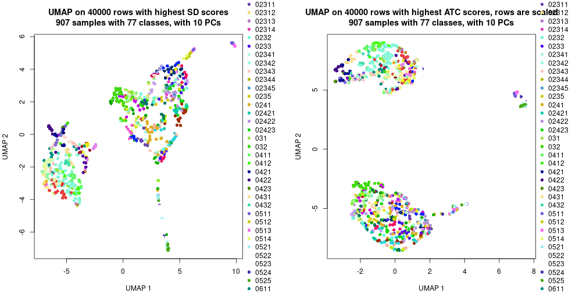</p>

</div>
<div id='tab-dimension-reduction-by-depth-2'>
<pre><code class="r">par(mfrow = c(1, 2))
dimension_reduction(res_rh, merge_node = merge_node_param(min_n_signatures = 1063),
    method = &quot;UMAP&quot;, top_value_method = &quot;SD&quot;, top_n = 40000, scale_rows = FALSE)
dimension_reduction(res_rh, merge_node = merge_node_param(min_n_signatures = 1063),
    method = &quot;UMAP&quot;, top_value_method = &quot;ATC&quot;, top_n = 40000, scale_rows = TRUE)
</code></pre>

<p>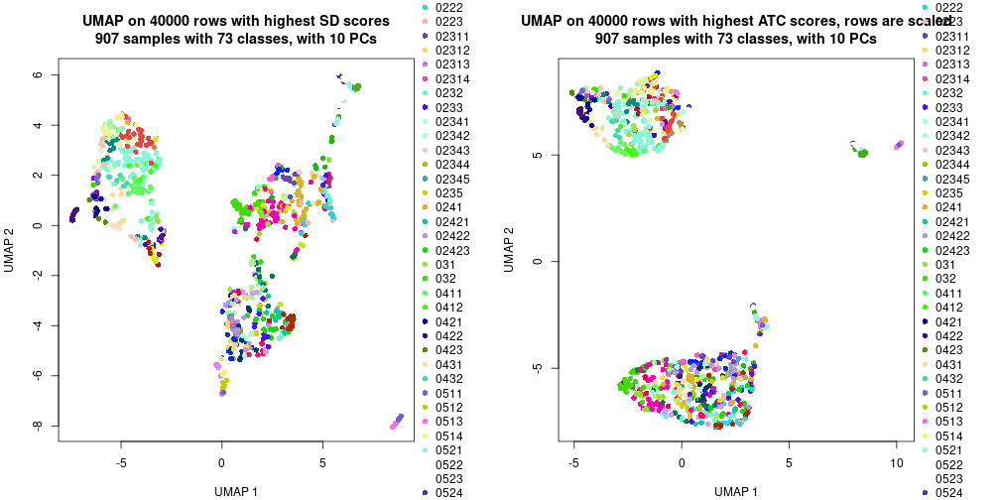</p>

</div>
<div id='tab-dimension-reduction-by-depth-3'>
<pre><code class="r">par(mfrow = c(1, 2))
dimension_reduction(res_rh, merge_node = merge_node_param(min_n_signatures = 1256),
    method = &quot;UMAP&quot;, top_value_method = &quot;SD&quot;, top_n = 40000, scale_rows = FALSE)
dimension_reduction(res_rh, merge_node = merge_node_param(min_n_signatures = 1256),
    method = &quot;UMAP&quot;, top_value_method = &quot;ATC&quot;, top_n = 40000, scale_rows = TRUE)
</code></pre>

<p>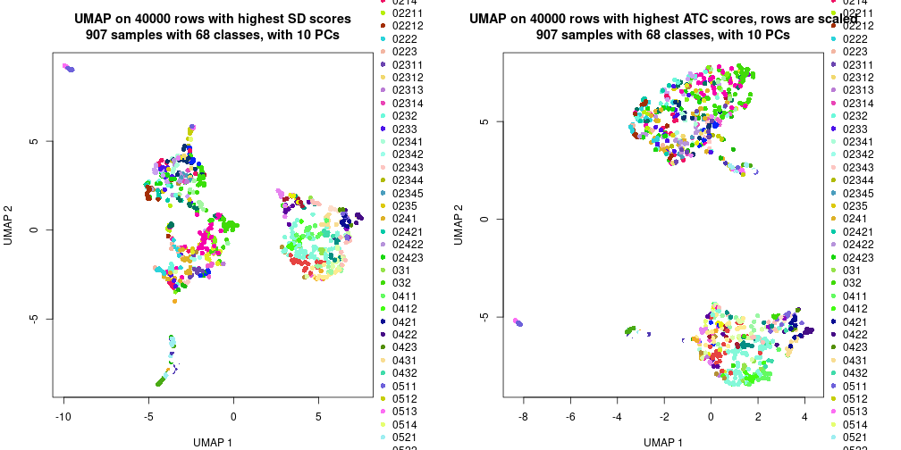</p>

</div>
<div id='tab-dimension-reduction-by-depth-4'>
<pre><code class="r">par(mfrow = c(1, 2))
dimension_reduction(res_rh, merge_node = merge_node_param(min_n_signatures = 1325),
    method = &quot;UMAP&quot;, top_value_method = &quot;SD&quot;, top_n = 40000, scale_rows = FALSE)
dimension_reduction(res_rh, merge_node = merge_node_param(min_n_signatures = 1325),
    method = &quot;UMAP&quot;, top_value_method = &quot;ATC&quot;, top_n = 40000, scale_rows = TRUE)
</code></pre>

<p>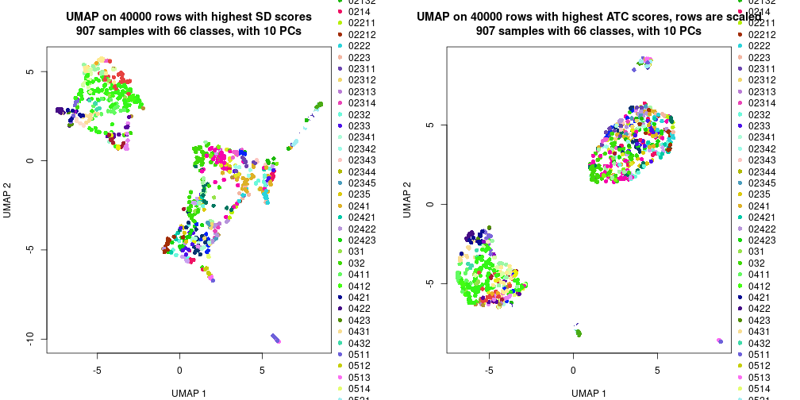</p>

</div>
<div id='tab-dimension-reduction-by-depth-5'>
<pre><code class="r">par(mfrow = c(1, 2))
dimension_reduction(res_rh, merge_node = merge_node_param(min_n_signatures = 1393),
    method = &quot;UMAP&quot;, top_value_method = &quot;SD&quot;, top_n = 40000, scale_rows = FALSE)
dimension_reduction(res_rh, merge_node = merge_node_param(min_n_signatures = 1393),
    method = &quot;UMAP&quot;, top_value_method = &quot;ATC&quot;, top_n = 40000, scale_rows = TRUE)
</code></pre>

<p>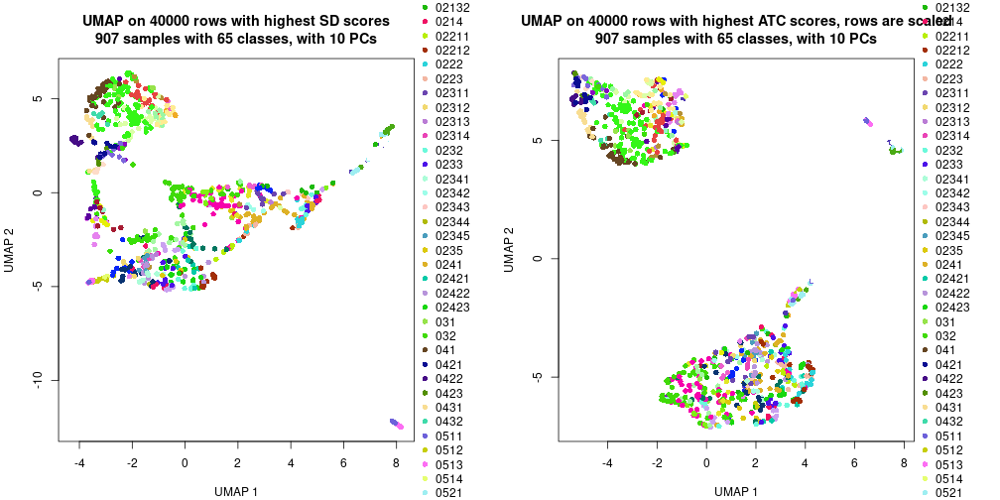</p>

</div>
<div id='tab-dimension-reduction-by-depth-6'>
<pre><code class="r">par(mfrow = c(1, 2))
dimension_reduction(res_rh, merge_node = merge_node_param(min_n_signatures = 2507),
    method = &quot;UMAP&quot;, top_value_method = &quot;SD&quot;, top_n = 40000, scale_rows = FALSE)
dimension_reduction(res_rh, merge_node = merge_node_param(min_n_signatures = 2507),
    method = &quot;UMAP&quot;, top_value_method = &quot;ATC&quot;, top_n = 40000, scale_rows = TRUE)
</code></pre>

<p>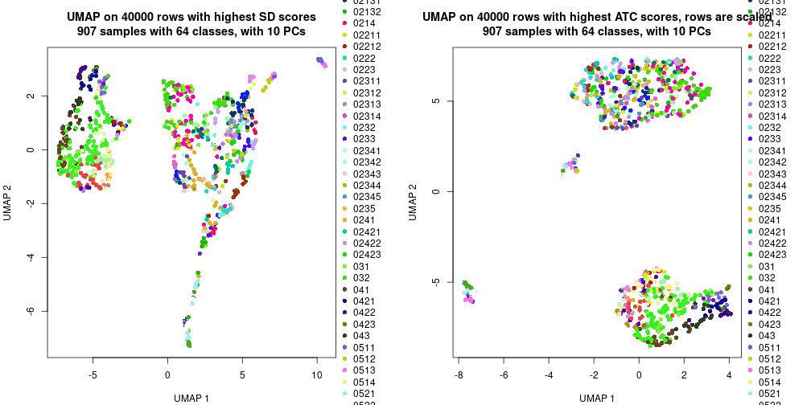</p>

</div>
<div id='tab-dimension-reduction-by-depth-7'>
<pre><code class="r">par(mfrow = c(1, 2))
dimension_reduction(res_rh, merge_node = merge_node_param(min_n_signatures = 2667),
    method = &quot;UMAP&quot;, top_value_method = &quot;SD&quot;, top_n = 40000, scale_rows = FALSE)
dimension_reduction(res_rh, merge_node = merge_node_param(min_n_signatures = 2667),
    method = &quot;UMAP&quot;, top_value_method = &quot;ATC&quot;, top_n = 40000, scale_rows = TRUE)
</code></pre>

<p>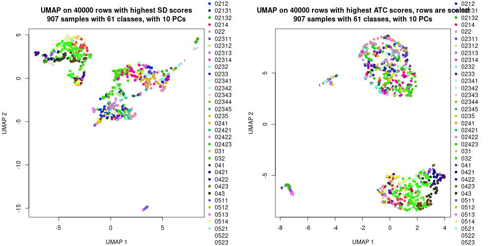</p>

</div>
<div id='tab-dimension-reduction-by-depth-8'>
<pre><code class="r">par(mfrow = c(1, 2))
dimension_reduction(res_rh, merge_node = merge_node_param(min_n_signatures = 2814),
    method = &quot;UMAP&quot;, top_value_method = &quot;SD&quot;, top_n = 40000, scale_rows = FALSE)
dimension_reduction(res_rh, merge_node = merge_node_param(min_n_signatures = 2814),
    method = &quot;UMAP&quot;, top_value_method = &quot;ATC&quot;, top_n = 40000, scale_rows = TRUE)
</code></pre>

<p>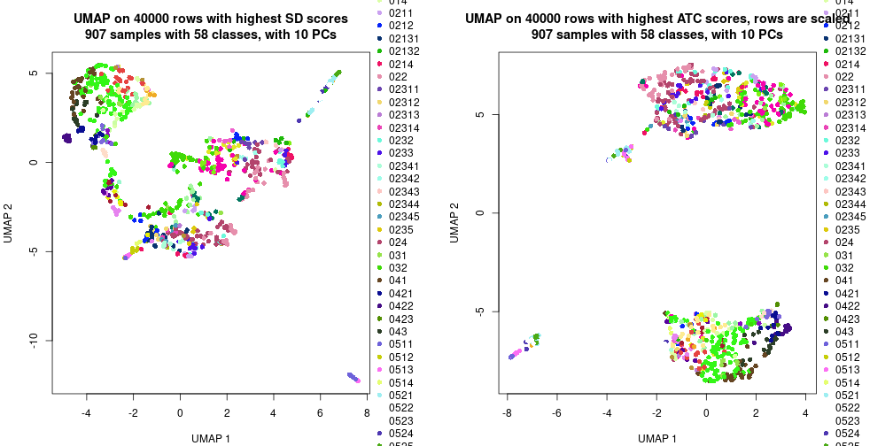</p>

</div>
<div id='tab-dimension-reduction-by-depth-9'>
<pre><code class="r">par(mfrow = c(1, 2))
dimension_reduction(res_rh, merge_node = merge_node_param(min_n_signatures = 2908),
    method = &quot;UMAP&quot;, top_value_method = &quot;SD&quot;, top_n = 40000, scale_rows = FALSE)
dimension_reduction(res_rh, merge_node = merge_node_param(min_n_signatures = 2908),
    method = &quot;UMAP&quot;, top_value_method = &quot;ATC&quot;, top_n = 40000, scale_rows = TRUE)
</code></pre>

<p>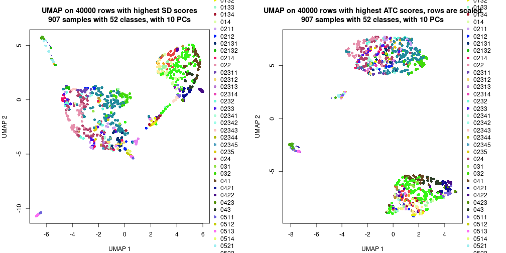</p>

</div>
<div id='tab-dimension-reduction-by-depth-10'>
<pre><code class="r">par(mfrow = c(1, 2))
dimension_reduction(res_rh, merge_node = merge_node_param(min_n_signatures = 2922),
    method = &quot;UMAP&quot;, top_value_method = &quot;SD&quot;, top_n = 40000, scale_rows = FALSE)
dimension_reduction(res_rh, merge_node = merge_node_param(min_n_signatures = 2922),
    method = &quot;UMAP&quot;, top_value_method = &quot;ATC&quot;, top_n = 40000, scale_rows = TRUE)
</code></pre>

<p>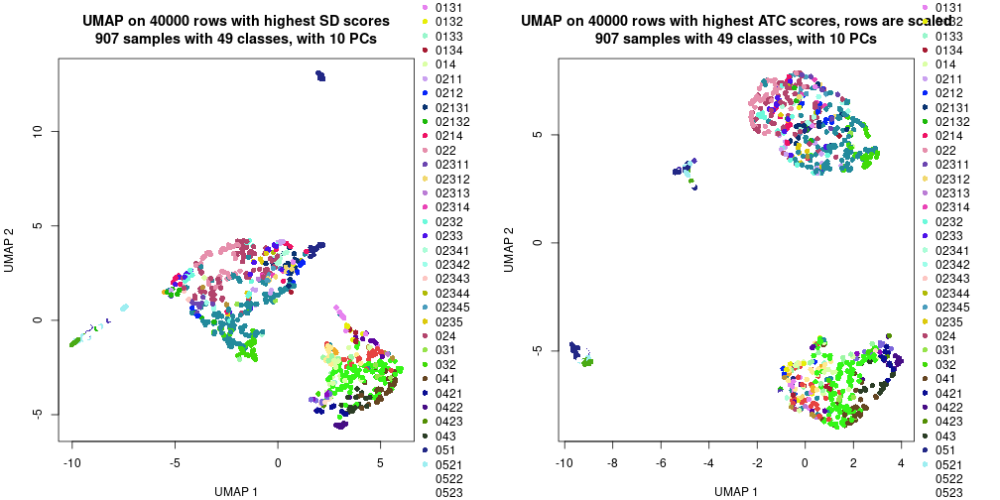</p>

</div>
<div id='tab-dimension-reduction-by-depth-11'>
<pre><code class="r">par(mfrow = c(1, 2))
dimension_reduction(res_rh, merge_node = merge_node_param(min_n_signatures = 3090),
    method = &quot;UMAP&quot;, top_value_method = &quot;SD&quot;, top_n = 40000, scale_rows = FALSE)
dimension_reduction(res_rh, merge_node = merge_node_param(min_n_signatures = 3090),
    method = &quot;UMAP&quot;, top_value_method = &quot;ATC&quot;, top_n = 40000, scale_rows = TRUE)
</code></pre>

<p>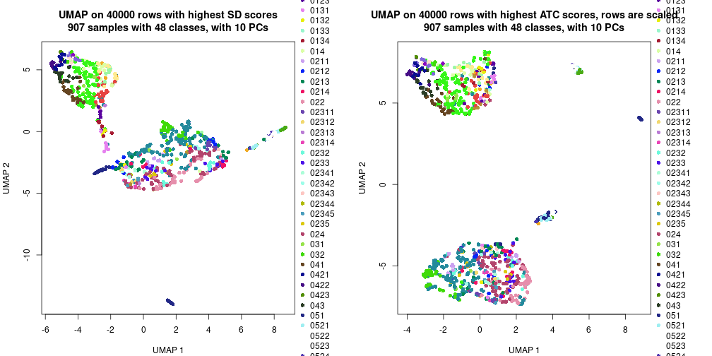</p>

</div>
<div id='tab-dimension-reduction-by-depth-12'>
<pre><code class="r">par(mfrow = c(1, 2))
dimension_reduction(res_rh, merge_node = merge_node_param(min_n_signatures = 3223),
    method = &quot;UMAP&quot;, top_value_method = &quot;SD&quot;, top_n = 40000, scale_rows = FALSE)
dimension_reduction(res_rh, merge_node = merge_node_param(min_n_signatures = 3223),
    method = &quot;UMAP&quot;, top_value_method = &quot;ATC&quot;, top_n = 40000, scale_rows = TRUE)
</code></pre>

<p>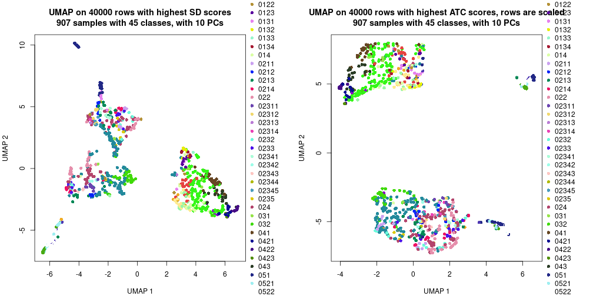</p>

</div>
<div id='tab-dimension-reduction-by-depth-13'>
<pre><code class="r">par(mfrow = c(1, 2))
dimension_reduction(res_rh, merge_node = merge_node_param(min_n_signatures = 3229),
    method = &quot;UMAP&quot;, top_value_method = &quot;SD&quot;, top_n = 40000, scale_rows = FALSE)
dimension_reduction(res_rh, merge_node = merge_node_param(min_n_signatures = 3229),
    method = &quot;UMAP&quot;, top_value_method = &quot;ATC&quot;, top_n = 40000, scale_rows = TRUE)
</code></pre>

<p>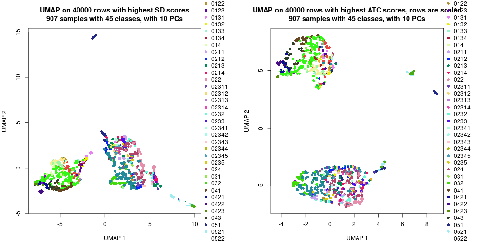</p>

</div>
<div id='tab-dimension-reduction-by-depth-14'>
<pre><code class="r">par(mfrow = c(1, 2))
dimension_reduction(res_rh, merge_node = merge_node_param(min_n_signatures = 3363),
    method = &quot;UMAP&quot;, top_value_method = &quot;SD&quot;, top_n = 40000, scale_rows = FALSE)
dimension_reduction(res_rh, merge_node = merge_node_param(min_n_signatures = 3363),
    method = &quot;UMAP&quot;, top_value_method = &quot;ATC&quot;, top_n = 40000, scale_rows = TRUE)
</code></pre>

<p>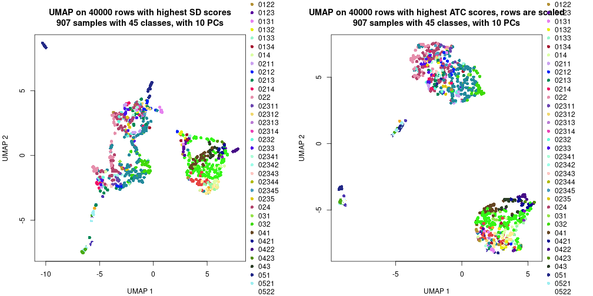</p>

</div>
<div id='tab-dimension-reduction-by-depth-15'>
<pre><code class="r">par(mfrow = c(1, 2))
dimension_reduction(res_rh, merge_node = merge_node_param(min_n_signatures = 3829),
    method = &quot;UMAP&quot;, top_value_method = &quot;SD&quot;, top_n = 40000, scale_rows = FALSE)
dimension_reduction(res_rh, merge_node = merge_node_param(min_n_signatures = 3829),
    method = &quot;UMAP&quot;, top_value_method = &quot;ATC&quot;, top_n = 40000, scale_rows = TRUE)
</code></pre>

<p>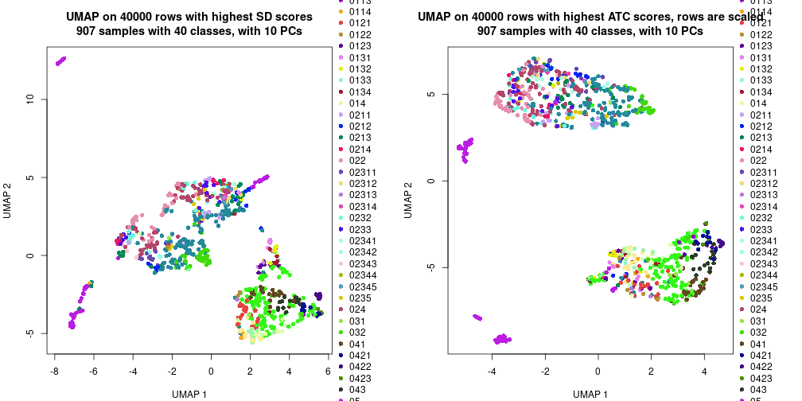</p>

</div>
<div id='tab-dimension-reduction-by-depth-16'>
<pre><code class="r">par(mfrow = c(1, 2))
dimension_reduction(res_rh, merge_node = merge_node_param(min_n_signatures = 4160),
    method = &quot;UMAP&quot;, top_value_method = &quot;SD&quot;, top_n = 40000, scale_rows = FALSE)
dimension_reduction(res_rh, merge_node = merge_node_param(min_n_signatures = 4160),
    method = &quot;UMAP&quot;, top_value_method = &quot;ATC&quot;, top_n = 40000, scale_rows = TRUE)
</code></pre>

<p>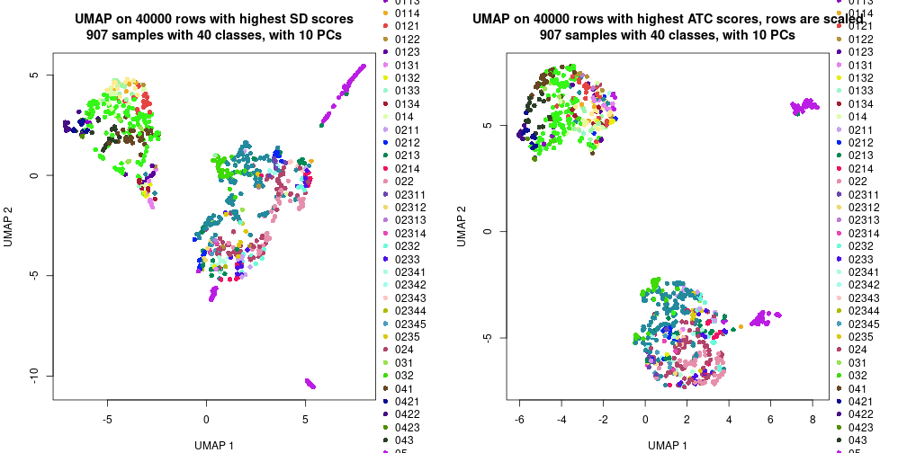</p>

</div>
<div id='tab-dimension-reduction-by-depth-17'>
<pre><code class="r">par(mfrow = c(1, 2))
dimension_reduction(res_rh, merge_node = merge_node_param(min_n_signatures = 4655),
    method = &quot;UMAP&quot;, top_value_method = &quot;SD&quot;, top_n = 40000, scale_rows = FALSE)
dimension_reduction(res_rh, merge_node = merge_node_param(min_n_signatures = 4655),
    method = &quot;UMAP&quot;, top_value_method = &quot;ATC&quot;, top_n = 40000, scale_rows = TRUE)
</code></pre>

<p>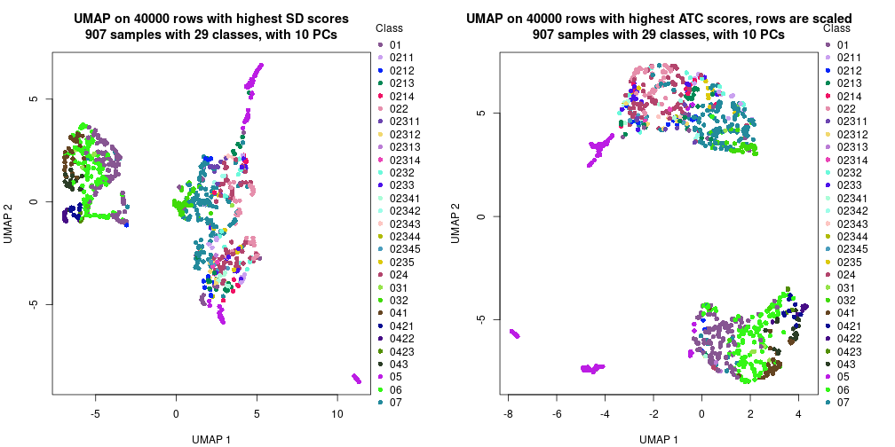</p>

</div>
<div id='tab-dimension-reduction-by-depth-18'>
<pre><code class="r">par(mfrow = c(1, 2))
dimension_reduction(res_rh, merge_node = merge_node_param(min_n_signatures = 5122),
    method = &quot;UMAP&quot;, top_value_method = &quot;SD&quot;, top_n = 40000, scale_rows = FALSE)
dimension_reduction(res_rh, merge_node = merge_node_param(min_n_signatures = 5122),
    method = &quot;UMAP&quot;, top_value_method = &quot;ATC&quot;, top_n = 40000, scale_rows = TRUE)
</code></pre>

<p>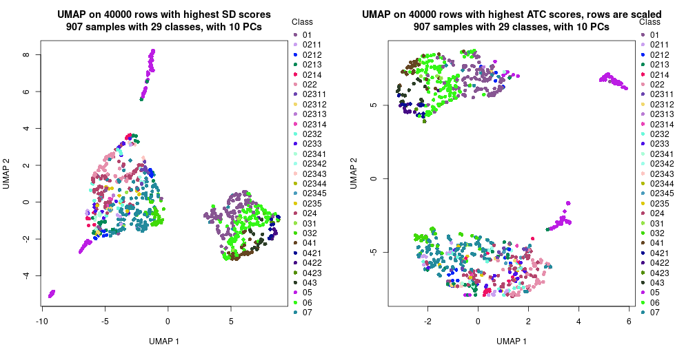</p>

</div>
<div id='tab-dimension-reduction-by-depth-19'>
<pre><code class="r">par(mfrow = c(1, 2))
dimension_reduction(res_rh, merge_node = merge_node_param(min_n_signatures = 5220),
    method = &quot;UMAP&quot;, top_value_method = &quot;SD&quot;, top_n = 40000, scale_rows = FALSE)
dimension_reduction(res_rh, merge_node = merge_node_param(min_n_signatures = 5220),
    method = &quot;UMAP&quot;, top_value_method = &quot;ATC&quot;, top_n = 40000, scale_rows = TRUE)
</code></pre>

<p>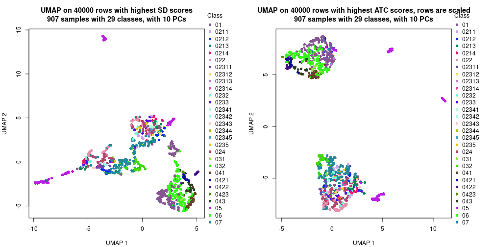</p>

</div>
<div id='tab-dimension-reduction-by-depth-20'>
<pre><code class="r">par(mfrow = c(1, 2))
dimension_reduction(res_rh, merge_node = merge_node_param(min_n_signatures = 5315),
    method = &quot;UMAP&quot;, top_value_method = &quot;SD&quot;, top_n = 40000, scale_rows = FALSE)
dimension_reduction(res_rh, merge_node = merge_node_param(min_n_signatures = 5315),
    method = &quot;UMAP&quot;, top_value_method = &quot;ATC&quot;, top_n = 40000, scale_rows = TRUE)
</code></pre>

<p>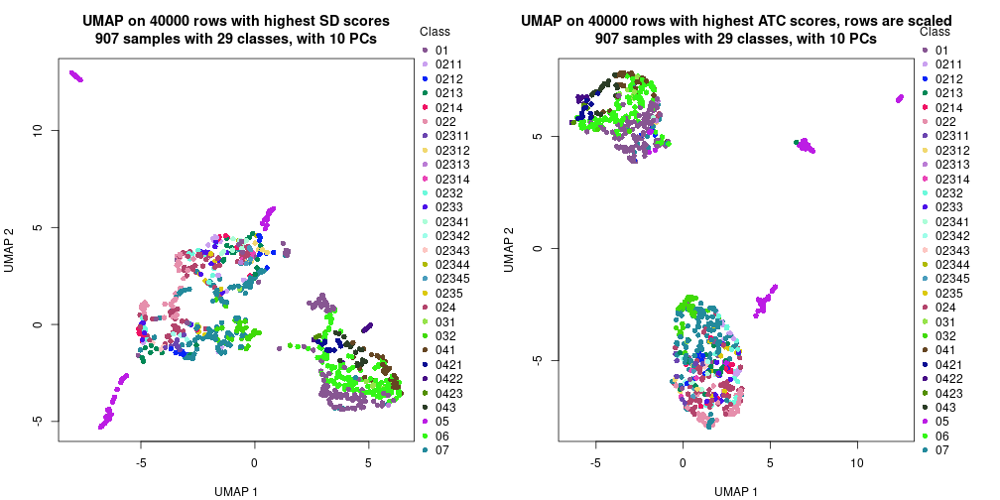</p>

</div>
<div id='tab-dimension-reduction-by-depth-21'>
<pre><code class="r">par(mfrow = c(1, 2))
dimension_reduction(res_rh, merge_node = merge_node_param(min_n_signatures = 5593),
    method = &quot;UMAP&quot;, top_value_method = &quot;SD&quot;, top_n = 40000, scale_rows = FALSE)
dimension_reduction(res_rh, merge_node = merge_node_param(min_n_signatures = 5593),
    method = &quot;UMAP&quot;, top_value_method = &quot;ATC&quot;, top_n = 40000, scale_rows = TRUE)
</code></pre>

<p>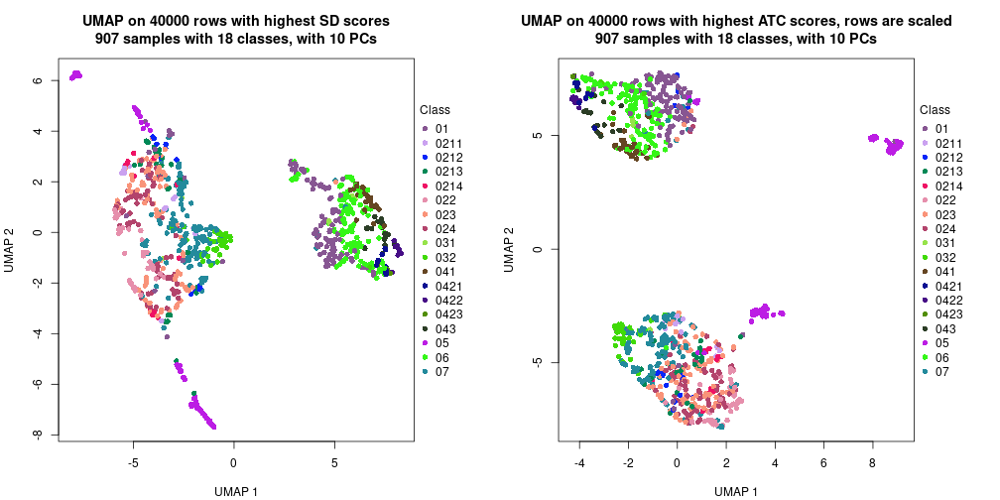</p>

</div>
<div id='tab-dimension-reduction-by-depth-22'>
<pre><code class="r">par(mfrow = c(1, 2))
dimension_reduction(res_rh, merge_node = merge_node_param(min_n_signatures = 5955),
    method = &quot;UMAP&quot;, top_value_method = &quot;SD&quot;, top_n = 40000, scale_rows = FALSE)
dimension_reduction(res_rh, merge_node = merge_node_param(min_n_signatures = 5955),
    method = &quot;UMAP&quot;, top_value_method = &quot;ATC&quot;, top_n = 40000, scale_rows = TRUE)
</code></pre>

<p>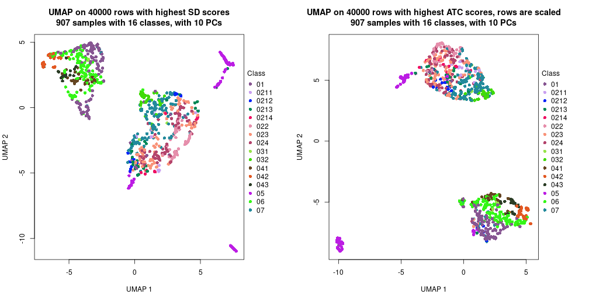</p>

</div>
<div id='tab-dimension-reduction-by-depth-23'>
<pre><code class="r">par(mfrow = c(1, 2))
dimension_reduction(res_rh, merge_node = merge_node_param(min_n_signatures = 6049),
    method = &quot;UMAP&quot;, top_value_method = &quot;SD&quot;, top_n = 40000, scale_rows = FALSE)
dimension_reduction(res_rh, merge_node = merge_node_param(min_n_signatures = 6049),
    method = &quot;UMAP&quot;, top_value_method = &quot;ATC&quot;, top_n = 40000, scale_rows = TRUE)
</code></pre>

<p>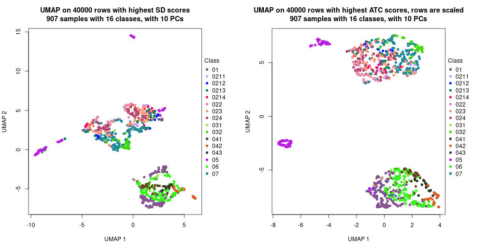</p>

</div>
<div id='tab-dimension-reduction-by-depth-24'>
<pre><code class="r">par(mfrow = c(1, 2))
dimension_reduction(res_rh, merge_node = merge_node_param(min_n_signatures = 6247),
    method = &quot;UMAP&quot;, top_value_method = &quot;SD&quot;, top_n = 40000, scale_rows = FALSE)
dimension_reduction(res_rh, merge_node = merge_node_param(min_n_signatures = 6247),
    method = &quot;UMAP&quot;, top_value_method = &quot;ATC&quot;, top_n = 40000, scale_rows = TRUE)
</code></pre>

<p>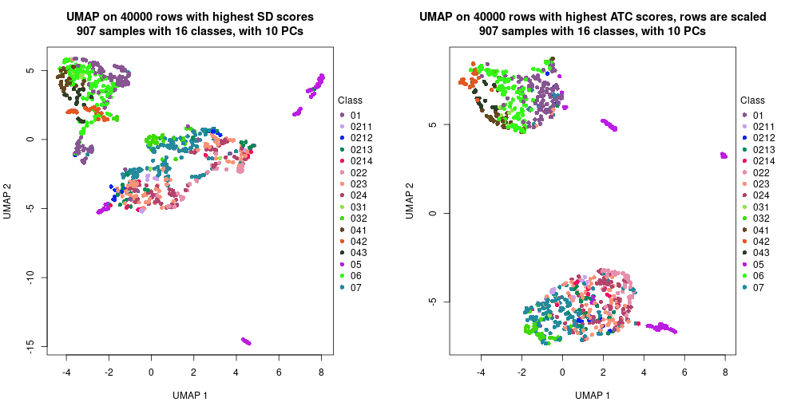</p>

</div>
<div id='tab-dimension-reduction-by-depth-25'>
<pre><code class="r">par(mfrow = c(1, 2))
dimension_reduction(res_rh, merge_node = merge_node_param(min_n_signatures = 6744),
    method = &quot;UMAP&quot;, top_value_method = &quot;SD&quot;, top_n = 40000, scale_rows = FALSE)
dimension_reduction(res_rh, merge_node = merge_node_param(min_n_signatures = 6744),
    method = &quot;UMAP&quot;, top_value_method = &quot;ATC&quot;, top_n = 40000, scale_rows = TRUE)
</code></pre>

<p>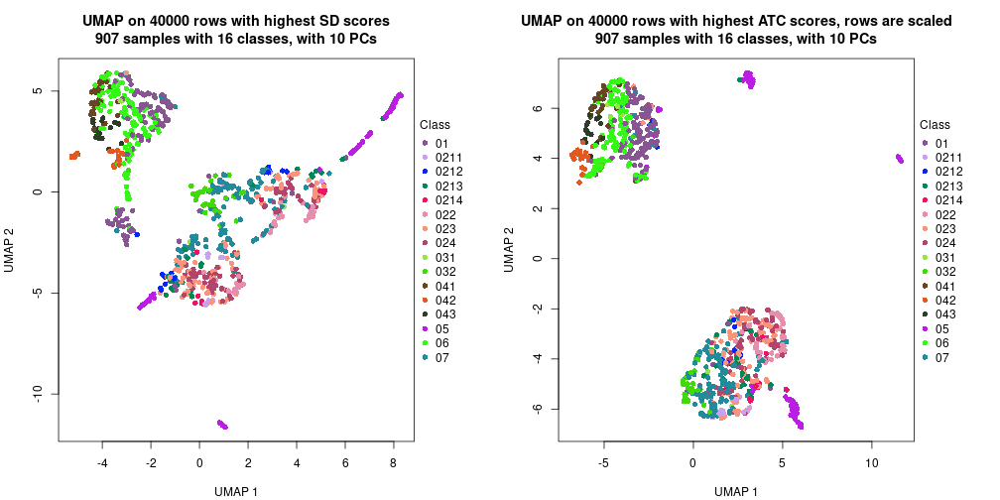</p>

</div>
<div id='tab-dimension-reduction-by-depth-26'>
<pre><code class="r">par(mfrow = c(1, 2))
dimension_reduction(res_rh, merge_node = merge_node_param(min_n_signatures = 7180),
    method = &quot;UMAP&quot;, top_value_method = &quot;SD&quot;, top_n = 40000, scale_rows = FALSE)
dimension_reduction(res_rh, merge_node = merge_node_param(min_n_signatures = 7180),
    method = &quot;UMAP&quot;, top_value_method = &quot;ATC&quot;, top_n = 40000, scale_rows = TRUE)
</code></pre>

<p>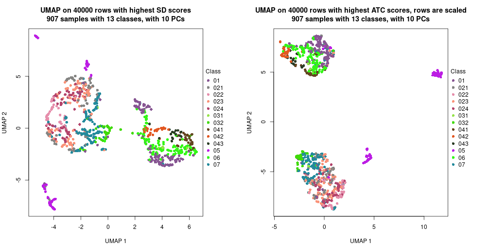</p>

</div>
<div id='tab-dimension-reduction-by-depth-27'>
<pre><code class="r">par(mfrow = c(1, 2))
dimension_reduction(res_rh, merge_node = merge_node_param(min_n_signatures = 9072),
    method = &quot;UMAP&quot;, top_value_method = &quot;SD&quot;, top_n = 40000, scale_rows = FALSE)
dimension_reduction(res_rh, merge_node = merge_node_param(min_n_signatures = 9072),
    method = &quot;UMAP&quot;, top_value_method = &quot;ATC&quot;, top_n = 40000, scale_rows = TRUE)
</code></pre>

<p>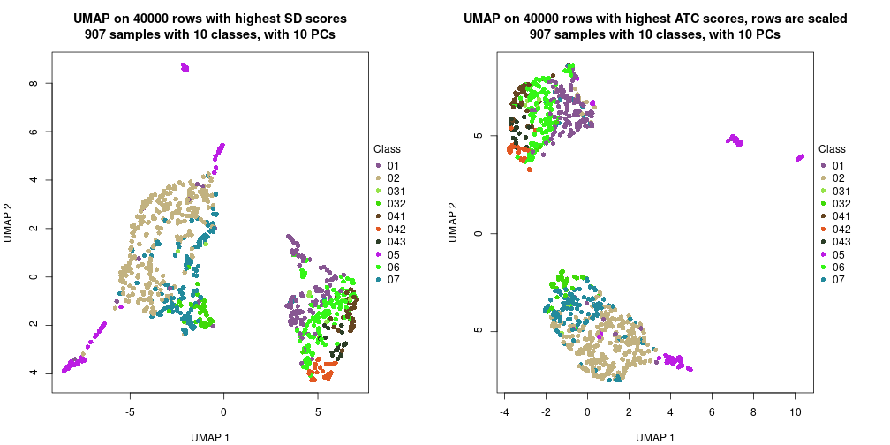</p>

</div>
<div id='tab-dimension-reduction-by-depth-28'>
<pre><code class="r">par(mfrow = c(1, 2))
dimension_reduction(res_rh, merge_node = merge_node_param(min_n_signatures = 9538),
    method = &quot;UMAP&quot;, top_value_method = &quot;SD&quot;, top_n = 40000, scale_rows = FALSE)
dimension_reduction(res_rh, merge_node = merge_node_param(min_n_signatures = 9538),
    method = &quot;UMAP&quot;, top_value_method = &quot;ATC&quot;, top_n = 40000, scale_rows = TRUE)
</code></pre>

<p>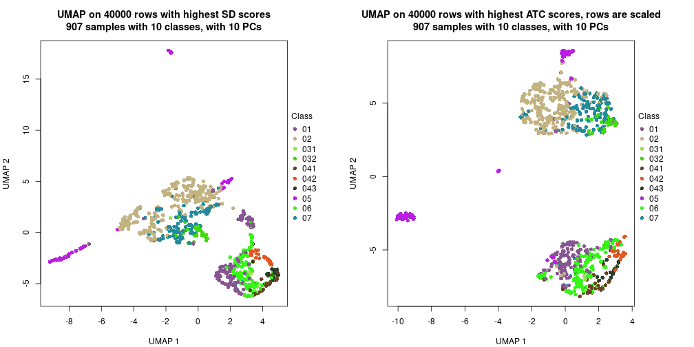</p>

</div>
<div id='tab-dimension-reduction-by-depth-29'>
<pre><code class="r">par(mfrow = c(1, 2))
dimension_reduction(res_rh, merge_node = merge_node_param(min_n_signatures = 10893),
    method = &quot;UMAP&quot;, top_value_method = &quot;SD&quot;, top_n = 40000, scale_rows = FALSE)
dimension_reduction(res_rh, merge_node = merge_node_param(min_n_signatures = 10893),
    method = &quot;UMAP&quot;, top_value_method = &quot;ATC&quot;, top_n = 40000, scale_rows = TRUE)
</code></pre>

<p>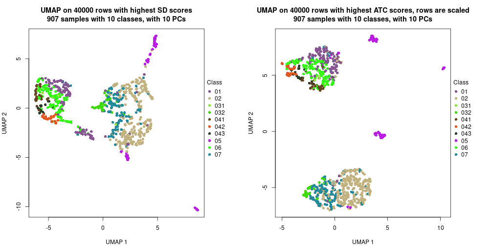</p>

</div>
<div id='tab-dimension-reduction-by-depth-30'>
<pre><code class="r">par(mfrow = c(1, 2))
dimension_reduction(res_rh, merge_node = merge_node_param(min_n_signatures = 17308),
    method = &quot;UMAP&quot;, top_value_method = &quot;SD&quot;, top_n = 40000, scale_rows = FALSE)
dimension_reduction(res_rh, merge_node = merge_node_param(min_n_signatures = 17308),
    method = &quot;UMAP&quot;, top_value_method = &quot;ATC&quot;, top_n = 40000, scale_rows = TRUE)
</code></pre>

<p>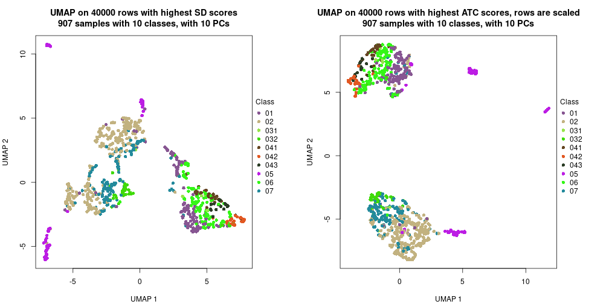</p>

</div>
<div id='tab-dimension-reduction-by-depth-31'>
<pre><code class="r">par(mfrow = c(1, 2))
dimension_reduction(res_rh, merge_node = merge_node_param(min_n_signatures = 23556),
    method = &quot;UMAP&quot;, top_value_method = &quot;SD&quot;, top_n = 40000, scale_rows = FALSE)
dimension_reduction(res_rh, merge_node = merge_node_param(min_n_signatures = 23556),
    method = &quot;UMAP&quot;, top_value_method = &quot;ATC&quot;, top_n = 40000, scale_rows = TRUE)
</code></pre>

<p>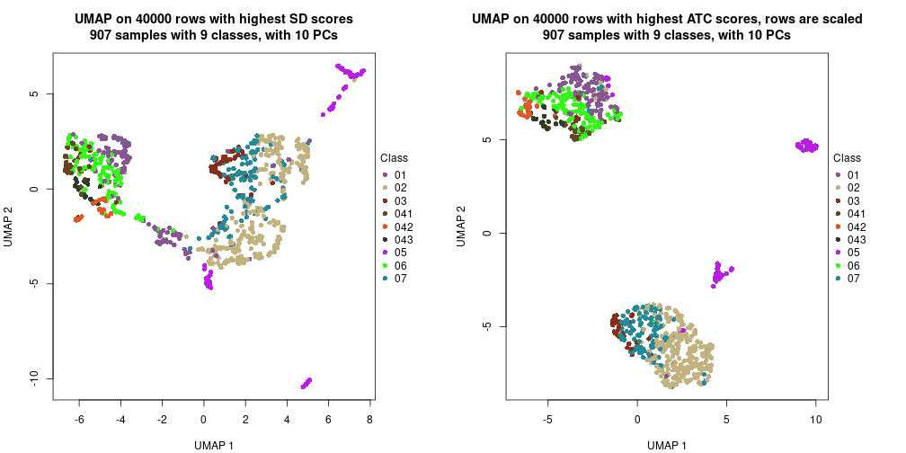</p>

</div>
<div id='tab-dimension-reduction-by-depth-32'>
<pre><code class="r">par(mfrow = c(1, 2))
dimension_reduction(res_rh, merge_node = merge_node_param(min_n_signatures = 26140),
    method = &quot;UMAP&quot;, top_value_method = &quot;SD&quot;, top_n = 40000, scale_rows = FALSE)
dimension_reduction(res_rh, merge_node = merge_node_param(min_n_signatures = 26140),
    method = &quot;UMAP&quot;, top_value_method = &quot;ATC&quot;, top_n = 40000, scale_rows = TRUE)
</code></pre>

<p>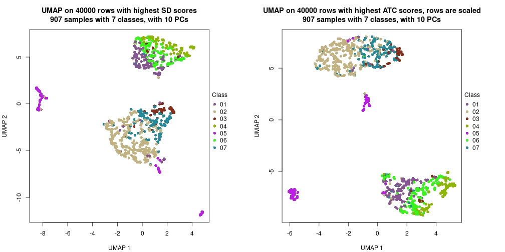</p>

</div>
<div id='tab-dimension-reduction-by-depth-33'>
<pre><code class="r">par(mfrow = c(1, 2))
dimension_reduction(res_rh, merge_node = merge_node_param(min_n_signatures = 54725),
    method = &quot;UMAP&quot;, top_value_method = &quot;SD&quot;, top_n = 40000, scale_rows = FALSE)
dimension_reduction(res_rh, merge_node = merge_node_param(min_n_signatures = 54725),
    method = &quot;UMAP&quot;, top_value_method = &quot;ATC&quot;, top_n = 40000, scale_rows = TRUE)
</code></pre>

<p>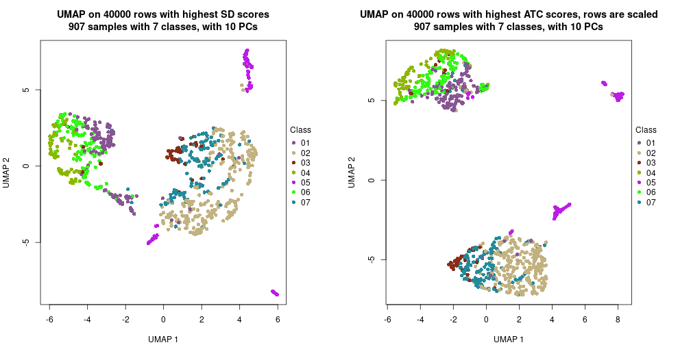</p>

</div>
</div>


### Signature heatmap

Signatures on the heatmap are the union of all signatures found on every node
on the hierarchy. The number of k-means on rows are automatically selected by the function.


<script>
$( function() {
	$( '#tabs-get-signatures-from-hierarchical-partition' ).tabs();
} );
</script>
<div id='tabs-get-signatures-from-hierarchical-partition'>
<ul>
<li><a href='#tab-get-signatures-from-hierarchical-partition-1'>n_signatures ≥ 1019</a></li>
<li><a href='#tab-get-signatures-from-hierarchical-partition-2'>n_signatures ≥ 1063</a></li>
<li><a href='#tab-get-signatures-from-hierarchical-partition-3'>n_signatures ≥ 1256</a></li>
<li><a href='#tab-get-signatures-from-hierarchical-partition-4'>n_signatures ≥ 1325</a></li>
<li><a href='#tab-get-signatures-from-hierarchical-partition-5'>n_signatures ≥ 1393</a></li>
<li><a href='#tab-get-signatures-from-hierarchical-partition-6'>n_signatures ≥ 2507</a></li>
<li><a href='#tab-get-signatures-from-hierarchical-partition-7'>n_signatures ≥ 2667</a></li>
<li><a href='#tab-get-signatures-from-hierarchical-partition-8'>n_signatures ≥ 2814</a></li>
<li><a href='#tab-get-signatures-from-hierarchical-partition-9'>n_signatures ≥ 2908</a></li>
<li><a href='#tab-get-signatures-from-hierarchical-partition-10'>n_signatures ≥ 2922</a></li>
<li><a href='#tab-get-signatures-from-hierarchical-partition-11'>n_signatures ≥ 3090</a></li>
<li><a href='#tab-get-signatures-from-hierarchical-partition-12'>n_signatures ≥ 3223</a></li>
<li><a href='#tab-get-signatures-from-hierarchical-partition-13'>n_signatures ≥ 3229</a></li>
<li><a href='#tab-get-signatures-from-hierarchical-partition-14'>n_signatures ≥ 3363</a></li>
<li><a href='#tab-get-signatures-from-hierarchical-partition-15'>n_signatures ≥ 3829</a></li>
<li><a href='#tab-get-signatures-from-hierarchical-partition-16'>n_signatures ≥ 4160</a></li>
<li><a href='#tab-get-signatures-from-hierarchical-partition-17'>n_signatures ≥ 4655</a></li>
<li><a href='#tab-get-signatures-from-hierarchical-partition-18'>n_signatures ≥ 5122</a></li>
<li><a href='#tab-get-signatures-from-hierarchical-partition-19'>n_signatures ≥ 5220</a></li>
<li><a href='#tab-get-signatures-from-hierarchical-partition-20'>n_signatures ≥ 5315</a></li>
<li><a href='#tab-get-signatures-from-hierarchical-partition-21'>n_signatures ≥ 5593</a></li>
<li><a href='#tab-get-signatures-from-hierarchical-partition-22'>n_signatures ≥ 5955</a></li>
<li><a href='#tab-get-signatures-from-hierarchical-partition-23'>n_signatures ≥ 6049</a></li>
<li><a href='#tab-get-signatures-from-hierarchical-partition-24'>n_signatures ≥ 6247</a></li>
<li><a href='#tab-get-signatures-from-hierarchical-partition-25'>n_signatures ≥ 6744</a></li>
<li><a href='#tab-get-signatures-from-hierarchical-partition-26'>n_signatures ≥ 7180</a></li>
<li><a href='#tab-get-signatures-from-hierarchical-partition-27'>n_signatures ≥ 9072</a></li>
<li><a href='#tab-get-signatures-from-hierarchical-partition-28'>n_signatures ≥ 9538</a></li>
<li><a href='#tab-get-signatures-from-hierarchical-partition-29'>n_signatures ≥ 10893</a></li>
<li><a href='#tab-get-signatures-from-hierarchical-partition-30'>n_signatures ≥ 17308</a></li>
<li><a href='#tab-get-signatures-from-hierarchical-partition-31'>n_signatures ≥ 23556</a></li>
<li><a href='#tab-get-signatures-from-hierarchical-partition-32'>n_signatures ≥ 26140</a></li>
<li><a href='#tab-get-signatures-from-hierarchical-partition-33'>n_signatures ≥ 54725</a></li>
</ul>
<div id='tab-get-signatures-from-hierarchical-partition-1'>
<pre><code class="r">get_signatures(res_rh, merge_node = merge_node_param(min_n_signatures = 1019))
</code></pre>

<p>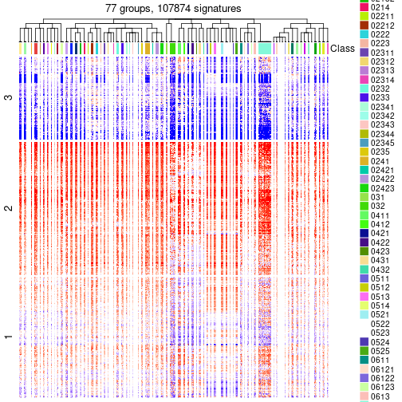</p>

</div>
<div id='tab-get-signatures-from-hierarchical-partition-2'>
<pre><code class="r">get_signatures(res_rh, merge_node = merge_node_param(min_n_signatures = 1063))
</code></pre>

<p>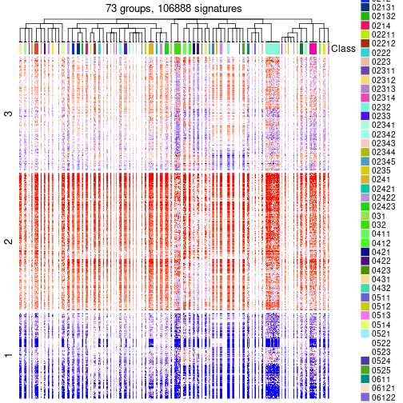</p>

</div>
<div id='tab-get-signatures-from-hierarchical-partition-3'>
<pre><code class="r">get_signatures(res_rh, merge_node = merge_node_param(min_n_signatures = 1256))
</code></pre>

<p>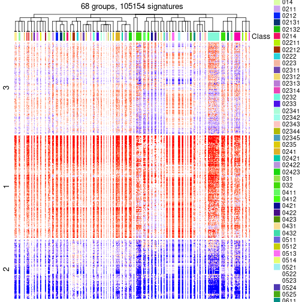</p>

</div>
<div id='tab-get-signatures-from-hierarchical-partition-4'>
<pre><code class="r">get_signatures(res_rh, merge_node = merge_node_param(min_n_signatures = 1325))
</code></pre>

<pre><code>#&gt; Error in lt[[hierarchy[i, 1]]]$AddChildNode({: attempt to apply non-function
</code></pre>

</div>
<div id='tab-get-signatures-from-hierarchical-partition-5'>
<pre><code class="r">get_signatures(res_rh, merge_node = merge_node_param(min_n_signatures = 1393))
</code></pre>

<pre><code>#&gt; Error in lt[[hierarchy[i, 1]]]$AddChildNode({: attempt to apply non-function
</code></pre>

</div>
<div id='tab-get-signatures-from-hierarchical-partition-6'>
<pre><code class="r">get_signatures(res_rh, merge_node = merge_node_param(min_n_signatures = 2507))
</code></pre>

<pre><code>#&gt; Error in lt[[hierarchy[i, 1]]]$AddChildNode({: attempt to apply non-function
</code></pre>

</div>
<div id='tab-get-signatures-from-hierarchical-partition-7'>
<pre><code class="r">get_signatures(res_rh, merge_node = merge_node_param(min_n_signatures = 2667))
</code></pre>

<pre><code>#&gt; Error in lt[[hierarchy[i, 1]]]$AddChildNode({: attempt to apply non-function
</code></pre>

</div>
<div id='tab-get-signatures-from-hierarchical-partition-8'>
<pre><code class="r">get_signatures(res_rh, merge_node = merge_node_param(min_n_signatures = 2814))
</code></pre>

<pre><code>#&gt; Error in lt[[hierarchy[i, 1]]]$AddChildNode({: attempt to apply non-function
</code></pre>

</div>
<div id='tab-get-signatures-from-hierarchical-partition-9'>
<pre><code class="r">get_signatures(res_rh, merge_node = merge_node_param(min_n_signatures = 2908))
</code></pre>

<pre><code>#&gt; Error in lt[[hierarchy[i, 1]]]$AddChildNode({: attempt to apply non-function
</code></pre>

</div>
<div id='tab-get-signatures-from-hierarchical-partition-10'>
<pre><code class="r">get_signatures(res_rh, merge_node = merge_node_param(min_n_signatures = 2922))
</code></pre>

<pre><code>#&gt; Error in lt[[hierarchy[i, 1]]]$AddChildNode({: attempt to apply non-function
</code></pre>

</div>
<div id='tab-get-signatures-from-hierarchical-partition-11'>
<pre><code class="r">get_signatures(res_rh, merge_node = merge_node_param(min_n_signatures = 3090))
</code></pre>

<pre><code>#&gt; Error in lt[[hierarchy[i, 1]]]$AddChildNode({: attempt to apply non-function
</code></pre>

</div>
<div id='tab-get-signatures-from-hierarchical-partition-12'>
<pre><code class="r">get_signatures(res_rh, merge_node = merge_node_param(min_n_signatures = 3223))
</code></pre>

<p>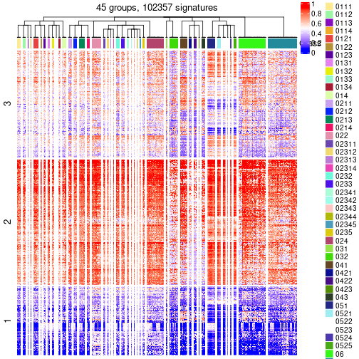</p>

</div>
<div id='tab-get-signatures-from-hierarchical-partition-13'>
<pre><code class="r">get_signatures(res_rh, merge_node = merge_node_param(min_n_signatures = 3229))
</code></pre>

<p></p>

</div>
<div id='tab-get-signatures-from-hierarchical-partition-14'>
<pre><code class="r">get_signatures(res_rh, merge_node = merge_node_param(min_n_signatures = 3363))
</code></pre>

<p></p>

</div>
<div id='tab-get-signatures-from-hierarchical-partition-15'>
<pre><code class="r">get_signatures(res_rh, merge_node = merge_node_param(min_n_signatures = 3829))
</code></pre>

<p>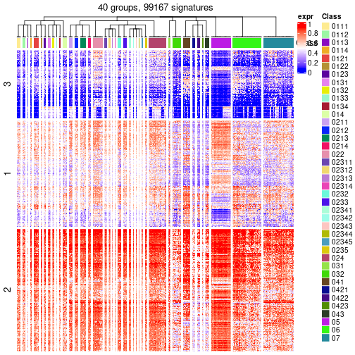</p>

</div>
<div id='tab-get-signatures-from-hierarchical-partition-16'>
<pre><code class="r">get_signatures(res_rh, merge_node = merge_node_param(min_n_signatures = 4160))
</code></pre>

<p></p>

</div>
<div id='tab-get-signatures-from-hierarchical-partition-17'>
<pre><code class="r">get_signatures(res_rh, merge_node = merge_node_param(min_n_signatures = 4655))
</code></pre>

<p>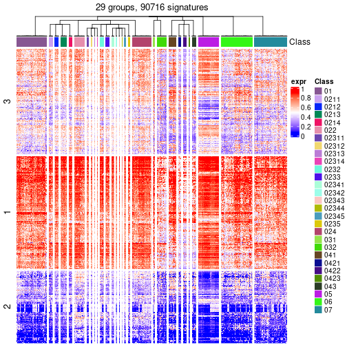</p>

</div>
<div id='tab-get-signatures-from-hierarchical-partition-18'>
<pre><code class="r">get_signatures(res_rh, merge_node = merge_node_param(min_n_signatures = 5122))
</code></pre>

<p></p>

</div>
<div id='tab-get-signatures-from-hierarchical-partition-19'>
<pre><code class="r">get_signatures(res_rh, merge_node = merge_node_param(min_n_signatures = 5220))
</code></pre>

<p>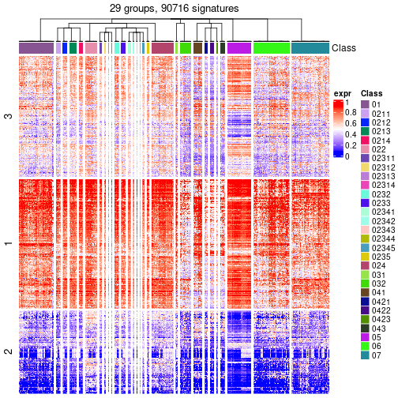</p>

</div>
<div id='tab-get-signatures-from-hierarchical-partition-20'>
<pre><code class="r">get_signatures(res_rh, merge_node = merge_node_param(min_n_signatures = 5315))
</code></pre>

<p></p>

</div>
<div id='tab-get-signatures-from-hierarchical-partition-21'>
<pre><code class="r">get_signatures(res_rh, merge_node = merge_node_param(min_n_signatures = 5593))
</code></pre>

<p>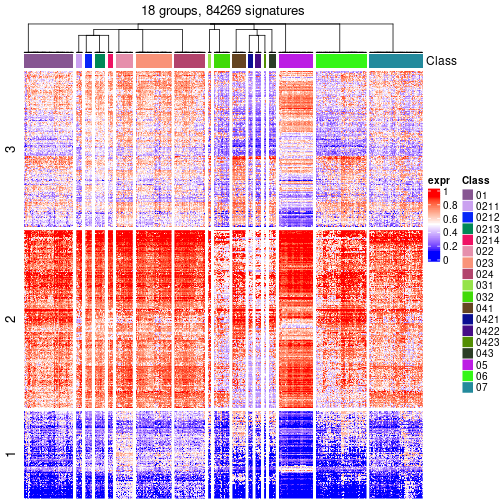</p>

</div>
<div id='tab-get-signatures-from-hierarchical-partition-22'>
<pre><code class="r">get_signatures(res_rh, merge_node = merge_node_param(min_n_signatures = 5955))
</code></pre>

<p></p>

</div>
<div id='tab-get-signatures-from-hierarchical-partition-23'>
<pre><code class="r">get_signatures(res_rh, merge_node = merge_node_param(min_n_signatures = 6049))
</code></pre>

<p></p>

</div>
<div id='tab-get-signatures-from-hierarchical-partition-24'>
<pre><code class="r">get_signatures(res_rh, merge_node = merge_node_param(min_n_signatures = 6247))
</code></pre>

<p>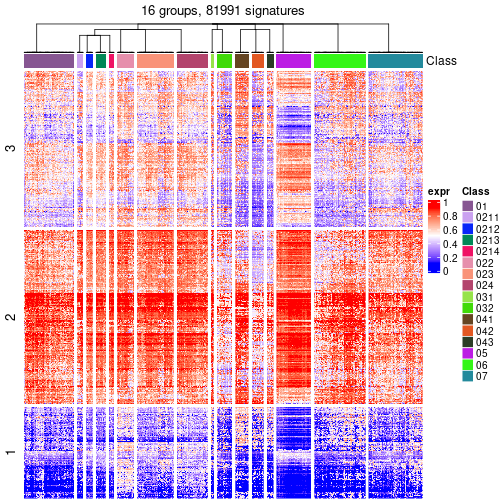</p>

</div>
<div id='tab-get-signatures-from-hierarchical-partition-25'>
<pre><code class="r">get_signatures(res_rh, merge_node = merge_node_param(min_n_signatures = 6744))
</code></pre>

<p></p>

</div>
<div id='tab-get-signatures-from-hierarchical-partition-26'>
<pre><code class="r">get_signatures(res_rh, merge_node = merge_node_param(min_n_signatures = 7180))
</code></pre>

<p>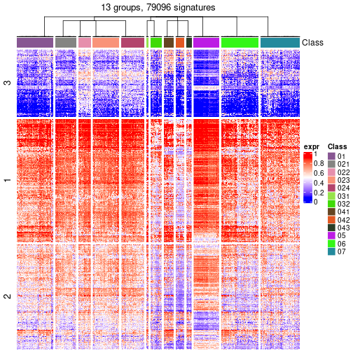</p>

</div>
<div id='tab-get-signatures-from-hierarchical-partition-27'>
<pre><code class="r">get_signatures(res_rh, merge_node = merge_node_param(min_n_signatures = 9072))
</code></pre>

<p></p>

</div>
<div id='tab-get-signatures-from-hierarchical-partition-28'>
<pre><code class="r">get_signatures(res_rh, merge_node = merge_node_param(min_n_signatures = 9538))
</code></pre>

<p></p>

</div>
<div id='tab-get-signatures-from-hierarchical-partition-29'>
<pre><code class="r">get_signatures(res_rh, merge_node = merge_node_param(min_n_signatures = 10893))
</code></pre>

<p>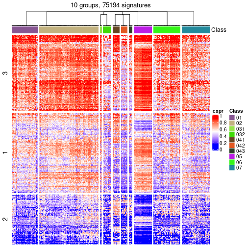</p>

</div>
<div id='tab-get-signatures-from-hierarchical-partition-30'>
<pre><code class="r">get_signatures(res_rh, merge_node = merge_node_param(min_n_signatures = 17308))
</code></pre>

<p></p>

</div>
<div id='tab-get-signatures-from-hierarchical-partition-31'>
<pre><code class="r">get_signatures(res_rh, merge_node = merge_node_param(min_n_signatures = 23556))
</code></pre>

<p>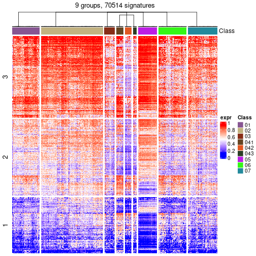</p>

</div>
<div id='tab-get-signatures-from-hierarchical-partition-32'>
<pre><code class="r">get_signatures(res_rh, merge_node = merge_node_param(min_n_signatures = 26140))
</code></pre>

<p>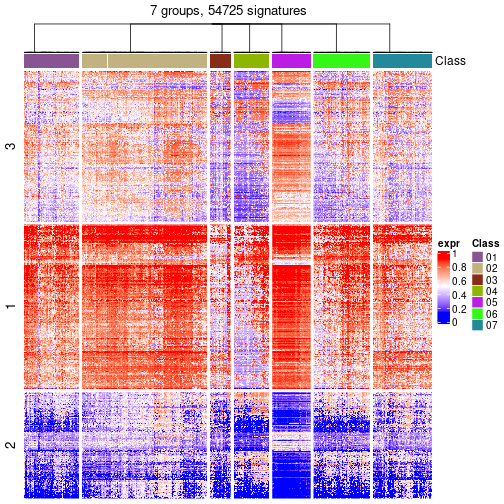</p>

</div>
<div id='tab-get-signatures-from-hierarchical-partition-33'>
<pre><code class="r">get_signatures(res_rh, merge_node = merge_node_param(min_n_signatures = 54725))
</code></pre>

<p></p>

</div>
</div>


Compare signatures from different nodes:


```r
compare_signatures(res_rh, verbose = FALSE)
```

```
#> Error: Only support number of sets <= 31.
```

If there are too many signatures, `top_signatures = ...` can be set to only show the 
signatures with the highest FDRs. Note it only works on every node and the final signatures
are the union of all signatures of all nodes.


```r
# code only for demonstration
# e.g. to show the top 500 most significant rows on each node.
tb = get_signature(res_rh, top_signatures = 500)
```


## Results for each node


---------------------------------------------------


### Node0


Child nodes: 
                [Node01](#Node01)
        ,
                [Node02](#Node02)
        ,
                [Node03](#Node03)
        ,
                [Node04](#Node04)
        ,
                [Node05](#Node05)
        ,
                [Node06](#Node06)
        ,
                [Node07](#Node07)
        .


The object with results only for a single top-value method and a single partitioning method 
can be extracted as:

```r
res = res_rh["0"]
```

A summary of `res` and all the functions that can be applied to it:

```r
res
```

```
#> A 'DownSamplingConsensusPartition' object with k = 2, 3, 4, 5, 6, 7, 8.
#>   On a matrix with 375955 rows and 500 columns, randomly sampled from 907 columns.
#>   Top rows (1000) are extracted by 'ATC' method.
#>   Subgroups are detected by 'skmeans' method.
#>   Performed in total 350 partitions by row resampling.
#>   Best k for subgroups seems to be 8.
#> 
#> Following methods can be applied to this 'DownSamplingConsensusPartition' object:
#>  [1] "cola_report"             "collect_classes"         "collect_plots"          
#>  [4] "collect_stats"           "colnames"                "compare_partitions"     
#>  [7] "compare_signatures"      "consensus_heatmap"       "dimension_reduction"    
#> [10] "functional_enrichment"   "get_anno_col"            "get_anno"               
#> [13] "get_classes"             "get_consensus"           "get_matrix"             
#> [16] "get_membership"          "get_param"               "get_signatures"         
#> [19] "get_stats"               "is_best_k"               "is_stable_k"            
#> [22] "membership_heatmap"      "ncol"                    "nrow"                   
#> [25] "plot_ecdf"               "predict_classes"         "rownames"               
#> [28] "select_partition_number" "show"                    "suggest_best_k"         
#> [31] "test_to_known_factors"   "top_rows_heatmap"
```

`collect_plots()` function collects all the plots made from `res` for all `k` (number of subgroups)
into one single page to provide an easy and fast comparison between different `k`.

```r
collect_plots(res)
```

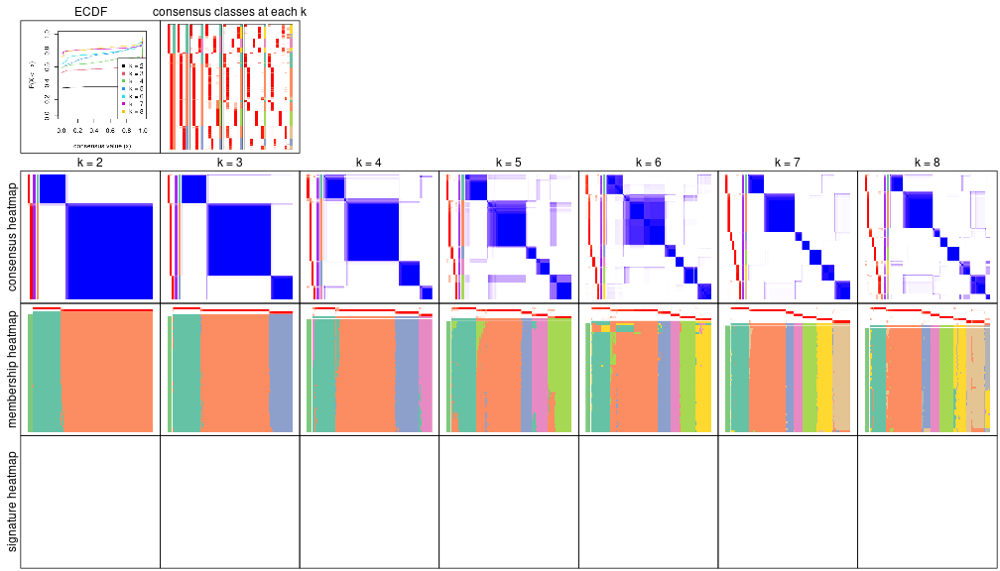

The plots are:

- The first row: a plot of the eCDF (empirical cumulative distribution
  function) curves of the consensus matrix for each `k` and the heatmap of
  predicted classes for each `k`.
- The second row: heatmaps of the consensus matrix for each `k`.
- The third row: heatmaps of the membership matrix for each `k`.
- The fouth row: heatmaps of the signatures for each `k`.

All the plots in panels can be made by individual functions and they are
plotted later in this section.

`select_partition_number()` produces several plots showing different
statistics for choosing "optimized" `k`. There are following statistics:

- eCDF curves of the consensus matrix for each `k`;
- 1-PAC. [The PAC score](https://en.wikipedia.org/wiki/Consensus_clustering#Over-interpretation_potential_of_consensus_clustering)
  measures the proportion of the ambiguous subgrouping.
- Mean silhouette score.
- Concordance. The mean probability of fiting the consensus subgroup labels in all
  partitions.
- Area increased. Denote $A_k$ as the area under the eCDF curve for current
  `k`, the area increased is defined as $A_k - A_{k-1}$.
- Rand index. The percent of pairs of samples that are both in a same cluster
  or both are not in a same cluster in the partition of k and k-1.
- Jaccard index. The ratio of pairs of samples are both in a same cluster in
  the partition of k and k-1 and the pairs of samples are both in a same
  cluster in the partition k or k-1.

The detailed explanations of these statistics can be found in [the _cola_
vignette](https://jokergoo.github.io/cola_vignettes/cola.html#toc_13).

Generally speaking, higher 1-PAC score, higher mean silhouette score or higher
concordance corresponds to better partition. Rand index and Jaccard index
measure how similar the current partition is compared to partition with `k-1`.
If they are too similar, we won't accept `k` is better than `k-1`.

```r
select_partition_number(res)
```

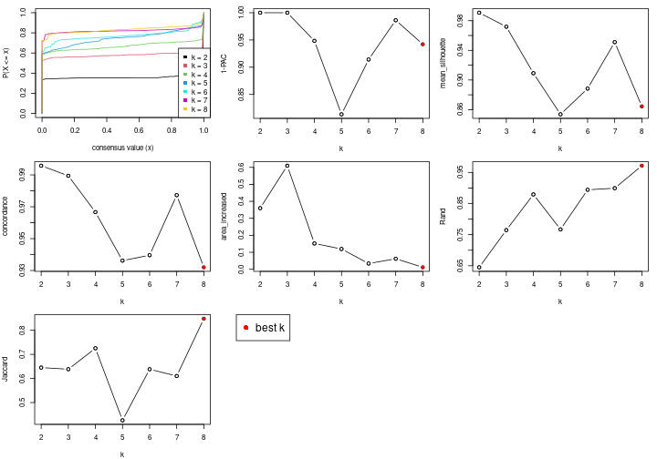

The numeric values for all these statistics can be obtained by `get_stats()`.

```r
get_stats(res)
```

```
#>   k 1-PAC mean_silhouette concordance area_increased  Rand Jaccard
#> 2 2 1.000           0.991       0.996         0.3599 0.645   0.645
#> 3 3 1.000           0.972       0.989         0.6095 0.765   0.638
#> 4 4 0.948           0.909       0.967         0.1520 0.879   0.725
#> 5 5 0.814           0.854       0.936         0.1195 0.767   0.426
#> 6 6 0.914           0.888       0.940         0.0340 0.894   0.638
#> 7 7 0.986           0.951       0.977         0.0620 0.899   0.610
#> 8 8 0.942           0.864       0.932         0.0117 0.971   0.848
```

`suggest_best_k()` suggests the best $k$ based on these statistics. The rules are as follows:

- All $k$ with Jaccard index larger than 0.95 are removed because increasing
  $k$ does not provide enough extra information. If all $k$ are removed, it is
  marked as no subgroup is detected.
- For all $k$ with 1-PAC score larger than 0.9, the maximal $k$ is taken as
  the best $k$, and other $k$ are marked as optional $k$.
- If it does not fit the second rule. The $k$ with the maximal vote of the
  highest 1-PAC score, highest mean silhouette, and highest concordance is
  taken as the best $k$.

```r
suggest_best_k(res)
```

```
#> [1] 8
#> attr(,"optional")
#> [1] 2 3 4 6 7
```

There is also optional best $k$ = 2 3 4 6 7 that is worth to check.

Following is the table of the partitions (You need to click the **show/hide
code output** link to see it). The membership matrix (columns with name `p*`)
is inferred by
[`clue::cl_consensus()`](https://www.rdocumentation.org/link/cl_consensus?package=clue)
function with the `SE` method. Basically the value in the membership matrix
represents the probability to belong to a certain group. The finall subgroup
label for an item is determined with the group with highest probability it
belongs to.

In `get_classes()` function, the entropy is calculated from the membership
matrix and the silhouette score is calculated from the consensus matrix.


<script>
$( function() {
	$( '#tabs-node-0-get-classes' ).tabs();
} );
</script>
<div id='tabs-node-0-get-classes'>
<ul>
<li><a href='#tab-node-0-get-classes-1'>k = 2</a></li>
<li><a href='#tab-node-0-get-classes-2'>k = 3</a></li>
<li><a href='#tab-node-0-get-classes-3'>k = 4</a></li>
<li><a href='#tab-node-0-get-classes-4'>k = 5</a></li>
<li><a href='#tab-node-0-get-classes-5'>k = 6</a></li>
<li><a href='#tab-node-0-get-classes-6'>k = 7</a></li>
<li><a href='#tab-node-0-get-classes-7'>k = 8</a></li>
</ul>

<div id='tab-node-0-get-classes-1'>
<p><a id='tab-node-0-get-classes-1-a' style='color:#0366d6' href='#'>show/hide code output</a></p>
<pre><code class="r">get_classes(res, k = 2)
</code></pre>

<pre><code>#&gt;                 class     p
#&gt; TCGA.44.4112.01     2 0.000
#&gt; TCGA.NJ.A4YP.01     2 0.000
#&gt; TCGA.22.4613.01     1 0.000
#&gt; TCGA.90.7769.01     1 0.000
#&gt; TCGA.77.A5G1.01     2 0.000
#&gt; TCGA.86.8278.01     2 0.000
#&gt; TCGA.77.A5G3.01     1 0.000
#&gt; TCGA.62.A470.01     2 0.000
#&gt; TCGA.44.6778.01     2 0.000
#&gt; TCGA.49.AARQ.01     2 0.000
#&gt; TCGA.97.A4M1.01     2 0.000
#&gt; TCGA.55.6975.01     2 0.000
#&gt; TCGA.99.8033.01     2 0.000
#&gt; TCGA.43.7656.01     1 0.000
#&gt; TCGA.85.8481.01     2 0.000
#&gt; TCGA.56.A4ZK.01     1 0.000
#&gt; TCGA.77.8156.01     2 0.000
#&gt; TCGA.43.A475.01     2 1.000
#&gt; TCGA.69.8255.01     2 0.000
#&gt; TCGA.69.8453.01     2 0.000
#&gt; TCGA.97.8552.01     2 0.000
#&gt; TCGA.53.A4EZ.01     2 0.000
#&gt; TCGA.58.A46N.01     1 0.000
#&gt; TCGA.63.A5MW.01     1 0.000
#&gt; TCGA.85.8479.01     1 0.000
#&gt; TCGA.68.8251.01     1 0.000
#&gt; TCGA.44.2659.11     2 0.000
#&gt; TCGA.34.7107.01     1 0.000
#&gt; TCGA.50.5066.01     2 0.000
#&gt; TCGA.55.7910.01     2 0.000
#&gt; TCGA.62.A46U.01     2 0.000
#&gt; TCGA.MP.A4T8.01     2 0.000
#&gt; TCGA.78.7539.01     2 0.000
#&gt; TCGA.39.5040.01     2 0.000
#&gt; TCGA.63.A5M9.01     1 0.000
#&gt; TCGA.92.8063.01     1 0.000
#&gt; TCGA.56.7823.01     1 0.000
#&gt; TCGA.43.3920.11     2 0.000
#&gt; TCGA.MP.A4SY.01     2 0.000
#&gt; TCGA.44.5645.11     2 0.000
#&gt; TCGA.93.A4JN.01     2 0.000
#&gt; TCGA.86.A4JF.01     2 0.000
#&gt; TCGA.37.A5EM.01     1 0.000
#&gt; TCGA.63.6202.01     2 0.000
#&gt; TCGA.98.A53I.01     1 0.000
#&gt; TCGA.44.7660.01     1 0.000
#&gt; TCGA.98.8020.01     1 0.000
#&gt; TCGA.58.8391.01     1 0.000
#&gt; TCGA.85.8580.01     2 0.249
#&gt; TCGA.86.6851.01     2 0.000
#&gt; TCGA.34.5232.01     2 0.000
#&gt; TCGA.39.5031.01     1 0.000
#&gt; TCGA.62.8398.01     2 0.000
#&gt; TCGA.J2.A4AG.01     2 0.000
#&gt; TCGA.92.7340.01     1 0.498
#&gt; TCGA.85.8287.01     1 0.000
#&gt; TCGA.56.8622.01     1 0.000
#&gt; TCGA.22.5471.01     1 0.000
#&gt; TCGA.85.7950.01     1 0.000
#&gt; TCGA.85.A4QR.01     1 0.000
#&gt; TCGA.MP.A4TI.01     2 0.000
#&gt; TCGA.77.8138.01     2 0.000
#&gt; TCGA.55.8208.01     2 0.000
#&gt; TCGA.22.5480.01     1 0.000
#&gt; TCGA.58.8388.01     1 0.000
#&gt; TCGA.62.8394.01     2 0.000
#&gt; TCGA.63.7022.01     2 0.000
#&gt; TCGA.85.8584.01     2 0.000
#&gt; TCGA.77.8128.01     1 0.000
#&gt; TCGA.97.8176.01     2 0.000
#&gt; TCGA.NJ.A4YI.01     2 0.000
#&gt; TCGA.44.2665.11     2 0.000
#&gt; TCGA.85.7699.01     1 0.000
#&gt; TCGA.33.AAS8.01     1 0.000
#&gt; TCGA.50.5931.01     1 0.000
#&gt; TCGA.22.5473.11     2 0.000
#&gt; TCGA.49.AAR4.01     2 0.000
#&gt; TCGA.56.8626.01     2 0.498
#&gt; TCGA.39.5028.11     2 0.000
#&gt; TCGA.22.4601.01     1 0.000
#&gt; TCGA.86.8281.01     2 0.000
#&gt; TCGA.22.5482.11     2 0.000
#&gt; TCGA.55.6984.01     2 0.000
#&gt; TCGA.MN.A4N1.01     2 0.000
#&gt; TCGA.91.6847.01     2 0.000
#&gt; TCGA.86.8358.01     2 0.000
#&gt; TCGA.77.A5G8.01     1 0.000
#&gt; TCGA.85.8355.01     2 0.000
#&gt; TCGA.75.6206.01     2 0.000
#&gt; TCGA.MP.A4TC.01     2 0.000
#&gt; TCGA.78.7149.01     2 0.000
#&gt; TCGA.49.6744.01     2 0.000
#&gt; TCGA.91.6831.01     2 0.000
#&gt; TCGA.L9.A743.01     2 0.000
#&gt; TCGA.05.4410.01     2 0.000
#&gt; TCGA.86.7954.01     2 0.000
#&gt; TCGA.22.4593.01     1 0.000
#&gt; TCGA.43.5670.01     1 0.000
#&gt; TCGA.39.5030.11     2 0.000
#&gt; TCGA.62.A46Y.01     2 0.000
#&gt; TCGA.50.6597.01     2 0.000
#&gt; TCGA.NC.A5HE.01     2 0.000
#&gt; TCGA.05.4384.01     2 0.000
#&gt; TCGA.55.6642.01     2 0.000
#&gt; TCGA.44.6144.01     2 0.000
#&gt; TCGA.34.5240.01     1 0.000
#&gt; TCGA.63.5131.01     1 0.000
#&gt; TCGA.05.4415.01     2 0.000
#&gt; TCGA.44.A479.01     2 0.000
#&gt; TCGA.86.7955.01     2 0.000
#&gt; TCGA.55.8087.01     2 0.000
#&gt; TCGA.85.A50M.01     2 0.000
#&gt; TCGA.MP.A4TH.01     2 0.000
#&gt; TCGA.75.6214.01     1 0.249
#&gt; TCGA.22.5489.11     2 0.000
#&gt; TCGA.55.8207.01     2 0.000
#&gt; TCGA.44.2662.11     2 0.000
#&gt; TCGA.NC.A5HI.01     1 0.000
#&gt; TCGA.77.8009.01     1 0.000
#&gt; TCGA.86.6562.01     2 0.000
#&gt; TCGA.43.A56U.01     2 0.000
#&gt; TCGA.56.8503.01     2 0.000
#&gt; TCGA.86.8074.01     2 0.000
#&gt; TCGA.34.5236.01     2 0.249
#&gt; TCGA.NK.A5D1.01     1 0.000
#&gt; TCGA.50.5930.11     2 0.000
#&gt; TCGA.33.6737.01     2 0.000
#&gt; TCGA.56.7223.01     2 0.000
#&gt; TCGA.22.5474.11     2 0.000
#&gt; TCGA.39.5011.01     2 0.000
#&gt; TCGA.MP.A4SW.01     2 0.000
#&gt; TCGA.22.5492.11     2 0.000
#&gt; TCGA.67.6216.01     2 0.000
#&gt; TCGA.22.5485.11     2 0.000
#&gt; TCGA.21.5783.01     1 0.000
#&gt; TCGA.55.8203.01     2 0.000
#&gt; TCGA.J2.8194.01     2 0.000
#&gt; TCGA.33.4583.11     2 0.000
#&gt; TCGA.55.6968.01     2 0.000
#&gt; TCGA.55.8619.01     2 0.000
#&gt; TCGA.77.8153.01     1 0.000
#&gt; TCGA.L3.A4E7.01     1 0.000
#&gt; TCGA.44.2668.01     2 0.000
#&gt; TCGA.90.A59Q.01     2 0.000
#&gt; TCGA.55.A57B.01     2 0.000
#&gt; TCGA.55.8507.01     2 0.000
#&gt; TCGA.94.7557.01     1 0.000
#&gt; TCGA.55.6971.01     2 0.000
#&gt; TCGA.49.AAR0.01     2 0.000
#&gt; TCGA.85.6798.01     1 0.000
#&gt; TCGA.22.5491.11     2 0.000
#&gt; TCGA.75.7027.01     2 0.000
#&gt; TCGA.98.7454.01     2 0.000
#&gt; TCGA.55.8614.01     1 0.000
#&gt; TCGA.L9.A444.01     2 0.000
#&gt; TCGA.56.8083.01     1 0.000
#&gt; TCGA.85.7696.01     1 0.000
#&gt; TCGA.77.A5G6.01     1 0.000
#&gt; TCGA.90.A4ED.01     1 0.000
#&gt; TCGA.56.A4BX.01     1 0.000
#&gt; TCGA.NC.A5HG.01     1 0.000
#&gt; TCGA.50.5072.01     2 0.000
#&gt; TCGA.37.5819.01     2 0.000
#&gt; TCGA.62.A46V.01     2 0.000
#&gt; TCGA.55.8512.01     2 0.000
#&gt; TCGA.77.6843.01     1 0.000
#&gt; TCGA.77.8130.01     1 0.000
#&gt; TCGA.34.5928.01     1 0.000
#&gt; TCGA.44.A47G.01     2 0.000
#&gt; TCGA.69.8253.01     2 0.000
#&gt; TCGA.91.6849.01     2 0.000
#&gt; TCGA.44.6146.11     2 0.000
#&gt; TCGA.22.A5C4.01     1 0.000
#&gt; TCGA.33.A5GW.01     1 0.000
#&gt; TCGA.94.8035.01     1 0.000
#&gt; TCGA.50.5944.01     2 0.000
#&gt; TCGA.94.A5I4.01     1 0.000
#&gt; TCGA.O2.A5IC.01     2 0.000
#&gt; TCGA.44.2665.01     2 0.000
#&gt; TCGA.86.8279.01     2 0.000
#&gt; TCGA.85.A53L.01     1 0.000
#&gt; TCGA.63.5128.01     1 0.000
#&gt; TCGA.63.A5MU.01     1 0.000
#&gt; TCGA.62.A46P.01     2 0.000
#&gt; TCGA.98.A53C.01     2 0.000
#&gt; TCGA.44.2666.01     2 0.000
#&gt; TCGA.56.A4ZJ.01     2 0.000
#&gt; TCGA.55.8096.01     2 0.000
#&gt; TCGA.44.6148.01     2 0.000
#&gt; TCGA.55.A494.01     2 0.000
#&gt; TCGA.44.3917.01     2 0.000
#&gt; TCGA.97.7547.01     2 0.000
#&gt; TCGA.69.8254.01     2 0.000
#&gt; TCGA.77.8145.01     1 0.000
#&gt; TCGA.53.7624.01     2 0.000
#&gt; TCGA.O2.A52W.01     1 0.000
#&gt; TCGA.43.6771.11     2 0.000
#&gt; TCGA.75.5125.01     2 0.000
#&gt; TCGA.63.A5MV.01     1 0.000
#&gt; TCGA.34.5231.01     1 0.000
#&gt; TCGA.33.AASD.01     1 0.000
#&gt; TCGA.77.8140.01     1 0.000
#&gt; TCGA.69.7973.01     2 0.000
#&gt; TCGA.22.5478.01     1 0.000
#&gt; TCGA.86.8054.01     2 0.000
#&gt; TCGA.90.7964.01     1 0.000
#&gt; TCGA.L4.A4E5.01     2 0.000
#&gt; TCGA.68.8250.01     1 0.000
#&gt; TCGA.44.6775.01     2 0.000
#&gt; TCGA.55.7913.01     2 0.000
#&gt; TCGA.56.8504.01     1 0.000
#&gt; TCGA.NC.A5HP.01     1 0.000
#&gt; TCGA.55.7911.01     2 0.000
#&gt; TCGA.33.4566.01     2 0.000
#&gt; TCGA.58.8393.01     2 0.000
#&gt; TCGA.63.A5MS.01     2 0.249
#&gt; TCGA.MP.A4T9.01     2 0.000
#&gt; TCGA.55.6712.01     2 0.000
#&gt; TCGA.86.7714.01     2 0.000
#&gt; TCGA.78.8640.01     2 0.000
#&gt; TCGA.44.7670.01     2 0.000
#&gt; TCGA.39.5037.01     1 0.000
#&gt; TCGA.39.5011.11     2 0.000
#&gt; TCGA.95.7948.01     2 0.000
#&gt; TCGA.63.A5MP.01     2 1.000
#&gt; TCGA.39.5021.11     2 0.000
#&gt; TCGA.85.8072.01     1 0.000
#&gt; TCGA.55.A4DG.01     2 0.000
#&gt; TCGA.34.5929.11     2 0.000
#&gt; TCGA.55.7816.01     2 0.000
#&gt; TCGA.77.A5GH.01     1 0.000
#&gt; TCGA.39.5019.11     2 0.000
#&gt; TCGA.55.7815.01     2 0.000
#&gt; TCGA.85.A510.01     2 0.000
#&gt; TCGA.52.7622.01     1 0.000
#&gt; TCGA.50.6593.11     2 0.000
#&gt; TCGA.77.7337.01     1 0.000
#&gt; TCGA.37.A5EN.01     1 0.000
#&gt; TCGA.77.8148.01     1 0.000
#&gt; TCGA.18.5592.01     1 0.000
#&gt; TCGA.05.5423.01     2 0.000
#&gt; TCGA.92.7341.01     1 0.000
#&gt; TCGA.22.4613.11     2 0.000
#&gt; TCGA.34.A5IX.01     1 0.000
#&gt; TCGA.56.8623.01     2 0.000
#&gt; TCGA.63.A5MI.01     1 0.000
#&gt; TCGA.44.2656.11     2 0.000
#&gt; TCGA.85.A4CL.01     1 0.000
#&gt; TCGA.44.6778.11     2 0.000
#&gt; TCGA.34.8454.01     1 0.000
#&gt; TCGA.55.6985.01     2 0.000
#&gt; TCGA.77.8146.01     1 0.000
#&gt; TCGA.38.4631.11     2 0.000
#&gt; TCGA.L9.A5IP.01     2 0.000
#&gt; TCGA.56.7582.01     1 0.000
#&gt; TCGA.55.8615.01     2 0.000
#&gt; TCGA.56.8309.01     2 0.000
#&gt; TCGA.55.7281.01     2 0.000
#&gt; TCGA.93.7347.01     2 0.000
#&gt; TCGA.MP.A4TF.01     2 0.000
#&gt; TCGA.44.6777.01     2 0.000
#&gt; TCGA.62.A471.01     2 0.000
#&gt; TCGA.49.4490.01     2 0.000
#&gt; TCGA.97.8177.01     2 0.000
#&gt; TCGA.63.7021.01     2 0.751
#&gt; TCGA.99.7458.01     2 0.000
#&gt; TCGA.85.8352.01     2 0.249
#&gt; TCGA.85.7698.01     1 0.000
#&gt; TCGA.77.8139.01     1 0.000
#&gt; TCGA.39.5019.01     1 0.000
#&gt; TCGA.64.5775.01     2 0.000
#&gt; TCGA.91.A4BD.01     2 0.000
#&gt; TCGA.38.6178.01     2 0.000
#&gt; TCGA.44.A47B.01     2 0.000
#&gt; TCGA.22.4599.01     1 0.000
#&gt; TCGA.85.8052.01     1 0.000
#&gt; TCGA.55.6979.01     2 0.000
#&gt; TCGA.55.7573.01     2 0.000
#&gt; TCGA.55.8097.01     2 0.000
#&gt; TCGA.05.5429.01     2 0.000
#&gt; TCGA.77.7142.01     1 0.000
#&gt; TCGA.93.A4JP.01     2 0.000
#&gt; TCGA.NC.A5HK.01     2 0.000
#&gt; TCGA.05.5425.01     2 0.000
#&gt; TCGA.S2.AA1A.01     2 0.000
#&gt; TCGA.93.A4JQ.01     2 0.000
#&gt; TCGA.78.7160.01     2 0.000
#&gt; TCGA.50.5946.02     2 0.000
#&gt; TCGA.58.8387.01     1 0.000
#&gt; TCGA.43.7658.01     2 0.000
#&gt; TCGA.96.A4JK.01     1 0.000
#&gt; TCGA.50.5066.02     2 0.000
#&gt; TCGA.33.4579.11     2 0.000
#&gt; TCGA.43.6143.01     1 0.000
#&gt; TCGA.56.8305.01     1 0.000
#&gt; TCGA.55.8092.01     2 0.000
#&gt; TCGA.75.6207.01     2 0.000
#&gt; TCGA.75.5122.01     2 0.000
#&gt; TCGA.97.7938.01     2 0.000
#&gt; TCGA.49.AARE.01     2 0.000
#&gt; TCGA.44.7671.01     2 0.000
#&gt; TCGA.55.7726.01     1 0.000
#&gt; TCGA.50.5055.01     2 0.000
#&gt; TCGA.85.6560.01     2 0.000
#&gt; TCGA.98.8022.01     1 0.000
#&gt; TCGA.91.8496.01     2 0.000
#&gt; TCGA.43.5668.01     2 0.000
#&gt; TCGA.21.5786.01     1 0.000
#&gt; TCGA.MP.A4T2.01     2 0.000
#&gt; TCGA.62.A46R.01     2 0.000
#&gt; TCGA.34.8456.01     1 0.000
#&gt; TCGA.69.7764.01     2 0.000
#&gt; TCGA.91.6840.01     2 0.000
#&gt; TCGA.95.7043.01     2 0.000
#&gt; TCGA.L9.A443.01     2 0.000
#&gt; TCGA.86.7701.01     2 0.000
#&gt; TCGA.56.7222.01     1 0.000
#&gt; TCGA.52.7812.01     2 0.000
#&gt; TCGA.94.8490.01     1 0.000
#&gt; TCGA.73.4676.01     2 0.000
#&gt; TCGA.55.8514.01     2 0.000
#&gt; TCGA.78.7162.01     2 0.000
#&gt; TCGA.L9.A50W.01     2 0.000
#&gt; TCGA.39.5028.01     1 0.000
#&gt; TCGA.50.8460.01     2 0.000
#&gt; TCGA.55.8505.01     2 0.000
#&gt; TCGA.86.A4P8.01     2 0.000
#&gt; TCGA.67.6217.01     2 0.000
#&gt; TCGA.22.5482.01     1 0.000
#&gt; TCGA.33.4586.11     2 0.000
#&gt; TCGA.78.7535.01     2 0.000
#&gt; TCGA.93.7348.01     2 0.000
#&gt; TCGA.86.8671.01     2 0.000
#&gt; TCGA.21.5782.01     1 0.000
#&gt; TCGA.39.5039.11     2 0.000
#&gt; TCGA.50.6592.01     2 0.000
#&gt; TCGA.97.7546.01     2 0.000
#&gt; TCGA.44.7661.01     2 0.000
#&gt; TCGA.95.7944.01     2 0.000
#&gt; TCGA.38.4632.11     2 0.000
#&gt; TCGA.77.8008.01     2 0.000
#&gt; TCGA.97.A4M0.01     2 0.000
#&gt; TCGA.50.5933.01     2 0.000
#&gt; TCGA.86.8280.01     2 0.000
#&gt; TCGA.22.4609.01     1 0.000
#&gt; TCGA.78.8660.01     2 0.000
#&gt; TCGA.43.8115.01     1 0.000
#&gt; TCGA.44.2655.11     2 0.000
#&gt; TCGA.39.5016.01     1 0.000
#&gt; TCGA.55.7907.01     2 0.000
#&gt; TCGA.49.6767.01     2 0.000
#&gt; TCGA.MP.A4TK.01     2 0.000
#&gt; TCGA.33.4582.11     2 0.000
#&gt; TCGA.78.7155.01     2 0.000
#&gt; TCGA.85.A4CN.01     1 0.000
#&gt; TCGA.56.A5DS.01     2 0.249
#&gt; TCGA.69.7761.01     2 0.000
#&gt; TCGA.91.6835.01     2 0.000
#&gt; TCGA.O2.A52N.01     1 0.000
#&gt; TCGA.78.7540.01     2 0.000
#&gt; TCGA.50.5939.11     2 0.000
#&gt; TCGA.95.A4VN.01     2 0.000
#&gt; TCGA.46.6026.01     1 0.000
#&gt; TCGA.85.7710.01     1 0.000
#&gt; TCGA.44.A47F.01     2 0.000
#&gt; TCGA.55.A48Z.01     2 0.000
#&gt; TCGA.85.8664.01     1 0.000
#&gt; TCGA.69.7763.01     2 0.000
#&gt; TCGA.34.5241.01     1 0.000
#&gt; TCGA.43.A474.01     1 0.000
#&gt; TCGA.96.A4JL.01     2 0.000
#&gt; TCGA.NC.A5HO.01     1 0.000
#&gt; TCGA.J2.A4AE.01     2 0.000
#&gt; TCGA.75.6203.01     2 0.000
#&gt; TCGA.77.8133.01     1 0.000
#&gt; TCGA.50.5942.01     2 0.000
#&gt; TCGA.22.5473.01     1 0.000
#&gt; TCGA.33.AASI.01     2 0.498
#&gt; TCGA.98.A53B.01     1 0.000
#&gt; TCGA.50.6590.01     2 0.000
#&gt; TCGA.18.4721.11     2 0.000
#&gt; TCGA.78.7148.01     2 0.000
#&gt; TCGA.80.5608.01     2 0.000
#&gt; TCGA.43.6647.01     2 0.000
#&gt; TCGA.55.8205.01     2 0.000
#&gt; TCGA.55.8511.01     2 0.000
#&gt; TCGA.77.A5GA.01     1 0.000
#&gt; TCGA.56.6546.01     2 0.000
#&gt; TCGA.44.7669.01     2 0.000
#&gt; TCGA.85.7697.01     1 0.000
#&gt; TCGA.50.6594.11     2 0.000
#&gt; TCGA.56.5898.01     1 0.000
#&gt; TCGA.99.8025.01     2 0.000
#&gt; TCGA.77.6842.01     1 0.000
#&gt; TCGA.34.8455.01     1 0.000
#&gt; TCGA.43.A56V.01     1 0.000
#&gt; TCGA.55.7283.01     2 0.000
#&gt; TCGA.91.6830.01     2 0.000
#&gt; TCGA.77.8154.01     1 0.000
#&gt; TCGA.49.4488.11     2 0.000
#&gt; TCGA.MN.A4N4.01     2 0.000
#&gt; TCGA.22.5477.11     2 0.000
#&gt; TCGA.85.A4QQ.01     1 0.000
#&gt; TCGA.55.A491.01     2 0.000
#&gt; TCGA.22.5491.01     1 0.000
#&gt; TCGA.39.5022.01     2 0.000
#&gt; TCGA.63.A5MR.01     1 0.000
#&gt; TCGA.44.8120.01     2 0.000
#&gt; TCGA.77.7139.01     1 0.000
#&gt; TCGA.MN.A4N5.01     2 0.000
#&gt; TCGA.37.A5EL.01     1 0.000
#&gt; TCGA.39.5036.01     1 0.000
#&gt; TCGA.58.8392.01     1 0.000
#&gt; TCGA.73.A9RS.01     2 0.000
#&gt; TCGA.69.7978.01     2 0.000
#&gt; TCGA.55.8299.01     2 0.000
#&gt; TCGA.22.5479.01     1 0.000
#&gt; TCGA.44.8117.01     2 0.000
#&gt; TCGA.MP.A4TD.01     2 0.000
#&gt; TCGA.49.AAR2.01     2 0.000
#&gt; TCGA.05.4405.01     2 0.000
#&gt; TCGA.70.6722.01     2 0.000
#&gt; TCGA.39.5035.11     2 0.000
#&gt; TCGA.83.5908.01     2 0.000
#&gt; TCGA.55.6980.01     2 0.000
#&gt; TCGA.44.6146.01     2 0.000
#&gt; TCGA.58.A46K.01     1 0.000
#&gt; TCGA.94.A5I6.01     1 0.000
#&gt; TCGA.69.7979.01     2 0.000
#&gt; TCGA.56.A4BY.01     1 0.000
#&gt; TCGA.85.8049.01     1 0.000
#&gt; TCGA.95.7039.01     2 0.000
#&gt; TCGA.18.3417.01     1 0.000
#&gt; TCGA.62.8397.01     2 0.000
#&gt; TCGA.56.8201.01     2 0.000
#&gt; TCGA.44.6145.11     2 0.000
#&gt; TCGA.91.6848.01     2 0.000
#&gt; TCGA.63.7023.01     1 0.000
#&gt; TCGA.97.7552.01     2 0.000
#&gt; TCGA.50.5936.01     2 0.000
#&gt; TCGA.33.6738.01     2 0.000
#&gt; TCGA.91.7771.01     2 0.000
#&gt; TCGA.18.5595.11     2 0.000
#&gt; TCGA.56.A4BW.01     1 0.000
#&gt; TCGA.56.8308.01     1 0.000
#&gt; TCGA.NJ.A4YG.01     2 0.000
#&gt; TCGA.86.8359.01     2 0.000
#&gt; TCGA.55.8301.01     2 0.000
#&gt; TCGA.43.6773.01     2 0.000
#&gt; TCGA.78.7146.01     2 0.000
#&gt; TCGA.44.3918.01     2 0.000
#&gt; TCGA.50.5935.11     2 0.000
#&gt; TCGA.63.7020.01     1 0.000
#&gt; TCGA.33.AASJ.01     1 0.000
#&gt; TCGA.85.8353.01     2 0.502
#&gt; TCGA.49.6743.01     2 0.000
#&gt; TCGA.22.5478.11     2 0.000
#&gt; TCGA.55.8621.01     2 0.000
#&gt; TCGA.78.7161.01     2 0.000
#&gt; TCGA.85.8070.01     1 0.000
#&gt; TCGA.NC.A5HQ.01     1 0.000
#&gt; TCGA.49.6745.11     2 0.000
#&gt; TCGA.96.7545.01     1 0.000
#&gt; TCGA.44.A4SU.01     2 0.000
#&gt; TCGA.97.7937.01     2 0.000
#&gt; TCGA.49.AARR.01     2 0.000
#&gt; TCGA.05.5428.01     2 0.000
#&gt; TCGA.98.A53A.01     1 0.000
#&gt; TCGA.49.6745.01     2 0.000
#&gt; TCGA.85.8276.01     1 0.000
#&gt; TCGA.64.5774.01     2 0.000
#&gt; TCGA.44.A4SS.01     2 0.000
#&gt; TCGA.55.8089.01     2 0.000
#&gt; TCGA.55.8094.01     2 0.000
#&gt; TCGA.LA.A446.01     1 0.000
#&gt; TCGA.NC.A5HT.01     1 0.000
#&gt; TCGA.58.8386.01     1 0.000
#&gt; TCGA.77.A5GF.01     1 0.000
#&gt; TCGA.NJ.A4YQ.01     2 0.000
#&gt; TCGA.55.7574.01     2 0.000
#&gt; TCGA.56.7731.01     2 0.000
#&gt; TCGA.56.8304.01     1 0.000
#&gt; TCGA.22.5481.01     2 0.000
#&gt; TCGA.63.A5MN.01     2 0.000
#&gt; TCGA.50.8459.01     2 0.000
#&gt; TCGA.NC.A5HR.01     1 0.000
#&gt; TCGA.96.8169.01     1 0.000
#&gt; TCGA.18.5592.11     2 0.000
#&gt; TCGA.33.4589.01     1 0.000
#&gt; TCGA.78.8648.01     2 0.000
#&gt; TCGA.L9.A8F4.01     2 0.000
#&gt; TCGA.91.A4BC.01     2 0.000
#&gt; TCGA.NC.A5HJ.01     2 0.000
#&gt; TCGA.44.2656.01     2 0.000
#&gt; TCGA.J2.A4AD.01     2 0.000
#&gt; TCGA.85.A4PA.01     2 0.000
#&gt; TCGA.86.8673.01     2 0.000
#&gt; TCGA.73.7499.01     2 0.000
#&gt; TCGA.98.8023.01     2 0.751
#&gt; TCGA.97.A4LX.01     2 0.000
#&gt; TCGA.56.8625.01     2 0.000
#&gt; TCGA.43.6770.01     1 0.000
#&gt; TCGA.60.2703.01     2 0.000
#&gt; TCGA.77.A5GB.01     2 0.000
#&gt; TCGA.38.4631.01     2 0.000
#&gt; TCGA.39.5029.01     1 0.000
#&gt; TCGA.99.AA5R.01     2 0.000
#&gt; TCGA.05.4390.01     2 0.000
#&gt; TCGA.MP.A4T7.01     2 0.000
#&gt; TCGA.69.7765.01     2 0.000
#&gt; TCGA.95.8494.01     2 0.000
#&gt; TCGA.90.A4EE.01     2 0.249
#&gt; TCGA.97.8171.01     2 0.000
#&gt; TCGA.34.5929.01     1 0.000
#&gt; TCGA.50.8457.01     2 0.000
#&gt; TCGA.55.6972.01     2 0.000
#&gt; TCGA.97.A4M5.01     2 0.000
#&gt; TCGA.53.7626.01     2 0.000
#&gt; TCGA.44.5645.01     2 0.000
#&gt; TCGA.22.5483.01     2 0.000
#&gt; TCGA.56.8629.01     1 0.000
#&gt; TCGA.63.A5MG.01     2 0.000
#&gt; TCGA.78.7158.01     2 0.000
#&gt; TCGA.86.8056.01     2 0.000
#&gt; TCGA.69.7980.01     2 0.000
#&gt; TCGA.77.7140.01     1 0.000
#&gt; TCGA.77.7465.01     1 0.000
#&gt; TCGA.94.8491.01     1 0.000
#&gt; TCGA.43.7657.01     1 0.000
#&gt; TCGA.85.A4JC.01     2 0.000
#&gt; TCGA.NC.A5HF.01     1 0.000
#&gt; TCGA.05.4433.01     2 0.000
#&gt; TCGA.50.5932.01     2 0.000
#&gt; TCGA.63.A5MB.01     1 0.000
#&gt; TCGA.97.8175.01     2 0.000
#&gt; TCGA.50.7109.01     2 0.000
#&gt; TCGA.86.8668.01     2 0.000
#&gt; TCGA.MP.A4T4.01     2 0.000
#&gt; TCGA.44.A47A.01     2 0.000
#&gt; TCGA.73.4676.11     2 0.000
#&gt; TCGA.NJ.A55O.01     2 0.000
#&gt; TCGA.55.8508.01     2 0.000
#&gt; TCGA.71.6725.01     2 0.000
#&gt; TCGA.33.4579.01     1 0.000
#&gt; TCGA.77.7138.01     2 0.000
#&gt; TCGA.68.A59I.01     2 0.000
#&gt; TCGA.93.A4JO.01     2 0.000
#&gt; TCGA.44.6145.01     2 0.000
#&gt; TCGA.97.8547.01     2 0.000
#&gt; TCGA.44.6147.01     2 0.000
#&gt; TCGA.77.8131.01     2 0.000
#&gt; TCGA.94.A4VJ.01     1 0.000
#&gt; TCGA.56.A5DR.01     1 0.000
#&gt; TCGA.86.8075.01     2 0.000
#&gt; TCGA.34.5927.01     1 0.000
#&gt; TCGA.60.2697.01     2 0.000
#&gt; TCGA.85.7844.01     1 0.000
#&gt; TCGA.68.7756.01     1 0.000
#&gt; TCGA.43.5668.11     2 0.000
#&gt; TCGA.78.7633.01     2 0.000
#&gt; TCGA.75.6211.01     2 0.000
#&gt; TCGA.77.8007.01     2 0.000
#&gt; TCGA.55.8510.01     2 0.000
#&gt; TCGA.49.AARO.01     2 0.000
#&gt; TCGA.98.8021.01     1 0.000
#&gt; TCGA.55.8090.01     2 0.000
#&gt; TCGA.86.8073.01     2 0.000
#&gt; TCGA.58.A46J.01     2 0.000
#&gt; TCGA.91.6828.01     2 0.000
#&gt; TCGA.49.4514.01     2 0.000
#&gt; TCGA.22.5472.01     1 0.000
#&gt; TCGA.NC.A5HN.01     1 0.000
#&gt; TCGA.34.5239.01     1 0.000
#&gt; TCGA.05.4396.01     2 0.000
#&gt; TCGA.75.5147.01     2 0.000
#&gt; TCGA.92.8064.01     1 0.000
#&gt; TCGA.85.A50Z.01     2 0.000
#&gt; TCGA.77.7463.01     1 0.000
#&gt; TCGA.55.8204.01     1 0.000
#&gt; TCGA.86.7711.01     2 0.000
#&gt; TCGA.44.5643.01     1 0.000
#&gt; TCGA.O2.A52V.01     1 0.000
#&gt; TCGA.L4.A4E6.01     2 0.000
#&gt; TCGA.86.8076.01     2 0.000
#&gt; TCGA.97.A4M6.01     2 0.000
#&gt; TCGA.33.4586.01     1 0.000
#&gt; TCGA.85.6175.01     2 0.000
#&gt; TCGA.75.7031.01     2 0.000
#&gt; TCGA.39.5039.01     2 0.000
#&gt; TCGA.39.5024.01     2 0.000
#&gt; TCGA.50.5044.01     2 0.000
#&gt; TCGA.64.5781.01     2 0.000
#&gt; TCGA.73.4658.11     2 0.000
#&gt; TCGA.52.7810.01     1 0.000
#&gt; TCGA.44.8119.01     2 0.000
#&gt; TCGA.05.5420.01     2 0.000
#&gt; TCGA.43.3394.11     2 0.000
#&gt; TCGA.NJ.A4YF.01     2 0.000
#&gt; TCGA.38.7271.01     2 0.000
#&gt; TCGA.49.AAR3.01     2 0.000
#&gt; TCGA.90.7767.01     1 0.000
#&gt; TCGA.78.7154.01     2 0.000
#&gt; TCGA.39.5016.11     2 0.000
#&gt; TCGA.90.6837.01     2 0.000
#&gt; TCGA.77.8150.01     1 0.000
#&gt; TCGA.MP.A4TJ.01     2 0.000
#&gt; TCGA.33.4582.01     1 0.000
#&gt; TCGA.69.7760.01     2 0.000
#&gt; TCGA.55.A4DF.01     2 0.000
#&gt; TCGA.44.7667.01     2 0.000
#&gt; TCGA.44.6148.11     2 0.000
#&gt; TCGA.49.4512.01     2 0.000
#&gt; TCGA.50.5939.01     2 0.000
#&gt; TCGA.33.A4WN.01     1 0.000
#&gt; TCGA.18.5595.01     1 0.000
#&gt; TCGA.O1.A52J.01     2 0.000
#&gt; TCGA.50.6592.11     2 0.000
#&gt; TCGA.78.7167.01     2 0.000
#&gt; TCGA.78.8662.01     2 0.000
#&gt; TCGA.05.4427.01     2 0.000
#&gt; TCGA.78.7143.01     2 0.000
#&gt; TCGA.97.A4M3.01     2 0.000
#&gt; TCGA.NK.A5CT.01     2 0.000
#&gt; TCGA.78.7220.01     2 0.000
#&gt; TCGA.86.8585.01     2 0.000
#&gt; TCGA.75.6205.01     2 0.000
#&gt; TCGA.99.8028.01     2 0.000
#&gt; TCGA.55.7903.01     2 0.000
#&gt; TCGA.49.4487.01     2 0.000
#&gt; TCGA.50.5933.11     2 0.000
#&gt; TCGA.55.A493.01     2 0.000
#&gt; TCGA.78.7147.01     2 0.000
#&gt; TCGA.44.5644.01     2 0.000
#&gt; TCGA.75.5126.01     2 0.000
#&gt; TCGA.85.8288.01     1 0.000
#&gt; TCGA.50.6591.01     2 0.000
#&gt; TCGA.55.8085.01     2 0.000
#&gt; TCGA.55.8206.01     2 0.000
#&gt; TCGA.97.7553.01     2 0.000
#&gt; TCGA.MP.A4TE.01     2 0.000
#&gt; TCGA.78.7542.01     2 0.000
#&gt; TCGA.79.5596.01     1 0.000
#&gt; TCGA.18.4721.01     1 0.000
#&gt; TCGA.85.8351.01     1 0.000
#&gt; TCGA.85.7843.01     1 0.000
#&gt; TCGA.60.2709.01     2 0.000
#&gt; TCGA.NJ.A7XG.01     2 0.000
#&gt; TCGA.55.A48X.01     2 0.000
#&gt; TCGA.98.A53D.01     2 0.000
#&gt; TCGA.85.8666.01     2 0.498
#&gt; TCGA.94.7943.01     2 0.747
#&gt; TCGA.64.5778.01     2 0.000
#&gt; TCGA.49.AAR9.01     2 0.000
#&gt; TCGA.50.6594.01     2 0.000
#&gt; TCGA.NK.A5CX.01     1 0.000
#&gt; TCGA.44.2668.11     2 0.000
#&gt; TCGA.95.A4VK.01     2 0.000
#&gt; TCGA.78.7153.01     2 0.000
#&gt; TCGA.56.7221.01     1 0.000
#&gt; TCGA.49.4488.01     2 0.000
#&gt; TCGA.63.A5ML.01     1 0.000
#&gt; TCGA.55.7728.01     2 0.000
#&gt; TCGA.22.5477.01     1 0.000
#&gt; TCGA.98.A538.01     1 0.000
#&gt; TCGA.55.7994.01     2 0.000
#&gt; TCGA.67.6215.01     2 0.000
#&gt; TCGA.85.8071.01     1 0.000
#&gt; TCGA.78.7537.01     2 0.000
#&gt; TCGA.39.5034.11     2 0.000
#&gt; TCGA.98.A53H.01     2 0.000
#&gt; TCGA.55.6982.01     2 0.000
#&gt; TCGA.XC.AA0X.01     2 0.000
#&gt; TCGA.L9.A7SV.01     2 0.000
#&gt; TCGA.39.5036.11     2 0.000
#&gt; TCGA.98.A53J.01     1 0.000
#&gt; TCGA.85.8277.01     1 0.000
#&gt; TCGA.MP.A5C7.01     2 0.000
#&gt; TCGA.05.4424.01     2 0.000
#&gt; TCGA.77.8143.01     1 0.000
#&gt; TCGA.55.7227.01     2 0.000
#&gt; TCGA.85.6561.01     1 0.000
#&gt; TCGA.77.6845.01     1 0.000
#&gt; TCGA.56.7730.01     1 0.000
#&gt; TCGA.86.A456.01     2 0.000
#&gt; TCGA.39.5035.01     1 0.000
#&gt; TCGA.56.7579.01     1 0.000
#&gt; TCGA.22.4599.11     2 0.000
#&gt; TCGA.58.A46M.01     1 0.000
#&gt; TCGA.77.7338.01     1 0.000
#&gt; TCGA.80.5611.01     2 0.000
#&gt; TCGA.44.6774.01     2 0.000
#&gt; TCGA.85.8582.01     2 0.000
#&gt; TCGA.49.AAQV.01     2 0.000
#&gt; TCGA.39.5031.11     2 0.000
#&gt; TCGA.49.6742.01     2 0.000
#&gt; TCGA.63.A5MH.01     1 0.000
#&gt; TCGA.51.6867.01     1 0.000
#&gt; TCGA.73.7498.01     2 0.000
#&gt; TCGA.34.5234.01     2 0.000
#&gt; TCGA.38.4632.01     2 0.000
#&gt; TCGA.69.7974.01     2 0.000
#&gt; TCGA.63.A5MJ.01     1 0.000
#&gt; TCGA.55.6986.01     2 0.000
#&gt; TCGA.50.5936.11     2 0.000
#&gt; TCGA.4B.A93V.01     2 0.000
#&gt; TCGA.22.4605.01     1 0.000
#&gt; TCGA.22.5471.11     2 0.000
#&gt; TCGA.49.6761.01     2 0.000
#&gt; TCGA.MP.A4T6.01     2 0.000
#&gt; TCGA.56.8624.01     1 0.000
#&gt; TCGA.94.7033.01     1 0.000
#&gt; TCGA.86.A4D0.01     2 0.000
#&gt; TCGA.62.A46O.01     2 0.000
#&gt; TCGA.44.6779.01     2 0.000
#&gt; TCGA.78.7159.01     2 0.000
#&gt; TCGA.86.A4P7.01     2 0.000
#&gt; TCGA.50.5932.11     2 0.000
#&gt; TCGA.73.4658.01     2 0.000
#&gt; TCGA.22.5480.11     2 0.000
#&gt; TCGA.85.A513.01     2 0.000
#&gt; TCGA.60.2704.01     2 0.000
#&gt; TCGA.63.A5MT.01     2 0.000
#&gt; TCGA.99.8032.01     2 0.000
#&gt; TCGA.50.5935.01     2 0.000
#&gt; TCGA.55.7727.01     2 0.000
#&gt; TCGA.55.6981.01     2 0.000
#&gt; TCGA.55.7724.01     2 0.000
#&gt; TCGA.78.8655.01     2 0.000
#&gt; TCGA.78.7163.01     2 0.000
#&gt; TCGA.97.7941.01     2 0.000
#&gt; TCGA.MP.A4TA.01     2 0.000
#&gt; TCGA.56.7822.01     1 0.000
#&gt; TCGA.56.A62T.01     1 0.000
#&gt; TCGA.75.5146.01     2 0.000
#&gt; TCGA.50.5931.11     2 0.000
#&gt; TCGA.55.7914.01     2 0.000
#&gt; TCGA.22.4601.11     2 0.000
#&gt; TCGA.75.7030.01     2 0.000
#&gt; TCGA.85.A4JB.01     1 0.000
#&gt; TCGA.56.A49D.01     1 0.000
#&gt; TCGA.62.A472.01     2 0.000
#&gt; TCGA.64.5779.01     2 0.000
#&gt; TCGA.05.4417.01     2 0.000
#&gt; TCGA.67.4679.01     2 0.000
#&gt; TCGA.39.5034.01     2 0.000
#&gt; TCGA.55.8620.01     2 0.000
#&gt; TCGA.55.7570.01     2 0.000
#&gt; TCGA.50.6673.01     2 0.000
#&gt; TCGA.77.A5FZ.01     2 0.000
#&gt; TCGA.97.7554.01     2 0.000
#&gt; TCGA.33.4589.11     2 0.000
#&gt; TCGA.39.5030.01     2 0.000
#&gt; TCGA.58.8390.01     1 0.000
#&gt; TCGA.75.7025.01     2 0.000
#&gt; TCGA.18.3417.11     2 0.000
#&gt; TCGA.55.5899.01     2 0.000
#&gt; TCGA.95.8039.01     2 0.000
#&gt; TCGA.44.6144.11     2 0.000
#&gt; TCGA.43.8118.01     1 0.000
#&gt; TCGA.50.5941.01     2 0.000
#&gt; TCGA.62.8399.01     2 0.000
#&gt; TCGA.95.7562.01     2 0.000
#&gt; TCGA.68.7757.01     2 0.000
#&gt; TCGA.97.8174.01     2 0.000
#&gt; TCGA.55.7576.01     2 0.000
#&gt; TCGA.55.7725.01     2 0.000
#&gt; TCGA.38.A44F.01     2 0.000
#&gt; TCGA.39.5029.11     2 0.000
#&gt; TCGA.80.5607.01     2 0.000
#&gt; TCGA.55.8091.01     2 0.000
#&gt; TCGA.62.8395.01     2 0.000
#&gt; TCGA.92.8065.01     1 0.000
#&gt; TCGA.86.8672.01     2 0.000
#&gt; TCGA.64.5815.01     2 0.000
#&gt; TCGA.75.6212.01     2 0.000
#&gt; TCGA.52.7811.01     1 0.000
#&gt; TCGA.50.5930.01     2 0.000
#&gt; TCGA.77.8136.01     2 0.000
#&gt; TCGA.22.5474.01     1 0.000
#&gt; TCGA.68.A59J.01     1 0.000
#&gt; TCGA.33.4587.01     1 0.000
#&gt; TCGA.39.5027.01     1 0.000
#&gt; TCGA.55.7284.01     2 0.000
#&gt; TCGA.22.5492.01     1 0.000
#&gt; TCGA.91.6829.01     2 0.000
#&gt; TCGA.22.5485.01     1 0.000
#&gt; TCGA.86.8669.01     2 0.000
#&gt; TCGA.44.6776.01     2 0.000
#&gt; TCGA.33.4583.01     1 0.000
#&gt; TCGA.55.6983.01     2 0.000
#&gt; TCGA.93.8067.01     2 0.000
#&gt; TCGA.69.A59K.01     2 0.000
#&gt; TCGA.64.1679.01     2 0.000
#&gt; TCGA.MF.A522.01     1 0.000
#&gt; TCGA.91.8499.01     2 0.000
#&gt; TCGA.95.7567.01     2 0.000
#&gt; TCGA.49.AARN.01     2 0.000
#&gt; TCGA.56.8628.01     1 0.000
#&gt; TCGA.21.A5DI.01     1 0.000
#&gt; TCGA.91.6836.01     2 0.000
#&gt; TCGA.55.8616.01     2 0.000
#&gt; TCGA.97.8172.01     2 0.000
#&gt; TCGA.50.5051.01     2 0.000
#&gt; TCGA.77.7141.01     1 0.000
#&gt; TCGA.90.7766.01     1 0.000
#&gt; TCGA.O2.A52Q.01     2 0.000
#&gt; TCGA.50.5045.01     2 0.000
#&gt; TCGA.22.5489.01     2 1.000
#&gt; TCGA.44.6147.11     2 0.000
#&gt; TCGA.70.6723.01     1 0.000
#&gt; TCGA.NC.A5HD.01     1 0.000
#&gt; TCGA.64.1681.01     2 0.000
#&gt; TCGA.78.7150.01     2 0.000
#&gt; TCGA.NC.A5HM.01     1 0.000
#&gt; TCGA.86.8674.01     2 0.000
#&gt; TCGA.46.6025.01     1 0.000
#&gt; TCGA.55.6978.01     2 0.000
#&gt; TCGA.56.5897.01     1 1.000
#&gt; TCGA.52.7809.01     1 0.000
#&gt; TCGA.95.A4VP.01     2 0.000
#&gt; TCGA.85.8048.01     2 0.000
#&gt; TCGA.43.8116.01     1 0.000
#&gt; TCGA.55.A490.01     2 0.000
#&gt; TCGA.68.7755.01     1 0.000
#&gt; TCGA.05.5715.01     2 0.000
#&gt; TCGA.55.A492.01     2 0.000
#&gt; TCGA.NC.A5HH.01     1 0.000
#&gt; TCGA.22.5472.11     2 0.000
#&gt; TCGA.96.8170.01     2 0.000
#&gt; TCGA.55.6969.01     2 0.000
#&gt; TCGA.21.5787.01     2 0.000
#&gt; TCGA.78.7166.01     2 0.000
#&gt; TCGA.55.A48Y.01     2 0.000
#&gt; TCGA.44.5643.11     2 0.000
#&gt; TCGA.86.7953.01     2 0.000
#&gt; TCGA.85.8350.01     1 0.000
#&gt; TCGA.MP.A4SV.01     2 0.000
#&gt; TCGA.50.6595.01     2 0.000
#&gt; TCGA.LA.A7SW.01     1 0.000
#&gt; TCGA.55.6543.01     2 0.000
#&gt; TCGA.91.8497.01     2 0.000
#&gt; TCGA.50.5049.01     2 0.000
#&gt; TCGA.96.7544.01     1 0.000
#&gt; TCGA.97.A4M2.01     2 0.000
#&gt; TCGA.NC.A5HL.01     1 0.000
#&gt; TCGA.55.8513.01     2 0.000
#&gt; TCGA.44.7659.01     2 0.000
#&gt; TCGA.43.6771.01     2 0.000
#&gt; TCGA.62.8402.01     2 0.000
#&gt; TCGA.55.7995.01     2 0.000
#&gt; TCGA.05.5420.11     2 0.000
#&gt; TCGA.77.A5G7.01     1 0.000
#&gt; TCGA.NJ.A55R.01     2 0.000
#&gt; TCGA.35.5375.01     2 1.000
#&gt; TCGA.97.A4M7.01     2 0.000
#&gt; TCGA.86.8055.01     2 0.000
#&gt; TCGA.6A.AB49.01     1 0.000
#&gt; TCGA.78.7536.01     2 0.000
#&gt; TCGA.33.AASB.01     2 0.000
#&gt; TCGA.78.7156.01     2 0.000
#&gt; TCGA.44.7662.01     2 0.000
#&gt; TCGA.55.8506.01     2 0.000
#&gt; TCGA.85.A511.01     2 1.000
#&gt; TCGA.55.6970.01     2 0.000
#&gt; TCGA.NK.A7XE.01     2 0.000
#&gt; TCGA.56.6545.01     1 1.000
#&gt; TCGA.50.5068.01     2 0.000
#&gt; TCGA.33.4566.11     2 0.000
#&gt; TCGA.56.8307.01     1 0.000
#&gt; TCGA.NK.A5CR.01     1 0.000
#&gt; TCGA.53.7813.01     2 0.000
#&gt; TCGA.NJ.A55A.01     2 0.000
#&gt; TCGA.63.A5MM.01     2 0.000
#&gt; TCGA.77.6844.01     1 0.000
#&gt; TCGA.71.8520.01     2 0.000
#&gt; TCGA.56.8082.01     1 0.000
#&gt; TCGA.39.5037.11     2 0.000
#&gt; TCGA.98.A539.01     1 0.000
#&gt; TCGA.O2.A52S.01     1 0.000
#&gt; TCGA.21.5784.01     2 0.000
#&gt; TCGA.44.7672.01     2 0.000
#&gt; TCGA.97.8179.01     2 0.000
#&gt; TCGA.L3.A524.01     1 0.000
#&gt; TCGA.39.5021.01     1 1.000
#&gt; TCGA.55.6987.01     2 0.000
#&gt; TCGA.85.A5B5.01     1 0.000
#&gt; TCGA.58.A46L.01     1 0.000
#&gt; TCGA.77.8144.01     1 0.000
#&gt; TCGA.J1.A4AH.01     1 0.000
#&gt; TCGA.86.7713.01     2 0.000
#&gt; TCGA.78.7152.01     2 0.000
#&gt; TCGA.50.5946.01     2 0.000
#&gt; TCGA.56.7580.01     1 0.000
#&gt; TCGA.62.A46S.01     2 0.000
#&gt; TCGA.95.7947.01     2 0.000
#&gt; TCGA.J2.8192.01     2 0.000
#&gt; TCGA.78.7145.01     2 0.000
#&gt; TCGA.63.A5MY.01     1 0.000
#&gt; TCGA.50.6593.01     2 0.000
#&gt; TCGA.33.AASL.01     1 0.000
#&gt; TCGA.85.A512.01     1 0.000
#&gt; TCGA.85.8354.01     1 0.000
#&gt; TCGA.O2.A5IB.01     2 0.000
#&gt; TCGA.50.6591.11     2 0.000
#&gt; TCGA.77.7335.01     1 0.000
#&gt; TCGA.55.8302.01     2 0.000
#&gt; TCGA.05.4425.01     2 0.000
</code></pre>

<script>
$('#tab-node-0-get-classes-1-a').parent().next().next().hide();
$('#tab-node-0-get-classes-1-a').click(function(){
  $('#tab-node-0-get-classes-1-a').parent().next().next().toggle();
  return(false);
});
</script>
</div>

<div id='tab-node-0-get-classes-2'>
<p><a id='tab-node-0-get-classes-2-a' style='color:#0366d6' href='#'>show/hide code output</a></p>
<pre><code class="r">get_classes(res, k = 3)
</code></pre>

<pre><code>#&gt;                 class     p
#&gt; TCGA.44.4112.01     2 0.000
#&gt; TCGA.NJ.A4YP.01     2 1.000
#&gt; TCGA.22.4613.01     1 0.000
#&gt; TCGA.90.7769.01     1 0.000
#&gt; TCGA.77.A5G1.01     2 0.000
#&gt; TCGA.86.8278.01     2 0.000
#&gt; TCGA.77.A5G3.01     1 0.000
#&gt; TCGA.62.A470.01     3 0.000
#&gt; TCGA.44.6778.01     3 0.000
#&gt; TCGA.49.AARQ.01     2 1.000
#&gt; TCGA.97.A4M1.01     2 0.000
#&gt; TCGA.55.6975.01     3 0.502
#&gt; TCGA.99.8033.01     2 1.000
#&gt; TCGA.43.7656.01     1 0.000
#&gt; TCGA.85.8481.01     2 0.000
#&gt; TCGA.56.A4ZK.01     1 0.000
#&gt; TCGA.77.8156.01     2 0.000
#&gt; TCGA.43.A475.01     2 0.253
#&gt; TCGA.69.8255.01     3 0.000
#&gt; TCGA.69.8453.01     2 0.000
#&gt; TCGA.97.8552.01     2 0.000
#&gt; TCGA.53.A4EZ.01     2 1.000
#&gt; TCGA.58.A46N.01     1 0.000
#&gt; TCGA.63.A5MW.01     1 0.000
#&gt; TCGA.85.8479.01     1 0.000
#&gt; TCGA.68.8251.01     1 0.000
#&gt; TCGA.44.2659.11     2 0.000
#&gt; TCGA.34.7107.01     1 0.000
#&gt; TCGA.50.5066.01     2 0.000
#&gt; TCGA.55.7910.01     3 0.000
#&gt; TCGA.62.A46U.01     2 0.000
#&gt; TCGA.MP.A4T8.01     2 1.000
#&gt; TCGA.78.7539.01     2 1.000
#&gt; TCGA.39.5040.01     2 1.000
#&gt; TCGA.63.A5M9.01     1 0.000
#&gt; TCGA.92.8063.01     1 0.000
#&gt; TCGA.56.7823.01     1 0.000
#&gt; TCGA.43.3920.11     2 0.000
#&gt; TCGA.MP.A4SY.01     2 0.000
#&gt; TCGA.44.5645.11     2 0.000
#&gt; TCGA.93.A4JN.01     2 0.000
#&gt; TCGA.86.A4JF.01     2 0.000
#&gt; TCGA.37.A5EM.01     1 0.000
#&gt; TCGA.63.6202.01     2 0.253
#&gt; TCGA.98.A53I.01     1 0.000
#&gt; TCGA.44.7660.01     1 0.000
#&gt; TCGA.98.8020.01     1 0.000
#&gt; TCGA.58.8391.01     1 0.000
#&gt; TCGA.85.8580.01     2 0.000
#&gt; TCGA.86.6851.01     3 1.000
#&gt; TCGA.34.5232.01     2 0.000
#&gt; TCGA.39.5031.01     1 0.000
#&gt; TCGA.62.8398.01     3 1.000
#&gt; TCGA.J2.A4AG.01     2 0.000
#&gt; TCGA.92.7340.01     1 1.000
#&gt; TCGA.85.8287.01     1 0.000
#&gt; TCGA.56.8622.01     1 0.000
#&gt; TCGA.22.5471.01     1 0.000
#&gt; TCGA.85.7950.01     1 0.000
#&gt; TCGA.85.A4QR.01     1 0.000
#&gt; TCGA.MP.A4TI.01     2 0.000
#&gt; TCGA.77.8138.01     2 0.000
#&gt; TCGA.55.8208.01     2 0.000
#&gt; TCGA.22.5480.01     1 0.000
#&gt; TCGA.58.8388.01     1 0.000
#&gt; TCGA.62.8394.01     3 1.000
#&gt; TCGA.63.7022.01     2 0.000
#&gt; TCGA.85.8584.01     2 1.000
#&gt; TCGA.77.8128.01     1 0.000
#&gt; TCGA.97.8176.01     3 1.000
#&gt; TCGA.NJ.A4YI.01     2 1.000
#&gt; TCGA.44.2665.11     2 0.000
#&gt; TCGA.85.7699.01     1 0.000
#&gt; TCGA.33.AAS8.01     1 0.000
#&gt; TCGA.50.5931.01     1 0.000
#&gt; TCGA.22.5473.11     2 0.000
#&gt; TCGA.49.AAR4.01     2 0.000
#&gt; TCGA.56.8626.01     2 0.000
#&gt; TCGA.39.5028.11     2 0.000
#&gt; TCGA.22.4601.01     1 0.000
#&gt; TCGA.86.8281.01     2 1.000
#&gt; TCGA.22.5482.11     2 0.000
#&gt; TCGA.55.6984.01     2 0.000
#&gt; TCGA.MN.A4N1.01     2 0.249
#&gt; TCGA.91.6847.01     3 0.253
#&gt; TCGA.86.8358.01     3 0.000
#&gt; TCGA.77.A5G8.01     1 0.000
#&gt; TCGA.85.8355.01     2 0.000
#&gt; TCGA.75.6206.01     2 1.000
#&gt; TCGA.MP.A4TC.01     2 0.000
#&gt; TCGA.78.7149.01     3 0.000
#&gt; TCGA.49.6744.01     2 0.000
#&gt; TCGA.91.6831.01     3 0.000
#&gt; TCGA.L9.A743.01     2 0.000
#&gt; TCGA.05.4410.01     2 0.000
#&gt; TCGA.86.7954.01     2 1.000
#&gt; TCGA.22.4593.01     1 0.000
#&gt; TCGA.43.5670.01     1 0.000
#&gt; TCGA.39.5030.11     2 0.000
#&gt; TCGA.62.A46Y.01     2 0.000
#&gt; TCGA.50.6597.01     2 0.000
#&gt; TCGA.NC.A5HE.01     2 0.000
#&gt; TCGA.05.4384.01     2 0.502
#&gt; TCGA.55.6642.01     2 1.000
#&gt; TCGA.44.6144.01     3 0.000
#&gt; TCGA.34.5240.01     1 0.000
#&gt; TCGA.63.5131.01     1 0.000
#&gt; TCGA.05.4415.01     3 0.000
#&gt; TCGA.44.A479.01     3 1.000
#&gt; TCGA.86.7955.01     3 0.000
#&gt; TCGA.55.8087.01     2 0.502
#&gt; TCGA.85.A50M.01     2 0.253
#&gt; TCGA.MP.A4TH.01     2 0.000
#&gt; TCGA.75.6214.01     1 0.000
#&gt; TCGA.22.5489.11     2 0.000
#&gt; TCGA.55.8207.01     2 0.000
#&gt; TCGA.44.2662.11     2 0.000
#&gt; TCGA.NC.A5HI.01     1 0.000
#&gt; TCGA.77.8009.01     1 0.000
#&gt; TCGA.86.6562.01     2 1.000
#&gt; TCGA.43.A56U.01     2 0.000
#&gt; TCGA.56.8503.01     2 0.000
#&gt; TCGA.86.8074.01     2 1.000
#&gt; TCGA.34.5236.01     2 0.000
#&gt; TCGA.NK.A5D1.01     1 0.000
#&gt; TCGA.50.5930.11     2 0.000
#&gt; TCGA.33.6737.01     3 0.000
#&gt; TCGA.56.7223.01     3 0.000
#&gt; TCGA.22.5474.11     2 0.000
#&gt; TCGA.39.5011.01     2 1.000
#&gt; TCGA.MP.A4SW.01     2 0.000
#&gt; TCGA.22.5492.11     2 0.000
#&gt; TCGA.67.6216.01     2 0.000
#&gt; TCGA.22.5485.11     2 0.000
#&gt; TCGA.21.5783.01     1 0.000
#&gt; TCGA.55.8203.01     2 0.751
#&gt; TCGA.J2.8194.01     3 0.000
#&gt; TCGA.33.4583.11     2 0.000
#&gt; TCGA.55.6968.01     3 0.000
#&gt; TCGA.55.8619.01     2 0.000
#&gt; TCGA.77.8153.01     1 0.000
#&gt; TCGA.L3.A4E7.01     1 0.000
#&gt; TCGA.44.2668.01     2 0.000
#&gt; TCGA.90.A59Q.01     2 0.000
#&gt; TCGA.55.A57B.01     2 1.000
#&gt; TCGA.55.8507.01     3 0.000
#&gt; TCGA.94.7557.01     1 0.000
#&gt; TCGA.55.6971.01     2 0.000
#&gt; TCGA.49.AAR0.01     3 1.000
#&gt; TCGA.85.6798.01     1 0.000
#&gt; TCGA.22.5491.11     2 0.000
#&gt; TCGA.75.7027.01     3 0.000
#&gt; TCGA.98.7454.01     2 0.000
#&gt; TCGA.55.8614.01     1 0.000
#&gt; TCGA.L9.A444.01     2 0.000
#&gt; TCGA.56.8083.01     1 0.000
#&gt; TCGA.85.7696.01     1 0.000
#&gt; TCGA.77.A5G6.01     1 0.000
#&gt; TCGA.90.A4ED.01     1 0.000
#&gt; TCGA.56.A4BX.01     1 0.000
#&gt; TCGA.NC.A5HG.01     1 0.000
#&gt; TCGA.50.5072.01     3 0.253
#&gt; TCGA.37.5819.01     3 0.000
#&gt; TCGA.62.A46V.01     2 0.000
#&gt; TCGA.55.8512.01     2 0.000
#&gt; TCGA.77.6843.01     1 0.000
#&gt; TCGA.77.8130.01     1 0.000
#&gt; TCGA.34.5928.01     1 0.000
#&gt; TCGA.44.A47G.01     2 0.000
#&gt; TCGA.69.8253.01     2 1.000
#&gt; TCGA.91.6849.01     2 0.000
#&gt; TCGA.44.6146.11     2 0.000
#&gt; TCGA.22.A5C4.01     1 0.000
#&gt; TCGA.33.A5GW.01     1 0.000
#&gt; TCGA.94.8035.01     1 0.000
#&gt; TCGA.50.5944.01     2 1.000
#&gt; TCGA.94.A5I4.01     1 0.000
#&gt; TCGA.O2.A5IC.01     2 0.000
#&gt; TCGA.44.2665.01     2 0.000
#&gt; TCGA.86.8279.01     3 1.000
#&gt; TCGA.85.A53L.01     1 1.000
#&gt; TCGA.63.5128.01     1 0.000
#&gt; TCGA.63.A5MU.01     1 0.000
#&gt; TCGA.62.A46P.01     2 0.000
#&gt; TCGA.98.A53C.01     2 0.000
#&gt; TCGA.44.2666.01     2 0.000
#&gt; TCGA.56.A4ZJ.01     2 0.000
#&gt; TCGA.55.8096.01     2 0.000
#&gt; TCGA.44.6148.01     2 0.000
#&gt; TCGA.55.A494.01     3 0.751
#&gt; TCGA.44.3917.01     3 1.000
#&gt; TCGA.97.7547.01     2 0.000
#&gt; TCGA.69.8254.01     2 0.000
#&gt; TCGA.77.8145.01     1 0.000
#&gt; TCGA.53.7624.01     3 0.000
#&gt; TCGA.O2.A52W.01     1 0.000
#&gt; TCGA.43.6771.11     2 0.000
#&gt; TCGA.75.5125.01     2 0.000
#&gt; TCGA.63.A5MV.01     1 0.000
#&gt; TCGA.34.5231.01     1 0.000
#&gt; TCGA.33.AASD.01     1 0.000
#&gt; TCGA.77.8140.01     1 0.000
#&gt; TCGA.69.7973.01     2 1.000
#&gt; TCGA.22.5478.01     1 0.000
#&gt; TCGA.86.8054.01     3 0.000
#&gt; TCGA.90.7964.01     1 0.000
#&gt; TCGA.L4.A4E5.01     2 1.000
#&gt; TCGA.68.8250.01     1 0.000
#&gt; TCGA.44.6775.01     2 0.000
#&gt; TCGA.55.7913.01     3 0.000
#&gt; TCGA.56.8504.01     1 0.000
#&gt; TCGA.NC.A5HP.01     1 0.000
#&gt; TCGA.55.7911.01     2 0.000
#&gt; TCGA.33.4566.01     2 0.253
#&gt; TCGA.58.8393.01     2 0.000
#&gt; TCGA.63.A5MS.01     2 0.000
#&gt; TCGA.MP.A4T9.01     2 0.000
#&gt; TCGA.55.6712.01     2 0.000
#&gt; TCGA.86.7714.01     2 0.000
#&gt; TCGA.78.8640.01     3 1.000
#&gt; TCGA.44.7670.01     3 0.000
#&gt; TCGA.39.5037.01     1 0.000
#&gt; TCGA.39.5011.11     2 0.000
#&gt; TCGA.95.7948.01     2 0.751
#&gt; TCGA.63.A5MP.01     2 0.253
#&gt; TCGA.39.5021.11     2 0.000
#&gt; TCGA.85.8072.01     1 0.000
#&gt; TCGA.55.A4DG.01     2 1.000
#&gt; TCGA.34.5929.11     2 0.000
#&gt; TCGA.55.7816.01     2 0.000
#&gt; TCGA.77.A5GH.01     1 0.000
#&gt; TCGA.39.5019.11     2 0.000
#&gt; TCGA.55.7815.01     2 0.000
#&gt; TCGA.85.A510.01     3 0.000
#&gt; TCGA.52.7622.01     1 0.000
#&gt; TCGA.50.6593.11     2 0.000
#&gt; TCGA.77.7337.01     1 0.000
#&gt; TCGA.37.A5EN.01     1 0.000
#&gt; TCGA.77.8148.01     1 0.000
#&gt; TCGA.18.5592.01     1 0.000
#&gt; TCGA.05.5423.01     2 0.253
#&gt; TCGA.92.7341.01     1 0.000
#&gt; TCGA.22.4613.11     2 0.000
#&gt; TCGA.34.A5IX.01     1 0.000
#&gt; TCGA.56.8623.01     2 0.000
#&gt; TCGA.63.A5MI.01     1 0.000
#&gt; TCGA.44.2656.11     2 0.000
#&gt; TCGA.85.A4CL.01     1 0.000
#&gt; TCGA.44.6778.11     2 0.000
#&gt; TCGA.34.8454.01     1 0.000
#&gt; TCGA.55.6985.01     2 0.000
#&gt; TCGA.77.8146.01     1 0.000
#&gt; TCGA.38.4631.11     2 0.000
#&gt; TCGA.L9.A5IP.01     3 0.000
#&gt; TCGA.56.7582.01     1 0.000
#&gt; TCGA.55.8615.01     3 0.000
#&gt; TCGA.56.8309.01     2 0.000
#&gt; TCGA.55.7281.01     2 0.253
#&gt; TCGA.93.7347.01     2 0.000
#&gt; TCGA.MP.A4TF.01     3 1.000
#&gt; TCGA.44.6777.01     2 0.000
#&gt; TCGA.62.A471.01     3 0.000
#&gt; TCGA.49.4490.01     3 1.000
#&gt; TCGA.97.8177.01     2 0.000
#&gt; TCGA.63.7021.01     2 0.000
#&gt; TCGA.99.7458.01     2 0.000
#&gt; TCGA.85.8352.01     3 0.000
#&gt; TCGA.85.7698.01     1 0.000
#&gt; TCGA.77.8139.01     1 0.000
#&gt; TCGA.39.5019.01     1 0.000
#&gt; TCGA.64.5775.01     3 0.000
#&gt; TCGA.91.A4BD.01     2 0.000
#&gt; TCGA.38.6178.01     2 0.000
#&gt; TCGA.44.A47B.01     2 0.253
#&gt; TCGA.22.4599.01     1 0.000
#&gt; TCGA.85.8052.01     1 0.000
#&gt; TCGA.55.6979.01     2 0.000
#&gt; TCGA.55.7573.01     2 0.000
#&gt; TCGA.55.8097.01     2 0.000
#&gt; TCGA.05.5429.01     2 0.000
#&gt; TCGA.77.7142.01     1 0.000
#&gt; TCGA.93.A4JP.01     2 0.000
#&gt; TCGA.NC.A5HK.01     3 1.000
#&gt; TCGA.05.5425.01     3 0.253
#&gt; TCGA.S2.AA1A.01     2 0.000
#&gt; TCGA.93.A4JQ.01     2 0.000
#&gt; TCGA.78.7160.01     2 0.000
#&gt; TCGA.50.5946.02     3 0.000
#&gt; TCGA.58.8387.01     1 1.000
#&gt; TCGA.43.7658.01     3 0.000
#&gt; TCGA.96.A4JK.01     1 0.000
#&gt; TCGA.50.5066.02     3 0.000
#&gt; TCGA.33.4579.11     2 0.000
#&gt; TCGA.43.6143.01     1 0.000
#&gt; TCGA.56.8305.01     1 0.000
#&gt; TCGA.55.8092.01     3 0.000
#&gt; TCGA.75.6207.01     3 0.000
#&gt; TCGA.75.5122.01     2 0.000
#&gt; TCGA.97.7938.01     2 0.000
#&gt; TCGA.49.AARE.01     2 1.000
#&gt; TCGA.44.7671.01     3 1.000
#&gt; TCGA.55.7726.01     1 0.253
#&gt; TCGA.50.5055.01     2 0.000
#&gt; TCGA.85.6560.01     2 0.000
#&gt; TCGA.98.8022.01     1 0.000
#&gt; TCGA.91.8496.01     2 0.000
#&gt; TCGA.43.5668.01     3 0.000
#&gt; TCGA.21.5786.01     1 0.000
#&gt; TCGA.MP.A4T2.01     2 0.000
#&gt; TCGA.62.A46R.01     2 0.751
#&gt; TCGA.34.8456.01     1 0.000
#&gt; TCGA.69.7764.01     3 0.751
#&gt; TCGA.91.6840.01     3 0.000
#&gt; TCGA.95.7043.01     3 0.000
#&gt; TCGA.L9.A443.01     2 0.000
#&gt; TCGA.86.7701.01     2 0.000
#&gt; TCGA.56.7222.01     1 0.000
#&gt; TCGA.52.7812.01     2 0.253
#&gt; TCGA.94.8490.01     1 0.000
#&gt; TCGA.73.4676.01     2 1.000
#&gt; TCGA.55.8514.01     3 0.000
#&gt; TCGA.78.7162.01     2 0.000
#&gt; TCGA.L9.A50W.01     2 0.253
#&gt; TCGA.39.5028.01     1 0.000
#&gt; TCGA.50.8460.01     2 0.000
#&gt; TCGA.55.8505.01     2 1.000
#&gt; TCGA.86.A4P8.01     2 0.000
#&gt; TCGA.67.6217.01     2 0.000
#&gt; TCGA.22.5482.01     1 0.000
#&gt; TCGA.33.4586.11     2 0.000
#&gt; TCGA.78.7535.01     2 0.000
#&gt; TCGA.93.7348.01     2 0.000
#&gt; TCGA.86.8671.01     2 0.000
#&gt; TCGA.21.5782.01     1 0.000
#&gt; TCGA.39.5039.11     2 0.000
#&gt; TCGA.50.6592.01     2 0.751
#&gt; TCGA.97.7546.01     2 0.000
#&gt; TCGA.44.7661.01     2 0.253
#&gt; TCGA.95.7944.01     2 0.000
#&gt; TCGA.38.4632.11     2 0.000
#&gt; TCGA.77.8008.01     2 0.000
#&gt; TCGA.97.A4M0.01     2 0.000
#&gt; TCGA.50.5933.01     2 0.000
#&gt; TCGA.86.8280.01     2 0.000
#&gt; TCGA.22.4609.01     1 0.000
#&gt; TCGA.78.8660.01     2 1.000
#&gt; TCGA.43.8115.01     1 0.000
#&gt; TCGA.44.2655.11     2 0.000
#&gt; TCGA.39.5016.01     1 0.000
#&gt; TCGA.55.7907.01     3 1.000
#&gt; TCGA.49.6767.01     2 1.000
#&gt; TCGA.MP.A4TK.01     2 0.000
#&gt; TCGA.33.4582.11     2 0.000
#&gt; TCGA.78.7155.01     3 0.000
#&gt; TCGA.85.A4CN.01     1 0.000
#&gt; TCGA.56.A5DS.01     2 0.000
#&gt; TCGA.69.7761.01     2 0.000
#&gt; TCGA.91.6835.01     2 0.000
#&gt; TCGA.O2.A52N.01     1 0.000
#&gt; TCGA.78.7540.01     2 0.253
#&gt; TCGA.50.5939.11     2 0.000
#&gt; TCGA.95.A4VN.01     2 0.000
#&gt; TCGA.46.6026.01     1 0.000
#&gt; TCGA.85.7710.01     1 0.000
#&gt; TCGA.44.A47F.01     2 0.000
#&gt; TCGA.55.A48Z.01     2 0.253
#&gt; TCGA.85.8664.01     1 0.000
#&gt; TCGA.69.7763.01     2 0.000
#&gt; TCGA.34.5241.01     1 0.000
#&gt; TCGA.43.A474.01     1 0.000
#&gt; TCGA.96.A4JL.01     2 0.000
#&gt; TCGA.NC.A5HO.01     1 0.000
#&gt; TCGA.J2.A4AE.01     2 0.000
#&gt; TCGA.75.6203.01     2 0.000
#&gt; TCGA.77.8133.01     1 0.000
#&gt; TCGA.50.5942.01     2 0.000
#&gt; TCGA.22.5473.01     1 0.000
#&gt; TCGA.33.AASI.01     1 1.000
#&gt; TCGA.98.A53B.01     1 0.000
#&gt; TCGA.50.6590.01     2 0.000
#&gt; TCGA.18.4721.11     2 0.000
#&gt; TCGA.78.7148.01     3 0.000
#&gt; TCGA.80.5608.01     2 1.000
#&gt; TCGA.43.6647.01     2 0.000
#&gt; TCGA.55.8205.01     2 1.000
#&gt; TCGA.55.8511.01     2 0.000
#&gt; TCGA.77.A5GA.01     1 0.000
#&gt; TCGA.56.6546.01     2 1.000
#&gt; TCGA.44.7669.01     3 0.000
#&gt; TCGA.85.7697.01     1 0.000
#&gt; TCGA.50.6594.11     2 0.000
#&gt; TCGA.56.5898.01     1 0.000
#&gt; TCGA.99.8025.01     2 0.000
#&gt; TCGA.77.6842.01     1 0.000
#&gt; TCGA.34.8455.01     1 0.000
#&gt; TCGA.43.A56V.01     1 0.000
#&gt; TCGA.55.7283.01     2 0.000
#&gt; TCGA.91.6830.01     2 1.000
#&gt; TCGA.77.8154.01     1 0.000
#&gt; TCGA.49.4488.11     2 0.000
#&gt; TCGA.MN.A4N4.01     3 0.000
#&gt; TCGA.22.5477.11     2 0.000
#&gt; TCGA.85.A4QQ.01     1 0.000
#&gt; TCGA.55.A491.01     2 1.000
#&gt; TCGA.22.5491.01     1 0.000
#&gt; TCGA.39.5022.01     2 0.000
#&gt; TCGA.63.A5MR.01     1 0.000
#&gt; TCGA.44.8120.01     3 1.000
#&gt; TCGA.77.7139.01     1 0.000
#&gt; TCGA.MN.A4N5.01     2 0.000
#&gt; TCGA.37.A5EL.01     1 0.000
#&gt; TCGA.39.5036.01     1 0.000
#&gt; TCGA.58.8392.01     1 0.000
#&gt; TCGA.73.A9RS.01     3 0.502
#&gt; TCGA.69.7978.01     2 0.000
#&gt; TCGA.55.8299.01     2 0.000
#&gt; TCGA.22.5479.01     1 0.000
#&gt; TCGA.44.8117.01     2 1.000
#&gt; TCGA.MP.A4TD.01     2 0.000
#&gt; TCGA.49.AAR2.01     3 0.000
#&gt; TCGA.05.4405.01     2 0.000
#&gt; TCGA.70.6722.01     2 0.000
#&gt; TCGA.39.5035.11     2 0.000
#&gt; TCGA.83.5908.01     2 0.000
#&gt; TCGA.55.6980.01     2 0.000
#&gt; TCGA.44.6146.01     2 0.000
#&gt; TCGA.58.A46K.01     1 0.000
#&gt; TCGA.94.A5I6.01     1 0.000
#&gt; TCGA.69.7979.01     3 1.000
#&gt; TCGA.56.A4BY.01     1 0.000
#&gt; TCGA.85.8049.01     1 0.000
#&gt; TCGA.95.7039.01     2 1.000
#&gt; TCGA.18.3417.01     1 0.000
#&gt; TCGA.62.8397.01     2 0.000
#&gt; TCGA.56.8201.01     2 0.000
#&gt; TCGA.44.6145.11     2 0.000
#&gt; TCGA.91.6848.01     2 1.000
#&gt; TCGA.63.7023.01     1 0.000
#&gt; TCGA.97.7552.01     2 0.000
#&gt; TCGA.50.5936.01     2 1.000
#&gt; TCGA.33.6738.01     3 0.751
#&gt; TCGA.91.7771.01     2 0.000
#&gt; TCGA.18.5595.11     2 0.000
#&gt; TCGA.56.A4BW.01     1 0.000
#&gt; TCGA.56.8308.01     1 0.000
#&gt; TCGA.NJ.A4YG.01     2 0.000
#&gt; TCGA.86.8359.01     3 1.000
#&gt; TCGA.55.8301.01     2 0.000
#&gt; TCGA.43.6773.01     2 0.000
#&gt; TCGA.78.7146.01     3 0.502
#&gt; TCGA.44.3918.01     2 0.000
#&gt; TCGA.50.5935.11     2 0.000
#&gt; TCGA.63.7020.01     1 0.000
#&gt; TCGA.33.AASJ.01     1 0.000
#&gt; TCGA.85.8353.01     2 0.000
#&gt; TCGA.49.6743.01     3 1.000
#&gt; TCGA.22.5478.11     2 0.000
#&gt; TCGA.55.8621.01     2 0.000
#&gt; TCGA.78.7161.01     3 0.000
#&gt; TCGA.85.8070.01     1 0.000
#&gt; TCGA.NC.A5HQ.01     1 0.000
#&gt; TCGA.49.6745.11     2 0.000
#&gt; TCGA.96.7545.01     1 0.000
#&gt; TCGA.44.A4SU.01     3 1.000
#&gt; TCGA.97.7937.01     3 0.000
#&gt; TCGA.49.AARR.01     2 0.000
#&gt; TCGA.05.5428.01     3 1.000
#&gt; TCGA.98.A53A.01     1 0.000
#&gt; TCGA.49.6745.01     2 0.000
#&gt; TCGA.85.8276.01     1 0.000
#&gt; TCGA.64.5774.01     3 0.000
#&gt; TCGA.44.A4SS.01     2 0.000
#&gt; TCGA.55.8089.01     2 0.253
#&gt; TCGA.55.8094.01     3 0.000
#&gt; TCGA.LA.A446.01     1 0.000
#&gt; TCGA.NC.A5HT.01     1 0.000
#&gt; TCGA.58.8386.01     1 0.000
#&gt; TCGA.77.A5GF.01     1 0.000
#&gt; TCGA.NJ.A4YQ.01     2 0.000
#&gt; TCGA.55.7574.01     2 0.000
#&gt; TCGA.56.7731.01     2 0.000
#&gt; TCGA.56.8304.01     1 0.000
#&gt; TCGA.22.5481.01     3 0.000
#&gt; TCGA.63.A5MN.01     2 0.000
#&gt; TCGA.50.8459.01     2 0.000
#&gt; TCGA.NC.A5HR.01     1 0.000
#&gt; TCGA.96.8169.01     1 0.000
#&gt; TCGA.18.5592.11     2 0.000
#&gt; TCGA.33.4589.01     1 0.000
#&gt; TCGA.78.8648.01     2 0.000
#&gt; TCGA.L9.A8F4.01     2 1.000
#&gt; TCGA.91.A4BC.01     2 0.253
#&gt; TCGA.NC.A5HJ.01     2 1.000
#&gt; TCGA.44.2656.01     2 0.000
#&gt; TCGA.J2.A4AD.01     3 0.000
#&gt; TCGA.85.A4PA.01     2 0.000
#&gt; TCGA.86.8673.01     2 0.000
#&gt; TCGA.73.7499.01     2 1.000
#&gt; TCGA.98.8023.01     2 1.000
#&gt; TCGA.97.A4LX.01     2 0.000
#&gt; TCGA.56.8625.01     2 0.000
#&gt; TCGA.43.6770.01     1 0.000
#&gt; TCGA.60.2703.01     2 1.000
#&gt; TCGA.77.A5GB.01     2 0.000
#&gt; TCGA.38.4631.01     3 1.000
#&gt; TCGA.39.5029.01     1 0.000
#&gt; TCGA.99.AA5R.01     2 0.000
#&gt; TCGA.05.4390.01     3 0.000
#&gt; TCGA.MP.A4T7.01     2 0.000
#&gt; TCGA.69.7765.01     2 0.000
#&gt; TCGA.95.8494.01     2 0.000
#&gt; TCGA.90.A4EE.01     2 0.000
#&gt; TCGA.97.8171.01     2 1.000
#&gt; TCGA.34.5929.01     1 0.000
#&gt; TCGA.50.8457.01     2 0.000
#&gt; TCGA.55.6972.01     3 0.249
#&gt; TCGA.97.A4M5.01     2 0.000
#&gt; TCGA.53.7626.01     2 0.000
#&gt; TCGA.44.5645.01     2 0.000
#&gt; TCGA.22.5483.01     3 0.000
#&gt; TCGA.56.8629.01     1 0.000
#&gt; TCGA.63.A5MG.01     2 0.000
#&gt; TCGA.78.7158.01     2 0.000
#&gt; TCGA.86.8056.01     2 0.000
#&gt; TCGA.69.7980.01     2 1.000
#&gt; TCGA.77.7140.01     1 0.000
#&gt; TCGA.77.7465.01     1 0.000
#&gt; TCGA.94.8491.01     1 0.000
#&gt; TCGA.43.7657.01     1 0.000
#&gt; TCGA.85.A4JC.01     2 0.000
#&gt; TCGA.NC.A5HF.01     1 0.000
#&gt; TCGA.05.4433.01     2 0.253
#&gt; TCGA.50.5932.01     2 1.000
#&gt; TCGA.63.A5MB.01     1 0.000
#&gt; TCGA.97.8175.01     2 0.000
#&gt; TCGA.50.7109.01     2 1.000
#&gt; TCGA.86.8668.01     2 0.000
#&gt; TCGA.MP.A4T4.01     2 0.000
#&gt; TCGA.44.A47A.01     2 0.000
#&gt; TCGA.73.4676.11     2 0.000
#&gt; TCGA.NJ.A55O.01     2 0.000
#&gt; TCGA.55.8508.01     3 0.000
#&gt; TCGA.71.6725.01     3 0.253
#&gt; TCGA.33.4579.01     1 0.000
#&gt; TCGA.77.7138.01     2 0.000
#&gt; TCGA.68.A59I.01     2 0.000
#&gt; TCGA.93.A4JO.01     2 0.000
#&gt; TCGA.44.6145.01     2 0.000
#&gt; TCGA.97.8547.01     2 0.000
#&gt; TCGA.44.6147.01     2 0.000
#&gt; TCGA.77.8131.01     2 0.000
#&gt; TCGA.94.A4VJ.01     1 0.000
#&gt; TCGA.56.A5DR.01     1 0.000
#&gt; TCGA.86.8075.01     2 1.000
#&gt; TCGA.34.5927.01     1 0.000
#&gt; TCGA.60.2697.01     2 0.000
#&gt; TCGA.85.7844.01     1 0.000
#&gt; TCGA.68.7756.01     1 0.000
#&gt; TCGA.43.5668.11     2 0.000
#&gt; TCGA.78.7633.01     3 0.253
#&gt; TCGA.75.6211.01     3 0.000
#&gt; TCGA.77.8007.01     2 0.000
#&gt; TCGA.55.8510.01     2 1.000
#&gt; TCGA.49.AARO.01     2 0.253
#&gt; TCGA.98.8021.01     1 0.000
#&gt; TCGA.55.8090.01     2 0.000
#&gt; TCGA.86.8073.01     2 0.000
#&gt; TCGA.58.A46J.01     2 0.253
#&gt; TCGA.91.6828.01     2 1.000
#&gt; TCGA.49.4514.01     2 1.000
#&gt; TCGA.22.5472.01     1 0.000
#&gt; TCGA.NC.A5HN.01     1 0.000
#&gt; TCGA.34.5239.01     1 0.000
#&gt; TCGA.05.4396.01     3 0.000
#&gt; TCGA.75.5147.01     3 0.000
#&gt; TCGA.92.8064.01     1 0.000
#&gt; TCGA.85.A50Z.01     2 0.000
#&gt; TCGA.77.7463.01     1 0.000
#&gt; TCGA.55.8204.01     1 0.000
#&gt; TCGA.86.7711.01     3 1.000
#&gt; TCGA.44.5643.01     1 0.000
#&gt; TCGA.O2.A52V.01     1 0.000
#&gt; TCGA.L4.A4E6.01     2 0.000
#&gt; TCGA.86.8076.01     2 0.000
#&gt; TCGA.97.A4M6.01     2 0.000
#&gt; TCGA.33.4586.01     1 0.000
#&gt; TCGA.85.6175.01     2 0.000
#&gt; TCGA.75.7031.01     3 0.000
#&gt; TCGA.39.5039.01     2 0.000
#&gt; TCGA.39.5024.01     2 0.000
#&gt; TCGA.50.5044.01     2 0.000
#&gt; TCGA.64.5781.01     2 0.000
#&gt; TCGA.73.4658.11     2 0.000
#&gt; TCGA.52.7810.01     1 0.000
#&gt; TCGA.44.8119.01     3 0.000
#&gt; TCGA.05.5420.01     2 1.000
#&gt; TCGA.43.3394.11     2 0.000
#&gt; TCGA.NJ.A4YF.01     3 1.000
#&gt; TCGA.38.7271.01     2 0.000
#&gt; TCGA.49.AAR3.01     2 0.000
#&gt; TCGA.90.7767.01     1 0.000
#&gt; TCGA.78.7154.01     3 0.000
#&gt; TCGA.39.5016.11     2 0.000
#&gt; TCGA.90.6837.01     2 0.000
#&gt; TCGA.77.8150.01     1 0.000
#&gt; TCGA.MP.A4TJ.01     2 0.000
#&gt; TCGA.33.4582.01     1 0.000
#&gt; TCGA.69.7760.01     2 0.000
#&gt; TCGA.55.A4DF.01     3 0.000
#&gt; TCGA.44.7667.01     3 0.000
#&gt; TCGA.44.6148.11     2 0.000
#&gt; TCGA.49.4512.01     2 0.000
#&gt; TCGA.50.5939.01     2 0.253
#&gt; TCGA.33.A4WN.01     1 0.000
#&gt; TCGA.18.5595.01     1 0.000
#&gt; TCGA.O1.A52J.01     2 1.000
#&gt; TCGA.50.6592.11     2 0.000
#&gt; TCGA.78.7167.01     3 0.000
#&gt; TCGA.78.8662.01     3 0.000
#&gt; TCGA.05.4427.01     3 0.000
#&gt; TCGA.78.7143.01     2 0.000
#&gt; TCGA.97.A4M3.01     2 1.000
#&gt; TCGA.NK.A5CT.01     2 1.000
#&gt; TCGA.78.7220.01     3 0.000
#&gt; TCGA.86.8585.01     3 0.000
#&gt; TCGA.75.6205.01     2 0.000
#&gt; TCGA.99.8028.01     2 0.000
#&gt; TCGA.55.7903.01     2 0.000
#&gt; TCGA.49.4487.01     2 0.000
#&gt; TCGA.50.5933.11     2 0.000
#&gt; TCGA.55.A493.01     2 0.000
#&gt; TCGA.78.7147.01     3 1.000
#&gt; TCGA.44.5644.01     3 0.000
#&gt; TCGA.75.5126.01     2 0.000
#&gt; TCGA.85.8288.01     1 0.000
#&gt; TCGA.50.6591.01     3 0.000
#&gt; TCGA.55.8085.01     3 0.000
#&gt; TCGA.55.8206.01     2 0.000
#&gt; TCGA.97.7553.01     2 0.000
#&gt; TCGA.MP.A4TE.01     3 0.000
#&gt; TCGA.78.7542.01     3 0.502
#&gt; TCGA.79.5596.01     1 0.000
#&gt; TCGA.18.4721.01     1 0.000
#&gt; TCGA.85.8351.01     1 0.000
#&gt; TCGA.85.7843.01     1 0.000
#&gt; TCGA.60.2709.01     2 0.000
#&gt; TCGA.NJ.A7XG.01     2 0.000
#&gt; TCGA.55.A48X.01     2 0.000
#&gt; TCGA.98.A53D.01     2 0.000
#&gt; TCGA.85.8666.01     2 0.000
#&gt; TCGA.94.7943.01     3 0.249
#&gt; TCGA.64.5778.01     2 0.751
#&gt; TCGA.49.AAR9.01     3 0.000
#&gt; TCGA.50.6594.01     2 0.000
#&gt; TCGA.NK.A5CX.01     1 0.000
#&gt; TCGA.44.2668.11     2 0.000
#&gt; TCGA.95.A4VK.01     3 1.000
#&gt; TCGA.78.7153.01     2 0.000
#&gt; TCGA.56.7221.01     1 0.000
#&gt; TCGA.49.4488.01     3 0.751
#&gt; TCGA.63.A5ML.01     1 0.000
#&gt; TCGA.55.7728.01     2 0.000
#&gt; TCGA.22.5477.01     1 0.000
#&gt; TCGA.98.A538.01     1 0.000
#&gt; TCGA.55.7994.01     3 0.751
#&gt; TCGA.67.6215.01     2 0.000
#&gt; TCGA.85.8071.01     1 0.000
#&gt; TCGA.78.7537.01     2 0.000
#&gt; TCGA.39.5034.11     2 0.000
#&gt; TCGA.98.A53H.01     2 0.000
#&gt; TCGA.55.6982.01     2 0.000
#&gt; TCGA.XC.AA0X.01     2 0.000
#&gt; TCGA.L9.A7SV.01     3 0.000
#&gt; TCGA.39.5036.11     2 0.000
#&gt; TCGA.98.A53J.01     1 0.000
#&gt; TCGA.85.8277.01     1 0.000
#&gt; TCGA.MP.A5C7.01     3 0.502
#&gt; TCGA.05.4424.01     3 0.000
#&gt; TCGA.77.8143.01     1 0.000
#&gt; TCGA.55.7227.01     2 0.000
#&gt; TCGA.85.6561.01     1 0.000
#&gt; TCGA.77.6845.01     1 0.000
#&gt; TCGA.56.7730.01     1 0.000
#&gt; TCGA.86.A456.01     2 0.000
#&gt; TCGA.39.5035.01     1 0.000
#&gt; TCGA.56.7579.01     1 0.000
#&gt; TCGA.22.4599.11     2 0.000
#&gt; TCGA.58.A46M.01     1 0.000
#&gt; TCGA.77.7338.01     1 0.000
#&gt; TCGA.80.5611.01     3 0.000
#&gt; TCGA.44.6774.01     2 0.000
#&gt; TCGA.85.8582.01     2 0.000
#&gt; TCGA.49.AAQV.01     2 0.000
#&gt; TCGA.39.5031.11     2 0.000
#&gt; TCGA.49.6742.01     3 0.000
#&gt; TCGA.63.A5MH.01     1 0.000
#&gt; TCGA.51.6867.01     1 0.000
#&gt; TCGA.73.7498.01     2 0.502
#&gt; TCGA.34.5234.01     2 0.000
#&gt; TCGA.38.4632.01     2 0.000
#&gt; TCGA.69.7974.01     2 0.000
#&gt; TCGA.63.A5MJ.01     1 0.000
#&gt; TCGA.55.6986.01     2 0.000
#&gt; TCGA.50.5936.11     2 0.000
#&gt; TCGA.4B.A93V.01     3 0.000
#&gt; TCGA.22.4605.01     1 0.000
#&gt; TCGA.22.5471.11     2 0.000
#&gt; TCGA.49.6761.01     2 0.000
#&gt; TCGA.MP.A4T6.01     2 1.000
#&gt; TCGA.56.8624.01     1 0.000
#&gt; TCGA.94.7033.01     1 0.000
#&gt; TCGA.86.A4D0.01     3 0.000
#&gt; TCGA.62.A46O.01     3 0.000
#&gt; TCGA.44.6779.01     2 0.751
#&gt; TCGA.78.7159.01     3 0.000
#&gt; TCGA.86.A4P7.01     2 0.000
#&gt; TCGA.50.5932.11     2 0.000
#&gt; TCGA.73.4658.01     2 0.000
#&gt; TCGA.22.5480.11     2 0.000
#&gt; TCGA.85.A513.01     2 0.000
#&gt; TCGA.60.2704.01     2 0.000
#&gt; TCGA.63.A5MT.01     2 0.000
#&gt; TCGA.99.8032.01     3 1.000
#&gt; TCGA.50.5935.01     2 0.000
#&gt; TCGA.55.7727.01     2 0.000
#&gt; TCGA.55.6981.01     2 0.502
#&gt; TCGA.55.7724.01     2 0.000
#&gt; TCGA.78.8655.01     2 0.000
#&gt; TCGA.78.7163.01     2 0.000
#&gt; TCGA.97.7941.01     2 0.000
#&gt; TCGA.MP.A4TA.01     2 0.502
#&gt; TCGA.56.7822.01     1 0.000
#&gt; TCGA.56.A62T.01     1 0.000
#&gt; TCGA.75.5146.01     2 1.000
#&gt; TCGA.50.5931.11     2 0.000
#&gt; TCGA.55.7914.01     2 0.000
#&gt; TCGA.22.4601.11     2 0.000
#&gt; TCGA.75.7030.01     2 0.000
#&gt; TCGA.85.A4JB.01     1 0.000
#&gt; TCGA.56.A49D.01     1 0.000
#&gt; TCGA.62.A472.01     2 0.000
#&gt; TCGA.64.5779.01     3 0.000
#&gt; TCGA.05.4417.01     2 0.000
#&gt; TCGA.67.4679.01     2 0.000
#&gt; TCGA.39.5034.01     3 0.000
#&gt; TCGA.55.8620.01     3 0.000
#&gt; TCGA.55.7570.01     3 0.000
#&gt; TCGA.50.6673.01     3 0.000
#&gt; TCGA.77.A5FZ.01     2 0.000
#&gt; TCGA.97.7554.01     2 1.000
#&gt; TCGA.33.4589.11     2 0.000
#&gt; TCGA.39.5030.01     2 0.000
#&gt; TCGA.58.8390.01     1 0.000
#&gt; TCGA.75.7025.01     2 0.000
#&gt; TCGA.18.3417.11     2 0.000
#&gt; TCGA.55.5899.01     3 0.000
#&gt; TCGA.95.8039.01     2 0.502
#&gt; TCGA.44.6144.11     2 0.000
#&gt; TCGA.43.8118.01     1 0.000
#&gt; TCGA.50.5941.01     2 0.000
#&gt; TCGA.62.8399.01     3 0.000
#&gt; TCGA.95.7562.01     2 1.000
#&gt; TCGA.68.7757.01     2 0.000
#&gt; TCGA.97.8174.01     2 0.000
#&gt; TCGA.55.7576.01     2 0.253
#&gt; TCGA.55.7725.01     2 0.000
#&gt; TCGA.38.A44F.01     2 0.000
#&gt; TCGA.39.5029.11     2 0.000
#&gt; TCGA.80.5607.01     2 0.000
#&gt; TCGA.55.8091.01     2 0.000
#&gt; TCGA.62.8395.01     2 0.000
#&gt; TCGA.92.8065.01     1 0.000
#&gt; TCGA.86.8672.01     2 1.000
#&gt; TCGA.64.5815.01     2 0.000
#&gt; TCGA.75.6212.01     2 0.000
#&gt; TCGA.52.7811.01     1 0.000
#&gt; TCGA.50.5930.01     3 0.502
#&gt; TCGA.77.8136.01     2 0.000
#&gt; TCGA.22.5474.01     1 0.000
#&gt; TCGA.68.A59J.01     1 0.000
#&gt; TCGA.33.4587.01     3 0.000
#&gt; TCGA.39.5027.01     1 0.000
#&gt; TCGA.55.7284.01     2 0.000
#&gt; TCGA.22.5492.01     1 0.000
#&gt; TCGA.91.6829.01     3 0.253
#&gt; TCGA.22.5485.01     1 0.000
#&gt; TCGA.86.8669.01     3 1.000
#&gt; TCGA.44.6776.01     3 1.000
#&gt; TCGA.33.4583.01     1 0.000
#&gt; TCGA.55.6983.01     2 0.000
#&gt; TCGA.93.8067.01     2 0.000
#&gt; TCGA.69.A59K.01     2 0.000
#&gt; TCGA.64.1679.01     3 1.000
#&gt; TCGA.MF.A522.01     1 0.000
#&gt; TCGA.91.8499.01     3 0.000
#&gt; TCGA.95.7567.01     2 0.000
#&gt; TCGA.49.AARN.01     2 0.000
#&gt; TCGA.56.8628.01     2 1.000
#&gt; TCGA.21.A5DI.01     1 0.000
#&gt; TCGA.91.6836.01     2 0.000
#&gt; TCGA.55.8616.01     3 1.000
#&gt; TCGA.97.8172.01     2 0.000
#&gt; TCGA.50.5051.01     3 1.000
#&gt; TCGA.77.7141.01     1 0.000
#&gt; TCGA.90.7766.01     1 0.000
#&gt; TCGA.O2.A52Q.01     3 1.000
#&gt; TCGA.50.5045.01     2 0.000
#&gt; TCGA.22.5489.01     2 0.000
#&gt; TCGA.44.6147.11     2 0.000
#&gt; TCGA.70.6723.01     1 0.000
#&gt; TCGA.NC.A5HD.01     1 0.000
#&gt; TCGA.64.1681.01     3 1.000
#&gt; TCGA.78.7150.01     3 0.000
#&gt; TCGA.NC.A5HM.01     1 0.000
#&gt; TCGA.86.8674.01     3 0.000
#&gt; TCGA.46.6025.01     1 0.000
#&gt; TCGA.55.6978.01     2 0.000
#&gt; TCGA.56.5897.01     2 0.502
#&gt; TCGA.52.7809.01     1 0.000
#&gt; TCGA.95.A4VP.01     2 0.000
#&gt; TCGA.85.8048.01     2 0.000
#&gt; TCGA.43.8116.01     1 0.000
#&gt; TCGA.55.A490.01     3 0.000
#&gt; TCGA.68.7755.01     1 0.000
#&gt; TCGA.05.5715.01     2 1.000
#&gt; TCGA.55.A492.01     2 0.502
#&gt; TCGA.NC.A5HH.01     1 0.000
#&gt; TCGA.22.5472.11     2 0.000
#&gt; TCGA.96.8170.01     2 0.000
#&gt; TCGA.55.6969.01     3 1.000
#&gt; TCGA.21.5787.01     3 0.000
#&gt; TCGA.78.7166.01     3 0.751
#&gt; TCGA.55.A48Y.01     2 0.502
#&gt; TCGA.44.5643.11     2 0.000
#&gt; TCGA.86.7953.01     2 1.000
#&gt; TCGA.85.8350.01     1 0.000
#&gt; TCGA.MP.A4SV.01     3 0.000
#&gt; TCGA.50.6595.01     2 0.000
#&gt; TCGA.LA.A7SW.01     1 0.000
#&gt; TCGA.55.6543.01     2 0.000
#&gt; TCGA.91.8497.01     2 0.000
#&gt; TCGA.50.5049.01     2 0.000
#&gt; TCGA.96.7544.01     1 0.000
#&gt; TCGA.97.A4M2.01     2 0.000
#&gt; TCGA.NC.A5HL.01     1 0.000
#&gt; TCGA.55.8513.01     2 0.000
#&gt; TCGA.44.7659.01     2 0.000
#&gt; TCGA.43.6771.01     2 0.000
#&gt; TCGA.62.8402.01     3 0.000
#&gt; TCGA.55.7995.01     3 0.000
#&gt; TCGA.05.5420.11     2 0.000
#&gt; TCGA.77.A5G7.01     1 0.000
#&gt; TCGA.NJ.A55R.01     3 1.000
#&gt; TCGA.35.5375.01     3 0.000
#&gt; TCGA.97.A4M7.01     2 0.000
#&gt; TCGA.86.8055.01     3 1.000
#&gt; TCGA.6A.AB49.01     1 0.000
#&gt; TCGA.78.7536.01     3 0.000
#&gt; TCGA.33.AASB.01     3 0.253
#&gt; TCGA.78.7156.01     3 0.751
#&gt; TCGA.44.7662.01     2 0.000
#&gt; TCGA.55.8506.01     3 1.000
#&gt; TCGA.85.A511.01     2 0.000
#&gt; TCGA.55.6970.01     2 1.000
#&gt; TCGA.NK.A7XE.01     2 0.751
#&gt; TCGA.56.6545.01     1 0.751
#&gt; TCGA.50.5068.01     2 0.000
#&gt; TCGA.33.4566.11     2 0.000
#&gt; TCGA.56.8307.01     1 0.000
#&gt; TCGA.NK.A5CR.01     1 0.000
#&gt; TCGA.53.7813.01     2 1.000
#&gt; TCGA.NJ.A55A.01     2 0.000
#&gt; TCGA.63.A5MM.01     2 0.000
#&gt; TCGA.77.6844.01     1 0.000
#&gt; TCGA.71.8520.01     2 0.000
#&gt; TCGA.56.8082.01     1 0.000
#&gt; TCGA.39.5037.11     2 0.000
#&gt; TCGA.98.A539.01     1 0.000
#&gt; TCGA.O2.A52S.01     1 0.000
#&gt; TCGA.21.5784.01     2 0.000
#&gt; TCGA.44.7672.01     2 0.000
#&gt; TCGA.97.8179.01     3 0.000
#&gt; TCGA.L3.A524.01     1 0.000
#&gt; TCGA.39.5021.01     2 0.751
#&gt; TCGA.55.6987.01     2 0.000
#&gt; TCGA.85.A5B5.01     1 0.000
#&gt; TCGA.58.A46L.01     1 0.000
#&gt; TCGA.77.8144.01     1 0.000
#&gt; TCGA.J1.A4AH.01     1 0.000
#&gt; TCGA.86.7713.01     3 0.253
#&gt; TCGA.78.7152.01     2 0.253
#&gt; TCGA.50.5946.01     3 0.000
#&gt; TCGA.56.7580.01     1 0.000
#&gt; TCGA.62.A46S.01     2 1.000
#&gt; TCGA.95.7947.01     3 0.253
#&gt; TCGA.J2.8192.01     2 0.000
#&gt; TCGA.78.7145.01     2 1.000
#&gt; TCGA.63.A5MY.01     1 0.000
#&gt; TCGA.50.6593.01     2 0.000
#&gt; TCGA.33.AASL.01     1 0.000
#&gt; TCGA.85.A512.01     1 0.000
#&gt; TCGA.85.8354.01     1 0.000
#&gt; TCGA.O2.A5IB.01     3 0.000
#&gt; TCGA.50.6591.11     2 0.000
#&gt; TCGA.77.7335.01     1 0.000
#&gt; TCGA.55.8302.01     2 0.000
#&gt; TCGA.05.4425.01     2 0.000
</code></pre>

<script>
$('#tab-node-0-get-classes-2-a').parent().next().next().hide();
$('#tab-node-0-get-classes-2-a').click(function(){
  $('#tab-node-0-get-classes-2-a').parent().next().next().toggle();
  return(false);
});
</script>
</div>

<div id='tab-node-0-get-classes-3'>
<p><a id='tab-node-0-get-classes-3-a' style='color:#0366d6' href='#'>show/hide code output</a></p>
<pre><code class="r">get_classes(res, k = 4)
</code></pre>

<pre><code>#&gt;                 class     p
#&gt; TCGA.44.4112.01     2 0.000
#&gt; TCGA.NJ.A4YP.01     2 0.000
#&gt; TCGA.22.4613.01     4 0.000
#&gt; TCGA.90.7769.01     4 0.000
#&gt; TCGA.77.A5G1.01     3 1.000
#&gt; TCGA.86.8278.01     2 0.000
#&gt; TCGA.77.A5G3.01     4 0.000
#&gt; TCGA.62.A470.01     3 0.000
#&gt; TCGA.44.6778.01     3 0.000
#&gt; TCGA.49.AARQ.01     2 0.000
#&gt; TCGA.97.A4M1.01     2 0.000
#&gt; TCGA.55.6975.01     3 0.000
#&gt; TCGA.99.8033.01     2 0.000
#&gt; TCGA.43.7656.01     1 0.000
#&gt; TCGA.85.8481.01     1 0.000
#&gt; TCGA.56.A4ZK.01     1 0.000
#&gt; TCGA.77.8156.01     1 0.000
#&gt; TCGA.43.A475.01     1 0.000
#&gt; TCGA.69.8255.01     3 0.000
#&gt; TCGA.69.8453.01     2 0.000
#&gt; TCGA.97.8552.01     2 0.000
#&gt; TCGA.53.A4EZ.01     2 0.000
#&gt; TCGA.58.A46N.01     4 0.000
#&gt; TCGA.63.A5MW.01     4 0.000
#&gt; TCGA.85.8479.01     1 0.000
#&gt; TCGA.68.8251.01     1 0.000
#&gt; TCGA.44.2659.11     2 0.000
#&gt; TCGA.34.7107.01     4 0.000
#&gt; TCGA.50.5066.01     2 0.000
#&gt; TCGA.55.7910.01     3 1.000
#&gt; TCGA.62.A46U.01     2 0.000
#&gt; TCGA.MP.A4T8.01     2 0.000
#&gt; TCGA.78.7539.01     2 0.498
#&gt; TCGA.39.5040.01     2 1.000
#&gt; TCGA.63.A5M9.01     4 0.000
#&gt; TCGA.92.8063.01     1 0.000
#&gt; TCGA.56.7823.01     4 0.000
#&gt; TCGA.43.3920.11     2 0.000
#&gt; TCGA.MP.A4SY.01     2 0.000
#&gt; TCGA.44.5645.11     2 0.000
#&gt; TCGA.93.A4JN.01     2 0.000
#&gt; TCGA.86.A4JF.01     2 0.000
#&gt; TCGA.37.A5EM.01     4 0.000
#&gt; TCGA.63.6202.01     2 0.000
#&gt; TCGA.98.A53I.01     1 0.000
#&gt; TCGA.44.7660.01     1 0.000
#&gt; TCGA.98.8020.01     4 1.000
#&gt; TCGA.58.8391.01     4 0.000
#&gt; TCGA.85.8580.01     1 0.000
#&gt; TCGA.86.6851.01     2 1.000
#&gt; TCGA.34.5232.01     1 1.000
#&gt; TCGA.39.5031.01     1 0.000
#&gt; TCGA.62.8398.01     2 0.000
#&gt; TCGA.J2.A4AG.01     2 0.000
#&gt; TCGA.92.7340.01     1 0.000
#&gt; TCGA.85.8287.01     1 0.000
#&gt; TCGA.56.8622.01     1 0.000
#&gt; TCGA.22.5471.01     4 0.000
#&gt; TCGA.85.7950.01     1 0.000
#&gt; TCGA.85.A4QR.01     4 0.000
#&gt; TCGA.MP.A4TI.01     2 0.000
#&gt; TCGA.77.8138.01     1 0.000
#&gt; TCGA.55.8208.01     2 0.000
#&gt; TCGA.22.5480.01     1 0.000
#&gt; TCGA.58.8388.01     1 0.000
#&gt; TCGA.62.8394.01     2 0.000
#&gt; TCGA.63.7022.01     1 0.000
#&gt; TCGA.85.8584.01     2 0.000
#&gt; TCGA.77.8128.01     4 0.000
#&gt; TCGA.97.8176.01     2 0.000
#&gt; TCGA.NJ.A4YI.01     2 0.000
#&gt; TCGA.44.2665.11     2 0.000
#&gt; TCGA.85.7699.01     1 0.000
#&gt; TCGA.33.AAS8.01     4 0.000
#&gt; TCGA.50.5931.01     1 0.000
#&gt; TCGA.22.5473.11     2 0.000
#&gt; TCGA.49.AAR4.01     2 0.000
#&gt; TCGA.56.8626.01     1 0.000
#&gt; TCGA.39.5028.11     3 1.000
#&gt; TCGA.22.4601.01     4 0.000
#&gt; TCGA.86.8281.01     2 0.000
#&gt; TCGA.22.5482.11     2 0.000
#&gt; TCGA.55.6984.01     2 0.000
#&gt; TCGA.MN.A4N1.01     2 0.000
#&gt; TCGA.91.6847.01     3 0.000
#&gt; TCGA.86.8358.01     3 0.000
#&gt; TCGA.77.A5G8.01     1 0.000
#&gt; TCGA.85.8355.01     3 0.253
#&gt; TCGA.75.6206.01     2 0.000
#&gt; TCGA.MP.A4TC.01     2 0.000
#&gt; TCGA.78.7149.01     3 0.751
#&gt; TCGA.49.6744.01     2 0.000
#&gt; TCGA.91.6831.01     3 0.000
#&gt; TCGA.L9.A743.01     2 0.000
#&gt; TCGA.05.4410.01     2 0.000
#&gt; TCGA.86.7954.01     2 0.000
#&gt; TCGA.22.4593.01     4 0.000
#&gt; TCGA.43.5670.01     1 0.000
#&gt; TCGA.39.5030.11     2 0.000
#&gt; TCGA.62.A46Y.01     2 0.000
#&gt; TCGA.50.6597.01     2 0.000
#&gt; TCGA.NC.A5HE.01     3 0.249
#&gt; TCGA.05.4384.01     2 0.000
#&gt; TCGA.55.6642.01     3 0.000
#&gt; TCGA.44.6144.01     3 0.000
#&gt; TCGA.34.5240.01     4 0.000
#&gt; TCGA.63.5131.01     4 0.000
#&gt; TCGA.05.4415.01     3 1.000
#&gt; TCGA.44.A479.01     3 0.751
#&gt; TCGA.86.7955.01     3 0.000
#&gt; TCGA.55.8087.01     2 0.000
#&gt; TCGA.85.A50M.01     2 0.000
#&gt; TCGA.MP.A4TH.01     2 0.000
#&gt; TCGA.75.6214.01     1 0.000
#&gt; TCGA.22.5489.11     2 0.000
#&gt; TCGA.55.8207.01     2 0.000
#&gt; TCGA.44.2662.11     2 0.000
#&gt; TCGA.NC.A5HI.01     1 0.000
#&gt; TCGA.77.8009.01     4 0.000
#&gt; TCGA.86.6562.01     2 0.000
#&gt; TCGA.43.A56U.01     3 1.000
#&gt; TCGA.56.8503.01     3 1.000
#&gt; TCGA.86.8074.01     2 0.000
#&gt; TCGA.34.5236.01     1 0.000
#&gt; TCGA.NK.A5D1.01     4 0.000
#&gt; TCGA.50.5930.11     2 0.000
#&gt; TCGA.33.6737.01     3 0.000
#&gt; TCGA.56.7223.01     3 0.000
#&gt; TCGA.22.5474.11     2 1.000
#&gt; TCGA.39.5011.01     2 0.000
#&gt; TCGA.MP.A4SW.01     2 0.000
#&gt; TCGA.22.5492.11     2 0.000
#&gt; TCGA.67.6216.01     2 0.000
#&gt; TCGA.22.5485.11     2 0.000
#&gt; TCGA.21.5783.01     1 0.000
#&gt; TCGA.55.8203.01     2 0.000
#&gt; TCGA.J2.8194.01     2 0.498
#&gt; TCGA.33.4583.11     2 0.000
#&gt; TCGA.55.6968.01     3 0.000
#&gt; TCGA.55.8619.01     2 0.000
#&gt; TCGA.77.8153.01     4 0.000
#&gt; TCGA.L3.A4E7.01     1 0.000
#&gt; TCGA.44.2668.01     2 0.000
#&gt; TCGA.90.A59Q.01     3 0.249
#&gt; TCGA.55.A57B.01     2 0.000
#&gt; TCGA.55.8507.01     3 0.000
#&gt; TCGA.94.7557.01     1 0.000
#&gt; TCGA.55.6971.01     2 0.000
#&gt; TCGA.49.AAR0.01     3 0.000
#&gt; TCGA.85.6798.01     4 0.000
#&gt; TCGA.22.5491.11     2 0.000
#&gt; TCGA.75.7027.01     3 0.000
#&gt; TCGA.98.7454.01     2 0.000
#&gt; TCGA.55.8614.01     1 0.000
#&gt; TCGA.L9.A444.01     2 0.000
#&gt; TCGA.56.8083.01     4 0.000
#&gt; TCGA.85.7696.01     4 0.000
#&gt; TCGA.77.A5G6.01     4 0.000
#&gt; TCGA.90.A4ED.01     1 0.000
#&gt; TCGA.56.A4BX.01     4 0.000
#&gt; TCGA.NC.A5HG.01     4 0.000
#&gt; TCGA.50.5072.01     3 0.000
#&gt; TCGA.37.5819.01     3 0.000
#&gt; TCGA.62.A46V.01     2 0.000
#&gt; TCGA.55.8512.01     3 1.000
#&gt; TCGA.77.6843.01     4 0.000
#&gt; TCGA.77.8130.01     1 0.000
#&gt; TCGA.34.5928.01     1 0.000
#&gt; TCGA.44.A47G.01     2 0.000
#&gt; TCGA.69.8253.01     2 0.000
#&gt; TCGA.91.6849.01     2 0.000
#&gt; TCGA.44.6146.11     2 0.000
#&gt; TCGA.22.A5C4.01     1 0.000
#&gt; TCGA.33.A5GW.01     4 0.000
#&gt; TCGA.94.8035.01     1 0.000
#&gt; TCGA.50.5944.01     2 0.000
#&gt; TCGA.94.A5I4.01     4 0.000
#&gt; TCGA.O2.A5IC.01     3 0.000
#&gt; TCGA.44.2665.01     2 0.000
#&gt; TCGA.86.8279.01     3 0.000
#&gt; TCGA.85.A53L.01     1 0.000
#&gt; TCGA.63.5128.01     4 0.000
#&gt; TCGA.63.A5MU.01     4 0.000
#&gt; TCGA.62.A46P.01     2 0.000
#&gt; TCGA.98.A53C.01     2 0.000
#&gt; TCGA.44.2666.01     2 0.000
#&gt; TCGA.56.A4ZJ.01     3 1.000
#&gt; TCGA.55.8096.01     2 0.000
#&gt; TCGA.44.6148.01     1 0.000
#&gt; TCGA.55.A494.01     2 0.751
#&gt; TCGA.44.3917.01     2 1.000
#&gt; TCGA.97.7547.01     2 0.000
#&gt; TCGA.69.8254.01     2 0.000
#&gt; TCGA.77.8145.01     1 0.000
#&gt; TCGA.53.7624.01     3 0.000
#&gt; TCGA.O2.A52W.01     1 0.000
#&gt; TCGA.43.6771.11     2 0.000
#&gt; TCGA.75.5125.01     2 0.000
#&gt; TCGA.63.A5MV.01     1 0.000
#&gt; TCGA.34.5231.01     4 0.000
#&gt; TCGA.33.AASD.01     4 0.000
#&gt; TCGA.77.8140.01     1 0.000
#&gt; TCGA.69.7973.01     2 0.000
#&gt; TCGA.22.5478.01     1 0.000
#&gt; TCGA.86.8054.01     3 0.000
#&gt; TCGA.90.7964.01     1 0.000
#&gt; TCGA.L4.A4E5.01     2 0.000
#&gt; TCGA.68.8250.01     1 0.000
#&gt; TCGA.44.6775.01     2 0.000
#&gt; TCGA.55.7913.01     3 1.000
#&gt; TCGA.56.8504.01     1 0.000
#&gt; TCGA.NC.A5HP.01     4 0.000
#&gt; TCGA.55.7911.01     2 0.000
#&gt; TCGA.33.4566.01     2 0.747
#&gt; TCGA.58.8393.01     1 0.000
#&gt; TCGA.63.A5MS.01     1 0.000
#&gt; TCGA.MP.A4T9.01     2 0.000
#&gt; TCGA.55.6712.01     2 0.000
#&gt; TCGA.86.7714.01     2 0.000
#&gt; TCGA.78.8640.01     3 1.000
#&gt; TCGA.44.7670.01     3 0.000
#&gt; TCGA.39.5037.01     4 0.000
#&gt; TCGA.39.5011.11     2 0.000
#&gt; TCGA.95.7948.01     2 0.000
#&gt; TCGA.63.A5MP.01     1 0.000
#&gt; TCGA.39.5021.11     2 0.000
#&gt; TCGA.85.8072.01     1 0.000
#&gt; TCGA.55.A4DG.01     2 0.000
#&gt; TCGA.34.5929.11     2 0.000
#&gt; TCGA.55.7816.01     2 0.000
#&gt; TCGA.77.A5GH.01     1 0.000
#&gt; TCGA.39.5019.11     2 0.000
#&gt; TCGA.55.7815.01     2 0.000
#&gt; TCGA.85.A510.01     3 0.000
#&gt; TCGA.52.7622.01     1 0.000
#&gt; TCGA.50.6593.11     2 0.000
#&gt; TCGA.77.7337.01     1 0.000
#&gt; TCGA.37.A5EN.01     4 0.000
#&gt; TCGA.77.8148.01     4 0.000
#&gt; TCGA.18.5592.01     4 0.000
#&gt; TCGA.05.5423.01     2 0.000
#&gt; TCGA.92.7341.01     4 0.000
#&gt; TCGA.22.4613.11     2 0.000
#&gt; TCGA.34.A5IX.01     1 0.000
#&gt; TCGA.56.8623.01     2 0.000
#&gt; TCGA.63.A5MI.01     1 0.000
#&gt; TCGA.44.2656.11     2 0.000
#&gt; TCGA.85.A4CL.01     4 0.000
#&gt; TCGA.44.6778.11     2 0.000
#&gt; TCGA.34.8454.01     1 0.000
#&gt; TCGA.55.6985.01     2 0.000
#&gt; TCGA.77.8146.01     1 0.000
#&gt; TCGA.38.4631.11     2 0.000
#&gt; TCGA.L9.A5IP.01     3 0.000
#&gt; TCGA.56.7582.01     4 0.000
#&gt; TCGA.55.8615.01     3 0.000
#&gt; TCGA.56.8309.01     3 0.000
#&gt; TCGA.55.7281.01     2 0.000
#&gt; TCGA.93.7347.01     2 0.000
#&gt; TCGA.MP.A4TF.01     2 0.498
#&gt; TCGA.44.6777.01     2 0.000
#&gt; TCGA.62.A471.01     3 0.000
#&gt; TCGA.49.4490.01     3 0.751
#&gt; TCGA.97.8177.01     2 0.000
#&gt; TCGA.63.7021.01     1 0.000
#&gt; TCGA.99.7458.01     2 0.000
#&gt; TCGA.85.8352.01     3 0.000
#&gt; TCGA.85.7698.01     4 0.000
#&gt; TCGA.77.8139.01     1 0.000
#&gt; TCGA.39.5019.01     1 0.000
#&gt; TCGA.64.5775.01     3 0.000
#&gt; TCGA.91.A4BD.01     2 0.000
#&gt; TCGA.38.6178.01     2 0.000
#&gt; TCGA.44.A47B.01     2 0.000
#&gt; TCGA.22.4599.01     4 1.000
#&gt; TCGA.85.8052.01     1 0.000
#&gt; TCGA.55.6979.01     2 0.000
#&gt; TCGA.55.7573.01     2 0.000
#&gt; TCGA.55.8097.01     2 0.000
#&gt; TCGA.05.5429.01     2 0.000
#&gt; TCGA.77.7142.01     1 0.000
#&gt; TCGA.93.A4JP.01     2 0.000
#&gt; TCGA.NC.A5HK.01     3 0.000
#&gt; TCGA.05.5425.01     2 0.747
#&gt; TCGA.S2.AA1A.01     2 0.000
#&gt; TCGA.93.A4JQ.01     2 0.000
#&gt; TCGA.78.7160.01     2 0.000
#&gt; TCGA.50.5946.02     3 0.000
#&gt; TCGA.58.8387.01     1 0.000
#&gt; TCGA.43.7658.01     3 0.000
#&gt; TCGA.96.A4JK.01     4 0.000
#&gt; TCGA.50.5066.02     3 1.000
#&gt; TCGA.33.4579.11     2 0.000
#&gt; TCGA.43.6143.01     4 0.000
#&gt; TCGA.56.8305.01     1 0.000
#&gt; TCGA.55.8092.01     3 0.000
#&gt; TCGA.75.6207.01     2 1.000
#&gt; TCGA.75.5122.01     2 0.000
#&gt; TCGA.97.7938.01     2 0.000
#&gt; TCGA.49.AARE.01     2 0.000
#&gt; TCGA.44.7671.01     2 0.000
#&gt; TCGA.55.7726.01     1 0.000
#&gt; TCGA.50.5055.01     2 0.000
#&gt; TCGA.85.6560.01     2 0.000
#&gt; TCGA.98.8022.01     1 0.000
#&gt; TCGA.91.8496.01     2 0.000
#&gt; TCGA.43.5668.01     3 0.000
#&gt; TCGA.21.5786.01     1 0.000
#&gt; TCGA.MP.A4T2.01     2 0.000
#&gt; TCGA.62.A46R.01     2 0.000
#&gt; TCGA.34.8456.01     4 0.000
#&gt; TCGA.69.7764.01     2 0.751
#&gt; TCGA.91.6840.01     3 0.000
#&gt; TCGA.95.7043.01     3 0.000
#&gt; TCGA.L9.A443.01     2 0.000
#&gt; TCGA.86.7701.01     2 0.000
#&gt; TCGA.56.7222.01     4 0.000
#&gt; TCGA.52.7812.01     2 0.000
#&gt; TCGA.94.8490.01     4 0.000
#&gt; TCGA.73.4676.01     2 0.000
#&gt; TCGA.55.8514.01     3 0.000
#&gt; TCGA.78.7162.01     2 0.000
#&gt; TCGA.L9.A50W.01     2 0.000
#&gt; TCGA.39.5028.01     1 0.000
#&gt; TCGA.50.8460.01     2 0.000
#&gt; TCGA.55.8505.01     2 1.000
#&gt; TCGA.86.A4P8.01     2 0.000
#&gt; TCGA.67.6217.01     2 0.000
#&gt; TCGA.22.5482.01     4 0.000
#&gt; TCGA.33.4586.11     2 0.000
#&gt; TCGA.78.7535.01     2 0.000
#&gt; TCGA.93.7348.01     2 0.000
#&gt; TCGA.86.8671.01     2 0.000
#&gt; TCGA.21.5782.01     1 0.000
#&gt; TCGA.39.5039.11     2 0.000
#&gt; TCGA.50.6592.01     2 0.000
#&gt; TCGA.97.7546.01     2 0.000
#&gt; TCGA.44.7661.01     2 0.000
#&gt; TCGA.95.7944.01     2 0.000
#&gt; TCGA.38.4632.11     2 0.000
#&gt; TCGA.77.8008.01     1 0.000
#&gt; TCGA.97.A4M0.01     2 0.000
#&gt; TCGA.50.5933.01     2 0.000
#&gt; TCGA.86.8280.01     2 0.000
#&gt; TCGA.22.4609.01     1 0.000
#&gt; TCGA.78.8660.01     2 0.000
#&gt; TCGA.43.8115.01     1 0.000
#&gt; TCGA.44.2655.11     2 0.000
#&gt; TCGA.39.5016.01     1 0.000
#&gt; TCGA.55.7907.01     2 0.000
#&gt; TCGA.49.6767.01     2 0.000
#&gt; TCGA.MP.A4TK.01     2 0.000
#&gt; TCGA.33.4582.11     2 0.000
#&gt; TCGA.78.7155.01     3 0.000
#&gt; TCGA.85.A4CN.01     1 0.000
#&gt; TCGA.56.A5DS.01     1 0.000
#&gt; TCGA.69.7761.01     2 0.000
#&gt; TCGA.91.6835.01     2 0.000
#&gt; TCGA.O2.A52N.01     1 0.000
#&gt; TCGA.78.7540.01     2 0.000
#&gt; TCGA.50.5939.11     2 0.000
#&gt; TCGA.95.A4VN.01     2 0.000
#&gt; TCGA.46.6026.01     4 0.000
#&gt; TCGA.85.7710.01     4 0.000
#&gt; TCGA.44.A47F.01     2 0.000
#&gt; TCGA.55.A48Z.01     2 0.000
#&gt; TCGA.85.8664.01     4 0.000
#&gt; TCGA.69.7763.01     2 0.000
#&gt; TCGA.34.5241.01     1 0.000
#&gt; TCGA.43.A474.01     4 0.000
#&gt; TCGA.96.A4JL.01     3 1.000
#&gt; TCGA.NC.A5HO.01     1 0.000
#&gt; TCGA.J2.A4AE.01     2 0.000
#&gt; TCGA.75.6203.01     2 0.000
#&gt; TCGA.77.8133.01     1 0.000
#&gt; TCGA.50.5942.01     2 0.000
#&gt; TCGA.22.5473.01     4 0.000
#&gt; TCGA.33.AASI.01     1 0.000
#&gt; TCGA.98.A53B.01     1 0.000
#&gt; TCGA.50.6590.01     2 0.000
#&gt; TCGA.18.4721.11     2 0.000
#&gt; TCGA.78.7148.01     3 0.249
#&gt; TCGA.80.5608.01     2 0.000
#&gt; TCGA.43.6647.01     3 0.502
#&gt; TCGA.55.8205.01     2 0.000
#&gt; TCGA.55.8511.01     2 0.000
#&gt; TCGA.77.A5GA.01     1 0.000
#&gt; TCGA.56.6546.01     1 0.000
#&gt; TCGA.44.7669.01     3 0.000
#&gt; TCGA.85.7697.01     1 0.000
#&gt; TCGA.50.6594.11     2 0.000
#&gt; TCGA.56.5898.01     1 0.000
#&gt; TCGA.99.8025.01     2 0.000
#&gt; TCGA.77.6842.01     1 0.000
#&gt; TCGA.34.8455.01     1 1.000
#&gt; TCGA.43.A56V.01     1 0.000
#&gt; TCGA.55.7283.01     2 0.000
#&gt; TCGA.91.6830.01     2 0.000
#&gt; TCGA.77.8154.01     4 0.000
#&gt; TCGA.49.4488.11     2 0.000
#&gt; TCGA.MN.A4N4.01     3 0.000
#&gt; TCGA.22.5477.11     2 0.000
#&gt; TCGA.85.A4QQ.01     1 0.000
#&gt; TCGA.55.A491.01     2 0.000
#&gt; TCGA.22.5491.01     4 0.000
#&gt; TCGA.39.5022.01     3 0.000
#&gt; TCGA.63.A5MR.01     1 0.000
#&gt; TCGA.44.8120.01     2 0.000
#&gt; TCGA.77.7139.01     4 0.000
#&gt; TCGA.MN.A4N5.01     2 0.000
#&gt; TCGA.37.A5EL.01     4 0.000
#&gt; TCGA.39.5036.01     1 0.000
#&gt; TCGA.58.8392.01     4 0.000
#&gt; TCGA.73.A9RS.01     2 0.000
#&gt; TCGA.69.7978.01     2 0.000
#&gt; TCGA.55.8299.01     2 0.000
#&gt; TCGA.22.5479.01     1 0.000
#&gt; TCGA.44.8117.01     2 0.000
#&gt; TCGA.MP.A4TD.01     2 0.000
#&gt; TCGA.49.AAR2.01     3 0.000
#&gt; TCGA.05.4405.01     2 0.000
#&gt; TCGA.70.6722.01     3 0.751
#&gt; TCGA.39.5035.11     2 0.000
#&gt; TCGA.83.5908.01     2 0.000
#&gt; TCGA.55.6980.01     2 0.000
#&gt; TCGA.44.6146.01     2 0.000
#&gt; TCGA.58.A46K.01     1 0.000
#&gt; TCGA.94.A5I6.01     1 0.000
#&gt; TCGA.69.7979.01     2 1.000
#&gt; TCGA.56.A4BY.01     4 0.502
#&gt; TCGA.85.8049.01     1 0.000
#&gt; TCGA.95.7039.01     2 0.751
#&gt; TCGA.18.3417.01     1 0.000
#&gt; TCGA.62.8397.01     2 0.000
#&gt; TCGA.56.8201.01     3 1.000
#&gt; TCGA.44.6145.11     2 0.000
#&gt; TCGA.91.6848.01     2 0.498
#&gt; TCGA.63.7023.01     4 0.000
#&gt; TCGA.97.7552.01     2 0.000
#&gt; TCGA.50.5936.01     2 0.000
#&gt; TCGA.33.6738.01     3 0.000
#&gt; TCGA.91.7771.01     2 0.000
#&gt; TCGA.18.5595.11     2 0.000
#&gt; TCGA.56.A4BW.01     1 0.000
#&gt; TCGA.56.8308.01     4 1.000
#&gt; TCGA.NJ.A4YG.01     2 0.000
#&gt; TCGA.86.8359.01     2 0.249
#&gt; TCGA.55.8301.01     2 0.000
#&gt; TCGA.43.6773.01     3 1.000
#&gt; TCGA.78.7146.01     2 1.000
#&gt; TCGA.44.3918.01     2 0.000
#&gt; TCGA.50.5935.11     2 0.000
#&gt; TCGA.63.7020.01     4 0.000
#&gt; TCGA.33.AASJ.01     4 0.000
#&gt; TCGA.85.8353.01     1 0.000
#&gt; TCGA.49.6743.01     2 0.000
#&gt; TCGA.22.5478.11     2 0.000
#&gt; TCGA.55.8621.01     2 0.000
#&gt; TCGA.78.7161.01     2 1.000
#&gt; TCGA.85.8070.01     4 0.000
#&gt; TCGA.NC.A5HQ.01     1 0.000
#&gt; TCGA.49.6745.11     2 0.000
#&gt; TCGA.96.7545.01     1 0.000
#&gt; TCGA.44.A4SU.01     2 0.751
#&gt; TCGA.97.7937.01     3 0.000
#&gt; TCGA.49.AARR.01     2 1.000
#&gt; TCGA.05.5428.01     2 0.498
#&gt; TCGA.98.A53A.01     4 0.000
#&gt; TCGA.49.6745.01     2 0.000
#&gt; TCGA.85.8276.01     1 0.000
#&gt; TCGA.64.5774.01     3 0.000
#&gt; TCGA.44.A4SS.01     2 0.000
#&gt; TCGA.55.8089.01     2 0.000
#&gt; TCGA.55.8094.01     3 0.000
#&gt; TCGA.LA.A446.01     1 0.000
#&gt; TCGA.NC.A5HT.01     4 0.000
#&gt; TCGA.58.8386.01     1 0.000
#&gt; TCGA.77.A5GF.01     1 0.000
#&gt; TCGA.NJ.A4YQ.01     2 0.000
#&gt; TCGA.55.7574.01     2 0.000
#&gt; TCGA.56.7731.01     3 0.000
#&gt; TCGA.56.8304.01     1 0.000
#&gt; TCGA.22.5481.01     3 0.000
#&gt; TCGA.63.A5MN.01     2 0.000
#&gt; TCGA.50.8459.01     2 0.000
#&gt; TCGA.NC.A5HR.01     1 0.000
#&gt; TCGA.96.8169.01     1 0.000
#&gt; TCGA.18.5592.11     2 0.000
#&gt; TCGA.33.4589.01     1 0.000
#&gt; TCGA.78.8648.01     2 0.000
#&gt; TCGA.L9.A8F4.01     2 0.000
#&gt; TCGA.91.A4BC.01     2 0.000
#&gt; TCGA.NC.A5HJ.01     2 0.000
#&gt; TCGA.44.2656.01     2 0.000
#&gt; TCGA.J2.A4AD.01     3 0.000
#&gt; TCGA.85.A4PA.01     2 0.000
#&gt; TCGA.86.8673.01     2 0.000
#&gt; TCGA.73.7499.01     2 0.000
#&gt; TCGA.98.8023.01     1 0.000
#&gt; TCGA.97.A4LX.01     2 0.000
#&gt; TCGA.56.8625.01     3 0.000
#&gt; TCGA.43.6770.01     4 0.000
#&gt; TCGA.60.2703.01     1 0.751
#&gt; TCGA.77.A5GB.01     1 0.000
#&gt; TCGA.38.4631.01     3 0.000
#&gt; TCGA.39.5029.01     1 0.000
#&gt; TCGA.99.AA5R.01     2 0.000
#&gt; TCGA.05.4390.01     3 1.000
#&gt; TCGA.MP.A4T7.01     2 0.000
#&gt; TCGA.69.7765.01     2 0.000
#&gt; TCGA.95.8494.01     2 0.000
#&gt; TCGA.90.A4EE.01     1 0.000
#&gt; TCGA.97.8171.01     2 0.000
#&gt; TCGA.34.5929.01     4 0.000
#&gt; TCGA.50.8457.01     2 0.000
#&gt; TCGA.55.6972.01     2 1.000
#&gt; TCGA.97.A4M5.01     2 0.000
#&gt; TCGA.53.7626.01     2 0.000
#&gt; TCGA.44.5645.01     2 0.000
#&gt; TCGA.22.5483.01     3 0.000
#&gt; TCGA.56.8629.01     4 0.000
#&gt; TCGA.63.A5MG.01     1 0.000
#&gt; TCGA.78.7158.01     2 0.000
#&gt; TCGA.86.8056.01     2 0.000
#&gt; TCGA.69.7980.01     2 0.000
#&gt; TCGA.77.7140.01     4 0.000
#&gt; TCGA.77.7465.01     4 0.000
#&gt; TCGA.94.8491.01     1 0.000
#&gt; TCGA.43.7657.01     1 0.000
#&gt; TCGA.85.A4JC.01     1 0.000
#&gt; TCGA.NC.A5HF.01     4 0.000
#&gt; TCGA.05.4433.01     2 1.000
#&gt; TCGA.50.5932.01     2 0.000
#&gt; TCGA.63.A5MB.01     4 0.000
#&gt; TCGA.97.8175.01     2 0.000
#&gt; TCGA.50.7109.01     3 0.249
#&gt; TCGA.86.8668.01     2 0.000
#&gt; TCGA.MP.A4T4.01     2 0.000
#&gt; TCGA.44.A47A.01     2 0.000
#&gt; TCGA.73.4676.11     2 0.000
#&gt; TCGA.NJ.A55O.01     2 0.000
#&gt; TCGA.55.8508.01     3 0.000
#&gt; TCGA.71.6725.01     3 0.000
#&gt; TCGA.33.4579.01     4 0.502
#&gt; TCGA.77.7138.01     1 0.000
#&gt; TCGA.68.A59I.01     1 0.000
#&gt; TCGA.93.A4JO.01     2 0.000
#&gt; TCGA.44.6145.01     2 0.000
#&gt; TCGA.97.8547.01     2 0.000
#&gt; TCGA.44.6147.01     2 0.000
#&gt; TCGA.77.8131.01     1 0.000
#&gt; TCGA.94.A4VJ.01     4 0.000
#&gt; TCGA.56.A5DR.01     1 0.000
#&gt; TCGA.86.8075.01     2 0.000
#&gt; TCGA.34.5927.01     4 0.000
#&gt; TCGA.60.2697.01     2 0.000
#&gt; TCGA.85.7844.01     1 0.000
#&gt; TCGA.68.7756.01     1 0.000
#&gt; TCGA.43.5668.11     2 0.000
#&gt; TCGA.78.7633.01     2 0.249
#&gt; TCGA.75.6211.01     3 0.000
#&gt; TCGA.77.8007.01     2 0.000
#&gt; TCGA.55.8510.01     2 0.000
#&gt; TCGA.49.AARO.01     2 0.000
#&gt; TCGA.98.8021.01     4 0.000
#&gt; TCGA.55.8090.01     2 0.000
#&gt; TCGA.86.8073.01     2 0.000
#&gt; TCGA.58.A46J.01     1 0.000
#&gt; TCGA.91.6828.01     2 0.000
#&gt; TCGA.49.4514.01     2 0.000
#&gt; TCGA.22.5472.01     4 1.000
#&gt; TCGA.NC.A5HN.01     4 0.000
#&gt; TCGA.34.5239.01     1 0.000
#&gt; TCGA.05.4396.01     3 0.253
#&gt; TCGA.75.5147.01     3 0.000
#&gt; TCGA.92.8064.01     1 0.000
#&gt; TCGA.85.A50Z.01     1 0.000
#&gt; TCGA.77.7463.01     4 0.000
#&gt; TCGA.55.8204.01     1 0.000
#&gt; TCGA.86.7711.01     3 1.000
#&gt; TCGA.44.5643.01     1 0.000
#&gt; TCGA.O2.A52V.01     1 0.000
#&gt; TCGA.L4.A4E6.01     2 0.000
#&gt; TCGA.86.8076.01     2 0.000
#&gt; TCGA.97.A4M6.01     2 0.000
#&gt; TCGA.33.4586.01     1 0.000
#&gt; TCGA.85.6175.01     1 0.000
#&gt; TCGA.75.7031.01     3 0.000
#&gt; TCGA.39.5039.01     1 0.000
#&gt; TCGA.39.5024.01     1 0.000
#&gt; TCGA.50.5044.01     2 0.000
#&gt; TCGA.64.5781.01     2 0.000
#&gt; TCGA.73.4658.11     2 0.000
#&gt; TCGA.52.7810.01     4 0.000
#&gt; TCGA.44.8119.01     3 0.000
#&gt; TCGA.05.5420.01     3 0.000
#&gt; TCGA.43.3394.11     2 0.000
#&gt; TCGA.NJ.A4YF.01     2 0.000
#&gt; TCGA.38.7271.01     2 0.000
#&gt; TCGA.49.AAR3.01     2 0.000
#&gt; TCGA.90.7767.01     1 0.000
#&gt; TCGA.78.7154.01     2 1.000
#&gt; TCGA.39.5016.11     2 0.000
#&gt; TCGA.90.6837.01     2 0.000
#&gt; TCGA.77.8150.01     4 0.000
#&gt; TCGA.MP.A4TJ.01     2 0.000
#&gt; TCGA.33.4582.01     4 0.000
#&gt; TCGA.69.7760.01     2 0.000
#&gt; TCGA.55.A4DF.01     3 0.000
#&gt; TCGA.44.7667.01     3 0.000
#&gt; TCGA.44.6148.11     2 0.000
#&gt; TCGA.49.4512.01     2 0.000
#&gt; TCGA.50.5939.01     2 0.000
#&gt; TCGA.33.A4WN.01     1 0.000
#&gt; TCGA.18.5595.01     4 0.000
#&gt; TCGA.O1.A52J.01     2 0.000
#&gt; TCGA.50.6592.11     2 0.000
#&gt; TCGA.78.7167.01     3 0.000
#&gt; TCGA.78.8662.01     3 0.000
#&gt; TCGA.05.4427.01     3 0.000
#&gt; TCGA.78.7143.01     2 0.000
#&gt; TCGA.97.A4M3.01     2 0.000
#&gt; TCGA.NK.A5CT.01     1 0.000
#&gt; TCGA.78.7220.01     3 0.000
#&gt; TCGA.86.8585.01     3 0.000
#&gt; TCGA.75.6205.01     2 0.000
#&gt; TCGA.99.8028.01     2 0.000
#&gt; TCGA.55.7903.01     2 0.000
#&gt; TCGA.49.4487.01     2 0.000
#&gt; TCGA.50.5933.11     2 0.000
#&gt; TCGA.55.A493.01     2 0.000
#&gt; TCGA.78.7147.01     2 0.000
#&gt; TCGA.44.5644.01     3 0.000
#&gt; TCGA.75.5126.01     2 0.000
#&gt; TCGA.85.8288.01     1 0.000
#&gt; TCGA.50.6591.01     3 0.000
#&gt; TCGA.55.8085.01     2 1.000
#&gt; TCGA.55.8206.01     2 0.000
#&gt; TCGA.97.7553.01     2 0.000
#&gt; TCGA.MP.A4TE.01     3 0.000
#&gt; TCGA.78.7542.01     3 0.000
#&gt; TCGA.79.5596.01     4 0.000
#&gt; TCGA.18.4721.01     1 0.000
#&gt; TCGA.85.8351.01     1 0.000
#&gt; TCGA.85.7843.01     4 0.000
#&gt; TCGA.60.2709.01     3 0.000
#&gt; TCGA.NJ.A7XG.01     2 0.000
#&gt; TCGA.55.A48X.01     2 0.000
#&gt; TCGA.98.A53D.01     2 0.000
#&gt; TCGA.85.8666.01     1 0.000
#&gt; TCGA.94.7943.01     1 0.000
#&gt; TCGA.64.5778.01     2 0.000
#&gt; TCGA.49.AAR9.01     3 0.000
#&gt; TCGA.50.6594.01     2 0.000
#&gt; TCGA.NK.A5CX.01     1 0.000
#&gt; TCGA.44.2668.11     2 0.000
#&gt; TCGA.95.A4VK.01     2 0.000
#&gt; TCGA.78.7153.01     2 0.000
#&gt; TCGA.56.7221.01     4 0.000
#&gt; TCGA.49.4488.01     2 0.751
#&gt; TCGA.63.A5ML.01     4 0.000
#&gt; TCGA.55.7728.01     2 0.000
#&gt; TCGA.22.5477.01     4 0.000
#&gt; TCGA.98.A538.01     4 1.000
#&gt; TCGA.55.7994.01     3 0.249
#&gt; TCGA.67.6215.01     2 0.000
#&gt; TCGA.85.8071.01     4 0.000
#&gt; TCGA.78.7537.01     2 0.000
#&gt; TCGA.39.5034.11     2 0.000
#&gt; TCGA.98.A53H.01     2 0.502
#&gt; TCGA.55.6982.01     2 0.000
#&gt; TCGA.XC.AA0X.01     1 0.000
#&gt; TCGA.L9.A7SV.01     3 0.000
#&gt; TCGA.39.5036.11     2 0.000
#&gt; TCGA.98.A53J.01     1 0.000
#&gt; TCGA.85.8277.01     4 0.000
#&gt; TCGA.MP.A5C7.01     2 0.751
#&gt; TCGA.05.4424.01     3 0.249
#&gt; TCGA.77.8143.01     4 0.000
#&gt; TCGA.55.7227.01     2 0.000
#&gt; TCGA.85.6561.01     1 0.000
#&gt; TCGA.77.6845.01     4 0.000
#&gt; TCGA.56.7730.01     4 0.000
#&gt; TCGA.86.A456.01     2 0.000
#&gt; TCGA.39.5035.01     1 0.000
#&gt; TCGA.56.7579.01     4 0.000
#&gt; TCGA.22.4599.11     2 0.000
#&gt; TCGA.58.A46M.01     4 0.000
#&gt; TCGA.77.7338.01     1 0.000
#&gt; TCGA.80.5611.01     3 0.000
#&gt; TCGA.44.6774.01     2 0.000
#&gt; TCGA.85.8582.01     1 0.751
#&gt; TCGA.49.AAQV.01     2 0.000
#&gt; TCGA.39.5031.11     2 0.000
#&gt; TCGA.49.6742.01     3 0.000
#&gt; TCGA.63.A5MH.01     4 0.000
#&gt; TCGA.51.6867.01     4 1.000
#&gt; TCGA.73.7498.01     2 0.000
#&gt; TCGA.34.5234.01     3 1.000
#&gt; TCGA.38.4632.01     2 0.000
#&gt; TCGA.69.7974.01     2 0.000
#&gt; TCGA.63.A5MJ.01     1 0.000
#&gt; TCGA.55.6986.01     2 0.000
#&gt; TCGA.50.5936.11     2 0.000
#&gt; TCGA.4B.A93V.01     2 1.000
#&gt; TCGA.22.4605.01     1 0.000
#&gt; TCGA.22.5471.11     2 0.000
#&gt; TCGA.49.6761.01     2 0.000
#&gt; TCGA.MP.A4T6.01     2 0.000
#&gt; TCGA.56.8624.01     1 0.000
#&gt; TCGA.94.7033.01     1 0.000
#&gt; TCGA.86.A4D0.01     3 1.000
#&gt; TCGA.62.A46O.01     3 0.000
#&gt; TCGA.44.6779.01     2 0.000
#&gt; TCGA.78.7159.01     3 0.000
#&gt; TCGA.86.A4P7.01     2 0.000
#&gt; TCGA.50.5932.11     2 0.000
#&gt; TCGA.73.4658.01     2 0.000
#&gt; TCGA.22.5480.11     2 0.000
#&gt; TCGA.85.A513.01     2 0.000
#&gt; TCGA.60.2704.01     1 0.000
#&gt; TCGA.63.A5MT.01     1 0.000
#&gt; TCGA.99.8032.01     3 0.000
#&gt; TCGA.50.5935.01     2 0.000
#&gt; TCGA.55.7727.01     2 0.000
#&gt; TCGA.55.6981.01     2 0.000
#&gt; TCGA.55.7724.01     1 0.000
#&gt; TCGA.78.8655.01     2 0.000
#&gt; TCGA.78.7163.01     2 0.000
#&gt; TCGA.97.7941.01     2 0.000
#&gt; TCGA.MP.A4TA.01     2 0.249
#&gt; TCGA.56.7822.01     1 0.000
#&gt; TCGA.56.A62T.01     4 0.000
#&gt; TCGA.75.5146.01     2 0.000
#&gt; TCGA.50.5931.11     2 0.000
#&gt; TCGA.55.7914.01     2 0.000
#&gt; TCGA.22.4601.11     2 0.000
#&gt; TCGA.75.7030.01     2 0.000
#&gt; TCGA.85.A4JB.01     1 0.000
#&gt; TCGA.56.A49D.01     1 0.000
#&gt; TCGA.62.A472.01     2 0.000
#&gt; TCGA.64.5779.01     3 0.000
#&gt; TCGA.05.4417.01     2 0.000
#&gt; TCGA.67.4679.01     2 0.000
#&gt; TCGA.39.5034.01     3 0.000
#&gt; TCGA.55.8620.01     3 0.000
#&gt; TCGA.55.7570.01     3 0.000
#&gt; TCGA.50.6673.01     3 0.000
#&gt; TCGA.77.A5FZ.01     2 0.000
#&gt; TCGA.97.7554.01     2 0.000
#&gt; TCGA.33.4589.11     2 0.000
#&gt; TCGA.39.5030.01     1 0.000
#&gt; TCGA.58.8390.01     4 0.000
#&gt; TCGA.75.7025.01     2 0.000
#&gt; TCGA.18.3417.11     2 0.000
#&gt; TCGA.55.5899.01     3 0.000
#&gt; TCGA.95.8039.01     2 0.000
#&gt; TCGA.44.6144.11     2 0.000
#&gt; TCGA.43.8118.01     1 0.000
#&gt; TCGA.50.5941.01     2 0.000
#&gt; TCGA.62.8399.01     3 0.000
#&gt; TCGA.95.7562.01     2 0.249
#&gt; TCGA.68.7757.01     1 0.000
#&gt; TCGA.97.8174.01     2 0.000
#&gt; TCGA.55.7576.01     2 0.000
#&gt; TCGA.55.7725.01     2 0.000
#&gt; TCGA.38.A44F.01     2 0.000
#&gt; TCGA.39.5029.11     2 0.000
#&gt; TCGA.80.5607.01     2 0.000
#&gt; TCGA.55.8091.01     2 0.000
#&gt; TCGA.62.8395.01     2 0.000
#&gt; TCGA.92.8065.01     1 0.000
#&gt; TCGA.86.8672.01     2 0.000
#&gt; TCGA.64.5815.01     2 0.000
#&gt; TCGA.75.6212.01     2 0.000
#&gt; TCGA.52.7811.01     1 0.000
#&gt; TCGA.50.5930.01     3 0.751
#&gt; TCGA.77.8136.01     1 0.000
#&gt; TCGA.22.5474.01     1 0.000
#&gt; TCGA.68.A59J.01     1 0.000
#&gt; TCGA.33.4587.01     1 0.751
#&gt; TCGA.39.5027.01     4 0.000
#&gt; TCGA.55.7284.01     3 1.000
#&gt; TCGA.22.5492.01     1 0.000
#&gt; TCGA.91.6829.01     3 0.751
#&gt; TCGA.22.5485.01     4 0.000
#&gt; TCGA.86.8669.01     3 1.000
#&gt; TCGA.44.6776.01     2 0.000
#&gt; TCGA.33.4583.01     4 0.000
#&gt; TCGA.55.6983.01     2 0.000
#&gt; TCGA.93.8067.01     2 0.000
#&gt; TCGA.69.A59K.01     2 0.000
#&gt; TCGA.64.1679.01     3 0.000
#&gt; TCGA.MF.A522.01     4 0.000
#&gt; TCGA.91.8499.01     3 0.000
#&gt; TCGA.95.7567.01     2 0.000
#&gt; TCGA.49.AARN.01     2 0.000
#&gt; TCGA.56.8628.01     1 0.000
#&gt; TCGA.21.A5DI.01     1 0.000
#&gt; TCGA.91.6836.01     2 0.000
#&gt; TCGA.55.8616.01     2 1.000
#&gt; TCGA.97.8172.01     2 0.000
#&gt; TCGA.50.5051.01     2 0.751
#&gt; TCGA.77.7141.01     1 0.000
#&gt; TCGA.90.7766.01     4 1.000
#&gt; TCGA.O2.A52Q.01     2 0.000
#&gt; TCGA.50.5045.01     2 0.000
#&gt; TCGA.22.5489.01     1 0.000
#&gt; TCGA.44.6147.11     2 0.000
#&gt; TCGA.70.6723.01     4 0.000
#&gt; TCGA.NC.A5HD.01     1 0.000
#&gt; TCGA.64.1681.01     2 1.000
#&gt; TCGA.78.7150.01     3 0.000
#&gt; TCGA.NC.A5HM.01     1 0.000
#&gt; TCGA.86.8674.01     3 0.000
#&gt; TCGA.46.6025.01     4 0.000
#&gt; TCGA.55.6978.01     2 0.000
#&gt; TCGA.56.5897.01     1 0.000
#&gt; TCGA.52.7809.01     1 0.000
#&gt; TCGA.95.A4VP.01     2 0.000
#&gt; TCGA.85.8048.01     3 0.000
#&gt; TCGA.43.8116.01     1 0.000
#&gt; TCGA.55.A490.01     3 0.000
#&gt; TCGA.68.7755.01     4 0.000
#&gt; TCGA.05.5715.01     2 0.000
#&gt; TCGA.55.A492.01     2 0.000
#&gt; TCGA.NC.A5HH.01     4 0.000
#&gt; TCGA.22.5472.11     2 0.000
#&gt; TCGA.96.8170.01     1 0.000
#&gt; TCGA.55.6969.01     3 0.000
#&gt; TCGA.21.5787.01     3 0.000
#&gt; TCGA.78.7166.01     2 0.751
#&gt; TCGA.55.A48Y.01     2 0.000
#&gt; TCGA.44.5643.11     2 0.000
#&gt; TCGA.86.7953.01     2 0.000
#&gt; TCGA.85.8350.01     1 0.000
#&gt; TCGA.MP.A4SV.01     3 0.000
#&gt; TCGA.50.6595.01     2 0.000
#&gt; TCGA.LA.A7SW.01     1 0.000
#&gt; TCGA.55.6543.01     2 0.000
#&gt; TCGA.91.8497.01     2 0.000
#&gt; TCGA.50.5049.01     2 0.000
#&gt; TCGA.96.7544.01     1 0.000
#&gt; TCGA.97.A4M2.01     2 0.000
#&gt; TCGA.NC.A5HL.01     1 0.000
#&gt; TCGA.55.8513.01     2 0.000
#&gt; TCGA.44.7659.01     2 0.000
#&gt; TCGA.43.6771.01     1 0.000
#&gt; TCGA.62.8402.01     3 0.000
#&gt; TCGA.55.7995.01     3 0.000
#&gt; TCGA.05.5420.11     2 0.000
#&gt; TCGA.77.A5G7.01     1 0.000
#&gt; TCGA.NJ.A55R.01     3 0.000
#&gt; TCGA.35.5375.01     1 0.249
#&gt; TCGA.97.A4M7.01     2 0.000
#&gt; TCGA.86.8055.01     3 0.000
#&gt; TCGA.6A.AB49.01     1 0.000
#&gt; TCGA.78.7536.01     3 0.000
#&gt; TCGA.33.AASB.01     3 0.000
#&gt; TCGA.78.7156.01     2 0.000
#&gt; TCGA.44.7662.01     2 0.000
#&gt; TCGA.55.8506.01     2 0.498
#&gt; TCGA.85.A511.01     1 0.000
#&gt; TCGA.55.6970.01     2 0.000
#&gt; TCGA.NK.A7XE.01     1 0.000
#&gt; TCGA.56.6545.01     1 0.000
#&gt; TCGA.50.5068.01     2 0.000
#&gt; TCGA.33.4566.11     2 0.000
#&gt; TCGA.56.8307.01     1 0.000
#&gt; TCGA.NK.A5CR.01     4 0.000
#&gt; TCGA.53.7813.01     2 0.747
#&gt; TCGA.NJ.A55A.01     3 1.000
#&gt; TCGA.63.A5MM.01     3 1.000
#&gt; TCGA.77.6844.01     4 0.000
#&gt; TCGA.71.8520.01     2 0.000
#&gt; TCGA.56.8082.01     4 0.000
#&gt; TCGA.39.5037.11     2 0.000
#&gt; TCGA.98.A539.01     1 0.000
#&gt; TCGA.O2.A52S.01     4 0.000
#&gt; TCGA.21.5784.01     3 1.000
#&gt; TCGA.44.7672.01     2 0.000
#&gt; TCGA.97.8179.01     2 0.751
#&gt; TCGA.L3.A524.01     4 0.000
#&gt; TCGA.39.5021.01     1 0.000
#&gt; TCGA.55.6987.01     2 0.000
#&gt; TCGA.85.A5B5.01     4 0.000
#&gt; TCGA.58.A46L.01     1 0.000
#&gt; TCGA.77.8144.01     4 0.000
#&gt; TCGA.J1.A4AH.01     1 0.000
#&gt; TCGA.86.7713.01     3 1.000
#&gt; TCGA.78.7152.01     2 0.000
#&gt; TCGA.50.5946.01     3 0.000
#&gt; TCGA.56.7580.01     1 0.000
#&gt; TCGA.62.A46S.01     2 0.000
#&gt; TCGA.95.7947.01     3 0.000
#&gt; TCGA.J2.8192.01     2 0.000
#&gt; TCGA.78.7145.01     2 0.000
#&gt; TCGA.63.A5MY.01     4 0.000
#&gt; TCGA.50.6593.01     2 0.000
#&gt; TCGA.33.AASL.01     1 0.000
#&gt; TCGA.85.A512.01     4 0.000
#&gt; TCGA.85.8354.01     4 0.000
#&gt; TCGA.O2.A5IB.01     3 0.000
#&gt; TCGA.50.6591.11     2 0.000
#&gt; TCGA.77.7335.01     1 0.000
#&gt; TCGA.55.8302.01     2 0.000
#&gt; TCGA.05.4425.01     2 0.000
</code></pre>

<script>
$('#tab-node-0-get-classes-3-a').parent().next().next().hide();
$('#tab-node-0-get-classes-3-a').click(function(){
  $('#tab-node-0-get-classes-3-a').parent().next().next().toggle();
  return(false);
});
</script>
</div>

<div id='tab-node-0-get-classes-4'>
<p><a id='tab-node-0-get-classes-4-a' style='color:#0366d6' href='#'>show/hide code output</a></p>
<pre><code class="r">get_classes(res, k = 5)
</code></pre>

<pre><code>#&gt;                 class     p
#&gt; TCGA.44.4112.01     2 0.000
#&gt; TCGA.NJ.A4YP.01     2 0.000
#&gt; TCGA.22.4613.01     4 0.000
#&gt; TCGA.90.7769.01     4 0.000
#&gt; TCGA.77.A5G1.01     3 1.000
#&gt; TCGA.86.8278.01     2 0.000
#&gt; TCGA.77.A5G3.01     4 0.000
#&gt; TCGA.62.A470.01     3 0.000
#&gt; TCGA.44.6778.01     3 0.000
#&gt; TCGA.49.AARQ.01     2 0.000
#&gt; TCGA.97.A4M1.01     5 1.000
#&gt; TCGA.55.6975.01     3 0.000
#&gt; TCGA.99.8033.01     2 0.000
#&gt; TCGA.43.7656.01     1 0.000
#&gt; TCGA.85.8481.01     1 0.000
#&gt; TCGA.56.A4ZK.01     1 0.000
#&gt; TCGA.77.8156.01     1 0.000
#&gt; TCGA.43.A475.01     1 0.000
#&gt; TCGA.69.8255.01     3 0.000
#&gt; TCGA.69.8453.01     5 1.000
#&gt; TCGA.97.8552.01     5 0.000
#&gt; TCGA.53.A4EZ.01     2 0.000
#&gt; TCGA.58.A46N.01     4 0.000
#&gt; TCGA.63.A5MW.01     4 0.000
#&gt; TCGA.85.8479.01     1 0.000
#&gt; TCGA.68.8251.01     1 0.000
#&gt; TCGA.44.2659.11     5 1.000
#&gt; TCGA.34.7107.01     4 0.000
#&gt; TCGA.50.5066.01     2 0.751
#&gt; TCGA.55.7910.01     2 0.000
#&gt; TCGA.62.A46U.01     2 0.751
#&gt; TCGA.MP.A4T8.01     2 0.000
#&gt; TCGA.78.7539.01     2 0.000
#&gt; TCGA.39.5040.01     2 0.000
#&gt; TCGA.63.A5M9.01     4 0.000
#&gt; TCGA.92.8063.01     1 0.000
#&gt; TCGA.56.7823.01     4 0.000
#&gt; TCGA.43.3920.11     5 1.000
#&gt; TCGA.MP.A4SY.01     5 0.000
#&gt; TCGA.44.5645.11     5 0.000
#&gt; TCGA.93.A4JN.01     5 1.000
#&gt; TCGA.86.A4JF.01     2 0.000
#&gt; TCGA.37.A5EM.01     4 0.000
#&gt; TCGA.63.6202.01     2 0.751
#&gt; TCGA.98.A53I.01     1 0.000
#&gt; TCGA.44.7660.01     1 0.000
#&gt; TCGA.98.8020.01     4 1.000
#&gt; TCGA.58.8391.01     4 0.000
#&gt; TCGA.85.8580.01     1 0.000
#&gt; TCGA.86.6851.01     2 0.000
#&gt; TCGA.34.5232.01     1 0.249
#&gt; TCGA.39.5031.01     1 0.000
#&gt; TCGA.62.8398.01     2 0.000
#&gt; TCGA.J2.A4AG.01     2 0.000
#&gt; TCGA.92.7340.01     1 0.000
#&gt; TCGA.85.8287.01     1 0.000
#&gt; TCGA.56.8622.01     1 0.000
#&gt; TCGA.22.5471.01     4 0.000
#&gt; TCGA.85.7950.01     1 0.000
#&gt; TCGA.85.A4QR.01     4 0.000
#&gt; TCGA.MP.A4TI.01     2 1.000
#&gt; TCGA.77.8138.01     1 0.000
#&gt; TCGA.55.8208.01     5 1.000
#&gt; TCGA.22.5480.01     4 0.751
#&gt; TCGA.58.8388.01     4 1.000
#&gt; TCGA.62.8394.01     2 0.000
#&gt; TCGA.63.7022.01     1 0.000
#&gt; TCGA.85.8584.01     2 0.000
#&gt; TCGA.77.8128.01     4 0.000
#&gt; TCGA.97.8176.01     2 0.000
#&gt; TCGA.NJ.A4YI.01     2 0.000
#&gt; TCGA.44.2665.11     5 1.000
#&gt; TCGA.85.7699.01     1 0.000
#&gt; TCGA.33.AAS8.01     4 0.000
#&gt; TCGA.50.5931.01     1 0.000
#&gt; TCGA.22.5473.11     5 0.000
#&gt; TCGA.49.AAR4.01     2 0.751
#&gt; TCGA.56.8626.01     1 0.000
#&gt; TCGA.39.5028.11     5 1.000
#&gt; TCGA.22.4601.01     4 0.000
#&gt; TCGA.86.8281.01     2 0.000
#&gt; TCGA.22.5482.11     5 0.000
#&gt; TCGA.55.6984.01     2 1.000
#&gt; TCGA.MN.A4N1.01     2 0.751
#&gt; TCGA.91.6847.01     3 0.000
#&gt; TCGA.86.8358.01     2 1.000
#&gt; TCGA.77.A5G8.01     1 0.000
#&gt; TCGA.85.8355.01     3 0.249
#&gt; TCGA.75.6206.01     2 0.000
#&gt; TCGA.MP.A4TC.01     2 1.000
#&gt; TCGA.78.7149.01     2 0.000
#&gt; TCGA.49.6744.01     2 0.249
#&gt; TCGA.91.6831.01     3 0.000
#&gt; TCGA.L9.A743.01     5 0.249
#&gt; TCGA.05.4410.01     2 1.000
#&gt; TCGA.86.7954.01     2 0.000
#&gt; TCGA.22.4593.01     4 0.000
#&gt; TCGA.43.5670.01     1 0.000
#&gt; TCGA.39.5030.11     5 0.000
#&gt; TCGA.62.A46Y.01     2 1.000
#&gt; TCGA.50.6597.01     2 0.000
#&gt; TCGA.NC.A5HE.01     3 1.000
#&gt; TCGA.05.4384.01     2 0.000
#&gt; TCGA.55.6642.01     2 0.000
#&gt; TCGA.44.6144.01     3 0.000
#&gt; TCGA.34.5240.01     4 0.000
#&gt; TCGA.63.5131.01     4 0.000
#&gt; TCGA.05.4415.01     2 0.000
#&gt; TCGA.44.A479.01     2 0.000
#&gt; TCGA.86.7955.01     3 0.000
#&gt; TCGA.55.8087.01     2 0.751
#&gt; TCGA.85.A50M.01     2 1.000
#&gt; TCGA.MP.A4TH.01     2 0.751
#&gt; TCGA.75.6214.01     1 0.000
#&gt; TCGA.22.5489.11     5 0.000
#&gt; TCGA.55.8207.01     2 1.000
#&gt; TCGA.44.2662.11     5 0.000
#&gt; TCGA.NC.A5HI.01     4 1.000
#&gt; TCGA.77.8009.01     4 0.000
#&gt; TCGA.86.6562.01     2 0.000
#&gt; TCGA.43.A56U.01     3 1.000
#&gt; TCGA.56.8503.01     3 1.000
#&gt; TCGA.86.8074.01     2 0.000
#&gt; TCGA.34.5236.01     1 0.000
#&gt; TCGA.NK.A5D1.01     4 0.000
#&gt; TCGA.50.5930.11     5 0.000
#&gt; TCGA.33.6737.01     2 1.000
#&gt; TCGA.56.7223.01     3 0.000
#&gt; TCGA.22.5474.11     5 0.000
#&gt; TCGA.39.5011.01     2 0.751
#&gt; TCGA.MP.A4SW.01     2 0.000
#&gt; TCGA.22.5492.11     5 0.000
#&gt; TCGA.67.6216.01     2 0.751
#&gt; TCGA.22.5485.11     5 0.000
#&gt; TCGA.21.5783.01     4 0.000
#&gt; TCGA.55.8203.01     2 0.000
#&gt; TCGA.J2.8194.01     2 0.000
#&gt; TCGA.33.4583.11     5 0.000
#&gt; TCGA.55.6968.01     3 0.000
#&gt; TCGA.55.8619.01     5 0.000
#&gt; TCGA.77.8153.01     4 0.000
#&gt; TCGA.L3.A4E7.01     1 0.000
#&gt; TCGA.44.2668.01     5 1.000
#&gt; TCGA.90.A59Q.01     3 1.000
#&gt; TCGA.55.A57B.01     2 1.000
#&gt; TCGA.55.8507.01     3 0.000
#&gt; TCGA.94.7557.01     1 0.000
#&gt; TCGA.55.6971.01     2 0.000
#&gt; TCGA.49.AAR0.01     2 1.000
#&gt; TCGA.85.6798.01     4 0.000
#&gt; TCGA.22.5491.11     5 0.000
#&gt; TCGA.75.7027.01     2 1.000
#&gt; TCGA.98.7454.01     5 1.000
#&gt; TCGA.55.8614.01     1 0.000
#&gt; TCGA.L9.A444.01     2 0.000
#&gt; TCGA.56.8083.01     4 0.000
#&gt; TCGA.85.7696.01     4 0.000
#&gt; TCGA.77.A5G6.01     4 0.000
#&gt; TCGA.90.A4ED.01     1 0.000
#&gt; TCGA.56.A4BX.01     4 0.000
#&gt; TCGA.NC.A5HG.01     4 0.000
#&gt; TCGA.50.5072.01     2 1.000
#&gt; TCGA.37.5819.01     3 0.000
#&gt; TCGA.62.A46V.01     2 1.000
#&gt; TCGA.55.8512.01     5 1.000
#&gt; TCGA.77.6843.01     4 0.000
#&gt; TCGA.77.8130.01     1 0.000
#&gt; TCGA.34.5928.01     1 0.000
#&gt; TCGA.44.A47G.01     5 1.000
#&gt; TCGA.69.8253.01     2 0.000
#&gt; TCGA.91.6849.01     2 1.000
#&gt; TCGA.44.6146.11     5 0.000
#&gt; TCGA.22.A5C4.01     4 0.000
#&gt; TCGA.33.A5GW.01     4 0.000
#&gt; TCGA.94.8035.01     1 0.000
#&gt; TCGA.50.5944.01     2 0.000
#&gt; TCGA.94.A5I4.01     4 0.000
#&gt; TCGA.O2.A5IC.01     3 0.000
#&gt; TCGA.44.2665.01     2 1.000
#&gt; TCGA.86.8279.01     2 0.000
#&gt; TCGA.85.A53L.01     1 0.000
#&gt; TCGA.63.5128.01     4 0.000
#&gt; TCGA.63.A5MU.01     4 0.000
#&gt; TCGA.62.A46P.01     2 0.000
#&gt; TCGA.98.A53C.01     5 0.000
#&gt; TCGA.44.2666.01     2 1.000
#&gt; TCGA.56.A4ZJ.01     3 1.000
#&gt; TCGA.55.8096.01     2 1.000
#&gt; TCGA.44.6148.01     1 0.000
#&gt; TCGA.55.A494.01     2 0.000
#&gt; TCGA.44.3917.01     2 0.000
#&gt; TCGA.97.7547.01     2 0.751
#&gt; TCGA.69.8254.01     2 1.000
#&gt; TCGA.77.8145.01     1 0.000
#&gt; TCGA.53.7624.01     2 0.000
#&gt; TCGA.O2.A52W.01     1 0.000
#&gt; TCGA.43.6771.11     5 0.000
#&gt; TCGA.75.5125.01     2 0.000
#&gt; TCGA.63.A5MV.01     1 0.000
#&gt; TCGA.34.5231.01     4 0.000
#&gt; TCGA.33.AASD.01     4 0.000
#&gt; TCGA.77.8140.01     1 0.000
#&gt; TCGA.69.7973.01     2 0.000
#&gt; TCGA.22.5478.01     1 0.000
#&gt; TCGA.86.8054.01     3 0.000
#&gt; TCGA.90.7964.01     1 0.000
#&gt; TCGA.L4.A4E5.01     2 0.000
#&gt; TCGA.68.8250.01     1 0.000
#&gt; TCGA.44.6775.01     2 1.000
#&gt; TCGA.55.7913.01     2 0.502
#&gt; TCGA.56.8504.01     1 0.000
#&gt; TCGA.NC.A5HP.01     4 0.000
#&gt; TCGA.55.7911.01     2 0.000
#&gt; TCGA.33.4566.01     2 1.000
#&gt; TCGA.58.8393.01     1 0.000
#&gt; TCGA.63.A5MS.01     1 0.000
#&gt; TCGA.MP.A4T9.01     5 1.000
#&gt; TCGA.55.6712.01     2 0.000
#&gt; TCGA.86.7714.01     2 1.000
#&gt; TCGA.78.8640.01     2 0.000
#&gt; TCGA.44.7670.01     2 0.751
#&gt; TCGA.39.5037.01     4 0.000
#&gt; TCGA.39.5011.11     5 0.000
#&gt; TCGA.95.7948.01     2 0.000
#&gt; TCGA.63.A5MP.01     1 0.000
#&gt; TCGA.39.5021.11     5 0.000
#&gt; TCGA.85.8072.01     4 0.751
#&gt; TCGA.55.A4DG.01     2 0.000
#&gt; TCGA.34.5929.11     5 0.000
#&gt; TCGA.55.7816.01     5 0.000
#&gt; TCGA.77.A5GH.01     1 0.000
#&gt; TCGA.39.5019.11     5 1.000
#&gt; TCGA.55.7815.01     2 0.000
#&gt; TCGA.85.A510.01     3 0.000
#&gt; TCGA.52.7622.01     1 0.000
#&gt; TCGA.50.6593.11     5 1.000
#&gt; TCGA.77.7337.01     1 0.000
#&gt; TCGA.37.A5EN.01     4 0.000
#&gt; TCGA.77.8148.01     4 0.000
#&gt; TCGA.18.5592.01     4 0.000
#&gt; TCGA.05.5423.01     2 0.000
#&gt; TCGA.92.7341.01     4 0.000
#&gt; TCGA.22.4613.11     5 0.000
#&gt; TCGA.34.A5IX.01     1 0.000
#&gt; TCGA.56.8623.01     5 0.000
#&gt; TCGA.63.A5MI.01     4 1.000
#&gt; TCGA.44.2656.11     5 0.751
#&gt; TCGA.85.A4CL.01     4 0.000
#&gt; TCGA.44.6778.11     5 0.000
#&gt; TCGA.34.8454.01     1 0.000
#&gt; TCGA.55.6985.01     2 1.000
#&gt; TCGA.77.8146.01     1 0.000
#&gt; TCGA.38.4631.11     5 0.000
#&gt; TCGA.L9.A5IP.01     2 1.000
#&gt; TCGA.56.7582.01     4 0.000
#&gt; TCGA.55.8615.01     2 0.000
#&gt; TCGA.56.8309.01     3 0.000
#&gt; TCGA.55.7281.01     2 0.751
#&gt; TCGA.93.7347.01     2 1.000
#&gt; TCGA.MP.A4TF.01     2 0.000
#&gt; TCGA.44.6777.01     2 1.000
#&gt; TCGA.62.A471.01     3 0.000
#&gt; TCGA.49.4490.01     2 0.000
#&gt; TCGA.97.8177.01     2 1.000
#&gt; TCGA.63.7021.01     1 0.000
#&gt; TCGA.99.7458.01     2 1.000
#&gt; TCGA.85.8352.01     3 0.000
#&gt; TCGA.85.7698.01     4 0.000
#&gt; TCGA.77.8139.01     1 0.000
#&gt; TCGA.39.5019.01     1 0.000
#&gt; TCGA.64.5775.01     3 0.000
#&gt; TCGA.91.A4BD.01     2 1.000
#&gt; TCGA.38.6178.01     2 1.000
#&gt; TCGA.44.A47B.01     2 0.000
#&gt; TCGA.22.4599.01     4 0.000
#&gt; TCGA.85.8052.01     1 0.000
#&gt; TCGA.55.6979.01     2 0.000
#&gt; TCGA.55.7573.01     2 1.000
#&gt; TCGA.55.8097.01     2 1.000
#&gt; TCGA.05.5429.01     2 1.000
#&gt; TCGA.77.7142.01     1 0.000
#&gt; TCGA.93.A4JP.01     5 1.000
#&gt; TCGA.NC.A5HK.01     3 0.000
#&gt; TCGA.05.5425.01     2 0.000
#&gt; TCGA.S2.AA1A.01     5 1.000
#&gt; TCGA.93.A4JQ.01     2 0.751
#&gt; TCGA.78.7160.01     2 1.000
#&gt; TCGA.50.5946.02     3 0.000
#&gt; TCGA.58.8387.01     1 0.000
#&gt; TCGA.43.7658.01     3 0.000
#&gt; TCGA.96.A4JK.01     4 0.000
#&gt; TCGA.50.5066.02     2 0.000
#&gt; TCGA.33.4579.11     5 0.000
#&gt; TCGA.43.6143.01     4 0.000
#&gt; TCGA.56.8305.01     4 1.000
#&gt; TCGA.55.8092.01     3 0.000
#&gt; TCGA.75.6207.01     2 0.000
#&gt; TCGA.75.5122.01     2 0.000
#&gt; TCGA.97.7938.01     2 0.000
#&gt; TCGA.49.AARE.01     2 0.253
#&gt; TCGA.44.7671.01     2 0.000
#&gt; TCGA.55.7726.01     1 0.000
#&gt; TCGA.50.5055.01     5 0.000
#&gt; TCGA.85.6560.01     2 0.502
#&gt; TCGA.98.8022.01     1 0.000
#&gt; TCGA.91.8496.01     2 1.000
#&gt; TCGA.43.5668.01     2 1.000
#&gt; TCGA.21.5786.01     1 0.000
#&gt; TCGA.MP.A4T2.01     2 0.000
#&gt; TCGA.62.A46R.01     2 0.000
#&gt; TCGA.34.8456.01     4 0.000
#&gt; TCGA.69.7764.01     2 0.000
#&gt; TCGA.91.6840.01     3 1.000
#&gt; TCGA.95.7043.01     2 0.000
#&gt; TCGA.L9.A443.01     2 0.502
#&gt; TCGA.86.7701.01     2 0.000
#&gt; TCGA.56.7222.01     4 0.000
#&gt; TCGA.52.7812.01     2 0.000
#&gt; TCGA.94.8490.01     4 0.000
#&gt; TCGA.73.4676.01     2 0.000
#&gt; TCGA.55.8514.01     3 0.000
#&gt; TCGA.78.7162.01     2 0.000
#&gt; TCGA.L9.A50W.01     2 0.000
#&gt; TCGA.39.5028.01     1 0.000
#&gt; TCGA.50.8460.01     2 1.000
#&gt; TCGA.55.8505.01     2 1.000
#&gt; TCGA.86.A4P8.01     5 0.000
#&gt; TCGA.67.6217.01     2 0.000
#&gt; TCGA.22.5482.01     4 0.000
#&gt; TCGA.33.4586.11     5 0.000
#&gt; TCGA.78.7535.01     2 0.000
#&gt; TCGA.93.7348.01     5 1.000
#&gt; TCGA.86.8671.01     5 1.000
#&gt; TCGA.21.5782.01     1 0.000
#&gt; TCGA.39.5039.11     5 0.000
#&gt; TCGA.50.6592.01     2 0.000
#&gt; TCGA.97.7546.01     2 1.000
#&gt; TCGA.44.7661.01     2 0.000
#&gt; TCGA.95.7944.01     2 0.000
#&gt; TCGA.38.4632.11     5 0.000
#&gt; TCGA.77.8008.01     1 0.000
#&gt; TCGA.97.A4M0.01     2 0.000
#&gt; TCGA.50.5933.01     2 0.751
#&gt; TCGA.86.8280.01     2 1.000
#&gt; TCGA.22.4609.01     1 0.000
#&gt; TCGA.78.8660.01     2 0.000
#&gt; TCGA.43.8115.01     1 0.000
#&gt; TCGA.44.2655.11     5 0.000
#&gt; TCGA.39.5016.01     1 0.498
#&gt; TCGA.55.7907.01     2 0.000
#&gt; TCGA.49.6767.01     2 0.000
#&gt; TCGA.MP.A4TK.01     2 0.000
#&gt; TCGA.33.4582.11     5 0.000
#&gt; TCGA.78.7155.01     3 0.000
#&gt; TCGA.85.A4CN.01     1 0.000
#&gt; TCGA.56.A5DS.01     1 0.000
#&gt; TCGA.69.7761.01     2 1.000
#&gt; TCGA.91.6835.01     2 1.000
#&gt; TCGA.O2.A52N.01     1 0.000
#&gt; TCGA.78.7540.01     2 1.000
#&gt; TCGA.50.5939.11     5 0.000
#&gt; TCGA.95.A4VN.01     2 0.000
#&gt; TCGA.46.6026.01     4 0.000
#&gt; TCGA.85.7710.01     4 0.000
#&gt; TCGA.44.A47F.01     2 0.000
#&gt; TCGA.55.A48Z.01     2 0.000
#&gt; TCGA.85.8664.01     4 0.000
#&gt; TCGA.69.7763.01     5 1.000
#&gt; TCGA.34.5241.01     1 0.000
#&gt; TCGA.43.A474.01     4 0.000
#&gt; TCGA.96.A4JL.01     5 1.000
#&gt; TCGA.NC.A5HO.01     4 0.000
#&gt; TCGA.J2.A4AE.01     2 1.000
#&gt; TCGA.75.6203.01     5 1.000
#&gt; TCGA.77.8133.01     1 0.000
#&gt; TCGA.50.5942.01     2 1.000
#&gt; TCGA.22.5473.01     4 0.000
#&gt; TCGA.33.AASI.01     1 0.000
#&gt; TCGA.98.A53B.01     1 0.000
#&gt; TCGA.50.6590.01     2 0.502
#&gt; TCGA.18.4721.11     5 0.000
#&gt; TCGA.78.7148.01     2 0.000
#&gt; TCGA.80.5608.01     2 0.000
#&gt; TCGA.43.6647.01     3 1.000
#&gt; TCGA.55.8205.01     2 0.000
#&gt; TCGA.55.8511.01     2 0.000
#&gt; TCGA.77.A5GA.01     1 0.000
#&gt; TCGA.56.6546.01     1 0.000
#&gt; TCGA.44.7669.01     3 0.000
#&gt; TCGA.85.7697.01     1 0.000
#&gt; TCGA.50.6594.11     5 0.000
#&gt; TCGA.56.5898.01     1 0.000
#&gt; TCGA.99.8025.01     2 0.000
#&gt; TCGA.77.6842.01     1 0.000
#&gt; TCGA.34.8455.01     4 1.000
#&gt; TCGA.43.A56V.01     1 0.000
#&gt; TCGA.55.7283.01     2 0.502
#&gt; TCGA.91.6830.01     2 1.000
#&gt; TCGA.77.8154.01     4 0.000
#&gt; TCGA.49.4488.11     5 0.000
#&gt; TCGA.MN.A4N4.01     2 1.000
#&gt; TCGA.22.5477.11     5 0.000
#&gt; TCGA.85.A4QQ.01     1 0.000
#&gt; TCGA.55.A491.01     2 0.000
#&gt; TCGA.22.5491.01     4 0.000
#&gt; TCGA.39.5022.01     3 0.000
#&gt; TCGA.63.A5MR.01     1 0.000
#&gt; TCGA.44.8120.01     2 0.000
#&gt; TCGA.77.7139.01     4 0.000
#&gt; TCGA.MN.A4N5.01     2 0.000
#&gt; TCGA.37.A5EL.01     4 0.000
#&gt; TCGA.39.5036.01     1 0.000
#&gt; TCGA.58.8392.01     4 0.000
#&gt; TCGA.73.A9RS.01     2 0.000
#&gt; TCGA.69.7978.01     2 0.000
#&gt; TCGA.55.8299.01     5 0.000
#&gt; TCGA.22.5479.01     4 1.000
#&gt; TCGA.44.8117.01     2 0.000
#&gt; TCGA.MP.A4TD.01     2 0.249
#&gt; TCGA.49.AAR2.01     3 0.000
#&gt; TCGA.05.4405.01     2 1.000
#&gt; TCGA.70.6722.01     3 1.000
#&gt; TCGA.39.5035.11     5 0.000
#&gt; TCGA.83.5908.01     2 0.000
#&gt; TCGA.55.6980.01     2 1.000
#&gt; TCGA.44.6146.01     5 0.751
#&gt; TCGA.58.A46K.01     1 0.000
#&gt; TCGA.94.A5I6.01     1 0.000
#&gt; TCGA.69.7979.01     2 0.000
#&gt; TCGA.56.A4BY.01     4 0.000
#&gt; TCGA.85.8049.01     1 0.000
#&gt; TCGA.95.7039.01     2 0.000
#&gt; TCGA.18.3417.01     1 0.000
#&gt; TCGA.62.8397.01     2 1.000
#&gt; TCGA.56.8201.01     1 0.000
#&gt; TCGA.44.6145.11     5 0.000
#&gt; TCGA.91.6848.01     2 0.000
#&gt; TCGA.63.7023.01     4 0.000
#&gt; TCGA.97.7552.01     5 1.000
#&gt; TCGA.50.5936.01     2 0.751
#&gt; TCGA.33.6738.01     2 1.000
#&gt; TCGA.91.7771.01     2 0.000
#&gt; TCGA.18.5595.11     5 0.000
#&gt; TCGA.56.A4BW.01     4 1.000
#&gt; TCGA.56.8308.01     4 0.000
#&gt; TCGA.NJ.A4YG.01     5 1.000
#&gt; TCGA.86.8359.01     2 0.000
#&gt; TCGA.55.8301.01     2 0.000
#&gt; TCGA.43.6773.01     3 0.751
#&gt; TCGA.78.7146.01     2 0.000
#&gt; TCGA.44.3918.01     2 0.000
#&gt; TCGA.50.5935.11     5 0.000
#&gt; TCGA.63.7020.01     4 0.000
#&gt; TCGA.33.AASJ.01     4 0.000
#&gt; TCGA.85.8353.01     1 0.000
#&gt; TCGA.49.6743.01     2 0.000
#&gt; TCGA.22.5478.11     5 0.751
#&gt; TCGA.55.8621.01     5 0.000
#&gt; TCGA.78.7161.01     2 0.000
#&gt; TCGA.85.8070.01     4 0.000
#&gt; TCGA.NC.A5HQ.01     1 0.000
#&gt; TCGA.49.6745.11     5 0.000
#&gt; TCGA.96.7545.01     1 0.000
#&gt; TCGA.44.A4SU.01     2 0.000
#&gt; TCGA.97.7937.01     2 1.000
#&gt; TCGA.49.AARR.01     5 0.000
#&gt; TCGA.05.5428.01     2 0.000
#&gt; TCGA.98.A53A.01     4 0.000
#&gt; TCGA.49.6745.01     2 1.000
#&gt; TCGA.85.8276.01     1 0.000
#&gt; TCGA.64.5774.01     3 0.000
#&gt; TCGA.44.A4SS.01     2 0.249
#&gt; TCGA.55.8089.01     2 0.253
#&gt; TCGA.55.8094.01     3 0.000
#&gt; TCGA.LA.A446.01     4 1.000
#&gt; TCGA.NC.A5HT.01     4 0.000
#&gt; TCGA.58.8386.01     1 0.000
#&gt; TCGA.77.A5GF.01     1 0.000
#&gt; TCGA.NJ.A4YQ.01     2 0.000
#&gt; TCGA.55.7574.01     2 1.000
#&gt; TCGA.56.7731.01     3 1.000
#&gt; TCGA.56.8304.01     1 0.000
#&gt; TCGA.22.5481.01     3 0.000
#&gt; TCGA.63.A5MN.01     2 1.000
#&gt; TCGA.50.8459.01     5 0.000
#&gt; TCGA.NC.A5HR.01     1 0.000
#&gt; TCGA.96.8169.01     1 0.000
#&gt; TCGA.18.5592.11     5 0.000
#&gt; TCGA.33.4589.01     1 0.000
#&gt; TCGA.78.8648.01     5 0.000
#&gt; TCGA.L9.A8F4.01     2 1.000
#&gt; TCGA.91.A4BC.01     2 0.249
#&gt; TCGA.NC.A5HJ.01     5 1.000
#&gt; TCGA.44.2656.01     2 0.751
#&gt; TCGA.J2.A4AD.01     3 0.000
#&gt; TCGA.85.A4PA.01     5 1.000
#&gt; TCGA.86.8673.01     2 1.000
#&gt; TCGA.73.7499.01     2 0.000
#&gt; TCGA.98.8023.01     1 0.000
#&gt; TCGA.97.A4LX.01     2 1.000
#&gt; TCGA.56.8625.01     3 1.000
#&gt; TCGA.43.6770.01     4 0.000
#&gt; TCGA.60.2703.01     1 0.000
#&gt; TCGA.77.A5GB.01     1 0.000
#&gt; TCGA.38.4631.01     3 0.000
#&gt; TCGA.39.5029.01     1 0.000
#&gt; TCGA.99.AA5R.01     5 0.000
#&gt; TCGA.05.4390.01     2 0.000
#&gt; TCGA.MP.A4T7.01     2 1.000
#&gt; TCGA.69.7765.01     2 1.000
#&gt; TCGA.95.8494.01     2 0.000
#&gt; TCGA.90.A4EE.01     1 0.000
#&gt; TCGA.97.8171.01     2 0.000
#&gt; TCGA.34.5929.01     4 0.000
#&gt; TCGA.50.8457.01     2 1.000
#&gt; TCGA.55.6972.01     2 0.000
#&gt; TCGA.97.A4M5.01     5 0.000
#&gt; TCGA.53.7626.01     2 1.000
#&gt; TCGA.44.5645.01     2 1.000
#&gt; TCGA.22.5483.01     3 0.000
#&gt; TCGA.56.8629.01     4 0.000
#&gt; TCGA.63.A5MG.01     1 0.000
#&gt; TCGA.78.7158.01     2 0.000
#&gt; TCGA.86.8056.01     2 0.000
#&gt; TCGA.69.7980.01     2 0.000
#&gt; TCGA.77.7140.01     4 0.000
#&gt; TCGA.77.7465.01     4 0.000
#&gt; TCGA.94.8491.01     1 0.000
#&gt; TCGA.43.7657.01     4 0.000
#&gt; TCGA.85.A4JC.01     1 0.000
#&gt; TCGA.NC.A5HF.01     4 0.000
#&gt; TCGA.05.4433.01     2 0.502
#&gt; TCGA.50.5932.01     2 0.000
#&gt; TCGA.63.A5MB.01     4 0.000
#&gt; TCGA.97.8175.01     2 0.751
#&gt; TCGA.50.7109.01     2 0.000
#&gt; TCGA.86.8668.01     2 1.000
#&gt; TCGA.MP.A4T4.01     2 1.000
#&gt; TCGA.44.A47A.01     2 0.000
#&gt; TCGA.73.4676.11     5 0.000
#&gt; TCGA.NJ.A55O.01     2 1.000
#&gt; TCGA.55.8508.01     2 1.000
#&gt; TCGA.71.6725.01     3 1.000
#&gt; TCGA.33.4579.01     4 0.000
#&gt; TCGA.77.7138.01     1 0.000
#&gt; TCGA.68.A59I.01     1 0.000
#&gt; TCGA.93.A4JO.01     5 0.751
#&gt; TCGA.44.6145.01     2 0.000
#&gt; TCGA.97.8547.01     2 1.000
#&gt; TCGA.44.6147.01     5 1.000
#&gt; TCGA.77.8131.01     1 0.000
#&gt; TCGA.94.A4VJ.01     4 0.000
#&gt; TCGA.56.A5DR.01     1 0.000
#&gt; TCGA.86.8075.01     2 0.000
#&gt; TCGA.34.5927.01     4 0.000
#&gt; TCGA.60.2697.01     5 0.000
#&gt; TCGA.85.7844.01     1 0.000
#&gt; TCGA.68.7756.01     1 0.000
#&gt; TCGA.43.5668.11     5 0.000
#&gt; TCGA.78.7633.01     2 0.000
#&gt; TCGA.75.6211.01     3 0.000
#&gt; TCGA.77.8007.01     2 1.000
#&gt; TCGA.55.8510.01     2 0.000
#&gt; TCGA.49.AARO.01     2 0.000
#&gt; TCGA.98.8021.01     4 0.000
#&gt; TCGA.55.8090.01     2 0.502
#&gt; TCGA.86.8073.01     5 0.000
#&gt; TCGA.58.A46J.01     1 0.000
#&gt; TCGA.91.6828.01     2 0.000
#&gt; TCGA.49.4514.01     2 0.000
#&gt; TCGA.22.5472.01     4 0.751
#&gt; TCGA.NC.A5HN.01     4 0.000
#&gt; TCGA.34.5239.01     1 0.000
#&gt; TCGA.05.4396.01     2 0.000
#&gt; TCGA.75.5147.01     2 0.502
#&gt; TCGA.92.8064.01     1 0.000
#&gt; TCGA.85.A50Z.01     1 0.000
#&gt; TCGA.77.7463.01     4 0.000
#&gt; TCGA.55.8204.01     1 0.000
#&gt; TCGA.86.7711.01     2 0.000
#&gt; TCGA.44.5643.01     1 0.000
#&gt; TCGA.O2.A52V.01     1 0.000
#&gt; TCGA.L4.A4E6.01     5 0.000
#&gt; TCGA.86.8076.01     5 1.000
#&gt; TCGA.97.A4M6.01     2 1.000
#&gt; TCGA.33.4586.01     1 0.000
#&gt; TCGA.85.6175.01     1 0.000
#&gt; TCGA.75.7031.01     3 0.000
#&gt; TCGA.39.5039.01     1 0.000
#&gt; TCGA.39.5024.01     1 0.000
#&gt; TCGA.50.5044.01     5 1.000
#&gt; TCGA.64.5781.01     2 0.000
#&gt; TCGA.73.4658.11     5 0.000
#&gt; TCGA.52.7810.01     4 0.000
#&gt; TCGA.44.8119.01     3 0.000
#&gt; TCGA.05.5420.01     2 0.249
#&gt; TCGA.43.3394.11     5 0.000
#&gt; TCGA.NJ.A4YF.01     2 0.000
#&gt; TCGA.38.7271.01     2 1.000
#&gt; TCGA.49.AAR3.01     2 1.000
#&gt; TCGA.90.7767.01     4 0.000
#&gt; TCGA.78.7154.01     2 0.000
#&gt; TCGA.39.5016.11     5 0.000
#&gt; TCGA.90.6837.01     5 0.000
#&gt; TCGA.77.8150.01     4 0.000
#&gt; TCGA.MP.A4TJ.01     2 1.000
#&gt; TCGA.33.4582.01     4 0.000
#&gt; TCGA.69.7760.01     2 1.000
#&gt; TCGA.55.A4DF.01     3 0.000
#&gt; TCGA.44.7667.01     3 0.751
#&gt; TCGA.44.6148.11     5 0.000
#&gt; TCGA.49.4512.01     2 1.000
#&gt; TCGA.50.5939.01     2 1.000
#&gt; TCGA.33.A4WN.01     1 0.000
#&gt; TCGA.18.5595.01     4 0.000
#&gt; TCGA.O1.A52J.01     2 0.000
#&gt; TCGA.50.6592.11     5 0.000
#&gt; TCGA.78.7167.01     2 0.000
#&gt; TCGA.78.8662.01     3 0.000
#&gt; TCGA.05.4427.01     3 0.000
#&gt; TCGA.78.7143.01     2 0.000
#&gt; TCGA.97.A4M3.01     2 0.000
#&gt; TCGA.NK.A5CT.01     1 0.000
#&gt; TCGA.78.7220.01     3 0.000
#&gt; TCGA.86.8585.01     3 0.000
#&gt; TCGA.75.6205.01     2 1.000
#&gt; TCGA.99.8028.01     5 1.000
#&gt; TCGA.55.7903.01     2 0.000
#&gt; TCGA.49.4487.01     2 0.000
#&gt; TCGA.50.5933.11     5 0.000
#&gt; TCGA.55.A493.01     2 1.000
#&gt; TCGA.78.7147.01     2 0.000
#&gt; TCGA.44.5644.01     3 0.000
#&gt; TCGA.75.5126.01     5 1.000
#&gt; TCGA.85.8288.01     1 0.000
#&gt; TCGA.50.6591.01     3 0.000
#&gt; TCGA.55.8085.01     2 0.000
#&gt; TCGA.55.8206.01     2 1.000
#&gt; TCGA.97.7553.01     5 1.000
#&gt; TCGA.MP.A4TE.01     3 1.000
#&gt; TCGA.78.7542.01     3 0.000
#&gt; TCGA.79.5596.01     4 0.000
#&gt; TCGA.18.4721.01     1 0.000
#&gt; TCGA.85.8351.01     1 0.000
#&gt; TCGA.85.7843.01     4 0.000
#&gt; TCGA.60.2709.01     3 0.498
#&gt; TCGA.NJ.A7XG.01     2 0.000
#&gt; TCGA.55.A48X.01     2 0.502
#&gt; TCGA.98.A53D.01     5 0.000
#&gt; TCGA.85.8666.01     1 0.000
#&gt; TCGA.94.7943.01     1 0.000
#&gt; TCGA.64.5778.01     2 0.000
#&gt; TCGA.49.AAR9.01     3 0.000
#&gt; TCGA.50.6594.01     2 0.000
#&gt; TCGA.NK.A5CX.01     1 0.000
#&gt; TCGA.44.2668.11     5 0.502
#&gt; TCGA.95.A4VK.01     2 0.000
#&gt; TCGA.78.7153.01     2 0.000
#&gt; TCGA.56.7221.01     4 0.000
#&gt; TCGA.49.4488.01     2 0.000
#&gt; TCGA.63.A5ML.01     4 0.000
#&gt; TCGA.55.7728.01     2 1.000
#&gt; TCGA.22.5477.01     4 0.000
#&gt; TCGA.98.A538.01     4 0.502
#&gt; TCGA.55.7994.01     2 0.000
#&gt; TCGA.67.6215.01     2 0.000
#&gt; TCGA.85.8071.01     4 0.000
#&gt; TCGA.78.7537.01     2 0.000
#&gt; TCGA.39.5034.11     5 0.000
#&gt; TCGA.98.A53H.01     5 0.000
#&gt; TCGA.55.6982.01     2 1.000
#&gt; TCGA.XC.AA0X.01     1 0.000
#&gt; TCGA.L9.A7SV.01     3 0.000
#&gt; TCGA.39.5036.11     5 0.000
#&gt; TCGA.98.A53J.01     1 0.000
#&gt; TCGA.85.8277.01     4 0.000
#&gt; TCGA.MP.A5C7.01     2 0.000
#&gt; TCGA.05.4424.01     2 0.000
#&gt; TCGA.77.8143.01     4 0.000
#&gt; TCGA.55.7227.01     2 1.000
#&gt; TCGA.85.6561.01     1 0.000
#&gt; TCGA.77.6845.01     4 0.000
#&gt; TCGA.56.7730.01     4 0.000
#&gt; TCGA.86.A456.01     2 1.000
#&gt; TCGA.39.5035.01     1 0.000
#&gt; TCGA.56.7579.01     4 0.000
#&gt; TCGA.22.4599.11     5 0.000
#&gt; TCGA.58.A46M.01     4 0.000
#&gt; TCGA.77.7338.01     1 0.000
#&gt; TCGA.80.5611.01     3 0.000
#&gt; TCGA.44.6774.01     2 1.000
#&gt; TCGA.85.8582.01     1 0.000
#&gt; TCGA.49.AAQV.01     5 1.000
#&gt; TCGA.39.5031.11     5 0.000
#&gt; TCGA.49.6742.01     3 0.000
#&gt; TCGA.63.A5MH.01     4 0.000
#&gt; TCGA.51.6867.01     4 0.000
#&gt; TCGA.73.7498.01     2 0.751
#&gt; TCGA.34.5234.01     3 1.000
#&gt; TCGA.38.4632.01     2 0.000
#&gt; TCGA.69.7974.01     2 1.000
#&gt; TCGA.63.A5MJ.01     1 0.000
#&gt; TCGA.55.6986.01     2 1.000
#&gt; TCGA.50.5936.11     5 0.000
#&gt; TCGA.4B.A93V.01     2 0.000
#&gt; TCGA.22.4605.01     1 0.000
#&gt; TCGA.22.5471.11     5 0.000
#&gt; TCGA.49.6761.01     2 0.000
#&gt; TCGA.MP.A4T6.01     2 0.000
#&gt; TCGA.56.8624.01     1 0.000
#&gt; TCGA.94.7033.01     1 0.000
#&gt; TCGA.86.A4D0.01     2 0.000
#&gt; TCGA.62.A46O.01     3 0.000
#&gt; TCGA.44.6779.01     2 0.000
#&gt; TCGA.78.7159.01     3 1.000
#&gt; TCGA.86.A4P7.01     5 1.000
#&gt; TCGA.50.5932.11     5 0.000
#&gt; TCGA.73.4658.01     2 1.000
#&gt; TCGA.22.5480.11     5 0.000
#&gt; TCGA.85.A513.01     2 1.000
#&gt; TCGA.60.2704.01     1 0.000
#&gt; TCGA.63.A5MT.01     1 0.000
#&gt; TCGA.99.8032.01     2 1.000
#&gt; TCGA.50.5935.01     2 0.000
#&gt; TCGA.55.7727.01     2 0.000
#&gt; TCGA.55.6981.01     2 0.000
#&gt; TCGA.55.7724.01     1 0.000
#&gt; TCGA.78.8655.01     2 0.000
#&gt; TCGA.78.7163.01     2 1.000
#&gt; TCGA.97.7941.01     5 0.000
#&gt; TCGA.MP.A4TA.01     5 1.000
#&gt; TCGA.56.7822.01     1 0.000
#&gt; TCGA.56.A62T.01     4 0.000
#&gt; TCGA.75.5146.01     2 0.000
#&gt; TCGA.50.5931.11     5 0.000
#&gt; TCGA.55.7914.01     2 1.000
#&gt; TCGA.22.4601.11     5 0.000
#&gt; TCGA.75.7030.01     5 1.000
#&gt; TCGA.85.A4JB.01     1 0.000
#&gt; TCGA.56.A49D.01     1 0.000
#&gt; TCGA.62.A472.01     2 0.000
#&gt; TCGA.64.5779.01     2 0.498
#&gt; TCGA.05.4417.01     2 0.502
#&gt; TCGA.67.4679.01     2 0.000
#&gt; TCGA.39.5034.01     3 0.000
#&gt; TCGA.55.8620.01     3 0.000
#&gt; TCGA.55.7570.01     3 0.000
#&gt; TCGA.50.6673.01     2 1.000
#&gt; TCGA.77.A5FZ.01     5 1.000
#&gt; TCGA.97.7554.01     2 0.000
#&gt; TCGA.33.4589.11     5 0.000
#&gt; TCGA.39.5030.01     1 0.000
#&gt; TCGA.58.8390.01     4 0.000
#&gt; TCGA.75.7025.01     5 1.000
#&gt; TCGA.18.3417.11     5 0.000
#&gt; TCGA.55.5899.01     3 0.000
#&gt; TCGA.95.8039.01     2 0.000
#&gt; TCGA.44.6144.11     5 0.000
#&gt; TCGA.43.8118.01     1 0.000
#&gt; TCGA.50.5941.01     2 0.000
#&gt; TCGA.62.8399.01     3 0.000
#&gt; TCGA.95.7562.01     2 0.249
#&gt; TCGA.68.7757.01     1 0.000
#&gt; TCGA.97.8174.01     5 1.000
#&gt; TCGA.55.7576.01     2 0.000
#&gt; TCGA.55.7725.01     2 0.502
#&gt; TCGA.38.A44F.01     5 0.000
#&gt; TCGA.39.5029.11     5 0.000
#&gt; TCGA.80.5607.01     2 0.751
#&gt; TCGA.55.8091.01     2 1.000
#&gt; TCGA.62.8395.01     2 0.000
#&gt; TCGA.92.8065.01     1 0.000
#&gt; TCGA.86.8672.01     2 0.000
#&gt; TCGA.64.5815.01     5 1.000
#&gt; TCGA.75.6212.01     2 1.000
#&gt; TCGA.52.7811.01     1 0.000
#&gt; TCGA.50.5930.01     2 0.000
#&gt; TCGA.77.8136.01     1 0.000
#&gt; TCGA.22.5474.01     1 0.000
#&gt; TCGA.68.A59J.01     1 0.000
#&gt; TCGA.33.4587.01     1 1.000
#&gt; TCGA.39.5027.01     4 0.000
#&gt; TCGA.55.7284.01     5 1.000
#&gt; TCGA.22.5492.01     1 0.000
#&gt; TCGA.91.6829.01     2 0.000
#&gt; TCGA.22.5485.01     4 0.000
#&gt; TCGA.86.8669.01     2 0.000
#&gt; TCGA.44.6776.01     2 0.000
#&gt; TCGA.33.4583.01     4 0.000
#&gt; TCGA.55.6983.01     2 0.751
#&gt; TCGA.93.8067.01     2 1.000
#&gt; TCGA.69.A59K.01     2 0.000
#&gt; TCGA.64.1679.01     2 0.000
#&gt; TCGA.MF.A522.01     4 0.000
#&gt; TCGA.91.8499.01     3 0.000
#&gt; TCGA.95.7567.01     2 0.000
#&gt; TCGA.49.AARN.01     2 1.000
#&gt; TCGA.56.8628.01     1 0.000
#&gt; TCGA.21.A5DI.01     1 0.000
#&gt; TCGA.91.6836.01     2 0.000
#&gt; TCGA.55.8616.01     2 0.000
#&gt; TCGA.97.8172.01     2 0.000
#&gt; TCGA.50.5051.01     2 0.000
#&gt; TCGA.77.7141.01     1 0.000
#&gt; TCGA.90.7766.01     4 0.000
#&gt; TCGA.O2.A52Q.01     2 0.000
#&gt; TCGA.50.5045.01     5 1.000
#&gt; TCGA.22.5489.01     1 0.000
#&gt; TCGA.44.6147.11     5 0.000
#&gt; TCGA.70.6723.01     4 0.000
#&gt; TCGA.NC.A5HD.01     1 0.000
#&gt; TCGA.64.1681.01     2 0.000
#&gt; TCGA.78.7150.01     3 0.000
#&gt; TCGA.NC.A5HM.01     4 1.000
#&gt; TCGA.86.8674.01     2 0.000
#&gt; TCGA.46.6025.01     4 0.000
#&gt; TCGA.55.6978.01     2 1.000
#&gt; TCGA.56.5897.01     1 0.000
#&gt; TCGA.52.7809.01     1 0.000
#&gt; TCGA.95.A4VP.01     2 1.000
#&gt; TCGA.85.8048.01     3 0.498
#&gt; TCGA.43.8116.01     4 1.000
#&gt; TCGA.55.A490.01     3 0.000
#&gt; TCGA.68.7755.01     4 0.000
#&gt; TCGA.05.5715.01     2 0.000
#&gt; TCGA.55.A492.01     2 0.000
#&gt; TCGA.NC.A5HH.01     4 0.000
#&gt; TCGA.22.5472.11     5 0.000
#&gt; TCGA.96.8170.01     1 0.000
#&gt; TCGA.55.6969.01     3 0.000
#&gt; TCGA.21.5787.01     3 0.000
#&gt; TCGA.78.7166.01     2 0.000
#&gt; TCGA.55.A48Y.01     2 0.000
#&gt; TCGA.44.5643.11     5 0.000
#&gt; TCGA.86.7953.01     2 0.000
#&gt; TCGA.85.8350.01     1 0.000
#&gt; TCGA.MP.A4SV.01     3 0.000
#&gt; TCGA.50.6595.01     5 1.000
#&gt; TCGA.LA.A7SW.01     1 0.000
#&gt; TCGA.55.6543.01     2 1.000
#&gt; TCGA.91.8497.01     2 1.000
#&gt; TCGA.50.5049.01     2 0.253
#&gt; TCGA.96.7544.01     1 0.000
#&gt; TCGA.97.A4M2.01     5 0.502
#&gt; TCGA.NC.A5HL.01     1 0.000
#&gt; TCGA.55.8513.01     5 0.000
#&gt; TCGA.44.7659.01     2 0.000
#&gt; TCGA.43.6771.01     1 0.000
#&gt; TCGA.62.8402.01     2 1.000
#&gt; TCGA.55.7995.01     2 1.000
#&gt; TCGA.05.5420.11     5 0.000
#&gt; TCGA.77.A5G7.01     1 0.000
#&gt; TCGA.NJ.A55R.01     2 1.000
#&gt; TCGA.35.5375.01     1 0.000
#&gt; TCGA.97.A4M7.01     2 1.000
#&gt; TCGA.86.8055.01     2 0.000
#&gt; TCGA.6A.AB49.01     1 0.000
#&gt; TCGA.78.7536.01     3 0.000
#&gt; TCGA.33.AASB.01     2 0.253
#&gt; TCGA.78.7156.01     2 0.000
#&gt; TCGA.44.7662.01     2 0.000
#&gt; TCGA.55.8506.01     2 0.000
#&gt; TCGA.85.A511.01     1 0.000
#&gt; TCGA.55.6970.01     2 0.000
#&gt; TCGA.NK.A7XE.01     1 0.000
#&gt; TCGA.56.6545.01     1 0.000
#&gt; TCGA.50.5068.01     2 1.000
#&gt; TCGA.33.4566.11     5 0.000
#&gt; TCGA.56.8307.01     1 1.000
#&gt; TCGA.NK.A5CR.01     4 0.000
#&gt; TCGA.53.7813.01     2 0.000
#&gt; TCGA.NJ.A55A.01     5 1.000
#&gt; TCGA.63.A5MM.01     3 1.000
#&gt; TCGA.77.6844.01     4 0.000
#&gt; TCGA.71.8520.01     2 0.000
#&gt; TCGA.56.8082.01     4 0.000
#&gt; TCGA.39.5037.11     5 0.000
#&gt; TCGA.98.A539.01     1 0.000
#&gt; TCGA.O2.A52S.01     4 0.000
#&gt; TCGA.21.5784.01     1 1.000
#&gt; TCGA.44.7672.01     2 0.253
#&gt; TCGA.97.8179.01     2 0.000
#&gt; TCGA.L3.A524.01     4 0.000
#&gt; TCGA.39.5021.01     1 0.000
#&gt; TCGA.55.6987.01     2 0.000
#&gt; TCGA.85.A5B5.01     4 0.000
#&gt; TCGA.58.A46L.01     1 0.000
#&gt; TCGA.77.8144.01     4 0.000
#&gt; TCGA.J1.A4AH.01     1 0.000
#&gt; TCGA.86.7713.01     2 0.000
#&gt; TCGA.78.7152.01     2 0.000
#&gt; TCGA.50.5946.01     3 0.000
#&gt; TCGA.56.7580.01     1 0.000
#&gt; TCGA.62.A46S.01     2 0.000
#&gt; TCGA.95.7947.01     2 1.000
#&gt; TCGA.J2.8192.01     2 0.751
#&gt; TCGA.78.7145.01     2 0.000
#&gt; TCGA.63.A5MY.01     4 0.000
#&gt; TCGA.50.6593.01     2 1.000
#&gt; TCGA.33.AASL.01     1 0.000
#&gt; TCGA.85.A512.01     4 0.000
#&gt; TCGA.85.8354.01     4 0.000
#&gt; TCGA.O2.A5IB.01     3 0.000
#&gt; TCGA.50.6591.11     5 0.000
#&gt; TCGA.77.7335.01     1 0.000
#&gt; TCGA.55.8302.01     2 0.000
#&gt; TCGA.05.4425.01     2 1.000
</code></pre>

<script>
$('#tab-node-0-get-classes-4-a').parent().next().next().hide();
$('#tab-node-0-get-classes-4-a').click(function(){
  $('#tab-node-0-get-classes-4-a').parent().next().next().toggle();
  return(false);
});
</script>
</div>

<div id='tab-node-0-get-classes-5'>
<p><a id='tab-node-0-get-classes-5-a' style='color:#0366d6' href='#'>show/hide code output</a></p>
<pre><code class="r">get_classes(res, k = 6)
</code></pre>

<pre><code>#&gt;                 class     p
#&gt; TCGA.44.4112.01     2 0.000
#&gt; TCGA.NJ.A4YP.01     2 0.000
#&gt; TCGA.22.4613.01     4 0.502
#&gt; TCGA.90.7769.01     4 0.000
#&gt; TCGA.77.A5G1.01     3 1.000
#&gt; TCGA.86.8278.01     2 0.000
#&gt; TCGA.77.A5G3.01     4 0.000
#&gt; TCGA.62.A470.01     3 0.000
#&gt; TCGA.44.6778.01     3 0.000
#&gt; TCGA.49.AARQ.01     2 0.000
#&gt; TCGA.97.A4M1.01     5 1.000
#&gt; TCGA.55.6975.01     3 0.000
#&gt; TCGA.99.8033.01     2 0.000
#&gt; TCGA.43.7656.01     6 0.000
#&gt; TCGA.85.8481.01     1 0.000
#&gt; TCGA.56.A4ZK.01     6 0.000
#&gt; TCGA.77.8156.01     1 0.000
#&gt; TCGA.43.A475.01     1 0.000
#&gt; TCGA.69.8255.01     3 0.000
#&gt; TCGA.69.8453.01     2 1.000
#&gt; TCGA.97.8552.01     2 1.000
#&gt; TCGA.53.A4EZ.01     2 0.000
#&gt; TCGA.58.A46N.01     4 0.000
#&gt; TCGA.63.A5MW.01     6 0.000
#&gt; TCGA.85.8479.01     6 0.000
#&gt; TCGA.68.8251.01     1 0.000
#&gt; TCGA.44.2659.11     5 0.000
#&gt; TCGA.34.7107.01     4 0.000
#&gt; TCGA.50.5066.01     2 0.000
#&gt; TCGA.55.7910.01     2 0.000
#&gt; TCGA.62.A46U.01     2 0.498
#&gt; TCGA.MP.A4T8.01     2 0.000
#&gt; TCGA.78.7539.01     2 0.000
#&gt; TCGA.39.5040.01     2 0.000
#&gt; TCGA.63.A5M9.01     6 0.000
#&gt; TCGA.92.8063.01     1 0.000
#&gt; TCGA.56.7823.01     4 0.000
#&gt; TCGA.43.3920.11     5 0.000
#&gt; TCGA.MP.A4SY.01     2 1.000
#&gt; TCGA.44.5645.11     5 0.000
#&gt; TCGA.93.A4JN.01     2 1.000
#&gt; TCGA.86.A4JF.01     2 0.000
#&gt; TCGA.37.A5EM.01     6 0.000
#&gt; TCGA.63.6202.01     2 0.747
#&gt; TCGA.98.A53I.01     6 0.000
#&gt; TCGA.44.7660.01     1 0.000
#&gt; TCGA.98.8020.01     6 0.000
#&gt; TCGA.58.8391.01     4 0.000
#&gt; TCGA.85.8580.01     1 0.000
#&gt; TCGA.86.6851.01     2 0.000
#&gt; TCGA.34.5232.01     1 0.000
#&gt; TCGA.39.5031.01     6 0.000
#&gt; TCGA.62.8398.01     2 0.000
#&gt; TCGA.J2.A4AG.01     2 0.000
#&gt; TCGA.92.7340.01     1 0.000
#&gt; TCGA.85.8287.01     1 0.000
#&gt; TCGA.56.8622.01     6 0.000
#&gt; TCGA.22.5471.01     6 0.000
#&gt; TCGA.85.7950.01     6 0.000
#&gt; TCGA.85.A4QR.01     4 0.000
#&gt; TCGA.MP.A4TI.01     2 1.000
#&gt; TCGA.77.8138.01     1 0.000
#&gt; TCGA.55.8208.01     2 1.000
#&gt; TCGA.22.5480.01     6 0.000
#&gt; TCGA.58.8388.01     6 0.000
#&gt; TCGA.62.8394.01     2 0.000
#&gt; TCGA.63.7022.01     1 0.000
#&gt; TCGA.85.8584.01     2 0.000
#&gt; TCGA.77.8128.01     4 0.000
#&gt; TCGA.97.8176.01     2 0.000
#&gt; TCGA.NJ.A4YI.01     2 0.000
#&gt; TCGA.44.2665.11     5 0.000
#&gt; TCGA.85.7699.01     6 0.000
#&gt; TCGA.33.AAS8.01     4 0.249
#&gt; TCGA.50.5931.01     6 0.000
#&gt; TCGA.22.5473.11     5 0.000
#&gt; TCGA.49.AAR4.01     2 0.000
#&gt; TCGA.56.8626.01     1 0.000
#&gt; TCGA.39.5028.11     1 0.000
#&gt; TCGA.22.4601.01     6 0.502
#&gt; TCGA.86.8281.01     2 0.000
#&gt; TCGA.22.5482.11     5 0.000
#&gt; TCGA.55.6984.01     2 0.498
#&gt; TCGA.MN.A4N1.01     2 0.498
#&gt; TCGA.91.6847.01     3 0.000
#&gt; TCGA.86.8358.01     3 1.000
#&gt; TCGA.77.A5G8.01     6 0.000
#&gt; TCGA.85.8355.01     1 0.000
#&gt; TCGA.75.6206.01     2 0.498
#&gt; TCGA.MP.A4TC.01     2 1.000
#&gt; TCGA.78.7149.01     2 1.000
#&gt; TCGA.49.6744.01     2 0.000
#&gt; TCGA.91.6831.01     3 0.000
#&gt; TCGA.L9.A743.01     2 1.000
#&gt; TCGA.05.4410.01     2 0.000
#&gt; TCGA.86.7954.01     2 0.000
#&gt; TCGA.22.4593.01     4 0.000
#&gt; TCGA.43.5670.01     6 0.000
#&gt; TCGA.39.5030.11     5 0.000
#&gt; TCGA.62.A46Y.01     2 0.747
#&gt; TCGA.50.6597.01     2 0.000
#&gt; TCGA.NC.A5HE.01     1 1.000
#&gt; TCGA.05.4384.01     2 1.000
#&gt; TCGA.55.6642.01     2 0.000
#&gt; TCGA.44.6144.01     3 0.000
#&gt; TCGA.34.5240.01     4 0.000
#&gt; TCGA.63.5131.01     4 0.000
#&gt; TCGA.05.4415.01     2 0.000
#&gt; TCGA.44.A479.01     2 0.000
#&gt; TCGA.86.7955.01     3 0.000
#&gt; TCGA.55.8087.01     2 0.000
#&gt; TCGA.85.A50M.01     2 1.000
#&gt; TCGA.MP.A4TH.01     2 0.000
#&gt; TCGA.75.6214.01     1 0.000
#&gt; TCGA.22.5489.11     5 0.000
#&gt; TCGA.55.8207.01     2 0.747
#&gt; TCGA.44.2662.11     5 0.000
#&gt; TCGA.NC.A5HI.01     6 0.000
#&gt; TCGA.77.8009.01     4 0.000
#&gt; TCGA.86.6562.01     2 0.000
#&gt; TCGA.43.A56U.01     1 0.000
#&gt; TCGA.56.8503.01     1 0.000
#&gt; TCGA.86.8074.01     2 0.000
#&gt; TCGA.34.5236.01     1 0.000
#&gt; TCGA.NK.A5D1.01     6 0.000
#&gt; TCGA.50.5930.11     5 0.000
#&gt; TCGA.33.6737.01     3 1.000
#&gt; TCGA.56.7223.01     3 0.000
#&gt; TCGA.22.5474.11     1 1.000
#&gt; TCGA.39.5011.01     2 1.000
#&gt; TCGA.MP.A4SW.01     2 0.000
#&gt; TCGA.22.5492.11     5 0.000
#&gt; TCGA.67.6216.01     2 0.000
#&gt; TCGA.22.5485.11     5 0.000
#&gt; TCGA.21.5783.01     6 0.000
#&gt; TCGA.55.8203.01     2 0.000
#&gt; TCGA.J2.8194.01     2 0.000
#&gt; TCGA.33.4583.11     5 0.000
#&gt; TCGA.55.6968.01     3 0.000
#&gt; TCGA.55.8619.01     5 1.000
#&gt; TCGA.77.8153.01     4 0.000
#&gt; TCGA.L3.A4E7.01     1 0.000
#&gt; TCGA.44.2668.01     2 1.000
#&gt; TCGA.90.A59Q.01     1 0.000
#&gt; TCGA.55.A57B.01     2 1.000
#&gt; TCGA.55.8507.01     3 0.000
#&gt; TCGA.94.7557.01     6 0.000
#&gt; TCGA.55.6971.01     2 0.498
#&gt; TCGA.49.AAR0.01     2 1.000
#&gt; TCGA.85.6798.01     6 0.000
#&gt; TCGA.22.5491.11     5 0.000
#&gt; TCGA.75.7027.01     3 0.502
#&gt; TCGA.98.7454.01     2 0.253
#&gt; TCGA.55.8614.01     1 0.000
#&gt; TCGA.L9.A444.01     2 0.000
#&gt; TCGA.56.8083.01     4 0.000
#&gt; TCGA.85.7696.01     6 0.000
#&gt; TCGA.77.A5G6.01     4 0.000
#&gt; TCGA.90.A4ED.01     6 0.000
#&gt; TCGA.56.A4BX.01     4 0.000
#&gt; TCGA.NC.A5HG.01     4 0.000
#&gt; TCGA.50.5072.01     3 1.000
#&gt; TCGA.37.5819.01     3 0.000
#&gt; TCGA.62.A46V.01     2 0.747
#&gt; TCGA.55.8512.01     2 1.000
#&gt; TCGA.77.6843.01     6 1.000
#&gt; TCGA.77.8130.01     6 0.000
#&gt; TCGA.34.5928.01     6 0.000
#&gt; TCGA.44.A47G.01     2 0.502
#&gt; TCGA.69.8253.01     2 0.000
#&gt; TCGA.91.6849.01     2 0.249
#&gt; TCGA.44.6146.11     5 0.000
#&gt; TCGA.22.A5C4.01     6 0.000
#&gt; TCGA.33.A5GW.01     4 0.000
#&gt; TCGA.94.8035.01     6 0.000
#&gt; TCGA.50.5944.01     2 1.000
#&gt; TCGA.94.A5I4.01     4 1.000
#&gt; TCGA.O2.A5IC.01     3 0.000
#&gt; TCGA.44.2665.01     2 1.000
#&gt; TCGA.86.8279.01     2 0.000
#&gt; TCGA.85.A53L.01     1 0.000
#&gt; TCGA.63.5128.01     4 0.000
#&gt; TCGA.63.A5MU.01     4 0.000
#&gt; TCGA.62.A46P.01     2 0.000
#&gt; TCGA.98.A53C.01     5 0.000
#&gt; TCGA.44.2666.01     2 1.000
#&gt; TCGA.56.A4ZJ.01     1 0.000
#&gt; TCGA.55.8096.01     2 0.000
#&gt; TCGA.44.6148.01     1 0.000
#&gt; TCGA.55.A494.01     2 0.000
#&gt; TCGA.44.3917.01     2 0.000
#&gt; TCGA.97.7547.01     2 0.498
#&gt; TCGA.69.8254.01     2 0.000
#&gt; TCGA.77.8145.01     6 0.000
#&gt; TCGA.53.7624.01     2 1.000
#&gt; TCGA.O2.A52W.01     6 0.000
#&gt; TCGA.43.6771.11     5 0.000
#&gt; TCGA.75.5125.01     2 0.000
#&gt; TCGA.63.A5MV.01     1 0.000
#&gt; TCGA.34.5231.01     4 0.000
#&gt; TCGA.33.AASD.01     4 0.000
#&gt; TCGA.77.8140.01     6 0.000
#&gt; TCGA.69.7973.01     2 0.000
#&gt; TCGA.22.5478.01     6 0.000
#&gt; TCGA.86.8054.01     3 0.000
#&gt; TCGA.90.7964.01     6 0.000
#&gt; TCGA.L4.A4E5.01     2 0.000
#&gt; TCGA.68.8250.01     6 0.000
#&gt; TCGA.44.6775.01     2 1.000
#&gt; TCGA.55.7913.01     2 0.751
#&gt; TCGA.56.8504.01     6 0.000
#&gt; TCGA.NC.A5HP.01     4 0.000
#&gt; TCGA.55.7911.01     2 0.000
#&gt; TCGA.33.4566.01     2 0.000
#&gt; TCGA.58.8393.01     1 0.000
#&gt; TCGA.63.A5MS.01     1 0.000
#&gt; TCGA.MP.A4T9.01     2 1.000
#&gt; TCGA.55.6712.01     2 0.000
#&gt; TCGA.86.7714.01     2 1.000
#&gt; TCGA.78.8640.01     2 0.000
#&gt; TCGA.44.7670.01     2 1.000
#&gt; TCGA.39.5037.01     4 0.000
#&gt; TCGA.39.5011.11     5 0.000
#&gt; TCGA.95.7948.01     2 0.000
#&gt; TCGA.63.A5MP.01     1 0.000
#&gt; TCGA.39.5021.11     5 0.000
#&gt; TCGA.85.8072.01     6 0.000
#&gt; TCGA.55.A4DG.01     2 0.000
#&gt; TCGA.34.5929.11     5 0.000
#&gt; TCGA.55.7816.01     5 0.000
#&gt; TCGA.77.A5GH.01     1 0.000
#&gt; TCGA.39.5019.11     5 0.000
#&gt; TCGA.55.7815.01     2 0.000
#&gt; TCGA.85.A510.01     3 0.000
#&gt; TCGA.52.7622.01     1 0.000
#&gt; TCGA.50.6593.11     5 0.000
#&gt; TCGA.77.7337.01     6 0.000
#&gt; TCGA.37.A5EN.01     4 0.000
#&gt; TCGA.77.8148.01     4 0.000
#&gt; TCGA.18.5592.01     4 0.000
#&gt; TCGA.05.5423.01     2 0.000
#&gt; TCGA.92.7341.01     4 0.253
#&gt; TCGA.22.4613.11     5 0.000
#&gt; TCGA.34.A5IX.01     1 0.000
#&gt; TCGA.56.8623.01     5 0.000
#&gt; TCGA.63.A5MI.01     6 0.000
#&gt; TCGA.44.2656.11     5 0.000
#&gt; TCGA.85.A4CL.01     6 0.000
#&gt; TCGA.44.6778.11     5 0.000
#&gt; TCGA.34.8454.01     1 0.000
#&gt; TCGA.55.6985.01     2 0.000
#&gt; TCGA.77.8146.01     1 0.000
#&gt; TCGA.38.4631.11     5 0.000
#&gt; TCGA.L9.A5IP.01     3 1.000
#&gt; TCGA.56.7582.01     4 0.000
#&gt; TCGA.55.8615.01     2 0.249
#&gt; TCGA.56.8309.01     1 0.000
#&gt; TCGA.55.7281.01     2 0.000
#&gt; TCGA.93.7347.01     2 1.000
#&gt; TCGA.MP.A4TF.01     2 0.000
#&gt; TCGA.44.6777.01     2 1.000
#&gt; TCGA.62.A471.01     3 0.000
#&gt; TCGA.49.4490.01     2 0.000
#&gt; TCGA.97.8177.01     2 1.000
#&gt; TCGA.63.7021.01     1 0.000
#&gt; TCGA.99.7458.01     2 1.000
#&gt; TCGA.85.8352.01     3 0.253
#&gt; TCGA.85.7698.01     6 0.000
#&gt; TCGA.77.8139.01     6 1.000
#&gt; TCGA.39.5019.01     6 0.502
#&gt; TCGA.64.5775.01     3 0.000
#&gt; TCGA.91.A4BD.01     2 1.000
#&gt; TCGA.38.6178.01     2 1.000
#&gt; TCGA.44.A47B.01     2 0.000
#&gt; TCGA.22.4599.01     6 0.000
#&gt; TCGA.85.8052.01     6 0.000
#&gt; TCGA.55.6979.01     2 0.000
#&gt; TCGA.55.7573.01     2 1.000
#&gt; TCGA.55.8097.01     2 1.000
#&gt; TCGA.05.5429.01     2 0.000
#&gt; TCGA.77.7142.01     6 0.000
#&gt; TCGA.93.A4JP.01     5 1.000
#&gt; TCGA.NC.A5HK.01     3 0.000
#&gt; TCGA.05.5425.01     2 0.000
#&gt; TCGA.S2.AA1A.01     2 1.000
#&gt; TCGA.93.A4JQ.01     2 0.000
#&gt; TCGA.78.7160.01     2 1.000
#&gt; TCGA.50.5946.02     3 0.000
#&gt; TCGA.58.8387.01     1 0.000
#&gt; TCGA.43.7658.01     3 0.000
#&gt; TCGA.96.A4JK.01     6 0.000
#&gt; TCGA.50.5066.02     2 0.000
#&gt; TCGA.33.4579.11     5 0.000
#&gt; TCGA.43.6143.01     4 0.000
#&gt; TCGA.56.8305.01     6 0.000
#&gt; TCGA.55.8092.01     3 0.000
#&gt; TCGA.75.6207.01     2 0.000
#&gt; TCGA.75.5122.01     2 1.000
#&gt; TCGA.97.7938.01     2 0.000
#&gt; TCGA.49.AARE.01     2 0.000
#&gt; TCGA.44.7671.01     2 0.000
#&gt; TCGA.55.7726.01     1 0.000
#&gt; TCGA.50.5055.01     5 1.000
#&gt; TCGA.85.6560.01     2 0.498
#&gt; TCGA.98.8022.01     6 0.000
#&gt; TCGA.91.8496.01     2 1.000
#&gt; TCGA.43.5668.01     2 1.000
#&gt; TCGA.21.5786.01     6 0.000
#&gt; TCGA.MP.A4T2.01     2 1.000
#&gt; TCGA.62.A46R.01     2 0.000
#&gt; TCGA.34.8456.01     4 0.000
#&gt; TCGA.69.7764.01     2 0.000
#&gt; TCGA.91.6840.01     3 1.000
#&gt; TCGA.95.7043.01     2 0.000
#&gt; TCGA.L9.A443.01     2 0.498
#&gt; TCGA.86.7701.01     2 0.000
#&gt; TCGA.56.7222.01     4 0.000
#&gt; TCGA.52.7812.01     2 0.747
#&gt; TCGA.94.8490.01     4 0.000
#&gt; TCGA.73.4676.01     2 0.000
#&gt; TCGA.55.8514.01     3 0.000
#&gt; TCGA.78.7162.01     2 0.498
#&gt; TCGA.L9.A50W.01     2 0.000
#&gt; TCGA.39.5028.01     1 0.000
#&gt; TCGA.50.8460.01     2 1.000
#&gt; TCGA.55.8505.01     2 0.000
#&gt; TCGA.86.A4P8.01     5 0.000
#&gt; TCGA.67.6217.01     2 0.000
#&gt; TCGA.22.5482.01     4 0.000
#&gt; TCGA.33.4586.11     5 0.000
#&gt; TCGA.78.7535.01     2 0.498
#&gt; TCGA.93.7348.01     2 0.751
#&gt; TCGA.86.8671.01     2 1.000
#&gt; TCGA.21.5782.01     6 0.000
#&gt; TCGA.39.5039.11     5 0.000
#&gt; TCGA.50.6592.01     2 0.751
#&gt; TCGA.97.7546.01     2 1.000
#&gt; TCGA.44.7661.01     2 0.747
#&gt; TCGA.95.7944.01     2 0.249
#&gt; TCGA.38.4632.11     5 0.000
#&gt; TCGA.77.8008.01     1 0.000
#&gt; TCGA.97.A4M0.01     2 0.000
#&gt; TCGA.50.5933.01     2 0.747
#&gt; TCGA.86.8280.01     2 0.000
#&gt; TCGA.22.4609.01     1 0.000
#&gt; TCGA.78.8660.01     2 0.000
#&gt; TCGA.43.8115.01     6 1.000
#&gt; TCGA.44.2655.11     5 0.000
#&gt; TCGA.39.5016.01     6 0.000
#&gt; TCGA.55.7907.01     2 0.000
#&gt; TCGA.49.6767.01     2 0.000
#&gt; TCGA.MP.A4TK.01     2 0.000
#&gt; TCGA.33.4582.11     5 0.000
#&gt; TCGA.78.7155.01     3 0.000
#&gt; TCGA.85.A4CN.01     6 0.000
#&gt; TCGA.56.A5DS.01     1 0.000
#&gt; TCGA.69.7761.01     2 0.000
#&gt; TCGA.91.6835.01     2 0.000
#&gt; TCGA.O2.A52N.01     6 0.249
#&gt; TCGA.78.7540.01     2 0.000
#&gt; TCGA.50.5939.11     5 0.000
#&gt; TCGA.95.A4VN.01     2 0.000
#&gt; TCGA.46.6026.01     4 0.000
#&gt; TCGA.85.7710.01     4 0.000
#&gt; TCGA.44.A47F.01     2 0.498
#&gt; TCGA.55.A48Z.01     2 0.000
#&gt; TCGA.85.8664.01     6 0.000
#&gt; TCGA.69.7763.01     2 1.000
#&gt; TCGA.34.5241.01     1 0.000
#&gt; TCGA.43.A474.01     4 0.000
#&gt; TCGA.96.A4JL.01     1 0.000
#&gt; TCGA.NC.A5HO.01     6 0.000
#&gt; TCGA.J2.A4AE.01     2 1.000
#&gt; TCGA.75.6203.01     5 1.000
#&gt; TCGA.77.8133.01     6 0.000
#&gt; TCGA.50.5942.01     2 1.000
#&gt; TCGA.22.5473.01     4 0.000
#&gt; TCGA.33.AASI.01     1 0.000
#&gt; TCGA.98.A53B.01     6 0.000
#&gt; TCGA.50.6590.01     2 0.000
#&gt; TCGA.18.4721.11     5 0.000
#&gt; TCGA.78.7148.01     2 0.000
#&gt; TCGA.80.5608.01     2 0.000
#&gt; TCGA.43.6647.01     1 0.000
#&gt; TCGA.55.8205.01     2 0.000
#&gt; TCGA.55.8511.01     2 0.000
#&gt; TCGA.77.A5GA.01     1 0.000
#&gt; TCGA.56.6546.01     1 0.000
#&gt; TCGA.44.7669.01     3 0.000
#&gt; TCGA.85.7697.01     1 0.000
#&gt; TCGA.50.6594.11     5 0.000
#&gt; TCGA.56.5898.01     6 0.000
#&gt; TCGA.99.8025.01     2 0.000
#&gt; TCGA.77.6842.01     1 0.000
#&gt; TCGA.34.8455.01     6 0.000
#&gt; TCGA.43.A56V.01     6 0.000
#&gt; TCGA.55.7283.01     2 0.498
#&gt; TCGA.91.6830.01     2 0.502
#&gt; TCGA.77.8154.01     4 0.000
#&gt; TCGA.49.4488.11     5 0.000
#&gt; TCGA.MN.A4N4.01     3 0.751
#&gt; TCGA.22.5477.11     5 0.000
#&gt; TCGA.85.A4QQ.01     6 0.000
#&gt; TCGA.55.A491.01     2 0.000
#&gt; TCGA.22.5491.01     4 0.000
#&gt; TCGA.39.5022.01     3 0.000
#&gt; TCGA.63.A5MR.01     1 0.000
#&gt; TCGA.44.8120.01     2 0.000
#&gt; TCGA.77.7139.01     4 0.000
#&gt; TCGA.MN.A4N5.01     2 0.249
#&gt; TCGA.37.A5EL.01     6 0.000
#&gt; TCGA.39.5036.01     6 0.000
#&gt; TCGA.58.8392.01     4 0.000
#&gt; TCGA.73.A9RS.01     2 0.000
#&gt; TCGA.69.7978.01     2 0.249
#&gt; TCGA.55.8299.01     5 1.000
#&gt; TCGA.22.5479.01     6 0.000
#&gt; TCGA.44.8117.01     2 0.000
#&gt; TCGA.MP.A4TD.01     2 0.000
#&gt; TCGA.49.AAR2.01     3 0.000
#&gt; TCGA.05.4405.01     2 0.000
#&gt; TCGA.70.6722.01     3 0.000
#&gt; TCGA.39.5035.11     5 0.000
#&gt; TCGA.83.5908.01     2 0.000
#&gt; TCGA.55.6980.01     2 1.000
#&gt; TCGA.44.6146.01     2 0.000
#&gt; TCGA.58.A46K.01     6 0.000
#&gt; TCGA.94.A5I6.01     1 0.498
#&gt; TCGA.69.7979.01     2 0.000
#&gt; TCGA.56.A4BY.01     6 0.000
#&gt; TCGA.85.8049.01     1 0.000
#&gt; TCGA.95.7039.01     2 0.000
#&gt; TCGA.18.3417.01     6 0.498
#&gt; TCGA.62.8397.01     2 0.249
#&gt; TCGA.56.8201.01     1 0.000
#&gt; TCGA.44.6145.11     5 0.000
#&gt; TCGA.91.6848.01     2 0.000
#&gt; TCGA.63.7023.01     4 0.000
#&gt; TCGA.97.7552.01     2 1.000
#&gt; TCGA.50.5936.01     2 0.000
#&gt; TCGA.33.6738.01     2 1.000
#&gt; TCGA.91.7771.01     2 0.000
#&gt; TCGA.18.5595.11     5 0.000
#&gt; TCGA.56.A4BW.01     6 0.000
#&gt; TCGA.56.8308.01     6 0.000
#&gt; TCGA.NJ.A4YG.01     2 1.000
#&gt; TCGA.86.8359.01     2 0.000
#&gt; TCGA.55.8301.01     2 0.000
#&gt; TCGA.43.6773.01     3 0.000
#&gt; TCGA.78.7146.01     2 0.000
#&gt; TCGA.44.3918.01     2 0.000
#&gt; TCGA.50.5935.11     5 0.000
#&gt; TCGA.63.7020.01     6 0.000
#&gt; TCGA.33.AASJ.01     4 0.000
#&gt; TCGA.85.8353.01     1 0.000
#&gt; TCGA.49.6743.01     2 0.000
#&gt; TCGA.22.5478.11     5 0.000
#&gt; TCGA.55.8621.01     5 1.000
#&gt; TCGA.78.7161.01     2 0.000
#&gt; TCGA.85.8070.01     4 0.000
#&gt; TCGA.NC.A5HQ.01     6 0.000
#&gt; TCGA.49.6745.11     5 0.000
#&gt; TCGA.96.7545.01     1 0.000
#&gt; TCGA.44.A4SU.01     2 0.000
#&gt; TCGA.97.7937.01     3 1.000
#&gt; TCGA.49.AARR.01     5 0.249
#&gt; TCGA.05.5428.01     2 0.000
#&gt; TCGA.98.A53A.01     4 0.000
#&gt; TCGA.49.6745.01     2 1.000
#&gt; TCGA.85.8276.01     1 0.000
#&gt; TCGA.64.5774.01     3 0.000
#&gt; TCGA.44.A4SS.01     2 0.000
#&gt; TCGA.55.8089.01     2 0.000
#&gt; TCGA.55.8094.01     3 0.000
#&gt; TCGA.LA.A446.01     6 0.000
#&gt; TCGA.NC.A5HT.01     4 0.000
#&gt; TCGA.58.8386.01     1 0.000
#&gt; TCGA.77.A5GF.01     6 0.000
#&gt; TCGA.NJ.A4YQ.01     2 0.000
#&gt; TCGA.55.7574.01     2 1.000
#&gt; TCGA.56.7731.01     1 0.000
#&gt; TCGA.56.8304.01     6 0.000
#&gt; TCGA.22.5481.01     3 0.000
#&gt; TCGA.63.A5MN.01     2 0.000
#&gt; TCGA.50.8459.01     2 1.000
#&gt; TCGA.NC.A5HR.01     6 0.000
#&gt; TCGA.96.8169.01     1 0.000
#&gt; TCGA.18.5592.11     5 0.000
#&gt; TCGA.33.4589.01     1 0.000
#&gt; TCGA.78.8648.01     5 1.000
#&gt; TCGA.L9.A8F4.01     2 0.000
#&gt; TCGA.91.A4BC.01     2 0.000
#&gt; TCGA.NC.A5HJ.01     2 1.000
#&gt; TCGA.44.2656.01     2 0.000
#&gt; TCGA.J2.A4AD.01     3 0.000
#&gt; TCGA.85.A4PA.01     5 1.000
#&gt; TCGA.86.8673.01     2 1.000
#&gt; TCGA.73.7499.01     2 0.000
#&gt; TCGA.98.8023.01     1 0.000
#&gt; TCGA.97.A4LX.01     2 1.000
#&gt; TCGA.56.8625.01     1 0.000
#&gt; TCGA.43.6770.01     4 1.000
#&gt; TCGA.60.2703.01     1 0.000
#&gt; TCGA.77.A5GB.01     1 0.000
#&gt; TCGA.38.4631.01     3 0.000
#&gt; TCGA.39.5029.01     6 0.000
#&gt; TCGA.99.AA5R.01     5 0.000
#&gt; TCGA.05.4390.01     2 0.000
#&gt; TCGA.MP.A4T7.01     2 0.747
#&gt; TCGA.69.7765.01     2 0.000
#&gt; TCGA.95.8494.01     2 0.000
#&gt; TCGA.90.A4EE.01     1 0.000
#&gt; TCGA.97.8171.01     2 0.747
#&gt; TCGA.34.5929.01     4 0.000
#&gt; TCGA.50.8457.01     2 1.000
#&gt; TCGA.55.6972.01     2 0.000
#&gt; TCGA.97.A4M5.01     5 1.000
#&gt; TCGA.53.7626.01     2 1.000
#&gt; TCGA.44.5645.01     2 1.000
#&gt; TCGA.22.5483.01     3 0.000
#&gt; TCGA.56.8629.01     6 0.000
#&gt; TCGA.63.A5MG.01     1 0.000
#&gt; TCGA.78.7158.01     2 0.000
#&gt; TCGA.86.8056.01     2 0.000
#&gt; TCGA.69.7980.01     2 0.000
#&gt; TCGA.77.7140.01     4 0.000
#&gt; TCGA.77.7465.01     6 0.000
#&gt; TCGA.94.8491.01     1 0.000
#&gt; TCGA.43.7657.01     6 0.000
#&gt; TCGA.85.A4JC.01     1 0.000
#&gt; TCGA.NC.A5HF.01     4 0.000
#&gt; TCGA.05.4433.01     2 0.000
#&gt; TCGA.50.5932.01     2 0.000
#&gt; TCGA.63.A5MB.01     4 0.000
#&gt; TCGA.97.8175.01     2 0.747
#&gt; TCGA.50.7109.01     2 0.000
#&gt; TCGA.86.8668.01     2 1.000
#&gt; TCGA.MP.A4T4.01     2 0.000
#&gt; TCGA.44.A47A.01     2 0.000
#&gt; TCGA.73.4676.11     5 0.000
#&gt; TCGA.NJ.A55O.01     2 1.000
#&gt; TCGA.55.8508.01     3 1.000
#&gt; TCGA.71.6725.01     3 1.000
#&gt; TCGA.33.4579.01     6 0.000
#&gt; TCGA.77.7138.01     1 0.000
#&gt; TCGA.68.A59I.01     1 0.000
#&gt; TCGA.93.A4JO.01     2 0.000
#&gt; TCGA.44.6145.01     2 0.000
#&gt; TCGA.97.8547.01     2 0.498
#&gt; TCGA.44.6147.01     2 0.000
#&gt; TCGA.77.8131.01     1 0.000
#&gt; TCGA.94.A4VJ.01     6 0.000
#&gt; TCGA.56.A5DR.01     6 0.000
#&gt; TCGA.86.8075.01     2 0.000
#&gt; TCGA.34.5927.01     4 0.000
#&gt; TCGA.60.2697.01     5 1.000
#&gt; TCGA.85.7844.01     6 0.000
#&gt; TCGA.68.7756.01     1 0.000
#&gt; TCGA.43.5668.11     5 0.000
#&gt; TCGA.78.7633.01     2 0.000
#&gt; TCGA.75.6211.01     3 0.000
#&gt; TCGA.77.8007.01     2 1.000
#&gt; TCGA.55.8510.01     2 0.000
#&gt; TCGA.49.AARO.01     2 0.000
#&gt; TCGA.98.8021.01     6 0.000
#&gt; TCGA.55.8090.01     2 0.498
#&gt; TCGA.86.8073.01     2 1.000
#&gt; TCGA.58.A46J.01     1 0.000
#&gt; TCGA.91.6828.01     2 0.000
#&gt; TCGA.49.4514.01     2 0.000
#&gt; TCGA.22.5472.01     6 0.000
#&gt; TCGA.NC.A5HN.01     4 0.000
#&gt; TCGA.34.5239.01     6 0.000
#&gt; TCGA.05.4396.01     2 0.000
#&gt; TCGA.75.5147.01     3 1.000
#&gt; TCGA.92.8064.01     1 0.000
#&gt; TCGA.85.A50Z.01     1 0.000
#&gt; TCGA.77.7463.01     6 0.000
#&gt; TCGA.55.8204.01     1 0.000
#&gt; TCGA.86.7711.01     2 0.000
#&gt; TCGA.44.5643.01     6 0.000
#&gt; TCGA.O2.A52V.01     1 0.000
#&gt; TCGA.L4.A4E6.01     5 0.000
#&gt; TCGA.86.8076.01     2 1.000
#&gt; TCGA.97.A4M6.01     2 1.000
#&gt; TCGA.33.4586.01     6 0.000
#&gt; TCGA.85.6175.01     1 0.000
#&gt; TCGA.75.7031.01     3 0.000
#&gt; TCGA.39.5039.01     1 0.000
#&gt; TCGA.39.5024.01     1 0.000
#&gt; TCGA.50.5044.01     2 1.000
#&gt; TCGA.64.5781.01     2 0.000
#&gt; TCGA.73.4658.11     5 0.000
#&gt; TCGA.52.7810.01     6 1.000
#&gt; TCGA.44.8119.01     3 0.000
#&gt; TCGA.05.5420.01     2 0.000
#&gt; TCGA.43.3394.11     5 0.000
#&gt; TCGA.NJ.A4YF.01     2 0.000
#&gt; TCGA.38.7271.01     2 1.000
#&gt; TCGA.49.AAR3.01     2 0.502
#&gt; TCGA.90.7767.01     6 0.000
#&gt; TCGA.78.7154.01     2 0.000
#&gt; TCGA.39.5016.11     5 0.000
#&gt; TCGA.90.6837.01     5 0.000
#&gt; TCGA.77.8150.01     4 0.000
#&gt; TCGA.MP.A4TJ.01     2 0.000
#&gt; TCGA.33.4582.01     6 0.000
#&gt; TCGA.69.7760.01     2 0.249
#&gt; TCGA.55.A4DF.01     3 0.000
#&gt; TCGA.44.7667.01     3 0.249
#&gt; TCGA.44.6148.11     5 0.000
#&gt; TCGA.49.4512.01     2 1.000
#&gt; TCGA.50.5939.01     2 0.747
#&gt; TCGA.33.A4WN.01     1 0.000
#&gt; TCGA.18.5595.01     4 0.000
#&gt; TCGA.O1.A52J.01     2 0.000
#&gt; TCGA.50.6592.11     5 0.000
#&gt; TCGA.78.7167.01     2 1.000
#&gt; TCGA.78.8662.01     3 0.000
#&gt; TCGA.05.4427.01     3 1.000
#&gt; TCGA.78.7143.01     2 0.000
#&gt; TCGA.97.A4M3.01     2 0.000
#&gt; TCGA.NK.A5CT.01     1 0.000
#&gt; TCGA.78.7220.01     3 0.000
#&gt; TCGA.86.8585.01     3 0.000
#&gt; TCGA.75.6205.01     2 1.000
#&gt; TCGA.99.8028.01     2 1.000
#&gt; TCGA.55.7903.01     2 0.000
#&gt; TCGA.49.4487.01     2 0.000
#&gt; TCGA.50.5933.11     5 0.000
#&gt; TCGA.55.A493.01     2 0.000
#&gt; TCGA.78.7147.01     2 0.000
#&gt; TCGA.44.5644.01     3 0.000
#&gt; TCGA.75.5126.01     2 1.000
#&gt; TCGA.85.8288.01     6 0.000
#&gt; TCGA.50.6591.01     3 0.000
#&gt; TCGA.55.8085.01     2 0.000
#&gt; TCGA.55.8206.01     2 1.000
#&gt; TCGA.97.7553.01     2 1.000
#&gt; TCGA.MP.A4TE.01     3 0.249
#&gt; TCGA.78.7542.01     3 0.000
#&gt; TCGA.79.5596.01     4 0.000
#&gt; TCGA.18.4721.01     1 0.000
#&gt; TCGA.85.8351.01     1 0.000
#&gt; TCGA.85.7843.01     6 0.000
#&gt; TCGA.60.2709.01     1 0.000
#&gt; TCGA.NJ.A7XG.01     2 0.000
#&gt; TCGA.55.A48X.01     2 0.000
#&gt; TCGA.98.A53D.01     5 0.000
#&gt; TCGA.85.8666.01     1 0.000
#&gt; TCGA.94.7943.01     1 0.000
#&gt; TCGA.64.5778.01     2 0.000
#&gt; TCGA.49.AAR9.01     3 0.253
#&gt; TCGA.50.6594.01     2 0.000
#&gt; TCGA.NK.A5CX.01     1 0.000
#&gt; TCGA.44.2668.11     5 0.000
#&gt; TCGA.95.A4VK.01     2 0.000
#&gt; TCGA.78.7153.01     2 0.000
#&gt; TCGA.56.7221.01     6 1.000
#&gt; TCGA.49.4488.01     2 0.000
#&gt; TCGA.63.A5ML.01     4 0.000
#&gt; TCGA.55.7728.01     2 0.502
#&gt; TCGA.22.5477.01     4 0.000
#&gt; TCGA.98.A538.01     6 0.000
#&gt; TCGA.55.7994.01     2 1.000
#&gt; TCGA.67.6215.01     2 0.000
#&gt; TCGA.85.8071.01     4 0.000
#&gt; TCGA.78.7537.01     2 0.249
#&gt; TCGA.39.5034.11     5 0.000
#&gt; TCGA.98.A53H.01     5 0.000
#&gt; TCGA.55.6982.01     2 0.000
#&gt; TCGA.XC.AA0X.01     1 0.000
#&gt; TCGA.L9.A7SV.01     3 0.000
#&gt; TCGA.39.5036.11     5 0.000
#&gt; TCGA.98.A53J.01     6 0.000
#&gt; TCGA.85.8277.01     6 0.000
#&gt; TCGA.MP.A5C7.01     2 0.000
#&gt; TCGA.05.4424.01     2 0.000
#&gt; TCGA.77.8143.01     4 0.000
#&gt; TCGA.55.7227.01     2 1.000
#&gt; TCGA.85.6561.01     1 0.000
#&gt; TCGA.77.6845.01     4 0.000
#&gt; TCGA.56.7730.01     4 0.000
#&gt; TCGA.86.A456.01     2 1.000
#&gt; TCGA.39.5035.01     6 0.498
#&gt; TCGA.56.7579.01     4 0.000
#&gt; TCGA.22.4599.11     5 0.000
#&gt; TCGA.58.A46M.01     6 0.000
#&gt; TCGA.77.7338.01     6 0.000
#&gt; TCGA.80.5611.01     3 0.000
#&gt; TCGA.44.6774.01     2 0.249
#&gt; TCGA.85.8582.01     1 0.000
#&gt; TCGA.49.AAQV.01     2 1.000
#&gt; TCGA.39.5031.11     5 0.000
#&gt; TCGA.49.6742.01     3 0.000
#&gt; TCGA.63.A5MH.01     4 0.000
#&gt; TCGA.51.6867.01     6 0.000
#&gt; TCGA.73.7498.01     2 1.000
#&gt; TCGA.34.5234.01     1 0.000
#&gt; TCGA.38.4632.01     2 0.000
#&gt; TCGA.69.7974.01     2 1.000
#&gt; TCGA.63.A5MJ.01     6 0.000
#&gt; TCGA.55.6986.01     2 1.000
#&gt; TCGA.50.5936.11     5 0.000
#&gt; TCGA.4B.A93V.01     2 0.000
#&gt; TCGA.22.4605.01     1 0.000
#&gt; TCGA.22.5471.11     5 0.000
#&gt; TCGA.49.6761.01     2 0.000
#&gt; TCGA.MP.A4T6.01     2 0.000
#&gt; TCGA.56.8624.01     1 0.000
#&gt; TCGA.94.7033.01     1 0.000
#&gt; TCGA.86.A4D0.01     2 0.000
#&gt; TCGA.62.A46O.01     3 0.000
#&gt; TCGA.44.6779.01     2 0.000
#&gt; TCGA.78.7159.01     3 0.502
#&gt; TCGA.86.A4P7.01     2 1.000
#&gt; TCGA.50.5932.11     5 0.000
#&gt; TCGA.73.4658.01     2 1.000
#&gt; TCGA.22.5480.11     5 0.000
#&gt; TCGA.85.A513.01     2 1.000
#&gt; TCGA.60.2704.01     1 0.000
#&gt; TCGA.63.A5MT.01     1 0.000
#&gt; TCGA.99.8032.01     2 0.000
#&gt; TCGA.50.5935.01     2 0.000
#&gt; TCGA.55.7727.01     2 0.000
#&gt; TCGA.55.6981.01     2 0.000
#&gt; TCGA.55.7724.01     1 0.000
#&gt; TCGA.78.8655.01     2 0.000
#&gt; TCGA.78.7163.01     2 1.000
#&gt; TCGA.97.7941.01     2 1.000
#&gt; TCGA.MP.A4TA.01     2 0.000
#&gt; TCGA.56.7822.01     6 0.000
#&gt; TCGA.56.A62T.01     6 0.000
#&gt; TCGA.75.5146.01     2 1.000
#&gt; TCGA.50.5931.11     5 0.000
#&gt; TCGA.55.7914.01     2 0.000
#&gt; TCGA.22.4601.11     5 0.000
#&gt; TCGA.75.7030.01     2 0.502
#&gt; TCGA.85.A4JB.01     1 0.000
#&gt; TCGA.56.A49D.01     6 1.000
#&gt; TCGA.62.A472.01     2 0.000
#&gt; TCGA.64.5779.01     2 1.000
#&gt; TCGA.05.4417.01     2 0.000
#&gt; TCGA.67.4679.01     2 0.000
#&gt; TCGA.39.5034.01     3 0.000
#&gt; TCGA.55.8620.01     3 0.000
#&gt; TCGA.55.7570.01     3 1.000
#&gt; TCGA.50.6673.01     3 1.000
#&gt; TCGA.77.A5FZ.01     5 0.000
#&gt; TCGA.97.7554.01     2 0.000
#&gt; TCGA.33.4589.11     5 0.000
#&gt; TCGA.39.5030.01     1 0.000
#&gt; TCGA.58.8390.01     4 0.000
#&gt; TCGA.75.7025.01     2 1.000
#&gt; TCGA.18.3417.11     5 0.000
#&gt; TCGA.55.5899.01     3 0.000
#&gt; TCGA.95.8039.01     2 0.000
#&gt; TCGA.44.6144.11     5 0.000
#&gt; TCGA.43.8118.01     1 0.000
#&gt; TCGA.50.5941.01     2 0.498
#&gt; TCGA.62.8399.01     3 0.000
#&gt; TCGA.95.7562.01     2 0.000
#&gt; TCGA.68.7757.01     1 0.000
#&gt; TCGA.97.8174.01     2 1.000
#&gt; TCGA.55.7576.01     2 0.000
#&gt; TCGA.55.7725.01     2 0.498
#&gt; TCGA.38.A44F.01     5 1.000
#&gt; TCGA.39.5029.11     5 0.000
#&gt; TCGA.80.5607.01     2 0.747
#&gt; TCGA.55.8091.01     2 1.000
#&gt; TCGA.62.8395.01     2 0.000
#&gt; TCGA.92.8065.01     1 0.000
#&gt; TCGA.86.8672.01     2 0.000
#&gt; TCGA.64.5815.01     2 1.000
#&gt; TCGA.75.6212.01     2 1.000
#&gt; TCGA.52.7811.01     1 0.000
#&gt; TCGA.50.5930.01     2 0.000
#&gt; TCGA.77.8136.01     1 0.000
#&gt; TCGA.22.5474.01     6 0.000
#&gt; TCGA.68.A59J.01     6 0.000
#&gt; TCGA.33.4587.01     1 1.000
#&gt; TCGA.39.5027.01     4 0.000
#&gt; TCGA.55.7284.01     2 0.000
#&gt; TCGA.22.5492.01     6 0.000
#&gt; TCGA.91.6829.01     2 1.000
#&gt; TCGA.22.5485.01     4 0.000
#&gt; TCGA.86.8669.01     2 0.000
#&gt; TCGA.44.6776.01     2 0.000
#&gt; TCGA.33.4583.01     4 0.000
#&gt; TCGA.55.6983.01     2 0.000
#&gt; TCGA.93.8067.01     2 0.000
#&gt; TCGA.69.A59K.01     2 0.000
#&gt; TCGA.64.1679.01     2 0.751
#&gt; TCGA.MF.A522.01     4 0.751
#&gt; TCGA.91.8499.01     3 0.000
#&gt; TCGA.95.7567.01     2 0.000
#&gt; TCGA.49.AARN.01     2 0.000
#&gt; TCGA.56.8628.01     1 0.000
#&gt; TCGA.21.A5DI.01     1 0.000
#&gt; TCGA.91.6836.01     2 0.000
#&gt; TCGA.55.8616.01     2 0.000
#&gt; TCGA.97.8172.01     2 0.000
#&gt; TCGA.50.5051.01     2 0.000
#&gt; TCGA.77.7141.01     6 0.000
#&gt; TCGA.90.7766.01     6 0.000
#&gt; TCGA.O2.A52Q.01     2 0.000
#&gt; TCGA.50.5045.01     2 1.000
#&gt; TCGA.22.5489.01     1 0.000
#&gt; TCGA.44.6147.11     5 0.000
#&gt; TCGA.70.6723.01     4 0.000
#&gt; TCGA.NC.A5HD.01     6 0.000
#&gt; TCGA.64.1681.01     2 0.000
#&gt; TCGA.78.7150.01     3 0.000
#&gt; TCGA.NC.A5HM.01     6 0.000
#&gt; TCGA.86.8674.01     2 0.502
#&gt; TCGA.46.6025.01     6 0.000
#&gt; TCGA.55.6978.01     2 0.502
#&gt; TCGA.56.5897.01     1 0.000
#&gt; TCGA.52.7809.01     6 0.000
#&gt; TCGA.95.A4VP.01     2 1.000
#&gt; TCGA.85.8048.01     1 0.747
#&gt; TCGA.43.8116.01     6 0.000
#&gt; TCGA.55.A490.01     3 0.000
#&gt; TCGA.68.7755.01     4 0.000
#&gt; TCGA.05.5715.01     2 0.000
#&gt; TCGA.55.A492.01     2 0.000
#&gt; TCGA.NC.A5HH.01     4 0.000
#&gt; TCGA.22.5472.11     5 0.000
#&gt; TCGA.96.8170.01     1 0.000
#&gt; TCGA.55.6969.01     3 0.000
#&gt; TCGA.21.5787.01     3 0.000
#&gt; TCGA.78.7166.01     2 0.000
#&gt; TCGA.55.A48Y.01     2 0.000
#&gt; TCGA.44.5643.11     5 0.000
#&gt; TCGA.86.7953.01     2 0.000
#&gt; TCGA.85.8350.01     6 1.000
#&gt; TCGA.MP.A4SV.01     3 0.000
#&gt; TCGA.50.6595.01     2 1.000
#&gt; TCGA.LA.A7SW.01     6 0.498
#&gt; TCGA.55.6543.01     2 1.000
#&gt; TCGA.91.8497.01     2 0.498
#&gt; TCGA.50.5049.01     2 0.000
#&gt; TCGA.96.7544.01     6 0.000
#&gt; TCGA.97.A4M2.01     5 1.000
#&gt; TCGA.NC.A5HL.01     1 0.000
#&gt; TCGA.55.8513.01     5 1.000
#&gt; TCGA.44.7659.01     2 0.498
#&gt; TCGA.43.6771.01     1 0.000
#&gt; TCGA.62.8402.01     2 1.000
#&gt; TCGA.55.7995.01     2 1.000
#&gt; TCGA.05.5420.11     5 0.000
#&gt; TCGA.77.A5G7.01     6 0.000
#&gt; TCGA.NJ.A55R.01     2 1.000
#&gt; TCGA.35.5375.01     1 0.000
#&gt; TCGA.97.A4M7.01     2 0.000
#&gt; TCGA.86.8055.01     2 0.000
#&gt; TCGA.6A.AB49.01     1 0.751
#&gt; TCGA.78.7536.01     3 0.000
#&gt; TCGA.33.AASB.01     3 1.000
#&gt; TCGA.78.7156.01     2 0.000
#&gt; TCGA.44.7662.01     2 0.000
#&gt; TCGA.55.8506.01     2 0.000
#&gt; TCGA.85.A511.01     1 0.000
#&gt; TCGA.55.6970.01     2 0.000
#&gt; TCGA.NK.A7XE.01     1 0.000
#&gt; TCGA.56.6545.01     1 0.000
#&gt; TCGA.50.5068.01     2 0.751
#&gt; TCGA.33.4566.11     5 0.000
#&gt; TCGA.56.8307.01     6 0.000
#&gt; TCGA.NK.A5CR.01     4 0.000
#&gt; TCGA.53.7813.01     2 0.000
#&gt; TCGA.NJ.A55A.01     1 0.000
#&gt; TCGA.63.A5MM.01     1 0.000
#&gt; TCGA.77.6844.01     4 0.000
#&gt; TCGA.71.8520.01     2 0.000
#&gt; TCGA.56.8082.01     4 0.000
#&gt; TCGA.39.5037.11     5 0.000
#&gt; TCGA.98.A539.01     6 0.498
#&gt; TCGA.O2.A52S.01     6 1.000
#&gt; TCGA.21.5784.01     1 0.000
#&gt; TCGA.44.7672.01     2 0.000
#&gt; TCGA.97.8179.01     2 0.000
#&gt; TCGA.L3.A524.01     4 0.000
#&gt; TCGA.39.5021.01     1 0.000
#&gt; TCGA.55.6987.01     2 0.000
#&gt; TCGA.85.A5B5.01     4 0.000
#&gt; TCGA.58.A46L.01     6 0.000
#&gt; TCGA.77.8144.01     6 0.000
#&gt; TCGA.J1.A4AH.01     6 0.000
#&gt; TCGA.86.7713.01     2 0.000
#&gt; TCGA.78.7152.01     2 0.000
#&gt; TCGA.50.5946.01     3 0.000
#&gt; TCGA.56.7580.01     6 0.000
#&gt; TCGA.62.A46S.01     2 0.000
#&gt; TCGA.95.7947.01     2 1.000
#&gt; TCGA.J2.8192.01     2 0.000
#&gt; TCGA.78.7145.01     2 0.000
#&gt; TCGA.63.A5MY.01     4 0.000
#&gt; TCGA.50.6593.01     2 0.000
#&gt; TCGA.33.AASL.01     1 0.000
#&gt; TCGA.85.A512.01     4 0.000
#&gt; TCGA.85.8354.01     4 0.000
#&gt; TCGA.O2.A5IB.01     3 0.000
#&gt; TCGA.50.6591.11     5 0.000
#&gt; TCGA.77.7335.01     1 0.000
#&gt; TCGA.55.8302.01     2 0.498
#&gt; TCGA.05.4425.01     2 1.000
</code></pre>

<script>
$('#tab-node-0-get-classes-5-a').parent().next().next().hide();
$('#tab-node-0-get-classes-5-a').click(function(){
  $('#tab-node-0-get-classes-5-a').parent().next().next().toggle();
  return(false);
});
</script>
</div>

<div id='tab-node-0-get-classes-6'>
<p><a id='tab-node-0-get-classes-6-a' style='color:#0366d6' href='#'>show/hide code output</a></p>
<pre><code class="r">get_classes(res, k = 7)
</code></pre>

<pre><code>#&gt;                 class     p
#&gt; TCGA.44.4112.01     2 0.253
#&gt; TCGA.NJ.A4YP.01     2 0.253
#&gt; TCGA.22.4613.01     4 1.000
#&gt; TCGA.90.7769.01     4 0.000
#&gt; TCGA.77.A5G1.01     7 0.502
#&gt; TCGA.86.8278.01     2 0.000
#&gt; TCGA.77.A5G3.01     4 0.000
#&gt; TCGA.62.A470.01     3 0.000
#&gt; TCGA.44.6778.01     3 0.000
#&gt; TCGA.49.AARQ.01     2 0.000
#&gt; TCGA.97.A4M1.01     2 0.000
#&gt; TCGA.55.6975.01     7 0.000
#&gt; TCGA.99.8033.01     2 1.000
#&gt; TCGA.43.7656.01     6 0.000
#&gt; TCGA.85.8481.01     1 0.000
#&gt; TCGA.56.A4ZK.01     6 0.000
#&gt; TCGA.77.8156.01     1 0.000
#&gt; TCGA.43.A475.01     1 0.000
#&gt; TCGA.69.8255.01     3 0.000
#&gt; TCGA.69.8453.01     2 0.000
#&gt; TCGA.97.8552.01     2 0.253
#&gt; TCGA.53.A4EZ.01     2 1.000
#&gt; TCGA.58.A46N.01     4 0.000
#&gt; TCGA.63.A5MW.01     6 1.000
#&gt; TCGA.85.8479.01     6 0.000
#&gt; TCGA.68.8251.01     1 0.000
#&gt; TCGA.44.2659.11     5 0.000
#&gt; TCGA.34.7107.01     4 0.000
#&gt; TCGA.50.5066.01     2 0.000
#&gt; TCGA.55.7910.01     7 0.000
#&gt; TCGA.62.A46U.01     2 0.000
#&gt; TCGA.MP.A4T8.01     2 1.000
#&gt; TCGA.78.7539.01     7 1.000
#&gt; TCGA.39.5040.01     7 1.000
#&gt; TCGA.63.A5M9.01     6 0.751
#&gt; TCGA.92.8063.01     1 0.000
#&gt; TCGA.56.7823.01     4 0.000
#&gt; TCGA.43.3920.11     5 0.000
#&gt; TCGA.MP.A4SY.01     2 0.000
#&gt; TCGA.44.5645.11     5 0.000
#&gt; TCGA.93.A4JN.01     2 0.000
#&gt; TCGA.86.A4JF.01     2 0.000
#&gt; TCGA.37.A5EM.01     6 0.000
#&gt; TCGA.63.6202.01     2 0.000
#&gt; TCGA.98.A53I.01     6 0.000
#&gt; TCGA.44.7660.01     1 0.751
#&gt; TCGA.98.8020.01     6 0.000
#&gt; TCGA.58.8391.01     4 0.000
#&gt; TCGA.85.8580.01     1 0.000
#&gt; TCGA.86.6851.01     7 0.000
#&gt; TCGA.34.5232.01     1 0.000
#&gt; TCGA.39.5031.01     6 0.000
#&gt; TCGA.62.8398.01     7 1.000
#&gt; TCGA.J2.A4AG.01     2 0.000
#&gt; TCGA.92.7340.01     1 0.000
#&gt; TCGA.85.8287.01     1 0.000
#&gt; TCGA.56.8622.01     6 0.000
#&gt; TCGA.22.5471.01     6 0.000
#&gt; TCGA.85.7950.01     6 0.000
#&gt; TCGA.85.A4QR.01     4 0.000
#&gt; TCGA.MP.A4TI.01     2 0.000
#&gt; TCGA.77.8138.01     1 0.000
#&gt; TCGA.55.8208.01     2 0.000
#&gt; TCGA.22.5480.01     6 0.000
#&gt; TCGA.58.8388.01     6 0.000
#&gt; TCGA.62.8394.01     7 1.000
#&gt; TCGA.63.7022.01     1 0.000
#&gt; TCGA.85.8584.01     2 0.000
#&gt; TCGA.77.8128.01     4 0.000
#&gt; TCGA.97.8176.01     7 1.000
#&gt; TCGA.NJ.A4YI.01     2 0.253
#&gt; TCGA.44.2665.11     5 0.000
#&gt; TCGA.85.7699.01     6 0.000
#&gt; TCGA.33.AAS8.01     6 1.000
#&gt; TCGA.50.5931.01     6 0.000
#&gt; TCGA.22.5473.11     5 0.000
#&gt; TCGA.49.AAR4.01     2 0.000
#&gt; TCGA.56.8626.01     1 0.000
#&gt; TCGA.39.5028.11     1 1.000
#&gt; TCGA.22.4601.01     4 1.000
#&gt; TCGA.86.8281.01     7 0.000
#&gt; TCGA.22.5482.11     5 0.000
#&gt; TCGA.55.6984.01     2 0.000
#&gt; TCGA.MN.A4N1.01     2 0.000
#&gt; TCGA.91.6847.01     3 0.000
#&gt; TCGA.86.8358.01     7 0.249
#&gt; TCGA.77.A5G8.01     6 0.000
#&gt; TCGA.85.8355.01     1 0.000
#&gt; TCGA.75.6206.01     2 0.000
#&gt; TCGA.MP.A4TC.01     2 0.000
#&gt; TCGA.78.7149.01     7 0.000
#&gt; TCGA.49.6744.01     2 0.000
#&gt; TCGA.91.6831.01     7 0.249
#&gt; TCGA.L9.A743.01     2 0.000
#&gt; TCGA.05.4410.01     2 0.000
#&gt; TCGA.86.7954.01     7 0.253
#&gt; TCGA.22.4593.01     4 0.000
#&gt; TCGA.43.5670.01     6 0.000
#&gt; TCGA.39.5030.11     5 0.000
#&gt; TCGA.62.A46Y.01     2 0.000
#&gt; TCGA.50.6597.01     2 0.000
#&gt; TCGA.NC.A5HE.01     1 0.000
#&gt; TCGA.05.4384.01     2 0.000
#&gt; TCGA.55.6642.01     7 0.000
#&gt; TCGA.44.6144.01     3 0.000
#&gt; TCGA.34.5240.01     4 0.000
#&gt; TCGA.63.5131.01     4 0.000
#&gt; TCGA.05.4415.01     7 0.000
#&gt; TCGA.44.A479.01     7 0.000
#&gt; TCGA.86.7955.01     3 0.000
#&gt; TCGA.55.8087.01     2 0.000
#&gt; TCGA.85.A50M.01     2 0.000
#&gt; TCGA.MP.A4TH.01     2 0.000
#&gt; TCGA.75.6214.01     1 0.000
#&gt; TCGA.22.5489.11     5 0.000
#&gt; TCGA.55.8207.01     2 0.000
#&gt; TCGA.44.2662.11     5 0.000
#&gt; TCGA.NC.A5HI.01     6 0.000
#&gt; TCGA.77.8009.01     4 0.000
#&gt; TCGA.86.6562.01     2 0.502
#&gt; TCGA.43.A56U.01     1 0.000
#&gt; TCGA.56.8503.01     1 0.000
#&gt; TCGA.86.8074.01     2 0.751
#&gt; TCGA.34.5236.01     1 0.000
#&gt; TCGA.NK.A5D1.01     6 0.000
#&gt; TCGA.50.5930.11     5 0.000
#&gt; TCGA.33.6737.01     7 0.000
#&gt; TCGA.56.7223.01     3 0.000
#&gt; TCGA.22.5474.11     5 0.000
#&gt; TCGA.39.5011.01     2 0.000
#&gt; TCGA.MP.A4SW.01     2 0.000
#&gt; TCGA.22.5492.11     5 0.000
#&gt; TCGA.67.6216.01     2 0.000
#&gt; TCGA.22.5485.11     5 0.000
#&gt; TCGA.21.5783.01     6 0.000
#&gt; TCGA.55.8203.01     2 0.000
#&gt; TCGA.J2.8194.01     7 0.000
#&gt; TCGA.33.4583.11     5 0.000
#&gt; TCGA.55.6968.01     7 1.000
#&gt; TCGA.55.8619.01     2 1.000
#&gt; TCGA.77.8153.01     4 0.000
#&gt; TCGA.L3.A4E7.01     1 0.000
#&gt; TCGA.44.2668.01     2 0.000
#&gt; TCGA.90.A59Q.01     1 0.000
#&gt; TCGA.55.A57B.01     7 0.000
#&gt; TCGA.55.8507.01     3 0.000
#&gt; TCGA.94.7557.01     6 0.000
#&gt; TCGA.55.6971.01     2 0.000
#&gt; TCGA.49.AAR0.01     7 0.000
#&gt; TCGA.85.6798.01     6 0.000
#&gt; TCGA.22.5491.11     5 0.000
#&gt; TCGA.75.7027.01     7 0.000
#&gt; TCGA.98.7454.01     2 0.000
#&gt; TCGA.55.8614.01     1 0.000
#&gt; TCGA.L9.A444.01     2 0.000
#&gt; TCGA.56.8083.01     4 0.000
#&gt; TCGA.85.7696.01     6 0.000
#&gt; TCGA.77.A5G6.01     4 0.000
#&gt; TCGA.90.A4ED.01     6 0.000
#&gt; TCGA.56.A4BX.01     4 0.000
#&gt; TCGA.NC.A5HG.01     4 0.000
#&gt; TCGA.50.5072.01     7 0.000
#&gt; TCGA.37.5819.01     3 0.000
#&gt; TCGA.62.A46V.01     2 0.000
#&gt; TCGA.55.8512.01     7 1.000
#&gt; TCGA.77.6843.01     6 1.000
#&gt; TCGA.77.8130.01     6 0.000
#&gt; TCGA.34.5928.01     6 0.000
#&gt; TCGA.44.A47G.01     2 0.000
#&gt; TCGA.69.8253.01     2 0.000
#&gt; TCGA.91.6849.01     2 0.000
#&gt; TCGA.44.6146.11     5 0.000
#&gt; TCGA.22.A5C4.01     6 0.000
#&gt; TCGA.33.A5GW.01     4 0.000
#&gt; TCGA.94.8035.01     6 0.000
#&gt; TCGA.50.5944.01     2 0.253
#&gt; TCGA.94.A5I4.01     6 1.000
#&gt; TCGA.O2.A5IC.01     7 0.000
#&gt; TCGA.44.2665.01     2 0.000
#&gt; TCGA.86.8279.01     7 0.000
#&gt; TCGA.85.A53L.01     1 0.000
#&gt; TCGA.63.5128.01     4 0.000
#&gt; TCGA.63.A5MU.01     4 0.000
#&gt; TCGA.62.A46P.01     2 0.000
#&gt; TCGA.98.A53C.01     5 0.000
#&gt; TCGA.44.2666.01     2 0.000
#&gt; TCGA.56.A4ZJ.01     1 0.000
#&gt; TCGA.55.8096.01     7 0.253
#&gt; TCGA.44.6148.01     1 0.000
#&gt; TCGA.55.A494.01     2 1.000
#&gt; TCGA.44.3917.01     7 0.000
#&gt; TCGA.97.7547.01     2 0.000
#&gt; TCGA.69.8254.01     2 0.000
#&gt; TCGA.77.8145.01     6 0.000
#&gt; TCGA.53.7624.01     7 0.000
#&gt; TCGA.O2.A52W.01     6 0.000
#&gt; TCGA.43.6771.11     5 0.000
#&gt; TCGA.75.5125.01     2 0.000
#&gt; TCGA.63.A5MV.01     1 0.000
#&gt; TCGA.34.5231.01     4 0.000
#&gt; TCGA.33.AASD.01     4 0.000
#&gt; TCGA.77.8140.01     6 0.000
#&gt; TCGA.69.7973.01     2 1.000
#&gt; TCGA.22.5478.01     6 0.000
#&gt; TCGA.86.8054.01     3 0.000
#&gt; TCGA.90.7964.01     6 0.000
#&gt; TCGA.L4.A4E5.01     2 0.000
#&gt; TCGA.68.8250.01     6 0.000
#&gt; TCGA.44.6775.01     2 0.000
#&gt; TCGA.55.7913.01     7 0.000
#&gt; TCGA.56.8504.01     6 0.000
#&gt; TCGA.NC.A5HP.01     4 0.000
#&gt; TCGA.55.7911.01     2 0.000
#&gt; TCGA.33.4566.01     7 0.000
#&gt; TCGA.58.8393.01     1 0.000
#&gt; TCGA.63.A5MS.01     1 0.000
#&gt; TCGA.MP.A4T9.01     2 0.000
#&gt; TCGA.55.6712.01     2 0.000
#&gt; TCGA.86.7714.01     2 0.000
#&gt; TCGA.78.8640.01     7 0.000
#&gt; TCGA.44.7670.01     7 0.000
#&gt; TCGA.39.5037.01     4 0.000
#&gt; TCGA.39.5011.11     5 0.000
#&gt; TCGA.95.7948.01     2 0.000
#&gt; TCGA.63.A5MP.01     1 0.000
#&gt; TCGA.39.5021.11     5 0.000
#&gt; TCGA.85.8072.01     6 0.000
#&gt; TCGA.55.A4DG.01     2 1.000
#&gt; TCGA.34.5929.11     5 0.000
#&gt; TCGA.55.7816.01     5 0.000
#&gt; TCGA.77.A5GH.01     1 0.000
#&gt; TCGA.39.5019.11     5 0.000
#&gt; TCGA.55.7815.01     2 0.000
#&gt; TCGA.85.A510.01     3 0.000
#&gt; TCGA.52.7622.01     1 0.000
#&gt; TCGA.50.6593.11     5 0.000
#&gt; TCGA.77.7337.01     6 0.000
#&gt; TCGA.37.A5EN.01     4 0.000
#&gt; TCGA.77.8148.01     4 0.000
#&gt; TCGA.18.5592.01     4 0.000
#&gt; TCGA.05.5423.01     2 0.000
#&gt; TCGA.92.7341.01     4 1.000
#&gt; TCGA.22.4613.11     5 0.000
#&gt; TCGA.34.A5IX.01     1 0.000
#&gt; TCGA.56.8623.01     5 0.000
#&gt; TCGA.63.A5MI.01     6 0.000
#&gt; TCGA.44.2656.11     5 0.000
#&gt; TCGA.85.A4CL.01     6 0.000
#&gt; TCGA.44.6778.11     5 0.000
#&gt; TCGA.34.8454.01     1 0.000
#&gt; TCGA.55.6985.01     2 0.000
#&gt; TCGA.77.8146.01     1 0.000
#&gt; TCGA.38.4631.11     5 0.000
#&gt; TCGA.L9.A5IP.01     7 0.000
#&gt; TCGA.56.7582.01     4 0.000
#&gt; TCGA.55.8615.01     7 0.000
#&gt; TCGA.56.8309.01     1 0.000
#&gt; TCGA.55.7281.01     2 0.000
#&gt; TCGA.93.7347.01     2 0.000
#&gt; TCGA.MP.A4TF.01     7 0.000
#&gt; TCGA.44.6777.01     2 0.000
#&gt; TCGA.62.A471.01     7 0.000
#&gt; TCGA.49.4490.01     7 0.000
#&gt; TCGA.97.8177.01     2 0.000
#&gt; TCGA.63.7021.01     1 0.000
#&gt; TCGA.99.7458.01     2 0.000
#&gt; TCGA.85.8352.01     3 1.000
#&gt; TCGA.85.7698.01     6 0.000
#&gt; TCGA.77.8139.01     6 0.000
#&gt; TCGA.39.5019.01     6 0.000
#&gt; TCGA.64.5775.01     3 0.498
#&gt; TCGA.91.A4BD.01     2 0.000
#&gt; TCGA.38.6178.01     2 0.000
#&gt; TCGA.44.A47B.01     2 0.000
#&gt; TCGA.22.4599.01     6 0.000
#&gt; TCGA.85.8052.01     6 0.000
#&gt; TCGA.55.6979.01     2 0.000
#&gt; TCGA.55.7573.01     2 0.000
#&gt; TCGA.55.8097.01     2 0.000
#&gt; TCGA.05.5429.01     2 0.000
#&gt; TCGA.77.7142.01     6 0.000
#&gt; TCGA.93.A4JP.01     2 0.000
#&gt; TCGA.NC.A5HK.01     7 0.498
#&gt; TCGA.05.5425.01     7 0.000
#&gt; TCGA.S2.AA1A.01     2 0.000
#&gt; TCGA.93.A4JQ.01     2 0.000
#&gt; TCGA.78.7160.01     2 0.000
#&gt; TCGA.50.5946.02     3 0.000
#&gt; TCGA.58.8387.01     1 0.000
#&gt; TCGA.43.7658.01     3 0.000
#&gt; TCGA.96.A4JK.01     6 0.000
#&gt; TCGA.50.5066.02     7 0.000
#&gt; TCGA.33.4579.11     5 0.000
#&gt; TCGA.43.6143.01     4 0.000
#&gt; TCGA.56.8305.01     6 0.000
#&gt; TCGA.55.8092.01     7 0.000
#&gt; TCGA.75.6207.01     7 0.000
#&gt; TCGA.75.5122.01     2 0.000
#&gt; TCGA.97.7938.01     2 0.000
#&gt; TCGA.49.AARE.01     7 0.000
#&gt; TCGA.44.7671.01     2 1.000
#&gt; TCGA.55.7726.01     1 0.000
#&gt; TCGA.50.5055.01     2 0.000
#&gt; TCGA.85.6560.01     2 0.000
#&gt; TCGA.98.8022.01     6 0.000
#&gt; TCGA.91.8496.01     2 0.000
#&gt; TCGA.43.5668.01     7 0.000
#&gt; TCGA.21.5786.01     6 0.000
#&gt; TCGA.MP.A4T2.01     2 0.000
#&gt; TCGA.62.A46R.01     2 0.000
#&gt; TCGA.34.8456.01     4 0.000
#&gt; TCGA.69.7764.01     7 0.502
#&gt; TCGA.91.6840.01     7 0.000
#&gt; TCGA.95.7043.01     7 0.000
#&gt; TCGA.L9.A443.01     2 0.000
#&gt; TCGA.86.7701.01     2 0.000
#&gt; TCGA.56.7222.01     4 0.000
#&gt; TCGA.52.7812.01     2 0.000
#&gt; TCGA.94.8490.01     4 0.000
#&gt; TCGA.73.4676.01     7 1.000
#&gt; TCGA.55.8514.01     3 0.000
#&gt; TCGA.78.7162.01     2 0.000
#&gt; TCGA.L9.A50W.01     2 0.000
#&gt; TCGA.39.5028.01     1 0.000
#&gt; TCGA.50.8460.01     2 0.000
#&gt; TCGA.55.8505.01     7 0.000
#&gt; TCGA.86.A4P8.01     5 0.000
#&gt; TCGA.67.6217.01     2 0.000
#&gt; TCGA.22.5482.01     4 0.000
#&gt; TCGA.33.4586.11     5 0.000
#&gt; TCGA.78.7535.01     2 0.000
#&gt; TCGA.93.7348.01     2 0.000
#&gt; TCGA.86.8671.01     2 0.000
#&gt; TCGA.21.5782.01     6 0.000
#&gt; TCGA.39.5039.11     5 0.000
#&gt; TCGA.50.6592.01     2 0.000
#&gt; TCGA.97.7546.01     2 0.000
#&gt; TCGA.44.7661.01     2 0.000
#&gt; TCGA.95.7944.01     2 0.000
#&gt; TCGA.38.4632.11     5 0.000
#&gt; TCGA.77.8008.01     1 0.000
#&gt; TCGA.97.A4M0.01     2 0.000
#&gt; TCGA.50.5933.01     2 0.000
#&gt; TCGA.86.8280.01     2 0.000
#&gt; TCGA.22.4609.01     1 0.000
#&gt; TCGA.78.8660.01     2 0.000
#&gt; TCGA.43.8115.01     1 0.249
#&gt; TCGA.44.2655.11     5 0.000
#&gt; TCGA.39.5016.01     6 0.000
#&gt; TCGA.55.7907.01     2 1.000
#&gt; TCGA.49.6767.01     2 0.253
#&gt; TCGA.MP.A4TK.01     2 0.000
#&gt; TCGA.33.4582.11     5 0.000
#&gt; TCGA.78.7155.01     3 0.000
#&gt; TCGA.85.A4CN.01     6 0.000
#&gt; TCGA.56.A5DS.01     1 0.000
#&gt; TCGA.69.7761.01     2 0.000
#&gt; TCGA.91.6835.01     2 0.000
#&gt; TCGA.O2.A52N.01     6 1.000
#&gt; TCGA.78.7540.01     2 0.000
#&gt; TCGA.50.5939.11     5 0.000
#&gt; TCGA.95.A4VN.01     2 0.000
#&gt; TCGA.46.6026.01     4 0.000
#&gt; TCGA.85.7710.01     4 0.000
#&gt; TCGA.44.A47F.01     2 0.000
#&gt; TCGA.55.A48Z.01     2 0.000
#&gt; TCGA.85.8664.01     6 1.000
#&gt; TCGA.69.7763.01     2 0.000
#&gt; TCGA.34.5241.01     1 0.000
#&gt; TCGA.43.A474.01     4 0.000
#&gt; TCGA.96.A4JL.01     1 0.000
#&gt; TCGA.NC.A5HO.01     6 0.000
#&gt; TCGA.J2.A4AE.01     2 0.000
#&gt; TCGA.75.6203.01     5 0.000
#&gt; TCGA.77.8133.01     6 0.000
#&gt; TCGA.50.5942.01     2 0.000
#&gt; TCGA.22.5473.01     4 0.000
#&gt; TCGA.33.AASI.01     1 0.000
#&gt; TCGA.98.A53B.01     6 0.000
#&gt; TCGA.50.6590.01     2 0.000
#&gt; TCGA.18.4721.11     5 0.000
#&gt; TCGA.78.7148.01     7 0.000
#&gt; TCGA.80.5608.01     2 1.000
#&gt; TCGA.43.6647.01     1 0.000
#&gt; TCGA.55.8205.01     7 1.000
#&gt; TCGA.55.8511.01     2 0.000
#&gt; TCGA.77.A5GA.01     1 0.000
#&gt; TCGA.56.6546.01     1 0.000
#&gt; TCGA.44.7669.01     3 0.000
#&gt; TCGA.85.7697.01     1 0.000
#&gt; TCGA.50.6594.11     5 0.000
#&gt; TCGA.56.5898.01     6 0.000
#&gt; TCGA.99.8025.01     2 0.253
#&gt; TCGA.77.6842.01     1 0.000
#&gt; TCGA.34.8455.01     6 0.000
#&gt; TCGA.43.A56V.01     6 0.000
#&gt; TCGA.55.7283.01     2 0.000
#&gt; TCGA.91.6830.01     7 1.000
#&gt; TCGA.77.8154.01     4 0.000
#&gt; TCGA.49.4488.11     5 0.000
#&gt; TCGA.MN.A4N4.01     7 0.000
#&gt; TCGA.22.5477.11     5 0.000
#&gt; TCGA.85.A4QQ.01     6 0.000
#&gt; TCGA.55.A491.01     2 0.000
#&gt; TCGA.22.5491.01     4 0.000
#&gt; TCGA.39.5022.01     7 1.000
#&gt; TCGA.63.A5MR.01     1 0.000
#&gt; TCGA.44.8120.01     7 0.751
#&gt; TCGA.77.7139.01     4 0.000
#&gt; TCGA.MN.A4N5.01     2 0.000
#&gt; TCGA.37.A5EL.01     6 0.249
#&gt; TCGA.39.5036.01     6 0.000
#&gt; TCGA.58.8392.01     4 0.000
#&gt; TCGA.73.A9RS.01     7 1.000
#&gt; TCGA.69.7978.01     2 0.000
#&gt; TCGA.55.8299.01     2 0.502
#&gt; TCGA.22.5479.01     6 0.000
#&gt; TCGA.44.8117.01     2 0.000
#&gt; TCGA.MP.A4TD.01     2 0.000
#&gt; TCGA.49.AAR2.01     3 0.000
#&gt; TCGA.05.4405.01     2 0.000
#&gt; TCGA.70.6722.01     7 0.000
#&gt; TCGA.39.5035.11     5 0.000
#&gt; TCGA.83.5908.01     2 0.000
#&gt; TCGA.55.6980.01     2 0.000
#&gt; TCGA.44.6146.01     2 0.000
#&gt; TCGA.58.A46K.01     6 0.000
#&gt; TCGA.94.A5I6.01     1 0.000
#&gt; TCGA.69.7979.01     7 0.000
#&gt; TCGA.56.A4BY.01     6 0.000
#&gt; TCGA.85.8049.01     1 0.000
#&gt; TCGA.95.7039.01     7 0.000
#&gt; TCGA.18.3417.01     6 0.000
#&gt; TCGA.62.8397.01     2 0.000
#&gt; TCGA.56.8201.01     1 0.000
#&gt; TCGA.44.6145.11     5 0.000
#&gt; TCGA.91.6848.01     7 0.253
#&gt; TCGA.63.7023.01     4 0.000
#&gt; TCGA.97.7552.01     2 0.000
#&gt; TCGA.50.5936.01     2 0.253
#&gt; TCGA.33.6738.01     7 0.000
#&gt; TCGA.91.7771.01     2 0.000
#&gt; TCGA.18.5595.11     5 0.000
#&gt; TCGA.56.A4BW.01     6 0.000
#&gt; TCGA.56.8308.01     6 0.000
#&gt; TCGA.NJ.A4YG.01     2 0.000
#&gt; TCGA.86.8359.01     2 1.000
#&gt; TCGA.55.8301.01     2 0.000
#&gt; TCGA.43.6773.01     7 0.000
#&gt; TCGA.78.7146.01     7 1.000
#&gt; TCGA.44.3918.01     2 0.000
#&gt; TCGA.50.5935.11     5 0.000
#&gt; TCGA.63.7020.01     6 0.000
#&gt; TCGA.33.AASJ.01     4 0.000
#&gt; TCGA.85.8353.01     1 0.000
#&gt; TCGA.49.6743.01     7 0.000
#&gt; TCGA.22.5478.11     5 0.000
#&gt; TCGA.55.8621.01     2 0.000
#&gt; TCGA.78.7161.01     7 1.000
#&gt; TCGA.85.8070.01     4 0.000
#&gt; TCGA.NC.A5HQ.01     6 0.000
#&gt; TCGA.49.6745.11     5 0.000
#&gt; TCGA.96.7545.01     1 0.000
#&gt; TCGA.44.A4SU.01     7 0.000
#&gt; TCGA.97.7937.01     7 0.000
#&gt; TCGA.49.AARR.01     5 0.000
#&gt; TCGA.05.5428.01     7 1.000
#&gt; TCGA.98.A53A.01     4 0.000
#&gt; TCGA.49.6745.01     2 0.000
#&gt; TCGA.85.8276.01     1 0.000
#&gt; TCGA.64.5774.01     3 0.000
#&gt; TCGA.44.A4SS.01     2 0.000
#&gt; TCGA.55.8089.01     2 0.253
#&gt; TCGA.55.8094.01     3 0.000
#&gt; TCGA.LA.A446.01     6 0.000
#&gt; TCGA.NC.A5HT.01     4 0.000
#&gt; TCGA.58.8386.01     1 0.000
#&gt; TCGA.77.A5GF.01     6 0.000
#&gt; TCGA.NJ.A4YQ.01     2 0.000
#&gt; TCGA.55.7574.01     2 0.000
#&gt; TCGA.56.7731.01     1 0.000
#&gt; TCGA.56.8304.01     6 0.000
#&gt; TCGA.22.5481.01     3 0.000
#&gt; TCGA.63.A5MN.01     2 0.000
#&gt; TCGA.50.8459.01     2 0.000
#&gt; TCGA.NC.A5HR.01     6 0.000
#&gt; TCGA.96.8169.01     1 0.000
#&gt; TCGA.18.5592.11     5 0.000
#&gt; TCGA.33.4589.01     1 0.000
#&gt; TCGA.78.8648.01     2 0.000
#&gt; TCGA.L9.A8F4.01     7 0.000
#&gt; TCGA.91.A4BC.01     7 0.253
#&gt; TCGA.NC.A5HJ.01     2 1.000
#&gt; TCGA.44.2656.01     2 0.000
#&gt; TCGA.J2.A4AD.01     7 0.000
#&gt; TCGA.85.A4PA.01     5 0.000
#&gt; TCGA.86.8673.01     2 0.000
#&gt; TCGA.73.7499.01     2 0.253
#&gt; TCGA.98.8023.01     1 0.000
#&gt; TCGA.97.A4LX.01     2 0.000
#&gt; TCGA.56.8625.01     1 0.000
#&gt; TCGA.43.6770.01     4 1.000
#&gt; TCGA.60.2703.01     1 0.000
#&gt; TCGA.77.A5GB.01     1 0.000
#&gt; TCGA.38.4631.01     7 0.000
#&gt; TCGA.39.5029.01     6 0.000
#&gt; TCGA.99.AA5R.01     5 0.000
#&gt; TCGA.05.4390.01     7 0.000
#&gt; TCGA.MP.A4T7.01     2 0.000
#&gt; TCGA.69.7765.01     2 0.000
#&gt; TCGA.95.8494.01     2 0.000
#&gt; TCGA.90.A4EE.01     1 0.000
#&gt; TCGA.97.8171.01     2 0.000
#&gt; TCGA.34.5929.01     4 0.000
#&gt; TCGA.50.8457.01     2 0.000
#&gt; TCGA.55.6972.01     7 0.000
#&gt; TCGA.97.A4M5.01     2 0.000
#&gt; TCGA.53.7626.01     2 0.000
#&gt; TCGA.44.5645.01     2 0.000
#&gt; TCGA.22.5483.01     3 0.000
#&gt; TCGA.56.8629.01     6 0.000
#&gt; TCGA.63.A5MG.01     1 0.000
#&gt; TCGA.78.7158.01     2 0.000
#&gt; TCGA.86.8056.01     2 0.000
#&gt; TCGA.69.7980.01     2 0.253
#&gt; TCGA.77.7140.01     4 0.000
#&gt; TCGA.77.7465.01     6 0.249
#&gt; TCGA.94.8491.01     1 0.000
#&gt; TCGA.43.7657.01     6 0.000
#&gt; TCGA.85.A4JC.01     1 0.000
#&gt; TCGA.NC.A5HF.01     4 0.000
#&gt; TCGA.05.4433.01     7 0.498
#&gt; TCGA.50.5932.01     7 1.000
#&gt; TCGA.63.A5MB.01     4 0.000
#&gt; TCGA.97.8175.01     2 0.000
#&gt; TCGA.50.7109.01     7 0.000
#&gt; TCGA.86.8668.01     2 0.000
#&gt; TCGA.MP.A4T4.01     2 0.000
#&gt; TCGA.44.A47A.01     2 0.000
#&gt; TCGA.73.4676.11     5 0.000
#&gt; TCGA.NJ.A55O.01     2 0.000
#&gt; TCGA.55.8508.01     7 0.000
#&gt; TCGA.71.6725.01     7 0.000
#&gt; TCGA.33.4579.01     6 0.000
#&gt; TCGA.77.7138.01     1 0.000
#&gt; TCGA.68.A59I.01     1 0.000
#&gt; TCGA.93.A4JO.01     2 0.000
#&gt; TCGA.44.6145.01     2 0.000
#&gt; TCGA.97.8547.01     2 0.000
#&gt; TCGA.44.6147.01     2 0.000
#&gt; TCGA.77.8131.01     1 0.000
#&gt; TCGA.94.A4VJ.01     6 0.000
#&gt; TCGA.56.A5DR.01     6 0.000
#&gt; TCGA.86.8075.01     7 0.000
#&gt; TCGA.34.5927.01     4 0.000
#&gt; TCGA.60.2697.01     5 0.253
#&gt; TCGA.85.7844.01     6 0.000
#&gt; TCGA.68.7756.01     1 0.000
#&gt; TCGA.43.5668.11     5 0.000
#&gt; TCGA.78.7633.01     7 0.000
#&gt; TCGA.75.6211.01     3 0.000
#&gt; TCGA.77.8007.01     2 0.000
#&gt; TCGA.55.8510.01     2 0.000
#&gt; TCGA.49.AARO.01     2 0.000
#&gt; TCGA.98.8021.01     6 0.000
#&gt; TCGA.55.8090.01     2 0.000
#&gt; TCGA.86.8073.01     2 0.000
#&gt; TCGA.58.A46J.01     1 0.000
#&gt; TCGA.91.6828.01     2 1.000
#&gt; TCGA.49.4514.01     7 0.000
#&gt; TCGA.22.5472.01     6 0.000
#&gt; TCGA.NC.A5HN.01     4 0.000
#&gt; TCGA.34.5239.01     6 0.000
#&gt; TCGA.05.4396.01     7 0.000
#&gt; TCGA.75.5147.01     7 0.000
#&gt; TCGA.92.8064.01     1 0.000
#&gt; TCGA.85.A50Z.01     1 0.000
#&gt; TCGA.77.7463.01     6 0.000
#&gt; TCGA.55.8204.01     1 0.000
#&gt; TCGA.86.7711.01     7 0.000
#&gt; TCGA.44.5643.01     6 0.000
#&gt; TCGA.O2.A52V.01     1 0.000
#&gt; TCGA.L4.A4E6.01     5 0.000
#&gt; TCGA.86.8076.01     2 0.000
#&gt; TCGA.97.A4M6.01     2 0.000
#&gt; TCGA.33.4586.01     6 0.000
#&gt; TCGA.85.6175.01     1 0.000
#&gt; TCGA.75.7031.01     3 0.000
#&gt; TCGA.39.5039.01     1 0.000
#&gt; TCGA.39.5024.01     1 0.000
#&gt; TCGA.50.5044.01     2 0.000
#&gt; TCGA.64.5781.01     2 0.000
#&gt; TCGA.73.4658.11     5 0.000
#&gt; TCGA.52.7810.01     6 1.000
#&gt; TCGA.44.8119.01     3 0.000
#&gt; TCGA.05.5420.01     7 0.000
#&gt; TCGA.43.3394.11     5 0.000
#&gt; TCGA.NJ.A4YF.01     2 1.000
#&gt; TCGA.38.7271.01     2 0.000
#&gt; TCGA.49.AAR3.01     2 0.000
#&gt; TCGA.90.7767.01     6 0.000
#&gt; TCGA.78.7154.01     7 1.000
#&gt; TCGA.39.5016.11     5 0.000
#&gt; TCGA.90.6837.01     5 0.000
#&gt; TCGA.77.8150.01     4 0.000
#&gt; TCGA.MP.A4TJ.01     2 0.000
#&gt; TCGA.33.4582.01     6 1.000
#&gt; TCGA.69.7760.01     2 0.000
#&gt; TCGA.55.A4DF.01     3 0.000
#&gt; TCGA.44.7667.01     7 0.000
#&gt; TCGA.44.6148.11     5 0.000
#&gt; TCGA.49.4512.01     2 0.000
#&gt; TCGA.50.5939.01     2 0.253
#&gt; TCGA.33.A4WN.01     1 0.000
#&gt; TCGA.18.5595.01     4 0.000
#&gt; TCGA.O1.A52J.01     7 0.000
#&gt; TCGA.50.6592.11     5 0.000
#&gt; TCGA.78.7167.01     7 0.000
#&gt; TCGA.78.8662.01     3 0.000
#&gt; TCGA.05.4427.01     7 0.000
#&gt; TCGA.78.7143.01     2 0.000
#&gt; TCGA.97.A4M3.01     2 1.000
#&gt; TCGA.NK.A5CT.01     1 0.000
#&gt; TCGA.78.7220.01     3 0.000
#&gt; TCGA.86.8585.01     7 0.000
#&gt; TCGA.75.6205.01     2 0.000
#&gt; TCGA.99.8028.01     2 0.000
#&gt; TCGA.55.7903.01     2 0.000
#&gt; TCGA.49.4487.01     2 0.000
#&gt; TCGA.50.5933.11     5 0.000
#&gt; TCGA.55.A493.01     2 0.000
#&gt; TCGA.78.7147.01     7 0.000
#&gt; TCGA.44.5644.01     3 0.000
#&gt; TCGA.75.5126.01     2 0.000
#&gt; TCGA.85.8288.01     6 0.000
#&gt; TCGA.50.6591.01     3 0.498
#&gt; TCGA.55.8085.01     7 0.000
#&gt; TCGA.55.8206.01     2 0.000
#&gt; TCGA.97.7553.01     2 0.000
#&gt; TCGA.MP.A4TE.01     7 0.502
#&gt; TCGA.78.7542.01     7 0.000
#&gt; TCGA.79.5596.01     4 0.000
#&gt; TCGA.18.4721.01     1 0.000
#&gt; TCGA.85.8351.01     1 0.000
#&gt; TCGA.85.7843.01     6 0.000
#&gt; TCGA.60.2709.01     1 0.000
#&gt; TCGA.NJ.A7XG.01     2 0.000
#&gt; TCGA.55.A48X.01     2 0.000
#&gt; TCGA.98.A53D.01     5 0.000
#&gt; TCGA.85.8666.01     1 0.000
#&gt; TCGA.94.7943.01     1 0.000
#&gt; TCGA.64.5778.01     2 0.000
#&gt; TCGA.49.AAR9.01     7 0.000
#&gt; TCGA.50.6594.01     2 0.000
#&gt; TCGA.NK.A5CX.01     1 0.000
#&gt; TCGA.44.2668.11     5 0.000
#&gt; TCGA.95.A4VK.01     7 0.000
#&gt; TCGA.78.7153.01     2 0.000
#&gt; TCGA.56.7221.01     6 1.000
#&gt; TCGA.49.4488.01     7 1.000
#&gt; TCGA.63.A5ML.01     4 0.000
#&gt; TCGA.55.7728.01     2 0.000
#&gt; TCGA.22.5477.01     4 0.000
#&gt; TCGA.98.A538.01     6 0.000
#&gt; TCGA.55.7994.01     7 0.000
#&gt; TCGA.67.6215.01     2 0.000
#&gt; TCGA.85.8071.01     4 0.000
#&gt; TCGA.78.7537.01     2 0.000
#&gt; TCGA.39.5034.11     5 0.000
#&gt; TCGA.98.A53H.01     5 0.249
#&gt; TCGA.55.6982.01     2 0.000
#&gt; TCGA.XC.AA0X.01     1 0.000
#&gt; TCGA.L9.A7SV.01     3 0.000
#&gt; TCGA.39.5036.11     5 0.000
#&gt; TCGA.98.A53J.01     6 0.000
#&gt; TCGA.85.8277.01     6 0.000
#&gt; TCGA.MP.A5C7.01     7 0.000
#&gt; TCGA.05.4424.01     7 0.000
#&gt; TCGA.77.8143.01     4 0.000
#&gt; TCGA.55.7227.01     2 0.000
#&gt; TCGA.85.6561.01     1 0.000
#&gt; TCGA.77.6845.01     4 0.000
#&gt; TCGA.56.7730.01     4 0.000
#&gt; TCGA.86.A456.01     2 0.000
#&gt; TCGA.39.5035.01     6 0.000
#&gt; TCGA.56.7579.01     4 1.000
#&gt; TCGA.22.4599.11     5 0.000
#&gt; TCGA.58.A46M.01     6 0.000
#&gt; TCGA.77.7338.01     6 0.000
#&gt; TCGA.80.5611.01     3 0.000
#&gt; TCGA.44.6774.01     2 1.000
#&gt; TCGA.85.8582.01     1 0.000
#&gt; TCGA.49.AAQV.01     2 0.000
#&gt; TCGA.39.5031.11     5 0.000
#&gt; TCGA.49.6742.01     3 0.000
#&gt; TCGA.63.A5MH.01     4 0.000
#&gt; TCGA.51.6867.01     6 0.000
#&gt; TCGA.73.7498.01     2 0.000
#&gt; TCGA.34.5234.01     1 0.000
#&gt; TCGA.38.4632.01     2 0.000
#&gt; TCGA.69.7974.01     2 0.000
#&gt; TCGA.63.A5MJ.01     6 0.000
#&gt; TCGA.55.6986.01     2 0.000
#&gt; TCGA.50.5936.11     5 0.000
#&gt; TCGA.4B.A93V.01     7 0.000
#&gt; TCGA.22.4605.01     1 0.000
#&gt; TCGA.22.5471.11     5 0.000
#&gt; TCGA.49.6761.01     2 0.000
#&gt; TCGA.MP.A4T6.01     2 0.000
#&gt; TCGA.56.8624.01     1 0.000
#&gt; TCGA.94.7033.01     1 0.000
#&gt; TCGA.86.A4D0.01     7 0.000
#&gt; TCGA.62.A46O.01     3 0.000
#&gt; TCGA.44.6779.01     2 0.000
#&gt; TCGA.78.7159.01     7 0.000
#&gt; TCGA.86.A4P7.01     2 0.000
#&gt; TCGA.50.5932.11     5 0.000
#&gt; TCGA.73.4658.01     2 0.000
#&gt; TCGA.22.5480.11     5 0.000
#&gt; TCGA.85.A513.01     2 0.000
#&gt; TCGA.60.2704.01     1 0.000
#&gt; TCGA.63.A5MT.01     1 0.000
#&gt; TCGA.99.8032.01     7 0.000
#&gt; TCGA.50.5935.01     2 0.000
#&gt; TCGA.55.7727.01     2 0.000
#&gt; TCGA.55.6981.01     2 0.253
#&gt; TCGA.55.7724.01     1 0.000
#&gt; TCGA.78.8655.01     2 0.000
#&gt; TCGA.78.7163.01     2 0.000
#&gt; TCGA.97.7941.01     2 0.000
#&gt; TCGA.MP.A4TA.01     7 0.000
#&gt; TCGA.56.7822.01     6 0.000
#&gt; TCGA.56.A62T.01     6 0.000
#&gt; TCGA.75.5146.01     7 0.751
#&gt; TCGA.50.5931.11     5 0.000
#&gt; TCGA.55.7914.01     2 0.000
#&gt; TCGA.22.4601.11     5 0.000
#&gt; TCGA.75.7030.01     2 0.000
#&gt; TCGA.85.A4JB.01     1 0.000
#&gt; TCGA.56.A49D.01     6 0.000
#&gt; TCGA.62.A472.01     2 0.000
#&gt; TCGA.64.5779.01     7 0.000
#&gt; TCGA.05.4417.01     2 0.000
#&gt; TCGA.67.4679.01     2 0.000
#&gt; TCGA.39.5034.01     3 0.000
#&gt; TCGA.55.8620.01     3 0.000
#&gt; TCGA.55.7570.01     3 1.000
#&gt; TCGA.50.6673.01     7 0.000
#&gt; TCGA.77.A5FZ.01     5 0.000
#&gt; TCGA.97.7554.01     2 0.000
#&gt; TCGA.33.4589.11     5 0.000
#&gt; TCGA.39.5030.01     1 0.000
#&gt; TCGA.58.8390.01     4 0.000
#&gt; TCGA.75.7025.01     2 0.000
#&gt; TCGA.18.3417.11     5 0.000
#&gt; TCGA.55.5899.01     3 0.000
#&gt; TCGA.95.8039.01     2 0.000
#&gt; TCGA.44.6144.11     5 0.000
#&gt; TCGA.43.8118.01     1 0.000
#&gt; TCGA.50.5941.01     2 0.000
#&gt; TCGA.62.8399.01     3 0.000
#&gt; TCGA.95.7562.01     7 0.751
#&gt; TCGA.68.7757.01     1 0.000
#&gt; TCGA.97.8174.01     2 0.000
#&gt; TCGA.55.7576.01     2 0.000
#&gt; TCGA.55.7725.01     2 0.000
#&gt; TCGA.38.A44F.01     2 0.000
#&gt; TCGA.39.5029.11     5 0.000
#&gt; TCGA.80.5607.01     2 0.000
#&gt; TCGA.55.8091.01     2 0.000
#&gt; TCGA.62.8395.01     2 0.000
#&gt; TCGA.92.8065.01     1 0.000
#&gt; TCGA.86.8672.01     2 0.502
#&gt; TCGA.64.5815.01     2 0.000
#&gt; TCGA.75.6212.01     2 0.000
#&gt; TCGA.52.7811.01     1 0.000
#&gt; TCGA.50.5930.01     7 0.000
#&gt; TCGA.77.8136.01     1 0.000
#&gt; TCGA.22.5474.01     6 0.000
#&gt; TCGA.68.A59J.01     6 0.000
#&gt; TCGA.33.4587.01     1 1.000
#&gt; TCGA.39.5027.01     4 0.000
#&gt; TCGA.55.7284.01     7 0.000
#&gt; TCGA.22.5492.01     6 0.000
#&gt; TCGA.91.6829.01     7 0.000
#&gt; TCGA.22.5485.01     4 0.000
#&gt; TCGA.86.8669.01     7 0.000
#&gt; TCGA.44.6776.01     2 1.000
#&gt; TCGA.33.4583.01     4 0.000
#&gt; TCGA.55.6983.01     2 0.000
#&gt; TCGA.93.8067.01     2 0.000
#&gt; TCGA.69.A59K.01     2 0.000
#&gt; TCGA.64.1679.01     7 0.000
#&gt; TCGA.MF.A522.01     4 0.000
#&gt; TCGA.91.8499.01     3 0.000
#&gt; TCGA.95.7567.01     2 0.000
#&gt; TCGA.49.AARN.01     2 0.000
#&gt; TCGA.56.8628.01     1 0.000
#&gt; TCGA.21.A5DI.01     1 0.000
#&gt; TCGA.91.6836.01     2 0.000
#&gt; TCGA.55.8616.01     7 0.000
#&gt; TCGA.97.8172.01     2 0.000
#&gt; TCGA.50.5051.01     7 0.000
#&gt; TCGA.77.7141.01     6 0.000
#&gt; TCGA.90.7766.01     6 0.000
#&gt; TCGA.O2.A52Q.01     2 0.253
#&gt; TCGA.50.5045.01     2 0.000
#&gt; TCGA.22.5489.01     1 0.000
#&gt; TCGA.44.6147.11     5 0.000
#&gt; TCGA.70.6723.01     4 0.000
#&gt; TCGA.NC.A5HD.01     6 0.000
#&gt; TCGA.64.1681.01     7 0.000
#&gt; TCGA.78.7150.01     3 0.000
#&gt; TCGA.NC.A5HM.01     6 0.000
#&gt; TCGA.86.8674.01     7 0.000
#&gt; TCGA.46.6025.01     6 0.000
#&gt; TCGA.55.6978.01     2 0.000
#&gt; TCGA.56.5897.01     1 0.000
#&gt; TCGA.52.7809.01     6 0.000
#&gt; TCGA.95.A4VP.01     2 0.000
#&gt; TCGA.85.8048.01     1 0.000
#&gt; TCGA.43.8116.01     6 0.000
#&gt; TCGA.55.A490.01     3 0.000
#&gt; TCGA.68.7755.01     4 0.000
#&gt; TCGA.05.5715.01     2 0.000
#&gt; TCGA.55.A492.01     2 0.000
#&gt; TCGA.NC.A5HH.01     4 0.000
#&gt; TCGA.22.5472.11     5 0.000
#&gt; TCGA.96.8170.01     1 0.000
#&gt; TCGA.55.6969.01     3 1.000
#&gt; TCGA.21.5787.01     3 0.000
#&gt; TCGA.78.7166.01     7 0.000
#&gt; TCGA.55.A48Y.01     2 0.253
#&gt; TCGA.44.5643.11     5 0.000
#&gt; TCGA.86.7953.01     7 1.000
#&gt; TCGA.85.8350.01     6 0.498
#&gt; TCGA.MP.A4SV.01     7 0.000
#&gt; TCGA.50.6595.01     2 0.000
#&gt; TCGA.LA.A7SW.01     6 0.000
#&gt; TCGA.55.6543.01     2 0.000
#&gt; TCGA.91.8497.01     2 0.000
#&gt; TCGA.50.5049.01     2 0.751
#&gt; TCGA.96.7544.01     6 0.000
#&gt; TCGA.97.A4M2.01     2 0.253
#&gt; TCGA.NC.A5HL.01     1 0.000
#&gt; TCGA.55.8513.01     5 0.000
#&gt; TCGA.44.7659.01     2 0.000
#&gt; TCGA.43.6771.01     1 0.000
#&gt; TCGA.62.8402.01     7 0.000
#&gt; TCGA.55.7995.01     7 0.000
#&gt; TCGA.05.5420.11     5 0.000
#&gt; TCGA.77.A5G7.01     6 0.000
#&gt; TCGA.NJ.A55R.01     7 0.000
#&gt; TCGA.35.5375.01     1 0.751
#&gt; TCGA.97.A4M7.01     2 0.000
#&gt; TCGA.86.8055.01     7 0.000
#&gt; TCGA.6A.AB49.01     1 1.000
#&gt; TCGA.78.7536.01     3 0.000
#&gt; TCGA.33.AASB.01     7 0.000
#&gt; TCGA.78.7156.01     7 1.000
#&gt; TCGA.44.7662.01     2 0.000
#&gt; TCGA.55.8506.01     7 1.000
#&gt; TCGA.85.A511.01     1 0.000
#&gt; TCGA.55.6970.01     2 0.000
#&gt; TCGA.NK.A7XE.01     1 0.000
#&gt; TCGA.56.6545.01     1 0.000
#&gt; TCGA.50.5068.01     2 0.000
#&gt; TCGA.33.4566.11     5 0.000
#&gt; TCGA.56.8307.01     6 0.000
#&gt; TCGA.NK.A5CR.01     4 0.000
#&gt; TCGA.53.7813.01     7 0.000
#&gt; TCGA.NJ.A55A.01     1 0.000
#&gt; TCGA.63.A5MM.01     1 1.000
#&gt; TCGA.77.6844.01     4 0.000
#&gt; TCGA.71.8520.01     2 0.000
#&gt; TCGA.56.8082.01     4 0.000
#&gt; TCGA.39.5037.11     5 0.000
#&gt; TCGA.98.A539.01     6 0.000
#&gt; TCGA.O2.A52S.01     6 1.000
#&gt; TCGA.21.5784.01     1 0.000
#&gt; TCGA.44.7672.01     2 0.000
#&gt; TCGA.97.8179.01     7 0.000
#&gt; TCGA.L3.A524.01     4 0.000
#&gt; TCGA.39.5021.01     1 0.000
#&gt; TCGA.55.6987.01     2 0.253
#&gt; TCGA.85.A5B5.01     4 0.000
#&gt; TCGA.58.A46L.01     6 0.000
#&gt; TCGA.77.8144.01     6 0.000
#&gt; TCGA.J1.A4AH.01     6 0.000
#&gt; TCGA.86.7713.01     7 0.000
#&gt; TCGA.78.7152.01     2 0.000
#&gt; TCGA.50.5946.01     3 0.000
#&gt; TCGA.56.7580.01     6 0.000
#&gt; TCGA.62.A46S.01     7 0.502
#&gt; TCGA.95.7947.01     7 0.000
#&gt; TCGA.J2.8192.01     7 0.253
#&gt; TCGA.78.7145.01     2 0.502
#&gt; TCGA.63.A5MY.01     4 0.000
#&gt; TCGA.50.6593.01     2 0.000
#&gt; TCGA.33.AASL.01     1 0.000
#&gt; TCGA.85.A512.01     4 0.000
#&gt; TCGA.85.8354.01     4 0.000
#&gt; TCGA.O2.A5IB.01     3 0.000
#&gt; TCGA.50.6591.11     5 0.000
#&gt; TCGA.77.7335.01     1 0.000
#&gt; TCGA.55.8302.01     2 0.000
#&gt; TCGA.05.4425.01     2 0.000
</code></pre>

<script>
$('#tab-node-0-get-classes-6-a').parent().next().next().hide();
$('#tab-node-0-get-classes-6-a').click(function(){
  $('#tab-node-0-get-classes-6-a').parent().next().next().toggle();
  return(false);
});
</script>
</div>

<div id='tab-node-0-get-classes-7'>
<p><a id='tab-node-0-get-classes-7-a' style='color:#0366d6' href='#'>show/hide code output</a></p>
<pre><code class="r">get_classes(res, k = 8)
</code></pre>

<pre><code>#&gt;                 class     p
#&gt; TCGA.44.4112.01     7 0.751
#&gt; TCGA.NJ.A4YP.01     7 1.000
#&gt; TCGA.22.4613.01     6 0.751
#&gt; TCGA.90.7769.01     4 0.000
#&gt; TCGA.77.A5G1.01     1 0.000
#&gt; TCGA.86.8278.01     2 0.000
#&gt; TCGA.77.A5G3.01     4 0.000
#&gt; TCGA.62.A470.01     3 0.000
#&gt; TCGA.44.6778.01     3 0.000
#&gt; TCGA.49.AARQ.01     2 0.000
#&gt; TCGA.97.A4M1.01     2 0.000
#&gt; TCGA.55.6975.01     7 0.000
#&gt; TCGA.99.8033.01     7 1.000
#&gt; TCGA.43.7656.01     6 1.000
#&gt; TCGA.85.8481.01     1 0.000
#&gt; TCGA.56.A4ZK.01     6 0.000
#&gt; TCGA.77.8156.01     1 0.000
#&gt; TCGA.43.A475.01     1 0.000
#&gt; TCGA.69.8255.01     3 0.000
#&gt; TCGA.69.8453.01     2 0.000
#&gt; TCGA.97.8552.01     2 0.000
#&gt; TCGA.53.A4EZ.01     2 1.000
#&gt; TCGA.58.A46N.01     4 0.000
#&gt; TCGA.63.A5MW.01     8 0.253
#&gt; TCGA.85.8479.01     8 0.000
#&gt; TCGA.68.8251.01     1 0.000
#&gt; TCGA.44.2659.11     5 0.000
#&gt; TCGA.34.7107.01     4 0.000
#&gt; TCGA.50.5066.01     2 0.000
#&gt; TCGA.55.7910.01     7 0.000
#&gt; TCGA.62.A46U.01     2 0.000
#&gt; TCGA.MP.A4T8.01     2 1.000
#&gt; TCGA.78.7539.01     7 0.502
#&gt; TCGA.39.5040.01     7 1.000
#&gt; TCGA.63.A5M9.01     6 0.751
#&gt; TCGA.92.8063.01     1 0.000
#&gt; TCGA.56.7823.01     4 0.000
#&gt; TCGA.43.3920.11     5 0.000
#&gt; TCGA.MP.A4SY.01     2 0.000
#&gt; TCGA.44.5645.11     5 0.000
#&gt; TCGA.93.A4JN.01     2 0.000
#&gt; TCGA.86.A4JF.01     2 0.000
#&gt; TCGA.37.A5EM.01     6 0.000
#&gt; TCGA.63.6202.01     2 0.000
#&gt; TCGA.98.A53I.01     8 0.000
#&gt; TCGA.44.7660.01     1 1.000
#&gt; TCGA.98.8020.01     6 0.000
#&gt; TCGA.58.8391.01     4 0.000
#&gt; TCGA.85.8580.01     1 0.000
#&gt; TCGA.86.6851.01     7 0.000
#&gt; TCGA.34.5232.01     1 0.000
#&gt; TCGA.39.5031.01     6 0.000
#&gt; TCGA.62.8398.01     7 0.000
#&gt; TCGA.J2.A4AG.01     2 0.000
#&gt; TCGA.92.7340.01     1 0.000
#&gt; TCGA.85.8287.01     1 0.000
#&gt; TCGA.56.8622.01     6 0.502
#&gt; TCGA.22.5471.01     6 0.000
#&gt; TCGA.85.7950.01     8 0.000
#&gt; TCGA.85.A4QR.01     4 0.000
#&gt; TCGA.MP.A4TI.01     2 0.000
#&gt; TCGA.77.8138.01     1 0.000
#&gt; TCGA.55.8208.01     2 0.000
#&gt; TCGA.22.5480.01     8 0.000
#&gt; TCGA.58.8388.01     8 0.000
#&gt; TCGA.62.8394.01     7 1.000
#&gt; TCGA.63.7022.01     1 0.000
#&gt; TCGA.85.8584.01     2 0.249
#&gt; TCGA.77.8128.01     4 0.000
#&gt; TCGA.97.8176.01     7 1.000
#&gt; TCGA.NJ.A4YI.01     2 1.000
#&gt; TCGA.44.2665.11     5 0.000
#&gt; TCGA.85.7699.01     8 0.000
#&gt; TCGA.33.AAS8.01     6 0.000
#&gt; TCGA.50.5931.01     8 0.000
#&gt; TCGA.22.5473.11     5 0.000
#&gt; TCGA.49.AAR4.01     2 0.000
#&gt; TCGA.56.8626.01     1 0.000
#&gt; TCGA.39.5028.11     1 0.000
#&gt; TCGA.22.4601.01     8 1.000
#&gt; TCGA.86.8281.01     7 0.000
#&gt; TCGA.22.5482.11     5 0.000
#&gt; TCGA.55.6984.01     2 0.000
#&gt; TCGA.MN.A4N1.01     2 0.000
#&gt; TCGA.91.6847.01     3 0.000
#&gt; TCGA.86.8358.01     7 0.498
#&gt; TCGA.77.A5G8.01     6 0.000
#&gt; TCGA.85.8355.01     1 0.000
#&gt; TCGA.75.6206.01     2 0.000
#&gt; TCGA.MP.A4TC.01     2 0.000
#&gt; TCGA.78.7149.01     7 0.000
#&gt; TCGA.49.6744.01     2 0.000
#&gt; TCGA.91.6831.01     7 1.000
#&gt; TCGA.L9.A743.01     2 0.000
#&gt; TCGA.05.4410.01     2 0.000
#&gt; TCGA.86.7954.01     7 0.000
#&gt; TCGA.22.4593.01     4 0.000
#&gt; TCGA.43.5670.01     8 0.000
#&gt; TCGA.39.5030.11     5 0.000
#&gt; TCGA.62.A46Y.01     2 0.000
#&gt; TCGA.50.6597.01     2 0.000
#&gt; TCGA.NC.A5HE.01     1 0.000
#&gt; TCGA.05.4384.01     2 0.751
#&gt; TCGA.55.6642.01     7 0.000
#&gt; TCGA.44.6144.01     3 0.000
#&gt; TCGA.34.5240.01     4 0.000
#&gt; TCGA.63.5131.01     4 1.000
#&gt; TCGA.05.4415.01     7 0.000
#&gt; TCGA.44.A479.01     7 0.000
#&gt; TCGA.86.7955.01     3 0.000
#&gt; TCGA.55.8087.01     2 0.000
#&gt; TCGA.85.A50M.01     2 0.502
#&gt; TCGA.MP.A4TH.01     2 0.000
#&gt; TCGA.75.6214.01     1 0.000
#&gt; TCGA.22.5489.11     5 0.000
#&gt; TCGA.55.8207.01     2 0.000
#&gt; TCGA.44.2662.11     5 0.000
#&gt; TCGA.NC.A5HI.01     6 0.000
#&gt; TCGA.77.8009.01     4 0.000
#&gt; TCGA.86.6562.01     2 1.000
#&gt; TCGA.43.A56U.01     1 0.000
#&gt; TCGA.56.8503.01     1 0.000
#&gt; TCGA.86.8074.01     2 1.000
#&gt; TCGA.34.5236.01     1 0.000
#&gt; TCGA.NK.A5D1.01     8 0.000
#&gt; TCGA.50.5930.11     5 0.000
#&gt; TCGA.33.6737.01     7 0.000
#&gt; TCGA.56.7223.01     3 0.000
#&gt; TCGA.22.5474.11     5 0.502
#&gt; TCGA.39.5011.01     2 0.000
#&gt; TCGA.MP.A4SW.01     2 0.000
#&gt; TCGA.22.5492.11     5 0.000
#&gt; TCGA.67.6216.01     2 0.000
#&gt; TCGA.22.5485.11     5 0.000
#&gt; TCGA.21.5783.01     8 0.000
#&gt; TCGA.55.8203.01     2 0.751
#&gt; TCGA.J2.8194.01     7 0.000
#&gt; TCGA.33.4583.11     5 0.000
#&gt; TCGA.55.6968.01     7 0.249
#&gt; TCGA.55.8619.01     5 1.000
#&gt; TCGA.77.8153.01     4 0.000
#&gt; TCGA.L3.A4E7.01     1 0.000
#&gt; TCGA.44.2668.01     2 0.000
#&gt; TCGA.90.A59Q.01     1 0.000
#&gt; TCGA.55.A57B.01     7 0.000
#&gt; TCGA.55.8507.01     3 0.000
#&gt; TCGA.94.7557.01     8 0.000
#&gt; TCGA.55.6971.01     2 0.000
#&gt; TCGA.49.AAR0.01     7 0.000
#&gt; TCGA.85.6798.01     6 0.000
#&gt; TCGA.22.5491.11     5 0.000
#&gt; TCGA.75.7027.01     7 0.000
#&gt; TCGA.98.7454.01     2 0.000
#&gt; TCGA.55.8614.01     1 0.000
#&gt; TCGA.L9.A444.01     2 0.000
#&gt; TCGA.56.8083.01     4 0.000
#&gt; TCGA.85.7696.01     8 0.502
#&gt; TCGA.77.A5G6.01     4 0.000
#&gt; TCGA.90.A4ED.01     8 0.000
#&gt; TCGA.56.A4BX.01     4 0.000
#&gt; TCGA.NC.A5HG.01     4 0.000
#&gt; TCGA.50.5072.01     7 0.000
#&gt; TCGA.37.5819.01     3 0.000
#&gt; TCGA.62.A46V.01     2 0.000
#&gt; TCGA.55.8512.01     2 1.000
#&gt; TCGA.77.6843.01     6 1.000
#&gt; TCGA.77.8130.01     6 0.502
#&gt; TCGA.34.5928.01     8 0.000
#&gt; TCGA.44.A47G.01     2 0.000
#&gt; TCGA.69.8253.01     2 1.000
#&gt; TCGA.91.6849.01     2 0.000
#&gt; TCGA.44.6146.11     5 0.000
#&gt; TCGA.22.A5C4.01     8 0.000
#&gt; TCGA.33.A5GW.01     4 0.000
#&gt; TCGA.94.8035.01     6 0.000
#&gt; TCGA.50.5944.01     2 0.502
#&gt; TCGA.94.A5I4.01     6 1.000
#&gt; TCGA.O2.A5IC.01     7 0.000
#&gt; TCGA.44.2665.01     2 0.000
#&gt; TCGA.86.8279.01     7 0.000
#&gt; TCGA.85.A53L.01     1 0.000
#&gt; TCGA.63.5128.01     4 0.000
#&gt; TCGA.63.A5MU.01     4 0.000
#&gt; TCGA.62.A46P.01     2 0.000
#&gt; TCGA.98.A53C.01     5 0.000
#&gt; TCGA.44.2666.01     2 0.000
#&gt; TCGA.56.A4ZJ.01     1 0.000
#&gt; TCGA.55.8096.01     7 0.751
#&gt; TCGA.44.6148.01     1 0.000
#&gt; TCGA.55.A494.01     7 1.000
#&gt; TCGA.44.3917.01     7 0.000
#&gt; TCGA.97.7547.01     2 0.000
#&gt; TCGA.69.8254.01     2 0.000
#&gt; TCGA.77.8145.01     6 0.000
#&gt; TCGA.53.7624.01     7 0.000
#&gt; TCGA.O2.A52W.01     6 0.000
#&gt; TCGA.43.6771.11     5 0.000
#&gt; TCGA.75.5125.01     2 0.000
#&gt; TCGA.63.A5MV.01     1 0.000
#&gt; TCGA.34.5231.01     4 0.000
#&gt; TCGA.33.AASD.01     4 0.000
#&gt; TCGA.77.8140.01     6 0.000
#&gt; TCGA.69.7973.01     2 0.751
#&gt; TCGA.22.5478.01     8 0.502
#&gt; TCGA.86.8054.01     3 0.000
#&gt; TCGA.90.7964.01     8 0.000
#&gt; TCGA.L4.A4E5.01     2 0.751
#&gt; TCGA.68.8250.01     6 1.000
#&gt; TCGA.44.6775.01     2 0.000
#&gt; TCGA.55.7913.01     7 0.000
#&gt; TCGA.56.8504.01     6 0.000
#&gt; TCGA.NC.A5HP.01     4 0.000
#&gt; TCGA.55.7911.01     2 0.000
#&gt; TCGA.33.4566.01     7 0.000
#&gt; TCGA.58.8393.01     1 0.000
#&gt; TCGA.63.A5MS.01     1 0.000
#&gt; TCGA.MP.A4T9.01     2 0.000
#&gt; TCGA.55.6712.01     2 0.000
#&gt; TCGA.86.7714.01     2 0.000
#&gt; TCGA.78.8640.01     7 0.000
#&gt; TCGA.44.7670.01     7 0.000
#&gt; TCGA.39.5037.01     4 0.000
#&gt; TCGA.39.5011.11     5 0.000
#&gt; TCGA.95.7948.01     2 0.000
#&gt; TCGA.63.A5MP.01     1 0.000
#&gt; TCGA.39.5021.11     5 0.000
#&gt; TCGA.85.8072.01     8 1.000
#&gt; TCGA.55.A4DG.01     2 1.000
#&gt; TCGA.34.5929.11     5 0.000
#&gt; TCGA.55.7816.01     5 0.000
#&gt; TCGA.77.A5GH.01     1 0.000
#&gt; TCGA.39.5019.11     5 0.000
#&gt; TCGA.55.7815.01     2 0.000
#&gt; TCGA.85.A510.01     3 0.000
#&gt; TCGA.52.7622.01     1 0.000
#&gt; TCGA.50.6593.11     5 0.000
#&gt; TCGA.77.7337.01     6 1.000
#&gt; TCGA.37.A5EN.01     4 0.751
#&gt; TCGA.77.8148.01     4 0.000
#&gt; TCGA.18.5592.01     4 0.000
#&gt; TCGA.05.5423.01     2 0.000
#&gt; TCGA.92.7341.01     6 0.751
#&gt; TCGA.22.4613.11     5 0.000
#&gt; TCGA.34.A5IX.01     1 0.000
#&gt; TCGA.56.8623.01     5 0.000
#&gt; TCGA.63.A5MI.01     6 0.000
#&gt; TCGA.44.2656.11     5 0.000
#&gt; TCGA.85.A4CL.01     6 0.000
#&gt; TCGA.44.6778.11     5 0.000
#&gt; TCGA.34.8454.01     1 0.000
#&gt; TCGA.55.6985.01     2 0.000
#&gt; TCGA.77.8146.01     1 0.000
#&gt; TCGA.38.4631.11     5 0.000
#&gt; TCGA.L9.A5IP.01     7 0.000
#&gt; TCGA.56.7582.01     4 0.000
#&gt; TCGA.55.8615.01     7 0.000
#&gt; TCGA.56.8309.01     1 0.000
#&gt; TCGA.55.7281.01     2 0.253
#&gt; TCGA.93.7347.01     2 0.000
#&gt; TCGA.MP.A4TF.01     7 0.000
#&gt; TCGA.44.6777.01     2 0.000
#&gt; TCGA.62.A471.01     7 0.000
#&gt; TCGA.49.4490.01     7 0.000
#&gt; TCGA.97.8177.01     2 0.000
#&gt; TCGA.63.7021.01     1 0.000
#&gt; TCGA.99.7458.01     2 0.000
#&gt; TCGA.85.8352.01     3 1.000
#&gt; TCGA.85.7698.01     6 1.000
#&gt; TCGA.77.8139.01     6 0.000
#&gt; TCGA.39.5019.01     6 0.000
#&gt; TCGA.64.5775.01     3 0.000
#&gt; TCGA.91.A4BD.01     2 0.000
#&gt; TCGA.38.6178.01     2 0.000
#&gt; TCGA.44.A47B.01     2 0.000
#&gt; TCGA.22.4599.01     6 0.000
#&gt; TCGA.85.8052.01     6 0.000
#&gt; TCGA.55.6979.01     2 0.000
#&gt; TCGA.55.7573.01     2 0.000
#&gt; TCGA.55.8097.01     2 0.000
#&gt; TCGA.05.5429.01     2 0.000
#&gt; TCGA.77.7142.01     8 0.000
#&gt; TCGA.93.A4JP.01     2 0.000
#&gt; TCGA.NC.A5HK.01     7 0.751
#&gt; TCGA.05.5425.01     7 0.000
#&gt; TCGA.S2.AA1A.01     2 0.000
#&gt; TCGA.93.A4JQ.01     2 0.000
#&gt; TCGA.78.7160.01     2 0.000
#&gt; TCGA.50.5946.02     3 0.000
#&gt; TCGA.58.8387.01     1 0.000
#&gt; TCGA.43.7658.01     3 0.000
#&gt; TCGA.96.A4JK.01     6 0.000
#&gt; TCGA.50.5066.02     7 0.000
#&gt; TCGA.33.4579.11     5 0.000
#&gt; TCGA.43.6143.01     4 0.000
#&gt; TCGA.56.8305.01     6 0.000
#&gt; TCGA.55.8092.01     3 1.000
#&gt; TCGA.75.6207.01     7 0.000
#&gt; TCGA.75.5122.01     2 0.000
#&gt; TCGA.97.7938.01     2 0.000
#&gt; TCGA.49.AARE.01     7 0.000
#&gt; TCGA.44.7671.01     7 1.000
#&gt; TCGA.55.7726.01     1 0.000
#&gt; TCGA.50.5055.01     2 0.000
#&gt; TCGA.85.6560.01     2 0.000
#&gt; TCGA.98.8022.01     8 0.000
#&gt; TCGA.91.8496.01     2 0.000
#&gt; TCGA.43.5668.01     7 0.000
#&gt; TCGA.21.5786.01     8 0.000
#&gt; TCGA.MP.A4T2.01     2 0.000
#&gt; TCGA.62.A46R.01     2 0.000
#&gt; TCGA.34.8456.01     4 0.000
#&gt; TCGA.69.7764.01     7 0.000
#&gt; TCGA.91.6840.01     7 0.000
#&gt; TCGA.95.7043.01     7 0.000
#&gt; TCGA.L9.A443.01     2 0.000
#&gt; TCGA.86.7701.01     2 0.249
#&gt; TCGA.56.7222.01     4 0.000
#&gt; TCGA.52.7812.01     2 0.000
#&gt; TCGA.94.8490.01     4 0.000
#&gt; TCGA.73.4676.01     7 1.000
#&gt; TCGA.55.8514.01     3 0.000
#&gt; TCGA.78.7162.01     2 0.000
#&gt; TCGA.L9.A50W.01     2 0.000
#&gt; TCGA.39.5028.01     1 0.000
#&gt; TCGA.50.8460.01     2 0.000
#&gt; TCGA.55.8505.01     7 0.000
#&gt; TCGA.86.A4P8.01     5 0.000
#&gt; TCGA.67.6217.01     2 0.000
#&gt; TCGA.22.5482.01     4 0.000
#&gt; TCGA.33.4586.11     5 0.000
#&gt; TCGA.78.7535.01     2 0.000
#&gt; TCGA.93.7348.01     2 0.000
#&gt; TCGA.86.8671.01     2 0.000
#&gt; TCGA.21.5782.01     6 0.000
#&gt; TCGA.39.5039.11     5 0.000
#&gt; TCGA.50.6592.01     2 0.751
#&gt; TCGA.97.7546.01     2 0.000
#&gt; TCGA.44.7661.01     2 0.249
#&gt; TCGA.95.7944.01     2 0.000
#&gt; TCGA.38.4632.11     5 0.000
#&gt; TCGA.77.8008.01     1 0.000
#&gt; TCGA.97.A4M0.01     2 0.000
#&gt; TCGA.50.5933.01     2 0.000
#&gt; TCGA.86.8280.01     2 0.000
#&gt; TCGA.22.4609.01     6 0.747
#&gt; TCGA.78.8660.01     2 0.249
#&gt; TCGA.43.8115.01     6 0.000
#&gt; TCGA.44.2655.11     5 0.000
#&gt; TCGA.39.5016.01     6 0.502
#&gt; TCGA.55.7907.01     2 1.000
#&gt; TCGA.49.6767.01     2 0.502
#&gt; TCGA.MP.A4TK.01     2 0.000
#&gt; TCGA.33.4582.11     5 0.000
#&gt; TCGA.78.7155.01     3 0.000
#&gt; TCGA.85.A4CN.01     6 0.000
#&gt; TCGA.56.A5DS.01     1 0.000
#&gt; TCGA.69.7761.01     2 0.000
#&gt; TCGA.91.6835.01     2 0.000
#&gt; TCGA.O2.A52N.01     8 0.000
#&gt; TCGA.78.7540.01     2 0.000
#&gt; TCGA.50.5939.11     5 0.000
#&gt; TCGA.95.A4VN.01     2 0.000
#&gt; TCGA.46.6026.01     4 0.000
#&gt; TCGA.85.7710.01     4 0.000
#&gt; TCGA.44.A47F.01     2 0.000
#&gt; TCGA.55.A48Z.01     2 0.000
#&gt; TCGA.85.8664.01     8 1.000
#&gt; TCGA.69.7763.01     2 0.000
#&gt; TCGA.34.5241.01     1 0.000
#&gt; TCGA.43.A474.01     4 0.000
#&gt; TCGA.96.A4JL.01     1 0.000
#&gt; TCGA.NC.A5HO.01     6 0.000
#&gt; TCGA.J2.A4AE.01     2 0.000
#&gt; TCGA.75.6203.01     5 0.000
#&gt; TCGA.77.8133.01     6 0.000
#&gt; TCGA.50.5942.01     2 0.000
#&gt; TCGA.22.5473.01     4 0.000
#&gt; TCGA.33.AASI.01     1 0.000
#&gt; TCGA.98.A53B.01     6 0.000
#&gt; TCGA.50.6590.01     2 0.000
#&gt; TCGA.18.4721.11     5 0.000
#&gt; TCGA.78.7148.01     7 0.000
#&gt; TCGA.80.5608.01     7 1.000
#&gt; TCGA.43.6647.01     1 0.000
#&gt; TCGA.55.8205.01     7 0.498
#&gt; TCGA.55.8511.01     2 0.000
#&gt; TCGA.77.A5GA.01     1 0.000
#&gt; TCGA.56.6546.01     1 0.000
#&gt; TCGA.44.7669.01     3 0.000
#&gt; TCGA.85.7697.01     1 0.000
#&gt; TCGA.50.6594.11     5 0.000
#&gt; TCGA.56.5898.01     6 0.000
#&gt; TCGA.99.8025.01     2 0.249
#&gt; TCGA.77.6842.01     1 0.751
#&gt; TCGA.34.8455.01     6 1.000
#&gt; TCGA.43.A56V.01     6 0.000
#&gt; TCGA.55.7283.01     2 0.000
#&gt; TCGA.91.6830.01     7 0.751
#&gt; TCGA.77.8154.01     4 0.000
#&gt; TCGA.49.4488.11     5 0.000
#&gt; TCGA.MN.A4N4.01     7 0.000
#&gt; TCGA.22.5477.11     5 0.000
#&gt; TCGA.85.A4QQ.01     8 0.000
#&gt; TCGA.55.A491.01     2 0.000
#&gt; TCGA.22.5491.01     4 0.000
#&gt; TCGA.39.5022.01     7 0.498
#&gt; TCGA.63.A5MR.01     1 0.000
#&gt; TCGA.44.8120.01     7 0.751
#&gt; TCGA.77.7139.01     4 0.000
#&gt; TCGA.MN.A4N5.01     2 0.000
#&gt; TCGA.37.A5EL.01     8 0.000
#&gt; TCGA.39.5036.01     6 1.000
#&gt; TCGA.58.8392.01     4 0.000
#&gt; TCGA.73.A9RS.01     7 0.249
#&gt; TCGA.69.7978.01     2 0.000
#&gt; TCGA.55.8299.01     2 1.000
#&gt; TCGA.22.5479.01     6 0.000
#&gt; TCGA.44.8117.01     2 0.000
#&gt; TCGA.MP.A4TD.01     2 0.000
#&gt; TCGA.49.AAR2.01     3 0.000
#&gt; TCGA.05.4405.01     2 0.000
#&gt; TCGA.70.6722.01     7 0.000
#&gt; TCGA.39.5035.11     5 0.000
#&gt; TCGA.83.5908.01     2 0.000
#&gt; TCGA.55.6980.01     2 0.000
#&gt; TCGA.44.6146.01     2 0.000
#&gt; TCGA.58.A46K.01     6 1.000
#&gt; TCGA.94.A5I6.01     6 0.747
#&gt; TCGA.69.7979.01     7 0.000
#&gt; TCGA.56.A4BY.01     6 0.751
#&gt; TCGA.85.8049.01     1 0.000
#&gt; TCGA.95.7039.01     7 0.000
#&gt; TCGA.18.3417.01     8 0.000
#&gt; TCGA.62.8397.01     2 0.000
#&gt; TCGA.56.8201.01     1 0.000
#&gt; TCGA.44.6145.11     5 0.000
#&gt; TCGA.91.6848.01     7 0.000
#&gt; TCGA.63.7023.01     4 0.000
#&gt; TCGA.97.7552.01     2 0.000
#&gt; TCGA.50.5936.01     2 0.751
#&gt; TCGA.33.6738.01     7 0.000
#&gt; TCGA.91.7771.01     2 0.000
#&gt; TCGA.18.5595.11     5 0.000
#&gt; TCGA.56.A4BW.01     6 1.000
#&gt; TCGA.56.8308.01     6 0.000
#&gt; TCGA.NJ.A4YG.01     2 0.000
#&gt; TCGA.86.8359.01     2 1.000
#&gt; TCGA.55.8301.01     2 0.000
#&gt; TCGA.43.6773.01     7 0.000
#&gt; TCGA.78.7146.01     7 1.000
#&gt; TCGA.44.3918.01     2 0.000
#&gt; TCGA.50.5935.11     5 0.000
#&gt; TCGA.63.7020.01     6 0.000
#&gt; TCGA.33.AASJ.01     4 0.000
#&gt; TCGA.85.8353.01     1 0.000
#&gt; TCGA.49.6743.01     7 0.000
#&gt; TCGA.22.5478.11     5 0.000
#&gt; TCGA.55.8621.01     2 0.751
#&gt; TCGA.78.7161.01     7 0.249
#&gt; TCGA.85.8070.01     4 0.000
#&gt; TCGA.NC.A5HQ.01     6 0.000
#&gt; TCGA.49.6745.11     5 0.000
#&gt; TCGA.96.7545.01     1 0.000
#&gt; TCGA.44.A4SU.01     7 0.000
#&gt; TCGA.97.7937.01     7 0.000
#&gt; TCGA.49.AARR.01     5 0.000
#&gt; TCGA.05.5428.01     7 0.498
#&gt; TCGA.98.A53A.01     4 0.000
#&gt; TCGA.49.6745.01     2 0.000
#&gt; TCGA.85.8276.01     1 0.000
#&gt; TCGA.64.5774.01     3 0.000
#&gt; TCGA.44.A4SS.01     2 0.000
#&gt; TCGA.55.8089.01     2 0.751
#&gt; TCGA.55.8094.01     3 0.000
#&gt; TCGA.LA.A446.01     6 0.000
#&gt; TCGA.NC.A5HT.01     4 0.000
#&gt; TCGA.58.8386.01     1 0.000
#&gt; TCGA.77.A5GF.01     8 0.000
#&gt; TCGA.NJ.A4YQ.01     2 0.000
#&gt; TCGA.55.7574.01     2 0.000
#&gt; TCGA.56.7731.01     1 0.000
#&gt; TCGA.56.8304.01     6 0.000
#&gt; TCGA.22.5481.01     3 0.000
#&gt; TCGA.63.A5MN.01     2 0.249
#&gt; TCGA.50.8459.01     2 0.000
#&gt; TCGA.NC.A5HR.01     8 0.000
#&gt; TCGA.96.8169.01     1 0.000
#&gt; TCGA.18.5592.11     5 0.000
#&gt; TCGA.33.4589.01     1 0.000
#&gt; TCGA.78.8648.01     2 0.000
#&gt; TCGA.L9.A8F4.01     7 0.000
#&gt; TCGA.91.A4BC.01     7 0.000
#&gt; TCGA.NC.A5HJ.01     2 1.000
#&gt; TCGA.44.2656.01     2 0.000
#&gt; TCGA.J2.A4AD.01     7 0.000
#&gt; TCGA.85.A4PA.01     5 0.751
#&gt; TCGA.86.8673.01     2 0.000
#&gt; TCGA.73.7499.01     2 0.249
#&gt; TCGA.98.8023.01     1 0.000
#&gt; TCGA.97.A4LX.01     2 0.000
#&gt; TCGA.56.8625.01     1 0.000
#&gt; TCGA.43.6770.01     6 0.000
#&gt; TCGA.60.2703.01     1 0.000
#&gt; TCGA.77.A5GB.01     1 0.000
#&gt; TCGA.38.4631.01     7 0.000
#&gt; TCGA.39.5029.01     6 0.000
#&gt; TCGA.99.AA5R.01     5 0.000
#&gt; TCGA.05.4390.01     7 0.000
#&gt; TCGA.MP.A4T7.01     2 0.000
#&gt; TCGA.69.7765.01     2 0.000
#&gt; TCGA.95.8494.01     2 0.000
#&gt; TCGA.90.A4EE.01     1 0.000
#&gt; TCGA.97.8171.01     2 0.000
#&gt; TCGA.34.5929.01     4 0.000
#&gt; TCGA.50.8457.01     2 0.000
#&gt; TCGA.55.6972.01     7 0.000
#&gt; TCGA.97.A4M5.01     2 0.000
#&gt; TCGA.53.7626.01     2 0.000
#&gt; TCGA.44.5645.01     2 0.000
#&gt; TCGA.22.5483.01     3 0.000
#&gt; TCGA.56.8629.01     8 1.000
#&gt; TCGA.63.A5MG.01     1 0.000
#&gt; TCGA.78.7158.01     2 0.000
#&gt; TCGA.86.8056.01     2 0.000
#&gt; TCGA.69.7980.01     2 1.000
#&gt; TCGA.77.7140.01     4 0.000
#&gt; TCGA.77.7465.01     6 0.000
#&gt; TCGA.94.8491.01     1 0.751
#&gt; TCGA.43.7657.01     6 0.253
#&gt; TCGA.85.A4JC.01     1 0.000
#&gt; TCGA.NC.A5HF.01     4 0.000
#&gt; TCGA.05.4433.01     7 0.747
#&gt; TCGA.50.5932.01     7 1.000
#&gt; TCGA.63.A5MB.01     4 0.000
#&gt; TCGA.97.8175.01     2 0.000
#&gt; TCGA.50.7109.01     7 0.000
#&gt; TCGA.86.8668.01     2 0.000
#&gt; TCGA.MP.A4T4.01     2 0.000
#&gt; TCGA.44.A47A.01     2 0.000
#&gt; TCGA.73.4676.11     5 0.000
#&gt; TCGA.NJ.A55O.01     2 0.000
#&gt; TCGA.55.8508.01     7 0.000
#&gt; TCGA.71.6725.01     7 0.000
#&gt; TCGA.33.4579.01     8 0.000
#&gt; TCGA.77.7138.01     1 0.000
#&gt; TCGA.68.A59I.01     1 0.000
#&gt; TCGA.93.A4JO.01     2 0.000
#&gt; TCGA.44.6145.01     2 0.000
#&gt; TCGA.97.8547.01     2 0.000
#&gt; TCGA.44.6147.01     2 0.000
#&gt; TCGA.77.8131.01     1 0.000
#&gt; TCGA.94.A4VJ.01     6 0.751
#&gt; TCGA.56.A5DR.01     6 0.000
#&gt; TCGA.86.8075.01     7 0.000
#&gt; TCGA.34.5927.01     4 0.000
#&gt; TCGA.60.2697.01     5 0.751
#&gt; TCGA.85.7844.01     6 0.751
#&gt; TCGA.68.7756.01     1 1.000
#&gt; TCGA.43.5668.11     5 0.000
#&gt; TCGA.78.7633.01     7 0.000
#&gt; TCGA.75.6211.01     3 0.000
#&gt; TCGA.77.8007.01     2 0.000
#&gt; TCGA.55.8510.01     2 0.253
#&gt; TCGA.49.AARO.01     2 0.000
#&gt; TCGA.98.8021.01     6 0.000
#&gt; TCGA.55.8090.01     2 0.000
#&gt; TCGA.86.8073.01     2 0.000
#&gt; TCGA.58.A46J.01     1 0.000
#&gt; TCGA.91.6828.01     7 1.000
#&gt; TCGA.49.4514.01     7 0.000
#&gt; TCGA.22.5472.01     6 1.000
#&gt; TCGA.NC.A5HN.01     4 0.000
#&gt; TCGA.34.5239.01     8 0.000
#&gt; TCGA.05.4396.01     7 0.000
#&gt; TCGA.75.5147.01     7 0.000
#&gt; TCGA.92.8064.01     6 1.000
#&gt; TCGA.85.A50Z.01     1 0.000
#&gt; TCGA.77.7463.01     6 0.000
#&gt; TCGA.55.8204.01     1 0.000
#&gt; TCGA.86.7711.01     7 0.000
#&gt; TCGA.44.5643.01     6 0.000
#&gt; TCGA.O2.A52V.01     1 0.000
#&gt; TCGA.L4.A4E6.01     5 0.000
#&gt; TCGA.86.8076.01     2 0.000
#&gt; TCGA.97.A4M6.01     2 0.000
#&gt; TCGA.33.4586.01     6 0.000
#&gt; TCGA.85.6175.01     1 0.000
#&gt; TCGA.75.7031.01     3 0.000
#&gt; TCGA.39.5039.01     1 0.000
#&gt; TCGA.39.5024.01     1 0.000
#&gt; TCGA.50.5044.01     2 0.000
#&gt; TCGA.64.5781.01     2 0.000
#&gt; TCGA.73.4658.11     5 0.000
#&gt; TCGA.52.7810.01     6 0.000
#&gt; TCGA.44.8119.01     3 0.000
#&gt; TCGA.05.5420.01     7 0.000
#&gt; TCGA.43.3394.11     5 0.000
#&gt; TCGA.NJ.A4YF.01     2 1.000
#&gt; TCGA.38.7271.01     2 0.000
#&gt; TCGA.49.AAR3.01     2 0.000
#&gt; TCGA.90.7767.01     8 1.000
#&gt; TCGA.78.7154.01     7 0.249
#&gt; TCGA.39.5016.11     5 0.000
#&gt; TCGA.90.6837.01     5 0.000
#&gt; TCGA.77.8150.01     4 0.000
#&gt; TCGA.MP.A4TJ.01     2 0.000
#&gt; TCGA.33.4582.01     6 0.000
#&gt; TCGA.69.7760.01     2 0.000
#&gt; TCGA.55.A4DF.01     3 0.000
#&gt; TCGA.44.7667.01     7 0.000
#&gt; TCGA.44.6148.11     5 0.000
#&gt; TCGA.49.4512.01     2 0.000
#&gt; TCGA.50.5939.01     2 1.000
#&gt; TCGA.33.A4WN.01     1 0.000
#&gt; TCGA.18.5595.01     4 0.000
#&gt; TCGA.O1.A52J.01     7 0.000
#&gt; TCGA.50.6592.11     5 0.000
#&gt; TCGA.78.7167.01     7 0.000
#&gt; TCGA.78.8662.01     3 0.000
#&gt; TCGA.05.4427.01     7 0.000
#&gt; TCGA.78.7143.01     2 0.000
#&gt; TCGA.97.A4M3.01     2 1.000
#&gt; TCGA.NK.A5CT.01     1 0.000
#&gt; TCGA.78.7220.01     3 0.000
#&gt; TCGA.86.8585.01     7 0.000
#&gt; TCGA.75.6205.01     2 0.000
#&gt; TCGA.99.8028.01     2 0.000
#&gt; TCGA.55.7903.01     2 0.000
#&gt; TCGA.49.4487.01     2 0.000
#&gt; TCGA.50.5933.11     5 0.000
#&gt; TCGA.55.A493.01     2 0.000
#&gt; TCGA.78.7147.01     7 0.000
#&gt; TCGA.44.5644.01     3 0.000
#&gt; TCGA.75.5126.01     2 0.000
#&gt; TCGA.85.8288.01     6 1.000
#&gt; TCGA.50.6591.01     3 0.000
#&gt; TCGA.55.8085.01     7 0.000
#&gt; TCGA.55.8206.01     2 0.000
#&gt; TCGA.97.7553.01     2 0.000
#&gt; TCGA.MP.A4TE.01     7 0.498
#&gt; TCGA.78.7542.01     7 0.000
#&gt; TCGA.79.5596.01     4 0.000
#&gt; TCGA.18.4721.01     1 0.000
#&gt; TCGA.85.8351.01     1 0.249
#&gt; TCGA.85.7843.01     6 0.000
#&gt; TCGA.60.2709.01     1 0.000
#&gt; TCGA.NJ.A7XG.01     2 0.000
#&gt; TCGA.55.A48X.01     2 0.000
#&gt; TCGA.98.A53D.01     5 0.000
#&gt; TCGA.85.8666.01     1 0.000
#&gt; TCGA.94.7943.01     1 1.000
#&gt; TCGA.64.5778.01     2 0.000
#&gt; TCGA.49.AAR9.01     3 0.502
#&gt; TCGA.50.6594.01     2 0.000
#&gt; TCGA.NK.A5CX.01     1 0.000
#&gt; TCGA.44.2668.11     5 0.000
#&gt; TCGA.95.A4VK.01     7 0.000
#&gt; TCGA.78.7153.01     2 0.000
#&gt; TCGA.56.7221.01     6 1.000
#&gt; TCGA.49.4488.01     7 0.751
#&gt; TCGA.63.A5ML.01     4 0.000
#&gt; TCGA.55.7728.01     2 0.000
#&gt; TCGA.22.5477.01     4 0.000
#&gt; TCGA.98.A538.01     6 0.000
#&gt; TCGA.55.7994.01     7 0.000
#&gt; TCGA.67.6215.01     2 0.000
#&gt; TCGA.85.8071.01     4 0.000
#&gt; TCGA.78.7537.01     2 0.000
#&gt; TCGA.39.5034.11     5 0.000
#&gt; TCGA.98.A53H.01     5 0.000
#&gt; TCGA.55.6982.01     2 0.000
#&gt; TCGA.XC.AA0X.01     1 0.000
#&gt; TCGA.L9.A7SV.01     3 0.000
#&gt; TCGA.39.5036.11     5 0.000
#&gt; TCGA.98.A53J.01     6 0.000
#&gt; TCGA.85.8277.01     6 1.000
#&gt; TCGA.MP.A5C7.01     7 0.000
#&gt; TCGA.05.4424.01     7 0.000
#&gt; TCGA.77.8143.01     4 0.000
#&gt; TCGA.55.7227.01     2 0.000
#&gt; TCGA.85.6561.01     1 0.000
#&gt; TCGA.77.6845.01     4 0.000
#&gt; TCGA.56.7730.01     4 0.000
#&gt; TCGA.86.A456.01     2 0.000
#&gt; TCGA.39.5035.01     8 0.000
#&gt; TCGA.56.7579.01     6 0.751
#&gt; TCGA.22.4599.11     5 0.000
#&gt; TCGA.58.A46M.01     6 1.000
#&gt; TCGA.77.7338.01     6 0.000
#&gt; TCGA.80.5611.01     3 0.000
#&gt; TCGA.44.6774.01     7 1.000
#&gt; TCGA.85.8582.01     1 0.000
#&gt; TCGA.49.AAQV.01     2 0.000
#&gt; TCGA.39.5031.11     5 0.000
#&gt; TCGA.49.6742.01     3 0.000
#&gt; TCGA.63.A5MH.01     4 0.000
#&gt; TCGA.51.6867.01     8 0.253
#&gt; TCGA.73.7498.01     2 0.000
#&gt; TCGA.34.5234.01     1 0.000
#&gt; TCGA.38.4632.01     2 0.000
#&gt; TCGA.69.7974.01     2 0.000
#&gt; TCGA.63.A5MJ.01     8 0.253
#&gt; TCGA.55.6986.01     2 0.000
#&gt; TCGA.50.5936.11     5 0.000
#&gt; TCGA.4B.A93V.01     7 0.000
#&gt; TCGA.22.4605.01     1 0.000
#&gt; TCGA.22.5471.11     5 0.000
#&gt; TCGA.49.6761.01     2 0.000
#&gt; TCGA.MP.A4T6.01     2 0.000
#&gt; TCGA.56.8624.01     1 0.000
#&gt; TCGA.94.7033.01     1 0.000
#&gt; TCGA.86.A4D0.01     7 0.000
#&gt; TCGA.62.A46O.01     3 0.000
#&gt; TCGA.44.6779.01     2 0.000
#&gt; TCGA.78.7159.01     7 0.000
#&gt; TCGA.86.A4P7.01     2 0.000
#&gt; TCGA.50.5932.11     5 0.000
#&gt; TCGA.73.4658.01     2 0.000
#&gt; TCGA.22.5480.11     5 0.000
#&gt; TCGA.85.A513.01     2 0.000
#&gt; TCGA.60.2704.01     1 0.000
#&gt; TCGA.63.A5MT.01     1 0.000
#&gt; TCGA.99.8032.01     7 0.000
#&gt; TCGA.50.5935.01     2 0.000
#&gt; TCGA.55.7727.01     2 0.000
#&gt; TCGA.55.6981.01     2 1.000
#&gt; TCGA.55.7724.01     1 0.000
#&gt; TCGA.78.8655.01     2 0.000
#&gt; TCGA.78.7163.01     2 0.000
#&gt; TCGA.97.7941.01     2 0.000
#&gt; TCGA.MP.A4TA.01     7 0.000
#&gt; TCGA.56.7822.01     6 0.000
#&gt; TCGA.56.A62T.01     8 1.000
#&gt; TCGA.75.5146.01     7 0.498
#&gt; TCGA.50.5931.11     5 0.000
#&gt; TCGA.55.7914.01     2 0.000
#&gt; TCGA.22.4601.11     5 0.000
#&gt; TCGA.75.7030.01     2 0.000
#&gt; TCGA.85.A4JB.01     1 0.000
#&gt; TCGA.56.A49D.01     6 0.000
#&gt; TCGA.62.A472.01     2 0.000
#&gt; TCGA.64.5779.01     7 0.000
#&gt; TCGA.05.4417.01     2 0.000
#&gt; TCGA.67.4679.01     2 0.000
#&gt; TCGA.39.5034.01     3 0.000
#&gt; TCGA.55.8620.01     3 0.000
#&gt; TCGA.55.7570.01     3 1.000
#&gt; TCGA.50.6673.01     7 0.000
#&gt; TCGA.77.A5FZ.01     5 0.000
#&gt; TCGA.97.7554.01     2 0.000
#&gt; TCGA.33.4589.11     5 0.000
#&gt; TCGA.39.5030.01     1 0.000
#&gt; TCGA.58.8390.01     4 0.000
#&gt; TCGA.75.7025.01     2 0.000
#&gt; TCGA.18.3417.11     5 0.000
#&gt; TCGA.55.5899.01     3 0.000
#&gt; TCGA.95.8039.01     2 0.000
#&gt; TCGA.44.6144.11     5 0.000
#&gt; TCGA.43.8118.01     1 0.000
#&gt; TCGA.50.5941.01     2 0.000
#&gt; TCGA.62.8399.01     3 0.000
#&gt; TCGA.95.7562.01     7 1.000
#&gt; TCGA.68.7757.01     1 0.000
#&gt; TCGA.97.8174.01     2 0.000
#&gt; TCGA.55.7576.01     2 0.000
#&gt; TCGA.55.7725.01     2 0.000
#&gt; TCGA.38.A44F.01     2 0.000
#&gt; TCGA.39.5029.11     5 0.000
#&gt; TCGA.80.5607.01     2 0.000
#&gt; TCGA.55.8091.01     2 0.000
#&gt; TCGA.62.8395.01     2 0.000
#&gt; TCGA.92.8065.01     1 0.000
#&gt; TCGA.86.8672.01     7 1.000
#&gt; TCGA.64.5815.01     2 0.000
#&gt; TCGA.75.6212.01     2 0.502
#&gt; TCGA.52.7811.01     1 0.000
#&gt; TCGA.50.5930.01     7 0.000
#&gt; TCGA.77.8136.01     1 0.000
#&gt; TCGA.22.5474.01     8 0.000
#&gt; TCGA.68.A59J.01     6 0.000
#&gt; TCGA.33.4587.01     3 1.000
#&gt; TCGA.39.5027.01     4 0.000
#&gt; TCGA.55.7284.01     7 0.000
#&gt; TCGA.22.5492.01     6 0.751
#&gt; TCGA.91.6829.01     7 0.000
#&gt; TCGA.22.5485.01     4 0.000
#&gt; TCGA.86.8669.01     7 0.000
#&gt; TCGA.44.6776.01     7 1.000
#&gt; TCGA.33.4583.01     4 0.000
#&gt; TCGA.55.6983.01     2 0.000
#&gt; TCGA.93.8067.01     2 0.000
#&gt; TCGA.69.A59K.01     2 0.000
#&gt; TCGA.64.1679.01     7 0.000
#&gt; TCGA.MF.A522.01     4 0.000
#&gt; TCGA.91.8499.01     3 0.000
#&gt; TCGA.95.7567.01     2 0.000
#&gt; TCGA.49.AARN.01     2 0.000
#&gt; TCGA.56.8628.01     1 0.000
#&gt; TCGA.21.A5DI.01     1 0.249
#&gt; TCGA.91.6836.01     2 0.000
#&gt; TCGA.55.8616.01     7 0.000
#&gt; TCGA.97.8172.01     2 0.000
#&gt; TCGA.50.5051.01     7 0.000
#&gt; TCGA.77.7141.01     8 0.000
#&gt; TCGA.90.7766.01     6 0.000
#&gt; TCGA.O2.A52Q.01     2 1.000
#&gt; TCGA.50.5045.01     2 0.000
#&gt; TCGA.22.5489.01     1 0.000
#&gt; TCGA.44.6147.11     5 0.000
#&gt; TCGA.70.6723.01     4 0.000
#&gt; TCGA.NC.A5HD.01     8 0.000
#&gt; TCGA.64.1681.01     7 0.000
#&gt; TCGA.78.7150.01     3 0.000
#&gt; TCGA.NC.A5HM.01     6 1.000
#&gt; TCGA.86.8674.01     7 0.000
#&gt; TCGA.46.6025.01     8 1.000
#&gt; TCGA.55.6978.01     2 0.000
#&gt; TCGA.56.5897.01     1 0.000
#&gt; TCGA.52.7809.01     8 0.747
#&gt; TCGA.95.A4VP.01     2 0.000
#&gt; TCGA.85.8048.01     1 0.000
#&gt; TCGA.43.8116.01     6 1.000
#&gt; TCGA.55.A490.01     3 0.000
#&gt; TCGA.68.7755.01     4 0.000
#&gt; TCGA.05.5715.01     2 0.000
#&gt; TCGA.55.A492.01     2 0.000
#&gt; TCGA.NC.A5HH.01     4 0.000
#&gt; TCGA.22.5472.11     5 0.000
#&gt; TCGA.96.8170.01     1 0.000
#&gt; TCGA.55.6969.01     3 1.000
#&gt; TCGA.21.5787.01     3 0.000
#&gt; TCGA.78.7166.01     7 0.000
#&gt; TCGA.55.A48Y.01     2 0.751
#&gt; TCGA.44.5643.11     5 0.000
#&gt; TCGA.86.7953.01     7 1.000
#&gt; TCGA.85.8350.01     6 0.502
#&gt; TCGA.MP.A4SV.01     7 0.000
#&gt; TCGA.50.6595.01     2 0.000
#&gt; TCGA.LA.A7SW.01     8 0.000
#&gt; TCGA.55.6543.01     2 0.000
#&gt; TCGA.91.8497.01     2 0.000
#&gt; TCGA.50.5049.01     7 0.751
#&gt; TCGA.96.7544.01     6 0.000
#&gt; TCGA.97.A4M2.01     2 1.000
#&gt; TCGA.NC.A5HL.01     1 1.000
#&gt; TCGA.55.8513.01     5 1.000
#&gt; TCGA.44.7659.01     2 0.000
#&gt; TCGA.43.6771.01     1 0.000
#&gt; TCGA.62.8402.01     7 0.000
#&gt; TCGA.55.7995.01     7 0.000
#&gt; TCGA.05.5420.11     5 0.000
#&gt; TCGA.77.A5G7.01     6 0.000
#&gt; TCGA.NJ.A55R.01     7 0.000
#&gt; TCGA.35.5375.01     1 0.000
#&gt; TCGA.97.A4M7.01     2 0.000
#&gt; TCGA.86.8055.01     7 0.000
#&gt; TCGA.6A.AB49.01     1 1.000
#&gt; TCGA.78.7536.01     3 0.000
#&gt; TCGA.33.AASB.01     7 0.000
#&gt; TCGA.78.7156.01     7 0.000
#&gt; TCGA.44.7662.01     2 0.000
#&gt; TCGA.55.8506.01     7 1.000
#&gt; TCGA.85.A511.01     1 0.000
#&gt; TCGA.55.6970.01     2 0.000
#&gt; TCGA.NK.A7XE.01     1 0.000
#&gt; TCGA.56.6545.01     1 0.000
#&gt; TCGA.50.5068.01     2 0.000
#&gt; TCGA.33.4566.11     5 0.000
#&gt; TCGA.56.8307.01     8 1.000
#&gt; TCGA.NK.A5CR.01     4 0.000
#&gt; TCGA.53.7813.01     7 0.000
#&gt; TCGA.NJ.A55A.01     1 0.000
#&gt; TCGA.63.A5MM.01     1 0.000
#&gt; TCGA.77.6844.01     4 0.000
#&gt; TCGA.71.8520.01     2 0.000
#&gt; TCGA.56.8082.01     4 0.000
#&gt; TCGA.39.5037.11     5 0.000
#&gt; TCGA.98.A539.01     6 0.751
#&gt; TCGA.O2.A52S.01     4 1.000
#&gt; TCGA.21.5784.01     1 0.000
#&gt; TCGA.44.7672.01     2 0.000
#&gt; TCGA.97.8179.01     7 0.000
#&gt; TCGA.L3.A524.01     4 0.000
#&gt; TCGA.39.5021.01     1 0.000
#&gt; TCGA.55.6987.01     2 1.000
#&gt; TCGA.85.A5B5.01     4 0.000
#&gt; TCGA.58.A46L.01     6 0.000
#&gt; TCGA.77.8144.01     8 1.000
#&gt; TCGA.J1.A4AH.01     6 0.000
#&gt; TCGA.86.7713.01     7 0.000
#&gt; TCGA.78.7152.01     2 0.000
#&gt; TCGA.50.5946.01     3 0.000
#&gt; TCGA.56.7580.01     6 1.000
#&gt; TCGA.62.A46S.01     7 0.000
#&gt; TCGA.95.7947.01     7 0.000
#&gt; TCGA.J2.8192.01     7 0.000
#&gt; TCGA.78.7145.01     2 1.000
#&gt; TCGA.63.A5MY.01     4 0.000
#&gt; TCGA.50.6593.01     2 0.000
#&gt; TCGA.33.AASL.01     1 0.000
#&gt; TCGA.85.A512.01     4 0.000
#&gt; TCGA.85.8354.01     4 0.000
#&gt; TCGA.O2.A5IB.01     3 0.000
#&gt; TCGA.50.6591.11     5 0.000
#&gt; TCGA.77.7335.01     1 0.000
#&gt; TCGA.55.8302.01     2 0.000
#&gt; TCGA.05.4425.01     2 0.000
</code></pre>

<script>
$('#tab-node-0-get-classes-7-a').parent().next().next().hide();
$('#tab-node-0-get-classes-7-a').click(function(){
  $('#tab-node-0-get-classes-7-a').parent().next().next().toggle();
  return(false);
});
</script>
</div>
</div>

Heatmaps for the consensus matrix. It visualizes the probability of two
samples to be in a same group.


<script>
$( function() {
	$( '#tabs-node-0-consensus-heatmap' ).tabs();
} );
</script>
<div id='tabs-node-0-consensus-heatmap'>
<ul>
<li><a href='#tab-node-0-consensus-heatmap-1'>k = 2</a></li>
<li><a href='#tab-node-0-consensus-heatmap-2'>k = 3</a></li>
<li><a href='#tab-node-0-consensus-heatmap-3'>k = 4</a></li>
<li><a href='#tab-node-0-consensus-heatmap-4'>k = 5</a></li>
<li><a href='#tab-node-0-consensus-heatmap-5'>k = 6</a></li>
<li><a href='#tab-node-0-consensus-heatmap-6'>k = 7</a></li>
<li><a href='#tab-node-0-consensus-heatmap-7'>k = 8</a></li>
</ul>
<div id='tab-node-0-consensus-heatmap-1'>
<pre><code class="r">consensus_heatmap(res, k = 2)
</code></pre>

<p>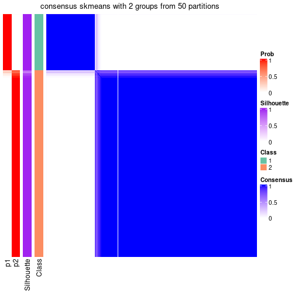</p>

</div>
<div id='tab-node-0-consensus-heatmap-2'>
<pre><code class="r">consensus_heatmap(res, k = 3)
</code></pre>

<p>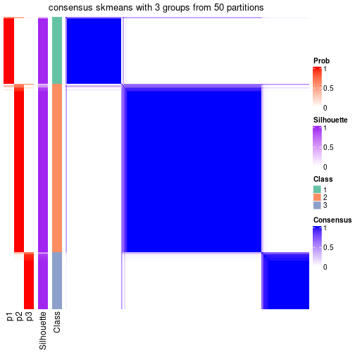</p>

</div>
<div id='tab-node-0-consensus-heatmap-3'>
<pre><code class="r">consensus_heatmap(res, k = 4)
</code></pre>

<p>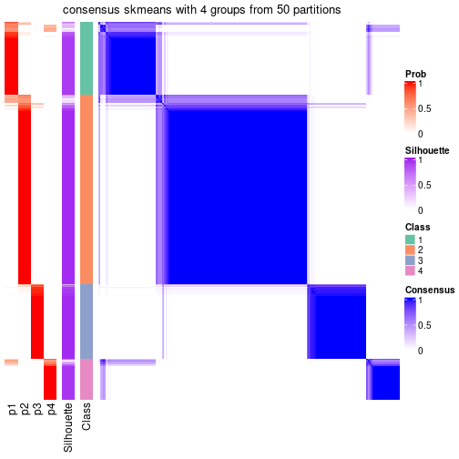</p>

</div>
<div id='tab-node-0-consensus-heatmap-4'>
<pre><code class="r">consensus_heatmap(res, k = 5)
</code></pre>

<p>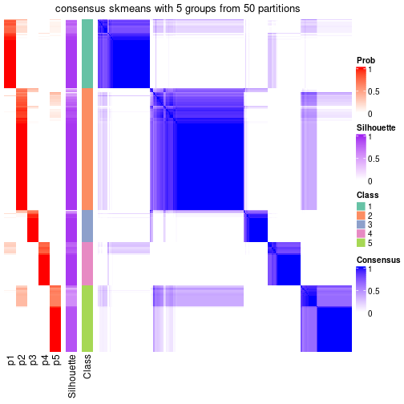</p>

</div>
<div id='tab-node-0-consensus-heatmap-5'>
<pre><code class="r">consensus_heatmap(res, k = 6)
</code></pre>

<p>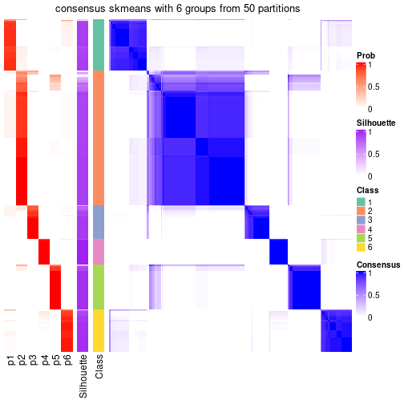</p>

</div>
<div id='tab-node-0-consensus-heatmap-6'>
<pre><code class="r">consensus_heatmap(res, k = 7)
</code></pre>

<p>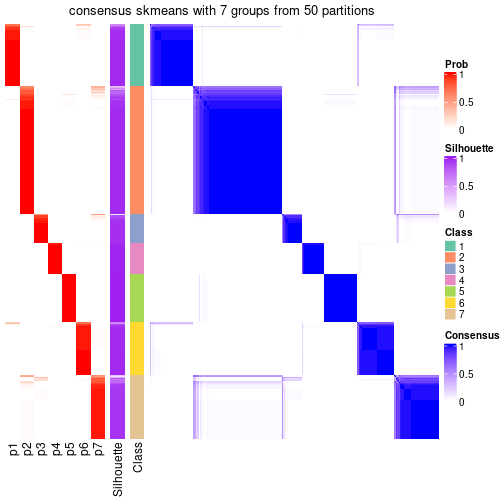</p>

</div>
<div id='tab-node-0-consensus-heatmap-7'>
<pre><code class="r">consensus_heatmap(res, k = 8)
</code></pre>

<p>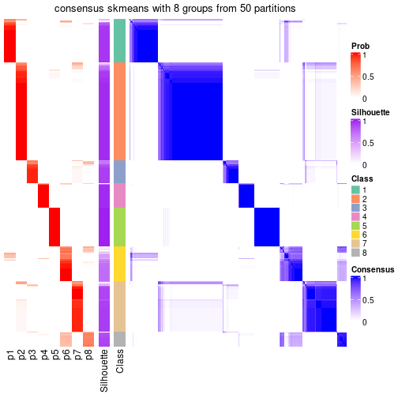</p>

</div>
</div>

Heatmaps for the membership of samples in all partitions to see how consistent they are:


<script>
$( function() {
	$( '#tabs-node-0-membership-heatmap' ).tabs();
} );
</script>
<div id='tabs-node-0-membership-heatmap'>
<ul>
<li><a href='#tab-node-0-membership-heatmap-1'>k = 2</a></li>
<li><a href='#tab-node-0-membership-heatmap-2'>k = 3</a></li>
<li><a href='#tab-node-0-membership-heatmap-3'>k = 4</a></li>
<li><a href='#tab-node-0-membership-heatmap-4'>k = 5</a></li>
<li><a href='#tab-node-0-membership-heatmap-5'>k = 6</a></li>
<li><a href='#tab-node-0-membership-heatmap-6'>k = 7</a></li>
<li><a href='#tab-node-0-membership-heatmap-7'>k = 8</a></li>
</ul>
<div id='tab-node-0-membership-heatmap-1'>
<pre><code class="r">membership_heatmap(res, k = 2)
</code></pre>

<p>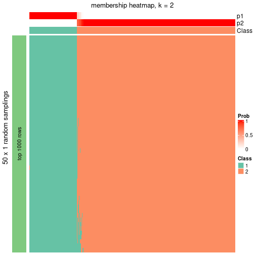</p>

</div>
<div id='tab-node-0-membership-heatmap-2'>
<pre><code class="r">membership_heatmap(res, k = 3)
</code></pre>

<p>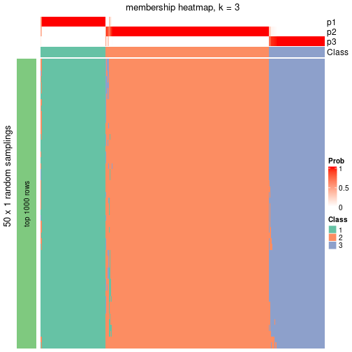</p>

</div>
<div id='tab-node-0-membership-heatmap-3'>
<pre><code class="r">membership_heatmap(res, k = 4)
</code></pre>

<p>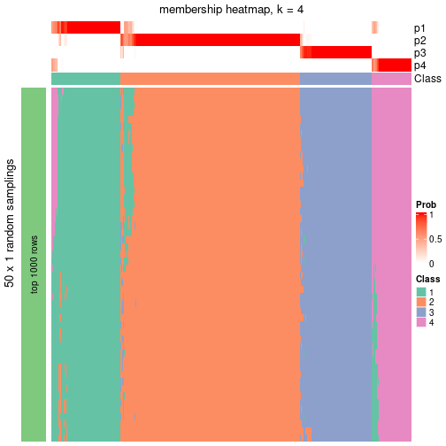</p>

</div>
<div id='tab-node-0-membership-heatmap-4'>
<pre><code class="r">membership_heatmap(res, k = 5)
</code></pre>

<p>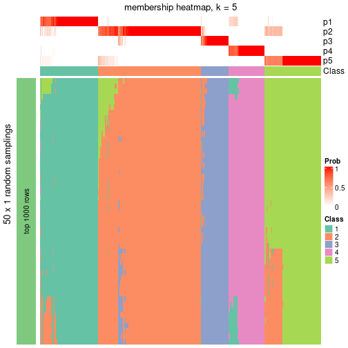</p>

</div>
<div id='tab-node-0-membership-heatmap-5'>
<pre><code class="r">membership_heatmap(res, k = 6)
</code></pre>

<p>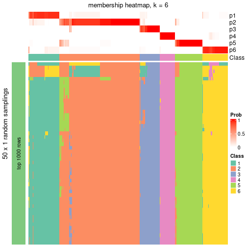</p>

</div>
<div id='tab-node-0-membership-heatmap-6'>
<pre><code class="r">membership_heatmap(res, k = 7)
</code></pre>

<p>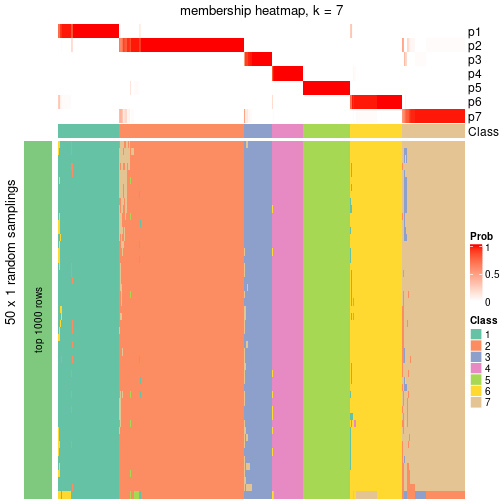</p>

</div>
<div id='tab-node-0-membership-heatmap-7'>
<pre><code class="r">membership_heatmap(res, k = 8)
</code></pre>

<p>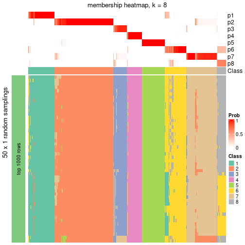</p>

</div>
</div>

As soon as the classes for columns are determined, the signatures
that are significantly different between subgroups can be looked for. 
Following are the heatmaps for signatures.


<script>
$( function() {
	$( '#tabs-node-0-get-signatures' ).tabs();
} );
</script>
<div id='tabs-node-0-get-signatures'>
<ul>
<li><a href='#tab-node-0-get-signatures-1'>k = 2</a></li>
<li><a href='#tab-node-0-get-signatures-2'>k = 3</a></li>
<li><a href='#tab-node-0-get-signatures-3'>k = 4</a></li>
<li><a href='#tab-node-0-get-signatures-4'>k = 5</a></li>
<li><a href='#tab-node-0-get-signatures-5'>k = 6</a></li>
<li><a href='#tab-node-0-get-signatures-6'>k = 7</a></li>
<li><a href='#tab-node-0-get-signatures-7'>k = 8</a></li>
</ul>
<div id='tab-node-0-get-signatures-1'>
<pre><code class="r">get_signatures(res, k = 2)
</code></pre>

<p>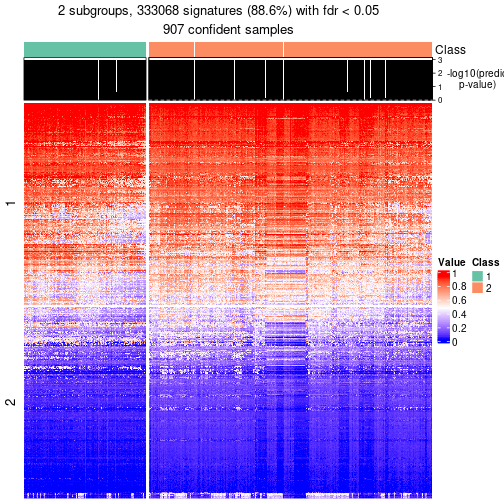</p>

</div>
<div id='tab-node-0-get-signatures-2'>
<pre><code class="r">get_signatures(res, k = 3)
</code></pre>

<p>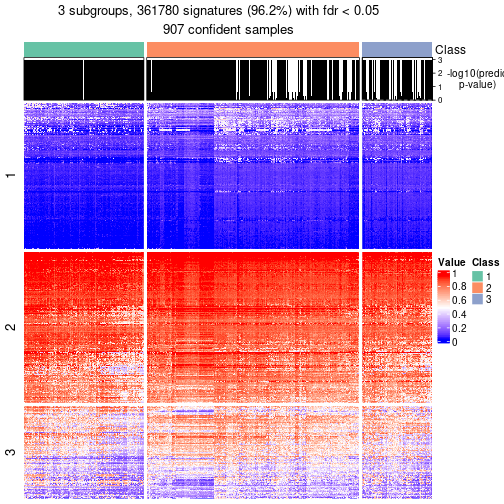</p>

</div>
<div id='tab-node-0-get-signatures-3'>
<pre><code class="r">get_signatures(res, k = 4)
</code></pre>

<p>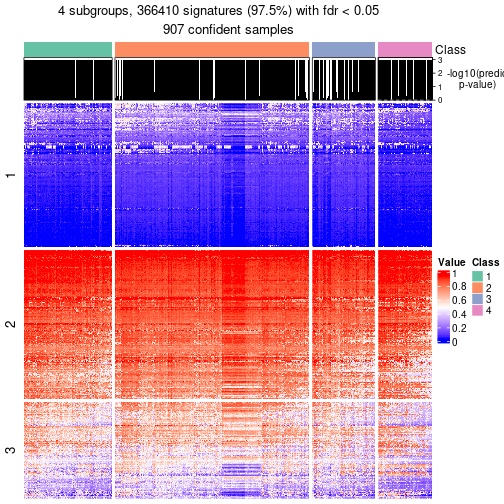</p>

</div>
<div id='tab-node-0-get-signatures-4'>
<pre><code class="r">get_signatures(res, k = 5)
</code></pre>

<p>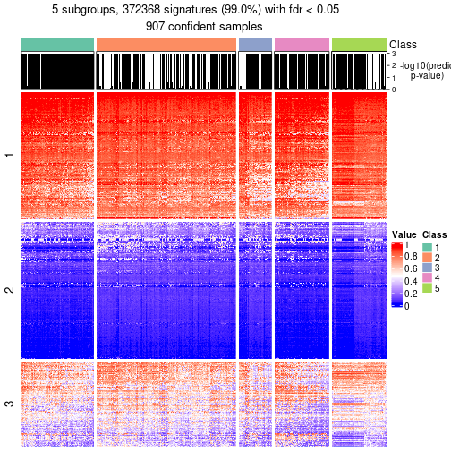</p>

</div>
<div id='tab-node-0-get-signatures-5'>
<pre><code class="r">get_signatures(res, k = 6)
</code></pre>

<p>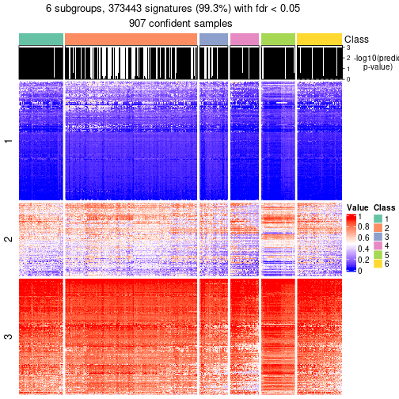</p>

</div>
<div id='tab-node-0-get-signatures-6'>
<pre><code class="r">get_signatures(res, k = 7)
</code></pre>

<p>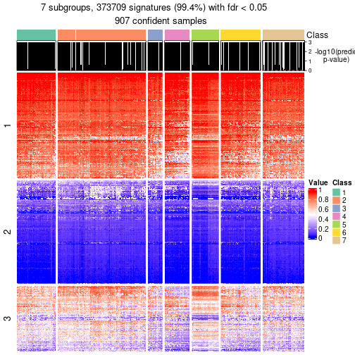</p>

</div>
<div id='tab-node-0-get-signatures-7'>
<pre><code class="r">get_signatures(res, k = 8)
</code></pre>

<p>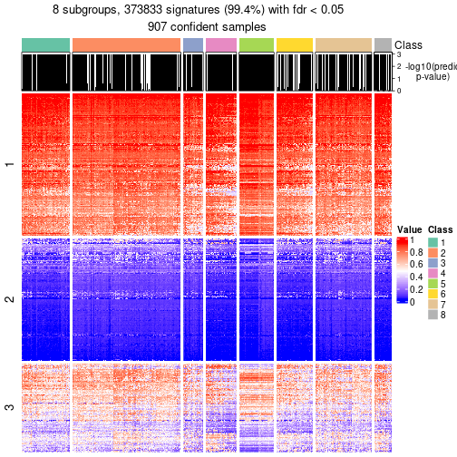</p>

</div>
</div>


Compare the overlap of signatures from different k:

```r
compare_signatures(res)
```

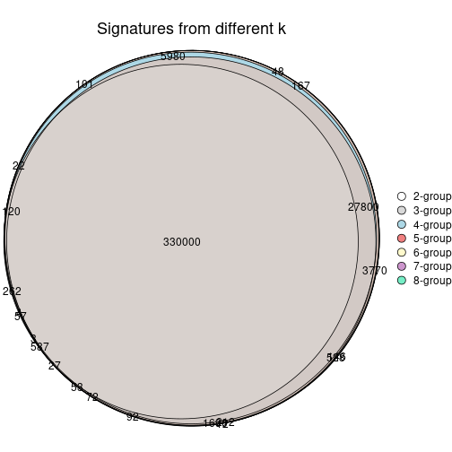

`get_signature()` returns a data frame invisibly. To get the list of signatures, the function
call should be assigned to a variable explicitly. In following code, if `plot` argument is set
to `FALSE`, no heatmap is plotted while only the differential analysis is performed.

```r
# code only for demonstration
tb = get_signature(res, k = ..., plot = FALSE)
```

An example of the output of `tb` is:

```
#>   which_row         fdr    mean_1    mean_2 scaled_mean_1 scaled_mean_2 km
#> 1        38 0.042760348  8.373488  9.131774    -0.5533452     0.5164555  1
#> 2        40 0.018707592  7.106213  8.469186    -0.6173731     0.5762149  1
#> 3        55 0.019134737 10.221463 11.207825    -0.6159697     0.5749050  1
#> 4        59 0.006059896  5.921854  7.869574    -0.6899429     0.6439467  1
#> 5        60 0.018055526  8.928898 10.211722    -0.6204761     0.5791110  1
#> 6        98 0.009384629 15.714769 14.887706     0.6635654    -0.6193277  2
...
```

The columns in `tb` are:

1. `which_row`: row indices corresponding to the input matrix.
2. `fdr`: FDR for the differential test. 
3. `mean_x`: The mean value in group x.
4. `scaled_mean_x`: The mean value in group x after rows are scaled.
5. `km`: Row groups if k-means clustering is applied to rows (which is done by automatically selecting number of clusters).

If there are too many signatures, `top_signatures = ...` can be set to only show the 
signatures with the highest FDRs:

```r
# code only for demonstration
# e.g. to show the top 500 most significant rows
tb = get_signature(res, k = ..., top_signatures = 500)
```

If the signatures are defined as these which are uniquely high in current group, `diff_method` argument
can be set to `"uniquely_high_in_one_group"`:

```r
# code only for demonstration
tb = get_signature(res, k = ..., diff_method = "uniquely_high_in_one_group")
```


UMAP plot which shows how samples are separated.


<script>
$( function() {
	$( '#tabs-node-0-dimension-reduction' ).tabs();
} );
</script>
<div id='tabs-node-0-dimension-reduction'>
<ul>
<li><a href='#tab-node-0-dimension-reduction-1'>k = 2</a></li>
<li><a href='#tab-node-0-dimension-reduction-2'>k = 3</a></li>
<li><a href='#tab-node-0-dimension-reduction-3'>k = 4</a></li>
<li><a href='#tab-node-0-dimension-reduction-4'>k = 5</a></li>
<li><a href='#tab-node-0-dimension-reduction-5'>k = 6</a></li>
<li><a href='#tab-node-0-dimension-reduction-6'>k = 7</a></li>
<li><a href='#tab-node-0-dimension-reduction-7'>k = 8</a></li>
</ul>
<div id='tab-node-0-dimension-reduction-1'>
<pre><code class="r">dimension_reduction(res, k = 2, method = &quot;UMAP&quot;)
</code></pre>

<p>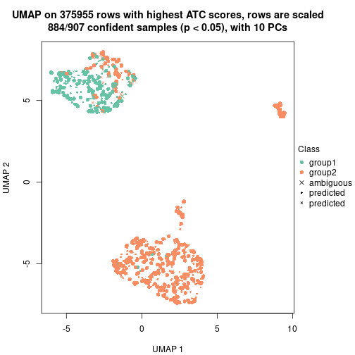</p>

</div>
<div id='tab-node-0-dimension-reduction-2'>
<pre><code class="r">dimension_reduction(res, k = 3, method = &quot;UMAP&quot;)
</code></pre>

<p>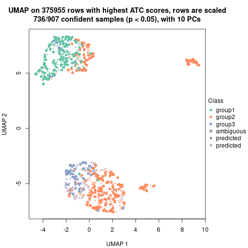</p>

</div>
<div id='tab-node-0-dimension-reduction-3'>
<pre><code class="r">dimension_reduction(res, k = 4, method = &quot;UMAP&quot;)
</code></pre>

<p>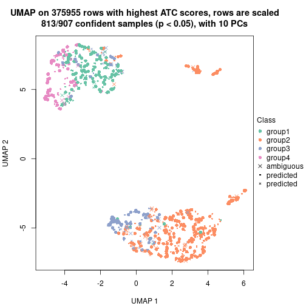</p>

</div>
<div id='tab-node-0-dimension-reduction-4'>
<pre><code class="r">dimension_reduction(res, k = 5, method = &quot;UMAP&quot;)
</code></pre>

<p>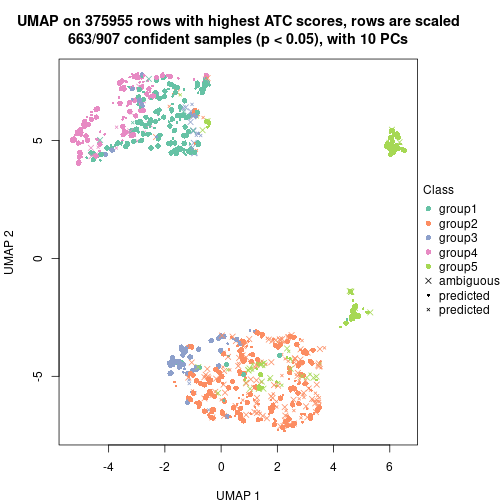</p>

</div>
<div id='tab-node-0-dimension-reduction-5'>
<pre><code class="r">dimension_reduction(res, k = 6, method = &quot;UMAP&quot;)
</code></pre>

<p>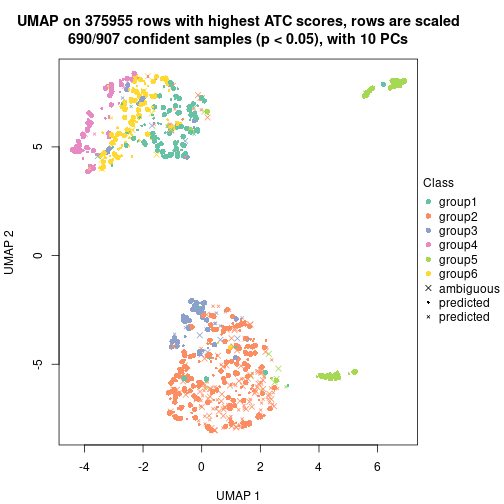</p>

</div>
<div id='tab-node-0-dimension-reduction-6'>
<pre><code class="r">dimension_reduction(res, k = 7, method = &quot;UMAP&quot;)
</code></pre>

<p>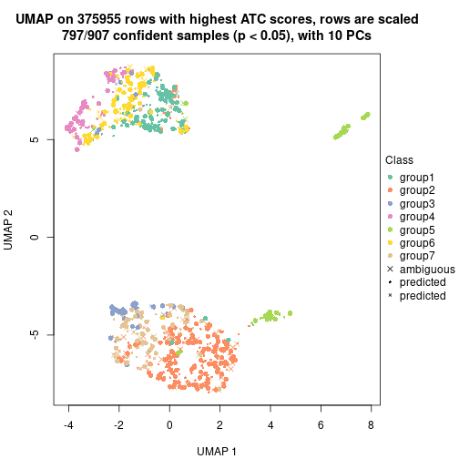</p>

</div>
<div id='tab-node-0-dimension-reduction-7'>
<pre><code class="r">dimension_reduction(res, k = 8, method = &quot;UMAP&quot;)
</code></pre>

<p>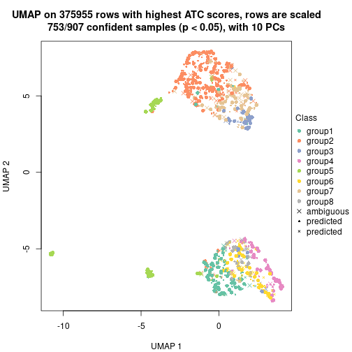</p>

</div>
</div>


Following heatmap shows how subgroups are split when increasing `k`:

```r
collect_classes(res)
```

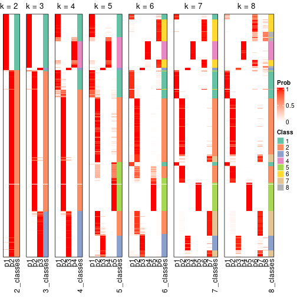


If matrix rows can be associated to genes, consider to use `functional_enrichment(res,
...)` to perform function enrichment for the signature genes. See [this vignette](https://jokergoo.github.io/cola_vignettes/functional_enrichment.html) for more detailed explanations.


 

---------------------------------------------------


### Node01


Parent node: [Node0](#Node0).
Child nodes: 
                [Node011](#Node011)
        ,
                [Node012](#Node012)
        ,
                [Node013](#Node013)
        ,
                Node014-leaf
        ,
                [Node021](#Node021)
        ,
                [Node022](#Node022)
        ,
                [Node023](#Node023)
        ,
                [Node024](#Node024)
        ,
                Node031-leaf
        ,
                Node032-leaf
        ,
                [Node041](#Node041)
        ,
                [Node042](#Node042)
        ,
                [Node043](#Node043)
        ,
                [Node051](#Node051)
        ,
                [Node052](#Node052)
        ,
                [Node061](#Node061)
        ,
                Node062-leaf
        ,
                [Node071](#Node071)
        ,
                [Node072](#Node072)
        ,
                [Node073](#Node073)
        .


The object with results only for a single top-value method and a single partitioning method 
can be extracted as:

```r
res = res_rh["01"]
```

A summary of `res` and all the functions that can be applied to it:

```r
res
```

```
#> A 'ConsensusPartition' object with k = 2, 3, 4, 5, 6, 7, 8.
#>   On a matrix with 30000 rows and 128 columns.
#>   Top rows (1000) are extracted by 'ATC' method.
#>   Subgroups are detected by 'skmeans' method.
#>   Performed in total 350 partitions by row resampling.
#>   Best k for subgroups seems to be 4.
#> 
#> Following methods can be applied to this 'ConsensusPartition' object:
#>  [1] "cola_report"             "collect_classes"         "collect_plots"          
#>  [4] "collect_stats"           "colnames"                "compare_partitions"     
#>  [7] "compare_signatures"      "consensus_heatmap"       "dimension_reduction"    
#> [10] "functional_enrichment"   "get_anno_col"            "get_anno"               
#> [13] "get_classes"             "get_consensus"           "get_matrix"             
#> [16] "get_membership"          "get_param"               "get_signatures"         
#> [19] "get_stats"               "is_best_k"               "is_stable_k"            
#> [22] "membership_heatmap"      "ncol"                    "nrow"                   
#> [25] "plot_ecdf"               "predict_classes"         "rownames"               
#> [28] "select_partition_number" "show"                    "suggest_best_k"         
#> [31] "test_to_known_factors"   "top_rows_heatmap"
```

`collect_plots()` function collects all the plots made from `res` for all `k` (number of subgroups)
into one single page to provide an easy and fast comparison between different `k`.

```r
collect_plots(res)
```

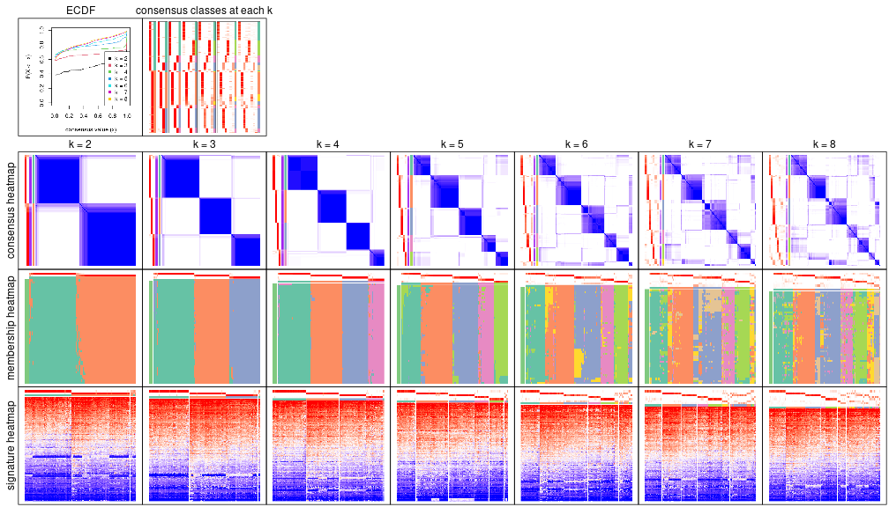

The plots are:

- The first row: a plot of the eCDF (empirical cumulative distribution
  function) curves of the consensus matrix for each `k` and the heatmap of
  predicted classes for each `k`.
- The second row: heatmaps of the consensus matrix for each `k`.
- The third row: heatmaps of the membership matrix for each `k`.
- The fouth row: heatmaps of the signatures for each `k`.

All the plots in panels can be made by individual functions and they are
plotted later in this section.

`select_partition_number()` produces several plots showing different
statistics for choosing "optimized" `k`. There are following statistics:

- eCDF curves of the consensus matrix for each `k`;
- 1-PAC. [The PAC score](https://en.wikipedia.org/wiki/Consensus_clustering#Over-interpretation_potential_of_consensus_clustering)
  measures the proportion of the ambiguous subgrouping.
- Mean silhouette score.
- Concordance. The mean probability of fiting the consensus subgroup labels in all
  partitions.
- Area increased. Denote $A_k$ as the area under the eCDF curve for current
  `k`, the area increased is defined as $A_k - A_{k-1}$.
- Rand index. The percent of pairs of samples that are both in a same cluster
  or both are not in a same cluster in the partition of k and k-1.
- Jaccard index. The ratio of pairs of samples are both in a same cluster in
  the partition of k and k-1 and the pairs of samples are both in a same
  cluster in the partition k or k-1.

The detailed explanations of these statistics can be found in [the _cola_
vignette](https://jokergoo.github.io/cola_vignettes/cola.html#toc_13).

Generally speaking, higher 1-PAC score, higher mean silhouette score or higher
concordance corresponds to better partition. Rand index and Jaccard index
measure how similar the current partition is compared to partition with `k-1`.
If they are too similar, we won't accept `k` is better than `k-1`.

```r
select_partition_number(res)
```

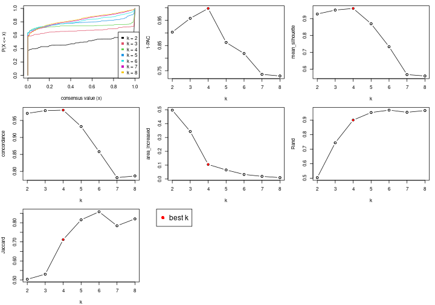

The numeric values for all these statistics can be obtained by `get_stats()`.

```r
get_stats(res)
```

```
#>   k 1-PAC mean_silhouette concordance area_increased  Rand Jaccard
#> 2 2 0.903           0.928       0.971         0.4974 0.504   0.504
#> 3 3 0.958           0.951       0.979         0.3432 0.743   0.531
#> 4 4 0.997           0.961       0.980         0.1049 0.900   0.712
#> 5 5 0.862           0.870       0.932         0.0655 0.952   0.815
#> 6 6 0.818           0.733       0.858         0.0331 0.969   0.858
#> 7 7 0.736           0.568       0.782         0.0191 0.953   0.784
#> 8 8 0.729           0.560       0.787         0.0100 0.965   0.820
```

`suggest_best_k()` suggests the best $k$ based on these statistics. The rules are as follows:

- All $k$ with Jaccard index larger than 0.95 are removed because increasing
  $k$ does not provide enough extra information. If all $k$ are removed, it is
  marked as no subgroup is detected.
- For all $k$ with 1-PAC score larger than 0.9, the maximal $k$ is taken as
  the best $k$, and other $k$ are marked as optional $k$.
- If it does not fit the second rule. The $k$ with the maximal vote of the
  highest 1-PAC score, highest mean silhouette, and highest concordance is
  taken as the best $k$.

```r
suggest_best_k(res)
```

```
#> [1] 4
#> attr(,"optional")
#> [1] 2 3
```

There is also optional best $k$ = 2 3 that is worth to check.

Following is the table of the partitions (You need to click the **show/hide
code output** link to see it). The membership matrix (columns with name `p*`)
is inferred by
[`clue::cl_consensus()`](https://www.rdocumentation.org/link/cl_consensus?package=clue)
function with the `SE` method. Basically the value in the membership matrix
represents the probability to belong to a certain group. The finall subgroup
label for an item is determined with the group with highest probability it
belongs to.

In `get_classes()` function, the entropy is calculated from the membership
matrix and the silhouette score is calculated from the consensus matrix.


<script>
$( function() {
	$( '#tabs-node-01-get-classes' ).tabs();
} );
</script>
<div id='tabs-node-01-get-classes'>
<ul>
<li><a href='#tab-node-01-get-classes-1'>k = 2</a></li>
<li><a href='#tab-node-01-get-classes-2'>k = 3</a></li>
<li><a href='#tab-node-01-get-classes-3'>k = 4</a></li>
<li><a href='#tab-node-01-get-classes-4'>k = 5</a></li>
<li><a href='#tab-node-01-get-classes-5'>k = 6</a></li>
<li><a href='#tab-node-01-get-classes-6'>k = 7</a></li>
<li><a href='#tab-node-01-get-classes-7'>k = 8</a></li>
</ul>

<div id='tab-node-01-get-classes-1'>
<p><a id='tab-node-01-get-classes-1-a' style='color:#0366d6' href='#'>show/hide code output</a></p>
<pre><code class="r">cbind(get_classes(res, k = 2), get_membership(res, k = 2))
</code></pre>

<pre><code>#&gt;                 class entropy silhouette   p1   p2
#&gt; TCGA.85.8481.01     1   0.000     0.9766 1.00 0.00
#&gt; TCGA.77.8156.01     1   0.000     0.9766 1.00 0.00
#&gt; TCGA.43.A475.01     2   0.000     0.9638 0.00 1.00
#&gt; TCGA.68.8251.01     2   0.000     0.9638 0.00 1.00
#&gt; TCGA.92.8063.01     2   0.000     0.9638 0.00 1.00
#&gt; TCGA.44.7660.01     1   0.000     0.9766 1.00 0.00
#&gt; TCGA.85.8580.01     2   0.000     0.9638 0.00 1.00
#&gt; TCGA.34.5232.01     2   0.000     0.9638 0.00 1.00
#&gt; TCGA.92.7340.01     2   0.000     0.9638 0.00 1.00
#&gt; TCGA.85.8287.01     1   0.999     0.0269 0.52 0.48
#&gt; TCGA.77.8138.01     1   0.000     0.9766 1.00 0.00
#&gt; TCGA.63.7022.01     1   0.242     0.9384 0.96 0.04
#&gt; TCGA.56.8626.01     2   0.529     0.8528 0.12 0.88
#&gt; TCGA.39.5028.11     1   0.000     0.9766 1.00 0.00
#&gt; TCGA.85.8355.01     1   0.000     0.9766 1.00 0.00
#&gt; TCGA.NC.A5HE.01     2   0.000     0.9638 0.00 1.00
#&gt; TCGA.75.6214.01     2   0.000     0.9638 0.00 1.00
#&gt; TCGA.43.A56U.01     2   0.000     0.9638 0.00 1.00
#&gt; TCGA.56.8503.01     1   0.000     0.9766 1.00 0.00
#&gt; TCGA.34.5236.01     1   0.000     0.9766 1.00 0.00
#&gt; TCGA.L3.A4E7.01     1   0.000     0.9766 1.00 0.00
#&gt; TCGA.90.A59Q.01     2   0.000     0.9638 0.00 1.00
#&gt; TCGA.55.8614.01     1   0.469     0.8722 0.90 0.10
#&gt; TCGA.85.A53L.01     2   0.000     0.9638 0.00 1.00
#&gt; TCGA.56.A4ZJ.01     1   0.000     0.9766 1.00 0.00
#&gt; TCGA.44.6148.01     1   0.000     0.9766 1.00 0.00
#&gt; TCGA.63.A5MV.01     1   0.000     0.9766 1.00 0.00
#&gt; TCGA.58.8393.01     2   0.000     0.9638 0.00 1.00
#&gt; TCGA.63.A5MS.01     2   0.000     0.9638 0.00 1.00
#&gt; TCGA.63.A5MP.01     2   0.000     0.9638 0.00 1.00
#&gt; TCGA.77.A5GH.01     1   0.722     0.7357 0.80 0.20
#&gt; TCGA.52.7622.01     2   0.000     0.9638 0.00 1.00
#&gt; TCGA.34.A5IX.01     2   0.000     0.9638 0.00 1.00
#&gt; TCGA.34.8454.01     1   0.000     0.9766 1.00 0.00
#&gt; TCGA.77.8146.01     1   0.000     0.9766 1.00 0.00
#&gt; TCGA.56.8309.01     1   0.000     0.9766 1.00 0.00
#&gt; TCGA.63.7021.01     1   0.000     0.9766 1.00 0.00
#&gt; TCGA.58.8387.01     1   0.958     0.3648 0.62 0.38
#&gt; TCGA.55.7726.01     2   0.000     0.9638 0.00 1.00
#&gt; TCGA.39.5028.01     1   0.000     0.9766 1.00 0.00
#&gt; TCGA.77.8008.01     1   0.000     0.9766 1.00 0.00
#&gt; TCGA.22.4609.01     1   0.000     0.9766 1.00 0.00
#&gt; TCGA.43.8115.01     2   0.000     0.9638 0.00 1.00
#&gt; TCGA.56.A5DS.01     2   0.000     0.9638 0.00 1.00
#&gt; TCGA.34.5241.01     1   0.000     0.9766 1.00 0.00
#&gt; TCGA.96.A4JL.01     2   0.000     0.9638 0.00 1.00
#&gt; TCGA.33.AASI.01     2   0.000     0.9638 0.00 1.00
#&gt; TCGA.43.6647.01     1   0.000     0.9766 1.00 0.00
#&gt; TCGA.77.A5GA.01     2   0.000     0.9638 0.00 1.00
#&gt; TCGA.56.6546.01     1   0.000     0.9766 1.00 0.00
#&gt; TCGA.85.7697.01     1   0.000     0.9766 1.00 0.00
#&gt; TCGA.77.6842.01     1   0.000     0.9766 1.00 0.00
#&gt; TCGA.63.A5MR.01     2   0.943     0.4619 0.36 0.64
#&gt; TCGA.94.A5I6.01     2   0.000     0.9638 0.00 1.00
#&gt; TCGA.85.8049.01     2   0.000     0.9638 0.00 1.00
#&gt; TCGA.56.8201.01     2   0.000     0.9638 0.00 1.00
#&gt; TCGA.85.8353.01     2   0.000     0.9638 0.00 1.00
#&gt; TCGA.96.7545.01     2   0.000     0.9638 0.00 1.00
#&gt; TCGA.85.8276.01     2   0.000     0.9638 0.00 1.00
#&gt; TCGA.58.8386.01     2   0.971     0.3616 0.40 0.60
#&gt; TCGA.56.7731.01     1   0.000     0.9766 1.00 0.00
#&gt; TCGA.96.8169.01     2   0.000     0.9638 0.00 1.00
#&gt; TCGA.33.4589.01     2   0.000     0.9638 0.00 1.00
#&gt; TCGA.98.8023.01     1   0.000     0.9766 1.00 0.00
#&gt; TCGA.56.8625.01     2   0.000     0.9638 0.00 1.00
#&gt; TCGA.60.2703.01     1   0.000     0.9766 1.00 0.00
#&gt; TCGA.77.A5GB.01     1   0.000     0.9766 1.00 0.00
#&gt; TCGA.90.A4EE.01     2   0.000     0.9638 0.00 1.00
#&gt; TCGA.63.A5MG.01     2   0.000     0.9638 0.00 1.00
#&gt; TCGA.94.8491.01     2   0.000     0.9638 0.00 1.00
#&gt; TCGA.85.A4JC.01     1   0.000     0.9766 1.00 0.00
#&gt; TCGA.77.7138.01     1   0.000     0.9766 1.00 0.00
#&gt; TCGA.68.A59I.01     2   0.000     0.9638 0.00 1.00
#&gt; TCGA.77.8131.01     1   0.000     0.9766 1.00 0.00
#&gt; TCGA.68.7756.01     1   0.000     0.9766 1.00 0.00
#&gt; TCGA.58.A46J.01     1   0.000     0.9766 1.00 0.00
#&gt; TCGA.92.8064.01     2   0.000     0.9638 0.00 1.00
#&gt; TCGA.85.A50Z.01     1   0.000     0.9766 1.00 0.00
#&gt; TCGA.55.8204.01     2   0.000     0.9638 0.00 1.00
#&gt; TCGA.O2.A52V.01     2   0.000     0.9638 0.00 1.00
#&gt; TCGA.85.6175.01     1   0.000     0.9766 1.00 0.00
#&gt; TCGA.39.5039.01     1   0.000     0.9766 1.00 0.00
#&gt; TCGA.39.5024.01     2   0.000     0.9638 0.00 1.00
#&gt; TCGA.33.A4WN.01     2   0.000     0.9638 0.00 1.00
#&gt; TCGA.NK.A5CT.01     2   0.722     0.7529 0.20 0.80
#&gt; TCGA.18.4721.01     2   0.000     0.9638 0.00 1.00
#&gt; TCGA.85.8351.01     2   0.000     0.9638 0.00 1.00
#&gt; TCGA.60.2709.01     2   0.000     0.9638 0.00 1.00
#&gt; TCGA.85.8666.01     2   0.000     0.9638 0.00 1.00
#&gt; TCGA.94.7943.01     2   0.469     0.8748 0.10 0.90
#&gt; TCGA.NK.A5CX.01     1   0.000     0.9766 1.00 0.00
#&gt; TCGA.XC.AA0X.01     2   0.000     0.9638 0.00 1.00
#&gt; TCGA.85.6561.01     2   0.000     0.9638 0.00 1.00
#&gt; TCGA.85.8582.01     2   0.000     0.9638 0.00 1.00
#&gt; TCGA.34.5234.01     1   0.000     0.9766 1.00 0.00
#&gt; TCGA.22.4605.01     2   0.529     0.8525 0.12 0.88
#&gt; TCGA.56.8624.01     1   0.000     0.9766 1.00 0.00
#&gt; TCGA.94.7033.01     1   0.000     0.9766 1.00 0.00
#&gt; TCGA.60.2704.01     1   0.000     0.9766 1.00 0.00
#&gt; TCGA.63.A5MT.01     2   0.000     0.9638 0.00 1.00
#&gt; TCGA.55.7724.01     2   0.000     0.9638 0.00 1.00
#&gt; TCGA.85.A4JB.01     1   0.000     0.9766 1.00 0.00
#&gt; TCGA.39.5030.01     2   0.141     0.9476 0.02 0.98
#&gt; TCGA.43.8118.01     2   0.760     0.7236 0.22 0.78
#&gt; TCGA.68.7757.01     1   0.000     0.9766 1.00 0.00
#&gt; TCGA.92.8065.01     2   0.000     0.9638 0.00 1.00
#&gt; TCGA.52.7811.01     1   0.000     0.9766 1.00 0.00
#&gt; TCGA.77.8136.01     2   0.000     0.9638 0.00 1.00
#&gt; TCGA.33.4587.01     1   0.000     0.9766 1.00 0.00
#&gt; TCGA.56.8628.01     1   0.141     0.9583 0.98 0.02
#&gt; TCGA.21.A5DI.01     1   0.000     0.9766 1.00 0.00
#&gt; TCGA.22.5489.01     2   0.000     0.9638 0.00 1.00
#&gt; TCGA.56.5897.01     1   0.000     0.9766 1.00 0.00
#&gt; TCGA.85.8048.01     1   0.000     0.9766 1.00 0.00
#&gt; TCGA.96.8170.01     2   0.402     0.8942 0.08 0.92
#&gt; TCGA.NC.A5HL.01     2   0.000     0.9638 0.00 1.00
#&gt; TCGA.43.6771.01     2   0.000     0.9638 0.00 1.00
#&gt; TCGA.35.5375.01     2   0.000     0.9638 0.00 1.00
#&gt; TCGA.6A.AB49.01     2   0.990     0.2445 0.44 0.56
#&gt; TCGA.85.A511.01     2   0.990     0.2423 0.44 0.56
#&gt; TCGA.NK.A7XE.01     2   0.000     0.9638 0.00 1.00
#&gt; TCGA.56.6545.01     2   0.000     0.9638 0.00 1.00
#&gt; TCGA.NJ.A55A.01     2   0.000     0.9638 0.00 1.00
#&gt; TCGA.63.A5MM.01     2   0.000     0.9638 0.00 1.00
#&gt; TCGA.21.5784.01     1   0.000     0.9766 1.00 0.00
#&gt; TCGA.39.5021.01     1   0.000     0.9766 1.00 0.00
#&gt; TCGA.33.AASL.01     2   0.000     0.9638 0.00 1.00
#&gt; TCGA.77.7335.01     2   0.000     0.9638 0.00 1.00
</code></pre>

<script>
$('#tab-node-01-get-classes-1-a').parent().next().next().hide();
$('#tab-node-01-get-classes-1-a').click(function(){
  $('#tab-node-01-get-classes-1-a').parent().next().next().toggle();
  return(false);
});
</script>
</div>

<div id='tab-node-01-get-classes-2'>
<p><a id='tab-node-01-get-classes-2-a' style='color:#0366d6' href='#'>show/hide code output</a></p>
<pre><code class="r">cbind(get_classes(res, k = 3), get_membership(res, k = 3))
</code></pre>

<pre><code>#&gt;                 class entropy silhouette   p1   p2   p3
#&gt; TCGA.85.8481.01     1   0.000      0.966 1.00 0.00 0.00
#&gt; TCGA.77.8156.01     1   0.000      0.966 1.00 0.00 0.00
#&gt; TCGA.43.A475.01     2   0.000      0.990 0.00 1.00 0.00
#&gt; TCGA.68.8251.01     2   0.000      0.990 0.00 1.00 0.00
#&gt; TCGA.92.8063.01     2   0.000      0.990 0.00 1.00 0.00
#&gt; TCGA.44.7660.01     1   0.000      0.966 1.00 0.00 0.00
#&gt; TCGA.85.8580.01     2   0.000      0.990 0.00 1.00 0.00
#&gt; TCGA.34.5232.01     3   0.207      0.927 0.00 0.06 0.94
#&gt; TCGA.92.7340.01     2   0.000      0.990 0.00 1.00 0.00
#&gt; TCGA.85.8287.01     1   0.000      0.966 1.00 0.00 0.00
#&gt; TCGA.77.8138.01     1   0.000      0.966 1.00 0.00 0.00
#&gt; TCGA.63.7022.01     3   0.000      0.980 0.00 0.00 1.00
#&gt; TCGA.56.8626.01     1   0.628      0.148 0.54 0.46 0.00
#&gt; TCGA.39.5028.11     1   0.000      0.966 1.00 0.00 0.00
#&gt; TCGA.85.8355.01     1   0.000      0.966 1.00 0.00 0.00
#&gt; TCGA.NC.A5HE.01     2   0.000      0.990 0.00 1.00 0.00
#&gt; TCGA.75.6214.01     3   0.000      0.980 0.00 0.00 1.00
#&gt; TCGA.43.A56U.01     3   0.000      0.980 0.00 0.00 1.00
#&gt; TCGA.56.8503.01     3   0.000      0.980 0.00 0.00 1.00
#&gt; TCGA.34.5236.01     1   0.000      0.966 1.00 0.00 0.00
#&gt; TCGA.L3.A4E7.01     1   0.000      0.966 1.00 0.00 0.00
#&gt; TCGA.90.A59Q.01     3   0.000      0.980 0.00 0.00 1.00
#&gt; TCGA.55.8614.01     1   0.556      0.575 0.70 0.00 0.30
#&gt; TCGA.85.A53L.01     2   0.000      0.990 0.00 1.00 0.00
#&gt; TCGA.56.A4ZJ.01     3   0.000      0.980 0.00 0.00 1.00
#&gt; TCGA.44.6148.01     1   0.000      0.966 1.00 0.00 0.00
#&gt; TCGA.63.A5MV.01     1   0.000      0.966 1.00 0.00 0.00
#&gt; TCGA.58.8393.01     2   0.000      0.990 0.00 1.00 0.00
#&gt; TCGA.63.A5MS.01     2   0.000      0.990 0.00 1.00 0.00
#&gt; TCGA.63.A5MP.01     2   0.000      0.990 0.00 1.00 0.00
#&gt; TCGA.77.A5GH.01     1   0.604      0.394 0.62 0.00 0.38
#&gt; TCGA.52.7622.01     3   0.000      0.980 0.00 0.00 1.00
#&gt; TCGA.34.A5IX.01     2   0.000      0.990 0.00 1.00 0.00
#&gt; TCGA.34.8454.01     3   0.000      0.980 0.00 0.00 1.00
#&gt; TCGA.77.8146.01     1   0.000      0.966 1.00 0.00 0.00
#&gt; TCGA.56.8309.01     1   0.000      0.966 1.00 0.00 0.00
#&gt; TCGA.63.7021.01     1   0.000      0.966 1.00 0.00 0.00
#&gt; TCGA.58.8387.01     1   0.000      0.966 1.00 0.00 0.00
#&gt; TCGA.55.7726.01     3   0.000      0.980 0.00 0.00 1.00
#&gt; TCGA.39.5028.01     1   0.000      0.966 1.00 0.00 0.00
#&gt; TCGA.77.8008.01     1   0.000      0.966 1.00 0.00 0.00
#&gt; TCGA.22.4609.01     1   0.334      0.846 0.88 0.00 0.12
#&gt; TCGA.43.8115.01     2   0.000      0.990 0.00 1.00 0.00
#&gt; TCGA.56.A5DS.01     3   0.000      0.980 0.00 0.00 1.00
#&gt; TCGA.34.5241.01     1   0.000      0.966 1.00 0.00 0.00
#&gt; TCGA.96.A4JL.01     2   0.000      0.990 0.00 1.00 0.00
#&gt; TCGA.33.AASI.01     3   0.000      0.980 0.00 0.00 1.00
#&gt; TCGA.43.6647.01     3   0.000      0.980 0.00 0.00 1.00
#&gt; TCGA.77.A5GA.01     2   0.000      0.990 0.00 1.00 0.00
#&gt; TCGA.56.6546.01     1   0.000      0.966 1.00 0.00 0.00
#&gt; TCGA.85.7697.01     1   0.000      0.966 1.00 0.00 0.00
#&gt; TCGA.77.6842.01     1   0.000      0.966 1.00 0.00 0.00
#&gt; TCGA.63.A5MR.01     3   0.000      0.980 0.00 0.00 1.00
#&gt; TCGA.94.A5I6.01     2   0.000      0.990 0.00 1.00 0.00
#&gt; TCGA.85.8049.01     2   0.000      0.990 0.00 1.00 0.00
#&gt; TCGA.56.8201.01     2   0.000      0.990 0.00 1.00 0.00
#&gt; TCGA.85.8353.01     2   0.000      0.990 0.00 1.00 0.00
#&gt; TCGA.96.7545.01     2   0.000      0.990 0.00 1.00 0.00
#&gt; TCGA.85.8276.01     2   0.000      0.990 0.00 1.00 0.00
#&gt; TCGA.58.8386.01     3   0.429      0.782 0.18 0.00 0.82
#&gt; TCGA.56.7731.01     3   0.000      0.980 0.00 0.00 1.00
#&gt; TCGA.96.8169.01     3   0.000      0.980 0.00 0.00 1.00
#&gt; TCGA.33.4589.01     3   0.000      0.980 0.00 0.00 1.00
#&gt; TCGA.98.8023.01     1   0.000      0.966 1.00 0.00 0.00
#&gt; TCGA.56.8625.01     2   0.000      0.990 0.00 1.00 0.00
#&gt; TCGA.60.2703.01     1   0.000      0.966 1.00 0.00 0.00
#&gt; TCGA.77.A5GB.01     1   0.000      0.966 1.00 0.00 0.00
#&gt; TCGA.90.A4EE.01     2   0.000      0.990 0.00 1.00 0.00
#&gt; TCGA.63.A5MG.01     2   0.000      0.990 0.00 1.00 0.00
#&gt; TCGA.94.8491.01     2   0.000      0.990 0.00 1.00 0.00
#&gt; TCGA.85.A4JC.01     1   0.000      0.966 1.00 0.00 0.00
#&gt; TCGA.77.7138.01     1   0.000      0.966 1.00 0.00 0.00
#&gt; TCGA.68.A59I.01     3   0.000      0.980 0.00 0.00 1.00
#&gt; TCGA.77.8131.01     1   0.000      0.966 1.00 0.00 0.00
#&gt; TCGA.68.7756.01     1   0.000      0.966 1.00 0.00 0.00
#&gt; TCGA.58.A46J.01     1   0.000      0.966 1.00 0.00 0.00
#&gt; TCGA.92.8064.01     2   0.000      0.990 0.00 1.00 0.00
#&gt; TCGA.85.A50Z.01     1   0.000      0.966 1.00 0.00 0.00
#&gt; TCGA.55.8204.01     3   0.000      0.980 0.00 0.00 1.00
#&gt; TCGA.O2.A52V.01     2   0.000      0.990 0.00 1.00 0.00
#&gt; TCGA.85.6175.01     3   0.000      0.980 0.00 0.00 1.00
#&gt; TCGA.39.5039.01     1   0.000      0.966 1.00 0.00 0.00
#&gt; TCGA.39.5024.01     3   0.000      0.980 0.00 0.00 1.00
#&gt; TCGA.33.A4WN.01     2   0.000      0.990 0.00 1.00 0.00
#&gt; TCGA.NK.A5CT.01     3   0.400      0.810 0.16 0.00 0.84
#&gt; TCGA.18.4721.01     2   0.000      0.990 0.00 1.00 0.00
#&gt; TCGA.85.8351.01     3   0.497      0.846 0.06 0.10 0.84
#&gt; TCGA.60.2709.01     2   0.000      0.990 0.00 1.00 0.00
#&gt; TCGA.85.8666.01     2   0.000      0.990 0.00 1.00 0.00
#&gt; TCGA.94.7943.01     2   0.649      0.686 0.20 0.74 0.06
#&gt; TCGA.NK.A5CX.01     1   0.000      0.966 1.00 0.00 0.00
#&gt; TCGA.XC.AA0X.01     3   0.000      0.980 0.00 0.00 1.00
#&gt; TCGA.85.6561.01     2   0.000      0.990 0.00 1.00 0.00
#&gt; TCGA.85.8582.01     2   0.000      0.990 0.00 1.00 0.00
#&gt; TCGA.34.5234.01     3   0.000      0.980 0.00 0.00 1.00
#&gt; TCGA.22.4605.01     3   0.000      0.980 0.00 0.00 1.00
#&gt; TCGA.56.8624.01     1   0.000      0.966 1.00 0.00 0.00
#&gt; TCGA.94.7033.01     1   0.000      0.966 1.00 0.00 0.00
#&gt; TCGA.60.2704.01     1   0.000      0.966 1.00 0.00 0.00
#&gt; TCGA.63.A5MT.01     3   0.482      0.840 0.04 0.12 0.84
#&gt; TCGA.55.7724.01     3   0.000      0.980 0.00 0.00 1.00
#&gt; TCGA.85.A4JB.01     1   0.000      0.966 1.00 0.00 0.00
#&gt; TCGA.39.5030.01     3   0.000      0.980 0.00 0.00 1.00
#&gt; TCGA.43.8118.01     3   0.000      0.980 0.00 0.00 1.00
#&gt; TCGA.68.7757.01     1   0.000      0.966 1.00 0.00 0.00
#&gt; TCGA.92.8065.01     2   0.400      0.804 0.00 0.84 0.16
#&gt; TCGA.52.7811.01     1   0.000      0.966 1.00 0.00 0.00
#&gt; TCGA.77.8136.01     3   0.000      0.980 0.00 0.00 1.00
#&gt; TCGA.33.4587.01     1   0.000      0.966 1.00 0.00 0.00
#&gt; TCGA.56.8628.01     1   0.522      0.649 0.74 0.00 0.26
#&gt; TCGA.21.A5DI.01     1   0.000      0.966 1.00 0.00 0.00
#&gt; TCGA.22.5489.01     2   0.000      0.990 0.00 1.00 0.00
#&gt; TCGA.56.5897.01     1   0.000      0.966 1.00 0.00 0.00
#&gt; TCGA.85.8048.01     1   0.000      0.966 1.00 0.00 0.00
#&gt; TCGA.96.8170.01     3   0.000      0.980 0.00 0.00 1.00
#&gt; TCGA.NC.A5HL.01     2   0.000      0.990 0.00 1.00 0.00
#&gt; TCGA.43.6771.01     2   0.000      0.990 0.00 1.00 0.00
#&gt; TCGA.35.5375.01     2   0.000      0.990 0.00 1.00 0.00
#&gt; TCGA.6A.AB49.01     3   0.000      0.980 0.00 0.00 1.00
#&gt; TCGA.85.A511.01     1   0.153      0.929 0.96 0.04 0.00
#&gt; TCGA.NK.A7XE.01     2   0.000      0.990 0.00 1.00 0.00
#&gt; TCGA.56.6545.01     3   0.000      0.980 0.00 0.00 1.00
#&gt; TCGA.NJ.A55A.01     3   0.000      0.980 0.00 0.00 1.00
#&gt; TCGA.63.A5MM.01     2   0.000      0.990 0.00 1.00 0.00
#&gt; TCGA.21.5784.01     3   0.000      0.980 0.00 0.00 1.00
#&gt; TCGA.39.5021.01     1   0.000      0.966 1.00 0.00 0.00
#&gt; TCGA.33.AASL.01     2   0.000      0.990 0.00 1.00 0.00
#&gt; TCGA.77.7335.01     2   0.000      0.990 0.00 1.00 0.00
</code></pre>

<script>
$('#tab-node-01-get-classes-2-a').parent().next().next().hide();
$('#tab-node-01-get-classes-2-a').click(function(){
  $('#tab-node-01-get-classes-2-a').parent().next().next().toggle();
  return(false);
});
</script>
</div>

<div id='tab-node-01-get-classes-3'>
<p><a id='tab-node-01-get-classes-3-a' style='color:#0366d6' href='#'>show/hide code output</a></p>
<pre><code class="r">cbind(get_classes(res, k = 4), get_membership(res, k = 4))
</code></pre>

<pre><code>#&gt;                 class entropy silhouette   p1   p2   p3   p4
#&gt; TCGA.85.8481.01     1  0.0000      0.976 1.00 0.00 0.00 0.00
#&gt; TCGA.77.8156.01     1  0.0000      0.976 1.00 0.00 0.00 0.00
#&gt; TCGA.43.A475.01     2  0.1637      0.928 0.00 0.94 0.06 0.00
#&gt; TCGA.68.8251.01     2  0.0000      0.988 0.00 1.00 0.00 0.00
#&gt; TCGA.92.8063.01     2  0.0000      0.988 0.00 1.00 0.00 0.00
#&gt; TCGA.44.7660.01     1  0.0000      0.976 1.00 0.00 0.00 0.00
#&gt; TCGA.85.8580.01     2  0.1211      0.950 0.00 0.96 0.04 0.00
#&gt; TCGA.34.5232.01     3  0.1211      0.949 0.00 0.04 0.96 0.00
#&gt; TCGA.92.7340.01     2  0.0000      0.988 0.00 1.00 0.00 0.00
#&gt; TCGA.85.8287.01     1  0.0000      0.976 1.00 0.00 0.00 0.00
#&gt; TCGA.77.8138.01     1  0.0707      0.973 0.98 0.00 0.00 0.02
#&gt; TCGA.63.7022.01     3  0.0000      0.998 0.00 0.00 1.00 0.00
#&gt; TCGA.56.8626.01     4  0.5383      0.752 0.16 0.10 0.00 0.74
#&gt; TCGA.39.5028.11     1  0.0707      0.973 0.98 0.00 0.00 0.02
#&gt; TCGA.85.8355.01     1  0.0000      0.976 1.00 0.00 0.00 0.00
#&gt; TCGA.NC.A5HE.01     2  0.0000      0.988 0.00 1.00 0.00 0.00
#&gt; TCGA.75.6214.01     3  0.0000      0.998 0.00 0.00 1.00 0.00
#&gt; TCGA.43.A56U.01     3  0.0000      0.998 0.00 0.00 1.00 0.00
#&gt; TCGA.56.8503.01     3  0.0000      0.998 0.00 0.00 1.00 0.00
#&gt; TCGA.34.5236.01     1  0.0000      0.976 1.00 0.00 0.00 0.00
#&gt; TCGA.L3.A4E7.01     1  0.3610      0.761 0.80 0.00 0.00 0.20
#&gt; TCGA.90.A59Q.01     3  0.0000      0.998 0.00 0.00 1.00 0.00
#&gt; TCGA.55.8614.01     4  0.0000      0.933 0.00 0.00 0.00 1.00
#&gt; TCGA.85.A53L.01     2  0.0000      0.988 0.00 1.00 0.00 0.00
#&gt; TCGA.56.A4ZJ.01     3  0.0000      0.998 0.00 0.00 1.00 0.00
#&gt; TCGA.44.6148.01     1  0.0707      0.973 0.98 0.00 0.00 0.02
#&gt; TCGA.63.A5MV.01     1  0.0000      0.976 1.00 0.00 0.00 0.00
#&gt; TCGA.58.8393.01     2  0.0000      0.988 0.00 1.00 0.00 0.00
#&gt; TCGA.63.A5MS.01     2  0.0000      0.988 0.00 1.00 0.00 0.00
#&gt; TCGA.63.A5MP.01     2  0.0000      0.988 0.00 1.00 0.00 0.00
#&gt; TCGA.77.A5GH.01     4  0.0000      0.933 0.00 0.00 0.00 1.00
#&gt; TCGA.52.7622.01     3  0.0000      0.998 0.00 0.00 1.00 0.00
#&gt; TCGA.34.A5IX.01     2  0.0000      0.988 0.00 1.00 0.00 0.00
#&gt; TCGA.34.8454.01     3  0.0000      0.998 0.00 0.00 1.00 0.00
#&gt; TCGA.77.8146.01     4  0.0000      0.933 0.00 0.00 0.00 1.00
#&gt; TCGA.56.8309.01     1  0.0000      0.976 1.00 0.00 0.00 0.00
#&gt; TCGA.63.7021.01     1  0.0000      0.976 1.00 0.00 0.00 0.00
#&gt; TCGA.58.8387.01     1  0.0707      0.959 0.98 0.02 0.00 0.00
#&gt; TCGA.55.7726.01     3  0.0000      0.998 0.00 0.00 1.00 0.00
#&gt; TCGA.39.5028.01     1  0.0707      0.973 0.98 0.00 0.00 0.02
#&gt; TCGA.77.8008.01     1  0.0000      0.976 1.00 0.00 0.00 0.00
#&gt; TCGA.22.4609.01     4  0.0000      0.933 0.00 0.00 0.00 1.00
#&gt; TCGA.43.8115.01     2  0.1211      0.950 0.00 0.96 0.04 0.00
#&gt; TCGA.56.A5DS.01     3  0.0000      0.998 0.00 0.00 1.00 0.00
#&gt; TCGA.34.5241.01     1  0.0707      0.973 0.98 0.00 0.00 0.02
#&gt; TCGA.96.A4JL.01     2  0.0000      0.988 0.00 1.00 0.00 0.00
#&gt; TCGA.33.AASI.01     4  0.4406      0.576 0.00 0.00 0.30 0.70
#&gt; TCGA.43.6647.01     3  0.0000      0.998 0.00 0.00 1.00 0.00
#&gt; TCGA.77.A5GA.01     2  0.0000      0.988 0.00 1.00 0.00 0.00
#&gt; TCGA.56.6546.01     1  0.0000      0.976 1.00 0.00 0.00 0.00
#&gt; TCGA.85.7697.01     1  0.0707      0.973 0.98 0.00 0.00 0.02
#&gt; TCGA.77.6842.01     1  0.0000      0.976 1.00 0.00 0.00 0.00
#&gt; TCGA.63.A5MR.01     3  0.0000      0.998 0.00 0.00 1.00 0.00
#&gt; TCGA.94.A5I6.01     2  0.0000      0.988 0.00 1.00 0.00 0.00
#&gt; TCGA.85.8049.01     2  0.0000      0.988 0.00 1.00 0.00 0.00
#&gt; TCGA.56.8201.01     4  0.3400      0.784 0.00 0.18 0.00 0.82
#&gt; TCGA.85.8353.01     2  0.0000      0.988 0.00 1.00 0.00 0.00
#&gt; TCGA.96.7545.01     2  0.0000      0.988 0.00 1.00 0.00 0.00
#&gt; TCGA.85.8276.01     2  0.0000      0.988 0.00 1.00 0.00 0.00
#&gt; TCGA.58.8386.01     4  0.0000      0.933 0.00 0.00 0.00 1.00
#&gt; TCGA.56.7731.01     3  0.0000      0.998 0.00 0.00 1.00 0.00
#&gt; TCGA.96.8169.01     3  0.0000      0.998 0.00 0.00 1.00 0.00
#&gt; TCGA.33.4589.01     3  0.0000      0.998 0.00 0.00 1.00 0.00
#&gt; TCGA.98.8023.01     1  0.0000      0.976 1.00 0.00 0.00 0.00
#&gt; TCGA.56.8625.01     2  0.0000      0.988 0.00 1.00 0.00 0.00
#&gt; TCGA.60.2703.01     1  0.0707      0.973 0.98 0.00 0.00 0.02
#&gt; TCGA.77.A5GB.01     1  0.0707      0.973 0.98 0.00 0.00 0.02
#&gt; TCGA.90.A4EE.01     2  0.0000      0.988 0.00 1.00 0.00 0.00
#&gt; TCGA.63.A5MG.01     2  0.0000      0.988 0.00 1.00 0.00 0.00
#&gt; TCGA.94.8491.01     2  0.0000      0.988 0.00 1.00 0.00 0.00
#&gt; TCGA.85.A4JC.01     1  0.0000      0.976 1.00 0.00 0.00 0.00
#&gt; TCGA.77.7138.01     1  0.0707      0.973 0.98 0.00 0.00 0.02
#&gt; TCGA.68.A59I.01     3  0.0000      0.998 0.00 0.00 1.00 0.00
#&gt; TCGA.77.8131.01     1  0.0000      0.976 1.00 0.00 0.00 0.00
#&gt; TCGA.68.7756.01     4  0.0707      0.924 0.02 0.00 0.00 0.98
#&gt; TCGA.58.A46J.01     1  0.0707      0.973 0.98 0.00 0.00 0.02
#&gt; TCGA.92.8064.01     2  0.0000      0.988 0.00 1.00 0.00 0.00
#&gt; TCGA.85.A50Z.01     1  0.0000      0.976 1.00 0.00 0.00 0.00
#&gt; TCGA.55.8204.01     3  0.0000      0.998 0.00 0.00 1.00 0.00
#&gt; TCGA.O2.A52V.01     2  0.1211      0.950 0.00 0.96 0.04 0.00
#&gt; TCGA.85.6175.01     3  0.0000      0.998 0.00 0.00 1.00 0.00
#&gt; TCGA.39.5039.01     1  0.0707      0.973 0.98 0.00 0.00 0.02
#&gt; TCGA.39.5024.01     3  0.0000      0.998 0.00 0.00 1.00 0.00
#&gt; TCGA.33.A4WN.01     2  0.0000      0.988 0.00 1.00 0.00 0.00
#&gt; TCGA.NK.A5CT.01     4  0.0000      0.933 0.00 0.00 0.00 1.00
#&gt; TCGA.18.4721.01     2  0.0000      0.988 0.00 1.00 0.00 0.00
#&gt; TCGA.85.8351.01     4  0.0000      0.933 0.00 0.00 0.00 1.00
#&gt; TCGA.60.2709.01     2  0.0000      0.988 0.00 1.00 0.00 0.00
#&gt; TCGA.85.8666.01     2  0.0000      0.988 0.00 1.00 0.00 0.00
#&gt; TCGA.94.7943.01     4  0.0000      0.933 0.00 0.00 0.00 1.00
#&gt; TCGA.NK.A5CX.01     4  0.0000      0.933 0.00 0.00 0.00 1.00
#&gt; TCGA.XC.AA0X.01     3  0.0000      0.998 0.00 0.00 1.00 0.00
#&gt; TCGA.85.6561.01     2  0.0000      0.988 0.00 1.00 0.00 0.00
#&gt; TCGA.85.8582.01     4  0.0707      0.922 0.00 0.02 0.00 0.98
#&gt; TCGA.34.5234.01     3  0.0000      0.998 0.00 0.00 1.00 0.00
#&gt; TCGA.22.4605.01     3  0.0000      0.998 0.00 0.00 1.00 0.00
#&gt; TCGA.56.8624.01     1  0.0707      0.973 0.98 0.00 0.00 0.02
#&gt; TCGA.94.7033.01     4  0.2011      0.880 0.08 0.00 0.00 0.92
#&gt; TCGA.60.2704.01     1  0.0000      0.976 1.00 0.00 0.00 0.00
#&gt; TCGA.63.A5MT.01     4  0.0000      0.933 0.00 0.00 0.00 1.00
#&gt; TCGA.55.7724.01     3  0.0000      0.998 0.00 0.00 1.00 0.00
#&gt; TCGA.85.A4JB.01     1  0.0000      0.976 1.00 0.00 0.00 0.00
#&gt; TCGA.39.5030.01     3  0.0000      0.998 0.00 0.00 1.00 0.00
#&gt; TCGA.43.8118.01     3  0.0000      0.998 0.00 0.00 1.00 0.00
#&gt; TCGA.68.7757.01     4  0.1637      0.899 0.06 0.00 0.00 0.94
#&gt; TCGA.92.8065.01     2  0.3610      0.738 0.00 0.80 0.20 0.00
#&gt; TCGA.52.7811.01     1  0.0000      0.976 1.00 0.00 0.00 0.00
#&gt; TCGA.77.8136.01     3  0.0000      0.998 0.00 0.00 1.00 0.00
#&gt; TCGA.33.4587.01     1  0.0707      0.973 0.98 0.00 0.00 0.02
#&gt; TCGA.56.8628.01     1  0.5883      0.498 0.64 0.00 0.30 0.06
#&gt; TCGA.21.A5DI.01     1  0.0707      0.973 0.98 0.00 0.00 0.02
#&gt; TCGA.22.5489.01     2  0.0000      0.988 0.00 1.00 0.00 0.00
#&gt; TCGA.56.5897.01     1  0.0707      0.973 0.98 0.00 0.00 0.02
#&gt; TCGA.85.8048.01     1  0.0000      0.976 1.00 0.00 0.00 0.00
#&gt; TCGA.96.8170.01     3  0.0000      0.998 0.00 0.00 1.00 0.00
#&gt; TCGA.NC.A5HL.01     2  0.0000      0.988 0.00 1.00 0.00 0.00
#&gt; TCGA.43.6771.01     4  0.4134      0.670 0.00 0.26 0.00 0.74
#&gt; TCGA.35.5375.01     2  0.0000      0.988 0.00 1.00 0.00 0.00
#&gt; TCGA.6A.AB49.01     4  0.0707      0.920 0.00 0.00 0.02 0.98
#&gt; TCGA.85.A511.01     1  0.0000      0.976 1.00 0.00 0.00 0.00
#&gt; TCGA.NK.A7XE.01     2  0.0000      0.988 0.00 1.00 0.00 0.00
#&gt; TCGA.56.6545.01     3  0.0000      0.998 0.00 0.00 1.00 0.00
#&gt; TCGA.NJ.A55A.01     3  0.0000      0.998 0.00 0.00 1.00 0.00
#&gt; TCGA.63.A5MM.01     2  0.0000      0.988 0.00 1.00 0.00 0.00
#&gt; TCGA.21.5784.01     3  0.0000      0.998 0.00 0.00 1.00 0.00
#&gt; TCGA.39.5021.01     1  0.0000      0.976 1.00 0.00 0.00 0.00
#&gt; TCGA.33.AASL.01     2  0.0000      0.988 0.00 1.00 0.00 0.00
#&gt; TCGA.77.7335.01     2  0.0000      0.988 0.00 1.00 0.00 0.00
</code></pre>

<script>
$('#tab-node-01-get-classes-3-a').parent().next().next().hide();
$('#tab-node-01-get-classes-3-a').click(function(){
  $('#tab-node-01-get-classes-3-a').parent().next().next().toggle();
  return(false);
});
</script>
</div>

<div id='tab-node-01-get-classes-4'>
<p><a id='tab-node-01-get-classes-4-a' style='color:#0366d6' href='#'>show/hide code output</a></p>
<pre><code class="r">cbind(get_classes(res, k = 5), get_membership(res, k = 5))
</code></pre>

<pre><code>#&gt;                 class entropy silhouette   p1   p2   p3   p4   p5
#&gt; TCGA.85.8481.01     1  0.0000    0.91294 1.00 0.00 0.00 0.00 0.00
#&gt; TCGA.77.8156.01     1  0.0000    0.91294 1.00 0.00 0.00 0.00 0.00
#&gt; TCGA.43.A475.01     2  0.3513    0.77039 0.00 0.80 0.18 0.00 0.02
#&gt; TCGA.68.8251.01     2  0.0000    0.94181 0.00 1.00 0.00 0.00 0.00
#&gt; TCGA.92.8063.01     2  0.2012    0.89933 0.06 0.92 0.00 0.00 0.02
#&gt; TCGA.44.7660.01     1  0.2929    0.77126 0.82 0.00 0.00 0.00 0.18
#&gt; TCGA.85.8580.01     2  0.3513    0.77039 0.00 0.80 0.18 0.00 0.02
#&gt; TCGA.34.5232.01     3  0.2020    0.84769 0.00 0.10 0.90 0.00 0.00
#&gt; TCGA.92.7340.01     2  0.0000    0.94181 0.00 1.00 0.00 0.00 0.00
#&gt; TCGA.85.8287.01     1  0.0609    0.89767 0.98 0.00 0.00 0.00 0.02
#&gt; TCGA.77.8138.01     5  0.2020    0.95080 0.10 0.00 0.00 0.00 0.90
#&gt; TCGA.63.7022.01     3  0.0000    0.95335 0.00 0.00 1.00 0.00 0.00
#&gt; TCGA.56.8626.01     4  0.5524    0.53102 0.28 0.06 0.00 0.64 0.02
#&gt; TCGA.39.5028.11     5  0.0609    0.90528 0.02 0.00 0.00 0.00 0.98
#&gt; TCGA.85.8355.01     1  0.0000    0.91294 1.00 0.00 0.00 0.00 0.00
#&gt; TCGA.NC.A5HE.01     2  0.0000    0.94181 0.00 1.00 0.00 0.00 0.00
#&gt; TCGA.75.6214.01     3  0.0000    0.95335 0.00 0.00 1.00 0.00 0.00
#&gt; TCGA.43.A56U.01     3  0.0000    0.95335 0.00 0.00 1.00 0.00 0.00
#&gt; TCGA.56.8503.01     3  0.3895    0.60076 0.00 0.00 0.68 0.00 0.32
#&gt; TCGA.34.5236.01     1  0.0000    0.91294 1.00 0.00 0.00 0.00 0.00
#&gt; TCGA.L3.A4E7.01     5  0.0609    0.90528 0.02 0.00 0.00 0.00 0.98
#&gt; TCGA.90.A59Q.01     3  0.0000    0.95335 0.00 0.00 1.00 0.00 0.00
#&gt; TCGA.55.8614.01     4  0.0000    0.87036 0.00 0.00 0.00 1.00 0.00
#&gt; TCGA.85.A53L.01     2  0.2331    0.88314 0.08 0.90 0.00 0.00 0.02
#&gt; TCGA.56.A4ZJ.01     3  0.4307    0.16157 0.00 0.00 0.50 0.00 0.50
#&gt; TCGA.44.6148.01     5  0.0609    0.90528 0.02 0.00 0.00 0.00 0.98
#&gt; TCGA.63.A5MV.01     1  0.1410    0.89034 0.94 0.00 0.00 0.00 0.06
#&gt; TCGA.58.8393.01     2  0.0000    0.94181 0.00 1.00 0.00 0.00 0.00
#&gt; TCGA.63.A5MS.01     2  0.0000    0.94181 0.00 1.00 0.00 0.00 0.00
#&gt; TCGA.63.A5MP.01     2  0.0000    0.94181 0.00 1.00 0.00 0.00 0.00
#&gt; TCGA.77.A5GH.01     4  0.0000    0.87036 0.00 0.00 0.00 1.00 0.00
#&gt; TCGA.52.7622.01     3  0.0000    0.95335 0.00 0.00 1.00 0.00 0.00
#&gt; TCGA.34.A5IX.01     2  0.2249    0.90186 0.02 0.92 0.00 0.04 0.02
#&gt; TCGA.34.8454.01     3  0.1410    0.92240 0.00 0.00 0.94 0.00 0.06
#&gt; TCGA.77.8146.01     4  0.2020    0.81485 0.00 0.00 0.00 0.90 0.10
#&gt; TCGA.56.8309.01     1  0.2020    0.86314 0.90 0.00 0.00 0.00 0.10
#&gt; TCGA.63.7021.01     1  0.1410    0.89034 0.94 0.00 0.00 0.00 0.06
#&gt; TCGA.58.8387.01     1  0.0000    0.91294 1.00 0.00 0.00 0.00 0.00
#&gt; TCGA.55.7726.01     3  0.0000    0.95335 0.00 0.00 1.00 0.00 0.00
#&gt; TCGA.39.5028.01     1  0.4302    0.00177 0.52 0.00 0.00 0.00 0.48
#&gt; TCGA.77.8008.01     5  0.2020    0.95080 0.10 0.00 0.00 0.00 0.90
#&gt; TCGA.22.4609.01     4  0.0000    0.87036 0.00 0.00 0.00 1.00 0.00
#&gt; TCGA.43.8115.01     2  0.3999    0.69526 0.00 0.74 0.24 0.00 0.02
#&gt; TCGA.56.A5DS.01     3  0.0000    0.95335 0.00 0.00 1.00 0.00 0.00
#&gt; TCGA.34.5241.01     5  0.2020    0.95080 0.10 0.00 0.00 0.00 0.90
#&gt; TCGA.96.A4JL.01     2  0.0000    0.94181 0.00 1.00 0.00 0.00 0.00
#&gt; TCGA.33.AASI.01     4  0.4227    0.26715 0.00 0.00 0.42 0.58 0.00
#&gt; TCGA.43.6647.01     3  0.1732    0.90995 0.00 0.00 0.92 0.00 0.08
#&gt; TCGA.77.A5GA.01     2  0.0000    0.94181 0.00 1.00 0.00 0.00 0.00
#&gt; TCGA.56.6546.01     1  0.0000    0.91294 1.00 0.00 0.00 0.00 0.00
#&gt; TCGA.85.7697.01     1  0.3895    0.52269 0.68 0.00 0.00 0.00 0.32
#&gt; TCGA.77.6842.01     1  0.0000    0.91294 1.00 0.00 0.00 0.00 0.00
#&gt; TCGA.63.A5MR.01     3  0.0000    0.95335 0.00 0.00 1.00 0.00 0.00
#&gt; TCGA.94.A5I6.01     2  0.0609    0.93411 0.00 0.98 0.00 0.00 0.02
#&gt; TCGA.85.8049.01     2  0.0000    0.94181 0.00 1.00 0.00 0.00 0.00
#&gt; TCGA.56.8201.01     4  0.3684    0.60022 0.00 0.28 0.00 0.72 0.00
#&gt; TCGA.85.8353.01     2  0.0000    0.94181 0.00 1.00 0.00 0.00 0.00
#&gt; TCGA.96.7545.01     2  0.0609    0.93411 0.00 0.98 0.00 0.00 0.02
#&gt; TCGA.85.8276.01     2  0.0000    0.94181 0.00 1.00 0.00 0.00 0.00
#&gt; TCGA.58.8386.01     4  0.0000    0.87036 0.00 0.00 0.00 1.00 0.00
#&gt; TCGA.56.7731.01     3  0.1732    0.90995 0.00 0.00 0.92 0.00 0.08
#&gt; TCGA.96.8169.01     3  0.0000    0.95335 0.00 0.00 1.00 0.00 0.00
#&gt; TCGA.33.4589.01     3  0.0000    0.95335 0.00 0.00 1.00 0.00 0.00
#&gt; TCGA.98.8023.01     1  0.0000    0.91294 1.00 0.00 0.00 0.00 0.00
#&gt; TCGA.56.8625.01     2  0.0000    0.94181 0.00 1.00 0.00 0.00 0.00
#&gt; TCGA.60.2703.01     5  0.2020    0.95080 0.10 0.00 0.00 0.00 0.90
#&gt; TCGA.77.A5GB.01     5  0.3109    0.83878 0.20 0.00 0.00 0.00 0.80
#&gt; TCGA.90.A4EE.01     2  0.0000    0.94181 0.00 1.00 0.00 0.00 0.00
#&gt; TCGA.63.A5MG.01     2  0.0000    0.94181 0.00 1.00 0.00 0.00 0.00
#&gt; TCGA.94.8491.01     2  0.0000    0.94181 0.00 1.00 0.00 0.00 0.00
#&gt; TCGA.85.A4JC.01     5  0.2020    0.95080 0.10 0.00 0.00 0.00 0.90
#&gt; TCGA.77.7138.01     5  0.2020    0.95080 0.10 0.00 0.00 0.00 0.90
#&gt; TCGA.68.A59I.01     3  0.0000    0.95335 0.00 0.00 1.00 0.00 0.00
#&gt; TCGA.77.8131.01     1  0.2020    0.86314 0.90 0.00 0.00 0.00 0.10
#&gt; TCGA.68.7756.01     4  0.2331    0.81484 0.02 0.00 0.00 0.90 0.08
#&gt; TCGA.58.A46J.01     5  0.2020    0.95080 0.10 0.00 0.00 0.00 0.90
#&gt; TCGA.92.8064.01     2  0.0000    0.94181 0.00 1.00 0.00 0.00 0.00
#&gt; TCGA.85.A50Z.01     1  0.1043    0.90107 0.96 0.00 0.00 0.00 0.04
#&gt; TCGA.55.8204.01     3  0.0609    0.94033 0.00 0.00 0.98 0.02 0.00
#&gt; TCGA.O2.A52V.01     2  0.4816    0.62544 0.02 0.68 0.28 0.00 0.02
#&gt; TCGA.85.6175.01     3  0.1732    0.90995 0.00 0.00 0.92 0.00 0.08
#&gt; TCGA.39.5039.01     5  0.2020    0.95080 0.10 0.00 0.00 0.00 0.90
#&gt; TCGA.39.5024.01     3  0.0000    0.95335 0.00 0.00 1.00 0.00 0.00
#&gt; TCGA.33.A4WN.01     2  0.1648    0.91319 0.04 0.94 0.00 0.00 0.02
#&gt; TCGA.NK.A5CT.01     4  0.0000    0.87036 0.00 0.00 0.00 1.00 0.00
#&gt; TCGA.18.4721.01     2  0.0000    0.94181 0.00 1.00 0.00 0.00 0.00
#&gt; TCGA.85.8351.01     4  0.0000    0.87036 0.00 0.00 0.00 1.00 0.00
#&gt; TCGA.60.2709.01     2  0.2873    0.84735 0.12 0.86 0.00 0.00 0.02
#&gt; TCGA.85.8666.01     2  0.0609    0.93411 0.00 0.98 0.00 0.00 0.02
#&gt; TCGA.94.7943.01     4  0.0000    0.87036 0.00 0.00 0.00 1.00 0.00
#&gt; TCGA.NK.A5CX.01     4  0.0609    0.86161 0.00 0.00 0.00 0.98 0.02
#&gt; TCGA.XC.AA0X.01     3  0.0000    0.95335 0.00 0.00 1.00 0.00 0.00
#&gt; TCGA.85.6561.01     2  0.1216    0.92498 0.02 0.96 0.00 0.00 0.02
#&gt; TCGA.85.8582.01     4  0.0000    0.87036 0.00 0.00 0.00 1.00 0.00
#&gt; TCGA.34.5234.01     3  0.1410    0.92240 0.00 0.00 0.94 0.00 0.06
#&gt; TCGA.22.4605.01     3  0.0000    0.95335 0.00 0.00 1.00 0.00 0.00
#&gt; TCGA.56.8624.01     5  0.1410    0.93081 0.06 0.00 0.00 0.00 0.94
#&gt; TCGA.94.7033.01     4  0.2873    0.78184 0.02 0.00 0.00 0.86 0.12
#&gt; TCGA.60.2704.01     1  0.0000    0.91294 1.00 0.00 0.00 0.00 0.00
#&gt; TCGA.63.A5MT.01     4  0.0000    0.87036 0.00 0.00 0.00 1.00 0.00
#&gt; TCGA.55.7724.01     3  0.0000    0.95335 0.00 0.00 1.00 0.00 0.00
#&gt; TCGA.85.A4JB.01     1  0.0000    0.91294 1.00 0.00 0.00 0.00 0.00
#&gt; TCGA.39.5030.01     3  0.0000    0.95335 0.00 0.00 1.00 0.00 0.00
#&gt; TCGA.43.8118.01     3  0.0000    0.95335 0.00 0.00 1.00 0.00 0.00
#&gt; TCGA.68.7757.01     4  0.3319    0.73567 0.02 0.00 0.00 0.82 0.16
#&gt; TCGA.92.8065.01     2  0.3983    0.52053 0.00 0.66 0.34 0.00 0.00
#&gt; TCGA.52.7811.01     5  0.3424    0.77904 0.24 0.00 0.00 0.00 0.76
#&gt; TCGA.77.8136.01     3  0.0000    0.95335 0.00 0.00 1.00 0.00 0.00
#&gt; TCGA.33.4587.01     5  0.0609    0.90528 0.02 0.00 0.00 0.00 0.98
#&gt; TCGA.56.8628.01     1  0.2873    0.78247 0.86 0.00 0.12 0.02 0.00
#&gt; TCGA.21.A5DI.01     5  0.2020    0.95080 0.10 0.00 0.00 0.00 0.90
#&gt; TCGA.22.5489.01     2  0.0000    0.94181 0.00 1.00 0.00 0.00 0.00
#&gt; TCGA.56.5897.01     5  0.2020    0.95080 0.10 0.00 0.00 0.00 0.90
#&gt; TCGA.85.8048.01     1  0.2020    0.86460 0.90 0.00 0.00 0.00 0.10
#&gt; TCGA.96.8170.01     3  0.0000    0.95335 0.00 0.00 1.00 0.00 0.00
#&gt; TCGA.NC.A5HL.01     2  0.0000    0.94181 0.00 1.00 0.00 0.00 0.00
#&gt; TCGA.43.6771.01     4  0.4262    0.24801 0.00 0.44 0.00 0.56 0.00
#&gt; TCGA.35.5375.01     2  0.0000    0.94181 0.00 1.00 0.00 0.00 0.00
#&gt; TCGA.6A.AB49.01     4  0.0000    0.87036 0.00 0.00 0.00 1.00 0.00
#&gt; TCGA.85.A511.01     1  0.0609    0.89767 0.98 0.00 0.00 0.00 0.02
#&gt; TCGA.NK.A7XE.01     2  0.2873    0.84644 0.12 0.86 0.00 0.00 0.02
#&gt; TCGA.56.6545.01     3  0.0000    0.95335 0.00 0.00 1.00 0.00 0.00
#&gt; TCGA.NJ.A55A.01     3  0.0000    0.95335 0.00 0.00 1.00 0.00 0.00
#&gt; TCGA.63.A5MM.01     2  0.0000    0.94181 0.00 1.00 0.00 0.00 0.00
#&gt; TCGA.21.5784.01     3  0.1732    0.90995 0.00 0.00 0.92 0.00 0.08
#&gt; TCGA.39.5021.01     1  0.0609    0.90780 0.98 0.00 0.00 0.00 0.02
#&gt; TCGA.33.AASL.01     2  0.0000    0.94181 0.00 1.00 0.00 0.00 0.00
#&gt; TCGA.77.7335.01     2  0.0000    0.94181 0.00 1.00 0.00 0.00 0.00
</code></pre>

<script>
$('#tab-node-01-get-classes-4-a').parent().next().next().hide();
$('#tab-node-01-get-classes-4-a').click(function(){
  $('#tab-node-01-get-classes-4-a').parent().next().next().toggle();
  return(false);
});
</script>
</div>

<div id='tab-node-01-get-classes-5'>
<p><a id='tab-node-01-get-classes-5-a' style='color:#0366d6' href='#'>show/hide code output</a></p>
<pre><code class="r">cbind(get_classes(res, k = 6), get_membership(res, k = 6))
</code></pre>

<pre><code>#&gt;                 class entropy silhouette   p1   p2   p3   p4   p5   p6
#&gt; TCGA.85.8481.01     1  0.0937     0.8917 0.96 0.00 0.00 0.00 0.00 0.04
#&gt; TCGA.77.8156.01     1  0.0547     0.8940 0.98 0.00 0.00 0.00 0.00 0.02
#&gt; TCGA.43.A475.01     6  0.5837     0.6263 0.00 0.34 0.20 0.00 0.00 0.46
#&gt; TCGA.68.8251.01     2  0.0547     0.8180 0.00 0.98 0.00 0.00 0.00 0.02
#&gt; TCGA.92.8063.01     2  0.5095     0.3105 0.08 0.50 0.00 0.00 0.00 0.42
#&gt; TCGA.44.7660.01     1  0.3198     0.6739 0.74 0.00 0.00 0.00 0.26 0.00
#&gt; TCGA.85.8580.01     6  0.5575     0.5916 0.00 0.40 0.14 0.00 0.00 0.46
#&gt; TCGA.34.5232.01     3  0.5618     0.3751 0.00 0.16 0.50 0.00 0.00 0.34
#&gt; TCGA.92.7340.01     2  0.0000     0.8281 0.00 1.00 0.00 0.00 0.00 0.00
#&gt; TCGA.85.8287.01     1  0.0937     0.8866 0.96 0.00 0.00 0.00 0.00 0.04
#&gt; TCGA.77.8138.01     5  0.0000     0.9407 0.00 0.00 0.00 0.00 1.00 0.00
#&gt; TCGA.63.7022.01     3  0.0000     0.6347 0.00 0.00 1.00 0.00 0.00 0.00
#&gt; TCGA.56.8626.01     6  0.6721    -0.2276 0.20 0.06 0.00 0.28 0.00 0.46
#&gt; TCGA.39.5028.11     5  0.0547     0.9374 0.00 0.00 0.00 0.00 0.98 0.02
#&gt; TCGA.85.8355.01     1  0.0547     0.8940 0.98 0.00 0.00 0.00 0.00 0.02
#&gt; TCGA.NC.A5HE.01     2  0.0000     0.8281 0.00 1.00 0.00 0.00 0.00 0.00
#&gt; TCGA.75.6214.01     3  0.3499     0.7656 0.00 0.00 0.68 0.00 0.00 0.32
#&gt; TCGA.43.A56U.01     3  0.3499     0.7662 0.00 0.00 0.68 0.00 0.00 0.32
#&gt; TCGA.56.8503.01     3  0.2793     0.3751 0.00 0.00 0.80 0.00 0.20 0.00
#&gt; TCGA.34.5236.01     1  0.0937     0.8917 0.96 0.00 0.00 0.00 0.00 0.04
#&gt; TCGA.L3.A4E7.01     5  0.0547     0.9374 0.00 0.00 0.00 0.00 0.98 0.02
#&gt; TCGA.90.A59Q.01     3  0.3499     0.7662 0.00 0.00 0.68 0.00 0.00 0.32
#&gt; TCGA.55.8614.01     4  0.0000     0.8844 0.00 0.00 0.00 1.00 0.00 0.00
#&gt; TCGA.85.A53L.01     2  0.4632     0.3457 0.04 0.52 0.00 0.00 0.00 0.44
#&gt; TCGA.56.A4ZJ.01     3  0.3706     0.0388 0.00 0.00 0.62 0.00 0.38 0.00
#&gt; TCGA.44.6148.01     5  0.0547     0.9374 0.00 0.00 0.00 0.00 0.98 0.02
#&gt; TCGA.63.A5MV.01     1  0.1556     0.8706 0.92 0.00 0.00 0.00 0.08 0.00
#&gt; TCGA.58.8393.01     2  0.0000     0.8281 0.00 1.00 0.00 0.00 0.00 0.00
#&gt; TCGA.63.A5MS.01     2  0.0000     0.8281 0.00 1.00 0.00 0.00 0.00 0.00
#&gt; TCGA.63.A5MP.01     2  0.0000     0.8281 0.00 1.00 0.00 0.00 0.00 0.00
#&gt; TCGA.77.A5GH.01     4  0.1092     0.8783 0.02 0.00 0.00 0.96 0.00 0.02
#&gt; TCGA.52.7622.01     3  0.3578     0.7560 0.00 0.00 0.66 0.00 0.00 0.34
#&gt; TCGA.34.A5IX.01     2  0.5660     0.2870 0.06 0.48 0.00 0.04 0.00 0.42
#&gt; TCGA.34.8454.01     3  0.0000     0.6347 0.00 0.00 1.00 0.00 0.00 0.00
#&gt; TCGA.77.8146.01     4  0.3321     0.8371 0.00 0.00 0.00 0.82 0.10 0.08
#&gt; TCGA.56.8309.01     1  0.1267     0.8824 0.94 0.00 0.00 0.00 0.06 0.00
#&gt; TCGA.63.7021.01     1  0.1267     0.8827 0.94 0.00 0.00 0.00 0.06 0.00
#&gt; TCGA.58.8387.01     1  0.0547     0.8940 0.98 0.00 0.00 0.00 0.00 0.02
#&gt; TCGA.55.7726.01     3  0.2454     0.7294 0.00 0.00 0.84 0.00 0.00 0.16
#&gt; TCGA.39.5028.01     1  0.4337     0.1255 0.50 0.00 0.00 0.02 0.48 0.00
#&gt; TCGA.77.8008.01     5  0.0000     0.9407 0.00 0.00 0.00 0.00 1.00 0.00
#&gt; TCGA.22.4609.01     4  0.0937     0.8822 0.00 0.00 0.00 0.96 0.04 0.00
#&gt; TCGA.43.8115.01     6  0.5921     0.5884 0.00 0.30 0.24 0.00 0.00 0.46
#&gt; TCGA.56.A5DS.01     3  0.3409     0.7704 0.00 0.00 0.70 0.00 0.00 0.30
#&gt; TCGA.34.5241.01     5  0.0000     0.9407 0.00 0.00 0.00 0.00 1.00 0.00
#&gt; TCGA.96.A4JL.01     2  0.0000     0.8281 0.00 1.00 0.00 0.00 0.00 0.00
#&gt; TCGA.33.AASI.01     3  0.5945     0.3497 0.00 0.00 0.42 0.22 0.00 0.36
#&gt; TCGA.43.6647.01     3  0.0000     0.6347 0.00 0.00 1.00 0.00 0.00 0.00
#&gt; TCGA.77.A5GA.01     2  0.0547     0.8187 0.00 0.98 0.00 0.00 0.00 0.02
#&gt; TCGA.56.6546.01     1  0.0937     0.8917 0.96 0.00 0.00 0.00 0.00 0.04
#&gt; TCGA.85.7697.01     1  0.4078     0.5137 0.64 0.00 0.00 0.02 0.34 0.00
#&gt; TCGA.77.6842.01     1  0.0547     0.8940 0.98 0.00 0.00 0.00 0.00 0.02
#&gt; TCGA.63.A5MR.01     3  0.2454     0.7306 0.00 0.00 0.84 0.00 0.00 0.16
#&gt; TCGA.94.A5I6.01     2  0.2631     0.7086 0.00 0.82 0.00 0.00 0.00 0.18
#&gt; TCGA.85.8049.01     2  0.0000     0.8281 0.00 1.00 0.00 0.00 0.00 0.00
#&gt; TCGA.56.8201.01     4  0.4938     0.3461 0.00 0.34 0.00 0.58 0.00 0.08
#&gt; TCGA.85.8353.01     2  0.0000     0.8281 0.00 1.00 0.00 0.00 0.00 0.00
#&gt; TCGA.96.7545.01     2  0.2260     0.7384 0.00 0.86 0.00 0.00 0.00 0.14
#&gt; TCGA.85.8276.01     2  0.0000     0.8281 0.00 1.00 0.00 0.00 0.00 0.00
#&gt; TCGA.58.8386.01     4  0.0000     0.8844 0.00 0.00 0.00 1.00 0.00 0.00
#&gt; TCGA.56.7731.01     3  0.0000     0.6347 0.00 0.00 1.00 0.00 0.00 0.00
#&gt; TCGA.96.8169.01     3  0.3578     0.7560 0.00 0.00 0.66 0.00 0.00 0.34
#&gt; TCGA.33.4589.01     3  0.3578     0.7562 0.00 0.00 0.66 0.00 0.00 0.34
#&gt; TCGA.98.8023.01     1  0.0000     0.8923 1.00 0.00 0.00 0.00 0.00 0.00
#&gt; TCGA.56.8625.01     2  0.0000     0.8281 0.00 1.00 0.00 0.00 0.00 0.00
#&gt; TCGA.60.2703.01     5  0.0000     0.9407 0.00 0.00 0.00 0.00 1.00 0.00
#&gt; TCGA.77.A5GB.01     5  0.2474     0.8461 0.08 0.00 0.00 0.04 0.88 0.00
#&gt; TCGA.90.A4EE.01     2  0.0547     0.8180 0.00 0.98 0.00 0.00 0.00 0.02
#&gt; TCGA.63.A5MG.01     2  0.1865     0.7670 0.00 0.92 0.00 0.04 0.00 0.04
#&gt; TCGA.94.8491.01     2  0.0000     0.8281 0.00 1.00 0.00 0.00 0.00 0.00
#&gt; TCGA.85.A4JC.01     5  0.0000     0.9407 0.00 0.00 0.00 0.00 1.00 0.00
#&gt; TCGA.77.7138.01     5  0.0547     0.9374 0.00 0.00 0.00 0.00 0.98 0.02
#&gt; TCGA.68.A59I.01     3  0.3409     0.7704 0.00 0.00 0.70 0.00 0.00 0.30
#&gt; TCGA.77.8131.01     1  0.1807     0.8851 0.92 0.00 0.00 0.00 0.06 0.02
#&gt; TCGA.68.7756.01     4  0.2094     0.8640 0.00 0.00 0.00 0.90 0.08 0.02
#&gt; TCGA.58.A46J.01     5  0.0000     0.9407 0.00 0.00 0.00 0.00 1.00 0.00
#&gt; TCGA.92.8064.01     2  0.0000     0.8281 0.00 1.00 0.00 0.00 0.00 0.00
#&gt; TCGA.85.A50Z.01     1  0.2725     0.8625 0.88 0.00 0.00 0.02 0.04 0.06
#&gt; TCGA.55.8204.01     3  0.3499     0.7639 0.00 0.00 0.68 0.00 0.00 0.32
#&gt; TCGA.O2.A52V.01     6  0.5938     0.5378 0.00 0.28 0.26 0.00 0.00 0.46
#&gt; TCGA.85.6175.01     3  0.0937     0.5939 0.00 0.00 0.96 0.04 0.00 0.00
#&gt; TCGA.39.5039.01     5  0.0000     0.9407 0.00 0.00 0.00 0.00 1.00 0.00
#&gt; TCGA.39.5024.01     3  0.3647     0.7381 0.00 0.00 0.64 0.00 0.00 0.36
#&gt; TCGA.33.A4WN.01     2  0.2981     0.7038 0.02 0.82 0.00 0.00 0.00 0.16
#&gt; TCGA.NK.A5CT.01     4  0.0000     0.8844 0.00 0.00 0.00 1.00 0.00 0.00
#&gt; TCGA.18.4721.01     2  0.0000     0.8281 0.00 1.00 0.00 0.00 0.00 0.00
#&gt; TCGA.85.8351.01     4  0.1267     0.8761 0.00 0.00 0.00 0.94 0.00 0.06
#&gt; TCGA.60.2709.01     2  0.5628     0.2982 0.24 0.54 0.00 0.00 0.00 0.22
#&gt; TCGA.85.8666.01     2  0.2631     0.7046 0.00 0.82 0.00 0.00 0.00 0.18
#&gt; TCGA.94.7943.01     4  0.3578     0.6446 0.00 0.00 0.00 0.66 0.00 0.34
#&gt; TCGA.NK.A5CX.01     4  0.1092     0.8832 0.02 0.00 0.00 0.96 0.02 0.00
#&gt; TCGA.XC.AA0X.01     3  0.3499     0.7662 0.00 0.00 0.68 0.00 0.00 0.32
#&gt; TCGA.85.6561.01     2  0.3523     0.6677 0.04 0.78 0.00 0.00 0.00 0.18
#&gt; TCGA.85.8582.01     4  0.1092     0.8733 0.00 0.02 0.00 0.96 0.00 0.02
#&gt; TCGA.34.5234.01     3  0.0000     0.6347 0.00 0.00 1.00 0.00 0.00 0.00
#&gt; TCGA.22.4605.01     3  0.3578     0.7560 0.00 0.00 0.66 0.00 0.00 0.34
#&gt; TCGA.56.8624.01     5  0.0547     0.9374 0.00 0.00 0.00 0.00 0.98 0.02
#&gt; TCGA.94.7033.01     4  0.2260     0.8296 0.00 0.00 0.00 0.86 0.14 0.00
#&gt; TCGA.60.2704.01     1  0.2190     0.8704 0.90 0.00 0.00 0.00 0.04 0.06
#&gt; TCGA.63.A5MT.01     4  0.0547     0.8805 0.00 0.00 0.00 0.98 0.00 0.02
#&gt; TCGA.55.7724.01     3  0.3409     0.7704 0.00 0.00 0.70 0.00 0.00 0.30
#&gt; TCGA.85.A4JB.01     1  0.0937     0.8917 0.96 0.00 0.00 0.00 0.00 0.04
#&gt; TCGA.39.5030.01     3  0.3499     0.7662 0.00 0.00 0.68 0.00 0.00 0.32
#&gt; TCGA.43.8118.01     3  0.3409     0.7535 0.00 0.00 0.70 0.00 0.00 0.30
#&gt; TCGA.68.7757.01     4  0.2981     0.7998 0.02 0.00 0.00 0.82 0.16 0.00
#&gt; TCGA.92.8065.01     2  0.5747    -0.4331 0.00 0.50 0.20 0.00 0.00 0.30
#&gt; TCGA.52.7811.01     5  0.3828     0.0679 0.44 0.00 0.00 0.00 0.56 0.00
#&gt; TCGA.77.8136.01     3  0.3578     0.7560 0.00 0.00 0.66 0.00 0.00 0.34
#&gt; TCGA.33.4587.01     5  0.2981     0.7911 0.02 0.00 0.16 0.00 0.82 0.00
#&gt; TCGA.56.8628.01     1  0.5018     0.6237 0.72 0.00 0.08 0.10 0.00 0.10
#&gt; TCGA.21.A5DI.01     5  0.1092     0.9186 0.02 0.00 0.00 0.02 0.96 0.00
#&gt; TCGA.22.5489.01     2  0.1267     0.7975 0.00 0.94 0.00 0.00 0.00 0.06
#&gt; TCGA.56.5897.01     5  0.0000     0.9407 0.00 0.00 0.00 0.00 1.00 0.00
#&gt; TCGA.85.8048.01     1  0.1814     0.8570 0.90 0.00 0.00 0.00 0.10 0.00
#&gt; TCGA.96.8170.01     3  0.2631     0.7383 0.00 0.00 0.82 0.00 0.00 0.18
#&gt; TCGA.NC.A5HL.01     2  0.0000     0.8281 0.00 1.00 0.00 0.00 0.00 0.00
#&gt; TCGA.43.6771.01     2  0.4873     0.1067 0.00 0.52 0.00 0.42 0.00 0.06
#&gt; TCGA.35.5375.01     2  0.0000     0.8281 0.00 1.00 0.00 0.00 0.00 0.00
#&gt; TCGA.6A.AB49.01     4  0.2790     0.8358 0.00 0.00 0.02 0.84 0.00 0.14
#&gt; TCGA.85.A511.01     1  0.1267     0.8687 0.94 0.00 0.00 0.00 0.00 0.06
#&gt; TCGA.NK.A7XE.01     2  0.5110     0.2820 0.08 0.48 0.00 0.00 0.00 0.44
#&gt; TCGA.56.6545.01     3  0.3309     0.7694 0.00 0.00 0.72 0.00 0.00 0.28
#&gt; TCGA.NJ.A55A.01     3  0.3409     0.7704 0.00 0.00 0.70 0.00 0.00 0.30
#&gt; TCGA.63.A5MM.01     2  0.0000     0.8281 0.00 1.00 0.00 0.00 0.00 0.00
#&gt; TCGA.21.5784.01     3  0.0000     0.6347 0.00 0.00 1.00 0.00 0.00 0.00
#&gt; TCGA.39.5021.01     1  0.0547     0.8940 0.98 0.00 0.00 0.00 0.00 0.02
#&gt; TCGA.33.AASL.01     2  0.0000     0.8281 0.00 1.00 0.00 0.00 0.00 0.00
#&gt; TCGA.77.7335.01     2  0.0000     0.8281 0.00 1.00 0.00 0.00 0.00 0.00
</code></pre>

<script>
$('#tab-node-01-get-classes-5-a').parent().next().next().hide();
$('#tab-node-01-get-classes-5-a').click(function(){
  $('#tab-node-01-get-classes-5-a').parent().next().next().toggle();
  return(false);
});
</script>
</div>

<div id='tab-node-01-get-classes-6'>
<p><a id='tab-node-01-get-classes-6-a' style='color:#0366d6' href='#'>show/hide code output</a></p>
<pre><code class="r">cbind(get_classes(res, k = 7), get_membership(res, k = 7))
</code></pre>

<pre><code>#&gt;                 class entropy silhouette   p1   p2   p3   p4   p5   p6   p7
#&gt; TCGA.85.8481.01     1  0.1363    0.80124 0.94 0.00 0.00 0.00 0.04 0.02 0.00
#&gt; TCGA.77.8156.01     1  0.1718    0.80239 0.92 0.00 0.00 0.00 0.04 0.00 0.04
#&gt; TCGA.43.A475.01     3  0.6690    0.04726 0.02 0.24 0.46 0.00 0.00 0.20 0.08
#&gt; TCGA.68.8251.01     2  0.1928    0.74924 0.00 0.90 0.00 0.00 0.00 0.08 0.02
#&gt; TCGA.92.8063.01     6  0.4015    0.79534 0.06 0.26 0.00 0.00 0.00 0.68 0.00
#&gt; TCGA.44.7660.01     1  0.4212    0.53392 0.62 0.00 0.00 0.02 0.34 0.00 0.02
#&gt; TCGA.85.8580.01     3  0.6700    0.05022 0.02 0.22 0.46 0.00 0.00 0.22 0.08
#&gt; TCGA.34.5232.01     3  0.3199    0.45828 0.00 0.14 0.80 0.00 0.00 0.00 0.06
#&gt; TCGA.92.7340.01     2  0.0000    0.79320 0.00 1.00 0.00 0.00 0.00 0.00 0.00
#&gt; TCGA.85.8287.01     1  0.3386    0.65928 0.78 0.00 0.00 0.02 0.00 0.18 0.02
#&gt; TCGA.77.8138.01     5  0.0504    0.87855 0.02 0.00 0.00 0.00 0.98 0.00 0.00
#&gt; TCGA.63.7022.01     3  0.3525   -0.38344 0.00 0.00 0.56 0.00 0.00 0.00 0.44
#&gt; TCGA.56.8626.01     6  0.6577    0.58451 0.14 0.10 0.00 0.16 0.02 0.56 0.02
#&gt; TCGA.39.5028.11     5  0.0504    0.86679 0.00 0.00 0.00 0.00 0.98 0.00 0.02
#&gt; TCGA.85.8355.01     1  0.1363    0.80478 0.94 0.00 0.00 0.00 0.04 0.00 0.02
#&gt; TCGA.NC.A5HE.01     2  0.0000    0.79320 0.00 1.00 0.00 0.00 0.00 0.00 0.00
#&gt; TCGA.75.6214.01     3  0.1664    0.58880 0.00 0.00 0.92 0.00 0.00 0.02 0.06
#&gt; TCGA.43.A56U.01     3  0.0000    0.60817 0.00 0.00 1.00 0.00 0.00 0.00 0.00
#&gt; TCGA.56.8503.01     7  0.5016    0.71670 0.00 0.00 0.42 0.00 0.12 0.00 0.46
#&gt; TCGA.34.5236.01     1  0.1718    0.80239 0.92 0.00 0.00 0.00 0.04 0.00 0.04
#&gt; TCGA.L3.A4E7.01     5  0.1006    0.85329 0.00 0.00 0.00 0.02 0.96 0.00 0.02
#&gt; TCGA.90.A59Q.01     3  0.0504    0.60761 0.00 0.00 0.98 0.00 0.00 0.00 0.02
#&gt; TCGA.55.8614.01     4  0.0504    0.77799 0.00 0.00 0.00 0.98 0.00 0.02 0.00
#&gt; TCGA.85.A53L.01     6  0.4447    0.76840 0.02 0.28 0.00 0.02 0.00 0.66 0.02
#&gt; TCGA.56.A4ZJ.01     7  0.5421    0.75899 0.00 0.00 0.32 0.00 0.22 0.00 0.46
#&gt; TCGA.44.6148.01     5  0.0504    0.86679 0.00 0.00 0.00 0.00 0.98 0.00 0.02
#&gt; TCGA.63.A5MV.01     1  0.3052    0.74525 0.78 0.00 0.00 0.02 0.20 0.00 0.00
#&gt; TCGA.58.8393.01     2  0.0000    0.79320 0.00 1.00 0.00 0.00 0.00 0.00 0.00
#&gt; TCGA.63.A5MS.01     2  0.1886    0.70474 0.00 0.88 0.00 0.00 0.00 0.12 0.00
#&gt; TCGA.63.A5MP.01     2  0.1718    0.75802 0.00 0.92 0.00 0.00 0.00 0.04 0.04
#&gt; TCGA.77.A5GH.01     4  0.0504    0.77894 0.00 0.00 0.00 0.98 0.00 0.00 0.02
#&gt; TCGA.52.7622.01     3  0.1363    0.59877 0.02 0.00 0.94 0.00 0.00 0.00 0.04
#&gt; TCGA.34.A5IX.01     6  0.4938    0.68911 0.00 0.32 0.00 0.08 0.00 0.58 0.02
#&gt; TCGA.34.8454.01     3  0.3546   -0.42655 0.00 0.00 0.54 0.00 0.00 0.00 0.46
#&gt; TCGA.77.8146.01     4  0.5128    0.61133 0.00 0.00 0.00 0.62 0.24 0.04 0.10
#&gt; TCGA.56.8309.01     1  0.2906    0.76115 0.80 0.00 0.00 0.02 0.18 0.00 0.00
#&gt; TCGA.63.7021.01     1  0.3244    0.74310 0.78 0.00 0.00 0.04 0.18 0.00 0.00
#&gt; TCGA.58.8387.01     1  0.1363    0.76350 0.94 0.00 0.00 0.00 0.00 0.04 0.02
#&gt; TCGA.55.7726.01     3  0.2569    0.49087 0.00 0.00 0.84 0.00 0.00 0.02 0.14
#&gt; TCGA.39.5028.01     5  0.4875   -0.11796 0.44 0.00 0.00 0.10 0.46 0.00 0.00
#&gt; TCGA.77.8008.01     5  0.1433    0.84872 0.08 0.00 0.00 0.00 0.92 0.00 0.00
#&gt; TCGA.22.4609.01     4  0.1433    0.77785 0.00 0.00 0.00 0.92 0.08 0.00 0.00
#&gt; TCGA.43.8115.01     3  0.6428    0.20267 0.02 0.18 0.52 0.00 0.00 0.20 0.08
#&gt; TCGA.56.A5DS.01     3  0.0863    0.59857 0.00 0.00 0.96 0.00 0.00 0.00 0.04
#&gt; TCGA.34.5241.01     5  0.0504    0.87855 0.02 0.00 0.00 0.00 0.98 0.00 0.00
#&gt; TCGA.96.A4JL.01     2  0.0000    0.79320 0.00 1.00 0.00 0.00 0.00 0.00 0.00
#&gt; TCGA.33.AASI.01     3  0.4737    0.29761 0.00 0.00 0.68 0.20 0.00 0.06 0.06
#&gt; TCGA.43.6647.01     3  0.3546   -0.42655 0.00 0.00 0.54 0.00 0.00 0.00 0.46
#&gt; TCGA.77.A5GA.01     2  0.2722    0.67425 0.00 0.84 0.00 0.00 0.00 0.12 0.04
#&gt; TCGA.56.6546.01     1  0.1860    0.79959 0.92 0.00 0.00 0.00 0.04 0.02 0.02
#&gt; TCGA.85.7697.01     1  0.4848    0.25560 0.50 0.00 0.00 0.10 0.40 0.00 0.00
#&gt; TCGA.77.6842.01     1  0.0863    0.80474 0.96 0.00 0.00 0.00 0.04 0.00 0.00
#&gt; TCGA.63.A5MR.01     3  0.2572    0.40539 0.00 0.00 0.80 0.00 0.00 0.00 0.20
#&gt; TCGA.94.A5I6.01     2  0.3558   -0.25259 0.00 0.52 0.00 0.00 0.00 0.48 0.00
#&gt; TCGA.85.8049.01     2  0.0000    0.79320 0.00 1.00 0.00 0.00 0.00 0.00 0.00
#&gt; TCGA.56.8201.01     4  0.4954    0.14832 0.00 0.40 0.00 0.52 0.00 0.04 0.04
#&gt; TCGA.85.8353.01     2  0.0000    0.79320 0.00 1.00 0.00 0.00 0.00 0.00 0.00
#&gt; TCGA.96.7545.01     2  0.3943   -0.07329 0.00 0.56 0.00 0.00 0.00 0.42 0.02
#&gt; TCGA.85.8276.01     2  0.0863    0.77946 0.00 0.96 0.00 0.00 0.00 0.04 0.00
#&gt; TCGA.58.8386.01     4  0.0000    0.77840 0.00 0.00 0.00 1.00 0.00 0.00 0.00
#&gt; TCGA.56.7731.01     3  0.3546   -0.42655 0.00 0.00 0.54 0.00 0.00 0.00 0.46
#&gt; TCGA.96.8169.01     3  0.1006    0.60667 0.02 0.00 0.96 0.00 0.00 0.00 0.02
#&gt; TCGA.33.4589.01     3  0.1664    0.58321 0.00 0.02 0.92 0.00 0.00 0.00 0.06
#&gt; TCGA.98.8023.01     1  0.1363    0.79170 0.94 0.00 0.00 0.00 0.02 0.04 0.00
#&gt; TCGA.56.8625.01     2  0.0000    0.79320 0.00 1.00 0.00 0.00 0.00 0.00 0.00
#&gt; TCGA.60.2703.01     5  0.0863    0.87852 0.04 0.00 0.00 0.00 0.96 0.00 0.00
#&gt; TCGA.77.A5GB.01     5  0.3835    0.67823 0.16 0.00 0.00 0.10 0.74 0.00 0.00
#&gt; TCGA.90.A4EE.01     2  0.1718    0.75743 0.00 0.92 0.00 0.00 0.00 0.04 0.04
#&gt; TCGA.63.A5MG.01     2  0.2159    0.70871 0.00 0.90 0.00 0.06 0.00 0.02 0.02
#&gt; TCGA.94.8491.01     2  0.0000    0.79320 0.00 1.00 0.00 0.00 0.00 0.00 0.00
#&gt; TCGA.85.A4JC.01     5  0.0863    0.87852 0.04 0.00 0.00 0.00 0.96 0.00 0.00
#&gt; TCGA.77.7138.01     5  0.0504    0.86679 0.00 0.00 0.00 0.00 0.98 0.00 0.02
#&gt; TCGA.68.A59I.01     3  0.0504    0.60608 0.00 0.00 0.98 0.00 0.00 0.00 0.02
#&gt; TCGA.77.8131.01     1  0.2572    0.75176 0.80 0.00 0.00 0.00 0.20 0.00 0.00
#&gt; TCGA.68.7756.01     4  0.3386    0.71749 0.02 0.00 0.00 0.78 0.18 0.02 0.00
#&gt; TCGA.58.A46J.01     5  0.0863    0.87852 0.04 0.00 0.00 0.00 0.96 0.00 0.00
#&gt; TCGA.92.8064.01     2  0.0504    0.78524 0.00 0.98 0.00 0.00 0.00 0.02 0.00
#&gt; TCGA.85.A50Z.01     1  0.5453    0.65147 0.64 0.00 0.00 0.14 0.16 0.02 0.04
#&gt; TCGA.55.8204.01     3  0.2355    0.57969 0.00 0.02 0.90 0.02 0.00 0.02 0.04
#&gt; TCGA.O2.A52V.01     3  0.6277    0.24519 0.02 0.14 0.54 0.00 0.00 0.22 0.08
#&gt; TCGA.85.6175.01     3  0.4408   -0.47195 0.00 0.00 0.52 0.02 0.00 0.02 0.44
#&gt; TCGA.39.5039.01     5  0.0863    0.87852 0.04 0.00 0.00 0.00 0.96 0.00 0.00
#&gt; TCGA.39.5024.01     3  0.2213    0.57542 0.02 0.00 0.90 0.00 0.00 0.04 0.04
#&gt; TCGA.33.A4WN.01     2  0.4990   -0.27384 0.04 0.48 0.00 0.00 0.00 0.44 0.04
#&gt; TCGA.NK.A5CT.01     4  0.1166    0.77584 0.00 0.00 0.00 0.94 0.00 0.06 0.00
#&gt; TCGA.18.4721.01     2  0.0000    0.79320 0.00 1.00 0.00 0.00 0.00 0.00 0.00
#&gt; TCGA.85.8351.01     4  0.2769    0.75359 0.02 0.00 0.00 0.86 0.00 0.08 0.04
#&gt; TCGA.60.2709.01     6  0.5806    0.63492 0.30 0.22 0.00 0.00 0.00 0.46 0.02
#&gt; TCGA.85.8666.01     2  0.3459    0.05491 0.00 0.60 0.00 0.00 0.00 0.40 0.00
#&gt; TCGA.94.7943.01     4  0.5868    0.28231 0.02 0.04 0.00 0.52 0.00 0.32 0.10
#&gt; TCGA.NK.A5CX.01     4  0.1664    0.77571 0.02 0.00 0.00 0.92 0.06 0.00 0.00
#&gt; TCGA.XC.AA0X.01     3  0.0863    0.60127 0.00 0.00 0.96 0.00 0.00 0.00 0.04
#&gt; TCGA.85.6561.01     2  0.4977   -0.25502 0.04 0.50 0.00 0.00 0.00 0.42 0.04
#&gt; TCGA.85.8582.01     4  0.1505    0.76545 0.00 0.02 0.00 0.94 0.00 0.02 0.02
#&gt; TCGA.34.5234.01     3  0.3546   -0.42655 0.00 0.00 0.54 0.00 0.00 0.00 0.46
#&gt; TCGA.22.4605.01     3  0.1363    0.59877 0.02 0.00 0.94 0.00 0.00 0.00 0.04
#&gt; TCGA.56.8624.01     5  0.0504    0.86679 0.00 0.00 0.00 0.00 0.98 0.00 0.02
#&gt; TCGA.94.7033.01     4  0.3186    0.66848 0.02 0.00 0.00 0.76 0.22 0.00 0.00
#&gt; TCGA.60.2704.01     1  0.5138    0.68830 0.66 0.00 0.00 0.10 0.16 0.08 0.00
#&gt; TCGA.63.A5MT.01     4  0.1166    0.77606 0.00 0.00 0.00 0.94 0.00 0.00 0.06
#&gt; TCGA.55.7724.01     3  0.0000    0.60817 0.00 0.00 1.00 0.00 0.00 0.00 0.00
#&gt; TCGA.85.A4JB.01     1  0.1860    0.79959 0.92 0.00 0.00 0.00 0.04 0.02 0.02
#&gt; TCGA.39.5030.01     3  0.0504    0.60761 0.00 0.00 0.98 0.00 0.00 0.00 0.02
#&gt; TCGA.43.8118.01     3  0.3055    0.51369 0.02 0.00 0.82 0.00 0.00 0.02 0.14
#&gt; TCGA.68.7757.01     4  0.2945    0.63433 0.00 0.00 0.00 0.74 0.26 0.00 0.00
#&gt; TCGA.92.8065.01     2  0.4710   -0.00446 0.00 0.48 0.46 0.00 0.00 0.02 0.04
#&gt; TCGA.52.7811.01     5  0.3459    0.19313 0.40 0.00 0.00 0.00 0.60 0.00 0.00
#&gt; TCGA.77.8136.01     3  0.1006    0.60667 0.02 0.00 0.96 0.00 0.00 0.00 0.02
#&gt; TCGA.33.4587.01     5  0.3911    0.59998 0.06 0.00 0.00 0.00 0.70 0.00 0.24
#&gt; TCGA.56.8628.01     1  0.6433    0.45825 0.56 0.00 0.16 0.18 0.02 0.02 0.06
#&gt; TCGA.21.A5DI.01     5  0.0504    0.87855 0.02 0.00 0.00 0.00 0.98 0.00 0.00
#&gt; TCGA.22.5489.01     2  0.2259    0.65405 0.00 0.84 0.00 0.00 0.00 0.16 0.00
#&gt; TCGA.56.5897.01     5  0.0863    0.87852 0.04 0.00 0.00 0.00 0.96 0.00 0.00
#&gt; TCGA.85.8048.01     1  0.2945    0.68869 0.74 0.00 0.00 0.00 0.26 0.00 0.00
#&gt; TCGA.96.8170.01     3  0.2422    0.44690 0.00 0.00 0.82 0.00 0.00 0.00 0.18
#&gt; TCGA.NC.A5HL.01     2  0.0504    0.78524 0.00 0.98 0.00 0.00 0.00 0.02 0.00
#&gt; TCGA.43.6771.01     2  0.4317    0.18252 0.00 0.58 0.00 0.38 0.00 0.02 0.02
#&gt; TCGA.35.5375.01     2  0.0000    0.79320 0.00 1.00 0.00 0.00 0.00 0.00 0.00
#&gt; TCGA.6A.AB49.01     4  0.5875    0.48361 0.02 0.00 0.00 0.44 0.00 0.24 0.30
#&gt; TCGA.85.A511.01     1  0.2708    0.61772 0.78 0.00 0.00 0.00 0.00 0.22 0.00
#&gt; TCGA.NK.A7XE.01     6  0.4015    0.79534 0.06 0.26 0.00 0.00 0.00 0.68 0.00
#&gt; TCGA.56.6545.01     3  0.2163    0.57023 0.00 0.00 0.88 0.00 0.00 0.02 0.10
#&gt; TCGA.NJ.A55A.01     3  0.2159    0.58373 0.00 0.02 0.90 0.00 0.00 0.02 0.06
#&gt; TCGA.63.A5MM.01     2  0.0504    0.77927 0.00 0.98 0.00 0.00 0.00 0.00 0.02
#&gt; TCGA.21.5784.01     3  0.3546   -0.42655 0.00 0.00 0.54 0.00 0.00 0.00 0.46
#&gt; TCGA.39.5021.01     1  0.1718    0.80239 0.92 0.00 0.00 0.00 0.04 0.00 0.04
#&gt; TCGA.33.AASL.01     2  0.0000    0.79320 0.00 1.00 0.00 0.00 0.00 0.00 0.00
#&gt; TCGA.77.7335.01     2  0.0000    0.79320 0.00 1.00 0.00 0.00 0.00 0.00 0.00
</code></pre>

<script>
$('#tab-node-01-get-classes-6-a').parent().next().next().hide();
$('#tab-node-01-get-classes-6-a').click(function(){
  $('#tab-node-01-get-classes-6-a').parent().next().next().toggle();
  return(false);
});
</script>
</div>

<div id='tab-node-01-get-classes-7'>
<p><a id='tab-node-01-get-classes-7-a' style='color:#0366d6' href='#'>show/hide code output</a></p>
<pre><code class="r">cbind(get_classes(res, k = 8), get_membership(res, k = 8))
</code></pre>

<pre><code>#&gt;                 class entropy silhouette   p1   p2   p3   p4   p5   p6   p7   p8
#&gt; TCGA.85.8481.01     1  0.0941     0.7897 0.96 0.00 0.00 0.00 0.00 0.02 0.02 0.00
#&gt; TCGA.77.8156.01     1  0.1887     0.7710 0.90 0.00 0.00 0.00 0.00 0.00 0.04 0.06
#&gt; TCGA.43.A475.01     3  0.5584     0.2760 0.00 0.16 0.54 0.00 0.00 0.22 0.08 0.00
#&gt; TCGA.68.8251.01     2  0.1741     0.7897 0.00 0.92 0.00 0.02 0.00 0.04 0.00 0.02
#&gt; TCGA.92.8063.01     6  0.3770     0.5484 0.04 0.12 0.00 0.00 0.02 0.78 0.04 0.00
#&gt; TCGA.44.7660.01     1  0.4530     0.5475 0.66 0.00 0.00 0.06 0.24 0.00 0.02 0.02
#&gt; TCGA.85.8580.01     3  0.5604     0.2695 0.00 0.18 0.54 0.00 0.00 0.20 0.08 0.00
#&gt; TCGA.34.5232.01     3  0.2350     0.5635 0.00 0.10 0.86 0.00 0.00 0.00 0.04 0.00
#&gt; TCGA.92.7340.01     2  0.0000     0.8392 0.00 1.00 0.00 0.00 0.00 0.00 0.00 0.00
#&gt; TCGA.85.8287.01     1  0.3580     0.7030 0.80 0.00 0.00 0.02 0.00 0.10 0.04 0.04
#&gt; TCGA.77.8138.01     5  0.1947     0.8338 0.14 0.00 0.00 0.00 0.86 0.00 0.00 0.00
#&gt; TCGA.63.7022.01     3  0.3333    -0.8767 0.00 0.00 0.50 0.00 0.00 0.00 0.50 0.00
#&gt; TCGA.56.8626.01     6  0.5923     0.1614 0.06 0.00 0.00 0.12 0.04 0.62 0.12 0.04
#&gt; TCGA.39.5028.11     5  0.0471     0.7751 0.02 0.00 0.00 0.00 0.98 0.00 0.00 0.00
#&gt; TCGA.85.8355.01     1  0.0471     0.7863 0.98 0.00 0.00 0.00 0.00 0.00 0.00 0.02
#&gt; TCGA.NC.A5HE.01     2  0.0000     0.8392 0.00 1.00 0.00 0.00 0.00 0.00 0.00 0.00
#&gt; TCGA.75.6214.01     3  0.3262     0.5633 0.00 0.00 0.82 0.02 0.00 0.02 0.04 0.10
#&gt; TCGA.43.A56U.01     3  0.0000     0.6475 0.00 0.00 1.00 0.00 0.00 0.00 0.00 0.00
#&gt; TCGA.56.8503.01     7  0.4391     0.8040 0.00 0.00 0.42 0.00 0.08 0.00 0.50 0.00
#&gt; TCGA.34.5236.01     1  0.2947     0.7540 0.84 0.00 0.00 0.00 0.00 0.04 0.06 0.06
#&gt; TCGA.L3.A4E7.01     5  0.0941     0.7766 0.02 0.00 0.00 0.02 0.96 0.00 0.00 0.00
#&gt; TCGA.90.A59Q.01     3  0.0000     0.6475 0.00 0.00 1.00 0.00 0.00 0.00 0.00 0.00
#&gt; TCGA.55.8614.01     4  0.2532     0.5602 0.02 0.00 0.00 0.88 0.00 0.02 0.04 0.04
#&gt; TCGA.85.A53L.01     6  0.4294     0.5255 0.04 0.10 0.00 0.02 0.00 0.76 0.06 0.02
#&gt; TCGA.56.A4ZJ.01     7  0.4841     0.6769 0.00 0.00 0.34 0.00 0.16 0.00 0.50 0.00
#&gt; TCGA.44.6148.01     5  0.0471     0.7751 0.02 0.00 0.00 0.00 0.98 0.00 0.00 0.00
#&gt; TCGA.63.A5MV.01     1  0.2591     0.7650 0.86 0.00 0.00 0.04 0.08 0.00 0.00 0.02
#&gt; TCGA.58.8393.01     2  0.0000     0.8392 0.00 1.00 0.00 0.00 0.00 0.00 0.00 0.00
#&gt; TCGA.63.A5MS.01     2  0.2534     0.5719 0.00 0.78 0.00 0.00 0.00 0.22 0.00 0.00
#&gt; TCGA.63.A5MP.01     2  0.1557     0.7913 0.00 0.92 0.00 0.00 0.00 0.06 0.00 0.02
#&gt; TCGA.77.A5GH.01     4  0.2807     0.5545 0.02 0.00 0.00 0.86 0.00 0.02 0.06 0.04
#&gt; TCGA.52.7622.01     3  0.0000     0.6475 0.00 0.00 1.00 0.00 0.00 0.00 0.00 0.00
#&gt; TCGA.34.A5IX.01     6  0.6538     0.4479 0.04 0.16 0.00 0.08 0.02 0.56 0.12 0.02
#&gt; TCGA.34.8454.01     7  0.3333     0.8470 0.00 0.00 0.50 0.00 0.00 0.00 0.50 0.00
#&gt; TCGA.77.8146.01     4  0.6228     0.2204 0.00 0.00 0.00 0.52 0.18 0.06 0.06 0.18
#&gt; TCGA.56.8309.01     1  0.2484     0.7577 0.86 0.00 0.00 0.02 0.10 0.00 0.00 0.02
#&gt; TCGA.63.7021.01     1  0.3314     0.7343 0.80 0.00 0.00 0.08 0.10 0.00 0.00 0.02
#&gt; TCGA.58.8387.01     1  0.1741     0.7618 0.92 0.00 0.00 0.00 0.00 0.02 0.04 0.02
#&gt; TCGA.55.7726.01     3  0.2856     0.2342 0.00 0.00 0.78 0.02 0.00 0.00 0.20 0.00
#&gt; TCGA.39.5028.01     1  0.5877     0.1672 0.46 0.00 0.00 0.16 0.32 0.04 0.02 0.00
#&gt; TCGA.77.8008.01     5  0.2406     0.8089 0.20 0.00 0.00 0.00 0.80 0.00 0.00 0.00
#&gt; TCGA.22.4609.01     4  0.1557     0.5600 0.00 0.00 0.00 0.92 0.06 0.00 0.00 0.02
#&gt; TCGA.43.8115.01     3  0.5254     0.3514 0.00 0.14 0.60 0.00 0.00 0.18 0.08 0.00
#&gt; TCGA.56.A5DS.01     3  0.0941     0.6270 0.00 0.00 0.96 0.02 0.00 0.00 0.02 0.00
#&gt; TCGA.34.5241.01     5  0.2025     0.8250 0.10 0.00 0.00 0.00 0.88 0.00 0.00 0.02
#&gt; TCGA.96.A4JL.01     2  0.0000     0.8392 0.00 1.00 0.00 0.00 0.00 0.00 0.00 0.00
#&gt; TCGA.33.AASI.01     3  0.4533     0.3551 0.00 0.00 0.68 0.20 0.00 0.02 0.02 0.08
#&gt; TCGA.43.6647.01     3  0.3333    -0.8767 0.00 0.00 0.50 0.00 0.00 0.00 0.50 0.00
#&gt; TCGA.77.A5GA.01     2  0.1765     0.7230 0.00 0.88 0.00 0.00 0.00 0.12 0.00 0.00
#&gt; TCGA.56.6546.01     1  0.1741     0.7827 0.92 0.00 0.00 0.00 0.00 0.04 0.02 0.02
#&gt; TCGA.85.7697.01     1  0.5400     0.4310 0.56 0.00 0.00 0.18 0.22 0.00 0.02 0.02
#&gt; TCGA.77.6842.01     1  0.2482     0.7774 0.88 0.00 0.00 0.00 0.02 0.02 0.06 0.02
#&gt; TCGA.63.A5MR.01     3  0.3083    -0.3709 0.00 0.00 0.66 0.00 0.00 0.00 0.34 0.00
#&gt; TCGA.94.A5I6.01     6  0.3729     0.3380 0.00 0.46 0.00 0.00 0.02 0.52 0.00 0.00
#&gt; TCGA.85.8049.01     2  0.0000     0.8392 0.00 1.00 0.00 0.00 0.00 0.00 0.00 0.00
#&gt; TCGA.56.8201.01     4  0.5566     0.0689 0.00 0.36 0.00 0.48 0.00 0.10 0.04 0.02
#&gt; TCGA.85.8353.01     2  0.0000     0.8392 0.00 1.00 0.00 0.00 0.00 0.00 0.00 0.00
#&gt; TCGA.96.7545.01     2  0.3299    -0.1392 0.00 0.56 0.00 0.00 0.00 0.44 0.00 0.00
#&gt; TCGA.85.8276.01     2  0.0000     0.8392 0.00 1.00 0.00 0.00 0.00 0.00 0.00 0.00
#&gt; TCGA.58.8386.01     4  0.2071     0.5478 0.00 0.00 0.00 0.90 0.00 0.02 0.04 0.04
#&gt; TCGA.56.7731.01     3  0.3333    -0.8767 0.00 0.00 0.50 0.00 0.00 0.00 0.50 0.00
#&gt; TCGA.96.8169.01     3  0.0000     0.6475 0.00 0.00 1.00 0.00 0.00 0.00 0.00 0.00
#&gt; TCGA.33.4589.01     3  0.1874     0.6280 0.00 0.02 0.92 0.02 0.00 0.02 0.02 0.00
#&gt; TCGA.98.8023.01     1  0.1275     0.7808 0.94 0.00 0.00 0.00 0.00 0.02 0.04 0.00
#&gt; TCGA.56.8625.01     2  0.0000     0.8392 0.00 1.00 0.00 0.00 0.00 0.00 0.00 0.00
#&gt; TCGA.60.2703.01     5  0.2569     0.8281 0.16 0.00 0.00 0.00 0.82 0.00 0.00 0.02
#&gt; TCGA.77.A5GB.01     5  0.5264     0.4303 0.30 0.00 0.00 0.18 0.50 0.00 0.00 0.02
#&gt; TCGA.90.A4EE.01     2  0.1557     0.7909 0.00 0.92 0.00 0.00 0.00 0.06 0.00 0.02
#&gt; TCGA.63.A5MG.01     2  0.2204     0.7583 0.00 0.90 0.00 0.02 0.00 0.04 0.02 0.02
#&gt; TCGA.94.8491.01     2  0.0000     0.8392 0.00 1.00 0.00 0.00 0.00 0.00 0.00 0.00
#&gt; TCGA.85.A4JC.01     5  0.2404     0.8336 0.14 0.00 0.00 0.00 0.84 0.00 0.00 0.02
#&gt; TCGA.77.7138.01     5  0.1408     0.7776 0.02 0.00 0.00 0.02 0.94 0.00 0.00 0.02
#&gt; TCGA.68.A59I.01     3  0.0471     0.6353 0.00 0.00 0.98 0.00 0.00 0.00 0.02 0.00
#&gt; TCGA.77.8131.01     1  0.2025     0.7712 0.88 0.00 0.00 0.00 0.10 0.00 0.02 0.00
#&gt; TCGA.68.7756.01     4  0.4389     0.4540 0.08 0.00 0.00 0.74 0.10 0.00 0.04 0.04
#&gt; TCGA.58.A46J.01     5  0.3021     0.8206 0.16 0.00 0.00 0.02 0.80 0.00 0.00 0.02
#&gt; TCGA.92.8064.01     2  0.0000     0.8392 0.00 1.00 0.00 0.00 0.00 0.00 0.00 0.00
#&gt; TCGA.85.A50Z.01     1  0.5111     0.6959 0.70 0.00 0.00 0.08 0.08 0.04 0.08 0.02
#&gt; TCGA.55.8204.01     3  0.2591     0.5666 0.00 0.02 0.86 0.08 0.00 0.04 0.00 0.00
#&gt; TCGA.O2.A52V.01     3  0.5363     0.3366 0.00 0.14 0.58 0.00 0.00 0.20 0.08 0.00
#&gt; TCGA.85.6175.01     7  0.4004     0.8278 0.00 0.00 0.46 0.04 0.00 0.00 0.50 0.00
#&gt; TCGA.39.5039.01     5  0.2114     0.8320 0.16 0.00 0.00 0.00 0.84 0.00 0.00 0.00
#&gt; TCGA.39.5024.01     3  0.1804     0.6065 0.00 0.00 0.90 0.00 0.00 0.02 0.08 0.00
#&gt; TCGA.33.A4WN.01     2  0.4137    -0.3124 0.02 0.50 0.00 0.00 0.00 0.46 0.00 0.02
#&gt; TCGA.NK.A5CT.01     4  0.4528     0.4294 0.00 0.00 0.00 0.68 0.00 0.04 0.14 0.14
#&gt; TCGA.18.4721.01     2  0.0000     0.8392 0.00 1.00 0.00 0.00 0.00 0.00 0.00 0.00
#&gt; TCGA.85.8351.01     4  0.3660     0.3622 0.00 0.00 0.00 0.70 0.00 0.00 0.06 0.24
#&gt; TCGA.60.2709.01     6  0.6205     0.4633 0.24 0.22 0.00 0.00 0.00 0.46 0.04 0.04
#&gt; TCGA.85.8666.01     6  0.3333     0.2278 0.00 0.50 0.00 0.00 0.00 0.50 0.00 0.00
#&gt; TCGA.94.7943.01     4  0.6969    -0.1149 0.02 0.00 0.00 0.38 0.02 0.28 0.14 0.16
#&gt; TCGA.NK.A5CX.01     4  0.1607     0.5605 0.04 0.00 0.00 0.92 0.04 0.00 0.00 0.00
#&gt; TCGA.XC.AA0X.01     3  0.0000     0.6475 0.00 0.00 1.00 0.00 0.00 0.00 0.00 0.00
#&gt; TCGA.85.6561.01     6  0.4586     0.4560 0.06 0.40 0.00 0.00 0.00 0.52 0.00 0.02
#&gt; TCGA.85.8582.01     4  0.4446     0.4412 0.00 0.08 0.00 0.74 0.00 0.04 0.06 0.08
#&gt; TCGA.34.5234.01     7  0.3333     0.8470 0.00 0.00 0.50 0.00 0.00 0.00 0.50 0.00
#&gt; TCGA.22.4605.01     3  0.0471     0.6343 0.00 0.00 0.98 0.00 0.00 0.00 0.02 0.00
#&gt; TCGA.56.8624.01     5  0.0471     0.7751 0.02 0.00 0.00 0.00 0.98 0.00 0.00 0.00
#&gt; TCGA.94.7033.01     4  0.5024     0.3528 0.10 0.00 0.00 0.64 0.20 0.00 0.02 0.04
#&gt; TCGA.60.2704.01     1  0.4461     0.7016 0.72 0.00 0.00 0.14 0.06 0.06 0.00 0.02
#&gt; TCGA.63.A5MT.01     4  0.3894     0.4852 0.00 0.00 0.00 0.76 0.00 0.06 0.10 0.08
#&gt; TCGA.55.7724.01     3  0.0000     0.6475 0.00 0.00 1.00 0.00 0.00 0.00 0.00 0.00
#&gt; TCGA.85.A4JB.01     1  0.1741     0.7780 0.92 0.00 0.00 0.00 0.00 0.02 0.04 0.02
#&gt; TCGA.39.5030.01     3  0.0000     0.6475 0.00 0.00 1.00 0.00 0.00 0.00 0.00 0.00
#&gt; TCGA.43.8118.01     3  0.2534     0.3968 0.00 0.00 0.78 0.00 0.00 0.00 0.22 0.00
#&gt; TCGA.68.7757.01     4  0.3735     0.4249 0.04 0.00 0.00 0.72 0.22 0.00 0.02 0.00
#&gt; TCGA.92.8065.01     2  0.6424    -0.1034 0.00 0.38 0.38 0.06 0.00 0.14 0.02 0.02
#&gt; TCGA.52.7811.01     5  0.4516     0.3151 0.42 0.00 0.00 0.02 0.52 0.02 0.02 0.00
#&gt; TCGA.77.8136.01     3  0.0000     0.6475 0.00 0.00 1.00 0.00 0.00 0.00 0.00 0.00
#&gt; TCGA.33.4587.01     5  0.4747     0.4875 0.16 0.00 0.00 0.00 0.54 0.00 0.30 0.00
#&gt; TCGA.56.8628.01     1  0.6048     0.4204 0.56 0.00 0.20 0.14 0.02 0.00 0.04 0.04
#&gt; TCGA.21.A5DI.01     5  0.3909     0.7410 0.18 0.00 0.00 0.12 0.70 0.00 0.00 0.00
#&gt; TCGA.22.5489.01     2  0.2404     0.6898 0.00 0.84 0.00 0.00 0.00 0.14 0.00 0.02
#&gt; TCGA.56.5897.01     5  0.2114     0.8320 0.16 0.00 0.00 0.00 0.84 0.00 0.00 0.00
#&gt; TCGA.85.8048.01     1  0.3178     0.7199 0.80 0.00 0.00 0.04 0.14 0.00 0.00 0.02
#&gt; TCGA.96.8170.01     3  0.2267     0.3490 0.00 0.00 0.82 0.00 0.00 0.00 0.18 0.00
#&gt; TCGA.NC.A5HL.01     2  0.0471     0.8264 0.00 0.98 0.00 0.00 0.00 0.02 0.00 0.00
#&gt; TCGA.43.6771.01     2  0.5639     0.0764 0.00 0.50 0.00 0.32 0.00 0.12 0.04 0.02
#&gt; TCGA.35.5375.01     2  0.0000     0.8392 0.00 1.00 0.00 0.00 0.00 0.00 0.00 0.00
#&gt; TCGA.6A.AB49.01     8  0.3615     0.0000 0.00 0.00 0.00 0.20 0.02 0.00 0.04 0.74
#&gt; TCGA.85.A511.01     1  0.3036     0.6546 0.78 0.00 0.00 0.00 0.00 0.18 0.04 0.00
#&gt; TCGA.NK.A7XE.01     6  0.3454     0.5619 0.04 0.12 0.00 0.00 0.02 0.80 0.02 0.00
#&gt; TCGA.56.6545.01     3  0.1887     0.6254 0.00 0.00 0.90 0.04 0.00 0.00 0.06 0.00
#&gt; TCGA.NJ.A55A.01     3  0.1408     0.6182 0.00 0.00 0.94 0.02 0.00 0.02 0.02 0.00
#&gt; TCGA.63.A5MM.01     2  0.0808     0.8070 0.00 0.96 0.00 0.00 0.00 0.04 0.00 0.00
#&gt; TCGA.21.5784.01     7  0.3333     0.8470 0.00 0.00 0.50 0.00 0.00 0.00 0.50 0.00
#&gt; TCGA.39.5021.01     1  0.2591     0.7788 0.86 0.00 0.00 0.00 0.02 0.00 0.04 0.08
#&gt; TCGA.33.AASL.01     2  0.0000     0.8392 0.00 1.00 0.00 0.00 0.00 0.00 0.00 0.00
#&gt; TCGA.77.7335.01     2  0.0000     0.8392 0.00 1.00 0.00 0.00 0.00 0.00 0.00 0.00
</code></pre>

<script>
$('#tab-node-01-get-classes-7-a').parent().next().next().hide();
$('#tab-node-01-get-classes-7-a').click(function(){
  $('#tab-node-01-get-classes-7-a').parent().next().next().toggle();
  return(false);
});
</script>
</div>
</div>

Heatmaps for the consensus matrix. It visualizes the probability of two
samples to be in a same group.


<script>
$( function() {
	$( '#tabs-node-01-consensus-heatmap' ).tabs();
} );
</script>
<div id='tabs-node-01-consensus-heatmap'>
<ul>
<li><a href='#tab-node-01-consensus-heatmap-1'>k = 2</a></li>
<li><a href='#tab-node-01-consensus-heatmap-2'>k = 3</a></li>
<li><a href='#tab-node-01-consensus-heatmap-3'>k = 4</a></li>
<li><a href='#tab-node-01-consensus-heatmap-4'>k = 5</a></li>
<li><a href='#tab-node-01-consensus-heatmap-5'>k = 6</a></li>
<li><a href='#tab-node-01-consensus-heatmap-6'>k = 7</a></li>
<li><a href='#tab-node-01-consensus-heatmap-7'>k = 8</a></li>
</ul>
<div id='tab-node-01-consensus-heatmap-1'>
<pre><code class="r">consensus_heatmap(res, k = 2)
</code></pre>

<p>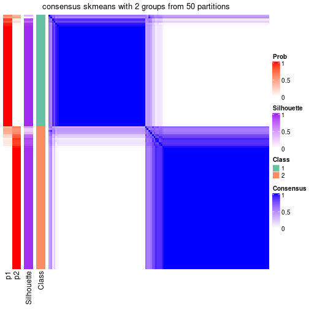</p>

</div>
<div id='tab-node-01-consensus-heatmap-2'>
<pre><code class="r">consensus_heatmap(res, k = 3)
</code></pre>

<p>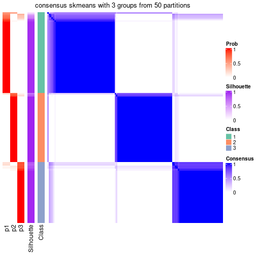</p>

</div>
<div id='tab-node-01-consensus-heatmap-3'>
<pre><code class="r">consensus_heatmap(res, k = 4)
</code></pre>

<p>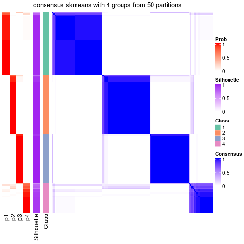</p>

</div>
<div id='tab-node-01-consensus-heatmap-4'>
<pre><code class="r">consensus_heatmap(res, k = 5)
</code></pre>

<p>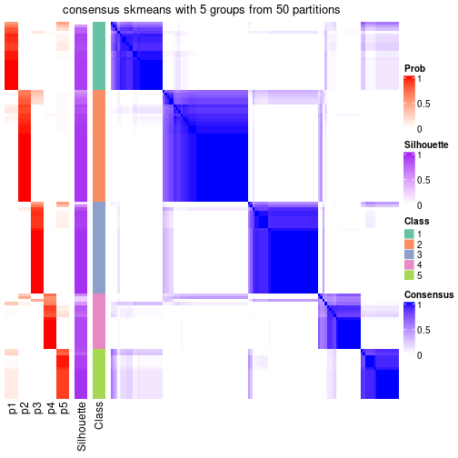</p>

</div>
<div id='tab-node-01-consensus-heatmap-5'>
<pre><code class="r">consensus_heatmap(res, k = 6)
</code></pre>

<p>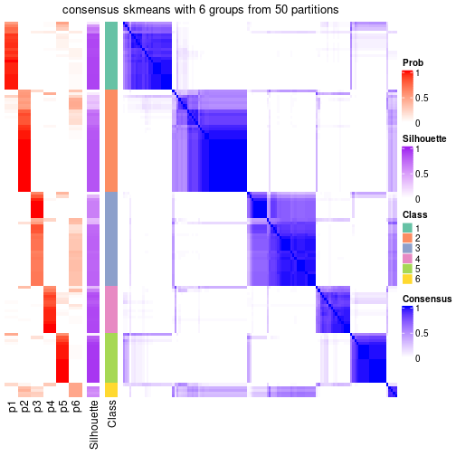</p>

</div>
<div id='tab-node-01-consensus-heatmap-6'>
<pre><code class="r">consensus_heatmap(res, k = 7)
</code></pre>

<p>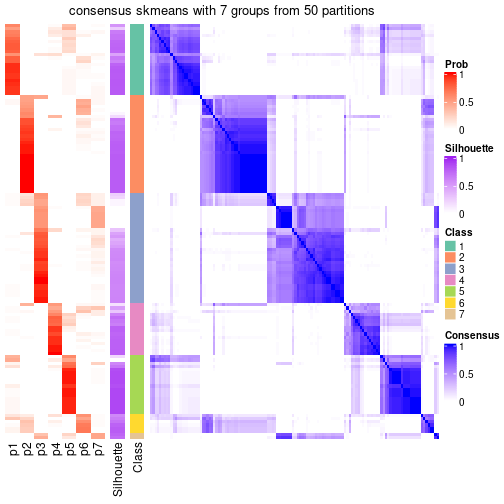</p>

</div>
<div id='tab-node-01-consensus-heatmap-7'>
<pre><code class="r">consensus_heatmap(res, k = 8)
</code></pre>

<p>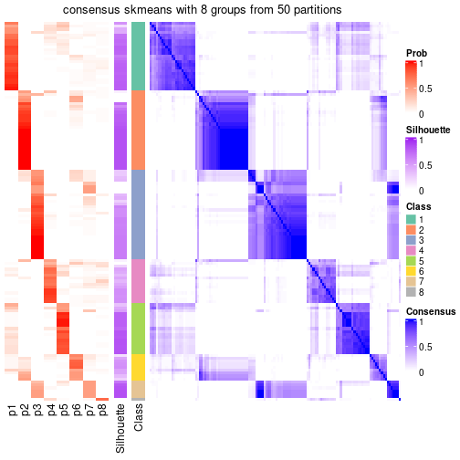</p>

</div>
</div>

Heatmaps for the membership of samples in all partitions to see how consistent they are:


<script>
$( function() {
	$( '#tabs-node-01-membership-heatmap' ).tabs();
} );
</script>
<div id='tabs-node-01-membership-heatmap'>
<ul>
<li><a href='#tab-node-01-membership-heatmap-1'>k = 2</a></li>
<li><a href='#tab-node-01-membership-heatmap-2'>k = 3</a></li>
<li><a href='#tab-node-01-membership-heatmap-3'>k = 4</a></li>
<li><a href='#tab-node-01-membership-heatmap-4'>k = 5</a></li>
<li><a href='#tab-node-01-membership-heatmap-5'>k = 6</a></li>
<li><a href='#tab-node-01-membership-heatmap-6'>k = 7</a></li>
<li><a href='#tab-node-01-membership-heatmap-7'>k = 8</a></li>
</ul>
<div id='tab-node-01-membership-heatmap-1'>
<pre><code class="r">membership_heatmap(res, k = 2)
</code></pre>

<p>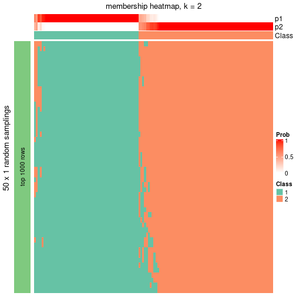</p>

</div>
<div id='tab-node-01-membership-heatmap-2'>
<pre><code class="r">membership_heatmap(res, k = 3)
</code></pre>

<p>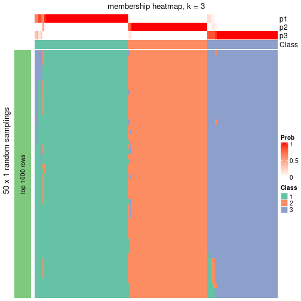</p>

</div>
<div id='tab-node-01-membership-heatmap-3'>
<pre><code class="r">membership_heatmap(res, k = 4)
</code></pre>

<p>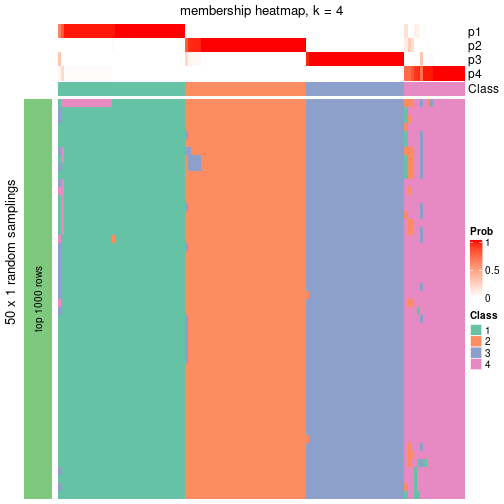</p>

</div>
<div id='tab-node-01-membership-heatmap-4'>
<pre><code class="r">membership_heatmap(res, k = 5)
</code></pre>

<p>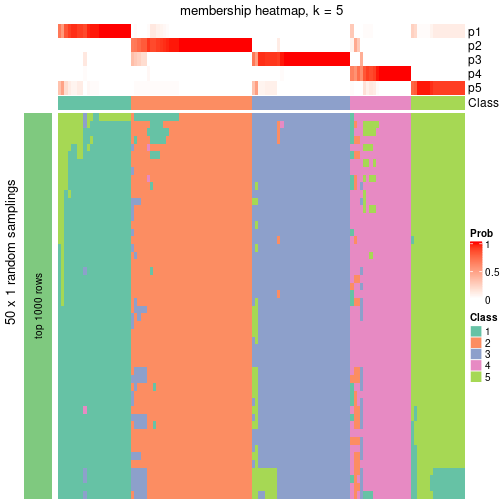</p>

</div>
<div id='tab-node-01-membership-heatmap-5'>
<pre><code class="r">membership_heatmap(res, k = 6)
</code></pre>

<p>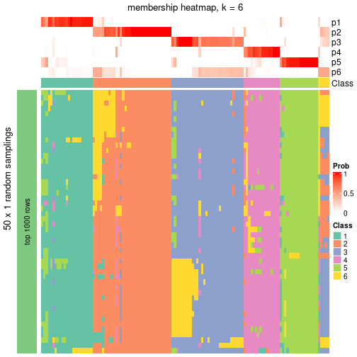</p>

</div>
<div id='tab-node-01-membership-heatmap-6'>
<pre><code class="r">membership_heatmap(res, k = 7)
</code></pre>

<p>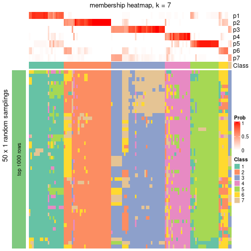</p>

</div>
<div id='tab-node-01-membership-heatmap-7'>
<pre><code class="r">membership_heatmap(res, k = 8)
</code></pre>

<p>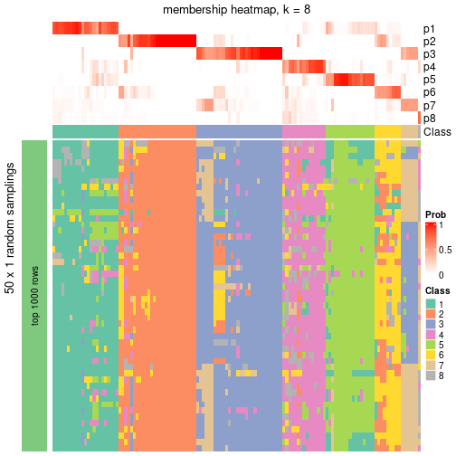</p>

</div>
</div>

As soon as the classes for columns are determined, the signatures
that are significantly different between subgroups can be looked for. 
Following are the heatmaps for signatures.


<script>
$( function() {
	$( '#tabs-node-01-get-signatures' ).tabs();
} );
</script>
<div id='tabs-node-01-get-signatures'>
<ul>
<li><a href='#tab-node-01-get-signatures-1'>k = 2</a></li>
<li><a href='#tab-node-01-get-signatures-2'>k = 3</a></li>
<li><a href='#tab-node-01-get-signatures-3'>k = 4</a></li>
<li><a href='#tab-node-01-get-signatures-4'>k = 5</a></li>
<li><a href='#tab-node-01-get-signatures-5'>k = 6</a></li>
<li><a href='#tab-node-01-get-signatures-6'>k = 7</a></li>
<li><a href='#tab-node-01-get-signatures-7'>k = 8</a></li>
</ul>
<div id='tab-node-01-get-signatures-1'>
<pre><code class="r">get_signatures(res, k = 2)
</code></pre>

<p>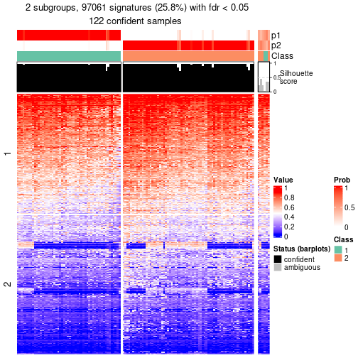</p>

</div>
<div id='tab-node-01-get-signatures-2'>
<pre><code class="r">get_signatures(res, k = 3)
</code></pre>

<p>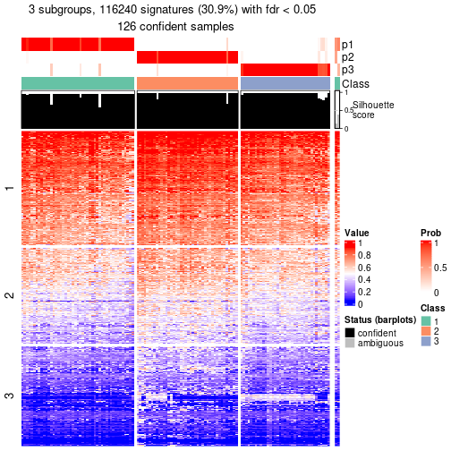</p>

</div>
<div id='tab-node-01-get-signatures-3'>
<pre><code class="r">get_signatures(res, k = 4)
</code></pre>

<p>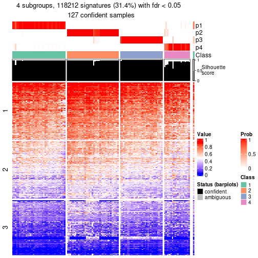</p>

</div>
<div id='tab-node-01-get-signatures-4'>
<pre><code class="r">get_signatures(res, k = 5)
</code></pre>

<p>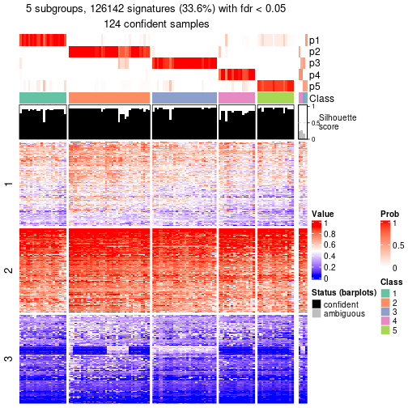</p>

</div>
<div id='tab-node-01-get-signatures-5'>
<pre><code class="r">get_signatures(res, k = 6)
</code></pre>

<p>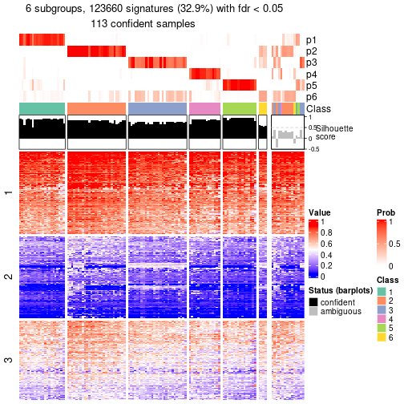</p>

</div>
<div id='tab-node-01-get-signatures-6'>
<pre><code class="r">get_signatures(res, k = 7)
</code></pre>

<p>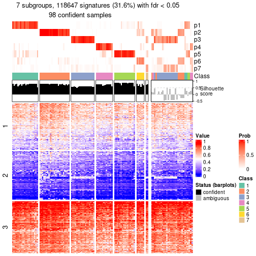</p>

</div>
<div id='tab-node-01-get-signatures-7'>
<pre><code class="r">get_signatures(res, k = 8)
</code></pre>

<p>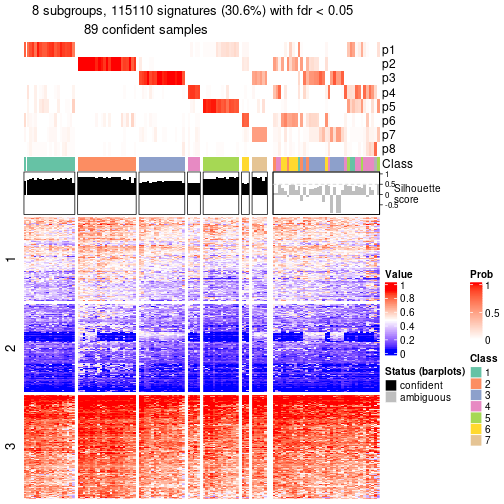</p>

</div>
</div>


Compare the overlap of signatures from different k:

```r
compare_signatures(res)
```

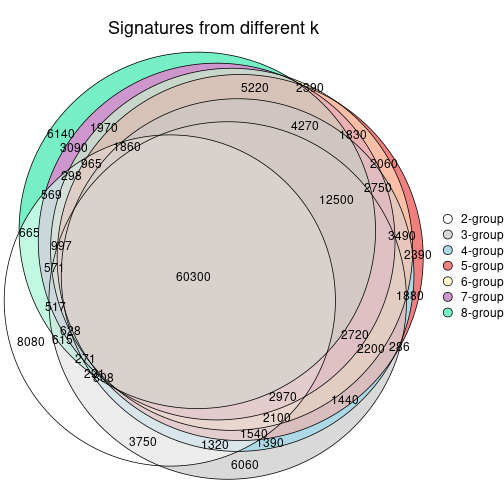

`get_signature()` returns a data frame invisibly. To get the list of signatures, the function
call should be assigned to a variable explicitly. In following code, if `plot` argument is set
to `FALSE`, no heatmap is plotted while only the differential analysis is performed.

```r
# code only for demonstration
tb = get_signature(res, k = ..., plot = FALSE)
```

An example of the output of `tb` is:

```
#>   which_row         fdr    mean_1    mean_2 scaled_mean_1 scaled_mean_2 km
#> 1        38 0.042760348  8.373488  9.131774    -0.5533452     0.5164555  1
#> 2        40 0.018707592  7.106213  8.469186    -0.6173731     0.5762149  1
#> 3        55 0.019134737 10.221463 11.207825    -0.6159697     0.5749050  1
#> 4        59 0.006059896  5.921854  7.869574    -0.6899429     0.6439467  1
#> 5        60 0.018055526  8.928898 10.211722    -0.6204761     0.5791110  1
#> 6        98 0.009384629 15.714769 14.887706     0.6635654    -0.6193277  2
...
```

The columns in `tb` are:

1. `which_row`: row indices corresponding to the input matrix.
2. `fdr`: FDR for the differential test. 
3. `mean_x`: The mean value in group x.
4. `scaled_mean_x`: The mean value in group x after rows are scaled.
5. `km`: Row groups if k-means clustering is applied to rows (which is done by automatically selecting number of clusters).

If there are too many signatures, `top_signatures = ...` can be set to only show the 
signatures with the highest FDRs:

```r
# code only for demonstration
# e.g. to show the top 500 most significant rows
tb = get_signature(res, k = ..., top_signatures = 500)
```

If the signatures are defined as these which are uniquely high in current group, `diff_method` argument
can be set to `"uniquely_high_in_one_group"`:

```r
# code only for demonstration
tb = get_signature(res, k = ..., diff_method = "uniquely_high_in_one_group")
```


UMAP plot which shows how samples are separated.


<script>
$( function() {
	$( '#tabs-node-01-dimension-reduction' ).tabs();
} );
</script>
<div id='tabs-node-01-dimension-reduction'>
<ul>
<li><a href='#tab-node-01-dimension-reduction-1'>k = 2</a></li>
<li><a href='#tab-node-01-dimension-reduction-2'>k = 3</a></li>
<li><a href='#tab-node-01-dimension-reduction-3'>k = 4</a></li>
<li><a href='#tab-node-01-dimension-reduction-4'>k = 5</a></li>
<li><a href='#tab-node-01-dimension-reduction-5'>k = 6</a></li>
<li><a href='#tab-node-01-dimension-reduction-6'>k = 7</a></li>
<li><a href='#tab-node-01-dimension-reduction-7'>k = 8</a></li>
</ul>
<div id='tab-node-01-dimension-reduction-1'>
<pre><code class="r">dimension_reduction(res, k = 2, method = &quot;UMAP&quot;)
</code></pre>

<p>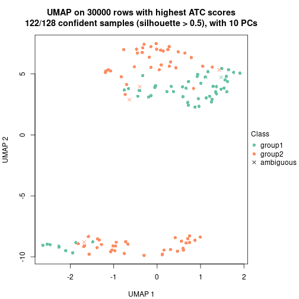</p>

</div>
<div id='tab-node-01-dimension-reduction-2'>
<pre><code class="r">dimension_reduction(res, k = 3, method = &quot;UMAP&quot;)
</code></pre>

<p>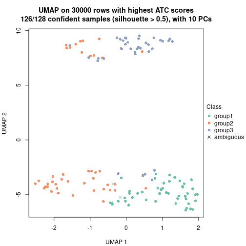</p>

</div>
<div id='tab-node-01-dimension-reduction-3'>
<pre><code class="r">dimension_reduction(res, k = 4, method = &quot;UMAP&quot;)
</code></pre>

<p>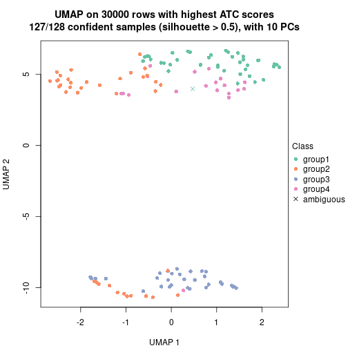</p>

</div>
<div id='tab-node-01-dimension-reduction-4'>
<pre><code class="r">dimension_reduction(res, k = 5, method = &quot;UMAP&quot;)
</code></pre>

<p>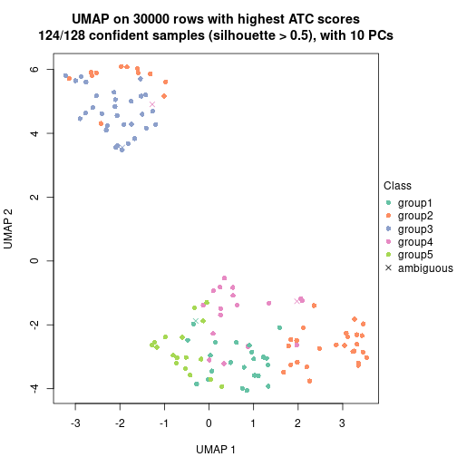</p>

</div>
<div id='tab-node-01-dimension-reduction-5'>
<pre><code class="r">dimension_reduction(res, k = 6, method = &quot;UMAP&quot;)
</code></pre>

<p>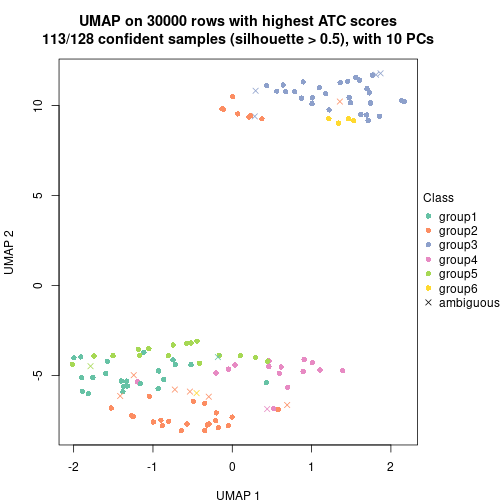</p>

</div>
<div id='tab-node-01-dimension-reduction-6'>
<pre><code class="r">dimension_reduction(res, k = 7, method = &quot;UMAP&quot;)
</code></pre>

<p>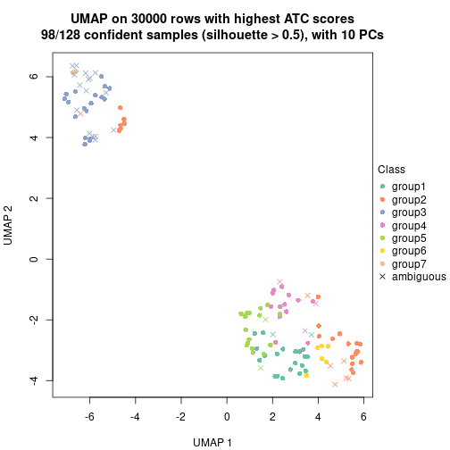</p>

</div>
<div id='tab-node-01-dimension-reduction-7'>
<pre><code class="r">dimension_reduction(res, k = 8, method = &quot;UMAP&quot;)
</code></pre>

<p>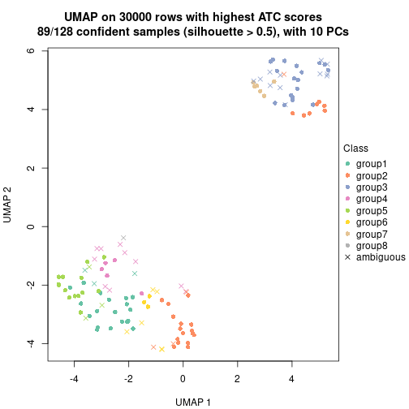</p>

</div>
</div>


Following heatmap shows how subgroups are split when increasing `k`:

```r
collect_classes(res)
```

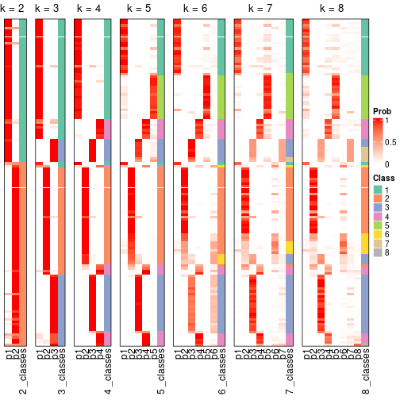


If matrix rows can be associated to genes, consider to use `functional_enrichment(res,
...)` to perform function enrichment for the signature genes. See [this vignette](https://jokergoo.github.io/cola_vignettes/functional_enrichment.html) for more detailed explanations.


 

---------------------------------------------------


### Node011


Parent node: [Node01](#Node01).
Child nodes: 
                Node0111-leaf
        ,
                Node0112-leaf
        ,
                Node0113-leaf
        ,
                Node0114-leaf
        ,
                Node0121-leaf
        ,
                Node0122-leaf
        ,
                Node0123-leaf
        ,
                Node0131-leaf
        ,
                Node0132-leaf
        ,
                Node0133-leaf
        ,
                Node0134-leaf
        ,
                Node0211-leaf
        ,
                Node0212-leaf
        ,
                [Node0213](#Node0213)
        ,
                Node0214-leaf
        ,
                [Node0221](#Node0221)
        ,
                Node0222-leaf
        ,
                Node0223-leaf
        ,
                [Node0231](#Node0231)
        ,
                Node0232-leaf
        ,
                Node0233-leaf
        ,
                [Node0234](#Node0234)
        ,
                Node0235-leaf
        ,
                Node0241-leaf
        ,
                [Node0242](#Node0242)
        ,
                Node0411-leaf
        ,
                Node0412-leaf
        ,
                Node0421-leaf
        ,
                Node0422-leaf
        ,
                Node0423-leaf
        ,
                Node0431-leaf
        ,
                Node0432-leaf
        ,
                Node0511-leaf
        ,
                Node0512-leaf
        ,
                Node0513-leaf
        ,
                Node0514-leaf
        ,
                Node0521-leaf
        ,
                Node0522-leaf
        ,
                Node0523-leaf
        ,
                Node0524-leaf
        ,
                Node0525-leaf
        ,
                Node0611-leaf
        ,
                [Node0612](#Node0612)
        ,
                Node0613-leaf
        ,
                [Node0711](#Node0711)
        ,
                Node0712-leaf
        ,
                Node0713-leaf
        ,
                [Node0721](#Node0721)
        ,
                Node0722-leaf
        ,
                Node0731-leaf
        ,
                Node0732-leaf
        ,
                Node0733-leaf
        .


The object with results only for a single top-value method and a single partitioning method 
can be extracted as:

```r
res = res_rh["011"]
```

A summary of `res` and all the functions that can be applied to it:

```r
res
```

```
#> A 'ConsensusPartition' object with k = 2, 3, 4, 5, 6, 7, 8.
#>   On a matrix with 30000 rows and 40 columns.
#>   Top rows (1000) are extracted by 'ATC' method.
#>   Subgroups are detected by 'kmeans' method.
#>   Performed in total 350 partitions by row resampling.
#>   Best k for subgroups seems to be 4.
#> 
#> Following methods can be applied to this 'ConsensusPartition' object:
#>  [1] "cola_report"             "collect_classes"         "collect_plots"          
#>  [4] "collect_stats"           "colnames"                "compare_partitions"     
#>  [7] "compare_signatures"      "consensus_heatmap"       "dimension_reduction"    
#> [10] "functional_enrichment"   "get_anno_col"            "get_anno"               
#> [13] "get_classes"             "get_consensus"           "get_matrix"             
#> [16] "get_membership"          "get_param"               "get_signatures"         
#> [19] "get_stats"               "is_best_k"               "is_stable_k"            
#> [22] "membership_heatmap"      "ncol"                    "nrow"                   
#> [25] "plot_ecdf"               "predict_classes"         "rownames"               
#> [28] "select_partition_number" "show"                    "suggest_best_k"         
#> [31] "test_to_known_factors"   "top_rows_heatmap"
```

`collect_plots()` function collects all the plots made from `res` for all `k` (number of subgroups)
into one single page to provide an easy and fast comparison between different `k`.

```r
collect_plots(res)
```

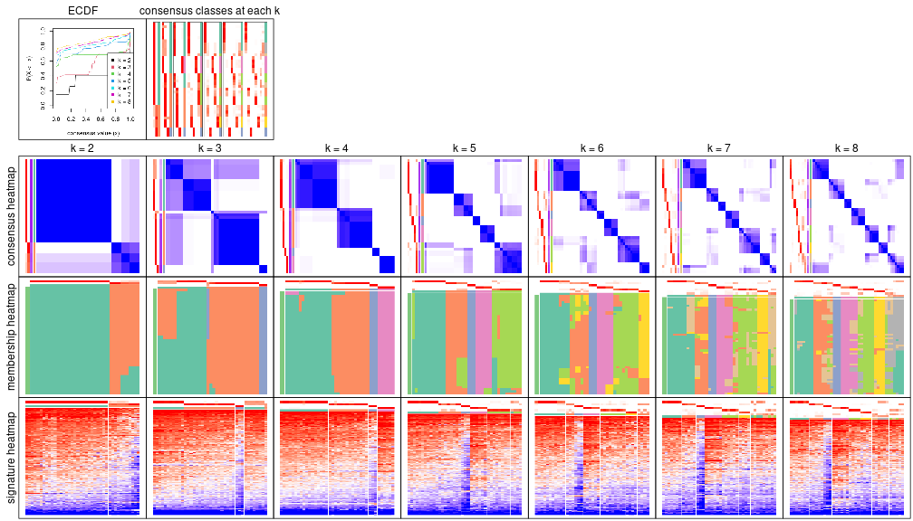

The plots are:

- The first row: a plot of the eCDF (empirical cumulative distribution
  function) curves of the consensus matrix for each `k` and the heatmap of
  predicted classes for each `k`.
- The second row: heatmaps of the consensus matrix for each `k`.
- The third row: heatmaps of the membership matrix for each `k`.
- The fouth row: heatmaps of the signatures for each `k`.

All the plots in panels can be made by individual functions and they are
plotted later in this section.

`select_partition_number()` produces several plots showing different
statistics for choosing "optimized" `k`. There are following statistics:

- eCDF curves of the consensus matrix for each `k`;
- 1-PAC. [The PAC score](https://en.wikipedia.org/wiki/Consensus_clustering#Over-interpretation_potential_of_consensus_clustering)
  measures the proportion of the ambiguous subgrouping.
- Mean silhouette score.
- Concordance. The mean probability of fiting the consensus subgroup labels in all
  partitions.
- Area increased. Denote $A_k$ as the area under the eCDF curve for current
  `k`, the area increased is defined as $A_k - A_{k-1}$.
- Rand index. The percent of pairs of samples that are both in a same cluster
  or both are not in a same cluster in the partition of k and k-1.
- Jaccard index. The ratio of pairs of samples are both in a same cluster in
  the partition of k and k-1 and the pairs of samples are both in a same
  cluster in the partition k or k-1.

The detailed explanations of these statistics can be found in [the _cola_
vignette](https://jokergoo.github.io/cola_vignettes/cola.html#toc_13).

Generally speaking, higher 1-PAC score, higher mean silhouette score or higher
concordance corresponds to better partition. Rand index and Jaccard index
measure how similar the current partition is compared to partition with `k-1`.
If they are too similar, we won't accept `k` is better than `k-1`.

```r
select_partition_number(res)
```

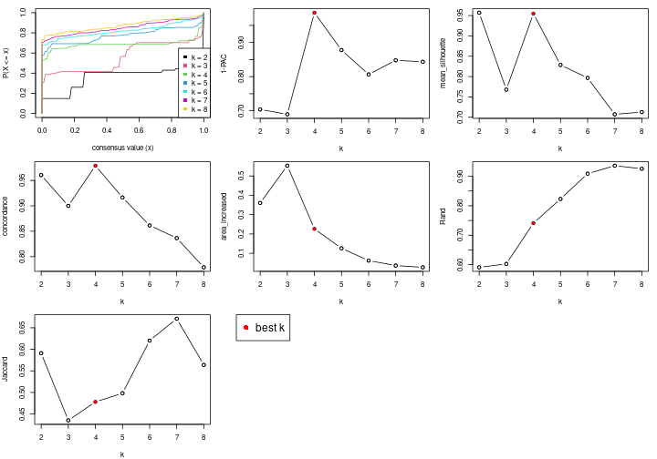

The numeric values for all these statistics can be obtained by `get_stats()`.

```r
get_stats(res)
```

```
#>   k 1-PAC mean_silhouette concordance area_increased  Rand Jaccard
#> 2 2 0.704           0.957       0.961         0.3603 0.591   0.591
#> 3 3 0.690           0.768       0.900         0.5529 0.603   0.435
#> 4 4 0.987           0.955       0.979         0.2262 0.741   0.478
#> 5 5 0.878           0.829       0.916         0.1258 0.823   0.498
#> 6 6 0.807           0.797       0.862         0.0623 0.909   0.620
#> 7 7 0.848           0.707       0.837         0.0363 0.936   0.671
#> 8 8 0.844           0.713       0.779         0.0274 0.926   0.564
```

`suggest_best_k()` suggests the best $k$ based on these statistics. The rules are as follows:

- All $k$ with Jaccard index larger than 0.95 are removed because increasing
  $k$ does not provide enough extra information. If all $k$ are removed, it is
  marked as no subgroup is detected.
- For all $k$ with 1-PAC score larger than 0.9, the maximal $k$ is taken as
  the best $k$, and other $k$ are marked as optional $k$.
- If it does not fit the second rule. The $k$ with the maximal vote of the
  highest 1-PAC score, highest mean silhouette, and highest concordance is
  taken as the best $k$.

```r
suggest_best_k(res)
```

```
#> [1] 4
```


Following is the table of the partitions (You need to click the **show/hide
code output** link to see it). The membership matrix (columns with name `p*`)
is inferred by
[`clue::cl_consensus()`](https://www.rdocumentation.org/link/cl_consensus?package=clue)
function with the `SE` method. Basically the value in the membership matrix
represents the probability to belong to a certain group. The finall subgroup
label for an item is determined with the group with highest probability it
belongs to.

In `get_classes()` function, the entropy is calculated from the membership
matrix and the silhouette score is calculated from the consensus matrix.


<script>
$( function() {
	$( '#tabs-node-011-get-classes' ).tabs();
} );
</script>
<div id='tabs-node-011-get-classes'>
<ul>
<li><a href='#tab-node-011-get-classes-1'>k = 2</a></li>
<li><a href='#tab-node-011-get-classes-2'>k = 3</a></li>
<li><a href='#tab-node-011-get-classes-3'>k = 4</a></li>
<li><a href='#tab-node-011-get-classes-4'>k = 5</a></li>
<li><a href='#tab-node-011-get-classes-5'>k = 6</a></li>
<li><a href='#tab-node-011-get-classes-6'>k = 7</a></li>
<li><a href='#tab-node-011-get-classes-7'>k = 8</a></li>
</ul>

<div id='tab-node-011-get-classes-1'>
<p><a id='tab-node-011-get-classes-1-a' style='color:#0366d6' href='#'>show/hide code output</a></p>
<pre><code class="r">cbind(get_classes(res, k = 2), get_membership(res, k = 2))
</code></pre>

<pre><code>#&gt;                 class entropy silhouette   p1   p2
#&gt; TCGA.85.8481.01     1   0.000      1.000 1.00 0.00
#&gt; TCGA.77.8156.01     2   0.827      0.832 0.26 0.74
#&gt; TCGA.44.7660.01     2   0.000      0.835 0.00 1.00
#&gt; TCGA.85.8287.01     1   0.000      1.000 1.00 0.00
#&gt; TCGA.77.8138.01     1   0.000      1.000 1.00 0.00
#&gt; TCGA.39.5028.11     1   0.000      1.000 1.00 0.00
#&gt; TCGA.85.8355.01     1   0.000      1.000 1.00 0.00
#&gt; TCGA.34.5236.01     1   0.000      1.000 1.00 0.00
#&gt; TCGA.L3.A4E7.01     1   0.000      1.000 1.00 0.00
#&gt; TCGA.44.6148.01     1   0.000      1.000 1.00 0.00
#&gt; TCGA.63.A5MV.01     2   0.827      0.832 0.26 0.74
#&gt; TCGA.56.8309.01     1   0.000      1.000 1.00 0.00
#&gt; TCGA.63.7021.01     1   0.000      1.000 1.00 0.00
#&gt; TCGA.58.8387.01     2   0.827      0.832 0.26 0.74
#&gt; TCGA.39.5028.01     1   0.000      1.000 1.00 0.00
#&gt; TCGA.77.8008.01     1   0.000      1.000 1.00 0.00
#&gt; TCGA.34.5241.01     1   0.000      1.000 1.00 0.00
#&gt; TCGA.56.6546.01     2   0.000      0.835 0.00 1.00
#&gt; TCGA.85.7697.01     1   0.000      1.000 1.00 0.00
#&gt; TCGA.77.6842.01     2   0.000      0.835 0.00 1.00
#&gt; TCGA.98.8023.01     1   0.000      1.000 1.00 0.00
#&gt; TCGA.60.2703.01     2   0.827      0.832 0.26 0.74
#&gt; TCGA.77.A5GB.01     1   0.000      1.000 1.00 0.00
#&gt; TCGA.85.A4JC.01     1   0.000      1.000 1.00 0.00
#&gt; TCGA.77.7138.01     1   0.000      1.000 1.00 0.00
#&gt; TCGA.77.8131.01     1   0.000      1.000 1.00 0.00
#&gt; TCGA.58.A46J.01     1   0.000      1.000 1.00 0.00
#&gt; TCGA.85.A50Z.01     1   0.000      1.000 1.00 0.00
#&gt; TCGA.39.5039.01     1   0.000      1.000 1.00 0.00
#&gt; TCGA.56.8624.01     1   0.000      1.000 1.00 0.00
#&gt; TCGA.60.2704.01     1   0.000      1.000 1.00 0.00
#&gt; TCGA.85.A4JB.01     2   0.680      0.871 0.18 0.82
#&gt; TCGA.52.7811.01     2   0.680      0.871 0.18 0.82
#&gt; TCGA.33.4587.01     2   0.000      0.835 0.00 1.00
#&gt; TCGA.56.8628.01     1   0.000      1.000 1.00 0.00
#&gt; TCGA.21.A5DI.01     1   0.000      1.000 1.00 0.00
#&gt; TCGA.56.5897.01     1   0.000      1.000 1.00 0.00
#&gt; TCGA.85.8048.01     1   0.000      1.000 1.00 0.00
#&gt; TCGA.85.A511.01     1   0.000      1.000 1.00 0.00
#&gt; TCGA.39.5021.01     2   0.680      0.871 0.18 0.82
</code></pre>

<script>
$('#tab-node-011-get-classes-1-a').parent().next().next().hide();
$('#tab-node-011-get-classes-1-a').click(function(){
  $('#tab-node-011-get-classes-1-a').parent().next().next().toggle();
  return(false);
});
</script>
</div>

<div id='tab-node-011-get-classes-2'>
<p><a id='tab-node-011-get-classes-2-a' style='color:#0366d6' href='#'>show/hide code output</a></p>
<pre><code class="r">cbind(get_classes(res, k = 3), get_membership(res, k = 3))
</code></pre>

<pre><code>#&gt;                 class entropy silhouette   p1   p2   p3
#&gt; TCGA.85.8481.01     2  0.0000     0.9561 0.00 1.00 0.00
#&gt; TCGA.77.8156.01     2  0.0000     0.9561 0.00 1.00 0.00
#&gt; TCGA.44.7660.01     3  0.0000     1.0000 0.00 0.00 1.00
#&gt; TCGA.85.8287.01     2  0.0000     0.9561 0.00 1.00 0.00
#&gt; TCGA.77.8138.01     1  0.6302     0.4049 0.52 0.48 0.00
#&gt; TCGA.39.5028.11     1  0.0000     0.7086 1.00 0.00 0.00
#&gt; TCGA.85.8355.01     1  0.6244     0.4653 0.56 0.44 0.00
#&gt; TCGA.34.5236.01     2  0.0000     0.9561 0.00 1.00 0.00
#&gt; TCGA.L3.A4E7.01     1  0.0000     0.7086 1.00 0.00 0.00
#&gt; TCGA.44.6148.01     1  0.0000     0.7086 1.00 0.00 0.00
#&gt; TCGA.63.A5MV.01     2  0.0000     0.9561 0.00 1.00 0.00
#&gt; TCGA.56.8309.01     1  0.0892     0.7134 0.98 0.02 0.00
#&gt; TCGA.63.7021.01     2  0.0000     0.9561 0.00 1.00 0.00
#&gt; TCGA.58.8387.01     2  0.0000     0.9561 0.00 1.00 0.00
#&gt; TCGA.39.5028.01     1  0.6244     0.4653 0.56 0.44 0.00
#&gt; TCGA.77.8008.01     2  0.0000     0.9561 0.00 1.00 0.00
#&gt; TCGA.34.5241.01     1  0.6302     0.4049 0.52 0.48 0.00
#&gt; TCGA.56.6546.01     2  0.6302    -0.0616 0.00 0.52 0.48
#&gt; TCGA.85.7697.01     1  0.6302     0.4049 0.52 0.48 0.00
#&gt; TCGA.77.6842.01     3  0.0000     1.0000 0.00 0.00 1.00
#&gt; TCGA.98.8023.01     2  0.0000     0.9561 0.00 1.00 0.00
#&gt; TCGA.60.2703.01     2  0.0000     0.9561 0.00 1.00 0.00
#&gt; TCGA.77.A5GB.01     1  0.0000     0.7086 1.00 0.00 0.00
#&gt; TCGA.85.A4JC.01     1  0.0892     0.7134 0.98 0.02 0.00
#&gt; TCGA.77.7138.01     1  0.0000     0.7086 1.00 0.00 0.00
#&gt; TCGA.77.8131.01     1  0.0892     0.7134 0.98 0.02 0.00
#&gt; TCGA.58.A46J.01     2  0.0000     0.9561 0.00 1.00 0.00
#&gt; TCGA.85.A50Z.01     2  0.0000     0.9561 0.00 1.00 0.00
#&gt; TCGA.39.5039.01     2  0.2066     0.8852 0.06 0.94 0.00
#&gt; TCGA.56.8624.01     1  0.0000     0.7086 1.00 0.00 0.00
#&gt; TCGA.60.2704.01     1  0.0892     0.7134 0.98 0.02 0.00
#&gt; TCGA.85.A4JB.01     2  0.0000     0.9561 0.00 1.00 0.00
#&gt; TCGA.52.7811.01     2  0.0000     0.9561 0.00 1.00 0.00
#&gt; TCGA.33.4587.01     3  0.0000     1.0000 0.00 0.00 1.00
#&gt; TCGA.56.8628.01     2  0.0000     0.9561 0.00 1.00 0.00
#&gt; TCGA.21.A5DI.01     2  0.2959     0.8262 0.10 0.90 0.00
#&gt; TCGA.56.5897.01     1  0.6302     0.4049 0.52 0.48 0.00
#&gt; TCGA.85.8048.01     1  0.0000     0.7086 1.00 0.00 0.00
#&gt; TCGA.85.A511.01     1  0.6302     0.4049 0.52 0.48 0.00
#&gt; TCGA.39.5021.01     2  0.0000     0.9561 0.00 1.00 0.00
</code></pre>

<script>
$('#tab-node-011-get-classes-2-a').parent().next().next().hide();
$('#tab-node-011-get-classes-2-a').click(function(){
  $('#tab-node-011-get-classes-2-a').parent().next().next().toggle();
  return(false);
});
</script>
</div>

<div id='tab-node-011-get-classes-3'>
<p><a id='tab-node-011-get-classes-3-a' style='color:#0366d6' href='#'>show/hide code output</a></p>
<pre><code class="r">cbind(get_classes(res, k = 4), get_membership(res, k = 4))
</code></pre>

<pre><code>#&gt;                 class entropy silhouette   p1   p2 p3   p4
#&gt; TCGA.85.8481.01     2   0.164      0.926 0.06 0.94  0 0.00
#&gt; TCGA.77.8156.01     2   0.000      0.959 0.00 1.00  0 0.00
#&gt; TCGA.44.7660.01     3   0.000      1.000 0.00 0.00  1 0.00
#&gt; TCGA.85.8287.01     2   0.000      0.959 0.00 1.00  0 0.00
#&gt; TCGA.77.8138.01     1   0.000      0.968 1.00 0.00  0 0.00
#&gt; TCGA.39.5028.11     4   0.000      1.000 0.00 0.00  0 1.00
#&gt; TCGA.85.8355.01     1   0.000      0.968 1.00 0.00  0 0.00
#&gt; TCGA.34.5236.01     2   0.121      0.941 0.04 0.96  0 0.00
#&gt; TCGA.L3.A4E7.01     4   0.000      1.000 0.00 0.00  0 1.00
#&gt; TCGA.44.6148.01     4   0.000      1.000 0.00 0.00  0 1.00
#&gt; TCGA.63.A5MV.01     2   0.000      0.959 0.00 1.00  0 0.00
#&gt; TCGA.56.8309.01     1   0.121      0.950 0.96 0.00  0 0.04
#&gt; TCGA.63.7021.01     1   0.000      0.968 1.00 0.00  0 0.00
#&gt; TCGA.58.8387.01     2   0.000      0.959 0.00 1.00  0 0.00
#&gt; TCGA.39.5028.01     1   0.000      0.968 1.00 0.00  0 0.00
#&gt; TCGA.77.8008.01     2   0.164      0.926 0.06 0.94  0 0.00
#&gt; TCGA.34.5241.01     1   0.000      0.968 1.00 0.00  0 0.00
#&gt; TCGA.56.6546.01     2   0.000      0.959 0.00 1.00  0 0.00
#&gt; TCGA.85.7697.01     1   0.000      0.968 1.00 0.00  0 0.00
#&gt; TCGA.77.6842.01     3   0.000      1.000 0.00 0.00  1 0.00
#&gt; TCGA.98.8023.01     2   0.380      0.703 0.22 0.78  0 0.00
#&gt; TCGA.60.2703.01     2   0.000      0.959 0.00 1.00  0 0.00
#&gt; TCGA.77.A5GB.01     4   0.000      1.000 0.00 0.00  0 1.00
#&gt; TCGA.85.A4JC.01     1   0.121      0.950 0.96 0.00  0 0.04
#&gt; TCGA.77.7138.01     4   0.000      1.000 0.00 0.00  0 1.00
#&gt; TCGA.77.8131.01     1   0.121      0.950 0.96 0.00  0 0.04
#&gt; TCGA.58.A46J.01     2   0.121      0.941 0.04 0.96  0 0.00
#&gt; TCGA.85.A50Z.01     1   0.164      0.912 0.94 0.06  0 0.00
#&gt; TCGA.39.5039.01     1   0.000      0.968 1.00 0.00  0 0.00
#&gt; TCGA.56.8624.01     4   0.000      1.000 0.00 0.00  0 1.00
#&gt; TCGA.60.2704.01     1   0.121      0.950 0.96 0.00  0 0.04
#&gt; TCGA.85.A4JB.01     2   0.000      0.959 0.00 1.00  0 0.00
#&gt; TCGA.52.7811.01     2   0.000      0.959 0.00 1.00  0 0.00
#&gt; TCGA.33.4587.01     3   0.000      1.000 0.00 0.00  1 0.00
#&gt; TCGA.56.8628.01     1   0.317      0.781 0.84 0.16  0 0.00
#&gt; TCGA.21.A5DI.01     1   0.000      0.968 1.00 0.00  0 0.00
#&gt; TCGA.56.5897.01     1   0.000      0.968 1.00 0.00  0 0.00
#&gt; TCGA.85.8048.01     1   0.121      0.950 0.96 0.00  0 0.04
#&gt; TCGA.85.A511.01     1   0.000      0.968 1.00 0.00  0 0.00
#&gt; TCGA.39.5021.01     2   0.000      0.959 0.00 1.00  0 0.00
</code></pre>

<script>
$('#tab-node-011-get-classes-3-a').parent().next().next().hide();
$('#tab-node-011-get-classes-3-a').click(function(){
  $('#tab-node-011-get-classes-3-a').parent().next().next().toggle();
  return(false);
});
</script>
</div>

<div id='tab-node-011-get-classes-4'>
<p><a id='tab-node-011-get-classes-4-a' style='color:#0366d6' href='#'>show/hide code output</a></p>
<pre><code class="r">cbind(get_classes(res, k = 5), get_membership(res, k = 5))
</code></pre>

<pre><code>#&gt;                 class entropy silhouette   p1   p2 p3   p4   p5
#&gt; TCGA.85.8481.01     5  0.1216      0.831 0.02 0.02  0 0.00 0.96
#&gt; TCGA.77.8156.01     2  0.3796      0.763 0.00 0.70  0 0.00 0.30
#&gt; TCGA.44.7660.01     3  0.0000      1.000 0.00 0.00  1 0.00 0.00
#&gt; TCGA.85.8287.01     5  0.3684      0.377 0.00 0.28  0 0.00 0.72
#&gt; TCGA.77.8138.01     1  0.4287     -0.015 0.54 0.00  0 0.00 0.46
#&gt; TCGA.39.5028.11     4  0.0000      0.969 0.00 0.00  0 1.00 0.00
#&gt; TCGA.85.8355.01     1  0.0000      0.944 1.00 0.00  0 0.00 0.00
#&gt; TCGA.34.5236.01     5  0.1043      0.813 0.00 0.04  0 0.00 0.96
#&gt; TCGA.L3.A4E7.01     4  0.1648      0.969 0.00 0.02  0 0.94 0.04
#&gt; TCGA.44.6148.01     4  0.1648      0.969 0.00 0.02  0 0.94 0.04
#&gt; TCGA.63.A5MV.01     2  0.3895      0.746 0.00 0.68  0 0.00 0.32
#&gt; TCGA.56.8309.01     1  0.0000      0.944 1.00 0.00  0 0.00 0.00
#&gt; TCGA.63.7021.01     5  0.1410      0.829 0.06 0.00  0 0.00 0.94
#&gt; TCGA.58.8387.01     2  0.3895      0.746 0.00 0.68  0 0.00 0.32
#&gt; TCGA.39.5028.01     1  0.0000      0.944 1.00 0.00  0 0.00 0.00
#&gt; TCGA.77.8008.01     5  0.1216      0.831 0.02 0.02  0 0.00 0.96
#&gt; TCGA.34.5241.01     1  0.0000      0.944 1.00 0.00  0 0.00 0.00
#&gt; TCGA.56.6546.01     2  0.0609      0.775 0.00 0.98  0 0.00 0.02
#&gt; TCGA.85.7697.01     1  0.0000      0.944 1.00 0.00  0 0.00 0.00
#&gt; TCGA.77.6842.01     3  0.0000      1.000 0.00 0.00  1 0.00 0.00
#&gt; TCGA.98.8023.01     5  0.1043      0.836 0.04 0.00  0 0.00 0.96
#&gt; TCGA.60.2703.01     2  0.3796      0.763 0.00 0.70  0 0.00 0.30
#&gt; TCGA.77.A5GB.01     4  0.1648      0.969 0.00 0.02  0 0.94 0.04
#&gt; TCGA.85.A4JC.01     1  0.0000      0.944 1.00 0.00  0 0.00 0.00
#&gt; TCGA.77.7138.01     4  0.0000      0.969 0.00 0.00  0 1.00 0.00
#&gt; TCGA.77.8131.01     1  0.0000      0.944 1.00 0.00  0 0.00 0.00
#&gt; TCGA.58.A46J.01     5  0.1043      0.813 0.00 0.04  0 0.00 0.96
#&gt; TCGA.85.A50Z.01     5  0.1410      0.829 0.06 0.00  0 0.00 0.94
#&gt; TCGA.39.5039.01     5  0.4060      0.445 0.36 0.00  0 0.00 0.64
#&gt; TCGA.56.8624.01     4  0.0000      0.969 0.00 0.00  0 1.00 0.00
#&gt; TCGA.60.2704.01     1  0.0000      0.944 1.00 0.00  0 0.00 0.00
#&gt; TCGA.85.A4JB.01     2  0.0609      0.775 0.00 0.98  0 0.00 0.02
#&gt; TCGA.52.7811.01     2  0.0609      0.775 0.00 0.98  0 0.00 0.02
#&gt; TCGA.33.4587.01     3  0.0000      1.000 0.00 0.00  1 0.00 0.00
#&gt; TCGA.56.8628.01     5  0.1043      0.836 0.04 0.00  0 0.00 0.96
#&gt; TCGA.21.A5DI.01     5  0.4060      0.445 0.36 0.00  0 0.00 0.64
#&gt; TCGA.56.5897.01     1  0.0000      0.944 1.00 0.00  0 0.00 0.00
#&gt; TCGA.85.8048.01     1  0.1043      0.901 0.96 0.00  0 0.00 0.04
#&gt; TCGA.85.A511.01     1  0.0000      0.944 1.00 0.00  0 0.00 0.00
#&gt; TCGA.39.5021.01     2  0.0609      0.775 0.00 0.98  0 0.00 0.02
</code></pre>

<script>
$('#tab-node-011-get-classes-4-a').parent().next().next().hide();
$('#tab-node-011-get-classes-4-a').click(function(){
  $('#tab-node-011-get-classes-4-a').parent().next().next().toggle();
  return(false);
});
</script>
</div>

<div id='tab-node-011-get-classes-5'>
<p><a id='tab-node-011-get-classes-5-a' style='color:#0366d6' href='#'>show/hide code output</a></p>
<pre><code class="r">cbind(get_classes(res, k = 6), get_membership(res, k = 6))
</code></pre>

<pre><code>#&gt;                 class entropy silhouette   p1   p2   p3   p4   p5   p6
#&gt; TCGA.85.8481.01     5  0.1814      0.793 0.00 0.10 0.00 0.00 0.90 0.00
#&gt; TCGA.77.8156.01     2  0.4632      0.443 0.00 0.52 0.00 0.00 0.04 0.44
#&gt; TCGA.44.7660.01     3  0.0000      0.987 0.00 0.00 1.00 0.00 0.00 0.00
#&gt; TCGA.85.8287.01     2  0.4552      0.579 0.00 0.64 0.00 0.00 0.30 0.06
#&gt; TCGA.77.8138.01     5  0.4328      0.596 0.10 0.18 0.00 0.00 0.72 0.00
#&gt; TCGA.39.5028.11     4  0.0000      0.928 0.00 0.00 0.00 1.00 0.00 0.00
#&gt; TCGA.85.8355.01     1  0.3787      0.820 0.78 0.12 0.00 0.00 0.10 0.00
#&gt; TCGA.34.5236.01     5  0.1814      0.793 0.00 0.10 0.00 0.00 0.90 0.00
#&gt; TCGA.L3.A4E7.01     4  0.2260      0.928 0.00 0.14 0.00 0.86 0.00 0.00
#&gt; TCGA.44.6148.01     4  0.2260      0.928 0.00 0.14 0.00 0.86 0.00 0.00
#&gt; TCGA.63.A5MV.01     2  0.4631      0.565 0.00 0.62 0.00 0.00 0.06 0.32
#&gt; TCGA.56.8309.01     1  0.0000      0.899 1.00 0.00 0.00 0.00 0.00 0.00
#&gt; TCGA.63.7021.01     5  0.0547      0.798 0.00 0.02 0.00 0.00 0.98 0.00
#&gt; TCGA.58.8387.01     2  0.4834      0.604 0.00 0.64 0.00 0.00 0.10 0.26
#&gt; TCGA.39.5028.01     1  0.3985      0.810 0.76 0.14 0.00 0.00 0.10 0.00
#&gt; TCGA.77.8008.01     5  0.1814      0.793 0.00 0.10 0.00 0.00 0.90 0.00
#&gt; TCGA.34.5241.01     1  0.0000      0.899 1.00 0.00 0.00 0.00 0.00 0.00
#&gt; TCGA.56.6546.01     6  0.0000      0.973 0.00 0.00 0.00 0.00 0.00 1.00
#&gt; TCGA.85.7697.01     1  0.3985      0.810 0.76 0.14 0.00 0.00 0.10 0.00
#&gt; TCGA.77.6842.01     3  0.0937      0.974 0.00 0.04 0.96 0.00 0.00 0.00
#&gt; TCGA.98.8023.01     2  0.3828      0.365 0.00 0.56 0.00 0.00 0.44 0.00
#&gt; TCGA.60.2703.01     2  0.4632      0.443 0.00 0.52 0.00 0.00 0.04 0.44
#&gt; TCGA.77.A5GB.01     4  0.2260      0.928 0.00 0.14 0.00 0.86 0.00 0.00
#&gt; TCGA.85.A4JC.01     1  0.0000      0.899 1.00 0.00 0.00 0.00 0.00 0.00
#&gt; TCGA.77.7138.01     4  0.0000      0.928 0.00 0.00 0.00 1.00 0.00 0.00
#&gt; TCGA.77.8131.01     1  0.0000      0.899 1.00 0.00 0.00 0.00 0.00 0.00
#&gt; TCGA.58.A46J.01     2  0.3869      0.228 0.00 0.50 0.00 0.00 0.50 0.00
#&gt; TCGA.85.A50Z.01     5  0.0937      0.807 0.00 0.04 0.00 0.00 0.96 0.00
#&gt; TCGA.39.5039.01     5  0.2190      0.754 0.04 0.06 0.00 0.00 0.90 0.00
#&gt; TCGA.56.8624.01     4  0.0000      0.928 0.00 0.00 0.00 1.00 0.00 0.00
#&gt; TCGA.60.2704.01     1  0.0000      0.899 1.00 0.00 0.00 0.00 0.00 0.00
#&gt; TCGA.85.A4JB.01     6  0.1267      0.916 0.00 0.06 0.00 0.00 0.00 0.94
#&gt; TCGA.52.7811.01     6  0.0000      0.973 0.00 0.00 0.00 0.00 0.00 1.00
#&gt; TCGA.33.4587.01     3  0.0000      0.987 0.00 0.00 1.00 0.00 0.00 0.00
#&gt; TCGA.56.8628.01     5  0.2048      0.780 0.00 0.12 0.00 0.00 0.88 0.00
#&gt; TCGA.21.A5DI.01     5  0.3679      0.663 0.04 0.20 0.00 0.00 0.76 0.00
#&gt; TCGA.56.5897.01     1  0.4328      0.777 0.72 0.18 0.00 0.00 0.10 0.00
#&gt; TCGA.85.8048.01     1  0.0000      0.899 1.00 0.00 0.00 0.00 0.00 0.00
#&gt; TCGA.85.A511.01     1  0.0000      0.899 1.00 0.00 0.00 0.00 0.00 0.00
#&gt; TCGA.39.5021.01     6  0.0000      0.973 0.00 0.00 0.00 0.00 0.00 1.00
</code></pre>

<script>
$('#tab-node-011-get-classes-5-a').parent().next().next().hide();
$('#tab-node-011-get-classes-5-a').click(function(){
  $('#tab-node-011-get-classes-5-a').parent().next().next().toggle();
  return(false);
});
</script>
</div>

<div id='tab-node-011-get-classes-6'>
<p><a id='tab-node-011-get-classes-6-a' style='color:#0366d6' href='#'>show/hide code output</a></p>
<pre><code class="r">cbind(get_classes(res, k = 7), get_membership(res, k = 7))
</code></pre>

<pre><code>#&gt;                 class entropy silhouette   p1   p2   p3   p4   p5   p6   p7
#&gt; TCGA.85.8481.01     5  0.0504      0.700 0.00 0.02 0.00 0.00 0.98 0.00 0.00
#&gt; TCGA.77.8156.01     2  0.4475      0.802 0.00 0.72 0.00 0.00 0.04 0.10 0.14
#&gt; TCGA.44.7660.01     3  0.0000      0.993 0.00 0.00 1.00 0.00 0.00 0.00 0.00
#&gt; TCGA.85.8287.01     2  0.2081      0.671 0.00 0.86 0.00 0.00 0.14 0.00 0.00
#&gt; TCGA.77.8138.01     7  0.3755      0.366 0.02 0.00 0.00 0.00 0.34 0.00 0.64
#&gt; TCGA.39.5028.11     4  0.0000      0.886 0.00 0.00 0.00 1.00 0.00 0.00 0.00
#&gt; TCGA.85.8355.01     1  0.4127      0.416 0.60 0.00 0.00 0.00 0.00 0.04 0.36
#&gt; TCGA.34.5236.01     5  0.0504      0.700 0.00 0.02 0.00 0.00 0.98 0.00 0.00
#&gt; TCGA.L3.A4E7.01     4  0.3914      0.883 0.00 0.06 0.00 0.78 0.00 0.06 0.10
#&gt; TCGA.44.6148.01     4  0.3940      0.882 0.00 0.06 0.00 0.78 0.00 0.08 0.08
#&gt; TCGA.63.A5MV.01     2  0.4295      0.812 0.00 0.74 0.00 0.00 0.06 0.06 0.14
#&gt; TCGA.56.8309.01     1  0.0000      0.822 1.00 0.00 0.00 0.00 0.00 0.00 0.00
#&gt; TCGA.63.7021.01     5  0.2832      0.610 0.00 0.00 0.00 0.00 0.76 0.00 0.24
#&gt; TCGA.58.8387.01     2  0.1166      0.752 0.00 0.94 0.00 0.00 0.06 0.00 0.00
#&gt; TCGA.39.5028.01     1  0.4127      0.419 0.60 0.00 0.00 0.00 0.00 0.04 0.36
#&gt; TCGA.77.8008.01     5  0.0504      0.700 0.00 0.02 0.00 0.00 0.98 0.00 0.00
#&gt; TCGA.34.5241.01     1  0.1006      0.812 0.96 0.00 0.00 0.00 0.00 0.02 0.02
#&gt; TCGA.56.6546.01     6  0.1886      0.970 0.00 0.12 0.00 0.00 0.00 0.88 0.00
#&gt; TCGA.85.7697.01     1  0.4127      0.419 0.60 0.00 0.00 0.00 0.00 0.04 0.36
#&gt; TCGA.77.6842.01     3  0.0504      0.987 0.00 0.00 0.98 0.00 0.00 0.00 0.02
#&gt; TCGA.98.8023.01     5  0.5332      0.335 0.00 0.38 0.00 0.00 0.44 0.00 0.18
#&gt; TCGA.60.2703.01     2  0.4475      0.802 0.00 0.72 0.00 0.00 0.04 0.10 0.14
#&gt; TCGA.77.A5GB.01     4  0.3914      0.883 0.00 0.06 0.00 0.78 0.00 0.06 0.10
#&gt; TCGA.85.A4JC.01     1  0.0000      0.822 1.00 0.00 0.00 0.00 0.00 0.00 0.00
#&gt; TCGA.77.7138.01     4  0.0000      0.886 0.00 0.00 0.00 1.00 0.00 0.00 0.00
#&gt; TCGA.77.8131.01     1  0.0000      0.822 1.00 0.00 0.00 0.00 0.00 0.00 0.00
#&gt; TCGA.58.A46J.01     5  0.4266      0.189 0.00 0.44 0.00 0.00 0.52 0.00 0.04
#&gt; TCGA.85.A50Z.01     5  0.1166      0.681 0.00 0.00 0.00 0.00 0.94 0.00 0.06
#&gt; TCGA.39.5039.01     5  0.3358      0.381 0.00 0.00 0.00 0.00 0.64 0.00 0.36
#&gt; TCGA.56.8624.01     4  0.0000      0.886 0.00 0.00 0.00 1.00 0.00 0.00 0.00
#&gt; TCGA.60.2704.01     1  0.0000      0.822 1.00 0.00 0.00 0.00 0.00 0.00 0.00
#&gt; TCGA.85.A4JB.01     6  0.3086      0.935 0.00 0.16 0.00 0.00 0.00 0.80 0.04
#&gt; TCGA.52.7811.01     6  0.2081      0.968 0.00 0.14 0.00 0.00 0.00 0.86 0.00
#&gt; TCGA.33.4587.01     3  0.0000      0.993 0.00 0.00 1.00 0.00 0.00 0.00 0.00
#&gt; TCGA.56.8628.01     5  0.3052      0.639 0.00 0.02 0.00 0.00 0.78 0.00 0.20
#&gt; TCGA.21.A5DI.01     7  0.3221      0.351 0.00 0.00 0.00 0.00 0.32 0.00 0.68
#&gt; TCGA.56.5897.01     7  0.3985     -0.316 0.46 0.00 0.00 0.00 0.00 0.02 0.52
#&gt; TCGA.85.8048.01     1  0.0000      0.822 1.00 0.00 0.00 0.00 0.00 0.00 0.00
#&gt; TCGA.85.A511.01     1  0.1006      0.812 0.96 0.00 0.00 0.00 0.00 0.02 0.02
#&gt; TCGA.39.5021.01     6  0.1886      0.970 0.00 0.12 0.00 0.00 0.00 0.88 0.00
</code></pre>

<script>
$('#tab-node-011-get-classes-6-a').parent().next().next().hide();
$('#tab-node-011-get-classes-6-a').click(function(){
  $('#tab-node-011-get-classes-6-a').parent().next().next().toggle();
  return(false);
});
</script>
</div>

<div id='tab-node-011-get-classes-7'>
<p><a id='tab-node-011-get-classes-7-a' style='color:#0366d6' href='#'>show/hide code output</a></p>
<pre><code class="r">cbind(get_classes(res, k = 8), get_membership(res, k = 8))
</code></pre>

<pre><code>#&gt;                 class entropy silhouette   p1   p2   p3   p4   p5   p6   p7   p8
#&gt; TCGA.85.8481.01     5  0.0471     0.7337 0.00 0.02 0.00 0.00 0.98 0.00 0.00 0.00
#&gt; TCGA.77.8156.01     2  0.4733     0.6570 0.00 0.62 0.00 0.00 0.00 0.06 0.06 0.26
#&gt; TCGA.44.7660.01     3  0.0000     0.9932 0.00 0.00 1.00 0.00 0.00 0.00 0.00 0.00
#&gt; TCGA.85.8287.01     2  0.0000     0.6744 0.00 1.00 0.00 0.00 0.00 0.00 0.00 0.00
#&gt; TCGA.77.8138.01     7  0.4813     0.5374 0.00 0.00 0.00 0.00 0.14 0.00 0.44 0.42
#&gt; TCGA.39.5028.11     4  0.3728     0.8309 0.00 0.00 0.00 0.68 0.00 0.02 0.28 0.02
#&gt; TCGA.85.8355.01     8  0.4137     0.7580 0.46 0.00 0.00 0.00 0.02 0.00 0.02 0.50
#&gt; TCGA.34.5236.01     5  0.0471     0.7337 0.00 0.02 0.00 0.00 0.98 0.00 0.00 0.00
#&gt; TCGA.L3.A4E7.01     4  0.0000     0.8237 0.00 0.00 0.00 1.00 0.00 0.00 0.00 0.00
#&gt; TCGA.44.6148.01     4  0.0808     0.8211 0.00 0.00 0.00 0.96 0.00 0.00 0.00 0.04
#&gt; TCGA.63.A5MV.01     2  0.3845     0.6674 0.00 0.66 0.00 0.00 0.00 0.00 0.06 0.28
#&gt; TCGA.56.8309.01     1  0.0000     0.9007 1.00 0.00 0.00 0.00 0.00 0.00 0.00 0.00
#&gt; TCGA.63.7021.01     5  0.3272     0.1763 0.00 0.00 0.00 0.00 0.58 0.00 0.42 0.00
#&gt; TCGA.58.8387.01     2  0.0471     0.6747 0.00 0.98 0.00 0.00 0.00 0.00 0.00 0.02
#&gt; TCGA.39.5028.01     8  0.3318     0.8056 0.46 0.00 0.00 0.00 0.00 0.00 0.00 0.54
#&gt; TCGA.77.8008.01     5  0.0471     0.7337 0.00 0.02 0.00 0.00 0.98 0.00 0.00 0.00
#&gt; TCGA.34.5241.01     1  0.1275     0.8720 0.94 0.00 0.00 0.00 0.00 0.00 0.02 0.04
#&gt; TCGA.56.6546.01     6  0.0471     0.9412 0.00 0.02 0.00 0.00 0.00 0.98 0.00 0.00
#&gt; TCGA.85.7697.01     8  0.3318     0.8056 0.46 0.00 0.00 0.00 0.00 0.00 0.00 0.54
#&gt; TCGA.77.6842.01     3  0.0471     0.9863 0.00 0.00 0.98 0.00 0.00 0.00 0.00 0.02
#&gt; TCGA.98.8023.01     2  0.4482     0.2998 0.00 0.60 0.00 0.00 0.14 0.00 0.26 0.00
#&gt; TCGA.60.2703.01     2  0.4733     0.6570 0.00 0.62 0.00 0.00 0.00 0.06 0.06 0.26
#&gt; TCGA.77.A5GB.01     4  0.0000     0.8237 0.00 0.00 0.00 1.00 0.00 0.00 0.00 0.00
#&gt; TCGA.85.A4JC.01     1  0.0000     0.9007 1.00 0.00 0.00 0.00 0.00 0.00 0.00 0.00
#&gt; TCGA.77.7138.01     4  0.3728     0.8309 0.00 0.00 0.00 0.68 0.00 0.02 0.28 0.02
#&gt; TCGA.77.8131.01     1  0.2114     0.6047 0.84 0.00 0.00 0.00 0.00 0.00 0.00 0.16
#&gt; TCGA.58.A46J.01     2  0.4412     0.3611 0.00 0.60 0.00 0.00 0.28 0.00 0.12 0.00
#&gt; TCGA.85.A50Z.01     5  0.0000     0.7198 0.00 0.00 0.00 0.00 1.00 0.00 0.00 0.00
#&gt; TCGA.39.5039.01     7  0.3729    -0.0997 0.00 0.00 0.00 0.00 0.46 0.00 0.52 0.02
#&gt; TCGA.56.8624.01     4  0.3728     0.8309 0.00 0.00 0.00 0.68 0.00 0.02 0.28 0.02
#&gt; TCGA.60.2704.01     1  0.0471     0.8960 0.98 0.00 0.00 0.00 0.00 0.00 0.02 0.00
#&gt; TCGA.85.A4JB.01     6  0.3421     0.8558 0.00 0.08 0.00 0.00 0.00 0.80 0.04 0.08
#&gt; TCGA.52.7811.01     6  0.1275     0.9337 0.00 0.04 0.00 0.00 0.00 0.94 0.00 0.02
#&gt; TCGA.33.4587.01     3  0.0000     0.9932 0.00 0.00 1.00 0.00 0.00 0.00 0.00 0.00
#&gt; TCGA.56.8628.01     5  0.3737    -0.0378 0.00 0.02 0.00 0.00 0.50 0.00 0.48 0.00
#&gt; TCGA.21.A5DI.01     7  0.4380     0.6033 0.00 0.00 0.00 0.00 0.10 0.00 0.58 0.32
#&gt; TCGA.56.5897.01     8  0.4730     0.5624 0.26 0.00 0.00 0.00 0.00 0.00 0.18 0.56
#&gt; TCGA.85.8048.01     1  0.0000     0.9007 1.00 0.00 0.00 0.00 0.00 0.00 0.00 0.00
#&gt; TCGA.85.A511.01     1  0.2348     0.8066 0.88 0.00 0.00 0.00 0.02 0.00 0.04 0.06
#&gt; TCGA.39.5021.01     6  0.0471     0.9412 0.00 0.02 0.00 0.00 0.00 0.98 0.00 0.00
</code></pre>

<script>
$('#tab-node-011-get-classes-7-a').parent().next().next().hide();
$('#tab-node-011-get-classes-7-a').click(function(){
  $('#tab-node-011-get-classes-7-a').parent().next().next().toggle();
  return(false);
});
</script>
</div>
</div>

Heatmaps for the consensus matrix. It visualizes the probability of two
samples to be in a same group.


<script>
$( function() {
	$( '#tabs-node-011-consensus-heatmap' ).tabs();
} );
</script>
<div id='tabs-node-011-consensus-heatmap'>
<ul>
<li><a href='#tab-node-011-consensus-heatmap-1'>k = 2</a></li>
<li><a href='#tab-node-011-consensus-heatmap-2'>k = 3</a></li>
<li><a href='#tab-node-011-consensus-heatmap-3'>k = 4</a></li>
<li><a href='#tab-node-011-consensus-heatmap-4'>k = 5</a></li>
<li><a href='#tab-node-011-consensus-heatmap-5'>k = 6</a></li>
<li><a href='#tab-node-011-consensus-heatmap-6'>k = 7</a></li>
<li><a href='#tab-node-011-consensus-heatmap-7'>k = 8</a></li>
</ul>
<div id='tab-node-011-consensus-heatmap-1'>
<pre><code class="r">consensus_heatmap(res, k = 2)
</code></pre>

<p>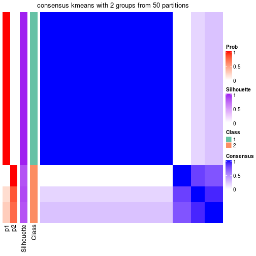</p>

</div>
<div id='tab-node-011-consensus-heatmap-2'>
<pre><code class="r">consensus_heatmap(res, k = 3)
</code></pre>

<p>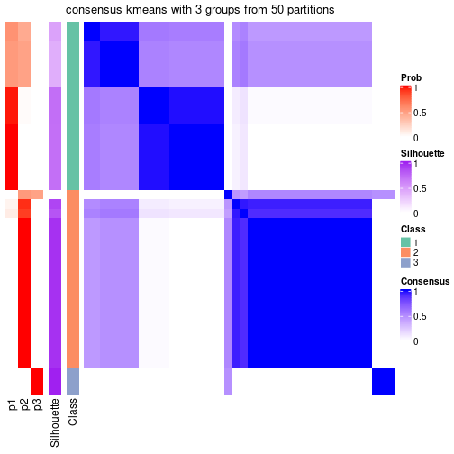</p>

</div>
<div id='tab-node-011-consensus-heatmap-3'>
<pre><code class="r">consensus_heatmap(res, k = 4)
</code></pre>

<p>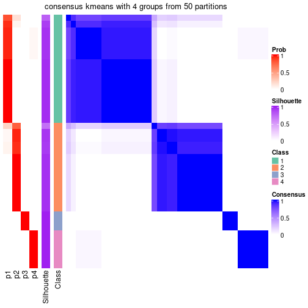</p>

</div>
<div id='tab-node-011-consensus-heatmap-4'>
<pre><code class="r">consensus_heatmap(res, k = 5)
</code></pre>

<p>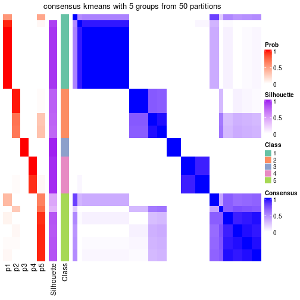</p>

</div>
<div id='tab-node-011-consensus-heatmap-5'>
<pre><code class="r">consensus_heatmap(res, k = 6)
</code></pre>

<p>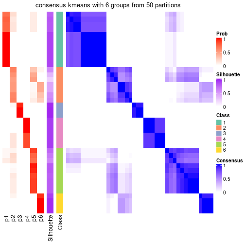</p>

</div>
<div id='tab-node-011-consensus-heatmap-6'>
<pre><code class="r">consensus_heatmap(res, k = 7)
</code></pre>

<p></p>

</div>
<div id='tab-node-011-consensus-heatmap-7'>
<pre><code class="r">consensus_heatmap(res, k = 8)
</code></pre>

<p>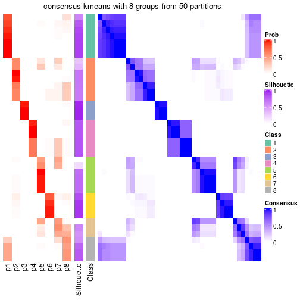</p>

</div>
</div>

Heatmaps for the membership of samples in all partitions to see how consistent they are:


<script>
$( function() {
	$( '#tabs-node-011-membership-heatmap' ).tabs();
} );
</script>
<div id='tabs-node-011-membership-heatmap'>
<ul>
<li><a href='#tab-node-011-membership-heatmap-1'>k = 2</a></li>
<li><a href='#tab-node-011-membership-heatmap-2'>k = 3</a></li>
<li><a href='#tab-node-011-membership-heatmap-3'>k = 4</a></li>
<li><a href='#tab-node-011-membership-heatmap-4'>k = 5</a></li>
<li><a href='#tab-node-011-membership-heatmap-5'>k = 6</a></li>
<li><a href='#tab-node-011-membership-heatmap-6'>k = 7</a></li>
<li><a href='#tab-node-011-membership-heatmap-7'>k = 8</a></li>
</ul>
<div id='tab-node-011-membership-heatmap-1'>
<pre><code class="r">membership_heatmap(res, k = 2)
</code></pre>

<p>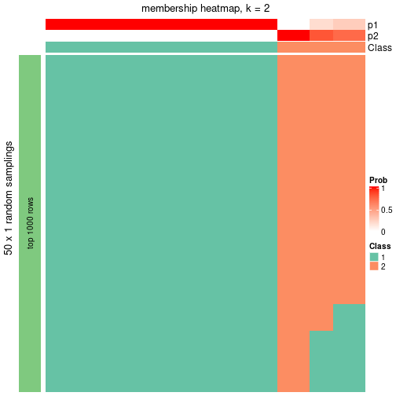</p>

</div>
<div id='tab-node-011-membership-heatmap-2'>
<pre><code class="r">membership_heatmap(res, k = 3)
</code></pre>

<p>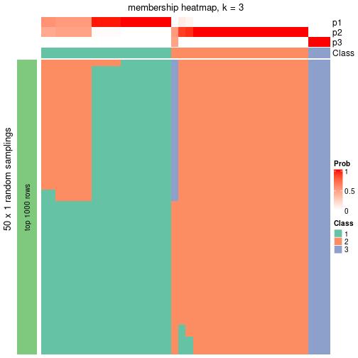</p>

</div>
<div id='tab-node-011-membership-heatmap-3'>
<pre><code class="r">membership_heatmap(res, k = 4)
</code></pre>

<p>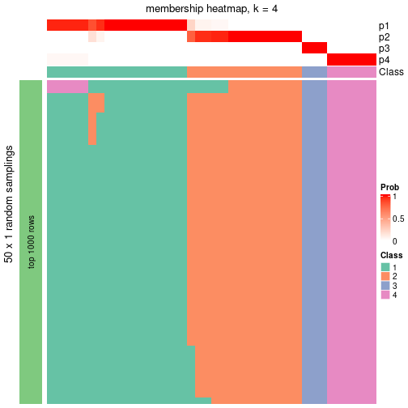</p>

</div>
<div id='tab-node-011-membership-heatmap-4'>
<pre><code class="r">membership_heatmap(res, k = 5)
</code></pre>

<p>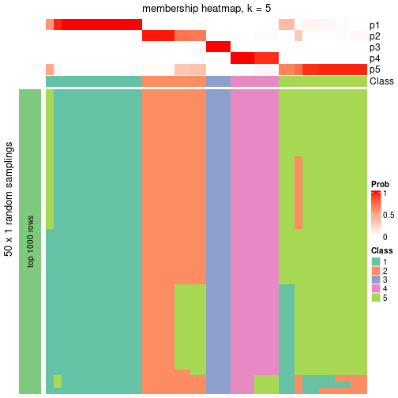</p>

</div>
<div id='tab-node-011-membership-heatmap-5'>
<pre><code class="r">membership_heatmap(res, k = 6)
</code></pre>

<p>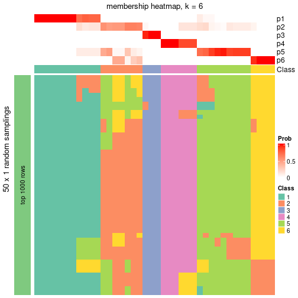</p>

</div>
<div id='tab-node-011-membership-heatmap-6'>
<pre><code class="r">membership_heatmap(res, k = 7)
</code></pre>

<p>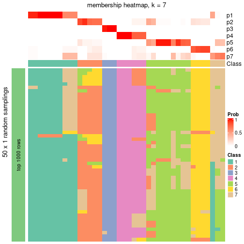</p>

</div>
<div id='tab-node-011-membership-heatmap-7'>
<pre><code class="r">membership_heatmap(res, k = 8)
</code></pre>

<p>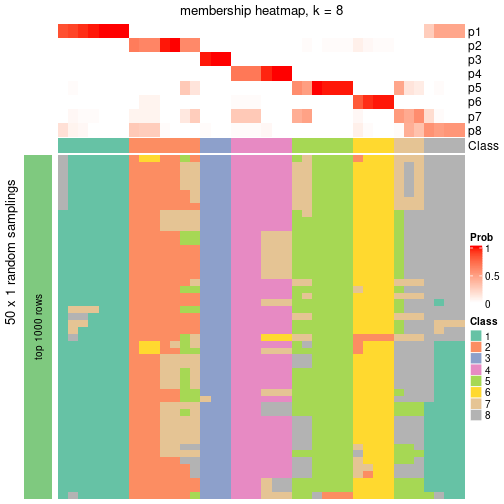</p>

</div>
</div>

As soon as the classes for columns are determined, the signatures
that are significantly different between subgroups can be looked for. 
Following are the heatmaps for signatures.


<script>
$( function() {
	$( '#tabs-node-011-get-signatures' ).tabs();
} );
</script>
<div id='tabs-node-011-get-signatures'>
<ul>
<li><a href='#tab-node-011-get-signatures-1'>k = 2</a></li>
<li><a href='#tab-node-011-get-signatures-2'>k = 3</a></li>
<li><a href='#tab-node-011-get-signatures-3'>k = 4</a></li>
<li><a href='#tab-node-011-get-signatures-4'>k = 5</a></li>
<li><a href='#tab-node-011-get-signatures-5'>k = 6</a></li>
<li><a href='#tab-node-011-get-signatures-6'>k = 7</a></li>
<li><a href='#tab-node-011-get-signatures-7'>k = 8</a></li>
</ul>
<div id='tab-node-011-get-signatures-1'>
<pre><code class="r">get_signatures(res, k = 2)
</code></pre>

<p>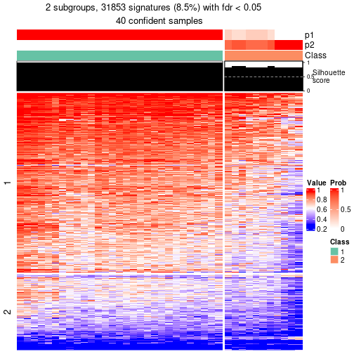</p>

</div>
<div id='tab-node-011-get-signatures-2'>
<pre><code class="r">get_signatures(res, k = 3)
</code></pre>

<p>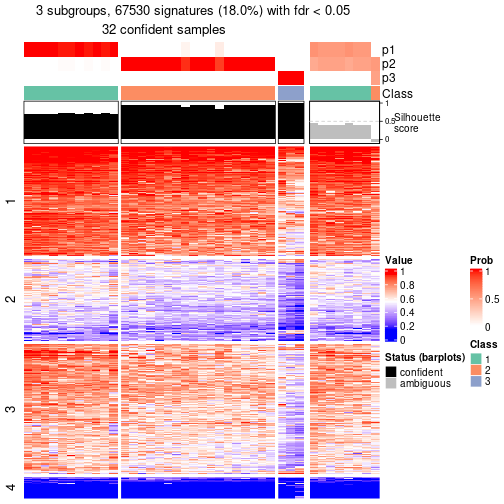</p>

</div>
<div id='tab-node-011-get-signatures-3'>
<pre><code class="r">get_signatures(res, k = 4)
</code></pre>

<p>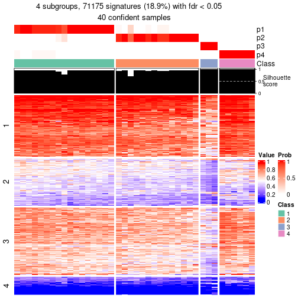</p>

</div>
<div id='tab-node-011-get-signatures-4'>
<pre><code class="r">get_signatures(res, k = 5)
</code></pre>

<p>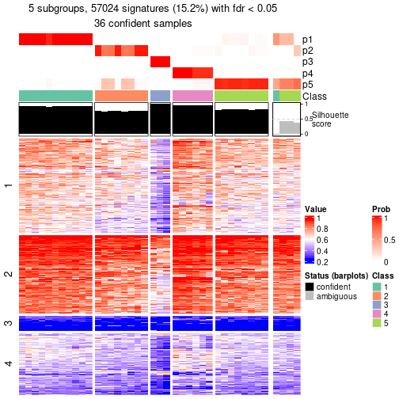</p>

</div>
<div id='tab-node-011-get-signatures-5'>
<pre><code class="r">get_signatures(res, k = 6)
</code></pre>

<p>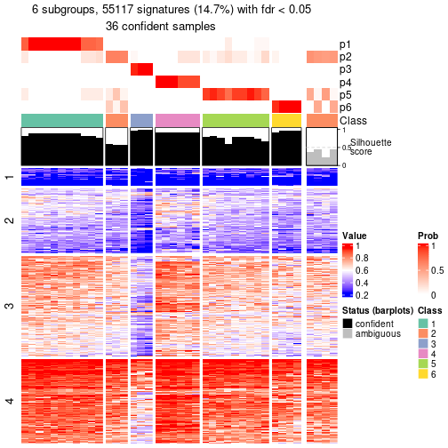</p>

</div>
<div id='tab-node-011-get-signatures-6'>
<pre><code class="r">get_signatures(res, k = 7)
</code></pre>

<p>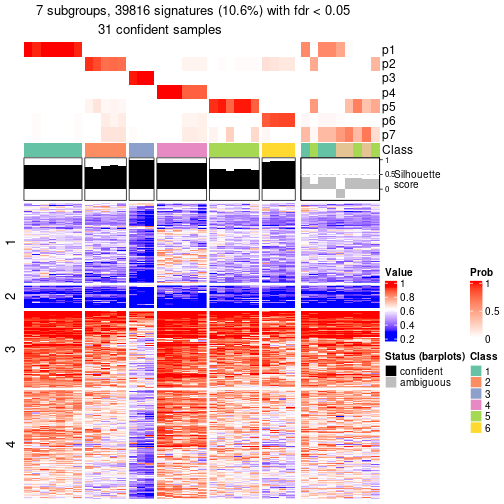</p>

</div>
<div id='tab-node-011-get-signatures-7'>
<pre><code class="r">get_signatures(res, k = 8)
</code></pre>

<p>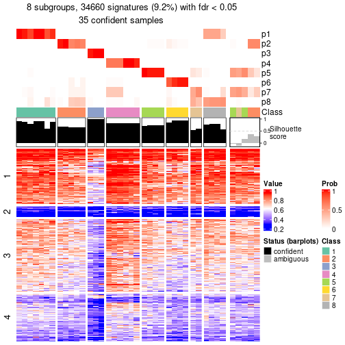</p>

</div>
</div>


Compare the overlap of signatures from different k:

```r
compare_signatures(res)
```

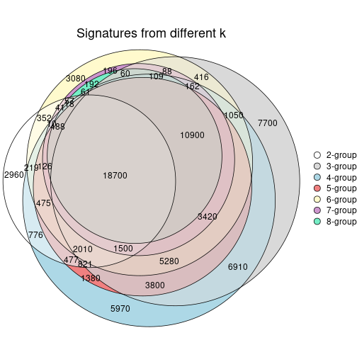

`get_signature()` returns a data frame invisibly. To get the list of signatures, the function
call should be assigned to a variable explicitly. In following code, if `plot` argument is set
to `FALSE`, no heatmap is plotted while only the differential analysis is performed.

```r
# code only for demonstration
tb = get_signature(res, k = ..., plot = FALSE)
```

An example of the output of `tb` is:

```
#>   which_row         fdr    mean_1    mean_2 scaled_mean_1 scaled_mean_2 km
#> 1        38 0.042760348  8.373488  9.131774    -0.5533452     0.5164555  1
#> 2        40 0.018707592  7.106213  8.469186    -0.6173731     0.5762149  1
#> 3        55 0.019134737 10.221463 11.207825    -0.6159697     0.5749050  1
#> 4        59 0.006059896  5.921854  7.869574    -0.6899429     0.6439467  1
#> 5        60 0.018055526  8.928898 10.211722    -0.6204761     0.5791110  1
#> 6        98 0.009384629 15.714769 14.887706     0.6635654    -0.6193277  2
...
```

The columns in `tb` are:

1. `which_row`: row indices corresponding to the input matrix.
2. `fdr`: FDR for the differential test. 
3. `mean_x`: The mean value in group x.
4. `scaled_mean_x`: The mean value in group x after rows are scaled.
5. `km`: Row groups if k-means clustering is applied to rows (which is done by automatically selecting number of clusters).

If there are too many signatures, `top_signatures = ...` can be set to only show the 
signatures with the highest FDRs:

```r
# code only for demonstration
# e.g. to show the top 500 most significant rows
tb = get_signature(res, k = ..., top_signatures = 500)
```

If the signatures are defined as these which are uniquely high in current group, `diff_method` argument
can be set to `"uniquely_high_in_one_group"`:

```r
# code only for demonstration
tb = get_signature(res, k = ..., diff_method = "uniquely_high_in_one_group")
```


UMAP plot which shows how samples are separated.


<script>
$( function() {
	$( '#tabs-node-011-dimension-reduction' ).tabs();
} );
</script>
<div id='tabs-node-011-dimension-reduction'>
<ul>
<li><a href='#tab-node-011-dimension-reduction-1'>k = 2</a></li>
<li><a href='#tab-node-011-dimension-reduction-2'>k = 3</a></li>
<li><a href='#tab-node-011-dimension-reduction-3'>k = 4</a></li>
<li><a href='#tab-node-011-dimension-reduction-4'>k = 5</a></li>
<li><a href='#tab-node-011-dimension-reduction-5'>k = 6</a></li>
<li><a href='#tab-node-011-dimension-reduction-6'>k = 7</a></li>
<li><a href='#tab-node-011-dimension-reduction-7'>k = 8</a></li>
</ul>
<div id='tab-node-011-dimension-reduction-1'>
<pre><code class="r">dimension_reduction(res, k = 2, method = &quot;UMAP&quot;)
</code></pre>

<p>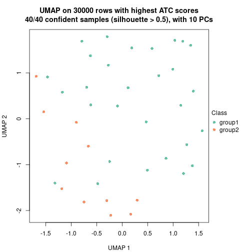</p>

</div>
<div id='tab-node-011-dimension-reduction-2'>
<pre><code class="r">dimension_reduction(res, k = 3, method = &quot;UMAP&quot;)
</code></pre>

<p>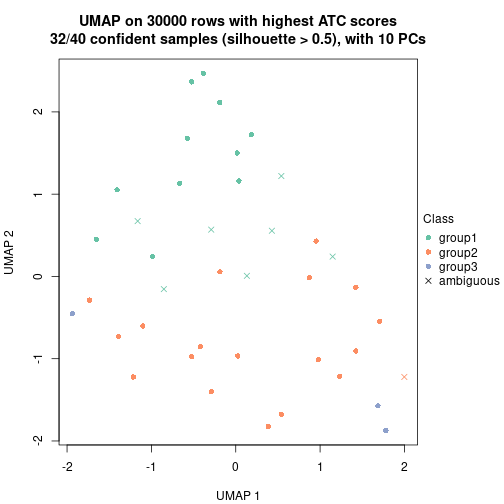</p>

</div>
<div id='tab-node-011-dimension-reduction-3'>
<pre><code class="r">dimension_reduction(res, k = 4, method = &quot;UMAP&quot;)
</code></pre>

<p>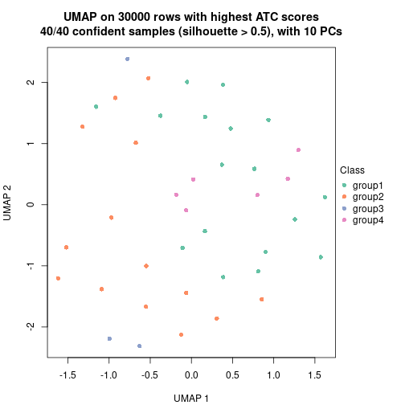</p>

</div>
<div id='tab-node-011-dimension-reduction-4'>
<pre><code class="r">dimension_reduction(res, k = 5, method = &quot;UMAP&quot;)
</code></pre>

<p>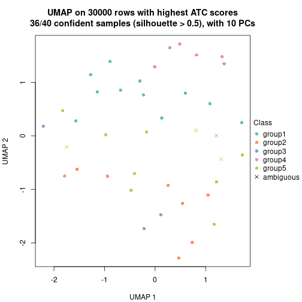</p>

</div>
<div id='tab-node-011-dimension-reduction-5'>
<pre><code class="r">dimension_reduction(res, k = 6, method = &quot;UMAP&quot;)
</code></pre>

<p>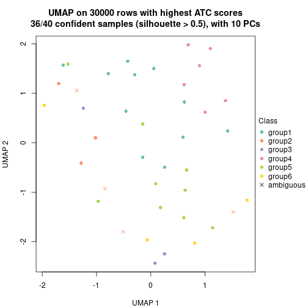</p>

</div>
<div id='tab-node-011-dimension-reduction-6'>
<pre><code class="r">dimension_reduction(res, k = 7, method = &quot;UMAP&quot;)
</code></pre>

<p>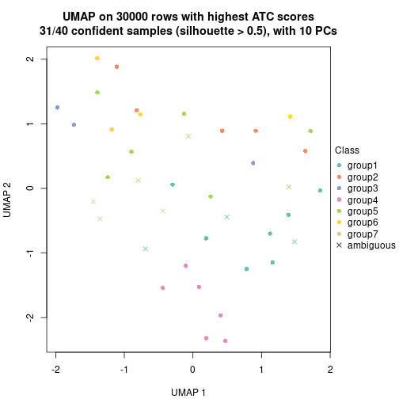</p>

</div>
<div id='tab-node-011-dimension-reduction-7'>
<pre><code class="r">dimension_reduction(res, k = 8, method = &quot;UMAP&quot;)
</code></pre>

<p>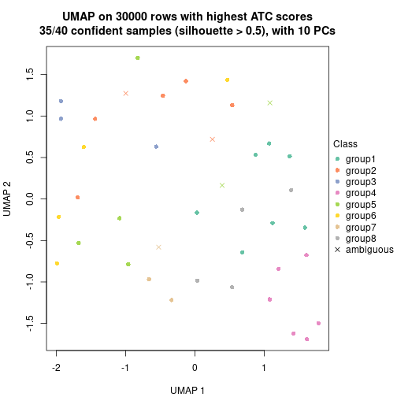</p>

</div>
</div>


Following heatmap shows how subgroups are split when increasing `k`:

```r
collect_classes(res)
```

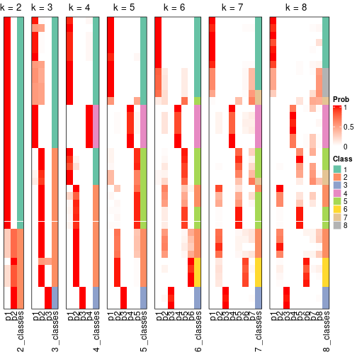


If matrix rows can be associated to genes, consider to use `functional_enrichment(res,
...)` to perform function enrichment for the signature genes. See [this vignette](https://jokergoo.github.io/cola_vignettes/functional_enrichment.html) for more detailed explanations.


 

---------------------------------------------------


### Node012


Parent node: [Node01](#Node01).
Child nodes: 
                Node0111-leaf
        ,
                Node0112-leaf
        ,
                Node0113-leaf
        ,
                Node0114-leaf
        ,
                Node0121-leaf
        ,
                Node0122-leaf
        ,
                Node0123-leaf
        ,
                Node0131-leaf
        ,
                Node0132-leaf
        ,
                Node0133-leaf
        ,
                Node0134-leaf
        ,
                Node0211-leaf
        ,
                Node0212-leaf
        ,
                [Node0213](#Node0213)
        ,
                Node0214-leaf
        ,
                [Node0221](#Node0221)
        ,
                Node0222-leaf
        ,
                Node0223-leaf
        ,
                [Node0231](#Node0231)
        ,
                Node0232-leaf
        ,
                Node0233-leaf
        ,
                [Node0234](#Node0234)
        ,
                Node0235-leaf
        ,
                Node0241-leaf
        ,
                [Node0242](#Node0242)
        ,
                Node0411-leaf
        ,
                Node0412-leaf
        ,
                Node0421-leaf
        ,
                Node0422-leaf
        ,
                Node0423-leaf
        ,
                Node0431-leaf
        ,
                Node0432-leaf
        ,
                Node0511-leaf
        ,
                Node0512-leaf
        ,
                Node0513-leaf
        ,
                Node0514-leaf
        ,
                Node0521-leaf
        ,
                Node0522-leaf
        ,
                Node0523-leaf
        ,
                Node0524-leaf
        ,
                Node0525-leaf
        ,
                Node0611-leaf
        ,
                [Node0612](#Node0612)
        ,
                Node0613-leaf
        ,
                [Node0711](#Node0711)
        ,
                Node0712-leaf
        ,
                Node0713-leaf
        ,
                [Node0721](#Node0721)
        ,
                Node0722-leaf
        ,
                Node0731-leaf
        ,
                Node0732-leaf
        ,
                Node0733-leaf
        .


The object with results only for a single top-value method and a single partitioning method 
can be extracted as:

```r
res = res_rh["012"]
```

A summary of `res` and all the functions that can be applied to it:

```r
res
```

```
#> A 'ConsensusPartition' object with k = 2, 3, 4, 5, 6, 7, 8.
#>   On a matrix with 30000 rows and 38 columns.
#>   Top rows (1000) are extracted by 'ATC' method.
#>   Subgroups are detected by 'skmeans' method.
#>   Performed in total 350 partitions by row resampling.
#>   Best k for subgroups seems to be 4.
#> 
#> Following methods can be applied to this 'ConsensusPartition' object:
#>  [1] "cola_report"             "collect_classes"         "collect_plots"          
#>  [4] "collect_stats"           "colnames"                "compare_partitions"     
#>  [7] "compare_signatures"      "consensus_heatmap"       "dimension_reduction"    
#> [10] "functional_enrichment"   "get_anno_col"            "get_anno"               
#> [13] "get_classes"             "get_consensus"           "get_matrix"             
#> [16] "get_membership"          "get_param"               "get_signatures"         
#> [19] "get_stats"               "is_best_k"               "is_stable_k"            
#> [22] "membership_heatmap"      "ncol"                    "nrow"                   
#> [25] "plot_ecdf"               "predict_classes"         "rownames"               
#> [28] "select_partition_number" "show"                    "suggest_best_k"         
#> [31] "test_to_known_factors"   "top_rows_heatmap"
```

`collect_plots()` function collects all the plots made from `res` for all `k` (number of subgroups)
into one single page to provide an easy and fast comparison between different `k`.

```r
collect_plots(res)
```

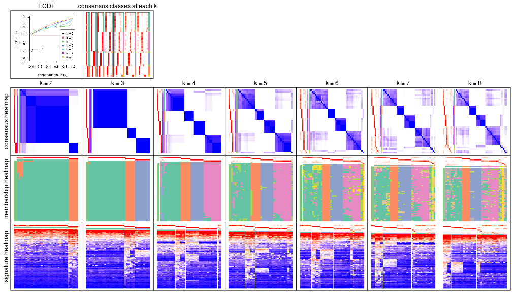

The plots are:

- The first row: a plot of the eCDF (empirical cumulative distribution
  function) curves of the consensus matrix for each `k` and the heatmap of
  predicted classes for each `k`.
- The second row: heatmaps of the consensus matrix for each `k`.
- The third row: heatmaps of the membership matrix for each `k`.
- The fouth row: heatmaps of the signatures for each `k`.

All the plots in panels can be made by individual functions and they are
plotted later in this section.

`select_partition_number()` produces several plots showing different
statistics for choosing "optimized" `k`. There are following statistics:

- eCDF curves of the consensus matrix for each `k`;
- 1-PAC. [The PAC score](https://en.wikipedia.org/wiki/Consensus_clustering#Over-interpretation_potential_of_consensus_clustering)
  measures the proportion of the ambiguous subgrouping.
- Mean silhouette score.
- Concordance. The mean probability of fiting the consensus subgroup labels in all
  partitions.
- Area increased. Denote $A_k$ as the area under the eCDF curve for current
  `k`, the area increased is defined as $A_k - A_{k-1}$.
- Rand index. The percent of pairs of samples that are both in a same cluster
  or both are not in a same cluster in the partition of k and k-1.
- Jaccard index. The ratio of pairs of samples are both in a same cluster in
  the partition of k and k-1 and the pairs of samples are both in a same
  cluster in the partition k or k-1.

The detailed explanations of these statistics can be found in [the _cola_
vignette](https://jokergoo.github.io/cola_vignettes/cola.html#toc_13).

Generally speaking, higher 1-PAC score, higher mean silhouette score or higher
concordance corresponds to better partition. Rand index and Jaccard index
measure how similar the current partition is compared to partition with `k-1`.
If they are too similar, we won't accept `k` is better than `k-1`.

```r
select_partition_number(res)
```

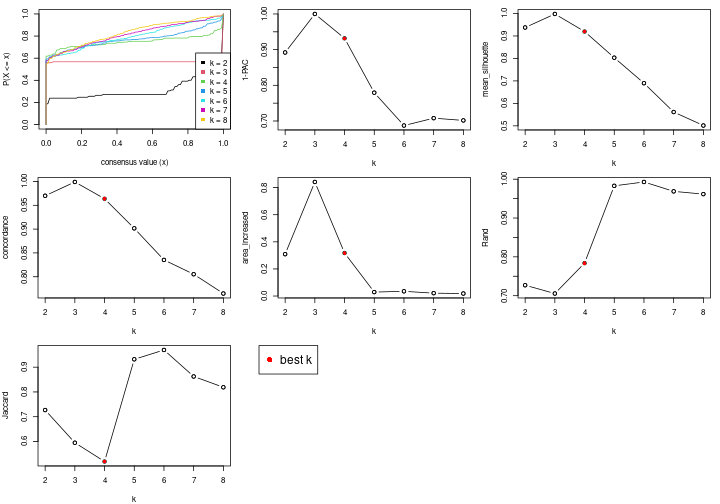

The numeric values for all these statistics can be obtained by `get_stats()`.

```r
get_stats(res)
```

```
#>   k 1-PAC mean_silhouette concordance area_increased  Rand Jaccard
#> 2 2 0.892           0.938       0.970         0.3089 0.727   0.727
#> 3 3 1.000           0.998       0.999         0.8416 0.706   0.595
#> 4 4 0.932           0.920       0.964         0.3175 0.784   0.519
#> 5 5 0.779           0.803       0.902         0.0293 0.983   0.932
#> 6 6 0.687           0.690       0.835         0.0350 0.993   0.970
#> 7 7 0.708           0.561       0.805         0.0213 0.969   0.863
#> 8 8 0.702           0.501       0.765         0.0186 0.962   0.819
```

`suggest_best_k()` suggests the best $k$ based on these statistics. The rules are as follows:

- All $k$ with Jaccard index larger than 0.95 are removed because increasing
  $k$ does not provide enough extra information. If all $k$ are removed, it is
  marked as no subgroup is detected.
- For all $k$ with 1-PAC score larger than 0.9, the maximal $k$ is taken as
  the best $k$, and other $k$ are marked as optional $k$.
- If it does not fit the second rule. The $k$ with the maximal vote of the
  highest 1-PAC score, highest mean silhouette, and highest concordance is
  taken as the best $k$.

```r
suggest_best_k(res)
```

```
#> [1] 4
#> attr(,"optional")
#> [1] 3
```

There is also optional best $k$ = 3 that is worth to check.

Following is the table of the partitions (You need to click the **show/hide
code output** link to see it). The membership matrix (columns with name `p*`)
is inferred by
[`clue::cl_consensus()`](https://www.rdocumentation.org/link/cl_consensus?package=clue)
function with the `SE` method. Basically the value in the membership matrix
represents the probability to belong to a certain group. The finall subgroup
label for an item is determined with the group with highest probability it
belongs to.

In `get_classes()` function, the entropy is calculated from the membership
matrix and the silhouette score is calculated from the consensus matrix.


<script>
$( function() {
	$( '#tabs-node-012-get-classes' ).tabs();
} );
</script>
<div id='tabs-node-012-get-classes'>
<ul>
<li><a href='#tab-node-012-get-classes-1'>k = 2</a></li>
<li><a href='#tab-node-012-get-classes-2'>k = 3</a></li>
<li><a href='#tab-node-012-get-classes-3'>k = 4</a></li>
<li><a href='#tab-node-012-get-classes-4'>k = 5</a></li>
<li><a href='#tab-node-012-get-classes-5'>k = 6</a></li>
<li><a href='#tab-node-012-get-classes-6'>k = 7</a></li>
<li><a href='#tab-node-012-get-classes-7'>k = 8</a></li>
</ul>

<div id='tab-node-012-get-classes-1'>
<p><a id='tab-node-012-get-classes-1-a' style='color:#0366d6' href='#'>show/hide code output</a></p>
<pre><code class="r">cbind(get_classes(res, k = 2), get_membership(res, k = 2))
</code></pre>

<pre><code>#&gt;                 class entropy silhouette   p1   p2
#&gt; TCGA.43.A475.01     1   0.141      0.953 0.98 0.02
#&gt; TCGA.68.8251.01     1   0.000      0.962 1.00 0.00
#&gt; TCGA.92.8063.01     1   0.000      0.962 1.00 0.00
#&gt; TCGA.85.8580.01     1   0.141      0.953 0.98 0.02
#&gt; TCGA.92.7340.01     2   0.000      1.000 0.00 1.00
#&gt; TCGA.NC.A5HE.01     1   0.000      0.962 1.00 0.00
#&gt; TCGA.85.A53L.01     1   0.000      0.962 1.00 0.00
#&gt; TCGA.58.8393.01     1   0.141      0.953 0.98 0.02
#&gt; TCGA.63.A5MS.01     1   0.000      0.962 1.00 0.00
#&gt; TCGA.63.A5MP.01     1   0.000      0.962 1.00 0.00
#&gt; TCGA.34.A5IX.01     1   0.000      0.962 1.00 0.00
#&gt; TCGA.43.8115.01     1   0.141      0.953 0.98 0.02
#&gt; TCGA.96.A4JL.01     2   0.000      1.000 0.00 1.00
#&gt; TCGA.77.A5GA.01     1   0.000      0.962 1.00 0.00
#&gt; TCGA.94.A5I6.01     1   0.000      0.962 1.00 0.00
#&gt; TCGA.85.8049.01     1   0.000      0.962 1.00 0.00
#&gt; TCGA.85.8353.01     1   0.000      0.962 1.00 0.00
#&gt; TCGA.96.7545.01     1   0.000      0.962 1.00 0.00
#&gt; TCGA.85.8276.01     1   0.795      0.709 0.76 0.24
#&gt; TCGA.56.8625.01     1   0.141      0.953 0.98 0.02
#&gt; TCGA.90.A4EE.01     1   0.000      0.962 1.00 0.00
#&gt; TCGA.63.A5MG.01     2   0.000      1.000 0.00 1.00
#&gt; TCGA.94.8491.01     2   0.000      1.000 0.00 1.00
#&gt; TCGA.92.8064.01     1   0.680      0.788 0.82 0.18
#&gt; TCGA.O2.A52V.01     1   0.141      0.953 0.98 0.02
#&gt; TCGA.33.A4WN.01     1   0.000      0.962 1.00 0.00
#&gt; TCGA.18.4721.01     1   0.000      0.962 1.00 0.00
#&gt; TCGA.60.2709.01     1   0.000      0.962 1.00 0.00
#&gt; TCGA.85.8666.01     1   0.000      0.962 1.00 0.00
#&gt; TCGA.85.6561.01     1   0.000      0.962 1.00 0.00
#&gt; TCGA.92.8065.01     1   0.904      0.587 0.68 0.32
#&gt; TCGA.22.5489.01     1   0.000      0.962 1.00 0.00
#&gt; TCGA.NC.A5HL.01     1   0.000      0.962 1.00 0.00
#&gt; TCGA.35.5375.01     2   0.000      1.000 0.00 1.00
#&gt; TCGA.NK.A7XE.01     1   0.000      0.962 1.00 0.00
#&gt; TCGA.63.A5MM.01     2   0.000      1.000 0.00 1.00
#&gt; TCGA.33.AASL.01     1   0.000      0.962 1.00 0.00
#&gt; TCGA.77.7335.01     1   0.855      0.658 0.72 0.28
</code></pre>

<script>
$('#tab-node-012-get-classes-1-a').parent().next().next().hide();
$('#tab-node-012-get-classes-1-a').click(function(){
  $('#tab-node-012-get-classes-1-a').parent().next().next().toggle();
  return(false);
});
</script>
</div>

<div id='tab-node-012-get-classes-2'>
<p><a id='tab-node-012-get-classes-2-a' style='color:#0366d6' href='#'>show/hide code output</a></p>
<pre><code class="r">cbind(get_classes(res, k = 3), get_membership(res, k = 3))
</code></pre>

<pre><code>#&gt;                 class entropy silhouette   p1   p2 p3
#&gt; TCGA.43.A475.01     3   0.000      1.000 0.00 0.00  1
#&gt; TCGA.68.8251.01     1   0.000      0.998 1.00 0.00  0
#&gt; TCGA.92.8063.01     1   0.000      0.998 1.00 0.00  0
#&gt; TCGA.85.8580.01     3   0.000      1.000 0.00 0.00  1
#&gt; TCGA.92.7340.01     2   0.000      1.000 0.00 1.00  0
#&gt; TCGA.NC.A5HE.01     1   0.000      0.998 1.00 0.00  0
#&gt; TCGA.85.A53L.01     1   0.000      0.998 1.00 0.00  0
#&gt; TCGA.58.8393.01     3   0.000      1.000 0.00 0.00  1
#&gt; TCGA.63.A5MS.01     1   0.000      0.998 1.00 0.00  0
#&gt; TCGA.63.A5MP.01     1   0.000      0.998 1.00 0.00  0
#&gt; TCGA.34.A5IX.01     1   0.000      0.998 1.00 0.00  0
#&gt; TCGA.43.8115.01     3   0.000      1.000 0.00 0.00  1
#&gt; TCGA.96.A4JL.01     2   0.000      1.000 0.00 1.00  0
#&gt; TCGA.77.A5GA.01     1   0.000      0.998 1.00 0.00  0
#&gt; TCGA.94.A5I6.01     1   0.000      0.998 1.00 0.00  0
#&gt; TCGA.85.8049.01     1   0.000      0.998 1.00 0.00  0
#&gt; TCGA.85.8353.01     1   0.000      0.998 1.00 0.00  0
#&gt; TCGA.96.7545.01     1   0.000      0.998 1.00 0.00  0
#&gt; TCGA.85.8276.01     1   0.153      0.958 0.96 0.04  0
#&gt; TCGA.56.8625.01     3   0.000      1.000 0.00 0.00  1
#&gt; TCGA.90.A4EE.01     1   0.000      0.998 1.00 0.00  0
#&gt; TCGA.63.A5MG.01     2   0.000      1.000 0.00 1.00  0
#&gt; TCGA.94.8491.01     2   0.000      1.000 0.00 1.00  0
#&gt; TCGA.92.8064.01     1   0.000      0.998 1.00 0.00  0
#&gt; TCGA.O2.A52V.01     3   0.000      1.000 0.00 0.00  1
#&gt; TCGA.33.A4WN.01     1   0.000      0.998 1.00 0.00  0
#&gt; TCGA.18.4721.01     1   0.000      0.998 1.00 0.00  0
#&gt; TCGA.60.2709.01     1   0.000      0.998 1.00 0.00  0
#&gt; TCGA.85.8666.01     1   0.000      0.998 1.00 0.00  0
#&gt; TCGA.85.6561.01     1   0.000      0.998 1.00 0.00  0
#&gt; TCGA.92.8065.01     3   0.000      1.000 0.00 0.00  1
#&gt; TCGA.22.5489.01     1   0.000      0.998 1.00 0.00  0
#&gt; TCGA.NC.A5HL.01     1   0.000      0.998 1.00 0.00  0
#&gt; TCGA.35.5375.01     2   0.000      1.000 0.00 1.00  0
#&gt; TCGA.NK.A7XE.01     1   0.000      0.998 1.00 0.00  0
#&gt; TCGA.63.A5MM.01     2   0.000      1.000 0.00 1.00  0
#&gt; TCGA.33.AASL.01     3   0.000      1.000 0.00 0.00  1
#&gt; TCGA.77.7335.01     3   0.000      1.000 0.00 0.00  1
</code></pre>

<script>
$('#tab-node-012-get-classes-2-a').parent().next().next().hide();
$('#tab-node-012-get-classes-2-a').click(function(){
  $('#tab-node-012-get-classes-2-a').parent().next().next().toggle();
  return(false);
});
</script>
</div>

<div id='tab-node-012-get-classes-3'>
<p><a id='tab-node-012-get-classes-3-a' style='color:#0366d6' href='#'>show/hide code output</a></p>
<pre><code class="r">cbind(get_classes(res, k = 4), get_membership(res, k = 4))
</code></pre>

<pre><code>#&gt;                 class entropy silhouette   p1 p2   p3   p4
#&gt; TCGA.43.A475.01     3  0.0000      1.000 0.00  0 1.00 0.00
#&gt; TCGA.68.8251.01     1  0.4855      0.329 0.60  0 0.00 0.40
#&gt; TCGA.92.8063.01     4  0.0000      0.963 0.00  0 0.00 1.00
#&gt; TCGA.85.8580.01     3  0.0000      1.000 0.00  0 1.00 0.00
#&gt; TCGA.92.7340.01     2  0.0000      1.000 0.00  1 0.00 0.00
#&gt; TCGA.NC.A5HE.01     1  0.3610      0.731 0.80  0 0.00 0.20
#&gt; TCGA.85.A53L.01     4  0.1637      0.948 0.06  0 0.00 0.94
#&gt; TCGA.58.8393.01     3  0.0000      1.000 0.00  0 1.00 0.00
#&gt; TCGA.63.A5MS.01     1  0.2011      0.856 0.92  0 0.00 0.08
#&gt; TCGA.63.A5MP.01     1  0.0000      0.903 1.00  0 0.00 0.00
#&gt; TCGA.34.A5IX.01     4  0.0000      0.963 0.00  0 0.00 1.00
#&gt; TCGA.43.8115.01     3  0.0000      1.000 0.00  0 1.00 0.00
#&gt; TCGA.96.A4JL.01     2  0.0000      1.000 0.00  1 0.00 0.00
#&gt; TCGA.77.A5GA.01     1  0.0000      0.903 1.00  0 0.00 0.00
#&gt; TCGA.94.A5I6.01     4  0.0000      0.963 0.00  0 0.00 1.00
#&gt; TCGA.85.8049.01     1  0.0000      0.903 1.00  0 0.00 0.00
#&gt; TCGA.85.8353.01     1  0.0000      0.903 1.00  0 0.00 0.00
#&gt; TCGA.96.7545.01     4  0.1211      0.956 0.04  0 0.00 0.96
#&gt; TCGA.85.8276.01     1  0.0000      0.903 1.00  0 0.00 0.00
#&gt; TCGA.56.8625.01     3  0.0000      1.000 0.00  0 1.00 0.00
#&gt; TCGA.90.A4EE.01     1  0.0000      0.903 1.00  0 0.00 0.00
#&gt; TCGA.63.A5MG.01     2  0.0000      1.000 0.00  1 0.00 0.00
#&gt; TCGA.94.8491.01     2  0.0000      1.000 0.00  1 0.00 0.00
#&gt; TCGA.92.8064.01     1  0.0000      0.903 1.00  0 0.00 0.00
#&gt; TCGA.O2.A52V.01     3  0.0000      1.000 0.00  0 1.00 0.00
#&gt; TCGA.33.A4WN.01     1  0.0000      0.903 1.00  0 0.00 0.00
#&gt; TCGA.18.4721.01     1  0.0707      0.894 0.98  0 0.00 0.02
#&gt; TCGA.60.2709.01     4  0.0000      0.963 0.00  0 0.00 1.00
#&gt; TCGA.85.8666.01     4  0.1637      0.948 0.06  0 0.00 0.94
#&gt; TCGA.85.6561.01     4  0.1637      0.947 0.06  0 0.00 0.94
#&gt; TCGA.92.8065.01     3  0.0000      1.000 0.00  0 1.00 0.00
#&gt; TCGA.22.5489.01     4  0.0000      0.963 0.00  0 0.00 1.00
#&gt; TCGA.NC.A5HL.01     4  0.2647      0.884 0.12  0 0.00 0.88
#&gt; TCGA.35.5375.01     2  0.0000      1.000 0.00  1 0.00 0.00
#&gt; TCGA.NK.A7XE.01     4  0.0000      0.963 0.00  0 0.00 1.00
#&gt; TCGA.63.A5MM.01     2  0.0000      1.000 0.00  1 0.00 0.00
#&gt; TCGA.33.AASL.01     3  0.0000      1.000 0.00  0 1.00 0.00
#&gt; TCGA.77.7335.01     1  0.4624      0.455 0.66  0 0.34 0.00
</code></pre>

<script>
$('#tab-node-012-get-classes-3-a').parent().next().next().hide();
$('#tab-node-012-get-classes-3-a').click(function(){
  $('#tab-node-012-get-classes-3-a').parent().next().next().toggle();
  return(false);
});
</script>
</div>

<div id='tab-node-012-get-classes-4'>
<p><a id='tab-node-012-get-classes-4-a' style='color:#0366d6' href='#'>show/hide code output</a></p>
<pre><code class="r">cbind(get_classes(res, k = 5), get_membership(res, k = 5))
</code></pre>

<pre><code>#&gt;                 class entropy silhouette   p1   p2   p3   p4   p5
#&gt; TCGA.43.A475.01     3  0.0000      0.968 0.00 0.00 1.00 0.00 0.00
#&gt; TCGA.68.8251.01     1  0.3983      0.370 0.66 0.00 0.00 0.34 0.00
#&gt; TCGA.92.8063.01     4  0.0000      0.910 0.00 0.00 0.00 1.00 0.00
#&gt; TCGA.85.8580.01     3  0.0000      0.968 0.00 0.00 1.00 0.00 0.00
#&gt; TCGA.92.7340.01     2  0.0000      0.926 0.00 1.00 0.00 0.00 0.00
#&gt; TCGA.NC.A5HE.01     1  0.4588      0.551 0.72 0.00 0.00 0.22 0.06
#&gt; TCGA.85.A53L.01     4  0.3274      0.772 0.22 0.00 0.00 0.78 0.00
#&gt; TCGA.58.8393.01     3  0.0609      0.965 0.00 0.00 0.98 0.00 0.02
#&gt; TCGA.63.A5MS.01     1  0.1732      0.740 0.92 0.00 0.00 0.08 0.00
#&gt; TCGA.63.A5MP.01     1  0.0609      0.775 0.98 0.00 0.00 0.00 0.02
#&gt; TCGA.34.A5IX.01     4  0.0000      0.910 0.00 0.00 0.00 1.00 0.00
#&gt; TCGA.43.8115.01     3  0.0000      0.968 0.00 0.00 1.00 0.00 0.00
#&gt; TCGA.96.A4JL.01     2  0.0000      0.926 0.00 1.00 0.00 0.00 0.00
#&gt; TCGA.77.A5GA.01     1  0.0000      0.778 1.00 0.00 0.00 0.00 0.00
#&gt; TCGA.94.A5I6.01     4  0.0000      0.910 0.00 0.00 0.00 1.00 0.00
#&gt; TCGA.85.8049.01     1  0.2873      0.741 0.86 0.00 0.00 0.02 0.12
#&gt; TCGA.85.8353.01     1  0.1410      0.771 0.94 0.00 0.00 0.00 0.06
#&gt; TCGA.96.7545.01     4  0.2020      0.887 0.10 0.00 0.00 0.90 0.00
#&gt; TCGA.85.8276.01     1  0.1410      0.758 0.94 0.00 0.00 0.00 0.06
#&gt; TCGA.56.8625.01     3  0.0609      0.965 0.00 0.00 0.98 0.00 0.02
#&gt; TCGA.90.A4EE.01     1  0.4456      0.445 0.66 0.00 0.00 0.02 0.32
#&gt; TCGA.63.A5MG.01     2  0.0000      0.926 0.00 1.00 0.00 0.00 0.00
#&gt; TCGA.94.8491.01     2  0.0000      0.926 0.00 1.00 0.00 0.00 0.00
#&gt; TCGA.92.8064.01     1  0.2929      0.698 0.82 0.00 0.00 0.00 0.18
#&gt; TCGA.O2.A52V.01     3  0.0000      0.968 0.00 0.00 1.00 0.00 0.00
#&gt; TCGA.33.A4WN.01     1  0.0000      0.778 1.00 0.00 0.00 0.00 0.00
#&gt; TCGA.18.4721.01     1  0.3291      0.724 0.84 0.00 0.00 0.04 0.12
#&gt; TCGA.60.2709.01     4  0.1043      0.906 0.04 0.00 0.00 0.96 0.00
#&gt; TCGA.85.8666.01     4  0.2331      0.891 0.08 0.00 0.00 0.90 0.02
#&gt; TCGA.85.6561.01     4  0.2280      0.878 0.12 0.00 0.00 0.88 0.00
#&gt; TCGA.92.8065.01     3  0.2280      0.843 0.00 0.00 0.88 0.00 0.12
#&gt; TCGA.22.5489.01     4  0.0000      0.910 0.00 0.00 0.00 1.00 0.00
#&gt; TCGA.NC.A5HL.01     4  0.4254      0.722 0.22 0.00 0.00 0.74 0.04
#&gt; TCGA.35.5375.01     2  0.4262      0.551 0.00 0.56 0.00 0.00 0.44
#&gt; TCGA.NK.A7XE.01     4  0.0000      0.910 0.00 0.00 0.00 1.00 0.00
#&gt; TCGA.63.A5MM.01     2  0.0000      0.926 0.00 1.00 0.00 0.00 0.00
#&gt; TCGA.33.AASL.01     3  0.0609      0.965 0.00 0.00 0.98 0.00 0.02
#&gt; TCGA.77.7335.01     5  0.6794      0.000 0.30 0.00 0.32 0.00 0.38
</code></pre>

<script>
$('#tab-node-012-get-classes-4-a').parent().next().next().hide();
$('#tab-node-012-get-classes-4-a').click(function(){
  $('#tab-node-012-get-classes-4-a').parent().next().next().toggle();
  return(false);
});
</script>
</div>

<div id='tab-node-012-get-classes-5'>
<p><a id='tab-node-012-get-classes-5-a' style='color:#0366d6' href='#'>show/hide code output</a></p>
<pre><code class="r">cbind(get_classes(res, k = 6), get_membership(res, k = 6))
</code></pre>

<pre><code>#&gt;                 class entropy silhouette   p1   p2   p3   p4   p5   p6
#&gt; TCGA.43.A475.01     3  0.0000      0.951 0.00 0.00 1.00 0.00 0.00 0.00
#&gt; TCGA.68.8251.01     1  0.5208      0.379 0.62 0.00 0.00 0.28 0.08 0.02
#&gt; TCGA.92.8063.01     4  0.2474      0.741 0.00 0.00 0.00 0.88 0.04 0.08
#&gt; TCGA.85.8580.01     3  0.0000      0.951 0.00 0.00 1.00 0.00 0.00 0.00
#&gt; TCGA.92.7340.01     2  0.0000      1.000 0.00 1.00 0.00 0.00 0.00 0.00
#&gt; TCGA.NC.A5HE.01     1  0.6424      0.384 0.50 0.00 0.00 0.24 0.22 0.04
#&gt; TCGA.85.A53L.01     4  0.4637      0.498 0.36 0.00 0.00 0.60 0.02 0.02
#&gt; TCGA.58.8393.01     3  0.0937      0.936 0.00 0.00 0.96 0.00 0.04 0.00
#&gt; TCGA.63.A5MS.01     1  0.2629      0.601 0.88 0.00 0.00 0.08 0.02 0.02
#&gt; TCGA.63.A5MP.01     1  0.2631      0.627 0.82 0.00 0.00 0.00 0.18 0.00
#&gt; TCGA.34.A5IX.01     4  0.2350      0.759 0.02 0.00 0.00 0.88 0.00 0.10
#&gt; TCGA.43.8115.01     3  0.0000      0.951 0.00 0.00 1.00 0.00 0.00 0.00
#&gt; TCGA.96.A4JL.01     2  0.0000      1.000 0.00 1.00 0.00 0.00 0.00 0.00
#&gt; TCGA.77.A5GA.01     1  0.0000      0.640 1.00 0.00 0.00 0.00 0.00 0.00
#&gt; TCGA.94.A5I6.01     4  0.1865      0.753 0.00 0.00 0.00 0.92 0.04 0.04
#&gt; TCGA.85.8049.01     1  0.4105      0.589 0.72 0.00 0.00 0.02 0.24 0.02
#&gt; TCGA.85.8353.01     1  0.3156      0.617 0.80 0.00 0.00 0.00 0.18 0.02
#&gt; TCGA.96.7545.01     4  0.5236      0.673 0.22 0.00 0.00 0.66 0.08 0.04
#&gt; TCGA.85.8276.01     1  0.3351      0.515 0.80 0.00 0.00 0.00 0.16 0.04
#&gt; TCGA.56.8625.01     3  0.0547      0.945 0.00 0.00 0.98 0.00 0.02 0.00
#&gt; TCGA.90.A4EE.01     1  0.5347      0.350 0.50 0.00 0.00 0.02 0.42 0.06
#&gt; TCGA.63.A5MG.01     2  0.0000      1.000 0.00 1.00 0.00 0.00 0.00 0.00
#&gt; TCGA.94.8491.01     2  0.0000      1.000 0.00 1.00 0.00 0.00 0.00 0.00
#&gt; TCGA.92.8064.01     1  0.3647      0.480 0.64 0.00 0.00 0.00 0.36 0.00
#&gt; TCGA.O2.A52V.01     3  0.0000      0.951 0.00 0.00 1.00 0.00 0.00 0.00
#&gt; TCGA.33.A4WN.01     1  0.1635      0.630 0.94 0.00 0.00 0.02 0.02 0.02
#&gt; TCGA.18.4721.01     1  0.5663      0.483 0.58 0.00 0.00 0.06 0.30 0.06
#&gt; TCGA.60.2709.01     4  0.1814      0.770 0.10 0.00 0.00 0.90 0.00 0.00
#&gt; TCGA.85.8666.01     4  0.3821      0.691 0.22 0.00 0.00 0.74 0.04 0.00
#&gt; TCGA.85.6561.01     4  0.3309      0.666 0.28 0.00 0.00 0.72 0.00 0.00
#&gt; TCGA.92.8065.01     3  0.3315      0.677 0.00 0.00 0.78 0.00 0.20 0.02
#&gt; TCGA.22.5489.01     4  0.1092      0.761 0.00 0.00 0.00 0.96 0.02 0.02
#&gt; TCGA.NC.A5HL.01     4  0.5813      0.549 0.20 0.00 0.00 0.62 0.12 0.06
#&gt; TCGA.35.5375.01     6  0.3198      0.000 0.00 0.26 0.00 0.00 0.00 0.74
#&gt; TCGA.NK.A7XE.01     4  0.1807      0.749 0.00 0.00 0.00 0.92 0.02 0.06
#&gt; TCGA.63.A5MM.01     2  0.0000      1.000 0.00 1.00 0.00 0.00 0.00 0.00
#&gt; TCGA.33.AASL.01     3  0.0547      0.945 0.00 0.00 0.98 0.00 0.02 0.00
#&gt; TCGA.77.7335.01     5  0.6113      0.000 0.22 0.00 0.18 0.00 0.56 0.04
</code></pre>

<script>
$('#tab-node-012-get-classes-5-a').parent().next().next().hide();
$('#tab-node-012-get-classes-5-a').click(function(){
  $('#tab-node-012-get-classes-5-a').parent().next().next().toggle();
  return(false);
});
</script>
</div>

<div id='tab-node-012-get-classes-6'>
<p><a id='tab-node-012-get-classes-6-a' style='color:#0366d6' href='#'>show/hide code output</a></p>
<pre><code class="r">cbind(get_classes(res, k = 7), get_membership(res, k = 7))
</code></pre>

<pre><code>#&gt;                 class entropy silhouette   p1   p2   p3   p4   p5   p6   p7
#&gt; TCGA.43.A475.01     3   0.000     0.9245 0.00 0.00 1.00 0.00 0.00 0.00 0.00
#&gt; TCGA.68.8251.01     1   0.450     0.2379 0.66 0.00 0.00 0.18 0.00 0.00 0.16
#&gt; TCGA.92.8063.01     4   0.166     0.7098 0.00 0.00 0.00 0.92 0.00 0.02 0.06
#&gt; TCGA.85.8580.01     3   0.000     0.9245 0.00 0.00 1.00 0.00 0.00 0.00 0.00
#&gt; TCGA.92.7340.01     2   0.000     0.9826 0.00 1.00 0.00 0.00 0.00 0.00 0.00
#&gt; TCGA.NC.A5HE.01     1   0.704    -0.0372 0.46 0.00 0.00 0.22 0.14 0.04 0.14
#&gt; TCGA.85.A53L.01     4   0.387     0.5048 0.38 0.00 0.00 0.60 0.00 0.00 0.02
#&gt; TCGA.58.8393.01     3   0.202     0.8980 0.00 0.00 0.90 0.00 0.06 0.00 0.04
#&gt; TCGA.63.A5MS.01     1   0.193     0.4847 0.90 0.00 0.00 0.08 0.00 0.00 0.02
#&gt; TCGA.63.A5MP.01     1   0.300     0.4639 0.84 0.00 0.00 0.02 0.10 0.00 0.04
#&gt; TCGA.34.A5IX.01     4   0.189     0.6764 0.00 0.00 0.00 0.88 0.00 0.00 0.12
#&gt; TCGA.43.8115.01     3   0.000     0.9245 0.00 0.00 1.00 0.00 0.00 0.00 0.00
#&gt; TCGA.96.A4JL.01     2   0.000     0.9826 0.00 1.00 0.00 0.00 0.00 0.00 0.00
#&gt; TCGA.77.A5GA.01     1   0.172     0.5137 0.92 0.00 0.00 0.00 0.04 0.00 0.04
#&gt; TCGA.94.A5I6.01     4   0.000     0.7247 0.00 0.00 0.00 1.00 0.00 0.00 0.00
#&gt; TCGA.85.8049.01     1   0.481     0.1851 0.64 0.00 0.00 0.02 0.24 0.00 0.10
#&gt; TCGA.85.8353.01     1   0.238     0.4699 0.86 0.00 0.00 0.00 0.12 0.00 0.02
#&gt; TCGA.96.7545.01     4   0.352     0.6762 0.22 0.00 0.00 0.74 0.00 0.00 0.04
#&gt; TCGA.85.8276.01     1   0.496     0.1294 0.64 0.00 0.00 0.00 0.18 0.02 0.16
#&gt; TCGA.56.8625.01     3   0.172     0.9098 0.00 0.00 0.92 0.00 0.04 0.00 0.04
#&gt; TCGA.90.A4EE.01     7   0.626     0.0000 0.34 0.00 0.00 0.04 0.28 0.00 0.34
#&gt; TCGA.63.A5MG.01     2   0.117     0.9282 0.00 0.94 0.00 0.00 0.06 0.00 0.00
#&gt; TCGA.94.8491.01     2   0.000     0.9826 0.00 1.00 0.00 0.00 0.00 0.00 0.00
#&gt; TCGA.92.8064.01     5   0.585    -0.3494 0.40 0.00 0.00 0.02 0.44 0.02 0.12
#&gt; TCGA.O2.A52V.01     3   0.000     0.9245 0.00 0.00 1.00 0.00 0.00 0.00 0.00
#&gt; TCGA.33.A4WN.01     1   0.166     0.5113 0.92 0.00 0.00 0.00 0.00 0.02 0.06
#&gt; TCGA.18.4721.01     1   0.586     0.0590 0.58 0.00 0.00 0.02 0.18 0.04 0.18
#&gt; TCGA.60.2709.01     4   0.208     0.7179 0.14 0.00 0.00 0.86 0.00 0.00 0.00
#&gt; TCGA.85.8666.01     4   0.562     0.4750 0.30 0.00 0.00 0.54 0.06 0.00 0.10
#&gt; TCGA.85.6561.01     4   0.448     0.6259 0.26 0.00 0.00 0.66 0.02 0.00 0.06
#&gt; TCGA.92.8065.01     3   0.391     0.6750 0.00 0.00 0.70 0.00 0.24 0.00 0.06
#&gt; TCGA.22.5489.01     4   0.117     0.7228 0.00 0.00 0.00 0.94 0.00 0.00 0.06
#&gt; TCGA.NC.A5HL.01     4   0.597     0.1401 0.28 0.00 0.00 0.40 0.02 0.00 0.30
#&gt; TCGA.35.5375.01     6   0.143     0.0000 0.00 0.08 0.00 0.00 0.00 0.92 0.00
#&gt; TCGA.NK.A7XE.01     4   0.117     0.7095 0.00 0.00 0.00 0.94 0.00 0.00 0.06
#&gt; TCGA.63.A5MM.01     2   0.000     0.9826 0.00 1.00 0.00 0.00 0.00 0.00 0.00
#&gt; TCGA.33.AASL.01     3   0.221     0.9015 0.00 0.00 0.90 0.00 0.04 0.02 0.04
#&gt; TCGA.77.7335.01     5   0.309     0.0420 0.04 0.00 0.16 0.00 0.80 0.00 0.00
</code></pre>

<script>
$('#tab-node-012-get-classes-6-a').parent().next().next().hide();
$('#tab-node-012-get-classes-6-a').click(function(){
  $('#tab-node-012-get-classes-6-a').parent().next().next().toggle();
  return(false);
});
</script>
</div>

<div id='tab-node-012-get-classes-7'>
<p><a id='tab-node-012-get-classes-7-a' style='color:#0366d6' href='#'>show/hide code output</a></p>
<pre><code class="r">cbind(get_classes(res, k = 8), get_membership(res, k = 8))
</code></pre>

<pre><code>#&gt;                 class entropy silhouette   p1   p2   p3   p4   p5   p6   p7   p8
#&gt; TCGA.43.A475.01     3   0.000     0.8953 0.00 0.00 1.00 0.00 0.00 0.00 0.00 0.00
#&gt; TCGA.68.8251.01     1   0.576     0.1976 0.58 0.00 0.00 0.18 0.00 0.04 0.14 0.06
#&gt; TCGA.92.8063.01     4   0.156     0.6765 0.00 0.00 0.00 0.92 0.06 0.00 0.00 0.02
#&gt; TCGA.85.8580.01     3   0.000     0.8953 0.00 0.00 1.00 0.00 0.00 0.00 0.00 0.00
#&gt; TCGA.92.7340.01     2   0.000     0.9774 0.00 1.00 0.00 0.00 0.00 0.00 0.00 0.00
#&gt; TCGA.NC.A5HE.01     1   0.657    -0.1399 0.38 0.00 0.00 0.28 0.02 0.00 0.10 0.22
#&gt; TCGA.85.A53L.01     4   0.513     0.3839 0.34 0.00 0.00 0.52 0.00 0.00 0.04 0.10
#&gt; TCGA.58.8393.01     3   0.282     0.8148 0.00 0.00 0.82 0.00 0.12 0.00 0.06 0.00
#&gt; TCGA.63.A5MS.01     1   0.213     0.3908 0.88 0.00 0.00 0.08 0.00 0.00 0.00 0.04
#&gt; TCGA.63.A5MP.01     1   0.478     0.1778 0.66 0.00 0.00 0.02 0.00 0.02 0.18 0.12
#&gt; TCGA.34.A5IX.01     4   0.286     0.6595 0.00 0.00 0.00 0.84 0.06 0.02 0.00 0.08
#&gt; TCGA.43.8115.01     3   0.000     0.8953 0.00 0.00 1.00 0.00 0.00 0.00 0.00 0.00
#&gt; TCGA.96.A4JL.01     2   0.000     0.9774 0.00 1.00 0.00 0.00 0.00 0.00 0.00 0.00
#&gt; TCGA.77.A5GA.01     1   0.241     0.3591 0.86 0.00 0.00 0.00 0.00 0.00 0.08 0.06
#&gt; TCGA.94.A5I6.01     4   0.000     0.6990 0.00 0.00 0.00 1.00 0.00 0.00 0.00 0.00
#&gt; TCGA.85.8049.01     1   0.465     0.0304 0.66 0.00 0.00 0.04 0.00 0.00 0.12 0.18
#&gt; TCGA.85.8353.01     1   0.268     0.2866 0.84 0.00 0.00 0.02 0.00 0.00 0.12 0.02
#&gt; TCGA.96.7545.01     4   0.511     0.5363 0.24 0.00 0.00 0.58 0.00 0.00 0.04 0.14
#&gt; TCGA.85.8276.01     1   0.476     0.0883 0.64 0.00 0.00 0.00 0.04 0.00 0.12 0.20
#&gt; TCGA.56.8625.01     3   0.241     0.8505 0.00 0.00 0.86 0.00 0.08 0.00 0.06 0.00
#&gt; TCGA.90.A4EE.01     7   0.437     0.0000 0.26 0.00 0.00 0.02 0.04 0.00 0.66 0.02
#&gt; TCGA.63.A5MG.01     2   0.174     0.9058 0.02 0.92 0.00 0.00 0.00 0.00 0.02 0.04
#&gt; TCGA.94.8491.01     2   0.000     0.9774 0.00 1.00 0.00 0.00 0.00 0.00 0.00 0.00
#&gt; TCGA.92.8064.01     1   0.551    -0.0245 0.56 0.00 0.00 0.02 0.02 0.02 0.28 0.10
#&gt; TCGA.O2.A52V.01     3   0.000     0.8953 0.00 0.00 1.00 0.00 0.00 0.00 0.00 0.00
#&gt; TCGA.33.A4WN.01     1   0.161     0.3946 0.92 0.00 0.00 0.04 0.00 0.00 0.00 0.04
#&gt; TCGA.18.4721.01     8   0.495     0.0000 0.42 0.00 0.00 0.02 0.00 0.00 0.10 0.46
#&gt; TCGA.60.2709.01     4   0.265     0.6904 0.08 0.00 0.00 0.84 0.00 0.00 0.00 0.08
#&gt; TCGA.85.8666.01     4   0.548     0.5027 0.18 0.00 0.00 0.58 0.02 0.00 0.04 0.18
#&gt; TCGA.85.6561.01     4   0.490     0.4612 0.28 0.00 0.00 0.52 0.00 0.00 0.00 0.20
#&gt; TCGA.92.8065.01     5   0.324     0.1224 0.00 0.00 0.40 0.00 0.60 0.00 0.00 0.00
#&gt; TCGA.22.5489.01     4   0.267     0.6978 0.02 0.00 0.00 0.88 0.02 0.02 0.02 0.04
#&gt; TCGA.NC.A5HL.01     4   0.616     0.2646 0.12 0.00 0.00 0.44 0.04 0.00 0.06 0.34
#&gt; TCGA.35.5375.01     6   0.109     0.0000 0.00 0.06 0.00 0.00 0.00 0.94 0.00 0.00
#&gt; TCGA.NK.A7XE.01     4   0.189     0.6855 0.00 0.00 0.00 0.90 0.06 0.00 0.00 0.04
#&gt; TCGA.63.A5MM.01     2   0.000     0.9774 0.00 1.00 0.00 0.00 0.00 0.00 0.00 0.00
#&gt; TCGA.33.AASL.01     3   0.262     0.8382 0.00 0.00 0.84 0.00 0.10 0.00 0.06 0.00
#&gt; TCGA.77.7335.01     5   0.749     0.0103 0.10 0.00 0.16 0.00 0.38 0.02 0.22 0.12
</code></pre>

<script>
$('#tab-node-012-get-classes-7-a').parent().next().next().hide();
$('#tab-node-012-get-classes-7-a').click(function(){
  $('#tab-node-012-get-classes-7-a').parent().next().next().toggle();
  return(false);
});
</script>
</div>
</div>

Heatmaps for the consensus matrix. It visualizes the probability of two
samples to be in a same group.


<script>
$( function() {
	$( '#tabs-node-012-consensus-heatmap' ).tabs();
} );
</script>
<div id='tabs-node-012-consensus-heatmap'>
<ul>
<li><a href='#tab-node-012-consensus-heatmap-1'>k = 2</a></li>
<li><a href='#tab-node-012-consensus-heatmap-2'>k = 3</a></li>
<li><a href='#tab-node-012-consensus-heatmap-3'>k = 4</a></li>
<li><a href='#tab-node-012-consensus-heatmap-4'>k = 5</a></li>
<li><a href='#tab-node-012-consensus-heatmap-5'>k = 6</a></li>
<li><a href='#tab-node-012-consensus-heatmap-6'>k = 7</a></li>
<li><a href='#tab-node-012-consensus-heatmap-7'>k = 8</a></li>
</ul>
<div id='tab-node-012-consensus-heatmap-1'>
<pre><code class="r">consensus_heatmap(res, k = 2)
</code></pre>

<p>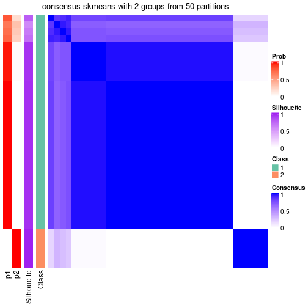</p>

</div>
<div id='tab-node-012-consensus-heatmap-2'>
<pre><code class="r">consensus_heatmap(res, k = 3)
</code></pre>

<p>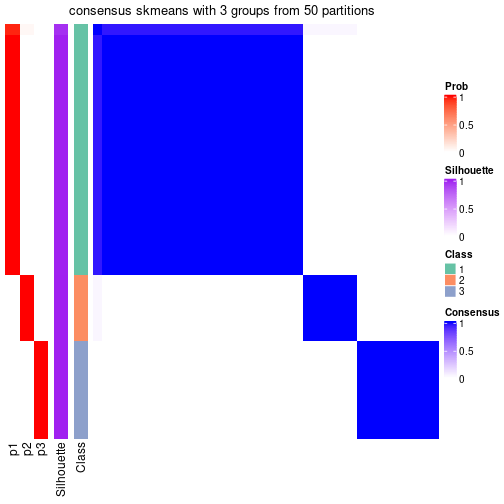</p>

</div>
<div id='tab-node-012-consensus-heatmap-3'>
<pre><code class="r">consensus_heatmap(res, k = 4)
</code></pre>

<p>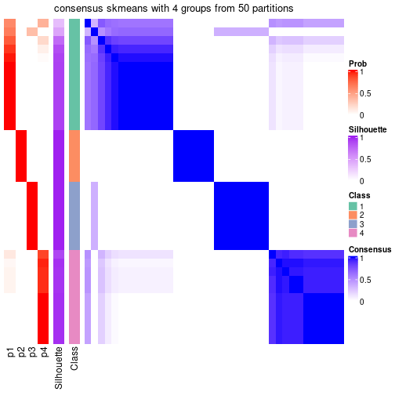</p>

</div>
<div id='tab-node-012-consensus-heatmap-4'>
<pre><code class="r">consensus_heatmap(res, k = 5)
</code></pre>

<p>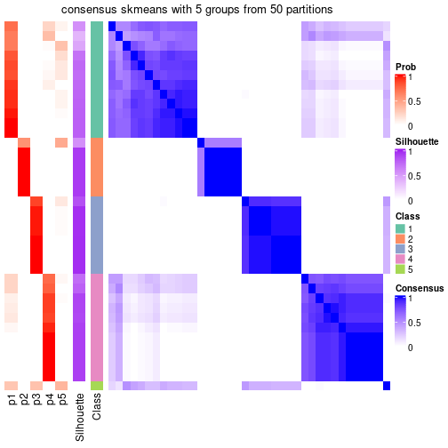</p>

</div>
<div id='tab-node-012-consensus-heatmap-5'>
<pre><code class="r">consensus_heatmap(res, k = 6)
</code></pre>

<p>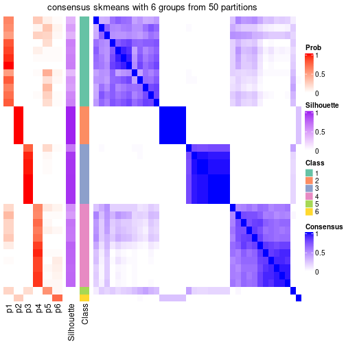</p>

</div>
<div id='tab-node-012-consensus-heatmap-6'>
<pre><code class="r">consensus_heatmap(res, k = 7)
</code></pre>

<p>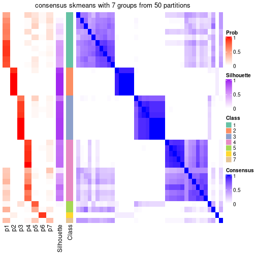</p>

</div>
<div id='tab-node-012-consensus-heatmap-7'>
<pre><code class="r">consensus_heatmap(res, k = 8)
</code></pre>

<p>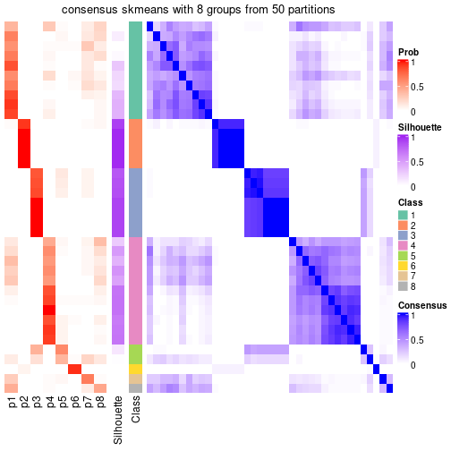</p>

</div>
</div>

Heatmaps for the membership of samples in all partitions to see how consistent they are:


<script>
$( function() {
	$( '#tabs-node-012-membership-heatmap' ).tabs();
} );
</script>
<div id='tabs-node-012-membership-heatmap'>
<ul>
<li><a href='#tab-node-012-membership-heatmap-1'>k = 2</a></li>
<li><a href='#tab-node-012-membership-heatmap-2'>k = 3</a></li>
<li><a href='#tab-node-012-membership-heatmap-3'>k = 4</a></li>
<li><a href='#tab-node-012-membership-heatmap-4'>k = 5</a></li>
<li><a href='#tab-node-012-membership-heatmap-5'>k = 6</a></li>
<li><a href='#tab-node-012-membership-heatmap-6'>k = 7</a></li>
<li><a href='#tab-node-012-membership-heatmap-7'>k = 8</a></li>
</ul>
<div id='tab-node-012-membership-heatmap-1'>
<pre><code class="r">membership_heatmap(res, k = 2)
</code></pre>

<p>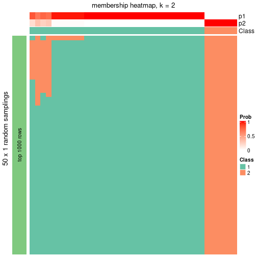</p>

</div>
<div id='tab-node-012-membership-heatmap-2'>
<pre><code class="r">membership_heatmap(res, k = 3)
</code></pre>

<p>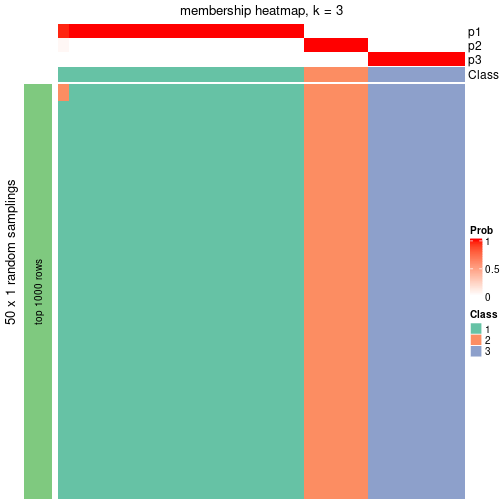</p>

</div>
<div id='tab-node-012-membership-heatmap-3'>
<pre><code class="r">membership_heatmap(res, k = 4)
</code></pre>

<p>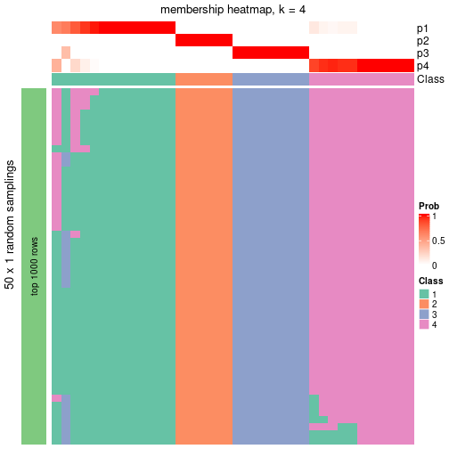</p>

</div>
<div id='tab-node-012-membership-heatmap-4'>
<pre><code class="r">membership_heatmap(res, k = 5)
</code></pre>

<p>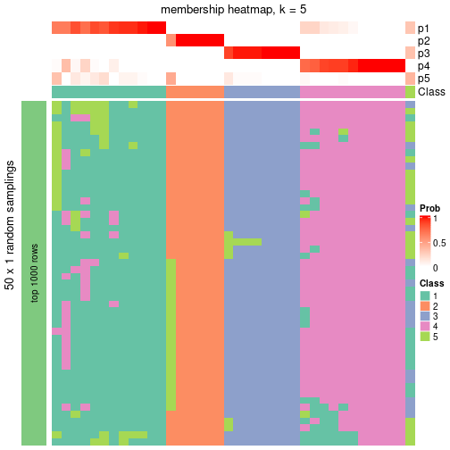</p>

</div>
<div id='tab-node-012-membership-heatmap-5'>
<pre><code class="r">membership_heatmap(res, k = 6)
</code></pre>

<p>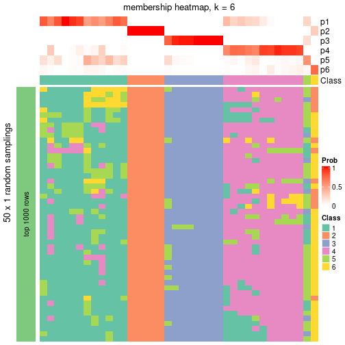</p>

</div>
<div id='tab-node-012-membership-heatmap-6'>
<pre><code class="r">membership_heatmap(res, k = 7)
</code></pre>

<p>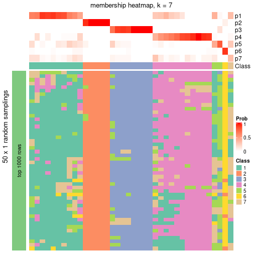</p>

</div>
<div id='tab-node-012-membership-heatmap-7'>
<pre><code class="r">membership_heatmap(res, k = 8)
</code></pre>

<p>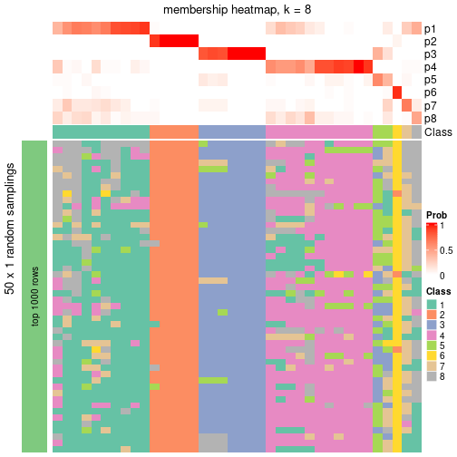</p>

</div>
</div>

As soon as the classes for columns are determined, the signatures
that are significantly different between subgroups can be looked for. 
Following are the heatmaps for signatures.


<script>
$( function() {
	$( '#tabs-node-012-get-signatures' ).tabs();
} );
</script>
<div id='tabs-node-012-get-signatures'>
<ul>
<li><a href='#tab-node-012-get-signatures-1'>k = 2</a></li>
<li><a href='#tab-node-012-get-signatures-2'>k = 3</a></li>
<li><a href='#tab-node-012-get-signatures-3'>k = 4</a></li>
<li><a href='#tab-node-012-get-signatures-4'>k = 5</a></li>
<li><a href='#tab-node-012-get-signatures-5'>k = 6</a></li>
<li><a href='#tab-node-012-get-signatures-6'>k = 7</a></li>
<li><a href='#tab-node-012-get-signatures-7'>k = 8</a></li>
</ul>
<div id='tab-node-012-get-signatures-1'>
<pre><code class="r">get_signatures(res, k = 2)
</code></pre>

<p>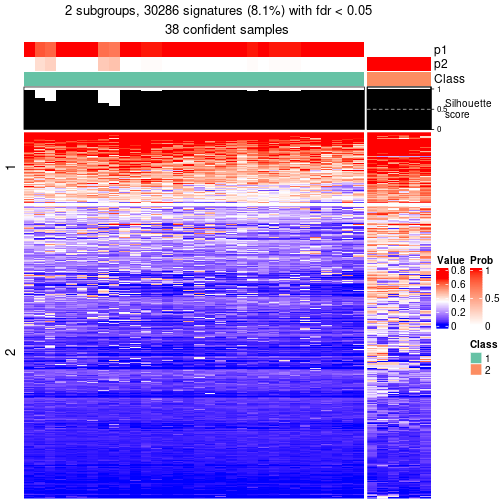</p>

</div>
<div id='tab-node-012-get-signatures-2'>
<pre><code class="r">get_signatures(res, k = 3)
</code></pre>

<p>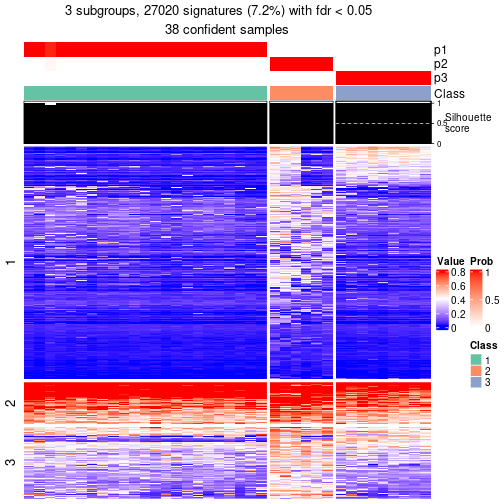</p>

</div>
<div id='tab-node-012-get-signatures-3'>
<pre><code class="r">get_signatures(res, k = 4)
</code></pre>

<p>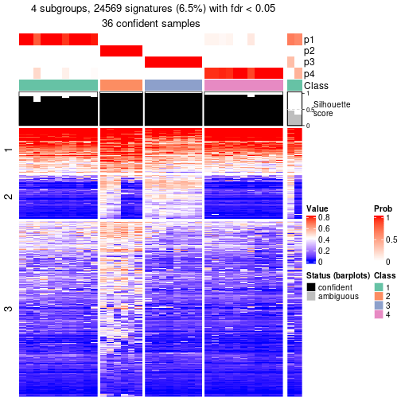</p>

</div>
<div id='tab-node-012-get-signatures-4'>
<pre><code class="r">get_signatures(res, k = 5)
</code></pre>

<p>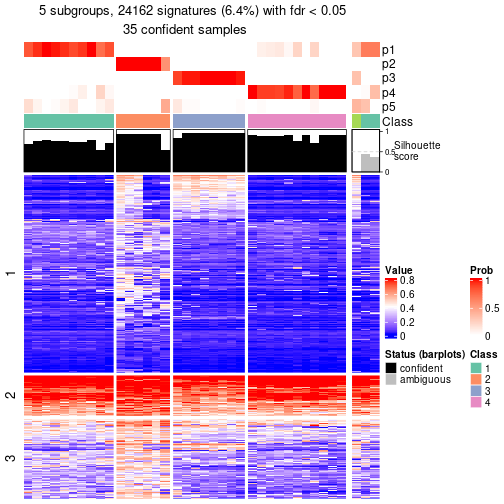</p>

</div>
<div id='tab-node-012-get-signatures-5'>
<pre><code class="r">get_signatures(res, k = 6)
</code></pre>

<p>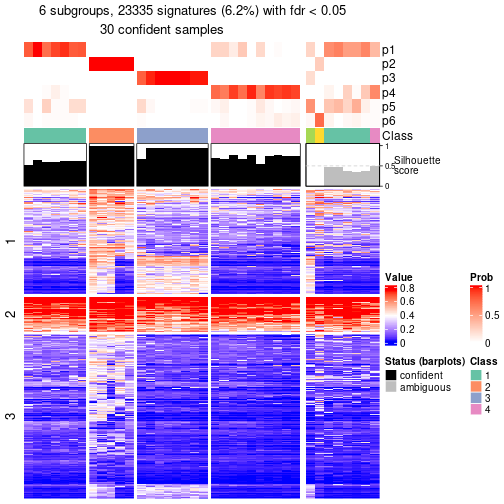</p>

</div>
<div id='tab-node-012-get-signatures-6'>
<pre><code class="r">get_signatures(res, k = 7)
</code></pre>

<p>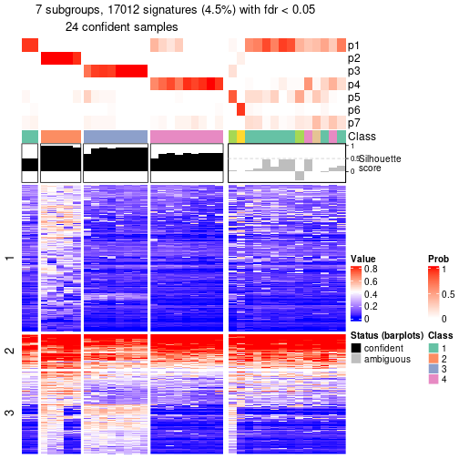</p>

</div>
<div id='tab-node-012-get-signatures-7'>
<pre><code class="r">get_signatures(res, k = 8)
</code></pre>

<p>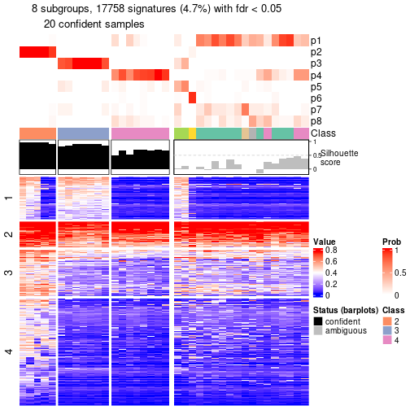</p>

</div>
</div>


Compare the overlap of signatures from different k:

```r
compare_signatures(res)
```

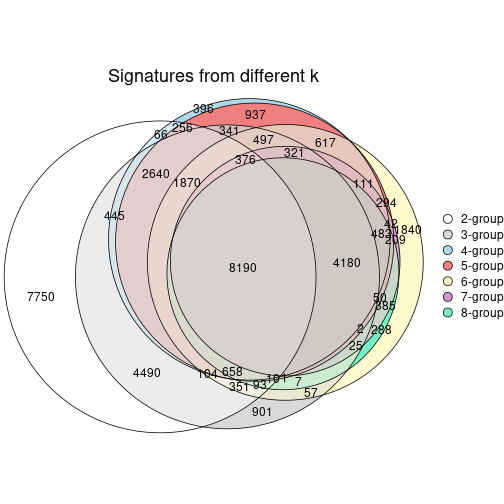

`get_signature()` returns a data frame invisibly. To get the list of signatures, the function
call should be assigned to a variable explicitly. In following code, if `plot` argument is set
to `FALSE`, no heatmap is plotted while only the differential analysis is performed.

```r
# code only for demonstration
tb = get_signature(res, k = ..., plot = FALSE)
```

An example of the output of `tb` is:

```
#>   which_row         fdr    mean_1    mean_2 scaled_mean_1 scaled_mean_2 km
#> 1        38 0.042760348  8.373488  9.131774    -0.5533452     0.5164555  1
#> 2        40 0.018707592  7.106213  8.469186    -0.6173731     0.5762149  1
#> 3        55 0.019134737 10.221463 11.207825    -0.6159697     0.5749050  1
#> 4        59 0.006059896  5.921854  7.869574    -0.6899429     0.6439467  1
#> 5        60 0.018055526  8.928898 10.211722    -0.6204761     0.5791110  1
#> 6        98 0.009384629 15.714769 14.887706     0.6635654    -0.6193277  2
...
```

The columns in `tb` are:

1. `which_row`: row indices corresponding to the input matrix.
2. `fdr`: FDR for the differential test. 
3. `mean_x`: The mean value in group x.
4. `scaled_mean_x`: The mean value in group x after rows are scaled.
5. `km`: Row groups if k-means clustering is applied to rows (which is done by automatically selecting number of clusters).

If there are too many signatures, `top_signatures = ...` can be set to only show the 
signatures with the highest FDRs:

```r
# code only for demonstration
# e.g. to show the top 500 most significant rows
tb = get_signature(res, k = ..., top_signatures = 500)
```

If the signatures are defined as these which are uniquely high in current group, `diff_method` argument
can be set to `"uniquely_high_in_one_group"`:

```r
# code only for demonstration
tb = get_signature(res, k = ..., diff_method = "uniquely_high_in_one_group")
```


UMAP plot which shows how samples are separated.


<script>
$( function() {
	$( '#tabs-node-012-dimension-reduction' ).tabs();
} );
</script>
<div id='tabs-node-012-dimension-reduction'>
<ul>
<li><a href='#tab-node-012-dimension-reduction-1'>k = 2</a></li>
<li><a href='#tab-node-012-dimension-reduction-2'>k = 3</a></li>
<li><a href='#tab-node-012-dimension-reduction-3'>k = 4</a></li>
<li><a href='#tab-node-012-dimension-reduction-4'>k = 5</a></li>
<li><a href='#tab-node-012-dimension-reduction-5'>k = 6</a></li>
<li><a href='#tab-node-012-dimension-reduction-6'>k = 7</a></li>
<li><a href='#tab-node-012-dimension-reduction-7'>k = 8</a></li>
</ul>
<div id='tab-node-012-dimension-reduction-1'>
<pre><code class="r">dimension_reduction(res, k = 2, method = &quot;UMAP&quot;)
</code></pre>

<p>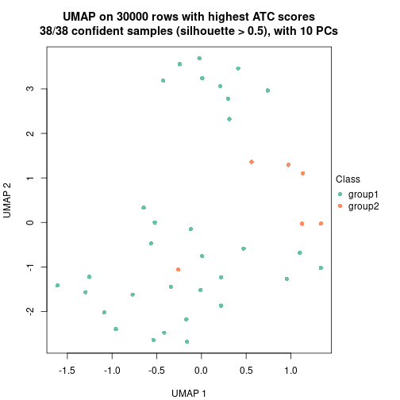</p>

</div>
<div id='tab-node-012-dimension-reduction-2'>
<pre><code class="r">dimension_reduction(res, k = 3, method = &quot;UMAP&quot;)
</code></pre>

<p>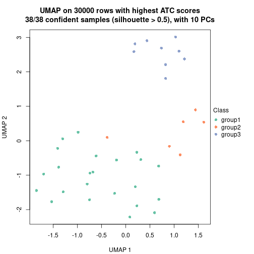</p>

</div>
<div id='tab-node-012-dimension-reduction-3'>
<pre><code class="r">dimension_reduction(res, k = 4, method = &quot;UMAP&quot;)
</code></pre>

<p>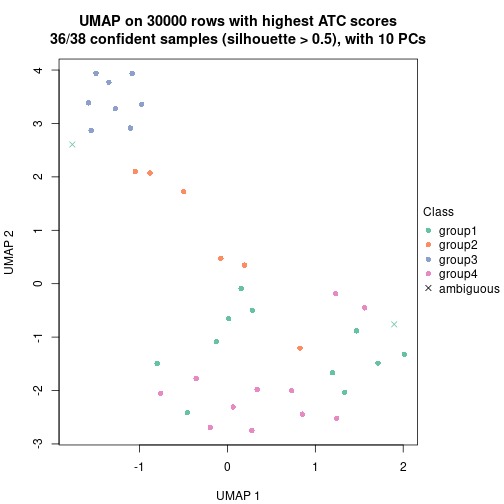</p>

</div>
<div id='tab-node-012-dimension-reduction-4'>
<pre><code class="r">dimension_reduction(res, k = 5, method = &quot;UMAP&quot;)
</code></pre>

<p>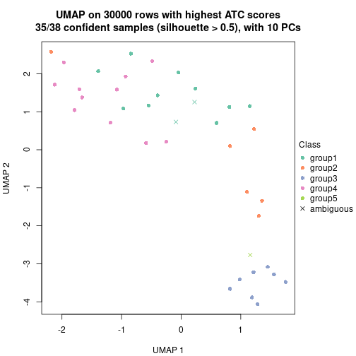</p>

</div>
<div id='tab-node-012-dimension-reduction-5'>
<pre><code class="r">dimension_reduction(res, k = 6, method = &quot;UMAP&quot;)
</code></pre>

<p>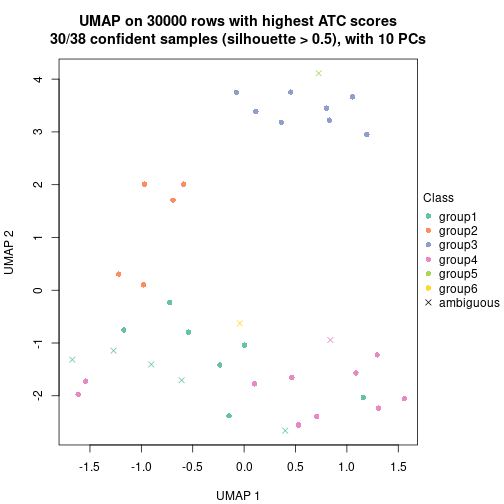</p>

</div>
<div id='tab-node-012-dimension-reduction-6'>
<pre><code class="r">dimension_reduction(res, k = 7, method = &quot;UMAP&quot;)
</code></pre>

<p>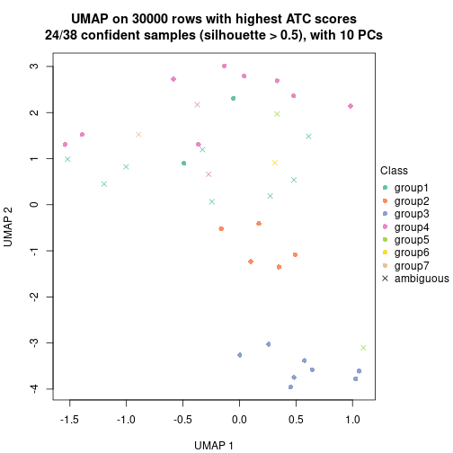</p>

</div>
<div id='tab-node-012-dimension-reduction-7'>
<pre><code class="r">dimension_reduction(res, k = 8, method = &quot;UMAP&quot;)
</code></pre>

<p>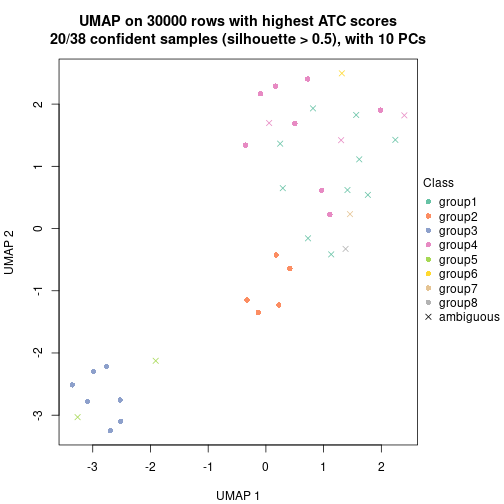</p>

</div>
</div>


Following heatmap shows how subgroups are split when increasing `k`:

```r
collect_classes(res)
```

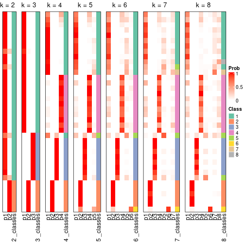


If matrix rows can be associated to genes, consider to use `functional_enrichment(res,
...)` to perform function enrichment for the signature genes. See [this vignette](https://jokergoo.github.io/cola_vignettes/functional_enrichment.html) for more detailed explanations.


 

---------------------------------------------------


### Node013


Parent node: [Node01](#Node01).
Child nodes: 
                Node0111-leaf
        ,
                Node0112-leaf
        ,
                Node0113-leaf
        ,
                Node0114-leaf
        ,
                Node0121-leaf
        ,
                Node0122-leaf
        ,
                Node0123-leaf
        ,
                Node0131-leaf
        ,
                Node0132-leaf
        ,
                Node0133-leaf
        ,
                Node0134-leaf
        ,
                Node0211-leaf
        ,
                Node0212-leaf
        ,
                [Node0213](#Node0213)
        ,
                Node0214-leaf
        ,
                [Node0221](#Node0221)
        ,
                Node0222-leaf
        ,
                Node0223-leaf
        ,
                [Node0231](#Node0231)
        ,
                Node0232-leaf
        ,
                Node0233-leaf
        ,
                [Node0234](#Node0234)
        ,
                Node0235-leaf
        ,
                Node0241-leaf
        ,
                [Node0242](#Node0242)
        ,
                Node0411-leaf
        ,
                Node0412-leaf
        ,
                Node0421-leaf
        ,
                Node0422-leaf
        ,
                Node0423-leaf
        ,
                Node0431-leaf
        ,
                Node0432-leaf
        ,
                Node0511-leaf
        ,
                Node0512-leaf
        ,
                Node0513-leaf
        ,
                Node0514-leaf
        ,
                Node0521-leaf
        ,
                Node0522-leaf
        ,
                Node0523-leaf
        ,
                Node0524-leaf
        ,
                Node0525-leaf
        ,
                Node0611-leaf
        ,
                [Node0612](#Node0612)
        ,
                Node0613-leaf
        ,
                [Node0711](#Node0711)
        ,
                Node0712-leaf
        ,
                Node0713-leaf
        ,
                [Node0721](#Node0721)
        ,
                Node0722-leaf
        ,
                Node0731-leaf
        ,
                Node0732-leaf
        ,
                Node0733-leaf
        .


The object with results only for a single top-value method and a single partitioning method 
can be extracted as:

```r
res = res_rh["013"]
```

A summary of `res` and all the functions that can be applied to it:

```r
res
```

```
#> A 'ConsensusPartition' object with k = 2, 3, 4, 5, 6, 7, 8.
#>   On a matrix with 30000 rows and 31 columns.
#>   Top rows (1000) are extracted by 'ATC' method.
#>   Subgroups are detected by 'kmeans' method.
#>   Performed in total 350 partitions by row resampling.
#>   Best k for subgroups seems to be 4.
#> 
#> Following methods can be applied to this 'ConsensusPartition' object:
#>  [1] "cola_report"             "collect_classes"         "collect_plots"          
#>  [4] "collect_stats"           "colnames"                "compare_partitions"     
#>  [7] "compare_signatures"      "consensus_heatmap"       "dimension_reduction"    
#> [10] "functional_enrichment"   "get_anno_col"            "get_anno"               
#> [13] "get_classes"             "get_consensus"           "get_matrix"             
#> [16] "get_membership"          "get_param"               "get_signatures"         
#> [19] "get_stats"               "is_best_k"               "is_stable_k"            
#> [22] "membership_heatmap"      "ncol"                    "nrow"                   
#> [25] "plot_ecdf"               "predict_classes"         "rownames"               
#> [28] "select_partition_number" "show"                    "suggest_best_k"         
#> [31] "test_to_known_factors"   "top_rows_heatmap"
```

`collect_plots()` function collects all the plots made from `res` for all `k` (number of subgroups)
into one single page to provide an easy and fast comparison between different `k`.

```r
collect_plots(res)
```

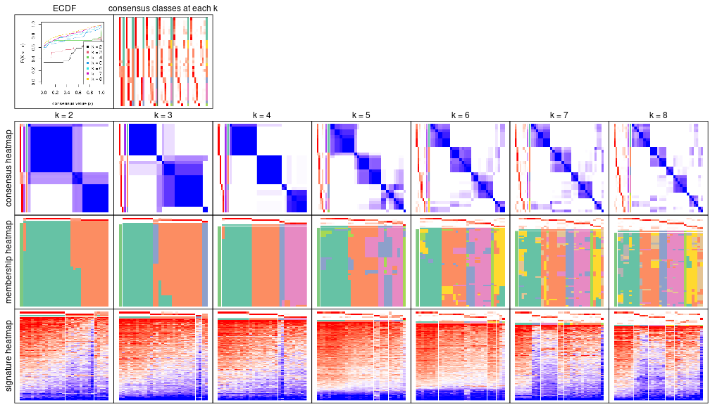

The plots are:

- The first row: a plot of the eCDF (empirical cumulative distribution
  function) curves of the consensus matrix for each `k` and the heatmap of
  predicted classes for each `k`.
- The second row: heatmaps of the consensus matrix for each `k`.
- The third row: heatmaps of the membership matrix for each `k`.
- The fouth row: heatmaps of the signatures for each `k`.

All the plots in panels can be made by individual functions and they are
plotted later in this section.

`select_partition_number()` produces several plots showing different
statistics for choosing "optimized" `k`. There are following statistics:

- eCDF curves of the consensus matrix for each `k`;
- 1-PAC. [The PAC score](https://en.wikipedia.org/wiki/Consensus_clustering#Over-interpretation_potential_of_consensus_clustering)
  measures the proportion of the ambiguous subgrouping.
- Mean silhouette score.
- Concordance. The mean probability of fiting the consensus subgroup labels in all
  partitions.
- Area increased. Denote $A_k$ as the area under the eCDF curve for current
  `k`, the area increased is defined as $A_k - A_{k-1}$.
- Rand index. The percent of pairs of samples that are both in a same cluster
  or both are not in a same cluster in the partition of k and k-1.
- Jaccard index. The ratio of pairs of samples are both in a same cluster in
  the partition of k and k-1 and the pairs of samples are both in a same
  cluster in the partition k or k-1.

The detailed explanations of these statistics can be found in [the _cola_
vignette](https://jokergoo.github.io/cola_vignettes/cola.html#toc_13).

Generally speaking, higher 1-PAC score, higher mean silhouette score or higher
concordance corresponds to better partition. Rand index and Jaccard index
measure how similar the current partition is compared to partition with `k-1`.
If they are too similar, we won't accept `k` is better than `k-1`.

```r
select_partition_number(res)
```

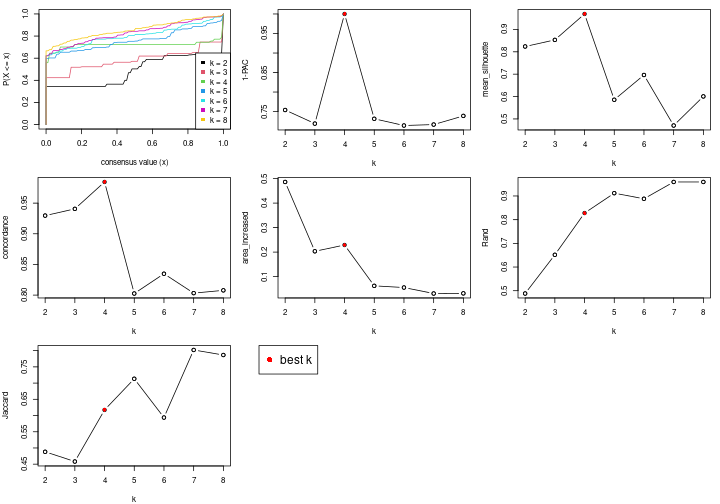

The numeric values for all these statistics can be obtained by `get_stats()`.

```r
get_stats(res)
```

```
#>   k 1-PAC mean_silhouette concordance area_increased  Rand Jaccard
#> 2 2 0.754           0.824       0.930         0.4863 0.488   0.488
#> 3 3 0.719           0.853       0.941         0.2032 0.652   0.458
#> 4 4 1.000           0.969       0.985         0.2289 0.828   0.617
#> 5 5 0.732           0.586       0.803         0.0622 0.912   0.713
#> 6 6 0.714           0.696       0.835         0.0553 0.888   0.594
#> 7 7 0.717           0.471       0.803         0.0308 0.959   0.802
#> 8 8 0.739           0.601       0.808         0.0314 0.959   0.787
```

`suggest_best_k()` suggests the best $k$ based on these statistics. The rules are as follows:

- All $k$ with Jaccard index larger than 0.95 are removed because increasing
  $k$ does not provide enough extra information. If all $k$ are removed, it is
  marked as no subgroup is detected.
- For all $k$ with 1-PAC score larger than 0.9, the maximal $k$ is taken as
  the best $k$, and other $k$ are marked as optional $k$.
- If it does not fit the second rule. The $k$ with the maximal vote of the
  highest 1-PAC score, highest mean silhouette, and highest concordance is
  taken as the best $k$.

```r
suggest_best_k(res)
```

```
#> [1] 4
```


Following is the table of the partitions (You need to click the **show/hide
code output** link to see it). The membership matrix (columns with name `p*`)
is inferred by
[`clue::cl_consensus()`](https://www.rdocumentation.org/link/cl_consensus?package=clue)
function with the `SE` method. Basically the value in the membership matrix
represents the probability to belong to a certain group. The finall subgroup
label for an item is determined with the group with highest probability it
belongs to.

In `get_classes()` function, the entropy is calculated from the membership
matrix and the silhouette score is calculated from the consensus matrix.


<script>
$( function() {
	$( '#tabs-node-013-get-classes' ).tabs();
} );
</script>
<div id='tabs-node-013-get-classes'>
<ul>
<li><a href='#tab-node-013-get-classes-1'>k = 2</a></li>
<li><a href='#tab-node-013-get-classes-2'>k = 3</a></li>
<li><a href='#tab-node-013-get-classes-3'>k = 4</a></li>
<li><a href='#tab-node-013-get-classes-4'>k = 5</a></li>
<li><a href='#tab-node-013-get-classes-5'>k = 6</a></li>
<li><a href='#tab-node-013-get-classes-6'>k = 7</a></li>
<li><a href='#tab-node-013-get-classes-7'>k = 8</a></li>
</ul>

<div id='tab-node-013-get-classes-1'>
<p><a id='tab-node-013-get-classes-1-a' style='color:#0366d6' href='#'>show/hide code output</a></p>
<pre><code class="r">cbind(get_classes(res, k = 2), get_membership(res, k = 2))
</code></pre>

<pre><code>#&gt;                 class entropy silhouette   p1   p2
#&gt; TCGA.34.5232.01     1   0.000      0.974 1.00 0.00
#&gt; TCGA.63.7022.01     1   0.000      0.974 1.00 0.00
#&gt; TCGA.75.6214.01     2   0.000      0.843 0.00 1.00
#&gt; TCGA.43.A56U.01     2   0.995      0.303 0.46 0.54
#&gt; TCGA.56.8503.01     1   0.000      0.974 1.00 0.00
#&gt; TCGA.90.A59Q.01     2   0.000      0.843 0.00 1.00
#&gt; TCGA.56.A4ZJ.01     1   0.000      0.974 1.00 0.00
#&gt; TCGA.52.7622.01     2   0.000      0.843 0.00 1.00
#&gt; TCGA.34.8454.01     2   0.990      0.346 0.44 0.56
#&gt; TCGA.55.7726.01     2   0.000      0.843 0.00 1.00
#&gt; TCGA.56.A5DS.01     1   0.000      0.974 1.00 0.00
#&gt; TCGA.43.6647.01     1   0.000      0.974 1.00 0.00
#&gt; TCGA.63.A5MR.01     2   0.000      0.843 0.00 1.00
#&gt; TCGA.56.7731.01     1   0.000      0.974 1.00 0.00
#&gt; TCGA.96.8169.01     2   0.000      0.843 0.00 1.00
#&gt; TCGA.33.4589.01     2   0.000      0.843 0.00 1.00
#&gt; TCGA.68.A59I.01     1   0.000      0.974 1.00 0.00
#&gt; TCGA.55.8204.01     1   0.000      0.974 1.00 0.00
#&gt; TCGA.85.6175.01     1   0.000      0.974 1.00 0.00
#&gt; TCGA.39.5024.01     1   0.925      0.322 0.66 0.34
#&gt; TCGA.XC.AA0X.01     2   0.999      0.246 0.48 0.52
#&gt; TCGA.34.5234.01     1   0.000      0.974 1.00 0.00
#&gt; TCGA.22.4605.01     2   0.000      0.843 0.00 1.00
#&gt; TCGA.55.7724.01     1   0.000      0.974 1.00 0.00
#&gt; TCGA.39.5030.01     2   0.995      0.303 0.46 0.54
#&gt; TCGA.43.8118.01     2   0.000      0.843 0.00 1.00
#&gt; TCGA.77.8136.01     2   0.000      0.843 0.00 1.00
#&gt; TCGA.96.8170.01     1   0.000      0.974 1.00 0.00
#&gt; TCGA.56.6545.01     1   0.000      0.974 1.00 0.00
#&gt; TCGA.NJ.A55A.01     1   0.000      0.974 1.00 0.00
#&gt; TCGA.21.5784.01     1   0.000      0.974 1.00 0.00
</code></pre>

<script>
$('#tab-node-013-get-classes-1-a').parent().next().next().hide();
$('#tab-node-013-get-classes-1-a').click(function(){
  $('#tab-node-013-get-classes-1-a').parent().next().next().toggle();
  return(false);
});
</script>
</div>

<div id='tab-node-013-get-classes-2'>
<p><a id='tab-node-013-get-classes-2-a' style='color:#0366d6' href='#'>show/hide code output</a></p>
<pre><code class="r">cbind(get_classes(res, k = 3), get_membership(res, k = 3))
</code></pre>

<pre><code>#&gt;                 class entropy silhouette   p1   p2   p3
#&gt; TCGA.34.5232.01     1   0.000      1.000 1.00 0.00 0.00
#&gt; TCGA.63.7022.01     2   0.369      0.794 0.14 0.86 0.00
#&gt; TCGA.75.6214.01     3   0.000      1.000 0.00 0.00 1.00
#&gt; TCGA.43.A56U.01     2   0.000      0.871 0.00 1.00 0.00
#&gt; TCGA.56.8503.01     1   0.000      1.000 1.00 0.00 0.00
#&gt; TCGA.90.A59Q.01     2   0.000      0.871 0.00 1.00 0.00
#&gt; TCGA.56.A4ZJ.01     1   0.000      1.000 1.00 0.00 0.00
#&gt; TCGA.52.7622.01     2   0.000      0.871 0.00 1.00 0.00
#&gt; TCGA.34.8454.01     2   0.000      0.871 0.00 1.00 0.00
#&gt; TCGA.55.7726.01     2   0.630      0.065 0.00 0.52 0.48
#&gt; TCGA.56.A5DS.01     2   0.369      0.794 0.14 0.86 0.00
#&gt; TCGA.43.6647.01     1   0.000      1.000 1.00 0.00 0.00
#&gt; TCGA.63.A5MR.01     2   0.000      0.871 0.00 1.00 0.00
#&gt; TCGA.56.7731.01     1   0.000      1.000 1.00 0.00 0.00
#&gt; TCGA.96.8169.01     3   0.000      1.000 0.00 0.00 1.00
#&gt; TCGA.33.4589.01     2   0.630      0.065 0.00 0.52 0.48
#&gt; TCGA.68.A59I.01     2   0.369      0.794 0.14 0.86 0.00
#&gt; TCGA.55.8204.01     1   0.000      1.000 1.00 0.00 0.00
#&gt; TCGA.85.6175.01     1   0.000      1.000 1.00 0.00 0.00
#&gt; TCGA.39.5024.01     2   0.000      0.871 0.00 1.00 0.00
#&gt; TCGA.XC.AA0X.01     2   0.000      0.871 0.00 1.00 0.00
#&gt; TCGA.34.5234.01     1   0.000      1.000 1.00 0.00 0.00
#&gt; TCGA.22.4605.01     2   0.000      0.871 0.00 1.00 0.00
#&gt; TCGA.55.7724.01     2   0.571      0.563 0.32 0.68 0.00
#&gt; TCGA.39.5030.01     2   0.000      0.871 0.00 1.00 0.00
#&gt; TCGA.43.8118.01     2   0.000      0.871 0.00 1.00 0.00
#&gt; TCGA.77.8136.01     2   0.000      0.871 0.00 1.00 0.00
#&gt; TCGA.96.8170.01     2   0.369      0.794 0.14 0.86 0.00
#&gt; TCGA.56.6545.01     1   0.000      1.000 1.00 0.00 0.00
#&gt; TCGA.NJ.A55A.01     1   0.000      1.000 1.00 0.00 0.00
#&gt; TCGA.21.5784.01     1   0.000      1.000 1.00 0.00 0.00
</code></pre>

<script>
$('#tab-node-013-get-classes-2-a').parent().next().next().hide();
$('#tab-node-013-get-classes-2-a').click(function(){
  $('#tab-node-013-get-classes-2-a').parent().next().next().toggle();
  return(false);
});
</script>
</div>

<div id='tab-node-013-get-classes-3'>
<p><a id='tab-node-013-get-classes-3-a' style='color:#0366d6' href='#'>show/hide code output</a></p>
<pre><code class="r">cbind(get_classes(res, k = 4), get_membership(res, k = 4))
</code></pre>

<pre><code>#&gt;                 class entropy silhouette   p1   p2   p3   p4
#&gt; TCGA.34.5232.01     1  0.0000      0.979 1.00 0.00 0.00 0.00
#&gt; TCGA.63.7022.01     2  0.0000      1.000 0.00 1.00 0.00 0.00
#&gt; TCGA.75.6214.01     3  0.0000      0.934 0.00 0.00 1.00 0.00
#&gt; TCGA.43.A56U.01     2  0.0000      1.000 0.00 1.00 0.00 0.00
#&gt; TCGA.56.8503.01     1  0.0000      0.979 1.00 0.00 0.00 0.00
#&gt; TCGA.90.A59Q.01     4  0.0707      0.967 0.00 0.02 0.00 0.98
#&gt; TCGA.56.A4ZJ.01     1  0.0000      0.979 1.00 0.00 0.00 0.00
#&gt; TCGA.52.7622.01     4  0.0707      0.967 0.00 0.02 0.00 0.98
#&gt; TCGA.34.8454.01     2  0.0000      1.000 0.00 1.00 0.00 0.00
#&gt; TCGA.55.7726.01     4  0.0000      0.953 0.00 0.00 0.00 1.00
#&gt; TCGA.56.A5DS.01     2  0.0000      1.000 0.00 1.00 0.00 0.00
#&gt; TCGA.43.6647.01     1  0.0000      0.979 1.00 0.00 0.00 0.00
#&gt; TCGA.63.A5MR.01     4  0.0707      0.967 0.00 0.02 0.00 0.98
#&gt; TCGA.56.7731.01     1  0.0000      0.979 1.00 0.00 0.00 0.00
#&gt; TCGA.96.8169.01     3  0.2011      0.932 0.00 0.00 0.92 0.08
#&gt; TCGA.33.4589.01     4  0.0000      0.953 0.00 0.00 0.00 1.00
#&gt; TCGA.68.A59I.01     2  0.0000      1.000 0.00 1.00 0.00 0.00
#&gt; TCGA.55.8204.01     1  0.3172      0.770 0.84 0.16 0.00 0.00
#&gt; TCGA.85.6175.01     1  0.0000      0.979 1.00 0.00 0.00 0.00
#&gt; TCGA.39.5024.01     2  0.0000      1.000 0.00 1.00 0.00 0.00
#&gt; TCGA.XC.AA0X.01     2  0.0000      1.000 0.00 1.00 0.00 0.00
#&gt; TCGA.34.5234.01     1  0.0000      0.979 1.00 0.00 0.00 0.00
#&gt; TCGA.22.4605.01     4  0.0707      0.967 0.00 0.02 0.00 0.98
#&gt; TCGA.55.7724.01     2  0.0000      1.000 0.00 1.00 0.00 0.00
#&gt; TCGA.39.5030.01     2  0.0000      1.000 0.00 1.00 0.00 0.00
#&gt; TCGA.43.8118.01     4  0.2011      0.919 0.00 0.08 0.00 0.92
#&gt; TCGA.77.8136.01     4  0.2011      0.919 0.00 0.08 0.00 0.92
#&gt; TCGA.96.8170.01     2  0.0000      1.000 0.00 1.00 0.00 0.00
#&gt; TCGA.56.6545.01     1  0.0000      0.979 1.00 0.00 0.00 0.00
#&gt; TCGA.NJ.A55A.01     1  0.0000      0.979 1.00 0.00 0.00 0.00
#&gt; TCGA.21.5784.01     1  0.0000      0.979 1.00 0.00 0.00 0.00
</code></pre>

<script>
$('#tab-node-013-get-classes-3-a').parent().next().next().hide();
$('#tab-node-013-get-classes-3-a').click(function(){
  $('#tab-node-013-get-classes-3-a').parent().next().next().toggle();
  return(false);
});
</script>
</div>

<div id='tab-node-013-get-classes-4'>
<p><a id='tab-node-013-get-classes-4-a' style='color:#0366d6' href='#'>show/hide code output</a></p>
<pre><code class="r">cbind(get_classes(res, k = 5), get_membership(res, k = 5))
</code></pre>

<pre><code>#&gt;                 class entropy silhouette   p1   p2   p3   p4   p5
#&gt; TCGA.34.5232.01     1   0.000     0.9128 1.00 0.00 0.00 0.00 0.00
#&gt; TCGA.63.7022.01     2   0.000     0.6958 0.00 1.00 0.00 0.00 0.00
#&gt; TCGA.75.6214.01     5   0.000     0.0000 0.00 0.00 0.00 0.00 1.00
#&gt; TCGA.43.A56U.01     2   0.380     0.6713 0.00 0.70 0.00 0.30 0.00
#&gt; TCGA.56.8503.01     1   0.000     0.9128 1.00 0.00 0.00 0.00 0.00
#&gt; TCGA.90.A59Q.01     4   0.429     0.3767 0.00 0.00 0.46 0.54 0.00
#&gt; TCGA.56.A4ZJ.01     1   0.000     0.9128 1.00 0.00 0.00 0.00 0.00
#&gt; TCGA.52.7622.01     3   0.429    -0.3130 0.00 0.00 0.54 0.46 0.00
#&gt; TCGA.34.8454.01     2   0.389     0.6612 0.00 0.68 0.00 0.32 0.00
#&gt; TCGA.55.7726.01     3   0.000     0.5114 0.00 0.00 1.00 0.00 0.00
#&gt; TCGA.56.A5DS.01     2   0.000     0.6958 0.00 1.00 0.00 0.00 0.00
#&gt; TCGA.43.6647.01     1   0.368     0.7558 0.72 0.00 0.00 0.28 0.00
#&gt; TCGA.63.A5MR.01     4   0.398     0.6877 0.00 0.00 0.34 0.66 0.00
#&gt; TCGA.56.7731.01     1   0.104     0.9081 0.96 0.00 0.00 0.04 0.00
#&gt; TCGA.96.8169.01     3   0.368     0.0635 0.00 0.00 0.72 0.00 0.28
#&gt; TCGA.33.4589.01     3   0.000     0.5114 0.00 0.00 1.00 0.00 0.00
#&gt; TCGA.68.A59I.01     2   0.000     0.6958 0.00 1.00 0.00 0.00 0.00
#&gt; TCGA.55.8204.01     2   0.679    -0.2903 0.36 0.36 0.00 0.28 0.00
#&gt; TCGA.85.6175.01     1   0.202     0.8911 0.90 0.00 0.00 0.10 0.00
#&gt; TCGA.39.5024.01     2   0.380     0.6713 0.00 0.70 0.00 0.30 0.00
#&gt; TCGA.XC.AA0X.01     2   0.380     0.6713 0.00 0.70 0.00 0.30 0.00
#&gt; TCGA.34.5234.01     1   0.368     0.7558 0.72 0.00 0.00 0.28 0.00
#&gt; TCGA.22.4605.01     3   0.429    -0.3130 0.00 0.00 0.54 0.46 0.00
#&gt; TCGA.55.7724.01     2   0.293     0.5348 0.00 0.82 0.00 0.18 0.00
#&gt; TCGA.39.5030.01     2   0.380     0.6713 0.00 0.70 0.00 0.30 0.00
#&gt; TCGA.43.8118.01     4   0.488     0.7457 0.00 0.08 0.22 0.70 0.00
#&gt; TCGA.77.8136.01     4   0.488     0.7457 0.00 0.08 0.22 0.70 0.00
#&gt; TCGA.96.8170.01     2   0.000     0.6958 0.00 1.00 0.00 0.00 0.00
#&gt; TCGA.56.6545.01     1   0.202     0.8911 0.90 0.00 0.00 0.10 0.00
#&gt; TCGA.NJ.A55A.01     1   0.000     0.9128 1.00 0.00 0.00 0.00 0.00
#&gt; TCGA.21.5784.01     1   0.000     0.9128 1.00 0.00 0.00 0.00 0.00
</code></pre>

<script>
$('#tab-node-013-get-classes-4-a').parent().next().next().hide();
$('#tab-node-013-get-classes-4-a').click(function(){
  $('#tab-node-013-get-classes-4-a').parent().next().next().toggle();
  return(false);
});
</script>
</div>

<div id='tab-node-013-get-classes-5'>
<p><a id='tab-node-013-get-classes-5-a' style='color:#0366d6' href='#'>show/hide code output</a></p>
<pre><code class="r">cbind(get_classes(res, k = 6), get_membership(res, k = 6))
</code></pre>

<pre><code>#&gt;                 class entropy silhouette   p1   p2   p3   p4   p5   p6
#&gt; TCGA.34.5232.01     1  0.0000      0.846 1.00 0.00 0.00 0.00 0.00 0.00
#&gt; TCGA.63.7022.01     2  0.3460      0.783 0.00 0.76 0.02 0.00 0.00 0.22
#&gt; TCGA.75.6214.01     5  0.0000      0.000 0.00 0.00 0.00 0.00 1.00 0.00
#&gt; TCGA.43.A56U.01     2  0.0000      0.822 0.00 1.00 0.00 0.00 0.00 0.00
#&gt; TCGA.56.8503.01     1  0.1267      0.826 0.94 0.00 0.06 0.00 0.00 0.00
#&gt; TCGA.90.A59Q.01     4  0.1480      0.784 0.00 0.04 0.02 0.94 0.00 0.00
#&gt; TCGA.56.A4ZJ.01     1  0.1267      0.826 0.94 0.00 0.06 0.00 0.00 0.00
#&gt; TCGA.52.7622.01     4  0.0000      0.762 0.00 0.00 0.00 1.00 0.00 0.00
#&gt; TCGA.34.8454.01     2  0.2474      0.758 0.00 0.88 0.08 0.00 0.00 0.04
#&gt; TCGA.55.7726.01     3  0.3851      0.741 0.00 0.00 0.54 0.46 0.00 0.00
#&gt; TCGA.56.A5DS.01     2  0.3460      0.783 0.00 0.76 0.02 0.00 0.00 0.22
#&gt; TCGA.43.6647.01     6  0.4834      0.555 0.26 0.00 0.10 0.00 0.00 0.64
#&gt; TCGA.63.A5MR.01     4  0.2048      0.798 0.00 0.12 0.00 0.88 0.00 0.00
#&gt; TCGA.56.7731.01     1  0.2350      0.791 0.88 0.00 0.10 0.00 0.00 0.02
#&gt; TCGA.96.8169.01     3  0.6046      0.384 0.00 0.00 0.52 0.18 0.28 0.02
#&gt; TCGA.33.4589.01     3  0.3851      0.741 0.00 0.00 0.54 0.46 0.00 0.00
#&gt; TCGA.68.A59I.01     2  0.3460      0.783 0.00 0.76 0.02 0.00 0.00 0.22
#&gt; TCGA.55.8204.01     6  0.2728      0.551 0.10 0.04 0.00 0.00 0.00 0.86
#&gt; TCGA.85.6175.01     1  0.4810      0.595 0.66 0.00 0.22 0.00 0.00 0.12
#&gt; TCGA.39.5024.01     2  0.2094      0.778 0.00 0.90 0.02 0.00 0.00 0.08
#&gt; TCGA.XC.AA0X.01     2  0.0000      0.822 0.00 1.00 0.00 0.00 0.00 0.00
#&gt; TCGA.34.5234.01     6  0.4834      0.555 0.26 0.00 0.10 0.00 0.00 0.64
#&gt; TCGA.22.4605.01     4  0.0000      0.762 0.00 0.00 0.00 1.00 0.00 0.00
#&gt; TCGA.55.7724.01     6  0.3711      0.269 0.00 0.26 0.02 0.00 0.00 0.72
#&gt; TCGA.39.5030.01     2  0.0547      0.814 0.00 0.98 0.00 0.00 0.00 0.02
#&gt; TCGA.43.8118.01     4  0.2941      0.737 0.00 0.22 0.00 0.78 0.00 0.00
#&gt; TCGA.77.8136.01     4  0.3460      0.728 0.00 0.22 0.00 0.76 0.00 0.02
#&gt; TCGA.96.8170.01     2  0.4172      0.746 0.00 0.68 0.04 0.00 0.00 0.28
#&gt; TCGA.56.6545.01     1  0.4929      0.556 0.62 0.00 0.28 0.00 0.00 0.10
#&gt; TCGA.NJ.A55A.01     1  0.0000      0.846 1.00 0.00 0.00 0.00 0.00 0.00
#&gt; TCGA.21.5784.01     1  0.0000      0.846 1.00 0.00 0.00 0.00 0.00 0.00
</code></pre>

<script>
$('#tab-node-013-get-classes-5-a').parent().next().next().hide();
$('#tab-node-013-get-classes-5-a').click(function(){
  $('#tab-node-013-get-classes-5-a').parent().next().next().toggle();
  return(false);
});
</script>
</div>

<div id='tab-node-013-get-classes-6'>
<p><a id='tab-node-013-get-classes-6-a' style='color:#0366d6' href='#'>show/hide code output</a></p>
<pre><code class="r">cbind(get_classes(res, k = 7), get_membership(res, k = 7))
</code></pre>

<pre><code>#&gt;                 class entropy silhouette   p1   p2   p3   p4   p5   p6   p7
#&gt; TCGA.34.5232.01     1   0.000     0.7597 1.00 0.00 0.00 0.00 0.00 0.00 0.00
#&gt; TCGA.63.7022.01     2   0.000     0.4143 0.00 1.00 0.00 0.00 0.00 0.00 0.00
#&gt; TCGA.75.6214.01     5   0.000     0.0000 0.00 0.00 0.00 0.00 1.00 0.00 0.00
#&gt; TCGA.43.A56U.01     2   0.424     0.0855 0.00 0.72 0.00 0.18 0.00 0.02 0.08
#&gt; TCGA.56.8503.01     1   0.251     0.7217 0.88 0.00 0.02 0.00 0.00 0.06 0.04
#&gt; TCGA.90.A59Q.01     4   0.265     0.8225 0.00 0.00 0.10 0.86 0.00 0.02 0.02
#&gt; TCGA.56.A4ZJ.01     1   0.251     0.7217 0.88 0.00 0.02 0.00 0.00 0.06 0.04
#&gt; TCGA.52.7622.01     4   0.242     0.7870 0.00 0.00 0.18 0.82 0.00 0.00 0.00
#&gt; TCGA.34.8454.01     2   0.696    -0.2347 0.00 0.44 0.04 0.12 0.00 0.12 0.28
#&gt; TCGA.55.7726.01     3   0.166     0.9090 0.00 0.00 0.92 0.06 0.00 0.00 0.02
#&gt; TCGA.56.A5DS.01     2   0.000     0.4143 0.00 1.00 0.00 0.00 0.00 0.00 0.00
#&gt; TCGA.43.6647.01     6   0.331     0.5916 0.24 0.00 0.00 0.00 0.00 0.74 0.02
#&gt; TCGA.63.A5MR.01     4   0.101     0.8352 0.00 0.00 0.02 0.96 0.00 0.02 0.00
#&gt; TCGA.56.7731.01     1   0.291     0.6283 0.80 0.00 0.00 0.00 0.00 0.18 0.02
#&gt; TCGA.96.8169.01     3   0.228     0.8357 0.00 0.00 0.88 0.00 0.08 0.04 0.00
#&gt; TCGA.33.4589.01     3   0.117     0.9120 0.00 0.00 0.94 0.06 0.00 0.00 0.00
#&gt; TCGA.68.A59I.01     2   0.000     0.4143 0.00 1.00 0.00 0.00 0.00 0.00 0.00
#&gt; TCGA.55.8204.01     6   0.346     0.2772 0.00 0.40 0.00 0.00 0.00 0.60 0.00
#&gt; TCGA.85.6175.01     1   0.501     0.3290 0.56 0.00 0.00 0.00 0.00 0.28 0.16
#&gt; TCGA.39.5024.01     7   0.534     0.0000 0.00 0.40 0.00 0.18 0.00 0.00 0.42
#&gt; TCGA.XC.AA0X.01     2   0.445     0.0428 0.00 0.70 0.00 0.18 0.00 0.02 0.10
#&gt; TCGA.34.5234.01     6   0.305     0.5781 0.28 0.00 0.00 0.00 0.00 0.72 0.00
#&gt; TCGA.22.4605.01     4   0.242     0.7870 0.00 0.00 0.18 0.82 0.00 0.00 0.00
#&gt; TCGA.55.7724.01     2   0.350    -0.1237 0.00 0.58 0.00 0.00 0.00 0.42 0.00
#&gt; TCGA.39.5030.01     2   0.464    -0.0191 0.00 0.68 0.00 0.18 0.00 0.02 0.12
#&gt; TCGA.43.8118.01     4   0.136     0.7960 0.00 0.04 0.00 0.94 0.00 0.00 0.02
#&gt; TCGA.77.8136.01     4   0.208     0.7251 0.00 0.00 0.00 0.86 0.00 0.00 0.14
#&gt; TCGA.96.8170.01     2   0.314    -0.1368 0.00 0.70 0.00 0.00 0.00 0.00 0.30
#&gt; TCGA.56.6545.01     1   0.549     0.1947 0.44 0.00 0.00 0.00 0.00 0.24 0.32
#&gt; TCGA.NJ.A55A.01     1   0.000     0.7597 1.00 0.00 0.00 0.00 0.00 0.00 0.00
#&gt; TCGA.21.5784.01     1   0.000     0.7597 1.00 0.00 0.00 0.00 0.00 0.00 0.00
</code></pre>

<script>
$('#tab-node-013-get-classes-6-a').parent().next().next().hide();
$('#tab-node-013-get-classes-6-a').click(function(){
  $('#tab-node-013-get-classes-6-a').parent().next().next().toggle();
  return(false);
});
</script>
</div>

<div id='tab-node-013-get-classes-7'>
<p><a id='tab-node-013-get-classes-7-a' style='color:#0366d6' href='#'>show/hide code output</a></p>
<pre><code class="r">cbind(get_classes(res, k = 8), get_membership(res, k = 8))
</code></pre>

<pre><code>#&gt;                 class entropy silhouette   p1   p2   p3   p4   p5   p6   p7   p8
#&gt; TCGA.34.5232.01     1  0.0000     0.7662 1.00 0.00 0.00 0.00 0.00 0.00 0.00 0.00
#&gt; TCGA.63.7022.01     2  0.4482     0.4251 0.00 0.60 0.00 0.00 0.00 0.14 0.26 0.00
#&gt; TCGA.75.6214.01     5  0.0000     0.0000 0.00 0.00 0.00 0.00 1.00 0.00 0.00 0.00
#&gt; TCGA.43.A56U.01     2  0.0000     0.5174 0.00 1.00 0.00 0.00 0.00 0.00 0.00 0.00
#&gt; TCGA.56.8503.01     1  0.2650     0.6824 0.76 0.00 0.00 0.00 0.00 0.00 0.00 0.24
#&gt; TCGA.90.A59Q.01     4  0.3452     0.8182 0.00 0.04 0.06 0.82 0.00 0.00 0.04 0.04
#&gt; TCGA.56.A4ZJ.01     1  0.2650     0.6824 0.76 0.00 0.00 0.00 0.00 0.00 0.00 0.24
#&gt; TCGA.52.7622.01     4  0.1341     0.8508 0.00 0.00 0.08 0.92 0.00 0.00 0.00 0.00
#&gt; TCGA.34.8454.01     2  0.4174     0.0846 0.00 0.54 0.00 0.00 0.00 0.00 0.06 0.40
#&gt; TCGA.55.7726.01     3  0.1607     0.9050 0.00 0.00 0.92 0.04 0.00 0.00 0.00 0.04
#&gt; TCGA.56.A5DS.01     2  0.4482     0.4251 0.00 0.60 0.00 0.00 0.00 0.14 0.26 0.00
#&gt; TCGA.43.6647.01     6  0.2725     0.5547 0.14 0.00 0.00 0.00 0.00 0.82 0.00 0.04
#&gt; TCGA.63.A5MR.01     4  0.1607     0.8531 0.00 0.04 0.00 0.92 0.00 0.00 0.04 0.00
#&gt; TCGA.56.7731.01     1  0.3293     0.6335 0.74 0.00 0.00 0.00 0.00 0.22 0.00 0.04
#&gt; TCGA.96.8169.01     3  0.2532     0.8598 0.00 0.00 0.88 0.00 0.04 0.04 0.02 0.02
#&gt; TCGA.33.4589.01     3  0.0808     0.9161 0.00 0.00 0.96 0.04 0.00 0.00 0.00 0.00
#&gt; TCGA.68.A59I.01     2  0.4482     0.4251 0.00 0.60 0.00 0.00 0.00 0.14 0.26 0.00
#&gt; TCGA.55.8204.01     6  0.2725     0.5310 0.00 0.04 0.00 0.00 0.00 0.82 0.14 0.00
#&gt; TCGA.85.6175.01     1  0.4646     0.5715 0.66 0.00 0.00 0.04 0.00 0.18 0.00 0.12
#&gt; TCGA.39.5024.01     7  0.3618     0.4941 0.00 0.38 0.00 0.00 0.00 0.00 0.60 0.02
#&gt; TCGA.XC.AA0X.01     2  0.0000     0.5174 0.00 1.00 0.00 0.00 0.00 0.00 0.00 0.00
#&gt; TCGA.34.5234.01     6  0.3615     0.5046 0.20 0.00 0.00 0.02 0.00 0.74 0.00 0.04
#&gt; TCGA.22.4605.01     4  0.1341     0.8508 0.00 0.00 0.08 0.92 0.00 0.00 0.00 0.00
#&gt; TCGA.55.7724.01     6  0.4332     0.3080 0.00 0.16 0.00 0.00 0.00 0.64 0.20 0.00
#&gt; TCGA.39.5030.01     2  0.0471     0.4958 0.00 0.98 0.00 0.00 0.00 0.00 0.02 0.00
#&gt; TCGA.43.8118.01     4  0.2591     0.8255 0.00 0.08 0.00 0.86 0.00 0.00 0.04 0.02
#&gt; TCGA.77.8136.01     4  0.3843     0.6836 0.00 0.24 0.00 0.70 0.00 0.00 0.04 0.02
#&gt; TCGA.96.8170.01     7  0.3299     0.4941 0.00 0.18 0.00 0.00 0.00 0.06 0.76 0.00
#&gt; TCGA.56.6545.01     1  0.6228     0.4126 0.50 0.00 0.04 0.00 0.00 0.14 0.08 0.24
#&gt; TCGA.NJ.A55A.01     1  0.0941     0.7635 0.96 0.00 0.00 0.02 0.00 0.00 0.00 0.02
#&gt; TCGA.21.5784.01     1  0.0000     0.7662 1.00 0.00 0.00 0.00 0.00 0.00 0.00 0.00
</code></pre>

<script>
$('#tab-node-013-get-classes-7-a').parent().next().next().hide();
$('#tab-node-013-get-classes-7-a').click(function(){
  $('#tab-node-013-get-classes-7-a').parent().next().next().toggle();
  return(false);
});
</script>
</div>
</div>

Heatmaps for the consensus matrix. It visualizes the probability of two
samples to be in a same group.


<script>
$( function() {
	$( '#tabs-node-013-consensus-heatmap' ).tabs();
} );
</script>
<div id='tabs-node-013-consensus-heatmap'>
<ul>
<li><a href='#tab-node-013-consensus-heatmap-1'>k = 2</a></li>
<li><a href='#tab-node-013-consensus-heatmap-2'>k = 3</a></li>
<li><a href='#tab-node-013-consensus-heatmap-3'>k = 4</a></li>
<li><a href='#tab-node-013-consensus-heatmap-4'>k = 5</a></li>
<li><a href='#tab-node-013-consensus-heatmap-5'>k = 6</a></li>
<li><a href='#tab-node-013-consensus-heatmap-6'>k = 7</a></li>
<li><a href='#tab-node-013-consensus-heatmap-7'>k = 8</a></li>
</ul>
<div id='tab-node-013-consensus-heatmap-1'>
<pre><code class="r">consensus_heatmap(res, k = 2)
</code></pre>

<p>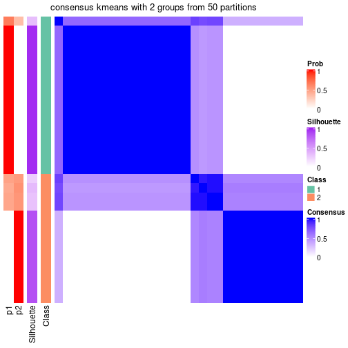</p>

</div>
<div id='tab-node-013-consensus-heatmap-2'>
<pre><code class="r">consensus_heatmap(res, k = 3)
</code></pre>

<p>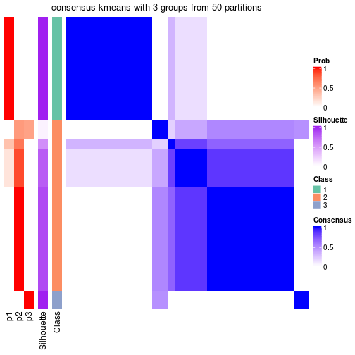</p>

</div>
<div id='tab-node-013-consensus-heatmap-3'>
<pre><code class="r">consensus_heatmap(res, k = 4)
</code></pre>

<p>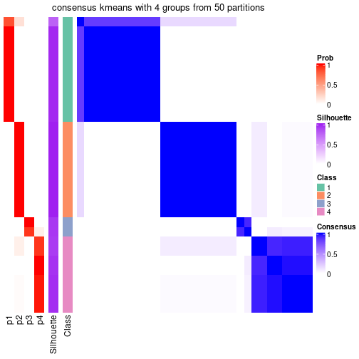</p>

</div>
<div id='tab-node-013-consensus-heatmap-4'>
<pre><code class="r">consensus_heatmap(res, k = 5)
</code></pre>

<p>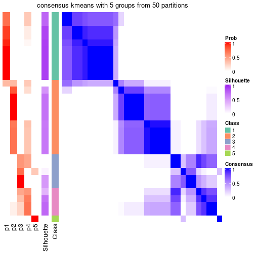</p>

</div>
<div id='tab-node-013-consensus-heatmap-5'>
<pre><code class="r">consensus_heatmap(res, k = 6)
</code></pre>

<p>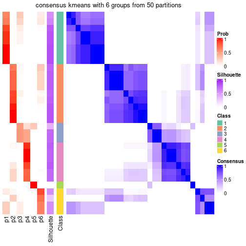</p>

</div>
<div id='tab-node-013-consensus-heatmap-6'>
<pre><code class="r">consensus_heatmap(res, k = 7)
</code></pre>

<p>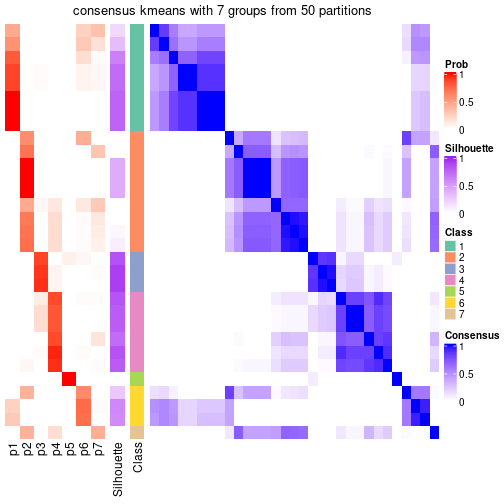</p>

</div>
<div id='tab-node-013-consensus-heatmap-7'>
<pre><code class="r">consensus_heatmap(res, k = 8)
</code></pre>

<p>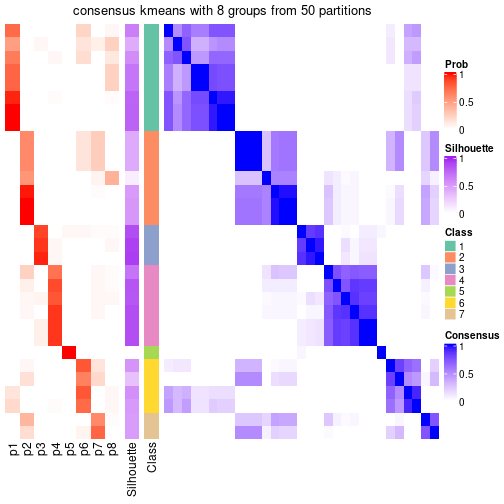</p>

</div>
</div>

Heatmaps for the membership of samples in all partitions to see how consistent they are:


<script>
$( function() {
	$( '#tabs-node-013-membership-heatmap' ).tabs();
} );
</script>
<div id='tabs-node-013-membership-heatmap'>
<ul>
<li><a href='#tab-node-013-membership-heatmap-1'>k = 2</a></li>
<li><a href='#tab-node-013-membership-heatmap-2'>k = 3</a></li>
<li><a href='#tab-node-013-membership-heatmap-3'>k = 4</a></li>
<li><a href='#tab-node-013-membership-heatmap-4'>k = 5</a></li>
<li><a href='#tab-node-013-membership-heatmap-5'>k = 6</a></li>
<li><a href='#tab-node-013-membership-heatmap-6'>k = 7</a></li>
<li><a href='#tab-node-013-membership-heatmap-7'>k = 8</a></li>
</ul>
<div id='tab-node-013-membership-heatmap-1'>
<pre><code class="r">membership_heatmap(res, k = 2)
</code></pre>

<p>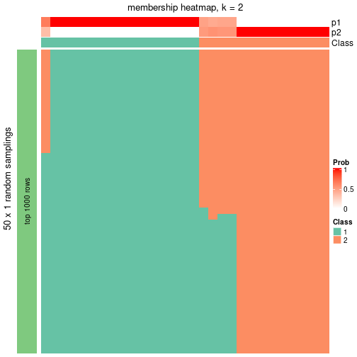</p>

</div>
<div id='tab-node-013-membership-heatmap-2'>
<pre><code class="r">membership_heatmap(res, k = 3)
</code></pre>

<p>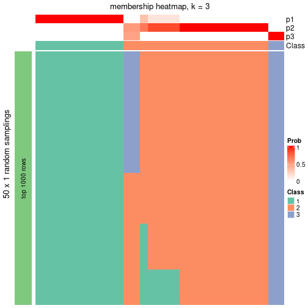</p>

</div>
<div id='tab-node-013-membership-heatmap-3'>
<pre><code class="r">membership_heatmap(res, k = 4)
</code></pre>

<p>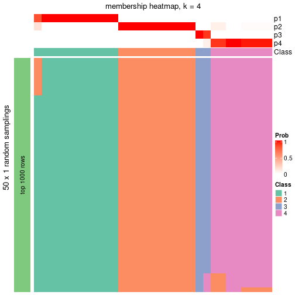</p>

</div>
<div id='tab-node-013-membership-heatmap-4'>
<pre><code class="r">membership_heatmap(res, k = 5)
</code></pre>

<p>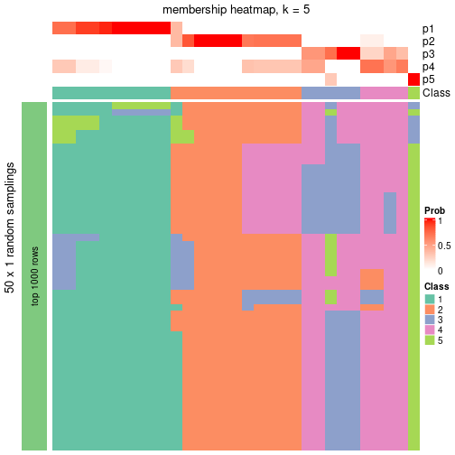</p>

</div>
<div id='tab-node-013-membership-heatmap-5'>
<pre><code class="r">membership_heatmap(res, k = 6)
</code></pre>

<p>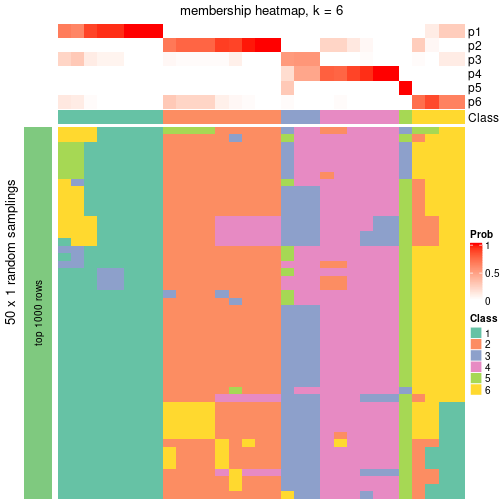</p>

</div>
<div id='tab-node-013-membership-heatmap-6'>
<pre><code class="r">membership_heatmap(res, k = 7)
</code></pre>

<p>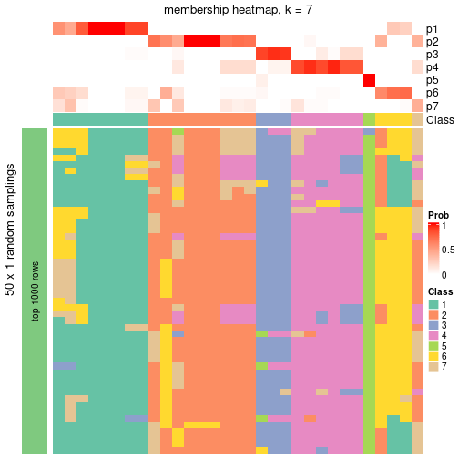</p>

</div>
<div id='tab-node-013-membership-heatmap-7'>
<pre><code class="r">membership_heatmap(res, k = 8)
</code></pre>

<p>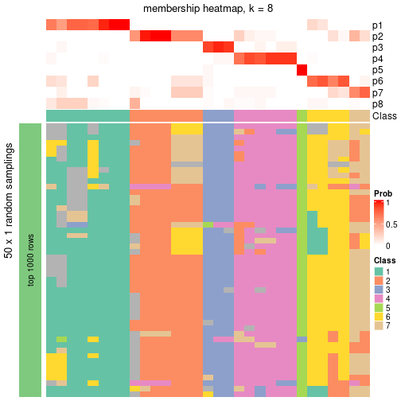</p>

</div>
</div>

As soon as the classes for columns are determined, the signatures
that are significantly different between subgroups can be looked for. 
Following are the heatmaps for signatures.


<script>
$( function() {
	$( '#tabs-node-013-get-signatures' ).tabs();
} );
</script>
<div id='tabs-node-013-get-signatures'>
<ul>
<li><a href='#tab-node-013-get-signatures-1'>k = 2</a></li>
<li><a href='#tab-node-013-get-signatures-2'>k = 3</a></li>
<li><a href='#tab-node-013-get-signatures-3'>k = 4</a></li>
<li><a href='#tab-node-013-get-signatures-4'>k = 5</a></li>
<li><a href='#tab-node-013-get-signatures-5'>k = 6</a></li>
<li><a href='#tab-node-013-get-signatures-6'>k = 7</a></li>
<li><a href='#tab-node-013-get-signatures-7'>k = 8</a></li>
</ul>
<div id='tab-node-013-get-signatures-1'>
<pre><code class="r">get_signatures(res, k = 2)
</code></pre>

<p>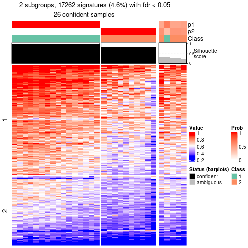</p>

</div>
<div id='tab-node-013-get-signatures-2'>
<pre><code class="r">get_signatures(res, k = 3)
</code></pre>

<p>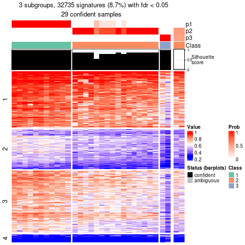</p>

</div>
<div id='tab-node-013-get-signatures-3'>
<pre><code class="r">get_signatures(res, k = 4)
</code></pre>

<p>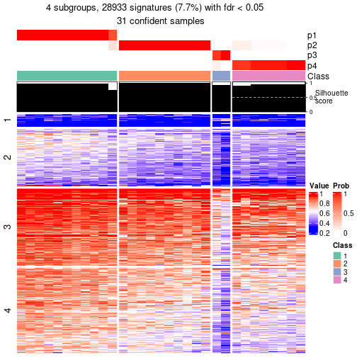</p>

</div>
<div id='tab-node-013-get-signatures-4'>
<pre><code class="r">get_signatures(res, k = 5)
</code></pre>

<p>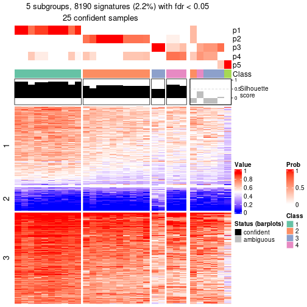</p>

</div>
<div id='tab-node-013-get-signatures-5'>
<pre><code class="r">get_signatures(res, k = 6)
</code></pre>

<p>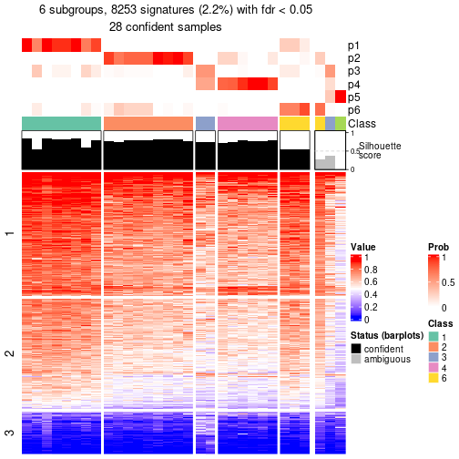</p>

</div>
<div id='tab-node-013-get-signatures-6'>
<pre><code class="r">get_signatures(res, k = 7)
</code></pre>

<p>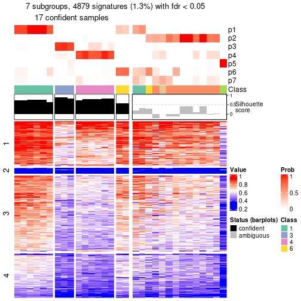</p>

</div>
<div id='tab-node-013-get-signatures-7'>
<pre><code class="r">get_signatures(res, k = 8)
</code></pre>

<p>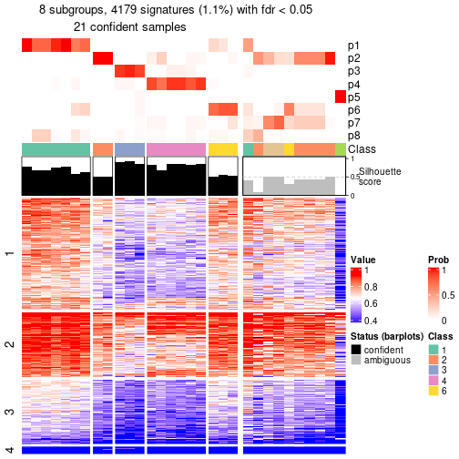</p>

</div>
</div>


Compare the overlap of signatures from different k:

```r
compare_signatures(res)
```

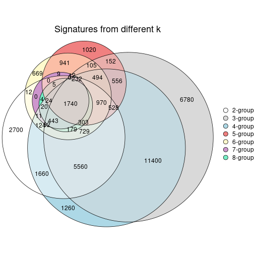

`get_signature()` returns a data frame invisibly. To get the list of signatures, the function
call should be assigned to a variable explicitly. In following code, if `plot` argument is set
to `FALSE`, no heatmap is plotted while only the differential analysis is performed.

```r
# code only for demonstration
tb = get_signature(res, k = ..., plot = FALSE)
```

An example of the output of `tb` is:

```
#>   which_row         fdr    mean_1    mean_2 scaled_mean_1 scaled_mean_2 km
#> 1        38 0.042760348  8.373488  9.131774    -0.5533452     0.5164555  1
#> 2        40 0.018707592  7.106213  8.469186    -0.6173731     0.5762149  1
#> 3        55 0.019134737 10.221463 11.207825    -0.6159697     0.5749050  1
#> 4        59 0.006059896  5.921854  7.869574    -0.6899429     0.6439467  1
#> 5        60 0.018055526  8.928898 10.211722    -0.6204761     0.5791110  1
#> 6        98 0.009384629 15.714769 14.887706     0.6635654    -0.6193277  2
...
```

The columns in `tb` are:

1. `which_row`: row indices corresponding to the input matrix.
2. `fdr`: FDR for the differential test. 
3. `mean_x`: The mean value in group x.
4. `scaled_mean_x`: The mean value in group x after rows are scaled.
5. `km`: Row groups if k-means clustering is applied to rows (which is done by automatically selecting number of clusters).

If there are too many signatures, `top_signatures = ...` can be set to only show the 
signatures with the highest FDRs:

```r
# code only for demonstration
# e.g. to show the top 500 most significant rows
tb = get_signature(res, k = ..., top_signatures = 500)
```

If the signatures are defined as these which are uniquely high in current group, `diff_method` argument
can be set to `"uniquely_high_in_one_group"`:

```r
# code only for demonstration
tb = get_signature(res, k = ..., diff_method = "uniquely_high_in_one_group")
```


UMAP plot which shows how samples are separated.


<script>
$( function() {
	$( '#tabs-node-013-dimension-reduction' ).tabs();
} );
</script>
<div id='tabs-node-013-dimension-reduction'>
<ul>
<li><a href='#tab-node-013-dimension-reduction-1'>k = 2</a></li>
<li><a href='#tab-node-013-dimension-reduction-2'>k = 3</a></li>
<li><a href='#tab-node-013-dimension-reduction-3'>k = 4</a></li>
<li><a href='#tab-node-013-dimension-reduction-4'>k = 5</a></li>
<li><a href='#tab-node-013-dimension-reduction-5'>k = 6</a></li>
<li><a href='#tab-node-013-dimension-reduction-6'>k = 7</a></li>
<li><a href='#tab-node-013-dimension-reduction-7'>k = 8</a></li>
</ul>
<div id='tab-node-013-dimension-reduction-1'>
<pre><code class="r">dimension_reduction(res, k = 2, method = &quot;UMAP&quot;)
</code></pre>

<p>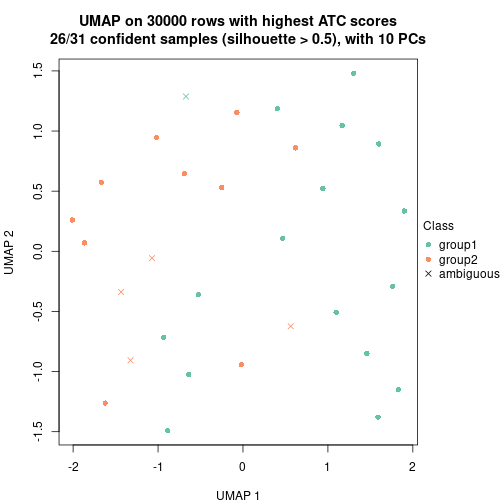</p>

</div>
<div id='tab-node-013-dimension-reduction-2'>
<pre><code class="r">dimension_reduction(res, k = 3, method = &quot;UMAP&quot;)
</code></pre>

<p>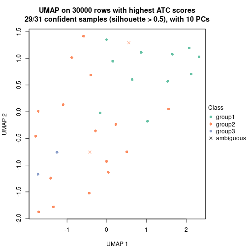</p>

</div>
<div id='tab-node-013-dimension-reduction-3'>
<pre><code class="r">dimension_reduction(res, k = 4, method = &quot;UMAP&quot;)
</code></pre>

<p>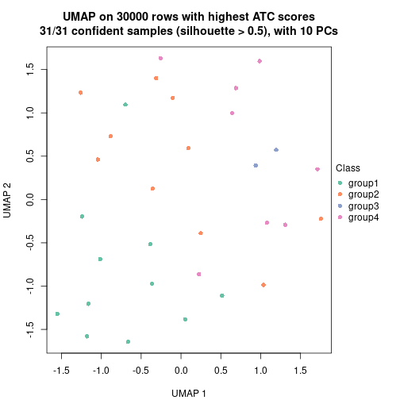</p>

</div>
<div id='tab-node-013-dimension-reduction-4'>
<pre><code class="r">dimension_reduction(res, k = 5, method = &quot;UMAP&quot;)
</code></pre>

<p>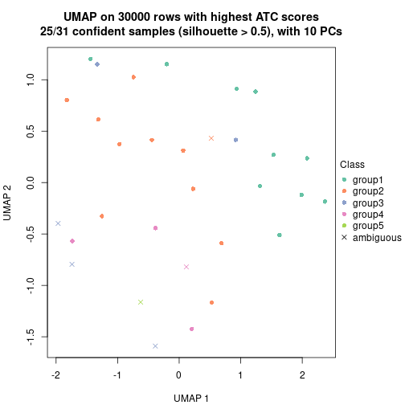</p>

</div>
<div id='tab-node-013-dimension-reduction-5'>
<pre><code class="r">dimension_reduction(res, k = 6, method = &quot;UMAP&quot;)
</code></pre>

<p>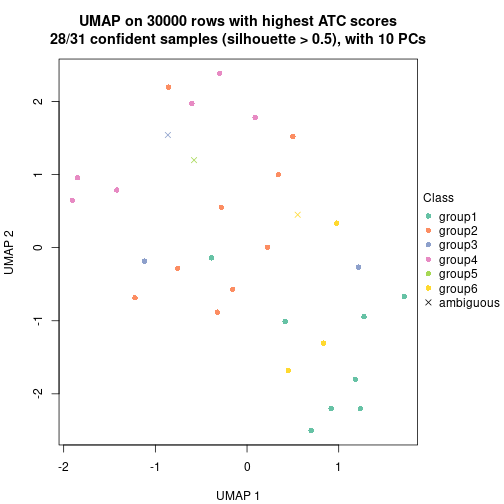</p>

</div>
<div id='tab-node-013-dimension-reduction-6'>
<pre><code class="r">dimension_reduction(res, k = 7, method = &quot;UMAP&quot;)
</code></pre>

<p>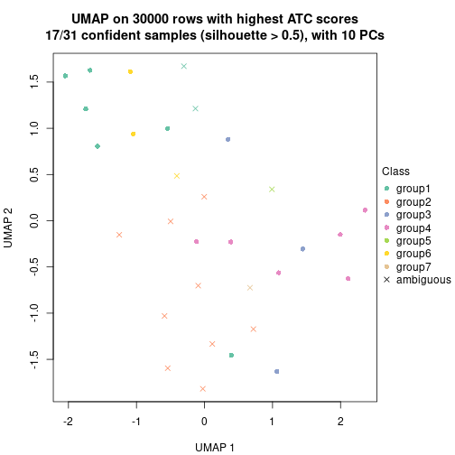</p>

</div>
<div id='tab-node-013-dimension-reduction-7'>
<pre><code class="r">dimension_reduction(res, k = 8, method = &quot;UMAP&quot;)
</code></pre>

<p>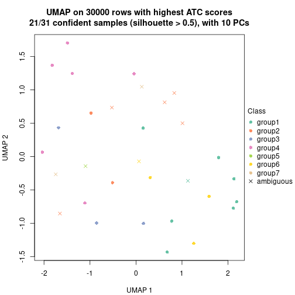</p>

</div>
</div>


Following heatmap shows how subgroups are split when increasing `k`:

```r
collect_classes(res)
```

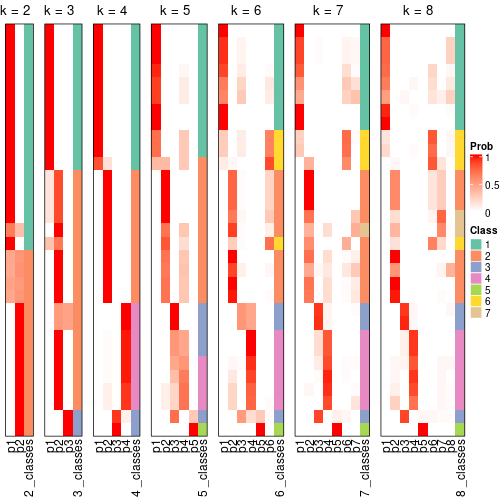


If matrix rows can be associated to genes, consider to use `functional_enrichment(res,
...)` to perform function enrichment for the signature genes. See [this vignette](https://jokergoo.github.io/cola_vignettes/functional_enrichment.html) for more detailed explanations.


 

---------------------------------------------------


### Node02


Parent node: [Node0](#Node0).
Child nodes: 
                [Node011](#Node011)
        ,
                [Node012](#Node012)
        ,
                [Node013](#Node013)
        ,
                Node014-leaf
        ,
                [Node021](#Node021)
        ,
                [Node022](#Node022)
        ,
                [Node023](#Node023)
        ,
                [Node024](#Node024)
        ,
                Node031-leaf
        ,
                Node032-leaf
        ,
                [Node041](#Node041)
        ,
                [Node042](#Node042)
        ,
                [Node043](#Node043)
        ,
                [Node051](#Node051)
        ,
                [Node052](#Node052)
        ,
                [Node061](#Node061)
        ,
                Node062-leaf
        ,
                [Node071](#Node071)
        ,
                [Node072](#Node072)
        ,
                [Node073](#Node073)
        .


The object with results only for a single top-value method and a single partitioning method 
can be extracted as:

```r
res = res_rh["02"]
```

A summary of `res` and all the functions that can be applied to it:

```r
res
```

```
#> A 'ConsensusPartition' object with k = 2, 3, 4, 5, 6, 7, 8.
#>   On a matrix with 30000 rows and 290 columns.
#>   Top rows (1000) are extracted by 'ATC' method.
#>   Subgroups are detected by 'kmeans' method.
#>   Performed in total 350 partitions by row resampling.
#>   Best k for subgroups seems to be 4.
#> 
#> Following methods can be applied to this 'ConsensusPartition' object:
#>  [1] "cola_report"             "collect_classes"         "collect_plots"          
#>  [4] "collect_stats"           "colnames"                "compare_partitions"     
#>  [7] "compare_signatures"      "consensus_heatmap"       "dimension_reduction"    
#> [10] "functional_enrichment"   "get_anno_col"            "get_anno"               
#> [13] "get_classes"             "get_consensus"           "get_matrix"             
#> [16] "get_membership"          "get_param"               "get_signatures"         
#> [19] "get_stats"               "is_best_k"               "is_stable_k"            
#> [22] "membership_heatmap"      "ncol"                    "nrow"                   
#> [25] "plot_ecdf"               "predict_classes"         "rownames"               
#> [28] "select_partition_number" "show"                    "suggest_best_k"         
#> [31] "test_to_known_factors"   "top_rows_heatmap"
```

`collect_plots()` function collects all the plots made from `res` for all `k` (number of subgroups)
into one single page to provide an easy and fast comparison between different `k`.

```r
collect_plots(res)
```

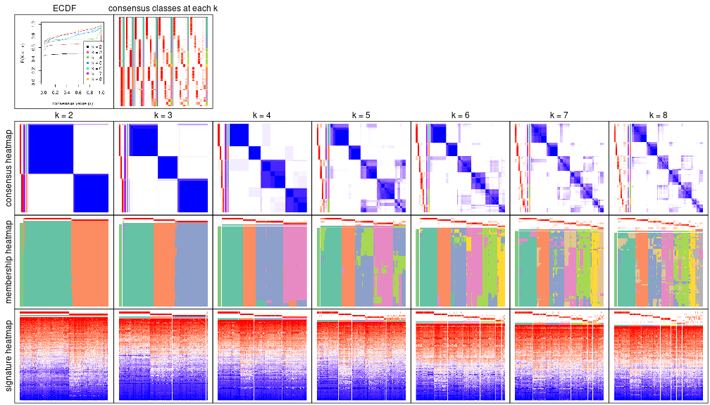

The plots are:

- The first row: a plot of the eCDF (empirical cumulative distribution
  function) curves of the consensus matrix for each `k` and the heatmap of
  predicted classes for each `k`.
- The second row: heatmaps of the consensus matrix for each `k`.
- The third row: heatmaps of the membership matrix for each `k`.
- The fouth row: heatmaps of the signatures for each `k`.

All the plots in panels can be made by individual functions and they are
plotted later in this section.

`select_partition_number()` produces several plots showing different
statistics for choosing "optimized" `k`. There are following statistics:

- eCDF curves of the consensus matrix for each `k`;
- 1-PAC. [The PAC score](https://en.wikipedia.org/wiki/Consensus_clustering#Over-interpretation_potential_of_consensus_clustering)
  measures the proportion of the ambiguous subgrouping.
- Mean silhouette score.
- Concordance. The mean probability of fiting the consensus subgroup labels in all
  partitions.
- Area increased. Denote $A_k$ as the area under the eCDF curve for current
  `k`, the area increased is defined as $A_k - A_{k-1}$.
- Rand index. The percent of pairs of samples that are both in a same cluster
  or both are not in a same cluster in the partition of k and k-1.
- Jaccard index. The ratio of pairs of samples are both in a same cluster in
  the partition of k and k-1 and the pairs of samples are both in a same
  cluster in the partition k or k-1.

The detailed explanations of these statistics can be found in [the _cola_
vignette](https://jokergoo.github.io/cola_vignettes/cola.html#toc_13).

Generally speaking, higher 1-PAC score, higher mean silhouette score or higher
concordance corresponds to better partition. Rand index and Jaccard index
measure how similar the current partition is compared to partition with `k-1`.
If they are too similar, we won't accept `k` is better than `k-1`.

```r
select_partition_number(res)
```

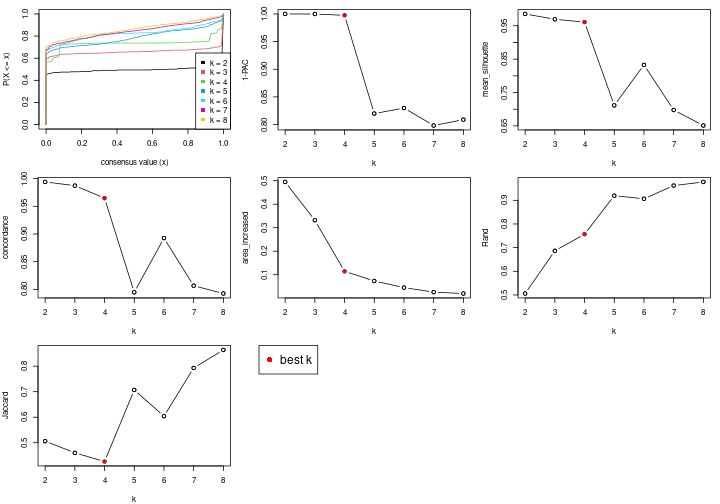

The numeric values for all these statistics can be obtained by `get_stats()`.

```r
get_stats(res)
```

```
#>   k 1-PAC mean_silhouette concordance area_increased  Rand Jaccard
#> 2 2 1.000           0.985       0.994         0.4947 0.506   0.506
#> 3 3 1.000           0.969       0.987         0.3319 0.687   0.460
#> 4 4 0.998           0.961       0.965         0.1143 0.757   0.426
#> 5 5 0.820           0.711       0.795         0.0732 0.920   0.707
#> 6 6 0.830           0.833       0.893         0.0452 0.906   0.604
#> 7 7 0.798           0.698       0.807         0.0259 0.962   0.793
#> 8 8 0.809           0.651       0.793         0.0199 0.978   0.864
```

`suggest_best_k()` suggests the best $k$ based on these statistics. The rules are as follows:

- All $k$ with Jaccard index larger than 0.95 are removed because increasing
  $k$ does not provide enough extra information. If all $k$ are removed, it is
  marked as no subgroup is detected.
- For all $k$ with 1-PAC score larger than 0.9, the maximal $k$ is taken as
  the best $k$, and other $k$ are marked as optional $k$.
- If it does not fit the second rule. The $k$ with the maximal vote of the
  highest 1-PAC score, highest mean silhouette, and highest concordance is
  taken as the best $k$.

```r
suggest_best_k(res)
```

```
#> [1] 4
#> attr(,"optional")
#> [1] 2 3
```

There is also optional best $k$ = 2 3 that is worth to check.

Following is the table of the partitions (You need to click the **show/hide
code output** link to see it). The membership matrix (columns with name `p*`)
is inferred by
[`clue::cl_consensus()`](https://www.rdocumentation.org/link/cl_consensus?package=clue)
function with the `SE` method. Basically the value in the membership matrix
represents the probability to belong to a certain group. The finall subgroup
label for an item is determined with the group with highest probability it
belongs to.

In `get_classes()` function, the entropy is calculated from the membership
matrix and the silhouette score is calculated from the consensus matrix.


<script>
$( function() {
	$( '#tabs-node-02-get-classes' ).tabs();
} );
</script>
<div id='tabs-node-02-get-classes'>
<ul>
<li><a href='#tab-node-02-get-classes-1'>k = 2</a></li>
<li><a href='#tab-node-02-get-classes-2'>k = 3</a></li>
<li><a href='#tab-node-02-get-classes-3'>k = 4</a></li>
<li><a href='#tab-node-02-get-classes-4'>k = 5</a></li>
<li><a href='#tab-node-02-get-classes-5'>k = 6</a></li>
<li><a href='#tab-node-02-get-classes-6'>k = 7</a></li>
<li><a href='#tab-node-02-get-classes-7'>k = 8</a></li>
</ul>

<div id='tab-node-02-get-classes-1'>
<p><a id='tab-node-02-get-classes-1-a' style='color:#0366d6' href='#'>show/hide code output</a></p>
<pre><code class="r">cbind(get_classes(res, k = 2), get_membership(res, k = 2))
</code></pre>

<pre><code>#&gt;                 class entropy silhouette   p1   p2
#&gt; TCGA.44.4112.01     2   0.000      0.995 0.00 1.00
#&gt; TCGA.NJ.A4YP.01     2   0.000      0.995 0.00 1.00
#&gt; TCGA.86.8278.01     2   0.000      0.995 0.00 1.00
#&gt; TCGA.49.AARQ.01     2   0.000      0.995 0.00 1.00
#&gt; TCGA.97.A4M1.01     1   0.000      0.993 1.00 0.00
#&gt; TCGA.99.8033.01     1   0.000      0.993 1.00 0.00
#&gt; TCGA.69.8453.01     1   0.000      0.993 1.00 0.00
#&gt; TCGA.97.8552.01     1   0.000      0.993 1.00 0.00
#&gt; TCGA.53.A4EZ.01     1   0.000      0.993 1.00 0.00
#&gt; TCGA.50.5066.01     1   0.000      0.993 1.00 0.00
#&gt; TCGA.62.A46U.01     2   0.000      0.995 0.00 1.00
#&gt; TCGA.MP.A4T8.01     2   0.000      0.995 0.00 1.00
#&gt; TCGA.MP.A4SY.01     2   0.000      0.995 0.00 1.00
#&gt; TCGA.93.A4JN.01     2   0.000      0.995 0.00 1.00
#&gt; TCGA.86.A4JF.01     2   0.000      0.995 0.00 1.00
#&gt; TCGA.63.6202.01     2   0.000      0.995 0.00 1.00
#&gt; TCGA.J2.A4AG.01     1   0.000      0.993 1.00 0.00
#&gt; TCGA.MP.A4TI.01     2   0.000      0.995 0.00 1.00
#&gt; TCGA.55.8208.01     1   0.000      0.993 1.00 0.00
#&gt; TCGA.85.8584.01     1   0.000      0.993 1.00 0.00
#&gt; TCGA.NJ.A4YI.01     2   0.000      0.995 0.00 1.00
#&gt; TCGA.49.AAR4.01     1   0.000      0.993 1.00 0.00
#&gt; TCGA.55.6984.01     1   0.000      0.993 1.00 0.00
#&gt; TCGA.MN.A4N1.01     2   0.000      0.995 0.00 1.00
#&gt; TCGA.75.6206.01     1   0.000      0.993 1.00 0.00
#&gt; TCGA.MP.A4TC.01     2   0.141      0.975 0.02 0.98
#&gt; TCGA.49.6744.01     1   0.000      0.993 1.00 0.00
#&gt; TCGA.L9.A743.01     1   0.000      0.993 1.00 0.00
#&gt; TCGA.05.4410.01     2   0.000      0.995 0.00 1.00
#&gt; TCGA.62.A46Y.01     2   0.000      0.995 0.00 1.00
#&gt; TCGA.50.6597.01     2   0.000      0.995 0.00 1.00
#&gt; TCGA.05.4384.01     1   0.000      0.993 1.00 0.00
#&gt; TCGA.55.8087.01     1   0.000      0.993 1.00 0.00
#&gt; TCGA.85.A50M.01     1   0.000      0.993 1.00 0.00
#&gt; TCGA.MP.A4TH.01     1   0.000      0.993 1.00 0.00
#&gt; TCGA.55.8207.01     2   0.000      0.995 0.00 1.00
#&gt; TCGA.86.6562.01     1   0.000      0.993 1.00 0.00
#&gt; TCGA.86.8074.01     1   0.000      0.993 1.00 0.00
#&gt; TCGA.39.5011.01     1   0.000      0.993 1.00 0.00
#&gt; TCGA.MP.A4SW.01     2   0.000      0.995 0.00 1.00
#&gt; TCGA.67.6216.01     2   0.000      0.995 0.00 1.00
#&gt; TCGA.55.8203.01     2   0.000      0.995 0.00 1.00
#&gt; TCGA.55.8619.01     1   0.000      0.993 1.00 0.00
#&gt; TCGA.44.2668.01     2   0.000      0.995 0.00 1.00
#&gt; TCGA.55.6971.01     1   0.000      0.993 1.00 0.00
#&gt; TCGA.98.7454.01     1   0.000      0.993 1.00 0.00
#&gt; TCGA.L9.A444.01     2   0.000      0.995 0.00 1.00
#&gt; TCGA.62.A46V.01     2   0.000      0.995 0.00 1.00
#&gt; TCGA.44.A47G.01     2   0.141      0.975 0.02 0.98
#&gt; TCGA.69.8253.01     1   0.000      0.993 1.00 0.00
#&gt; TCGA.91.6849.01     1   0.000      0.993 1.00 0.00
#&gt; TCGA.50.5944.01     1   0.000      0.993 1.00 0.00
#&gt; TCGA.44.2665.01     2   0.000      0.995 0.00 1.00
#&gt; TCGA.62.A46P.01     2   0.000      0.995 0.00 1.00
#&gt; TCGA.44.2666.01     2   0.000      0.995 0.00 1.00
#&gt; TCGA.55.A494.01     2   0.000      0.995 0.00 1.00
#&gt; TCGA.97.7547.01     1   0.000      0.993 1.00 0.00
#&gt; TCGA.69.8254.01     1   0.000      0.993 1.00 0.00
#&gt; TCGA.75.5125.01     2   0.000      0.995 0.00 1.00
#&gt; TCGA.69.7973.01     1   0.000      0.993 1.00 0.00
#&gt; TCGA.L4.A4E5.01     1   0.584      0.835 0.86 0.14
#&gt; TCGA.44.6775.01     1   0.000      0.993 1.00 0.00
#&gt; TCGA.55.7911.01     2   0.000      0.995 0.00 1.00
#&gt; TCGA.MP.A4T9.01     1   0.000      0.993 1.00 0.00
#&gt; TCGA.55.6712.01     2   0.000      0.995 0.00 1.00
#&gt; TCGA.86.7714.01     1   0.000      0.993 1.00 0.00
#&gt; TCGA.95.7948.01     2   0.000      0.995 0.00 1.00
#&gt; TCGA.55.A4DG.01     2   0.000      0.995 0.00 1.00
#&gt; TCGA.55.7815.01     1   0.000      0.993 1.00 0.00
#&gt; TCGA.05.5423.01     1   0.000      0.993 1.00 0.00
#&gt; TCGA.55.6985.01     1   0.000      0.993 1.00 0.00
#&gt; TCGA.55.7281.01     2   0.000      0.995 0.00 1.00
#&gt; TCGA.93.7347.01     1   0.000      0.993 1.00 0.00
#&gt; TCGA.44.6777.01     1   0.000      0.993 1.00 0.00
#&gt; TCGA.97.8177.01     1   0.000      0.993 1.00 0.00
#&gt; TCGA.99.7458.01     1   0.827      0.650 0.74 0.26
#&gt; TCGA.91.A4BD.01     1   0.000      0.993 1.00 0.00
#&gt; TCGA.38.6178.01     2   0.000      0.995 0.00 1.00
#&gt; TCGA.44.A47B.01     2   0.000      0.995 0.00 1.00
#&gt; TCGA.55.6979.01     1   0.000      0.993 1.00 0.00
#&gt; TCGA.55.7573.01     1   0.000      0.993 1.00 0.00
#&gt; TCGA.55.8097.01     1   0.000      0.993 1.00 0.00
#&gt; TCGA.05.5429.01     2   0.000      0.995 0.00 1.00
#&gt; TCGA.93.A4JP.01     1   0.000      0.993 1.00 0.00
#&gt; TCGA.S2.AA1A.01     1   0.000      0.993 1.00 0.00
#&gt; TCGA.93.A4JQ.01     1   0.000      0.993 1.00 0.00
#&gt; TCGA.78.7160.01     1   0.000      0.993 1.00 0.00
#&gt; TCGA.75.5122.01     2   0.000      0.995 0.00 1.00
#&gt; TCGA.97.7938.01     1   0.000      0.993 1.00 0.00
#&gt; TCGA.44.7671.01     1   0.000      0.993 1.00 0.00
#&gt; TCGA.50.5055.01     1   0.000      0.993 1.00 0.00
#&gt; TCGA.85.6560.01     1   0.000      0.993 1.00 0.00
#&gt; TCGA.91.8496.01     1   0.000      0.993 1.00 0.00
#&gt; TCGA.MP.A4T2.01     1   0.000      0.993 1.00 0.00
#&gt; TCGA.62.A46R.01     2   0.000      0.995 0.00 1.00
#&gt; TCGA.L9.A443.01     2   0.000      0.995 0.00 1.00
#&gt; TCGA.86.7701.01     2   0.000      0.995 0.00 1.00
#&gt; TCGA.52.7812.01     2   0.000      0.995 0.00 1.00
#&gt; TCGA.78.7162.01     1   0.000      0.993 1.00 0.00
#&gt; TCGA.L9.A50W.01     1   0.000      0.993 1.00 0.00
#&gt; TCGA.50.8460.01     1   0.000      0.993 1.00 0.00
#&gt; TCGA.67.6217.01     1   0.000      0.993 1.00 0.00
#&gt; TCGA.78.7535.01     2   0.000      0.995 0.00 1.00
#&gt; TCGA.93.7348.01     1   0.000      0.993 1.00 0.00
#&gt; TCGA.86.8671.01     1   0.000      0.993 1.00 0.00
#&gt; TCGA.50.6592.01     1   0.000      0.993 1.00 0.00
#&gt; TCGA.97.7546.01     1   0.000      0.993 1.00 0.00
#&gt; TCGA.44.7661.01     1   0.000      0.993 1.00 0.00
#&gt; TCGA.95.7944.01     1   0.000      0.993 1.00 0.00
#&gt; TCGA.97.A4M0.01     2   0.000      0.995 0.00 1.00
#&gt; TCGA.50.5933.01     2   0.000      0.995 0.00 1.00
#&gt; TCGA.86.8280.01     1   0.000      0.993 1.00 0.00
#&gt; TCGA.78.8660.01     2   0.000      0.995 0.00 1.00
#&gt; TCGA.55.7907.01     2   0.000      0.995 0.00 1.00
#&gt; TCGA.49.6767.01     1   0.000      0.993 1.00 0.00
#&gt; TCGA.MP.A4TK.01     2   0.000      0.995 0.00 1.00
#&gt; TCGA.69.7761.01     1   0.000      0.993 1.00 0.00
#&gt; TCGA.91.6835.01     1   0.000      0.993 1.00 0.00
#&gt; TCGA.78.7540.01     2   0.000      0.995 0.00 1.00
#&gt; TCGA.95.A4VN.01     1   0.971      0.335 0.60 0.40
#&gt; TCGA.44.A47F.01     2   0.904      0.528 0.32 0.68
#&gt; TCGA.55.A48Z.01     1   0.000      0.993 1.00 0.00
#&gt; TCGA.69.7763.01     2   0.000      0.995 0.00 1.00
#&gt; TCGA.J2.A4AE.01     2   0.000      0.995 0.00 1.00
#&gt; TCGA.50.5942.01     1   0.000      0.993 1.00 0.00
#&gt; TCGA.50.6590.01     2   0.000      0.995 0.00 1.00
#&gt; TCGA.80.5608.01     1   0.000      0.993 1.00 0.00
#&gt; TCGA.55.8511.01     2   0.000      0.995 0.00 1.00
#&gt; TCGA.99.8025.01     2   0.000      0.995 0.00 1.00
#&gt; TCGA.55.7283.01     2   0.000      0.995 0.00 1.00
#&gt; TCGA.55.A491.01     1   0.242      0.953 0.96 0.04
#&gt; TCGA.MN.A4N5.01     2   0.000      0.995 0.00 1.00
#&gt; TCGA.69.7978.01     2   0.000      0.995 0.00 1.00
#&gt; TCGA.55.8299.01     1   0.000      0.993 1.00 0.00
#&gt; TCGA.44.8117.01     2   0.000      0.995 0.00 1.00
#&gt; TCGA.MP.A4TD.01     2   0.000      0.995 0.00 1.00
#&gt; TCGA.05.4405.01     2   0.000      0.995 0.00 1.00
#&gt; TCGA.83.5908.01     2   0.000      0.995 0.00 1.00
#&gt; TCGA.55.6980.01     1   0.000      0.993 1.00 0.00
#&gt; TCGA.44.6146.01     1   0.000      0.993 1.00 0.00
#&gt; TCGA.62.8397.01     1   0.000      0.993 1.00 0.00
#&gt; TCGA.97.7552.01     1   0.000      0.993 1.00 0.00
#&gt; TCGA.50.5936.01     1   0.000      0.993 1.00 0.00
#&gt; TCGA.91.7771.01     2   0.402      0.911 0.08 0.92
#&gt; TCGA.NJ.A4YG.01     2   0.000      0.995 0.00 1.00
#&gt; TCGA.86.8359.01     1   0.000      0.993 1.00 0.00
#&gt; TCGA.55.8301.01     1   0.000      0.993 1.00 0.00
#&gt; TCGA.44.3918.01     2   0.000      0.995 0.00 1.00
#&gt; TCGA.55.8621.01     1   0.000      0.993 1.00 0.00
#&gt; TCGA.49.6745.01     2   0.000      0.995 0.00 1.00
#&gt; TCGA.44.A4SS.01     1   0.000      0.993 1.00 0.00
#&gt; TCGA.55.8089.01     1   0.000      0.993 1.00 0.00
#&gt; TCGA.NJ.A4YQ.01     1   0.000      0.993 1.00 0.00
#&gt; TCGA.55.7574.01     2   0.242      0.955 0.04 0.96
#&gt; TCGA.63.A5MN.01     1   0.000      0.993 1.00 0.00
#&gt; TCGA.50.8459.01     1   0.000      0.993 1.00 0.00
#&gt; TCGA.78.8648.01     1   0.000      0.993 1.00 0.00
#&gt; TCGA.NC.A5HJ.01     1   0.000      0.993 1.00 0.00
#&gt; TCGA.44.2656.01     2   0.000      0.995 0.00 1.00
#&gt; TCGA.86.8673.01     2   0.000      0.995 0.00 1.00
#&gt; TCGA.73.7499.01     1   0.000      0.993 1.00 0.00
#&gt; TCGA.97.A4LX.01     1   0.000      0.993 1.00 0.00
#&gt; TCGA.MP.A4T7.01     1   0.000      0.993 1.00 0.00
#&gt; TCGA.69.7765.01     2   0.000      0.995 0.00 1.00
#&gt; TCGA.95.8494.01     2   0.000      0.995 0.00 1.00
#&gt; TCGA.97.8171.01     1   0.000      0.993 1.00 0.00
#&gt; TCGA.50.8457.01     1   0.000      0.993 1.00 0.00
#&gt; TCGA.97.A4M5.01     1   0.000      0.993 1.00 0.00
#&gt; TCGA.53.7626.01     1   0.000      0.993 1.00 0.00
#&gt; TCGA.44.5645.01     1   0.000      0.993 1.00 0.00
#&gt; TCGA.78.7158.01     2   0.000      0.995 0.00 1.00
#&gt; TCGA.86.8056.01     2   0.000      0.995 0.00 1.00
#&gt; TCGA.69.7980.01     1   0.000      0.993 1.00 0.00
#&gt; TCGA.97.8175.01     2   0.000      0.995 0.00 1.00
#&gt; TCGA.86.8668.01     1   0.000      0.993 1.00 0.00
#&gt; TCGA.MP.A4T4.01     1   0.000      0.993 1.00 0.00
#&gt; TCGA.44.A47A.01     2   0.000      0.995 0.00 1.00
#&gt; TCGA.NJ.A55O.01     1   0.000      0.993 1.00 0.00
#&gt; TCGA.93.A4JO.01     1   0.000      0.993 1.00 0.00
#&gt; TCGA.44.6145.01     1   0.000      0.993 1.00 0.00
#&gt; TCGA.97.8547.01     2   0.000      0.995 0.00 1.00
#&gt; TCGA.44.6147.01     2   0.000      0.995 0.00 1.00
#&gt; TCGA.77.8007.01     2   0.000      0.995 0.00 1.00
#&gt; TCGA.55.8510.01     1   0.000      0.993 1.00 0.00
#&gt; TCGA.49.AARO.01     1   0.000      0.993 1.00 0.00
#&gt; TCGA.55.8090.01     2   0.000      0.995 0.00 1.00
#&gt; TCGA.86.8073.01     2   0.000      0.995 0.00 1.00
#&gt; TCGA.91.6828.01     2   0.000      0.995 0.00 1.00
#&gt; TCGA.86.8076.01     1   0.000      0.993 1.00 0.00
#&gt; TCGA.97.A4M6.01     1   0.000      0.993 1.00 0.00
#&gt; TCGA.50.5044.01     1   0.000      0.993 1.00 0.00
#&gt; TCGA.64.5781.01     1   0.000      0.993 1.00 0.00
#&gt; TCGA.NJ.A4YF.01     1   0.000      0.993 1.00 0.00
#&gt; TCGA.38.7271.01     2   0.000      0.995 0.00 1.00
#&gt; TCGA.49.AAR3.01     1   0.000      0.993 1.00 0.00
#&gt; TCGA.MP.A4TJ.01     1   0.000      0.993 1.00 0.00
#&gt; TCGA.69.7760.01     1   0.000      0.993 1.00 0.00
#&gt; TCGA.49.4512.01     1   0.000      0.993 1.00 0.00
#&gt; TCGA.50.5939.01     1   0.000      0.993 1.00 0.00
#&gt; TCGA.78.7143.01     2   0.000      0.995 0.00 1.00
#&gt; TCGA.97.A4M3.01     1   0.000      0.993 1.00 0.00
#&gt; TCGA.75.6205.01     2   0.000      0.995 0.00 1.00
#&gt; TCGA.99.8028.01     1   0.000      0.993 1.00 0.00
#&gt; TCGA.55.7903.01     2   0.000      0.995 0.00 1.00
#&gt; TCGA.49.4487.01     1   0.000      0.993 1.00 0.00
#&gt; TCGA.55.A493.01     2   0.000      0.995 0.00 1.00
#&gt; TCGA.75.5126.01     2   0.000      0.995 0.00 1.00
#&gt; TCGA.55.8206.01     1   0.000      0.993 1.00 0.00
#&gt; TCGA.97.7553.01     1   0.000      0.993 1.00 0.00
#&gt; TCGA.NJ.A7XG.01     2   0.722      0.749 0.20 0.80
#&gt; TCGA.55.A48X.01     1   0.827      0.650 0.74 0.26
#&gt; TCGA.64.5778.01     1   0.000      0.993 1.00 0.00
#&gt; TCGA.50.6594.01     1   0.000      0.993 1.00 0.00
#&gt; TCGA.78.7153.01     2   0.000      0.995 0.00 1.00
#&gt; TCGA.55.7728.01     1   0.000      0.993 1.00 0.00
#&gt; TCGA.67.6215.01     2   0.000      0.995 0.00 1.00
#&gt; TCGA.78.7537.01     1   0.000      0.993 1.00 0.00
#&gt; TCGA.55.6982.01     2   0.000      0.995 0.00 1.00
#&gt; TCGA.55.7227.01     2   0.000      0.995 0.00 1.00
#&gt; TCGA.86.A456.01     2   0.000      0.995 0.00 1.00
#&gt; TCGA.44.6774.01     1   0.000      0.993 1.00 0.00
#&gt; TCGA.49.AAQV.01     1   0.000      0.993 1.00 0.00
#&gt; TCGA.73.7498.01     1   0.000      0.993 1.00 0.00
#&gt; TCGA.38.4632.01     2   0.000      0.995 0.00 1.00
#&gt; TCGA.69.7974.01     2   0.000      0.995 0.00 1.00
#&gt; TCGA.55.6986.01     2   0.000      0.995 0.00 1.00
#&gt; TCGA.49.6761.01     2   0.000      0.995 0.00 1.00
#&gt; TCGA.MP.A4T6.01     2   0.000      0.995 0.00 1.00
#&gt; TCGA.44.6779.01     2   0.000      0.995 0.00 1.00
#&gt; TCGA.86.A4P7.01     2   0.000      0.995 0.00 1.00
#&gt; TCGA.73.4658.01     2   0.000      0.995 0.00 1.00
#&gt; TCGA.85.A513.01     1   0.000      0.993 1.00 0.00
#&gt; TCGA.50.5935.01     1   0.000      0.993 1.00 0.00
#&gt; TCGA.55.7727.01     2   0.000      0.995 0.00 1.00
#&gt; TCGA.55.6981.01     1   0.000      0.993 1.00 0.00
#&gt; TCGA.78.8655.01     2   0.000      0.995 0.00 1.00
#&gt; TCGA.78.7163.01     1   0.000      0.993 1.00 0.00
#&gt; TCGA.97.7941.01     1   0.000      0.993 1.00 0.00
#&gt; TCGA.55.7914.01     2   0.000      0.995 0.00 1.00
#&gt; TCGA.75.7030.01     1   0.000      0.993 1.00 0.00
#&gt; TCGA.62.A472.01     2   0.000      0.995 0.00 1.00
#&gt; TCGA.05.4417.01     2   0.000      0.995 0.00 1.00
#&gt; TCGA.67.4679.01     1   0.000      0.993 1.00 0.00
#&gt; TCGA.97.7554.01     2   0.000      0.995 0.00 1.00
#&gt; TCGA.75.7025.01     1   0.000      0.993 1.00 0.00
#&gt; TCGA.95.8039.01     2   0.000      0.995 0.00 1.00
#&gt; TCGA.50.5941.01     1   0.000      0.993 1.00 0.00
#&gt; TCGA.97.8174.01     1   0.000      0.993 1.00 0.00
#&gt; TCGA.55.7576.01     2   0.000      0.995 0.00 1.00
#&gt; TCGA.55.7725.01     1   0.000      0.993 1.00 0.00
#&gt; TCGA.38.A44F.01     1   0.000      0.993 1.00 0.00
#&gt; TCGA.80.5607.01     2   0.000      0.995 0.00 1.00
#&gt; TCGA.55.8091.01     1   0.000      0.993 1.00 0.00
#&gt; TCGA.62.8395.01     2   0.000      0.995 0.00 1.00
#&gt; TCGA.86.8672.01     2   0.000      0.995 0.00 1.00
#&gt; TCGA.64.5815.01     2   0.000      0.995 0.00 1.00
#&gt; TCGA.75.6212.01     1   0.000      0.993 1.00 0.00
#&gt; TCGA.44.6776.01     1   0.000      0.993 1.00 0.00
#&gt; TCGA.55.6983.01     1   0.000      0.993 1.00 0.00
#&gt; TCGA.93.8067.01     2   0.000      0.995 0.00 1.00
#&gt; TCGA.69.A59K.01     2   0.000      0.995 0.00 1.00
#&gt; TCGA.95.7567.01     2   0.000      0.995 0.00 1.00
#&gt; TCGA.49.AARN.01     2   0.000      0.995 0.00 1.00
#&gt; TCGA.91.6836.01     2   0.000      0.995 0.00 1.00
#&gt; TCGA.97.8172.01     2   0.000      0.995 0.00 1.00
#&gt; TCGA.O2.A52Q.01     1   0.000      0.993 1.00 0.00
#&gt; TCGA.50.5045.01     1   0.000      0.993 1.00 0.00
#&gt; TCGA.55.6978.01     1   0.000      0.993 1.00 0.00
#&gt; TCGA.95.A4VP.01     1   0.000      0.993 1.00 0.00
#&gt; TCGA.05.5715.01     2   0.000      0.995 0.00 1.00
#&gt; TCGA.55.A492.01     1   0.000      0.993 1.00 0.00
#&gt; TCGA.55.A48Y.01     1   0.000      0.993 1.00 0.00
#&gt; TCGA.50.6595.01     1   0.000      0.993 1.00 0.00
#&gt; TCGA.55.6543.01     1   0.000      0.993 1.00 0.00
#&gt; TCGA.91.8497.01     1   0.000      0.993 1.00 0.00
#&gt; TCGA.50.5049.01     1   0.000      0.993 1.00 0.00
#&gt; TCGA.97.A4M2.01     1   0.000      0.993 1.00 0.00
#&gt; TCGA.44.7659.01     2   0.000      0.995 0.00 1.00
#&gt; TCGA.97.A4M7.01     1   0.000      0.993 1.00 0.00
#&gt; TCGA.44.7662.01     1   0.000      0.993 1.00 0.00
#&gt; TCGA.55.6970.01     1   0.000      0.993 1.00 0.00
#&gt; TCGA.50.5068.01     1   0.000      0.993 1.00 0.00
#&gt; TCGA.71.8520.01     2   0.000      0.995 0.00 1.00
#&gt; TCGA.44.7672.01     2   0.000      0.995 0.00 1.00
#&gt; TCGA.55.6987.01     1   0.000      0.993 1.00 0.00
#&gt; TCGA.78.7152.01     2   0.000      0.995 0.00 1.00
#&gt; TCGA.78.7145.01     1   0.000      0.993 1.00 0.00
#&gt; TCGA.50.6593.01     1   0.000      0.993 1.00 0.00
#&gt; TCGA.55.8302.01     2   0.000      0.995 0.00 1.00
#&gt; TCGA.05.4425.01     2   0.000      0.995 0.00 1.00
</code></pre>

<script>
$('#tab-node-02-get-classes-1-a').parent().next().next().hide();
$('#tab-node-02-get-classes-1-a').click(function(){
  $('#tab-node-02-get-classes-1-a').parent().next().next().toggle();
  return(false);
});
</script>
</div>

<div id='tab-node-02-get-classes-2'>
<p><a id='tab-node-02-get-classes-2-a' style='color:#0366d6' href='#'>show/hide code output</a></p>
<pre><code class="r">cbind(get_classes(res, k = 3), get_membership(res, k = 3))
</code></pre>

<pre><code>#&gt;                 class entropy silhouette   p1   p2   p3
#&gt; TCGA.44.4112.01     3  0.0000      0.985 0.00 0.00 1.00
#&gt; TCGA.NJ.A4YP.01     3  0.4291      0.785 0.00 0.18 0.82
#&gt; TCGA.86.8278.01     2  0.0000      0.997 0.00 1.00 0.00
#&gt; TCGA.49.AARQ.01     2  0.1529      0.958 0.00 0.96 0.04
#&gt; TCGA.97.A4M1.01     1  0.0000      0.980 1.00 0.00 0.00
#&gt; TCGA.99.8033.01     1  0.0000      0.980 1.00 0.00 0.00
#&gt; TCGA.69.8453.01     3  0.0000      0.985 0.00 0.00 1.00
#&gt; TCGA.97.8552.01     1  0.0000      0.980 1.00 0.00 0.00
#&gt; TCGA.53.A4EZ.01     1  0.2959      0.881 0.90 0.00 0.10
#&gt; TCGA.50.5066.01     1  0.0000      0.980 1.00 0.00 0.00
#&gt; TCGA.62.A46U.01     2  0.0000      0.997 0.00 1.00 0.00
#&gt; TCGA.MP.A4T8.01     3  0.3686      0.838 0.00 0.14 0.86
#&gt; TCGA.MP.A4SY.01     2  0.0000      0.997 0.00 1.00 0.00
#&gt; TCGA.93.A4JN.01     3  0.4555      0.757 0.00 0.20 0.80
#&gt; TCGA.86.A4JF.01     3  0.0000      0.985 0.00 0.00 1.00
#&gt; TCGA.63.6202.01     3  0.0000      0.985 0.00 0.00 1.00
#&gt; TCGA.J2.A4AG.01     3  0.0000      0.985 0.00 0.00 1.00
#&gt; TCGA.MP.A4TI.01     3  0.4002      0.812 0.00 0.16 0.84
#&gt; TCGA.55.8208.01     1  0.0000      0.980 1.00 0.00 0.00
#&gt; TCGA.85.8584.01     1  0.0000      0.980 1.00 0.00 0.00
#&gt; TCGA.NJ.A4YI.01     2  0.0000      0.997 0.00 1.00 0.00
#&gt; TCGA.49.AAR4.01     3  0.2537      0.901 0.08 0.00 0.92
#&gt; TCGA.55.6984.01     3  0.0000      0.985 0.00 0.00 1.00
#&gt; TCGA.MN.A4N1.01     2  0.0000      0.997 0.00 1.00 0.00
#&gt; TCGA.75.6206.01     1  0.0000      0.980 1.00 0.00 0.00
#&gt; TCGA.MP.A4TC.01     3  0.0000      0.985 0.00 0.00 1.00
#&gt; TCGA.49.6744.01     1  0.0000      0.980 1.00 0.00 0.00
#&gt; TCGA.L9.A743.01     3  0.0000      0.985 0.00 0.00 1.00
#&gt; TCGA.05.4410.01     2  0.0000      0.997 0.00 1.00 0.00
#&gt; TCGA.62.A46Y.01     3  0.0000      0.985 0.00 0.00 1.00
#&gt; TCGA.50.6597.01     2  0.0000      0.997 0.00 1.00 0.00
#&gt; TCGA.05.4384.01     1  0.0000      0.980 1.00 0.00 0.00
#&gt; TCGA.55.8087.01     1  0.0000      0.980 1.00 0.00 0.00
#&gt; TCGA.85.A50M.01     1  0.0000      0.980 1.00 0.00 0.00
#&gt; TCGA.MP.A4TH.01     1  0.0000      0.980 1.00 0.00 0.00
#&gt; TCGA.55.8207.01     2  0.0000      0.997 0.00 1.00 0.00
#&gt; TCGA.86.6562.01     3  0.0000      0.985 0.00 0.00 1.00
#&gt; TCGA.86.8074.01     3  0.0000      0.985 0.00 0.00 1.00
#&gt; TCGA.39.5011.01     1  0.5706      0.548 0.68 0.00 0.32
#&gt; TCGA.MP.A4SW.01     3  0.0000      0.985 0.00 0.00 1.00
#&gt; TCGA.67.6216.01     3  0.0000      0.985 0.00 0.00 1.00
#&gt; TCGA.55.8203.01     3  0.0000      0.985 0.00 0.00 1.00
#&gt; TCGA.55.8619.01     1  0.0000      0.980 1.00 0.00 0.00
#&gt; TCGA.44.2668.01     3  0.0000      0.985 0.00 0.00 1.00
#&gt; TCGA.55.6971.01     1  0.0000      0.980 1.00 0.00 0.00
#&gt; TCGA.98.7454.01     1  0.0000      0.980 1.00 0.00 0.00
#&gt; TCGA.L9.A444.01     2  0.0000      0.997 0.00 1.00 0.00
#&gt; TCGA.62.A46V.01     2  0.0000      0.997 0.00 1.00 0.00
#&gt; TCGA.44.A47G.01     3  0.0000      0.985 0.00 0.00 1.00
#&gt; TCGA.69.8253.01     1  0.0000      0.980 1.00 0.00 0.00
#&gt; TCGA.91.6849.01     1  0.5948      0.460 0.64 0.00 0.36
#&gt; TCGA.50.5944.01     1  0.0000      0.980 1.00 0.00 0.00
#&gt; TCGA.44.2665.01     3  0.0000      0.985 0.00 0.00 1.00
#&gt; TCGA.62.A46P.01     2  0.0000      0.997 0.00 1.00 0.00
#&gt; TCGA.44.2666.01     2  0.2537      0.913 0.00 0.92 0.08
#&gt; TCGA.55.A494.01     3  0.0000      0.985 0.00 0.00 1.00
#&gt; TCGA.97.7547.01     1  0.0000      0.980 1.00 0.00 0.00
#&gt; TCGA.69.8254.01     3  0.0000      0.985 0.00 0.00 1.00
#&gt; TCGA.75.5125.01     3  0.0000      0.985 0.00 0.00 1.00
#&gt; TCGA.69.7973.01     1  0.0000      0.980 1.00 0.00 0.00
#&gt; TCGA.L4.A4E5.01     3  0.0000      0.985 0.00 0.00 1.00
#&gt; TCGA.44.6775.01     3  0.0000      0.985 0.00 0.00 1.00
#&gt; TCGA.55.7911.01     2  0.0000      0.997 0.00 1.00 0.00
#&gt; TCGA.MP.A4T9.01     1  0.0000      0.980 1.00 0.00 0.00
#&gt; TCGA.55.6712.01     3  0.0000      0.985 0.00 0.00 1.00
#&gt; TCGA.86.7714.01     3  0.0000      0.985 0.00 0.00 1.00
#&gt; TCGA.95.7948.01     3  0.0000      0.985 0.00 0.00 1.00
#&gt; TCGA.55.A4DG.01     2  0.0000      0.997 0.00 1.00 0.00
#&gt; TCGA.55.7815.01     3  0.0000      0.985 0.00 0.00 1.00
#&gt; TCGA.05.5423.01     1  0.0000      0.980 1.00 0.00 0.00
#&gt; TCGA.55.6985.01     3  0.0000      0.985 0.00 0.00 1.00
#&gt; TCGA.55.7281.01     3  0.0000      0.985 0.00 0.00 1.00
#&gt; TCGA.93.7347.01     1  0.0000      0.980 1.00 0.00 0.00
#&gt; TCGA.44.6777.01     3  0.0000      0.985 0.00 0.00 1.00
#&gt; TCGA.97.8177.01     1  0.0000      0.980 1.00 0.00 0.00
#&gt; TCGA.99.7458.01     3  0.0000      0.985 0.00 0.00 1.00
#&gt; TCGA.91.A4BD.01     1  0.0000      0.980 1.00 0.00 0.00
#&gt; TCGA.38.6178.01     3  0.0000      0.985 0.00 0.00 1.00
#&gt; TCGA.44.A47B.01     2  0.0000      0.997 0.00 1.00 0.00
#&gt; TCGA.55.6979.01     1  0.0000      0.980 1.00 0.00 0.00
#&gt; TCGA.55.7573.01     1  0.0000      0.980 1.00 0.00 0.00
#&gt; TCGA.55.8097.01     1  0.0000      0.980 1.00 0.00 0.00
#&gt; TCGA.05.5429.01     2  0.0000      0.997 0.00 1.00 0.00
#&gt; TCGA.93.A4JP.01     1  0.0000      0.980 1.00 0.00 0.00
#&gt; TCGA.S2.AA1A.01     1  0.0000      0.980 1.00 0.00 0.00
#&gt; TCGA.93.A4JQ.01     1  0.0000      0.980 1.00 0.00 0.00
#&gt; TCGA.78.7160.01     1  0.0000      0.980 1.00 0.00 0.00
#&gt; TCGA.75.5122.01     3  0.0000      0.985 0.00 0.00 1.00
#&gt; TCGA.97.7938.01     1  0.0892      0.964 0.98 0.00 0.02
#&gt; TCGA.44.7671.01     1  0.0000      0.980 1.00 0.00 0.00
#&gt; TCGA.50.5055.01     1  0.0000      0.980 1.00 0.00 0.00
#&gt; TCGA.85.6560.01     3  0.0000      0.985 0.00 0.00 1.00
#&gt; TCGA.91.8496.01     1  0.0000      0.980 1.00 0.00 0.00
#&gt; TCGA.MP.A4T2.01     1  0.0000      0.980 1.00 0.00 0.00
#&gt; TCGA.62.A46R.01     2  0.0000      0.997 0.00 1.00 0.00
#&gt; TCGA.L9.A443.01     3  0.0000      0.985 0.00 0.00 1.00
#&gt; TCGA.86.7701.01     3  0.0000      0.985 0.00 0.00 1.00
#&gt; TCGA.52.7812.01     3  0.0000      0.985 0.00 0.00 1.00
#&gt; TCGA.78.7162.01     1  0.0000      0.980 1.00 0.00 0.00
#&gt; TCGA.L9.A50W.01     3  0.0000      0.985 0.00 0.00 1.00
#&gt; TCGA.50.8460.01     3  0.0000      0.985 0.00 0.00 1.00
#&gt; TCGA.67.6217.01     1  0.0892      0.964 0.98 0.00 0.02
#&gt; TCGA.78.7535.01     2  0.0000      0.997 0.00 1.00 0.00
#&gt; TCGA.93.7348.01     1  0.0000      0.980 1.00 0.00 0.00
#&gt; TCGA.86.8671.01     1  0.0892      0.964 0.98 0.00 0.02
#&gt; TCGA.50.6592.01     3  0.0000      0.985 0.00 0.00 1.00
#&gt; TCGA.97.7546.01     1  0.0000      0.980 1.00 0.00 0.00
#&gt; TCGA.44.7661.01     3  0.0000      0.985 0.00 0.00 1.00
#&gt; TCGA.95.7944.01     1  0.0000      0.980 1.00 0.00 0.00
#&gt; TCGA.97.A4M0.01     2  0.0000      0.997 0.00 1.00 0.00
#&gt; TCGA.50.5933.01     2  0.0000      0.997 0.00 1.00 0.00
#&gt; TCGA.86.8280.01     1  0.0000      0.980 1.00 0.00 0.00
#&gt; TCGA.78.8660.01     2  0.0000      0.997 0.00 1.00 0.00
#&gt; TCGA.55.7907.01     2  0.0000      0.997 0.00 1.00 0.00
#&gt; TCGA.49.6767.01     3  0.0000      0.985 0.00 0.00 1.00
#&gt; TCGA.MP.A4TK.01     3  0.0000      0.985 0.00 0.00 1.00
#&gt; TCGA.69.7761.01     3  0.0000      0.985 0.00 0.00 1.00
#&gt; TCGA.91.6835.01     3  0.0000      0.985 0.00 0.00 1.00
#&gt; TCGA.78.7540.01     2  0.0000      0.997 0.00 1.00 0.00
#&gt; TCGA.95.A4VN.01     3  0.0000      0.985 0.00 0.00 1.00
#&gt; TCGA.44.A47F.01     3  0.0000      0.985 0.00 0.00 1.00
#&gt; TCGA.55.A48Z.01     1  0.0000      0.980 1.00 0.00 0.00
#&gt; TCGA.69.7763.01     3  0.0000      0.985 0.00 0.00 1.00
#&gt; TCGA.J2.A4AE.01     2  0.0000      0.997 0.00 1.00 0.00
#&gt; TCGA.50.5942.01     1  0.0000      0.980 1.00 0.00 0.00
#&gt; TCGA.50.6590.01     3  0.5560      0.584 0.00 0.30 0.70
#&gt; TCGA.80.5608.01     3  0.0000      0.985 0.00 0.00 1.00
#&gt; TCGA.55.8511.01     2  0.0000      0.997 0.00 1.00 0.00
#&gt; TCGA.99.8025.01     2  0.0000      0.997 0.00 1.00 0.00
#&gt; TCGA.55.7283.01     2  0.0000      0.997 0.00 1.00 0.00
#&gt; TCGA.55.A491.01     3  0.0000      0.985 0.00 0.00 1.00
#&gt; TCGA.MN.A4N5.01     2  0.0000      0.997 0.00 1.00 0.00
#&gt; TCGA.69.7978.01     3  0.6126      0.351 0.00 0.40 0.60
#&gt; TCGA.55.8299.01     1  0.0000      0.980 1.00 0.00 0.00
#&gt; TCGA.44.8117.01     2  0.0000      0.997 0.00 1.00 0.00
#&gt; TCGA.MP.A4TD.01     2  0.2066      0.936 0.00 0.94 0.06
#&gt; TCGA.05.4405.01     2  0.0000      0.997 0.00 1.00 0.00
#&gt; TCGA.83.5908.01     2  0.0000      0.997 0.00 1.00 0.00
#&gt; TCGA.55.6980.01     1  0.0000      0.980 1.00 0.00 0.00
#&gt; TCGA.44.6146.01     1  0.0892      0.964 0.98 0.00 0.02
#&gt; TCGA.62.8397.01     1  0.0000      0.980 1.00 0.00 0.00
#&gt; TCGA.97.7552.01     3  0.0000      0.985 0.00 0.00 1.00
#&gt; TCGA.50.5936.01     1  0.0000      0.980 1.00 0.00 0.00
#&gt; TCGA.91.7771.01     3  0.0000      0.985 0.00 0.00 1.00
#&gt; TCGA.NJ.A4YG.01     3  0.0000      0.985 0.00 0.00 1.00
#&gt; TCGA.86.8359.01     1  0.0892      0.963 0.98 0.00 0.02
#&gt; TCGA.55.8301.01     3  0.0000      0.985 0.00 0.00 1.00
#&gt; TCGA.44.3918.01     2  0.0000      0.997 0.00 1.00 0.00
#&gt; TCGA.55.8621.01     1  0.0000      0.980 1.00 0.00 0.00
#&gt; TCGA.49.6745.01     2  0.0000      0.997 0.00 1.00 0.00
#&gt; TCGA.44.A4SS.01     1  0.0000      0.980 1.00 0.00 0.00
#&gt; TCGA.55.8089.01     3  0.0000      0.985 0.00 0.00 1.00
#&gt; TCGA.NJ.A4YQ.01     3  0.0000      0.985 0.00 0.00 1.00
#&gt; TCGA.55.7574.01     3  0.0000      0.985 0.00 0.00 1.00
#&gt; TCGA.63.A5MN.01     1  0.0000      0.980 1.00 0.00 0.00
#&gt; TCGA.50.8459.01     3  0.0000      0.985 0.00 0.00 1.00
#&gt; TCGA.78.8648.01     1  0.0000      0.980 1.00 0.00 0.00
#&gt; TCGA.NC.A5HJ.01     1  0.0000      0.980 1.00 0.00 0.00
#&gt; TCGA.44.2656.01     2  0.0000      0.997 0.00 1.00 0.00
#&gt; TCGA.86.8673.01     2  0.0000      0.997 0.00 1.00 0.00
#&gt; TCGA.73.7499.01     3  0.0000      0.985 0.00 0.00 1.00
#&gt; TCGA.97.A4LX.01     1  0.0000      0.980 1.00 0.00 0.00
#&gt; TCGA.MP.A4T7.01     1  0.0000      0.980 1.00 0.00 0.00
#&gt; TCGA.69.7765.01     2  0.0000      0.997 0.00 1.00 0.00
#&gt; TCGA.95.8494.01     2  0.0000      0.997 0.00 1.00 0.00
#&gt; TCGA.97.8171.01     1  0.0000      0.980 1.00 0.00 0.00
#&gt; TCGA.50.8457.01     1  0.6126      0.360 0.60 0.00 0.40
#&gt; TCGA.97.A4M5.01     1  0.0000      0.980 1.00 0.00 0.00
#&gt; TCGA.53.7626.01     3  0.1529      0.945 0.04 0.00 0.96
#&gt; TCGA.44.5645.01     1  0.0000      0.980 1.00 0.00 0.00
#&gt; TCGA.78.7158.01     2  0.0000      0.997 0.00 1.00 0.00
#&gt; TCGA.86.8056.01     3  0.0000      0.985 0.00 0.00 1.00
#&gt; TCGA.69.7980.01     3  0.0000      0.985 0.00 0.00 1.00
#&gt; TCGA.97.8175.01     2  0.0000      0.997 0.00 1.00 0.00
#&gt; TCGA.86.8668.01     3  0.0000      0.985 0.00 0.00 1.00
#&gt; TCGA.MP.A4T4.01     1  0.0892      0.964 0.98 0.00 0.02
#&gt; TCGA.44.A47A.01     2  0.0000      0.997 0.00 1.00 0.00
#&gt; TCGA.NJ.A55O.01     1  0.0000      0.980 1.00 0.00 0.00
#&gt; TCGA.93.A4JO.01     3  0.0000      0.985 0.00 0.00 1.00
#&gt; TCGA.44.6145.01     1  0.0000      0.980 1.00 0.00 0.00
#&gt; TCGA.97.8547.01     2  0.0000      0.997 0.00 1.00 0.00
#&gt; TCGA.44.6147.01     3  0.0000      0.985 0.00 0.00 1.00
#&gt; TCGA.77.8007.01     3  0.2959      0.885 0.00 0.10 0.90
#&gt; TCGA.55.8510.01     1  0.0000      0.980 1.00 0.00 0.00
#&gt; TCGA.49.AARO.01     1  0.2066      0.924 0.94 0.00 0.06
#&gt; TCGA.55.8090.01     2  0.0000      0.997 0.00 1.00 0.00
#&gt; TCGA.86.8073.01     3  0.0000      0.985 0.00 0.00 1.00
#&gt; TCGA.91.6828.01     2  0.0000      0.997 0.00 1.00 0.00
#&gt; TCGA.86.8076.01     1  0.0000      0.980 1.00 0.00 0.00
#&gt; TCGA.97.A4M6.01     1  0.0000      0.980 1.00 0.00 0.00
#&gt; TCGA.50.5044.01     3  0.0000      0.985 0.00 0.00 1.00
#&gt; TCGA.64.5781.01     3  0.0000      0.985 0.00 0.00 1.00
#&gt; TCGA.NJ.A4YF.01     3  0.0000      0.985 0.00 0.00 1.00
#&gt; TCGA.38.7271.01     3  0.0000      0.985 0.00 0.00 1.00
#&gt; TCGA.49.AAR3.01     3  0.0000      0.985 0.00 0.00 1.00
#&gt; TCGA.MP.A4TJ.01     1  0.0000      0.980 1.00 0.00 0.00
#&gt; TCGA.69.7760.01     3  0.0000      0.985 0.00 0.00 1.00
#&gt; TCGA.49.4512.01     1  0.0000      0.980 1.00 0.00 0.00
#&gt; TCGA.50.5939.01     1  0.0000      0.980 1.00 0.00 0.00
#&gt; TCGA.78.7143.01     3  0.0000      0.985 0.00 0.00 1.00
#&gt; TCGA.97.A4M3.01     1  0.0000      0.980 1.00 0.00 0.00
#&gt; TCGA.75.6205.01     3  0.0000      0.985 0.00 0.00 1.00
#&gt; TCGA.99.8028.01     1  0.0892      0.964 0.98 0.00 0.02
#&gt; TCGA.55.7903.01     2  0.0000      0.997 0.00 1.00 0.00
#&gt; TCGA.49.4487.01     1  0.0000      0.980 1.00 0.00 0.00
#&gt; TCGA.55.A493.01     3  0.0000      0.985 0.00 0.00 1.00
#&gt; TCGA.75.5126.01     3  0.0000      0.985 0.00 0.00 1.00
#&gt; TCGA.55.8206.01     1  0.0000      0.980 1.00 0.00 0.00
#&gt; TCGA.97.7553.01     1  0.0000      0.980 1.00 0.00 0.00
#&gt; TCGA.NJ.A7XG.01     3  0.0000      0.985 0.00 0.00 1.00
#&gt; TCGA.55.A48X.01     3  0.0000      0.985 0.00 0.00 1.00
#&gt; TCGA.64.5778.01     1  0.0000      0.980 1.00 0.00 0.00
#&gt; TCGA.50.6594.01     3  0.0000      0.985 0.00 0.00 1.00
#&gt; TCGA.78.7153.01     2  0.0000      0.997 0.00 1.00 0.00
#&gt; TCGA.55.7728.01     1  0.0000      0.980 1.00 0.00 0.00
#&gt; TCGA.67.6215.01     3  0.0000      0.985 0.00 0.00 1.00
#&gt; TCGA.78.7537.01     3  0.0000      0.985 0.00 0.00 1.00
#&gt; TCGA.55.6982.01     3  0.0000      0.985 0.00 0.00 1.00
#&gt; TCGA.55.7227.01     2  0.0000      0.997 0.00 1.00 0.00
#&gt; TCGA.86.A456.01     2  0.0000      0.997 0.00 1.00 0.00
#&gt; TCGA.44.6774.01     1  0.0000      0.980 1.00 0.00 0.00
#&gt; TCGA.49.AAQV.01     1  0.0000      0.980 1.00 0.00 0.00
#&gt; TCGA.73.7498.01     1  0.0000      0.980 1.00 0.00 0.00
#&gt; TCGA.38.4632.01     2  0.0000      0.997 0.00 1.00 0.00
#&gt; TCGA.69.7974.01     2  0.0000      0.997 0.00 1.00 0.00
#&gt; TCGA.55.6986.01     2  0.0000      0.997 0.00 1.00 0.00
#&gt; TCGA.49.6761.01     2  0.0000      0.997 0.00 1.00 0.00
#&gt; TCGA.MP.A4T6.01     3  0.0000      0.985 0.00 0.00 1.00
#&gt; TCGA.44.6779.01     3  0.0000      0.985 0.00 0.00 1.00
#&gt; TCGA.86.A4P7.01     3  0.0000      0.985 0.00 0.00 1.00
#&gt; TCGA.73.4658.01     2  0.0000      0.997 0.00 1.00 0.00
#&gt; TCGA.85.A513.01     1  0.0000      0.980 1.00 0.00 0.00
#&gt; TCGA.50.5935.01     3  0.0000      0.985 0.00 0.00 1.00
#&gt; TCGA.55.7727.01     2  0.0000      0.997 0.00 1.00 0.00
#&gt; TCGA.55.6981.01     3  0.0000      0.985 0.00 0.00 1.00
#&gt; TCGA.78.8655.01     2  0.0000      0.997 0.00 1.00 0.00
#&gt; TCGA.78.7163.01     1  0.0000      0.980 1.00 0.00 0.00
#&gt; TCGA.97.7941.01     3  0.0000      0.985 0.00 0.00 1.00
#&gt; TCGA.55.7914.01     2  0.0000      0.997 0.00 1.00 0.00
#&gt; TCGA.75.7030.01     1  0.0000      0.980 1.00 0.00 0.00
#&gt; TCGA.62.A472.01     2  0.0000      0.997 0.00 1.00 0.00
#&gt; TCGA.05.4417.01     3  0.0000      0.985 0.00 0.00 1.00
#&gt; TCGA.67.4679.01     3  0.0000      0.985 0.00 0.00 1.00
#&gt; TCGA.97.7554.01     2  0.0000      0.997 0.00 1.00 0.00
#&gt; TCGA.75.7025.01     1  0.0000      0.980 1.00 0.00 0.00
#&gt; TCGA.95.8039.01     2  0.0000      0.997 0.00 1.00 0.00
#&gt; TCGA.50.5941.01     3  0.0000      0.985 0.00 0.00 1.00
#&gt; TCGA.97.8174.01     1  0.0000      0.980 1.00 0.00 0.00
#&gt; TCGA.55.7576.01     2  0.0000      0.997 0.00 1.00 0.00
#&gt; TCGA.55.7725.01     3  0.0000      0.985 0.00 0.00 1.00
#&gt; TCGA.38.A44F.01     1  0.0000      0.980 1.00 0.00 0.00
#&gt; TCGA.80.5607.01     2  0.0000      0.997 0.00 1.00 0.00
#&gt; TCGA.55.8091.01     1  0.0000      0.980 1.00 0.00 0.00
#&gt; TCGA.62.8395.01     2  0.0000      0.997 0.00 1.00 0.00
#&gt; TCGA.86.8672.01     2  0.0000      0.997 0.00 1.00 0.00
#&gt; TCGA.64.5815.01     3  0.0000      0.985 0.00 0.00 1.00
#&gt; TCGA.75.6212.01     1  0.0000      0.980 1.00 0.00 0.00
#&gt; TCGA.44.6776.01     1  0.0000      0.980 1.00 0.00 0.00
#&gt; TCGA.55.6983.01     3  0.0000      0.985 0.00 0.00 1.00
#&gt; TCGA.93.8067.01     2  0.0000      0.997 0.00 1.00 0.00
#&gt; TCGA.69.A59K.01     2  0.0000      0.997 0.00 1.00 0.00
#&gt; TCGA.95.7567.01     2  0.0000      0.997 0.00 1.00 0.00
#&gt; TCGA.49.AARN.01     2  0.0000      0.997 0.00 1.00 0.00
#&gt; TCGA.91.6836.01     2  0.0000      0.997 0.00 1.00 0.00
#&gt; TCGA.97.8172.01     3  0.0000      0.985 0.00 0.00 1.00
#&gt; TCGA.O2.A52Q.01     3  0.0000      0.985 0.00 0.00 1.00
#&gt; TCGA.50.5045.01     1  0.0000      0.980 1.00 0.00 0.00
#&gt; TCGA.55.6978.01     3  0.0000      0.985 0.00 0.00 1.00
#&gt; TCGA.95.A4VP.01     1  0.0000      0.980 1.00 0.00 0.00
#&gt; TCGA.05.5715.01     3  0.0000      0.985 0.00 0.00 1.00
#&gt; TCGA.55.A492.01     1  0.0000      0.980 1.00 0.00 0.00
#&gt; TCGA.55.A48Y.01     1  0.6280      0.179 0.54 0.00 0.46
#&gt; TCGA.50.6595.01     1  0.0000      0.980 1.00 0.00 0.00
#&gt; TCGA.55.6543.01     1  0.0000      0.980 1.00 0.00 0.00
#&gt; TCGA.91.8497.01     1  0.2066      0.924 0.94 0.00 0.06
#&gt; TCGA.50.5049.01     1  0.0000      0.980 1.00 0.00 0.00
#&gt; TCGA.97.A4M2.01     1  0.0000      0.980 1.00 0.00 0.00
#&gt; TCGA.44.7659.01     2  0.0000      0.997 0.00 1.00 0.00
#&gt; TCGA.97.A4M7.01     3  0.0000      0.985 0.00 0.00 1.00
#&gt; TCGA.44.7662.01     3  0.0000      0.985 0.00 0.00 1.00
#&gt; TCGA.55.6970.01     1  0.0000      0.980 1.00 0.00 0.00
#&gt; TCGA.50.5068.01     3  0.0000      0.985 0.00 0.00 1.00
#&gt; TCGA.71.8520.01     2  0.0000      0.997 0.00 1.00 0.00
#&gt; TCGA.44.7672.01     3  0.0000      0.985 0.00 0.00 1.00
#&gt; TCGA.55.6987.01     1  0.0892      0.964 0.98 0.00 0.02
#&gt; TCGA.78.7152.01     3  0.0000      0.985 0.00 0.00 1.00
#&gt; TCGA.78.7145.01     1  0.0000      0.980 1.00 0.00 0.00
#&gt; TCGA.50.6593.01     3  0.0000      0.985 0.00 0.00 1.00
#&gt; TCGA.55.8302.01     3  0.0000      0.985 0.00 0.00 1.00
#&gt; TCGA.05.4425.01     2  0.0000      0.997 0.00 1.00 0.00
</code></pre>

<script>
$('#tab-node-02-get-classes-2-a').parent().next().next().hide();
$('#tab-node-02-get-classes-2-a').click(function(){
  $('#tab-node-02-get-classes-2-a').parent().next().next().toggle();
  return(false);
});
</script>
</div>

<div id='tab-node-02-get-classes-3'>
<p><a id='tab-node-02-get-classes-3-a' style='color:#0366d6' href='#'>show/hide code output</a></p>
<pre><code class="r">cbind(get_classes(res, k = 4), get_membership(res, k = 4))
</code></pre>

<pre><code>#&gt;                 class entropy silhouette   p1   p2   p3   p4
#&gt; TCGA.44.4112.01     4   0.201      0.953 0.00 0.00 0.08 0.92
#&gt; TCGA.NJ.A4YP.01     4   0.201      0.953 0.00 0.00 0.08 0.92
#&gt; TCGA.86.8278.01     4   0.201      0.932 0.00 0.08 0.00 0.92
#&gt; TCGA.49.AARQ.01     4   0.121      0.937 0.00 0.04 0.00 0.96
#&gt; TCGA.97.A4M1.01     1   0.000      0.999 1.00 0.00 0.00 0.00
#&gt; TCGA.99.8033.01     1   0.000      0.999 1.00 0.00 0.00 0.00
#&gt; TCGA.69.8453.01     3   0.000      0.951 0.00 0.00 1.00 0.00
#&gt; TCGA.97.8552.01     1   0.000      0.999 1.00 0.00 0.00 0.00
#&gt; TCGA.53.A4EZ.01     3   0.201      0.929 0.08 0.00 0.92 0.00
#&gt; TCGA.50.5066.01     1   0.000      0.999 1.00 0.00 0.00 0.00
#&gt; TCGA.62.A46U.01     4   0.201      0.932 0.00 0.08 0.00 0.92
#&gt; TCGA.MP.A4T8.01     4   0.121      0.948 0.00 0.00 0.04 0.96
#&gt; TCGA.MP.A4SY.01     4   0.201      0.932 0.00 0.08 0.00 0.92
#&gt; TCGA.93.A4JN.01     4   0.121      0.948 0.00 0.00 0.04 0.96
#&gt; TCGA.86.A4JF.01     4   0.201      0.953 0.00 0.00 0.08 0.92
#&gt; TCGA.63.6202.01     4   0.201      0.953 0.00 0.00 0.08 0.92
#&gt; TCGA.J2.A4AG.01     3   0.000      0.951 0.00 0.00 1.00 0.00
#&gt; TCGA.MP.A4TI.01     4   0.201      0.953 0.00 0.00 0.08 0.92
#&gt; TCGA.55.8208.01     1   0.000      0.999 1.00 0.00 0.00 0.00
#&gt; TCGA.85.8584.01     1   0.000      0.999 1.00 0.00 0.00 0.00
#&gt; TCGA.NJ.A4YI.01     2   0.000      1.000 0.00 1.00 0.00 0.00
#&gt; TCGA.49.AAR4.01     3   0.000      0.951 0.00 0.00 1.00 0.00
#&gt; TCGA.55.6984.01     3   0.000      0.951 0.00 0.00 1.00 0.00
#&gt; TCGA.MN.A4N1.01     2   0.000      1.000 0.00 1.00 0.00 0.00
#&gt; TCGA.75.6206.01     1   0.000      0.999 1.00 0.00 0.00 0.00
#&gt; TCGA.MP.A4TC.01     4   0.340      0.850 0.00 0.00 0.18 0.82
#&gt; TCGA.49.6744.01     3   0.201      0.929 0.08 0.00 0.92 0.00
#&gt; TCGA.L9.A743.01     3   0.000      0.951 0.00 0.00 1.00 0.00
#&gt; TCGA.05.4410.01     4   0.201      0.932 0.00 0.08 0.00 0.92
#&gt; TCGA.62.A46Y.01     4   0.201      0.953 0.00 0.00 0.08 0.92
#&gt; TCGA.50.6597.01     4   0.201      0.932 0.00 0.08 0.00 0.92
#&gt; TCGA.05.4384.01     1   0.000      0.999 1.00 0.00 0.00 0.00
#&gt; TCGA.55.8087.01     1   0.000      0.999 1.00 0.00 0.00 0.00
#&gt; TCGA.85.A50M.01     1   0.000      0.999 1.00 0.00 0.00 0.00
#&gt; TCGA.MP.A4TH.01     1   0.000      0.999 1.00 0.00 0.00 0.00
#&gt; TCGA.55.8207.01     2   0.000      1.000 0.00 1.00 0.00 0.00
#&gt; TCGA.86.6562.01     3   0.000      0.951 0.00 0.00 1.00 0.00
#&gt; TCGA.86.8074.01     3   0.000      0.951 0.00 0.00 1.00 0.00
#&gt; TCGA.39.5011.01     3   0.121      0.942 0.04 0.00 0.96 0.00
#&gt; TCGA.MP.A4SW.01     4   0.201      0.953 0.00 0.00 0.08 0.92
#&gt; TCGA.67.6216.01     4   0.121      0.948 0.00 0.00 0.04 0.96
#&gt; TCGA.55.8203.01     4   0.201      0.953 0.00 0.00 0.08 0.92
#&gt; TCGA.55.8619.01     3   0.201      0.929 0.08 0.00 0.92 0.00
#&gt; TCGA.44.2668.01     4   0.201      0.953 0.00 0.00 0.08 0.92
#&gt; TCGA.55.6971.01     1   0.000      0.999 1.00 0.00 0.00 0.00
#&gt; TCGA.98.7454.01     1   0.000      0.999 1.00 0.00 0.00 0.00
#&gt; TCGA.L9.A444.01     4   0.201      0.932 0.00 0.08 0.00 0.92
#&gt; TCGA.62.A46V.01     2   0.000      1.000 0.00 1.00 0.00 0.00
#&gt; TCGA.44.A47G.01     4   0.265      0.920 0.00 0.00 0.12 0.88
#&gt; TCGA.69.8253.01     3   0.201      0.929 0.08 0.00 0.92 0.00
#&gt; TCGA.91.6849.01     3   0.201      0.929 0.08 0.00 0.92 0.00
#&gt; TCGA.50.5944.01     1   0.000      0.999 1.00 0.00 0.00 0.00
#&gt; TCGA.44.2665.01     4   0.121      0.948 0.00 0.00 0.04 0.96
#&gt; TCGA.62.A46P.01     2   0.000      1.000 0.00 1.00 0.00 0.00
#&gt; TCGA.44.2666.01     4   0.201      0.932 0.00 0.08 0.00 0.92
#&gt; TCGA.55.A494.01     4   0.121      0.948 0.00 0.00 0.04 0.96
#&gt; TCGA.97.7547.01     1   0.000      0.999 1.00 0.00 0.00 0.00
#&gt; TCGA.69.8254.01     3   0.000      0.951 0.00 0.00 1.00 0.00
#&gt; TCGA.75.5125.01     4   0.201      0.953 0.00 0.00 0.08 0.92
#&gt; TCGA.69.7973.01     1   0.000      0.999 1.00 0.00 0.00 0.00
#&gt; TCGA.L4.A4E5.01     3   0.121      0.943 0.00 0.00 0.96 0.04
#&gt; TCGA.44.6775.01     3   0.000      0.951 0.00 0.00 1.00 0.00
#&gt; TCGA.55.7911.01     4   0.201      0.932 0.00 0.08 0.00 0.92
#&gt; TCGA.MP.A4T9.01     3   0.413      0.708 0.26 0.00 0.74 0.00
#&gt; TCGA.55.6712.01     4   0.201      0.953 0.00 0.00 0.08 0.92
#&gt; TCGA.86.7714.01     3   0.121      0.943 0.00 0.00 0.96 0.04
#&gt; TCGA.95.7948.01     4   0.121      0.948 0.00 0.00 0.04 0.96
#&gt; TCGA.55.A4DG.01     2   0.000      1.000 0.00 1.00 0.00 0.00
#&gt; TCGA.55.7815.01     3   0.000      0.951 0.00 0.00 1.00 0.00
#&gt; TCGA.05.5423.01     3   0.201      0.929 0.08 0.00 0.92 0.00
#&gt; TCGA.55.6985.01     3   0.000      0.951 0.00 0.00 1.00 0.00
#&gt; TCGA.55.7281.01     4   0.201      0.953 0.00 0.00 0.08 0.92
#&gt; TCGA.93.7347.01     3   0.201      0.929 0.08 0.00 0.92 0.00
#&gt; TCGA.44.6777.01     3   0.000      0.951 0.00 0.00 1.00 0.00
#&gt; TCGA.97.8177.01     1   0.000      0.999 1.00 0.00 0.00 0.00
#&gt; TCGA.99.7458.01     3   0.000      0.951 0.00 0.00 1.00 0.00
#&gt; TCGA.91.A4BD.01     1   0.000      0.999 1.00 0.00 0.00 0.00
#&gt; TCGA.38.6178.01     4   0.121      0.948 0.00 0.00 0.04 0.96
#&gt; TCGA.44.A47B.01     2   0.000      1.000 0.00 1.00 0.00 0.00
#&gt; TCGA.55.6979.01     1   0.000      0.999 1.00 0.00 0.00 0.00
#&gt; TCGA.55.7573.01     1   0.000      0.999 1.00 0.00 0.00 0.00
#&gt; TCGA.55.8097.01     1   0.000      0.999 1.00 0.00 0.00 0.00
#&gt; TCGA.05.5429.01     2   0.000      1.000 0.00 1.00 0.00 0.00
#&gt; TCGA.93.A4JP.01     1   0.000      0.999 1.00 0.00 0.00 0.00
#&gt; TCGA.S2.AA1A.01     1   0.000      0.999 1.00 0.00 0.00 0.00
#&gt; TCGA.93.A4JQ.01     1   0.000      0.999 1.00 0.00 0.00 0.00
#&gt; TCGA.78.7160.01     1   0.000      0.999 1.00 0.00 0.00 0.00
#&gt; TCGA.75.5122.01     4   0.201      0.953 0.00 0.00 0.08 0.92
#&gt; TCGA.97.7938.01     3   0.201      0.929 0.08 0.00 0.92 0.00
#&gt; TCGA.44.7671.01     1   0.000      0.999 1.00 0.00 0.00 0.00
#&gt; TCGA.50.5055.01     1   0.000      0.999 1.00 0.00 0.00 0.00
#&gt; TCGA.85.6560.01     3   0.121      0.940 0.00 0.00 0.96 0.04
#&gt; TCGA.91.8496.01     1   0.000      0.999 1.00 0.00 0.00 0.00
#&gt; TCGA.MP.A4T2.01     1   0.000      0.999 1.00 0.00 0.00 0.00
#&gt; TCGA.62.A46R.01     2   0.000      1.000 0.00 1.00 0.00 0.00
#&gt; TCGA.L9.A443.01     4   0.121      0.948 0.00 0.00 0.04 0.96
#&gt; TCGA.86.7701.01     4   0.121      0.948 0.00 0.00 0.04 0.96
#&gt; TCGA.52.7812.01     4   0.121      0.948 0.00 0.00 0.04 0.96
#&gt; TCGA.78.7162.01     1   0.000      0.999 1.00 0.00 0.00 0.00
#&gt; TCGA.L9.A50W.01     3   0.121      0.943 0.00 0.00 0.96 0.04
#&gt; TCGA.50.8460.01     3   0.000      0.951 0.00 0.00 1.00 0.00
#&gt; TCGA.67.6217.01     3   0.201      0.929 0.08 0.00 0.92 0.00
#&gt; TCGA.78.7535.01     2   0.000      1.000 0.00 1.00 0.00 0.00
#&gt; TCGA.93.7348.01     1   0.121      0.952 0.96 0.00 0.04 0.00
#&gt; TCGA.86.8671.01     3   0.201      0.929 0.08 0.00 0.92 0.00
#&gt; TCGA.50.6592.01     3   0.000      0.951 0.00 0.00 1.00 0.00
#&gt; TCGA.97.7546.01     1   0.000      0.999 1.00 0.00 0.00 0.00
#&gt; TCGA.44.7661.01     3   0.000      0.951 0.00 0.00 1.00 0.00
#&gt; TCGA.95.7944.01     1   0.000      0.999 1.00 0.00 0.00 0.00
#&gt; TCGA.97.A4M0.01     2   0.000      1.000 0.00 1.00 0.00 0.00
#&gt; TCGA.50.5933.01     2   0.000      1.000 0.00 1.00 0.00 0.00
#&gt; TCGA.86.8280.01     1   0.000      0.999 1.00 0.00 0.00 0.00
#&gt; TCGA.78.8660.01     4   0.201      0.932 0.00 0.08 0.00 0.92
#&gt; TCGA.55.7907.01     2   0.000      1.000 0.00 1.00 0.00 0.00
#&gt; TCGA.49.6767.01     3   0.000      0.951 0.00 0.00 1.00 0.00
#&gt; TCGA.MP.A4TK.01     4   0.201      0.953 0.00 0.00 0.08 0.92
#&gt; TCGA.69.7761.01     3   0.000      0.951 0.00 0.00 1.00 0.00
#&gt; TCGA.91.6835.01     3   0.000      0.951 0.00 0.00 1.00 0.00
#&gt; TCGA.78.7540.01     4   0.201      0.932 0.00 0.08 0.00 0.92
#&gt; TCGA.95.A4VN.01     3   0.361      0.714 0.00 0.00 0.80 0.20
#&gt; TCGA.44.A47F.01     3   0.292      0.857 0.00 0.00 0.86 0.14
#&gt; TCGA.55.A48Z.01     1   0.000      0.999 1.00 0.00 0.00 0.00
#&gt; TCGA.69.7763.01     4   0.201      0.953 0.00 0.00 0.08 0.92
#&gt; TCGA.J2.A4AE.01     4   0.201      0.932 0.00 0.08 0.00 0.92
#&gt; TCGA.50.5942.01     3   0.201      0.929 0.08 0.00 0.92 0.00
#&gt; TCGA.50.6590.01     4   0.241      0.948 0.00 0.04 0.04 0.92
#&gt; TCGA.80.5608.01     3   0.121      0.943 0.00 0.00 0.96 0.04
#&gt; TCGA.55.8511.01     2   0.000      1.000 0.00 1.00 0.00 0.00
#&gt; TCGA.99.8025.01     2   0.000      1.000 0.00 1.00 0.00 0.00
#&gt; TCGA.55.7283.01     2   0.000      1.000 0.00 1.00 0.00 0.00
#&gt; TCGA.55.A491.01     3   0.121      0.943 0.00 0.00 0.96 0.04
#&gt; TCGA.MN.A4N5.01     4   0.201      0.932 0.00 0.08 0.00 0.92
#&gt; TCGA.69.7978.01     4   0.201      0.953 0.00 0.00 0.08 0.92
#&gt; TCGA.55.8299.01     1   0.000      0.999 1.00 0.00 0.00 0.00
#&gt; TCGA.44.8117.01     2   0.000      1.000 0.00 1.00 0.00 0.00
#&gt; TCGA.MP.A4TD.01     4   0.234      0.941 0.00 0.06 0.02 0.92
#&gt; TCGA.05.4405.01     2   0.000      1.000 0.00 1.00 0.00 0.00
#&gt; TCGA.83.5908.01     4   0.201      0.932 0.00 0.08 0.00 0.92
#&gt; TCGA.55.6980.01     1   0.000      0.999 1.00 0.00 0.00 0.00
#&gt; TCGA.44.6146.01     3   0.201      0.929 0.08 0.00 0.92 0.00
#&gt; TCGA.62.8397.01     1   0.000      0.999 1.00 0.00 0.00 0.00
#&gt; TCGA.97.7552.01     3   0.000      0.951 0.00 0.00 1.00 0.00
#&gt; TCGA.50.5936.01     1   0.000      0.999 1.00 0.00 0.00 0.00
#&gt; TCGA.91.7771.01     3   0.398      0.712 0.00 0.00 0.76 0.24
#&gt; TCGA.NJ.A4YG.01     4   0.201      0.953 0.00 0.00 0.08 0.92
#&gt; TCGA.86.8359.01     3   0.201      0.929 0.08 0.00 0.92 0.00
#&gt; TCGA.55.8301.01     3   0.000      0.951 0.00 0.00 1.00 0.00
#&gt; TCGA.44.3918.01     4   0.201      0.932 0.00 0.08 0.00 0.92
#&gt; TCGA.55.8621.01     1   0.000      0.999 1.00 0.00 0.00 0.00
#&gt; TCGA.49.6745.01     2   0.000      1.000 0.00 1.00 0.00 0.00
#&gt; TCGA.44.A4SS.01     1   0.000      0.999 1.00 0.00 0.00 0.00
#&gt; TCGA.55.8089.01     3   0.000      0.951 0.00 0.00 1.00 0.00
#&gt; TCGA.NJ.A4YQ.01     3   0.000      0.951 0.00 0.00 1.00 0.00
#&gt; TCGA.55.7574.01     4   0.234      0.939 0.00 0.00 0.10 0.90
#&gt; TCGA.63.A5MN.01     1   0.000      0.999 1.00 0.00 0.00 0.00
#&gt; TCGA.50.8459.01     3   0.000      0.951 0.00 0.00 1.00 0.00
#&gt; TCGA.78.8648.01     1   0.000      0.999 1.00 0.00 0.00 0.00
#&gt; TCGA.NC.A5HJ.01     1   0.000      0.999 1.00 0.00 0.00 0.00
#&gt; TCGA.44.2656.01     4   0.201      0.932 0.00 0.08 0.00 0.92
#&gt; TCGA.86.8673.01     2   0.000      1.000 0.00 1.00 0.00 0.00
#&gt; TCGA.73.7499.01     3   0.121      0.943 0.00 0.00 0.96 0.04
#&gt; TCGA.97.A4LX.01     1   0.000      0.999 1.00 0.00 0.00 0.00
#&gt; TCGA.MP.A4T7.01     3   0.201      0.929 0.08 0.00 0.92 0.00
#&gt; TCGA.69.7765.01     2   0.000      1.000 0.00 1.00 0.00 0.00
#&gt; TCGA.95.8494.01     2   0.000      1.000 0.00 1.00 0.00 0.00
#&gt; TCGA.97.8171.01     3   0.201      0.929 0.08 0.00 0.92 0.00
#&gt; TCGA.50.8457.01     3   0.201      0.929 0.08 0.00 0.92 0.00
#&gt; TCGA.97.A4M5.01     1   0.000      0.999 1.00 0.00 0.00 0.00
#&gt; TCGA.53.7626.01     3   0.000      0.951 0.00 0.00 1.00 0.00
#&gt; TCGA.44.5645.01     1   0.000      0.999 1.00 0.00 0.00 0.00
#&gt; TCGA.78.7158.01     4   0.201      0.932 0.00 0.08 0.00 0.92
#&gt; TCGA.86.8056.01     4   0.201      0.953 0.00 0.00 0.08 0.92
#&gt; TCGA.69.7980.01     3   0.121      0.943 0.00 0.00 0.96 0.04
#&gt; TCGA.97.8175.01     4   0.201      0.932 0.00 0.08 0.00 0.92
#&gt; TCGA.86.8668.01     3   0.000      0.951 0.00 0.00 1.00 0.00
#&gt; TCGA.MP.A4T4.01     3   0.201      0.929 0.08 0.00 0.92 0.00
#&gt; TCGA.44.A47A.01     2   0.000      1.000 0.00 1.00 0.00 0.00
#&gt; TCGA.NJ.A55O.01     1   0.000      0.999 1.00 0.00 0.00 0.00
#&gt; TCGA.93.A4JO.01     3   0.000      0.951 0.00 0.00 1.00 0.00
#&gt; TCGA.44.6145.01     1   0.000      0.999 1.00 0.00 0.00 0.00
#&gt; TCGA.97.8547.01     4   0.201      0.932 0.00 0.08 0.00 0.92
#&gt; TCGA.44.6147.01     4   0.201      0.953 0.00 0.00 0.08 0.92
#&gt; TCGA.77.8007.01     4   0.201      0.953 0.00 0.00 0.08 0.92
#&gt; TCGA.55.8510.01     3   0.201      0.929 0.08 0.00 0.92 0.00
#&gt; TCGA.49.AARO.01     3   0.164      0.937 0.06 0.00 0.94 0.00
#&gt; TCGA.55.8090.01     2   0.000      1.000 0.00 1.00 0.00 0.00
#&gt; TCGA.86.8073.01     4   0.201      0.953 0.00 0.00 0.08 0.92
#&gt; TCGA.91.6828.01     4   0.201      0.932 0.00 0.08 0.00 0.92
#&gt; TCGA.86.8076.01     3   0.201      0.929 0.08 0.00 0.92 0.00
#&gt; TCGA.97.A4M6.01     1   0.000      0.999 1.00 0.00 0.00 0.00
#&gt; TCGA.50.5044.01     3   0.000      0.951 0.00 0.00 1.00 0.00
#&gt; TCGA.64.5781.01     3   0.000      0.951 0.00 0.00 1.00 0.00
#&gt; TCGA.NJ.A4YF.01     3   0.121      0.943 0.00 0.00 0.96 0.04
#&gt; TCGA.38.7271.01     4   0.201      0.953 0.00 0.00 0.08 0.92
#&gt; TCGA.49.AAR3.01     3   0.000      0.951 0.00 0.00 1.00 0.00
#&gt; TCGA.MP.A4TJ.01     1   0.000      0.999 1.00 0.00 0.00 0.00
#&gt; TCGA.69.7760.01     3   0.121      0.943 0.00 0.00 0.96 0.04
#&gt; TCGA.49.4512.01     3   0.201      0.929 0.08 0.00 0.92 0.00
#&gt; TCGA.50.5939.01     1   0.000      0.999 1.00 0.00 0.00 0.00
#&gt; TCGA.78.7143.01     4   0.121      0.948 0.00 0.00 0.04 0.96
#&gt; TCGA.97.A4M3.01     3   0.201      0.929 0.08 0.00 0.92 0.00
#&gt; TCGA.75.6205.01     4   0.201      0.953 0.00 0.00 0.08 0.92
#&gt; TCGA.99.8028.01     3   0.201      0.929 0.08 0.00 0.92 0.00
#&gt; TCGA.55.7903.01     2   0.000      1.000 0.00 1.00 0.00 0.00
#&gt; TCGA.49.4487.01     1   0.000      0.999 1.00 0.00 0.00 0.00
#&gt; TCGA.55.A493.01     4   0.201      0.953 0.00 0.00 0.08 0.92
#&gt; TCGA.75.5126.01     4   0.201      0.953 0.00 0.00 0.08 0.92
#&gt; TCGA.55.8206.01     1   0.000      0.999 1.00 0.00 0.00 0.00
#&gt; TCGA.97.7553.01     1   0.000      0.999 1.00 0.00 0.00 0.00
#&gt; TCGA.NJ.A7XG.01     3   0.234      0.899 0.00 0.00 0.90 0.10
#&gt; TCGA.55.A48X.01     3   0.000      0.951 0.00 0.00 1.00 0.00
#&gt; TCGA.64.5778.01     1   0.000      0.999 1.00 0.00 0.00 0.00
#&gt; TCGA.50.6594.01     3   0.121      0.943 0.00 0.00 0.96 0.04
#&gt; TCGA.78.7153.01     2   0.000      1.000 0.00 1.00 0.00 0.00
#&gt; TCGA.55.7728.01     1   0.000      0.999 1.00 0.00 0.00 0.00
#&gt; TCGA.67.6215.01     4   0.121      0.948 0.00 0.00 0.04 0.96
#&gt; TCGA.78.7537.01     3   0.121      0.943 0.00 0.00 0.96 0.04
#&gt; TCGA.55.6982.01     4   0.201      0.953 0.00 0.00 0.08 0.92
#&gt; TCGA.55.7227.01     2   0.000      1.000 0.00 1.00 0.00 0.00
#&gt; TCGA.86.A456.01     2   0.000      1.000 0.00 1.00 0.00 0.00
#&gt; TCGA.44.6774.01     1   0.000      0.999 1.00 0.00 0.00 0.00
#&gt; TCGA.49.AAQV.01     1   0.000      0.999 1.00 0.00 0.00 0.00
#&gt; TCGA.73.7498.01     1   0.000      0.999 1.00 0.00 0.00 0.00
#&gt; TCGA.38.4632.01     2   0.000      1.000 0.00 1.00 0.00 0.00
#&gt; TCGA.69.7974.01     2   0.000      1.000 0.00 1.00 0.00 0.00
#&gt; TCGA.55.6986.01     4   0.201      0.932 0.00 0.08 0.00 0.92
#&gt; TCGA.49.6761.01     4   0.201      0.932 0.00 0.08 0.00 0.92
#&gt; TCGA.MP.A4T6.01     4   0.121      0.948 0.00 0.00 0.04 0.96
#&gt; TCGA.44.6779.01     4   0.201      0.953 0.00 0.00 0.08 0.92
#&gt; TCGA.86.A4P7.01     4   0.201      0.953 0.00 0.00 0.08 0.92
#&gt; TCGA.73.4658.01     4   0.201      0.932 0.00 0.08 0.00 0.92
#&gt; TCGA.85.A513.01     3   0.265      0.894 0.12 0.00 0.88 0.00
#&gt; TCGA.50.5935.01     3   0.121      0.943 0.00 0.00 0.96 0.04
#&gt; TCGA.55.7727.01     2   0.000      1.000 0.00 1.00 0.00 0.00
#&gt; TCGA.55.6981.01     3   0.000      0.951 0.00 0.00 1.00 0.00
#&gt; TCGA.78.8655.01     2   0.000      1.000 0.00 1.00 0.00 0.00
#&gt; TCGA.78.7163.01     1   0.000      0.999 1.00 0.00 0.00 0.00
#&gt; TCGA.97.7941.01     3   0.121      0.943 0.00 0.00 0.96 0.04
#&gt; TCGA.55.7914.01     2   0.000      1.000 0.00 1.00 0.00 0.00
#&gt; TCGA.75.7030.01     1   0.000      0.999 1.00 0.00 0.00 0.00
#&gt; TCGA.62.A472.01     2   0.000      1.000 0.00 1.00 0.00 0.00
#&gt; TCGA.05.4417.01     4   0.121      0.948 0.00 0.00 0.04 0.96
#&gt; TCGA.67.4679.01     3   0.121      0.943 0.00 0.00 0.96 0.04
#&gt; TCGA.97.7554.01     2   0.000      1.000 0.00 1.00 0.00 0.00
#&gt; TCGA.75.7025.01     1   0.000      0.999 1.00 0.00 0.00 0.00
#&gt; TCGA.95.8039.01     4   0.201      0.932 0.00 0.08 0.00 0.92
#&gt; TCGA.50.5941.01     3   0.000      0.951 0.00 0.00 1.00 0.00
#&gt; TCGA.97.8174.01     3   0.201      0.929 0.08 0.00 0.92 0.00
#&gt; TCGA.55.7576.01     2   0.000      1.000 0.00 1.00 0.00 0.00
#&gt; TCGA.55.7725.01     3   0.121      0.943 0.00 0.00 0.96 0.04
#&gt; TCGA.38.A44F.01     1   0.000      0.999 1.00 0.00 0.00 0.00
#&gt; TCGA.80.5607.01     4   0.201      0.932 0.00 0.08 0.00 0.92
#&gt; TCGA.55.8091.01     1   0.000      0.999 1.00 0.00 0.00 0.00
#&gt; TCGA.62.8395.01     4   0.462      0.557 0.00 0.34 0.00 0.66
#&gt; TCGA.86.8672.01     4   0.201      0.932 0.00 0.08 0.00 0.92
#&gt; TCGA.64.5815.01     4   0.201      0.953 0.00 0.00 0.08 0.92
#&gt; TCGA.75.6212.01     1   0.000      0.999 1.00 0.00 0.00 0.00
#&gt; TCGA.44.6776.01     1   0.000      0.999 1.00 0.00 0.00 0.00
#&gt; TCGA.55.6983.01     3   0.000      0.951 0.00 0.00 1.00 0.00
#&gt; TCGA.93.8067.01     2   0.000      1.000 0.00 1.00 0.00 0.00
#&gt; TCGA.69.A59K.01     2   0.000      1.000 0.00 1.00 0.00 0.00
#&gt; TCGA.95.7567.01     2   0.000      1.000 0.00 1.00 0.00 0.00
#&gt; TCGA.49.AARN.01     2   0.000      1.000 0.00 1.00 0.00 0.00
#&gt; TCGA.91.6836.01     2   0.000      1.000 0.00 1.00 0.00 0.00
#&gt; TCGA.97.8172.01     4   0.121      0.948 0.00 0.00 0.04 0.96
#&gt; TCGA.O2.A52Q.01     3   0.000      0.951 0.00 0.00 1.00 0.00
#&gt; TCGA.50.5045.01     1   0.000      0.999 1.00 0.00 0.00 0.00
#&gt; TCGA.55.6978.01     3   0.000      0.951 0.00 0.00 1.00 0.00
#&gt; TCGA.95.A4VP.01     1   0.000      0.999 1.00 0.00 0.00 0.00
#&gt; TCGA.05.5715.01     4   0.121      0.948 0.00 0.00 0.04 0.96
#&gt; TCGA.55.A492.01     1   0.000      0.999 1.00 0.00 0.00 0.00
#&gt; TCGA.55.A48Y.01     3   0.164      0.937 0.06 0.00 0.94 0.00
#&gt; TCGA.50.6595.01     3   0.201      0.929 0.08 0.00 0.92 0.00
#&gt; TCGA.55.6543.01     1   0.000      0.999 1.00 0.00 0.00 0.00
#&gt; TCGA.91.8497.01     3   0.201      0.929 0.08 0.00 0.92 0.00
#&gt; TCGA.50.5049.01     3   0.201      0.929 0.08 0.00 0.92 0.00
#&gt; TCGA.97.A4M2.01     1   0.000      0.999 1.00 0.00 0.00 0.00
#&gt; TCGA.44.7659.01     2   0.000      1.000 0.00 1.00 0.00 0.00
#&gt; TCGA.97.A4M7.01     3   0.000      0.951 0.00 0.00 1.00 0.00
#&gt; TCGA.44.7662.01     3   0.000      0.951 0.00 0.00 1.00 0.00
#&gt; TCGA.55.6970.01     1   0.000      0.999 1.00 0.00 0.00 0.00
#&gt; TCGA.50.5068.01     3   0.000      0.951 0.00 0.00 1.00 0.00
#&gt; TCGA.71.8520.01     2   0.000      1.000 0.00 1.00 0.00 0.00
#&gt; TCGA.44.7672.01     4   0.201      0.953 0.00 0.00 0.08 0.92
#&gt; TCGA.55.6987.01     3   0.164      0.937 0.06 0.00 0.94 0.00
#&gt; TCGA.78.7152.01     4   0.201      0.953 0.00 0.00 0.08 0.92
#&gt; TCGA.78.7145.01     3   0.201      0.929 0.08 0.00 0.92 0.00
#&gt; TCGA.50.6593.01     3   0.000      0.951 0.00 0.00 1.00 0.00
#&gt; TCGA.55.8302.01     4   0.201      0.953 0.00 0.00 0.08 0.92
#&gt; TCGA.05.4425.01     2   0.000      1.000 0.00 1.00 0.00 0.00
</code></pre>

<script>
$('#tab-node-02-get-classes-3-a').parent().next().next().hide();
$('#tab-node-02-get-classes-3-a').click(function(){
  $('#tab-node-02-get-classes-3-a').parent().next().next().toggle();
  return(false);
});
</script>
</div>

<div id='tab-node-02-get-classes-4'>
<p><a id='tab-node-02-get-classes-4-a' style='color:#0366d6' href='#'>show/hide code output</a></p>
<pre><code class="r">cbind(get_classes(res, k = 5), get_membership(res, k = 5))
</code></pre>

<pre><code>#&gt;                 class entropy silhouette   p1   p2   p3   p4   p5
#&gt; TCGA.44.4112.01     4  0.0609     0.8848 0.00 0.00 0.00 0.98 0.02
#&gt; TCGA.NJ.A4YP.01     4  0.0000     0.8849 0.00 0.00 0.00 1.00 0.00
#&gt; TCGA.86.8278.01     4  0.1732     0.8689 0.00 0.00 0.00 0.92 0.08
#&gt; TCGA.49.AARQ.01     4  0.3424     0.7395 0.00 0.00 0.00 0.76 0.24
#&gt; TCGA.97.A4M1.01     1  0.0000     0.9354 1.00 0.00 0.00 0.00 0.00
#&gt; TCGA.99.8033.01     1  0.0000     0.9354 1.00 0.00 0.00 0.00 0.00
#&gt; TCGA.69.8453.01     3  0.4182     0.2118 0.00 0.00 0.60 0.00 0.40
#&gt; TCGA.97.8552.01     1  0.0000     0.9354 1.00 0.00 0.00 0.00 0.00
#&gt; TCGA.53.A4EZ.01     3  0.0000     0.7425 0.00 0.00 1.00 0.00 0.00
#&gt; TCGA.50.5066.01     1  0.0000     0.9354 1.00 0.00 0.00 0.00 0.00
#&gt; TCGA.62.A46U.01     4  0.1732     0.8689 0.00 0.00 0.00 0.92 0.08
#&gt; TCGA.MP.A4T8.01     4  0.2280     0.8659 0.00 0.00 0.00 0.88 0.12
#&gt; TCGA.MP.A4SY.01     4  0.0000     0.8849 0.00 0.00 0.00 1.00 0.00
#&gt; TCGA.93.A4JN.01     4  0.2020     0.8692 0.00 0.00 0.00 0.90 0.10
#&gt; TCGA.86.A4JF.01     4  0.1410     0.8753 0.00 0.00 0.00 0.94 0.06
#&gt; TCGA.63.6202.01     4  0.1043     0.8801 0.00 0.00 0.00 0.96 0.04
#&gt; TCGA.J2.A4AG.01     3  0.3983     0.3719 0.00 0.00 0.66 0.00 0.34
#&gt; TCGA.MP.A4TI.01     4  0.0609     0.8804 0.00 0.00 0.00 0.98 0.02
#&gt; TCGA.55.8208.01     1  0.0000     0.9354 1.00 0.00 0.00 0.00 0.00
#&gt; TCGA.85.8584.01     1  0.0609     0.9248 0.98 0.00 0.02 0.00 0.00
#&gt; TCGA.NJ.A4YI.01     2  0.0000     0.9856 0.00 1.00 0.00 0.00 0.00
#&gt; TCGA.49.AAR4.01     3  0.3983     0.3633 0.00 0.00 0.66 0.00 0.34
#&gt; TCGA.55.6984.01     3  0.4182     0.2118 0.00 0.00 0.60 0.00 0.40
#&gt; TCGA.MN.A4N1.01     2  0.0000     0.9856 0.00 1.00 0.00 0.00 0.00
#&gt; TCGA.75.6206.01     1  0.0000     0.9354 1.00 0.00 0.00 0.00 0.00
#&gt; TCGA.MP.A4TC.01     5  0.5048     0.3880 0.00 0.00 0.04 0.38 0.58
#&gt; TCGA.49.6744.01     3  0.0000     0.7425 0.00 0.00 1.00 0.00 0.00
#&gt; TCGA.L9.A743.01     3  0.4307    -0.0545 0.00 0.00 0.50 0.00 0.50
#&gt; TCGA.05.4410.01     4  0.0000     0.8849 0.00 0.00 0.00 1.00 0.00
#&gt; TCGA.62.A46Y.01     4  0.2516     0.8584 0.00 0.00 0.00 0.86 0.14
#&gt; TCGA.50.6597.01     4  0.1732     0.8689 0.00 0.00 0.00 0.92 0.08
#&gt; TCGA.05.4384.01     1  0.0000     0.9354 1.00 0.00 0.00 0.00 0.00
#&gt; TCGA.55.8087.01     1  0.3796     0.6799 0.70 0.00 0.30 0.00 0.00
#&gt; TCGA.85.A50M.01     1  0.0000     0.9354 1.00 0.00 0.00 0.00 0.00
#&gt; TCGA.MP.A4TH.01     1  0.1410     0.9019 0.94 0.00 0.06 0.00 0.00
#&gt; TCGA.55.8207.01     2  0.0000     0.9856 0.00 1.00 0.00 0.00 0.00
#&gt; TCGA.86.6562.01     3  0.3424     0.5034 0.00 0.00 0.76 0.00 0.24
#&gt; TCGA.86.8074.01     3  0.2280     0.6612 0.00 0.00 0.88 0.00 0.12
#&gt; TCGA.39.5011.01     3  0.0609     0.7366 0.00 0.00 0.98 0.00 0.02
#&gt; TCGA.MP.A4SW.01     5  0.4302     0.1264 0.00 0.00 0.00 0.48 0.52
#&gt; TCGA.67.6216.01     5  0.2929     0.4160 0.00 0.00 0.00 0.18 0.82
#&gt; TCGA.55.8203.01     4  0.1732     0.8642 0.00 0.00 0.00 0.92 0.08
#&gt; TCGA.55.8619.01     3  0.0609     0.7315 0.02 0.00 0.98 0.00 0.00
#&gt; TCGA.44.2668.01     5  0.4227     0.3094 0.00 0.00 0.00 0.42 0.58
#&gt; TCGA.55.6971.01     1  0.4060     0.5963 0.64 0.00 0.36 0.00 0.00
#&gt; TCGA.98.7454.01     1  0.0000     0.9354 1.00 0.00 0.00 0.00 0.00
#&gt; TCGA.L9.A444.01     4  0.0000     0.8849 0.00 0.00 0.00 1.00 0.00
#&gt; TCGA.62.A46V.01     2  0.0000     0.9856 0.00 1.00 0.00 0.00 0.00
#&gt; TCGA.44.A47G.01     5  0.4726     0.3521 0.00 0.00 0.02 0.40 0.58
#&gt; TCGA.69.8253.01     3  0.0000     0.7425 0.00 0.00 1.00 0.00 0.00
#&gt; TCGA.91.6849.01     3  0.0000     0.7425 0.00 0.00 1.00 0.00 0.00
#&gt; TCGA.50.5944.01     1  0.0000     0.9354 1.00 0.00 0.00 0.00 0.00
#&gt; TCGA.44.2665.01     4  0.3895     0.7033 0.00 0.00 0.00 0.68 0.32
#&gt; TCGA.62.A46P.01     2  0.0000     0.9856 0.00 1.00 0.00 0.00 0.00
#&gt; TCGA.44.2666.01     4  0.1732     0.8689 0.00 0.00 0.00 0.92 0.08
#&gt; TCGA.55.A494.01     5  0.4307    -0.4541 0.00 0.00 0.00 0.50 0.50
#&gt; TCGA.97.7547.01     1  0.3424     0.7489 0.76 0.00 0.24 0.00 0.00
#&gt; TCGA.69.8254.01     3  0.4307    -0.0639 0.00 0.00 0.50 0.00 0.50
#&gt; TCGA.75.5125.01     4  0.1732     0.8666 0.00 0.00 0.00 0.92 0.08
#&gt; TCGA.69.7973.01     1  0.4060     0.5963 0.64 0.00 0.36 0.00 0.00
#&gt; TCGA.L4.A4E5.01     5  0.2516     0.5010 0.00 0.00 0.14 0.00 0.86
#&gt; TCGA.44.6775.01     5  0.4287     0.1614 0.00 0.00 0.46 0.00 0.54
#&gt; TCGA.55.7911.01     4  0.0000     0.8849 0.00 0.00 0.00 1.00 0.00
#&gt; TCGA.MP.A4T9.01     3  0.1043     0.7087 0.04 0.00 0.96 0.00 0.00
#&gt; TCGA.55.6712.01     4  0.4126     0.3524 0.00 0.00 0.00 0.62 0.38
#&gt; TCGA.86.7714.01     5  0.3796     0.3830 0.00 0.00 0.30 0.00 0.70
#&gt; TCGA.95.7948.01     5  0.3895     0.0662 0.00 0.00 0.00 0.32 0.68
#&gt; TCGA.55.A4DG.01     2  0.0000     0.9856 0.00 1.00 0.00 0.00 0.00
#&gt; TCGA.55.7815.01     5  0.4287     0.1614 0.00 0.00 0.46 0.00 0.54
#&gt; TCGA.05.5423.01     3  0.0000     0.7425 0.00 0.00 1.00 0.00 0.00
#&gt; TCGA.55.6985.01     3  0.4126     0.2347 0.00 0.00 0.62 0.00 0.38
#&gt; TCGA.55.7281.01     4  0.1410     0.8745 0.00 0.00 0.00 0.94 0.06
#&gt; TCGA.93.7347.01     3  0.0000     0.7425 0.00 0.00 1.00 0.00 0.00
#&gt; TCGA.44.6777.01     3  0.4302     0.0187 0.00 0.00 0.52 0.00 0.48
#&gt; TCGA.97.8177.01     1  0.0000     0.9354 1.00 0.00 0.00 0.00 0.00
#&gt; TCGA.99.7458.01     5  0.4227     0.2508 0.00 0.00 0.42 0.00 0.58
#&gt; TCGA.91.A4BD.01     1  0.0000     0.9354 1.00 0.00 0.00 0.00 0.00
#&gt; TCGA.38.6178.01     4  0.3424     0.7882 0.00 0.00 0.00 0.76 0.24
#&gt; TCGA.44.A47B.01     2  0.0000     0.9856 0.00 1.00 0.00 0.00 0.00
#&gt; TCGA.55.6979.01     1  0.0000     0.9354 1.00 0.00 0.00 0.00 0.00
#&gt; TCGA.55.7573.01     1  0.1410     0.9019 0.94 0.00 0.06 0.00 0.00
#&gt; TCGA.55.8097.01     1  0.4060     0.5962 0.64 0.00 0.36 0.00 0.00
#&gt; TCGA.05.5429.01     2  0.1732     0.9304 0.00 0.92 0.00 0.08 0.00
#&gt; TCGA.93.A4JP.01     1  0.0000     0.9354 1.00 0.00 0.00 0.00 0.00
#&gt; TCGA.S2.AA1A.01     1  0.0000     0.9354 1.00 0.00 0.00 0.00 0.00
#&gt; TCGA.93.A4JQ.01     1  0.0000     0.9354 1.00 0.00 0.00 0.00 0.00
#&gt; TCGA.78.7160.01     1  0.0000     0.9354 1.00 0.00 0.00 0.00 0.00
#&gt; TCGA.75.5122.01     5  0.4227     0.3094 0.00 0.00 0.00 0.42 0.58
#&gt; TCGA.97.7938.01     3  0.0000     0.7425 0.00 0.00 1.00 0.00 0.00
#&gt; TCGA.44.7671.01     1  0.0000     0.9354 1.00 0.00 0.00 0.00 0.00
#&gt; TCGA.50.5055.01     1  0.4060     0.5963 0.64 0.00 0.36 0.00 0.00
#&gt; TCGA.85.6560.01     5  0.4262     0.1548 0.00 0.00 0.44 0.00 0.56
#&gt; TCGA.91.8496.01     1  0.0000     0.9354 1.00 0.00 0.00 0.00 0.00
#&gt; TCGA.MP.A4T2.01     1  0.0000     0.9354 1.00 0.00 0.00 0.00 0.00
#&gt; TCGA.62.A46R.01     2  0.0000     0.9856 0.00 1.00 0.00 0.00 0.00
#&gt; TCGA.L9.A443.01     4  0.4262     0.5421 0.00 0.00 0.00 0.56 0.44
#&gt; TCGA.86.7701.01     4  0.1410     0.8745 0.00 0.00 0.00 0.94 0.06
#&gt; TCGA.52.7812.01     4  0.3109     0.8221 0.00 0.00 0.00 0.80 0.20
#&gt; TCGA.78.7162.01     1  0.0000     0.9354 1.00 0.00 0.00 0.00 0.00
#&gt; TCGA.L9.A50W.01     5  0.4060     0.2935 0.00 0.00 0.36 0.00 0.64
#&gt; TCGA.50.8460.01     3  0.1732     0.6991 0.00 0.00 0.92 0.00 0.08
#&gt; TCGA.67.6217.01     3  0.0000     0.7425 0.00 0.00 1.00 0.00 0.00
#&gt; TCGA.78.7535.01     2  0.1732     0.9304 0.00 0.92 0.00 0.08 0.00
#&gt; TCGA.93.7348.01     3  0.4182     0.0201 0.40 0.00 0.60 0.00 0.00
#&gt; TCGA.86.8671.01     3  0.0000     0.7425 0.00 0.00 1.00 0.00 0.00
#&gt; TCGA.50.6592.01     5  0.4287     0.1614 0.00 0.00 0.46 0.00 0.54
#&gt; TCGA.97.7546.01     1  0.0000     0.9354 1.00 0.00 0.00 0.00 0.00
#&gt; TCGA.44.7661.01     3  0.4227     0.1922 0.00 0.00 0.58 0.00 0.42
#&gt; TCGA.95.7944.01     1  0.0000     0.9354 1.00 0.00 0.00 0.00 0.00
#&gt; TCGA.97.A4M0.01     2  0.0000     0.9856 0.00 1.00 0.00 0.00 0.00
#&gt; TCGA.50.5933.01     2  0.1732     0.9304 0.00 0.92 0.00 0.08 0.00
#&gt; TCGA.86.8280.01     1  0.0000     0.9354 1.00 0.00 0.00 0.00 0.00
#&gt; TCGA.78.8660.01     4  0.0609     0.8781 0.00 0.02 0.00 0.98 0.00
#&gt; TCGA.55.7907.01     2  0.0000     0.9856 0.00 1.00 0.00 0.00 0.00
#&gt; TCGA.49.6767.01     5  0.4307     0.0269 0.00 0.00 0.50 0.00 0.50
#&gt; TCGA.MP.A4TK.01     5  0.4227     0.3094 0.00 0.00 0.00 0.42 0.58
#&gt; TCGA.69.7761.01     3  0.4302     0.0187 0.00 0.00 0.52 0.00 0.48
#&gt; TCGA.91.6835.01     3  0.1410     0.7133 0.00 0.00 0.94 0.00 0.06
#&gt; TCGA.78.7540.01     4  0.1732     0.8689 0.00 0.00 0.00 0.92 0.08
#&gt; TCGA.95.A4VN.01     5  0.5888     0.4863 0.00 0.00 0.14 0.28 0.58
#&gt; TCGA.44.A47F.01     5  0.2020     0.5032 0.00 0.00 0.10 0.00 0.90
#&gt; TCGA.55.A48Z.01     1  0.0000     0.9354 1.00 0.00 0.00 0.00 0.00
#&gt; TCGA.69.7763.01     4  0.2020     0.8540 0.00 0.00 0.00 0.90 0.10
#&gt; TCGA.J2.A4AE.01     4  0.1732     0.8689 0.00 0.00 0.00 0.92 0.08
#&gt; TCGA.50.5942.01     3  0.0000     0.7425 0.00 0.00 1.00 0.00 0.00
#&gt; TCGA.50.6590.01     4  0.0000     0.8849 0.00 0.00 0.00 1.00 0.00
#&gt; TCGA.80.5608.01     5  0.2732     0.4993 0.00 0.00 0.16 0.00 0.84
#&gt; TCGA.55.8511.01     2  0.0000     0.9856 0.00 1.00 0.00 0.00 0.00
#&gt; TCGA.99.8025.01     2  0.0000     0.9856 0.00 1.00 0.00 0.00 0.00
#&gt; TCGA.55.7283.01     2  0.0000     0.9856 0.00 1.00 0.00 0.00 0.00
#&gt; TCGA.55.A491.01     5  0.2929     0.4560 0.00 0.00 0.18 0.00 0.82
#&gt; TCGA.MN.A4N5.01     4  0.1732     0.8689 0.00 0.00 0.00 0.92 0.08
#&gt; TCGA.69.7978.01     4  0.0609     0.8804 0.00 0.00 0.00 0.98 0.02
#&gt; TCGA.55.8299.01     1  0.0000     0.9354 1.00 0.00 0.00 0.00 0.00
#&gt; TCGA.44.8117.01     2  0.0000     0.9856 0.00 1.00 0.00 0.00 0.00
#&gt; TCGA.MP.A4TD.01     4  0.0000     0.8849 0.00 0.00 0.00 1.00 0.00
#&gt; TCGA.05.4405.01     2  0.0000     0.9856 0.00 1.00 0.00 0.00 0.00
#&gt; TCGA.83.5908.01     4  0.0000     0.8849 0.00 0.00 0.00 1.00 0.00
#&gt; TCGA.55.6980.01     1  0.0000     0.9354 1.00 0.00 0.00 0.00 0.00
#&gt; TCGA.44.6146.01     3  0.0000     0.7425 0.00 0.00 1.00 0.00 0.00
#&gt; TCGA.62.8397.01     1  0.0000     0.9354 1.00 0.00 0.00 0.00 0.00
#&gt; TCGA.97.7552.01     3  0.3895     0.4025 0.00 0.00 0.68 0.00 0.32
#&gt; TCGA.50.5936.01     1  0.0000     0.9354 1.00 0.00 0.00 0.00 0.00
#&gt; TCGA.91.7771.01     5  0.2012     0.5118 0.00 0.00 0.06 0.02 0.92
#&gt; TCGA.NJ.A4YG.01     4  0.2020     0.8540 0.00 0.00 0.00 0.90 0.10
#&gt; TCGA.86.8359.01     3  0.0000     0.7425 0.00 0.00 1.00 0.00 0.00
#&gt; TCGA.55.8301.01     5  0.4302     0.0976 0.00 0.00 0.48 0.00 0.52
#&gt; TCGA.44.3918.01     4  0.0000     0.8849 0.00 0.00 0.00 1.00 0.00
#&gt; TCGA.55.8621.01     1  0.2020     0.8742 0.90 0.00 0.10 0.00 0.00
#&gt; TCGA.49.6745.01     2  0.0000     0.9856 0.00 1.00 0.00 0.00 0.00
#&gt; TCGA.44.A4SS.01     1  0.0000     0.9354 1.00 0.00 0.00 0.00 0.00
#&gt; TCGA.55.8089.01     5  0.4302     0.0976 0.00 0.00 0.48 0.00 0.52
#&gt; TCGA.NJ.A4YQ.01     5  0.4227     0.2508 0.00 0.00 0.42 0.00 0.58
#&gt; TCGA.55.7574.01     5  0.4726     0.3521 0.00 0.00 0.02 0.40 0.58
#&gt; TCGA.63.A5MN.01     1  0.0000     0.9354 1.00 0.00 0.00 0.00 0.00
#&gt; TCGA.50.8459.01     3  0.4302     0.0187 0.00 0.00 0.52 0.00 0.48
#&gt; TCGA.78.8648.01     1  0.1043     0.9137 0.96 0.00 0.04 0.00 0.00
#&gt; TCGA.NC.A5HJ.01     1  0.0000     0.9354 1.00 0.00 0.00 0.00 0.00
#&gt; TCGA.44.2656.01     4  0.0000     0.8849 0.00 0.00 0.00 1.00 0.00
#&gt; TCGA.86.8673.01     2  0.0000     0.9856 0.00 1.00 0.00 0.00 0.00
#&gt; TCGA.73.7499.01     3  0.2020     0.6935 0.00 0.00 0.90 0.00 0.10
#&gt; TCGA.97.A4LX.01     1  0.0000     0.9354 1.00 0.00 0.00 0.00 0.00
#&gt; TCGA.MP.A4T7.01     3  0.0000     0.7425 0.00 0.00 1.00 0.00 0.00
#&gt; TCGA.69.7765.01     2  0.1043     0.9616 0.00 0.96 0.00 0.04 0.00
#&gt; TCGA.95.8494.01     2  0.0000     0.9856 0.00 1.00 0.00 0.00 0.00
#&gt; TCGA.97.8171.01     3  0.1648     0.6928 0.02 0.00 0.94 0.00 0.04
#&gt; TCGA.50.8457.01     3  0.0000     0.7425 0.00 0.00 1.00 0.00 0.00
#&gt; TCGA.97.A4M5.01     1  0.0000     0.9354 1.00 0.00 0.00 0.00 0.00
#&gt; TCGA.53.7626.01     3  0.0000     0.7425 0.00 0.00 1.00 0.00 0.00
#&gt; TCGA.44.5645.01     1  0.0000     0.9354 1.00 0.00 0.00 0.00 0.00
#&gt; TCGA.78.7158.01     4  0.1732     0.8689 0.00 0.00 0.00 0.92 0.08
#&gt; TCGA.86.8056.01     4  0.2280     0.8568 0.00 0.00 0.00 0.88 0.12
#&gt; TCGA.69.7980.01     5  0.3796     0.3867 0.00 0.00 0.30 0.00 0.70
#&gt; TCGA.97.8175.01     4  0.0000     0.8849 0.00 0.00 0.00 1.00 0.00
#&gt; TCGA.86.8668.01     3  0.1410     0.7133 0.00 0.00 0.94 0.00 0.06
#&gt; TCGA.MP.A4T4.01     3  0.0609     0.7366 0.00 0.00 0.98 0.00 0.02
#&gt; TCGA.44.A47A.01     2  0.0000     0.9856 0.00 1.00 0.00 0.00 0.00
#&gt; TCGA.NJ.A55O.01     1  0.0000     0.9354 1.00 0.00 0.00 0.00 0.00
#&gt; TCGA.93.A4JO.01     3  0.4302     0.0187 0.00 0.00 0.52 0.00 0.48
#&gt; TCGA.44.6145.01     1  0.3109     0.7909 0.80 0.00 0.20 0.00 0.00
#&gt; TCGA.97.8547.01     4  0.1732     0.8689 0.00 0.00 0.00 0.92 0.08
#&gt; TCGA.44.6147.01     5  0.3424     0.4865 0.00 0.00 0.00 0.24 0.76
#&gt; TCGA.77.8007.01     4  0.0609     0.8804 0.00 0.00 0.00 0.98 0.02
#&gt; TCGA.55.8510.01     3  0.0609     0.7315 0.02 0.00 0.98 0.00 0.00
#&gt; TCGA.49.AARO.01     3  0.1410     0.7112 0.00 0.00 0.94 0.00 0.06
#&gt; TCGA.55.8090.01     2  0.0000     0.9856 0.00 1.00 0.00 0.00 0.00
#&gt; TCGA.86.8073.01     4  0.2020     0.8540 0.00 0.00 0.00 0.90 0.10
#&gt; TCGA.91.6828.01     4  0.0000     0.8849 0.00 0.00 0.00 1.00 0.00
#&gt; TCGA.86.8076.01     3  0.0000     0.7425 0.00 0.00 1.00 0.00 0.00
#&gt; TCGA.97.A4M6.01     1  0.0000     0.9354 1.00 0.00 0.00 0.00 0.00
#&gt; TCGA.50.5044.01     5  0.4287     0.1614 0.00 0.00 0.46 0.00 0.54
#&gt; TCGA.64.5781.01     5  0.4302     0.0976 0.00 0.00 0.48 0.00 0.52
#&gt; TCGA.NJ.A4YF.01     5  0.3983     0.3267 0.00 0.00 0.34 0.00 0.66
#&gt; TCGA.38.7271.01     5  0.4227     0.3094 0.00 0.00 0.00 0.42 0.58
#&gt; TCGA.49.AAR3.01     3  0.4302     0.0187 0.00 0.00 0.52 0.00 0.48
#&gt; TCGA.MP.A4TJ.01     1  0.2732     0.8267 0.84 0.00 0.16 0.00 0.00
#&gt; TCGA.69.7760.01     5  0.4262     0.1204 0.00 0.00 0.44 0.00 0.56
#&gt; TCGA.49.4512.01     3  0.0000     0.7425 0.00 0.00 1.00 0.00 0.00
#&gt; TCGA.50.5939.01     1  0.1410     0.9019 0.94 0.00 0.06 0.00 0.00
#&gt; TCGA.78.7143.01     4  0.4302     0.4736 0.00 0.00 0.00 0.52 0.48
#&gt; TCGA.97.A4M3.01     3  0.0000     0.7425 0.00 0.00 1.00 0.00 0.00
#&gt; TCGA.75.6205.01     4  0.2516     0.8192 0.00 0.00 0.00 0.86 0.14
#&gt; TCGA.99.8028.01     3  0.0609     0.7366 0.00 0.00 0.98 0.00 0.02
#&gt; TCGA.55.7903.01     2  0.0000     0.9856 0.00 1.00 0.00 0.00 0.00
#&gt; TCGA.49.4487.01     1  0.0000     0.9354 1.00 0.00 0.00 0.00 0.00
#&gt; TCGA.55.A493.01     4  0.1410     0.8753 0.00 0.00 0.00 0.94 0.06
#&gt; TCGA.75.5126.01     5  0.4227     0.3094 0.00 0.00 0.00 0.42 0.58
#&gt; TCGA.55.8206.01     1  0.0000     0.9354 1.00 0.00 0.00 0.00 0.00
#&gt; TCGA.97.7553.01     1  0.0000     0.9354 1.00 0.00 0.00 0.00 0.00
#&gt; TCGA.NJ.A7XG.01     5  0.2280     0.4959 0.00 0.00 0.12 0.00 0.88
#&gt; TCGA.55.A48X.01     5  0.2280     0.5081 0.00 0.00 0.12 0.00 0.88
#&gt; TCGA.64.5778.01     1  0.4060     0.5963 0.64 0.00 0.36 0.00 0.00
#&gt; TCGA.50.6594.01     3  0.2929     0.6012 0.00 0.00 0.82 0.00 0.18
#&gt; TCGA.78.7153.01     2  0.0000     0.9856 0.00 1.00 0.00 0.00 0.00
#&gt; TCGA.55.7728.01     1  0.3796     0.6800 0.70 0.00 0.30 0.00 0.00
#&gt; TCGA.67.6215.01     4  0.3983     0.6798 0.00 0.00 0.00 0.66 0.34
#&gt; TCGA.78.7537.01     5  0.4060     0.3027 0.00 0.00 0.36 0.00 0.64
#&gt; TCGA.55.6982.01     4  0.1043     0.8809 0.00 0.00 0.00 0.96 0.04
#&gt; TCGA.55.7227.01     2  0.0000     0.9856 0.00 1.00 0.00 0.00 0.00
#&gt; TCGA.86.A456.01     2  0.1043     0.9616 0.00 0.96 0.00 0.04 0.00
#&gt; TCGA.44.6774.01     1  0.0000     0.9354 1.00 0.00 0.00 0.00 0.00
#&gt; TCGA.49.AAQV.01     1  0.0000     0.9354 1.00 0.00 0.00 0.00 0.00
#&gt; TCGA.73.7498.01     1  0.0000     0.9354 1.00 0.00 0.00 0.00 0.00
#&gt; TCGA.38.4632.01     2  0.1732     0.9304 0.00 0.92 0.00 0.08 0.00
#&gt; TCGA.69.7974.01     2  0.0000     0.9856 0.00 1.00 0.00 0.00 0.00
#&gt; TCGA.55.6986.01     4  0.1732     0.8689 0.00 0.00 0.00 0.92 0.08
#&gt; TCGA.49.6761.01     4  0.0000     0.8849 0.00 0.00 0.00 1.00 0.00
#&gt; TCGA.MP.A4T6.01     4  0.4227     0.5641 0.00 0.00 0.00 0.58 0.42
#&gt; TCGA.44.6779.01     4  0.4287     0.0716 0.00 0.00 0.00 0.54 0.46
#&gt; TCGA.86.A4P7.01     4  0.2929     0.7709 0.00 0.00 0.00 0.82 0.18
#&gt; TCGA.73.4658.01     4  0.0000     0.8849 0.00 0.00 0.00 1.00 0.00
#&gt; TCGA.85.A513.01     3  0.0609     0.7315 0.02 0.00 0.98 0.00 0.00
#&gt; TCGA.50.5935.01     5  0.3424     0.4395 0.00 0.00 0.24 0.00 0.76
#&gt; TCGA.55.7727.01     2  0.1043     0.9616 0.00 0.96 0.00 0.04 0.00
#&gt; TCGA.55.6981.01     3  0.4302     0.0187 0.00 0.00 0.52 0.00 0.48
#&gt; TCGA.78.8655.01     2  0.0000     0.9856 0.00 1.00 0.00 0.00 0.00
#&gt; TCGA.78.7163.01     1  0.0000     0.9354 1.00 0.00 0.00 0.00 0.00
#&gt; TCGA.97.7941.01     3  0.1732     0.7064 0.00 0.00 0.92 0.00 0.08
#&gt; TCGA.55.7914.01     2  0.0000     0.9856 0.00 1.00 0.00 0.00 0.00
#&gt; TCGA.75.7030.01     1  0.1410     0.9019 0.94 0.00 0.06 0.00 0.00
#&gt; TCGA.62.A472.01     2  0.0000     0.9856 0.00 1.00 0.00 0.00 0.00
#&gt; TCGA.05.4417.01     5  0.1732     0.5129 0.00 0.00 0.00 0.08 0.92
#&gt; TCGA.67.4679.01     3  0.4126     0.2456 0.00 0.00 0.62 0.00 0.38
#&gt; TCGA.97.7554.01     2  0.0000     0.9856 0.00 1.00 0.00 0.00 0.00
#&gt; TCGA.75.7025.01     1  0.3895     0.6541 0.68 0.00 0.32 0.00 0.00
#&gt; TCGA.95.8039.01     4  0.0000     0.8849 0.00 0.00 0.00 1.00 0.00
#&gt; TCGA.50.5941.01     3  0.4182     0.2118 0.00 0.00 0.60 0.00 0.40
#&gt; TCGA.97.8174.01     3  0.0000     0.7425 0.00 0.00 1.00 0.00 0.00
#&gt; TCGA.55.7576.01     2  0.0000     0.9856 0.00 1.00 0.00 0.00 0.00
#&gt; TCGA.55.7725.01     3  0.1732     0.7057 0.00 0.00 0.92 0.00 0.08
#&gt; TCGA.38.A44F.01     1  0.0000     0.9354 1.00 0.00 0.00 0.00 0.00
#&gt; TCGA.80.5607.01     4  0.1732     0.8689 0.00 0.00 0.00 0.92 0.08
#&gt; TCGA.55.8091.01     1  0.3895     0.6541 0.68 0.00 0.32 0.00 0.00
#&gt; TCGA.62.8395.01     4  0.4170     0.7417 0.00 0.14 0.00 0.78 0.08
#&gt; TCGA.86.8672.01     4  0.0000     0.8849 0.00 0.00 0.00 1.00 0.00
#&gt; TCGA.64.5815.01     4  0.0609     0.8804 0.00 0.00 0.00 0.98 0.02
#&gt; TCGA.75.6212.01     1  0.0000     0.9354 1.00 0.00 0.00 0.00 0.00
#&gt; TCGA.44.6776.01     1  0.0000     0.9354 1.00 0.00 0.00 0.00 0.00
#&gt; TCGA.55.6983.01     3  0.4182     0.1908 0.00 0.00 0.60 0.00 0.40
#&gt; TCGA.93.8067.01     2  0.0609     0.9740 0.00 0.98 0.00 0.02 0.00
#&gt; TCGA.69.A59K.01     2  0.0000     0.9856 0.00 1.00 0.00 0.00 0.00
#&gt; TCGA.95.7567.01     2  0.0000     0.9856 0.00 1.00 0.00 0.00 0.00
#&gt; TCGA.49.AARN.01     2  0.1732     0.9304 0.00 0.92 0.00 0.08 0.00
#&gt; TCGA.91.6836.01     2  0.0000     0.9856 0.00 1.00 0.00 0.00 0.00
#&gt; TCGA.97.8172.01     4  0.4126     0.6287 0.00 0.00 0.00 0.62 0.38
#&gt; TCGA.O2.A52Q.01     5  0.4302     0.0976 0.00 0.00 0.48 0.00 0.52
#&gt; TCGA.50.5045.01     1  0.0000     0.9354 1.00 0.00 0.00 0.00 0.00
#&gt; TCGA.55.6978.01     5  0.4227     0.2508 0.00 0.00 0.42 0.00 0.58
#&gt; TCGA.95.A4VP.01     1  0.0000     0.9354 1.00 0.00 0.00 0.00 0.00
#&gt; TCGA.05.5715.01     4  0.4227     0.5641 0.00 0.00 0.00 0.58 0.42
#&gt; TCGA.55.A492.01     1  0.4287     0.3993 0.54 0.00 0.46 0.00 0.00
#&gt; TCGA.55.A48Y.01     3  0.0000     0.7425 0.00 0.00 1.00 0.00 0.00
#&gt; TCGA.50.6595.01     3  0.0609     0.7315 0.02 0.00 0.98 0.00 0.00
#&gt; TCGA.55.6543.01     1  0.0000     0.9354 1.00 0.00 0.00 0.00 0.00
#&gt; TCGA.91.8497.01     3  0.0000     0.7425 0.00 0.00 1.00 0.00 0.00
#&gt; TCGA.50.5049.01     3  0.0609     0.7315 0.02 0.00 0.98 0.00 0.00
#&gt; TCGA.97.A4M2.01     1  0.0000     0.9354 1.00 0.00 0.00 0.00 0.00
#&gt; TCGA.44.7659.01     2  0.1732     0.9304 0.00 0.92 0.00 0.08 0.00
#&gt; TCGA.97.A4M7.01     3  0.4302     0.0187 0.00 0.00 0.52 0.00 0.48
#&gt; TCGA.44.7662.01     5  0.4287     0.1614 0.00 0.00 0.46 0.00 0.54
#&gt; TCGA.55.6970.01     1  0.0000     0.9354 1.00 0.00 0.00 0.00 0.00
#&gt; TCGA.50.5068.01     5  0.4227     0.2508 0.00 0.00 0.42 0.00 0.58
#&gt; TCGA.71.8520.01     2  0.0000     0.9856 0.00 1.00 0.00 0.00 0.00
#&gt; TCGA.44.7672.01     4  0.1410     0.8753 0.00 0.00 0.00 0.94 0.06
#&gt; TCGA.55.6987.01     3  0.1410     0.7112 0.00 0.00 0.94 0.00 0.06
#&gt; TCGA.78.7152.01     4  0.1043     0.8809 0.00 0.00 0.00 0.96 0.04
#&gt; TCGA.78.7145.01     3  0.0000     0.7425 0.00 0.00 1.00 0.00 0.00
#&gt; TCGA.50.6593.01     3  0.4302     0.0187 0.00 0.00 0.52 0.00 0.48
#&gt; TCGA.55.8302.01     4  0.1732     0.8666 0.00 0.00 0.00 0.92 0.08
#&gt; TCGA.05.4425.01     2  0.0000     0.9856 0.00 1.00 0.00 0.00 0.00
</code></pre>

<script>
$('#tab-node-02-get-classes-4-a').parent().next().next().hide();
$('#tab-node-02-get-classes-4-a').click(function(){
  $('#tab-node-02-get-classes-4-a').parent().next().next().toggle();
  return(false);
});
</script>
</div>

<div id='tab-node-02-get-classes-5'>
<p><a id='tab-node-02-get-classes-5-a' style='color:#0366d6' href='#'>show/hide code output</a></p>
<pre><code class="r">cbind(get_classes(res, k = 6), get_membership(res, k = 6))
</code></pre>

<pre><code>#&gt;                 class entropy silhouette   p1   p2   p3   p4   p5   p6
#&gt; TCGA.44.4112.01     4  0.0547      0.851 0.00 0.00 0.00 0.98 0.02 0.00
#&gt; TCGA.NJ.A4YP.01     4  0.0547      0.851 0.00 0.00 0.00 0.98 0.02 0.00
#&gt; TCGA.86.8278.01     4  0.2631      0.765 0.00 0.00 0.00 0.82 0.00 0.18
#&gt; TCGA.49.AARQ.01     4  0.3706      0.469 0.00 0.00 0.00 0.62 0.00 0.38
#&gt; TCGA.97.A4M1.01     1  0.0000      0.975 1.00 0.00 0.00 0.00 0.00 0.00
#&gt; TCGA.99.8033.01     1  0.0000      0.975 1.00 0.00 0.00 0.00 0.00 0.00
#&gt; TCGA.69.8453.01     5  0.3711      0.802 0.00 0.00 0.26 0.00 0.72 0.02
#&gt; TCGA.97.8552.01     1  0.0000      0.975 1.00 0.00 0.00 0.00 0.00 0.00
#&gt; TCGA.53.A4EZ.01     3  0.1807      0.817 0.00 0.00 0.92 0.00 0.06 0.02
#&gt; TCGA.50.5066.01     1  0.0000      0.975 1.00 0.00 0.00 0.00 0.00 0.00
#&gt; TCGA.62.A46U.01     4  0.2631      0.765 0.00 0.00 0.00 0.82 0.00 0.18
#&gt; TCGA.MP.A4T8.01     4  0.2631      0.765 0.00 0.00 0.00 0.82 0.00 0.18
#&gt; TCGA.MP.A4SY.01     4  0.0000      0.850 0.00 0.00 0.00 1.00 0.00 0.00
#&gt; TCGA.93.A4JN.01     4  0.2631      0.765 0.00 0.00 0.00 0.82 0.00 0.18
#&gt; TCGA.86.A4JF.01     4  0.2454      0.826 0.00 0.00 0.00 0.84 0.16 0.00
#&gt; TCGA.63.6202.01     4  0.2454      0.826 0.00 0.00 0.00 0.84 0.16 0.00
#&gt; TCGA.J2.A4AG.01     5  0.4360      0.766 0.00 0.00 0.26 0.00 0.68 0.06
#&gt; TCGA.MP.A4TI.01     4  0.2454      0.826 0.00 0.00 0.00 0.84 0.16 0.00
#&gt; TCGA.55.8208.01     1  0.0000      0.975 1.00 0.00 0.00 0.00 0.00 0.00
#&gt; TCGA.85.8584.01     1  0.1807      0.911 0.92 0.00 0.06 0.00 0.00 0.02
#&gt; TCGA.NJ.A4YI.01     2  0.0000      0.969 0.00 1.00 0.00 0.00 0.00 0.00
#&gt; TCGA.49.AAR4.01     5  0.4067      0.771 0.00 0.00 0.26 0.00 0.70 0.04
#&gt; TCGA.55.6984.01     5  0.3592      0.815 0.00 0.00 0.24 0.00 0.74 0.02
#&gt; TCGA.MN.A4N1.01     2  0.0000      0.969 0.00 1.00 0.00 0.00 0.00 0.00
#&gt; TCGA.75.6206.01     1  0.0000      0.975 1.00 0.00 0.00 0.00 0.00 0.00
#&gt; TCGA.MP.A4TC.01     5  0.1556      0.736 0.00 0.00 0.00 0.08 0.92 0.00
#&gt; TCGA.49.6744.01     3  0.0937      0.843 0.00 0.00 0.96 0.00 0.00 0.04
#&gt; TCGA.L9.A743.01     5  0.2631      0.835 0.00 0.00 0.18 0.00 0.82 0.00
#&gt; TCGA.05.4410.01     4  0.0000      0.850 0.00 0.00 0.00 1.00 0.00 0.00
#&gt; TCGA.62.A46Y.01     4  0.4536      0.767 0.00 0.00 0.00 0.70 0.12 0.18
#&gt; TCGA.50.6597.01     4  0.2631      0.765 0.00 0.00 0.00 0.82 0.00 0.18
#&gt; TCGA.05.4384.01     1  0.0000      0.975 1.00 0.00 0.00 0.00 0.00 0.00
#&gt; TCGA.55.8087.01     3  0.3916      0.598 0.30 0.00 0.68 0.00 0.00 0.02
#&gt; TCGA.85.A50M.01     1  0.0000      0.975 1.00 0.00 0.00 0.00 0.00 0.00
#&gt; TCGA.MP.A4TH.01     1  0.1807      0.911 0.92 0.00 0.06 0.00 0.00 0.02
#&gt; TCGA.55.8207.01     2  0.0000      0.969 0.00 1.00 0.00 0.00 0.00 0.00
#&gt; TCGA.86.6562.01     5  0.4144      0.657 0.00 0.00 0.36 0.00 0.62 0.02
#&gt; TCGA.86.8074.01     3  0.2474      0.792 0.00 0.00 0.88 0.00 0.08 0.04
#&gt; TCGA.39.5011.01     3  0.1865      0.827 0.00 0.00 0.92 0.00 0.04 0.04
#&gt; TCGA.MP.A4SW.01     5  0.2454      0.664 0.00 0.00 0.00 0.16 0.84 0.00
#&gt; TCGA.67.6216.01     6  0.1267      0.802 0.00 0.00 0.00 0.00 0.06 0.94
#&gt; TCGA.55.8203.01     4  0.2454      0.826 0.00 0.00 0.00 0.84 0.16 0.00
#&gt; TCGA.55.8619.01     3  0.1480      0.838 0.00 0.00 0.94 0.00 0.02 0.04
#&gt; TCGA.44.2668.01     5  0.2260      0.687 0.00 0.00 0.00 0.14 0.86 0.00
#&gt; TCGA.55.6971.01     3  0.4172      0.618 0.28 0.00 0.68 0.00 0.00 0.04
#&gt; TCGA.98.7454.01     1  0.0000      0.975 1.00 0.00 0.00 0.00 0.00 0.00
#&gt; TCGA.L9.A444.01     4  0.0000      0.850 0.00 0.00 0.00 1.00 0.00 0.00
#&gt; TCGA.62.A46V.01     2  0.0000      0.969 0.00 1.00 0.00 0.00 0.00 0.00
#&gt; TCGA.44.A47G.01     5  0.1556      0.736 0.00 0.00 0.00 0.08 0.92 0.00
#&gt; TCGA.69.8253.01     3  0.0547      0.847 0.00 0.00 0.98 0.00 0.00 0.02
#&gt; TCGA.91.6849.01     3  0.0547      0.847 0.00 0.00 0.98 0.00 0.00 0.02
#&gt; TCGA.50.5944.01     1  0.0000      0.975 1.00 0.00 0.00 0.00 0.00 0.00
#&gt; TCGA.44.2665.01     6  0.4265      0.397 0.00 0.00 0.00 0.30 0.04 0.66
#&gt; TCGA.62.A46P.01     2  0.0000      0.969 0.00 1.00 0.00 0.00 0.00 0.00
#&gt; TCGA.44.2666.01     4  0.2631      0.765 0.00 0.00 0.00 0.82 0.00 0.18
#&gt; TCGA.55.A494.01     6  0.2474      0.787 0.00 0.00 0.00 0.08 0.04 0.88
#&gt; TCGA.97.7547.01     3  0.3916      0.598 0.30 0.00 0.68 0.00 0.00 0.02
#&gt; TCGA.69.8254.01     5  0.3315      0.832 0.00 0.00 0.20 0.00 0.78 0.02
#&gt; TCGA.75.5125.01     4  0.2454      0.826 0.00 0.00 0.00 0.84 0.16 0.00
#&gt; TCGA.69.7973.01     3  0.3819      0.629 0.28 0.00 0.70 0.00 0.00 0.02
#&gt; TCGA.L4.A4E5.01     6  0.4310      0.369 0.00 0.00 0.02 0.00 0.44 0.54
#&gt; TCGA.44.6775.01     5  0.2790      0.830 0.00 0.00 0.14 0.00 0.84 0.02
#&gt; TCGA.55.7911.01     4  0.0000      0.850 0.00 0.00 0.00 1.00 0.00 0.00
#&gt; TCGA.MP.A4T9.01     3  0.1480      0.841 0.02 0.00 0.94 0.00 0.00 0.04
#&gt; TCGA.55.6712.01     5  0.3076      0.564 0.00 0.00 0.00 0.24 0.76 0.00
#&gt; TCGA.86.7714.01     6  0.3679      0.772 0.00 0.00 0.04 0.00 0.20 0.76
#&gt; TCGA.95.7948.01     6  0.1267      0.787 0.00 0.00 0.00 0.06 0.00 0.94
#&gt; TCGA.55.A4DG.01     2  0.0000      0.969 0.00 1.00 0.00 0.00 0.00 0.00
#&gt; TCGA.55.7815.01     5  0.2790      0.830 0.00 0.00 0.14 0.00 0.84 0.02
#&gt; TCGA.05.5423.01     3  0.0547      0.847 0.00 0.00 0.98 0.00 0.00 0.02
#&gt; TCGA.55.6985.01     5  0.3711      0.802 0.00 0.00 0.26 0.00 0.72 0.02
#&gt; TCGA.55.7281.01     4  0.2454      0.826 0.00 0.00 0.00 0.84 0.16 0.00
#&gt; TCGA.93.7347.01     3  0.1480      0.838 0.00 0.00 0.94 0.00 0.02 0.04
#&gt; TCGA.44.6777.01     5  0.3315      0.832 0.00 0.00 0.20 0.00 0.78 0.02
#&gt; TCGA.97.8177.01     1  0.0000      0.975 1.00 0.00 0.00 0.00 0.00 0.00
#&gt; TCGA.99.7458.01     5  0.1807      0.793 0.00 0.00 0.06 0.00 0.92 0.02
#&gt; TCGA.91.A4BD.01     1  0.0000      0.975 1.00 0.00 0.00 0.00 0.00 0.00
#&gt; TCGA.38.6178.01     6  0.4246      0.117 0.00 0.00 0.00 0.40 0.02 0.58
#&gt; TCGA.44.A47B.01     2  0.0000      0.969 0.00 1.00 0.00 0.00 0.00 0.00
#&gt; TCGA.55.6979.01     1  0.0000      0.975 1.00 0.00 0.00 0.00 0.00 0.00
#&gt; TCGA.55.7573.01     1  0.1807      0.911 0.92 0.00 0.06 0.00 0.00 0.02
#&gt; TCGA.55.8097.01     3  0.3711      0.648 0.26 0.00 0.72 0.00 0.00 0.02
#&gt; TCGA.05.5429.01     2  0.2454      0.840 0.00 0.84 0.00 0.16 0.00 0.00
#&gt; TCGA.93.A4JP.01     1  0.0000      0.975 1.00 0.00 0.00 0.00 0.00 0.00
#&gt; TCGA.S2.AA1A.01     1  0.0000      0.975 1.00 0.00 0.00 0.00 0.00 0.00
#&gt; TCGA.93.A4JQ.01     1  0.0000      0.975 1.00 0.00 0.00 0.00 0.00 0.00
#&gt; TCGA.78.7160.01     1  0.0000      0.975 1.00 0.00 0.00 0.00 0.00 0.00
#&gt; TCGA.75.5122.01     5  0.2048      0.705 0.00 0.00 0.00 0.12 0.88 0.00
#&gt; TCGA.97.7938.01     3  0.0547      0.847 0.00 0.00 0.98 0.00 0.00 0.02
#&gt; TCGA.44.7671.01     1  0.0547      0.959 0.98 0.00 0.02 0.00 0.00 0.00
#&gt; TCGA.50.5055.01     3  0.4265      0.586 0.30 0.00 0.66 0.00 0.00 0.04
#&gt; TCGA.85.6560.01     5  0.3156      0.836 0.00 0.00 0.18 0.00 0.80 0.02
#&gt; TCGA.91.8496.01     1  0.0000      0.975 1.00 0.00 0.00 0.00 0.00 0.00
#&gt; TCGA.MP.A4T2.01     1  0.0000      0.975 1.00 0.00 0.00 0.00 0.00 0.00
#&gt; TCGA.62.A46R.01     2  0.0000      0.969 0.00 1.00 0.00 0.00 0.00 0.00
#&gt; TCGA.L9.A443.01     6  0.1556      0.774 0.00 0.00 0.00 0.08 0.00 0.92
#&gt; TCGA.86.7701.01     4  0.2048      0.839 0.00 0.00 0.00 0.88 0.12 0.00
#&gt; TCGA.52.7812.01     4  0.5012      0.625 0.00 0.00 0.00 0.60 0.10 0.30
#&gt; TCGA.78.7162.01     1  0.0000      0.975 1.00 0.00 0.00 0.00 0.00 0.00
#&gt; TCGA.L9.A50W.01     6  0.3787      0.770 0.00 0.00 0.10 0.00 0.12 0.78
#&gt; TCGA.50.8460.01     3  0.2094      0.777 0.00 0.00 0.90 0.00 0.08 0.02
#&gt; TCGA.67.6217.01     3  0.0000      0.848 0.00 0.00 1.00 0.00 0.00 0.00
#&gt; TCGA.78.7535.01     2  0.2454      0.840 0.00 0.84 0.00 0.16 0.00 0.00
#&gt; TCGA.93.7348.01     3  0.2581      0.779 0.12 0.00 0.86 0.00 0.00 0.02
#&gt; TCGA.86.8671.01     3  0.1480      0.838 0.00 0.00 0.94 0.00 0.02 0.04
#&gt; TCGA.50.6592.01     5  0.3156      0.836 0.00 0.00 0.18 0.00 0.80 0.02
#&gt; TCGA.97.7546.01     1  0.0000      0.975 1.00 0.00 0.00 0.00 0.00 0.00
#&gt; TCGA.44.7661.01     5  0.4121      0.801 0.00 0.00 0.22 0.00 0.72 0.06
#&gt; TCGA.95.7944.01     1  0.0000      0.975 1.00 0.00 0.00 0.00 0.00 0.00
#&gt; TCGA.97.A4M0.01     2  0.0000      0.969 0.00 1.00 0.00 0.00 0.00 0.00
#&gt; TCGA.50.5933.01     2  0.2260      0.861 0.00 0.86 0.00 0.14 0.00 0.00
#&gt; TCGA.86.8280.01     1  0.0000      0.975 1.00 0.00 0.00 0.00 0.00 0.00
#&gt; TCGA.78.8660.01     4  0.0000      0.850 0.00 0.00 0.00 1.00 0.00 0.00
#&gt; TCGA.55.7907.01     2  0.0000      0.969 0.00 1.00 0.00 0.00 0.00 0.00
#&gt; TCGA.49.6767.01     5  0.2981      0.797 0.00 0.00 0.16 0.00 0.82 0.02
#&gt; TCGA.MP.A4TK.01     5  0.2260      0.687 0.00 0.00 0.00 0.14 0.86 0.00
#&gt; TCGA.69.7761.01     5  0.3315      0.832 0.00 0.00 0.20 0.00 0.78 0.02
#&gt; TCGA.91.6835.01     3  0.1807      0.795 0.00 0.00 0.92 0.00 0.06 0.02
#&gt; TCGA.78.7540.01     4  0.2454      0.778 0.00 0.00 0.00 0.84 0.00 0.16
#&gt; TCGA.95.A4VN.01     5  0.1556      0.736 0.00 0.00 0.00 0.08 0.92 0.00
#&gt; TCGA.44.A47F.01     6  0.2581      0.813 0.00 0.00 0.02 0.00 0.12 0.86
#&gt; TCGA.55.A48Z.01     1  0.0000      0.975 1.00 0.00 0.00 0.00 0.00 0.00
#&gt; TCGA.69.7763.01     4  0.2454      0.826 0.00 0.00 0.00 0.84 0.16 0.00
#&gt; TCGA.J2.A4AE.01     4  0.2631      0.765 0.00 0.00 0.00 0.82 0.00 0.18
#&gt; TCGA.50.5942.01     3  0.0547      0.847 0.00 0.00 0.98 0.00 0.00 0.02
#&gt; TCGA.50.6590.01     4  0.1556      0.846 0.00 0.00 0.00 0.92 0.08 0.00
#&gt; TCGA.80.5608.01     6  0.3460      0.759 0.00 0.00 0.02 0.00 0.22 0.76
#&gt; TCGA.55.8511.01     2  0.0000      0.969 0.00 1.00 0.00 0.00 0.00 0.00
#&gt; TCGA.99.8025.01     2  0.0000      0.969 0.00 1.00 0.00 0.00 0.00 0.00
#&gt; TCGA.55.7283.01     2  0.0000      0.969 0.00 1.00 0.00 0.00 0.00 0.00
#&gt; TCGA.55.A491.01     6  0.2981      0.806 0.00 0.00 0.02 0.00 0.16 0.82
#&gt; TCGA.MN.A4N5.01     4  0.2631      0.765 0.00 0.00 0.00 0.82 0.00 0.18
#&gt; TCGA.69.7978.01     4  0.2454      0.826 0.00 0.00 0.00 0.84 0.16 0.00
#&gt; TCGA.55.8299.01     1  0.0000      0.975 1.00 0.00 0.00 0.00 0.00 0.00
#&gt; TCGA.44.8117.01     2  0.0000      0.969 0.00 1.00 0.00 0.00 0.00 0.00
#&gt; TCGA.MP.A4TD.01     4  0.0937      0.851 0.00 0.00 0.00 0.96 0.04 0.00
#&gt; TCGA.05.4405.01     2  0.0000      0.969 0.00 1.00 0.00 0.00 0.00 0.00
#&gt; TCGA.83.5908.01     4  0.0000      0.850 0.00 0.00 0.00 1.00 0.00 0.00
#&gt; TCGA.55.6980.01     1  0.0000      0.975 1.00 0.00 0.00 0.00 0.00 0.00
#&gt; TCGA.44.6146.01     3  0.0000      0.848 0.00 0.00 1.00 0.00 0.00 0.00
#&gt; TCGA.62.8397.01     1  0.0000      0.975 1.00 0.00 0.00 0.00 0.00 0.00
#&gt; TCGA.97.7552.01     5  0.4360      0.766 0.00 0.00 0.26 0.00 0.68 0.06
#&gt; TCGA.50.5936.01     1  0.0000      0.975 1.00 0.00 0.00 0.00 0.00 0.00
#&gt; TCGA.91.7771.01     6  0.2981      0.806 0.00 0.00 0.02 0.00 0.16 0.82
#&gt; TCGA.NJ.A4YG.01     4  0.2454      0.826 0.00 0.00 0.00 0.84 0.16 0.00
#&gt; TCGA.86.8359.01     3  0.0547      0.847 0.00 0.00 0.98 0.00 0.00 0.02
#&gt; TCGA.55.8301.01     5  0.3156      0.836 0.00 0.00 0.18 0.00 0.80 0.02
#&gt; TCGA.44.3918.01     4  0.0000      0.850 0.00 0.00 0.00 1.00 0.00 0.00
#&gt; TCGA.55.8621.01     1  0.2956      0.826 0.84 0.00 0.12 0.00 0.00 0.04
#&gt; TCGA.49.6745.01     2  0.0000      0.969 0.00 1.00 0.00 0.00 0.00 0.00
#&gt; TCGA.44.A4SS.01     1  0.0000      0.975 1.00 0.00 0.00 0.00 0.00 0.00
#&gt; TCGA.55.8089.01     5  0.3156      0.836 0.00 0.00 0.18 0.00 0.80 0.02
#&gt; TCGA.NJ.A4YQ.01     5  0.1267      0.788 0.00 0.00 0.06 0.00 0.94 0.00
#&gt; TCGA.55.7574.01     5  0.1556      0.736 0.00 0.00 0.00 0.08 0.92 0.00
#&gt; TCGA.63.A5MN.01     1  0.0000      0.975 1.00 0.00 0.00 0.00 0.00 0.00
#&gt; TCGA.50.8459.01     5  0.3315      0.832 0.00 0.00 0.20 0.00 0.78 0.02
#&gt; TCGA.78.8648.01     1  0.2190      0.895 0.90 0.00 0.06 0.00 0.00 0.04
#&gt; TCGA.NC.A5HJ.01     1  0.0000      0.975 1.00 0.00 0.00 0.00 0.00 0.00
#&gt; TCGA.44.2656.01     4  0.0000      0.850 0.00 0.00 0.00 1.00 0.00 0.00
#&gt; TCGA.86.8673.01     2  0.0000      0.969 0.00 1.00 0.00 0.00 0.00 0.00
#&gt; TCGA.73.7499.01     3  0.3045      0.771 0.00 0.00 0.84 0.00 0.10 0.06
#&gt; TCGA.97.A4LX.01     1  0.0000      0.975 1.00 0.00 0.00 0.00 0.00 0.00
#&gt; TCGA.MP.A4T7.01     3  0.0547      0.847 0.00 0.00 0.98 0.00 0.00 0.02
#&gt; TCGA.69.7765.01     2  0.0937      0.943 0.00 0.96 0.00 0.04 0.00 0.00
#&gt; TCGA.95.8494.01     2  0.0000      0.969 0.00 1.00 0.00 0.00 0.00 0.00
#&gt; TCGA.97.8171.01     3  0.1807      0.817 0.00 0.00 0.92 0.00 0.06 0.02
#&gt; TCGA.50.8457.01     3  0.0000      0.848 0.00 0.00 1.00 0.00 0.00 0.00
#&gt; TCGA.97.A4M5.01     1  0.0000      0.975 1.00 0.00 0.00 0.00 0.00 0.00
#&gt; TCGA.53.7626.01     3  0.2190      0.815 0.00 0.00 0.90 0.00 0.06 0.04
#&gt; TCGA.44.5645.01     1  0.0000      0.975 1.00 0.00 0.00 0.00 0.00 0.00
#&gt; TCGA.78.7158.01     4  0.2631      0.765 0.00 0.00 0.00 0.82 0.00 0.18
#&gt; TCGA.86.8056.01     4  0.3660      0.816 0.00 0.00 0.00 0.78 0.16 0.06
#&gt; TCGA.69.7980.01     6  0.3679      0.772 0.00 0.00 0.04 0.00 0.20 0.76
#&gt; TCGA.97.8175.01     4  0.0000      0.850 0.00 0.00 0.00 1.00 0.00 0.00
#&gt; TCGA.86.8668.01     3  0.1480      0.814 0.00 0.00 0.94 0.00 0.04 0.02
#&gt; TCGA.MP.A4T4.01     3  0.1480      0.838 0.00 0.00 0.94 0.00 0.02 0.04
#&gt; TCGA.44.A47A.01     2  0.0000      0.969 0.00 1.00 0.00 0.00 0.00 0.00
#&gt; TCGA.NJ.A55O.01     1  0.0000      0.975 1.00 0.00 0.00 0.00 0.00 0.00
#&gt; TCGA.93.A4JO.01     5  0.3315      0.832 0.00 0.00 0.20 0.00 0.78 0.02
#&gt; TCGA.44.6145.01     1  0.4265      0.490 0.66 0.00 0.30 0.00 0.00 0.04
#&gt; TCGA.97.8547.01     4  0.2631      0.765 0.00 0.00 0.00 0.82 0.00 0.18
#&gt; TCGA.44.6147.01     5  0.1556      0.734 0.00 0.00 0.00 0.08 0.92 0.00
#&gt; TCGA.77.8007.01     4  0.2454      0.826 0.00 0.00 0.00 0.84 0.16 0.00
#&gt; TCGA.55.8510.01     3  0.1480      0.838 0.00 0.00 0.94 0.00 0.02 0.04
#&gt; TCGA.49.AARO.01     3  0.4646     -0.297 0.00 0.00 0.50 0.00 0.46 0.04
#&gt; TCGA.55.8090.01     2  0.0000      0.969 0.00 1.00 0.00 0.00 0.00 0.00
#&gt; TCGA.86.8073.01     4  0.2454      0.826 0.00 0.00 0.00 0.84 0.16 0.00
#&gt; TCGA.91.6828.01     4  0.0000      0.850 0.00 0.00 0.00 1.00 0.00 0.00
#&gt; TCGA.86.8076.01     3  0.1480      0.838 0.00 0.00 0.94 0.00 0.02 0.04
#&gt; TCGA.97.A4M6.01     1  0.0000      0.975 1.00 0.00 0.00 0.00 0.00 0.00
#&gt; TCGA.50.5044.01     5  0.2790      0.830 0.00 0.00 0.14 0.00 0.84 0.02
#&gt; TCGA.64.5781.01     5  0.3156      0.836 0.00 0.00 0.18 0.00 0.80 0.02
#&gt; TCGA.NJ.A4YF.01     6  0.3523      0.779 0.00 0.00 0.04 0.00 0.18 0.78
#&gt; TCGA.38.7271.01     5  0.2260      0.687 0.00 0.00 0.00 0.14 0.86 0.00
#&gt; TCGA.49.AAR3.01     5  0.3315      0.832 0.00 0.00 0.20 0.00 0.78 0.02
#&gt; TCGA.MP.A4TJ.01     1  0.3950      0.626 0.72 0.00 0.24 0.00 0.00 0.04
#&gt; TCGA.69.7760.01     6  0.3787      0.757 0.00 0.00 0.12 0.00 0.10 0.78
#&gt; TCGA.49.4512.01     3  0.0547      0.847 0.00 0.00 0.98 0.00 0.00 0.02
#&gt; TCGA.50.5939.01     1  0.2474      0.875 0.88 0.00 0.08 0.00 0.00 0.04
#&gt; TCGA.78.7143.01     6  0.1556      0.774 0.00 0.00 0.00 0.08 0.00 0.92
#&gt; TCGA.97.A4M3.01     3  0.1092      0.840 0.00 0.00 0.96 0.00 0.02 0.02
#&gt; TCGA.75.6205.01     4  0.2454      0.826 0.00 0.00 0.00 0.84 0.16 0.00
#&gt; TCGA.99.8028.01     3  0.1480      0.838 0.00 0.00 0.94 0.00 0.02 0.04
#&gt; TCGA.55.7903.01     2  0.0000      0.969 0.00 1.00 0.00 0.00 0.00 0.00
#&gt; TCGA.49.4487.01     1  0.0000      0.975 1.00 0.00 0.00 0.00 0.00 0.00
#&gt; TCGA.55.A493.01     4  0.2454      0.826 0.00 0.00 0.00 0.84 0.16 0.00
#&gt; TCGA.75.5126.01     5  0.2048      0.705 0.00 0.00 0.00 0.12 0.88 0.00
#&gt; TCGA.55.8206.01     1  0.0000      0.975 1.00 0.00 0.00 0.00 0.00 0.00
#&gt; TCGA.97.7553.01     1  0.0000      0.975 1.00 0.00 0.00 0.00 0.00 0.00
#&gt; TCGA.NJ.A7XG.01     6  0.2581      0.813 0.00 0.00 0.02 0.00 0.12 0.86
#&gt; TCGA.55.A48X.01     5  0.2981      0.655 0.00 0.00 0.02 0.00 0.82 0.16
#&gt; TCGA.64.5778.01     3  0.4067      0.644 0.26 0.00 0.70 0.00 0.00 0.04
#&gt; TCGA.50.6594.01     3  0.4608      0.555 0.00 0.00 0.68 0.00 0.10 0.22
#&gt; TCGA.78.7153.01     2  0.0000      0.969 0.00 1.00 0.00 0.00 0.00 0.00
#&gt; TCGA.55.7728.01     3  0.4265      0.586 0.30 0.00 0.66 0.00 0.00 0.04
#&gt; TCGA.67.6215.01     6  0.3499      0.406 0.00 0.00 0.00 0.32 0.00 0.68
#&gt; TCGA.78.7537.01     6  0.4377      0.741 0.00 0.00 0.12 0.00 0.16 0.72
#&gt; TCGA.55.6982.01     4  0.2048      0.839 0.00 0.00 0.00 0.88 0.12 0.00
#&gt; TCGA.55.7227.01     2  0.0000      0.969 0.00 1.00 0.00 0.00 0.00 0.00
#&gt; TCGA.86.A456.01     2  0.0937      0.943 0.00 0.96 0.00 0.04 0.00 0.00
#&gt; TCGA.44.6774.01     1  0.0000      0.975 1.00 0.00 0.00 0.00 0.00 0.00
#&gt; TCGA.49.AAQV.01     1  0.0000      0.975 1.00 0.00 0.00 0.00 0.00 0.00
#&gt; TCGA.73.7498.01     1  0.0000      0.975 1.00 0.00 0.00 0.00 0.00 0.00
#&gt; TCGA.38.4632.01     2  0.2454      0.840 0.00 0.84 0.00 0.16 0.00 0.00
#&gt; TCGA.69.7974.01     2  0.0000      0.969 0.00 1.00 0.00 0.00 0.00 0.00
#&gt; TCGA.55.6986.01     4  0.2631      0.765 0.00 0.00 0.00 0.82 0.00 0.18
#&gt; TCGA.49.6761.01     4  0.0000      0.850 0.00 0.00 0.00 1.00 0.00 0.00
#&gt; TCGA.MP.A4T6.01     6  0.1556      0.774 0.00 0.00 0.00 0.08 0.00 0.92
#&gt; TCGA.44.6779.01     5  0.2941      0.589 0.00 0.00 0.00 0.22 0.78 0.00
#&gt; TCGA.86.A4P7.01     4  0.3409      0.662 0.00 0.00 0.00 0.70 0.30 0.00
#&gt; TCGA.73.4658.01     4  0.0000      0.850 0.00 0.00 0.00 1.00 0.00 0.00
#&gt; TCGA.85.A513.01     3  0.1480      0.841 0.02 0.00 0.94 0.00 0.00 0.04
#&gt; TCGA.50.5935.01     6  0.3351      0.801 0.00 0.00 0.04 0.00 0.16 0.80
#&gt; TCGA.55.7727.01     2  0.2260      0.861 0.00 0.86 0.00 0.14 0.00 0.00
#&gt; TCGA.55.6981.01     5  0.3315      0.832 0.00 0.00 0.20 0.00 0.78 0.02
#&gt; TCGA.78.8655.01     2  0.0000      0.969 0.00 1.00 0.00 0.00 0.00 0.00
#&gt; TCGA.78.7163.01     1  0.0000      0.975 1.00 0.00 0.00 0.00 0.00 0.00
#&gt; TCGA.97.7941.01     3  0.3045      0.771 0.00 0.00 0.84 0.00 0.10 0.06
#&gt; TCGA.55.7914.01     2  0.0000      0.969 0.00 1.00 0.00 0.00 0.00 0.00
#&gt; TCGA.75.7030.01     1  0.2190      0.895 0.90 0.00 0.06 0.00 0.00 0.04
#&gt; TCGA.62.A472.01     2  0.0000      0.969 0.00 1.00 0.00 0.00 0.00 0.00
#&gt; TCGA.05.4417.01     6  0.3156      0.795 0.00 0.00 0.02 0.00 0.18 0.80
#&gt; TCGA.67.4679.01     5  0.5289      0.625 0.00 0.00 0.28 0.00 0.58 0.14
#&gt; TCGA.97.7554.01     2  0.0000      0.969 0.00 1.00 0.00 0.00 0.00 0.00
#&gt; TCGA.75.7025.01     3  0.3819      0.629 0.28 0.00 0.70 0.00 0.00 0.02
#&gt; TCGA.95.8039.01     4  0.0000      0.850 0.00 0.00 0.00 1.00 0.00 0.00
#&gt; TCGA.50.5941.01     5  0.3460      0.822 0.00 0.00 0.22 0.00 0.76 0.02
#&gt; TCGA.97.8174.01     3  0.0547      0.847 0.00 0.00 0.98 0.00 0.00 0.02
#&gt; TCGA.55.7576.01     2  0.0000      0.969 0.00 1.00 0.00 0.00 0.00 0.00
#&gt; TCGA.55.7725.01     3  0.2794      0.785 0.00 0.00 0.86 0.00 0.08 0.06
#&gt; TCGA.38.A44F.01     1  0.1480      0.929 0.94 0.00 0.04 0.00 0.00 0.02
#&gt; TCGA.80.5607.01     4  0.2631      0.765 0.00 0.00 0.00 0.82 0.00 0.18
#&gt; TCGA.55.8091.01     3  0.3819      0.629 0.28 0.00 0.70 0.00 0.00 0.02
#&gt; TCGA.62.8395.01     4  0.2631      0.765 0.00 0.00 0.00 0.82 0.00 0.18
#&gt; TCGA.86.8672.01     4  0.0000      0.850 0.00 0.00 0.00 1.00 0.00 0.00
#&gt; TCGA.64.5815.01     4  0.2454      0.826 0.00 0.00 0.00 0.84 0.16 0.00
#&gt; TCGA.75.6212.01     1  0.0000      0.975 1.00 0.00 0.00 0.00 0.00 0.00
#&gt; TCGA.44.6776.01     1  0.0000      0.975 1.00 0.00 0.00 0.00 0.00 0.00
#&gt; TCGA.55.6983.01     5  0.3592      0.815 0.00 0.00 0.24 0.00 0.74 0.02
#&gt; TCGA.93.8067.01     2  0.1556      0.913 0.00 0.92 0.00 0.08 0.00 0.00
#&gt; TCGA.69.A59K.01     2  0.0000      0.969 0.00 1.00 0.00 0.00 0.00 0.00
#&gt; TCGA.95.7567.01     2  0.0000      0.969 0.00 1.00 0.00 0.00 0.00 0.00
#&gt; TCGA.49.AARN.01     2  0.2260      0.861 0.00 0.86 0.00 0.14 0.00 0.00
#&gt; TCGA.91.6836.01     2  0.0000      0.969 0.00 1.00 0.00 0.00 0.00 0.00
#&gt; TCGA.97.8172.01     6  0.2941      0.606 0.00 0.00 0.00 0.22 0.00 0.78
#&gt; TCGA.O2.A52Q.01     5  0.3156      0.829 0.00 0.00 0.18 0.00 0.80 0.02
#&gt; TCGA.50.5045.01     1  0.0000      0.975 1.00 0.00 0.00 0.00 0.00 0.00
#&gt; TCGA.55.6978.01     5  0.1267      0.788 0.00 0.00 0.06 0.00 0.94 0.00
#&gt; TCGA.95.A4VP.01     1  0.0000      0.975 1.00 0.00 0.00 0.00 0.00 0.00
#&gt; TCGA.05.5715.01     6  0.1556      0.774 0.00 0.00 0.00 0.08 0.00 0.92
#&gt; TCGA.55.A492.01     3  0.3315      0.704 0.20 0.00 0.78 0.00 0.00 0.02
#&gt; TCGA.55.A48Y.01     3  0.2794      0.781 0.00 0.00 0.86 0.00 0.08 0.06
#&gt; TCGA.50.6595.01     3  0.1480      0.838 0.00 0.00 0.94 0.00 0.02 0.04
#&gt; TCGA.55.6543.01     1  0.0000      0.975 1.00 0.00 0.00 0.00 0.00 0.00
#&gt; TCGA.91.8497.01     3  0.0000      0.848 0.00 0.00 1.00 0.00 0.00 0.00
#&gt; TCGA.50.5049.01     3  0.1480      0.838 0.00 0.00 0.94 0.00 0.02 0.04
#&gt; TCGA.97.A4M2.01     1  0.0000      0.975 1.00 0.00 0.00 0.00 0.00 0.00
#&gt; TCGA.44.7659.01     2  0.2454      0.840 0.00 0.84 0.00 0.16 0.00 0.00
#&gt; TCGA.97.A4M7.01     5  0.3315      0.832 0.00 0.00 0.20 0.00 0.78 0.02
#&gt; TCGA.44.7662.01     5  0.1556      0.799 0.00 0.00 0.08 0.00 0.92 0.00
#&gt; TCGA.55.6970.01     1  0.0000      0.975 1.00 0.00 0.00 0.00 0.00 0.00
#&gt; TCGA.50.5068.01     5  0.1267      0.788 0.00 0.00 0.06 0.00 0.94 0.00
#&gt; TCGA.71.8520.01     2  0.0000      0.969 0.00 1.00 0.00 0.00 0.00 0.00
#&gt; TCGA.44.7672.01     4  0.2454      0.826 0.00 0.00 0.00 0.84 0.16 0.00
#&gt; TCGA.55.6987.01     5  0.4651      0.329 0.00 0.00 0.48 0.00 0.48 0.04
#&gt; TCGA.78.7152.01     4  0.2048      0.839 0.00 0.00 0.00 0.88 0.12 0.00
#&gt; TCGA.78.7145.01     3  0.0000      0.848 0.00 0.00 1.00 0.00 0.00 0.00
#&gt; TCGA.50.6593.01     5  0.3315      0.832 0.00 0.00 0.20 0.00 0.78 0.02
#&gt; TCGA.55.8302.01     4  0.2454      0.826 0.00 0.00 0.00 0.84 0.16 0.00
#&gt; TCGA.05.4425.01     2  0.0000      0.969 0.00 1.00 0.00 0.00 0.00 0.00
</code></pre>

<script>
$('#tab-node-02-get-classes-5-a').parent().next().next().hide();
$('#tab-node-02-get-classes-5-a').click(function(){
  $('#tab-node-02-get-classes-5-a').parent().next().next().toggle();
  return(false);
});
</script>
</div>

<div id='tab-node-02-get-classes-6'>
<p><a id='tab-node-02-get-classes-6-a' style='color:#0366d6' href='#'>show/hide code output</a></p>
<pre><code class="r">cbind(get_classes(res, k = 7), get_membership(res, k = 7))
</code></pre>

<pre><code>#&gt;                 class entropy silhouette   p1   p2   p3   p4   p5   p6   p7
#&gt; TCGA.44.4112.01     4  0.1433     0.6929 0.00 0.00 0.00 0.92 0.00 0.00 0.08
#&gt; TCGA.NJ.A4YP.01     4  0.1886     0.6701 0.00 0.00 0.00 0.88 0.00 0.00 0.12
#&gt; TCGA.86.8278.01     7  0.3139     0.6926 0.00 0.00 0.00 0.30 0.00 0.00 0.70
#&gt; TCGA.49.AARQ.01     7  0.3835     0.6640 0.00 0.00 0.00 0.16 0.00 0.10 0.74
#&gt; TCGA.97.A4M1.01     1  0.1671     0.9050 0.90 0.00 0.00 0.00 0.00 0.00 0.10
#&gt; TCGA.99.8033.01     1  0.1671     0.9050 0.90 0.00 0.00 0.00 0.00 0.00 0.10
#&gt; TCGA.69.8453.01     5  0.4569     0.6363 0.00 0.00 0.28 0.00 0.64 0.06 0.02
#&gt; TCGA.97.8552.01     1  0.1671     0.9050 0.90 0.00 0.00 0.00 0.00 0.00 0.10
#&gt; TCGA.53.A4EZ.01     3  0.3795     0.5940 0.00 0.00 0.72 0.00 0.00 0.22 0.06
#&gt; TCGA.50.5066.01     1  0.0504     0.9068 0.98 0.00 0.00 0.00 0.00 0.00 0.02
#&gt; TCGA.62.A46U.01     7  0.3517     0.6663 0.00 0.00 0.02 0.28 0.00 0.00 0.70
#&gt; TCGA.MP.A4T8.01     7  0.3221     0.6725 0.00 0.00 0.00 0.32 0.00 0.00 0.68
#&gt; TCGA.MP.A4SY.01     4  0.3887     0.5076 0.00 0.00 0.02 0.70 0.02 0.00 0.26
#&gt; TCGA.93.A4JN.01     7  0.2832     0.6899 0.00 0.00 0.00 0.24 0.00 0.00 0.76
#&gt; TCGA.86.A4JF.01     4  0.0863     0.7260 0.00 0.00 0.00 0.96 0.04 0.00 0.00
#&gt; TCGA.63.6202.01     4  0.0863     0.7260 0.00 0.00 0.00 0.96 0.04 0.00 0.00
#&gt; TCGA.J2.A4AG.01     5  0.3517     0.6847 0.00 0.00 0.28 0.00 0.70 0.00 0.02
#&gt; TCGA.MP.A4TI.01     4  0.0863     0.7260 0.00 0.00 0.00 0.96 0.04 0.00 0.00
#&gt; TCGA.55.8208.01     1  0.1433     0.9077 0.92 0.00 0.00 0.00 0.00 0.00 0.08
#&gt; TCGA.85.8584.01     1  0.2512     0.8169 0.86 0.00 0.10 0.00 0.00 0.00 0.04
#&gt; TCGA.NJ.A4YI.01     2  0.0000     0.9133 0.00 1.00 0.00 0.00 0.00 0.00 0.00
#&gt; TCGA.49.AAR4.01     5  0.3637     0.7076 0.00 0.00 0.24 0.00 0.72 0.00 0.04
#&gt; TCGA.55.6984.01     5  0.4569     0.6363 0.00 0.00 0.28 0.00 0.64 0.06 0.02
#&gt; TCGA.MN.A4N1.01     2  0.0000     0.9133 0.00 1.00 0.00 0.00 0.00 0.00 0.00
#&gt; TCGA.75.6206.01     1  0.0863     0.9120 0.96 0.00 0.00 0.00 0.00 0.00 0.04
#&gt; TCGA.MP.A4TC.01     5  0.3221     0.5159 0.00 0.00 0.00 0.32 0.68 0.00 0.00
#&gt; TCGA.49.6744.01     3  0.1006     0.7555 0.00 0.00 0.96 0.00 0.02 0.00 0.02
#&gt; TCGA.L9.A743.01     5  0.2081     0.7655 0.00 0.00 0.14 0.00 0.86 0.00 0.00
#&gt; TCGA.05.4410.01     4  0.3887     0.5076 0.00 0.00 0.02 0.70 0.02 0.00 0.26
#&gt; TCGA.62.A46Y.01     4  0.3968    -0.2575 0.00 0.00 0.00 0.54 0.02 0.00 0.44
#&gt; TCGA.50.6597.01     7  0.3139     0.6926 0.00 0.00 0.00 0.30 0.00 0.00 0.70
#&gt; TCGA.05.4384.01     1  0.0504     0.9115 0.98 0.00 0.00 0.00 0.00 0.00 0.02
#&gt; TCGA.55.8087.01     3  0.4708     0.5816 0.26 0.00 0.64 0.00 0.00 0.02 0.08
#&gt; TCGA.85.A50M.01     1  0.0504     0.9068 0.98 0.00 0.00 0.00 0.00 0.00 0.02
#&gt; TCGA.MP.A4TH.01     1  0.3086     0.7427 0.80 0.00 0.16 0.00 0.00 0.00 0.04
#&gt; TCGA.55.8207.01     2  0.0504     0.9027 0.00 0.98 0.00 0.00 0.00 0.00 0.02
#&gt; TCGA.86.6562.01     5  0.4778     0.5498 0.00 0.00 0.34 0.00 0.58 0.06 0.02
#&gt; TCGA.86.8074.01     3  0.4779     0.5666 0.00 0.00 0.68 0.00 0.10 0.18 0.04
#&gt; TCGA.39.5011.01     3  0.3841     0.4180 0.00 0.00 0.68 0.00 0.28 0.00 0.04
#&gt; TCGA.MP.A4SW.01     5  0.3546     0.2132 0.00 0.00 0.00 0.46 0.54 0.00 0.00
#&gt; TCGA.67.6216.01     6  0.3307     0.5505 0.00 0.00 0.00 0.00 0.02 0.74 0.24
#&gt; TCGA.55.8203.01     4  0.1363     0.7131 0.00 0.00 0.00 0.94 0.02 0.00 0.04
#&gt; TCGA.55.8619.01     3  0.1363     0.7503 0.00 0.00 0.94 0.00 0.04 0.00 0.02
#&gt; TCGA.44.2668.01     5  0.3413     0.4119 0.00 0.00 0.00 0.38 0.62 0.00 0.00
#&gt; TCGA.55.6971.01     3  0.4108     0.5783 0.28 0.00 0.66 0.00 0.00 0.00 0.06
#&gt; TCGA.98.7454.01     1  0.0504     0.9068 0.98 0.00 0.00 0.00 0.00 0.00 0.02
#&gt; TCGA.L9.A444.01     4  0.3887     0.5076 0.00 0.00 0.02 0.70 0.02 0.00 0.26
#&gt; TCGA.62.A46V.01     2  0.0000     0.9133 0.00 1.00 0.00 0.00 0.00 0.00 0.00
#&gt; TCGA.44.A47G.01     5  0.3221     0.5159 0.00 0.00 0.00 0.32 0.68 0.00 0.00
#&gt; TCGA.69.8253.01     3  0.2016     0.7484 0.00 0.00 0.90 0.00 0.00 0.04 0.06
#&gt; TCGA.91.6849.01     3  0.2829     0.7279 0.00 0.00 0.84 0.00 0.00 0.08 0.08
#&gt; TCGA.50.5944.01     1  0.1671     0.9050 0.90 0.00 0.00 0.00 0.00 0.00 0.10
#&gt; TCGA.44.2665.01     7  0.5341     0.4537 0.00 0.00 0.00 0.24 0.00 0.26 0.50
#&gt; TCGA.62.A46P.01     2  0.0000     0.9133 0.00 1.00 0.00 0.00 0.00 0.00 0.00
#&gt; TCGA.44.2666.01     7  0.3139     0.6926 0.00 0.00 0.00 0.30 0.00 0.00 0.70
#&gt; TCGA.55.A494.01     6  0.2906     0.5996 0.00 0.00 0.00 0.02 0.00 0.80 0.18
#&gt; TCGA.97.7547.01     3  0.4708     0.5816 0.26 0.00 0.64 0.00 0.00 0.02 0.08
#&gt; TCGA.69.8254.01     5  0.2569     0.7619 0.00 0.00 0.14 0.00 0.84 0.00 0.02
#&gt; TCGA.75.5125.01     4  0.1433     0.7082 0.00 0.00 0.00 0.92 0.08 0.00 0.00
#&gt; TCGA.69.7973.01     3  0.4708     0.5816 0.26 0.00 0.64 0.00 0.00 0.02 0.08
#&gt; TCGA.L4.A4E5.01     6  0.2081     0.6808 0.00 0.00 0.00 0.00 0.14 0.86 0.00
#&gt; TCGA.44.6775.01     5  0.1886     0.7662 0.00 0.00 0.12 0.00 0.88 0.00 0.00
#&gt; TCGA.55.7911.01     4  0.3887     0.5076 0.00 0.00 0.02 0.70 0.02 0.00 0.26
#&gt; TCGA.MP.A4T9.01     3  0.1860     0.7525 0.02 0.00 0.92 0.00 0.02 0.00 0.04
#&gt; TCGA.55.6712.01     4  0.3294     0.3697 0.00 0.00 0.00 0.66 0.34 0.00 0.00
#&gt; TCGA.86.7714.01     6  0.0504     0.7533 0.00 0.00 0.00 0.00 0.02 0.98 0.00
#&gt; TCGA.95.7948.01     6  0.3606     0.4510 0.00 0.00 0.00 0.00 0.02 0.68 0.30
#&gt; TCGA.55.A4DG.01     2  0.0000     0.9133 0.00 1.00 0.00 0.00 0.00 0.00 0.00
#&gt; TCGA.55.7815.01     5  0.1671     0.7618 0.00 0.00 0.10 0.00 0.90 0.00 0.00
#&gt; TCGA.05.5423.01     3  0.2016     0.7484 0.00 0.00 0.90 0.00 0.00 0.04 0.06
#&gt; TCGA.55.6985.01     5  0.5165     0.5829 0.00 0.00 0.28 0.00 0.58 0.12 0.02
#&gt; TCGA.55.7281.01     4  0.1363     0.7199 0.00 0.00 0.00 0.94 0.04 0.00 0.02
#&gt; TCGA.93.7347.01     3  0.1363     0.7505 0.00 0.00 0.94 0.00 0.02 0.00 0.04
#&gt; TCGA.44.6777.01     5  0.3052     0.7438 0.00 0.00 0.20 0.00 0.78 0.00 0.02
#&gt; TCGA.97.8177.01     1  0.1671     0.9050 0.90 0.00 0.00 0.00 0.00 0.00 0.10
#&gt; TCGA.99.7458.01     5  0.2912     0.6978 0.00 0.00 0.04 0.14 0.82 0.00 0.00
#&gt; TCGA.91.A4BD.01     1  0.0504     0.9068 0.98 0.00 0.00 0.00 0.00 0.00 0.02
#&gt; TCGA.38.6178.01     7  0.5341     0.4629 0.00 0.00 0.00 0.26 0.00 0.24 0.50
#&gt; TCGA.44.A47B.01     2  0.0000     0.9133 0.00 1.00 0.00 0.00 0.00 0.00 0.00
#&gt; TCGA.55.6979.01     1  0.0504     0.9068 0.98 0.00 0.00 0.00 0.00 0.00 0.02
#&gt; TCGA.55.7573.01     1  0.3086     0.7427 0.80 0.00 0.16 0.00 0.00 0.00 0.04
#&gt; TCGA.55.8097.01     3  0.4708     0.5816 0.26 0.00 0.64 0.00 0.00 0.02 0.08
#&gt; TCGA.05.5429.01     2  0.5336     0.3255 0.00 0.50 0.02 0.06 0.02 0.00 0.40
#&gt; TCGA.93.A4JP.01     1  0.1671     0.9050 0.90 0.00 0.00 0.00 0.00 0.00 0.10
#&gt; TCGA.S2.AA1A.01     1  0.0504     0.9068 0.98 0.00 0.00 0.00 0.00 0.00 0.02
#&gt; TCGA.93.A4JQ.01     1  0.0504     0.9068 0.98 0.00 0.00 0.00 0.00 0.00 0.02
#&gt; TCGA.78.7160.01     1  0.1433     0.9077 0.92 0.00 0.00 0.00 0.00 0.00 0.08
#&gt; TCGA.75.5122.01     5  0.3358     0.4516 0.00 0.00 0.00 0.36 0.64 0.00 0.00
#&gt; TCGA.97.7938.01     3  0.2278     0.7467 0.00 0.00 0.88 0.00 0.00 0.04 0.08
#&gt; TCGA.44.7671.01     1  0.1006     0.8977 0.96 0.00 0.02 0.00 0.00 0.00 0.02
#&gt; TCGA.50.5055.01     3  0.4070     0.4933 0.34 0.00 0.62 0.00 0.00 0.00 0.04
#&gt; TCGA.85.6560.01     5  0.0863     0.7366 0.00 0.00 0.04 0.00 0.96 0.00 0.00
#&gt; TCGA.91.8496.01     1  0.1166     0.9114 0.94 0.00 0.00 0.00 0.00 0.00 0.06
#&gt; TCGA.MP.A4T2.01     1  0.1671     0.9050 0.90 0.00 0.00 0.00 0.00 0.00 0.10
#&gt; TCGA.62.A46R.01     2  0.0000     0.9133 0.00 1.00 0.00 0.00 0.00 0.00 0.00
#&gt; TCGA.L9.A443.01     7  0.4505     0.1984 0.00 0.00 0.00 0.06 0.00 0.44 0.50
#&gt; TCGA.86.7701.01     4  0.0863     0.7094 0.00 0.00 0.00 0.96 0.00 0.00 0.04
#&gt; TCGA.52.7812.01     7  0.4505     0.3740 0.00 0.00 0.00 0.44 0.00 0.06 0.50
#&gt; TCGA.78.7162.01     1  0.0504     0.9068 0.98 0.00 0.00 0.00 0.00 0.00 0.02
#&gt; TCGA.L9.A50W.01     6  0.0000     0.7479 0.00 0.00 0.00 0.00 0.00 1.00 0.00
#&gt; TCGA.50.8460.01     3  0.3991     0.5118 0.00 0.00 0.72 0.00 0.22 0.04 0.02
#&gt; TCGA.67.6217.01     3  0.1006     0.7523 0.00 0.00 0.96 0.00 0.02 0.00 0.02
#&gt; TCGA.78.7535.01     2  0.5249     0.5373 0.00 0.60 0.02 0.08 0.02 0.00 0.28
#&gt; TCGA.93.7348.01     3  0.3927     0.6758 0.14 0.00 0.76 0.00 0.00 0.02 0.08
#&gt; TCGA.86.8671.01     3  0.1718     0.7432 0.00 0.00 0.92 0.00 0.04 0.00 0.04
#&gt; TCGA.50.6592.01     5  0.2081     0.7646 0.00 0.00 0.14 0.00 0.86 0.00 0.00
#&gt; TCGA.97.7546.01     1  0.1671     0.9050 0.90 0.00 0.00 0.00 0.00 0.00 0.10
#&gt; TCGA.44.7661.01     5  0.3307     0.7214 0.00 0.00 0.24 0.00 0.74 0.00 0.02
#&gt; TCGA.95.7944.01     1  0.1433     0.9077 0.92 0.00 0.00 0.00 0.00 0.00 0.08
#&gt; TCGA.97.A4M0.01     2  0.0000     0.9133 0.00 1.00 0.00 0.00 0.00 0.00 0.00
#&gt; TCGA.50.5933.01     2  0.5166     0.5622 0.00 0.62 0.02 0.08 0.02 0.00 0.26
#&gt; TCGA.86.8280.01     1  0.1671     0.9050 0.90 0.00 0.00 0.00 0.00 0.00 0.10
#&gt; TCGA.78.8660.01     4  0.3887     0.5076 0.00 0.00 0.02 0.70 0.02 0.00 0.26
#&gt; TCGA.55.7907.01     2  0.0000     0.9133 0.00 1.00 0.00 0.00 0.00 0.00 0.00
#&gt; TCGA.49.6767.01     5  0.3667     0.6387 0.00 0.00 0.06 0.00 0.74 0.20 0.00
#&gt; TCGA.MP.A4TK.01     5  0.3413     0.4119 0.00 0.00 0.00 0.38 0.62 0.00 0.00
#&gt; TCGA.69.7761.01     5  0.2906     0.7527 0.00 0.00 0.18 0.00 0.80 0.00 0.02
#&gt; TCGA.91.6835.01     3  0.3965     0.6133 0.00 0.00 0.76 0.00 0.12 0.10 0.02
#&gt; TCGA.78.7540.01     7  0.3984     0.6393 0.00 0.00 0.02 0.28 0.02 0.00 0.68
#&gt; TCGA.95.A4VN.01     5  0.2945     0.5862 0.00 0.00 0.00 0.26 0.74 0.00 0.00
#&gt; TCGA.44.A47F.01     6  0.1664     0.7419 0.00 0.00 0.00 0.00 0.02 0.92 0.06
#&gt; TCGA.55.A48Z.01     1  0.1671     0.9050 0.90 0.00 0.00 0.00 0.00 0.00 0.10
#&gt; TCGA.69.7763.01     4  0.1166     0.7206 0.00 0.00 0.00 0.94 0.06 0.00 0.00
#&gt; TCGA.J2.A4AE.01     7  0.3139     0.6926 0.00 0.00 0.00 0.30 0.00 0.00 0.70
#&gt; TCGA.50.5942.01     3  0.2016     0.7484 0.00 0.00 0.90 0.00 0.00 0.04 0.06
#&gt; TCGA.50.6590.01     4  0.0504     0.7123 0.00 0.00 0.00 0.98 0.00 0.00 0.02
#&gt; TCGA.80.5608.01     6  0.1363     0.7493 0.00 0.00 0.00 0.00 0.02 0.94 0.04
#&gt; TCGA.55.8511.01     2  0.0000     0.9133 0.00 1.00 0.00 0.00 0.00 0.00 0.00
#&gt; TCGA.99.8025.01     2  0.0000     0.9133 0.00 1.00 0.00 0.00 0.00 0.00 0.00
#&gt; TCGA.55.7283.01     2  0.0000     0.9133 0.00 1.00 0.00 0.00 0.00 0.00 0.00
#&gt; TCGA.55.A491.01     6  0.1363     0.7493 0.00 0.00 0.00 0.00 0.02 0.94 0.04
#&gt; TCGA.MN.A4N5.01     7  0.3139     0.6926 0.00 0.00 0.00 0.30 0.00 0.00 0.70
#&gt; TCGA.69.7978.01     4  0.0863     0.7260 0.00 0.00 0.00 0.96 0.04 0.00 0.00
#&gt; TCGA.55.8299.01     1  0.0504     0.9068 0.98 0.00 0.00 0.00 0.00 0.00 0.02
#&gt; TCGA.44.8117.01     2  0.0000     0.9133 0.00 1.00 0.00 0.00 0.00 0.00 0.00
#&gt; TCGA.MP.A4TD.01     4  0.1433     0.6813 0.00 0.00 0.00 0.92 0.00 0.00 0.08
#&gt; TCGA.05.4405.01     2  0.0000     0.9133 0.00 1.00 0.00 0.00 0.00 0.00 0.00
#&gt; TCGA.83.5908.01     4  0.3887     0.5076 0.00 0.00 0.02 0.70 0.02 0.00 0.26
#&gt; TCGA.55.6980.01     1  0.1671     0.9050 0.90 0.00 0.00 0.00 0.00 0.00 0.10
#&gt; TCGA.44.6146.01     3  0.1664     0.7552 0.00 0.00 0.92 0.00 0.02 0.00 0.06
#&gt; TCGA.62.8397.01     1  0.0863     0.9088 0.96 0.00 0.00 0.00 0.00 0.00 0.04
#&gt; TCGA.97.7552.01     5  0.4003     0.6148 0.00 0.00 0.32 0.00 0.64 0.00 0.04
#&gt; TCGA.50.5936.01     1  0.0000     0.9099 1.00 0.00 0.00 0.00 0.00 0.00 0.00
#&gt; TCGA.91.7771.01     6  0.1363     0.7493 0.00 0.00 0.00 0.00 0.02 0.94 0.04
#&gt; TCGA.NJ.A4YG.01     4  0.1671     0.6934 0.00 0.00 0.00 0.90 0.10 0.00 0.00
#&gt; TCGA.86.8359.01     3  0.3058     0.7158 0.00 0.00 0.82 0.00 0.00 0.10 0.08
#&gt; TCGA.55.8301.01     5  0.2081     0.7646 0.00 0.00 0.14 0.00 0.86 0.00 0.00
#&gt; TCGA.44.3918.01     4  0.3887     0.5024 0.00 0.00 0.02 0.70 0.02 0.00 0.26
#&gt; TCGA.55.8621.01     1  0.3637     0.6124 0.72 0.00 0.24 0.00 0.00 0.00 0.04
#&gt; TCGA.49.6745.01     2  0.2706     0.8544 0.00 0.88 0.02 0.04 0.02 0.00 0.04
#&gt; TCGA.44.A4SS.01     1  0.1166     0.9109 0.94 0.00 0.00 0.00 0.00 0.00 0.06
#&gt; TCGA.55.8089.01     5  0.2081     0.7646 0.00 0.00 0.14 0.00 0.86 0.00 0.00
#&gt; TCGA.NJ.A4YQ.01     5  0.2016     0.7404 0.00 0.00 0.04 0.06 0.90 0.00 0.00
#&gt; TCGA.55.7574.01     5  0.3221     0.5159 0.00 0.00 0.00 0.32 0.68 0.00 0.00
#&gt; TCGA.63.A5MN.01     1  0.1166     0.9109 0.94 0.00 0.00 0.00 0.00 0.00 0.06
#&gt; TCGA.50.8459.01     5  0.3052     0.7438 0.00 0.00 0.20 0.00 0.78 0.00 0.02
#&gt; TCGA.78.8648.01     1  0.2722     0.7986 0.84 0.00 0.12 0.00 0.00 0.00 0.04
#&gt; TCGA.NC.A5HJ.01     1  0.1671     0.9050 0.90 0.00 0.00 0.00 0.00 0.00 0.10
#&gt; TCGA.44.2656.01     4  0.3887     0.5076 0.00 0.00 0.02 0.70 0.02 0.00 0.26
#&gt; TCGA.86.8673.01     2  0.0000     0.9133 0.00 1.00 0.00 0.00 0.00 0.00 0.00
#&gt; TCGA.73.7499.01     6  0.4461     0.1855 0.00 0.00 0.40 0.00 0.00 0.54 0.06
#&gt; TCGA.97.A4LX.01     1  0.0504     0.9115 0.98 0.00 0.00 0.00 0.00 0.00 0.02
#&gt; TCGA.MP.A4T7.01     3  0.2016     0.7484 0.00 0.00 0.90 0.00 0.00 0.04 0.06
#&gt; TCGA.69.7765.01     2  0.3000     0.8404 0.00 0.86 0.02 0.04 0.02 0.00 0.06
#&gt; TCGA.95.8494.01     2  0.0000     0.9133 0.00 1.00 0.00 0.00 0.00 0.00 0.00
#&gt; TCGA.97.8171.01     3  0.3795     0.5893 0.00 0.00 0.72 0.00 0.00 0.22 0.06
#&gt; TCGA.50.8457.01     3  0.1006     0.7523 0.00 0.00 0.96 0.00 0.02 0.00 0.02
#&gt; TCGA.97.A4M5.01     1  0.1166     0.9116 0.94 0.00 0.00 0.00 0.00 0.00 0.06
#&gt; TCGA.53.7626.01     3  0.3519     0.5401 0.00 0.00 0.74 0.00 0.22 0.00 0.04
#&gt; TCGA.44.5645.01     1  0.1671     0.9050 0.90 0.00 0.00 0.00 0.00 0.00 0.10
#&gt; TCGA.78.7158.01     7  0.3139     0.6926 0.00 0.00 0.00 0.30 0.00 0.00 0.70
#&gt; TCGA.86.8056.01     4  0.3199     0.5802 0.00 0.00 0.00 0.80 0.06 0.00 0.14
#&gt; TCGA.69.7980.01     6  0.0504     0.7533 0.00 0.00 0.00 0.00 0.02 0.98 0.00
#&gt; TCGA.97.8175.01     4  0.3887     0.5076 0.00 0.00 0.02 0.70 0.02 0.00 0.26
#&gt; TCGA.86.8668.01     3  0.3566     0.6097 0.00 0.00 0.78 0.00 0.16 0.04 0.02
#&gt; TCGA.MP.A4T4.01     3  0.3086     0.6312 0.00 0.00 0.80 0.00 0.16 0.00 0.04
#&gt; TCGA.44.A47A.01     2  0.0000     0.9133 0.00 1.00 0.00 0.00 0.00 0.00 0.00
#&gt; TCGA.NJ.A55O.01     1  0.1671     0.9050 0.90 0.00 0.00 0.00 0.00 0.00 0.10
#&gt; TCGA.93.A4JO.01     5  0.3186     0.7340 0.00 0.00 0.22 0.00 0.76 0.00 0.02
#&gt; TCGA.44.6145.01     1  0.4214     0.1910 0.56 0.00 0.40 0.00 0.00 0.00 0.04
#&gt; TCGA.97.8547.01     7  0.3517     0.6663 0.00 0.00 0.02 0.28 0.00 0.00 0.70
#&gt; TCGA.44.6147.01     5  0.3358     0.4542 0.00 0.00 0.00 0.36 0.64 0.00 0.00
#&gt; TCGA.77.8007.01     4  0.0863     0.7260 0.00 0.00 0.00 0.96 0.04 0.00 0.00
#&gt; TCGA.55.8510.01     3  0.1006     0.7555 0.00 0.00 0.96 0.00 0.02 0.00 0.02
#&gt; TCGA.49.AARO.01     5  0.4266     0.3496 0.00 0.00 0.44 0.00 0.52 0.00 0.04
#&gt; TCGA.55.8090.01     2  0.0000     0.9133 0.00 1.00 0.00 0.00 0.00 0.00 0.00
#&gt; TCGA.86.8073.01     4  0.1166     0.7206 0.00 0.00 0.00 0.94 0.06 0.00 0.00
#&gt; TCGA.91.6828.01     4  0.3887     0.4997 0.00 0.00 0.02 0.70 0.02 0.00 0.26
#&gt; TCGA.86.8076.01     3  0.1006     0.7555 0.00 0.00 0.96 0.00 0.02 0.00 0.02
#&gt; TCGA.97.A4M6.01     1  0.1671     0.9050 0.90 0.00 0.00 0.00 0.00 0.00 0.10
#&gt; TCGA.50.5044.01     5  0.2016     0.7485 0.00 0.00 0.06 0.04 0.90 0.00 0.00
#&gt; TCGA.64.5781.01     5  0.2081     0.7646 0.00 0.00 0.14 0.00 0.86 0.00 0.00
#&gt; TCGA.NJ.A4YF.01     6  0.1006     0.7493 0.00 0.00 0.02 0.00 0.02 0.96 0.00
#&gt; TCGA.38.7271.01     5  0.3413     0.4119 0.00 0.00 0.00 0.38 0.62 0.00 0.00
#&gt; TCGA.49.AAR3.01     5  0.3186     0.7340 0.00 0.00 0.22 0.00 0.76 0.00 0.02
#&gt; TCGA.MP.A4TJ.01     1  0.4175     0.2595 0.58 0.00 0.38 0.00 0.00 0.00 0.04
#&gt; TCGA.69.7760.01     6  0.0000     0.7479 0.00 0.00 0.00 0.00 0.00 1.00 0.00
#&gt; TCGA.49.4512.01     3  0.2016     0.7484 0.00 0.00 0.90 0.00 0.00 0.04 0.06
#&gt; TCGA.50.5939.01     1  0.3244     0.7182 0.78 0.00 0.18 0.00 0.00 0.00 0.04
#&gt; TCGA.78.7143.01     6  0.3994    -0.0793 0.00 0.00 0.00 0.02 0.00 0.50 0.48
#&gt; TCGA.97.A4M3.01     3  0.3199     0.6832 0.00 0.00 0.80 0.00 0.00 0.14 0.06
#&gt; TCGA.75.6205.01     4  0.2259     0.6350 0.00 0.00 0.00 0.84 0.16 0.00 0.00
#&gt; TCGA.99.8028.01     3  0.3637     0.5046 0.00 0.00 0.72 0.00 0.24 0.00 0.04
#&gt; TCGA.55.7903.01     2  0.0000     0.9133 0.00 1.00 0.00 0.00 0.00 0.00 0.00
#&gt; TCGA.49.4487.01     1  0.1006     0.8977 0.96 0.00 0.02 0.00 0.00 0.00 0.02
#&gt; TCGA.55.A493.01     4  0.1671     0.6934 0.00 0.00 0.00 0.90 0.10 0.00 0.00
#&gt; TCGA.75.5126.01     5  0.3358     0.4516 0.00 0.00 0.00 0.36 0.64 0.00 0.00
#&gt; TCGA.55.8206.01     1  0.1671     0.9050 0.90 0.00 0.00 0.00 0.00 0.00 0.10
#&gt; TCGA.97.7553.01     1  0.0504     0.9068 0.98 0.00 0.00 0.00 0.00 0.00 0.02
#&gt; TCGA.NJ.A7XG.01     6  0.1664     0.7373 0.00 0.00 0.00 0.00 0.02 0.92 0.06
#&gt; TCGA.55.A48X.01     5  0.3221     0.4576 0.00 0.00 0.00 0.00 0.68 0.32 0.00
#&gt; TCGA.64.5778.01     3  0.4538     0.5688 0.28 0.00 0.62 0.00 0.00 0.00 0.10
#&gt; TCGA.50.6594.01     6  0.4328     0.3225 0.00 0.00 0.34 0.00 0.00 0.60 0.06
#&gt; TCGA.78.7153.01     2  0.0000     0.9133 0.00 1.00 0.00 0.00 0.00 0.00 0.00
#&gt; TCGA.55.7728.01     3  0.4487     0.5245 0.32 0.00 0.60 0.00 0.00 0.00 0.08
#&gt; TCGA.67.6215.01     7  0.5173     0.3928 0.00 0.00 0.00 0.16 0.00 0.34 0.50
#&gt; TCGA.78.7537.01     6  0.1505     0.7404 0.00 0.00 0.02 0.00 0.02 0.94 0.02
#&gt; TCGA.55.6982.01     4  0.1363     0.7199 0.00 0.00 0.00 0.94 0.04 0.00 0.02
#&gt; TCGA.55.7227.01     2  0.1860     0.8763 0.00 0.92 0.00 0.02 0.02 0.00 0.04
#&gt; TCGA.86.A456.01     2  0.3000     0.8404 0.00 0.86 0.02 0.04 0.02 0.00 0.06
#&gt; TCGA.44.6774.01     1  0.0504     0.9115 0.98 0.00 0.00 0.00 0.00 0.00 0.02
#&gt; TCGA.49.AAQV.01     1  0.0504     0.9068 0.98 0.00 0.00 0.00 0.00 0.00 0.02
#&gt; TCGA.73.7498.01     1  0.1671     0.9050 0.90 0.00 0.00 0.00 0.00 0.00 0.10
#&gt; TCGA.38.4632.01     2  0.5362     0.5279 0.00 0.60 0.02 0.10 0.02 0.00 0.26
#&gt; TCGA.69.7974.01     2  0.2706     0.8544 0.00 0.88 0.02 0.04 0.02 0.00 0.04
#&gt; TCGA.55.6986.01     7  0.3139     0.6926 0.00 0.00 0.00 0.30 0.00 0.00 0.70
#&gt; TCGA.49.6761.01     4  0.3887     0.5076 0.00 0.00 0.02 0.70 0.02 0.00 0.26
#&gt; TCGA.MP.A4T6.01     7  0.4505     0.1984 0.00 0.00 0.00 0.06 0.00 0.44 0.50
#&gt; TCGA.44.6779.01     4  0.3496     0.1546 0.00 0.00 0.00 0.58 0.42 0.00 0.00
#&gt; TCGA.86.A4P7.01     4  0.3047     0.4993 0.00 0.00 0.00 0.72 0.28 0.00 0.00
#&gt; TCGA.73.4658.01     4  0.3887     0.5076 0.00 0.00 0.02 0.70 0.02 0.00 0.26
#&gt; TCGA.85.A513.01     3  0.1860     0.7525 0.02 0.00 0.92 0.00 0.02 0.00 0.04
#&gt; TCGA.50.5935.01     6  0.0504     0.7533 0.00 0.00 0.00 0.00 0.02 0.98 0.00
#&gt; TCGA.55.7727.01     2  0.4447     0.6183 0.00 0.66 0.02 0.02 0.02 0.00 0.28
#&gt; TCGA.55.6981.01     5  0.3186     0.7340 0.00 0.00 0.22 0.00 0.76 0.00 0.02
#&gt; TCGA.78.8655.01     2  0.0000     0.9133 0.00 1.00 0.00 0.00 0.00 0.00 0.00
#&gt; TCGA.78.7163.01     1  0.1671     0.9050 0.90 0.00 0.00 0.00 0.00 0.00 0.10
#&gt; TCGA.97.7941.01     6  0.4461     0.1855 0.00 0.00 0.40 0.00 0.00 0.54 0.06
#&gt; TCGA.55.7914.01     2  0.0000     0.9133 0.00 1.00 0.00 0.00 0.00 0.00 0.00
#&gt; TCGA.75.7030.01     1  0.2722     0.7937 0.84 0.00 0.12 0.00 0.00 0.00 0.04
#&gt; TCGA.62.A472.01     2  0.0000     0.9133 0.00 1.00 0.00 0.00 0.00 0.00 0.00
#&gt; TCGA.05.4417.01     6  0.1860     0.7379 0.00 0.00 0.00 0.02 0.02 0.92 0.04
#&gt; TCGA.67.4679.01     6  0.5709     0.0513 0.00 0.00 0.18 0.00 0.34 0.46 0.02
#&gt; TCGA.97.7554.01     2  0.1505     0.8862 0.00 0.94 0.00 0.02 0.02 0.00 0.02
#&gt; TCGA.75.7025.01     3  0.4708     0.5816 0.26 0.00 0.64 0.00 0.00 0.02 0.08
#&gt; TCGA.95.8039.01     4  0.3887     0.5076 0.00 0.00 0.02 0.70 0.02 0.00 0.26
#&gt; TCGA.50.5941.01     5  0.3517     0.6818 0.00 0.00 0.28 0.00 0.70 0.00 0.02
#&gt; TCGA.97.8174.01     3  0.2016     0.7484 0.00 0.00 0.90 0.00 0.00 0.04 0.06
#&gt; TCGA.55.7576.01     2  0.0000     0.9133 0.00 1.00 0.00 0.00 0.00 0.00 0.00
#&gt; TCGA.55.7725.01     6  0.4487     0.1234 0.00 0.00 0.42 0.00 0.00 0.52 0.06
#&gt; TCGA.38.A44F.01     1  0.2016     0.8551 0.90 0.00 0.06 0.00 0.00 0.00 0.04
#&gt; TCGA.80.5607.01     7  0.3047     0.6854 0.00 0.00 0.00 0.28 0.00 0.00 0.72
#&gt; TCGA.55.8091.01     3  0.4708     0.5816 0.26 0.00 0.64 0.00 0.00 0.02 0.08
#&gt; TCGA.62.8395.01     7  0.3047     0.6854 0.00 0.00 0.00 0.28 0.00 0.00 0.72
#&gt; TCGA.86.8672.01     4  0.3055     0.6102 0.00 0.00 0.02 0.82 0.02 0.00 0.14
#&gt; TCGA.64.5815.01     4  0.0863     0.7260 0.00 0.00 0.00 0.96 0.04 0.00 0.00
#&gt; TCGA.75.6212.01     1  0.1671     0.9050 0.90 0.00 0.00 0.00 0.00 0.00 0.10
#&gt; TCGA.44.6776.01     1  0.1671     0.9050 0.90 0.00 0.00 0.00 0.00 0.00 0.10
#&gt; TCGA.55.6983.01     5  0.4708     0.6544 0.00 0.00 0.26 0.00 0.64 0.08 0.02
#&gt; TCGA.93.8067.01     2  0.2911     0.8382 0.00 0.86 0.02 0.02 0.02 0.00 0.08
#&gt; TCGA.69.A59K.01     2  0.0000     0.9133 0.00 1.00 0.00 0.00 0.00 0.00 0.00
#&gt; TCGA.95.7567.01     2  0.0000     0.9133 0.00 1.00 0.00 0.00 0.00 0.00 0.00
#&gt; TCGA.49.AARN.01     2  0.5249     0.5373 0.00 0.60 0.02 0.08 0.02 0.00 0.28
#&gt; TCGA.91.6836.01     2  0.0000     0.9133 0.00 1.00 0.00 0.00 0.00 0.00 0.00
#&gt; TCGA.97.8172.01     7  0.4692     0.2531 0.00 0.00 0.00 0.08 0.00 0.42 0.50
#&gt; TCGA.O2.A52Q.01     5  0.2376     0.7632 0.00 0.00 0.12 0.00 0.86 0.02 0.00
#&gt; TCGA.50.5045.01     1  0.0504     0.9068 0.98 0.00 0.00 0.00 0.00 0.00 0.02
#&gt; TCGA.55.6978.01     5  0.2016     0.7404 0.00 0.00 0.04 0.06 0.90 0.00 0.00
#&gt; TCGA.95.A4VP.01     1  0.1006     0.8977 0.96 0.00 0.02 0.00 0.00 0.00 0.02
#&gt; TCGA.05.5715.01     7  0.4505     0.1984 0.00 0.00 0.00 0.06 0.00 0.44 0.50
#&gt; TCGA.55.A492.01     3  0.4610     0.5942 0.24 0.00 0.66 0.00 0.00 0.02 0.08
#&gt; TCGA.55.A48Y.01     3  0.3841     0.4206 0.00 0.00 0.68 0.00 0.28 0.00 0.04
#&gt; TCGA.50.6595.01     3  0.1860     0.7514 0.02 0.00 0.92 0.00 0.04 0.00 0.02
#&gt; TCGA.55.6543.01     1  0.0863     0.9120 0.96 0.00 0.00 0.00 0.00 0.00 0.04
#&gt; TCGA.91.8497.01     3  0.1006     0.7523 0.00 0.00 0.96 0.00 0.02 0.00 0.02
#&gt; TCGA.50.5049.01     3  0.2213     0.7481 0.02 0.00 0.90 0.00 0.04 0.00 0.04
#&gt; TCGA.97.A4M2.01     1  0.0504     0.9068 0.98 0.00 0.00 0.00 0.00 0.00 0.02
#&gt; TCGA.44.7659.01     2  0.5249     0.5373 0.00 0.60 0.02 0.08 0.02 0.00 0.28
#&gt; TCGA.97.A4M7.01     5  0.3052     0.7438 0.00 0.00 0.20 0.00 0.78 0.00 0.02
#&gt; TCGA.44.7662.01     5  0.2016     0.7404 0.00 0.00 0.04 0.06 0.90 0.00 0.00
#&gt; TCGA.55.6970.01     1  0.0504     0.9068 0.98 0.00 0.00 0.00 0.00 0.00 0.02
#&gt; TCGA.50.5068.01     5  0.2016     0.7404 0.00 0.00 0.04 0.06 0.90 0.00 0.00
#&gt; TCGA.71.8520.01     2  0.0000     0.9133 0.00 1.00 0.00 0.00 0.00 0.00 0.00
#&gt; TCGA.44.7672.01     4  0.1166     0.7206 0.00 0.00 0.00 0.94 0.06 0.00 0.00
#&gt; TCGA.55.6987.01     3  0.4278    -0.2047 0.00 0.00 0.50 0.00 0.46 0.00 0.04
#&gt; TCGA.78.7152.01     4  0.1363     0.7131 0.00 0.00 0.00 0.94 0.02 0.00 0.04
#&gt; TCGA.78.7145.01     3  0.2016     0.7484 0.00 0.00 0.90 0.00 0.00 0.04 0.06
#&gt; TCGA.50.6593.01     5  0.3052     0.7438 0.00 0.00 0.20 0.00 0.78 0.00 0.02
#&gt; TCGA.55.8302.01     4  0.1433     0.7082 0.00 0.00 0.00 0.92 0.08 0.00 0.00
#&gt; TCGA.05.4425.01     2  0.0000     0.9133 0.00 1.00 0.00 0.00 0.00 0.00 0.00
</code></pre>

<script>
$('#tab-node-02-get-classes-6-a').parent().next().next().hide();
$('#tab-node-02-get-classes-6-a').click(function(){
  $('#tab-node-02-get-classes-6-a').parent().next().next().toggle();
  return(false);
});
</script>
</div>

<div id='tab-node-02-get-classes-7'>
<p><a id='tab-node-02-get-classes-7-a' style='color:#0366d6' href='#'>show/hide code output</a></p>
<pre><code class="r">cbind(get_classes(res, k = 8), get_membership(res, k = 8))
</code></pre>

<pre><code>#&gt;                 class entropy silhouette   p1   p2   p3   p4   p5   p6   p7   p8
#&gt; TCGA.44.4112.01     4  0.1557     0.6947 0.00 0.00 0.00 0.92 0.00 0.00 0.06 0.02
#&gt; TCGA.NJ.A4YP.01     4  0.2547     0.6567 0.00 0.00 0.00 0.84 0.00 0.00 0.12 0.04
#&gt; TCGA.86.8278.01     8  0.3856     0.7058 0.00 0.00 0.00 0.20 0.00 0.00 0.10 0.70
#&gt; TCGA.49.AARQ.01     8  0.1557     0.5922 0.00 0.00 0.00 0.00 0.00 0.06 0.02 0.92
#&gt; TCGA.97.A4M1.01     1  0.1275     0.8599 0.94 0.00 0.00 0.00 0.00 0.00 0.04 0.02
#&gt; TCGA.99.8033.01     1  0.1275     0.8599 0.94 0.00 0.00 0.00 0.00 0.00 0.04 0.02
#&gt; TCGA.69.8453.01     5  0.4280     0.6270 0.00 0.00 0.06 0.00 0.72 0.10 0.12 0.00
#&gt; TCGA.97.8552.01     1  0.1275     0.8599 0.94 0.00 0.00 0.00 0.00 0.00 0.04 0.02
#&gt; TCGA.53.A4EZ.01     3  0.3586     0.6179 0.00 0.00 0.78 0.00 0.04 0.12 0.06 0.00
#&gt; TCGA.50.5066.01     1  0.1563     0.8553 0.90 0.00 0.00 0.00 0.00 0.00 0.10 0.00
#&gt; TCGA.62.A46U.01     8  0.3856     0.7058 0.00 0.00 0.00 0.20 0.00 0.00 0.10 0.70
#&gt; TCGA.MP.A4T8.01     8  0.3970     0.6906 0.00 0.00 0.00 0.22 0.00 0.00 0.10 0.68
#&gt; TCGA.MP.A4SY.01     4  0.4588     0.4766 0.00 0.00 0.00 0.54 0.00 0.00 0.34 0.12
#&gt; TCGA.93.A4JN.01     8  0.2888     0.7125 0.00 0.00 0.00 0.16 0.00 0.00 0.04 0.80
#&gt; TCGA.86.A4JF.01     4  0.0000     0.6912 0.00 0.00 0.00 1.00 0.00 0.00 0.00 0.00
#&gt; TCGA.63.6202.01     4  0.1091     0.7008 0.00 0.00 0.00 0.94 0.00 0.00 0.06 0.00
#&gt; TCGA.J2.A4AG.01     5  0.3404     0.5953 0.00 0.00 0.04 0.00 0.72 0.00 0.24 0.00
#&gt; TCGA.MP.A4TI.01     4  0.1341     0.7006 0.00 0.00 0.00 0.92 0.00 0.00 0.08 0.00
#&gt; TCGA.55.8208.01     1  0.1275     0.8678 0.94 0.00 0.00 0.00 0.00 0.00 0.04 0.02
#&gt; TCGA.85.8584.01     1  0.4849     0.4159 0.54 0.00 0.24 0.00 0.00 0.00 0.22 0.00
#&gt; TCGA.NJ.A4YI.01     2  0.0000     0.8685 0.00 1.00 0.00 0.00 0.00 0.00 0.00 0.00
#&gt; TCGA.49.AAR4.01     5  0.3404     0.5953 0.00 0.00 0.04 0.00 0.72 0.00 0.24 0.00
#&gt; TCGA.55.6984.01     5  0.4280     0.6270 0.00 0.00 0.06 0.00 0.72 0.10 0.12 0.00
#&gt; TCGA.MN.A4N1.01     2  0.0000     0.8685 0.00 1.00 0.00 0.00 0.00 0.00 0.00 0.00
#&gt; TCGA.75.6206.01     1  0.0471     0.8642 0.98 0.00 0.00 0.00 0.00 0.00 0.00 0.02
#&gt; TCGA.MP.A4TC.01     5  0.3272     0.3281 0.00 0.00 0.00 0.42 0.58 0.00 0.00 0.00
#&gt; TCGA.49.6744.01     3  0.3504     0.6992 0.00 0.00 0.70 0.00 0.04 0.00 0.26 0.00
#&gt; TCGA.L9.A743.01     5  0.0000     0.7151 0.00 0.00 0.00 0.00 1.00 0.00 0.00 0.00
#&gt; TCGA.05.4410.01     4  0.4588     0.4766 0.00 0.00 0.00 0.54 0.00 0.00 0.34 0.12
#&gt; TCGA.62.A46Y.01     8  0.3737     0.3449 0.00 0.00 0.00 0.48 0.00 0.00 0.02 0.50
#&gt; TCGA.50.6597.01     8  0.3528     0.7155 0.00 0.00 0.00 0.18 0.00 0.00 0.08 0.74
#&gt; TCGA.05.4384.01     1  0.1091     0.8644 0.94 0.00 0.00 0.00 0.00 0.00 0.06 0.00
#&gt; TCGA.55.8087.01     3  0.2224     0.6627 0.12 0.00 0.86 0.00 0.00 0.00 0.00 0.02
#&gt; TCGA.85.A50M.01     1  0.2484     0.8429 0.86 0.00 0.02 0.00 0.00 0.00 0.10 0.02
#&gt; TCGA.MP.A4TH.01     1  0.4921     0.3687 0.52 0.00 0.26 0.00 0.00 0.00 0.22 0.00
#&gt; TCGA.55.8207.01     2  0.1607     0.8483 0.00 0.92 0.00 0.00 0.00 0.00 0.04 0.04
#&gt; TCGA.86.6562.01     5  0.5052     0.5185 0.00 0.00 0.10 0.00 0.62 0.08 0.20 0.00
#&gt; TCGA.86.8074.01     3  0.6030     0.3695 0.00 0.00 0.48 0.00 0.22 0.16 0.14 0.00
#&gt; TCGA.39.5011.01     5  0.4952     0.2185 0.00 0.00 0.20 0.00 0.50 0.00 0.30 0.00
#&gt; TCGA.MP.A4SW.01     4  0.3729    -0.0770 0.00 0.00 0.00 0.52 0.46 0.00 0.02 0.00
#&gt; TCGA.67.6216.01     6  0.2650     0.6728 0.00 0.00 0.00 0.00 0.00 0.76 0.00 0.24
#&gt; TCGA.55.8203.01     4  0.0941     0.6800 0.00 0.00 0.00 0.96 0.00 0.00 0.02 0.02
#&gt; TCGA.55.8619.01     3  0.4370     0.6372 0.00 0.00 0.52 0.00 0.08 0.00 0.40 0.00
#&gt; TCGA.44.2668.01     5  0.3318     0.2512 0.00 0.00 0.00 0.46 0.54 0.00 0.00 0.00
#&gt; TCGA.55.6971.01     3  0.4482     0.6058 0.14 0.00 0.60 0.00 0.00 0.00 0.26 0.00
#&gt; TCGA.98.7454.01     1  0.1765     0.8489 0.88 0.00 0.00 0.00 0.00 0.00 0.12 0.00
#&gt; TCGA.L9.A444.01     4  0.4588     0.4766 0.00 0.00 0.00 0.54 0.00 0.00 0.34 0.12
#&gt; TCGA.62.A46V.01     2  0.0000     0.8685 0.00 1.00 0.00 0.00 0.00 0.00 0.00 0.00
#&gt; TCGA.44.A47G.01     5  0.3299     0.2951 0.00 0.00 0.00 0.44 0.56 0.00 0.00 0.00
#&gt; TCGA.69.8253.01     3  0.0808     0.7066 0.00 0.00 0.96 0.00 0.04 0.00 0.00 0.00
#&gt; TCGA.91.6849.01     3  0.3837     0.6461 0.00 0.00 0.76 0.00 0.04 0.10 0.10 0.00
#&gt; TCGA.50.5944.01     1  0.1275     0.8599 0.94 0.00 0.00 0.00 0.00 0.00 0.04 0.02
#&gt; TCGA.44.2665.01     8  0.4404     0.4792 0.00 0.00 0.00 0.22 0.00 0.10 0.02 0.66
#&gt; TCGA.62.A46P.01     2  0.0000     0.8685 0.00 1.00 0.00 0.00 0.00 0.00 0.00 0.00
#&gt; TCGA.44.2666.01     8  0.3856     0.7058 0.00 0.00 0.00 0.20 0.00 0.00 0.10 0.70
#&gt; TCGA.55.A494.01     6  0.3404     0.6653 0.00 0.00 0.00 0.00 0.00 0.72 0.04 0.24
#&gt; TCGA.97.7547.01     3  0.2224     0.6627 0.12 0.00 0.86 0.00 0.00 0.00 0.00 0.02
#&gt; TCGA.69.8254.01     5  0.1557     0.7037 0.00 0.00 0.00 0.00 0.92 0.06 0.02 0.00
#&gt; TCGA.75.5125.01     4  0.0471     0.6839 0.00 0.00 0.00 0.98 0.00 0.00 0.02 0.00
#&gt; TCGA.69.7973.01     3  0.2224     0.6627 0.12 0.00 0.86 0.00 0.00 0.00 0.00 0.02
#&gt; TCGA.L4.A4E5.01     6  0.2719     0.6393 0.00 0.00 0.00 0.00 0.18 0.80 0.00 0.02
#&gt; TCGA.44.6775.01     5  0.0471     0.7154 0.00 0.00 0.00 0.00 0.98 0.00 0.02 0.00
#&gt; TCGA.55.7911.01     4  0.4588     0.4766 0.00 0.00 0.00 0.54 0.00 0.00 0.34 0.12
#&gt; TCGA.MP.A4T9.01     3  0.3862     0.6698 0.00 0.00 0.60 0.00 0.04 0.00 0.36 0.00
#&gt; TCGA.55.6712.01     4  0.3449     0.3169 0.00 0.00 0.00 0.66 0.32 0.00 0.02 0.00
#&gt; TCGA.86.7714.01     6  0.0941     0.7346 0.00 0.00 0.02 0.00 0.00 0.96 0.02 0.00
#&gt; TCGA.95.7948.01     6  0.3142     0.5343 0.00 0.00 0.00 0.00 0.00 0.64 0.00 0.36
#&gt; TCGA.55.A4DG.01     2  0.0000     0.8685 0.00 1.00 0.00 0.00 0.00 0.00 0.00 0.00
#&gt; TCGA.55.7815.01     5  0.0000     0.7151 0.00 0.00 0.00 0.00 1.00 0.00 0.00 0.00
#&gt; TCGA.05.5423.01     3  0.2591     0.6891 0.00 0.00 0.86 0.00 0.04 0.02 0.08 0.00
#&gt; TCGA.55.6985.01     5  0.4664     0.5952 0.00 0.00 0.08 0.00 0.68 0.10 0.14 0.00
#&gt; TCGA.55.7281.01     4  0.0471     0.6839 0.00 0.00 0.00 0.98 0.00 0.00 0.02 0.00
#&gt; TCGA.93.7347.01     3  0.3594     0.6941 0.00 0.00 0.68 0.00 0.04 0.00 0.28 0.00
#&gt; TCGA.44.6777.01     5  0.1341     0.7169 0.00 0.00 0.00 0.00 0.92 0.00 0.08 0.00
#&gt; TCGA.97.8177.01     1  0.1275     0.8599 0.94 0.00 0.00 0.00 0.00 0.00 0.04 0.02
#&gt; TCGA.99.7458.01     5  0.2719     0.6273 0.00 0.00 0.00 0.18 0.80 0.00 0.02 0.00
#&gt; TCGA.91.A4BD.01     1  0.2484     0.8429 0.86 0.00 0.02 0.00 0.00 0.00 0.10 0.02
#&gt; TCGA.38.6178.01     8  0.4672     0.5101 0.00 0.00 0.00 0.24 0.00 0.12 0.02 0.62
#&gt; TCGA.44.A47B.01     2  0.0000     0.8685 0.00 1.00 0.00 0.00 0.00 0.00 0.00 0.00
#&gt; TCGA.55.6979.01     1  0.2025     0.8509 0.88 0.00 0.00 0.00 0.00 0.00 0.10 0.02
#&gt; TCGA.55.7573.01     1  0.4921     0.3687 0.52 0.00 0.26 0.00 0.00 0.00 0.22 0.00
#&gt; TCGA.55.8097.01     3  0.2224     0.6627 0.12 0.00 0.86 0.00 0.00 0.00 0.00 0.02
#&gt; TCGA.05.5429.01     2  0.5590     0.2643 0.00 0.40 0.02 0.00 0.00 0.00 0.28 0.30
#&gt; TCGA.93.A4JP.01     1  0.1275     0.8599 0.94 0.00 0.00 0.00 0.00 0.00 0.04 0.02
#&gt; TCGA.S2.AA1A.01     1  0.2484     0.8429 0.86 0.00 0.02 0.00 0.00 0.00 0.10 0.02
#&gt; TCGA.93.A4JQ.01     1  0.1947     0.8387 0.86 0.00 0.00 0.00 0.00 0.00 0.14 0.00
#&gt; TCGA.78.7160.01     1  0.1275     0.8599 0.94 0.00 0.00 0.00 0.00 0.00 0.04 0.02
#&gt; TCGA.75.5122.01     5  0.3299     0.2951 0.00 0.00 0.00 0.44 0.56 0.00 0.00 0.00
#&gt; TCGA.97.7938.01     3  0.3128     0.6799 0.00 0.00 0.82 0.00 0.04 0.04 0.10 0.00
#&gt; TCGA.44.7671.01     1  0.3078     0.8154 0.82 0.00 0.06 0.00 0.00 0.00 0.10 0.02
#&gt; TCGA.50.5055.01     3  0.4686     0.5778 0.16 0.00 0.56 0.00 0.00 0.00 0.28 0.00
#&gt; TCGA.85.6560.01     5  0.2348     0.6778 0.00 0.00 0.02 0.00 0.88 0.04 0.06 0.00
#&gt; TCGA.91.8496.01     1  0.1275     0.8604 0.94 0.00 0.00 0.00 0.00 0.00 0.04 0.02
#&gt; TCGA.MP.A4T2.01     1  0.1275     0.8599 0.94 0.00 0.00 0.00 0.00 0.00 0.04 0.02
#&gt; TCGA.62.A46R.01     2  0.0000     0.8685 0.00 1.00 0.00 0.00 0.00 0.00 0.00 0.00
#&gt; TCGA.L9.A443.01     8  0.2938     0.2878 0.00 0.00 0.00 0.00 0.00 0.30 0.00 0.70
#&gt; TCGA.86.7701.01     4  0.1275     0.6797 0.00 0.00 0.00 0.94 0.00 0.00 0.02 0.04
#&gt; TCGA.52.7812.01     8  0.4284     0.4395 0.00 0.00 0.00 0.36 0.00 0.04 0.02 0.58
#&gt; TCGA.78.7162.01     1  0.2484     0.8429 0.86 0.00 0.02 0.00 0.00 0.00 0.10 0.02
#&gt; TCGA.L9.A50W.01     6  0.1275     0.7296 0.00 0.00 0.04 0.00 0.00 0.94 0.02 0.00
#&gt; TCGA.50.8460.01     5  0.6073     0.0221 0.00 0.00 0.30 0.00 0.40 0.08 0.22 0.00
#&gt; TCGA.67.6217.01     3  0.4041     0.6827 0.00 0.00 0.70 0.00 0.04 0.04 0.22 0.00
#&gt; TCGA.78.7535.01     2  0.4996     0.4539 0.00 0.48 0.00 0.00 0.00 0.00 0.32 0.20
#&gt; TCGA.93.7348.01     3  0.1741     0.7005 0.04 0.00 0.92 0.00 0.02 0.00 0.00 0.02
#&gt; TCGA.86.8671.01     3  0.4318     0.6562 0.00 0.00 0.60 0.00 0.10 0.00 0.30 0.00
#&gt; TCGA.50.6592.01     5  0.0941     0.7121 0.00 0.00 0.00 0.00 0.96 0.02 0.02 0.00
#&gt; TCGA.97.7546.01     1  0.1275     0.8599 0.94 0.00 0.00 0.00 0.00 0.00 0.04 0.02
#&gt; TCGA.44.7661.01     5  0.1765     0.7049 0.00 0.00 0.00 0.00 0.88 0.00 0.12 0.00
#&gt; TCGA.95.7944.01     1  0.1275     0.8599 0.94 0.00 0.00 0.00 0.00 0.00 0.04 0.02
#&gt; TCGA.97.A4M0.01     2  0.0808     0.8623 0.00 0.96 0.00 0.00 0.00 0.00 0.04 0.00
#&gt; TCGA.50.5933.01     2  0.5405     0.4246 0.00 0.46 0.00 0.06 0.00 0.00 0.38 0.10
#&gt; TCGA.86.8280.01     1  0.1275     0.8599 0.94 0.00 0.00 0.00 0.00 0.00 0.04 0.02
#&gt; TCGA.78.8660.01     4  0.4588     0.4766 0.00 0.00 0.00 0.54 0.00 0.00 0.34 0.12
#&gt; TCGA.55.7907.01     2  0.0808     0.8623 0.00 0.96 0.00 0.00 0.00 0.00 0.04 0.00
#&gt; TCGA.49.6767.01     5  0.2224     0.6790 0.00 0.00 0.00 0.00 0.86 0.12 0.02 0.00
#&gt; TCGA.MP.A4TK.01     5  0.3729     0.2170 0.00 0.00 0.00 0.46 0.52 0.00 0.02 0.00
#&gt; TCGA.69.7761.01     5  0.1341     0.7171 0.00 0.00 0.00 0.00 0.92 0.00 0.08 0.00
#&gt; TCGA.91.6835.01     3  0.6452     0.2170 0.00 0.00 0.36 0.00 0.28 0.18 0.18 0.00
#&gt; TCGA.78.7540.01     8  0.4467     0.6771 0.00 0.00 0.02 0.20 0.00 0.00 0.12 0.66
#&gt; TCGA.95.A4VN.01     5  0.3083     0.4472 0.00 0.00 0.00 0.34 0.66 0.00 0.00 0.00
#&gt; TCGA.44.A47F.01     6  0.2534     0.6953 0.00 0.00 0.00 0.00 0.00 0.78 0.00 0.22
#&gt; TCGA.55.A48Z.01     1  0.1275     0.8599 0.94 0.00 0.00 0.00 0.00 0.00 0.04 0.02
#&gt; TCGA.69.7763.01     4  0.0471     0.6839 0.00 0.00 0.00 0.98 0.00 0.00 0.02 0.00
#&gt; TCGA.J2.A4AE.01     8  0.3856     0.7058 0.00 0.00 0.00 0.20 0.00 0.00 0.10 0.70
#&gt; TCGA.50.5942.01     3  0.2071     0.6867 0.00 0.00 0.90 0.00 0.04 0.02 0.04 0.00
#&gt; TCGA.50.6590.01     4  0.1804     0.6975 0.00 0.00 0.00 0.90 0.00 0.00 0.08 0.02
#&gt; TCGA.80.5608.01     6  0.2348     0.7292 0.00 0.00 0.00 0.00 0.02 0.88 0.04 0.06
#&gt; TCGA.55.8511.01     2  0.1765     0.8334 0.00 0.88 0.00 0.00 0.00 0.00 0.12 0.00
#&gt; TCGA.99.8025.01     2  0.0000     0.8685 0.00 1.00 0.00 0.00 0.00 0.00 0.00 0.00
#&gt; TCGA.55.7283.01     2  0.0000     0.8685 0.00 1.00 0.00 0.00 0.00 0.00 0.00 0.00
#&gt; TCGA.55.A491.01     6  0.2114     0.7246 0.00 0.00 0.00 0.00 0.00 0.84 0.00 0.16
#&gt; TCGA.MN.A4N5.01     8  0.3856     0.7058 0.00 0.00 0.00 0.20 0.00 0.00 0.10 0.70
#&gt; TCGA.69.7978.01     4  0.1341     0.7006 0.00 0.00 0.00 0.92 0.00 0.00 0.08 0.00
#&gt; TCGA.55.8299.01     1  0.1563     0.8553 0.90 0.00 0.00 0.00 0.00 0.00 0.10 0.00
#&gt; TCGA.44.8117.01     2  0.0000     0.8685 0.00 1.00 0.00 0.00 0.00 0.00 0.00 0.00
#&gt; TCGA.MP.A4TD.01     4  0.1887     0.6907 0.00 0.00 0.00 0.90 0.00 0.00 0.06 0.04
#&gt; TCGA.05.4405.01     2  0.0808     0.8623 0.00 0.96 0.00 0.00 0.00 0.00 0.04 0.00
#&gt; TCGA.83.5908.01     4  0.4588     0.4766 0.00 0.00 0.00 0.54 0.00 0.00 0.34 0.12
#&gt; TCGA.55.6980.01     1  0.1275     0.8599 0.94 0.00 0.00 0.00 0.00 0.00 0.04 0.02
#&gt; TCGA.44.6146.01     3  0.4041     0.6731 0.00 0.00 0.70 0.00 0.04 0.04 0.22 0.00
#&gt; TCGA.62.8397.01     1  0.0941     0.8616 0.96 0.00 0.02 0.00 0.00 0.00 0.00 0.02
#&gt; TCGA.97.7552.01     5  0.3757     0.5658 0.00 0.00 0.06 0.00 0.68 0.00 0.26 0.00
#&gt; TCGA.50.5936.01     1  0.0808     0.8666 0.96 0.00 0.00 0.00 0.00 0.00 0.04 0.00
#&gt; TCGA.91.7771.01     6  0.1765     0.7350 0.00 0.00 0.00 0.00 0.00 0.88 0.00 0.12
#&gt; TCGA.NJ.A4YG.01     4  0.0471     0.6839 0.00 0.00 0.00 0.98 0.00 0.00 0.02 0.00
#&gt; TCGA.86.8359.01     3  0.3320     0.6739 0.00 0.00 0.80 0.00 0.04 0.04 0.12 0.00
#&gt; TCGA.55.8301.01     5  0.0000     0.7151 0.00 0.00 0.00 0.00 1.00 0.00 0.00 0.00
#&gt; TCGA.44.3918.01     4  0.4669     0.4214 0.00 0.00 0.00 0.58 0.00 0.00 0.22 0.20
#&gt; TCGA.55.8621.01     1  0.5203     0.1057 0.42 0.00 0.30 0.00 0.00 0.00 0.28 0.00
#&gt; TCGA.49.6745.01     2  0.2650     0.7720 0.00 0.76 0.00 0.00 0.00 0.00 0.24 0.00
#&gt; TCGA.44.A4SS.01     1  0.1557     0.8667 0.92 0.00 0.00 0.00 0.00 0.00 0.06 0.02
#&gt; TCGA.55.8089.01     5  0.0000     0.7151 0.00 0.00 0.00 0.00 1.00 0.00 0.00 0.00
#&gt; TCGA.NJ.A4YQ.01     5  0.0808     0.7016 0.00 0.00 0.00 0.04 0.96 0.00 0.00 0.00
#&gt; TCGA.55.7574.01     5  0.3299     0.2951 0.00 0.00 0.00 0.44 0.56 0.00 0.00 0.00
#&gt; TCGA.63.A5MN.01     1  0.2025     0.8589 0.88 0.00 0.00 0.00 0.00 0.00 0.10 0.02
#&gt; TCGA.50.8459.01     5  0.1563     0.7129 0.00 0.00 0.00 0.00 0.90 0.00 0.10 0.00
#&gt; TCGA.78.8648.01     1  0.4897     0.4060 0.52 0.00 0.20 0.00 0.00 0.00 0.28 0.00
#&gt; TCGA.NC.A5HJ.01     1  0.1275     0.8599 0.94 0.00 0.00 0.00 0.00 0.00 0.04 0.02
#&gt; TCGA.44.2656.01     4  0.4588     0.4766 0.00 0.00 0.00 0.54 0.00 0.00 0.34 0.12
#&gt; TCGA.86.8673.01     2  0.0000     0.8685 0.00 1.00 0.00 0.00 0.00 0.00 0.00 0.00
#&gt; TCGA.73.7499.01     6  0.4800     0.2699 0.00 0.00 0.36 0.00 0.04 0.54 0.06 0.00
#&gt; TCGA.97.A4LX.01     1  0.1341     0.8604 0.92 0.00 0.00 0.00 0.00 0.00 0.08 0.00
#&gt; TCGA.MP.A4T7.01     3  0.0808     0.7066 0.00 0.00 0.96 0.00 0.04 0.00 0.00 0.00
#&gt; TCGA.69.7765.01     2  0.2650     0.7720 0.00 0.76 0.00 0.00 0.00 0.00 0.24 0.00
#&gt; TCGA.95.8494.01     2  0.0000     0.8685 0.00 1.00 0.00 0.00 0.00 0.00 0.00 0.00
#&gt; TCGA.97.8171.01     3  0.2914     0.6523 0.00 0.00 0.84 0.00 0.04 0.08 0.04 0.00
#&gt; TCGA.50.8457.01     3  0.4147     0.6723 0.00 0.00 0.68 0.00 0.04 0.04 0.24 0.00
#&gt; TCGA.97.A4M5.01     1  0.0471     0.8642 0.98 0.00 0.00 0.00 0.00 0.00 0.02 0.00
#&gt; TCGA.53.7626.01     5  0.5838    -0.0547 0.00 0.00 0.28 0.00 0.38 0.04 0.30 0.00
#&gt; TCGA.44.5645.01     1  0.1275     0.8599 0.94 0.00 0.00 0.00 0.00 0.00 0.04 0.02
#&gt; TCGA.78.7158.01     8  0.3528     0.7155 0.00 0.00 0.00 0.18 0.00 0.00 0.08 0.74
#&gt; TCGA.86.8056.01     4  0.3021     0.4645 0.00 0.00 0.00 0.80 0.02 0.00 0.02 0.16
#&gt; TCGA.69.7980.01     6  0.0808     0.7410 0.00 0.00 0.00 0.00 0.00 0.96 0.00 0.04
#&gt; TCGA.97.8175.01     4  0.4588     0.4766 0.00 0.00 0.00 0.54 0.00 0.00 0.34 0.12
#&gt; TCGA.86.8668.01     3  0.6106     0.1300 0.00 0.00 0.36 0.00 0.34 0.08 0.22 0.00
#&gt; TCGA.MP.A4T4.01     3  0.5203     0.3791 0.00 0.00 0.42 0.00 0.28 0.00 0.30 0.00
#&gt; TCGA.44.A47A.01     2  0.0000     0.8685 0.00 1.00 0.00 0.00 0.00 0.00 0.00 0.00
#&gt; TCGA.NJ.A55O.01     1  0.1275     0.8599 0.94 0.00 0.00 0.00 0.00 0.00 0.04 0.02
#&gt; TCGA.93.A4JO.01     5  0.1341     0.7155 0.00 0.00 0.00 0.00 0.92 0.00 0.08 0.00
#&gt; TCGA.44.6145.01     3  0.5165     0.3531 0.28 0.00 0.44 0.00 0.00 0.00 0.28 0.00
#&gt; TCGA.97.8547.01     8  0.3856     0.7058 0.00 0.00 0.00 0.20 0.00 0.00 0.10 0.70
#&gt; TCGA.44.6147.01     5  0.3714     0.2649 0.00 0.00 0.00 0.44 0.54 0.00 0.02 0.00
#&gt; TCGA.77.8007.01     4  0.1341     0.7006 0.00 0.00 0.00 0.92 0.00 0.00 0.08 0.00
#&gt; TCGA.55.8510.01     3  0.3943     0.6598 0.00 0.00 0.56 0.00 0.04 0.00 0.40 0.00
#&gt; TCGA.49.AARO.01     5  0.4480     0.4069 0.00 0.00 0.12 0.00 0.58 0.00 0.30 0.00
#&gt; TCGA.55.8090.01     2  0.0808     0.8623 0.00 0.96 0.00 0.00 0.00 0.00 0.04 0.00
#&gt; TCGA.86.8073.01     4  0.0471     0.6839 0.00 0.00 0.00 0.98 0.00 0.00 0.02 0.00
#&gt; TCGA.91.6828.01     4  0.4480     0.4879 0.00 0.00 0.00 0.58 0.00 0.00 0.30 0.12
#&gt; TCGA.86.8076.01     3  0.3504     0.6992 0.00 0.00 0.70 0.00 0.04 0.00 0.26 0.00
#&gt; TCGA.97.A4M6.01     1  0.1275     0.8599 0.94 0.00 0.00 0.00 0.00 0.00 0.04 0.02
#&gt; TCGA.50.5044.01     5  0.0471     0.7099 0.00 0.00 0.00 0.02 0.98 0.00 0.00 0.00
#&gt; TCGA.64.5781.01     5  0.0000     0.7151 0.00 0.00 0.00 0.00 1.00 0.00 0.00 0.00
#&gt; TCGA.NJ.A4YF.01     6  0.1275     0.7296 0.00 0.00 0.04 0.00 0.00 0.94 0.02 0.00
#&gt; TCGA.38.7271.01     5  0.3318     0.2512 0.00 0.00 0.00 0.46 0.54 0.00 0.00 0.00
#&gt; TCGA.49.AAR3.01     5  0.1341     0.7155 0.00 0.00 0.00 0.00 0.92 0.00 0.08 0.00
#&gt; TCGA.MP.A4TJ.01     3  0.5102     0.3405 0.30 0.00 0.46 0.00 0.00 0.00 0.24 0.00
#&gt; TCGA.69.7760.01     6  0.1804     0.7397 0.00 0.00 0.00 0.00 0.00 0.90 0.02 0.08
#&gt; TCGA.49.4512.01     3  0.0808     0.7066 0.00 0.00 0.96 0.00 0.04 0.00 0.00 0.00
#&gt; TCGA.50.5939.01     1  0.4929     0.3748 0.52 0.00 0.24 0.00 0.00 0.00 0.24 0.00
#&gt; TCGA.78.7143.01     8  0.3083     0.1975 0.00 0.00 0.00 0.00 0.00 0.34 0.00 0.66
#&gt; TCGA.97.A4M3.01     3  0.2399     0.6782 0.00 0.00 0.88 0.00 0.04 0.04 0.04 0.00
#&gt; TCGA.75.6205.01     4  0.1765     0.6024 0.00 0.00 0.00 0.88 0.12 0.00 0.00 0.00
#&gt; TCGA.99.8028.01     5  0.5102     0.1112 0.00 0.00 0.24 0.00 0.46 0.00 0.30 0.00
#&gt; TCGA.55.7903.01     2  0.0000     0.8685 0.00 1.00 0.00 0.00 0.00 0.00 0.00 0.00
#&gt; TCGA.49.4487.01     1  0.3434     0.7549 0.76 0.00 0.10 0.00 0.00 0.00 0.14 0.00
#&gt; TCGA.55.A493.01     4  0.1091     0.7008 0.00 0.00 0.00 0.94 0.00 0.00 0.06 0.00
#&gt; TCGA.75.5126.01     5  0.3299     0.2951 0.00 0.00 0.00 0.44 0.56 0.00 0.00 0.00
#&gt; TCGA.55.8206.01     1  0.1275     0.8599 0.94 0.00 0.00 0.00 0.00 0.00 0.04 0.02
#&gt; TCGA.97.7553.01     1  0.1765     0.8489 0.88 0.00 0.00 0.00 0.00 0.00 0.12 0.00
#&gt; TCGA.NJ.A7XG.01     6  0.2406     0.7061 0.00 0.00 0.00 0.00 0.00 0.80 0.00 0.20
#&gt; TCGA.55.A48X.01     5  0.3291     0.4535 0.00 0.00 0.00 0.00 0.70 0.28 0.02 0.00
#&gt; TCGA.64.5778.01     3  0.4073     0.6305 0.10 0.00 0.66 0.00 0.00 0.00 0.24 0.00
#&gt; TCGA.50.6594.01     6  0.3170     0.6229 0.00 0.00 0.20 0.00 0.00 0.76 0.04 0.00
#&gt; TCGA.78.7153.01     2  0.0000     0.8685 0.00 1.00 0.00 0.00 0.00 0.00 0.00 0.00
#&gt; TCGA.55.7728.01     3  0.4730     0.5726 0.18 0.00 0.56 0.00 0.00 0.00 0.26 0.00
#&gt; TCGA.67.6215.01     8  0.3178     0.5211 0.00 0.00 0.00 0.04 0.00 0.14 0.02 0.80
#&gt; TCGA.78.7537.01     6  0.1607     0.7209 0.00 0.00 0.04 0.00 0.00 0.92 0.04 0.00
#&gt; TCGA.55.6982.01     4  0.0941     0.6966 0.00 0.00 0.00 0.96 0.00 0.00 0.02 0.02
#&gt; TCGA.55.7227.01     2  0.2650     0.7720 0.00 0.76 0.00 0.00 0.00 0.00 0.24 0.00
#&gt; TCGA.86.A456.01     2  0.2650     0.7720 0.00 0.76 0.00 0.00 0.00 0.00 0.24 0.00
#&gt; TCGA.44.6774.01     1  0.0471     0.8668 0.98 0.00 0.00 0.00 0.00 0.00 0.02 0.00
#&gt; TCGA.49.AAQV.01     1  0.1765     0.8489 0.88 0.00 0.00 0.00 0.00 0.00 0.12 0.00
#&gt; TCGA.73.7498.01     1  0.1275     0.8599 0.94 0.00 0.00 0.00 0.00 0.00 0.04 0.02
#&gt; TCGA.38.4632.01     2  0.5405     0.4246 0.00 0.46 0.00 0.06 0.00 0.00 0.38 0.10
#&gt; TCGA.69.7974.01     2  0.2650     0.7720 0.00 0.76 0.00 0.00 0.00 0.00 0.24 0.00
#&gt; TCGA.55.6986.01     8  0.3856     0.7058 0.00 0.00 0.00 0.20 0.00 0.00 0.10 0.70
#&gt; TCGA.49.6761.01     4  0.4588     0.4766 0.00 0.00 0.00 0.54 0.00 0.00 0.34 0.12
#&gt; TCGA.MP.A4T6.01     8  0.2650     0.3894 0.00 0.00 0.00 0.00 0.00 0.24 0.00 0.76
#&gt; TCGA.44.6779.01     4  0.3570     0.2199 0.00 0.00 0.00 0.62 0.36 0.00 0.02 0.00
#&gt; TCGA.86.A4P7.01     4  0.2981     0.4920 0.00 0.00 0.00 0.76 0.22 0.00 0.02 0.00
#&gt; TCGA.73.4658.01     4  0.4588     0.4766 0.00 0.00 0.00 0.54 0.00 0.00 0.34 0.12
#&gt; TCGA.85.A513.01     3  0.3862     0.6698 0.00 0.00 0.60 0.00 0.04 0.00 0.36 0.00
#&gt; TCGA.50.5935.01     6  0.1563     0.7388 0.00 0.00 0.00 0.00 0.00 0.90 0.00 0.10
#&gt; TCGA.55.7727.01     2  0.4677     0.5392 0.00 0.54 0.00 0.00 0.00 0.00 0.32 0.14
#&gt; TCGA.55.6981.01     5  0.1563     0.7129 0.00 0.00 0.00 0.00 0.90 0.00 0.10 0.00
#&gt; TCGA.78.8655.01     2  0.0471     0.8658 0.00 0.98 0.00 0.00 0.00 0.00 0.02 0.00
#&gt; TCGA.78.7163.01     1  0.1275     0.8599 0.94 0.00 0.00 0.00 0.00 0.00 0.04 0.02
#&gt; TCGA.97.7941.01     6  0.4556     0.2475 0.00 0.00 0.38 0.00 0.02 0.54 0.06 0.00
#&gt; TCGA.55.7914.01     2  0.0808     0.8623 0.00 0.96 0.00 0.00 0.00 0.00 0.04 0.00
#&gt; TCGA.75.7030.01     1  0.4849     0.4217 0.54 0.00 0.22 0.00 0.00 0.00 0.24 0.00
#&gt; TCGA.62.A472.01     2  0.0000     0.8685 0.00 1.00 0.00 0.00 0.00 0.00 0.00 0.00
#&gt; TCGA.05.4417.01     6  0.2856     0.7031 0.00 0.00 0.00 0.00 0.00 0.78 0.02 0.20
#&gt; TCGA.67.4679.01     6  0.5618     0.2185 0.00 0.00 0.10 0.00 0.30 0.50 0.10 0.00
#&gt; TCGA.97.7554.01     2  0.2406     0.7939 0.00 0.80 0.00 0.00 0.00 0.00 0.20 0.00
#&gt; TCGA.75.7025.01     3  0.2224     0.6627 0.12 0.00 0.86 0.00 0.00 0.00 0.00 0.02
#&gt; TCGA.95.8039.01     4  0.4588     0.4766 0.00 0.00 0.00 0.54 0.00 0.00 0.34 0.12
#&gt; TCGA.50.5941.01     5  0.3178     0.6725 0.00 0.00 0.02 0.00 0.80 0.04 0.14 0.00
#&gt; TCGA.97.8174.01     3  0.0808     0.7066 0.00 0.00 0.96 0.00 0.04 0.00 0.00 0.00
#&gt; TCGA.55.7576.01     2  0.0000     0.8685 0.00 1.00 0.00 0.00 0.00 0.00 0.00 0.00
#&gt; TCGA.55.7725.01     6  0.4399     0.1698 0.00 0.00 0.44 0.00 0.02 0.50 0.04 0.00
#&gt; TCGA.38.A44F.01     1  0.4144     0.6349 0.66 0.00 0.12 0.00 0.00 0.00 0.22 0.00
#&gt; TCGA.80.5607.01     8  0.3729     0.7120 0.00 0.00 0.00 0.18 0.00 0.00 0.10 0.72
#&gt; TCGA.55.8091.01     3  0.3503     0.6299 0.12 0.00 0.78 0.00 0.00 0.00 0.08 0.02
#&gt; TCGA.62.8395.01     8  0.3856     0.7058 0.00 0.00 0.00 0.20 0.00 0.00 0.10 0.70
#&gt; TCGA.86.8672.01     4  0.4412     0.5130 0.00 0.00 0.00 0.60 0.00 0.00 0.28 0.12
#&gt; TCGA.64.5815.01     4  0.1091     0.7008 0.00 0.00 0.00 0.94 0.00 0.00 0.06 0.00
#&gt; TCGA.75.6212.01     1  0.1275     0.8599 0.94 0.00 0.00 0.00 0.00 0.00 0.04 0.02
#&gt; TCGA.44.6776.01     1  0.1275     0.8599 0.94 0.00 0.00 0.00 0.00 0.00 0.04 0.02
#&gt; TCGA.55.6983.01     5  0.3710     0.6543 0.00 0.00 0.02 0.00 0.76 0.10 0.12 0.00
#&gt; TCGA.93.8067.01     2  0.4059     0.6618 0.00 0.64 0.00 0.00 0.00 0.00 0.28 0.08
#&gt; TCGA.69.A59K.01     2  0.0808     0.8623 0.00 0.96 0.00 0.00 0.00 0.00 0.04 0.00
#&gt; TCGA.95.7567.01     2  0.0000     0.8685 0.00 1.00 0.00 0.00 0.00 0.00 0.00 0.00
#&gt; TCGA.49.AARN.01     2  0.4759     0.4899 0.00 0.50 0.00 0.00 0.00 0.00 0.36 0.14
#&gt; TCGA.91.6836.01     2  0.0000     0.8685 0.00 1.00 0.00 0.00 0.00 0.00 0.00 0.00
#&gt; TCGA.97.8172.01     8  0.3873     0.4453 0.00 0.00 0.00 0.06 0.00 0.20 0.02 0.72
#&gt; TCGA.O2.A52Q.01     5  0.0808     0.7070 0.00 0.00 0.00 0.00 0.96 0.04 0.00 0.00
#&gt; TCGA.50.5045.01     1  0.1563     0.8553 0.90 0.00 0.00 0.00 0.00 0.00 0.10 0.00
#&gt; TCGA.55.6978.01     5  0.0808     0.7016 0.00 0.00 0.00 0.04 0.96 0.00 0.00 0.00
#&gt; TCGA.95.A4VP.01     1  0.2591     0.8415 0.86 0.00 0.04 0.00 0.00 0.00 0.08 0.02
#&gt; TCGA.05.5715.01     8  0.2650     0.3894 0.00 0.00 0.00 0.00 0.00 0.24 0.00 0.76
#&gt; TCGA.55.A492.01     3  0.1804     0.6836 0.08 0.00 0.90 0.00 0.00 0.00 0.00 0.02
#&gt; TCGA.55.A48Y.01     5  0.5463     0.1092 0.00 0.00 0.26 0.00 0.46 0.02 0.26 0.00
#&gt; TCGA.50.6595.01     3  0.4370     0.6372 0.00 0.00 0.52 0.00 0.08 0.00 0.40 0.00
#&gt; TCGA.55.6543.01     1  0.0471     0.8642 0.98 0.00 0.00 0.00 0.00 0.00 0.00 0.02
#&gt; TCGA.91.8497.01     3  0.4041     0.6827 0.00 0.00 0.70 0.00 0.04 0.04 0.22 0.00
#&gt; TCGA.50.5049.01     3  0.4370     0.6372 0.00 0.00 0.52 0.00 0.08 0.00 0.40 0.00
#&gt; TCGA.97.A4M2.01     1  0.1563     0.8553 0.90 0.00 0.00 0.00 0.00 0.00 0.10 0.00
#&gt; TCGA.44.7659.01     2  0.4996     0.4539 0.00 0.48 0.00 0.00 0.00 0.00 0.32 0.20
#&gt; TCGA.97.A4M7.01     5  0.1563     0.7129 0.00 0.00 0.00 0.00 0.90 0.00 0.10 0.00
#&gt; TCGA.44.7662.01     5  0.0808     0.7016 0.00 0.00 0.00 0.04 0.96 0.00 0.00 0.00
#&gt; TCGA.55.6970.01     1  0.2484     0.8429 0.86 0.00 0.02 0.00 0.00 0.00 0.10 0.02
#&gt; TCGA.50.5068.01     5  0.0808     0.7016 0.00 0.00 0.00 0.04 0.96 0.00 0.00 0.00
#&gt; TCGA.71.8520.01     2  0.0000     0.8685 0.00 1.00 0.00 0.00 0.00 0.00 0.00 0.00
#&gt; TCGA.44.7672.01     4  0.0000     0.6912 0.00 0.00 0.00 1.00 0.00 0.00 0.00 0.00
#&gt; TCGA.55.6987.01     5  0.4747     0.3195 0.00 0.00 0.16 0.00 0.54 0.00 0.30 0.00
#&gt; TCGA.78.7152.01     4  0.0941     0.6853 0.00 0.00 0.00 0.96 0.00 0.00 0.02 0.02
#&gt; TCGA.78.7145.01     3  0.2132     0.6992 0.00 0.00 0.88 0.00 0.04 0.00 0.08 0.00
#&gt; TCGA.50.6593.01     5  0.1341     0.7169 0.00 0.00 0.00 0.00 0.92 0.00 0.08 0.00
#&gt; TCGA.55.8302.01     4  0.0000     0.6912 0.00 0.00 0.00 1.00 0.00 0.00 0.00 0.00
#&gt; TCGA.05.4425.01     2  0.0000     0.8685 0.00 1.00 0.00 0.00 0.00 0.00 0.00 0.00
</code></pre>

<script>
$('#tab-node-02-get-classes-7-a').parent().next().next().hide();
$('#tab-node-02-get-classes-7-a').click(function(){
  $('#tab-node-02-get-classes-7-a').parent().next().next().toggle();
  return(false);
});
</script>
</div>
</div>

Heatmaps for the consensus matrix. It visualizes the probability of two
samples to be in a same group.


<script>
$( function() {
	$( '#tabs-node-02-consensus-heatmap' ).tabs();
} );
</script>
<div id='tabs-node-02-consensus-heatmap'>
<ul>
<li><a href='#tab-node-02-consensus-heatmap-1'>k = 2</a></li>
<li><a href='#tab-node-02-consensus-heatmap-2'>k = 3</a></li>
<li><a href='#tab-node-02-consensus-heatmap-3'>k = 4</a></li>
<li><a href='#tab-node-02-consensus-heatmap-4'>k = 5</a></li>
<li><a href='#tab-node-02-consensus-heatmap-5'>k = 6</a></li>
<li><a href='#tab-node-02-consensus-heatmap-6'>k = 7</a></li>
<li><a href='#tab-node-02-consensus-heatmap-7'>k = 8</a></li>
</ul>
<div id='tab-node-02-consensus-heatmap-1'>
<pre><code class="r">consensus_heatmap(res, k = 2)
</code></pre>

<p>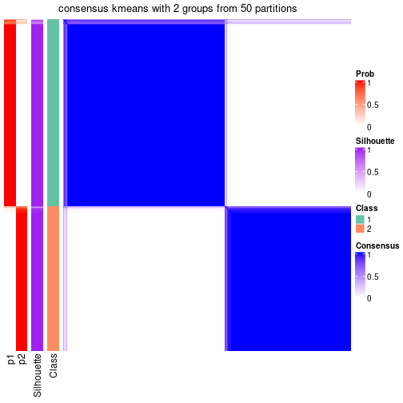</p>

</div>
<div id='tab-node-02-consensus-heatmap-2'>
<pre><code class="r">consensus_heatmap(res, k = 3)
</code></pre>

<p>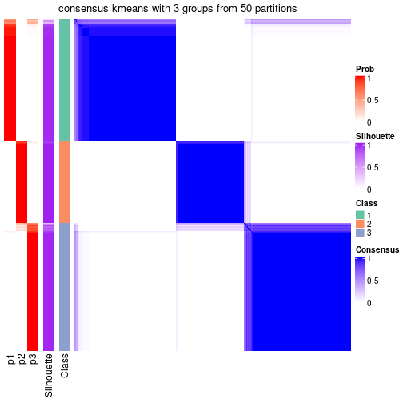</p>

</div>
<div id='tab-node-02-consensus-heatmap-3'>
<pre><code class="r">consensus_heatmap(res, k = 4)
</code></pre>

<p>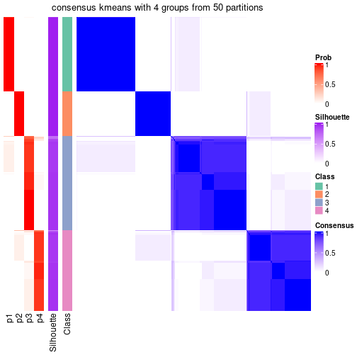</p>

</div>
<div id='tab-node-02-consensus-heatmap-4'>
<pre><code class="r">consensus_heatmap(res, k = 5)
</code></pre>

<p>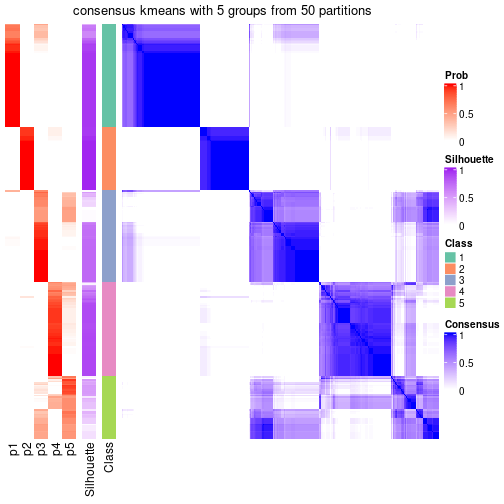</p>

</div>
<div id='tab-node-02-consensus-heatmap-5'>
<pre><code class="r">consensus_heatmap(res, k = 6)
</code></pre>

<p>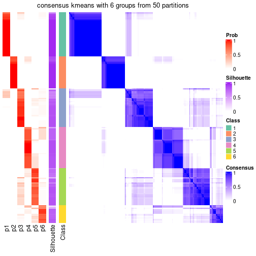</p>

</div>
<div id='tab-node-02-consensus-heatmap-6'>
<pre><code class="r">consensus_heatmap(res, k = 7)
</code></pre>

<p>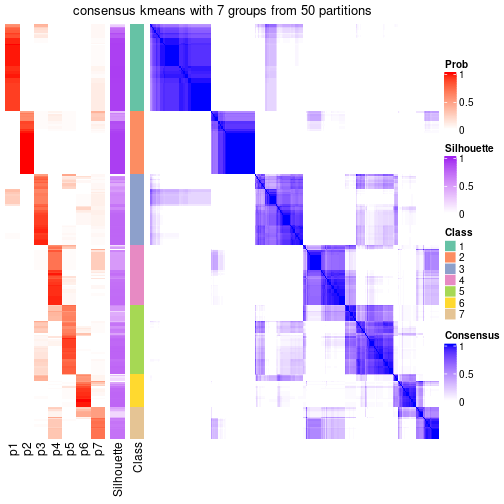</p>

</div>
<div id='tab-node-02-consensus-heatmap-7'>
<pre><code class="r">consensus_heatmap(res, k = 8)
</code></pre>

<p>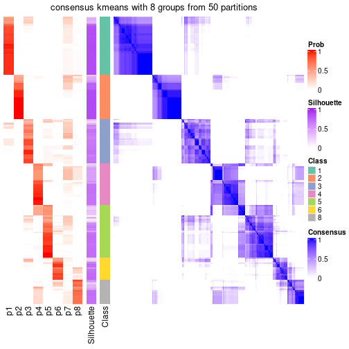</p>

</div>
</div>

Heatmaps for the membership of samples in all partitions to see how consistent they are:


<script>
$( function() {
	$( '#tabs-node-02-membership-heatmap' ).tabs();
} );
</script>
<div id='tabs-node-02-membership-heatmap'>
<ul>
<li><a href='#tab-node-02-membership-heatmap-1'>k = 2</a></li>
<li><a href='#tab-node-02-membership-heatmap-2'>k = 3</a></li>
<li><a href='#tab-node-02-membership-heatmap-3'>k = 4</a></li>
<li><a href='#tab-node-02-membership-heatmap-4'>k = 5</a></li>
<li><a href='#tab-node-02-membership-heatmap-5'>k = 6</a></li>
<li><a href='#tab-node-02-membership-heatmap-6'>k = 7</a></li>
<li><a href='#tab-node-02-membership-heatmap-7'>k = 8</a></li>
</ul>
<div id='tab-node-02-membership-heatmap-1'>
<pre><code class="r">membership_heatmap(res, k = 2)
</code></pre>

<p>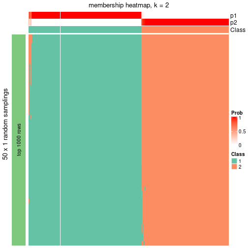</p>

</div>
<div id='tab-node-02-membership-heatmap-2'>
<pre><code class="r">membership_heatmap(res, k = 3)
</code></pre>

<p>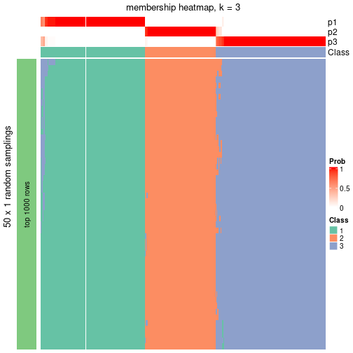</p>

</div>
<div id='tab-node-02-membership-heatmap-3'>
<pre><code class="r">membership_heatmap(res, k = 4)
</code></pre>

<p>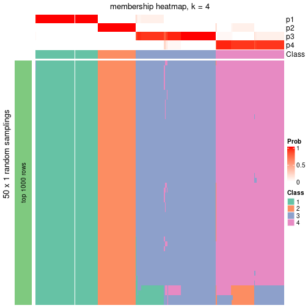</p>

</div>
<div id='tab-node-02-membership-heatmap-4'>
<pre><code class="r">membership_heatmap(res, k = 5)
</code></pre>

<p>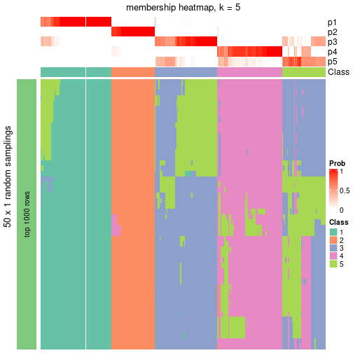</p>

</div>
<div id='tab-node-02-membership-heatmap-5'>
<pre><code class="r">membership_heatmap(res, k = 6)
</code></pre>

<p>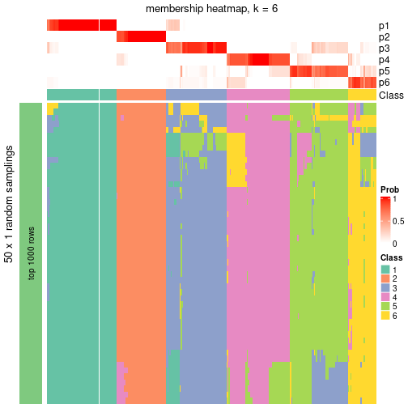</p>

</div>
<div id='tab-node-02-membership-heatmap-6'>
<pre><code class="r">membership_heatmap(res, k = 7)
</code></pre>

<p>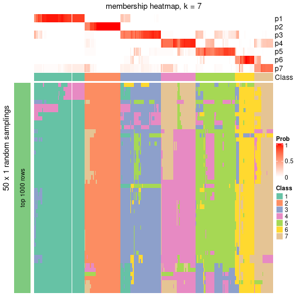</p>

</div>
<div id='tab-node-02-membership-heatmap-7'>
<pre><code class="r">membership_heatmap(res, k = 8)
</code></pre>

<p>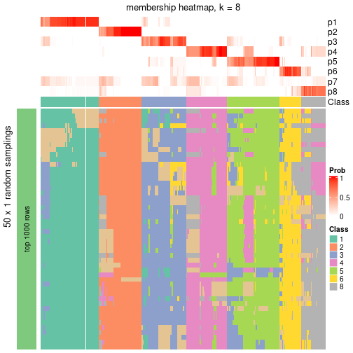</p>

</div>
</div>

As soon as the classes for columns are determined, the signatures
that are significantly different between subgroups can be looked for. 
Following are the heatmaps for signatures.


<script>
$( function() {
	$( '#tabs-node-02-get-signatures' ).tabs();
} );
</script>
<div id='tabs-node-02-get-signatures'>
<ul>
<li><a href='#tab-node-02-get-signatures-1'>k = 2</a></li>
<li><a href='#tab-node-02-get-signatures-2'>k = 3</a></li>
<li><a href='#tab-node-02-get-signatures-3'>k = 4</a></li>
<li><a href='#tab-node-02-get-signatures-4'>k = 5</a></li>
<li><a href='#tab-node-02-get-signatures-5'>k = 6</a></li>
<li><a href='#tab-node-02-get-signatures-6'>k = 7</a></li>
<li><a href='#tab-node-02-get-signatures-7'>k = 8</a></li>
</ul>
<div id='tab-node-02-get-signatures-1'>
<pre><code class="r">get_signatures(res, k = 2)
</code></pre>

<p>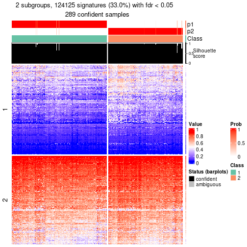</p>

</div>
<div id='tab-node-02-get-signatures-2'>
<pre><code class="r">get_signatures(res, k = 3)
</code></pre>

<p>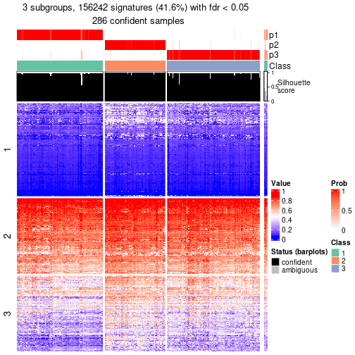</p>

</div>
<div id='tab-node-02-get-signatures-3'>
<pre><code class="r">get_signatures(res, k = 4)
</code></pre>

<p>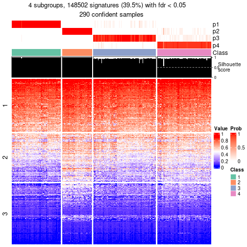</p>

</div>
<div id='tab-node-02-get-signatures-4'>
<pre><code class="r">get_signatures(res, k = 5)
</code></pre>

<p>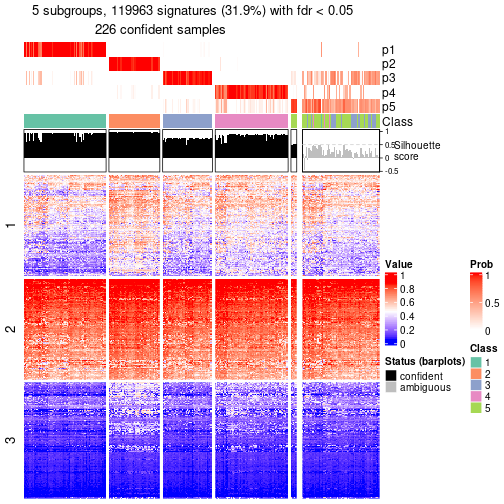</p>

</div>
<div id='tab-node-02-get-signatures-5'>
<pre><code class="r">get_signatures(res, k = 6)
</code></pre>

<p>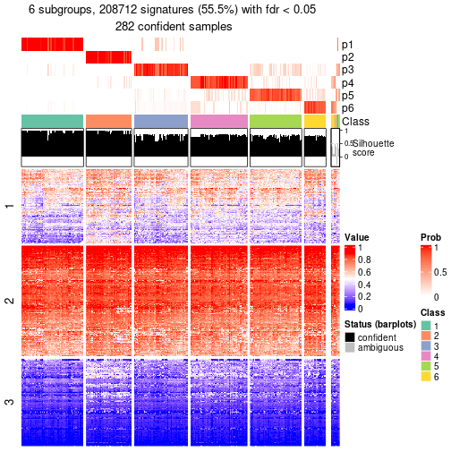</p>

</div>
<div id='tab-node-02-get-signatures-6'>
<pre><code class="r">get_signatures(res, k = 7)
</code></pre>

<p>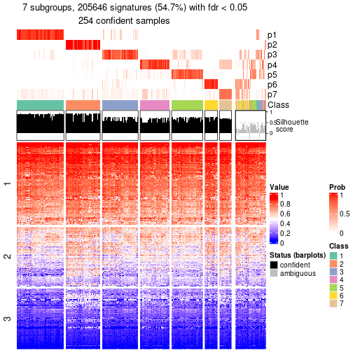</p>

</div>
<div id='tab-node-02-get-signatures-7'>
<pre><code class="r">get_signatures(res, k = 8)
</code></pre>

<p>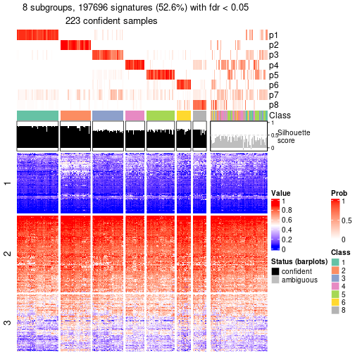</p>

</div>
</div>


Compare the overlap of signatures from different k:

```r
compare_signatures(res)
```

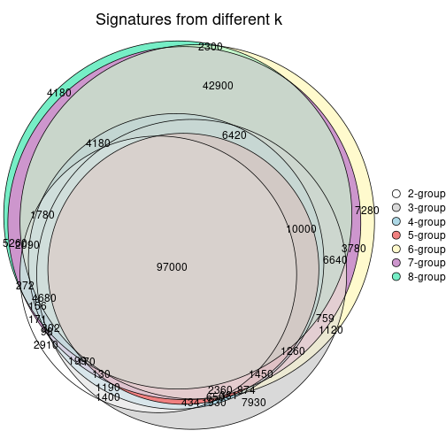

`get_signature()` returns a data frame invisibly. To get the list of signatures, the function
call should be assigned to a variable explicitly. In following code, if `plot` argument is set
to `FALSE`, no heatmap is plotted while only the differential analysis is performed.

```r
# code only for demonstration
tb = get_signature(res, k = ..., plot = FALSE)
```

An example of the output of `tb` is:

```
#>   which_row         fdr    mean_1    mean_2 scaled_mean_1 scaled_mean_2 km
#> 1        38 0.042760348  8.373488  9.131774    -0.5533452     0.5164555  1
#> 2        40 0.018707592  7.106213  8.469186    -0.6173731     0.5762149  1
#> 3        55 0.019134737 10.221463 11.207825    -0.6159697     0.5749050  1
#> 4        59 0.006059896  5.921854  7.869574    -0.6899429     0.6439467  1
#> 5        60 0.018055526  8.928898 10.211722    -0.6204761     0.5791110  1
#> 6        98 0.009384629 15.714769 14.887706     0.6635654    -0.6193277  2
...
```

The columns in `tb` are:

1. `which_row`: row indices corresponding to the input matrix.
2. `fdr`: FDR for the differential test. 
3. `mean_x`: The mean value in group x.
4. `scaled_mean_x`: The mean value in group x after rows are scaled.
5. `km`: Row groups if k-means clustering is applied to rows (which is done by automatically selecting number of clusters).

If there are too many signatures, `top_signatures = ...` can be set to only show the 
signatures with the highest FDRs:

```r
# code only for demonstration
# e.g. to show the top 500 most significant rows
tb = get_signature(res, k = ..., top_signatures = 500)
```

If the signatures are defined as these which are uniquely high in current group, `diff_method` argument
can be set to `"uniquely_high_in_one_group"`:

```r
# code only for demonstration
tb = get_signature(res, k = ..., diff_method = "uniquely_high_in_one_group")
```


UMAP plot which shows how samples are separated.


<script>
$( function() {
	$( '#tabs-node-02-dimension-reduction' ).tabs();
} );
</script>
<div id='tabs-node-02-dimension-reduction'>
<ul>
<li><a href='#tab-node-02-dimension-reduction-1'>k = 2</a></li>
<li><a href='#tab-node-02-dimension-reduction-2'>k = 3</a></li>
<li><a href='#tab-node-02-dimension-reduction-3'>k = 4</a></li>
<li><a href='#tab-node-02-dimension-reduction-4'>k = 5</a></li>
<li><a href='#tab-node-02-dimension-reduction-5'>k = 6</a></li>
<li><a href='#tab-node-02-dimension-reduction-6'>k = 7</a></li>
<li><a href='#tab-node-02-dimension-reduction-7'>k = 8</a></li>
</ul>
<div id='tab-node-02-dimension-reduction-1'>
<pre><code class="r">dimension_reduction(res, k = 2, method = &quot;UMAP&quot;)
</code></pre>

<p>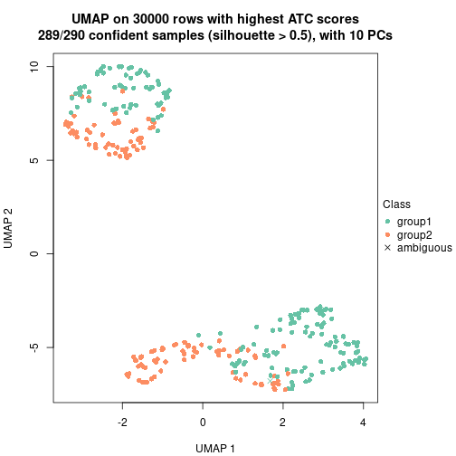</p>

</div>
<div id='tab-node-02-dimension-reduction-2'>
<pre><code class="r">dimension_reduction(res, k = 3, method = &quot;UMAP&quot;)
</code></pre>

<p>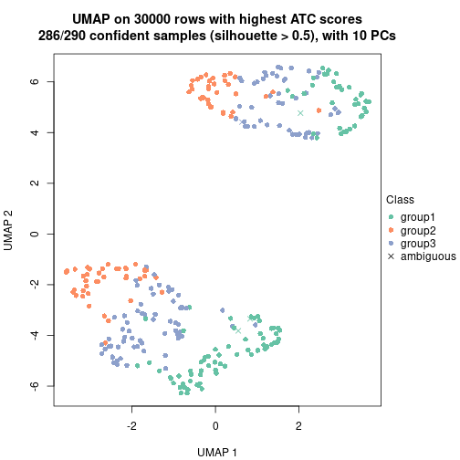</p>

</div>
<div id='tab-node-02-dimension-reduction-3'>
<pre><code class="r">dimension_reduction(res, k = 4, method = &quot;UMAP&quot;)
</code></pre>

<p>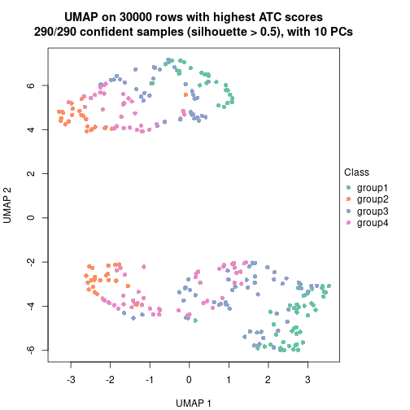</p>

</div>
<div id='tab-node-02-dimension-reduction-4'>
<pre><code class="r">dimension_reduction(res, k = 5, method = &quot;UMAP&quot;)
</code></pre>

<p>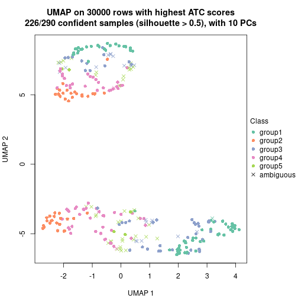</p>

</div>
<div id='tab-node-02-dimension-reduction-5'>
<pre><code class="r">dimension_reduction(res, k = 6, method = &quot;UMAP&quot;)
</code></pre>

<p>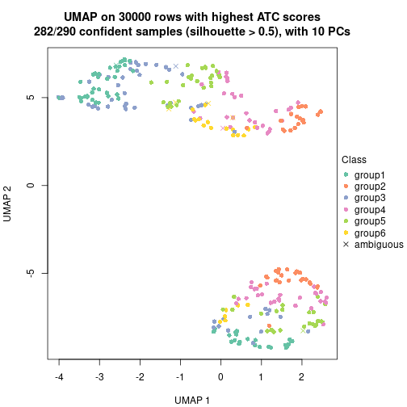</p>

</div>
<div id='tab-node-02-dimension-reduction-6'>
<pre><code class="r">dimension_reduction(res, k = 7, method = &quot;UMAP&quot;)
</code></pre>

<p>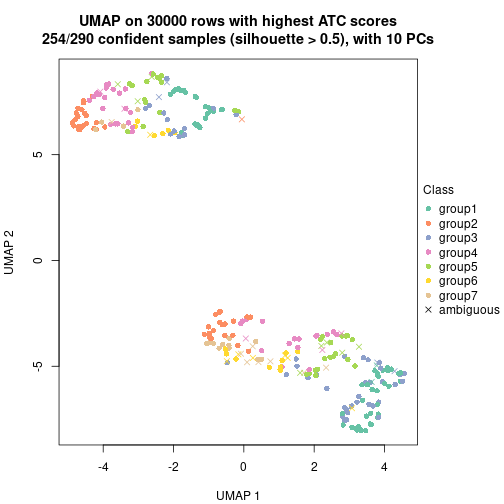</p>

</div>
<div id='tab-node-02-dimension-reduction-7'>
<pre><code class="r">dimension_reduction(res, k = 8, method = &quot;UMAP&quot;)
</code></pre>

<p>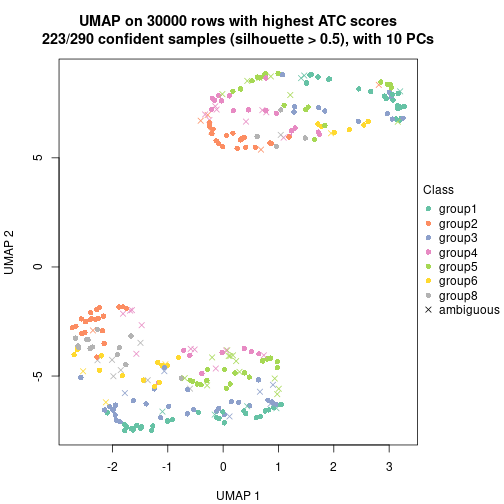</p>

</div>
</div>


Following heatmap shows how subgroups are split when increasing `k`:

```r
collect_classes(res)
```

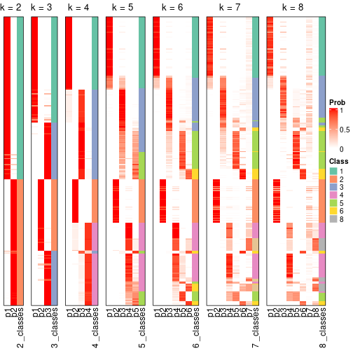


If matrix rows can be associated to genes, consider to use `functional_enrichment(res,
...)` to perform function enrichment for the signature genes. See [this vignette](https://jokergoo.github.io/cola_vignettes/functional_enrichment.html) for more detailed explanations.


 

---------------------------------------------------


### Node021


Parent node: [Node02](#Node02).
Child nodes: 
                Node0111-leaf
        ,
                Node0112-leaf
        ,
                Node0113-leaf
        ,
                Node0114-leaf
        ,
                Node0121-leaf
        ,
                Node0122-leaf
        ,
                Node0123-leaf
        ,
                Node0131-leaf
        ,
                Node0132-leaf
        ,
                Node0133-leaf
        ,
                Node0134-leaf
        ,
                Node0211-leaf
        ,
                Node0212-leaf
        ,
                [Node0213](#Node0213)
        ,
                Node0214-leaf
        ,
                [Node0221](#Node0221)
        ,
                Node0222-leaf
        ,
                Node0223-leaf
        ,
                [Node0231](#Node0231)
        ,
                Node0232-leaf
        ,
                Node0233-leaf
        ,
                [Node0234](#Node0234)
        ,
                Node0235-leaf
        ,
                Node0241-leaf
        ,
                [Node0242](#Node0242)
        ,
                Node0411-leaf
        ,
                Node0412-leaf
        ,
                Node0421-leaf
        ,
                Node0422-leaf
        ,
                Node0423-leaf
        ,
                Node0431-leaf
        ,
                Node0432-leaf
        ,
                Node0511-leaf
        ,
                Node0512-leaf
        ,
                Node0513-leaf
        ,
                Node0514-leaf
        ,
                Node0521-leaf
        ,
                Node0522-leaf
        ,
                Node0523-leaf
        ,
                Node0524-leaf
        ,
                Node0525-leaf
        ,
                Node0611-leaf
        ,
                [Node0612](#Node0612)
        ,
                Node0613-leaf
        ,
                [Node0711](#Node0711)
        ,
                Node0712-leaf
        ,
                Node0713-leaf
        ,
                [Node0721](#Node0721)
        ,
                Node0722-leaf
        ,
                Node0731-leaf
        ,
                Node0732-leaf
        ,
                Node0733-leaf
        .


The object with results only for a single top-value method and a single partitioning method 
can be extracted as:

```r
res = res_rh["021"]
```

A summary of `res` and all the functions that can be applied to it:

```r
res
```

```
#> A 'ConsensusPartition' object with k = 2, 3, 4, 5, 6, 7, 8.
#>   On a matrix with 30000 rows and 73 columns.
#>   Top rows (1000) are extracted by 'ATC' method.
#>   Subgroups are detected by 'kmeans' method.
#>   Performed in total 350 partitions by row resampling.
#>   Best k for subgroups seems to be 4.
#> 
#> Following methods can be applied to this 'ConsensusPartition' object:
#>  [1] "cola_report"             "collect_classes"         "collect_plots"          
#>  [4] "collect_stats"           "colnames"                "compare_partitions"     
#>  [7] "compare_signatures"      "consensus_heatmap"       "dimension_reduction"    
#> [10] "functional_enrichment"   "get_anno_col"            "get_anno"               
#> [13] "get_classes"             "get_consensus"           "get_matrix"             
#> [16] "get_membership"          "get_param"               "get_signatures"         
#> [19] "get_stats"               "is_best_k"               "is_stable_k"            
#> [22] "membership_heatmap"      "ncol"                    "nrow"                   
#> [25] "plot_ecdf"               "predict_classes"         "rownames"               
#> [28] "select_partition_number" "show"                    "suggest_best_k"         
#> [31] "test_to_known_factors"   "top_rows_heatmap"
```

`collect_plots()` function collects all the plots made from `res` for all `k` (number of subgroups)
into one single page to provide an easy and fast comparison between different `k`.

```r
collect_plots(res)
```

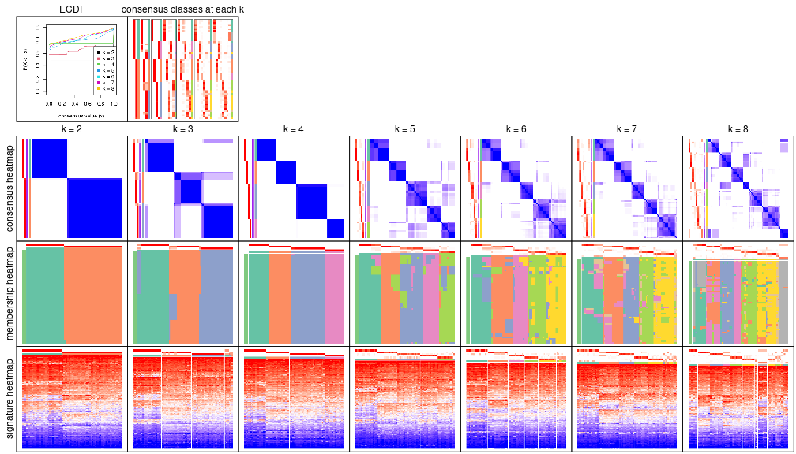

The plots are:

- The first row: a plot of the eCDF (empirical cumulative distribution
  function) curves of the consensus matrix for each `k` and the heatmap of
  predicted classes for each `k`.
- The second row: heatmaps of the consensus matrix for each `k`.
- The third row: heatmaps of the membership matrix for each `k`.
- The fouth row: heatmaps of the signatures for each `k`.

All the plots in panels can be made by individual functions and they are
plotted later in this section.

`select_partition_number()` produces several plots showing different
statistics for choosing "optimized" `k`. There are following statistics:

- eCDF curves of the consensus matrix for each `k`;
- 1-PAC. [The PAC score](https://en.wikipedia.org/wiki/Consensus_clustering#Over-interpretation_potential_of_consensus_clustering)
  measures the proportion of the ambiguous subgrouping.
- Mean silhouette score.
- Concordance. The mean probability of fiting the consensus subgroup labels in all
  partitions.
- Area increased. Denote $A_k$ as the area under the eCDF curve for current
  `k`, the area increased is defined as $A_k - A_{k-1}$.
- Rand index. The percent of pairs of samples that are both in a same cluster
  or both are not in a same cluster in the partition of k and k-1.
- Jaccard index. The ratio of pairs of samples are both in a same cluster in
  the partition of k and k-1 and the pairs of samples are both in a same
  cluster in the partition k or k-1.

The detailed explanations of these statistics can be found in [the _cola_
vignette](https://jokergoo.github.io/cola_vignettes/cola.html#toc_13).

Generally speaking, higher 1-PAC score, higher mean silhouette score or higher
concordance corresponds to better partition. Rand index and Jaccard index
measure how similar the current partition is compared to partition with `k-1`.
If they are too similar, we won't accept `k` is better than `k-1`.

```r
select_partition_number(res)
```

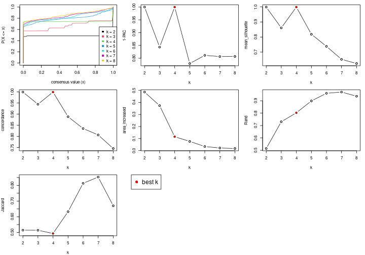

The numeric values for all these statistics can be obtained by `get_stats()`.

```r
get_stats(res)
```

```
#>   k 1-PAC mean_silhouette concordance area_increased  Rand Jaccard
#> 2 2 1.000           0.999       0.999         0.4863 0.514   0.514
#> 3 3 0.843           0.861       0.945         0.3735 0.731   0.514
#> 4 4 1.000           0.999       0.999         0.1150 0.803   0.493
#> 5 5 0.779           0.818       0.888         0.0762 0.899   0.633
#> 6 6 0.811           0.738       0.835         0.0336 0.960   0.814
#> 7 7 0.806           0.652       0.807         0.0213 0.970   0.853
#> 8 8 0.807           0.624       0.745         0.0171 0.937   0.670
```

`suggest_best_k()` suggests the best $k$ based on these statistics. The rules are as follows:

- All $k$ with Jaccard index larger than 0.95 are removed because increasing
  $k$ does not provide enough extra information. If all $k$ are removed, it is
  marked as no subgroup is detected.
- For all $k$ with 1-PAC score larger than 0.9, the maximal $k$ is taken as
  the best $k$, and other $k$ are marked as optional $k$.
- If it does not fit the second rule. The $k$ with the maximal vote of the
  highest 1-PAC score, highest mean silhouette, and highest concordance is
  taken as the best $k$.

```r
suggest_best_k(res)
```

```
#> [1] 4
#> attr(,"optional")
#> [1] 2
```

There is also optional best $k$ = 2 that is worth to check.

Following is the table of the partitions (You need to click the **show/hide
code output** link to see it). The membership matrix (columns with name `p*`)
is inferred by
[`clue::cl_consensus()`](https://www.rdocumentation.org/link/cl_consensus?package=clue)
function with the `SE` method. Basically the value in the membership matrix
represents the probability to belong to a certain group. The finall subgroup
label for an item is determined with the group with highest probability it
belongs to.

In `get_classes()` function, the entropy is calculated from the membership
matrix and the silhouette score is calculated from the consensus matrix.


<script>
$( function() {
	$( '#tabs-node-021-get-classes' ).tabs();
} );
</script>
<div id='tabs-node-021-get-classes'>
<ul>
<li><a href='#tab-node-021-get-classes-1'>k = 2</a></li>
<li><a href='#tab-node-021-get-classes-2'>k = 3</a></li>
<li><a href='#tab-node-021-get-classes-3'>k = 4</a></li>
<li><a href='#tab-node-021-get-classes-4'>k = 5</a></li>
<li><a href='#tab-node-021-get-classes-5'>k = 6</a></li>
<li><a href='#tab-node-021-get-classes-6'>k = 7</a></li>
<li><a href='#tab-node-021-get-classes-7'>k = 8</a></li>
</ul>

<div id='tab-node-021-get-classes-1'>
<p><a id='tab-node-021-get-classes-1-a' style='color:#0366d6' href='#'>show/hide code output</a></p>
<pre><code class="r">cbind(get_classes(res, k = 2), get_membership(res, k = 2))
</code></pre>

<pre><code>#&gt;                 class entropy silhouette   p1   p2
#&gt; TCGA.97.A4M1.01     1   0.000      1.000 1.00 0.00
#&gt; TCGA.99.8033.01     2   0.000      0.999 0.00 1.00
#&gt; TCGA.97.8552.01     1   0.000      1.000 1.00 0.00
#&gt; TCGA.50.5066.01     2   0.000      0.999 0.00 1.00
#&gt; TCGA.55.8208.01     2   0.000      0.999 0.00 1.00
#&gt; TCGA.85.8584.01     2   0.000      0.999 0.00 1.00
#&gt; TCGA.75.6206.01     1   0.000      1.000 1.00 0.00
#&gt; TCGA.05.4384.01     1   0.000      1.000 1.00 0.00
#&gt; TCGA.55.8087.01     1   0.000      1.000 1.00 0.00
#&gt; TCGA.85.A50M.01     2   0.000      0.999 0.00 1.00
#&gt; TCGA.MP.A4TH.01     2   0.000      0.999 0.00 1.00
#&gt; TCGA.55.6971.01     2   0.000      0.999 0.00 1.00
#&gt; TCGA.98.7454.01     2   0.000      0.999 0.00 1.00
#&gt; TCGA.50.5944.01     1   0.000      1.000 1.00 0.00
#&gt; TCGA.97.7547.01     1   0.000      1.000 1.00 0.00
#&gt; TCGA.69.7973.01     1   0.000      1.000 1.00 0.00
#&gt; TCGA.97.8177.01     2   0.000      0.999 0.00 1.00
#&gt; TCGA.91.A4BD.01     1   0.000      1.000 1.00 0.00
#&gt; TCGA.55.6979.01     2   0.000      0.999 0.00 1.00
#&gt; TCGA.55.7573.01     2   0.242      0.958 0.04 0.96
#&gt; TCGA.55.8097.01     1   0.000      1.000 1.00 0.00
#&gt; TCGA.93.A4JP.01     2   0.000      0.999 0.00 1.00
#&gt; TCGA.S2.AA1A.01     2   0.000      0.999 0.00 1.00
#&gt; TCGA.93.A4JQ.01     2   0.000      0.999 0.00 1.00
#&gt; TCGA.78.7160.01     2   0.000      0.999 0.00 1.00
#&gt; TCGA.44.7671.01     1   0.000      1.000 1.00 0.00
#&gt; TCGA.50.5055.01     2   0.000      0.999 0.00 1.00
#&gt; TCGA.91.8496.01     1   0.000      1.000 1.00 0.00
#&gt; TCGA.MP.A4T2.01     1   0.000      1.000 1.00 0.00
#&gt; TCGA.78.7162.01     1   0.000      1.000 1.00 0.00
#&gt; TCGA.93.7348.01     2   0.000      0.999 0.00 1.00
#&gt; TCGA.97.7546.01     1   0.000      1.000 1.00 0.00
#&gt; TCGA.95.7944.01     2   0.000      0.999 0.00 1.00
#&gt; TCGA.86.8280.01     1   0.000      1.000 1.00 0.00
#&gt; TCGA.55.A48Z.01     2   0.000      0.999 0.00 1.00
#&gt; TCGA.55.8299.01     2   0.000      0.999 0.00 1.00
#&gt; TCGA.55.6980.01     2   0.000      0.999 0.00 1.00
#&gt; TCGA.62.8397.01     1   0.000      1.000 1.00 0.00
#&gt; TCGA.50.5936.01     2   0.000      0.999 0.00 1.00
#&gt; TCGA.55.8621.01     2   0.000      0.999 0.00 1.00
#&gt; TCGA.44.A4SS.01     2   0.000      0.999 0.00 1.00
#&gt; TCGA.63.A5MN.01     2   0.000      0.999 0.00 1.00
#&gt; TCGA.78.8648.01     2   0.000      0.999 0.00 1.00
#&gt; TCGA.NC.A5HJ.01     2   0.000      0.999 0.00 1.00
#&gt; TCGA.97.A4LX.01     2   0.000      0.999 0.00 1.00
#&gt; TCGA.97.A4M5.01     2   0.000      0.999 0.00 1.00
#&gt; TCGA.44.5645.01     1   0.000      1.000 1.00 0.00
#&gt; TCGA.NJ.A55O.01     1   0.000      1.000 1.00 0.00
#&gt; TCGA.44.6145.01     2   0.000      0.999 0.00 1.00
#&gt; TCGA.97.A4M6.01     2   0.000      0.999 0.00 1.00
#&gt; TCGA.MP.A4TJ.01     2   0.000      0.999 0.00 1.00
#&gt; TCGA.50.5939.01     2   0.000      0.999 0.00 1.00
#&gt; TCGA.49.4487.01     2   0.000      0.999 0.00 1.00
#&gt; TCGA.55.8206.01     1   0.000      1.000 1.00 0.00
#&gt; TCGA.97.7553.01     2   0.000      0.999 0.00 1.00
#&gt; TCGA.64.5778.01     1   0.000      1.000 1.00 0.00
#&gt; TCGA.55.7728.01     2   0.000      0.999 0.00 1.00
#&gt; TCGA.44.6774.01     2   0.000      0.999 0.00 1.00
#&gt; TCGA.49.AAQV.01     2   0.000      0.999 0.00 1.00
#&gt; TCGA.73.7498.01     1   0.000      1.000 1.00 0.00
#&gt; TCGA.78.7163.01     1   0.000      1.000 1.00 0.00
#&gt; TCGA.75.7030.01     2   0.000      0.999 0.00 1.00
#&gt; TCGA.75.7025.01     1   0.000      1.000 1.00 0.00
#&gt; TCGA.38.A44F.01     2   0.000      0.999 0.00 1.00
#&gt; TCGA.55.8091.01     1   0.000      1.000 1.00 0.00
#&gt; TCGA.75.6212.01     1   0.000      1.000 1.00 0.00
#&gt; TCGA.44.6776.01     1   0.000      1.000 1.00 0.00
#&gt; TCGA.50.5045.01     2   0.000      0.999 0.00 1.00
#&gt; TCGA.95.A4VP.01     2   0.000      0.999 0.00 1.00
#&gt; TCGA.55.A492.01     1   0.000      1.000 1.00 0.00
#&gt; TCGA.55.6543.01     1   0.000      1.000 1.00 0.00
#&gt; TCGA.97.A4M2.01     2   0.000      0.999 0.00 1.00
#&gt; TCGA.55.6970.01     2   0.000      0.999 0.00 1.00
</code></pre>

<script>
$('#tab-node-021-get-classes-1-a').parent().next().next().hide();
$('#tab-node-021-get-classes-1-a').click(function(){
  $('#tab-node-021-get-classes-1-a').parent().next().next().toggle();
  return(false);
});
</script>
</div>

<div id='tab-node-021-get-classes-2'>
<p><a id='tab-node-021-get-classes-2-a' style='color:#0366d6' href='#'>show/hide code output</a></p>
<pre><code class="r">cbind(get_classes(res, k = 3), get_membership(res, k = 3))
</code></pre>

<pre><code>#&gt;                 class entropy silhouette   p1   p2   p3
#&gt; TCGA.97.A4M1.01     1   0.000     0.9351 1.00 0.00 0.00
#&gt; TCGA.99.8033.01     2   0.631     0.1268 0.00 0.50 0.50
#&gt; TCGA.97.8552.01     1   0.000     0.9351 1.00 0.00 0.00
#&gt; TCGA.50.5066.01     2   0.000     0.9061 0.00 1.00 0.00
#&gt; TCGA.55.8208.01     2   0.000     0.9061 0.00 1.00 0.00
#&gt; TCGA.85.8584.01     2   0.000     0.9061 0.00 1.00 0.00
#&gt; TCGA.75.6206.01     1   0.000     0.9351 1.00 0.00 0.00
#&gt; TCGA.05.4384.01     1   0.000     0.9351 1.00 0.00 0.00
#&gt; TCGA.55.8087.01     1   0.000     0.9351 1.00 0.00 0.00
#&gt; TCGA.85.A50M.01     2   0.000     0.9061 0.00 1.00 0.00
#&gt; TCGA.MP.A4TH.01     3   0.000     0.9641 0.00 0.00 1.00
#&gt; TCGA.55.6971.01     3   0.000     0.9641 0.00 0.00 1.00
#&gt; TCGA.98.7454.01     2   0.000     0.9061 0.00 1.00 0.00
#&gt; TCGA.50.5944.01     1   0.000     0.9351 1.00 0.00 0.00
#&gt; TCGA.97.7547.01     1   0.000     0.9351 1.00 0.00 0.00
#&gt; TCGA.69.7973.01     1   0.000     0.9351 1.00 0.00 0.00
#&gt; TCGA.97.8177.01     3   0.000     0.9641 0.00 0.00 1.00
#&gt; TCGA.91.A4BD.01     1   0.628     0.2554 0.54 0.00 0.46
#&gt; TCGA.55.6979.01     2   0.000     0.9061 0.00 1.00 0.00
#&gt; TCGA.55.7573.01     3   0.000     0.9641 0.00 0.00 1.00
#&gt; TCGA.55.8097.01     1   0.000     0.9351 1.00 0.00 0.00
#&gt; TCGA.93.A4JP.01     3   0.000     0.9641 0.00 0.00 1.00
#&gt; TCGA.S2.AA1A.01     3   0.000     0.9641 0.00 0.00 1.00
#&gt; TCGA.93.A4JQ.01     2   0.000     0.9061 0.00 1.00 0.00
#&gt; TCGA.78.7160.01     3   0.628    -0.0492 0.00 0.46 0.54
#&gt; TCGA.44.7671.01     1   0.000     0.9351 1.00 0.00 0.00
#&gt; TCGA.50.5055.01     2   0.000     0.9061 0.00 1.00 0.00
#&gt; TCGA.91.8496.01     1   0.000     0.9351 1.00 0.00 0.00
#&gt; TCGA.MP.A4T2.01     1   0.000     0.9351 1.00 0.00 0.00
#&gt; TCGA.78.7162.01     3   0.000     0.9641 0.00 0.00 1.00
#&gt; TCGA.93.7348.01     3   0.000     0.9641 0.00 0.00 1.00
#&gt; TCGA.97.7546.01     1   0.000     0.9351 1.00 0.00 0.00
#&gt; TCGA.95.7944.01     2   0.000     0.9061 0.00 1.00 0.00
#&gt; TCGA.86.8280.01     3   0.000     0.9641 0.00 0.00 1.00
#&gt; TCGA.55.A48Z.01     3   0.000     0.9641 0.00 0.00 1.00
#&gt; TCGA.55.8299.01     2   0.000     0.9061 0.00 1.00 0.00
#&gt; TCGA.55.6980.01     3   0.000     0.9641 0.00 0.00 1.00
#&gt; TCGA.62.8397.01     1   0.000     0.9351 1.00 0.00 0.00
#&gt; TCGA.50.5936.01     3   0.000     0.9641 0.00 0.00 1.00
#&gt; TCGA.55.8621.01     2   0.540     0.6672 0.00 0.72 0.28
#&gt; TCGA.44.A4SS.01     2   0.000     0.9061 0.00 1.00 0.00
#&gt; TCGA.63.A5MN.01     2   0.000     0.9061 0.00 1.00 0.00
#&gt; TCGA.78.8648.01     2   0.000     0.9061 0.00 1.00 0.00
#&gt; TCGA.NC.A5HJ.01     3   0.556     0.4793 0.00 0.30 0.70
#&gt; TCGA.97.A4LX.01     2   0.000     0.9061 0.00 1.00 0.00
#&gt; TCGA.97.A4M5.01     3   0.000     0.9641 0.00 0.00 1.00
#&gt; TCGA.44.5645.01     1   0.000     0.9351 1.00 0.00 0.00
#&gt; TCGA.NJ.A55O.01     3   0.000     0.9641 0.00 0.00 1.00
#&gt; TCGA.44.6145.01     2   0.000     0.9061 0.00 1.00 0.00
#&gt; TCGA.97.A4M6.01     3   0.000     0.9641 0.00 0.00 1.00
#&gt; TCGA.MP.A4TJ.01     2   0.540     0.6672 0.00 0.72 0.28
#&gt; TCGA.50.5939.01     2   0.000     0.9061 0.00 1.00 0.00
#&gt; TCGA.49.4487.01     2   0.000     0.9061 0.00 1.00 0.00
#&gt; TCGA.55.8206.01     1   0.000     0.9351 1.00 0.00 0.00
#&gt; TCGA.97.7553.01     3   0.000     0.9641 0.00 0.00 1.00
#&gt; TCGA.64.5778.01     3   0.000     0.9641 0.00 0.00 1.00
#&gt; TCGA.55.7728.01     3   0.000     0.9641 0.00 0.00 1.00
#&gt; TCGA.44.6774.01     3   0.000     0.9641 0.00 0.00 1.00
#&gt; TCGA.49.AAQV.01     2   0.540     0.6672 0.00 0.72 0.28
#&gt; TCGA.73.7498.01     1   0.000     0.9351 1.00 0.00 0.00
#&gt; TCGA.78.7163.01     1   0.000     0.9351 1.00 0.00 0.00
#&gt; TCGA.75.7030.01     3   0.000     0.9641 0.00 0.00 1.00
#&gt; TCGA.75.7025.01     1   0.628     0.2554 0.54 0.00 0.46
#&gt; TCGA.38.A44F.01     2   0.540     0.6672 0.00 0.72 0.28
#&gt; TCGA.55.8091.01     1   0.628     0.2554 0.54 0.00 0.46
#&gt; TCGA.75.6212.01     3   0.000     0.9641 0.00 0.00 1.00
#&gt; TCGA.44.6776.01     1   0.000     0.9351 1.00 0.00 0.00
#&gt; TCGA.50.5045.01     2   0.540     0.6672 0.00 0.72 0.28
#&gt; TCGA.95.A4VP.01     3   0.000     0.9641 0.00 0.00 1.00
#&gt; TCGA.55.A492.01     1   0.000     0.9351 1.00 0.00 0.00
#&gt; TCGA.55.6543.01     1   0.000     0.9351 1.00 0.00 0.00
#&gt; TCGA.97.A4M2.01     3   0.000     0.9641 0.00 0.00 1.00
#&gt; TCGA.55.6970.01     3   0.000     0.9641 0.00 0.00 1.00
</code></pre>

<script>
$('#tab-node-021-get-classes-2-a').parent().next().next().hide();
$('#tab-node-021-get-classes-2-a').click(function(){
  $('#tab-node-021-get-classes-2-a').parent().next().next().toggle();
  return(false);
});
</script>
</div>

<div id='tab-node-021-get-classes-3'>
<p><a id='tab-node-021-get-classes-3-a' style='color:#0366d6' href='#'>show/hide code output</a></p>
<pre><code class="r">cbind(get_classes(res, k = 4), get_membership(res, k = 4))
</code></pre>

<pre><code>#&gt;                 class entropy silhouette p1 p2   p3   p4
#&gt; TCGA.97.A4M1.01     1  0.0000      1.000  1  0 0.00 0.00
#&gt; TCGA.99.8033.01     3  0.0000      0.998  0  0 1.00 0.00
#&gt; TCGA.97.8552.01     4  0.0000      1.000  0  0 0.00 1.00
#&gt; TCGA.50.5066.01     2  0.0000      1.000  0  1 0.00 0.00
#&gt; TCGA.55.8208.01     2  0.0000      1.000  0  1 0.00 0.00
#&gt; TCGA.85.8584.01     2  0.0000      1.000  0  1 0.00 0.00
#&gt; TCGA.75.6206.01     1  0.0000      1.000  1  0 0.00 0.00
#&gt; TCGA.05.4384.01     1  0.0000      1.000  1  0 0.00 0.00
#&gt; TCGA.55.8087.01     1  0.0000      1.000  1  0 0.00 0.00
#&gt; TCGA.85.A50M.01     2  0.0000      1.000  0  1 0.00 0.00
#&gt; TCGA.MP.A4TH.01     3  0.0707      0.980  0  0 0.98 0.02
#&gt; TCGA.55.6971.01     3  0.0000      0.998  0  0 1.00 0.00
#&gt; TCGA.98.7454.01     2  0.0000      1.000  0  1 0.00 0.00
#&gt; TCGA.50.5944.01     1  0.0000      1.000  1  0 0.00 0.00
#&gt; TCGA.97.7547.01     1  0.0000      1.000  1  0 0.00 0.00
#&gt; TCGA.69.7973.01     1  0.0000      1.000  1  0 0.00 0.00
#&gt; TCGA.97.8177.01     3  0.0000      0.998  0  0 1.00 0.00
#&gt; TCGA.91.A4BD.01     4  0.0000      1.000  0  0 0.00 1.00
#&gt; TCGA.55.6979.01     2  0.0000      1.000  0  1 0.00 0.00
#&gt; TCGA.55.7573.01     4  0.0000      1.000  0  0 0.00 1.00
#&gt; TCGA.55.8097.01     1  0.0000      1.000  1  0 0.00 0.00
#&gt; TCGA.93.A4JP.01     3  0.0000      0.998  0  0 1.00 0.00
#&gt; TCGA.S2.AA1A.01     3  0.0000      0.998  0  0 1.00 0.00
#&gt; TCGA.93.A4JQ.01     2  0.0000      1.000  0  1 0.00 0.00
#&gt; TCGA.78.7160.01     3  0.0000      0.998  0  0 1.00 0.00
#&gt; TCGA.44.7671.01     1  0.0000      1.000  1  0 0.00 0.00
#&gt; TCGA.50.5055.01     2  0.0000      1.000  0  1 0.00 0.00
#&gt; TCGA.91.8496.01     1  0.0000      1.000  1  0 0.00 0.00
#&gt; TCGA.MP.A4T2.01     4  0.0000      1.000  0  0 0.00 1.00
#&gt; TCGA.78.7162.01     4  0.0000      1.000  0  0 0.00 1.00
#&gt; TCGA.93.7348.01     3  0.0000      0.998  0  0 1.00 0.00
#&gt; TCGA.97.7546.01     4  0.0000      1.000  0  0 0.00 1.00
#&gt; TCGA.95.7944.01     2  0.0000      1.000  0  1 0.00 0.00
#&gt; TCGA.86.8280.01     4  0.0000      1.000  0  0 0.00 1.00
#&gt; TCGA.55.A48Z.01     3  0.0707      0.980  0  0 0.98 0.02
#&gt; TCGA.55.8299.01     2  0.0000      1.000  0  1 0.00 0.00
#&gt; TCGA.55.6980.01     3  0.0000      0.998  0  0 1.00 0.00
#&gt; TCGA.62.8397.01     1  0.0000      1.000  1  0 0.00 0.00
#&gt; TCGA.50.5936.01     3  0.0000      0.998  0  0 1.00 0.00
#&gt; TCGA.55.8621.01     3  0.0000      0.998  0  0 1.00 0.00
#&gt; TCGA.44.A4SS.01     2  0.0000      1.000  0  1 0.00 0.00
#&gt; TCGA.63.A5MN.01     2  0.0000      1.000  0  1 0.00 0.00
#&gt; TCGA.78.8648.01     2  0.0000      1.000  0  1 0.00 0.00
#&gt; TCGA.NC.A5HJ.01     3  0.0000      0.998  0  0 1.00 0.00
#&gt; TCGA.97.A4LX.01     2  0.0000      1.000  0  1 0.00 0.00
#&gt; TCGA.97.A4M5.01     3  0.0000      0.998  0  0 1.00 0.00
#&gt; TCGA.44.5645.01     4  0.0000      1.000  0  0 0.00 1.00
#&gt; TCGA.NJ.A55O.01     4  0.0000      1.000  0  0 0.00 1.00
#&gt; TCGA.44.6145.01     2  0.0000      1.000  0  1 0.00 0.00
#&gt; TCGA.97.A4M6.01     3  0.0000      0.998  0  0 1.00 0.00
#&gt; TCGA.MP.A4TJ.01     3  0.0000      0.998  0  0 1.00 0.00
#&gt; TCGA.50.5939.01     2  0.0000      1.000  0  1 0.00 0.00
#&gt; TCGA.49.4487.01     2  0.0000      1.000  0  1 0.00 0.00
#&gt; TCGA.55.8206.01     4  0.0000      1.000  0  0 0.00 1.00
#&gt; TCGA.97.7553.01     3  0.0000      0.998  0  0 1.00 0.00
#&gt; TCGA.64.5778.01     4  0.0000      1.000  0  0 0.00 1.00
#&gt; TCGA.55.7728.01     3  0.0000      0.998  0  0 1.00 0.00
#&gt; TCGA.44.6774.01     3  0.0000      0.998  0  0 1.00 0.00
#&gt; TCGA.49.AAQV.01     3  0.0000      0.998  0  0 1.00 0.00
#&gt; TCGA.73.7498.01     1  0.0000      1.000  1  0 0.00 0.00
#&gt; TCGA.78.7163.01     1  0.0000      1.000  1  0 0.00 0.00
#&gt; TCGA.75.7030.01     3  0.0000      0.998  0  0 1.00 0.00
#&gt; TCGA.75.7025.01     4  0.0000      1.000  0  0 0.00 1.00
#&gt; TCGA.38.A44F.01     3  0.0000      0.998  0  0 1.00 0.00
#&gt; TCGA.55.8091.01     4  0.0000      1.000  0  0 0.00 1.00
#&gt; TCGA.75.6212.01     4  0.0000      1.000  0  0 0.00 1.00
#&gt; TCGA.44.6776.01     1  0.0000      1.000  1  0 0.00 0.00
#&gt; TCGA.50.5045.01     3  0.0000      0.998  0  0 1.00 0.00
#&gt; TCGA.95.A4VP.01     3  0.0000      0.998  0  0 1.00 0.00
#&gt; TCGA.55.A492.01     1  0.0000      1.000  1  0 0.00 0.00
#&gt; TCGA.55.6543.01     1  0.0000      1.000  1  0 0.00 0.00
#&gt; TCGA.97.A4M2.01     3  0.0000      0.998  0  0 1.00 0.00
#&gt; TCGA.55.6970.01     3  0.0000      0.998  0  0 1.00 0.00
</code></pre>

<script>
$('#tab-node-021-get-classes-3-a').parent().next().next().hide();
$('#tab-node-021-get-classes-3-a').click(function(){
  $('#tab-node-021-get-classes-3-a').parent().next().next().toggle();
  return(false);
});
</script>
</div>

<div id='tab-node-021-get-classes-4'>
<p><a id='tab-node-021-get-classes-4-a' style='color:#0366d6' href='#'>show/hide code output</a></p>
<pre><code class="r">cbind(get_classes(res, k = 5), get_membership(res, k = 5))
</code></pre>

<pre><code>#&gt;                 class entropy silhouette   p1   p2   p3   p4   p5
#&gt; TCGA.97.A4M1.01     1  0.4216     0.8618 0.78 0.00 0.10 0.12 0.00
#&gt; TCGA.99.8033.01     5  0.2516     0.7455 0.00 0.00 0.14 0.00 0.86
#&gt; TCGA.97.8552.01     4  0.2020     0.8636 0.00 0.00 0.10 0.90 0.00
#&gt; TCGA.50.5066.01     2  0.2929     0.8806 0.00 0.82 0.00 0.00 0.18
#&gt; TCGA.55.8208.01     2  0.2929     0.8806 0.00 0.82 0.00 0.00 0.18
#&gt; TCGA.85.8584.01     2  0.0000     0.9136 0.00 1.00 0.00 0.00 0.00
#&gt; TCGA.75.6206.01     1  0.0000     0.9262 1.00 0.00 0.00 0.00 0.00
#&gt; TCGA.05.4384.01     1  0.4216     0.8618 0.78 0.00 0.10 0.12 0.00
#&gt; TCGA.55.8087.01     1  0.0000     0.9262 1.00 0.00 0.00 0.00 0.00
#&gt; TCGA.85.A50M.01     2  0.0000     0.9136 0.00 1.00 0.00 0.00 0.00
#&gt; TCGA.MP.A4TH.01     3  0.2020     0.7381 0.00 0.00 0.90 0.10 0.00
#&gt; TCGA.55.6971.01     3  0.4060     0.6124 0.00 0.00 0.64 0.00 0.36
#&gt; TCGA.98.7454.01     2  0.0000     0.9136 0.00 1.00 0.00 0.00 0.00
#&gt; TCGA.50.5944.01     1  0.0000     0.9262 1.00 0.00 0.00 0.00 0.00
#&gt; TCGA.97.7547.01     1  0.4216     0.8618 0.78 0.00 0.10 0.12 0.00
#&gt; TCGA.69.7973.01     1  0.3037     0.9014 0.86 0.00 0.10 0.04 0.00
#&gt; TCGA.97.8177.01     3  0.2280     0.8003 0.00 0.00 0.88 0.00 0.12
#&gt; TCGA.91.A4BD.01     4  0.1043     0.9374 0.00 0.00 0.04 0.96 0.00
#&gt; TCGA.55.6979.01     5  0.4227    -0.0772 0.00 0.42 0.00 0.00 0.58
#&gt; TCGA.55.7573.01     3  0.3561     0.5322 0.00 0.00 0.74 0.26 0.00
#&gt; TCGA.55.8097.01     1  0.0000     0.9262 1.00 0.00 0.00 0.00 0.00
#&gt; TCGA.93.A4JP.01     3  0.2020     0.8029 0.00 0.00 0.90 0.00 0.10
#&gt; TCGA.S2.AA1A.01     3  0.4182     0.5446 0.00 0.00 0.60 0.00 0.40
#&gt; TCGA.93.A4JQ.01     2  0.2929     0.8806 0.00 0.82 0.00 0.00 0.18
#&gt; TCGA.78.7160.01     5  0.2732     0.7422 0.00 0.00 0.16 0.00 0.84
#&gt; TCGA.44.7671.01     1  0.0000     0.9262 1.00 0.00 0.00 0.00 0.00
#&gt; TCGA.50.5055.01     2  0.2516     0.8953 0.00 0.86 0.00 0.00 0.14
#&gt; TCGA.91.8496.01     1  0.4216     0.8618 0.78 0.00 0.10 0.12 0.00
#&gt; TCGA.MP.A4T2.01     4  0.0000     0.9305 0.00 0.00 0.00 1.00 0.00
#&gt; TCGA.78.7162.01     4  0.2020     0.9169 0.00 0.00 0.10 0.90 0.00
#&gt; TCGA.93.7348.01     3  0.3983     0.6380 0.00 0.00 0.66 0.00 0.34
#&gt; TCGA.97.7546.01     4  0.0000     0.9305 0.00 0.00 0.00 1.00 0.00
#&gt; TCGA.95.7944.01     2  0.0000     0.9136 0.00 1.00 0.00 0.00 0.00
#&gt; TCGA.86.8280.01     4  0.2020     0.9169 0.00 0.00 0.10 0.90 0.00
#&gt; TCGA.55.A48Z.01     3  0.2331     0.7546 0.00 0.00 0.90 0.08 0.02
#&gt; TCGA.55.8299.01     2  0.2929     0.8806 0.00 0.82 0.00 0.00 0.18
#&gt; TCGA.55.6980.01     3  0.4182     0.5446 0.00 0.00 0.60 0.00 0.40
#&gt; TCGA.62.8397.01     1  0.0000     0.9262 1.00 0.00 0.00 0.00 0.00
#&gt; TCGA.50.5936.01     3  0.2732     0.7939 0.00 0.00 0.84 0.00 0.16
#&gt; TCGA.55.8621.01     5  0.0609     0.8082 0.00 0.00 0.02 0.00 0.98
#&gt; TCGA.44.A4SS.01     2  0.0000     0.9136 0.00 1.00 0.00 0.00 0.00
#&gt; TCGA.63.A5MN.01     2  0.0000     0.9136 0.00 1.00 0.00 0.00 0.00
#&gt; TCGA.78.8648.01     2  0.0000     0.9136 0.00 1.00 0.00 0.00 0.00
#&gt; TCGA.NC.A5HJ.01     5  0.2929     0.7210 0.00 0.00 0.18 0.00 0.82
#&gt; TCGA.97.A4LX.01     2  0.2516     0.8953 0.00 0.86 0.00 0.00 0.14
#&gt; TCGA.97.A4M5.01     3  0.2020     0.8029 0.00 0.00 0.90 0.00 0.10
#&gt; TCGA.44.5645.01     4  0.0000     0.9305 0.00 0.00 0.00 1.00 0.00
#&gt; TCGA.NJ.A55O.01     3  0.3796     0.4552 0.00 0.00 0.70 0.30 0.00
#&gt; TCGA.44.6145.01     2  0.2929     0.8806 0.00 0.82 0.00 0.00 0.18
#&gt; TCGA.97.A4M6.01     3  0.2020     0.8029 0.00 0.00 0.90 0.00 0.10
#&gt; TCGA.MP.A4TJ.01     5  0.0609     0.8082 0.00 0.00 0.02 0.00 0.98
#&gt; TCGA.50.5939.01     2  0.0000     0.9136 0.00 1.00 0.00 0.00 0.00
#&gt; TCGA.49.4487.01     5  0.2516     0.6623 0.00 0.14 0.00 0.00 0.86
#&gt; TCGA.55.8206.01     4  0.2020     0.8636 0.00 0.00 0.10 0.90 0.00
#&gt; TCGA.97.7553.01     3  0.3109     0.7650 0.00 0.00 0.80 0.00 0.20
#&gt; TCGA.64.5778.01     4  0.2020     0.9169 0.00 0.00 0.10 0.90 0.00
#&gt; TCGA.55.7728.01     5  0.2929     0.6969 0.00 0.00 0.18 0.00 0.82
#&gt; TCGA.44.6774.01     3  0.3109     0.7650 0.00 0.00 0.80 0.00 0.20
#&gt; TCGA.49.AAQV.01     5  0.0609     0.8082 0.00 0.00 0.02 0.00 0.98
#&gt; TCGA.73.7498.01     1  0.3037     0.9014 0.86 0.00 0.10 0.04 0.00
#&gt; TCGA.78.7163.01     1  0.0000     0.9262 1.00 0.00 0.00 0.00 0.00
#&gt; TCGA.75.7030.01     3  0.4126     0.5811 0.00 0.00 0.62 0.00 0.38
#&gt; TCGA.75.7025.01     4  0.1043     0.9374 0.00 0.00 0.04 0.96 0.00
#&gt; TCGA.38.A44F.01     5  0.0609     0.8082 0.00 0.00 0.02 0.00 0.98
#&gt; TCGA.55.8091.01     4  0.1043     0.9374 0.00 0.00 0.04 0.96 0.00
#&gt; TCGA.75.6212.01     4  0.2020     0.9169 0.00 0.00 0.10 0.90 0.00
#&gt; TCGA.44.6776.01     1  0.0000     0.9262 1.00 0.00 0.00 0.00 0.00
#&gt; TCGA.50.5045.01     5  0.0609     0.8082 0.00 0.00 0.02 0.00 0.98
#&gt; TCGA.95.A4VP.01     3  0.2020     0.8029 0.00 0.00 0.90 0.00 0.10
#&gt; TCGA.55.A492.01     1  0.0000     0.9262 1.00 0.00 0.00 0.00 0.00
#&gt; TCGA.55.6543.01     1  0.3037     0.9014 0.86 0.00 0.10 0.04 0.00
#&gt; TCGA.97.A4M2.01     5  0.3109     0.6894 0.00 0.00 0.20 0.00 0.80
#&gt; TCGA.55.6970.01     3  0.2280     0.7965 0.00 0.00 0.88 0.00 0.12
</code></pre>

<script>
$('#tab-node-021-get-classes-4-a').parent().next().next().hide();
$('#tab-node-021-get-classes-4-a').click(function(){
  $('#tab-node-021-get-classes-4-a').parent().next().next().toggle();
  return(false);
});
</script>
</div>

<div id='tab-node-021-get-classes-5'>
<p><a id='tab-node-021-get-classes-5-a' style='color:#0366d6' href='#'>show/hide code output</a></p>
<pre><code class="r">cbind(get_classes(res, k = 6), get_membership(res, k = 6))
</code></pre>

<pre><code>#&gt;                 class entropy silhouette   p1   p2   p3   p4   p5   p6
#&gt; TCGA.97.A4M1.01     1  0.5195      0.715 0.54 0.00 0.36 0.10 0.00 0.00
#&gt; TCGA.99.8033.01     5  0.0937      0.780 0.00 0.00 0.00 0.00 0.96 0.04
#&gt; TCGA.97.8552.01     4  0.3309      0.639 0.00 0.00 0.28 0.72 0.00 0.00
#&gt; TCGA.50.5066.01     2  0.4348      0.826 0.00 0.64 0.32 0.00 0.04 0.00
#&gt; TCGA.55.8208.01     2  0.4348      0.826 0.00 0.64 0.32 0.00 0.04 0.00
#&gt; TCGA.85.8584.01     2  0.0000      0.796 0.00 1.00 0.00 0.00 0.00 0.00
#&gt; TCGA.75.6206.01     1  0.0000      0.805 1.00 0.00 0.00 0.00 0.00 0.00
#&gt; TCGA.05.4384.01     1  0.5195      0.715 0.54 0.00 0.36 0.10 0.00 0.00
#&gt; TCGA.55.8087.01     1  0.0000      0.805 1.00 0.00 0.00 0.00 0.00 0.00
#&gt; TCGA.85.A50M.01     2  0.0547      0.794 0.00 0.98 0.02 0.00 0.00 0.00
#&gt; TCGA.MP.A4TH.01     6  0.0547      0.803 0.00 0.00 0.00 0.02 0.00 0.98
#&gt; TCGA.55.6971.01     6  0.3797      0.161 0.00 0.00 0.00 0.00 0.42 0.58
#&gt; TCGA.98.7454.01     2  0.0000      0.796 0.00 1.00 0.00 0.00 0.00 0.00
#&gt; TCGA.50.5944.01     1  0.0000      0.805 1.00 0.00 0.00 0.00 0.00 0.00
#&gt; TCGA.97.7547.01     1  0.5195      0.715 0.54 0.00 0.36 0.10 0.00 0.00
#&gt; TCGA.69.7973.01     1  0.4758      0.737 0.58 0.00 0.36 0.06 0.00 0.00
#&gt; TCGA.97.8177.01     6  0.1556      0.784 0.00 0.00 0.00 0.00 0.08 0.92
#&gt; TCGA.91.A4BD.01     4  0.1267      0.891 0.00 0.00 0.00 0.94 0.00 0.06
#&gt; TCGA.55.6979.01     2  0.6103      0.481 0.00 0.38 0.32 0.00 0.30 0.00
#&gt; TCGA.55.7573.01     6  0.2094      0.765 0.00 0.00 0.02 0.08 0.00 0.90
#&gt; TCGA.55.8097.01     1  0.0937      0.805 0.96 0.00 0.04 0.00 0.00 0.00
#&gt; TCGA.93.A4JP.01     6  0.1807      0.804 0.00 0.00 0.06 0.00 0.02 0.92
#&gt; TCGA.S2.AA1A.01     5  0.3851      0.163 0.00 0.00 0.00 0.00 0.54 0.46
#&gt; TCGA.93.A4JQ.01     2  0.4348      0.826 0.00 0.64 0.32 0.00 0.04 0.00
#&gt; TCGA.78.7160.01     5  0.0937      0.780 0.00 0.00 0.00 0.00 0.96 0.04
#&gt; TCGA.44.7671.01     1  0.0000      0.805 1.00 0.00 0.00 0.00 0.00 0.00
#&gt; TCGA.50.5055.01     2  0.4172      0.834 0.00 0.68 0.28 0.00 0.04 0.00
#&gt; TCGA.91.8496.01     1  0.5195      0.715 0.54 0.00 0.36 0.10 0.00 0.00
#&gt; TCGA.MP.A4T2.01     4  0.0547      0.874 0.00 0.00 0.00 0.98 0.00 0.02
#&gt; TCGA.78.7162.01     4  0.2350      0.868 0.00 0.00 0.02 0.88 0.00 0.10
#&gt; TCGA.93.7348.01     6  0.3797      0.161 0.00 0.00 0.00 0.00 0.42 0.58
#&gt; TCGA.97.7546.01     4  0.0000      0.880 0.00 0.00 0.00 1.00 0.00 0.00
#&gt; TCGA.95.7944.01     2  0.0000      0.796 0.00 1.00 0.00 0.00 0.00 0.00
#&gt; TCGA.86.8280.01     4  0.1814      0.879 0.00 0.00 0.00 0.90 0.00 0.10
#&gt; TCGA.55.A48Z.01     6  0.1807      0.797 0.00 0.00 0.06 0.02 0.00 0.92
#&gt; TCGA.55.8299.01     2  0.4348      0.826 0.00 0.64 0.32 0.00 0.04 0.00
#&gt; TCGA.55.6980.01     5  0.3851      0.163 0.00 0.00 0.00 0.00 0.54 0.46
#&gt; TCGA.62.8397.01     1  0.0000      0.805 1.00 0.00 0.00 0.00 0.00 0.00
#&gt; TCGA.50.5936.01     6  0.5438      0.529 0.00 0.00 0.28 0.00 0.16 0.56
#&gt; TCGA.55.8621.01     5  0.0937      0.785 0.00 0.00 0.04 0.00 0.96 0.00
#&gt; TCGA.44.A4SS.01     2  0.0000      0.796 0.00 1.00 0.00 0.00 0.00 0.00
#&gt; TCGA.63.A5MN.01     2  0.2941      0.833 0.00 0.78 0.22 0.00 0.00 0.00
#&gt; TCGA.78.8648.01     2  0.2941      0.833 0.00 0.78 0.22 0.00 0.00 0.00
#&gt; TCGA.NC.A5HJ.01     5  0.0937      0.780 0.00 0.00 0.00 0.00 0.96 0.04
#&gt; TCGA.97.A4LX.01     2  0.4172      0.834 0.00 0.68 0.28 0.00 0.04 0.00
#&gt; TCGA.97.A4M5.01     6  0.1807      0.804 0.00 0.00 0.06 0.00 0.02 0.92
#&gt; TCGA.44.5645.01     4  0.0000      0.880 0.00 0.00 0.00 1.00 0.00 0.00
#&gt; TCGA.NJ.A55O.01     6  0.4247      0.542 0.00 0.00 0.06 0.24 0.00 0.70
#&gt; TCGA.44.6145.01     2  0.4348      0.826 0.00 0.64 0.32 0.00 0.04 0.00
#&gt; TCGA.97.A4M6.01     6  0.0547      0.806 0.00 0.00 0.00 0.00 0.02 0.98
#&gt; TCGA.MP.A4TJ.01     5  0.1814      0.771 0.00 0.00 0.10 0.00 0.90 0.00
#&gt; TCGA.50.5939.01     2  0.0000      0.796 0.00 1.00 0.00 0.00 0.00 0.00
#&gt; TCGA.49.4487.01     5  0.4348      0.454 0.00 0.04 0.32 0.00 0.64 0.00
#&gt; TCGA.55.8206.01     4  0.3647      0.532 0.00 0.00 0.36 0.64 0.00 0.00
#&gt; TCGA.97.7553.01     6  0.2048      0.756 0.00 0.00 0.00 0.00 0.12 0.88
#&gt; TCGA.64.5778.01     4  0.1814      0.879 0.00 0.00 0.00 0.90 0.00 0.10
#&gt; TCGA.55.7728.01     5  0.3351      0.702 0.00 0.00 0.16 0.00 0.80 0.04
#&gt; TCGA.44.6774.01     6  0.2048      0.756 0.00 0.00 0.00 0.00 0.12 0.88
#&gt; TCGA.49.AAQV.01     5  0.1814      0.771 0.00 0.00 0.10 0.00 0.90 0.00
#&gt; TCGA.73.7498.01     1  0.4758      0.737 0.58 0.00 0.36 0.06 0.00 0.00
#&gt; TCGA.78.7163.01     1  0.0937      0.805 0.96 0.00 0.04 0.00 0.00 0.00
#&gt; TCGA.75.7030.01     5  0.5398      0.407 0.00 0.00 0.18 0.00 0.58 0.24
#&gt; TCGA.75.7025.01     4  0.1267      0.891 0.00 0.00 0.00 0.94 0.00 0.06
#&gt; TCGA.38.A44F.01     5  0.0937      0.785 0.00 0.00 0.04 0.00 0.96 0.00
#&gt; TCGA.55.8091.01     4  0.1556      0.889 0.00 0.00 0.00 0.92 0.00 0.08
#&gt; TCGA.75.6212.01     4  0.1814      0.879 0.00 0.00 0.00 0.90 0.00 0.10
#&gt; TCGA.44.6776.01     1  0.0000      0.805 1.00 0.00 0.00 0.00 0.00 0.00
#&gt; TCGA.50.5045.01     5  0.1814      0.771 0.00 0.00 0.10 0.00 0.90 0.00
#&gt; TCGA.95.A4VP.01     6  0.0547      0.806 0.00 0.00 0.00 0.00 0.02 0.98
#&gt; TCGA.55.A492.01     1  0.0000      0.805 1.00 0.00 0.00 0.00 0.00 0.00
#&gt; TCGA.55.6543.01     1  0.4758      0.737 0.58 0.00 0.36 0.06 0.00 0.00
#&gt; TCGA.97.A4M2.01     5  0.1814      0.760 0.00 0.00 0.00 0.00 0.90 0.10
#&gt; TCGA.55.6970.01     6  0.3829      0.725 0.00 0.00 0.18 0.00 0.06 0.76
</code></pre>

<script>
$('#tab-node-021-get-classes-5-a').parent().next().next().hide();
$('#tab-node-021-get-classes-5-a').click(function(){
  $('#tab-node-021-get-classes-5-a').parent().next().next().toggle();
  return(false);
});
</script>
</div>

<div id='tab-node-021-get-classes-6'>
<p><a id='tab-node-021-get-classes-6-a' style='color:#0366d6' href='#'>show/hide code output</a></p>
<pre><code class="r">cbind(get_classes(res, k = 7), get_membership(res, k = 7))
</code></pre>

<pre><code>#&gt;                 class entropy silhouette   p1   p2   p3   p4   p5   p6   p7
#&gt; TCGA.97.A4M1.01     1  0.5802     0.6379 0.46 0.00 0.08 0.08 0.00 0.00 0.38
#&gt; TCGA.99.8033.01     5  0.0000     0.8170 0.00 0.00 0.00 0.00 1.00 0.00 0.00
#&gt; TCGA.97.8552.01     3  0.4418     0.5450 0.00 0.00 0.62 0.08 0.00 0.00 0.30
#&gt; TCGA.50.5066.01     2  0.0863     0.7384 0.00 0.96 0.00 0.00 0.04 0.00 0.00
#&gt; TCGA.55.8208.01     2  0.0863     0.7384 0.00 0.96 0.00 0.00 0.04 0.00 0.00
#&gt; TCGA.85.8584.01     2  0.3546     0.6536 0.00 0.54 0.00 0.46 0.00 0.00 0.00
#&gt; TCGA.75.6206.01     1  0.0863     0.7314 0.96 0.00 0.00 0.04 0.00 0.00 0.00
#&gt; TCGA.05.4384.01     1  0.5802     0.6379 0.46 0.00 0.08 0.08 0.00 0.00 0.38
#&gt; TCGA.55.8087.01     1  0.0863     0.7314 0.96 0.00 0.00 0.04 0.00 0.00 0.00
#&gt; TCGA.85.A50M.01     2  0.4461     0.6479 0.00 0.54 0.00 0.40 0.00 0.00 0.06
#&gt; TCGA.MP.A4TH.01     6  0.0000     0.6645 0.00 0.00 0.00 0.00 0.00 1.00 0.00
#&gt; TCGA.55.6971.01     6  0.3661     0.4867 0.00 0.00 0.00 0.02 0.22 0.74 0.02
#&gt; TCGA.98.7454.01     2  0.3546     0.6536 0.00 0.54 0.00 0.46 0.00 0.00 0.00
#&gt; TCGA.50.5944.01     1  0.0000     0.7346 1.00 0.00 0.00 0.00 0.00 0.00 0.00
#&gt; TCGA.97.7547.01     1  0.4710     0.6547 0.46 0.00 0.08 0.00 0.00 0.00 0.46
#&gt; TCGA.69.7973.01     1  0.3985     0.6858 0.52 0.00 0.02 0.00 0.00 0.00 0.46
#&gt; TCGA.97.8177.01     6  0.1006     0.6591 0.00 0.00 0.00 0.02 0.02 0.96 0.00
#&gt; TCGA.91.A4BD.01     3  0.0504     0.8464 0.00 0.00 0.98 0.00 0.00 0.02 0.00
#&gt; TCGA.55.6979.01     2  0.3459     0.0630 0.00 0.60 0.00 0.00 0.40 0.00 0.00
#&gt; TCGA.55.7573.01     6  0.3061     0.5659 0.00 0.00 0.08 0.06 0.00 0.84 0.02
#&gt; TCGA.55.8097.01     1  0.2259     0.7382 0.84 0.00 0.00 0.00 0.00 0.00 0.16
#&gt; TCGA.93.A4JP.01     6  0.2512     0.5959 0.00 0.00 0.00 0.10 0.00 0.86 0.04
#&gt; TCGA.S2.AA1A.01     6  0.4070     0.3394 0.00 0.00 0.00 0.02 0.30 0.66 0.02
#&gt; TCGA.93.A4JQ.01     2  0.0863     0.7384 0.00 0.96 0.00 0.00 0.04 0.00 0.00
#&gt; TCGA.78.7160.01     5  0.0000     0.8170 0.00 0.00 0.00 0.00 1.00 0.00 0.00
#&gt; TCGA.44.7671.01     1  0.0863     0.7314 0.96 0.00 0.00 0.04 0.00 0.00 0.00
#&gt; TCGA.50.5055.01     2  0.0863     0.7518 0.00 0.96 0.00 0.04 0.00 0.00 0.00
#&gt; TCGA.91.8496.01     1  0.5802     0.6379 0.46 0.00 0.08 0.08 0.00 0.00 0.38
#&gt; TCGA.MP.A4T2.01     3  0.1433     0.8266 0.00 0.00 0.92 0.08 0.00 0.00 0.00
#&gt; TCGA.78.7162.01     3  0.2278     0.8059 0.00 0.00 0.88 0.04 0.00 0.08 0.00
#&gt; TCGA.93.7348.01     6  0.3530     0.5123 0.00 0.00 0.00 0.02 0.20 0.76 0.02
#&gt; TCGA.97.7546.01     3  0.1433     0.8201 0.00 0.00 0.92 0.08 0.00 0.00 0.00
#&gt; TCGA.95.7944.01     2  0.3546     0.6536 0.00 0.54 0.00 0.46 0.00 0.00 0.00
#&gt; TCGA.86.8280.01     3  0.1433     0.8302 0.00 0.00 0.92 0.00 0.00 0.08 0.00
#&gt; TCGA.55.A48Z.01     6  0.2512     0.5959 0.00 0.00 0.00 0.10 0.00 0.86 0.04
#&gt; TCGA.55.8299.01     2  0.0863     0.7384 0.00 0.96 0.00 0.00 0.04 0.00 0.00
#&gt; TCGA.55.6980.01     6  0.3984     0.3795 0.00 0.00 0.00 0.02 0.28 0.68 0.02
#&gt; TCGA.62.8397.01     1  0.0863     0.7325 0.96 0.00 0.00 0.04 0.00 0.00 0.00
#&gt; TCGA.50.5936.01     7  0.5798     0.4143 0.00 0.00 0.00 0.20 0.02 0.34 0.44
#&gt; TCGA.55.8621.01     5  0.0000     0.8170 0.00 0.00 0.00 0.00 1.00 0.00 0.00
#&gt; TCGA.44.A4SS.01     2  0.3546     0.6536 0.00 0.54 0.00 0.46 0.00 0.00 0.00
#&gt; TCGA.63.A5MN.01     2  0.1671     0.7482 0.00 0.90 0.00 0.10 0.00 0.00 0.00
#&gt; TCGA.78.8648.01     2  0.1671     0.7482 0.00 0.90 0.00 0.10 0.00 0.00 0.00
#&gt; TCGA.NC.A5HJ.01     5  0.1718     0.7532 0.00 0.00 0.00 0.00 0.92 0.04 0.04
#&gt; TCGA.97.A4LX.01     2  0.0863     0.7518 0.00 0.96 0.00 0.04 0.00 0.00 0.00
#&gt; TCGA.97.A4M5.01     6  0.2512     0.5959 0.00 0.00 0.00 0.10 0.00 0.86 0.04
#&gt; TCGA.44.5645.01     3  0.1433     0.8201 0.00 0.00 0.92 0.08 0.00 0.00 0.00
#&gt; TCGA.NJ.A55O.01     6  0.5429     0.0871 0.00 0.00 0.32 0.10 0.00 0.54 0.04
#&gt; TCGA.44.6145.01     2  0.0863     0.7384 0.00 0.96 0.00 0.00 0.04 0.00 0.00
#&gt; TCGA.97.A4M6.01     6  0.0000     0.6645 0.00 0.00 0.00 0.00 0.00 1.00 0.00
#&gt; TCGA.MP.A4TJ.01     5  0.1671     0.7944 0.00 0.10 0.00 0.00 0.90 0.00 0.00
#&gt; TCGA.50.5939.01     2  0.3546     0.6536 0.00 0.54 0.00 0.46 0.00 0.00 0.00
#&gt; TCGA.49.4487.01     5  0.3221     0.5296 0.00 0.32 0.00 0.00 0.68 0.00 0.00
#&gt; TCGA.55.8206.01     3  0.4638     0.4371 0.00 0.00 0.54 0.08 0.00 0.00 0.38
#&gt; TCGA.97.7553.01     6  0.2421     0.6268 0.00 0.00 0.00 0.02 0.08 0.88 0.02
#&gt; TCGA.64.5778.01     3  0.1928     0.8264 0.00 0.00 0.90 0.02 0.00 0.08 0.00
#&gt; TCGA.55.7728.01     5  0.5483    -0.0738 0.00 0.00 0.00 0.14 0.50 0.02 0.34
#&gt; TCGA.44.6774.01     6  0.2654     0.6143 0.00 0.00 0.00 0.02 0.10 0.86 0.02
#&gt; TCGA.49.AAQV.01     5  0.1671     0.7944 0.00 0.10 0.00 0.00 0.90 0.00 0.00
#&gt; TCGA.73.7498.01     1  0.3943     0.6943 0.56 0.00 0.02 0.00 0.00 0.00 0.42
#&gt; TCGA.78.7163.01     1  0.2259     0.7382 0.84 0.00 0.00 0.00 0.00 0.00 0.16
#&gt; TCGA.75.7030.01     7  0.6891     0.4609 0.00 0.00 0.00 0.14 0.28 0.24 0.34
#&gt; TCGA.75.7025.01     3  0.0504     0.8464 0.00 0.00 0.98 0.00 0.00 0.02 0.00
#&gt; TCGA.38.A44F.01     5  0.0000     0.8170 0.00 0.00 0.00 0.00 1.00 0.00 0.00
#&gt; TCGA.55.8091.01     3  0.1664     0.8361 0.00 0.00 0.92 0.06 0.00 0.02 0.00
#&gt; TCGA.75.6212.01     3  0.1433     0.8302 0.00 0.00 0.92 0.00 0.00 0.08 0.00
#&gt; TCGA.44.6776.01     1  0.0863     0.7314 0.96 0.00 0.00 0.04 0.00 0.00 0.00
#&gt; TCGA.50.5045.01     5  0.1671     0.7944 0.00 0.10 0.00 0.00 0.90 0.00 0.00
#&gt; TCGA.95.A4VP.01     6  0.0000     0.6645 0.00 0.00 0.00 0.00 0.00 1.00 0.00
#&gt; TCGA.55.A492.01     1  0.0000     0.7346 1.00 0.00 0.00 0.00 0.00 0.00 0.00
#&gt; TCGA.55.6543.01     1  0.3943     0.6943 0.56 0.00 0.02 0.00 0.00 0.00 0.42
#&gt; TCGA.97.A4M2.01     5  0.2864     0.6538 0.00 0.00 0.00 0.02 0.84 0.12 0.02
#&gt; TCGA.55.6970.01     6  0.5092    -0.0404 0.00 0.00 0.00 0.22 0.00 0.56 0.22
</code></pre>

<script>
$('#tab-node-021-get-classes-6-a').parent().next().next().hide();
$('#tab-node-021-get-classes-6-a').click(function(){
  $('#tab-node-021-get-classes-6-a').parent().next().next().toggle();
  return(false);
});
</script>
</div>

<div id='tab-node-021-get-classes-7'>
<p><a id='tab-node-021-get-classes-7-a' style='color:#0366d6' href='#'>show/hide code output</a></p>
<pre><code class="r">cbind(get_classes(res, k = 8), get_membership(res, k = 8))
</code></pre>

<pre><code>#&gt;                 class entropy silhouette   p1   p2   p3   p4   p5   p6   p7   p8
#&gt; TCGA.97.A4M1.01     1  0.1557      0.694 0.92 0.00 0.00 0.06 0.00 0.00 0.02 0.00
#&gt; TCGA.99.8033.01     5  0.0471      0.750 0.00 0.00 0.00 0.00 0.98 0.00 0.00 0.02
#&gt; TCGA.97.8552.01     3  0.4471      0.360 0.34 0.00 0.58 0.06 0.00 0.00 0.02 0.00
#&gt; TCGA.50.5066.01     2  0.0000      0.709 0.00 1.00 0.00 0.00 0.00 0.00 0.00 0.00
#&gt; TCGA.55.8208.01     2  0.0000      0.709 0.00 1.00 0.00 0.00 0.00 0.00 0.00 0.00
#&gt; TCGA.85.8584.01     4  0.3329      0.977 0.00 0.48 0.00 0.52 0.00 0.00 0.00 0.00
#&gt; TCGA.75.6206.01     8  0.3449      0.984 0.32 0.00 0.00 0.00 0.00 0.00 0.02 0.66
#&gt; TCGA.05.4384.01     1  0.2020      0.685 0.90 0.00 0.02 0.06 0.00 0.00 0.02 0.00
#&gt; TCGA.55.8087.01     8  0.3449      0.984 0.32 0.00 0.00 0.00 0.00 0.00 0.02 0.66
#&gt; TCGA.85.A50M.01     2  0.5782     -0.632 0.00 0.50 0.00 0.26 0.00 0.00 0.10 0.14
#&gt; TCGA.MP.A4TH.01     6  0.0471      0.619 0.00 0.00 0.00 0.02 0.00 0.98 0.00 0.00
#&gt; TCGA.55.6971.01     6  0.4061      0.567 0.00 0.00 0.00 0.12 0.14 0.72 0.00 0.02
#&gt; TCGA.98.7454.01     4  0.3737      0.973 0.00 0.48 0.00 0.50 0.00 0.00 0.00 0.02
#&gt; TCGA.50.5944.01     8  0.3015      0.979 0.32 0.00 0.00 0.00 0.00 0.00 0.00 0.68
#&gt; TCGA.97.7547.01     1  0.0000      0.698 1.00 0.00 0.00 0.00 0.00 0.00 0.00 0.00
#&gt; TCGA.69.7973.01     1  0.1557      0.668 0.92 0.00 0.00 0.02 0.00 0.00 0.06 0.00
#&gt; TCGA.97.8177.01     6  0.2020      0.638 0.00 0.00 0.00 0.06 0.02 0.90 0.00 0.02
#&gt; TCGA.91.A4BD.01     3  0.0000      0.874 0.00 0.00 1.00 0.00 0.00 0.00 0.00 0.00
#&gt; TCGA.55.6979.01     2  0.3237      0.101 0.00 0.60 0.00 0.00 0.40 0.00 0.00 0.00
#&gt; TCGA.55.7573.01     6  0.3503      0.441 0.00 0.00 0.08 0.12 0.00 0.78 0.00 0.02
#&gt; TCGA.55.8097.01     1  0.3329     -0.603 0.52 0.00 0.00 0.00 0.00 0.00 0.00 0.48
#&gt; TCGA.93.A4JP.01     6  0.3227      0.417 0.00 0.00 0.00 0.08 0.00 0.78 0.14 0.00
#&gt; TCGA.S2.AA1A.01     6  0.4939      0.454 0.00 0.00 0.00 0.16 0.18 0.62 0.00 0.04
#&gt; TCGA.93.A4JQ.01     2  0.0000      0.709 0.00 1.00 0.00 0.00 0.00 0.00 0.00 0.00
#&gt; TCGA.78.7160.01     5  0.0000      0.750 0.00 0.00 0.00 0.00 1.00 0.00 0.00 0.00
#&gt; TCGA.44.7671.01     8  0.3449      0.984 0.32 0.00 0.00 0.00 0.00 0.00 0.02 0.66
#&gt; TCGA.50.5055.01     2  0.1557      0.663 0.00 0.92 0.00 0.06 0.00 0.00 0.00 0.02
#&gt; TCGA.91.8496.01     1  0.1557      0.694 0.92 0.00 0.00 0.06 0.00 0.00 0.02 0.00
#&gt; TCGA.MP.A4T2.01     3  0.2348      0.841 0.00 0.00 0.88 0.06 0.00 0.00 0.04 0.02
#&gt; TCGA.78.7162.01     3  0.2591      0.823 0.00 0.00 0.86 0.08 0.00 0.04 0.00 0.02
#&gt; TCGA.93.7348.01     6  0.4061      0.567 0.00 0.00 0.00 0.12 0.14 0.72 0.00 0.02
#&gt; TCGA.97.7546.01     3  0.1557      0.847 0.00 0.00 0.92 0.06 0.00 0.00 0.02 0.00
#&gt; TCGA.95.7944.01     4  0.3329      0.977 0.00 0.48 0.00 0.52 0.00 0.00 0.00 0.00
#&gt; TCGA.86.8280.01     3  0.1741      0.863 0.00 0.00 0.92 0.04 0.00 0.02 0.00 0.02
#&gt; TCGA.55.A48Z.01     6  0.3263      0.424 0.00 0.00 0.00 0.10 0.00 0.78 0.12 0.00
#&gt; TCGA.55.8299.01     2  0.0000      0.709 0.00 1.00 0.00 0.00 0.00 0.00 0.00 0.00
#&gt; TCGA.55.6980.01     6  0.4345      0.525 0.00 0.00 0.00 0.12 0.18 0.68 0.00 0.02
#&gt; TCGA.62.8397.01     8  0.3449      0.964 0.32 0.00 0.00 0.02 0.00 0.00 0.00 0.66
#&gt; TCGA.50.5936.01     7  0.2981      0.730 0.00 0.00 0.00 0.00 0.02 0.22 0.76 0.00
#&gt; TCGA.55.8621.01     5  0.0808      0.749 0.00 0.00 0.00 0.00 0.96 0.00 0.00 0.04
#&gt; TCGA.44.A4SS.01     4  0.3737      0.973 0.00 0.48 0.00 0.50 0.00 0.00 0.00 0.02
#&gt; TCGA.63.A5MN.01     2  0.2350      0.567 0.00 0.86 0.00 0.10 0.00 0.00 0.00 0.04
#&gt; TCGA.78.8648.01     2  0.2350      0.567 0.00 0.86 0.00 0.10 0.00 0.00 0.00 0.04
#&gt; TCGA.NC.A5HJ.01     5  0.2818      0.687 0.00 0.00 0.00 0.12 0.82 0.00 0.00 0.06
#&gt; TCGA.97.A4LX.01     2  0.1557      0.663 0.00 0.92 0.00 0.06 0.00 0.00 0.00 0.02
#&gt; TCGA.97.A4M5.01     6  0.3227      0.417 0.00 0.00 0.00 0.08 0.00 0.78 0.14 0.00
#&gt; TCGA.44.5645.01     3  0.1557      0.847 0.00 0.00 0.92 0.06 0.00 0.00 0.02 0.00
#&gt; TCGA.NJ.A55O.01     6  0.6043     -0.164 0.00 0.00 0.32 0.12 0.00 0.46 0.08 0.02
#&gt; TCGA.44.6145.01     2  0.1275      0.662 0.00 0.94 0.00 0.00 0.02 0.00 0.00 0.04
#&gt; TCGA.97.A4M6.01     6  0.0000      0.626 0.00 0.00 0.00 0.00 0.00 1.00 0.00 0.00
#&gt; TCGA.MP.A4TJ.01     5  0.2025      0.728 0.00 0.10 0.00 0.02 0.88 0.00 0.00 0.00
#&gt; TCGA.50.5939.01     4  0.3737      0.962 0.00 0.48 0.00 0.50 0.00 0.00 0.00 0.02
#&gt; TCGA.49.4487.01     5  0.3658      0.342 0.00 0.40 0.00 0.02 0.58 0.00 0.00 0.00
#&gt; TCGA.55.8206.01     1  0.4471      0.143 0.58 0.00 0.34 0.06 0.00 0.00 0.02 0.00
#&gt; TCGA.97.7553.01     6  0.2484      0.632 0.00 0.00 0.00 0.10 0.02 0.86 0.00 0.02
#&gt; TCGA.64.5778.01     3  0.2807      0.845 0.00 0.00 0.86 0.06 0.00 0.02 0.02 0.04
#&gt; TCGA.55.7728.01     5  0.5314      0.369 0.00 0.00 0.00 0.16 0.54 0.00 0.26 0.04
#&gt; TCGA.44.6774.01     6  0.3078      0.620 0.00 0.00 0.00 0.10 0.06 0.82 0.00 0.02
#&gt; TCGA.49.AAQV.01     5  0.2025      0.728 0.00 0.10 0.00 0.02 0.88 0.00 0.00 0.00
#&gt; TCGA.73.7498.01     1  0.0000      0.698 1.00 0.00 0.00 0.00 0.00 0.00 0.00 0.00
#&gt; TCGA.78.7163.01     1  0.3329     -0.603 0.52 0.00 0.00 0.00 0.00 0.00 0.00 0.48
#&gt; TCGA.75.7030.01     5  0.7098     -0.229 0.00 0.00 0.00 0.16 0.30 0.24 0.26 0.04
#&gt; TCGA.75.7025.01     3  0.0000      0.874 0.00 0.00 1.00 0.00 0.00 0.00 0.00 0.00
#&gt; TCGA.38.A44F.01     5  0.0808      0.749 0.00 0.00 0.00 0.00 0.96 0.00 0.00 0.04
#&gt; TCGA.55.8091.01     3  0.1275      0.864 0.00 0.00 0.94 0.04 0.00 0.00 0.02 0.00
#&gt; TCGA.75.6212.01     3  0.1741      0.863 0.00 0.00 0.92 0.04 0.00 0.02 0.00 0.02
#&gt; TCGA.44.6776.01     8  0.3449      0.984 0.32 0.00 0.00 0.00 0.00 0.00 0.02 0.66
#&gt; TCGA.50.5045.01     5  0.2025      0.728 0.00 0.10 0.00 0.02 0.88 0.00 0.00 0.00
#&gt; TCGA.95.A4VP.01     6  0.0000      0.626 0.00 0.00 0.00 0.00 0.00 1.00 0.00 0.00
#&gt; TCGA.55.A492.01     8  0.3015      0.979 0.32 0.00 0.00 0.00 0.00 0.00 0.00 0.68
#&gt; TCGA.55.6543.01     1  0.0000      0.698 1.00 0.00 0.00 0.00 0.00 0.00 0.00 0.00
#&gt; TCGA.97.A4M2.01     5  0.4204      0.579 0.00 0.00 0.00 0.12 0.72 0.12 0.00 0.04
#&gt; TCGA.55.6970.01     7  0.4100      0.681 0.00 0.00 0.00 0.06 0.00 0.36 0.58 0.00
</code></pre>

<script>
$('#tab-node-021-get-classes-7-a').parent().next().next().hide();
$('#tab-node-021-get-classes-7-a').click(function(){
  $('#tab-node-021-get-classes-7-a').parent().next().next().toggle();
  return(false);
});
</script>
</div>
</div>

Heatmaps for the consensus matrix. It visualizes the probability of two
samples to be in a same group.


<script>
$( function() {
	$( '#tabs-node-021-consensus-heatmap' ).tabs();
} );
</script>
<div id='tabs-node-021-consensus-heatmap'>
<ul>
<li><a href='#tab-node-021-consensus-heatmap-1'>k = 2</a></li>
<li><a href='#tab-node-021-consensus-heatmap-2'>k = 3</a></li>
<li><a href='#tab-node-021-consensus-heatmap-3'>k = 4</a></li>
<li><a href='#tab-node-021-consensus-heatmap-4'>k = 5</a></li>
<li><a href='#tab-node-021-consensus-heatmap-5'>k = 6</a></li>
<li><a href='#tab-node-021-consensus-heatmap-6'>k = 7</a></li>
<li><a href='#tab-node-021-consensus-heatmap-7'>k = 8</a></li>
</ul>
<div id='tab-node-021-consensus-heatmap-1'>
<pre><code class="r">consensus_heatmap(res, k = 2)
</code></pre>

<p>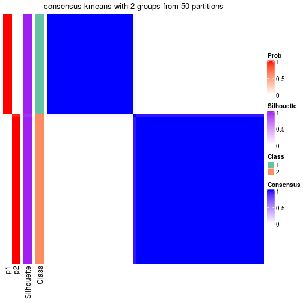</p>

</div>
<div id='tab-node-021-consensus-heatmap-2'>
<pre><code class="r">consensus_heatmap(res, k = 3)
</code></pre>

<p>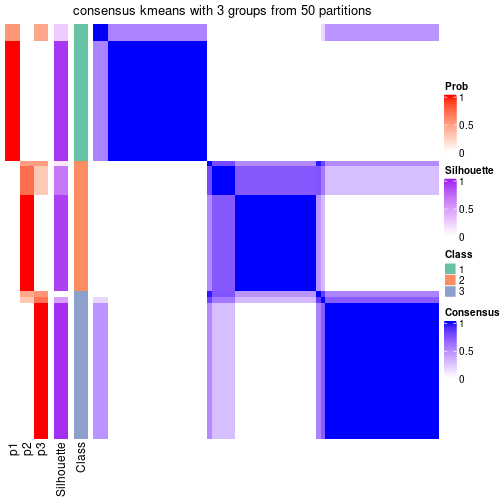</p>

</div>
<div id='tab-node-021-consensus-heatmap-3'>
<pre><code class="r">consensus_heatmap(res, k = 4)
</code></pre>

<p>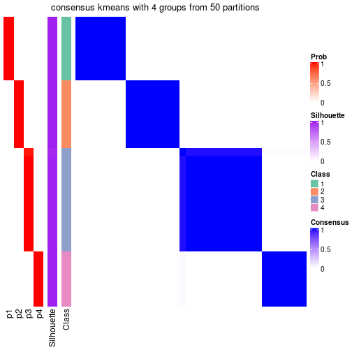</p>

</div>
<div id='tab-node-021-consensus-heatmap-4'>
<pre><code class="r">consensus_heatmap(res, k = 5)
</code></pre>

<p>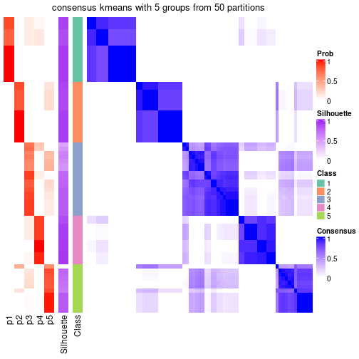</p>

</div>
<div id='tab-node-021-consensus-heatmap-5'>
<pre><code class="r">consensus_heatmap(res, k = 6)
</code></pre>

<p>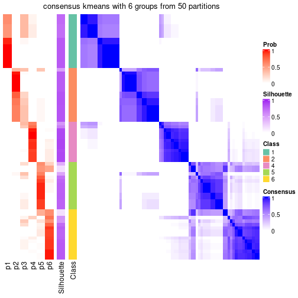</p>

</div>
<div id='tab-node-021-consensus-heatmap-6'>
<pre><code class="r">consensus_heatmap(res, k = 7)
</code></pre>

<p>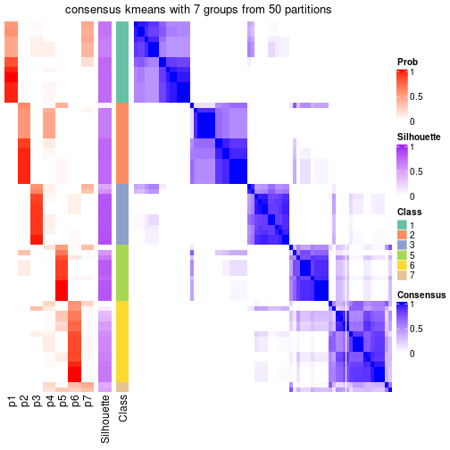</p>

</div>
<div id='tab-node-021-consensus-heatmap-7'>
<pre><code class="r">consensus_heatmap(res, k = 8)
</code></pre>

<p>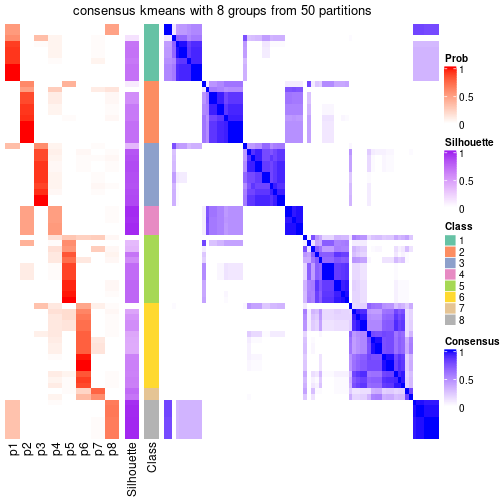</p>

</div>
</div>

Heatmaps for the membership of samples in all partitions to see how consistent they are:


<script>
$( function() {
	$( '#tabs-node-021-membership-heatmap' ).tabs();
} );
</script>
<div id='tabs-node-021-membership-heatmap'>
<ul>
<li><a href='#tab-node-021-membership-heatmap-1'>k = 2</a></li>
<li><a href='#tab-node-021-membership-heatmap-2'>k = 3</a></li>
<li><a href='#tab-node-021-membership-heatmap-3'>k = 4</a></li>
<li><a href='#tab-node-021-membership-heatmap-4'>k = 5</a></li>
<li><a href='#tab-node-021-membership-heatmap-5'>k = 6</a></li>
<li><a href='#tab-node-021-membership-heatmap-6'>k = 7</a></li>
<li><a href='#tab-node-021-membership-heatmap-7'>k = 8</a></li>
</ul>
<div id='tab-node-021-membership-heatmap-1'>
<pre><code class="r">membership_heatmap(res, k = 2)
</code></pre>

<p>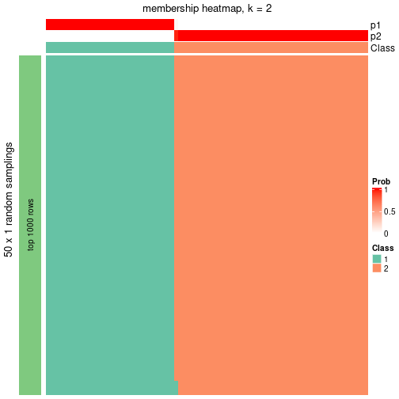</p>

</div>
<div id='tab-node-021-membership-heatmap-2'>
<pre><code class="r">membership_heatmap(res, k = 3)
</code></pre>

<p>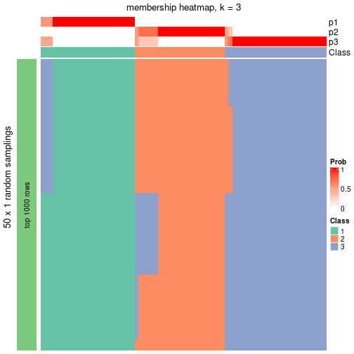</p>

</div>
<div id='tab-node-021-membership-heatmap-3'>
<pre><code class="r">membership_heatmap(res, k = 4)
</code></pre>

<p>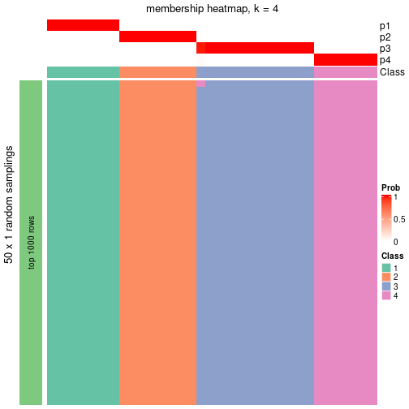</p>

</div>
<div id='tab-node-021-membership-heatmap-4'>
<pre><code class="r">membership_heatmap(res, k = 5)
</code></pre>

<p>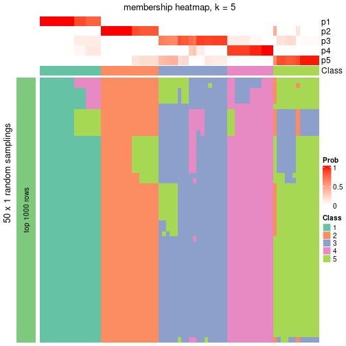</p>

</div>
<div id='tab-node-021-membership-heatmap-5'>
<pre><code class="r">membership_heatmap(res, k = 6)
</code></pre>

<p>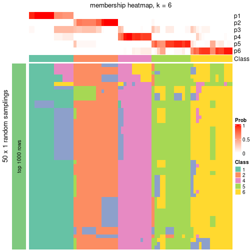</p>

</div>
<div id='tab-node-021-membership-heatmap-6'>
<pre><code class="r">membership_heatmap(res, k = 7)
</code></pre>

<p>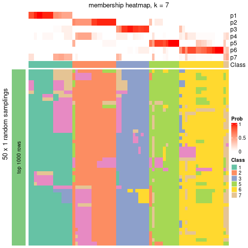</p>

</div>
<div id='tab-node-021-membership-heatmap-7'>
<pre><code class="r">membership_heatmap(res, k = 8)
</code></pre>

<p>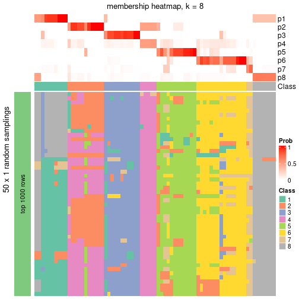</p>

</div>
</div>

As soon as the classes for columns are determined, the signatures
that are significantly different between subgroups can be looked for. 
Following are the heatmaps for signatures.


<script>
$( function() {
	$( '#tabs-node-021-get-signatures' ).tabs();
} );
</script>
<div id='tabs-node-021-get-signatures'>
<ul>
<li><a href='#tab-node-021-get-signatures-1'>k = 2</a></li>
<li><a href='#tab-node-021-get-signatures-2'>k = 3</a></li>
<li><a href='#tab-node-021-get-signatures-3'>k = 4</a></li>
<li><a href='#tab-node-021-get-signatures-4'>k = 5</a></li>
<li><a href='#tab-node-021-get-signatures-5'>k = 6</a></li>
<li><a href='#tab-node-021-get-signatures-6'>k = 7</a></li>
<li><a href='#tab-node-021-get-signatures-7'>k = 8</a></li>
</ul>
<div id='tab-node-021-get-signatures-1'>
<pre><code class="r">get_signatures(res, k = 2)
</code></pre>

<p>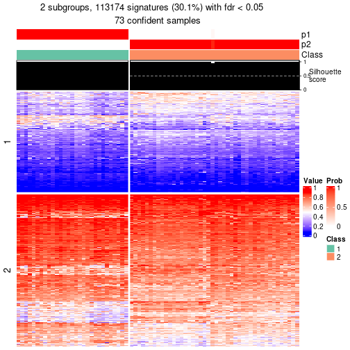</p>

</div>
<div id='tab-node-021-get-signatures-2'>
<pre><code class="r">get_signatures(res, k = 3)
</code></pre>

<p>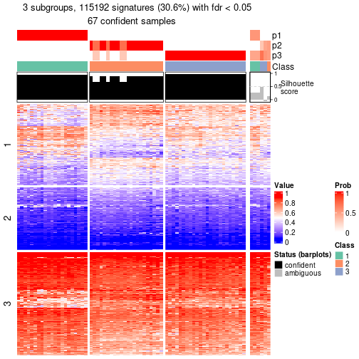</p>

</div>
<div id='tab-node-021-get-signatures-3'>
<pre><code class="r">get_signatures(res, k = 4)
</code></pre>

<p>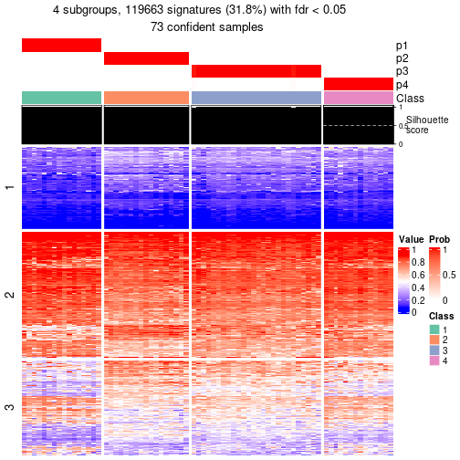</p>

</div>
<div id='tab-node-021-get-signatures-4'>
<pre><code class="r">get_signatures(res, k = 5)
</code></pre>

<p>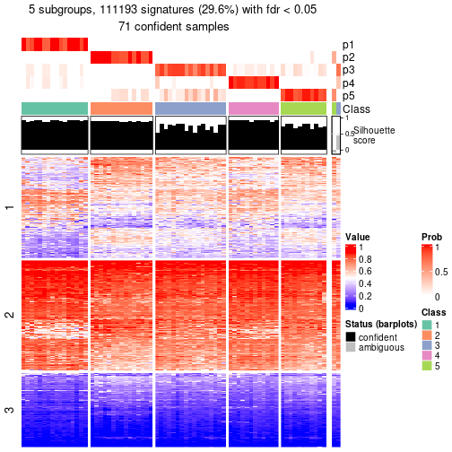</p>

</div>
<div id='tab-node-021-get-signatures-5'>
<pre><code class="r">get_signatures(res, k = 6)
</code></pre>

<p>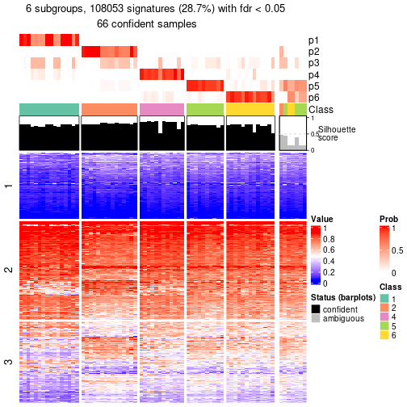</p>

</div>
<div id='tab-node-021-get-signatures-6'>
<pre><code class="r">get_signatures(res, k = 7)
</code></pre>

<p>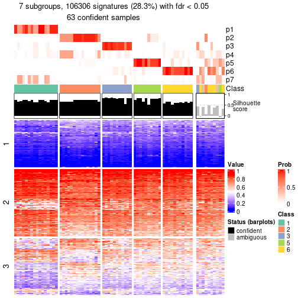</p>

</div>
<div id='tab-node-021-get-signatures-7'>
<pre><code class="r">get_signatures(res, k = 8)
</code></pre>

<p>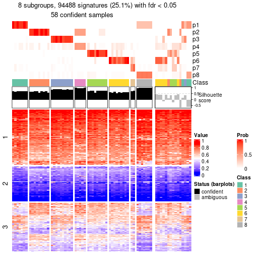</p>

</div>
</div>


Compare the overlap of signatures from different k:

```r
compare_signatures(res)
```

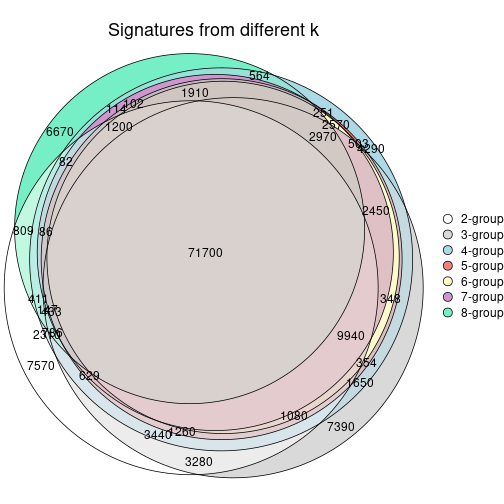

`get_signature()` returns a data frame invisibly. To get the list of signatures, the function
call should be assigned to a variable explicitly. In following code, if `plot` argument is set
to `FALSE`, no heatmap is plotted while only the differential analysis is performed.

```r
# code only for demonstration
tb = get_signature(res, k = ..., plot = FALSE)
```

An example of the output of `tb` is:

```
#>   which_row         fdr    mean_1    mean_2 scaled_mean_1 scaled_mean_2 km
#> 1        38 0.042760348  8.373488  9.131774    -0.5533452     0.5164555  1
#> 2        40 0.018707592  7.106213  8.469186    -0.6173731     0.5762149  1
#> 3        55 0.019134737 10.221463 11.207825    -0.6159697     0.5749050  1
#> 4        59 0.006059896  5.921854  7.869574    -0.6899429     0.6439467  1
#> 5        60 0.018055526  8.928898 10.211722    -0.6204761     0.5791110  1
#> 6        98 0.009384629 15.714769 14.887706     0.6635654    -0.6193277  2
...
```

The columns in `tb` are:

1. `which_row`: row indices corresponding to the input matrix.
2. `fdr`: FDR for the differential test. 
3. `mean_x`: The mean value in group x.
4. `scaled_mean_x`: The mean value in group x after rows are scaled.
5. `km`: Row groups if k-means clustering is applied to rows (which is done by automatically selecting number of clusters).

If there are too many signatures, `top_signatures = ...` can be set to only show the 
signatures with the highest FDRs:

```r
# code only for demonstration
# e.g. to show the top 500 most significant rows
tb = get_signature(res, k = ..., top_signatures = 500)
```

If the signatures are defined as these which are uniquely high in current group, `diff_method` argument
can be set to `"uniquely_high_in_one_group"`:

```r
# code only for demonstration
tb = get_signature(res, k = ..., diff_method = "uniquely_high_in_one_group")
```


UMAP plot which shows how samples are separated.


<script>
$( function() {
	$( '#tabs-node-021-dimension-reduction' ).tabs();
} );
</script>
<div id='tabs-node-021-dimension-reduction'>
<ul>
<li><a href='#tab-node-021-dimension-reduction-1'>k = 2</a></li>
<li><a href='#tab-node-021-dimension-reduction-2'>k = 3</a></li>
<li><a href='#tab-node-021-dimension-reduction-3'>k = 4</a></li>
<li><a href='#tab-node-021-dimension-reduction-4'>k = 5</a></li>
<li><a href='#tab-node-021-dimension-reduction-5'>k = 6</a></li>
<li><a href='#tab-node-021-dimension-reduction-6'>k = 7</a></li>
<li><a href='#tab-node-021-dimension-reduction-7'>k = 8</a></li>
</ul>
<div id='tab-node-021-dimension-reduction-1'>
<pre><code class="r">dimension_reduction(res, k = 2, method = &quot;UMAP&quot;)
</code></pre>

<p>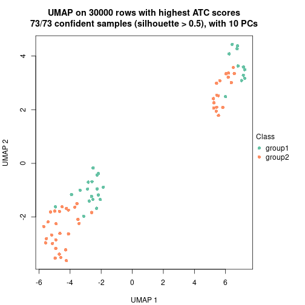</p>

</div>
<div id='tab-node-021-dimension-reduction-2'>
<pre><code class="r">dimension_reduction(res, k = 3, method = &quot;UMAP&quot;)
</code></pre>

<p>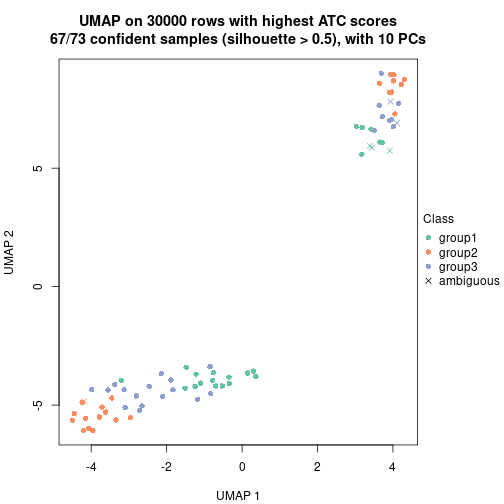</p>

</div>
<div id='tab-node-021-dimension-reduction-3'>
<pre><code class="r">dimension_reduction(res, k = 4, method = &quot;UMAP&quot;)
</code></pre>

<p>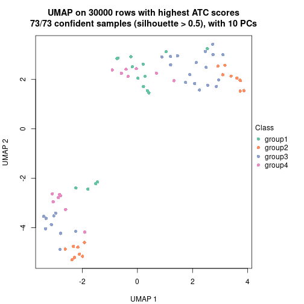</p>

</div>
<div id='tab-node-021-dimension-reduction-4'>
<pre><code class="r">dimension_reduction(res, k = 5, method = &quot;UMAP&quot;)
</code></pre>

<p>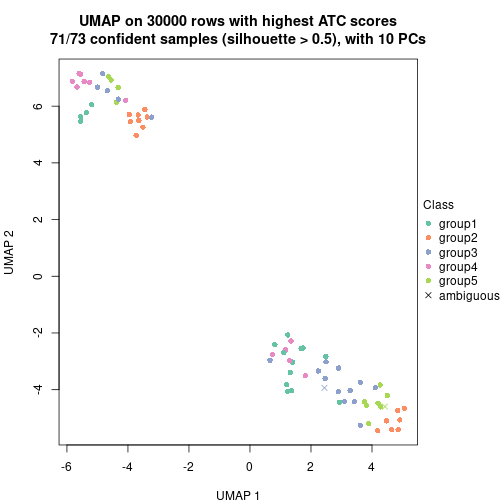</p>

</div>
<div id='tab-node-021-dimension-reduction-5'>
<pre><code class="r">dimension_reduction(res, k = 6, method = &quot;UMAP&quot;)
</code></pre>

<p>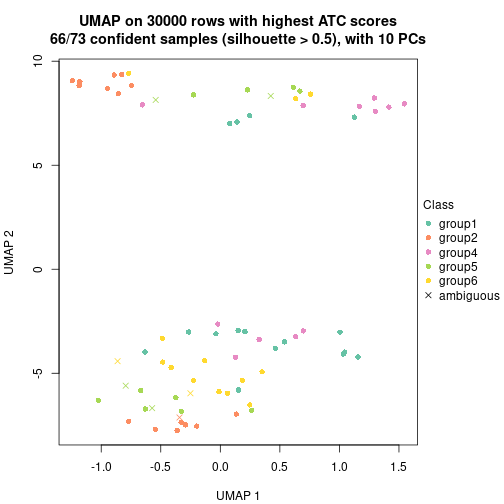</p>

</div>
<div id='tab-node-021-dimension-reduction-6'>
<pre><code class="r">dimension_reduction(res, k = 7, method = &quot;UMAP&quot;)
</code></pre>

<p>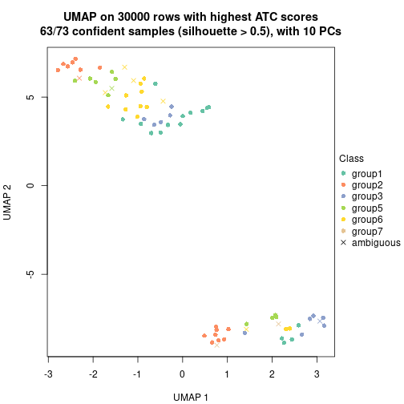</p>

</div>
<div id='tab-node-021-dimension-reduction-7'>
<pre><code class="r">dimension_reduction(res, k = 8, method = &quot;UMAP&quot;)
</code></pre>

<p>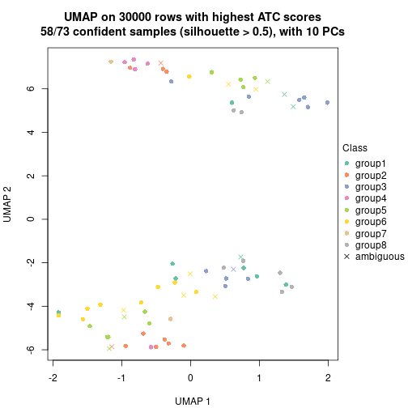</p>

</div>
</div>


Following heatmap shows how subgroups are split when increasing `k`:

```r
collect_classes(res)
```

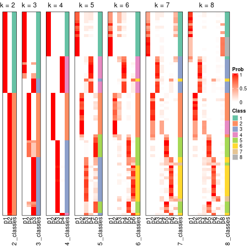


If matrix rows can be associated to genes, consider to use `functional_enrichment(res,
...)` to perform function enrichment for the signature genes. See [this vignette](https://jokergoo.github.io/cola_vignettes/functional_enrichment.html) for more detailed explanations.


 

---------------------------------------------------


### Node0213


Parent node: [Node021](#Node021).
Child nodes: 
                Node02131-leaf
        ,
                Node02132-leaf
        ,
                Node02211-leaf
        ,
                Node02212-leaf
        ,
                Node02311-leaf
        ,
                Node02312-leaf
        ,
                Node02313-leaf
        ,
                Node02314-leaf
        ,
                Node02341-leaf
        ,
                Node02342-leaf
        ,
                Node02343-leaf
        ,
                Node02344-leaf
        ,
                Node02345-leaf
        ,
                Node02421-leaf
        ,
                Node02422-leaf
        ,
                Node02423-leaf
        ,
                Node06121-leaf
        ,
                Node06122-leaf
        ,
                Node06123-leaf
        ,
                [Node07111](#Node07111)
        ,
                Node07112-leaf
        ,
                Node07211-leaf
        ,
                Node07212-leaf
        ,
                Node07213-leaf
        ,
                Node07214-leaf
        .


The object with results only for a single top-value method and a single partitioning method 
can be extracted as:

```r
res = res_rh["0213"]
```

A summary of `res` and all the functions that can be applied to it:

```r
res
```

```
#> A 'ConsensusPartition' object with k = 2, 3, 4, 5, 6, 7, 8.
#>   On a matrix with 30000 rows and 26 columns.
#>   Top rows (1000) are extracted by 'ATC' method.
#>   Subgroups are detected by 'kmeans' method.
#>   Performed in total 350 partitions by row resampling.
#>   Best k for subgroups seems to be 2.
#> 
#> Following methods can be applied to this 'ConsensusPartition' object:
#>  [1] "cola_report"             "collect_classes"         "collect_plots"          
#>  [4] "collect_stats"           "colnames"                "compare_partitions"     
#>  [7] "compare_signatures"      "consensus_heatmap"       "dimension_reduction"    
#> [10] "functional_enrichment"   "get_anno_col"            "get_anno"               
#> [13] "get_classes"             "get_consensus"           "get_matrix"             
#> [16] "get_membership"          "get_param"               "get_signatures"         
#> [19] "get_stats"               "is_best_k"               "is_stable_k"            
#> [22] "membership_heatmap"      "ncol"                    "nrow"                   
#> [25] "plot_ecdf"               "predict_classes"         "rownames"               
#> [28] "select_partition_number" "show"                    "suggest_best_k"         
#> [31] "test_to_known_factors"   "top_rows_heatmap"
```

`collect_plots()` function collects all the plots made from `res` for all `k` (number of subgroups)
into one single page to provide an easy and fast comparison between different `k`.

```r
collect_plots(res)
```

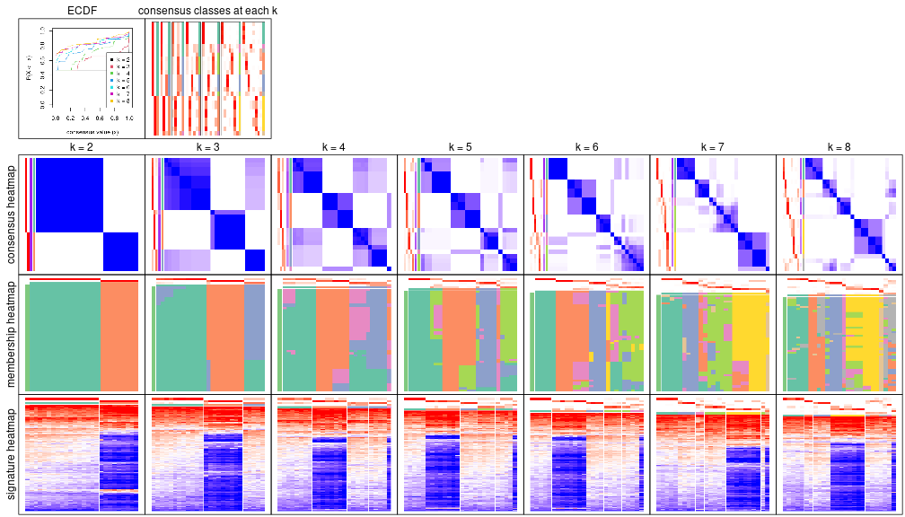

The plots are:

- The first row: a plot of the eCDF (empirical cumulative distribution
  function) curves of the consensus matrix for each `k` and the heatmap of
  predicted classes for each `k`.
- The second row: heatmaps of the consensus matrix for each `k`.
- The third row: heatmaps of the membership matrix for each `k`.
- The fouth row: heatmaps of the signatures for each `k`.

All the plots in panels can be made by individual functions and they are
plotted later in this section.

`select_partition_number()` produces several plots showing different
statistics for choosing "optimized" `k`. There are following statistics:

- eCDF curves of the consensus matrix for each `k`;
- 1-PAC. [The PAC score](https://en.wikipedia.org/wiki/Consensus_clustering#Over-interpretation_potential_of_consensus_clustering)
  measures the proportion of the ambiguous subgrouping.
- Mean silhouette score.
- Concordance. The mean probability of fiting the consensus subgroup labels in all
  partitions.
- Area increased. Denote $A_k$ as the area under the eCDF curve for current
  `k`, the area increased is defined as $A_k - A_{k-1}$.
- Rand index. The percent of pairs of samples that are both in a same cluster
  or both are not in a same cluster in the partition of k and k-1.
- Jaccard index. The ratio of pairs of samples are both in a same cluster in
  the partition of k and k-1 and the pairs of samples are both in a same
  cluster in the partition k or k-1.

The detailed explanations of these statistics can be found in [the _cola_
vignette](https://jokergoo.github.io/cola_vignettes/cola.html#toc_13).

Generally speaking, higher 1-PAC score, higher mean silhouette score or higher
concordance corresponds to better partition. Rand index and Jaccard index
measure how similar the current partition is compared to partition with `k-1`.
If they are too similar, we won't accept `k` is better than `k-1`.

```r
select_partition_number(res)
```

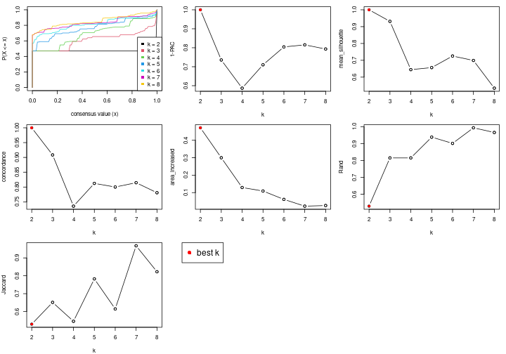

The numeric values for all these statistics can be obtained by `get_stats()`.

```r
get_stats(res)
```

```
#>   k 1-PAC mean_silhouette concordance area_increased  Rand Jaccard
#> 2 2 1.000           1.000       1.000         0.4713 0.529   0.529
#> 3 3 0.736           0.931       0.908         0.2998 0.815   0.651
#> 4 4 0.587           0.645       0.735         0.1292 0.815   0.545
#> 5 5 0.710           0.657       0.812         0.1092 0.938   0.783
#> 6 6 0.804           0.725       0.800         0.0612 0.902   0.614
#> 7 7 0.815           0.699       0.815         0.0224 0.994   0.968
#> 8 8 0.793           0.534       0.781         0.0260 0.966   0.823
```

`suggest_best_k()` suggests the best $k$ based on these statistics. The rules are as follows:

- All $k$ with Jaccard index larger than 0.95 are removed because increasing
  $k$ does not provide enough extra information. If all $k$ are removed, it is
  marked as no subgroup is detected.
- For all $k$ with 1-PAC score larger than 0.9, the maximal $k$ is taken as
  the best $k$, and other $k$ are marked as optional $k$.
- If it does not fit the second rule. The $k$ with the maximal vote of the
  highest 1-PAC score, highest mean silhouette, and highest concordance is
  taken as the best $k$.

```r
suggest_best_k(res)
```

```
#> [1] 2
```


Following is the table of the partitions (You need to click the **show/hide
code output** link to see it). The membership matrix (columns with name `p*`)
is inferred by
[`clue::cl_consensus()`](https://www.rdocumentation.org/link/cl_consensus?package=clue)
function with the `SE` method. Basically the value in the membership matrix
represents the probability to belong to a certain group. The finall subgroup
label for an item is determined with the group with highest probability it
belongs to.

In `get_classes()` function, the entropy is calculated from the membership
matrix and the silhouette score is calculated from the consensus matrix.


<script>
$( function() {
	$( '#tabs-node-0213-get-classes' ).tabs();
} );
</script>
<div id='tabs-node-0213-get-classes'>
<ul>
<li><a href='#tab-node-0213-get-classes-1'>k = 2</a></li>
<li><a href='#tab-node-0213-get-classes-2'>k = 3</a></li>
<li><a href='#tab-node-0213-get-classes-3'>k = 4</a></li>
<li><a href='#tab-node-0213-get-classes-4'>k = 5</a></li>
<li><a href='#tab-node-0213-get-classes-5'>k = 6</a></li>
<li><a href='#tab-node-0213-get-classes-6'>k = 7</a></li>
<li><a href='#tab-node-0213-get-classes-7'>k = 8</a></li>
</ul>

<div id='tab-node-0213-get-classes-1'>
<p><a id='tab-node-0213-get-classes-1-a' style='color:#0366d6' href='#'>show/hide code output</a></p>
<pre><code class="r">cbind(get_classes(res, k = 2), get_membership(res, k = 2))
</code></pre>

<pre><code>#&gt;                 class entropy silhouette p1 p2
#&gt; TCGA.99.8033.01     1       0          1  1  0
#&gt; TCGA.MP.A4TH.01     1       0          1  1  0
#&gt; TCGA.55.6971.01     1       0          1  1  0
#&gt; TCGA.97.8177.01     1       0          1  1  0
#&gt; TCGA.93.A4JP.01     2       0          1  0  1
#&gt; TCGA.S2.AA1A.01     1       0          1  1  0
#&gt; TCGA.78.7160.01     2       0          1  0  1
#&gt; TCGA.93.7348.01     1       0          1  1  0
#&gt; TCGA.55.A48Z.01     1       0          1  1  0
#&gt; TCGA.55.6980.01     2       0          1  0  1
#&gt; TCGA.50.5936.01     2       0          1  0  1
#&gt; TCGA.55.8621.01     1       0          1  1  0
#&gt; TCGA.NC.A5HJ.01     2       0          1  0  1
#&gt; TCGA.97.A4M5.01     2       0          1  0  1
#&gt; TCGA.97.A4M6.01     1       0          1  1  0
#&gt; TCGA.MP.A4TJ.01     1       0          1  1  0
#&gt; TCGA.97.7553.01     1       0          1  1  0
#&gt; TCGA.55.7728.01     1       0          1  1  0
#&gt; TCGA.44.6774.01     1       0          1  1  0
#&gt; TCGA.49.AAQV.01     1       0          1  1  0
#&gt; TCGA.75.7030.01     2       0          1  0  1
#&gt; TCGA.38.A44F.01     2       0          1  0  1
#&gt; TCGA.50.5045.01     1       0          1  1  0
#&gt; TCGA.95.A4VP.01     1       0          1  1  0
#&gt; TCGA.97.A4M2.01     2       0          1  0  1
#&gt; TCGA.55.6970.01     1       0          1  1  0
</code></pre>

<script>
$('#tab-node-0213-get-classes-1-a').parent().next().next().hide();
$('#tab-node-0213-get-classes-1-a').click(function(){
  $('#tab-node-0213-get-classes-1-a').parent().next().next().toggle();
  return(false);
});
</script>
</div>

<div id='tab-node-0213-get-classes-2'>
<p><a id='tab-node-0213-get-classes-2-a' style='color:#0366d6' href='#'>show/hide code output</a></p>
<pre><code class="r">cbind(get_classes(res, k = 3), get_membership(res, k = 3))
</code></pre>

<pre><code>#&gt;                 class entropy silhouette   p1  p2   p3
#&gt; TCGA.99.8033.01     1  0.0892      0.926 0.98 0.0 0.02
#&gt; TCGA.MP.A4TH.01     3  0.5560      1.000 0.30 0.0 0.70
#&gt; TCGA.55.6971.01     3  0.5560      1.000 0.30 0.0 0.70
#&gt; TCGA.97.8177.01     1  0.0892      0.926 0.98 0.0 0.02
#&gt; TCGA.93.A4JP.01     2  0.0000      0.971 0.00 1.0 0.00
#&gt; TCGA.S2.AA1A.01     1  0.0000      0.924 1.00 0.0 0.00
#&gt; TCGA.78.7160.01     2  0.0000      0.971 0.00 1.0 0.00
#&gt; TCGA.93.7348.01     1  0.3686      0.821 0.86 0.0 0.14
#&gt; TCGA.55.A48Z.01     1  0.0892      0.926 0.98 0.0 0.02
#&gt; TCGA.55.6980.01     2  0.0000      0.971 0.00 1.0 0.00
#&gt; TCGA.50.5936.01     2  0.5560      0.734 0.00 0.7 0.30
#&gt; TCGA.55.8621.01     1  0.2959      0.872 0.90 0.0 0.10
#&gt; TCGA.NC.A5HJ.01     2  0.0000      0.971 0.00 1.0 0.00
#&gt; TCGA.97.A4M5.01     2  0.0000      0.971 0.00 1.0 0.00
#&gt; TCGA.97.A4M6.01     1  0.2959      0.872 0.90 0.0 0.10
#&gt; TCGA.MP.A4TJ.01     1  0.4291      0.751 0.82 0.0 0.18
#&gt; TCGA.97.7553.01     1  0.0000      0.924 1.00 0.0 0.00
#&gt; TCGA.55.7728.01     3  0.5560      1.000 0.30 0.0 0.70
#&gt; TCGA.44.6774.01     3  0.5560      1.000 0.30 0.0 0.70
#&gt; TCGA.49.AAQV.01     1  0.0000      0.924 1.00 0.0 0.00
#&gt; TCGA.75.7030.01     2  0.0000      0.971 0.00 1.0 0.00
#&gt; TCGA.38.A44F.01     2  0.0000      0.971 0.00 1.0 0.00
#&gt; TCGA.50.5045.01     1  0.0000      0.924 1.00 0.0 0.00
#&gt; TCGA.95.A4VP.01     1  0.0000      0.924 1.00 0.0 0.00
#&gt; TCGA.97.A4M2.01     2  0.0000      0.971 0.00 1.0 0.00
#&gt; TCGA.55.6970.01     3  0.5560      1.000 0.30 0.0 0.70
</code></pre>

<script>
$('#tab-node-0213-get-classes-2-a').parent().next().next().hide();
$('#tab-node-0213-get-classes-2-a').click(function(){
  $('#tab-node-0213-get-classes-2-a').parent().next().next().toggle();
  return(false);
});
</script>
</div>

<div id='tab-node-0213-get-classes-3'>
<p><a id='tab-node-0213-get-classes-3-a' style='color:#0366d6' href='#'>show/hide code output</a></p>
<pre><code class="r">cbind(get_classes(res, k = 4), get_membership(res, k = 4))
</code></pre>

<pre><code>#&gt;                 class entropy silhouette   p1   p2   p3   p4
#&gt; TCGA.99.8033.01     1   0.549      0.753 0.58 0.00 0.40 0.02
#&gt; TCGA.MP.A4TH.01     3   0.499      0.592 0.00 0.00 0.52 0.48
#&gt; TCGA.55.6971.01     3   0.499      0.592 0.00 0.00 0.52 0.48
#&gt; TCGA.97.8177.01     1   0.491      0.734 0.58 0.00 0.42 0.00
#&gt; TCGA.93.A4JP.01     2   0.380      0.716 0.22 0.78 0.00 0.00
#&gt; TCGA.S2.AA1A.01     1   0.380      0.874 0.78 0.00 0.22 0.00
#&gt; TCGA.78.7160.01     2   0.000      0.716 0.00 1.00 0.00 0.00
#&gt; TCGA.93.7348.01     3   0.317      0.385 0.16 0.00 0.84 0.00
#&gt; TCGA.55.A48Z.01     1   0.553      0.741 0.56 0.00 0.42 0.02
#&gt; TCGA.55.6980.01     2   0.000      0.716 0.00 1.00 0.00 0.00
#&gt; TCGA.50.5936.01     4   0.500      0.000 0.00 0.50 0.00 0.50
#&gt; TCGA.55.8621.01     3   0.340      0.345 0.18 0.00 0.82 0.00
#&gt; TCGA.NC.A5HJ.01     2   0.380      0.716 0.22 0.78 0.00 0.00
#&gt; TCGA.97.A4M5.01     2   0.380      0.716 0.22 0.78 0.00 0.00
#&gt; TCGA.97.A4M6.01     3   0.317      0.363 0.16 0.00 0.84 0.00
#&gt; TCGA.MP.A4TJ.01     3   0.292      0.407 0.14 0.00 0.86 0.00
#&gt; TCGA.97.7553.01     1   0.380      0.874 0.78 0.00 0.22 0.00
#&gt; TCGA.55.7728.01     3   0.380      0.566 0.00 0.00 0.78 0.22
#&gt; TCGA.44.6774.01     3   0.499      0.592 0.00 0.00 0.52 0.48
#&gt; TCGA.49.AAQV.01     1   0.380      0.874 0.78 0.00 0.22 0.00
#&gt; TCGA.75.7030.01     2   0.000      0.716 0.00 1.00 0.00 0.00
#&gt; TCGA.38.A44F.01     2   0.000      0.716 0.00 1.00 0.00 0.00
#&gt; TCGA.50.5045.01     1   0.380      0.874 0.78 0.00 0.22 0.00
#&gt; TCGA.95.A4VP.01     1   0.380      0.874 0.78 0.00 0.22 0.00
#&gt; TCGA.97.A4M2.01     2   0.380      0.716 0.22 0.78 0.00 0.00
#&gt; TCGA.55.6970.01     3   0.499      0.592 0.00 0.00 0.52 0.48
</code></pre>

<script>
$('#tab-node-0213-get-classes-3-a').parent().next().next().hide();
$('#tab-node-0213-get-classes-3-a').click(function(){
  $('#tab-node-0213-get-classes-3-a').parent().next().next().toggle();
  return(false);
});
</script>
</div>

<div id='tab-node-0213-get-classes-4'>
<p><a id='tab-node-0213-get-classes-4-a' style='color:#0366d6' href='#'>show/hide code output</a></p>
<pre><code class="r">cbind(get_classes(res, k = 5), get_membership(res, k = 5))
</code></pre>

<pre><code>#&gt;                 class entropy silhouette   p1   p2   p3   p4   p5
#&gt; TCGA.99.8033.01     1   0.644     0.3964 0.50 0.00 0.00 0.28 0.22
#&gt; TCGA.MP.A4TH.01     3   0.104     0.8289 0.04 0.00 0.96 0.00 0.00
#&gt; TCGA.55.6971.01     3   0.104     0.8289 0.04 0.00 0.96 0.00 0.00
#&gt; TCGA.97.8177.01     1   0.430    -0.0552 0.52 0.00 0.00 0.00 0.48
#&gt; TCGA.93.A4JP.01     2   0.327     0.7407 0.00 0.78 0.00 0.00 0.22
#&gt; TCGA.S2.AA1A.01     1   0.000     0.7574 1.00 0.00 0.00 0.00 0.00
#&gt; TCGA.78.7160.01     2   0.104     0.7205 0.00 0.96 0.04 0.00 0.00
#&gt; TCGA.93.7348.01     5   0.487     0.9272 0.16 0.00 0.12 0.00 0.72
#&gt; TCGA.55.A48Z.01     1   0.644     0.3964 0.50 0.00 0.00 0.28 0.22
#&gt; TCGA.55.6980.01     2   0.104     0.7205 0.00 0.96 0.04 0.00 0.00
#&gt; TCGA.50.5936.01     4   0.413     0.0000 0.00 0.38 0.00 0.62 0.00
#&gt; TCGA.55.8621.01     5   0.539     0.9311 0.18 0.00 0.10 0.02 0.70
#&gt; TCGA.NC.A5HJ.01     2   0.327     0.7407 0.00 0.78 0.00 0.00 0.22
#&gt; TCGA.97.A4M5.01     2   0.327     0.7407 0.00 0.78 0.00 0.00 0.22
#&gt; TCGA.97.A4M6.01     5   0.539     0.9311 0.18 0.00 0.10 0.02 0.70
#&gt; TCGA.MP.A4TJ.01     5   0.541     0.8463 0.14 0.00 0.20 0.00 0.66
#&gt; TCGA.97.7553.01     1   0.000     0.7574 1.00 0.00 0.00 0.00 0.00
#&gt; TCGA.55.7728.01     3   0.518    -0.2046 0.04 0.00 0.48 0.00 0.48
#&gt; TCGA.44.6774.01     3   0.104     0.8289 0.04 0.00 0.96 0.00 0.00
#&gt; TCGA.49.AAQV.01     1   0.000     0.7574 1.00 0.00 0.00 0.00 0.00
#&gt; TCGA.75.7030.01     2   0.104     0.7205 0.00 0.96 0.00 0.00 0.04
#&gt; TCGA.38.A44F.01     2   0.104     0.7205 0.00 0.96 0.00 0.00 0.04
#&gt; TCGA.50.5045.01     1   0.000     0.7574 1.00 0.00 0.00 0.00 0.00
#&gt; TCGA.95.A4VP.01     1   0.000     0.7574 1.00 0.00 0.00 0.00 0.00
#&gt; TCGA.97.A4M2.01     2   0.327     0.7407 0.00 0.78 0.00 0.00 0.22
#&gt; TCGA.55.6970.01     3   0.275     0.7863 0.04 0.00 0.88 0.08 0.00
</code></pre>

<script>
$('#tab-node-0213-get-classes-4-a').parent().next().next().hide();
$('#tab-node-0213-get-classes-4-a').click(function(){
  $('#tab-node-0213-get-classes-4-a').parent().next().next().toggle();
  return(false);
});
</script>
</div>

<div id='tab-node-0213-get-classes-5'>
<p><a id='tab-node-0213-get-classes-5-a' style='color:#0366d6' href='#'>show/hide code output</a></p>
<pre><code class="r">cbind(get_classes(res, k = 6), get_membership(res, k = 6))
</code></pre>

<pre><code>#&gt;                 class entropy silhouette   p1   p2   p3   p4   p5   p6
#&gt; TCGA.99.8033.01     4  0.6525      0.389 0.30 0.00 0.00 0.46 0.20 0.04
#&gt; TCGA.MP.A4TH.01     3  0.0000      0.938 0.00 0.00 1.00 0.00 0.00 0.00
#&gt; TCGA.55.6971.01     3  0.0547      0.942 0.00 0.00 0.98 0.02 0.00 0.00
#&gt; TCGA.97.8177.01     5  0.3916      0.328 0.30 0.00 0.00 0.02 0.68 0.00
#&gt; TCGA.93.A4JP.01     2  0.0000      0.753 0.00 1.00 0.00 0.00 0.00 0.00
#&gt; TCGA.S2.AA1A.01     1  0.0000      1.000 1.00 0.00 0.00 0.00 0.00 0.00
#&gt; TCGA.78.7160.01     2  0.4700      0.735 0.00 0.60 0.00 0.00 0.06 0.34
#&gt; TCGA.93.7348.01     5  0.2094      0.717 0.02 0.00 0.08 0.00 0.90 0.00
#&gt; TCGA.55.A48Z.01     4  0.5438      0.416 0.28 0.00 0.00 0.56 0.16 0.00
#&gt; TCGA.55.6980.01     2  0.4700      0.735 0.00 0.60 0.00 0.00 0.06 0.34
#&gt; TCGA.50.5936.01     4  0.5922     -0.055 0.00 0.22 0.00 0.44 0.00 0.34
#&gt; TCGA.55.8621.01     5  0.3697      0.705 0.06 0.00 0.04 0.00 0.82 0.08
#&gt; TCGA.NC.A5HJ.01     2  0.0000      0.753 0.00 1.00 0.00 0.00 0.00 0.00
#&gt; TCGA.97.A4M5.01     2  0.0000      0.753 0.00 1.00 0.00 0.00 0.00 0.00
#&gt; TCGA.97.A4M6.01     5  0.3631      0.691 0.04 0.00 0.04 0.00 0.82 0.10
#&gt; TCGA.MP.A4TJ.01     5  0.3834      0.676 0.02 0.00 0.20 0.02 0.76 0.00
#&gt; TCGA.97.7553.01     1  0.0000      1.000 1.00 0.00 0.00 0.00 0.00 0.00
#&gt; TCGA.55.7728.01     5  0.3797      0.373 0.00 0.00 0.42 0.00 0.58 0.00
#&gt; TCGA.44.6774.01     3  0.0547      0.942 0.00 0.00 0.98 0.02 0.00 0.00
#&gt; TCGA.49.AAQV.01     1  0.0000      1.000 1.00 0.00 0.00 0.00 0.00 0.00
#&gt; TCGA.75.7030.01     2  0.3756      0.735 0.00 0.60 0.00 0.00 0.00 0.40
#&gt; TCGA.38.A44F.01     2  0.3756      0.735 0.00 0.60 0.00 0.00 0.00 0.40
#&gt; TCGA.50.5045.01     1  0.0000      1.000 1.00 0.00 0.00 0.00 0.00 0.00
#&gt; TCGA.95.A4VP.01     1  0.0000      1.000 1.00 0.00 0.00 0.00 0.00 0.00
#&gt; TCGA.97.A4M2.01     2  0.0000      0.753 0.00 1.00 0.00 0.00 0.00 0.00
#&gt; TCGA.55.6970.01     3  0.2581      0.845 0.00 0.00 0.86 0.00 0.02 0.12
</code></pre>

<script>
$('#tab-node-0213-get-classes-5-a').parent().next().next().hide();
$('#tab-node-0213-get-classes-5-a').click(function(){
  $('#tab-node-0213-get-classes-5-a').parent().next().next().toggle();
  return(false);
});
</script>
</div>

<div id='tab-node-0213-get-classes-6'>
<p><a id='tab-node-0213-get-classes-6-a' style='color:#0366d6' href='#'>show/hide code output</a></p>
<pre><code class="r">cbind(get_classes(res, k = 7), get_membership(res, k = 7))
</code></pre>

<pre><code>#&gt;                 class entropy silhouette   p1   p2   p3   p4   p5   p6   p7
#&gt; TCGA.99.8033.01     4  0.4243      0.557 0.10 0.00 0.00 0.68 0.22 0.00 0.00
#&gt; TCGA.MP.A4TH.01     3  0.0504      0.881 0.00 0.00 0.98 0.00 0.00 0.00 0.02
#&gt; TCGA.55.6971.01     3  0.0000      0.886 0.00 0.00 1.00 0.00 0.00 0.00 0.00
#&gt; TCGA.97.8177.01     5  0.2512      0.549 0.10 0.00 0.00 0.04 0.86 0.00 0.00
#&gt; TCGA.93.A4JP.01     6  0.3221      0.710 0.00 0.32 0.00 0.00 0.00 0.68 0.00
#&gt; TCGA.S2.AA1A.01     1  0.1006      0.954 0.96 0.02 0.00 0.00 0.00 0.00 0.02
#&gt; TCGA.78.7160.01     6  0.0000      0.671 0.00 0.00 0.00 0.00 0.00 1.00 0.00
#&gt; TCGA.93.7348.01     5  0.0504      0.656 0.00 0.00 0.02 0.00 0.98 0.00 0.00
#&gt; TCGA.55.A48Z.01     4  0.7034      0.564 0.10 0.34 0.00 0.38 0.04 0.00 0.14
#&gt; TCGA.55.6980.01     6  0.0000      0.671 0.00 0.00 0.00 0.00 0.00 1.00 0.00
#&gt; TCGA.50.5936.01     7  0.3221      0.000 0.00 0.00 0.00 0.00 0.00 0.32 0.68
#&gt; TCGA.55.8621.01     5  0.3722      0.605 0.00 0.04 0.00 0.18 0.76 0.00 0.02
#&gt; TCGA.NC.A5HJ.01     6  0.3221      0.710 0.00 0.32 0.00 0.00 0.00 0.68 0.00
#&gt; TCGA.97.A4M5.01     6  0.3221      0.710 0.00 0.32 0.00 0.00 0.00 0.68 0.00
#&gt; TCGA.97.A4M6.01     5  0.3863      0.596 0.00 0.04 0.00 0.20 0.74 0.00 0.02
#&gt; TCGA.MP.A4TJ.01     5  0.3307      0.575 0.00 0.00 0.24 0.00 0.74 0.00 0.02
#&gt; TCGA.97.7553.01     1  0.0504      0.961 0.98 0.00 0.00 0.02 0.00 0.00 0.00
#&gt; TCGA.55.7728.01     5  0.4418      0.482 0.00 0.00 0.30 0.00 0.62 0.00 0.08
#&gt; TCGA.44.6774.01     3  0.0000      0.886 0.00 0.00 1.00 0.00 0.00 0.00 0.00
#&gt; TCGA.49.AAQV.01     1  0.1006      0.954 0.96 0.02 0.00 0.00 0.00 0.00 0.02
#&gt; TCGA.75.7030.01     6  0.1433      0.671 0.00 0.00 0.00 0.08 0.00 0.92 0.00
#&gt; TCGA.38.A44F.01     6  0.1433      0.671 0.00 0.00 0.00 0.08 0.00 0.92 0.00
#&gt; TCGA.50.5045.01     1  0.0504      0.961 0.98 0.00 0.00 0.02 0.00 0.00 0.00
#&gt; TCGA.95.A4VP.01     1  0.0863      0.949 0.96 0.00 0.00 0.00 0.00 0.00 0.04
#&gt; TCGA.97.A4M2.01     6  0.3221      0.710 0.00 0.32 0.00 0.00 0.00 0.68 0.00
#&gt; TCGA.55.6970.01     3  0.3841      0.639 0.00 0.28 0.68 0.04 0.00 0.00 0.00
</code></pre>

<script>
$('#tab-node-0213-get-classes-6-a').parent().next().next().hide();
$('#tab-node-0213-get-classes-6-a').click(function(){
  $('#tab-node-0213-get-classes-6-a').parent().next().next().toggle();
  return(false);
});
</script>
</div>

<div id='tab-node-0213-get-classes-7'>
<p><a id='tab-node-0213-get-classes-7-a' style='color:#0366d6' href='#'>show/hide code output</a></p>
<pre><code class="r">cbind(get_classes(res, k = 8), get_membership(res, k = 8))
</code></pre>

<pre><code>#&gt;                 class entropy silhouette   p1   p2   p3  p4   p5   p6   p7   p8
#&gt; TCGA.99.8033.01     8  0.6772    -0.3916 0.14 0.04 0.00 0.3 0.14 0.00 0.00 0.38
#&gt; TCGA.MP.A4TH.01     3  0.0471     0.8718 0.00 0.00 0.98 0.0 0.00 0.00 0.02 0.00
#&gt; TCGA.55.6971.01     3  0.0471     0.8794 0.00 0.00 0.98 0.0 0.00 0.00 0.00 0.02
#&gt; TCGA.97.8177.01     2  0.4759     0.1918 0.14 0.50 0.00 0.0 0.00 0.00 0.00 0.36
#&gt; TCGA.93.A4JP.01     6  0.0000     0.6690 0.00 0.00 0.00 0.0 0.00 1.00 0.00 0.00
#&gt; TCGA.S2.AA1A.01     1  0.2719     0.8313 0.80 0.00 0.00 0.0 0.18 0.00 0.00 0.02
#&gt; TCGA.78.7160.01     6  0.5325     0.6176 0.00 0.00 0.00 0.1 0.26 0.56 0.00 0.08
#&gt; TCGA.93.7348.01     2  0.3272     0.2004 0.00 0.58 0.00 0.0 0.00 0.00 0.00 0.42
#&gt; TCGA.55.A48Z.01     4  0.1887     0.0000 0.06 0.04 0.00 0.9 0.00 0.00 0.00 0.00
#&gt; TCGA.55.6980.01     6  0.5325     0.6176 0.00 0.00 0.00 0.1 0.26 0.56 0.00 0.08
#&gt; TCGA.50.5936.01     7  0.2114     0.0000 0.00 0.00 0.00 0.0 0.00 0.16 0.84 0.00
#&gt; TCGA.55.8621.01     2  0.0000     0.5255 0.00 1.00 0.00 0.0 0.00 0.00 0.00 0.00
#&gt; TCGA.NC.A5HJ.01     6  0.0000     0.6690 0.00 0.00 0.00 0.0 0.00 1.00 0.00 0.00
#&gt; TCGA.97.A4M5.01     6  0.1091     0.6690 0.00 0.00 0.00 0.0 0.00 0.94 0.00 0.06
#&gt; TCGA.97.A4M6.01     2  0.0941     0.5171 0.00 0.96 0.00 0.0 0.02 0.00 0.02 0.00
#&gt; TCGA.MP.A4TJ.01     8  0.4971     0.0546 0.00 0.36 0.18 0.0 0.00 0.00 0.00 0.46
#&gt; TCGA.97.7553.01     1  0.0471     0.8536 0.98 0.00 0.00 0.0 0.00 0.00 0.00 0.02
#&gt; TCGA.55.7728.01     8  0.5709     0.1758 0.00 0.28 0.20 0.0 0.02 0.00 0.02 0.48
#&gt; TCGA.44.6774.01     3  0.0471     0.8794 0.00 0.00 0.98 0.0 0.00 0.00 0.00 0.02
#&gt; TCGA.49.AAQV.01     1  0.2856     0.8272 0.78 0.00 0.00 0.0 0.20 0.00 0.00 0.02
#&gt; TCGA.75.7030.01     6  0.3299     0.6176 0.00 0.00 0.00 0.0 0.44 0.56 0.00 0.00
#&gt; TCGA.38.A44F.01     6  0.3299     0.6176 0.00 0.00 0.00 0.0 0.44 0.56 0.00 0.00
#&gt; TCGA.50.5045.01     1  0.0471     0.8536 0.98 0.00 0.00 0.0 0.00 0.00 0.00 0.02
#&gt; TCGA.95.A4VP.01     1  0.2348     0.8339 0.88 0.00 0.00 0.0 0.06 0.00 0.04 0.02
#&gt; TCGA.97.A4M2.01     6  0.1091     0.6690 0.00 0.00 0.00 0.0 0.00 0.94 0.00 0.06
#&gt; TCGA.55.6970.01     3  0.4590     0.6454 0.00 0.00 0.68 0.0 0.16 0.00 0.06 0.10
</code></pre>

<script>
$('#tab-node-0213-get-classes-7-a').parent().next().next().hide();
$('#tab-node-0213-get-classes-7-a').click(function(){
  $('#tab-node-0213-get-classes-7-a').parent().next().next().toggle();
  return(false);
});
</script>
</div>
</div>

Heatmaps for the consensus matrix. It visualizes the probability of two
samples to be in a same group.


<script>
$( function() {
	$( '#tabs-node-0213-consensus-heatmap' ).tabs();
} );
</script>
<div id='tabs-node-0213-consensus-heatmap'>
<ul>
<li><a href='#tab-node-0213-consensus-heatmap-1'>k = 2</a></li>
<li><a href='#tab-node-0213-consensus-heatmap-2'>k = 3</a></li>
<li><a href='#tab-node-0213-consensus-heatmap-3'>k = 4</a></li>
<li><a href='#tab-node-0213-consensus-heatmap-4'>k = 5</a></li>
<li><a href='#tab-node-0213-consensus-heatmap-5'>k = 6</a></li>
<li><a href='#tab-node-0213-consensus-heatmap-6'>k = 7</a></li>
<li><a href='#tab-node-0213-consensus-heatmap-7'>k = 8</a></li>
</ul>
<div id='tab-node-0213-consensus-heatmap-1'>
<pre><code class="r">consensus_heatmap(res, k = 2)
</code></pre>

<p>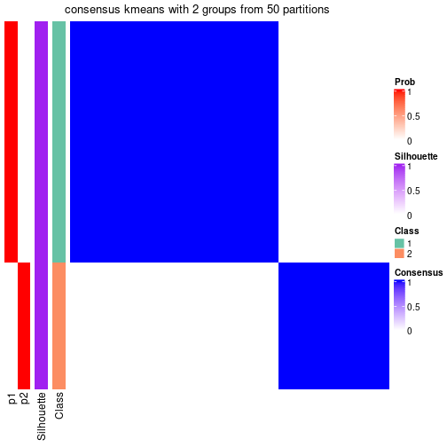</p>

</div>
<div id='tab-node-0213-consensus-heatmap-2'>
<pre><code class="r">consensus_heatmap(res, k = 3)
</code></pre>

<p>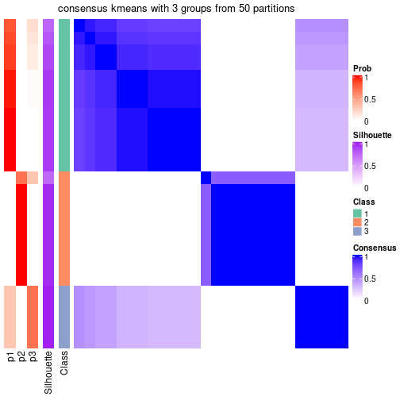</p>

</div>
<div id='tab-node-0213-consensus-heatmap-3'>
<pre><code class="r">consensus_heatmap(res, k = 4)
</code></pre>

<p>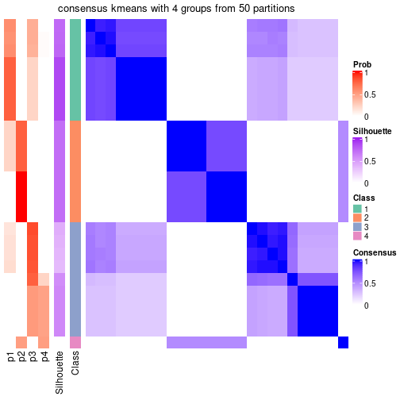</p>

</div>
<div id='tab-node-0213-consensus-heatmap-4'>
<pre><code class="r">consensus_heatmap(res, k = 5)
</code></pre>

<p>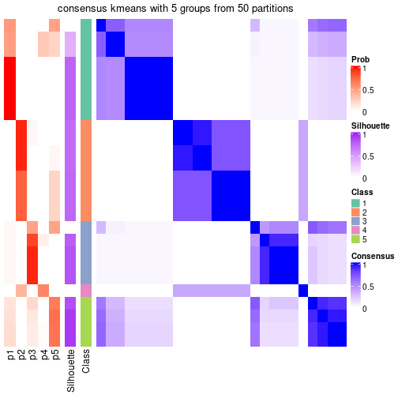</p>

</div>
<div id='tab-node-0213-consensus-heatmap-5'>
<pre><code class="r">consensus_heatmap(res, k = 6)
</code></pre>

<p>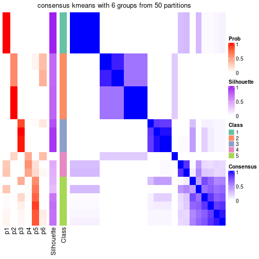</p>

</div>
<div id='tab-node-0213-consensus-heatmap-6'>
<pre><code class="r">consensus_heatmap(res, k = 7)
</code></pre>

<p>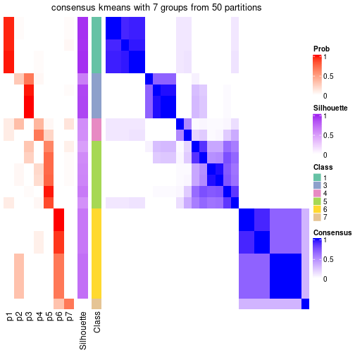</p>

</div>
<div id='tab-node-0213-consensus-heatmap-7'>
<pre><code class="r">consensus_heatmap(res, k = 8)
</code></pre>

<p>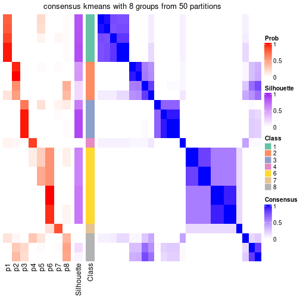</p>

</div>
</div>

Heatmaps for the membership of samples in all partitions to see how consistent they are:


<script>
$( function() {
	$( '#tabs-node-0213-membership-heatmap' ).tabs();
} );
</script>
<div id='tabs-node-0213-membership-heatmap'>
<ul>
<li><a href='#tab-node-0213-membership-heatmap-1'>k = 2</a></li>
<li><a href='#tab-node-0213-membership-heatmap-2'>k = 3</a></li>
<li><a href='#tab-node-0213-membership-heatmap-3'>k = 4</a></li>
<li><a href='#tab-node-0213-membership-heatmap-4'>k = 5</a></li>
<li><a href='#tab-node-0213-membership-heatmap-5'>k = 6</a></li>
<li><a href='#tab-node-0213-membership-heatmap-6'>k = 7</a></li>
<li><a href='#tab-node-0213-membership-heatmap-7'>k = 8</a></li>
</ul>
<div id='tab-node-0213-membership-heatmap-1'>
<pre><code class="r">membership_heatmap(res, k = 2)
</code></pre>

<p>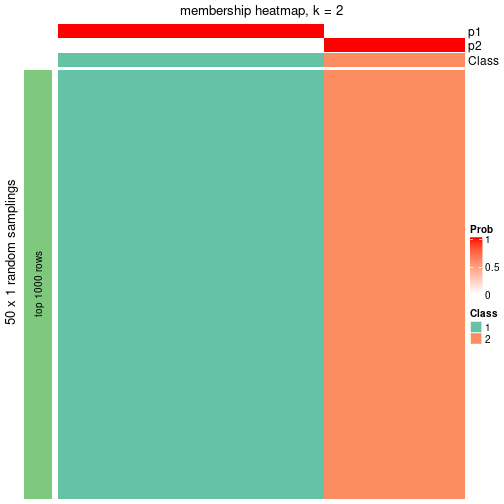</p>

</div>
<div id='tab-node-0213-membership-heatmap-2'>
<pre><code class="r">membership_heatmap(res, k = 3)
</code></pre>

<p>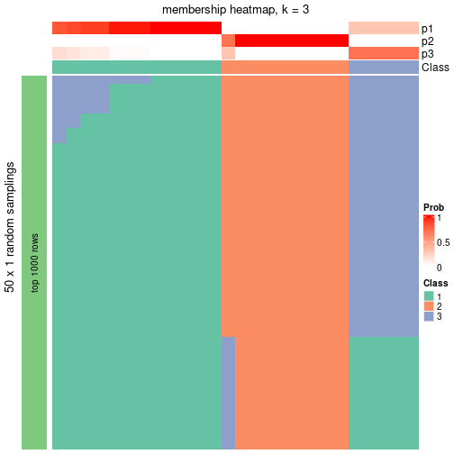</p>

</div>
<div id='tab-node-0213-membership-heatmap-3'>
<pre><code class="r">membership_heatmap(res, k = 4)
</code></pre>

<p>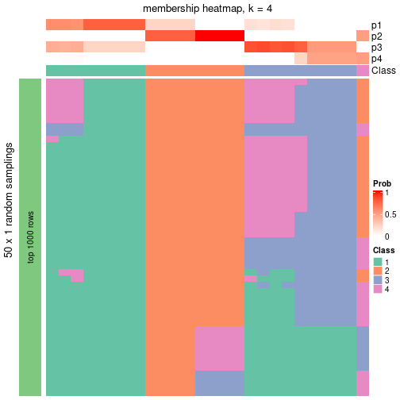</p>

</div>
<div id='tab-node-0213-membership-heatmap-4'>
<pre><code class="r">membership_heatmap(res, k = 5)
</code></pre>

<p>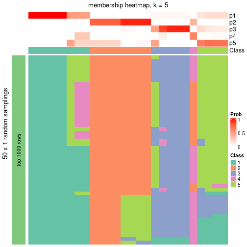</p>

</div>
<div id='tab-node-0213-membership-heatmap-5'>
<pre><code class="r">membership_heatmap(res, k = 6)
</code></pre>

<p>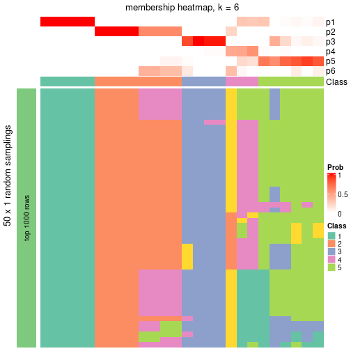</p>

</div>
<div id='tab-node-0213-membership-heatmap-6'>
<pre><code class="r">membership_heatmap(res, k = 7)
</code></pre>

<p>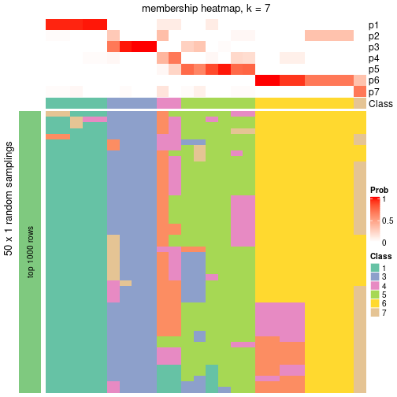</p>

</div>
<div id='tab-node-0213-membership-heatmap-7'>
<pre><code class="r">membership_heatmap(res, k = 8)
</code></pre>

<p>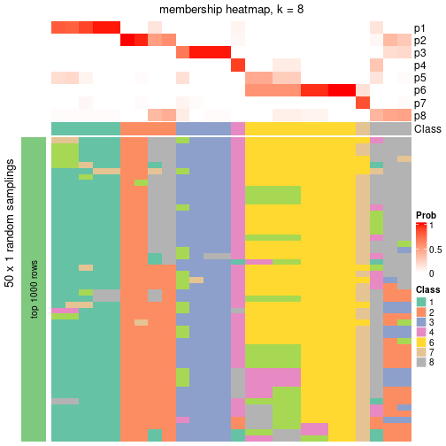</p>

</div>
</div>

As soon as the classes for columns are determined, the signatures
that are significantly different between subgroups can be looked for. 
Following are the heatmaps for signatures.


<script>
$( function() {
	$( '#tabs-node-0213-get-signatures' ).tabs();
} );
</script>
<div id='tabs-node-0213-get-signatures'>
<ul>
<li><a href='#tab-node-0213-get-signatures-1'>k = 2</a></li>
<li><a href='#tab-node-0213-get-signatures-2'>k = 3</a></li>
<li><a href='#tab-node-0213-get-signatures-3'>k = 4</a></li>
<li><a href='#tab-node-0213-get-signatures-4'>k = 5</a></li>
<li><a href='#tab-node-0213-get-signatures-5'>k = 6</a></li>
<li><a href='#tab-node-0213-get-signatures-6'>k = 7</a></li>
<li><a href='#tab-node-0213-get-signatures-7'>k = 8</a></li>
</ul>
<div id='tab-node-0213-get-signatures-1'>
<pre><code class="r">get_signatures(res, k = 2)
</code></pre>

<p>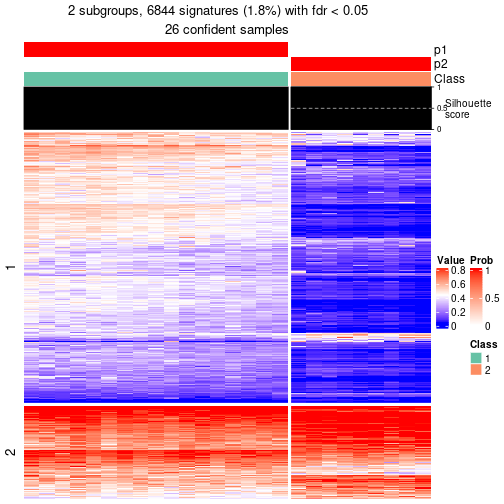</p>

</div>
<div id='tab-node-0213-get-signatures-2'>
<pre><code class="r">get_signatures(res, k = 3)
</code></pre>

<p>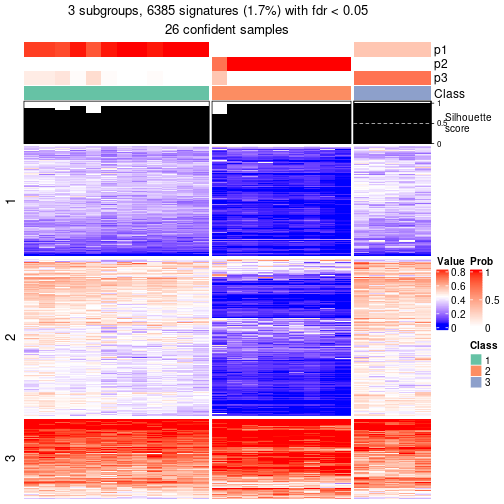</p>

</div>
<div id='tab-node-0213-get-signatures-3'>
<pre><code class="r">get_signatures(res, k = 4)
</code></pre>

<p>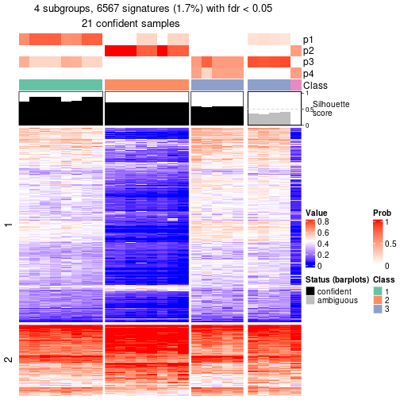</p>

</div>
<div id='tab-node-0213-get-signatures-4'>
<pre><code class="r">get_signatures(res, k = 5)
</code></pre>

<p>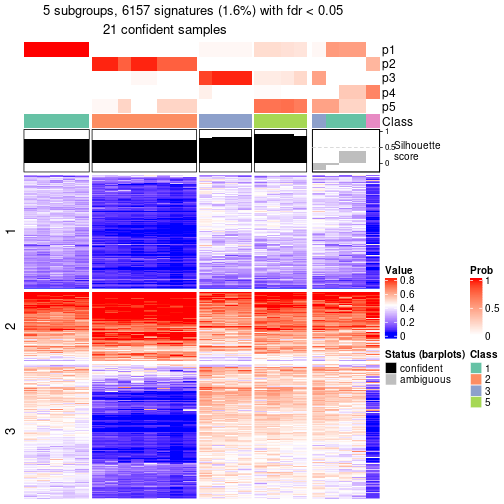</p>

</div>
<div id='tab-node-0213-get-signatures-5'>
<pre><code class="r">get_signatures(res, k = 6)
</code></pre>

<p>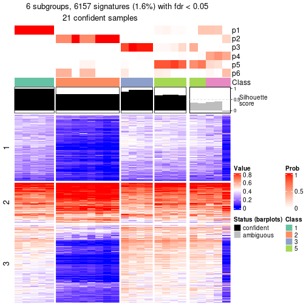</p>

</div>
<div id='tab-node-0213-get-signatures-6'>
<pre><code class="r">get_signatures(res, k = 7)
</code></pre>

<p>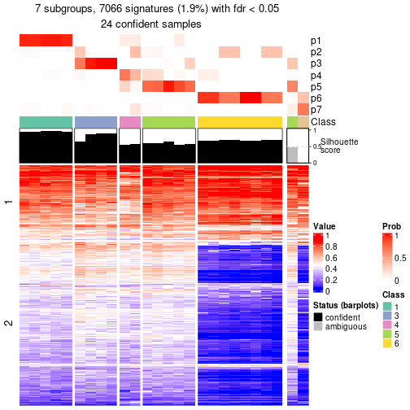</p>

</div>
<div id='tab-node-0213-get-signatures-7'>
<pre><code class="r">get_signatures(res, k = 8)
</code></pre>

<p>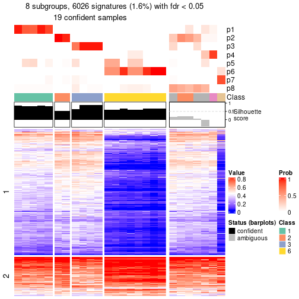</p>

</div>
</div>


Compare the overlap of signatures from different k:

```r
compare_signatures(res)
```

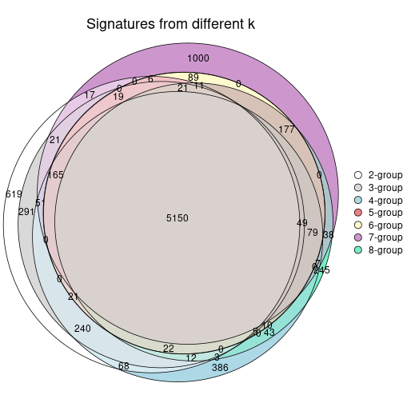

`get_signature()` returns a data frame invisibly. To get the list of signatures, the function
call should be assigned to a variable explicitly. In following code, if `plot` argument is set
to `FALSE`, no heatmap is plotted while only the differential analysis is performed.

```r
# code only for demonstration
tb = get_signature(res, k = ..., plot = FALSE)
```

An example of the output of `tb` is:

```
#>   which_row         fdr    mean_1    mean_2 scaled_mean_1 scaled_mean_2 km
#> 1        38 0.042760348  8.373488  9.131774    -0.5533452     0.5164555  1
#> 2        40 0.018707592  7.106213  8.469186    -0.6173731     0.5762149  1
#> 3        55 0.019134737 10.221463 11.207825    -0.6159697     0.5749050  1
#> 4        59 0.006059896  5.921854  7.869574    -0.6899429     0.6439467  1
#> 5        60 0.018055526  8.928898 10.211722    -0.6204761     0.5791110  1
#> 6        98 0.009384629 15.714769 14.887706     0.6635654    -0.6193277  2
...
```

The columns in `tb` are:

1. `which_row`: row indices corresponding to the input matrix.
2. `fdr`: FDR for the differential test. 
3. `mean_x`: The mean value in group x.
4. `scaled_mean_x`: The mean value in group x after rows are scaled.
5. `km`: Row groups if k-means clustering is applied to rows (which is done by automatically selecting number of clusters).

If there are too many signatures, `top_signatures = ...` can be set to only show the 
signatures with the highest FDRs:

```r
# code only for demonstration
# e.g. to show the top 500 most significant rows
tb = get_signature(res, k = ..., top_signatures = 500)
```

If the signatures are defined as these which are uniquely high in current group, `diff_method` argument
can be set to `"uniquely_high_in_one_group"`:

```r
# code only for demonstration
tb = get_signature(res, k = ..., diff_method = "uniquely_high_in_one_group")
```


UMAP plot which shows how samples are separated.


<script>
$( function() {
	$( '#tabs-node-0213-dimension-reduction' ).tabs();
} );
</script>
<div id='tabs-node-0213-dimension-reduction'>
<ul>
<li><a href='#tab-node-0213-dimension-reduction-1'>k = 2</a></li>
<li><a href='#tab-node-0213-dimension-reduction-2'>k = 3</a></li>
<li><a href='#tab-node-0213-dimension-reduction-3'>k = 4</a></li>
<li><a href='#tab-node-0213-dimension-reduction-4'>k = 5</a></li>
<li><a href='#tab-node-0213-dimension-reduction-5'>k = 6</a></li>
<li><a href='#tab-node-0213-dimension-reduction-6'>k = 7</a></li>
<li><a href='#tab-node-0213-dimension-reduction-7'>k = 8</a></li>
</ul>
<div id='tab-node-0213-dimension-reduction-1'>
<pre><code class="r">dimension_reduction(res, k = 2, method = &quot;UMAP&quot;)
</code></pre>

<p>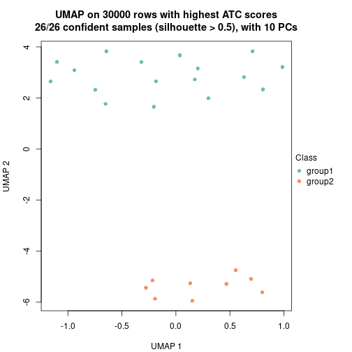</p>

</div>
<div id='tab-node-0213-dimension-reduction-2'>
<pre><code class="r">dimension_reduction(res, k = 3, method = &quot;UMAP&quot;)
</code></pre>

<p>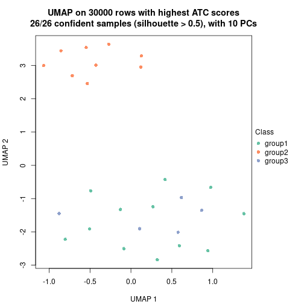</p>

</div>
<div id='tab-node-0213-dimension-reduction-3'>
<pre><code class="r">dimension_reduction(res, k = 4, method = &quot;UMAP&quot;)
</code></pre>

<p>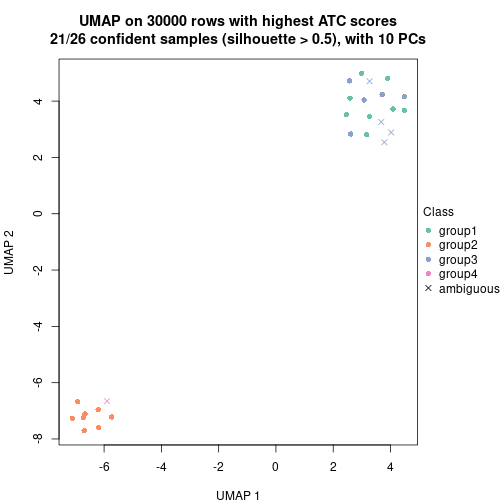</p>

</div>
<div id='tab-node-0213-dimension-reduction-4'>
<pre><code class="r">dimension_reduction(res, k = 5, method = &quot;UMAP&quot;)
</code></pre>

<p>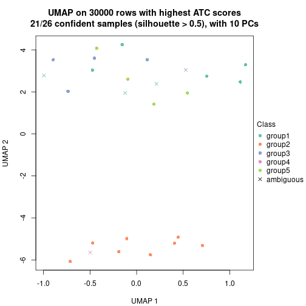</p>

</div>
<div id='tab-node-0213-dimension-reduction-5'>
<pre><code class="r">dimension_reduction(res, k = 6, method = &quot;UMAP&quot;)
</code></pre>

<p>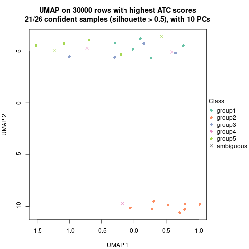</p>

</div>
<div id='tab-node-0213-dimension-reduction-6'>
<pre><code class="r">dimension_reduction(res, k = 7, method = &quot;UMAP&quot;)
</code></pre>

<p>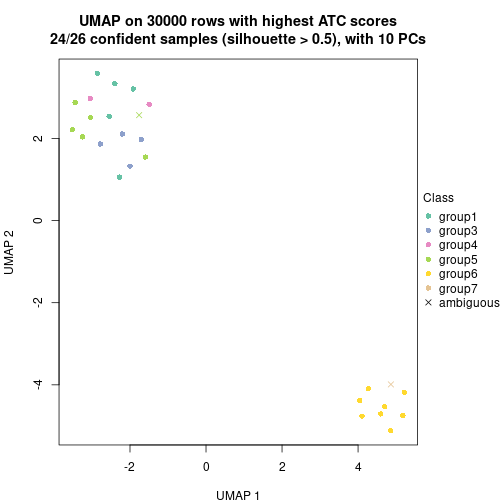</p>

</div>
<div id='tab-node-0213-dimension-reduction-7'>
<pre><code class="r">dimension_reduction(res, k = 8, method = &quot;UMAP&quot;)
</code></pre>

<p>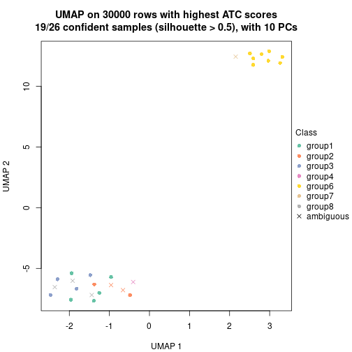</p>

</div>
</div>


Following heatmap shows how subgroups are split when increasing `k`:

```r
collect_classes(res)
```

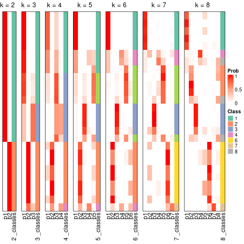


If matrix rows can be associated to genes, consider to use `functional_enrichment(res,
...)` to perform function enrichment for the signature genes. See [this vignette](https://jokergoo.github.io/cola_vignettes/functional_enrichment.html) for more detailed explanations.


 

---------------------------------------------------


### Node022


Parent node: [Node02](#Node02).
Child nodes: 
                Node0111-leaf
        ,
                Node0112-leaf
        ,
                Node0113-leaf
        ,
                Node0114-leaf
        ,
                Node0121-leaf
        ,
                Node0122-leaf
        ,
                Node0123-leaf
        ,
                Node0131-leaf
        ,
                Node0132-leaf
        ,
                Node0133-leaf
        ,
                Node0134-leaf
        ,
                Node0211-leaf
        ,
                Node0212-leaf
        ,
                [Node0213](#Node0213)
        ,
                Node0214-leaf
        ,
                [Node0221](#Node0221)
        ,
                Node0222-leaf
        ,
                Node0223-leaf
        ,
                [Node0231](#Node0231)
        ,
                Node0232-leaf
        ,
                Node0233-leaf
        ,
                [Node0234](#Node0234)
        ,
                Node0235-leaf
        ,
                Node0241-leaf
        ,
                [Node0242](#Node0242)
        ,
                Node0411-leaf
        ,
                Node0412-leaf
        ,
                Node0421-leaf
        ,
                Node0422-leaf
        ,
                Node0423-leaf
        ,
                Node0431-leaf
        ,
                Node0432-leaf
        ,
                Node0511-leaf
        ,
                Node0512-leaf
        ,
                Node0513-leaf
        ,
                Node0514-leaf
        ,
                Node0521-leaf
        ,
                Node0522-leaf
        ,
                Node0523-leaf
        ,
                Node0524-leaf
        ,
                Node0525-leaf
        ,
                Node0611-leaf
        ,
                [Node0612](#Node0612)
        ,
                Node0613-leaf
        ,
                [Node0711](#Node0711)
        ,
                Node0712-leaf
        ,
                Node0713-leaf
        ,
                [Node0721](#Node0721)
        ,
                Node0722-leaf
        ,
                Node0731-leaf
        ,
                Node0732-leaf
        ,
                Node0733-leaf
        .


The object with results only for a single top-value method and a single partitioning method 
can be extracted as:

```r
res = res_rh["022"]
```

A summary of `res` and all the functions that can be applied to it:

```r
res
```

```
#> A 'ConsensusPartition' object with k = 2, 3, 4, 5, 6, 7, 8.
#>   On a matrix with 30000 rows and 44 columns.
#>   Top rows (1000) are extracted by 'SD' method.
#>   Subgroups are detected by 'skmeans' method.
#>   Performed in total 350 partitions by row resampling.
#>   Best k for subgroups seems to be 3.
#> 
#> Following methods can be applied to this 'ConsensusPartition' object:
#>  [1] "cola_report"             "collect_classes"         "collect_plots"          
#>  [4] "collect_stats"           "colnames"                "compare_partitions"     
#>  [7] "compare_signatures"      "consensus_heatmap"       "dimension_reduction"    
#> [10] "functional_enrichment"   "get_anno_col"            "get_anno"               
#> [13] "get_classes"             "get_consensus"           "get_matrix"             
#> [16] "get_membership"          "get_param"               "get_signatures"         
#> [19] "get_stats"               "is_best_k"               "is_stable_k"            
#> [22] "membership_heatmap"      "ncol"                    "nrow"                   
#> [25] "plot_ecdf"               "predict_classes"         "rownames"               
#> [28] "select_partition_number" "show"                    "suggest_best_k"         
#> [31] "test_to_known_factors"   "top_rows_heatmap"
```

`collect_plots()` function collects all the plots made from `res` for all `k` (number of subgroups)
into one single page to provide an easy and fast comparison between different `k`.

```r
collect_plots(res)
```

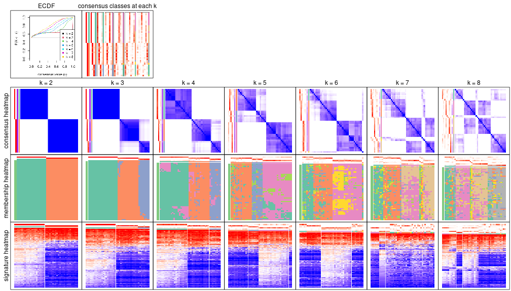

The plots are:

- The first row: a plot of the eCDF (empirical cumulative distribution
  function) curves of the consensus matrix for each `k` and the heatmap of
  predicted classes for each `k`.
- The second row: heatmaps of the consensus matrix for each `k`.
- The third row: heatmaps of the membership matrix for each `k`.
- The fouth row: heatmaps of the signatures for each `k`.

All the plots in panels can be made by individual functions and they are
plotted later in this section.

`select_partition_number()` produces several plots showing different
statistics for choosing "optimized" `k`. There are following statistics:

- eCDF curves of the consensus matrix for each `k`;
- 1-PAC. [The PAC score](https://en.wikipedia.org/wiki/Consensus_clustering#Over-interpretation_potential_of_consensus_clustering)
  measures the proportion of the ambiguous subgrouping.
- Mean silhouette score.
- Concordance. The mean probability of fiting the consensus subgroup labels in all
  partitions.
- Area increased. Denote $A_k$ as the area under the eCDF curve for current
  `k`, the area increased is defined as $A_k - A_{k-1}$.
- Rand index. The percent of pairs of samples that are both in a same cluster
  or both are not in a same cluster in the partition of k and k-1.
- Jaccard index. The ratio of pairs of samples are both in a same cluster in
  the partition of k and k-1 and the pairs of samples are both in a same
  cluster in the partition k or k-1.

The detailed explanations of these statistics can be found in [the _cola_
vignette](https://jokergoo.github.io/cola_vignettes/cola.html#toc_13).

Generally speaking, higher 1-PAC score, higher mean silhouette score or higher
concordance corresponds to better partition. Rand index and Jaccard index
measure how similar the current partition is compared to partition with `k-1`.
If they are too similar, we won't accept `k` is better than `k-1`.

```r
select_partition_number(res)
```

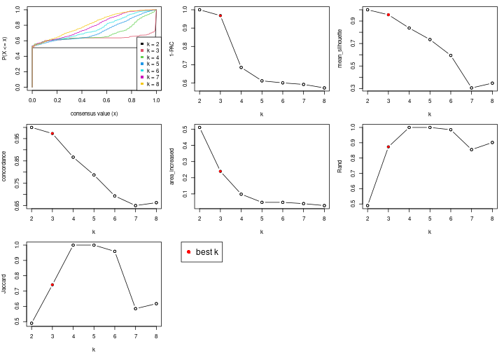

The numeric values for all these statistics can be obtained by `get_stats()`.

```r
get_stats(res)
```

```
#>   k 1-PAC mean_silhouette concordance area_increased  Rand Jaccard
#> 2 2 1.000           1.000       1.000         0.5111 0.489   0.489
#> 3 3 0.968           0.956       0.973         0.2396 0.873   0.741
#> 4 4 0.685           0.838       0.867         0.0983 1.000   1.000
#> 5 5 0.612           0.735       0.787         0.0478 1.000   1.000
#> 6 6 0.601           0.594       0.693         0.0480 0.985   0.959
#> 7 7 0.593           0.305       0.650         0.0400 0.855   0.585
#> 8 8 0.574           0.348       0.663         0.0278 0.902   0.617
```

`suggest_best_k()` suggests the best $k$ based on these statistics. The rules are as follows:

- All $k$ with Jaccard index larger than 0.95 are removed because increasing
  $k$ does not provide enough extra information. If all $k$ are removed, it is
  marked as no subgroup is detected.
- For all $k$ with 1-PAC score larger than 0.9, the maximal $k$ is taken as
  the best $k$, and other $k$ are marked as optional $k$.
- If it does not fit the second rule. The $k$ with the maximal vote of the
  highest 1-PAC score, highest mean silhouette, and highest concordance is
  taken as the best $k$.

```r
suggest_best_k(res)
```

```
#> [1] 3
#> attr(,"optional")
#> [1] 2
```

There is also optional best $k$ = 2 that is worth to check.

Following is the table of the partitions (You need to click the **show/hide
code output** link to see it). The membership matrix (columns with name `p*`)
is inferred by
[`clue::cl_consensus()`](https://www.rdocumentation.org/link/cl_consensus?package=clue)
function with the `SE` method. Basically the value in the membership matrix
represents the probability to belong to a certain group. The finall subgroup
label for an item is determined with the group with highest probability it
belongs to.

In `get_classes()` function, the entropy is calculated from the membership
matrix and the silhouette score is calculated from the consensus matrix.


<script>
$( function() {
	$( '#tabs-node-022-get-classes' ).tabs();
} );
</script>
<div id='tabs-node-022-get-classes'>
<ul>
<li><a href='#tab-node-022-get-classes-1'>k = 2</a></li>
<li><a href='#tab-node-022-get-classes-2'>k = 3</a></li>
<li><a href='#tab-node-022-get-classes-3'>k = 4</a></li>
<li><a href='#tab-node-022-get-classes-4'>k = 5</a></li>
<li><a href='#tab-node-022-get-classes-5'>k = 6</a></li>
<li><a href='#tab-node-022-get-classes-6'>k = 7</a></li>
<li><a href='#tab-node-022-get-classes-7'>k = 8</a></li>
</ul>

<div id='tab-node-022-get-classes-1'>
<p><a id='tab-node-022-get-classes-1-a' style='color:#0366d6' href='#'>show/hide code output</a></p>
<pre><code class="r">cbind(get_classes(res, k = 2), get_membership(res, k = 2))
</code></pre>

<pre><code>#&gt;                 class entropy silhouette p1 p2
#&gt; TCGA.NJ.A4YI.01     1       0          1  1  0
#&gt; TCGA.MN.A4N1.01     2       0          1  0  1
#&gt; TCGA.55.8207.01     2       0          1  0  1
#&gt; TCGA.62.A46V.01     1       0          1  1  0
#&gt; TCGA.62.A46P.01     2       0          1  0  1
#&gt; TCGA.55.A4DG.01     2       0          1  0  1
#&gt; TCGA.44.A47B.01     2       0          1  0  1
#&gt; TCGA.05.5429.01     2       0          1  0  1
#&gt; TCGA.62.A46R.01     1       0          1  1  0
#&gt; TCGA.78.7535.01     2       0          1  0  1
#&gt; TCGA.97.A4M0.01     1       0          1  1  0
#&gt; TCGA.50.5933.01     2       0          1  0  1
#&gt; TCGA.55.7907.01     2       0          1  0  1
#&gt; TCGA.55.8511.01     1       0          1  1  0
#&gt; TCGA.99.8025.01     1       0          1  1  0
#&gt; TCGA.55.7283.01     1       0          1  1  0
#&gt; TCGA.44.8117.01     1       0          1  1  0
#&gt; TCGA.05.4405.01     1       0          1  1  0
#&gt; TCGA.49.6745.01     2       0          1  0  1
#&gt; TCGA.86.8673.01     2       0          1  0  1
#&gt; TCGA.69.7765.01     2       0          1  0  1
#&gt; TCGA.95.8494.01     2       0          1  0  1
#&gt; TCGA.44.A47A.01     1       0          1  1  0
#&gt; TCGA.55.8090.01     2       0          1  0  1
#&gt; TCGA.55.7903.01     2       0          1  0  1
#&gt; TCGA.78.7153.01     1       0          1  1  0
#&gt; TCGA.55.7227.01     2       0          1  0  1
#&gt; TCGA.86.A456.01     1       0          1  1  0
#&gt; TCGA.38.4632.01     2       0          1  0  1
#&gt; TCGA.69.7974.01     1       0          1  1  0
#&gt; TCGA.55.7727.01     2       0          1  0  1
#&gt; TCGA.78.8655.01     1       0          1  1  0
#&gt; TCGA.55.7914.01     1       0          1  1  0
#&gt; TCGA.62.A472.01     2       0          1  0  1
#&gt; TCGA.97.7554.01     1       0          1  1  0
#&gt; TCGA.55.7576.01     2       0          1  0  1
#&gt; TCGA.93.8067.01     2       0          1  0  1
#&gt; TCGA.69.A59K.01     1       0          1  1  0
#&gt; TCGA.95.7567.01     2       0          1  0  1
#&gt; TCGA.49.AARN.01     1       0          1  1  0
#&gt; TCGA.91.6836.01     1       0          1  1  0
#&gt; TCGA.44.7659.01     2       0          1  0  1
#&gt; TCGA.71.8520.01     1       0          1  1  0
#&gt; TCGA.05.4425.01     1       0          1  1  0
</code></pre>

<script>
$('#tab-node-022-get-classes-1-a').parent().next().next().hide();
$('#tab-node-022-get-classes-1-a').click(function(){
  $('#tab-node-022-get-classes-1-a').parent().next().next().toggle();
  return(false);
});
</script>
</div>

<div id='tab-node-022-get-classes-2'>
<p><a id='tab-node-022-get-classes-2-a' style='color:#0366d6' href='#'>show/hide code output</a></p>
<pre><code class="r">cbind(get_classes(res, k = 3), get_membership(res, k = 3))
</code></pre>

<pre><code>#&gt;                 class entropy silhouette p1   p2   p3
#&gt; TCGA.NJ.A4YI.01     1  0.0000      1.000  1 0.00 0.00
#&gt; TCGA.MN.A4N1.01     3  0.0892      0.919  0 0.02 0.98
#&gt; TCGA.55.8207.01     2  0.0000      0.961  0 1.00 0.00
#&gt; TCGA.62.A46V.01     1  0.0000      1.000  1 0.00 0.00
#&gt; TCGA.62.A46P.01     2  0.0892      0.949  0 0.98 0.02
#&gt; TCGA.55.A4DG.01     3  0.2537      0.923  0 0.08 0.92
#&gt; TCGA.44.A47B.01     2  0.0000      0.961  0 1.00 0.00
#&gt; TCGA.05.5429.01     2  0.0892      0.949  0 0.98 0.02
#&gt; TCGA.62.A46R.01     1  0.0000      1.000  1 0.00 0.00
#&gt; TCGA.78.7535.01     3  0.0892      0.919  0 0.02 0.98
#&gt; TCGA.97.A4M0.01     1  0.0000      1.000  1 0.00 0.00
#&gt; TCGA.50.5933.01     3  0.2959      0.913  0 0.10 0.90
#&gt; TCGA.55.7907.01     3  0.5560      0.663  0 0.30 0.70
#&gt; TCGA.55.8511.01     1  0.0000      1.000  1 0.00 0.00
#&gt; TCGA.99.8025.01     1  0.0000      1.000  1 0.00 0.00
#&gt; TCGA.55.7283.01     1  0.0000      1.000  1 0.00 0.00
#&gt; TCGA.44.8117.01     1  0.0000      1.000  1 0.00 0.00
#&gt; TCGA.05.4405.01     1  0.0000      1.000  1 0.00 0.00
#&gt; TCGA.49.6745.01     2  0.0000      0.961  0 1.00 0.00
#&gt; TCGA.86.8673.01     2  0.1529      0.944  0 0.96 0.04
#&gt; TCGA.69.7765.01     2  0.3686      0.828  0 0.86 0.14
#&gt; TCGA.95.8494.01     2  0.2066      0.919  0 0.94 0.06
#&gt; TCGA.44.A47A.01     1  0.0000      1.000  1 0.00 0.00
#&gt; TCGA.55.8090.01     2  0.0000      0.961  0 1.00 0.00
#&gt; TCGA.55.7903.01     2  0.4796      0.712  0 0.78 0.22
#&gt; TCGA.78.7153.01     1  0.0000      1.000  1 0.00 0.00
#&gt; TCGA.55.7227.01     2  0.0000      0.961  0 1.00 0.00
#&gt; TCGA.86.A456.01     1  0.0000      1.000  1 0.00 0.00
#&gt; TCGA.38.4632.01     3  0.1529      0.927  0 0.04 0.96
#&gt; TCGA.69.7974.01     1  0.0000      1.000  1 0.00 0.00
#&gt; TCGA.55.7727.01     2  0.0000      0.961  0 1.00 0.00
#&gt; TCGA.78.8655.01     1  0.0000      1.000  1 0.00 0.00
#&gt; TCGA.55.7914.01     1  0.0000      1.000  1 0.00 0.00
#&gt; TCGA.62.A472.01     2  0.0000      0.961  0 1.00 0.00
#&gt; TCGA.97.7554.01     1  0.0000      1.000  1 0.00 0.00
#&gt; TCGA.55.7576.01     3  0.1529      0.925  0 0.04 0.96
#&gt; TCGA.93.8067.01     2  0.0000      0.961  0 1.00 0.00
#&gt; TCGA.69.A59K.01     1  0.0000      1.000  1 0.00 0.00
#&gt; TCGA.95.7567.01     3  0.2959      0.913  0 0.10 0.90
#&gt; TCGA.49.AARN.01     1  0.0000      1.000  1 0.00 0.00
#&gt; TCGA.91.6836.01     1  0.0000      1.000  1 0.00 0.00
#&gt; TCGA.44.7659.01     2  0.0000      0.961  0 1.00 0.00
#&gt; TCGA.71.8520.01     1  0.0000      1.000  1 0.00 0.00
#&gt; TCGA.05.4425.01     1  0.0000      1.000  1 0.00 0.00
</code></pre>

<script>
$('#tab-node-022-get-classes-2-a').parent().next().next().hide();
$('#tab-node-022-get-classes-2-a').click(function(){
  $('#tab-node-022-get-classes-2-a').parent().next().next().toggle();
  return(false);
});
</script>
</div>

<div id='tab-node-022-get-classes-3'>
<p><a id='tab-node-022-get-classes-3-a' style='color:#0366d6' href='#'>show/hide code output</a></p>
<pre><code class="r">cbind(get_classes(res, k = 4), get_membership(res, k = 4))
</code></pre>

<pre><code>#&gt;                 class entropy silhouette   p1   p2   p3   p4
#&gt; TCGA.NJ.A4YI.01     1  0.3801      0.826 0.78 0.00 0.00 0.22
#&gt; TCGA.MN.A4N1.01     3  0.2345      0.872 0.00 0.00 0.90 0.10
#&gt; TCGA.55.8207.01     2  0.3935      0.814 0.00 0.84 0.06 0.10
#&gt; TCGA.62.A46V.01     1  0.2011      0.888 0.92 0.00 0.00 0.08
#&gt; TCGA.62.A46P.01     2  0.3610      0.806 0.00 0.80 0.00 0.20
#&gt; TCGA.55.A4DG.01     3  0.1913      0.882 0.00 0.02 0.94 0.04
#&gt; TCGA.44.A47B.01     2  0.1637      0.861 0.00 0.94 0.00 0.06
#&gt; TCGA.05.5429.01     2  0.6201      0.641 0.00 0.62 0.08 0.30
#&gt; TCGA.62.A46R.01     1  0.0707      0.890 0.98 0.00 0.00 0.02
#&gt; TCGA.78.7535.01     3  0.2921      0.859 0.00 0.00 0.86 0.14
#&gt; TCGA.97.A4M0.01     1  0.2921      0.867 0.86 0.00 0.00 0.14
#&gt; TCGA.50.5933.01     3  0.3198      0.856 0.00 0.08 0.88 0.04
#&gt; TCGA.55.7907.01     3  0.6594      0.661 0.00 0.14 0.62 0.24
#&gt; TCGA.55.8511.01     1  0.3610      0.837 0.80 0.00 0.00 0.20
#&gt; TCGA.99.8025.01     1  0.2647      0.877 0.88 0.00 0.00 0.12
#&gt; TCGA.55.7283.01     1  0.2345      0.885 0.90 0.00 0.00 0.10
#&gt; TCGA.44.8117.01     1  0.3975      0.812 0.76 0.00 0.00 0.24
#&gt; TCGA.05.4405.01     1  0.2345      0.876 0.90 0.00 0.00 0.10
#&gt; TCGA.49.6745.01     2  0.1211      0.861 0.00 0.96 0.04 0.00
#&gt; TCGA.86.8673.01     2  0.4894      0.797 0.00 0.78 0.10 0.12
#&gt; TCGA.69.7765.01     2  0.4522      0.576 0.00 0.68 0.32 0.00
#&gt; TCGA.95.8494.01     2  0.3335      0.825 0.00 0.86 0.12 0.02
#&gt; TCGA.44.A47A.01     1  0.3172      0.860 0.84 0.00 0.00 0.16
#&gt; TCGA.55.8090.01     2  0.0000      0.868 0.00 1.00 0.00 0.00
#&gt; TCGA.55.7903.01     2  0.5062      0.598 0.00 0.68 0.30 0.02
#&gt; TCGA.78.7153.01     1  0.3172      0.860 0.84 0.00 0.00 0.16
#&gt; TCGA.55.7227.01     2  0.0000      0.868 0.00 1.00 0.00 0.00
#&gt; TCGA.86.A456.01     1  0.1211      0.888 0.96 0.00 0.00 0.04
#&gt; TCGA.38.4632.01     3  0.2921      0.872 0.00 0.00 0.86 0.14
#&gt; TCGA.69.7974.01     1  0.2921      0.863 0.86 0.00 0.00 0.14
#&gt; TCGA.55.7727.01     2  0.0707      0.867 0.00 0.98 0.00 0.02
#&gt; TCGA.78.8655.01     1  0.3172      0.860 0.84 0.00 0.00 0.16
#&gt; TCGA.55.7914.01     1  0.2921      0.868 0.86 0.00 0.00 0.14
#&gt; TCGA.62.A472.01     2  0.0000      0.868 0.00 1.00 0.00 0.00
#&gt; TCGA.97.7554.01     1  0.3801      0.825 0.78 0.00 0.00 0.22
#&gt; TCGA.55.7576.01     3  0.0707      0.884 0.00 0.02 0.98 0.00
#&gt; TCGA.93.8067.01     2  0.2647      0.843 0.00 0.88 0.00 0.12
#&gt; TCGA.69.A59K.01     1  0.1637      0.887 0.94 0.00 0.00 0.06
#&gt; TCGA.95.7567.01     3  0.2706      0.859 0.00 0.08 0.90 0.02
#&gt; TCGA.49.AARN.01     1  0.2647      0.873 0.88 0.00 0.00 0.12
#&gt; TCGA.91.6836.01     1  0.2647      0.877 0.88 0.00 0.00 0.12
#&gt; TCGA.44.7659.01     2  0.0000      0.868 0.00 1.00 0.00 0.00
#&gt; TCGA.71.8520.01     1  0.2921      0.867 0.86 0.00 0.00 0.14
#&gt; TCGA.05.4425.01     1  0.2921      0.874 0.86 0.00 0.00 0.14
</code></pre>

<script>
$('#tab-node-022-get-classes-3-a').parent().next().next().hide();
$('#tab-node-022-get-classes-3-a').click(function(){
  $('#tab-node-022-get-classes-3-a').parent().next().next().toggle();
  return(false);
});
</script>
</div>

<div id='tab-node-022-get-classes-4'>
<p><a id='tab-node-022-get-classes-4-a' style='color:#0366d6' href='#'>show/hide code output</a></p>
<pre><code class="r">cbind(get_classes(res, k = 5), get_membership(res, k = 5))
</code></pre>

<pre><code>#&gt;                 class entropy silhouette   p1   p2   p3   p4   p5
#&gt; TCGA.NJ.A4YI.01     4   0.262      0.769 0.10 0.00 0.00 0.88 0.02
#&gt; TCGA.MN.A4N1.01     3   0.422      0.732 0.12 0.00 0.78 0.00 0.10
#&gt; TCGA.55.8207.01     2   0.608      0.598 0.04 0.64 0.10 0.00 0.22
#&gt; TCGA.62.A46V.01     4   0.352      0.790 0.14 0.00 0.00 0.82 0.04
#&gt; TCGA.62.A46P.01     2   0.400      0.701 0.02 0.74 0.00 0.00 0.24
#&gt; TCGA.55.A4DG.01     3   0.244      0.784 0.00 0.04 0.90 0.00 0.06
#&gt; TCGA.44.A47B.01     2   0.233      0.774 0.02 0.90 0.00 0.00 0.08
#&gt; TCGA.05.5429.01     2   0.597      0.543 0.08 0.58 0.02 0.00 0.32
#&gt; TCGA.62.A46R.01     4   0.273      0.825 0.16 0.00 0.00 0.84 0.00
#&gt; TCGA.78.7535.01     3   0.600      0.688 0.18 0.02 0.64 0.00 0.16
#&gt; TCGA.97.A4M0.01     4   0.423      0.761 0.42 0.00 0.00 0.58 0.00
#&gt; TCGA.50.5933.01     3   0.455      0.741 0.02 0.10 0.78 0.00 0.10
#&gt; TCGA.55.7907.01     3   0.709      0.498 0.04 0.18 0.50 0.00 0.28
#&gt; TCGA.55.8511.01     4   0.202      0.769 0.10 0.00 0.00 0.90 0.00
#&gt; TCGA.99.8025.01     4   0.327      0.809 0.22 0.00 0.00 0.78 0.00
#&gt; TCGA.55.7283.01     4   0.342      0.819 0.24 0.00 0.00 0.76 0.00
#&gt; TCGA.44.8117.01     4   0.228      0.762 0.12 0.00 0.00 0.88 0.00
#&gt; TCGA.05.4405.01     4   0.228      0.819 0.12 0.00 0.00 0.88 0.00
#&gt; TCGA.49.6745.01     2   0.165      0.780 0.00 0.94 0.04 0.00 0.02
#&gt; TCGA.86.8673.01     2   0.677      0.525 0.04 0.56 0.16 0.00 0.24
#&gt; TCGA.69.7765.01     2   0.492      0.458 0.00 0.62 0.34 0.00 0.04
#&gt; TCGA.95.8494.01     2   0.535      0.580 0.00 0.66 0.22 0.00 0.12
#&gt; TCGA.44.A47A.01     4   0.423      0.756 0.42 0.00 0.00 0.58 0.00
#&gt; TCGA.55.8090.01     2   0.104      0.784 0.00 0.96 0.00 0.00 0.04
#&gt; TCGA.55.7903.01     2   0.484      0.506 0.00 0.64 0.32 0.00 0.04
#&gt; TCGA.78.7153.01     4   0.418      0.765 0.40 0.00 0.00 0.60 0.00
#&gt; TCGA.55.7227.01     2   0.000      0.788 0.00 1.00 0.00 0.00 0.00
#&gt; TCGA.86.A456.01     4   0.173      0.819 0.08 0.00 0.00 0.92 0.00
#&gt; TCGA.38.4632.01     3   0.275      0.765 0.08 0.00 0.88 0.00 0.04
#&gt; TCGA.69.7974.01     4   0.104      0.793 0.04 0.00 0.00 0.96 0.00
#&gt; TCGA.55.7727.01     2   0.201      0.786 0.00 0.92 0.02 0.00 0.06
#&gt; TCGA.78.8655.01     4   0.423      0.761 0.42 0.00 0.00 0.58 0.00
#&gt; TCGA.55.7914.01     4   0.413      0.780 0.38 0.00 0.00 0.62 0.00
#&gt; TCGA.62.A472.01     2   0.122      0.787 0.00 0.96 0.02 0.00 0.02
#&gt; TCGA.97.7554.01     4   0.141      0.786 0.06 0.00 0.00 0.94 0.00
#&gt; TCGA.55.7576.01     3   0.335      0.774 0.02 0.08 0.86 0.00 0.04
#&gt; TCGA.93.8067.01     2   0.252      0.776 0.00 0.86 0.00 0.00 0.14
#&gt; TCGA.69.A59K.01     4   0.201      0.815 0.06 0.00 0.00 0.92 0.02
#&gt; TCGA.95.7567.01     3   0.475      0.711 0.02 0.14 0.76 0.00 0.08
#&gt; TCGA.49.AARN.01     4   0.389      0.802 0.32 0.00 0.00 0.68 0.00
#&gt; TCGA.91.6836.01     4   0.443      0.726 0.20 0.00 0.00 0.74 0.06
#&gt; TCGA.44.7659.01     2   0.122      0.788 0.00 0.96 0.02 0.00 0.02
#&gt; TCGA.71.8520.01     4   0.406      0.783 0.36 0.00 0.00 0.64 0.00
#&gt; TCGA.05.4425.01     4   0.426      0.771 0.44 0.00 0.00 0.56 0.00
</code></pre>

<script>
$('#tab-node-022-get-classes-4-a').parent().next().next().hide();
$('#tab-node-022-get-classes-4-a').click(function(){
  $('#tab-node-022-get-classes-4-a').parent().next().next().toggle();
  return(false);
});
</script>
</div>

<div id='tab-node-022-get-classes-5'>
<p><a id='tab-node-022-get-classes-5-a' style='color:#0366d6' href='#'>show/hide code output</a></p>
<pre><code class="r">cbind(get_classes(res, k = 6), get_membership(res, k = 6))
</code></pre>

<pre><code>#&gt;                 class entropy silhouette   p1   p2   p3   p4   p5   p6
#&gt; TCGA.NJ.A4YI.01     4  0.5387      0.569 0.00 0.00 0.06 0.60 0.30 0.04
#&gt; TCGA.MN.A4N1.01     1  0.3997      0.512 0.78 0.00 0.14 0.00 0.02 0.06
#&gt; TCGA.55.8207.01     2  0.6975      0.401 0.08 0.58 0.14 0.00 0.08 0.12
#&gt; TCGA.62.A46V.01     4  0.4345      0.708 0.00 0.00 0.06 0.74 0.18 0.02
#&gt; TCGA.62.A46P.01     2  0.5035      0.538 0.02 0.74 0.06 0.00 0.08 0.10
#&gt; TCGA.55.A4DG.01     1  0.3592      0.632 0.74 0.00 0.24 0.00 0.00 0.02
#&gt; TCGA.44.A47B.01     2  0.3567      0.551 0.00 0.80 0.00 0.00 0.10 0.10
#&gt; TCGA.05.5429.01     6  0.6208      0.000 0.12 0.28 0.06 0.00 0.00 0.54
#&gt; TCGA.62.A46R.01     4  0.2048      0.743 0.00 0.00 0.00 0.88 0.12 0.00
#&gt; TCGA.78.7535.01     1  0.5352      0.397 0.64 0.00 0.08 0.00 0.04 0.24
#&gt; TCGA.97.A4M0.01     4  0.3647      0.691 0.00 0.00 0.00 0.64 0.36 0.00
#&gt; TCGA.50.5933.01     1  0.4222      0.605 0.70 0.02 0.26 0.00 0.00 0.02
#&gt; TCGA.55.7907.01     1  0.7071      0.275 0.42 0.08 0.36 0.00 0.02 0.12
#&gt; TCGA.55.8511.01     4  0.3819      0.610 0.00 0.00 0.00 0.70 0.28 0.02
#&gt; TCGA.99.8025.01     4  0.2581      0.722 0.00 0.00 0.00 0.86 0.12 0.02
#&gt; TCGA.55.7283.01     4  0.2793      0.729 0.00 0.00 0.00 0.80 0.20 0.00
#&gt; TCGA.44.8117.01     4  0.4326      0.603 0.00 0.00 0.02 0.68 0.28 0.02
#&gt; TCGA.05.4405.01     4  0.3315      0.716 0.00 0.00 0.00 0.78 0.20 0.02
#&gt; TCGA.49.6745.01     2  0.3475      0.642 0.06 0.80 0.14 0.00 0.00 0.00
#&gt; TCGA.86.8673.01     2  0.6105      0.420 0.04 0.64 0.18 0.00 0.06 0.08
#&gt; TCGA.69.7765.01     2  0.5979      0.435 0.14 0.60 0.22 0.00 0.02 0.02
#&gt; TCGA.95.8494.01     2  0.5345      0.547 0.10 0.68 0.18 0.00 0.02 0.02
#&gt; TCGA.44.A47A.01     4  0.3706      0.684 0.00 0.00 0.00 0.62 0.38 0.00
#&gt; TCGA.55.8090.01     2  0.0547      0.677 0.00 0.98 0.00 0.00 0.02 0.00
#&gt; TCGA.55.7903.01     2  0.5628      0.266 0.22 0.54 0.24 0.00 0.00 0.00
#&gt; TCGA.78.7153.01     4  0.3756      0.676 0.00 0.00 0.00 0.60 0.40 0.00
#&gt; TCGA.55.7227.01     2  0.0547      0.677 0.00 0.98 0.00 0.00 0.02 0.00
#&gt; TCGA.86.A456.01     4  0.2581      0.730 0.00 0.00 0.02 0.86 0.12 0.00
#&gt; TCGA.38.4632.01     1  0.1480      0.592 0.94 0.00 0.04 0.00 0.02 0.00
#&gt; TCGA.69.7974.01     4  0.2793      0.674 0.00 0.00 0.00 0.80 0.20 0.00
#&gt; TCGA.55.7727.01     2  0.3045      0.682 0.06 0.86 0.06 0.00 0.00 0.02
#&gt; TCGA.78.8655.01     4  0.3756      0.676 0.00 0.00 0.00 0.60 0.40 0.00
#&gt; TCGA.55.7914.01     4  0.4765      0.688 0.00 0.00 0.04 0.64 0.30 0.02
#&gt; TCGA.62.A472.01     2  0.0547      0.683 0.00 0.98 0.02 0.00 0.00 0.00
#&gt; TCGA.97.7554.01     4  0.3819      0.610 0.00 0.00 0.00 0.70 0.28 0.02
#&gt; TCGA.55.7576.01     1  0.4265      0.587 0.66 0.04 0.30 0.00 0.00 0.00
#&gt; TCGA.93.8067.01     2  0.4798      0.628 0.06 0.76 0.08 0.00 0.02 0.08
#&gt; TCGA.69.A59K.01     4  0.3787      0.705 0.00 0.00 0.10 0.78 0.12 0.00
#&gt; TCGA.95.7567.01     1  0.5626      0.459 0.54 0.10 0.34 0.00 0.00 0.02
#&gt; TCGA.49.AARN.01     4  0.3198      0.720 0.00 0.00 0.00 0.74 0.26 0.00
#&gt; TCGA.91.6836.01     4  0.6012      0.607 0.00 0.00 0.16 0.60 0.18 0.06
#&gt; TCGA.44.7659.01     2  0.1092      0.689 0.02 0.96 0.02 0.00 0.00 0.00
#&gt; TCGA.71.8520.01     4  0.4482      0.697 0.00 0.00 0.04 0.60 0.36 0.00
#&gt; TCGA.05.4425.01     4  0.5049      0.698 0.00 0.00 0.06 0.62 0.30 0.02
</code></pre>

<script>
$('#tab-node-022-get-classes-5-a').parent().next().next().hide();
$('#tab-node-022-get-classes-5-a').click(function(){
  $('#tab-node-022-get-classes-5-a').parent().next().next().toggle();
  return(false);
});
</script>
</div>

<div id='tab-node-022-get-classes-6'>
<p><a id='tab-node-022-get-classes-6-a' style='color:#0366d6' href='#'>show/hide code output</a></p>
<pre><code class="r">cbind(get_classes(res, k = 7), get_membership(res, k = 7))
</code></pre>

<pre><code>#&gt;                 class entropy silhouette   p1   p2   p3   p4   p5   p6   p7
#&gt; TCGA.NJ.A4YI.01     7   0.504     0.4647 0.00 0.00 0.02 0.36 0.00 0.08 0.54
#&gt; TCGA.MN.A4N1.01     1   0.553    -0.0052 0.54 0.00 0.24 0.00 0.20 0.02 0.00
#&gt; TCGA.55.8207.01     3   0.647     0.0000 0.06 0.38 0.42 0.00 0.04 0.10 0.00
#&gt; TCGA.62.A46V.01     4   0.584    -0.0621 0.00 0.00 0.06 0.48 0.02 0.06 0.38
#&gt; TCGA.62.A46P.01     6   0.432     0.0355 0.02 0.38 0.02 0.00 0.00 0.58 0.00
#&gt; TCGA.55.A4DG.01     1   0.291     0.3016 0.80 0.02 0.00 0.00 0.18 0.00 0.00
#&gt; TCGA.44.A47B.01     2   0.378     0.2873 0.00 0.72 0.02 0.00 0.02 0.24 0.00
#&gt; TCGA.05.5429.01     6   0.764     0.2014 0.06 0.22 0.08 0.00 0.16 0.44 0.04
#&gt; TCGA.62.A46R.01     4   0.466    -0.1314 0.00 0.00 0.02 0.54 0.04 0.00 0.40
#&gt; TCGA.78.7535.01     5   0.329     0.0000 0.34 0.00 0.00 0.00 0.66 0.00 0.00
#&gt; TCGA.97.A4M0.01     4   0.251     0.5695 0.00 0.00 0.04 0.86 0.00 0.00 0.10
#&gt; TCGA.50.5933.01     1   0.277     0.4237 0.86 0.08 0.00 0.00 0.04 0.02 0.00
#&gt; TCGA.55.7907.01     1   0.750     0.2324 0.48 0.10 0.10 0.00 0.14 0.16 0.02
#&gt; TCGA.55.8511.01     7   0.352     0.6234 0.00 0.00 0.02 0.28 0.00 0.00 0.70
#&gt; TCGA.99.8025.01     7   0.442     0.1982 0.00 0.00 0.02 0.46 0.02 0.00 0.50
#&gt; TCGA.55.7283.01     4   0.407     0.3347 0.00 0.00 0.00 0.66 0.02 0.02 0.30
#&gt; TCGA.44.8117.01     7   0.305     0.6118 0.00 0.00 0.02 0.20 0.00 0.00 0.78
#&gt; TCGA.05.4405.01     4   0.352    -0.0151 0.00 0.00 0.00 0.56 0.00 0.00 0.44
#&gt; TCGA.49.6745.01     2   0.436     0.4717 0.12 0.74 0.06 0.00 0.00 0.08 0.00
#&gt; TCGA.86.8673.01     2   0.711     0.1429 0.12 0.50 0.08 0.00 0.06 0.22 0.02
#&gt; TCGA.69.7765.01     2   0.534     0.2783 0.28 0.60 0.04 0.00 0.02 0.06 0.00
#&gt; TCGA.95.8494.01     2   0.606     0.2199 0.28 0.52 0.04 0.00 0.02 0.14 0.00
#&gt; TCGA.44.A47A.01     4   0.251     0.5677 0.00 0.00 0.00 0.86 0.04 0.00 0.10
#&gt; TCGA.55.8090.01     2   0.251     0.4718 0.00 0.88 0.02 0.00 0.04 0.06 0.00
#&gt; TCGA.55.7903.01     2   0.581     0.0901 0.36 0.50 0.06 0.00 0.02 0.06 0.00
#&gt; TCGA.78.7153.01     4   0.101     0.5686 0.00 0.00 0.02 0.96 0.00 0.00 0.02
#&gt; TCGA.55.7227.01     2   0.101     0.4871 0.00 0.96 0.00 0.00 0.02 0.02 0.00
#&gt; TCGA.86.A456.01     7   0.399     0.4065 0.00 0.00 0.00 0.48 0.02 0.00 0.50
#&gt; TCGA.38.4632.01     1   0.509     0.0505 0.64 0.00 0.08 0.00 0.22 0.06 0.00
#&gt; TCGA.69.7974.01     7   0.382     0.5745 0.00 0.00 0.02 0.36 0.00 0.00 0.62
#&gt; TCGA.55.7727.01     2   0.509     0.3884 0.10 0.70 0.02 0.00 0.08 0.10 0.00
#&gt; TCGA.78.8655.01     4   0.000     0.5616 0.00 0.00 0.00 1.00 0.00 0.00 0.00
#&gt; TCGA.55.7914.01     4   0.419     0.5120 0.00 0.00 0.04 0.72 0.04 0.00 0.20
#&gt; TCGA.62.A472.01     2   0.101     0.4871 0.00 0.96 0.00 0.00 0.02 0.02 0.00
#&gt; TCGA.97.7554.01     7   0.319     0.6160 0.00 0.00 0.00 0.22 0.00 0.02 0.76
#&gt; TCGA.55.7576.01     1   0.469     0.3806 0.74 0.04 0.10 0.00 0.08 0.04 0.00
#&gt; TCGA.93.8067.01     2   0.346     0.0491 0.00 0.60 0.00 0.00 0.00 0.40 0.00
#&gt; TCGA.69.A59K.01     4   0.536    -0.3005 0.00 0.00 0.06 0.46 0.02 0.02 0.44
#&gt; TCGA.95.7567.01     1   0.606     0.3221 0.62 0.16 0.02 0.00 0.10 0.08 0.02
#&gt; TCGA.49.AARN.01     4   0.339     0.4593 0.00 0.00 0.04 0.76 0.00 0.00 0.20
#&gt; TCGA.91.6836.01     7   0.589     0.1263 0.00 0.00 0.16 0.34 0.00 0.04 0.46
#&gt; TCGA.44.7659.01     2   0.380     0.4548 0.08 0.80 0.02 0.00 0.02 0.08 0.00
#&gt; TCGA.71.8520.01     4   0.286     0.5230 0.00 0.00 0.02 0.84 0.02 0.00 0.12
#&gt; TCGA.05.4425.01     4   0.493     0.4508 0.00 0.00 0.06 0.70 0.06 0.02 0.16
</code></pre>

<script>
$('#tab-node-022-get-classes-6-a').parent().next().next().hide();
$('#tab-node-022-get-classes-6-a').click(function(){
  $('#tab-node-022-get-classes-6-a').parent().next().next().toggle();
  return(false);
});
</script>
</div>

<div id='tab-node-022-get-classes-7'>
<p><a id='tab-node-022-get-classes-7-a' style='color:#0366d6' href='#'>show/hide code output</a></p>
<pre><code class="r">cbind(get_classes(res, k = 8), get_membership(res, k = 8))
</code></pre>

<pre><code>#&gt;                 class entropy silhouette   p1   p2   p3   p4   p5   p6   p7   p8
#&gt; TCGA.NJ.A4YI.01     7  0.2947     0.5295 0.00 0.06 0.00 0.06 0.00 0.04 0.84 0.00
#&gt; TCGA.MN.A4N1.01     1  0.5321     0.0508 0.54 0.08 0.02 0.00 0.32 0.04 0.00 0.00
#&gt; TCGA.55.8207.01     3  0.4642     0.0000 0.06 0.00 0.60 0.00 0.04 0.00 0.00 0.30
#&gt; TCGA.62.A46V.01     7  0.3975     0.4113 0.00 0.08 0.00 0.26 0.00 0.00 0.66 0.00
#&gt; TCGA.62.A46P.01     8  0.6538    -0.0882 0.04 0.02 0.26 0.00 0.02 0.28 0.00 0.38
#&gt; TCGA.55.A4DG.01     1  0.4781     0.4490 0.72 0.08 0.02 0.00 0.06 0.02 0.00 0.10
#&gt; TCGA.44.A47B.01     8  0.4313     0.3528 0.02 0.00 0.06 0.02 0.00 0.20 0.00 0.70
#&gt; TCGA.05.5429.01     6  0.5125     0.0000 0.08 0.04 0.00 0.00 0.02 0.60 0.00 0.26
#&gt; TCGA.62.A46R.01     7  0.4004     0.0436 0.00 0.04 0.00 0.46 0.00 0.00 0.50 0.00
#&gt; TCGA.78.7535.01     5  0.2856     0.0000 0.20 0.00 0.02 0.00 0.78 0.00 0.00 0.00
#&gt; TCGA.97.A4M0.01     4  0.3170     0.5623 0.00 0.04 0.00 0.76 0.00 0.00 0.20 0.00
#&gt; TCGA.50.5933.01     1  0.3986     0.4580 0.74 0.00 0.08 0.00 0.04 0.00 0.00 0.14
#&gt; TCGA.55.7907.01     1  0.8068     0.1537 0.32 0.22 0.10 0.00 0.12 0.16 0.00 0.08
#&gt; TCGA.55.8511.01     7  0.2725     0.5594 0.00 0.04 0.00 0.14 0.00 0.00 0.82 0.00
#&gt; TCGA.99.8025.01     4  0.5301     0.1011 0.00 0.16 0.02 0.42 0.00 0.00 0.40 0.00
#&gt; TCGA.55.7283.01     4  0.4141     0.2557 0.00 0.06 0.00 0.56 0.00 0.00 0.38 0.00
#&gt; TCGA.44.8117.01     7  0.2648     0.5127 0.00 0.08 0.00 0.08 0.00 0.00 0.84 0.00
#&gt; TCGA.05.4405.01     7  0.3943     0.1773 0.00 0.04 0.00 0.40 0.00 0.00 0.56 0.00
#&gt; TCGA.49.6745.01     8  0.4034     0.4701 0.12 0.04 0.06 0.00 0.02 0.00 0.00 0.76
#&gt; TCGA.86.8673.01     8  0.7203     0.0803 0.16 0.04 0.10 0.00 0.04 0.26 0.00 0.40
#&gt; TCGA.69.7765.01     8  0.5619     0.2221 0.36 0.02 0.04 0.00 0.06 0.02 0.00 0.50
#&gt; TCGA.95.8494.01     8  0.5026     0.3518 0.22 0.04 0.06 0.00 0.00 0.04 0.00 0.64
#&gt; TCGA.44.A47A.01     4  0.2224     0.6058 0.00 0.02 0.00 0.86 0.00 0.00 0.12 0.00
#&gt; TCGA.55.8090.01     8  0.2348     0.5046 0.00 0.00 0.02 0.00 0.06 0.04 0.00 0.88
#&gt; TCGA.55.7903.01     8  0.4933     0.2466 0.36 0.02 0.06 0.00 0.00 0.02 0.00 0.54
#&gt; TCGA.78.7153.01     4  0.2623     0.6158 0.00 0.06 0.00 0.84 0.00 0.00 0.10 0.00
#&gt; TCGA.55.7227.01     8  0.1408     0.5052 0.00 0.00 0.02 0.00 0.02 0.02 0.00 0.94
#&gt; TCGA.86.A456.01     7  0.4412     0.4388 0.00 0.12 0.00 0.28 0.00 0.00 0.60 0.00
#&gt; TCGA.38.4632.01     1  0.5040     0.2305 0.62 0.08 0.04 0.00 0.24 0.02 0.00 0.00
#&gt; TCGA.69.7974.01     7  0.3170     0.5463 0.00 0.04 0.00 0.20 0.00 0.00 0.76 0.00
#&gt; TCGA.55.7727.01     8  0.3663     0.4867 0.06 0.00 0.10 0.00 0.00 0.06 0.00 0.78
#&gt; TCGA.78.8655.01     4  0.2407     0.6105 0.00 0.06 0.00 0.86 0.00 0.00 0.08 0.00
#&gt; TCGA.55.7914.01     4  0.4345     0.4943 0.00 0.12 0.02 0.68 0.00 0.00 0.18 0.00
#&gt; TCGA.62.A472.01     8  0.0471     0.5135 0.00 0.00 0.00 0.00 0.00 0.02 0.00 0.98
#&gt; TCGA.97.7554.01     7  0.2547     0.5438 0.00 0.04 0.00 0.12 0.00 0.00 0.84 0.00
#&gt; TCGA.55.7576.01     1  0.4647     0.3999 0.68 0.02 0.02 0.00 0.16 0.00 0.00 0.12
#&gt; TCGA.93.8067.01     8  0.6597     0.1253 0.06 0.02 0.20 0.00 0.04 0.20 0.00 0.48
#&gt; TCGA.69.A59K.01     7  0.4299     0.4440 0.00 0.14 0.00 0.22 0.00 0.00 0.64 0.00
#&gt; TCGA.95.7567.01     1  0.5192     0.4240 0.62 0.20 0.02 0.00 0.00 0.04 0.00 0.12
#&gt; TCGA.49.AARN.01     4  0.4786     0.1605 0.00 0.14 0.00 0.48 0.00 0.00 0.38 0.00
#&gt; TCGA.91.6836.01     7  0.5402     0.2293 0.00 0.26 0.00 0.24 0.02 0.00 0.48 0.00
#&gt; TCGA.44.7659.01     8  0.3048     0.5003 0.02 0.00 0.08 0.00 0.02 0.04 0.00 0.84
#&gt; TCGA.71.8520.01     4  0.4033     0.5556 0.00 0.12 0.00 0.68 0.00 0.00 0.20 0.00
#&gt; TCGA.05.4425.01     4  0.5505     0.4593 0.00 0.12 0.04 0.62 0.02 0.02 0.18 0.00
</code></pre>

<script>
$('#tab-node-022-get-classes-7-a').parent().next().next().hide();
$('#tab-node-022-get-classes-7-a').click(function(){
  $('#tab-node-022-get-classes-7-a').parent().next().next().toggle();
  return(false);
});
</script>
</div>
</div>

Heatmaps for the consensus matrix. It visualizes the probability of two
samples to be in a same group.


<script>
$( function() {
	$( '#tabs-node-022-consensus-heatmap' ).tabs();
} );
</script>
<div id='tabs-node-022-consensus-heatmap'>
<ul>
<li><a href='#tab-node-022-consensus-heatmap-1'>k = 2</a></li>
<li><a href='#tab-node-022-consensus-heatmap-2'>k = 3</a></li>
<li><a href='#tab-node-022-consensus-heatmap-3'>k = 4</a></li>
<li><a href='#tab-node-022-consensus-heatmap-4'>k = 5</a></li>
<li><a href='#tab-node-022-consensus-heatmap-5'>k = 6</a></li>
<li><a href='#tab-node-022-consensus-heatmap-6'>k = 7</a></li>
<li><a href='#tab-node-022-consensus-heatmap-7'>k = 8</a></li>
</ul>
<div id='tab-node-022-consensus-heatmap-1'>
<pre><code class="r">consensus_heatmap(res, k = 2)
</code></pre>

<p>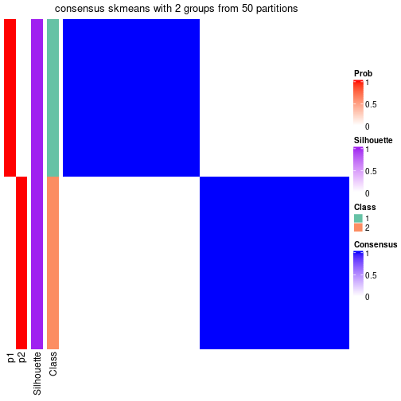</p>

</div>
<div id='tab-node-022-consensus-heatmap-2'>
<pre><code class="r">consensus_heatmap(res, k = 3)
</code></pre>

<p>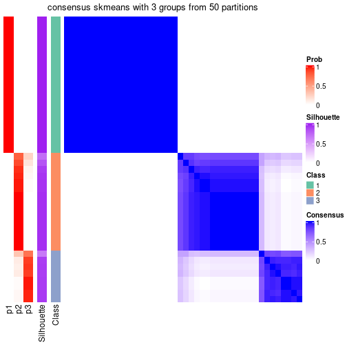</p>

</div>
<div id='tab-node-022-consensus-heatmap-3'>
<pre><code class="r">consensus_heatmap(res, k = 4)
</code></pre>

<p>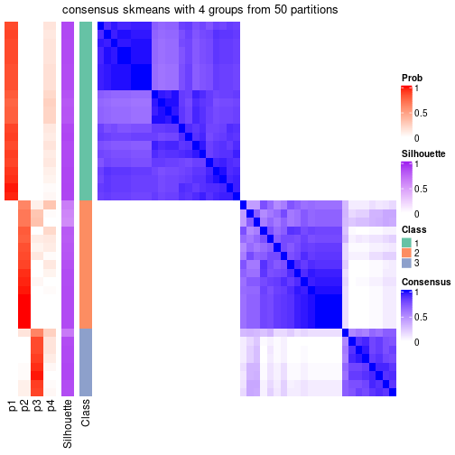</p>

</div>
<div id='tab-node-022-consensus-heatmap-4'>
<pre><code class="r">consensus_heatmap(res, k = 5)
</code></pre>

<p>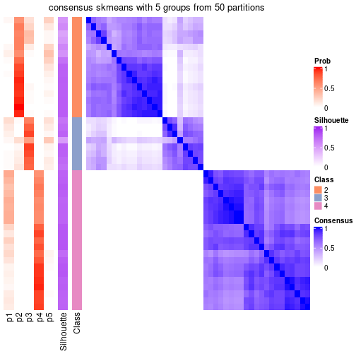</p>

</div>
<div id='tab-node-022-consensus-heatmap-5'>
<pre><code class="r">consensus_heatmap(res, k = 6)
</code></pre>

<p>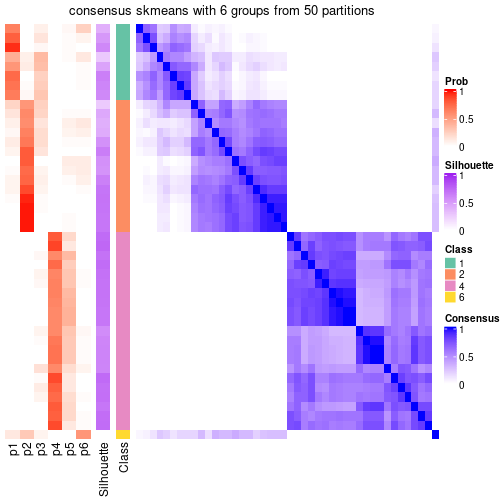</p>

</div>
<div id='tab-node-022-consensus-heatmap-6'>
<pre><code class="r">consensus_heatmap(res, k = 7)
</code></pre>

<p>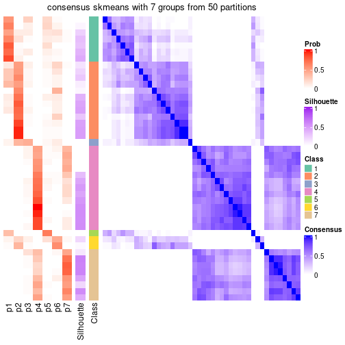</p>

</div>
<div id='tab-node-022-consensus-heatmap-7'>
<pre><code class="r">consensus_heatmap(res, k = 8)
</code></pre>

<p>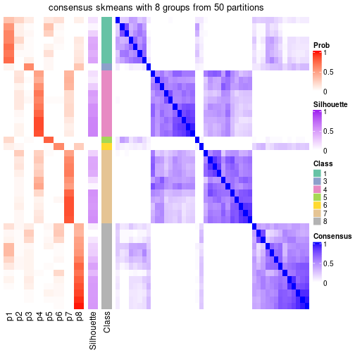</p>

</div>
</div>

Heatmaps for the membership of samples in all partitions to see how consistent they are:


<script>
$( function() {
	$( '#tabs-node-022-membership-heatmap' ).tabs();
} );
</script>
<div id='tabs-node-022-membership-heatmap'>
<ul>
<li><a href='#tab-node-022-membership-heatmap-1'>k = 2</a></li>
<li><a href='#tab-node-022-membership-heatmap-2'>k = 3</a></li>
<li><a href='#tab-node-022-membership-heatmap-3'>k = 4</a></li>
<li><a href='#tab-node-022-membership-heatmap-4'>k = 5</a></li>
<li><a href='#tab-node-022-membership-heatmap-5'>k = 6</a></li>
<li><a href='#tab-node-022-membership-heatmap-6'>k = 7</a></li>
<li><a href='#tab-node-022-membership-heatmap-7'>k = 8</a></li>
</ul>
<div id='tab-node-022-membership-heatmap-1'>
<pre><code class="r">membership_heatmap(res, k = 2)
</code></pre>

<p>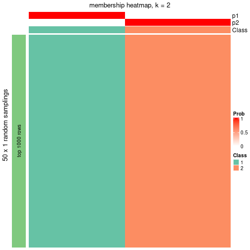</p>

</div>
<div id='tab-node-022-membership-heatmap-2'>
<pre><code class="r">membership_heatmap(res, k = 3)
</code></pre>

<p>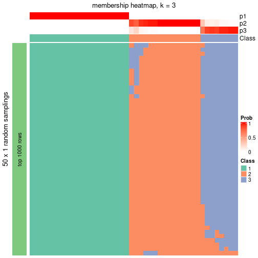</p>

</div>
<div id='tab-node-022-membership-heatmap-3'>
<pre><code class="r">membership_heatmap(res, k = 4)
</code></pre>

<p>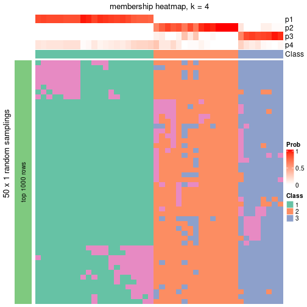</p>

</div>
<div id='tab-node-022-membership-heatmap-4'>
<pre><code class="r">membership_heatmap(res, k = 5)
</code></pre>

<p>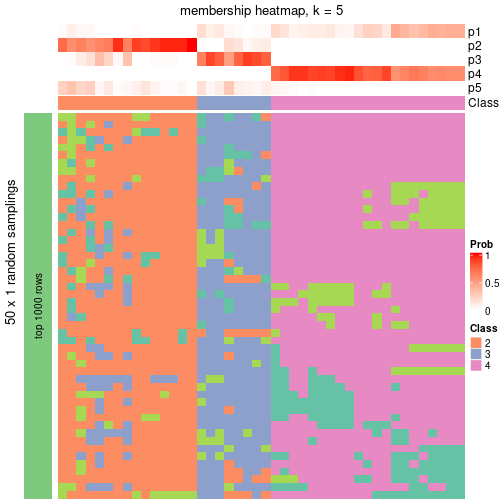</p>

</div>
<div id='tab-node-022-membership-heatmap-5'>
<pre><code class="r">membership_heatmap(res, k = 6)
</code></pre>

<p>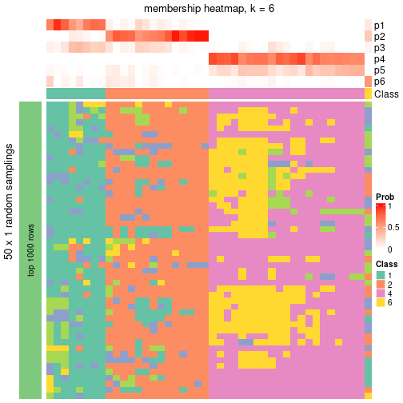</p>

</div>
<div id='tab-node-022-membership-heatmap-6'>
<pre><code class="r">membership_heatmap(res, k = 7)
</code></pre>

<p>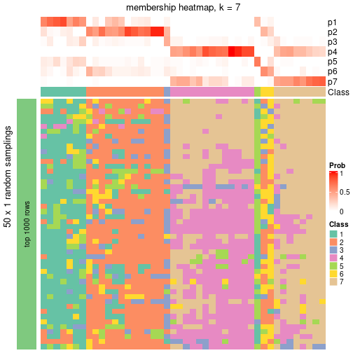</p>

</div>
<div id='tab-node-022-membership-heatmap-7'>
<pre><code class="r">membership_heatmap(res, k = 8)
</code></pre>

<p>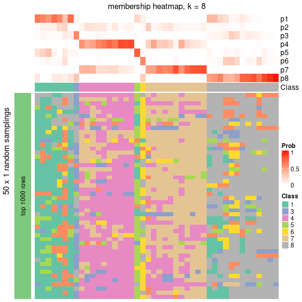</p>

</div>
</div>

As soon as the classes for columns are determined, the signatures
that are significantly different between subgroups can be looked for. 
Following are the heatmaps for signatures.


<script>
$( function() {
	$( '#tabs-node-022-get-signatures' ).tabs();
} );
</script>
<div id='tabs-node-022-get-signatures'>
<ul>
<li><a href='#tab-node-022-get-signatures-1'>k = 2</a></li>
<li><a href='#tab-node-022-get-signatures-2'>k = 3</a></li>
<li><a href='#tab-node-022-get-signatures-3'>k = 4</a></li>
<li><a href='#tab-node-022-get-signatures-4'>k = 5</a></li>
<li><a href='#tab-node-022-get-signatures-5'>k = 6</a></li>
<li><a href='#tab-node-022-get-signatures-6'>k = 7</a></li>
<li><a href='#tab-node-022-get-signatures-7'>k = 8</a></li>
</ul>
<div id='tab-node-022-get-signatures-1'>
<pre><code class="r">get_signatures(res, k = 2)
</code></pre>

<p>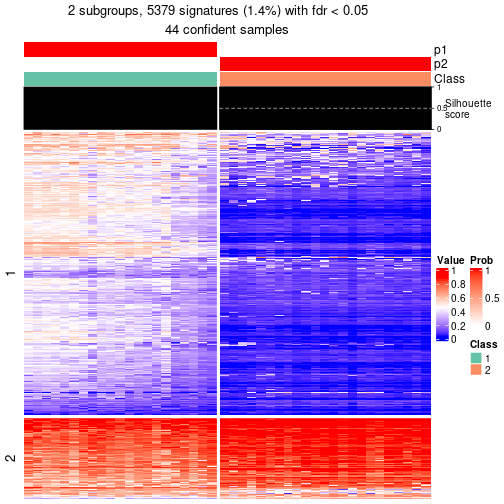</p>

</div>
<div id='tab-node-022-get-signatures-2'>
<pre><code class="r">get_signatures(res, k = 3)
</code></pre>

<p>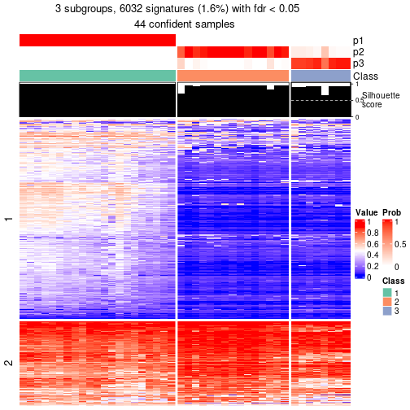</p>

</div>
<div id='tab-node-022-get-signatures-3'>
<pre><code class="r">get_signatures(res, k = 4)
</code></pre>

<p>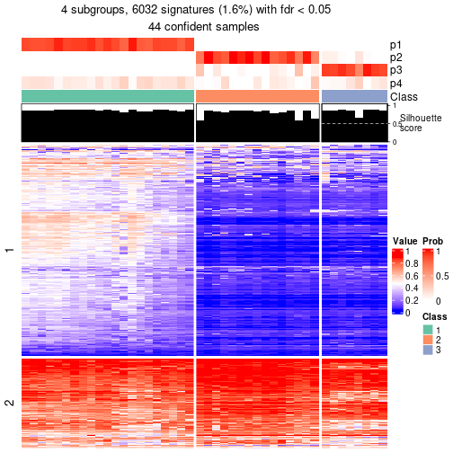</p>

</div>
<div id='tab-node-022-get-signatures-4'>
<pre><code class="r">get_signatures(res, k = 5)
</code></pre>

<p>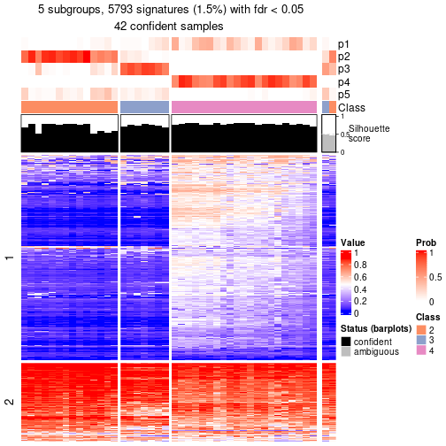</p>

</div>
<div id='tab-node-022-get-signatures-5'>
<pre><code class="r">get_signatures(res, k = 6)
</code></pre>

<p>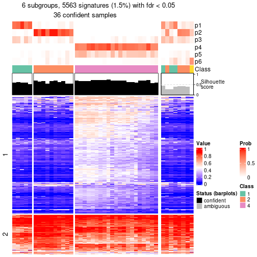</p>

</div>
<div id='tab-node-022-get-signatures-6'>
<pre><code class="r">get_signatures(res, k = 7)
</code></pre>

<p>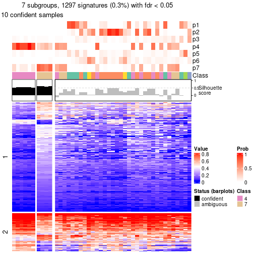</p>

</div>
<div id='tab-node-022-get-signatures-7'>
<pre><code class="r">get_signatures(res, k = 8)
</code></pre>

<p>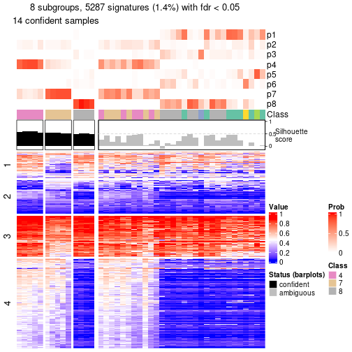</p>

</div>
</div>


Compare the overlap of signatures from different k:

```r
compare_signatures(res)
```

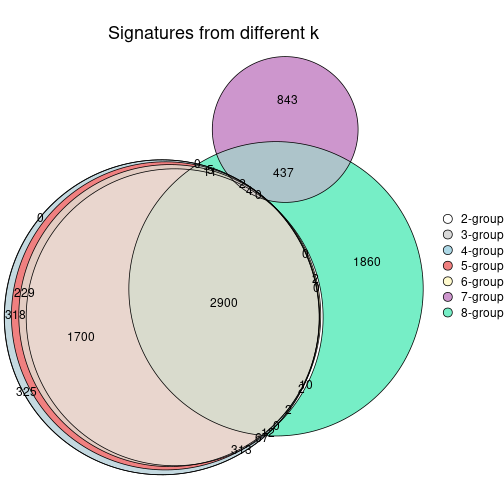

`get_signature()` returns a data frame invisibly. To get the list of signatures, the function
call should be assigned to a variable explicitly. In following code, if `plot` argument is set
to `FALSE`, no heatmap is plotted while only the differential analysis is performed.

```r
# code only for demonstration
tb = get_signature(res, k = ..., plot = FALSE)
```

An example of the output of `tb` is:

```
#>   which_row         fdr    mean_1    mean_2 scaled_mean_1 scaled_mean_2 km
#> 1        38 0.042760348  8.373488  9.131774    -0.5533452     0.5164555  1
#> 2        40 0.018707592  7.106213  8.469186    -0.6173731     0.5762149  1
#> 3        55 0.019134737 10.221463 11.207825    -0.6159697     0.5749050  1
#> 4        59 0.006059896  5.921854  7.869574    -0.6899429     0.6439467  1
#> 5        60 0.018055526  8.928898 10.211722    -0.6204761     0.5791110  1
#> 6        98 0.009384629 15.714769 14.887706     0.6635654    -0.6193277  2
...
```

The columns in `tb` are:

1. `which_row`: row indices corresponding to the input matrix.
2. `fdr`: FDR for the differential test. 
3. `mean_x`: The mean value in group x.
4. `scaled_mean_x`: The mean value in group x after rows are scaled.
5. `km`: Row groups if k-means clustering is applied to rows (which is done by automatically selecting number of clusters).

If there are too many signatures, `top_signatures = ...` can be set to only show the 
signatures with the highest FDRs:

```r
# code only for demonstration
# e.g. to show the top 500 most significant rows
tb = get_signature(res, k = ..., top_signatures = 500)
```

If the signatures are defined as these which are uniquely high in current group, `diff_method` argument
can be set to `"uniquely_high_in_one_group"`:

```r
# code only for demonstration
tb = get_signature(res, k = ..., diff_method = "uniquely_high_in_one_group")
```


UMAP plot which shows how samples are separated.


<script>
$( function() {
	$( '#tabs-node-022-dimension-reduction' ).tabs();
} );
</script>
<div id='tabs-node-022-dimension-reduction'>
<ul>
<li><a href='#tab-node-022-dimension-reduction-1'>k = 2</a></li>
<li><a href='#tab-node-022-dimension-reduction-2'>k = 3</a></li>
<li><a href='#tab-node-022-dimension-reduction-3'>k = 4</a></li>
<li><a href='#tab-node-022-dimension-reduction-4'>k = 5</a></li>
<li><a href='#tab-node-022-dimension-reduction-5'>k = 6</a></li>
<li><a href='#tab-node-022-dimension-reduction-6'>k = 7</a></li>
<li><a href='#tab-node-022-dimension-reduction-7'>k = 8</a></li>
</ul>
<div id='tab-node-022-dimension-reduction-1'>
<pre><code class="r">dimension_reduction(res, k = 2, method = &quot;UMAP&quot;)
</code></pre>

<p>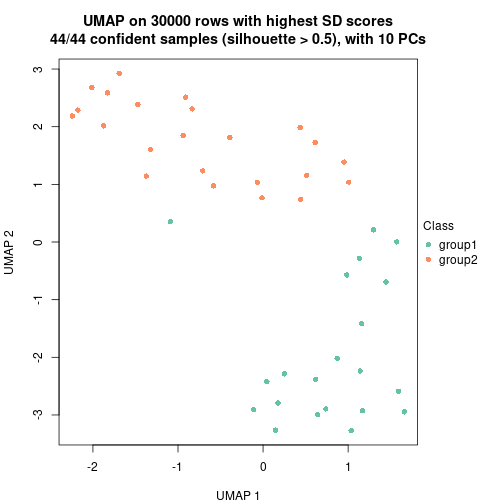</p>

</div>
<div id='tab-node-022-dimension-reduction-2'>
<pre><code class="r">dimension_reduction(res, k = 3, method = &quot;UMAP&quot;)
</code></pre>

<p>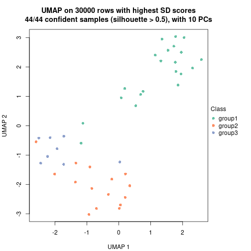</p>

</div>
<div id='tab-node-022-dimension-reduction-3'>
<pre><code class="r">dimension_reduction(res, k = 4, method = &quot;UMAP&quot;)
</code></pre>

<p>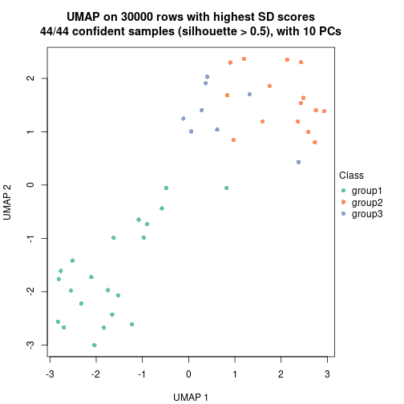</p>

</div>
<div id='tab-node-022-dimension-reduction-4'>
<pre><code class="r">dimension_reduction(res, k = 5, method = &quot;UMAP&quot;)
</code></pre>

<p>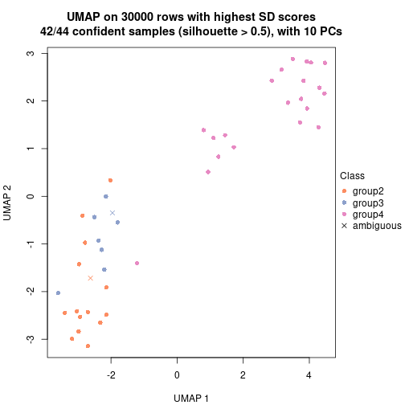</p>

</div>
<div id='tab-node-022-dimension-reduction-5'>
<pre><code class="r">dimension_reduction(res, k = 6, method = &quot;UMAP&quot;)
</code></pre>

<p>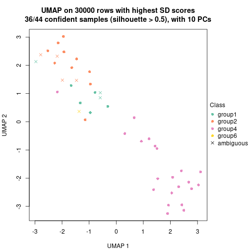</p>

</div>
<div id='tab-node-022-dimension-reduction-6'>
<pre><code class="r">dimension_reduction(res, k = 7, method = &quot;UMAP&quot;)
</code></pre>

<p>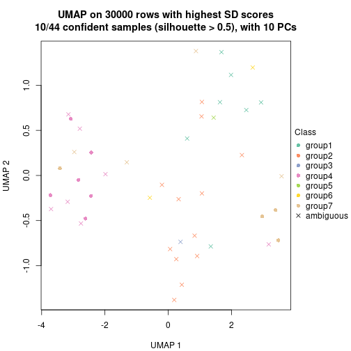</p>

</div>
<div id='tab-node-022-dimension-reduction-7'>
<pre><code class="r">dimension_reduction(res, k = 8, method = &quot;UMAP&quot;)
</code></pre>

<p>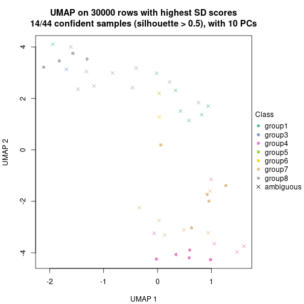</p>

</div>
</div>


Following heatmap shows how subgroups are split when increasing `k`:

```r
collect_classes(res)
```

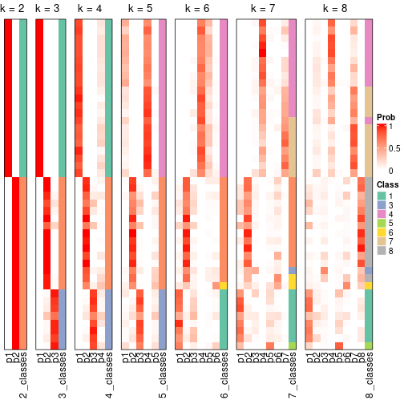


If matrix rows can be associated to genes, consider to use `functional_enrichment(res,
...)` to perform function enrichment for the signature genes. See [this vignette](https://jokergoo.github.io/cola_vignettes/functional_enrichment.html) for more detailed explanations.


 

---------------------------------------------------


### Node0221


Parent node: [Node022](#Node022).
Child nodes: 
                Node02131-leaf
        ,
                Node02132-leaf
        ,
                Node02211-leaf
        ,
                Node02212-leaf
        ,
                Node02311-leaf
        ,
                Node02312-leaf
        ,
                Node02313-leaf
        ,
                Node02314-leaf
        ,
                Node02341-leaf
        ,
                Node02342-leaf
        ,
                Node02343-leaf
        ,
                Node02344-leaf
        ,
                Node02345-leaf
        ,
                Node02421-leaf
        ,
                Node02422-leaf
        ,
                Node02423-leaf
        ,
                Node06121-leaf
        ,
                Node06122-leaf
        ,
                Node06123-leaf
        ,
                [Node07111](#Node07111)
        ,
                Node07112-leaf
        ,
                Node07211-leaf
        ,
                Node07212-leaf
        ,
                Node07213-leaf
        ,
                Node07214-leaf
        .


The object with results only for a single top-value method and a single partitioning method 
can be extracted as:

```r
res = res_rh["0221"]
```

A summary of `res` and all the functions that can be applied to it:

```r
res
```

```
#> A 'ConsensusPartition' object with k = 2, 3, 4, 5, 6, 7, 8.
#>   On a matrix with 30000 rows and 21 columns.
#>   Top rows (1000) are extracted by 'ATC' method.
#>   Subgroups are detected by 'kmeans' method.
#>   Performed in total 350 partitions by row resampling.
#>   Best k for subgroups seems to be 2.
#> 
#> Following methods can be applied to this 'ConsensusPartition' object:
#>  [1] "cola_report"             "collect_classes"         "collect_plots"          
#>  [4] "collect_stats"           "colnames"                "compare_partitions"     
#>  [7] "compare_signatures"      "consensus_heatmap"       "dimension_reduction"    
#> [10] "functional_enrichment"   "get_anno_col"            "get_anno"               
#> [13] "get_classes"             "get_consensus"           "get_matrix"             
#> [16] "get_membership"          "get_param"               "get_signatures"         
#> [19] "get_stats"               "is_best_k"               "is_stable_k"            
#> [22] "membership_heatmap"      "ncol"                    "nrow"                   
#> [25] "plot_ecdf"               "predict_classes"         "rownames"               
#> [28] "select_partition_number" "show"                    "suggest_best_k"         
#> [31] "test_to_known_factors"   "top_rows_heatmap"
```

`collect_plots()` function collects all the plots made from `res` for all `k` (number of subgroups)
into one single page to provide an easy and fast comparison between different `k`.

```r
collect_plots(res)
```

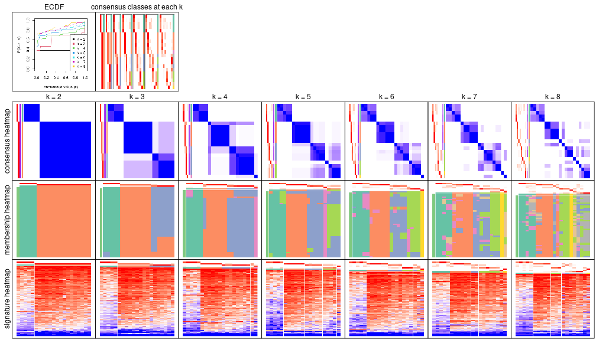

The plots are:

- The first row: a plot of the eCDF (empirical cumulative distribution
  function) curves of the consensus matrix for each `k` and the heatmap of
  predicted classes for each `k`.
- The second row: heatmaps of the consensus matrix for each `k`.
- The third row: heatmaps of the membership matrix for each `k`.
- The fouth row: heatmaps of the signatures for each `k`.

All the plots in panels can be made by individual functions and they are
plotted later in this section.

`select_partition_number()` produces several plots showing different
statistics for choosing "optimized" `k`. There are following statistics:

- eCDF curves of the consensus matrix for each `k`;
- 1-PAC. [The PAC score](https://en.wikipedia.org/wiki/Consensus_clustering#Over-interpretation_potential_of_consensus_clustering)
  measures the proportion of the ambiguous subgrouping.
- Mean silhouette score.
- Concordance. The mean probability of fiting the consensus subgroup labels in all
  partitions.
- Area increased. Denote $A_k$ as the area under the eCDF curve for current
  `k`, the area increased is defined as $A_k - A_{k-1}$.
- Rand index. The percent of pairs of samples that are both in a same cluster
  or both are not in a same cluster in the partition of k and k-1.
- Jaccard index. The ratio of pairs of samples are both in a same cluster in
  the partition of k and k-1 and the pairs of samples are both in a same
  cluster in the partition k or k-1.

The detailed explanations of these statistics can be found in [the _cola_
vignette](https://jokergoo.github.io/cola_vignettes/cola.html#toc_13).

Generally speaking, higher 1-PAC score, higher mean silhouette score or higher
concordance corresponds to better partition. Rand index and Jaccard index
measure how similar the current partition is compared to partition with `k-1`.
If they are too similar, we won't accept `k` is better than `k-1`.

```r
select_partition_number(res)
```

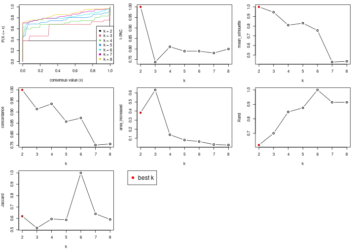

The numeric values for all these statistics can be obtained by `get_stats()`.

```r
get_stats(res)
```

```
#>   k 1-PAC mean_silhouette concordance area_increased  Rand Jaccard
#> 2 2 1.000           1.000       1.000         0.3816 0.619   0.619
#> 3 3 0.738           0.945       0.913         0.6329 0.700   0.515
#> 4 4 0.811           0.810       0.937         0.1393 0.848   0.595
#> 5 5 0.789           0.831       0.857         0.0810 0.876   0.587
#> 6 6 0.789           0.755       0.873         0.0641 1.000   1.000
#> 7 7 0.781           0.428       0.751         0.0314 0.914   0.640
#> 8 8 0.800           0.436       0.756         0.0260 0.914   0.591
```

`suggest_best_k()` suggests the best $k$ based on these statistics. The rules are as follows:

- All $k$ with Jaccard index larger than 0.95 are removed because increasing
  $k$ does not provide enough extra information. If all $k$ are removed, it is
  marked as no subgroup is detected.
- For all $k$ with 1-PAC score larger than 0.9, the maximal $k$ is taken as
  the best $k$, and other $k$ are marked as optional $k$.
- If it does not fit the second rule. The $k$ with the maximal vote of the
  highest 1-PAC score, highest mean silhouette, and highest concordance is
  taken as the best $k$.

```r
suggest_best_k(res)
```

```
#> [1] 2
```


Following is the table of the partitions (You need to click the **show/hide
code output** link to see it). The membership matrix (columns with name `p*`)
is inferred by
[`clue::cl_consensus()`](https://www.rdocumentation.org/link/cl_consensus?package=clue)
function with the `SE` method. Basically the value in the membership matrix
represents the probability to belong to a certain group. The finall subgroup
label for an item is determined with the group with highest probability it
belongs to.

In `get_classes()` function, the entropy is calculated from the membership
matrix and the silhouette score is calculated from the consensus matrix.


<script>
$( function() {
	$( '#tabs-node-0221-get-classes' ).tabs();
} );
</script>
<div id='tabs-node-0221-get-classes'>
<ul>
<li><a href='#tab-node-0221-get-classes-1'>k = 2</a></li>
<li><a href='#tab-node-0221-get-classes-2'>k = 3</a></li>
<li><a href='#tab-node-0221-get-classes-3'>k = 4</a></li>
<li><a href='#tab-node-0221-get-classes-4'>k = 5</a></li>
<li><a href='#tab-node-0221-get-classes-5'>k = 6</a></li>
<li><a href='#tab-node-0221-get-classes-6'>k = 7</a></li>
<li><a href='#tab-node-0221-get-classes-7'>k = 8</a></li>
</ul>

<div id='tab-node-0221-get-classes-1'>
<p><a id='tab-node-0221-get-classes-1-a' style='color:#0366d6' href='#'>show/hide code output</a></p>
<pre><code class="r">cbind(get_classes(res, k = 2), get_membership(res, k = 2))
</code></pre>

<pre><code>#&gt;                 class entropy silhouette p1 p2
#&gt; TCGA.NJ.A4YI.01     2       0          1  0  1
#&gt; TCGA.62.A46V.01     2       0          1  0  1
#&gt; TCGA.62.A46R.01     1       0          1  1  0
#&gt; TCGA.97.A4M0.01     2       0          1  0  1
#&gt; TCGA.55.8511.01     1       0          1  1  0
#&gt; TCGA.99.8025.01     1       0          1  1  0
#&gt; TCGA.55.7283.01     2       0          1  0  1
#&gt; TCGA.44.8117.01     1       0          1  1  0
#&gt; TCGA.05.4405.01     2       0          1  0  1
#&gt; TCGA.44.A47A.01     2       0          1  0  1
#&gt; TCGA.78.7153.01     2       0          1  0  1
#&gt; TCGA.86.A456.01     2       0          1  0  1
#&gt; TCGA.69.7974.01     2       0          1  0  1
#&gt; TCGA.78.8655.01     2       0          1  0  1
#&gt; TCGA.55.7914.01     2       0          1  0  1
#&gt; TCGA.97.7554.01     1       0          1  1  0
#&gt; TCGA.69.A59K.01     2       0          1  0  1
#&gt; TCGA.49.AARN.01     2       0          1  0  1
#&gt; TCGA.91.6836.01     2       0          1  0  1
#&gt; TCGA.71.8520.01     2       0          1  0  1
#&gt; TCGA.05.4425.01     2       0          1  0  1
</code></pre>

<script>
$('#tab-node-0221-get-classes-1-a').parent().next().next().hide();
$('#tab-node-0221-get-classes-1-a').click(function(){
  $('#tab-node-0221-get-classes-1-a').parent().next().next().toggle();
  return(false);
});
</script>
</div>

<div id='tab-node-0221-get-classes-2'>
<p><a id='tab-node-0221-get-classes-2-a' style='color:#0366d6' href='#'>show/hide code output</a></p>
<pre><code class="r">cbind(get_classes(res, k = 3), get_membership(res, k = 3))
</code></pre>

<pre><code>#&gt;                 class entropy silhouette   p1   p2   p3
#&gt; TCGA.NJ.A4YI.01     3   0.480      0.765 0.00 0.22 0.78
#&gt; TCGA.62.A46V.01     2   0.556      1.000 0.00 0.70 0.30
#&gt; TCGA.62.A46R.01     1   0.000      0.973 1.00 0.00 0.00
#&gt; TCGA.97.A4M0.01     2   0.556      1.000 0.00 0.70 0.30
#&gt; TCGA.55.8511.01     1   0.000      0.973 1.00 0.00 0.00
#&gt; TCGA.99.8025.01     1   0.254      0.960 0.92 0.08 0.00
#&gt; TCGA.55.7283.01     3   0.000      0.895 0.00 0.00 1.00
#&gt; TCGA.44.8117.01     1   0.254      0.960 0.92 0.08 0.00
#&gt; TCGA.05.4405.01     3   0.000      0.895 0.00 0.00 1.00
#&gt; TCGA.44.A47A.01     2   0.556      1.000 0.00 0.70 0.30
#&gt; TCGA.78.7153.01     2   0.556      1.000 0.00 0.70 0.30
#&gt; TCGA.86.A456.01     3   0.000      0.895 0.00 0.00 1.00
#&gt; TCGA.69.7974.01     3   0.000      0.895 0.00 0.00 1.00
#&gt; TCGA.78.8655.01     2   0.556      1.000 0.00 0.70 0.30
#&gt; TCGA.55.7914.01     3   0.000      0.895 0.00 0.00 1.00
#&gt; TCGA.97.7554.01     1   0.000      0.973 1.00 0.00 0.00
#&gt; TCGA.69.A59K.01     2   0.556      1.000 0.00 0.70 0.30
#&gt; TCGA.49.AARN.01     2   0.556      1.000 0.00 0.70 0.30
#&gt; TCGA.91.6836.01     2   0.556      1.000 0.00 0.70 0.30
#&gt; TCGA.71.8520.01     3   0.480      0.765 0.00 0.22 0.78
#&gt; TCGA.05.4425.01     2   0.556      1.000 0.00 0.70 0.30
</code></pre>

<script>
$('#tab-node-0221-get-classes-2-a').parent().next().next().hide();
$('#tab-node-0221-get-classes-2-a').click(function(){
  $('#tab-node-0221-get-classes-2-a').parent().next().next().toggle();
  return(false);
});
</script>
</div>

<div id='tab-node-0221-get-classes-3'>
<p><a id='tab-node-0221-get-classes-3-a' style='color:#0366d6' href='#'>show/hide code output</a></p>
<pre><code class="r">cbind(get_classes(res, k = 4), get_membership(res, k = 4))
</code></pre>

<pre><code>#&gt;                 class entropy silhouette   p1   p2   p3   p4
#&gt; TCGA.NJ.A4YI.01     4  0.2345      0.000 0.00 0.00 0.10 0.90
#&gt; TCGA.62.A46V.01     2  0.0707      0.891 0.00 0.98 0.02 0.00
#&gt; TCGA.62.A46R.01     1  0.0000      0.943 1.00 0.00 0.00 0.00
#&gt; TCGA.97.A4M0.01     2  0.0707      0.891 0.00 0.98 0.02 0.00
#&gt; TCGA.55.8511.01     1  0.0000      0.943 1.00 0.00 0.00 0.00
#&gt; TCGA.99.8025.01     1  0.3037      0.913 0.88 0.02 0.00 0.10
#&gt; TCGA.55.7283.01     3  0.0000      0.921 0.00 0.00 1.00 0.00
#&gt; TCGA.44.8117.01     1  0.3037      0.913 0.88 0.02 0.00 0.10
#&gt; TCGA.05.4405.01     3  0.0000      0.921 0.00 0.00 1.00 0.00
#&gt; TCGA.44.A47A.01     2  0.0707      0.891 0.00 0.98 0.02 0.00
#&gt; TCGA.78.7153.01     2  0.0707      0.891 0.00 0.98 0.02 0.00
#&gt; TCGA.86.A456.01     3  0.0000      0.921 0.00 0.00 1.00 0.00
#&gt; TCGA.69.7974.01     3  0.0000      0.921 0.00 0.00 1.00 0.00
#&gt; TCGA.78.8655.01     2  0.4994     -0.018 0.00 0.52 0.48 0.00
#&gt; TCGA.55.7914.01     3  0.0000      0.921 0.00 0.00 1.00 0.00
#&gt; TCGA.97.7554.01     1  0.0000      0.943 1.00 0.00 0.00 0.00
#&gt; TCGA.69.A59K.01     3  0.3400      0.766 0.00 0.18 0.82 0.00
#&gt; TCGA.49.AARN.01     3  0.3400      0.766 0.00 0.18 0.82 0.00
#&gt; TCGA.91.6836.01     2  0.0707      0.891 0.00 0.98 0.02 0.00
#&gt; TCGA.71.8520.01     3  0.0707      0.898 0.00 0.00 0.98 0.02
#&gt; TCGA.05.4425.01     2  0.0707      0.891 0.00 0.98 0.02 0.00
</code></pre>

<script>
$('#tab-node-0221-get-classes-3-a').parent().next().next().hide();
$('#tab-node-0221-get-classes-3-a').click(function(){
  $('#tab-node-0221-get-classes-3-a').parent().next().next().toggle();
  return(false);
});
</script>
</div>

<div id='tab-node-0221-get-classes-4'>
<p><a id='tab-node-0221-get-classes-4-a' style='color:#0366d6' href='#'>show/hide code output</a></p>
<pre><code class="r">cbind(get_classes(res, k = 5), get_membership(res, k = 5))
</code></pre>

<pre><code>#&gt;                 class entropy silhouette  p1   p2   p3   p4   p5
#&gt; TCGA.NJ.A4YI.01     4  0.0609      0.000 0.0 0.00 0.02 0.98 0.00
#&gt; TCGA.62.A46V.01     2  0.0000      0.996 0.0 1.00 0.00 0.00 0.00
#&gt; TCGA.62.A46R.01     1  0.0000      0.885 1.0 0.00 0.00 0.00 0.00
#&gt; TCGA.97.A4M0.01     2  0.0000      0.996 0.0 1.00 0.00 0.00 0.00
#&gt; TCGA.55.8511.01     1  0.2438      0.849 0.9 0.00 0.04 0.00 0.06
#&gt; TCGA.99.8025.01     1  0.3109      0.848 0.8 0.00 0.00 0.00 0.20
#&gt; TCGA.55.7283.01     3  0.1043      0.821 0.0 0.04 0.96 0.00 0.00
#&gt; TCGA.44.8117.01     1  0.3513      0.848 0.8 0.00 0.00 0.02 0.18
#&gt; TCGA.05.4405.01     5  0.5131      0.854 0.0 0.04 0.42 0.00 0.54
#&gt; TCGA.44.A47A.01     2  0.0000      0.996 0.0 1.00 0.00 0.00 0.00
#&gt; TCGA.78.7153.01     2  0.0000      0.996 0.0 1.00 0.00 0.00 0.00
#&gt; TCGA.86.A456.01     5  0.5131      0.854 0.0 0.04 0.42 0.00 0.54
#&gt; TCGA.69.7974.01     3  0.2438      0.827 0.0 0.04 0.90 0.00 0.06
#&gt; TCGA.78.8655.01     3  0.3109      0.630 0.0 0.20 0.80 0.00 0.00
#&gt; TCGA.55.7914.01     5  0.5131      0.854 0.0 0.04 0.42 0.00 0.54
#&gt; TCGA.97.7554.01     1  0.0000      0.885 1.0 0.00 0.00 0.00 0.00
#&gt; TCGA.69.A59K.01     3  0.2797      0.852 0.0 0.06 0.88 0.00 0.06
#&gt; TCGA.49.AARN.01     3  0.2797      0.852 0.0 0.06 0.88 0.00 0.06
#&gt; TCGA.91.6836.01     2  0.0609      0.980 0.0 0.98 0.00 0.00 0.02
#&gt; TCGA.71.8520.01     5  0.4398      0.634 0.0 0.00 0.24 0.04 0.72
#&gt; TCGA.05.4425.01     2  0.0000      0.996 0.0 1.00 0.00 0.00 0.00
</code></pre>

<script>
$('#tab-node-0221-get-classes-4-a').parent().next().next().hide();
$('#tab-node-0221-get-classes-4-a').click(function(){
  $('#tab-node-0221-get-classes-4-a').parent().next().next().toggle();
  return(false);
});
</script>
</div>

<div id='tab-node-0221-get-classes-5'>
<p><a id='tab-node-0221-get-classes-5-a' style='color:#0366d6' href='#'>show/hide code output</a></p>
<pre><code class="r">cbind(get_classes(res, k = 6), get_membership(res, k = 6))
</code></pre>

<pre><code>#&gt;                 class entropy silhouette   p1   p2   p3   p4   p5 p6
#&gt; TCGA.NJ.A4YI.01     6  0.0000      0.000 0.00 0.00 0.00 0.00 0.00  1
#&gt; TCGA.62.A46V.01     2  0.0000      0.952 0.00 1.00 0.00 0.00 0.00  0
#&gt; TCGA.62.A46R.01     1  0.0000      0.819 1.00 0.00 0.00 0.00 0.00  0
#&gt; TCGA.97.A4M0.01     2  0.0000      0.952 0.00 1.00 0.00 0.00 0.00  0
#&gt; TCGA.55.8511.01     1  0.2190      0.783 0.90 0.00 0.04 0.06 0.00  0
#&gt; TCGA.99.8025.01     1  0.4503      0.743 0.68 0.00 0.08 0.24 0.00  0
#&gt; TCGA.55.7283.01     3  0.3475      0.733 0.00 0.00 0.80 0.06 0.14  0
#&gt; TCGA.44.8117.01     1  0.4360      0.743 0.68 0.00 0.06 0.26 0.00  0
#&gt; TCGA.05.4405.01     5  0.0000      0.823 0.00 0.00 0.00 0.00 1.00  0
#&gt; TCGA.44.A47A.01     2  0.1267      0.936 0.00 0.94 0.00 0.06 0.00  0
#&gt; TCGA.78.7153.01     2  0.0000      0.952 0.00 1.00 0.00 0.00 0.00  0
#&gt; TCGA.86.A456.01     5  0.0000      0.823 0.00 0.00 0.00 0.00 1.00  0
#&gt; TCGA.69.7974.01     3  0.3864      0.482 0.00 0.00 0.52 0.00 0.48  0
#&gt; TCGA.78.8655.01     3  0.4279      0.693 0.00 0.06 0.78 0.08 0.08  0
#&gt; TCGA.55.7914.01     5  0.0547      0.815 0.00 0.00 0.00 0.02 0.98  0
#&gt; TCGA.97.7554.01     1  0.0000      0.819 1.00 0.00 0.00 0.00 0.00  0
#&gt; TCGA.69.A59K.01     3  0.3950      0.787 0.00 0.04 0.72 0.00 0.24  0
#&gt; TCGA.49.AARN.01     3  0.3950      0.787 0.00 0.04 0.72 0.00 0.24  0
#&gt; TCGA.91.6836.01     2  0.2350      0.870 0.00 0.88 0.02 0.10 0.00  0
#&gt; TCGA.71.8520.01     5  0.3828      0.418 0.00 0.00 0.00 0.44 0.56  0
#&gt; TCGA.05.4425.01     2  0.1267      0.936 0.00 0.94 0.00 0.06 0.00  0
</code></pre>

<script>
$('#tab-node-0221-get-classes-5-a').parent().next().next().hide();
$('#tab-node-0221-get-classes-5-a').click(function(){
  $('#tab-node-0221-get-classes-5-a').parent().next().next().toggle();
  return(false);
});
</script>
</div>

<div id='tab-node-0221-get-classes-6'>
<p><a id='tab-node-0221-get-classes-6-a' style='color:#0366d6' href='#'>show/hide code output</a></p>
<pre><code class="r">cbind(get_classes(res, k = 7), get_membership(res, k = 7))
</code></pre>

<pre><code>#&gt;                 class entropy silhouette   p1   p2   p3   p4   p5 p6   p7
#&gt; TCGA.NJ.A4YI.01     6  0.0000     0.0000 0.00 0.00 0.00 0.00 0.00  1 0.00
#&gt; TCGA.62.A46V.01     2  0.0000     0.8493 0.00 1.00 0.00 0.00 0.00  0 0.00
#&gt; TCGA.62.A46R.01     1  0.0000     0.7151 1.00 0.00 0.00 0.00 0.00  0 0.00
#&gt; TCGA.97.A4M0.01     2  0.0000     0.8493 0.00 1.00 0.00 0.00 0.00  0 0.00
#&gt; TCGA.55.8511.01     1  0.3519     0.5944 0.74 0.00 0.04 0.22 0.00  0 0.00
#&gt; TCGA.99.8025.01     1  0.4939     0.6234 0.56 0.00 0.30 0.14 0.00  0 0.00
#&gt; TCGA.55.7283.01     3  0.5342     0.6993 0.00 0.00 0.42 0.18 0.40  0 0.00
#&gt; TCGA.44.8117.01     1  0.5055     0.6234 0.56 0.00 0.26 0.18 0.00  0 0.00
#&gt; TCGA.05.4405.01     5  0.3525     0.2190 0.00 0.00 0.00 0.00 0.56  0 0.44
#&gt; TCGA.44.A47A.01     2  0.2422     0.7884 0.00 0.82 0.18 0.00 0.00  0 0.00
#&gt; TCGA.78.7153.01     2  0.0000     0.8493 0.00 1.00 0.00 0.00 0.00  0 0.00
#&gt; TCGA.86.A456.01     5  0.3525     0.2190 0.00 0.00 0.00 0.00 0.56  0 0.44
#&gt; TCGA.69.7974.01     5  0.0000     0.0896 0.00 0.00 0.00 0.00 1.00  0 0.00
#&gt; TCGA.78.8655.01     3  0.3413     0.7008 0.00 0.00 0.62 0.00 0.38  0 0.00
#&gt; TCGA.55.7914.01     5  0.4701     0.1340 0.00 0.00 0.02 0.04 0.50  0 0.44
#&gt; TCGA.97.7554.01     1  0.0000     0.7151 1.00 0.00 0.00 0.00 0.00  0 0.00
#&gt; TCGA.69.A59K.01     5  0.3685    -0.5039 0.00 0.00 0.32 0.02 0.66  0 0.00
#&gt; TCGA.49.AARN.01     5  0.3685    -0.5039 0.00 0.00 0.32 0.02 0.66  0 0.00
#&gt; TCGA.91.6836.01     2  0.3294     0.5435 0.00 0.66 0.00 0.34 0.00  0 0.00
#&gt; TCGA.71.8520.01     7  0.0863     0.0000 0.00 0.00 0.00 0.04 0.00  0 0.96
#&gt; TCGA.05.4425.01     2  0.2422     0.7884 0.00 0.82 0.18 0.00 0.00  0 0.00
</code></pre>

<script>
$('#tab-node-0221-get-classes-6-a').parent().next().next().hide();
$('#tab-node-0221-get-classes-6-a').click(function(){
  $('#tab-node-0221-get-classes-6-a').parent().next().next().toggle();
  return(false);
});
</script>
</div>

<div id='tab-node-0221-get-classes-7'>
<p><a id='tab-node-0221-get-classes-7-a' style='color:#0366d6' href='#'>show/hide code output</a></p>
<pre><code class="r">cbind(get_classes(res, k = 8), get_membership(res, k = 8))
</code></pre>

<pre><code>#&gt;                 class entropy silhouette   p1   p2   p3   p4   p5 p6   p7   p8
#&gt; TCGA.NJ.A4YI.01     6  0.0000      0.000 0.00 0.00 0.00 0.00 0.00  1 0.00 0.00
#&gt; TCGA.62.A46V.01     2  0.2650      0.579 0.00 0.76 0.00 0.24 0.00  0 0.00 0.00
#&gt; TCGA.62.A46R.01     1  0.0471      0.705 0.98 0.00 0.02 0.00 0.00  0 0.00 0.00
#&gt; TCGA.97.A4M0.01     2  0.2650      0.579 0.00 0.76 0.00 0.24 0.00  0 0.00 0.00
#&gt; TCGA.55.8511.01     1  0.4467      0.512 0.66 0.00 0.12 0.20 0.00  0 0.02 0.00
#&gt; TCGA.99.8025.01     1  0.5717      0.623 0.58 0.00 0.08 0.06 0.06  0 0.22 0.00
#&gt; TCGA.55.7283.01     3  0.2852      0.000 0.00 0.00 0.72 0.00 0.00  0 0.00 0.28
#&gt; TCGA.44.8117.01     1  0.5844      0.623 0.58 0.00 0.14 0.04 0.08  0 0.16 0.00
#&gt; TCGA.05.4405.01     5  0.3404      0.831 0.00 0.00 0.04 0.00 0.72  0 0.00 0.24
#&gt; TCGA.44.A47A.01     2  0.1091      0.517 0.00 0.94 0.00 0.00 0.00  0 0.00 0.06
#&gt; TCGA.78.7153.01     2  0.2650      0.579 0.00 0.76 0.00 0.24 0.00  0 0.00 0.00
#&gt; TCGA.86.A456.01     5  0.3404      0.831 0.00 0.00 0.04 0.00 0.72  0 0.00 0.24
#&gt; TCGA.69.7974.01     8  0.3757      0.185 0.00 0.00 0.06 0.00 0.26  0 0.00 0.68
#&gt; TCGA.78.8655.01     8  0.7156     -0.221 0.00 0.24 0.16 0.12 0.00  0 0.10 0.38
#&gt; TCGA.55.7914.01     5  0.1341      0.605 0.00 0.00 0.00 0.00 0.92  0 0.00 0.08
#&gt; TCGA.97.7554.01     1  0.0000      0.705 1.00 0.00 0.00 0.00 0.00  0 0.00 0.00
#&gt; TCGA.69.A59K.01     8  0.0000      0.490 0.00 0.00 0.00 0.00 0.00  0 0.00 1.00
#&gt; TCGA.49.AARN.01     8  0.0000      0.490 0.00 0.00 0.00 0.00 0.00  0 0.00 1.00
#&gt; TCGA.91.6836.01     4  0.3193      0.000 0.00 0.38 0.00 0.62 0.00  0 0.00 0.00
#&gt; TCGA.71.8520.01     7  0.3083      0.000 0.00 0.00 0.00 0.00 0.34  0 0.66 0.00
#&gt; TCGA.05.4425.01     2  0.1091      0.517 0.00 0.94 0.00 0.00 0.00  0 0.00 0.06
</code></pre>

<script>
$('#tab-node-0221-get-classes-7-a').parent().next().next().hide();
$('#tab-node-0221-get-classes-7-a').click(function(){
  $('#tab-node-0221-get-classes-7-a').parent().next().next().toggle();
  return(false);
});
</script>
</div>
</div>

Heatmaps for the consensus matrix. It visualizes the probability of two
samples to be in a same group.


<script>
$( function() {
	$( '#tabs-node-0221-consensus-heatmap' ).tabs();
} );
</script>
<div id='tabs-node-0221-consensus-heatmap'>
<ul>
<li><a href='#tab-node-0221-consensus-heatmap-1'>k = 2</a></li>
<li><a href='#tab-node-0221-consensus-heatmap-2'>k = 3</a></li>
<li><a href='#tab-node-0221-consensus-heatmap-3'>k = 4</a></li>
<li><a href='#tab-node-0221-consensus-heatmap-4'>k = 5</a></li>
<li><a href='#tab-node-0221-consensus-heatmap-5'>k = 6</a></li>
<li><a href='#tab-node-0221-consensus-heatmap-6'>k = 7</a></li>
<li><a href='#tab-node-0221-consensus-heatmap-7'>k = 8</a></li>
</ul>
<div id='tab-node-0221-consensus-heatmap-1'>
<pre><code class="r">consensus_heatmap(res, k = 2)
</code></pre>

<p>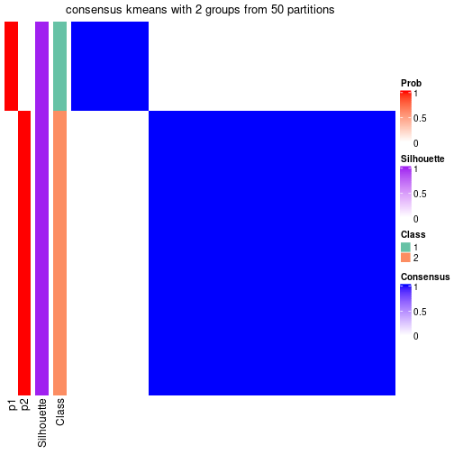</p>

</div>
<div id='tab-node-0221-consensus-heatmap-2'>
<pre><code class="r">consensus_heatmap(res, k = 3)
</code></pre>

<p>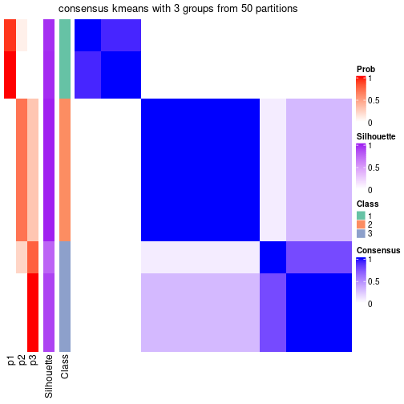</p>

</div>
<div id='tab-node-0221-consensus-heatmap-3'>
<pre><code class="r">consensus_heatmap(res, k = 4)
</code></pre>

<p>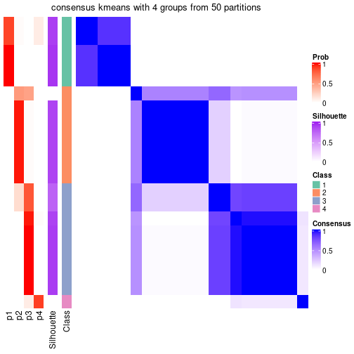</p>

</div>
<div id='tab-node-0221-consensus-heatmap-4'>
<pre><code class="r">consensus_heatmap(res, k = 5)
</code></pre>

<p>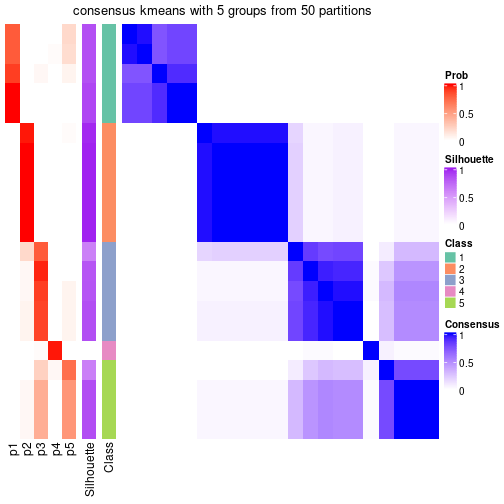</p>

</div>
<div id='tab-node-0221-consensus-heatmap-5'>
<pre><code class="r">consensus_heatmap(res, k = 6)
</code></pre>

<p>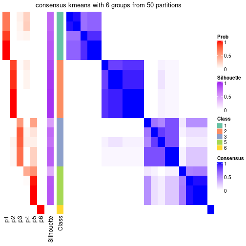</p>

</div>
<div id='tab-node-0221-consensus-heatmap-6'>
<pre><code class="r">consensus_heatmap(res, k = 7)
</code></pre>

<p>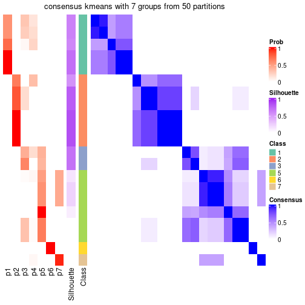</p>

</div>
<div id='tab-node-0221-consensus-heatmap-7'>
<pre><code class="r">consensus_heatmap(res, k = 8)
</code></pre>

<p>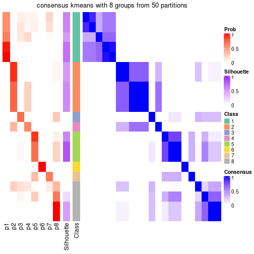</p>

</div>
</div>

Heatmaps for the membership of samples in all partitions to see how consistent they are:


<script>
$( function() {
	$( '#tabs-node-0221-membership-heatmap' ).tabs();
} );
</script>
<div id='tabs-node-0221-membership-heatmap'>
<ul>
<li><a href='#tab-node-0221-membership-heatmap-1'>k = 2</a></li>
<li><a href='#tab-node-0221-membership-heatmap-2'>k = 3</a></li>
<li><a href='#tab-node-0221-membership-heatmap-3'>k = 4</a></li>
<li><a href='#tab-node-0221-membership-heatmap-4'>k = 5</a></li>
<li><a href='#tab-node-0221-membership-heatmap-5'>k = 6</a></li>
<li><a href='#tab-node-0221-membership-heatmap-6'>k = 7</a></li>
<li><a href='#tab-node-0221-membership-heatmap-7'>k = 8</a></li>
</ul>
<div id='tab-node-0221-membership-heatmap-1'>
<pre><code class="r">membership_heatmap(res, k = 2)
</code></pre>

<p>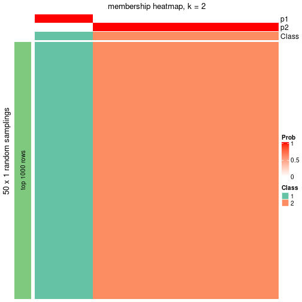</p>

</div>
<div id='tab-node-0221-membership-heatmap-2'>
<pre><code class="r">membership_heatmap(res, k = 3)
</code></pre>

<p>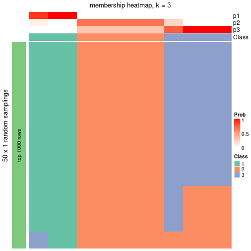</p>

</div>
<div id='tab-node-0221-membership-heatmap-3'>
<pre><code class="r">membership_heatmap(res, k = 4)
</code></pre>

<p>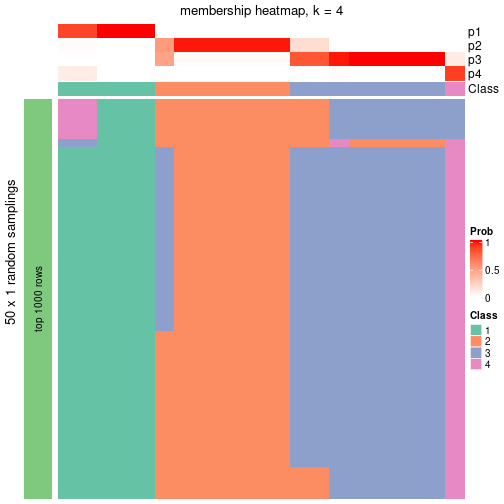</p>

</div>
<div id='tab-node-0221-membership-heatmap-4'>
<pre><code class="r">membership_heatmap(res, k = 5)
</code></pre>

<p>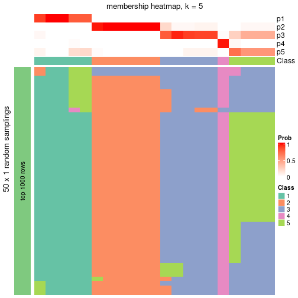</p>

</div>
<div id='tab-node-0221-membership-heatmap-5'>
<pre><code class="r">membership_heatmap(res, k = 6)
</code></pre>

<p>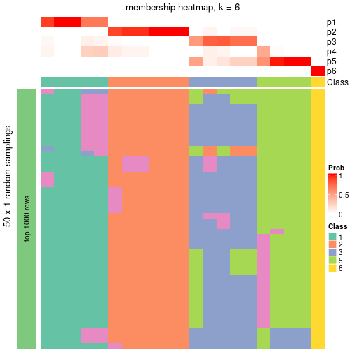</p>

</div>
<div id='tab-node-0221-membership-heatmap-6'>
<pre><code class="r">membership_heatmap(res, k = 7)
</code></pre>

<p>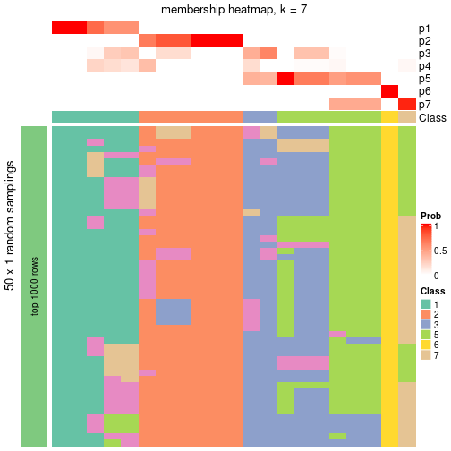</p>

</div>
<div id='tab-node-0221-membership-heatmap-7'>
<pre><code class="r">membership_heatmap(res, k = 8)
</code></pre>

<p>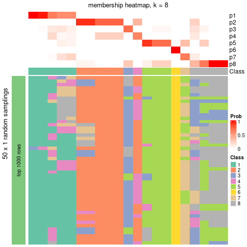</p>

</div>
</div>

As soon as the classes for columns are determined, the signatures
that are significantly different between subgroups can be looked for. 
Following are the heatmaps for signatures.


<script>
$( function() {
	$( '#tabs-node-0221-get-signatures' ).tabs();
} );
</script>
<div id='tabs-node-0221-get-signatures'>
<ul>
<li><a href='#tab-node-0221-get-signatures-1'>k = 2</a></li>
<li><a href='#tab-node-0221-get-signatures-2'>k = 3</a></li>
<li><a href='#tab-node-0221-get-signatures-3'>k = 4</a></li>
<li><a href='#tab-node-0221-get-signatures-4'>k = 5</a></li>
<li><a href='#tab-node-0221-get-signatures-5'>k = 6</a></li>
<li><a href='#tab-node-0221-get-signatures-6'>k = 7</a></li>
<li><a href='#tab-node-0221-get-signatures-7'>k = 8</a></li>
</ul>
<div id='tab-node-0221-get-signatures-1'>
<pre><code class="r">get_signatures(res, k = 2)
</code></pre>

<p>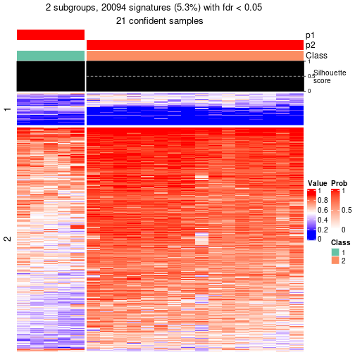</p>

</div>
<div id='tab-node-0221-get-signatures-2'>
<pre><code class="r">get_signatures(res, k = 3)
</code></pre>

<p>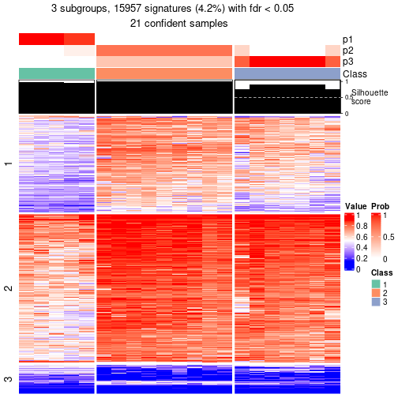</p>

</div>
<div id='tab-node-0221-get-signatures-3'>
<pre><code class="r">get_signatures(res, k = 4)
</code></pre>

<p>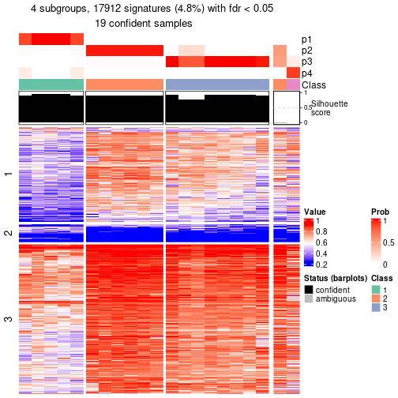</p>

</div>
<div id='tab-node-0221-get-signatures-4'>
<pre><code class="r">get_signatures(res, k = 5)
</code></pre>

<p>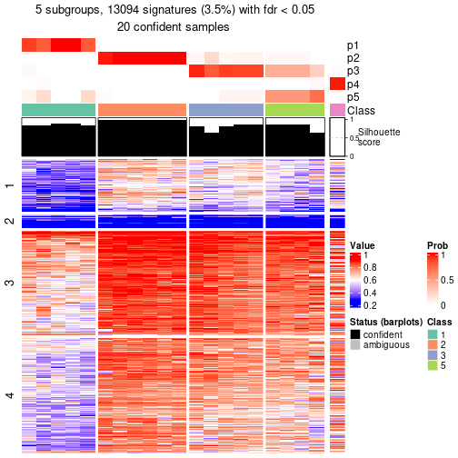</p>

</div>
<div id='tab-node-0221-get-signatures-5'>
<pre><code class="r">get_signatures(res, k = 6)
</code></pre>

<p>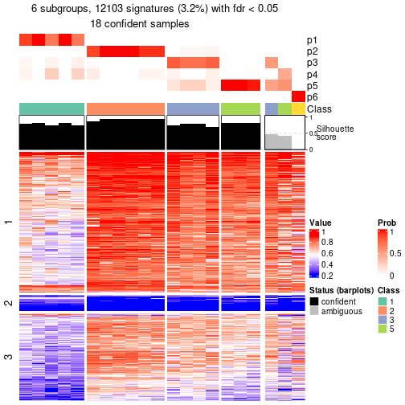</p>

</div>
<div id='tab-node-0221-get-signatures-6'>
<pre><code class="r">get_signatures(res, k = 7)
</code></pre>

<p>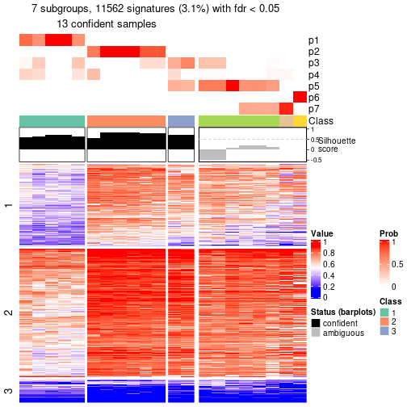</p>

</div>
<div id='tab-node-0221-get-signatures-7'>
<pre><code class="r">get_signatures(res, k = 8)
</code></pre>

<p>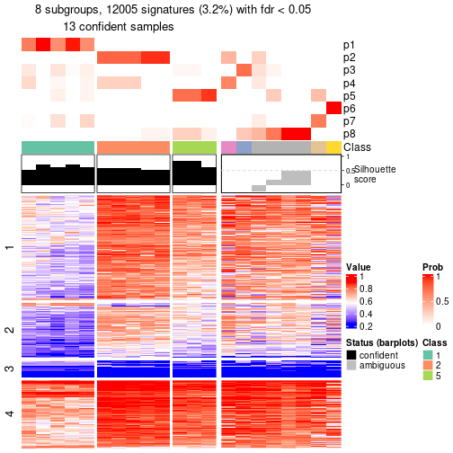</p>

</div>
</div>


Compare the overlap of signatures from different k:

```r
compare_signatures(res)
```

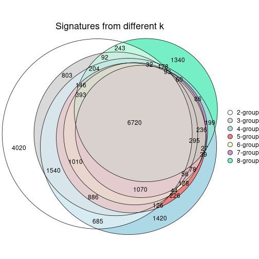

`get_signature()` returns a data frame invisibly. To get the list of signatures, the function
call should be assigned to a variable explicitly. In following code, if `plot` argument is set
to `FALSE`, no heatmap is plotted while only the differential analysis is performed.

```r
# code only for demonstration
tb = get_signature(res, k = ..., plot = FALSE)
```

An example of the output of `tb` is:

```
#>   which_row         fdr    mean_1    mean_2 scaled_mean_1 scaled_mean_2 km
#> 1        38 0.042760348  8.373488  9.131774    -0.5533452     0.5164555  1
#> 2        40 0.018707592  7.106213  8.469186    -0.6173731     0.5762149  1
#> 3        55 0.019134737 10.221463 11.207825    -0.6159697     0.5749050  1
#> 4        59 0.006059896  5.921854  7.869574    -0.6899429     0.6439467  1
#> 5        60 0.018055526  8.928898 10.211722    -0.6204761     0.5791110  1
#> 6        98 0.009384629 15.714769 14.887706     0.6635654    -0.6193277  2
...
```

The columns in `tb` are:

1. `which_row`: row indices corresponding to the input matrix.
2. `fdr`: FDR for the differential test. 
3. `mean_x`: The mean value in group x.
4. `scaled_mean_x`: The mean value in group x after rows are scaled.
5. `km`: Row groups if k-means clustering is applied to rows (which is done by automatically selecting number of clusters).

If there are too many signatures, `top_signatures = ...` can be set to only show the 
signatures with the highest FDRs:

```r
# code only for demonstration
# e.g. to show the top 500 most significant rows
tb = get_signature(res, k = ..., top_signatures = 500)
```

If the signatures are defined as these which are uniquely high in current group, `diff_method` argument
can be set to `"uniquely_high_in_one_group"`:

```r
# code only for demonstration
tb = get_signature(res, k = ..., diff_method = "uniquely_high_in_one_group")
```


UMAP plot which shows how samples are separated.


<script>
$( function() {
	$( '#tabs-node-0221-dimension-reduction' ).tabs();
} );
</script>
<div id='tabs-node-0221-dimension-reduction'>
<ul>
<li><a href='#tab-node-0221-dimension-reduction-1'>k = 2</a></li>
<li><a href='#tab-node-0221-dimension-reduction-2'>k = 3</a></li>
<li><a href='#tab-node-0221-dimension-reduction-3'>k = 4</a></li>
<li><a href='#tab-node-0221-dimension-reduction-4'>k = 5</a></li>
<li><a href='#tab-node-0221-dimension-reduction-5'>k = 6</a></li>
<li><a href='#tab-node-0221-dimension-reduction-6'>k = 7</a></li>
<li><a href='#tab-node-0221-dimension-reduction-7'>k = 8</a></li>
</ul>
<div id='tab-node-0221-dimension-reduction-1'>
<pre><code class="r">dimension_reduction(res, k = 2, method = &quot;UMAP&quot;)
</code></pre>

<p>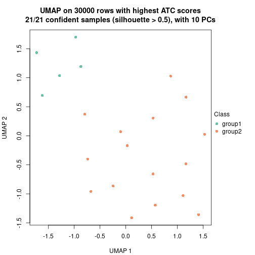</p>

</div>
<div id='tab-node-0221-dimension-reduction-2'>
<pre><code class="r">dimension_reduction(res, k = 3, method = &quot;UMAP&quot;)
</code></pre>

<p>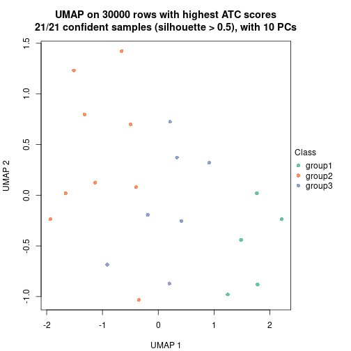</p>

</div>
<div id='tab-node-0221-dimension-reduction-3'>
<pre><code class="r">dimension_reduction(res, k = 4, method = &quot;UMAP&quot;)
</code></pre>

<p>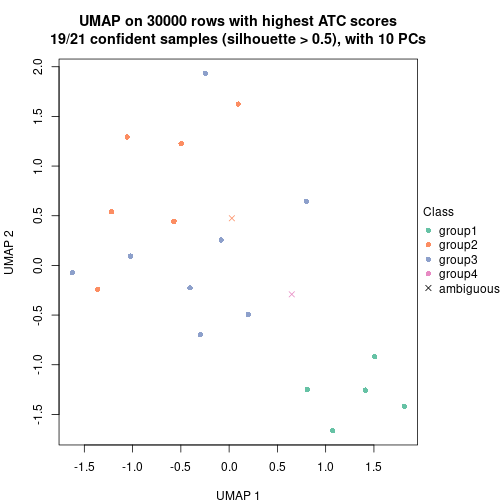</p>

</div>
<div id='tab-node-0221-dimension-reduction-4'>
<pre><code class="r">dimension_reduction(res, k = 5, method = &quot;UMAP&quot;)
</code></pre>

<p>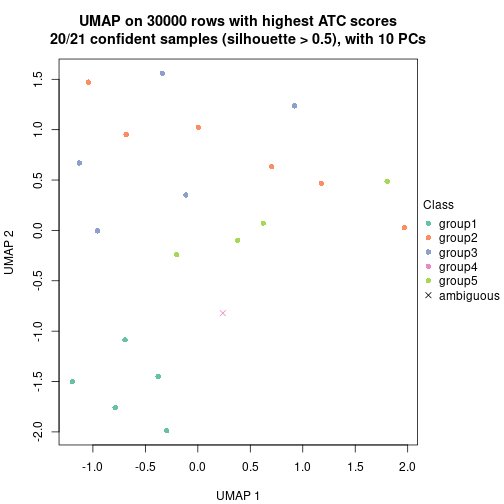</p>

</div>
<div id='tab-node-0221-dimension-reduction-5'>
<pre><code class="r">dimension_reduction(res, k = 6, method = &quot;UMAP&quot;)
</code></pre>

<p>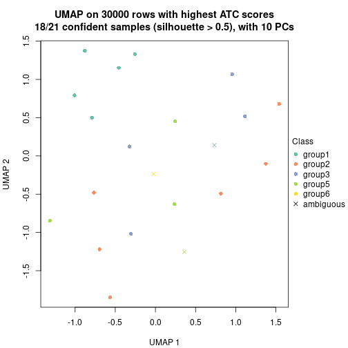</p>

</div>
<div id='tab-node-0221-dimension-reduction-6'>
<pre><code class="r">dimension_reduction(res, k = 7, method = &quot;UMAP&quot;)
</code></pre>

<p>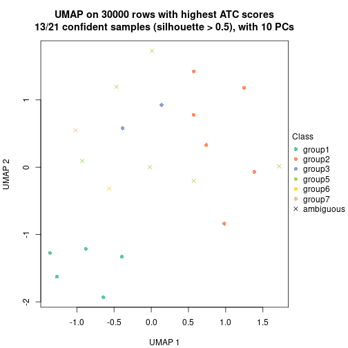</p>

</div>
<div id='tab-node-0221-dimension-reduction-7'>
<pre><code class="r">dimension_reduction(res, k = 8, method = &quot;UMAP&quot;)
</code></pre>

<p>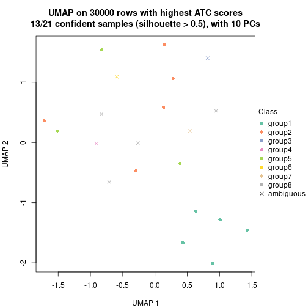</p>

</div>
</div>


Following heatmap shows how subgroups are split when increasing `k`:

```r
collect_classes(res)
```

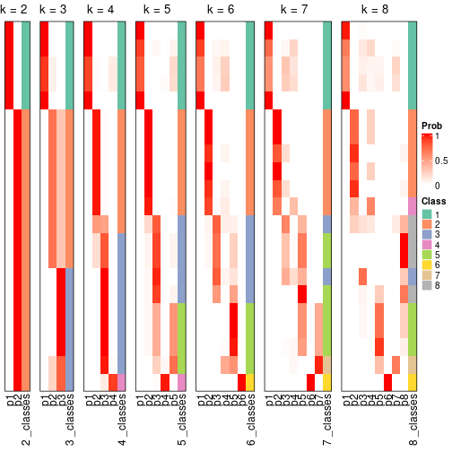


If matrix rows can be associated to genes, consider to use `functional_enrichment(res,
...)` to perform function enrichment for the signature genes. See [this vignette](https://jokergoo.github.io/cola_vignettes/functional_enrichment.html) for more detailed explanations.


 

---------------------------------------------------


### Node023


Parent node: [Node02](#Node02).
Child nodes: 
                Node0111-leaf
        ,
                Node0112-leaf
        ,
                Node0113-leaf
        ,
                Node0114-leaf
        ,
                Node0121-leaf
        ,
                Node0122-leaf
        ,
                Node0123-leaf
        ,
                Node0131-leaf
        ,
                Node0132-leaf
        ,
                Node0133-leaf
        ,
                Node0134-leaf
        ,
                Node0211-leaf
        ,
                Node0212-leaf
        ,
                [Node0213](#Node0213)
        ,
                Node0214-leaf
        ,
                [Node0221](#Node0221)
        ,
                Node0222-leaf
        ,
                Node0223-leaf
        ,
                [Node0231](#Node0231)
        ,
                Node0232-leaf
        ,
                Node0233-leaf
        ,
                [Node0234](#Node0234)
        ,
                Node0235-leaf
        ,
                Node0241-leaf
        ,
                [Node0242](#Node0242)
        ,
                Node0411-leaf
        ,
                Node0412-leaf
        ,
                Node0421-leaf
        ,
                Node0422-leaf
        ,
                Node0423-leaf
        ,
                Node0431-leaf
        ,
                Node0432-leaf
        ,
                Node0511-leaf
        ,
                Node0512-leaf
        ,
                Node0513-leaf
        ,
                Node0514-leaf
        ,
                Node0521-leaf
        ,
                Node0522-leaf
        ,
                Node0523-leaf
        ,
                Node0524-leaf
        ,
                Node0525-leaf
        ,
                Node0611-leaf
        ,
                [Node0612](#Node0612)
        ,
                Node0613-leaf
        ,
                [Node0711](#Node0711)
        ,
                Node0712-leaf
        ,
                Node0713-leaf
        ,
                [Node0721](#Node0721)
        ,
                Node0722-leaf
        ,
                Node0731-leaf
        ,
                Node0732-leaf
        ,
                Node0733-leaf
        .


The object with results only for a single top-value method and a single partitioning method 
can be extracted as:

```r
res = res_rh["023"]
```

A summary of `res` and all the functions that can be applied to it:

```r
res
```

```
#> A 'ConsensusPartition' object with k = 2, 3, 4, 5, 6, 7, 8.
#>   On a matrix with 30000 rows and 93 columns.
#>   Top rows (1000) are extracted by 'ATC' method.
#>   Subgroups are detected by 'skmeans' method.
#>   Performed in total 350 partitions by row resampling.
#>   Best k for subgroups seems to be 5.
#> 
#> Following methods can be applied to this 'ConsensusPartition' object:
#>  [1] "cola_report"             "collect_classes"         "collect_plots"          
#>  [4] "collect_stats"           "colnames"                "compare_partitions"     
#>  [7] "compare_signatures"      "consensus_heatmap"       "dimension_reduction"    
#> [10] "functional_enrichment"   "get_anno_col"            "get_anno"               
#> [13] "get_classes"             "get_consensus"           "get_matrix"             
#> [16] "get_membership"          "get_param"               "get_signatures"         
#> [19] "get_stats"               "is_best_k"               "is_stable_k"            
#> [22] "membership_heatmap"      "ncol"                    "nrow"                   
#> [25] "plot_ecdf"               "predict_classes"         "rownames"               
#> [28] "select_partition_number" "show"                    "suggest_best_k"         
#> [31] "test_to_known_factors"   "top_rows_heatmap"
```

`collect_plots()` function collects all the plots made from `res` for all `k` (number of subgroups)
into one single page to provide an easy and fast comparison between different `k`.

```r
collect_plots(res)
```

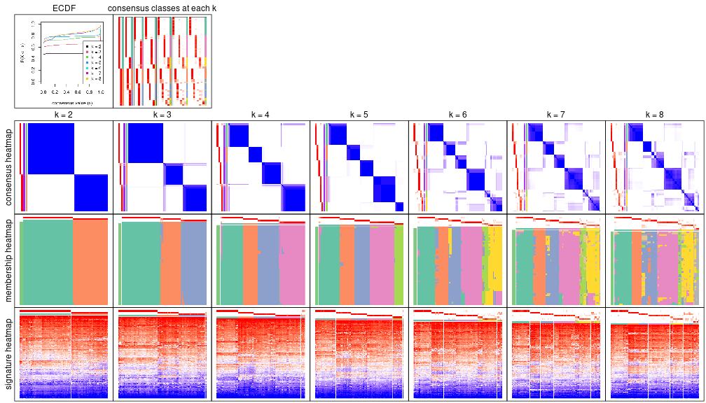

The plots are:

- The first row: a plot of the eCDF (empirical cumulative distribution
  function) curves of the consensus matrix for each `k` and the heatmap of
  predicted classes for each `k`.
- The second row: heatmaps of the consensus matrix for each `k`.
- The third row: heatmaps of the membership matrix for each `k`.
- The fouth row: heatmaps of the signatures for each `k`.

All the plots in panels can be made by individual functions and they are
plotted later in this section.

`select_partition_number()` produces several plots showing different
statistics for choosing "optimized" `k`. There are following statistics:

- eCDF curves of the consensus matrix for each `k`;
- 1-PAC. [The PAC score](https://en.wikipedia.org/wiki/Consensus_clustering#Over-interpretation_potential_of_consensus_clustering)
  measures the proportion of the ambiguous subgrouping.
- Mean silhouette score.
- Concordance. The mean probability of fiting the consensus subgroup labels in all
  partitions.
- Area increased. Denote $A_k$ as the area under the eCDF curve for current
  `k`, the area increased is defined as $A_k - A_{k-1}$.
- Rand index. The percent of pairs of samples that are both in a same cluster
  or both are not in a same cluster in the partition of k and k-1.
- Jaccard index. The ratio of pairs of samples are both in a same cluster in
  the partition of k and k-1 and the pairs of samples are both in a same
  cluster in the partition k or k-1.

The detailed explanations of these statistics can be found in [the _cola_
vignette](https://jokergoo.github.io/cola_vignettes/cola.html#toc_13).

Generally speaking, higher 1-PAC score, higher mean silhouette score or higher
concordance corresponds to better partition. Rand index and Jaccard index
measure how similar the current partition is compared to partition with `k-1`.
If they are too similar, we won't accept `k` is better than `k-1`.

```r
select_partition_number(res)
```

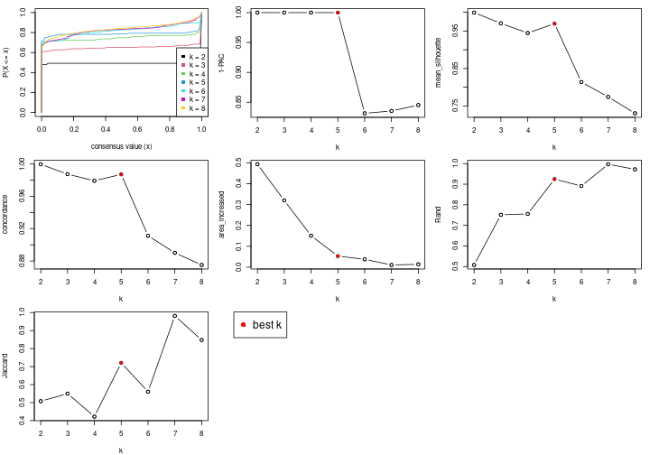

The numeric values for all these statistics can be obtained by `get_stats()`.

```r
get_stats(res)
```

```
#>   k 1-PAC mean_silhouette concordance area_increased  Rand Jaccard
#> 2 2 1.000           0.999       1.000         0.4926 0.508   0.508
#> 3 3 1.000           0.970       0.987         0.3197 0.751   0.550
#> 4 4 1.000           0.945       0.979         0.1507 0.756   0.422
#> 5 5 1.000           0.970       0.987         0.0532 0.925   0.721
#> 6 6 0.832           0.814       0.911         0.0376 0.891   0.560
#> 7 7 0.835           0.774       0.890         0.0106 0.997   0.981
#> 8 8 0.845           0.730       0.875         0.0137 0.972   0.847
```

`suggest_best_k()` suggests the best $k$ based on these statistics. The rules are as follows:

- All $k$ with Jaccard index larger than 0.95 are removed because increasing
  $k$ does not provide enough extra information. If all $k$ are removed, it is
  marked as no subgroup is detected.
- For all $k$ with 1-PAC score larger than 0.9, the maximal $k$ is taken as
  the best $k$, and other $k$ are marked as optional $k$.
- If it does not fit the second rule. The $k$ with the maximal vote of the
  highest 1-PAC score, highest mean silhouette, and highest concordance is
  taken as the best $k$.

```r
suggest_best_k(res)
```

```
#> [1] 5
#> attr(,"optional")
#> [1] 2 3 4
```

There is also optional best $k$ = 2 3 4 that is worth to check.

Following is the table of the partitions (You need to click the **show/hide
code output** link to see it). The membership matrix (columns with name `p*`)
is inferred by
[`clue::cl_consensus()`](https://www.rdocumentation.org/link/cl_consensus?package=clue)
function with the `SE` method. Basically the value in the membership matrix
represents the probability to belong to a certain group. The finall subgroup
label for an item is determined with the group with highest probability it
belongs to.

In `get_classes()` function, the entropy is calculated from the membership
matrix and the silhouette score is calculated from the consensus matrix.


<script>
$( function() {
	$( '#tabs-node-023-get-classes' ).tabs();
} );
</script>
<div id='tabs-node-023-get-classes'>
<ul>
<li><a href='#tab-node-023-get-classes-1'>k = 2</a></li>
<li><a href='#tab-node-023-get-classes-2'>k = 3</a></li>
<li><a href='#tab-node-023-get-classes-3'>k = 4</a></li>
<li><a href='#tab-node-023-get-classes-4'>k = 5</a></li>
<li><a href='#tab-node-023-get-classes-5'>k = 6</a></li>
<li><a href='#tab-node-023-get-classes-6'>k = 7</a></li>
<li><a href='#tab-node-023-get-classes-7'>k = 8</a></li>
</ul>

<div id='tab-node-023-get-classes-1'>
<p><a id='tab-node-023-get-classes-1-a' style='color:#0366d6' href='#'>show/hide code output</a></p>
<pre><code class="r">cbind(get_classes(res, k = 2), get_membership(res, k = 2))
</code></pre>

<pre><code>#&gt;                 class entropy silhouette   p1   p2
#&gt; TCGA.69.8453.01     1   0.000      1.000 1.00 0.00
#&gt; TCGA.53.A4EZ.01     1   0.000      1.000 1.00 0.00
#&gt; TCGA.J2.A4AG.01     1   0.000      1.000 1.00 0.00
#&gt; TCGA.49.AAR4.01     1   0.000      1.000 1.00 0.00
#&gt; TCGA.55.6984.01     1   0.000      1.000 1.00 0.00
#&gt; TCGA.49.6744.01     1   0.000      1.000 1.00 0.00
#&gt; TCGA.L9.A743.01     1   0.000      1.000 1.00 0.00
#&gt; TCGA.86.6562.01     2   0.000      0.999 0.00 1.00
#&gt; TCGA.86.8074.01     2   0.000      0.999 0.00 1.00
#&gt; TCGA.39.5011.01     1   0.000      1.000 1.00 0.00
#&gt; TCGA.55.8619.01     1   0.000      1.000 1.00 0.00
#&gt; TCGA.69.8253.01     2   0.000      0.999 0.00 1.00
#&gt; TCGA.91.6849.01     2   0.000      0.999 0.00 1.00
#&gt; TCGA.69.8254.01     2   0.000      0.999 0.00 1.00
#&gt; TCGA.L4.A4E5.01     2   0.242      0.958 0.04 0.96
#&gt; TCGA.44.6775.01     1   0.000      1.000 1.00 0.00
#&gt; TCGA.MP.A4T9.01     1   0.000      1.000 1.00 0.00
#&gt; TCGA.86.7714.01     2   0.000      0.999 0.00 1.00
#&gt; TCGA.55.7815.01     1   0.000      1.000 1.00 0.00
#&gt; TCGA.05.5423.01     2   0.000      0.999 0.00 1.00
#&gt; TCGA.55.6985.01     1   0.000      1.000 1.00 0.00
#&gt; TCGA.93.7347.01     1   0.000      1.000 1.00 0.00
#&gt; TCGA.44.6777.01     1   0.000      1.000 1.00 0.00
#&gt; TCGA.99.7458.01     2   0.000      0.999 0.00 1.00
#&gt; TCGA.97.7938.01     2   0.000      0.999 0.00 1.00
#&gt; TCGA.85.6560.01     1   0.000      1.000 1.00 0.00
#&gt; TCGA.L9.A50W.01     2   0.000      0.999 0.00 1.00
#&gt; TCGA.50.8460.01     2   0.000      0.999 0.00 1.00
#&gt; TCGA.67.6217.01     2   0.000      0.999 0.00 1.00
#&gt; TCGA.86.8671.01     1   0.000      1.000 1.00 0.00
#&gt; TCGA.50.6592.01     1   0.000      1.000 1.00 0.00
#&gt; TCGA.44.7661.01     1   0.000      1.000 1.00 0.00
#&gt; TCGA.49.6767.01     1   0.000      1.000 1.00 0.00
#&gt; TCGA.69.7761.01     1   0.000      1.000 1.00 0.00
#&gt; TCGA.91.6835.01     1   0.000      1.000 1.00 0.00
#&gt; TCGA.95.A4VN.01     1   0.000      1.000 1.00 0.00
#&gt; TCGA.44.A47F.01     2   0.000      0.999 0.00 1.00
#&gt; TCGA.50.5942.01     2   0.000      0.999 0.00 1.00
#&gt; TCGA.80.5608.01     2   0.000      0.999 0.00 1.00
#&gt; TCGA.55.A491.01     1   0.000      1.000 1.00 0.00
#&gt; TCGA.44.6146.01     2   0.000      0.999 0.00 1.00
#&gt; TCGA.97.7552.01     1   0.000      1.000 1.00 0.00
#&gt; TCGA.91.7771.01     2   0.000      0.999 0.00 1.00
#&gt; TCGA.86.8359.01     1   0.000      1.000 1.00 0.00
#&gt; TCGA.55.8301.01     1   0.000      1.000 1.00 0.00
#&gt; TCGA.55.8089.01     1   0.000      1.000 1.00 0.00
#&gt; TCGA.NJ.A4YQ.01     1   0.000      1.000 1.00 0.00
#&gt; TCGA.50.8459.01     1   0.000      1.000 1.00 0.00
#&gt; TCGA.73.7499.01     2   0.000      0.999 0.00 1.00
#&gt; TCGA.MP.A4T7.01     2   0.000      0.999 0.00 1.00
#&gt; TCGA.97.8171.01     2   0.000      0.999 0.00 1.00
#&gt; TCGA.50.8457.01     2   0.000      0.999 0.00 1.00
#&gt; TCGA.53.7626.01     1   0.000      1.000 1.00 0.00
#&gt; TCGA.69.7980.01     2   0.000      0.999 0.00 1.00
#&gt; TCGA.86.8668.01     2   0.000      0.999 0.00 1.00
#&gt; TCGA.MP.A4T4.01     1   0.000      1.000 1.00 0.00
#&gt; TCGA.93.A4JO.01     1   0.000      1.000 1.00 0.00
#&gt; TCGA.55.8510.01     1   0.000      1.000 1.00 0.00
#&gt; TCGA.49.AARO.01     1   0.000      1.000 1.00 0.00
#&gt; TCGA.86.8076.01     1   0.000      1.000 1.00 0.00
#&gt; TCGA.50.5044.01     1   0.000      1.000 1.00 0.00
#&gt; TCGA.64.5781.01     1   0.000      1.000 1.00 0.00
#&gt; TCGA.NJ.A4YF.01     2   0.000      0.999 0.00 1.00
#&gt; TCGA.49.AAR3.01     1   0.000      1.000 1.00 0.00
#&gt; TCGA.69.7760.01     2   0.000      0.999 0.00 1.00
#&gt; TCGA.49.4512.01     2   0.000      0.999 0.00 1.00
#&gt; TCGA.97.A4M3.01     2   0.000      0.999 0.00 1.00
#&gt; TCGA.99.8028.01     1   0.000      1.000 1.00 0.00
#&gt; TCGA.NJ.A7XG.01     2   0.000      0.999 0.00 1.00
#&gt; TCGA.55.A48X.01     1   0.000      1.000 1.00 0.00
#&gt; TCGA.50.6594.01     2   0.000      0.999 0.00 1.00
#&gt; TCGA.78.7537.01     2   0.000      0.999 0.00 1.00
#&gt; TCGA.85.A513.01     1   0.000      1.000 1.00 0.00
#&gt; TCGA.50.5935.01     2   0.000      0.999 0.00 1.00
#&gt; TCGA.55.6981.01     1   0.000      1.000 1.00 0.00
#&gt; TCGA.97.7941.01     2   0.000      0.999 0.00 1.00
#&gt; TCGA.67.4679.01     2   0.000      0.999 0.00 1.00
#&gt; TCGA.50.5941.01     1   0.000      1.000 1.00 0.00
#&gt; TCGA.97.8174.01     2   0.000      0.999 0.00 1.00
#&gt; TCGA.55.7725.01     2   0.000      0.999 0.00 1.00
#&gt; TCGA.55.6983.01     2   0.000      0.999 0.00 1.00
#&gt; TCGA.O2.A52Q.01     1   0.000      1.000 1.00 0.00
#&gt; TCGA.55.6978.01     1   0.000      1.000 1.00 0.00
#&gt; TCGA.55.A48Y.01     1   0.000      1.000 1.00 0.00
#&gt; TCGA.50.6595.01     1   0.000      1.000 1.00 0.00
#&gt; TCGA.91.8497.01     2   0.000      0.999 0.00 1.00
#&gt; TCGA.50.5049.01     1   0.000      1.000 1.00 0.00
#&gt; TCGA.97.A4M7.01     1   0.000      1.000 1.00 0.00
#&gt; TCGA.44.7662.01     1   0.000      1.000 1.00 0.00
#&gt; TCGA.50.5068.01     1   0.000      1.000 1.00 0.00
#&gt; TCGA.55.6987.01     1   0.000      1.000 1.00 0.00
#&gt; TCGA.78.7145.01     2   0.000      0.999 0.00 1.00
#&gt; TCGA.50.6593.01     1   0.000      1.000 1.00 0.00
</code></pre>

<script>
$('#tab-node-023-get-classes-1-a').parent().next().next().hide();
$('#tab-node-023-get-classes-1-a').click(function(){
  $('#tab-node-023-get-classes-1-a').parent().next().next().toggle();
  return(false);
});
</script>
</div>

<div id='tab-node-023-get-classes-2'>
<p><a id='tab-node-023-get-classes-2-a' style='color:#0366d6' href='#'>show/hide code output</a></p>
<pre><code class="r">cbind(get_classes(res, k = 3), get_membership(res, k = 3))
</code></pre>

<pre><code>#&gt;                 class entropy silhouette   p1   p2   p3
#&gt; TCGA.69.8453.01     3  0.0000      0.987 0.00 0.00 1.00
#&gt; TCGA.53.A4EZ.01     3  0.0000      0.987 0.00 0.00 1.00
#&gt; TCGA.J2.A4AG.01     1  0.0000      1.000 1.00 0.00 0.00
#&gt; TCGA.49.AAR4.01     1  0.0000      1.000 1.00 0.00 0.00
#&gt; TCGA.55.6984.01     3  0.0000      0.987 0.00 0.00 1.00
#&gt; TCGA.49.6744.01     1  0.0000      1.000 1.00 0.00 0.00
#&gt; TCGA.L9.A743.01     1  0.0000      1.000 1.00 0.00 0.00
#&gt; TCGA.86.6562.01     3  0.0000      0.987 0.00 0.00 1.00
#&gt; TCGA.86.8074.01     3  0.0000      0.987 0.00 0.00 1.00
#&gt; TCGA.39.5011.01     1  0.0000      1.000 1.00 0.00 0.00
#&gt; TCGA.55.8619.01     1  0.0000      1.000 1.00 0.00 0.00
#&gt; TCGA.69.8253.01     2  0.0000      0.960 0.00 1.00 0.00
#&gt; TCGA.91.6849.01     2  0.0000      0.960 0.00 1.00 0.00
#&gt; TCGA.69.8254.01     2  0.5397      0.627 0.00 0.72 0.28
#&gt; TCGA.L4.A4E5.01     3  0.0000      0.987 0.00 0.00 1.00
#&gt; TCGA.44.6775.01     3  0.0000      0.987 0.00 0.00 1.00
#&gt; TCGA.MP.A4T9.01     3  0.0000      0.987 0.00 0.00 1.00
#&gt; TCGA.86.7714.01     2  0.0000      0.960 0.00 1.00 0.00
#&gt; TCGA.55.7815.01     1  0.0000      1.000 1.00 0.00 0.00
#&gt; TCGA.05.5423.01     2  0.0000      0.960 0.00 1.00 0.00
#&gt; TCGA.55.6985.01     3  0.0000      0.987 0.00 0.00 1.00
#&gt; TCGA.93.7347.01     1  0.0000      1.000 1.00 0.00 0.00
#&gt; TCGA.44.6777.01     1  0.0000      1.000 1.00 0.00 0.00
#&gt; TCGA.99.7458.01     3  0.0000      0.987 0.00 0.00 1.00
#&gt; TCGA.97.7938.01     2  0.0000      0.960 0.00 1.00 0.00
#&gt; TCGA.85.6560.01     1  0.0000      1.000 1.00 0.00 0.00
#&gt; TCGA.L9.A50W.01     2  0.0000      0.960 0.00 1.00 0.00
#&gt; TCGA.50.8460.01     3  0.0000      0.987 0.00 0.00 1.00
#&gt; TCGA.67.6217.01     3  0.0000      0.987 0.00 0.00 1.00
#&gt; TCGA.86.8671.01     1  0.0000      1.000 1.00 0.00 0.00
#&gt; TCGA.50.6592.01     1  0.0000      1.000 1.00 0.00 0.00
#&gt; TCGA.44.7661.01     1  0.0000      1.000 1.00 0.00 0.00
#&gt; TCGA.49.6767.01     1  0.0000      1.000 1.00 0.00 0.00
#&gt; TCGA.69.7761.01     1  0.0000      1.000 1.00 0.00 0.00
#&gt; TCGA.91.6835.01     1  0.0000      1.000 1.00 0.00 0.00
#&gt; TCGA.95.A4VN.01     1  0.0000      1.000 1.00 0.00 0.00
#&gt; TCGA.44.A47F.01     2  0.0000      0.960 0.00 1.00 0.00
#&gt; TCGA.50.5942.01     2  0.0000      0.960 0.00 1.00 0.00
#&gt; TCGA.80.5608.01     3  0.0000      0.987 0.00 0.00 1.00
#&gt; TCGA.55.A491.01     3  0.0000      0.987 0.00 0.00 1.00
#&gt; TCGA.44.6146.01     2  0.0000      0.960 0.00 1.00 0.00
#&gt; TCGA.97.7552.01     1  0.0000      1.000 1.00 0.00 0.00
#&gt; TCGA.91.7771.01     3  0.4002      0.803 0.00 0.16 0.84
#&gt; TCGA.86.8359.01     3  0.0000      0.987 0.00 0.00 1.00
#&gt; TCGA.55.8301.01     1  0.0000      1.000 1.00 0.00 0.00
#&gt; TCGA.55.8089.01     1  0.0000      1.000 1.00 0.00 0.00
#&gt; TCGA.NJ.A4YQ.01     1  0.0000      1.000 1.00 0.00 0.00
#&gt; TCGA.50.8459.01     1  0.0000      1.000 1.00 0.00 0.00
#&gt; TCGA.73.7499.01     3  0.0000      0.987 0.00 0.00 1.00
#&gt; TCGA.MP.A4T7.01     3  0.0000      0.987 0.00 0.00 1.00
#&gt; TCGA.97.8171.01     2  0.0000      0.960 0.00 1.00 0.00
#&gt; TCGA.50.8457.01     3  0.0000      0.987 0.00 0.00 1.00
#&gt; TCGA.53.7626.01     3  0.0000      0.987 0.00 0.00 1.00
#&gt; TCGA.69.7980.01     3  0.2537      0.908 0.00 0.08 0.92
#&gt; TCGA.86.8668.01     2  0.0000      0.960 0.00 1.00 0.00
#&gt; TCGA.MP.A4T4.01     1  0.0000      1.000 1.00 0.00 0.00
#&gt; TCGA.93.A4JO.01     1  0.0000      1.000 1.00 0.00 0.00
#&gt; TCGA.55.8510.01     1  0.0000      1.000 1.00 0.00 0.00
#&gt; TCGA.49.AARO.01     1  0.0000      1.000 1.00 0.00 0.00
#&gt; TCGA.86.8076.01     1  0.0000      1.000 1.00 0.00 0.00
#&gt; TCGA.50.5044.01     1  0.0000      1.000 1.00 0.00 0.00
#&gt; TCGA.64.5781.01     1  0.0000      1.000 1.00 0.00 0.00
#&gt; TCGA.NJ.A4YF.01     3  0.0000      0.987 0.00 0.00 1.00
#&gt; TCGA.49.AAR3.01     1  0.0000      1.000 1.00 0.00 0.00
#&gt; TCGA.69.7760.01     2  0.0000      0.960 0.00 1.00 0.00
#&gt; TCGA.49.4512.01     3  0.0000      0.987 0.00 0.00 1.00
#&gt; TCGA.97.A4M3.01     2  0.0000      0.960 0.00 1.00 0.00
#&gt; TCGA.99.8028.01     1  0.0000      1.000 1.00 0.00 0.00
#&gt; TCGA.NJ.A7XG.01     2  0.0000      0.960 0.00 1.00 0.00
#&gt; TCGA.55.A48X.01     1  0.0000      1.000 1.00 0.00 0.00
#&gt; TCGA.50.6594.01     2  0.6126      0.357 0.00 0.60 0.40
#&gt; TCGA.78.7537.01     2  0.0000      0.960 0.00 1.00 0.00
#&gt; TCGA.85.A513.01     1  0.0000      1.000 1.00 0.00 0.00
#&gt; TCGA.50.5935.01     2  0.0000      0.960 0.00 1.00 0.00
#&gt; TCGA.55.6981.01     3  0.2066      0.917 0.06 0.00 0.94
#&gt; TCGA.97.7941.01     2  0.0000      0.960 0.00 1.00 0.00
#&gt; TCGA.67.4679.01     2  0.0000      0.960 0.00 1.00 0.00
#&gt; TCGA.50.5941.01     1  0.0000      1.000 1.00 0.00 0.00
#&gt; TCGA.97.8174.01     2  0.4291      0.777 0.00 0.82 0.18
#&gt; TCGA.55.7725.01     2  0.0000      0.960 0.00 1.00 0.00
#&gt; TCGA.55.6983.01     3  0.0000      0.987 0.00 0.00 1.00
#&gt; TCGA.O2.A52Q.01     1  0.0000      1.000 1.00 0.00 0.00
#&gt; TCGA.55.6978.01     1  0.0000      1.000 1.00 0.00 0.00
#&gt; TCGA.55.A48Y.01     1  0.0000      1.000 1.00 0.00 0.00
#&gt; TCGA.50.6595.01     1  0.0000      1.000 1.00 0.00 0.00
#&gt; TCGA.91.8497.01     3  0.0892      0.970 0.00 0.02 0.98
#&gt; TCGA.50.5049.01     1  0.0000      1.000 1.00 0.00 0.00
#&gt; TCGA.97.A4M7.01     3  0.0000      0.987 0.00 0.00 1.00
#&gt; TCGA.44.7662.01     1  0.0000      1.000 1.00 0.00 0.00
#&gt; TCGA.50.5068.01     1  0.0000      1.000 1.00 0.00 0.00
#&gt; TCGA.55.6987.01     1  0.0000      1.000 1.00 0.00 0.00
#&gt; TCGA.78.7145.01     2  0.0000      0.960 0.00 1.00 0.00
#&gt; TCGA.50.6593.01     3  0.0000      0.987 0.00 0.00 1.00
</code></pre>

<script>
$('#tab-node-023-get-classes-2-a').parent().next().next().hide();
$('#tab-node-023-get-classes-2-a').click(function(){
  $('#tab-node-023-get-classes-2-a').parent().next().next().toggle();
  return(false);
});
</script>
</div>

<div id='tab-node-023-get-classes-3'>
<p><a id='tab-node-023-get-classes-3-a' style='color:#0366d6' href='#'>show/hide code output</a></p>
<pre><code class="r">cbind(get_classes(res, k = 4), get_membership(res, k = 4))
</code></pre>

<pre><code>#&gt;                 class entropy silhouette   p1   p2   p3   p4
#&gt; TCGA.69.8453.01     4  0.0000     0.9609 0.00 0.00 0.00 1.00
#&gt; TCGA.53.A4EZ.01     4  0.2345     0.8700 0.00 0.00 0.10 0.90
#&gt; TCGA.J2.A4AG.01     4  0.0000     0.9609 0.00 0.00 0.00 1.00
#&gt; TCGA.49.AAR4.01     1  0.0000     0.9611 1.00 0.00 0.00 0.00
#&gt; TCGA.55.6984.01     4  0.0000     0.9609 0.00 0.00 0.00 1.00
#&gt; TCGA.49.6744.01     4  0.0000     0.9609 0.00 0.00 0.00 1.00
#&gt; TCGA.L9.A743.01     1  0.0000     0.9611 1.00 0.00 0.00 0.00
#&gt; TCGA.86.6562.01     3  0.0000     0.9943 0.00 0.00 1.00 0.00
#&gt; TCGA.86.8074.01     3  0.0000     0.9943 0.00 0.00 1.00 0.00
#&gt; TCGA.39.5011.01     1  0.0000     0.9611 1.00 0.00 0.00 0.00
#&gt; TCGA.55.8619.01     4  0.0000     0.9609 0.00 0.00 0.00 1.00
#&gt; TCGA.69.8253.01     2  0.0000     1.0000 0.00 1.00 0.00 0.00
#&gt; TCGA.91.6849.01     2  0.0000     1.0000 0.00 1.00 0.00 0.00
#&gt; TCGA.69.8254.01     3  0.0000     0.9943 0.00 0.00 1.00 0.00
#&gt; TCGA.L4.A4E5.01     3  0.0000     0.9943 0.00 0.00 1.00 0.00
#&gt; TCGA.44.6775.01     4  0.0000     0.9609 0.00 0.00 0.00 1.00
#&gt; TCGA.MP.A4T9.01     4  0.0000     0.9609 0.00 0.00 0.00 1.00
#&gt; TCGA.86.7714.01     2  0.0000     1.0000 0.00 1.00 0.00 0.00
#&gt; TCGA.55.7815.01     4  0.0707     0.9440 0.02 0.00 0.00 0.98
#&gt; TCGA.05.5423.01     3  0.0000     0.9943 0.00 0.00 1.00 0.00
#&gt; TCGA.55.6985.01     4  0.0000     0.9609 0.00 0.00 0.00 1.00
#&gt; TCGA.93.7347.01     4  0.0000     0.9609 0.00 0.00 0.00 1.00
#&gt; TCGA.44.6777.01     4  0.0000     0.9609 0.00 0.00 0.00 1.00
#&gt; TCGA.99.7458.01     3  0.0000     0.9943 0.00 0.00 1.00 0.00
#&gt; TCGA.97.7938.01     2  0.0000     1.0000 0.00 1.00 0.00 0.00
#&gt; TCGA.85.6560.01     1  0.0000     0.9611 1.00 0.00 0.00 0.00
#&gt; TCGA.L9.A50W.01     2  0.0000     1.0000 0.00 1.00 0.00 0.00
#&gt; TCGA.50.8460.01     3  0.0000     0.9943 0.00 0.00 1.00 0.00
#&gt; TCGA.67.6217.01     3  0.0000     0.9943 0.00 0.00 1.00 0.00
#&gt; TCGA.86.8671.01     1  0.0000     0.9611 1.00 0.00 0.00 0.00
#&gt; TCGA.50.6592.01     1  0.0000     0.9611 1.00 0.00 0.00 0.00
#&gt; TCGA.44.7661.01     1  0.0707     0.9422 0.98 0.00 0.00 0.02
#&gt; TCGA.49.6767.01     1  0.0000     0.9611 1.00 0.00 0.00 0.00
#&gt; TCGA.69.7761.01     1  0.0000     0.9611 1.00 0.00 0.00 0.00
#&gt; TCGA.91.6835.01     1  0.4948     0.2267 0.56 0.00 0.00 0.44
#&gt; TCGA.95.A4VN.01     4  0.4977     0.0751 0.46 0.00 0.00 0.54
#&gt; TCGA.44.A47F.01     3  0.1211     0.9606 0.00 0.04 0.96 0.00
#&gt; TCGA.50.5942.01     2  0.0000     1.0000 0.00 1.00 0.00 0.00
#&gt; TCGA.80.5608.01     3  0.0000     0.9943 0.00 0.00 1.00 0.00
#&gt; TCGA.55.A491.01     4  0.4624     0.4860 0.00 0.00 0.34 0.66
#&gt; TCGA.44.6146.01     2  0.0000     1.0000 0.00 1.00 0.00 0.00
#&gt; TCGA.97.7552.01     1  0.4713     0.4423 0.64 0.00 0.00 0.36
#&gt; TCGA.91.7771.01     3  0.0000     0.9943 0.00 0.00 1.00 0.00
#&gt; TCGA.86.8359.01     4  0.0707     0.9456 0.00 0.00 0.02 0.98
#&gt; TCGA.55.8301.01     4  0.0000     0.9609 0.00 0.00 0.00 1.00
#&gt; TCGA.55.8089.01     1  0.0000     0.9611 1.00 0.00 0.00 0.00
#&gt; TCGA.NJ.A4YQ.01     1  0.0000     0.9611 1.00 0.00 0.00 0.00
#&gt; TCGA.50.8459.01     4  0.0000     0.9609 0.00 0.00 0.00 1.00
#&gt; TCGA.73.7499.01     3  0.0000     0.9943 0.00 0.00 1.00 0.00
#&gt; TCGA.MP.A4T7.01     3  0.0000     0.9943 0.00 0.00 1.00 0.00
#&gt; TCGA.97.8171.01     2  0.0000     1.0000 0.00 1.00 0.00 0.00
#&gt; TCGA.50.8457.01     3  0.0000     0.9943 0.00 0.00 1.00 0.00
#&gt; TCGA.53.7626.01     4  0.0000     0.9609 0.00 0.00 0.00 1.00
#&gt; TCGA.69.7980.01     3  0.0000     0.9943 0.00 0.00 1.00 0.00
#&gt; TCGA.86.8668.01     3  0.1211     0.9606 0.00 0.04 0.96 0.00
#&gt; TCGA.MP.A4T4.01     1  0.0000     0.9611 1.00 0.00 0.00 0.00
#&gt; TCGA.93.A4JO.01     1  0.0000     0.9611 1.00 0.00 0.00 0.00
#&gt; TCGA.55.8510.01     4  0.0000     0.9609 0.00 0.00 0.00 1.00
#&gt; TCGA.49.AARO.01     1  0.0000     0.9611 1.00 0.00 0.00 0.00
#&gt; TCGA.86.8076.01     4  0.0000     0.9609 0.00 0.00 0.00 1.00
#&gt; TCGA.50.5044.01     4  0.0000     0.9609 0.00 0.00 0.00 1.00
#&gt; TCGA.64.5781.01     1  0.0000     0.9611 1.00 0.00 0.00 0.00
#&gt; TCGA.NJ.A4YF.01     3  0.0000     0.9943 0.00 0.00 1.00 0.00
#&gt; TCGA.49.AAR3.01     1  0.0000     0.9611 1.00 0.00 0.00 0.00
#&gt; TCGA.69.7760.01     2  0.0000     1.0000 0.00 1.00 0.00 0.00
#&gt; TCGA.49.4512.01     3  0.0000     0.9943 0.00 0.00 1.00 0.00
#&gt; TCGA.97.A4M3.01     2  0.0000     1.0000 0.00 1.00 0.00 0.00
#&gt; TCGA.99.8028.01     1  0.0000     0.9611 1.00 0.00 0.00 0.00
#&gt; TCGA.NJ.A7XG.01     2  0.0000     1.0000 0.00 1.00 0.00 0.00
#&gt; TCGA.55.A48X.01     4  0.0000     0.9609 0.00 0.00 0.00 1.00
#&gt; TCGA.50.6594.01     3  0.0000     0.9943 0.00 0.00 1.00 0.00
#&gt; TCGA.78.7537.01     2  0.0000     1.0000 0.00 1.00 0.00 0.00
#&gt; TCGA.85.A513.01     4  0.0000     0.9609 0.00 0.00 0.00 1.00
#&gt; TCGA.50.5935.01     2  0.0000     1.0000 0.00 1.00 0.00 0.00
#&gt; TCGA.55.6981.01     4  0.0000     0.9609 0.00 0.00 0.00 1.00
#&gt; TCGA.97.7941.01     3  0.1211     0.9606 0.00 0.04 0.96 0.00
#&gt; TCGA.67.4679.01     2  0.0000     1.0000 0.00 1.00 0.00 0.00
#&gt; TCGA.50.5941.01     4  0.0000     0.9609 0.00 0.00 0.00 1.00
#&gt; TCGA.97.8174.01     3  0.0000     0.9943 0.00 0.00 1.00 0.00
#&gt; TCGA.55.7725.01     2  0.0000     1.0000 0.00 1.00 0.00 0.00
#&gt; TCGA.55.6983.01     3  0.0000     0.9943 0.00 0.00 1.00 0.00
#&gt; TCGA.O2.A52Q.01     1  0.0000     0.9611 1.00 0.00 0.00 0.00
#&gt; TCGA.55.6978.01     1  0.0000     0.9611 1.00 0.00 0.00 0.00
#&gt; TCGA.55.A48Y.01     4  0.0000     0.9609 0.00 0.00 0.00 1.00
#&gt; TCGA.50.6595.01     1  0.0000     0.9611 1.00 0.00 0.00 0.00
#&gt; TCGA.91.8497.01     3  0.0000     0.9943 0.00 0.00 1.00 0.00
#&gt; TCGA.50.5049.01     1  0.0000     0.9611 1.00 0.00 0.00 0.00
#&gt; TCGA.97.A4M7.01     4  0.0000     0.9609 0.00 0.00 0.00 1.00
#&gt; TCGA.44.7662.01     1  0.0000     0.9611 1.00 0.00 0.00 0.00
#&gt; TCGA.50.5068.01     4  0.0000     0.9609 0.00 0.00 0.00 1.00
#&gt; TCGA.55.6987.01     1  0.0000     0.9611 1.00 0.00 0.00 0.00
#&gt; TCGA.78.7145.01     2  0.0000     1.0000 0.00 1.00 0.00 0.00
#&gt; TCGA.50.6593.01     4  0.1637     0.9104 0.00 0.00 0.06 0.94
</code></pre>

<script>
$('#tab-node-023-get-classes-3-a').parent().next().next().hide();
$('#tab-node-023-get-classes-3-a').click(function(){
  $('#tab-node-023-get-classes-3-a').parent().next().next().toggle();
  return(false);
});
</script>
</div>

<div id='tab-node-023-get-classes-4'>
<p><a id='tab-node-023-get-classes-4-a' style='color:#0366d6' href='#'>show/hide code output</a></p>
<pre><code class="r">cbind(get_classes(res, k = 5), get_membership(res, k = 5))
</code></pre>

<pre><code>#&gt;                 class entropy silhouette   p1   p2   p3   p4   p5
#&gt; TCGA.69.8453.01     4  0.0609      0.984 0.00 0.00 0.00 0.98 0.02
#&gt; TCGA.53.A4EZ.01     5  0.0000      0.988 0.00 0.00 0.00 0.00 1.00
#&gt; TCGA.J2.A4AG.01     4  0.0000      0.993 0.00 0.00 0.00 1.00 0.00
#&gt; TCGA.49.AAR4.01     1  0.0000      0.962 1.00 0.00 0.00 0.00 0.00
#&gt; TCGA.55.6984.01     4  0.0609      0.984 0.00 0.00 0.00 0.98 0.02
#&gt; TCGA.49.6744.01     4  0.0000      0.993 0.00 0.00 0.00 1.00 0.00
#&gt; TCGA.L9.A743.01     1  0.0609      0.946 0.98 0.00 0.00 0.02 0.00
#&gt; TCGA.86.6562.01     5  0.0000      0.988 0.00 0.00 0.00 0.00 1.00
#&gt; TCGA.86.8074.01     5  0.0609      0.972 0.00 0.00 0.02 0.00 0.98
#&gt; TCGA.39.5011.01     1  0.0000      0.962 1.00 0.00 0.00 0.00 0.00
#&gt; TCGA.55.8619.01     4  0.0000      0.993 0.00 0.00 0.00 1.00 0.00
#&gt; TCGA.69.8253.01     2  0.1043      0.960 0.00 0.96 0.04 0.00 0.00
#&gt; TCGA.91.6849.01     2  0.1410      0.941 0.00 0.94 0.06 0.00 0.00
#&gt; TCGA.69.8254.01     3  0.0000      0.997 0.00 0.00 1.00 0.00 0.00
#&gt; TCGA.L4.A4E5.01     5  0.0000      0.988 0.00 0.00 0.00 0.00 1.00
#&gt; TCGA.44.6775.01     4  0.0609      0.984 0.00 0.00 0.00 0.98 0.02
#&gt; TCGA.MP.A4T9.01     4  0.0609      0.984 0.00 0.00 0.00 0.98 0.02
#&gt; TCGA.86.7714.01     2  0.0000      0.985 0.00 1.00 0.00 0.00 0.00
#&gt; TCGA.55.7815.01     4  0.0000      0.993 0.00 0.00 0.00 1.00 0.00
#&gt; TCGA.05.5423.01     3  0.0000      0.997 0.00 0.00 1.00 0.00 0.00
#&gt; TCGA.55.6985.01     4  0.0609      0.984 0.00 0.00 0.00 0.98 0.02
#&gt; TCGA.93.7347.01     4  0.0000      0.993 0.00 0.00 0.00 1.00 0.00
#&gt; TCGA.44.6777.01     4  0.0000      0.993 0.00 0.00 0.00 1.00 0.00
#&gt; TCGA.99.7458.01     3  0.0609      0.978 0.00 0.00 0.98 0.00 0.02
#&gt; TCGA.97.7938.01     2  0.0000      0.985 0.00 1.00 0.00 0.00 0.00
#&gt; TCGA.85.6560.01     1  0.0000      0.962 1.00 0.00 0.00 0.00 0.00
#&gt; TCGA.L9.A50W.01     2  0.0000      0.985 0.00 1.00 0.00 0.00 0.00
#&gt; TCGA.50.8460.01     3  0.0000      0.997 0.00 0.00 1.00 0.00 0.00
#&gt; TCGA.67.6217.01     3  0.0000      0.997 0.00 0.00 1.00 0.00 0.00
#&gt; TCGA.86.8671.01     1  0.2020      0.863 0.90 0.00 0.00 0.10 0.00
#&gt; TCGA.50.6592.01     1  0.0000      0.962 1.00 0.00 0.00 0.00 0.00
#&gt; TCGA.44.7661.01     1  0.4287      0.180 0.54 0.00 0.00 0.46 0.00
#&gt; TCGA.49.6767.01     1  0.0000      0.962 1.00 0.00 0.00 0.00 0.00
#&gt; TCGA.69.7761.01     1  0.0000      0.962 1.00 0.00 0.00 0.00 0.00
#&gt; TCGA.91.6835.01     4  0.0000      0.993 0.00 0.00 0.00 1.00 0.00
#&gt; TCGA.95.A4VN.01     4  0.0609      0.974 0.02 0.00 0.00 0.98 0.00
#&gt; TCGA.44.A47F.01     3  0.0000      0.997 0.00 0.00 1.00 0.00 0.00
#&gt; TCGA.50.5942.01     2  0.0000      0.985 0.00 1.00 0.00 0.00 0.00
#&gt; TCGA.80.5608.01     3  0.0000      0.997 0.00 0.00 1.00 0.00 0.00
#&gt; TCGA.55.A491.01     5  0.0000      0.988 0.00 0.00 0.00 0.00 1.00
#&gt; TCGA.44.6146.01     2  0.1410      0.940 0.00 0.94 0.06 0.00 0.00
#&gt; TCGA.97.7552.01     4  0.0000      0.993 0.00 0.00 0.00 1.00 0.00
#&gt; TCGA.91.7771.01     3  0.0000      0.997 0.00 0.00 1.00 0.00 0.00
#&gt; TCGA.86.8359.01     5  0.0000      0.988 0.00 0.00 0.00 0.00 1.00
#&gt; TCGA.55.8301.01     4  0.0000      0.993 0.00 0.00 0.00 1.00 0.00
#&gt; TCGA.55.8089.01     1  0.0000      0.962 1.00 0.00 0.00 0.00 0.00
#&gt; TCGA.NJ.A4YQ.01     1  0.0000      0.962 1.00 0.00 0.00 0.00 0.00
#&gt; TCGA.50.8459.01     4  0.0000      0.993 0.00 0.00 0.00 1.00 0.00
#&gt; TCGA.73.7499.01     5  0.0000      0.988 0.00 0.00 0.00 0.00 1.00
#&gt; TCGA.MP.A4T7.01     3  0.0000      0.997 0.00 0.00 1.00 0.00 0.00
#&gt; TCGA.97.8171.01     2  0.0000      0.985 0.00 1.00 0.00 0.00 0.00
#&gt; TCGA.50.8457.01     3  0.0000      0.997 0.00 0.00 1.00 0.00 0.00
#&gt; TCGA.53.7626.01     4  0.0609      0.984 0.00 0.00 0.00 0.98 0.02
#&gt; TCGA.69.7980.01     5  0.1732      0.918 0.00 0.00 0.08 0.00 0.92
#&gt; TCGA.86.8668.01     3  0.0000      0.997 0.00 0.00 1.00 0.00 0.00
#&gt; TCGA.MP.A4T4.01     1  0.0000      0.962 1.00 0.00 0.00 0.00 0.00
#&gt; TCGA.93.A4JO.01     1  0.2020      0.863 0.90 0.00 0.00 0.10 0.00
#&gt; TCGA.55.8510.01     4  0.0000      0.993 0.00 0.00 0.00 1.00 0.00
#&gt; TCGA.49.AARO.01     1  0.0000      0.962 1.00 0.00 0.00 0.00 0.00
#&gt; TCGA.86.8076.01     4  0.0000      0.993 0.00 0.00 0.00 1.00 0.00
#&gt; TCGA.50.5044.01     4  0.0000      0.993 0.00 0.00 0.00 1.00 0.00
#&gt; TCGA.64.5781.01     1  0.0000      0.962 1.00 0.00 0.00 0.00 0.00
#&gt; TCGA.NJ.A4YF.01     5  0.0000      0.988 0.00 0.00 0.00 0.00 1.00
#&gt; TCGA.49.AAR3.01     1  0.0000      0.962 1.00 0.00 0.00 0.00 0.00
#&gt; TCGA.69.7760.01     2  0.0000      0.985 0.00 1.00 0.00 0.00 0.00
#&gt; TCGA.49.4512.01     3  0.0000      0.997 0.00 0.00 1.00 0.00 0.00
#&gt; TCGA.97.A4M3.01     2  0.0000      0.985 0.00 1.00 0.00 0.00 0.00
#&gt; TCGA.99.8028.01     1  0.0000      0.962 1.00 0.00 0.00 0.00 0.00
#&gt; TCGA.NJ.A7XG.01     2  0.0000      0.985 0.00 1.00 0.00 0.00 0.00
#&gt; TCGA.55.A48X.01     4  0.0000      0.993 0.00 0.00 0.00 1.00 0.00
#&gt; TCGA.50.6594.01     3  0.0000      0.997 0.00 0.00 1.00 0.00 0.00
#&gt; TCGA.78.7537.01     2  0.0000      0.985 0.00 1.00 0.00 0.00 0.00
#&gt; TCGA.85.A513.01     4  0.0000      0.993 0.00 0.00 0.00 1.00 0.00
#&gt; TCGA.50.5935.01     2  0.0000      0.985 0.00 1.00 0.00 0.00 0.00
#&gt; TCGA.55.6981.01     4  0.0609      0.984 0.00 0.00 0.00 0.98 0.02
#&gt; TCGA.97.7941.01     3  0.0000      0.997 0.00 0.00 1.00 0.00 0.00
#&gt; TCGA.67.4679.01     2  0.0000      0.985 0.00 1.00 0.00 0.00 0.00
#&gt; TCGA.50.5941.01     4  0.0000      0.993 0.00 0.00 0.00 1.00 0.00
#&gt; TCGA.97.8174.01     3  0.0000      0.997 0.00 0.00 1.00 0.00 0.00
#&gt; TCGA.55.7725.01     2  0.1043      0.960 0.00 0.96 0.04 0.00 0.00
#&gt; TCGA.55.6983.01     3  0.0609      0.978 0.00 0.00 0.98 0.00 0.02
#&gt; TCGA.O2.A52Q.01     1  0.0000      0.962 1.00 0.00 0.00 0.00 0.00
#&gt; TCGA.55.6978.01     1  0.0000      0.962 1.00 0.00 0.00 0.00 0.00
#&gt; TCGA.55.A48Y.01     4  0.0000      0.993 0.00 0.00 0.00 1.00 0.00
#&gt; TCGA.50.6595.01     1  0.0000      0.962 1.00 0.00 0.00 0.00 0.00
#&gt; TCGA.91.8497.01     3  0.0000      0.997 0.00 0.00 1.00 0.00 0.00
#&gt; TCGA.50.5049.01     1  0.0000      0.962 1.00 0.00 0.00 0.00 0.00
#&gt; TCGA.97.A4M7.01     4  0.0609      0.984 0.00 0.00 0.00 0.98 0.02
#&gt; TCGA.44.7662.01     1  0.0000      0.962 1.00 0.00 0.00 0.00 0.00
#&gt; TCGA.50.5068.01     4  0.0000      0.993 0.00 0.00 0.00 1.00 0.00
#&gt; TCGA.55.6987.01     1  0.0000      0.962 1.00 0.00 0.00 0.00 0.00
#&gt; TCGA.78.7145.01     2  0.0000      0.985 0.00 1.00 0.00 0.00 0.00
#&gt; TCGA.50.6593.01     5  0.0000      0.988 0.00 0.00 0.00 0.00 1.00
</code></pre>

<script>
$('#tab-node-023-get-classes-4-a').parent().next().next().hide();
$('#tab-node-023-get-classes-4-a').click(function(){
  $('#tab-node-023-get-classes-4-a').parent().next().next().toggle();
  return(false);
});
</script>
</div>

<div id='tab-node-023-get-classes-5'>
<p><a id='tab-node-023-get-classes-5-a' style='color:#0366d6' href='#'>show/hide code output</a></p>
<pre><code class="r">cbind(get_classes(res, k = 6), get_membership(res, k = 6))
</code></pre>

<pre><code>#&gt;                 class entropy silhouette   p1   p2   p3   p4   p5   p6
#&gt; TCGA.69.8453.01     6  0.2631     0.8210 0.00 0.00 0.00 0.18 0.00 0.82
#&gt; TCGA.53.A4EZ.01     6  0.2941     0.5216 0.00 0.00 0.00 0.00 0.22 0.78
#&gt; TCGA.J2.A4AG.01     4  0.0000     0.9564 0.00 0.00 0.00 1.00 0.00 0.00
#&gt; TCGA.49.AAR4.01     1  0.0000     0.9808 1.00 0.00 0.00 0.00 0.00 0.00
#&gt; TCGA.55.6984.01     6  0.2631     0.8210 0.00 0.00 0.00 0.18 0.00 0.82
#&gt; TCGA.49.6744.01     4  0.0000     0.9564 0.00 0.00 0.00 1.00 0.00 0.00
#&gt; TCGA.L9.A743.01     4  0.3198     0.6487 0.26 0.00 0.00 0.74 0.00 0.00
#&gt; TCGA.86.6562.01     5  0.2631     0.7002 0.00 0.00 0.00 0.00 0.82 0.18
#&gt; TCGA.86.8074.01     5  0.1480     0.7007 0.00 0.00 0.04 0.00 0.94 0.02
#&gt; TCGA.39.5011.01     1  0.0000     0.9808 1.00 0.00 0.00 0.00 0.00 0.00
#&gt; TCGA.55.8619.01     4  0.0000     0.9564 0.00 0.00 0.00 1.00 0.00 0.00
#&gt; TCGA.69.8253.01     2  0.3706     0.5107 0.00 0.62 0.38 0.00 0.00 0.00
#&gt; TCGA.91.6849.01     2  0.3828     0.4080 0.00 0.56 0.44 0.00 0.00 0.00
#&gt; TCGA.69.8254.01     3  0.0000     0.8531 0.00 0.00 1.00 0.00 0.00 0.00
#&gt; TCGA.L4.A4E5.01     5  0.2631     0.7002 0.00 0.00 0.00 0.00 0.82 0.18
#&gt; TCGA.44.6775.01     6  0.2631     0.8210 0.00 0.00 0.00 0.18 0.00 0.82
#&gt; TCGA.MP.A4T9.01     6  0.2631     0.8210 0.00 0.00 0.00 0.18 0.00 0.82
#&gt; TCGA.86.7714.01     2  0.0000     0.8432 0.00 1.00 0.00 0.00 0.00 0.00
#&gt; TCGA.55.7815.01     4  0.0000     0.9564 0.00 0.00 0.00 1.00 0.00 0.00
#&gt; TCGA.05.5423.01     3  0.0547     0.8346 0.00 0.00 0.98 0.00 0.02 0.00
#&gt; TCGA.55.6985.01     6  0.2631     0.8210 0.00 0.00 0.00 0.18 0.00 0.82
#&gt; TCGA.93.7347.01     4  0.0000     0.9564 0.00 0.00 0.00 1.00 0.00 0.00
#&gt; TCGA.44.6777.01     4  0.0000     0.9564 0.00 0.00 0.00 1.00 0.00 0.00
#&gt; TCGA.99.7458.01     6  0.2793     0.6644 0.00 0.00 0.20 0.00 0.00 0.80
#&gt; TCGA.97.7938.01     2  0.0000     0.8432 0.00 1.00 0.00 0.00 0.00 0.00
#&gt; TCGA.85.6560.01     1  0.2260     0.8074 0.86 0.00 0.00 0.14 0.00 0.00
#&gt; TCGA.L9.A50W.01     2  0.0000     0.8432 0.00 1.00 0.00 0.00 0.00 0.00
#&gt; TCGA.50.8460.01     3  0.3706     0.4314 0.00 0.00 0.62 0.00 0.00 0.38
#&gt; TCGA.67.6217.01     3  0.3578     0.5241 0.00 0.00 0.66 0.00 0.00 0.34
#&gt; TCGA.86.8671.01     4  0.2454     0.7871 0.16 0.00 0.00 0.84 0.00 0.00
#&gt; TCGA.50.6592.01     1  0.0000     0.9808 1.00 0.00 0.00 0.00 0.00 0.00
#&gt; TCGA.44.7661.01     4  0.2260     0.8114 0.14 0.00 0.00 0.86 0.00 0.00
#&gt; TCGA.49.6767.01     1  0.0000     0.9808 1.00 0.00 0.00 0.00 0.00 0.00
#&gt; TCGA.69.7761.01     1  0.0000     0.9808 1.00 0.00 0.00 0.00 0.00 0.00
#&gt; TCGA.91.6835.01     4  0.0000     0.9564 0.00 0.00 0.00 1.00 0.00 0.00
#&gt; TCGA.95.A4VN.01     4  0.0000     0.9564 0.00 0.00 0.00 1.00 0.00 0.00
#&gt; TCGA.44.A47F.01     3  0.0000     0.8531 0.00 0.00 1.00 0.00 0.00 0.00
#&gt; TCGA.50.5942.01     2  0.0000     0.8432 0.00 1.00 0.00 0.00 0.00 0.00
#&gt; TCGA.80.5608.01     3  0.0000     0.8531 0.00 0.00 1.00 0.00 0.00 0.00
#&gt; TCGA.55.A491.01     6  0.0000     0.7444 0.00 0.00 0.00 0.00 0.00 1.00
#&gt; TCGA.44.6146.01     2  0.4632     0.3535 0.00 0.52 0.44 0.00 0.04 0.00
#&gt; TCGA.97.7552.01     4  0.0000     0.9564 0.00 0.00 0.00 1.00 0.00 0.00
#&gt; TCGA.91.7771.01     3  0.0000     0.8531 0.00 0.00 1.00 0.00 0.00 0.00
#&gt; TCGA.86.8359.01     6  0.2631     0.5754 0.00 0.00 0.00 0.00 0.18 0.82
#&gt; TCGA.55.8301.01     4  0.0000     0.9564 0.00 0.00 0.00 1.00 0.00 0.00
#&gt; TCGA.55.8089.01     1  0.0000     0.9808 1.00 0.00 0.00 0.00 0.00 0.00
#&gt; TCGA.NJ.A4YQ.01     1  0.0000     0.9808 1.00 0.00 0.00 0.00 0.00 0.00
#&gt; TCGA.50.8459.01     4  0.0000     0.9564 0.00 0.00 0.00 1.00 0.00 0.00
#&gt; TCGA.73.7499.01     6  0.0000     0.7444 0.00 0.00 0.00 0.00 0.00 1.00
#&gt; TCGA.MP.A4T7.01     3  0.2793     0.6928 0.00 0.00 0.80 0.00 0.00 0.20
#&gt; TCGA.97.8171.01     2  0.0000     0.8432 0.00 1.00 0.00 0.00 0.00 0.00
#&gt; TCGA.50.8457.01     3  0.3578     0.5241 0.00 0.00 0.66 0.00 0.00 0.34
#&gt; TCGA.53.7626.01     6  0.2631     0.8210 0.00 0.00 0.00 0.18 0.00 0.82
#&gt; TCGA.69.7980.01     5  0.3711     0.5568 0.00 0.00 0.26 0.00 0.72 0.02
#&gt; TCGA.86.8668.01     3  0.0000     0.8531 0.00 0.00 1.00 0.00 0.00 0.00
#&gt; TCGA.MP.A4T4.01     1  0.0000     0.9808 1.00 0.00 0.00 0.00 0.00 0.00
#&gt; TCGA.93.A4JO.01     4  0.2454     0.7871 0.16 0.00 0.00 0.84 0.00 0.00
#&gt; TCGA.55.8510.01     4  0.0000     0.9564 0.00 0.00 0.00 1.00 0.00 0.00
#&gt; TCGA.49.AARO.01     1  0.0000     0.9808 1.00 0.00 0.00 0.00 0.00 0.00
#&gt; TCGA.86.8076.01     4  0.0000     0.9564 0.00 0.00 0.00 1.00 0.00 0.00
#&gt; TCGA.50.5044.01     4  0.0000     0.9564 0.00 0.00 0.00 1.00 0.00 0.00
#&gt; TCGA.64.5781.01     1  0.0000     0.9808 1.00 0.00 0.00 0.00 0.00 0.00
#&gt; TCGA.NJ.A4YF.01     5  0.2631     0.7002 0.00 0.00 0.00 0.00 0.82 0.18
#&gt; TCGA.49.AAR3.01     1  0.0000     0.9808 1.00 0.00 0.00 0.00 0.00 0.00
#&gt; TCGA.69.7760.01     2  0.0000     0.8432 0.00 1.00 0.00 0.00 0.00 0.00
#&gt; TCGA.49.4512.01     3  0.0000     0.8531 0.00 0.00 1.00 0.00 0.00 0.00
#&gt; TCGA.97.A4M3.01     2  0.0000     0.8432 0.00 1.00 0.00 0.00 0.00 0.00
#&gt; TCGA.99.8028.01     1  0.2048     0.8363 0.88 0.00 0.00 0.12 0.00 0.00
#&gt; TCGA.NJ.A7XG.01     2  0.0000     0.8432 0.00 1.00 0.00 0.00 0.00 0.00
#&gt; TCGA.55.A48X.01     4  0.0000     0.9564 0.00 0.00 0.00 1.00 0.00 0.00
#&gt; TCGA.50.6594.01     5  0.3864     0.1356 0.00 0.00 0.48 0.00 0.52 0.00
#&gt; TCGA.78.7537.01     2  0.0000     0.8432 0.00 1.00 0.00 0.00 0.00 0.00
#&gt; TCGA.85.A513.01     4  0.0000     0.9564 0.00 0.00 0.00 1.00 0.00 0.00
#&gt; TCGA.50.5935.01     2  0.0000     0.8432 0.00 1.00 0.00 0.00 0.00 0.00
#&gt; TCGA.55.6981.01     6  0.3409     0.6776 0.00 0.00 0.00 0.30 0.00 0.70
#&gt; TCGA.97.7941.01     3  0.0000     0.8531 0.00 0.00 1.00 0.00 0.00 0.00
#&gt; TCGA.67.4679.01     2  0.0000     0.8432 0.00 1.00 0.00 0.00 0.00 0.00
#&gt; TCGA.50.5941.01     4  0.0000     0.9564 0.00 0.00 0.00 1.00 0.00 0.00
#&gt; TCGA.97.8174.01     3  0.0000     0.8531 0.00 0.00 1.00 0.00 0.00 0.00
#&gt; TCGA.55.7725.01     2  0.3706     0.5107 0.00 0.62 0.38 0.00 0.00 0.00
#&gt; TCGA.55.6983.01     6  0.3409     0.5006 0.00 0.00 0.30 0.00 0.00 0.70
#&gt; TCGA.O2.A52Q.01     1  0.0000     0.9808 1.00 0.00 0.00 0.00 0.00 0.00
#&gt; TCGA.55.6978.01     1  0.0000     0.9808 1.00 0.00 0.00 0.00 0.00 0.00
#&gt; TCGA.55.A48Y.01     4  0.0000     0.9564 0.00 0.00 0.00 1.00 0.00 0.00
#&gt; TCGA.50.6595.01     1  0.0000     0.9808 1.00 0.00 0.00 0.00 0.00 0.00
#&gt; TCGA.91.8497.01     3  0.0000     0.8531 0.00 0.00 1.00 0.00 0.00 0.00
#&gt; TCGA.50.5049.01     1  0.0000     0.9808 1.00 0.00 0.00 0.00 0.00 0.00
#&gt; TCGA.97.A4M7.01     6  0.2631     0.8210 0.00 0.00 0.00 0.18 0.00 0.82
#&gt; TCGA.44.7662.01     1  0.0000     0.9808 1.00 0.00 0.00 0.00 0.00 0.00
#&gt; TCGA.50.5068.01     4  0.0000     0.9564 0.00 0.00 0.00 1.00 0.00 0.00
#&gt; TCGA.55.6987.01     1  0.0000     0.9808 1.00 0.00 0.00 0.00 0.00 0.00
#&gt; TCGA.78.7145.01     5  0.4337     0.0112 0.00 0.48 0.02 0.00 0.50 0.00
#&gt; TCGA.50.6593.01     6  0.0000     0.7444 0.00 0.00 0.00 0.00 0.00 1.00
</code></pre>

<script>
$('#tab-node-023-get-classes-5-a').parent().next().next().hide();
$('#tab-node-023-get-classes-5-a').click(function(){
  $('#tab-node-023-get-classes-5-a').parent().next().next().toggle();
  return(false);
});
</script>
</div>

<div id='tab-node-023-get-classes-6'>
<p><a id='tab-node-023-get-classes-6-a' style='color:#0366d6' href='#'>show/hide code output</a></p>
<pre><code class="r">cbind(get_classes(res, k = 7), get_membership(res, k = 7))
</code></pre>

<pre><code>#&gt;                 class entropy silhouette   p1   p2   p3   p4   p5   p6   p7
#&gt; TCGA.69.8453.01     6  0.2803     0.7601 0.00 0.00 0.00 0.10 0.00 0.84 0.06
#&gt; TCGA.53.A4EZ.01     6  0.4487     0.3674 0.00 0.00 0.00 0.00 0.08 0.60 0.32
#&gt; TCGA.J2.A4AG.01     4  0.0504     0.9169 0.00 0.00 0.00 0.98 0.00 0.02 0.00
#&gt; TCGA.49.AAR4.01     1  0.0000     0.9476 1.00 0.00 0.00 0.00 0.00 0.00 0.00
#&gt; TCGA.55.6984.01     6  0.2803     0.7601 0.00 0.00 0.00 0.10 0.00 0.84 0.06
#&gt; TCGA.49.6744.01     4  0.1166     0.9028 0.00 0.00 0.00 0.94 0.00 0.06 0.00
#&gt; TCGA.L9.A743.01     4  0.3307     0.6490 0.24 0.00 0.00 0.74 0.00 0.00 0.02
#&gt; TCGA.86.6562.01     5  0.4681     0.5734 0.00 0.00 0.00 0.00 0.58 0.10 0.32
#&gt; TCGA.86.8074.01     5  0.0504     0.5372 0.00 0.00 0.02 0.00 0.98 0.00 0.00
#&gt; TCGA.39.5011.01     1  0.0000     0.9476 1.00 0.00 0.00 0.00 0.00 0.00 0.00
#&gt; TCGA.55.8619.01     4  0.0000     0.9182 0.00 0.00 0.00 1.00 0.00 0.00 0.00
#&gt; TCGA.69.8253.01     2  0.2945     0.3725 0.00 0.74 0.26 0.00 0.00 0.00 0.00
#&gt; TCGA.91.6849.01     2  0.3496    -0.1693 0.00 0.58 0.42 0.00 0.00 0.00 0.00
#&gt; TCGA.69.8254.01     3  0.0000     0.8931 0.00 0.00 1.00 0.00 0.00 0.00 0.00
#&gt; TCGA.L4.A4E5.01     5  0.4783     0.5647 0.00 0.00 0.00 0.00 0.54 0.10 0.36
#&gt; TCGA.44.6775.01     6  0.2259     0.7668 0.00 0.00 0.00 0.16 0.00 0.84 0.00
#&gt; TCGA.MP.A4T9.01     6  0.2259     0.7668 0.00 0.00 0.00 0.16 0.00 0.84 0.00
#&gt; TCGA.86.7714.01     2  0.0000     0.8584 0.00 1.00 0.00 0.00 0.00 0.00 0.00
#&gt; TCGA.55.7815.01     4  0.0504     0.9152 0.00 0.00 0.00 0.98 0.00 0.00 0.02
#&gt; TCGA.05.5423.01     3  0.0863     0.8644 0.00 0.00 0.96 0.00 0.04 0.00 0.00
#&gt; TCGA.55.6985.01     6  0.2906     0.7574 0.00 0.00 0.00 0.18 0.00 0.80 0.02
#&gt; TCGA.93.7347.01     4  0.1166     0.9028 0.00 0.00 0.00 0.94 0.00 0.06 0.00
#&gt; TCGA.44.6777.01     4  0.1166     0.9028 0.00 0.00 0.00 0.94 0.00 0.06 0.00
#&gt; TCGA.99.7458.01     6  0.3186     0.5586 0.00 0.00 0.22 0.00 0.00 0.76 0.02
#&gt; TCGA.97.7938.01     2  0.0000     0.8584 0.00 1.00 0.00 0.00 0.00 0.00 0.00
#&gt; TCGA.85.6560.01     1  0.3517     0.5974 0.70 0.00 0.00 0.28 0.00 0.00 0.02
#&gt; TCGA.L9.A50W.01     2  0.0000     0.8584 0.00 1.00 0.00 0.00 0.00 0.00 0.00
#&gt; TCGA.50.8460.01     3  0.3307     0.6647 0.00 0.00 0.74 0.00 0.00 0.24 0.02
#&gt; TCGA.67.6217.01     3  0.3186     0.6876 0.00 0.00 0.76 0.00 0.00 0.22 0.02
#&gt; TCGA.86.8671.01     4  0.2745     0.7582 0.16 0.00 0.00 0.82 0.00 0.00 0.02
#&gt; TCGA.50.6592.01     1  0.1006     0.9402 0.96 0.00 0.00 0.02 0.00 0.00 0.02
#&gt; TCGA.44.7661.01     4  0.2745     0.7582 0.16 0.00 0.00 0.82 0.00 0.00 0.02
#&gt; TCGA.49.6767.01     1  0.0000     0.9476 1.00 0.00 0.00 0.00 0.00 0.00 0.00
#&gt; TCGA.69.7761.01     1  0.1363     0.9273 0.94 0.00 0.00 0.04 0.00 0.00 0.02
#&gt; TCGA.91.6835.01     4  0.0504     0.9152 0.00 0.00 0.00 0.98 0.00 0.00 0.02
#&gt; TCGA.95.A4VN.01     4  0.0504     0.9152 0.00 0.00 0.00 0.98 0.00 0.00 0.02
#&gt; TCGA.44.A47F.01     3  0.0000     0.8931 0.00 0.00 1.00 0.00 0.00 0.00 0.00
#&gt; TCGA.50.5942.01     2  0.0000     0.8584 0.00 1.00 0.00 0.00 0.00 0.00 0.00
#&gt; TCGA.80.5608.01     3  0.0000     0.8931 0.00 0.00 1.00 0.00 0.00 0.00 0.00
#&gt; TCGA.55.A491.01     6  0.2421     0.7113 0.00 0.00 0.00 0.02 0.02 0.88 0.08
#&gt; TCGA.44.6146.01     7  0.6179     0.0000 0.00 0.32 0.24 0.00 0.04 0.00 0.40
#&gt; TCGA.97.7552.01     4  0.0504     0.9152 0.00 0.00 0.00 0.98 0.00 0.00 0.02
#&gt; TCGA.91.7771.01     3  0.0000     0.8931 0.00 0.00 1.00 0.00 0.00 0.00 0.00
#&gt; TCGA.86.8359.01     6  0.4338     0.4323 0.00 0.00 0.00 0.00 0.08 0.64 0.28
#&gt; TCGA.55.8301.01     4  0.0000     0.9182 0.00 0.00 0.00 1.00 0.00 0.00 0.00
#&gt; TCGA.55.8089.01     1  0.0000     0.9476 1.00 0.00 0.00 0.00 0.00 0.00 0.00
#&gt; TCGA.NJ.A4YQ.01     1  0.0000     0.9476 1.00 0.00 0.00 0.00 0.00 0.00 0.00
#&gt; TCGA.50.8459.01     4  0.2572     0.8519 0.00 0.00 0.00 0.86 0.00 0.08 0.06
#&gt; TCGA.73.7499.01     6  0.3208     0.6533 0.00 0.00 0.02 0.00 0.04 0.82 0.12
#&gt; TCGA.MP.A4T7.01     3  0.2259     0.7684 0.00 0.00 0.84 0.00 0.00 0.16 0.00
#&gt; TCGA.97.8171.01     2  0.0000     0.8584 0.00 1.00 0.00 0.00 0.00 0.00 0.00
#&gt; TCGA.50.8457.01     3  0.2906     0.7443 0.00 0.00 0.80 0.00 0.00 0.18 0.02
#&gt; TCGA.53.7626.01     6  0.2906     0.7574 0.00 0.00 0.00 0.18 0.00 0.80 0.02
#&gt; TCGA.69.7980.01     5  0.3263     0.4901 0.00 0.00 0.12 0.00 0.80 0.00 0.08
#&gt; TCGA.86.8668.01     3  0.0000     0.8931 0.00 0.00 1.00 0.00 0.00 0.00 0.00
#&gt; TCGA.MP.A4T4.01     1  0.1664     0.9101 0.92 0.00 0.00 0.06 0.00 0.00 0.02
#&gt; TCGA.93.A4JO.01     4  0.2745     0.7582 0.16 0.00 0.00 0.82 0.00 0.00 0.02
#&gt; TCGA.55.8510.01     4  0.0504     0.9152 0.00 0.00 0.00 0.98 0.00 0.00 0.02
#&gt; TCGA.49.AARO.01     1  0.0000     0.9476 1.00 0.00 0.00 0.00 0.00 0.00 0.00
#&gt; TCGA.86.8076.01     4  0.0504     0.9169 0.00 0.00 0.00 0.98 0.00 0.02 0.00
#&gt; TCGA.50.5044.01     4  0.1166     0.9028 0.00 0.00 0.00 0.94 0.00 0.06 0.00
#&gt; TCGA.64.5781.01     1  0.0000     0.9476 1.00 0.00 0.00 0.00 0.00 0.00 0.00
#&gt; TCGA.NJ.A4YF.01     5  0.4737     0.5740 0.00 0.00 0.00 0.00 0.56 0.10 0.34
#&gt; TCGA.49.AAR3.01     1  0.0000     0.9476 1.00 0.00 0.00 0.00 0.00 0.00 0.00
#&gt; TCGA.69.7760.01     2  0.0000     0.8584 0.00 1.00 0.00 0.00 0.00 0.00 0.00
#&gt; TCGA.49.4512.01     3  0.0504     0.8832 0.00 0.00 0.98 0.00 0.00 0.02 0.00
#&gt; TCGA.97.A4M3.01     2  0.0000     0.8584 0.00 1.00 0.00 0.00 0.00 0.00 0.00
#&gt; TCGA.99.8028.01     1  0.2569     0.8160 0.84 0.00 0.00 0.14 0.00 0.00 0.02
#&gt; TCGA.NJ.A7XG.01     2  0.0000     0.8584 0.00 1.00 0.00 0.00 0.00 0.00 0.00
#&gt; TCGA.55.A48X.01     4  0.1166     0.9028 0.00 0.00 0.00 0.94 0.00 0.06 0.00
#&gt; TCGA.50.6594.01     5  0.4191     0.2710 0.00 0.00 0.30 0.00 0.64 0.00 0.06
#&gt; TCGA.78.7537.01     2  0.0000     0.8584 0.00 1.00 0.00 0.00 0.00 0.00 0.00
#&gt; TCGA.85.A513.01     4  0.0863     0.9120 0.00 0.00 0.00 0.96 0.00 0.04 0.00
#&gt; TCGA.50.5935.01     2  0.0504     0.8350 0.00 0.98 0.02 0.00 0.00 0.00 0.00
#&gt; TCGA.55.6981.01     6  0.3307     0.6943 0.00 0.00 0.00 0.24 0.00 0.74 0.02
#&gt; TCGA.97.7941.01     3  0.0000     0.8931 0.00 0.00 1.00 0.00 0.00 0.00 0.00
#&gt; TCGA.67.4679.01     2  0.0000     0.8584 0.00 1.00 0.00 0.00 0.00 0.00 0.00
#&gt; TCGA.50.5941.01     4  0.0863     0.9120 0.00 0.00 0.00 0.96 0.00 0.04 0.00
#&gt; TCGA.97.8174.01     3  0.0000     0.8931 0.00 0.00 1.00 0.00 0.00 0.00 0.00
#&gt; TCGA.55.7725.01     2  0.2945     0.3725 0.00 0.74 0.26 0.00 0.00 0.00 0.00
#&gt; TCGA.55.6983.01     6  0.3867     0.2319 0.00 0.00 0.38 0.00 0.00 0.60 0.02
#&gt; TCGA.O2.A52Q.01     1  0.0000     0.9476 1.00 0.00 0.00 0.00 0.00 0.00 0.00
#&gt; TCGA.55.6978.01     1  0.0000     0.9476 1.00 0.00 0.00 0.00 0.00 0.00 0.00
#&gt; TCGA.55.A48Y.01     4  0.1006     0.9181 0.00 0.00 0.00 0.96 0.00 0.02 0.02
#&gt; TCGA.50.6595.01     1  0.1006     0.9402 0.96 0.00 0.00 0.02 0.00 0.00 0.02
#&gt; TCGA.91.8497.01     3  0.0000     0.8931 0.00 0.00 1.00 0.00 0.00 0.00 0.00
#&gt; TCGA.50.5049.01     1  0.1006     0.9402 0.96 0.00 0.00 0.02 0.00 0.00 0.02
#&gt; TCGA.97.A4M7.01     6  0.2259     0.7668 0.00 0.00 0.00 0.16 0.00 0.84 0.00
#&gt; TCGA.44.7662.01     1  0.1006     0.9364 0.96 0.00 0.00 0.02 0.00 0.00 0.02
#&gt; TCGA.50.5068.01     4  0.0000     0.9182 0.00 0.00 0.00 1.00 0.00 0.00 0.00
#&gt; TCGA.55.6987.01     1  0.1006     0.9402 0.96 0.00 0.00 0.02 0.00 0.00 0.02
#&gt; TCGA.78.7145.01     5  0.4778    -0.0614 0.00 0.34 0.02 0.00 0.58 0.00 0.06
#&gt; TCGA.50.6593.01     6  0.1664     0.6993 0.00 0.00 0.00 0.00 0.02 0.92 0.06
</code></pre>

<script>
$('#tab-node-023-get-classes-6-a').parent().next().next().hide();
$('#tab-node-023-get-classes-6-a').click(function(){
  $('#tab-node-023-get-classes-6-a').parent().next().next().toggle();
  return(false);
});
</script>
</div>

<div id='tab-node-023-get-classes-7'>
<p><a id='tab-node-023-get-classes-7-a' style='color:#0366d6' href='#'>show/hide code output</a></p>
<pre><code class="r">cbind(get_classes(res, k = 8), get_membership(res, k = 8))
</code></pre>

<pre><code>#&gt;                 class entropy silhouette   p1   p2   p3   p4   p5   p6   p7   p8
#&gt; TCGA.69.8453.01     6  0.3397   0.681757 0.00 0.00 0.00 0.04 0.10 0.80 0.06 0.00
#&gt; TCGA.53.A4EZ.01     8  0.4886   0.203739 0.00 0.00 0.00 0.00 0.04 0.44 0.06 0.46
#&gt; TCGA.J2.A4AG.01     4  0.0808   0.915723 0.00 0.00 0.00 0.96 0.00 0.04 0.00 0.00
#&gt; TCGA.49.AAR4.01     1  0.0000   0.944097 1.00 0.00 0.00 0.00 0.00 0.00 0.00 0.00
#&gt; TCGA.55.6984.01     6  0.3397   0.681757 0.00 0.00 0.00 0.04 0.10 0.80 0.06 0.00
#&gt; TCGA.49.6744.01     4  0.1341   0.899154 0.00 0.00 0.00 0.92 0.00 0.08 0.00 0.00
#&gt; TCGA.L9.A743.01     4  0.2888   0.745192 0.16 0.00 0.00 0.80 0.00 0.00 0.04 0.00
#&gt; TCGA.86.6562.01     8  0.0941   0.481844 0.00 0.00 0.00 0.00 0.00 0.02 0.02 0.96
#&gt; TCGA.86.8074.01     5  0.3570   0.633199 0.00 0.00 0.02 0.00 0.62 0.00 0.00 0.36
#&gt; TCGA.39.5011.01     1  0.0471   0.933554 0.98 0.00 0.00 0.00 0.00 0.02 0.00 0.00
#&gt; TCGA.55.8619.01     4  0.0471   0.919126 0.00 0.00 0.00 0.98 0.00 0.00 0.02 0.00
#&gt; TCGA.69.8253.01     3  0.3658  -0.029713 0.00 0.40 0.58 0.00 0.00 0.00 0.02 0.00
#&gt; TCGA.91.6849.01     3  0.3618  -0.000336 0.00 0.38 0.60 0.00 0.00 0.00 0.02 0.00
#&gt; TCGA.69.8254.01     3  0.0000   0.616380 0.00 0.00 1.00 0.00 0.00 0.00 0.00 0.00
#&gt; TCGA.L4.A4E5.01     8  0.0000   0.471892 0.00 0.00 0.00 0.00 0.00 0.00 0.00 1.00
#&gt; TCGA.44.6775.01     6  0.0808   0.741787 0.00 0.00 0.00 0.04 0.00 0.96 0.00 0.00
#&gt; TCGA.MP.A4T9.01     6  0.0808   0.741787 0.00 0.00 0.00 0.04 0.00 0.96 0.00 0.00
#&gt; TCGA.86.7714.01     2  0.0000   0.994542 0.00 1.00 0.00 0.00 0.00 0.00 0.00 0.00
#&gt; TCGA.55.7815.01     4  0.1275   0.910690 0.02 0.00 0.00 0.94 0.00 0.00 0.04 0.00
#&gt; TCGA.05.5423.01     3  0.1741   0.574262 0.00 0.00 0.92 0.00 0.04 0.00 0.02 0.02
#&gt; TCGA.55.6985.01     6  0.1765   0.697349 0.00 0.00 0.00 0.12 0.00 0.88 0.00 0.00
#&gt; TCGA.93.7347.01     4  0.1341   0.899154 0.00 0.00 0.00 0.92 0.00 0.08 0.00 0.00
#&gt; TCGA.44.6777.01     4  0.0808   0.915723 0.00 0.00 0.00 0.96 0.00 0.04 0.00 0.00
#&gt; TCGA.99.7458.01     6  0.4760   0.476588 0.00 0.00 0.16 0.00 0.00 0.62 0.20 0.02
#&gt; TCGA.97.7938.01     2  0.0000   0.994542 0.00 1.00 0.00 0.00 0.00 0.00 0.00 0.00
#&gt; TCGA.85.6560.01     1  0.2888   0.726122 0.80 0.00 0.00 0.16 0.00 0.00 0.04 0.00
#&gt; TCGA.L9.A50W.01     2  0.0000   0.994542 0.00 1.00 0.00 0.00 0.00 0.00 0.00 0.00
#&gt; TCGA.50.8460.01     3  0.5305   0.291166 0.00 0.00 0.50 0.00 0.00 0.28 0.20 0.02
#&gt; TCGA.67.6217.01     3  0.5244   0.314506 0.00 0.00 0.52 0.00 0.00 0.26 0.20 0.02
#&gt; TCGA.86.8671.01     4  0.1607   0.896880 0.04 0.00 0.00 0.92 0.00 0.00 0.04 0.00
#&gt; TCGA.50.6592.01     1  0.0000   0.944097 1.00 0.00 0.00 0.00 0.00 0.00 0.00 0.00
#&gt; TCGA.44.7661.01     4  0.1607   0.896880 0.04 0.00 0.00 0.92 0.00 0.00 0.04 0.00
#&gt; TCGA.49.6767.01     1  0.0471   0.933554 0.98 0.00 0.00 0.00 0.00 0.02 0.00 0.00
#&gt; TCGA.69.7761.01     1  0.1275   0.904474 0.94 0.00 0.00 0.02 0.00 0.00 0.04 0.00
#&gt; TCGA.91.6835.01     4  0.0941   0.915835 0.02 0.00 0.00 0.96 0.00 0.00 0.02 0.00
#&gt; TCGA.95.A4VN.01     4  0.1275   0.910690 0.02 0.00 0.00 0.94 0.00 0.00 0.04 0.00
#&gt; TCGA.44.A47F.01     3  0.0471   0.606444 0.00 0.00 0.98 0.00 0.00 0.00 0.02 0.00
#&gt; TCGA.50.5942.01     2  0.0000   0.994542 0.00 1.00 0.00 0.00 0.00 0.00 0.00 0.00
#&gt; TCGA.80.5608.01     3  0.2407   0.569357 0.00 0.00 0.86 0.00 0.00 0.00 0.08 0.06
#&gt; TCGA.55.A491.01     6  0.2862   0.646118 0.00 0.00 0.00 0.00 0.00 0.82 0.08 0.10
#&gt; TCGA.44.6146.01     7  0.5245   0.000000 0.00 0.10 0.24 0.00 0.08 0.00 0.58 0.00
#&gt; TCGA.97.7552.01     4  0.0941   0.915808 0.02 0.00 0.00 0.96 0.00 0.00 0.02 0.00
#&gt; TCGA.91.7771.01     3  0.0471   0.617381 0.00 0.00 0.98 0.00 0.00 0.00 0.02 0.00
#&gt; TCGA.86.8359.01     8  0.5273   0.218177 0.00 0.00 0.00 0.00 0.06 0.42 0.08 0.44
#&gt; TCGA.55.8301.01     4  0.0471   0.918668 0.02 0.00 0.00 0.98 0.00 0.00 0.00 0.00
#&gt; TCGA.55.8089.01     1  0.0471   0.933554 0.98 0.00 0.00 0.00 0.00 0.02 0.00 0.00
#&gt; TCGA.NJ.A4YQ.01     1  0.0000   0.944097 1.00 0.00 0.00 0.00 0.00 0.00 0.00 0.00
#&gt; TCGA.50.8459.01     4  0.4022   0.728441 0.00 0.00 0.00 0.74 0.10 0.12 0.04 0.00
#&gt; TCGA.73.7499.01     6  0.4213   0.500138 0.00 0.00 0.00 0.00 0.00 0.66 0.18 0.16
#&gt; TCGA.MP.A4T7.01     3  0.5668   0.248391 0.00 0.00 0.46 0.00 0.00 0.26 0.24 0.04
#&gt; TCGA.97.8171.01     2  0.0000   0.994542 0.00 1.00 0.00 0.00 0.00 0.00 0.00 0.00
#&gt; TCGA.50.8457.01     3  0.5244   0.314506 0.00 0.00 0.52 0.00 0.00 0.26 0.20 0.02
#&gt; TCGA.53.7626.01     6  0.2404   0.680430 0.00 0.00 0.00 0.14 0.00 0.84 0.02 0.00
#&gt; TCGA.69.7980.01     5  0.4756   0.654734 0.00 0.00 0.06 0.00 0.56 0.00 0.04 0.34
#&gt; TCGA.86.8668.01     3  0.0471   0.606444 0.00 0.00 0.98 0.00 0.00 0.00 0.02 0.00
#&gt; TCGA.MP.A4T4.01     1  0.1275   0.904452 0.94 0.00 0.00 0.04 0.00 0.00 0.02 0.00
#&gt; TCGA.93.A4JO.01     4  0.1607   0.896880 0.04 0.00 0.00 0.92 0.00 0.00 0.04 0.00
#&gt; TCGA.55.8510.01     4  0.1275   0.910690 0.02 0.00 0.00 0.94 0.00 0.00 0.04 0.00
#&gt; TCGA.49.AARO.01     1  0.0000   0.944097 1.00 0.00 0.00 0.00 0.00 0.00 0.00 0.00
#&gt; TCGA.86.8076.01     4  0.1091   0.909759 0.00 0.00 0.00 0.94 0.00 0.06 0.00 0.00
#&gt; TCGA.50.5044.01     4  0.1765   0.866289 0.00 0.00 0.00 0.88 0.00 0.12 0.00 0.00
#&gt; TCGA.64.5781.01     1  0.0000   0.944097 1.00 0.00 0.00 0.00 0.00 0.00 0.00 0.00
#&gt; TCGA.NJ.A4YF.01     8  0.0471   0.470915 0.00 0.00 0.00 0.00 0.00 0.00 0.02 0.98
#&gt; TCGA.49.AAR3.01     1  0.0000   0.944097 1.00 0.00 0.00 0.00 0.00 0.00 0.00 0.00
#&gt; TCGA.69.7760.01     2  0.0000   0.994542 0.00 1.00 0.00 0.00 0.00 0.00 0.00 0.00
#&gt; TCGA.49.4512.01     3  0.2025   0.577694 0.00 0.00 0.88 0.00 0.00 0.00 0.10 0.02
#&gt; TCGA.97.A4M3.01     2  0.0000   0.994542 0.00 1.00 0.00 0.00 0.00 0.00 0.00 0.00
#&gt; TCGA.99.8028.01     1  0.3594   0.529970 0.68 0.00 0.00 0.28 0.00 0.00 0.04 0.00
#&gt; TCGA.NJ.A7XG.01     2  0.0000   0.994542 0.00 1.00 0.00 0.00 0.00 0.00 0.00 0.00
#&gt; TCGA.55.A48X.01     4  0.1341   0.899154 0.00 0.00 0.00 0.92 0.00 0.08 0.00 0.00
#&gt; TCGA.50.6594.01     5  0.5610   0.378874 0.00 0.00 0.28 0.00 0.54 0.02 0.06 0.10
#&gt; TCGA.78.7537.01     2  0.0000   0.994542 0.00 1.00 0.00 0.00 0.00 0.00 0.00 0.00
#&gt; TCGA.85.A513.01     4  0.1091   0.909759 0.00 0.00 0.00 0.94 0.00 0.06 0.00 0.00
#&gt; TCGA.50.5935.01     2  0.0941   0.943519 0.00 0.96 0.02 0.00 0.00 0.00 0.02 0.00
#&gt; TCGA.55.6981.01     6  0.2981   0.535840 0.00 0.00 0.00 0.22 0.00 0.76 0.02 0.00
#&gt; TCGA.97.7941.01     3  0.0000   0.616380 0.00 0.00 1.00 0.00 0.00 0.00 0.00 0.00
#&gt; TCGA.67.4679.01     2  0.0000   0.994542 0.00 1.00 0.00 0.00 0.00 0.00 0.00 0.00
#&gt; TCGA.50.5941.01     4  0.1091   0.909759 0.00 0.00 0.00 0.94 0.00 0.06 0.00 0.00
#&gt; TCGA.97.8174.01     3  0.0000   0.616380 0.00 0.00 1.00 0.00 0.00 0.00 0.00 0.00
#&gt; TCGA.55.7725.01     3  0.3658  -0.029713 0.00 0.40 0.58 0.00 0.00 0.00 0.02 0.00
#&gt; TCGA.55.6983.01     6  0.4882   0.438109 0.00 0.00 0.20 0.00 0.00 0.60 0.18 0.02
#&gt; TCGA.O2.A52Q.01     1  0.0471   0.933554 0.98 0.00 0.00 0.00 0.00 0.02 0.00 0.00
#&gt; TCGA.55.6978.01     1  0.0000   0.944097 1.00 0.00 0.00 0.00 0.00 0.00 0.00 0.00
#&gt; TCGA.55.A48Y.01     4  0.0941   0.919995 0.00 0.00 0.00 0.96 0.00 0.02 0.02 0.00
#&gt; TCGA.50.6595.01     1  0.0000   0.944097 1.00 0.00 0.00 0.00 0.00 0.00 0.00 0.00
#&gt; TCGA.91.8497.01     3  0.0471   0.617381 0.00 0.00 0.98 0.00 0.00 0.00 0.02 0.00
#&gt; TCGA.50.5049.01     1  0.0000   0.944097 1.00 0.00 0.00 0.00 0.00 0.00 0.00 0.00
#&gt; TCGA.97.A4M7.01     6  0.0808   0.741787 0.00 0.00 0.00 0.04 0.00 0.96 0.00 0.00
#&gt; TCGA.44.7662.01     1  0.1607   0.885141 0.92 0.00 0.00 0.04 0.00 0.00 0.04 0.00
#&gt; TCGA.50.5068.01     4  0.0000   0.919600 0.00 0.00 0.00 1.00 0.00 0.00 0.00 0.00
#&gt; TCGA.55.6987.01     1  0.0000   0.944097 1.00 0.00 0.00 0.00 0.00 0.00 0.00 0.00
#&gt; TCGA.78.7145.01     5  0.4188   0.514889 0.00 0.14 0.04 0.00 0.72 0.00 0.00 0.10
#&gt; TCGA.50.6593.01     6  0.3078   0.671286 0.00 0.00 0.00 0.00 0.02 0.82 0.10 0.06
</code></pre>

<script>
$('#tab-node-023-get-classes-7-a').parent().next().next().hide();
$('#tab-node-023-get-classes-7-a').click(function(){
  $('#tab-node-023-get-classes-7-a').parent().next().next().toggle();
  return(false);
});
</script>
</div>
</div>

Heatmaps for the consensus matrix. It visualizes the probability of two
samples to be in a same group.


<script>
$( function() {
	$( '#tabs-node-023-consensus-heatmap' ).tabs();
} );
</script>
<div id='tabs-node-023-consensus-heatmap'>
<ul>
<li><a href='#tab-node-023-consensus-heatmap-1'>k = 2</a></li>
<li><a href='#tab-node-023-consensus-heatmap-2'>k = 3</a></li>
<li><a href='#tab-node-023-consensus-heatmap-3'>k = 4</a></li>
<li><a href='#tab-node-023-consensus-heatmap-4'>k = 5</a></li>
<li><a href='#tab-node-023-consensus-heatmap-5'>k = 6</a></li>
<li><a href='#tab-node-023-consensus-heatmap-6'>k = 7</a></li>
<li><a href='#tab-node-023-consensus-heatmap-7'>k = 8</a></li>
</ul>
<div id='tab-node-023-consensus-heatmap-1'>
<pre><code class="r">consensus_heatmap(res, k = 2)
</code></pre>

<p>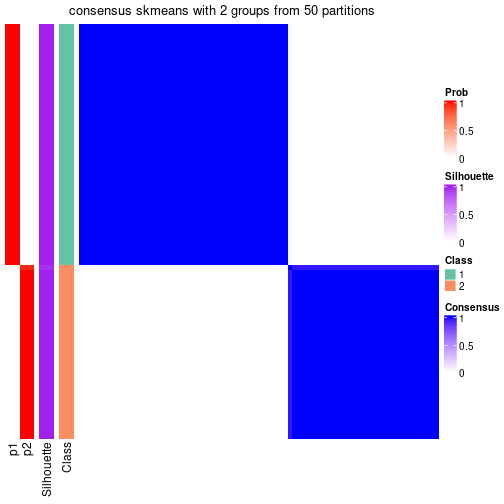</p>

</div>
<div id='tab-node-023-consensus-heatmap-2'>
<pre><code class="r">consensus_heatmap(res, k = 3)
</code></pre>

<p>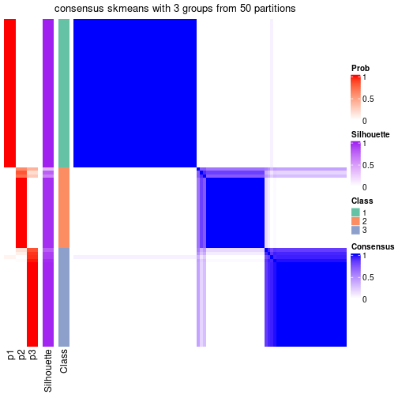</p>

</div>
<div id='tab-node-023-consensus-heatmap-3'>
<pre><code class="r">consensus_heatmap(res, k = 4)
</code></pre>

<p>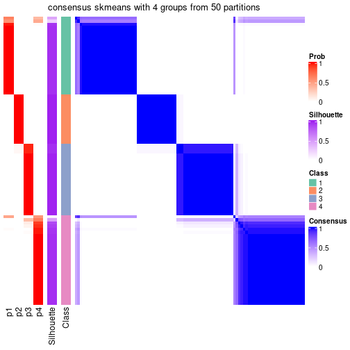</p>

</div>
<div id='tab-node-023-consensus-heatmap-4'>
<pre><code class="r">consensus_heatmap(res, k = 5)
</code></pre>

<p>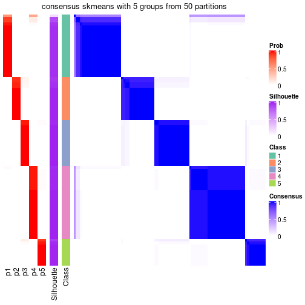</p>

</div>
<div id='tab-node-023-consensus-heatmap-5'>
<pre><code class="r">consensus_heatmap(res, k = 6)
</code></pre>

<p>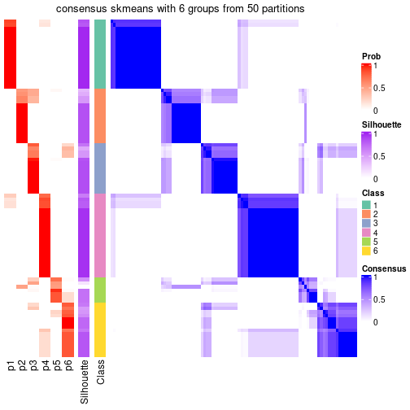</p>

</div>
<div id='tab-node-023-consensus-heatmap-6'>
<pre><code class="r">consensus_heatmap(res, k = 7)
</code></pre>

<p>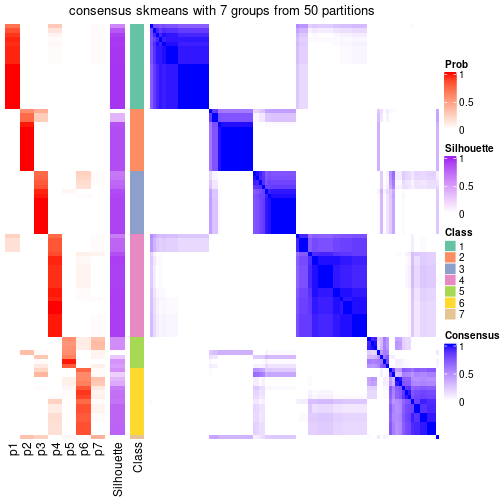</p>

</div>
<div id='tab-node-023-consensus-heatmap-7'>
<pre><code class="r">consensus_heatmap(res, k = 8)
</code></pre>

<p>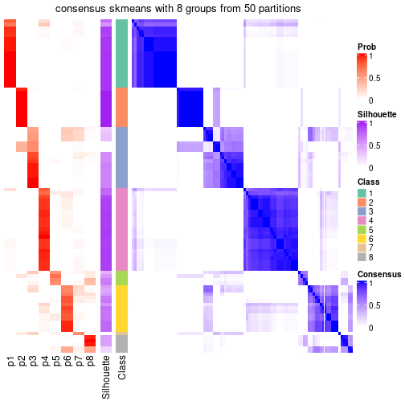</p>

</div>
</div>

Heatmaps for the membership of samples in all partitions to see how consistent they are:


<script>
$( function() {
	$( '#tabs-node-023-membership-heatmap' ).tabs();
} );
</script>
<div id='tabs-node-023-membership-heatmap'>
<ul>
<li><a href='#tab-node-023-membership-heatmap-1'>k = 2</a></li>
<li><a href='#tab-node-023-membership-heatmap-2'>k = 3</a></li>
<li><a href='#tab-node-023-membership-heatmap-3'>k = 4</a></li>
<li><a href='#tab-node-023-membership-heatmap-4'>k = 5</a></li>
<li><a href='#tab-node-023-membership-heatmap-5'>k = 6</a></li>
<li><a href='#tab-node-023-membership-heatmap-6'>k = 7</a></li>
<li><a href='#tab-node-023-membership-heatmap-7'>k = 8</a></li>
</ul>
<div id='tab-node-023-membership-heatmap-1'>
<pre><code class="r">membership_heatmap(res, k = 2)
</code></pre>

<p>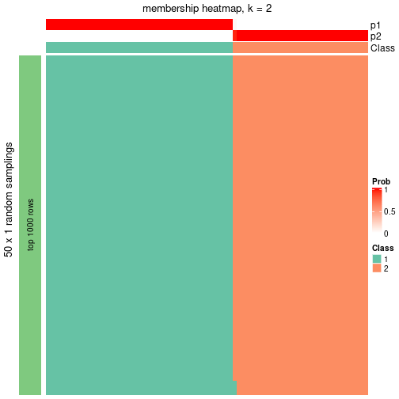</p>

</div>
<div id='tab-node-023-membership-heatmap-2'>
<pre><code class="r">membership_heatmap(res, k = 3)
</code></pre>

<p>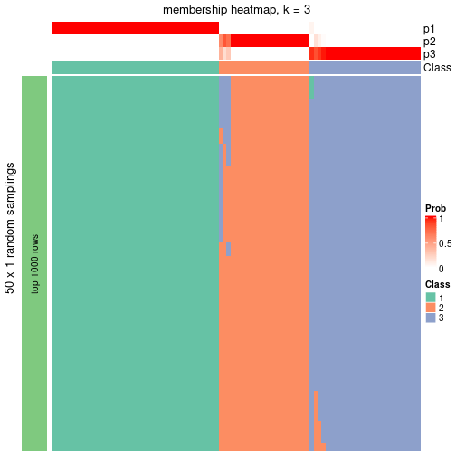</p>

</div>
<div id='tab-node-023-membership-heatmap-3'>
<pre><code class="r">membership_heatmap(res, k = 4)
</code></pre>

<p>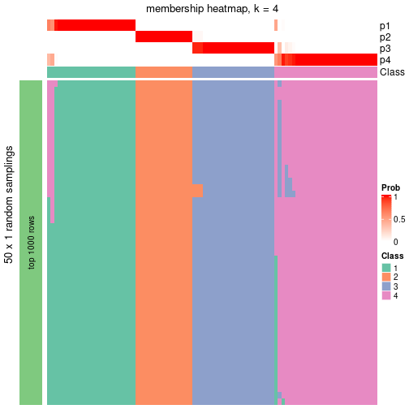</p>

</div>
<div id='tab-node-023-membership-heatmap-4'>
<pre><code class="r">membership_heatmap(res, k = 5)
</code></pre>

<p>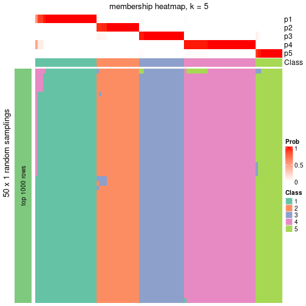</p>

</div>
<div id='tab-node-023-membership-heatmap-5'>
<pre><code class="r">membership_heatmap(res, k = 6)
</code></pre>

<p>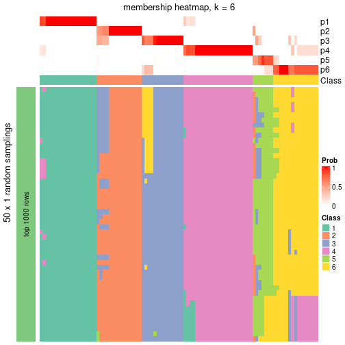</p>

</div>
<div id='tab-node-023-membership-heatmap-6'>
<pre><code class="r">membership_heatmap(res, k = 7)
</code></pre>

<p>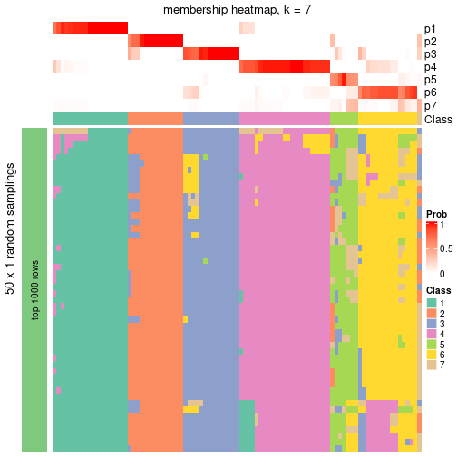</p>

</div>
<div id='tab-node-023-membership-heatmap-7'>
<pre><code class="r">membership_heatmap(res, k = 8)
</code></pre>

<p>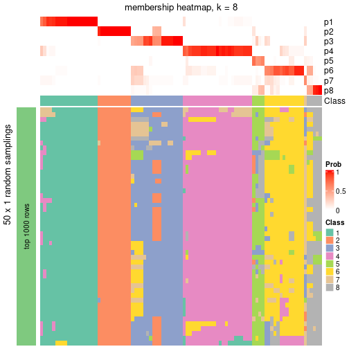</p>

</div>
</div>

As soon as the classes for columns are determined, the signatures
that are significantly different between subgroups can be looked for. 
Following are the heatmaps for signatures.


<script>
$( function() {
	$( '#tabs-node-023-get-signatures' ).tabs();
} );
</script>
<div id='tabs-node-023-get-signatures'>
<ul>
<li><a href='#tab-node-023-get-signatures-1'>k = 2</a></li>
<li><a href='#tab-node-023-get-signatures-2'>k = 3</a></li>
<li><a href='#tab-node-023-get-signatures-3'>k = 4</a></li>
<li><a href='#tab-node-023-get-signatures-4'>k = 5</a></li>
<li><a href='#tab-node-023-get-signatures-5'>k = 6</a></li>
<li><a href='#tab-node-023-get-signatures-6'>k = 7</a></li>
<li><a href='#tab-node-023-get-signatures-7'>k = 8</a></li>
</ul>
<div id='tab-node-023-get-signatures-1'>
<pre><code class="r">get_signatures(res, k = 2)
</code></pre>

<p>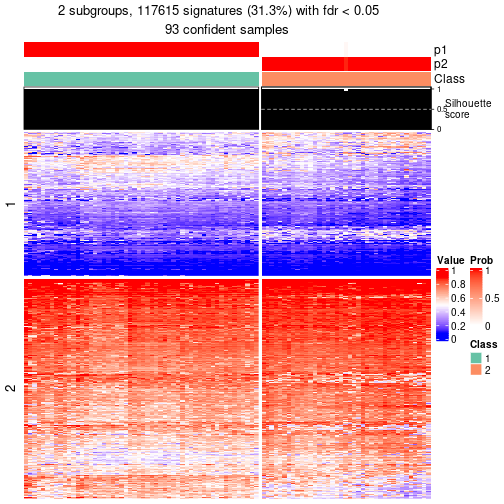</p>

</div>
<div id='tab-node-023-get-signatures-2'>
<pre><code class="r">get_signatures(res, k = 3)
</code></pre>

<p>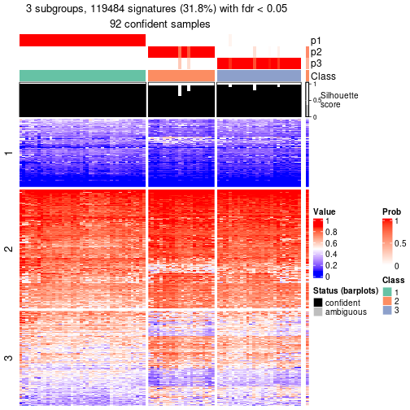</p>

</div>
<div id='tab-node-023-get-signatures-3'>
<pre><code class="r">get_signatures(res, k = 4)
</code></pre>

<p>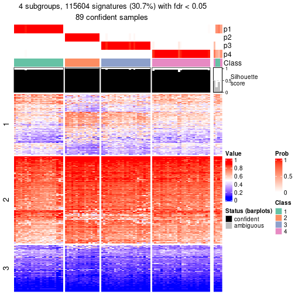</p>

</div>
<div id='tab-node-023-get-signatures-4'>
<pre><code class="r">get_signatures(res, k = 5)
</code></pre>

<p>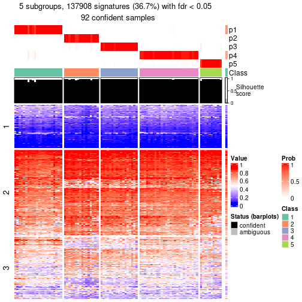</p>

</div>
<div id='tab-node-023-get-signatures-5'>
<pre><code class="r">get_signatures(res, k = 6)
</code></pre>

<p>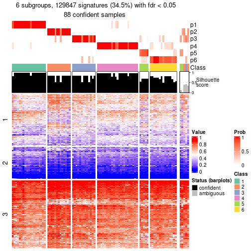</p>

</div>
<div id='tab-node-023-get-signatures-6'>
<pre><code class="r">get_signatures(res, k = 7)
</code></pre>

<p>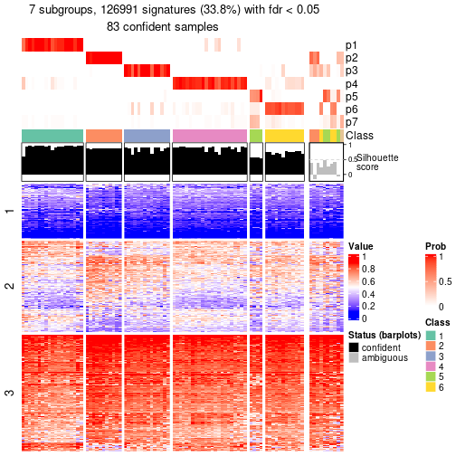</p>

</div>
<div id='tab-node-023-get-signatures-7'>
<pre><code class="r">get_signatures(res, k = 8)
</code></pre>

<p>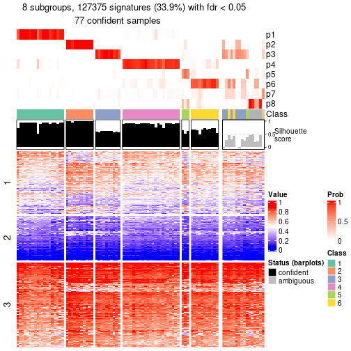</p>

</div>
</div>


Compare the overlap of signatures from different k:

```r
compare_signatures(res)
```

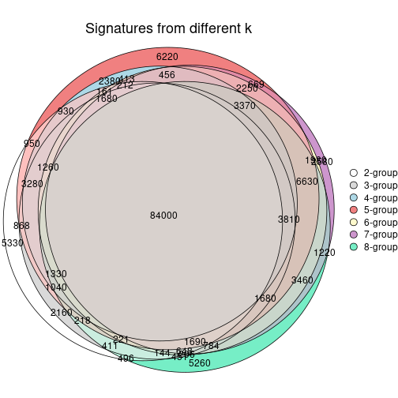

`get_signature()` returns a data frame invisibly. To get the list of signatures, the function
call should be assigned to a variable explicitly. In following code, if `plot` argument is set
to `FALSE`, no heatmap is plotted while only the differential analysis is performed.

```r
# code only for demonstration
tb = get_signature(res, k = ..., plot = FALSE)
```

An example of the output of `tb` is:

```
#>   which_row         fdr    mean_1    mean_2 scaled_mean_1 scaled_mean_2 km
#> 1        38 0.042760348  8.373488  9.131774    -0.5533452     0.5164555  1
#> 2        40 0.018707592  7.106213  8.469186    -0.6173731     0.5762149  1
#> 3        55 0.019134737 10.221463 11.207825    -0.6159697     0.5749050  1
#> 4        59 0.006059896  5.921854  7.869574    -0.6899429     0.6439467  1
#> 5        60 0.018055526  8.928898 10.211722    -0.6204761     0.5791110  1
#> 6        98 0.009384629 15.714769 14.887706     0.6635654    -0.6193277  2
...
```

The columns in `tb` are:

1. `which_row`: row indices corresponding to the input matrix.
2. `fdr`: FDR for the differential test. 
3. `mean_x`: The mean value in group x.
4. `scaled_mean_x`: The mean value in group x after rows are scaled.
5. `km`: Row groups if k-means clustering is applied to rows (which is done by automatically selecting number of clusters).

If there are too many signatures, `top_signatures = ...` can be set to only show the 
signatures with the highest FDRs:

```r
# code only for demonstration
# e.g. to show the top 500 most significant rows
tb = get_signature(res, k = ..., top_signatures = 500)
```

If the signatures are defined as these which are uniquely high in current group, `diff_method` argument
can be set to `"uniquely_high_in_one_group"`:

```r
# code only for demonstration
tb = get_signature(res, k = ..., diff_method = "uniquely_high_in_one_group")
```


UMAP plot which shows how samples are separated.


<script>
$( function() {
	$( '#tabs-node-023-dimension-reduction' ).tabs();
} );
</script>
<div id='tabs-node-023-dimension-reduction'>
<ul>
<li><a href='#tab-node-023-dimension-reduction-1'>k = 2</a></li>
<li><a href='#tab-node-023-dimension-reduction-2'>k = 3</a></li>
<li><a href='#tab-node-023-dimension-reduction-3'>k = 4</a></li>
<li><a href='#tab-node-023-dimension-reduction-4'>k = 5</a></li>
<li><a href='#tab-node-023-dimension-reduction-5'>k = 6</a></li>
<li><a href='#tab-node-023-dimension-reduction-6'>k = 7</a></li>
<li><a href='#tab-node-023-dimension-reduction-7'>k = 8</a></li>
</ul>
<div id='tab-node-023-dimension-reduction-1'>
<pre><code class="r">dimension_reduction(res, k = 2, method = &quot;UMAP&quot;)
</code></pre>

<p>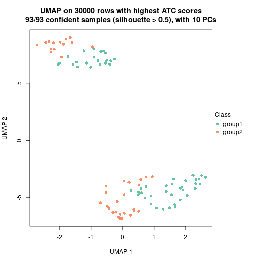</p>

</div>
<div id='tab-node-023-dimension-reduction-2'>
<pre><code class="r">dimension_reduction(res, k = 3, method = &quot;UMAP&quot;)
</code></pre>

<p>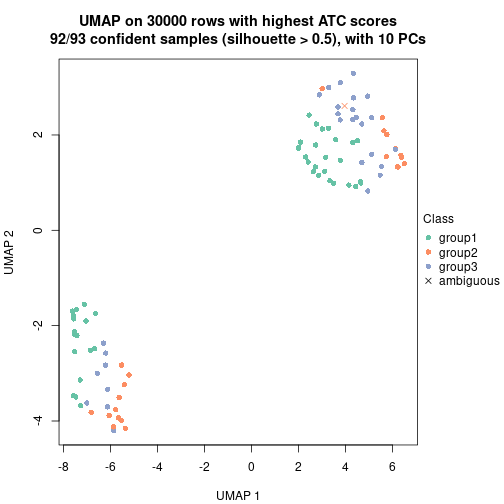</p>

</div>
<div id='tab-node-023-dimension-reduction-3'>
<pre><code class="r">dimension_reduction(res, k = 4, method = &quot;UMAP&quot;)
</code></pre>

<p>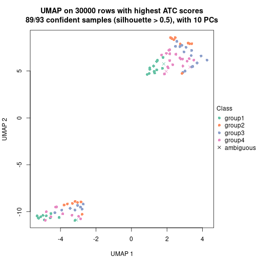</p>

</div>
<div id='tab-node-023-dimension-reduction-4'>
<pre><code class="r">dimension_reduction(res, k = 5, method = &quot;UMAP&quot;)
</code></pre>

<p>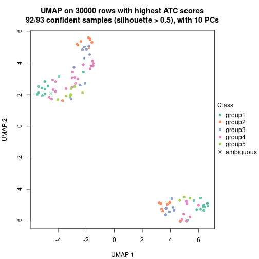</p>

</div>
<div id='tab-node-023-dimension-reduction-5'>
<pre><code class="r">dimension_reduction(res, k = 6, method = &quot;UMAP&quot;)
</code></pre>

<p>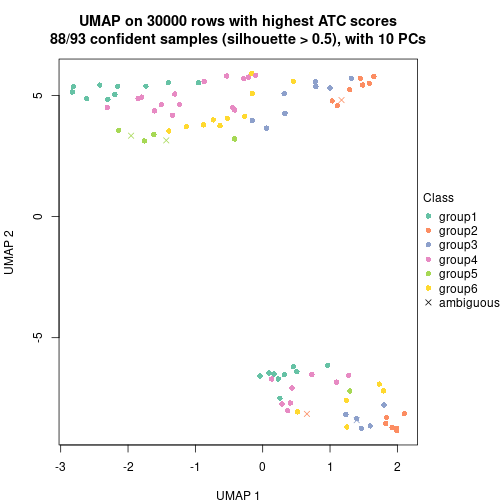</p>

</div>
<div id='tab-node-023-dimension-reduction-6'>
<pre><code class="r">dimension_reduction(res, k = 7, method = &quot;UMAP&quot;)
</code></pre>

<p>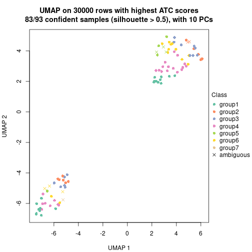</p>

</div>
<div id='tab-node-023-dimension-reduction-7'>
<pre><code class="r">dimension_reduction(res, k = 8, method = &quot;UMAP&quot;)
</code></pre>

<p>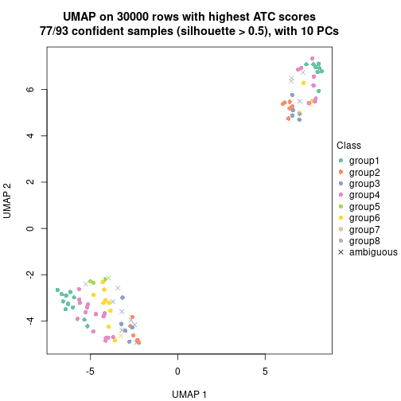</p>

</div>
</div>


Following heatmap shows how subgroups are split when increasing `k`:

```r
collect_classes(res)
```

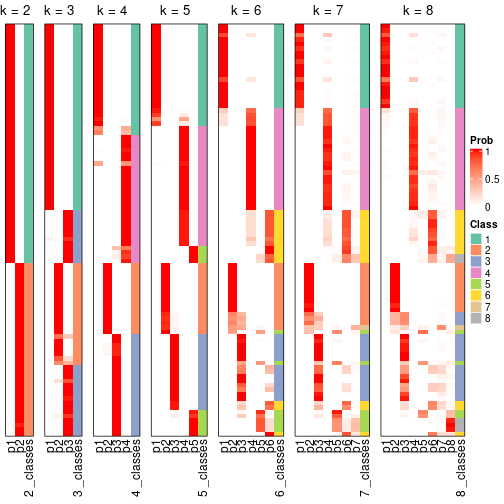


If matrix rows can be associated to genes, consider to use `functional_enrichment(res,
...)` to perform function enrichment for the signature genes. See [this vignette](https://jokergoo.github.io/cola_vignettes/functional_enrichment.html) for more detailed explanations.


 

---------------------------------------------------


### Node0231


Parent node: [Node023](#Node023).
Child nodes: 
                Node02131-leaf
        ,
                Node02132-leaf
        ,
                Node02211-leaf
        ,
                Node02212-leaf
        ,
                Node02311-leaf
        ,
                Node02312-leaf
        ,
                Node02313-leaf
        ,
                Node02314-leaf
        ,
                Node02341-leaf
        ,
                Node02342-leaf
        ,
                Node02343-leaf
        ,
                Node02344-leaf
        ,
                Node02345-leaf
        ,
                Node02421-leaf
        ,
                Node02422-leaf
        ,
                Node02423-leaf
        ,
                Node06121-leaf
        ,
                Node06122-leaf
        ,
                Node06123-leaf
        ,
                [Node07111](#Node07111)
        ,
                Node07112-leaf
        ,
                Node07211-leaf
        ,
                Node07212-leaf
        ,
                Node07213-leaf
        ,
                Node07214-leaf
        .


The object with results only for a single top-value method and a single partitioning method 
can be extracted as:

```r
res = res_rh["0231"]
```

A summary of `res` and all the functions that can be applied to it:

```r
res
```

```
#> A 'ConsensusPartition' object with k = 2, 3, 4, 5, 6, 7, 8.
#>   On a matrix with 30000 rows and 23 columns.
#>   Top rows (1000) are extracted by 'ATC' method.
#>   Subgroups are detected by 'kmeans' method.
#>   Performed in total 350 partitions by row resampling.
#>   Best k for subgroups seems to be 5.
#> 
#> Following methods can be applied to this 'ConsensusPartition' object:
#>  [1] "cola_report"             "collect_classes"         "collect_plots"          
#>  [4] "collect_stats"           "colnames"                "compare_partitions"     
#>  [7] "compare_signatures"      "consensus_heatmap"       "dimension_reduction"    
#> [10] "functional_enrichment"   "get_anno_col"            "get_anno"               
#> [13] "get_classes"             "get_consensus"           "get_matrix"             
#> [16] "get_membership"          "get_param"               "get_signatures"         
#> [19] "get_stats"               "is_best_k"               "is_stable_k"            
#> [22] "membership_heatmap"      "ncol"                    "nrow"                   
#> [25] "plot_ecdf"               "predict_classes"         "rownames"               
#> [28] "select_partition_number" "show"                    "suggest_best_k"         
#> [31] "test_to_known_factors"   "top_rows_heatmap"
```

`collect_plots()` function collects all the plots made from `res` for all `k` (number of subgroups)
into one single page to provide an easy and fast comparison between different `k`.

```r
collect_plots(res)
```

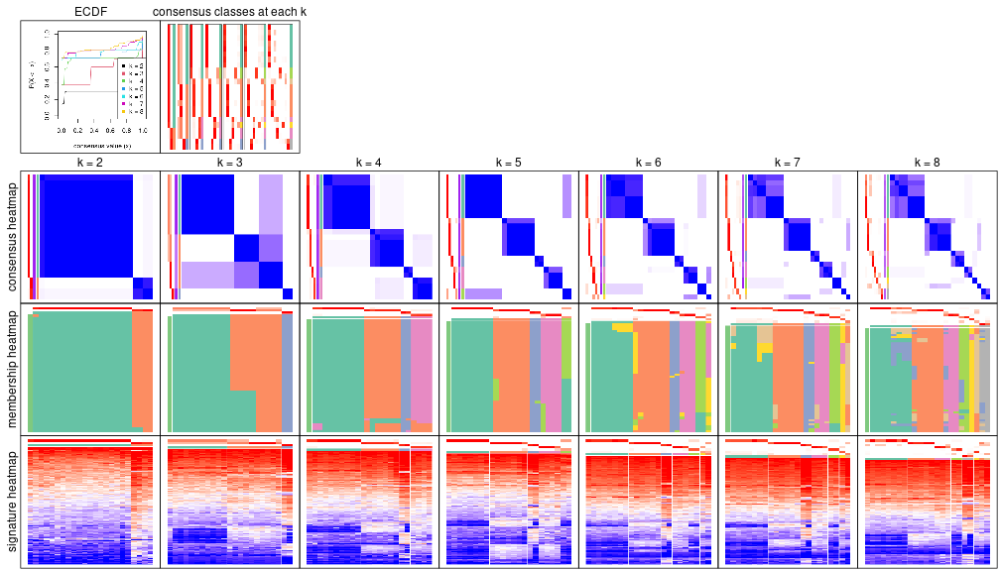

The plots are:

- The first row: a plot of the eCDF (empirical cumulative distribution
  function) curves of the consensus matrix for each `k` and the heatmap of
  predicted classes for each `k`.
- The second row: heatmaps of the consensus matrix for each `k`.
- The third row: heatmaps of the membership matrix for each `k`.
- The fouth row: heatmaps of the signatures for each `k`.

All the plots in panels can be made by individual functions and they are
plotted later in this section.

`select_partition_number()` produces several plots showing different
statistics for choosing "optimized" `k`. There are following statistics:

- eCDF curves of the consensus matrix for each `k`;
- 1-PAC. [The PAC score](https://en.wikipedia.org/wiki/Consensus_clustering#Over-interpretation_potential_of_consensus_clustering)
  measures the proportion of the ambiguous subgrouping.
- Mean silhouette score.
- Concordance. The mean probability of fiting the consensus subgroup labels in all
  partitions.
- Area increased. Denote $A_k$ as the area under the eCDF curve for current
  `k`, the area increased is defined as $A_k - A_{k-1}$.
- Rand index. The percent of pairs of samples that are both in a same cluster
  or both are not in a same cluster in the partition of k and k-1.
- Jaccard index. The ratio of pairs of samples are both in a same cluster in
  the partition of k and k-1 and the pairs of samples are both in a same
  cluster in the partition k or k-1.

The detailed explanations of these statistics can be found in [the _cola_
vignette](https://jokergoo.github.io/cola_vignettes/cola.html#toc_13).

Generally speaking, higher 1-PAC score, higher mean silhouette score or higher
concordance corresponds to better partition. Rand index and Jaccard index
measure how similar the current partition is compared to partition with `k-1`.
If they are too similar, we won't accept `k` is better than `k-1`.

```r
select_partition_number(res)
```

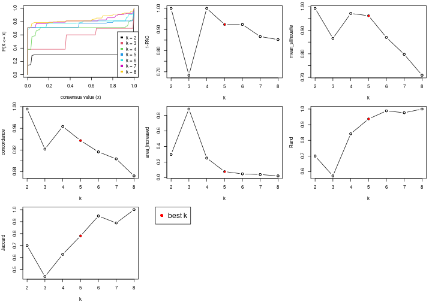

The numeric values for all these statistics can be obtained by `get_stats()`.

```r
get_stats(res)
```

```
#>   k 1-PAC mean_silhouette concordance area_increased  Rand Jaccard
#> 2 2 1.000           0.993       0.996         0.2969 0.700   0.700
#> 3 3 0.684           0.866       0.922         0.8814 0.573   0.440
#> 4 4 1.000           0.972       0.963         0.2511 0.842   0.626
#> 5 5 0.924           0.962       0.937         0.0768 0.937   0.781
#> 6 6 0.924           0.870       0.917         0.0465 0.988   0.947
#> 7 7 0.867           0.798       0.903         0.0390 0.976   0.889
#> 8 8 0.852           0.709       0.872         0.0213 1.000   1.000
```

`suggest_best_k()` suggests the best $k$ based on these statistics. The rules are as follows:

- All $k$ with Jaccard index larger than 0.95 are removed because increasing
  $k$ does not provide enough extra information. If all $k$ are removed, it is
  marked as no subgroup is detected.
- For all $k$ with 1-PAC score larger than 0.9, the maximal $k$ is taken as
  the best $k$, and other $k$ are marked as optional $k$.
- If it does not fit the second rule. The $k$ with the maximal vote of the
  highest 1-PAC score, highest mean silhouette, and highest concordance is
  taken as the best $k$.

```r
suggest_best_k(res)
```

```
#> [1] 5
#> attr(,"optional")
#> [1] 2 4
```

There is also optional best $k$ = 2 4 that is worth to check.

Following is the table of the partitions (You need to click the **show/hide
code output** link to see it). The membership matrix (columns with name `p*`)
is inferred by
[`clue::cl_consensus()`](https://www.rdocumentation.org/link/cl_consensus?package=clue)
function with the `SE` method. Basically the value in the membership matrix
represents the probability to belong to a certain group. The finall subgroup
label for an item is determined with the group with highest probability it
belongs to.

In `get_classes()` function, the entropy is calculated from the membership
matrix and the silhouette score is calculated from the consensus matrix.


<script>
$( function() {
	$( '#tabs-node-0231-get-classes' ).tabs();
} );
</script>
<div id='tabs-node-0231-get-classes'>
<ul>
<li><a href='#tab-node-0231-get-classes-1'>k = 2</a></li>
<li><a href='#tab-node-0231-get-classes-2'>k = 3</a></li>
<li><a href='#tab-node-0231-get-classes-3'>k = 4</a></li>
<li><a href='#tab-node-0231-get-classes-4'>k = 5</a></li>
<li><a href='#tab-node-0231-get-classes-5'>k = 6</a></li>
<li><a href='#tab-node-0231-get-classes-6'>k = 7</a></li>
<li><a href='#tab-node-0231-get-classes-7'>k = 8</a></li>
</ul>

<div id='tab-node-0231-get-classes-1'>
<p><a id='tab-node-0231-get-classes-1-a' style='color:#0366d6' href='#'>show/hide code output</a></p>
<pre><code class="r">cbind(get_classes(res, k = 2), get_membership(res, k = 2))
</code></pre>

<pre><code>#&gt;                 class entropy silhouette   p1   p2
#&gt; TCGA.49.AAR4.01     1   0.000      0.999 1.00 0.00
#&gt; TCGA.L9.A743.01     1   0.000      0.999 1.00 0.00
#&gt; TCGA.39.5011.01     1   0.000      0.999 1.00 0.00
#&gt; TCGA.85.6560.01     2   0.000      0.973 0.00 1.00
#&gt; TCGA.86.8671.01     1   0.000      0.999 1.00 0.00
#&gt; TCGA.50.6592.01     2   0.242      0.972 0.04 0.96
#&gt; TCGA.44.7661.01     1   0.000      0.999 1.00 0.00
#&gt; TCGA.49.6767.01     1   0.141      0.979 0.98 0.02
#&gt; TCGA.69.7761.01     1   0.000      0.999 1.00 0.00
#&gt; TCGA.55.8089.01     1   0.000      0.999 1.00 0.00
#&gt; TCGA.NJ.A4YQ.01     1   0.000      0.999 1.00 0.00
#&gt; TCGA.MP.A4T4.01     1   0.000      0.999 1.00 0.00
#&gt; TCGA.93.A4JO.01     1   0.000      0.999 1.00 0.00
#&gt; TCGA.49.AARO.01     1   0.000      0.999 1.00 0.00
#&gt; TCGA.64.5781.01     2   0.242      0.972 0.04 0.96
#&gt; TCGA.49.AAR3.01     1   0.000      0.999 1.00 0.00
#&gt; TCGA.99.8028.01     1   0.000      0.999 1.00 0.00
#&gt; TCGA.O2.A52Q.01     2   0.000      0.973 0.00 1.00
#&gt; TCGA.55.6978.01     1   0.000      0.999 1.00 0.00
#&gt; TCGA.50.6595.01     1   0.000      0.999 1.00 0.00
#&gt; TCGA.50.5049.01     1   0.000      0.999 1.00 0.00
#&gt; TCGA.44.7662.01     1   0.000      0.999 1.00 0.00
#&gt; TCGA.55.6987.01     1   0.000      0.999 1.00 0.00
</code></pre>

<script>
$('#tab-node-0231-get-classes-1-a').parent().next().next().hide();
$('#tab-node-0231-get-classes-1-a').click(function(){
  $('#tab-node-0231-get-classes-1-a').parent().next().next().toggle();
  return(false);
});
</script>
</div>

<div id='tab-node-0231-get-classes-2'>
<p><a id='tab-node-0231-get-classes-2-a' style='color:#0366d6' href='#'>show/hide code output</a></p>
<pre><code class="r">cbind(get_classes(res, k = 3), get_membership(res, k = 3))
</code></pre>

<pre><code>#&gt;                 class entropy silhouette   p1   p2 p3
#&gt; TCGA.49.AAR4.01     1   0.595      1.000 0.64 0.36  0
#&gt; TCGA.L9.A743.01     1   0.595      1.000 0.64 0.36  0
#&gt; TCGA.39.5011.01     1   0.595      1.000 0.64 0.36  0
#&gt; TCGA.85.6560.01     3   0.000      1.000 0.00 0.00  1
#&gt; TCGA.86.8671.01     2   0.000      0.687 0.00 1.00  0
#&gt; TCGA.50.6592.01     2   0.595      0.695 0.36 0.64  0
#&gt; TCGA.44.7661.01     2   0.000      0.687 0.00 1.00  0
#&gt; TCGA.49.6767.01     2   0.595      0.695 0.36 0.64  0
#&gt; TCGA.69.7761.01     1   0.595      1.000 0.64 0.36  0
#&gt; TCGA.55.8089.01     1   0.595      1.000 0.64 0.36  0
#&gt; TCGA.NJ.A4YQ.01     2   0.595      0.695 0.36 0.64  0
#&gt; TCGA.MP.A4T4.01     2   0.000      0.687 0.00 1.00  0
#&gt; TCGA.93.A4JO.01     1   0.595      1.000 0.64 0.36  0
#&gt; TCGA.49.AARO.01     2   0.595      0.695 0.36 0.64  0
#&gt; TCGA.64.5781.01     2   0.595      0.695 0.36 0.64  0
#&gt; TCGA.49.AAR3.01     1   0.595      1.000 0.64 0.36  0
#&gt; TCGA.99.8028.01     2   0.000      0.687 0.00 1.00  0
#&gt; TCGA.O2.A52Q.01     3   0.000      1.000 0.00 0.00  1
#&gt; TCGA.55.6978.01     1   0.595      1.000 0.64 0.36  0
#&gt; TCGA.50.6595.01     2   0.000      0.687 0.00 1.00  0
#&gt; TCGA.50.5049.01     1   0.595      1.000 0.64 0.36  0
#&gt; TCGA.44.7662.01     1   0.595      1.000 0.64 0.36  0
#&gt; TCGA.55.6987.01     1   0.595      1.000 0.64 0.36  0
</code></pre>

<script>
$('#tab-node-0231-get-classes-2-a').parent().next().next().hide();
$('#tab-node-0231-get-classes-2-a').click(function(){
  $('#tab-node-0231-get-classes-2-a').parent().next().next().toggle();
  return(false);
});
</script>
</div>

<div id='tab-node-0231-get-classes-3'>
<p><a id='tab-node-0231-get-classes-3-a' style='color:#0366d6' href='#'>show/hide code output</a></p>
<pre><code class="r">cbind(get_classes(res, k = 4), get_membership(res, k = 4))
</code></pre>

<pre><code>#&gt;                 class entropy silhouette   p1   p2   p3   p4
#&gt; TCGA.49.AAR4.01     1  0.0000      0.987 1.00 0.00 0.00 0.00
#&gt; TCGA.L9.A743.01     1  0.0000      0.987 1.00 0.00 0.00 0.00
#&gt; TCGA.39.5011.01     2  0.2647      0.871 0.12 0.88 0.00 0.00
#&gt; TCGA.85.6560.01     3  0.0000      0.977 0.00 0.00 1.00 0.00
#&gt; TCGA.86.8671.01     2  0.1211      0.970 0.04 0.96 0.00 0.00
#&gt; TCGA.50.6592.01     4  0.2011      0.994 0.00 0.08 0.00 0.92
#&gt; TCGA.44.7661.01     2  0.1211      0.970 0.04 0.96 0.00 0.00
#&gt; TCGA.49.6767.01     4  0.2345      0.982 0.00 0.10 0.00 0.90
#&gt; TCGA.69.7761.01     1  0.0000      0.987 1.00 0.00 0.00 0.00
#&gt; TCGA.55.8089.01     1  0.1637      0.947 0.94 0.00 0.00 0.06
#&gt; TCGA.NJ.A4YQ.01     4  0.2011      0.994 0.00 0.08 0.00 0.92
#&gt; TCGA.MP.A4T4.01     2  0.1211      0.970 0.04 0.96 0.00 0.00
#&gt; TCGA.93.A4JO.01     1  0.0000      0.987 1.00 0.00 0.00 0.00
#&gt; TCGA.49.AARO.01     2  0.0707      0.924 0.00 0.98 0.00 0.02
#&gt; TCGA.64.5781.01     4  0.2011      0.994 0.00 0.08 0.00 0.92
#&gt; TCGA.49.AAR3.01     1  0.0000      0.987 1.00 0.00 0.00 0.00
#&gt; TCGA.99.8028.01     2  0.1211      0.970 0.04 0.96 0.00 0.00
#&gt; TCGA.O2.A52Q.01     3  0.1411      0.977 0.00 0.02 0.96 0.02
#&gt; TCGA.55.6978.01     1  0.1637      0.947 0.94 0.00 0.00 0.06
#&gt; TCGA.50.6595.01     2  0.1211      0.970 0.04 0.96 0.00 0.00
#&gt; TCGA.50.5049.01     1  0.0000      0.987 1.00 0.00 0.00 0.00
#&gt; TCGA.44.7662.01     1  0.0000      0.987 1.00 0.00 0.00 0.00
#&gt; TCGA.55.6987.01     1  0.0000      0.987 1.00 0.00 0.00 0.00
</code></pre>

<script>
$('#tab-node-0231-get-classes-3-a').parent().next().next().hide();
$('#tab-node-0231-get-classes-3-a').click(function(){
  $('#tab-node-0231-get-classes-3-a').parent().next().next().toggle();
  return(false);
});
</script>
</div>

<div id='tab-node-0231-get-classes-4'>
<p><a id='tab-node-0231-get-classes-4-a' style='color:#0366d6' href='#'>show/hide code output</a></p>
<pre><code class="r">cbind(get_classes(res, k = 5), get_membership(res, k = 5))
</code></pre>

<pre><code>#&gt;                 class entropy silhouette   p1  p2   p3   p4   p5
#&gt; TCGA.49.AAR4.01     1  0.0000      1.000 1.00 0.0 0.00 0.00 0.00
#&gt; TCGA.L9.A743.01     1  0.0000      1.000 1.00 0.0 0.00 0.00 0.00
#&gt; TCGA.39.5011.01     2  0.3109      0.797 0.00 0.8 0.00 0.00 0.20
#&gt; TCGA.85.6560.01     3  0.0000      0.988 0.00 0.0 1.00 0.00 0.00
#&gt; TCGA.86.8671.01     2  0.0000      0.970 0.00 1.0 0.00 0.00 0.00
#&gt; TCGA.50.6592.01     4  0.0000      0.926 0.00 0.0 0.00 1.00 0.00
#&gt; TCGA.44.7661.01     2  0.0000      0.970 0.00 1.0 0.00 0.00 0.00
#&gt; TCGA.49.6767.01     4  0.3561      0.758 0.00 0.0 0.00 0.74 0.26
#&gt; TCGA.69.7761.01     1  0.0000      1.000 1.00 0.0 0.00 0.00 0.00
#&gt; TCGA.55.8089.01     5  0.4302      1.000 0.48 0.0 0.00 0.00 0.52
#&gt; TCGA.NJ.A4YQ.01     4  0.0000      0.926 0.00 0.0 0.00 1.00 0.00
#&gt; TCGA.MP.A4T4.01     2  0.0000      0.970 0.00 1.0 0.00 0.00 0.00
#&gt; TCGA.93.A4JO.01     1  0.0000      1.000 1.00 0.0 0.00 0.00 0.00
#&gt; TCGA.49.AARO.01     2  0.0000      0.970 0.00 1.0 0.00 0.00 0.00
#&gt; TCGA.64.5781.01     4  0.0000      0.926 0.00 0.0 0.00 1.00 0.00
#&gt; TCGA.49.AAR3.01     1  0.0000      1.000 1.00 0.0 0.00 0.00 0.00
#&gt; TCGA.99.8028.01     2  0.0000      0.970 0.00 1.0 0.00 0.00 0.00
#&gt; TCGA.O2.A52Q.01     3  0.0609      0.988 0.00 0.0 0.98 0.00 0.02
#&gt; TCGA.55.6978.01     5  0.4302      1.000 0.48 0.0 0.00 0.00 0.52
#&gt; TCGA.50.6595.01     2  0.0000      0.970 0.00 1.0 0.00 0.00 0.00
#&gt; TCGA.50.5049.01     1  0.0000      1.000 1.00 0.0 0.00 0.00 0.00
#&gt; TCGA.44.7662.01     1  0.0000      1.000 1.00 0.0 0.00 0.00 0.00
#&gt; TCGA.55.6987.01     1  0.0000      1.000 1.00 0.0 0.00 0.00 0.00
</code></pre>

<script>
$('#tab-node-0231-get-classes-4-a').parent().next().next().hide();
$('#tab-node-0231-get-classes-4-a').click(function(){
  $('#tab-node-0231-get-classes-4-a').parent().next().next().toggle();
  return(false);
});
</script>
</div>

<div id='tab-node-0231-get-classes-5'>
<p><a id='tab-node-0231-get-classes-5-a' style='color:#0366d6' href='#'>show/hide code output</a></p>
<pre><code class="r">cbind(get_classes(res, k = 6), get_membership(res, k = 6))
</code></pre>

<pre><code>#&gt;                 class entropy silhouette   p1   p2   p3   p4   p5   p6
#&gt; TCGA.49.AAR4.01     1  0.1267      0.953 0.94 0.00 0.00 0.00 0.00 0.06
#&gt; TCGA.L9.A743.01     1  0.0547      0.947 0.98 0.00 0.00 0.00 0.00 0.02
#&gt; TCGA.39.5011.01     2  0.5235      0.392 0.00 0.52 0.00 0.00 0.10 0.38
#&gt; TCGA.85.6560.01     3  0.0000      0.955 0.00 0.00 1.00 0.00 0.00 0.00
#&gt; TCGA.86.8671.01     2  0.0000      0.914 0.00 1.00 0.00 0.00 0.00 0.00
#&gt; TCGA.50.6592.01     4  0.0000      0.914 0.00 0.00 0.00 1.00 0.00 0.00
#&gt; TCGA.44.7661.01     2  0.0000      0.914 0.00 1.00 0.00 0.00 0.00 0.00
#&gt; TCGA.49.6767.01     6  0.3869      0.000 0.00 0.00 0.00 0.50 0.00 0.50
#&gt; TCGA.69.7761.01     1  0.1267      0.953 0.94 0.00 0.00 0.00 0.00 0.06
#&gt; TCGA.55.8089.01     5  0.2631      1.000 0.18 0.00 0.00 0.00 0.82 0.00
#&gt; TCGA.NJ.A4YQ.01     4  0.1807      0.824 0.00 0.02 0.00 0.92 0.06 0.00
#&gt; TCGA.MP.A4T4.01     2  0.0000      0.914 0.00 1.00 0.00 0.00 0.00 0.00
#&gt; TCGA.93.A4JO.01     1  0.0547      0.947 0.98 0.00 0.00 0.00 0.00 0.02
#&gt; TCGA.49.AARO.01     2  0.1267      0.873 0.00 0.94 0.00 0.00 0.06 0.00
#&gt; TCGA.64.5781.01     4  0.0000      0.914 0.00 0.00 0.00 1.00 0.00 0.00
#&gt; TCGA.49.AAR3.01     1  0.0000      0.952 1.00 0.00 0.00 0.00 0.00 0.00
#&gt; TCGA.99.8028.01     2  0.0000      0.914 0.00 1.00 0.00 0.00 0.00 0.00
#&gt; TCGA.O2.A52Q.01     3  0.1480      0.955 0.00 0.00 0.94 0.00 0.02 0.04
#&gt; TCGA.55.6978.01     5  0.2631      1.000 0.18 0.00 0.00 0.00 0.82 0.00
#&gt; TCGA.50.6595.01     2  0.0000      0.914 0.00 1.00 0.00 0.00 0.00 0.00
#&gt; TCGA.50.5049.01     1  0.1267      0.953 0.94 0.00 0.00 0.00 0.00 0.06
#&gt; TCGA.44.7662.01     1  0.0547      0.947 0.98 0.00 0.00 0.00 0.00 0.02
#&gt; TCGA.55.6987.01     1  0.1267      0.953 0.94 0.00 0.00 0.00 0.00 0.06
</code></pre>

<script>
$('#tab-node-0231-get-classes-5-a').parent().next().next().hide();
$('#tab-node-0231-get-classes-5-a').click(function(){
  $('#tab-node-0231-get-classes-5-a').parent().next().next().toggle();
  return(false);
});
</script>
</div>

<div id='tab-node-0231-get-classes-6'>
<p><a id='tab-node-0231-get-classes-6-a' style='color:#0366d6' href='#'>show/hide code output</a></p>
<pre><code class="r">cbind(get_classes(res, k = 7), get_membership(res, k = 7))
</code></pre>

<pre><code>#&gt;                 class entropy silhouette   p1   p2  p3   p4   p5   p6   p7
#&gt; TCGA.49.AAR4.01     1  0.2803      0.856 0.84 0.00 0.0 0.00 0.00 0.06 0.10
#&gt; TCGA.L9.A743.01     1  0.2016      0.817 0.90 0.00 0.0 0.00 0.00 0.04 0.06
#&gt; TCGA.39.5011.01     7  0.3358      0.000 0.00 0.36 0.0 0.00 0.00 0.00 0.64
#&gt; TCGA.85.6560.01     3  0.2159      0.917 0.00 0.00 0.9 0.00 0.06 0.02 0.02
#&gt; TCGA.86.8671.01     2  0.0000      0.940 0.00 1.00 0.0 0.00 0.00 0.00 0.00
#&gt; TCGA.50.6592.01     4  0.0000      0.869 0.00 0.00 0.0 1.00 0.00 0.00 0.00
#&gt; TCGA.44.7661.01     2  0.0000      0.940 0.00 1.00 0.0 0.00 0.00 0.00 0.00
#&gt; TCGA.49.6767.01     6  0.2572      0.000 0.00 0.00 0.0 0.20 0.00 0.80 0.00
#&gt; TCGA.69.7761.01     1  0.2803      0.856 0.84 0.00 0.0 0.00 0.00 0.06 0.10
#&gt; TCGA.55.8089.01     5  0.1433      1.000 0.08 0.00 0.0 0.00 0.92 0.00 0.00
#&gt; TCGA.NJ.A4YQ.01     4  0.2745      0.745 0.00 0.00 0.0 0.82 0.02 0.00 0.16
#&gt; TCGA.MP.A4T4.01     2  0.0000      0.940 0.00 1.00 0.0 0.00 0.00 0.00 0.00
#&gt; TCGA.93.A4JO.01     1  0.2016      0.817 0.90 0.00 0.0 0.00 0.00 0.04 0.06
#&gt; TCGA.49.AARO.01     2  0.2745      0.674 0.00 0.82 0.0 0.00 0.02 0.00 0.16
#&gt; TCGA.64.5781.01     4  0.0504      0.865 0.00 0.00 0.0 0.98 0.00 0.00 0.02
#&gt; TCGA.49.AAR3.01     1  0.0000      0.845 1.00 0.00 0.0 0.00 0.00 0.00 0.00
#&gt; TCGA.99.8028.01     2  0.0000      0.940 0.00 1.00 0.0 0.00 0.00 0.00 0.00
#&gt; TCGA.O2.A52Q.01     3  0.0000      0.917 0.00 0.00 1.0 0.00 0.00 0.00 0.00
#&gt; TCGA.55.6978.01     5  0.1433      1.000 0.08 0.00 0.0 0.00 0.92 0.00 0.00
#&gt; TCGA.50.6595.01     2  0.0000      0.940 0.00 1.00 0.0 0.00 0.00 0.00 0.00
#&gt; TCGA.50.5049.01     1  0.2803      0.856 0.84 0.00 0.0 0.00 0.00 0.06 0.10
#&gt; TCGA.44.7662.01     1  0.3011      0.758 0.82 0.00 0.0 0.00 0.00 0.12 0.06
#&gt; TCGA.55.6987.01     1  0.2803      0.856 0.84 0.00 0.0 0.00 0.00 0.06 0.10
</code></pre>

<script>
$('#tab-node-0231-get-classes-6-a').parent().next().next().hide();
$('#tab-node-0231-get-classes-6-a').click(function(){
  $('#tab-node-0231-get-classes-6-a').parent().next().next().toggle();
  return(false);
});
</script>
</div>

<div id='tab-node-0231-get-classes-7'>
<p><a id='tab-node-0231-get-classes-7-a' style='color:#0366d6' href='#'>show/hide code output</a></p>
<pre><code class="r">cbind(get_classes(res, k = 8), get_membership(res, k = 8))
</code></pre>

<pre><code>#&gt;                 class entropy silhouette   p1   p2   p3   p4   p5   p6   p7   p8
#&gt; TCGA.49.AAR4.01     1  0.0000      0.832 1.00 0.00 0.00 0.00 0.00 0.00 0.00 0.00
#&gt; TCGA.L9.A743.01     1  0.2938      0.787 0.70 0.00 0.30 0.00 0.00 0.00 0.00 0.00
#&gt; TCGA.39.5011.01     7  0.5138      0.000 0.00 0.24 0.32 0.00 0.00 0.00 0.44 0.00
#&gt; TCGA.85.6560.01     8  0.3483      0.789 0.00 0.00 0.00 0.00 0.02 0.04 0.18 0.76
#&gt; TCGA.86.8671.01     2  0.0941      0.859 0.00 0.96 0.02 0.00 0.00 0.00 0.02 0.00
#&gt; TCGA.50.6592.01     4  0.0000      0.780 0.00 0.00 0.00 1.00 0.00 0.00 0.00 0.00
#&gt; TCGA.44.7661.01     2  0.0000      0.875 0.00 1.00 0.00 0.00 0.00 0.00 0.00 0.00
#&gt; TCGA.49.6767.01     6  0.1091      0.000 0.00 0.00 0.00 0.06 0.00 0.94 0.00 0.00
#&gt; TCGA.69.7761.01     1  0.0000      0.832 1.00 0.00 0.00 0.00 0.00 0.00 0.00 0.00
#&gt; TCGA.55.8089.01     5  0.0808      0.732 0.04 0.00 0.00 0.00 0.96 0.00 0.00 0.00
#&gt; TCGA.NJ.A4YQ.01     4  0.3746      0.545 0.00 0.00 0.32 0.64 0.00 0.00 0.04 0.00
#&gt; TCGA.MP.A4T4.01     2  0.0000      0.875 0.00 1.00 0.00 0.00 0.00 0.00 0.00 0.00
#&gt; TCGA.93.A4JO.01     1  0.2938      0.787 0.70 0.00 0.30 0.00 0.00 0.00 0.00 0.00
#&gt; TCGA.49.AARO.01     2  0.3746      0.400 0.00 0.64 0.32 0.00 0.00 0.00 0.04 0.00
#&gt; TCGA.64.5781.01     4  0.0471      0.776 0.00 0.00 0.00 0.98 0.02 0.00 0.00 0.00
#&gt; TCGA.49.AAR3.01     1  0.2406      0.816 0.80 0.00 0.20 0.00 0.00 0.00 0.00 0.00
#&gt; TCGA.99.8028.01     2  0.0941      0.859 0.00 0.96 0.02 0.00 0.00 0.00 0.02 0.00
#&gt; TCGA.O2.A52Q.01     8  0.0000      0.789 0.00 0.00 0.00 0.00 0.00 0.00 0.00 1.00
#&gt; TCGA.55.6978.01     5  0.3675      0.732 0.04 0.00 0.00 0.00 0.66 0.00 0.30 0.00
#&gt; TCGA.50.6595.01     2  0.0000      0.875 0.00 1.00 0.00 0.00 0.00 0.00 0.00 0.00
#&gt; TCGA.50.5049.01     1  0.0000      0.832 1.00 0.00 0.00 0.00 0.00 0.00 0.00 0.00
#&gt; TCGA.44.7662.01     1  0.4233      0.704 0.60 0.00 0.34 0.00 0.00 0.02 0.04 0.00
#&gt; TCGA.55.6987.01     1  0.0000      0.832 1.00 0.00 0.00 0.00 0.00 0.00 0.00 0.00
</code></pre>

<script>
$('#tab-node-0231-get-classes-7-a').parent().next().next().hide();
$('#tab-node-0231-get-classes-7-a').click(function(){
  $('#tab-node-0231-get-classes-7-a').parent().next().next().toggle();
  return(false);
});
</script>
</div>
</div>

Heatmaps for the consensus matrix. It visualizes the probability of two
samples to be in a same group.


<script>
$( function() {
	$( '#tabs-node-0231-consensus-heatmap' ).tabs();
} );
</script>
<div id='tabs-node-0231-consensus-heatmap'>
<ul>
<li><a href='#tab-node-0231-consensus-heatmap-1'>k = 2</a></li>
<li><a href='#tab-node-0231-consensus-heatmap-2'>k = 3</a></li>
<li><a href='#tab-node-0231-consensus-heatmap-3'>k = 4</a></li>
<li><a href='#tab-node-0231-consensus-heatmap-4'>k = 5</a></li>
<li><a href='#tab-node-0231-consensus-heatmap-5'>k = 6</a></li>
<li><a href='#tab-node-0231-consensus-heatmap-6'>k = 7</a></li>
<li><a href='#tab-node-0231-consensus-heatmap-7'>k = 8</a></li>
</ul>
<div id='tab-node-0231-consensus-heatmap-1'>
<pre><code class="r">consensus_heatmap(res, k = 2)
</code></pre>

<p>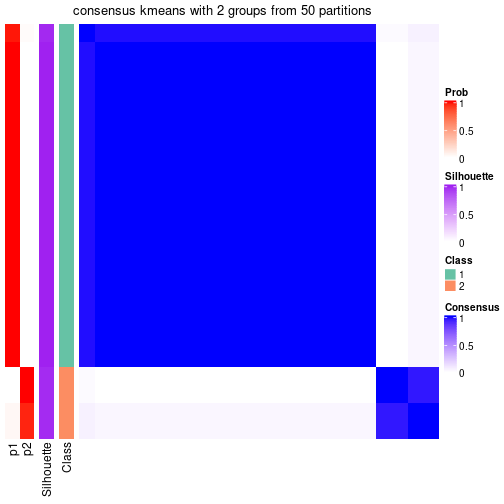</p>

</div>
<div id='tab-node-0231-consensus-heatmap-2'>
<pre><code class="r">consensus_heatmap(res, k = 3)
</code></pre>

<p>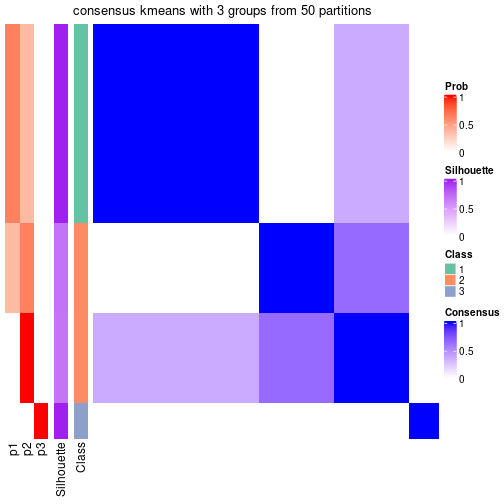</p>

</div>
<div id='tab-node-0231-consensus-heatmap-3'>
<pre><code class="r">consensus_heatmap(res, k = 4)
</code></pre>

<p>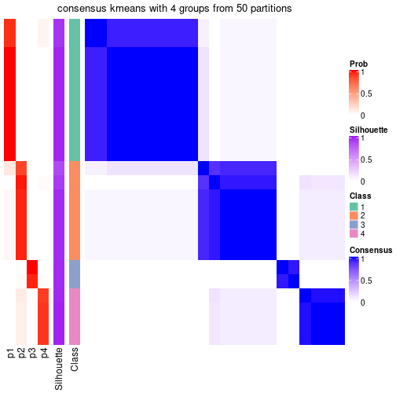</p>

</div>
<div id='tab-node-0231-consensus-heatmap-4'>
<pre><code class="r">consensus_heatmap(res, k = 5)
</code></pre>

<p>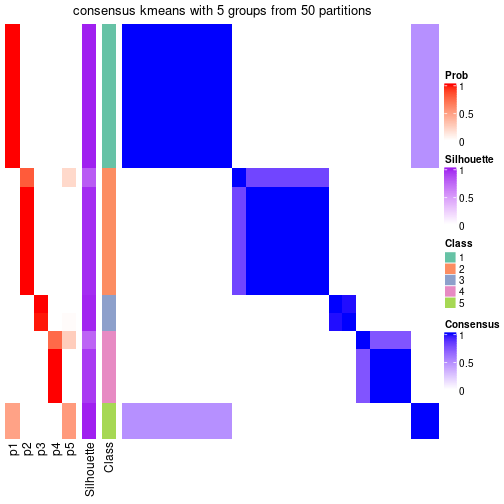</p>

</div>
<div id='tab-node-0231-consensus-heatmap-5'>
<pre><code class="r">consensus_heatmap(res, k = 6)
</code></pre>

<p>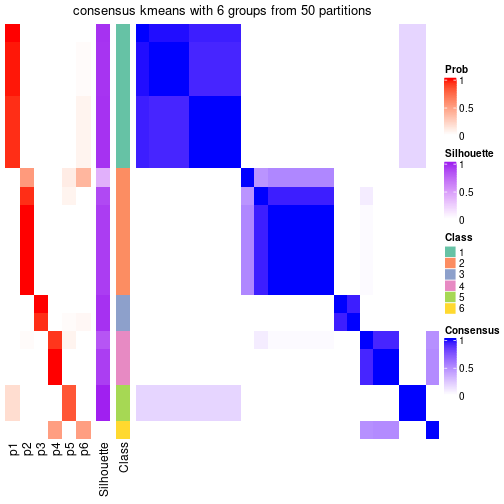</p>

</div>
<div id='tab-node-0231-consensus-heatmap-6'>
<pre><code class="r">consensus_heatmap(res, k = 7)
</code></pre>

<p>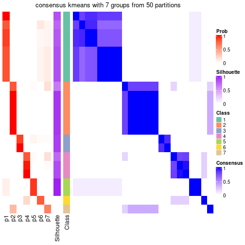</p>

</div>
<div id='tab-node-0231-consensus-heatmap-7'>
<pre><code class="r">consensus_heatmap(res, k = 8)
</code></pre>

<p>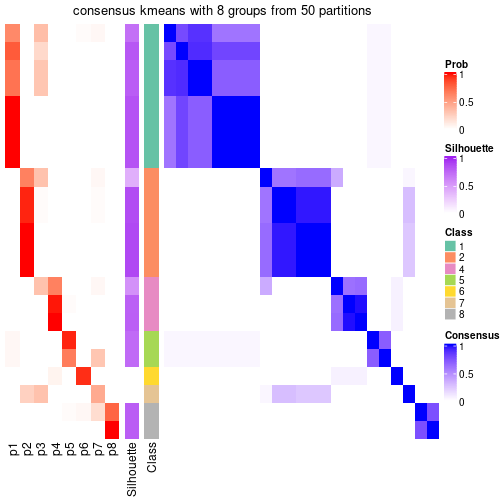</p>

</div>
</div>

Heatmaps for the membership of samples in all partitions to see how consistent they are:


<script>
$( function() {
	$( '#tabs-node-0231-membership-heatmap' ).tabs();
} );
</script>
<div id='tabs-node-0231-membership-heatmap'>
<ul>
<li><a href='#tab-node-0231-membership-heatmap-1'>k = 2</a></li>
<li><a href='#tab-node-0231-membership-heatmap-2'>k = 3</a></li>
<li><a href='#tab-node-0231-membership-heatmap-3'>k = 4</a></li>
<li><a href='#tab-node-0231-membership-heatmap-4'>k = 5</a></li>
<li><a href='#tab-node-0231-membership-heatmap-5'>k = 6</a></li>
<li><a href='#tab-node-0231-membership-heatmap-6'>k = 7</a></li>
<li><a href='#tab-node-0231-membership-heatmap-7'>k = 8</a></li>
</ul>
<div id='tab-node-0231-membership-heatmap-1'>
<pre><code class="r">membership_heatmap(res, k = 2)
</code></pre>

<p>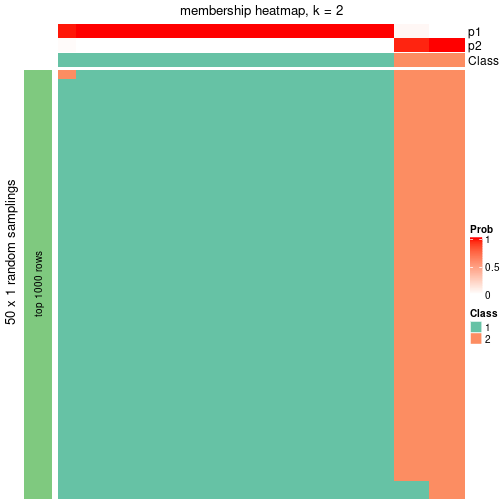</p>

</div>
<div id='tab-node-0231-membership-heatmap-2'>
<pre><code class="r">membership_heatmap(res, k = 3)
</code></pre>

<p>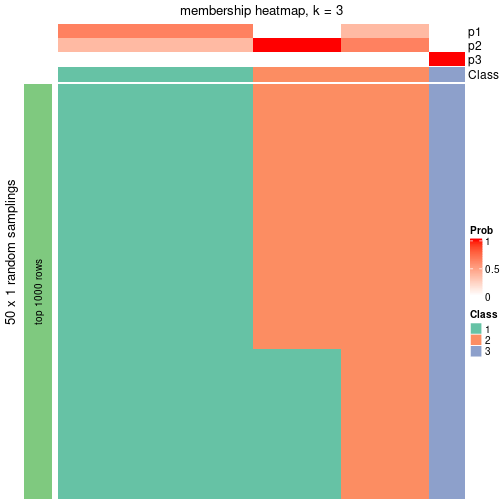</p>

</div>
<div id='tab-node-0231-membership-heatmap-3'>
<pre><code class="r">membership_heatmap(res, k = 4)
</code></pre>

<p>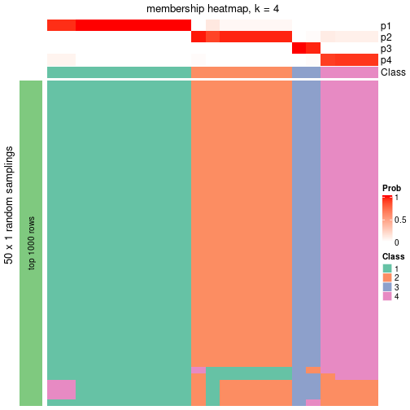</p>

</div>
<div id='tab-node-0231-membership-heatmap-4'>
<pre><code class="r">membership_heatmap(res, k = 5)
</code></pre>

<p>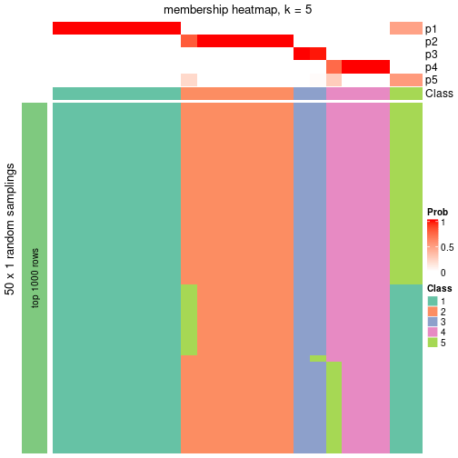</p>

</div>
<div id='tab-node-0231-membership-heatmap-5'>
<pre><code class="r">membership_heatmap(res, k = 6)
</code></pre>

<p>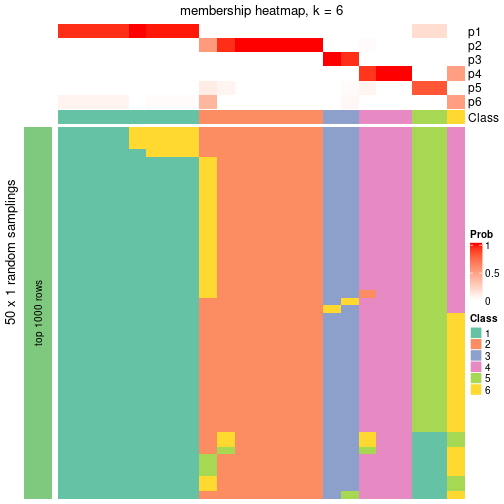</p>

</div>
<div id='tab-node-0231-membership-heatmap-6'>
<pre><code class="r">membership_heatmap(res, k = 7)
</code></pre>

<p>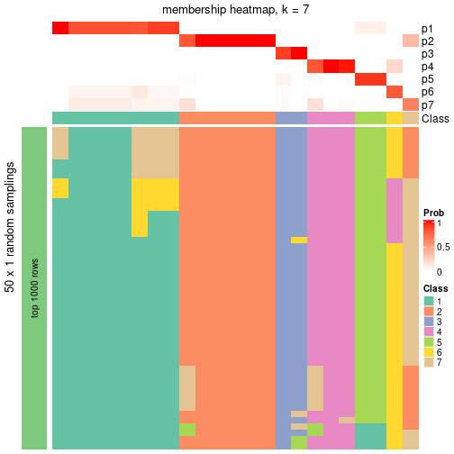</p>

</div>
<div id='tab-node-0231-membership-heatmap-7'>
<pre><code class="r">membership_heatmap(res, k = 8)
</code></pre>

<p>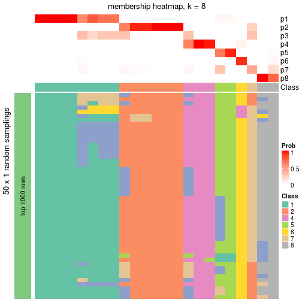</p>

</div>
</div>

As soon as the classes for columns are determined, the signatures
that are significantly different between subgroups can be looked for. 
Following are the heatmaps for signatures.


<script>
$( function() {
	$( '#tabs-node-0231-get-signatures' ).tabs();
} );
</script>
<div id='tabs-node-0231-get-signatures'>
<ul>
<li><a href='#tab-node-0231-get-signatures-1'>k = 2</a></li>
<li><a href='#tab-node-0231-get-signatures-2'>k = 3</a></li>
<li><a href='#tab-node-0231-get-signatures-3'>k = 4</a></li>
<li><a href='#tab-node-0231-get-signatures-4'>k = 5</a></li>
<li><a href='#tab-node-0231-get-signatures-5'>k = 6</a></li>
<li><a href='#tab-node-0231-get-signatures-6'>k = 7</a></li>
<li><a href='#tab-node-0231-get-signatures-7'>k = 8</a></li>
</ul>
<div id='tab-node-0231-get-signatures-1'>
<pre><code class="r">get_signatures(res, k = 2)
</code></pre>

<p>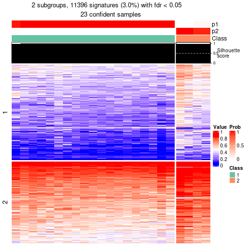</p>

</div>
<div id='tab-node-0231-get-signatures-2'>
<pre><code class="r">get_signatures(res, k = 3)
</code></pre>

<p>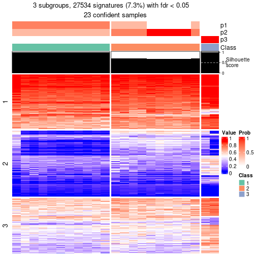</p>

</div>
<div id='tab-node-0231-get-signatures-3'>
<pre><code class="r">get_signatures(res, k = 4)
</code></pre>

<p>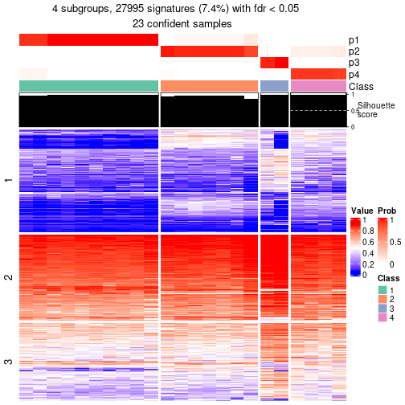</p>

</div>
<div id='tab-node-0231-get-signatures-4'>
<pre><code class="r">get_signatures(res, k = 5)
</code></pre>

<p>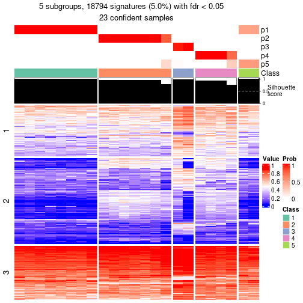</p>

</div>
<div id='tab-node-0231-get-signatures-5'>
<pre><code class="r">get_signatures(res, k = 6)
</code></pre>

<p>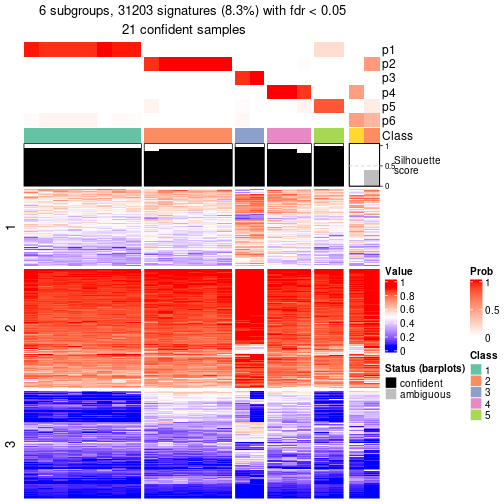</p>

</div>
<div id='tab-node-0231-get-signatures-6'>
<pre><code class="r">get_signatures(res, k = 7)
</code></pre>

<p>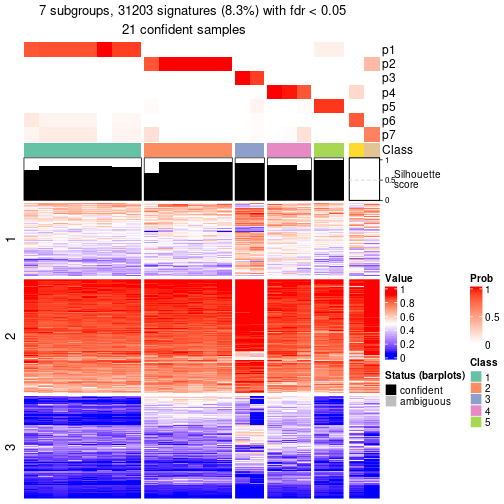</p>

</div>
<div id='tab-node-0231-get-signatures-7'>
<pre><code class="r">get_signatures(res, k = 8)
</code></pre>

<p>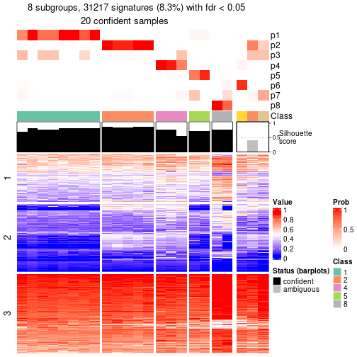</p>

</div>
</div>


Compare the overlap of signatures from different k:

```r
compare_signatures(res)
```

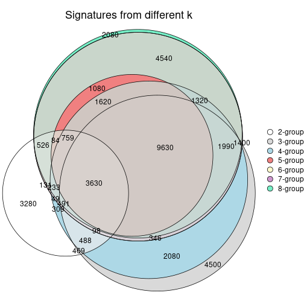

`get_signature()` returns a data frame invisibly. To get the list of signatures, the function
call should be assigned to a variable explicitly. In following code, if `plot` argument is set
to `FALSE`, no heatmap is plotted while only the differential analysis is performed.

```r
# code only for demonstration
tb = get_signature(res, k = ..., plot = FALSE)
```

An example of the output of `tb` is:

```
#>   which_row         fdr    mean_1    mean_2 scaled_mean_1 scaled_mean_2 km
#> 1        38 0.042760348  8.373488  9.131774    -0.5533452     0.5164555  1
#> 2        40 0.018707592  7.106213  8.469186    -0.6173731     0.5762149  1
#> 3        55 0.019134737 10.221463 11.207825    -0.6159697     0.5749050  1
#> 4        59 0.006059896  5.921854  7.869574    -0.6899429     0.6439467  1
#> 5        60 0.018055526  8.928898 10.211722    -0.6204761     0.5791110  1
#> 6        98 0.009384629 15.714769 14.887706     0.6635654    -0.6193277  2
...
```

The columns in `tb` are:

1. `which_row`: row indices corresponding to the input matrix.
2. `fdr`: FDR for the differential test. 
3. `mean_x`: The mean value in group x.
4. `scaled_mean_x`: The mean value in group x after rows are scaled.
5. `km`: Row groups if k-means clustering is applied to rows (which is done by automatically selecting number of clusters).

If there are too many signatures, `top_signatures = ...` can be set to only show the 
signatures with the highest FDRs:

```r
# code only for demonstration
# e.g. to show the top 500 most significant rows
tb = get_signature(res, k = ..., top_signatures = 500)
```

If the signatures are defined as these which are uniquely high in current group, `diff_method` argument
can be set to `"uniquely_high_in_one_group"`:

```r
# code only for demonstration
tb = get_signature(res, k = ..., diff_method = "uniquely_high_in_one_group")
```


UMAP plot which shows how samples are separated.


<script>
$( function() {
	$( '#tabs-node-0231-dimension-reduction' ).tabs();
} );
</script>
<div id='tabs-node-0231-dimension-reduction'>
<ul>
<li><a href='#tab-node-0231-dimension-reduction-1'>k = 2</a></li>
<li><a href='#tab-node-0231-dimension-reduction-2'>k = 3</a></li>
<li><a href='#tab-node-0231-dimension-reduction-3'>k = 4</a></li>
<li><a href='#tab-node-0231-dimension-reduction-4'>k = 5</a></li>
<li><a href='#tab-node-0231-dimension-reduction-5'>k = 6</a></li>
<li><a href='#tab-node-0231-dimension-reduction-6'>k = 7</a></li>
<li><a href='#tab-node-0231-dimension-reduction-7'>k = 8</a></li>
</ul>
<div id='tab-node-0231-dimension-reduction-1'>
<pre><code class="r">dimension_reduction(res, k = 2, method = &quot;UMAP&quot;)
</code></pre>

<p>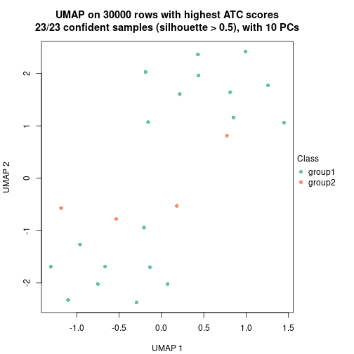</p>

</div>
<div id='tab-node-0231-dimension-reduction-2'>
<pre><code class="r">dimension_reduction(res, k = 3, method = &quot;UMAP&quot;)
</code></pre>

<p>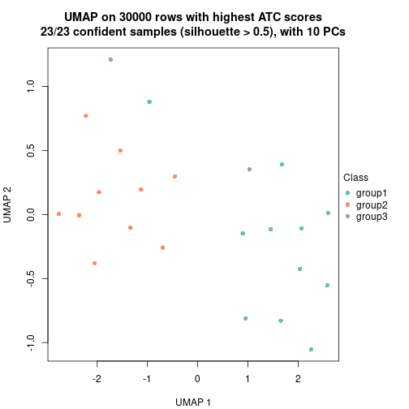</p>

</div>
<div id='tab-node-0231-dimension-reduction-3'>
<pre><code class="r">dimension_reduction(res, k = 4, method = &quot;UMAP&quot;)
</code></pre>

<p>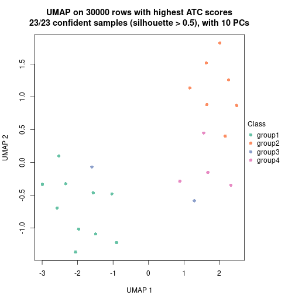</p>

</div>
<div id='tab-node-0231-dimension-reduction-4'>
<pre><code class="r">dimension_reduction(res, k = 5, method = &quot;UMAP&quot;)
</code></pre>

<p>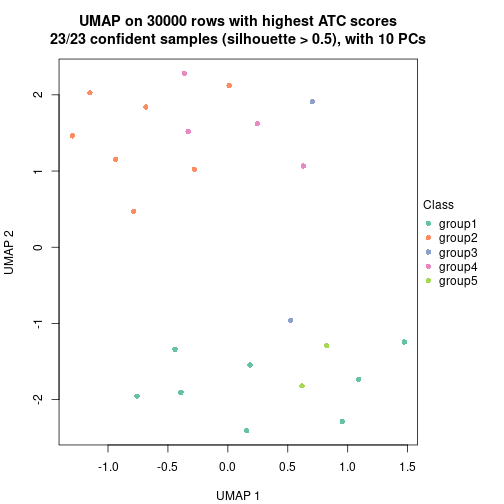</p>

</div>
<div id='tab-node-0231-dimension-reduction-5'>
<pre><code class="r">dimension_reduction(res, k = 6, method = &quot;UMAP&quot;)
</code></pre>

<p>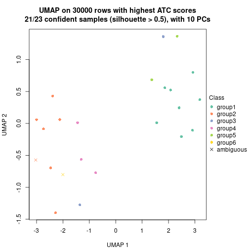</p>

</div>
<div id='tab-node-0231-dimension-reduction-6'>
<pre><code class="r">dimension_reduction(res, k = 7, method = &quot;UMAP&quot;)
</code></pre>

<p>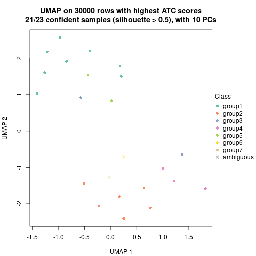</p>

</div>
<div id='tab-node-0231-dimension-reduction-7'>
<pre><code class="r">dimension_reduction(res, k = 8, method = &quot;UMAP&quot;)
</code></pre>

<p>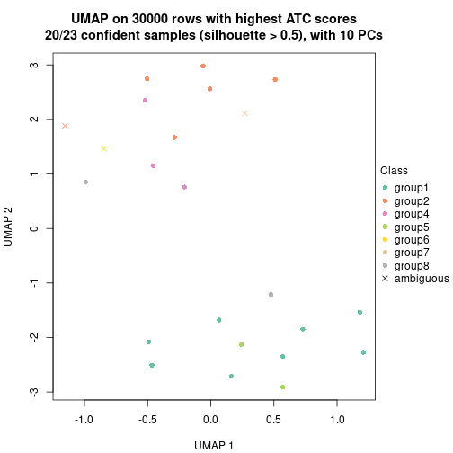</p>

</div>
</div>


Following heatmap shows how subgroups are split when increasing `k`:

```r
collect_classes(res)
```

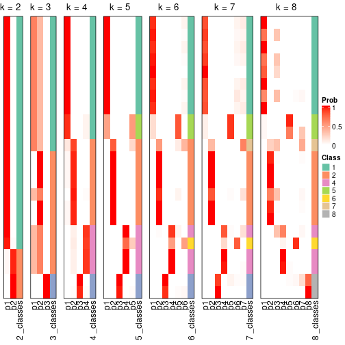


If matrix rows can be associated to genes, consider to use `functional_enrichment(res,
...)` to perform function enrichment for the signature genes. See [this vignette](https://jokergoo.github.io/cola_vignettes/functional_enrichment.html) for more detailed explanations.


 

---------------------------------------------------


### Node0234


Parent node: [Node023](#Node023).
Child nodes: 
                Node02131-leaf
        ,
                Node02132-leaf
        ,
                Node02211-leaf
        ,
                Node02212-leaf
        ,
                Node02311-leaf
        ,
                Node02312-leaf
        ,
                Node02313-leaf
        ,
                Node02314-leaf
        ,
                Node02341-leaf
        ,
                Node02342-leaf
        ,
                Node02343-leaf
        ,
                Node02344-leaf
        ,
                Node02345-leaf
        ,
                Node02421-leaf
        ,
                Node02422-leaf
        ,
                Node02423-leaf
        ,
                Node06121-leaf
        ,
                Node06122-leaf
        ,
                Node06123-leaf
        ,
                [Node07111](#Node07111)
        ,
                Node07112-leaf
        ,
                Node07211-leaf
        ,
                Node07212-leaf
        ,
                Node07213-leaf
        ,
                Node07214-leaf
        .


The object with results only for a single top-value method and a single partitioning method 
can be extracted as:

```r
res = res_rh["0234"]
```

A summary of `res` and all the functions that can be applied to it:

```r
res
```

```
#> A 'ConsensusPartition' object with k = 2, 3, 4, 5, 6, 7, 8.
#>   On a matrix with 30000 rows and 27 columns.
#>   Top rows (1000) are extracted by 'ATC' method.
#>   Subgroups are detected by 'skmeans' method.
#>   Performed in total 350 partitions by row resampling.
#>   Best k for subgroups seems to be 5.
#> 
#> Following methods can be applied to this 'ConsensusPartition' object:
#>  [1] "cola_report"             "collect_classes"         "collect_plots"          
#>  [4] "collect_stats"           "colnames"                "compare_partitions"     
#>  [7] "compare_signatures"      "consensus_heatmap"       "dimension_reduction"    
#> [10] "functional_enrichment"   "get_anno_col"            "get_anno"               
#> [13] "get_classes"             "get_consensus"           "get_matrix"             
#> [16] "get_membership"          "get_param"               "get_signatures"         
#> [19] "get_stats"               "is_best_k"               "is_stable_k"            
#> [22] "membership_heatmap"      "ncol"                    "nrow"                   
#> [25] "plot_ecdf"               "predict_classes"         "rownames"               
#> [28] "select_partition_number" "show"                    "suggest_best_k"         
#> [31] "test_to_known_factors"   "top_rows_heatmap"
```

`collect_plots()` function collects all the plots made from `res` for all `k` (number of subgroups)
into one single page to provide an easy and fast comparison between different `k`.

```r
collect_plots(res)
```

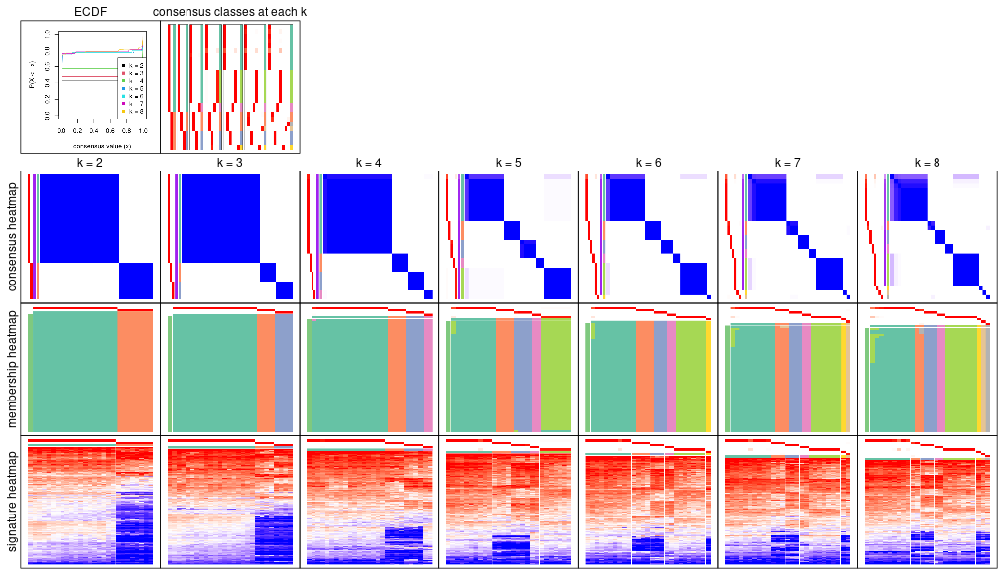

The plots are:

- The first row: a plot of the eCDF (empirical cumulative distribution
  function) curves of the consensus matrix for each `k` and the heatmap of
  predicted classes for each `k`.
- The second row: heatmaps of the consensus matrix for each `k`.
- The third row: heatmaps of the membership matrix for each `k`.
- The fouth row: heatmaps of the signatures for each `k`.

All the plots in panels can be made by individual functions and they are
plotted later in this section.

`select_partition_number()` produces several plots showing different
statistics for choosing "optimized" `k`. There are following statistics:

- eCDF curves of the consensus matrix for each `k`;
- 1-PAC. [The PAC score](https://en.wikipedia.org/wiki/Consensus_clustering#Over-interpretation_potential_of_consensus_clustering)
  measures the proportion of the ambiguous subgrouping.
- Mean silhouette score.
- Concordance. The mean probability of fiting the consensus subgroup labels in all
  partitions.
- Area increased. Denote $A_k$ as the area under the eCDF curve for current
  `k`, the area increased is defined as $A_k - A_{k-1}$.
- Rand index. The percent of pairs of samples that are both in a same cluster
  or both are not in a same cluster in the partition of k and k-1.
- Jaccard index. The ratio of pairs of samples are both in a same cluster in
  the partition of k and k-1 and the pairs of samples are both in a same
  cluster in the partition k or k-1.

The detailed explanations of these statistics can be found in [the _cola_
vignette](https://jokergoo.github.io/cola_vignettes/cola.html#toc_13).

Generally speaking, higher 1-PAC score, higher mean silhouette score or higher
concordance corresponds to better partition. Rand index and Jaccard index
measure how similar the current partition is compared to partition with `k-1`.
If they are too similar, we won't accept `k` is better than `k-1`.

```r
select_partition_number(res)
```

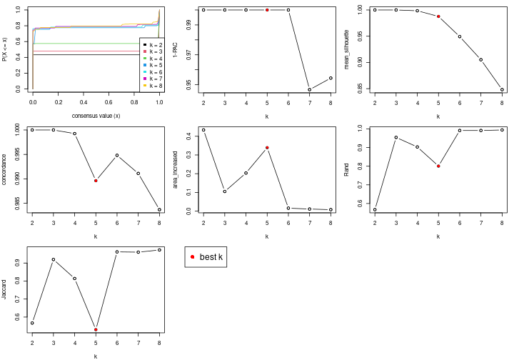

The numeric values for all these statistics can be obtained by `get_stats()`.

```r
get_stats(res)
```

```
#>   k 1-PAC mean_silhouette concordance area_increased  Rand Jaccard
#> 2 2 1.000           1.000       1.000        0.43362 0.567   0.567
#> 3 3 1.000           1.000       1.000        0.10502 0.954   0.920
#> 4 4 1.000           0.999       0.999        0.20354 0.903   0.814
#> 5 5 1.000           0.988       0.990        0.33901 0.801   0.530
#> 6 6 1.000           0.949       0.995        0.01593 0.991   0.962
#> 7 7 0.947           0.905       0.991        0.01117 0.991   0.961
#> 8 8 0.954           0.848       0.984        0.00789 0.994   0.973
```

`suggest_best_k()` suggests the best $k$ based on these statistics. The rules are as follows:

- All $k$ with Jaccard index larger than 0.95 are removed because increasing
  $k$ does not provide enough extra information. If all $k$ are removed, it is
  marked as no subgroup is detected.
- For all $k$ with 1-PAC score larger than 0.9, the maximal $k$ is taken as
  the best $k$, and other $k$ are marked as optional $k$.
- If it does not fit the second rule. The $k$ with the maximal vote of the
  highest 1-PAC score, highest mean silhouette, and highest concordance is
  taken as the best $k$.

```r
suggest_best_k(res)
```

```
#> [1] 5
#> attr(,"optional")
#> [1] 2 4
```

There is also optional best $k$ = 2 4 that is worth to check.

Following is the table of the partitions (You need to click the **show/hide
code output** link to see it). The membership matrix (columns with name `p*`)
is inferred by
[`clue::cl_consensus()`](https://www.rdocumentation.org/link/cl_consensus?package=clue)
function with the `SE` method. Basically the value in the membership matrix
represents the probability to belong to a certain group. The finall subgroup
label for an item is determined with the group with highest probability it
belongs to.

In `get_classes()` function, the entropy is calculated from the membership
matrix and the silhouette score is calculated from the consensus matrix.


<script>
$( function() {
	$( '#tabs-node-0234-get-classes' ).tabs();
} );
</script>
<div id='tabs-node-0234-get-classes'>
<ul>
<li><a href='#tab-node-0234-get-classes-1'>k = 2</a></li>
<li><a href='#tab-node-0234-get-classes-2'>k = 3</a></li>
<li><a href='#tab-node-0234-get-classes-3'>k = 4</a></li>
<li><a href='#tab-node-0234-get-classes-4'>k = 5</a></li>
<li><a href='#tab-node-0234-get-classes-5'>k = 6</a></li>
<li><a href='#tab-node-0234-get-classes-6'>k = 7</a></li>
<li><a href='#tab-node-0234-get-classes-7'>k = 8</a></li>
</ul>

<div id='tab-node-0234-get-classes-1'>
<p><a id='tab-node-0234-get-classes-1-a' style='color:#0366d6' href='#'>show/hide code output</a></p>
<pre><code class="r">cbind(get_classes(res, k = 2), get_membership(res, k = 2))
</code></pre>

<pre><code>#&gt;                 class entropy silhouette p1 p2
#&gt; TCGA.69.8453.01     2       0          1  0  1
#&gt; TCGA.J2.A4AG.01     1       0          1  1  0
#&gt; TCGA.55.6984.01     1       0          1  1  0
#&gt; TCGA.49.6744.01     1       0          1  1  0
#&gt; TCGA.55.8619.01     1       0          1  1  0
#&gt; TCGA.44.6775.01     1       0          1  1  0
#&gt; TCGA.MP.A4T9.01     1       0          1  1  0
#&gt; TCGA.55.7815.01     2       0          1  0  1
#&gt; TCGA.55.6985.01     1       0          1  1  0
#&gt; TCGA.93.7347.01     1       0          1  1  0
#&gt; TCGA.44.6777.01     1       0          1  1  0
#&gt; TCGA.91.6835.01     1       0          1  1  0
#&gt; TCGA.95.A4VN.01     1       0          1  1  0
#&gt; TCGA.97.7552.01     2       0          1  0  1
#&gt; TCGA.55.8301.01     2       0          1  0  1
#&gt; TCGA.50.8459.01     2       0          1  0  1
#&gt; TCGA.53.7626.01     1       0          1  1  0
#&gt; TCGA.55.8510.01     1       0          1  1  0
#&gt; TCGA.86.8076.01     2       0          1  0  1
#&gt; TCGA.50.5044.01     1       0          1  1  0
#&gt; TCGA.55.A48X.01     1       0          1  1  0
#&gt; TCGA.85.A513.01     1       0          1  1  0
#&gt; TCGA.55.6981.01     1       0          1  1  0
#&gt; TCGA.50.5941.01     1       0          1  1  0
#&gt; TCGA.55.A48Y.01     2       0          1  0  1
#&gt; TCGA.97.A4M7.01     2       0          1  0  1
#&gt; TCGA.50.5068.01     1       0          1  1  0
</code></pre>

<script>
$('#tab-node-0234-get-classes-1-a').parent().next().next().hide();
$('#tab-node-0234-get-classes-1-a').click(function(){
  $('#tab-node-0234-get-classes-1-a').parent().next().next().toggle();
  return(false);
});
</script>
</div>

<div id='tab-node-0234-get-classes-2'>
<p><a id='tab-node-0234-get-classes-2-a' style='color:#0366d6' href='#'>show/hide code output</a></p>
<pre><code class="r">cbind(get_classes(res, k = 3), get_membership(res, k = 3))
</code></pre>

<pre><code>#&gt;                 class entropy silhouette p1 p2 p3
#&gt; TCGA.69.8453.01     3       0          1  0  0  1
#&gt; TCGA.J2.A4AG.01     1       0          1  1  0  0
#&gt; TCGA.55.6984.01     1       0          1  1  0  0
#&gt; TCGA.49.6744.01     1       0          1  1  0  0
#&gt; TCGA.55.8619.01     1       0          1  1  0  0
#&gt; TCGA.44.6775.01     1       0          1  1  0  0
#&gt; TCGA.MP.A4T9.01     1       0          1  1  0  0
#&gt; TCGA.55.7815.01     2       0          1  0  1  0
#&gt; TCGA.55.6985.01     1       0          1  1  0  0
#&gt; TCGA.93.7347.01     1       0          1  1  0  0
#&gt; TCGA.44.6777.01     1       0          1  1  0  0
#&gt; TCGA.91.6835.01     1       0          1  1  0  0
#&gt; TCGA.95.A4VN.01     1       0          1  1  0  0
#&gt; TCGA.97.7552.01     3       0          1  0  0  1
#&gt; TCGA.55.8301.01     2       0          1  0  1  0
#&gt; TCGA.50.8459.01     3       0          1  0  0  1
#&gt; TCGA.53.7626.01     1       0          1  1  0  0
#&gt; TCGA.55.8510.01     1       0          1  1  0  0
#&gt; TCGA.86.8076.01     3       0          1  0  0  1
#&gt; TCGA.50.5044.01     1       0          1  1  0  0
#&gt; TCGA.55.A48X.01     1       0          1  1  0  0
#&gt; TCGA.85.A513.01     1       0          1  1  0  0
#&gt; TCGA.55.6981.01     1       0          1  1  0  0
#&gt; TCGA.50.5941.01     1       0          1  1  0  0
#&gt; TCGA.55.A48Y.01     2       0          1  0  1  0
#&gt; TCGA.97.A4M7.01     2       0          1  0  1  0
#&gt; TCGA.50.5068.01     1       0          1  1  0  0
</code></pre>

<script>
$('#tab-node-0234-get-classes-2-a').parent().next().next().hide();
$('#tab-node-0234-get-classes-2-a').click(function(){
  $('#tab-node-0234-get-classes-2-a').parent().next().next().toggle();
  return(false);
});
</script>
</div>

<div id='tab-node-0234-get-classes-3'>
<p><a id='tab-node-0234-get-classes-3-a' style='color:#0366d6' href='#'>show/hide code output</a></p>
<pre><code class="r">cbind(get_classes(res, k = 4), get_membership(res, k = 4))
</code></pre>

<pre><code>#&gt;                 class entropy silhouette   p1 p2 p3   p4
#&gt; TCGA.69.8453.01     3  0.0000      1.000 0.00  0  1 0.00
#&gt; TCGA.J2.A4AG.01     1  0.0000      0.999 1.00  0  0 0.00
#&gt; TCGA.55.6984.01     4  0.0000      1.000 0.00  0  0 1.00
#&gt; TCGA.49.6744.01     1  0.0000      0.999 1.00  0  0 0.00
#&gt; TCGA.55.8619.01     4  0.0000      1.000 0.00  0  0 1.00
#&gt; TCGA.44.6775.01     1  0.0000      0.999 1.00  0  0 0.00
#&gt; TCGA.MP.A4T9.01     1  0.0000      0.999 1.00  0  0 0.00
#&gt; TCGA.55.7815.01     2  0.0000      1.000 0.00  1  0 0.00
#&gt; TCGA.55.6985.01     1  0.0000      0.999 1.00  0  0 0.00
#&gt; TCGA.93.7347.01     1  0.0000      0.999 1.00  0  0 0.00
#&gt; TCGA.44.6777.01     1  0.0000      0.999 1.00  0  0 0.00
#&gt; TCGA.91.6835.01     1  0.0000      0.999 1.00  0  0 0.00
#&gt; TCGA.95.A4VN.01     1  0.0000      0.999 1.00  0  0 0.00
#&gt; TCGA.97.7552.01     3  0.0000      1.000 0.00  0  1 0.00
#&gt; TCGA.55.8301.01     2  0.0000      1.000 0.00  1  0 0.00
#&gt; TCGA.50.8459.01     3  0.0000      1.000 0.00  0  1 0.00
#&gt; TCGA.53.7626.01     1  0.0000      0.999 1.00  0  0 0.00
#&gt; TCGA.55.8510.01     1  0.0000      0.999 1.00  0  0 0.00
#&gt; TCGA.86.8076.01     3  0.0000      1.000 0.00  0  1 0.00
#&gt; TCGA.50.5044.01     1  0.0707      0.980 0.98  0  0 0.02
#&gt; TCGA.55.A48X.01     1  0.0000      0.999 1.00  0  0 0.00
#&gt; TCGA.85.A513.01     1  0.0000      0.999 1.00  0  0 0.00
#&gt; TCGA.55.6981.01     1  0.0000      0.999 1.00  0  0 0.00
#&gt; TCGA.50.5941.01     1  0.0000      0.999 1.00  0  0 0.00
#&gt; TCGA.55.A48Y.01     2  0.0000      1.000 0.00  1  0 0.00
#&gt; TCGA.97.A4M7.01     2  0.0000      1.000 0.00  1  0 0.00
#&gt; TCGA.50.5068.01     1  0.0000      0.999 1.00  0  0 0.00
</code></pre>

<script>
$('#tab-node-0234-get-classes-3-a').parent().next().next().hide();
$('#tab-node-0234-get-classes-3-a').click(function(){
  $('#tab-node-0234-get-classes-3-a').parent().next().next().toggle();
  return(false);
});
</script>
</div>

<div id='tab-node-0234-get-classes-4'>
<p><a id='tab-node-0234-get-classes-4-a' style='color:#0366d6' href='#'>show/hide code output</a></p>
<pre><code class="r">cbind(get_classes(res, k = 5), get_membership(res, k = 5))
</code></pre>

<pre><code>#&gt;                 class entropy silhouette   p1 p2   p3 p4   p5
#&gt; TCGA.69.8453.01     3  0.0000      0.995 0.00  0 1.00  0 0.00
#&gt; TCGA.J2.A4AG.01     5  0.0609      1.000 0.02  0 0.00  0 0.98
#&gt; TCGA.55.6984.01     4  0.0000      1.000 0.00  0 0.00  1 0.00
#&gt; TCGA.49.6744.01     1  0.0000      0.984 1.00  0 0.00  0 0.00
#&gt; TCGA.55.8619.01     4  0.0000      1.000 0.00  0 0.00  1 0.00
#&gt; TCGA.44.6775.01     1  0.0000      0.984 1.00  0 0.00  0 0.00
#&gt; TCGA.MP.A4T9.01     1  0.0000      0.984 1.00  0 0.00  0 0.00
#&gt; TCGA.55.7815.01     2  0.0000      1.000 0.00  1 0.00  0 0.00
#&gt; TCGA.55.6985.01     1  0.0000      0.984 1.00  0 0.00  0 0.00
#&gt; TCGA.93.7347.01     1  0.0000      0.984 1.00  0 0.00  0 0.00
#&gt; TCGA.44.6777.01     5  0.0609      1.000 0.02  0 0.00  0 0.98
#&gt; TCGA.91.6835.01     5  0.0609      1.000 0.02  0 0.00  0 0.98
#&gt; TCGA.95.A4VN.01     5  0.0609      1.000 0.02  0 0.00  0 0.98
#&gt; TCGA.97.7552.01     3  0.0000      0.995 0.00  0 1.00  0 0.00
#&gt; TCGA.55.8301.01     2  0.0000      1.000 0.00  1 0.00  0 0.00
#&gt; TCGA.50.8459.01     3  0.0000      0.995 0.00  0 1.00  0 0.00
#&gt; TCGA.53.7626.01     1  0.2280      0.844 0.88  0 0.00  0 0.12
#&gt; TCGA.55.8510.01     5  0.0609      1.000 0.02  0 0.00  0 0.98
#&gt; TCGA.86.8076.01     3  0.0609      0.984 0.00  0 0.98  0 0.02
#&gt; TCGA.50.5044.01     1  0.0000      0.984 1.00  0 0.00  0 0.00
#&gt; TCGA.55.A48X.01     5  0.0609      1.000 0.02  0 0.00  0 0.98
#&gt; TCGA.85.A513.01     1  0.0000      0.984 1.00  0 0.00  0 0.00
#&gt; TCGA.55.6981.01     5  0.0609      1.000 0.02  0 0.00  0 0.98
#&gt; TCGA.50.5941.01     1  0.0000      0.984 1.00  0 0.00  0 0.00
#&gt; TCGA.55.A48Y.01     2  0.0000      1.000 0.00  1 0.00  0 0.00
#&gt; TCGA.97.A4M7.01     2  0.0000      1.000 0.00  1 0.00  0 0.00
#&gt; TCGA.50.5068.01     1  0.0000      0.984 1.00  0 0.00  0 0.00
</code></pre>

<script>
$('#tab-node-0234-get-classes-4-a').parent().next().next().hide();
$('#tab-node-0234-get-classes-4-a').click(function(){
  $('#tab-node-0234-get-classes-4-a').parent().next().next().toggle();
  return(false);
});
</script>
</div>

<div id='tab-node-0234-get-classes-5'>
<p><a id='tab-node-0234-get-classes-5-a' style='color:#0366d6' href='#'>show/hide code output</a></p>
<pre><code class="r">cbind(get_classes(res, k = 6), get_membership(res, k = 6))
</code></pre>

<pre><code>#&gt;                 class entropy silhouette   p1 p2 p3 p4   p5 p6
#&gt; TCGA.69.8453.01     3   0.000      1.000 0.00  0  1  0 0.00  0
#&gt; TCGA.J2.A4AG.01     5   0.000      1.000 0.00  0  0  0 1.00  0
#&gt; TCGA.55.6984.01     4   0.000      1.000 0.00  0  0  1 0.00  0
#&gt; TCGA.49.6744.01     1   0.000      0.980 1.00  0  0  0 0.00  0
#&gt; TCGA.55.8619.01     4   0.000      1.000 0.00  0  0  1 0.00  0
#&gt; TCGA.44.6775.01     1   0.000      0.980 1.00  0  0  0 0.00  0
#&gt; TCGA.MP.A4T9.01     1   0.000      0.980 1.00  0  0  0 0.00  0
#&gt; TCGA.55.7815.01     2   0.000      1.000 0.00  1  0  0 0.00  0
#&gt; TCGA.55.6985.01     1   0.000      0.980 1.00  0  0  0 0.00  0
#&gt; TCGA.93.7347.01     1   0.000      0.980 1.00  0  0  0 0.00  0
#&gt; TCGA.44.6777.01     5   0.000      1.000 0.00  0  0  0 1.00  0
#&gt; TCGA.91.6835.01     5   0.000      1.000 0.00  0  0  0 1.00  0
#&gt; TCGA.95.A4VN.01     5   0.000      1.000 0.00  0  0  0 1.00  0
#&gt; TCGA.97.7552.01     3   0.000      1.000 0.00  0  1  0 0.00  0
#&gt; TCGA.55.8301.01     2   0.000      1.000 0.00  1  0  0 0.00  0
#&gt; TCGA.50.8459.01     3   0.000      1.000 0.00  0  1  0 0.00  0
#&gt; TCGA.53.7626.01     1   0.226      0.805 0.86  0  0  0 0.14  0
#&gt; TCGA.55.8510.01     5   0.000      1.000 0.00  0  0  0 1.00  0
#&gt; TCGA.86.8076.01     6   0.000      0.000 0.00  0  0  0 0.00  1
#&gt; TCGA.50.5044.01     1   0.000      0.980 1.00  0  0  0 0.00  0
#&gt; TCGA.55.A48X.01     5   0.000      1.000 0.00  0  0  0 1.00  0
#&gt; TCGA.85.A513.01     1   0.000      0.980 1.00  0  0  0 0.00  0
#&gt; TCGA.55.6981.01     5   0.000      1.000 0.00  0  0  0 1.00  0
#&gt; TCGA.50.5941.01     1   0.000      0.980 1.00  0  0  0 0.00  0
#&gt; TCGA.55.A48Y.01     2   0.000      1.000 0.00  1  0  0 0.00  0
#&gt; TCGA.97.A4M7.01     2   0.000      1.000 0.00  1  0  0 0.00  0
#&gt; TCGA.50.5068.01     1   0.000      0.980 1.00  0  0  0 0.00  0
</code></pre>

<script>
$('#tab-node-0234-get-classes-5-a').parent().next().next().hide();
$('#tab-node-0234-get-classes-5-a').click(function(){
  $('#tab-node-0234-get-classes-5-a').parent().next().next().toggle();
  return(false);
});
</script>
</div>

<div id='tab-node-0234-get-classes-6'>
<p><a id='tab-node-0234-get-classes-6-a' style='color:#0366d6' href='#'>show/hide code output</a></p>
<pre><code class="r">cbind(get_classes(res, k = 7), get_membership(res, k = 7))
</code></pre>

<pre><code>#&gt;                 class entropy silhouette   p1   p2 p3 p4   p5 p6   p7
#&gt; TCGA.69.8453.01     3  0.0000      1.000 0.00 0.00  1  0 0.00  0 0.00
#&gt; TCGA.J2.A4AG.01     5  0.0000      1.000 0.00 0.00  0  0 1.00  0 0.00
#&gt; TCGA.55.6984.01     4  0.0000      1.000 0.00 0.00  0  1 0.00  0 0.00
#&gt; TCGA.49.6744.01     1  0.0000      0.972 1.00 0.00  0  0 0.00  0 0.00
#&gt; TCGA.55.8619.01     4  0.0000      1.000 0.00 0.00  0  1 0.00  0 0.00
#&gt; TCGA.44.6775.01     1  0.0504      0.955 0.98 0.00  0  0 0.02  0 0.00
#&gt; TCGA.MP.A4T9.01     1  0.0000      0.972 1.00 0.00  0  0 0.00  0 0.00
#&gt; TCGA.55.7815.01     2  0.0504      0.980 0.00 0.98  0  0 0.00  0 0.02
#&gt; TCGA.55.6985.01     1  0.0000      0.972 1.00 0.00  0  0 0.00  0 0.00
#&gt; TCGA.93.7347.01     1  0.0000      0.972 1.00 0.00  0  0 0.00  0 0.00
#&gt; TCGA.44.6777.01     5  0.0000      1.000 0.00 0.00  0  0 1.00  0 0.00
#&gt; TCGA.91.6835.01     5  0.0000      1.000 0.00 0.00  0  0 1.00  0 0.00
#&gt; TCGA.95.A4VN.01     5  0.0000      1.000 0.00 0.00  0  0 1.00  0 0.00
#&gt; TCGA.97.7552.01     3  0.0000      1.000 0.00 0.00  1  0 0.00  0 0.00
#&gt; TCGA.55.8301.01     7  0.0504      0.000 0.00 0.02  0  0 0.00  0 0.98
#&gt; TCGA.50.8459.01     3  0.0000      1.000 0.00 0.00  1  0 0.00  0 0.00
#&gt; TCGA.53.7626.01     1  0.2422      0.748 0.82 0.00  0  0 0.18  0 0.00
#&gt; TCGA.55.8510.01     5  0.0000      1.000 0.00 0.00  0  0 1.00  0 0.00
#&gt; TCGA.86.8076.01     6  0.0000      0.000 0.00 0.00  0  0 0.00  1 0.00
#&gt; TCGA.50.5044.01     1  0.0000      0.972 1.00 0.00  0  0 0.00  0 0.00
#&gt; TCGA.55.A48X.01     5  0.0000      1.000 0.00 0.00  0  0 1.00  0 0.00
#&gt; TCGA.85.A513.01     1  0.0000      0.972 1.00 0.00  0  0 0.00  0 0.00
#&gt; TCGA.55.6981.01     5  0.0000      1.000 0.00 0.00  0  0 1.00  0 0.00
#&gt; TCGA.50.5941.01     1  0.0000      0.972 1.00 0.00  0  0 0.00  0 0.00
#&gt; TCGA.55.A48Y.01     2  0.0000      0.990 0.00 1.00  0  0 0.00  0 0.00
#&gt; TCGA.97.A4M7.01     2  0.0000      0.990 0.00 1.00  0  0 0.00  0 0.00
#&gt; TCGA.50.5068.01     1  0.0000      0.972 1.00 0.00  0  0 0.00  0 0.00
</code></pre>

<script>
$('#tab-node-0234-get-classes-6-a').parent().next().next().hide();
$('#tab-node-0234-get-classes-6-a').click(function(){
  $('#tab-node-0234-get-classes-6-a').parent().next().next().toggle();
  return(false);
});
</script>
</div>

<div id='tab-node-0234-get-classes-7'>
<p><a id='tab-node-0234-get-classes-7-a' style='color:#0366d6' href='#'>show/hide code output</a></p>
<pre><code class="r">cbind(get_classes(res, k = 8), get_membership(res, k = 8))
</code></pre>

<pre><code>#&gt;                 class entropy silhouette   p1   p2 p3 p4   p5 p6 p7   p8
#&gt; TCGA.69.8453.01     3  0.0000      1.000 0.00 0.00  1  0 0.00  0  0 0.00
#&gt; TCGA.J2.A4AG.01     5  0.0000      1.000 0.00 0.00  0  0 1.00  0  0 0.00
#&gt; TCGA.55.6984.01     4  0.0000      1.000 0.00 0.00  0  1 0.00  0  0 0.00
#&gt; TCGA.49.6744.01     1  0.0000      0.947 1.00 0.00  0  0 0.00  0  0 0.00
#&gt; TCGA.55.8619.01     4  0.0000      1.000 0.00 0.00  0  1 0.00  0  0 0.00
#&gt; TCGA.44.6775.01     1  0.1091      0.899 0.94 0.00  0  0 0.06  0  0 0.00
#&gt; TCGA.MP.A4T9.01     1  0.0000      0.947 1.00 0.00  0  0 0.00  0  0 0.00
#&gt; TCGA.55.7815.01     2  0.0000      0.938 0.00 1.00  0  0 0.00  0  0 0.00
#&gt; TCGA.55.6985.01     1  0.0471      0.934 0.98 0.00  0  0 0.02  0  0 0.00
#&gt; TCGA.93.7347.01     1  0.0000      0.947 1.00 0.00  0  0 0.00  0  0 0.00
#&gt; TCGA.44.6777.01     5  0.0000      1.000 0.00 0.00  0  0 1.00  0  0 0.00
#&gt; TCGA.91.6835.01     5  0.0000      1.000 0.00 0.00  0  0 1.00  0  0 0.00
#&gt; TCGA.95.A4VN.01     5  0.0000      1.000 0.00 0.00  0  0 1.00  0  0 0.00
#&gt; TCGA.97.7552.01     3  0.0000      1.000 0.00 0.00  1  0 0.00  0  0 0.00
#&gt; TCGA.55.8301.01     7  0.0000      0.000 0.00 0.00  0  0 0.00  0  1 0.00
#&gt; TCGA.50.8459.01     3  0.0000      1.000 0.00 0.00  1  0 0.00  0  0 0.00
#&gt; TCGA.53.7626.01     1  0.2938      0.562 0.70 0.00  0  0 0.30  0  0 0.00
#&gt; TCGA.55.8510.01     5  0.0000      1.000 0.00 0.00  0  0 1.00  0  0 0.00
#&gt; TCGA.86.8076.01     6  0.0000      0.000 0.00 0.00  0  0 0.00  1  0 0.00
#&gt; TCGA.50.5044.01     1  0.0000      0.947 1.00 0.00  0  0 0.00  0  0 0.00
#&gt; TCGA.55.A48X.01     5  0.0000      1.000 0.00 0.00  0  0 1.00  0  0 0.00
#&gt; TCGA.85.A513.01     1  0.0000      0.947 1.00 0.00  0  0 0.00  0  0 0.00
#&gt; TCGA.55.6981.01     5  0.0000      1.000 0.00 0.00  0  0 1.00  0  0 0.00
#&gt; TCGA.50.5941.01     1  0.0000      0.947 1.00 0.00  0  0 0.00  0  0 0.00
#&gt; TCGA.55.A48Y.01     8  0.0000      0.000 0.00 0.00  0  0 0.00  0  0 1.00
#&gt; TCGA.97.A4M7.01     2  0.1091      0.936 0.00 0.94  0  0 0.00  0  0 0.06
#&gt; TCGA.50.5068.01     1  0.0000      0.947 1.00 0.00  0  0 0.00  0  0 0.00
</code></pre>

<script>
$('#tab-node-0234-get-classes-7-a').parent().next().next().hide();
$('#tab-node-0234-get-classes-7-a').click(function(){
  $('#tab-node-0234-get-classes-7-a').parent().next().next().toggle();
  return(false);
});
</script>
</div>
</div>

Heatmaps for the consensus matrix. It visualizes the probability of two
samples to be in a same group.


<script>
$( function() {
	$( '#tabs-node-0234-consensus-heatmap' ).tabs();
} );
</script>
<div id='tabs-node-0234-consensus-heatmap'>
<ul>
<li><a href='#tab-node-0234-consensus-heatmap-1'>k = 2</a></li>
<li><a href='#tab-node-0234-consensus-heatmap-2'>k = 3</a></li>
<li><a href='#tab-node-0234-consensus-heatmap-3'>k = 4</a></li>
<li><a href='#tab-node-0234-consensus-heatmap-4'>k = 5</a></li>
<li><a href='#tab-node-0234-consensus-heatmap-5'>k = 6</a></li>
<li><a href='#tab-node-0234-consensus-heatmap-6'>k = 7</a></li>
<li><a href='#tab-node-0234-consensus-heatmap-7'>k = 8</a></li>
</ul>
<div id='tab-node-0234-consensus-heatmap-1'>
<pre><code class="r">consensus_heatmap(res, k = 2)
</code></pre>

<p>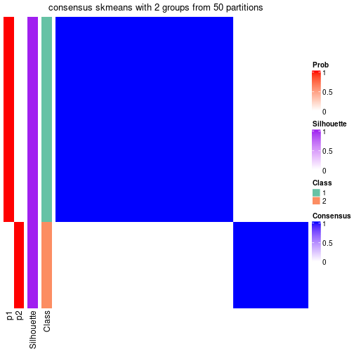</p>

</div>
<div id='tab-node-0234-consensus-heatmap-2'>
<pre><code class="r">consensus_heatmap(res, k = 3)
</code></pre>

<p>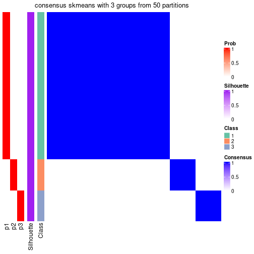</p>

</div>
<div id='tab-node-0234-consensus-heatmap-3'>
<pre><code class="r">consensus_heatmap(res, k = 4)
</code></pre>

<p>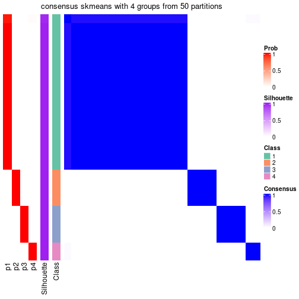</p>

</div>
<div id='tab-node-0234-consensus-heatmap-4'>
<pre><code class="r">consensus_heatmap(res, k = 5)
</code></pre>

<p>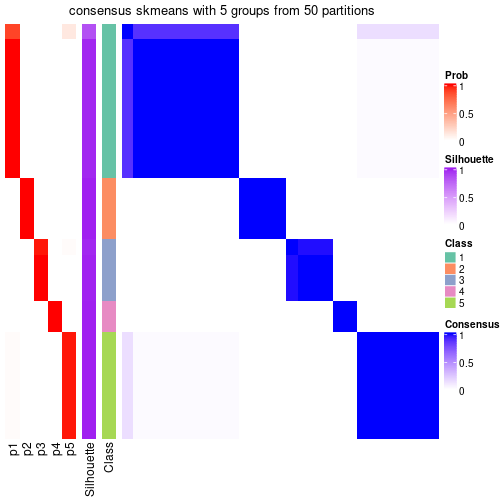</p>

</div>
<div id='tab-node-0234-consensus-heatmap-5'>
<pre><code class="r">consensus_heatmap(res, k = 6)
</code></pre>

<p>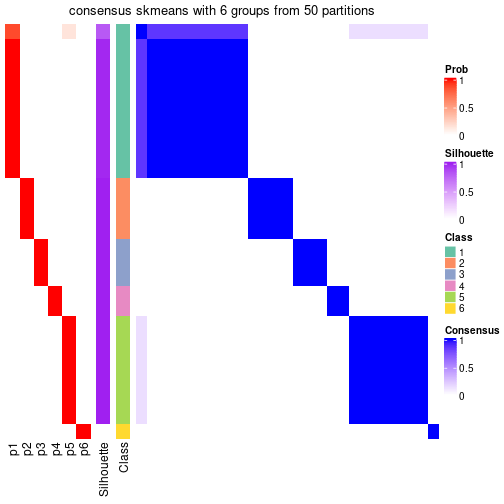</p>

</div>
<div id='tab-node-0234-consensus-heatmap-6'>
<pre><code class="r">consensus_heatmap(res, k = 7)
</code></pre>

<p>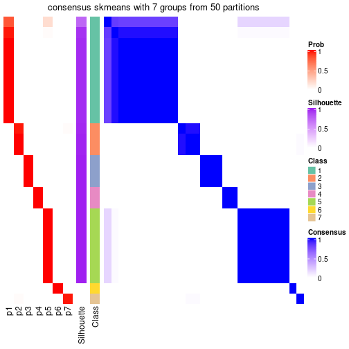</p>

</div>
<div id='tab-node-0234-consensus-heatmap-7'>
<pre><code class="r">consensus_heatmap(res, k = 8)
</code></pre>

<p>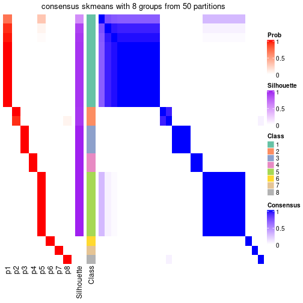</p>

</div>
</div>

Heatmaps for the membership of samples in all partitions to see how consistent they are:


<script>
$( function() {
	$( '#tabs-node-0234-membership-heatmap' ).tabs();
} );
</script>
<div id='tabs-node-0234-membership-heatmap'>
<ul>
<li><a href='#tab-node-0234-membership-heatmap-1'>k = 2</a></li>
<li><a href='#tab-node-0234-membership-heatmap-2'>k = 3</a></li>
<li><a href='#tab-node-0234-membership-heatmap-3'>k = 4</a></li>
<li><a href='#tab-node-0234-membership-heatmap-4'>k = 5</a></li>
<li><a href='#tab-node-0234-membership-heatmap-5'>k = 6</a></li>
<li><a href='#tab-node-0234-membership-heatmap-6'>k = 7</a></li>
<li><a href='#tab-node-0234-membership-heatmap-7'>k = 8</a></li>
</ul>
<div id='tab-node-0234-membership-heatmap-1'>
<pre><code class="r">membership_heatmap(res, k = 2)
</code></pre>

<p>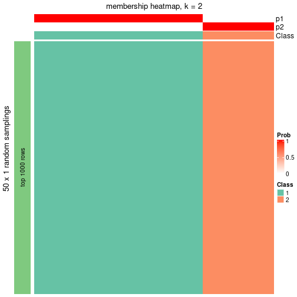</p>

</div>
<div id='tab-node-0234-membership-heatmap-2'>
<pre><code class="r">membership_heatmap(res, k = 3)
</code></pre>

<p>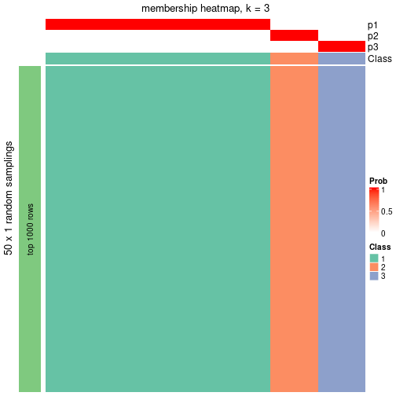</p>

</div>
<div id='tab-node-0234-membership-heatmap-3'>
<pre><code class="r">membership_heatmap(res, k = 4)
</code></pre>

<p>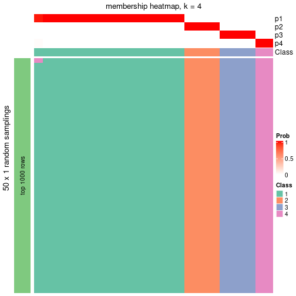</p>

</div>
<div id='tab-node-0234-membership-heatmap-4'>
<pre><code class="r">membership_heatmap(res, k = 5)
</code></pre>

<p>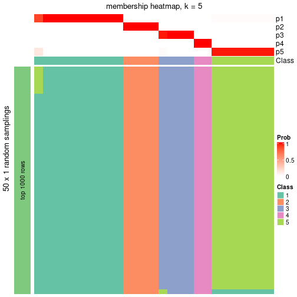</p>

</div>
<div id='tab-node-0234-membership-heatmap-5'>
<pre><code class="r">membership_heatmap(res, k = 6)
</code></pre>

<p>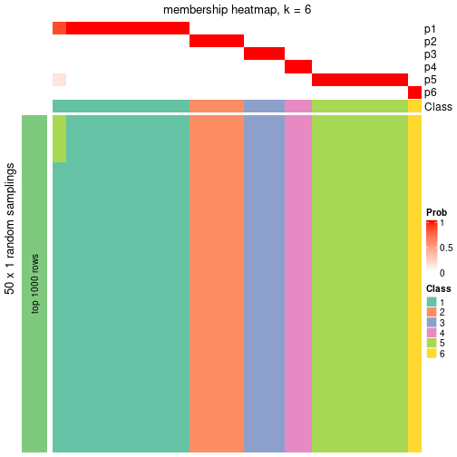</p>

</div>
<div id='tab-node-0234-membership-heatmap-6'>
<pre><code class="r">membership_heatmap(res, k = 7)
</code></pre>

<p>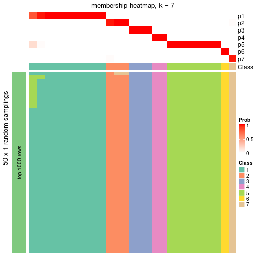</p>

</div>
<div id='tab-node-0234-membership-heatmap-7'>
<pre><code class="r">membership_heatmap(res, k = 8)
</code></pre>

<p>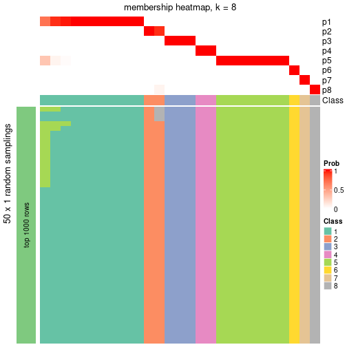</p>

</div>
</div>

As soon as the classes for columns are determined, the signatures
that are significantly different between subgroups can be looked for. 
Following are the heatmaps for signatures.


<script>
$( function() {
	$( '#tabs-node-0234-get-signatures' ).tabs();
} );
</script>
<div id='tabs-node-0234-get-signatures'>
<ul>
<li><a href='#tab-node-0234-get-signatures-1'>k = 2</a></li>
<li><a href='#tab-node-0234-get-signatures-2'>k = 3</a></li>
<li><a href='#tab-node-0234-get-signatures-3'>k = 4</a></li>
<li><a href='#tab-node-0234-get-signatures-4'>k = 5</a></li>
<li><a href='#tab-node-0234-get-signatures-5'>k = 6</a></li>
<li><a href='#tab-node-0234-get-signatures-6'>k = 7</a></li>
<li><a href='#tab-node-0234-get-signatures-7'>k = 8</a></li>
</ul>
<div id='tab-node-0234-get-signatures-1'>
<pre><code class="r">get_signatures(res, k = 2)
</code></pre>

<p>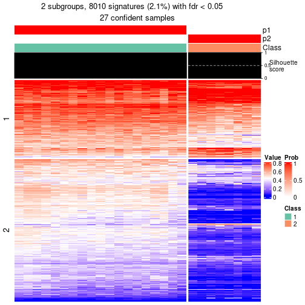</p>

</div>
<div id='tab-node-0234-get-signatures-2'>
<pre><code class="r">get_signatures(res, k = 3)
</code></pre>

<p>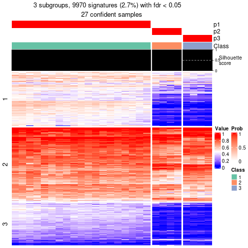</p>

</div>
<div id='tab-node-0234-get-signatures-3'>
<pre><code class="r">get_signatures(res, k = 4)
</code></pre>

<p>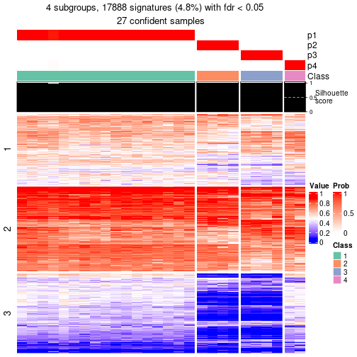</p>

</div>
<div id='tab-node-0234-get-signatures-4'>
<pre><code class="r">get_signatures(res, k = 5)
</code></pre>

<p>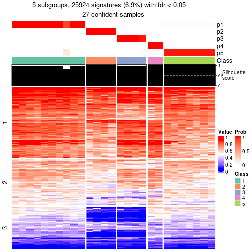</p>

</div>
<div id='tab-node-0234-get-signatures-5'>
<pre><code class="r">get_signatures(res, k = 6)
</code></pre>

<p>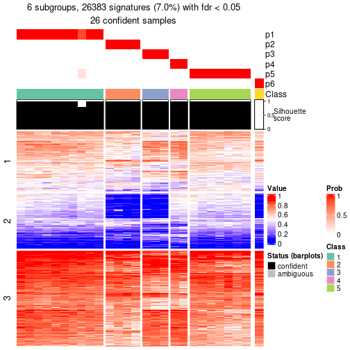</p>

</div>
<div id='tab-node-0234-get-signatures-6'>
<pre><code class="r">get_signatures(res, k = 7)
</code></pre>

<p>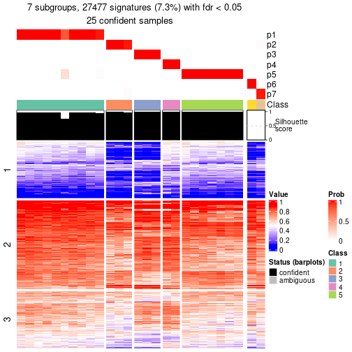</p>

</div>
<div id='tab-node-0234-get-signatures-7'>
<pre><code class="r">get_signatures(res, k = 8)
</code></pre>

<p>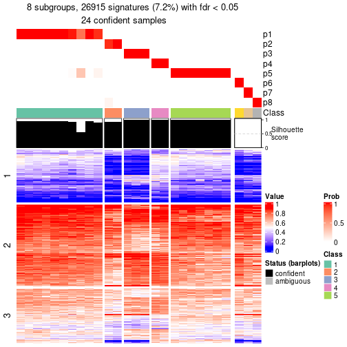</p>

</div>
</div>


Compare the overlap of signatures from different k:

```r
compare_signatures(res)
```

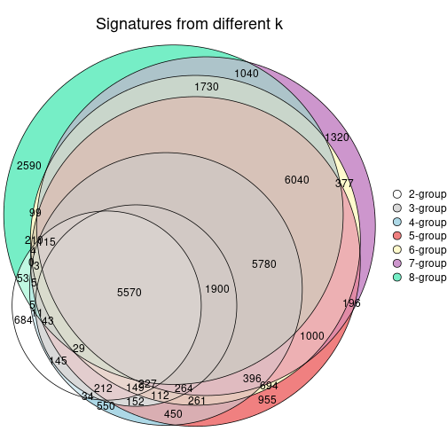

`get_signature()` returns a data frame invisibly. To get the list of signatures, the function
call should be assigned to a variable explicitly. In following code, if `plot` argument is set
to `FALSE`, no heatmap is plotted while only the differential analysis is performed.

```r
# code only for demonstration
tb = get_signature(res, k = ..., plot = FALSE)
```

An example of the output of `tb` is:

```
#>   which_row         fdr    mean_1    mean_2 scaled_mean_1 scaled_mean_2 km
#> 1        38 0.042760348  8.373488  9.131774    -0.5533452     0.5164555  1
#> 2        40 0.018707592  7.106213  8.469186    -0.6173731     0.5762149  1
#> 3        55 0.019134737 10.221463 11.207825    -0.6159697     0.5749050  1
#> 4        59 0.006059896  5.921854  7.869574    -0.6899429     0.6439467  1
#> 5        60 0.018055526  8.928898 10.211722    -0.6204761     0.5791110  1
#> 6        98 0.009384629 15.714769 14.887706     0.6635654    -0.6193277  2
...
```

The columns in `tb` are:

1. `which_row`: row indices corresponding to the input matrix.
2. `fdr`: FDR for the differential test. 
3. `mean_x`: The mean value in group x.
4. `scaled_mean_x`: The mean value in group x after rows are scaled.
5. `km`: Row groups if k-means clustering is applied to rows (which is done by automatically selecting number of clusters).

If there are too many signatures, `top_signatures = ...` can be set to only show the 
signatures with the highest FDRs:

```r
# code only for demonstration
# e.g. to show the top 500 most significant rows
tb = get_signature(res, k = ..., top_signatures = 500)
```

If the signatures are defined as these which are uniquely high in current group, `diff_method` argument
can be set to `"uniquely_high_in_one_group"`:

```r
# code only for demonstration
tb = get_signature(res, k = ..., diff_method = "uniquely_high_in_one_group")
```


UMAP plot which shows how samples are separated.


<script>
$( function() {
	$( '#tabs-node-0234-dimension-reduction' ).tabs();
} );
</script>
<div id='tabs-node-0234-dimension-reduction'>
<ul>
<li><a href='#tab-node-0234-dimension-reduction-1'>k = 2</a></li>
<li><a href='#tab-node-0234-dimension-reduction-2'>k = 3</a></li>
<li><a href='#tab-node-0234-dimension-reduction-3'>k = 4</a></li>
<li><a href='#tab-node-0234-dimension-reduction-4'>k = 5</a></li>
<li><a href='#tab-node-0234-dimension-reduction-5'>k = 6</a></li>
<li><a href='#tab-node-0234-dimension-reduction-6'>k = 7</a></li>
<li><a href='#tab-node-0234-dimension-reduction-7'>k = 8</a></li>
</ul>
<div id='tab-node-0234-dimension-reduction-1'>
<pre><code class="r">dimension_reduction(res, k = 2, method = &quot;UMAP&quot;)
</code></pre>

<p>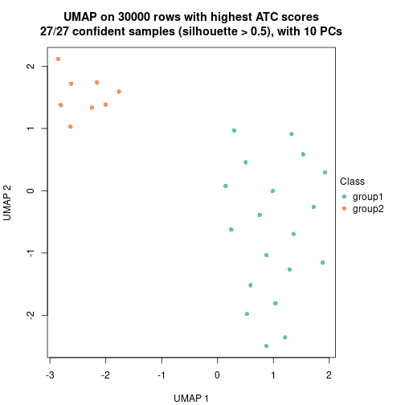</p>

</div>
<div id='tab-node-0234-dimension-reduction-2'>
<pre><code class="r">dimension_reduction(res, k = 3, method = &quot;UMAP&quot;)
</code></pre>

<p>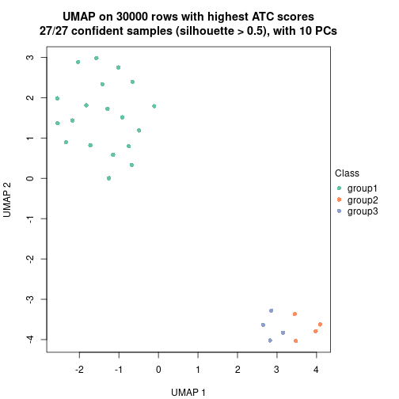</p>

</div>
<div id='tab-node-0234-dimension-reduction-3'>
<pre><code class="r">dimension_reduction(res, k = 4, method = &quot;UMAP&quot;)
</code></pre>

<p>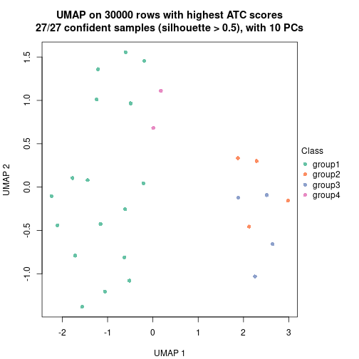</p>

</div>
<div id='tab-node-0234-dimension-reduction-4'>
<pre><code class="r">dimension_reduction(res, k = 5, method = &quot;UMAP&quot;)
</code></pre>

<p>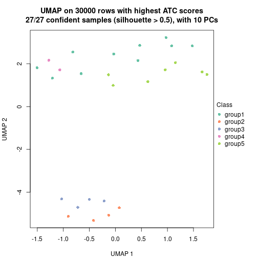</p>

</div>
<div id='tab-node-0234-dimension-reduction-5'>
<pre><code class="r">dimension_reduction(res, k = 6, method = &quot;UMAP&quot;)
</code></pre>

<p>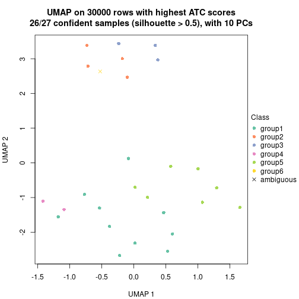</p>

</div>
<div id='tab-node-0234-dimension-reduction-6'>
<pre><code class="r">dimension_reduction(res, k = 7, method = &quot;UMAP&quot;)
</code></pre>

<p>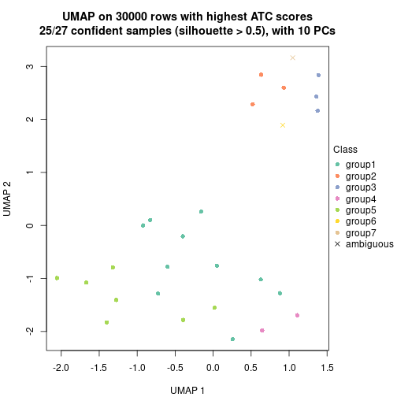</p>

</div>
<div id='tab-node-0234-dimension-reduction-7'>
<pre><code class="r">dimension_reduction(res, k = 8, method = &quot;UMAP&quot;)
</code></pre>

<p>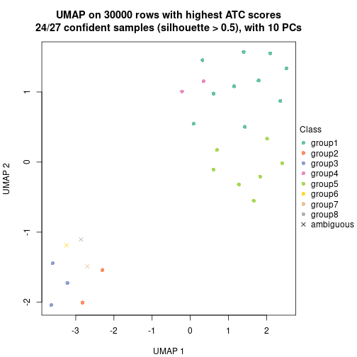</p>

</div>
</div>


Following heatmap shows how subgroups are split when increasing `k`:

```r
collect_classes(res)
```

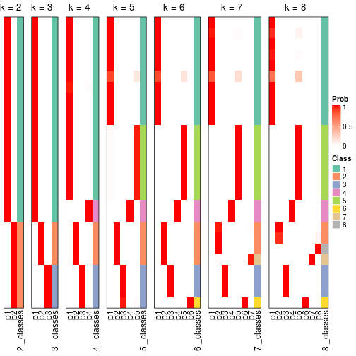


If matrix rows can be associated to genes, consider to use `functional_enrichment(res,
...)` to perform function enrichment for the signature genes. See [this vignette](https://jokergoo.github.io/cola_vignettes/functional_enrichment.html) for more detailed explanations.


 

---------------------------------------------------


### Node024


Parent node: [Node02](#Node02).
Child nodes: 
                Node0111-leaf
        ,
                Node0112-leaf
        ,
                Node0113-leaf
        ,
                Node0114-leaf
        ,
                Node0121-leaf
        ,
                Node0122-leaf
        ,
                Node0123-leaf
        ,
                Node0131-leaf
        ,
                Node0132-leaf
        ,
                Node0133-leaf
        ,
                Node0134-leaf
        ,
                Node0211-leaf
        ,
                Node0212-leaf
        ,
                [Node0213](#Node0213)
        ,
                Node0214-leaf
        ,
                [Node0221](#Node0221)
        ,
                Node0222-leaf
        ,
                Node0223-leaf
        ,
                [Node0231](#Node0231)
        ,
                Node0232-leaf
        ,
                Node0233-leaf
        ,
                [Node0234](#Node0234)
        ,
                Node0235-leaf
        ,
                Node0241-leaf
        ,
                [Node0242](#Node0242)
        ,
                Node0411-leaf
        ,
                Node0412-leaf
        ,
                Node0421-leaf
        ,
                Node0422-leaf
        ,
                Node0423-leaf
        ,
                Node0431-leaf
        ,
                Node0432-leaf
        ,
                Node0511-leaf
        ,
                Node0512-leaf
        ,
                Node0513-leaf
        ,
                Node0514-leaf
        ,
                Node0521-leaf
        ,
                Node0522-leaf
        ,
                Node0523-leaf
        ,
                Node0524-leaf
        ,
                Node0525-leaf
        ,
                Node0611-leaf
        ,
                [Node0612](#Node0612)
        ,
                Node0613-leaf
        ,
                [Node0711](#Node0711)
        ,
                Node0712-leaf
        ,
                Node0713-leaf
        ,
                [Node0721](#Node0721)
        ,
                Node0722-leaf
        ,
                Node0731-leaf
        ,
                Node0732-leaf
        ,
                Node0733-leaf
        .


The object with results only for a single top-value method and a single partitioning method 
can be extracted as:

```r
res = res_rh["024"]
```

A summary of `res` and all the functions that can be applied to it:

```r
res
```

```
#> A 'ConsensusPartition' object with k = 2, 3, 4, 5, 6, 7, 8.
#>   On a matrix with 30000 rows and 80 columns.
#>   Top rows (1000) are extracted by 'SD' method.
#>   Subgroups are detected by 'kmeans' method.
#>   Performed in total 350 partitions by row resampling.
#>   Best k for subgroups seems to be 2.
#> 
#> Following methods can be applied to this 'ConsensusPartition' object:
#>  [1] "cola_report"             "collect_classes"         "collect_plots"          
#>  [4] "collect_stats"           "colnames"                "compare_partitions"     
#>  [7] "compare_signatures"      "consensus_heatmap"       "dimension_reduction"    
#> [10] "functional_enrichment"   "get_anno_col"            "get_anno"               
#> [13] "get_classes"             "get_consensus"           "get_matrix"             
#> [16] "get_membership"          "get_param"               "get_signatures"         
#> [19] "get_stats"               "is_best_k"               "is_stable_k"            
#> [22] "membership_heatmap"      "ncol"                    "nrow"                   
#> [25] "plot_ecdf"               "predict_classes"         "rownames"               
#> [28] "select_partition_number" "show"                    "suggest_best_k"         
#> [31] "test_to_known_factors"   "top_rows_heatmap"
```

`collect_plots()` function collects all the plots made from `res` for all `k` (number of subgroups)
into one single page to provide an easy and fast comparison between different `k`.

```r
collect_plots(res)
```

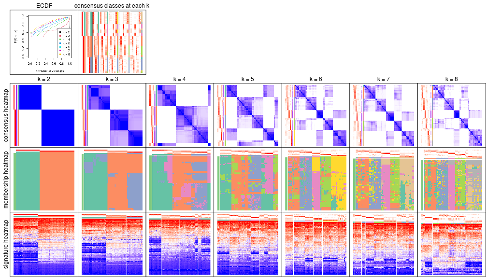

The plots are:

- The first row: a plot of the eCDF (empirical cumulative distribution
  function) curves of the consensus matrix for each `k` and the heatmap of
  predicted classes for each `k`.
- The second row: heatmaps of the consensus matrix for each `k`.
- The third row: heatmaps of the membership matrix for each `k`.
- The fouth row: heatmaps of the signatures for each `k`.

All the plots in panels can be made by individual functions and they are
plotted later in this section.

`select_partition_number()` produces several plots showing different
statistics for choosing "optimized" `k`. There are following statistics:

- eCDF curves of the consensus matrix for each `k`;
- 1-PAC. [The PAC score](https://en.wikipedia.org/wiki/Consensus_clustering#Over-interpretation_potential_of_consensus_clustering)
  measures the proportion of the ambiguous subgrouping.
- Mean silhouette score.
- Concordance. The mean probability of fiting the consensus subgroup labels in all
  partitions.
- Area increased. Denote $A_k$ as the area under the eCDF curve for current
  `k`, the area increased is defined as $A_k - A_{k-1}$.
- Rand index. The percent of pairs of samples that are both in a same cluster
  or both are not in a same cluster in the partition of k and k-1.
- Jaccard index. The ratio of pairs of samples are both in a same cluster in
  the partition of k and k-1 and the pairs of samples are both in a same
  cluster in the partition k or k-1.

The detailed explanations of these statistics can be found in [the _cola_
vignette](https://jokergoo.github.io/cola_vignettes/cola.html#toc_13).

Generally speaking, higher 1-PAC score, higher mean silhouette score or higher
concordance corresponds to better partition. Rand index and Jaccard index
measure how similar the current partition is compared to partition with `k-1`.
If they are too similar, we won't accept `k` is better than `k-1`.

```r
select_partition_number(res)
```

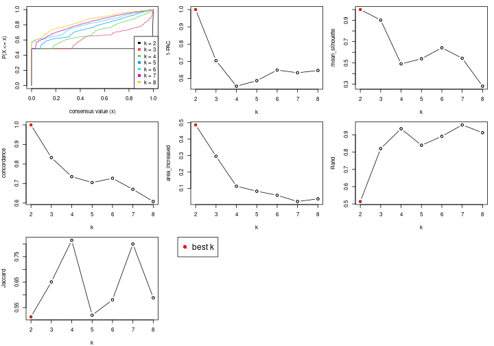

The numeric values for all these statistics can be obtained by `get_stats()`.

```r
get_stats(res)
```

```
#>   k 1-PAC mean_silhouette concordance area_increased  Rand Jaccard
#> 2 2 1.000           1.000       1.000         0.4866 0.514   0.514
#> 3 3 0.704           0.901       0.833         0.2955 0.821   0.651
#> 4 4 0.556           0.491       0.735         0.1135 0.935   0.814
#> 5 5 0.588           0.539       0.705         0.0829 0.840   0.520
#> 6 6 0.649           0.642       0.727         0.0582 0.891   0.581
#> 7 7 0.634           0.544       0.670         0.0202 0.958   0.800
#> 8 8 0.647           0.282       0.608         0.0364 0.913   0.589
```

`suggest_best_k()` suggests the best $k$ based on these statistics. The rules are as follows:

- All $k$ with Jaccard index larger than 0.95 are removed because increasing
  $k$ does not provide enough extra information. If all $k$ are removed, it is
  marked as no subgroup is detected.
- For all $k$ with 1-PAC score larger than 0.9, the maximal $k$ is taken as
  the best $k$, and other $k$ are marked as optional $k$.
- If it does not fit the second rule. The $k$ with the maximal vote of the
  highest 1-PAC score, highest mean silhouette, and highest concordance is
  taken as the best $k$.

```r
suggest_best_k(res)
```

```
#> [1] 2
```


Following is the table of the partitions (You need to click the **show/hide
code output** link to see it). The membership matrix (columns with name `p*`)
is inferred by
[`clue::cl_consensus()`](https://www.rdocumentation.org/link/cl_consensus?package=clue)
function with the `SE` method. Basically the value in the membership matrix
represents the probability to belong to a certain group. The finall subgroup
label for an item is determined with the group with highest probability it
belongs to.

In `get_classes()` function, the entropy is calculated from the membership
matrix and the silhouette score is calculated from the consensus matrix.


<script>
$( function() {
	$( '#tabs-node-024-get-classes' ).tabs();
} );
</script>
<div id='tabs-node-024-get-classes'>
<ul>
<li><a href='#tab-node-024-get-classes-1'>k = 2</a></li>
<li><a href='#tab-node-024-get-classes-2'>k = 3</a></li>
<li><a href='#tab-node-024-get-classes-3'>k = 4</a></li>
<li><a href='#tab-node-024-get-classes-4'>k = 5</a></li>
<li><a href='#tab-node-024-get-classes-5'>k = 6</a></li>
<li><a href='#tab-node-024-get-classes-6'>k = 7</a></li>
<li><a href='#tab-node-024-get-classes-7'>k = 8</a></li>
</ul>

<div id='tab-node-024-get-classes-1'>
<p><a id='tab-node-024-get-classes-1-a' style='color:#0366d6' href='#'>show/hide code output</a></p>
<pre><code class="r">cbind(get_classes(res, k = 2), get_membership(res, k = 2))
</code></pre>

<pre><code>#&gt;                 class entropy silhouette p1 p2
#&gt; TCGA.44.4112.01     2       0          1  0  1
#&gt; TCGA.NJ.A4YP.01     1       0          1  1  0
#&gt; TCGA.86.8278.01     2       0          1  0  1
#&gt; TCGA.49.AARQ.01     2       0          1  0  1
#&gt; TCGA.62.A46U.01     2       0          1  0  1
#&gt; TCGA.MP.A4T8.01     1       0          1  1  0
#&gt; TCGA.MP.A4SY.01     1       0          1  1  0
#&gt; TCGA.93.A4JN.01     1       0          1  1  0
#&gt; TCGA.86.A4JF.01     1       0          1  1  0
#&gt; TCGA.63.6202.01     1       0          1  1  0
#&gt; TCGA.MP.A4TI.01     1       0          1  1  0
#&gt; TCGA.MP.A4TC.01     1       0          1  1  0
#&gt; TCGA.05.4410.01     1       0          1  1  0
#&gt; TCGA.62.A46Y.01     2       0          1  0  1
#&gt; TCGA.50.6597.01     2       0          1  0  1
#&gt; TCGA.MP.A4SW.01     1       0          1  1  0
#&gt; TCGA.67.6216.01     2       0          1  0  1
#&gt; TCGA.55.8203.01     2       0          1  0  1
#&gt; TCGA.44.2668.01     1       0          1  1  0
#&gt; TCGA.L9.A444.01     2       0          1  0  1
#&gt; TCGA.44.A47G.01     2       0          1  0  1
#&gt; TCGA.44.2665.01     2       0          1  0  1
#&gt; TCGA.44.2666.01     1       0          1  1  0
#&gt; TCGA.55.A494.01     2       0          1  0  1
#&gt; TCGA.75.5125.01     1       0          1  1  0
#&gt; TCGA.55.7911.01     2       0          1  0  1
#&gt; TCGA.55.6712.01     1       0          1  1  0
#&gt; TCGA.95.7948.01     2       0          1  0  1
#&gt; TCGA.55.7281.01     2       0          1  0  1
#&gt; TCGA.38.6178.01     2       0          1  0  1
#&gt; TCGA.75.5122.01     1       0          1  1  0
#&gt; TCGA.L9.A443.01     2       0          1  0  1
#&gt; TCGA.86.7701.01     1       0          1  1  0
#&gt; TCGA.52.7812.01     1       0          1  1  0
#&gt; TCGA.78.8660.01     1       0          1  1  0
#&gt; TCGA.MP.A4TK.01     2       0          1  0  1
#&gt; TCGA.78.7540.01     2       0          1  0  1
#&gt; TCGA.69.7763.01     1       0          1  1  0
#&gt; TCGA.J2.A4AE.01     2       0          1  0  1
#&gt; TCGA.50.6590.01     2       0          1  0  1
#&gt; TCGA.MN.A4N5.01     1       0          1  1  0
#&gt; TCGA.69.7978.01     1       0          1  1  0
#&gt; TCGA.MP.A4TD.01     1       0          1  1  0
#&gt; TCGA.83.5908.01     2       0          1  0  1
#&gt; TCGA.NJ.A4YG.01     1       0          1  1  0
#&gt; TCGA.44.3918.01     2       0          1  0  1
#&gt; TCGA.55.7574.01     2       0          1  0  1
#&gt; TCGA.44.2656.01     1       0          1  1  0
#&gt; TCGA.78.7158.01     2       0          1  0  1
#&gt; TCGA.86.8056.01     2       0          1  0  1
#&gt; TCGA.97.8175.01     2       0          1  0  1
#&gt; TCGA.97.8547.01     2       0          1  0  1
#&gt; TCGA.44.6147.01     2       0          1  0  1
#&gt; TCGA.77.8007.01     1       0          1  1  0
#&gt; TCGA.86.8073.01     1       0          1  1  0
#&gt; TCGA.91.6828.01     1       0          1  1  0
#&gt; TCGA.38.7271.01     2       0          1  0  1
#&gt; TCGA.78.7143.01     2       0          1  0  1
#&gt; TCGA.75.6205.01     2       0          1  0  1
#&gt; TCGA.55.A493.01     2       0          1  0  1
#&gt; TCGA.75.5126.01     2       0          1  0  1
#&gt; TCGA.67.6215.01     2       0          1  0  1
#&gt; TCGA.55.6982.01     2       0          1  0  1
#&gt; TCGA.55.6986.01     2       0          1  0  1
#&gt; TCGA.49.6761.01     2       0          1  0  1
#&gt; TCGA.MP.A4T6.01     2       0          1  0  1
#&gt; TCGA.44.6779.01     2       0          1  0  1
#&gt; TCGA.86.A4P7.01     2       0          1  0  1
#&gt; TCGA.73.4658.01     2       0          1  0  1
#&gt; TCGA.05.4417.01     2       0          1  0  1
#&gt; TCGA.95.8039.01     1       0          1  1  0
#&gt; TCGA.80.5607.01     2       0          1  0  1
#&gt; TCGA.62.8395.01     2       0          1  0  1
#&gt; TCGA.86.8672.01     1       0          1  1  0
#&gt; TCGA.64.5815.01     1       0          1  1  0
#&gt; TCGA.97.8172.01     2       0          1  0  1
#&gt; TCGA.05.5715.01     2       0          1  0  1
#&gt; TCGA.44.7672.01     2       0          1  0  1
#&gt; TCGA.78.7152.01     1       0          1  1  0
#&gt; TCGA.55.8302.01     1       0          1  1  0
</code></pre>

<script>
$('#tab-node-024-get-classes-1-a').parent().next().next().hide();
$('#tab-node-024-get-classes-1-a').click(function(){
  $('#tab-node-024-get-classes-1-a').parent().next().next().toggle();
  return(false);
});
</script>
</div>

<div id='tab-node-024-get-classes-2'>
<p><a id='tab-node-024-get-classes-2-a' style='color:#0366d6' href='#'>show/hide code output</a></p>
<pre><code class="r">cbind(get_classes(res, k = 3), get_membership(res, k = 3))
</code></pre>

<pre><code>#&gt;                 class entropy silhouette   p1   p2   p3
#&gt; TCGA.44.4112.01     3  0.1529      0.931 0.00 0.04 0.96
#&gt; TCGA.NJ.A4YP.01     1  0.3686      0.857 0.86 0.14 0.00
#&gt; TCGA.86.8278.01     2  0.6192      0.903 0.00 0.58 0.42
#&gt; TCGA.49.AARQ.01     3  0.1529      0.931 0.00 0.04 0.96
#&gt; TCGA.62.A46U.01     2  0.5835      0.937 0.00 0.66 0.34
#&gt; TCGA.MP.A4T8.01     1  0.4291      0.890 0.82 0.18 0.00
#&gt; TCGA.MP.A4SY.01     1  0.2066      0.890 0.94 0.06 0.00
#&gt; TCGA.93.A4JN.01     1  0.4555      0.887 0.80 0.20 0.00
#&gt; TCGA.86.A4JF.01     1  0.3686      0.857 0.86 0.14 0.00
#&gt; TCGA.63.6202.01     1  0.3686      0.857 0.86 0.14 0.00
#&gt; TCGA.MP.A4TI.01     1  0.3686      0.857 0.86 0.14 0.00
#&gt; TCGA.MP.A4TC.01     1  0.4555      0.887 0.80 0.20 0.00
#&gt; TCGA.05.4410.01     1  0.3686      0.893 0.86 0.14 0.00
#&gt; TCGA.62.A46Y.01     2  0.5835      0.937 0.00 0.66 0.34
#&gt; TCGA.50.6597.01     2  0.6244      0.885 0.00 0.56 0.44
#&gt; TCGA.MP.A4SW.01     1  0.4555      0.887 0.80 0.20 0.00
#&gt; TCGA.67.6216.01     2  0.6280      0.856 0.00 0.54 0.46
#&gt; TCGA.55.8203.01     3  0.0892      0.946 0.00 0.02 0.98
#&gt; TCGA.44.2668.01     1  0.4291      0.890 0.82 0.18 0.00
#&gt; TCGA.L9.A444.01     2  0.5835      0.937 0.00 0.66 0.34
#&gt; TCGA.44.A47G.01     2  0.5835      0.937 0.00 0.66 0.34
#&gt; TCGA.44.2665.01     3  0.0000      0.955 0.00 0.00 1.00
#&gt; TCGA.44.2666.01     1  0.2066      0.890 0.94 0.06 0.00
#&gt; TCGA.55.A494.01     3  0.0000      0.955 0.00 0.00 1.00
#&gt; TCGA.75.5125.01     1  0.3686      0.893 0.86 0.14 0.00
#&gt; TCGA.55.7911.01     2  0.5835      0.937 0.00 0.66 0.34
#&gt; TCGA.55.6712.01     1  0.3686      0.857 0.86 0.14 0.00
#&gt; TCGA.95.7948.01     3  0.0000      0.955 0.00 0.00 1.00
#&gt; TCGA.55.7281.01     2  0.6244      0.885 0.00 0.56 0.44
#&gt; TCGA.38.6178.01     3  0.0000      0.955 0.00 0.00 1.00
#&gt; TCGA.75.5122.01     1  0.3686      0.857 0.86 0.14 0.00
#&gt; TCGA.L9.A443.01     3  0.0892      0.946 0.00 0.02 0.98
#&gt; TCGA.86.7701.01     1  0.4291      0.890 0.82 0.18 0.00
#&gt; TCGA.52.7812.01     1  0.4555      0.887 0.80 0.20 0.00
#&gt; TCGA.78.8660.01     1  0.3686      0.857 0.86 0.14 0.00
#&gt; TCGA.MP.A4TK.01     2  0.6302      0.741 0.00 0.52 0.48
#&gt; TCGA.78.7540.01     3  0.0000      0.955 0.00 0.00 1.00
#&gt; TCGA.69.7763.01     1  0.3340      0.895 0.88 0.12 0.00
#&gt; TCGA.J2.A4AE.01     2  0.5835      0.937 0.00 0.66 0.34
#&gt; TCGA.50.6590.01     3  0.2537      0.879 0.00 0.08 0.92
#&gt; TCGA.MN.A4N5.01     1  0.4002      0.894 0.84 0.16 0.00
#&gt; TCGA.69.7978.01     1  0.3686      0.857 0.86 0.14 0.00
#&gt; TCGA.MP.A4TD.01     1  0.3340      0.895 0.88 0.12 0.00
#&gt; TCGA.83.5908.01     2  0.6045      0.921 0.00 0.62 0.38
#&gt; TCGA.NJ.A4YG.01     1  0.4555      0.887 0.80 0.20 0.00
#&gt; TCGA.44.3918.01     3  0.2537      0.879 0.00 0.08 0.92
#&gt; TCGA.55.7574.01     3  0.4796      0.501 0.00 0.22 0.78
#&gt; TCGA.44.2656.01     1  0.3686      0.857 0.86 0.14 0.00
#&gt; TCGA.78.7158.01     2  0.5948      0.934 0.00 0.64 0.36
#&gt; TCGA.86.8056.01     3  0.0000      0.955 0.00 0.00 1.00
#&gt; TCGA.97.8175.01     2  0.5835      0.937 0.00 0.66 0.34
#&gt; TCGA.97.8547.01     2  0.6244      0.885 0.00 0.56 0.44
#&gt; TCGA.44.6147.01     3  0.0000      0.955 0.00 0.00 1.00
#&gt; TCGA.77.8007.01     1  0.3686      0.857 0.86 0.14 0.00
#&gt; TCGA.86.8073.01     1  0.4555      0.887 0.80 0.20 0.00
#&gt; TCGA.91.6828.01     1  0.3340      0.895 0.88 0.12 0.00
#&gt; TCGA.38.7271.01     2  0.5835      0.937 0.00 0.66 0.34
#&gt; TCGA.78.7143.01     3  0.0000      0.955 0.00 0.00 1.00
#&gt; TCGA.75.6205.01     2  0.5835      0.937 0.00 0.66 0.34
#&gt; TCGA.55.A493.01     2  0.5835      0.937 0.00 0.66 0.34
#&gt; TCGA.75.5126.01     3  0.0892      0.944 0.00 0.02 0.98
#&gt; TCGA.67.6215.01     2  0.6244      0.885 0.00 0.56 0.44
#&gt; TCGA.55.6982.01     3  0.1529      0.931 0.00 0.04 0.96
#&gt; TCGA.55.6986.01     2  0.6126      0.913 0.00 0.60 0.40
#&gt; TCGA.49.6761.01     2  0.6126      0.900 0.00 0.60 0.40
#&gt; TCGA.MP.A4T6.01     3  0.0000      0.955 0.00 0.00 1.00
#&gt; TCGA.44.6779.01     2  0.5835      0.937 0.00 0.66 0.34
#&gt; TCGA.86.A4P7.01     2  0.5948      0.933 0.00 0.64 0.36
#&gt; TCGA.73.4658.01     2  0.5835      0.937 0.00 0.66 0.34
#&gt; TCGA.05.4417.01     3  0.0000      0.955 0.00 0.00 1.00
#&gt; TCGA.95.8039.01     1  0.2537      0.878 0.92 0.08 0.00
#&gt; TCGA.80.5607.01     2  0.6192      0.903 0.00 0.58 0.42
#&gt; TCGA.62.8395.01     2  0.6045      0.924 0.00 0.62 0.38
#&gt; TCGA.86.8672.01     1  0.3686      0.857 0.86 0.14 0.00
#&gt; TCGA.64.5815.01     1  0.1529      0.889 0.96 0.04 0.00
#&gt; TCGA.97.8172.01     3  0.0000      0.955 0.00 0.00 1.00
#&gt; TCGA.05.5715.01     3  0.0000      0.955 0.00 0.00 1.00
#&gt; TCGA.44.7672.01     2  0.5948      0.933 0.00 0.64 0.36
#&gt; TCGA.78.7152.01     1  0.4555      0.887 0.80 0.20 0.00
#&gt; TCGA.55.8302.01     1  0.4555      0.887 0.80 0.20 0.00
</code></pre>

<script>
$('#tab-node-024-get-classes-2-a').parent().next().next().hide();
$('#tab-node-024-get-classes-2-a').click(function(){
  $('#tab-node-024-get-classes-2-a').parent().next().next().toggle();
  return(false);
});
</script>
</div>

<div id='tab-node-024-get-classes-3'>
<p><a id='tab-node-024-get-classes-3-a' style='color:#0366d6' href='#'>show/hide code output</a></p>
<pre><code class="r">cbind(get_classes(res, k = 4), get_membership(res, k = 4))
</code></pre>

<pre><code>#&gt;                 class entropy silhouette   p1   p2   p3   p4
#&gt; TCGA.44.4112.01     3  0.2335     0.7778 0.00 0.02 0.92 0.06
#&gt; TCGA.NJ.A4YP.01     1  0.5570    -0.8272 0.54 0.02 0.00 0.44
#&gt; TCGA.86.8278.01     2  0.4277     0.6787 0.00 0.72 0.28 0.00
#&gt; TCGA.49.AARQ.01     3  0.3972     0.7347 0.00 0.08 0.84 0.08
#&gt; TCGA.62.A46U.01     2  0.7357     0.7151 0.00 0.50 0.18 0.32
#&gt; TCGA.MP.A4T8.01     1  0.2011     0.5758 0.92 0.08 0.00 0.00
#&gt; TCGA.MP.A4SY.01     1  0.4332     0.3320 0.80 0.04 0.00 0.16
#&gt; TCGA.93.A4JN.01     1  0.1211     0.5824 0.96 0.04 0.00 0.00
#&gt; TCGA.86.A4JF.01     1  0.4994    -0.9423 0.52 0.00 0.00 0.48
#&gt; TCGA.63.6202.01     4  0.5000     1.0000 0.50 0.00 0.00 0.50
#&gt; TCGA.MP.A4TI.01     1  0.5000    -1.0000 0.50 0.00 0.00 0.50
#&gt; TCGA.MP.A4TC.01     1  0.1211     0.5880 0.96 0.04 0.00 0.00
#&gt; TCGA.05.4410.01     1  0.3335     0.5623 0.86 0.12 0.00 0.02
#&gt; TCGA.62.A46Y.01     2  0.4553     0.7429 0.00 0.78 0.18 0.04
#&gt; TCGA.50.6597.01     2  0.5392     0.6705 0.00 0.68 0.28 0.04
#&gt; TCGA.MP.A4SW.01     1  0.0707     0.5879 0.98 0.02 0.00 0.00
#&gt; TCGA.67.6216.01     2  0.5062     0.6384 0.00 0.68 0.30 0.02
#&gt; TCGA.55.8203.01     3  0.1211     0.7868 0.00 0.00 0.96 0.04
#&gt; TCGA.44.2668.01     1  0.2011     0.5792 0.92 0.08 0.00 0.00
#&gt; TCGA.L9.A444.01     2  0.7357     0.7151 0.00 0.50 0.18 0.32
#&gt; TCGA.44.A47G.01     2  0.7357     0.7151 0.00 0.50 0.18 0.32
#&gt; TCGA.44.2665.01     3  0.2830     0.7705 0.00 0.06 0.90 0.04
#&gt; TCGA.44.2666.01     1  0.4332     0.3320 0.80 0.04 0.00 0.16
#&gt; TCGA.55.A494.01     3  0.5327     0.5897 0.00 0.22 0.72 0.06
#&gt; TCGA.75.5125.01     1  0.4731     0.3357 0.78 0.06 0.00 0.16
#&gt; TCGA.55.7911.01     2  0.7414     0.7052 0.00 0.48 0.18 0.34
#&gt; TCGA.55.6712.01     4  0.5000     1.0000 0.50 0.00 0.00 0.50
#&gt; TCGA.95.7948.01     3  0.3037     0.7752 0.00 0.02 0.88 0.10
#&gt; TCGA.55.7281.01     2  0.4936     0.6620 0.00 0.70 0.28 0.02
#&gt; TCGA.38.6178.01     3  0.2011     0.7832 0.00 0.00 0.92 0.08
#&gt; TCGA.75.5122.01     1  0.5000    -1.0000 0.50 0.00 0.00 0.50
#&gt; TCGA.L9.A443.01     3  0.2011     0.7806 0.00 0.00 0.92 0.08
#&gt; TCGA.86.7701.01     1  0.2011     0.5758 0.92 0.08 0.00 0.00
#&gt; TCGA.52.7812.01     1  0.2011     0.5678 0.92 0.08 0.00 0.00
#&gt; TCGA.78.8660.01     1  0.5000    -1.0000 0.50 0.00 0.00 0.50
#&gt; TCGA.MP.A4TK.01     3  0.7610    -0.2712 0.00 0.32 0.46 0.22
#&gt; TCGA.78.7540.01     3  0.1211     0.7871 0.00 0.00 0.96 0.04
#&gt; TCGA.69.7763.01     1  0.3037     0.5608 0.88 0.10 0.00 0.02
#&gt; TCGA.J2.A4AE.01     2  0.5594     0.7428 0.00 0.72 0.18 0.10
#&gt; TCGA.50.6590.01     3  0.6049     0.5215 0.00 0.12 0.68 0.20
#&gt; TCGA.MN.A4N5.01     1  0.3037     0.5608 0.88 0.10 0.00 0.02
#&gt; TCGA.69.7978.01     1  0.5000    -1.0000 0.50 0.00 0.00 0.50
#&gt; TCGA.MP.A4TD.01     1  0.3037     0.5608 0.88 0.10 0.00 0.02
#&gt; TCGA.83.5908.01     2  0.7699     0.4743 0.00 0.40 0.38 0.22
#&gt; TCGA.NJ.A4YG.01     1  0.1211     0.5754 0.96 0.04 0.00 0.00
#&gt; TCGA.44.3918.01     3  0.5661     0.5713 0.00 0.08 0.70 0.22
#&gt; TCGA.55.7574.01     3  0.6286     0.4437 0.00 0.14 0.66 0.20
#&gt; TCGA.44.2656.01     4  0.5000     1.0000 0.50 0.00 0.00 0.50
#&gt; TCGA.78.7158.01     2  0.5147     0.7359 0.00 0.74 0.20 0.06
#&gt; TCGA.86.8056.01     3  0.4755     0.6134 0.00 0.20 0.76 0.04
#&gt; TCGA.97.8175.01     2  0.6686     0.7398 0.00 0.62 0.18 0.20
#&gt; TCGA.97.8547.01     2  0.5062     0.6384 0.00 0.68 0.30 0.02
#&gt; TCGA.44.6147.01     3  0.1211     0.7861 0.00 0.00 0.96 0.04
#&gt; TCGA.77.8007.01     1  0.5000    -1.0000 0.50 0.00 0.00 0.50
#&gt; TCGA.86.8073.01     1  0.1637     0.5832 0.94 0.06 0.00 0.00
#&gt; TCGA.91.6828.01     1  0.3037     0.5608 0.88 0.10 0.00 0.02
#&gt; TCGA.38.7271.01     2  0.7357     0.7151 0.00 0.50 0.18 0.32
#&gt; TCGA.78.7143.01     3  0.2830     0.7683 0.00 0.06 0.90 0.04
#&gt; TCGA.75.6205.01     2  0.7493     0.7021 0.00 0.48 0.20 0.32
#&gt; TCGA.55.A493.01     2  0.7550     0.6980 0.00 0.48 0.22 0.30
#&gt; TCGA.75.5126.01     3  0.4949     0.6393 0.00 0.06 0.76 0.18
#&gt; TCGA.67.6215.01     2  0.5062     0.6384 0.00 0.68 0.30 0.02
#&gt; TCGA.55.6982.01     3  0.1411     0.7843 0.00 0.02 0.96 0.02
#&gt; TCGA.55.6986.01     2  0.3801     0.7126 0.00 0.78 0.22 0.00
#&gt; TCGA.49.6761.01     3  0.7684    -0.4263 0.00 0.36 0.42 0.22
#&gt; TCGA.MP.A4T6.01     3  0.2345     0.7795 0.00 0.00 0.90 0.10
#&gt; TCGA.44.6779.01     2  0.7493     0.7021 0.00 0.48 0.20 0.32
#&gt; TCGA.86.A4P7.01     2  0.4939     0.7322 0.00 0.74 0.22 0.04
#&gt; TCGA.73.4658.01     2  0.7414     0.7052 0.00 0.48 0.18 0.34
#&gt; TCGA.05.4417.01     3  0.0707     0.7872 0.00 0.00 0.98 0.02
#&gt; TCGA.95.8039.01     1  0.4936    -0.0926 0.70 0.02 0.00 0.28
#&gt; TCGA.80.5607.01     2  0.4134     0.6939 0.00 0.74 0.26 0.00
#&gt; TCGA.62.8395.01     2  0.5147     0.7359 0.00 0.74 0.20 0.06
#&gt; TCGA.86.8672.01     4  0.5000     1.0000 0.50 0.00 0.00 0.50
#&gt; TCGA.64.5815.01     1  0.4332     0.3320 0.80 0.04 0.00 0.16
#&gt; TCGA.97.8172.01     3  0.1637     0.7847 0.00 0.00 0.94 0.06
#&gt; TCGA.05.5715.01     3  0.3198     0.7625 0.00 0.04 0.88 0.08
#&gt; TCGA.44.7672.01     2  0.7274     0.6957 0.00 0.54 0.24 0.22
#&gt; TCGA.78.7152.01     1  0.1637     0.5879 0.94 0.06 0.00 0.00
#&gt; TCGA.55.8302.01     1  0.0707     0.5879 0.98 0.02 0.00 0.00
</code></pre>

<script>
$('#tab-node-024-get-classes-3-a').parent().next().next().hide();
$('#tab-node-024-get-classes-3-a').click(function(){
  $('#tab-node-024-get-classes-3-a').parent().next().next().toggle();
  return(false);
});
</script>
</div>

<div id='tab-node-024-get-classes-4'>
<p><a id='tab-node-024-get-classes-4-a' style='color:#0366d6' href='#'>show/hide code output</a></p>
<pre><code class="r">cbind(get_classes(res, k = 5), get_membership(res, k = 5))
</code></pre>

<pre><code>#&gt;                 class entropy silhouette   p1   p2   p3   p4   p5
#&gt; TCGA.44.4112.01     3  0.3627     0.7767 0.02 0.10 0.84 0.00 0.04
#&gt; TCGA.NJ.A4YP.01     4  0.3099     0.6773 0.04 0.00 0.04 0.88 0.04
#&gt; TCGA.86.8278.01     5  0.5173     0.3326 0.00 0.46 0.04 0.00 0.50
#&gt; TCGA.49.AARQ.01     3  0.6496     0.6893 0.14 0.12 0.64 0.00 0.10
#&gt; TCGA.62.A46U.01     2  0.2331     0.5807 0.02 0.90 0.00 0.00 0.08
#&gt; TCGA.MP.A4T8.01     1  0.6759     0.8051 0.52 0.00 0.04 0.32 0.12
#&gt; TCGA.MP.A4SY.01     4  0.6200    -0.1588 0.32 0.00 0.00 0.52 0.16
#&gt; TCGA.93.A4JN.01     1  0.5498     0.7902 0.58 0.00 0.00 0.34 0.08
#&gt; TCGA.86.A4JF.01     4  0.2331     0.6991 0.02 0.00 0.00 0.90 0.08
#&gt; TCGA.63.6202.01     4  0.0609     0.7319 0.00 0.00 0.00 0.98 0.02
#&gt; TCGA.MP.A4TI.01     4  0.0000     0.7338 0.00 0.00 0.00 1.00 0.00
#&gt; TCGA.MP.A4TC.01     1  0.5393     0.8056 0.62 0.00 0.04 0.32 0.02
#&gt; TCGA.05.4410.01     1  0.6038     0.8000 0.56 0.00 0.02 0.34 0.08
#&gt; TCGA.62.A46Y.01     2  0.3796     0.3730 0.00 0.70 0.00 0.00 0.30
#&gt; TCGA.50.6597.01     2  0.5695    -0.3470 0.02 0.48 0.04 0.00 0.46
#&gt; TCGA.MP.A4SW.01     1  0.4540     0.8155 0.64 0.00 0.00 0.34 0.02
#&gt; TCGA.67.6216.01     5  0.5131     0.4396 0.00 0.42 0.04 0.00 0.54
#&gt; TCGA.55.8203.01     3  0.4420     0.7790 0.04 0.08 0.80 0.00 0.08
#&gt; TCGA.44.2668.01     1  0.5705     0.7975 0.60 0.00 0.02 0.32 0.06
#&gt; TCGA.L9.A444.01     2  0.0000     0.6135 0.00 1.00 0.00 0.00 0.00
#&gt; TCGA.44.A47G.01     2  0.0609     0.6094 0.00 0.98 0.00 0.00 0.02
#&gt; TCGA.44.2665.01     3  0.6743     0.5300 0.08 0.08 0.56 0.00 0.28
#&gt; TCGA.44.2666.01     4  0.6200    -0.1588 0.32 0.00 0.00 0.52 0.16
#&gt; TCGA.55.A494.01     5  0.7015    -0.1687 0.08 0.08 0.38 0.00 0.46
#&gt; TCGA.75.5125.01     4  0.6350    -0.5032 0.42 0.00 0.00 0.42 0.16
#&gt; TCGA.55.7911.01     2  0.1410     0.6001 0.00 0.94 0.00 0.00 0.06
#&gt; TCGA.55.6712.01     4  0.0000     0.7338 0.00 0.00 0.00 1.00 0.00
#&gt; TCGA.95.7948.01     3  0.6047     0.6791 0.12 0.08 0.68 0.00 0.12
#&gt; TCGA.55.7281.01     5  0.5588     0.4778 0.02 0.38 0.04 0.00 0.56
#&gt; TCGA.38.6178.01     3  0.4281     0.7761 0.10 0.08 0.80 0.00 0.02
#&gt; TCGA.75.5122.01     4  0.1043     0.7257 0.00 0.00 0.00 0.96 0.04
#&gt; TCGA.L9.A443.01     3  0.4115     0.7837 0.06 0.08 0.82 0.00 0.04
#&gt; TCGA.86.7701.01     1  0.6693     0.8072 0.54 0.00 0.04 0.30 0.12
#&gt; TCGA.52.7812.01     1  0.6400     0.7490 0.54 0.00 0.02 0.32 0.12
#&gt; TCGA.78.8660.01     4  0.0609     0.7230 0.02 0.00 0.00 0.98 0.00
#&gt; TCGA.MP.A4TK.01     2  0.6894     0.3050 0.10 0.58 0.22 0.00 0.10
#&gt; TCGA.78.7540.01     3  0.2927     0.7892 0.02 0.08 0.88 0.00 0.02
#&gt; TCGA.69.7763.01     1  0.6623     0.7824 0.52 0.00 0.04 0.34 0.10
#&gt; TCGA.J2.A4AE.01     2  0.3424     0.4183 0.00 0.76 0.00 0.00 0.24
#&gt; TCGA.50.6590.01     3  0.7535     0.3431 0.10 0.34 0.44 0.00 0.12
#&gt; TCGA.MN.A4N5.01     1  0.6254     0.7775 0.50 0.00 0.00 0.34 0.16
#&gt; TCGA.69.7978.01     4  0.0609     0.7233 0.02 0.00 0.00 0.98 0.00
#&gt; TCGA.MP.A4TD.01     1  0.6564     0.7865 0.54 0.00 0.04 0.32 0.10
#&gt; TCGA.83.5908.01     2  0.6296     0.4101 0.10 0.66 0.12 0.00 0.12
#&gt; TCGA.NJ.A4YG.01     1  0.6043     0.7521 0.54 0.00 0.00 0.32 0.14
#&gt; TCGA.44.3918.01     3  0.5997     0.5708 0.06 0.30 0.60 0.00 0.04
#&gt; TCGA.55.7574.01     2  0.7105     0.1517 0.10 0.50 0.32 0.00 0.08
#&gt; TCGA.44.2656.01     4  0.0000     0.7338 0.00 0.00 0.00 1.00 0.00
#&gt; TCGA.78.7158.01     2  0.3796     0.3618 0.00 0.70 0.00 0.00 0.30
#&gt; TCGA.86.8056.01     5  0.6539    -0.0943 0.04 0.08 0.42 0.00 0.46
#&gt; TCGA.97.8175.01     2  0.2020     0.5697 0.00 0.90 0.00 0.00 0.10
#&gt; TCGA.97.8547.01     5  0.5095     0.4717 0.00 0.40 0.04 0.00 0.56
#&gt; TCGA.44.6147.01     3  0.4115     0.7807 0.06 0.08 0.82 0.00 0.04
#&gt; TCGA.77.8007.01     4  0.0000     0.7338 0.00 0.00 0.00 1.00 0.00
#&gt; TCGA.86.8073.01     1  0.4840     0.8089 0.64 0.00 0.04 0.32 0.00
#&gt; TCGA.91.6828.01     1  0.6623     0.7824 0.52 0.00 0.04 0.34 0.10
#&gt; TCGA.38.7271.01     2  0.1216     0.6144 0.02 0.96 0.00 0.00 0.02
#&gt; TCGA.78.7143.01     3  0.4690     0.7653 0.04 0.08 0.78 0.00 0.10
#&gt; TCGA.75.6205.01     2  0.2438     0.6014 0.06 0.90 0.00 0.00 0.04
#&gt; TCGA.55.A493.01     2  0.3697     0.5610 0.08 0.82 0.00 0.00 0.10
#&gt; TCGA.75.5126.01     3  0.7053     0.5159 0.08 0.22 0.56 0.00 0.14
#&gt; TCGA.67.6215.01     5  0.5588     0.4778 0.02 0.38 0.04 0.00 0.56
#&gt; TCGA.55.6982.01     3  0.4389     0.7769 0.06 0.10 0.80 0.00 0.04
#&gt; TCGA.55.6986.01     2  0.4818    -0.2207 0.00 0.52 0.02 0.00 0.46
#&gt; TCGA.49.6761.01     2  0.6000     0.3501 0.06 0.64 0.24 0.00 0.06
#&gt; TCGA.MP.A4T6.01     3  0.4527     0.7667 0.12 0.08 0.78 0.00 0.02
#&gt; TCGA.44.6779.01     2  0.2438     0.6014 0.06 0.90 0.00 0.00 0.04
#&gt; TCGA.86.A4P7.01     2  0.4252     0.3931 0.02 0.70 0.00 0.00 0.28
#&gt; TCGA.73.4658.01     2  0.1410     0.6001 0.00 0.94 0.00 0.00 0.06
#&gt; TCGA.05.4417.01     3  0.3765     0.7877 0.04 0.08 0.84 0.00 0.04
#&gt; TCGA.95.8039.01     4  0.5892     0.1956 0.22 0.00 0.00 0.60 0.18
#&gt; TCGA.80.5607.01     2  0.4818    -0.2669 0.00 0.52 0.02 0.00 0.46
#&gt; TCGA.62.8395.01     2  0.3684     0.3642 0.00 0.72 0.00 0.00 0.28
#&gt; TCGA.86.8672.01     4  0.0609     0.7233 0.02 0.00 0.00 0.98 0.00
#&gt; TCGA.64.5815.01     4  0.6275    -0.1332 0.30 0.00 0.00 0.52 0.18
#&gt; TCGA.97.8172.01     3  0.3700     0.7774 0.02 0.08 0.84 0.00 0.06
#&gt; TCGA.05.5715.01     3  0.6251     0.6912 0.12 0.08 0.66 0.00 0.14
#&gt; TCGA.44.7672.01     2  0.4225     0.5558 0.06 0.80 0.02 0.00 0.12
#&gt; TCGA.78.7152.01     1  0.5012     0.8262 0.64 0.00 0.02 0.32 0.02
#&gt; TCGA.55.8302.01     1  0.6400     0.7637 0.54 0.00 0.02 0.32 0.12
</code></pre>

<script>
$('#tab-node-024-get-classes-4-a').parent().next().next().hide();
$('#tab-node-024-get-classes-4-a').click(function(){
  $('#tab-node-024-get-classes-4-a').parent().next().next().toggle();
  return(false);
});
</script>
</div>

<div id='tab-node-024-get-classes-5'>
<p><a id='tab-node-024-get-classes-5-a' style='color:#0366d6' href='#'>show/hide code output</a></p>
<pre><code class="r">cbind(get_classes(res, k = 6), get_membership(res, k = 6))
</code></pre>

<pre><code>#&gt;                 class entropy silhouette   p1   p2   p3   p4   p5   p6
#&gt; TCGA.44.4112.01     3  0.2345     0.7476 0.02 0.02 0.90 0.06 0.00 0.00
#&gt; TCGA.NJ.A4YP.01     4  0.5835     0.6492 0.06 0.06 0.00 0.52 0.00 0.36
#&gt; TCGA.86.8278.01     5  0.1267     0.6896 0.00 0.06 0.00 0.00 0.94 0.00
#&gt; TCGA.49.AARQ.01     3  0.4259     0.7071 0.06 0.06 0.80 0.06 0.02 0.00
#&gt; TCGA.62.A46U.01     2  0.5846     0.4432 0.02 0.54 0.00 0.14 0.30 0.00
#&gt; TCGA.MP.A4T8.01     6  0.5073     0.6930 0.14 0.16 0.00 0.02 0.00 0.68
#&gt; TCGA.MP.A4SY.01     6  0.2581     0.6372 0.00 0.02 0.00 0.12 0.00 0.86
#&gt; TCGA.93.A4JN.01     6  0.2350     0.7542 0.10 0.00 0.00 0.02 0.00 0.88
#&gt; TCGA.86.A4JF.01     4  0.4420     0.8196 0.04 0.00 0.00 0.62 0.00 0.34
#&gt; TCGA.63.6202.01     4  0.3309     0.9316 0.00 0.00 0.00 0.72 0.00 0.28
#&gt; TCGA.MP.A4TI.01     4  0.3198     0.9381 0.00 0.00 0.00 0.74 0.00 0.26
#&gt; TCGA.MP.A4TC.01     6  0.2790     0.7430 0.14 0.00 0.00 0.02 0.00 0.84
#&gt; TCGA.05.4410.01     6  0.5455     0.6681 0.26 0.04 0.00 0.08 0.00 0.62
#&gt; TCGA.62.A46Y.01     5  0.3523     0.5801 0.00 0.18 0.00 0.04 0.78 0.00
#&gt; TCGA.50.6597.01     5  0.3942     0.6590 0.06 0.10 0.00 0.04 0.80 0.00
#&gt; TCGA.MP.A4SW.01     6  0.1807     0.7541 0.06 0.00 0.00 0.02 0.00 0.92
#&gt; TCGA.67.6216.01     5  0.1807     0.6826 0.02 0.06 0.00 0.00 0.92 0.00
#&gt; TCGA.55.8203.01     3  0.3321     0.7099 0.08 0.00 0.82 0.00 0.10 0.00
#&gt; TCGA.44.2668.01     6  0.2882     0.7364 0.10 0.02 0.00 0.02 0.00 0.86
#&gt; TCGA.L9.A444.01     2  0.4067     0.6269 0.00 0.70 0.00 0.04 0.26 0.00
#&gt; TCGA.44.A47G.01     2  0.4222     0.6071 0.02 0.70 0.00 0.02 0.26 0.00
#&gt; TCGA.44.2665.01     3  0.6817     0.6015 0.22 0.08 0.54 0.02 0.14 0.00
#&gt; TCGA.44.2666.01     6  0.2581     0.6372 0.00 0.02 0.00 0.12 0.00 0.86
#&gt; TCGA.55.A494.01     5  0.7588    -0.1120 0.22 0.06 0.30 0.04 0.38 0.00
#&gt; TCGA.75.5125.01     6  0.3111     0.6476 0.02 0.02 0.00 0.12 0.00 0.84
#&gt; TCGA.55.7911.01     2  0.5331     0.5661 0.02 0.62 0.00 0.10 0.26 0.00
#&gt; TCGA.55.6712.01     4  0.3198     0.9381 0.00 0.00 0.00 0.74 0.00 0.26
#&gt; TCGA.95.7948.01     3  0.4328     0.6650 0.46 0.00 0.52 0.02 0.00 0.00
#&gt; TCGA.55.7281.01     5  0.3163     0.6362 0.14 0.00 0.00 0.04 0.82 0.00
#&gt; TCGA.38.6178.01     3  0.3819     0.7267 0.28 0.02 0.70 0.00 0.00 0.00
#&gt; TCGA.75.5122.01     4  0.3409     0.9186 0.00 0.00 0.00 0.70 0.00 0.30
#&gt; TCGA.L9.A443.01     3  0.3324     0.7516 0.08 0.02 0.84 0.06 0.00 0.00
#&gt; TCGA.86.7701.01     6  0.5226     0.6959 0.18 0.14 0.00 0.02 0.00 0.66
#&gt; TCGA.52.7812.01     6  0.2190     0.7337 0.06 0.04 0.00 0.00 0.00 0.90
#&gt; TCGA.78.8660.01     4  0.3198     0.9381 0.00 0.00 0.00 0.74 0.00 0.26
#&gt; TCGA.MP.A4TK.01     2  0.7257     0.5392 0.10 0.54 0.16 0.06 0.14 0.00
#&gt; TCGA.78.7540.01     3  0.1267     0.7706 0.06 0.00 0.94 0.00 0.00 0.00
#&gt; TCGA.69.7763.01     6  0.5529     0.6613 0.16 0.12 0.00 0.06 0.00 0.66
#&gt; TCGA.J2.A4AE.01     5  0.4982     0.5013 0.02 0.20 0.00 0.10 0.68 0.00
#&gt; TCGA.50.6590.01     2  0.7366     0.0634 0.16 0.42 0.32 0.06 0.04 0.00
#&gt; TCGA.MN.A4N5.01     6  0.5157     0.6746 0.14 0.10 0.00 0.06 0.00 0.70
#&gt; TCGA.69.7978.01     4  0.3309     0.9316 0.00 0.00 0.00 0.72 0.00 0.28
#&gt; TCGA.MP.A4TD.01     6  0.5679     0.6587 0.18 0.12 0.00 0.06 0.00 0.64
#&gt; TCGA.83.5908.01     2  0.7166     0.5639 0.10 0.54 0.10 0.06 0.20 0.00
#&gt; TCGA.NJ.A4YG.01     6  0.0547     0.7523 0.00 0.00 0.00 0.02 0.00 0.98
#&gt; TCGA.44.3918.01     3  0.4962     0.4565 0.02 0.28 0.64 0.06 0.00 0.00
#&gt; TCGA.55.7574.01     2  0.7121     0.3789 0.08 0.50 0.28 0.06 0.08 0.00
#&gt; TCGA.44.2656.01     4  0.3198     0.9381 0.00 0.00 0.00 0.74 0.00 0.26
#&gt; TCGA.78.7158.01     5  0.3985     0.5809 0.00 0.14 0.00 0.10 0.76 0.00
#&gt; TCGA.86.8056.01     5  0.6446    -0.1407 0.16 0.00 0.40 0.04 0.40 0.00
#&gt; TCGA.97.8175.01     2  0.5544     0.2976 0.02 0.50 0.00 0.08 0.40 0.00
#&gt; TCGA.97.8547.01     5  0.1865     0.6881 0.04 0.04 0.00 0.00 0.92 0.00
#&gt; TCGA.44.6147.01     3  0.4121     0.7205 0.22 0.06 0.72 0.00 0.00 0.00
#&gt; TCGA.77.8007.01     4  0.3309     0.9316 0.00 0.00 0.00 0.72 0.00 0.28
#&gt; TCGA.86.8073.01     6  0.2454     0.7421 0.16 0.00 0.00 0.00 0.00 0.84
#&gt; TCGA.91.6828.01     6  0.5362     0.6635 0.14 0.12 0.00 0.06 0.00 0.68
#&gt; TCGA.38.7271.01     2  0.3309     0.6206 0.00 0.72 0.00 0.00 0.28 0.00
#&gt; TCGA.78.7143.01     3  0.4444     0.6857 0.08 0.02 0.74 0.00 0.16 0.00
#&gt; TCGA.75.6205.01     2  0.5077     0.6386 0.02 0.66 0.02 0.04 0.26 0.00
#&gt; TCGA.55.A493.01     2  0.6020     0.6007 0.08 0.62 0.02 0.06 0.22 0.00
#&gt; TCGA.75.5126.01     3  0.6840     0.2020 0.12 0.34 0.46 0.06 0.02 0.00
#&gt; TCGA.67.6215.01     5  0.2094     0.6857 0.08 0.00 0.00 0.02 0.90 0.00
#&gt; TCGA.55.6982.01     3  0.1092     0.7602 0.02 0.02 0.96 0.00 0.00 0.00
#&gt; TCGA.55.6986.01     5  0.1480     0.6921 0.00 0.04 0.00 0.02 0.94 0.00
#&gt; TCGA.49.6761.01     2  0.6682     0.3584 0.00 0.38 0.36 0.04 0.22 0.00
#&gt; TCGA.MP.A4T6.01     3  0.4199     0.6983 0.38 0.00 0.60 0.02 0.00 0.00
#&gt; TCGA.44.6779.01     2  0.5364     0.6381 0.02 0.64 0.02 0.06 0.26 0.00
#&gt; TCGA.86.A4P7.01     5  0.3711     0.4445 0.00 0.26 0.02 0.00 0.72 0.00
#&gt; TCGA.73.4658.01     2  0.5113     0.5835 0.02 0.64 0.00 0.08 0.26 0.00
#&gt; TCGA.05.4417.01     3  0.0547     0.7635 0.02 0.00 0.98 0.00 0.00 0.00
#&gt; TCGA.95.8039.01     6  0.4798     0.1939 0.08 0.00 0.00 0.30 0.00 0.62
#&gt; TCGA.80.5607.01     5  0.1807     0.6882 0.00 0.06 0.00 0.02 0.92 0.00
#&gt; TCGA.62.8395.01     5  0.3985     0.5809 0.00 0.14 0.00 0.10 0.76 0.00
#&gt; TCGA.86.8672.01     4  0.3198     0.9381 0.00 0.00 0.00 0.74 0.00 0.26
#&gt; TCGA.64.5815.01     6  0.2790     0.6140 0.00 0.02 0.00 0.14 0.00 0.84
#&gt; TCGA.97.8172.01     3  0.1807     0.7647 0.06 0.00 0.92 0.00 0.02 0.00
#&gt; TCGA.05.5715.01     3  0.4609     0.6751 0.42 0.04 0.54 0.00 0.00 0.00
#&gt; TCGA.44.7672.01     2  0.4758     0.5633 0.00 0.58 0.06 0.00 0.36 0.00
#&gt; TCGA.78.7152.01     6  0.2350     0.7555 0.10 0.00 0.00 0.02 0.00 0.88
#&gt; TCGA.55.8302.01     6  0.2345     0.7416 0.06 0.02 0.00 0.02 0.00 0.90
</code></pre>

<script>
$('#tab-node-024-get-classes-5-a').parent().next().next().hide();
$('#tab-node-024-get-classes-5-a').click(function(){
  $('#tab-node-024-get-classes-5-a').parent().next().next().toggle();
  return(false);
});
</script>
</div>

<div id='tab-node-024-get-classes-6'>
<p><a id='tab-node-024-get-classes-6-a' style='color:#0366d6' href='#'>show/hide code output</a></p>
<pre><code class="r">cbind(get_classes(res, k = 7), get_membership(res, k = 7))
</code></pre>

<pre><code>#&gt;                 class entropy silhouette   p1   p2   p3   p4   p5   p6   p7
#&gt; TCGA.44.4112.01     3  0.3798     0.4729 0.08 0.08 0.80 0.00 0.00 0.02 0.02
#&gt; TCGA.NJ.A4YP.01     4  0.5682     0.5442 0.06 0.00 0.00 0.66 0.08 0.10 0.10
#&gt; TCGA.86.8278.01     5  0.4992     0.7596 0.10 0.28 0.00 0.00 0.60 0.02 0.00
#&gt; TCGA.49.AARQ.01     3  0.6572     0.3084 0.12 0.08 0.54 0.00 0.02 0.22 0.02
#&gt; TCGA.62.A46U.01     2  0.3734     0.5039 0.04 0.78 0.00 0.00 0.14 0.04 0.00
#&gt; TCGA.MP.A4T8.01     7  0.7250     0.5995 0.02 0.00 0.02 0.14 0.14 0.24 0.44
#&gt; TCGA.MP.A4SY.01     7  0.5830     0.4174 0.06 0.00 0.00 0.32 0.00 0.12 0.50
#&gt; TCGA.93.A4JN.01     7  0.2376     0.6989 0.00 0.00 0.00 0.12 0.00 0.02 0.86
#&gt; TCGA.86.A4JF.01     4  0.3208     0.7682 0.12 0.00 0.00 0.82 0.00 0.04 0.02
#&gt; TCGA.63.6202.01     4  0.1505     0.8577 0.02 0.00 0.00 0.94 0.02 0.02 0.00
#&gt; TCGA.MP.A4TI.01     4  0.0000     0.8727 0.00 0.00 0.00 1.00 0.00 0.00 0.00
#&gt; TCGA.MP.A4TC.01     7  0.4644     0.6769 0.02 0.00 0.00 0.12 0.00 0.18 0.68
#&gt; TCGA.05.4410.01     7  0.5806     0.6266 0.00 0.00 0.00 0.16 0.04 0.30 0.50
#&gt; TCGA.62.A46Y.01     5  0.3909     0.6681 0.00 0.40 0.00 0.00 0.58 0.02 0.00
#&gt; TCGA.50.6597.01     5  0.3661     0.7426 0.02 0.22 0.00 0.00 0.74 0.02 0.00
#&gt; TCGA.MP.A4SW.01     7  0.3011     0.6965 0.00 0.00 0.00 0.12 0.00 0.06 0.82
#&gt; TCGA.67.6216.01     5  0.5234     0.7237 0.12 0.20 0.02 0.00 0.64 0.02 0.00
#&gt; TCGA.55.8203.01     3  0.3257     0.5294 0.02 0.04 0.84 0.00 0.08 0.00 0.02
#&gt; TCGA.44.2668.01     7  0.5469     0.6483 0.04 0.00 0.00 0.12 0.00 0.28 0.56
#&gt; TCGA.L9.A444.01     2  0.1664     0.6589 0.02 0.92 0.00 0.00 0.06 0.00 0.00
#&gt; TCGA.44.A47G.01     2  0.1928     0.6269 0.00 0.90 0.00 0.00 0.08 0.02 0.00
#&gt; TCGA.44.2665.01     1  0.5625    -0.1506 0.46 0.06 0.40 0.00 0.08 0.00 0.00
#&gt; TCGA.44.2666.01     7  0.5830     0.4174 0.06 0.00 0.00 0.32 0.00 0.12 0.50
#&gt; TCGA.55.A494.01     3  0.7384     0.1643 0.16 0.04 0.36 0.00 0.34 0.02 0.08
#&gt; TCGA.75.5125.01     7  0.6057     0.5084 0.04 0.00 0.00 0.26 0.00 0.24 0.46
#&gt; TCGA.55.7911.01     2  0.3000     0.5795 0.04 0.84 0.00 0.00 0.10 0.02 0.00
#&gt; TCGA.55.6712.01     4  0.0000     0.8727 0.00 0.00 0.00 1.00 0.00 0.00 0.00
#&gt; TCGA.95.7948.01     3  0.5802     0.3625 0.36 0.04 0.46 0.00 0.00 0.14 0.00
#&gt; TCGA.55.7281.01     5  0.5500     0.6738 0.04 0.18 0.02 0.00 0.66 0.02 0.08
#&gt; TCGA.38.6178.01     3  0.5107     0.3770 0.28 0.04 0.60 0.00 0.00 0.08 0.00
#&gt; TCGA.75.5122.01     4  0.1860     0.8477 0.02 0.00 0.00 0.92 0.02 0.04 0.00
#&gt; TCGA.L9.A443.01     3  0.4357     0.5138 0.08 0.04 0.76 0.00 0.00 0.10 0.02
#&gt; TCGA.86.7701.01     7  0.6517     0.6086 0.00 0.00 0.00 0.14 0.14 0.28 0.44
#&gt; TCGA.52.7812.01     7  0.6141     0.6423 0.04 0.00 0.04 0.12 0.00 0.26 0.54
#&gt; TCGA.78.8660.01     4  0.0000     0.8727 0.00 0.00 0.00 1.00 0.00 0.00 0.00
#&gt; TCGA.MP.A4TK.01     2  0.4681    -0.0164 0.32 0.58 0.10 0.00 0.00 0.00 0.00
#&gt; TCGA.78.7540.01     3  0.2857     0.5398 0.04 0.04 0.86 0.00 0.00 0.06 0.00
#&gt; TCGA.69.7763.01     7  0.6307     0.6054 0.00 0.00 0.00 0.16 0.12 0.22 0.50
#&gt; TCGA.J2.A4AE.01     5  0.4701     0.5387 0.04 0.44 0.00 0.00 0.50 0.02 0.00
#&gt; TCGA.50.6590.01     1  0.5539     0.6218 0.38 0.38 0.24 0.00 0.00 0.00 0.00
#&gt; TCGA.MN.A4N5.01     7  0.6412     0.6314 0.06 0.00 0.00 0.18 0.04 0.18 0.54
#&gt; TCGA.69.7978.01     4  0.0000     0.8727 0.00 0.00 0.00 1.00 0.00 0.00 0.00
#&gt; TCGA.MP.A4TD.01     7  0.6450     0.5961 0.00 0.00 0.00 0.16 0.12 0.26 0.46
#&gt; TCGA.83.5908.01     2  0.4191     0.1913 0.30 0.64 0.06 0.00 0.00 0.00 0.00
#&gt; TCGA.NJ.A4YG.01     7  0.4079     0.6798 0.04 0.00 0.00 0.12 0.00 0.08 0.76
#&gt; TCGA.44.3918.01     3  0.5537    -0.2430 0.08 0.40 0.48 0.00 0.00 0.02 0.02
#&gt; TCGA.55.7574.01     2  0.5875    -0.4261 0.24 0.44 0.30 0.00 0.02 0.00 0.00
#&gt; TCGA.44.2656.01     4  0.0000     0.8727 0.00 0.00 0.00 1.00 0.00 0.00 0.00
#&gt; TCGA.78.7158.01     5  0.4524     0.6765 0.04 0.34 0.00 0.00 0.60 0.02 0.00
#&gt; TCGA.86.8056.01     3  0.6914     0.1781 0.08 0.04 0.40 0.00 0.38 0.02 0.08
#&gt; TCGA.97.8175.01     2  0.4211     0.1872 0.04 0.68 0.00 0.00 0.26 0.02 0.00
#&gt; TCGA.97.8547.01     5  0.4939     0.7409 0.14 0.20 0.00 0.00 0.64 0.02 0.00
#&gt; TCGA.44.6147.01     3  0.4718     0.2461 0.32 0.06 0.60 0.00 0.00 0.02 0.00
#&gt; TCGA.77.8007.01     4  0.0504     0.8695 0.00 0.00 0.00 0.98 0.02 0.00 0.00
#&gt; TCGA.86.8073.01     7  0.4644     0.6794 0.02 0.00 0.00 0.12 0.00 0.18 0.68
#&gt; TCGA.91.6828.01     7  0.7073     0.5911 0.04 0.00 0.00 0.16 0.14 0.20 0.46
#&gt; TCGA.38.7271.01     2  0.1166     0.6505 0.00 0.94 0.00 0.00 0.06 0.00 0.00
#&gt; TCGA.78.7143.01     3  0.5125     0.4737 0.04 0.04 0.68 0.00 0.18 0.06 0.00
#&gt; TCGA.75.6205.01     2  0.0863     0.6586 0.04 0.96 0.00 0.00 0.00 0.00 0.00
#&gt; TCGA.55.A493.01     2  0.2422     0.5494 0.18 0.82 0.00 0.00 0.00 0.00 0.00
#&gt; TCGA.75.5126.01     1  0.5539     0.6218 0.38 0.38 0.24 0.00 0.00 0.00 0.00
#&gt; TCGA.67.6215.01     5  0.3526     0.7471 0.06 0.18 0.00 0.00 0.76 0.00 0.00
#&gt; TCGA.55.6982.01     3  0.2803     0.4514 0.10 0.06 0.84 0.00 0.00 0.00 0.00
#&gt; TCGA.55.6986.01     5  0.4795     0.7688 0.08 0.28 0.00 0.00 0.62 0.02 0.00
#&gt; TCGA.49.6761.01     2  0.6087     0.0999 0.12 0.54 0.26 0.00 0.06 0.00 0.02
#&gt; TCGA.MP.A4T6.01     3  0.5535     0.4128 0.30 0.04 0.54 0.00 0.00 0.12 0.00
#&gt; TCGA.44.6779.01     2  0.0863     0.6586 0.04 0.96 0.00 0.00 0.00 0.00 0.00
#&gt; TCGA.86.A4P7.01     5  0.4692     0.5502 0.08 0.42 0.00 0.00 0.50 0.00 0.00
#&gt; TCGA.73.4658.01     2  0.1928     0.6328 0.00 0.90 0.00 0.00 0.08 0.02 0.00
#&gt; TCGA.05.4417.01     3  0.2857     0.5186 0.06 0.04 0.86 0.00 0.04 0.00 0.00
#&gt; TCGA.95.8039.01     4  0.6435    -0.0181 0.10 0.00 0.00 0.48 0.02 0.10 0.30
#&gt; TCGA.80.5607.01     5  0.4992     0.7596 0.10 0.28 0.00 0.00 0.60 0.02 0.00
#&gt; TCGA.62.8395.01     5  0.4461     0.6879 0.04 0.32 0.00 0.00 0.62 0.02 0.00
#&gt; TCGA.86.8672.01     4  0.2016     0.8188 0.04 0.00 0.00 0.90 0.00 0.06 0.00
#&gt; TCGA.64.5815.01     7  0.6232     0.3629 0.10 0.00 0.00 0.34 0.00 0.12 0.44
#&gt; TCGA.97.8172.01     3  0.2706     0.5362 0.02 0.04 0.88 0.00 0.04 0.00 0.02
#&gt; TCGA.05.5715.01     3  0.5083     0.4116 0.34 0.04 0.56 0.00 0.00 0.06 0.00
#&gt; TCGA.44.7672.01     2  0.3867     0.4965 0.12 0.74 0.00 0.00 0.14 0.00 0.00
#&gt; TCGA.78.7152.01     7  0.3263     0.6938 0.00 0.00 0.00 0.12 0.00 0.08 0.80
#&gt; TCGA.55.8302.01     7  0.5293     0.6481 0.02 0.00 0.00 0.12 0.00 0.32 0.54
</code></pre>

<script>
$('#tab-node-024-get-classes-6-a').parent().next().next().hide();
$('#tab-node-024-get-classes-6-a').click(function(){
  $('#tab-node-024-get-classes-6-a').parent().next().next().toggle();
  return(false);
});
</script>
</div>

<div id='tab-node-024-get-classes-7'>
<p><a id='tab-node-024-get-classes-7-a' style='color:#0366d6' href='#'>show/hide code output</a></p>
<pre><code class="r">cbind(get_classes(res, k = 8), get_membership(res, k = 8))
</code></pre>

<pre><code>#&gt;                 class entropy silhouette   p1   p2   p3   p4   p5   p6   p7   p8
#&gt; TCGA.44.4112.01     3  0.3135    0.35572 0.12 0.02 0.82 0.00 0.00 0.02 0.00 0.02
#&gt; TCGA.NJ.A4YP.01     7  0.6429   -0.10763 0.20 0.00 0.00 0.34 0.02 0.00 0.36 0.08
#&gt; TCGA.86.8278.01     5  0.0808    0.63336 0.00 0.04 0.00 0.00 0.96 0.00 0.00 0.00
#&gt; TCGA.49.AARQ.01     3  0.6262    0.16519 0.28 0.02 0.52 0.02 0.02 0.08 0.00 0.06
#&gt; TCGA.62.A46U.01     2  0.4523    0.41924 0.10 0.70 0.00 0.00 0.10 0.10 0.00 0.00
#&gt; TCGA.MP.A4T8.01     7  0.2020    0.35475 0.00 0.02 0.00 0.00 0.00 0.06 0.90 0.02
#&gt; TCGA.MP.A4SY.01     8  0.6252    0.41598 0.20 0.00 0.00 0.06 0.02 0.00 0.32 0.40
#&gt; TCGA.93.A4JN.01     7  0.5329   -0.23785 0.12 0.00 0.00 0.00 0.00 0.04 0.46 0.38
#&gt; TCGA.86.A4JF.01     4  0.5171    0.53765 0.20 0.00 0.00 0.58 0.00 0.00 0.18 0.04
#&gt; TCGA.63.6202.01     4  0.1563    0.94172 0.00 0.00 0.00 0.90 0.00 0.00 0.10 0.00
#&gt; TCGA.MP.A4TI.01     4  0.1563    0.94172 0.00 0.00 0.00 0.90 0.00 0.00 0.10 0.00
#&gt; TCGA.MP.A4TC.01     7  0.4886   -0.22454 0.06 0.00 0.00 0.00 0.00 0.04 0.46 0.44
#&gt; TCGA.05.4410.01     7  0.5511    0.19646 0.06 0.00 0.00 0.06 0.00 0.06 0.60 0.22
#&gt; TCGA.62.A46Y.01     5  0.4199    0.37153 0.00 0.32 0.00 0.00 0.60 0.08 0.00 0.00
#&gt; TCGA.50.6597.01     5  0.5037    0.51643 0.00 0.14 0.00 0.00 0.54 0.30 0.00 0.02
#&gt; TCGA.MP.A4SW.01     7  0.5048   -0.22082 0.08 0.00 0.00 0.00 0.00 0.04 0.48 0.40
#&gt; TCGA.67.6216.01     5  0.0808    0.63336 0.00 0.04 0.00 0.00 0.96 0.00 0.00 0.00
#&gt; TCGA.55.8203.01     3  0.2914    0.26965 0.00 0.00 0.84 0.00 0.04 0.04 0.00 0.08
#&gt; TCGA.44.2668.01     8  0.4968    0.22532 0.02 0.00 0.00 0.02 0.00 0.06 0.38 0.52
#&gt; TCGA.L9.A444.01     2  0.2348    0.48840 0.06 0.88 0.00 0.00 0.04 0.02 0.00 0.00
#&gt; TCGA.44.A47G.01     2  0.1947    0.52005 0.00 0.86 0.00 0.00 0.14 0.00 0.00 0.00
#&gt; TCGA.44.2665.01     3  0.7182   -0.14242 0.12 0.02 0.40 0.00 0.26 0.14 0.00 0.06
#&gt; TCGA.44.2666.01     8  0.6252    0.41598 0.20 0.00 0.00 0.06 0.02 0.00 0.32 0.40
#&gt; TCGA.55.A494.01     5  0.6601   -0.27186 0.00 0.00 0.28 0.00 0.30 0.22 0.00 0.20
#&gt; TCGA.75.5125.01     8  0.4673    0.45269 0.08 0.00 0.00 0.02 0.00 0.00 0.34 0.56
#&gt; TCGA.55.7911.01     2  0.2947    0.51583 0.06 0.84 0.00 0.00 0.06 0.04 0.00 0.00
#&gt; TCGA.55.6712.01     4  0.1563    0.94172 0.00 0.00 0.00 0.90 0.00 0.00 0.10 0.00
#&gt; TCGA.95.7948.01     6  0.6464    0.00000 0.02 0.00 0.34 0.08 0.12 0.42 0.00 0.02
#&gt; TCGA.55.7281.01     5  0.4337    0.57977 0.00 0.04 0.00 0.00 0.70 0.10 0.00 0.16
#&gt; TCGA.38.6178.01     3  0.4943    0.05637 0.08 0.02 0.64 0.04 0.00 0.22 0.00 0.00
#&gt; TCGA.75.5122.01     4  0.2025    0.92900 0.02 0.00 0.00 0.88 0.00 0.00 0.10 0.00
#&gt; TCGA.L9.A443.01     3  0.3830    0.19703 0.08 0.02 0.74 0.00 0.00 0.16 0.00 0.00
#&gt; TCGA.86.7701.01     7  0.2807    0.35247 0.02 0.00 0.00 0.00 0.02 0.06 0.86 0.04
#&gt; TCGA.52.7812.01     8  0.4367    0.40865 0.02 0.00 0.00 0.00 0.02 0.02 0.34 0.60
#&gt; TCGA.78.8660.01     4  0.2025    0.93104 0.02 0.00 0.00 0.88 0.00 0.00 0.10 0.00
#&gt; TCGA.MP.A4TK.01     2  0.5641   -0.57883 0.36 0.44 0.06 0.00 0.14 0.00 0.00 0.00
#&gt; TCGA.78.7540.01     3  0.2674    0.36144 0.04 0.00 0.86 0.00 0.00 0.06 0.00 0.04
#&gt; TCGA.69.7763.01     7  0.1741    0.37412 0.00 0.00 0.00 0.04 0.02 0.00 0.92 0.02
#&gt; TCGA.J2.A4AE.01     2  0.4680   -0.14240 0.00 0.48 0.00 0.00 0.40 0.12 0.00 0.00
#&gt; TCGA.50.6590.01     1  0.6543    0.83320 0.36 0.34 0.16 0.00 0.12 0.02 0.00 0.00
#&gt; TCGA.MN.A4N5.01     7  0.4245    0.23244 0.14 0.00 0.00 0.06 0.00 0.00 0.72 0.08
#&gt; TCGA.69.7978.01     4  0.1563    0.94172 0.00 0.00 0.00 0.90 0.00 0.00 0.10 0.00
#&gt; TCGA.MP.A4TD.01     7  0.2071    0.37346 0.00 0.00 0.00 0.04 0.02 0.00 0.90 0.04
#&gt; TCGA.83.5908.01     2  0.5723   -0.54867 0.34 0.44 0.06 0.00 0.16 0.00 0.00 0.00
#&gt; TCGA.NJ.A4YG.01     7  0.5308   -0.37911 0.18 0.00 0.00 0.00 0.00 0.02 0.48 0.32
#&gt; TCGA.44.3918.01     3  0.5244    0.02336 0.20 0.26 0.52 0.00 0.00 0.02 0.00 0.00
#&gt; TCGA.55.7574.01     3  0.6658   -0.72112 0.30 0.26 0.32 0.00 0.10 0.00 0.00 0.02
#&gt; TCGA.44.2656.01     4  0.1563    0.94172 0.00 0.00 0.00 0.90 0.00 0.00 0.10 0.00
#&gt; TCGA.78.7158.01     5  0.5190    0.31848 0.00 0.32 0.00 0.00 0.42 0.26 0.00 0.00
#&gt; TCGA.86.8056.01     5  0.6400   -0.18269 0.00 0.00 0.30 0.00 0.36 0.16 0.00 0.18
#&gt; TCGA.97.8175.01     2  0.4318    0.13789 0.00 0.60 0.00 0.00 0.30 0.10 0.00 0.00
#&gt; TCGA.97.8547.01     5  0.0808    0.63336 0.00 0.04 0.00 0.00 0.96 0.00 0.00 0.00
#&gt; TCGA.44.6147.01     3  0.4937    0.24307 0.12 0.02 0.68 0.02 0.00 0.14 0.00 0.02
#&gt; TCGA.77.8007.01     4  0.1563    0.94172 0.00 0.00 0.00 0.90 0.00 0.00 0.10 0.00
#&gt; TCGA.86.8073.01     7  0.4886   -0.22454 0.06 0.00 0.00 0.00 0.00 0.04 0.46 0.44
#&gt; TCGA.91.6828.01     7  0.3264    0.34973 0.02 0.02 0.00 0.04 0.00 0.06 0.84 0.02
#&gt; TCGA.38.7271.01     2  0.3078    0.49506 0.06 0.82 0.00 0.00 0.10 0.00 0.00 0.02
#&gt; TCGA.78.7143.01     3  0.5435    0.00425 0.06 0.00 0.56 0.00 0.08 0.28 0.00 0.02
#&gt; TCGA.75.6205.01     2  0.3154    0.37112 0.16 0.78 0.00 0.00 0.06 0.00 0.00 0.00
#&gt; TCGA.55.A493.01     2  0.5264   -0.33164 0.30 0.50 0.02 0.00 0.18 0.00 0.00 0.00
#&gt; TCGA.75.5126.01     1  0.7245    0.84085 0.34 0.28 0.20 0.00 0.12 0.04 0.00 0.02
#&gt; TCGA.67.6215.01     5  0.4096    0.59554 0.00 0.06 0.00 0.00 0.68 0.24 0.00 0.02
#&gt; TCGA.55.6982.01     3  0.2807    0.39747 0.10 0.04 0.84 0.00 0.00 0.00 0.00 0.02
#&gt; TCGA.55.6986.01     5  0.1341    0.62724 0.00 0.08 0.00 0.00 0.92 0.00 0.00 0.00
#&gt; TCGA.49.6761.01     2  0.6554   -0.19220 0.20 0.36 0.32 0.00 0.10 0.02 0.00 0.00
#&gt; TCGA.MP.A4T6.01     3  0.4325   -0.35741 0.02 0.00 0.56 0.04 0.00 0.38 0.00 0.00
#&gt; TCGA.44.6779.01     2  0.3299    0.35994 0.18 0.76 0.00 0.00 0.06 0.00 0.00 0.00
#&gt; TCGA.86.A4P7.01     5  0.3922    0.27844 0.06 0.30 0.00 0.00 0.64 0.00 0.00 0.00
#&gt; TCGA.73.4658.01     2  0.2947    0.51583 0.06 0.84 0.00 0.00 0.06 0.04 0.00 0.00
#&gt; TCGA.05.4417.01     3  0.0941    0.37763 0.02 0.00 0.96 0.00 0.00 0.00 0.00 0.02
#&gt; TCGA.95.8039.01     7  0.6655   -0.21415 0.22 0.00 0.00 0.26 0.00 0.00 0.26 0.26
#&gt; TCGA.80.5607.01     5  0.1091    0.63159 0.00 0.06 0.00 0.00 0.94 0.00 0.00 0.00
#&gt; TCGA.62.8395.01     5  0.5116    0.38919 0.00 0.28 0.00 0.00 0.46 0.26 0.00 0.00
#&gt; TCGA.86.8672.01     4  0.3397    0.85445 0.06 0.00 0.00 0.80 0.00 0.00 0.10 0.04
#&gt; TCGA.64.5815.01     8  0.6408    0.34076 0.22 0.00 0.00 0.14 0.00 0.00 0.28 0.36
#&gt; TCGA.97.8172.01     3  0.2484    0.28423 0.02 0.00 0.86 0.00 0.00 0.10 0.00 0.02
#&gt; TCGA.05.5715.01     3  0.6489   -0.52789 0.04 0.00 0.48 0.04 0.12 0.28 0.00 0.04
#&gt; TCGA.44.7672.01     2  0.5496    0.13433 0.14 0.50 0.02 0.00 0.32 0.00 0.00 0.02
#&gt; TCGA.78.7152.01     7  0.4779   -0.04370 0.08 0.00 0.00 0.00 0.00 0.04 0.60 0.28
#&gt; TCGA.55.8302.01     8  0.4834    0.27758 0.04 0.00 0.00 0.00 0.00 0.06 0.38 0.52
</code></pre>

<script>
$('#tab-node-024-get-classes-7-a').parent().next().next().hide();
$('#tab-node-024-get-classes-7-a').click(function(){
  $('#tab-node-024-get-classes-7-a').parent().next().next().toggle();
  return(false);
});
</script>
</div>
</div>

Heatmaps for the consensus matrix. It visualizes the probability of two
samples to be in a same group.


<script>
$( function() {
	$( '#tabs-node-024-consensus-heatmap' ).tabs();
} );
</script>
<div id='tabs-node-024-consensus-heatmap'>
<ul>
<li><a href='#tab-node-024-consensus-heatmap-1'>k = 2</a></li>
<li><a href='#tab-node-024-consensus-heatmap-2'>k = 3</a></li>
<li><a href='#tab-node-024-consensus-heatmap-3'>k = 4</a></li>
<li><a href='#tab-node-024-consensus-heatmap-4'>k = 5</a></li>
<li><a href='#tab-node-024-consensus-heatmap-5'>k = 6</a></li>
<li><a href='#tab-node-024-consensus-heatmap-6'>k = 7</a></li>
<li><a href='#tab-node-024-consensus-heatmap-7'>k = 8</a></li>
</ul>
<div id='tab-node-024-consensus-heatmap-1'>
<pre><code class="r">consensus_heatmap(res, k = 2)
</code></pre>

<p>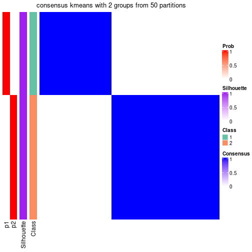</p>

</div>
<div id='tab-node-024-consensus-heatmap-2'>
<pre><code class="r">consensus_heatmap(res, k = 3)
</code></pre>

<p>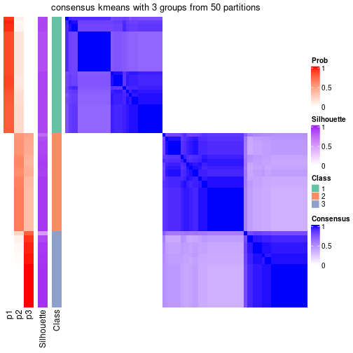</p>

</div>
<div id='tab-node-024-consensus-heatmap-3'>
<pre><code class="r">consensus_heatmap(res, k = 4)
</code></pre>

<p>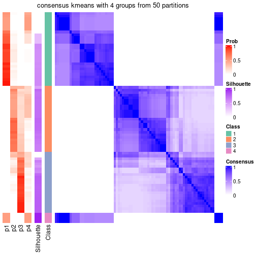</p>

</div>
<div id='tab-node-024-consensus-heatmap-4'>
<pre><code class="r">consensus_heatmap(res, k = 5)
</code></pre>

<p>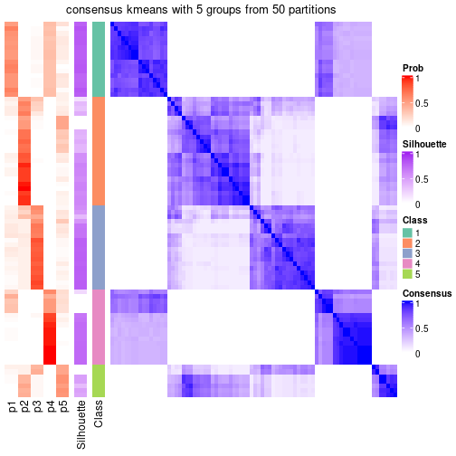</p>

</div>
<div id='tab-node-024-consensus-heatmap-5'>
<pre><code class="r">consensus_heatmap(res, k = 6)
</code></pre>

<p>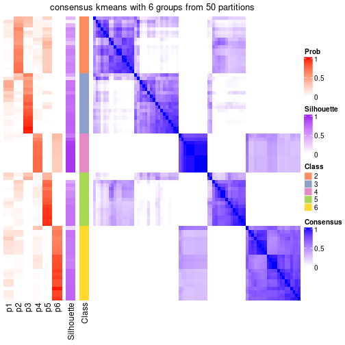</p>

</div>
<div id='tab-node-024-consensus-heatmap-6'>
<pre><code class="r">consensus_heatmap(res, k = 7)
</code></pre>

<p>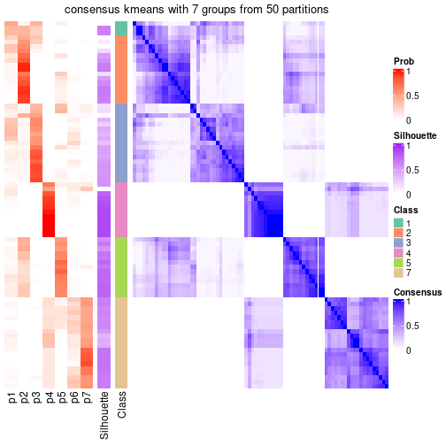</p>

</div>
<div id='tab-node-024-consensus-heatmap-7'>
<pre><code class="r">consensus_heatmap(res, k = 8)
</code></pre>

<p>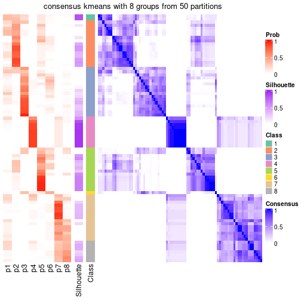</p>

</div>
</div>

Heatmaps for the membership of samples in all partitions to see how consistent they are:


<script>
$( function() {
	$( '#tabs-node-024-membership-heatmap' ).tabs();
} );
</script>
<div id='tabs-node-024-membership-heatmap'>
<ul>
<li><a href='#tab-node-024-membership-heatmap-1'>k = 2</a></li>
<li><a href='#tab-node-024-membership-heatmap-2'>k = 3</a></li>
<li><a href='#tab-node-024-membership-heatmap-3'>k = 4</a></li>
<li><a href='#tab-node-024-membership-heatmap-4'>k = 5</a></li>
<li><a href='#tab-node-024-membership-heatmap-5'>k = 6</a></li>
<li><a href='#tab-node-024-membership-heatmap-6'>k = 7</a></li>
<li><a href='#tab-node-024-membership-heatmap-7'>k = 8</a></li>
</ul>
<div id='tab-node-024-membership-heatmap-1'>
<pre><code class="r">membership_heatmap(res, k = 2)
</code></pre>

<p></p>

</div>
<div id='tab-node-024-membership-heatmap-2'>
<pre><code class="r">membership_heatmap(res, k = 3)
</code></pre>

<p>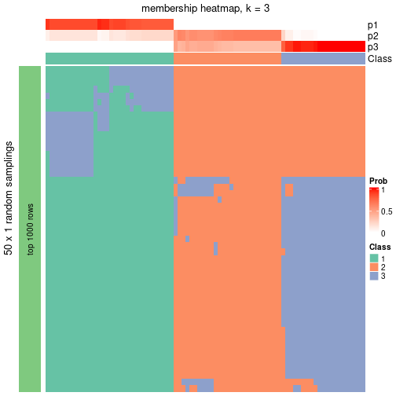</p>

</div>
<div id='tab-node-024-membership-heatmap-3'>
<pre><code class="r">membership_heatmap(res, k = 4)
</code></pre>

<p>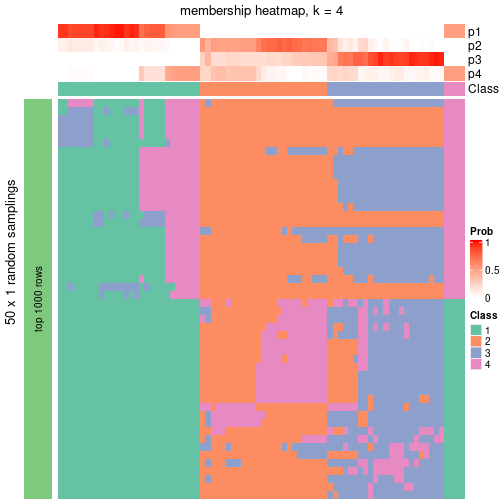</p>

</div>
<div id='tab-node-024-membership-heatmap-4'>
<pre><code class="r">membership_heatmap(res, k = 5)
</code></pre>

<p>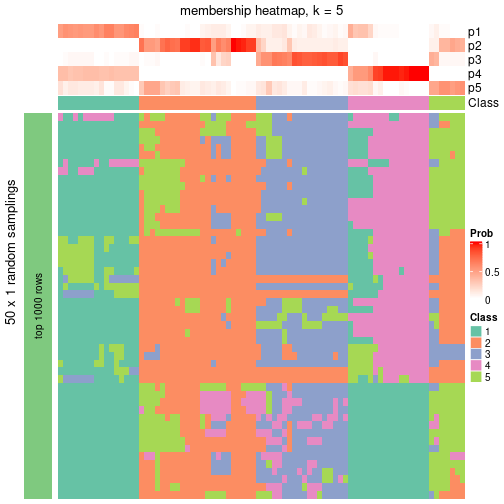</p>

</div>
<div id='tab-node-024-membership-heatmap-5'>
<pre><code class="r">membership_heatmap(res, k = 6)
</code></pre>

<p>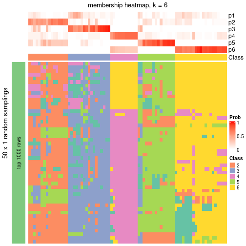</p>

</div>
<div id='tab-node-024-membership-heatmap-6'>
<pre><code class="r">membership_heatmap(res, k = 7)
</code></pre>

<p>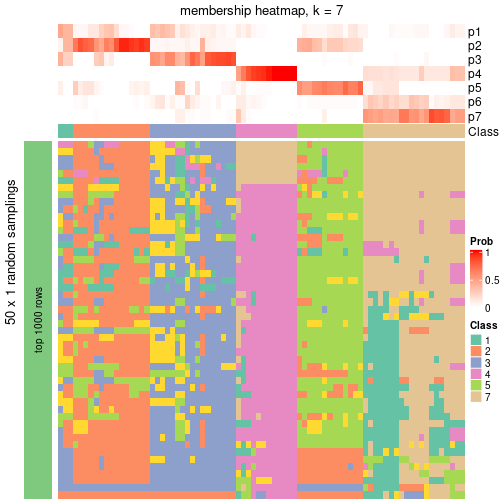</p>

</div>
<div id='tab-node-024-membership-heatmap-7'>
<pre><code class="r">membership_heatmap(res, k = 8)
</code></pre>

<p>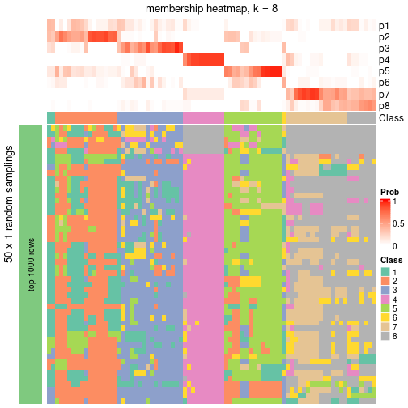</p>

</div>
</div>

As soon as the classes for columns are determined, the signatures
that are significantly different between subgroups can be looked for. 
Following are the heatmaps for signatures.


<script>
$( function() {
	$( '#tabs-node-024-get-signatures' ).tabs();
} );
</script>
<div id='tabs-node-024-get-signatures'>
<ul>
<li><a href='#tab-node-024-get-signatures-1'>k = 2</a></li>
<li><a href='#tab-node-024-get-signatures-2'>k = 3</a></li>
<li><a href='#tab-node-024-get-signatures-3'>k = 4</a></li>
<li><a href='#tab-node-024-get-signatures-4'>k = 5</a></li>
<li><a href='#tab-node-024-get-signatures-5'>k = 6</a></li>
<li><a href='#tab-node-024-get-signatures-6'>k = 7</a></li>
<li><a href='#tab-node-024-get-signatures-7'>k = 8</a></li>
</ul>
<div id='tab-node-024-get-signatures-1'>
<pre><code class="r">get_signatures(res, k = 2)
</code></pre>

<p>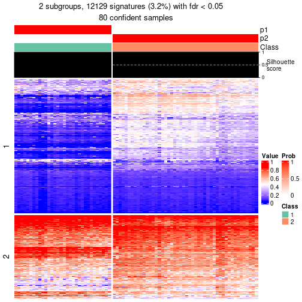</p>

</div>
<div id='tab-node-024-get-signatures-2'>
<pre><code class="r">get_signatures(res, k = 3)
</code></pre>

<p>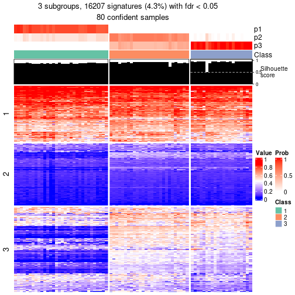</p>

</div>
<div id='tab-node-024-get-signatures-3'>
<pre><code class="r">get_signatures(res, k = 4)
</code></pre>

<p>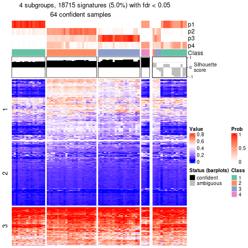</p>

</div>
<div id='tab-node-024-get-signatures-4'>
<pre><code class="r">get_signatures(res, k = 5)
</code></pre>

<p>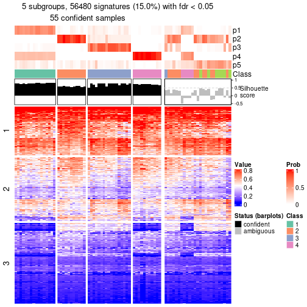</p>

</div>
<div id='tab-node-024-get-signatures-5'>
<pre><code class="r">get_signatures(res, k = 6)
</code></pre>

<p>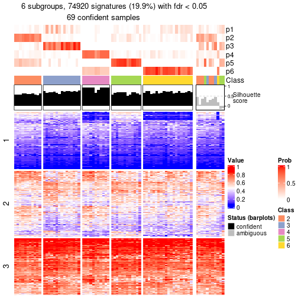</p>

</div>
<div id='tab-node-024-get-signatures-6'>
<pre><code class="r">get_signatures(res, k = 7)
</code></pre>

<p>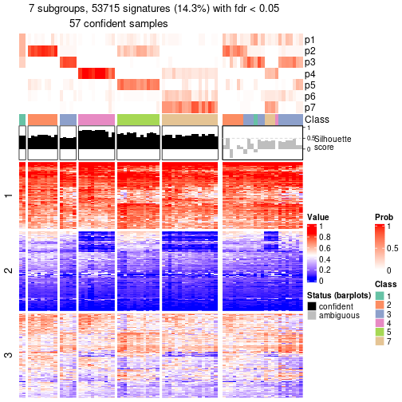</p>

</div>
<div id='tab-node-024-get-signatures-7'>
<pre><code class="r">get_signatures(res, k = 8)
</code></pre>

<p>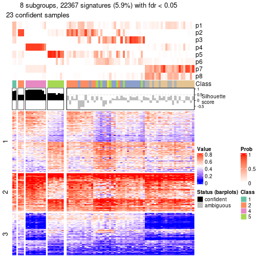</p>

</div>
</div>


Compare the overlap of signatures from different k:

```r
compare_signatures(res)
```

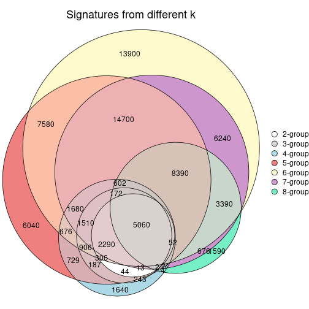

`get_signature()` returns a data frame invisibly. To get the list of signatures, the function
call should be assigned to a variable explicitly. In following code, if `plot` argument is set
to `FALSE`, no heatmap is plotted while only the differential analysis is performed.

```r
# code only for demonstration
tb = get_signature(res, k = ..., plot = FALSE)
```

An example of the output of `tb` is:

```
#>   which_row         fdr    mean_1    mean_2 scaled_mean_1 scaled_mean_2 km
#> 1        38 0.042760348  8.373488  9.131774    -0.5533452     0.5164555  1
#> 2        40 0.018707592  7.106213  8.469186    -0.6173731     0.5762149  1
#> 3        55 0.019134737 10.221463 11.207825    -0.6159697     0.5749050  1
#> 4        59 0.006059896  5.921854  7.869574    -0.6899429     0.6439467  1
#> 5        60 0.018055526  8.928898 10.211722    -0.6204761     0.5791110  1
#> 6        98 0.009384629 15.714769 14.887706     0.6635654    -0.6193277  2
...
```

The columns in `tb` are:

1. `which_row`: row indices corresponding to the input matrix.
2. `fdr`: FDR for the differential test. 
3. `mean_x`: The mean value in group x.
4. `scaled_mean_x`: The mean value in group x after rows are scaled.
5. `km`: Row groups if k-means clustering is applied to rows (which is done by automatically selecting number of clusters).

If there are too many signatures, `top_signatures = ...` can be set to only show the 
signatures with the highest FDRs:

```r
# code only for demonstration
# e.g. to show the top 500 most significant rows
tb = get_signature(res, k = ..., top_signatures = 500)
```

If the signatures are defined as these which are uniquely high in current group, `diff_method` argument
can be set to `"uniquely_high_in_one_group"`:

```r
# code only for demonstration
tb = get_signature(res, k = ..., diff_method = "uniquely_high_in_one_group")
```


UMAP plot which shows how samples are separated.


<script>
$( function() {
	$( '#tabs-node-024-dimension-reduction' ).tabs();
} );
</script>
<div id='tabs-node-024-dimension-reduction'>
<ul>
<li><a href='#tab-node-024-dimension-reduction-1'>k = 2</a></li>
<li><a href='#tab-node-024-dimension-reduction-2'>k = 3</a></li>
<li><a href='#tab-node-024-dimension-reduction-3'>k = 4</a></li>
<li><a href='#tab-node-024-dimension-reduction-4'>k = 5</a></li>
<li><a href='#tab-node-024-dimension-reduction-5'>k = 6</a></li>
<li><a href='#tab-node-024-dimension-reduction-6'>k = 7</a></li>
<li><a href='#tab-node-024-dimension-reduction-7'>k = 8</a></li>
</ul>
<div id='tab-node-024-dimension-reduction-1'>
<pre><code class="r">dimension_reduction(res, k = 2, method = &quot;UMAP&quot;)
</code></pre>

<p>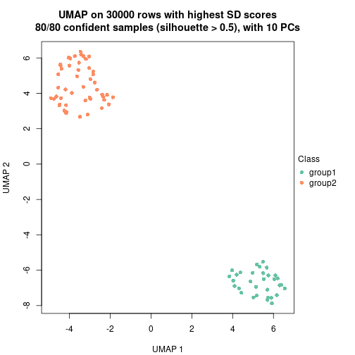</p>

</div>
<div id='tab-node-024-dimension-reduction-2'>
<pre><code class="r">dimension_reduction(res, k = 3, method = &quot;UMAP&quot;)
</code></pre>

<p>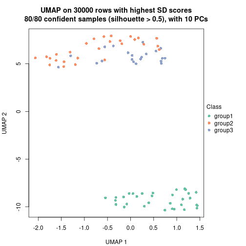</p>

</div>
<div id='tab-node-024-dimension-reduction-3'>
<pre><code class="r">dimension_reduction(res, k = 4, method = &quot;UMAP&quot;)
</code></pre>

<p>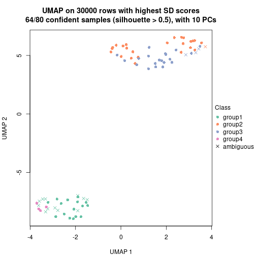</p>

</div>
<div id='tab-node-024-dimension-reduction-4'>
<pre><code class="r">dimension_reduction(res, k = 5, method = &quot;UMAP&quot;)
</code></pre>

<p>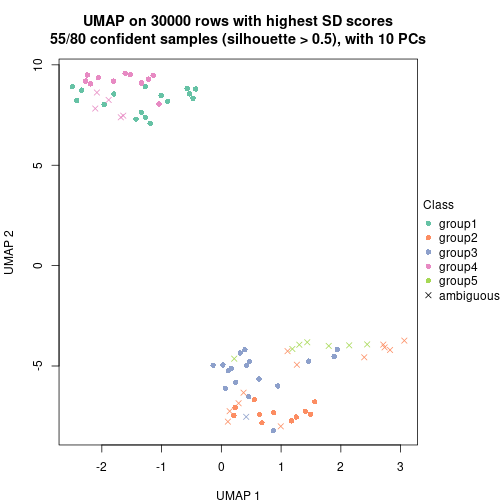</p>

</div>
<div id='tab-node-024-dimension-reduction-5'>
<pre><code class="r">dimension_reduction(res, k = 6, method = &quot;UMAP&quot;)
</code></pre>

<p>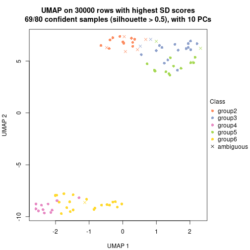</p>

</div>
<div id='tab-node-024-dimension-reduction-6'>
<pre><code class="r">dimension_reduction(res, k = 7, method = &quot;UMAP&quot;)
</code></pre>

<p>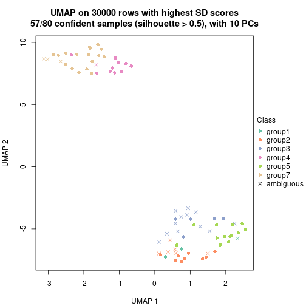</p>

</div>
<div id='tab-node-024-dimension-reduction-7'>
<pre><code class="r">dimension_reduction(res, k = 8, method = &quot;UMAP&quot;)
</code></pre>

<p>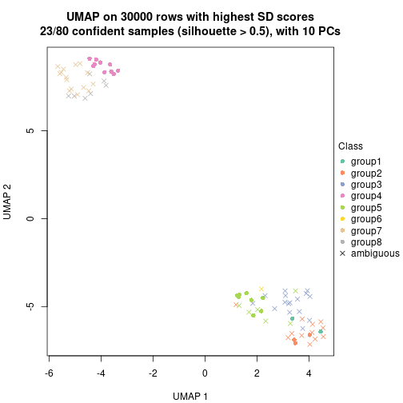</p>

</div>
</div>


Following heatmap shows how subgroups are split when increasing `k`:

```r
collect_classes(res)
```

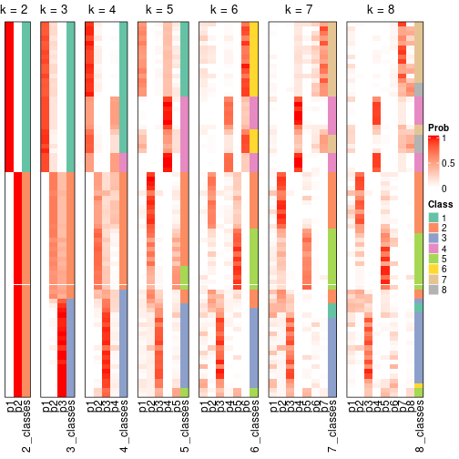


If matrix rows can be associated to genes, consider to use `functional_enrichment(res,
...)` to perform function enrichment for the signature genes. See [this vignette](https://jokergoo.github.io/cola_vignettes/functional_enrichment.html) for more detailed explanations.


 

---------------------------------------------------


### Node0242


Parent node: [Node024](#Node024).
Child nodes: 
                Node02131-leaf
        ,
                Node02132-leaf
        ,
                Node02211-leaf
        ,
                Node02212-leaf
        ,
                Node02311-leaf
        ,
                Node02312-leaf
        ,
                Node02313-leaf
        ,
                Node02314-leaf
        ,
                Node02341-leaf
        ,
                Node02342-leaf
        ,
                Node02343-leaf
        ,
                Node02344-leaf
        ,
                Node02345-leaf
        ,
                Node02421-leaf
        ,
                Node02422-leaf
        ,
                Node02423-leaf
        ,
                Node06121-leaf
        ,
                Node06122-leaf
        ,
                Node06123-leaf
        ,
                [Node07111](#Node07111)
        ,
                Node07112-leaf
        ,
                Node07211-leaf
        ,
                Node07212-leaf
        ,
                Node07213-leaf
        ,
                Node07214-leaf
        .


The object with results only for a single top-value method and a single partitioning method 
can be extracted as:

```r
res = res_rh["0242"]
```

A summary of `res` and all the functions that can be applied to it:

```r
res
```

```
#> A 'ConsensusPartition' object with k = 2, 3, 4, 5, 6, 7, 8.
#>   On a matrix with 30000 rows and 48 columns.
#>   Top rows (1000) are extracted by 'ATC' method.
#>   Subgroups are detected by 'skmeans' method.
#>   Performed in total 350 partitions by row resampling.
#>   Best k for subgroups seems to be 3.
#> 
#> Following methods can be applied to this 'ConsensusPartition' object:
#>  [1] "cola_report"             "collect_classes"         "collect_plots"          
#>  [4] "collect_stats"           "colnames"                "compare_partitions"     
#>  [7] "compare_signatures"      "consensus_heatmap"       "dimension_reduction"    
#> [10] "functional_enrichment"   "get_anno_col"            "get_anno"               
#> [13] "get_classes"             "get_consensus"           "get_matrix"             
#> [16] "get_membership"          "get_param"               "get_signatures"         
#> [19] "get_stats"               "is_best_k"               "is_stable_k"            
#> [22] "membership_heatmap"      "ncol"                    "nrow"                   
#> [25] "plot_ecdf"               "predict_classes"         "rownames"               
#> [28] "select_partition_number" "show"                    "suggest_best_k"         
#> [31] "test_to_known_factors"   "top_rows_heatmap"
```

`collect_plots()` function collects all the plots made from `res` for all `k` (number of subgroups)
into one single page to provide an easy and fast comparison between different `k`.

```r
collect_plots(res)
```

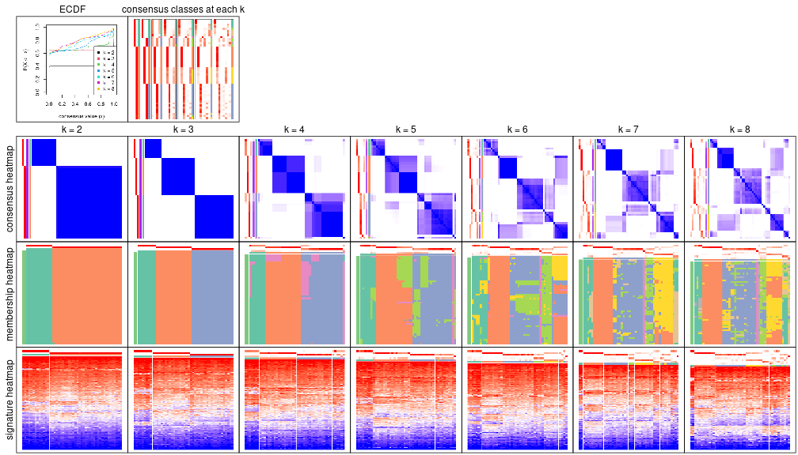

The plots are:

- The first row: a plot of the eCDF (empirical cumulative distribution
  function) curves of the consensus matrix for each `k` and the heatmap of
  predicted classes for each `k`.
- The second row: heatmaps of the consensus matrix for each `k`.
- The third row: heatmaps of the membership matrix for each `k`.
- The fouth row: heatmaps of the signatures for each `k`.

All the plots in panels can be made by individual functions and they are
plotted later in this section.

`select_partition_number()` produces several plots showing different
statistics for choosing "optimized" `k`. There are following statistics:

- eCDF curves of the consensus matrix for each `k`;
- 1-PAC. [The PAC score](https://en.wikipedia.org/wiki/Consensus_clustering#Over-interpretation_potential_of_consensus_clustering)
  measures the proportion of the ambiguous subgrouping.
- Mean silhouette score.
- Concordance. The mean probability of fiting the consensus subgroup labels in all
  partitions.
- Area increased. Denote $A_k$ as the area under the eCDF curve for current
  `k`, the area increased is defined as $A_k - A_{k-1}$.
- Rand index. The percent of pairs of samples that are both in a same cluster
  or both are not in a same cluster in the partition of k and k-1.
- Jaccard index. The ratio of pairs of samples are both in a same cluster in
  the partition of k and k-1 and the pairs of samples are both in a same
  cluster in the partition k or k-1.

The detailed explanations of these statistics can be found in [the _cola_
vignette](https://jokergoo.github.io/cola_vignettes/cola.html#toc_13).

Generally speaking, higher 1-PAC score, higher mean silhouette score or higher
concordance corresponds to better partition. Rand index and Jaccard index
measure how similar the current partition is compared to partition with `k-1`.
If they are too similar, we won't accept `k` is better than `k-1`.

```r
select_partition_number(res)
```

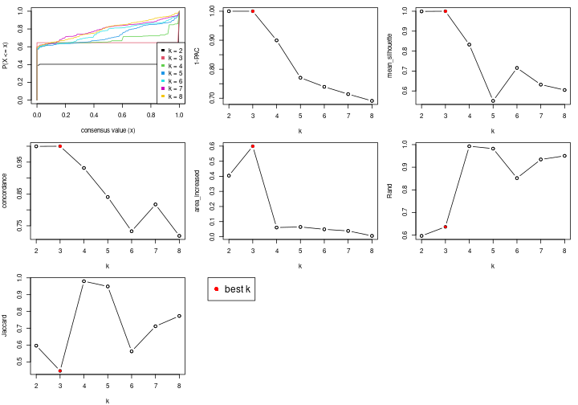

The numeric values for all these statistics can be obtained by `get_stats()`.

```r
get_stats(res)
```

```
#>   k 1-PAC mean_silhouette concordance area_increased  Rand Jaccard
#> 2 2 1.000           0.999       1.000        0.40432 0.597   0.597
#> 3 3 1.000           1.000       1.000        0.59930 0.637   0.447
#> 4 4 0.900           0.833       0.932        0.06059 0.993   0.980
#> 5 5 0.771           0.550       0.840        0.06430 0.982   0.949
#> 6 6 0.739           0.716       0.733        0.04866 0.852   0.563
#> 7 7 0.714           0.632       0.817        0.03807 0.934   0.712
#> 8 8 0.691           0.605       0.718        0.00526 0.950   0.773
```

`suggest_best_k()` suggests the best $k$ based on these statistics. The rules are as follows:

- All $k$ with Jaccard index larger than 0.95 are removed because increasing
  $k$ does not provide enough extra information. If all $k$ are removed, it is
  marked as no subgroup is detected.
- For all $k$ with 1-PAC score larger than 0.9, the maximal $k$ is taken as
  the best $k$, and other $k$ are marked as optional $k$.
- If it does not fit the second rule. The $k$ with the maximal vote of the
  highest 1-PAC score, highest mean silhouette, and highest concordance is
  taken as the best $k$.

```r
suggest_best_k(res)
```

```
#> [1] 3
#> attr(,"optional")
#> [1] 2
```

There is also optional best $k$ = 2 that is worth to check.

Following is the table of the partitions (You need to click the **show/hide
code output** link to see it). The membership matrix (columns with name `p*`)
is inferred by
[`clue::cl_consensus()`](https://www.rdocumentation.org/link/cl_consensus?package=clue)
function with the `SE` method. Basically the value in the membership matrix
represents the probability to belong to a certain group. The finall subgroup
label for an item is determined with the group with highest probability it
belongs to.

In `get_classes()` function, the entropy is calculated from the membership
matrix and the silhouette score is calculated from the consensus matrix.


<script>
$( function() {
	$( '#tabs-node-0242-get-classes' ).tabs();
} );
</script>
<div id='tabs-node-0242-get-classes'>
<ul>
<li><a href='#tab-node-0242-get-classes-1'>k = 2</a></li>
<li><a href='#tab-node-0242-get-classes-2'>k = 3</a></li>
<li><a href='#tab-node-0242-get-classes-3'>k = 4</a></li>
<li><a href='#tab-node-0242-get-classes-4'>k = 5</a></li>
<li><a href='#tab-node-0242-get-classes-5'>k = 6</a></li>
<li><a href='#tab-node-0242-get-classes-6'>k = 7</a></li>
<li><a href='#tab-node-0242-get-classes-7'>k = 8</a></li>
</ul>

<div id='tab-node-0242-get-classes-1'>
<p><a id='tab-node-0242-get-classes-1-a' style='color:#0366d6' href='#'>show/hide code output</a></p>
<pre><code class="r">cbind(get_classes(res, k = 2), get_membership(res, k = 2))
</code></pre>

<pre><code>#&gt;                 class entropy silhouette   p1   p2
#&gt; TCGA.44.4112.01     2   0.000      0.999 0.00 1.00
#&gt; TCGA.86.8278.01     2   0.000      0.999 0.00 1.00
#&gt; TCGA.49.AARQ.01     1   0.000      1.000 1.00 0.00
#&gt; TCGA.62.A46U.01     2   0.000      0.999 0.00 1.00
#&gt; TCGA.62.A46Y.01     2   0.000      0.999 0.00 1.00
#&gt; TCGA.50.6597.01     1   0.000      1.000 1.00 0.00
#&gt; TCGA.67.6216.01     2   0.000      0.999 0.00 1.00
#&gt; TCGA.55.8203.01     2   0.000      0.999 0.00 1.00
#&gt; TCGA.L9.A444.01     2   0.000      0.999 0.00 1.00
#&gt; TCGA.44.A47G.01     2   0.000      0.999 0.00 1.00
#&gt; TCGA.44.2665.01     2   0.000      0.999 0.00 1.00
#&gt; TCGA.55.A494.01     1   0.000      1.000 1.00 0.00
#&gt; TCGA.55.7911.01     2   0.000      0.999 0.00 1.00
#&gt; TCGA.95.7948.01     1   0.000      1.000 1.00 0.00
#&gt; TCGA.55.7281.01     2   0.000      0.999 0.00 1.00
#&gt; TCGA.38.6178.01     2   0.000      0.999 0.00 1.00
#&gt; TCGA.L9.A443.01     1   0.000      1.000 1.00 0.00
#&gt; TCGA.MP.A4TK.01     2   0.000      0.999 0.00 1.00
#&gt; TCGA.78.7540.01     1   0.000      1.000 1.00 0.00
#&gt; TCGA.J2.A4AE.01     2   0.141      0.980 0.02 0.98
#&gt; TCGA.50.6590.01     2   0.000      0.999 0.00 1.00
#&gt; TCGA.83.5908.01     2   0.000      0.999 0.00 1.00
#&gt; TCGA.44.3918.01     2   0.000      0.999 0.00 1.00
#&gt; TCGA.55.7574.01     2   0.000      0.999 0.00 1.00
#&gt; TCGA.78.7158.01     1   0.000      1.000 1.00 0.00
#&gt; TCGA.86.8056.01     1   0.000      1.000 1.00 0.00
#&gt; TCGA.97.8175.01     2   0.000      0.999 0.00 1.00
#&gt; TCGA.97.8547.01     2   0.000      0.999 0.00 1.00
#&gt; TCGA.44.6147.01     2   0.000      0.999 0.00 1.00
#&gt; TCGA.38.7271.01     2   0.000      0.999 0.00 1.00
#&gt; TCGA.78.7143.01     1   0.000      1.000 1.00 0.00
#&gt; TCGA.75.6205.01     2   0.000      0.999 0.00 1.00
#&gt; TCGA.55.A493.01     2   0.000      0.999 0.00 1.00
#&gt; TCGA.75.5126.01     2   0.000      0.999 0.00 1.00
#&gt; TCGA.67.6215.01     1   0.000      1.000 1.00 0.00
#&gt; TCGA.55.6982.01     2   0.000      0.999 0.00 1.00
#&gt; TCGA.55.6986.01     2   0.000      0.999 0.00 1.00
#&gt; TCGA.49.6761.01     2   0.000      0.999 0.00 1.00
#&gt; TCGA.MP.A4T6.01     1   0.000      1.000 1.00 0.00
#&gt; TCGA.44.6779.01     2   0.000      0.999 0.00 1.00
#&gt; TCGA.86.A4P7.01     2   0.000      0.999 0.00 1.00
#&gt; TCGA.73.4658.01     2   0.000      0.999 0.00 1.00
#&gt; TCGA.05.4417.01     2   0.000      0.999 0.00 1.00
#&gt; TCGA.80.5607.01     2   0.000      0.999 0.00 1.00
#&gt; TCGA.62.8395.01     1   0.000      1.000 1.00 0.00
#&gt; TCGA.97.8172.01     2   0.000      0.999 0.00 1.00
#&gt; TCGA.05.5715.01     1   0.000      1.000 1.00 0.00
#&gt; TCGA.44.7672.01     2   0.000      0.999 0.00 1.00
</code></pre>

<script>
$('#tab-node-0242-get-classes-1-a').parent().next().next().hide();
$('#tab-node-0242-get-classes-1-a').click(function(){
  $('#tab-node-0242-get-classes-1-a').parent().next().next().toggle();
  return(false);
});
</script>
</div>

<div id='tab-node-0242-get-classes-2'>
<p><a id='tab-node-0242-get-classes-2-a' style='color:#0366d6' href='#'>show/hide code output</a></p>
<pre><code class="r">cbind(get_classes(res, k = 3), get_membership(res, k = 3))
</code></pre>

<pre><code>#&gt;                 class entropy silhouette p1 p2 p3
#&gt; TCGA.44.4112.01     3       0          1  0  0  1
#&gt; TCGA.86.8278.01     3       0          1  0  0  1
#&gt; TCGA.49.AARQ.01     3       0          1  0  0  1
#&gt; TCGA.62.A46U.01     2       0          1  0  1  0
#&gt; TCGA.62.A46Y.01     3       0          1  0  0  1
#&gt; TCGA.50.6597.01     3       0          1  0  0  1
#&gt; TCGA.67.6216.01     3       0          1  0  0  1
#&gt; TCGA.55.8203.01     3       0          1  0  0  1
#&gt; TCGA.L9.A444.01     2       0          1  0  1  0
#&gt; TCGA.44.A47G.01     2       0          1  0  1  0
#&gt; TCGA.44.2665.01     3       0          1  0  0  1
#&gt; TCGA.55.A494.01     1       0          1  1  0  0
#&gt; TCGA.55.7911.01     2       0          1  0  1  0
#&gt; TCGA.95.7948.01     1       0          1  1  0  0
#&gt; TCGA.55.7281.01     3       0          1  0  0  1
#&gt; TCGA.38.6178.01     3       0          1  0  0  1
#&gt; TCGA.L9.A443.01     3       0          1  0  0  1
#&gt; TCGA.MP.A4TK.01     2       0          1  0  1  0
#&gt; TCGA.78.7540.01     1       0          1  1  0  0
#&gt; TCGA.J2.A4AE.01     3       0          1  0  0  1
#&gt; TCGA.50.6590.01     2       0          1  0  1  0
#&gt; TCGA.83.5908.01     2       0          1  0  1  0
#&gt; TCGA.44.3918.01     2       0          1  0  1  0
#&gt; TCGA.55.7574.01     2       0          1  0  1  0
#&gt; TCGA.78.7158.01     1       0          1  1  0  0
#&gt; TCGA.86.8056.01     3       0          1  0  0  1
#&gt; TCGA.97.8175.01     3       0          1  0  0  1
#&gt; TCGA.97.8547.01     3       0          1  0  0  1
#&gt; TCGA.44.6147.01     3       0          1  0  0  1
#&gt; TCGA.38.7271.01     2       0          1  0  1  0
#&gt; TCGA.78.7143.01     1       0          1  1  0  0
#&gt; TCGA.75.6205.01     2       0          1  0  1  0
#&gt; TCGA.55.A493.01     2       0          1  0  1  0
#&gt; TCGA.75.5126.01     2       0          1  0  1  0
#&gt; TCGA.67.6215.01     1       0          1  1  0  0
#&gt; TCGA.55.6982.01     3       0          1  0  0  1
#&gt; TCGA.55.6986.01     3       0          1  0  0  1
#&gt; TCGA.49.6761.01     2       0          1  0  1  0
#&gt; TCGA.MP.A4T6.01     1       0          1  1  0  0
#&gt; TCGA.44.6779.01     2       0          1  0  1  0
#&gt; TCGA.86.A4P7.01     2       0          1  0  1  0
#&gt; TCGA.73.4658.01     2       0          1  0  1  0
#&gt; TCGA.05.4417.01     3       0          1  0  0  1
#&gt; TCGA.80.5607.01     3       0          1  0  0  1
#&gt; TCGA.62.8395.01     1       0          1  1  0  0
#&gt; TCGA.97.8172.01     3       0          1  0  0  1
#&gt; TCGA.05.5715.01     1       0          1  1  0  0
#&gt; TCGA.44.7672.01     2       0          1  0  1  0
</code></pre>

<script>
$('#tab-node-0242-get-classes-2-a').parent().next().next().hide();
$('#tab-node-0242-get-classes-2-a').click(function(){
  $('#tab-node-0242-get-classes-2-a').parent().next().next().toggle();
  return(false);
});
</script>
</div>

<div id='tab-node-0242-get-classes-3'>
<p><a id='tab-node-0242-get-classes-3-a' style='color:#0366d6' href='#'>show/hide code output</a></p>
<pre><code class="r">cbind(get_classes(res, k = 4), get_membership(res, k = 4))
</code></pre>

<pre><code>#&gt;                 class entropy silhouette   p1   p2   p3   p4
#&gt; TCGA.44.4112.01     3  0.0000      0.878 0.00 0.00 1.00 0.00
#&gt; TCGA.86.8278.01     3  0.0000      0.878 0.00 0.00 1.00 0.00
#&gt; TCGA.49.AARQ.01     3  0.5428      0.417 0.38 0.00 0.60 0.02
#&gt; TCGA.62.A46U.01     2  0.2011      0.949 0.00 0.92 0.00 0.08
#&gt; TCGA.62.A46Y.01     3  0.0000      0.878 0.00 0.00 1.00 0.00
#&gt; TCGA.50.6597.01     3  0.5428      0.417 0.38 0.00 0.60 0.02
#&gt; TCGA.67.6216.01     3  0.0000      0.878 0.00 0.00 1.00 0.00
#&gt; TCGA.55.8203.01     3  0.0000      0.878 0.00 0.00 1.00 0.00
#&gt; TCGA.L9.A444.01     2  0.2011      0.949 0.00 0.92 0.00 0.08
#&gt; TCGA.44.A47G.01     2  0.0000      0.959 0.00 1.00 0.00 0.00
#&gt; TCGA.44.2665.01     3  0.0000      0.878 0.00 0.00 1.00 0.00
#&gt; TCGA.55.A494.01     1  0.4790      0.913 0.62 0.00 0.00 0.38
#&gt; TCGA.55.7911.01     2  0.2011      0.949 0.00 0.92 0.00 0.08
#&gt; TCGA.95.7948.01     1  0.4790      0.913 0.62 0.00 0.00 0.38
#&gt; TCGA.55.7281.01     3  0.0000      0.878 0.00 0.00 1.00 0.00
#&gt; TCGA.38.6178.01     3  0.0000      0.878 0.00 0.00 1.00 0.00
#&gt; TCGA.L9.A443.01     3  0.5428      0.417 0.38 0.00 0.60 0.02
#&gt; TCGA.MP.A4TK.01     2  0.2011      0.949 0.00 0.92 0.00 0.08
#&gt; TCGA.78.7540.01     4  0.5570      0.000 0.44 0.00 0.02 0.54
#&gt; TCGA.J2.A4AE.01     3  0.3335      0.776 0.12 0.00 0.86 0.02
#&gt; TCGA.50.6590.01     2  0.0000      0.959 0.00 1.00 0.00 0.00
#&gt; TCGA.83.5908.01     2  0.0000      0.959 0.00 1.00 0.00 0.00
#&gt; TCGA.44.3918.01     2  0.2011      0.949 0.00 0.92 0.00 0.08
#&gt; TCGA.55.7574.01     2  0.0000      0.959 0.00 1.00 0.00 0.00
#&gt; TCGA.78.7158.01     1  0.4790      0.913 0.62 0.00 0.00 0.38
#&gt; TCGA.86.8056.01     3  0.5428      0.417 0.38 0.00 0.60 0.02
#&gt; TCGA.97.8175.01     3  0.2706      0.808 0.00 0.02 0.90 0.08
#&gt; TCGA.97.8547.01     3  0.0000      0.878 0.00 0.00 1.00 0.00
#&gt; TCGA.44.6147.01     3  0.2011      0.828 0.00 0.00 0.92 0.08
#&gt; TCGA.38.7271.01     2  0.0000      0.959 0.00 1.00 0.00 0.00
#&gt; TCGA.78.7143.01     1  0.4624      0.893 0.66 0.00 0.00 0.34
#&gt; TCGA.75.6205.01     2  0.0000      0.959 0.00 1.00 0.00 0.00
#&gt; TCGA.55.A493.01     2  0.0000      0.959 0.00 1.00 0.00 0.00
#&gt; TCGA.75.5126.01     2  0.0000      0.959 0.00 1.00 0.00 0.00
#&gt; TCGA.67.6215.01     1  0.4790      0.913 0.62 0.00 0.00 0.38
#&gt; TCGA.55.6982.01     3  0.2011      0.828 0.00 0.00 0.92 0.08
#&gt; TCGA.55.6986.01     3  0.0000      0.878 0.00 0.00 1.00 0.00
#&gt; TCGA.49.6761.01     2  0.2011      0.949 0.00 0.92 0.00 0.08
#&gt; TCGA.MP.A4T6.01     1  0.4624      0.893 0.66 0.00 0.00 0.34
#&gt; TCGA.44.6779.01     2  0.0000      0.959 0.00 1.00 0.00 0.00
#&gt; TCGA.86.A4P7.01     2  0.2011      0.949 0.00 0.92 0.00 0.08
#&gt; TCGA.73.4658.01     2  0.2011      0.949 0.00 0.92 0.00 0.08
#&gt; TCGA.05.4417.01     3  0.2011      0.828 0.00 0.00 0.92 0.08
#&gt; TCGA.80.5607.01     3  0.0000      0.878 0.00 0.00 1.00 0.00
#&gt; TCGA.62.8395.01     1  0.0707      0.166 0.98 0.00 0.00 0.02
#&gt; TCGA.97.8172.01     3  0.0000      0.878 0.00 0.00 1.00 0.00
#&gt; TCGA.05.5715.01     1  0.4790      0.913 0.62 0.00 0.00 0.38
#&gt; TCGA.44.7672.01     2  0.0000      0.959 0.00 1.00 0.00 0.00
</code></pre>

<script>
$('#tab-node-0242-get-classes-3-a').parent().next().next().hide();
$('#tab-node-0242-get-classes-3-a').click(function(){
  $('#tab-node-0242-get-classes-3-a').parent().next().next().toggle();
  return(false);
});
</script>
</div>

<div id='tab-node-0242-get-classes-4'>
<p><a id='tab-node-0242-get-classes-4-a' style='color:#0366d6' href='#'>show/hide code output</a></p>
<pre><code class="r">cbind(get_classes(res, k = 5), get_membership(res, k = 5))
</code></pre>

<pre><code>#&gt;                 class entropy silhouette   p1   p2   p3   p4   p5
#&gt; TCGA.44.4112.01     3  0.1043     0.6186 0.00 0.00 0.96 0.00 0.04
#&gt; TCGA.86.8278.01     3  0.0609     0.6174 0.00 0.00 0.98 0.00 0.02
#&gt; TCGA.49.AARQ.01     5  0.5173     0.0000 0.00 0.00 0.46 0.04 0.50
#&gt; TCGA.62.A46U.01     2  0.3796     0.7369 0.00 0.70 0.00 0.00 0.30
#&gt; TCGA.62.A46Y.01     3  0.1043     0.6187 0.00 0.00 0.96 0.00 0.04
#&gt; TCGA.50.6597.01     3  0.5157    -0.8619 0.00 0.00 0.52 0.04 0.44
#&gt; TCGA.67.6216.01     3  0.1043     0.5987 0.00 0.00 0.96 0.00 0.04
#&gt; TCGA.55.8203.01     3  0.0609     0.6265 0.00 0.00 0.98 0.00 0.02
#&gt; TCGA.L9.A444.01     2  0.4182     0.6783 0.00 0.60 0.00 0.00 0.40
#&gt; TCGA.44.A47G.01     2  0.0000     0.8068 0.00 1.00 0.00 0.00 0.00
#&gt; TCGA.44.2665.01     3  0.0000     0.6263 0.00 0.00 1.00 0.00 0.00
#&gt; TCGA.55.A494.01     1  0.0000     0.8745 1.00 0.00 0.00 0.00 0.00
#&gt; TCGA.55.7911.01     2  0.3561     0.7522 0.00 0.74 0.00 0.00 0.26
#&gt; TCGA.95.7948.01     1  0.1410     0.8426 0.94 0.00 0.00 0.00 0.06
#&gt; TCGA.55.7281.01     3  0.0609     0.6174 0.00 0.00 0.98 0.00 0.02
#&gt; TCGA.38.6178.01     3  0.0609     0.6174 0.00 0.00 0.98 0.00 0.02
#&gt; TCGA.L9.A443.01     3  0.5457    -0.9046 0.00 0.00 0.48 0.06 0.46
#&gt; TCGA.MP.A4TK.01     2  0.4060     0.7041 0.00 0.64 0.00 0.00 0.36
#&gt; TCGA.78.7540.01     4  0.0000     0.0000 0.00 0.00 0.00 1.00 0.00
#&gt; TCGA.J2.A4AE.01     3  0.3561    -0.0563 0.00 0.00 0.74 0.00 0.26
#&gt; TCGA.50.6590.01     2  0.0000     0.8068 0.00 1.00 0.00 0.00 0.00
#&gt; TCGA.83.5908.01     2  0.0000     0.8068 0.00 1.00 0.00 0.00 0.00
#&gt; TCGA.44.3918.01     2  0.4726     0.6597 0.00 0.58 0.02 0.00 0.40
#&gt; TCGA.55.7574.01     2  0.0000     0.8068 0.00 1.00 0.00 0.00 0.00
#&gt; TCGA.78.7158.01     1  0.0000     0.8745 1.00 0.00 0.00 0.00 0.00
#&gt; TCGA.86.8056.01     3  0.5157    -0.8619 0.00 0.00 0.52 0.04 0.44
#&gt; TCGA.97.8175.01     3  0.4675     0.3340 0.00 0.02 0.60 0.00 0.38
#&gt; TCGA.97.8547.01     3  0.1043     0.5992 0.00 0.00 0.96 0.00 0.04
#&gt; TCGA.44.6147.01     3  0.4060     0.3778 0.00 0.00 0.64 0.00 0.36
#&gt; TCGA.38.7271.01     2  0.0000     0.8068 0.00 1.00 0.00 0.00 0.00
#&gt; TCGA.78.7143.01     1  0.3106     0.8257 0.84 0.00 0.00 0.02 0.14
#&gt; TCGA.75.6205.01     2  0.0000     0.8068 0.00 1.00 0.00 0.00 0.00
#&gt; TCGA.55.A493.01     2  0.0000     0.8068 0.00 1.00 0.00 0.00 0.00
#&gt; TCGA.75.5126.01     2  0.0000     0.8068 0.00 1.00 0.00 0.00 0.00
#&gt; TCGA.67.6215.01     1  0.1216     0.8693 0.96 0.00 0.00 0.02 0.02
#&gt; TCGA.55.6982.01     3  0.4060     0.3778 0.00 0.00 0.64 0.00 0.36
#&gt; TCGA.55.6986.01     3  0.0000     0.6263 0.00 0.00 1.00 0.00 0.00
#&gt; TCGA.49.6761.01     2  0.4726     0.6597 0.00 0.58 0.02 0.00 0.40
#&gt; TCGA.MP.A4T6.01     1  0.3319     0.8139 0.82 0.00 0.00 0.02 0.16
#&gt; TCGA.44.6779.01     2  0.0000     0.8068 0.00 1.00 0.00 0.00 0.00
#&gt; TCGA.86.A4P7.01     2  0.4675     0.6750 0.00 0.60 0.02 0.00 0.38
#&gt; TCGA.73.4658.01     2  0.3684     0.7458 0.00 0.72 0.00 0.00 0.28
#&gt; TCGA.05.4417.01     3  0.4060     0.3778 0.00 0.00 0.64 0.00 0.36
#&gt; TCGA.80.5607.01     3  0.0609     0.6161 0.00 0.00 0.98 0.00 0.02
#&gt; TCGA.62.8395.01     1  0.5156     0.5700 0.62 0.00 0.00 0.06 0.32
#&gt; TCGA.97.8172.01     3  0.0609     0.6265 0.00 0.00 0.98 0.00 0.02
#&gt; TCGA.05.5715.01     1  0.0000     0.8745 1.00 0.00 0.00 0.00 0.00
#&gt; TCGA.44.7672.01     2  0.0000     0.8068 0.00 1.00 0.00 0.00 0.00
</code></pre>

<script>
$('#tab-node-0242-get-classes-4-a').parent().next().next().hide();
$('#tab-node-0242-get-classes-4-a').click(function(){
  $('#tab-node-0242-get-classes-4-a').parent().next().next().toggle();
  return(false);
});
</script>
</div>

<div id='tab-node-0242-get-classes-5'>
<p><a id='tab-node-0242-get-classes-5-a' style='color:#0366d6' href='#'>show/hide code output</a></p>
<pre><code class="r">cbind(get_classes(res, k = 6), get_membership(res, k = 6))
</code></pre>

<pre><code>#&gt;                 class entropy silhouette   p1   p2   p3   p4   p5   p6
#&gt; TCGA.44.4112.01     3  0.1267      0.810 0.00 0.00 0.94 0.00 0.00 0.06
#&gt; TCGA.86.8278.01     3  0.1267      0.806 0.00 0.00 0.94 0.00 0.06 0.00
#&gt; TCGA.49.AARQ.01     5  0.3309      0.828 0.00 0.00 0.28 0.00 0.72 0.00
#&gt; TCGA.62.A46U.01     6  0.3797      0.786 0.00 0.42 0.00 0.00 0.00 0.58
#&gt; TCGA.62.A46Y.01     3  0.0547      0.830 0.00 0.00 0.98 0.00 0.00 0.02
#&gt; TCGA.50.6597.01     5  0.3819      0.834 0.00 0.00 0.28 0.00 0.70 0.02
#&gt; TCGA.67.6216.01     3  0.1556      0.783 0.00 0.00 0.92 0.00 0.08 0.00
#&gt; TCGA.55.8203.01     3  0.1092      0.824 0.00 0.00 0.96 0.00 0.02 0.02
#&gt; TCGA.L9.A444.01     6  0.3756      0.798 0.00 0.40 0.00 0.00 0.00 0.60
#&gt; TCGA.44.A47G.01     2  0.0000      0.917 0.00 1.00 0.00 0.00 0.00 0.00
#&gt; TCGA.44.2665.01     3  0.1556      0.819 0.00 0.00 0.92 0.00 0.08 0.00
#&gt; TCGA.55.A494.01     1  0.2474      0.719 0.88 0.00 0.00 0.00 0.04 0.08
#&gt; TCGA.55.7911.01     6  0.3869      0.643 0.00 0.50 0.00 0.00 0.00 0.50
#&gt; TCGA.95.7948.01     1  0.4360      0.533 0.68 0.00 0.00 0.00 0.06 0.26
#&gt; TCGA.55.7281.01     3  0.0547      0.828 0.00 0.00 0.98 0.00 0.02 0.00
#&gt; TCGA.38.6178.01     3  0.0937      0.831 0.00 0.00 0.96 0.00 0.04 0.00
#&gt; TCGA.L9.A443.01     5  0.3711      0.716 0.00 0.00 0.26 0.00 0.72 0.02
#&gt; TCGA.MP.A4TK.01     6  0.3828      0.765 0.00 0.44 0.00 0.00 0.00 0.56
#&gt; TCGA.78.7540.01     4  0.0937      0.000 0.00 0.00 0.00 0.96 0.04 0.00
#&gt; TCGA.J2.A4AE.01     5  0.3851      0.658 0.00 0.00 0.46 0.00 0.54 0.00
#&gt; TCGA.50.6590.01     2  0.0000      0.917 0.00 1.00 0.00 0.00 0.00 0.00
#&gt; TCGA.83.5908.01     2  0.0000      0.917 0.00 1.00 0.00 0.00 0.00 0.00
#&gt; TCGA.44.3918.01     6  0.3756      0.798 0.00 0.40 0.00 0.00 0.00 0.60
#&gt; TCGA.55.7574.01     2  0.0000      0.917 0.00 1.00 0.00 0.00 0.00 0.00
#&gt; TCGA.78.7158.01     1  0.2474      0.719 0.88 0.00 0.00 0.00 0.04 0.08
#&gt; TCGA.86.8056.01     5  0.4078      0.835 0.00 0.00 0.34 0.00 0.64 0.02
#&gt; TCGA.97.8175.01     6  0.3851     -0.179 0.00 0.00 0.46 0.00 0.00 0.54
#&gt; TCGA.97.8547.01     3  0.1814      0.805 0.00 0.00 0.90 0.00 0.10 0.00
#&gt; TCGA.44.6147.01     3  0.3819      0.571 0.00 0.00 0.70 0.00 0.02 0.28
#&gt; TCGA.38.7271.01     2  0.0000      0.917 0.00 1.00 0.00 0.00 0.00 0.00
#&gt; TCGA.78.7143.01     1  0.4926      0.694 0.72 0.00 0.00 0.06 0.14 0.08
#&gt; TCGA.75.6205.01     2  0.0000      0.917 0.00 1.00 0.00 0.00 0.00 0.00
#&gt; TCGA.55.A493.01     2  0.0000      0.917 0.00 1.00 0.00 0.00 0.00 0.00
#&gt; TCGA.75.5126.01     2  0.0000      0.917 0.00 1.00 0.00 0.00 0.00 0.00
#&gt; TCGA.67.6215.01     1  0.2403      0.746 0.90 0.00 0.00 0.02 0.04 0.04
#&gt; TCGA.55.6982.01     3  0.3916      0.544 0.00 0.00 0.68 0.00 0.02 0.30
#&gt; TCGA.55.6986.01     3  0.0937      0.820 0.00 0.00 0.96 0.00 0.04 0.00
#&gt; TCGA.49.6761.01     6  0.3756      0.798 0.00 0.40 0.00 0.00 0.00 0.60
#&gt; TCGA.MP.A4T6.01     1  0.4733      0.703 0.74 0.00 0.00 0.06 0.12 0.08
#&gt; TCGA.44.6779.01     2  0.0000      0.917 0.00 1.00 0.00 0.00 0.00 0.00
#&gt; TCGA.86.A4P7.01     6  0.3797      0.790 0.00 0.42 0.00 0.00 0.00 0.58
#&gt; TCGA.73.4658.01     2  0.3869     -0.711 0.00 0.50 0.00 0.00 0.00 0.50
#&gt; TCGA.05.4417.01     3  0.3819      0.571 0.00 0.00 0.70 0.00 0.02 0.28
#&gt; TCGA.80.5607.01     3  0.1807      0.810 0.00 0.00 0.92 0.00 0.06 0.02
#&gt; TCGA.62.8395.01     1  0.6015      0.475 0.52 0.00 0.00 0.06 0.34 0.08
#&gt; TCGA.97.8172.01     3  0.0547      0.830 0.00 0.00 0.98 0.00 0.00 0.02
#&gt; TCGA.05.5715.01     1  0.0547      0.745 0.98 0.00 0.00 0.00 0.00 0.02
#&gt; TCGA.44.7672.01     2  0.0000      0.917 0.00 1.00 0.00 0.00 0.00 0.00
</code></pre>

<script>
$('#tab-node-0242-get-classes-5-a').parent().next().next().hide();
$('#tab-node-0242-get-classes-5-a').click(function(){
  $('#tab-node-0242-get-classes-5-a').parent().next().next().toggle();
  return(false);
});
</script>
</div>

<div id='tab-node-0242-get-classes-6'>
<p><a id='tab-node-0242-get-classes-6-a' style='color:#0366d6' href='#'>show/hide code output</a></p>
<pre><code class="r">cbind(get_classes(res, k = 7), get_membership(res, k = 7))
</code></pre>

<pre><code>#&gt;                 class entropy silhouette   p1   p2   p3 p4   p5   p6   p7
#&gt; TCGA.44.4112.01     3  0.1363     0.6974 0.00 0.00 0.94  0 0.00 0.02 0.04
#&gt; TCGA.86.8278.01     3  0.2421     0.6757 0.00 0.00 0.88  0 0.08 0.02 0.02
#&gt; TCGA.49.AARQ.01     5  0.3358     0.7195 0.00 0.00 0.36  0 0.64 0.00 0.00
#&gt; TCGA.62.A46U.01     6  0.2572     0.8055 0.00 0.20 0.00  0 0.00 0.80 0.00
#&gt; TCGA.62.A46Y.01     3  0.0504     0.6996 0.00 0.00 0.98  0 0.02 0.00 0.00
#&gt; TCGA.50.6597.01     5  0.3496     0.7159 0.00 0.00 0.42  0 0.58 0.00 0.00
#&gt; TCGA.67.6216.01     3  0.2509     0.6401 0.00 0.00 0.88  0 0.06 0.04 0.02
#&gt; TCGA.55.8203.01     3  0.0863     0.6939 0.00 0.00 0.96  0 0.04 0.00 0.00
#&gt; TCGA.L9.A444.01     6  0.2259     0.8196 0.00 0.16 0.00  0 0.00 0.84 0.00
#&gt; TCGA.44.A47G.01     2  0.0000     1.0000 0.00 1.00 0.00  0 0.00 0.00 0.00
#&gt; TCGA.44.2665.01     3  0.3940     0.5989 0.00 0.00 0.78  0 0.08 0.06 0.08
#&gt; TCGA.55.A494.01     1  0.0000     0.5432 1.00 0.00 0.00  0 0.00 0.00 0.00
#&gt; TCGA.55.7911.01     6  0.3047     0.7456 0.00 0.28 0.00  0 0.00 0.72 0.00
#&gt; TCGA.95.7948.01     1  0.5386     0.3335 0.60 0.00 0.00  0 0.10 0.06 0.24
#&gt; TCGA.55.7281.01     3  0.1664     0.6786 0.00 0.00 0.92  0 0.06 0.00 0.02
#&gt; TCGA.38.6178.01     3  0.1006     0.6985 0.00 0.00 0.96  0 0.02 0.00 0.02
#&gt; TCGA.L9.A443.01     5  0.4825     0.3486 0.00 0.00 0.16  0 0.66 0.02 0.16
#&gt; TCGA.MP.A4TK.01     6  0.2259     0.8196 0.00 0.16 0.00  0 0.00 0.84 0.00
#&gt; TCGA.78.7540.01     4  0.0000     0.0000 0.00 0.00 0.00  1 0.00 0.00 0.00
#&gt; TCGA.J2.A4AE.01     3  0.3755    -0.2659 0.00 0.00 0.64  0 0.34 0.02 0.00
#&gt; TCGA.50.6590.01     2  0.0000     1.0000 0.00 1.00 0.00  0 0.00 0.00 0.00
#&gt; TCGA.83.5908.01     2  0.0000     1.0000 0.00 1.00 0.00  0 0.00 0.00 0.00
#&gt; TCGA.44.3918.01     6  0.2081     0.8120 0.00 0.14 0.00  0 0.00 0.86 0.00
#&gt; TCGA.55.7574.01     2  0.0000     1.0000 0.00 1.00 0.00  0 0.00 0.00 0.00
#&gt; TCGA.78.7158.01     1  0.0000     0.5432 1.00 0.00 0.00  0 0.00 0.00 0.00
#&gt; TCGA.86.8056.01     5  0.3994     0.6083 0.00 0.00 0.48  0 0.50 0.02 0.00
#&gt; TCGA.97.8175.01     6  0.3780     0.5375 0.00 0.02 0.24  0 0.02 0.72 0.00
#&gt; TCGA.97.8547.01     3  0.3656     0.6113 0.00 0.00 0.80  0 0.08 0.04 0.08
#&gt; TCGA.44.6147.01     3  0.3994    -0.0591 0.00 0.00 0.50  0 0.02 0.48 0.00
#&gt; TCGA.38.7271.01     2  0.0000     1.0000 0.00 1.00 0.00  0 0.00 0.00 0.00
#&gt; TCGA.78.7143.01     7  0.4381     0.7668 0.36 0.00 0.00  0 0.06 0.00 0.58
#&gt; TCGA.75.6205.01     2  0.0000     1.0000 0.00 1.00 0.00  0 0.00 0.00 0.00
#&gt; TCGA.55.A493.01     2  0.0000     1.0000 0.00 1.00 0.00  0 0.00 0.00 0.00
#&gt; TCGA.75.5126.01     2  0.0000     1.0000 0.00 1.00 0.00  0 0.00 0.00 0.00
#&gt; TCGA.67.6215.01     1  0.3546    -0.4031 0.54 0.00 0.00  0 0.00 0.00 0.46
#&gt; TCGA.55.6982.01     6  0.4954     0.0170 0.00 0.00 0.40  0 0.04 0.52 0.04
#&gt; TCGA.55.6986.01     3  0.1860     0.6759 0.00 0.00 0.92  0 0.02 0.04 0.02
#&gt; TCGA.49.6761.01     6  0.2081     0.8120 0.00 0.14 0.00  0 0.00 0.86 0.00
#&gt; TCGA.MP.A4T6.01     7  0.4381     0.7668 0.36 0.00 0.00  0 0.06 0.00 0.58
#&gt; TCGA.44.6779.01     2  0.0000     1.0000 0.00 1.00 0.00  0 0.00 0.00 0.00
#&gt; TCGA.86.A4P7.01     6  0.2422     0.8176 0.00 0.18 0.00  0 0.00 0.82 0.00
#&gt; TCGA.73.4658.01     6  0.3047     0.7456 0.00 0.28 0.00  0 0.00 0.72 0.00
#&gt; TCGA.05.4417.01     3  0.3985     0.0369 0.00 0.00 0.52  0 0.02 0.46 0.00
#&gt; TCGA.80.5607.01     3  0.2509     0.6562 0.00 0.00 0.88  0 0.06 0.04 0.02
#&gt; TCGA.62.8395.01     7  0.4883     0.6028 0.20 0.00 0.00  0 0.20 0.00 0.60
#&gt; TCGA.97.8172.01     3  0.0863     0.6939 0.00 0.00 0.96  0 0.04 0.00 0.00
#&gt; TCGA.05.5715.01     1  0.3139     0.1183 0.70 0.00 0.00  0 0.00 0.00 0.30
#&gt; TCGA.44.7672.01     2  0.0000     1.0000 0.00 1.00 0.00  0 0.00 0.00 0.00
</code></pre>

<script>
$('#tab-node-0242-get-classes-6-a').parent().next().next().hide();
$('#tab-node-0242-get-classes-6-a').click(function(){
  $('#tab-node-0242-get-classes-6-a').parent().next().next().toggle();
  return(false);
});
</script>
</div>

<div id='tab-node-0242-get-classes-7'>
<p><a id='tab-node-0242-get-classes-7-a' style='color:#0366d6' href='#'>show/hide code output</a></p>
<pre><code class="r">cbind(get_classes(res, k = 8), get_membership(res, k = 8))
</code></pre>

<pre><code>#&gt;                 class entropy silhouette   p1   p2   p3 p4   p5   p6   p7   p8
#&gt; TCGA.44.4112.01     3  0.2071     0.6761 0.00 0.00 0.90  0 0.02 0.04 0.00 0.04
#&gt; TCGA.86.8278.01     3  0.3385     0.6166 0.00 0.00 0.76  0 0.16 0.00 0.00 0.08
#&gt; TCGA.49.AARQ.01     5  0.6587     0.0299 0.00 0.00 0.16  0 0.40 0.02 0.14 0.28
#&gt; TCGA.62.A46U.01     6  0.3318     0.8331 0.00 0.46 0.00  0 0.00 0.54 0.00 0.00
#&gt; TCGA.62.A46Y.01     3  0.1275     0.6863 0.00 0.00 0.94  0 0.04 0.02 0.00 0.00
#&gt; TCGA.50.6597.01     5  0.6426     0.3399 0.00 0.00 0.30  0 0.34 0.00 0.14 0.22
#&gt; TCGA.67.6216.01     3  0.3170     0.5789 0.00 0.00 0.76  0 0.20 0.00 0.00 0.04
#&gt; TCGA.55.8203.01     3  0.1275     0.6812 0.00 0.00 0.94  0 0.04 0.02 0.00 0.00
#&gt; TCGA.L9.A444.01     6  0.4239     0.8189 0.00 0.30 0.00  0 0.02 0.64 0.02 0.02
#&gt; TCGA.44.A47G.01     2  0.0000     0.9776 0.00 1.00 0.00  0 0.00 0.00 0.00 0.00
#&gt; TCGA.44.2665.01     3  0.4605     0.5606 0.00 0.00 0.68  0 0.10 0.02 0.02 0.18
#&gt; TCGA.55.A494.01     1  0.0000     0.6323 1.00 0.00 0.00  0 0.00 0.00 0.00 0.00
#&gt; TCGA.55.7911.01     6  0.3714     0.8285 0.00 0.44 0.00  0 0.02 0.54 0.00 0.00
#&gt; TCGA.95.7948.01     5  0.6321    -0.3446 0.30 0.00 0.00  0 0.42 0.18 0.08 0.02
#&gt; TCGA.55.7281.01     3  0.1563     0.6713 0.00 0.00 0.90  0 0.10 0.00 0.00 0.00
#&gt; TCGA.38.6178.01     3  0.2265     0.6792 0.00 0.00 0.88  0 0.08 0.00 0.02 0.02
#&gt; TCGA.L9.A443.01     8  0.3744     0.0000 0.00 0.00 0.06  0 0.00 0.02 0.18 0.74
#&gt; TCGA.MP.A4TK.01     6  0.3272     0.8513 0.00 0.42 0.00  0 0.00 0.58 0.00 0.00
#&gt; TCGA.78.7540.01     4  0.0000     0.0000 0.00 0.00 0.00  1 0.00 0.00 0.00 0.00
#&gt; TCGA.J2.A4AE.01     3  0.5743    -0.4080 0.00 0.00 0.42  0 0.36 0.00 0.06 0.16
#&gt; TCGA.50.6590.01     2  0.0000     0.9776 0.00 1.00 0.00  0 0.00 0.00 0.00 0.00
#&gt; TCGA.83.5908.01     2  0.0808     0.9423 0.00 0.96 0.00  0 0.00 0.04 0.00 0.00
#&gt; TCGA.44.3918.01     6  0.4074     0.7878 0.00 0.26 0.02  0 0.02 0.68 0.00 0.02
#&gt; TCGA.55.7574.01     2  0.0000     0.9776 0.00 1.00 0.00  0 0.00 0.00 0.00 0.00
#&gt; TCGA.78.7158.01     1  0.0000     0.6323 1.00 0.00 0.00  0 0.00 0.00 0.00 0.00
#&gt; TCGA.86.8056.01     5  0.6179     0.3507 0.00 0.00 0.34  0 0.38 0.00 0.14 0.14
#&gt; TCGA.97.8175.01     3  0.3737     0.2611 0.00 0.00 0.50  0 0.00 0.48 0.02 0.00
#&gt; TCGA.97.8547.01     3  0.4293     0.5550 0.00 0.00 0.68  0 0.10 0.02 0.00 0.20
#&gt; TCGA.44.6147.01     3  0.3941     0.5209 0.00 0.00 0.68  0 0.00 0.26 0.04 0.02
#&gt; TCGA.38.7271.01     2  0.0000     0.9776 0.00 1.00 0.00  0 0.00 0.00 0.00 0.00
#&gt; TCGA.78.7143.01     7  0.2938     0.6831 0.30 0.00 0.00  0 0.00 0.00 0.70 0.00
#&gt; TCGA.75.6205.01     2  0.0000     0.9776 0.00 1.00 0.00  0 0.00 0.00 0.00 0.00
#&gt; TCGA.55.A493.01     2  0.0000     0.9776 0.00 1.00 0.00  0 0.00 0.00 0.00 0.00
#&gt; TCGA.75.5126.01     2  0.0808     0.9423 0.00 0.96 0.00  0 0.00 0.04 0.00 0.00
#&gt; TCGA.67.6215.01     1  0.3329    -0.2702 0.52 0.00 0.00  0 0.00 0.00 0.48 0.00
#&gt; TCGA.55.6982.01     3  0.4702     0.5265 0.00 0.00 0.64  0 0.00 0.22 0.04 0.10
#&gt; TCGA.55.6986.01     3  0.2547     0.6504 0.00 0.00 0.84  0 0.12 0.00 0.00 0.04
#&gt; TCGA.49.6761.01     6  0.2852     0.8144 0.00 0.28 0.00  0 0.00 0.72 0.00 0.00
#&gt; TCGA.MP.A4T6.01     7  0.3083     0.6285 0.34 0.00 0.00  0 0.00 0.00 0.66 0.00
#&gt; TCGA.44.6779.01     2  0.1091     0.9161 0.00 0.94 0.00  0 0.00 0.06 0.00 0.00
#&gt; TCGA.86.A4P7.01     6  0.3690     0.8492 0.00 0.42 0.00  0 0.00 0.56 0.02 0.00
#&gt; TCGA.73.4658.01     6  0.3329     0.8048 0.00 0.48 0.00  0 0.00 0.52 0.00 0.00
#&gt; TCGA.05.4417.01     3  0.3843     0.5414 0.00 0.00 0.70  0 0.00 0.24 0.04 0.02
#&gt; TCGA.80.5607.01     3  0.2888     0.6136 0.00 0.00 0.80  0 0.16 0.00 0.00 0.04
#&gt; TCGA.62.8395.01     7  0.2807     0.5412 0.10 0.00 0.00  0 0.02 0.00 0.84 0.04
#&gt; TCGA.97.8172.01     3  0.0471     0.6848 0.00 0.00 0.98  0 0.00 0.02 0.00 0.00
#&gt; TCGA.05.5715.01     1  0.2650     0.4799 0.76 0.00 0.00  0 0.00 0.00 0.24 0.00
#&gt; TCGA.44.7672.01     2  0.0000     0.9776 0.00 1.00 0.00  0 0.00 0.00 0.00 0.00
</code></pre>

<script>
$('#tab-node-0242-get-classes-7-a').parent().next().next().hide();
$('#tab-node-0242-get-classes-7-a').click(function(){
  $('#tab-node-0242-get-classes-7-a').parent().next().next().toggle();
  return(false);
});
</script>
</div>
</div>

Heatmaps for the consensus matrix. It visualizes the probability of two
samples to be in a same group.


<script>
$( function() {
	$( '#tabs-node-0242-consensus-heatmap' ).tabs();
} );
</script>
<div id='tabs-node-0242-consensus-heatmap'>
<ul>
<li><a href='#tab-node-0242-consensus-heatmap-1'>k = 2</a></li>
<li><a href='#tab-node-0242-consensus-heatmap-2'>k = 3</a></li>
<li><a href='#tab-node-0242-consensus-heatmap-3'>k = 4</a></li>
<li><a href='#tab-node-0242-consensus-heatmap-4'>k = 5</a></li>
<li><a href='#tab-node-0242-consensus-heatmap-5'>k = 6</a></li>
<li><a href='#tab-node-0242-consensus-heatmap-6'>k = 7</a></li>
<li><a href='#tab-node-0242-consensus-heatmap-7'>k = 8</a></li>
</ul>
<div id='tab-node-0242-consensus-heatmap-1'>
<pre><code class="r">consensus_heatmap(res, k = 2)
</code></pre>

<p>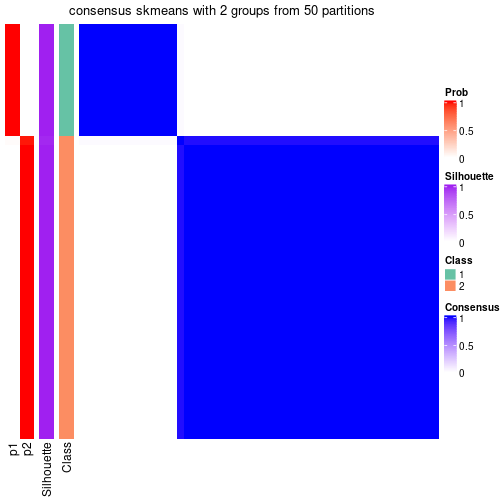</p>

</div>
<div id='tab-node-0242-consensus-heatmap-2'>
<pre><code class="r">consensus_heatmap(res, k = 3)
</code></pre>

<p>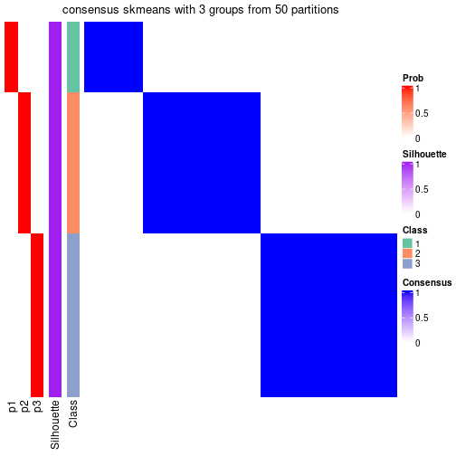</p>

</div>
<div id='tab-node-0242-consensus-heatmap-3'>
<pre><code class="r">consensus_heatmap(res, k = 4)
</code></pre>

<p>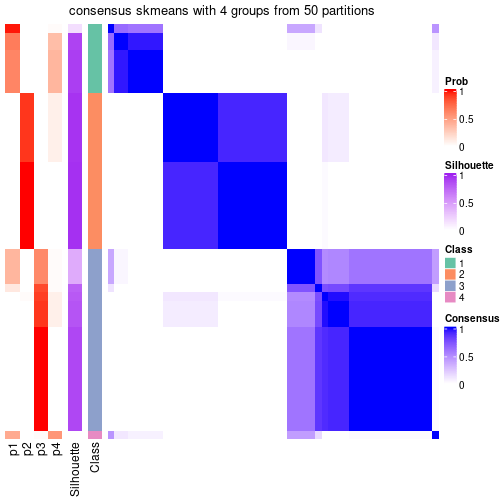</p>

</div>
<div id='tab-node-0242-consensus-heatmap-4'>
<pre><code class="r">consensus_heatmap(res, k = 5)
</code></pre>

<p>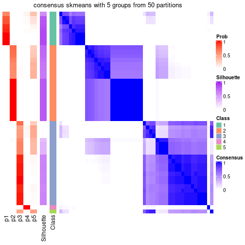</p>

</div>
<div id='tab-node-0242-consensus-heatmap-5'>
<pre><code class="r">consensus_heatmap(res, k = 6)
</code></pre>

<p>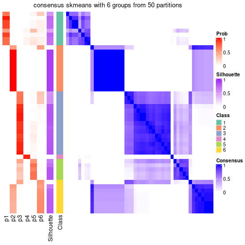</p>

</div>
<div id='tab-node-0242-consensus-heatmap-6'>
<pre><code class="r">consensus_heatmap(res, k = 7)
</code></pre>

<p>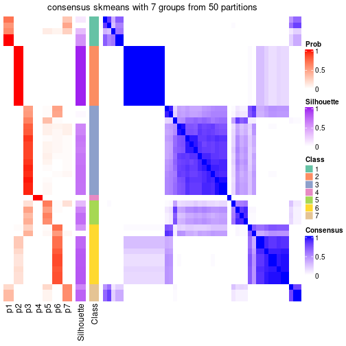</p>

</div>
<div id='tab-node-0242-consensus-heatmap-7'>
<pre><code class="r">consensus_heatmap(res, k = 8)
</code></pre>

<p>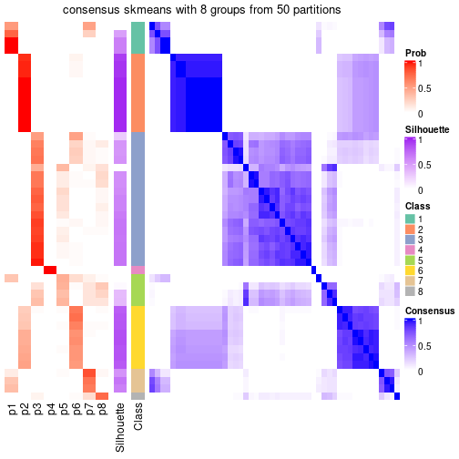</p>

</div>
</div>

Heatmaps for the membership of samples in all partitions to see how consistent they are:


<script>
$( function() {
	$( '#tabs-node-0242-membership-heatmap' ).tabs();
} );
</script>
<div id='tabs-node-0242-membership-heatmap'>
<ul>
<li><a href='#tab-node-0242-membership-heatmap-1'>k = 2</a></li>
<li><a href='#tab-node-0242-membership-heatmap-2'>k = 3</a></li>
<li><a href='#tab-node-0242-membership-heatmap-3'>k = 4</a></li>
<li><a href='#tab-node-0242-membership-heatmap-4'>k = 5</a></li>
<li><a href='#tab-node-0242-membership-heatmap-5'>k = 6</a></li>
<li><a href='#tab-node-0242-membership-heatmap-6'>k = 7</a></li>
<li><a href='#tab-node-0242-membership-heatmap-7'>k = 8</a></li>
</ul>
<div id='tab-node-0242-membership-heatmap-1'>
<pre><code class="r">membership_heatmap(res, k = 2)
</code></pre>

<p>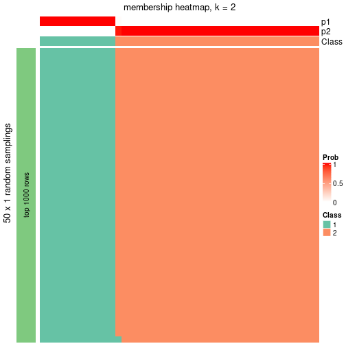</p>

</div>
<div id='tab-node-0242-membership-heatmap-2'>
<pre><code class="r">membership_heatmap(res, k = 3)
</code></pre>

<p>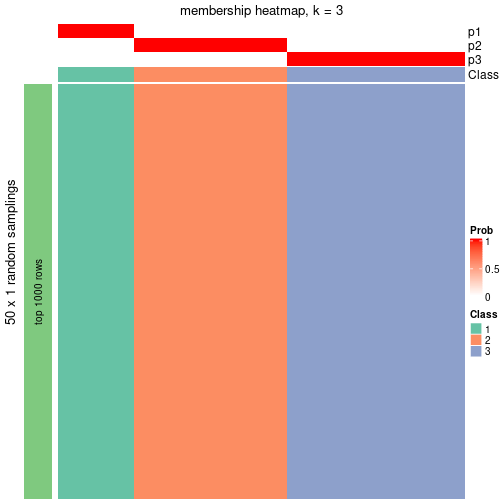</p>

</div>
<div id='tab-node-0242-membership-heatmap-3'>
<pre><code class="r">membership_heatmap(res, k = 4)
</code></pre>

<p>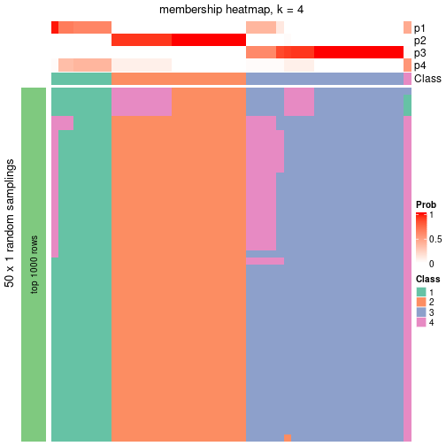</p>

</div>
<div id='tab-node-0242-membership-heatmap-4'>
<pre><code class="r">membership_heatmap(res, k = 5)
</code></pre>

<p>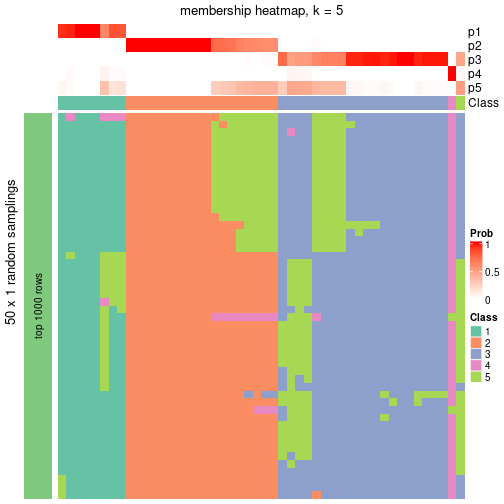</p>

</div>
<div id='tab-node-0242-membership-heatmap-5'>
<pre><code class="r">membership_heatmap(res, k = 6)
</code></pre>

<p>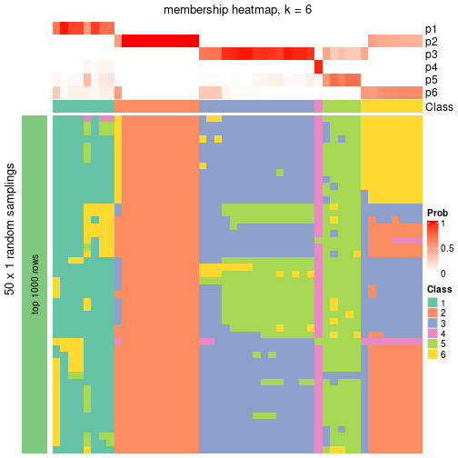</p>

</div>
<div id='tab-node-0242-membership-heatmap-6'>
<pre><code class="r">membership_heatmap(res, k = 7)
</code></pre>

<p>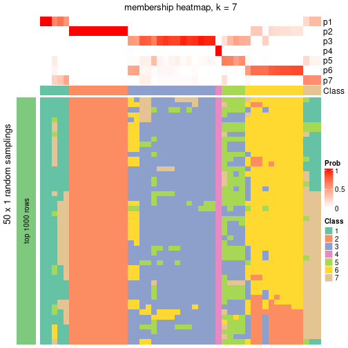</p>

</div>
<div id='tab-node-0242-membership-heatmap-7'>
<pre><code class="r">membership_heatmap(res, k = 8)
</code></pre>

<p>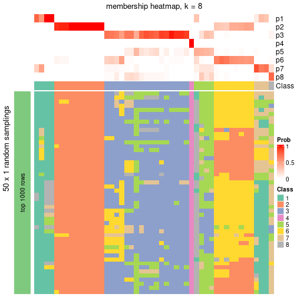</p>

</div>
</div>

As soon as the classes for columns are determined, the signatures
that are significantly different between subgroups can be looked for. 
Following are the heatmaps for signatures.


<script>
$( function() {
	$( '#tabs-node-0242-get-signatures' ).tabs();
} );
</script>
<div id='tabs-node-0242-get-signatures'>
<ul>
<li><a href='#tab-node-0242-get-signatures-1'>k = 2</a></li>
<li><a href='#tab-node-0242-get-signatures-2'>k = 3</a></li>
<li><a href='#tab-node-0242-get-signatures-3'>k = 4</a></li>
<li><a href='#tab-node-0242-get-signatures-4'>k = 5</a></li>
<li><a href='#tab-node-0242-get-signatures-5'>k = 6</a></li>
<li><a href='#tab-node-0242-get-signatures-6'>k = 7</a></li>
<li><a href='#tab-node-0242-get-signatures-7'>k = 8</a></li>
</ul>
<div id='tab-node-0242-get-signatures-1'>
<pre><code class="r">get_signatures(res, k = 2)
</code></pre>

<p>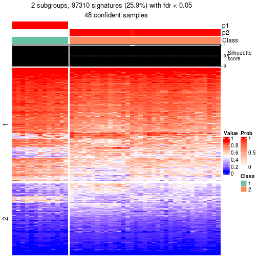</p>

</div>
<div id='tab-node-0242-get-signatures-2'>
<pre><code class="r">get_signatures(res, k = 3)
</code></pre>

<p>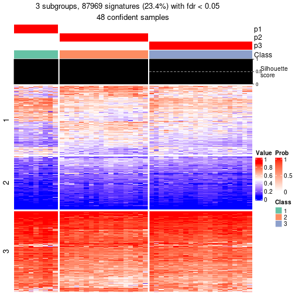</p>

</div>
<div id='tab-node-0242-get-signatures-3'>
<pre><code class="r">get_signatures(res, k = 4)
</code></pre>

<p>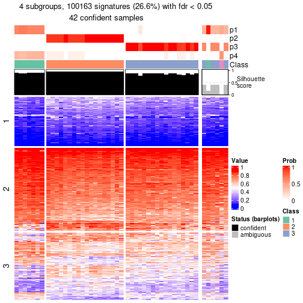</p>

</div>
<div id='tab-node-0242-get-signatures-4'>
<pre><code class="r">get_signatures(res, k = 5)
</code></pre>

<p>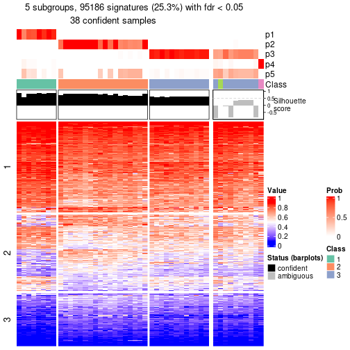</p>

</div>
<div id='tab-node-0242-get-signatures-5'>
<pre><code class="r">get_signatures(res, k = 6)
</code></pre>

<p>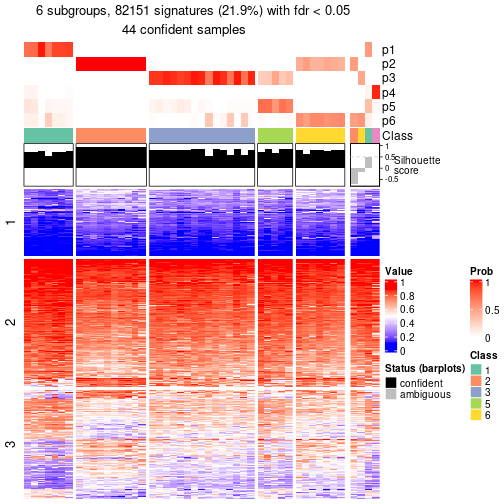</p>

</div>
<div id='tab-node-0242-get-signatures-6'>
<pre><code class="r">get_signatures(res, k = 7)
</code></pre>

<p>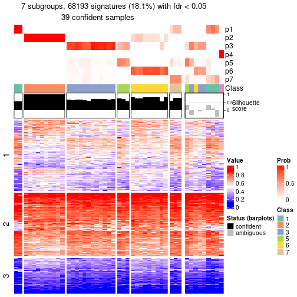</p>

</div>
<div id='tab-node-0242-get-signatures-7'>
<pre><code class="r">get_signatures(res, k = 8)
</code></pre>

<p>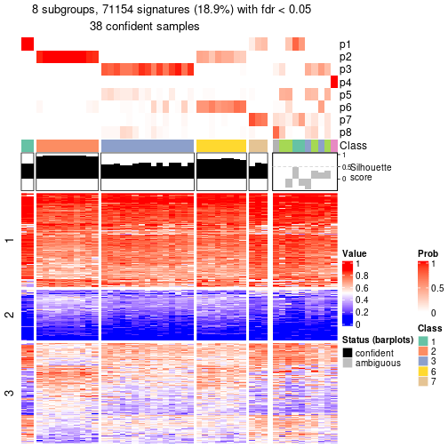</p>

</div>
</div>


Compare the overlap of signatures from different k:

```r
compare_signatures(res)
```

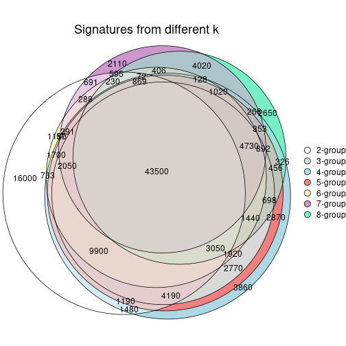

`get_signature()` returns a data frame invisibly. To get the list of signatures, the function
call should be assigned to a variable explicitly. In following code, if `plot` argument is set
to `FALSE`, no heatmap is plotted while only the differential analysis is performed.

```r
# code only for demonstration
tb = get_signature(res, k = ..., plot = FALSE)
```

An example of the output of `tb` is:

```
#>   which_row         fdr    mean_1    mean_2 scaled_mean_1 scaled_mean_2 km
#> 1        38 0.042760348  8.373488  9.131774    -0.5533452     0.5164555  1
#> 2        40 0.018707592  7.106213  8.469186    -0.6173731     0.5762149  1
#> 3        55 0.019134737 10.221463 11.207825    -0.6159697     0.5749050  1
#> 4        59 0.006059896  5.921854  7.869574    -0.6899429     0.6439467  1
#> 5        60 0.018055526  8.928898 10.211722    -0.6204761     0.5791110  1
#> 6        98 0.009384629 15.714769 14.887706     0.6635654    -0.6193277  2
...
```

The columns in `tb` are:

1. `which_row`: row indices corresponding to the input matrix.
2. `fdr`: FDR for the differential test. 
3. `mean_x`: The mean value in group x.
4. `scaled_mean_x`: The mean value in group x after rows are scaled.
5. `km`: Row groups if k-means clustering is applied to rows (which is done by automatically selecting number of clusters).

If there are too many signatures, `top_signatures = ...` can be set to only show the 
signatures with the highest FDRs:

```r
# code only for demonstration
# e.g. to show the top 500 most significant rows
tb = get_signature(res, k = ..., top_signatures = 500)
```

If the signatures are defined as these which are uniquely high in current group, `diff_method` argument
can be set to `"uniquely_high_in_one_group"`:

```r
# code only for demonstration
tb = get_signature(res, k = ..., diff_method = "uniquely_high_in_one_group")
```


UMAP plot which shows how samples are separated.


<script>
$( function() {
	$( '#tabs-node-0242-dimension-reduction' ).tabs();
} );
</script>
<div id='tabs-node-0242-dimension-reduction'>
<ul>
<li><a href='#tab-node-0242-dimension-reduction-1'>k = 2</a></li>
<li><a href='#tab-node-0242-dimension-reduction-2'>k = 3</a></li>
<li><a href='#tab-node-0242-dimension-reduction-3'>k = 4</a></li>
<li><a href='#tab-node-0242-dimension-reduction-4'>k = 5</a></li>
<li><a href='#tab-node-0242-dimension-reduction-5'>k = 6</a></li>
<li><a href='#tab-node-0242-dimension-reduction-6'>k = 7</a></li>
<li><a href='#tab-node-0242-dimension-reduction-7'>k = 8</a></li>
</ul>
<div id='tab-node-0242-dimension-reduction-1'>
<pre><code class="r">dimension_reduction(res, k = 2, method = &quot;UMAP&quot;)
</code></pre>

<p>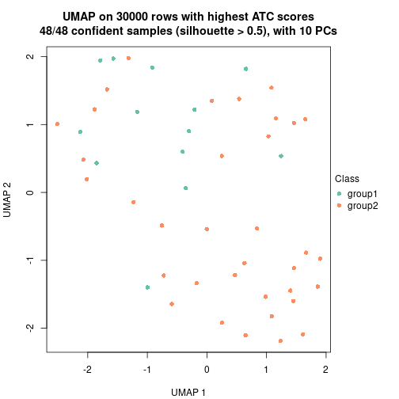</p>

</div>
<div id='tab-node-0242-dimension-reduction-2'>
<pre><code class="r">dimension_reduction(res, k = 3, method = &quot;UMAP&quot;)
</code></pre>

<p>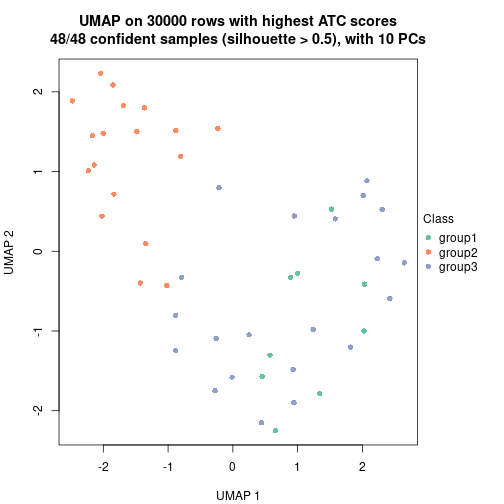</p>

</div>
<div id='tab-node-0242-dimension-reduction-3'>
<pre><code class="r">dimension_reduction(res, k = 4, method = &quot;UMAP&quot;)
</code></pre>

<p>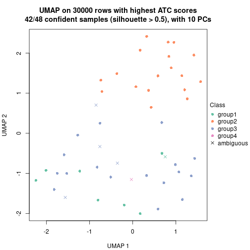</p>

</div>
<div id='tab-node-0242-dimension-reduction-4'>
<pre><code class="r">dimension_reduction(res, k = 5, method = &quot;UMAP&quot;)
</code></pre>

<p>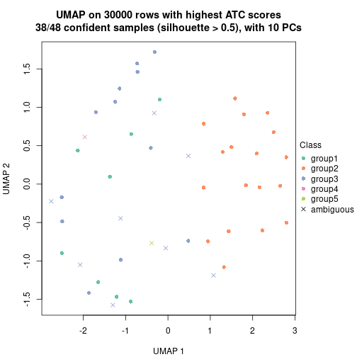</p>

</div>
<div id='tab-node-0242-dimension-reduction-5'>
<pre><code class="r">dimension_reduction(res, k = 6, method = &quot;UMAP&quot;)
</code></pre>

<p>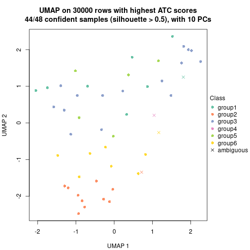</p>

</div>
<div id='tab-node-0242-dimension-reduction-6'>
<pre><code class="r">dimension_reduction(res, k = 7, method = &quot;UMAP&quot;)
</code></pre>

<p>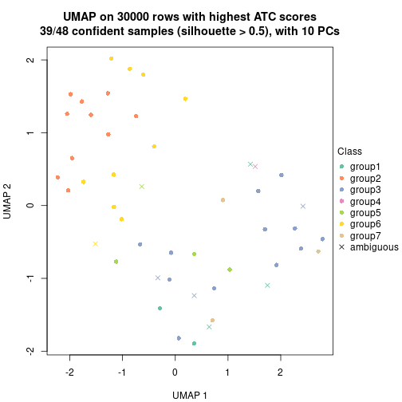</p>

</div>
<div id='tab-node-0242-dimension-reduction-7'>
<pre><code class="r">dimension_reduction(res, k = 8, method = &quot;UMAP&quot;)
</code></pre>

<p>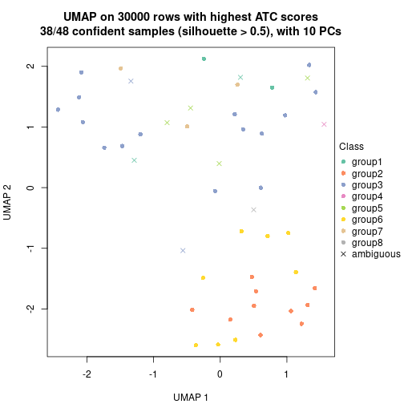</p>

</div>
</div>


Following heatmap shows how subgroups are split when increasing `k`:

```r
collect_classes(res)
```

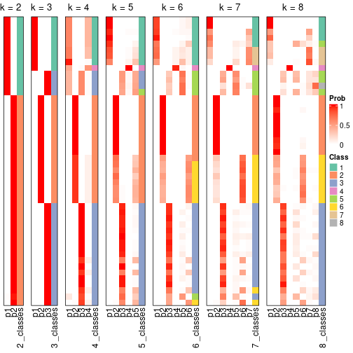


If matrix rows can be associated to genes, consider to use `functional_enrichment(res,
...)` to perform function enrichment for the signature genes. See [this vignette](https://jokergoo.github.io/cola_vignettes/functional_enrichment.html) for more detailed explanations.


 

---------------------------------------------------


### Node03


Parent node: [Node0](#Node0).
Child nodes: 
                [Node011](#Node011)
        ,
                [Node012](#Node012)
        ,
                [Node013](#Node013)
        ,
                Node014-leaf
        ,
                [Node021](#Node021)
        ,
                [Node022](#Node022)
        ,
                [Node023](#Node023)
        ,
                [Node024](#Node024)
        ,
                Node031-leaf
        ,
                Node032-leaf
        ,
                [Node041](#Node041)
        ,
                [Node042](#Node042)
        ,
                [Node043](#Node043)
        ,
                [Node051](#Node051)
        ,
                [Node052](#Node052)
        ,
                [Node061](#Node061)
        ,
                Node062-leaf
        ,
                [Node071](#Node071)
        ,
                [Node072](#Node072)
        ,
                [Node073](#Node073)
        .


The object with results only for a single top-value method and a single partitioning method 
can be extracted as:

```r
res = res_rh["03"]
```

A summary of `res` and all the functions that can be applied to it:

```r
res
```

```
#> A 'ConsensusPartition' object with k = 2, 3, 4, 5, 6, 7, 8.
#>   On a matrix with 30000 rows and 48 columns.
#>   Top rows (1000) are extracted by 'ATC' method.
#>   Subgroups are detected by 'kmeans' method.
#>   Performed in total 350 partitions by row resampling.
#>   Best k for subgroups seems to be 3.
#> 
#> Following methods can be applied to this 'ConsensusPartition' object:
#>  [1] "cola_report"             "collect_classes"         "collect_plots"          
#>  [4] "collect_stats"           "colnames"                "compare_partitions"     
#>  [7] "compare_signatures"      "consensus_heatmap"       "dimension_reduction"    
#> [10] "functional_enrichment"   "get_anno_col"            "get_anno"               
#> [13] "get_classes"             "get_consensus"           "get_matrix"             
#> [16] "get_membership"          "get_param"               "get_signatures"         
#> [19] "get_stats"               "is_best_k"               "is_stable_k"            
#> [22] "membership_heatmap"      "ncol"                    "nrow"                   
#> [25] "plot_ecdf"               "predict_classes"         "rownames"               
#> [28] "select_partition_number" "show"                    "suggest_best_k"         
#> [31] "test_to_known_factors"   "top_rows_heatmap"
```

`collect_plots()` function collects all the plots made from `res` for all `k` (number of subgroups)
into one single page to provide an easy and fast comparison between different `k`.

```r
collect_plots(res)
```

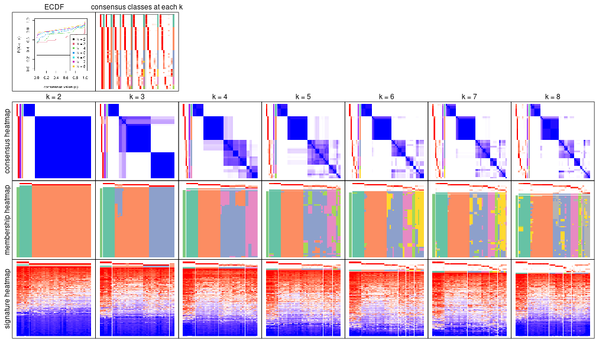

The plots are:

- The first row: a plot of the eCDF (empirical cumulative distribution
  function) curves of the consensus matrix for each `k` and the heatmap of
  predicted classes for each `k`.
- The second row: heatmaps of the consensus matrix for each `k`.
- The third row: heatmaps of the membership matrix for each `k`.
- The fouth row: heatmaps of the signatures for each `k`.

All the plots in panels can be made by individual functions and they are
plotted later in this section.

`select_partition_number()` produces several plots showing different
statistics for choosing "optimized" `k`. There are following statistics:

- eCDF curves of the consensus matrix for each `k`;
- 1-PAC. [The PAC score](https://en.wikipedia.org/wiki/Consensus_clustering#Over-interpretation_potential_of_consensus_clustering)
  measures the proportion of the ambiguous subgrouping.
- Mean silhouette score.
- Concordance. The mean probability of fiting the consensus subgroup labels in all
  partitions.
- Area increased. Denote $A_k$ as the area under the eCDF curve for current
  `k`, the area increased is defined as $A_k - A_{k-1}$.
- Rand index. The percent of pairs of samples that are both in a same cluster
  or both are not in a same cluster in the partition of k and k-1.
- Jaccard index. The ratio of pairs of samples are both in a same cluster in
  the partition of k and k-1 and the pairs of samples are both in a same
  cluster in the partition k or k-1.

The detailed explanations of these statistics can be found in [the _cola_
vignette](https://jokergoo.github.io/cola_vignettes/cola.html#toc_13).

Generally speaking, higher 1-PAC score, higher mean silhouette score or higher
concordance corresponds to better partition. Rand index and Jaccard index
measure how similar the current partition is compared to partition with `k-1`.
If they are too similar, we won't accept `k` is better than `k-1`.

```r
select_partition_number(res)
```

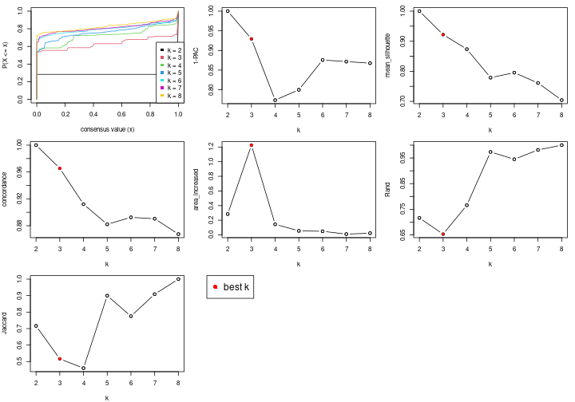

The numeric values for all these statistics can be obtained by `get_stats()`.

```r
get_stats(res)
```

```
#>   k 1-PAC mean_silhouette concordance area_increased  Rand Jaccard
#> 2 2 1.000           1.000       1.000         0.2844 0.716   0.716
#> 3 3 0.929           0.922       0.965         1.2256 0.653   0.516
#> 4 4 0.774           0.874       0.912         0.1446 0.766   0.460
#> 5 5 0.800           0.779       0.882         0.0547 0.973   0.900
#> 6 6 0.876           0.796       0.892         0.0492 0.945   0.775
#> 7 7 0.872           0.761       0.890         0.0103 0.981   0.909
#> 8 8 0.868           0.704       0.868         0.0233 1.000   1.000
```

`suggest_best_k()` suggests the best $k$ based on these statistics. The rules are as follows:

- All $k$ with Jaccard index larger than 0.95 are removed because increasing
  $k$ does not provide enough extra information. If all $k$ are removed, it is
  marked as no subgroup is detected.
- For all $k$ with 1-PAC score larger than 0.9, the maximal $k$ is taken as
  the best $k$, and other $k$ are marked as optional $k$.
- If it does not fit the second rule. The $k$ with the maximal vote of the
  highest 1-PAC score, highest mean silhouette, and highest concordance is
  taken as the best $k$.

```r
suggest_best_k(res)
```

```
#> [1] 3
#> attr(,"optional")
#> [1] 2
```

There is also optional best $k$ = 2 that is worth to check.

Following is the table of the partitions (You need to click the **show/hide
code output** link to see it). The membership matrix (columns with name `p*`)
is inferred by
[`clue::cl_consensus()`](https://www.rdocumentation.org/link/cl_consensus?package=clue)
function with the `SE` method. Basically the value in the membership matrix
represents the probability to belong to a certain group. The finall subgroup
label for an item is determined with the group with highest probability it
belongs to.

In `get_classes()` function, the entropy is calculated from the membership
matrix and the silhouette score is calculated from the consensus matrix.


<script>
$( function() {
	$( '#tabs-node-03-get-classes' ).tabs();
} );
</script>
<div id='tabs-node-03-get-classes'>
<ul>
<li><a href='#tab-node-03-get-classes-1'>k = 2</a></li>
<li><a href='#tab-node-03-get-classes-2'>k = 3</a></li>
<li><a href='#tab-node-03-get-classes-3'>k = 4</a></li>
<li><a href='#tab-node-03-get-classes-4'>k = 5</a></li>
<li><a href='#tab-node-03-get-classes-5'>k = 6</a></li>
<li><a href='#tab-node-03-get-classes-6'>k = 7</a></li>
<li><a href='#tab-node-03-get-classes-7'>k = 8</a></li>
</ul>

<div id='tab-node-03-get-classes-1'>
<p><a id='tab-node-03-get-classes-1-a' style='color:#0366d6' href='#'>show/hide code output</a></p>
<pre><code class="r">cbind(get_classes(res, k = 2), get_membership(res, k = 2))
</code></pre>

<pre><code>#&gt;                 class entropy silhouette p1 p2
#&gt; TCGA.62.A470.01     2       0          1  0  1
#&gt; TCGA.44.6778.01     2       0          1  0  1
#&gt; TCGA.69.8255.01     2       0          1  0  1
#&gt; TCGA.91.6847.01     1       0          1  1  0
#&gt; TCGA.44.6144.01     2       0          1  0  1
#&gt; TCGA.86.7955.01     2       0          1  0  1
#&gt; TCGA.56.7223.01     1       0          1  1  0
#&gt; TCGA.55.8507.01     2       0          1  0  1
#&gt; TCGA.37.5819.01     2       0          1  0  1
#&gt; TCGA.86.8054.01     2       0          1  0  1
#&gt; TCGA.85.A510.01     2       0          1  0  1
#&gt; TCGA.85.8352.01     1       0          1  1  0
#&gt; TCGA.64.5775.01     2       0          1  0  1
#&gt; TCGA.50.5946.02     2       0          1  0  1
#&gt; TCGA.43.7658.01     1       0          1  1  0
#&gt; TCGA.55.8514.01     2       0          1  0  1
#&gt; TCGA.78.7155.01     2       0          1  0  1
#&gt; TCGA.44.7669.01     2       0          1  0  1
#&gt; TCGA.49.AAR2.01     2       0          1  0  1
#&gt; TCGA.64.5774.01     2       0          1  0  1
#&gt; TCGA.55.8094.01     2       0          1  0  1
#&gt; TCGA.22.5481.01     1       0          1  1  0
#&gt; TCGA.22.5483.01     1       0          1  1  0
#&gt; TCGA.75.6211.01     2       0          1  0  1
#&gt; TCGA.75.7031.01     2       0          1  0  1
#&gt; TCGA.44.8119.01     2       0          1  0  1
#&gt; TCGA.55.A4DF.01     2       0          1  0  1
#&gt; TCGA.78.8662.01     2       0          1  0  1
#&gt; TCGA.78.7220.01     2       0          1  0  1
#&gt; TCGA.44.5644.01     2       0          1  0  1
#&gt; TCGA.50.6591.01     1       0          1  1  0
#&gt; TCGA.L9.A7SV.01     2       0          1  0  1
#&gt; TCGA.80.5611.01     2       0          1  0  1
#&gt; TCGA.49.6742.01     2       0          1  0  1
#&gt; TCGA.62.A46O.01     2       0          1  0  1
#&gt; TCGA.39.5034.01     2       0          1  0  1
#&gt; TCGA.55.8620.01     2       0          1  0  1
#&gt; TCGA.55.7570.01     2       0          1  0  1
#&gt; TCGA.55.5899.01     2       0          1  0  1
#&gt; TCGA.62.8399.01     2       0          1  0  1
#&gt; TCGA.91.8499.01     2       0          1  0  1
#&gt; TCGA.78.7150.01     2       0          1  0  1
#&gt; TCGA.55.A490.01     2       0          1  0  1
#&gt; TCGA.55.6969.01     2       0          1  0  1
#&gt; TCGA.21.5787.01     2       0          1  0  1
#&gt; TCGA.78.7536.01     2       0          1  0  1
#&gt; TCGA.50.5946.01     2       0          1  0  1
#&gt; TCGA.O2.A5IB.01     1       0          1  1  0
</code></pre>

<script>
$('#tab-node-03-get-classes-1-a').parent().next().next().hide();
$('#tab-node-03-get-classes-1-a').click(function(){
  $('#tab-node-03-get-classes-1-a').parent().next().next().toggle();
  return(false);
});
</script>
</div>

<div id='tab-node-03-get-classes-2'>
<p><a id='tab-node-03-get-classes-2-a' style='color:#0366d6' href='#'>show/hide code output</a></p>
<pre><code class="r">cbind(get_classes(res, k = 3), get_membership(res, k = 3))
</code></pre>

<pre><code>#&gt;                 class entropy silhouette p1   p2   p3
#&gt; TCGA.62.A470.01     2   0.000      0.913  0 1.00 0.00
#&gt; TCGA.44.6778.01     2   0.613      0.446  0 0.60 0.40
#&gt; TCGA.69.8255.01     3   0.000      1.000  0 0.00 1.00
#&gt; TCGA.91.6847.01     1   0.000      1.000  1 0.00 0.00
#&gt; TCGA.44.6144.01     2   0.000      0.913  0 1.00 0.00
#&gt; TCGA.86.7955.01     3   0.000      1.000  0 0.00 1.00
#&gt; TCGA.56.7223.01     1   0.000      1.000  1 0.00 0.00
#&gt; TCGA.55.8507.01     2   0.000      0.913  0 1.00 0.00
#&gt; TCGA.37.5819.01     2   0.000      0.913  0 1.00 0.00
#&gt; TCGA.86.8054.01     3   0.000      1.000  0 0.00 1.00
#&gt; TCGA.85.A510.01     2   0.613      0.446  0 0.60 0.40
#&gt; TCGA.85.8352.01     1   0.000      1.000  1 0.00 0.00
#&gt; TCGA.64.5775.01     3   0.000      1.000  0 0.00 1.00
#&gt; TCGA.50.5946.02     2   0.000      0.913  0 1.00 0.00
#&gt; TCGA.43.7658.01     1   0.000      1.000  1 0.00 0.00
#&gt; TCGA.55.8514.01     2   0.000      0.913  0 1.00 0.00
#&gt; TCGA.78.7155.01     2   0.000      0.913  0 1.00 0.00
#&gt; TCGA.44.7669.01     2   0.153      0.886  0 0.96 0.04
#&gt; TCGA.49.AAR2.01     2   0.000      0.913  0 1.00 0.00
#&gt; TCGA.64.5774.01     2   0.000      0.913  0 1.00 0.00
#&gt; TCGA.55.8094.01     2   0.000      0.913  0 1.00 0.00
#&gt; TCGA.22.5481.01     1   0.000      1.000  1 0.00 0.00
#&gt; TCGA.22.5483.01     1   0.000      1.000  1 0.00 0.00
#&gt; TCGA.75.6211.01     3   0.000      1.000  0 0.00 1.00
#&gt; TCGA.75.7031.01     2   0.000      0.913  0 1.00 0.00
#&gt; TCGA.44.8119.01     2   0.000      0.913  0 1.00 0.00
#&gt; TCGA.55.A4DF.01     3   0.000      1.000  0 0.00 1.00
#&gt; TCGA.78.8662.01     3   0.000      1.000  0 0.00 1.00
#&gt; TCGA.78.7220.01     3   0.000      1.000  0 0.00 1.00
#&gt; TCGA.44.5644.01     3   0.000      1.000  0 0.00 1.00
#&gt; TCGA.50.6591.01     1   0.000      1.000  1 0.00 0.00
#&gt; TCGA.L9.A7SV.01     2   0.000      0.913  0 1.00 0.00
#&gt; TCGA.80.5611.01     3   0.000      1.000  0 0.00 1.00
#&gt; TCGA.49.6742.01     2   0.480      0.736  0 0.78 0.22
#&gt; TCGA.62.A46O.01     3   0.000      1.000  0 0.00 1.00
#&gt; TCGA.39.5034.01     3   0.000      1.000  0 0.00 1.00
#&gt; TCGA.55.8620.01     3   0.000      1.000  0 0.00 1.00
#&gt; TCGA.55.7570.01     2   0.480      0.736  0 0.78 0.22
#&gt; TCGA.55.5899.01     2   0.604      0.488  0 0.62 0.38
#&gt; TCGA.62.8399.01     2   0.000      0.913  0 1.00 0.00
#&gt; TCGA.91.8499.01     3   0.000      1.000  0 0.00 1.00
#&gt; TCGA.78.7150.01     3   0.000      1.000  0 0.00 1.00
#&gt; TCGA.55.A490.01     2   0.000      0.913  0 1.00 0.00
#&gt; TCGA.55.6969.01     3   0.000      1.000  0 0.00 1.00
#&gt; TCGA.21.5787.01     3   0.000      1.000  0 0.00 1.00
#&gt; TCGA.78.7536.01     2   0.000      0.913  0 1.00 0.00
#&gt; TCGA.50.5946.01     2   0.000      0.913  0 1.00 0.00
#&gt; TCGA.O2.A5IB.01     1   0.000      1.000  1 0.00 0.00
</code></pre>

<script>
$('#tab-node-03-get-classes-2-a').parent().next().next().hide();
$('#tab-node-03-get-classes-2-a').click(function(){
  $('#tab-node-03-get-classes-2-a').parent().next().next().toggle();
  return(false);
});
</script>
</div>

<div id='tab-node-03-get-classes-3'>
<p><a id='tab-node-03-get-classes-3-a' style='color:#0366d6' href='#'>show/hide code output</a></p>
<pre><code class="r">cbind(get_classes(res, k = 4), get_membership(res, k = 4))
</code></pre>

<pre><code>#&gt;                 class entropy silhouette   p1   p2   p3   p4
#&gt; TCGA.62.A470.01     2  0.0000      1.000 0.00 1.00 0.00 0.00
#&gt; TCGA.44.6778.01     3  0.3400      0.790 0.00 0.18 0.82 0.00
#&gt; TCGA.69.8255.01     3  0.0000      0.753 0.00 0.00 1.00 0.00
#&gt; TCGA.91.6847.01     1  0.0707      0.989 0.98 0.00 0.00 0.02
#&gt; TCGA.44.6144.01     3  0.4134      0.751 0.00 0.26 0.74 0.00
#&gt; TCGA.86.7955.01     3  0.0707      0.743 0.00 0.00 0.98 0.02
#&gt; TCGA.56.7223.01     1  0.0000      0.994 1.00 0.00 0.00 0.00
#&gt; TCGA.55.8507.01     2  0.0000      1.000 0.00 1.00 0.00 0.00
#&gt; TCGA.37.5819.01     2  0.0000      1.000 0.00 1.00 0.00 0.00
#&gt; TCGA.86.8054.01     4  0.1211      0.735 0.00 0.00 0.04 0.96
#&gt; TCGA.85.A510.01     3  0.3801      0.743 0.00 0.00 0.78 0.22
#&gt; TCGA.85.8352.01     1  0.0707      0.989 0.98 0.00 0.00 0.02
#&gt; TCGA.64.5775.01     3  0.0707      0.743 0.00 0.00 0.98 0.02
#&gt; TCGA.50.5946.02     2  0.0000      1.000 0.00 1.00 0.00 0.00
#&gt; TCGA.43.7658.01     1  0.0000      0.994 1.00 0.00 0.00 0.00
#&gt; TCGA.55.8514.01     2  0.0000      1.000 0.00 1.00 0.00 0.00
#&gt; TCGA.78.7155.01     2  0.0000      1.000 0.00 1.00 0.00 0.00
#&gt; TCGA.44.7669.01     3  0.4134      0.751 0.00 0.26 0.74 0.00
#&gt; TCGA.49.AAR2.01     2  0.0000      1.000 0.00 1.00 0.00 0.00
#&gt; TCGA.64.5774.01     2  0.0000      1.000 0.00 1.00 0.00 0.00
#&gt; TCGA.55.8094.01     2  0.0000      1.000 0.00 1.00 0.00 0.00
#&gt; TCGA.22.5481.01     1  0.0000      0.994 1.00 0.00 0.00 0.00
#&gt; TCGA.22.5483.01     1  0.0000      0.994 1.00 0.00 0.00 0.00
#&gt; TCGA.75.6211.01     3  0.3801      0.743 0.00 0.00 0.78 0.22
#&gt; TCGA.75.7031.01     3  0.4134      0.751 0.00 0.26 0.74 0.00
#&gt; TCGA.44.8119.01     2  0.0000      1.000 0.00 1.00 0.00 0.00
#&gt; TCGA.55.A4DF.01     4  0.3975      0.857 0.00 0.00 0.24 0.76
#&gt; TCGA.78.8662.01     3  0.3801      0.743 0.00 0.00 0.78 0.22
#&gt; TCGA.78.7220.01     3  0.0000      0.753 0.00 0.00 1.00 0.00
#&gt; TCGA.44.5644.01     4  0.1211      0.735 0.00 0.00 0.04 0.96
#&gt; TCGA.50.6591.01     1  0.0707      0.989 0.98 0.00 0.00 0.02
#&gt; TCGA.L9.A7SV.01     2  0.0000      1.000 0.00 1.00 0.00 0.00
#&gt; TCGA.80.5611.01     4  0.3975      0.857 0.00 0.00 0.24 0.76
#&gt; TCGA.49.6742.01     3  0.3801      0.779 0.00 0.22 0.78 0.00
#&gt; TCGA.62.A46O.01     3  0.0000      0.753 0.00 0.00 1.00 0.00
#&gt; TCGA.39.5034.01     3  0.3801      0.743 0.00 0.00 0.78 0.22
#&gt; TCGA.55.8620.01     4  0.3975      0.857 0.00 0.00 0.24 0.76
#&gt; TCGA.55.7570.01     3  0.3801      0.779 0.00 0.22 0.78 0.00
#&gt; TCGA.55.5899.01     3  0.3610      0.785 0.00 0.20 0.80 0.00
#&gt; TCGA.62.8399.01     2  0.0000      1.000 0.00 1.00 0.00 0.00
#&gt; TCGA.91.8499.01     4  0.3975      0.857 0.00 0.00 0.24 0.76
#&gt; TCGA.78.7150.01     4  0.4907      0.700 0.00 0.00 0.42 0.58
#&gt; TCGA.55.A490.01     2  0.0000      1.000 0.00 1.00 0.00 0.00
#&gt; TCGA.55.6969.01     3  0.2647      0.594 0.00 0.00 0.88 0.12
#&gt; TCGA.21.5787.01     4  0.4907      0.700 0.00 0.00 0.42 0.58
#&gt; TCGA.78.7536.01     2  0.0000      1.000 0.00 1.00 0.00 0.00
#&gt; TCGA.50.5946.01     2  0.0000      1.000 0.00 1.00 0.00 0.00
#&gt; TCGA.O2.A5IB.01     1  0.0000      0.994 1.00 0.00 0.00 0.00
</code></pre>

<script>
$('#tab-node-03-get-classes-3-a').parent().next().next().hide();
$('#tab-node-03-get-classes-3-a').click(function(){
  $('#tab-node-03-get-classes-3-a').parent().next().next().toggle();
  return(false);
});
</script>
</div>

<div id='tab-node-03-get-classes-4'>
<p><a id='tab-node-03-get-classes-4-a' style='color:#0366d6' href='#'>show/hide code output</a></p>
<pre><code class="r">cbind(get_classes(res, k = 5), get_membership(res, k = 5))
</code></pre>

<pre><code>#&gt;                 class entropy silhouette   p1   p2   p3   p4   p5
#&gt; TCGA.62.A470.01     2  0.0000      0.997 0.00 1.00 0.00 0.00 0.00
#&gt; TCGA.44.6778.01     3  0.2438      0.716 0.00 0.06 0.90 0.04 0.00
#&gt; TCGA.69.8255.01     3  0.3731      0.686 0.00 0.00 0.80 0.16 0.04
#&gt; TCGA.91.6847.01     1  0.1216      0.973 0.96 0.00 0.00 0.02 0.02
#&gt; TCGA.44.6144.01     3  0.2929      0.648 0.00 0.18 0.82 0.00 0.00
#&gt; TCGA.86.7955.01     3  0.5597      0.523 0.00 0.00 0.64 0.16 0.20
#&gt; TCGA.56.7223.01     1  0.0000      0.984 1.00 0.00 0.00 0.00 0.00
#&gt; TCGA.55.8507.01     2  0.0000      0.997 0.00 1.00 0.00 0.00 0.00
#&gt; TCGA.37.5819.01     2  0.0609      0.979 0.00 0.98 0.02 0.00 0.00
#&gt; TCGA.86.8054.01     5  0.5232      0.163 0.00 0.00 0.06 0.34 0.60
#&gt; TCGA.85.A510.01     3  0.4106      0.607 0.00 0.02 0.80 0.04 0.14
#&gt; TCGA.85.8352.01     1  0.1216      0.973 0.96 0.00 0.00 0.02 0.02
#&gt; TCGA.64.5775.01     3  0.5733      0.498 0.00 0.00 0.62 0.16 0.22
#&gt; TCGA.50.5946.02     2  0.0000      0.997 0.00 1.00 0.00 0.00 0.00
#&gt; TCGA.43.7658.01     1  0.0000      0.984 1.00 0.00 0.00 0.00 0.00
#&gt; TCGA.55.8514.01     2  0.0000      0.997 0.00 1.00 0.00 0.00 0.00
#&gt; TCGA.78.7155.01     2  0.0609      0.979 0.00 0.98 0.02 0.00 0.00
#&gt; TCGA.44.7669.01     3  0.2732      0.670 0.00 0.16 0.84 0.00 0.00
#&gt; TCGA.49.AAR2.01     2  0.0000      0.997 0.00 1.00 0.00 0.00 0.00
#&gt; TCGA.64.5774.01     2  0.0000      0.997 0.00 1.00 0.00 0.00 0.00
#&gt; TCGA.55.8094.01     2  0.0000      0.997 0.00 1.00 0.00 0.00 0.00
#&gt; TCGA.22.5481.01     1  0.0000      0.984 1.00 0.00 0.00 0.00 0.00
#&gt; TCGA.22.5483.01     1  0.0000      0.984 1.00 0.00 0.00 0.00 0.00
#&gt; TCGA.75.6211.01     3  0.3922      0.578 0.00 0.00 0.78 0.04 0.18
#&gt; TCGA.75.7031.01     3  0.2732      0.670 0.00 0.16 0.84 0.00 0.00
#&gt; TCGA.44.8119.01     2  0.0000      0.997 0.00 1.00 0.00 0.00 0.00
#&gt; TCGA.55.A4DF.01     4  0.3106      0.707 0.00 0.00 0.02 0.84 0.14
#&gt; TCGA.78.8662.01     5  0.5673     -0.141 0.00 0.00 0.42 0.08 0.50
#&gt; TCGA.78.7220.01     3  0.4373      0.641 0.00 0.00 0.76 0.16 0.08
#&gt; TCGA.44.5644.01     5  0.4263      0.395 0.00 0.00 0.06 0.18 0.76
#&gt; TCGA.50.6591.01     1  0.1648      0.963 0.94 0.00 0.00 0.02 0.04
#&gt; TCGA.L9.A7SV.01     2  0.0000      0.997 0.00 1.00 0.00 0.00 0.00
#&gt; TCGA.80.5611.01     4  0.1732      0.723 0.00 0.00 0.08 0.92 0.00
#&gt; TCGA.49.6742.01     3  0.5270      0.671 0.00 0.06 0.74 0.12 0.08
#&gt; TCGA.62.A46O.01     3  0.5733      0.498 0.00 0.00 0.62 0.16 0.22
#&gt; TCGA.39.5034.01     3  0.3521      0.600 0.00 0.00 0.82 0.04 0.14
#&gt; TCGA.55.8620.01     4  0.3319      0.704 0.00 0.00 0.02 0.82 0.16
#&gt; TCGA.55.7570.01     3  0.2012      0.723 0.00 0.06 0.92 0.00 0.02
#&gt; TCGA.55.5899.01     3  0.2797      0.720 0.00 0.06 0.88 0.00 0.06
#&gt; TCGA.62.8399.01     2  0.0000      0.997 0.00 1.00 0.00 0.00 0.00
#&gt; TCGA.91.8499.01     4  0.4360      0.618 0.00 0.00 0.02 0.68 0.30
#&gt; TCGA.78.7150.01     4  0.2516      0.690 0.00 0.00 0.14 0.86 0.00
#&gt; TCGA.55.A490.01     2  0.0000      0.997 0.00 1.00 0.00 0.00 0.00
#&gt; TCGA.55.6969.01     3  0.2929      0.644 0.00 0.00 0.82 0.18 0.00
#&gt; TCGA.21.5787.01     4  0.2516      0.690 0.00 0.00 0.14 0.86 0.00
#&gt; TCGA.78.7536.01     2  0.0000      0.997 0.00 1.00 0.00 0.00 0.00
#&gt; TCGA.50.5946.01     2  0.0000      0.997 0.00 1.00 0.00 0.00 0.00
#&gt; TCGA.O2.A5IB.01     1  0.0000      0.984 1.00 0.00 0.00 0.00 0.00
</code></pre>

<script>
$('#tab-node-03-get-classes-4-a').parent().next().next().hide();
$('#tab-node-03-get-classes-4-a').click(function(){
  $('#tab-node-03-get-classes-4-a').parent().next().next().toggle();
  return(false);
});
</script>
</div>

<div id='tab-node-03-get-classes-5'>
<p><a id='tab-node-03-get-classes-5-a' style='color:#0366d6' href='#'>show/hide code output</a></p>
<pre><code class="r">cbind(get_classes(res, k = 6), get_membership(res, k = 6))
</code></pre>

<pre><code>#&gt;                 class entropy silhouette   p1   p2   p3   p4   p5   p6
#&gt; TCGA.62.A470.01     2  0.0000     0.9802 0.00 1.00 0.00 0.00 0.00 0.00
#&gt; TCGA.44.6778.01     3  0.0000     0.7875 0.00 0.00 1.00 0.00 0.00 0.00
#&gt; TCGA.69.8255.01     3  0.3797     0.0508 0.00 0.00 0.58 0.00 0.00 0.42
#&gt; TCGA.91.6847.01     1  0.0547     0.9872 0.98 0.00 0.00 0.02 0.00 0.00
#&gt; TCGA.44.6144.01     3  0.0000     0.7875 0.00 0.00 1.00 0.00 0.00 0.00
#&gt; TCGA.86.7955.01     6  0.2048     0.7092 0.00 0.00 0.12 0.00 0.00 0.88
#&gt; TCGA.56.7223.01     1  0.0000     0.9924 1.00 0.00 0.00 0.00 0.00 0.00
#&gt; TCGA.55.8507.01     2  0.0000     0.9802 0.00 1.00 0.00 0.00 0.00 0.00
#&gt; TCGA.37.5819.01     2  0.3475     0.7577 0.00 0.80 0.14 0.06 0.00 0.00
#&gt; TCGA.86.8054.01     5  0.0937     0.9732 0.00 0.00 0.00 0.04 0.96 0.00
#&gt; TCGA.85.A510.01     3  0.1807     0.7667 0.00 0.00 0.92 0.06 0.02 0.00
#&gt; TCGA.85.8352.01     1  0.0547     0.9872 0.98 0.00 0.00 0.02 0.00 0.00
#&gt; TCGA.64.5775.01     6  0.2048     0.7092 0.00 0.00 0.12 0.00 0.00 0.88
#&gt; TCGA.50.5946.02     2  0.0000     0.9802 0.00 1.00 0.00 0.00 0.00 0.00
#&gt; TCGA.43.7658.01     1  0.0000     0.9924 1.00 0.00 0.00 0.00 0.00 0.00
#&gt; TCGA.55.8514.01     2  0.0000     0.9802 0.00 1.00 0.00 0.00 0.00 0.00
#&gt; TCGA.78.7155.01     2  0.1480     0.9261 0.00 0.94 0.04 0.02 0.00 0.00
#&gt; TCGA.44.7669.01     3  0.0000     0.7875 0.00 0.00 1.00 0.00 0.00 0.00
#&gt; TCGA.49.AAR2.01     2  0.0000     0.9802 0.00 1.00 0.00 0.00 0.00 0.00
#&gt; TCGA.64.5774.01     2  0.0000     0.9802 0.00 1.00 0.00 0.00 0.00 0.00
#&gt; TCGA.55.8094.01     2  0.0000     0.9802 0.00 1.00 0.00 0.00 0.00 0.00
#&gt; TCGA.22.5481.01     1  0.0000     0.9924 1.00 0.00 0.00 0.00 0.00 0.00
#&gt; TCGA.22.5483.01     1  0.0000     0.9924 1.00 0.00 0.00 0.00 0.00 0.00
#&gt; TCGA.75.6211.01     3  0.2190     0.7532 0.00 0.00 0.90 0.00 0.04 0.06
#&gt; TCGA.75.7031.01     3  0.1267     0.7724 0.00 0.00 0.94 0.06 0.00 0.00
#&gt; TCGA.44.8119.01     2  0.0000     0.9802 0.00 1.00 0.00 0.00 0.00 0.00
#&gt; TCGA.55.A4DF.01     4  0.3163     0.6317 0.00 0.00 0.00 0.82 0.14 0.04
#&gt; TCGA.78.8662.01     6  0.4758     0.2273 0.00 0.00 0.06 0.00 0.36 0.58
#&gt; TCGA.78.7220.01     6  0.3756     0.4347 0.00 0.00 0.40 0.00 0.00 0.60
#&gt; TCGA.44.5644.01     5  0.0547     0.9734 0.00 0.00 0.00 0.02 0.98 0.00
#&gt; TCGA.50.6591.01     1  0.0547     0.9872 0.98 0.00 0.00 0.02 0.00 0.00
#&gt; TCGA.L9.A7SV.01     2  0.0000     0.9802 0.00 1.00 0.00 0.00 0.00 0.00
#&gt; TCGA.80.5611.01     4  0.3647     0.6929 0.00 0.00 0.00 0.64 0.00 0.36
#&gt; TCGA.49.6742.01     6  0.3851     0.2923 0.00 0.00 0.46 0.00 0.00 0.54
#&gt; TCGA.62.A46O.01     6  0.2048     0.7092 0.00 0.00 0.12 0.00 0.00 0.88
#&gt; TCGA.39.5034.01     3  0.1807     0.7667 0.00 0.00 0.92 0.06 0.02 0.00
#&gt; TCGA.55.8620.01     4  0.3351     0.6254 0.00 0.00 0.00 0.80 0.16 0.04
#&gt; TCGA.55.7570.01     3  0.3076     0.5511 0.00 0.00 0.76 0.00 0.00 0.24
#&gt; TCGA.55.5899.01     3  0.3409     0.4339 0.00 0.00 0.70 0.00 0.00 0.30
#&gt; TCGA.62.8399.01     2  0.0000     0.9802 0.00 1.00 0.00 0.00 0.00 0.00
#&gt; TCGA.91.8499.01     4  0.4200     0.4678 0.00 0.00 0.00 0.74 0.14 0.12
#&gt; TCGA.78.7150.01     4  0.3647     0.6929 0.00 0.00 0.00 0.64 0.00 0.36
#&gt; TCGA.55.A490.01     2  0.0000     0.9802 0.00 1.00 0.00 0.00 0.00 0.00
#&gt; TCGA.55.6969.01     3  0.3982     0.5473 0.00 0.00 0.74 0.20 0.00 0.06
#&gt; TCGA.21.5787.01     4  0.3647     0.6929 0.00 0.00 0.00 0.64 0.00 0.36
#&gt; TCGA.78.7536.01     2  0.0000     0.9802 0.00 1.00 0.00 0.00 0.00 0.00
#&gt; TCGA.50.5946.01     2  0.0000     0.9802 0.00 1.00 0.00 0.00 0.00 0.00
#&gt; TCGA.O2.A5IB.01     1  0.0000     0.9924 1.00 0.00 0.00 0.00 0.00 0.00
</code></pre>

<script>
$('#tab-node-03-get-classes-5-a').parent().next().next().hide();
$('#tab-node-03-get-classes-5-a').click(function(){
  $('#tab-node-03-get-classes-5-a').parent().next().next().toggle();
  return(false);
});
</script>
</div>

<div id='tab-node-03-get-classes-6'>
<p><a id='tab-node-03-get-classes-6-a' style='color:#0366d6' href='#'>show/hide code output</a></p>
<pre><code class="r">cbind(get_classes(res, k = 7), get_membership(res, k = 7))
</code></pre>

<pre><code>#&gt;                 class entropy silhouette   p1   p2   p3   p4   p5   p6   p7
#&gt; TCGA.62.A470.01     2  0.0000     0.9819 0.00 1.00 0.00 0.00 0.00 0.00 0.00
#&gt; TCGA.44.6778.01     3  0.0504     0.7216 0.00 0.00 0.98 0.00 0.00 0.02 0.00
#&gt; TCGA.69.8255.01     3  0.2945     0.5689 0.00 0.00 0.74 0.00 0.00 0.26 0.00
#&gt; TCGA.91.6847.01     1  0.1006     0.9403 0.96 0.00 0.00 0.00 0.02 0.00 0.02
#&gt; TCGA.44.6144.01     3  0.0504     0.7234 0.00 0.02 0.98 0.00 0.00 0.00 0.00
#&gt; TCGA.86.7955.01     6  0.2163     0.6958 0.00 0.00 0.10 0.00 0.00 0.88 0.02
#&gt; TCGA.56.7223.01     1  0.0000     0.9546 1.00 0.00 0.00 0.00 0.00 0.00 0.00
#&gt; TCGA.55.8507.01     2  0.0000     0.9819 0.00 1.00 0.00 0.00 0.00 0.00 0.00
#&gt; TCGA.37.5819.01     2  0.3263     0.7564 0.00 0.80 0.12 0.00 0.00 0.00 0.08
#&gt; TCGA.86.8054.01     5  0.2163     0.7922 0.00 0.00 0.02 0.10 0.88 0.00 0.00
#&gt; TCGA.85.A510.01     3  0.2512     0.6713 0.00 0.00 0.86 0.00 0.04 0.00 0.10
#&gt; TCGA.85.8352.01     1  0.1363     0.9315 0.94 0.00 0.00 0.00 0.02 0.00 0.04
#&gt; TCGA.64.5775.01     6  0.3058     0.6638 0.00 0.00 0.08 0.00 0.00 0.82 0.10
#&gt; TCGA.50.5946.02     2  0.0000     0.9819 0.00 1.00 0.00 0.00 0.00 0.00 0.00
#&gt; TCGA.43.7658.01     1  0.0000     0.9546 1.00 0.00 0.00 0.00 0.00 0.00 0.00
#&gt; TCGA.55.8514.01     2  0.0000     0.9819 0.00 1.00 0.00 0.00 0.00 0.00 0.00
#&gt; TCGA.78.7155.01     2  0.1006     0.9462 0.00 0.96 0.02 0.00 0.00 0.00 0.02
#&gt; TCGA.44.7669.01     3  0.0504     0.7234 0.00 0.02 0.98 0.00 0.00 0.00 0.00
#&gt; TCGA.49.AAR2.01     2  0.0000     0.9819 0.00 1.00 0.00 0.00 0.00 0.00 0.00
#&gt; TCGA.64.5774.01     2  0.0000     0.9819 0.00 1.00 0.00 0.00 0.00 0.00 0.00
#&gt; TCGA.55.8094.01     2  0.0000     0.9819 0.00 1.00 0.00 0.00 0.00 0.00 0.00
#&gt; TCGA.22.5481.01     1  0.0000     0.9546 1.00 0.00 0.00 0.00 0.00 0.00 0.00
#&gt; TCGA.22.5483.01     1  0.0000     0.9546 1.00 0.00 0.00 0.00 0.00 0.00 0.00
#&gt; TCGA.75.6211.01     3  0.3404     0.6645 0.00 0.00 0.82 0.00 0.04 0.08 0.06
#&gt; TCGA.75.7031.01     3  0.1664     0.7062 0.00 0.02 0.92 0.00 0.00 0.00 0.06
#&gt; TCGA.44.8119.01     2  0.0000     0.9819 0.00 1.00 0.00 0.00 0.00 0.00 0.00
#&gt; TCGA.55.A4DF.01     4  0.0000     0.7733 0.00 0.00 0.00 1.00 0.00 0.00 0.00
#&gt; TCGA.78.8662.01     6  0.4824     0.3185 0.00 0.00 0.04 0.00 0.16 0.68 0.12
#&gt; TCGA.78.7220.01     6  0.3558    -0.1644 0.00 0.00 0.48 0.00 0.00 0.52 0.00
#&gt; TCGA.44.5644.01     5  0.3887     0.8031 0.00 0.00 0.04 0.02 0.80 0.06 0.08
#&gt; TCGA.50.6591.01     1  0.4358     0.7425 0.74 0.00 0.00 0.00 0.12 0.08 0.06
#&gt; TCGA.L9.A7SV.01     2  0.0000     0.9819 0.00 1.00 0.00 0.00 0.00 0.00 0.00
#&gt; TCGA.80.5611.01     4  0.2081     0.8637 0.00 0.00 0.00 0.86 0.00 0.14 0.00
#&gt; TCGA.49.6742.01     3  0.3558     0.0398 0.00 0.00 0.52 0.00 0.00 0.48 0.00
#&gt; TCGA.62.A46O.01     6  0.1433     0.6987 0.00 0.00 0.08 0.00 0.00 0.92 0.00
#&gt; TCGA.39.5034.01     3  0.2512     0.6713 0.00 0.00 0.86 0.00 0.04 0.00 0.10
#&gt; TCGA.55.8620.01     4  0.0000     0.7733 0.00 0.00 0.00 1.00 0.00 0.00 0.00
#&gt; TCGA.55.7570.01     3  0.2832     0.5883 0.00 0.00 0.76 0.00 0.00 0.24 0.00
#&gt; TCGA.55.5899.01     3  0.4214     0.2186 0.00 0.00 0.56 0.00 0.00 0.40 0.04
#&gt; TCGA.62.8399.01     2  0.0000     0.9819 0.00 1.00 0.00 0.00 0.00 0.00 0.00
#&gt; TCGA.91.8499.01     7  0.3459     0.0000 0.00 0.00 0.00 0.40 0.00 0.00 0.60
#&gt; TCGA.78.7150.01     4  0.2081     0.8637 0.00 0.00 0.00 0.86 0.00 0.14 0.00
#&gt; TCGA.55.A490.01     2  0.0000     0.9819 0.00 1.00 0.00 0.00 0.00 0.00 0.00
#&gt; TCGA.55.6969.01     3  0.3755     0.4332 0.00 0.00 0.64 0.34 0.00 0.02 0.00
#&gt; TCGA.21.5787.01     4  0.2081     0.8637 0.00 0.00 0.00 0.86 0.00 0.14 0.00
#&gt; TCGA.78.7536.01     2  0.0000     0.9819 0.00 1.00 0.00 0.00 0.00 0.00 0.00
#&gt; TCGA.50.5946.01     2  0.0000     0.9819 0.00 1.00 0.00 0.00 0.00 0.00 0.00
#&gt; TCGA.O2.A5IB.01     1  0.0000     0.9546 1.00 0.00 0.00 0.00 0.00 0.00 0.00
</code></pre>

<script>
$('#tab-node-03-get-classes-6-a').parent().next().next().hide();
$('#tab-node-03-get-classes-6-a').click(function(){
  $('#tab-node-03-get-classes-6-a').parent().next().next().toggle();
  return(false);
});
</script>
</div>

<div id='tab-node-03-get-classes-7'>
<p><a id='tab-node-03-get-classes-7-a' style='color:#0366d6' href='#'>show/hide code output</a></p>
<pre><code class="r">cbind(get_classes(res, k = 8), get_membership(res, k = 8))
</code></pre>

<pre><code>#&gt;                 class entropy silhouette   p1   p2   p3   p4   p5   p6   p7   p8
#&gt; TCGA.62.A470.01     2  0.0471     0.9411 0.00 0.98 0.00 0.00 0.00 0.00 0.02 0.00
#&gt; TCGA.44.6778.01     3  0.0000     0.6298 0.00 0.00 1.00 0.00 0.00 0.00 0.00 0.00
#&gt; TCGA.69.8255.01     3  0.3514     0.3926 0.00 0.00 0.64 0.00 0.00 0.02 0.00 0.34
#&gt; TCGA.91.6847.01     1  0.2025     0.8967 0.88 0.00 0.00 0.00 0.02 0.10 0.00 0.00
#&gt; TCGA.44.6144.01     3  0.0000     0.6298 0.00 0.00 1.00 0.00 0.00 0.00 0.00 0.00
#&gt; TCGA.86.7955.01     8  0.0941     0.6237 0.00 0.00 0.02 0.00 0.00 0.00 0.02 0.96
#&gt; TCGA.56.7223.01     1  0.0000     0.9376 1.00 0.00 0.00 0.00 0.00 0.00 0.00 0.00
#&gt; TCGA.55.8507.01     2  0.0471     0.9411 0.00 0.98 0.00 0.00 0.00 0.00 0.02 0.00
#&gt; TCGA.37.5819.01     2  0.4841     0.2400 0.00 0.50 0.16 0.00 0.00 0.34 0.00 0.00
#&gt; TCGA.86.8054.01     5  0.0471     0.6728 0.00 0.00 0.00 0.02 0.98 0.00 0.00 0.00
#&gt; TCGA.85.A510.01     3  0.3142     0.4474 0.00 0.00 0.64 0.00 0.00 0.36 0.00 0.00
#&gt; TCGA.85.8352.01     1  0.2025     0.8967 0.88 0.00 0.00 0.00 0.02 0.10 0.00 0.00
#&gt; TCGA.64.5775.01     8  0.3299     0.5227 0.00 0.00 0.00 0.00 0.00 0.18 0.06 0.76
#&gt; TCGA.50.5946.02     2  0.0000     0.9423 0.00 1.00 0.00 0.00 0.00 0.00 0.00 0.00
#&gt; TCGA.43.7658.01     1  0.0000     0.9376 1.00 0.00 0.00 0.00 0.00 0.00 0.00 0.00
#&gt; TCGA.55.8514.01     2  0.0471     0.9411 0.00 0.98 0.00 0.00 0.00 0.00 0.02 0.00
#&gt; TCGA.78.7155.01     2  0.2725     0.7816 0.00 0.82 0.04 0.00 0.00 0.14 0.00 0.00
#&gt; TCGA.44.7669.01     3  0.0471     0.6283 0.00 0.00 0.98 0.00 0.00 0.02 0.00 0.00
#&gt; TCGA.49.AAR2.01     2  0.0000     0.9423 0.00 1.00 0.00 0.00 0.00 0.00 0.00 0.00
#&gt; TCGA.64.5774.01     2  0.0000     0.9423 0.00 1.00 0.00 0.00 0.00 0.00 0.00 0.00
#&gt; TCGA.55.8094.01     2  0.0000     0.9423 0.00 1.00 0.00 0.00 0.00 0.00 0.00 0.00
#&gt; TCGA.22.5481.01     1  0.0000     0.9376 1.00 0.00 0.00 0.00 0.00 0.00 0.00 0.00
#&gt; TCGA.22.5483.01     1  0.0000     0.9376 1.00 0.00 0.00 0.00 0.00 0.00 0.00 0.00
#&gt; TCGA.75.6211.01     3  0.4578     0.4822 0.00 0.00 0.70 0.00 0.02 0.08 0.16 0.04
#&gt; TCGA.75.7031.01     3  0.2756     0.5381 0.00 0.00 0.74 0.00 0.00 0.26 0.00 0.00
#&gt; TCGA.44.8119.01     2  0.0000     0.9423 0.00 1.00 0.00 0.00 0.00 0.00 0.00 0.00
#&gt; TCGA.55.A4DF.01     4  0.0000     0.9220 0.00 0.00 0.00 1.00 0.00 0.00 0.00 0.00
#&gt; TCGA.78.8662.01     8  0.4590     0.3563 0.00 0.00 0.00 0.00 0.06 0.10 0.16 0.68
#&gt; TCGA.78.7220.01     8  0.3737    -0.2804 0.00 0.00 0.48 0.00 0.00 0.02 0.00 0.50
#&gt; TCGA.44.5644.01     5  0.3970     0.6854 0.00 0.00 0.00 0.00 0.72 0.08 0.18 0.02
#&gt; TCGA.50.6591.01     1  0.2981     0.8006 0.76 0.00 0.00 0.00 0.02 0.22 0.00 0.00
#&gt; TCGA.L9.A7SV.01     2  0.0000     0.9423 0.00 1.00 0.00 0.00 0.00 0.00 0.00 0.00
#&gt; TCGA.80.5611.01     4  0.0808     0.9410 0.00 0.00 0.00 0.96 0.00 0.00 0.00 0.04
#&gt; TCGA.49.6742.01     3  0.3333     0.0641 0.00 0.00 0.50 0.00 0.00 0.00 0.00 0.50
#&gt; TCGA.62.A46O.01     8  0.0471     0.6296 0.00 0.00 0.00 0.00 0.00 0.02 0.00 0.98
#&gt; TCGA.39.5034.01     3  0.3142     0.4474 0.00 0.00 0.64 0.00 0.00 0.36 0.00 0.00
#&gt; TCGA.55.8620.01     4  0.0808     0.8979 0.00 0.00 0.00 0.96 0.00 0.04 0.00 0.00
#&gt; TCGA.55.7570.01     3  0.2938     0.4508 0.00 0.00 0.70 0.00 0.00 0.00 0.00 0.30
#&gt; TCGA.55.5899.01     3  0.4040     0.2703 0.00 0.00 0.58 0.00 0.00 0.02 0.02 0.38
#&gt; TCGA.62.8399.01     2  0.0471     0.9411 0.00 0.98 0.00 0.00 0.00 0.00 0.02 0.00
#&gt; TCGA.91.8499.01     7  0.2756     0.0000 0.00 0.00 0.00 0.26 0.00 0.00 0.74 0.00
#&gt; TCGA.78.7150.01     4  0.1275     0.9393 0.00 0.00 0.00 0.94 0.00 0.02 0.00 0.04
#&gt; TCGA.55.A490.01     2  0.0471     0.9411 0.00 0.98 0.00 0.00 0.00 0.00 0.02 0.00
#&gt; TCGA.55.6969.01     3  0.3374     0.4242 0.00 0.00 0.68 0.30 0.00 0.02 0.00 0.00
#&gt; TCGA.21.5787.01     4  0.1275     0.9393 0.00 0.00 0.00 0.94 0.00 0.02 0.00 0.04
#&gt; TCGA.78.7536.01     2  0.0000     0.9423 0.00 1.00 0.00 0.00 0.00 0.00 0.00 0.00
#&gt; TCGA.50.5946.01     2  0.0471     0.9411 0.00 0.98 0.00 0.00 0.00 0.00 0.02 0.00
#&gt; TCGA.O2.A5IB.01     1  0.0000     0.9376 1.00 0.00 0.00 0.00 0.00 0.00 0.00 0.00
</code></pre>

<script>
$('#tab-node-03-get-classes-7-a').parent().next().next().hide();
$('#tab-node-03-get-classes-7-a').click(function(){
  $('#tab-node-03-get-classes-7-a').parent().next().next().toggle();
  return(false);
});
</script>
</div>
</div>

Heatmaps for the consensus matrix. It visualizes the probability of two
samples to be in a same group.


<script>
$( function() {
	$( '#tabs-node-03-consensus-heatmap' ).tabs();
} );
</script>
<div id='tabs-node-03-consensus-heatmap'>
<ul>
<li><a href='#tab-node-03-consensus-heatmap-1'>k = 2</a></li>
<li><a href='#tab-node-03-consensus-heatmap-2'>k = 3</a></li>
<li><a href='#tab-node-03-consensus-heatmap-3'>k = 4</a></li>
<li><a href='#tab-node-03-consensus-heatmap-4'>k = 5</a></li>
<li><a href='#tab-node-03-consensus-heatmap-5'>k = 6</a></li>
<li><a href='#tab-node-03-consensus-heatmap-6'>k = 7</a></li>
<li><a href='#tab-node-03-consensus-heatmap-7'>k = 8</a></li>
</ul>
<div id='tab-node-03-consensus-heatmap-1'>
<pre><code class="r">consensus_heatmap(res, k = 2)
</code></pre>

<p>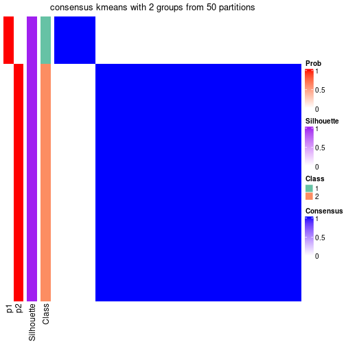</p>

</div>
<div id='tab-node-03-consensus-heatmap-2'>
<pre><code class="r">consensus_heatmap(res, k = 3)
</code></pre>

<p>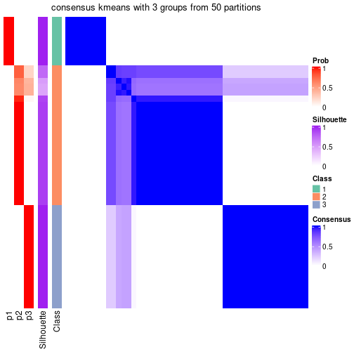</p>

</div>
<div id='tab-node-03-consensus-heatmap-3'>
<pre><code class="r">consensus_heatmap(res, k = 4)
</code></pre>

<p>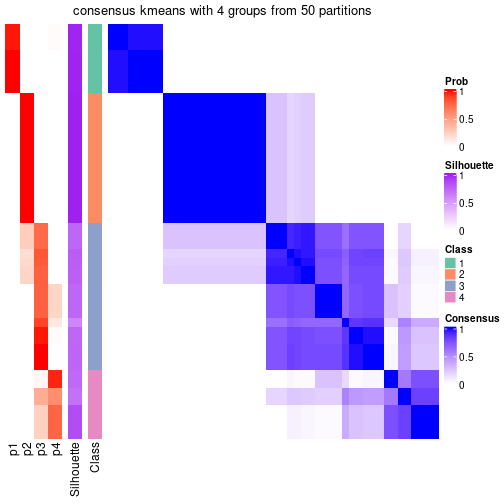</p>

</div>
<div id='tab-node-03-consensus-heatmap-4'>
<pre><code class="r">consensus_heatmap(res, k = 5)
</code></pre>

<p>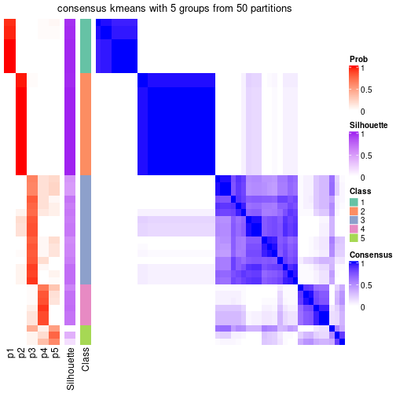</p>

</div>
<div id='tab-node-03-consensus-heatmap-5'>
<pre><code class="r">consensus_heatmap(res, k = 6)
</code></pre>

<p>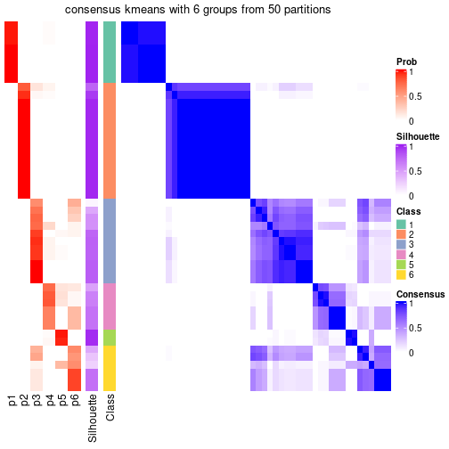</p>

</div>
<div id='tab-node-03-consensus-heatmap-6'>
<pre><code class="r">consensus_heatmap(res, k = 7)
</code></pre>

<p>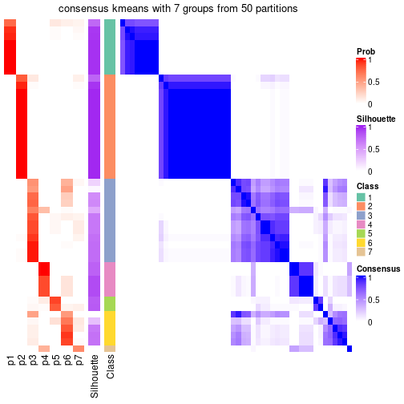</p>

</div>
<div id='tab-node-03-consensus-heatmap-7'>
<pre><code class="r">consensus_heatmap(res, k = 8)
</code></pre>

<p>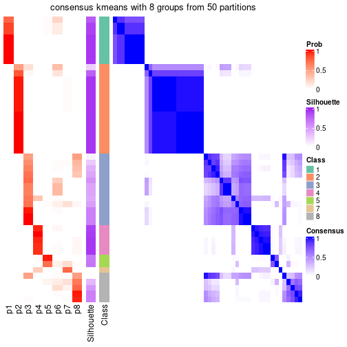</p>

</div>
</div>

Heatmaps for the membership of samples in all partitions to see how consistent they are:


<script>
$( function() {
	$( '#tabs-node-03-membership-heatmap' ).tabs();
} );
</script>
<div id='tabs-node-03-membership-heatmap'>
<ul>
<li><a href='#tab-node-03-membership-heatmap-1'>k = 2</a></li>
<li><a href='#tab-node-03-membership-heatmap-2'>k = 3</a></li>
<li><a href='#tab-node-03-membership-heatmap-3'>k = 4</a></li>
<li><a href='#tab-node-03-membership-heatmap-4'>k = 5</a></li>
<li><a href='#tab-node-03-membership-heatmap-5'>k = 6</a></li>
<li><a href='#tab-node-03-membership-heatmap-6'>k = 7</a></li>
<li><a href='#tab-node-03-membership-heatmap-7'>k = 8</a></li>
</ul>
<div id='tab-node-03-membership-heatmap-1'>
<pre><code class="r">membership_heatmap(res, k = 2)
</code></pre>

<p>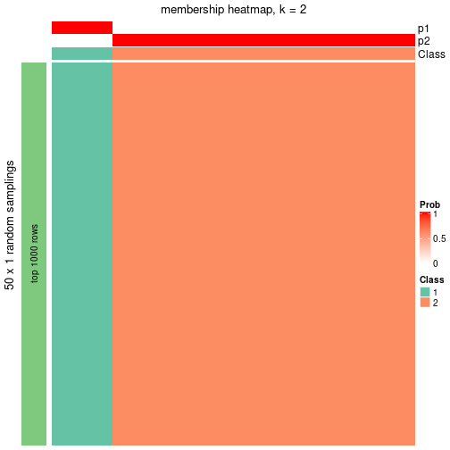</p>

</div>
<div id='tab-node-03-membership-heatmap-2'>
<pre><code class="r">membership_heatmap(res, k = 3)
</code></pre>

<p>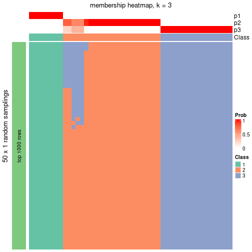</p>

</div>
<div id='tab-node-03-membership-heatmap-3'>
<pre><code class="r">membership_heatmap(res, k = 4)
</code></pre>

<p>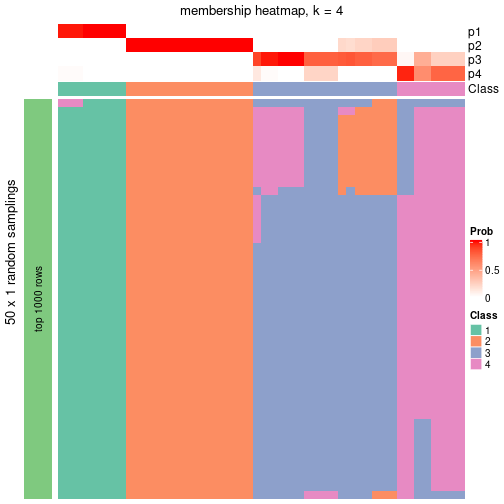</p>

</div>
<div id='tab-node-03-membership-heatmap-4'>
<pre><code class="r">membership_heatmap(res, k = 5)
</code></pre>

<p>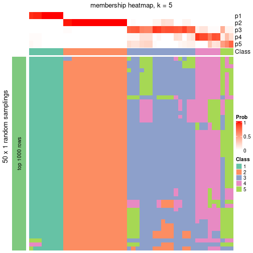</p>

</div>
<div id='tab-node-03-membership-heatmap-5'>
<pre><code class="r">membership_heatmap(res, k = 6)
</code></pre>

<p>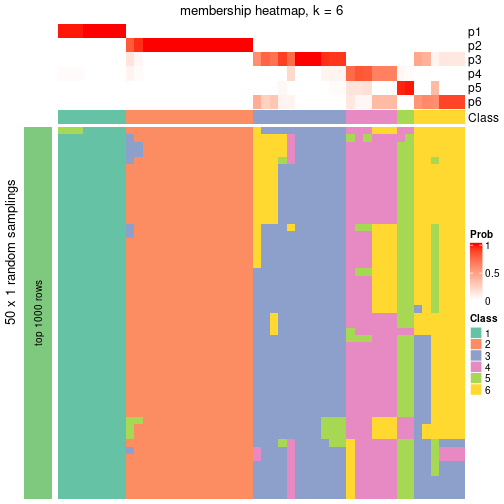</p>

</div>
<div id='tab-node-03-membership-heatmap-6'>
<pre><code class="r">membership_heatmap(res, k = 7)
</code></pre>

<p>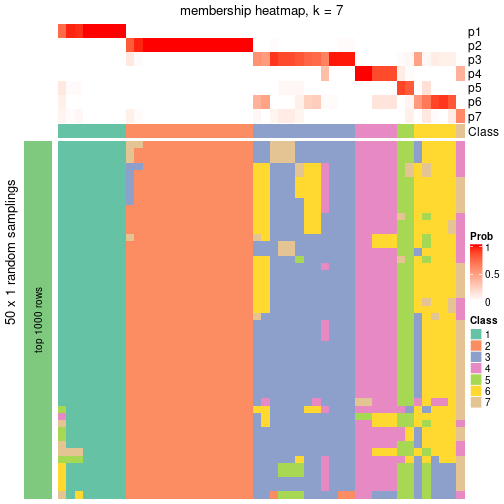</p>

</div>
<div id='tab-node-03-membership-heatmap-7'>
<pre><code class="r">membership_heatmap(res, k = 8)
</code></pre>

<p>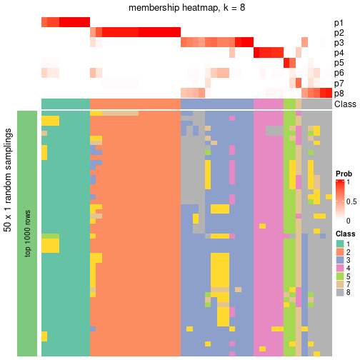</p>

</div>
</div>

As soon as the classes for columns are determined, the signatures
that are significantly different between subgroups can be looked for. 
Following are the heatmaps for signatures.


<script>
$( function() {
	$( '#tabs-node-03-get-signatures' ).tabs();
} );
</script>
<div id='tabs-node-03-get-signatures'>
<ul>
<li><a href='#tab-node-03-get-signatures-1'>k = 2</a></li>
<li><a href='#tab-node-03-get-signatures-2'>k = 3</a></li>
<li><a href='#tab-node-03-get-signatures-3'>k = 4</a></li>
<li><a href='#tab-node-03-get-signatures-4'>k = 5</a></li>
<li><a href='#tab-node-03-get-signatures-5'>k = 6</a></li>
<li><a href='#tab-node-03-get-signatures-6'>k = 7</a></li>
<li><a href='#tab-node-03-get-signatures-7'>k = 8</a></li>
</ul>
<div id='tab-node-03-get-signatures-1'>
<pre><code class="r">get_signatures(res, k = 2)
</code></pre>

<p>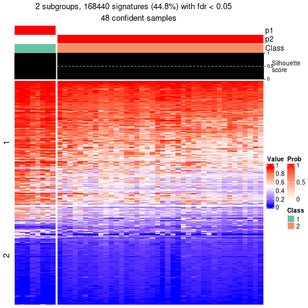</p>

</div>
<div id='tab-node-03-get-signatures-2'>
<pre><code class="r">get_signatures(res, k = 3)
</code></pre>

<p>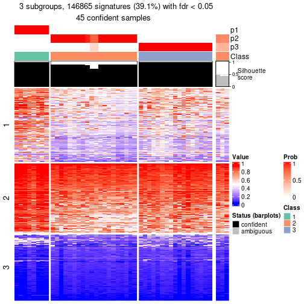</p>

</div>
<div id='tab-node-03-get-signatures-3'>
<pre><code class="r">get_signatures(res, k = 4)
</code></pre>

<p>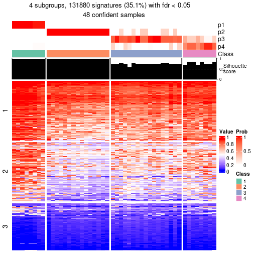</p>

</div>
<div id='tab-node-03-get-signatures-4'>
<pre><code class="r">get_signatures(res, k = 5)
</code></pre>

<p>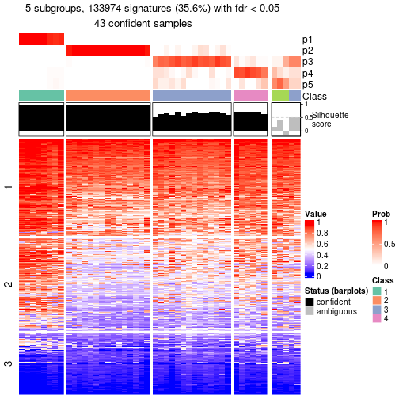</p>

</div>
<div id='tab-node-03-get-signatures-5'>
<pre><code class="r">get_signatures(res, k = 6)
</code></pre>

<p>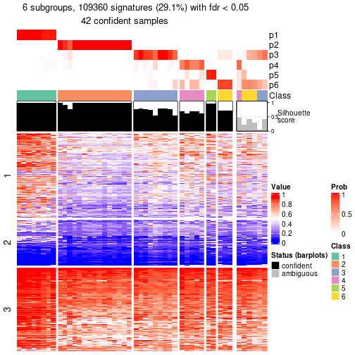</p>

</div>
<div id='tab-node-03-get-signatures-6'>
<pre><code class="r">get_signatures(res, k = 7)
</code></pre>

<p>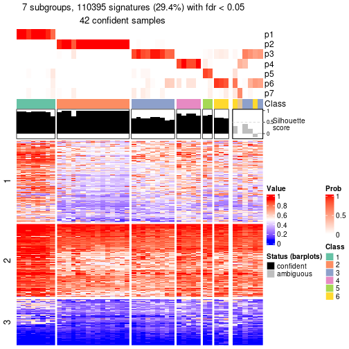</p>

</div>
<div id='tab-node-03-get-signatures-7'>
<pre><code class="r">get_signatures(res, k = 8)
</code></pre>

<p>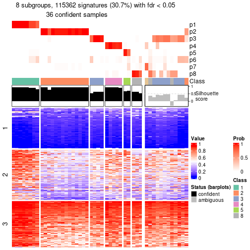</p>

</div>
</div>


Compare the overlap of signatures from different k:

```r
compare_signatures(res)
```

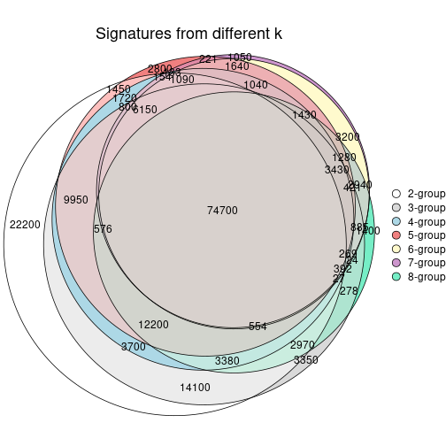

`get_signature()` returns a data frame invisibly. To get the list of signatures, the function
call should be assigned to a variable explicitly. In following code, if `plot` argument is set
to `FALSE`, no heatmap is plotted while only the differential analysis is performed.

```r
# code only for demonstration
tb = get_signature(res, k = ..., plot = FALSE)
```

An example of the output of `tb` is:

```
#>   which_row         fdr    mean_1    mean_2 scaled_mean_1 scaled_mean_2 km
#> 1        38 0.042760348  8.373488  9.131774    -0.5533452     0.5164555  1
#> 2        40 0.018707592  7.106213  8.469186    -0.6173731     0.5762149  1
#> 3        55 0.019134737 10.221463 11.207825    -0.6159697     0.5749050  1
#> 4        59 0.006059896  5.921854  7.869574    -0.6899429     0.6439467  1
#> 5        60 0.018055526  8.928898 10.211722    -0.6204761     0.5791110  1
#> 6        98 0.009384629 15.714769 14.887706     0.6635654    -0.6193277  2
...
```

The columns in `tb` are:

1. `which_row`: row indices corresponding to the input matrix.
2. `fdr`: FDR for the differential test. 
3. `mean_x`: The mean value in group x.
4. `scaled_mean_x`: The mean value in group x after rows are scaled.
5. `km`: Row groups if k-means clustering is applied to rows (which is done by automatically selecting number of clusters).

If there are too many signatures, `top_signatures = ...` can be set to only show the 
signatures with the highest FDRs:

```r
# code only for demonstration
# e.g. to show the top 500 most significant rows
tb = get_signature(res, k = ..., top_signatures = 500)
```

If the signatures are defined as these which are uniquely high in current group, `diff_method` argument
can be set to `"uniquely_high_in_one_group"`:

```r
# code only for demonstration
tb = get_signature(res, k = ..., diff_method = "uniquely_high_in_one_group")
```


UMAP plot which shows how samples are separated.


<script>
$( function() {
	$( '#tabs-node-03-dimension-reduction' ).tabs();
} );
</script>
<div id='tabs-node-03-dimension-reduction'>
<ul>
<li><a href='#tab-node-03-dimension-reduction-1'>k = 2</a></li>
<li><a href='#tab-node-03-dimension-reduction-2'>k = 3</a></li>
<li><a href='#tab-node-03-dimension-reduction-3'>k = 4</a></li>
<li><a href='#tab-node-03-dimension-reduction-4'>k = 5</a></li>
<li><a href='#tab-node-03-dimension-reduction-5'>k = 6</a></li>
<li><a href='#tab-node-03-dimension-reduction-6'>k = 7</a></li>
<li><a href='#tab-node-03-dimension-reduction-7'>k = 8</a></li>
</ul>
<div id='tab-node-03-dimension-reduction-1'>
<pre><code class="r">dimension_reduction(res, k = 2, method = &quot;UMAP&quot;)
</code></pre>

<p>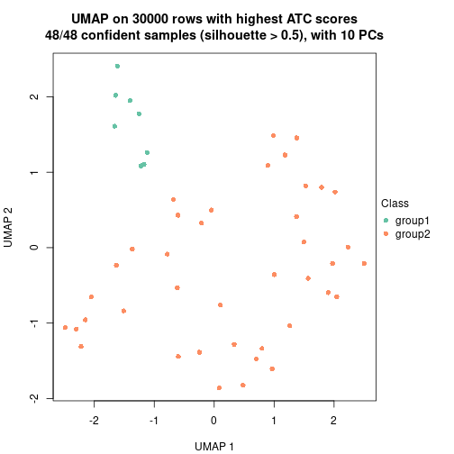</p>

</div>
<div id='tab-node-03-dimension-reduction-2'>
<pre><code class="r">dimension_reduction(res, k = 3, method = &quot;UMAP&quot;)
</code></pre>

<p>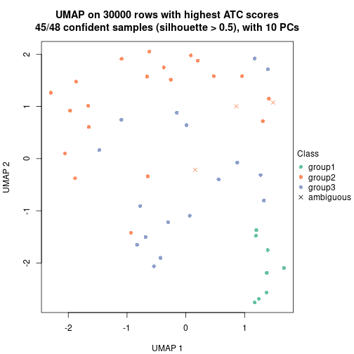</p>

</div>
<div id='tab-node-03-dimension-reduction-3'>
<pre><code class="r">dimension_reduction(res, k = 4, method = &quot;UMAP&quot;)
</code></pre>

<p>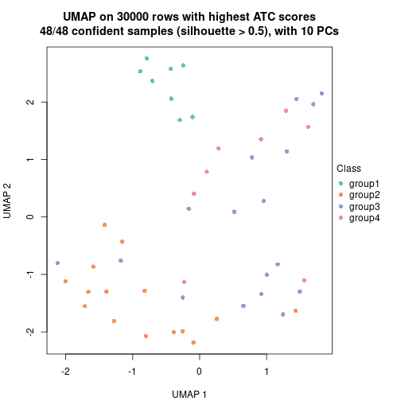</p>

</div>
<div id='tab-node-03-dimension-reduction-4'>
<pre><code class="r">dimension_reduction(res, k = 5, method = &quot;UMAP&quot;)
</code></pre>

<p>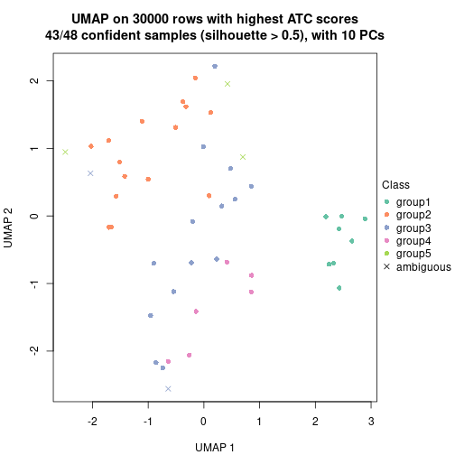</p>

</div>
<div id='tab-node-03-dimension-reduction-5'>
<pre><code class="r">dimension_reduction(res, k = 6, method = &quot;UMAP&quot;)
</code></pre>

<p>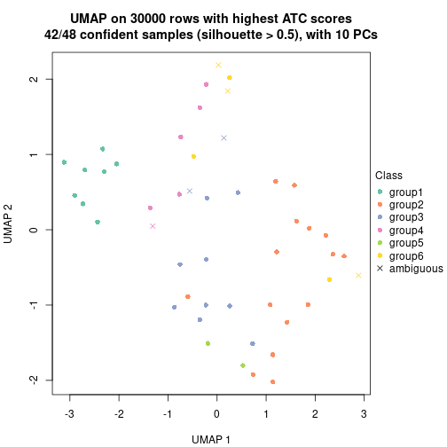</p>

</div>
<div id='tab-node-03-dimension-reduction-6'>
<pre><code class="r">dimension_reduction(res, k = 7, method = &quot;UMAP&quot;)
</code></pre>

<p>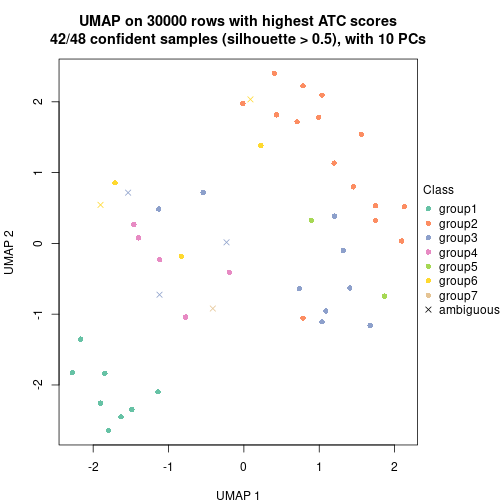</p>

</div>
<div id='tab-node-03-dimension-reduction-7'>
<pre><code class="r">dimension_reduction(res, k = 8, method = &quot;UMAP&quot;)
</code></pre>

<p>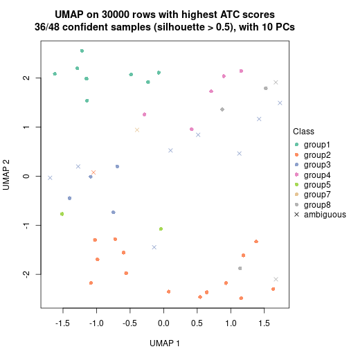</p>

</div>
</div>


Following heatmap shows how subgroups are split when increasing `k`:

```r
collect_classes(res)
```

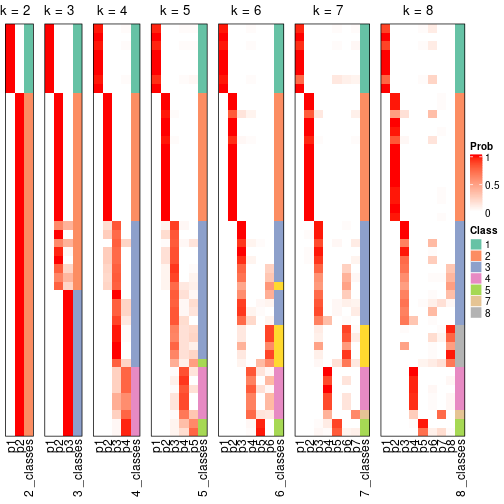


If matrix rows can be associated to genes, consider to use `functional_enrichment(res,
...)` to perform function enrichment for the signature genes. See [this vignette](https://jokergoo.github.io/cola_vignettes/functional_enrichment.html) for more detailed explanations.


 

---------------------------------------------------


### Node04


Parent node: [Node0](#Node0).
Child nodes: 
                [Node011](#Node011)
        ,
                [Node012](#Node012)
        ,
                [Node013](#Node013)
        ,
                Node014-leaf
        ,
                [Node021](#Node021)
        ,
                [Node022](#Node022)
        ,
                [Node023](#Node023)
        ,
                [Node024](#Node024)
        ,
                Node031-leaf
        ,
                Node032-leaf
        ,
                [Node041](#Node041)
        ,
                [Node042](#Node042)
        ,
                [Node043](#Node043)
        ,
                [Node051](#Node051)
        ,
                [Node052](#Node052)
        ,
                [Node061](#Node061)
        ,
                Node062-leaf
        ,
                [Node071](#Node071)
        ,
                [Node072](#Node072)
        ,
                [Node073](#Node073)
        .


The object with results only for a single top-value method and a single partitioning method 
can be extracted as:

```r
res = res_rh["04"]
```

A summary of `res` and all the functions that can be applied to it:

```r
res
```

```
#> A 'ConsensusPartition' object with k = 2, 3, 4, 5, 6, 7, 8.
#>   On a matrix with 30000 rows and 83 columns.
#>   Top rows (1000) are extracted by 'ATC' method.
#>   Subgroups are detected by 'kmeans' method.
#>   Performed in total 350 partitions by row resampling.
#>   Best k for subgroups seems to be 3.
#> 
#> Following methods can be applied to this 'ConsensusPartition' object:
#>  [1] "cola_report"             "collect_classes"         "collect_plots"          
#>  [4] "collect_stats"           "colnames"                "compare_partitions"     
#>  [7] "compare_signatures"      "consensus_heatmap"       "dimension_reduction"    
#> [10] "functional_enrichment"   "get_anno_col"            "get_anno"               
#> [13] "get_classes"             "get_consensus"           "get_matrix"             
#> [16] "get_membership"          "get_param"               "get_signatures"         
#> [19] "get_stats"               "is_best_k"               "is_stable_k"            
#> [22] "membership_heatmap"      "ncol"                    "nrow"                   
#> [25] "plot_ecdf"               "predict_classes"         "rownames"               
#> [28] "select_partition_number" "show"                    "suggest_best_k"         
#> [31] "test_to_known_factors"   "top_rows_heatmap"
```

`collect_plots()` function collects all the plots made from `res` for all `k` (number of subgroups)
into one single page to provide an easy and fast comparison between different `k`.

```r
collect_plots(res)
```

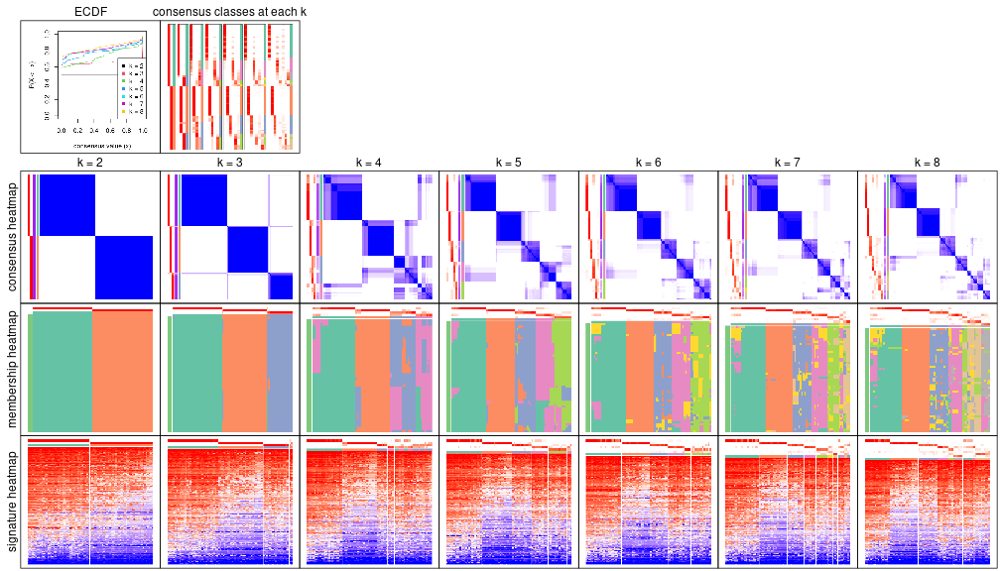

The plots are:

- The first row: a plot of the eCDF (empirical cumulative distribution
  function) curves of the consensus matrix for each `k` and the heatmap of
  predicted classes for each `k`.
- The second row: heatmaps of the consensus matrix for each `k`.
- The third row: heatmaps of the membership matrix for each `k`.
- The fouth row: heatmaps of the signatures for each `k`.

All the plots in panels can be made by individual functions and they are
plotted later in this section.

`select_partition_number()` produces several plots showing different
statistics for choosing "optimized" `k`. There are following statistics:

- eCDF curves of the consensus matrix for each `k`;
- 1-PAC. [The PAC score](https://en.wikipedia.org/wiki/Consensus_clustering#Over-interpretation_potential_of_consensus_clustering)
  measures the proportion of the ambiguous subgrouping.
- Mean silhouette score.
- Concordance. The mean probability of fiting the consensus subgroup labels in all
  partitions.
- Area increased. Denote $A_k$ as the area under the eCDF curve for current
  `k`, the area increased is defined as $A_k - A_{k-1}$.
- Rand index. The percent of pairs of samples that are both in a same cluster
  or both are not in a same cluster in the partition of k and k-1.
- Jaccard index. The ratio of pairs of samples are both in a same cluster in
  the partition of k and k-1 and the pairs of samples are both in a same
  cluster in the partition k or k-1.

The detailed explanations of these statistics can be found in [the _cola_
vignette](https://jokergoo.github.io/cola_vignettes/cola.html#toc_13).

Generally speaking, higher 1-PAC score, higher mean silhouette score or higher
concordance corresponds to better partition. Rand index and Jaccard index
measure how similar the current partition is compared to partition with `k-1`.
If they are too similar, we won't accept `k` is better than `k-1`.

```r
select_partition_number(res)
```

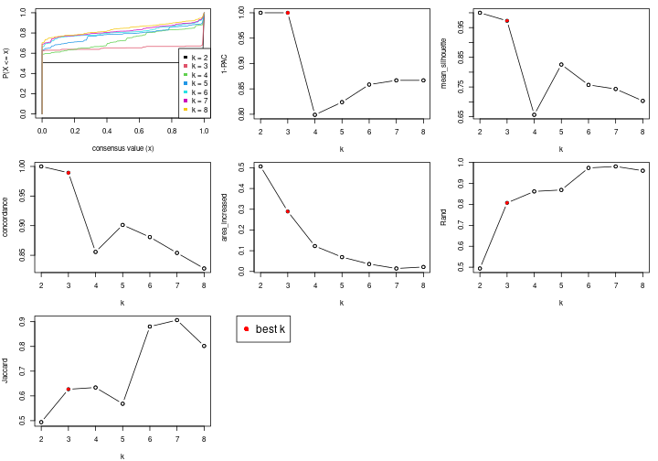

The numeric values for all these statistics can be obtained by `get_stats()`.

```r
get_stats(res)
```

```
#>   k 1-PAC mean_silhouette concordance area_increased  Rand Jaccard
#> 2 2 1.000           1.000       1.000         0.5065 0.494   0.494
#> 3 3 1.000           0.973       0.989         0.2894 0.807   0.627
#> 4 4 0.799           0.656       0.856         0.1224 0.862   0.634
#> 5 5 0.824           0.826       0.901         0.0691 0.869   0.568
#> 6 6 0.858           0.757       0.881         0.0356 0.974   0.880
#> 7 7 0.867           0.743       0.854         0.0143 0.981   0.906
#> 8 8 0.867           0.703       0.828         0.0215 0.961   0.802
```

`suggest_best_k()` suggests the best $k$ based on these statistics. The rules are as follows:

- All $k$ with Jaccard index larger than 0.95 are removed because increasing
  $k$ does not provide enough extra information. If all $k$ are removed, it is
  marked as no subgroup is detected.
- For all $k$ with 1-PAC score larger than 0.9, the maximal $k$ is taken as
  the best $k$, and other $k$ are marked as optional $k$.
- If it does not fit the second rule. The $k$ with the maximal vote of the
  highest 1-PAC score, highest mean silhouette, and highest concordance is
  taken as the best $k$.

```r
suggest_best_k(res)
```

```
#> [1] 3
#> attr(,"optional")
#> [1] 2
```

There is also optional best $k$ = 2 that is worth to check.

Following is the table of the partitions (You need to click the **show/hide
code output** link to see it). The membership matrix (columns with name `p*`)
is inferred by
[`clue::cl_consensus()`](https://www.rdocumentation.org/link/cl_consensus?package=clue)
function with the `SE` method. Basically the value in the membership matrix
represents the probability to belong to a certain group. The finall subgroup
label for an item is determined with the group with highest probability it
belongs to.

In `get_classes()` function, the entropy is calculated from the membership
matrix and the silhouette score is calculated from the consensus matrix.


<script>
$( function() {
	$( '#tabs-node-04-get-classes' ).tabs();
} );
</script>
<div id='tabs-node-04-get-classes'>
<ul>
<li><a href='#tab-node-04-get-classes-1'>k = 2</a></li>
<li><a href='#tab-node-04-get-classes-2'>k = 3</a></li>
<li><a href='#tab-node-04-get-classes-3'>k = 4</a></li>
<li><a href='#tab-node-04-get-classes-4'>k = 5</a></li>
<li><a href='#tab-node-04-get-classes-5'>k = 6</a></li>
<li><a href='#tab-node-04-get-classes-6'>k = 7</a></li>
<li><a href='#tab-node-04-get-classes-7'>k = 8</a></li>
</ul>

<div id='tab-node-04-get-classes-1'>
<p><a id='tab-node-04-get-classes-1-a' style='color:#0366d6' href='#'>show/hide code output</a></p>
<pre><code class="r">cbind(get_classes(res, k = 2), get_membership(res, k = 2))
</code></pre>

<pre><code>#&gt;                 class entropy silhouette p1 p2
#&gt; TCGA.22.4613.01     2       0          1  0  1
#&gt; TCGA.90.7769.01     1       0          1  1  0
#&gt; TCGA.77.A5G3.01     1       0          1  1  0
#&gt; TCGA.58.A46N.01     1       0          1  1  0
#&gt; TCGA.34.7107.01     1       0          1  1  0
#&gt; TCGA.56.7823.01     2       0          1  0  1
#&gt; TCGA.58.8391.01     1       0          1  1  0
#&gt; TCGA.85.A4QR.01     2       0          1  0  1
#&gt; TCGA.77.8128.01     2       0          1  0  1
#&gt; TCGA.22.4601.01     1       0          1  1  0
#&gt; TCGA.22.4593.01     2       0          1  0  1
#&gt; TCGA.34.5240.01     1       0          1  1  0
#&gt; TCGA.63.5131.01     2       0          1  0  1
#&gt; TCGA.77.8009.01     1       0          1  1  0
#&gt; TCGA.77.8153.01     2       0          1  0  1
#&gt; TCGA.56.8083.01     2       0          1  0  1
#&gt; TCGA.77.A5G6.01     1       0          1  1  0
#&gt; TCGA.56.A4BX.01     2       0          1  0  1
#&gt; TCGA.NC.A5HG.01     2       0          1  0  1
#&gt; TCGA.33.A5GW.01     1       0          1  1  0
#&gt; TCGA.63.5128.01     1       0          1  1  0
#&gt; TCGA.63.A5MU.01     2       0          1  0  1
#&gt; TCGA.34.5231.01     2       0          1  0  1
#&gt; TCGA.33.AASD.01     1       0          1  1  0
#&gt; TCGA.NC.A5HP.01     1       0          1  1  0
#&gt; TCGA.39.5037.01     1       0          1  1  0
#&gt; TCGA.37.A5EN.01     1       0          1  1  0
#&gt; TCGA.77.8148.01     2       0          1  0  1
#&gt; TCGA.18.5592.01     1       0          1  1  0
#&gt; TCGA.92.7341.01     1       0          1  1  0
#&gt; TCGA.56.7582.01     1       0          1  1  0
#&gt; TCGA.43.6143.01     2       0          1  0  1
#&gt; TCGA.34.8456.01     2       0          1  0  1
#&gt; TCGA.56.7222.01     2       0          1  0  1
#&gt; TCGA.94.8490.01     1       0          1  1  0
#&gt; TCGA.22.5482.01     1       0          1  1  0
#&gt; TCGA.46.6026.01     2       0          1  0  1
#&gt; TCGA.85.7710.01     1       0          1  1  0
#&gt; TCGA.43.A474.01     2       0          1  0  1
#&gt; TCGA.22.5473.01     1       0          1  1  0
#&gt; TCGA.77.8154.01     2       0          1  0  1
#&gt; TCGA.22.5491.01     1       0          1  1  0
#&gt; TCGA.77.7139.01     2       0          1  0  1
#&gt; TCGA.58.8392.01     2       0          1  0  1
#&gt; TCGA.63.7023.01     2       0          1  0  1
#&gt; TCGA.33.AASJ.01     1       0          1  1  0
#&gt; TCGA.85.8070.01     2       0          1  0  1
#&gt; TCGA.98.A53A.01     1       0          1  1  0
#&gt; TCGA.NC.A5HT.01     2       0          1  0  1
#&gt; TCGA.43.6770.01     2       0          1  0  1
#&gt; TCGA.34.5929.01     2       0          1  0  1
#&gt; TCGA.77.7140.01     2       0          1  0  1
#&gt; TCGA.NC.A5HF.01     2       0          1  0  1
#&gt; TCGA.63.A5MB.01     1       0          1  1  0
#&gt; TCGA.34.5927.01     2       0          1  0  1
#&gt; TCGA.NC.A5HN.01     2       0          1  0  1
#&gt; TCGA.77.8150.01     1       0          1  1  0
#&gt; TCGA.18.5595.01     1       0          1  1  0
#&gt; TCGA.79.5596.01     2       0          1  0  1
#&gt; TCGA.63.A5ML.01     1       0          1  1  0
#&gt; TCGA.22.5477.01     1       0          1  1  0
#&gt; TCGA.85.8071.01     2       0          1  0  1
#&gt; TCGA.77.8143.01     2       0          1  0  1
#&gt; TCGA.77.6845.01     1       0          1  1  0
#&gt; TCGA.56.7730.01     1       0          1  1  0
#&gt; TCGA.56.7579.01     2       0          1  0  1
#&gt; TCGA.63.A5MH.01     2       0          1  0  1
#&gt; TCGA.58.8390.01     2       0          1  0  1
#&gt; TCGA.39.5027.01     2       0          1  0  1
#&gt; TCGA.22.5485.01     1       0          1  1  0
#&gt; TCGA.33.4583.01     1       0          1  1  0
#&gt; TCGA.MF.A522.01     1       0          1  1  0
#&gt; TCGA.70.6723.01     1       0          1  1  0
#&gt; TCGA.68.7755.01     1       0          1  1  0
#&gt; TCGA.NC.A5HH.01     2       0          1  0  1
#&gt; TCGA.NK.A5CR.01     2       0          1  0  1
#&gt; TCGA.77.6844.01     2       0          1  0  1
#&gt; TCGA.56.8082.01     2       0          1  0  1
#&gt; TCGA.L3.A524.01     1       0          1  1  0
#&gt; TCGA.85.A5B5.01     1       0          1  1  0
#&gt; TCGA.63.A5MY.01     2       0          1  0  1
#&gt; TCGA.85.A512.01     1       0          1  1  0
#&gt; TCGA.85.8354.01     1       0          1  1  0
</code></pre>

<script>
$('#tab-node-04-get-classes-1-a').parent().next().next().hide();
$('#tab-node-04-get-classes-1-a').click(function(){
  $('#tab-node-04-get-classes-1-a').parent().next().next().toggle();
  return(false);
});
</script>
</div>

<div id='tab-node-04-get-classes-2'>
<p><a id='tab-node-04-get-classes-2-a' style='color:#0366d6' href='#'>show/hide code output</a></p>
<pre><code class="r">cbind(get_classes(res, k = 3), get_membership(res, k = 3))
</code></pre>

<pre><code>#&gt;                 class entropy silhouette   p1   p2   p3
#&gt; TCGA.22.4613.01     3  0.0000      0.970 0.00 0.00 1.00
#&gt; TCGA.90.7769.01     1  0.0000      0.999 1.00 0.00 0.00
#&gt; TCGA.77.A5G3.01     1  0.0000      0.999 1.00 0.00 0.00
#&gt; TCGA.58.A46N.01     1  0.0000      0.999 1.00 0.00 0.00
#&gt; TCGA.34.7107.01     1  0.0000      0.999 1.00 0.00 0.00
#&gt; TCGA.56.7823.01     2  0.0000      0.987 0.00 1.00 0.00
#&gt; TCGA.58.8391.01     1  0.0000      0.999 1.00 0.00 0.00
#&gt; TCGA.85.A4QR.01     2  0.0000      0.987 0.00 1.00 0.00
#&gt; TCGA.77.8128.01     3  0.3340      0.843 0.00 0.12 0.88
#&gt; TCGA.22.4601.01     1  0.0000      0.999 1.00 0.00 0.00
#&gt; TCGA.22.4593.01     2  0.6045      0.381 0.00 0.62 0.38
#&gt; TCGA.34.5240.01     1  0.0000      0.999 1.00 0.00 0.00
#&gt; TCGA.63.5131.01     2  0.0000      0.987 0.00 1.00 0.00
#&gt; TCGA.77.8009.01     1  0.0000      0.999 1.00 0.00 0.00
#&gt; TCGA.77.8153.01     3  0.0000      0.970 0.00 0.00 1.00
#&gt; TCGA.56.8083.01     2  0.0000      0.987 0.00 1.00 0.00
#&gt; TCGA.77.A5G6.01     3  0.0000      0.970 0.00 0.00 1.00
#&gt; TCGA.56.A4BX.01     2  0.0000      0.987 0.00 1.00 0.00
#&gt; TCGA.NC.A5HG.01     2  0.0000      0.987 0.00 1.00 0.00
#&gt; TCGA.33.A5GW.01     1  0.0000      0.999 1.00 0.00 0.00
#&gt; TCGA.63.5128.01     1  0.0000      0.999 1.00 0.00 0.00
#&gt; TCGA.63.A5MU.01     2  0.0000      0.987 0.00 1.00 0.00
#&gt; TCGA.34.5231.01     2  0.0000      0.987 0.00 1.00 0.00
#&gt; TCGA.33.AASD.01     1  0.0000      0.999 1.00 0.00 0.00
#&gt; TCGA.NC.A5HP.01     1  0.0000      0.999 1.00 0.00 0.00
#&gt; TCGA.39.5037.01     3  0.0000      0.970 0.00 0.00 1.00
#&gt; TCGA.37.A5EN.01     1  0.0000      0.999 1.00 0.00 0.00
#&gt; TCGA.77.8148.01     2  0.0000      0.987 0.00 1.00 0.00
#&gt; TCGA.18.5592.01     1  0.0000      0.999 1.00 0.00 0.00
#&gt; TCGA.92.7341.01     1  0.0000      0.999 1.00 0.00 0.00
#&gt; TCGA.56.7582.01     1  0.0000      0.999 1.00 0.00 0.00
#&gt; TCGA.43.6143.01     2  0.0000      0.987 0.00 1.00 0.00
#&gt; TCGA.34.8456.01     3  0.0000      0.970 0.00 0.00 1.00
#&gt; TCGA.56.7222.01     2  0.0000      0.987 0.00 1.00 0.00
#&gt; TCGA.94.8490.01     1  0.0000      0.999 1.00 0.00 0.00
#&gt; TCGA.22.5482.01     1  0.0892      0.979 0.98 0.00 0.02
#&gt; TCGA.46.6026.01     2  0.0000      0.987 0.00 1.00 0.00
#&gt; TCGA.85.7710.01     1  0.0000      0.999 1.00 0.00 0.00
#&gt; TCGA.43.A474.01     2  0.0000      0.987 0.00 1.00 0.00
#&gt; TCGA.22.5473.01     1  0.0000      0.999 1.00 0.00 0.00
#&gt; TCGA.77.8154.01     2  0.0000      0.987 0.00 1.00 0.00
#&gt; TCGA.22.5491.01     3  0.0000      0.970 0.00 0.00 1.00
#&gt; TCGA.77.7139.01     2  0.0000      0.987 0.00 1.00 0.00
#&gt; TCGA.58.8392.01     3  0.0000      0.970 0.00 0.00 1.00
#&gt; TCGA.63.7023.01     3  0.0000      0.970 0.00 0.00 1.00
#&gt; TCGA.33.AASJ.01     1  0.0000      0.999 1.00 0.00 0.00
#&gt; TCGA.85.8070.01     3  0.0000      0.970 0.00 0.00 1.00
#&gt; TCGA.98.A53A.01     3  0.0000      0.970 0.00 0.00 1.00
#&gt; TCGA.NC.A5HT.01     2  0.0000      0.987 0.00 1.00 0.00
#&gt; TCGA.43.6770.01     3  0.0000      0.970 0.00 0.00 1.00
#&gt; TCGA.34.5929.01     2  0.0000      0.987 0.00 1.00 0.00
#&gt; TCGA.77.7140.01     3  0.0000      0.970 0.00 0.00 1.00
#&gt; TCGA.NC.A5HF.01     2  0.0000      0.987 0.00 1.00 0.00
#&gt; TCGA.63.A5MB.01     1  0.0000      0.999 1.00 0.00 0.00
#&gt; TCGA.34.5927.01     2  0.0000      0.987 0.00 1.00 0.00
#&gt; TCGA.NC.A5HN.01     2  0.0000      0.987 0.00 1.00 0.00
#&gt; TCGA.77.8150.01     3  0.0000      0.970 0.00 0.00 1.00
#&gt; TCGA.18.5595.01     3  0.5948      0.433 0.36 0.00 0.64
#&gt; TCGA.79.5596.01     2  0.0000      0.987 0.00 1.00 0.00
#&gt; TCGA.63.A5ML.01     1  0.0000      0.999 1.00 0.00 0.00
#&gt; TCGA.22.5477.01     1  0.0000      0.999 1.00 0.00 0.00
#&gt; TCGA.85.8071.01     2  0.0000      0.987 0.00 1.00 0.00
#&gt; TCGA.77.8143.01     2  0.0000      0.987 0.00 1.00 0.00
#&gt; TCGA.77.6845.01     1  0.0000      0.999 1.00 0.00 0.00
#&gt; TCGA.56.7730.01     1  0.0000      0.999 1.00 0.00 0.00
#&gt; TCGA.56.7579.01     2  0.0000      0.987 0.00 1.00 0.00
#&gt; TCGA.63.A5MH.01     3  0.0000      0.970 0.00 0.00 1.00
#&gt; TCGA.58.8390.01     2  0.0000      0.987 0.00 1.00 0.00
#&gt; TCGA.39.5027.01     3  0.0000      0.970 0.00 0.00 1.00
#&gt; TCGA.22.5485.01     1  0.0000      0.999 1.00 0.00 0.00
#&gt; TCGA.33.4583.01     1  0.0000      0.999 1.00 0.00 0.00
#&gt; TCGA.MF.A522.01     1  0.0000      0.999 1.00 0.00 0.00
#&gt; TCGA.70.6723.01     1  0.0000      0.999 1.00 0.00 0.00
#&gt; TCGA.68.7755.01     1  0.0000      0.999 1.00 0.00 0.00
#&gt; TCGA.NC.A5HH.01     2  0.0000      0.987 0.00 1.00 0.00
#&gt; TCGA.NK.A5CR.01     2  0.0000      0.987 0.00 1.00 0.00
#&gt; TCGA.77.6844.01     2  0.0000      0.987 0.00 1.00 0.00
#&gt; TCGA.56.8082.01     2  0.0000      0.987 0.00 1.00 0.00
#&gt; TCGA.L3.A524.01     1  0.0000      0.999 1.00 0.00 0.00
#&gt; TCGA.85.A5B5.01     1  0.0000      0.999 1.00 0.00 0.00
#&gt; TCGA.63.A5MY.01     2  0.0000      0.987 0.00 1.00 0.00
#&gt; TCGA.85.A512.01     1  0.0000      0.999 1.00 0.00 0.00
#&gt; TCGA.85.8354.01     3  0.0000      0.970 0.00 0.00 1.00
</code></pre>

<script>
$('#tab-node-04-get-classes-2-a').parent().next().next().hide();
$('#tab-node-04-get-classes-2-a').click(function(){
  $('#tab-node-04-get-classes-2-a').parent().next().next().toggle();
  return(false);
});
</script>
</div>

<div id='tab-node-04-get-classes-3'>
<p><a id='tab-node-04-get-classes-3-a' style='color:#0366d6' href='#'>show/hide code output</a></p>
<pre><code class="r">cbind(get_classes(res, k = 4), get_membership(res, k = 4))
</code></pre>

<pre><code>#&gt;                 class entropy silhouette   p1   p2   p3   p4
#&gt; TCGA.22.4613.01     3  0.0000     0.5680 0.00 0.00 1.00 0.00
#&gt; TCGA.90.7769.01     1  0.1637     0.8527 0.94 0.00 0.00 0.06
#&gt; TCGA.77.A5G3.01     1  0.4994     0.2262 0.52 0.00 0.00 0.48
#&gt; TCGA.58.A46N.01     1  0.4713     0.4892 0.64 0.00 0.00 0.36
#&gt; TCGA.34.7107.01     1  0.0000     0.8826 1.00 0.00 0.00 0.00
#&gt; TCGA.56.7823.01     2  0.0000     0.9283 0.00 1.00 0.00 0.00
#&gt; TCGA.58.8391.01     1  0.0000     0.8826 1.00 0.00 0.00 0.00
#&gt; TCGA.85.A4QR.01     2  0.4948     0.3297 0.00 0.56 0.44 0.00
#&gt; TCGA.77.8128.01     3  0.0000     0.5680 0.00 0.00 1.00 0.00
#&gt; TCGA.22.4601.01     1  0.0000     0.8826 1.00 0.00 0.00 0.00
#&gt; TCGA.22.4593.01     3  0.2335     0.5683 0.00 0.06 0.92 0.02
#&gt; TCGA.34.5240.01     1  0.0000     0.8826 1.00 0.00 0.00 0.00
#&gt; TCGA.63.5131.01     2  0.0000     0.9283 0.00 1.00 0.00 0.00
#&gt; TCGA.77.8009.01     1  0.0000     0.8826 1.00 0.00 0.00 0.00
#&gt; TCGA.77.8153.01     3  0.4790     0.4295 0.00 0.00 0.62 0.38
#&gt; TCGA.56.8083.01     2  0.0000     0.9283 0.00 1.00 0.00 0.00
#&gt; TCGA.77.A5G6.01     4  0.4713     0.1433 0.00 0.00 0.36 0.64
#&gt; TCGA.56.A4BX.01     3  0.3801     0.5081 0.00 0.22 0.78 0.00
#&gt; TCGA.NC.A5HG.01     2  0.0000     0.9283 0.00 1.00 0.00 0.00
#&gt; TCGA.33.A5GW.01     1  0.0000     0.8826 1.00 0.00 0.00 0.00
#&gt; TCGA.63.5128.01     4  0.4855     0.0886 0.40 0.00 0.00 0.60
#&gt; TCGA.63.A5MU.01     2  0.0000     0.9283 0.00 1.00 0.00 0.00
#&gt; TCGA.34.5231.01     2  0.0000     0.9283 0.00 1.00 0.00 0.00
#&gt; TCGA.33.AASD.01     1  0.0000     0.8826 1.00 0.00 0.00 0.00
#&gt; TCGA.NC.A5HP.01     1  0.4994     0.2262 0.52 0.00 0.00 0.48
#&gt; TCGA.39.5037.01     4  0.4790     0.1293 0.00 0.00 0.38 0.62
#&gt; TCGA.37.A5EN.01     4  0.4855     0.0886 0.40 0.00 0.00 0.60
#&gt; TCGA.77.8148.01     2  0.0000     0.9283 0.00 1.00 0.00 0.00
#&gt; TCGA.18.5592.01     1  0.0000     0.8826 1.00 0.00 0.00 0.00
#&gt; TCGA.92.7341.01     1  0.1637     0.8527 0.94 0.00 0.00 0.06
#&gt; TCGA.56.7582.01     1  0.0000     0.8826 1.00 0.00 0.00 0.00
#&gt; TCGA.43.6143.01     2  0.0000     0.9283 0.00 1.00 0.00 0.00
#&gt; TCGA.34.8456.01     3  0.4790     0.4295 0.00 0.00 0.62 0.38
#&gt; TCGA.56.7222.01     2  0.0000     0.9283 0.00 1.00 0.00 0.00
#&gt; TCGA.94.8490.01     1  0.0000     0.8826 1.00 0.00 0.00 0.00
#&gt; TCGA.22.5482.01     4  0.2647     0.5383 0.12 0.00 0.00 0.88
#&gt; TCGA.46.6026.01     2  0.0000     0.9283 0.00 1.00 0.00 0.00
#&gt; TCGA.85.7710.01     1  0.4994     0.2262 0.52 0.00 0.00 0.48
#&gt; TCGA.43.A474.01     2  0.0000     0.9283 0.00 1.00 0.00 0.00
#&gt; TCGA.22.5473.01     1  0.0000     0.8826 1.00 0.00 0.00 0.00
#&gt; TCGA.77.8154.01     2  0.0000     0.9283 0.00 1.00 0.00 0.00
#&gt; TCGA.22.5491.01     4  0.2011     0.5278 0.00 0.00 0.08 0.92
#&gt; TCGA.77.7139.01     2  0.0000     0.9283 0.00 1.00 0.00 0.00
#&gt; TCGA.58.8392.01     3  0.0000     0.5680 0.00 0.00 1.00 0.00
#&gt; TCGA.63.7023.01     3  0.4790     0.4295 0.00 0.00 0.62 0.38
#&gt; TCGA.33.AASJ.01     1  0.4713     0.4892 0.64 0.00 0.00 0.36
#&gt; TCGA.85.8070.01     3  0.4790     0.4295 0.00 0.00 0.62 0.38
#&gt; TCGA.98.A53A.01     4  0.4713     0.1433 0.00 0.00 0.36 0.64
#&gt; TCGA.NC.A5HT.01     2  0.0000     0.9283 0.00 1.00 0.00 0.00
#&gt; TCGA.43.6770.01     3  0.4790     0.4295 0.00 0.00 0.62 0.38
#&gt; TCGA.34.5929.01     2  0.0000     0.9283 0.00 1.00 0.00 0.00
#&gt; TCGA.77.7140.01     3  0.4790     0.4295 0.00 0.00 0.62 0.38
#&gt; TCGA.NC.A5HF.01     3  0.3172     0.5536 0.00 0.16 0.84 0.00
#&gt; TCGA.63.A5MB.01     1  0.0000     0.8826 1.00 0.00 0.00 0.00
#&gt; TCGA.34.5927.01     2  0.0000     0.9283 0.00 1.00 0.00 0.00
#&gt; TCGA.NC.A5HN.01     2  0.0000     0.9283 0.00 1.00 0.00 0.00
#&gt; TCGA.77.8150.01     4  0.2011     0.5278 0.00 0.00 0.08 0.92
#&gt; TCGA.18.5595.01     4  0.0707     0.5425 0.02 0.00 0.00 0.98
#&gt; TCGA.79.5596.01     3  0.4907     0.0469 0.00 0.42 0.58 0.00
#&gt; TCGA.63.A5ML.01     1  0.0000     0.8826 1.00 0.00 0.00 0.00
#&gt; TCGA.22.5477.01     1  0.0000     0.8826 1.00 0.00 0.00 0.00
#&gt; TCGA.85.8071.01     2  0.0000     0.9283 0.00 1.00 0.00 0.00
#&gt; TCGA.77.8143.01     2  0.0000     0.9283 0.00 1.00 0.00 0.00
#&gt; TCGA.77.6845.01     1  0.1211     0.8636 0.96 0.00 0.00 0.04
#&gt; TCGA.56.7730.01     1  0.0000     0.8826 1.00 0.00 0.00 0.00
#&gt; TCGA.56.7579.01     3  0.4855     0.1120 0.00 0.40 0.60 0.00
#&gt; TCGA.63.A5MH.01     3  0.4948     0.3466 0.00 0.00 0.56 0.44
#&gt; TCGA.58.8390.01     2  0.4713     0.5060 0.00 0.64 0.36 0.00
#&gt; TCGA.39.5027.01     3  0.4790     0.4295 0.00 0.00 0.62 0.38
#&gt; TCGA.22.5485.01     4  0.4855     0.0886 0.40 0.00 0.00 0.60
#&gt; TCGA.33.4583.01     1  0.0000     0.8826 1.00 0.00 0.00 0.00
#&gt; TCGA.MF.A522.01     1  0.0000     0.8826 1.00 0.00 0.00 0.00
#&gt; TCGA.70.6723.01     1  0.1637     0.8527 0.94 0.00 0.00 0.06
#&gt; TCGA.68.7755.01     1  0.1637     0.8527 0.94 0.00 0.00 0.06
#&gt; TCGA.NC.A5HH.01     2  0.4406     0.5975 0.00 0.70 0.30 0.00
#&gt; TCGA.NK.A5CR.01     3  0.2921     0.5593 0.00 0.14 0.86 0.00
#&gt; TCGA.77.6844.01     2  0.0000     0.9283 0.00 1.00 0.00 0.00
#&gt; TCGA.56.8082.01     2  0.4713     0.5060 0.00 0.64 0.36 0.00
#&gt; TCGA.L3.A524.01     1  0.0000     0.8826 1.00 0.00 0.00 0.00
#&gt; TCGA.85.A5B5.01     1  0.4994     0.2262 0.52 0.00 0.00 0.48
#&gt; TCGA.63.A5MY.01     3  0.4406     0.3681 0.00 0.30 0.70 0.00
#&gt; TCGA.85.A512.01     1  0.0000     0.8826 1.00 0.00 0.00 0.00
#&gt; TCGA.85.8354.01     4  0.3400     0.4523 0.00 0.00 0.18 0.82
</code></pre>

<script>
$('#tab-node-04-get-classes-3-a').parent().next().next().hide();
$('#tab-node-04-get-classes-3-a').click(function(){
  $('#tab-node-04-get-classes-3-a').parent().next().next().toggle();
  return(false);
});
</script>
</div>

<div id='tab-node-04-get-classes-4'>
<p><a id='tab-node-04-get-classes-4-a' style='color:#0366d6' href='#'>show/hide code output</a></p>
<pre><code class="r">cbind(get_classes(res, k = 5), get_membership(res, k = 5))
</code></pre>

<pre><code>#&gt;                 class entropy silhouette   p1   p2   p3   p4   p5
#&gt; TCGA.22.4613.01     3  0.2732      0.676 0.00 0.00 0.84 0.00 0.16
#&gt; TCGA.90.7769.01     1  0.3796      0.540 0.70 0.00 0.00 0.30 0.00
#&gt; TCGA.77.A5G3.01     4  0.3684      0.708 0.28 0.00 0.00 0.72 0.00
#&gt; TCGA.58.A46N.01     4  0.3684      0.708 0.28 0.00 0.00 0.72 0.00
#&gt; TCGA.34.7107.01     1  0.0000      0.943 1.00 0.00 0.00 0.00 0.00
#&gt; TCGA.56.7823.01     2  0.0000      0.985 0.00 1.00 0.00 0.00 0.00
#&gt; TCGA.58.8391.01     1  0.0000      0.943 1.00 0.00 0.00 0.00 0.00
#&gt; TCGA.85.A4QR.01     3  0.2873      0.792 0.00 0.12 0.86 0.02 0.00
#&gt; TCGA.77.8128.01     3  0.0000      0.820 0.00 0.00 1.00 0.00 0.00
#&gt; TCGA.22.4601.01     1  0.0000      0.943 1.00 0.00 0.00 0.00 0.00
#&gt; TCGA.22.4593.01     3  0.1216      0.816 0.00 0.00 0.96 0.02 0.02
#&gt; TCGA.34.5240.01     1  0.0000      0.943 1.00 0.00 0.00 0.00 0.00
#&gt; TCGA.63.5131.01     2  0.0609      0.970 0.00 0.98 0.00 0.02 0.00
#&gt; TCGA.77.8009.01     1  0.0000      0.943 1.00 0.00 0.00 0.00 0.00
#&gt; TCGA.77.8153.01     5  0.3319      0.814 0.00 0.00 0.16 0.02 0.82
#&gt; TCGA.56.8083.01     2  0.0000      0.985 0.00 1.00 0.00 0.00 0.00
#&gt; TCGA.77.A5G6.01     5  0.3274      0.724 0.00 0.00 0.00 0.22 0.78
#&gt; TCGA.56.A4BX.01     3  0.0000      0.820 0.00 0.00 1.00 0.00 0.00
#&gt; TCGA.NC.A5HG.01     2  0.0000      0.985 0.00 1.00 0.00 0.00 0.00
#&gt; TCGA.33.A5GW.01     1  0.0000      0.943 1.00 0.00 0.00 0.00 0.00
#&gt; TCGA.63.5128.01     4  0.1732      0.722 0.08 0.00 0.00 0.92 0.00
#&gt; TCGA.63.A5MU.01     2  0.0609      0.970 0.00 0.98 0.00 0.02 0.00
#&gt; TCGA.34.5231.01     2  0.0000      0.985 0.00 1.00 0.00 0.00 0.00
#&gt; TCGA.33.AASD.01     1  0.0000      0.943 1.00 0.00 0.00 0.00 0.00
#&gt; TCGA.NC.A5HP.01     4  0.3684      0.708 0.28 0.00 0.00 0.72 0.00
#&gt; TCGA.39.5037.01     5  0.3274      0.724 0.00 0.00 0.00 0.22 0.78
#&gt; TCGA.37.A5EN.01     4  0.1410      0.714 0.06 0.00 0.00 0.94 0.00
#&gt; TCGA.77.8148.01     2  0.0000      0.985 0.00 1.00 0.00 0.00 0.00
#&gt; TCGA.18.5592.01     1  0.0000      0.943 1.00 0.00 0.00 0.00 0.00
#&gt; TCGA.92.7341.01     1  0.3274      0.698 0.78 0.00 0.00 0.22 0.00
#&gt; TCGA.56.7582.01     1  0.0000      0.943 1.00 0.00 0.00 0.00 0.00
#&gt; TCGA.43.6143.01     2  0.0000      0.985 0.00 1.00 0.00 0.00 0.00
#&gt; TCGA.34.8456.01     5  0.3513      0.826 0.00 0.00 0.18 0.02 0.80
#&gt; TCGA.56.7222.01     2  0.0000      0.985 0.00 1.00 0.00 0.00 0.00
#&gt; TCGA.94.8490.01     1  0.0000      0.943 1.00 0.00 0.00 0.00 0.00
#&gt; TCGA.22.5482.01     4  0.1216      0.675 0.02 0.00 0.00 0.96 0.02
#&gt; TCGA.46.6026.01     2  0.0000      0.985 0.00 1.00 0.00 0.00 0.00
#&gt; TCGA.85.7710.01     4  0.3684      0.708 0.28 0.00 0.00 0.72 0.00
#&gt; TCGA.43.A474.01     2  0.0000      0.985 0.00 1.00 0.00 0.00 0.00
#&gt; TCGA.22.5473.01     1  0.0000      0.943 1.00 0.00 0.00 0.00 0.00
#&gt; TCGA.77.8154.01     2  0.3690      0.690 0.00 0.78 0.20 0.02 0.00
#&gt; TCGA.22.5491.01     4  0.4060      0.178 0.00 0.00 0.00 0.64 0.36
#&gt; TCGA.77.7139.01     2  0.0000      0.985 0.00 1.00 0.00 0.00 0.00
#&gt; TCGA.58.8392.01     3  0.3684      0.469 0.00 0.00 0.72 0.00 0.28
#&gt; TCGA.63.7023.01     5  0.3513      0.826 0.00 0.00 0.18 0.02 0.80
#&gt; TCGA.33.AASJ.01     4  0.3684      0.708 0.28 0.00 0.00 0.72 0.00
#&gt; TCGA.85.8070.01     5  0.3106      0.814 0.00 0.00 0.14 0.02 0.84
#&gt; TCGA.98.A53A.01     5  0.3274      0.724 0.00 0.00 0.00 0.22 0.78
#&gt; TCGA.NC.A5HT.01     2  0.0000      0.985 0.00 1.00 0.00 0.00 0.00
#&gt; TCGA.43.6770.01     5  0.3513      0.826 0.00 0.00 0.18 0.02 0.80
#&gt; TCGA.34.5929.01     2  0.0000      0.985 0.00 1.00 0.00 0.00 0.00
#&gt; TCGA.77.7140.01     5  0.3319      0.814 0.00 0.00 0.16 0.02 0.82
#&gt; TCGA.NC.A5HF.01     3  0.0000      0.820 0.00 0.00 1.00 0.00 0.00
#&gt; TCGA.63.A5MB.01     1  0.0000      0.943 1.00 0.00 0.00 0.00 0.00
#&gt; TCGA.34.5927.01     2  0.0000      0.985 0.00 1.00 0.00 0.00 0.00
#&gt; TCGA.NC.A5HN.01     2  0.0000      0.985 0.00 1.00 0.00 0.00 0.00
#&gt; TCGA.77.8150.01     4  0.4126      0.124 0.00 0.00 0.00 0.62 0.38
#&gt; TCGA.18.5595.01     4  0.2732      0.560 0.00 0.00 0.00 0.84 0.16
#&gt; TCGA.79.5596.01     3  0.1732      0.817 0.00 0.08 0.92 0.00 0.00
#&gt; TCGA.63.A5ML.01     1  0.0000      0.943 1.00 0.00 0.00 0.00 0.00
#&gt; TCGA.22.5477.01     1  0.0000      0.943 1.00 0.00 0.00 0.00 0.00
#&gt; TCGA.85.8071.01     2  0.0000      0.985 0.00 1.00 0.00 0.00 0.00
#&gt; TCGA.77.8143.01     2  0.0000      0.985 0.00 1.00 0.00 0.00 0.00
#&gt; TCGA.77.6845.01     1  0.2020      0.850 0.90 0.00 0.00 0.10 0.00
#&gt; TCGA.56.7730.01     1  0.0000      0.943 1.00 0.00 0.00 0.00 0.00
#&gt; TCGA.56.7579.01     3  0.1410      0.823 0.00 0.06 0.94 0.00 0.00
#&gt; TCGA.63.A5MH.01     5  0.2077      0.804 0.00 0.00 0.04 0.04 0.92
#&gt; TCGA.58.8390.01     3  0.4132      0.683 0.00 0.26 0.72 0.02 0.00
#&gt; TCGA.39.5027.01     5  0.3319      0.829 0.00 0.00 0.16 0.02 0.82
#&gt; TCGA.22.5485.01     4  0.1410      0.714 0.06 0.00 0.00 0.94 0.00
#&gt; TCGA.33.4583.01     1  0.0000      0.943 1.00 0.00 0.00 0.00 0.00
#&gt; TCGA.MF.A522.01     1  0.0000      0.943 1.00 0.00 0.00 0.00 0.00
#&gt; TCGA.70.6723.01     1  0.3274      0.698 0.78 0.00 0.00 0.22 0.00
#&gt; TCGA.68.7755.01     1  0.3274      0.698 0.78 0.00 0.00 0.22 0.00
#&gt; TCGA.NC.A5HH.01     3  0.4540      0.546 0.00 0.34 0.64 0.02 0.00
#&gt; TCGA.NK.A5CR.01     3  0.1043      0.816 0.00 0.00 0.96 0.00 0.04
#&gt; TCGA.77.6844.01     2  0.0000      0.985 0.00 1.00 0.00 0.00 0.00
#&gt; TCGA.56.8082.01     3  0.4132      0.683 0.00 0.26 0.72 0.02 0.00
#&gt; TCGA.L3.A524.01     1  0.0000      0.943 1.00 0.00 0.00 0.00 0.00
#&gt; TCGA.85.A5B5.01     4  0.3684      0.708 0.28 0.00 0.00 0.72 0.00
#&gt; TCGA.63.A5MY.01     3  0.1648      0.818 0.00 0.00 0.94 0.02 0.04
#&gt; TCGA.85.A512.01     1  0.0000      0.943 1.00 0.00 0.00 0.00 0.00
#&gt; TCGA.85.8354.01     5  0.3424      0.699 0.00 0.00 0.00 0.24 0.76
</code></pre>

<script>
$('#tab-node-04-get-classes-4-a').parent().next().next().hide();
$('#tab-node-04-get-classes-4-a').click(function(){
  $('#tab-node-04-get-classes-4-a').parent().next().next().toggle();
  return(false);
});
</script>
</div>

<div id='tab-node-04-get-classes-5'>
<p><a id='tab-node-04-get-classes-5-a' style='color:#0366d6' href='#'>show/hide code output</a></p>
<pre><code class="r">cbind(get_classes(res, k = 6), get_membership(res, k = 6))
</code></pre>

<pre><code>#&gt;                 class entropy silhouette   p1   p2   p3   p4   p5   p6
#&gt; TCGA.22.4613.01     5  0.5586      0.136 0.00 0.00 0.42 0.00 0.44 0.14
#&gt; TCGA.90.7769.01     1  0.3706      0.557 0.62 0.00 0.00 0.38 0.00 0.00
#&gt; TCGA.77.A5G3.01     4  0.1807      0.730 0.06 0.00 0.00 0.92 0.00 0.02
#&gt; TCGA.58.A46N.01     4  0.1814      0.692 0.10 0.00 0.00 0.90 0.00 0.00
#&gt; TCGA.34.7107.01     1  0.0547      0.903 0.98 0.00 0.00 0.02 0.00 0.00
#&gt; TCGA.56.7823.01     2  0.0000      0.987 0.00 1.00 0.00 0.00 0.00 0.00
#&gt; TCGA.58.8391.01     1  0.0000      0.909 1.00 0.00 0.00 0.00 0.00 0.00
#&gt; TCGA.85.A4QR.01     3  0.2350      0.851 0.00 0.02 0.88 0.00 0.00 0.10
#&gt; TCGA.77.8128.01     3  0.2790      0.762 0.00 0.00 0.84 0.00 0.02 0.14
#&gt; TCGA.22.4601.01     1  0.0000      0.909 1.00 0.00 0.00 0.00 0.00 0.00
#&gt; TCGA.22.4593.01     3  0.2094      0.850 0.00 0.00 0.90 0.00 0.02 0.08
#&gt; TCGA.34.5240.01     1  0.0000      0.909 1.00 0.00 0.00 0.00 0.00 0.00
#&gt; TCGA.63.5131.01     2  0.0937      0.965 0.00 0.96 0.00 0.00 0.00 0.04
#&gt; TCGA.77.8009.01     1  0.0000      0.909 1.00 0.00 0.00 0.00 0.00 0.00
#&gt; TCGA.77.8153.01     5  0.3499      0.427 0.00 0.00 0.00 0.00 0.68 0.32
#&gt; TCGA.56.8083.01     2  0.0000      0.987 0.00 1.00 0.00 0.00 0.00 0.00
#&gt; TCGA.77.A5G6.01     5  0.4503      0.257 0.00 0.00 0.00 0.08 0.68 0.24
#&gt; TCGA.56.A4BX.01     3  0.1480      0.850 0.00 0.00 0.94 0.00 0.02 0.04
#&gt; TCGA.NC.A5HG.01     2  0.0000      0.987 0.00 1.00 0.00 0.00 0.00 0.00
#&gt; TCGA.33.A5GW.01     1  0.0000      0.909 1.00 0.00 0.00 0.00 0.00 0.00
#&gt; TCGA.63.5128.01     4  0.1814      0.703 0.00 0.00 0.00 0.90 0.00 0.10
#&gt; TCGA.63.A5MU.01     2  0.0937      0.965 0.00 0.96 0.00 0.00 0.00 0.04
#&gt; TCGA.34.5231.01     2  0.0000      0.987 0.00 1.00 0.00 0.00 0.00 0.00
#&gt; TCGA.33.AASD.01     1  0.0000      0.909 1.00 0.00 0.00 0.00 0.00 0.00
#&gt; TCGA.NC.A5HP.01     4  0.1807      0.730 0.06 0.00 0.00 0.92 0.00 0.02
#&gt; TCGA.39.5037.01     5  0.3321      0.352 0.00 0.00 0.00 0.10 0.82 0.08
#&gt; TCGA.37.A5EN.01     4  0.1814      0.709 0.00 0.00 0.00 0.90 0.00 0.10
#&gt; TCGA.77.8148.01     2  0.1267      0.951 0.00 0.94 0.00 0.00 0.00 0.06
#&gt; TCGA.18.5592.01     1  0.0547      0.903 0.98 0.00 0.00 0.02 0.00 0.00
#&gt; TCGA.92.7341.01     1  0.3409      0.687 0.70 0.00 0.00 0.30 0.00 0.00
#&gt; TCGA.56.7582.01     1  0.0000      0.909 1.00 0.00 0.00 0.00 0.00 0.00
#&gt; TCGA.43.6143.01     2  0.0000      0.987 0.00 1.00 0.00 0.00 0.00 0.00
#&gt; TCGA.34.8456.01     5  0.0000      0.574 0.00 0.00 0.00 0.00 1.00 0.00
#&gt; TCGA.56.7222.01     2  0.0000      0.987 0.00 1.00 0.00 0.00 0.00 0.00
#&gt; TCGA.94.8490.01     1  0.0000      0.909 1.00 0.00 0.00 0.00 0.00 0.00
#&gt; TCGA.22.5482.01     4  0.3198      0.593 0.00 0.00 0.00 0.74 0.00 0.26
#&gt; TCGA.46.6026.01     2  0.0000      0.987 0.00 1.00 0.00 0.00 0.00 0.00
#&gt; TCGA.85.7710.01     4  0.1807      0.730 0.06 0.00 0.00 0.92 0.00 0.02
#&gt; TCGA.43.A474.01     2  0.0000      0.987 0.00 1.00 0.00 0.00 0.00 0.00
#&gt; TCGA.22.5473.01     1  0.2260      0.835 0.86 0.00 0.00 0.14 0.00 0.00
#&gt; TCGA.77.8154.01     3  0.5195      0.432 0.00 0.36 0.54 0.00 0.00 0.10
#&gt; TCGA.22.5491.01     4  0.4631      0.379 0.00 0.00 0.00 0.62 0.06 0.32
#&gt; TCGA.77.7139.01     2  0.1267      0.951 0.00 0.94 0.00 0.00 0.00 0.06
#&gt; TCGA.58.8392.01     5  0.4863      0.403 0.00 0.00 0.20 0.00 0.66 0.14
#&gt; TCGA.63.7023.01     5  0.0000      0.574 0.00 0.00 0.00 0.00 1.00 0.00
#&gt; TCGA.33.AASJ.01     4  0.1556      0.717 0.08 0.00 0.00 0.92 0.00 0.00
#&gt; TCGA.85.8070.01     5  0.4482      0.383 0.00 0.00 0.04 0.00 0.60 0.36
#&gt; TCGA.98.A53A.01     5  0.4503      0.257 0.00 0.00 0.00 0.08 0.68 0.24
#&gt; TCGA.NC.A5HT.01     2  0.0000      0.987 0.00 1.00 0.00 0.00 0.00 0.00
#&gt; TCGA.43.6770.01     5  0.0547      0.577 0.00 0.00 0.00 0.00 0.98 0.02
#&gt; TCGA.34.5929.01     2  0.0000      0.987 0.00 1.00 0.00 0.00 0.00 0.00
#&gt; TCGA.77.7140.01     5  0.3916      0.438 0.00 0.00 0.02 0.00 0.68 0.30
#&gt; TCGA.NC.A5HF.01     3  0.1480      0.850 0.00 0.00 0.94 0.00 0.02 0.04
#&gt; TCGA.63.A5MB.01     1  0.0000      0.909 1.00 0.00 0.00 0.00 0.00 0.00
#&gt; TCGA.34.5927.01     2  0.0000      0.987 0.00 1.00 0.00 0.00 0.00 0.00
#&gt; TCGA.NC.A5HN.01     2  0.0000      0.987 0.00 1.00 0.00 0.00 0.00 0.00
#&gt; TCGA.77.8150.01     4  0.4758      0.290 0.00 0.00 0.00 0.58 0.06 0.36
#&gt; TCGA.18.5595.01     4  0.3409      0.543 0.00 0.00 0.00 0.70 0.00 0.30
#&gt; TCGA.79.5596.01     3  0.1092      0.856 0.00 0.02 0.96 0.00 0.00 0.02
#&gt; TCGA.63.A5ML.01     1  0.0000      0.909 1.00 0.00 0.00 0.00 0.00 0.00
#&gt; TCGA.22.5477.01     1  0.2631      0.806 0.82 0.00 0.00 0.18 0.00 0.00
#&gt; TCGA.85.8071.01     2  0.0000      0.987 0.00 1.00 0.00 0.00 0.00 0.00
#&gt; TCGA.77.8143.01     2  0.0000      0.987 0.00 1.00 0.00 0.00 0.00 0.00
#&gt; TCGA.77.6845.01     1  0.3309      0.711 0.72 0.00 0.00 0.28 0.00 0.00
#&gt; TCGA.56.7730.01     1  0.0547      0.903 0.98 0.00 0.00 0.02 0.00 0.00
#&gt; TCGA.56.7579.01     3  0.0547      0.857 0.00 0.02 0.98 0.00 0.00 0.00
#&gt; TCGA.63.A5MH.01     5  0.3198      0.394 0.00 0.00 0.00 0.00 0.74 0.26
#&gt; TCGA.58.8390.01     3  0.3073      0.822 0.00 0.08 0.84 0.00 0.00 0.08
#&gt; TCGA.39.5027.01     5  0.0547      0.577 0.00 0.00 0.00 0.00 0.98 0.02
#&gt; TCGA.22.5485.01     4  0.2941      0.628 0.00 0.00 0.00 0.78 0.00 0.22
#&gt; TCGA.33.4583.01     1  0.0000      0.909 1.00 0.00 0.00 0.00 0.00 0.00
#&gt; TCGA.MF.A522.01     1  0.0000      0.909 1.00 0.00 0.00 0.00 0.00 0.00
#&gt; TCGA.70.6723.01     1  0.4002      0.637 0.66 0.00 0.00 0.32 0.00 0.02
#&gt; TCGA.68.7755.01     1  0.3409      0.687 0.70 0.00 0.00 0.30 0.00 0.00
#&gt; TCGA.NC.A5HH.01     3  0.3321      0.805 0.00 0.10 0.82 0.00 0.00 0.08
#&gt; TCGA.NK.A5CR.01     3  0.2981      0.761 0.00 0.00 0.82 0.00 0.02 0.16
#&gt; TCGA.77.6844.01     2  0.0937      0.965 0.00 0.96 0.00 0.00 0.00 0.04
#&gt; TCGA.56.8082.01     3  0.3073      0.822 0.00 0.08 0.84 0.00 0.00 0.08
#&gt; TCGA.L3.A524.01     1  0.0000      0.909 1.00 0.00 0.00 0.00 0.00 0.00
#&gt; TCGA.85.A5B5.01     4  0.1267      0.732 0.06 0.00 0.00 0.94 0.00 0.00
#&gt; TCGA.63.A5MY.01     3  0.1814      0.831 0.00 0.00 0.90 0.00 0.00 0.10
#&gt; TCGA.85.A512.01     1  0.0000      0.909 1.00 0.00 0.00 0.00 0.00 0.00
#&gt; TCGA.85.8354.01     6  0.5618      0.000 0.00 0.00 0.00 0.16 0.34 0.50
</code></pre>

<script>
$('#tab-node-04-get-classes-5-a').parent().next().next().hide();
$('#tab-node-04-get-classes-5-a').click(function(){
  $('#tab-node-04-get-classes-5-a').parent().next().next().toggle();
  return(false);
});
</script>
</div>

<div id='tab-node-04-get-classes-6'>
<p><a id='tab-node-04-get-classes-6-a' style='color:#0366d6' href='#'>show/hide code output</a></p>
<pre><code class="r">cbind(get_classes(res, k = 7), get_membership(res, k = 7))
</code></pre>

<pre><code>#&gt;                 class entropy silhouette   p1   p2   p3   p4   p5   p6   p7
#&gt; TCGA.22.4613.01     7  0.6337      0.434 0.00 0.00 0.30 0.00 0.18 0.08 0.44
#&gt; TCGA.90.7769.01     1  0.4356      0.438 0.56 0.00 0.00 0.40 0.00 0.02 0.02
#&gt; TCGA.77.A5G3.01     4  0.1166      0.706 0.06 0.00 0.00 0.94 0.00 0.00 0.00
#&gt; TCGA.58.A46N.01     4  0.2421      0.674 0.08 0.00 0.00 0.88 0.00 0.02 0.02
#&gt; TCGA.34.7107.01     1  0.1006      0.882 0.96 0.00 0.00 0.02 0.00 0.00 0.02
#&gt; TCGA.56.7823.01     2  0.0000      0.985 0.00 1.00 0.00 0.00 0.00 0.00 0.00
#&gt; TCGA.58.8391.01     1  0.0000      0.896 1.00 0.00 0.00 0.00 0.00 0.00 0.00
#&gt; TCGA.85.A4QR.01     3  0.1433      0.770 0.00 0.00 0.92 0.00 0.00 0.08 0.00
#&gt; TCGA.77.8128.01     3  0.4309      0.533 0.00 0.00 0.68 0.00 0.00 0.12 0.20
#&gt; TCGA.22.4601.01     1  0.0000      0.896 1.00 0.00 0.00 0.00 0.00 0.00 0.00
#&gt; TCGA.22.4593.01     3  0.3244      0.720 0.00 0.00 0.78 0.00 0.04 0.18 0.00
#&gt; TCGA.34.5240.01     1  0.0504      0.890 0.98 0.00 0.00 0.00 0.00 0.00 0.02
#&gt; TCGA.63.5131.01     2  0.1363      0.952 0.00 0.94 0.02 0.00 0.00 0.04 0.00
#&gt; TCGA.77.8009.01     1  0.0000      0.896 1.00 0.00 0.00 0.00 0.00 0.00 0.00
#&gt; TCGA.77.8153.01     7  0.1166      0.638 0.00 0.00 0.00 0.00 0.06 0.00 0.94
#&gt; TCGA.56.8083.01     2  0.0000      0.985 0.00 1.00 0.00 0.00 0.00 0.00 0.00
#&gt; TCGA.77.A5G6.01     5  0.2906      0.650 0.00 0.00 0.00 0.02 0.80 0.18 0.00
#&gt; TCGA.56.A4BX.01     3  0.2422      0.747 0.00 0.00 0.82 0.00 0.00 0.18 0.00
#&gt; TCGA.NC.A5HG.01     2  0.0504      0.978 0.00 0.98 0.00 0.00 0.02 0.00 0.00
#&gt; TCGA.33.A5GW.01     1  0.0000      0.896 1.00 0.00 0.00 0.00 0.00 0.00 0.00
#&gt; TCGA.63.5128.01     4  0.2081      0.550 0.00 0.00 0.00 0.86 0.00 0.14 0.00
#&gt; TCGA.63.A5MU.01     2  0.1860      0.935 0.00 0.92 0.04 0.00 0.02 0.02 0.00
#&gt; TCGA.34.5231.01     2  0.0000      0.985 0.00 1.00 0.00 0.00 0.00 0.00 0.00
#&gt; TCGA.33.AASD.01     1  0.0000      0.896 1.00 0.00 0.00 0.00 0.00 0.00 0.00
#&gt; TCGA.NC.A5HP.01     4  0.1166      0.706 0.06 0.00 0.00 0.94 0.00 0.00 0.00
#&gt; TCGA.39.5037.01     5  0.4079      0.634 0.00 0.00 0.00 0.08 0.76 0.12 0.04
#&gt; TCGA.37.A5EN.01     4  0.1886      0.556 0.00 0.00 0.00 0.88 0.00 0.12 0.00
#&gt; TCGA.77.8148.01     2  0.1006      0.967 0.00 0.96 0.02 0.00 0.00 0.02 0.00
#&gt; TCGA.18.5592.01     1  0.0504      0.890 0.98 0.00 0.00 0.00 0.00 0.00 0.02
#&gt; TCGA.92.7341.01     1  0.3755      0.595 0.64 0.00 0.00 0.34 0.00 0.00 0.02
#&gt; TCGA.56.7582.01     1  0.0000      0.896 1.00 0.00 0.00 0.00 0.00 0.00 0.00
#&gt; TCGA.43.6143.01     2  0.0000      0.985 0.00 1.00 0.00 0.00 0.00 0.00 0.00
#&gt; TCGA.34.8456.01     5  0.2832      0.675 0.00 0.00 0.00 0.00 0.76 0.00 0.24
#&gt; TCGA.56.7222.01     2  0.0000      0.985 0.00 1.00 0.00 0.00 0.00 0.00 0.00
#&gt; TCGA.94.8490.01     1  0.0000      0.896 1.00 0.00 0.00 0.00 0.00 0.00 0.00
#&gt; TCGA.22.5482.01     4  0.3221      0.113 0.00 0.00 0.00 0.68 0.00 0.32 0.00
#&gt; TCGA.46.6026.01     2  0.0000      0.985 0.00 1.00 0.00 0.00 0.00 0.00 0.00
#&gt; TCGA.85.7710.01     4  0.1166      0.706 0.06 0.00 0.00 0.94 0.00 0.00 0.00
#&gt; TCGA.43.A474.01     2  0.0000      0.985 0.00 1.00 0.00 0.00 0.00 0.00 0.00
#&gt; TCGA.22.5473.01     1  0.2745      0.793 0.82 0.00 0.00 0.16 0.00 0.00 0.02
#&gt; TCGA.77.8154.01     3  0.4569      0.469 0.00 0.28 0.64 0.00 0.02 0.06 0.00
#&gt; TCGA.22.5491.01     6  0.4875      0.590 0.00 0.00 0.00 0.44 0.10 0.46 0.00
#&gt; TCGA.77.7139.01     2  0.1006      0.967 0.00 0.96 0.02 0.00 0.00 0.02 0.00
#&gt; TCGA.58.8392.01     7  0.6381      0.381 0.00 0.00 0.20 0.00 0.28 0.08 0.44
#&gt; TCGA.63.7023.01     5  0.2832      0.675 0.00 0.00 0.00 0.00 0.76 0.00 0.24
#&gt; TCGA.33.AASJ.01     4  0.2159      0.698 0.06 0.00 0.00 0.90 0.00 0.02 0.02
#&gt; TCGA.85.8070.01     7  0.1928      0.610 0.00 0.00 0.00 0.00 0.02 0.08 0.90
#&gt; TCGA.98.A53A.01     5  0.2906      0.650 0.00 0.00 0.00 0.02 0.80 0.18 0.00
#&gt; TCGA.NC.A5HT.01     2  0.0000      0.985 0.00 1.00 0.00 0.00 0.00 0.00 0.00
#&gt; TCGA.43.6770.01     5  0.3047      0.628 0.00 0.00 0.00 0.00 0.72 0.00 0.28
#&gt; TCGA.34.5929.01     2  0.0000      0.985 0.00 1.00 0.00 0.00 0.00 0.00 0.00
#&gt; TCGA.77.7140.01     7  0.1166      0.638 0.00 0.00 0.00 0.00 0.06 0.00 0.94
#&gt; TCGA.NC.A5HF.01     3  0.1671      0.772 0.00 0.00 0.90 0.00 0.00 0.10 0.00
#&gt; TCGA.63.A5MB.01     1  0.0000      0.896 1.00 0.00 0.00 0.00 0.00 0.00 0.00
#&gt; TCGA.34.5927.01     2  0.0000      0.985 0.00 1.00 0.00 0.00 0.00 0.00 0.00
#&gt; TCGA.NC.A5HN.01     2  0.0000      0.985 0.00 1.00 0.00 0.00 0.00 0.00 0.00
#&gt; TCGA.77.8150.01     6  0.5132      0.574 0.00 0.00 0.00 0.44 0.02 0.46 0.08
#&gt; TCGA.18.5595.01     4  0.3558     -0.533 0.00 0.00 0.00 0.52 0.00 0.48 0.00
#&gt; TCGA.79.5596.01     3  0.1886      0.747 0.00 0.00 0.88 0.00 0.00 0.12 0.00
#&gt; TCGA.63.A5ML.01     1  0.0000      0.896 1.00 0.00 0.00 0.00 0.00 0.00 0.00
#&gt; TCGA.22.5477.01     1  0.2745      0.793 0.82 0.00 0.00 0.16 0.00 0.00 0.02
#&gt; TCGA.85.8071.01     2  0.0504      0.978 0.00 0.98 0.00 0.00 0.02 0.00 0.00
#&gt; TCGA.77.8143.01     2  0.0000      0.985 0.00 1.00 0.00 0.00 0.00 0.00 0.00
#&gt; TCGA.77.6845.01     1  0.3517      0.677 0.70 0.00 0.00 0.28 0.00 0.00 0.02
#&gt; TCGA.56.7730.01     1  0.0000      0.896 1.00 0.00 0.00 0.00 0.00 0.00 0.00
#&gt; TCGA.56.7579.01     3  0.0863      0.775 0.00 0.00 0.96 0.00 0.00 0.04 0.00
#&gt; TCGA.63.A5MH.01     5  0.3186      0.590 0.00 0.00 0.00 0.00 0.76 0.22 0.02
#&gt; TCGA.58.8390.01     3  0.2572      0.750 0.00 0.06 0.86 0.00 0.00 0.08 0.00
#&gt; TCGA.39.5027.01     5  0.2945      0.656 0.00 0.00 0.00 0.00 0.74 0.00 0.26
#&gt; TCGA.22.5485.01     4  0.2945      0.298 0.00 0.00 0.00 0.74 0.00 0.26 0.00
#&gt; TCGA.33.4583.01     1  0.0000      0.896 1.00 0.00 0.00 0.00 0.00 0.00 0.00
#&gt; TCGA.MF.A522.01     1  0.0000      0.896 1.00 0.00 0.00 0.00 0.00 0.00 0.00
#&gt; TCGA.70.6723.01     1  0.3413      0.555 0.62 0.00 0.00 0.38 0.00 0.00 0.00
#&gt; TCGA.68.7755.01     1  0.3815      0.564 0.62 0.00 0.00 0.36 0.00 0.00 0.02
#&gt; TCGA.NC.A5HH.01     3  0.2829      0.735 0.00 0.08 0.84 0.00 0.00 0.08 0.00
#&gt; TCGA.NK.A5CR.01     3  0.4902      0.276 0.00 0.00 0.54 0.00 0.00 0.12 0.34
#&gt; TCGA.77.6844.01     2  0.1006      0.967 0.00 0.96 0.02 0.00 0.00 0.02 0.00
#&gt; TCGA.56.8082.01     3  0.2016      0.757 0.00 0.06 0.90 0.00 0.00 0.04 0.00
#&gt; TCGA.L3.A524.01     1  0.0000      0.896 1.00 0.00 0.00 0.00 0.00 0.00 0.00
#&gt; TCGA.85.A5B5.01     4  0.1664      0.706 0.06 0.00 0.00 0.92 0.00 0.02 0.00
#&gt; TCGA.63.A5MY.01     3  0.3086      0.721 0.00 0.00 0.80 0.00 0.00 0.16 0.04
#&gt; TCGA.85.A512.01     1  0.0000      0.896 1.00 0.00 0.00 0.00 0.00 0.00 0.00
#&gt; TCGA.85.8354.01     6  0.6634      0.540 0.00 0.00 0.00 0.20 0.12 0.42 0.26
</code></pre>

<script>
$('#tab-node-04-get-classes-6-a').parent().next().next().hide();
$('#tab-node-04-get-classes-6-a').click(function(){
  $('#tab-node-04-get-classes-6-a').parent().next().next().toggle();
  return(false);
});
</script>
</div>

<div id='tab-node-04-get-classes-7'>
<p><a id='tab-node-04-get-classes-7-a' style='color:#0366d6' href='#'>show/hide code output</a></p>
<pre><code class="r">cbind(get_classes(res, k = 8), get_membership(res, k = 8))
</code></pre>

<pre><code>#&gt;                 class entropy silhouette   p1   p2   p3   p4   p5   p6   p7   p8
#&gt; TCGA.22.4613.01     7  0.3774      0.358 0.00 0.00 0.22 0.00 0.00 0.08 0.70 0.00
#&gt; TCGA.90.7769.01     4  0.5903      0.300 0.26 0.00 0.00 0.42 0.02 0.28 0.00 0.02
#&gt; TCGA.77.A5G3.01     4  0.0000      0.647 0.00 0.00 0.00 1.00 0.00 0.00 0.00 0.00
#&gt; TCGA.58.A46N.01     4  0.3537      0.608 0.00 0.00 0.00 0.72 0.02 0.24 0.00 0.02
#&gt; TCGA.34.7107.01     1  0.2725      0.758 0.82 0.00 0.00 0.04 0.00 0.14 0.00 0.00
#&gt; TCGA.56.7823.01     2  0.0000      0.988 0.00 1.00 0.00 0.00 0.00 0.00 0.00 0.00
#&gt; TCGA.58.8391.01     1  0.0000      0.830 1.00 0.00 0.00 0.00 0.00 0.00 0.00 0.00
#&gt; TCGA.85.A4QR.01     3  0.1804      0.789 0.00 0.02 0.90 0.00 0.00 0.08 0.00 0.00
#&gt; TCGA.77.8128.01     3  0.3909      0.712 0.00 0.00 0.70 0.00 0.00 0.12 0.18 0.00
#&gt; TCGA.22.4601.01     1  0.0000      0.830 1.00 0.00 0.00 0.00 0.00 0.00 0.00 0.00
#&gt; TCGA.22.4593.01     3  0.2569      0.735 0.00 0.00 0.82 0.00 0.16 0.02 0.00 0.00
#&gt; TCGA.34.5240.01     1  0.1947      0.777 0.86 0.00 0.00 0.00 0.00 0.14 0.00 0.00
#&gt; TCGA.63.5131.01     2  0.1275      0.948 0.00 0.94 0.00 0.00 0.02 0.04 0.00 0.00
#&gt; TCGA.77.8009.01     1  0.0000      0.830 1.00 0.00 0.00 0.00 0.00 0.00 0.00 0.00
#&gt; TCGA.77.8153.01     7  0.5770      0.410 0.00 0.00 0.00 0.00 0.08 0.18 0.50 0.24
#&gt; TCGA.56.8083.01     2  0.0000      0.988 0.00 1.00 0.00 0.00 0.00 0.00 0.00 0.00
#&gt; TCGA.77.A5G6.01     5  0.3922      0.869 0.00 0.00 0.00 0.00 0.64 0.00 0.30 0.06
#&gt; TCGA.56.A4BX.01     3  0.3450      0.758 0.00 0.00 0.76 0.00 0.00 0.12 0.12 0.00
#&gt; TCGA.NC.A5HG.01     2  0.0000      0.988 0.00 1.00 0.00 0.00 0.00 0.00 0.00 0.00
#&gt; TCGA.33.A5GW.01     1  0.1091      0.816 0.94 0.00 0.00 0.00 0.00 0.06 0.00 0.00
#&gt; TCGA.63.5128.01     4  0.3879      0.505 0.00 0.00 0.00 0.74 0.02 0.10 0.00 0.14
#&gt; TCGA.63.A5MU.01     2  0.1275      0.948 0.00 0.94 0.00 0.00 0.02 0.04 0.00 0.00
#&gt; TCGA.34.5231.01     2  0.0000      0.988 0.00 1.00 0.00 0.00 0.00 0.00 0.00 0.00
#&gt; TCGA.33.AASD.01     1  0.0471      0.827 0.98 0.00 0.00 0.00 0.00 0.02 0.00 0.00
#&gt; TCGA.NC.A5HP.01     4  0.0000      0.647 0.00 0.00 0.00 1.00 0.00 0.00 0.00 0.00
#&gt; TCGA.39.5037.01     7  0.4757     -0.162 0.00 0.00 0.00 0.00 0.20 0.00 0.56 0.24
#&gt; TCGA.37.A5EN.01     4  0.2114      0.420 0.00 0.00 0.00 0.84 0.00 0.00 0.00 0.16
#&gt; TCGA.77.8148.01     2  0.0941      0.964 0.00 0.96 0.00 0.00 0.02 0.02 0.00 0.00
#&gt; TCGA.18.5592.01     1  0.2856      0.734 0.78 0.00 0.00 0.02 0.00 0.20 0.00 0.00
#&gt; TCGA.92.7341.01     1  0.5301      0.112 0.42 0.00 0.00 0.40 0.02 0.16 0.00 0.00
#&gt; TCGA.56.7582.01     1  0.0000      0.830 1.00 0.00 0.00 0.00 0.00 0.00 0.00 0.00
#&gt; TCGA.43.6143.01     2  0.0000      0.988 0.00 1.00 0.00 0.00 0.00 0.00 0.00 0.00
#&gt; TCGA.34.8456.01     7  0.2114      0.423 0.00 0.00 0.00 0.00 0.16 0.00 0.84 0.00
#&gt; TCGA.56.7222.01     2  0.0000      0.988 0.00 1.00 0.00 0.00 0.00 0.00 0.00 0.00
#&gt; TCGA.94.8490.01     1  0.0000      0.830 1.00 0.00 0.00 0.00 0.00 0.00 0.00 0.00
#&gt; TCGA.22.5482.01     8  0.3862      0.610 0.00 0.00 0.00 0.36 0.00 0.04 0.00 0.60
#&gt; TCGA.46.6026.01     2  0.0000      0.988 0.00 1.00 0.00 0.00 0.00 0.00 0.00 0.00
#&gt; TCGA.85.7710.01     4  0.1275      0.608 0.00 0.00 0.00 0.94 0.00 0.04 0.00 0.02
#&gt; TCGA.43.A474.01     2  0.0000      0.988 0.00 1.00 0.00 0.00 0.00 0.00 0.00 0.00
#&gt; TCGA.22.5473.01     1  0.4849      0.433 0.54 0.00 0.00 0.22 0.00 0.24 0.00 0.00
#&gt; TCGA.77.8154.01     3  0.3757      0.544 0.00 0.26 0.68 0.00 0.00 0.06 0.00 0.00
#&gt; TCGA.22.5491.01     8  0.3528      0.747 0.00 0.00 0.00 0.18 0.08 0.00 0.00 0.74
#&gt; TCGA.77.7139.01     2  0.0941      0.964 0.00 0.96 0.00 0.00 0.02 0.02 0.00 0.00
#&gt; TCGA.58.8392.01     7  0.2623      0.439 0.00 0.00 0.10 0.00 0.00 0.06 0.84 0.00
#&gt; TCGA.63.7023.01     7  0.2114      0.423 0.00 0.00 0.00 0.00 0.16 0.00 0.84 0.00
#&gt; TCGA.33.AASJ.01     4  0.3537      0.608 0.00 0.00 0.00 0.72 0.02 0.24 0.00 0.02
#&gt; TCGA.85.8070.01     7  0.5634      0.320 0.00 0.00 0.00 0.00 0.04 0.38 0.40 0.18
#&gt; TCGA.98.A53A.01     5  0.3922      0.869 0.00 0.00 0.00 0.00 0.64 0.00 0.30 0.06
#&gt; TCGA.NC.A5HT.01     2  0.0000      0.988 0.00 1.00 0.00 0.00 0.00 0.00 0.00 0.00
#&gt; TCGA.43.6770.01     7  0.1947      0.445 0.00 0.00 0.00 0.00 0.14 0.00 0.86 0.00
#&gt; TCGA.34.5929.01     2  0.0000      0.988 0.00 1.00 0.00 0.00 0.00 0.00 0.00 0.00
#&gt; TCGA.77.7140.01     7  0.5693      0.419 0.00 0.00 0.00 0.00 0.08 0.18 0.52 0.22
#&gt; TCGA.NC.A5HF.01     3  0.1804      0.794 0.00 0.00 0.90 0.00 0.00 0.08 0.02 0.00
#&gt; TCGA.63.A5MB.01     1  0.0000      0.830 1.00 0.00 0.00 0.00 0.00 0.00 0.00 0.00
#&gt; TCGA.34.5927.01     2  0.0000      0.988 0.00 1.00 0.00 0.00 0.00 0.00 0.00 0.00
#&gt; TCGA.NC.A5HN.01     2  0.0000      0.988 0.00 1.00 0.00 0.00 0.00 0.00 0.00 0.00
#&gt; TCGA.77.8150.01     8  0.2725      0.719 0.00 0.00 0.00 0.14 0.04 0.00 0.00 0.82
#&gt; TCGA.18.5595.01     8  0.3873      0.749 0.00 0.00 0.00 0.20 0.06 0.02 0.00 0.72
#&gt; TCGA.79.5596.01     3  0.3879      0.763 0.00 0.02 0.74 0.00 0.00 0.14 0.10 0.00
#&gt; TCGA.63.A5ML.01     1  0.0000      0.830 1.00 0.00 0.00 0.00 0.00 0.00 0.00 0.00
#&gt; TCGA.22.5477.01     1  0.4849      0.433 0.54 0.00 0.00 0.22 0.00 0.24 0.00 0.00
#&gt; TCGA.85.8071.01     2  0.0000      0.988 0.00 1.00 0.00 0.00 0.00 0.00 0.00 0.00
#&gt; TCGA.77.8143.01     2  0.0000      0.988 0.00 1.00 0.00 0.00 0.00 0.00 0.00 0.00
#&gt; TCGA.77.6845.01     1  0.5301      0.122 0.42 0.00 0.00 0.40 0.02 0.16 0.00 0.00
#&gt; TCGA.56.7730.01     1  0.2265      0.793 0.88 0.00 0.00 0.02 0.02 0.08 0.00 0.00
#&gt; TCGA.56.7579.01     3  0.2348      0.799 0.00 0.02 0.88 0.00 0.00 0.06 0.04 0.00
#&gt; TCGA.63.A5MH.01     5  0.3303      0.746 0.00 0.00 0.02 0.00 0.76 0.02 0.20 0.00
#&gt; TCGA.58.8390.01     3  0.2807      0.787 0.00 0.04 0.84 0.00 0.02 0.10 0.00 0.00
#&gt; TCGA.39.5027.01     7  0.1947      0.445 0.00 0.00 0.00 0.00 0.14 0.00 0.86 0.00
#&gt; TCGA.22.5485.01     8  0.3943      0.553 0.00 0.00 0.00 0.40 0.00 0.04 0.00 0.56
#&gt; TCGA.33.4583.01     1  0.0000      0.830 1.00 0.00 0.00 0.00 0.00 0.00 0.00 0.00
#&gt; TCGA.MF.A522.01     1  0.0471      0.827 0.98 0.00 0.00 0.00 0.00 0.02 0.00 0.00
#&gt; TCGA.70.6723.01     4  0.5350      0.229 0.28 0.00 0.00 0.54 0.06 0.12 0.00 0.00
#&gt; TCGA.68.7755.01     1  0.5301      0.112 0.42 0.00 0.00 0.40 0.02 0.16 0.00 0.00
#&gt; TCGA.NC.A5HH.01     3  0.3314      0.763 0.00 0.08 0.80 0.00 0.02 0.10 0.00 0.00
#&gt; TCGA.NK.A5CR.01     3  0.4770      0.662 0.00 0.00 0.62 0.00 0.00 0.18 0.18 0.02
#&gt; TCGA.77.6844.01     2  0.0471      0.976 0.00 0.98 0.00 0.00 0.00 0.02 0.00 0.00
#&gt; TCGA.56.8082.01     3  0.2807      0.787 0.00 0.04 0.84 0.00 0.02 0.10 0.00 0.00
#&gt; TCGA.L3.A524.01     1  0.0000      0.830 1.00 0.00 0.00 0.00 0.00 0.00 0.00 0.00
#&gt; TCGA.85.A5B5.01     4  0.2484      0.640 0.00 0.00 0.00 0.86 0.02 0.10 0.00 0.02
#&gt; TCGA.63.A5MY.01     3  0.3095      0.696 0.00 0.00 0.74 0.00 0.00 0.24 0.02 0.00
#&gt; TCGA.85.A512.01     1  0.0000      0.830 1.00 0.00 0.00 0.00 0.00 0.00 0.00 0.00
#&gt; TCGA.85.8354.01     8  0.3319      0.507 0.00 0.00 0.00 0.02 0.08 0.06 0.02 0.82
</code></pre>

<script>
$('#tab-node-04-get-classes-7-a').parent().next().next().hide();
$('#tab-node-04-get-classes-7-a').click(function(){
  $('#tab-node-04-get-classes-7-a').parent().next().next().toggle();
  return(false);
});
</script>
</div>
</div>

Heatmaps for the consensus matrix. It visualizes the probability of two
samples to be in a same group.


<script>
$( function() {
	$( '#tabs-node-04-consensus-heatmap' ).tabs();
} );
</script>
<div id='tabs-node-04-consensus-heatmap'>
<ul>
<li><a href='#tab-node-04-consensus-heatmap-1'>k = 2</a></li>
<li><a href='#tab-node-04-consensus-heatmap-2'>k = 3</a></li>
<li><a href='#tab-node-04-consensus-heatmap-3'>k = 4</a></li>
<li><a href='#tab-node-04-consensus-heatmap-4'>k = 5</a></li>
<li><a href='#tab-node-04-consensus-heatmap-5'>k = 6</a></li>
<li><a href='#tab-node-04-consensus-heatmap-6'>k = 7</a></li>
<li><a href='#tab-node-04-consensus-heatmap-7'>k = 8</a></li>
</ul>
<div id='tab-node-04-consensus-heatmap-1'>
<pre><code class="r">consensus_heatmap(res, k = 2)
</code></pre>

<p>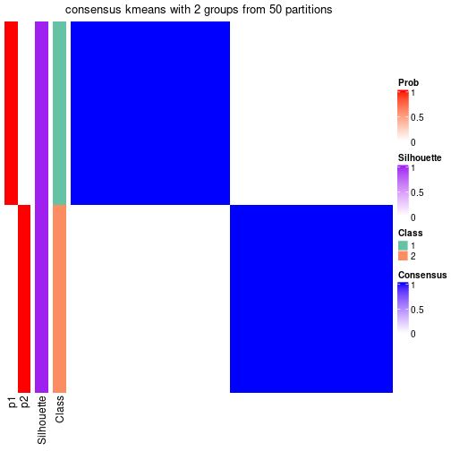</p>

</div>
<div id='tab-node-04-consensus-heatmap-2'>
<pre><code class="r">consensus_heatmap(res, k = 3)
</code></pre>

<p>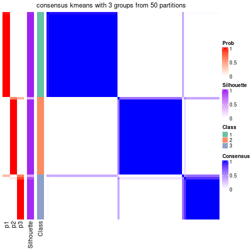</p>

</div>
<div id='tab-node-04-consensus-heatmap-3'>
<pre><code class="r">consensus_heatmap(res, k = 4)
</code></pre>

<p>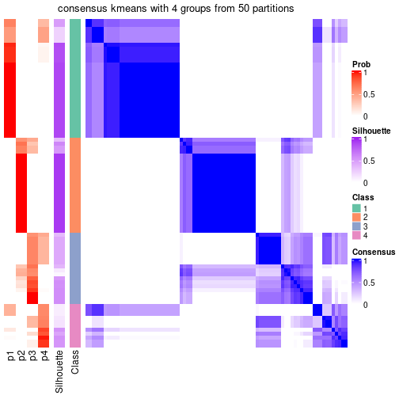</p>

</div>
<div id='tab-node-04-consensus-heatmap-4'>
<pre><code class="r">consensus_heatmap(res, k = 5)
</code></pre>

<p>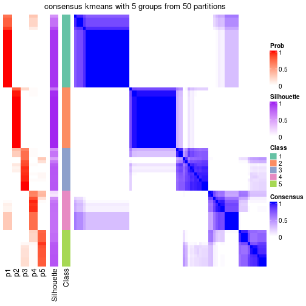</p>

</div>
<div id='tab-node-04-consensus-heatmap-5'>
<pre><code class="r">consensus_heatmap(res, k = 6)
</code></pre>

<p>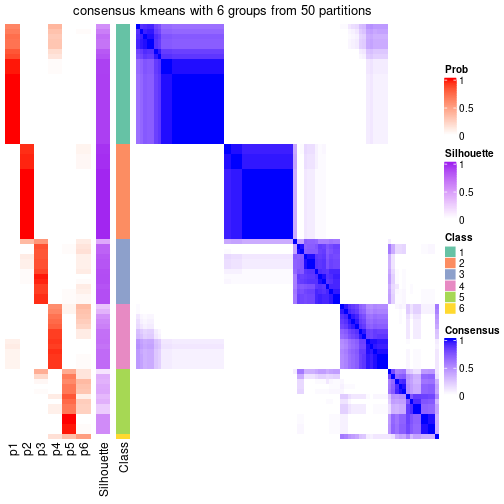</p>

</div>
<div id='tab-node-04-consensus-heatmap-6'>
<pre><code class="r">consensus_heatmap(res, k = 7)
</code></pre>

<p>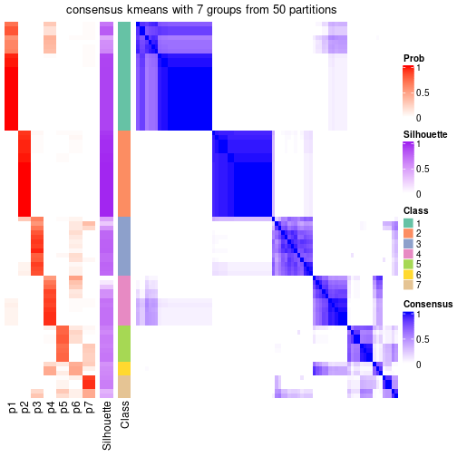</p>

</div>
<div id='tab-node-04-consensus-heatmap-7'>
<pre><code class="r">consensus_heatmap(res, k = 8)
</code></pre>

<p>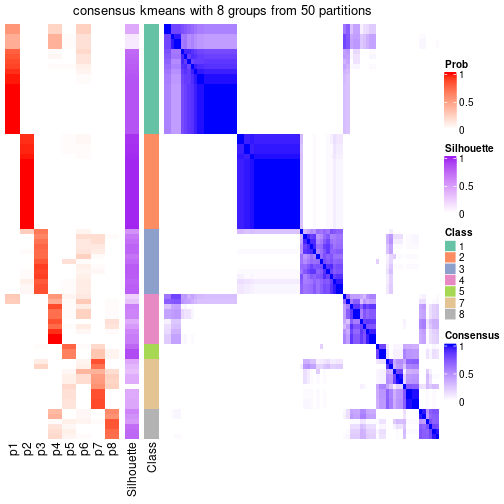</p>

</div>
</div>

Heatmaps for the membership of samples in all partitions to see how consistent they are:


<script>
$( function() {
	$( '#tabs-node-04-membership-heatmap' ).tabs();
} );
</script>
<div id='tabs-node-04-membership-heatmap'>
<ul>
<li><a href='#tab-node-04-membership-heatmap-1'>k = 2</a></li>
<li><a href='#tab-node-04-membership-heatmap-2'>k = 3</a></li>
<li><a href='#tab-node-04-membership-heatmap-3'>k = 4</a></li>
<li><a href='#tab-node-04-membership-heatmap-4'>k = 5</a></li>
<li><a href='#tab-node-04-membership-heatmap-5'>k = 6</a></li>
<li><a href='#tab-node-04-membership-heatmap-6'>k = 7</a></li>
<li><a href='#tab-node-04-membership-heatmap-7'>k = 8</a></li>
</ul>
<div id='tab-node-04-membership-heatmap-1'>
<pre><code class="r">membership_heatmap(res, k = 2)
</code></pre>

<p>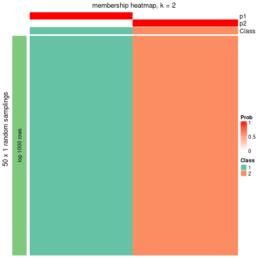</p>

</div>
<div id='tab-node-04-membership-heatmap-2'>
<pre><code class="r">membership_heatmap(res, k = 3)
</code></pre>

<p>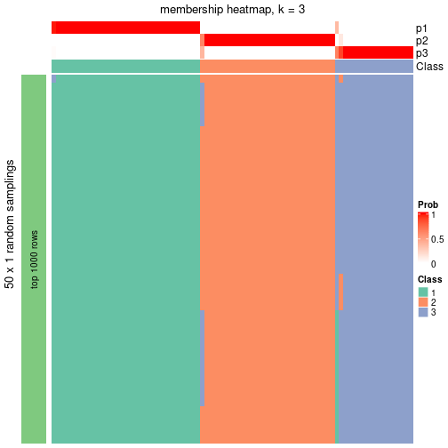</p>

</div>
<div id='tab-node-04-membership-heatmap-3'>
<pre><code class="r">membership_heatmap(res, k = 4)
</code></pre>

<p>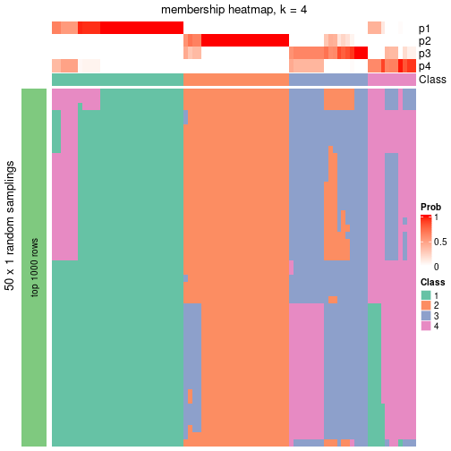</p>

</div>
<div id='tab-node-04-membership-heatmap-4'>
<pre><code class="r">membership_heatmap(res, k = 5)
</code></pre>

<p>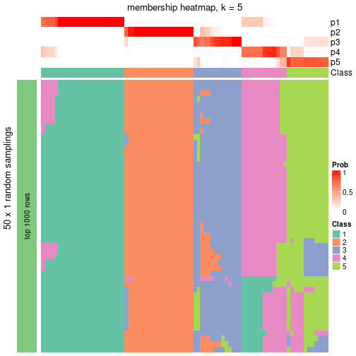</p>

</div>
<div id='tab-node-04-membership-heatmap-5'>
<pre><code class="r">membership_heatmap(res, k = 6)
</code></pre>

<p>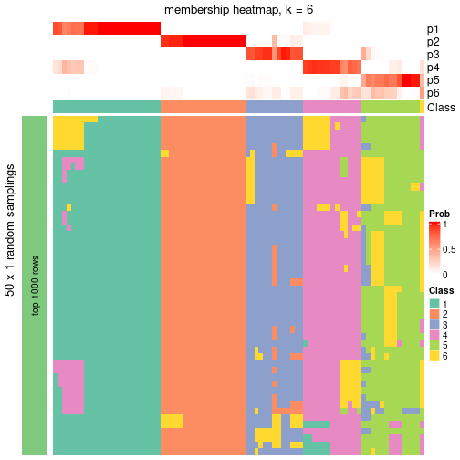</p>

</div>
<div id='tab-node-04-membership-heatmap-6'>
<pre><code class="r">membership_heatmap(res, k = 7)
</code></pre>

<p>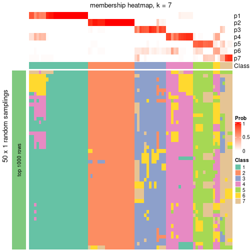</p>

</div>
<div id='tab-node-04-membership-heatmap-7'>
<pre><code class="r">membership_heatmap(res, k = 8)
</code></pre>

<p>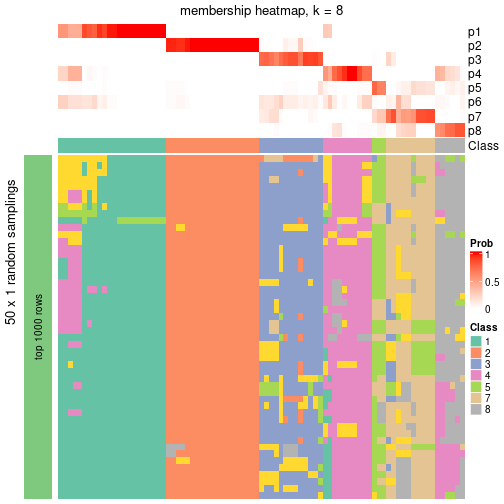</p>

</div>
</div>

As soon as the classes for columns are determined, the signatures
that are significantly different between subgroups can be looked for. 
Following are the heatmaps for signatures.


<script>
$( function() {
	$( '#tabs-node-04-get-signatures' ).tabs();
} );
</script>
<div id='tabs-node-04-get-signatures'>
<ul>
<li><a href='#tab-node-04-get-signatures-1'>k = 2</a></li>
<li><a href='#tab-node-04-get-signatures-2'>k = 3</a></li>
<li><a href='#tab-node-04-get-signatures-3'>k = 4</a></li>
<li><a href='#tab-node-04-get-signatures-4'>k = 5</a></li>
<li><a href='#tab-node-04-get-signatures-5'>k = 6</a></li>
<li><a href='#tab-node-04-get-signatures-6'>k = 7</a></li>
<li><a href='#tab-node-04-get-signatures-7'>k = 8</a></li>
</ul>
<div id='tab-node-04-get-signatures-1'>
<pre><code class="r">get_signatures(res, k = 2)
</code></pre>

<p>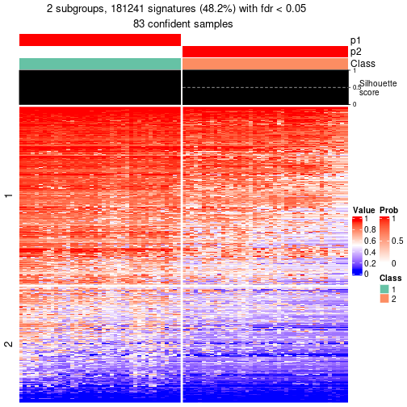</p>

</div>
<div id='tab-node-04-get-signatures-2'>
<pre><code class="r">get_signatures(res, k = 3)
</code></pre>

<p>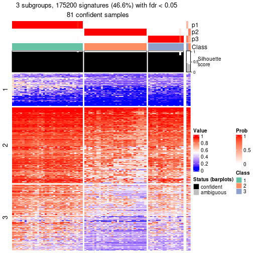</p>

</div>
<div id='tab-node-04-get-signatures-3'>
<pre><code class="r">get_signatures(res, k = 4)
</code></pre>

<p>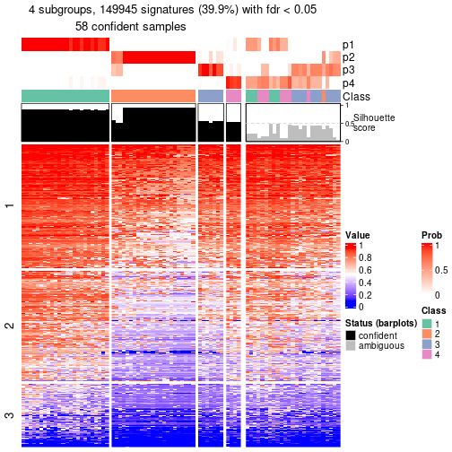</p>

</div>
<div id='tab-node-04-get-signatures-4'>
<pre><code class="r">get_signatures(res, k = 5)
</code></pre>

<p>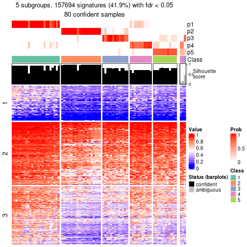</p>

</div>
<div id='tab-node-04-get-signatures-5'>
<pre><code class="r">get_signatures(res, k = 6)
</code></pre>

<p>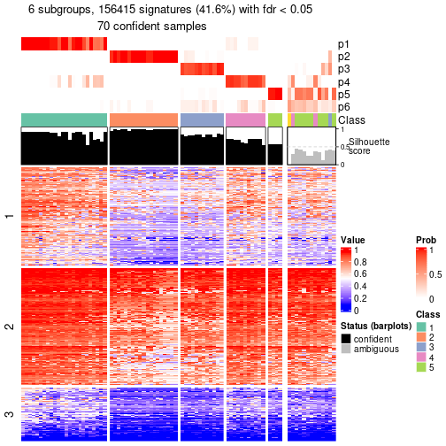</p>

</div>
<div id='tab-node-04-get-signatures-6'>
<pre><code class="r">get_signatures(res, k = 7)
</code></pre>

<p>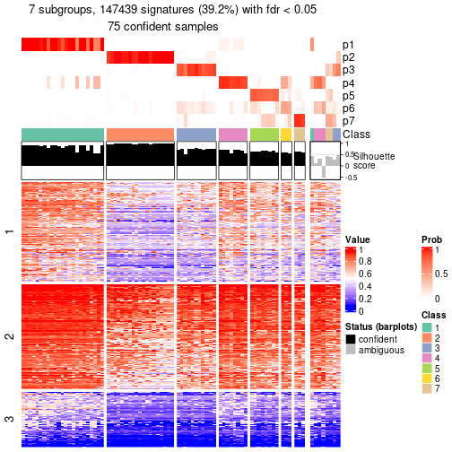</p>

</div>
<div id='tab-node-04-get-signatures-7'>
<pre><code class="r">get_signatures(res, k = 8)
</code></pre>

<p>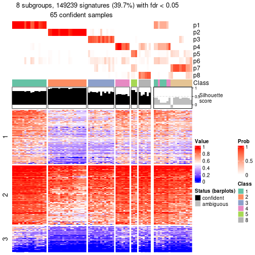</p>

</div>
</div>


Compare the overlap of signatures from different k:

```r
compare_signatures(res)
```

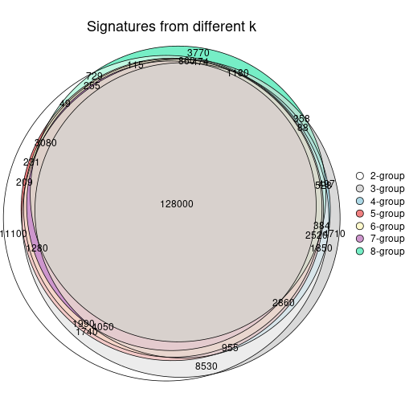

`get_signature()` returns a data frame invisibly. To get the list of signatures, the function
call should be assigned to a variable explicitly. In following code, if `plot` argument is set
to `FALSE`, no heatmap is plotted while only the differential analysis is performed.

```r
# code only for demonstration
tb = get_signature(res, k = ..., plot = FALSE)
```

An example of the output of `tb` is:

```
#>   which_row         fdr    mean_1    mean_2 scaled_mean_1 scaled_mean_2 km
#> 1        38 0.042760348  8.373488  9.131774    -0.5533452     0.5164555  1
#> 2        40 0.018707592  7.106213  8.469186    -0.6173731     0.5762149  1
#> 3        55 0.019134737 10.221463 11.207825    -0.6159697     0.5749050  1
#> 4        59 0.006059896  5.921854  7.869574    -0.6899429     0.6439467  1
#> 5        60 0.018055526  8.928898 10.211722    -0.6204761     0.5791110  1
#> 6        98 0.009384629 15.714769 14.887706     0.6635654    -0.6193277  2
...
```

The columns in `tb` are:

1. `which_row`: row indices corresponding to the input matrix.
2. `fdr`: FDR for the differential test. 
3. `mean_x`: The mean value in group x.
4. `scaled_mean_x`: The mean value in group x after rows are scaled.
5. `km`: Row groups if k-means clustering is applied to rows (which is done by automatically selecting number of clusters).

If there are too many signatures, `top_signatures = ...` can be set to only show the 
signatures with the highest FDRs:

```r
# code only for demonstration
# e.g. to show the top 500 most significant rows
tb = get_signature(res, k = ..., top_signatures = 500)
```

If the signatures are defined as these which are uniquely high in current group, `diff_method` argument
can be set to `"uniquely_high_in_one_group"`:

```r
# code only for demonstration
tb = get_signature(res, k = ..., diff_method = "uniquely_high_in_one_group")
```


UMAP plot which shows how samples are separated.


<script>
$( function() {
	$( '#tabs-node-04-dimension-reduction' ).tabs();
} );
</script>
<div id='tabs-node-04-dimension-reduction'>
<ul>
<li><a href='#tab-node-04-dimension-reduction-1'>k = 2</a></li>
<li><a href='#tab-node-04-dimension-reduction-2'>k = 3</a></li>
<li><a href='#tab-node-04-dimension-reduction-3'>k = 4</a></li>
<li><a href='#tab-node-04-dimension-reduction-4'>k = 5</a></li>
<li><a href='#tab-node-04-dimension-reduction-5'>k = 6</a></li>
<li><a href='#tab-node-04-dimension-reduction-6'>k = 7</a></li>
<li><a href='#tab-node-04-dimension-reduction-7'>k = 8</a></li>
</ul>
<div id='tab-node-04-dimension-reduction-1'>
<pre><code class="r">dimension_reduction(res, k = 2, method = &quot;UMAP&quot;)
</code></pre>

<p>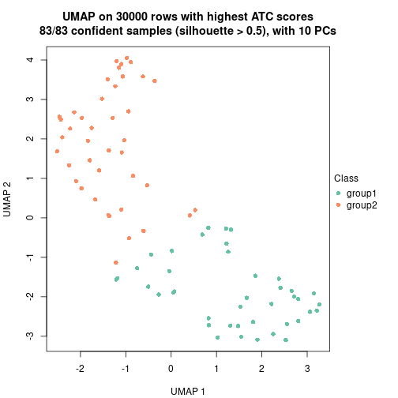</p>

</div>
<div id='tab-node-04-dimension-reduction-2'>
<pre><code class="r">dimension_reduction(res, k = 3, method = &quot;UMAP&quot;)
</code></pre>

<p>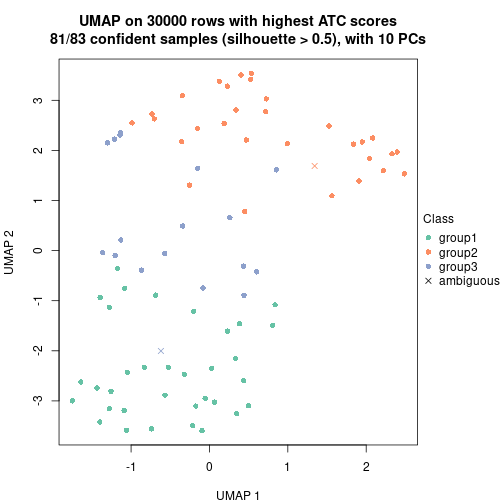</p>

</div>
<div id='tab-node-04-dimension-reduction-3'>
<pre><code class="r">dimension_reduction(res, k = 4, method = &quot;UMAP&quot;)
</code></pre>

<p>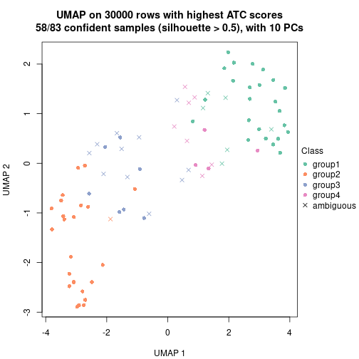</p>

</div>
<div id='tab-node-04-dimension-reduction-4'>
<pre><code class="r">dimension_reduction(res, k = 5, method = &quot;UMAP&quot;)
</code></pre>

<p>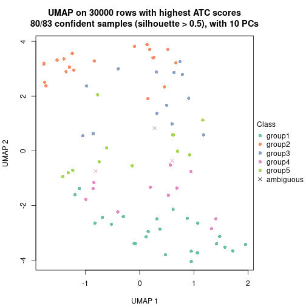</p>

</div>
<div id='tab-node-04-dimension-reduction-5'>
<pre><code class="r">dimension_reduction(res, k = 6, method = &quot;UMAP&quot;)
</code></pre>

<p>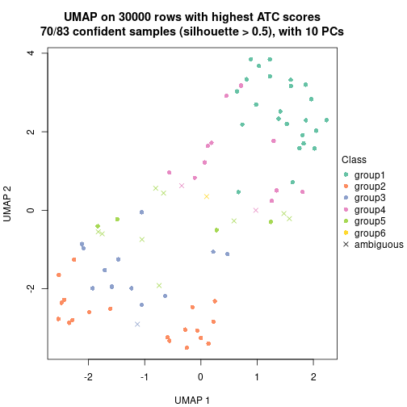</p>

</div>
<div id='tab-node-04-dimension-reduction-6'>
<pre><code class="r">dimension_reduction(res, k = 7, method = &quot;UMAP&quot;)
</code></pre>

<p>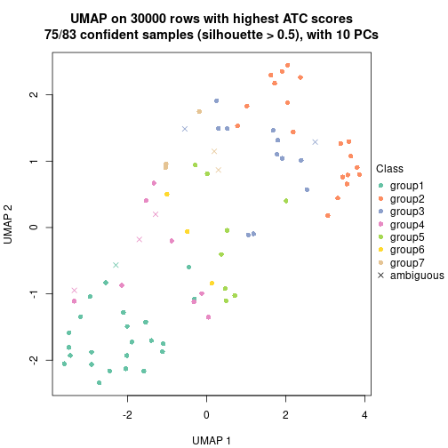</p>

</div>
<div id='tab-node-04-dimension-reduction-7'>
<pre><code class="r">dimension_reduction(res, k = 8, method = &quot;UMAP&quot;)
</code></pre>

<p>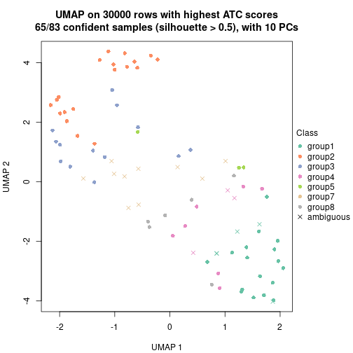</p>

</div>
</div>


Following heatmap shows how subgroups are split when increasing `k`:

```r
collect_classes(res)
```

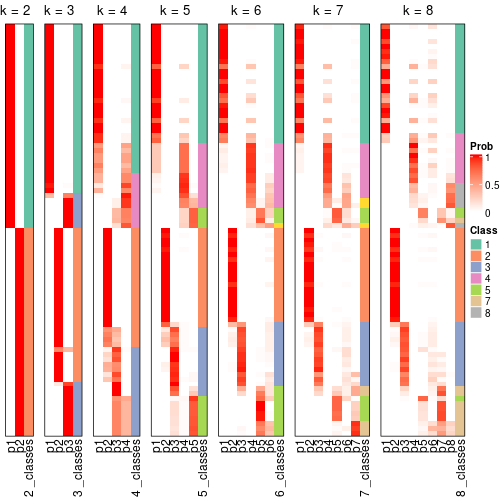


If matrix rows can be associated to genes, consider to use `functional_enrichment(res,
...)` to perform function enrichment for the signature genes. See [this vignette](https://jokergoo.github.io/cola_vignettes/functional_enrichment.html) for more detailed explanations.


 

---------------------------------------------------


### Node041


Parent node: [Node04](#Node04).
Child nodes: 
                Node0111-leaf
        ,
                Node0112-leaf
        ,
                Node0113-leaf
        ,
                Node0114-leaf
        ,
                Node0121-leaf
        ,
                Node0122-leaf
        ,
                Node0123-leaf
        ,
                Node0131-leaf
        ,
                Node0132-leaf
        ,
                Node0133-leaf
        ,
                Node0134-leaf
        ,
                Node0211-leaf
        ,
                Node0212-leaf
        ,
                [Node0213](#Node0213)
        ,
                Node0214-leaf
        ,
                [Node0221](#Node0221)
        ,
                Node0222-leaf
        ,
                Node0223-leaf
        ,
                [Node0231](#Node0231)
        ,
                Node0232-leaf
        ,
                Node0233-leaf
        ,
                [Node0234](#Node0234)
        ,
                Node0235-leaf
        ,
                Node0241-leaf
        ,
                [Node0242](#Node0242)
        ,
                Node0411-leaf
        ,
                Node0412-leaf
        ,
                Node0421-leaf
        ,
                Node0422-leaf
        ,
                Node0423-leaf
        ,
                Node0431-leaf
        ,
                Node0432-leaf
        ,
                Node0511-leaf
        ,
                Node0512-leaf
        ,
                Node0513-leaf
        ,
                Node0514-leaf
        ,
                Node0521-leaf
        ,
                Node0522-leaf
        ,
                Node0523-leaf
        ,
                Node0524-leaf
        ,
                Node0525-leaf
        ,
                Node0611-leaf
        ,
                [Node0612](#Node0612)
        ,
                Node0613-leaf
        ,
                [Node0711](#Node0711)
        ,
                Node0712-leaf
        ,
                Node0713-leaf
        ,
                [Node0721](#Node0721)
        ,
                Node0722-leaf
        ,
                Node0731-leaf
        ,
                Node0732-leaf
        ,
                Node0733-leaf
        .


The object with results only for a single top-value method and a single partitioning method 
can be extracted as:

```r
res = res_rh["041"]
```

A summary of `res` and all the functions that can be applied to it:

```r
res
```

```
#> A 'ConsensusPartition' object with k = 2, 3, 4, 5, 6, 7, 8.
#>   On a matrix with 30000 rows and 34 columns.
#>   Top rows (1000) are extracted by 'ATC' method.
#>   Subgroups are detected by 'kmeans' method.
#>   Performed in total 350 partitions by row resampling.
#>   Best k for subgroups seems to be 2.
#> 
#> Following methods can be applied to this 'ConsensusPartition' object:
#>  [1] "cola_report"             "collect_classes"         "collect_plots"          
#>  [4] "collect_stats"           "colnames"                "compare_partitions"     
#>  [7] "compare_signatures"      "consensus_heatmap"       "dimension_reduction"    
#> [10] "functional_enrichment"   "get_anno_col"            "get_anno"               
#> [13] "get_classes"             "get_consensus"           "get_matrix"             
#> [16] "get_membership"          "get_param"               "get_signatures"         
#> [19] "get_stats"               "is_best_k"               "is_stable_k"            
#> [22] "membership_heatmap"      "ncol"                    "nrow"                   
#> [25] "plot_ecdf"               "predict_classes"         "rownames"               
#> [28] "select_partition_number" "show"                    "suggest_best_k"         
#> [31] "test_to_known_factors"   "top_rows_heatmap"
```

`collect_plots()` function collects all the plots made from `res` for all `k` (number of subgroups)
into one single page to provide an easy and fast comparison between different `k`.

```r
collect_plots(res)
```

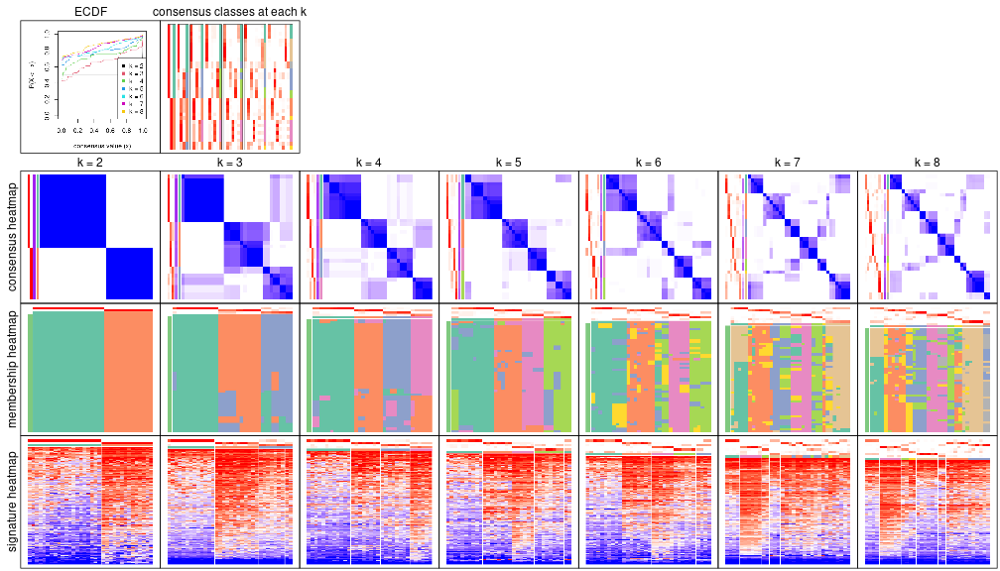

The plots are:

- The first row: a plot of the eCDF (empirical cumulative distribution
  function) curves of the consensus matrix for each `k` and the heatmap of
  predicted classes for each `k`.
- The second row: heatmaps of the consensus matrix for each `k`.
- The third row: heatmaps of the membership matrix for each `k`.
- The fouth row: heatmaps of the signatures for each `k`.

All the plots in panels can be made by individual functions and they are
plotted later in this section.

`select_partition_number()` produces several plots showing different
statistics for choosing "optimized" `k`. There are following statistics:

- eCDF curves of the consensus matrix for each `k`;
- 1-PAC. [The PAC score](https://en.wikipedia.org/wiki/Consensus_clustering#Over-interpretation_potential_of_consensus_clustering)
  measures the proportion of the ambiguous subgrouping.
- Mean silhouette score.
- Concordance. The mean probability of fiting the consensus subgroup labels in all
  partitions.
- Area increased. Denote $A_k$ as the area under the eCDF curve for current
  `k`, the area increased is defined as $A_k - A_{k-1}$.
- Rand index. The percent of pairs of samples that are both in a same cluster
  or both are not in a same cluster in the partition of k and k-1.
- Jaccard index. The ratio of pairs of samples are both in a same cluster in
  the partition of k and k-1 and the pairs of samples are both in a same
  cluster in the partition k or k-1.

The detailed explanations of these statistics can be found in [the _cola_
vignette](https://jokergoo.github.io/cola_vignettes/cola.html#toc_13).

Generally speaking, higher 1-PAC score, higher mean silhouette score or higher
concordance corresponds to better partition. Rand index and Jaccard index
measure how similar the current partition is compared to partition with `k-1`.
If they are too similar, we won't accept `k` is better than `k-1`.

```r
select_partition_number(res)
```

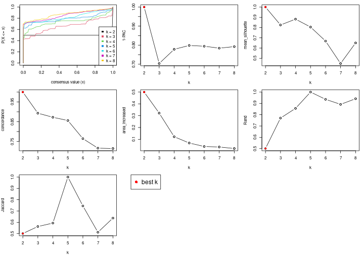

The numeric values for all these statistics can be obtained by `get_stats()`.

```r
get_stats(res)
```

```
#>   k 1-PAC mean_silhouette concordance area_increased  Rand Jaccard
#> 2 2 1.000           1.000       1.000         0.4996 0.501   0.501
#> 3 3 0.704           0.825       0.893         0.3217 0.770   0.563
#> 4 4 0.778           0.882       0.872         0.1219 0.856   0.593
#> 5 5 0.798           0.805       0.856         0.0689 1.000   1.000
#> 6 6 0.794           0.668       0.764         0.0394 0.936   0.745
#> 7 7 0.784           0.449       0.716         0.0352 0.891   0.512
#> 8 8 0.792           0.650       0.714         0.0223 0.941   0.637
```

`suggest_best_k()` suggests the best $k$ based on these statistics. The rules are as follows:

- All $k$ with Jaccard index larger than 0.95 are removed because increasing
  $k$ does not provide enough extra information. If all $k$ are removed, it is
  marked as no subgroup is detected.
- For all $k$ with 1-PAC score larger than 0.9, the maximal $k$ is taken as
  the best $k$, and other $k$ are marked as optional $k$.
- If it does not fit the second rule. The $k$ with the maximal vote of the
  highest 1-PAC score, highest mean silhouette, and highest concordance is
  taken as the best $k$.

```r
suggest_best_k(res)
```

```
#> [1] 2
```


Following is the table of the partitions (You need to click the **show/hide
code output** link to see it). The membership matrix (columns with name `p*`)
is inferred by
[`clue::cl_consensus()`](https://www.rdocumentation.org/link/cl_consensus?package=clue)
function with the `SE` method. Basically the value in the membership matrix
represents the probability to belong to a certain group. The finall subgroup
label for an item is determined with the group with highest probability it
belongs to.

In `get_classes()` function, the entropy is calculated from the membership
matrix and the silhouette score is calculated from the consensus matrix.


<script>
$( function() {
	$( '#tabs-node-041-get-classes' ).tabs();
} );
</script>
<div id='tabs-node-041-get-classes'>
<ul>
<li><a href='#tab-node-041-get-classes-1'>k = 2</a></li>
<li><a href='#tab-node-041-get-classes-2'>k = 3</a></li>
<li><a href='#tab-node-041-get-classes-3'>k = 4</a></li>
<li><a href='#tab-node-041-get-classes-4'>k = 5</a></li>
<li><a href='#tab-node-041-get-classes-5'>k = 6</a></li>
<li><a href='#tab-node-041-get-classes-6'>k = 7</a></li>
<li><a href='#tab-node-041-get-classes-7'>k = 8</a></li>
</ul>

<div id='tab-node-041-get-classes-1'>
<p><a id='tab-node-041-get-classes-1-a' style='color:#0366d6' href='#'>show/hide code output</a></p>
<pre><code class="r">cbind(get_classes(res, k = 2), get_membership(res, k = 2))
</code></pre>

<pre><code>#&gt;                 class entropy silhouette p1 p2
#&gt; TCGA.90.7769.01     1       0          1  1  0
#&gt; TCGA.77.A5G3.01     1       0          1  1  0
#&gt; TCGA.58.A46N.01     1       0          1  1  0
#&gt; TCGA.34.7107.01     2       0          1  0  1
#&gt; TCGA.58.8391.01     1       0          1  1  0
#&gt; TCGA.22.4601.01     2       0          1  0  1
#&gt; TCGA.34.5240.01     2       0          1  0  1
#&gt; TCGA.77.8009.01     2       0          1  0  1
#&gt; TCGA.33.A5GW.01     1       0          1  1  0
#&gt; TCGA.63.5128.01     1       0          1  1  0
#&gt; TCGA.33.AASD.01     1       0          1  1  0
#&gt; TCGA.NC.A5HP.01     2       0          1  0  1
#&gt; TCGA.37.A5EN.01     1       0          1  1  0
#&gt; TCGA.18.5592.01     2       0          1  0  1
#&gt; TCGA.92.7341.01     1       0          1  1  0
#&gt; TCGA.56.7582.01     2       0          1  0  1
#&gt; TCGA.94.8490.01     1       0          1  1  0
#&gt; TCGA.22.5482.01     1       0          1  1  0
#&gt; TCGA.85.7710.01     2       0          1  0  1
#&gt; TCGA.22.5473.01     1       0          1  1  0
#&gt; TCGA.33.AASJ.01     2       0          1  0  1
#&gt; TCGA.63.A5MB.01     2       0          1  0  1
#&gt; TCGA.63.A5ML.01     2       0          1  0  1
#&gt; TCGA.22.5477.01     2       0          1  0  1
#&gt; TCGA.77.6845.01     1       0          1  1  0
#&gt; TCGA.56.7730.01     1       0          1  1  0
#&gt; TCGA.22.5485.01     1       0          1  1  0
#&gt; TCGA.33.4583.01     2       0          1  0  1
#&gt; TCGA.MF.A522.01     1       0          1  1  0
#&gt; TCGA.70.6723.01     1       0          1  1  0
#&gt; TCGA.68.7755.01     1       0          1  1  0
#&gt; TCGA.L3.A524.01     1       0          1  1  0
#&gt; TCGA.85.A5B5.01     1       0          1  1  0
#&gt; TCGA.85.A512.01     2       0          1  0  1
</code></pre>

<script>
$('#tab-node-041-get-classes-1-a').parent().next().next().hide();
$('#tab-node-041-get-classes-1-a').click(function(){
  $('#tab-node-041-get-classes-1-a').parent().next().next().toggle();
  return(false);
});
</script>
</div>

<div id='tab-node-041-get-classes-2'>
<p><a id='tab-node-041-get-classes-2-a' style='color:#0366d6' href='#'>show/hide code output</a></p>
<pre><code class="r">cbind(get_classes(res, k = 3), get_membership(res, k = 3))
</code></pre>

<pre><code>#&gt;                 class entropy silhouette   p1   p2   p3
#&gt; TCGA.90.7769.01     1   0.000      0.984 1.00 0.00 0.00
#&gt; TCGA.77.A5G3.01     3   0.369      0.775 0.14 0.00 0.86
#&gt; TCGA.58.A46N.01     1   0.000      0.984 1.00 0.00 0.00
#&gt; TCGA.34.7107.01     2   0.556      0.770 0.00 0.70 0.30
#&gt; TCGA.58.8391.01     1   0.000      0.984 1.00 0.00 0.00
#&gt; TCGA.22.4601.01     2   0.207      0.804 0.00 0.94 0.06
#&gt; TCGA.34.5240.01     2   0.540      0.783 0.00 0.72 0.28
#&gt; TCGA.77.8009.01     2   0.000      0.845 0.00 1.00 0.00
#&gt; TCGA.33.A5GW.01     3   0.254      0.760 0.08 0.00 0.92
#&gt; TCGA.63.5128.01     1   0.000      0.984 1.00 0.00 0.00
#&gt; TCGA.33.AASD.01     1   0.000      0.984 1.00 0.00 0.00
#&gt; TCGA.NC.A5HP.01     3   0.480      0.436 0.00 0.22 0.78
#&gt; TCGA.37.A5EN.01     3   0.595      0.577 0.36 0.00 0.64
#&gt; TCGA.18.5592.01     2   0.556      0.770 0.00 0.70 0.30
#&gt; TCGA.92.7341.01     3   0.595      0.577 0.36 0.00 0.64
#&gt; TCGA.56.7582.01     2   0.000      0.845 0.00 1.00 0.00
#&gt; TCGA.94.8490.01     3   0.369      0.775 0.14 0.00 0.86
#&gt; TCGA.22.5482.01     1   0.000      0.984 1.00 0.00 0.00
#&gt; TCGA.85.7710.01     2   0.540      0.783 0.00 0.72 0.28
#&gt; TCGA.22.5473.01     1   0.000      0.984 1.00 0.00 0.00
#&gt; TCGA.33.AASJ.01     2   0.556      0.770 0.00 0.70 0.30
#&gt; TCGA.63.A5MB.01     2   0.000      0.845 0.00 1.00 0.00
#&gt; TCGA.63.A5ML.01     2   0.000      0.845 0.00 1.00 0.00
#&gt; TCGA.22.5477.01     3   0.480      0.436 0.00 0.22 0.78
#&gt; TCGA.77.6845.01     1   0.000      0.984 1.00 0.00 0.00
#&gt; TCGA.56.7730.01     1   0.400      0.764 0.84 0.00 0.16
#&gt; TCGA.22.5485.01     1   0.000      0.984 1.00 0.00 0.00
#&gt; TCGA.33.4583.01     2   0.254      0.838 0.00 0.92 0.08
#&gt; TCGA.MF.A522.01     3   0.254      0.760 0.08 0.00 0.92
#&gt; TCGA.70.6723.01     1   0.000      0.984 1.00 0.00 0.00
#&gt; TCGA.68.7755.01     1   0.000      0.984 1.00 0.00 0.00
#&gt; TCGA.L3.A524.01     3   0.540      0.654 0.28 0.00 0.72
#&gt; TCGA.85.A5B5.01     1   0.000      0.984 1.00 0.00 0.00
#&gt; TCGA.85.A512.01     2   0.000      0.845 0.00 1.00 0.00
</code></pre>

<script>
$('#tab-node-041-get-classes-2-a').parent().next().next().hide();
$('#tab-node-041-get-classes-2-a').click(function(){
  $('#tab-node-041-get-classes-2-a').parent().next().next().toggle();
  return(false);
});
</script>
</div>

<div id='tab-node-041-get-classes-3'>
<p><a id='tab-node-041-get-classes-3-a' style='color:#0366d6' href='#'>show/hide code output</a></p>
<pre><code class="r">cbind(get_classes(res, k = 4), get_membership(res, k = 4))
</code></pre>

<pre><code>#&gt;                 class entropy silhouette   p1   p2   p3   p4
#&gt; TCGA.90.7769.01     1  0.2011      0.913 0.92 0.00 0.00 0.08
#&gt; TCGA.77.A5G3.01     3  0.1913      0.880 0.02 0.00 0.94 0.04
#&gt; TCGA.58.A46N.01     1  0.0000      0.934 1.00 0.00 0.00 0.00
#&gt; TCGA.34.7107.01     2  0.1211      0.889 0.00 0.96 0.04 0.00
#&gt; TCGA.58.8391.01     1  0.2011      0.913 0.92 0.00 0.00 0.08
#&gt; TCGA.22.4601.01     4  0.3610      0.741 0.00 0.20 0.00 0.80
#&gt; TCGA.34.5240.01     2  0.0000      0.906 0.00 1.00 0.00 0.00
#&gt; TCGA.77.8009.01     4  0.5355      0.934 0.00 0.36 0.02 0.62
#&gt; TCGA.33.A5GW.01     3  0.5006      0.852 0.02 0.04 0.78 0.16
#&gt; TCGA.63.5128.01     1  0.0000      0.934 1.00 0.00 0.00 0.00
#&gt; TCGA.33.AASD.01     1  0.1211      0.926 0.96 0.00 0.00 0.04
#&gt; TCGA.NC.A5HP.01     2  0.3400      0.761 0.00 0.82 0.18 0.00
#&gt; TCGA.37.A5EN.01     3  0.1637      0.892 0.06 0.00 0.94 0.00
#&gt; TCGA.18.5592.01     2  0.0000      0.906 0.00 1.00 0.00 0.00
#&gt; TCGA.92.7341.01     3  0.1637      0.892 0.06 0.00 0.94 0.00
#&gt; TCGA.56.7582.01     4  0.4713      0.931 0.00 0.36 0.00 0.64
#&gt; TCGA.94.8490.01     3  0.1913      0.880 0.02 0.00 0.94 0.04
#&gt; TCGA.22.5482.01     1  0.0707      0.931 0.98 0.00 0.00 0.02
#&gt; TCGA.85.7710.01     2  0.0000      0.906 0.00 1.00 0.00 0.00
#&gt; TCGA.22.5473.01     1  0.2011      0.913 0.92 0.00 0.00 0.08
#&gt; TCGA.33.AASJ.01     2  0.0000      0.906 0.00 1.00 0.00 0.00
#&gt; TCGA.63.A5MB.01     4  0.5355      0.934 0.00 0.36 0.02 0.62
#&gt; TCGA.63.A5ML.01     4  0.4713      0.931 0.00 0.36 0.00 0.64
#&gt; TCGA.22.5477.01     2  0.2921      0.796 0.00 0.86 0.14 0.00
#&gt; TCGA.77.6845.01     1  0.0000      0.934 1.00 0.00 0.00 0.00
#&gt; TCGA.56.7730.01     3  0.4088      0.815 0.14 0.00 0.82 0.04
#&gt; TCGA.22.5485.01     1  0.0000      0.934 1.00 0.00 0.00 0.00
#&gt; TCGA.33.4583.01     2  0.1913      0.850 0.00 0.94 0.02 0.04
#&gt; TCGA.MF.A522.01     3  0.5006      0.852 0.02 0.04 0.78 0.16
#&gt; TCGA.70.6723.01     1  0.5151      0.740 0.76 0.00 0.14 0.10
#&gt; TCGA.68.7755.01     1  0.0000      0.934 1.00 0.00 0.00 0.00
#&gt; TCGA.L3.A524.01     3  0.4731      0.862 0.06 0.00 0.78 0.16
#&gt; TCGA.85.A5B5.01     1  0.5151      0.740 0.76 0.00 0.14 0.10
#&gt; TCGA.85.A512.01     4  0.5355      0.934 0.00 0.36 0.02 0.62
</code></pre>

<script>
$('#tab-node-041-get-classes-3-a').parent().next().next().hide();
$('#tab-node-041-get-classes-3-a').click(function(){
  $('#tab-node-041-get-classes-3-a').parent().next().next().toggle();
  return(false);
});
</script>
</div>

<div id='tab-node-041-get-classes-4'>
<p><a id='tab-node-041-get-classes-4-a' style='color:#0366d6' href='#'>show/hide code output</a></p>
<pre><code class="r">cbind(get_classes(res, k = 5), get_membership(res, k = 5))
</code></pre>

<pre><code>#&gt;                 class entropy silhouette   p1   p2   p3   p4   p5
#&gt; TCGA.90.7769.01     1  0.3421      0.814 0.84 0.00 0.08 0.08 0.00
#&gt; TCGA.77.A5G3.01     5  0.3274      0.715 0.00 0.00 0.22 0.00 0.78
#&gt; TCGA.58.A46N.01     1  0.0609      0.841 0.98 0.00 0.02 0.00 0.00
#&gt; TCGA.34.7107.01     2  0.0609      0.917 0.00 0.98 0.02 0.00 0.00
#&gt; TCGA.58.8391.01     1  0.3421      0.814 0.84 0.00 0.08 0.08 0.00
#&gt; TCGA.22.4601.01     4  0.3868      0.905 0.00 0.06 0.14 0.80 0.00
#&gt; TCGA.34.5240.01     2  0.1410      0.906 0.00 0.94 0.06 0.00 0.00
#&gt; TCGA.77.8009.01     4  0.2020      0.949 0.00 0.10 0.00 0.90 0.00
#&gt; TCGA.33.A5GW.01     5  0.4060      0.709 0.00 0.00 0.36 0.00 0.64
#&gt; TCGA.63.5128.01     1  0.0609      0.841 0.98 0.00 0.02 0.00 0.00
#&gt; TCGA.33.AASD.01     1  0.1648      0.822 0.94 0.00 0.04 0.02 0.00
#&gt; TCGA.NC.A5HP.01     2  0.3922      0.802 0.00 0.78 0.18 0.00 0.04
#&gt; TCGA.37.A5EN.01     5  0.0000      0.791 0.00 0.00 0.00 0.00 1.00
#&gt; TCGA.18.5592.01     2  0.0000      0.917 0.00 1.00 0.00 0.00 0.00
#&gt; TCGA.92.7341.01     5  0.0000      0.791 0.00 0.00 0.00 0.00 1.00
#&gt; TCGA.56.7582.01     4  0.3697      0.944 0.00 0.10 0.08 0.82 0.00
#&gt; TCGA.94.8490.01     5  0.3274      0.715 0.00 0.00 0.22 0.00 0.78
#&gt; TCGA.22.5482.01     1  0.3110      0.820 0.86 0.00 0.06 0.08 0.00
#&gt; TCGA.85.7710.01     2  0.0609      0.917 0.00 0.98 0.02 0.00 0.00
#&gt; TCGA.22.5473.01     1  0.3421      0.814 0.84 0.00 0.08 0.08 0.00
#&gt; TCGA.33.AASJ.01     2  0.0609      0.916 0.00 0.98 0.02 0.00 0.00
#&gt; TCGA.63.A5MB.01     4  0.2020      0.949 0.00 0.10 0.00 0.90 0.00
#&gt; TCGA.63.A5ML.01     4  0.3697      0.944 0.00 0.10 0.08 0.82 0.00
#&gt; TCGA.22.5477.01     2  0.3521      0.851 0.00 0.82 0.14 0.00 0.04
#&gt; TCGA.77.6845.01     1  0.0609      0.841 0.98 0.00 0.02 0.00 0.00
#&gt; TCGA.56.7730.01     5  0.1043      0.778 0.00 0.00 0.04 0.00 0.96
#&gt; TCGA.22.5485.01     1  0.0609      0.841 0.98 0.00 0.02 0.00 0.00
#&gt; TCGA.33.4583.01     2  0.2280      0.839 0.00 0.88 0.00 0.12 0.00
#&gt; TCGA.MF.A522.01     5  0.4060      0.709 0.00 0.00 0.36 0.00 0.64
#&gt; TCGA.70.6723.01     1  0.6530      0.229 0.44 0.00 0.20 0.00 0.36
#&gt; TCGA.68.7755.01     1  0.0000      0.840 1.00 0.00 0.00 0.00 0.00
#&gt; TCGA.L3.A524.01     5  0.4060      0.709 0.00 0.00 0.36 0.00 0.64
#&gt; TCGA.85.A5B5.01     1  0.6530      0.229 0.44 0.00 0.20 0.00 0.36
#&gt; TCGA.85.A512.01     4  0.2020      0.949 0.00 0.10 0.00 0.90 0.00
</code></pre>

<script>
$('#tab-node-041-get-classes-4-a').parent().next().next().hide();
$('#tab-node-041-get-classes-4-a').click(function(){
  $('#tab-node-041-get-classes-4-a').parent().next().next().toggle();
  return(false);
});
</script>
</div>

<div id='tab-node-041-get-classes-5'>
<p><a id='tab-node-041-get-classes-5-a' style='color:#0366d6' href='#'>show/hide code output</a></p>
<pre><code class="r">cbind(get_classes(res, k = 6), get_membership(res, k = 6))
</code></pre>

<pre><code>#&gt;                 class entropy silhouette   p1   p2   p3   p4   p5   p6
#&gt; TCGA.90.7769.01     1  0.3706      0.685 0.62 0.00 0.00 0.00 0.00 0.38
#&gt; TCGA.77.A5G3.01     3  0.4845     -0.154 0.00 0.00 0.54 0.00 0.40 0.06
#&gt; TCGA.58.A46N.01     1  0.0937      0.726 0.96 0.00 0.04 0.00 0.00 0.00
#&gt; TCGA.34.7107.01     2  0.2094      0.832 0.00 0.90 0.08 0.00 0.00 0.02
#&gt; TCGA.58.8391.01     1  0.3797      0.669 0.58 0.00 0.00 0.00 0.00 0.42
#&gt; TCGA.22.4601.01     4  0.1267      0.840 0.00 0.00 0.00 0.94 0.06 0.00
#&gt; TCGA.34.5240.01     2  0.3163      0.804 0.00 0.82 0.04 0.00 0.00 0.14
#&gt; TCGA.77.8009.01     4  0.3156      0.896 0.00 0.02 0.00 0.80 0.00 0.18
#&gt; TCGA.33.A5GW.01     5  0.0547      0.723 0.00 0.00 0.00 0.02 0.98 0.00
#&gt; TCGA.63.5128.01     1  0.0000      0.740 1.00 0.00 0.00 0.00 0.00 0.00
#&gt; TCGA.33.AASD.01     1  0.3982      0.613 0.74 0.00 0.06 0.00 0.00 0.20
#&gt; TCGA.NC.A5HP.01     2  0.4993      0.582 0.00 0.56 0.36 0.00 0.00 0.08
#&gt; TCGA.37.A5EN.01     5  0.3309      0.715 0.00 0.00 0.28 0.00 0.72 0.00
#&gt; TCGA.18.5592.01     2  0.0000      0.837 0.00 1.00 0.00 0.00 0.00 0.00
#&gt; TCGA.92.7341.01     5  0.3309      0.715 0.00 0.00 0.28 0.00 0.72 0.00
#&gt; TCGA.56.7582.01     4  0.0547      0.888 0.00 0.02 0.00 0.98 0.00 0.00
#&gt; TCGA.94.8490.01     3  0.4845     -0.154 0.00 0.00 0.54 0.00 0.40 0.06
#&gt; TCGA.22.5482.01     1  0.3756      0.680 0.60 0.00 0.00 0.00 0.00 0.40
#&gt; TCGA.85.7710.01     2  0.1807      0.834 0.00 0.92 0.06 0.00 0.00 0.02
#&gt; TCGA.22.5473.01     1  0.3797      0.669 0.58 0.00 0.00 0.00 0.00 0.42
#&gt; TCGA.33.AASJ.01     2  0.1092      0.835 0.00 0.96 0.02 0.00 0.00 0.02
#&gt; TCGA.63.A5MB.01     4  0.3156      0.896 0.00 0.02 0.00 0.80 0.00 0.18
#&gt; TCGA.63.A5ML.01     4  0.0547      0.888 0.00 0.02 0.00 0.98 0.00 0.00
#&gt; TCGA.22.5477.01     2  0.4737      0.745 0.00 0.68 0.16 0.00 0.00 0.16
#&gt; TCGA.77.6845.01     1  0.0000      0.740 1.00 0.00 0.00 0.00 0.00 0.00
#&gt; TCGA.56.7730.01     5  0.3409      0.703 0.00 0.00 0.30 0.00 0.70 0.00
#&gt; TCGA.22.5485.01     1  0.0000      0.740 1.00 0.00 0.00 0.00 0.00 0.00
#&gt; TCGA.33.4583.01     2  0.3660      0.704 0.00 0.78 0.00 0.06 0.00 0.16
#&gt; TCGA.MF.A522.01     5  0.1092      0.709 0.00 0.00 0.00 0.02 0.96 0.02
#&gt; TCGA.70.6723.01     3  0.4328      0.146 0.46 0.00 0.52 0.00 0.00 0.02
#&gt; TCGA.68.7755.01     1  0.1480      0.742 0.94 0.00 0.02 0.00 0.00 0.04
#&gt; TCGA.L3.A524.01     5  0.0937      0.741 0.00 0.00 0.04 0.00 0.96 0.00
#&gt; TCGA.85.A5B5.01     3  0.4337      0.106 0.48 0.00 0.50 0.00 0.00 0.02
#&gt; TCGA.85.A512.01     4  0.3156      0.896 0.00 0.02 0.00 0.80 0.00 0.18
</code></pre>

<script>
$('#tab-node-041-get-classes-5-a').parent().next().next().hide();
$('#tab-node-041-get-classes-5-a').click(function(){
  $('#tab-node-041-get-classes-5-a').parent().next().next().toggle();
  return(false);
});
</script>
</div>

<div id='tab-node-041-get-classes-6'>
<p><a id='tab-node-041-get-classes-6-a' style='color:#0366d6' href='#'>show/hide code output</a></p>
<pre><code class="r">cbind(get_classes(res, k = 7), get_membership(res, k = 7))
</code></pre>

<pre><code>#&gt;                 class entropy silhouette   p1   p2   p3   p4   p5   p6   p7
#&gt; TCGA.90.7769.01     1  0.1166      0.718 0.94 0.00 0.00 0.00 0.00 0.00 0.06
#&gt; TCGA.77.A5G3.01     3  0.2313      0.411 0.00 0.00 0.88 0.00 0.00 0.06 0.06
#&gt; TCGA.58.A46N.01     7  0.4622      0.480 0.38 0.00 0.00 0.00 0.02 0.04 0.56
#&gt; TCGA.34.7107.01     2  0.1433      0.430 0.00 0.92 0.00 0.00 0.00 0.08 0.00
#&gt; TCGA.58.8391.01     1  0.0504      0.754 0.98 0.00 0.00 0.00 0.02 0.00 0.00
#&gt; TCGA.22.4601.01     4  0.0863      0.769 0.00 0.00 0.00 0.96 0.04 0.00 0.00
#&gt; TCGA.34.5240.01     2  0.3943     -0.607 0.00 0.56 0.00 0.00 0.00 0.42 0.02
#&gt; TCGA.77.8009.01     4  0.4965      0.798 0.00 0.00 0.00 0.66 0.04 0.18 0.12
#&gt; TCGA.33.A5GW.01     5  0.2081      0.794 0.00 0.00 0.14 0.00 0.86 0.00 0.00
#&gt; TCGA.63.5128.01     7  0.3413      0.535 0.38 0.00 0.00 0.00 0.00 0.00 0.62
#&gt; TCGA.33.AASD.01     1  0.5408     -0.367 0.46 0.00 0.00 0.00 0.04 0.08 0.42
#&gt; TCGA.NC.A5HP.01     2  0.5115     -0.115 0.00 0.48 0.38 0.00 0.00 0.14 0.00
#&gt; TCGA.37.A5EN.01     3  0.4269      0.351 0.02 0.00 0.60 0.00 0.36 0.00 0.02
#&gt; TCGA.18.5592.01     2  0.0863      0.428 0.00 0.96 0.00 0.00 0.00 0.04 0.00
#&gt; TCGA.92.7341.01     3  0.4269      0.351 0.02 0.00 0.60 0.00 0.36 0.00 0.02
#&gt; TCGA.56.7582.01     4  0.0000      0.793 0.00 0.00 0.00 1.00 0.00 0.00 0.00
#&gt; TCGA.94.8490.01     3  0.2313      0.411 0.00 0.00 0.88 0.00 0.00 0.06 0.06
#&gt; TCGA.22.5482.01     1  0.0504      0.748 0.98 0.00 0.00 0.00 0.00 0.00 0.02
#&gt; TCGA.85.7710.01     2  0.1718      0.439 0.00 0.92 0.00 0.00 0.00 0.04 0.04
#&gt; TCGA.22.5473.01     1  0.0504      0.754 0.98 0.00 0.00 0.00 0.02 0.00 0.00
#&gt; TCGA.33.AASJ.01     2  0.2081      0.306 0.00 0.86 0.00 0.00 0.00 0.14 0.00
#&gt; TCGA.63.A5MB.01     4  0.4965      0.798 0.00 0.00 0.00 0.66 0.04 0.18 0.12
#&gt; TCGA.63.A5ML.01     4  0.0000      0.793 0.00 0.00 0.00 1.00 0.00 0.00 0.00
#&gt; TCGA.22.5477.01     6  0.4692      0.000 0.00 0.42 0.08 0.00 0.00 0.50 0.00
#&gt; TCGA.77.6845.01     7  0.3413      0.535 0.38 0.00 0.00 0.00 0.00 0.00 0.62
#&gt; TCGA.56.7730.01     3  0.4269      0.351 0.02 0.00 0.60 0.00 0.36 0.00 0.02
#&gt; TCGA.22.5485.01     7  0.3413      0.535 0.38 0.00 0.00 0.00 0.00 0.00 0.62
#&gt; TCGA.33.4583.01     2  0.5368      0.194 0.00 0.68 0.00 0.06 0.04 0.12 0.10
#&gt; TCGA.MF.A522.01     5  0.2081      0.794 0.00 0.00 0.14 0.00 0.86 0.00 0.00
#&gt; TCGA.70.6723.01     7  0.7230      0.163 0.10 0.00 0.26 0.00 0.06 0.16 0.42
#&gt; TCGA.68.7755.01     7  0.3525      0.415 0.44 0.00 0.00 0.00 0.00 0.00 0.56
#&gt; TCGA.L3.A524.01     5  0.3815      0.453 0.02 0.00 0.36 0.00 0.62 0.00 0.00
#&gt; TCGA.85.A5B5.01     7  0.7022      0.268 0.10 0.00 0.20 0.00 0.06 0.16 0.48
#&gt; TCGA.85.A512.01     4  0.4965      0.798 0.00 0.00 0.00 0.66 0.04 0.18 0.12
</code></pre>

<script>
$('#tab-node-041-get-classes-6-a').parent().next().next().hide();
$('#tab-node-041-get-classes-6-a').click(function(){
  $('#tab-node-041-get-classes-6-a').parent().next().next().toggle();
  return(false);
});
</script>
</div>

<div id='tab-node-041-get-classes-7'>
<p><a id='tab-node-041-get-classes-7-a' style='color:#0366d6' href='#'>show/hide code output</a></p>
<pre><code class="r">cbind(get_classes(res, k = 8), get_membership(res, k = 8))
</code></pre>

<pre><code>#&gt;                 class entropy silhouette   p1   p2   p3   p4   p5   p6   p7   p8
#&gt; TCGA.90.7769.01     1  0.3015     0.9292 0.68 0.00 0.00 0.00 0.00 0.00 0.32 0.00
#&gt; TCGA.77.A5G3.01     3  0.6342     0.3272 0.16 0.00 0.48 0.00 0.08 0.24 0.00 0.04
#&gt; TCGA.58.A46N.01     7  0.3080     0.7630 0.02 0.00 0.00 0.00 0.06 0.02 0.84 0.06
#&gt; TCGA.34.7107.01     2  0.3048     0.4809 0.02 0.84 0.00 0.00 0.02 0.04 0.00 0.08
#&gt; TCGA.58.8391.01     1  0.3291     0.9556 0.70 0.00 0.02 0.00 0.00 0.00 0.28 0.00
#&gt; TCGA.22.4601.01     4  0.5369     0.6843 0.00 0.00 0.00 0.54 0.22 0.04 0.00 0.20
#&gt; TCGA.34.5240.01     6  0.4125     0.5788 0.02 0.44 0.00 0.00 0.02 0.52 0.00 0.00
#&gt; TCGA.77.8009.01     4  0.0000     0.7753 0.00 0.00 0.00 1.00 0.00 0.00 0.00 0.00
#&gt; TCGA.33.A5GW.01     5  0.3658     0.9776 0.02 0.00 0.40 0.00 0.58 0.00 0.00 0.00
#&gt; TCGA.63.5128.01     7  0.0000     0.8983 0.00 0.00 0.00 0.00 0.00 0.00 1.00 0.00
#&gt; TCGA.33.AASD.01     7  0.4134     0.6829 0.08 0.00 0.00 0.00 0.08 0.06 0.76 0.02
#&gt; TCGA.NC.A5HP.01     2  0.7161    -0.0758 0.14 0.32 0.00 0.00 0.10 0.32 0.00 0.12
#&gt; TCGA.37.A5EN.01     3  0.0000     0.4952 0.00 0.00 1.00 0.00 0.00 0.00 0.00 0.00
#&gt; TCGA.18.5592.01     2  0.0471     0.4827 0.00 0.98 0.00 0.00 0.00 0.02 0.00 0.00
#&gt; TCGA.92.7341.01     3  0.0471     0.4804 0.00 0.00 0.98 0.00 0.02 0.00 0.00 0.00
#&gt; TCGA.56.7582.01     4  0.4835     0.7576 0.02 0.00 0.00 0.64 0.10 0.02 0.00 0.22
#&gt; TCGA.94.8490.01     3  0.6342     0.3272 0.16 0.00 0.48 0.00 0.08 0.24 0.00 0.04
#&gt; TCGA.22.5482.01     1  0.4106     0.9231 0.64 0.00 0.02 0.00 0.04 0.00 0.30 0.00
#&gt; TCGA.85.7710.01     2  0.2348     0.5076 0.04 0.88 0.00 0.00 0.00 0.02 0.00 0.06
#&gt; TCGA.22.5473.01     1  0.3291     0.9556 0.70 0.00 0.02 0.00 0.00 0.00 0.28 0.00
#&gt; TCGA.33.AASJ.01     2  0.2267     0.2394 0.00 0.82 0.00 0.00 0.00 0.18 0.00 0.00
#&gt; TCGA.63.A5MB.01     4  0.0000     0.7753 0.00 0.00 0.00 1.00 0.00 0.00 0.00 0.00
#&gt; TCGA.63.A5ML.01     4  0.4835     0.7576 0.02 0.00 0.00 0.64 0.10 0.02 0.00 0.22
#&gt; TCGA.22.5477.01     6  0.2756     0.6335 0.00 0.26 0.00 0.00 0.00 0.74 0.00 0.00
#&gt; TCGA.77.6845.01     7  0.0000     0.8983 0.00 0.00 0.00 0.00 0.00 0.00 1.00 0.00
#&gt; TCGA.56.7730.01     3  0.0000     0.4952 0.00 0.00 1.00 0.00 0.00 0.00 0.00 0.00
#&gt; TCGA.22.5485.01     7  0.0000     0.8983 0.00 0.00 0.00 0.00 0.00 0.00 1.00 0.00
#&gt; TCGA.33.4583.01     2  0.3291     0.2793 0.02 0.70 0.00 0.28 0.00 0.00 0.00 0.00
#&gt; TCGA.MF.A522.01     5  0.3237     0.9776 0.00 0.00 0.40 0.00 0.60 0.00 0.00 0.00
#&gt; TCGA.70.6723.01     8  0.4412     0.9636 0.00 0.00 0.28 0.00 0.00 0.00 0.12 0.60
#&gt; TCGA.68.7755.01     7  0.0471     0.8848 0.02 0.00 0.00 0.00 0.00 0.00 0.98 0.00
#&gt; TCGA.L3.A524.01     3  0.2938    -0.3341 0.00 0.00 0.70 0.00 0.30 0.00 0.00 0.00
#&gt; TCGA.85.A5B5.01     8  0.4482     0.9642 0.00 0.00 0.26 0.00 0.00 0.00 0.14 0.60
#&gt; TCGA.85.A512.01     4  0.0471     0.7640 0.02 0.00 0.00 0.98 0.00 0.00 0.00 0.00
</code></pre>

<script>
$('#tab-node-041-get-classes-7-a').parent().next().next().hide();
$('#tab-node-041-get-classes-7-a').click(function(){
  $('#tab-node-041-get-classes-7-a').parent().next().next().toggle();
  return(false);
});
</script>
</div>
</div>

Heatmaps for the consensus matrix. It visualizes the probability of two
samples to be in a same group.


<script>
$( function() {
	$( '#tabs-node-041-consensus-heatmap' ).tabs();
} );
</script>
<div id='tabs-node-041-consensus-heatmap'>
<ul>
<li><a href='#tab-node-041-consensus-heatmap-1'>k = 2</a></li>
<li><a href='#tab-node-041-consensus-heatmap-2'>k = 3</a></li>
<li><a href='#tab-node-041-consensus-heatmap-3'>k = 4</a></li>
<li><a href='#tab-node-041-consensus-heatmap-4'>k = 5</a></li>
<li><a href='#tab-node-041-consensus-heatmap-5'>k = 6</a></li>
<li><a href='#tab-node-041-consensus-heatmap-6'>k = 7</a></li>
<li><a href='#tab-node-041-consensus-heatmap-7'>k = 8</a></li>
</ul>
<div id='tab-node-041-consensus-heatmap-1'>
<pre><code class="r">consensus_heatmap(res, k = 2)
</code></pre>

<p>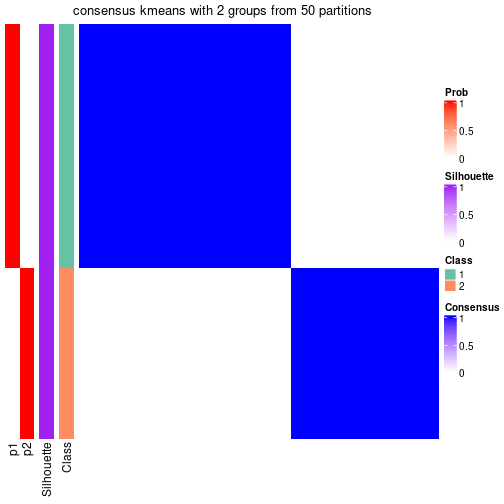</p>

</div>
<div id='tab-node-041-consensus-heatmap-2'>
<pre><code class="r">consensus_heatmap(res, k = 3)
</code></pre>

<p>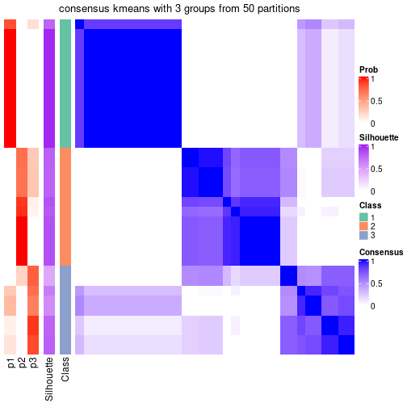</p>

</div>
<div id='tab-node-041-consensus-heatmap-3'>
<pre><code class="r">consensus_heatmap(res, k = 4)
</code></pre>

<p>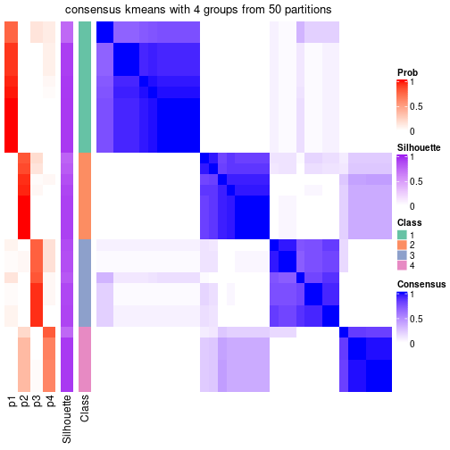</p>

</div>
<div id='tab-node-041-consensus-heatmap-4'>
<pre><code class="r">consensus_heatmap(res, k = 5)
</code></pre>

<p>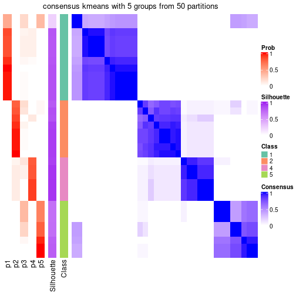</p>

</div>
<div id='tab-node-041-consensus-heatmap-5'>
<pre><code class="r">consensus_heatmap(res, k = 6)
</code></pre>

<p>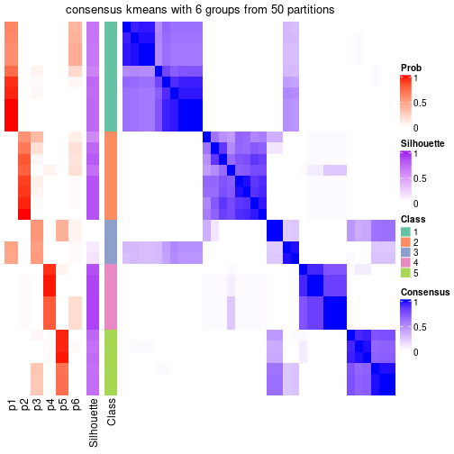</p>

</div>
<div id='tab-node-041-consensus-heatmap-6'>
<pre><code class="r">consensus_heatmap(res, k = 7)
</code></pre>

<p>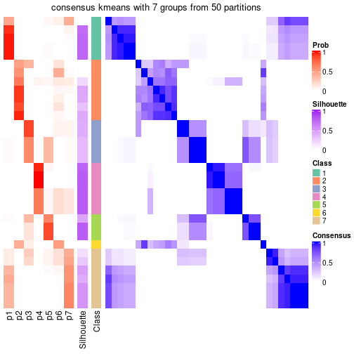</p>

</div>
<div id='tab-node-041-consensus-heatmap-7'>
<pre><code class="r">consensus_heatmap(res, k = 8)
</code></pre>

<p>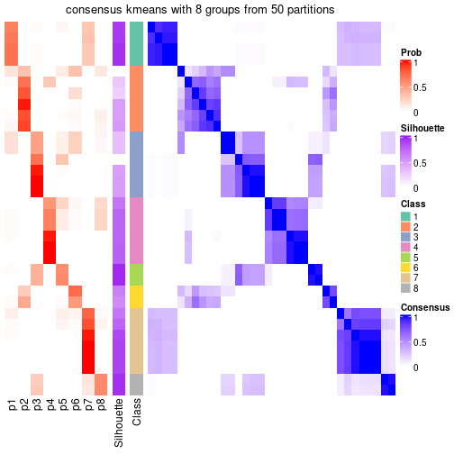</p>

</div>
</div>

Heatmaps for the membership of samples in all partitions to see how consistent they are:


<script>
$( function() {
	$( '#tabs-node-041-membership-heatmap' ).tabs();
} );
</script>
<div id='tabs-node-041-membership-heatmap'>
<ul>
<li><a href='#tab-node-041-membership-heatmap-1'>k = 2</a></li>
<li><a href='#tab-node-041-membership-heatmap-2'>k = 3</a></li>
<li><a href='#tab-node-041-membership-heatmap-3'>k = 4</a></li>
<li><a href='#tab-node-041-membership-heatmap-4'>k = 5</a></li>
<li><a href='#tab-node-041-membership-heatmap-5'>k = 6</a></li>
<li><a href='#tab-node-041-membership-heatmap-6'>k = 7</a></li>
<li><a href='#tab-node-041-membership-heatmap-7'>k = 8</a></li>
</ul>
<div id='tab-node-041-membership-heatmap-1'>
<pre><code class="r">membership_heatmap(res, k = 2)
</code></pre>

<p>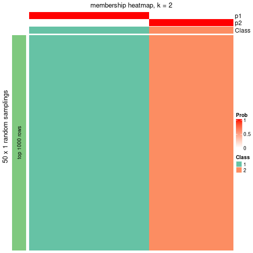</p>

</div>
<div id='tab-node-041-membership-heatmap-2'>
<pre><code class="r">membership_heatmap(res, k = 3)
</code></pre>

<p>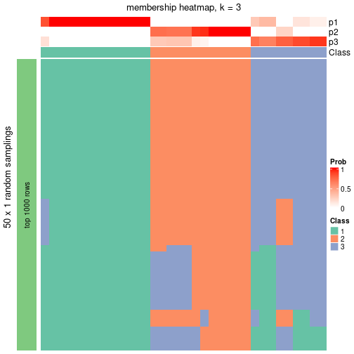</p>

</div>
<div id='tab-node-041-membership-heatmap-3'>
<pre><code class="r">membership_heatmap(res, k = 4)
</code></pre>

<p>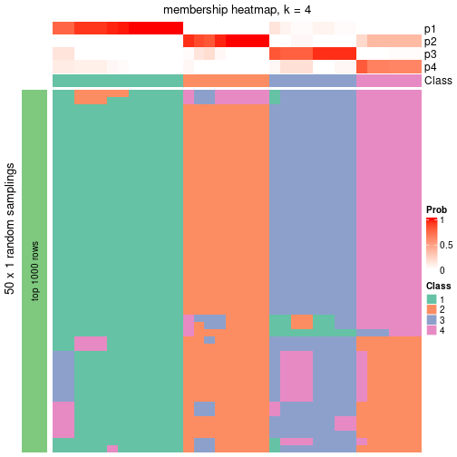</p>

</div>
<div id='tab-node-041-membership-heatmap-4'>
<pre><code class="r">membership_heatmap(res, k = 5)
</code></pre>

<p>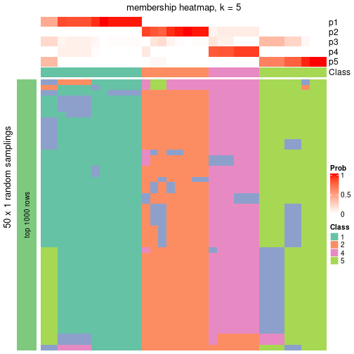</p>

</div>
<div id='tab-node-041-membership-heatmap-5'>
<pre><code class="r">membership_heatmap(res, k = 6)
</code></pre>

<p>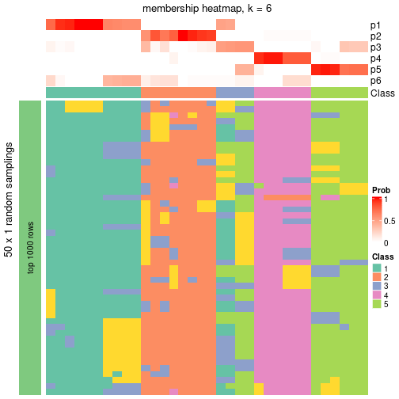</p>

</div>
<div id='tab-node-041-membership-heatmap-6'>
<pre><code class="r">membership_heatmap(res, k = 7)
</code></pre>

<p>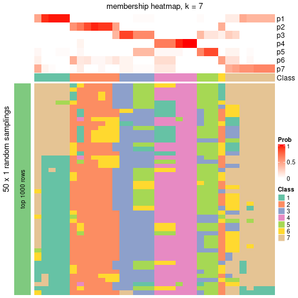</p>

</div>
<div id='tab-node-041-membership-heatmap-7'>
<pre><code class="r">membership_heatmap(res, k = 8)
</code></pre>

<p>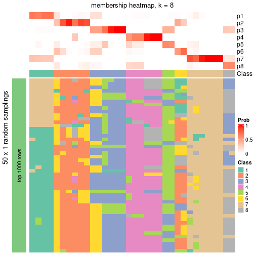</p>

</div>
</div>

As soon as the classes for columns are determined, the signatures
that are significantly different between subgroups can be looked for. 
Following are the heatmaps for signatures.


<script>
$( function() {
	$( '#tabs-node-041-get-signatures' ).tabs();
} );
</script>
<div id='tabs-node-041-get-signatures'>
<ul>
<li><a href='#tab-node-041-get-signatures-1'>k = 2</a></li>
<li><a href='#tab-node-041-get-signatures-2'>k = 3</a></li>
<li><a href='#tab-node-041-get-signatures-3'>k = 4</a></li>
<li><a href='#tab-node-041-get-signatures-4'>k = 5</a></li>
<li><a href='#tab-node-041-get-signatures-5'>k = 6</a></li>
<li><a href='#tab-node-041-get-signatures-6'>k = 7</a></li>
<li><a href='#tab-node-041-get-signatures-7'>k = 8</a></li>
</ul>
<div id='tab-node-041-get-signatures-1'>
<pre><code class="r">get_signatures(res, k = 2)
</code></pre>

<p>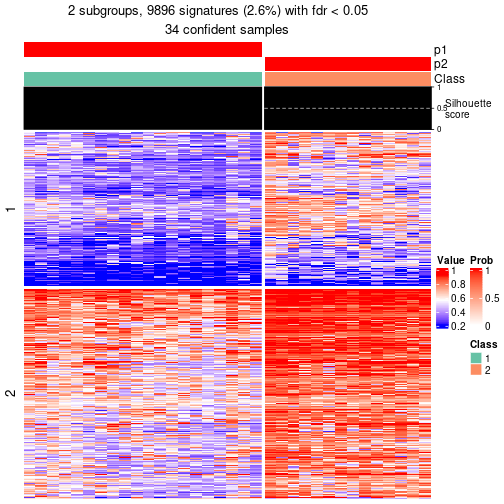</p>

</div>
<div id='tab-node-041-get-signatures-2'>
<pre><code class="r">get_signatures(res, k = 3)
</code></pre>

<p>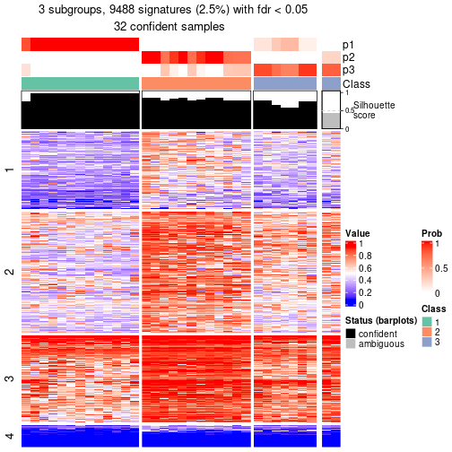</p>

</div>
<div id='tab-node-041-get-signatures-3'>
<pre><code class="r">get_signatures(res, k = 4)
</code></pre>

<p>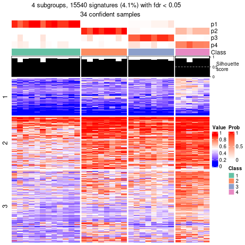</p>

</div>
<div id='tab-node-041-get-signatures-4'>
<pre><code class="r">get_signatures(res, k = 5)
</code></pre>

<p>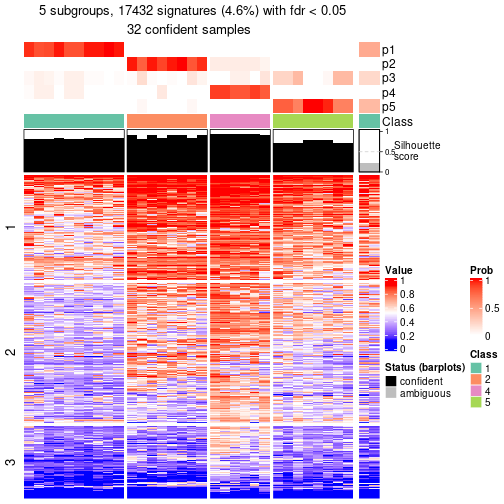</p>

</div>
<div id='tab-node-041-get-signatures-5'>
<pre><code class="r">get_signatures(res, k = 6)
</code></pre>

<p>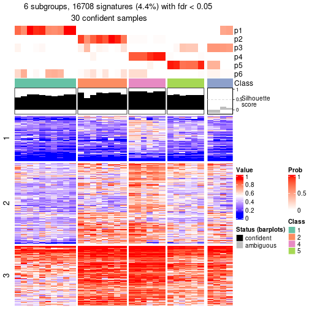</p>

</div>
<div id='tab-node-041-get-signatures-6'>
<pre><code class="r">get_signatures(res, k = 7)
</code></pre>

<p>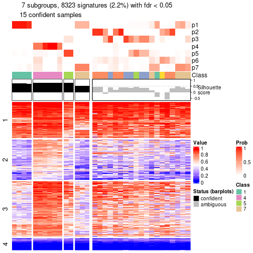</p>

</div>
<div id='tab-node-041-get-signatures-7'>
<pre><code class="r">get_signatures(res, k = 8)
</code></pre>

<p>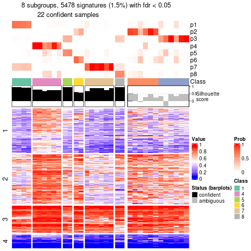</p>

</div>
</div>


Compare the overlap of signatures from different k:

```r
compare_signatures(res)
```

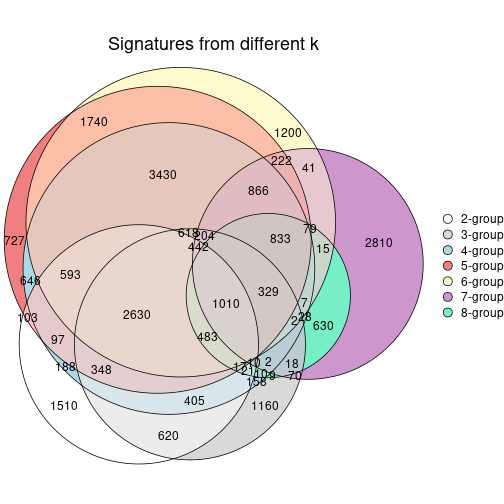

`get_signature()` returns a data frame invisibly. To get the list of signatures, the function
call should be assigned to a variable explicitly. In following code, if `plot` argument is set
to `FALSE`, no heatmap is plotted while only the differential analysis is performed.

```r
# code only for demonstration
tb = get_signature(res, k = ..., plot = FALSE)
```

An example of the output of `tb` is:

```
#>   which_row         fdr    mean_1    mean_2 scaled_mean_1 scaled_mean_2 km
#> 1        38 0.042760348  8.373488  9.131774    -0.5533452     0.5164555  1
#> 2        40 0.018707592  7.106213  8.469186    -0.6173731     0.5762149  1
#> 3        55 0.019134737 10.221463 11.207825    -0.6159697     0.5749050  1
#> 4        59 0.006059896  5.921854  7.869574    -0.6899429     0.6439467  1
#> 5        60 0.018055526  8.928898 10.211722    -0.6204761     0.5791110  1
#> 6        98 0.009384629 15.714769 14.887706     0.6635654    -0.6193277  2
...
```

The columns in `tb` are:

1. `which_row`: row indices corresponding to the input matrix.
2. `fdr`: FDR for the differential test. 
3. `mean_x`: The mean value in group x.
4. `scaled_mean_x`: The mean value in group x after rows are scaled.
5. `km`: Row groups if k-means clustering is applied to rows (which is done by automatically selecting number of clusters).

If there are too many signatures, `top_signatures = ...` can be set to only show the 
signatures with the highest FDRs:

```r
# code only for demonstration
# e.g. to show the top 500 most significant rows
tb = get_signature(res, k = ..., top_signatures = 500)
```

If the signatures are defined as these which are uniquely high in current group, `diff_method` argument
can be set to `"uniquely_high_in_one_group"`:

```r
# code only for demonstration
tb = get_signature(res, k = ..., diff_method = "uniquely_high_in_one_group")
```


UMAP plot which shows how samples are separated.


<script>
$( function() {
	$( '#tabs-node-041-dimension-reduction' ).tabs();
} );
</script>
<div id='tabs-node-041-dimension-reduction'>
<ul>
<li><a href='#tab-node-041-dimension-reduction-1'>k = 2</a></li>
<li><a href='#tab-node-041-dimension-reduction-2'>k = 3</a></li>
<li><a href='#tab-node-041-dimension-reduction-3'>k = 4</a></li>
<li><a href='#tab-node-041-dimension-reduction-4'>k = 5</a></li>
<li><a href='#tab-node-041-dimension-reduction-5'>k = 6</a></li>
<li><a href='#tab-node-041-dimension-reduction-6'>k = 7</a></li>
<li><a href='#tab-node-041-dimension-reduction-7'>k = 8</a></li>
</ul>
<div id='tab-node-041-dimension-reduction-1'>
<pre><code class="r">dimension_reduction(res, k = 2, method = &quot;UMAP&quot;)
</code></pre>

<p>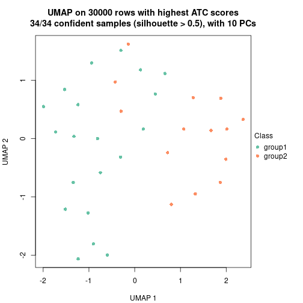</p>

</div>
<div id='tab-node-041-dimension-reduction-2'>
<pre><code class="r">dimension_reduction(res, k = 3, method = &quot;UMAP&quot;)
</code></pre>

<p>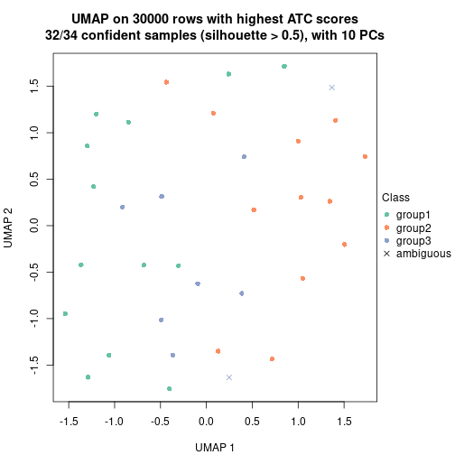</p>

</div>
<div id='tab-node-041-dimension-reduction-3'>
<pre><code class="r">dimension_reduction(res, k = 4, method = &quot;UMAP&quot;)
</code></pre>

<p>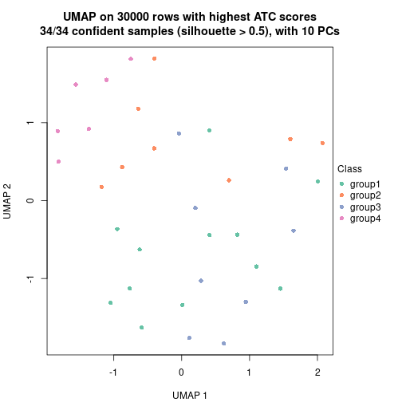</p>

</div>
<div id='tab-node-041-dimension-reduction-4'>
<pre><code class="r">dimension_reduction(res, k = 5, method = &quot;UMAP&quot;)
</code></pre>

<p>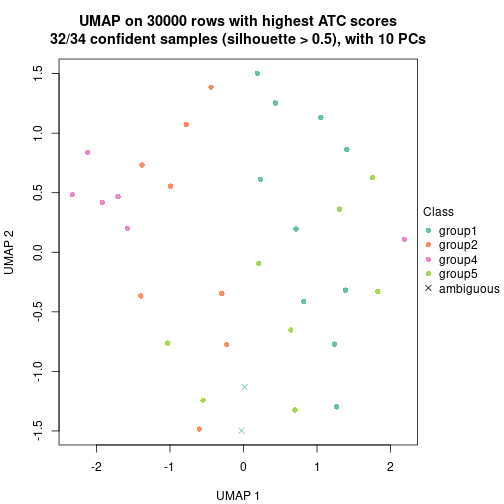</p>

</div>
<div id='tab-node-041-dimension-reduction-5'>
<pre><code class="r">dimension_reduction(res, k = 6, method = &quot;UMAP&quot;)
</code></pre>

<p>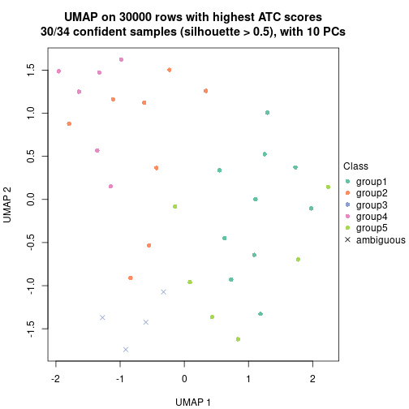</p>

</div>
<div id='tab-node-041-dimension-reduction-6'>
<pre><code class="r">dimension_reduction(res, k = 7, method = &quot;UMAP&quot;)
</code></pre>

<p>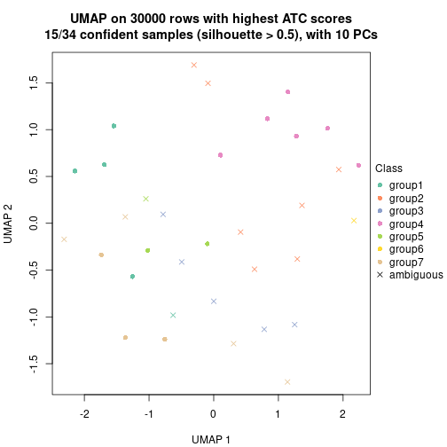</p>

</div>
<div id='tab-node-041-dimension-reduction-7'>
<pre><code class="r">dimension_reduction(res, k = 8, method = &quot;UMAP&quot;)
</code></pre>

<p>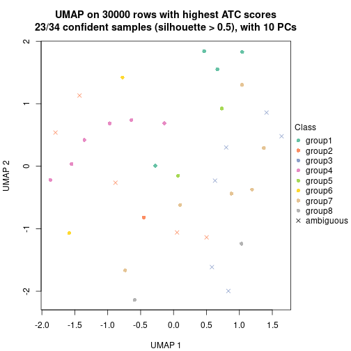</p>

</div>
</div>


Following heatmap shows how subgroups are split when increasing `k`:

```r
collect_classes(res)
```

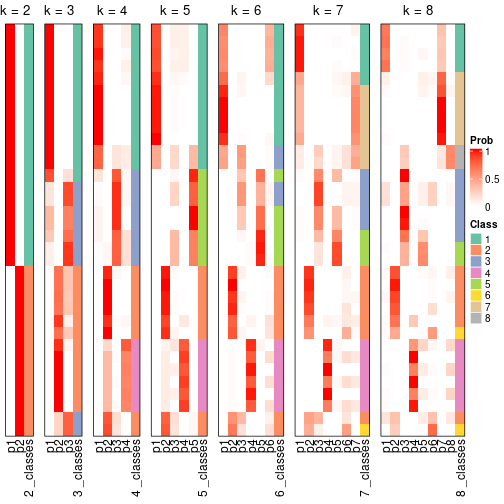


If matrix rows can be associated to genes, consider to use `functional_enrichment(res,
...)` to perform function enrichment for the signature genes. See [this vignette](https://jokergoo.github.io/cola_vignettes/functional_enrichment.html) for more detailed explanations.


 

---------------------------------------------------


### Node042


Parent node: [Node04](#Node04).
Child nodes: 
                Node0111-leaf
        ,
                Node0112-leaf
        ,
                Node0113-leaf
        ,
                Node0114-leaf
        ,
                Node0121-leaf
        ,
                Node0122-leaf
        ,
                Node0123-leaf
        ,
                Node0131-leaf
        ,
                Node0132-leaf
        ,
                Node0133-leaf
        ,
                Node0134-leaf
        ,
                Node0211-leaf
        ,
                Node0212-leaf
        ,
                [Node0213](#Node0213)
        ,
                Node0214-leaf
        ,
                [Node0221](#Node0221)
        ,
                Node0222-leaf
        ,
                Node0223-leaf
        ,
                [Node0231](#Node0231)
        ,
                Node0232-leaf
        ,
                Node0233-leaf
        ,
                [Node0234](#Node0234)
        ,
                Node0235-leaf
        ,
                Node0241-leaf
        ,
                [Node0242](#Node0242)
        ,
                Node0411-leaf
        ,
                Node0412-leaf
        ,
                Node0421-leaf
        ,
                Node0422-leaf
        ,
                Node0423-leaf
        ,
                Node0431-leaf
        ,
                Node0432-leaf
        ,
                Node0511-leaf
        ,
                Node0512-leaf
        ,
                Node0513-leaf
        ,
                Node0514-leaf
        ,
                Node0521-leaf
        ,
                Node0522-leaf
        ,
                Node0523-leaf
        ,
                Node0524-leaf
        ,
                Node0525-leaf
        ,
                Node0611-leaf
        ,
                [Node0612](#Node0612)
        ,
                Node0613-leaf
        ,
                [Node0711](#Node0711)
        ,
                Node0712-leaf
        ,
                Node0713-leaf
        ,
                [Node0721](#Node0721)
        ,
                Node0722-leaf
        ,
                Node0731-leaf
        ,
                Node0732-leaf
        ,
                Node0733-leaf
        .


The object with results only for a single top-value method and a single partitioning method 
can be extracted as:

```r
res = res_rh["042"]
```

A summary of `res` and all the functions that can be applied to it:

```r
res
```

```
#> A 'ConsensusPartition' object with k = 2, 3, 4, 5, 6, 7, 8.
#>   On a matrix with 30000 rows and 31 columns.
#>   Top rows (1000) are extracted by 'ATC' method.
#>   Subgroups are detected by 'skmeans' method.
#>   Performed in total 350 partitions by row resampling.
#>   Best k for subgroups seems to be 3.
#> 
#> Following methods can be applied to this 'ConsensusPartition' object:
#>  [1] "cola_report"             "collect_classes"         "collect_plots"          
#>  [4] "collect_stats"           "colnames"                "compare_partitions"     
#>  [7] "compare_signatures"      "consensus_heatmap"       "dimension_reduction"    
#> [10] "functional_enrichment"   "get_anno_col"            "get_anno"               
#> [13] "get_classes"             "get_consensus"           "get_matrix"             
#> [16] "get_membership"          "get_param"               "get_signatures"         
#> [19] "get_stats"               "is_best_k"               "is_stable_k"            
#> [22] "membership_heatmap"      "ncol"                    "nrow"                   
#> [25] "plot_ecdf"               "predict_classes"         "rownames"               
#> [28] "select_partition_number" "show"                    "suggest_best_k"         
#> [31] "test_to_known_factors"   "top_rows_heatmap"
```

`collect_plots()` function collects all the plots made from `res` for all `k` (number of subgroups)
into one single page to provide an easy and fast comparison between different `k`.

```r
collect_plots(res)
```

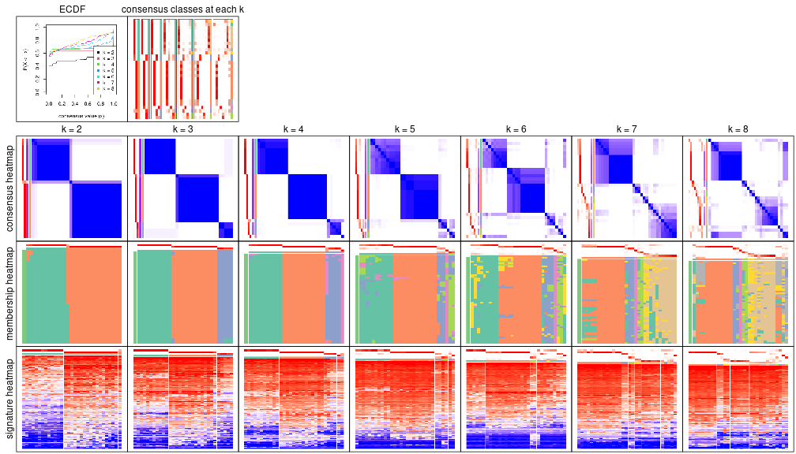

The plots are:

- The first row: a plot of the eCDF (empirical cumulative distribution
  function) curves of the consensus matrix for each `k` and the heatmap of
  predicted classes for each `k`.
- The second row: heatmaps of the consensus matrix for each `k`.
- The third row: heatmaps of the membership matrix for each `k`.
- The fouth row: heatmaps of the signatures for each `k`.

All the plots in panels can be made by individual functions and they are
plotted later in this section.

`select_partition_number()` produces several plots showing different
statistics for choosing "optimized" `k`. There are following statistics:

- eCDF curves of the consensus matrix for each `k`;
- 1-PAC. [The PAC score](https://en.wikipedia.org/wiki/Consensus_clustering#Over-interpretation_potential_of_consensus_clustering)
  measures the proportion of the ambiguous subgrouping.
- Mean silhouette score.
- Concordance. The mean probability of fiting the consensus subgroup labels in all
  partitions.
- Area increased. Denote $A_k$ as the area under the eCDF curve for current
  `k`, the area increased is defined as $A_k - A_{k-1}$.
- Rand index. The percent of pairs of samples that are both in a same cluster
  or both are not in a same cluster in the partition of k and k-1.
- Jaccard index. The ratio of pairs of samples are both in a same cluster in
  the partition of k and k-1 and the pairs of samples are both in a same
  cluster in the partition k or k-1.

The detailed explanations of these statistics can be found in [the _cola_
vignette](https://jokergoo.github.io/cola_vignettes/cola.html#toc_13).

Generally speaking, higher 1-PAC score, higher mean silhouette score or higher
concordance corresponds to better partition. Rand index and Jaccard index
measure how similar the current partition is compared to partition with `k-1`.
If they are too similar, we won't accept `k` is better than `k-1`.

```r
select_partition_number(res)
```

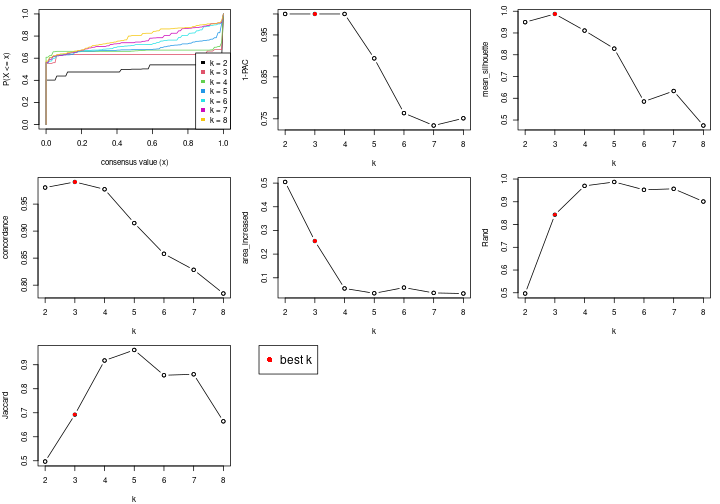

The numeric values for all these statistics can be obtained by `get_stats()`.

```r
get_stats(res)
```

```
#>   k 1-PAC mean_silhouette concordance area_increased  Rand Jaccard
#> 2 2 1.000           0.950       0.981         0.5048 0.497   0.497
#> 3 3 1.000           0.987       0.991         0.2553 0.843   0.692
#> 4 4 1.000           0.911       0.977         0.0550 0.970   0.918
#> 5 5 0.894           0.828       0.915         0.0346 0.987   0.962
#> 6 6 0.764           0.585       0.858         0.0586 0.953   0.856
#> 7 7 0.734           0.633       0.828         0.0362 0.957   0.860
#> 8 8 0.751           0.475       0.785         0.0336 0.901   0.664
```

`suggest_best_k()` suggests the best $k$ based on these statistics. The rules are as follows:

- All $k$ with Jaccard index larger than 0.95 are removed because increasing
  $k$ does not provide enough extra information. If all $k$ are removed, it is
  marked as no subgroup is detected.
- For all $k$ with 1-PAC score larger than 0.9, the maximal $k$ is taken as
  the best $k$, and other $k$ are marked as optional $k$.
- If it does not fit the second rule. The $k$ with the maximal vote of the
  highest 1-PAC score, highest mean silhouette, and highest concordance is
  taken as the best $k$.

```r
suggest_best_k(res)
```

```
#> [1] 3
#> attr(,"optional")
#> [1] 2
```

There is also optional best $k$ = 2 that is worth to check.

Following is the table of the partitions (You need to click the **show/hide
code output** link to see it). The membership matrix (columns with name `p*`)
is inferred by
[`clue::cl_consensus()`](https://www.rdocumentation.org/link/cl_consensus?package=clue)
function with the `SE` method. Basically the value in the membership matrix
represents the probability to belong to a certain group. The finall subgroup
label for an item is determined with the group with highest probability it
belongs to.

In `get_classes()` function, the entropy is calculated from the membership
matrix and the silhouette score is calculated from the consensus matrix.


<script>
$( function() {
	$( '#tabs-node-042-get-classes' ).tabs();
} );
</script>
<div id='tabs-node-042-get-classes'>
<ul>
<li><a href='#tab-node-042-get-classes-1'>k = 2</a></li>
<li><a href='#tab-node-042-get-classes-2'>k = 3</a></li>
<li><a href='#tab-node-042-get-classes-3'>k = 4</a></li>
<li><a href='#tab-node-042-get-classes-4'>k = 5</a></li>
<li><a href='#tab-node-042-get-classes-5'>k = 6</a></li>
<li><a href='#tab-node-042-get-classes-6'>k = 7</a></li>
<li><a href='#tab-node-042-get-classes-7'>k = 8</a></li>
</ul>

<div id='tab-node-042-get-classes-1'>
<p><a id='tab-node-042-get-classes-1-a' style='color:#0366d6' href='#'>show/hide code output</a></p>
<pre><code class="r">cbind(get_classes(res, k = 2), get_membership(res, k = 2))
</code></pre>

<pre><code>#&gt;                 class entropy silhouette   p1   p2
#&gt; TCGA.56.7823.01     2   0.000      0.974 0.00 1.00
#&gt; TCGA.85.A4QR.01     2   0.000      0.974 0.00 1.00
#&gt; TCGA.22.4593.01     2   0.000      0.974 0.00 1.00
#&gt; TCGA.63.5131.01     2   0.981      0.247 0.42 0.58
#&gt; TCGA.56.8083.01     1   0.327      0.933 0.94 0.06
#&gt; TCGA.56.A4BX.01     2   0.000      0.974 0.00 1.00
#&gt; TCGA.NC.A5HG.01     2   0.000      0.974 0.00 1.00
#&gt; TCGA.63.A5MU.01     2   0.000      0.974 0.00 1.00
#&gt; TCGA.34.5231.01     2   0.000      0.974 0.00 1.00
#&gt; TCGA.77.8148.01     1   0.000      0.984 1.00 0.00
#&gt; TCGA.43.6143.01     1   0.529      0.866 0.88 0.12
#&gt; TCGA.56.7222.01     2   0.000      0.974 0.00 1.00
#&gt; TCGA.46.6026.01     2   0.000      0.974 0.00 1.00
#&gt; TCGA.43.A474.01     2   0.000      0.974 0.00 1.00
#&gt; TCGA.77.8154.01     2   0.000      0.974 0.00 1.00
#&gt; TCGA.77.7139.01     2   0.000      0.974 0.00 1.00
#&gt; TCGA.NC.A5HT.01     2   0.000      0.974 0.00 1.00
#&gt; TCGA.34.5929.01     2   0.000      0.974 0.00 1.00
#&gt; TCGA.NC.A5HF.01     1   0.000      0.984 1.00 0.00
#&gt; TCGA.34.5927.01     2   0.000      0.974 0.00 1.00
#&gt; TCGA.NC.A5HN.01     2   0.000      0.974 0.00 1.00
#&gt; TCGA.79.5596.01     1   0.000      0.984 1.00 0.00
#&gt; TCGA.85.8071.01     2   0.000      0.974 0.00 1.00
#&gt; TCGA.77.8143.01     1   0.000      0.984 1.00 0.00
#&gt; TCGA.56.7579.01     1   0.000      0.984 1.00 0.00
#&gt; TCGA.58.8390.01     1   0.000      0.984 1.00 0.00
#&gt; TCGA.NC.A5HH.01     1   0.000      0.984 1.00 0.00
#&gt; TCGA.NK.A5CR.01     1   0.000      0.984 1.00 0.00
#&gt; TCGA.77.6844.01     1   0.000      0.984 1.00 0.00
#&gt; TCGA.56.8082.01     1   0.000      0.984 1.00 0.00
#&gt; TCGA.63.A5MY.01     1   0.000      0.984 1.00 0.00
</code></pre>

<script>
$('#tab-node-042-get-classes-1-a').parent().next().next().hide();
$('#tab-node-042-get-classes-1-a').click(function(){
  $('#tab-node-042-get-classes-1-a').parent().next().next().toggle();
  return(false);
});
</script>
</div>

<div id='tab-node-042-get-classes-2'>
<p><a id='tab-node-042-get-classes-2-a' style='color:#0366d6' href='#'>show/hide code output</a></p>
<pre><code class="r">cbind(get_classes(res, k = 3), get_membership(res, k = 3))
</code></pre>

<pre><code>#&gt;                 class entropy silhouette   p1  p2   p3
#&gt; TCGA.56.7823.01     2   0.000      0.993 0.00 1.0 0.00
#&gt; TCGA.85.A4QR.01     2   0.000      0.993 0.00 1.0 0.00
#&gt; TCGA.22.4593.01     2   0.000      0.993 0.00 1.0 0.00
#&gt; TCGA.63.5131.01     3   0.207      0.967 0.06 0.0 0.94
#&gt; TCGA.56.8083.01     3   0.207      0.967 0.06 0.0 0.94
#&gt; TCGA.56.A4BX.01     2   0.000      0.993 0.00 1.0 0.00
#&gt; TCGA.NC.A5HG.01     2   0.000      0.993 0.00 1.0 0.00
#&gt; TCGA.63.A5MU.01     2   0.000      0.993 0.00 1.0 0.00
#&gt; TCGA.34.5231.01     2   0.000      0.993 0.00 1.0 0.00
#&gt; TCGA.77.8148.01     1   0.000      1.000 1.00 0.0 0.00
#&gt; TCGA.43.6143.01     3   0.207      0.967 0.06 0.0 0.94
#&gt; TCGA.56.7222.01     2   0.000      0.993 0.00 1.0 0.00
#&gt; TCGA.46.6026.01     2   0.296      0.897 0.00 0.9 0.10
#&gt; TCGA.43.A474.01     2   0.000      0.993 0.00 1.0 0.00
#&gt; TCGA.77.8154.01     2   0.000      0.993 0.00 1.0 0.00
#&gt; TCGA.77.7139.01     2   0.000      0.993 0.00 1.0 0.00
#&gt; TCGA.NC.A5HT.01     2   0.000      0.993 0.00 1.0 0.00
#&gt; TCGA.34.5929.01     3   0.000      0.953 0.00 0.0 1.00
#&gt; TCGA.NC.A5HF.01     1   0.000      1.000 1.00 0.0 0.00
#&gt; TCGA.34.5927.01     3   0.000      0.953 0.00 0.0 1.00
#&gt; TCGA.NC.A5HN.01     2   0.000      0.993 0.00 1.0 0.00
#&gt; TCGA.79.5596.01     1   0.000      1.000 1.00 0.0 0.00
#&gt; TCGA.85.8071.01     2   0.000      0.993 0.00 1.0 0.00
#&gt; TCGA.77.8143.01     1   0.000      1.000 1.00 0.0 0.00
#&gt; TCGA.56.7579.01     1   0.000      1.000 1.00 0.0 0.00
#&gt; TCGA.58.8390.01     1   0.000      1.000 1.00 0.0 0.00
#&gt; TCGA.NC.A5HH.01     1   0.000      1.000 1.00 0.0 0.00
#&gt; TCGA.NK.A5CR.01     1   0.000      1.000 1.00 0.0 0.00
#&gt; TCGA.77.6844.01     1   0.000      1.000 1.00 0.0 0.00
#&gt; TCGA.56.8082.01     1   0.000      1.000 1.00 0.0 0.00
#&gt; TCGA.63.A5MY.01     1   0.000      1.000 1.00 0.0 0.00
</code></pre>

<script>
$('#tab-node-042-get-classes-2-a').parent().next().next().hide();
$('#tab-node-042-get-classes-2-a').click(function(){
  $('#tab-node-042-get-classes-2-a').parent().next().next().toggle();
  return(false);
});
</script>
</div>

<div id='tab-node-042-get-classes-3'>
<p><a id='tab-node-042-get-classes-3-a' style='color:#0366d6' href='#'>show/hide code output</a></p>
<pre><code class="r">cbind(get_classes(res, k = 4), get_membership(res, k = 4))
</code></pre>

<pre><code>#&gt;                 class entropy silhouette   p1   p2   p3   p4
#&gt; TCGA.56.7823.01     2  0.0000      1.000 0.00 1.00 0.00 0.00
#&gt; TCGA.85.A4QR.01     2  0.0000      1.000 0.00 1.00 0.00 0.00
#&gt; TCGA.22.4593.01     2  0.0000      1.000 0.00 1.00 0.00 0.00
#&gt; TCGA.63.5131.01     3  0.1913      0.806 0.00 0.04 0.94 0.02
#&gt; TCGA.56.8083.01     3  0.0000      0.831 0.00 0.00 1.00 0.00
#&gt; TCGA.56.A4BX.01     2  0.0000      1.000 0.00 1.00 0.00 0.00
#&gt; TCGA.NC.A5HG.01     2  0.0000      1.000 0.00 1.00 0.00 0.00
#&gt; TCGA.63.A5MU.01     2  0.0000      1.000 0.00 1.00 0.00 0.00
#&gt; TCGA.34.5231.01     2  0.0000      1.000 0.00 1.00 0.00 0.00
#&gt; TCGA.77.8148.01     1  0.0000      0.990 1.00 0.00 0.00 0.00
#&gt; TCGA.43.6143.01     3  0.0707      0.827 0.00 0.00 0.98 0.02
#&gt; TCGA.56.7222.01     2  0.0000      1.000 0.00 1.00 0.00 0.00
#&gt; TCGA.46.6026.01     4  0.0000      0.000 0.00 0.00 0.00 1.00
#&gt; TCGA.43.A474.01     2  0.0000      1.000 0.00 1.00 0.00 0.00
#&gt; TCGA.77.8154.01     2  0.0000      1.000 0.00 1.00 0.00 0.00
#&gt; TCGA.77.7139.01     2  0.0000      1.000 0.00 1.00 0.00 0.00
#&gt; TCGA.NC.A5HT.01     2  0.0000      1.000 0.00 1.00 0.00 0.00
#&gt; TCGA.34.5929.01     3  0.1211      0.827 0.00 0.00 0.96 0.04
#&gt; TCGA.NC.A5HF.01     1  0.0000      0.990 1.00 0.00 0.00 0.00
#&gt; TCGA.34.5927.01     3  0.4994      0.134 0.00 0.00 0.52 0.48
#&gt; TCGA.NC.A5HN.01     2  0.0000      1.000 0.00 1.00 0.00 0.00
#&gt; TCGA.79.5596.01     1  0.0000      0.990 1.00 0.00 0.00 0.00
#&gt; TCGA.85.8071.01     2  0.0000      1.000 0.00 1.00 0.00 0.00
#&gt; TCGA.77.8143.01     1  0.0000      0.990 1.00 0.00 0.00 0.00
#&gt; TCGA.56.7579.01     1  0.0000      0.990 1.00 0.00 0.00 0.00
#&gt; TCGA.58.8390.01     1  0.0707      0.979 0.98 0.00 0.02 0.00
#&gt; TCGA.NC.A5HH.01     1  0.0707      0.979 0.98 0.00 0.02 0.00
#&gt; TCGA.NK.A5CR.01     1  0.0000      0.990 1.00 0.00 0.00 0.00
#&gt; TCGA.77.6844.01     1  0.1637      0.942 0.94 0.00 0.06 0.00
#&gt; TCGA.56.8082.01     1  0.0000      0.990 1.00 0.00 0.00 0.00
#&gt; TCGA.63.A5MY.01     1  0.0000      0.990 1.00 0.00 0.00 0.00
</code></pre>

<script>
$('#tab-node-042-get-classes-3-a').parent().next().next().hide();
$('#tab-node-042-get-classes-3-a').click(function(){
  $('#tab-node-042-get-classes-3-a').parent().next().next().toggle();
  return(false);
});
</script>
</div>

<div id='tab-node-042-get-classes-4'>
<p><a id='tab-node-042-get-classes-4-a' style='color:#0366d6' href='#'>show/hide code output</a></p>
<pre><code class="r">cbind(get_classes(res, k = 5), get_membership(res, k = 5))
</code></pre>

<pre><code>#&gt;                 class entropy silhouette   p1   p2   p3   p4   p5
#&gt; TCGA.56.7823.01     2  0.1043      0.968 0.00 0.96 0.04 0.00 0.00
#&gt; TCGA.85.A4QR.01     2  0.0609      0.981 0.00 0.98 0.02 0.00 0.00
#&gt; TCGA.22.4593.01     2  0.0000      0.989 0.00 1.00 0.00 0.00 0.00
#&gt; TCGA.63.5131.01     3  0.6296      0.300 0.00 0.16 0.48 0.00 0.36
#&gt; TCGA.56.8083.01     3  0.4262      0.543 0.00 0.00 0.56 0.00 0.44
#&gt; TCGA.56.A4BX.01     2  0.0609      0.981 0.00 0.98 0.02 0.00 0.00
#&gt; TCGA.NC.A5HG.01     2  0.0000      0.989 0.00 1.00 0.00 0.00 0.00
#&gt; TCGA.63.A5MU.01     2  0.0609      0.981 0.00 0.98 0.02 0.00 0.00
#&gt; TCGA.34.5231.01     2  0.0000      0.989 0.00 1.00 0.00 0.00 0.00
#&gt; TCGA.77.8148.01     1  0.1648      0.878 0.94 0.00 0.04 0.02 0.00
#&gt; TCGA.43.6143.01     3  0.4126      0.575 0.00 0.00 0.62 0.00 0.38
#&gt; TCGA.56.7222.01     2  0.0000      0.989 0.00 1.00 0.00 0.00 0.00
#&gt; TCGA.46.6026.01     4  0.0609      0.000 0.00 0.00 0.00 0.98 0.02
#&gt; TCGA.43.A474.01     2  0.0000      0.989 0.00 1.00 0.00 0.00 0.00
#&gt; TCGA.77.8154.01     2  0.0000      0.989 0.00 1.00 0.00 0.00 0.00
#&gt; TCGA.77.7139.01     2  0.1043      0.968 0.00 0.96 0.04 0.00 0.00
#&gt; TCGA.NC.A5HT.01     2  0.0000      0.989 0.00 1.00 0.00 0.00 0.00
#&gt; TCGA.34.5929.01     5  0.1043      0.599 0.00 0.00 0.04 0.00 0.96
#&gt; TCGA.NC.A5HF.01     1  0.1410      0.878 0.94 0.00 0.06 0.00 0.00
#&gt; TCGA.34.5927.01     5  0.3513      0.657 0.00 0.00 0.02 0.18 0.80
#&gt; TCGA.NC.A5HN.01     2  0.0000      0.989 0.00 1.00 0.00 0.00 0.00
#&gt; TCGA.79.5596.01     1  0.0000      0.887 1.00 0.00 0.00 0.00 0.00
#&gt; TCGA.85.8071.01     2  0.0000      0.989 0.00 1.00 0.00 0.00 0.00
#&gt; TCGA.77.8143.01     1  0.1732      0.874 0.92 0.00 0.08 0.00 0.00
#&gt; TCGA.56.7579.01     1  0.0000      0.887 1.00 0.00 0.00 0.00 0.00
#&gt; TCGA.58.8390.01     1  0.3796      0.723 0.70 0.00 0.30 0.00 0.00
#&gt; TCGA.NC.A5HH.01     1  0.3983      0.678 0.66 0.00 0.34 0.00 0.00
#&gt; TCGA.NK.A5CR.01     1  0.0609      0.886 0.98 0.00 0.00 0.02 0.00
#&gt; TCGA.77.6844.01     1  0.2929      0.816 0.82 0.00 0.18 0.00 0.00
#&gt; TCGA.56.8082.01     1  0.3319      0.823 0.82 0.00 0.16 0.02 0.00
#&gt; TCGA.63.A5MY.01     1  0.0609      0.886 0.98 0.00 0.00 0.02 0.00
</code></pre>

<script>
$('#tab-node-042-get-classes-4-a').parent().next().next().hide();
$('#tab-node-042-get-classes-4-a').click(function(){
  $('#tab-node-042-get-classes-4-a').parent().next().next().toggle();
  return(false);
});
</script>
</div>

<div id='tab-node-042-get-classes-5'>
<p><a id='tab-node-042-get-classes-5-a' style='color:#0366d6' href='#'>show/hide code output</a></p>
<pre><code class="r">cbind(get_classes(res, k = 6), get_membership(res, k = 6))
</code></pre>

<pre><code>#&gt;                 class entropy silhouette   p1   p2   p3   p4   p5   p6
#&gt; TCGA.56.7823.01     2  0.4265      0.798 0.00 0.76 0.08 0.00 0.02 0.14
#&gt; TCGA.85.A4QR.01     2  0.3795      0.833 0.00 0.80 0.06 0.00 0.02 0.12
#&gt; TCGA.22.4593.01     2  0.0000      0.926 0.00 1.00 0.00 0.00 0.00 0.00
#&gt; TCGA.63.5131.01     3  0.3045      0.414 0.00 0.06 0.86 0.00 0.02 0.06
#&gt; TCGA.56.8083.01     3  0.2793      0.349 0.00 0.00 0.80 0.00 0.20 0.00
#&gt; TCGA.56.A4BX.01     2  0.3324      0.857 0.00 0.84 0.06 0.00 0.02 0.08
#&gt; TCGA.NC.A5HG.01     2  0.0000      0.926 0.00 1.00 0.00 0.00 0.00 0.00
#&gt; TCGA.63.A5MU.01     2  0.2725      0.879 0.00 0.88 0.04 0.00 0.02 0.06
#&gt; TCGA.34.5231.01     2  0.0000      0.926 0.00 1.00 0.00 0.00 0.00 0.00
#&gt; TCGA.77.8148.01     1  0.2581      0.565 0.86 0.00 0.02 0.00 0.00 0.12
#&gt; TCGA.43.6143.01     3  0.2350      0.440 0.00 0.00 0.88 0.00 0.10 0.02
#&gt; TCGA.56.7222.01     2  0.0000      0.926 0.00 1.00 0.00 0.00 0.00 0.00
#&gt; TCGA.46.6026.01     4  0.0000      0.000 0.00 0.00 0.00 1.00 0.00 0.00
#&gt; TCGA.43.A474.01     2  0.0000      0.926 0.00 1.00 0.00 0.00 0.00 0.00
#&gt; TCGA.77.8154.01     2  0.0000      0.926 0.00 1.00 0.00 0.00 0.00 0.00
#&gt; TCGA.77.7139.01     2  0.4502      0.776 0.00 0.74 0.10 0.00 0.02 0.14
#&gt; TCGA.NC.A5HT.01     2  0.0000      0.926 0.00 1.00 0.00 0.00 0.00 0.00
#&gt; TCGA.34.5929.01     5  0.2048      0.647 0.00 0.00 0.12 0.00 0.88 0.00
#&gt; TCGA.NC.A5HF.01     1  0.0547      0.655 0.98 0.00 0.00 0.00 0.00 0.02
#&gt; TCGA.34.5927.01     5  0.5730      0.603 0.00 0.00 0.10 0.18 0.64 0.08
#&gt; TCGA.NC.A5HN.01     2  0.0000      0.926 0.00 1.00 0.00 0.00 0.00 0.00
#&gt; TCGA.79.5596.01     1  0.0000      0.663 1.00 0.00 0.00 0.00 0.00 0.00
#&gt; TCGA.85.8071.01     2  0.0000      0.926 0.00 1.00 0.00 0.00 0.00 0.00
#&gt; TCGA.77.8143.01     1  0.4552      0.028 0.64 0.00 0.00 0.00 0.06 0.30
#&gt; TCGA.56.7579.01     1  0.1092      0.632 0.96 0.00 0.00 0.00 0.02 0.02
#&gt; TCGA.58.8390.01     1  0.4420     -0.625 0.62 0.00 0.04 0.00 0.00 0.34
#&gt; TCGA.NC.A5HH.01     6  0.4651      0.000 0.48 0.00 0.04 0.00 0.00 0.48
#&gt; TCGA.NK.A5CR.01     1  0.0547      0.659 0.98 0.00 0.00 0.00 0.00 0.02
#&gt; TCGA.77.6844.01     3  0.5957     -0.223 0.38 0.00 0.40 0.00 0.00 0.22
#&gt; TCGA.56.8082.01     1  0.4834      0.192 0.64 0.00 0.10 0.00 0.00 0.26
#&gt; TCGA.63.A5MY.01     1  0.0000      0.663 1.00 0.00 0.00 0.00 0.00 0.00
</code></pre>

<script>
$('#tab-node-042-get-classes-5-a').parent().next().next().hide();
$('#tab-node-042-get-classes-5-a').click(function(){
  $('#tab-node-042-get-classes-5-a').parent().next().next().toggle();
  return(false);
});
</script>
</div>

<div id='tab-node-042-get-classes-6'>
<p><a id='tab-node-042-get-classes-6-a' style='color:#0366d6' href='#'>show/hide code output</a></p>
<pre><code class="r">cbind(get_classes(res, k = 7), get_membership(res, k = 7))
</code></pre>

<pre><code>#&gt;                 class entropy silhouette   p1   p2   p3   p4   p5   p6   p7
#&gt; TCGA.56.7823.01     2   0.329     0.6869 0.34 0.66 0.00 0.00 0.00 0.00 0.00
#&gt; TCGA.85.A4QR.01     2   0.314     0.7265 0.30 0.70 0.00 0.00 0.00 0.00 0.00
#&gt; TCGA.22.4593.01     2   0.000     0.8758 0.00 1.00 0.00 0.00 0.00 0.00 0.00
#&gt; TCGA.63.5131.01     3   0.639     0.2701 0.38 0.04 0.44 0.00 0.10 0.02 0.02
#&gt; TCGA.56.8083.01     3   0.136     0.5814 0.02 0.00 0.94 0.00 0.04 0.00 0.00
#&gt; TCGA.56.A4BX.01     2   0.283     0.7679 0.24 0.76 0.00 0.00 0.00 0.00 0.00
#&gt; TCGA.NC.A5HG.01     2   0.000     0.8758 0.00 1.00 0.00 0.00 0.00 0.00 0.00
#&gt; TCGA.63.A5MU.01     2   0.294     0.7569 0.26 0.74 0.00 0.00 0.00 0.00 0.00
#&gt; TCGA.34.5231.01     2   0.000     0.8758 0.00 1.00 0.00 0.00 0.00 0.00 0.00
#&gt; TCGA.77.8148.01     7   0.238     0.5942 0.12 0.00 0.00 0.00 0.00 0.02 0.86
#&gt; TCGA.43.6143.01     3   0.101     0.5989 0.02 0.00 0.96 0.00 0.02 0.00 0.00
#&gt; TCGA.56.7222.01     2   0.000     0.8758 0.00 1.00 0.00 0.00 0.00 0.00 0.00
#&gt; TCGA.46.6026.01     4   0.000     0.0000 0.00 0.00 0.00 1.00 0.00 0.00 0.00
#&gt; TCGA.43.A474.01     2   0.000     0.8758 0.00 1.00 0.00 0.00 0.00 0.00 0.00
#&gt; TCGA.77.8154.01     2   0.000     0.8758 0.00 1.00 0.00 0.00 0.00 0.00 0.00
#&gt; TCGA.77.7139.01     2   0.350     0.5870 0.42 0.58 0.00 0.00 0.00 0.00 0.00
#&gt; TCGA.NC.A5HT.01     2   0.000     0.8758 0.00 1.00 0.00 0.00 0.00 0.00 0.00
#&gt; TCGA.34.5929.01     5   0.117     0.5756 0.00 0.00 0.06 0.00 0.94 0.00 0.00
#&gt; TCGA.NC.A5HF.01     7   0.166     0.6373 0.00 0.00 0.00 0.00 0.02 0.06 0.92
#&gt; TCGA.34.5927.01     5   0.634     0.5576 0.12 0.00 0.16 0.08 0.58 0.06 0.00
#&gt; TCGA.NC.A5HN.01     2   0.000     0.8758 0.00 1.00 0.00 0.00 0.00 0.00 0.00
#&gt; TCGA.79.5596.01     7   0.101     0.6611 0.02 0.00 0.00 0.00 0.00 0.02 0.96
#&gt; TCGA.85.8071.01     2   0.000     0.8758 0.00 1.00 0.00 0.00 0.00 0.00 0.00
#&gt; TCGA.77.8143.01     7   0.569     0.1763 0.22 0.00 0.00 0.00 0.02 0.26 0.50
#&gt; TCGA.56.7579.01     7   0.251     0.6277 0.04 0.00 0.00 0.00 0.02 0.06 0.88
#&gt; TCGA.58.8390.01     6   0.413     0.6822 0.04 0.00 0.00 0.00 0.00 0.60 0.36
#&gt; TCGA.NC.A5HH.01     6   0.319     0.7135 0.00 0.00 0.02 0.00 0.00 0.76 0.22
#&gt; TCGA.NK.A5CR.01     7   0.000     0.6636 0.00 0.00 0.00 0.00 0.00 0.00 1.00
#&gt; TCGA.77.6844.01     7   0.687    -0.0798 0.36 0.00 0.10 0.00 0.02 0.16 0.36
#&gt; TCGA.56.8082.01     7   0.438     0.3031 0.36 0.00 0.00 0.00 0.00 0.06 0.58
#&gt; TCGA.63.A5MY.01     7   0.000     0.6636 0.00 0.00 0.00 0.00 0.00 0.00 1.00
</code></pre>

<script>
$('#tab-node-042-get-classes-6-a').parent().next().next().hide();
$('#tab-node-042-get-classes-6-a').click(function(){
  $('#tab-node-042-get-classes-6-a').parent().next().next().toggle();
  return(false);
});
</script>
</div>

<div id='tab-node-042-get-classes-7'>
<p><a id='tab-node-042-get-classes-7-a' style='color:#0366d6' href='#'>show/hide code output</a></p>
<pre><code class="r">cbind(get_classes(res, k = 8), get_membership(res, k = 8))
</code></pre>

<pre><code>#&gt;                 class entropy silhouette   p1   p2   p3 p4   p5   p6   p7   p8
#&gt; TCGA.56.7823.01     8  0.3318    -0.0532 0.00 0.46 0.00  0 0.00 0.00 0.00 0.54
#&gt; TCGA.85.A4QR.01     2  0.3318     0.0285 0.00 0.54 0.00  0 0.00 0.00 0.00 0.46
#&gt; TCGA.22.4593.01     2  0.0000     0.8410 0.00 1.00 0.00  0 0.00 0.00 0.00 0.00
#&gt; TCGA.63.5131.01     8  0.6848    -0.3538 0.08 0.02 0.24  0 0.06 0.14 0.00 0.46
#&gt; TCGA.56.8083.01     3  0.4019     0.6847 0.00 0.00 0.74  0 0.14 0.06 0.00 0.06
#&gt; TCGA.56.A4BX.01     2  0.3237     0.2239 0.00 0.60 0.00  0 0.00 0.00 0.00 0.40
#&gt; TCGA.NC.A5HG.01     2  0.0000     0.8410 0.00 1.00 0.00  0 0.00 0.00 0.00 0.00
#&gt; TCGA.63.A5MU.01     2  0.3142     0.3151 0.00 0.64 0.00  0 0.00 0.00 0.00 0.36
#&gt; TCGA.34.5231.01     2  0.0000     0.8410 0.00 1.00 0.00  0 0.00 0.00 0.00 0.00
#&gt; TCGA.77.8148.01     7  0.2725     0.6161 0.00 0.00 0.00  0 0.00 0.04 0.82 0.14
#&gt; TCGA.43.6143.01     3  0.0471     0.7035 0.00 0.00 0.98  0 0.00 0.00 0.00 0.02
#&gt; TCGA.56.7222.01     2  0.0000     0.8410 0.00 1.00 0.00  0 0.00 0.00 0.00 0.00
#&gt; TCGA.46.6026.01     4  0.0000     0.0000 0.00 0.00 0.00  1 0.00 0.00 0.00 0.00
#&gt; TCGA.43.A474.01     2  0.0000     0.8410 0.00 1.00 0.00  0 0.00 0.00 0.00 0.00
#&gt; TCGA.77.8154.01     2  0.0471     0.8246 0.00 0.98 0.00  0 0.00 0.00 0.00 0.02
#&gt; TCGA.77.7139.01     8  0.3318    -0.0512 0.00 0.46 0.00  0 0.00 0.00 0.00 0.54
#&gt; TCGA.NC.A5HT.01     2  0.0000     0.8410 0.00 1.00 0.00  0 0.00 0.00 0.00 0.00
#&gt; TCGA.34.5929.01     5  0.6539     0.4423 0.22 0.00 0.06  0 0.48 0.10 0.00 0.14
#&gt; TCGA.NC.A5HF.01     7  0.2807     0.6361 0.04 0.00 0.00  0 0.00 0.10 0.84 0.02
#&gt; TCGA.34.5927.01     5  0.1091     0.4218 0.00 0.00 0.06  0 0.94 0.00 0.00 0.00
#&gt; TCGA.NC.A5HN.01     2  0.0000     0.8410 0.00 1.00 0.00  0 0.00 0.00 0.00 0.00
#&gt; TCGA.79.5596.01     7  0.0941     0.7286 0.02 0.00 0.00  0 0.00 0.02 0.96 0.00
#&gt; TCGA.85.8071.01     2  0.0000     0.8410 0.00 1.00 0.00  0 0.00 0.00 0.00 0.00
#&gt; TCGA.77.8143.01     1  0.3922     0.0000 0.64 0.00 0.00  0 0.00 0.06 0.30 0.00
#&gt; TCGA.56.7579.01     7  0.2071     0.6859 0.04 0.00 0.02  0 0.00 0.04 0.90 0.00
#&gt; TCGA.58.8390.01     6  0.4770     0.5955 0.04 0.00 0.02  0 0.00 0.52 0.40 0.02
#&gt; TCGA.NC.A5HH.01     6  0.3504     0.5850 0.04 0.00 0.00  0 0.00 0.70 0.26 0.00
#&gt; TCGA.NK.A5CR.01     7  0.0000     0.7369 0.00 0.00 0.00  0 0.00 0.00 1.00 0.00
#&gt; TCGA.77.6844.01     8  0.7368    -0.4049 0.08 0.00 0.16  0 0.00 0.22 0.24 0.30
#&gt; TCGA.56.8082.01     7  0.5342    -0.1124 0.04 0.00 0.00  0 0.00 0.12 0.44 0.40
#&gt; TCGA.63.A5MY.01     7  0.0000     0.7369 0.00 0.00 0.00  0 0.00 0.00 1.00 0.00
</code></pre>

<script>
$('#tab-node-042-get-classes-7-a').parent().next().next().hide();
$('#tab-node-042-get-classes-7-a').click(function(){
  $('#tab-node-042-get-classes-7-a').parent().next().next().toggle();
  return(false);
});
</script>
</div>
</div>

Heatmaps for the consensus matrix. It visualizes the probability of two
samples to be in a same group.


<script>
$( function() {
	$( '#tabs-node-042-consensus-heatmap' ).tabs();
} );
</script>
<div id='tabs-node-042-consensus-heatmap'>
<ul>
<li><a href='#tab-node-042-consensus-heatmap-1'>k = 2</a></li>
<li><a href='#tab-node-042-consensus-heatmap-2'>k = 3</a></li>
<li><a href='#tab-node-042-consensus-heatmap-3'>k = 4</a></li>
<li><a href='#tab-node-042-consensus-heatmap-4'>k = 5</a></li>
<li><a href='#tab-node-042-consensus-heatmap-5'>k = 6</a></li>
<li><a href='#tab-node-042-consensus-heatmap-6'>k = 7</a></li>
<li><a href='#tab-node-042-consensus-heatmap-7'>k = 8</a></li>
</ul>
<div id='tab-node-042-consensus-heatmap-1'>
<pre><code class="r">consensus_heatmap(res, k = 2)
</code></pre>

<p>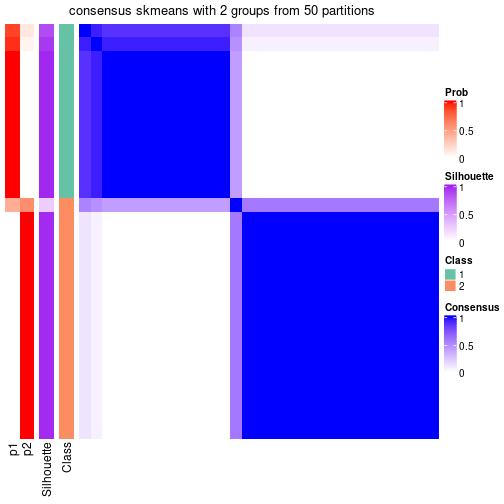</p>

</div>
<div id='tab-node-042-consensus-heatmap-2'>
<pre><code class="r">consensus_heatmap(res, k = 3)
</code></pre>

<p>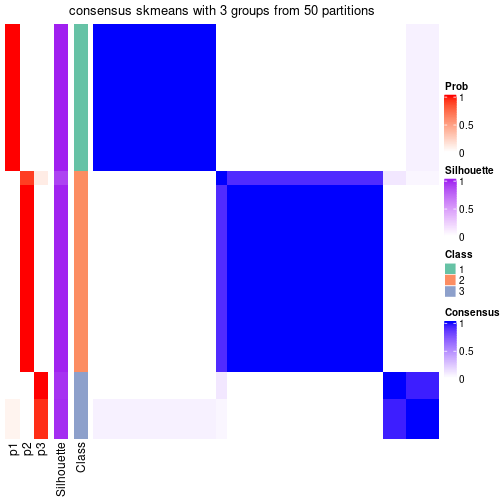</p>

</div>
<div id='tab-node-042-consensus-heatmap-3'>
<pre><code class="r">consensus_heatmap(res, k = 4)
</code></pre>

<p>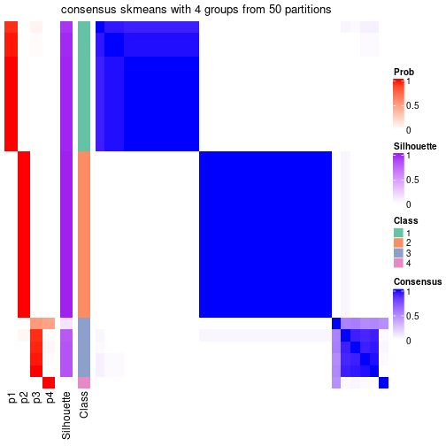</p>

</div>
<div id='tab-node-042-consensus-heatmap-4'>
<pre><code class="r">consensus_heatmap(res, k = 5)
</code></pre>

<p>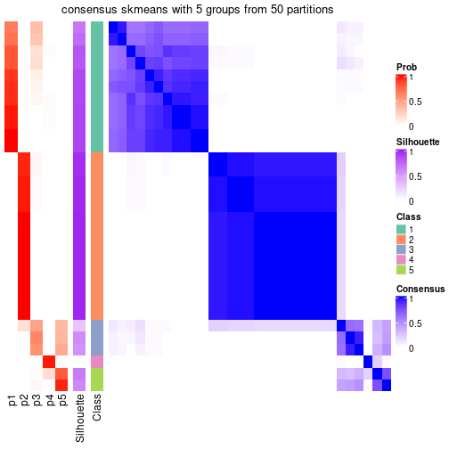</p>

</div>
<div id='tab-node-042-consensus-heatmap-5'>
<pre><code class="r">consensus_heatmap(res, k = 6)
</code></pre>

<p>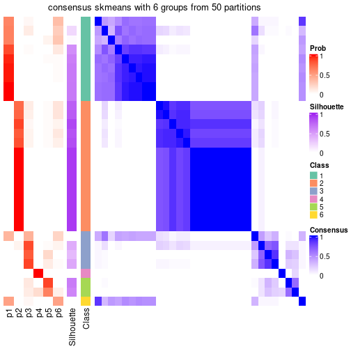</p>

</div>
<div id='tab-node-042-consensus-heatmap-6'>
<pre><code class="r">consensus_heatmap(res, k = 7)
</code></pre>

<p>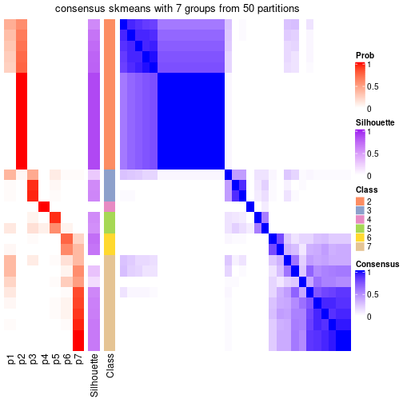</p>

</div>
<div id='tab-node-042-consensus-heatmap-7'>
<pre><code class="r">consensus_heatmap(res, k = 8)
</code></pre>

<p>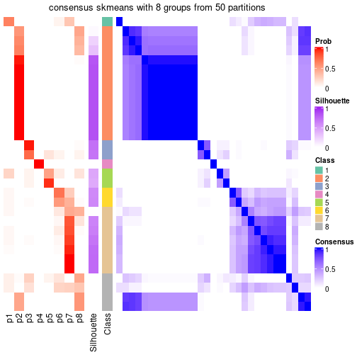</p>

</div>
</div>

Heatmaps for the membership of samples in all partitions to see how consistent they are:


<script>
$( function() {
	$( '#tabs-node-042-membership-heatmap' ).tabs();
} );
</script>
<div id='tabs-node-042-membership-heatmap'>
<ul>
<li><a href='#tab-node-042-membership-heatmap-1'>k = 2</a></li>
<li><a href='#tab-node-042-membership-heatmap-2'>k = 3</a></li>
<li><a href='#tab-node-042-membership-heatmap-3'>k = 4</a></li>
<li><a href='#tab-node-042-membership-heatmap-4'>k = 5</a></li>
<li><a href='#tab-node-042-membership-heatmap-5'>k = 6</a></li>
<li><a href='#tab-node-042-membership-heatmap-6'>k = 7</a></li>
<li><a href='#tab-node-042-membership-heatmap-7'>k = 8</a></li>
</ul>
<div id='tab-node-042-membership-heatmap-1'>
<pre><code class="r">membership_heatmap(res, k = 2)
</code></pre>

<p>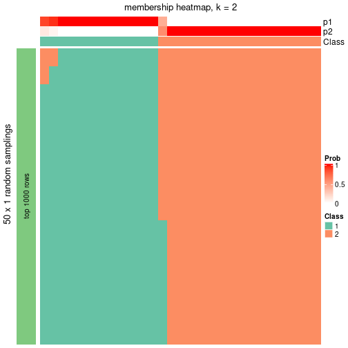</p>

</div>
<div id='tab-node-042-membership-heatmap-2'>
<pre><code class="r">membership_heatmap(res, k = 3)
</code></pre>

<p>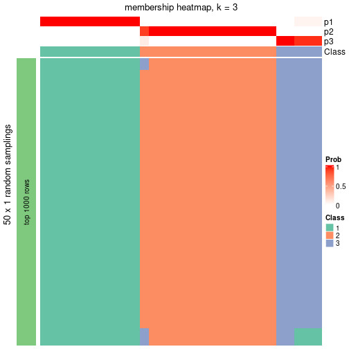</p>

</div>
<div id='tab-node-042-membership-heatmap-3'>
<pre><code class="r">membership_heatmap(res, k = 4)
</code></pre>

<p>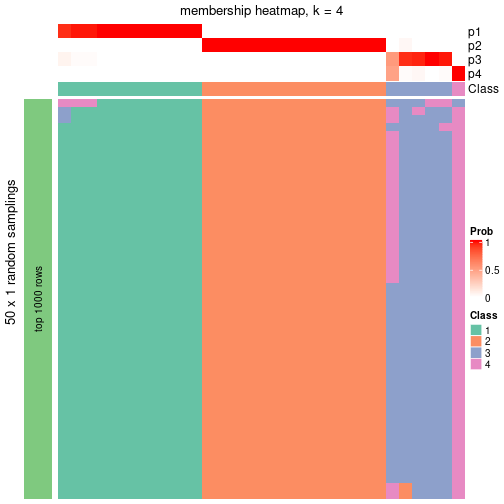</p>

</div>
<div id='tab-node-042-membership-heatmap-4'>
<pre><code class="r">membership_heatmap(res, k = 5)
</code></pre>

<p>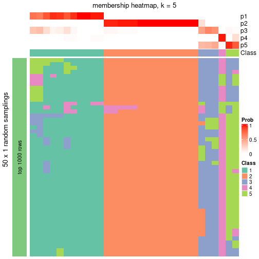</p>

</div>
<div id='tab-node-042-membership-heatmap-5'>
<pre><code class="r">membership_heatmap(res, k = 6)
</code></pre>

<p>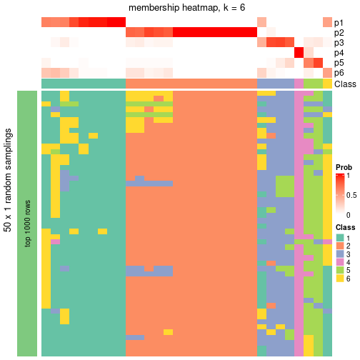</p>

</div>
<div id='tab-node-042-membership-heatmap-6'>
<pre><code class="r">membership_heatmap(res, k = 7)
</code></pre>

<p>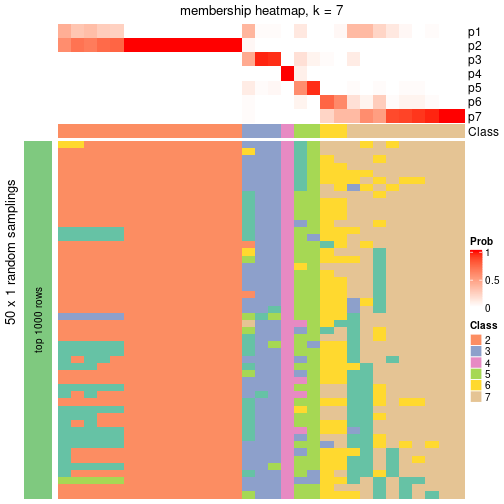</p>

</div>
<div id='tab-node-042-membership-heatmap-7'>
<pre><code class="r">membership_heatmap(res, k = 8)
</code></pre>

<p>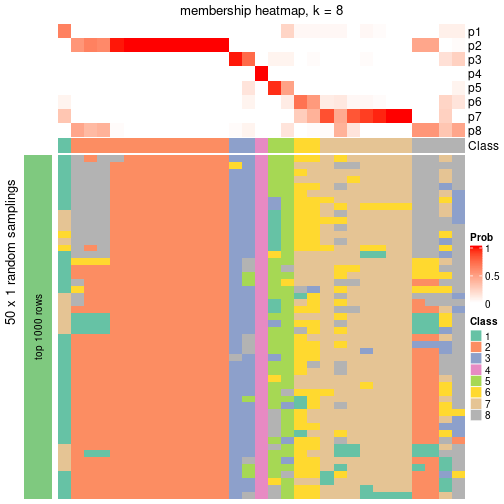</p>

</div>
</div>

As soon as the classes for columns are determined, the signatures
that are significantly different between subgroups can be looked for. 
Following are the heatmaps for signatures.


<script>
$( function() {
	$( '#tabs-node-042-get-signatures' ).tabs();
} );
</script>
<div id='tabs-node-042-get-signatures'>
<ul>
<li><a href='#tab-node-042-get-signatures-1'>k = 2</a></li>
<li><a href='#tab-node-042-get-signatures-2'>k = 3</a></li>
<li><a href='#tab-node-042-get-signatures-3'>k = 4</a></li>
<li><a href='#tab-node-042-get-signatures-4'>k = 5</a></li>
<li><a href='#tab-node-042-get-signatures-5'>k = 6</a></li>
<li><a href='#tab-node-042-get-signatures-6'>k = 7</a></li>
<li><a href='#tab-node-042-get-signatures-7'>k = 8</a></li>
</ul>
<div id='tab-node-042-get-signatures-1'>
<pre><code class="r">get_signatures(res, k = 2)
</code></pre>

<p>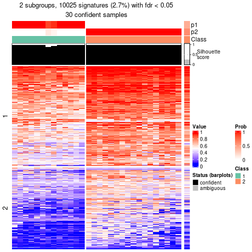</p>

</div>
<div id='tab-node-042-get-signatures-2'>
<pre><code class="r">get_signatures(res, k = 3)
</code></pre>

<p>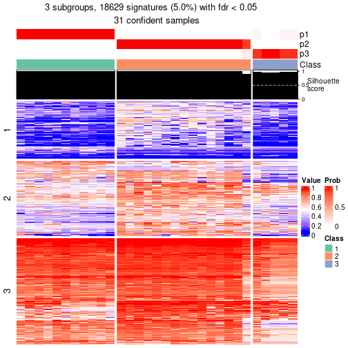</p>

</div>
<div id='tab-node-042-get-signatures-3'>
<pre><code class="r">get_signatures(res, k = 4)
</code></pre>

<p>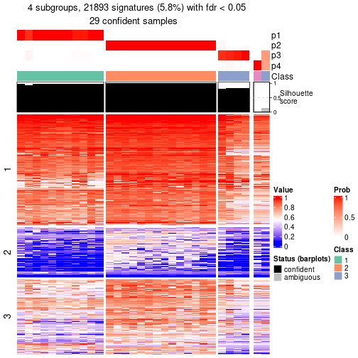</p>

</div>
<div id='tab-node-042-get-signatures-4'>
<pre><code class="r">get_signatures(res, k = 5)
</code></pre>

<p>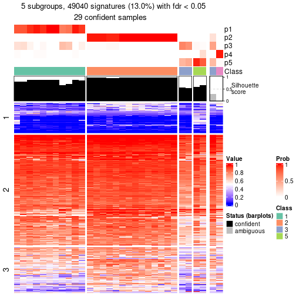</p>

</div>
<div id='tab-node-042-get-signatures-5'>
<pre><code class="r">get_signatures(res, k = 6)
</code></pre>

<p>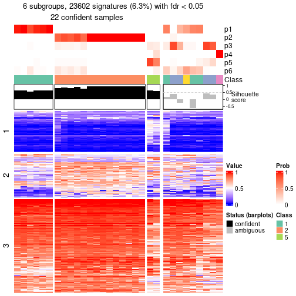</p>

</div>
<div id='tab-node-042-get-signatures-6'>
<pre><code class="r">get_signatures(res, k = 7)
</code></pre>

<p>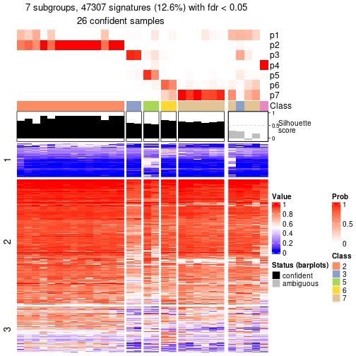</p>

</div>
<div id='tab-node-042-get-signatures-7'>
<pre><code class="r">get_signatures(res, k = 8)
</code></pre>

<p>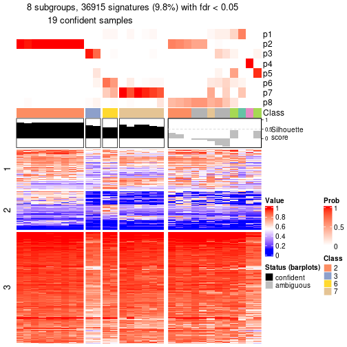</p>

</div>
</div>


Compare the overlap of signatures from different k:

```r
compare_signatures(res)
```

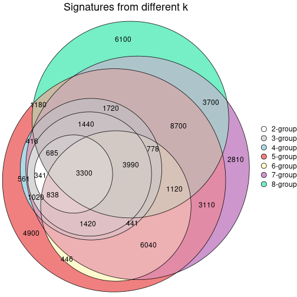

`get_signature()` returns a data frame invisibly. To get the list of signatures, the function
call should be assigned to a variable explicitly. In following code, if `plot` argument is set
to `FALSE`, no heatmap is plotted while only the differential analysis is performed.

```r
# code only for demonstration
tb = get_signature(res, k = ..., plot = FALSE)
```

An example of the output of `tb` is:

```
#>   which_row         fdr    mean_1    mean_2 scaled_mean_1 scaled_mean_2 km
#> 1        38 0.042760348  8.373488  9.131774    -0.5533452     0.5164555  1
#> 2        40 0.018707592  7.106213  8.469186    -0.6173731     0.5762149  1
#> 3        55 0.019134737 10.221463 11.207825    -0.6159697     0.5749050  1
#> 4        59 0.006059896  5.921854  7.869574    -0.6899429     0.6439467  1
#> 5        60 0.018055526  8.928898 10.211722    -0.6204761     0.5791110  1
#> 6        98 0.009384629 15.714769 14.887706     0.6635654    -0.6193277  2
...
```

The columns in `tb` are:

1. `which_row`: row indices corresponding to the input matrix.
2. `fdr`: FDR for the differential test. 
3. `mean_x`: The mean value in group x.
4. `scaled_mean_x`: The mean value in group x after rows are scaled.
5. `km`: Row groups if k-means clustering is applied to rows (which is done by automatically selecting number of clusters).

If there are too many signatures, `top_signatures = ...` can be set to only show the 
signatures with the highest FDRs:

```r
# code only for demonstration
# e.g. to show the top 500 most significant rows
tb = get_signature(res, k = ..., top_signatures = 500)
```

If the signatures are defined as these which are uniquely high in current group, `diff_method` argument
can be set to `"uniquely_high_in_one_group"`:

```r
# code only for demonstration
tb = get_signature(res, k = ..., diff_method = "uniquely_high_in_one_group")
```


UMAP plot which shows how samples are separated.


<script>
$( function() {
	$( '#tabs-node-042-dimension-reduction' ).tabs();
} );
</script>
<div id='tabs-node-042-dimension-reduction'>
<ul>
<li><a href='#tab-node-042-dimension-reduction-1'>k = 2</a></li>
<li><a href='#tab-node-042-dimension-reduction-2'>k = 3</a></li>
<li><a href='#tab-node-042-dimension-reduction-3'>k = 4</a></li>
<li><a href='#tab-node-042-dimension-reduction-4'>k = 5</a></li>
<li><a href='#tab-node-042-dimension-reduction-5'>k = 6</a></li>
<li><a href='#tab-node-042-dimension-reduction-6'>k = 7</a></li>
<li><a href='#tab-node-042-dimension-reduction-7'>k = 8</a></li>
</ul>
<div id='tab-node-042-dimension-reduction-1'>
<pre><code class="r">dimension_reduction(res, k = 2, method = &quot;UMAP&quot;)
</code></pre>

<p>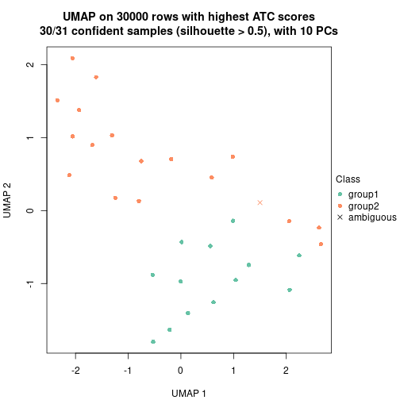</p>

</div>
<div id='tab-node-042-dimension-reduction-2'>
<pre><code class="r">dimension_reduction(res, k = 3, method = &quot;UMAP&quot;)
</code></pre>

<p>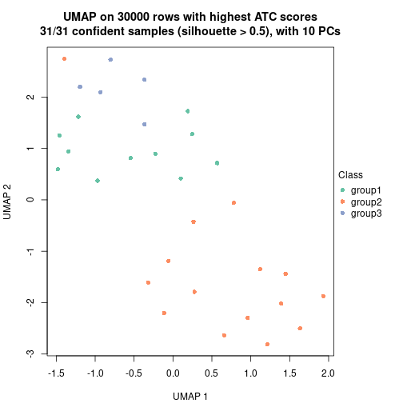</p>

</div>
<div id='tab-node-042-dimension-reduction-3'>
<pre><code class="r">dimension_reduction(res, k = 4, method = &quot;UMAP&quot;)
</code></pre>

<p>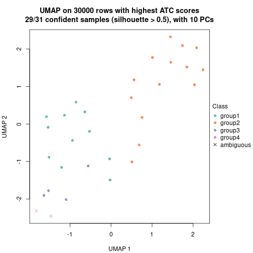</p>

</div>
<div id='tab-node-042-dimension-reduction-4'>
<pre><code class="r">dimension_reduction(res, k = 5, method = &quot;UMAP&quot;)
</code></pre>

<p>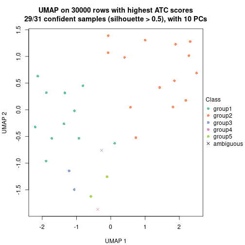</p>

</div>
<div id='tab-node-042-dimension-reduction-5'>
<pre><code class="r">dimension_reduction(res, k = 6, method = &quot;UMAP&quot;)
</code></pre>

<p>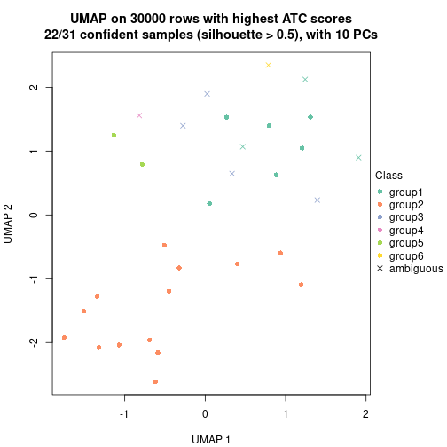</p>

</div>
<div id='tab-node-042-dimension-reduction-6'>
<pre><code class="r">dimension_reduction(res, k = 7, method = &quot;UMAP&quot;)
</code></pre>

<p>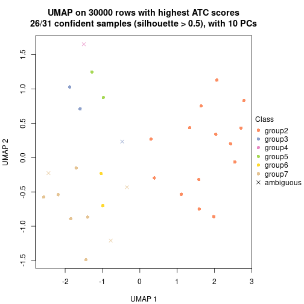</p>

</div>
<div id='tab-node-042-dimension-reduction-7'>
<pre><code class="r">dimension_reduction(res, k = 8, method = &quot;UMAP&quot;)
</code></pre>

<p>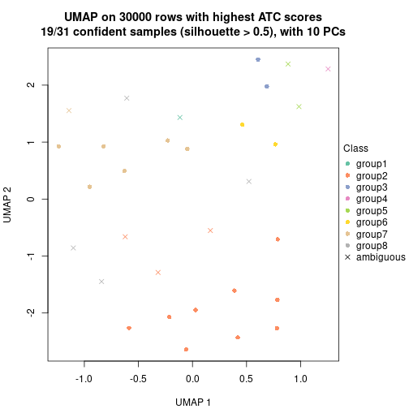</p>

</div>
</div>


Following heatmap shows how subgroups are split when increasing `k`:

```r
collect_classes(res)
```

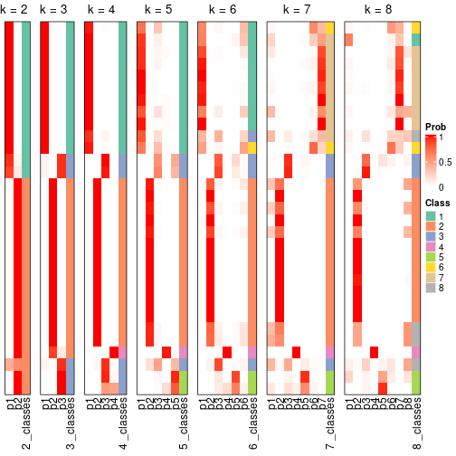


If matrix rows can be associated to genes, consider to use `functional_enrichment(res,
...)` to perform function enrichment for the signature genes. See [this vignette](https://jokergoo.github.io/cola_vignettes/functional_enrichment.html) for more detailed explanations.


 

---------------------------------------------------


### Node043


Parent node: [Node04](#Node04).
Child nodes: 
                Node0111-leaf
        ,
                Node0112-leaf
        ,
                Node0113-leaf
        ,
                Node0114-leaf
        ,
                Node0121-leaf
        ,
                Node0122-leaf
        ,
                Node0123-leaf
        ,
                Node0131-leaf
        ,
                Node0132-leaf
        ,
                Node0133-leaf
        ,
                Node0134-leaf
        ,
                Node0211-leaf
        ,
                Node0212-leaf
        ,
                [Node0213](#Node0213)
        ,
                Node0214-leaf
        ,
                [Node0221](#Node0221)
        ,
                Node0222-leaf
        ,
                Node0223-leaf
        ,
                [Node0231](#Node0231)
        ,
                Node0232-leaf
        ,
                Node0233-leaf
        ,
                [Node0234](#Node0234)
        ,
                Node0235-leaf
        ,
                Node0241-leaf
        ,
                [Node0242](#Node0242)
        ,
                Node0411-leaf
        ,
                Node0412-leaf
        ,
                Node0421-leaf
        ,
                Node0422-leaf
        ,
                Node0423-leaf
        ,
                Node0431-leaf
        ,
                Node0432-leaf
        ,
                Node0511-leaf
        ,
                Node0512-leaf
        ,
                Node0513-leaf
        ,
                Node0514-leaf
        ,
                Node0521-leaf
        ,
                Node0522-leaf
        ,
                Node0523-leaf
        ,
                Node0524-leaf
        ,
                Node0525-leaf
        ,
                Node0611-leaf
        ,
                [Node0612](#Node0612)
        ,
                Node0613-leaf
        ,
                [Node0711](#Node0711)
        ,
                Node0712-leaf
        ,
                Node0713-leaf
        ,
                [Node0721](#Node0721)
        ,
                Node0722-leaf
        ,
                Node0731-leaf
        ,
                Node0732-leaf
        ,
                Node0733-leaf
        .


The object with results only for a single top-value method and a single partitioning method 
can be extracted as:

```r
res = res_rh["043"]
```

A summary of `res` and all the functions that can be applied to it:

```r
res
```

```
#> A 'ConsensusPartition' object with k = 2, 3, 4, 5, 6, 7, 8.
#>   On a matrix with 30000 rows and 18 columns.
#>   Top rows (1000) are extracted by 'ATC' method.
#>   Subgroups are detected by 'kmeans' method.
#>   Performed in total 350 partitions by row resampling.
#>   Best k for subgroups seems to be 2.
#> 
#> Following methods can be applied to this 'ConsensusPartition' object:
#>  [1] "cola_report"             "collect_classes"         "collect_plots"          
#>  [4] "collect_stats"           "colnames"                "compare_partitions"     
#>  [7] "compare_signatures"      "consensus_heatmap"       "dimension_reduction"    
#> [10] "functional_enrichment"   "get_anno_col"            "get_anno"               
#> [13] "get_classes"             "get_consensus"           "get_matrix"             
#> [16] "get_membership"          "get_param"               "get_signatures"         
#> [19] "get_stats"               "is_best_k"               "is_stable_k"            
#> [22] "membership_heatmap"      "ncol"                    "nrow"                   
#> [25] "plot_ecdf"               "predict_classes"         "rownames"               
#> [28] "select_partition_number" "show"                    "suggest_best_k"         
#> [31] "test_to_known_factors"   "top_rows_heatmap"
```

`collect_plots()` function collects all the plots made from `res` for all `k` (number of subgroups)
into one single page to provide an easy and fast comparison between different `k`.

```r
collect_plots(res)
```

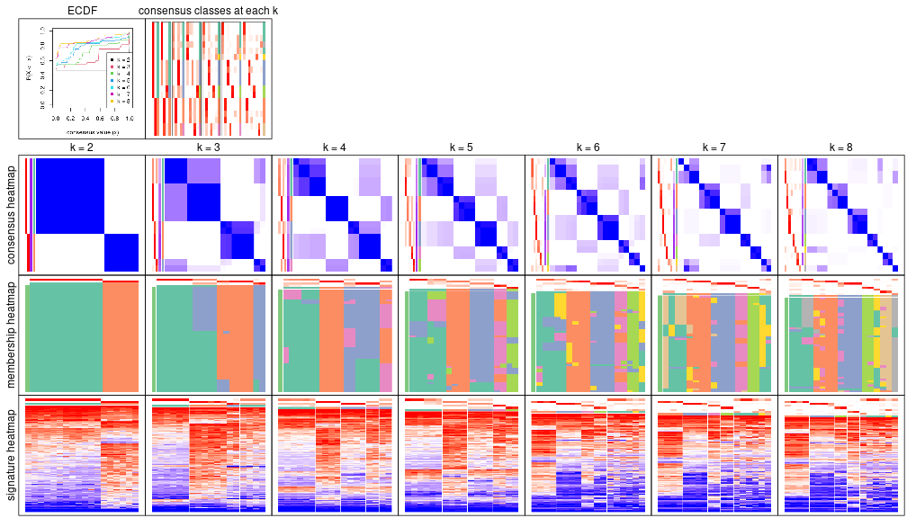

The plots are:

- The first row: a plot of the eCDF (empirical cumulative distribution
  function) curves of the consensus matrix for each `k` and the heatmap of
  predicted classes for each `k`.
- The second row: heatmaps of the consensus matrix for each `k`.
- The third row: heatmaps of the membership matrix for each `k`.
- The fouth row: heatmaps of the signatures for each `k`.

All the plots in panels can be made by individual functions and they are
plotted later in this section.

`select_partition_number()` produces several plots showing different
statistics for choosing "optimized" `k`. There are following statistics:

- eCDF curves of the consensus matrix for each `k`;
- 1-PAC. [The PAC score](https://en.wikipedia.org/wiki/Consensus_clustering#Over-interpretation_potential_of_consensus_clustering)
  measures the proportion of the ambiguous subgrouping.
- Mean silhouette score.
- Concordance. The mean probability of fiting the consensus subgroup labels in all
  partitions.
- Area increased. Denote $A_k$ as the area under the eCDF curve for current
  `k`, the area increased is defined as $A_k - A_{k-1}$.
- Rand index. The percent of pairs of samples that are both in a same cluster
  or both are not in a same cluster in the partition of k and k-1.
- Jaccard index. The ratio of pairs of samples are both in a same cluster in
  the partition of k and k-1 and the pairs of samples are both in a same
  cluster in the partition k or k-1.

The detailed explanations of these statistics can be found in [the _cola_
vignette](https://jokergoo.github.io/cola_vignettes/cola.html#toc_13).

Generally speaking, higher 1-PAC score, higher mean silhouette score or higher
concordance corresponds to better partition. Rand index and Jaccard index
measure how similar the current partition is compared to partition with `k-1`.
If they are too similar, we won't accept `k` is better than `k-1`.

```r
select_partition_number(res)
```

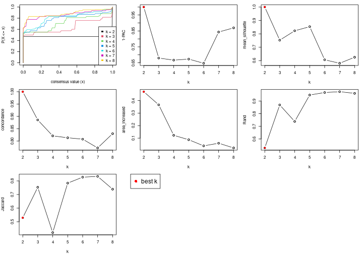

The numeric values for all these statistics can be obtained by `get_stats()`.

```r
get_stats(res)
```

```
#>   k 1-PAC mean_silhouette concordance area_increased  Rand Jaccard
#> 2 2 1.000           1.000       1.000         0.4711 0.529   0.529
#> 3 3 0.680           0.753       0.886         0.3661 0.869   0.753
#> 4 4 0.667           0.823       0.821         0.1226 0.739   0.420
#> 5 5 0.673           0.854       0.813         0.0874 0.948   0.784
#> 6 6 0.647           0.606       0.808         0.0383 0.967   0.828
#> 7 7 0.843           0.581       0.772         0.0594 0.974   0.833
#> 8 8 0.869           0.626       0.830         0.0218 0.961   0.739
```

`suggest_best_k()` suggests the best $k$ based on these statistics. The rules are as follows:

- All $k$ with Jaccard index larger than 0.95 are removed because increasing
  $k$ does not provide enough extra information. If all $k$ are removed, it is
  marked as no subgroup is detected.
- For all $k$ with 1-PAC score larger than 0.9, the maximal $k$ is taken as
  the best $k$, and other $k$ are marked as optional $k$.
- If it does not fit the second rule. The $k$ with the maximal vote of the
  highest 1-PAC score, highest mean silhouette, and highest concordance is
  taken as the best $k$.

```r
suggest_best_k(res)
```

```
#> [1] 2
```


Following is the table of the partitions (You need to click the **show/hide
code output** link to see it). The membership matrix (columns with name `p*`)
is inferred by
[`clue::cl_consensus()`](https://www.rdocumentation.org/link/cl_consensus?package=clue)
function with the `SE` method. Basically the value in the membership matrix
represents the probability to belong to a certain group. The finall subgroup
label for an item is determined with the group with highest probability it
belongs to.

In `get_classes()` function, the entropy is calculated from the membership
matrix and the silhouette score is calculated from the consensus matrix.


<script>
$( function() {
	$( '#tabs-node-043-get-classes' ).tabs();
} );
</script>
<div id='tabs-node-043-get-classes'>
<ul>
<li><a href='#tab-node-043-get-classes-1'>k = 2</a></li>
<li><a href='#tab-node-043-get-classes-2'>k = 3</a></li>
<li><a href='#tab-node-043-get-classes-3'>k = 4</a></li>
<li><a href='#tab-node-043-get-classes-4'>k = 5</a></li>
<li><a href='#tab-node-043-get-classes-5'>k = 6</a></li>
<li><a href='#tab-node-043-get-classes-6'>k = 7</a></li>
<li><a href='#tab-node-043-get-classes-7'>k = 8</a></li>
</ul>

<div id='tab-node-043-get-classes-1'>
<p><a id='tab-node-043-get-classes-1-a' style='color:#0366d6' href='#'>show/hide code output</a></p>
<pre><code class="r">cbind(get_classes(res, k = 2), get_membership(res, k = 2))
</code></pre>

<pre><code>#&gt;                 class entropy silhouette p1 p2
#&gt; TCGA.22.4613.01     1       0          1  1  0
#&gt; TCGA.77.8128.01     1       0          1  1  0
#&gt; TCGA.77.8153.01     1       0          1  1  0
#&gt; TCGA.77.A5G6.01     2       0          1  0  1
#&gt; TCGA.39.5037.01     1       0          1  1  0
#&gt; TCGA.34.8456.01     1       0          1  1  0
#&gt; TCGA.22.5491.01     2       0          1  0  1
#&gt; TCGA.58.8392.01     1       0          1  1  0
#&gt; TCGA.63.7023.01     2       0          1  0  1
#&gt; TCGA.85.8070.01     1       0          1  1  0
#&gt; TCGA.98.A53A.01     2       0          1  0  1
#&gt; TCGA.43.6770.01     1       0          1  1  0
#&gt; TCGA.77.7140.01     1       0          1  1  0
#&gt; TCGA.77.8150.01     1       0          1  1  0
#&gt; TCGA.18.5595.01     2       0          1  0  1
#&gt; TCGA.63.A5MH.01     2       0          1  0  1
#&gt; TCGA.39.5027.01     1       0          1  1  0
#&gt; TCGA.85.8354.01     1       0          1  1  0
</code></pre>

<script>
$('#tab-node-043-get-classes-1-a').parent().next().next().hide();
$('#tab-node-043-get-classes-1-a').click(function(){
  $('#tab-node-043-get-classes-1-a').parent().next().next().toggle();
  return(false);
});
</script>
</div>

<div id='tab-node-043-get-classes-2'>
<p><a id='tab-node-043-get-classes-2-a' style='color:#0366d6' href='#'>show/hide code output</a></p>
<pre><code class="r">cbind(get_classes(res, k = 3), get_membership(res, k = 3))
</code></pre>

<pre><code>#&gt;                 class entropy silhouette   p1   p2   p3
#&gt; TCGA.22.4613.01     1   0.619      0.454 0.58 0.00 0.42
#&gt; TCGA.77.8128.01     1   0.000      0.754 1.00 0.00 0.00
#&gt; TCGA.77.8153.01     1   0.000      0.754 1.00 0.00 0.00
#&gt; TCGA.77.A5G6.01     2   0.000      0.952 0.00 1.00 0.00
#&gt; TCGA.39.5037.01     3   0.000      0.817 0.00 0.00 1.00
#&gt; TCGA.34.8456.01     3   0.334      0.789 0.12 0.00 0.88
#&gt; TCGA.22.5491.01     2   0.369      0.889 0.00 0.86 0.14
#&gt; TCGA.58.8392.01     1   0.619      0.454 0.58 0.00 0.42
#&gt; TCGA.63.7023.01     2   0.334      0.902 0.00 0.88 0.12
#&gt; TCGA.85.8070.01     1   0.000      0.754 1.00 0.00 0.00
#&gt; TCGA.98.A53A.01     2   0.000      0.952 0.00 1.00 0.00
#&gt; TCGA.43.6770.01     1   0.619      0.454 0.58 0.00 0.42
#&gt; TCGA.77.7140.01     1   0.000      0.754 1.00 0.00 0.00
#&gt; TCGA.77.8150.01     1   0.000      0.754 1.00 0.00 0.00
#&gt; TCGA.18.5595.01     2   0.000      0.952 0.00 1.00 0.00
#&gt; TCGA.63.A5MH.01     2   0.000      0.952 0.00 1.00 0.00
#&gt; TCGA.39.5027.01     1   0.619      0.454 0.58 0.00 0.42
#&gt; TCGA.85.8354.01     1   0.000      0.754 1.00 0.00 0.00
</code></pre>

<script>
$('#tab-node-043-get-classes-2-a').parent().next().next().hide();
$('#tab-node-043-get-classes-2-a').click(function(){
  $('#tab-node-043-get-classes-2-a').parent().next().next().toggle();
  return(false);
});
</script>
</div>

<div id='tab-node-043-get-classes-3'>
<p><a id='tab-node-043-get-classes-3-a' style='color:#0366d6' href='#'>show/hide code output</a></p>
<pre><code class="r">cbind(get_classes(res, k = 4), get_membership(res, k = 4))
</code></pre>

<pre><code>#&gt;                 class entropy silhouette   p1   p2   p3   p4
#&gt; TCGA.22.4613.01     3   0.000      0.700 0.00 0.00 1.00 0.00
#&gt; TCGA.77.8128.01     1   0.471      0.880 0.64 0.00 0.36 0.00
#&gt; TCGA.77.8153.01     1   0.657      0.871 0.58 0.00 0.32 0.10
#&gt; TCGA.77.A5G6.01     2   0.000      1.000 0.00 1.00 0.00 0.00
#&gt; TCGA.39.5037.01     3   0.761      0.473 0.32 0.00 0.46 0.22
#&gt; TCGA.34.8456.01     3   0.749      0.492 0.32 0.00 0.48 0.20
#&gt; TCGA.22.5491.01     4   0.498      0.960 0.00 0.46 0.00 0.54
#&gt; TCGA.58.8392.01     3   0.000      0.700 0.00 0.00 1.00 0.00
#&gt; TCGA.63.7023.01     4   0.499      0.958 0.00 0.48 0.00 0.52
#&gt; TCGA.85.8070.01     1   0.767      0.750 0.46 0.00 0.28 0.26
#&gt; TCGA.98.A53A.01     2   0.000      1.000 0.00 1.00 0.00 0.00
#&gt; TCGA.43.6770.01     3   0.000      0.700 0.00 0.00 1.00 0.00
#&gt; TCGA.77.7140.01     1   0.657      0.871 0.58 0.00 0.32 0.10
#&gt; TCGA.77.8150.01     1   0.471      0.880 0.64 0.00 0.36 0.00
#&gt; TCGA.18.5595.01     2   0.000      1.000 0.00 1.00 0.00 0.00
#&gt; TCGA.63.A5MH.01     2   0.000      1.000 0.00 1.00 0.00 0.00
#&gt; TCGA.39.5027.01     3   0.000      0.700 0.00 0.00 1.00 0.00
#&gt; TCGA.85.8354.01     1   0.471      0.880 0.64 0.00 0.36 0.00
</code></pre>

<script>
$('#tab-node-043-get-classes-3-a').parent().next().next().hide();
$('#tab-node-043-get-classes-3-a').click(function(){
  $('#tab-node-043-get-classes-3-a').parent().next().next().toggle();
  return(false);
});
</script>
</div>

<div id='tab-node-043-get-classes-4'>
<p><a id='tab-node-043-get-classes-4-a' style='color:#0366d6' href='#'>show/hide code output</a></p>
<pre><code class="r">cbind(get_classes(res, k = 5), get_membership(res, k = 5))
</code></pre>

<pre><code>#&gt;                 class entropy silhouette   p1   p2   p3   p4   p5
#&gt; TCGA.22.4613.01     3  0.6146      0.993 0.24 0.00 0.56 0.00 0.20
#&gt; TCGA.77.8128.01     1  0.0609      0.683 0.98 0.00 0.02 0.00 0.00
#&gt; TCGA.77.8153.01     1  0.5854      0.694 0.60 0.24 0.16 0.00 0.00
#&gt; TCGA.77.A5G6.01     2  0.3983      0.940 0.00 0.66 0.00 0.34 0.00
#&gt; TCGA.39.5037.01     5  0.0000      0.947 0.00 0.00 0.00 0.00 1.00
#&gt; TCGA.34.8456.01     5  0.1043      0.945 0.00 0.00 0.04 0.00 0.96
#&gt; TCGA.22.5491.01     4  0.1648      0.936 0.00 0.00 0.02 0.94 0.04
#&gt; TCGA.58.8392.01     3  0.6682      0.979 0.24 0.02 0.54 0.00 0.20
#&gt; TCGA.63.7023.01     4  0.0000      0.935 0.00 0.00 0.00 1.00 0.00
#&gt; TCGA.85.8070.01     1  0.6766      0.557 0.40 0.30 0.30 0.00 0.00
#&gt; TCGA.98.A53A.01     2  0.3983      0.940 0.00 0.66 0.00 0.34 0.00
#&gt; TCGA.43.6770.01     3  0.6146      0.993 0.24 0.00 0.56 0.00 0.20
#&gt; TCGA.77.7140.01     1  0.5854      0.694 0.60 0.24 0.16 0.00 0.00
#&gt; TCGA.77.8150.01     1  0.0609      0.683 0.98 0.00 0.02 0.00 0.00
#&gt; TCGA.18.5595.01     2  0.5659      0.837 0.00 0.58 0.10 0.32 0.00
#&gt; TCGA.63.A5MH.01     2  0.4540      0.930 0.00 0.64 0.02 0.34 0.00
#&gt; TCGA.39.5027.01     3  0.6146      0.993 0.24 0.00 0.56 0.00 0.20
#&gt; TCGA.85.8354.01     1  0.0000      0.686 1.00 0.00 0.00 0.00 0.00
</code></pre>

<script>
$('#tab-node-043-get-classes-4-a').parent().next().next().hide();
$('#tab-node-043-get-classes-4-a').click(function(){
  $('#tab-node-043-get-classes-4-a').parent().next().next().toggle();
  return(false);
});
</script>
</div>

<div id='tab-node-043-get-classes-5'>
<p><a id='tab-node-043-get-classes-5-a' style='color:#0366d6' href='#'>show/hide code output</a></p>
<pre><code class="r">cbind(get_classes(res, k = 6), get_membership(res, k = 6))
</code></pre>

<pre><code>#&gt;                 class entropy silhouette   p1   p2   p3   p4   p5   p6
#&gt; TCGA.22.4613.01     3  0.0000      0.958 0.00 0.00 1.00 0.00 0.00 0.00
#&gt; TCGA.77.8128.01     1  0.5992     -0.242 0.42 0.00 0.24 0.00 0.00 0.34
#&gt; TCGA.77.8153.01     1  0.2793      0.387 0.80 0.00 0.20 0.00 0.00 0.00
#&gt; TCGA.77.A5G6.01     2  0.0000      0.882 0.00 1.00 0.00 0.00 0.00 0.00
#&gt; TCGA.39.5037.01     5  0.0937      0.854 0.00 0.00 0.04 0.00 0.96 0.00
#&gt; TCGA.34.8456.01     5  0.2790      0.859 0.00 0.00 0.14 0.00 0.84 0.02
#&gt; TCGA.22.5491.01     4  0.5569      0.855 0.00 0.24 0.00 0.62 0.10 0.04
#&gt; TCGA.58.8392.01     3  0.2474      0.867 0.00 0.00 0.88 0.08 0.00 0.04
#&gt; TCGA.63.7023.01     4  0.3309      0.849 0.00 0.28 0.00 0.72 0.00 0.00
#&gt; TCGA.85.8070.01     1  0.4375      0.108 0.78 0.00 0.02 0.12 0.04 0.04
#&gt; TCGA.98.A53A.01     2  0.0000      0.882 0.00 1.00 0.00 0.00 0.00 0.00
#&gt; TCGA.43.6770.01     3  0.0000      0.958 0.00 0.00 1.00 0.00 0.00 0.00
#&gt; TCGA.77.7140.01     1  0.2793      0.387 0.80 0.00 0.20 0.00 0.00 0.00
#&gt; TCGA.77.8150.01     1  0.6023     -0.196 0.42 0.00 0.26 0.00 0.00 0.32
#&gt; TCGA.18.5595.01     2  0.1807      0.844 0.02 0.92 0.00 0.00 0.00 0.06
#&gt; TCGA.63.A5MH.01     2  0.2941      0.708 0.00 0.78 0.00 0.00 0.00 0.22
#&gt; TCGA.39.5027.01     3  0.0000      0.958 0.00 0.00 1.00 0.00 0.00 0.00
#&gt; TCGA.85.8354.01     6  0.6696      0.000 0.24 0.00 0.18 0.08 0.00 0.50
</code></pre>

<script>
$('#tab-node-043-get-classes-5-a').parent().next().next().hide();
$('#tab-node-043-get-classes-5-a').click(function(){
  $('#tab-node-043-get-classes-5-a').parent().next().next().toggle();
  return(false);
});
</script>
</div>

<div id='tab-node-043-get-classes-6'>
<p><a id='tab-node-043-get-classes-6-a' style='color:#0366d6' href='#'>show/hide code output</a></p>
<pre><code class="r">cbind(get_classes(res, k = 7), get_membership(res, k = 7))
</code></pre>

<pre><code>#&gt;                 class entropy silhouette   p1   p2   p3   p4   p5   p6   p7
#&gt; TCGA.22.4613.01     3  0.0000      0.928 0.00 0.00 1.00 0.00 0.00 0.00 0.00
#&gt; TCGA.77.8128.01     7  0.4283      0.000 0.48 0.00 0.04 0.00 0.00 0.00 0.48
#&gt; TCGA.77.8153.01     1  0.0863      0.294 0.96 0.00 0.04 0.00 0.00 0.00 0.00
#&gt; TCGA.77.A5G6.01     2  0.0504      0.865 0.00 0.98 0.00 0.02 0.00 0.00 0.00
#&gt; TCGA.39.5037.01     5  0.0504      0.985 0.00 0.00 0.00 0.00 0.98 0.02 0.00
#&gt; TCGA.34.8456.01     5  0.0000      0.985 0.00 0.00 0.00 0.00 1.00 0.00 0.00
#&gt; TCGA.22.5491.01     4  0.2259      0.984 0.00 0.16 0.00 0.84 0.00 0.00 0.00
#&gt; TCGA.58.8392.01     3  0.3670      0.761 0.00 0.00 0.76 0.10 0.00 0.14 0.00
#&gt; TCGA.63.7023.01     4  0.2745      0.984 0.00 0.16 0.00 0.82 0.00 0.00 0.02
#&gt; TCGA.85.8070.01     1  0.4505      0.102 0.50 0.00 0.00 0.06 0.00 0.00 0.44
#&gt; TCGA.98.A53A.01     2  0.0504      0.865 0.00 0.98 0.00 0.02 0.00 0.00 0.00
#&gt; TCGA.43.6770.01     3  0.0000      0.928 0.00 0.00 1.00 0.00 0.00 0.00 0.00
#&gt; TCGA.77.7140.01     1  0.0863      0.294 0.96 0.00 0.04 0.00 0.00 0.00 0.00
#&gt; TCGA.77.8150.01     1  0.4266     -0.935 0.52 0.00 0.04 0.00 0.00 0.00 0.44
#&gt; TCGA.18.5595.01     2  0.3606      0.641 0.00 0.68 0.00 0.00 0.00 0.30 0.02
#&gt; TCGA.63.A5MH.01     2  0.1363      0.843 0.00 0.94 0.00 0.00 0.00 0.02 0.04
#&gt; TCGA.39.5027.01     3  0.0000      0.928 0.00 0.00 1.00 0.00 0.00 0.00 0.00
#&gt; TCGA.85.8354.01     6  0.5622      0.000 0.24 0.00 0.02 0.00 0.00 0.52 0.22
</code></pre>

<script>
$('#tab-node-043-get-classes-6-a').parent().next().next().hide();
$('#tab-node-043-get-classes-6-a').click(function(){
  $('#tab-node-043-get-classes-6-a').parent().next().next().toggle();
  return(false);
});
</script>
</div>

<div id='tab-node-043-get-classes-7'>
<p><a id='tab-node-043-get-classes-7-a' style='color:#0366d6' href='#'>show/hide code output</a></p>
<pre><code class="r">cbind(get_classes(res, k = 8), get_membership(res, k = 8))
</code></pre>

<pre><code>#&gt;                 class entropy silhouette   p1   p2   p3   p4  p5   p6   p7   p8
#&gt; TCGA.22.4613.01     3  0.0471      0.859 0.00 0.00 0.98 0.00 0.0 0.00 0.02 0.00
#&gt; TCGA.77.8128.01     1  0.6362      0.407 0.52 0.00 0.06 0.10 0.0 0.18 0.00 0.14
#&gt; TCGA.77.8153.01     1  0.0808      0.489 0.96 0.00 0.04 0.00 0.0 0.00 0.00 0.00
#&gt; TCGA.77.A5G6.01     2  0.0000      0.788 0.00 1.00 0.00 0.00 0.0 0.00 0.00 0.00
#&gt; TCGA.39.5037.01     5  0.1804      0.921 0.00 0.00 0.00 0.08 0.9 0.00 0.00 0.02
#&gt; TCGA.34.8456.01     5  0.0000      0.921 0.00 0.00 0.00 0.00 1.0 0.00 0.00 0.00
#&gt; TCGA.22.5491.01     7  0.3980      0.837 0.02 0.02 0.00 0.10 0.0 0.06 0.78 0.02
#&gt; TCGA.58.8392.01     3  0.4621      0.540 0.00 0.00 0.58 0.32 0.0 0.02 0.00 0.08
#&gt; TCGA.63.7023.01     7  0.0471      0.837 0.00 0.02 0.00 0.00 0.0 0.00 0.98 0.00
#&gt; TCGA.85.8070.01     8  0.3272      0.000 0.42 0.00 0.00 0.00 0.0 0.00 0.00 0.58
#&gt; TCGA.98.A53A.01     2  0.0000      0.788 0.00 1.00 0.00 0.00 0.0 0.00 0.00 0.00
#&gt; TCGA.43.6770.01     3  0.0000      0.863 0.00 0.00 1.00 0.00 0.0 0.00 0.00 0.00
#&gt; TCGA.77.7140.01     1  0.0808      0.489 0.96 0.00 0.04 0.00 0.0 0.00 0.00 0.00
#&gt; TCGA.77.8150.01     1  0.6313      0.407 0.52 0.00 0.06 0.08 0.0 0.18 0.00 0.16
#&gt; TCGA.18.5595.01     2  0.5347      0.609 0.02 0.62 0.00 0.06 0.0 0.16 0.00 0.14
#&gt; TCGA.63.A5MH.01     2  0.3083      0.643 0.00 0.66 0.00 0.34 0.0 0.00 0.00 0.00
#&gt; TCGA.39.5027.01     3  0.0000      0.863 0.00 0.00 1.00 0.00 0.0 0.00 0.00 0.00
#&gt; TCGA.85.8354.01     6  0.2981      0.000 0.22 0.00 0.02 0.00 0.0 0.76 0.00 0.00
</code></pre>

<script>
$('#tab-node-043-get-classes-7-a').parent().next().next().hide();
$('#tab-node-043-get-classes-7-a').click(function(){
  $('#tab-node-043-get-classes-7-a').parent().next().next().toggle();
  return(false);
});
</script>
</div>
</div>

Heatmaps for the consensus matrix. It visualizes the probability of two
samples to be in a same group.


<script>
$( function() {
	$( '#tabs-node-043-consensus-heatmap' ).tabs();
} );
</script>
<div id='tabs-node-043-consensus-heatmap'>
<ul>
<li><a href='#tab-node-043-consensus-heatmap-1'>k = 2</a></li>
<li><a href='#tab-node-043-consensus-heatmap-2'>k = 3</a></li>
<li><a href='#tab-node-043-consensus-heatmap-3'>k = 4</a></li>
<li><a href='#tab-node-043-consensus-heatmap-4'>k = 5</a></li>
<li><a href='#tab-node-043-consensus-heatmap-5'>k = 6</a></li>
<li><a href='#tab-node-043-consensus-heatmap-6'>k = 7</a></li>
<li><a href='#tab-node-043-consensus-heatmap-7'>k = 8</a></li>
</ul>
<div id='tab-node-043-consensus-heatmap-1'>
<pre><code class="r">consensus_heatmap(res, k = 2)
</code></pre>

<p>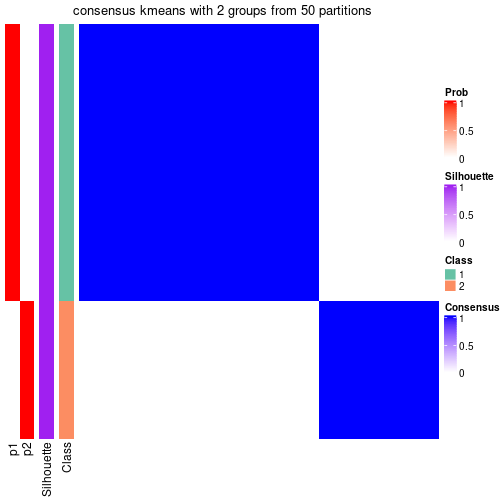</p>

</div>
<div id='tab-node-043-consensus-heatmap-2'>
<pre><code class="r">consensus_heatmap(res, k = 3)
</code></pre>

<p>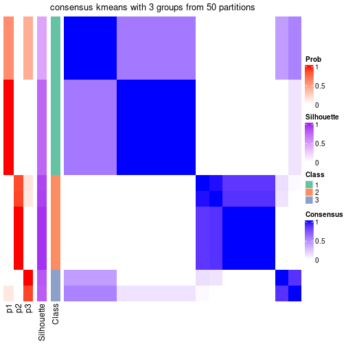</p>

</div>
<div id='tab-node-043-consensus-heatmap-3'>
<pre><code class="r">consensus_heatmap(res, k = 4)
</code></pre>

<p>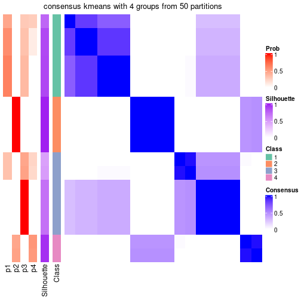</p>

</div>
<div id='tab-node-043-consensus-heatmap-4'>
<pre><code class="r">consensus_heatmap(res, k = 5)
</code></pre>

<p>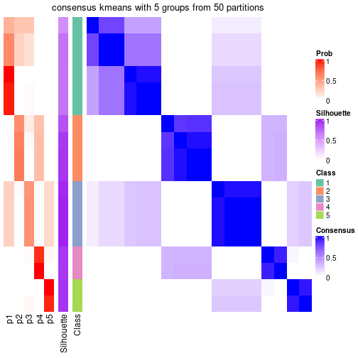</p>

</div>
<div id='tab-node-043-consensus-heatmap-5'>
<pre><code class="r">consensus_heatmap(res, k = 6)
</code></pre>

<p>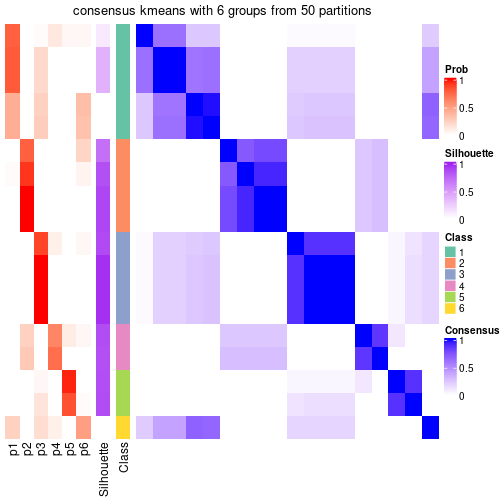</p>

</div>
<div id='tab-node-043-consensus-heatmap-6'>
<pre><code class="r">consensus_heatmap(res, k = 7)
</code></pre>

<p>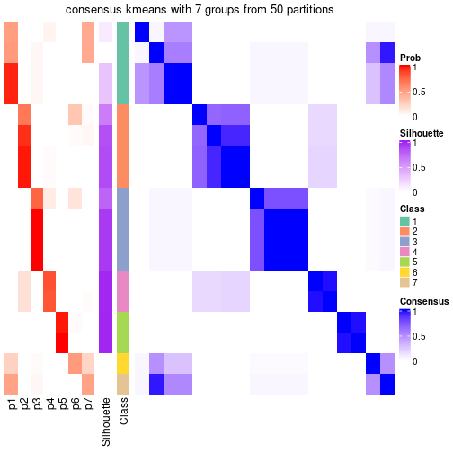</p>

</div>
<div id='tab-node-043-consensus-heatmap-7'>
<pre><code class="r">consensus_heatmap(res, k = 8)
</code></pre>

<p>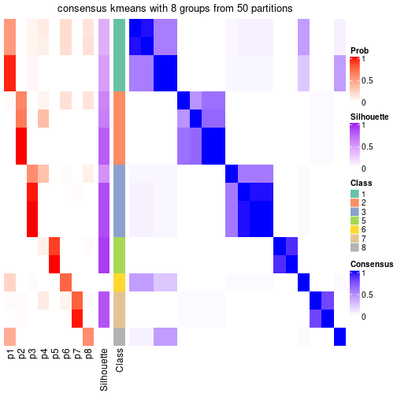</p>

</div>
</div>

Heatmaps for the membership of samples in all partitions to see how consistent they are:


<script>
$( function() {
	$( '#tabs-node-043-membership-heatmap' ).tabs();
} );
</script>
<div id='tabs-node-043-membership-heatmap'>
<ul>
<li><a href='#tab-node-043-membership-heatmap-1'>k = 2</a></li>
<li><a href='#tab-node-043-membership-heatmap-2'>k = 3</a></li>
<li><a href='#tab-node-043-membership-heatmap-3'>k = 4</a></li>
<li><a href='#tab-node-043-membership-heatmap-4'>k = 5</a></li>
<li><a href='#tab-node-043-membership-heatmap-5'>k = 6</a></li>
<li><a href='#tab-node-043-membership-heatmap-6'>k = 7</a></li>
<li><a href='#tab-node-043-membership-heatmap-7'>k = 8</a></li>
</ul>
<div id='tab-node-043-membership-heatmap-1'>
<pre><code class="r">membership_heatmap(res, k = 2)
</code></pre>

<p>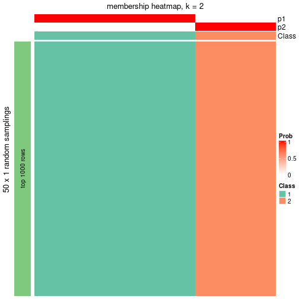</p>

</div>
<div id='tab-node-043-membership-heatmap-2'>
<pre><code class="r">membership_heatmap(res, k = 3)
</code></pre>

<p>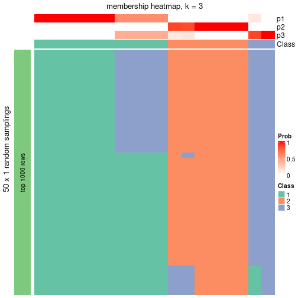</p>

</div>
<div id='tab-node-043-membership-heatmap-3'>
<pre><code class="r">membership_heatmap(res, k = 4)
</code></pre>

<p>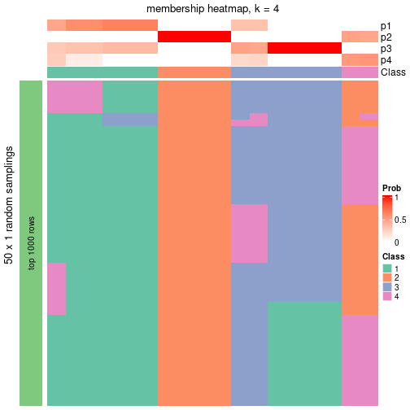</p>

</div>
<div id='tab-node-043-membership-heatmap-4'>
<pre><code class="r">membership_heatmap(res, k = 5)
</code></pre>

<p>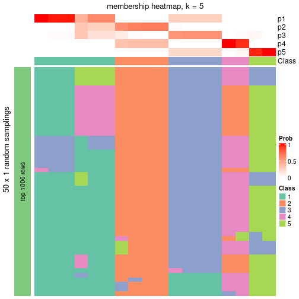</p>

</div>
<div id='tab-node-043-membership-heatmap-5'>
<pre><code class="r">membership_heatmap(res, k = 6)
</code></pre>

<p>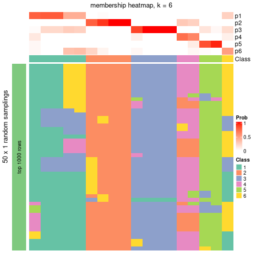</p>

</div>
<div id='tab-node-043-membership-heatmap-6'>
<pre><code class="r">membership_heatmap(res, k = 7)
</code></pre>

<p>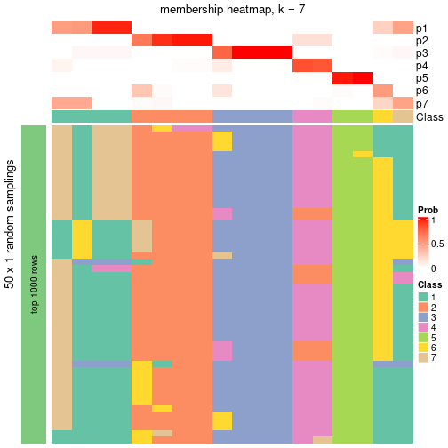</p>

</div>
<div id='tab-node-043-membership-heatmap-7'>
<pre><code class="r">membership_heatmap(res, k = 8)
</code></pre>

<p>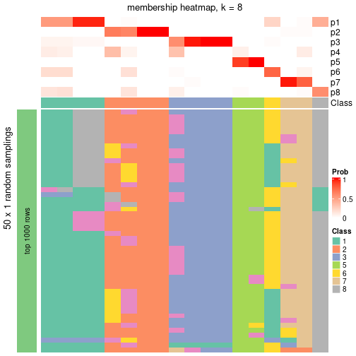</p>

</div>
</div>

As soon as the classes for columns are determined, the signatures
that are significantly different between subgroups can be looked for. 
Following are the heatmaps for signatures.


<script>
$( function() {
	$( '#tabs-node-043-get-signatures' ).tabs();
} );
</script>
<div id='tabs-node-043-get-signatures'>
<ul>
<li><a href='#tab-node-043-get-signatures-1'>k = 2</a></li>
<li><a href='#tab-node-043-get-signatures-2'>k = 3</a></li>
<li><a href='#tab-node-043-get-signatures-3'>k = 4</a></li>
<li><a href='#tab-node-043-get-signatures-4'>k = 5</a></li>
<li><a href='#tab-node-043-get-signatures-5'>k = 6</a></li>
<li><a href='#tab-node-043-get-signatures-6'>k = 7</a></li>
<li><a href='#tab-node-043-get-signatures-7'>k = 8</a></li>
</ul>
<div id='tab-node-043-get-signatures-1'>
<pre><code class="r">get_signatures(res, k = 2)
</code></pre>

<p>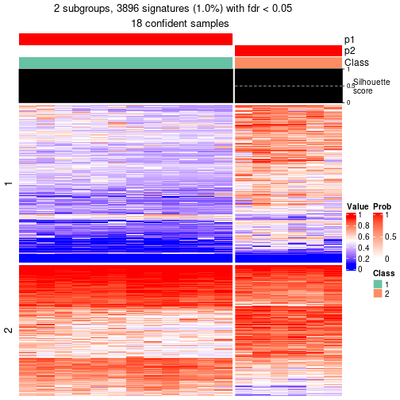</p>

</div>
<div id='tab-node-043-get-signatures-2'>
<pre><code class="r">get_signatures(res, k = 3)
</code></pre>

<p>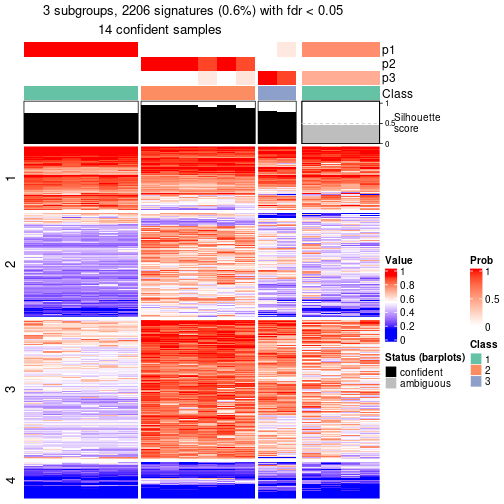</p>

</div>
<div id='tab-node-043-get-signatures-3'>
<pre><code class="r">get_signatures(res, k = 4)
</code></pre>

<p>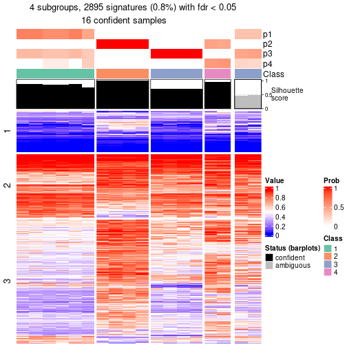</p>

</div>
<div id='tab-node-043-get-signatures-4'>
<pre><code class="r">get_signatures(res, k = 5)
</code></pre>

<p>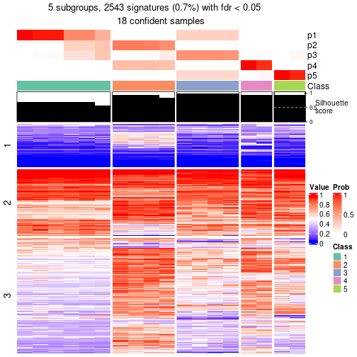</p>

</div>
<div id='tab-node-043-get-signatures-5'>
<pre><code class="r">get_signatures(res, k = 6)
</code></pre>

<p>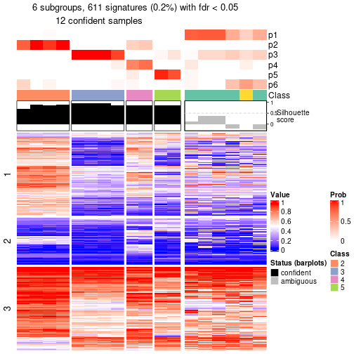</p>

</div>
<div id='tab-node-043-get-signatures-6'>
<pre><code class="r">get_signatures(res, k = 7)
</code></pre>

<p>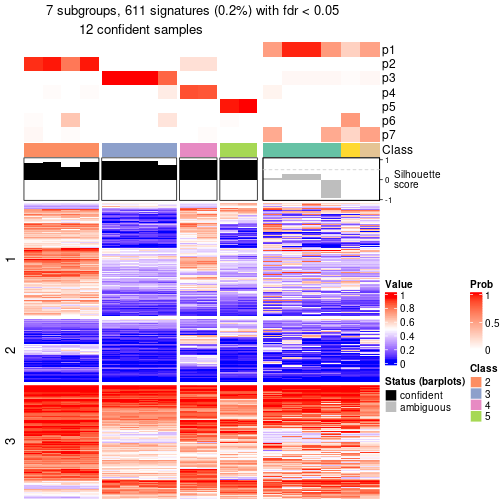</p>

</div>
<div id='tab-node-043-get-signatures-7'>
<pre><code class="r">get_signatures(res, k = 8)
</code></pre>

<p>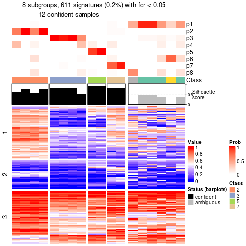</p>

</div>
</div>


Compare the overlap of signatures from different k:

```r
compare_signatures(res)
```

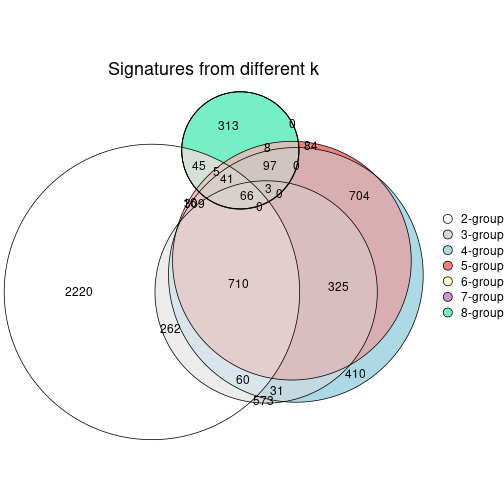

`get_signature()` returns a data frame invisibly. To get the list of signatures, the function
call should be assigned to a variable explicitly. In following code, if `plot` argument is set
to `FALSE`, no heatmap is plotted while only the differential analysis is performed.

```r
# code only for demonstration
tb = get_signature(res, k = ..., plot = FALSE)
```

An example of the output of `tb` is:

```
#>   which_row         fdr    mean_1    mean_2 scaled_mean_1 scaled_mean_2 km
#> 1        38 0.042760348  8.373488  9.131774    -0.5533452     0.5164555  1
#> 2        40 0.018707592  7.106213  8.469186    -0.6173731     0.5762149  1
#> 3        55 0.019134737 10.221463 11.207825    -0.6159697     0.5749050  1
#> 4        59 0.006059896  5.921854  7.869574    -0.6899429     0.6439467  1
#> 5        60 0.018055526  8.928898 10.211722    -0.6204761     0.5791110  1
#> 6        98 0.009384629 15.714769 14.887706     0.6635654    -0.6193277  2
...
```

The columns in `tb` are:

1. `which_row`: row indices corresponding to the input matrix.
2. `fdr`: FDR for the differential test. 
3. `mean_x`: The mean value in group x.
4. `scaled_mean_x`: The mean value in group x after rows are scaled.
5. `km`: Row groups if k-means clustering is applied to rows (which is done by automatically selecting number of clusters).

If there are too many signatures, `top_signatures = ...` can be set to only show the 
signatures with the highest FDRs:

```r
# code only for demonstration
# e.g. to show the top 500 most significant rows
tb = get_signature(res, k = ..., top_signatures = 500)
```

If the signatures are defined as these which are uniquely high in current group, `diff_method` argument
can be set to `"uniquely_high_in_one_group"`:

```r
# code only for demonstration
tb = get_signature(res, k = ..., diff_method = "uniquely_high_in_one_group")
```


UMAP plot which shows how samples are separated.


<script>
$( function() {
	$( '#tabs-node-043-dimension-reduction' ).tabs();
} );
</script>
<div id='tabs-node-043-dimension-reduction'>
<ul>
<li><a href='#tab-node-043-dimension-reduction-1'>k = 2</a></li>
<li><a href='#tab-node-043-dimension-reduction-2'>k = 3</a></li>
<li><a href='#tab-node-043-dimension-reduction-3'>k = 4</a></li>
<li><a href='#tab-node-043-dimension-reduction-4'>k = 5</a></li>
<li><a href='#tab-node-043-dimension-reduction-5'>k = 6</a></li>
<li><a href='#tab-node-043-dimension-reduction-6'>k = 7</a></li>
<li><a href='#tab-node-043-dimension-reduction-7'>k = 8</a></li>
</ul>
<div id='tab-node-043-dimension-reduction-1'>
<pre><code class="r">dimension_reduction(res, k = 2, method = &quot;UMAP&quot;)
</code></pre>

<p>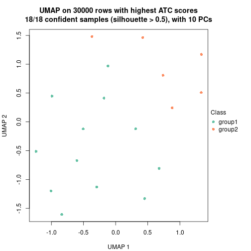</p>

</div>
<div id='tab-node-043-dimension-reduction-2'>
<pre><code class="r">dimension_reduction(res, k = 3, method = &quot;UMAP&quot;)
</code></pre>

<p></p>

</div>
<div id='tab-node-043-dimension-reduction-3'>
<pre><code class="r">dimension_reduction(res, k = 4, method = &quot;UMAP&quot;)
</code></pre>

<p>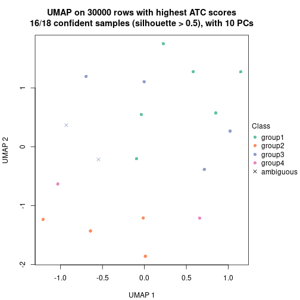</p>

</div>
<div id='tab-node-043-dimension-reduction-4'>
<pre><code class="r">dimension_reduction(res, k = 5, method = &quot;UMAP&quot;)
</code></pre>

<p>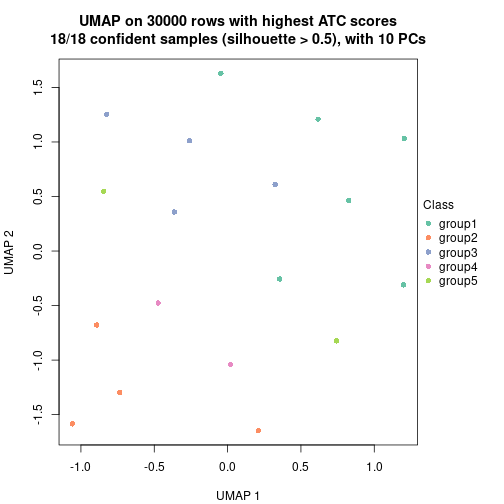</p>

</div>
<div id='tab-node-043-dimension-reduction-5'>
<pre><code class="r">dimension_reduction(res, k = 6, method = &quot;UMAP&quot;)
</code></pre>

<p>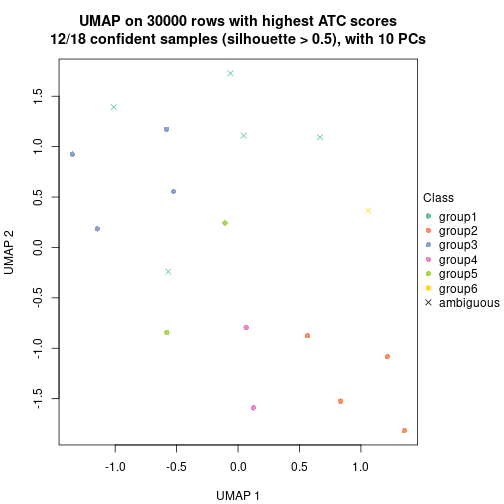</p>

</div>
<div id='tab-node-043-dimension-reduction-6'>
<pre><code class="r">dimension_reduction(res, k = 7, method = &quot;UMAP&quot;)
</code></pre>

<p>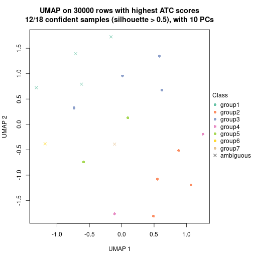</p>

</div>
<div id='tab-node-043-dimension-reduction-7'>
<pre><code class="r">dimension_reduction(res, k = 8, method = &quot;UMAP&quot;)
</code></pre>

<p>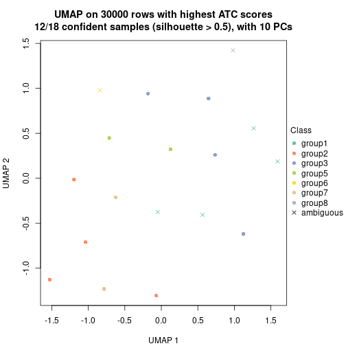</p>

</div>
</div>


Following heatmap shows how subgroups are split when increasing `k`:

```r
collect_classes(res)
```

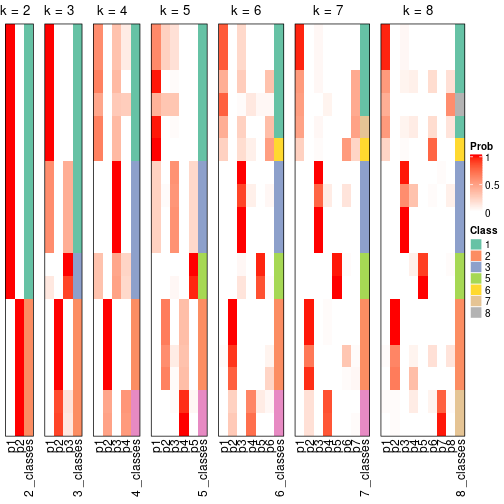


If matrix rows can be associated to genes, consider to use `functional_enrichment(res,
...)` to perform function enrichment for the signature genes. See [this vignette](https://jokergoo.github.io/cola_vignettes/functional_enrichment.html) for more detailed explanations.


 

---------------------------------------------------


### Node05


Parent node: [Node0](#Node0).
Child nodes: 
                [Node011](#Node011)
        ,
                [Node012](#Node012)
        ,
                [Node013](#Node013)
        ,
                Node014-leaf
        ,
                [Node021](#Node021)
        ,
                [Node022](#Node022)
        ,
                [Node023](#Node023)
        ,
                [Node024](#Node024)
        ,
                Node031-leaf
        ,
                Node032-leaf
        ,
                [Node041](#Node041)
        ,
                [Node042](#Node042)
        ,
                [Node043](#Node043)
        ,
                [Node051](#Node051)
        ,
                [Node052](#Node052)
        ,
                [Node061](#Node061)
        ,
                Node062-leaf
        ,
                [Node071](#Node071)
        ,
                [Node072](#Node072)
        ,
                [Node073](#Node073)
        .


The object with results only for a single top-value method and a single partitioning method 
can be extracted as:

```r
res = res_rh["05"]
```

A summary of `res` and all the functions that can be applied to it:

```r
res
```

```
#> A 'ConsensusPartition' object with k = 2, 3, 4, 5, 6, 7, 8.
#>   On a matrix with 30000 rows and 89 columns.
#>   Top rows (1000) are extracted by 'SD' method.
#>   Subgroups are detected by 'kmeans' method.
#>   Performed in total 350 partitions by row resampling.
#>   Best k for subgroups seems to be 2.
#> 
#> Following methods can be applied to this 'ConsensusPartition' object:
#>  [1] "cola_report"             "collect_classes"         "collect_plots"          
#>  [4] "collect_stats"           "colnames"                "compare_partitions"     
#>  [7] "compare_signatures"      "consensus_heatmap"       "dimension_reduction"    
#> [10] "functional_enrichment"   "get_anno_col"            "get_anno"               
#> [13] "get_classes"             "get_consensus"           "get_matrix"             
#> [16] "get_membership"          "get_param"               "get_signatures"         
#> [19] "get_stats"               "is_best_k"               "is_stable_k"            
#> [22] "membership_heatmap"      "ncol"                    "nrow"                   
#> [25] "plot_ecdf"               "predict_classes"         "rownames"               
#> [28] "select_partition_number" "show"                    "suggest_best_k"         
#> [31] "test_to_known_factors"   "top_rows_heatmap"
```

`collect_plots()` function collects all the plots made from `res` for all `k` (number of subgroups)
into one single page to provide an easy and fast comparison between different `k`.

```r
collect_plots(res)
```

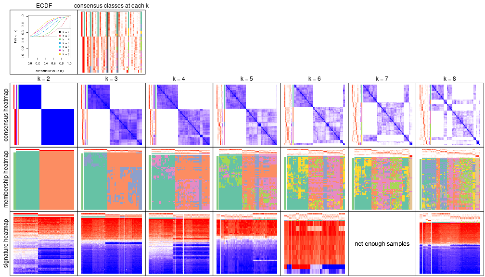

The plots are:

- The first row: a plot of the eCDF (empirical cumulative distribution
  function) curves of the consensus matrix for each `k` and the heatmap of
  predicted classes for each `k`.
- The second row: heatmaps of the consensus matrix for each `k`.
- The third row: heatmaps of the membership matrix for each `k`.
- The fouth row: heatmaps of the signatures for each `k`.

All the plots in panels can be made by individual functions and they are
plotted later in this section.

`select_partition_number()` produces several plots showing different
statistics for choosing "optimized" `k`. There are following statistics:

- eCDF curves of the consensus matrix for each `k`;
- 1-PAC. [The PAC score](https://en.wikipedia.org/wiki/Consensus_clustering#Over-interpretation_potential_of_consensus_clustering)
  measures the proportion of the ambiguous subgrouping.
- Mean silhouette score.
- Concordance. The mean probability of fiting the consensus subgroup labels in all
  partitions.
- Area increased. Denote $A_k$ as the area under the eCDF curve for current
  `k`, the area increased is defined as $A_k - A_{k-1}$.
- Rand index. The percent of pairs of samples that are both in a same cluster
  or both are not in a same cluster in the partition of k and k-1.
- Jaccard index. The ratio of pairs of samples are both in a same cluster in
  the partition of k and k-1 and the pairs of samples are both in a same
  cluster in the partition k or k-1.

The detailed explanations of these statistics can be found in [the _cola_
vignette](https://jokergoo.github.io/cola_vignettes/cola.html#toc_13).

Generally speaking, higher 1-PAC score, higher mean silhouette score or higher
concordance corresponds to better partition. Rand index and Jaccard index
measure how similar the current partition is compared to partition with `k-1`.
If they are too similar, we won't accept `k` is better than `k-1`.

```r
select_partition_number(res)
```

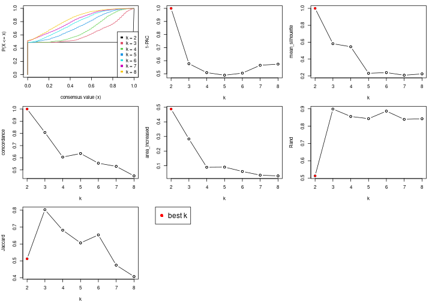

The numeric values for all these statistics can be obtained by `get_stats()`.

```r
get_stats(res)
```

```
#>   k 1-PAC mean_silhouette concordance area_increased  Rand Jaccard
#> 2 2 1.000           1.000       1.000         0.4877 0.513   0.513
#> 3 3 0.577           0.582       0.808         0.2831 0.899   0.803
#> 4 4 0.509           0.546       0.606         0.0897 0.856   0.682
#> 5 5 0.489           0.232       0.635         0.0907 0.843   0.606
#> 6 6 0.505           0.240       0.555         0.0611 0.887   0.654
#> 7 7 0.565           0.209       0.529         0.0355 0.839   0.475
#> 8 8 0.574           0.225       0.451         0.0307 0.843   0.408
```

`suggest_best_k()` suggests the best $k$ based on these statistics. The rules are as follows:

- All $k$ with Jaccard index larger than 0.95 are removed because increasing
  $k$ does not provide enough extra information. If all $k$ are removed, it is
  marked as no subgroup is detected.
- For all $k$ with 1-PAC score larger than 0.9, the maximal $k$ is taken as
  the best $k$, and other $k$ are marked as optional $k$.
- If it does not fit the second rule. The $k$ with the maximal vote of the
  highest 1-PAC score, highest mean silhouette, and highest concordance is
  taken as the best $k$.

```r
suggest_best_k(res)
```

```
#> [1] 2
```


Following is the table of the partitions (You need to click the **show/hide
code output** link to see it). The membership matrix (columns with name `p*`)
is inferred by
[`clue::cl_consensus()`](https://www.rdocumentation.org/link/cl_consensus?package=clue)
function with the `SE` method. Basically the value in the membership matrix
represents the probability to belong to a certain group. The finall subgroup
label for an item is determined with the group with highest probability it
belongs to.

In `get_classes()` function, the entropy is calculated from the membership
matrix and the silhouette score is calculated from the consensus matrix.


<script>
$( function() {
	$( '#tabs-node-05-get-classes' ).tabs();
} );
</script>
<div id='tabs-node-05-get-classes'>
<ul>
<li><a href='#tab-node-05-get-classes-1'>k = 2</a></li>
<li><a href='#tab-node-05-get-classes-2'>k = 3</a></li>
<li><a href='#tab-node-05-get-classes-3'>k = 4</a></li>
<li><a href='#tab-node-05-get-classes-4'>k = 5</a></li>
<li><a href='#tab-node-05-get-classes-5'>k = 6</a></li>
<li><a href='#tab-node-05-get-classes-6'>k = 7</a></li>
<li><a href='#tab-node-05-get-classes-7'>k = 8</a></li>
</ul>

<div id='tab-node-05-get-classes-1'>
<p><a id='tab-node-05-get-classes-1-a' style='color:#0366d6' href='#'>show/hide code output</a></p>
<pre><code class="r">cbind(get_classes(res, k = 2), get_membership(res, k = 2))
</code></pre>

<pre><code>#&gt;                 class entropy silhouette p1 p2
#&gt; TCGA.44.2659.11     1       0          1  1  0
#&gt; TCGA.43.3920.11     2       0          1  0  1
#&gt; TCGA.44.5645.11     1       0          1  1  0
#&gt; TCGA.44.2665.11     1       0          1  1  0
#&gt; TCGA.22.5473.11     2       0          1  0  1
#&gt; TCGA.22.5482.11     2       0          1  0  1
#&gt; TCGA.39.5030.11     1       0          1  1  0
#&gt; TCGA.22.5489.11     2       0          1  0  1
#&gt; TCGA.44.2662.11     2       0          1  0  1
#&gt; TCGA.50.5930.11     2       0          1  0  1
#&gt; TCGA.22.5474.11     2       0          1  0  1
#&gt; TCGA.22.5492.11     1       0          1  1  0
#&gt; TCGA.22.5485.11     1       0          1  1  0
#&gt; TCGA.33.4583.11     2       0          1  0  1
#&gt; TCGA.22.5491.11     2       0          1  0  1
#&gt; TCGA.44.6146.11     2       0          1  0  1
#&gt; TCGA.98.A53C.01     1       0          1  1  0
#&gt; TCGA.43.6771.11     2       0          1  0  1
#&gt; TCGA.39.5011.11     1       0          1  1  0
#&gt; TCGA.39.5021.11     2       0          1  0  1
#&gt; TCGA.34.5929.11     1       0          1  1  0
#&gt; TCGA.55.7816.01     1       0          1  1  0
#&gt; TCGA.39.5019.11     2       0          1  0  1
#&gt; TCGA.50.6593.11     1       0          1  1  0
#&gt; TCGA.22.4613.11     1       0          1  1  0
#&gt; TCGA.56.8623.01     2       0          1  0  1
#&gt; TCGA.44.2656.11     2       0          1  0  1
#&gt; TCGA.44.6778.11     2       0          1  0  1
#&gt; TCGA.38.4631.11     1       0          1  1  0
#&gt; TCGA.33.4579.11     1       0          1  1  0
#&gt; TCGA.86.A4P8.01     1       0          1  1  0
#&gt; TCGA.33.4586.11     2       0          1  0  1
#&gt; TCGA.39.5039.11     2       0          1  0  1
#&gt; TCGA.38.4632.11     2       0          1  0  1
#&gt; TCGA.44.2655.11     1       0          1  1  0
#&gt; TCGA.33.4582.11     2       0          1  0  1
#&gt; TCGA.50.5939.11     2       0          1  0  1
#&gt; TCGA.75.6203.01     1       0          1  1  0
#&gt; TCGA.18.4721.11     2       0          1  0  1
#&gt; TCGA.50.6594.11     1       0          1  1  0
#&gt; TCGA.49.4488.11     1       0          1  1  0
#&gt; TCGA.22.5477.11     2       0          1  0  1
#&gt; TCGA.39.5035.11     1       0          1  1  0
#&gt; TCGA.44.6145.11     1       0          1  1  0
#&gt; TCGA.18.5595.11     2       0          1  0  1
#&gt; TCGA.50.5935.11     1       0          1  1  0
#&gt; TCGA.22.5478.11     2       0          1  0  1
#&gt; TCGA.49.6745.11     2       0          1  0  1
#&gt; TCGA.49.AARR.01     2       0          1  0  1
#&gt; TCGA.18.5592.11     2       0          1  0  1
#&gt; TCGA.85.A4PA.01     2       0          1  0  1
#&gt; TCGA.99.AA5R.01     1       0          1  1  0
#&gt; TCGA.73.4676.11     2       0          1  0  1
#&gt; TCGA.60.2697.01     2       0          1  0  1
#&gt; TCGA.43.5668.11     2       0          1  0  1
#&gt; TCGA.L4.A4E6.01     2       0          1  0  1
#&gt; TCGA.73.4658.11     1       0          1  1  0
#&gt; TCGA.43.3394.11     2       0          1  0  1
#&gt; TCGA.39.5016.11     2       0          1  0  1
#&gt; TCGA.90.6837.01     2       0          1  0  1
#&gt; TCGA.44.6148.11     2       0          1  0  1
#&gt; TCGA.50.6592.11     1       0          1  1  0
#&gt; TCGA.50.5933.11     2       0          1  0  1
#&gt; TCGA.98.A53D.01     2       0          1  0  1
#&gt; TCGA.44.2668.11     2       0          1  0  1
#&gt; TCGA.39.5034.11     1       0          1  1  0
#&gt; TCGA.98.A53H.01     1       0          1  1  0
#&gt; TCGA.39.5036.11     2       0          1  0  1
#&gt; TCGA.22.4599.11     1       0          1  1  0
#&gt; TCGA.39.5031.11     1       0          1  1  0
#&gt; TCGA.50.5936.11     2       0          1  0  1
#&gt; TCGA.22.5471.11     2       0          1  0  1
#&gt; TCGA.50.5932.11     2       0          1  0  1
#&gt; TCGA.22.5480.11     1       0          1  1  0
#&gt; TCGA.50.5931.11     1       0          1  1  0
#&gt; TCGA.22.4601.11     1       0          1  1  0
#&gt; TCGA.77.A5FZ.01     2       0          1  0  1
#&gt; TCGA.33.4589.11     1       0          1  1  0
#&gt; TCGA.18.3417.11     2       0          1  0  1
#&gt; TCGA.44.6144.11     2       0          1  0  1
#&gt; TCGA.39.5029.11     2       0          1  0  1
#&gt; TCGA.44.6147.11     1       0          1  1  0
#&gt; TCGA.22.5472.11     2       0          1  0  1
#&gt; TCGA.44.5643.11     2       0          1  0  1
#&gt; TCGA.55.8513.01     1       0          1  1  0
#&gt; TCGA.05.5420.11     2       0          1  0  1
#&gt; TCGA.33.4566.11     2       0          1  0  1
#&gt; TCGA.39.5037.11     2       0          1  0  1
#&gt; TCGA.50.6591.11     1       0          1  1  0
</code></pre>

<script>
$('#tab-node-05-get-classes-1-a').parent().next().next().hide();
$('#tab-node-05-get-classes-1-a').click(function(){
  $('#tab-node-05-get-classes-1-a').parent().next().next().toggle();
  return(false);
});
</script>
</div>

<div id='tab-node-05-get-classes-2'>
<p><a id='tab-node-05-get-classes-2-a' style='color:#0366d6' href='#'>show/hide code output</a></p>
<pre><code class="r">cbind(get_classes(res, k = 3), get_membership(res, k = 3))
</code></pre>

<pre><code>#&gt;                 class entropy silhouette   p1   p2   p3
#&gt; TCGA.44.2659.11     1  0.3686     0.9313 0.86 0.00 0.14
#&gt; TCGA.43.3920.11     2  0.6192    -0.1197 0.00 0.58 0.42
#&gt; TCGA.44.5645.11     1  0.2959     0.9402 0.90 0.00 0.10
#&gt; TCGA.44.2665.11     1  0.4291     0.9258 0.82 0.00 0.18
#&gt; TCGA.22.5473.11     2  0.4555     0.5126 0.00 0.80 0.20
#&gt; TCGA.22.5482.11     2  0.2537     0.5658 0.00 0.92 0.08
#&gt; TCGA.39.5030.11     1  0.2537     0.9405 0.92 0.00 0.08
#&gt; TCGA.22.5489.11     2  0.6302    -0.3386 0.00 0.52 0.48
#&gt; TCGA.44.2662.11     2  0.5016     0.4406 0.00 0.76 0.24
#&gt; TCGA.50.5930.11     3  0.6302     0.3906 0.00 0.48 0.52
#&gt; TCGA.22.5474.11     2  0.4796     0.4855 0.00 0.78 0.22
#&gt; TCGA.22.5492.11     1  0.1529     0.9411 0.96 0.00 0.04
#&gt; TCGA.22.5485.11     1  0.3340     0.9469 0.88 0.00 0.12
#&gt; TCGA.33.4583.11     2  0.2537     0.5782 0.00 0.92 0.08
#&gt; TCGA.22.5491.11     2  0.6280    -0.2056 0.00 0.54 0.46
#&gt; TCGA.44.6146.11     3  0.6192     0.5247 0.00 0.42 0.58
#&gt; TCGA.98.A53C.01     1  0.2537     0.9413 0.92 0.00 0.08
#&gt; TCGA.43.6771.11     2  0.1529     0.5817 0.00 0.96 0.04
#&gt; TCGA.39.5011.11     1  0.2066     0.9450 0.94 0.00 0.06
#&gt; TCGA.39.5021.11     2  0.6280    -0.3056 0.00 0.54 0.46
#&gt; TCGA.34.5929.11     1  0.2066     0.9377 0.94 0.00 0.06
#&gt; TCGA.55.7816.01     1  0.2066     0.9377 0.94 0.00 0.06
#&gt; TCGA.39.5019.11     2  0.5016     0.4808 0.00 0.76 0.24
#&gt; TCGA.50.6593.11     1  0.4002     0.9279 0.84 0.00 0.16
#&gt; TCGA.22.4613.11     1  0.2066     0.9422 0.94 0.00 0.06
#&gt; TCGA.56.8623.01     2  0.3340     0.5673 0.00 0.88 0.12
#&gt; TCGA.44.2656.11     2  0.3686     0.5711 0.00 0.86 0.14
#&gt; TCGA.44.6778.11     3  0.5216     0.7298 0.00 0.26 0.74
#&gt; TCGA.38.4631.11     1  0.2537     0.9385 0.92 0.00 0.08
#&gt; TCGA.33.4579.11     1  0.0892     0.9472 0.98 0.00 0.02
#&gt; TCGA.86.A4P8.01     1  0.4002     0.9203 0.84 0.00 0.16
#&gt; TCGA.33.4586.11     2  0.1529     0.5760 0.00 0.96 0.04
#&gt; TCGA.39.5039.11     2  0.5016     0.4054 0.00 0.76 0.24
#&gt; TCGA.38.4632.11     3  0.5216     0.7298 0.00 0.26 0.74
#&gt; TCGA.44.2655.11     1  0.4291     0.9209 0.82 0.00 0.18
#&gt; TCGA.33.4582.11     2  0.5397     0.3814 0.00 0.72 0.28
#&gt; TCGA.50.5939.11     2  0.5948     0.1098 0.00 0.64 0.36
#&gt; TCGA.75.6203.01     1  0.2066     0.9450 0.94 0.00 0.06
#&gt; TCGA.18.4721.11     2  0.1529     0.5789 0.00 0.96 0.04
#&gt; TCGA.50.6594.11     1  0.2537     0.9427 0.92 0.00 0.08
#&gt; TCGA.49.4488.11     1  0.4002     0.9279 0.84 0.00 0.16
#&gt; TCGA.22.5477.11     2  0.5216     0.4384 0.00 0.74 0.26
#&gt; TCGA.39.5035.11     1  0.4002     0.9270 0.84 0.00 0.16
#&gt; TCGA.44.6145.11     1  0.1529     0.9478 0.96 0.00 0.04
#&gt; TCGA.18.5595.11     2  0.6309    -0.4042 0.00 0.50 0.50
#&gt; TCGA.50.5935.11     1  0.3340     0.9371 0.88 0.00 0.12
#&gt; TCGA.22.5478.11     2  0.6192    -0.0869 0.00 0.58 0.42
#&gt; TCGA.49.6745.11     3  0.6244     0.5371 0.00 0.44 0.56
#&gt; TCGA.49.AARR.01     3  0.5216     0.7298 0.00 0.26 0.74
#&gt; TCGA.18.5592.11     2  0.4002     0.5265 0.00 0.84 0.16
#&gt; TCGA.85.A4PA.01     3  0.6309     0.2605 0.00 0.50 0.50
#&gt; TCGA.99.AA5R.01     1  0.2537     0.9386 0.92 0.00 0.08
#&gt; TCGA.73.4676.11     2  0.5948     0.0798 0.00 0.64 0.36
#&gt; TCGA.60.2697.01     2  0.2537     0.5787 0.00 0.92 0.08
#&gt; TCGA.43.5668.11     2  0.2066     0.5721 0.00 0.94 0.06
#&gt; TCGA.L4.A4E6.01     2  0.4796     0.4534 0.00 0.78 0.22
#&gt; TCGA.73.4658.11     1  0.2537     0.9443 0.92 0.00 0.08
#&gt; TCGA.43.3394.11     3  0.5835     0.5840 0.00 0.34 0.66
#&gt; TCGA.39.5016.11     2  0.2959     0.5707 0.00 0.90 0.10
#&gt; TCGA.90.6837.01     2  0.2066     0.5796 0.00 0.94 0.06
#&gt; TCGA.44.6148.11     2  0.6302    -0.3465 0.00 0.52 0.48
#&gt; TCGA.50.6592.11     1  0.4002     0.9270 0.84 0.00 0.16
#&gt; TCGA.50.5933.11     2  0.3686     0.5320 0.00 0.86 0.14
#&gt; TCGA.98.A53D.01     2  0.6302    -0.3434 0.00 0.52 0.48
#&gt; TCGA.44.2668.11     2  0.6192    -0.0917 0.00 0.58 0.42
#&gt; TCGA.39.5034.11     1  0.2537     0.9402 0.92 0.00 0.08
#&gt; TCGA.98.A53H.01     1  0.2959     0.9389 0.90 0.00 0.10
#&gt; TCGA.39.5036.11     2  0.2959     0.5692 0.00 0.90 0.10
#&gt; TCGA.22.4599.11     1  0.1529     0.9446 0.96 0.00 0.04
#&gt; TCGA.39.5031.11     1  0.2537     0.9434 0.92 0.00 0.08
#&gt; TCGA.50.5936.11     2  0.2959     0.5741 0.00 0.90 0.10
#&gt; TCGA.22.5471.11     2  0.2959     0.5557 0.00 0.90 0.10
#&gt; TCGA.50.5932.11     2  0.6045    -0.1266 0.00 0.62 0.38
#&gt; TCGA.22.5480.11     1  0.2066     0.9422 0.94 0.00 0.06
#&gt; TCGA.50.5931.11     1  0.3686     0.9277 0.86 0.00 0.14
#&gt; TCGA.22.4601.11     1  0.2066     0.9422 0.94 0.00 0.06
#&gt; TCGA.77.A5FZ.01     2  0.2066     0.5796 0.00 0.94 0.06
#&gt; TCGA.33.4589.11     1  0.2537     0.9459 0.92 0.00 0.08
#&gt; TCGA.18.3417.11     2  0.0892     0.5780 0.00 0.98 0.02
#&gt; TCGA.44.6144.11     2  0.6244    -0.1891 0.00 0.56 0.44
#&gt; TCGA.39.5029.11     2  0.6309    -0.3296 0.00 0.50 0.50
#&gt; TCGA.44.6147.11     1  0.0892     0.9450 0.98 0.00 0.02
#&gt; TCGA.22.5472.11     2  0.5560     0.4308 0.00 0.70 0.30
#&gt; TCGA.44.5643.11     3  0.5216     0.7298 0.00 0.26 0.74
#&gt; TCGA.55.8513.01     1  0.4291     0.9209 0.82 0.00 0.18
#&gt; TCGA.05.5420.11     2  0.5948     0.1205 0.00 0.64 0.36
#&gt; TCGA.33.4566.11     2  0.4796     0.5300 0.00 0.78 0.22
#&gt; TCGA.39.5037.11     2  0.1529     0.5852 0.00 0.96 0.04
#&gt; TCGA.50.6591.11     1  0.1529     0.9457 0.96 0.00 0.04
</code></pre>

<script>
$('#tab-node-05-get-classes-2-a').parent().next().next().hide();
$('#tab-node-05-get-classes-2-a').click(function(){
  $('#tab-node-05-get-classes-2-a').parent().next().next().toggle();
  return(false);
});
</script>
</div>

<div id='tab-node-05-get-classes-3'>
<p><a id='tab-node-05-get-classes-3-a' style='color:#0366d6' href='#'>show/hide code output</a></p>
<pre><code class="r">cbind(get_classes(res, k = 4), get_membership(res, k = 4))
</code></pre>

<pre><code>#&gt;                 class entropy silhouette   p1   p2   p3   p4
#&gt; TCGA.44.2659.11     1   0.515     0.8424 0.74 0.00 0.20 0.06
#&gt; TCGA.43.3920.11     2   0.283     0.4813 0.00 0.90 0.06 0.04
#&gt; TCGA.44.5645.11     1   0.562     0.8178 0.64 0.00 0.32 0.04
#&gt; TCGA.44.2665.11     1   0.495     0.8356 0.76 0.00 0.18 0.06
#&gt; TCGA.22.5473.11     4   0.549     0.5800 0.00 0.40 0.02 0.58
#&gt; TCGA.22.5482.11     4   0.471     0.7608 0.00 0.36 0.00 0.64
#&gt; TCGA.39.5030.11     1   0.596     0.8227 0.68 0.00 0.22 0.10
#&gt; TCGA.22.5489.11     2   0.461     0.2761 0.00 0.80 0.10 0.10
#&gt; TCGA.44.2662.11     2   0.449     0.4589 0.00 0.80 0.06 0.14
#&gt; TCGA.50.5930.11     2   0.549     0.2972 0.00 0.72 0.08 0.20
#&gt; TCGA.22.5474.11     4   0.579     0.7521 0.00 0.36 0.04 0.60
#&gt; TCGA.22.5492.11     1   0.241     0.8378 0.92 0.00 0.04 0.04
#&gt; TCGA.22.5485.11     1   0.320     0.8518 0.88 0.00 0.08 0.04
#&gt; TCGA.33.4583.11     2   0.549    -0.0448 0.00 0.58 0.02 0.40
#&gt; TCGA.22.5491.11     2   0.494     0.3431 0.00 0.74 0.04 0.22
#&gt; TCGA.44.6146.11     2   0.361     0.4823 0.00 0.86 0.08 0.06
#&gt; TCGA.98.A53C.01     1   0.506     0.8411 0.68 0.00 0.30 0.02
#&gt; TCGA.43.6771.11     2   0.506     0.2134 0.00 0.68 0.02 0.30
#&gt; TCGA.39.5011.11     1   0.423     0.8608 0.82 0.00 0.12 0.06
#&gt; TCGA.39.5021.11     2   0.385     0.4418 0.00 0.82 0.02 0.16
#&gt; TCGA.34.5929.11     1   0.334     0.8288 0.86 0.00 0.02 0.12
#&gt; TCGA.55.7816.01     1   0.385     0.8294 0.82 0.00 0.02 0.16
#&gt; TCGA.39.5019.11     2   0.491    -0.0606 0.00 0.58 0.00 0.42
#&gt; TCGA.50.6593.11     1   0.543     0.8241 0.60 0.00 0.38 0.02
#&gt; TCGA.22.4613.11     1   0.201     0.8542 0.92 0.00 0.08 0.00
#&gt; TCGA.56.8623.01     2   0.428     0.4035 0.00 0.78 0.02 0.20
#&gt; TCGA.44.2656.11     2   0.462     0.0869 0.00 0.66 0.00 0.34
#&gt; TCGA.44.6778.11     3   0.718     1.0000 0.00 0.38 0.48 0.14
#&gt; TCGA.38.4631.11     1   0.320     0.8522 0.88 0.00 0.08 0.04
#&gt; TCGA.33.4579.11     1   0.429     0.8607 0.82 0.00 0.10 0.08
#&gt; TCGA.86.A4P8.01     1   0.441     0.8427 0.70 0.00 0.30 0.00
#&gt; TCGA.33.4586.11     4   0.462     0.7630 0.00 0.34 0.00 0.66
#&gt; TCGA.39.5039.11     4   0.479     0.7174 0.00 0.38 0.00 0.62
#&gt; TCGA.38.4632.11     3   0.718     1.0000 0.00 0.38 0.48 0.14
#&gt; TCGA.44.2655.11     1   0.571     0.8290 0.62 0.00 0.34 0.04
#&gt; TCGA.33.4582.11     2   0.334     0.4734 0.00 0.86 0.02 0.12
#&gt; TCGA.50.5939.11     2   0.626    -0.2492 0.00 0.54 0.06 0.40
#&gt; TCGA.75.6203.01     1   0.494     0.8594 0.74 0.00 0.22 0.04
#&gt; TCGA.18.4721.11     4   0.485     0.7373 0.00 0.40 0.00 0.60
#&gt; TCGA.50.6594.11     1   0.579     0.8021 0.60 0.00 0.36 0.04
#&gt; TCGA.49.4488.11     1   0.549     0.8204 0.58 0.00 0.40 0.02
#&gt; TCGA.22.5477.11     2   0.494     0.4485 0.00 0.74 0.04 0.22
#&gt; TCGA.39.5035.11     1   0.361     0.8325 0.86 0.00 0.08 0.06
#&gt; TCGA.44.6145.11     1   0.398     0.8543 0.76 0.00 0.24 0.00
#&gt; TCGA.18.5595.11     2   0.320     0.4516 0.00 0.88 0.08 0.04
#&gt; TCGA.50.5935.11     1   0.462     0.8273 0.66 0.00 0.34 0.00
#&gt; TCGA.22.5478.11     2   0.508     0.4637 0.00 0.76 0.08 0.16
#&gt; TCGA.49.6745.11     2   0.458     0.4290 0.00 0.80 0.08 0.12
#&gt; TCGA.49.AARR.01     3   0.718     1.0000 0.00 0.38 0.48 0.14
#&gt; TCGA.18.5592.11     2   0.385     0.4429 0.00 0.82 0.02 0.16
#&gt; TCGA.85.A4PA.01     2   0.735    -0.3100 0.00 0.52 0.28 0.20
#&gt; TCGA.99.AA5R.01     1   0.579     0.8021 0.60 0.00 0.36 0.04
#&gt; TCGA.73.4676.11     2   0.688    -0.2340 0.00 0.54 0.12 0.34
#&gt; TCGA.60.2697.01     2   0.526     0.3387 0.00 0.70 0.04 0.26
#&gt; TCGA.43.5668.11     4   0.543     0.6897 0.00 0.38 0.02 0.60
#&gt; TCGA.L4.A4E6.01     2   0.692     0.1290 0.00 0.58 0.16 0.26
#&gt; TCGA.73.4658.11     1   0.408     0.8510 0.80 0.00 0.18 0.02
#&gt; TCGA.43.3394.11     2   0.681    -0.6602 0.00 0.56 0.32 0.12
#&gt; TCGA.39.5016.11     2   0.506     0.2588 0.00 0.68 0.02 0.30
#&gt; TCGA.90.6837.01     2   0.498    -0.4148 0.00 0.54 0.00 0.46
#&gt; TCGA.44.6148.11     2   0.164     0.4904 0.00 0.94 0.06 0.00
#&gt; TCGA.50.6592.11     1   0.334     0.8369 0.86 0.00 0.12 0.02
#&gt; TCGA.50.5933.11     4   0.615     0.6657 0.00 0.36 0.06 0.58
#&gt; TCGA.98.A53D.01     2   0.271     0.4374 0.00 0.90 0.08 0.02
#&gt; TCGA.44.2668.11     2   0.599    -0.0716 0.00 0.62 0.06 0.32
#&gt; TCGA.39.5034.11     1   0.234     0.8382 0.92 0.00 0.06 0.02
#&gt; TCGA.98.A53H.01     1   0.428     0.8479 0.72 0.00 0.28 0.00
#&gt; TCGA.39.5036.11     2   0.441     0.2429 0.00 0.70 0.00 0.30
#&gt; TCGA.22.4599.11     1   0.394     0.8611 0.84 0.00 0.10 0.06
#&gt; TCGA.39.5031.11     1   0.452     0.8395 0.68 0.00 0.32 0.00
#&gt; TCGA.50.5936.11     4   0.495     0.6246 0.00 0.44 0.00 0.56
#&gt; TCGA.22.5471.11     4   0.471     0.7538 0.00 0.36 0.00 0.64
#&gt; TCGA.50.5932.11     2   0.632     0.2941 0.00 0.66 0.16 0.18
#&gt; TCGA.22.5480.11     1   0.334     0.8572 0.86 0.00 0.12 0.02
#&gt; TCGA.50.5931.11     1   0.449     0.8470 0.80 0.00 0.14 0.06
#&gt; TCGA.22.4601.11     1   0.361     0.8584 0.86 0.00 0.08 0.06
#&gt; TCGA.77.A5FZ.01     2   0.498    -0.3467 0.00 0.54 0.00 0.46
#&gt; TCGA.33.4589.11     1   0.361     0.8363 0.84 0.00 0.02 0.14
#&gt; TCGA.18.3417.11     4   0.549     0.6877 0.00 0.40 0.02 0.58
#&gt; TCGA.44.6144.11     2   0.713     0.1739 0.00 0.56 0.20 0.24
#&gt; TCGA.39.5029.11     2   0.536     0.2196 0.00 0.62 0.02 0.36
#&gt; TCGA.44.6147.11     1   0.455     0.8612 0.78 0.00 0.18 0.04
#&gt; TCGA.22.5472.11     2   0.539     0.2951 0.00 0.68 0.04 0.28
#&gt; TCGA.44.5643.11     3   0.718     1.0000 0.00 0.38 0.48 0.14
#&gt; TCGA.55.8513.01     1   0.571     0.8307 0.62 0.00 0.34 0.04
#&gt; TCGA.05.5420.11     4   0.683     0.4577 0.00 0.42 0.10 0.48
#&gt; TCGA.33.4566.11     2   0.596     0.0333 0.00 0.54 0.04 0.42
#&gt; TCGA.39.5037.11     2   0.500    -0.5609 0.00 0.50 0.00 0.50
#&gt; TCGA.50.6591.11     1   0.429     0.8484 0.82 0.00 0.08 0.10
</code></pre>

<script>
$('#tab-node-05-get-classes-3-a').parent().next().next().hide();
$('#tab-node-05-get-classes-3-a').click(function(){
  $('#tab-node-05-get-classes-3-a').parent().next().next().toggle();
  return(false);
});
</script>
</div>

<div id='tab-node-05-get-classes-4'>
<p><a id='tab-node-05-get-classes-4-a' style='color:#0366d6' href='#'>show/hide code output</a></p>
<pre><code class="r">cbind(get_classes(res, k = 5), get_membership(res, k = 5))
</code></pre>

<pre><code>#&gt;                 class entropy silhouette   p1   p2   p3   p4   p5
#&gt; TCGA.44.2659.11     1  0.4767    -0.5770 0.56 0.02 0.00 0.00 0.42
#&gt; TCGA.43.3920.11     2  0.8239     0.3173 0.00 0.40 0.16 0.22 0.22
#&gt; TCGA.44.5645.11     1  0.4733     0.2660 0.78 0.06 0.10 0.00 0.06
#&gt; TCGA.44.2665.11     5  0.4818     0.0000 0.46 0.02 0.00 0.00 0.52
#&gt; TCGA.22.5473.11     4  0.5770     0.0344 0.00 0.32 0.04 0.60 0.04
#&gt; TCGA.22.5482.11     4  0.2616     0.3912 0.00 0.10 0.00 0.88 0.02
#&gt; TCGA.39.5030.11     1  0.6322     0.0799 0.64 0.12 0.06 0.00 0.18
#&gt; TCGA.22.5489.11     3  0.8443    -0.1343 0.00 0.26 0.34 0.22 0.18
#&gt; TCGA.44.2662.11     2  0.6601     0.5212 0.00 0.58 0.04 0.24 0.14
#&gt; TCGA.50.5930.11     4  0.7491     0.2363 0.00 0.12 0.26 0.50 0.12
#&gt; TCGA.22.5474.11     4  0.4312     0.3419 0.00 0.16 0.02 0.78 0.04
#&gt; TCGA.22.5492.11     1  0.5484    -0.1098 0.64 0.12 0.00 0.00 0.24
#&gt; TCGA.22.5485.11     1  0.5700    -0.2042 0.60 0.12 0.00 0.00 0.28
#&gt; TCGA.33.4583.11     2  0.6350     0.4323 0.00 0.42 0.00 0.42 0.16
#&gt; TCGA.22.5491.11     4  0.7334     0.1804 0.00 0.28 0.14 0.50 0.08
#&gt; TCGA.44.6146.11     4  0.8102     0.1885 0.00 0.20 0.24 0.42 0.14
#&gt; TCGA.98.A53C.01     1  0.3627     0.3340 0.84 0.04 0.02 0.00 0.10
#&gt; TCGA.43.6771.11     4  0.6776    -0.0519 0.00 0.34 0.02 0.48 0.16
#&gt; TCGA.39.5011.11     1  0.3977     0.3326 0.82 0.06 0.02 0.00 0.10
#&gt; TCGA.39.5021.11     4  0.6858     0.1987 0.00 0.32 0.06 0.52 0.10
#&gt; TCGA.34.5929.11     1  0.6399    -0.1025 0.58 0.16 0.02 0.00 0.24
#&gt; TCGA.55.7816.01     1  0.6520    -0.1260 0.58 0.12 0.04 0.00 0.26
#&gt; TCGA.39.5019.11     4  0.5588    -0.0836 0.00 0.38 0.04 0.56 0.02
#&gt; TCGA.50.6593.11     1  0.3561     0.1476 0.74 0.00 0.00 0.00 0.26
#&gt; TCGA.22.4613.11     1  0.4312     0.1923 0.78 0.04 0.02 0.00 0.16
#&gt; TCGA.56.8623.01     2  0.4644     0.4909 0.00 0.68 0.00 0.28 0.04
#&gt; TCGA.44.2656.11     2  0.5330     0.3978 0.00 0.52 0.02 0.44 0.02
#&gt; TCGA.44.6778.11     3  0.2616     0.7381 0.00 0.02 0.88 0.10 0.00
#&gt; TCGA.38.4631.11     1  0.5525     0.1068 0.70 0.08 0.04 0.00 0.18
#&gt; TCGA.33.4579.11     1  0.3521     0.2634 0.82 0.04 0.00 0.00 0.14
#&gt; TCGA.86.A4P8.01     1  0.3684     0.1334 0.72 0.00 0.00 0.00 0.28
#&gt; TCGA.33.4586.11     4  0.4373     0.2813 0.00 0.16 0.00 0.76 0.08
#&gt; TCGA.39.5039.11     4  0.3291     0.4345 0.00 0.04 0.00 0.84 0.12
#&gt; TCGA.38.4632.11     3  0.2616     0.7381 0.00 0.02 0.88 0.10 0.00
#&gt; TCGA.44.2655.11     1  0.5092     0.1438 0.68 0.04 0.02 0.00 0.26
#&gt; TCGA.33.4582.11     2  0.4527     0.5635 0.00 0.70 0.00 0.26 0.04
#&gt; TCGA.50.5939.11     4  0.6356     0.4015 0.00 0.06 0.16 0.64 0.14
#&gt; TCGA.75.6203.01     1  0.0609     0.3700 0.98 0.00 0.00 0.00 0.02
#&gt; TCGA.18.4721.11     4  0.2438     0.4259 0.00 0.04 0.00 0.90 0.06
#&gt; TCGA.50.6594.11     1  0.5931     0.1548 0.68 0.06 0.10 0.00 0.16
#&gt; TCGA.49.4488.11     1  0.3109     0.1941 0.80 0.00 0.00 0.00 0.20
#&gt; TCGA.22.5477.11     2  0.6520     0.5262 0.00 0.58 0.04 0.26 0.12
#&gt; TCGA.39.5035.11     1  0.5157    -0.6641 0.52 0.04 0.00 0.00 0.44
#&gt; TCGA.44.6145.11     1  0.3319     0.2576 0.82 0.02 0.00 0.00 0.16
#&gt; TCGA.18.5595.11     2  0.8239     0.2234 0.00 0.40 0.22 0.16 0.22
#&gt; TCGA.50.5935.11     1  0.3627     0.3374 0.84 0.04 0.02 0.00 0.10
#&gt; TCGA.22.5478.11     2  0.8102     0.4342 0.00 0.42 0.14 0.24 0.20
#&gt; TCGA.49.6745.11     4  0.8020     0.1395 0.00 0.18 0.30 0.40 0.12
#&gt; TCGA.49.AARR.01     3  0.2616     0.7381 0.00 0.02 0.88 0.10 0.00
#&gt; TCGA.18.5592.11     2  0.6245     0.5477 0.00 0.58 0.02 0.28 0.12
#&gt; TCGA.85.A4PA.01     3  0.6564     0.0479 0.00 0.12 0.46 0.40 0.02
#&gt; TCGA.99.AA5R.01     1  0.5031     0.2489 0.76 0.06 0.10 0.00 0.08
#&gt; TCGA.73.4676.11     4  0.6982     0.3367 0.00 0.08 0.24 0.56 0.12
#&gt; TCGA.60.2697.01     2  0.6858     0.2857 0.00 0.52 0.06 0.32 0.10
#&gt; TCGA.43.5668.11     4  0.3390     0.4137 0.00 0.06 0.00 0.84 0.10
#&gt; TCGA.L4.A4E6.01     2  0.8255     0.0431 0.00 0.34 0.20 0.32 0.14
#&gt; TCGA.73.4658.11     1  0.4106     0.2887 0.80 0.04 0.02 0.00 0.14
#&gt; TCGA.43.3394.11     3  0.6433     0.5595 0.00 0.12 0.64 0.08 0.16
#&gt; TCGA.39.5016.11     2  0.6148     0.5452 0.00 0.60 0.02 0.26 0.12
#&gt; TCGA.90.6837.01     4  0.4840    -0.1002 0.00 0.32 0.00 0.64 0.04
#&gt; TCGA.44.6148.11     2  0.8265     0.2409 0.00 0.40 0.22 0.20 0.18
#&gt; TCGA.50.6592.11     1  0.4818    -0.7823 0.52 0.02 0.00 0.00 0.46
#&gt; TCGA.50.5933.11     4  0.3946     0.4521 0.00 0.00 0.12 0.80 0.08
#&gt; TCGA.98.A53D.01     2  0.8227     0.3211 0.00 0.40 0.16 0.20 0.24
#&gt; TCGA.44.2668.11     4  0.6867     0.3998 0.00 0.10 0.14 0.60 0.16
#&gt; TCGA.39.5034.11     1  0.5068    -0.1780 0.64 0.06 0.00 0.00 0.30
#&gt; TCGA.98.A53H.01     1  0.3109     0.1963 0.80 0.00 0.00 0.00 0.20
#&gt; TCGA.39.5036.11     2  0.4360     0.5451 0.00 0.68 0.00 0.30 0.02
#&gt; TCGA.22.4599.11     1  0.3878     0.3089 0.82 0.04 0.02 0.00 0.12
#&gt; TCGA.39.5031.11     1  0.3109     0.2716 0.80 0.00 0.00 0.00 0.20
#&gt; TCGA.50.5936.11     4  0.4921     0.0480 0.00 0.34 0.00 0.62 0.04
#&gt; TCGA.22.5471.11     4  0.1410     0.4235 0.00 0.06 0.00 0.94 0.00
#&gt; TCGA.50.5932.11     4  0.7715     0.2622 0.00 0.08 0.28 0.44 0.20
#&gt; TCGA.22.5480.11     1  0.3513     0.1740 0.80 0.02 0.00 0.00 0.18
#&gt; TCGA.50.5931.11     1  0.3796    -0.0615 0.70 0.00 0.00 0.00 0.30
#&gt; TCGA.22.4601.11     1  0.4653     0.2239 0.76 0.06 0.02 0.00 0.16
#&gt; TCGA.77.A5FZ.01     2  0.4798     0.4120 0.00 0.54 0.00 0.44 0.02
#&gt; TCGA.33.4589.11     1  0.5440     0.0474 0.70 0.12 0.02 0.00 0.16
#&gt; TCGA.18.3417.11     4  0.5050     0.2639 0.00 0.18 0.00 0.70 0.12
#&gt; TCGA.44.6144.11     4  0.6912     0.2943 0.00 0.06 0.28 0.54 0.12
#&gt; TCGA.39.5029.11     4  0.7481     0.1264 0.00 0.28 0.16 0.48 0.08
#&gt; TCGA.44.6147.11     1  0.1410     0.3598 0.94 0.00 0.00 0.00 0.06
#&gt; TCGA.22.5472.11     2  0.5588     0.4386 0.00 0.56 0.04 0.38 0.02
#&gt; TCGA.44.5643.11     3  0.2616     0.7381 0.00 0.02 0.88 0.10 0.00
#&gt; TCGA.55.8513.01     1  0.4360     0.1047 0.68 0.02 0.00 0.00 0.30
#&gt; TCGA.05.5420.11     4  0.5196     0.4437 0.00 0.04 0.12 0.74 0.10
#&gt; TCGA.33.4566.11     2  0.5727     0.4579 0.00 0.56 0.10 0.34 0.00
#&gt; TCGA.39.5037.11     4  0.5425     0.2090 0.00 0.32 0.00 0.60 0.08
#&gt; TCGA.50.6591.11     1  0.5440     0.0291 0.70 0.12 0.02 0.00 0.16
</code></pre>

<script>
$('#tab-node-05-get-classes-4-a').parent().next().next().hide();
$('#tab-node-05-get-classes-4-a').click(function(){
  $('#tab-node-05-get-classes-4-a').parent().next().next().toggle();
  return(false);
});
</script>
</div>

<div id='tab-node-05-get-classes-5'>
<p><a id='tab-node-05-get-classes-5-a' style='color:#0366d6' href='#'>show/hide code output</a></p>
<pre><code class="r">cbind(get_classes(res, k = 6), get_membership(res, k = 6))
</code></pre>

<pre><code>#&gt;                 class entropy silhouette   p1   p2   p3   p4   p5   p6
#&gt; TCGA.44.2659.11     1   0.577    0.14346 0.56 0.00 0.02 0.00 0.14 0.28
#&gt; TCGA.43.3920.11     5   0.664    0.65915 0.00 0.36 0.10 0.10 0.44 0.00
#&gt; TCGA.44.5645.11     1   0.776   -0.02944 0.42 0.00 0.04 0.12 0.16 0.26
#&gt; TCGA.44.2665.11     1   0.599    0.10182 0.52 0.00 0.02 0.00 0.16 0.30
#&gt; TCGA.22.5473.11     2   0.603    0.16208 0.00 0.56 0.06 0.28 0.00 0.10
#&gt; TCGA.22.5482.11     4   0.487    0.40791 0.00 0.32 0.00 0.60 0.00 0.08
#&gt; TCGA.39.5030.11     1   0.700   -0.15217 0.42 0.00 0.02 0.06 0.14 0.36
#&gt; TCGA.22.5489.11     5   0.661    0.55267 0.00 0.36 0.20 0.04 0.40 0.00
#&gt; TCGA.44.2662.11     2   0.561   -0.08409 0.00 0.66 0.08 0.04 0.20 0.02
#&gt; TCGA.50.5930.11     4   0.701    0.11727 0.00 0.32 0.28 0.34 0.06 0.00
#&gt; TCGA.22.5474.11     4   0.598    0.48370 0.00 0.22 0.08 0.60 0.00 0.10
#&gt; TCGA.22.5492.11     6   0.433    0.43769 0.46 0.00 0.02 0.00 0.00 0.52
#&gt; TCGA.22.5485.11     1   0.484   -0.22877 0.54 0.00 0.00 0.00 0.06 0.40
#&gt; TCGA.33.4583.11     2   0.672    0.22232 0.00 0.50 0.00 0.22 0.20 0.08
#&gt; TCGA.22.5491.11     2   0.810   -0.00468 0.00 0.32 0.20 0.30 0.14 0.04
#&gt; TCGA.44.6146.11     4   0.780    0.02138 0.00 0.28 0.24 0.34 0.12 0.02
#&gt; TCGA.98.A53C.01     1   0.448    0.27799 0.70 0.00 0.00 0.00 0.20 0.10
#&gt; TCGA.43.6771.11     4   0.696    0.15440 0.00 0.26 0.02 0.46 0.22 0.04
#&gt; TCGA.39.5011.11     1   0.354    0.19890 0.80 0.00 0.00 0.00 0.08 0.12
#&gt; TCGA.39.5021.11     2   0.812    0.02676 0.00 0.36 0.16 0.20 0.24 0.04
#&gt; TCGA.34.5929.11     6   0.414    0.61336 0.36 0.00 0.02 0.00 0.00 0.62
#&gt; TCGA.55.7816.01     6   0.434    0.47295 0.48 0.00 0.00 0.00 0.02 0.50
#&gt; TCGA.39.5019.11     2   0.521    0.36649 0.00 0.70 0.04 0.18 0.06 0.02
#&gt; TCGA.50.6593.11     1   0.399    0.35217 0.76 0.00 0.00 0.00 0.14 0.10
#&gt; TCGA.22.4613.11     1   0.527   -0.17790 0.56 0.00 0.00 0.00 0.12 0.32
#&gt; TCGA.56.8623.01     2   0.572    0.02162 0.00 0.62 0.02 0.10 0.24 0.02
#&gt; TCGA.44.2656.11     2   0.463    0.35082 0.00 0.70 0.00 0.22 0.06 0.02
#&gt; TCGA.44.6778.11     3   0.235    0.77961 0.00 0.10 0.88 0.00 0.02 0.00
#&gt; TCGA.38.4631.11     1   0.537   -0.31783 0.52 0.00 0.00 0.00 0.12 0.36
#&gt; TCGA.33.4579.11     1   0.382    0.08130 0.74 0.00 0.00 0.00 0.04 0.22
#&gt; TCGA.86.A4P8.01     1   0.379    0.35672 0.78 0.00 0.00 0.00 0.10 0.12
#&gt; TCGA.33.4586.11     4   0.577    0.40844 0.00 0.28 0.00 0.56 0.02 0.14
#&gt; TCGA.39.5039.11     4   0.548    0.51543 0.00 0.12 0.10 0.70 0.02 0.06
#&gt; TCGA.38.4632.11     3   0.235    0.77961 0.00 0.10 0.88 0.00 0.02 0.00
#&gt; TCGA.44.2655.11     1   0.493    0.31967 0.64 0.00 0.00 0.00 0.24 0.12
#&gt; TCGA.33.4582.11     2   0.473    0.04451 0.00 0.68 0.02 0.02 0.26 0.02
#&gt; TCGA.50.5939.11     4   0.625    0.37812 0.00 0.16 0.22 0.56 0.06 0.00
#&gt; TCGA.75.6203.01     1   0.316    0.19080 0.80 0.00 0.00 0.00 0.02 0.18
#&gt; TCGA.18.4721.11     4   0.511    0.47814 0.00 0.22 0.00 0.66 0.02 0.10
#&gt; TCGA.50.6594.11     1   0.774    0.00675 0.44 0.00 0.04 0.12 0.18 0.22
#&gt; TCGA.49.4488.11     1   0.486    0.30881 0.66 0.00 0.00 0.00 0.20 0.14
#&gt; TCGA.22.5477.11     2   0.498    0.21859 0.00 0.68 0.00 0.06 0.22 0.04
#&gt; TCGA.39.5035.11     1   0.511   -0.13156 0.50 0.00 0.02 0.00 0.04 0.44
#&gt; TCGA.44.6145.11     1   0.354    0.32084 0.80 0.00 0.00 0.00 0.08 0.12
#&gt; TCGA.18.5595.11     5   0.682    0.67022 0.00 0.32 0.16 0.04 0.46 0.02
#&gt; TCGA.50.5935.11     1   0.354    0.32553 0.80 0.00 0.00 0.00 0.12 0.08
#&gt; TCGA.22.5478.11     2   0.601   -0.28969 0.00 0.52 0.06 0.08 0.34 0.00
#&gt; TCGA.49.6745.11     2   0.765   -0.07012 0.00 0.30 0.26 0.26 0.18 0.00
#&gt; TCGA.49.AARR.01     3   0.181    0.78121 0.00 0.10 0.90 0.00 0.00 0.00
#&gt; TCGA.18.5592.11     2   0.477    0.00704 0.00 0.64 0.02 0.04 0.30 0.00
#&gt; TCGA.85.A4PA.01     3   0.695    0.24578 0.00 0.24 0.50 0.18 0.06 0.02
#&gt; TCGA.99.AA5R.01     1   0.774    0.00624 0.44 0.00 0.04 0.12 0.18 0.22
#&gt; TCGA.73.4676.11     4   0.586    0.43458 0.00 0.16 0.20 0.60 0.04 0.00
#&gt; TCGA.60.2697.01     2   0.656    0.04465 0.00 0.54 0.04 0.16 0.24 0.02
#&gt; TCGA.43.5668.11     4   0.541    0.49435 0.00 0.14 0.02 0.68 0.02 0.14
#&gt; TCGA.L4.A4E6.01     2   0.731   -0.00352 0.00 0.40 0.16 0.28 0.16 0.00
#&gt; TCGA.73.4658.11     1   0.474    0.12816 0.68 0.00 0.00 0.00 0.16 0.16
#&gt; TCGA.43.3394.11     3   0.503    0.38488 0.00 0.12 0.62 0.00 0.26 0.00
#&gt; TCGA.39.5016.11     2   0.546    0.15442 0.00 0.64 0.04 0.10 0.22 0.00
#&gt; TCGA.90.6837.01     4   0.571    0.30915 0.00 0.38 0.00 0.50 0.02 0.10
#&gt; TCGA.44.6148.11     5   0.730    0.49885 0.00 0.32 0.20 0.12 0.36 0.00
#&gt; TCGA.50.6592.11     1   0.481   -0.00594 0.56 0.00 0.00 0.00 0.06 0.38
#&gt; TCGA.50.5933.11     4   0.522    0.51598 0.00 0.14 0.12 0.70 0.02 0.02
#&gt; TCGA.98.A53D.01     5   0.643    0.67856 0.00 0.38 0.12 0.06 0.44 0.00
#&gt; TCGA.44.2668.11     4   0.698    0.37145 0.00 0.18 0.20 0.52 0.08 0.02
#&gt; TCGA.39.5034.11     1   0.434   -0.52784 0.50 0.00 0.02 0.00 0.00 0.48
#&gt; TCGA.98.A53H.01     1   0.420    0.35199 0.74 0.00 0.00 0.00 0.12 0.14
#&gt; TCGA.39.5036.11     2   0.326    0.28346 0.00 0.84 0.02 0.04 0.10 0.00
#&gt; TCGA.22.4599.11     1   0.393    0.13016 0.76 0.00 0.00 0.00 0.08 0.16
#&gt; TCGA.39.5031.11     1   0.407    0.32618 0.78 0.00 0.02 0.00 0.12 0.08
#&gt; TCGA.50.5936.11     2   0.457   -0.03356 0.00 0.62 0.02 0.34 0.00 0.02
#&gt; TCGA.22.5471.11     4   0.473    0.44788 0.00 0.24 0.00 0.66 0.00 0.10
#&gt; TCGA.50.5932.11     4   0.779    0.20923 0.00 0.14 0.20 0.44 0.18 0.04
#&gt; TCGA.22.5480.11     1   0.468    0.09115 0.68 0.00 0.00 0.00 0.12 0.20
#&gt; TCGA.50.5931.11     1   0.383    0.29028 0.76 0.00 0.02 0.00 0.02 0.20
#&gt; TCGA.22.4601.11     1   0.448    0.07923 0.70 0.00 0.00 0.00 0.10 0.20
#&gt; TCGA.77.A5FZ.01     2   0.521    0.29904 0.00 0.62 0.00 0.28 0.08 0.02
#&gt; TCGA.33.4589.11     1   0.458   -0.33210 0.56 0.00 0.00 0.00 0.04 0.40
#&gt; TCGA.18.3417.11     4   0.631    0.42491 0.00 0.20 0.02 0.60 0.06 0.12
#&gt; TCGA.44.6144.11     4   0.625    0.43501 0.00 0.12 0.24 0.58 0.04 0.02
#&gt; TCGA.39.5029.11     2   0.723    0.21698 0.00 0.52 0.14 0.20 0.10 0.04
#&gt; TCGA.44.6147.11     1   0.316    0.20223 0.82 0.00 0.00 0.00 0.04 0.14
#&gt; TCGA.22.5472.11     2   0.473    0.30961 0.00 0.76 0.04 0.08 0.10 0.02
#&gt; TCGA.44.5643.11     3   0.181    0.78121 0.00 0.10 0.90 0.00 0.00 0.00
#&gt; TCGA.55.8513.01     1   0.504    0.32185 0.68 0.00 0.02 0.00 0.18 0.12
#&gt; TCGA.05.5420.11     4   0.568    0.50336 0.00 0.12 0.12 0.68 0.02 0.06
#&gt; TCGA.33.4566.11     2   0.480    0.34579 0.00 0.76 0.06 0.08 0.08 0.02
#&gt; TCGA.39.5037.11     4   0.575    0.27520 0.00 0.34 0.04 0.54 0.08 0.00
#&gt; TCGA.50.6591.11     1   0.425    0.06313 0.70 0.00 0.00 0.00 0.06 0.24
</code></pre>

<script>
$('#tab-node-05-get-classes-5-a').parent().next().next().hide();
$('#tab-node-05-get-classes-5-a').click(function(){
  $('#tab-node-05-get-classes-5-a').parent().next().next().toggle();
  return(false);
});
</script>
</div>

<div id='tab-node-05-get-classes-6'>
<p><a id='tab-node-05-get-classes-6-a' style='color:#0366d6' href='#'>show/hide code output</a></p>
<pre><code class="r">cbind(get_classes(res, k = 7), get_membership(res, k = 7))
</code></pre>

<pre><code>#&gt;                 class entropy silhouette   p1   p2   p3   p4   p5   p6   p7
#&gt; TCGA.44.2659.11     1  0.4766     0.3168 0.70 0.12 0.12 0.00 0.00 0.06 0.00
#&gt; TCGA.43.3920.11     5  0.4110     0.2430 0.00 0.10 0.04 0.06 0.78 0.02 0.00
#&gt; TCGA.44.5645.11     6  0.4707     0.3774 0.22 0.10 0.02 0.00 0.00 0.66 0.00
#&gt; TCGA.44.2665.11     1  0.5424     0.2852 0.64 0.08 0.22 0.00 0.02 0.02 0.02
#&gt; TCGA.22.5473.11     4  0.6137    -0.0505 0.00 0.40 0.04 0.44 0.06 0.06 0.00
#&gt; TCGA.22.5482.11     4  0.4466     0.4901 0.00 0.06 0.20 0.70 0.00 0.04 0.00
#&gt; TCGA.39.5030.11     6  0.6567     0.3237 0.22 0.10 0.26 0.00 0.00 0.42 0.00
#&gt; TCGA.22.5489.11     5  0.7104     0.1601 0.00 0.10 0.08 0.08 0.56 0.06 0.12
#&gt; TCGA.44.2662.11     5  0.5620    -0.0885 0.00 0.34 0.02 0.10 0.52 0.02 0.00
#&gt; TCGA.50.5930.11     5  0.6386     0.0304 0.00 0.10 0.02 0.38 0.42 0.00 0.08
#&gt; TCGA.22.5474.11     4  0.5626     0.4517 0.00 0.08 0.20 0.64 0.04 0.02 0.02
#&gt; TCGA.22.5492.11     1  0.6382    -0.0970 0.38 0.00 0.28 0.00 0.02 0.30 0.02
#&gt; TCGA.22.5485.11     1  0.5622     0.1180 0.52 0.00 0.24 0.00 0.00 0.22 0.02
#&gt; TCGA.33.4583.11     5  0.7088    -0.1254 0.00 0.22 0.24 0.24 0.30 0.00 0.00
#&gt; TCGA.22.5491.11     5  0.7354     0.1649 0.00 0.16 0.06 0.26 0.44 0.04 0.04
#&gt; TCGA.44.6146.11     5  0.5538     0.1638 0.00 0.08 0.00 0.34 0.52 0.00 0.06
#&gt; TCGA.98.A53C.01     1  0.4524     0.0411 0.60 0.02 0.04 0.00 0.00 0.34 0.00
#&gt; TCGA.43.6771.11     5  0.7150     0.0989 0.00 0.08 0.26 0.24 0.38 0.04 0.00
#&gt; TCGA.39.5011.11     1  0.4828     0.0265 0.56 0.02 0.06 0.00 0.00 0.36 0.00
#&gt; TCGA.39.5021.11     5  0.7555     0.0705 0.00 0.22 0.04 0.30 0.34 0.08 0.02
#&gt; TCGA.34.5929.11     6  0.6022     0.1578 0.30 0.00 0.32 0.00 0.02 0.36 0.00
#&gt; TCGA.55.7816.01     6  0.5619     0.1905 0.30 0.00 0.32 0.00 0.00 0.38 0.00
#&gt; TCGA.39.5019.11     2  0.5778     0.2282 0.00 0.50 0.02 0.34 0.12 0.02 0.00
#&gt; TCGA.50.6593.11     1  0.3541     0.3184 0.80 0.02 0.08 0.00 0.00 0.10 0.00
#&gt; TCGA.22.4613.11     1  0.4487    -0.0140 0.52 0.00 0.06 0.00 0.00 0.42 0.00
#&gt; TCGA.56.8623.01     5  0.6717    -0.2629 0.00 0.38 0.08 0.08 0.40 0.06 0.00
#&gt; TCGA.44.2656.11     2  0.6189     0.3397 0.00 0.46 0.06 0.20 0.28 0.00 0.00
#&gt; TCGA.44.6778.11     7  0.0504     0.7907 0.00 0.00 0.00 0.00 0.02 0.00 0.98
#&gt; TCGA.38.4631.11     6  0.4783     0.1601 0.36 0.00 0.10 0.00 0.00 0.54 0.00
#&gt; TCGA.33.4579.11     6  0.4505     0.1209 0.44 0.00 0.06 0.00 0.00 0.50 0.00
#&gt; TCGA.86.A4P8.01     1  0.3386     0.2811 0.78 0.02 0.02 0.00 0.00 0.18 0.00
#&gt; TCGA.33.4586.11     4  0.4070     0.4677 0.00 0.02 0.30 0.66 0.02 0.00 0.00
#&gt; TCGA.39.5039.11     4  0.4507     0.4964 0.00 0.02 0.12 0.76 0.04 0.04 0.02
#&gt; TCGA.38.4632.11     7  0.0504     0.7907 0.00 0.00 0.00 0.00 0.02 0.00 0.98
#&gt; TCGA.44.2655.11     1  0.2857     0.3334 0.86 0.04 0.06 0.00 0.00 0.04 0.00
#&gt; TCGA.33.4582.11     2  0.4692     0.3862 0.00 0.50 0.00 0.08 0.42 0.00 0.00
#&gt; TCGA.50.5939.11     4  0.4589     0.3669 0.00 0.04 0.00 0.68 0.22 0.00 0.06
#&gt; TCGA.75.6203.01     6  0.4266     0.1302 0.44 0.00 0.04 0.00 0.00 0.52 0.00
#&gt; TCGA.18.4721.11     4  0.3517     0.4838 0.00 0.02 0.28 0.70 0.00 0.00 0.00
#&gt; TCGA.50.6594.11     6  0.5792     0.3071 0.26 0.14 0.06 0.00 0.00 0.54 0.00
#&gt; TCGA.49.4488.11     1  0.2572     0.2650 0.80 0.00 0.00 0.00 0.00 0.20 0.00
#&gt; TCGA.22.5477.11     5  0.6816    -0.3824 0.00 0.36 0.04 0.16 0.38 0.06 0.00
#&gt; TCGA.39.5035.11     1  0.6026     0.2457 0.58 0.08 0.20 0.00 0.00 0.12 0.02
#&gt; TCGA.44.6145.11     1  0.4431     0.2060 0.68 0.04 0.04 0.00 0.00 0.24 0.00
#&gt; TCGA.18.5595.11     5  0.5769     0.1795 0.00 0.16 0.06 0.04 0.66 0.04 0.04
#&gt; TCGA.50.5935.11     1  0.3909     0.0176 0.58 0.00 0.02 0.00 0.00 0.40 0.00
#&gt; TCGA.22.5478.11     5  0.7205     0.0713 0.00 0.12 0.08 0.14 0.54 0.06 0.06
#&gt; TCGA.49.6745.11     5  0.6842     0.1773 0.00 0.12 0.02 0.30 0.46 0.02 0.08
#&gt; TCGA.49.AARR.01     7  0.0504     0.7907 0.00 0.00 0.00 0.00 0.02 0.00 0.98
#&gt; TCGA.18.5592.11     5  0.5516    -0.3236 0.00 0.36 0.00 0.10 0.50 0.04 0.00
#&gt; TCGA.85.A4PA.01     7  0.7835    -0.1337 0.00 0.22 0.04 0.14 0.24 0.02 0.34
#&gt; TCGA.99.AA5R.01     6  0.4908     0.3579 0.26 0.10 0.02 0.00 0.00 0.62 0.00
#&gt; TCGA.73.4676.11     4  0.4928     0.3649 0.00 0.04 0.00 0.64 0.24 0.00 0.08
#&gt; TCGA.60.2697.01     5  0.7642    -0.0862 0.00 0.28 0.14 0.20 0.32 0.06 0.00
#&gt; TCGA.43.5668.11     4  0.4269     0.4356 0.00 0.02 0.36 0.60 0.02 0.00 0.00
#&gt; TCGA.L4.A4E6.01     4  0.7530     0.0510 0.00 0.16 0.08 0.40 0.28 0.02 0.06
#&gt; TCGA.73.4658.11     1  0.4266    -0.0174 0.52 0.00 0.04 0.00 0.00 0.44 0.00
#&gt; TCGA.43.3394.11     7  0.4845     0.4733 0.00 0.02 0.04 0.00 0.30 0.02 0.62
#&gt; TCGA.39.5016.11     2  0.6134     0.4548 0.00 0.50 0.08 0.08 0.32 0.02 0.00
#&gt; TCGA.90.6837.01     4  0.6512     0.1678 0.00 0.10 0.24 0.44 0.22 0.00 0.00
#&gt; TCGA.44.6148.11     5  0.5094     0.2339 0.00 0.14 0.06 0.06 0.70 0.00 0.04
#&gt; TCGA.50.6592.11     1  0.6065     0.2044 0.56 0.06 0.22 0.00 0.00 0.14 0.02
#&gt; TCGA.50.5933.11     4  0.4703     0.4664 0.00 0.04 0.06 0.76 0.08 0.02 0.04
#&gt; TCGA.98.A53D.01     5  0.3831     0.2882 0.00 0.04 0.02 0.06 0.82 0.02 0.04
#&gt; TCGA.44.2668.11     4  0.5474     0.3038 0.00 0.04 0.00 0.56 0.32 0.02 0.06
#&gt; TCGA.39.5034.11     1  0.6177     0.1288 0.52 0.02 0.20 0.00 0.04 0.22 0.00
#&gt; TCGA.98.A53H.01     1  0.2906     0.2767 0.80 0.02 0.00 0.00 0.00 0.18 0.00
#&gt; TCGA.39.5036.11     2  0.6048     0.4815 0.00 0.54 0.04 0.10 0.28 0.04 0.00
#&gt; TCGA.22.4599.11     1  0.4869     0.0168 0.54 0.02 0.06 0.00 0.00 0.38 0.00
#&gt; TCGA.39.5031.11     1  0.4569     0.1399 0.64 0.06 0.02 0.00 0.00 0.28 0.00
#&gt; TCGA.50.5936.11     4  0.6109     0.1805 0.00 0.28 0.04 0.54 0.06 0.08 0.00
#&gt; TCGA.22.5471.11     4  0.3566     0.5003 0.00 0.04 0.16 0.78 0.00 0.02 0.00
#&gt; TCGA.50.5932.11     4  0.6344     0.1856 0.00 0.02 0.10 0.46 0.34 0.00 0.08
#&gt; TCGA.22.5480.11     1  0.5429    -0.0475 0.46 0.02 0.12 0.00 0.00 0.40 0.00
#&gt; TCGA.50.5931.11     1  0.4654     0.2927 0.72 0.06 0.04 0.00 0.02 0.16 0.00
#&gt; TCGA.22.4601.11     1  0.5105    -0.0131 0.50 0.02 0.08 0.00 0.00 0.40 0.00
#&gt; TCGA.77.A5FZ.01     4  0.6610    -0.2487 0.00 0.28 0.10 0.40 0.22 0.00 0.00
#&gt; TCGA.33.4589.11     1  0.5560    -0.1828 0.42 0.00 0.28 0.00 0.00 0.30 0.00
#&gt; TCGA.18.3417.11     4  0.5709     0.2928 0.00 0.04 0.40 0.44 0.12 0.00 0.00
#&gt; TCGA.44.6144.11     4  0.5559     0.3158 0.00 0.00 0.06 0.58 0.24 0.00 0.12
#&gt; TCGA.39.5029.11     4  0.6546     0.0165 0.00 0.32 0.00 0.46 0.12 0.06 0.04
#&gt; TCGA.44.6147.11     6  0.3985     0.0520 0.46 0.00 0.02 0.00 0.00 0.52 0.00
#&gt; TCGA.22.5472.11     2  0.5240     0.4767 0.00 0.58 0.02 0.14 0.26 0.00 0.00
#&gt; TCGA.44.5643.11     7  0.0504     0.7907 0.00 0.00 0.00 0.00 0.02 0.00 0.98
#&gt; TCGA.55.8513.01     1  0.3346     0.3279 0.84 0.06 0.04 0.00 0.02 0.04 0.00
#&gt; TCGA.05.5420.11     4  0.4654     0.4538 0.00 0.02 0.06 0.72 0.16 0.00 0.04
#&gt; TCGA.33.4566.11     2  0.5848     0.5207 0.00 0.58 0.04 0.16 0.20 0.02 0.00
#&gt; TCGA.39.5037.11     4  0.6756     0.0715 0.00 0.20 0.06 0.50 0.18 0.06 0.00
#&gt; TCGA.50.6591.11     1  0.6202    -0.2889 0.36 0.04 0.24 0.00 0.00 0.36 0.00
</code></pre>

<script>
$('#tab-node-05-get-classes-6-a').parent().next().next().hide();
$('#tab-node-05-get-classes-6-a').click(function(){
  $('#tab-node-05-get-classes-6-a').parent().next().next().toggle();
  return(false);
});
</script>
</div>

<div id='tab-node-05-get-classes-7'>
<p><a id='tab-node-05-get-classes-7-a' style='color:#0366d6' href='#'>show/hide code output</a></p>
<pre><code class="r">cbind(get_classes(res, k = 8), get_membership(res, k = 8))
</code></pre>

<pre><code>#&gt;                 class entropy silhouette   p1   p2   p3   p4   p5   p6   p7   p8
#&gt; TCGA.44.2659.11     1   0.635   0.079886 0.46 0.06 0.30 0.00 0.00 0.10 0.00 0.08
#&gt; TCGA.43.3920.11     5   0.532   0.162508 0.00 0.02 0.00 0.18 0.62 0.06 0.00 0.12
#&gt; TCGA.44.5645.11     6   0.463   0.727355 0.36 0.00 0.12 0.00 0.00 0.52 0.00 0.00
#&gt; TCGA.44.2665.11     1   0.625  -0.015048 0.44 0.14 0.32 0.00 0.00 0.04 0.00 0.06
#&gt; TCGA.22.5473.11     4   0.730  -0.222111 0.00 0.26 0.00 0.28 0.22 0.02 0.02 0.20
#&gt; TCGA.22.5482.11     2   0.534   0.525978 0.00 0.46 0.00 0.40 0.10 0.02 0.00 0.02
#&gt; TCGA.39.5030.11     6   0.604   0.429501 0.18 0.00 0.28 0.00 0.00 0.44 0.00 0.10
#&gt; TCGA.22.5489.11     5   0.566   0.161831 0.00 0.00 0.00 0.08 0.56 0.24 0.02 0.10
#&gt; TCGA.44.2662.11     5   0.536   0.242140 0.00 0.06 0.00 0.24 0.60 0.06 0.00 0.04
#&gt; TCGA.50.5930.11     4   0.453   0.099819 0.00 0.02 0.02 0.76 0.06 0.02 0.04 0.08
#&gt; TCGA.22.5474.11     4   0.728  -0.319988 0.00 0.28 0.02 0.40 0.14 0.02 0.04 0.10
#&gt; TCGA.22.5492.11     3   0.235   0.587499 0.10 0.00 0.86 0.00 0.00 0.00 0.00 0.04
#&gt; TCGA.22.5485.11     3   0.309   0.549053 0.24 0.00 0.74 0.00 0.00 0.00 0.00 0.02
#&gt; TCGA.33.4583.11     5   0.582   0.233689 0.00 0.22 0.00 0.04 0.56 0.06 0.00 0.12
#&gt; TCGA.22.5491.11     4   0.712  -0.234791 0.00 0.02 0.02 0.46 0.22 0.10 0.04 0.14
#&gt; TCGA.44.6146.11     4   0.639  -0.055252 0.00 0.04 0.02 0.58 0.16 0.04 0.04 0.12
#&gt; TCGA.98.A53C.01     1   0.595   0.229889 0.54 0.00 0.24 0.00 0.00 0.04 0.08 0.10
#&gt; TCGA.43.6771.11     5   0.648  -0.031801 0.00 0.34 0.00 0.10 0.40 0.04 0.00 0.12
#&gt; TCGA.39.5011.11     1   0.562   0.162507 0.50 0.00 0.30 0.00 0.00 0.00 0.10 0.10
#&gt; TCGA.39.5021.11     8   0.776   0.468167 0.00 0.14 0.00 0.24 0.24 0.06 0.04 0.28
#&gt; TCGA.34.5929.11     3   0.416   0.558904 0.10 0.04 0.76 0.00 0.00 0.06 0.00 0.04
#&gt; TCGA.55.7816.01     3   0.537   0.510301 0.18 0.04 0.62 0.00 0.00 0.12 0.00 0.04
#&gt; TCGA.39.5019.11     5   0.659  -0.182013 0.00 0.20 0.00 0.22 0.32 0.00 0.00 0.26
#&gt; TCGA.50.6593.11     1   0.222   0.364699 0.86 0.00 0.00 0.00 0.00 0.02 0.00 0.12
#&gt; TCGA.22.4613.11     3   0.453   0.397978 0.30 0.00 0.62 0.00 0.00 0.02 0.02 0.04
#&gt; TCGA.56.8623.01     5   0.644   0.222955 0.00 0.16 0.06 0.06 0.46 0.00 0.00 0.26
#&gt; TCGA.44.2656.11     4   0.732  -0.053243 0.00 0.08 0.02 0.38 0.32 0.08 0.02 0.10
#&gt; TCGA.44.6778.11     7   0.180   0.756496 0.00 0.00 0.00 0.08 0.02 0.00 0.90 0.00
#&gt; TCGA.38.4631.11     3   0.570   0.191639 0.36 0.00 0.44 0.00 0.00 0.12 0.00 0.08
#&gt; TCGA.33.4579.11     1   0.586   0.223033 0.56 0.02 0.22 0.00 0.00 0.14 0.02 0.04
#&gt; TCGA.86.A4P8.01     1   0.364   0.385347 0.80 0.06 0.08 0.00 0.00 0.02 0.00 0.04
#&gt; TCGA.33.4586.11     2   0.447   0.628472 0.00 0.66 0.00 0.20 0.12 0.02 0.00 0.00
#&gt; TCGA.39.5039.11     2   0.581   0.501071 0.00 0.42 0.00 0.40 0.10 0.02 0.00 0.06
#&gt; TCGA.38.4632.11     7   0.180   0.756496 0.00 0.00 0.00 0.08 0.02 0.00 0.90 0.00
#&gt; TCGA.44.2655.11     1   0.474   0.396162 0.72 0.12 0.06 0.00 0.00 0.02 0.02 0.06
#&gt; TCGA.33.4582.11     5   0.531   0.121761 0.00 0.04 0.00 0.10 0.58 0.02 0.00 0.26
#&gt; TCGA.50.5939.11     4   0.377   0.171941 0.00 0.08 0.02 0.80 0.00 0.02 0.02 0.06
#&gt; TCGA.75.6203.01     1   0.490   0.287100 0.68 0.00 0.14 0.00 0.00 0.08 0.02 0.08
#&gt; TCGA.18.4721.11     2   0.495   0.591904 0.00 0.54 0.00 0.34 0.08 0.04 0.00 0.00
#&gt; TCGA.50.6594.11     6   0.413   0.692143 0.30 0.00 0.08 0.00 0.00 0.62 0.00 0.00
#&gt; TCGA.49.4488.11     1   0.340   0.343568 0.80 0.06 0.00 0.00 0.00 0.10 0.00 0.04
#&gt; TCGA.22.5477.11     5   0.595   0.053727 0.00 0.04 0.00 0.08 0.54 0.10 0.00 0.24
#&gt; TCGA.39.5035.11     3   0.498   0.317916 0.30 0.00 0.58 0.00 0.00 0.02 0.02 0.08
#&gt; TCGA.44.6145.11     1   0.505   0.298634 0.62 0.00 0.20 0.00 0.00 0.10 0.00 0.08
#&gt; TCGA.18.5595.11     5   0.536   0.236951 0.00 0.02 0.00 0.08 0.62 0.18 0.00 0.10
#&gt; TCGA.50.5935.11     1   0.485   0.325398 0.70 0.00 0.10 0.00 0.00 0.04 0.06 0.10
#&gt; TCGA.22.5478.11     5   0.660   0.115095 0.00 0.10 0.00 0.14 0.54 0.08 0.02 0.12
#&gt; TCGA.49.6745.11     4   0.596  -0.057846 0.00 0.02 0.02 0.62 0.12 0.04 0.04 0.14
#&gt; TCGA.49.AARR.01     7   0.180   0.756496 0.00 0.00 0.00 0.08 0.02 0.00 0.90 0.00
#&gt; TCGA.18.5592.11     5   0.491   0.250956 0.00 0.06 0.00 0.04 0.68 0.06 0.00 0.16
#&gt; TCGA.85.A4PA.01     7   0.693  -0.136397 0.00 0.02 0.00 0.32 0.10 0.02 0.34 0.20
#&gt; TCGA.99.AA5R.01     6   0.434   0.708861 0.38 0.00 0.08 0.00 0.00 0.54 0.00 0.00
#&gt; TCGA.73.4676.11     4   0.227   0.249811 0.00 0.00 0.02 0.88 0.00 0.00 0.02 0.08
#&gt; TCGA.60.2697.01     5   0.689   0.142796 0.00 0.18 0.06 0.10 0.38 0.00 0.00 0.28
#&gt; TCGA.43.5668.11     2   0.500   0.543589 0.00 0.62 0.02 0.22 0.12 0.00 0.00 0.02
#&gt; TCGA.L4.A4E6.01     4   0.635   0.106676 0.00 0.06 0.02 0.48 0.26 0.00 0.02 0.16
#&gt; TCGA.73.4658.11     1   0.541  -0.033930 0.48 0.00 0.36 0.00 0.00 0.08 0.00 0.08
#&gt; TCGA.43.3394.11     7   0.652   0.258273 0.00 0.02 0.00 0.06 0.32 0.12 0.44 0.04
#&gt; TCGA.39.5016.11     5   0.624   0.313437 0.00 0.12 0.04 0.02 0.56 0.08 0.00 0.18
#&gt; TCGA.90.6837.01     4   0.597  -0.284567 0.00 0.28 0.00 0.40 0.26 0.06 0.00 0.00
#&gt; TCGA.44.6148.11     5   0.654   0.000716 0.00 0.06 0.04 0.36 0.42 0.08 0.00 0.04
#&gt; TCGA.50.6592.11     1   0.559  -0.102054 0.46 0.02 0.38 0.00 0.00 0.04 0.00 0.10
#&gt; TCGA.50.5933.11     4   0.481   0.060526 0.00 0.16 0.00 0.66 0.08 0.00 0.00 0.10
#&gt; TCGA.98.A53D.01     5   0.484   0.165335 0.00 0.00 0.00 0.20 0.64 0.06 0.00 0.10
#&gt; TCGA.44.2668.11     4   0.474   0.093736 0.00 0.04 0.02 0.74 0.06 0.02 0.02 0.10
#&gt; TCGA.39.5034.11     3   0.349   0.583420 0.14 0.04 0.78 0.00 0.00 0.00 0.00 0.04
#&gt; TCGA.98.A53H.01     1   0.327   0.399843 0.80 0.00 0.12 0.00 0.00 0.06 0.00 0.02
#&gt; TCGA.39.5036.11     5   0.631   0.289803 0.00 0.12 0.04 0.04 0.58 0.10 0.00 0.12
#&gt; TCGA.22.4599.11     1   0.545  -0.078812 0.42 0.00 0.42 0.00 0.00 0.00 0.08 0.08
#&gt; TCGA.39.5031.11     1   0.525   0.103760 0.60 0.00 0.14 0.00 0.00 0.18 0.00 0.08
#&gt; TCGA.50.5936.11     4   0.704  -0.283501 0.00 0.20 0.04 0.40 0.26 0.04 0.00 0.06
#&gt; TCGA.22.5471.11     4   0.548  -0.588184 0.00 0.42 0.00 0.42 0.12 0.02 0.00 0.02
#&gt; TCGA.50.5932.11     4   0.646   0.019050 0.00 0.20 0.02 0.46 0.16 0.00 0.00 0.16
#&gt; TCGA.22.5480.11     1   0.486  -0.014174 0.50 0.00 0.40 0.00 0.00 0.04 0.00 0.06
#&gt; TCGA.50.5931.11     1   0.483   0.271946 0.62 0.02 0.26 0.00 0.00 0.00 0.02 0.08
#&gt; TCGA.22.4601.11     3   0.581   0.142695 0.36 0.00 0.46 0.00 0.00 0.02 0.08 0.08
#&gt; TCGA.77.A5FZ.01     5   0.655  -0.012766 0.00 0.12 0.02 0.34 0.42 0.04 0.00 0.06
#&gt; TCGA.33.4589.11     3   0.604   0.344221 0.28 0.06 0.50 0.00 0.00 0.12 0.00 0.04
#&gt; TCGA.18.3417.11     2   0.558   0.452051 0.00 0.58 0.02 0.14 0.20 0.00 0.00 0.06
#&gt; TCGA.44.6144.11     4   0.490   0.170134 0.00 0.08 0.00 0.68 0.08 0.00 0.02 0.14
#&gt; TCGA.39.5029.11     8   0.733   0.467282 0.00 0.16 0.00 0.32 0.12 0.02 0.06 0.32
#&gt; TCGA.44.6147.11     1   0.527   0.305286 0.62 0.00 0.20 0.00 0.00 0.06 0.02 0.10
#&gt; TCGA.22.5472.11     5   0.655  -0.019168 0.00 0.12 0.00 0.20 0.42 0.00 0.02 0.24
#&gt; TCGA.44.5643.11     7   0.180   0.756496 0.00 0.00 0.00 0.08 0.02 0.00 0.90 0.00
#&gt; TCGA.55.8513.01     1   0.435   0.390154 0.72 0.16 0.06 0.00 0.00 0.00 0.02 0.04
#&gt; TCGA.05.5420.11     4   0.222   0.249377 0.00 0.12 0.00 0.86 0.00 0.00 0.00 0.02
#&gt; TCGA.33.4566.11     5   0.802   0.072620 0.00 0.14 0.04 0.16 0.36 0.08 0.02 0.20
#&gt; TCGA.39.5037.11     4   0.738  -0.059684 0.00 0.10 0.02 0.32 0.26 0.06 0.00 0.24
#&gt; TCGA.50.6591.11     1   0.593   0.023164 0.48 0.00 0.24 0.00 0.00 0.18 0.00 0.10
</code></pre>

<script>
$('#tab-node-05-get-classes-7-a').parent().next().next().hide();
$('#tab-node-05-get-classes-7-a').click(function(){
  $('#tab-node-05-get-classes-7-a').parent().next().next().toggle();
  return(false);
});
</script>
</div>
</div>

Heatmaps for the consensus matrix. It visualizes the probability of two
samples to be in a same group.


<script>
$( function() {
	$( '#tabs-node-05-consensus-heatmap' ).tabs();
} );
</script>
<div id='tabs-node-05-consensus-heatmap'>
<ul>
<li><a href='#tab-node-05-consensus-heatmap-1'>k = 2</a></li>
<li><a href='#tab-node-05-consensus-heatmap-2'>k = 3</a></li>
<li><a href='#tab-node-05-consensus-heatmap-3'>k = 4</a></li>
<li><a href='#tab-node-05-consensus-heatmap-4'>k = 5</a></li>
<li><a href='#tab-node-05-consensus-heatmap-5'>k = 6</a></li>
<li><a href='#tab-node-05-consensus-heatmap-6'>k = 7</a></li>
<li><a href='#tab-node-05-consensus-heatmap-7'>k = 8</a></li>
</ul>
<div id='tab-node-05-consensus-heatmap-1'>
<pre><code class="r">consensus_heatmap(res, k = 2)
</code></pre>

<p>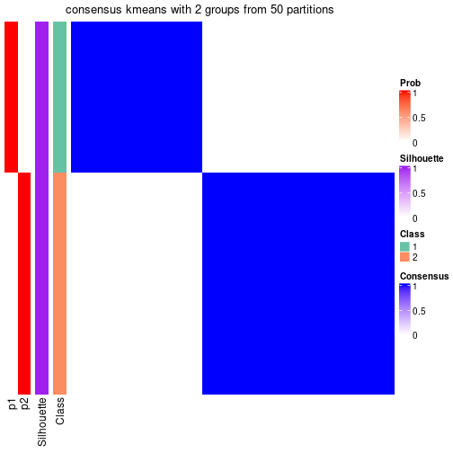</p>

</div>
<div id='tab-node-05-consensus-heatmap-2'>
<pre><code class="r">consensus_heatmap(res, k = 3)
</code></pre>

<p>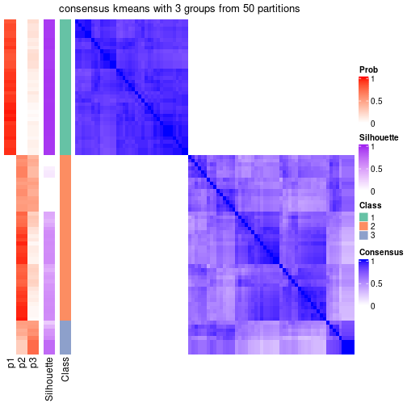</p>

</div>
<div id='tab-node-05-consensus-heatmap-3'>
<pre><code class="r">consensus_heatmap(res, k = 4)
</code></pre>

<p>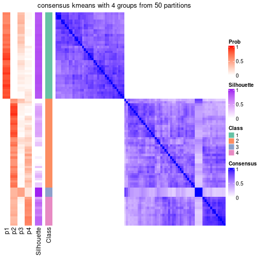</p>

</div>
<div id='tab-node-05-consensus-heatmap-4'>
<pre><code class="r">consensus_heatmap(res, k = 5)
</code></pre>

<p>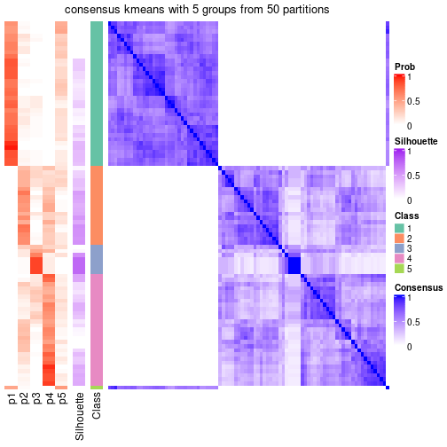</p>

</div>
<div id='tab-node-05-consensus-heatmap-5'>
<pre><code class="r">consensus_heatmap(res, k = 6)
</code></pre>

<p>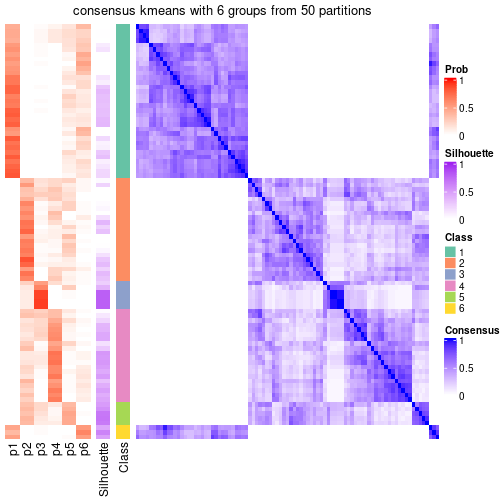</p>

</div>
<div id='tab-node-05-consensus-heatmap-6'>
<pre><code class="r">consensus_heatmap(res, k = 7)
</code></pre>

<p>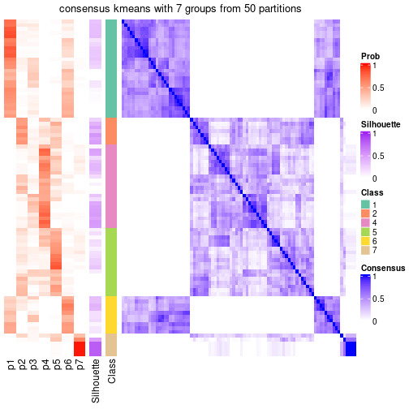</p>

</div>
<div id='tab-node-05-consensus-heatmap-7'>
<pre><code class="r">consensus_heatmap(res, k = 8)
</code></pre>

<p>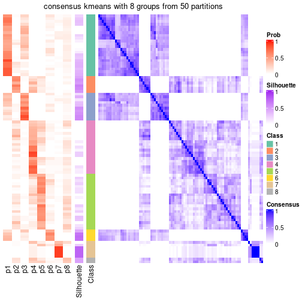</p>

</div>
</div>

Heatmaps for the membership of samples in all partitions to see how consistent they are:


<script>
$( function() {
	$( '#tabs-node-05-membership-heatmap' ).tabs();
} );
</script>
<div id='tabs-node-05-membership-heatmap'>
<ul>
<li><a href='#tab-node-05-membership-heatmap-1'>k = 2</a></li>
<li><a href='#tab-node-05-membership-heatmap-2'>k = 3</a></li>
<li><a href='#tab-node-05-membership-heatmap-3'>k = 4</a></li>
<li><a href='#tab-node-05-membership-heatmap-4'>k = 5</a></li>
<li><a href='#tab-node-05-membership-heatmap-5'>k = 6</a></li>
<li><a href='#tab-node-05-membership-heatmap-6'>k = 7</a></li>
<li><a href='#tab-node-05-membership-heatmap-7'>k = 8</a></li>
</ul>
<div id='tab-node-05-membership-heatmap-1'>
<pre><code class="r">membership_heatmap(res, k = 2)
</code></pre>

<p>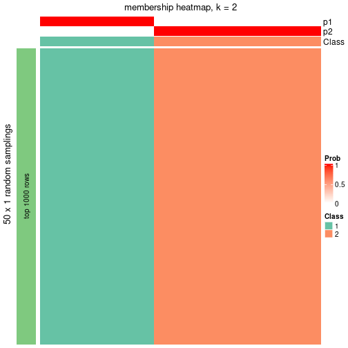</p>

</div>
<div id='tab-node-05-membership-heatmap-2'>
<pre><code class="r">membership_heatmap(res, k = 3)
</code></pre>

<p>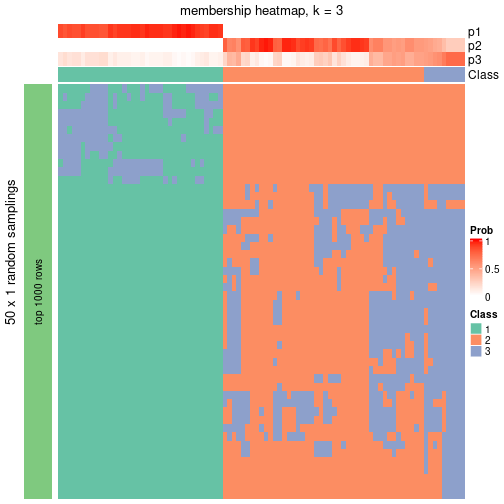</p>

</div>
<div id='tab-node-05-membership-heatmap-3'>
<pre><code class="r">membership_heatmap(res, k = 4)
</code></pre>

<p>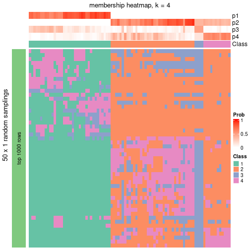</p>

</div>
<div id='tab-node-05-membership-heatmap-4'>
<pre><code class="r">membership_heatmap(res, k = 5)
</code></pre>

<p>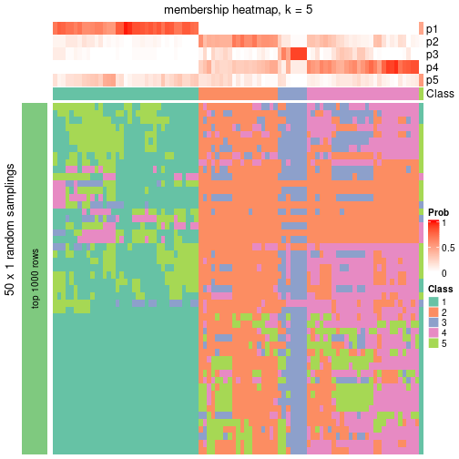</p>

</div>
<div id='tab-node-05-membership-heatmap-5'>
<pre><code class="r">membership_heatmap(res, k = 6)
</code></pre>

<p>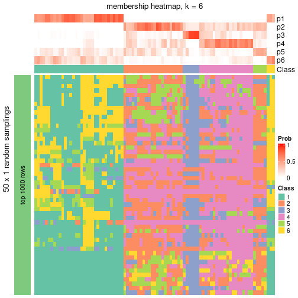</p>

</div>
<div id='tab-node-05-membership-heatmap-6'>
<pre><code class="r">membership_heatmap(res, k = 7)
</code></pre>

<p>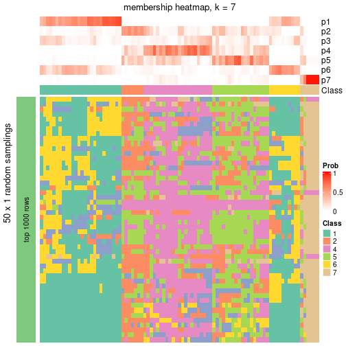</p>

</div>
<div id='tab-node-05-membership-heatmap-7'>
<pre><code class="r">membership_heatmap(res, k = 8)
</code></pre>

<p>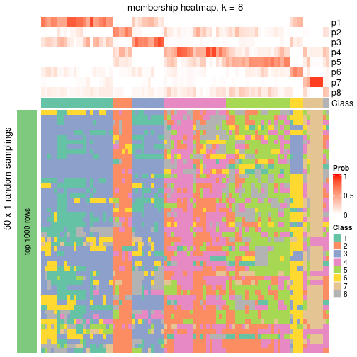</p>

</div>
</div>

As soon as the classes for columns are determined, the signatures
that are significantly different between subgroups can be looked for. 
Following are the heatmaps for signatures.


<script>
$( function() {
	$( '#tabs-node-05-get-signatures' ).tabs();
} );
</script>
<div id='tabs-node-05-get-signatures'>
<ul>
<li><a href='#tab-node-05-get-signatures-1'>k = 2</a></li>
<li><a href='#tab-node-05-get-signatures-2'>k = 3</a></li>
<li><a href='#tab-node-05-get-signatures-3'>k = 4</a></li>
<li><a href='#tab-node-05-get-signatures-4'>k = 5</a></li>
<li><a href='#tab-node-05-get-signatures-5'>k = 6</a></li>
<li><a href='#tab-node-05-get-signatures-6'>k = 7</a></li>
<li><a href='#tab-node-05-get-signatures-7'>k = 8</a></li>
</ul>
<div id='tab-node-05-get-signatures-1'>
<pre><code class="r">get_signatures(res, k = 2)
</code></pre>

<p>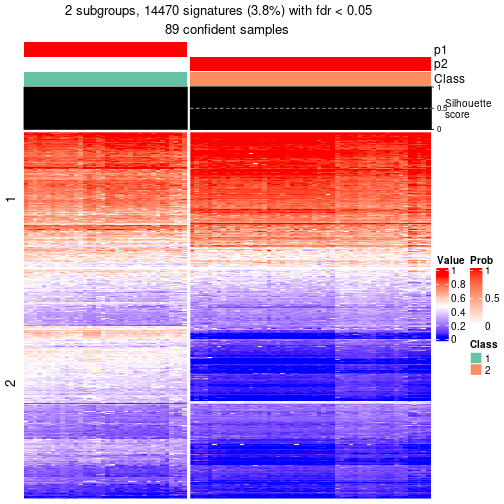</p>

</div>
<div id='tab-node-05-get-signatures-2'>
<pre><code class="r">get_signatures(res, k = 3)
</code></pre>

<p>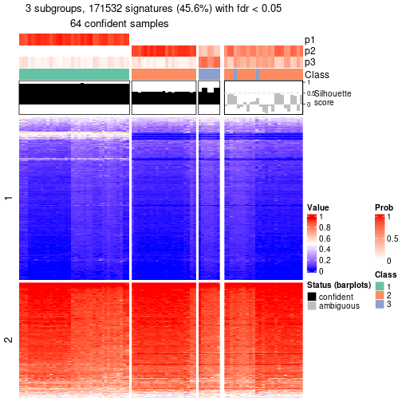</p>

</div>
<div id='tab-node-05-get-signatures-3'>
<pre><code class="r">get_signatures(res, k = 4)
</code></pre>

<p>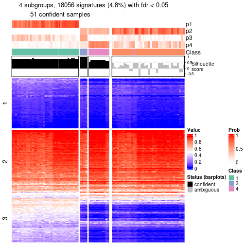</p>

</div>
<div id='tab-node-05-get-signatures-4'>
<pre><code class="r">get_signatures(res, k = 5)
</code></pre>

<p>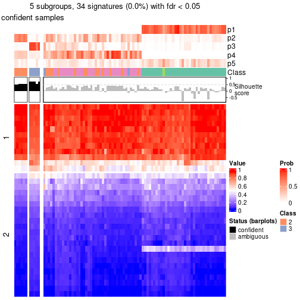</p>

</div>
<div id='tab-node-05-get-signatures-5'>
<pre><code class="r">get_signatures(res, k = 6)
</code></pre>

<p>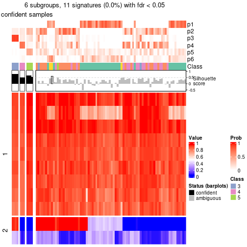</p>

</div>
<div id='tab-node-05-get-signatures-6'>
<pre><code class="r">get_signatures(res, k = 7)
</code></pre>

<p></p>

</div>
<div id='tab-node-05-get-signatures-7'>
<pre><code class="r">get_signatures(res, k = 8)
</code></pre>

<p>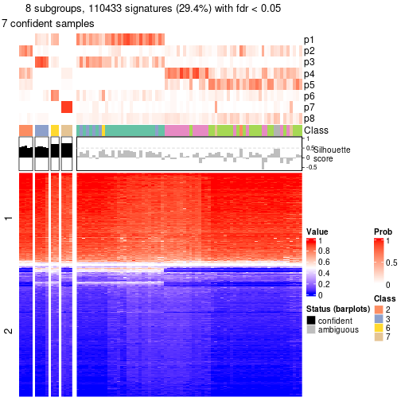</p>

</div>
</div>


Compare the overlap of signatures from different k:

```r
compare_signatures(res)
```

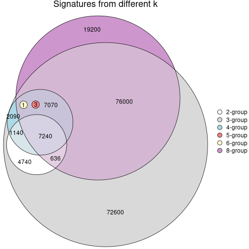

`get_signature()` returns a data frame invisibly. To get the list of signatures, the function
call should be assigned to a variable explicitly. In following code, if `plot` argument is set
to `FALSE`, no heatmap is plotted while only the differential analysis is performed.

```r
# code only for demonstration
tb = get_signature(res, k = ..., plot = FALSE)
```

An example of the output of `tb` is:

```
#>   which_row         fdr    mean_1    mean_2 scaled_mean_1 scaled_mean_2 km
#> 1        38 0.042760348  8.373488  9.131774    -0.5533452     0.5164555  1
#> 2        40 0.018707592  7.106213  8.469186    -0.6173731     0.5762149  1
#> 3        55 0.019134737 10.221463 11.207825    -0.6159697     0.5749050  1
#> 4        59 0.006059896  5.921854  7.869574    -0.6899429     0.6439467  1
#> 5        60 0.018055526  8.928898 10.211722    -0.6204761     0.5791110  1
#> 6        98 0.009384629 15.714769 14.887706     0.6635654    -0.6193277  2
...
```

The columns in `tb` are:

1. `which_row`: row indices corresponding to the input matrix.
2. `fdr`: FDR for the differential test. 
3. `mean_x`: The mean value in group x.
4. `scaled_mean_x`: The mean value in group x after rows are scaled.
5. `km`: Row groups if k-means clustering is applied to rows (which is done by automatically selecting number of clusters).

If there are too many signatures, `top_signatures = ...` can be set to only show the 
signatures with the highest FDRs:

```r
# code only for demonstration
# e.g. to show the top 500 most significant rows
tb = get_signature(res, k = ..., top_signatures = 500)
```

If the signatures are defined as these which are uniquely high in current group, `diff_method` argument
can be set to `"uniquely_high_in_one_group"`:

```r
# code only for demonstration
tb = get_signature(res, k = ..., diff_method = "uniquely_high_in_one_group")
```


UMAP plot which shows how samples are separated.


<script>
$( function() {
	$( '#tabs-node-05-dimension-reduction' ).tabs();
} );
</script>
<div id='tabs-node-05-dimension-reduction'>
<ul>
<li><a href='#tab-node-05-dimension-reduction-1'>k = 2</a></li>
<li><a href='#tab-node-05-dimension-reduction-2'>k = 3</a></li>
<li><a href='#tab-node-05-dimension-reduction-3'>k = 4</a></li>
<li><a href='#tab-node-05-dimension-reduction-4'>k = 5</a></li>
<li><a href='#tab-node-05-dimension-reduction-5'>k = 6</a></li>
<li><a href='#tab-node-05-dimension-reduction-6'>k = 7</a></li>
<li><a href='#tab-node-05-dimension-reduction-7'>k = 8</a></li>
</ul>
<div id='tab-node-05-dimension-reduction-1'>
<pre><code class="r">dimension_reduction(res, k = 2, method = &quot;UMAP&quot;)
</code></pre>

<p>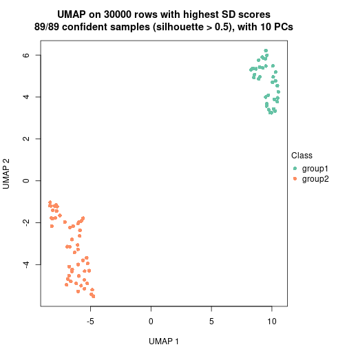</p>

</div>
<div id='tab-node-05-dimension-reduction-2'>
<pre><code class="r">dimension_reduction(res, k = 3, method = &quot;UMAP&quot;)
</code></pre>

<p>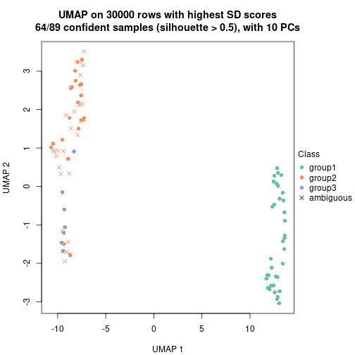</p>

</div>
<div id='tab-node-05-dimension-reduction-3'>
<pre><code class="r">dimension_reduction(res, k = 4, method = &quot;UMAP&quot;)
</code></pre>

<p>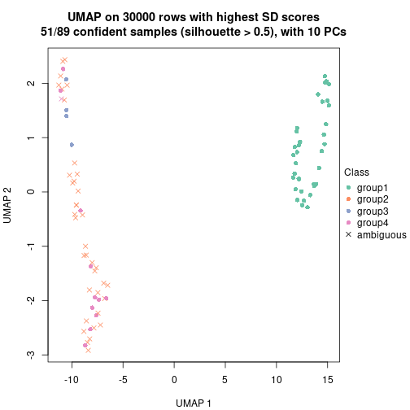</p>

</div>
<div id='tab-node-05-dimension-reduction-4'>
<pre><code class="r">dimension_reduction(res, k = 5, method = &quot;UMAP&quot;)
</code></pre>

<p>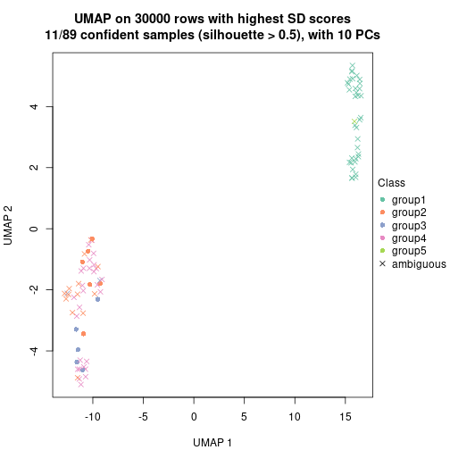</p>

</div>
<div id='tab-node-05-dimension-reduction-5'>
<pre><code class="r">dimension_reduction(res, k = 6, method = &quot;UMAP&quot;)
</code></pre>

<p>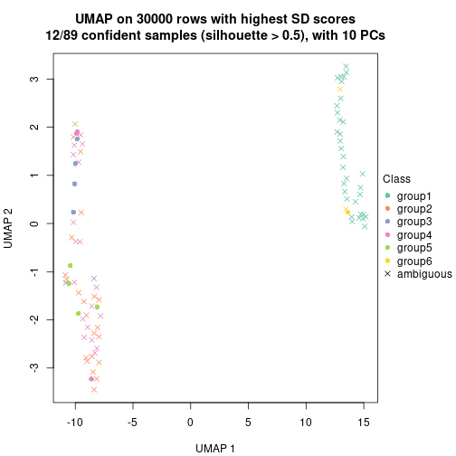</p>

</div>
<div id='tab-node-05-dimension-reduction-6'>
<pre><code class="r">dimension_reduction(res, k = 7, method = &quot;UMAP&quot;)
</code></pre>

<p>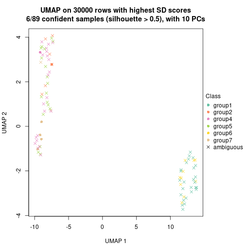</p>

</div>
<div id='tab-node-05-dimension-reduction-7'>
<pre><code class="r">dimension_reduction(res, k = 8, method = &quot;UMAP&quot;)
</code></pre>

<p>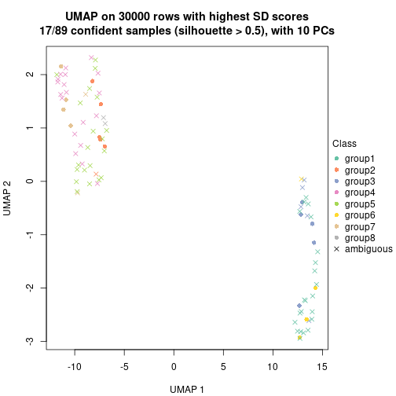</p>

</div>
</div>


Following heatmap shows how subgroups are split when increasing `k`:

```r
collect_classes(res)
```

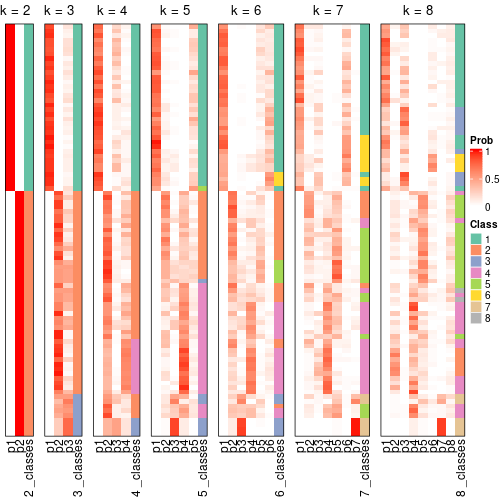


If matrix rows can be associated to genes, consider to use `functional_enrichment(res,
...)` to perform function enrichment for the signature genes. See [this vignette](https://jokergoo.github.io/cola_vignettes/functional_enrichment.html) for more detailed explanations.


 

---------------------------------------------------


### Node051


Parent node: [Node05](#Node05).
Child nodes: 
                Node0111-leaf
        ,
                Node0112-leaf
        ,
                Node0113-leaf
        ,
                Node0114-leaf
        ,
                Node0121-leaf
        ,
                Node0122-leaf
        ,
                Node0123-leaf
        ,
                Node0131-leaf
        ,
                Node0132-leaf
        ,
                Node0133-leaf
        ,
                Node0134-leaf
        ,
                Node0211-leaf
        ,
                Node0212-leaf
        ,
                [Node0213](#Node0213)
        ,
                Node0214-leaf
        ,
                [Node0221](#Node0221)
        ,
                Node0222-leaf
        ,
                Node0223-leaf
        ,
                [Node0231](#Node0231)
        ,
                Node0232-leaf
        ,
                Node0233-leaf
        ,
                [Node0234](#Node0234)
        ,
                Node0235-leaf
        ,
                Node0241-leaf
        ,
                [Node0242](#Node0242)
        ,
                Node0411-leaf
        ,
                Node0412-leaf
        ,
                Node0421-leaf
        ,
                Node0422-leaf
        ,
                Node0423-leaf
        ,
                Node0431-leaf
        ,
                Node0432-leaf
        ,
                Node0511-leaf
        ,
                Node0512-leaf
        ,
                Node0513-leaf
        ,
                Node0514-leaf
        ,
                Node0521-leaf
        ,
                Node0522-leaf
        ,
                Node0523-leaf
        ,
                Node0524-leaf
        ,
                Node0525-leaf
        ,
                Node0611-leaf
        ,
                [Node0612](#Node0612)
        ,
                Node0613-leaf
        ,
                [Node0711](#Node0711)
        ,
                Node0712-leaf
        ,
                Node0713-leaf
        ,
                [Node0721](#Node0721)
        ,
                Node0722-leaf
        ,
                Node0731-leaf
        ,
                Node0732-leaf
        ,
                Node0733-leaf
        .


The object with results only for a single top-value method and a single partitioning method 
can be extracted as:

```r
res = res_rh["051"]
```

A summary of `res` and all the functions that can be applied to it:

```r
res
```

```
#> A 'ConsensusPartition' object with k = 2, 3, 4, 5, 6, 7, 8.
#>   On a matrix with 30000 rows and 36 columns.
#>   Top rows (1000) are extracted by 'ATC' method.
#>   Subgroups are detected by 'kmeans' method.
#>   Performed in total 350 partitions by row resampling.
#>   Best k for subgroups seems to be 6.
#> 
#> Following methods can be applied to this 'ConsensusPartition' object:
#>  [1] "cola_report"             "collect_classes"         "collect_plots"          
#>  [4] "collect_stats"           "colnames"                "compare_partitions"     
#>  [7] "compare_signatures"      "consensus_heatmap"       "dimension_reduction"    
#> [10] "functional_enrichment"   "get_anno_col"            "get_anno"               
#> [13] "get_classes"             "get_consensus"           "get_matrix"             
#> [16] "get_membership"          "get_param"               "get_signatures"         
#> [19] "get_stats"               "is_best_k"               "is_stable_k"            
#> [22] "membership_heatmap"      "ncol"                    "nrow"                   
#> [25] "plot_ecdf"               "predict_classes"         "rownames"               
#> [28] "select_partition_number" "show"                    "suggest_best_k"         
#> [31] "test_to_known_factors"   "top_rows_heatmap"
```

`collect_plots()` function collects all the plots made from `res` for all `k` (number of subgroups)
into one single page to provide an easy and fast comparison between different `k`.

```r
collect_plots(res)
```

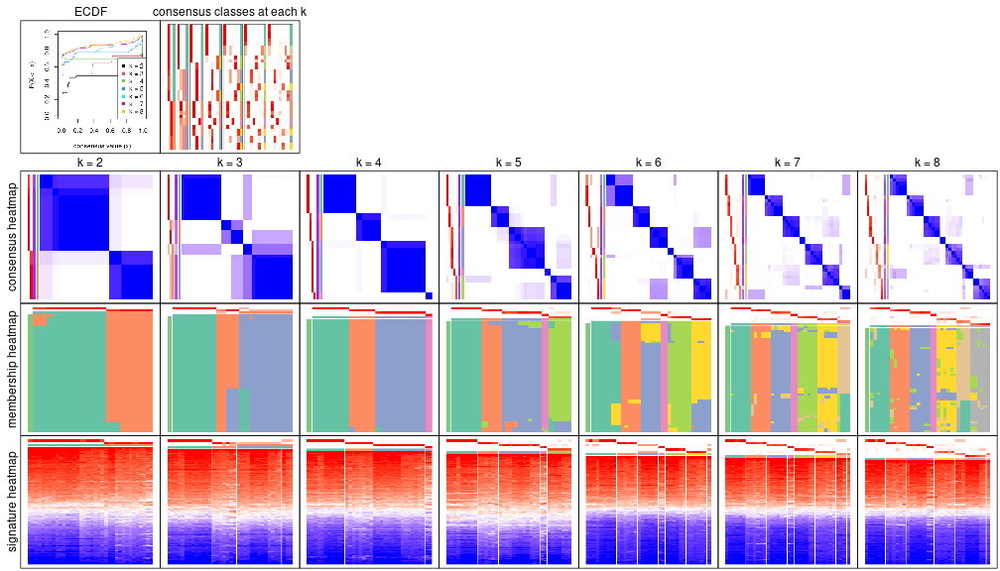

The plots are:

- The first row: a plot of the eCDF (empirical cumulative distribution
  function) curves of the consensus matrix for each `k` and the heatmap of
  predicted classes for each `k`.
- The second row: heatmaps of the consensus matrix for each `k`.
- The third row: heatmaps of the membership matrix for each `k`.
- The fouth row: heatmaps of the signatures for each `k`.

All the plots in panels can be made by individual functions and they are
plotted later in this section.

`select_partition_number()` produces several plots showing different
statistics for choosing "optimized" `k`. There are following statistics:

- eCDF curves of the consensus matrix for each `k`;
- 1-PAC. [The PAC score](https://en.wikipedia.org/wiki/Consensus_clustering#Over-interpretation_potential_of_consensus_clustering)
  measures the proportion of the ambiguous subgrouping.
- Mean silhouette score.
- Concordance. The mean probability of fiting the consensus subgroup labels in all
  partitions.
- Area increased. Denote $A_k$ as the area under the eCDF curve for current
  `k`, the area increased is defined as $A_k - A_{k-1}$.
- Rand index. The percent of pairs of samples that are both in a same cluster
  or both are not in a same cluster in the partition of k and k-1.
- Jaccard index. The ratio of pairs of samples are both in a same cluster in
  the partition of k and k-1 and the pairs of samples are both in a same
  cluster in the partition k or k-1.

The detailed explanations of these statistics can be found in [the _cola_
vignette](https://jokergoo.github.io/cola_vignettes/cola.html#toc_13).

Generally speaking, higher 1-PAC score, higher mean silhouette score or higher
concordance corresponds to better partition. Rand index and Jaccard index
measure how similar the current partition is compared to partition with `k-1`.
If they are too similar, we won't accept `k` is better than `k-1`.

```r
select_partition_number(res)
```

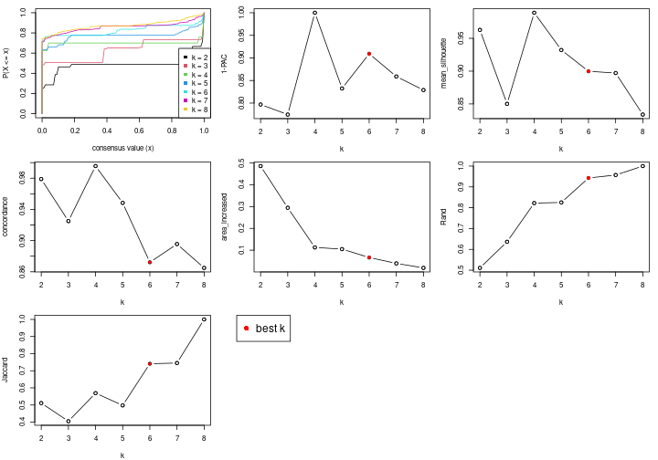

The numeric values for all these statistics can be obtained by `get_stats()`.

```r
get_stats(res)
```

```
#>   k 1-PAC mean_silhouette concordance area_increased  Rand Jaccard
#> 2 2 0.797           0.963       0.979         0.4857 0.511   0.511
#> 3 3 0.775           0.850       0.925         0.2945 0.637   0.405
#> 4 4 1.000           0.989       0.996         0.1127 0.822   0.569
#> 5 5 0.832           0.932       0.948         0.1050 0.825   0.498
#> 6 6 0.909           0.900       0.872         0.0665 0.943   0.741
#> 7 7 0.859           0.897       0.896         0.0394 0.957   0.745
#> 8 8 0.829           0.834       0.865         0.0189 1.000   1.000
```

`suggest_best_k()` suggests the best $k$ based on these statistics. The rules are as follows:

- All $k$ with Jaccard index larger than 0.95 are removed because increasing
  $k$ does not provide enough extra information. If all $k$ are removed, it is
  marked as no subgroup is detected.
- For all $k$ with 1-PAC score larger than 0.9, the maximal $k$ is taken as
  the best $k$, and other $k$ are marked as optional $k$.
- If it does not fit the second rule. The $k$ with the maximal vote of the
  highest 1-PAC score, highest mean silhouette, and highest concordance is
  taken as the best $k$.

```r
suggest_best_k(res)
```

```
#> [1] 6
#> attr(,"optional")
#> [1] 4
```

There is also optional best $k$ = 4 that is worth to check.

Following is the table of the partitions (You need to click the **show/hide
code output** link to see it). The membership matrix (columns with name `p*`)
is inferred by
[`clue::cl_consensus()`](https://www.rdocumentation.org/link/cl_consensus?package=clue)
function with the `SE` method. Basically the value in the membership matrix
represents the probability to belong to a certain group. The finall subgroup
label for an item is determined with the group with highest probability it
belongs to.

In `get_classes()` function, the entropy is calculated from the membership
matrix and the silhouette score is calculated from the consensus matrix.


<script>
$( function() {
	$( '#tabs-node-051-get-classes' ).tabs();
} );
</script>
<div id='tabs-node-051-get-classes'>
<ul>
<li><a href='#tab-node-051-get-classes-1'>k = 2</a></li>
<li><a href='#tab-node-051-get-classes-2'>k = 3</a></li>
<li><a href='#tab-node-051-get-classes-3'>k = 4</a></li>
<li><a href='#tab-node-051-get-classes-4'>k = 5</a></li>
<li><a href='#tab-node-051-get-classes-5'>k = 6</a></li>
<li><a href='#tab-node-051-get-classes-6'>k = 7</a></li>
<li><a href='#tab-node-051-get-classes-7'>k = 8</a></li>
</ul>

<div id='tab-node-051-get-classes-1'>
<p><a id='tab-node-051-get-classes-1-a' style='color:#0366d6' href='#'>show/hide code output</a></p>
<pre><code class="r">cbind(get_classes(res, k = 2), get_membership(res, k = 2))
</code></pre>

<pre><code>#&gt;                 class entropy silhouette   p1   p2
#&gt; TCGA.44.2659.11     1   0.000      0.978 1.00 0.00
#&gt; TCGA.44.5645.11     1   0.000      0.978 1.00 0.00
#&gt; TCGA.44.2665.11     1   0.000      0.978 1.00 0.00
#&gt; TCGA.39.5030.11     1   0.141      0.967 0.98 0.02
#&gt; TCGA.22.5492.11     1   0.000      0.978 1.00 0.00
#&gt; TCGA.22.5485.11     1   0.141      0.967 0.98 0.02
#&gt; TCGA.98.A53C.01     2   0.000      0.974 0.00 1.00
#&gt; TCGA.39.5011.11     1   0.000      0.978 1.00 0.00
#&gt; TCGA.34.5929.11     1   0.000      0.978 1.00 0.00
#&gt; TCGA.55.7816.01     2   0.000      0.974 0.00 1.00
#&gt; TCGA.50.6593.11     2   0.000      0.974 0.00 1.00
#&gt; TCGA.22.4613.11     1   0.000      0.978 1.00 0.00
#&gt; TCGA.38.4631.11     2   0.402      0.930 0.08 0.92
#&gt; TCGA.33.4579.11     1   0.000      0.978 1.00 0.00
#&gt; TCGA.86.A4P8.01     2   0.000      0.974 0.00 1.00
#&gt; TCGA.44.2655.11     1   0.000      0.978 1.00 0.00
#&gt; TCGA.75.6203.01     2   0.000      0.974 0.00 1.00
#&gt; TCGA.50.6594.11     2   0.402      0.930 0.08 0.92
#&gt; TCGA.49.4488.11     2   0.000      0.974 0.00 1.00
#&gt; TCGA.39.5035.11     2   0.402      0.930 0.08 0.92
#&gt; TCGA.44.6145.11     1   0.469      0.905 0.90 0.10
#&gt; TCGA.50.5935.11     1   0.469      0.905 0.90 0.10
#&gt; TCGA.99.AA5R.01     2   0.000      0.974 0.00 1.00
#&gt; TCGA.73.4658.11     2   0.000      0.974 0.00 1.00
#&gt; TCGA.50.6592.11     1   0.469      0.905 0.90 0.10
#&gt; TCGA.39.5034.11     1   0.469      0.905 0.90 0.10
#&gt; TCGA.98.A53H.01     2   0.000      0.974 0.00 1.00
#&gt; TCGA.22.4599.11     1   0.000      0.978 1.00 0.00
#&gt; TCGA.39.5031.11     1   0.000      0.978 1.00 0.00
#&gt; TCGA.22.5480.11     2   0.402      0.930 0.08 0.92
#&gt; TCGA.50.5931.11     1   0.000      0.978 1.00 0.00
#&gt; TCGA.22.4601.11     1   0.000      0.978 1.00 0.00
#&gt; TCGA.33.4589.11     1   0.000      0.978 1.00 0.00
#&gt; TCGA.44.6147.11     1   0.000      0.978 1.00 0.00
#&gt; TCGA.55.8513.01     2   0.000      0.974 0.00 1.00
#&gt; TCGA.50.6591.11     1   0.000      0.978 1.00 0.00
</code></pre>

<script>
$('#tab-node-051-get-classes-1-a').parent().next().next().hide();
$('#tab-node-051-get-classes-1-a').click(function(){
  $('#tab-node-051-get-classes-1-a').parent().next().next().toggle();
  return(false);
});
</script>
</div>

<div id='tab-node-051-get-classes-2'>
<p><a id='tab-node-051-get-classes-2-a' style='color:#0366d6' href='#'>show/hide code output</a></p>
<pre><code class="r">cbind(get_classes(res, k = 3), get_membership(res, k = 3))
</code></pre>

<pre><code>#&gt;                 class entropy silhouette   p1   p2   p3
#&gt; TCGA.44.2659.11     1  0.0000      0.998 1.00 0.00 0.00
#&gt; TCGA.44.5645.11     1  0.0000      0.998 1.00 0.00 0.00
#&gt; TCGA.44.2665.11     1  0.0000      0.998 1.00 0.00 0.00
#&gt; TCGA.39.5030.11     3  0.6045      0.873 0.00 0.38 0.62
#&gt; TCGA.22.5492.11     1  0.0000      0.998 1.00 0.00 0.00
#&gt; TCGA.22.5485.11     3  0.6045      0.873 0.00 0.38 0.62
#&gt; TCGA.98.A53C.01     2  0.6045      0.723 0.00 0.62 0.38
#&gt; TCGA.39.5011.11     1  0.0000      0.998 1.00 0.00 0.00
#&gt; TCGA.34.5929.11     1  0.0000      0.998 1.00 0.00 0.00
#&gt; TCGA.55.7816.01     2  0.0000      0.719 0.00 1.00 0.00
#&gt; TCGA.50.6593.11     3  0.6045      0.873 0.00 0.38 0.62
#&gt; TCGA.22.4613.11     1  0.0000      0.998 1.00 0.00 0.00
#&gt; TCGA.38.4631.11     3  0.6045      0.873 0.00 0.38 0.62
#&gt; TCGA.33.4579.11     1  0.0000      0.998 1.00 0.00 0.00
#&gt; TCGA.86.A4P8.01     2  0.0000      0.719 0.00 1.00 0.00
#&gt; TCGA.44.2655.11     1  0.0000      0.998 1.00 0.00 0.00
#&gt; TCGA.75.6203.01     3  0.6045      0.873 0.00 0.38 0.62
#&gt; TCGA.50.6594.11     3  0.6045      0.873 0.00 0.38 0.62
#&gt; TCGA.49.4488.11     2  0.0000      0.719 0.00 1.00 0.00
#&gt; TCGA.39.5035.11     3  0.6045      0.873 0.00 0.38 0.62
#&gt; TCGA.44.6145.11     3  0.6045      0.873 0.00 0.38 0.62
#&gt; TCGA.50.5935.11     3  0.6045      0.873 0.00 0.38 0.62
#&gt; TCGA.99.AA5R.01     2  0.6045      0.723 0.00 0.62 0.38
#&gt; TCGA.73.4658.11     2  0.0000      0.719 0.00 1.00 0.00
#&gt; TCGA.50.6592.11     3  0.6045      0.873 0.00 0.38 0.62
#&gt; TCGA.39.5034.11     3  0.6045      0.873 0.00 0.38 0.62
#&gt; TCGA.98.A53H.01     2  0.6045      0.723 0.00 0.62 0.38
#&gt; TCGA.22.4599.11     1  0.0000      0.998 1.00 0.00 0.00
#&gt; TCGA.39.5031.11     1  0.0892      0.976 0.98 0.00 0.02
#&gt; TCGA.22.5480.11     3  0.6045      0.873 0.00 0.38 0.62
#&gt; TCGA.50.5931.11     3  0.6045      0.430 0.38 0.00 0.62
#&gt; TCGA.22.4601.11     3  0.6045      0.430 0.38 0.00 0.62
#&gt; TCGA.33.4589.11     1  0.0000      0.998 1.00 0.00 0.00
#&gt; TCGA.44.6147.11     3  0.6045      0.430 0.38 0.00 0.62
#&gt; TCGA.55.8513.01     3  0.6126      0.849 0.00 0.40 0.60
#&gt; TCGA.50.6591.11     1  0.0000      0.998 1.00 0.00 0.00
</code></pre>

<script>
$('#tab-node-051-get-classes-2-a').parent().next().next().hide();
$('#tab-node-051-get-classes-2-a').click(function(){
  $('#tab-node-051-get-classes-2-a').parent().next().next().toggle();
  return(false);
});
</script>
</div>

<div id='tab-node-051-get-classes-3'>
<p><a id='tab-node-051-get-classes-3-a' style='color:#0366d6' href='#'>show/hide code output</a></p>
<pre><code class="r">cbind(get_classes(res, k = 4), get_membership(res, k = 4))
</code></pre>

<pre><code>#&gt;                 class entropy silhouette   p1   p2   p3 p4
#&gt; TCGA.44.2659.11     1   0.000      1.000 1.00 0.00 0.00  0
#&gt; TCGA.44.5645.11     1   0.000      1.000 1.00 0.00 0.00  0
#&gt; TCGA.44.2665.11     1   0.000      1.000 1.00 0.00 0.00  0
#&gt; TCGA.39.5030.11     3   0.000      0.993 0.00 0.00 1.00  0
#&gt; TCGA.22.5492.11     1   0.000      1.000 1.00 0.00 0.00  0
#&gt; TCGA.22.5485.11     3   0.000      0.993 0.00 0.00 1.00  0
#&gt; TCGA.98.A53C.01     4   0.000      1.000 0.00 0.00 0.00  1
#&gt; TCGA.39.5011.11     1   0.000      1.000 1.00 0.00 0.00  0
#&gt; TCGA.34.5929.11     1   0.000      1.000 1.00 0.00 0.00  0
#&gt; TCGA.55.7816.01     2   0.000      0.983 0.00 1.00 0.00  0
#&gt; TCGA.50.6593.11     2   0.121      0.949 0.00 0.96 0.04  0
#&gt; TCGA.22.4613.11     1   0.000      1.000 1.00 0.00 0.00  0
#&gt; TCGA.38.4631.11     3   0.000      0.993 0.00 0.00 1.00  0
#&gt; TCGA.33.4579.11     1   0.000      1.000 1.00 0.00 0.00  0
#&gt; TCGA.86.A4P8.01     2   0.000      0.983 0.00 1.00 0.00  0
#&gt; TCGA.44.2655.11     1   0.000      1.000 1.00 0.00 0.00  0
#&gt; TCGA.75.6203.01     2   0.121      0.949 0.00 0.96 0.04  0
#&gt; TCGA.50.6594.11     3   0.000      0.993 0.00 0.00 1.00  0
#&gt; TCGA.49.4488.11     2   0.000      0.983 0.00 1.00 0.00  0
#&gt; TCGA.39.5035.11     3   0.000      0.993 0.00 0.00 1.00  0
#&gt; TCGA.44.6145.11     3   0.000      0.993 0.00 0.00 1.00  0
#&gt; TCGA.50.5935.11     3   0.000      0.993 0.00 0.00 1.00  0
#&gt; TCGA.99.AA5R.01     2   0.000      0.983 0.00 1.00 0.00  0
#&gt; TCGA.73.4658.11     2   0.000      0.983 0.00 1.00 0.00  0
#&gt; TCGA.50.6592.11     3   0.000      0.993 0.00 0.00 1.00  0
#&gt; TCGA.39.5034.11     3   0.000      0.993 0.00 0.00 1.00  0
#&gt; TCGA.98.A53H.01     4   0.000      1.000 0.00 0.00 0.00  1
#&gt; TCGA.22.4599.11     3   0.121      0.951 0.04 0.00 0.96  0
#&gt; TCGA.39.5031.11     3   0.121      0.951 0.04 0.00 0.96  0
#&gt; TCGA.22.5480.11     3   0.000      0.993 0.00 0.00 1.00  0
#&gt; TCGA.50.5931.11     3   0.000      0.993 0.00 0.00 1.00  0
#&gt; TCGA.22.4601.11     3   0.000      0.993 0.00 0.00 1.00  0
#&gt; TCGA.33.4589.11     1   0.000      1.000 1.00 0.00 0.00  0
#&gt; TCGA.44.6147.11     3   0.000      0.993 0.00 0.00 1.00  0
#&gt; TCGA.55.8513.01     2   0.000      0.983 0.00 1.00 0.00  0
#&gt; TCGA.50.6591.11     1   0.000      1.000 1.00 0.00 0.00  0
</code></pre>

<script>
$('#tab-node-051-get-classes-3-a').parent().next().next().hide();
$('#tab-node-051-get-classes-3-a').click(function(){
  $('#tab-node-051-get-classes-3-a').parent().next().next().toggle();
  return(false);
});
</script>
</div>

<div id='tab-node-051-get-classes-4'>
<p><a id='tab-node-051-get-classes-4-a' style='color:#0366d6' href='#'>show/hide code output</a></p>
<pre><code class="r">cbind(get_classes(res, k = 5), get_membership(res, k = 5))
</code></pre>

<pre><code>#&gt;                 class entropy silhouette   p1   p2   p3   p4   p5
#&gt; TCGA.44.2659.11     1  0.0000      1.000 1.00 0.00 0.00 0.00 0.00
#&gt; TCGA.44.5645.11     1  0.0000      1.000 1.00 0.00 0.00 0.00 0.00
#&gt; TCGA.44.2665.11     1  0.0000      1.000 1.00 0.00 0.00 0.00 0.00
#&gt; TCGA.39.5030.11     3  0.1043      0.912 0.00 0.00 0.96 0.00 0.04
#&gt; TCGA.22.5492.11     1  0.0000      1.000 1.00 0.00 0.00 0.00 0.00
#&gt; TCGA.22.5485.11     3  0.0609      0.927 0.00 0.00 0.98 0.00 0.02
#&gt; TCGA.98.A53C.01     4  0.1043      0.979 0.00 0.00 0.00 0.96 0.04
#&gt; TCGA.39.5011.11     1  0.0000      1.000 1.00 0.00 0.00 0.00 0.00
#&gt; TCGA.34.5929.11     1  0.0000      1.000 1.00 0.00 0.00 0.00 0.00
#&gt; TCGA.55.7816.01     2  0.2020      0.905 0.00 0.90 0.00 0.00 0.10
#&gt; TCGA.50.6593.11     3  0.2516      0.860 0.00 0.14 0.86 0.00 0.00
#&gt; TCGA.22.4613.11     5  0.2732      0.765 0.16 0.00 0.00 0.00 0.84
#&gt; TCGA.38.4631.11     3  0.2020      0.895 0.00 0.10 0.90 0.00 0.00
#&gt; TCGA.33.4579.11     1  0.0000      1.000 1.00 0.00 0.00 0.00 0.00
#&gt; TCGA.86.A4P8.01     2  0.0000      0.954 0.00 1.00 0.00 0.00 0.00
#&gt; TCGA.44.2655.11     1  0.0000      1.000 1.00 0.00 0.00 0.00 0.00
#&gt; TCGA.75.6203.01     3  0.2516      0.860 0.00 0.14 0.86 0.00 0.00
#&gt; TCGA.50.6594.11     3  0.2020      0.895 0.00 0.10 0.90 0.00 0.00
#&gt; TCGA.49.4488.11     2  0.0000      0.954 0.00 1.00 0.00 0.00 0.00
#&gt; TCGA.39.5035.11     3  0.1043      0.924 0.00 0.04 0.96 0.00 0.00
#&gt; TCGA.44.6145.11     3  0.0609      0.927 0.00 0.00 0.98 0.00 0.02
#&gt; TCGA.50.5935.11     3  0.0000      0.932 0.00 0.00 1.00 0.00 0.00
#&gt; TCGA.99.AA5R.01     2  0.2020      0.905 0.00 0.90 0.00 0.00 0.10
#&gt; TCGA.73.4658.11     2  0.0000      0.954 0.00 1.00 0.00 0.00 0.00
#&gt; TCGA.50.6592.11     3  0.0000      0.932 0.00 0.00 1.00 0.00 0.00
#&gt; TCGA.39.5034.11     3  0.0609      0.927 0.00 0.00 0.98 0.00 0.02
#&gt; TCGA.98.A53H.01     4  0.0000      0.979 0.00 0.00 0.00 1.00 0.00
#&gt; TCGA.22.4599.11     5  0.2516      0.909 0.00 0.00 0.14 0.00 0.86
#&gt; TCGA.39.5031.11     5  0.2516      0.909 0.00 0.00 0.14 0.00 0.86
#&gt; TCGA.22.5480.11     3  0.0000      0.932 0.00 0.00 1.00 0.00 0.00
#&gt; TCGA.50.5931.11     5  0.2516      0.909 0.00 0.00 0.14 0.00 0.86
#&gt; TCGA.22.4601.11     5  0.2516      0.909 0.00 0.00 0.14 0.00 0.86
#&gt; TCGA.33.4589.11     1  0.0000      1.000 1.00 0.00 0.00 0.00 0.00
#&gt; TCGA.44.6147.11     5  0.2516      0.909 0.00 0.00 0.14 0.00 0.86
#&gt; TCGA.55.8513.01     2  0.0000      0.954 0.00 1.00 0.00 0.00 0.00
#&gt; TCGA.50.6591.11     5  0.2929      0.743 0.18 0.00 0.00 0.00 0.82
</code></pre>

<script>
$('#tab-node-051-get-classes-4-a').parent().next().next().hide();
$('#tab-node-051-get-classes-4-a').click(function(){
  $('#tab-node-051-get-classes-4-a').parent().next().next().toggle();
  return(false);
});
</script>
</div>

<div id='tab-node-051-get-classes-5'>
<p><a id='tab-node-051-get-classes-5-a' style='color:#0366d6' href='#'>show/hide code output</a></p>
<pre><code class="r">cbind(get_classes(res, k = 6), get_membership(res, k = 6))
</code></pre>

<pre><code>#&gt;                 class entropy silhouette   p1   p2   p3 p4   p5   p6
#&gt; TCGA.44.2659.11     1  0.3647      0.690 0.64 0.00 0.36  0 0.00 0.00
#&gt; TCGA.44.5645.11     1  0.3647      0.690 0.64 0.00 0.36  0 0.00 0.00
#&gt; TCGA.44.2665.11     1  0.3647      0.690 0.64 0.00 0.36  0 0.00 0.00
#&gt; TCGA.39.5030.11     3  0.4328      0.976 0.00 0.00 0.52  0 0.02 0.46
#&gt; TCGA.22.5492.11     1  0.0000      0.859 1.00 0.00 0.00  0 0.00 0.00
#&gt; TCGA.22.5485.11     3  0.4328      0.976 0.00 0.00 0.52  0 0.02 0.46
#&gt; TCGA.98.A53C.01     4  0.0000      1.000 0.00 0.00 0.00  1 0.00 0.00
#&gt; TCGA.39.5011.11     1  0.0000      0.859 1.00 0.00 0.00  0 0.00 0.00
#&gt; TCGA.34.5929.11     1  0.0000      0.859 1.00 0.00 0.00  0 0.00 0.00
#&gt; TCGA.55.7816.01     2  0.0937      0.963 0.00 0.96 0.04  0 0.00 0.00
#&gt; TCGA.50.6593.11     6  0.0937      0.919 0.00 0.04 0.00  0 0.00 0.96
#&gt; TCGA.22.4613.11     5  0.0000      0.913 0.00 0.00 0.00  0 1.00 0.00
#&gt; TCGA.38.4631.11     6  0.0000      0.943 0.00 0.00 0.00  0 0.00 1.00
#&gt; TCGA.33.4579.11     1  0.0000      0.859 1.00 0.00 0.00  0 0.00 0.00
#&gt; TCGA.86.A4P8.01     2  0.0000      0.981 0.00 1.00 0.00  0 0.00 0.00
#&gt; TCGA.44.2655.11     1  0.0000      0.859 1.00 0.00 0.00  0 0.00 0.00
#&gt; TCGA.75.6203.01     6  0.1267      0.890 0.00 0.06 0.00  0 0.00 0.94
#&gt; TCGA.50.6594.11     6  0.0000      0.943 0.00 0.00 0.00  0 0.00 1.00
#&gt; TCGA.49.4488.11     2  0.0000      0.981 0.00 1.00 0.00  0 0.00 0.00
#&gt; TCGA.39.5035.11     3  0.3864      0.968 0.00 0.00 0.52  0 0.00 0.48
#&gt; TCGA.44.6145.11     3  0.3851      0.963 0.00 0.00 0.54  0 0.00 0.46
#&gt; TCGA.50.5935.11     6  0.0547      0.940 0.00 0.00 0.02  0 0.00 0.98
#&gt; TCGA.99.AA5R.01     2  0.1267      0.951 0.00 0.94 0.06  0 0.00 0.00
#&gt; TCGA.73.4658.11     2  0.0000      0.981 0.00 1.00 0.00  0 0.00 0.00
#&gt; TCGA.50.6592.11     6  0.0547      0.940 0.00 0.00 0.02  0 0.00 0.98
#&gt; TCGA.39.5034.11     3  0.4328      0.976 0.00 0.00 0.52  0 0.02 0.46
#&gt; TCGA.98.A53H.01     4  0.0000      1.000 0.00 0.00 0.00  1 0.00 0.00
#&gt; TCGA.22.4599.11     5  0.0000      0.913 0.00 0.00 0.00  0 1.00 0.00
#&gt; TCGA.39.5031.11     5  0.0000      0.913 0.00 0.00 0.00  0 1.00 0.00
#&gt; TCGA.22.5480.11     3  0.3864      0.968 0.00 0.00 0.52  0 0.00 0.48
#&gt; TCGA.50.5931.11     5  0.1267      0.891 0.00 0.00 0.06  0 0.94 0.00
#&gt; TCGA.22.4601.11     5  0.0000      0.913 0.00 0.00 0.00  0 1.00 0.00
#&gt; TCGA.33.4589.11     1  0.0000      0.859 1.00 0.00 0.00  0 0.00 0.00
#&gt; TCGA.44.6147.11     5  0.0937      0.901 0.00 0.00 0.04  0 0.96 0.00
#&gt; TCGA.55.8513.01     2  0.0000      0.981 0.00 1.00 0.00  0 0.00 0.00
#&gt; TCGA.50.6591.11     5  0.4246      0.482 0.02 0.00 0.40  0 0.58 0.00
</code></pre>

<script>
$('#tab-node-051-get-classes-5-a').parent().next().next().hide();
$('#tab-node-051-get-classes-5-a').click(function(){
  $('#tab-node-051-get-classes-5-a').parent().next().next().toggle();
  return(false);
});
</script>
</div>

<div id='tab-node-051-get-classes-6'>
<p><a id='tab-node-051-get-classes-6-a' style='color:#0366d6' href='#'>show/hide code output</a></p>
<pre><code class="r">cbind(get_classes(res, k = 7), get_membership(res, k = 7))
</code></pre>

<pre><code>#&gt;                 class entropy silhouette   p1   p2   p3 p4   p5   p6   p7
#&gt; TCGA.44.2659.11     7  0.3358      0.772 0.36 0.00 0.00  0 0.00 0.00 0.64
#&gt; TCGA.44.5645.11     7  0.3358      0.772 0.36 0.00 0.00  0 0.00 0.00 0.64
#&gt; TCGA.44.2665.11     7  0.3358      0.772 0.36 0.00 0.00  0 0.00 0.00 0.64
#&gt; TCGA.39.5030.11     3  0.1718      0.912 0.00 0.00 0.92  0 0.04 0.04 0.00
#&gt; TCGA.22.5492.11     1  0.0000      0.985 1.00 0.00 0.00  0 0.00 0.00 0.00
#&gt; TCGA.22.5485.11     3  0.1433      0.949 0.00 0.00 0.92  0 0.00 0.08 0.00
#&gt; TCGA.98.A53C.01     4  0.0000      1.000 0.00 0.00 0.00  1 0.00 0.00 0.00
#&gt; TCGA.39.5011.11     1  0.0000      0.985 1.00 0.00 0.00  0 0.00 0.00 0.00
#&gt; TCGA.34.5929.11     1  0.0000      0.985 1.00 0.00 0.00  0 0.00 0.00 0.00
#&gt; TCGA.55.7816.01     2  0.0000      0.918 0.00 1.00 0.00  0 0.00 0.00 0.00
#&gt; TCGA.50.6593.11     6  0.1363      0.868 0.00 0.00 0.02  0 0.00 0.94 0.04
#&gt; TCGA.22.4613.11     5  0.1363      0.909 0.00 0.00 0.02  0 0.94 0.00 0.04
#&gt; TCGA.38.4631.11     6  0.1928      0.902 0.00 0.00 0.08  0 0.00 0.90 0.02
#&gt; TCGA.33.4579.11     1  0.0000      0.985 1.00 0.00 0.00  0 0.00 0.00 0.00
#&gt; TCGA.86.A4P8.01     2  0.1166      0.941 0.00 0.94 0.00  0 0.00 0.06 0.00
#&gt; TCGA.44.2655.11     1  0.0000      0.985 1.00 0.00 0.00  0 0.00 0.00 0.00
#&gt; TCGA.75.6203.01     6  0.2569      0.814 0.00 0.00 0.02  0 0.00 0.84 0.14
#&gt; TCGA.50.6594.11     6  0.1433      0.901 0.00 0.00 0.08  0 0.00 0.92 0.00
#&gt; TCGA.49.4488.11     2  0.1166      0.941 0.00 0.94 0.00  0 0.00 0.06 0.00
#&gt; TCGA.39.5035.11     3  0.2376      0.951 0.00 0.00 0.86  0 0.00 0.12 0.02
#&gt; TCGA.44.6145.11     3  0.1886      0.947 0.00 0.00 0.88  0 0.00 0.12 0.00
#&gt; TCGA.50.5935.11     6  0.2569      0.866 0.00 0.00 0.14  0 0.02 0.84 0.00
#&gt; TCGA.99.AA5R.01     2  0.1671      0.860 0.00 0.90 0.00  0 0.00 0.00 0.10
#&gt; TCGA.73.4658.11     2  0.1166      0.941 0.00 0.94 0.00  0 0.00 0.06 0.00
#&gt; TCGA.50.6592.11     6  0.3061      0.874 0.00 0.00 0.08  0 0.02 0.84 0.06
#&gt; TCGA.39.5034.11     3  0.2163      0.957 0.00 0.00 0.88  0 0.00 0.10 0.02
#&gt; TCGA.98.A53H.01     4  0.0000      1.000 0.00 0.00 0.00  1 0.00 0.00 0.00
#&gt; TCGA.22.4599.11     5  0.1006      0.927 0.00 0.00 0.02  0 0.96 0.00 0.02
#&gt; TCGA.39.5031.11     5  0.0504      0.930 0.00 0.00 0.02  0 0.98 0.00 0.00
#&gt; TCGA.22.5480.11     3  0.2376      0.951 0.00 0.00 0.86  0 0.00 0.12 0.02
#&gt; TCGA.50.5931.11     5  0.2769      0.879 0.00 0.00 0.08  0 0.86 0.02 0.04
#&gt; TCGA.22.4601.11     5  0.1363      0.927 0.00 0.00 0.04  0 0.94 0.00 0.02
#&gt; TCGA.33.4589.11     1  0.1505      0.921 0.94 0.00 0.02  0 0.02 0.00 0.02
#&gt; TCGA.44.6147.11     5  0.3000      0.887 0.00 0.00 0.10  0 0.84 0.02 0.04
#&gt; TCGA.55.8513.01     2  0.2829      0.879 0.00 0.84 0.00  0 0.00 0.08 0.08
#&gt; TCGA.50.6591.11     7  0.3139      0.305 0.00 0.00 0.00  0 0.30 0.00 0.70
</code></pre>

<script>
$('#tab-node-051-get-classes-6-a').parent().next().next().hide();
$('#tab-node-051-get-classes-6-a').click(function(){
  $('#tab-node-051-get-classes-6-a').parent().next().next().toggle();
  return(false);
});
</script>
</div>

<div id='tab-node-051-get-classes-7'>
<p><a id='tab-node-051-get-classes-7-a' style='color:#0366d6' href='#'>show/hide code output</a></p>
<pre><code class="r">cbind(get_classes(res, k = 8), get_membership(res, k = 8))
</code></pre>

<pre><code>#&gt;                 class entropy silhouette   p1   p2   p3 p4   p5   p6   p7   p8
#&gt; TCGA.44.2659.11     7  0.4134      0.768 0.30 0.00 0.00  0 0.08 0.00 0.62 0.00
#&gt; TCGA.44.5645.11     7  0.2938      0.755 0.30 0.00 0.00  0 0.00 0.00 0.70 0.00
#&gt; TCGA.44.2665.11     7  0.4134      0.768 0.30 0.00 0.00  0 0.08 0.00 0.62 0.00
#&gt; TCGA.39.5030.11     3  0.1563      0.910 0.00 0.00 0.90  0 0.10 0.00 0.00 0.00
#&gt; TCGA.22.5492.11     1  0.0000      0.913 1.00 0.00 0.00  0 0.00 0.00 0.00 0.00
#&gt; TCGA.22.5485.11     3  0.1563      0.910 0.00 0.00 0.90  0 0.10 0.00 0.00 0.00
#&gt; TCGA.98.A53C.01     4  0.0000      1.000 0.00 0.00 0.00  1 0.00 0.00 0.00 0.00
#&gt; TCGA.39.5011.11     1  0.0471      0.906 0.98 0.00 0.00  0 0.00 0.02 0.00 0.00
#&gt; TCGA.34.5929.11     1  0.0000      0.913 1.00 0.00 0.00  0 0.00 0.00 0.00 0.00
#&gt; TCGA.55.7816.01     2  0.0941      0.900 0.00 0.96 0.00  0 0.02 0.02 0.00 0.00
#&gt; TCGA.50.6593.11     6  0.5560      0.745 0.00 0.04 0.10  0 0.06 0.60 0.20 0.00
#&gt; TCGA.22.4613.11     8  0.2864      0.764 0.00 0.00 0.00  0 0.08 0.02 0.06 0.84
#&gt; TCGA.38.4631.11     6  0.1563      0.829 0.00 0.00 0.10  0 0.00 0.90 0.00 0.00
#&gt; TCGA.33.4579.11     1  0.0000      0.913 1.00 0.00 0.00  0 0.00 0.00 0.00 0.00
#&gt; TCGA.86.A4P8.01     2  0.0000      0.915 0.00 1.00 0.00  0 0.00 0.00 0.00 0.00
#&gt; TCGA.44.2655.11     1  0.2132      0.805 0.88 0.00 0.00  0 0.08 0.00 0.04 0.00
#&gt; TCGA.75.6203.01     6  0.5448      0.679 0.00 0.04 0.06  0 0.10 0.62 0.18 0.00
#&gt; TCGA.50.6594.11     6  0.3444      0.817 0.00 0.00 0.14  0 0.06 0.78 0.02 0.00
#&gt; TCGA.49.4488.11     2  0.0000      0.915 0.00 1.00 0.00  0 0.00 0.00 0.00 0.00
#&gt; TCGA.39.5035.11     3  0.0941      0.925 0.00 0.00 0.96  0 0.02 0.00 0.02 0.00
#&gt; TCGA.44.6145.11     3  0.1091      0.916 0.00 0.00 0.94  0 0.06 0.00 0.00 0.00
#&gt; TCGA.50.5935.11     6  0.3434      0.807 0.00 0.00 0.14  0 0.10 0.76 0.00 0.00
#&gt; TCGA.99.AA5R.01     2  0.3637      0.701 0.00 0.70 0.00  0 0.26 0.02 0.02 0.00
#&gt; TCGA.73.4658.11     2  0.0000      0.915 0.00 1.00 0.00  0 0.00 0.00 0.00 0.00
#&gt; TCGA.50.6592.11     6  0.2623      0.817 0.00 0.00 0.10  0 0.06 0.84 0.00 0.00
#&gt; TCGA.39.5034.11     3  0.0000      0.932 0.00 0.00 1.00  0 0.00 0.00 0.00 0.00
#&gt; TCGA.98.A53H.01     4  0.0000      1.000 0.00 0.00 0.00  1 0.00 0.00 0.00 0.00
#&gt; TCGA.22.4599.11     8  0.0941      0.832 0.00 0.00 0.00  0 0.02 0.00 0.02 0.96
#&gt; TCGA.39.5031.11     8  0.0000      0.835 0.00 0.00 0.00  0 0.00 0.00 0.00 1.00
#&gt; TCGA.22.5480.11     3  0.0941      0.925 0.00 0.00 0.96  0 0.02 0.00 0.02 0.00
#&gt; TCGA.50.5931.11     8  0.2852      0.749 0.00 0.00 0.00  0 0.28 0.00 0.00 0.72
#&gt; TCGA.22.4601.11     8  0.1341      0.811 0.00 0.00 0.00  0 0.08 0.00 0.00 0.92
#&gt; TCGA.33.4589.11     1  0.3687      0.715 0.78 0.00 0.00  0 0.08 0.08 0.06 0.00
#&gt; TCGA.44.6147.11     8  0.2852      0.749 0.00 0.00 0.00  0 0.28 0.00 0.00 0.72
#&gt; TCGA.55.8513.01     2  0.2132      0.841 0.00 0.88 0.00  0 0.08 0.00 0.04 0.00
#&gt; TCGA.50.6591.11     7  0.4174      0.420 0.02 0.00 0.00  0 0.04 0.02 0.70 0.22
</code></pre>

<script>
$('#tab-node-051-get-classes-7-a').parent().next().next().hide();
$('#tab-node-051-get-classes-7-a').click(function(){
  $('#tab-node-051-get-classes-7-a').parent().next().next().toggle();
  return(false);
});
</script>
</div>
</div>

Heatmaps for the consensus matrix. It visualizes the probability of two
samples to be in a same group.


<script>
$( function() {
	$( '#tabs-node-051-consensus-heatmap' ).tabs();
} );
</script>
<div id='tabs-node-051-consensus-heatmap'>
<ul>
<li><a href='#tab-node-051-consensus-heatmap-1'>k = 2</a></li>
<li><a href='#tab-node-051-consensus-heatmap-2'>k = 3</a></li>
<li><a href='#tab-node-051-consensus-heatmap-3'>k = 4</a></li>
<li><a href='#tab-node-051-consensus-heatmap-4'>k = 5</a></li>
<li><a href='#tab-node-051-consensus-heatmap-5'>k = 6</a></li>
<li><a href='#tab-node-051-consensus-heatmap-6'>k = 7</a></li>
<li><a href='#tab-node-051-consensus-heatmap-7'>k = 8</a></li>
</ul>
<div id='tab-node-051-consensus-heatmap-1'>
<pre><code class="r">consensus_heatmap(res, k = 2)
</code></pre>

<p>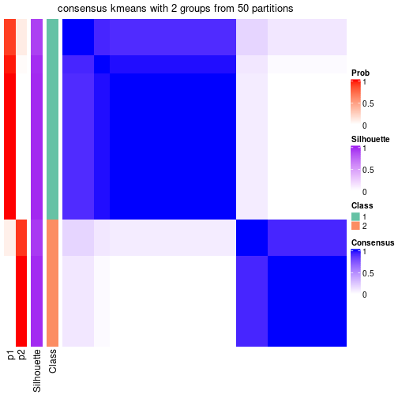</p>

</div>
<div id='tab-node-051-consensus-heatmap-2'>
<pre><code class="r">consensus_heatmap(res, k = 3)
</code></pre>

<p>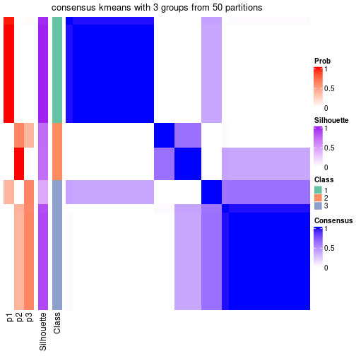</p>

</div>
<div id='tab-node-051-consensus-heatmap-3'>
<pre><code class="r">consensus_heatmap(res, k = 4)
</code></pre>

<p>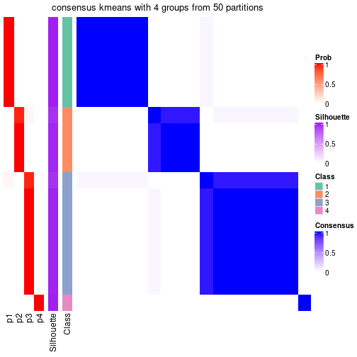</p>

</div>
<div id='tab-node-051-consensus-heatmap-4'>
<pre><code class="r">consensus_heatmap(res, k = 5)
</code></pre>

<p>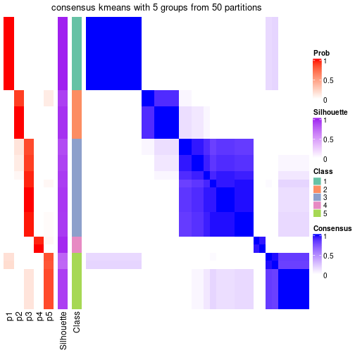</p>

</div>
<div id='tab-node-051-consensus-heatmap-5'>
<pre><code class="r">consensus_heatmap(res, k = 6)
</code></pre>

<p>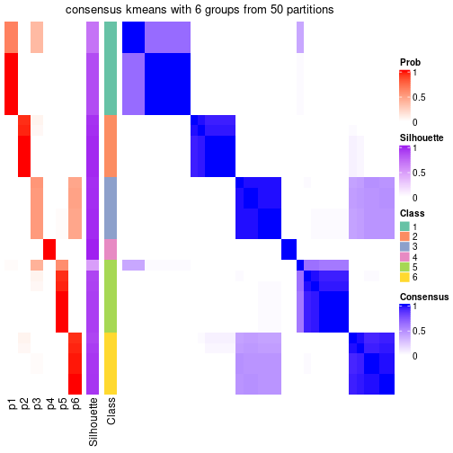</p>

</div>
<div id='tab-node-051-consensus-heatmap-6'>
<pre><code class="r">consensus_heatmap(res, k = 7)
</code></pre>

<p>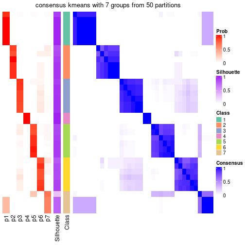</p>

</div>
<div id='tab-node-051-consensus-heatmap-7'>
<pre><code class="r">consensus_heatmap(res, k = 8)
</code></pre>

<p>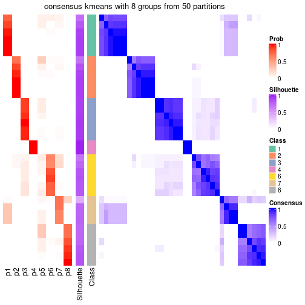</p>

</div>
</div>

Heatmaps for the membership of samples in all partitions to see how consistent they are:


<script>
$( function() {
	$( '#tabs-node-051-membership-heatmap' ).tabs();
} );
</script>
<div id='tabs-node-051-membership-heatmap'>
<ul>
<li><a href='#tab-node-051-membership-heatmap-1'>k = 2</a></li>
<li><a href='#tab-node-051-membership-heatmap-2'>k = 3</a></li>
<li><a href='#tab-node-051-membership-heatmap-3'>k = 4</a></li>
<li><a href='#tab-node-051-membership-heatmap-4'>k = 5</a></li>
<li><a href='#tab-node-051-membership-heatmap-5'>k = 6</a></li>
<li><a href='#tab-node-051-membership-heatmap-6'>k = 7</a></li>
<li><a href='#tab-node-051-membership-heatmap-7'>k = 8</a></li>
</ul>
<div id='tab-node-051-membership-heatmap-1'>
<pre><code class="r">membership_heatmap(res, k = 2)
</code></pre>

<p>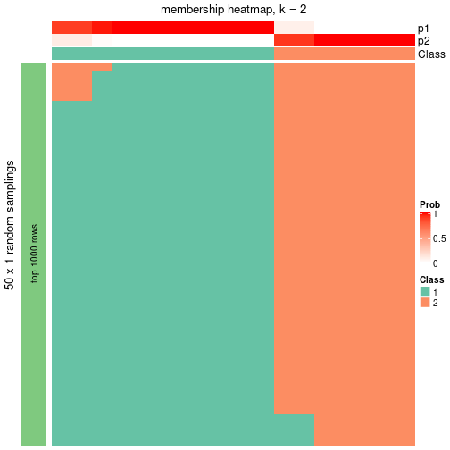</p>

</div>
<div id='tab-node-051-membership-heatmap-2'>
<pre><code class="r">membership_heatmap(res, k = 3)
</code></pre>

<p>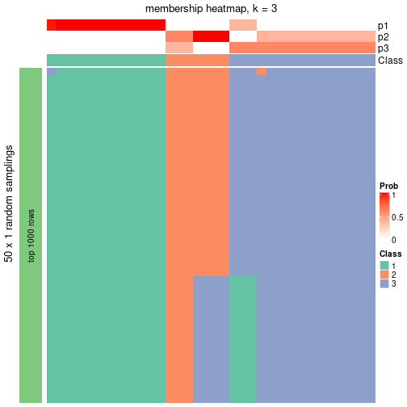</p>

</div>
<div id='tab-node-051-membership-heatmap-3'>
<pre><code class="r">membership_heatmap(res, k = 4)
</code></pre>

<p>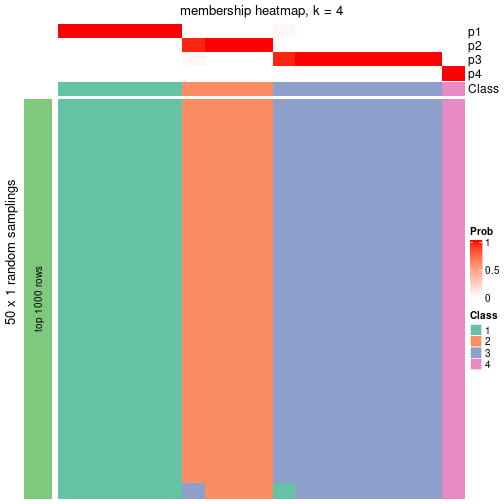</p>

</div>
<div id='tab-node-051-membership-heatmap-4'>
<pre><code class="r">membership_heatmap(res, k = 5)
</code></pre>

<p>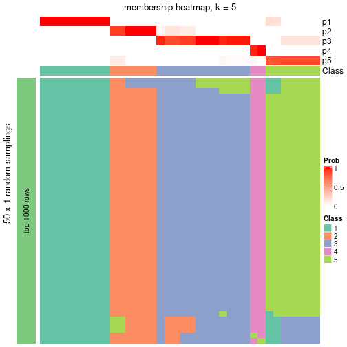</p>

</div>
<div id='tab-node-051-membership-heatmap-5'>
<pre><code class="r">membership_heatmap(res, k = 6)
</code></pre>

<p>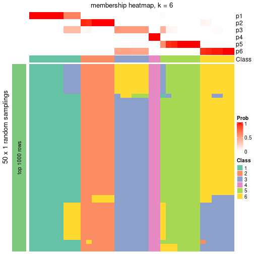</p>

</div>
<div id='tab-node-051-membership-heatmap-6'>
<pre><code class="r">membership_heatmap(res, k = 7)
</code></pre>

<p>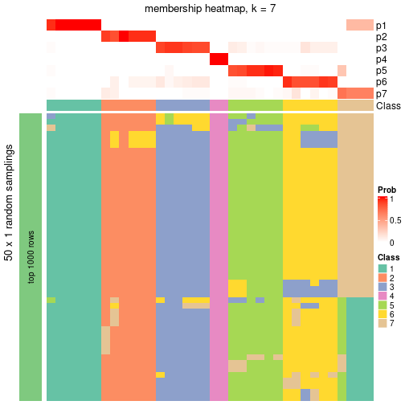</p>

</div>
<div id='tab-node-051-membership-heatmap-7'>
<pre><code class="r">membership_heatmap(res, k = 8)
</code></pre>

<p>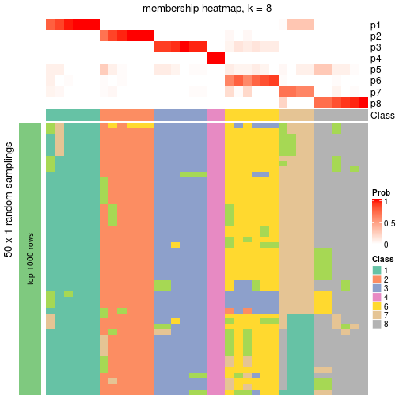</p>

</div>
</div>

As soon as the classes for columns are determined, the signatures
that are significantly different between subgroups can be looked for. 
Following are the heatmaps for signatures.


<script>
$( function() {
	$( '#tabs-node-051-get-signatures' ).tabs();
} );
</script>
<div id='tabs-node-051-get-signatures'>
<ul>
<li><a href='#tab-node-051-get-signatures-1'>k = 2</a></li>
<li><a href='#tab-node-051-get-signatures-2'>k = 3</a></li>
<li><a href='#tab-node-051-get-signatures-3'>k = 4</a></li>
<li><a href='#tab-node-051-get-signatures-4'>k = 5</a></li>
<li><a href='#tab-node-051-get-signatures-5'>k = 6</a></li>
<li><a href='#tab-node-051-get-signatures-6'>k = 7</a></li>
<li><a href='#tab-node-051-get-signatures-7'>k = 8</a></li>
</ul>
<div id='tab-node-051-get-signatures-1'>
<pre><code class="r">get_signatures(res, k = 2)
</code></pre>

<p>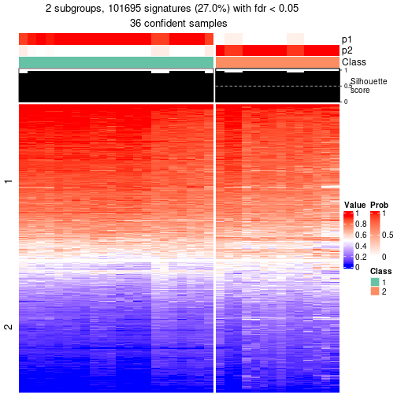</p>

</div>
<div id='tab-node-051-get-signatures-2'>
<pre><code class="r">get_signatures(res, k = 3)
</code></pre>

<p>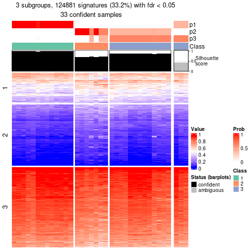</p>

</div>
<div id='tab-node-051-get-signatures-3'>
<pre><code class="r">get_signatures(res, k = 4)
</code></pre>

<p>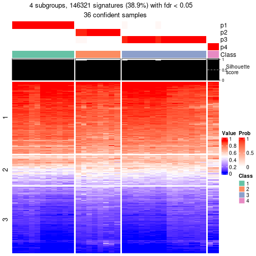</p>

</div>
<div id='tab-node-051-get-signatures-4'>
<pre><code class="r">get_signatures(res, k = 5)
</code></pre>

<p>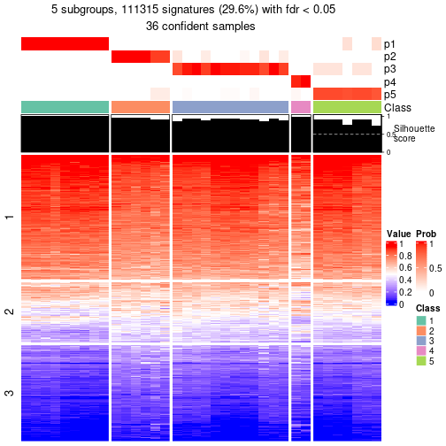</p>

</div>
<div id='tab-node-051-get-signatures-5'>
<pre><code class="r">get_signatures(res, k = 6)
</code></pre>

<p>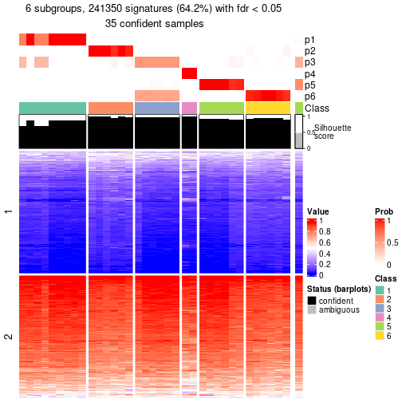</p>

</div>
<div id='tab-node-051-get-signatures-6'>
<pre><code class="r">get_signatures(res, k = 7)
</code></pre>

<p>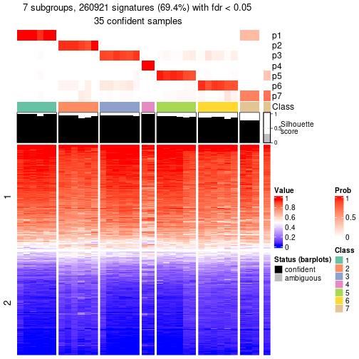</p>

</div>
<div id='tab-node-051-get-signatures-7'>
<pre><code class="r">get_signatures(res, k = 8)
</code></pre>

<p>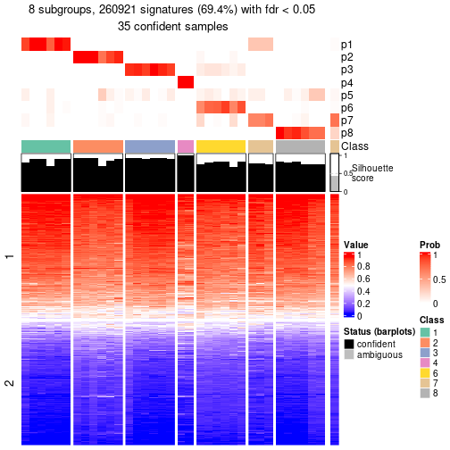</p>

</div>
</div>


Compare the overlap of signatures from different k:

```r
compare_signatures(res)
```

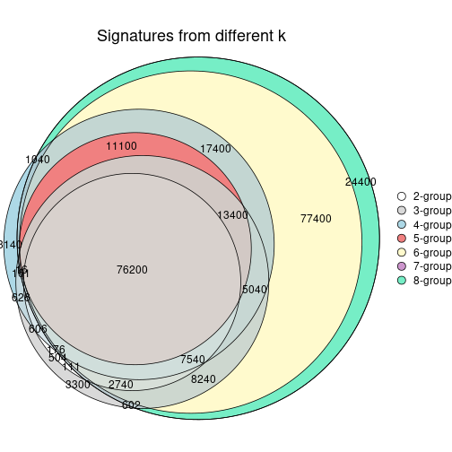

`get_signature()` returns a data frame invisibly. To get the list of signatures, the function
call should be assigned to a variable explicitly. In following code, if `plot` argument is set
to `FALSE`, no heatmap is plotted while only the differential analysis is performed.

```r
# code only for demonstration
tb = get_signature(res, k = ..., plot = FALSE)
```

An example of the output of `tb` is:

```
#>   which_row         fdr    mean_1    mean_2 scaled_mean_1 scaled_mean_2 km
#> 1        38 0.042760348  8.373488  9.131774    -0.5533452     0.5164555  1
#> 2        40 0.018707592  7.106213  8.469186    -0.6173731     0.5762149  1
#> 3        55 0.019134737 10.221463 11.207825    -0.6159697     0.5749050  1
#> 4        59 0.006059896  5.921854  7.869574    -0.6899429     0.6439467  1
#> 5        60 0.018055526  8.928898 10.211722    -0.6204761     0.5791110  1
#> 6        98 0.009384629 15.714769 14.887706     0.6635654    -0.6193277  2
...
```

The columns in `tb` are:

1. `which_row`: row indices corresponding to the input matrix.
2. `fdr`: FDR for the differential test. 
3. `mean_x`: The mean value in group x.
4. `scaled_mean_x`: The mean value in group x after rows are scaled.
5. `km`: Row groups if k-means clustering is applied to rows (which is done by automatically selecting number of clusters).

If there are too many signatures, `top_signatures = ...` can be set to only show the 
signatures with the highest FDRs:

```r
# code only for demonstration
# e.g. to show the top 500 most significant rows
tb = get_signature(res, k = ..., top_signatures = 500)
```

If the signatures are defined as these which are uniquely high in current group, `diff_method` argument
can be set to `"uniquely_high_in_one_group"`:

```r
# code only for demonstration
tb = get_signature(res, k = ..., diff_method = "uniquely_high_in_one_group")
```


UMAP plot which shows how samples are separated.


<script>
$( function() {
	$( '#tabs-node-051-dimension-reduction' ).tabs();
} );
</script>
<div id='tabs-node-051-dimension-reduction'>
<ul>
<li><a href='#tab-node-051-dimension-reduction-1'>k = 2</a></li>
<li><a href='#tab-node-051-dimension-reduction-2'>k = 3</a></li>
<li><a href='#tab-node-051-dimension-reduction-3'>k = 4</a></li>
<li><a href='#tab-node-051-dimension-reduction-4'>k = 5</a></li>
<li><a href='#tab-node-051-dimension-reduction-5'>k = 6</a></li>
<li><a href='#tab-node-051-dimension-reduction-6'>k = 7</a></li>
<li><a href='#tab-node-051-dimension-reduction-7'>k = 8</a></li>
</ul>
<div id='tab-node-051-dimension-reduction-1'>
<pre><code class="r">dimension_reduction(res, k = 2, method = &quot;UMAP&quot;)
</code></pre>

<p>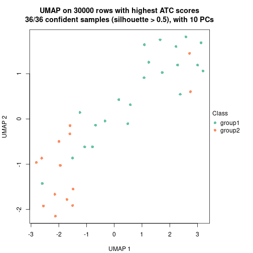</p>

</div>
<div id='tab-node-051-dimension-reduction-2'>
<pre><code class="r">dimension_reduction(res, k = 3, method = &quot;UMAP&quot;)
</code></pre>

<p>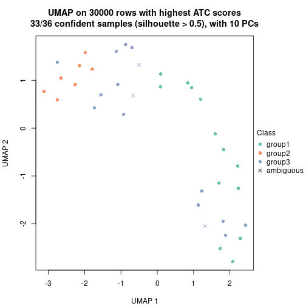</p>

</div>
<div id='tab-node-051-dimension-reduction-3'>
<pre><code class="r">dimension_reduction(res, k = 4, method = &quot;UMAP&quot;)
</code></pre>

<p>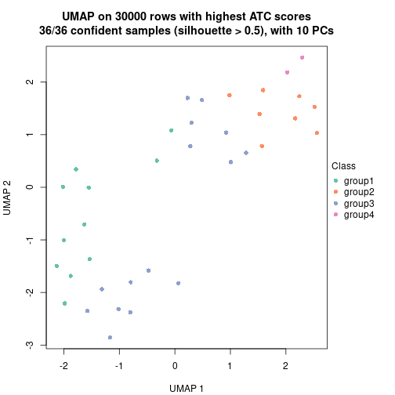</p>

</div>
<div id='tab-node-051-dimension-reduction-4'>
<pre><code class="r">dimension_reduction(res, k = 5, method = &quot;UMAP&quot;)
</code></pre>

<p>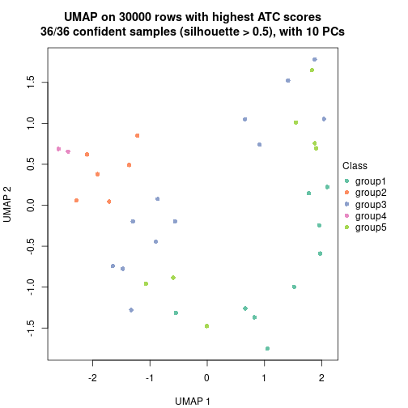</p>

</div>
<div id='tab-node-051-dimension-reduction-5'>
<pre><code class="r">dimension_reduction(res, k = 6, method = &quot;UMAP&quot;)
</code></pre>

<p>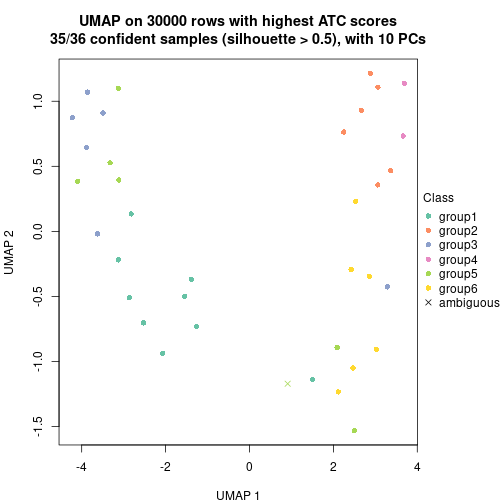</p>

</div>
<div id='tab-node-051-dimension-reduction-6'>
<pre><code class="r">dimension_reduction(res, k = 7, method = &quot;UMAP&quot;)
</code></pre>

<p>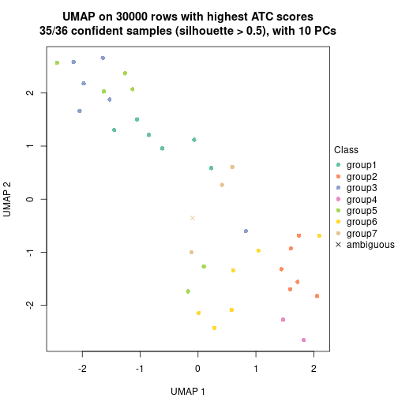</p>

</div>
<div id='tab-node-051-dimension-reduction-7'>
<pre><code class="r">dimension_reduction(res, k = 8, method = &quot;UMAP&quot;)
</code></pre>

<p>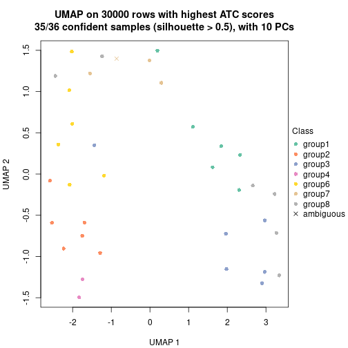</p>

</div>
</div>


Following heatmap shows how subgroups are split when increasing `k`:

```r
collect_classes(res)
```

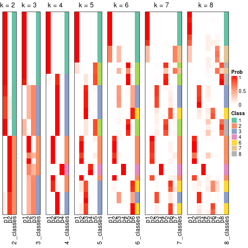


If matrix rows can be associated to genes, consider to use `functional_enrichment(res,
...)` to perform function enrichment for the signature genes. See [this vignette](https://jokergoo.github.io/cola_vignettes/functional_enrichment.html) for more detailed explanations.


 

---------------------------------------------------


### Node052


Parent node: [Node05](#Node05).
Child nodes: 
                Node0111-leaf
        ,
                Node0112-leaf
        ,
                Node0113-leaf
        ,
                Node0114-leaf
        ,
                Node0121-leaf
        ,
                Node0122-leaf
        ,
                Node0123-leaf
        ,
                Node0131-leaf
        ,
                Node0132-leaf
        ,
                Node0133-leaf
        ,
                Node0134-leaf
        ,
                Node0211-leaf
        ,
                Node0212-leaf
        ,
                [Node0213](#Node0213)
        ,
                Node0214-leaf
        ,
                [Node0221](#Node0221)
        ,
                Node0222-leaf
        ,
                Node0223-leaf
        ,
                [Node0231](#Node0231)
        ,
                Node0232-leaf
        ,
                Node0233-leaf
        ,
                [Node0234](#Node0234)
        ,
                Node0235-leaf
        ,
                Node0241-leaf
        ,
                [Node0242](#Node0242)
        ,
                Node0411-leaf
        ,
                Node0412-leaf
        ,
                Node0421-leaf
        ,
                Node0422-leaf
        ,
                Node0423-leaf
        ,
                Node0431-leaf
        ,
                Node0432-leaf
        ,
                Node0511-leaf
        ,
                Node0512-leaf
        ,
                Node0513-leaf
        ,
                Node0514-leaf
        ,
                Node0521-leaf
        ,
                Node0522-leaf
        ,
                Node0523-leaf
        ,
                Node0524-leaf
        ,
                Node0525-leaf
        ,
                Node0611-leaf
        ,
                [Node0612](#Node0612)
        ,
                Node0613-leaf
        ,
                [Node0711](#Node0711)
        ,
                Node0712-leaf
        ,
                Node0713-leaf
        ,
                [Node0721](#Node0721)
        ,
                Node0722-leaf
        ,
                Node0731-leaf
        ,
                Node0732-leaf
        ,
                Node0733-leaf
        .


The object with results only for a single top-value method and a single partitioning method 
can be extracted as:

```r
res = res_rh["052"]
```

A summary of `res` and all the functions that can be applied to it:

```r
res
```

```
#> A 'ConsensusPartition' object with k = 2, 3, 4, 5, 6, 7, 8.
#>   On a matrix with 30000 rows and 53 columns.
#>   Top rows (1000) are extracted by 'ATC' method.
#>   Subgroups are detected by 'skmeans' method.
#>   Performed in total 350 partitions by row resampling.
#>   Best k for subgroups seems to be 6.
#> 
#> Following methods can be applied to this 'ConsensusPartition' object:
#>  [1] "cola_report"             "collect_classes"         "collect_plots"          
#>  [4] "collect_stats"           "colnames"                "compare_partitions"     
#>  [7] "compare_signatures"      "consensus_heatmap"       "dimension_reduction"    
#> [10] "functional_enrichment"   "get_anno_col"            "get_anno"               
#> [13] "get_classes"             "get_consensus"           "get_matrix"             
#> [16] "get_membership"          "get_param"               "get_signatures"         
#> [19] "get_stats"               "is_best_k"               "is_stable_k"            
#> [22] "membership_heatmap"      "ncol"                    "nrow"                   
#> [25] "plot_ecdf"               "predict_classes"         "rownames"               
#> [28] "select_partition_number" "show"                    "suggest_best_k"         
#> [31] "test_to_known_factors"   "top_rows_heatmap"
```

`collect_plots()` function collects all the plots made from `res` for all `k` (number of subgroups)
into one single page to provide an easy and fast comparison between different `k`.

```r
collect_plots(res)
```

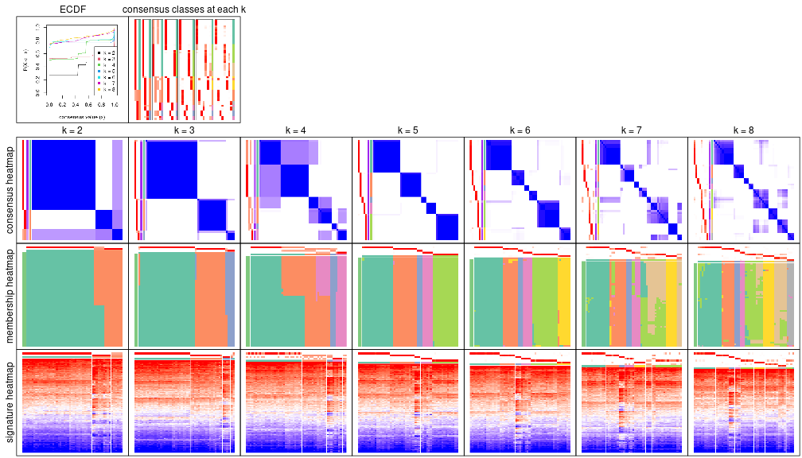

The plots are:

- The first row: a plot of the eCDF (empirical cumulative distribution
  function) curves of the consensus matrix for each `k` and the heatmap of
  predicted classes for each `k`.
- The second row: heatmaps of the consensus matrix for each `k`.
- The third row: heatmaps of the membership matrix for each `k`.
- The fouth row: heatmaps of the signatures for each `k`.

All the plots in panels can be made by individual functions and they are
plotted later in this section.

`select_partition_number()` produces several plots showing different
statistics for choosing "optimized" `k`. There are following statistics:

- eCDF curves of the consensus matrix for each `k`;
- 1-PAC. [The PAC score](https://en.wikipedia.org/wiki/Consensus_clustering#Over-interpretation_potential_of_consensus_clustering)
  measures the proportion of the ambiguous subgrouping.
- Mean silhouette score.
- Concordance. The mean probability of fiting the consensus subgroup labels in all
  partitions.
- Area increased. Denote $A_k$ as the area under the eCDF curve for current
  `k`, the area increased is defined as $A_k - A_{k-1}$.
- Rand index. The percent of pairs of samples that are both in a same cluster
  or both are not in a same cluster in the partition of k and k-1.
- Jaccard index. The ratio of pairs of samples are both in a same cluster in
  the partition of k and k-1 and the pairs of samples are both in a same
  cluster in the partition k or k-1.

The detailed explanations of these statistics can be found in [the _cola_
vignette](https://jokergoo.github.io/cola_vignettes/cola.html#toc_13).

Generally speaking, higher 1-PAC score, higher mean silhouette score or higher
concordance corresponds to better partition. Rand index and Jaccard index
measure how similar the current partition is compared to partition with `k-1`.
If they are too similar, we won't accept `k` is better than `k-1`.

```r
select_partition_number(res)
```

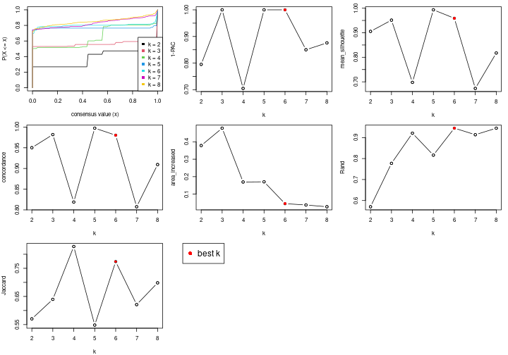

The numeric values for all these statistics can be obtained by `get_stats()`.

```r
get_stats(res)
```

```
#>   k 1-PAC mean_silhouette concordance area_increased  Rand Jaccard
#> 2 2 0.795           0.905       0.950         0.3785 0.570   0.570
#> 3 3 1.000           0.951       0.982         0.4781 0.777   0.640
#> 4 4 0.705           0.698       0.819         0.1695 0.921   0.828
#> 5 5 1.000           0.993       0.997         0.1705 0.816   0.548
#> 6 6 1.000           0.959       0.980         0.0453 0.945   0.774
#> 7 7 0.850           0.673       0.808         0.0377 0.914   0.621
#> 8 8 0.876           0.817       0.909         0.0276 0.945   0.698
```

`suggest_best_k()` suggests the best $k$ based on these statistics. The rules are as follows:

- All $k$ with Jaccard index larger than 0.95 are removed because increasing
  $k$ does not provide enough extra information. If all $k$ are removed, it is
  marked as no subgroup is detected.
- For all $k$ with 1-PAC score larger than 0.9, the maximal $k$ is taken as
  the best $k$, and other $k$ are marked as optional $k$.
- If it does not fit the second rule. The $k$ with the maximal vote of the
  highest 1-PAC score, highest mean silhouette, and highest concordance is
  taken as the best $k$.

```r
suggest_best_k(res)
```

```
#> [1] 6
#> attr(,"optional")
#> [1] 3 5
```

There is also optional best $k$ = 3 5 that is worth to check.

Following is the table of the partitions (You need to click the **show/hide
code output** link to see it). The membership matrix (columns with name `p*`)
is inferred by
[`clue::cl_consensus()`](https://www.rdocumentation.org/link/cl_consensus?package=clue)
function with the `SE` method. Basically the value in the membership matrix
represents the probability to belong to a certain group. The finall subgroup
label for an item is determined with the group with highest probability it
belongs to.

In `get_classes()` function, the entropy is calculated from the membership
matrix and the silhouette score is calculated from the consensus matrix.


<script>
$( function() {
	$( '#tabs-node-052-get-classes' ).tabs();
} );
</script>
<div id='tabs-node-052-get-classes'>
<ul>
<li><a href='#tab-node-052-get-classes-1'>k = 2</a></li>
<li><a href='#tab-node-052-get-classes-2'>k = 3</a></li>
<li><a href='#tab-node-052-get-classes-3'>k = 4</a></li>
<li><a href='#tab-node-052-get-classes-4'>k = 5</a></li>
<li><a href='#tab-node-052-get-classes-5'>k = 6</a></li>
<li><a href='#tab-node-052-get-classes-6'>k = 7</a></li>
<li><a href='#tab-node-052-get-classes-7'>k = 8</a></li>
</ul>

<div id='tab-node-052-get-classes-1'>
<p><a id='tab-node-052-get-classes-1-a' style='color:#0366d6' href='#'>show/hide code output</a></p>
<pre><code class="r">cbind(get_classes(res, k = 2), get_membership(res, k = 2))
</code></pre>

<pre><code>#&gt;                 class entropy silhouette   p1   p2
#&gt; TCGA.43.3920.11     2    0.00      0.813 0.00 1.00
#&gt; TCGA.22.5473.11     1    0.00      1.000 1.00 0.00
#&gt; TCGA.22.5482.11     1    0.00      1.000 1.00 0.00
#&gt; TCGA.22.5489.11     1    0.00      1.000 1.00 0.00
#&gt; TCGA.44.2662.11     1    0.00      1.000 1.00 0.00
#&gt; TCGA.50.5930.11     2    0.00      0.813 0.00 1.00
#&gt; TCGA.22.5474.11     2    0.00      0.813 0.00 1.00
#&gt; TCGA.33.4583.11     1    0.00      1.000 1.00 0.00
#&gt; TCGA.22.5491.11     1    0.00      1.000 1.00 0.00
#&gt; TCGA.44.6146.11     1    0.00      1.000 1.00 0.00
#&gt; TCGA.43.6771.11     2    0.99      0.476 0.44 0.56
#&gt; TCGA.39.5021.11     1    0.00      1.000 1.00 0.00
#&gt; TCGA.39.5019.11     2    0.99      0.476 0.44 0.56
#&gt; TCGA.56.8623.01     2    0.99      0.476 0.44 0.56
#&gt; TCGA.44.2656.11     1    0.00      1.000 1.00 0.00
#&gt; TCGA.44.6778.11     1    0.00      1.000 1.00 0.00
#&gt; TCGA.33.4586.11     1    0.00      1.000 1.00 0.00
#&gt; TCGA.39.5039.11     1    0.00      1.000 1.00 0.00
#&gt; TCGA.38.4632.11     2    0.99      0.476 0.44 0.56
#&gt; TCGA.33.4582.11     1    0.00      1.000 1.00 0.00
#&gt; TCGA.50.5939.11     1    0.00      1.000 1.00 0.00
#&gt; TCGA.18.4721.11     1    0.00      1.000 1.00 0.00
#&gt; TCGA.22.5477.11     1    0.00      1.000 1.00 0.00
#&gt; TCGA.18.5595.11     2    0.00      0.813 0.00 1.00
#&gt; TCGA.22.5478.11     1    0.00      1.000 1.00 0.00
#&gt; TCGA.49.6745.11     1    0.00      1.000 1.00 0.00
#&gt; TCGA.49.AARR.01     2    0.99      0.476 0.44 0.56
#&gt; TCGA.18.5592.11     1    0.00      1.000 1.00 0.00
#&gt; TCGA.85.A4PA.01     2    0.00      0.813 0.00 1.00
#&gt; TCGA.73.4676.11     1    0.00      1.000 1.00 0.00
#&gt; TCGA.60.2697.01     2    0.00      0.813 0.00 1.00
#&gt; TCGA.43.5668.11     1    0.00      1.000 1.00 0.00
#&gt; TCGA.L4.A4E6.01     2    0.00      0.813 0.00 1.00
#&gt; TCGA.43.3394.11     1    0.00      1.000 1.00 0.00
#&gt; TCGA.39.5016.11     1    0.00      1.000 1.00 0.00
#&gt; TCGA.90.6837.01     1    0.00      1.000 1.00 0.00
#&gt; TCGA.44.6148.11     1    0.00      1.000 1.00 0.00
#&gt; TCGA.50.5933.11     1    0.00      1.000 1.00 0.00
#&gt; TCGA.98.A53D.01     2    0.00      0.813 0.00 1.00
#&gt; TCGA.44.2668.11     2    0.00      0.813 0.00 1.00
#&gt; TCGA.39.5036.11     1    0.00      1.000 1.00 0.00
#&gt; TCGA.50.5936.11     1    0.00      1.000 1.00 0.00
#&gt; TCGA.22.5471.11     1    0.00      1.000 1.00 0.00
#&gt; TCGA.50.5932.11     1    0.00      1.000 1.00 0.00
#&gt; TCGA.77.A5FZ.01     2    0.00      0.813 0.00 1.00
#&gt; TCGA.18.3417.11     1    0.00      1.000 1.00 0.00
#&gt; TCGA.44.6144.11     1    0.00      1.000 1.00 0.00
#&gt; TCGA.39.5029.11     1    0.00      1.000 1.00 0.00
#&gt; TCGA.22.5472.11     1    0.00      1.000 1.00 0.00
#&gt; TCGA.44.5643.11     1    0.00      1.000 1.00 0.00
#&gt; TCGA.05.5420.11     1    0.00      1.000 1.00 0.00
#&gt; TCGA.33.4566.11     1    0.00      1.000 1.00 0.00
#&gt; TCGA.39.5037.11     2    0.99      0.476 0.44 0.56
</code></pre>

<script>
$('#tab-node-052-get-classes-1-a').parent().next().next().hide();
$('#tab-node-052-get-classes-1-a').click(function(){
  $('#tab-node-052-get-classes-1-a').parent().next().next().toggle();
  return(false);
});
</script>
</div>

<div id='tab-node-052-get-classes-2'>
<p><a id='tab-node-052-get-classes-2-a' style='color:#0366d6' href='#'>show/hide code output</a></p>
<pre><code class="r">cbind(get_classes(res, k = 3), get_membership(res, k = 3))
</code></pre>

<pre><code>#&gt;                 class entropy silhouette   p1   p2   p3
#&gt; TCGA.43.3920.11     3   0.583      0.463 0.00 0.34 0.66
#&gt; TCGA.22.5473.11     1   0.000      0.987 1.00 0.00 0.00
#&gt; TCGA.22.5482.11     1   0.000      0.987 1.00 0.00 0.00
#&gt; TCGA.22.5489.11     1   0.000      0.987 1.00 0.00 0.00
#&gt; TCGA.44.2662.11     1   0.000      0.987 1.00 0.00 0.00
#&gt; TCGA.50.5930.11     2   0.000      0.980 0.00 1.00 0.00
#&gt; TCGA.22.5474.11     2   0.540      0.552 0.00 0.72 0.28
#&gt; TCGA.33.4583.11     1   0.000      0.987 1.00 0.00 0.00
#&gt; TCGA.22.5491.11     1   0.000      0.987 1.00 0.00 0.00
#&gt; TCGA.44.6146.11     1   0.000      0.987 1.00 0.00 0.00
#&gt; TCGA.43.6771.11     2   0.000      0.980 0.00 1.00 0.00
#&gt; TCGA.39.5021.11     1   0.000      0.987 1.00 0.00 0.00
#&gt; TCGA.39.5019.11     2   0.000      0.980 0.00 1.00 0.00
#&gt; TCGA.56.8623.01     2   0.000      0.980 0.00 1.00 0.00
#&gt; TCGA.44.2656.11     2   0.000      0.980 0.00 1.00 0.00
#&gt; TCGA.44.6778.11     2   0.000      0.980 0.00 1.00 0.00
#&gt; TCGA.33.4586.11     1   0.000      0.987 1.00 0.00 0.00
#&gt; TCGA.39.5039.11     1   0.000      0.987 1.00 0.00 0.00
#&gt; TCGA.38.4632.11     2   0.000      0.980 0.00 1.00 0.00
#&gt; TCGA.33.4582.11     1   0.000      0.987 1.00 0.00 0.00
#&gt; TCGA.50.5939.11     1   0.000      0.987 1.00 0.00 0.00
#&gt; TCGA.18.4721.11     1   0.000      0.987 1.00 0.00 0.00
#&gt; TCGA.22.5477.11     1   0.583      0.475 0.66 0.34 0.00
#&gt; TCGA.18.5595.11     2   0.000      0.980 0.00 1.00 0.00
#&gt; TCGA.22.5478.11     1   0.000      0.987 1.00 0.00 0.00
#&gt; TCGA.49.6745.11     1   0.000      0.987 1.00 0.00 0.00
#&gt; TCGA.49.AARR.01     2   0.000      0.980 0.00 1.00 0.00
#&gt; TCGA.18.5592.11     1   0.000      0.987 1.00 0.00 0.00
#&gt; TCGA.85.A4PA.01     3   0.000      0.910 0.00 0.00 1.00
#&gt; TCGA.73.4676.11     2   0.000      0.980 0.00 1.00 0.00
#&gt; TCGA.60.2697.01     3   0.000      0.910 0.00 0.00 1.00
#&gt; TCGA.43.5668.11     1   0.000      0.987 1.00 0.00 0.00
#&gt; TCGA.L4.A4E6.01     2   0.000      0.980 0.00 1.00 0.00
#&gt; TCGA.43.3394.11     1   0.000      0.987 1.00 0.00 0.00
#&gt; TCGA.39.5016.11     2   0.000      0.980 0.00 1.00 0.00
#&gt; TCGA.90.6837.01     1   0.000      0.987 1.00 0.00 0.00
#&gt; TCGA.44.6148.11     1   0.000      0.987 1.00 0.00 0.00
#&gt; TCGA.50.5933.11     1   0.000      0.987 1.00 0.00 0.00
#&gt; TCGA.98.A53D.01     3   0.000      0.910 0.00 0.00 1.00
#&gt; TCGA.44.2668.11     2   0.000      0.980 0.00 1.00 0.00
#&gt; TCGA.39.5036.11     1   0.000      0.987 1.00 0.00 0.00
#&gt; TCGA.50.5936.11     1   0.000      0.987 1.00 0.00 0.00
#&gt; TCGA.22.5471.11     1   0.000      0.987 1.00 0.00 0.00
#&gt; TCGA.50.5932.11     1   0.000      0.987 1.00 0.00 0.00
#&gt; TCGA.77.A5FZ.01     3   0.000      0.910 0.00 0.00 1.00
#&gt; TCGA.18.3417.11     2   0.000      0.980 0.00 1.00 0.00
#&gt; TCGA.44.6144.11     1   0.000      0.987 1.00 0.00 0.00
#&gt; TCGA.39.5029.11     1   0.000      0.987 1.00 0.00 0.00
#&gt; TCGA.22.5472.11     1   0.000      0.987 1.00 0.00 0.00
#&gt; TCGA.44.5643.11     1   0.000      0.987 1.00 0.00 0.00
#&gt; TCGA.05.5420.11     1   0.000      0.987 1.00 0.00 0.00
#&gt; TCGA.33.4566.11     2   0.000      0.980 0.00 1.00 0.00
#&gt; TCGA.39.5037.11     2   0.000      0.980 0.00 1.00 0.00
</code></pre>

<script>
$('#tab-node-052-get-classes-2-a').parent().next().next().hide();
$('#tab-node-052-get-classes-2-a').click(function(){
  $('#tab-node-052-get-classes-2-a').parent().next().next().toggle();
  return(false);
});
</script>
</div>

<div id='tab-node-052-get-classes-3'>
<p><a id='tab-node-052-get-classes-3-a' style='color:#0366d6' href='#'>show/hide code output</a></p>
<pre><code class="r">cbind(get_classes(res, k = 4), get_membership(res, k = 4))
</code></pre>

<pre><code>#&gt;                 class entropy silhouette   p1   p2   p3   p4
#&gt; TCGA.43.3920.11     4   0.000     0.8903 0.00 0.00 0.00 1.00
#&gt; TCGA.22.5473.11     1   0.495     0.6589 0.56 0.00 0.44 0.00
#&gt; TCGA.22.5482.11     1   0.000     0.7639 1.00 0.00 0.00 0.00
#&gt; TCGA.22.5489.11     1   0.000     0.7639 1.00 0.00 0.00 0.00
#&gt; TCGA.44.2662.11     1   0.495     0.6589 0.56 0.00 0.44 0.00
#&gt; TCGA.50.5930.11     4   0.000     0.8903 0.00 0.00 0.00 1.00
#&gt; TCGA.22.5474.11     4   0.000     0.8903 0.00 0.00 0.00 1.00
#&gt; TCGA.33.4583.11     1   0.000     0.7639 1.00 0.00 0.00 0.00
#&gt; TCGA.22.5491.11     1   0.000     0.7639 1.00 0.00 0.00 0.00
#&gt; TCGA.44.6146.11     1   0.495     0.6589 0.56 0.00 0.44 0.00
#&gt; TCGA.43.6771.11     2   0.495     0.5490 0.00 0.56 0.00 0.44
#&gt; TCGA.39.5021.11     1   0.000     0.7639 1.00 0.00 0.00 0.00
#&gt; TCGA.39.5019.11     2   0.495     0.5490 0.00 0.56 0.00 0.44
#&gt; TCGA.56.8623.01     2   0.495     0.5490 0.00 0.56 0.00 0.44
#&gt; TCGA.44.2656.11     2   0.495     0.5964 0.00 0.56 0.44 0.00
#&gt; TCGA.44.6778.11     2   0.495     0.5964 0.00 0.56 0.44 0.00
#&gt; TCGA.33.4586.11     1   0.000     0.7639 1.00 0.00 0.00 0.00
#&gt; TCGA.39.5039.11     1   0.495     0.6589 0.56 0.00 0.44 0.00
#&gt; TCGA.38.4632.11     2   0.495     0.5490 0.00 0.56 0.00 0.44
#&gt; TCGA.33.4582.11     1   0.000     0.7639 1.00 0.00 0.00 0.00
#&gt; TCGA.50.5939.11     1   0.000     0.7639 1.00 0.00 0.00 0.00
#&gt; TCGA.18.4721.11     1   0.479     0.6772 0.62 0.00 0.38 0.00
#&gt; TCGA.22.5477.11     2   0.495     0.5964 0.00 0.56 0.44 0.00
#&gt; TCGA.18.5595.11     4   0.000     0.8903 0.00 0.00 0.00 1.00
#&gt; TCGA.22.5478.11     1   0.495     0.6589 0.56 0.00 0.44 0.00
#&gt; TCGA.49.6745.11     1   0.000     0.7639 1.00 0.00 0.00 0.00
#&gt; TCGA.49.AARR.01     2   0.495     0.5490 0.00 0.56 0.00 0.44
#&gt; TCGA.18.5592.11     1   0.000     0.7639 1.00 0.00 0.00 0.00
#&gt; TCGA.85.A4PA.01     3   0.495     1.0000 0.00 0.44 0.56 0.00
#&gt; TCGA.73.4676.11     2   0.495     0.5964 0.00 0.56 0.44 0.00
#&gt; TCGA.60.2697.01     3   0.495     1.0000 0.00 0.44 0.56 0.00
#&gt; TCGA.43.5668.11     1   0.495     0.6589 0.56 0.00 0.44 0.00
#&gt; TCGA.L4.A4E6.01     4   0.000     0.8903 0.00 0.00 0.00 1.00
#&gt; TCGA.43.3394.11     1   0.000     0.7639 1.00 0.00 0.00 0.00
#&gt; TCGA.39.5016.11     2   0.591     0.5581 0.00 0.56 0.04 0.40
#&gt; TCGA.90.6837.01     1   0.000     0.7639 1.00 0.00 0.00 0.00
#&gt; TCGA.44.6148.11     1   0.000     0.7639 1.00 0.00 0.00 0.00
#&gt; TCGA.50.5933.11     1   0.495     0.6589 0.56 0.00 0.44 0.00
#&gt; TCGA.98.A53D.01     4   0.485     0.0865 0.00 0.40 0.00 0.60
#&gt; TCGA.44.2668.11     2   0.500     0.4412 0.00 0.50 0.00 0.50
#&gt; TCGA.39.5036.11     1   0.495     0.6589 0.56 0.00 0.44 0.00
#&gt; TCGA.50.5936.11     1   0.495     0.6589 0.56 0.00 0.44 0.00
#&gt; TCGA.22.5471.11     1   0.000     0.7639 1.00 0.00 0.00 0.00
#&gt; TCGA.50.5932.11     1   0.000     0.7639 1.00 0.00 0.00 0.00
#&gt; TCGA.77.A5FZ.01     3   0.495     1.0000 0.00 0.44 0.56 0.00
#&gt; TCGA.18.3417.11     2   0.495     0.5964 0.00 0.56 0.44 0.00
#&gt; TCGA.44.6144.11     1   0.495     0.6589 0.56 0.00 0.44 0.00
#&gt; TCGA.39.5029.11     1   0.000     0.7639 1.00 0.00 0.00 0.00
#&gt; TCGA.22.5472.11     1   0.000     0.7639 1.00 0.00 0.00 0.00
#&gt; TCGA.44.5643.11     1   0.495     0.6589 0.56 0.00 0.44 0.00
#&gt; TCGA.05.5420.11     1   0.495     0.6589 0.56 0.00 0.44 0.00
#&gt; TCGA.33.4566.11     2   0.495     0.5964 0.00 0.56 0.44 0.00
#&gt; TCGA.39.5037.11     2   0.495     0.5490 0.00 0.56 0.00 0.44
</code></pre>

<script>
$('#tab-node-052-get-classes-3-a').parent().next().next().hide();
$('#tab-node-052-get-classes-3-a').click(function(){
  $('#tab-node-052-get-classes-3-a').parent().next().next().toggle();
  return(false);
});
</script>
</div>

<div id='tab-node-052-get-classes-4'>
<p><a id='tab-node-052-get-classes-4-a' style='color:#0366d6' href='#'>show/hide code output</a></p>
<pre><code class="r">cbind(get_classes(res, k = 5), get_membership(res, k = 5))
</code></pre>

<pre><code>#&gt;                 class entropy silhouette   p1   p2 p3   p4   p5
#&gt; TCGA.43.3920.11     4   0.000      1.000 0.00 0.00  0 1.00 0.00
#&gt; TCGA.22.5473.11     1   0.000      0.997 1.00 0.00  0 0.00 0.00
#&gt; TCGA.22.5482.11     5   0.000      0.994 0.00 0.00  0 0.00 1.00
#&gt; TCGA.22.5489.11     5   0.000      0.994 0.00 0.00  0 0.00 1.00
#&gt; TCGA.44.2662.11     1   0.000      0.997 1.00 0.00  0 0.00 0.00
#&gt; TCGA.50.5930.11     4   0.000      1.000 0.00 0.00  0 1.00 0.00
#&gt; TCGA.22.5474.11     4   0.000      1.000 0.00 0.00  0 1.00 0.00
#&gt; TCGA.33.4583.11     5   0.141      0.915 0.06 0.00  0 0.00 0.94
#&gt; TCGA.22.5491.11     5   0.000      0.994 0.00 0.00  0 0.00 1.00
#&gt; TCGA.44.6146.11     1   0.000      0.997 1.00 0.00  0 0.00 0.00
#&gt; TCGA.43.6771.11     2   0.000      0.996 0.00 1.00  0 0.00 0.00
#&gt; TCGA.39.5021.11     1   0.104      0.949 0.96 0.00  0 0.00 0.04
#&gt; TCGA.39.5019.11     2   0.000      0.996 0.00 1.00  0 0.00 0.00
#&gt; TCGA.56.8623.01     2   0.000      0.996 0.00 1.00  0 0.00 0.00
#&gt; TCGA.44.2656.11     2   0.000      0.996 0.00 1.00  0 0.00 0.00
#&gt; TCGA.44.6778.11     2   0.000      0.996 0.00 1.00  0 0.00 0.00
#&gt; TCGA.33.4586.11     1   0.000      0.997 1.00 0.00  0 0.00 0.00
#&gt; TCGA.39.5039.11     1   0.000      0.997 1.00 0.00  0 0.00 0.00
#&gt; TCGA.38.4632.11     2   0.000      0.996 0.00 1.00  0 0.00 0.00
#&gt; TCGA.33.4582.11     5   0.000      0.994 0.00 0.00  0 0.00 1.00
#&gt; TCGA.50.5939.11     5   0.000      0.994 0.00 0.00  0 0.00 1.00
#&gt; TCGA.18.4721.11     1   0.000      0.997 1.00 0.00  0 0.00 0.00
#&gt; TCGA.22.5477.11     1   0.000      0.997 1.00 0.00  0 0.00 0.00
#&gt; TCGA.18.5595.11     4   0.000      1.000 0.00 0.00  0 1.00 0.00
#&gt; TCGA.22.5478.11     1   0.000      0.997 1.00 0.00  0 0.00 0.00
#&gt; TCGA.49.6745.11     5   0.000      0.994 0.00 0.00  0 0.00 1.00
#&gt; TCGA.49.AARR.01     2   0.000      0.996 0.00 1.00  0 0.00 0.00
#&gt; TCGA.18.5592.11     5   0.000      0.994 0.00 0.00  0 0.00 1.00
#&gt; TCGA.85.A4PA.01     3   0.000      1.000 0.00 0.00  1 0.00 0.00
#&gt; TCGA.73.4676.11     2   0.000      0.996 0.00 1.00  0 0.00 0.00
#&gt; TCGA.60.2697.01     3   0.000      1.000 0.00 0.00  1 0.00 0.00
#&gt; TCGA.43.5668.11     1   0.000      0.997 1.00 0.00  0 0.00 0.00
#&gt; TCGA.L4.A4E6.01     4   0.000      1.000 0.00 0.00  0 1.00 0.00
#&gt; TCGA.43.3394.11     5   0.000      0.994 0.00 0.00  0 0.00 1.00
#&gt; TCGA.39.5016.11     2   0.000      0.996 0.00 1.00  0 0.00 0.00
#&gt; TCGA.90.6837.01     5   0.000      0.994 0.00 0.00  0 0.00 1.00
#&gt; TCGA.44.6148.11     5   0.000      0.994 0.00 0.00  0 0.00 1.00
#&gt; TCGA.50.5933.11     1   0.000      0.997 1.00 0.00  0 0.00 0.00
#&gt; TCGA.98.A53D.01     4   0.000      1.000 0.00 0.00  0 1.00 0.00
#&gt; TCGA.44.2668.11     2   0.104      0.955 0.00 0.96  0 0.04 0.00
#&gt; TCGA.39.5036.11     1   0.000      0.997 1.00 0.00  0 0.00 0.00
#&gt; TCGA.50.5936.11     1   0.000      0.997 1.00 0.00  0 0.00 0.00
#&gt; TCGA.22.5471.11     5   0.000      0.994 0.00 0.00  0 0.00 1.00
#&gt; TCGA.50.5932.11     1   0.000      0.997 1.00 0.00  0 0.00 0.00
#&gt; TCGA.77.A5FZ.01     3   0.000      1.000 0.00 0.00  1 0.00 0.00
#&gt; TCGA.18.3417.11     2   0.000      0.996 0.00 1.00  0 0.00 0.00
#&gt; TCGA.44.6144.11     1   0.000      0.997 1.00 0.00  0 0.00 0.00
#&gt; TCGA.39.5029.11     5   0.000      0.994 0.00 0.00  0 0.00 1.00
#&gt; TCGA.22.5472.11     5   0.000      0.994 0.00 0.00  0 0.00 1.00
#&gt; TCGA.44.5643.11     1   0.000      0.997 1.00 0.00  0 0.00 0.00
#&gt; TCGA.05.5420.11     1   0.000      0.997 1.00 0.00  0 0.00 0.00
#&gt; TCGA.33.4566.11     2   0.000      0.996 0.00 1.00  0 0.00 0.00
#&gt; TCGA.39.5037.11     2   0.000      0.996 0.00 1.00  0 0.00 0.00
</code></pre>

<script>
$('#tab-node-052-get-classes-4-a').parent().next().next().hide();
$('#tab-node-052-get-classes-4-a').click(function(){
  $('#tab-node-052-get-classes-4-a').parent().next().next().toggle();
  return(false);
});
</script>
</div>

<div id='tab-node-052-get-classes-5'>
<p><a id='tab-node-052-get-classes-5-a' style='color:#0366d6' href='#'>show/hide code output</a></p>
<pre><code class="r">cbind(get_classes(res, k = 6), get_membership(res, k = 6))
</code></pre>

<pre><code>#&gt;                 class entropy silhouette   p1   p2 p3   p4   p5   p6
#&gt; TCGA.43.3920.11     4  0.0000      0.990 0.00 0.00  0 1.00 0.00 0.00
#&gt; TCGA.22.5473.11     1  0.0000      0.994 1.00 0.00  0 0.00 0.00 0.00
#&gt; TCGA.22.5482.11     5  0.0000      0.968 0.00 0.00  0 0.00 1.00 0.00
#&gt; TCGA.22.5489.11     5  0.0000      0.968 0.00 0.00  0 0.00 1.00 0.00
#&gt; TCGA.44.2662.11     1  0.0000      0.994 1.00 0.00  0 0.00 0.00 0.00
#&gt; TCGA.50.5930.11     2  0.0937      0.938 0.00 0.96  0 0.04 0.00 0.00
#&gt; TCGA.22.5474.11     4  0.0000      0.990 0.00 0.00  0 1.00 0.00 0.00
#&gt; TCGA.33.4583.11     5  0.3076      0.632 0.24 0.00  0 0.00 0.76 0.00
#&gt; TCGA.22.5491.11     5  0.0000      0.968 0.00 0.00  0 0.00 1.00 0.00
#&gt; TCGA.44.6146.11     1  0.0000      0.994 1.00 0.00  0 0.00 0.00 0.00
#&gt; TCGA.43.6771.11     2  0.0000      0.971 0.00 1.00  0 0.00 0.00 0.00
#&gt; TCGA.39.5021.11     1  0.0937      0.955 0.96 0.00  0 0.00 0.04 0.00
#&gt; TCGA.39.5019.11     2  0.0547      0.977 0.00 0.98  0 0.00 0.00 0.02
#&gt; TCGA.56.8623.01     2  0.0937      0.968 0.00 0.96  0 0.00 0.00 0.04
#&gt; TCGA.44.2656.11     6  0.0547      0.929 0.00 0.02  0 0.00 0.00 0.98
#&gt; TCGA.44.6778.11     6  0.0547      0.929 0.00 0.02  0 0.00 0.00 0.98
#&gt; TCGA.33.4586.11     1  0.0547      0.977 0.98 0.00  0 0.00 0.02 0.00
#&gt; TCGA.39.5039.11     1  0.0000      0.994 1.00 0.00  0 0.00 0.00 0.00
#&gt; TCGA.38.4632.11     2  0.0547      0.977 0.00 0.98  0 0.00 0.00 0.02
#&gt; TCGA.33.4582.11     5  0.0000      0.968 0.00 0.00  0 0.00 1.00 0.00
#&gt; TCGA.50.5939.11     5  0.0000      0.968 0.00 0.00  0 0.00 1.00 0.00
#&gt; TCGA.18.4721.11     1  0.0000      0.994 1.00 0.00  0 0.00 0.00 0.00
#&gt; TCGA.22.5477.11     6  0.0937      0.891 0.04 0.00  0 0.00 0.00 0.96
#&gt; TCGA.18.5595.11     4  0.0547      0.985 0.00 0.02  0 0.98 0.00 0.00
#&gt; TCGA.22.5478.11     1  0.0000      0.994 1.00 0.00  0 0.00 0.00 0.00
#&gt; TCGA.49.6745.11     5  0.0547      0.950 0.02 0.00  0 0.00 0.98 0.00
#&gt; TCGA.49.AARR.01     2  0.0547      0.977 0.00 0.98  0 0.00 0.00 0.02
#&gt; TCGA.18.5592.11     5  0.0547      0.958 0.00 0.00  0 0.00 0.98 0.02
#&gt; TCGA.85.A4PA.01     3  0.0000      1.000 0.00 0.00  1 0.00 0.00 0.00
#&gt; TCGA.73.4676.11     6  0.0547      0.915 0.02 0.00  0 0.00 0.00 0.98
#&gt; TCGA.60.2697.01     3  0.0000      1.000 0.00 0.00  1 0.00 0.00 0.00
#&gt; TCGA.43.5668.11     1  0.0000      0.994 1.00 0.00  0 0.00 0.00 0.00
#&gt; TCGA.L4.A4E6.01     4  0.0547      0.985 0.00 0.02  0 0.98 0.00 0.00
#&gt; TCGA.43.3394.11     5  0.0547      0.958 0.00 0.00  0 0.00 0.98 0.02
#&gt; TCGA.39.5016.11     6  0.3309      0.618 0.00 0.28  0 0.00 0.00 0.72
#&gt; TCGA.90.6837.01     5  0.0547      0.958 0.00 0.00  0 0.00 0.98 0.02
#&gt; TCGA.44.6148.11     5  0.0000      0.968 0.00 0.00  0 0.00 1.00 0.00
#&gt; TCGA.50.5933.11     1  0.0000      0.994 1.00 0.00  0 0.00 0.00 0.00
#&gt; TCGA.98.A53D.01     4  0.0000      0.990 0.00 0.00  0 1.00 0.00 0.00
#&gt; TCGA.44.2668.11     2  0.0000      0.971 0.00 1.00  0 0.00 0.00 0.00
#&gt; TCGA.39.5036.11     1  0.0000      0.994 1.00 0.00  0 0.00 0.00 0.00
#&gt; TCGA.50.5936.11     1  0.0000      0.994 1.00 0.00  0 0.00 0.00 0.00
#&gt; TCGA.22.5471.11     5  0.0000      0.968 0.00 0.00  0 0.00 1.00 0.00
#&gt; TCGA.50.5932.11     1  0.0547      0.977 0.98 0.00  0 0.00 0.02 0.00
#&gt; TCGA.77.A5FZ.01     3  0.0000      1.000 0.00 0.00  1 0.00 0.00 0.00
#&gt; TCGA.18.3417.11     6  0.0547      0.929 0.00 0.02  0 0.00 0.00 0.98
#&gt; TCGA.44.6144.11     1  0.0000      0.994 1.00 0.00  0 0.00 0.00 0.00
#&gt; TCGA.39.5029.11     5  0.0000      0.968 0.00 0.00  0 0.00 1.00 0.00
#&gt; TCGA.22.5472.11     5  0.0000      0.968 0.00 0.00  0 0.00 1.00 0.00
#&gt; TCGA.44.5643.11     1  0.0000      0.994 1.00 0.00  0 0.00 0.00 0.00
#&gt; TCGA.05.5420.11     1  0.0000      0.994 1.00 0.00  0 0.00 0.00 0.00
#&gt; TCGA.33.4566.11     6  0.0547      0.929 0.00 0.02  0 0.00 0.00 0.98
#&gt; TCGA.39.5037.11     2  0.0937      0.968 0.00 0.96  0 0.00 0.00 0.04
</code></pre>

<script>
$('#tab-node-052-get-classes-5-a').parent().next().next().hide();
$('#tab-node-052-get-classes-5-a').click(function(){
  $('#tab-node-052-get-classes-5-a').parent().next().next().toggle();
  return(false);
});
</script>
</div>

<div id='tab-node-052-get-classes-6'>
<p><a id='tab-node-052-get-classes-6-a' style='color:#0366d6' href='#'>show/hide code output</a></p>
<pre><code class="r">cbind(get_classes(res, k = 7), get_membership(res, k = 7))
</code></pre>

<pre><code>#&gt;                 class entropy silhouette   p1   p2 p3   p4   p5  p6   p7
#&gt; TCGA.43.3920.11     4  0.3459     0.7931 0.00 0.00  0 0.60 0.00 0.0 0.40
#&gt; TCGA.22.5473.11     1  0.0000     0.9770 1.00 0.00  0 0.00 0.00 0.0 0.00
#&gt; TCGA.22.5482.11     5  0.0863     0.4038 0.00 0.00  0 0.00 0.96 0.0 0.04
#&gt; TCGA.22.5489.11     5  0.3358    -0.4666 0.00 0.00  0 0.00 0.64 0.0 0.36
#&gt; TCGA.44.2662.11     1  0.0000     0.9770 1.00 0.00  0 0.00 0.00 0.0 0.00
#&gt; TCGA.50.5930.11     2  0.3558     0.3572 0.00 0.52  0 0.48 0.00 0.0 0.00
#&gt; TCGA.22.5474.11     4  0.3413     0.7956 0.00 0.00  0 0.62 0.00 0.0 0.38
#&gt; TCGA.33.4583.11     5  0.2912     0.3821 0.14 0.00  0 0.00 0.82 0.0 0.04
#&gt; TCGA.22.5491.11     5  0.1886     0.2452 0.00 0.00  0 0.00 0.88 0.0 0.12
#&gt; TCGA.44.6146.11     1  0.0000     0.9770 1.00 0.00  0 0.00 0.00 0.0 0.00
#&gt; TCGA.43.6771.11     2  0.0000     0.8410 0.00 1.00  0 0.00 0.00 0.0 0.00
#&gt; TCGA.39.5021.11     5  0.4214     0.1907 0.40 0.00  0 0.00 0.56 0.0 0.04
#&gt; TCGA.39.5019.11     2  0.0000     0.8410 0.00 1.00  0 0.00 0.00 0.0 0.00
#&gt; TCGA.56.8623.01     2  0.0000     0.8410 0.00 1.00  0 0.00 0.00 0.0 0.00
#&gt; TCGA.44.2656.11     6  0.0000     1.0000 0.00 0.00  0 0.00 0.00 1.0 0.00
#&gt; TCGA.44.6778.11     6  0.0000     1.0000 0.00 0.00  0 0.00 0.00 1.0 0.00
#&gt; TCGA.33.4586.11     5  0.4244     0.1349 0.42 0.00  0 0.00 0.54 0.0 0.04
#&gt; TCGA.39.5039.11     1  0.2016     0.8985 0.90 0.00  0 0.00 0.06 0.0 0.04
#&gt; TCGA.38.4632.11     2  0.0000     0.8410 0.00 1.00  0 0.00 0.00 0.0 0.00
#&gt; TCGA.33.4582.11     5  0.3294    -0.4070 0.00 0.00  0 0.00 0.66 0.0 0.34
#&gt; TCGA.50.5939.11     5  0.0863     0.3765 0.00 0.00  0 0.00 0.96 0.0 0.04
#&gt; TCGA.18.4721.11     1  0.2163     0.8673 0.88 0.00  0 0.00 0.10 0.0 0.02
#&gt; TCGA.22.5477.11     6  0.0000     1.0000 0.00 0.00  0 0.00 0.00 1.0 0.00
#&gt; TCGA.18.5595.11     4  0.0000     0.6966 0.00 0.00  0 1.00 0.00 0.0 0.00
#&gt; TCGA.22.5478.11     1  0.0000     0.9770 1.00 0.00  0 0.00 0.00 0.0 0.00
#&gt; TCGA.49.6745.11     5  0.0863     0.3738 0.00 0.00  0 0.00 0.96 0.0 0.04
#&gt; TCGA.49.AARR.01     2  0.0000     0.8410 0.00 1.00  0 0.00 0.00 0.0 0.00
#&gt; TCGA.18.5592.11     7  0.3525     0.9797 0.00 0.00  0 0.00 0.44 0.0 0.56
#&gt; TCGA.85.A4PA.01     3  0.0000     1.0000 0.00 0.00  1 0.00 0.00 0.0 0.00
#&gt; TCGA.73.4676.11     6  0.0000     1.0000 0.00 0.00  0 0.00 0.00 1.0 0.00
#&gt; TCGA.60.2697.01     3  0.0000     1.0000 0.00 0.00  1 0.00 0.00 0.0 0.00
#&gt; TCGA.43.5668.11     1  0.0504     0.9658 0.98 0.00  0 0.00 0.00 0.0 0.02
#&gt; TCGA.L4.A4E6.01     4  0.0000     0.6966 0.00 0.00  0 1.00 0.00 0.0 0.00
#&gt; TCGA.43.3394.11     7  0.3546     0.9587 0.00 0.00  0 0.00 0.46 0.0 0.54
#&gt; TCGA.39.5016.11     2  0.3139     0.5004 0.00 0.70  0 0.00 0.00 0.3 0.00
#&gt; TCGA.90.6837.01     7  0.3525     0.9797 0.00 0.00  0 0.00 0.44 0.0 0.56
#&gt; TCGA.44.6148.11     5  0.3294    -0.4070 0.00 0.00  0 0.00 0.66 0.0 0.34
#&gt; TCGA.50.5933.11     1  0.0000     0.9770 1.00 0.00  0 0.00 0.00 0.0 0.00
#&gt; TCGA.98.A53D.01     4  0.3459     0.7931 0.00 0.00  0 0.60 0.00 0.0 0.40
#&gt; TCGA.44.2668.11     2  0.3459     0.4970 0.00 0.60  0 0.40 0.00 0.0 0.00
#&gt; TCGA.39.5036.11     1  0.0504     0.9652 0.98 0.00  0 0.00 0.00 0.0 0.02
#&gt; TCGA.50.5936.11     1  0.0000     0.9770 1.00 0.00  0 0.00 0.00 0.0 0.00
#&gt; TCGA.22.5471.11     5  0.3358    -0.4666 0.00 0.00  0 0.00 0.64 0.0 0.36
#&gt; TCGA.50.5932.11     5  0.4283    -0.0533 0.48 0.00  0 0.00 0.48 0.0 0.04
#&gt; TCGA.77.A5FZ.01     3  0.0000     1.0000 0.00 0.00  1 0.00 0.00 0.0 0.00
#&gt; TCGA.18.3417.11     6  0.0000     1.0000 0.00 0.00  0 0.00 0.00 1.0 0.00
#&gt; TCGA.44.6144.11     1  0.0000     0.9770 1.00 0.00  0 0.00 0.00 0.0 0.00
#&gt; TCGA.39.5029.11     5  0.0504     0.3907 0.00 0.00  0 0.00 0.98 0.0 0.02
#&gt; TCGA.22.5472.11     5  0.0863     0.3943 0.00 0.00  0 0.00 0.96 0.0 0.04
#&gt; TCGA.44.5643.11     1  0.0000     0.9770 1.00 0.00  0 0.00 0.00 0.0 0.00
#&gt; TCGA.05.5420.11     1  0.0000     0.9770 1.00 0.00  0 0.00 0.00 0.0 0.00
#&gt; TCGA.33.4566.11     6  0.0000     1.0000 0.00 0.00  0 0.00 0.00 1.0 0.00
#&gt; TCGA.39.5037.11     2  0.0000     0.8410 0.00 1.00  0 0.00 0.00 0.0 0.00
</code></pre>

<script>
$('#tab-node-052-get-classes-6-a').parent().next().next().hide();
$('#tab-node-052-get-classes-6-a').click(function(){
  $('#tab-node-052-get-classes-6-a').parent().next().next().toggle();
  return(false);
});
</script>
</div>

<div id='tab-node-052-get-classes-7'>
<p><a id='tab-node-052-get-classes-7-a' style='color:#0366d6' href='#'>show/hide code output</a></p>
<pre><code class="r">cbind(get_classes(res, k = 8), get_membership(res, k = 8))
</code></pre>

<pre><code>#&gt;                 class entropy silhouette   p1   p2   p3   p4   p5   p6   p7   p8
#&gt; TCGA.43.3920.11     4  0.0000     0.9463 0.00 0.00 0.00 1.00 0.00 0.00 0.00 0.00
#&gt; TCGA.22.5473.11     1  0.0471     0.9128 0.98 0.00 0.00 0.00 0.02 0.00 0.00 0.00
#&gt; TCGA.22.5482.11     5  0.0000     0.6943 0.00 0.00 0.00 0.00 1.00 0.00 0.00 0.00
#&gt; TCGA.22.5489.11     7  0.2852     0.7686 0.00 0.00 0.00 0.00 0.28 0.00 0.72 0.00
#&gt; TCGA.44.2662.11     1  0.0000     0.9161 1.00 0.00 0.00 0.00 0.00 0.00 0.00 0.00
#&gt; TCGA.50.5930.11     8  0.0471     0.9363 0.00 0.02 0.00 0.00 0.00 0.00 0.00 0.98
#&gt; TCGA.22.5474.11     4  0.1563     0.8860 0.00 0.00 0.00 0.90 0.00 0.00 0.00 0.10
#&gt; TCGA.33.4583.11     5  0.0000     0.6943 0.00 0.00 0.00 0.00 1.00 0.00 0.00 0.00
#&gt; TCGA.22.5491.11     5  0.3272    -0.0443 0.00 0.00 0.00 0.00 0.58 0.00 0.42 0.00
#&gt; TCGA.44.6146.11     1  0.0000     0.9161 1.00 0.00 0.00 0.00 0.00 0.00 0.00 0.00
#&gt; TCGA.43.6771.11     2  0.0941     0.9514 0.00 0.96 0.00 0.00 0.00 0.00 0.02 0.02
#&gt; TCGA.39.5021.11     5  0.1091     0.6723 0.06 0.00 0.00 0.00 0.94 0.00 0.00 0.00
#&gt; TCGA.39.5019.11     2  0.0471     0.9630 0.00 0.98 0.00 0.00 0.00 0.00 0.02 0.00
#&gt; TCGA.56.8623.01     2  0.0000     0.9646 0.00 1.00 0.00 0.00 0.00 0.00 0.00 0.00
#&gt; TCGA.44.2656.11     6  0.0000     0.9787 0.00 0.00 0.00 0.00 0.00 1.00 0.00 0.00
#&gt; TCGA.44.6778.11     6  0.0471     0.9765 0.00 0.00 0.00 0.00 0.00 0.98 0.02 0.00
#&gt; TCGA.33.4586.11     5  0.2114     0.6063 0.16 0.00 0.00 0.00 0.84 0.00 0.00 0.00
#&gt; TCGA.39.5039.11     1  0.3714     0.3298 0.54 0.00 0.00 0.00 0.44 0.00 0.00 0.02
#&gt; TCGA.38.4632.11     2  0.0000     0.9646 0.00 1.00 0.00 0.00 0.00 0.00 0.00 0.00
#&gt; TCGA.33.4582.11     7  0.3142     0.6816 0.00 0.00 0.00 0.00 0.36 0.00 0.64 0.00
#&gt; TCGA.50.5939.11     5  0.2650     0.5237 0.00 0.00 0.00 0.00 0.76 0.00 0.24 0.00
#&gt; TCGA.18.4721.11     1  0.2534     0.7452 0.78 0.00 0.00 0.00 0.22 0.00 0.00 0.00
#&gt; TCGA.22.5477.11     6  0.0471     0.9692 0.02 0.00 0.00 0.00 0.00 0.98 0.00 0.00
#&gt; TCGA.18.5595.11     8  0.0808     0.9328 0.00 0.00 0.00 0.04 0.00 0.00 0.00 0.96
#&gt; TCGA.22.5478.11     1  0.0471     0.9128 0.98 0.00 0.00 0.00 0.02 0.00 0.00 0.00
#&gt; TCGA.49.6745.11     5  0.2938     0.4011 0.00 0.00 0.00 0.00 0.70 0.00 0.30 0.00
#&gt; TCGA.49.AARR.01     2  0.0471     0.9630 0.00 0.98 0.00 0.00 0.00 0.00 0.02 0.00
#&gt; TCGA.18.5592.11     7  0.1091     0.7499 0.00 0.00 0.00 0.00 0.06 0.00 0.94 0.00
#&gt; TCGA.85.A4PA.01     3  0.0000     0.9928 0.00 0.00 1.00 0.00 0.00 0.00 0.00 0.00
#&gt; TCGA.73.4676.11     6  0.0471     0.9765 0.00 0.00 0.00 0.00 0.00 0.98 0.02 0.00
#&gt; TCGA.60.2697.01     3  0.0471     0.9855 0.00 0.00 0.98 0.00 0.00 0.00 0.02 0.00
#&gt; TCGA.43.5668.11     1  0.1563     0.8683 0.90 0.00 0.00 0.00 0.10 0.00 0.00 0.00
#&gt; TCGA.L4.A4E6.01     8  0.0808     0.9328 0.00 0.00 0.00 0.04 0.00 0.00 0.00 0.96
#&gt; TCGA.43.3394.11     7  0.1341     0.7587 0.00 0.00 0.00 0.00 0.08 0.00 0.92 0.00
#&gt; TCGA.39.5016.11     2  0.1765     0.8488 0.00 0.88 0.00 0.00 0.00 0.12 0.00 0.00
#&gt; TCGA.90.6837.01     7  0.1091     0.7499 0.00 0.00 0.00 0.00 0.06 0.00 0.94 0.00
#&gt; TCGA.44.6148.11     7  0.3083     0.7167 0.00 0.00 0.00 0.00 0.34 0.00 0.66 0.00
#&gt; TCGA.50.5933.11     1  0.0471     0.9085 0.98 0.00 0.00 0.00 0.02 0.00 0.00 0.00
#&gt; TCGA.98.A53D.01     4  0.0000     0.9463 0.00 0.00 0.00 1.00 0.00 0.00 0.00 0.00
#&gt; TCGA.44.2668.11     8  0.1804     0.8792 0.00 0.08 0.00 0.00 0.00 0.00 0.02 0.90
#&gt; TCGA.39.5036.11     1  0.2025     0.8569 0.88 0.00 0.00 0.00 0.10 0.00 0.00 0.02
#&gt; TCGA.50.5936.11     1  0.0000     0.9161 1.00 0.00 0.00 0.00 0.00 0.00 0.00 0.00
#&gt; TCGA.22.5471.11     7  0.2938     0.7588 0.00 0.00 0.00 0.00 0.30 0.00 0.70 0.00
#&gt; TCGA.50.5932.11     5  0.3015     0.3967 0.32 0.00 0.00 0.00 0.68 0.00 0.00 0.00
#&gt; TCGA.77.A5FZ.01     3  0.0000     0.9928 0.00 0.00 1.00 0.00 0.00 0.00 0.00 0.00
#&gt; TCGA.18.3417.11     6  0.0471     0.9757 0.00 0.02 0.00 0.00 0.00 0.98 0.00 0.00
#&gt; TCGA.44.6144.11     1  0.0000     0.9161 1.00 0.00 0.00 0.00 0.00 0.00 0.00 0.00
#&gt; TCGA.39.5029.11     5  0.2406     0.5747 0.00 0.00 0.00 0.00 0.80 0.00 0.20 0.00
#&gt; TCGA.22.5472.11     5  0.0808     0.6846 0.00 0.00 0.00 0.00 0.96 0.00 0.04 0.00
#&gt; TCGA.44.5643.11     1  0.0000     0.9161 1.00 0.00 0.00 0.00 0.00 0.00 0.00 0.00
#&gt; TCGA.05.5420.11     1  0.0000     0.9161 1.00 0.00 0.00 0.00 0.00 0.00 0.00 0.00
#&gt; TCGA.33.4566.11     6  0.0471     0.9757 0.00 0.02 0.00 0.00 0.00 0.98 0.00 0.00
#&gt; TCGA.39.5037.11     2  0.0000     0.9646 0.00 1.00 0.00 0.00 0.00 0.00 0.00 0.00
</code></pre>

<script>
$('#tab-node-052-get-classes-7-a').parent().next().next().hide();
$('#tab-node-052-get-classes-7-a').click(function(){
  $('#tab-node-052-get-classes-7-a').parent().next().next().toggle();
  return(false);
});
</script>
</div>
</div>

Heatmaps for the consensus matrix. It visualizes the probability of two
samples to be in a same group.


<script>
$( function() {
	$( '#tabs-node-052-consensus-heatmap' ).tabs();
} );
</script>
<div id='tabs-node-052-consensus-heatmap'>
<ul>
<li><a href='#tab-node-052-consensus-heatmap-1'>k = 2</a></li>
<li><a href='#tab-node-052-consensus-heatmap-2'>k = 3</a></li>
<li><a href='#tab-node-052-consensus-heatmap-3'>k = 4</a></li>
<li><a href='#tab-node-052-consensus-heatmap-4'>k = 5</a></li>
<li><a href='#tab-node-052-consensus-heatmap-5'>k = 6</a></li>
<li><a href='#tab-node-052-consensus-heatmap-6'>k = 7</a></li>
<li><a href='#tab-node-052-consensus-heatmap-7'>k = 8</a></li>
</ul>
<div id='tab-node-052-consensus-heatmap-1'>
<pre><code class="r">consensus_heatmap(res, k = 2)
</code></pre>

<p>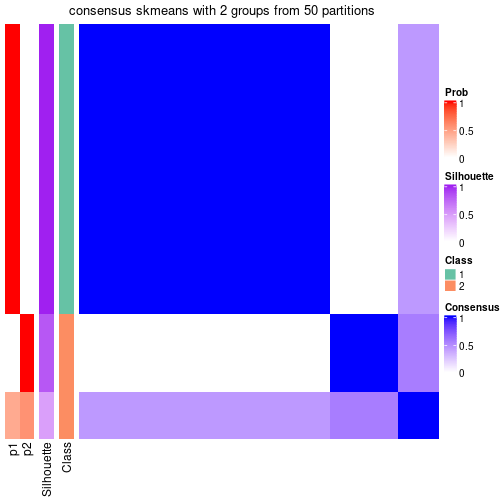</p>

</div>
<div id='tab-node-052-consensus-heatmap-2'>
<pre><code class="r">consensus_heatmap(res, k = 3)
</code></pre>

<p>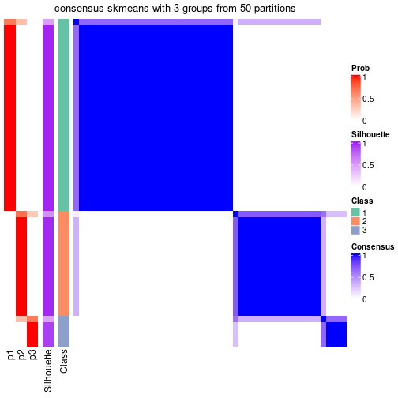</p>

</div>
<div id='tab-node-052-consensus-heatmap-3'>
<pre><code class="r">consensus_heatmap(res, k = 4)
</code></pre>

<p>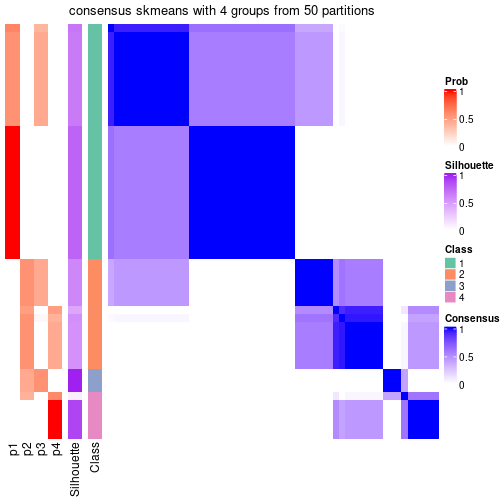</p>

</div>
<div id='tab-node-052-consensus-heatmap-4'>
<pre><code class="r">consensus_heatmap(res, k = 5)
</code></pre>

<p>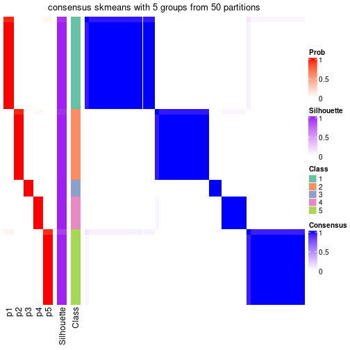</p>

</div>
<div id='tab-node-052-consensus-heatmap-5'>
<pre><code class="r">consensus_heatmap(res, k = 6)
</code></pre>

<p>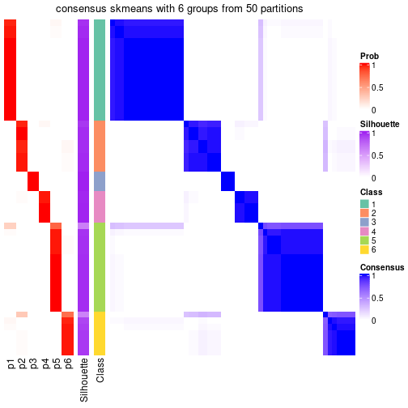</p>

</div>
<div id='tab-node-052-consensus-heatmap-6'>
<pre><code class="r">consensus_heatmap(res, k = 7)
</code></pre>

<p>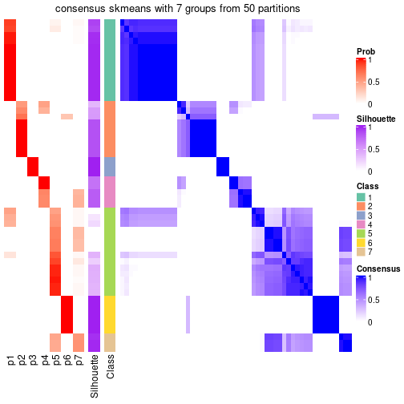</p>

</div>
<div id='tab-node-052-consensus-heatmap-7'>
<pre><code class="r">consensus_heatmap(res, k = 8)
</code></pre>

<p>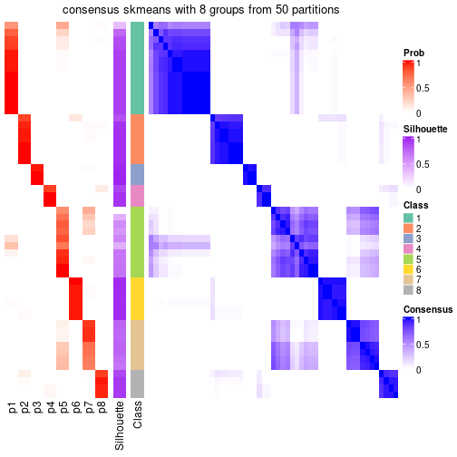</p>

</div>
</div>

Heatmaps for the membership of samples in all partitions to see how consistent they are:


<script>
$( function() {
	$( '#tabs-node-052-membership-heatmap' ).tabs();
} );
</script>
<div id='tabs-node-052-membership-heatmap'>
<ul>
<li><a href='#tab-node-052-membership-heatmap-1'>k = 2</a></li>
<li><a href='#tab-node-052-membership-heatmap-2'>k = 3</a></li>
<li><a href='#tab-node-052-membership-heatmap-3'>k = 4</a></li>
<li><a href='#tab-node-052-membership-heatmap-4'>k = 5</a></li>
<li><a href='#tab-node-052-membership-heatmap-5'>k = 6</a></li>
<li><a href='#tab-node-052-membership-heatmap-6'>k = 7</a></li>
<li><a href='#tab-node-052-membership-heatmap-7'>k = 8</a></li>
</ul>
<div id='tab-node-052-membership-heatmap-1'>
<pre><code class="r">membership_heatmap(res, k = 2)
</code></pre>

<p>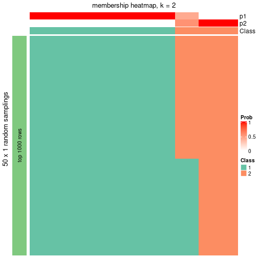</p>

</div>
<div id='tab-node-052-membership-heatmap-2'>
<pre><code class="r">membership_heatmap(res, k = 3)
</code></pre>

<p>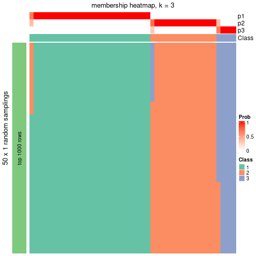</p>

</div>
<div id='tab-node-052-membership-heatmap-3'>
<pre><code class="r">membership_heatmap(res, k = 4)
</code></pre>

<p>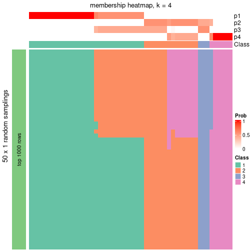</p>

</div>
<div id='tab-node-052-membership-heatmap-4'>
<pre><code class="r">membership_heatmap(res, k = 5)
</code></pre>

<p>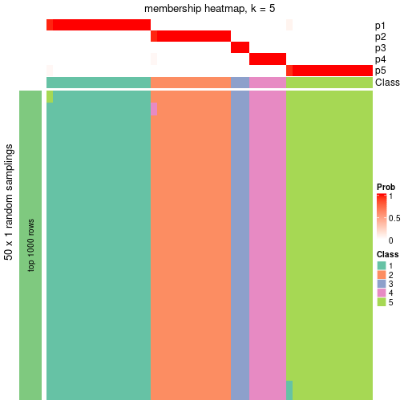</p>

</div>
<div id='tab-node-052-membership-heatmap-5'>
<pre><code class="r">membership_heatmap(res, k = 6)
</code></pre>

<p>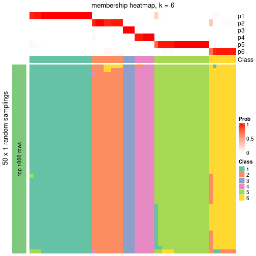</p>

</div>
<div id='tab-node-052-membership-heatmap-6'>
<pre><code class="r">membership_heatmap(res, k = 7)
</code></pre>

<p>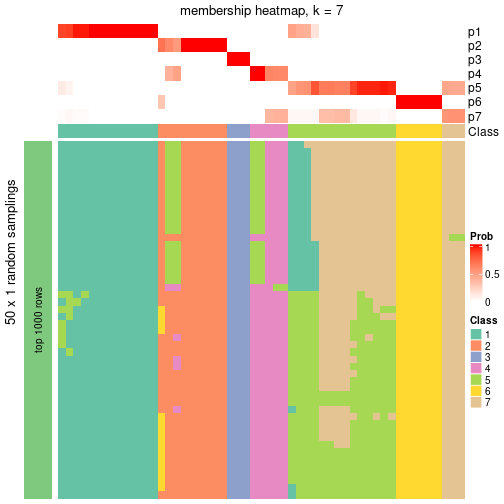</p>

</div>
<div id='tab-node-052-membership-heatmap-7'>
<pre><code class="r">membership_heatmap(res, k = 8)
</code></pre>

<p>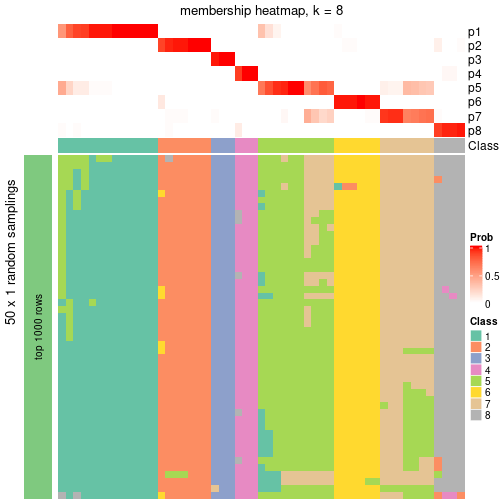</p>

</div>
</div>

As soon as the classes for columns are determined, the signatures
that are significantly different between subgroups can be looked for. 
Following are the heatmaps for signatures.


<script>
$( function() {
	$( '#tabs-node-052-get-signatures' ).tabs();
} );
</script>
<div id='tabs-node-052-get-signatures'>
<ul>
<li><a href='#tab-node-052-get-signatures-1'>k = 2</a></li>
<li><a href='#tab-node-052-get-signatures-2'>k = 3</a></li>
<li><a href='#tab-node-052-get-signatures-3'>k = 4</a></li>
<li><a href='#tab-node-052-get-signatures-4'>k = 5</a></li>
<li><a href='#tab-node-052-get-signatures-5'>k = 6</a></li>
<li><a href='#tab-node-052-get-signatures-6'>k = 7</a></li>
<li><a href='#tab-node-052-get-signatures-7'>k = 8</a></li>
</ul>
<div id='tab-node-052-get-signatures-1'>
<pre><code class="r">get_signatures(res, k = 2)
</code></pre>

<p>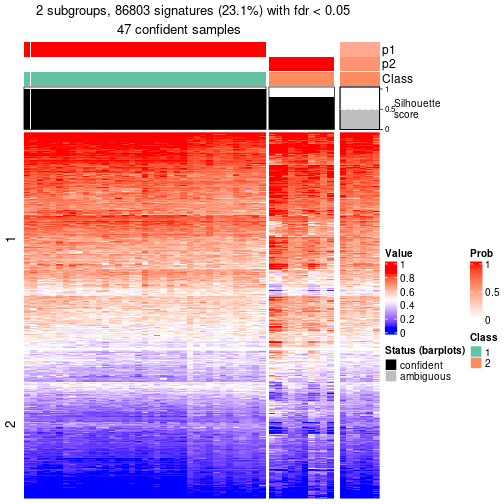</p>

</div>
<div id='tab-node-052-get-signatures-2'>
<pre><code class="r">get_signatures(res, k = 3)
</code></pre>

<p>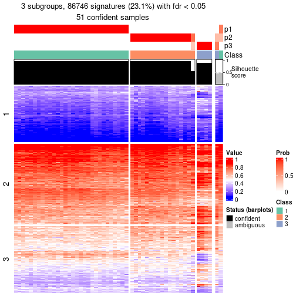</p>

</div>
<div id='tab-node-052-get-signatures-3'>
<pre><code class="r">get_signatures(res, k = 4)
</code></pre>

<p>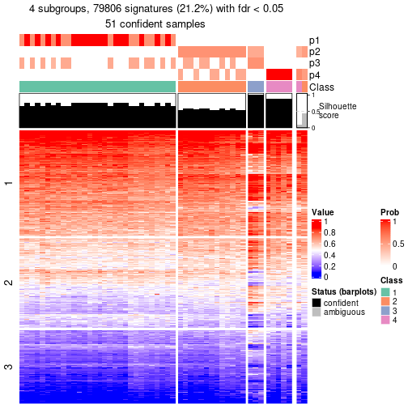</p>

</div>
<div id='tab-node-052-get-signatures-4'>
<pre><code class="r">get_signatures(res, k = 5)
</code></pre>

<p>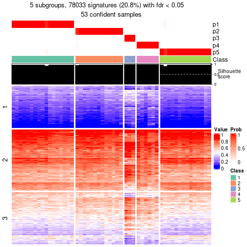</p>

</div>
<div id='tab-node-052-get-signatures-5'>
<pre><code class="r">get_signatures(res, k = 6)
</code></pre>

<p>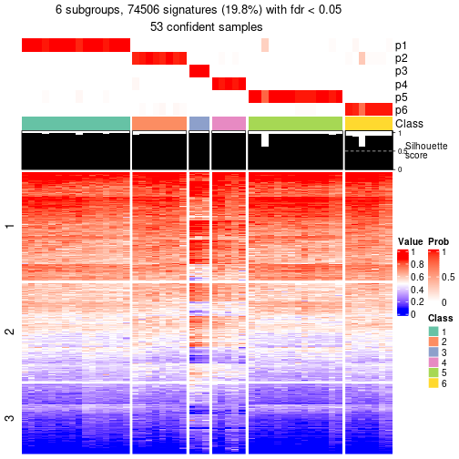</p>

</div>
<div id='tab-node-052-get-signatures-6'>
<pre><code class="r">get_signatures(res, k = 7)
</code></pre>

<p>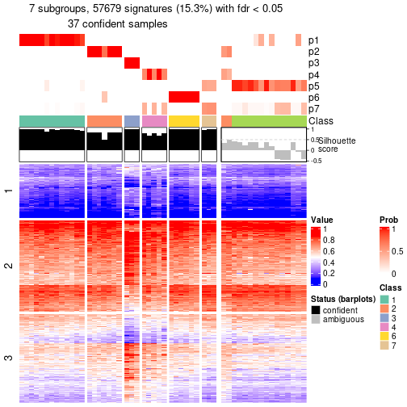</p>

</div>
<div id='tab-node-052-get-signatures-7'>
<pre><code class="r">get_signatures(res, k = 8)
</code></pre>

<p>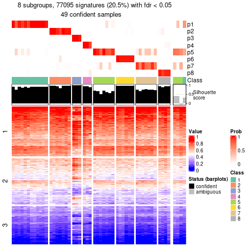</p>

</div>
</div>


Compare the overlap of signatures from different k:

```r
compare_signatures(res)
```

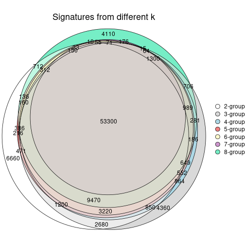

`get_signature()` returns a data frame invisibly. To get the list of signatures, the function
call should be assigned to a variable explicitly. In following code, if `plot` argument is set
to `FALSE`, no heatmap is plotted while only the differential analysis is performed.

```r
# code only for demonstration
tb = get_signature(res, k = ..., plot = FALSE)
```

An example of the output of `tb` is:

```
#>   which_row         fdr    mean_1    mean_2 scaled_mean_1 scaled_mean_2 km
#> 1        38 0.042760348  8.373488  9.131774    -0.5533452     0.5164555  1
#> 2        40 0.018707592  7.106213  8.469186    -0.6173731     0.5762149  1
#> 3        55 0.019134737 10.221463 11.207825    -0.6159697     0.5749050  1
#> 4        59 0.006059896  5.921854  7.869574    -0.6899429     0.6439467  1
#> 5        60 0.018055526  8.928898 10.211722    -0.6204761     0.5791110  1
#> 6        98 0.009384629 15.714769 14.887706     0.6635654    -0.6193277  2
...
```

The columns in `tb` are:

1. `which_row`: row indices corresponding to the input matrix.
2. `fdr`: FDR for the differential test. 
3. `mean_x`: The mean value in group x.
4. `scaled_mean_x`: The mean value in group x after rows are scaled.
5. `km`: Row groups if k-means clustering is applied to rows (which is done by automatically selecting number of clusters).

If there are too many signatures, `top_signatures = ...` can be set to only show the 
signatures with the highest FDRs:

```r
# code only for demonstration
# e.g. to show the top 500 most significant rows
tb = get_signature(res, k = ..., top_signatures = 500)
```

If the signatures are defined as these which are uniquely high in current group, `diff_method` argument
can be set to `"uniquely_high_in_one_group"`:

```r
# code only for demonstration
tb = get_signature(res, k = ..., diff_method = "uniquely_high_in_one_group")
```


UMAP plot which shows how samples are separated.


<script>
$( function() {
	$( '#tabs-node-052-dimension-reduction' ).tabs();
} );
</script>
<div id='tabs-node-052-dimension-reduction'>
<ul>
<li><a href='#tab-node-052-dimension-reduction-1'>k = 2</a></li>
<li><a href='#tab-node-052-dimension-reduction-2'>k = 3</a></li>
<li><a href='#tab-node-052-dimension-reduction-3'>k = 4</a></li>
<li><a href='#tab-node-052-dimension-reduction-4'>k = 5</a></li>
<li><a href='#tab-node-052-dimension-reduction-5'>k = 6</a></li>
<li><a href='#tab-node-052-dimension-reduction-6'>k = 7</a></li>
<li><a href='#tab-node-052-dimension-reduction-7'>k = 8</a></li>
</ul>
<div id='tab-node-052-dimension-reduction-1'>
<pre><code class="r">dimension_reduction(res, k = 2, method = &quot;UMAP&quot;)
</code></pre>

<p>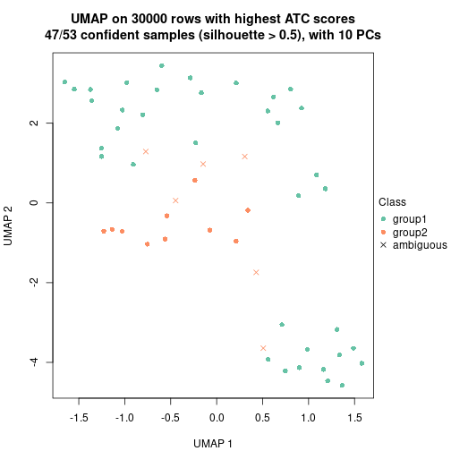</p>

</div>
<div id='tab-node-052-dimension-reduction-2'>
<pre><code class="r">dimension_reduction(res, k = 3, method = &quot;UMAP&quot;)
</code></pre>

<p>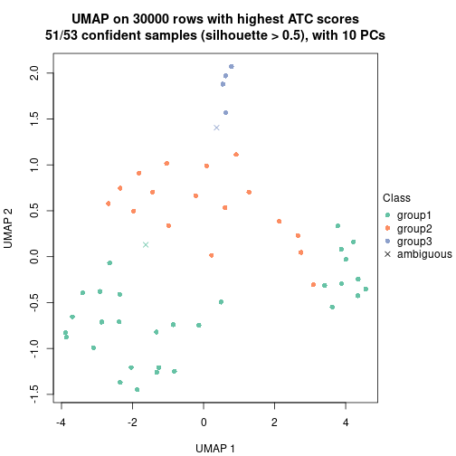</p>

</div>
<div id='tab-node-052-dimension-reduction-3'>
<pre><code class="r">dimension_reduction(res, k = 4, method = &quot;UMAP&quot;)
</code></pre>

<p>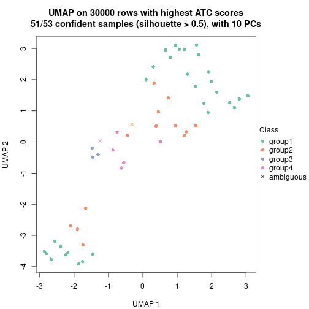</p>

</div>
<div id='tab-node-052-dimension-reduction-4'>
<pre><code class="r">dimension_reduction(res, k = 5, method = &quot;UMAP&quot;)
</code></pre>

<p>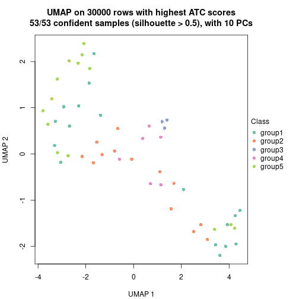</p>

</div>
<div id='tab-node-052-dimension-reduction-5'>
<pre><code class="r">dimension_reduction(res, k = 6, method = &quot;UMAP&quot;)
</code></pre>

<p>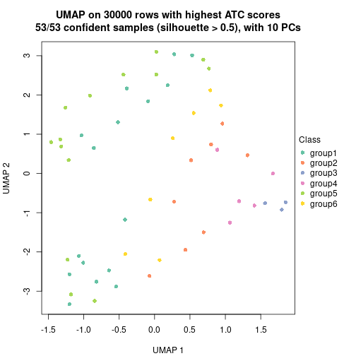</p>

</div>
<div id='tab-node-052-dimension-reduction-6'>
<pre><code class="r">dimension_reduction(res, k = 7, method = &quot;UMAP&quot;)
</code></pre>

<p>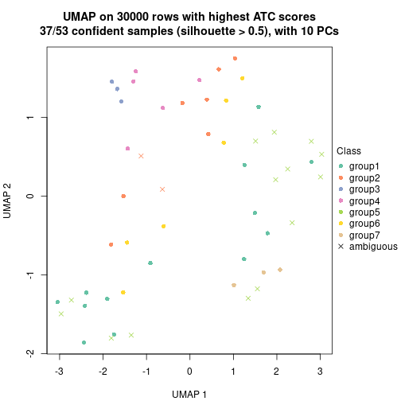</p>

</div>
<div id='tab-node-052-dimension-reduction-7'>
<pre><code class="r">dimension_reduction(res, k = 8, method = &quot;UMAP&quot;)
</code></pre>

<p>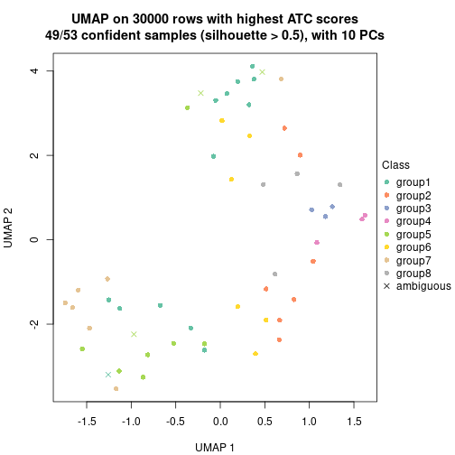</p>

</div>
</div>


Following heatmap shows how subgroups are split when increasing `k`:

```r
collect_classes(res)
```

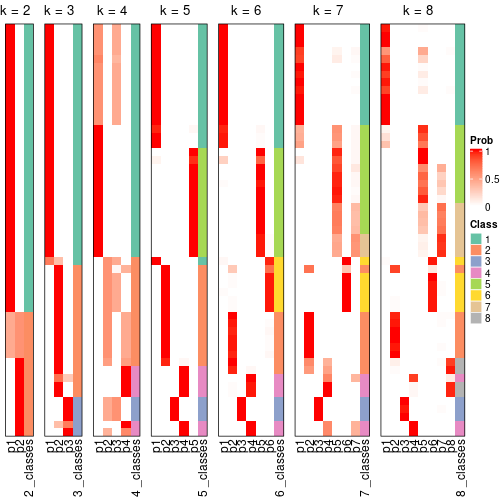


If matrix rows can be associated to genes, consider to use `functional_enrichment(res,
...)` to perform function enrichment for the signature genes. See [this vignette](https://jokergoo.github.io/cola_vignettes/functional_enrichment.html) for more detailed explanations.


 

---------------------------------------------------


### Node06


Parent node: [Node0](#Node0).
Child nodes: 
                [Node011](#Node011)
        ,
                [Node012](#Node012)
        ,
                [Node013](#Node013)
        ,
                Node014-leaf
        ,
                [Node021](#Node021)
        ,
                [Node022](#Node022)
        ,
                [Node023](#Node023)
        ,
                [Node024](#Node024)
        ,
                Node031-leaf
        ,
                Node032-leaf
        ,
                [Node041](#Node041)
        ,
                [Node042](#Node042)
        ,
                [Node043](#Node043)
        ,
                [Node051](#Node051)
        ,
                [Node052](#Node052)
        ,
                [Node061](#Node061)
        ,
                Node062-leaf
        ,
                [Node071](#Node071)
        ,
                [Node072](#Node072)
        ,
                [Node073](#Node073)
        .


The object with results only for a single top-value method and a single partitioning method 
can be extracted as:

```r
res = res_rh["06"]
```

A summary of `res` and all the functions that can be applied to it:

```r
res
```

```
#> A 'ConsensusPartition' object with k = 2, 3, 4, 5, 6, 7, 8.
#>   On a matrix with 30000 rows and 131 columns.
#>   Top rows (1000) are extracted by 'ATC' method.
#>   Subgroups are detected by 'skmeans' method.
#>   Performed in total 350 partitions by row resampling.
#>   Best k for subgroups seems to be 2.
#> 
#> Following methods can be applied to this 'ConsensusPartition' object:
#>  [1] "cola_report"             "collect_classes"         "collect_plots"          
#>  [4] "collect_stats"           "colnames"                "compare_partitions"     
#>  [7] "compare_signatures"      "consensus_heatmap"       "dimension_reduction"    
#> [10] "functional_enrichment"   "get_anno_col"            "get_anno"               
#> [13] "get_classes"             "get_consensus"           "get_matrix"             
#> [16] "get_membership"          "get_param"               "get_signatures"         
#> [19] "get_stats"               "is_best_k"               "is_stable_k"            
#> [22] "membership_heatmap"      "ncol"                    "nrow"                   
#> [25] "plot_ecdf"               "predict_classes"         "rownames"               
#> [28] "select_partition_number" "show"                    "suggest_best_k"         
#> [31] "test_to_known_factors"   "top_rows_heatmap"
```

`collect_plots()` function collects all the plots made from `res` for all `k` (number of subgroups)
into one single page to provide an easy and fast comparison between different `k`.

```r
collect_plots(res)
```

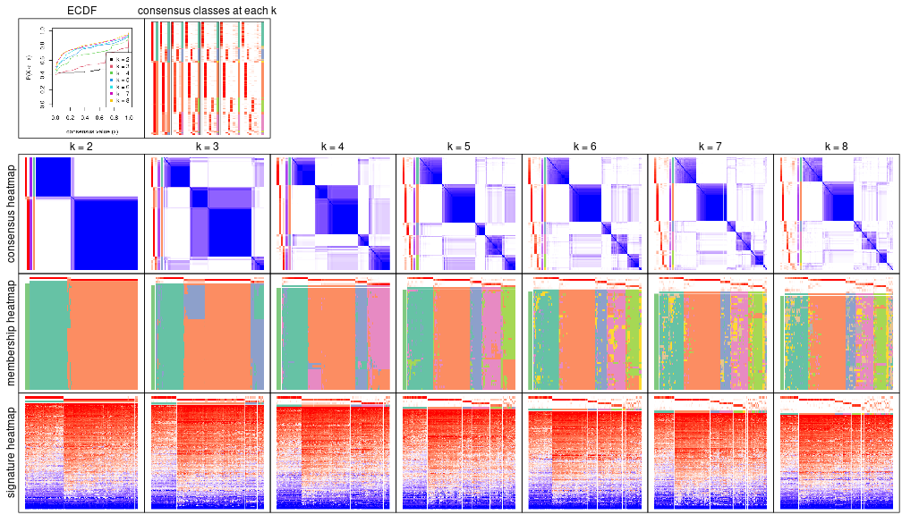

The plots are:

- The first row: a plot of the eCDF (empirical cumulative distribution
  function) curves of the consensus matrix for each `k` and the heatmap of
  predicted classes for each `k`.
- The second row: heatmaps of the consensus matrix for each `k`.
- The third row: heatmaps of the membership matrix for each `k`.
- The fouth row: heatmaps of the signatures for each `k`.

All the plots in panels can be made by individual functions and they are
plotted later in this section.

`select_partition_number()` produces several plots showing different
statistics for choosing "optimized" `k`. There are following statistics:

- eCDF curves of the consensus matrix for each `k`;
- 1-PAC. [The PAC score](https://en.wikipedia.org/wiki/Consensus_clustering#Over-interpretation_potential_of_consensus_clustering)
  measures the proportion of the ambiguous subgrouping.
- Mean silhouette score.
- Concordance. The mean probability of fiting the consensus subgroup labels in all
  partitions.
- Area increased. Denote $A_k$ as the area under the eCDF curve for current
  `k`, the area increased is defined as $A_k - A_{k-1}$.
- Rand index. The percent of pairs of samples that are both in a same cluster
  or both are not in a same cluster in the partition of k and k-1.
- Jaccard index. The ratio of pairs of samples are both in a same cluster in
  the partition of k and k-1 and the pairs of samples are both in a same
  cluster in the partition k or k-1.

The detailed explanations of these statistics can be found in [the _cola_
vignette](https://jokergoo.github.io/cola_vignettes/cola.html#toc_13).

Generally speaking, higher 1-PAC score, higher mean silhouette score or higher
concordance corresponds to better partition. Rand index and Jaccard index
measure how similar the current partition is compared to partition with `k-1`.
If they are too similar, we won't accept `k` is better than `k-1`.

```r
select_partition_number(res)
```

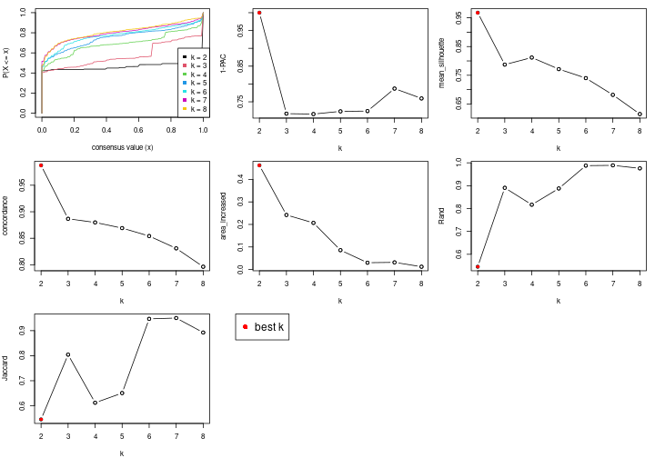

The numeric values for all these statistics can be obtained by `get_stats()`.

```r
get_stats(res)
```

```
#>   k 1-PAC mean_silhouette concordance area_increased  Rand Jaccard
#> 2 2 1.000           0.968       0.987         0.4624 0.546   0.546
#> 3 3 0.717           0.787       0.887         0.2420 0.891   0.804
#> 4 4 0.716           0.812       0.880         0.2068 0.817   0.612
#> 5 5 0.723           0.771       0.869         0.0856 0.888   0.651
#> 6 6 0.724           0.740       0.854         0.0300 0.988   0.947
#> 7 7 0.787           0.682       0.831         0.0315 0.989   0.950
#> 8 8 0.759           0.615       0.796         0.0121 0.976   0.892
```

`suggest_best_k()` suggests the best $k$ based on these statistics. The rules are as follows:

- All $k$ with Jaccard index larger than 0.95 are removed because increasing
  $k$ does not provide enough extra information. If all $k$ are removed, it is
  marked as no subgroup is detected.
- For all $k$ with 1-PAC score larger than 0.9, the maximal $k$ is taken as
  the best $k$, and other $k$ are marked as optional $k$.
- If it does not fit the second rule. The $k$ with the maximal vote of the
  highest 1-PAC score, highest mean silhouette, and highest concordance is
  taken as the best $k$.

```r
suggest_best_k(res)
```

```
#> [1] 2
```


Following is the table of the partitions (You need to click the **show/hide
code output** link to see it). The membership matrix (columns with name `p*`)
is inferred by
[`clue::cl_consensus()`](https://www.rdocumentation.org/link/cl_consensus?package=clue)
function with the `SE` method. Basically the value in the membership matrix
represents the probability to belong to a certain group. The finall subgroup
label for an item is determined with the group with highest probability it
belongs to.

In `get_classes()` function, the entropy is calculated from the membership
matrix and the silhouette score is calculated from the consensus matrix.


<script>
$( function() {
	$( '#tabs-node-06-get-classes' ).tabs();
} );
</script>
<div id='tabs-node-06-get-classes'>
<ul>
<li><a href='#tab-node-06-get-classes-1'>k = 2</a></li>
<li><a href='#tab-node-06-get-classes-2'>k = 3</a></li>
<li><a href='#tab-node-06-get-classes-3'>k = 4</a></li>
<li><a href='#tab-node-06-get-classes-4'>k = 5</a></li>
<li><a href='#tab-node-06-get-classes-5'>k = 6</a></li>
<li><a href='#tab-node-06-get-classes-6'>k = 7</a></li>
<li><a href='#tab-node-06-get-classes-7'>k = 8</a></li>
</ul>

<div id='tab-node-06-get-classes-1'>
<p><a id='tab-node-06-get-classes-1-a' style='color:#0366d6' href='#'>show/hide code output</a></p>
<pre><code class="r">cbind(get_classes(res, k = 2), get_membership(res, k = 2))
</code></pre>

<pre><code>#&gt;                 class entropy silhouette   p1   p2
#&gt; TCGA.43.7656.01     1   0.000      1.000 1.00 0.00
#&gt; TCGA.56.A4ZK.01     2   0.000      0.981 0.00 1.00
#&gt; TCGA.63.A5MW.01     2   0.000      0.981 0.00 1.00
#&gt; TCGA.85.8479.01     2   0.000      0.981 0.00 1.00
#&gt; TCGA.63.A5M9.01     2   0.000      0.981 0.00 1.00
#&gt; TCGA.37.A5EM.01     2   0.000      0.981 0.00 1.00
#&gt; TCGA.98.A53I.01     2   0.000      0.981 0.00 1.00
#&gt; TCGA.98.8020.01     1   0.000      1.000 1.00 0.00
#&gt; TCGA.39.5031.01     2   0.000      0.981 0.00 1.00
#&gt; TCGA.56.8622.01     1   0.000      1.000 1.00 0.00
#&gt; TCGA.22.5471.01     2   0.000      0.981 0.00 1.00
#&gt; TCGA.85.7950.01     1   0.000      1.000 1.00 0.00
#&gt; TCGA.22.5480.01     2   0.000      0.981 0.00 1.00
#&gt; TCGA.58.8388.01     2   0.999      0.106 0.48 0.52
#&gt; TCGA.85.7699.01     2   0.000      0.981 0.00 1.00
#&gt; TCGA.33.AAS8.01     2   0.000      0.981 0.00 1.00
#&gt; TCGA.50.5931.01     2   0.000      0.981 0.00 1.00
#&gt; TCGA.77.A5G8.01     2   0.000      0.981 0.00 1.00
#&gt; TCGA.43.5670.01     2   0.000      0.981 0.00 1.00
#&gt; TCGA.NC.A5HI.01     1   0.000      1.000 1.00 0.00
#&gt; TCGA.NK.A5D1.01     2   0.000      0.981 0.00 1.00
#&gt; TCGA.21.5783.01     2   0.000      0.981 0.00 1.00
#&gt; TCGA.94.7557.01     1   0.000      1.000 1.00 0.00
#&gt; TCGA.85.6798.01     2   0.000      0.981 0.00 1.00
#&gt; TCGA.85.7696.01     2   0.000      0.981 0.00 1.00
#&gt; TCGA.90.A4ED.01     1   0.000      1.000 1.00 0.00
#&gt; TCGA.77.6843.01     2   0.000      0.981 0.00 1.00
#&gt; TCGA.77.8130.01     1   0.000      1.000 1.00 0.00
#&gt; TCGA.34.5928.01     2   0.000      0.981 0.00 1.00
#&gt; TCGA.22.A5C4.01     2   0.000      0.981 0.00 1.00
#&gt; TCGA.94.8035.01     1   0.000      1.000 1.00 0.00
#&gt; TCGA.94.A5I4.01     2   0.000      0.981 0.00 1.00
#&gt; TCGA.77.8145.01     1   0.000      1.000 1.00 0.00
#&gt; TCGA.O2.A52W.01     2   0.827      0.654 0.26 0.74
#&gt; TCGA.77.8140.01     1   0.000      1.000 1.00 0.00
#&gt; TCGA.22.5478.01     1   0.000      1.000 1.00 0.00
#&gt; TCGA.90.7964.01     2   0.327      0.923 0.06 0.94
#&gt; TCGA.68.8250.01     2   0.000      0.981 0.00 1.00
#&gt; TCGA.56.8504.01     2   0.000      0.981 0.00 1.00
#&gt; TCGA.85.8072.01     2   0.000      0.981 0.00 1.00
#&gt; TCGA.77.7337.01     1   0.000      1.000 1.00 0.00
#&gt; TCGA.63.A5MI.01     1   0.000      1.000 1.00 0.00
#&gt; TCGA.85.A4CL.01     2   0.000      0.981 0.00 1.00
#&gt; TCGA.85.7698.01     2   0.000      0.981 0.00 1.00
#&gt; TCGA.77.8139.01     1   0.000      1.000 1.00 0.00
#&gt; TCGA.39.5019.01     2   0.000      0.981 0.00 1.00
#&gt; TCGA.22.4599.01     2   0.000      0.981 0.00 1.00
#&gt; TCGA.85.8052.01     2   0.000      0.981 0.00 1.00
#&gt; TCGA.77.7142.01     2   0.000      0.981 0.00 1.00
#&gt; TCGA.96.A4JK.01     2   0.000      0.981 0.00 1.00
#&gt; TCGA.56.8305.01     2   0.000      0.981 0.00 1.00
#&gt; TCGA.98.8022.01     1   0.000      1.000 1.00 0.00
#&gt; TCGA.21.5786.01     2   0.000      0.981 0.00 1.00
#&gt; TCGA.21.5782.01     1   0.000      1.000 1.00 0.00
#&gt; TCGA.39.5016.01     2   0.000      0.981 0.00 1.00
#&gt; TCGA.85.A4CN.01     2   0.000      0.981 0.00 1.00
#&gt; TCGA.O2.A52N.01     2   0.000      0.981 0.00 1.00
#&gt; TCGA.85.8664.01     2   0.000      0.981 0.00 1.00
#&gt; TCGA.NC.A5HO.01     2   0.000      0.981 0.00 1.00
#&gt; TCGA.77.8133.01     2   0.000      0.981 0.00 1.00
#&gt; TCGA.98.A53B.01     1   0.000      1.000 1.00 0.00
#&gt; TCGA.56.5898.01     2   0.000      0.981 0.00 1.00
#&gt; TCGA.34.8455.01     1   0.000      1.000 1.00 0.00
#&gt; TCGA.43.A56V.01     1   0.000      1.000 1.00 0.00
#&gt; TCGA.85.A4QQ.01     2   0.000      0.981 0.00 1.00
#&gt; TCGA.37.A5EL.01     2   0.000      0.981 0.00 1.00
#&gt; TCGA.39.5036.01     2   0.000      0.981 0.00 1.00
#&gt; TCGA.22.5479.01     2   0.000      0.981 0.00 1.00
#&gt; TCGA.58.A46K.01     2   0.000      0.981 0.00 1.00
#&gt; TCGA.56.A4BY.01     2   0.000      0.981 0.00 1.00
#&gt; TCGA.18.3417.01     2   0.000      0.981 0.00 1.00
#&gt; TCGA.56.A4BW.01     2   0.000      0.981 0.00 1.00
#&gt; TCGA.56.8308.01     2   0.000      0.981 0.00 1.00
#&gt; TCGA.63.7020.01     1   0.000      1.000 1.00 0.00
#&gt; TCGA.NC.A5HQ.01     2   0.000      0.981 0.00 1.00
#&gt; TCGA.LA.A446.01     2   0.000      0.981 0.00 1.00
#&gt; TCGA.77.A5GF.01     2   0.000      0.981 0.00 1.00
#&gt; TCGA.56.8304.01     1   0.000      1.000 1.00 0.00
#&gt; TCGA.NC.A5HR.01     2   0.000      0.981 0.00 1.00
#&gt; TCGA.39.5029.01     1   0.000      1.000 1.00 0.00
#&gt; TCGA.56.8629.01     2   0.000      0.981 0.00 1.00
#&gt; TCGA.77.7465.01     1   0.000      1.000 1.00 0.00
#&gt; TCGA.43.7657.01     2   0.000      0.981 0.00 1.00
#&gt; TCGA.33.4579.01     1   0.000      1.000 1.00 0.00
#&gt; TCGA.94.A4VJ.01     2   0.000      0.981 0.00 1.00
#&gt; TCGA.56.A5DR.01     1   0.000      1.000 1.00 0.00
#&gt; TCGA.85.7844.01     2   0.000      0.981 0.00 1.00
#&gt; TCGA.98.8021.01     2   0.242      0.943 0.04 0.96
#&gt; TCGA.22.5472.01     1   0.000      1.000 1.00 0.00
#&gt; TCGA.34.5239.01     1   0.000      1.000 1.00 0.00
#&gt; TCGA.77.7463.01     1   0.000      1.000 1.00 0.00
#&gt; TCGA.44.5643.01     2   0.000      0.981 0.00 1.00
#&gt; TCGA.33.4586.01     2   0.000      0.981 0.00 1.00
#&gt; TCGA.52.7810.01     1   0.000      1.000 1.00 0.00
#&gt; TCGA.90.7767.01     2   0.000      0.981 0.00 1.00
#&gt; TCGA.33.4582.01     2   0.000      0.981 0.00 1.00
#&gt; TCGA.85.8288.01     1   0.000      1.000 1.00 0.00
#&gt; TCGA.85.7843.01     2   0.971      0.354 0.40 0.60
#&gt; TCGA.56.7221.01     1   0.000      1.000 1.00 0.00
#&gt; TCGA.98.A538.01     1   0.000      1.000 1.00 0.00
#&gt; TCGA.98.A53J.01     2   0.000      0.981 0.00 1.00
#&gt; TCGA.85.8277.01     2   0.000      0.981 0.00 1.00
#&gt; TCGA.39.5035.01     1   0.000      1.000 1.00 0.00
#&gt; TCGA.58.A46M.01     2   0.000      0.981 0.00 1.00
#&gt; TCGA.77.7338.01     2   0.000      0.981 0.00 1.00
#&gt; TCGA.51.6867.01     2   0.000      0.981 0.00 1.00
#&gt; TCGA.63.A5MJ.01     2   0.000      0.981 0.00 1.00
#&gt; TCGA.56.7822.01     1   0.000      1.000 1.00 0.00
#&gt; TCGA.56.A62T.01     2   0.000      0.981 0.00 1.00
#&gt; TCGA.56.A49D.01     1   0.000      1.000 1.00 0.00
#&gt; TCGA.22.5474.01     2   0.000      0.981 0.00 1.00
#&gt; TCGA.68.A59J.01     2   0.000      0.981 0.00 1.00
#&gt; TCGA.22.5492.01     1   0.000      1.000 1.00 0.00
#&gt; TCGA.77.7141.01     2   0.000      0.981 0.00 1.00
#&gt; TCGA.90.7766.01     1   0.000      1.000 1.00 0.00
#&gt; TCGA.NC.A5HD.01     2   0.000      0.981 0.00 1.00
#&gt; TCGA.NC.A5HM.01     2   0.971      0.354 0.40 0.60
#&gt; TCGA.46.6025.01     2   0.000      0.981 0.00 1.00
#&gt; TCGA.52.7809.01     2   0.000      0.981 0.00 1.00
#&gt; TCGA.43.8116.01     1   0.000      1.000 1.00 0.00
#&gt; TCGA.85.8350.01     2   0.000      0.981 0.00 1.00
#&gt; TCGA.LA.A7SW.01     1   0.000      1.000 1.00 0.00
#&gt; TCGA.96.7544.01     1   0.000      1.000 1.00 0.00
#&gt; TCGA.77.A5G7.01     1   0.000      1.000 1.00 0.00
#&gt; TCGA.56.8307.01     1   0.000      1.000 1.00 0.00
#&gt; TCGA.98.A539.01     1   0.000      1.000 1.00 0.00
#&gt; TCGA.O2.A52S.01     2   0.000      0.981 0.00 1.00
#&gt; TCGA.58.A46L.01     2   0.000      0.981 0.00 1.00
#&gt; TCGA.77.8144.01     2   0.000      0.981 0.00 1.00
#&gt; TCGA.J1.A4AH.01     2   0.000      0.981 0.00 1.00
#&gt; TCGA.56.7580.01     1   0.000      1.000 1.00 0.00
</code></pre>

<script>
$('#tab-node-06-get-classes-1-a').parent().next().next().hide();
$('#tab-node-06-get-classes-1-a').click(function(){
  $('#tab-node-06-get-classes-1-a').parent().next().next().toggle();
  return(false);
});
</script>
</div>

<div id='tab-node-06-get-classes-2'>
<p><a id='tab-node-06-get-classes-2-a' style='color:#0366d6' href='#'>show/hide code output</a></p>
<pre><code class="r">cbind(get_classes(res, k = 3), get_membership(res, k = 3))
</code></pre>

<pre><code>#&gt;                 class entropy silhouette   p1   p2   p3
#&gt; TCGA.43.7656.01     1  0.0000     0.8768 1.00 0.00 0.00
#&gt; TCGA.56.A4ZK.01     2  0.0000     0.8955 0.00 1.00 0.00
#&gt; TCGA.63.A5MW.01     2  0.5706     0.7078 0.00 0.68 0.32
#&gt; TCGA.85.8479.01     2  0.0000     0.8955 0.00 1.00 0.00
#&gt; TCGA.63.A5M9.01     2  0.0000     0.8955 0.00 1.00 0.00
#&gt; TCGA.37.A5EM.01     2  0.0000     0.8955 0.00 1.00 0.00
#&gt; TCGA.98.A53I.01     2  0.0000     0.8955 0.00 1.00 0.00
#&gt; TCGA.98.8020.01     1  0.0000     0.8768 1.00 0.00 0.00
#&gt; TCGA.39.5031.01     2  0.5706     0.7078 0.00 0.68 0.32
#&gt; TCGA.56.8622.01     1  0.4002     0.6815 0.84 0.00 0.16
#&gt; TCGA.22.5471.01     2  0.4555     0.7898 0.00 0.80 0.20
#&gt; TCGA.85.7950.01     3  0.6192     0.5800 0.42 0.00 0.58
#&gt; TCGA.22.5480.01     2  0.5706     0.7078 0.00 0.68 0.32
#&gt; TCGA.58.8388.01     3  0.6109     0.4639 0.08 0.14 0.78
#&gt; TCGA.85.7699.01     2  0.5706     0.7078 0.00 0.68 0.32
#&gt; TCGA.33.AAS8.01     2  0.0000     0.8955 0.00 1.00 0.00
#&gt; TCGA.50.5931.01     2  0.5706     0.7078 0.00 0.68 0.32
#&gt; TCGA.77.A5G8.01     2  0.0000     0.8955 0.00 1.00 0.00
#&gt; TCGA.43.5670.01     2  0.5706     0.7078 0.00 0.68 0.32
#&gt; TCGA.NC.A5HI.01     1  0.0000     0.8768 1.00 0.00 0.00
#&gt; TCGA.NK.A5D1.01     2  0.5706     0.7078 0.00 0.68 0.32
#&gt; TCGA.21.5783.01     2  0.5706     0.7078 0.00 0.68 0.32
#&gt; TCGA.94.7557.01     1  0.0000     0.8768 1.00 0.00 0.00
#&gt; TCGA.85.6798.01     2  0.0000     0.8955 0.00 1.00 0.00
#&gt; TCGA.85.7696.01     2  0.0000     0.8955 0.00 1.00 0.00
#&gt; TCGA.90.A4ED.01     1  0.0000     0.8768 1.00 0.00 0.00
#&gt; TCGA.77.6843.01     2  0.0000     0.8955 0.00 1.00 0.00
#&gt; TCGA.77.8130.01     3  0.5706     0.7243 0.32 0.00 0.68
#&gt; TCGA.34.5928.01     2  0.5706     0.7078 0.00 0.68 0.32
#&gt; TCGA.22.A5C4.01     2  0.5706     0.7078 0.00 0.68 0.32
#&gt; TCGA.94.8035.01     1  0.0000     0.8768 1.00 0.00 0.00
#&gt; TCGA.94.A5I4.01     2  0.0000     0.8955 0.00 1.00 0.00
#&gt; TCGA.77.8145.01     1  0.0000     0.8768 1.00 0.00 0.00
#&gt; TCGA.O2.A52W.01     1  0.6956     0.3633 0.66 0.04 0.30
#&gt; TCGA.77.8140.01     1  0.0000     0.8768 1.00 0.00 0.00
#&gt; TCGA.22.5478.01     1  0.0000     0.8768 1.00 0.00 0.00
#&gt; TCGA.90.7964.01     2  0.4002     0.7496 0.16 0.84 0.00
#&gt; TCGA.68.8250.01     2  0.9899     0.1701 0.28 0.40 0.32
#&gt; TCGA.56.8504.01     2  0.5216     0.7504 0.00 0.74 0.26
#&gt; TCGA.85.8072.01     2  0.0000     0.8955 0.00 1.00 0.00
#&gt; TCGA.77.7337.01     3  0.5706     0.7243 0.32 0.00 0.68
#&gt; TCGA.63.A5MI.01     1  0.0000     0.8768 1.00 0.00 0.00
#&gt; TCGA.85.A4CL.01     2  0.0000     0.8955 0.00 1.00 0.00
#&gt; TCGA.85.7698.01     2  0.0000     0.8955 0.00 1.00 0.00
#&gt; TCGA.77.8139.01     1  0.0000     0.8768 1.00 0.00 0.00
#&gt; TCGA.39.5019.01     2  0.0000     0.8955 0.00 1.00 0.00
#&gt; TCGA.22.4599.01     2  0.0000     0.8955 0.00 1.00 0.00
#&gt; TCGA.85.8052.01     2  0.0000     0.8955 0.00 1.00 0.00
#&gt; TCGA.77.7142.01     2  0.0000     0.8955 0.00 1.00 0.00
#&gt; TCGA.96.A4JK.01     2  0.0000     0.8955 0.00 1.00 0.00
#&gt; TCGA.56.8305.01     2  0.0000     0.8955 0.00 1.00 0.00
#&gt; TCGA.98.8022.01     1  0.5016     0.5286 0.76 0.00 0.24
#&gt; TCGA.21.5786.01     2  0.4555     0.7896 0.00 0.80 0.20
#&gt; TCGA.21.5782.01     1  0.0000     0.8768 1.00 0.00 0.00
#&gt; TCGA.39.5016.01     2  0.0000     0.8955 0.00 1.00 0.00
#&gt; TCGA.85.A4CN.01     2  0.0000     0.8955 0.00 1.00 0.00
#&gt; TCGA.O2.A52N.01     2  0.0000     0.8955 0.00 1.00 0.00
#&gt; TCGA.85.8664.01     2  0.5706     0.7078 0.00 0.68 0.32
#&gt; TCGA.NC.A5HO.01     2  0.3340     0.8352 0.00 0.88 0.12
#&gt; TCGA.77.8133.01     2  0.0000     0.8955 0.00 1.00 0.00
#&gt; TCGA.98.A53B.01     1  0.2537     0.7982 0.92 0.00 0.08
#&gt; TCGA.56.5898.01     2  0.0000     0.8955 0.00 1.00 0.00
#&gt; TCGA.34.8455.01     3  0.5706     0.7243 0.32 0.00 0.68
#&gt; TCGA.43.A56V.01     1  0.0000     0.8768 1.00 0.00 0.00
#&gt; TCGA.85.A4QQ.01     2  0.0000     0.8955 0.00 1.00 0.00
#&gt; TCGA.37.A5EL.01     2  0.0000     0.8955 0.00 1.00 0.00
#&gt; TCGA.39.5036.01     2  0.0000     0.8955 0.00 1.00 0.00
#&gt; TCGA.22.5479.01     2  0.0000     0.8955 0.00 1.00 0.00
#&gt; TCGA.58.A46K.01     2  0.0000     0.8955 0.00 1.00 0.00
#&gt; TCGA.56.A4BY.01     2  0.0000     0.8955 0.00 1.00 0.00
#&gt; TCGA.18.3417.01     2  0.5706     0.7078 0.00 0.68 0.32
#&gt; TCGA.56.A4BW.01     2  0.5706     0.7078 0.00 0.68 0.32
#&gt; TCGA.56.8308.01     2  0.0000     0.8955 0.00 1.00 0.00
#&gt; TCGA.63.7020.01     1  0.0000     0.8768 1.00 0.00 0.00
#&gt; TCGA.NC.A5HQ.01     2  0.0000     0.8955 0.00 1.00 0.00
#&gt; TCGA.LA.A446.01     2  0.0000     0.8955 0.00 1.00 0.00
#&gt; TCGA.77.A5GF.01     2  0.0000     0.8955 0.00 1.00 0.00
#&gt; TCGA.56.8304.01     1  0.0000     0.8768 1.00 0.00 0.00
#&gt; TCGA.NC.A5HR.01     2  0.0000     0.8955 0.00 1.00 0.00
#&gt; TCGA.39.5029.01     1  0.0000     0.8768 1.00 0.00 0.00
#&gt; TCGA.56.8629.01     2  0.0000     0.8955 0.00 1.00 0.00
#&gt; TCGA.77.7465.01     3  0.0892     0.6044 0.02 0.00 0.98
#&gt; TCGA.43.7657.01     2  0.0000     0.8955 0.00 1.00 0.00
#&gt; TCGA.33.4579.01     3  0.6045     0.6475 0.38 0.00 0.62
#&gt; TCGA.94.A4VJ.01     2  0.5706     0.7078 0.00 0.68 0.32
#&gt; TCGA.56.A5DR.01     1  0.0000     0.8768 1.00 0.00 0.00
#&gt; TCGA.85.7844.01     2  0.0000     0.8955 0.00 1.00 0.00
#&gt; TCGA.98.8021.01     3  0.5216     0.3075 0.00 0.26 0.74
#&gt; TCGA.22.5472.01     3  0.5706     0.7243 0.32 0.00 0.68
#&gt; TCGA.34.5239.01     3  0.4796     0.7307 0.22 0.00 0.78
#&gt; TCGA.77.7463.01     1  0.0000     0.8768 1.00 0.00 0.00
#&gt; TCGA.44.5643.01     2  0.5706     0.7078 0.00 0.68 0.32
#&gt; TCGA.33.4586.01     2  0.0000     0.8955 0.00 1.00 0.00
#&gt; TCGA.52.7810.01     1  0.6192    -0.2046 0.58 0.00 0.42
#&gt; TCGA.90.7767.01     2  0.5706     0.7078 0.00 0.68 0.32
#&gt; TCGA.33.4582.01     2  0.5706     0.7078 0.00 0.68 0.32
#&gt; TCGA.85.8288.01     3  0.4796     0.7307 0.22 0.00 0.78
#&gt; TCGA.85.7843.01     3  0.0000     0.5901 0.00 0.00 1.00
#&gt; TCGA.56.7221.01     1  0.0000     0.8768 1.00 0.00 0.00
#&gt; TCGA.98.A538.01     1  0.0000     0.8768 1.00 0.00 0.00
#&gt; TCGA.98.A53J.01     2  0.0000     0.8955 0.00 1.00 0.00
#&gt; TCGA.85.8277.01     2  0.0000     0.8955 0.00 1.00 0.00
#&gt; TCGA.39.5035.01     3  0.5706     0.7243 0.32 0.00 0.68
#&gt; TCGA.58.A46M.01     2  0.0000     0.8955 0.00 1.00 0.00
#&gt; TCGA.77.7338.01     2  0.0000     0.8955 0.00 1.00 0.00
#&gt; TCGA.51.6867.01     2  0.0000     0.8955 0.00 1.00 0.00
#&gt; TCGA.63.A5MJ.01     2  0.0000     0.8955 0.00 1.00 0.00
#&gt; TCGA.56.7822.01     1  0.0000     0.8768 1.00 0.00 0.00
#&gt; TCGA.56.A62T.01     2  0.0000     0.8955 0.00 1.00 0.00
#&gt; TCGA.56.A49D.01     1  0.0000     0.8768 1.00 0.00 0.00
#&gt; TCGA.22.5474.01     2  0.0000     0.8955 0.00 1.00 0.00
#&gt; TCGA.68.A59J.01     2  0.0000     0.8955 0.00 1.00 0.00
#&gt; TCGA.22.5492.01     1  0.0000     0.8768 1.00 0.00 0.00
#&gt; TCGA.77.7141.01     2  0.0000     0.8955 0.00 1.00 0.00
#&gt; TCGA.90.7766.01     1  0.3686     0.7150 0.86 0.00 0.14
#&gt; TCGA.NC.A5HD.01     2  0.0000     0.8955 0.00 1.00 0.00
#&gt; TCGA.NC.A5HM.01     1  0.9899    -0.0411 0.40 0.28 0.32
#&gt; TCGA.46.6025.01     2  0.0000     0.8955 0.00 1.00 0.00
#&gt; TCGA.52.7809.01     2  0.5706     0.7078 0.00 0.68 0.32
#&gt; TCGA.43.8116.01     3  0.6192     0.5881 0.42 0.00 0.58
#&gt; TCGA.85.8350.01     2  0.5706     0.7078 0.00 0.68 0.32
#&gt; TCGA.LA.A7SW.01     1  0.3686     0.6954 0.86 0.00 0.14
#&gt; TCGA.96.7544.01     3  0.5016     0.7351 0.24 0.00 0.76
#&gt; TCGA.77.A5G7.01     3  0.5560     0.7320 0.30 0.00 0.70
#&gt; TCGA.56.8307.01     1  0.6126    -0.0837 0.60 0.00 0.40
#&gt; TCGA.98.A539.01     1  0.0000     0.8768 1.00 0.00 0.00
#&gt; TCGA.O2.A52S.01     2  0.0000     0.8955 0.00 1.00 0.00
#&gt; TCGA.58.A46L.01     2  0.5706     0.7078 0.00 0.68 0.32
#&gt; TCGA.77.8144.01     2  0.0000     0.8955 0.00 1.00 0.00
#&gt; TCGA.J1.A4AH.01     2  0.0000     0.8955 0.00 1.00 0.00
#&gt; TCGA.56.7580.01     1  0.2537     0.7898 0.92 0.00 0.08
</code></pre>

<script>
$('#tab-node-06-get-classes-2-a').parent().next().next().hide();
$('#tab-node-06-get-classes-2-a').click(function(){
  $('#tab-node-06-get-classes-2-a').parent().next().next().toggle();
  return(false);
});
</script>
</div>

<div id='tab-node-06-get-classes-3'>
<p><a id='tab-node-06-get-classes-3-a' style='color:#0366d6' href='#'>show/hide code output</a></p>
<pre><code class="r">cbind(get_classes(res, k = 4), get_membership(res, k = 4))
</code></pre>

<pre><code>#&gt;                 class entropy silhouette   p1   p2   p3   p4
#&gt; TCGA.43.7656.01     1  0.0000      0.907 1.00 0.00 0.00 0.00
#&gt; TCGA.56.A4ZK.01     2  0.1211      0.773 0.00 0.96 0.04 0.00
#&gt; TCGA.63.A5MW.01     4  0.0707      0.843 0.00 0.02 0.00 0.98
#&gt; TCGA.85.8479.01     2  0.3610      0.903 0.00 0.80 0.00 0.20
#&gt; TCGA.63.A5M9.01     2  0.3610      0.903 0.00 0.80 0.00 0.20
#&gt; TCGA.37.A5EM.01     2  0.1637      0.757 0.00 0.94 0.06 0.00
#&gt; TCGA.98.A53I.01     2  0.3610      0.903 0.00 0.80 0.00 0.20
#&gt; TCGA.98.8020.01     1  0.0000      0.907 1.00 0.00 0.00 0.00
#&gt; TCGA.39.5031.01     4  0.0000      0.852 0.00 0.00 0.00 1.00
#&gt; TCGA.56.8622.01     1  0.3172      0.760 0.84 0.00 0.16 0.00
#&gt; TCGA.22.5471.01     4  0.4624      0.307 0.00 0.34 0.00 0.66
#&gt; TCGA.85.7950.01     3  0.5355      0.514 0.36 0.00 0.62 0.02
#&gt; TCGA.22.5480.01     4  0.0000      0.852 0.00 0.00 0.00 1.00
#&gt; TCGA.58.8388.01     4  0.2706      0.758 0.02 0.00 0.08 0.90
#&gt; TCGA.85.7699.01     4  0.1211      0.830 0.00 0.04 0.00 0.96
#&gt; TCGA.33.AAS8.01     2  0.1211      0.773 0.00 0.96 0.04 0.00
#&gt; TCGA.50.5931.01     4  0.0000      0.852 0.00 0.00 0.00 1.00
#&gt; TCGA.77.A5G8.01     2  0.3400      0.895 0.00 0.82 0.00 0.18
#&gt; TCGA.43.5670.01     4  0.1411      0.840 0.00 0.02 0.02 0.96
#&gt; TCGA.NC.A5HI.01     1  0.0707      0.899 0.98 0.00 0.02 0.00
#&gt; TCGA.NK.A5D1.01     4  0.0000      0.852 0.00 0.00 0.00 1.00
#&gt; TCGA.21.5783.01     4  0.0000      0.852 0.00 0.00 0.00 1.00
#&gt; TCGA.94.7557.01     1  0.0000      0.907 1.00 0.00 0.00 0.00
#&gt; TCGA.85.6798.01     2  0.1211      0.773 0.00 0.96 0.04 0.00
#&gt; TCGA.85.7696.01     2  0.3610      0.903 0.00 0.80 0.00 0.20
#&gt; TCGA.90.A4ED.01     1  0.0000      0.907 1.00 0.00 0.00 0.00
#&gt; TCGA.77.6843.01     2  0.1211      0.773 0.00 0.96 0.04 0.00
#&gt; TCGA.77.8130.01     3  0.2011      0.901 0.08 0.00 0.92 0.00
#&gt; TCGA.34.5928.01     4  0.0000      0.852 0.00 0.00 0.00 1.00
#&gt; TCGA.22.A5C4.01     4  0.0000      0.852 0.00 0.00 0.00 1.00
#&gt; TCGA.94.8035.01     1  0.0000      0.907 1.00 0.00 0.00 0.00
#&gt; TCGA.94.A5I4.01     2  0.3610      0.903 0.00 0.80 0.00 0.20
#&gt; TCGA.77.8145.01     1  0.0000      0.907 1.00 0.00 0.00 0.00
#&gt; TCGA.O2.A52W.01     1  0.8480      0.227 0.48 0.16 0.06 0.30
#&gt; TCGA.77.8140.01     1  0.0000      0.907 1.00 0.00 0.00 0.00
#&gt; TCGA.22.5478.01     1  0.0707      0.899 0.98 0.00 0.02 0.00
#&gt; TCGA.90.7964.01     2  0.4778      0.621 0.06 0.82 0.08 0.04
#&gt; TCGA.68.8250.01     4  0.5869      0.622 0.04 0.16 0.06 0.74
#&gt; TCGA.56.8504.01     4  0.4994     -0.293 0.00 0.48 0.00 0.52
#&gt; TCGA.85.8072.01     2  0.3610      0.903 0.00 0.80 0.00 0.20
#&gt; TCGA.77.7337.01     3  0.2011      0.901 0.08 0.00 0.92 0.00
#&gt; TCGA.63.A5MI.01     1  0.0707      0.899 0.98 0.00 0.02 0.00
#&gt; TCGA.85.A4CL.01     2  0.3610      0.903 0.00 0.80 0.00 0.20
#&gt; TCGA.85.7698.01     2  0.3610      0.903 0.00 0.80 0.00 0.20
#&gt; TCGA.77.8139.01     1  0.0000      0.907 1.00 0.00 0.00 0.00
#&gt; TCGA.39.5019.01     2  0.1211      0.773 0.00 0.96 0.04 0.00
#&gt; TCGA.22.4599.01     2  0.3610      0.903 0.00 0.80 0.00 0.20
#&gt; TCGA.85.8052.01     2  0.3172      0.885 0.00 0.84 0.00 0.16
#&gt; TCGA.77.7142.01     2  0.3610      0.903 0.00 0.80 0.00 0.20
#&gt; TCGA.96.A4JK.01     2  0.3610      0.903 0.00 0.80 0.00 0.20
#&gt; TCGA.56.8305.01     2  0.3610      0.903 0.00 0.80 0.00 0.20
#&gt; TCGA.98.8022.01     4  0.5987      0.032 0.44 0.00 0.04 0.52
#&gt; TCGA.21.5786.01     4  0.2345      0.782 0.00 0.10 0.00 0.90
#&gt; TCGA.21.5782.01     1  0.0000      0.907 1.00 0.00 0.00 0.00
#&gt; TCGA.39.5016.01     2  0.3610      0.903 0.00 0.80 0.00 0.20
#&gt; TCGA.85.A4CN.01     2  0.1211      0.773 0.00 0.96 0.04 0.00
#&gt; TCGA.O2.A52N.01     2  0.3610      0.903 0.00 0.80 0.00 0.20
#&gt; TCGA.85.8664.01     4  0.2335      0.825 0.00 0.06 0.02 0.92
#&gt; TCGA.NC.A5HO.01     2  0.4406      0.782 0.00 0.70 0.00 0.30
#&gt; TCGA.77.8133.01     2  0.3610      0.903 0.00 0.80 0.00 0.20
#&gt; TCGA.98.A53B.01     1  0.2345      0.829 0.90 0.00 0.10 0.00
#&gt; TCGA.56.5898.01     2  0.1211      0.773 0.00 0.96 0.04 0.00
#&gt; TCGA.34.8455.01     3  0.2011      0.901 0.08 0.00 0.92 0.00
#&gt; TCGA.43.A56V.01     1  0.1211      0.884 0.96 0.00 0.04 0.00
#&gt; TCGA.85.A4QQ.01     2  0.2335      0.742 0.00 0.92 0.06 0.02
#&gt; TCGA.37.A5EL.01     2  0.3610      0.903 0.00 0.80 0.00 0.20
#&gt; TCGA.39.5036.01     2  0.3610      0.903 0.00 0.80 0.00 0.20
#&gt; TCGA.22.5479.01     2  0.1211      0.773 0.00 0.96 0.04 0.00
#&gt; TCGA.58.A46K.01     2  0.3610      0.903 0.00 0.80 0.00 0.20
#&gt; TCGA.56.A4BY.01     2  0.1211      0.773 0.00 0.96 0.04 0.00
#&gt; TCGA.18.3417.01     4  0.2411      0.817 0.00 0.04 0.04 0.92
#&gt; TCGA.56.A4BW.01     4  0.0000      0.852 0.00 0.00 0.00 1.00
#&gt; TCGA.56.8308.01     2  0.1637      0.757 0.00 0.94 0.06 0.00
#&gt; TCGA.63.7020.01     1  0.0000      0.907 1.00 0.00 0.00 0.00
#&gt; TCGA.NC.A5HQ.01     2  0.4472      0.873 0.00 0.76 0.02 0.22
#&gt; TCGA.LA.A446.01     2  0.1211      0.773 0.00 0.96 0.04 0.00
#&gt; TCGA.77.A5GF.01     2  0.3610      0.903 0.00 0.80 0.00 0.20
#&gt; TCGA.56.8304.01     1  0.0000      0.907 1.00 0.00 0.00 0.00
#&gt; TCGA.NC.A5HR.01     2  0.3610      0.903 0.00 0.80 0.00 0.20
#&gt; TCGA.39.5029.01     1  0.0000      0.907 1.00 0.00 0.00 0.00
#&gt; TCGA.56.8629.01     2  0.3801      0.885 0.00 0.78 0.00 0.22
#&gt; TCGA.77.7465.01     3  0.2011      0.858 0.00 0.00 0.92 0.08
#&gt; TCGA.43.7657.01     2  0.3610      0.903 0.00 0.80 0.00 0.20
#&gt; TCGA.33.4579.01     3  0.4553      0.805 0.18 0.00 0.78 0.04
#&gt; TCGA.94.A4VJ.01     4  0.0000      0.852 0.00 0.00 0.00 1.00
#&gt; TCGA.56.A5DR.01     1  0.0707      0.899 0.98 0.00 0.02 0.00
#&gt; TCGA.85.7844.01     2  0.2647      0.864 0.00 0.88 0.00 0.12
#&gt; TCGA.98.8021.01     4  0.2011      0.778 0.00 0.00 0.08 0.92
#&gt; TCGA.22.5472.01     3  0.2011      0.901 0.08 0.00 0.92 0.00
#&gt; TCGA.34.5239.01     3  0.2335      0.880 0.02 0.00 0.92 0.06
#&gt; TCGA.77.7463.01     1  0.0000      0.907 1.00 0.00 0.00 0.00
#&gt; TCGA.44.5643.01     4  0.5355      0.569 0.00 0.36 0.02 0.62
#&gt; TCGA.33.4586.01     2  0.3610      0.903 0.00 0.80 0.00 0.20
#&gt; TCGA.52.7810.01     1  0.5535      0.119 0.56 0.00 0.42 0.02
#&gt; TCGA.90.7767.01     4  0.0707      0.841 0.00 0.00 0.02 0.98
#&gt; TCGA.33.4582.01     4  0.1411      0.830 0.02 0.02 0.00 0.96
#&gt; TCGA.85.8288.01     3  0.2411      0.891 0.04 0.00 0.92 0.04
#&gt; TCGA.85.7843.01     3  0.2011      0.858 0.00 0.00 0.92 0.08
#&gt; TCGA.56.7221.01     1  0.0000      0.907 1.00 0.00 0.00 0.00
#&gt; TCGA.98.A538.01     1  0.0000      0.907 1.00 0.00 0.00 0.00
#&gt; TCGA.98.A53J.01     2  0.3610      0.903 0.00 0.80 0.00 0.20
#&gt; TCGA.85.8277.01     2  0.3610      0.903 0.00 0.80 0.00 0.20
#&gt; TCGA.39.5035.01     3  0.2011      0.901 0.08 0.00 0.92 0.00
#&gt; TCGA.58.A46M.01     2  0.3610      0.903 0.00 0.80 0.00 0.20
#&gt; TCGA.77.7338.01     2  0.1211      0.773 0.00 0.96 0.04 0.00
#&gt; TCGA.51.6867.01     2  0.3610      0.903 0.00 0.80 0.00 0.20
#&gt; TCGA.63.A5MJ.01     2  0.3610      0.903 0.00 0.80 0.00 0.20
#&gt; TCGA.56.7822.01     1  0.0000      0.907 1.00 0.00 0.00 0.00
#&gt; TCGA.56.A62T.01     2  0.3610      0.903 0.00 0.80 0.00 0.20
#&gt; TCGA.56.A49D.01     1  0.0707      0.899 0.98 0.00 0.02 0.00
#&gt; TCGA.22.5474.01     2  0.3610      0.903 0.00 0.80 0.00 0.20
#&gt; TCGA.68.A59J.01     2  0.3610      0.903 0.00 0.80 0.00 0.20
#&gt; TCGA.22.5492.01     1  0.0707      0.899 0.98 0.00 0.02 0.00
#&gt; TCGA.77.7141.01     2  0.3610      0.903 0.00 0.80 0.00 0.20
#&gt; TCGA.90.7766.01     1  0.3610      0.702 0.80 0.00 0.20 0.00
#&gt; TCGA.NC.A5HD.01     2  0.3610      0.903 0.00 0.80 0.00 0.20
#&gt; TCGA.NC.A5HM.01     4  0.6922      0.572 0.08 0.16 0.08 0.68
#&gt; TCGA.46.6025.01     2  0.3400      0.895 0.00 0.82 0.00 0.18
#&gt; TCGA.52.7809.01     4  0.0000      0.852 0.00 0.00 0.00 1.00
#&gt; TCGA.43.8116.01     3  0.4790      0.478 0.38 0.00 0.62 0.00
#&gt; TCGA.85.8350.01     4  0.0707      0.841 0.00 0.00 0.02 0.98
#&gt; TCGA.LA.A7SW.01     1  0.6220      0.558 0.68 0.04 0.04 0.24
#&gt; TCGA.96.7544.01     3  0.2411      0.891 0.04 0.00 0.92 0.04
#&gt; TCGA.77.A5G7.01     3  0.2011      0.901 0.08 0.00 0.92 0.00
#&gt; TCGA.56.8307.01     1  0.5860      0.190 0.58 0.00 0.38 0.04
#&gt; TCGA.98.A539.01     1  0.0000      0.907 1.00 0.00 0.00 0.00
#&gt; TCGA.O2.A52S.01     2  0.3610      0.903 0.00 0.80 0.00 0.20
#&gt; TCGA.58.A46L.01     4  0.4472      0.648 0.00 0.22 0.02 0.76
#&gt; TCGA.77.8144.01     2  0.2335      0.772 0.00 0.92 0.06 0.02
#&gt; TCGA.J1.A4AH.01     2  0.3610      0.903 0.00 0.80 0.00 0.20
#&gt; TCGA.56.7580.01     1  0.3172      0.759 0.84 0.00 0.16 0.00
</code></pre>

<script>
$('#tab-node-06-get-classes-3-a').parent().next().next().hide();
$('#tab-node-06-get-classes-3-a').click(function(){
  $('#tab-node-06-get-classes-3-a').parent().next().next().toggle();
  return(false);
});
</script>
</div>

<div id='tab-node-06-get-classes-4'>
<p><a id='tab-node-06-get-classes-4-a' style='color:#0366d6' href='#'>show/hide code output</a></p>
<pre><code class="r">cbind(get_classes(res, k = 5), get_membership(res, k = 5))
</code></pre>

<pre><code>#&gt;                 class entropy silhouette   p1   p2   p3   p4   p5
#&gt; TCGA.43.7656.01     1  0.0000     0.8978 1.00 0.00 0.00 0.00 0.00
#&gt; TCGA.56.A4ZK.01     5  0.3796     0.8031 0.00 0.30 0.00 0.00 0.70
#&gt; TCGA.63.A5MW.01     4  0.3274     0.7413 0.00 0.22 0.00 0.78 0.00
#&gt; TCGA.85.8479.01     2  0.0000     0.9175 0.00 1.00 0.00 0.00 0.00
#&gt; TCGA.63.A5M9.01     2  0.0000     0.9175 0.00 1.00 0.00 0.00 0.00
#&gt; TCGA.37.A5EM.01     5  0.3999     0.7760 0.00 0.24 0.00 0.02 0.74
#&gt; TCGA.98.A53I.01     2  0.0000     0.9175 0.00 1.00 0.00 0.00 0.00
#&gt; TCGA.98.8020.01     1  0.0000     0.8978 1.00 0.00 0.00 0.00 0.00
#&gt; TCGA.39.5031.01     4  0.1648     0.8279 0.00 0.04 0.00 0.94 0.02
#&gt; TCGA.56.8622.01     1  0.2616     0.8235 0.88 0.00 0.10 0.02 0.00
#&gt; TCGA.22.5471.01     2  0.3983     0.3931 0.00 0.66 0.00 0.34 0.00
#&gt; TCGA.85.7950.01     3  0.7049     0.3193 0.32 0.00 0.50 0.12 0.06
#&gt; TCGA.22.5480.01     4  0.1732     0.8355 0.00 0.08 0.00 0.92 0.00
#&gt; TCGA.58.8388.01     4  0.2331     0.7926 0.00 0.02 0.00 0.90 0.08
#&gt; TCGA.85.7699.01     4  0.4132     0.6842 0.00 0.26 0.00 0.72 0.02
#&gt; TCGA.33.AAS8.01     5  0.3796     0.8031 0.00 0.30 0.00 0.00 0.70
#&gt; TCGA.50.5931.01     4  0.1732     0.8355 0.00 0.08 0.00 0.92 0.00
#&gt; TCGA.77.A5G8.01     2  0.0000     0.9175 0.00 1.00 0.00 0.00 0.00
#&gt; TCGA.43.5670.01     4  0.4263     0.7571 0.00 0.18 0.00 0.76 0.06
#&gt; TCGA.NC.A5HI.01     1  0.3390     0.8367 0.84 0.00 0.00 0.06 0.10
#&gt; TCGA.NK.A5D1.01     4  0.2020     0.8317 0.00 0.10 0.00 0.90 0.00
#&gt; TCGA.21.5783.01     4  0.2516     0.8148 0.00 0.14 0.00 0.86 0.00
#&gt; TCGA.94.7557.01     1  0.0000     0.8978 1.00 0.00 0.00 0.00 0.00
#&gt; TCGA.85.6798.01     5  0.3983     0.7732 0.00 0.34 0.00 0.00 0.66
#&gt; TCGA.85.7696.01     2  0.0000     0.9175 0.00 1.00 0.00 0.00 0.00
#&gt; TCGA.90.A4ED.01     1  0.1648     0.8855 0.94 0.00 0.00 0.02 0.04
#&gt; TCGA.77.6843.01     2  0.4302    -0.4349 0.00 0.52 0.00 0.00 0.48
#&gt; TCGA.77.8130.01     3  0.0000     0.8736 0.00 0.00 1.00 0.00 0.00
#&gt; TCGA.34.5928.01     4  0.1043     0.8304 0.00 0.04 0.00 0.96 0.00
#&gt; TCGA.22.A5C4.01     4  0.3731     0.7911 0.00 0.16 0.00 0.80 0.04
#&gt; TCGA.94.8035.01     1  0.0000     0.8978 1.00 0.00 0.00 0.00 0.00
#&gt; TCGA.94.A5I4.01     2  0.0000     0.9175 0.00 1.00 0.00 0.00 0.00
#&gt; TCGA.77.8145.01     1  0.1648     0.8845 0.94 0.00 0.00 0.02 0.04
#&gt; TCGA.O2.A52W.01     5  0.5610     0.1378 0.18 0.00 0.00 0.18 0.64
#&gt; TCGA.77.8140.01     1  0.0000     0.8978 1.00 0.00 0.00 0.00 0.00
#&gt; TCGA.22.5478.01     1  0.2616     0.8626 0.88 0.00 0.00 0.02 0.10
#&gt; TCGA.90.7964.01     5  0.3903     0.6824 0.02 0.16 0.00 0.02 0.80
#&gt; TCGA.68.8250.01     5  0.4126    -0.1117 0.00 0.00 0.00 0.38 0.62
#&gt; TCGA.56.8504.01     2  0.5828     0.0528 0.00 0.52 0.00 0.38 0.10
#&gt; TCGA.85.8072.01     2  0.0000     0.9175 0.00 1.00 0.00 0.00 0.00
#&gt; TCGA.77.7337.01     3  0.0000     0.8736 0.00 0.00 1.00 0.00 0.00
#&gt; TCGA.63.A5MI.01     1  0.2012     0.8766 0.92 0.00 0.00 0.02 0.06
#&gt; TCGA.85.A4CL.01     2  0.0000     0.9175 0.00 1.00 0.00 0.00 0.00
#&gt; TCGA.85.7698.01     2  0.0000     0.9175 0.00 1.00 0.00 0.00 0.00
#&gt; TCGA.77.8139.01     1  0.0000     0.8978 1.00 0.00 0.00 0.00 0.00
#&gt; TCGA.39.5019.01     5  0.3895     0.7966 0.00 0.32 0.00 0.00 0.68
#&gt; TCGA.22.4599.01     2  0.0000     0.9175 0.00 1.00 0.00 0.00 0.00
#&gt; TCGA.85.8052.01     2  0.2020     0.7851 0.00 0.90 0.00 0.00 0.10
#&gt; TCGA.77.7142.01     2  0.0000     0.9175 0.00 1.00 0.00 0.00 0.00
#&gt; TCGA.96.A4JK.01     2  0.0609     0.8990 0.00 0.98 0.00 0.02 0.00
#&gt; TCGA.56.8305.01     2  0.0000     0.9175 0.00 1.00 0.00 0.00 0.00
#&gt; TCGA.98.8022.01     4  0.5727     0.2094 0.34 0.00 0.00 0.56 0.10
#&gt; TCGA.21.5786.01     2  0.4287    -0.0265 0.00 0.54 0.00 0.46 0.00
#&gt; TCGA.21.5782.01     1  0.0609     0.8953 0.98 0.00 0.00 0.00 0.02
#&gt; TCGA.39.5016.01     2  0.0000     0.9175 0.00 1.00 0.00 0.00 0.00
#&gt; TCGA.85.A4CN.01     5  0.3983     0.7744 0.00 0.34 0.00 0.00 0.66
#&gt; TCGA.O2.A52N.01     2  0.0000     0.9175 0.00 1.00 0.00 0.00 0.00
#&gt; TCGA.85.8664.01     4  0.5788     0.5487 0.00 0.12 0.00 0.58 0.30
#&gt; TCGA.NC.A5HO.01     2  0.2516     0.7477 0.00 0.86 0.00 0.14 0.00
#&gt; TCGA.77.8133.01     2  0.0000     0.9175 0.00 1.00 0.00 0.00 0.00
#&gt; TCGA.98.A53B.01     1  0.3690     0.7380 0.78 0.00 0.20 0.00 0.02
#&gt; TCGA.56.5898.01     5  0.3895     0.7966 0.00 0.32 0.00 0.00 0.68
#&gt; TCGA.34.8455.01     3  0.2927     0.8180 0.08 0.00 0.88 0.02 0.02
#&gt; TCGA.43.A56V.01     1  0.3641     0.8170 0.82 0.00 0.00 0.06 0.12
#&gt; TCGA.85.A4QQ.01     5  0.3684     0.7516 0.00 0.28 0.00 0.00 0.72
#&gt; TCGA.37.A5EL.01     2  0.0000     0.9175 0.00 1.00 0.00 0.00 0.00
#&gt; TCGA.39.5036.01     2  0.0000     0.9175 0.00 1.00 0.00 0.00 0.00
#&gt; TCGA.22.5479.01     5  0.3895     0.7966 0.00 0.32 0.00 0.00 0.68
#&gt; TCGA.58.A46K.01     2  0.0000     0.9175 0.00 1.00 0.00 0.00 0.00
#&gt; TCGA.56.A4BY.01     5  0.4307     0.4534 0.00 0.50 0.00 0.00 0.50
#&gt; TCGA.18.3417.01     4  0.4398     0.6999 0.00 0.04 0.00 0.72 0.24
#&gt; TCGA.56.A4BW.01     4  0.2754     0.8278 0.00 0.08 0.00 0.88 0.04
#&gt; TCGA.56.8308.01     5  0.3796     0.8031 0.00 0.30 0.00 0.00 0.70
#&gt; TCGA.63.7020.01     1  0.1820     0.8750 0.94 0.00 0.02 0.02 0.02
#&gt; TCGA.NC.A5HQ.01     2  0.3291     0.7298 0.00 0.84 0.00 0.04 0.12
#&gt; TCGA.LA.A446.01     5  0.3796     0.8031 0.00 0.30 0.00 0.00 0.70
#&gt; TCGA.77.A5GF.01     2  0.0000     0.9175 0.00 1.00 0.00 0.00 0.00
#&gt; TCGA.56.8304.01     1  0.0000     0.8978 1.00 0.00 0.00 0.00 0.00
#&gt; TCGA.NC.A5HR.01     2  0.0000     0.9175 0.00 1.00 0.00 0.00 0.00
#&gt; TCGA.39.5029.01     1  0.0609     0.8953 0.98 0.00 0.00 0.00 0.02
#&gt; TCGA.56.8629.01     2  0.1410     0.8547 0.00 0.94 0.00 0.06 0.00
#&gt; TCGA.77.7465.01     3  0.0000     0.8736 0.00 0.00 1.00 0.00 0.00
#&gt; TCGA.43.7657.01     2  0.0609     0.8990 0.00 0.98 0.00 0.02 0.00
#&gt; TCGA.33.4579.01     3  0.7655     0.3285 0.28 0.00 0.42 0.24 0.06
#&gt; TCGA.94.A4VJ.01     4  0.3868     0.7916 0.00 0.14 0.00 0.80 0.06
#&gt; TCGA.56.A5DR.01     1  0.1820     0.8865 0.94 0.00 0.02 0.02 0.02
#&gt; TCGA.85.7844.01     2  0.2020     0.7799 0.00 0.90 0.00 0.00 0.10
#&gt; TCGA.98.8021.01     4  0.1216     0.8130 0.00 0.02 0.00 0.96 0.02
#&gt; TCGA.22.5472.01     3  0.2249     0.8437 0.04 0.00 0.92 0.02 0.02
#&gt; TCGA.34.5239.01     3  0.0000     0.8736 0.00 0.00 1.00 0.00 0.00
#&gt; TCGA.77.7463.01     1  0.0000     0.8978 1.00 0.00 0.00 0.00 0.00
#&gt; TCGA.44.5643.01     4  0.5447     0.1498 0.00 0.06 0.00 0.50 0.44
#&gt; TCGA.33.4586.01     2  0.0000     0.9175 0.00 1.00 0.00 0.00 0.00
#&gt; TCGA.52.7810.01     1  0.5589     0.5395 0.64 0.00 0.28 0.04 0.04
#&gt; TCGA.90.7767.01     4  0.2331     0.8349 0.00 0.08 0.00 0.90 0.02
#&gt; TCGA.33.4582.01     4  0.2012     0.8039 0.00 0.02 0.00 0.92 0.06
#&gt; TCGA.85.8288.01     3  0.0000     0.8736 0.00 0.00 1.00 0.00 0.00
#&gt; TCGA.85.7843.01     3  0.0000     0.8736 0.00 0.00 1.00 0.00 0.00
#&gt; TCGA.56.7221.01     1  0.0000     0.8978 1.00 0.00 0.00 0.00 0.00
#&gt; TCGA.98.A538.01     1  0.0000     0.8978 1.00 0.00 0.00 0.00 0.00
#&gt; TCGA.98.A53J.01     2  0.0000     0.9175 0.00 1.00 0.00 0.00 0.00
#&gt; TCGA.85.8277.01     2  0.0000     0.9175 0.00 1.00 0.00 0.00 0.00
#&gt; TCGA.39.5035.01     3  0.0609     0.8659 0.00 0.00 0.98 0.02 0.00
#&gt; TCGA.58.A46M.01     2  0.0000     0.9175 0.00 1.00 0.00 0.00 0.00
#&gt; TCGA.77.7338.01     5  0.3895     0.7966 0.00 0.32 0.00 0.00 0.68
#&gt; TCGA.51.6867.01     2  0.0000     0.9175 0.00 1.00 0.00 0.00 0.00
#&gt; TCGA.63.A5MJ.01     2  0.0000     0.9175 0.00 1.00 0.00 0.00 0.00
#&gt; TCGA.56.7822.01     1  0.0000     0.8978 1.00 0.00 0.00 0.00 0.00
#&gt; TCGA.56.A62T.01     2  0.0609     0.8987 0.00 0.98 0.00 0.02 0.00
#&gt; TCGA.56.A49D.01     1  0.0000     0.8978 1.00 0.00 0.00 0.00 0.00
#&gt; TCGA.22.5474.01     2  0.0000     0.9175 0.00 1.00 0.00 0.00 0.00
#&gt; TCGA.68.A59J.01     2  0.0000     0.9175 0.00 1.00 0.00 0.00 0.00
#&gt; TCGA.22.5492.01     1  0.4096     0.7733 0.76 0.00 0.00 0.04 0.20
#&gt; TCGA.77.7141.01     2  0.0000     0.9175 0.00 1.00 0.00 0.00 0.00
#&gt; TCGA.90.7766.01     1  0.3424     0.6766 0.76 0.00 0.24 0.00 0.00
#&gt; TCGA.NC.A5HD.01     2  0.1410     0.8534 0.00 0.94 0.00 0.06 0.00
#&gt; TCGA.NC.A5HM.01     5  0.4060    -0.0585 0.00 0.00 0.00 0.36 0.64
#&gt; TCGA.46.6025.01     2  0.1043     0.8749 0.00 0.96 0.00 0.00 0.04
#&gt; TCGA.52.7809.01     4  0.1043     0.8304 0.00 0.04 0.00 0.96 0.00
#&gt; TCGA.43.8116.01     3  0.4990     0.3699 0.36 0.00 0.60 0.00 0.04
#&gt; TCGA.85.8350.01     4  0.1043     0.8304 0.00 0.04 0.00 0.96 0.00
#&gt; TCGA.LA.A7SW.01     1  0.6033     0.4894 0.58 0.00 0.00 0.20 0.22
#&gt; TCGA.96.7544.01     3  0.0000     0.8736 0.00 0.00 1.00 0.00 0.00
#&gt; TCGA.77.A5G7.01     3  0.0000     0.8736 0.00 0.00 1.00 0.00 0.00
#&gt; TCGA.56.8307.01     1  0.7318     0.3950 0.52 0.00 0.16 0.24 0.08
#&gt; TCGA.98.A539.01     1  0.0609     0.8953 0.98 0.00 0.00 0.00 0.02
#&gt; TCGA.O2.A52S.01     2  0.0000     0.9175 0.00 1.00 0.00 0.00 0.00
#&gt; TCGA.58.A46L.01     4  0.3521     0.7850 0.00 0.14 0.00 0.82 0.04
#&gt; TCGA.77.8144.01     5  0.4060     0.7046 0.00 0.36 0.00 0.00 0.64
#&gt; TCGA.J1.A4AH.01     2  0.0000     0.9175 0.00 1.00 0.00 0.00 0.00
#&gt; TCGA.56.7580.01     1  0.4225     0.8009 0.80 0.00 0.12 0.02 0.06
</code></pre>

<script>
$('#tab-node-06-get-classes-4-a').parent().next().next().hide();
$('#tab-node-06-get-classes-4-a').click(function(){
  $('#tab-node-06-get-classes-4-a').parent().next().next().toggle();
  return(false);
});
</script>
</div>

<div id='tab-node-06-get-classes-5'>
<p><a id='tab-node-06-get-classes-5-a' style='color:#0366d6' href='#'>show/hide code output</a></p>
<pre><code class="r">cbind(get_classes(res, k = 6), get_membership(res, k = 6))
</code></pre>

<pre><code>#&gt;                 class entropy silhouette   p1   p2   p3   p4   p5   p6
#&gt; TCGA.43.7656.01     1  0.0000     0.8566 1.00 0.00 0.00 0.00 0.00 0.00
#&gt; TCGA.56.A4ZK.01     5  0.2790     0.7593 0.00 0.14 0.00 0.02 0.84 0.00
#&gt; TCGA.63.A5MW.01     4  0.3592     0.5607 0.00 0.24 0.00 0.74 0.00 0.02
#&gt; TCGA.85.8479.01     2  0.0000     0.9443 0.00 1.00 0.00 0.00 0.00 0.00
#&gt; TCGA.63.A5M9.01     2  0.0000     0.9443 0.00 1.00 0.00 0.00 0.00 0.00
#&gt; TCGA.37.A5EM.01     5  0.3258     0.6774 0.00 0.10 0.00 0.02 0.84 0.04
#&gt; TCGA.98.A53I.01     2  0.0000     0.9443 0.00 1.00 0.00 0.00 0.00 0.00
#&gt; TCGA.98.8020.01     1  0.0000     0.8566 1.00 0.00 0.00 0.00 0.00 0.00
#&gt; TCGA.39.5031.01     4  0.2474     0.6224 0.00 0.00 0.00 0.88 0.08 0.04
#&gt; TCGA.56.8622.01     1  0.3679     0.6980 0.76 0.00 0.20 0.00 0.00 0.04
#&gt; TCGA.22.5471.01     2  0.4105     0.5698 0.00 0.72 0.00 0.24 0.02 0.02
#&gt; TCGA.85.7950.01     3  0.7186     0.3532 0.20 0.00 0.48 0.08 0.02 0.22
#&gt; TCGA.22.5480.01     4  0.2190     0.6872 0.00 0.06 0.00 0.90 0.00 0.04
#&gt; TCGA.58.8388.01     4  0.2581     0.6119 0.00 0.00 0.00 0.86 0.02 0.12
#&gt; TCGA.85.7699.01     4  0.5012     0.4393 0.00 0.30 0.00 0.60 0.00 0.10
#&gt; TCGA.33.AAS8.01     5  0.2790     0.7389 0.00 0.14 0.00 0.00 0.84 0.02
#&gt; TCGA.50.5931.01     4  0.1865     0.6821 0.00 0.04 0.00 0.92 0.00 0.04
#&gt; TCGA.77.A5G8.01     2  0.0547     0.9242 0.00 0.98 0.00 0.00 0.02 0.00
#&gt; TCGA.43.5670.01     4  0.5840     0.4641 0.00 0.16 0.00 0.56 0.02 0.26
#&gt; TCGA.NC.A5HI.01     1  0.3688     0.7695 0.80 0.00 0.00 0.04 0.02 0.14
#&gt; TCGA.NK.A5D1.01     4  0.1556     0.6866 0.00 0.08 0.00 0.92 0.00 0.00
#&gt; TCGA.21.5783.01     4  0.2350     0.6758 0.00 0.10 0.00 0.88 0.00 0.02
#&gt; TCGA.94.7557.01     1  0.1267     0.8502 0.94 0.00 0.00 0.00 0.00 0.06
#&gt; TCGA.85.6798.01     5  0.3076     0.7027 0.00 0.24 0.00 0.00 0.76 0.00
#&gt; TCGA.85.7696.01     2  0.0000     0.9443 0.00 1.00 0.00 0.00 0.00 0.00
#&gt; TCGA.90.A4ED.01     1  0.2631     0.7971 0.82 0.00 0.00 0.00 0.00 0.18
#&gt; TCGA.77.6843.01     5  0.3828     0.5082 0.00 0.44 0.00 0.00 0.56 0.00
#&gt; TCGA.77.8130.01     3  0.1267     0.8105 0.00 0.00 0.94 0.00 0.00 0.06
#&gt; TCGA.34.5928.01     4  0.1480     0.6852 0.00 0.04 0.00 0.94 0.00 0.02
#&gt; TCGA.22.A5C4.01     4  0.5363     0.5375 0.00 0.20 0.00 0.64 0.02 0.14
#&gt; TCGA.94.8035.01     1  0.0000     0.8566 1.00 0.00 0.00 0.00 0.00 0.00
#&gt; TCGA.94.A5I4.01     2  0.0000     0.9443 0.00 1.00 0.00 0.00 0.00 0.00
#&gt; TCGA.77.8145.01     1  0.0937     0.8526 0.96 0.00 0.00 0.00 0.00 0.04
#&gt; TCGA.O2.A52W.01     6  0.6088     0.7925 0.10 0.00 0.00 0.08 0.24 0.58
#&gt; TCGA.77.8140.01     1  0.0000     0.8566 1.00 0.00 0.00 0.00 0.00 0.00
#&gt; TCGA.22.5478.01     1  0.3460     0.7263 0.76 0.00 0.00 0.00 0.02 0.22
#&gt; TCGA.90.7964.01     5  0.5304    -0.0208 0.04 0.06 0.00 0.00 0.62 0.28
#&gt; TCGA.68.8250.01     6  0.4926     0.8579 0.00 0.00 0.00 0.12 0.24 0.64
#&gt; TCGA.56.8504.01     2  0.6649     0.0889 0.00 0.52 0.00 0.24 0.12 0.12
#&gt; TCGA.85.8072.01     2  0.0000     0.9443 0.00 1.00 0.00 0.00 0.00 0.00
#&gt; TCGA.77.7337.01     3  0.0000     0.8188 0.00 0.00 1.00 0.00 0.00 0.00
#&gt; TCGA.63.A5MI.01     1  0.2981     0.7903 0.82 0.00 0.00 0.00 0.02 0.16
#&gt; TCGA.85.A4CL.01     2  0.0937     0.9099 0.00 0.96 0.00 0.04 0.00 0.00
#&gt; TCGA.85.7698.01     2  0.0000     0.9443 0.00 1.00 0.00 0.00 0.00 0.00
#&gt; TCGA.77.8139.01     1  0.0547     0.8553 0.98 0.00 0.00 0.00 0.00 0.02
#&gt; TCGA.39.5019.01     5  0.2790     0.7593 0.00 0.14 0.00 0.02 0.84 0.00
#&gt; TCGA.22.4599.01     2  0.0000     0.9443 0.00 1.00 0.00 0.00 0.00 0.00
#&gt; TCGA.85.8052.01     2  0.0937     0.8996 0.00 0.96 0.00 0.00 0.04 0.00
#&gt; TCGA.77.7142.01     2  0.0000     0.9443 0.00 1.00 0.00 0.00 0.00 0.00
#&gt; TCGA.96.A4JK.01     2  0.0547     0.9255 0.00 0.98 0.00 0.02 0.00 0.00
#&gt; TCGA.56.8305.01     2  0.0000     0.9443 0.00 1.00 0.00 0.00 0.00 0.00
#&gt; TCGA.98.8022.01     4  0.5840     0.1166 0.16 0.00 0.00 0.56 0.02 0.26
#&gt; TCGA.21.5786.01     2  0.4078     0.3726 0.00 0.64 0.00 0.34 0.00 0.02
#&gt; TCGA.21.5782.01     1  0.0937     0.8529 0.96 0.00 0.00 0.00 0.00 0.04
#&gt; TCGA.39.5016.01     2  0.0000     0.9443 0.00 1.00 0.00 0.00 0.00 0.00
#&gt; TCGA.85.A4CN.01     5  0.2793     0.7335 0.00 0.20 0.00 0.00 0.80 0.00
#&gt; TCGA.O2.A52N.01     2  0.0000     0.9443 0.00 1.00 0.00 0.00 0.00 0.00
#&gt; TCGA.85.8664.01     4  0.6290     0.3807 0.00 0.14 0.00 0.54 0.06 0.26
#&gt; TCGA.NC.A5HO.01     2  0.3111     0.7645 0.00 0.84 0.00 0.12 0.02 0.02
#&gt; TCGA.77.8133.01     2  0.0000     0.9443 0.00 1.00 0.00 0.00 0.00 0.00
#&gt; TCGA.98.A53B.01     1  0.4121     0.6776 0.72 0.00 0.22 0.00 0.00 0.06
#&gt; TCGA.56.5898.01     5  0.3270     0.7162 0.00 0.12 0.00 0.06 0.82 0.00
#&gt; TCGA.34.8455.01     3  0.4213     0.7401 0.08 0.00 0.78 0.00 0.04 0.10
#&gt; TCGA.43.A56V.01     1  0.3258     0.7958 0.84 0.00 0.00 0.02 0.04 0.10
#&gt; TCGA.85.A4QQ.01     5  0.5840     0.4304 0.00 0.26 0.00 0.02 0.56 0.16
#&gt; TCGA.37.A5EL.01     2  0.0000     0.9443 0.00 1.00 0.00 0.00 0.00 0.00
#&gt; TCGA.39.5036.01     2  0.0000     0.9443 0.00 1.00 0.00 0.00 0.00 0.00
#&gt; TCGA.22.5479.01     5  0.2790     0.7593 0.00 0.14 0.00 0.02 0.84 0.00
#&gt; TCGA.58.A46K.01     2  0.0000     0.9443 0.00 1.00 0.00 0.00 0.00 0.00
#&gt; TCGA.56.A4BY.01     5  0.3828     0.5061 0.00 0.44 0.00 0.00 0.56 0.00
#&gt; TCGA.18.3417.01     4  0.6057     0.1741 0.00 0.08 0.00 0.50 0.06 0.36
#&gt; TCGA.56.A4BW.01     4  0.4678     0.5999 0.00 0.10 0.00 0.72 0.02 0.16
#&gt; TCGA.56.8308.01     5  0.2581     0.7355 0.00 0.12 0.00 0.02 0.86 0.00
#&gt; TCGA.63.7020.01     1  0.3103     0.8066 0.86 0.00 0.04 0.00 0.04 0.06
#&gt; TCGA.NC.A5HQ.01     2  0.4838     0.5492 0.00 0.70 0.00 0.02 0.10 0.18
#&gt; TCGA.LA.A446.01     5  0.2790     0.7593 0.00 0.14 0.00 0.02 0.84 0.00
#&gt; TCGA.77.A5GF.01     2  0.0000     0.9443 0.00 1.00 0.00 0.00 0.00 0.00
#&gt; TCGA.56.8304.01     1  0.0547     0.8553 0.98 0.00 0.00 0.00 0.00 0.02
#&gt; TCGA.NC.A5HR.01     2  0.0000     0.9443 0.00 1.00 0.00 0.00 0.00 0.00
#&gt; TCGA.39.5029.01     1  0.2190     0.8372 0.90 0.00 0.00 0.00 0.04 0.06
#&gt; TCGA.56.8629.01     2  0.1480     0.8876 0.00 0.94 0.00 0.04 0.00 0.02
#&gt; TCGA.77.7465.01     3  0.1865     0.7943 0.00 0.00 0.92 0.04 0.00 0.04
#&gt; TCGA.43.7657.01     2  0.0547     0.9255 0.00 0.98 0.00 0.02 0.00 0.00
#&gt; TCGA.33.4579.01     3  0.7428     0.2832 0.06 0.00 0.44 0.26 0.04 0.20
#&gt; TCGA.94.A4VJ.01     4  0.5691     0.4689 0.00 0.14 0.00 0.58 0.02 0.26
#&gt; TCGA.56.A5DR.01     1  0.2020     0.8427 0.92 0.00 0.00 0.02 0.02 0.04
#&gt; TCGA.85.7844.01     2  0.1267     0.8768 0.00 0.94 0.00 0.00 0.06 0.00
#&gt; TCGA.98.8021.01     4  0.2345     0.6372 0.00 0.00 0.02 0.90 0.02 0.06
#&gt; TCGA.22.5472.01     3  0.4008     0.7548 0.06 0.00 0.80 0.00 0.06 0.08
#&gt; TCGA.34.5239.01     3  0.0547     0.8168 0.00 0.00 0.98 0.00 0.00 0.02
#&gt; TCGA.77.7463.01     1  0.0000     0.8566 1.00 0.00 0.00 0.00 0.00 0.00
#&gt; TCGA.44.5643.01     4  0.6953    -0.1233 0.00 0.10 0.00 0.44 0.30 0.16
#&gt; TCGA.33.4586.01     2  0.0000     0.9443 0.00 1.00 0.00 0.00 0.00 0.00
#&gt; TCGA.52.7810.01     1  0.6101     0.4620 0.58 0.00 0.22 0.06 0.00 0.14
#&gt; TCGA.90.7767.01     4  0.2020     0.6674 0.00 0.02 0.00 0.92 0.02 0.04
#&gt; TCGA.33.4582.01     4  0.3660     0.5463 0.00 0.00 0.00 0.78 0.06 0.16
#&gt; TCGA.85.8288.01     3  0.0937     0.8120 0.00 0.00 0.96 0.00 0.00 0.04
#&gt; TCGA.85.7843.01     3  0.1480     0.7966 0.00 0.00 0.94 0.00 0.02 0.04
#&gt; TCGA.56.7221.01     1  0.0000     0.8566 1.00 0.00 0.00 0.00 0.00 0.00
#&gt; TCGA.98.A538.01     1  0.0547     0.8553 0.98 0.00 0.00 0.00 0.00 0.02
#&gt; TCGA.98.A53J.01     2  0.0000     0.9443 0.00 1.00 0.00 0.00 0.00 0.00
#&gt; TCGA.85.8277.01     2  0.0000     0.9443 0.00 1.00 0.00 0.00 0.00 0.00
#&gt; TCGA.39.5035.01     3  0.2020     0.8053 0.04 0.00 0.92 0.00 0.02 0.02
#&gt; TCGA.58.A46M.01     2  0.0000     0.9443 0.00 1.00 0.00 0.00 0.00 0.00
#&gt; TCGA.77.7338.01     5  0.2790     0.7593 0.00 0.14 0.00 0.02 0.84 0.00
#&gt; TCGA.51.6867.01     2  0.0000     0.9443 0.00 1.00 0.00 0.00 0.00 0.00
#&gt; TCGA.63.A5MJ.01     2  0.0000     0.9443 0.00 1.00 0.00 0.00 0.00 0.00
#&gt; TCGA.56.7822.01     1  0.0547     0.8542 0.98 0.00 0.00 0.00 0.00 0.02
#&gt; TCGA.56.A62T.01     2  0.0547     0.9281 0.00 0.98 0.00 0.00 0.00 0.02
#&gt; TCGA.56.A49D.01     1  0.0000     0.8566 1.00 0.00 0.00 0.00 0.00 0.00
#&gt; TCGA.22.5474.01     2  0.0000     0.9443 0.00 1.00 0.00 0.00 0.00 0.00
#&gt; TCGA.68.A59J.01     2  0.0000     0.9443 0.00 1.00 0.00 0.00 0.00 0.00
#&gt; TCGA.22.5492.01     1  0.3679     0.7369 0.76 0.00 0.00 0.00 0.04 0.20
#&gt; TCGA.77.7141.01     2  0.0000     0.9443 0.00 1.00 0.00 0.00 0.00 0.00
#&gt; TCGA.90.7766.01     1  0.3679     0.7094 0.76 0.00 0.20 0.00 0.00 0.04
#&gt; TCGA.NC.A5HD.01     2  0.0000     0.9443 0.00 1.00 0.00 0.00 0.00 0.00
#&gt; TCGA.NC.A5HM.01     6  0.4680     0.8385 0.00 0.00 0.00 0.12 0.20 0.68
#&gt; TCGA.46.6025.01     2  0.0000     0.9443 0.00 1.00 0.00 0.00 0.00 0.00
#&gt; TCGA.52.7809.01     4  0.1480     0.6712 0.00 0.02 0.00 0.94 0.00 0.04
#&gt; TCGA.43.8116.01     3  0.5289     0.4733 0.28 0.00 0.58 0.00 0.00 0.14
#&gt; TCGA.85.8350.01     4  0.0937     0.6862 0.00 0.04 0.00 0.96 0.00 0.00
#&gt; TCGA.LA.A7SW.01     1  0.6481     0.4782 0.60 0.00 0.04 0.08 0.08 0.20
#&gt; TCGA.96.7544.01     3  0.0547     0.8152 0.00 0.00 0.98 0.00 0.00 0.02
#&gt; TCGA.77.A5G7.01     3  0.0000     0.8188 0.00 0.00 1.00 0.00 0.00 0.00
#&gt; TCGA.56.8307.01     1  0.7999    -0.0721 0.34 0.00 0.20 0.22 0.02 0.22
#&gt; TCGA.98.A539.01     1  0.0937     0.8532 0.96 0.00 0.00 0.00 0.04 0.00
#&gt; TCGA.O2.A52S.01     2  0.0000     0.9443 0.00 1.00 0.00 0.00 0.00 0.00
#&gt; TCGA.58.A46L.01     4  0.4995     0.5748 0.00 0.12 0.00 0.72 0.08 0.08
#&gt; TCGA.77.8144.01     5  0.5992     0.4516 0.00 0.36 0.00 0.02 0.48 0.14
#&gt; TCGA.J1.A4AH.01     2  0.0000     0.9443 0.00 1.00 0.00 0.00 0.00 0.00
#&gt; TCGA.56.7580.01     1  0.3351     0.7574 0.80 0.00 0.16 0.00 0.00 0.04
</code></pre>

<script>
$('#tab-node-06-get-classes-5-a').parent().next().next().hide();
$('#tab-node-06-get-classes-5-a').click(function(){
  $('#tab-node-06-get-classes-5-a').parent().next().next().toggle();
  return(false);
});
</script>
</div>

<div id='tab-node-06-get-classes-6'>
<p><a id='tab-node-06-get-classes-6-a' style='color:#0366d6' href='#'>show/hide code output</a></p>
<pre><code class="r">cbind(get_classes(res, k = 7), get_membership(res, k = 7))
</code></pre>

<pre><code>#&gt;                 class entropy silhouette   p1   p2   p3   p4   p5   p6   p7
#&gt; TCGA.43.7656.01     1  0.1166    0.77283 0.94 0.00 0.00 0.00 0.00 0.00 0.06
#&gt; TCGA.56.A4ZK.01     5  0.1166    0.72682 0.00 0.06 0.00 0.00 0.94 0.00 0.00
#&gt; TCGA.63.A5MW.01     4  0.2376    0.61734 0.00 0.12 0.00 0.86 0.00 0.02 0.00
#&gt; TCGA.85.8479.01     2  0.0000    0.93991 0.00 1.00 0.00 0.00 0.00 0.00 0.00
#&gt; TCGA.63.A5M9.01     2  0.0000    0.93991 0.00 1.00 0.00 0.00 0.00 0.00 0.00
#&gt; TCGA.37.A5EM.01     5  0.2509    0.68036 0.00 0.04 0.00 0.00 0.88 0.06 0.02
#&gt; TCGA.98.A53I.01     2  0.0000    0.93991 0.00 1.00 0.00 0.00 0.00 0.00 0.00
#&gt; TCGA.98.8020.01     1  0.0863    0.77429 0.96 0.00 0.00 0.00 0.00 0.00 0.04
#&gt; TCGA.39.5031.01     4  0.3656    0.62975 0.00 0.00 0.00 0.80 0.08 0.04 0.08
#&gt; TCGA.56.8622.01     1  0.4422    0.56451 0.72 0.00 0.16 0.00 0.00 0.04 0.08
#&gt; TCGA.22.5471.01     2  0.2708    0.70459 0.00 0.78 0.00 0.22 0.00 0.00 0.00
#&gt; TCGA.85.7950.01     7  0.7133    0.50046 0.10 0.00 0.34 0.06 0.00 0.12 0.38
#&gt; TCGA.22.5480.01     4  0.2652    0.67782 0.00 0.02 0.00 0.88 0.02 0.02 0.06
#&gt; TCGA.58.8388.01     4  0.4610    0.48183 0.00 0.00 0.00 0.66 0.02 0.08 0.24
#&gt; TCGA.85.7699.01     4  0.4030    0.52938 0.00 0.16 0.00 0.72 0.00 0.12 0.00
#&gt; TCGA.33.AAS8.01     5  0.1664    0.72005 0.00 0.06 0.00 0.00 0.92 0.02 0.00
#&gt; TCGA.50.5931.01     4  0.1664    0.68028 0.00 0.00 0.00 0.92 0.02 0.00 0.06
#&gt; TCGA.77.A5G8.01     2  0.1166    0.89510 0.00 0.94 0.00 0.00 0.06 0.00 0.00
#&gt; TCGA.43.5670.01     4  0.4960    0.48772 0.00 0.04 0.00 0.60 0.00 0.30 0.06
#&gt; TCGA.NC.A5HI.01     1  0.4422    0.62986 0.72 0.00 0.00 0.04 0.00 0.16 0.08
#&gt; TCGA.NK.A5D1.01     4  0.1006    0.68795 0.00 0.00 0.00 0.96 0.02 0.00 0.02
#&gt; TCGA.21.5783.01     4  0.0504    0.68864 0.00 0.02 0.00 0.98 0.00 0.00 0.00
#&gt; TCGA.94.7557.01     1  0.2803    0.73273 0.84 0.00 0.00 0.00 0.00 0.10 0.06
#&gt; TCGA.85.6798.01     5  0.1671    0.72127 0.00 0.10 0.00 0.00 0.90 0.00 0.00
#&gt; TCGA.85.7696.01     2  0.0000    0.93991 0.00 1.00 0.00 0.00 0.00 0.00 0.00
#&gt; TCGA.90.A4ED.01     1  0.5860    0.37055 0.54 0.00 0.00 0.02 0.02 0.18 0.24
#&gt; TCGA.77.6843.01     5  0.3358    0.47535 0.00 0.36 0.00 0.00 0.64 0.00 0.00
#&gt; TCGA.77.8130.01     3  0.3370    0.66944 0.00 0.00 0.78 0.00 0.00 0.06 0.16
#&gt; TCGA.34.5928.01     4  0.0504    0.68948 0.00 0.00 0.00 0.98 0.02 0.00 0.00
#&gt; TCGA.22.A5C4.01     4  0.4707    0.51426 0.00 0.10 0.00 0.66 0.00 0.22 0.02
#&gt; TCGA.94.8035.01     1  0.0863    0.77272 0.96 0.00 0.00 0.00 0.00 0.00 0.04
#&gt; TCGA.94.A5I4.01     2  0.0863    0.91202 0.00 0.96 0.00 0.00 0.04 0.00 0.00
#&gt; TCGA.77.8145.01     1  0.2278    0.75698 0.88 0.00 0.00 0.00 0.00 0.04 0.08
#&gt; TCGA.O2.A52W.01     6  0.4767    0.86185 0.02 0.00 0.00 0.06 0.14 0.72 0.06
#&gt; TCGA.77.8140.01     1  0.1166    0.77212 0.94 0.00 0.00 0.00 0.00 0.00 0.06
#&gt; TCGA.22.5478.01     1  0.4708    0.52746 0.64 0.00 0.00 0.00 0.02 0.26 0.08
#&gt; TCGA.90.7964.01     5  0.4993    0.27289 0.04 0.02 0.00 0.00 0.64 0.26 0.04
#&gt; TCGA.68.8250.01     6  0.4770    0.89519 0.02 0.00 0.00 0.10 0.12 0.72 0.04
#&gt; TCGA.56.8504.01     2  0.6494    0.12037 0.00 0.48 0.00 0.24 0.06 0.20 0.02
#&gt; TCGA.85.8072.01     2  0.0000    0.93991 0.00 1.00 0.00 0.00 0.00 0.00 0.00
#&gt; TCGA.77.7337.01     3  0.2421    0.68950 0.02 0.00 0.88 0.00 0.00 0.02 0.08
#&gt; TCGA.63.A5MI.01     1  0.4455    0.61580 0.70 0.00 0.02 0.00 0.00 0.18 0.10
#&gt; TCGA.85.A4CL.01     2  0.0504    0.92605 0.00 0.98 0.00 0.00 0.02 0.00 0.00
#&gt; TCGA.85.7698.01     2  0.0000    0.93991 0.00 1.00 0.00 0.00 0.00 0.00 0.00
#&gt; TCGA.77.8139.01     1  0.0504    0.77371 0.98 0.00 0.00 0.00 0.00 0.00 0.02
#&gt; TCGA.39.5019.01     5  0.1433    0.73755 0.00 0.08 0.00 0.00 0.92 0.00 0.00
#&gt; TCGA.22.4599.01     2  0.0000    0.93991 0.00 1.00 0.00 0.00 0.00 0.00 0.00
#&gt; TCGA.85.8052.01     2  0.2081    0.79501 0.00 0.86 0.00 0.00 0.14 0.00 0.00
#&gt; TCGA.77.7142.01     2  0.0000    0.93991 0.00 1.00 0.00 0.00 0.00 0.00 0.00
#&gt; TCGA.96.A4JK.01     2  0.1433    0.87532 0.00 0.92 0.00 0.00 0.08 0.00 0.00
#&gt; TCGA.56.8305.01     2  0.0000    0.93991 0.00 1.00 0.00 0.00 0.00 0.00 0.00
#&gt; TCGA.98.8022.01     4  0.7070   -0.34524 0.26 0.00 0.00 0.30 0.00 0.24 0.20
#&gt; TCGA.21.5786.01     2  0.3459    0.33230 0.00 0.60 0.00 0.40 0.00 0.00 0.00
#&gt; TCGA.21.5782.01     1  0.1166    0.76613 0.94 0.00 0.00 0.00 0.00 0.00 0.06
#&gt; TCGA.39.5016.01     2  0.0000    0.93991 0.00 1.00 0.00 0.00 0.00 0.00 0.00
#&gt; TCGA.85.A4CN.01     5  0.1886    0.71190 0.00 0.12 0.00 0.00 0.88 0.00 0.00
#&gt; TCGA.O2.A52N.01     2  0.0000    0.93991 0.00 1.00 0.00 0.00 0.00 0.00 0.00
#&gt; TCGA.85.8664.01     4  0.4974    0.39307 0.00 0.02 0.00 0.58 0.04 0.34 0.02
#&gt; TCGA.NC.A5HO.01     2  0.3744    0.72413 0.00 0.78 0.00 0.12 0.02 0.08 0.00
#&gt; TCGA.77.8133.01     2  0.0000    0.93991 0.00 1.00 0.00 0.00 0.00 0.00 0.00
#&gt; TCGA.98.A53B.01     1  0.5425    0.48527 0.64 0.00 0.12 0.04 0.00 0.02 0.18
#&gt; TCGA.56.5898.01     5  0.1433    0.73755 0.00 0.08 0.00 0.00 0.92 0.00 0.00
#&gt; TCGA.34.8455.01     3  0.4964    0.56988 0.02 0.00 0.66 0.00 0.02 0.08 0.22
#&gt; TCGA.43.A56V.01     1  0.4824    0.58715 0.68 0.00 0.00 0.00 0.04 0.16 0.12
#&gt; TCGA.85.A4QQ.01     5  0.6132    0.18645 0.00 0.18 0.00 0.02 0.44 0.34 0.02
#&gt; TCGA.37.A5EL.01     2  0.0000    0.93991 0.00 1.00 0.00 0.00 0.00 0.00 0.00
#&gt; TCGA.39.5036.01     2  0.0000    0.93991 0.00 1.00 0.00 0.00 0.00 0.00 0.00
#&gt; TCGA.22.5479.01     5  0.1433    0.73755 0.00 0.08 0.00 0.00 0.92 0.00 0.00
#&gt; TCGA.58.A46K.01     2  0.0000    0.93991 0.00 1.00 0.00 0.00 0.00 0.00 0.00
#&gt; TCGA.56.A4BY.01     5  0.3459    0.43255 0.00 0.40 0.00 0.00 0.60 0.00 0.00
#&gt; TCGA.18.3417.01     4  0.5025    0.37515 0.00 0.02 0.00 0.56 0.02 0.36 0.04
#&gt; TCGA.56.A4BW.01     4  0.4939    0.52977 0.00 0.02 0.02 0.64 0.00 0.26 0.06
#&gt; TCGA.56.8308.01     5  0.1664    0.72464 0.00 0.06 0.02 0.00 0.92 0.00 0.00
#&gt; TCGA.63.7020.01     1  0.3680    0.67252 0.78 0.00 0.02 0.00 0.00 0.06 0.14
#&gt; TCGA.NC.A5HQ.01     2  0.5166    0.54448 0.00 0.66 0.00 0.08 0.04 0.20 0.02
#&gt; TCGA.LA.A446.01     5  0.1363    0.70275 0.00 0.04 0.00 0.00 0.94 0.02 0.00
#&gt; TCGA.77.A5GF.01     2  0.0000    0.93991 0.00 1.00 0.00 0.00 0.00 0.00 0.00
#&gt; TCGA.56.8304.01     1  0.0000    0.77194 1.00 0.00 0.00 0.00 0.00 0.00 0.00
#&gt; TCGA.NC.A5HR.01     2  0.0000    0.93991 0.00 1.00 0.00 0.00 0.00 0.00 0.00
#&gt; TCGA.39.5029.01     1  0.2163    0.74588 0.88 0.00 0.00 0.00 0.00 0.02 0.10
#&gt; TCGA.56.8629.01     2  0.1166    0.89269 0.00 0.94 0.00 0.06 0.00 0.00 0.00
#&gt; TCGA.77.7465.01     3  0.2081    0.64945 0.00 0.00 0.86 0.00 0.00 0.00 0.14
#&gt; TCGA.43.7657.01     2  0.0000    0.93991 0.00 1.00 0.00 0.00 0.00 0.00 0.00
#&gt; TCGA.33.4579.01     7  0.7134    0.33658 0.08 0.00 0.30 0.10 0.00 0.10 0.42
#&gt; TCGA.94.A4VJ.01     4  0.4015    0.54201 0.00 0.00 0.00 0.68 0.00 0.26 0.06
#&gt; TCGA.56.A5DR.01     1  0.2159    0.76468 0.90 0.00 0.02 0.00 0.00 0.02 0.06
#&gt; TCGA.85.7844.01     2  0.0863    0.90930 0.00 0.96 0.00 0.00 0.04 0.00 0.00
#&gt; TCGA.98.8021.01     4  0.3086    0.62760 0.00 0.00 0.00 0.80 0.00 0.04 0.16
#&gt; TCGA.22.5472.01     3  0.5051    0.57264 0.02 0.00 0.66 0.00 0.02 0.10 0.20
#&gt; TCGA.34.5239.01     3  0.1671    0.69416 0.00 0.00 0.90 0.00 0.00 0.00 0.10
#&gt; TCGA.77.7463.01     1  0.0000    0.77194 1.00 0.00 0.00 0.00 0.00 0.00 0.00
#&gt; TCGA.44.5643.01     5  0.7469   -0.20780 0.00 0.04 0.02 0.28 0.40 0.16 0.10
#&gt; TCGA.33.4586.01     2  0.0000    0.93991 0.00 1.00 0.00 0.00 0.00 0.00 0.00
#&gt; TCGA.52.7810.01     1  0.6642   -0.39018 0.36 0.00 0.28 0.02 0.00 0.04 0.30
#&gt; TCGA.90.7767.01     4  0.2864    0.64917 0.00 0.00 0.00 0.84 0.02 0.02 0.12
#&gt; TCGA.33.4582.01     4  0.5130    0.52051 0.00 0.00 0.00 0.64 0.04 0.14 0.18
#&gt; TCGA.85.8288.01     3  0.1433    0.68892 0.00 0.00 0.92 0.00 0.00 0.00 0.08
#&gt; TCGA.85.7843.01     3  0.1860    0.67544 0.00 0.00 0.92 0.00 0.02 0.04 0.02
#&gt; TCGA.56.7221.01     1  0.1166    0.77262 0.94 0.00 0.00 0.00 0.00 0.00 0.06
#&gt; TCGA.98.A538.01     1  0.0000    0.77194 1.00 0.00 0.00 0.00 0.00 0.00 0.00
#&gt; TCGA.98.A53J.01     2  0.0000    0.93991 0.00 1.00 0.00 0.00 0.00 0.00 0.00
#&gt; TCGA.85.8277.01     2  0.0000    0.93991 0.00 1.00 0.00 0.00 0.00 0.00 0.00
#&gt; TCGA.39.5035.01     3  0.3770    0.64828 0.00 0.00 0.74 0.00 0.00 0.08 0.18
#&gt; TCGA.58.A46M.01     2  0.0000    0.93991 0.00 1.00 0.00 0.00 0.00 0.00 0.00
#&gt; TCGA.77.7338.01     5  0.1433    0.73755 0.00 0.08 0.00 0.00 0.92 0.00 0.00
#&gt; TCGA.51.6867.01     2  0.0000    0.93991 0.00 1.00 0.00 0.00 0.00 0.00 0.00
#&gt; TCGA.63.A5MJ.01     2  0.0000    0.93991 0.00 1.00 0.00 0.00 0.00 0.00 0.00
#&gt; TCGA.56.7822.01     1  0.1671    0.76952 0.90 0.00 0.00 0.00 0.00 0.00 0.10
#&gt; TCGA.56.A62T.01     2  0.2016    0.85953 0.00 0.90 0.00 0.04 0.00 0.06 0.00
#&gt; TCGA.56.A49D.01     1  0.0504    0.77500 0.98 0.00 0.00 0.00 0.00 0.02 0.00
#&gt; TCGA.22.5474.01     2  0.0000    0.93991 0.00 1.00 0.00 0.00 0.00 0.00 0.00
#&gt; TCGA.68.A59J.01     2  0.0000    0.93991 0.00 1.00 0.00 0.00 0.00 0.00 0.00
#&gt; TCGA.22.5492.01     1  0.4681    0.42864 0.58 0.00 0.00 0.00 0.00 0.32 0.10
#&gt; TCGA.77.7141.01     2  0.0000    0.93991 0.00 1.00 0.00 0.00 0.00 0.00 0.00
#&gt; TCGA.90.7766.01     1  0.2906    0.65436 0.80 0.00 0.18 0.00 0.00 0.00 0.02
#&gt; TCGA.NC.A5HD.01     2  0.0000    0.93991 0.00 1.00 0.00 0.00 0.00 0.00 0.00
#&gt; TCGA.NC.A5HM.01     6  0.3541    0.85614 0.00 0.00 0.00 0.10 0.08 0.80 0.02
#&gt; TCGA.46.6025.01     2  0.0504    0.92396 0.00 0.98 0.00 0.00 0.02 0.00 0.00
#&gt; TCGA.52.7809.01     4  0.0504    0.69086 0.00 0.00 0.00 0.98 0.00 0.00 0.02
#&gt; TCGA.43.8116.01     3  0.4783   -0.14737 0.36 0.00 0.54 0.00 0.00 0.00 0.10
#&gt; TCGA.85.8350.01     4  0.1363    0.68750 0.00 0.00 0.00 0.94 0.00 0.02 0.04
#&gt; TCGA.LA.A7SW.01     1  0.7909   -0.00252 0.42 0.00 0.04 0.18 0.06 0.16 0.14
#&gt; TCGA.96.7544.01     3  0.1006    0.70811 0.00 0.00 0.96 0.00 0.00 0.02 0.02
#&gt; TCGA.77.A5G7.01     3  0.0504    0.71159 0.00 0.00 0.98 0.00 0.00 0.00 0.02
#&gt; TCGA.56.8307.01     7  0.7184    0.54053 0.22 0.00 0.14 0.10 0.00 0.08 0.46
#&gt; TCGA.98.A539.01     1  0.1664    0.76827 0.92 0.00 0.00 0.00 0.02 0.00 0.06
#&gt; TCGA.O2.A52S.01     2  0.0000    0.93991 0.00 1.00 0.00 0.00 0.00 0.00 0.00
#&gt; TCGA.58.A46L.01     4  0.6809    0.28317 0.00 0.08 0.00 0.48 0.18 0.04 0.22
#&gt; TCGA.77.8144.01     5  0.5888    0.25405 0.00 0.36 0.00 0.00 0.40 0.22 0.02
#&gt; TCGA.J1.A4AH.01     2  0.0000    0.93991 0.00 1.00 0.00 0.00 0.00 0.00 0.00
#&gt; TCGA.56.7580.01     1  0.5652    0.41021 0.60 0.00 0.18 0.00 0.00 0.10 0.12
</code></pre>

<script>
$('#tab-node-06-get-classes-6-a').parent().next().next().hide();
$('#tab-node-06-get-classes-6-a').click(function(){
  $('#tab-node-06-get-classes-6-a').parent().next().next().toggle();
  return(false);
});
</script>
</div>

<div id='tab-node-06-get-classes-7'>
<p><a id='tab-node-06-get-classes-7-a' style='color:#0366d6' href='#'>show/hide code output</a></p>
<pre><code class="r">cbind(get_classes(res, k = 8), get_membership(res, k = 8))
</code></pre>

<pre><code>#&gt;                 class entropy silhouette   p1   p2   p3   p4   p5   p6   p7   p8
#&gt; TCGA.43.7656.01     1  0.1947     0.7153 0.86 0.00 0.00 0.00 0.00 0.00 0.14 0.00
#&gt; TCGA.56.A4ZK.01     5  0.1408     0.7639 0.00 0.02 0.00 0.02 0.94 0.00 0.00 0.02
#&gt; TCGA.63.A5MW.01     4  0.1563     0.5770 0.00 0.10 0.00 0.90 0.00 0.00 0.00 0.00
#&gt; TCGA.85.8479.01     2  0.0000     0.9090 0.00 1.00 0.00 0.00 0.00 0.00 0.00 0.00
#&gt; TCGA.63.A5M9.01     2  0.0000     0.9090 0.00 1.00 0.00 0.00 0.00 0.00 0.00 0.00
#&gt; TCGA.37.A5EM.01     5  0.2532     0.7437 0.00 0.02 0.00 0.02 0.88 0.04 0.00 0.04
#&gt; TCGA.98.A53I.01     2  0.0000     0.9090 0.00 1.00 0.00 0.00 0.00 0.00 0.00 0.00
#&gt; TCGA.98.8020.01     1  0.0471     0.7381 0.98 0.00 0.00 0.00 0.00 0.00 0.02 0.00
#&gt; TCGA.39.5031.01     4  0.3771     0.4719 0.00 0.00 0.00 0.72 0.16 0.00 0.12 0.00
#&gt; TCGA.56.8622.01     1  0.3934     0.5338 0.70 0.00 0.16 0.00 0.00 0.00 0.00 0.14
#&gt; TCGA.22.5471.01     2  0.2267     0.7710 0.00 0.82 0.00 0.18 0.00 0.00 0.00 0.00
#&gt; TCGA.85.7950.01     7  0.8013     0.0396 0.06 0.00 0.24 0.06 0.04 0.06 0.34 0.20
#&gt; TCGA.22.5480.01     4  0.4522     0.5056 0.00 0.08 0.00 0.74 0.04 0.02 0.10 0.02
#&gt; TCGA.58.8388.01     4  0.4581     0.3900 0.00 0.00 0.00 0.66 0.04 0.02 0.24 0.04
#&gt; TCGA.85.7699.01     4  0.4647     0.4584 0.00 0.16 0.00 0.68 0.02 0.12 0.00 0.02
#&gt; TCGA.33.AAS8.01     5  0.0941     0.7636 0.00 0.02 0.00 0.02 0.96 0.00 0.00 0.00
#&gt; TCGA.50.5931.01     4  0.2265     0.5907 0.00 0.00 0.00 0.88 0.02 0.00 0.08 0.02
#&gt; TCGA.77.A5G8.01     2  0.1341     0.8581 0.00 0.92 0.00 0.00 0.08 0.00 0.00 0.00
#&gt; TCGA.43.5670.01     4  0.4794     0.3596 0.00 0.08 0.00 0.48 0.00 0.42 0.00 0.02
#&gt; TCGA.NC.A5HI.01     1  0.4004     0.4199 0.50 0.00 0.00 0.00 0.00 0.04 0.46 0.00
#&gt; TCGA.NK.A5D1.01     4  0.0941     0.6149 0.00 0.02 0.00 0.96 0.00 0.00 0.02 0.00
#&gt; TCGA.21.5783.01     4  0.0941     0.6149 0.00 0.02 0.00 0.96 0.00 0.00 0.02 0.00
#&gt; TCGA.94.7557.01     1  0.2569     0.6982 0.82 0.00 0.00 0.00 0.00 0.00 0.16 0.02
#&gt; TCGA.85.6798.01     5  0.3078     0.6710 0.00 0.06 0.00 0.00 0.82 0.10 0.00 0.02
#&gt; TCGA.85.7696.01     2  0.0000     0.9090 0.00 1.00 0.00 0.00 0.00 0.00 0.00 0.00
#&gt; TCGA.90.A4ED.01     1  0.4370     0.2788 0.52 0.00 0.00 0.00 0.00 0.00 0.40 0.08
#&gt; TCGA.77.6843.01     5  0.4415     0.3989 0.00 0.32 0.00 0.00 0.60 0.06 0.00 0.02
#&gt; TCGA.77.8130.01     3  0.2114     0.6429 0.00 0.00 0.84 0.00 0.00 0.00 0.00 0.16
#&gt; TCGA.34.5928.01     4  0.0941     0.6126 0.00 0.00 0.00 0.96 0.00 0.02 0.02 0.00
#&gt; TCGA.22.A5C4.01     4  0.5158     0.4412 0.00 0.10 0.00 0.56 0.00 0.30 0.02 0.02
#&gt; TCGA.94.8035.01     1  0.2132     0.7370 0.88 0.00 0.00 0.00 0.00 0.00 0.08 0.04
#&gt; TCGA.94.A5I4.01     2  0.1091     0.8741 0.00 0.94 0.00 0.00 0.06 0.00 0.00 0.00
#&gt; TCGA.77.8145.01     1  0.2981     0.6724 0.76 0.00 0.00 0.00 0.00 0.00 0.22 0.02
#&gt; TCGA.O2.A52W.01     6  0.6101     0.5681 0.04 0.00 0.00 0.04 0.08 0.42 0.40 0.02
#&gt; TCGA.77.8140.01     1  0.1765     0.7227 0.88 0.00 0.00 0.00 0.00 0.00 0.12 0.00
#&gt; TCGA.22.5478.01     1  0.4860     0.3734 0.50 0.00 0.00 0.00 0.00 0.06 0.40 0.04
#&gt; TCGA.90.7964.01     5  0.7776    -0.3480 0.06 0.00 0.06 0.00 0.28 0.26 0.10 0.24
#&gt; TCGA.68.8250.01     6  0.4968     0.5742 0.00 0.00 0.00 0.06 0.02 0.52 0.38 0.02
#&gt; TCGA.56.8504.01     2  0.6383     0.3040 0.00 0.52 0.00 0.12 0.12 0.20 0.02 0.02
#&gt; TCGA.85.8072.01     2  0.0000     0.9090 0.00 1.00 0.00 0.00 0.00 0.00 0.00 0.00
#&gt; TCGA.77.7337.01     3  0.3986     0.6151 0.04 0.00 0.74 0.00 0.00 0.08 0.00 0.14
#&gt; TCGA.63.A5MI.01     1  0.3843     0.6517 0.70 0.00 0.00 0.00 0.00 0.02 0.24 0.04
#&gt; TCGA.85.A4CL.01     2  0.2407     0.8077 0.00 0.86 0.00 0.08 0.06 0.00 0.00 0.00
#&gt; TCGA.85.7698.01     2  0.0000     0.9090 0.00 1.00 0.00 0.00 0.00 0.00 0.00 0.00
#&gt; TCGA.77.8139.01     1  0.0000     0.7366 1.00 0.00 0.00 0.00 0.00 0.00 0.00 0.00
#&gt; TCGA.39.5019.01     5  0.0941     0.7636 0.00 0.02 0.00 0.02 0.96 0.00 0.00 0.00
#&gt; TCGA.22.4599.01     2  0.0000     0.9090 0.00 1.00 0.00 0.00 0.00 0.00 0.00 0.00
#&gt; TCGA.85.8052.01     2  0.2756     0.6392 0.00 0.74 0.00 0.00 0.26 0.00 0.00 0.00
#&gt; TCGA.77.7142.01     2  0.0000     0.9090 0.00 1.00 0.00 0.00 0.00 0.00 0.00 0.00
#&gt; TCGA.96.A4JK.01     2  0.2623     0.7911 0.00 0.84 0.00 0.06 0.10 0.00 0.00 0.00
#&gt; TCGA.56.8305.01     2  0.0000     0.9090 0.00 1.00 0.00 0.00 0.00 0.00 0.00 0.00
#&gt; TCGA.98.8022.01     7  0.5125    -0.1885 0.08 0.00 0.00 0.26 0.02 0.00 0.60 0.04
#&gt; TCGA.21.5786.01     2  0.2756     0.6434 0.00 0.74 0.00 0.26 0.00 0.00 0.00 0.00
#&gt; TCGA.21.5782.01     1  0.2482     0.7286 0.88 0.00 0.02 0.00 0.00 0.02 0.06 0.02
#&gt; TCGA.39.5016.01     2  0.0000     0.9090 0.00 1.00 0.00 0.00 0.00 0.00 0.00 0.00
#&gt; TCGA.85.A4CN.01     5  0.1275     0.7661 0.00 0.04 0.00 0.02 0.94 0.00 0.00 0.00
#&gt; TCGA.O2.A52N.01     2  0.0000     0.9090 0.00 1.00 0.00 0.00 0.00 0.00 0.00 0.00
#&gt; TCGA.85.8664.01     4  0.5843     0.3012 0.00 0.08 0.00 0.44 0.04 0.40 0.02 0.02
#&gt; TCGA.NC.A5HO.01     2  0.3073     0.7578 0.00 0.80 0.00 0.10 0.00 0.10 0.00 0.00
#&gt; TCGA.77.8133.01     2  0.0000     0.9090 0.00 1.00 0.00 0.00 0.00 0.00 0.00 0.00
#&gt; TCGA.98.A53B.01     1  0.6605     0.1331 0.50 0.00 0.24 0.02 0.00 0.08 0.08 0.08
#&gt; TCGA.56.5898.01     5  0.2132     0.7315 0.00 0.08 0.00 0.04 0.88 0.00 0.00 0.00
#&gt; TCGA.34.8455.01     3  0.5589     0.3133 0.10 0.00 0.46 0.00 0.00 0.02 0.04 0.38
#&gt; TCGA.43.A56V.01     1  0.5125     0.5453 0.60 0.00 0.00 0.00 0.04 0.08 0.26 0.02
#&gt; TCGA.85.A4QQ.01     2  0.6239    -0.3492 0.00 0.32 0.00 0.00 0.32 0.30 0.02 0.04
#&gt; TCGA.37.A5EL.01     2  0.0000     0.9090 0.00 1.00 0.00 0.00 0.00 0.00 0.00 0.00
#&gt; TCGA.39.5036.01     2  0.0000     0.9090 0.00 1.00 0.00 0.00 0.00 0.00 0.00 0.00
#&gt; TCGA.22.5479.01     5  0.1741     0.7664 0.00 0.04 0.00 0.02 0.92 0.00 0.00 0.02
#&gt; TCGA.58.A46K.01     2  0.0000     0.9090 0.00 1.00 0.00 0.00 0.00 0.00 0.00 0.00
#&gt; TCGA.56.A4BY.01     5  0.5322     0.2851 0.00 0.38 0.00 0.00 0.48 0.10 0.02 0.02
#&gt; TCGA.18.3417.01     4  0.5677     0.2498 0.00 0.00 0.00 0.46 0.08 0.34 0.12 0.00
#&gt; TCGA.56.A4BW.01     4  0.3449     0.5011 0.00 0.00 0.00 0.66 0.00 0.32 0.02 0.00
#&gt; TCGA.56.8308.01     5  0.1874     0.7606 0.00 0.02 0.00 0.02 0.92 0.02 0.00 0.02
#&gt; TCGA.63.7020.01     1  0.4747     0.5541 0.66 0.00 0.08 0.00 0.00 0.00 0.08 0.18
#&gt; TCGA.NC.A5HQ.01     2  0.3991     0.6431 0.00 0.70 0.00 0.06 0.02 0.22 0.00 0.00
#&gt; TCGA.LA.A446.01     5  0.1408     0.7639 0.00 0.02 0.00 0.02 0.94 0.00 0.00 0.02
#&gt; TCGA.77.A5GF.01     2  0.0000     0.9090 0.00 1.00 0.00 0.00 0.00 0.00 0.00 0.00
#&gt; TCGA.56.8304.01     1  0.0471     0.7365 0.98 0.00 0.00 0.00 0.00 0.00 0.02 0.00
#&gt; TCGA.NC.A5HR.01     2  0.0000     0.9090 0.00 1.00 0.00 0.00 0.00 0.00 0.00 0.00
#&gt; TCGA.39.5029.01     1  0.3744     0.6329 0.74 0.00 0.02 0.00 0.00 0.06 0.18 0.00
#&gt; TCGA.56.8629.01     2  0.2025     0.8292 0.00 0.88 0.00 0.10 0.00 0.02 0.00 0.00
#&gt; TCGA.77.7465.01     3  0.3270     0.5695 0.00 0.00 0.80 0.02 0.00 0.00 0.06 0.12
#&gt; TCGA.43.7657.01     2  0.0000     0.9090 0.00 1.00 0.00 0.00 0.00 0.00 0.00 0.00
#&gt; TCGA.33.4579.01     8  0.7168     0.0000 0.12 0.00 0.04 0.18 0.00 0.04 0.18 0.44
#&gt; TCGA.94.A4VJ.01     4  0.4040     0.4445 0.00 0.02 0.00 0.58 0.00 0.38 0.00 0.02
#&gt; TCGA.56.A5DR.01     1  0.4174     0.6569 0.70 0.00 0.02 0.00 0.02 0.00 0.22 0.04
#&gt; TCGA.85.7844.01     2  0.1765     0.8186 0.00 0.88 0.00 0.00 0.12 0.00 0.00 0.00
#&gt; TCGA.98.8021.01     4  0.4492     0.4806 0.00 0.00 0.00 0.70 0.06 0.02 0.18 0.04
#&gt; TCGA.22.5472.01     3  0.4216     0.3905 0.06 0.00 0.50 0.00 0.00 0.00 0.00 0.44
#&gt; TCGA.34.5239.01     3  0.1887     0.6406 0.00 0.00 0.90 0.00 0.00 0.00 0.06 0.04
#&gt; TCGA.77.7463.01     1  0.0000     0.7366 1.00 0.00 0.00 0.00 0.00 0.00 0.00 0.00
#&gt; TCGA.44.5643.01     5  0.7440     0.1589 0.00 0.06 0.02 0.18 0.46 0.10 0.14 0.04
#&gt; TCGA.33.4586.01     2  0.0000     0.9090 0.00 1.00 0.00 0.00 0.00 0.00 0.00 0.00
#&gt; TCGA.52.7810.01     7  0.7031    -0.0600 0.32 0.00 0.20 0.02 0.00 0.02 0.32 0.12
#&gt; TCGA.90.7767.01     4  0.4075     0.5235 0.00 0.02 0.00 0.76 0.04 0.02 0.14 0.02
#&gt; TCGA.33.4582.01     4  0.5957     0.3606 0.00 0.00 0.00 0.56 0.12 0.06 0.20 0.06
#&gt; TCGA.85.8288.01     3  0.2407     0.6117 0.00 0.00 0.86 0.00 0.00 0.00 0.06 0.08
#&gt; TCGA.85.7843.01     3  0.4031     0.5847 0.00 0.00 0.72 0.00 0.00 0.16 0.02 0.10
#&gt; TCGA.56.7221.01     1  0.0471     0.7381 0.98 0.00 0.00 0.00 0.00 0.00 0.02 0.00
#&gt; TCGA.98.A538.01     1  0.0471     0.7365 0.98 0.00 0.00 0.00 0.00 0.00 0.02 0.00
#&gt; TCGA.98.A53J.01     2  0.0000     0.9090 0.00 1.00 0.00 0.00 0.00 0.00 0.00 0.00
#&gt; TCGA.85.8277.01     2  0.0000     0.9090 0.00 1.00 0.00 0.00 0.00 0.00 0.00 0.00
#&gt; TCGA.39.5035.01     3  0.3991     0.5287 0.06 0.00 0.62 0.00 0.00 0.00 0.00 0.32
#&gt; TCGA.58.A46M.01     2  0.0000     0.9090 0.00 1.00 0.00 0.00 0.00 0.00 0.00 0.00
#&gt; TCGA.77.7338.01     5  0.2020     0.7573 0.00 0.06 0.00 0.02 0.90 0.00 0.00 0.02
#&gt; TCGA.51.6867.01     2  0.0000     0.9090 0.00 1.00 0.00 0.00 0.00 0.00 0.00 0.00
#&gt; TCGA.63.A5MJ.01     2  0.0000     0.9090 0.00 1.00 0.00 0.00 0.00 0.00 0.00 0.00
#&gt; TCGA.56.7822.01     1  0.1557     0.7379 0.92 0.00 0.00 0.00 0.00 0.00 0.06 0.02
#&gt; TCGA.56.A62T.01     2  0.2624     0.8163 0.00 0.86 0.00 0.06 0.00 0.06 0.00 0.02
#&gt; TCGA.56.A49D.01     1  0.1557     0.7358 0.92 0.00 0.00 0.00 0.02 0.00 0.06 0.00
#&gt; TCGA.22.5474.01     2  0.0000     0.9090 0.00 1.00 0.00 0.00 0.00 0.00 0.00 0.00
#&gt; TCGA.68.A59J.01     2  0.0000     0.9090 0.00 1.00 0.00 0.00 0.00 0.00 0.00 0.00
#&gt; TCGA.22.5492.01     1  0.4954     0.3074 0.46 0.00 0.00 0.00 0.00 0.10 0.42 0.02
#&gt; TCGA.77.7141.01     2  0.0000     0.9090 0.00 1.00 0.00 0.00 0.00 0.00 0.00 0.00
#&gt; TCGA.90.7766.01     1  0.3924     0.5713 0.72 0.00 0.20 0.00 0.00 0.00 0.04 0.04
#&gt; TCGA.NC.A5HD.01     2  0.0000     0.9090 0.00 1.00 0.00 0.00 0.00 0.00 0.00 0.00
#&gt; TCGA.NC.A5HM.01     6  0.5292     0.5854 0.00 0.00 0.00 0.04 0.04 0.50 0.38 0.04
#&gt; TCGA.46.6025.01     2  0.1563     0.8392 0.00 0.90 0.00 0.00 0.10 0.00 0.00 0.00
#&gt; TCGA.52.7809.01     4  0.1408     0.6150 0.00 0.00 0.00 0.94 0.02 0.02 0.02 0.00
#&gt; TCGA.43.8116.01     3  0.5859    -0.0223 0.32 0.00 0.48 0.00 0.00 0.02 0.06 0.12
#&gt; TCGA.85.8350.01     4  0.1275     0.6132 0.00 0.00 0.00 0.94 0.00 0.02 0.04 0.00
#&gt; TCGA.LA.A7SW.01     6  0.7981    -0.0111 0.30 0.00 0.08 0.02 0.06 0.32 0.12 0.10
#&gt; TCGA.96.7544.01     3  0.3314     0.6370 0.00 0.00 0.80 0.00 0.00 0.08 0.02 0.10
#&gt; TCGA.77.A5G7.01     3  0.1887     0.6579 0.00 0.00 0.90 0.00 0.00 0.04 0.00 0.06
#&gt; TCGA.56.8307.01     7  0.8379     0.0556 0.12 0.00 0.16 0.12 0.02 0.08 0.34 0.16
#&gt; TCGA.98.A539.01     1  0.2680     0.7200 0.84 0.00 0.00 0.00 0.02 0.00 0.12 0.02
#&gt; TCGA.O2.A52S.01     2  0.0000     0.9090 0.00 1.00 0.00 0.00 0.00 0.00 0.00 0.00
#&gt; TCGA.58.A46L.01     4  0.6170     0.1952 0.00 0.04 0.00 0.48 0.32 0.04 0.10 0.02
#&gt; TCGA.77.8144.01     2  0.6340    -0.1866 0.00 0.40 0.00 0.00 0.30 0.22 0.04 0.04
#&gt; TCGA.J1.A4AH.01     2  0.0000     0.9090 0.00 1.00 0.00 0.00 0.00 0.00 0.00 0.00
#&gt; TCGA.56.7580.01     1  0.5202     0.4782 0.58 0.00 0.12 0.00 0.00 0.00 0.24 0.06
</code></pre>

<script>
$('#tab-node-06-get-classes-7-a').parent().next().next().hide();
$('#tab-node-06-get-classes-7-a').click(function(){
  $('#tab-node-06-get-classes-7-a').parent().next().next().toggle();
  return(false);
});
</script>
</div>
</div>

Heatmaps for the consensus matrix. It visualizes the probability of two
samples to be in a same group.


<script>
$( function() {
	$( '#tabs-node-06-consensus-heatmap' ).tabs();
} );
</script>
<div id='tabs-node-06-consensus-heatmap'>
<ul>
<li><a href='#tab-node-06-consensus-heatmap-1'>k = 2</a></li>
<li><a href='#tab-node-06-consensus-heatmap-2'>k = 3</a></li>
<li><a href='#tab-node-06-consensus-heatmap-3'>k = 4</a></li>
<li><a href='#tab-node-06-consensus-heatmap-4'>k = 5</a></li>
<li><a href='#tab-node-06-consensus-heatmap-5'>k = 6</a></li>
<li><a href='#tab-node-06-consensus-heatmap-6'>k = 7</a></li>
<li><a href='#tab-node-06-consensus-heatmap-7'>k = 8</a></li>
</ul>
<div id='tab-node-06-consensus-heatmap-1'>
<pre><code class="r">consensus_heatmap(res, k = 2)
</code></pre>

<p>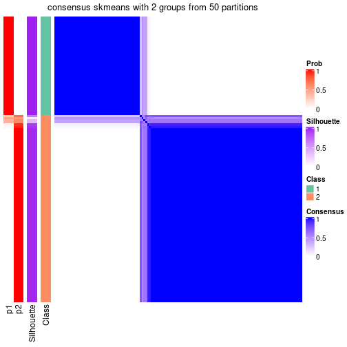</p>

</div>
<div id='tab-node-06-consensus-heatmap-2'>
<pre><code class="r">consensus_heatmap(res, k = 3)
</code></pre>

<p>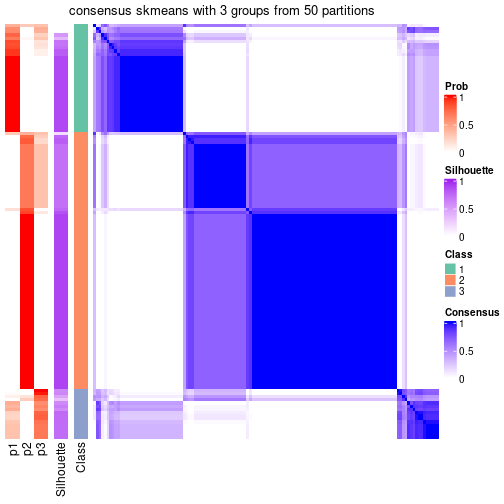</p>

</div>
<div id='tab-node-06-consensus-heatmap-3'>
<pre><code class="r">consensus_heatmap(res, k = 4)
</code></pre>

<p>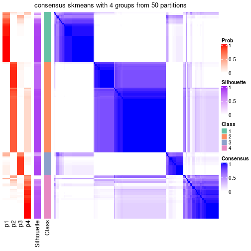</p>

</div>
<div id='tab-node-06-consensus-heatmap-4'>
<pre><code class="r">consensus_heatmap(res, k = 5)
</code></pre>

<p>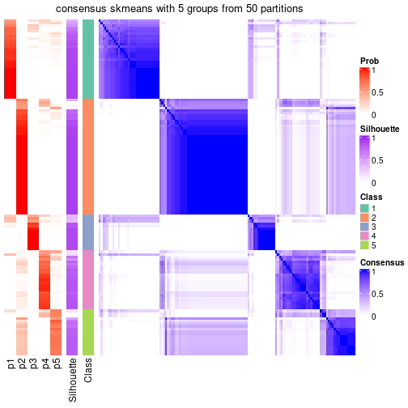</p>

</div>
<div id='tab-node-06-consensus-heatmap-5'>
<pre><code class="r">consensus_heatmap(res, k = 6)
</code></pre>

<p>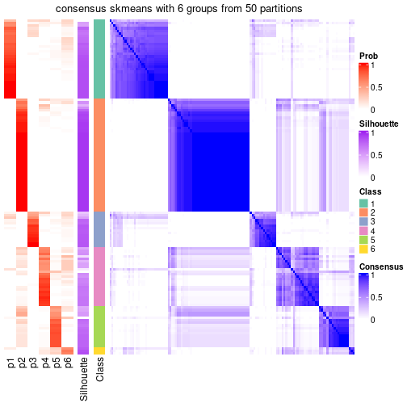</p>

</div>
<div id='tab-node-06-consensus-heatmap-6'>
<pre><code class="r">consensus_heatmap(res, k = 7)
</code></pre>

<p>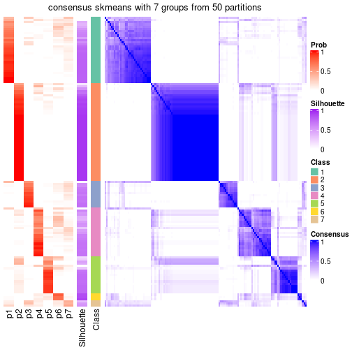</p>

</div>
<div id='tab-node-06-consensus-heatmap-7'>
<pre><code class="r">consensus_heatmap(res, k = 8)
</code></pre>

<p>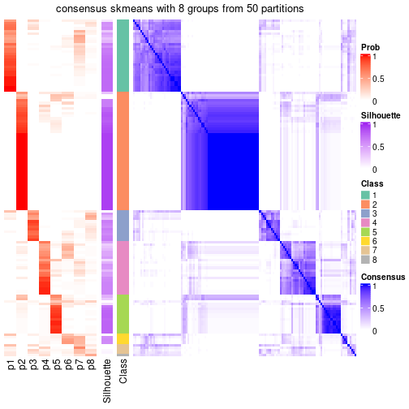</p>

</div>
</div>

Heatmaps for the membership of samples in all partitions to see how consistent they are:


<script>
$( function() {
	$( '#tabs-node-06-membership-heatmap' ).tabs();
} );
</script>
<div id='tabs-node-06-membership-heatmap'>
<ul>
<li><a href='#tab-node-06-membership-heatmap-1'>k = 2</a></li>
<li><a href='#tab-node-06-membership-heatmap-2'>k = 3</a></li>
<li><a href='#tab-node-06-membership-heatmap-3'>k = 4</a></li>
<li><a href='#tab-node-06-membership-heatmap-4'>k = 5</a></li>
<li><a href='#tab-node-06-membership-heatmap-5'>k = 6</a></li>
<li><a href='#tab-node-06-membership-heatmap-6'>k = 7</a></li>
<li><a href='#tab-node-06-membership-heatmap-7'>k = 8</a></li>
</ul>
<div id='tab-node-06-membership-heatmap-1'>
<pre><code class="r">membership_heatmap(res, k = 2)
</code></pre>

<p>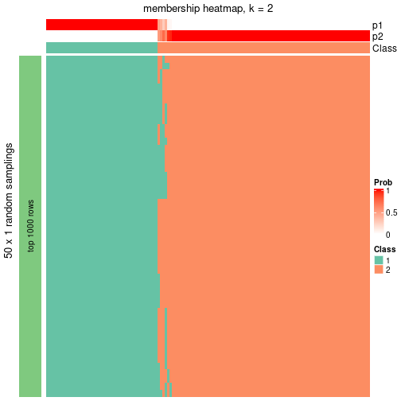</p>

</div>
<div id='tab-node-06-membership-heatmap-2'>
<pre><code class="r">membership_heatmap(res, k = 3)
</code></pre>

<p>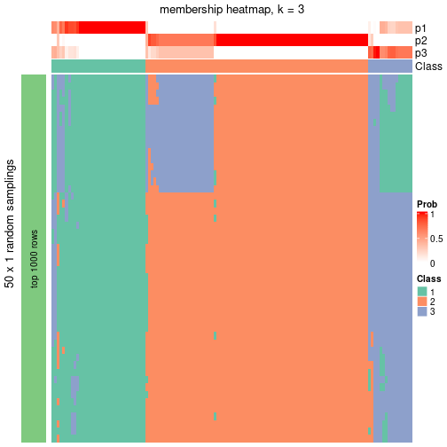</p>

</div>
<div id='tab-node-06-membership-heatmap-3'>
<pre><code class="r">membership_heatmap(res, k = 4)
</code></pre>

<p>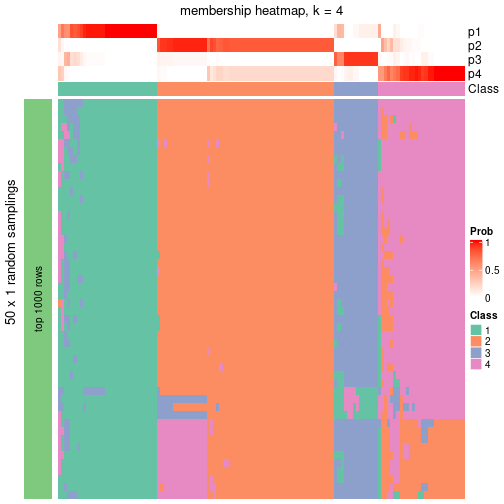</p>

</div>
<div id='tab-node-06-membership-heatmap-4'>
<pre><code class="r">membership_heatmap(res, k = 5)
</code></pre>

<p>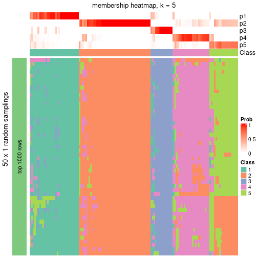</p>

</div>
<div id='tab-node-06-membership-heatmap-5'>
<pre><code class="r">membership_heatmap(res, k = 6)
</code></pre>

<p>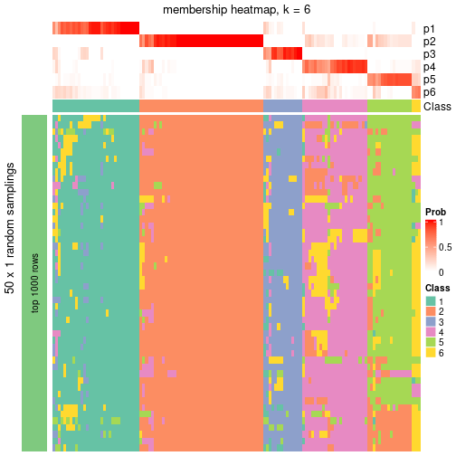</p>

</div>
<div id='tab-node-06-membership-heatmap-6'>
<pre><code class="r">membership_heatmap(res, k = 7)
</code></pre>

<p>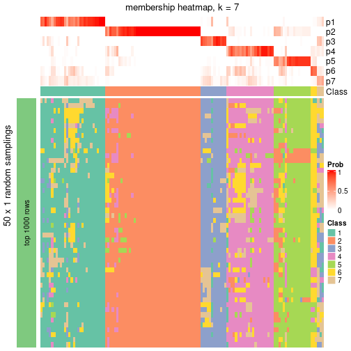</p>

</div>
<div id='tab-node-06-membership-heatmap-7'>
<pre><code class="r">membership_heatmap(res, k = 8)
</code></pre>

<p>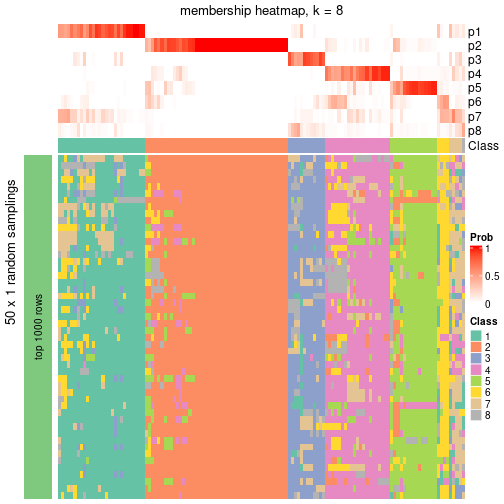</p>

</div>
</div>

As soon as the classes for columns are determined, the signatures
that are significantly different between subgroups can be looked for. 
Following are the heatmaps for signatures.


<script>
$( function() {
	$( '#tabs-node-06-get-signatures' ).tabs();
} );
</script>
<div id='tabs-node-06-get-signatures'>
<ul>
<li><a href='#tab-node-06-get-signatures-1'>k = 2</a></li>
<li><a href='#tab-node-06-get-signatures-2'>k = 3</a></li>
<li><a href='#tab-node-06-get-signatures-3'>k = 4</a></li>
<li><a href='#tab-node-06-get-signatures-4'>k = 5</a></li>
<li><a href='#tab-node-06-get-signatures-5'>k = 6</a></li>
<li><a href='#tab-node-06-get-signatures-6'>k = 7</a></li>
<li><a href='#tab-node-06-get-signatures-7'>k = 8</a></li>
</ul>
<div id='tab-node-06-get-signatures-1'>
<pre><code class="r">get_signatures(res, k = 2)
</code></pre>

<p>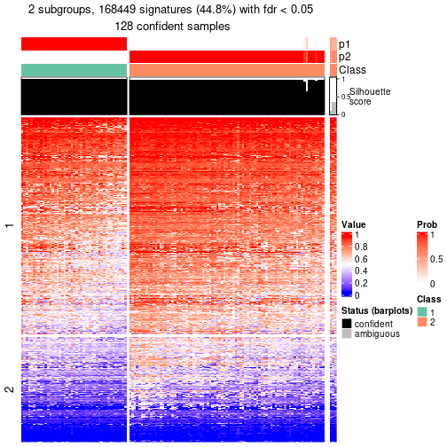</p>

</div>
<div id='tab-node-06-get-signatures-2'>
<pre><code class="r">get_signatures(res, k = 3)
</code></pre>

<p>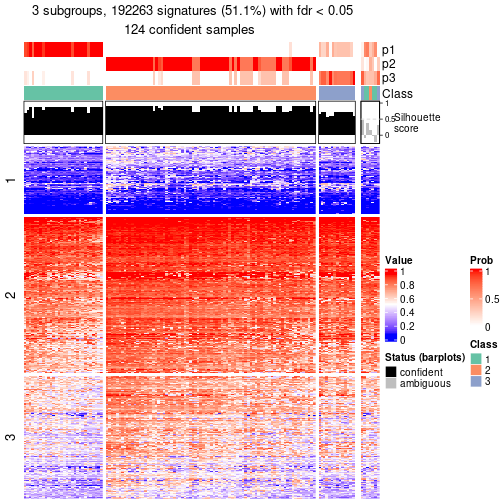</p>

</div>
<div id='tab-node-06-get-signatures-3'>
<pre><code class="r">get_signatures(res, k = 4)
</code></pre>

<p>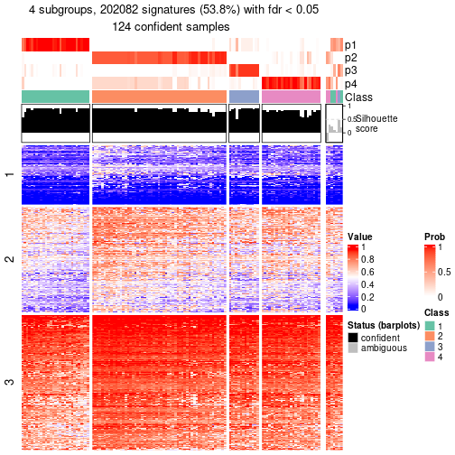</p>

</div>
<div id='tab-node-06-get-signatures-4'>
<pre><code class="r">get_signatures(res, k = 5)
</code></pre>

<p>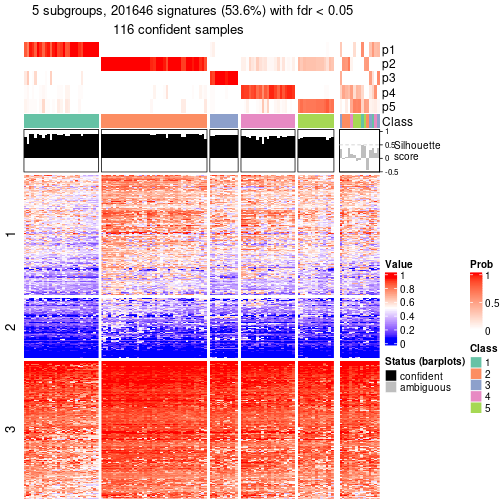</p>

</div>
<div id='tab-node-06-get-signatures-5'>
<pre><code class="r">get_signatures(res, k = 6)
</code></pre>

<p>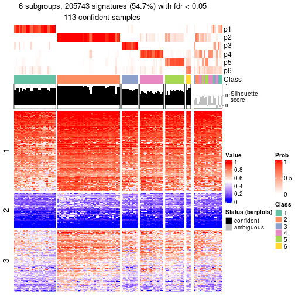</p>

</div>
<div id='tab-node-06-get-signatures-6'>
<pre><code class="r">get_signatures(res, k = 7)
</code></pre>

<p>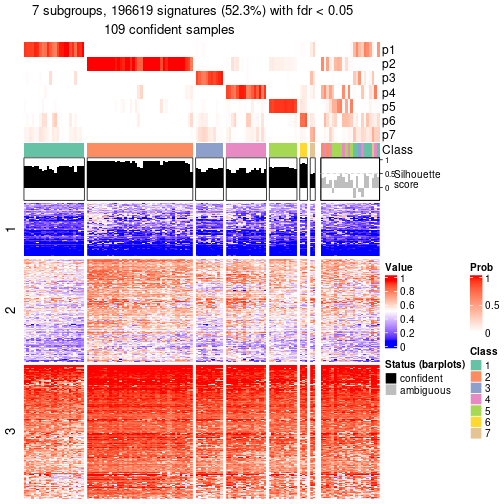</p>

</div>
<div id='tab-node-06-get-signatures-7'>
<pre><code class="r">get_signatures(res, k = 8)
</code></pre>

<p>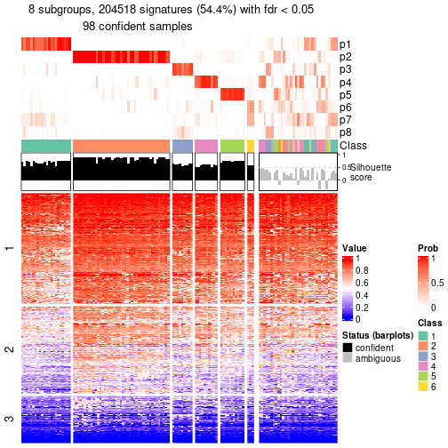</p>

</div>
</div>


Compare the overlap of signatures from different k:

```r
compare_signatures(res)
```

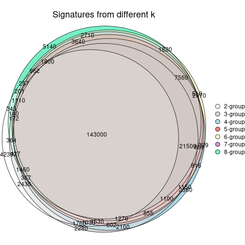

`get_signature()` returns a data frame invisibly. To get the list of signatures, the function
call should be assigned to a variable explicitly. In following code, if `plot` argument is set
to `FALSE`, no heatmap is plotted while only the differential analysis is performed.

```r
# code only for demonstration
tb = get_signature(res, k = ..., plot = FALSE)
```

An example of the output of `tb` is:

```
#>   which_row         fdr    mean_1    mean_2 scaled_mean_1 scaled_mean_2 km
#> 1        38 0.042760348  8.373488  9.131774    -0.5533452     0.5164555  1
#> 2        40 0.018707592  7.106213  8.469186    -0.6173731     0.5762149  1
#> 3        55 0.019134737 10.221463 11.207825    -0.6159697     0.5749050  1
#> 4        59 0.006059896  5.921854  7.869574    -0.6899429     0.6439467  1
#> 5        60 0.018055526  8.928898 10.211722    -0.6204761     0.5791110  1
#> 6        98 0.009384629 15.714769 14.887706     0.6635654    -0.6193277  2
...
```

The columns in `tb` are:

1. `which_row`: row indices corresponding to the input matrix.
2. `fdr`: FDR for the differential test. 
3. `mean_x`: The mean value in group x.
4. `scaled_mean_x`: The mean value in group x after rows are scaled.
5. `km`: Row groups if k-means clustering is applied to rows (which is done by automatically selecting number of clusters).

If there are too many signatures, `top_signatures = ...` can be set to only show the 
signatures with the highest FDRs:

```r
# code only for demonstration
# e.g. to show the top 500 most significant rows
tb = get_signature(res, k = ..., top_signatures = 500)
```

If the signatures are defined as these which are uniquely high in current group, `diff_method` argument
can be set to `"uniquely_high_in_one_group"`:

```r
# code only for demonstration
tb = get_signature(res, k = ..., diff_method = "uniquely_high_in_one_group")
```


UMAP plot which shows how samples are separated.


<script>
$( function() {
	$( '#tabs-node-06-dimension-reduction' ).tabs();
} );
</script>
<div id='tabs-node-06-dimension-reduction'>
<ul>
<li><a href='#tab-node-06-dimension-reduction-1'>k = 2</a></li>
<li><a href='#tab-node-06-dimension-reduction-2'>k = 3</a></li>
<li><a href='#tab-node-06-dimension-reduction-3'>k = 4</a></li>
<li><a href='#tab-node-06-dimension-reduction-4'>k = 5</a></li>
<li><a href='#tab-node-06-dimension-reduction-5'>k = 6</a></li>
<li><a href='#tab-node-06-dimension-reduction-6'>k = 7</a></li>
<li><a href='#tab-node-06-dimension-reduction-7'>k = 8</a></li>
</ul>
<div id='tab-node-06-dimension-reduction-1'>
<pre><code class="r">dimension_reduction(res, k = 2, method = &quot;UMAP&quot;)
</code></pre>

<p>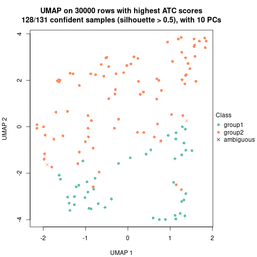</p>

</div>
<div id='tab-node-06-dimension-reduction-2'>
<pre><code class="r">dimension_reduction(res, k = 3, method = &quot;UMAP&quot;)
</code></pre>

<p>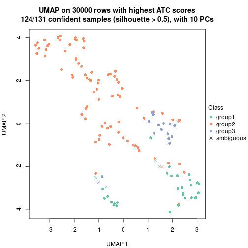</p>

</div>
<div id='tab-node-06-dimension-reduction-3'>
<pre><code class="r">dimension_reduction(res, k = 4, method = &quot;UMAP&quot;)
</code></pre>

<p>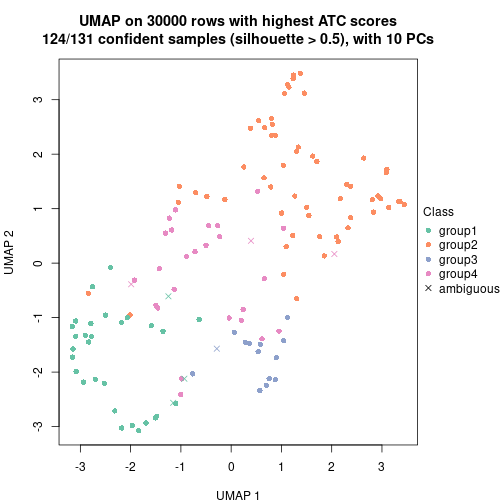</p>

</div>
<div id='tab-node-06-dimension-reduction-4'>
<pre><code class="r">dimension_reduction(res, k = 5, method = &quot;UMAP&quot;)
</code></pre>

<p>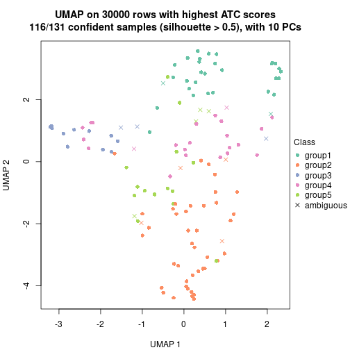</p>

</div>
<div id='tab-node-06-dimension-reduction-5'>
<pre><code class="r">dimension_reduction(res, k = 6, method = &quot;UMAP&quot;)
</code></pre>

<p>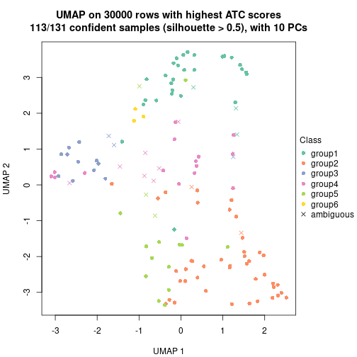</p>

</div>
<div id='tab-node-06-dimension-reduction-6'>
<pre><code class="r">dimension_reduction(res, k = 7, method = &quot;UMAP&quot;)
</code></pre>

<p>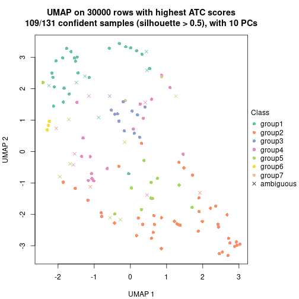</p>

</div>
<div id='tab-node-06-dimension-reduction-7'>
<pre><code class="r">dimension_reduction(res, k = 8, method = &quot;UMAP&quot;)
</code></pre>

<p>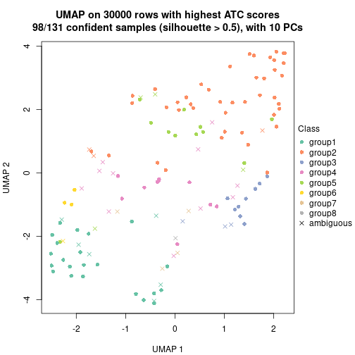</p>

</div>
</div>


Following heatmap shows how subgroups are split when increasing `k`:

```r
collect_classes(res)
```

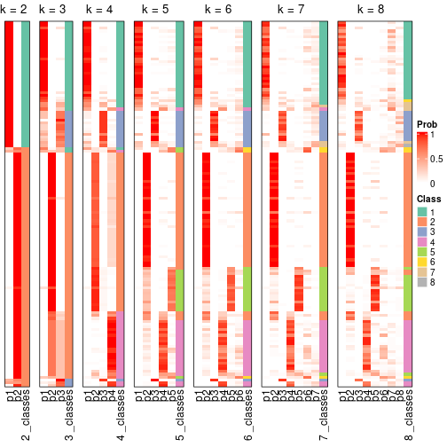


If matrix rows can be associated to genes, consider to use `functional_enrichment(res,
...)` to perform function enrichment for the signature genes. See [this vignette](https://jokergoo.github.io/cola_vignettes/functional_enrichment.html) for more detailed explanations.


 

---------------------------------------------------


### Node061


Parent node: [Node06](#Node06).
Child nodes: 
                Node0111-leaf
        ,
                Node0112-leaf
        ,
                Node0113-leaf
        ,
                Node0114-leaf
        ,
                Node0121-leaf
        ,
                Node0122-leaf
        ,
                Node0123-leaf
        ,
                Node0131-leaf
        ,
                Node0132-leaf
        ,
                Node0133-leaf
        ,
                Node0134-leaf
        ,
                Node0211-leaf
        ,
                Node0212-leaf
        ,
                [Node0213](#Node0213)
        ,
                Node0214-leaf
        ,
                [Node0221](#Node0221)
        ,
                Node0222-leaf
        ,
                Node0223-leaf
        ,
                [Node0231](#Node0231)
        ,
                Node0232-leaf
        ,
                Node0233-leaf
        ,
                [Node0234](#Node0234)
        ,
                Node0235-leaf
        ,
                Node0241-leaf
        ,
                [Node0242](#Node0242)
        ,
                Node0411-leaf
        ,
                Node0412-leaf
        ,
                Node0421-leaf
        ,
                Node0422-leaf
        ,
                Node0423-leaf
        ,
                Node0431-leaf
        ,
                Node0432-leaf
        ,
                Node0511-leaf
        ,
                Node0512-leaf
        ,
                Node0513-leaf
        ,
                Node0514-leaf
        ,
                Node0521-leaf
        ,
                Node0522-leaf
        ,
                Node0523-leaf
        ,
                Node0524-leaf
        ,
                Node0525-leaf
        ,
                Node0611-leaf
        ,
                [Node0612](#Node0612)
        ,
                Node0613-leaf
        ,
                [Node0711](#Node0711)
        ,
                Node0712-leaf
        ,
                Node0713-leaf
        ,
                [Node0721](#Node0721)
        ,
                Node0722-leaf
        ,
                Node0731-leaf
        ,
                Node0732-leaf
        ,
                Node0733-leaf
        .


The object with results only for a single top-value method and a single partitioning method 
can be extracted as:

```r
res = res_rh["061"]
```

A summary of `res` and all the functions that can be applied to it:

```r
res
```

```
#> A 'ConsensusPartition' object with k = 2, 3, 4, 5, 6, 7, 8.
#>   On a matrix with 30000 rows and 45 columns.
#>   Top rows (1000) are extracted by 'ATC' method.
#>   Subgroups are detected by 'kmeans' method.
#>   Performed in total 350 partitions by row resampling.
#>   Best k for subgroups seems to be 4.
#> 
#> Following methods can be applied to this 'ConsensusPartition' object:
#>  [1] "cola_report"             "collect_classes"         "collect_plots"          
#>  [4] "collect_stats"           "colnames"                "compare_partitions"     
#>  [7] "compare_signatures"      "consensus_heatmap"       "dimension_reduction"    
#> [10] "functional_enrichment"   "get_anno_col"            "get_anno"               
#> [13] "get_classes"             "get_consensus"           "get_matrix"             
#> [16] "get_membership"          "get_param"               "get_signatures"         
#> [19] "get_stats"               "is_best_k"               "is_stable_k"            
#> [22] "membership_heatmap"      "ncol"                    "nrow"                   
#> [25] "plot_ecdf"               "predict_classes"         "rownames"               
#> [28] "select_partition_number" "show"                    "suggest_best_k"         
#> [31] "test_to_known_factors"   "top_rows_heatmap"
```

`collect_plots()` function collects all the plots made from `res` for all `k` (number of subgroups)
into one single page to provide an easy and fast comparison between different `k`.

```r
collect_plots(res)
```

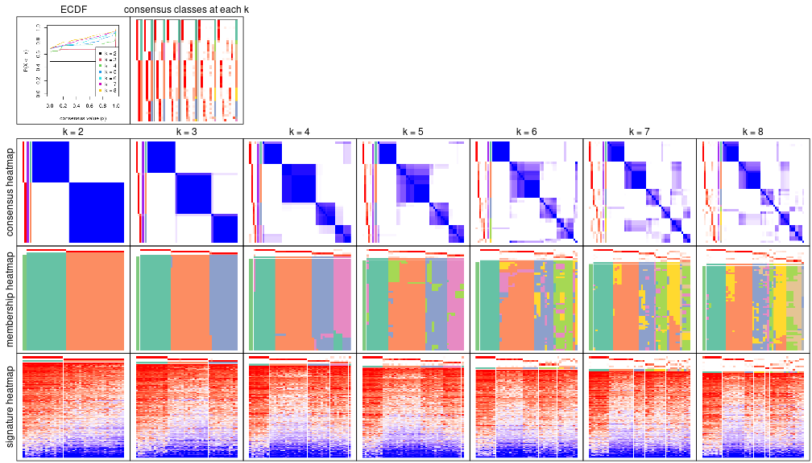

The plots are:

- The first row: a plot of the eCDF (empirical cumulative distribution
  function) curves of the consensus matrix for each `k` and the heatmap of
  predicted classes for each `k`.
- The second row: heatmaps of the consensus matrix for each `k`.
- The third row: heatmaps of the membership matrix for each `k`.
- The fouth row: heatmaps of the signatures for each `k`.

All the plots in panels can be made by individual functions and they are
plotted later in this section.

`select_partition_number()` produces several plots showing different
statistics for choosing "optimized" `k`. There are following statistics:

- eCDF curves of the consensus matrix for each `k`;
- 1-PAC. [The PAC score](https://en.wikipedia.org/wiki/Consensus_clustering#Over-interpretation_potential_of_consensus_clustering)
  measures the proportion of the ambiguous subgrouping.
- Mean silhouette score.
- Concordance. The mean probability of fiting the consensus subgroup labels in all
  partitions.
- Area increased. Denote $A_k$ as the area under the eCDF curve for current
  `k`, the area increased is defined as $A_k - A_{k-1}$.
- Rand index. The percent of pairs of samples that are both in a same cluster
  or both are not in a same cluster in the partition of k and k-1.
- Jaccard index. The ratio of pairs of samples are both in a same cluster in
  the partition of k and k-1 and the pairs of samples are both in a same
  cluster in the partition k or k-1.

The detailed explanations of these statistics can be found in [the _cola_
vignette](https://jokergoo.github.io/cola_vignettes/cola.html#toc_13).

Generally speaking, higher 1-PAC score, higher mean silhouette score or higher
concordance corresponds to better partition. Rand index and Jaccard index
measure how similar the current partition is compared to partition with `k-1`.
If they are too similar, we won't accept `k` is better than `k-1`.

```r
select_partition_number(res)
```

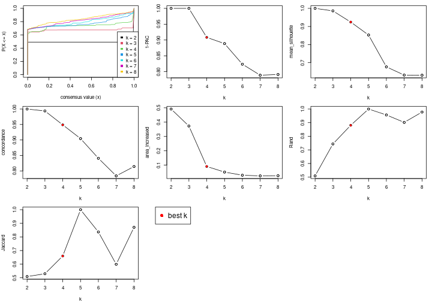

The numeric values for all these statistics can be obtained by `get_stats()`.

```r
get_stats(res)
```

```
#>   k 1-PAC mean_silhouette concordance area_increased  Rand Jaccard
#> 2 2 1.000           1.000       1.000         0.4914 0.509   0.509
#> 3 3 1.000           0.986       0.994         0.3727 0.743   0.530
#> 4 4 0.908           0.924       0.949         0.0907 0.881   0.660
#> 5 5 0.889           0.853       0.904         0.0516 1.000   1.000
#> 6 6 0.823           0.677       0.841         0.0297 0.957   0.837
#> 7 7 0.789           0.631       0.784         0.0251 0.902   0.599
#> 8 8 0.791           0.631       0.814         0.0264 0.978   0.871
```

`suggest_best_k()` suggests the best $k$ based on these statistics. The rules are as follows:

- All $k$ with Jaccard index larger than 0.95 are removed because increasing
  $k$ does not provide enough extra information. If all $k$ are removed, it is
  marked as no subgroup is detected.
- For all $k$ with 1-PAC score larger than 0.9, the maximal $k$ is taken as
  the best $k$, and other $k$ are marked as optional $k$.
- If it does not fit the second rule. The $k$ with the maximal vote of the
  highest 1-PAC score, highest mean silhouette, and highest concordance is
  taken as the best $k$.

```r
suggest_best_k(res)
```

```
#> [1] 4
#> attr(,"optional")
#> [1] 2 3
```

There is also optional best $k$ = 2 3 that is worth to check.

Following is the table of the partitions (You need to click the **show/hide
code output** link to see it). The membership matrix (columns with name `p*`)
is inferred by
[`clue::cl_consensus()`](https://www.rdocumentation.org/link/cl_consensus?package=clue)
function with the `SE` method. Basically the value in the membership matrix
represents the probability to belong to a certain group. The finall subgroup
label for an item is determined with the group with highest probability it
belongs to.

In `get_classes()` function, the entropy is calculated from the membership
matrix and the silhouette score is calculated from the consensus matrix.


<script>
$( function() {
	$( '#tabs-node-061-get-classes' ).tabs();
} );
</script>
<div id='tabs-node-061-get-classes'>
<ul>
<li><a href='#tab-node-061-get-classes-1'>k = 2</a></li>
<li><a href='#tab-node-061-get-classes-2'>k = 3</a></li>
<li><a href='#tab-node-061-get-classes-3'>k = 4</a></li>
<li><a href='#tab-node-061-get-classes-4'>k = 5</a></li>
<li><a href='#tab-node-061-get-classes-5'>k = 6</a></li>
<li><a href='#tab-node-061-get-classes-6'>k = 7</a></li>
<li><a href='#tab-node-061-get-classes-7'>k = 8</a></li>
</ul>

<div id='tab-node-061-get-classes-1'>
<p><a id='tab-node-061-get-classes-1-a' style='color:#0366d6' href='#'>show/hide code output</a></p>
<pre><code class="r">cbind(get_classes(res, k = 2), get_membership(res, k = 2))
</code></pre>

<pre><code>#&gt;                 class entropy silhouette p1 p2
#&gt; TCGA.43.7656.01     2       0          1  0  1
#&gt; TCGA.98.8020.01     2       0          1  0  1
#&gt; TCGA.56.8622.01     2       0          1  0  1
#&gt; TCGA.85.7950.01     1       0          1  1  0
#&gt; TCGA.NC.A5HI.01     2       0          1  0  1
#&gt; TCGA.94.7557.01     2       0          1  0  1
#&gt; TCGA.90.A4ED.01     2       0          1  0  1
#&gt; TCGA.77.8130.01     1       0          1  1  0
#&gt; TCGA.94.8035.01     2       0          1  0  1
#&gt; TCGA.77.8145.01     2       0          1  0  1
#&gt; TCGA.77.8140.01     2       0          1  0  1
#&gt; TCGA.22.5478.01     2       0          1  0  1
#&gt; TCGA.77.7337.01     1       0          1  1  0
#&gt; TCGA.63.A5MI.01     2       0          1  0  1
#&gt; TCGA.77.8139.01     2       0          1  0  1
#&gt; TCGA.98.8022.01     2       0          1  0  1
#&gt; TCGA.21.5782.01     2       0          1  0  1
#&gt; TCGA.98.A53B.01     1       0          1  1  0
#&gt; TCGA.34.8455.01     1       0          1  1  0
#&gt; TCGA.43.A56V.01     2       0          1  0  1
#&gt; TCGA.63.7020.01     2       0          1  0  1
#&gt; TCGA.56.8304.01     2       0          1  0  1
#&gt; TCGA.39.5029.01     2       0          1  0  1
#&gt; TCGA.77.7465.01     1       0          1  1  0
#&gt; TCGA.33.4579.01     1       0          1  1  0
#&gt; TCGA.56.A5DR.01     2       0          1  0  1
#&gt; TCGA.22.5472.01     1       0          1  1  0
#&gt; TCGA.34.5239.01     1       0          1  1  0
#&gt; TCGA.77.7463.01     2       0          1  0  1
#&gt; TCGA.52.7810.01     1       0          1  1  0
#&gt; TCGA.85.8288.01     1       0          1  1  0
#&gt; TCGA.56.7221.01     2       0          1  0  1
#&gt; TCGA.98.A538.01     2       0          1  0  1
#&gt; TCGA.39.5035.01     1       0          1  1  0
#&gt; TCGA.56.7822.01     1       0          1  1  0
#&gt; TCGA.56.A49D.01     2       0          1  0  1
#&gt; TCGA.22.5492.01     2       0          1  0  1
#&gt; TCGA.90.7766.01     2       0          1  0  1
#&gt; TCGA.43.8116.01     1       0          1  1  0
#&gt; TCGA.LA.A7SW.01     2       0          1  0  1
#&gt; TCGA.96.7544.01     1       0          1  1  0
#&gt; TCGA.77.A5G7.01     1       0          1  1  0
#&gt; TCGA.56.8307.01     2       0          1  0  1
#&gt; TCGA.98.A539.01     1       0          1  1  0
#&gt; TCGA.56.7580.01     1       0          1  1  0
</code></pre>

<script>
$('#tab-node-061-get-classes-1-a').parent().next().next().hide();
$('#tab-node-061-get-classes-1-a').click(function(){
  $('#tab-node-061-get-classes-1-a').parent().next().next().toggle();
  return(false);
});
</script>
</div>

<div id='tab-node-061-get-classes-2'>
<p><a id='tab-node-061-get-classes-2-a' style='color:#0366d6' href='#'>show/hide code output</a></p>
<pre><code class="r">cbind(get_classes(res, k = 3), get_membership(res, k = 3))
</code></pre>

<pre><code>#&gt;                 class entropy silhouette p1   p2   p3
#&gt; TCGA.43.7656.01     2   0.000      0.993  0 1.00 0.00
#&gt; TCGA.98.8020.01     2   0.000      0.993  0 1.00 0.00
#&gt; TCGA.56.8622.01     3   0.000      0.986  0 0.00 1.00
#&gt; TCGA.85.7950.01     1   0.000      1.000  1 0.00 0.00
#&gt; TCGA.NC.A5HI.01     2   0.000      0.993  0 1.00 0.00
#&gt; TCGA.94.7557.01     2   0.000      0.993  0 1.00 0.00
#&gt; TCGA.90.A4ED.01     3   0.000      0.986  0 0.00 1.00
#&gt; TCGA.77.8130.01     1   0.000      1.000  1 0.00 0.00
#&gt; TCGA.94.8035.01     2   0.000      0.993  0 1.00 0.00
#&gt; TCGA.77.8145.01     3   0.000      0.986  0 0.00 1.00
#&gt; TCGA.77.8140.01     2   0.000      0.993  0 1.00 0.00
#&gt; TCGA.22.5478.01     2   0.000      0.993  0 1.00 0.00
#&gt; TCGA.77.7337.01     1   0.000      1.000  1 0.00 0.00
#&gt; TCGA.63.A5MI.01     2   0.000      0.993  0 1.00 0.00
#&gt; TCGA.77.8139.01     2   0.000      0.993  0 1.00 0.00
#&gt; TCGA.98.8022.01     3   0.000      0.986  0 0.00 1.00
#&gt; TCGA.21.5782.01     3   0.000      0.986  0 0.00 1.00
#&gt; TCGA.98.A53B.01     3   0.000      0.986  0 0.00 1.00
#&gt; TCGA.34.8455.01     1   0.000      1.000  1 0.00 0.00
#&gt; TCGA.43.A56V.01     2   0.000      0.993  0 1.00 0.00
#&gt; TCGA.63.7020.01     3   0.000      0.986  0 0.00 1.00
#&gt; TCGA.56.8304.01     2   0.000      0.993  0 1.00 0.00
#&gt; TCGA.39.5029.01     2   0.000      0.993  0 1.00 0.00
#&gt; TCGA.77.7465.01     1   0.000      1.000  1 0.00 0.00
#&gt; TCGA.33.4579.01     1   0.000      1.000  1 0.00 0.00
#&gt; TCGA.56.A5DR.01     2   0.000      0.993  0 1.00 0.00
#&gt; TCGA.22.5472.01     1   0.000      1.000  1 0.00 0.00
#&gt; TCGA.34.5239.01     1   0.000      1.000  1 0.00 0.00
#&gt; TCGA.77.7463.01     2   0.000      0.993  0 1.00 0.00
#&gt; TCGA.52.7810.01     1   0.000      1.000  1 0.00 0.00
#&gt; TCGA.85.8288.01     1   0.000      1.000  1 0.00 0.00
#&gt; TCGA.56.7221.01     2   0.000      0.993  0 1.00 0.00
#&gt; TCGA.98.A538.01     2   0.000      0.993  0 1.00 0.00
#&gt; TCGA.39.5035.01     1   0.000      1.000  1 0.00 0.00
#&gt; TCGA.56.7822.01     3   0.000      0.986  0 0.00 1.00
#&gt; TCGA.56.A49D.01     2   0.000      0.993  0 1.00 0.00
#&gt; TCGA.22.5492.01     3   0.400      0.807  0 0.16 0.84
#&gt; TCGA.90.7766.01     2   0.334      0.860  0 0.88 0.12
#&gt; TCGA.43.8116.01     1   0.000      1.000  1 0.00 0.00
#&gt; TCGA.LA.A7SW.01     3   0.000      0.986  0 0.00 1.00
#&gt; TCGA.96.7544.01     1   0.000      1.000  1 0.00 0.00
#&gt; TCGA.77.A5G7.01     3   0.000      0.986  0 0.00 1.00
#&gt; TCGA.56.8307.01     3   0.000      0.986  0 0.00 1.00
#&gt; TCGA.98.A539.01     3   0.000      0.986  0 0.00 1.00
#&gt; TCGA.56.7580.01     1   0.000      1.000  1 0.00 0.00
</code></pre>

<script>
$('#tab-node-061-get-classes-2-a').parent().next().next().hide();
$('#tab-node-061-get-classes-2-a').click(function(){
  $('#tab-node-061-get-classes-2-a').parent().next().next().toggle();
  return(false);
});
</script>
</div>

<div id='tab-node-061-get-classes-3'>
<p><a id='tab-node-061-get-classes-3-a' style='color:#0366d6' href='#'>show/hide code output</a></p>
<pre><code class="r">cbind(get_classes(res, k = 4), get_membership(res, k = 4))
</code></pre>

<pre><code>#&gt;                 class entropy silhouette   p1   p2   p3   p4
#&gt; TCGA.43.7656.01     2  0.0000      0.994 0.00 1.00 0.00 0.00
#&gt; TCGA.98.8020.01     2  0.0000      0.994 0.00 1.00 0.00 0.00
#&gt; TCGA.56.8622.01     3  0.1211      0.943 0.00 0.00 0.96 0.04
#&gt; TCGA.85.7950.01     4  0.3801      0.790 0.22 0.00 0.00 0.78
#&gt; TCGA.NC.A5HI.01     2  0.0707      0.986 0.00 0.98 0.02 0.00
#&gt; TCGA.94.7557.01     2  0.0000      0.994 0.00 1.00 0.00 0.00
#&gt; TCGA.90.A4ED.01     3  0.2647      0.862 0.00 0.00 0.88 0.12
#&gt; TCGA.77.8130.01     1  0.0000      0.953 1.00 0.00 0.00 0.00
#&gt; TCGA.94.8035.01     2  0.0707      0.986 0.00 0.98 0.02 0.00
#&gt; TCGA.77.8145.01     3  0.0000      0.936 0.00 0.00 1.00 0.00
#&gt; TCGA.77.8140.01     2  0.0000      0.994 0.00 1.00 0.00 0.00
#&gt; TCGA.22.5478.01     2  0.0000      0.994 0.00 1.00 0.00 0.00
#&gt; TCGA.77.7337.01     1  0.0000      0.953 1.00 0.00 0.00 0.00
#&gt; TCGA.63.A5MI.01     2  0.0707      0.986 0.00 0.98 0.02 0.00
#&gt; TCGA.77.8139.01     2  0.0000      0.994 0.00 1.00 0.00 0.00
#&gt; TCGA.98.8022.01     3  0.1211      0.943 0.00 0.00 0.96 0.04
#&gt; TCGA.21.5782.01     3  0.0707      0.941 0.00 0.00 0.98 0.02
#&gt; TCGA.98.A53B.01     4  0.2921      0.850 0.00 0.00 0.14 0.86
#&gt; TCGA.34.8455.01     1  0.0000      0.953 1.00 0.00 0.00 0.00
#&gt; TCGA.43.A56V.01     2  0.0707      0.986 0.00 0.98 0.02 0.00
#&gt; TCGA.63.7020.01     3  0.1211      0.943 0.00 0.00 0.96 0.04
#&gt; TCGA.56.8304.01     2  0.0000      0.994 0.00 1.00 0.00 0.00
#&gt; TCGA.39.5029.01     2  0.0000      0.994 0.00 1.00 0.00 0.00
#&gt; TCGA.77.7465.01     1  0.4713      0.304 0.64 0.00 0.00 0.36
#&gt; TCGA.33.4579.01     1  0.0000      0.953 1.00 0.00 0.00 0.00
#&gt; TCGA.56.A5DR.01     2  0.0707      0.986 0.00 0.98 0.02 0.00
#&gt; TCGA.22.5472.01     1  0.0000      0.953 1.00 0.00 0.00 0.00
#&gt; TCGA.34.5239.01     1  0.0000      0.953 1.00 0.00 0.00 0.00
#&gt; TCGA.77.7463.01     2  0.0000      0.994 0.00 1.00 0.00 0.00
#&gt; TCGA.52.7810.01     4  0.3400      0.834 0.18 0.00 0.00 0.82
#&gt; TCGA.85.8288.01     1  0.0000      0.953 1.00 0.00 0.00 0.00
#&gt; TCGA.56.7221.01     2  0.0000      0.994 0.00 1.00 0.00 0.00
#&gt; TCGA.98.A538.01     2  0.0000      0.994 0.00 1.00 0.00 0.00
#&gt; TCGA.39.5035.01     1  0.0000      0.953 1.00 0.00 0.00 0.00
#&gt; TCGA.56.7822.01     4  0.2921      0.850 0.00 0.00 0.14 0.86
#&gt; TCGA.56.A49D.01     2  0.0000      0.994 0.00 1.00 0.00 0.00
#&gt; TCGA.22.5492.01     3  0.0707      0.926 0.00 0.02 0.98 0.00
#&gt; TCGA.90.7766.01     3  0.2921      0.788 0.00 0.14 0.86 0.00
#&gt; TCGA.43.8116.01     4  0.3400      0.834 0.18 0.00 0.00 0.82
#&gt; TCGA.LA.A7SW.01     3  0.1211      0.943 0.00 0.00 0.96 0.04
#&gt; TCGA.96.7544.01     1  0.0000      0.953 1.00 0.00 0.00 0.00
#&gt; TCGA.77.A5G7.01     4  0.2921      0.850 0.00 0.00 0.14 0.86
#&gt; TCGA.56.8307.01     3  0.1637      0.938 0.00 0.00 0.94 0.06
#&gt; TCGA.98.A539.01     4  0.2921      0.850 0.00 0.00 0.14 0.86
#&gt; TCGA.56.7580.01     4  0.3400      0.834 0.18 0.00 0.00 0.82
</code></pre>

<script>
$('#tab-node-061-get-classes-3-a').parent().next().next().hide();
$('#tab-node-061-get-classes-3-a').click(function(){
  $('#tab-node-061-get-classes-3-a').parent().next().next().toggle();
  return(false);
});
</script>
</div>

<div id='tab-node-061-get-classes-4'>
<p><a id='tab-node-061-get-classes-4-a' style='color:#0366d6' href='#'>show/hide code output</a></p>
<pre><code class="r">cbind(get_classes(res, k = 5), get_membership(res, k = 5))
</code></pre>

<pre><code>#&gt;                 class entropy silhouette   p1   p2   p3   p4   p5
#&gt; TCGA.43.7656.01     2  0.0000     0.9017 0.00 1.00 0.00 0.00 0.00
#&gt; TCGA.98.8020.01     2  0.0000     0.9017 0.00 1.00 0.00 0.00 0.00
#&gt; TCGA.56.8622.01     3  0.0000     0.8754 0.00 0.00 1.00 0.00 0.00
#&gt; TCGA.85.7950.01     4  0.4096     0.8498 0.04 0.00 0.00 0.76 0.20
#&gt; TCGA.NC.A5HI.01     2  0.3561     0.7947 0.00 0.74 0.00 0.00 0.26
#&gt; TCGA.94.7557.01     2  0.1043     0.8983 0.00 0.96 0.00 0.00 0.04
#&gt; TCGA.90.A4ED.01     3  0.3796     0.7149 0.00 0.00 0.70 0.00 0.30
#&gt; TCGA.77.8130.01     1  0.0000     0.9409 1.00 0.00 0.00 0.00 0.00
#&gt; TCGA.94.8035.01     2  0.5961     0.6018 0.00 0.58 0.16 0.00 0.26
#&gt; TCGA.77.8145.01     3  0.0609     0.8737 0.00 0.00 0.98 0.00 0.02
#&gt; TCGA.77.8140.01     2  0.1410     0.8939 0.00 0.94 0.00 0.00 0.06
#&gt; TCGA.22.5478.01     2  0.0000     0.9017 0.00 1.00 0.00 0.00 0.00
#&gt; TCGA.77.7337.01     1  0.0000     0.9409 1.00 0.00 0.00 0.00 0.00
#&gt; TCGA.63.A5MI.01     2  0.3561     0.7947 0.00 0.74 0.00 0.00 0.26
#&gt; TCGA.77.8139.01     2  0.1410     0.8939 0.00 0.94 0.00 0.00 0.06
#&gt; TCGA.98.8022.01     3  0.2020     0.8604 0.00 0.00 0.90 0.00 0.10
#&gt; TCGA.21.5782.01     3  0.0609     0.8737 0.00 0.00 0.98 0.00 0.02
#&gt; TCGA.98.A53B.01     4  0.1648     0.8993 0.00 0.00 0.02 0.94 0.04
#&gt; TCGA.34.8455.01     1  0.0000     0.9409 1.00 0.00 0.00 0.00 0.00
#&gt; TCGA.43.A56V.01     2  0.3561     0.7947 0.00 0.74 0.00 0.00 0.26
#&gt; TCGA.63.7020.01     3  0.0609     0.8745 0.00 0.00 0.98 0.00 0.02
#&gt; TCGA.56.8304.01     2  0.1043     0.8983 0.00 0.96 0.00 0.00 0.04
#&gt; TCGA.39.5029.01     2  0.0000     0.9017 0.00 1.00 0.00 0.00 0.00
#&gt; TCGA.77.7465.01     1  0.6422    -0.0169 0.46 0.00 0.00 0.36 0.18
#&gt; TCGA.33.4579.01     1  0.0000     0.9409 1.00 0.00 0.00 0.00 0.00
#&gt; TCGA.56.A5DR.01     2  0.5599     0.6637 0.00 0.62 0.12 0.00 0.26
#&gt; TCGA.22.5472.01     1  0.0000     0.9409 1.00 0.00 0.00 0.00 0.00
#&gt; TCGA.34.5239.01     1  0.0000     0.9409 1.00 0.00 0.00 0.00 0.00
#&gt; TCGA.77.7463.01     2  0.0000     0.9017 0.00 1.00 0.00 0.00 0.00
#&gt; TCGA.52.7810.01     4  0.2280     0.9183 0.00 0.00 0.00 0.88 0.12
#&gt; TCGA.85.8288.01     1  0.0000     0.9409 1.00 0.00 0.00 0.00 0.00
#&gt; TCGA.56.7221.01     2  0.0000     0.9017 0.00 1.00 0.00 0.00 0.00
#&gt; TCGA.98.A538.01     2  0.0000     0.9017 0.00 1.00 0.00 0.00 0.00
#&gt; TCGA.39.5035.01     1  0.0000     0.9409 1.00 0.00 0.00 0.00 0.00
#&gt; TCGA.56.7822.01     4  0.0000     0.9214 0.00 0.00 0.00 1.00 0.00
#&gt; TCGA.56.A49D.01     2  0.0000     0.9017 0.00 1.00 0.00 0.00 0.00
#&gt; TCGA.22.5492.01     3  0.3274     0.7767 0.00 0.00 0.78 0.00 0.22
#&gt; TCGA.90.7766.01     3  0.3684     0.7270 0.00 0.00 0.72 0.00 0.28
#&gt; TCGA.43.8116.01     4  0.2020     0.9218 0.00 0.00 0.00 0.90 0.10
#&gt; TCGA.LA.A7SW.01     3  0.2020     0.8604 0.00 0.00 0.90 0.00 0.10
#&gt; TCGA.96.7544.01     1  0.0000     0.9409 1.00 0.00 0.00 0.00 0.00
#&gt; TCGA.77.A5G7.01     4  0.0000     0.9214 0.00 0.00 0.00 1.00 0.00
#&gt; TCGA.56.8307.01     3  0.3424     0.7891 0.00 0.00 0.76 0.00 0.24
#&gt; TCGA.98.A539.01     4  0.1648     0.8993 0.00 0.00 0.02 0.94 0.04
#&gt; TCGA.56.7580.01     4  0.2280     0.9183 0.00 0.00 0.00 0.88 0.12
</code></pre>

<script>
$('#tab-node-061-get-classes-4-a').parent().next().next().hide();
$('#tab-node-061-get-classes-4-a').click(function(){
  $('#tab-node-061-get-classes-4-a').parent().next().next().toggle();
  return(false);
});
</script>
</div>

<div id='tab-node-061-get-classes-5'>
<p><a id='tab-node-061-get-classes-5-a' style='color:#0366d6' href='#'>show/hide code output</a></p>
<pre><code class="r">cbind(get_classes(res, k = 6), get_membership(res, k = 6))
</code></pre>

<pre><code>#&gt;                 class entropy silhouette   p1   p2   p3   p4   p5   p6
#&gt; TCGA.43.7656.01     2  0.0000      0.806 0.00 1.00 0.00 0.00 0.00 0.00
#&gt; TCGA.98.8020.01     2  0.0000      0.806 0.00 1.00 0.00 0.00 0.00 0.00
#&gt; TCGA.56.8622.01     3  0.1092      0.715 0.00 0.00 0.96 0.02 0.00 0.02
#&gt; TCGA.85.7950.01     5  0.3270      0.692 0.00 0.00 0.00 0.12 0.82 0.06
#&gt; TCGA.NC.A5HI.01     2  0.3756      0.424 0.00 0.60 0.00 0.00 0.00 0.40
#&gt; TCGA.94.7557.01     2  0.1556      0.786 0.00 0.92 0.00 0.00 0.00 0.08
#&gt; TCGA.90.A4ED.01     3  0.5199      0.451 0.00 0.00 0.58 0.30 0.00 0.12
#&gt; TCGA.77.8130.01     1  0.0000      1.000 1.00 0.00 0.00 0.00 0.00 0.00
#&gt; TCGA.94.8035.01     2  0.5703     -0.195 0.00 0.42 0.16 0.00 0.00 0.42
#&gt; TCGA.77.8145.01     3  0.1267      0.715 0.00 0.00 0.94 0.00 0.00 0.06
#&gt; TCGA.77.8140.01     2  0.2260      0.755 0.00 0.86 0.00 0.00 0.00 0.14
#&gt; TCGA.22.5478.01     2  0.0000      0.806 0.00 1.00 0.00 0.00 0.00 0.00
#&gt; TCGA.77.7337.01     1  0.0000      1.000 1.00 0.00 0.00 0.00 0.00 0.00
#&gt; TCGA.63.A5MI.01     2  0.4246      0.379 0.00 0.58 0.02 0.00 0.00 0.40
#&gt; TCGA.77.8139.01     2  0.2260      0.756 0.00 0.86 0.00 0.00 0.00 0.14
#&gt; TCGA.98.8022.01     3  0.4200      0.610 0.00 0.00 0.74 0.14 0.00 0.12
#&gt; TCGA.21.5782.01     3  0.1267      0.715 0.00 0.00 0.94 0.00 0.00 0.06
#&gt; TCGA.98.A53B.01     5  0.5071      0.595 0.00 0.00 0.08 0.40 0.52 0.00
#&gt; TCGA.34.8455.01     1  0.0000      1.000 1.00 0.00 0.00 0.00 0.00 0.00
#&gt; TCGA.43.A56V.01     2  0.3756      0.424 0.00 0.60 0.00 0.00 0.00 0.40
#&gt; TCGA.63.7020.01     3  0.2581      0.682 0.00 0.00 0.86 0.12 0.00 0.02
#&gt; TCGA.56.8304.01     2  0.1814      0.776 0.00 0.90 0.00 0.00 0.00 0.10
#&gt; TCGA.39.5029.01     2  0.0000      0.806 0.00 1.00 0.00 0.00 0.00 0.00
#&gt; TCGA.77.7465.01     5  0.5352      0.495 0.24 0.00 0.00 0.08 0.64 0.04
#&gt; TCGA.33.4579.01     1  0.0000      1.000 1.00 0.00 0.00 0.00 0.00 0.00
#&gt; TCGA.56.A5DR.01     6  0.5703     -0.418 0.00 0.42 0.16 0.00 0.00 0.42
#&gt; TCGA.22.5472.01     1  0.0000      1.000 1.00 0.00 0.00 0.00 0.00 0.00
#&gt; TCGA.34.5239.01     1  0.0000      1.000 1.00 0.00 0.00 0.00 0.00 0.00
#&gt; TCGA.77.7463.01     2  0.0000      0.806 0.00 1.00 0.00 0.00 0.00 0.00
#&gt; TCGA.52.7810.01     5  0.0000      0.770 0.00 0.00 0.00 0.00 1.00 0.00
#&gt; TCGA.85.8288.01     1  0.0000      1.000 1.00 0.00 0.00 0.00 0.00 0.00
#&gt; TCGA.56.7221.01     2  0.0000      0.806 0.00 1.00 0.00 0.00 0.00 0.00
#&gt; TCGA.98.A538.01     2  0.0000      0.806 0.00 1.00 0.00 0.00 0.00 0.00
#&gt; TCGA.39.5035.01     1  0.0000      1.000 1.00 0.00 0.00 0.00 0.00 0.00
#&gt; TCGA.56.7822.01     5  0.3076      0.749 0.00 0.00 0.00 0.24 0.76 0.00
#&gt; TCGA.56.A49D.01     2  0.0000      0.806 0.00 1.00 0.00 0.00 0.00 0.00
#&gt; TCGA.22.5492.01     3  0.3076      0.580 0.00 0.00 0.76 0.00 0.00 0.24
#&gt; TCGA.90.7766.01     3  0.3647      0.410 0.00 0.00 0.64 0.00 0.00 0.36
#&gt; TCGA.43.8116.01     5  0.0547      0.772 0.00 0.00 0.00 0.02 0.98 0.00
#&gt; TCGA.LA.A7SW.01     3  0.3985      0.631 0.00 0.00 0.76 0.10 0.00 0.14
#&gt; TCGA.96.7544.01     1  0.0000      1.000 1.00 0.00 0.00 0.00 0.00 0.00
#&gt; TCGA.77.A5G7.01     5  0.3076      0.749 0.00 0.00 0.00 0.24 0.76 0.00
#&gt; TCGA.56.8307.01     6  0.6047     -0.398 0.00 0.00 0.26 0.34 0.00 0.40
#&gt; TCGA.98.A539.01     5  0.4845      0.616 0.00 0.00 0.06 0.40 0.54 0.00
#&gt; TCGA.56.7580.01     5  0.0000      0.770 0.00 0.00 0.00 0.00 1.00 0.00
</code></pre>

<script>
$('#tab-node-061-get-classes-5-a').parent().next().next().hide();
$('#tab-node-061-get-classes-5-a').click(function(){
  $('#tab-node-061-get-classes-5-a').parent().next().next().toggle();
  return(false);
});
</script>
</div>

<div id='tab-node-061-get-classes-6'>
<p><a id='tab-node-061-get-classes-6-a' style='color:#0366d6' href='#'>show/hide code output</a></p>
<pre><code class="r">cbind(get_classes(res, k = 7), get_membership(res, k = 7))
</code></pre>

<pre><code>#&gt;                 class entropy silhouette   p1   p2   p3   p4   p5   p6   p7
#&gt; TCGA.43.7656.01     2  0.0000      0.879 0.00 1.00 0.00 0.00 0.00 0.00 0.00
#&gt; TCGA.98.8020.01     2  0.0000      0.879 0.00 1.00 0.00 0.00 0.00 0.00 0.00
#&gt; TCGA.56.8622.01     3  0.1006      0.641 0.00 0.00 0.96 0.00 0.00 0.02 0.02
#&gt; TCGA.85.7950.01     5  0.0504      0.510 0.00 0.00 0.00 0.00 0.98 0.02 0.00
#&gt; TCGA.NC.A5HI.01     6  0.3459      0.629 0.00 0.40 0.00 0.00 0.00 0.60 0.00
#&gt; TCGA.94.7557.01     2  0.2572      0.685 0.00 0.80 0.00 0.00 0.00 0.20 0.00
#&gt; TCGA.90.A4ED.01     7  0.6816     -0.435 0.00 0.00 0.18 0.24 0.00 0.18 0.40
#&gt; TCGA.77.8130.01     1  0.0000      0.985 1.00 0.00 0.00 0.00 0.00 0.00 0.00
#&gt; TCGA.94.8035.01     6  0.3745      0.727 0.00 0.26 0.04 0.00 0.00 0.70 0.00
#&gt; TCGA.77.8145.01     3  0.3867      0.550 0.00 0.00 0.60 0.02 0.00 0.38 0.00
#&gt; TCGA.77.8140.01     2  0.2832      0.614 0.00 0.76 0.00 0.00 0.00 0.24 0.00
#&gt; TCGA.22.5478.01     2  0.0000      0.879 0.00 1.00 0.00 0.00 0.00 0.00 0.00
#&gt; TCGA.77.7337.01     1  0.0000      0.985 1.00 0.00 0.00 0.00 0.00 0.00 0.00
#&gt; TCGA.63.A5MI.01     6  0.3294      0.701 0.00 0.34 0.00 0.00 0.00 0.66 0.00
#&gt; TCGA.77.8139.01     2  0.3221      0.411 0.00 0.68 0.00 0.00 0.00 0.32 0.00
#&gt; TCGA.98.8022.01     3  0.3833      0.497 0.00 0.00 0.78 0.12 0.00 0.06 0.04
#&gt; TCGA.21.5782.01     3  0.3186      0.636 0.00 0.00 0.76 0.00 0.00 0.22 0.02
#&gt; TCGA.98.A53B.01     7  0.4870      0.353 0.00 0.00 0.14 0.00 0.28 0.00 0.58
#&gt; TCGA.34.8455.01     1  0.0000      0.985 1.00 0.00 0.00 0.00 0.00 0.00 0.00
#&gt; TCGA.43.A56V.01     6  0.3459      0.629 0.00 0.40 0.00 0.00 0.00 0.60 0.00
#&gt; TCGA.63.7020.01     3  0.0504      0.630 0.00 0.00 0.98 0.00 0.00 0.00 0.02
#&gt; TCGA.56.8304.01     2  0.2081      0.761 0.00 0.86 0.00 0.00 0.00 0.14 0.00
#&gt; TCGA.39.5029.01     2  0.0000      0.879 0.00 1.00 0.00 0.00 0.00 0.00 0.00
#&gt; TCGA.77.7465.01     5  0.2832      0.372 0.24 0.00 0.00 0.00 0.76 0.00 0.00
#&gt; TCGA.33.4579.01     1  0.1718      0.920 0.92 0.00 0.00 0.04 0.00 0.04 0.00
#&gt; TCGA.56.A5DR.01     6  0.3745      0.727 0.00 0.26 0.04 0.00 0.00 0.70 0.00
#&gt; TCGA.22.5472.01     1  0.0000      0.985 1.00 0.00 0.00 0.00 0.00 0.00 0.00
#&gt; TCGA.34.5239.01     1  0.0000      0.985 1.00 0.00 0.00 0.00 0.00 0.00 0.00
#&gt; TCGA.77.7463.01     2  0.0000      0.879 0.00 1.00 0.00 0.00 0.00 0.00 0.00
#&gt; TCGA.52.7810.01     5  0.3780      0.590 0.00 0.00 0.00 0.02 0.72 0.02 0.24
#&gt; TCGA.85.8288.01     1  0.0000      0.985 1.00 0.00 0.00 0.00 0.00 0.00 0.00
#&gt; TCGA.56.7221.01     2  0.0000      0.879 0.00 1.00 0.00 0.00 0.00 0.00 0.00
#&gt; TCGA.98.A538.01     2  0.0000      0.879 0.00 1.00 0.00 0.00 0.00 0.00 0.00
#&gt; TCGA.39.5035.01     1  0.0000      0.985 1.00 0.00 0.00 0.00 0.00 0.00 0.00
#&gt; TCGA.56.7822.01     7  0.3546      0.117 0.00 0.00 0.00 0.00 0.46 0.00 0.54
#&gt; TCGA.56.A49D.01     2  0.0000      0.879 0.00 1.00 0.00 0.00 0.00 0.00 0.00
#&gt; TCGA.22.5492.01     3  0.3459      0.526 0.00 0.00 0.60 0.00 0.00 0.40 0.00
#&gt; TCGA.90.7766.01     6  0.3496     -0.320 0.00 0.00 0.42 0.00 0.00 0.58 0.00
#&gt; TCGA.43.8116.01     5  0.3047      0.555 0.00 0.00 0.00 0.00 0.72 0.00 0.28
#&gt; TCGA.LA.A7SW.01     3  0.3630      0.427 0.00 0.00 0.80 0.10 0.00 0.06 0.04
#&gt; TCGA.96.7544.01     1  0.0863      0.951 0.96 0.00 0.00 0.00 0.04 0.00 0.00
#&gt; TCGA.77.A5G7.01     7  0.3546      0.117 0.00 0.00 0.00 0.00 0.46 0.00 0.54
#&gt; TCGA.56.8307.01     4  0.3795      0.000 0.00 0.00 0.22 0.72 0.00 0.00 0.06
#&gt; TCGA.98.A539.01     7  0.4787      0.353 0.00 0.00 0.12 0.00 0.30 0.00 0.58
#&gt; TCGA.56.7580.01     5  0.2832      0.608 0.00 0.00 0.00 0.00 0.76 0.00 0.24
</code></pre>

<script>
$('#tab-node-061-get-classes-6-a').parent().next().next().hide();
$('#tab-node-061-get-classes-6-a').click(function(){
  $('#tab-node-061-get-classes-6-a').parent().next().next().toggle();
  return(false);
});
</script>
</div>

<div id='tab-node-061-get-classes-7'>
<p><a id='tab-node-061-get-classes-7-a' style='color:#0366d6' href='#'>show/hide code output</a></p>
<pre><code class="r">cbind(get_classes(res, k = 8), get_membership(res, k = 8))
</code></pre>

<pre><code>#&gt;                 class entropy silhouette   p1   p2   p3   p4   p5   p6   p7   p8
#&gt; TCGA.43.7656.01     2  0.0000     0.8505 0.00 1.00 0.00 0.00 0.00 0.00 0.00 0.00
#&gt; TCGA.98.8020.01     2  0.0000     0.8505 0.00 1.00 0.00 0.00 0.00 0.00 0.00 0.00
#&gt; TCGA.56.8622.01     3  0.2265     0.5910 0.00 0.00 0.88 0.00 0.08 0.02 0.00 0.02
#&gt; TCGA.85.7950.01     5  0.4028     0.2001 0.00 0.00 0.00 0.00 0.66 0.02 0.28 0.04
#&gt; TCGA.NC.A5HI.01     6  0.2267     0.7907 0.00 0.18 0.00 0.00 0.00 0.82 0.00 0.00
#&gt; TCGA.94.7557.01     2  0.2938     0.6056 0.00 0.70 0.00 0.00 0.00 0.30 0.00 0.00
#&gt; TCGA.90.A4ED.01     8  0.2267     0.0000 0.00 0.00 0.18 0.00 0.00 0.00 0.00 0.82
#&gt; TCGA.77.8130.01     1  0.0000     0.9699 1.00 0.00 0.00 0.00 0.00 0.00 0.00 0.00
#&gt; TCGA.94.8035.01     6  0.2350     0.7896 0.00 0.10 0.00 0.00 0.04 0.86 0.00 0.00
#&gt; TCGA.77.8145.01     3  0.3995     0.4053 0.00 0.00 0.60 0.02 0.00 0.36 0.00 0.02
#&gt; TCGA.77.8140.01     2  0.3193     0.4673 0.00 0.62 0.00 0.00 0.00 0.38 0.00 0.00
#&gt; TCGA.22.5478.01     2  0.0000     0.8505 0.00 1.00 0.00 0.00 0.00 0.00 0.00 0.00
#&gt; TCGA.77.7337.01     1  0.0000     0.9699 1.00 0.00 0.00 0.00 0.00 0.00 0.00 0.00
#&gt; TCGA.63.A5MI.01     6  0.2725     0.8055 0.00 0.14 0.00 0.00 0.04 0.82 0.00 0.00
#&gt; TCGA.77.8139.01     2  0.3237     0.4229 0.00 0.60 0.00 0.00 0.00 0.40 0.00 0.00
#&gt; TCGA.98.8022.01     3  0.4180     0.4633 0.00 0.00 0.70 0.20 0.06 0.04 0.00 0.00
#&gt; TCGA.21.5782.01     3  0.1804     0.5922 0.00 0.00 0.90 0.00 0.00 0.08 0.00 0.02
#&gt; TCGA.98.A53B.01     7  0.5087     0.4695 0.00 0.00 0.08 0.02 0.10 0.06 0.70 0.04
#&gt; TCGA.34.8455.01     1  0.0000     0.9699 1.00 0.00 0.00 0.00 0.00 0.00 0.00 0.00
#&gt; TCGA.43.A56V.01     6  0.2267     0.7907 0.00 0.18 0.00 0.00 0.00 0.82 0.00 0.00
#&gt; TCGA.63.7020.01     3  0.2807     0.5431 0.00 0.00 0.84 0.00 0.10 0.02 0.00 0.04
#&gt; TCGA.56.8304.01     2  0.2756     0.6556 0.00 0.74 0.00 0.00 0.00 0.26 0.00 0.00
#&gt; TCGA.39.5029.01     2  0.0000     0.8505 0.00 1.00 0.00 0.00 0.00 0.00 0.00 0.00
#&gt; TCGA.77.7465.01     5  0.5073     0.3729 0.32 0.00 0.00 0.00 0.46 0.00 0.22 0.00
#&gt; TCGA.33.4579.01     1  0.2807     0.8154 0.84 0.00 0.00 0.10 0.00 0.02 0.00 0.04
#&gt; TCGA.56.A5DR.01     6  0.1563     0.8019 0.00 0.10 0.00 0.00 0.00 0.90 0.00 0.00
#&gt; TCGA.22.5472.01     1  0.0000     0.9699 1.00 0.00 0.00 0.00 0.00 0.00 0.00 0.00
#&gt; TCGA.34.5239.01     1  0.0000     0.9699 1.00 0.00 0.00 0.00 0.00 0.00 0.00 0.00
#&gt; TCGA.77.7463.01     2  0.0000     0.8505 0.00 1.00 0.00 0.00 0.00 0.00 0.00 0.00
#&gt; TCGA.52.7810.01     7  0.3083     0.3162 0.00 0.00 0.00 0.00 0.34 0.00 0.66 0.00
#&gt; TCGA.85.8288.01     1  0.0000     0.9699 1.00 0.00 0.00 0.00 0.00 0.00 0.00 0.00
#&gt; TCGA.56.7221.01     2  0.0000     0.8505 0.00 1.00 0.00 0.00 0.00 0.00 0.00 0.00
#&gt; TCGA.98.A538.01     2  0.0471     0.8423 0.00 0.98 0.00 0.00 0.00 0.02 0.00 0.00
#&gt; TCGA.39.5035.01     1  0.0000     0.9699 1.00 0.00 0.00 0.00 0.00 0.00 0.00 0.00
#&gt; TCGA.56.7822.01     7  0.0471     0.5682 0.00 0.00 0.00 0.00 0.00 0.00 0.98 0.02
#&gt; TCGA.56.A49D.01     2  0.0000     0.8505 0.00 1.00 0.00 0.00 0.00 0.00 0.00 0.00
#&gt; TCGA.22.5492.01     3  0.3426     0.5129 0.00 0.00 0.74 0.00 0.02 0.22 0.00 0.02
#&gt; TCGA.90.7766.01     6  0.3714    -0.0992 0.00 0.00 0.44 0.00 0.00 0.54 0.00 0.02
#&gt; TCGA.43.8116.01     7  0.2852     0.3884 0.00 0.00 0.00 0.00 0.28 0.00 0.72 0.00
#&gt; TCGA.LA.A7SW.01     3  0.6194     0.2525 0.00 0.00 0.50 0.20 0.20 0.04 0.00 0.06
#&gt; TCGA.96.7544.01     1  0.1275     0.9136 0.94 0.00 0.00 0.00 0.04 0.00 0.02 0.00
#&gt; TCGA.77.A5G7.01     7  0.0000     0.5679 0.00 0.00 0.00 0.00 0.00 0.00 1.00 0.00
#&gt; TCGA.56.8307.01     4  0.1563     0.0000 0.00 0.00 0.10 0.90 0.00 0.00 0.00 0.00
#&gt; TCGA.98.A539.01     7  0.5087     0.4695 0.00 0.00 0.08 0.02 0.10 0.06 0.70 0.04
#&gt; TCGA.56.7580.01     7  0.3083     0.3162 0.00 0.00 0.00 0.00 0.34 0.00 0.66 0.00
</code></pre>

<script>
$('#tab-node-061-get-classes-7-a').parent().next().next().hide();
$('#tab-node-061-get-classes-7-a').click(function(){
  $('#tab-node-061-get-classes-7-a').parent().next().next().toggle();
  return(false);
});
</script>
</div>
</div>

Heatmaps for the consensus matrix. It visualizes the probability of two
samples to be in a same group.


<script>
$( function() {
	$( '#tabs-node-061-consensus-heatmap' ).tabs();
} );
</script>
<div id='tabs-node-061-consensus-heatmap'>
<ul>
<li><a href='#tab-node-061-consensus-heatmap-1'>k = 2</a></li>
<li><a href='#tab-node-061-consensus-heatmap-2'>k = 3</a></li>
<li><a href='#tab-node-061-consensus-heatmap-3'>k = 4</a></li>
<li><a href='#tab-node-061-consensus-heatmap-4'>k = 5</a></li>
<li><a href='#tab-node-061-consensus-heatmap-5'>k = 6</a></li>
<li><a href='#tab-node-061-consensus-heatmap-6'>k = 7</a></li>
<li><a href='#tab-node-061-consensus-heatmap-7'>k = 8</a></li>
</ul>
<div id='tab-node-061-consensus-heatmap-1'>
<pre><code class="r">consensus_heatmap(res, k = 2)
</code></pre>

<p></p>

</div>
<div id='tab-node-061-consensus-heatmap-2'>
<pre><code class="r">consensus_heatmap(res, k = 3)
</code></pre>

<p>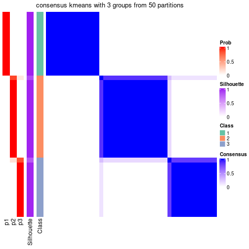</p>

</div>
<div id='tab-node-061-consensus-heatmap-3'>
<pre><code class="r">consensus_heatmap(res, k = 4)
</code></pre>

<p>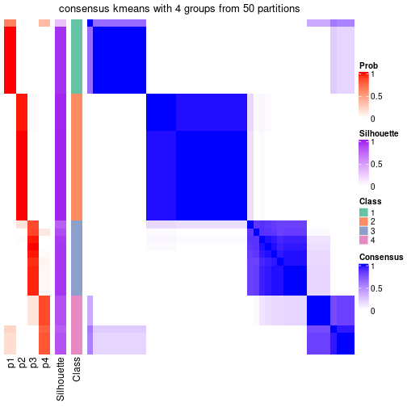</p>

</div>
<div id='tab-node-061-consensus-heatmap-4'>
<pre><code class="r">consensus_heatmap(res, k = 5)
</code></pre>

<p>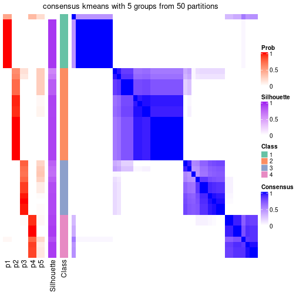</p>

</div>
<div id='tab-node-061-consensus-heatmap-5'>
<pre><code class="r">consensus_heatmap(res, k = 6)
</code></pre>

<p>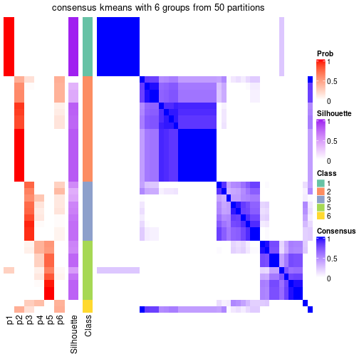</p>

</div>
<div id='tab-node-061-consensus-heatmap-6'>
<pre><code class="r">consensus_heatmap(res, k = 7)
</code></pre>

<p>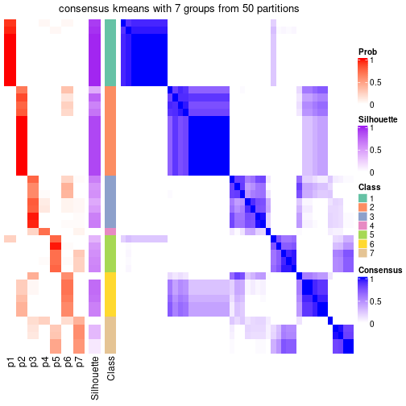</p>

</div>
<div id='tab-node-061-consensus-heatmap-7'>
<pre><code class="r">consensus_heatmap(res, k = 8)
</code></pre>

<p>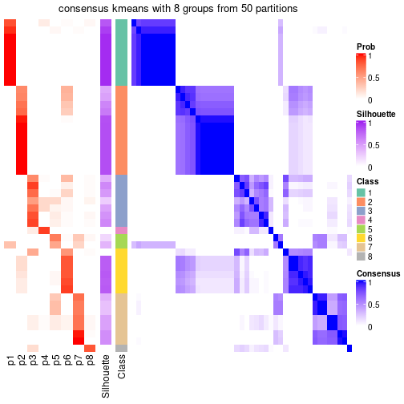</p>

</div>
</div>

Heatmaps for the membership of samples in all partitions to see how consistent they are:


<script>
$( function() {
	$( '#tabs-node-061-membership-heatmap' ).tabs();
} );
</script>
<div id='tabs-node-061-membership-heatmap'>
<ul>
<li><a href='#tab-node-061-membership-heatmap-1'>k = 2</a></li>
<li><a href='#tab-node-061-membership-heatmap-2'>k = 3</a></li>
<li><a href='#tab-node-061-membership-heatmap-3'>k = 4</a></li>
<li><a href='#tab-node-061-membership-heatmap-4'>k = 5</a></li>
<li><a href='#tab-node-061-membership-heatmap-5'>k = 6</a></li>
<li><a href='#tab-node-061-membership-heatmap-6'>k = 7</a></li>
<li><a href='#tab-node-061-membership-heatmap-7'>k = 8</a></li>
</ul>
<div id='tab-node-061-membership-heatmap-1'>
<pre><code class="r">membership_heatmap(res, k = 2)
</code></pre>

<p></p>

</div>
<div id='tab-node-061-membership-heatmap-2'>
<pre><code class="r">membership_heatmap(res, k = 3)
</code></pre>

<p>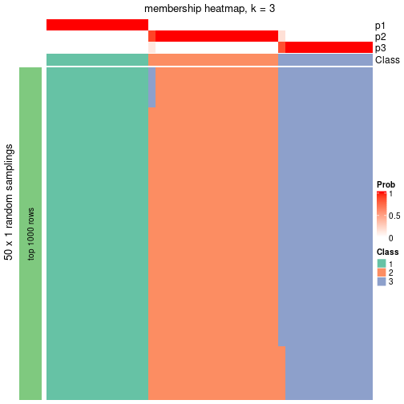</p>

</div>
<div id='tab-node-061-membership-heatmap-3'>
<pre><code class="r">membership_heatmap(res, k = 4)
</code></pre>

<p>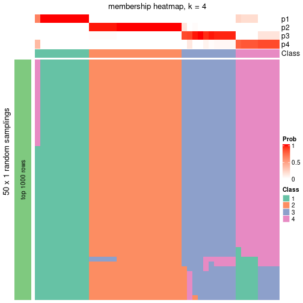</p>

</div>
<div id='tab-node-061-membership-heatmap-4'>
<pre><code class="r">membership_heatmap(res, k = 5)
</code></pre>

<p>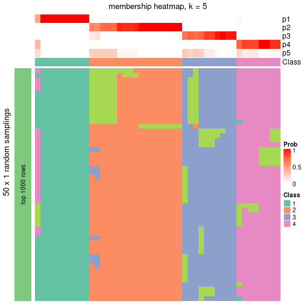</p>

</div>
<div id='tab-node-061-membership-heatmap-5'>
<pre><code class="r">membership_heatmap(res, k = 6)
</code></pre>

<p>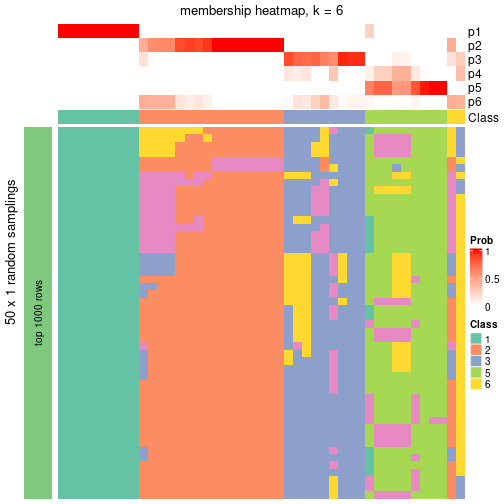</p>

</div>
<div id='tab-node-061-membership-heatmap-6'>
<pre><code class="r">membership_heatmap(res, k = 7)
</code></pre>

<p>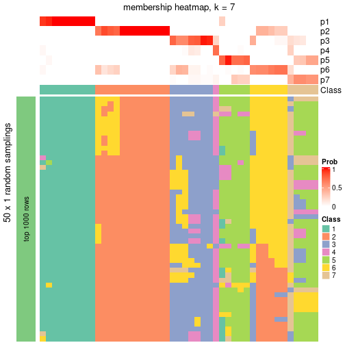</p>

</div>
<div id='tab-node-061-membership-heatmap-7'>
<pre><code class="r">membership_heatmap(res, k = 8)
</code></pre>

<p>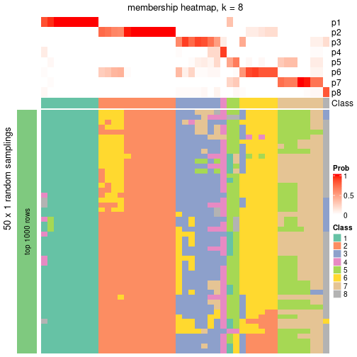</p>

</div>
</div>

As soon as the classes for columns are determined, the signatures
that are significantly different between subgroups can be looked for. 
Following are the heatmaps for signatures.


<script>
$( function() {
	$( '#tabs-node-061-get-signatures' ).tabs();
} );
</script>
<div id='tabs-node-061-get-signatures'>
<ul>
<li><a href='#tab-node-061-get-signatures-1'>k = 2</a></li>
<li><a href='#tab-node-061-get-signatures-2'>k = 3</a></li>
<li><a href='#tab-node-061-get-signatures-3'>k = 4</a></li>
<li><a href='#tab-node-061-get-signatures-4'>k = 5</a></li>
<li><a href='#tab-node-061-get-signatures-5'>k = 6</a></li>
<li><a href='#tab-node-061-get-signatures-6'>k = 7</a></li>
<li><a href='#tab-node-061-get-signatures-7'>k = 8</a></li>
</ul>
<div id='tab-node-061-get-signatures-1'>
<pre><code class="r">get_signatures(res, k = 2)
</code></pre>

<p>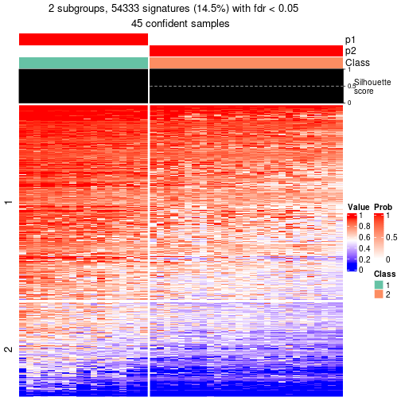</p>

</div>
<div id='tab-node-061-get-signatures-2'>
<pre><code class="r">get_signatures(res, k = 3)
</code></pre>

<p>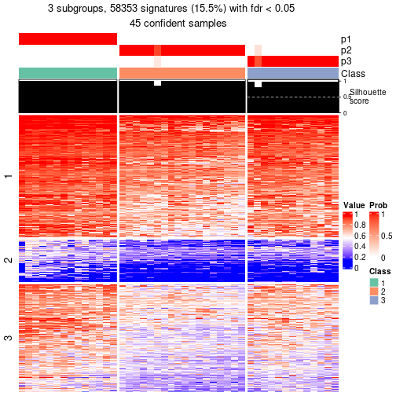</p>

</div>
<div id='tab-node-061-get-signatures-3'>
<pre><code class="r">get_signatures(res, k = 4)
</code></pre>

<p>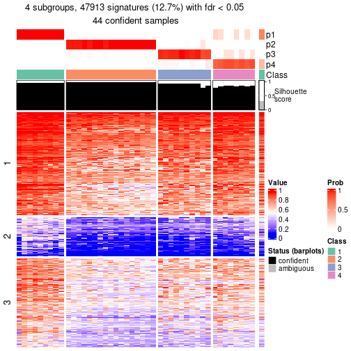</p>

</div>
<div id='tab-node-061-get-signatures-4'>
<pre><code class="r">get_signatures(res, k = 5)
</code></pre>

<p>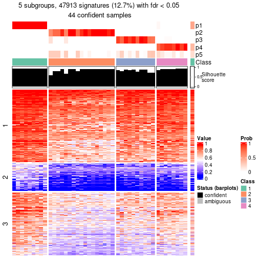</p>

</div>
<div id='tab-node-061-get-signatures-5'>
<pre><code class="r">get_signatures(res, k = 6)
</code></pre>

<p>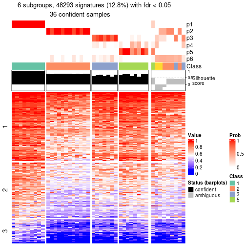</p>

</div>
<div id='tab-node-061-get-signatures-6'>
<pre><code class="r">get_signatures(res, k = 7)
</code></pre>

<p>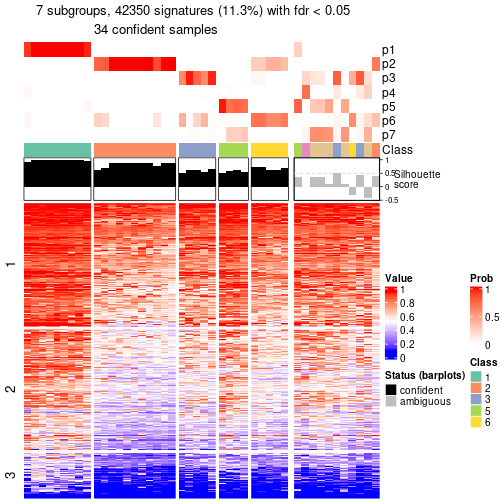</p>

</div>
<div id='tab-node-061-get-signatures-7'>
<pre><code class="r">get_signatures(res, k = 8)
</code></pre>

<p>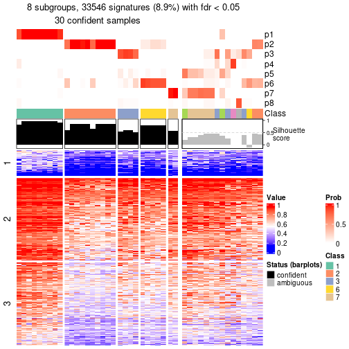</p>

</div>
</div>


Compare the overlap of signatures from different k:

```r
compare_signatures(res)
```

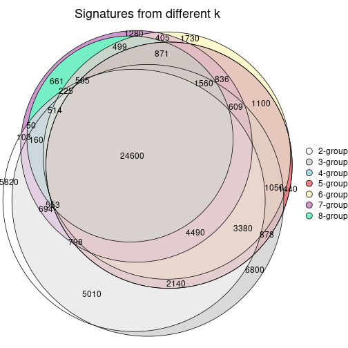

`get_signature()` returns a data frame invisibly. To get the list of signatures, the function
call should be assigned to a variable explicitly. In following code, if `plot` argument is set
to `FALSE`, no heatmap is plotted while only the differential analysis is performed.

```r
# code only for demonstration
tb = get_signature(res, k = ..., plot = FALSE)
```

An example of the output of `tb` is:

```
#>   which_row         fdr    mean_1    mean_2 scaled_mean_1 scaled_mean_2 km
#> 1        38 0.042760348  8.373488  9.131774    -0.5533452     0.5164555  1
#> 2        40 0.018707592  7.106213  8.469186    -0.6173731     0.5762149  1
#> 3        55 0.019134737 10.221463 11.207825    -0.6159697     0.5749050  1
#> 4        59 0.006059896  5.921854  7.869574    -0.6899429     0.6439467  1
#> 5        60 0.018055526  8.928898 10.211722    -0.6204761     0.5791110  1
#> 6        98 0.009384629 15.714769 14.887706     0.6635654    -0.6193277  2
...
```

The columns in `tb` are:

1. `which_row`: row indices corresponding to the input matrix.
2. `fdr`: FDR for the differential test. 
3. `mean_x`: The mean value in group x.
4. `scaled_mean_x`: The mean value in group x after rows are scaled.
5. `km`: Row groups if k-means clustering is applied to rows (which is done by automatically selecting number of clusters).

If there are too many signatures, `top_signatures = ...` can be set to only show the 
signatures with the highest FDRs:

```r
# code only for demonstration
# e.g. to show the top 500 most significant rows
tb = get_signature(res, k = ..., top_signatures = 500)
```

If the signatures are defined as these which are uniquely high in current group, `diff_method` argument
can be set to `"uniquely_high_in_one_group"`:

```r
# code only for demonstration
tb = get_signature(res, k = ..., diff_method = "uniquely_high_in_one_group")
```


UMAP plot which shows how samples are separated.


<script>
$( function() {
	$( '#tabs-node-061-dimension-reduction' ).tabs();
} );
</script>
<div id='tabs-node-061-dimension-reduction'>
<ul>
<li><a href='#tab-node-061-dimension-reduction-1'>k = 2</a></li>
<li><a href='#tab-node-061-dimension-reduction-2'>k = 3</a></li>
<li><a href='#tab-node-061-dimension-reduction-3'>k = 4</a></li>
<li><a href='#tab-node-061-dimension-reduction-4'>k = 5</a></li>
<li><a href='#tab-node-061-dimension-reduction-5'>k = 6</a></li>
<li><a href='#tab-node-061-dimension-reduction-6'>k = 7</a></li>
<li><a href='#tab-node-061-dimension-reduction-7'>k = 8</a></li>
</ul>
<div id='tab-node-061-dimension-reduction-1'>
<pre><code class="r">dimension_reduction(res, k = 2, method = &quot;UMAP&quot;)
</code></pre>

<p>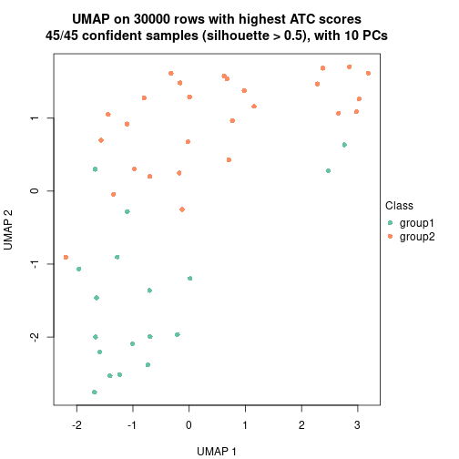</p>

</div>
<div id='tab-node-061-dimension-reduction-2'>
<pre><code class="r">dimension_reduction(res, k = 3, method = &quot;UMAP&quot;)
</code></pre>

<p>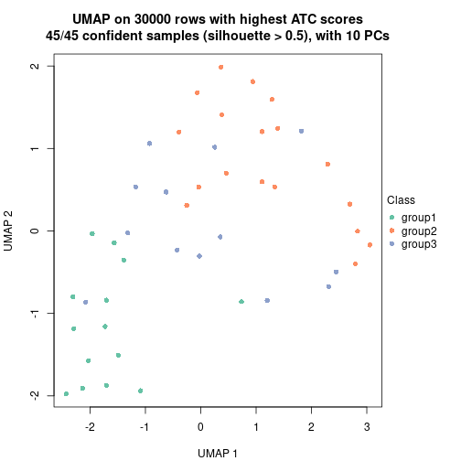</p>

</div>
<div id='tab-node-061-dimension-reduction-3'>
<pre><code class="r">dimension_reduction(res, k = 4, method = &quot;UMAP&quot;)
</code></pre>

<p>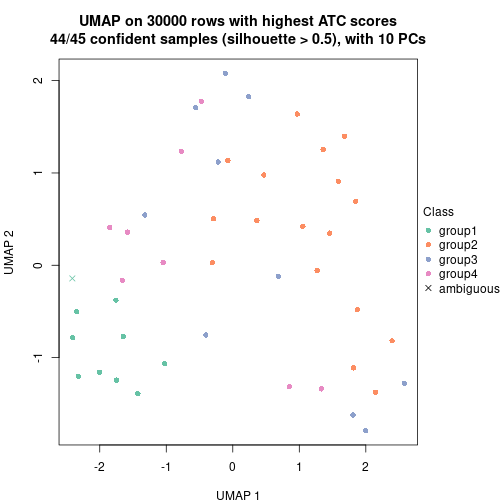</p>

</div>
<div id='tab-node-061-dimension-reduction-4'>
<pre><code class="r">dimension_reduction(res, k = 5, method = &quot;UMAP&quot;)
</code></pre>

<p>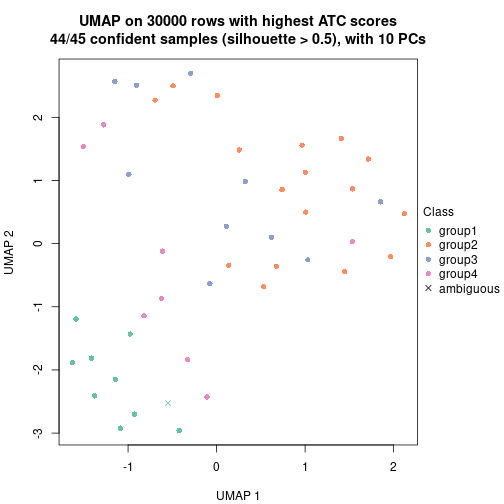</p>

</div>
<div id='tab-node-061-dimension-reduction-5'>
<pre><code class="r">dimension_reduction(res, k = 6, method = &quot;UMAP&quot;)
</code></pre>

<p>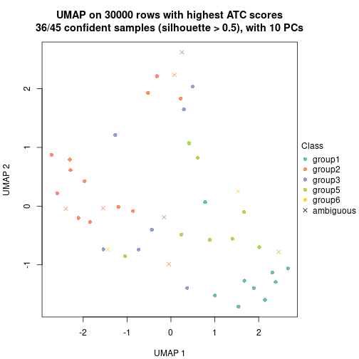</p>

</div>
<div id='tab-node-061-dimension-reduction-6'>
<pre><code class="r">dimension_reduction(res, k = 7, method = &quot;UMAP&quot;)
</code></pre>

<p>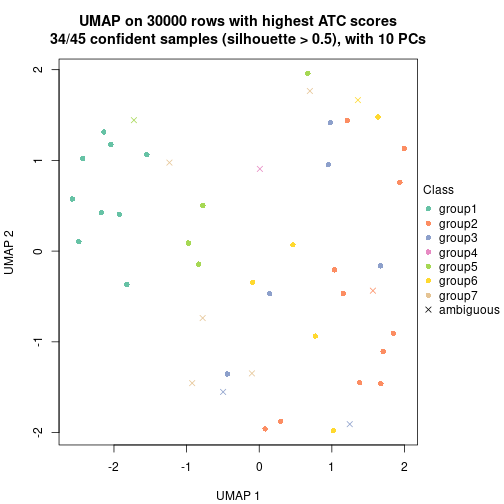</p>

</div>
<div id='tab-node-061-dimension-reduction-7'>
<pre><code class="r">dimension_reduction(res, k = 8, method = &quot;UMAP&quot;)
</code></pre>

<p>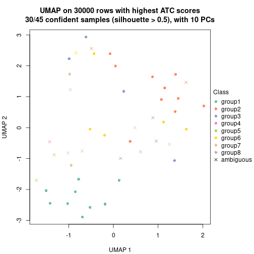</p>

</div>
</div>


Following heatmap shows how subgroups are split when increasing `k`:

```r
collect_classes(res)
```

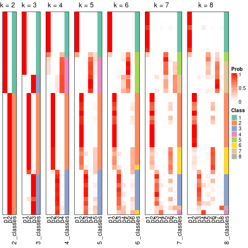


If matrix rows can be associated to genes, consider to use `functional_enrichment(res,
...)` to perform function enrichment for the signature genes. See [this vignette](https://jokergoo.github.io/cola_vignettes/functional_enrichment.html) for more detailed explanations.


 

---------------------------------------------------


### Node0612


Parent node: [Node061](#Node061).
Child nodes: 
                Node02131-leaf
        ,
                Node02132-leaf
        ,
                Node02211-leaf
        ,
                Node02212-leaf
        ,
                Node02311-leaf
        ,
                Node02312-leaf
        ,
                Node02313-leaf
        ,
                Node02314-leaf
        ,
                Node02341-leaf
        ,
                Node02342-leaf
        ,
                Node02343-leaf
        ,
                Node02344-leaf
        ,
                Node02345-leaf
        ,
                Node02421-leaf
        ,
                Node02422-leaf
        ,
                Node02423-leaf
        ,
                Node06121-leaf
        ,
                Node06122-leaf
        ,
                Node06123-leaf
        ,
                [Node07111](#Node07111)
        ,
                Node07112-leaf
        ,
                Node07211-leaf
        ,
                Node07212-leaf
        ,
                Node07213-leaf
        ,
                Node07214-leaf
        .


The object with results only for a single top-value method and a single partitioning method 
can be extracted as:

```r
res = res_rh["0612"]
```

A summary of `res` and all the functions that can be applied to it:

```r
res
```

```
#> A 'ConsensusPartition' object with k = 2, 3, 4, 5, 6, 7, 8.
#>   On a matrix with 30000 rows and 18 columns.
#>   Top rows (1000) are extracted by 'ATC' method.
#>   Subgroups are detected by 'kmeans' method.
#>   Performed in total 350 partitions by row resampling.
#>   Best k for subgroups seems to be 2.
#> 
#> Following methods can be applied to this 'ConsensusPartition' object:
#>  [1] "cola_report"             "collect_classes"         "collect_plots"          
#>  [4] "collect_stats"           "colnames"                "compare_partitions"     
#>  [7] "compare_signatures"      "consensus_heatmap"       "dimension_reduction"    
#> [10] "functional_enrichment"   "get_anno_col"            "get_anno"               
#> [13] "get_classes"             "get_consensus"           "get_matrix"             
#> [16] "get_membership"          "get_param"               "get_signatures"         
#> [19] "get_stats"               "is_best_k"               "is_stable_k"            
#> [22] "membership_heatmap"      "ncol"                    "nrow"                   
#> [25] "plot_ecdf"               "predict_classes"         "rownames"               
#> [28] "select_partition_number" "show"                    "suggest_best_k"         
#> [31] "test_to_known_factors"   "top_rows_heatmap"
```

`collect_plots()` function collects all the plots made from `res` for all `k` (number of subgroups)
into one single page to provide an easy and fast comparison between different `k`.

```r
collect_plots(res)
```

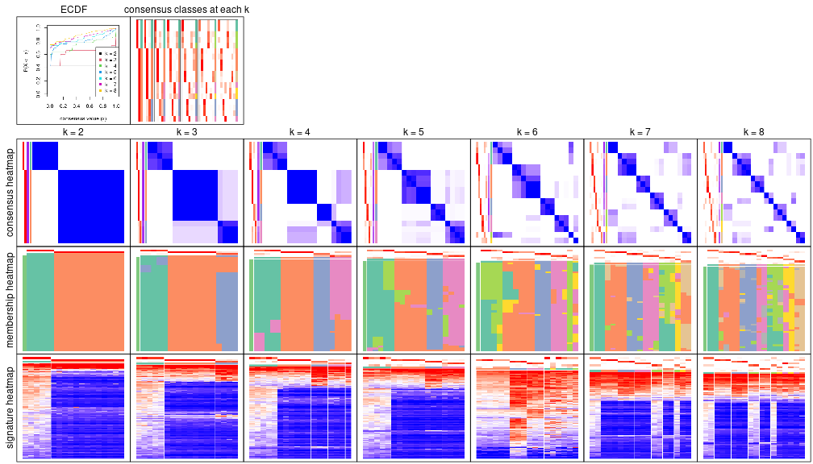

The plots are:

- The first row: a plot of the eCDF (empirical cumulative distribution
  function) curves of the consensus matrix for each `k` and the heatmap of
  predicted classes for each `k`.
- The second row: heatmaps of the consensus matrix for each `k`.
- The third row: heatmaps of the membership matrix for each `k`.
- The fouth row: heatmaps of the signatures for each `k`.

All the plots in panels can be made by individual functions and they are
plotted later in this section.

`select_partition_number()` produces several plots showing different
statistics for choosing "optimized" `k`. There are following statistics:

- eCDF curves of the consensus matrix for each `k`;
- 1-PAC. [The PAC score](https://en.wikipedia.org/wiki/Consensus_clustering#Over-interpretation_potential_of_consensus_clustering)
  measures the proportion of the ambiguous subgrouping.
- Mean silhouette score.
- Concordance. The mean probability of fiting the consensus subgroup labels in all
  partitions.
- Area increased. Denote $A_k$ as the area under the eCDF curve for current
  `k`, the area increased is defined as $A_k - A_{k-1}$.
- Rand index. The percent of pairs of samples that are both in a same cluster
  or both are not in a same cluster in the partition of k and k-1.
- Jaccard index. The ratio of pairs of samples are both in a same cluster in
  the partition of k and k-1 and the pairs of samples are both in a same
  cluster in the partition k or k-1.

The detailed explanations of these statistics can be found in [the _cola_
vignette](https://jokergoo.github.io/cola_vignettes/cola.html#toc_13).

Generally speaking, higher 1-PAC score, higher mean silhouette score or higher
concordance corresponds to better partition. Rand index and Jaccard index
measure how similar the current partition is compared to partition with `k-1`.
If they are too similar, we won't accept `k` is better than `k-1`.

```r
select_partition_number(res)
```

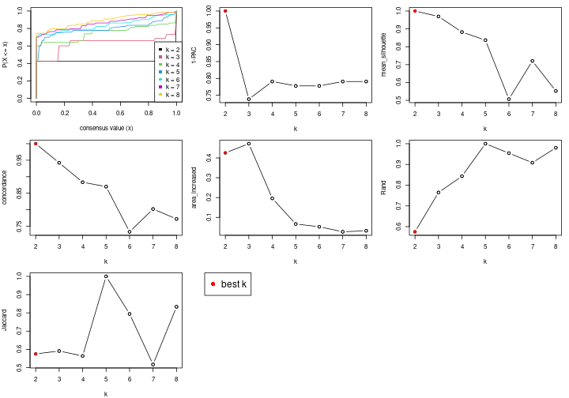

The numeric values for all these statistics can be obtained by `get_stats()`.

```r
get_stats(res)
```

```
#>   k 1-PAC mean_silhouette concordance area_increased  Rand Jaccard
#> 2 2 1.000           1.000       1.000         0.4254 0.575   0.575
#> 3 3 0.739           0.969       0.942         0.4717 0.765   0.591
#> 4 4 0.791           0.882       0.883         0.1958 0.843   0.564
#> 5 5 0.778           0.837       0.870         0.0665 1.000   1.000
#> 6 6 0.778           0.507       0.733         0.0527 0.954   0.794
#> 7 7 0.791           0.721       0.802         0.0272 0.908   0.517
#> 8 8 0.791           0.552       0.772         0.0325 0.980   0.833
```

`suggest_best_k()` suggests the best $k$ based on these statistics. The rules are as follows:

- All $k$ with Jaccard index larger than 0.95 are removed because increasing
  $k$ does not provide enough extra information. If all $k$ are removed, it is
  marked as no subgroup is detected.
- For all $k$ with 1-PAC score larger than 0.9, the maximal $k$ is taken as
  the best $k$, and other $k$ are marked as optional $k$.
- If it does not fit the second rule. The $k$ with the maximal vote of the
  highest 1-PAC score, highest mean silhouette, and highest concordance is
  taken as the best $k$.

```r
suggest_best_k(res)
```

```
#> [1] 2
```


Following is the table of the partitions (You need to click the **show/hide
code output** link to see it). The membership matrix (columns with name `p*`)
is inferred by
[`clue::cl_consensus()`](https://www.rdocumentation.org/link/cl_consensus?package=clue)
function with the `SE` method. Basically the value in the membership matrix
represents the probability to belong to a certain group. The finall subgroup
label for an item is determined with the group with highest probability it
belongs to.

In `get_classes()` function, the entropy is calculated from the membership
matrix and the silhouette score is calculated from the consensus matrix.


<script>
$( function() {
	$( '#tabs-node-0612-get-classes' ).tabs();
} );
</script>
<div id='tabs-node-0612-get-classes'>
<ul>
<li><a href='#tab-node-0612-get-classes-1'>k = 2</a></li>
<li><a href='#tab-node-0612-get-classes-2'>k = 3</a></li>
<li><a href='#tab-node-0612-get-classes-3'>k = 4</a></li>
<li><a href='#tab-node-0612-get-classes-4'>k = 5</a></li>
<li><a href='#tab-node-0612-get-classes-5'>k = 6</a></li>
<li><a href='#tab-node-0612-get-classes-6'>k = 7</a></li>
<li><a href='#tab-node-0612-get-classes-7'>k = 8</a></li>
</ul>

<div id='tab-node-0612-get-classes-1'>
<p><a id='tab-node-0612-get-classes-1-a' style='color:#0366d6' href='#'>show/hide code output</a></p>
<pre><code class="r">cbind(get_classes(res, k = 2), get_membership(res, k = 2))
</code></pre>

<pre><code>#&gt;                 class entropy silhouette p1 p2
#&gt; TCGA.43.7656.01     2       0          1  0  1
#&gt; TCGA.98.8020.01     1       0          1  1  0
#&gt; TCGA.NC.A5HI.01     1       0          1  1  0
#&gt; TCGA.94.7557.01     2       0          1  0  1
#&gt; TCGA.94.8035.01     2       0          1  0  1
#&gt; TCGA.77.8140.01     1       0          1  1  0
#&gt; TCGA.22.5478.01     2       0          1  0  1
#&gt; TCGA.63.A5MI.01     2       0          1  0  1
#&gt; TCGA.77.8139.01     2       0          1  0  1
#&gt; TCGA.43.A56V.01     2       0          1  0  1
#&gt; TCGA.56.8304.01     1       0          1  1  0
#&gt; TCGA.39.5029.01     2       0          1  0  1
#&gt; TCGA.56.A5DR.01     2       0          1  0  1
#&gt; TCGA.77.7463.01     2       0          1  0  1
#&gt; TCGA.56.7221.01     2       0          1  0  1
#&gt; TCGA.98.A538.01     2       0          1  0  1
#&gt; TCGA.56.A49D.01     2       0          1  0  1
#&gt; TCGA.90.7766.01     1       0          1  1  0
</code></pre>

<script>
$('#tab-node-0612-get-classes-1-a').parent().next().next().hide();
$('#tab-node-0612-get-classes-1-a').click(function(){
  $('#tab-node-0612-get-classes-1-a').parent().next().next().toggle();
  return(false);
});
</script>
</div>

<div id='tab-node-0612-get-classes-2'>
<p><a id='tab-node-0612-get-classes-2-a' style='color:#0366d6' href='#'>show/hide code output</a></p>
<pre><code class="r">cbind(get_classes(res, k = 3), get_membership(res, k = 3))
</code></pre>

<pre><code>#&gt;                 class entropy silhouette   p1   p2   p3
#&gt; TCGA.43.7656.01     2   0.000      1.000 0.00 1.00 0.00
#&gt; TCGA.98.8020.01     1   0.254      0.929 0.92 0.00 0.08
#&gt; TCGA.NC.A5HI.01     1   0.254      0.929 0.92 0.00 0.08
#&gt; TCGA.94.7557.01     3   0.502      0.895 0.00 0.24 0.76
#&gt; TCGA.94.8035.01     3   0.400      0.967 0.00 0.16 0.84
#&gt; TCGA.77.8140.01     1   0.254      0.929 0.92 0.00 0.08
#&gt; TCGA.22.5478.01     3   0.400      0.967 0.00 0.16 0.84
#&gt; TCGA.63.A5MI.01     3   0.400      0.967 0.00 0.16 0.84
#&gt; TCGA.77.8139.01     2   0.000      1.000 0.00 1.00 0.00
#&gt; TCGA.43.A56V.01     2   0.000      1.000 0.00 1.00 0.00
#&gt; TCGA.56.8304.01     1   0.254      0.929 0.92 0.00 0.08
#&gt; TCGA.39.5029.01     2   0.000      1.000 0.00 1.00 0.00
#&gt; TCGA.56.A5DR.01     2   0.000      1.000 0.00 1.00 0.00
#&gt; TCGA.77.7463.01     2   0.000      1.000 0.00 1.00 0.00
#&gt; TCGA.56.7221.01     2   0.000      1.000 0.00 1.00 0.00
#&gt; TCGA.98.A538.01     2   0.000      1.000 0.00 1.00 0.00
#&gt; TCGA.56.A49D.01     2   0.000      1.000 0.00 1.00 0.00
#&gt; TCGA.90.7766.01     1   0.000      0.938 1.00 0.00 0.00
</code></pre>

<script>
$('#tab-node-0612-get-classes-2-a').parent().next().next().hide();
$('#tab-node-0612-get-classes-2-a').click(function(){
  $('#tab-node-0612-get-classes-2-a').parent().next().next().toggle();
  return(false);
});
</script>
</div>

<div id='tab-node-0612-get-classes-3'>
<p><a id='tab-node-0612-get-classes-3-a' style='color:#0366d6' href='#'>show/hide code output</a></p>
<pre><code class="r">cbind(get_classes(res, k = 4), get_membership(res, k = 4))
</code></pre>

<pre><code>#&gt;                 class entropy silhouette   p1   p2   p3   p4
#&gt; TCGA.43.7656.01     2  0.0000      1.000 0.00 1.00 0.00 0.00
#&gt; TCGA.98.8020.01     1  0.5062      0.824 0.68 0.00 0.30 0.02
#&gt; TCGA.NC.A5HI.01     1  0.0707      0.838 0.98 0.00 0.00 0.02
#&gt; TCGA.94.7557.01     4  0.1211      0.390 0.00 0.04 0.00 0.96
#&gt; TCGA.94.8035.01     3  0.4406      1.000 0.00 0.00 0.70 0.30
#&gt; TCGA.77.8140.01     1  0.0707      0.838 0.98 0.00 0.00 0.02
#&gt; TCGA.22.5478.01     3  0.4406      1.000 0.00 0.00 0.70 0.30
#&gt; TCGA.63.A5MI.01     3  0.4406      1.000 0.00 0.00 0.70 0.30
#&gt; TCGA.77.8139.01     2  0.0000      1.000 0.00 1.00 0.00 0.00
#&gt; TCGA.43.A56V.01     4  0.4624      0.794 0.00 0.34 0.00 0.66
#&gt; TCGA.56.8304.01     1  0.5062      0.824 0.68 0.00 0.30 0.02
#&gt; TCGA.39.5029.01     2  0.0000      1.000 0.00 1.00 0.00 0.00
#&gt; TCGA.56.A5DR.01     4  0.4624      0.794 0.00 0.34 0.00 0.66
#&gt; TCGA.77.7463.01     2  0.0000      1.000 0.00 1.00 0.00 0.00
#&gt; TCGA.56.7221.01     2  0.0000      1.000 0.00 1.00 0.00 0.00
#&gt; TCGA.98.A538.01     4  0.4855      0.724 0.00 0.40 0.00 0.60
#&gt; TCGA.56.A49D.01     2  0.0000      1.000 0.00 1.00 0.00 0.00
#&gt; TCGA.90.7766.01     1  0.2647      0.855 0.88 0.00 0.12 0.00
</code></pre>

<script>
$('#tab-node-0612-get-classes-3-a').parent().next().next().hide();
$('#tab-node-0612-get-classes-3-a').click(function(){
  $('#tab-node-0612-get-classes-3-a').parent().next().next().toggle();
  return(false);
});
</script>
</div>

<div id='tab-node-0612-get-classes-4'>
<p><a id='tab-node-0612-get-classes-4-a' style='color:#0366d6' href='#'>show/hide code output</a></p>
<pre><code class="r">cbind(get_classes(res, k = 5), get_membership(res, k = 5))
</code></pre>

<pre><code>#&gt;                 class entropy silhouette   p1   p2   p3   p4   p5
#&gt; TCGA.43.7656.01     2  0.1043      0.905 0.00 0.96 0.00 0.04 0.00
#&gt; TCGA.98.8020.01     1  0.4818      0.765 0.52 0.00 0.00 0.02 0.46
#&gt; TCGA.NC.A5HI.01     1  0.0000      0.720 1.00 0.00 0.00 0.00 0.00
#&gt; TCGA.94.7557.01     4  0.2675      0.811 0.00 0.04 0.02 0.90 0.04
#&gt; TCGA.94.8035.01     3  0.0609      0.970 0.00 0.02 0.98 0.00 0.00
#&gt; TCGA.77.8140.01     1  0.0000      0.720 1.00 0.00 0.00 0.00 0.00
#&gt; TCGA.22.5478.01     3  0.1216      0.967 0.00 0.02 0.96 0.00 0.02
#&gt; TCGA.63.A5MI.01     3  0.2012      0.951 0.00 0.02 0.92 0.00 0.06
#&gt; TCGA.77.8139.01     2  0.1410      0.899 0.00 0.94 0.00 0.00 0.06
#&gt; TCGA.43.A56V.01     4  0.1410      0.842 0.00 0.06 0.00 0.94 0.00
#&gt; TCGA.56.8304.01     1  0.5157      0.767 0.52 0.00 0.00 0.04 0.44
#&gt; TCGA.39.5029.01     2  0.1043      0.905 0.00 0.96 0.00 0.04 0.00
#&gt; TCGA.56.A5DR.01     4  0.2020      0.833 0.00 0.10 0.00 0.90 0.00
#&gt; TCGA.77.7463.01     2  0.2516      0.874 0.00 0.86 0.00 0.00 0.14
#&gt; TCGA.56.7221.01     2  0.2732      0.863 0.00 0.84 0.00 0.00 0.16
#&gt; TCGA.98.A538.01     4  0.6265      0.583 0.00 0.22 0.00 0.54 0.24
#&gt; TCGA.56.A49D.01     2  0.1043      0.905 0.00 0.96 0.00 0.04 0.00
#&gt; TCGA.90.7766.01     1  0.4540      0.784 0.64 0.00 0.02 0.00 0.34
</code></pre>

<script>
$('#tab-node-0612-get-classes-4-a').parent().next().next().hide();
$('#tab-node-0612-get-classes-4-a').click(function(){
  $('#tab-node-0612-get-classes-4-a').parent().next().next().toggle();
  return(false);
});
</script>
</div>

<div id='tab-node-0612-get-classes-5'>
<p><a id='tab-node-0612-get-classes-5-a' style='color:#0366d6' href='#'>show/hide code output</a></p>
<pre><code class="r">cbind(get_classes(res, k = 6), get_membership(res, k = 6))
</code></pre>

<pre><code>#&gt;                 class entropy silhouette   p1   p2   p3   p4   p5   p6
#&gt; TCGA.43.7656.01     2  0.3864      0.735 0.00 0.52 0.00 0.00 0.00 0.48
#&gt; TCGA.98.8020.01     5  0.3797      0.000 0.42 0.00 0.00 0.00 0.58 0.00
#&gt; TCGA.NC.A5HI.01     1  0.0000      0.457 1.00 0.00 0.00 0.00 0.00 0.00
#&gt; TCGA.94.7557.01     4  0.0547      0.732 0.00 0.00 0.00 0.98 0.02 0.00
#&gt; TCGA.94.8035.01     3  0.0000      0.958 0.00 0.00 1.00 0.00 0.00 0.00
#&gt; TCGA.77.8140.01     1  0.0000      0.457 1.00 0.00 0.00 0.00 0.00 0.00
#&gt; TCGA.22.5478.01     3  0.1807      0.927 0.00 0.00 0.92 0.00 0.06 0.02
#&gt; TCGA.63.A5MI.01     3  0.0547      0.954 0.00 0.00 0.98 0.00 0.02 0.00
#&gt; TCGA.77.8139.01     2  0.3409      0.711 0.00 0.70 0.00 0.00 0.00 0.30
#&gt; TCGA.43.A56V.01     4  0.2581      0.726 0.00 0.00 0.00 0.86 0.12 0.02
#&gt; TCGA.56.8304.01     1  0.5882     -0.676 0.42 0.00 0.00 0.00 0.38 0.20
#&gt; TCGA.39.5029.01     2  0.3864      0.735 0.00 0.52 0.00 0.00 0.00 0.48
#&gt; TCGA.56.A5DR.01     4  0.2631      0.684 0.00 0.00 0.00 0.82 0.00 0.18
#&gt; TCGA.77.7463.01     2  0.0000      0.590 0.00 1.00 0.00 0.00 0.00 0.00
#&gt; TCGA.56.7221.01     2  0.0547      0.575 0.00 0.98 0.00 0.00 0.02 0.00
#&gt; TCGA.98.A538.01     6  0.5987      0.000 0.00 0.00 0.00 0.26 0.30 0.44
#&gt; TCGA.56.A49D.01     2  0.3864      0.735 0.00 0.52 0.00 0.00 0.00 0.48
#&gt; TCGA.90.7766.01     1  0.3499     -0.177 0.68 0.00 0.00 0.00 0.32 0.00
</code></pre>

<script>
$('#tab-node-0612-get-classes-5-a').parent().next().next().hide();
$('#tab-node-0612-get-classes-5-a').click(function(){
  $('#tab-node-0612-get-classes-5-a').parent().next().next().toggle();
  return(false);
});
</script>
</div>

<div id='tab-node-0612-get-classes-6'>
<p><a id='tab-node-0612-get-classes-6-a' style='color:#0366d6' href='#'>show/hide code output</a></p>
<pre><code class="r">cbind(get_classes(res, k = 7), get_membership(res, k = 7))
</code></pre>

<pre><code>#&gt;                 class entropy silhouette   p1   p2   p3   p4   p5   p6   p7
#&gt; TCGA.43.7656.01     2   0.186      0.768 0.02 0.92 0.00 0.04 0.00 0.00 0.02
#&gt; TCGA.98.8020.01     5   0.117      0.566 0.00 0.00 0.00 0.00 0.94 0.00 0.06
#&gt; TCGA.NC.A5HI.01     1   0.322      1.000 0.68 0.00 0.00 0.00 0.32 0.00 0.00
#&gt; TCGA.94.7557.01     4   0.251      0.714 0.10 0.00 0.00 0.86 0.00 0.00 0.04
#&gt; TCGA.94.8035.01     3   0.000      0.901 0.00 0.00 1.00 0.00 0.00 0.00 0.00
#&gt; TCGA.77.8140.01     1   0.322      1.000 0.68 0.00 0.00 0.00 0.32 0.00 0.00
#&gt; TCGA.22.5478.01     3   0.242      0.861 0.08 0.00 0.88 0.00 0.00 0.02 0.02
#&gt; TCGA.63.A5MI.01     3   0.202      0.871 0.06 0.00 0.90 0.00 0.00 0.00 0.04
#&gt; TCGA.77.8139.01     2   0.337      0.460 0.06 0.78 0.00 0.00 0.00 0.00 0.16
#&gt; TCGA.43.A56V.01     4   0.193      0.765 0.00 0.02 0.00 0.90 0.00 0.08 0.00
#&gt; TCGA.56.8304.01     5   0.398      0.546 0.00 0.00 0.00 0.00 0.72 0.10 0.18
#&gt; TCGA.39.5029.01     2   0.000      0.829 0.00 1.00 0.00 0.00 0.00 0.00 0.00
#&gt; TCGA.56.A5DR.01     4   0.208      0.734 0.00 0.14 0.00 0.86 0.00 0.00 0.00
#&gt; TCGA.77.7463.01     7   0.350      0.886 0.00 0.42 0.00 0.00 0.00 0.00 0.58
#&gt; TCGA.56.7221.01     7   0.336      0.893 0.00 0.36 0.00 0.00 0.00 0.00 0.64
#&gt; TCGA.98.A538.01     6   0.345      0.000 0.00 0.08 0.00 0.14 0.00 0.78 0.00
#&gt; TCGA.56.A49D.01     2   0.000      0.829 0.00 1.00 0.00 0.00 0.00 0.00 0.00
#&gt; TCGA.90.7766.01     5   0.412      0.348 0.20 0.00 0.00 0.00 0.70 0.10 0.00
</code></pre>

<script>
$('#tab-node-0612-get-classes-6-a').parent().next().next().hide();
$('#tab-node-0612-get-classes-6-a').click(function(){
  $('#tab-node-0612-get-classes-6-a').parent().next().next().toggle();
  return(false);
});
</script>
</div>

<div id='tab-node-0612-get-classes-7'>
<p><a id='tab-node-0612-get-classes-7-a' style='color:#0366d6' href='#'>show/hide code output</a></p>
<pre><code class="r">cbind(get_classes(res, k = 8), get_membership(res, k = 8))
</code></pre>

<pre><code>#&gt;                 class entropy silhouette   p1   p2   p3   p4   p5   p6   p7   p8
#&gt; TCGA.43.7656.01     2  0.2350     0.6424 0.04 0.86 0.00 0.00 0.00 0.00 0.00 0.10
#&gt; TCGA.98.8020.01     5  0.3169     0.6037 0.00 0.00 0.00 0.00 0.78 0.02 0.02 0.18
#&gt; TCGA.NC.A5HI.01     1  0.2534     1.0000 0.78 0.00 0.00 0.00 0.22 0.00 0.00 0.00
#&gt; TCGA.94.7557.01     4  0.0000     0.1327 0.00 0.00 0.00 1.00 0.00 0.00 0.00 0.00
#&gt; TCGA.94.8035.01     3  0.0000     0.8258 0.00 0.00 1.00 0.00 0.00 0.00 0.00 0.00
#&gt; TCGA.77.8140.01     1  0.2534     1.0000 0.78 0.00 0.00 0.00 0.22 0.00 0.00 0.00
#&gt; TCGA.22.5478.01     3  0.2348     0.7996 0.04 0.00 0.88 0.00 0.00 0.02 0.00 0.06
#&gt; TCGA.63.A5MI.01     3  0.2852     0.7160 0.00 0.00 0.72 0.00 0.00 0.00 0.00 0.28
#&gt; TCGA.77.8139.01     2  0.5315     0.0862 0.14 0.52 0.00 0.00 0.00 0.00 0.30 0.04
#&gt; TCGA.43.A56V.01     6  0.3193    -0.2341 0.00 0.00 0.00 0.38 0.00 0.62 0.00 0.00
#&gt; TCGA.56.8304.01     5  0.1887     0.5959 0.00 0.00 0.00 0.00 0.90 0.00 0.04 0.06
#&gt; TCGA.39.5029.01     2  0.0471     0.7415 0.00 0.98 0.00 0.00 0.00 0.00 0.02 0.00
#&gt; TCGA.56.A5DR.01     4  0.6001     0.1037 0.00 0.30 0.00 0.38 0.00 0.26 0.00 0.06
#&gt; TCGA.77.7463.01     7  0.2406     0.8099 0.00 0.20 0.00 0.00 0.00 0.00 0.80 0.00
#&gt; TCGA.56.7221.01     7  0.1804     0.8258 0.00 0.08 0.00 0.00 0.00 0.00 0.90 0.02
#&gt; TCGA.98.A538.01     6  0.3975     0.2170 0.00 0.08 0.00 0.00 0.00 0.66 0.00 0.26
#&gt; TCGA.56.A49D.01     2  0.0808     0.7386 0.00 0.96 0.00 0.00 0.00 0.00 0.04 0.00
#&gt; TCGA.90.7766.01     5  0.3941     0.3351 0.26 0.00 0.00 0.00 0.68 0.04 0.02 0.00
</code></pre>

<script>
$('#tab-node-0612-get-classes-7-a').parent().next().next().hide();
$('#tab-node-0612-get-classes-7-a').click(function(){
  $('#tab-node-0612-get-classes-7-a').parent().next().next().toggle();
  return(false);
});
</script>
</div>
</div>

Heatmaps for the consensus matrix. It visualizes the probability of two
samples to be in a same group.


<script>
$( function() {
	$( '#tabs-node-0612-consensus-heatmap' ).tabs();
} );
</script>
<div id='tabs-node-0612-consensus-heatmap'>
<ul>
<li><a href='#tab-node-0612-consensus-heatmap-1'>k = 2</a></li>
<li><a href='#tab-node-0612-consensus-heatmap-2'>k = 3</a></li>
<li><a href='#tab-node-0612-consensus-heatmap-3'>k = 4</a></li>
<li><a href='#tab-node-0612-consensus-heatmap-4'>k = 5</a></li>
<li><a href='#tab-node-0612-consensus-heatmap-5'>k = 6</a></li>
<li><a href='#tab-node-0612-consensus-heatmap-6'>k = 7</a></li>
<li><a href='#tab-node-0612-consensus-heatmap-7'>k = 8</a></li>
</ul>
<div id='tab-node-0612-consensus-heatmap-1'>
<pre><code class="r">consensus_heatmap(res, k = 2)
</code></pre>

<p>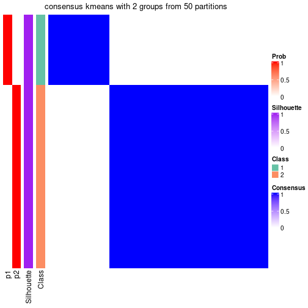</p>

</div>
<div id='tab-node-0612-consensus-heatmap-2'>
<pre><code class="r">consensus_heatmap(res, k = 3)
</code></pre>

<p>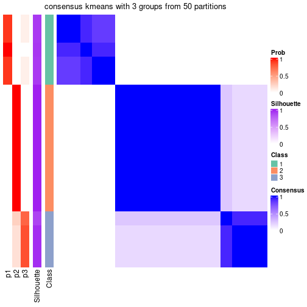</p>

</div>
<div id='tab-node-0612-consensus-heatmap-3'>
<pre><code class="r">consensus_heatmap(res, k = 4)
</code></pre>

<p>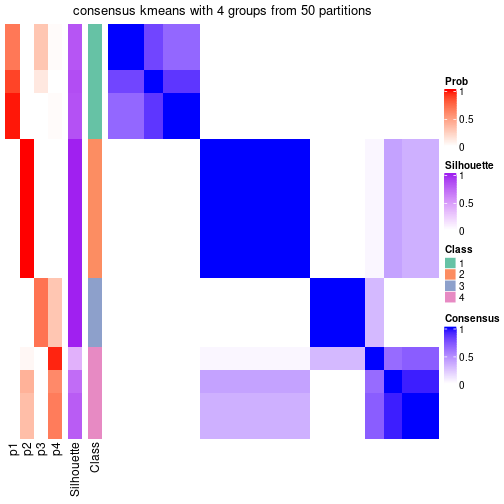</p>

</div>
<div id='tab-node-0612-consensus-heatmap-4'>
<pre><code class="r">consensus_heatmap(res, k = 5)
</code></pre>

<p>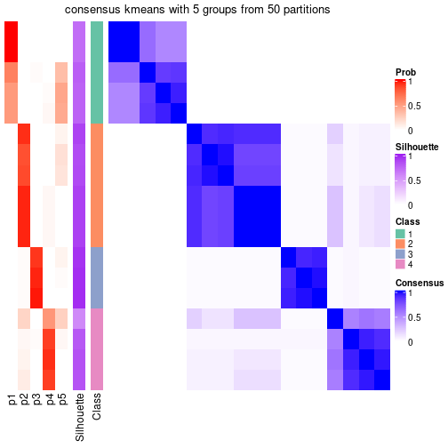</p>

</div>
<div id='tab-node-0612-consensus-heatmap-5'>
<pre><code class="r">consensus_heatmap(res, k = 6)
</code></pre>

<p>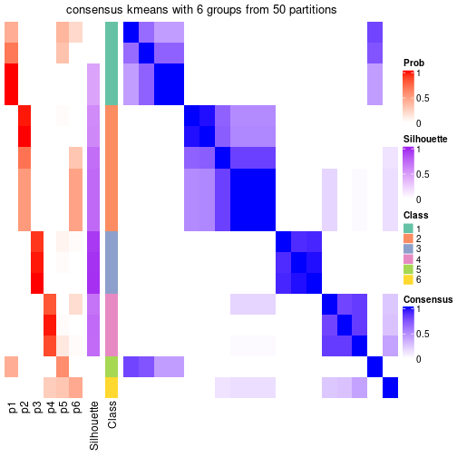</p>

</div>
<div id='tab-node-0612-consensus-heatmap-6'>
<pre><code class="r">consensus_heatmap(res, k = 7)
</code></pre>

<p>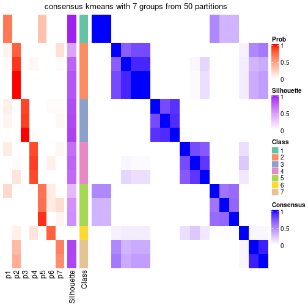</p>

</div>
<div id='tab-node-0612-consensus-heatmap-7'>
<pre><code class="r">consensus_heatmap(res, k = 8)
</code></pre>

<p>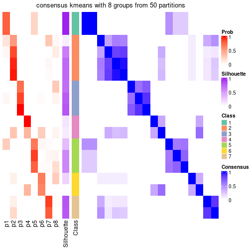</p>

</div>
</div>

Heatmaps for the membership of samples in all partitions to see how consistent they are:


<script>
$( function() {
	$( '#tabs-node-0612-membership-heatmap' ).tabs();
} );
</script>
<div id='tabs-node-0612-membership-heatmap'>
<ul>
<li><a href='#tab-node-0612-membership-heatmap-1'>k = 2</a></li>
<li><a href='#tab-node-0612-membership-heatmap-2'>k = 3</a></li>
<li><a href='#tab-node-0612-membership-heatmap-3'>k = 4</a></li>
<li><a href='#tab-node-0612-membership-heatmap-4'>k = 5</a></li>
<li><a href='#tab-node-0612-membership-heatmap-5'>k = 6</a></li>
<li><a href='#tab-node-0612-membership-heatmap-6'>k = 7</a></li>
<li><a href='#tab-node-0612-membership-heatmap-7'>k = 8</a></li>
</ul>
<div id='tab-node-0612-membership-heatmap-1'>
<pre><code class="r">membership_heatmap(res, k = 2)
</code></pre>

<p>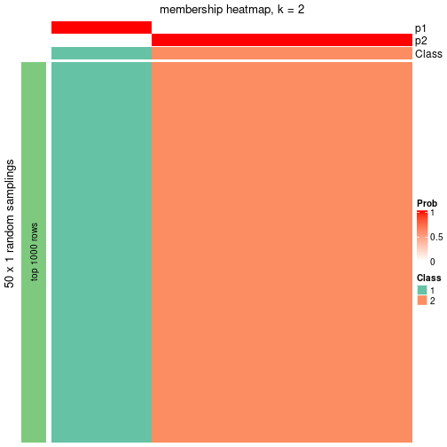</p>

</div>
<div id='tab-node-0612-membership-heatmap-2'>
<pre><code class="r">membership_heatmap(res, k = 3)
</code></pre>

<p>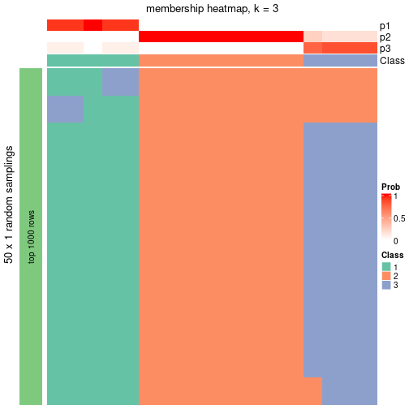</p>

</div>
<div id='tab-node-0612-membership-heatmap-3'>
<pre><code class="r">membership_heatmap(res, k = 4)
</code></pre>

<p>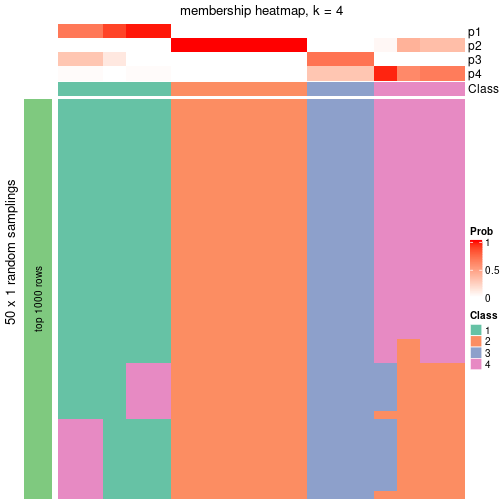</p>

</div>
<div id='tab-node-0612-membership-heatmap-4'>
<pre><code class="r">membership_heatmap(res, k = 5)
</code></pre>

<p>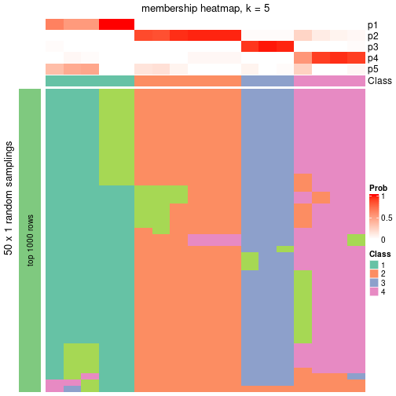</p>

</div>
<div id='tab-node-0612-membership-heatmap-5'>
<pre><code class="r">membership_heatmap(res, k = 6)
</code></pre>

<p>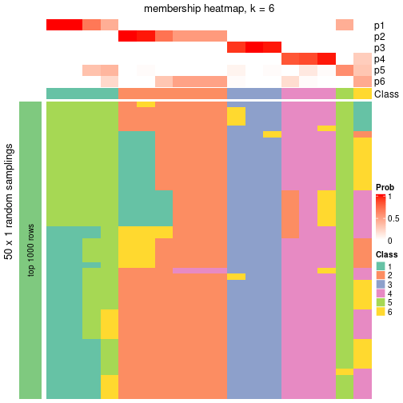</p>

</div>
<div id='tab-node-0612-membership-heatmap-6'>
<pre><code class="r">membership_heatmap(res, k = 7)
</code></pre>

<p>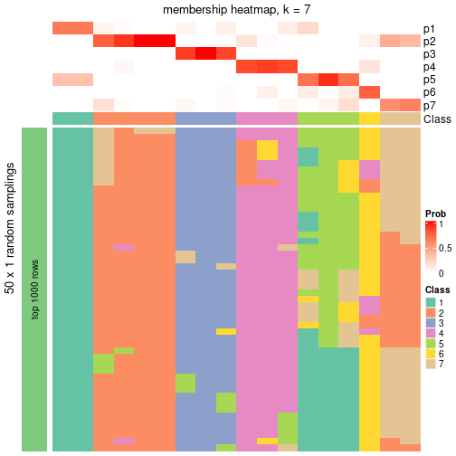</p>

</div>
<div id='tab-node-0612-membership-heatmap-7'>
<pre><code class="r">membership_heatmap(res, k = 8)
</code></pre>

<p>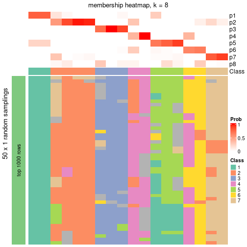</p>

</div>
</div>

As soon as the classes for columns are determined, the signatures
that are significantly different between subgroups can be looked for. 
Following are the heatmaps for signatures.


<script>
$( function() {
	$( '#tabs-node-0612-get-signatures' ).tabs();
} );
</script>
<div id='tabs-node-0612-get-signatures'>
<ul>
<li><a href='#tab-node-0612-get-signatures-1'>k = 2</a></li>
<li><a href='#tab-node-0612-get-signatures-2'>k = 3</a></li>
<li><a href='#tab-node-0612-get-signatures-3'>k = 4</a></li>
<li><a href='#tab-node-0612-get-signatures-4'>k = 5</a></li>
<li><a href='#tab-node-0612-get-signatures-5'>k = 6</a></li>
<li><a href='#tab-node-0612-get-signatures-6'>k = 7</a></li>
<li><a href='#tab-node-0612-get-signatures-7'>k = 8</a></li>
</ul>
<div id='tab-node-0612-get-signatures-1'>
<pre><code class="r">get_signatures(res, k = 2)
</code></pre>

<p>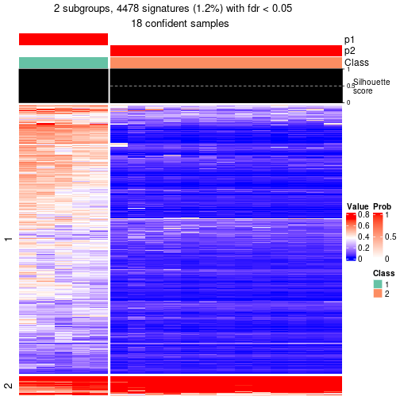</p>

</div>
<div id='tab-node-0612-get-signatures-2'>
<pre><code class="r">get_signatures(res, k = 3)
</code></pre>

<p>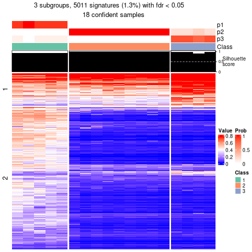</p>

</div>
<div id='tab-node-0612-get-signatures-3'>
<pre><code class="r">get_signatures(res, k = 4)
</code></pre>

<p>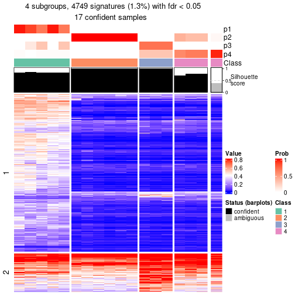</p>

</div>
<div id='tab-node-0612-get-signatures-4'>
<pre><code class="r">get_signatures(res, k = 5)
</code></pre>

<p>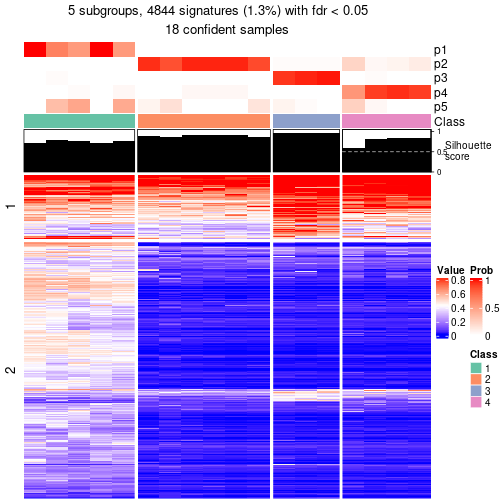</p>

</div>
<div id='tab-node-0612-get-signatures-5'>
<pre><code class="r">get_signatures(res, k = 6)
</code></pre>

<p>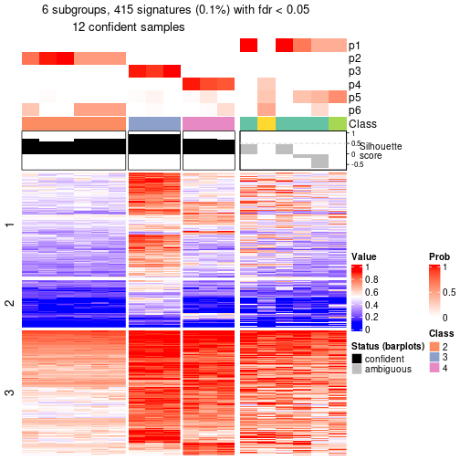</p>

</div>
<div id='tab-node-0612-get-signatures-6'>
<pre><code class="r">get_signatures(res, k = 7)
</code></pre>

<p>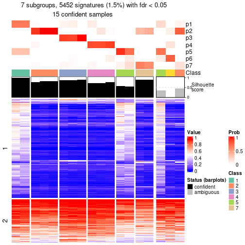</p>

</div>
<div id='tab-node-0612-get-signatures-7'>
<pre><code class="r">get_signatures(res, k = 8)
</code></pre>

<p>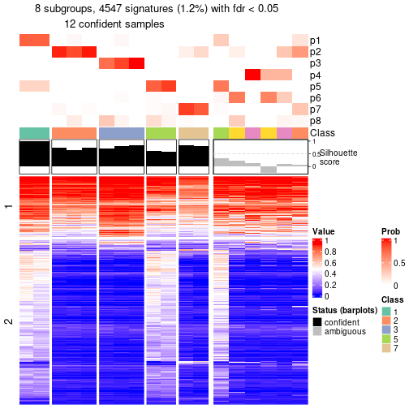</p>

</div>
</div>


Compare the overlap of signatures from different k:

```r
compare_signatures(res)
```

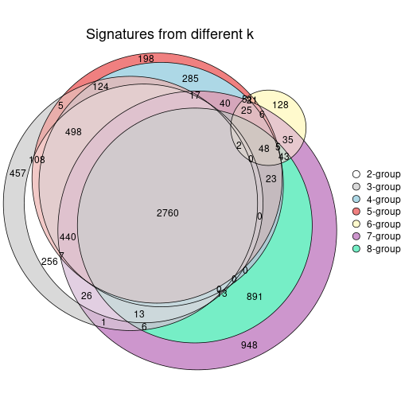

`get_signature()` returns a data frame invisibly. To get the list of signatures, the function
call should be assigned to a variable explicitly. In following code, if `plot` argument is set
to `FALSE`, no heatmap is plotted while only the differential analysis is performed.

```r
# code only for demonstration
tb = get_signature(res, k = ..., plot = FALSE)
```

An example of the output of `tb` is:

```
#>   which_row         fdr    mean_1    mean_2 scaled_mean_1 scaled_mean_2 km
#> 1        38 0.042760348  8.373488  9.131774    -0.5533452     0.5164555  1
#> 2        40 0.018707592  7.106213  8.469186    -0.6173731     0.5762149  1
#> 3        55 0.019134737 10.221463 11.207825    -0.6159697     0.5749050  1
#> 4        59 0.006059896  5.921854  7.869574    -0.6899429     0.6439467  1
#> 5        60 0.018055526  8.928898 10.211722    -0.6204761     0.5791110  1
#> 6        98 0.009384629 15.714769 14.887706     0.6635654    -0.6193277  2
...
```

The columns in `tb` are:

1. `which_row`: row indices corresponding to the input matrix.
2. `fdr`: FDR for the differential test. 
3. `mean_x`: The mean value in group x.
4. `scaled_mean_x`: The mean value in group x after rows are scaled.
5. `km`: Row groups if k-means clustering is applied to rows (which is done by automatically selecting number of clusters).

If there are too many signatures, `top_signatures = ...` can be set to only show the 
signatures with the highest FDRs:

```r
# code only for demonstration
# e.g. to show the top 500 most significant rows
tb = get_signature(res, k = ..., top_signatures = 500)
```

If the signatures are defined as these which are uniquely high in current group, `diff_method` argument
can be set to `"uniquely_high_in_one_group"`:

```r
# code only for demonstration
tb = get_signature(res, k = ..., diff_method = "uniquely_high_in_one_group")
```


UMAP plot which shows how samples are separated.


<script>
$( function() {
	$( '#tabs-node-0612-dimension-reduction' ).tabs();
} );
</script>
<div id='tabs-node-0612-dimension-reduction'>
<ul>
<li><a href='#tab-node-0612-dimension-reduction-1'>k = 2</a></li>
<li><a href='#tab-node-0612-dimension-reduction-2'>k = 3</a></li>
<li><a href='#tab-node-0612-dimension-reduction-3'>k = 4</a></li>
<li><a href='#tab-node-0612-dimension-reduction-4'>k = 5</a></li>
<li><a href='#tab-node-0612-dimension-reduction-5'>k = 6</a></li>
<li><a href='#tab-node-0612-dimension-reduction-6'>k = 7</a></li>
<li><a href='#tab-node-0612-dimension-reduction-7'>k = 8</a></li>
</ul>
<div id='tab-node-0612-dimension-reduction-1'>
<pre><code class="r">dimension_reduction(res, k = 2, method = &quot;UMAP&quot;)
</code></pre>

<p>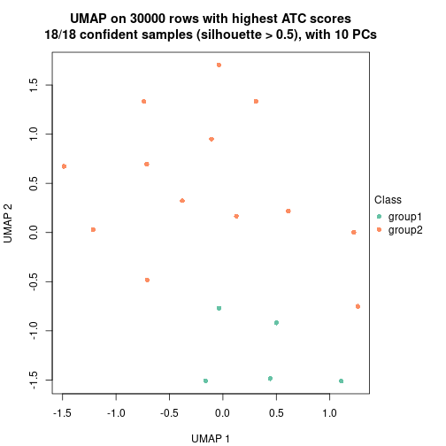</p>

</div>
<div id='tab-node-0612-dimension-reduction-2'>
<pre><code class="r">dimension_reduction(res, k = 3, method = &quot;UMAP&quot;)
</code></pre>

<p>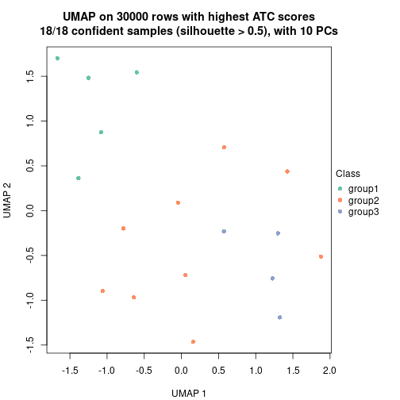</p>

</div>
<div id='tab-node-0612-dimension-reduction-3'>
<pre><code class="r">dimension_reduction(res, k = 4, method = &quot;UMAP&quot;)
</code></pre>

<p>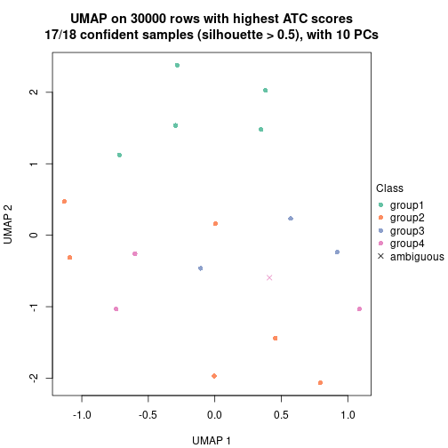</p>

</div>
<div id='tab-node-0612-dimension-reduction-4'>
<pre><code class="r">dimension_reduction(res, k = 5, method = &quot;UMAP&quot;)
</code></pre>

<p>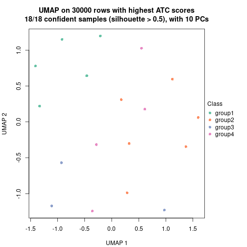</p>

</div>
<div id='tab-node-0612-dimension-reduction-5'>
<pre><code class="r">dimension_reduction(res, k = 6, method = &quot;UMAP&quot;)
</code></pre>

<p>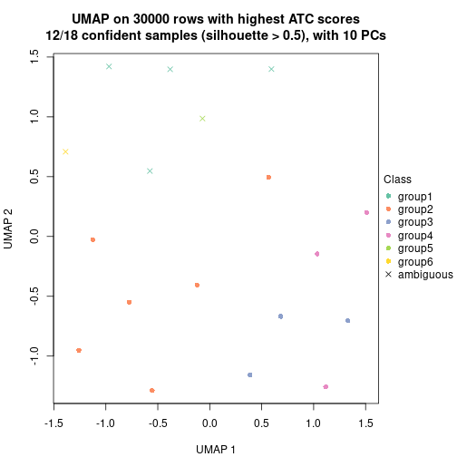</p>

</div>
<div id='tab-node-0612-dimension-reduction-6'>
<pre><code class="r">dimension_reduction(res, k = 7, method = &quot;UMAP&quot;)
</code></pre>

<p>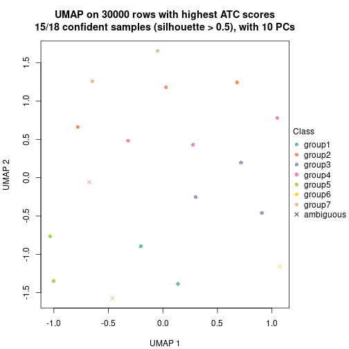</p>

</div>
<div id='tab-node-0612-dimension-reduction-7'>
<pre><code class="r">dimension_reduction(res, k = 8, method = &quot;UMAP&quot;)
</code></pre>

<p>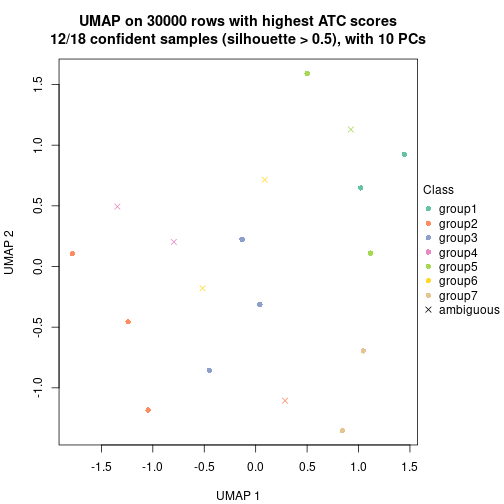</p>

</div>
</div>


Following heatmap shows how subgroups are split when increasing `k`:

```r
collect_classes(res)
```

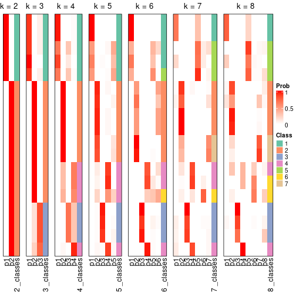


If matrix rows can be associated to genes, consider to use `functional_enrichment(res,
...)` to perform function enrichment for the signature genes. See [this vignette](https://jokergoo.github.io/cola_vignettes/functional_enrichment.html) for more detailed explanations.


 

---------------------------------------------------


### Node07


Parent node: [Node0](#Node0).
Child nodes: 
                [Node011](#Node011)
        ,
                [Node012](#Node012)
        ,
                [Node013](#Node013)
        ,
                Node014-leaf
        ,
                [Node021](#Node021)
        ,
                [Node022](#Node022)
        ,
                [Node023](#Node023)
        ,
                [Node024](#Node024)
        ,
                Node031-leaf
        ,
                Node032-leaf
        ,
                [Node041](#Node041)
        ,
                [Node042](#Node042)
        ,
                [Node043](#Node043)
        ,
                [Node051](#Node051)
        ,
                [Node052](#Node052)
        ,
                [Node061](#Node061)
        ,
                Node062-leaf
        ,
                [Node071](#Node071)
        ,
                [Node072](#Node072)
        ,
                [Node073](#Node073)
        .


The object with results only for a single top-value method and a single partitioning method 
can be extracted as:

```r
res = res_rh["07"]
```

A summary of `res` and all the functions that can be applied to it:

```r
res
```

```
#> A 'ConsensusPartition' object with k = 2, 3, 4, 5, 6, 7, 8.
#>   On a matrix with 30000 rows and 138 columns.
#>   Top rows (1000) are extracted by 'SD' method.
#>   Subgroups are detected by 'skmeans' method.
#>   Performed in total 350 partitions by row resampling.
#>   Best k for subgroups seems to be 5.
#> 
#> Following methods can be applied to this 'ConsensusPartition' object:
#>  [1] "cola_report"             "collect_classes"         "collect_plots"          
#>  [4] "collect_stats"           "colnames"                "compare_partitions"     
#>  [7] "compare_signatures"      "consensus_heatmap"       "dimension_reduction"    
#> [10] "functional_enrichment"   "get_anno_col"            "get_anno"               
#> [13] "get_classes"             "get_consensus"           "get_matrix"             
#> [16] "get_membership"          "get_param"               "get_signatures"         
#> [19] "get_stats"               "is_best_k"               "is_stable_k"            
#> [22] "membership_heatmap"      "ncol"                    "nrow"                   
#> [25] "plot_ecdf"               "predict_classes"         "rownames"               
#> [28] "select_partition_number" "show"                    "suggest_best_k"         
#> [31] "test_to_known_factors"   "top_rows_heatmap"
```

`collect_plots()` function collects all the plots made from `res` for all `k` (number of subgroups)
into one single page to provide an easy and fast comparison between different `k`.

```r
collect_plots(res)
```

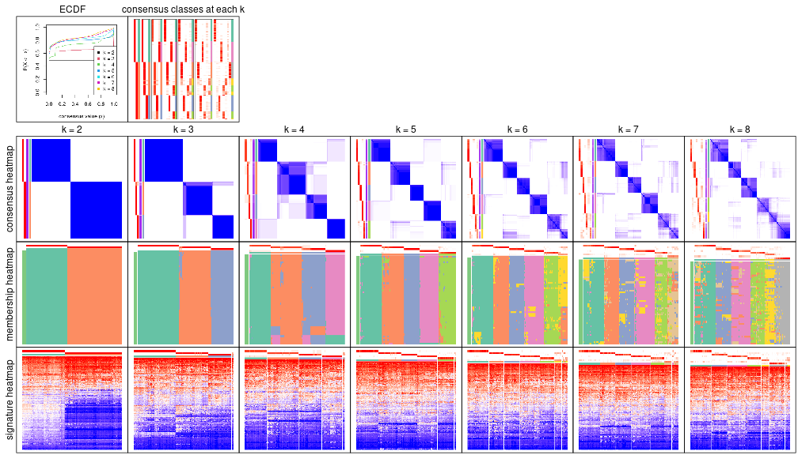

The plots are:

- The first row: a plot of the eCDF (empirical cumulative distribution
  function) curves of the consensus matrix for each `k` and the heatmap of
  predicted classes for each `k`.
- The second row: heatmaps of the consensus matrix for each `k`.
- The third row: heatmaps of the membership matrix for each `k`.
- The fouth row: heatmaps of the signatures for each `k`.

All the plots in panels can be made by individual functions and they are
plotted later in this section.

`select_partition_number()` produces several plots showing different
statistics for choosing "optimized" `k`. There are following statistics:

- eCDF curves of the consensus matrix for each `k`;
- 1-PAC. [The PAC score](https://en.wikipedia.org/wiki/Consensus_clustering#Over-interpretation_potential_of_consensus_clustering)
  measures the proportion of the ambiguous subgrouping.
- Mean silhouette score.
- Concordance. The mean probability of fiting the consensus subgroup labels in all
  partitions.
- Area increased. Denote $A_k$ as the area under the eCDF curve for current
  `k`, the area increased is defined as $A_k - A_{k-1}$.
- Rand index. The percent of pairs of samples that are both in a same cluster
  or both are not in a same cluster in the partition of k and k-1.
- Jaccard index. The ratio of pairs of samples are both in a same cluster in
  the partition of k and k-1 and the pairs of samples are both in a same
  cluster in the partition k or k-1.

The detailed explanations of these statistics can be found in [the _cola_
vignette](https://jokergoo.github.io/cola_vignettes/cola.html#toc_13).

Generally speaking, higher 1-PAC score, higher mean silhouette score or higher
concordance corresponds to better partition. Rand index and Jaccard index
measure how similar the current partition is compared to partition with `k-1`.
If they are too similar, we won't accept `k` is better than `k-1`.

```r
select_partition_number(res)
```

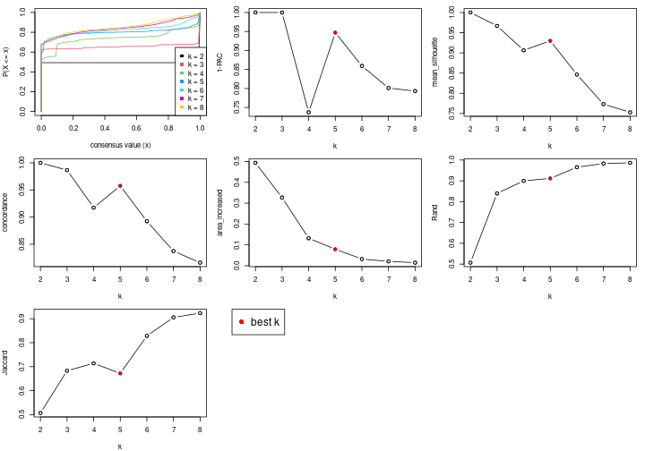

The numeric values for all these statistics can be obtained by `get_stats()`.

```r
get_stats(res)
```

```
#>   k 1-PAC mean_silhouette concordance area_increased  Rand Jaccard
#> 2 2 1.000           1.000       1.000         0.4936 0.507   0.507
#> 3 3 1.000           0.967       0.987         0.3270 0.839   0.683
#> 4 4 0.737           0.906       0.917         0.1315 0.900   0.714
#> 5 5 0.947           0.930       0.958         0.0792 0.912   0.672
#> 6 6 0.859           0.846       0.892         0.0319 0.965   0.828
#> 7 7 0.801           0.773       0.837         0.0208 0.983   0.906
#> 8 8 0.793           0.753       0.816         0.0147 0.986   0.923
```

`suggest_best_k()` suggests the best $k$ based on these statistics. The rules are as follows:

- All $k$ with Jaccard index larger than 0.95 are removed because increasing
  $k$ does not provide enough extra information. If all $k$ are removed, it is
  marked as no subgroup is detected.
- For all $k$ with 1-PAC score larger than 0.9, the maximal $k$ is taken as
  the best $k$, and other $k$ are marked as optional $k$.
- If it does not fit the second rule. The $k$ with the maximal vote of the
  highest 1-PAC score, highest mean silhouette, and highest concordance is
  taken as the best $k$.

```r
suggest_best_k(res)
```

```
#> [1] 5
#> attr(,"optional")
#> [1] 2 3
```

There is also optional best $k$ = 2 3 that is worth to check.

Following is the table of the partitions (You need to click the **show/hide
code output** link to see it). The membership matrix (columns with name `p*`)
is inferred by
[`clue::cl_consensus()`](https://www.rdocumentation.org/link/cl_consensus?package=clue)
function with the `SE` method. Basically the value in the membership matrix
represents the probability to belong to a certain group. The finall subgroup
label for an item is determined with the group with highest probability it
belongs to.

In `get_classes()` function, the entropy is calculated from the membership
matrix and the silhouette score is calculated from the consensus matrix.


<script>
$( function() {
	$( '#tabs-node-07-get-classes' ).tabs();
} );
</script>
<div id='tabs-node-07-get-classes'>
<ul>
<li><a href='#tab-node-07-get-classes-1'>k = 2</a></li>
<li><a href='#tab-node-07-get-classes-2'>k = 3</a></li>
<li><a href='#tab-node-07-get-classes-3'>k = 4</a></li>
<li><a href='#tab-node-07-get-classes-4'>k = 5</a></li>
<li><a href='#tab-node-07-get-classes-5'>k = 6</a></li>
<li><a href='#tab-node-07-get-classes-6'>k = 7</a></li>
<li><a href='#tab-node-07-get-classes-7'>k = 8</a></li>
</ul>

<div id='tab-node-07-get-classes-1'>
<p><a id='tab-node-07-get-classes-1-a' style='color:#0366d6' href='#'>show/hide code output</a></p>
<pre><code class="r">cbind(get_classes(res, k = 2), get_membership(res, k = 2))
</code></pre>

<pre><code>#&gt;                 class entropy silhouette p1 p2
#&gt; TCGA.77.A5G1.01     2       0          1  0  1
#&gt; TCGA.55.6975.01     2       0          1  0  1
#&gt; TCGA.55.7910.01     1       0          1  1  0
#&gt; TCGA.78.7539.01     1       0          1  1  0
#&gt; TCGA.39.5040.01     2       0          1  0  1
#&gt; TCGA.86.6851.01     1       0          1  1  0
#&gt; TCGA.62.8398.01     2       0          1  0  1
#&gt; TCGA.62.8394.01     1       0          1  1  0
#&gt; TCGA.97.8176.01     2       0          1  0  1
#&gt; TCGA.86.8281.01     2       0          1  0  1
#&gt; TCGA.86.8358.01     2       0          1  0  1
#&gt; TCGA.78.7149.01     2       0          1  0  1
#&gt; TCGA.91.6831.01     2       0          1  0  1
#&gt; TCGA.86.7954.01     1       0          1  1  0
#&gt; TCGA.55.6642.01     2       0          1  0  1
#&gt; TCGA.05.4415.01     2       0          1  0  1
#&gt; TCGA.44.A479.01     1       0          1  1  0
#&gt; TCGA.33.6737.01     2       0          1  0  1
#&gt; TCGA.J2.8194.01     1       0          1  1  0
#&gt; TCGA.55.6968.01     2       0          1  0  1
#&gt; TCGA.55.A57B.01     1       0          1  1  0
#&gt; TCGA.49.AAR0.01     2       0          1  0  1
#&gt; TCGA.75.7027.01     2       0          1  0  1
#&gt; TCGA.50.5072.01     2       0          1  0  1
#&gt; TCGA.55.8512.01     2       0          1  0  1
#&gt; TCGA.O2.A5IC.01     1       0          1  1  0
#&gt; TCGA.86.8279.01     2       0          1  0  1
#&gt; TCGA.55.8096.01     1       0          1  1  0
#&gt; TCGA.44.3917.01     1       0          1  1  0
#&gt; TCGA.53.7624.01     1       0          1  1  0
#&gt; TCGA.55.7913.01     1       0          1  1  0
#&gt; TCGA.33.4566.01     2       0          1  0  1
#&gt; TCGA.78.8640.01     2       0          1  0  1
#&gt; TCGA.44.7670.01     1       0          1  1  0
#&gt; TCGA.L9.A5IP.01     1       0          1  1  0
#&gt; TCGA.55.8615.01     2       0          1  0  1
#&gt; TCGA.MP.A4TF.01     1       0          1  1  0
#&gt; TCGA.62.A471.01     2       0          1  0  1
#&gt; TCGA.49.4490.01     1       0          1  1  0
#&gt; TCGA.NC.A5HK.01     1       0          1  1  0
#&gt; TCGA.05.5425.01     2       0          1  0  1
#&gt; TCGA.50.5066.02     2       0          1  0  1
#&gt; TCGA.55.8092.01     2       0          1  0  1
#&gt; TCGA.75.6207.01     2       0          1  0  1
#&gt; TCGA.49.AARE.01     1       0          1  1  0
#&gt; TCGA.43.5668.01     2       0          1  0  1
#&gt; TCGA.69.7764.01     2       0          1  0  1
#&gt; TCGA.91.6840.01     1       0          1  1  0
#&gt; TCGA.95.7043.01     1       0          1  1  0
#&gt; TCGA.73.4676.01     2       0          1  0  1
#&gt; TCGA.55.8505.01     2       0          1  0  1
#&gt; TCGA.78.7148.01     2       0          1  0  1
#&gt; TCGA.55.8205.01     1       0          1  1  0
#&gt; TCGA.91.6830.01     1       0          1  1  0
#&gt; TCGA.MN.A4N4.01     2       0          1  0  1
#&gt; TCGA.39.5022.01     2       0          1  0  1
#&gt; TCGA.44.8120.01     2       0          1  0  1
#&gt; TCGA.73.A9RS.01     2       0          1  0  1
#&gt; TCGA.70.6722.01     2       0          1  0  1
#&gt; TCGA.69.7979.01     1       0          1  1  0
#&gt; TCGA.95.7039.01     1       0          1  1  0
#&gt; TCGA.91.6848.01     2       0          1  0  1
#&gt; TCGA.33.6738.01     2       0          1  0  1
#&gt; TCGA.43.6773.01     2       0          1  0  1
#&gt; TCGA.78.7146.01     1       0          1  1  0
#&gt; TCGA.49.6743.01     1       0          1  1  0
#&gt; TCGA.78.7161.01     1       0          1  1  0
#&gt; TCGA.44.A4SU.01     1       0          1  1  0
#&gt; TCGA.97.7937.01     2       0          1  0  1
#&gt; TCGA.05.5428.01     2       0          1  0  1
#&gt; TCGA.L9.A8F4.01     1       0          1  1  0
#&gt; TCGA.91.A4BC.01     2       0          1  0  1
#&gt; TCGA.J2.A4AD.01     1       0          1  1  0
#&gt; TCGA.38.4631.01     1       0          1  1  0
#&gt; TCGA.05.4390.01     1       0          1  1  0
#&gt; TCGA.55.6972.01     2       0          1  0  1
#&gt; TCGA.05.4433.01     2       0          1  0  1
#&gt; TCGA.50.5932.01     2       0          1  0  1
#&gt; TCGA.50.7109.01     2       0          1  0  1
#&gt; TCGA.55.8508.01     1       0          1  1  0
#&gt; TCGA.71.6725.01     1       0          1  1  0
#&gt; TCGA.86.8075.01     1       0          1  1  0
#&gt; TCGA.78.7633.01     2       0          1  0  1
#&gt; TCGA.49.4514.01     1       0          1  1  0
#&gt; TCGA.05.4396.01     2       0          1  0  1
#&gt; TCGA.75.5147.01     1       0          1  1  0
#&gt; TCGA.86.7711.01     2       0          1  0  1
#&gt; TCGA.05.5420.01     2       0          1  0  1
#&gt; TCGA.78.7154.01     2       0          1  0  1
#&gt; TCGA.44.7667.01     1       0          1  1  0
#&gt; TCGA.O1.A52J.01     1       0          1  1  0
#&gt; TCGA.78.7167.01     2       0          1  0  1
#&gt; TCGA.05.4427.01     1       0          1  1  0
#&gt; TCGA.86.8585.01     2       0          1  0  1
#&gt; TCGA.78.7147.01     1       0          1  1  0
#&gt; TCGA.55.8085.01     2       0          1  0  1
#&gt; TCGA.MP.A4TE.01     2       0          1  0  1
#&gt; TCGA.78.7542.01     2       0          1  0  1
#&gt; TCGA.49.AAR9.01     2       0          1  0  1
#&gt; TCGA.95.A4VK.01     1       0          1  1  0
#&gt; TCGA.49.4488.01     1       0          1  1  0
#&gt; TCGA.55.7994.01     2       0          1  0  1
#&gt; TCGA.MP.A5C7.01     1       0          1  1  0
#&gt; TCGA.05.4424.01     2       0          1  0  1
#&gt; TCGA.4B.A93V.01     1       0          1  1  0
#&gt; TCGA.86.A4D0.01     2       0          1  0  1
#&gt; TCGA.78.7159.01     1       0          1  1  0
#&gt; TCGA.99.8032.01     2       0          1  0  1
#&gt; TCGA.MP.A4TA.01     1       0          1  1  0
#&gt; TCGA.75.5146.01     2       0          1  0  1
#&gt; TCGA.64.5779.01     2       0          1  0  1
#&gt; TCGA.50.6673.01     1       0          1  1  0
#&gt; TCGA.95.7562.01     2       0          1  0  1
#&gt; TCGA.50.5930.01     2       0          1  0  1
#&gt; TCGA.55.7284.01     2       0          1  0  1
#&gt; TCGA.91.6829.01     2       0          1  0  1
#&gt; TCGA.86.8669.01     2       0          1  0  1
#&gt; TCGA.64.1679.01     1       0          1  1  0
#&gt; TCGA.55.8616.01     1       0          1  1  0
#&gt; TCGA.50.5051.01     1       0          1  1  0
#&gt; TCGA.64.1681.01     1       0          1  1  0
#&gt; TCGA.86.8674.01     2       0          1  0  1
#&gt; TCGA.78.7166.01     2       0          1  0  1
#&gt; TCGA.86.7953.01     1       0          1  1  0
#&gt; TCGA.MP.A4SV.01     2       0          1  0  1
#&gt; TCGA.62.8402.01     1       0          1  1  0
#&gt; TCGA.55.7995.01     1       0          1  1  0
#&gt; TCGA.NJ.A55R.01     2       0          1  0  1
#&gt; TCGA.86.8055.01     2       0          1  0  1
#&gt; TCGA.33.AASB.01     2       0          1  0  1
#&gt; TCGA.78.7156.01     2       0          1  0  1
#&gt; TCGA.55.8506.01     1       0          1  1  0
#&gt; TCGA.53.7813.01     1       0          1  1  0
#&gt; TCGA.97.8179.01     2       0          1  0  1
#&gt; TCGA.86.7713.01     2       0          1  0  1
#&gt; TCGA.62.A46S.01     2       0          1  0  1
#&gt; TCGA.95.7947.01     2       0          1  0  1
#&gt; TCGA.J2.8192.01     1       0          1  1  0
</code></pre>

<script>
$('#tab-node-07-get-classes-1-a').parent().next().next().hide();
$('#tab-node-07-get-classes-1-a').click(function(){
  $('#tab-node-07-get-classes-1-a').parent().next().next().toggle();
  return(false);
});
</script>
</div>

<div id='tab-node-07-get-classes-2'>
<p><a id='tab-node-07-get-classes-2-a' style='color:#0366d6' href='#'>show/hide code output</a></p>
<pre><code class="r">cbind(get_classes(res, k = 3), get_membership(res, k = 3))
</code></pre>

<pre><code>#&gt;                 class entropy silhouette p1   p2   p3
#&gt; TCGA.77.A5G1.01     3  0.0000     0.9887  0 0.00 1.00
#&gt; TCGA.55.6975.01     3  0.0000     0.9887  0 0.00 1.00
#&gt; TCGA.55.7910.01     1  0.0000     1.0000  1 0.00 0.00
#&gt; TCGA.78.7539.01     1  0.0000     1.0000  1 0.00 0.00
#&gt; TCGA.39.5040.01     3  0.0000     0.9887  0 0.00 1.00
#&gt; TCGA.86.6851.01     1  0.0000     1.0000  1 0.00 0.00
#&gt; TCGA.62.8398.01     3  0.0000     0.9887  0 0.00 1.00
#&gt; TCGA.62.8394.01     1  0.0000     1.0000  1 0.00 0.00
#&gt; TCGA.97.8176.01     3  0.0000     0.9887  0 0.00 1.00
#&gt; TCGA.86.8281.01     2  0.0000     0.9654  0 1.00 0.00
#&gt; TCGA.86.8358.01     2  0.0000     0.9654  0 1.00 0.00
#&gt; TCGA.78.7149.01     2  0.0000     0.9654  0 1.00 0.00
#&gt; TCGA.91.6831.01     3  0.5835     0.4433  0 0.34 0.66
#&gt; TCGA.86.7954.01     1  0.0000     1.0000  1 0.00 0.00
#&gt; TCGA.55.6642.01     2  0.0000     0.9654  0 1.00 0.00
#&gt; TCGA.05.4415.01     3  0.0000     0.9887  0 0.00 1.00
#&gt; TCGA.44.A479.01     1  0.0000     1.0000  1 0.00 0.00
#&gt; TCGA.33.6737.01     2  0.0000     0.9654  0 1.00 0.00
#&gt; TCGA.J2.8194.01     1  0.0000     1.0000  1 0.00 0.00
#&gt; TCGA.55.6968.01     2  0.4002     0.8058  0 0.84 0.16
#&gt; TCGA.55.A57B.01     1  0.0000     1.0000  1 0.00 0.00
#&gt; TCGA.49.AAR0.01     3  0.0000     0.9887  0 0.00 1.00
#&gt; TCGA.75.7027.01     2  0.0000     0.9654  0 1.00 0.00
#&gt; TCGA.50.5072.01     3  0.0000     0.9887  0 0.00 1.00
#&gt; TCGA.55.8512.01     3  0.0000     0.9887  0 0.00 1.00
#&gt; TCGA.O2.A5IC.01     1  0.0000     1.0000  1 0.00 0.00
#&gt; TCGA.86.8279.01     2  0.0000     0.9654  0 1.00 0.00
#&gt; TCGA.55.8096.01     1  0.0000     1.0000  1 0.00 0.00
#&gt; TCGA.44.3917.01     1  0.0000     1.0000  1 0.00 0.00
#&gt; TCGA.53.7624.01     1  0.0000     1.0000  1 0.00 0.00
#&gt; TCGA.55.7913.01     1  0.0000     1.0000  1 0.00 0.00
#&gt; TCGA.33.4566.01     2  0.0000     0.9654  0 1.00 0.00
#&gt; TCGA.78.8640.01     3  0.0000     0.9887  0 0.00 1.00
#&gt; TCGA.44.7670.01     1  0.0000     1.0000  1 0.00 0.00
#&gt; TCGA.L9.A5IP.01     1  0.0000     1.0000  1 0.00 0.00
#&gt; TCGA.55.8615.01     2  0.0000     0.9654  0 1.00 0.00
#&gt; TCGA.MP.A4TF.01     1  0.0000     1.0000  1 0.00 0.00
#&gt; TCGA.62.A471.01     3  0.0000     0.9887  0 0.00 1.00
#&gt; TCGA.49.4490.01     1  0.0000     1.0000  1 0.00 0.00
#&gt; TCGA.NC.A5HK.01     1  0.0000     1.0000  1 0.00 0.00
#&gt; TCGA.05.5425.01     2  0.0000     0.9654  0 1.00 0.00
#&gt; TCGA.50.5066.02     2  0.0000     0.9654  0 1.00 0.00
#&gt; TCGA.55.8092.01     2  0.0000     0.9654  0 1.00 0.00
#&gt; TCGA.75.6207.01     2  0.0000     0.9654  0 1.00 0.00
#&gt; TCGA.49.AARE.01     1  0.0000     1.0000  1 0.00 0.00
#&gt; TCGA.43.5668.01     3  0.0000     0.9887  0 0.00 1.00
#&gt; TCGA.69.7764.01     2  0.6309     0.0248  0 0.50 0.50
#&gt; TCGA.91.6840.01     1  0.0000     1.0000  1 0.00 0.00
#&gt; TCGA.95.7043.01     1  0.0000     1.0000  1 0.00 0.00
#&gt; TCGA.73.4676.01     2  0.0000     0.9654  0 1.00 0.00
#&gt; TCGA.55.8505.01     3  0.0000     0.9887  0 0.00 1.00
#&gt; TCGA.78.7148.01     3  0.0000     0.9887  0 0.00 1.00
#&gt; TCGA.55.8205.01     1  0.0000     1.0000  1 0.00 0.00
#&gt; TCGA.91.6830.01     1  0.0000     1.0000  1 0.00 0.00
#&gt; TCGA.MN.A4N4.01     2  0.0000     0.9654  0 1.00 0.00
#&gt; TCGA.39.5022.01     3  0.0000     0.9887  0 0.00 1.00
#&gt; TCGA.44.8120.01     2  0.0000     0.9654  0 1.00 0.00
#&gt; TCGA.73.A9RS.01     2  0.1529     0.9328  0 0.96 0.04
#&gt; TCGA.70.6722.01     3  0.0000     0.9887  0 0.00 1.00
#&gt; TCGA.69.7979.01     1  0.0000     1.0000  1 0.00 0.00
#&gt; TCGA.95.7039.01     1  0.0000     1.0000  1 0.00 0.00
#&gt; TCGA.91.6848.01     3  0.0000     0.9887  0 0.00 1.00
#&gt; TCGA.33.6738.01     3  0.0000     0.9887  0 0.00 1.00
#&gt; TCGA.43.6773.01     3  0.0000     0.9887  0 0.00 1.00
#&gt; TCGA.78.7146.01     1  0.0000     1.0000  1 0.00 0.00
#&gt; TCGA.49.6743.01     1  0.0000     1.0000  1 0.00 0.00
#&gt; TCGA.78.7161.01     1  0.0000     1.0000  1 0.00 0.00
#&gt; TCGA.44.A4SU.01     1  0.0000     1.0000  1 0.00 0.00
#&gt; TCGA.97.7937.01     2  0.0000     0.9654  0 1.00 0.00
#&gt; TCGA.05.5428.01     2  0.0000     0.9654  0 1.00 0.00
#&gt; TCGA.L9.A8F4.01     1  0.0000     1.0000  1 0.00 0.00
#&gt; TCGA.91.A4BC.01     2  0.5397     0.6319  0 0.72 0.28
#&gt; TCGA.J2.A4AD.01     1  0.0000     1.0000  1 0.00 0.00
#&gt; TCGA.38.4631.01     1  0.0000     1.0000  1 0.00 0.00
#&gt; TCGA.05.4390.01     1  0.0000     1.0000  1 0.00 0.00
#&gt; TCGA.55.6972.01     3  0.0000     0.9887  0 0.00 1.00
#&gt; TCGA.05.4433.01     2  0.0000     0.9654  0 1.00 0.00
#&gt; TCGA.50.5932.01     2  0.0000     0.9654  0 1.00 0.00
#&gt; TCGA.50.7109.01     2  0.0000     0.9654  0 1.00 0.00
#&gt; TCGA.55.8508.01     1  0.0000     1.0000  1 0.00 0.00
#&gt; TCGA.71.6725.01     1  0.0000     1.0000  1 0.00 0.00
#&gt; TCGA.86.8075.01     1  0.0000     1.0000  1 0.00 0.00
#&gt; TCGA.78.7633.01     2  0.0000     0.9654  0 1.00 0.00
#&gt; TCGA.49.4514.01     1  0.0000     1.0000  1 0.00 0.00
#&gt; TCGA.05.4396.01     2  0.0000     0.9654  0 1.00 0.00
#&gt; TCGA.75.5147.01     1  0.0000     1.0000  1 0.00 0.00
#&gt; TCGA.86.7711.01     3  0.0000     0.9887  0 0.00 1.00
#&gt; TCGA.05.5420.01     3  0.0000     0.9887  0 0.00 1.00
#&gt; TCGA.78.7154.01     2  0.0000     0.9654  0 1.00 0.00
#&gt; TCGA.44.7667.01     1  0.0000     1.0000  1 0.00 0.00
#&gt; TCGA.O1.A52J.01     1  0.0000     1.0000  1 0.00 0.00
#&gt; TCGA.78.7167.01     2  0.0000     0.9654  0 1.00 0.00
#&gt; TCGA.05.4427.01     1  0.0000     1.0000  1 0.00 0.00
#&gt; TCGA.86.8585.01     3  0.0000     0.9887  0 0.00 1.00
#&gt; TCGA.78.7147.01     1  0.0000     1.0000  1 0.00 0.00
#&gt; TCGA.55.8085.01     2  0.0000     0.9654  0 1.00 0.00
#&gt; TCGA.MP.A4TE.01     2  0.0000     0.9654  0 1.00 0.00
#&gt; TCGA.78.7542.01     2  0.0000     0.9654  0 1.00 0.00
#&gt; TCGA.49.AAR9.01     3  0.0000     0.9887  0 0.00 1.00
#&gt; TCGA.95.A4VK.01     1  0.0000     1.0000  1 0.00 0.00
#&gt; TCGA.49.4488.01     1  0.0000     1.0000  1 0.00 0.00
#&gt; TCGA.55.7994.01     2  0.0000     0.9654  0 1.00 0.00
#&gt; TCGA.MP.A5C7.01     1  0.0000     1.0000  1 0.00 0.00
#&gt; TCGA.05.4424.01     3  0.0000     0.9887  0 0.00 1.00
#&gt; TCGA.4B.A93V.01     1  0.0000     1.0000  1 0.00 0.00
#&gt; TCGA.86.A4D0.01     2  0.0000     0.9654  0 1.00 0.00
#&gt; TCGA.78.7159.01     1  0.0000     1.0000  1 0.00 0.00
#&gt; TCGA.99.8032.01     2  0.0000     0.9654  0 1.00 0.00
#&gt; TCGA.MP.A4TA.01     1  0.0000     1.0000  1 0.00 0.00
#&gt; TCGA.75.5146.01     3  0.0000     0.9887  0 0.00 1.00
#&gt; TCGA.64.5779.01     2  0.5216     0.6662  0 0.74 0.26
#&gt; TCGA.50.6673.01     1  0.0000     1.0000  1 0.00 0.00
#&gt; TCGA.95.7562.01     2  0.0000     0.9654  0 1.00 0.00
#&gt; TCGA.50.5930.01     3  0.0000     0.9887  0 0.00 1.00
#&gt; TCGA.55.7284.01     2  0.0000     0.9654  0 1.00 0.00
#&gt; TCGA.91.6829.01     2  0.0000     0.9654  0 1.00 0.00
#&gt; TCGA.86.8669.01     2  0.0892     0.9494  0 0.98 0.02
#&gt; TCGA.64.1679.01     1  0.0000     1.0000  1 0.00 0.00
#&gt; TCGA.55.8616.01     1  0.0000     1.0000  1 0.00 0.00
#&gt; TCGA.50.5051.01     1  0.0000     1.0000  1 0.00 0.00
#&gt; TCGA.64.1681.01     1  0.0000     1.0000  1 0.00 0.00
#&gt; TCGA.86.8674.01     3  0.0000     0.9887  0 0.00 1.00
#&gt; TCGA.78.7166.01     3  0.0000     0.9887  0 0.00 1.00
#&gt; TCGA.86.7953.01     1  0.0000     1.0000  1 0.00 0.00
#&gt; TCGA.MP.A4SV.01     2  0.0000     0.9654  0 1.00 0.00
#&gt; TCGA.62.8402.01     1  0.0000     1.0000  1 0.00 0.00
#&gt; TCGA.55.7995.01     1  0.0000     1.0000  1 0.00 0.00
#&gt; TCGA.NJ.A55R.01     2  0.5216     0.6663  0 0.74 0.26
#&gt; TCGA.86.8055.01     3  0.0000     0.9887  0 0.00 1.00
#&gt; TCGA.33.AASB.01     2  0.0000     0.9654  0 1.00 0.00
#&gt; TCGA.78.7156.01     3  0.0000     0.9887  0 0.00 1.00
#&gt; TCGA.55.8506.01     1  0.0000     1.0000  1 0.00 0.00
#&gt; TCGA.53.7813.01     1  0.0000     1.0000  1 0.00 0.00
#&gt; TCGA.97.8179.01     2  0.0000     0.9654  0 1.00 0.00
#&gt; TCGA.86.7713.01     2  0.0000     0.9654  0 1.00 0.00
#&gt; TCGA.62.A46S.01     2  0.0000     0.9654  0 1.00 0.00
#&gt; TCGA.95.7947.01     3  0.0000     0.9887  0 0.00 1.00
#&gt; TCGA.J2.8192.01     1  0.0000     1.0000  1 0.00 0.00
</code></pre>

<script>
$('#tab-node-07-get-classes-2-a').parent().next().next().hide();
$('#tab-node-07-get-classes-2-a').click(function(){
  $('#tab-node-07-get-classes-2-a').parent().next().next().toggle();
  return(false);
});
</script>
</div>

<div id='tab-node-07-get-classes-3'>
<p><a id='tab-node-07-get-classes-3-a' style='color:#0366d6' href='#'>show/hide code output</a></p>
<pre><code class="r">cbind(get_classes(res, k = 4), get_membership(res, k = 4))
</code></pre>

<pre><code>#&gt;                 class entropy silhouette   p1   p2   p3   p4
#&gt; TCGA.77.A5G1.01     3  0.0000      0.907 0.00 0.00 1.00 0.00
#&gt; TCGA.55.6975.01     3  0.0000      0.907 0.00 0.00 1.00 0.00
#&gt; TCGA.55.7910.01     1  0.2345      0.982 0.90 0.00 0.00 0.10
#&gt; TCGA.78.7539.01     4  0.0000      0.994 0.00 0.00 0.00 1.00
#&gt; TCGA.39.5040.01     3  0.0000      0.907 0.00 0.00 1.00 0.00
#&gt; TCGA.86.6851.01     4  0.0000      0.994 0.00 0.00 0.00 1.00
#&gt; TCGA.62.8398.01     3  0.5151      0.808 0.10 0.14 0.76 0.00
#&gt; TCGA.62.8394.01     1  0.4624      0.651 0.66 0.00 0.00 0.34
#&gt; TCGA.97.8176.01     3  0.4610      0.829 0.10 0.10 0.80 0.00
#&gt; TCGA.86.8281.01     2  0.2345      0.828 0.10 0.90 0.00 0.00
#&gt; TCGA.86.8358.01     2  0.2647      0.899 0.00 0.88 0.12 0.00
#&gt; TCGA.78.7149.01     2  0.2345      0.828 0.10 0.90 0.00 0.00
#&gt; TCGA.91.6831.01     3  0.5173      0.424 0.02 0.32 0.66 0.00
#&gt; TCGA.86.7954.01     1  0.2345      0.982 0.90 0.00 0.00 0.10
#&gt; TCGA.55.6642.01     2  0.2345      0.909 0.00 0.90 0.10 0.00
#&gt; TCGA.05.4415.01     3  0.0000      0.907 0.00 0.00 1.00 0.00
#&gt; TCGA.44.A479.01     1  0.2345      0.982 0.90 0.00 0.00 0.10
#&gt; TCGA.33.6737.01     2  0.2345      0.909 0.00 0.90 0.10 0.00
#&gt; TCGA.J2.8194.01     4  0.0000      0.994 0.00 0.00 0.00 1.00
#&gt; TCGA.55.6968.01     2  0.3975      0.783 0.00 0.76 0.24 0.00
#&gt; TCGA.55.A57B.01     4  0.2921      0.813 0.14 0.00 0.00 0.86
#&gt; TCGA.49.AAR0.01     3  0.4610      0.829 0.10 0.10 0.80 0.00
#&gt; TCGA.75.7027.01     2  0.2345      0.828 0.10 0.90 0.00 0.00
#&gt; TCGA.50.5072.01     3  0.0000      0.907 0.00 0.00 1.00 0.00
#&gt; TCGA.55.8512.01     3  0.4610      0.829 0.10 0.10 0.80 0.00
#&gt; TCGA.O2.A5IC.01     1  0.2345      0.982 0.90 0.00 0.00 0.10
#&gt; TCGA.86.8279.01     2  0.2345      0.828 0.10 0.90 0.00 0.00
#&gt; TCGA.55.8096.01     1  0.2345      0.982 0.90 0.00 0.00 0.10
#&gt; TCGA.44.3917.01     4  0.0000      0.994 0.00 0.00 0.00 1.00
#&gt; TCGA.53.7624.01     1  0.2706      0.959 0.90 0.00 0.02 0.08
#&gt; TCGA.55.7913.01     1  0.3172      0.925 0.84 0.00 0.00 0.16
#&gt; TCGA.33.4566.01     2  0.2345      0.909 0.00 0.90 0.10 0.00
#&gt; TCGA.78.8640.01     3  0.0707      0.894 0.00 0.02 0.98 0.00
#&gt; TCGA.44.7670.01     1  0.2345      0.982 0.90 0.00 0.00 0.10
#&gt; TCGA.L9.A5IP.01     1  0.2345      0.982 0.90 0.00 0.00 0.10
#&gt; TCGA.55.8615.01     2  0.2345      0.828 0.10 0.90 0.00 0.00
#&gt; TCGA.MP.A4TF.01     4  0.0000      0.994 0.00 0.00 0.00 1.00
#&gt; TCGA.62.A471.01     3  0.0000      0.907 0.00 0.00 1.00 0.00
#&gt; TCGA.49.4490.01     1  0.2345      0.982 0.90 0.00 0.00 0.10
#&gt; TCGA.NC.A5HK.01     1  0.2345      0.982 0.90 0.00 0.00 0.10
#&gt; TCGA.05.5425.01     2  0.2345      0.909 0.00 0.90 0.10 0.00
#&gt; TCGA.50.5066.02     2  0.2345      0.909 0.00 0.90 0.10 0.00
#&gt; TCGA.55.8092.01     2  0.2345      0.909 0.00 0.90 0.10 0.00
#&gt; TCGA.75.6207.01     2  0.2345      0.909 0.00 0.90 0.10 0.00
#&gt; TCGA.49.AARE.01     4  0.0000      0.994 0.00 0.00 0.00 1.00
#&gt; TCGA.43.5668.01     3  0.0707      0.894 0.00 0.02 0.98 0.00
#&gt; TCGA.69.7764.01     3  0.6831      0.302 0.10 0.42 0.48 0.00
#&gt; TCGA.91.6840.01     1  0.2345      0.982 0.90 0.00 0.00 0.10
#&gt; TCGA.95.7043.01     4  0.0000      0.994 0.00 0.00 0.00 1.00
#&gt; TCGA.73.4676.01     2  0.2345      0.909 0.00 0.90 0.10 0.00
#&gt; TCGA.55.8505.01     3  0.0000      0.907 0.00 0.00 1.00 0.00
#&gt; TCGA.78.7148.01     3  0.4894      0.821 0.10 0.12 0.78 0.00
#&gt; TCGA.55.8205.01     4  0.0000      0.994 0.00 0.00 0.00 1.00
#&gt; TCGA.91.6830.01     1  0.2345      0.982 0.90 0.00 0.00 0.10
#&gt; TCGA.MN.A4N4.01     2  0.2345      0.909 0.00 0.90 0.10 0.00
#&gt; TCGA.39.5022.01     3  0.0000      0.907 0.00 0.00 1.00 0.00
#&gt; TCGA.44.8120.01     2  0.2345      0.909 0.00 0.90 0.10 0.00
#&gt; TCGA.73.A9RS.01     2  0.2345      0.909 0.00 0.90 0.10 0.00
#&gt; TCGA.70.6722.01     3  0.0000      0.907 0.00 0.00 1.00 0.00
#&gt; TCGA.69.7979.01     4  0.0000      0.994 0.00 0.00 0.00 1.00
#&gt; TCGA.95.7039.01     4  0.0000      0.994 0.00 0.00 0.00 1.00
#&gt; TCGA.91.6848.01     3  0.0000      0.907 0.00 0.00 1.00 0.00
#&gt; TCGA.33.6738.01     3  0.0000      0.907 0.00 0.00 1.00 0.00
#&gt; TCGA.43.6773.01     3  0.0000      0.907 0.00 0.00 1.00 0.00
#&gt; TCGA.78.7146.01     4  0.0000      0.994 0.00 0.00 0.00 1.00
#&gt; TCGA.49.6743.01     1  0.2345      0.982 0.90 0.00 0.00 0.10
#&gt; TCGA.78.7161.01     4  0.0000      0.994 0.00 0.00 0.00 1.00
#&gt; TCGA.44.A4SU.01     1  0.2345      0.982 0.90 0.00 0.00 0.10
#&gt; TCGA.97.7937.01     2  0.2345      0.909 0.00 0.90 0.10 0.00
#&gt; TCGA.05.5428.01     2  0.2345      0.909 0.00 0.90 0.10 0.00
#&gt; TCGA.L9.A8F4.01     1  0.2345      0.982 0.90 0.00 0.00 0.10
#&gt; TCGA.91.A4BC.01     2  0.4855      0.492 0.00 0.60 0.40 0.00
#&gt; TCGA.J2.A4AD.01     1  0.2345      0.982 0.90 0.00 0.00 0.10
#&gt; TCGA.38.4631.01     1  0.2345      0.982 0.90 0.00 0.00 0.10
#&gt; TCGA.05.4390.01     4  0.0000      0.994 0.00 0.00 0.00 1.00
#&gt; TCGA.55.6972.01     3  0.5151      0.808 0.10 0.14 0.76 0.00
#&gt; TCGA.05.4433.01     2  0.2345      0.909 0.00 0.90 0.10 0.00
#&gt; TCGA.50.5932.01     2  0.2345      0.828 0.10 0.90 0.00 0.00
#&gt; TCGA.50.7109.01     2  0.0707      0.861 0.02 0.98 0.00 0.00
#&gt; TCGA.55.8508.01     4  0.0000      0.994 0.00 0.00 0.00 1.00
#&gt; TCGA.71.6725.01     4  0.0000      0.994 0.00 0.00 0.00 1.00
#&gt; TCGA.86.8075.01     1  0.2345      0.982 0.90 0.00 0.00 0.10
#&gt; TCGA.78.7633.01     2  0.3037      0.814 0.10 0.88 0.02 0.00
#&gt; TCGA.49.4514.01     1  0.2345      0.982 0.90 0.00 0.00 0.10
#&gt; TCGA.05.4396.01     2  0.2345      0.909 0.00 0.90 0.10 0.00
#&gt; TCGA.75.5147.01     1  0.2345      0.982 0.90 0.00 0.00 0.10
#&gt; TCGA.86.7711.01     3  0.0000      0.907 0.00 0.00 1.00 0.00
#&gt; TCGA.05.5420.01     3  0.0000      0.907 0.00 0.00 1.00 0.00
#&gt; TCGA.78.7154.01     2  0.2345      0.909 0.00 0.90 0.10 0.00
#&gt; TCGA.44.7667.01     4  0.0000      0.994 0.00 0.00 0.00 1.00
#&gt; TCGA.O1.A52J.01     1  0.2345      0.982 0.90 0.00 0.00 0.10
#&gt; TCGA.78.7167.01     2  0.2345      0.828 0.10 0.90 0.00 0.00
#&gt; TCGA.05.4427.01     4  0.0000      0.994 0.00 0.00 0.00 1.00
#&gt; TCGA.86.8585.01     3  0.0000      0.907 0.00 0.00 1.00 0.00
#&gt; TCGA.78.7147.01     4  0.0000      0.994 0.00 0.00 0.00 1.00
#&gt; TCGA.55.8085.01     2  0.3037      0.814 0.10 0.88 0.02 0.00
#&gt; TCGA.MP.A4TE.01     2  0.2345      0.909 0.00 0.90 0.10 0.00
#&gt; TCGA.78.7542.01     2  0.2345      0.909 0.00 0.90 0.10 0.00
#&gt; TCGA.49.AAR9.01     3  0.0000      0.907 0.00 0.00 1.00 0.00
#&gt; TCGA.95.A4VK.01     4  0.0000      0.994 0.00 0.00 0.00 1.00
#&gt; TCGA.49.4488.01     4  0.0000      0.994 0.00 0.00 0.00 1.00
#&gt; TCGA.55.7994.01     2  0.2345      0.909 0.00 0.90 0.10 0.00
#&gt; TCGA.MP.A5C7.01     4  0.0000      0.994 0.00 0.00 0.00 1.00
#&gt; TCGA.05.4424.01     3  0.0000      0.907 0.00 0.00 1.00 0.00
#&gt; TCGA.4B.A93V.01     1  0.2921      0.945 0.86 0.00 0.00 0.14
#&gt; TCGA.86.A4D0.01     2  0.2647      0.899 0.00 0.88 0.12 0.00
#&gt; TCGA.78.7159.01     4  0.0000      0.994 0.00 0.00 0.00 1.00
#&gt; TCGA.99.8032.01     2  0.2345      0.909 0.00 0.90 0.10 0.00
#&gt; TCGA.MP.A4TA.01     1  0.2345      0.982 0.90 0.00 0.00 0.10
#&gt; TCGA.75.5146.01     3  0.5151      0.808 0.10 0.14 0.76 0.00
#&gt; TCGA.64.5779.01     2  0.4624      0.621 0.00 0.66 0.34 0.00
#&gt; TCGA.50.6673.01     4  0.0000      0.994 0.00 0.00 0.00 1.00
#&gt; TCGA.95.7562.01     2  0.2345      0.909 0.00 0.90 0.10 0.00
#&gt; TCGA.50.5930.01     3  0.0000      0.907 0.00 0.00 1.00 0.00
#&gt; TCGA.55.7284.01     2  0.2345      0.909 0.00 0.90 0.10 0.00
#&gt; TCGA.91.6829.01     2  0.2345      0.909 0.00 0.90 0.10 0.00
#&gt; TCGA.86.8669.01     2  0.3935      0.782 0.10 0.84 0.06 0.00
#&gt; TCGA.64.1679.01     1  0.2345      0.982 0.90 0.00 0.00 0.10
#&gt; TCGA.55.8616.01     4  0.0000      0.994 0.00 0.00 0.00 1.00
#&gt; TCGA.50.5051.01     4  0.0000      0.994 0.00 0.00 0.00 1.00
#&gt; TCGA.64.1681.01     1  0.2345      0.982 0.90 0.00 0.00 0.10
#&gt; TCGA.86.8674.01     3  0.4610      0.829 0.10 0.10 0.80 0.00
#&gt; TCGA.78.7166.01     3  0.4894      0.821 0.10 0.12 0.78 0.00
#&gt; TCGA.86.7953.01     1  0.2345      0.982 0.90 0.00 0.00 0.10
#&gt; TCGA.MP.A4SV.01     2  0.2345      0.909 0.00 0.90 0.10 0.00
#&gt; TCGA.62.8402.01     1  0.3801      0.852 0.78 0.00 0.00 0.22
#&gt; TCGA.55.7995.01     1  0.2345      0.982 0.90 0.00 0.00 0.10
#&gt; TCGA.NJ.A55R.01     2  0.4277      0.727 0.00 0.72 0.28 0.00
#&gt; TCGA.86.8055.01     3  0.0000      0.907 0.00 0.00 1.00 0.00
#&gt; TCGA.33.AASB.01     2  0.2345      0.909 0.00 0.90 0.10 0.00
#&gt; TCGA.78.7156.01     3  0.4610      0.829 0.10 0.10 0.80 0.00
#&gt; TCGA.55.8506.01     4  0.0000      0.994 0.00 0.00 0.00 1.00
#&gt; TCGA.53.7813.01     4  0.0000      0.994 0.00 0.00 0.00 1.00
#&gt; TCGA.97.8179.01     2  0.2345      0.828 0.10 0.90 0.00 0.00
#&gt; TCGA.86.7713.01     2  0.2345      0.828 0.10 0.90 0.00 0.00
#&gt; TCGA.62.A46S.01     2  0.1637      0.846 0.06 0.94 0.00 0.00
#&gt; TCGA.95.7947.01     3  0.1211      0.882 0.00 0.04 0.96 0.00
#&gt; TCGA.J2.8192.01     1  0.2345      0.982 0.90 0.00 0.00 0.10
</code></pre>

<script>
$('#tab-node-07-get-classes-3-a').parent().next().next().hide();
$('#tab-node-07-get-classes-3-a').click(function(){
  $('#tab-node-07-get-classes-3-a').parent().next().next().toggle();
  return(false);
});
</script>
</div>

<div id='tab-node-07-get-classes-4'>
<p><a id='tab-node-07-get-classes-4-a' style='color:#0366d6' href='#'>show/hide code output</a></p>
<pre><code class="r">cbind(get_classes(res, k = 5), get_membership(res, k = 5))
</code></pre>

<pre><code>#&gt;                 class entropy silhouette   p1   p2   p3   p4   p5
#&gt; TCGA.77.A5G1.01     3  0.0000      0.996 0.00 0.00 1.00 0.00 0.00
#&gt; TCGA.55.6975.01     3  0.0000      0.996 0.00 0.00 1.00 0.00 0.00
#&gt; TCGA.55.7910.01     1  0.0000      0.975 1.00 0.00 0.00 0.00 0.00
#&gt; TCGA.78.7539.01     4  0.0609      0.988 0.02 0.00 0.00 0.98 0.00
#&gt; TCGA.39.5040.01     3  0.0000      0.996 0.00 0.00 1.00 0.00 0.00
#&gt; TCGA.86.6851.01     4  0.0609      0.988 0.02 0.00 0.00 0.98 0.00
#&gt; TCGA.62.8398.01     5  0.0609      0.913 0.00 0.00 0.02 0.00 0.98
#&gt; TCGA.62.8394.01     1  0.4360      0.559 0.68 0.00 0.00 0.30 0.02
#&gt; TCGA.97.8176.01     5  0.1732      0.879 0.00 0.00 0.08 0.00 0.92
#&gt; TCGA.86.8281.01     5  0.0609      0.915 0.00 0.02 0.00 0.00 0.98
#&gt; TCGA.86.8358.01     2  0.2077      0.901 0.00 0.92 0.04 0.00 0.04
#&gt; TCGA.78.7149.01     5  0.1732      0.888 0.00 0.08 0.00 0.00 0.92
#&gt; TCGA.91.6831.01     5  0.6146      0.492 0.00 0.20 0.24 0.00 0.56
#&gt; TCGA.86.7954.01     1  0.0000      0.975 1.00 0.00 0.00 0.00 0.00
#&gt; TCGA.55.6642.01     2  0.1410      0.908 0.00 0.94 0.00 0.00 0.06
#&gt; TCGA.05.4415.01     3  0.0000      0.996 0.00 0.00 1.00 0.00 0.00
#&gt; TCGA.44.A479.01     1  0.0000      0.975 1.00 0.00 0.00 0.00 0.00
#&gt; TCGA.33.6737.01     2  0.0000      0.938 0.00 1.00 0.00 0.00 0.00
#&gt; TCGA.J2.8194.01     4  0.0609      0.988 0.02 0.00 0.00 0.98 0.00
#&gt; TCGA.55.6968.01     2  0.3291      0.833 0.00 0.84 0.12 0.00 0.04
#&gt; TCGA.55.A57B.01     4  0.3513      0.789 0.18 0.00 0.00 0.80 0.02
#&gt; TCGA.49.AAR0.01     5  0.1410      0.895 0.00 0.00 0.06 0.00 0.94
#&gt; TCGA.75.7027.01     5  0.3424      0.703 0.00 0.24 0.00 0.00 0.76
#&gt; TCGA.50.5072.01     3  0.0000      0.996 0.00 0.00 1.00 0.00 0.00
#&gt; TCGA.55.8512.01     5  0.1043      0.904 0.00 0.00 0.04 0.00 0.96
#&gt; TCGA.O2.A5IC.01     1  0.0000      0.975 1.00 0.00 0.00 0.00 0.00
#&gt; TCGA.86.8279.01     5  0.1216      0.912 0.00 0.02 0.00 0.02 0.96
#&gt; TCGA.55.8096.01     1  0.0000      0.975 1.00 0.00 0.00 0.00 0.00
#&gt; TCGA.44.3917.01     4  0.0609      0.988 0.02 0.00 0.00 0.98 0.00
#&gt; TCGA.53.7624.01     1  0.0609      0.969 0.98 0.00 0.00 0.00 0.02
#&gt; TCGA.55.7913.01     1  0.1043      0.948 0.96 0.00 0.00 0.04 0.00
#&gt; TCGA.33.4566.01     2  0.0000      0.938 0.00 1.00 0.00 0.00 0.00
#&gt; TCGA.78.8640.01     3  0.0000      0.996 0.00 0.00 1.00 0.00 0.00
#&gt; TCGA.44.7670.01     1  0.1648      0.941 0.94 0.00 0.00 0.04 0.02
#&gt; TCGA.L9.A5IP.01     1  0.0000      0.975 1.00 0.00 0.00 0.00 0.00
#&gt; TCGA.55.8615.01     5  0.2516      0.838 0.00 0.14 0.00 0.00 0.86
#&gt; TCGA.MP.A4TF.01     4  0.1216      0.978 0.02 0.00 0.00 0.96 0.02
#&gt; TCGA.62.A471.01     3  0.0000      0.996 0.00 0.00 1.00 0.00 0.00
#&gt; TCGA.49.4490.01     1  0.0609      0.969 0.98 0.00 0.00 0.00 0.02
#&gt; TCGA.NC.A5HK.01     1  0.0609      0.969 0.98 0.00 0.00 0.00 0.02
#&gt; TCGA.05.5425.01     2  0.2012      0.901 0.00 0.92 0.00 0.02 0.06
#&gt; TCGA.50.5066.02     2  0.1216      0.922 0.00 0.96 0.00 0.02 0.02
#&gt; TCGA.55.8092.01     2  0.0000      0.938 0.00 1.00 0.00 0.00 0.00
#&gt; TCGA.75.6207.01     2  0.0000      0.938 0.00 1.00 0.00 0.00 0.00
#&gt; TCGA.49.AARE.01     4  0.1216      0.978 0.02 0.00 0.00 0.96 0.02
#&gt; TCGA.43.5668.01     3  0.0609      0.977 0.00 0.02 0.98 0.00 0.00
#&gt; TCGA.69.7764.01     5  0.0609      0.913 0.00 0.00 0.02 0.00 0.98
#&gt; TCGA.91.6840.01     1  0.0000      0.975 1.00 0.00 0.00 0.00 0.00
#&gt; TCGA.95.7043.01     4  0.1216      0.978 0.02 0.00 0.00 0.96 0.02
#&gt; TCGA.73.4676.01     2  0.0000      0.938 0.00 1.00 0.00 0.00 0.00
#&gt; TCGA.55.8505.01     3  0.0000      0.996 0.00 0.00 1.00 0.00 0.00
#&gt; TCGA.78.7148.01     5  0.0609      0.913 0.00 0.00 0.02 0.00 0.98
#&gt; TCGA.55.8205.01     4  0.0609      0.988 0.02 0.00 0.00 0.98 0.00
#&gt; TCGA.91.6830.01     1  0.0000      0.975 1.00 0.00 0.00 0.00 0.00
#&gt; TCGA.MN.A4N4.01     2  0.0609      0.932 0.00 0.98 0.00 0.02 0.00
#&gt; TCGA.39.5022.01     3  0.0000      0.996 0.00 0.00 1.00 0.00 0.00
#&gt; TCGA.44.8120.01     2  0.0000      0.938 0.00 1.00 0.00 0.00 0.00
#&gt; TCGA.73.A9RS.01     2  0.0000      0.938 0.00 1.00 0.00 0.00 0.00
#&gt; TCGA.70.6722.01     3  0.0609      0.981 0.00 0.00 0.98 0.02 0.00
#&gt; TCGA.69.7979.01     4  0.1216      0.978 0.02 0.00 0.00 0.96 0.02
#&gt; TCGA.95.7039.01     4  0.0609      0.988 0.02 0.00 0.00 0.98 0.00
#&gt; TCGA.91.6848.01     3  0.0000      0.996 0.00 0.00 1.00 0.00 0.00
#&gt; TCGA.33.6738.01     3  0.0000      0.996 0.00 0.00 1.00 0.00 0.00
#&gt; TCGA.43.6773.01     3  0.0000      0.996 0.00 0.00 1.00 0.00 0.00
#&gt; TCGA.78.7146.01     4  0.1216      0.978 0.02 0.00 0.00 0.96 0.02
#&gt; TCGA.49.6743.01     1  0.0000      0.975 1.00 0.00 0.00 0.00 0.00
#&gt; TCGA.78.7161.01     4  0.0609      0.988 0.02 0.00 0.00 0.98 0.00
#&gt; TCGA.44.A4SU.01     1  0.0000      0.975 1.00 0.00 0.00 0.00 0.00
#&gt; TCGA.97.7937.01     2  0.0000      0.938 0.00 1.00 0.00 0.00 0.00
#&gt; TCGA.05.5428.01     2  0.0000      0.938 0.00 1.00 0.00 0.00 0.00
#&gt; TCGA.L9.A8F4.01     1  0.0000      0.975 1.00 0.00 0.00 0.00 0.00
#&gt; TCGA.91.A4BC.01     2  0.4456      0.571 0.00 0.66 0.32 0.00 0.02
#&gt; TCGA.J2.A4AD.01     1  0.0609      0.969 0.98 0.00 0.00 0.00 0.02
#&gt; TCGA.38.4631.01     1  0.0609      0.969 0.98 0.00 0.00 0.00 0.02
#&gt; TCGA.05.4390.01     4  0.0609      0.988 0.02 0.00 0.00 0.98 0.00
#&gt; TCGA.55.6972.01     5  0.0609      0.913 0.00 0.00 0.02 0.00 0.98
#&gt; TCGA.05.4433.01     2  0.0609      0.932 0.00 0.98 0.00 0.02 0.00
#&gt; TCGA.50.5932.01     5  0.0609      0.915 0.00 0.02 0.00 0.00 0.98
#&gt; TCGA.50.7109.01     2  0.3895      0.520 0.00 0.68 0.00 0.00 0.32
#&gt; TCGA.55.8508.01     4  0.0609      0.988 0.02 0.00 0.00 0.98 0.00
#&gt; TCGA.71.6725.01     4  0.0609      0.988 0.02 0.00 0.00 0.98 0.00
#&gt; TCGA.86.8075.01     1  0.0000      0.975 1.00 0.00 0.00 0.00 0.00
#&gt; TCGA.78.7633.01     5  0.0609      0.915 0.00 0.02 0.00 0.00 0.98
#&gt; TCGA.49.4514.01     1  0.0000      0.975 1.00 0.00 0.00 0.00 0.00
#&gt; TCGA.05.4396.01     2  0.0000      0.938 0.00 1.00 0.00 0.00 0.00
#&gt; TCGA.75.5147.01     1  0.0609      0.969 0.98 0.00 0.00 0.00 0.02
#&gt; TCGA.86.7711.01     3  0.0000      0.996 0.00 0.00 1.00 0.00 0.00
#&gt; TCGA.05.5420.01     3  0.0000      0.996 0.00 0.00 1.00 0.00 0.00
#&gt; TCGA.78.7154.01     2  0.0000      0.938 0.00 1.00 0.00 0.00 0.00
#&gt; TCGA.44.7667.01     4  0.0609      0.988 0.02 0.00 0.00 0.98 0.00
#&gt; TCGA.O1.A52J.01     1  0.0000      0.975 1.00 0.00 0.00 0.00 0.00
#&gt; TCGA.78.7167.01     5  0.2020      0.875 0.00 0.10 0.00 0.00 0.90
#&gt; TCGA.05.4427.01     4  0.0609      0.988 0.02 0.00 0.00 0.98 0.00
#&gt; TCGA.86.8585.01     3  0.0000      0.996 0.00 0.00 1.00 0.00 0.00
#&gt; TCGA.78.7147.01     4  0.0609      0.988 0.02 0.00 0.00 0.98 0.00
#&gt; TCGA.55.8085.01     5  0.0609      0.915 0.00 0.02 0.00 0.00 0.98
#&gt; TCGA.MP.A4TE.01     2  0.0000      0.938 0.00 1.00 0.00 0.00 0.00
#&gt; TCGA.78.7542.01     2  0.0000      0.938 0.00 1.00 0.00 0.00 0.00
#&gt; TCGA.49.AAR9.01     3  0.0000      0.996 0.00 0.00 1.00 0.00 0.00
#&gt; TCGA.95.A4VK.01     4  0.0609      0.988 0.02 0.00 0.00 0.98 0.00
#&gt; TCGA.49.4488.01     4  0.0609      0.988 0.02 0.00 0.00 0.98 0.00
#&gt; TCGA.55.7994.01     2  0.0000      0.938 0.00 1.00 0.00 0.00 0.00
#&gt; TCGA.MP.A5C7.01     4  0.0609      0.988 0.02 0.00 0.00 0.98 0.00
#&gt; TCGA.05.4424.01     3  0.0000      0.996 0.00 0.00 1.00 0.00 0.00
#&gt; TCGA.4B.A93V.01     1  0.1410      0.929 0.94 0.00 0.00 0.06 0.00
#&gt; TCGA.86.A4D0.01     2  0.1648      0.913 0.00 0.94 0.02 0.00 0.04
#&gt; TCGA.78.7159.01     4  0.0609      0.988 0.02 0.00 0.00 0.98 0.00
#&gt; TCGA.99.8032.01     2  0.1410      0.908 0.00 0.94 0.00 0.00 0.06
#&gt; TCGA.MP.A4TA.01     1  0.0000      0.975 1.00 0.00 0.00 0.00 0.00
#&gt; TCGA.75.5146.01     5  0.0609      0.913 0.00 0.00 0.02 0.00 0.98
#&gt; TCGA.64.5779.01     2  0.5050      0.689 0.00 0.70 0.18 0.00 0.12
#&gt; TCGA.50.6673.01     4  0.0609      0.988 0.02 0.00 0.00 0.98 0.00
#&gt; TCGA.95.7562.01     2  0.0000      0.938 0.00 1.00 0.00 0.00 0.00
#&gt; TCGA.50.5930.01     3  0.0000      0.996 0.00 0.00 1.00 0.00 0.00
#&gt; TCGA.55.7284.01     2  0.2616      0.858 0.00 0.88 0.00 0.02 0.10
#&gt; TCGA.91.6829.01     2  0.0609      0.932 0.00 0.98 0.00 0.02 0.00
#&gt; TCGA.86.8669.01     5  0.1410      0.901 0.00 0.06 0.00 0.00 0.94
#&gt; TCGA.64.1679.01     1  0.0000      0.975 1.00 0.00 0.00 0.00 0.00
#&gt; TCGA.55.8616.01     4  0.0609      0.988 0.02 0.00 0.00 0.98 0.00
#&gt; TCGA.50.5051.01     4  0.0609      0.988 0.02 0.00 0.00 0.98 0.00
#&gt; TCGA.64.1681.01     1  0.0000      0.975 1.00 0.00 0.00 0.00 0.00
#&gt; TCGA.86.8674.01     5  0.2280      0.843 0.00 0.00 0.12 0.00 0.88
#&gt; TCGA.78.7166.01     5  0.1043      0.904 0.00 0.00 0.04 0.00 0.96
#&gt; TCGA.86.7953.01     1  0.0000      0.975 1.00 0.00 0.00 0.00 0.00
#&gt; TCGA.MP.A4SV.01     2  0.0000      0.938 0.00 1.00 0.00 0.00 0.00
#&gt; TCGA.62.8402.01     1  0.2516      0.844 0.86 0.00 0.00 0.14 0.00
#&gt; TCGA.55.7995.01     1  0.0609      0.969 0.98 0.00 0.00 0.00 0.02
#&gt; TCGA.NJ.A55R.01     2  0.3922      0.769 0.00 0.78 0.18 0.00 0.04
#&gt; TCGA.86.8055.01     3  0.0000      0.996 0.00 0.00 1.00 0.00 0.00
#&gt; TCGA.33.AASB.01     2  0.0000      0.938 0.00 1.00 0.00 0.00 0.00
#&gt; TCGA.78.7156.01     5  0.0609      0.913 0.00 0.00 0.02 0.00 0.98
#&gt; TCGA.55.8506.01     4  0.0609      0.988 0.02 0.00 0.00 0.98 0.00
#&gt; TCGA.53.7813.01     4  0.1410      0.952 0.06 0.00 0.00 0.94 0.00
#&gt; TCGA.97.8179.01     5  0.2020      0.875 0.00 0.10 0.00 0.00 0.90
#&gt; TCGA.86.7713.01     5  0.0609      0.915 0.00 0.02 0.00 0.00 0.98
#&gt; TCGA.62.A46S.01     5  0.4287      0.165 0.00 0.46 0.00 0.00 0.54
#&gt; TCGA.95.7947.01     3  0.1043      0.956 0.00 0.04 0.96 0.00 0.00
#&gt; TCGA.J2.8192.01     1  0.0000      0.975 1.00 0.00 0.00 0.00 0.00
</code></pre>

<script>
$('#tab-node-07-get-classes-4-a').parent().next().next().hide();
$('#tab-node-07-get-classes-4-a').click(function(){
  $('#tab-node-07-get-classes-4-a').parent().next().next().toggle();
  return(false);
});
</script>
</div>

<div id='tab-node-07-get-classes-5'>
<p><a id='tab-node-07-get-classes-5-a' style='color:#0366d6' href='#'>show/hide code output</a></p>
<pre><code class="r">cbind(get_classes(res, k = 6), get_membership(res, k = 6))
</code></pre>

<pre><code>#&gt;                 class entropy silhouette   p1   p2   p3   p4   p5   p6
#&gt; TCGA.77.A5G1.01     3  0.0937     0.9647 0.00 0.00 0.96 0.00 0.00 0.04
#&gt; TCGA.55.6975.01     3  0.0547     0.9658 0.00 0.00 0.98 0.00 0.00 0.02
#&gt; TCGA.55.7910.01     1  0.0000     0.9333 1.00 0.00 0.00 0.00 0.00 0.00
#&gt; TCGA.78.7539.01     4  0.1267     0.9349 0.00 0.00 0.00 0.94 0.00 0.06
#&gt; TCGA.39.5040.01     3  0.0547     0.9550 0.00 0.00 0.98 0.00 0.00 0.02
#&gt; TCGA.86.6851.01     4  0.0000     0.9376 0.00 0.00 0.00 1.00 0.00 0.00
#&gt; TCGA.62.8398.01     5  0.2260     0.8425 0.00 0.00 0.00 0.00 0.86 0.14
#&gt; TCGA.62.8394.01     1  0.4246     0.3624 0.58 0.00 0.00 0.40 0.00 0.02
#&gt; TCGA.97.8176.01     5  0.2794     0.8389 0.00 0.00 0.08 0.00 0.86 0.06
#&gt; TCGA.86.8281.01     5  0.1814     0.8735 0.00 0.00 0.00 0.00 0.90 0.10
#&gt; TCGA.86.8358.01     6  0.5071     0.6265 0.00 0.40 0.08 0.00 0.00 0.52
#&gt; TCGA.78.7149.01     5  0.2474     0.8564 0.00 0.04 0.00 0.00 0.88 0.08
#&gt; TCGA.91.6831.01     6  0.6649     0.6424 0.00 0.24 0.12 0.00 0.12 0.52
#&gt; TCGA.86.7954.01     1  0.0000     0.9333 1.00 0.00 0.00 0.00 0.00 0.00
#&gt; TCGA.55.6642.01     6  0.3851     0.5309 0.00 0.46 0.00 0.00 0.00 0.54
#&gt; TCGA.05.4415.01     3  0.0000     0.9640 0.00 0.00 1.00 0.00 0.00 0.00
#&gt; TCGA.44.A479.01     1  0.0000     0.9333 1.00 0.00 0.00 0.00 0.00 0.00
#&gt; TCGA.33.6737.01     2  0.1480     0.8847 0.00 0.94 0.02 0.00 0.00 0.04
#&gt; TCGA.J2.8194.01     4  0.1814     0.9273 0.00 0.00 0.00 0.90 0.00 0.10
#&gt; TCGA.55.6968.01     6  0.5371     0.6433 0.00 0.36 0.12 0.00 0.00 0.52
#&gt; TCGA.55.A57B.01     4  0.4503     0.5666 0.24 0.00 0.00 0.68 0.00 0.08
#&gt; TCGA.49.AAR0.01     5  0.4004     0.7613 0.00 0.00 0.12 0.00 0.76 0.12
#&gt; TCGA.75.7027.01     5  0.5490     0.3466 0.00 0.18 0.00 0.00 0.56 0.26
#&gt; TCGA.50.5072.01     3  0.0000     0.9640 0.00 0.00 1.00 0.00 0.00 0.00
#&gt; TCGA.55.8512.01     5  0.2190     0.8641 0.00 0.00 0.04 0.00 0.90 0.06
#&gt; TCGA.O2.A5IC.01     1  0.0000     0.9333 1.00 0.00 0.00 0.00 0.00 0.00
#&gt; TCGA.86.8279.01     5  0.1556     0.8697 0.00 0.00 0.00 0.00 0.92 0.08
#&gt; TCGA.55.8096.01     1  0.0000     0.9333 1.00 0.00 0.00 0.00 0.00 0.00
#&gt; TCGA.44.3917.01     4  0.1814     0.9273 0.00 0.00 0.00 0.90 0.00 0.10
#&gt; TCGA.53.7624.01     1  0.2048     0.8995 0.88 0.00 0.00 0.00 0.00 0.12
#&gt; TCGA.55.7913.01     1  0.2794     0.8544 0.86 0.00 0.00 0.08 0.00 0.06
#&gt; TCGA.33.4566.01     2  0.0000     0.9264 0.00 1.00 0.00 0.00 0.00 0.00
#&gt; TCGA.78.8640.01     3  0.1807     0.8940 0.00 0.06 0.92 0.00 0.00 0.02
#&gt; TCGA.44.7670.01     1  0.3163     0.8651 0.82 0.00 0.00 0.04 0.00 0.14
#&gt; TCGA.L9.A5IP.01     1  0.0937     0.9246 0.96 0.00 0.00 0.00 0.00 0.04
#&gt; TCGA.55.8615.01     6  0.4902    -0.2309 0.00 0.06 0.00 0.00 0.46 0.48
#&gt; TCGA.MP.A4TF.01     4  0.1814     0.8840 0.00 0.00 0.00 0.90 0.00 0.10
#&gt; TCGA.62.A471.01     3  0.0000     0.9640 0.00 0.00 1.00 0.00 0.00 0.00
#&gt; TCGA.49.4490.01     1  0.1556     0.9139 0.92 0.00 0.00 0.00 0.00 0.08
#&gt; TCGA.NC.A5HK.01     1  0.2260     0.8885 0.86 0.00 0.00 0.00 0.00 0.14
#&gt; TCGA.05.5425.01     2  0.4002     0.2274 0.00 0.66 0.00 0.00 0.02 0.32
#&gt; TCGA.50.5066.02     2  0.1807     0.8620 0.00 0.92 0.00 0.00 0.02 0.06
#&gt; TCGA.55.8092.01     2  0.0000     0.9264 0.00 1.00 0.00 0.00 0.00 0.00
#&gt; TCGA.75.6207.01     2  0.0000     0.9264 0.00 1.00 0.00 0.00 0.00 0.00
#&gt; TCGA.49.AARE.01     4  0.2048     0.8690 0.00 0.00 0.00 0.88 0.00 0.12
#&gt; TCGA.43.5668.01     3  0.1480     0.9232 0.00 0.04 0.94 0.00 0.00 0.02
#&gt; TCGA.69.7764.01     5  0.0937     0.8771 0.00 0.00 0.00 0.00 0.96 0.04
#&gt; TCGA.91.6840.01     1  0.0000     0.9333 1.00 0.00 0.00 0.00 0.00 0.00
#&gt; TCGA.95.7043.01     4  0.1556     0.8965 0.00 0.00 0.00 0.92 0.00 0.08
#&gt; TCGA.73.4676.01     2  0.0000     0.9264 0.00 1.00 0.00 0.00 0.00 0.00
#&gt; TCGA.55.8505.01     3  0.0547     0.9658 0.00 0.00 0.98 0.00 0.00 0.02
#&gt; TCGA.78.7148.01     5  0.1814     0.8636 0.00 0.00 0.00 0.00 0.90 0.10
#&gt; TCGA.55.8205.01     4  0.0000     0.9376 0.00 0.00 0.00 1.00 0.00 0.00
#&gt; TCGA.91.6830.01     1  0.0000     0.9333 1.00 0.00 0.00 0.00 0.00 0.00
#&gt; TCGA.MN.A4N4.01     2  0.1865     0.8606 0.00 0.92 0.04 0.00 0.00 0.04
#&gt; TCGA.39.5022.01     3  0.0937     0.9647 0.00 0.00 0.96 0.00 0.00 0.04
#&gt; TCGA.44.8120.01     2  0.0000     0.9264 0.00 1.00 0.00 0.00 0.00 0.00
#&gt; TCGA.73.A9RS.01     2  0.1807     0.8479 0.00 0.92 0.06 0.00 0.00 0.02
#&gt; TCGA.70.6722.01     3  0.1480     0.9532 0.00 0.00 0.94 0.00 0.02 0.04
#&gt; TCGA.69.7979.01     4  0.0000     0.9376 0.00 0.00 0.00 1.00 0.00 0.00
#&gt; TCGA.95.7039.01     4  0.0000     0.9376 0.00 0.00 0.00 1.00 0.00 0.00
#&gt; TCGA.91.6848.01     3  0.0000     0.9640 0.00 0.00 1.00 0.00 0.00 0.00
#&gt; TCGA.33.6738.01     3  0.0547     0.9550 0.00 0.00 0.98 0.00 0.00 0.02
#&gt; TCGA.43.6773.01     3  0.0937     0.9647 0.00 0.00 0.96 0.00 0.00 0.04
#&gt; TCGA.78.7146.01     4  0.0547     0.9307 0.00 0.00 0.00 0.98 0.00 0.02
#&gt; TCGA.49.6743.01     1  0.0000     0.9333 1.00 0.00 0.00 0.00 0.00 0.00
#&gt; TCGA.78.7161.01     4  0.1814     0.9273 0.00 0.00 0.00 0.90 0.00 0.10
#&gt; TCGA.44.A4SU.01     1  0.0547     0.9293 0.98 0.00 0.00 0.00 0.00 0.02
#&gt; TCGA.97.7937.01     2  0.0000     0.9264 0.00 1.00 0.00 0.00 0.00 0.00
#&gt; TCGA.05.5428.01     2  0.0000     0.9264 0.00 1.00 0.00 0.00 0.00 0.00
#&gt; TCGA.L9.A8F4.01     1  0.0000     0.9333 1.00 0.00 0.00 0.00 0.00 0.00
#&gt; TCGA.91.A4BC.01     6  0.5736     0.5956 0.00 0.34 0.18 0.00 0.00 0.48
#&gt; TCGA.J2.A4AD.01     1  0.2048     0.8993 0.88 0.00 0.00 0.00 0.00 0.12
#&gt; TCGA.38.4631.01     1  0.2260     0.8885 0.86 0.00 0.00 0.00 0.00 0.14
#&gt; TCGA.05.4390.01     4  0.1814     0.9273 0.00 0.00 0.00 0.90 0.00 0.10
#&gt; TCGA.55.6972.01     5  0.0547     0.8703 0.00 0.00 0.00 0.00 0.98 0.02
#&gt; TCGA.05.4433.01     2  0.2048     0.7913 0.00 0.88 0.00 0.00 0.00 0.12
#&gt; TCGA.50.5932.01     5  0.1814     0.8768 0.00 0.00 0.00 0.00 0.90 0.10
#&gt; TCGA.50.7109.01     6  0.5144     0.6261 0.00 0.34 0.00 0.00 0.10 0.56
#&gt; TCGA.55.8508.01     4  0.1814     0.9273 0.00 0.00 0.00 0.90 0.00 0.10
#&gt; TCGA.71.6725.01     4  0.0547     0.9374 0.00 0.00 0.00 0.98 0.00 0.02
#&gt; TCGA.86.8075.01     1  0.0000     0.9333 1.00 0.00 0.00 0.00 0.00 0.00
#&gt; TCGA.78.7633.01     5  0.1556     0.8721 0.00 0.00 0.00 0.00 0.92 0.08
#&gt; TCGA.49.4514.01     1  0.0000     0.9333 1.00 0.00 0.00 0.00 0.00 0.00
#&gt; TCGA.05.4396.01     2  0.0000     0.9264 0.00 1.00 0.00 0.00 0.00 0.00
#&gt; TCGA.75.5147.01     1  0.2350     0.9007 0.88 0.00 0.00 0.02 0.00 0.10
#&gt; TCGA.86.7711.01     3  0.0547     0.9638 0.00 0.00 0.98 0.00 0.00 0.02
#&gt; TCGA.05.5420.01     3  0.0937     0.9647 0.00 0.00 0.96 0.00 0.00 0.04
#&gt; TCGA.78.7154.01     2  0.0000     0.9264 0.00 1.00 0.00 0.00 0.00 0.00
#&gt; TCGA.44.7667.01     4  0.1814     0.9273 0.00 0.00 0.00 0.90 0.00 0.10
#&gt; TCGA.O1.A52J.01     1  0.0000     0.9333 1.00 0.00 0.00 0.00 0.00 0.00
#&gt; TCGA.78.7167.01     5  0.2790     0.8565 0.00 0.02 0.00 0.00 0.84 0.14
#&gt; TCGA.05.4427.01     4  0.0000     0.9376 0.00 0.00 0.00 1.00 0.00 0.00
#&gt; TCGA.86.8585.01     3  0.0937     0.9647 0.00 0.00 0.96 0.00 0.00 0.04
#&gt; TCGA.78.7147.01     4  0.0000     0.9376 0.00 0.00 0.00 1.00 0.00 0.00
#&gt; TCGA.55.8085.01     5  0.1556     0.8713 0.00 0.00 0.00 0.00 0.92 0.08
#&gt; TCGA.MP.A4TE.01     2  0.0547     0.9115 0.00 0.98 0.00 0.00 0.00 0.02
#&gt; TCGA.78.7542.01     2  0.0547     0.9127 0.00 0.98 0.00 0.00 0.00 0.02
#&gt; TCGA.49.AAR9.01     3  0.0547     0.9589 0.00 0.00 0.98 0.00 0.00 0.02
#&gt; TCGA.95.A4VK.01     4  0.1267     0.9349 0.00 0.00 0.00 0.94 0.00 0.06
#&gt; TCGA.49.4488.01     4  0.0000     0.9376 0.00 0.00 0.00 1.00 0.00 0.00
#&gt; TCGA.55.7994.01     2  0.0000     0.9264 0.00 1.00 0.00 0.00 0.00 0.00
#&gt; TCGA.MP.A5C7.01     4  0.1814     0.9273 0.00 0.00 0.00 0.90 0.00 0.10
#&gt; TCGA.05.4424.01     3  0.0937     0.9647 0.00 0.00 0.96 0.00 0.00 0.04
#&gt; TCGA.4B.A93V.01     1  0.2794     0.8342 0.86 0.00 0.00 0.08 0.00 0.06
#&gt; TCGA.86.A4D0.01     6  0.4328     0.5400 0.00 0.46 0.02 0.00 0.00 0.52
#&gt; TCGA.78.7159.01     4  0.1814     0.9273 0.00 0.00 0.00 0.90 0.00 0.10
#&gt; TCGA.99.8032.01     6  0.4310     0.5701 0.00 0.44 0.02 0.00 0.00 0.54
#&gt; TCGA.MP.A4TA.01     1  0.1814     0.9068 0.90 0.00 0.00 0.00 0.00 0.10
#&gt; TCGA.75.5146.01     5  0.1556     0.8726 0.00 0.00 0.00 0.00 0.92 0.08
#&gt; TCGA.64.5779.01     6  0.5083     0.6638 0.00 0.32 0.10 0.00 0.00 0.58
#&gt; TCGA.50.6673.01     4  0.0000     0.9376 0.00 0.00 0.00 1.00 0.00 0.00
#&gt; TCGA.95.7562.01     2  0.0000     0.9264 0.00 1.00 0.00 0.00 0.00 0.00
#&gt; TCGA.50.5930.01     3  0.0937     0.9647 0.00 0.00 0.96 0.00 0.00 0.04
#&gt; TCGA.55.7284.01     2  0.4462     0.2985 0.00 0.66 0.00 0.00 0.06 0.28
#&gt; TCGA.91.6829.01     2  0.0000     0.9264 0.00 1.00 0.00 0.00 0.00 0.00
#&gt; TCGA.86.8669.01     6  0.4246     0.0219 0.00 0.02 0.00 0.00 0.40 0.58
#&gt; TCGA.64.1679.01     1  0.0000     0.9333 1.00 0.00 0.00 0.00 0.00 0.00
#&gt; TCGA.55.8616.01     4  0.0000     0.9376 0.00 0.00 0.00 1.00 0.00 0.00
#&gt; TCGA.50.5051.01     4  0.1814     0.9273 0.00 0.00 0.00 0.90 0.00 0.10
#&gt; TCGA.64.1681.01     1  0.0000     0.9333 1.00 0.00 0.00 0.00 0.00 0.00
#&gt; TCGA.86.8674.01     5  0.2956     0.7830 0.00 0.00 0.12 0.00 0.84 0.04
#&gt; TCGA.78.7166.01     5  0.2350     0.8615 0.00 0.00 0.02 0.00 0.88 0.10
#&gt; TCGA.86.7953.01     1  0.0000     0.9333 1.00 0.00 0.00 0.00 0.00 0.00
#&gt; TCGA.MP.A4SV.01     2  0.0000     0.9264 0.00 1.00 0.00 0.00 0.00 0.00
#&gt; TCGA.62.8402.01     1  0.4121     0.6483 0.72 0.00 0.00 0.22 0.00 0.06
#&gt; TCGA.55.7995.01     1  0.2048     0.8995 0.88 0.00 0.00 0.00 0.00 0.12
#&gt; TCGA.NJ.A55R.01     6  0.5523     0.6372 0.00 0.36 0.14 0.00 0.00 0.50
#&gt; TCGA.86.8055.01     3  0.0547     0.9658 0.00 0.00 0.98 0.00 0.00 0.02
#&gt; TCGA.33.AASB.01     2  0.0000     0.9264 0.00 1.00 0.00 0.00 0.00 0.00
#&gt; TCGA.78.7156.01     5  0.0547     0.8703 0.00 0.00 0.00 0.00 0.98 0.02
#&gt; TCGA.55.8506.01     4  0.0000     0.9376 0.00 0.00 0.00 1.00 0.00 0.00
#&gt; TCGA.53.7813.01     4  0.3321     0.8661 0.08 0.00 0.00 0.82 0.00 0.10
#&gt; TCGA.97.8179.01     5  0.2956     0.8519 0.00 0.04 0.00 0.00 0.84 0.12
#&gt; TCGA.86.7713.01     5  0.4144     0.5342 0.00 0.02 0.00 0.00 0.62 0.36
#&gt; TCGA.62.A46S.01     6  0.5481     0.2543 0.00 0.14 0.00 0.00 0.34 0.52
#&gt; TCGA.95.7947.01     3  0.2956     0.7987 0.00 0.04 0.84 0.00 0.00 0.12
#&gt; TCGA.J2.8192.01     1  0.0000     0.9333 1.00 0.00 0.00 0.00 0.00 0.00
</code></pre>

<script>
$('#tab-node-07-get-classes-5-a').parent().next().next().hide();
$('#tab-node-07-get-classes-5-a').click(function(){
  $('#tab-node-07-get-classes-5-a').parent().next().next().toggle();
  return(false);
});
</script>
</div>

<div id='tab-node-07-get-classes-6'>
<p><a id='tab-node-07-get-classes-6-a' style='color:#0366d6' href='#'>show/hide code output</a></p>
<pre><code class="r">cbind(get_classes(res, k = 7), get_membership(res, k = 7))
</code></pre>

<pre><code>#&gt;                 class entropy silhouette   p1   p2   p3   p4   p5   p6   p7
#&gt; TCGA.77.A5G1.01     3  0.3449     0.8524 0.00 0.00 0.78 0.00 0.00 0.14 0.08
#&gt; TCGA.55.6975.01     3  0.0504     0.8945 0.00 0.00 0.98 0.00 0.00 0.02 0.00
#&gt; TCGA.55.7910.01     1  0.0504     0.8828 0.98 0.00 0.00 0.00 0.00 0.02 0.00
#&gt; TCGA.78.7539.01     4  0.1928     0.8656 0.00 0.00 0.00 0.90 0.00 0.08 0.02
#&gt; TCGA.39.5040.01     3  0.0000     0.8918 0.00 0.00 1.00 0.00 0.00 0.00 0.00
#&gt; TCGA.86.6851.01     4  0.0000     0.8768 0.00 0.00 0.00 1.00 0.00 0.00 0.00
#&gt; TCGA.62.8398.01     5  0.4998     0.6089 0.00 0.00 0.00 0.00 0.54 0.14 0.32
#&gt; TCGA.62.8394.01     4  0.3968     0.0650 0.44 0.00 0.00 0.54 0.00 0.02 0.00
#&gt; TCGA.97.8176.01     5  0.5352     0.6876 0.00 0.00 0.06 0.00 0.62 0.12 0.20
#&gt; TCGA.86.8281.01     5  0.2163     0.7556 0.00 0.00 0.00 0.00 0.88 0.02 0.10
#&gt; TCGA.86.8358.01     7  0.5597     0.6335 0.00 0.24 0.16 0.00 0.00 0.04 0.56
#&gt; TCGA.78.7149.01     5  0.3061     0.7088 0.00 0.08 0.00 0.00 0.84 0.02 0.06
#&gt; TCGA.91.6831.01     7  0.5308     0.5886 0.00 0.04 0.26 0.00 0.04 0.04 0.62
#&gt; TCGA.86.7954.01     1  0.0863     0.8807 0.96 0.00 0.00 0.00 0.00 0.04 0.00
#&gt; TCGA.55.6642.01     7  0.4354     0.6279 0.00 0.26 0.02 0.00 0.02 0.02 0.68
#&gt; TCGA.05.4415.01     3  0.0000     0.8918 0.00 0.00 1.00 0.00 0.00 0.00 0.00
#&gt; TCGA.44.A479.01     1  0.0504     0.8828 0.98 0.00 0.00 0.00 0.00 0.02 0.00
#&gt; TCGA.33.6737.01     2  0.4620     0.6590 0.00 0.72 0.08 0.00 0.00 0.10 0.10
#&gt; TCGA.J2.8194.01     4  0.2745     0.8470 0.00 0.00 0.00 0.82 0.00 0.16 0.02
#&gt; TCGA.55.6968.01     7  0.5628     0.6461 0.00 0.18 0.22 0.00 0.00 0.04 0.56
#&gt; TCGA.55.A57B.01     4  0.4873     0.4342 0.22 0.00 0.00 0.60 0.00 0.18 0.00
#&gt; TCGA.49.AAR0.01     5  0.5795     0.5287 0.00 0.00 0.10 0.00 0.56 0.10 0.24
#&gt; TCGA.75.7027.01     7  0.5945     0.2913 0.00 0.10 0.00 0.00 0.18 0.16 0.56
#&gt; TCGA.50.5072.01     3  0.0863     0.8935 0.00 0.00 0.96 0.00 0.00 0.04 0.00
#&gt; TCGA.55.8512.01     5  0.5052     0.6561 0.00 0.00 0.02 0.00 0.62 0.14 0.22
#&gt; TCGA.O2.A5IC.01     1  0.0863     0.8830 0.96 0.00 0.00 0.00 0.00 0.04 0.00
#&gt; TCGA.86.8279.01     5  0.2313     0.7400 0.00 0.00 0.00 0.00 0.88 0.06 0.06
#&gt; TCGA.55.8096.01     1  0.0504     0.8842 0.98 0.00 0.00 0.00 0.00 0.02 0.00
#&gt; TCGA.44.3917.01     4  0.2745     0.8470 0.00 0.00 0.00 0.82 0.00 0.16 0.02
#&gt; TCGA.53.7624.01     1  0.3047     0.8009 0.72 0.00 0.00 0.00 0.00 0.28 0.00
#&gt; TCGA.55.7913.01     1  0.3835     0.7652 0.74 0.00 0.00 0.10 0.00 0.16 0.00
#&gt; TCGA.33.4566.01     2  0.0000     0.8993 0.00 1.00 0.00 0.00 0.00 0.00 0.00
#&gt; TCGA.78.8640.01     3  0.1006     0.8690 0.00 0.00 0.96 0.00 0.00 0.02 0.02
#&gt; TCGA.44.7670.01     1  0.4191     0.7397 0.64 0.00 0.00 0.06 0.00 0.30 0.00
#&gt; TCGA.L9.A5IP.01     1  0.1886     0.8656 0.88 0.00 0.00 0.00 0.00 0.12 0.00
#&gt; TCGA.55.8615.01     7  0.4963     0.3917 0.00 0.06 0.00 0.00 0.24 0.06 0.64
#&gt; TCGA.MP.A4TF.01     4  0.2259     0.7878 0.00 0.00 0.00 0.84 0.00 0.16 0.00
#&gt; TCGA.62.A471.01     3  0.0000     0.8918 0.00 0.00 1.00 0.00 0.00 0.00 0.00
#&gt; TCGA.49.4490.01     1  0.2945     0.8229 0.74 0.00 0.00 0.00 0.00 0.26 0.00
#&gt; TCGA.NC.A5HK.01     1  0.3139     0.7850 0.70 0.00 0.00 0.00 0.00 0.30 0.00
#&gt; TCGA.05.5425.01     7  0.5480     0.4214 0.00 0.36 0.02 0.00 0.08 0.02 0.52
#&gt; TCGA.50.5066.02     2  0.3680     0.7601 0.00 0.78 0.00 0.00 0.02 0.06 0.14
#&gt; TCGA.55.8092.01     2  0.0000     0.8993 0.00 1.00 0.00 0.00 0.00 0.00 0.00
#&gt; TCGA.75.6207.01     2  0.0000     0.8993 0.00 1.00 0.00 0.00 0.00 0.00 0.00
#&gt; TCGA.49.AARE.01     4  0.2422     0.7747 0.00 0.00 0.00 0.82 0.00 0.18 0.00
#&gt; TCGA.43.5668.01     3  0.0504     0.8841 0.00 0.02 0.98 0.00 0.00 0.00 0.00
#&gt; TCGA.69.7764.01     5  0.1433     0.7569 0.00 0.00 0.00 0.00 0.92 0.00 0.08
#&gt; TCGA.91.6840.01     1  0.1166     0.8837 0.94 0.00 0.00 0.00 0.00 0.06 0.00
#&gt; TCGA.95.7043.01     4  0.2422     0.7747 0.00 0.00 0.00 0.82 0.00 0.18 0.00
#&gt; TCGA.73.4676.01     2  0.0000     0.8993 0.00 1.00 0.00 0.00 0.00 0.00 0.00
#&gt; TCGA.55.8505.01     3  0.1433     0.8928 0.00 0.00 0.92 0.00 0.00 0.08 0.00
#&gt; TCGA.78.7148.01     5  0.4033     0.7119 0.00 0.00 0.00 0.00 0.70 0.08 0.22
#&gt; TCGA.55.8205.01     4  0.0000     0.8768 0.00 0.00 0.00 1.00 0.00 0.00 0.00
#&gt; TCGA.91.6830.01     1  0.0504     0.8842 0.98 0.00 0.00 0.00 0.00 0.02 0.00
#&gt; TCGA.MN.A4N4.01     2  0.3149     0.7913 0.00 0.84 0.06 0.00 0.00 0.04 0.06
#&gt; TCGA.39.5022.01     3  0.2722     0.8758 0.00 0.00 0.84 0.00 0.00 0.12 0.04
#&gt; TCGA.44.8120.01     2  0.0000     0.8993 0.00 1.00 0.00 0.00 0.00 0.00 0.00
#&gt; TCGA.73.A9RS.01     2  0.3965     0.7039 0.00 0.76 0.12 0.00 0.00 0.02 0.10
#&gt; TCGA.70.6722.01     3  0.4742     0.7056 0.00 0.00 0.62 0.00 0.00 0.22 0.16
#&gt; TCGA.69.7979.01     4  0.0504     0.8709 0.00 0.00 0.00 0.98 0.00 0.02 0.00
#&gt; TCGA.95.7039.01     4  0.0000     0.8768 0.00 0.00 0.00 1.00 0.00 0.00 0.00
#&gt; TCGA.91.6848.01     3  0.0000     0.8918 0.00 0.00 1.00 0.00 0.00 0.00 0.00
#&gt; TCGA.33.6738.01     3  0.0000     0.8918 0.00 0.00 1.00 0.00 0.00 0.00 0.00
#&gt; TCGA.43.6773.01     3  0.3449     0.8524 0.00 0.00 0.78 0.00 0.00 0.14 0.08
#&gt; TCGA.78.7146.01     4  0.0504     0.8709 0.00 0.00 0.00 0.98 0.00 0.02 0.00
#&gt; TCGA.49.6743.01     1  0.1433     0.8755 0.92 0.00 0.00 0.00 0.00 0.08 0.00
#&gt; TCGA.78.7161.01     4  0.2569     0.8524 0.00 0.00 0.00 0.84 0.00 0.14 0.02
#&gt; TCGA.44.A4SU.01     1  0.1166     0.8846 0.94 0.00 0.00 0.00 0.00 0.06 0.00
#&gt; TCGA.97.7937.01     2  0.0000     0.8993 0.00 1.00 0.00 0.00 0.00 0.00 0.00
#&gt; TCGA.05.5428.01     2  0.0000     0.8993 0.00 1.00 0.00 0.00 0.00 0.00 0.00
#&gt; TCGA.L9.A8F4.01     1  0.0000     0.8848 1.00 0.00 0.00 0.00 0.00 0.00 0.00
#&gt; TCGA.91.A4BC.01     7  0.5635     0.4755 0.00 0.12 0.34 0.00 0.00 0.04 0.50
#&gt; TCGA.J2.A4AD.01     1  0.2832     0.8211 0.76 0.00 0.00 0.00 0.00 0.24 0.00
#&gt; TCGA.38.4631.01     1  0.3139     0.7850 0.70 0.00 0.00 0.00 0.00 0.30 0.00
#&gt; TCGA.05.4390.01     4  0.2745     0.8470 0.00 0.00 0.00 0.82 0.00 0.16 0.02
#&gt; TCGA.55.6972.01     5  0.0000     0.7555 0.00 0.00 0.00 0.00 1.00 0.00 0.00
#&gt; TCGA.05.4433.01     2  0.3388     0.6858 0.00 0.76 0.00 0.00 0.00 0.04 0.20
#&gt; TCGA.50.5932.01     5  0.3526     0.7232 0.00 0.00 0.00 0.00 0.76 0.06 0.18
#&gt; TCGA.50.7109.01     7  0.4030     0.6172 0.00 0.16 0.00 0.00 0.12 0.00 0.72
#&gt; TCGA.55.8508.01     4  0.2745     0.8470 0.00 0.00 0.00 0.82 0.00 0.16 0.02
#&gt; TCGA.71.6725.01     4  0.0000     0.8768 0.00 0.00 0.00 1.00 0.00 0.00 0.00
#&gt; TCGA.86.8075.01     1  0.0863     0.8807 0.96 0.00 0.00 0.00 0.00 0.04 0.00
#&gt; TCGA.78.7633.01     5  0.1363     0.7506 0.00 0.00 0.00 0.00 0.94 0.02 0.04
#&gt; TCGA.49.4514.01     1  0.0000     0.8848 1.00 0.00 0.00 0.00 0.00 0.00 0.00
#&gt; TCGA.05.4396.01     2  0.0000     0.8993 0.00 1.00 0.00 0.00 0.00 0.00 0.00
#&gt; TCGA.75.5147.01     1  0.2945     0.8103 0.74 0.00 0.00 0.00 0.00 0.26 0.00
#&gt; TCGA.86.7711.01     3  0.2512     0.8809 0.00 0.00 0.86 0.00 0.00 0.10 0.04
#&gt; TCGA.05.5420.01     3  0.3370     0.8564 0.00 0.00 0.78 0.00 0.00 0.16 0.06
#&gt; TCGA.78.7154.01     2  0.1860     0.8609 0.00 0.92 0.02 0.00 0.00 0.02 0.04
#&gt; TCGA.44.7667.01     4  0.2745     0.8470 0.00 0.00 0.00 0.82 0.00 0.16 0.02
#&gt; TCGA.O1.A52J.01     1  0.0863     0.8807 0.96 0.00 0.00 0.00 0.00 0.04 0.00
#&gt; TCGA.78.7167.01     5  0.5276     0.5972 0.00 0.10 0.00 0.00 0.64 0.08 0.18
#&gt; TCGA.05.4427.01     4  0.0000     0.8768 0.00 0.00 0.00 1.00 0.00 0.00 0.00
#&gt; TCGA.86.8585.01     3  0.3370     0.8564 0.00 0.00 0.78 0.00 0.00 0.16 0.06
#&gt; TCGA.78.7147.01     4  0.0000     0.8768 0.00 0.00 0.00 1.00 0.00 0.00 0.00
#&gt; TCGA.55.8085.01     5  0.1718     0.7523 0.00 0.00 0.00 0.00 0.92 0.04 0.04
#&gt; TCGA.MP.A4TE.01     2  0.1363     0.8625 0.00 0.94 0.00 0.00 0.00 0.02 0.04
#&gt; TCGA.78.7542.01     2  0.1363     0.8733 0.00 0.94 0.00 0.00 0.00 0.02 0.04
#&gt; TCGA.49.AAR9.01     3  0.0863     0.8830 0.00 0.00 0.96 0.00 0.00 0.04 0.00
#&gt; TCGA.95.A4VK.01     4  0.1166     0.8737 0.00 0.00 0.00 0.94 0.00 0.06 0.00
#&gt; TCGA.49.4488.01     4  0.0000     0.8768 0.00 0.00 0.00 1.00 0.00 0.00 0.00
#&gt; TCGA.55.7994.01     2  0.0000     0.8993 0.00 1.00 0.00 0.00 0.00 0.00 0.00
#&gt; TCGA.MP.A5C7.01     4  0.2745     0.8470 0.00 0.00 0.00 0.82 0.00 0.16 0.02
#&gt; TCGA.05.4424.01     3  0.3370     0.8523 0.00 0.00 0.78 0.00 0.00 0.16 0.06
#&gt; TCGA.4B.A93V.01     1  0.3263     0.7501 0.80 0.00 0.00 0.08 0.00 0.12 0.00
#&gt; TCGA.86.A4D0.01     7  0.5128     0.6480 0.00 0.24 0.10 0.00 0.00 0.04 0.62
#&gt; TCGA.78.7159.01     4  0.2745     0.8470 0.00 0.00 0.00 0.82 0.00 0.16 0.02
#&gt; TCGA.99.8032.01     7  0.4211     0.6297 0.00 0.26 0.04 0.00 0.00 0.02 0.68
#&gt; TCGA.MP.A4TA.01     1  0.2572     0.8388 0.80 0.00 0.00 0.00 0.00 0.20 0.00
#&gt; TCGA.75.5146.01     5  0.4248     0.6705 0.00 0.00 0.00 0.00 0.66 0.08 0.26
#&gt; TCGA.64.5779.01     7  0.4708     0.6186 0.00 0.08 0.26 0.00 0.00 0.02 0.64
#&gt; TCGA.50.6673.01     4  0.0000     0.8768 0.00 0.00 0.00 1.00 0.00 0.00 0.00
#&gt; TCGA.95.7562.01     2  0.0504     0.8918 0.00 0.98 0.00 0.00 0.00 0.00 0.02
#&gt; TCGA.50.5930.01     3  0.3370     0.8564 0.00 0.00 0.78 0.00 0.00 0.16 0.06
#&gt; TCGA.55.7284.01     2  0.5751    -0.0189 0.00 0.48 0.00 0.00 0.10 0.06 0.36
#&gt; TCGA.91.6829.01     2  0.0000     0.8993 0.00 1.00 0.00 0.00 0.00 0.00 0.00
#&gt; TCGA.86.8669.01     7  0.3755     0.2647 0.00 0.02 0.00 0.00 0.34 0.00 0.64
#&gt; TCGA.64.1679.01     1  0.0504     0.8842 0.98 0.00 0.00 0.00 0.00 0.02 0.00
#&gt; TCGA.55.8616.01     4  0.0000     0.8768 0.00 0.00 0.00 1.00 0.00 0.00 0.00
#&gt; TCGA.50.5051.01     4  0.2745     0.8470 0.00 0.00 0.00 0.82 0.00 0.16 0.02
#&gt; TCGA.64.1681.01     1  0.0863     0.8807 0.96 0.00 0.00 0.00 0.00 0.04 0.00
#&gt; TCGA.86.8674.01     5  0.5977     0.5575 0.00 0.00 0.18 0.00 0.56 0.14 0.12
#&gt; TCGA.78.7166.01     5  0.5498     0.6407 0.00 0.00 0.02 0.00 0.54 0.18 0.26
#&gt; TCGA.86.7953.01     1  0.0504     0.8828 0.98 0.00 0.00 0.00 0.00 0.02 0.00
#&gt; TCGA.MP.A4SV.01     2  0.0000     0.8993 0.00 1.00 0.00 0.00 0.00 0.00 0.00
#&gt; TCGA.62.8402.01     1  0.4204     0.6720 0.70 0.00 0.00 0.16 0.00 0.14 0.00
#&gt; TCGA.55.7995.01     1  0.2832     0.8211 0.76 0.00 0.00 0.00 0.00 0.24 0.00
#&gt; TCGA.NJ.A55R.01     7  0.5218     0.6611 0.00 0.18 0.20 0.00 0.00 0.02 0.60
#&gt; TCGA.86.8055.01     3  0.0863     0.8961 0.00 0.00 0.96 0.00 0.00 0.04 0.00
#&gt; TCGA.33.AASB.01     2  0.1006     0.8878 0.00 0.96 0.00 0.00 0.00 0.02 0.02
#&gt; TCGA.78.7156.01     5  0.0504     0.7582 0.00 0.00 0.00 0.00 0.98 0.00 0.02
#&gt; TCGA.55.8506.01     4  0.0000     0.8768 0.00 0.00 0.00 1.00 0.00 0.00 0.00
#&gt; TCGA.53.7813.01     4  0.4963     0.6922 0.16 0.00 0.00 0.64 0.00 0.18 0.02
#&gt; TCGA.97.8179.01     5  0.4779     0.6380 0.00 0.10 0.00 0.00 0.68 0.04 0.18
#&gt; TCGA.86.7713.01     7  0.4787     0.0792 0.00 0.00 0.00 0.00 0.30 0.12 0.58
#&gt; TCGA.62.A46S.01     7  0.4478     0.5270 0.00 0.14 0.00 0.00 0.20 0.00 0.66
#&gt; TCGA.95.7947.01     3  0.2563     0.7813 0.00 0.04 0.88 0.00 0.00 0.04 0.04
#&gt; TCGA.J2.8192.01     1  0.0863     0.8807 0.96 0.00 0.00 0.00 0.00 0.04 0.00
</code></pre>

<script>
$('#tab-node-07-get-classes-6-a').parent().next().next().hide();
$('#tab-node-07-get-classes-6-a').click(function(){
  $('#tab-node-07-get-classes-6-a').parent().next().next().toggle();
  return(false);
});
</script>
</div>

<div id='tab-node-07-get-classes-7'>
<p><a id='tab-node-07-get-classes-7-a' style='color:#0366d6' href='#'>show/hide code output</a></p>
<pre><code class="r">cbind(get_classes(res, k = 8), get_membership(res, k = 8))
</code></pre>

<pre><code>#&gt;                 class entropy silhouette   p1   p2   p3   p4   p5   p6   p7   p8
#&gt; TCGA.77.A5G1.01     3  0.2534     0.8214 0.00 0.22 0.78 0.00 0.00 0.00 0.00 0.00
#&gt; TCGA.55.6975.01     3  0.0808     0.8506 0.00 0.00 0.96 0.00 0.00 0.04 0.00 0.00
#&gt; TCGA.55.7910.01     1  0.1557     0.8151 0.92 0.06 0.00 0.00 0.00 0.00 0.02 0.00
#&gt; TCGA.78.7539.01     4  0.1341     0.8436 0.00 0.00 0.00 0.92 0.00 0.00 0.08 0.00
#&gt; TCGA.39.5040.01     3  0.1804     0.8299 0.00 0.02 0.90 0.00 0.00 0.08 0.00 0.00
#&gt; TCGA.86.6851.01     4  0.2534     0.8574 0.00 0.00 0.00 0.78 0.00 0.00 0.22 0.00
#&gt; TCGA.62.8398.01     5  0.4041     0.7590 0.00 0.22 0.00 0.00 0.70 0.04 0.04 0.00
#&gt; TCGA.62.8394.01     1  0.5618    -0.0512 0.38 0.02 0.00 0.30 0.00 0.00 0.30 0.00
#&gt; TCGA.97.8176.01     5  0.3385     0.7690 0.00 0.16 0.08 0.00 0.76 0.00 0.00 0.00
#&gt; TCGA.86.8281.01     5  0.1275     0.7993 0.00 0.02 0.00 0.00 0.94 0.04 0.00 0.00
#&gt; TCGA.86.8358.01     6  0.3675     0.7259 0.00 0.00 0.08 0.00 0.00 0.76 0.02 0.14
#&gt; TCGA.78.7149.01     5  0.4061     0.6902 0.00 0.14 0.00 0.00 0.72 0.00 0.02 0.12
#&gt; TCGA.91.6831.01     6  0.3580     0.7170 0.00 0.02 0.10 0.00 0.04 0.80 0.00 0.04
#&gt; TCGA.86.7954.01     1  0.0000     0.8303 1.00 0.00 0.00 0.00 0.00 0.00 0.00 0.00
#&gt; TCGA.55.6642.01     6  0.4174     0.6646 0.00 0.02 0.00 0.00 0.04 0.70 0.02 0.22
#&gt; TCGA.05.4415.01     3  0.0471     0.8538 0.00 0.00 0.98 0.00 0.00 0.02 0.00 0.00
#&gt; TCGA.44.A479.01     1  0.0808     0.8271 0.96 0.04 0.00 0.00 0.00 0.00 0.00 0.00
#&gt; TCGA.33.6737.01     8  0.4699     0.6829 0.00 0.12 0.10 0.00 0.00 0.10 0.00 0.68
#&gt; TCGA.J2.8194.01     4  0.0941     0.8114 0.00 0.02 0.00 0.96 0.00 0.00 0.02 0.00
#&gt; TCGA.55.6968.01     6  0.3227     0.7330 0.00 0.00 0.08 0.00 0.00 0.78 0.00 0.14
#&gt; TCGA.55.A57B.01     4  0.4199     0.6878 0.06 0.00 0.00 0.52 0.00 0.00 0.42 0.00
#&gt; TCGA.49.AAR0.01     5  0.4627     0.6660 0.00 0.10 0.14 0.00 0.70 0.04 0.02 0.00
#&gt; TCGA.75.7027.01     5  0.6574     0.2292 0.00 0.18 0.00 0.00 0.42 0.28 0.06 0.06
#&gt; TCGA.50.5072.01     3  0.0941     0.8544 0.00 0.02 0.96 0.00 0.00 0.02 0.00 0.00
#&gt; TCGA.55.8512.01     5  0.3483     0.7546 0.00 0.18 0.04 0.00 0.76 0.02 0.00 0.00
#&gt; TCGA.O2.A5IC.01     1  0.1341     0.8279 0.92 0.00 0.00 0.00 0.00 0.00 0.08 0.00
#&gt; TCGA.86.8279.01     5  0.3913     0.7287 0.00 0.16 0.00 0.00 0.74 0.04 0.06 0.00
#&gt; TCGA.55.8096.01     1  0.0000     0.8303 1.00 0.00 0.00 0.00 0.00 0.00 0.00 0.00
#&gt; TCGA.44.3917.01     4  0.0471     0.8188 0.00 0.00 0.00 0.98 0.00 0.00 0.02 0.00
#&gt; TCGA.53.7624.01     1  0.4672     0.7156 0.62 0.12 0.02 0.00 0.00 0.00 0.24 0.00
#&gt; TCGA.55.7913.01     1  0.4799     0.5788 0.62 0.04 0.00 0.24 0.00 0.00 0.10 0.00
#&gt; TCGA.33.4566.01     8  0.2020     0.8211 0.00 0.02 0.06 0.00 0.00 0.02 0.00 0.90
#&gt; TCGA.78.8640.01     3  0.2132     0.8206 0.00 0.04 0.88 0.00 0.00 0.08 0.00 0.00
#&gt; TCGA.44.7670.01     1  0.4340     0.6564 0.54 0.08 0.00 0.00 0.00 0.00 0.38 0.00
#&gt; TCGA.L9.A5IP.01     1  0.2350     0.8193 0.86 0.04 0.00 0.00 0.00 0.00 0.10 0.00
#&gt; TCGA.55.8615.01     6  0.5712     0.3074 0.00 0.10 0.00 0.00 0.28 0.50 0.12 0.00
#&gt; TCGA.MP.A4TF.01     4  0.3272     0.7473 0.00 0.00 0.00 0.58 0.00 0.00 0.42 0.00
#&gt; TCGA.62.A471.01     3  0.1275     0.8458 0.00 0.02 0.94 0.00 0.00 0.04 0.00 0.00
#&gt; TCGA.49.4490.01     1  0.3036     0.7874 0.78 0.04 0.00 0.00 0.00 0.00 0.18 0.00
#&gt; TCGA.NC.A5HK.01     1  0.4302     0.6776 0.56 0.08 0.00 0.00 0.00 0.00 0.36 0.00
#&gt; TCGA.05.5425.01     8  0.6177     0.0660 0.00 0.10 0.02 0.00 0.06 0.36 0.02 0.44
#&gt; TCGA.50.5066.02     8  0.4794     0.6931 0.00 0.16 0.02 0.00 0.04 0.06 0.02 0.70
#&gt; TCGA.55.8092.01     8  0.0471     0.8463 0.00 0.02 0.00 0.00 0.00 0.00 0.00 0.98
#&gt; TCGA.75.6207.01     8  0.0000     0.8488 0.00 0.00 0.00 0.00 0.00 0.00 0.00 1.00
#&gt; TCGA.49.AARE.01     4  0.3690     0.7273 0.00 0.02 0.00 0.56 0.00 0.00 0.42 0.00
#&gt; TCGA.43.5668.01     3  0.2020     0.8302 0.00 0.02 0.90 0.00 0.00 0.06 0.00 0.02
#&gt; TCGA.69.7764.01     5  0.0000     0.7967 0.00 0.00 0.00 0.00 1.00 0.00 0.00 0.00
#&gt; TCGA.91.6840.01     1  0.2165     0.8226 0.88 0.06 0.00 0.00 0.00 0.00 0.06 0.00
#&gt; TCGA.95.7043.01     4  0.3658     0.7461 0.00 0.02 0.00 0.58 0.00 0.00 0.40 0.00
#&gt; TCGA.73.4676.01     8  0.0000     0.8488 0.00 0.00 0.00 0.00 0.00 0.00 0.00 1.00
#&gt; TCGA.55.8505.01     3  0.0808     0.8536 0.00 0.04 0.96 0.00 0.00 0.00 0.00 0.00
#&gt; TCGA.78.7148.01     5  0.2859     0.7944 0.00 0.14 0.00 0.00 0.82 0.02 0.02 0.00
#&gt; TCGA.55.8205.01     4  0.2534     0.8574 0.00 0.00 0.00 0.78 0.00 0.00 0.22 0.00
#&gt; TCGA.91.6830.01     1  0.0000     0.8303 1.00 0.00 0.00 0.00 0.00 0.00 0.00 0.00
#&gt; TCGA.MN.A4N4.01     8  0.5241     0.6237 0.00 0.04 0.12 0.00 0.00 0.10 0.08 0.66
#&gt; TCGA.39.5022.01     3  0.2534     0.8214 0.00 0.22 0.78 0.00 0.00 0.00 0.00 0.00
#&gt; TCGA.44.8120.01     8  0.0471     0.8431 0.00 0.00 0.00 0.00 0.00 0.02 0.00 0.98
#&gt; TCGA.73.A9RS.01     8  0.4664     0.6485 0.00 0.10 0.14 0.00 0.00 0.08 0.00 0.68
#&gt; TCGA.70.6722.01     3  0.3808     0.7280 0.00 0.30 0.66 0.00 0.02 0.02 0.00 0.00
#&gt; TCGA.69.7979.01     4  0.2938     0.8310 0.00 0.00 0.00 0.70 0.00 0.00 0.30 0.00
#&gt; TCGA.95.7039.01     4  0.2534     0.8574 0.00 0.00 0.00 0.78 0.00 0.00 0.22 0.00
#&gt; TCGA.91.6848.01     3  0.1557     0.8385 0.00 0.02 0.92 0.00 0.00 0.06 0.00 0.00
#&gt; TCGA.33.6738.01     3  0.1557     0.8385 0.00 0.02 0.92 0.00 0.00 0.06 0.00 0.00
#&gt; TCGA.43.6773.01     3  0.2534     0.8214 0.00 0.22 0.78 0.00 0.00 0.00 0.00 0.00
#&gt; TCGA.78.7146.01     4  0.3083     0.8156 0.00 0.00 0.00 0.66 0.00 0.00 0.34 0.00
#&gt; TCGA.49.6743.01     1  0.2350     0.8181 0.86 0.04 0.00 0.00 0.00 0.00 0.10 0.00
#&gt; TCGA.78.7161.01     4  0.0000     0.8267 0.00 0.00 0.00 1.00 0.00 0.00 0.00 0.00
#&gt; TCGA.44.A4SU.01     1  0.2132     0.8191 0.88 0.04 0.00 0.00 0.00 0.00 0.08 0.00
#&gt; TCGA.97.7937.01     8  0.0471     0.8463 0.00 0.02 0.00 0.00 0.00 0.00 0.00 0.98
#&gt; TCGA.05.5428.01     8  0.0000     0.8488 0.00 0.00 0.00 0.00 0.00 0.00 0.00 1.00
#&gt; TCGA.L9.A8F4.01     1  0.0471     0.8288 0.98 0.02 0.00 0.00 0.00 0.00 0.00 0.00
#&gt; TCGA.91.A4BC.01     6  0.4503     0.6624 0.00 0.02 0.18 0.00 0.00 0.66 0.00 0.14
#&gt; TCGA.J2.A4AD.01     1  0.3404     0.7624 0.72 0.04 0.00 0.00 0.00 0.00 0.24 0.00
#&gt; TCGA.38.4631.01     1  0.4302     0.6776 0.56 0.08 0.00 0.00 0.00 0.00 0.36 0.00
#&gt; TCGA.05.4390.01     4  0.0941     0.8114 0.00 0.02 0.00 0.96 0.00 0.00 0.02 0.00
#&gt; TCGA.55.6972.01     5  0.1887     0.7989 0.00 0.06 0.00 0.00 0.90 0.00 0.04 0.00
#&gt; TCGA.05.4433.01     8  0.4211     0.5912 0.00 0.08 0.00 0.00 0.00 0.22 0.02 0.68
#&gt; TCGA.50.5932.01     5  0.2484     0.7928 0.00 0.10 0.00 0.00 0.86 0.02 0.02 0.00
#&gt; TCGA.50.7109.01     6  0.5103     0.6535 0.00 0.04 0.00 0.00 0.16 0.64 0.02 0.14
#&gt; TCGA.55.8508.01     4  0.0808     0.8110 0.00 0.00 0.00 0.96 0.00 0.00 0.04 0.00
#&gt; TCGA.71.6725.01     4  0.2534     0.8574 0.00 0.00 0.00 0.78 0.00 0.00 0.22 0.00
#&gt; TCGA.86.8075.01     1  0.0808     0.8240 0.96 0.04 0.00 0.00 0.00 0.00 0.00 0.00
#&gt; TCGA.78.7633.01     5  0.2350     0.7903 0.00 0.10 0.00 0.00 0.86 0.00 0.04 0.00
#&gt; TCGA.49.4514.01     1  0.0000     0.8303 1.00 0.00 0.00 0.00 0.00 0.00 0.00 0.00
#&gt; TCGA.05.4396.01     8  0.0000     0.8488 0.00 0.00 0.00 0.00 0.00 0.00 0.00 1.00
#&gt; TCGA.75.5147.01     1  0.3845     0.7335 0.66 0.06 0.00 0.00 0.00 0.00 0.28 0.00
#&gt; TCGA.86.7711.01     3  0.2267     0.8304 0.00 0.18 0.82 0.00 0.00 0.00 0.00 0.00
#&gt; TCGA.05.5420.01     3  0.2534     0.8214 0.00 0.22 0.78 0.00 0.00 0.00 0.00 0.00
#&gt; TCGA.78.7154.01     8  0.2947     0.7987 0.00 0.06 0.04 0.00 0.00 0.06 0.00 0.84
#&gt; TCGA.44.7667.01     4  0.1091     0.8051 0.00 0.00 0.00 0.94 0.00 0.00 0.06 0.00
#&gt; TCGA.O1.A52J.01     1  0.0471     0.8285 0.98 0.02 0.00 0.00 0.00 0.00 0.00 0.00
#&gt; TCGA.78.7167.01     5  0.5818     0.5591 0.00 0.22 0.00 0.00 0.56 0.12 0.04 0.06
#&gt; TCGA.05.4427.01     4  0.2534     0.8574 0.00 0.00 0.00 0.78 0.00 0.00 0.22 0.00
#&gt; TCGA.86.8585.01     3  0.2534     0.8214 0.00 0.22 0.78 0.00 0.00 0.00 0.00 0.00
#&gt; TCGA.78.7147.01     4  0.2650     0.8534 0.00 0.00 0.00 0.76 0.00 0.00 0.24 0.00
#&gt; TCGA.55.8085.01     5  0.2407     0.7858 0.00 0.08 0.00 0.00 0.86 0.06 0.00 0.00
#&gt; TCGA.MP.A4TE.01     8  0.1804     0.8104 0.00 0.02 0.00 0.00 0.00 0.08 0.00 0.90
#&gt; TCGA.78.7542.01     8  0.1887     0.8255 0.00 0.04 0.00 0.00 0.00 0.06 0.00 0.90
#&gt; TCGA.49.AAR9.01     3  0.2348     0.8405 0.00 0.06 0.88 0.00 0.00 0.04 0.02 0.00
#&gt; TCGA.95.A4VK.01     4  0.2406     0.8523 0.00 0.00 0.00 0.80 0.00 0.00 0.20 0.00
#&gt; TCGA.49.4488.01     4  0.2534     0.8574 0.00 0.00 0.00 0.78 0.00 0.00 0.22 0.00
#&gt; TCGA.55.7994.01     8  0.0000     0.8488 0.00 0.00 0.00 0.00 0.00 0.00 0.00 1.00
#&gt; TCGA.MP.A5C7.01     4  0.0941     0.8114 0.00 0.02 0.00 0.96 0.00 0.00 0.02 0.00
#&gt; TCGA.05.4424.01     3  0.3198     0.7876 0.00 0.26 0.72 0.00 0.00 0.02 0.00 0.00
#&gt; TCGA.4B.A93V.01     1  0.4400     0.6322 0.68 0.04 0.00 0.20 0.00 0.00 0.08 0.00
#&gt; TCGA.86.A4D0.01     6  0.3385     0.7224 0.00 0.00 0.08 0.00 0.00 0.76 0.00 0.16
#&gt; TCGA.78.7159.01     4  0.0000     0.8267 0.00 0.00 0.00 1.00 0.00 0.00 0.00 0.00
#&gt; TCGA.99.8032.01     6  0.3616     0.7048 0.00 0.02 0.00 0.00 0.02 0.76 0.02 0.18
#&gt; TCGA.MP.A4TA.01     1  0.2981     0.7843 0.76 0.02 0.00 0.00 0.00 0.00 0.22 0.00
#&gt; TCGA.75.5146.01     5  0.3311     0.7802 0.00 0.14 0.02 0.00 0.80 0.02 0.02 0.00
#&gt; TCGA.64.5779.01     6  0.3314     0.7422 0.00 0.00 0.10 0.00 0.00 0.80 0.02 0.08
#&gt; TCGA.50.6673.01     4  0.2852     0.8379 0.00 0.00 0.00 0.72 0.00 0.00 0.28 0.00
#&gt; TCGA.95.7562.01     8  0.0000     0.8488 0.00 0.00 0.00 0.00 0.00 0.00 0.00 1.00
#&gt; TCGA.50.5930.01     3  0.2534     0.8214 0.00 0.22 0.78 0.00 0.00 0.00 0.00 0.00
#&gt; TCGA.55.7284.01     8  0.6566     0.2570 0.00 0.10 0.04 0.00 0.06 0.28 0.04 0.48
#&gt; TCGA.91.6829.01     8  0.0941     0.8443 0.00 0.00 0.02 0.00 0.00 0.00 0.02 0.96
#&gt; TCGA.86.8669.01     6  0.4276     0.4892 0.00 0.02 0.00 0.00 0.28 0.64 0.06 0.00
#&gt; TCGA.64.1679.01     1  0.0000     0.8303 1.00 0.00 0.00 0.00 0.00 0.00 0.00 0.00
#&gt; TCGA.55.8616.01     4  0.2534     0.8574 0.00 0.00 0.00 0.78 0.00 0.00 0.22 0.00
#&gt; TCGA.50.5051.01     4  0.0000     0.8267 0.00 0.00 0.00 1.00 0.00 0.00 0.00 0.00
#&gt; TCGA.64.1681.01     1  0.0471     0.8285 0.98 0.02 0.00 0.00 0.00 0.00 0.00 0.00
#&gt; TCGA.86.8674.01     5  0.4471     0.7000 0.00 0.10 0.16 0.00 0.70 0.02 0.02 0.00
#&gt; TCGA.78.7166.01     5  0.3178     0.7900 0.00 0.14 0.04 0.00 0.80 0.02 0.00 0.00
#&gt; TCGA.86.7953.01     1  0.0000     0.8303 1.00 0.00 0.00 0.00 0.00 0.00 0.00 0.00
#&gt; TCGA.MP.A4SV.01     8  0.0000     0.8488 0.00 0.00 0.00 0.00 0.00 0.00 0.00 1.00
#&gt; TCGA.62.8402.01     1  0.4733     0.5532 0.62 0.06 0.00 0.26 0.00 0.00 0.06 0.00
#&gt; TCGA.55.7995.01     1  0.4302     0.6828 0.56 0.08 0.00 0.00 0.00 0.00 0.36 0.00
#&gt; TCGA.NJ.A55R.01     6  0.3934     0.6924 0.00 0.00 0.14 0.00 0.00 0.70 0.00 0.16
#&gt; TCGA.86.8055.01     3  0.1275     0.8494 0.00 0.02 0.94 0.00 0.00 0.04 0.00 0.00
#&gt; TCGA.33.AASB.01     8  0.2348     0.8231 0.00 0.06 0.04 0.00 0.00 0.02 0.00 0.88
#&gt; TCGA.78.7156.01     5  0.0471     0.7984 0.00 0.00 0.00 0.00 0.98 0.00 0.02 0.00
#&gt; TCGA.55.8506.01     4  0.2534     0.8574 0.00 0.00 0.00 0.78 0.00 0.00 0.22 0.00
#&gt; TCGA.53.7813.01     4  0.3178     0.6762 0.14 0.02 0.00 0.80 0.00 0.00 0.04 0.00
#&gt; TCGA.97.8179.01     5  0.4053     0.7489 0.00 0.18 0.00 0.00 0.72 0.06 0.00 0.04
#&gt; TCGA.86.7713.01     6  0.5983     0.0441 0.00 0.08 0.00 0.00 0.34 0.40 0.18 0.00
#&gt; TCGA.62.A46S.01     6  0.6000     0.5531 0.00 0.08 0.00 0.00 0.20 0.56 0.06 0.10
#&gt; TCGA.95.7947.01     3  0.3586     0.7187 0.00 0.06 0.78 0.00 0.00 0.12 0.00 0.04
#&gt; TCGA.J2.8192.01     1  0.0000     0.8303 1.00 0.00 0.00 0.00 0.00 0.00 0.00 0.00
</code></pre>

<script>
$('#tab-node-07-get-classes-7-a').parent().next().next().hide();
$('#tab-node-07-get-classes-7-a').click(function(){
  $('#tab-node-07-get-classes-7-a').parent().next().next().toggle();
  return(false);
});
</script>
</div>
</div>

Heatmaps for the consensus matrix. It visualizes the probability of two
samples to be in a same group.


<script>
$( function() {
	$( '#tabs-node-07-consensus-heatmap' ).tabs();
} );
</script>
<div id='tabs-node-07-consensus-heatmap'>
<ul>
<li><a href='#tab-node-07-consensus-heatmap-1'>k = 2</a></li>
<li><a href='#tab-node-07-consensus-heatmap-2'>k = 3</a></li>
<li><a href='#tab-node-07-consensus-heatmap-3'>k = 4</a></li>
<li><a href='#tab-node-07-consensus-heatmap-4'>k = 5</a></li>
<li><a href='#tab-node-07-consensus-heatmap-5'>k = 6</a></li>
<li><a href='#tab-node-07-consensus-heatmap-6'>k = 7</a></li>
<li><a href='#tab-node-07-consensus-heatmap-7'>k = 8</a></li>
</ul>
<div id='tab-node-07-consensus-heatmap-1'>
<pre><code class="r">consensus_heatmap(res, k = 2)
</code></pre>

<p>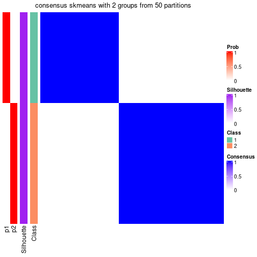</p>

</div>
<div id='tab-node-07-consensus-heatmap-2'>
<pre><code class="r">consensus_heatmap(res, k = 3)
</code></pre>

<p>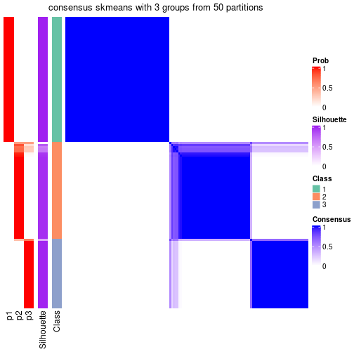</p>

</div>
<div id='tab-node-07-consensus-heatmap-3'>
<pre><code class="r">consensus_heatmap(res, k = 4)
</code></pre>

<p>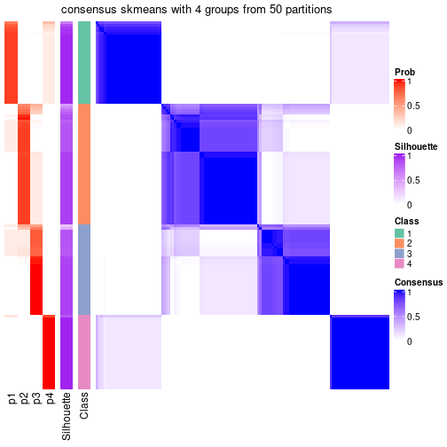</p>

</div>
<div id='tab-node-07-consensus-heatmap-4'>
<pre><code class="r">consensus_heatmap(res, k = 5)
</code></pre>

<p>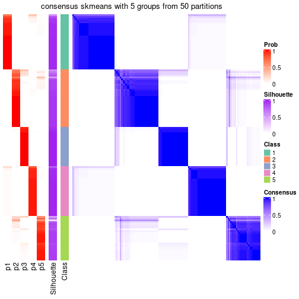</p>

</div>
<div id='tab-node-07-consensus-heatmap-5'>
<pre><code class="r">consensus_heatmap(res, k = 6)
</code></pre>

<p>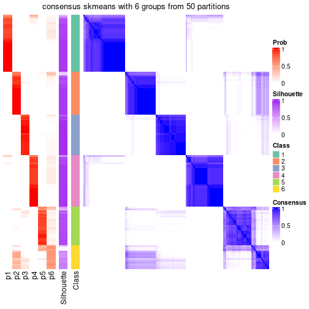</p>

</div>
<div id='tab-node-07-consensus-heatmap-6'>
<pre><code class="r">consensus_heatmap(res, k = 7)
</code></pre>

<p>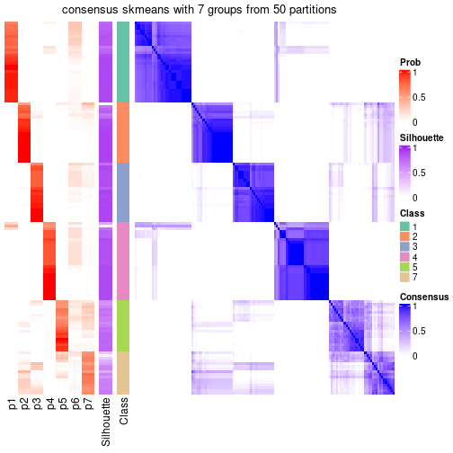</p>

</div>
<div id='tab-node-07-consensus-heatmap-7'>
<pre><code class="r">consensus_heatmap(res, k = 8)
</code></pre>

<p>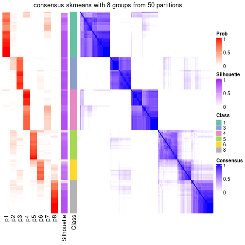</p>

</div>
</div>

Heatmaps for the membership of samples in all partitions to see how consistent they are:


<script>
$( function() {
	$( '#tabs-node-07-membership-heatmap' ).tabs();
} );
</script>
<div id='tabs-node-07-membership-heatmap'>
<ul>
<li><a href='#tab-node-07-membership-heatmap-1'>k = 2</a></li>
<li><a href='#tab-node-07-membership-heatmap-2'>k = 3</a></li>
<li><a href='#tab-node-07-membership-heatmap-3'>k = 4</a></li>
<li><a href='#tab-node-07-membership-heatmap-4'>k = 5</a></li>
<li><a href='#tab-node-07-membership-heatmap-5'>k = 6</a></li>
<li><a href='#tab-node-07-membership-heatmap-6'>k = 7</a></li>
<li><a href='#tab-node-07-membership-heatmap-7'>k = 8</a></li>
</ul>
<div id='tab-node-07-membership-heatmap-1'>
<pre><code class="r">membership_heatmap(res, k = 2)
</code></pre>

<p>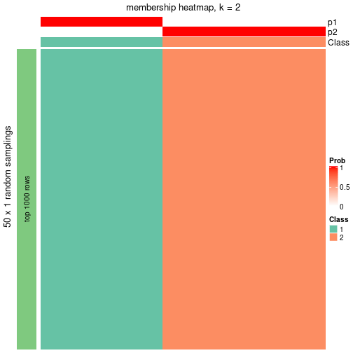</p>

</div>
<div id='tab-node-07-membership-heatmap-2'>
<pre><code class="r">membership_heatmap(res, k = 3)
</code></pre>

<p>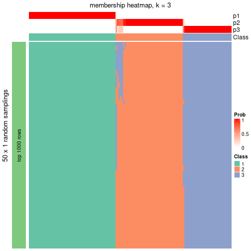</p>

</div>
<div id='tab-node-07-membership-heatmap-3'>
<pre><code class="r">membership_heatmap(res, k = 4)
</code></pre>

<p>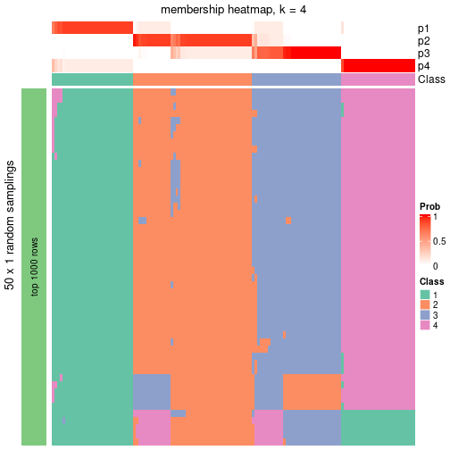</p>

</div>
<div id='tab-node-07-membership-heatmap-4'>
<pre><code class="r">membership_heatmap(res, k = 5)
</code></pre>

<p>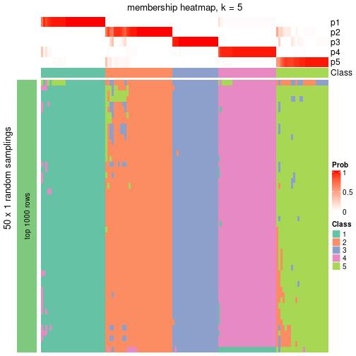</p>

</div>
<div id='tab-node-07-membership-heatmap-5'>
<pre><code class="r">membership_heatmap(res, k = 6)
</code></pre>

<p>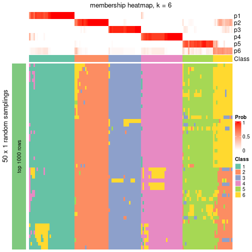</p>

</div>
<div id='tab-node-07-membership-heatmap-6'>
<pre><code class="r">membership_heatmap(res, k = 7)
</code></pre>

<p>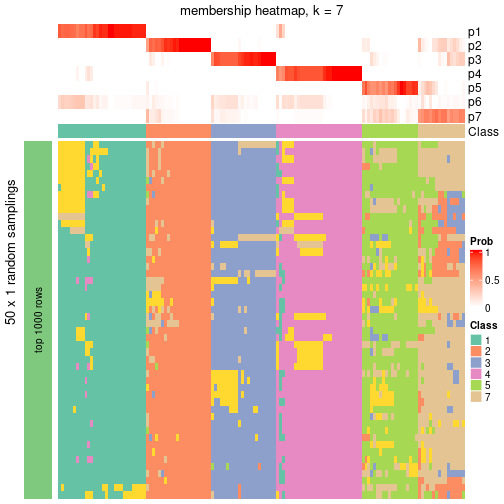</p>

</div>
<div id='tab-node-07-membership-heatmap-7'>
<pre><code class="r">membership_heatmap(res, k = 8)
</code></pre>

<p>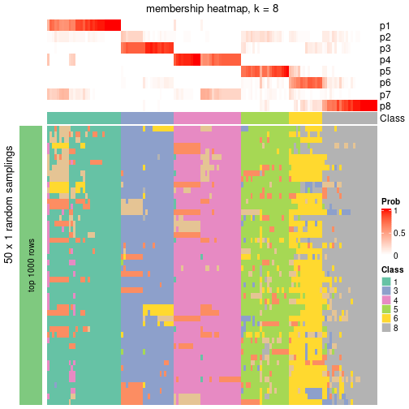</p>

</div>
</div>

As soon as the classes for columns are determined, the signatures
that are significantly different between subgroups can be looked for. 
Following are the heatmaps for signatures.


<script>
$( function() {
	$( '#tabs-node-07-get-signatures' ).tabs();
} );
</script>
<div id='tabs-node-07-get-signatures'>
<ul>
<li><a href='#tab-node-07-get-signatures-1'>k = 2</a></li>
<li><a href='#tab-node-07-get-signatures-2'>k = 3</a></li>
<li><a href='#tab-node-07-get-signatures-3'>k = 4</a></li>
<li><a href='#tab-node-07-get-signatures-4'>k = 5</a></li>
<li><a href='#tab-node-07-get-signatures-5'>k = 6</a></li>
<li><a href='#tab-node-07-get-signatures-6'>k = 7</a></li>
<li><a href='#tab-node-07-get-signatures-7'>k = 8</a></li>
</ul>
<div id='tab-node-07-get-signatures-1'>
<pre><code class="r">get_signatures(res, k = 2)
</code></pre>

<p>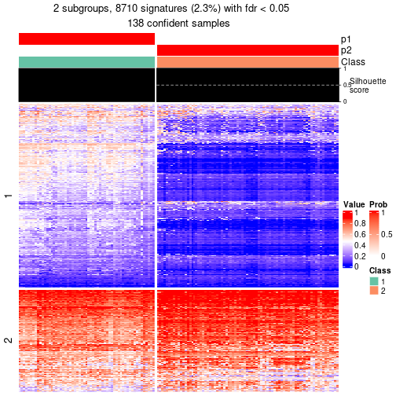</p>

</div>
<div id='tab-node-07-get-signatures-2'>
<pre><code class="r">get_signatures(res, k = 3)
</code></pre>

<p>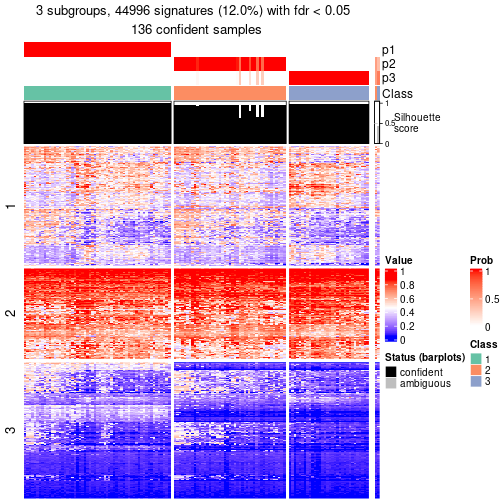</p>

</div>
<div id='tab-node-07-get-signatures-3'>
<pre><code class="r">get_signatures(res, k = 4)
</code></pre>

<p>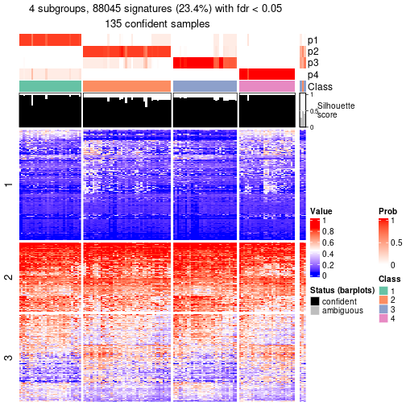</p>

</div>
<div id='tab-node-07-get-signatures-4'>
<pre><code class="r">get_signatures(res, k = 5)
</code></pre>

<p>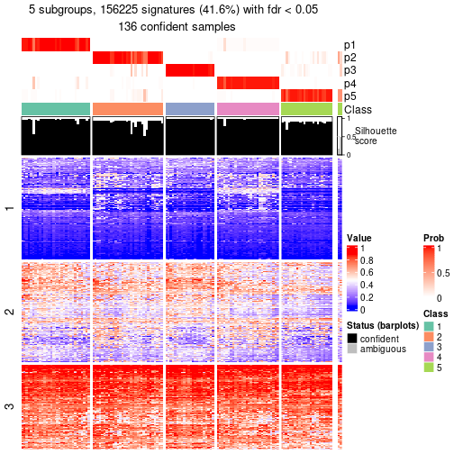</p>

</div>
<div id='tab-node-07-get-signatures-5'>
<pre><code class="r">get_signatures(res, k = 6)
</code></pre>

<p>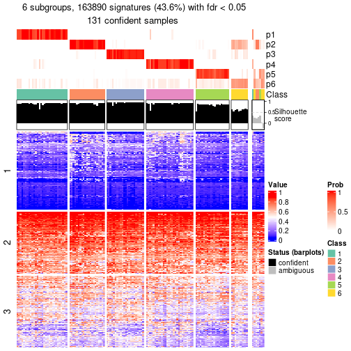</p>

</div>
<div id='tab-node-07-get-signatures-6'>
<pre><code class="r">get_signatures(res, k = 7)
</code></pre>

<p>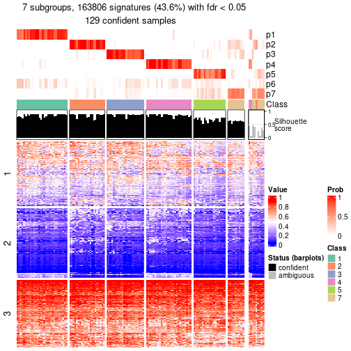</p>

</div>
<div id='tab-node-07-get-signatures-7'>
<pre><code class="r">get_signatures(res, k = 8)
</code></pre>

<p>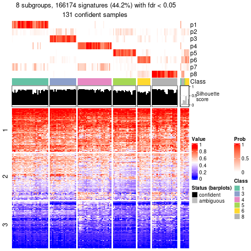</p>

</div>
</div>


Compare the overlap of signatures from different k:

```r
compare_signatures(res)
```

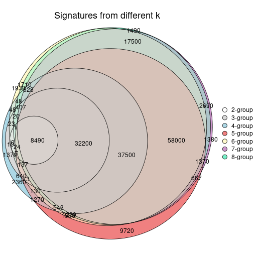

`get_signature()` returns a data frame invisibly. To get the list of signatures, the function
call should be assigned to a variable explicitly. In following code, if `plot` argument is set
to `FALSE`, no heatmap is plotted while only the differential analysis is performed.

```r
# code only for demonstration
tb = get_signature(res, k = ..., plot = FALSE)
```

An example of the output of `tb` is:

```
#>   which_row         fdr    mean_1    mean_2 scaled_mean_1 scaled_mean_2 km
#> 1        38 0.042760348  8.373488  9.131774    -0.5533452     0.5164555  1
#> 2        40 0.018707592  7.106213  8.469186    -0.6173731     0.5762149  1
#> 3        55 0.019134737 10.221463 11.207825    -0.6159697     0.5749050  1
#> 4        59 0.006059896  5.921854  7.869574    -0.6899429     0.6439467  1
#> 5        60 0.018055526  8.928898 10.211722    -0.6204761     0.5791110  1
#> 6        98 0.009384629 15.714769 14.887706     0.6635654    -0.6193277  2
...
```

The columns in `tb` are:

1. `which_row`: row indices corresponding to the input matrix.
2. `fdr`: FDR for the differential test. 
3. `mean_x`: The mean value in group x.
4. `scaled_mean_x`: The mean value in group x after rows are scaled.
5. `km`: Row groups if k-means clustering is applied to rows (which is done by automatically selecting number of clusters).

If there are too many signatures, `top_signatures = ...` can be set to only show the 
signatures with the highest FDRs:

```r
# code only for demonstration
# e.g. to show the top 500 most significant rows
tb = get_signature(res, k = ..., top_signatures = 500)
```

If the signatures are defined as these which are uniquely high in current group, `diff_method` argument
can be set to `"uniquely_high_in_one_group"`:

```r
# code only for demonstration
tb = get_signature(res, k = ..., diff_method = "uniquely_high_in_one_group")
```


UMAP plot which shows how samples are separated.


<script>
$( function() {
	$( '#tabs-node-07-dimension-reduction' ).tabs();
} );
</script>
<div id='tabs-node-07-dimension-reduction'>
<ul>
<li><a href='#tab-node-07-dimension-reduction-1'>k = 2</a></li>
<li><a href='#tab-node-07-dimension-reduction-2'>k = 3</a></li>
<li><a href='#tab-node-07-dimension-reduction-3'>k = 4</a></li>
<li><a href='#tab-node-07-dimension-reduction-4'>k = 5</a></li>
<li><a href='#tab-node-07-dimension-reduction-5'>k = 6</a></li>
<li><a href='#tab-node-07-dimension-reduction-6'>k = 7</a></li>
<li><a href='#tab-node-07-dimension-reduction-7'>k = 8</a></li>
</ul>
<div id='tab-node-07-dimension-reduction-1'>
<pre><code class="r">dimension_reduction(res, k = 2, method = &quot;UMAP&quot;)
</code></pre>

<p>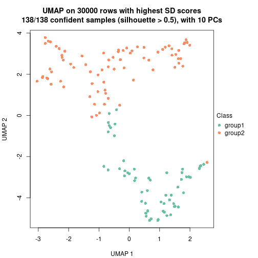</p>

</div>
<div id='tab-node-07-dimension-reduction-2'>
<pre><code class="r">dimension_reduction(res, k = 3, method = &quot;UMAP&quot;)
</code></pre>

<p>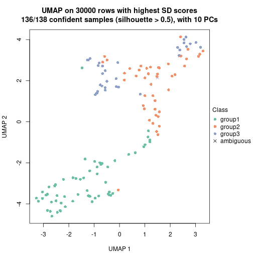</p>

</div>
<div id='tab-node-07-dimension-reduction-3'>
<pre><code class="r">dimension_reduction(res, k = 4, method = &quot;UMAP&quot;)
</code></pre>

<p>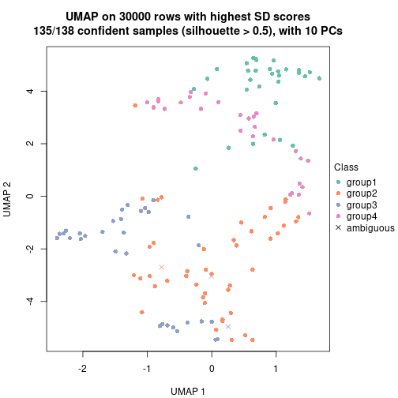</p>

</div>
<div id='tab-node-07-dimension-reduction-4'>
<pre><code class="r">dimension_reduction(res, k = 5, method = &quot;UMAP&quot;)
</code></pre>

<p>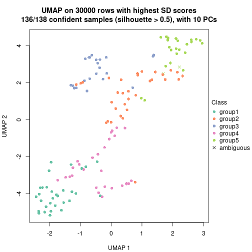</p>

</div>
<div id='tab-node-07-dimension-reduction-5'>
<pre><code class="r">dimension_reduction(res, k = 6, method = &quot;UMAP&quot;)
</code></pre>

<p>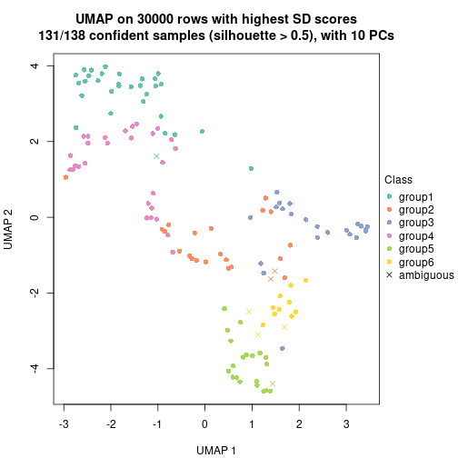</p>

</div>
<div id='tab-node-07-dimension-reduction-6'>
<pre><code class="r">dimension_reduction(res, k = 7, method = &quot;UMAP&quot;)
</code></pre>

<p>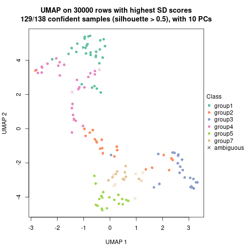</p>

</div>
<div id='tab-node-07-dimension-reduction-7'>
<pre><code class="r">dimension_reduction(res, k = 8, method = &quot;UMAP&quot;)
</code></pre>

<p>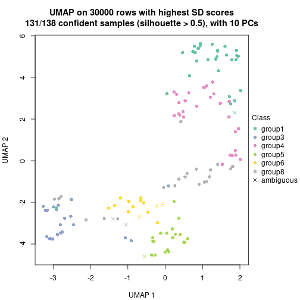</p>

</div>
</div>


Following heatmap shows how subgroups are split when increasing `k`:

```r
collect_classes(res)
```

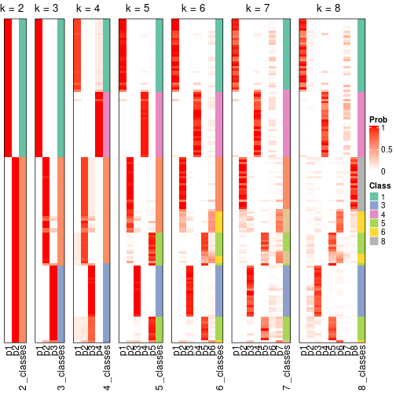


If matrix rows can be associated to genes, consider to use `functional_enrichment(res,
...)` to perform function enrichment for the signature genes. See [this vignette](https://jokergoo.github.io/cola_vignettes/functional_enrichment.html) for more detailed explanations.


 

---------------------------------------------------


### Node071


Parent node: [Node07](#Node07).
Child nodes: 
                Node0111-leaf
        ,
                Node0112-leaf
        ,
                Node0113-leaf
        ,
                Node0114-leaf
        ,
                Node0121-leaf
        ,
                Node0122-leaf
        ,
                Node0123-leaf
        ,
                Node0131-leaf
        ,
                Node0132-leaf
        ,
                Node0133-leaf
        ,
                Node0134-leaf
        ,
                Node0211-leaf
        ,
                Node0212-leaf
        ,
                [Node0213](#Node0213)
        ,
                Node0214-leaf
        ,
                [Node0221](#Node0221)
        ,
                Node0222-leaf
        ,
                Node0223-leaf
        ,
                [Node0231](#Node0231)
        ,
                Node0232-leaf
        ,
                Node0233-leaf
        ,
                [Node0234](#Node0234)
        ,
                Node0235-leaf
        ,
                Node0241-leaf
        ,
                [Node0242](#Node0242)
        ,
                Node0411-leaf
        ,
                Node0412-leaf
        ,
                Node0421-leaf
        ,
                Node0422-leaf
        ,
                Node0423-leaf
        ,
                Node0431-leaf
        ,
                Node0432-leaf
        ,
                Node0511-leaf
        ,
                Node0512-leaf
        ,
                Node0513-leaf
        ,
                Node0514-leaf
        ,
                Node0521-leaf
        ,
                Node0522-leaf
        ,
                Node0523-leaf
        ,
                Node0524-leaf
        ,
                Node0525-leaf
        ,
                Node0611-leaf
        ,
                [Node0612](#Node0612)
        ,
                Node0613-leaf
        ,
                [Node0711](#Node0711)
        ,
                Node0712-leaf
        ,
                Node0713-leaf
        ,
                [Node0721](#Node0721)
        ,
                Node0722-leaf
        ,
                Node0731-leaf
        ,
                Node0732-leaf
        ,
                Node0733-leaf
        .


The object with results only for a single top-value method and a single partitioning method 
can be extracted as:

```r
res = res_rh["071"]
```

A summary of `res` and all the functions that can be applied to it:

```r
res
```

```
#> A 'ConsensusPartition' object with k = 2, 3, 4, 5, 6, 7, 8.
#>   On a matrix with 30000 rows and 59 columns.
#>   Top rows (1000) are extracted by 'ATC' method.
#>   Subgroups are detected by 'kmeans' method.
#>   Performed in total 350 partitions by row resampling.
#>   Best k for subgroups seems to be 3.
#> 
#> Following methods can be applied to this 'ConsensusPartition' object:
#>  [1] "cola_report"             "collect_classes"         "collect_plots"          
#>  [4] "collect_stats"           "colnames"                "compare_partitions"     
#>  [7] "compare_signatures"      "consensus_heatmap"       "dimension_reduction"    
#> [10] "functional_enrichment"   "get_anno_col"            "get_anno"               
#> [13] "get_classes"             "get_consensus"           "get_matrix"             
#> [16] "get_membership"          "get_param"               "get_signatures"         
#> [19] "get_stats"               "is_best_k"               "is_stable_k"            
#> [22] "membership_heatmap"      "ncol"                    "nrow"                   
#> [25] "plot_ecdf"               "predict_classes"         "rownames"               
#> [28] "select_partition_number" "show"                    "suggest_best_k"         
#> [31] "test_to_known_factors"   "top_rows_heatmap"
```

`collect_plots()` function collects all the plots made from `res` for all `k` (number of subgroups)
into one single page to provide an easy and fast comparison between different `k`.

```r
collect_plots(res)
```


The plots are:

- The first row: a plot of the eCDF (empirical cumulative distribution
  function) curves of the consensus matrix for each `k` and the heatmap of
  predicted classes for each `k`.
- The second row: heatmaps of the consensus matrix for each `k`.
- The third row: heatmaps of the membership matrix for each `k`.
- The fouth row: heatmaps of the signatures for each `k`.

All the plots in panels can be made by individual functions and they are
plotted later in this section.

`select_partition_number()` produces several plots showing different
statistics for choosing "optimized" `k`. There are following statistics:

- eCDF curves of the consensus matrix for each `k`;
- 1-PAC. [The PAC score](https://en.wikipedia.org/wiki/Consensus_clustering#Over-interpretation_potential_of_consensus_clustering)
  measures the proportion of the ambiguous subgrouping.
- Mean silhouette score.
- Concordance. The mean probability of fiting the consensus subgroup labels in all
  partitions.
- Area increased. Denote $A_k$ as the area under the eCDF curve for current
  `k`, the area increased is defined as $A_k - A_{k-1}$.
- Rand index. The percent of pairs of samples that are both in a same cluster
  or both are not in a same cluster in the partition of k and k-1.
- Jaccard index. The ratio of pairs of samples are both in a same cluster in
  the partition of k and k-1 and the pairs of samples are both in a same
  cluster in the partition k or k-1.

The detailed explanations of these statistics can be found in [the _cola_
vignette](https://jokergoo.github.io/cola_vignettes/cola.html#toc_13).

Generally speaking, higher 1-PAC score, higher mean silhouette score or higher
concordance corresponds to better partition. Rand index and Jaccard index
measure how similar the current partition is compared to partition with `k-1`.
If they are too similar, we won't accept `k` is better than `k-1`.

```r
select_partition_number(res)
```

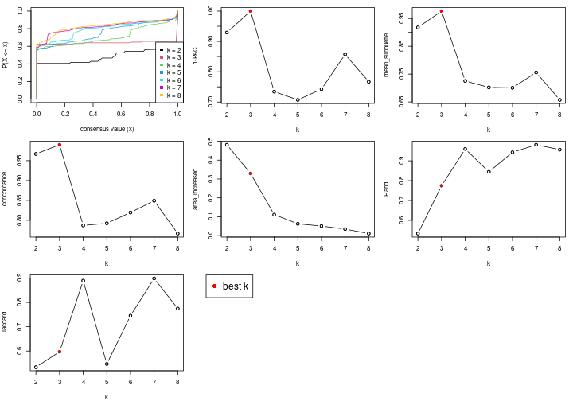

The numeric values for all these statistics can be obtained by `get_stats()`.

```r
get_stats(res)
```

```
#>   k 1-PAC mean_silhouette concordance area_increased  Rand Jaccard
#> 2 2 0.929           0.918       0.967         0.4812 0.534   0.534
#> 3 3 1.000           0.976       0.990         0.3295 0.774   0.597
#> 4 4 0.734           0.725       0.787         0.1113 0.960   0.889
#> 5 5 0.707           0.702       0.793         0.0630 0.845   0.547
#> 6 6 0.742           0.701       0.820         0.0510 0.943   0.745
#> 7 7 0.857           0.756       0.849         0.0350 0.981   0.898
#> 8 8 0.767           0.657       0.767         0.0113 0.956   0.775
```

`suggest_best_k()` suggests the best $k$ based on these statistics. The rules are as follows:

- All $k$ with Jaccard index larger than 0.95 are removed because increasing
  $k$ does not provide enough extra information. If all $k$ are removed, it is
  marked as no subgroup is detected.
- For all $k$ with 1-PAC score larger than 0.9, the maximal $k$ is taken as
  the best $k$, and other $k$ are marked as optional $k$.
- If it does not fit the second rule. The $k$ with the maximal vote of the
  highest 1-PAC score, highest mean silhouette, and highest concordance is
  taken as the best $k$.

```r
suggest_best_k(res)
```

```
#> [1] 3
#> attr(,"optional")
#> [1] 2
```

There is also optional best $k$ = 2 that is worth to check.

Following is the table of the partitions (You need to click the **show/hide
code output** link to see it). The membership matrix (columns with name `p*`)
is inferred by
[`clue::cl_consensus()`](https://www.rdocumentation.org/link/cl_consensus?package=clue)
function with the `SE` method. Basically the value in the membership matrix
represents the probability to belong to a certain group. The finall subgroup
label for an item is determined with the group with highest probability it
belongs to.

In `get_classes()` function, the entropy is calculated from the membership
matrix and the silhouette score is calculated from the consensus matrix.


<script>
$( function() {
	$( '#tabs-node-071-get-classes' ).tabs();
} );
</script>
<div id='tabs-node-071-get-classes'>
<ul>
<li><a href='#tab-node-071-get-classes-1'>k = 2</a></li>
<li><a href='#tab-node-071-get-classes-2'>k = 3</a></li>
<li><a href='#tab-node-071-get-classes-3'>k = 4</a></li>
<li><a href='#tab-node-071-get-classes-4'>k = 5</a></li>
<li><a href='#tab-node-071-get-classes-5'>k = 6</a></li>
<li><a href='#tab-node-071-get-classes-6'>k = 7</a></li>
<li><a href='#tab-node-071-get-classes-7'>k = 8</a></li>
</ul>

<div id='tab-node-071-get-classes-1'>
<p><a id='tab-node-071-get-classes-1-a' style='color:#0366d6' href='#'>show/hide code output</a></p>
<pre><code class="r">cbind(get_classes(res, k = 2), get_membership(res, k = 2))
</code></pre>

<pre><code>#&gt;                 class entropy silhouette   p1   p2
#&gt; TCGA.55.7910.01     1   0.000      0.945 1.00 0.00
#&gt; TCGA.78.7539.01     2   0.000      1.000 0.00 1.00
#&gt; TCGA.86.6851.01     2   0.000      1.000 0.00 1.00
#&gt; TCGA.62.8394.01     1   0.995      0.236 0.54 0.46
#&gt; TCGA.86.7954.01     1   0.000      0.945 1.00 0.00
#&gt; TCGA.44.A479.01     1   0.000      0.945 1.00 0.00
#&gt; TCGA.J2.8194.01     2   0.000      1.000 0.00 1.00
#&gt; TCGA.55.A57B.01     1   0.000      0.945 1.00 0.00
#&gt; TCGA.O2.A5IC.01     1   0.000      0.945 1.00 0.00
#&gt; TCGA.55.8096.01     1   0.000      0.945 1.00 0.00
#&gt; TCGA.44.3917.01     2   0.000      1.000 0.00 1.00
#&gt; TCGA.53.7624.01     1   0.000      0.945 1.00 0.00
#&gt; TCGA.55.7913.01     1   0.000      0.945 1.00 0.00
#&gt; TCGA.44.7670.01     1   0.000      0.945 1.00 0.00
#&gt; TCGA.L9.A5IP.01     1   0.000      0.945 1.00 0.00
#&gt; TCGA.MP.A4TF.01     1   0.000      0.945 1.00 0.00
#&gt; TCGA.49.4490.01     1   0.000      0.945 1.00 0.00
#&gt; TCGA.NC.A5HK.01     1   0.000      0.945 1.00 0.00
#&gt; TCGA.49.AARE.01     2   0.000      1.000 0.00 1.00
#&gt; TCGA.91.6840.01     1   0.000      0.945 1.00 0.00
#&gt; TCGA.95.7043.01     2   0.000      1.000 0.00 1.00
#&gt; TCGA.55.8205.01     2   0.000      1.000 0.00 1.00
#&gt; TCGA.91.6830.01     1   0.000      0.945 1.00 0.00
#&gt; TCGA.69.7979.01     2   0.000      1.000 0.00 1.00
#&gt; TCGA.95.7039.01     2   0.000      1.000 0.00 1.00
#&gt; TCGA.78.7146.01     2   0.000      1.000 0.00 1.00
#&gt; TCGA.49.6743.01     1   0.000      0.945 1.00 0.00
#&gt; TCGA.78.7161.01     2   0.000      1.000 0.00 1.00
#&gt; TCGA.44.A4SU.01     1   0.000      0.945 1.00 0.00
#&gt; TCGA.L9.A8F4.01     1   0.000      0.945 1.00 0.00
#&gt; TCGA.J2.A4AD.01     1   0.000      0.945 1.00 0.00
#&gt; TCGA.38.4631.01     1   0.000      0.945 1.00 0.00
#&gt; TCGA.05.4390.01     2   0.000      1.000 0.00 1.00
#&gt; TCGA.55.8508.01     1   0.990      0.294 0.56 0.44
#&gt; TCGA.71.6725.01     2   0.000      1.000 0.00 1.00
#&gt; TCGA.86.8075.01     1   0.000      0.945 1.00 0.00
#&gt; TCGA.49.4514.01     1   0.000      0.945 1.00 0.00
#&gt; TCGA.75.5147.01     1   0.000      0.945 1.00 0.00
#&gt; TCGA.44.7667.01     1   0.795      0.683 0.76 0.24
#&gt; TCGA.O1.A52J.01     1   0.000      0.945 1.00 0.00
#&gt; TCGA.05.4427.01     2   0.000      1.000 0.00 1.00
#&gt; TCGA.78.7147.01     2   0.000      1.000 0.00 1.00
#&gt; TCGA.95.A4VK.01     1   0.958      0.437 0.62 0.38
#&gt; TCGA.49.4488.01     2   0.000      1.000 0.00 1.00
#&gt; TCGA.MP.A5C7.01     2   0.000      1.000 0.00 1.00
#&gt; TCGA.4B.A93V.01     1   0.000      0.945 1.00 0.00
#&gt; TCGA.78.7159.01     2   0.000      1.000 0.00 1.00
#&gt; TCGA.MP.A4TA.01     1   0.000      0.945 1.00 0.00
#&gt; TCGA.50.6673.01     1   0.000      0.945 1.00 0.00
#&gt; TCGA.64.1679.01     1   0.000      0.945 1.00 0.00
#&gt; TCGA.55.8616.01     2   0.000      1.000 0.00 1.00
#&gt; TCGA.50.5051.01     2   0.000      1.000 0.00 1.00
#&gt; TCGA.64.1681.01     1   0.000      0.945 1.00 0.00
#&gt; TCGA.86.7953.01     1   0.000      0.945 1.00 0.00
#&gt; TCGA.62.8402.01     1   0.000      0.945 1.00 0.00
#&gt; TCGA.55.7995.01     1   0.000      0.945 1.00 0.00
#&gt; TCGA.55.8506.01     2   0.000      1.000 0.00 1.00
#&gt; TCGA.53.7813.01     1   0.990      0.294 0.56 0.44
#&gt; TCGA.J2.8192.01     1   0.000      0.945 1.00 0.00
</code></pre>

<script>
$('#tab-node-071-get-classes-1-a').parent().next().next().hide();
$('#tab-node-071-get-classes-1-a').click(function(){
  $('#tab-node-071-get-classes-1-a').parent().next().next().toggle();
  return(false);
});
</script>
</div>

<div id='tab-node-071-get-classes-2'>
<p><a id='tab-node-071-get-classes-2-a' style='color:#0366d6' href='#'>show/hide code output</a></p>
<pre><code class="r">cbind(get_classes(res, k = 3), get_membership(res, k = 3))
</code></pre>

<pre><code>#&gt;                 class entropy silhouette p1   p2   p3
#&gt; TCGA.55.7910.01     1   0.000      1.000  1 0.00 0.00
#&gt; TCGA.78.7539.01     2   0.522      0.663  0 0.74 0.26
#&gt; TCGA.86.6851.01     3   0.000      1.000  0 0.00 1.00
#&gt; TCGA.62.8394.01     3   0.000      1.000  0 0.00 1.00
#&gt; TCGA.86.7954.01     1   0.000      1.000  1 0.00 0.00
#&gt; TCGA.44.A479.01     1   0.000      1.000  1 0.00 0.00
#&gt; TCGA.J2.8194.01     3   0.000      1.000  0 0.00 1.00
#&gt; TCGA.55.A57B.01     3   0.000      1.000  0 0.00 1.00
#&gt; TCGA.O2.A5IC.01     1   0.000      1.000  1 0.00 0.00
#&gt; TCGA.55.8096.01     1   0.000      1.000  1 0.00 0.00
#&gt; TCGA.44.3917.01     2   0.000      0.959  0 1.00 0.00
#&gt; TCGA.53.7624.01     1   0.000      1.000  1 0.00 0.00
#&gt; TCGA.55.7913.01     1   0.000      1.000  1 0.00 0.00
#&gt; TCGA.44.7670.01     1   0.000      1.000  1 0.00 0.00
#&gt; TCGA.L9.A5IP.01     1   0.000      1.000  1 0.00 0.00
#&gt; TCGA.MP.A4TF.01     3   0.000      1.000  0 0.00 1.00
#&gt; TCGA.49.4490.01     1   0.000      1.000  1 0.00 0.00
#&gt; TCGA.NC.A5HK.01     1   0.000      1.000  1 0.00 0.00
#&gt; TCGA.49.AARE.01     3   0.000      1.000  0 0.00 1.00
#&gt; TCGA.91.6840.01     1   0.000      1.000  1 0.00 0.00
#&gt; TCGA.95.7043.01     3   0.000      1.000  0 0.00 1.00
#&gt; TCGA.55.8205.01     2   0.000      0.959  0 1.00 0.00
#&gt; TCGA.91.6830.01     1   0.000      1.000  1 0.00 0.00
#&gt; TCGA.69.7979.01     2   0.000      0.959  0 1.00 0.00
#&gt; TCGA.95.7039.01     2   0.000      0.959  0 1.00 0.00
#&gt; TCGA.78.7146.01     2   0.583      0.517  0 0.66 0.34
#&gt; TCGA.49.6743.01     1   0.000      1.000  1 0.00 0.00
#&gt; TCGA.78.7161.01     2   0.000      0.959  0 1.00 0.00
#&gt; TCGA.44.A4SU.01     1   0.000      1.000  1 0.00 0.00
#&gt; TCGA.L9.A8F4.01     1   0.000      1.000  1 0.00 0.00
#&gt; TCGA.J2.A4AD.01     1   0.000      1.000  1 0.00 0.00
#&gt; TCGA.38.4631.01     1   0.000      1.000  1 0.00 0.00
#&gt; TCGA.05.4390.01     2   0.000      0.959  0 1.00 0.00
#&gt; TCGA.55.8508.01     3   0.000      1.000  0 0.00 1.00
#&gt; TCGA.71.6725.01     2   0.000      0.959  0 1.00 0.00
#&gt; TCGA.86.8075.01     1   0.000      1.000  1 0.00 0.00
#&gt; TCGA.49.4514.01     1   0.000      1.000  1 0.00 0.00
#&gt; TCGA.75.5147.01     1   0.000      1.000  1 0.00 0.00
#&gt; TCGA.44.7667.01     3   0.000      1.000  0 0.00 1.00
#&gt; TCGA.O1.A52J.01     1   0.000      1.000  1 0.00 0.00
#&gt; TCGA.05.4427.01     2   0.000      0.959  0 1.00 0.00
#&gt; TCGA.78.7147.01     2   0.000      0.959  0 1.00 0.00
#&gt; TCGA.95.A4VK.01     3   0.000      1.000  0 0.00 1.00
#&gt; TCGA.49.4488.01     2   0.000      0.959  0 1.00 0.00
#&gt; TCGA.MP.A5C7.01     3   0.000      1.000  0 0.00 1.00
#&gt; TCGA.4B.A93V.01     1   0.000      1.000  1 0.00 0.00
#&gt; TCGA.78.7159.01     2   0.000      0.959  0 1.00 0.00
#&gt; TCGA.MP.A4TA.01     1   0.000      1.000  1 0.00 0.00
#&gt; TCGA.50.6673.01     3   0.000      1.000  0 0.00 1.00
#&gt; TCGA.64.1679.01     1   0.000      1.000  1 0.00 0.00
#&gt; TCGA.55.8616.01     2   0.000      0.959  0 1.00 0.00
#&gt; TCGA.50.5051.01     2   0.000      0.959  0 1.00 0.00
#&gt; TCGA.64.1681.01     1   0.000      1.000  1 0.00 0.00
#&gt; TCGA.86.7953.01     1   0.000      1.000  1 0.00 0.00
#&gt; TCGA.62.8402.01     3   0.000      1.000  0 0.00 1.00
#&gt; TCGA.55.7995.01     1   0.000      1.000  1 0.00 0.00
#&gt; TCGA.55.8506.01     2   0.000      0.959  0 1.00 0.00
#&gt; TCGA.53.7813.01     3   0.000      1.000  0 0.00 1.00
#&gt; TCGA.J2.8192.01     1   0.000      1.000  1 0.00 0.00
</code></pre>

<script>
$('#tab-node-071-get-classes-2-a').parent().next().next().hide();
$('#tab-node-071-get-classes-2-a').click(function(){
  $('#tab-node-071-get-classes-2-a').parent().next().next().toggle();
  return(false);
});
</script>
</div>

<div id='tab-node-071-get-classes-3'>
<p><a id='tab-node-071-get-classes-3-a' style='color:#0366d6' href='#'>show/hide code output</a></p>
<pre><code class="r">cbind(get_classes(res, k = 4), get_membership(res, k = 4))
</code></pre>

<pre><code>#&gt;                 class entropy silhouette   p1   p2   p3   p4
#&gt; TCGA.55.7910.01     1  0.4624      0.824 0.66 0.00 0.00 0.34
#&gt; TCGA.78.7539.01     4  0.7382      0.634 0.00 0.26 0.22 0.52
#&gt; TCGA.86.6851.01     4  0.5000      0.301 0.00 0.00 0.50 0.50
#&gt; TCGA.62.8394.01     3  0.0707      0.718 0.00 0.00 0.98 0.02
#&gt; TCGA.86.7954.01     1  0.0000      0.785 1.00 0.00 0.00 0.00
#&gt; TCGA.44.A479.01     1  0.0000      0.785 1.00 0.00 0.00 0.00
#&gt; TCGA.J2.8194.01     3  0.4994     -0.424 0.00 0.00 0.52 0.48
#&gt; TCGA.55.A57B.01     3  0.2335      0.705 0.06 0.00 0.92 0.02
#&gt; TCGA.O2.A5IC.01     1  0.4624      0.824 0.66 0.00 0.00 0.34
#&gt; TCGA.55.8096.01     1  0.0000      0.785 1.00 0.00 0.00 0.00
#&gt; TCGA.44.3917.01     2  0.0707      0.918 0.00 0.98 0.00 0.02
#&gt; TCGA.53.7624.01     1  0.4624      0.824 0.66 0.00 0.00 0.34
#&gt; TCGA.55.7913.01     1  0.0000      0.785 1.00 0.00 0.00 0.00
#&gt; TCGA.44.7670.01     1  0.4790      0.796 0.62 0.00 0.00 0.38
#&gt; TCGA.L9.A5IP.01     1  0.4624      0.824 0.66 0.00 0.00 0.34
#&gt; TCGA.MP.A4TF.01     3  0.1637      0.710 0.06 0.00 0.94 0.00
#&gt; TCGA.49.4490.01     1  0.4624      0.824 0.66 0.00 0.00 0.34
#&gt; TCGA.NC.A5HK.01     1  0.3400      0.790 0.82 0.00 0.00 0.18
#&gt; TCGA.49.AARE.01     3  0.4406      0.314 0.00 0.00 0.70 0.30
#&gt; TCGA.91.6840.01     1  0.4624      0.824 0.66 0.00 0.00 0.34
#&gt; TCGA.95.7043.01     3  0.4406      0.314 0.00 0.00 0.70 0.30
#&gt; TCGA.55.8205.01     2  0.3975      0.704 0.00 0.76 0.00 0.24
#&gt; TCGA.91.6830.01     1  0.4624      0.824 0.66 0.00 0.00 0.34
#&gt; TCGA.69.7979.01     4  0.6766      0.406 0.00 0.38 0.10 0.52
#&gt; TCGA.95.7039.01     2  0.0000      0.923 0.00 1.00 0.00 0.00
#&gt; TCGA.78.7146.01     4  0.7285      0.630 0.00 0.18 0.30 0.52
#&gt; TCGA.49.6743.01     1  0.0000      0.785 1.00 0.00 0.00 0.00
#&gt; TCGA.78.7161.01     2  0.0000      0.923 0.00 1.00 0.00 0.00
#&gt; TCGA.44.A4SU.01     1  0.0000      0.785 1.00 0.00 0.00 0.00
#&gt; TCGA.L9.A8F4.01     1  0.4624      0.824 0.66 0.00 0.00 0.34
#&gt; TCGA.J2.A4AD.01     1  0.4624      0.824 0.66 0.00 0.00 0.34
#&gt; TCGA.38.4631.01     1  0.4624      0.824 0.66 0.00 0.00 0.34
#&gt; TCGA.05.4390.01     2  0.0707      0.918 0.00 0.98 0.00 0.02
#&gt; TCGA.55.8508.01     3  0.1637      0.709 0.00 0.00 0.94 0.06
#&gt; TCGA.71.6725.01     2  0.3975      0.704 0.00 0.76 0.00 0.24
#&gt; TCGA.86.8075.01     1  0.4624      0.824 0.66 0.00 0.00 0.34
#&gt; TCGA.49.4514.01     1  0.0000      0.785 1.00 0.00 0.00 0.00
#&gt; TCGA.75.5147.01     1  0.1637      0.799 0.94 0.00 0.00 0.06
#&gt; TCGA.44.7667.01     3  0.2335      0.715 0.02 0.00 0.92 0.06
#&gt; TCGA.O1.A52J.01     1  0.0000      0.785 1.00 0.00 0.00 0.00
#&gt; TCGA.05.4427.01     2  0.0000      0.923 0.00 1.00 0.00 0.00
#&gt; TCGA.78.7147.01     2  0.0000      0.923 0.00 1.00 0.00 0.00
#&gt; TCGA.95.A4VK.01     3  0.0000      0.718 0.00 0.00 1.00 0.00
#&gt; TCGA.49.4488.01     2  0.0000      0.923 0.00 1.00 0.00 0.00
#&gt; TCGA.MP.A5C7.01     4  0.4977      0.366 0.00 0.00 0.46 0.54
#&gt; TCGA.4B.A93V.01     1  0.4939      0.446 0.74 0.00 0.22 0.04
#&gt; TCGA.78.7159.01     2  0.3801      0.722 0.00 0.78 0.00 0.22
#&gt; TCGA.MP.A4TA.01     1  0.4624      0.824 0.66 0.00 0.00 0.34
#&gt; TCGA.50.6673.01     3  0.2335      0.705 0.06 0.00 0.92 0.02
#&gt; TCGA.64.1679.01     1  0.4624      0.824 0.66 0.00 0.00 0.34
#&gt; TCGA.55.8616.01     2  0.0000      0.923 0.00 1.00 0.00 0.00
#&gt; TCGA.50.5051.01     2  0.0707      0.918 0.00 0.98 0.00 0.02
#&gt; TCGA.64.1681.01     1  0.0707      0.791 0.98 0.00 0.00 0.02
#&gt; TCGA.86.7953.01     1  0.0000      0.785 1.00 0.00 0.00 0.00
#&gt; TCGA.62.8402.01     3  0.6074      0.332 0.34 0.00 0.60 0.06
#&gt; TCGA.55.7995.01     1  0.3611      0.664 0.86 0.00 0.08 0.06
#&gt; TCGA.55.8506.01     2  0.0000      0.923 0.00 1.00 0.00 0.00
#&gt; TCGA.53.7813.01     3  0.1637      0.709 0.00 0.00 0.94 0.06
#&gt; TCGA.J2.8192.01     1  0.4624      0.824 0.66 0.00 0.00 0.34
</code></pre>

<script>
$('#tab-node-071-get-classes-3-a').parent().next().next().hide();
$('#tab-node-071-get-classes-3-a').click(function(){
  $('#tab-node-071-get-classes-3-a').parent().next().next().toggle();
  return(false);
});
</script>
</div>

<div id='tab-node-071-get-classes-4'>
<p><a id='tab-node-071-get-classes-4-a' style='color:#0366d6' href='#'>show/hide code output</a></p>
<pre><code class="r">cbind(get_classes(res, k = 5), get_membership(res, k = 5))
</code></pre>

<pre><code>#&gt;                 class entropy silhouette   p1   p2   p3   p4   p5
#&gt; TCGA.55.7910.01     1  0.0000      0.878 1.00 0.00 0.00 0.00 0.00
#&gt; TCGA.78.7539.01     4  0.4637      0.651 0.00 0.10 0.16 0.74 0.00
#&gt; TCGA.86.6851.01     4  0.5157      0.453 0.00 0.00 0.44 0.52 0.04
#&gt; TCGA.62.8394.01     3  0.1043      0.804 0.00 0.00 0.96 0.04 0.00
#&gt; TCGA.86.7954.01     5  0.4262      0.791 0.44 0.00 0.00 0.00 0.56
#&gt; TCGA.44.A479.01     5  0.4287      0.787 0.46 0.00 0.00 0.00 0.54
#&gt; TCGA.J2.8194.01     4  0.5157      0.432 0.00 0.00 0.44 0.52 0.04
#&gt; TCGA.55.A57B.01     3  0.2732      0.744 0.00 0.00 0.84 0.00 0.16
#&gt; TCGA.O2.A5IC.01     1  0.0000      0.878 1.00 0.00 0.00 0.00 0.00
#&gt; TCGA.55.8096.01     5  0.4287      0.787 0.46 0.00 0.00 0.00 0.54
#&gt; TCGA.44.3917.01     2  0.1043      0.868 0.00 0.96 0.00 0.04 0.00
#&gt; TCGA.53.7624.01     1  0.0000      0.878 1.00 0.00 0.00 0.00 0.00
#&gt; TCGA.55.7913.01     5  0.4182      0.764 0.40 0.00 0.00 0.00 0.60
#&gt; TCGA.44.7670.01     1  0.4818      0.527 0.72 0.00 0.00 0.18 0.10
#&gt; TCGA.L9.A5IP.01     1  0.0000      0.878 1.00 0.00 0.00 0.00 0.00
#&gt; TCGA.MP.A4TF.01     3  0.2280      0.759 0.00 0.00 0.88 0.00 0.12
#&gt; TCGA.49.4490.01     1  0.0000      0.878 1.00 0.00 0.00 0.00 0.00
#&gt; TCGA.NC.A5HK.01     1  0.6447     -0.254 0.44 0.00 0.00 0.18 0.38
#&gt; TCGA.49.AARE.01     4  0.6064      0.369 0.00 0.00 0.42 0.46 0.12
#&gt; TCGA.91.6840.01     1  0.0000      0.878 1.00 0.00 0.00 0.00 0.00
#&gt; TCGA.95.7043.01     4  0.6064      0.369 0.00 0.00 0.42 0.46 0.12
#&gt; TCGA.55.8205.01     2  0.4527      0.642 0.00 0.70 0.00 0.26 0.04
#&gt; TCGA.91.6830.01     1  0.0000      0.878 1.00 0.00 0.00 0.00 0.00
#&gt; TCGA.69.7979.01     4  0.4588      0.527 0.00 0.22 0.06 0.72 0.00
#&gt; TCGA.95.7039.01     2  0.2020      0.853 0.00 0.90 0.00 0.00 0.10
#&gt; TCGA.78.7146.01     4  0.4558      0.656 0.00 0.08 0.18 0.74 0.00
#&gt; TCGA.49.6743.01     5  0.4262      0.791 0.44 0.00 0.00 0.00 0.56
#&gt; TCGA.78.7161.01     2  0.2020      0.853 0.00 0.90 0.00 0.00 0.10
#&gt; TCGA.44.A4SU.01     5  0.4287      0.787 0.46 0.00 0.00 0.00 0.54
#&gt; TCGA.L9.A8F4.01     1  0.0000      0.878 1.00 0.00 0.00 0.00 0.00
#&gt; TCGA.J2.A4AD.01     1  0.0000      0.878 1.00 0.00 0.00 0.00 0.00
#&gt; TCGA.38.4631.01     1  0.0000      0.878 1.00 0.00 0.00 0.00 0.00
#&gt; TCGA.05.4390.01     2  0.1043      0.868 0.00 0.96 0.00 0.04 0.00
#&gt; TCGA.55.8508.01     3  0.2280      0.777 0.00 0.00 0.88 0.12 0.00
#&gt; TCGA.71.6725.01     2  0.4527      0.642 0.00 0.70 0.00 0.26 0.04
#&gt; TCGA.86.8075.01     1  0.0000      0.878 1.00 0.00 0.00 0.00 0.00
#&gt; TCGA.49.4514.01     5  0.4262      0.791 0.44 0.00 0.00 0.00 0.56
#&gt; TCGA.75.5147.01     1  0.4302     -0.682 0.52 0.00 0.00 0.00 0.48
#&gt; TCGA.44.7667.01     3  0.3110      0.768 0.00 0.00 0.86 0.08 0.06
#&gt; TCGA.O1.A52J.01     5  0.4287      0.787 0.46 0.00 0.00 0.00 0.54
#&gt; TCGA.05.4427.01     2  0.0609      0.870 0.00 0.98 0.00 0.00 0.02
#&gt; TCGA.78.7147.01     2  0.0000      0.871 0.00 1.00 0.00 0.00 0.00
#&gt; TCGA.95.A4VK.01     3  0.1043      0.804 0.00 0.00 0.96 0.04 0.00
#&gt; TCGA.49.4488.01     2  0.0000      0.871 0.00 1.00 0.00 0.00 0.00
#&gt; TCGA.MP.A5C7.01     4  0.4456      0.594 0.00 0.00 0.32 0.66 0.02
#&gt; TCGA.4B.A93V.01     5  0.5599      0.431 0.12 0.00 0.26 0.00 0.62
#&gt; TCGA.78.7159.01     2  0.3684      0.656 0.00 0.72 0.00 0.28 0.00
#&gt; TCGA.MP.A4TA.01     1  0.0000      0.878 1.00 0.00 0.00 0.00 0.00
#&gt; TCGA.50.6673.01     3  0.2516      0.754 0.00 0.00 0.86 0.00 0.14
#&gt; TCGA.64.1679.01     1  0.0000      0.878 1.00 0.00 0.00 0.00 0.00
#&gt; TCGA.55.8616.01     2  0.2020      0.853 0.00 0.90 0.00 0.00 0.10
#&gt; TCGA.50.5051.01     2  0.1043      0.868 0.00 0.96 0.00 0.04 0.00
#&gt; TCGA.64.1681.01     5  0.4287      0.787 0.46 0.00 0.00 0.00 0.54
#&gt; TCGA.86.7953.01     5  0.4287      0.787 0.46 0.00 0.00 0.00 0.54
#&gt; TCGA.62.8402.01     5  0.4798     -0.132 0.00 0.00 0.44 0.02 0.54
#&gt; TCGA.55.7995.01     5  0.5548      0.582 0.22 0.00 0.06 0.04 0.68
#&gt; TCGA.55.8506.01     2  0.2020      0.853 0.00 0.90 0.00 0.00 0.10
#&gt; TCGA.53.7813.01     3  0.2280      0.777 0.00 0.00 0.88 0.12 0.00
#&gt; TCGA.J2.8192.01     1  0.0000      0.878 1.00 0.00 0.00 0.00 0.00
</code></pre>

<script>
$('#tab-node-071-get-classes-4-a').parent().next().next().hide();
$('#tab-node-071-get-classes-4-a').click(function(){
  $('#tab-node-071-get-classes-4-a').parent().next().next().toggle();
  return(false);
});
</script>
</div>

<div id='tab-node-071-get-classes-5'>
<p><a id='tab-node-071-get-classes-5-a' style='color:#0366d6' href='#'>show/hide code output</a></p>
<pre><code class="r">cbind(get_classes(res, k = 6), get_membership(res, k = 6))
</code></pre>

<pre><code>#&gt;                 class entropy silhouette   p1   p2   p3   p4   p5   p6
#&gt; TCGA.55.7910.01     1  0.0000      0.953 1.00 0.00 0.00 0.00 0.00 0.00
#&gt; TCGA.78.7539.01     4  0.0547      0.626 0.00 0.00 0.02 0.98 0.00 0.00
#&gt; TCGA.86.6851.01     4  0.3834      0.538 0.00 0.00 0.20 0.76 0.02 0.02
#&gt; TCGA.62.8394.01     3  0.1807      0.835 0.00 0.00 0.92 0.06 0.02 0.00
#&gt; TCGA.86.7954.01     5  0.3198      0.803 0.26 0.00 0.00 0.00 0.74 0.00
#&gt; TCGA.44.A479.01     5  0.3198      0.803 0.26 0.00 0.00 0.00 0.74 0.00
#&gt; TCGA.J2.8194.01     4  0.4613      0.465 0.00 0.00 0.26 0.66 0.00 0.08
#&gt; TCGA.55.A57B.01     3  0.3679      0.771 0.00 0.00 0.76 0.00 0.20 0.04
#&gt; TCGA.O2.A5IC.01     1  0.0000      0.953 1.00 0.00 0.00 0.00 0.00 0.00
#&gt; TCGA.55.8096.01     5  0.3198      0.803 0.26 0.00 0.00 0.00 0.74 0.00
#&gt; TCGA.44.3917.01     2  0.1556      0.877 0.00 0.92 0.00 0.08 0.00 0.00
#&gt; TCGA.53.7624.01     1  0.0000      0.953 1.00 0.00 0.00 0.00 0.00 0.00
#&gt; TCGA.55.7913.01     5  0.3076      0.784 0.24 0.00 0.00 0.00 0.76 0.00
#&gt; TCGA.44.7670.01     1  0.4993     -0.290 0.56 0.00 0.00 0.00 0.08 0.36
#&gt; TCGA.L9.A5IP.01     1  0.0000      0.953 1.00 0.00 0.00 0.00 0.00 0.00
#&gt; TCGA.MP.A4TF.01     3  0.3523      0.776 0.00 0.00 0.78 0.00 0.18 0.04
#&gt; TCGA.49.4490.01     1  0.0000      0.953 1.00 0.00 0.00 0.00 0.00 0.00
#&gt; TCGA.NC.A5HK.01     6  0.6103      0.000 0.30 0.00 0.00 0.00 0.32 0.38
#&gt; TCGA.49.AARE.01     4  0.6554     -0.022 0.00 0.00 0.32 0.34 0.02 0.32
#&gt; TCGA.91.6840.01     1  0.0000      0.953 1.00 0.00 0.00 0.00 0.00 0.00
#&gt; TCGA.95.7043.01     4  0.6554     -0.022 0.00 0.00 0.32 0.34 0.02 0.32
#&gt; TCGA.55.8205.01     4  0.4764      0.246 0.00 0.42 0.00 0.54 0.02 0.02
#&gt; TCGA.91.6830.01     1  0.0000      0.953 1.00 0.00 0.00 0.00 0.00 0.00
#&gt; TCGA.69.7979.01     4  0.0547      0.627 0.00 0.02 0.00 0.98 0.00 0.00
#&gt; TCGA.95.7039.01     2  0.2094      0.863 0.00 0.90 0.00 0.00 0.02 0.08
#&gt; TCGA.78.7146.01     4  0.0547      0.626 0.00 0.00 0.02 0.98 0.00 0.00
#&gt; TCGA.49.6743.01     5  0.3198      0.803 0.26 0.00 0.00 0.00 0.74 0.00
#&gt; TCGA.78.7161.01     2  0.2350      0.857 0.00 0.88 0.00 0.00 0.02 0.10
#&gt; TCGA.44.A4SU.01     5  0.3711      0.794 0.26 0.00 0.00 0.00 0.72 0.02
#&gt; TCGA.L9.A8F4.01     1  0.0000      0.953 1.00 0.00 0.00 0.00 0.00 0.00
#&gt; TCGA.J2.A4AD.01     1  0.0000      0.953 1.00 0.00 0.00 0.00 0.00 0.00
#&gt; TCGA.38.4631.01     1  0.0000      0.953 1.00 0.00 0.00 0.00 0.00 0.00
#&gt; TCGA.05.4390.01     2  0.2350      0.867 0.00 0.88 0.00 0.10 0.00 0.02
#&gt; TCGA.55.8508.01     3  0.2725      0.829 0.00 0.00 0.88 0.06 0.04 0.02
#&gt; TCGA.71.6725.01     4  0.4764      0.246 0.00 0.42 0.00 0.54 0.02 0.02
#&gt; TCGA.86.8075.01     1  0.0000      0.953 1.00 0.00 0.00 0.00 0.00 0.00
#&gt; TCGA.49.4514.01     5  0.3198      0.803 0.26 0.00 0.00 0.00 0.74 0.00
#&gt; TCGA.75.5147.01     5  0.3578      0.638 0.34 0.00 0.00 0.00 0.66 0.00
#&gt; TCGA.44.7667.01     3  0.3688      0.768 0.00 0.00 0.80 0.04 0.02 0.14
#&gt; TCGA.O1.A52J.01     5  0.3711      0.794 0.26 0.00 0.00 0.00 0.72 0.02
#&gt; TCGA.05.4427.01     2  0.0000      0.880 0.00 1.00 0.00 0.00 0.00 0.00
#&gt; TCGA.78.7147.01     2  0.2260      0.833 0.00 0.86 0.00 0.14 0.00 0.00
#&gt; TCGA.95.A4VK.01     3  0.1807      0.835 0.00 0.00 0.92 0.06 0.02 0.00
#&gt; TCGA.49.4488.01     2  0.1556      0.877 0.00 0.92 0.00 0.08 0.00 0.00
#&gt; TCGA.MP.A5C7.01     4  0.3746      0.558 0.00 0.00 0.14 0.78 0.00 0.08
#&gt; TCGA.4B.A93V.01     5  0.3318      0.421 0.02 0.00 0.14 0.00 0.82 0.02
#&gt; TCGA.78.7159.01     4  0.4246      0.253 0.00 0.40 0.00 0.58 0.00 0.02
#&gt; TCGA.MP.A4TA.01     1  0.0000      0.953 1.00 0.00 0.00 0.00 0.00 0.00
#&gt; TCGA.50.6673.01     3  0.3679      0.771 0.00 0.00 0.76 0.00 0.20 0.04
#&gt; TCGA.64.1679.01     1  0.0000      0.953 1.00 0.00 0.00 0.00 0.00 0.00
#&gt; TCGA.55.8616.01     2  0.2094      0.863 0.00 0.90 0.00 0.00 0.02 0.08
#&gt; TCGA.50.5051.01     2  0.2350      0.867 0.00 0.88 0.00 0.10 0.00 0.02
#&gt; TCGA.64.1681.01     5  0.3819      0.767 0.28 0.00 0.00 0.00 0.70 0.02
#&gt; TCGA.86.7953.01     5  0.3198      0.803 0.26 0.00 0.00 0.00 0.74 0.00
#&gt; TCGA.62.8402.01     5  0.4282     -0.179 0.00 0.00 0.42 0.00 0.56 0.02
#&gt; TCGA.55.7995.01     5  0.4361      0.251 0.04 0.00 0.06 0.00 0.76 0.14
#&gt; TCGA.55.8506.01     2  0.2094      0.863 0.00 0.90 0.00 0.00 0.02 0.08
#&gt; TCGA.53.7813.01     3  0.2725      0.829 0.00 0.00 0.88 0.06 0.04 0.02
#&gt; TCGA.J2.8192.01     1  0.0000      0.953 1.00 0.00 0.00 0.00 0.00 0.00
</code></pre>

<script>
$('#tab-node-071-get-classes-5-a').parent().next().next().hide();
$('#tab-node-071-get-classes-5-a').click(function(){
  $('#tab-node-071-get-classes-5-a').parent().next().next().toggle();
  return(false);
});
</script>
</div>

<div id='tab-node-071-get-classes-6'>
<p><a id='tab-node-071-get-classes-6-a' style='color:#0366d6' href='#'>show/hide code output</a></p>
<pre><code class="r">cbind(get_classes(res, k = 7), get_membership(res, k = 7))
</code></pre>

<pre><code>#&gt;                 class entropy silhouette   p1   p2   p3   p4   p5   p6   p7
#&gt; TCGA.55.7910.01     1  0.0000      0.995 1.00 0.00 0.00 0.00 0.00 0.00 0.00
#&gt; TCGA.78.7539.01     4  0.1006      0.544 0.00 0.02 0.00 0.96 0.00 0.02 0.00
#&gt; TCGA.86.6851.01     4  0.3139      0.452 0.00 0.00 0.30 0.70 0.00 0.00 0.00
#&gt; TCGA.62.8394.01     3  0.2572      0.698 0.00 0.00 0.86 0.08 0.00 0.00 0.06
#&gt; TCGA.86.7954.01     5  0.1433      0.883 0.08 0.00 0.00 0.00 0.92 0.00 0.00
#&gt; TCGA.44.A479.01     5  0.1433      0.883 0.08 0.00 0.00 0.00 0.92 0.00 0.00
#&gt; TCGA.J2.8194.01     4  0.4244      0.235 0.00 0.00 0.42 0.54 0.00 0.00 0.04
#&gt; TCGA.55.A57B.01     3  0.5680      0.555 0.00 0.00 0.60 0.00 0.10 0.16 0.14
#&gt; TCGA.O2.A5IC.01     1  0.0504      0.980 0.98 0.00 0.00 0.00 0.00 0.00 0.02
#&gt; TCGA.55.8096.01     5  0.1433      0.883 0.08 0.00 0.00 0.00 0.92 0.00 0.00
#&gt; TCGA.44.3917.01     2  0.3055      0.791 0.00 0.82 0.00 0.14 0.00 0.02 0.02
#&gt; TCGA.53.7624.01     1  0.0504      0.980 0.98 0.00 0.00 0.00 0.00 0.00 0.02
#&gt; TCGA.55.7913.01     5  0.0863      0.852 0.04 0.00 0.00 0.00 0.96 0.00 0.00
#&gt; TCGA.44.7670.01     6  0.4211      0.556 0.26 0.00 0.00 0.00 0.04 0.68 0.02
#&gt; TCGA.L9.A5IP.01     1  0.0000      0.995 1.00 0.00 0.00 0.00 0.00 0.00 0.00
#&gt; TCGA.MP.A4TF.01     3  0.5627      0.555 0.00 0.00 0.60 0.00 0.08 0.16 0.16
#&gt; TCGA.49.4490.01     1  0.0000      0.995 1.00 0.00 0.00 0.00 0.00 0.00 0.00
#&gt; TCGA.NC.A5HK.01     6  0.4033      0.550 0.08 0.00 0.00 0.00 0.22 0.70 0.00
#&gt; TCGA.49.AARE.01     7  0.4594      0.964 0.00 0.00 0.14 0.22 0.00 0.00 0.64
#&gt; TCGA.91.6840.01     1  0.0000      0.995 1.00 0.00 0.00 0.00 0.00 0.00 0.00
#&gt; TCGA.95.7043.01     7  0.4535      0.965 0.00 0.00 0.12 0.24 0.00 0.00 0.64
#&gt; TCGA.55.8205.01     4  0.4356      0.352 0.00 0.40 0.02 0.56 0.00 0.02 0.00
#&gt; TCGA.91.6830.01     1  0.0000      0.995 1.00 0.00 0.00 0.00 0.00 0.00 0.00
#&gt; TCGA.69.7979.01     4  0.1006      0.544 0.00 0.02 0.00 0.96 0.00 0.02 0.00
#&gt; TCGA.95.7039.01     2  0.2509      0.807 0.00 0.88 0.00 0.00 0.04 0.06 0.02
#&gt; TCGA.78.7146.01     4  0.1006      0.544 0.00 0.02 0.00 0.96 0.00 0.02 0.00
#&gt; TCGA.49.6743.01     5  0.1433      0.883 0.08 0.00 0.00 0.00 0.92 0.00 0.00
#&gt; TCGA.78.7161.01     2  0.2857      0.803 0.00 0.86 0.00 0.00 0.04 0.06 0.04
#&gt; TCGA.44.A4SU.01     5  0.2421      0.868 0.08 0.00 0.00 0.00 0.88 0.02 0.02
#&gt; TCGA.L9.A8F4.01     1  0.0000      0.995 1.00 0.00 0.00 0.00 0.00 0.00 0.00
#&gt; TCGA.J2.A4AD.01     1  0.0000      0.995 1.00 0.00 0.00 0.00 0.00 0.00 0.00
#&gt; TCGA.38.4631.01     1  0.0504      0.980 0.98 0.00 0.00 0.00 0.00 0.00 0.02
#&gt; TCGA.05.4390.01     2  0.2569      0.802 0.00 0.84 0.00 0.14 0.00 0.00 0.02
#&gt; TCGA.55.8508.01     3  0.1433      0.694 0.00 0.00 0.92 0.08 0.00 0.00 0.00
#&gt; TCGA.71.6725.01     4  0.4356      0.352 0.00 0.40 0.02 0.56 0.00 0.02 0.00
#&gt; TCGA.86.8075.01     1  0.0000      0.995 1.00 0.00 0.00 0.00 0.00 0.00 0.00
#&gt; TCGA.49.4514.01     5  0.1433      0.883 0.08 0.00 0.00 0.00 0.92 0.00 0.00
#&gt; TCGA.75.5147.01     5  0.1433      0.883 0.08 0.00 0.00 0.00 0.92 0.00 0.00
#&gt; TCGA.44.7667.01     3  0.2569      0.592 0.00 0.00 0.84 0.00 0.00 0.02 0.14
#&gt; TCGA.O1.A52J.01     5  0.2421      0.868 0.08 0.00 0.00 0.00 0.88 0.02 0.02
#&gt; TCGA.05.4427.01     2  0.0504      0.824 0.00 0.98 0.00 0.00 0.00 0.02 0.00
#&gt; TCGA.78.7147.01     2  0.2745      0.760 0.00 0.82 0.00 0.16 0.00 0.02 0.00
#&gt; TCGA.95.A4VK.01     3  0.2572      0.698 0.00 0.00 0.86 0.08 0.00 0.00 0.06
#&gt; TCGA.49.4488.01     2  0.2163      0.813 0.00 0.88 0.00 0.10 0.00 0.02 0.00
#&gt; TCGA.MP.A5C7.01     4  0.3637      0.375 0.00 0.00 0.24 0.72 0.00 0.00 0.04
#&gt; TCGA.4B.A93V.01     5  0.3485      0.711 0.00 0.00 0.04 0.02 0.82 0.02 0.10
#&gt; TCGA.78.7159.01     4  0.4356      0.319 0.00 0.40 0.00 0.56 0.00 0.02 0.02
#&gt; TCGA.MP.A4TA.01     1  0.0000      0.995 1.00 0.00 0.00 0.00 0.00 0.00 0.00
#&gt; TCGA.50.6673.01     3  0.5680      0.555 0.00 0.00 0.60 0.00 0.10 0.16 0.14
#&gt; TCGA.64.1679.01     1  0.0000      0.995 1.00 0.00 0.00 0.00 0.00 0.00 0.00
#&gt; TCGA.55.8616.01     2  0.2509      0.807 0.00 0.88 0.00 0.00 0.04 0.06 0.02
#&gt; TCGA.50.5051.01     2  0.2569      0.802 0.00 0.84 0.00 0.14 0.00 0.00 0.02
#&gt; TCGA.64.1681.01     5  0.2421      0.868 0.08 0.00 0.00 0.00 0.88 0.02 0.02
#&gt; TCGA.86.7953.01     5  0.1433      0.883 0.08 0.00 0.00 0.00 0.92 0.00 0.00
#&gt; TCGA.62.8402.01     5  0.5733      0.159 0.00 0.00 0.32 0.02 0.52 0.02 0.12
#&gt; TCGA.55.7995.01     5  0.4964      0.401 0.00 0.00 0.02 0.02 0.66 0.22 0.08
#&gt; TCGA.55.8506.01     2  0.2509      0.807 0.00 0.88 0.00 0.00 0.04 0.06 0.02
#&gt; TCGA.53.7813.01     3  0.1433      0.694 0.00 0.00 0.92 0.08 0.00 0.00 0.00
#&gt; TCGA.J2.8192.01     1  0.0000      0.995 1.00 0.00 0.00 0.00 0.00 0.00 0.00
</code></pre>

<script>
$('#tab-node-071-get-classes-6-a').parent().next().next().hide();
$('#tab-node-071-get-classes-6-a').click(function(){
  $('#tab-node-071-get-classes-6-a').parent().next().next().toggle();
  return(false);
});
</script>
</div>

<div id='tab-node-071-get-classes-7'>
<p><a id='tab-node-071-get-classes-7-a' style='color:#0366d6' href='#'>show/hide code output</a></p>
<pre><code class="r">cbind(get_classes(res, k = 8), get_membership(res, k = 8))
</code></pre>

<pre><code>#&gt;                 class entropy silhouette   p1   p2   p3   p4   p5   p6   p7   p8
#&gt; TCGA.55.7910.01     8  0.0000     0.9931 0.00 0.00 0.00 0.00 0.00 0.00 0.00 1.00
#&gt; TCGA.78.7539.01     4  0.0000     0.7129 0.00 0.00 0.00 1.00 0.00 0.00 0.00 0.00
#&gt; TCGA.86.6851.01     4  0.5266     0.4095 0.08 0.02 0.30 0.56 0.00 0.00 0.04 0.00
#&gt; TCGA.62.8394.01     3  0.0941     0.6323 0.00 0.00 0.96 0.02 0.00 0.00 0.02 0.00
#&gt; TCGA.86.7954.01     5  0.1947     0.8335 0.00 0.00 0.00 0.00 0.86 0.00 0.00 0.14
#&gt; TCGA.44.A479.01     5  0.1947     0.8335 0.00 0.00 0.00 0.00 0.86 0.00 0.00 0.14
#&gt; TCGA.J2.8194.01     3  0.6419    -0.3020 0.14 0.00 0.40 0.36 0.02 0.06 0.02 0.00
#&gt; TCGA.55.A57B.01     7  0.4008    -0.0174 0.00 0.00 0.48 0.00 0.04 0.00 0.48 0.00
#&gt; TCGA.O2.A5IC.01     8  0.0471     0.9743 0.00 0.00 0.00 0.00 0.00 0.02 0.00 0.98
#&gt; TCGA.55.8096.01     5  0.1947     0.8335 0.00 0.00 0.00 0.00 0.86 0.00 0.00 0.14
#&gt; TCGA.44.3917.01     2  0.1607     0.7307 0.04 0.92 0.00 0.00 0.04 0.00 0.00 0.00
#&gt; TCGA.53.7624.01     8  0.0471     0.9743 0.00 0.00 0.00 0.00 0.00 0.02 0.00 0.98
#&gt; TCGA.55.7913.01     5  0.2025     0.8213 0.02 0.00 0.00 0.00 0.88 0.00 0.00 0.10
#&gt; TCGA.44.7670.01     6  0.3293     0.7630 0.00 0.00 0.00 0.00 0.04 0.74 0.00 0.22
#&gt; TCGA.L9.A5IP.01     8  0.0000     0.9931 0.00 0.00 0.00 0.00 0.00 0.00 0.00 1.00
#&gt; TCGA.MP.A4TF.01     3  0.4008    -0.2975 0.00 0.00 0.48 0.00 0.04 0.00 0.48 0.00
#&gt; TCGA.49.4490.01     8  0.0000     0.9931 0.00 0.00 0.00 0.00 0.00 0.00 0.00 1.00
#&gt; TCGA.NC.A5HK.01     6  0.4367     0.7588 0.00 0.00 0.00 0.00 0.14 0.70 0.04 0.12
#&gt; TCGA.49.AARE.01     7  0.6072     0.2472 0.08 0.00 0.02 0.24 0.00 0.16 0.50 0.00
#&gt; TCGA.91.6840.01     8  0.0000     0.9931 0.00 0.00 0.00 0.00 0.00 0.00 0.00 1.00
#&gt; TCGA.95.7043.01     7  0.6265     0.2416 0.12 0.00 0.02 0.24 0.00 0.14 0.48 0.00
#&gt; TCGA.55.8205.01     2  0.4906     0.2600 0.08 0.56 0.00 0.32 0.00 0.00 0.04 0.00
#&gt; TCGA.91.6830.01     8  0.0000     0.9931 0.00 0.00 0.00 0.00 0.00 0.00 0.00 1.00
#&gt; TCGA.69.7979.01     4  0.0000     0.7129 0.00 0.00 0.00 1.00 0.00 0.00 0.00 0.00
#&gt; TCGA.95.7039.01     2  0.2938     0.6460 0.30 0.70 0.00 0.00 0.00 0.00 0.00 0.00
#&gt; TCGA.78.7146.01     4  0.0471     0.7038 0.00 0.00 0.00 0.98 0.00 0.02 0.00 0.00
#&gt; TCGA.49.6743.01     5  0.1563     0.8281 0.00 0.00 0.00 0.00 0.90 0.00 0.00 0.10
#&gt; TCGA.78.7161.01     2  0.3015     0.6423 0.32 0.68 0.00 0.00 0.00 0.00 0.00 0.00
#&gt; TCGA.44.A4SU.01     5  0.2994     0.8245 0.06 0.00 0.00 0.00 0.80 0.00 0.00 0.14
#&gt; TCGA.L9.A8F4.01     8  0.0000     0.9931 0.00 0.00 0.00 0.00 0.00 0.00 0.00 1.00
#&gt; TCGA.J2.A4AD.01     8  0.0000     0.9931 0.00 0.00 0.00 0.00 0.00 0.00 0.00 1.00
#&gt; TCGA.38.4631.01     8  0.0471     0.9743 0.00 0.00 0.00 0.00 0.00 0.02 0.00 0.98
#&gt; TCGA.05.4390.01     2  0.2071     0.7306 0.04 0.90 0.00 0.02 0.04 0.00 0.00 0.00
#&gt; TCGA.55.8508.01     3  0.0471     0.6351 0.00 0.00 0.98 0.02 0.00 0.00 0.00 0.00
#&gt; TCGA.71.6725.01     2  0.4906     0.2600 0.08 0.56 0.00 0.32 0.00 0.00 0.04 0.00
#&gt; TCGA.86.8075.01     8  0.0000     0.9931 0.00 0.00 0.00 0.00 0.00 0.00 0.00 1.00
#&gt; TCGA.49.4514.01     5  0.1563     0.8281 0.00 0.00 0.00 0.00 0.90 0.00 0.00 0.10
#&gt; TCGA.75.5147.01     5  0.2888     0.8039 0.04 0.00 0.00 0.00 0.80 0.00 0.00 0.16
#&gt; TCGA.44.7667.01     3  0.5081     0.3957 0.20 0.00 0.64 0.00 0.02 0.08 0.06 0.00
#&gt; TCGA.O1.A52J.01     5  0.3227     0.8164 0.08 0.00 0.00 0.00 0.78 0.00 0.00 0.14
#&gt; TCGA.05.4427.01     2  0.0000     0.7354 0.00 1.00 0.00 0.00 0.00 0.00 0.00 0.00
#&gt; TCGA.78.7147.01     2  0.1341     0.7170 0.00 0.92 0.00 0.08 0.00 0.00 0.00 0.00
#&gt; TCGA.95.A4VK.01     3  0.0941     0.6323 0.00 0.00 0.96 0.02 0.00 0.00 0.02 0.00
#&gt; TCGA.49.4488.01     2  0.0000     0.7354 0.00 1.00 0.00 0.00 0.00 0.00 0.00 0.00
#&gt; TCGA.MP.A5C7.01     4  0.6406     0.2872 0.16 0.00 0.28 0.46 0.02 0.06 0.02 0.00
#&gt; TCGA.4B.A93V.01     5  0.3431     0.6000 0.20 0.00 0.06 0.00 0.74 0.00 0.00 0.00
#&gt; TCGA.78.7159.01     2  0.5273     0.2652 0.12 0.50 0.00 0.34 0.04 0.00 0.00 0.00
#&gt; TCGA.MP.A4TA.01     8  0.0000     0.9931 0.00 0.00 0.00 0.00 0.00 0.00 0.00 1.00
#&gt; TCGA.50.6673.01     7  0.4008    -0.0174 0.00 0.00 0.48 0.00 0.04 0.00 0.48 0.00
#&gt; TCGA.64.1679.01     8  0.0000     0.9931 0.00 0.00 0.00 0.00 0.00 0.00 0.00 1.00
#&gt; TCGA.55.8616.01     2  0.2938     0.6460 0.30 0.70 0.00 0.00 0.00 0.00 0.00 0.00
#&gt; TCGA.50.5051.01     2  0.2071     0.7306 0.04 0.90 0.00 0.02 0.04 0.00 0.00 0.00
#&gt; TCGA.64.1681.01     5  0.3227     0.8164 0.08 0.00 0.00 0.00 0.78 0.00 0.00 0.14
#&gt; TCGA.86.7953.01     5  0.2547     0.8319 0.04 0.00 0.00 0.00 0.84 0.00 0.00 0.12
#&gt; TCGA.62.8402.01     5  0.5292    -0.0328 0.16 0.00 0.38 0.00 0.44 0.00 0.02 0.00
#&gt; TCGA.55.7995.01     5  0.4948     0.4232 0.16 0.00 0.04 0.00 0.66 0.12 0.00 0.02
#&gt; TCGA.55.8506.01     2  0.2938     0.6460 0.30 0.70 0.00 0.00 0.00 0.00 0.00 0.00
#&gt; TCGA.53.7813.01     3  0.0471     0.6351 0.00 0.00 0.98 0.02 0.00 0.00 0.00 0.00
#&gt; TCGA.J2.8192.01     8  0.0000     0.9931 0.00 0.00 0.00 0.00 0.00 0.00 0.00 1.00
</code></pre>

<script>
$('#tab-node-071-get-classes-7-a').parent().next().next().hide();
$('#tab-node-071-get-classes-7-a').click(function(){
  $('#tab-node-071-get-classes-7-a').parent().next().next().toggle();
  return(false);
});
</script>
</div>
</div>

Heatmaps for the consensus matrix. It visualizes the probability of two
samples to be in a same group.


<script>
$( function() {
	$( '#tabs-node-071-consensus-heatmap' ).tabs();
} );
</script>
<div id='tabs-node-071-consensus-heatmap'>
<ul>
<li><a href='#tab-node-071-consensus-heatmap-1'>k = 2</a></li>
<li><a href='#tab-node-071-consensus-heatmap-2'>k = 3</a></li>
<li><a href='#tab-node-071-consensus-heatmap-3'>k = 4</a></li>
<li><a href='#tab-node-071-consensus-heatmap-4'>k = 5</a></li>
<li><a href='#tab-node-071-consensus-heatmap-5'>k = 6</a></li>
<li><a href='#tab-node-071-consensus-heatmap-6'>k = 7</a></li>
<li><a href='#tab-node-071-consensus-heatmap-7'>k = 8</a></li>
</ul>
<div id='tab-node-071-consensus-heatmap-1'>
<pre><code class="r">consensus_heatmap(res, k = 2)
</code></pre>

<p>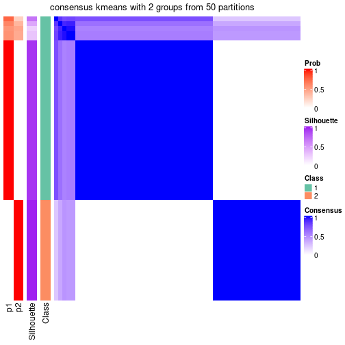</p>

</div>
<div id='tab-node-071-consensus-heatmap-2'>
<pre><code class="r">consensus_heatmap(res, k = 3)
</code></pre>

<p>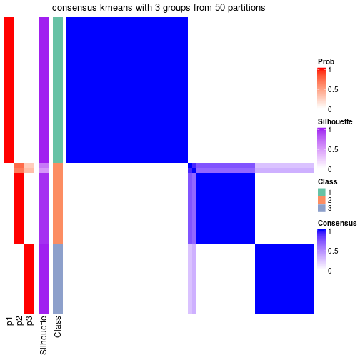</p>

</div>
<div id='tab-node-071-consensus-heatmap-3'>
<pre><code class="r">consensus_heatmap(res, k = 4)
</code></pre>

<p>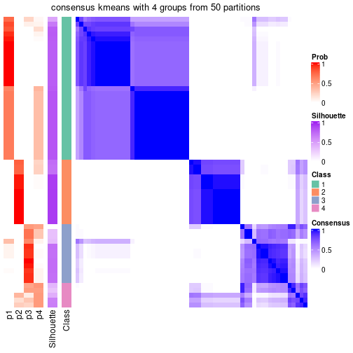</p>

</div>
<div id='tab-node-071-consensus-heatmap-4'>
<pre><code class="r">consensus_heatmap(res, k = 5)
</code></pre>

<p>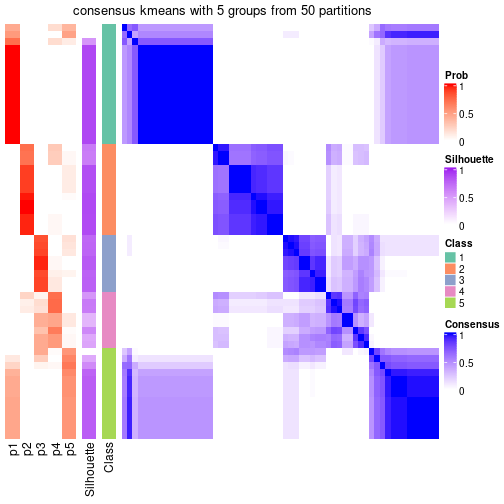</p>

</div>
<div id='tab-node-071-consensus-heatmap-5'>
<pre><code class="r">consensus_heatmap(res, k = 6)
</code></pre>

<p>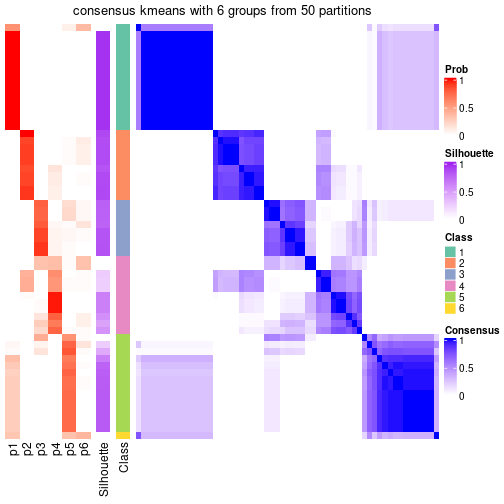</p>

</div>
<div id='tab-node-071-consensus-heatmap-6'>
<pre><code class="r">consensus_heatmap(res, k = 7)
</code></pre>

<p>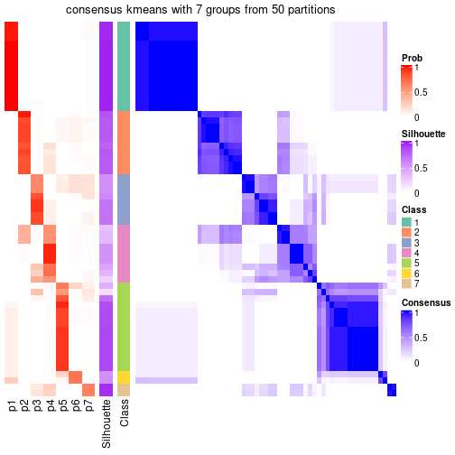</p>

</div>
<div id='tab-node-071-consensus-heatmap-7'>
<pre><code class="r">consensus_heatmap(res, k = 8)
</code></pre>

<p>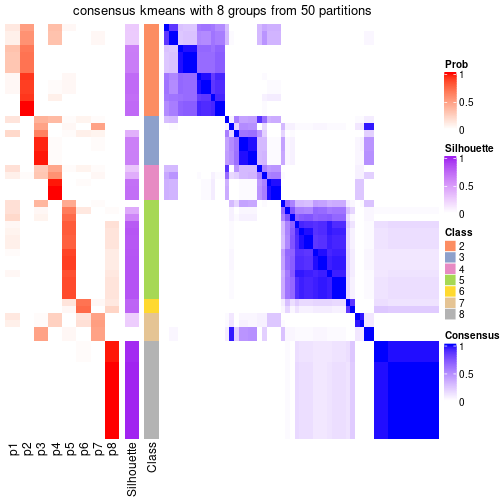</p>

</div>
</div>

Heatmaps for the membership of samples in all partitions to see how consistent they are:


<script>
$( function() {
	$( '#tabs-node-071-membership-heatmap' ).tabs();
} );
</script>
<div id='tabs-node-071-membership-heatmap'>
<ul>
<li><a href='#tab-node-071-membership-heatmap-1'>k = 2</a></li>
<li><a href='#tab-node-071-membership-heatmap-2'>k = 3</a></li>
<li><a href='#tab-node-071-membership-heatmap-3'>k = 4</a></li>
<li><a href='#tab-node-071-membership-heatmap-4'>k = 5</a></li>
<li><a href='#tab-node-071-membership-heatmap-5'>k = 6</a></li>
<li><a href='#tab-node-071-membership-heatmap-6'>k = 7</a></li>
<li><a href='#tab-node-071-membership-heatmap-7'>k = 8</a></li>
</ul>
<div id='tab-node-071-membership-heatmap-1'>
<pre><code class="r">membership_heatmap(res, k = 2)
</code></pre>

<p>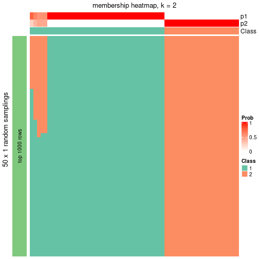</p>

</div>
<div id='tab-node-071-membership-heatmap-2'>
<pre><code class="r">membership_heatmap(res, k = 3)
</code></pre>

<p>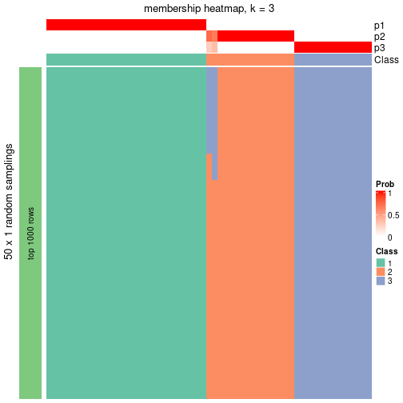</p>

</div>
<div id='tab-node-071-membership-heatmap-3'>
<pre><code class="r">membership_heatmap(res, k = 4)
</code></pre>

<p>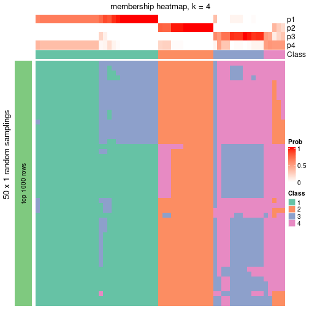</p>

</div>
<div id='tab-node-071-membership-heatmap-4'>
<pre><code class="r">membership_heatmap(res, k = 5)
</code></pre>

<p>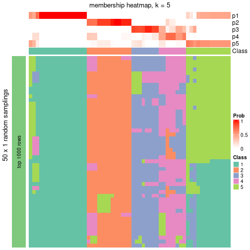</p>

</div>
<div id='tab-node-071-membership-heatmap-5'>
<pre><code class="r">membership_heatmap(res, k = 6)
</code></pre>

<p>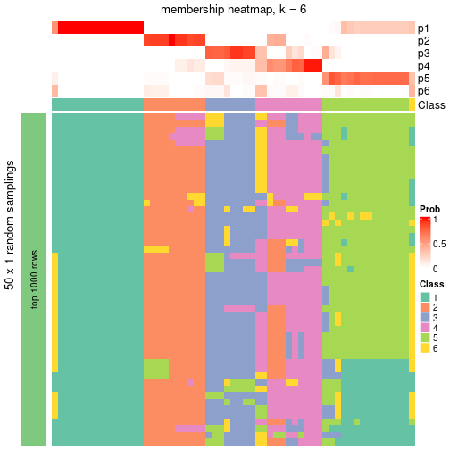</p>

</div>
<div id='tab-node-071-membership-heatmap-6'>
<pre><code class="r">membership_heatmap(res, k = 7)
</code></pre>

<p>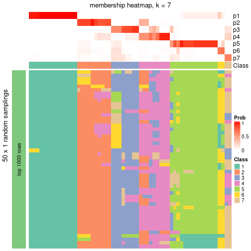</p>

</div>
<div id='tab-node-071-membership-heatmap-7'>
<pre><code class="r">membership_heatmap(res, k = 8)
</code></pre>

<p>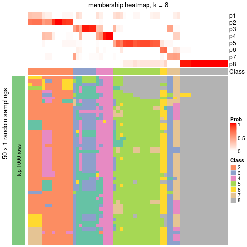</p>

</div>
</div>

As soon as the classes for columns are determined, the signatures
that are significantly different between subgroups can be looked for. 
Following are the heatmaps for signatures.


<script>
$( function() {
	$( '#tabs-node-071-get-signatures' ).tabs();
} );
</script>
<div id='tabs-node-071-get-signatures'>
<ul>
<li><a href='#tab-node-071-get-signatures-1'>k = 2</a></li>
<li><a href='#tab-node-071-get-signatures-2'>k = 3</a></li>
<li><a href='#tab-node-071-get-signatures-3'>k = 4</a></li>
<li><a href='#tab-node-071-get-signatures-4'>k = 5</a></li>
<li><a href='#tab-node-071-get-signatures-5'>k = 6</a></li>
<li><a href='#tab-node-071-get-signatures-6'>k = 7</a></li>
<li><a href='#tab-node-071-get-signatures-7'>k = 8</a></li>
</ul>
<div id='tab-node-071-get-signatures-1'>
<pre><code class="r">get_signatures(res, k = 2)
</code></pre>

<p>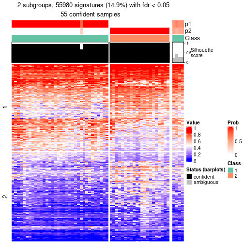</p>

</div>
<div id='tab-node-071-get-signatures-2'>
<pre><code class="r">get_signatures(res, k = 3)
</code></pre>

<p>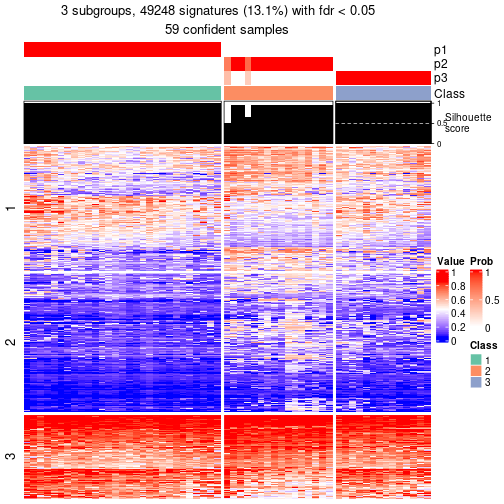</p>

</div>
<div id='tab-node-071-get-signatures-3'>
<pre><code class="r">get_signatures(res, k = 4)
</code></pre>

<p>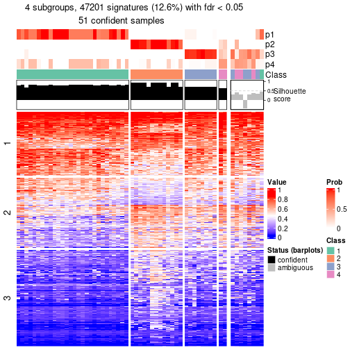</p>

</div>
<div id='tab-node-071-get-signatures-4'>
<pre><code class="r">get_signatures(res, k = 5)
</code></pre>

<p>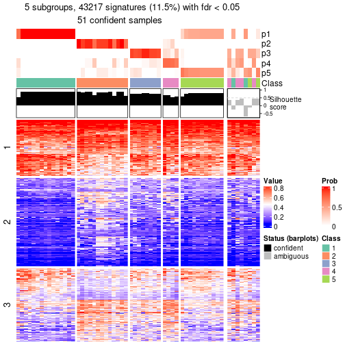</p>

</div>
<div id='tab-node-071-get-signatures-5'>
<pre><code class="r">get_signatures(res, k = 6)
</code></pre>

<p>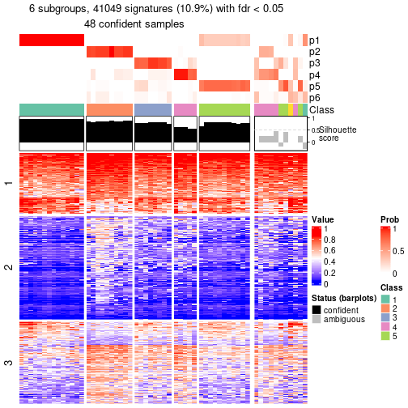</p>

</div>
<div id='tab-node-071-get-signatures-6'>
<pre><code class="r">get_signatures(res, k = 7)
</code></pre>

<p>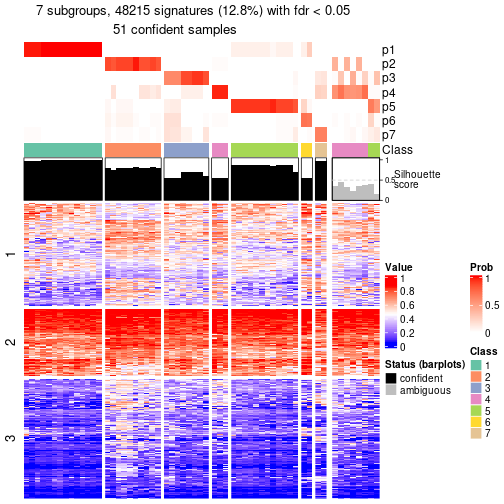</p>

</div>
<div id='tab-node-071-get-signatures-7'>
<pre><code class="r">get_signatures(res, k = 8)
</code></pre>

<p>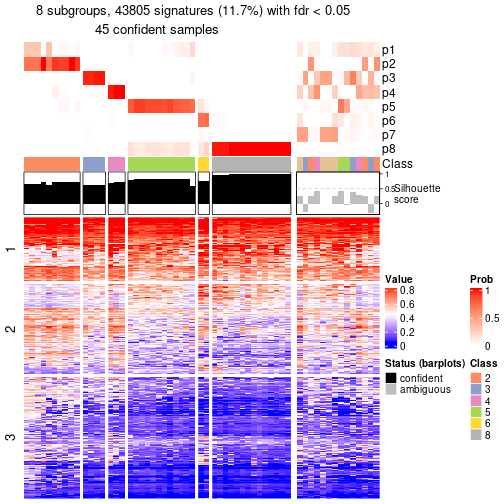</p>

</div>
</div>


Compare the overlap of signatures from different k:

```r
compare_signatures(res)
```

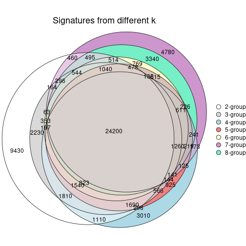

`get_signature()` returns a data frame invisibly. To get the list of signatures, the function
call should be assigned to a variable explicitly. In following code, if `plot` argument is set
to `FALSE`, no heatmap is plotted while only the differential analysis is performed.

```r
# code only for demonstration
tb = get_signature(res, k = ..., plot = FALSE)
```

An example of the output of `tb` is:

```
#>   which_row         fdr    mean_1    mean_2 scaled_mean_1 scaled_mean_2 km
#> 1        38 0.042760348  8.373488  9.131774    -0.5533452     0.5164555  1
#> 2        40 0.018707592  7.106213  8.469186    -0.6173731     0.5762149  1
#> 3        55 0.019134737 10.221463 11.207825    -0.6159697     0.5749050  1
#> 4        59 0.006059896  5.921854  7.869574    -0.6899429     0.6439467  1
#> 5        60 0.018055526  8.928898 10.211722    -0.6204761     0.5791110  1
#> 6        98 0.009384629 15.714769 14.887706     0.6635654    -0.6193277  2
...
```

The columns in `tb` are:

1. `which_row`: row indices corresponding to the input matrix.
2. `fdr`: FDR for the differential test. 
3. `mean_x`: The mean value in group x.
4. `scaled_mean_x`: The mean value in group x after rows are scaled.
5. `km`: Row groups if k-means clustering is applied to rows (which is done by automatically selecting number of clusters).

If there are too many signatures, `top_signatures = ...` can be set to only show the 
signatures with the highest FDRs:

```r
# code only for demonstration
# e.g. to show the top 500 most significant rows
tb = get_signature(res, k = ..., top_signatures = 500)
```

If the signatures are defined as these which are uniquely high in current group, `diff_method` argument
can be set to `"uniquely_high_in_one_group"`:

```r
# code only for demonstration
tb = get_signature(res, k = ..., diff_method = "uniquely_high_in_one_group")
```


UMAP plot which shows how samples are separated.


<script>
$( function() {
	$( '#tabs-node-071-dimension-reduction' ).tabs();
} );
</script>
<div id='tabs-node-071-dimension-reduction'>
<ul>
<li><a href='#tab-node-071-dimension-reduction-1'>k = 2</a></li>
<li><a href='#tab-node-071-dimension-reduction-2'>k = 3</a></li>
<li><a href='#tab-node-071-dimension-reduction-3'>k = 4</a></li>
<li><a href='#tab-node-071-dimension-reduction-4'>k = 5</a></li>
<li><a href='#tab-node-071-dimension-reduction-5'>k = 6</a></li>
<li><a href='#tab-node-071-dimension-reduction-6'>k = 7</a></li>
<li><a href='#tab-node-071-dimension-reduction-7'>k = 8</a></li>
</ul>
<div id='tab-node-071-dimension-reduction-1'>
<pre><code class="r">dimension_reduction(res, k = 2, method = &quot;UMAP&quot;)
</code></pre>

<p>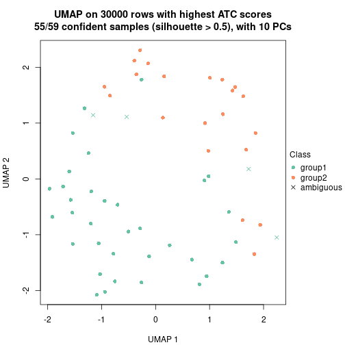</p>

</div>
<div id='tab-node-071-dimension-reduction-2'>
<pre><code class="r">dimension_reduction(res, k = 3, method = &quot;UMAP&quot;)
</code></pre>

<p>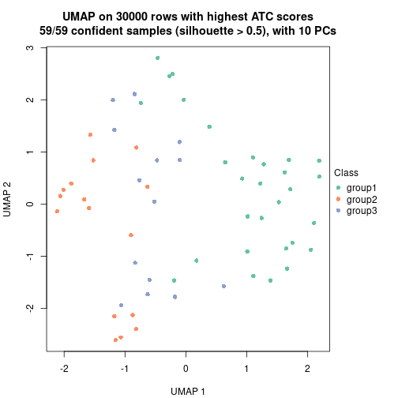</p>

</div>
<div id='tab-node-071-dimension-reduction-3'>
<pre><code class="r">dimension_reduction(res, k = 4, method = &quot;UMAP&quot;)
</code></pre>

<p>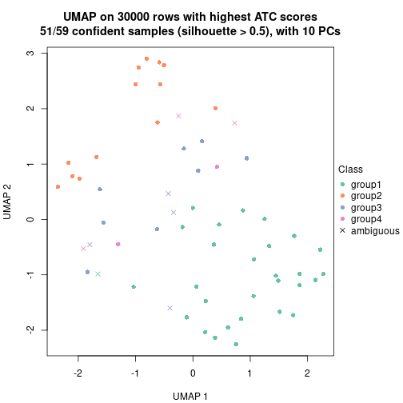</p>

</div>
<div id='tab-node-071-dimension-reduction-4'>
<pre><code class="r">dimension_reduction(res, k = 5, method = &quot;UMAP&quot;)
</code></pre>

<p>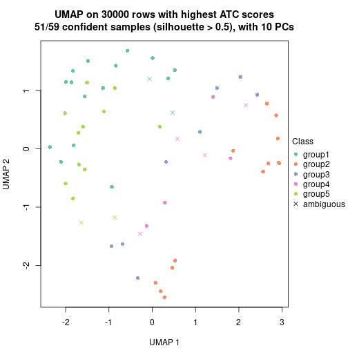</p>

</div>
<div id='tab-node-071-dimension-reduction-5'>
<pre><code class="r">dimension_reduction(res, k = 6, method = &quot;UMAP&quot;)
</code></pre>

<p>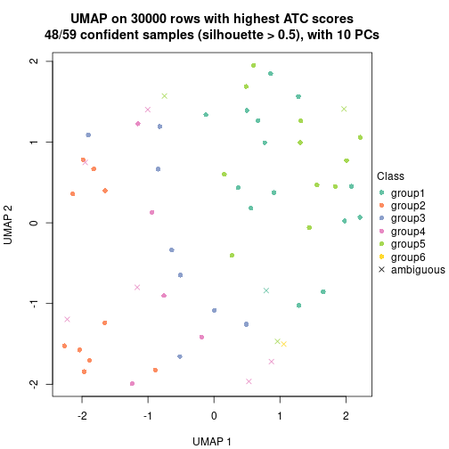</p>

</div>
<div id='tab-node-071-dimension-reduction-6'>
<pre><code class="r">dimension_reduction(res, k = 7, method = &quot;UMAP&quot;)
</code></pre>

<p>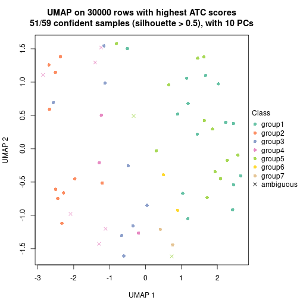</p>

</div>
<div id='tab-node-071-dimension-reduction-7'>
<pre><code class="r">dimension_reduction(res, k = 8, method = &quot;UMAP&quot;)
</code></pre>

<p>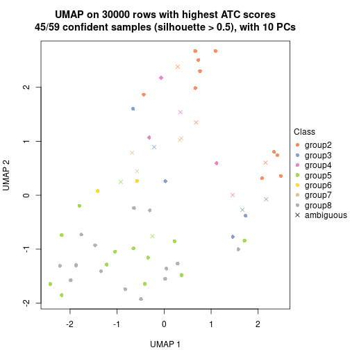</p>

</div>
</div>


Following heatmap shows how subgroups are split when increasing `k`:

```r
collect_classes(res)
```

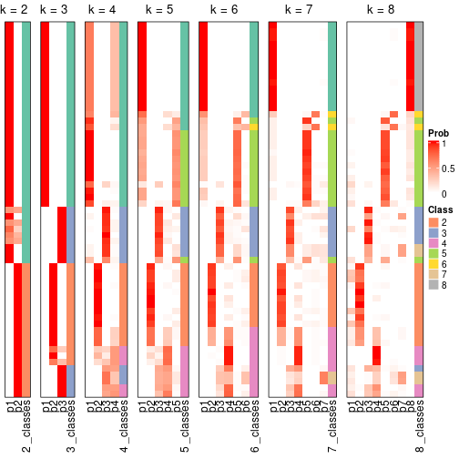


If matrix rows can be associated to genes, consider to use `functional_enrichment(res,
...)` to perform function enrichment for the signature genes. See [this vignette](https://jokergoo.github.io/cola_vignettes/functional_enrichment.html) for more detailed explanations.


 

---------------------------------------------------


### Node0711


Parent node: [Node071](#Node071).
Child nodes: 
                Node02131-leaf
        ,
                Node02132-leaf
        ,
                Node02211-leaf
        ,
                Node02212-leaf
        ,
                Node02311-leaf
        ,
                Node02312-leaf
        ,
                Node02313-leaf
        ,
                Node02314-leaf
        ,
                Node02341-leaf
        ,
                Node02342-leaf
        ,
                Node02343-leaf
        ,
                Node02344-leaf
        ,
                Node02345-leaf
        ,
                Node02421-leaf
        ,
                Node02422-leaf
        ,
                Node02423-leaf
        ,
                Node06121-leaf
        ,
                Node06122-leaf
        ,
                Node06123-leaf
        ,
                [Node07111](#Node07111)
        ,
                Node07112-leaf
        ,
                Node07211-leaf
        ,
                Node07212-leaf
        ,
                Node07213-leaf
        ,
                Node07214-leaf
        .


The object with results only for a single top-value method and a single partitioning method 
can be extracted as:

```r
res = res_rh["0711"]
```

A summary of `res` and all the functions that can be applied to it:

```r
res
```

```
#> A 'ConsensusPartition' object with k = 2, 3, 4, 5, 6, 7, 8.
#>   On a matrix with 30000 rows and 29 columns.
#>   Top rows (1000) are extracted by 'ATC' method.
#>   Subgroups are detected by 'kmeans' method.
#>   Performed in total 350 partitions by row resampling.
#>   Best k for subgroups seems to be 2.
#> 
#> Following methods can be applied to this 'ConsensusPartition' object:
#>  [1] "cola_report"             "collect_classes"         "collect_plots"          
#>  [4] "collect_stats"           "colnames"                "compare_partitions"     
#>  [7] "compare_signatures"      "consensus_heatmap"       "dimension_reduction"    
#> [10] "functional_enrichment"   "get_anno_col"            "get_anno"               
#> [13] "get_classes"             "get_consensus"           "get_matrix"             
#> [16] "get_membership"          "get_param"               "get_signatures"         
#> [19] "get_stats"               "is_best_k"               "is_stable_k"            
#> [22] "membership_heatmap"      "ncol"                    "nrow"                   
#> [25] "plot_ecdf"               "predict_classes"         "rownames"               
#> [28] "select_partition_number" "show"                    "suggest_best_k"         
#> [31] "test_to_known_factors"   "top_rows_heatmap"
```

`collect_plots()` function collects all the plots made from `res` for all `k` (number of subgroups)
into one single page to provide an easy and fast comparison between different `k`.

```r
collect_plots(res)
```

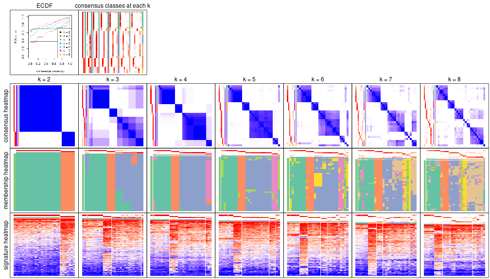

The plots are:

- The first row: a plot of the eCDF (empirical cumulative distribution
  function) curves of the consensus matrix for each `k` and the heatmap of
  predicted classes for each `k`.
- The second row: heatmaps of the consensus matrix for each `k`.
- The third row: heatmaps of the membership matrix for each `k`.
- The fouth row: heatmaps of the signatures for each `k`.

All the plots in panels can be made by individual functions and they are
plotted later in this section.

`select_partition_number()` produces several plots showing different
statistics for choosing "optimized" `k`. There are following statistics:

- eCDF curves of the consensus matrix for each `k`;
- 1-PAC. [The PAC score](https://en.wikipedia.org/wiki/Consensus_clustering#Over-interpretation_potential_of_consensus_clustering)
  measures the proportion of the ambiguous subgrouping.
- Mean silhouette score.
- Concordance. The mean probability of fiting the consensus subgroup labels in all
  partitions.
- Area increased. Denote $A_k$ as the area under the eCDF curve for current
  `k`, the area increased is defined as $A_k - A_{k-1}$.
- Rand index. The percent of pairs of samples that are both in a same cluster
  or both are not in a same cluster in the partition of k and k-1.
- Jaccard index. The ratio of pairs of samples are both in a same cluster in
  the partition of k and k-1 and the pairs of samples are both in a same
  cluster in the partition k or k-1.

The detailed explanations of these statistics can be found in [the _cola_
vignette](https://jokergoo.github.io/cola_vignettes/cola.html#toc_13).

Generally speaking, higher 1-PAC score, higher mean silhouette score or higher
concordance corresponds to better partition. Rand index and Jaccard index
measure how similar the current partition is compared to partition with `k-1`.
If they are too similar, we won't accept `k` is better than `k-1`.

```r
select_partition_number(res)
```

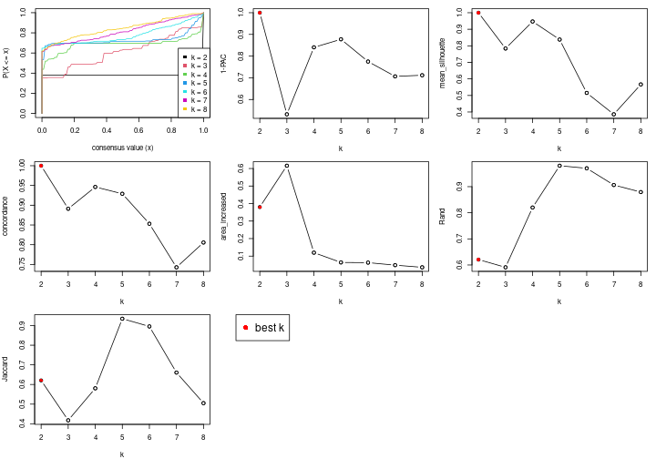

The numeric values for all these statistics can be obtained by `get_stats()`.

```r
get_stats(res)
```

```
#>   k 1-PAC mean_silhouette concordance area_increased  Rand Jaccard
#> 2 2 1.000           1.000       1.000         0.3799 0.621   0.621
#> 3 3 0.532           0.784       0.891         0.6159 0.591   0.418
#> 4 4 0.840           0.947       0.946         0.1196 0.820   0.580
#> 5 5 0.877           0.838       0.929         0.0638 0.980   0.935
#> 6 6 0.775           0.515       0.853         0.0627 0.970   0.896
#> 7 7 0.707           0.386       0.743         0.0483 0.906   0.661
#> 8 8 0.712           0.567       0.806         0.0360 0.879   0.505
```

`suggest_best_k()` suggests the best $k$ based on these statistics. The rules are as follows:

- All $k$ with Jaccard index larger than 0.95 are removed because increasing
  $k$ does not provide enough extra information. If all $k$ are removed, it is
  marked as no subgroup is detected.
- For all $k$ with 1-PAC score larger than 0.9, the maximal $k$ is taken as
  the best $k$, and other $k$ are marked as optional $k$.
- If it does not fit the second rule. The $k$ with the maximal vote of the
  highest 1-PAC score, highest mean silhouette, and highest concordance is
  taken as the best $k$.

```r
suggest_best_k(res)
```

```
#> [1] 2
```


Following is the table of the partitions (You need to click the **show/hide
code output** link to see it). The membership matrix (columns with name `p*`)
is inferred by
[`clue::cl_consensus()`](https://www.rdocumentation.org/link/cl_consensus?package=clue)
function with the `SE` method. Basically the value in the membership matrix
represents the probability to belong to a certain group. The finall subgroup
label for an item is determined with the group with highest probability it
belongs to.

In `get_classes()` function, the entropy is calculated from the membership
matrix and the silhouette score is calculated from the consensus matrix.


<script>
$( function() {
	$( '#tabs-node-0711-get-classes' ).tabs();
} );
</script>
<div id='tabs-node-0711-get-classes'>
<ul>
<li><a href='#tab-node-0711-get-classes-1'>k = 2</a></li>
<li><a href='#tab-node-0711-get-classes-2'>k = 3</a></li>
<li><a href='#tab-node-0711-get-classes-3'>k = 4</a></li>
<li><a href='#tab-node-0711-get-classes-4'>k = 5</a></li>
<li><a href='#tab-node-0711-get-classes-5'>k = 6</a></li>
<li><a href='#tab-node-0711-get-classes-6'>k = 7</a></li>
<li><a href='#tab-node-0711-get-classes-7'>k = 8</a></li>
</ul>

<div id='tab-node-0711-get-classes-1'>
<p><a id='tab-node-0711-get-classes-1-a' style='color:#0366d6' href='#'>show/hide code output</a></p>
<pre><code class="r">cbind(get_classes(res, k = 2), get_membership(res, k = 2))
</code></pre>

<pre><code>#&gt;                 class entropy silhouette p1 p2
#&gt; TCGA.55.7910.01     1       0          1  1  0
#&gt; TCGA.86.7954.01     1       0          1  1  0
#&gt; TCGA.44.A479.01     1       0          1  1  0
#&gt; TCGA.O2.A5IC.01     2       0          1  0  1
#&gt; TCGA.55.8096.01     1       0          1  1  0
#&gt; TCGA.53.7624.01     2       0          1  0  1
#&gt; TCGA.55.7913.01     1       0          1  1  0
#&gt; TCGA.44.7670.01     2       0          1  0  1
#&gt; TCGA.L9.A5IP.01     1       0          1  1  0
#&gt; TCGA.49.4490.01     1       0          1  1  0
#&gt; TCGA.NC.A5HK.01     2       0          1  0  1
#&gt; TCGA.91.6840.01     1       0          1  1  0
#&gt; TCGA.91.6830.01     1       0          1  1  0
#&gt; TCGA.49.6743.01     1       0          1  1  0
#&gt; TCGA.44.A4SU.01     1       0          1  1  0
#&gt; TCGA.L9.A8F4.01     1       0          1  1  0
#&gt; TCGA.J2.A4AD.01     1       0          1  1  0
#&gt; TCGA.38.4631.01     2       0          1  0  1
#&gt; TCGA.86.8075.01     1       0          1  1  0
#&gt; TCGA.49.4514.01     1       0          1  1  0
#&gt; TCGA.75.5147.01     2       0          1  0  1
#&gt; TCGA.O1.A52J.01     1       0          1  1  0
#&gt; TCGA.4B.A93V.01     1       0          1  1  0
#&gt; TCGA.MP.A4TA.01     1       0          1  1  0
#&gt; TCGA.64.1679.01     1       0          1  1  0
#&gt; TCGA.64.1681.01     1       0          1  1  0
#&gt; TCGA.86.7953.01     1       0          1  1  0
#&gt; TCGA.55.7995.01     2       0          1  0  1
#&gt; TCGA.J2.8192.01     1       0          1  1  0
</code></pre>

<script>
$('#tab-node-0711-get-classes-1-a').parent().next().next().hide();
$('#tab-node-0711-get-classes-1-a').click(function(){
  $('#tab-node-0711-get-classes-1-a').parent().next().next().toggle();
  return(false);
});
</script>
</div>

<div id='tab-node-0711-get-classes-2'>
<p><a id='tab-node-0711-get-classes-2-a' style='color:#0366d6' href='#'>show/hide code output</a></p>
<pre><code class="r">cbind(get_classes(res, k = 3), get_membership(res, k = 3))
</code></pre>

<pre><code>#&gt;                 class entropy silhouette   p1   p2   p3
#&gt; TCGA.55.7910.01     1   0.000      0.933 1.00 0.00 0.00
#&gt; TCGA.86.7954.01     3   0.604      0.546 0.38 0.00 0.62
#&gt; TCGA.44.A479.01     3   0.604      0.546 0.38 0.00 0.62
#&gt; TCGA.O2.A5IC.01     3   0.429      0.592 0.00 0.18 0.82
#&gt; TCGA.55.8096.01     1   0.429      0.717 0.82 0.00 0.18
#&gt; TCGA.53.7624.01     2   0.000      1.000 0.00 1.00 0.00
#&gt; TCGA.55.7913.01     3   0.400      0.763 0.16 0.00 0.84
#&gt; TCGA.44.7670.01     2   0.000      1.000 0.00 1.00 0.00
#&gt; TCGA.L9.A5IP.01     1   0.000      0.933 1.00 0.00 0.00
#&gt; TCGA.49.4490.01     3   0.000      0.737 0.00 0.00 1.00
#&gt; TCGA.NC.A5HK.01     2   0.000      1.000 0.00 1.00 0.00
#&gt; TCGA.91.6840.01     1   0.000      0.933 1.00 0.00 0.00
#&gt; TCGA.91.6830.01     3   0.369      0.766 0.14 0.00 0.86
#&gt; TCGA.49.6743.01     3   0.000      0.737 0.00 0.00 1.00
#&gt; TCGA.44.A4SU.01     1   0.000      0.933 1.00 0.00 0.00
#&gt; TCGA.L9.A8F4.01     1   0.583      0.341 0.66 0.00 0.34
#&gt; TCGA.J2.A4AD.01     3   0.400      0.763 0.16 0.00 0.84
#&gt; TCGA.38.4631.01     2   0.000      1.000 0.00 1.00 0.00
#&gt; TCGA.86.8075.01     3   0.604      0.546 0.38 0.00 0.62
#&gt; TCGA.49.4514.01     3   0.400      0.763 0.16 0.00 0.84
#&gt; TCGA.75.5147.01     3   0.369      0.637 0.00 0.14 0.86
#&gt; TCGA.O1.A52J.01     1   0.000      0.933 1.00 0.00 0.00
#&gt; TCGA.4B.A93V.01     1   0.000      0.933 1.00 0.00 0.00
#&gt; TCGA.MP.A4TA.01     3   0.000      0.737 0.00 0.00 1.00
#&gt; TCGA.64.1679.01     1   0.000      0.933 1.00 0.00 0.00
#&gt; TCGA.64.1681.01     1   0.000      0.933 1.00 0.00 0.00
#&gt; TCGA.86.7953.01     3   0.604      0.546 0.38 0.00 0.62
#&gt; TCGA.55.7995.01     3   0.429      0.592 0.00 0.18 0.82
#&gt; TCGA.J2.8192.01     1   0.000      0.933 1.00 0.00 0.00
</code></pre>

<script>
$('#tab-node-0711-get-classes-2-a').parent().next().next().hide();
$('#tab-node-0711-get-classes-2-a').click(function(){
  $('#tab-node-0711-get-classes-2-a').parent().next().next().toggle();
  return(false);
});
</script>
</div>

<div id='tab-node-0711-get-classes-3'>
<p><a id='tab-node-0711-get-classes-3-a' style='color:#0366d6' href='#'>show/hide code output</a></p>
<pre><code class="r">cbind(get_classes(res, k = 4), get_membership(res, k = 4))
</code></pre>

<pre><code>#&gt;                 class entropy silhouette   p1   p2   p3   p4
#&gt; TCGA.55.7910.01     1  0.2011      0.914 0.92 0.00 0.00 0.08
#&gt; TCGA.86.7954.01     3  0.0707      0.953 0.02 0.00 0.98 0.00
#&gt; TCGA.44.A479.01     3  0.1211      0.938 0.04 0.00 0.96 0.00
#&gt; TCGA.O2.A5IC.01     4  0.5594      0.982 0.00 0.10 0.18 0.72
#&gt; TCGA.55.8096.01     3  0.3172      0.788 0.16 0.00 0.84 0.00
#&gt; TCGA.53.7624.01     2  0.0000      0.995 0.00 1.00 0.00 0.00
#&gt; TCGA.55.7913.01     3  0.0000      0.957 0.00 0.00 1.00 0.00
#&gt; TCGA.44.7670.01     2  0.0707      0.984 0.00 0.98 0.00 0.02
#&gt; TCGA.L9.A5IP.01     1  0.0000      0.963 1.00 0.00 0.00 0.00
#&gt; TCGA.49.4490.01     3  0.0000      0.957 0.00 0.00 1.00 0.00
#&gt; TCGA.NC.A5HK.01     2  0.0000      0.995 0.00 1.00 0.00 0.00
#&gt; TCGA.91.6840.01     1  0.4134      0.753 0.74 0.00 0.00 0.26
#&gt; TCGA.91.6830.01     3  0.0000      0.957 0.00 0.00 1.00 0.00
#&gt; TCGA.49.6743.01     3  0.0000      0.957 0.00 0.00 1.00 0.00
#&gt; TCGA.44.A4SU.01     1  0.0000      0.963 1.00 0.00 0.00 0.00
#&gt; TCGA.L9.A8F4.01     3  0.2345      0.872 0.10 0.00 0.90 0.00
#&gt; TCGA.J2.A4AD.01     3  0.0000      0.957 0.00 0.00 1.00 0.00
#&gt; TCGA.38.4631.01     2  0.0000      0.995 0.00 1.00 0.00 0.00
#&gt; TCGA.86.8075.01     3  0.0707      0.953 0.02 0.00 0.98 0.00
#&gt; TCGA.49.4514.01     3  0.0000      0.957 0.00 0.00 1.00 0.00
#&gt; TCGA.75.5147.01     4  0.5486      0.964 0.00 0.08 0.20 0.72
#&gt; TCGA.O1.A52J.01     1  0.0000      0.963 1.00 0.00 0.00 0.00
#&gt; TCGA.4B.A93V.01     1  0.0000      0.963 1.00 0.00 0.00 0.00
#&gt; TCGA.MP.A4TA.01     3  0.0000      0.957 0.00 0.00 1.00 0.00
#&gt; TCGA.64.1679.01     1  0.0000      0.963 1.00 0.00 0.00 0.00
#&gt; TCGA.64.1681.01     1  0.0000      0.963 1.00 0.00 0.00 0.00
#&gt; TCGA.86.7953.01     3  0.0707      0.953 0.02 0.00 0.98 0.00
#&gt; TCGA.55.7995.01     4  0.5594      0.982 0.00 0.10 0.18 0.72
#&gt; TCGA.J2.8192.01     1  0.0000      0.963 1.00 0.00 0.00 0.00
</code></pre>

<script>
$('#tab-node-0711-get-classes-3-a').parent().next().next().hide();
$('#tab-node-0711-get-classes-3-a').click(function(){
  $('#tab-node-0711-get-classes-3-a').parent().next().next().toggle();
  return(false);
});
</script>
</div>

<div id='tab-node-0711-get-classes-4'>
<p><a id='tab-node-0711-get-classes-4-a' style='color:#0366d6' href='#'>show/hide code output</a></p>
<pre><code class="r">cbind(get_classes(res, k = 5), get_membership(res, k = 5))
</code></pre>

<pre><code>#&gt;                 class entropy silhouette   p1   p2   p3   p4   p5
#&gt; TCGA.55.7910.01     1  0.3895     -0.191 0.68 0.00 0.00 0.00 0.32
#&gt; TCGA.86.7954.01     3  0.1410      0.950 0.00 0.00 0.94 0.00 0.06
#&gt; TCGA.44.A479.01     3  0.1043      0.947 0.00 0.00 0.96 0.00 0.04
#&gt; TCGA.O2.A5IC.01     4  0.2873      0.888 0.00 0.00 0.02 0.86 0.12
#&gt; TCGA.55.8096.01     3  0.2012      0.938 0.02 0.00 0.92 0.00 0.06
#&gt; TCGA.53.7624.01     2  0.0000      0.976 0.00 1.00 0.00 0.00 0.00
#&gt; TCGA.55.7913.01     3  0.0609      0.951 0.00 0.00 0.98 0.00 0.02
#&gt; TCGA.44.7670.01     2  0.0000      0.976 0.00 1.00 0.00 0.00 0.00
#&gt; TCGA.L9.A5IP.01     1  0.3513      0.581 0.80 0.00 0.00 0.02 0.18
#&gt; TCGA.49.4490.01     3  0.2280      0.922 0.00 0.00 0.88 0.00 0.12
#&gt; TCGA.NC.A5HK.01     2  0.0000      0.976 0.00 1.00 0.00 0.00 0.00
#&gt; TCGA.91.6840.01     5  0.4227      0.000 0.42 0.00 0.00 0.00 0.58
#&gt; TCGA.91.6830.01     3  0.1410      0.943 0.00 0.00 0.94 0.00 0.06
#&gt; TCGA.49.6743.01     3  0.1043      0.944 0.00 0.00 0.96 0.00 0.04
#&gt; TCGA.44.A4SU.01     1  0.0000      0.853 1.00 0.00 0.00 0.00 0.00
#&gt; TCGA.L9.A8F4.01     3  0.1648      0.938 0.02 0.00 0.94 0.00 0.04
#&gt; TCGA.J2.A4AD.01     3  0.2020      0.934 0.00 0.00 0.90 0.00 0.10
#&gt; TCGA.38.4631.01     2  0.1732      0.926 0.00 0.92 0.00 0.00 0.08
#&gt; TCGA.86.8075.01     3  0.1410      0.950 0.00 0.00 0.94 0.00 0.06
#&gt; TCGA.49.4514.01     3  0.0000      0.952 0.00 0.00 1.00 0.00 0.00
#&gt; TCGA.75.5147.01     4  0.2012      0.914 0.00 0.00 0.02 0.92 0.06
#&gt; TCGA.O1.A52J.01     1  0.0000      0.853 1.00 0.00 0.00 0.00 0.00
#&gt; TCGA.4B.A93V.01     1  0.0000      0.853 1.00 0.00 0.00 0.00 0.00
#&gt; TCGA.MP.A4TA.01     3  0.1732      0.927 0.00 0.00 0.92 0.00 0.08
#&gt; TCGA.64.1679.01     1  0.1043      0.809 0.96 0.00 0.00 0.00 0.04
#&gt; TCGA.64.1681.01     1  0.0000      0.853 1.00 0.00 0.00 0.00 0.00
#&gt; TCGA.86.7953.01     3  0.1043      0.949 0.00 0.00 0.96 0.00 0.04
#&gt; TCGA.55.7995.01     4  0.0609      0.927 0.00 0.00 0.02 0.98 0.00
#&gt; TCGA.J2.8192.01     1  0.0000      0.853 1.00 0.00 0.00 0.00 0.00
</code></pre>

<script>
$('#tab-node-0711-get-classes-4-a').parent().next().next().hide();
$('#tab-node-0711-get-classes-4-a').click(function(){
  $('#tab-node-0711-get-classes-4-a').parent().next().next().toggle();
  return(false);
});
</script>
</div>

<div id='tab-node-0711-get-classes-5'>
<p><a id='tab-node-0711-get-classes-5-a' style='color:#0366d6' href='#'>show/hide code output</a></p>
<pre><code class="r">cbind(get_classes(res, k = 6), get_membership(res, k = 6))
</code></pre>

<pre><code>#&gt;                 class entropy silhouette   p1   p2   p3   p4   p5   p6
#&gt; TCGA.55.7910.01     1  0.4360     0.2024 0.68 0.00 0.00 0.00 0.26 0.06
#&gt; TCGA.86.7954.01     3  0.1814     0.4806 0.00 0.00 0.90 0.00 0.00 0.10
#&gt; TCGA.44.A479.01     3  0.2094     0.5578 0.00 0.00 0.90 0.00 0.02 0.08
#&gt; TCGA.O2.A5IC.01     4  0.3660     0.7201 0.00 0.00 0.00 0.78 0.06 0.16
#&gt; TCGA.55.8096.01     3  0.2725     0.5055 0.04 0.00 0.88 0.00 0.02 0.06
#&gt; TCGA.53.7624.01     2  0.0000     0.9579 0.00 1.00 0.00 0.00 0.00 0.00
#&gt; TCGA.55.7913.01     3  0.0937     0.5494 0.00 0.00 0.96 0.00 0.00 0.04
#&gt; TCGA.44.7670.01     2  0.0547     0.9515 0.00 0.98 0.00 0.00 0.02 0.00
#&gt; TCGA.L9.A5IP.01     1  0.5007     0.3662 0.66 0.00 0.02 0.00 0.08 0.24
#&gt; TCGA.49.4490.01     6  0.4337     0.0000 0.00 0.00 0.48 0.00 0.02 0.50
#&gt; TCGA.NC.A5HK.01     2  0.0000     0.9579 0.00 1.00 0.00 0.00 0.00 0.00
#&gt; TCGA.91.6840.01     5  0.3409     0.0000 0.30 0.00 0.00 0.00 0.70 0.00
#&gt; TCGA.91.6830.01     3  0.3578    -0.1107 0.00 0.00 0.66 0.00 0.00 0.34
#&gt; TCGA.49.6743.01     3  0.3499    -0.0674 0.00 0.00 0.68 0.00 0.00 0.32
#&gt; TCGA.44.A4SU.01     1  0.0000     0.8189 1.00 0.00 0.00 0.00 0.00 0.00
#&gt; TCGA.L9.A8F4.01     3  0.2094     0.5578 0.00 0.00 0.90 0.00 0.02 0.08
#&gt; TCGA.J2.A4AD.01     3  0.3706    -0.1017 0.00 0.00 0.62 0.00 0.00 0.38
#&gt; TCGA.38.4631.01     2  0.2474     0.8841 0.00 0.88 0.00 0.00 0.08 0.04
#&gt; TCGA.86.8075.01     3  0.1814     0.4806 0.00 0.00 0.90 0.00 0.00 0.10
#&gt; TCGA.49.4514.01     3  0.1556     0.5418 0.00 0.00 0.92 0.00 0.00 0.08
#&gt; TCGA.75.5147.01     4  0.4004     0.7119 0.00 0.00 0.00 0.76 0.12 0.12
#&gt; TCGA.O1.A52J.01     1  0.1092     0.8039 0.96 0.00 0.00 0.00 0.02 0.02
#&gt; TCGA.4B.A93V.01     1  0.1092     0.8039 0.96 0.00 0.00 0.00 0.02 0.02
#&gt; TCGA.MP.A4TA.01     3  0.3828    -0.3448 0.00 0.00 0.56 0.00 0.00 0.44
#&gt; TCGA.64.1679.01     1  0.2020     0.7490 0.92 0.00 0.02 0.00 0.02 0.04
#&gt; TCGA.64.1681.01     1  0.0000     0.8189 1.00 0.00 0.00 0.00 0.00 0.00
#&gt; TCGA.86.7953.01     3  0.0937     0.5414 0.00 0.00 0.96 0.00 0.00 0.04
#&gt; TCGA.55.7995.01     4  0.0000     0.7898 0.00 0.00 0.00 1.00 0.00 0.00
#&gt; TCGA.J2.8192.01     1  0.0000     0.8189 1.00 0.00 0.00 0.00 0.00 0.00
</code></pre>

<script>
$('#tab-node-0711-get-classes-5-a').parent().next().next().hide();
$('#tab-node-0711-get-classes-5-a').click(function(){
  $('#tab-node-0711-get-classes-5-a').parent().next().next().toggle();
  return(false);
});
</script>
</div>

<div id='tab-node-0711-get-classes-6'>
<p><a id='tab-node-0711-get-classes-6-a' style='color:#0366d6' href='#'>show/hide code output</a></p>
<pre><code class="r">cbind(get_classes(res, k = 7), get_membership(res, k = 7))
</code></pre>

<pre><code>#&gt;                 class entropy silhouette   p1   p2   p3   p4   p5   p6   p7
#&gt; TCGA.55.7910.01     1  0.5276    0.34357 0.64 0.00 0.00 0.00 0.18 0.08 0.10
#&gt; TCGA.86.7954.01     7  0.3294    0.78511 0.00 0.00 0.34 0.00 0.00 0.00 0.66
#&gt; TCGA.44.A479.01     3  0.5474    0.04366 0.00 0.00 0.58 0.00 0.06 0.10 0.26
#&gt; TCGA.O2.A5IC.01     6  0.3496    0.00000 0.00 0.00 0.00 0.42 0.00 0.58 0.00
#&gt; TCGA.55.8096.01     3  0.5968   -0.19460 0.00 0.00 0.44 0.00 0.08 0.10 0.38
#&gt; TCGA.53.7624.01     2  0.0000    0.93405 0.00 1.00 0.00 0.00 0.00 0.00 0.00
#&gt; TCGA.55.7913.01     3  0.3985   -0.58740 0.00 0.00 0.52 0.00 0.00 0.02 0.46
#&gt; TCGA.44.7670.01     2  0.0863    0.92303 0.00 0.96 0.00 0.00 0.04 0.00 0.00
#&gt; TCGA.L9.A5IP.01     1  0.6898    0.04662 0.38 0.00 0.02 0.00 0.08 0.30 0.22
#&gt; TCGA.49.4490.01     3  0.4990    0.10991 0.00 0.00 0.58 0.22 0.00 0.00 0.20
#&gt; TCGA.NC.A5HK.01     2  0.0000    0.93405 0.00 1.00 0.00 0.00 0.00 0.00 0.00
#&gt; TCGA.91.6840.01     5  0.2912    0.00000 0.14 0.00 0.00 0.00 0.82 0.00 0.04
#&gt; TCGA.91.6830.01     3  0.1433    0.38985 0.00 0.00 0.92 0.00 0.00 0.00 0.08
#&gt; TCGA.49.6743.01     3  0.0504    0.40680 0.00 0.00 0.98 0.00 0.00 0.00 0.02
#&gt; TCGA.44.A4SU.01     1  0.1664    0.73791 0.92 0.00 0.00 0.00 0.02 0.00 0.06
#&gt; TCGA.L9.A8F4.01     3  0.5474    0.04366 0.00 0.00 0.58 0.00 0.06 0.10 0.26
#&gt; TCGA.J2.A4AD.01     3  0.2163    0.40163 0.00 0.00 0.88 0.00 0.00 0.02 0.10
#&gt; TCGA.38.4631.01     2  0.3289    0.82442 0.00 0.82 0.00 0.00 0.02 0.10 0.06
#&gt; TCGA.86.8075.01     7  0.3755    0.77642 0.00 0.00 0.34 0.00 0.00 0.02 0.64
#&gt; TCGA.49.4514.01     3  0.3417    0.00454 0.00 0.00 0.72 0.00 0.02 0.00 0.26
#&gt; TCGA.75.5147.01     4  0.0000    0.22200 0.00 0.00 0.00 1.00 0.00 0.00 0.00
#&gt; TCGA.O1.A52J.01     1  0.0504    0.74683 0.98 0.00 0.00 0.00 0.00 0.02 0.00
#&gt; TCGA.4B.A93V.01     1  0.0504    0.74683 0.98 0.00 0.00 0.00 0.00 0.02 0.00
#&gt; TCGA.MP.A4TA.01     3  0.2376    0.37232 0.00 0.00 0.86 0.00 0.00 0.12 0.02
#&gt; TCGA.64.1679.01     1  0.4878    0.55831 0.72 0.00 0.02 0.00 0.08 0.10 0.08
#&gt; TCGA.64.1681.01     1  0.0000    0.74927 1.00 0.00 0.00 0.00 0.00 0.00 0.00
#&gt; TCGA.86.7953.01     7  0.3994    0.54401 0.00 0.00 0.48 0.00 0.00 0.02 0.50
#&gt; TCGA.55.7995.01     4  0.3815   -0.41235 0.00 0.00 0.00 0.62 0.02 0.36 0.00
#&gt; TCGA.J2.8192.01     1  0.1363    0.74332 0.94 0.00 0.00 0.00 0.02 0.00 0.04
</code></pre>

<script>
$('#tab-node-0711-get-classes-6-a').parent().next().next().hide();
$('#tab-node-0711-get-classes-6-a').click(function(){
  $('#tab-node-0711-get-classes-6-a').parent().next().next().toggle();
  return(false);
});
</script>
</div>

<div id='tab-node-0711-get-classes-7'>
<p><a id='tab-node-0711-get-classes-7-a' style='color:#0366d6' href='#'>show/hide code output</a></p>
<pre><code class="r">cbind(get_classes(res, k = 8), get_membership(res, k = 8))
</code></pre>

<pre><code>#&gt;                 class entropy silhouette   p1   p2   p3   p4   p5   p6   p7   p8
#&gt; TCGA.55.7910.01     1  0.5512      0.286 0.52 0.00 0.02 0.02 0.16 0.00 0.00 0.28
#&gt; TCGA.86.7954.01     7  0.1741      0.661 0.02 0.00 0.04 0.02 0.00 0.00 0.92 0.00
#&gt; TCGA.44.A479.01     7  0.3975      0.620 0.00 0.00 0.26 0.00 0.00 0.00 0.66 0.08
#&gt; TCGA.O2.A5IC.01     6  0.4155      0.635 0.00 0.00 0.10 0.12 0.02 0.74 0.00 0.02
#&gt; TCGA.55.8096.01     7  0.5098      0.594 0.14 0.00 0.08 0.00 0.02 0.00 0.66 0.10
#&gt; TCGA.53.7624.01     2  0.0000      0.890 0.00 1.00 0.00 0.00 0.00 0.00 0.00 0.00
#&gt; TCGA.55.7913.01     7  0.3710      0.619 0.00 0.00 0.12 0.10 0.00 0.00 0.76 0.02
#&gt; TCGA.44.7670.01     2  0.1607      0.857 0.00 0.92 0.00 0.04 0.00 0.00 0.00 0.04
#&gt; TCGA.L9.A5IP.01     8  0.4491      0.000 0.40 0.00 0.02 0.02 0.00 0.00 0.02 0.54
#&gt; TCGA.49.4490.01     3  0.4897      0.459 0.00 0.00 0.52 0.20 0.00 0.00 0.28 0.00
#&gt; TCGA.NC.A5HK.01     2  0.0000      0.890 0.00 1.00 0.00 0.00 0.00 0.00 0.00 0.00
#&gt; TCGA.91.6840.01     5  0.0808      0.000 0.04 0.00 0.00 0.00 0.96 0.00 0.00 0.00
#&gt; TCGA.91.6830.01     3  0.2267      0.738 0.00 0.00 0.82 0.00 0.00 0.00 0.18 0.00
#&gt; TCGA.49.6743.01     3  0.2856      0.725 0.00 0.00 0.78 0.02 0.00 0.00 0.20 0.00
#&gt; TCGA.44.A4SU.01     1  0.0941      0.624 0.96 0.00 0.00 0.00 0.02 0.00 0.02 0.00
#&gt; TCGA.L9.A8F4.01     7  0.3975      0.620 0.00 0.00 0.26 0.00 0.00 0.00 0.66 0.08
#&gt; TCGA.J2.A4AD.01     3  0.3270      0.717 0.00 0.00 0.80 0.02 0.00 0.00 0.12 0.06
#&gt; TCGA.38.4631.01     2  0.3895      0.715 0.00 0.74 0.00 0.12 0.02 0.00 0.00 0.12
#&gt; TCGA.86.8075.01     7  0.3554      0.579 0.02 0.00 0.08 0.08 0.00 0.00 0.80 0.02
#&gt; TCGA.49.4514.01     7  0.3291      0.571 0.00 0.00 0.28 0.02 0.00 0.00 0.70 0.00
#&gt; TCGA.75.5147.01     4  0.3193      0.000 0.00 0.00 0.00 0.62 0.00 0.38 0.00 0.00
#&gt; TCGA.O1.A52J.01     1  0.3169      0.601 0.78 0.00 0.00 0.02 0.02 0.00 0.00 0.18
#&gt; TCGA.4B.A93V.01     1  0.3169      0.601 0.78 0.00 0.00 0.02 0.02 0.00 0.00 0.18
#&gt; TCGA.MP.A4TA.01     3  0.2484      0.693 0.00 0.00 0.86 0.02 0.02 0.00 0.10 0.00
#&gt; TCGA.64.1679.01     1  0.3763      0.233 0.78 0.00 0.02 0.00 0.02 0.00 0.08 0.10
#&gt; TCGA.64.1681.01     1  0.1091      0.616 0.94 0.00 0.00 0.00 0.00 0.00 0.00 0.06
#&gt; TCGA.86.7953.01     7  0.1275      0.696 0.00 0.00 0.04 0.02 0.00 0.00 0.94 0.00
#&gt; TCGA.55.7995.01     6  0.0000      0.571 0.00 0.00 0.00 0.00 0.00 1.00 0.00 0.00
#&gt; TCGA.J2.8192.01     1  0.0941      0.624 0.96 0.00 0.00 0.00 0.02 0.00 0.02 0.00
</code></pre>

<script>
$('#tab-node-0711-get-classes-7-a').parent().next().next().hide();
$('#tab-node-0711-get-classes-7-a').click(function(){
  $('#tab-node-0711-get-classes-7-a').parent().next().next().toggle();
  return(false);
});
</script>
</div>
</div>

Heatmaps for the consensus matrix. It visualizes the probability of two
samples to be in a same group.


<script>
$( function() {
	$( '#tabs-node-0711-consensus-heatmap' ).tabs();
} );
</script>
<div id='tabs-node-0711-consensus-heatmap'>
<ul>
<li><a href='#tab-node-0711-consensus-heatmap-1'>k = 2</a></li>
<li><a href='#tab-node-0711-consensus-heatmap-2'>k = 3</a></li>
<li><a href='#tab-node-0711-consensus-heatmap-3'>k = 4</a></li>
<li><a href='#tab-node-0711-consensus-heatmap-4'>k = 5</a></li>
<li><a href='#tab-node-0711-consensus-heatmap-5'>k = 6</a></li>
<li><a href='#tab-node-0711-consensus-heatmap-6'>k = 7</a></li>
<li><a href='#tab-node-0711-consensus-heatmap-7'>k = 8</a></li>
</ul>
<div id='tab-node-0711-consensus-heatmap-1'>
<pre><code class="r">consensus_heatmap(res, k = 2)
</code></pre>

<p>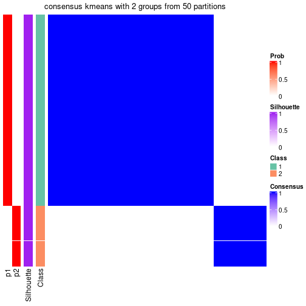</p>

</div>
<div id='tab-node-0711-consensus-heatmap-2'>
<pre><code class="r">consensus_heatmap(res, k = 3)
</code></pre>

<p>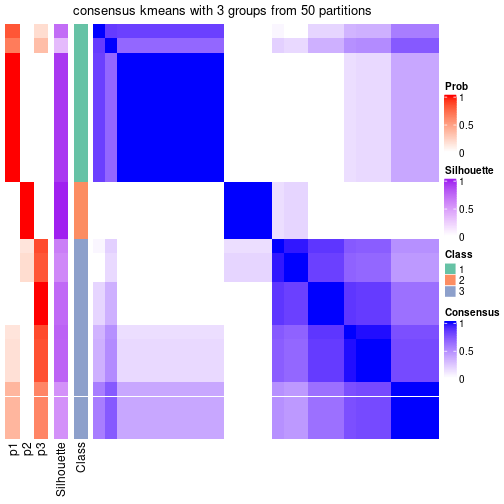</p>

</div>
<div id='tab-node-0711-consensus-heatmap-3'>
<pre><code class="r">consensus_heatmap(res, k = 4)
</code></pre>

<p>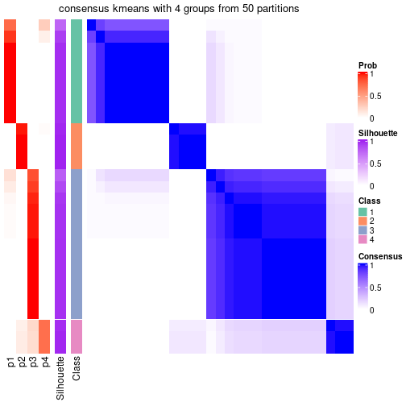</p>

</div>
<div id='tab-node-0711-consensus-heatmap-4'>
<pre><code class="r">consensus_heatmap(res, k = 5)
</code></pre>

<p>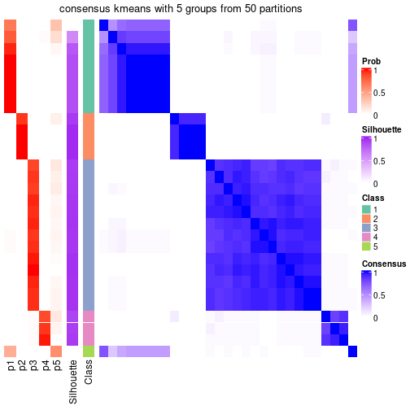</p>

</div>
<div id='tab-node-0711-consensus-heatmap-5'>
<pre><code class="r">consensus_heatmap(res, k = 6)
</code></pre>

<p>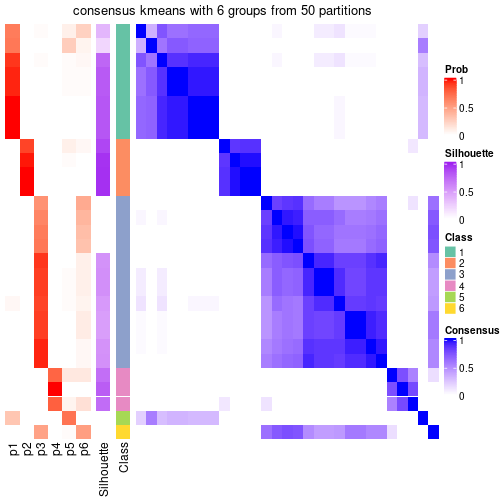</p>

</div>
<div id='tab-node-0711-consensus-heatmap-6'>
<pre><code class="r">consensus_heatmap(res, k = 7)
</code></pre>

<p>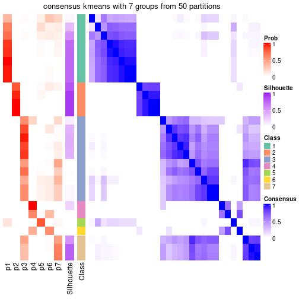</p>

</div>
<div id='tab-node-0711-consensus-heatmap-7'>
<pre><code class="r">consensus_heatmap(res, k = 8)
</code></pre>

<p>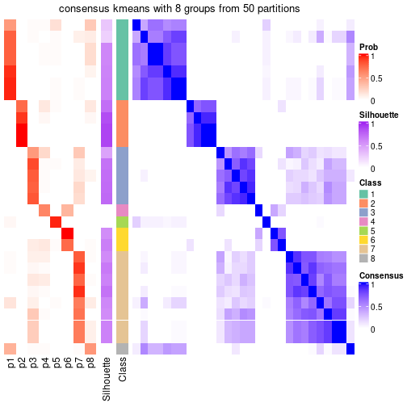</p>

</div>
</div>

Heatmaps for the membership of samples in all partitions to see how consistent they are:


<script>
$( function() {
	$( '#tabs-node-0711-membership-heatmap' ).tabs();
} );
</script>
<div id='tabs-node-0711-membership-heatmap'>
<ul>
<li><a href='#tab-node-0711-membership-heatmap-1'>k = 2</a></li>
<li><a href='#tab-node-0711-membership-heatmap-2'>k = 3</a></li>
<li><a href='#tab-node-0711-membership-heatmap-3'>k = 4</a></li>
<li><a href='#tab-node-0711-membership-heatmap-4'>k = 5</a></li>
<li><a href='#tab-node-0711-membership-heatmap-5'>k = 6</a></li>
<li><a href='#tab-node-0711-membership-heatmap-6'>k = 7</a></li>
<li><a href='#tab-node-0711-membership-heatmap-7'>k = 8</a></li>
</ul>
<div id='tab-node-0711-membership-heatmap-1'>
<pre><code class="r">membership_heatmap(res, k = 2)
</code></pre>

<p>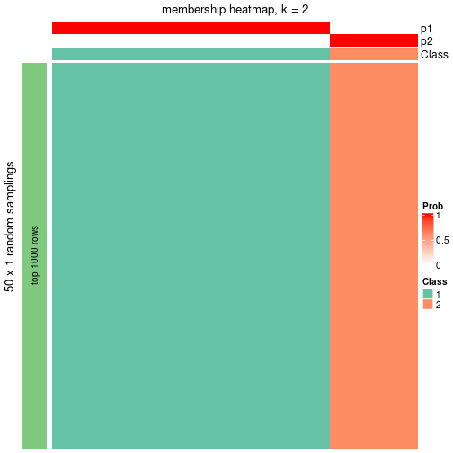</p>

</div>
<div id='tab-node-0711-membership-heatmap-2'>
<pre><code class="r">membership_heatmap(res, k = 3)
</code></pre>

<p>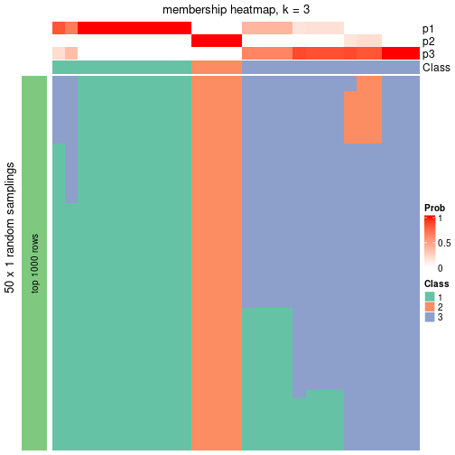</p>

</div>
<div id='tab-node-0711-membership-heatmap-3'>
<pre><code class="r">membership_heatmap(res, k = 4)
</code></pre>

<p>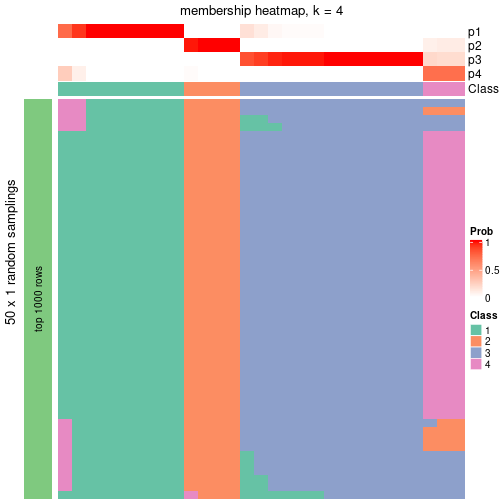</p>

</div>
<div id='tab-node-0711-membership-heatmap-4'>
<pre><code class="r">membership_heatmap(res, k = 5)
</code></pre>

<p>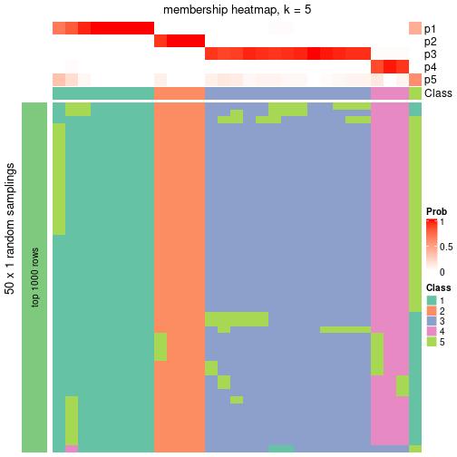</p>

</div>
<div id='tab-node-0711-membership-heatmap-5'>
<pre><code class="r">membership_heatmap(res, k = 6)
</code></pre>

<p>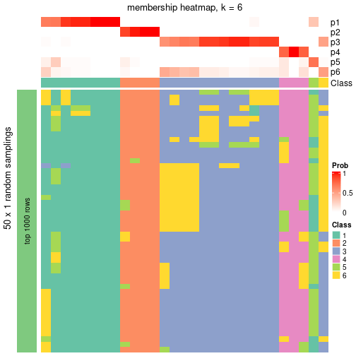</p>

</div>
<div id='tab-node-0711-membership-heatmap-6'>
<pre><code class="r">membership_heatmap(res, k = 7)
</code></pre>

<p>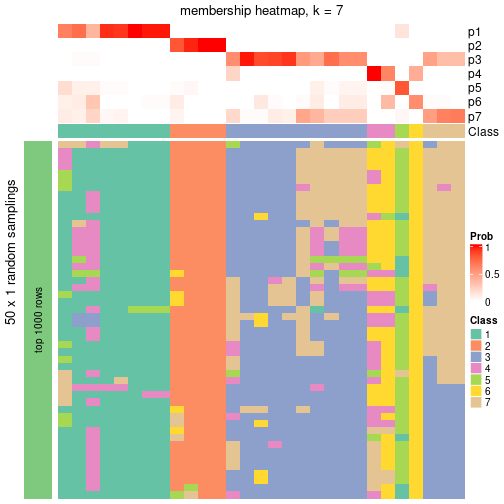</p>

</div>
<div id='tab-node-0711-membership-heatmap-7'>
<pre><code class="r">membership_heatmap(res, k = 8)
</code></pre>

<p>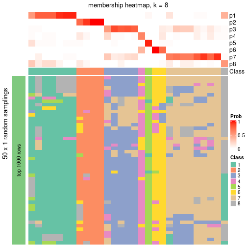</p>

</div>
</div>

As soon as the classes for columns are determined, the signatures
that are significantly different between subgroups can be looked for. 
Following are the heatmaps for signatures.


<script>
$( function() {
	$( '#tabs-node-0711-get-signatures' ).tabs();
} );
</script>
<div id='tabs-node-0711-get-signatures'>
<ul>
<li><a href='#tab-node-0711-get-signatures-1'>k = 2</a></li>
<li><a href='#tab-node-0711-get-signatures-2'>k = 3</a></li>
<li><a href='#tab-node-0711-get-signatures-3'>k = 4</a></li>
<li><a href='#tab-node-0711-get-signatures-4'>k = 5</a></li>
<li><a href='#tab-node-0711-get-signatures-5'>k = 6</a></li>
<li><a href='#tab-node-0711-get-signatures-6'>k = 7</a></li>
<li><a href='#tab-node-0711-get-signatures-7'>k = 8</a></li>
</ul>
<div id='tab-node-0711-get-signatures-1'>
<pre><code class="r">get_signatures(res, k = 2)
</code></pre>

<p>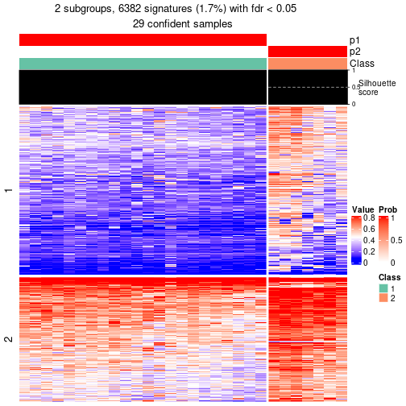</p>

</div>
<div id='tab-node-0711-get-signatures-2'>
<pre><code class="r">get_signatures(res, k = 3)
</code></pre>

<p>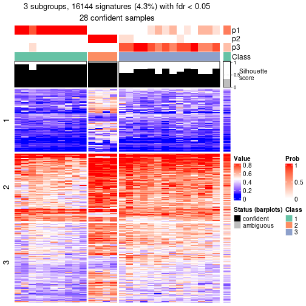</p>

</div>
<div id='tab-node-0711-get-signatures-3'>
<pre><code class="r">get_signatures(res, k = 4)
</code></pre>

<p>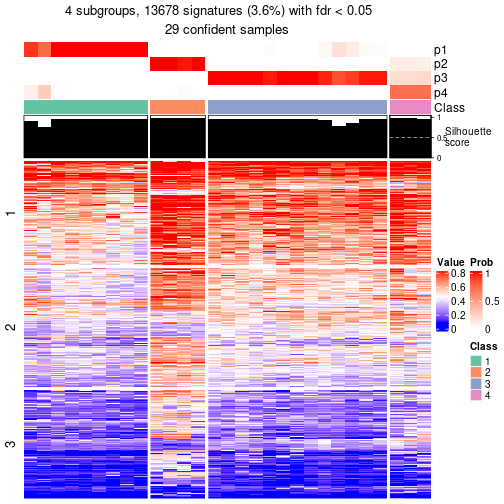</p>

</div>
<div id='tab-node-0711-get-signatures-4'>
<pre><code class="r">get_signatures(res, k = 5)
</code></pre>

<p>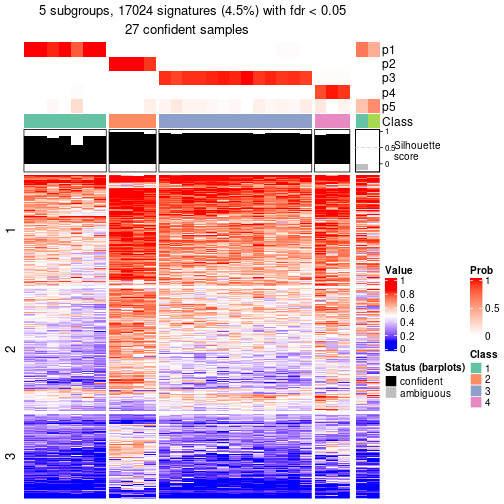</p>

</div>
<div id='tab-node-0711-get-signatures-5'>
<pre><code class="r">get_signatures(res, k = 6)
</code></pre>

<p>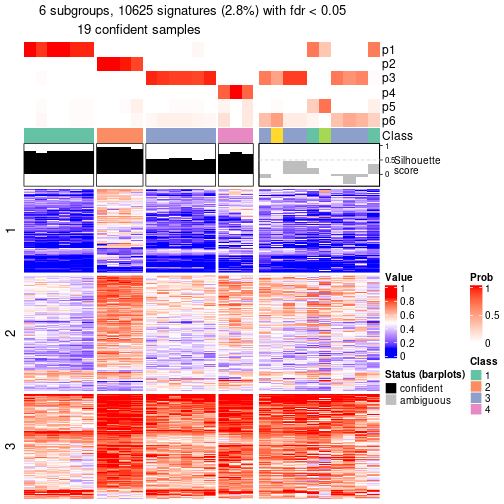</p>

</div>
<div id='tab-node-0711-get-signatures-6'>
<pre><code class="r">get_signatures(res, k = 7)
</code></pre>

<p>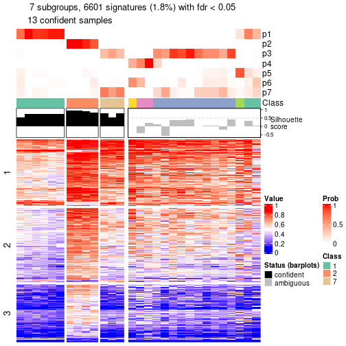</p>

</div>
<div id='tab-node-0711-get-signatures-7'>
<pre><code class="r">get_signatures(res, k = 8)
</code></pre>

<p>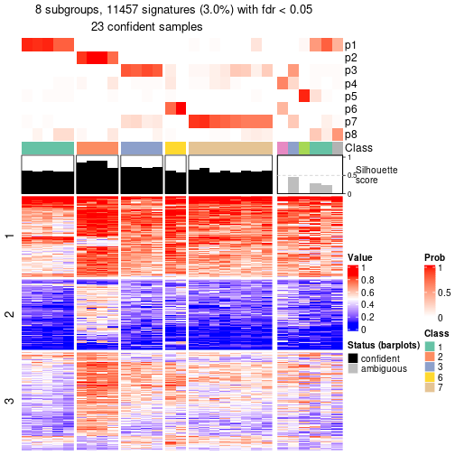</p>

</div>
</div>


Compare the overlap of signatures from different k:

```r
compare_signatures(res)
```

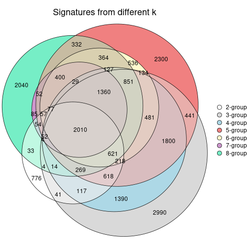

`get_signature()` returns a data frame invisibly. To get the list of signatures, the function
call should be assigned to a variable explicitly. In following code, if `plot` argument is set
to `FALSE`, no heatmap is plotted while only the differential analysis is performed.

```r
# code only for demonstration
tb = get_signature(res, k = ..., plot = FALSE)
```

An example of the output of `tb` is:

```
#>   which_row         fdr    mean_1    mean_2 scaled_mean_1 scaled_mean_2 km
#> 1        38 0.042760348  8.373488  9.131774    -0.5533452     0.5164555  1
#> 2        40 0.018707592  7.106213  8.469186    -0.6173731     0.5762149  1
#> 3        55 0.019134737 10.221463 11.207825    -0.6159697     0.5749050  1
#> 4        59 0.006059896  5.921854  7.869574    -0.6899429     0.6439467  1
#> 5        60 0.018055526  8.928898 10.211722    -0.6204761     0.5791110  1
#> 6        98 0.009384629 15.714769 14.887706     0.6635654    -0.6193277  2
...
```

The columns in `tb` are:

1. `which_row`: row indices corresponding to the input matrix.
2. `fdr`: FDR for the differential test. 
3. `mean_x`: The mean value in group x.
4. `scaled_mean_x`: The mean value in group x after rows are scaled.
5. `km`: Row groups if k-means clustering is applied to rows (which is done by automatically selecting number of clusters).

If there are too many signatures, `top_signatures = ...` can be set to only show the 
signatures with the highest FDRs:

```r
# code only for demonstration
# e.g. to show the top 500 most significant rows
tb = get_signature(res, k = ..., top_signatures = 500)
```

If the signatures are defined as these which are uniquely high in current group, `diff_method` argument
can be set to `"uniquely_high_in_one_group"`:

```r
# code only for demonstration
tb = get_signature(res, k = ..., diff_method = "uniquely_high_in_one_group")
```


UMAP plot which shows how samples are separated.


<script>
$( function() {
	$( '#tabs-node-0711-dimension-reduction' ).tabs();
} );
</script>
<div id='tabs-node-0711-dimension-reduction'>
<ul>
<li><a href='#tab-node-0711-dimension-reduction-1'>k = 2</a></li>
<li><a href='#tab-node-0711-dimension-reduction-2'>k = 3</a></li>
<li><a href='#tab-node-0711-dimension-reduction-3'>k = 4</a></li>
<li><a href='#tab-node-0711-dimension-reduction-4'>k = 5</a></li>
<li><a href='#tab-node-0711-dimension-reduction-5'>k = 6</a></li>
<li><a href='#tab-node-0711-dimension-reduction-6'>k = 7</a></li>
<li><a href='#tab-node-0711-dimension-reduction-7'>k = 8</a></li>
</ul>
<div id='tab-node-0711-dimension-reduction-1'>
<pre><code class="r">dimension_reduction(res, k = 2, method = &quot;UMAP&quot;)
</code></pre>

<p>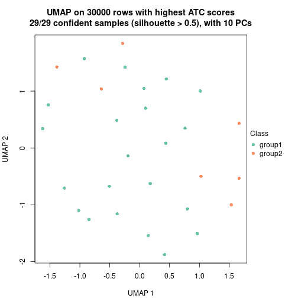</p>

</div>
<div id='tab-node-0711-dimension-reduction-2'>
<pre><code class="r">dimension_reduction(res, k = 3, method = &quot;UMAP&quot;)
</code></pre>

<p>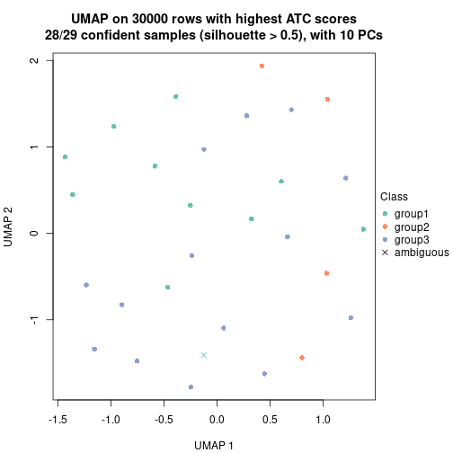</p>

</div>
<div id='tab-node-0711-dimension-reduction-3'>
<pre><code class="r">dimension_reduction(res, k = 4, method = &quot;UMAP&quot;)
</code></pre>

<p>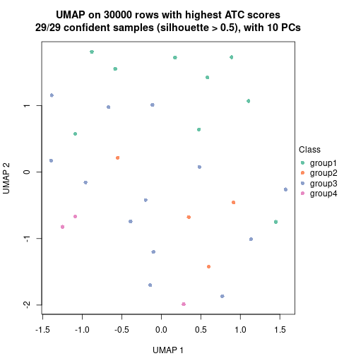</p>

</div>
<div id='tab-node-0711-dimension-reduction-4'>
<pre><code class="r">dimension_reduction(res, k = 5, method = &quot;UMAP&quot;)
</code></pre>

<p>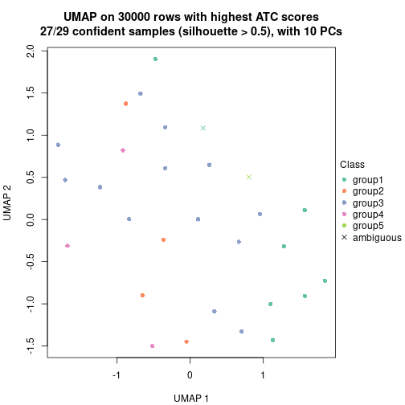</p>

</div>
<div id='tab-node-0711-dimension-reduction-5'>
<pre><code class="r">dimension_reduction(res, k = 6, method = &quot;UMAP&quot;)
</code></pre>

<p>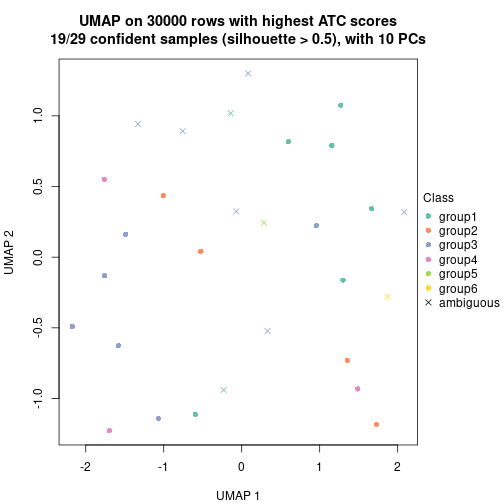</p>

</div>
<div id='tab-node-0711-dimension-reduction-6'>
<pre><code class="r">dimension_reduction(res, k = 7, method = &quot;UMAP&quot;)
</code></pre>

<p>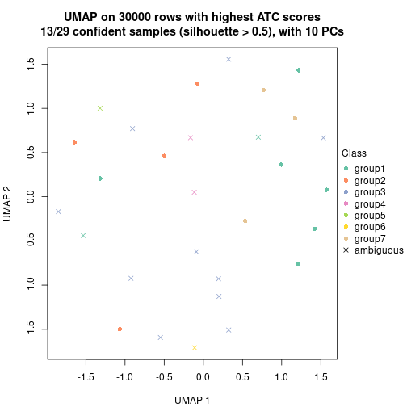</p>

</div>
<div id='tab-node-0711-dimension-reduction-7'>
<pre><code class="r">dimension_reduction(res, k = 8, method = &quot;UMAP&quot;)
</code></pre>

<p>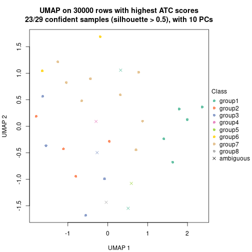</p>

</div>
</div>


Following heatmap shows how subgroups are split when increasing `k`:

```r
collect_classes(res)
```

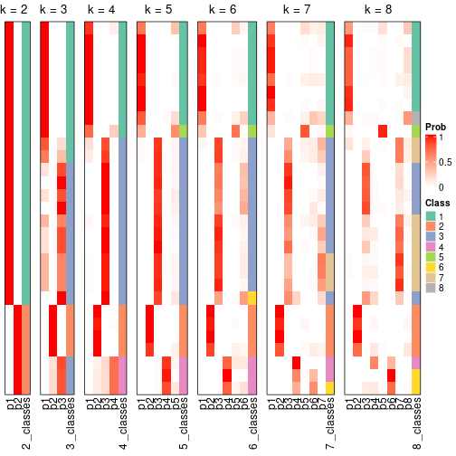


If matrix rows can be associated to genes, consider to use `functional_enrichment(res,
...)` to perform function enrichment for the signature genes. See [this vignette](https://jokergoo.github.io/cola_vignettes/functional_enrichment.html) for more detailed explanations.


 

---------------------------------------------------


### Node07111


Parent node: [Node0711](#Node0711).
Child nodes: 
                Node071111-leaf
        ,
                Node071112-leaf
        ,
                Node071113-leaf
        ,
                Node071114-leaf
        ,
                Node071115-leaf
        .


The object with results only for a single top-value method and a single partitioning method 
can be extracted as:

```r
res = res_rh["07111"]
```

A summary of `res` and all the functions that can be applied to it:

```r
res
```

```
#> A 'ConsensusPartition' object with k = 2, 3, 4, 5, 6, 7, 8.
#>   On a matrix with 30000 rows and 22 columns.
#>   Top rows (1000) are extracted by 'ATC' method.
#>   Subgroups are detected by 'skmeans' method.
#>   Performed in total 350 partitions by row resampling.
#>   Best k for subgroups seems to be 5.
#> 
#> Following methods can be applied to this 'ConsensusPartition' object:
#>  [1] "cola_report"             "collect_classes"         "collect_plots"          
#>  [4] "collect_stats"           "colnames"                "compare_partitions"     
#>  [7] "compare_signatures"      "consensus_heatmap"       "dimension_reduction"    
#> [10] "functional_enrichment"   "get_anno_col"            "get_anno"               
#> [13] "get_classes"             "get_consensus"           "get_matrix"             
#> [16] "get_membership"          "get_param"               "get_signatures"         
#> [19] "get_stats"               "is_best_k"               "is_stable_k"            
#> [22] "membership_heatmap"      "ncol"                    "nrow"                   
#> [25] "plot_ecdf"               "predict_classes"         "rownames"               
#> [28] "select_partition_number" "show"                    "suggest_best_k"         
#> [31] "test_to_known_factors"   "top_rows_heatmap"
```

`collect_plots()` function collects all the plots made from `res` for all `k` (number of subgroups)
into one single page to provide an easy and fast comparison between different `k`.

```r
collect_plots(res)
```

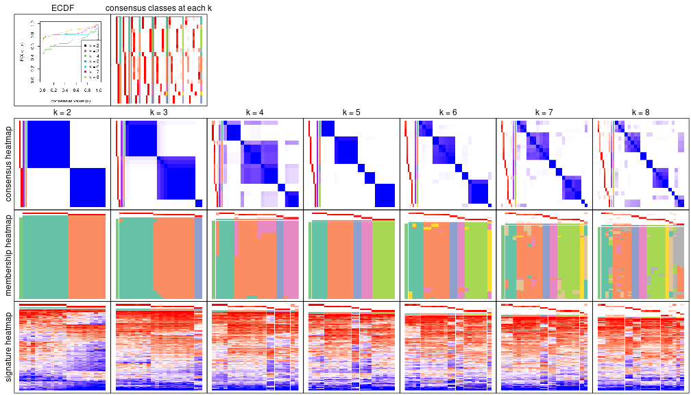

The plots are:

- The first row: a plot of the eCDF (empirical cumulative distribution
  function) curves of the consensus matrix for each `k` and the heatmap of
  predicted classes for each `k`.
- The second row: heatmaps of the consensus matrix for each `k`.
- The third row: heatmaps of the membership matrix for each `k`.
- The fouth row: heatmaps of the signatures for each `k`.

All the plots in panels can be made by individual functions and they are
plotted later in this section.

`select_partition_number()` produces several plots showing different
statistics for choosing "optimized" `k`. There are following statistics:

- eCDF curves of the consensus matrix for each `k`;
- 1-PAC. [The PAC score](https://en.wikipedia.org/wiki/Consensus_clustering#Over-interpretation_potential_of_consensus_clustering)
  measures the proportion of the ambiguous subgrouping.
- Mean silhouette score.
- Concordance. The mean probability of fiting the consensus subgroup labels in all
  partitions.
- Area increased. Denote $A_k$ as the area under the eCDF curve for current
  `k`, the area increased is defined as $A_k - A_{k-1}$.
- Rand index. The percent of pairs of samples that are both in a same cluster
  or both are not in a same cluster in the partition of k and k-1.
- Jaccard index. The ratio of pairs of samples are both in a same cluster in
  the partition of k and k-1 and the pairs of samples are both in a same
  cluster in the partition k or k-1.

The detailed explanations of these statistics can be found in [the _cola_
vignette](https://jokergoo.github.io/cola_vignettes/cola.html#toc_13).

Generally speaking, higher 1-PAC score, higher mean silhouette score or higher
concordance corresponds to better partition. Rand index and Jaccard index
measure how similar the current partition is compared to partition with `k-1`.
If they are too similar, we won't accept `k` is better than `k-1`.

```r
select_partition_number(res)
```

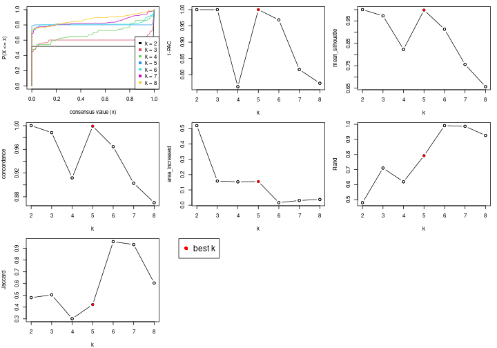

The numeric values for all these statistics can be obtained by `get_stats()`.

```r
get_stats(res)
```

```
#>   k 1-PAC mean_silhouette concordance area_increased  Rand Jaccard
#> 2 2 1.000           1.000       1.000         0.5200 0.481   0.481
#> 3 3 1.000           0.972       0.988         0.1579 0.710   0.504
#> 4 4 0.763           0.823       0.912         0.1529 0.619   0.302
#> 5 5 1.000           0.998       0.999         0.1545 0.792   0.422
#> 6 6 0.968           0.913       0.965         0.0165 0.991   0.957
#> 7 7 0.816           0.756       0.903         0.0308 0.987   0.932
#> 8 8 0.774           0.657       0.870         0.0374 0.926   0.605
```

`suggest_best_k()` suggests the best $k$ based on these statistics. The rules are as follows:

- All $k$ with Jaccard index larger than 0.95 are removed because increasing
  $k$ does not provide enough extra information. If all $k$ are removed, it is
  marked as no subgroup is detected.
- For all $k$ with 1-PAC score larger than 0.9, the maximal $k$ is taken as
  the best $k$, and other $k$ are marked as optional $k$.
- If it does not fit the second rule. The $k$ with the maximal vote of the
  highest 1-PAC score, highest mean silhouette, and highest concordance is
  taken as the best $k$.

```r
suggest_best_k(res)
```

```
#> [1] 5
#> attr(,"optional")
#> [1] 2 3
```

There is also optional best $k$ = 2 3 that is worth to check.

Following is the table of the partitions (You need to click the **show/hide
code output** link to see it). The membership matrix (columns with name `p*`)
is inferred by
[`clue::cl_consensus()`](https://www.rdocumentation.org/link/cl_consensus?package=clue)
function with the `SE` method. Basically the value in the membership matrix
represents the probability to belong to a certain group. The finall subgroup
label for an item is determined with the group with highest probability it
belongs to.

In `get_classes()` function, the entropy is calculated from the membership
matrix and the silhouette score is calculated from the consensus matrix.


<script>
$( function() {
	$( '#tabs-node-07111-get-classes' ).tabs();
} );
</script>
<div id='tabs-node-07111-get-classes'>
<ul>
<li><a href='#tab-node-07111-get-classes-1'>k = 2</a></li>
<li><a href='#tab-node-07111-get-classes-2'>k = 3</a></li>
<li><a href='#tab-node-07111-get-classes-3'>k = 4</a></li>
<li><a href='#tab-node-07111-get-classes-4'>k = 5</a></li>
<li><a href='#tab-node-07111-get-classes-5'>k = 6</a></li>
<li><a href='#tab-node-07111-get-classes-6'>k = 7</a></li>
<li><a href='#tab-node-07111-get-classes-7'>k = 8</a></li>
</ul>

<div id='tab-node-07111-get-classes-1'>
<p><a id='tab-node-07111-get-classes-1-a' style='color:#0366d6' href='#'>show/hide code output</a></p>
<pre><code class="r">cbind(get_classes(res, k = 2), get_membership(res, k = 2))
</code></pre>

<pre><code>#&gt;                 class entropy silhouette p1 p2
#&gt; TCGA.55.7910.01     2       0          1  0  1
#&gt; TCGA.86.7954.01     2       0          1  0  1
#&gt; TCGA.44.A479.01     1       0          1  1  0
#&gt; TCGA.55.8096.01     1       0          1  1  0
#&gt; TCGA.55.7913.01     1       0          1  1  0
#&gt; TCGA.L9.A5IP.01     1       0          1  1  0
#&gt; TCGA.49.4490.01     2       0          1  0  1
#&gt; TCGA.91.6840.01     2       0          1  0  1
#&gt; TCGA.91.6830.01     1       0          1  1  0
#&gt; TCGA.49.6743.01     1       0          1  1  0
#&gt; TCGA.44.A4SU.01     2       0          1  0  1
#&gt; TCGA.L9.A8F4.01     1       0          1  1  0
#&gt; TCGA.J2.A4AD.01     1       0          1  1  0
#&gt; TCGA.86.8075.01     2       0          1  0  1
#&gt; TCGA.49.4514.01     1       0          1  1  0
#&gt; TCGA.O1.A52J.01     2       0          1  0  1
#&gt; TCGA.4B.A93V.01     2       0          1  0  1
#&gt; TCGA.MP.A4TA.01     1       0          1  1  0
#&gt; TCGA.64.1679.01     1       0          1  1  0
#&gt; TCGA.64.1681.01     2       0          1  0  1
#&gt; TCGA.86.7953.01     1       0          1  1  0
#&gt; TCGA.J2.8192.01     2       0          1  0  1
</code></pre>

<script>
$('#tab-node-07111-get-classes-1-a').parent().next().next().hide();
$('#tab-node-07111-get-classes-1-a').click(function(){
  $('#tab-node-07111-get-classes-1-a').parent().next().next().toggle();
  return(false);
});
</script>
</div>

<div id='tab-node-07111-get-classes-2'>
<p><a id='tab-node-07111-get-classes-2-a' style='color:#0366d6' href='#'>show/hide code output</a></p>
<pre><code class="r">cbind(get_classes(res, k = 3), get_membership(res, k = 3))
</code></pre>

<pre><code>#&gt;                 class entropy silhouette   p1   p2 p3
#&gt; TCGA.55.7910.01     3  0.0000      1.000 0.00 0.00  1
#&gt; TCGA.86.7954.01     2  0.0000      0.973 0.00 1.00  0
#&gt; TCGA.44.A479.01     1  0.0000      0.993 1.00 0.00  0
#&gt; TCGA.55.8096.01     2  0.0892      0.960 0.02 0.98  0
#&gt; TCGA.55.7913.01     1  0.0000      0.993 1.00 0.00  0
#&gt; TCGA.L9.A5IP.01     1  0.0000      0.993 1.00 0.00  0
#&gt; TCGA.49.4490.01     2  0.0000      0.973 0.00 1.00  0
#&gt; TCGA.91.6840.01     2  0.0000      0.973 0.00 1.00  0
#&gt; TCGA.91.6830.01     2  0.2066      0.924 0.06 0.94  0
#&gt; TCGA.49.6743.01     1  0.0000      0.993 1.00 0.00  0
#&gt; TCGA.44.A4SU.01     2  0.0000      0.973 0.00 1.00  0
#&gt; TCGA.L9.A8F4.01     1  0.0000      0.993 1.00 0.00  0
#&gt; TCGA.J2.A4AD.01     1  0.0000      0.993 1.00 0.00  0
#&gt; TCGA.86.8075.01     2  0.0000      0.973 0.00 1.00  0
#&gt; TCGA.49.4514.01     1  0.0000      0.993 1.00 0.00  0
#&gt; TCGA.O1.A52J.01     2  0.0000      0.973 0.00 1.00  0
#&gt; TCGA.4B.A93V.01     3  0.0000      1.000 0.00 0.00  1
#&gt; TCGA.MP.A4TA.01     1  0.0000      0.993 1.00 0.00  0
#&gt; TCGA.64.1679.01     2  0.3686      0.830 0.14 0.86  0
#&gt; TCGA.64.1681.01     2  0.0000      0.973 0.00 1.00  0
#&gt; TCGA.86.7953.01     1  0.1529      0.945 0.96 0.04  0
#&gt; TCGA.J2.8192.01     2  0.0000      0.973 0.00 1.00  0
</code></pre>

<script>
$('#tab-node-07111-get-classes-2-a').parent().next().next().hide();
$('#tab-node-07111-get-classes-2-a').click(function(){
  $('#tab-node-07111-get-classes-2-a').parent().next().next().toggle();
  return(false);
});
</script>
</div>

<div id='tab-node-07111-get-classes-3'>
<p><a id='tab-node-07111-get-classes-3-a' style='color:#0366d6' href='#'>show/hide code output</a></p>
<pre><code class="r">cbind(get_classes(res, k = 4), get_membership(res, k = 4))
</code></pre>

<pre><code>#&gt;                 class entropy silhouette   p1   p2 p3   p4
#&gt; TCGA.55.7910.01     3   0.000      1.000 0.00 0.00  1 0.00
#&gt; TCGA.86.7954.01     2   0.317      0.839 0.00 0.84  0 0.16
#&gt; TCGA.44.A479.01     2   0.000      0.833 0.00 1.00  0 0.00
#&gt; TCGA.55.8096.01     2   0.317      0.839 0.00 0.84  0 0.16
#&gt; TCGA.55.7913.01     2   0.121      0.816 0.04 0.96  0 0.00
#&gt; TCGA.L9.A5IP.01     1   0.000      0.841 1.00 0.00  0 0.00
#&gt; TCGA.49.4490.01     2   0.380      0.786 0.00 0.78  0 0.22
#&gt; TCGA.91.6840.01     4   0.000      0.982 0.00 0.00  0 1.00
#&gt; TCGA.91.6830.01     2   0.317      0.839 0.00 0.84  0 0.16
#&gt; TCGA.49.6743.01     1   0.000      0.841 1.00 0.00  0 0.00
#&gt; TCGA.44.A4SU.01     4   0.121      0.945 0.00 0.04  0 0.96
#&gt; TCGA.L9.A8F4.01     2   0.121      0.816 0.04 0.96  0 0.00
#&gt; TCGA.J2.A4AD.01     1   0.000      0.841 1.00 0.00  0 0.00
#&gt; TCGA.86.8075.01     2   0.317      0.839 0.00 0.84  0 0.16
#&gt; TCGA.49.4514.01     2   0.121      0.816 0.04 0.96  0 0.00
#&gt; TCGA.O1.A52J.01     4   0.000      0.982 0.00 0.00  0 1.00
#&gt; TCGA.4B.A93V.01     3   0.000      1.000 0.00 0.00  1 0.00
#&gt; TCGA.MP.A4TA.01     1   0.498      0.267 0.54 0.46  0 0.00
#&gt; TCGA.64.1679.01     1   0.000      0.841 1.00 0.00  0 0.00
#&gt; TCGA.64.1681.01     4   0.000      0.982 0.00 0.00  0 1.00
#&gt; TCGA.86.7953.01     2   0.000      0.833 0.00 1.00  0 0.00
#&gt; TCGA.J2.8192.01     2   0.498      0.328 0.00 0.54  0 0.46
</code></pre>

<script>
$('#tab-node-07111-get-classes-3-a').parent().next().next().hide();
$('#tab-node-07111-get-classes-3-a').click(function(){
  $('#tab-node-07111-get-classes-3-a').parent().next().next().toggle();
  return(false);
});
</script>
</div>

<div id='tab-node-07111-get-classes-4'>
<p><a id='tab-node-07111-get-classes-4-a' style='color:#0366d6' href='#'>show/hide code output</a></p>
<pre><code class="r">cbind(get_classes(res, k = 5), get_membership(res, k = 5))
</code></pre>

<pre><code>#&gt;                 class entropy silhouette p1   p2 p3   p4 p5
#&gt; TCGA.55.7910.01     3  0.0000      1.000  0 0.00  1 0.00  0
#&gt; TCGA.86.7954.01     2  0.0000      0.996  0 1.00  0 0.00  0
#&gt; TCGA.44.A479.01     5  0.0000      1.000  0 0.00  0 0.00  1
#&gt; TCGA.55.8096.01     2  0.0000      0.996  0 1.00  0 0.00  0
#&gt; TCGA.55.7913.01     5  0.0000      1.000  0 0.00  0 0.00  1
#&gt; TCGA.L9.A5IP.01     1  0.0000      1.000  1 0.00  0 0.00  0
#&gt; TCGA.49.4490.01     2  0.0000      0.996  0 1.00  0 0.00  0
#&gt; TCGA.91.6840.01     4  0.0000      1.000  0 0.00  0 1.00  0
#&gt; TCGA.91.6830.01     2  0.0000      0.996  0 1.00  0 0.00  0
#&gt; TCGA.49.6743.01     1  0.0000      1.000  1 0.00  0 0.00  0
#&gt; TCGA.44.A4SU.01     2  0.0609      0.979  0 0.98  0 0.02  0
#&gt; TCGA.L9.A8F4.01     5  0.0000      1.000  0 0.00  0 0.00  1
#&gt; TCGA.J2.A4AD.01     1  0.0000      1.000  1 0.00  0 0.00  0
#&gt; TCGA.86.8075.01     2  0.0000      0.996  0 1.00  0 0.00  0
#&gt; TCGA.49.4514.01     5  0.0000      1.000  0 0.00  0 0.00  1
#&gt; TCGA.O1.A52J.01     4  0.0000      1.000  0 0.00  0 1.00  0
#&gt; TCGA.4B.A93V.01     3  0.0000      1.000  0 0.00  1 0.00  0
#&gt; TCGA.MP.A4TA.01     5  0.0000      1.000  0 0.00  0 0.00  1
#&gt; TCGA.64.1679.01     1  0.0000      1.000  1 0.00  0 0.00  0
#&gt; TCGA.64.1681.01     4  0.0000      1.000  0 0.00  0 1.00  0
#&gt; TCGA.86.7953.01     5  0.0000      1.000  0 0.00  0 0.00  1
#&gt; TCGA.J2.8192.01     2  0.0000      0.996  0 1.00  0 0.00  0
</code></pre>

<script>
$('#tab-node-07111-get-classes-4-a').parent().next().next().hide();
$('#tab-node-07111-get-classes-4-a').click(function(){
  $('#tab-node-07111-get-classes-4-a').parent().next().next().toggle();
  return(false);
});
</script>
</div>

<div id='tab-node-07111-get-classes-5'>
<p><a id='tab-node-07111-get-classes-5-a' style='color:#0366d6' href='#'>show/hide code output</a></p>
<pre><code class="r">cbind(get_classes(res, k = 6), get_membership(res, k = 6))
</code></pre>

<pre><code>#&gt;                 class entropy silhouette   p1   p2 p3   p4   p5   p6
#&gt; TCGA.55.7910.01     3  0.0000      1.000 0.00 0.00  1 0.00 0.00 0.00
#&gt; TCGA.86.7954.01     2  0.1865      0.920 0.00 0.92  0 0.04 0.00 0.04
#&gt; TCGA.44.A479.01     5  0.0000      0.983 0.00 0.00  0 0.00 1.00 0.00
#&gt; TCGA.55.8096.01     2  0.0937      0.941 0.00 0.96  0 0.00 0.00 0.04
#&gt; TCGA.55.7913.01     5  0.0000      0.983 0.00 0.00  0 0.00 1.00 0.00
#&gt; TCGA.L9.A5IP.01     1  0.1814      0.895 0.90 0.00  0 0.00 0.00 0.10
#&gt; TCGA.49.4490.01     2  0.0000      0.951 0.00 1.00  0 0.00 0.00 0.00
#&gt; TCGA.91.6840.01     6  0.2631      0.000 0.00 0.00  0 0.18 0.00 0.82
#&gt; TCGA.91.6830.01     2  0.1480      0.929 0.02 0.94  0 0.00 0.00 0.04
#&gt; TCGA.49.6743.01     1  0.0000      0.946 1.00 0.00  0 0.00 0.00 0.00
#&gt; TCGA.44.A4SU.01     2  0.0547      0.945 0.00 0.98  0 0.02 0.00 0.00
#&gt; TCGA.L9.A8F4.01     5  0.0000      0.983 0.00 0.00  0 0.00 1.00 0.00
#&gt; TCGA.J2.A4AD.01     1  0.0000      0.946 1.00 0.00  0 0.00 0.00 0.00
#&gt; TCGA.86.8075.01     2  0.1865      0.920 0.00 0.92  0 0.04 0.00 0.04
#&gt; TCGA.49.4514.01     5  0.0000      0.983 0.00 0.00  0 0.00 1.00 0.00
#&gt; TCGA.O1.A52J.01     4  0.0937      1.000 0.00 0.04  0 0.96 0.00 0.00
#&gt; TCGA.4B.A93V.01     3  0.0000      1.000 0.00 0.00  1 0.00 0.00 0.00
#&gt; TCGA.MP.A4TA.01     5  0.0000      0.983 0.00 0.00  0 0.00 1.00 0.00
#&gt; TCGA.64.1679.01     1  0.1480      0.913 0.94 0.02  0 0.00 0.00 0.04
#&gt; TCGA.64.1681.01     4  0.0937      1.000 0.00 0.04  0 0.96 0.00 0.00
#&gt; TCGA.86.7953.01     5  0.1865      0.910 0.00 0.00  0 0.04 0.92 0.04
#&gt; TCGA.J2.8192.01     2  0.0000      0.951 0.00 1.00  0 0.00 0.00 0.00
</code></pre>

<script>
$('#tab-node-07111-get-classes-5-a').parent().next().next().hide();
$('#tab-node-07111-get-classes-5-a').click(function(){
  $('#tab-node-07111-get-classes-5-a').parent().next().next().toggle();
  return(false);
});
</script>
</div>

<div id='tab-node-07111-get-classes-6'>
<p><a id='tab-node-07111-get-classes-6-a' style='color:#0366d6' href='#'>show/hide code output</a></p>
<pre><code class="r">cbind(get_classes(res, k = 7), get_membership(res, k = 7))
</code></pre>

<pre><code>#&gt;                 class entropy silhouette   p1   p2 p3   p4   p5   p6   p7
#&gt; TCGA.55.7910.01     3  0.0000      1.000 0.00 0.00  1 0.00 0.00 0.00 0.00
#&gt; TCGA.86.7954.01     2  0.3228      0.775 0.00 0.80  0 0.02 0.00 0.02 0.16
#&gt; TCGA.44.A479.01     5  0.1166      0.910 0.00 0.00  0 0.00 0.94 0.00 0.06
#&gt; TCGA.55.8096.01     2  0.1433      0.827 0.00 0.92  0 0.00 0.00 0.00 0.08
#&gt; TCGA.55.7913.01     5  0.1166      0.894 0.00 0.00  0 0.00 0.94 0.00 0.06
#&gt; TCGA.L9.A5IP.01     7  0.3459      0.000 0.40 0.00  0 0.00 0.00 0.00 0.60
#&gt; TCGA.49.4490.01     2  0.0504      0.845 0.00 0.98  0 0.00 0.00 0.00 0.02
#&gt; TCGA.91.6840.01     6  0.0504      0.000 0.00 0.00  0 0.02 0.00 0.98 0.00
#&gt; TCGA.91.6830.01     2  0.3199      0.739 0.06 0.80  0 0.00 0.00 0.00 0.14
#&gt; TCGA.49.6743.01     1  0.1363      0.633 0.94 0.00  0 0.00 0.02 0.00 0.04
#&gt; TCGA.44.A4SU.01     2  0.2422      0.750 0.00 0.82  0 0.18 0.00 0.00 0.00
#&gt; TCGA.L9.A8F4.01     5  0.1166      0.910 0.00 0.00  0 0.00 0.94 0.00 0.06
#&gt; TCGA.J2.A4AD.01     1  0.0000      0.671 1.00 0.00  0 0.00 0.00 0.00 0.00
#&gt; TCGA.86.8075.01     2  0.3055      0.788 0.00 0.82  0 0.02 0.00 0.02 0.14
#&gt; TCGA.49.4514.01     5  0.0000      0.911 0.00 0.00  0 0.00 1.00 0.00 0.00
#&gt; TCGA.O1.A52J.01     4  0.0504      1.000 0.00 0.02  0 0.98 0.00 0.00 0.00
#&gt; TCGA.4B.A93V.01     3  0.0000      1.000 0.00 0.00  1 0.00 0.00 0.00 0.00
#&gt; TCGA.MP.A4TA.01     5  0.0000      0.911 0.00 0.00  0 0.00 1.00 0.00 0.00
#&gt; TCGA.64.1679.01     1  0.3867      0.508 0.74 0.12  0 0.00 0.00 0.00 0.14
#&gt; TCGA.64.1681.01     4  0.0504      1.000 0.00 0.02  0 0.98 0.00 0.00 0.00
#&gt; TCGA.86.7953.01     5  0.3887      0.715 0.00 0.00  0 0.02 0.70 0.02 0.26
#&gt; TCGA.J2.8192.01     2  0.0504      0.845 0.00 0.98  0 0.02 0.00 0.00 0.00
</code></pre>

<script>
$('#tab-node-07111-get-classes-6-a').parent().next().next().hide();
$('#tab-node-07111-get-classes-6-a').click(function(){
  $('#tab-node-07111-get-classes-6-a').parent().next().next().toggle();
  return(false);
});
</script>
</div>

<div id='tab-node-07111-get-classes-7'>
<p><a id='tab-node-07111-get-classes-7-a' style='color:#0366d6' href='#'>show/hide code output</a></p>
<pre><code class="r">cbind(get_classes(res, k = 8), get_membership(res, k = 8))
</code></pre>

<pre><code>#&gt;                 class entropy silhouette   p1   p2 p3  p4   p5 p6   p7   p8
#&gt; TCGA.55.7910.01     3  0.0000      1.000 0.00 0.00  1 0.0 0.00  0 0.00 0.00
#&gt; TCGA.86.7954.01     8  0.0000      0.496 0.00 0.00  0 0.0 0.00  0 0.00 1.00
#&gt; TCGA.44.A479.01     5  0.0471      0.906 0.00 0.02  0 0.0 0.98  0 0.00 0.00
#&gt; TCGA.55.8096.01     2  0.3690      0.774 0.00 0.56  0 0.0 0.00  0 0.02 0.42
#&gt; TCGA.55.7913.01     5  0.2818      0.773 0.00 0.12  0 0.0 0.82  0 0.06 0.00
#&gt; TCGA.L9.A5IP.01     7  0.2114      0.000 0.16 0.00  0 0.0 0.00  0 0.84 0.00
#&gt; TCGA.49.4490.01     2  0.3318      0.776 0.00 0.54  0 0.0 0.00  0 0.00 0.46
#&gt; TCGA.91.6840.01     6  0.0000      0.000 0.00 0.00  0 0.0 0.00  1 0.00 0.00
#&gt; TCGA.91.6830.01     2  0.5171      0.694 0.06 0.54  0 0.0 0.02  0 0.04 0.34
#&gt; TCGA.49.6743.01     1  0.5124      0.302 0.62 0.10  0 0.0 0.18  0 0.10 0.00
#&gt; TCGA.44.A4SU.01     2  0.5622      0.536 0.00 0.46  0 0.2 0.00  0 0.04 0.30
#&gt; TCGA.L9.A8F4.01     5  0.0471      0.906 0.00 0.02  0 0.0 0.98  0 0.00 0.00
#&gt; TCGA.J2.A4AD.01     1  0.0000      0.584 1.00 0.00  0 0.0 0.00  0 0.00 0.00
#&gt; TCGA.86.8075.01     8  0.0471      0.469 0.00 0.02  0 0.0 0.00  0 0.00 0.98
#&gt; TCGA.49.4514.01     5  0.0808      0.897 0.00 0.04  0 0.0 0.96  0 0.00 0.00
#&gt; TCGA.O1.A52J.01     4  0.0000      1.000 0.00 0.00  0 1.0 0.00  0 0.00 0.00
#&gt; TCGA.4B.A93V.01     3  0.0000      1.000 0.00 0.00  1 0.0 0.00  0 0.00 0.00
#&gt; TCGA.MP.A4TA.01     5  0.1563      0.857 0.00 0.10  0 0.0 0.90  0 0.00 0.00
#&gt; TCGA.64.1679.01     1  0.2994      0.543 0.80 0.14  0 0.0 0.00  0 0.06 0.00
#&gt; TCGA.64.1681.01     4  0.0000      1.000 0.00 0.00  0 1.0 0.00  0 0.00 0.00
#&gt; TCGA.86.7953.01     8  0.5674      0.175 0.00 0.20  0 0.0 0.24  0 0.06 0.50
#&gt; TCGA.J2.8192.01     2  0.3971      0.763 0.00 0.54  0 0.0 0.00  0 0.04 0.42
</code></pre>

<script>
$('#tab-node-07111-get-classes-7-a').parent().next().next().hide();
$('#tab-node-07111-get-classes-7-a').click(function(){
  $('#tab-node-07111-get-classes-7-a').parent().next().next().toggle();
  return(false);
});
</script>
</div>
</div>

Heatmaps for the consensus matrix. It visualizes the probability of two
samples to be in a same group.


<script>
$( function() {
	$( '#tabs-node-07111-consensus-heatmap' ).tabs();
} );
</script>
<div id='tabs-node-07111-consensus-heatmap'>
<ul>
<li><a href='#tab-node-07111-consensus-heatmap-1'>k = 2</a></li>
<li><a href='#tab-node-07111-consensus-heatmap-2'>k = 3</a></li>
<li><a href='#tab-node-07111-consensus-heatmap-3'>k = 4</a></li>
<li><a href='#tab-node-07111-consensus-heatmap-4'>k = 5</a></li>
<li><a href='#tab-node-07111-consensus-heatmap-5'>k = 6</a></li>
<li><a href='#tab-node-07111-consensus-heatmap-6'>k = 7</a></li>
<li><a href='#tab-node-07111-consensus-heatmap-7'>k = 8</a></li>
</ul>
<div id='tab-node-07111-consensus-heatmap-1'>
<pre><code class="r">consensus_heatmap(res, k = 2)
</code></pre>

<p>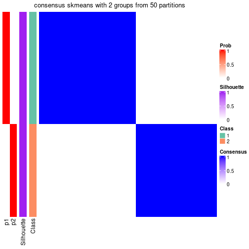</p>

</div>
<div id='tab-node-07111-consensus-heatmap-2'>
<pre><code class="r">consensus_heatmap(res, k = 3)
</code></pre>

<p>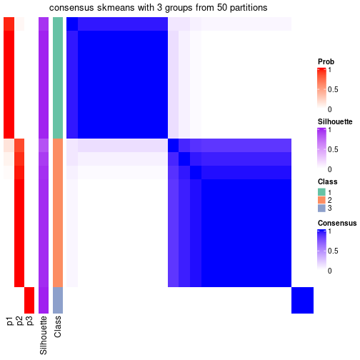</p>

</div>
<div id='tab-node-07111-consensus-heatmap-3'>
<pre><code class="r">consensus_heatmap(res, k = 4)
</code></pre>

<p>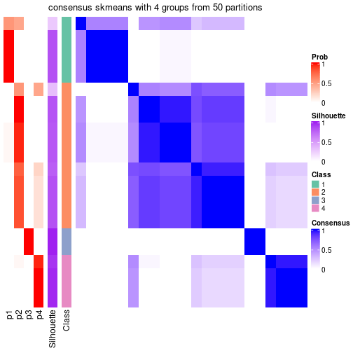</p>

</div>
<div id='tab-node-07111-consensus-heatmap-4'>
<pre><code class="r">consensus_heatmap(res, k = 5)
</code></pre>

<p>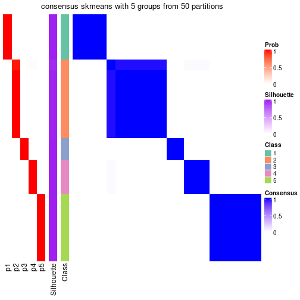</p>

</div>
<div id='tab-node-07111-consensus-heatmap-5'>
<pre><code class="r">consensus_heatmap(res, k = 6)
</code></pre>

<p>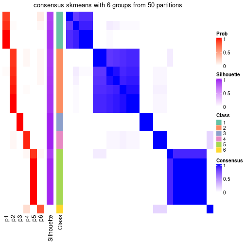</p>

</div>
<div id='tab-node-07111-consensus-heatmap-6'>
<pre><code class="r">consensus_heatmap(res, k = 7)
</code></pre>

<p>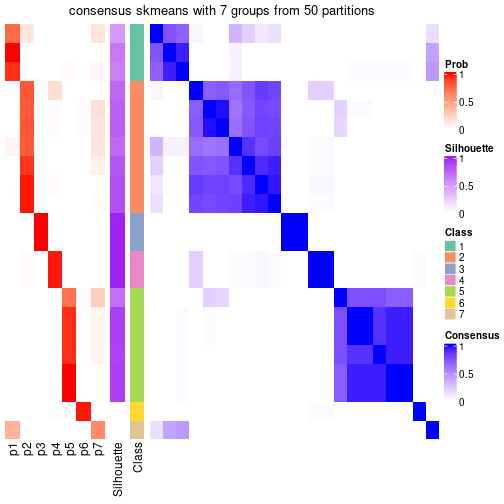</p>

</div>
<div id='tab-node-07111-consensus-heatmap-7'>
<pre><code class="r">consensus_heatmap(res, k = 8)
</code></pre>

<p>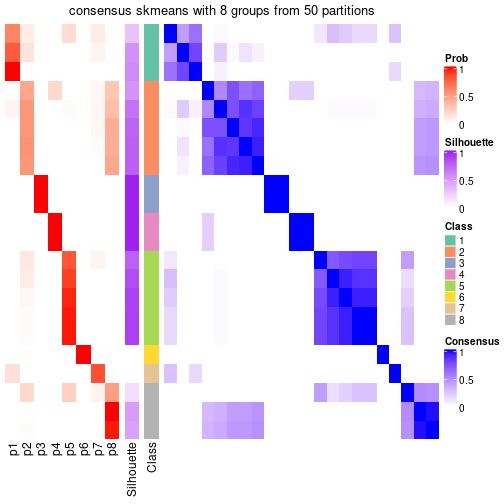</p>

</div>
</div>

Heatmaps for the membership of samples in all partitions to see how consistent they are:


<script>
$( function() {
	$( '#tabs-node-07111-membership-heatmap' ).tabs();
} );
</script>
<div id='tabs-node-07111-membership-heatmap'>
<ul>
<li><a href='#tab-node-07111-membership-heatmap-1'>k = 2</a></li>
<li><a href='#tab-node-07111-membership-heatmap-2'>k = 3</a></li>
<li><a href='#tab-node-07111-membership-heatmap-3'>k = 4</a></li>
<li><a href='#tab-node-07111-membership-heatmap-4'>k = 5</a></li>
<li><a href='#tab-node-07111-membership-heatmap-5'>k = 6</a></li>
<li><a href='#tab-node-07111-membership-heatmap-6'>k = 7</a></li>
<li><a href='#tab-node-07111-membership-heatmap-7'>k = 8</a></li>
</ul>
<div id='tab-node-07111-membership-heatmap-1'>
<pre><code class="r">membership_heatmap(res, k = 2)
</code></pre>

<p>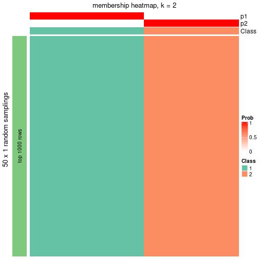</p>

</div>
<div id='tab-node-07111-membership-heatmap-2'>
<pre><code class="r">membership_heatmap(res, k = 3)
</code></pre>

<p>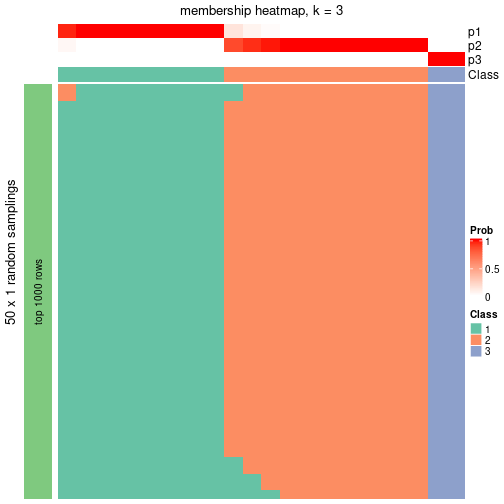</p>

</div>
<div id='tab-node-07111-membership-heatmap-3'>
<pre><code class="r">membership_heatmap(res, k = 4)
</code></pre>

<p>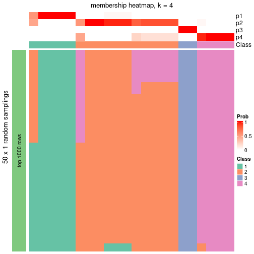</p>

</div>
<div id='tab-node-07111-membership-heatmap-4'>
<pre><code class="r">membership_heatmap(res, k = 5)
</code></pre>

<p>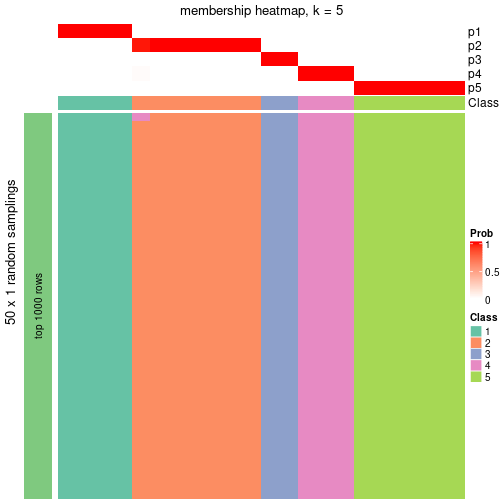</p>

</div>
<div id='tab-node-07111-membership-heatmap-5'>
<pre><code class="r">membership_heatmap(res, k = 6)
</code></pre>

<p>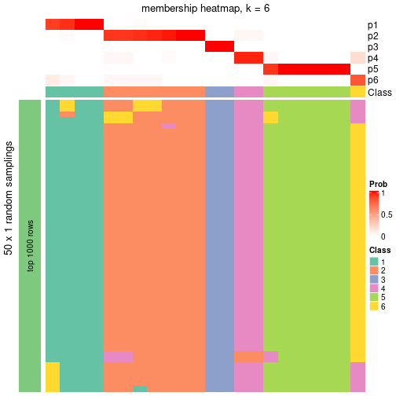</p>

</div>
<div id='tab-node-07111-membership-heatmap-6'>
<pre><code class="r">membership_heatmap(res, k = 7)
</code></pre>

<p>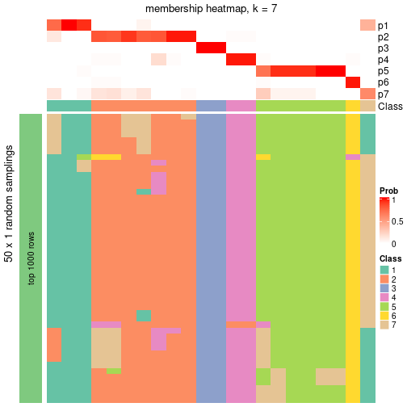</p>

</div>
<div id='tab-node-07111-membership-heatmap-7'>
<pre><code class="r">membership_heatmap(res, k = 8)
</code></pre>

<p>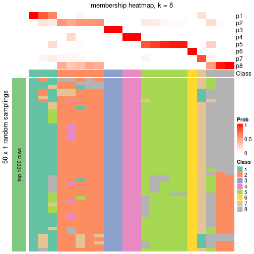</p>

</div>
</div>

As soon as the classes for columns are determined, the signatures
that are significantly different between subgroups can be looked for. 
Following are the heatmaps for signatures.


<script>
$( function() {
	$( '#tabs-node-07111-get-signatures' ).tabs();
} );
</script>
<div id='tabs-node-07111-get-signatures'>
<ul>
<li><a href='#tab-node-07111-get-signatures-1'>k = 2</a></li>
<li><a href='#tab-node-07111-get-signatures-2'>k = 3</a></li>
<li><a href='#tab-node-07111-get-signatures-3'>k = 4</a></li>
<li><a href='#tab-node-07111-get-signatures-4'>k = 5</a></li>
<li><a href='#tab-node-07111-get-signatures-5'>k = 6</a></li>
<li><a href='#tab-node-07111-get-signatures-6'>k = 7</a></li>
<li><a href='#tab-node-07111-get-signatures-7'>k = 8</a></li>
</ul>
<div id='tab-node-07111-get-signatures-1'>
<pre><code class="r">get_signatures(res, k = 2)
</code></pre>

<p>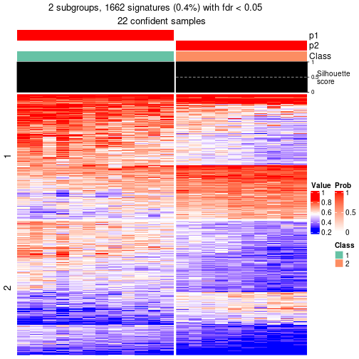</p>

</div>
<div id='tab-node-07111-get-signatures-2'>
<pre><code class="r">get_signatures(res, k = 3)
</code></pre>

<p>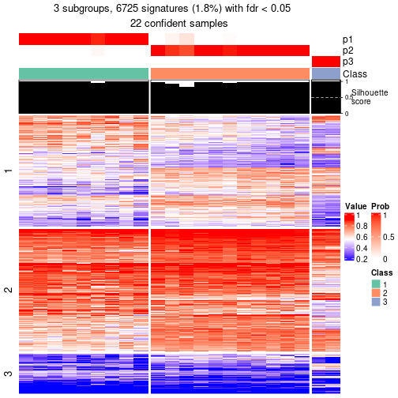</p>

</div>
<div id='tab-node-07111-get-signatures-3'>
<pre><code class="r">get_signatures(res, k = 4)
</code></pre>

<p>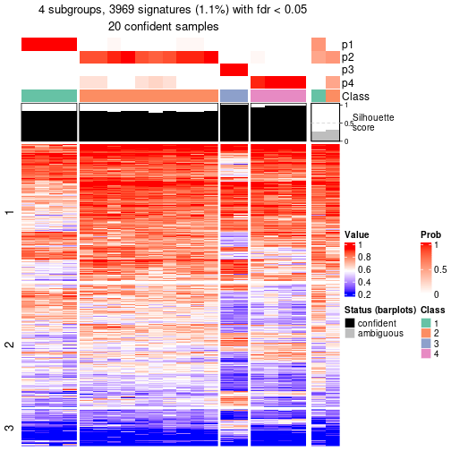</p>

</div>
<div id='tab-node-07111-get-signatures-4'>
<pre><code class="r">get_signatures(res, k = 5)
</code></pre>

<p>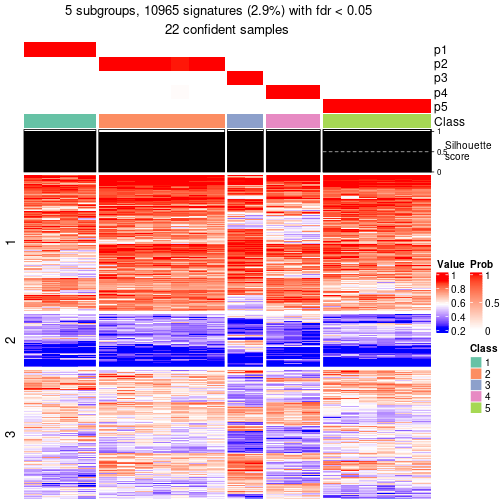</p>

</div>
<div id='tab-node-07111-get-signatures-5'>
<pre><code class="r">get_signatures(res, k = 6)
</code></pre>

<p>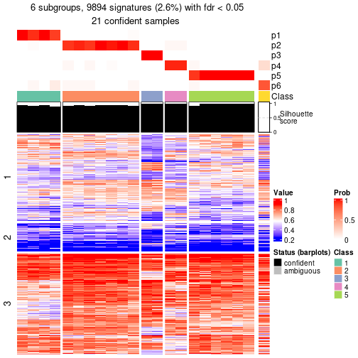</p>

</div>
<div id='tab-node-07111-get-signatures-6'>
<pre><code class="r">get_signatures(res, k = 7)
</code></pre>

<p>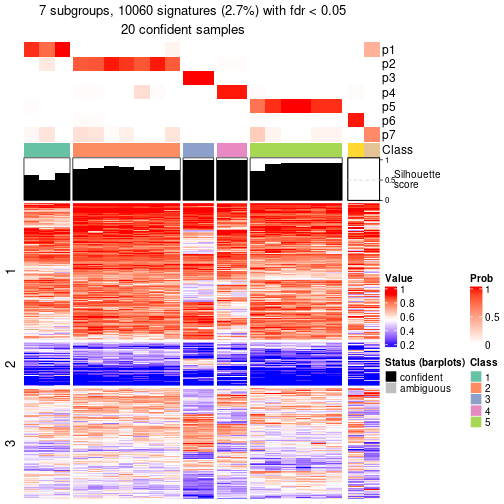</p>

</div>
<div id='tab-node-07111-get-signatures-7'>
<pre><code class="r">get_signatures(res, k = 8)
</code></pre>

<p>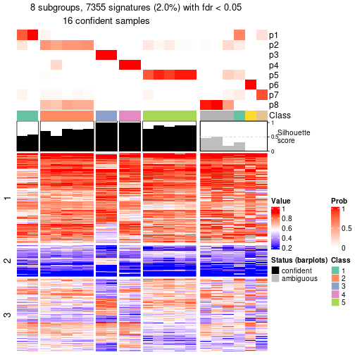</p>

</div>
</div>


Compare the overlap of signatures from different k:

```r
compare_signatures(res)
```

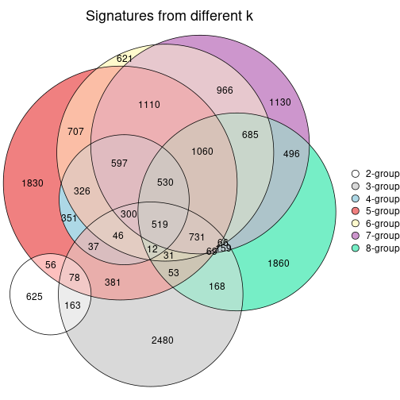

`get_signature()` returns a data frame invisibly. To get the list of signatures, the function
call should be assigned to a variable explicitly. In following code, if `plot` argument is set
to `FALSE`, no heatmap is plotted while only the differential analysis is performed.

```r
# code only for demonstration
tb = get_signature(res, k = ..., plot = FALSE)
```

An example of the output of `tb` is:

```
#>   which_row         fdr    mean_1    mean_2 scaled_mean_1 scaled_mean_2 km
#> 1        38 0.042760348  8.373488  9.131774    -0.5533452     0.5164555  1
#> 2        40 0.018707592  7.106213  8.469186    -0.6173731     0.5762149  1
#> 3        55 0.019134737 10.221463 11.207825    -0.6159697     0.5749050  1
#> 4        59 0.006059896  5.921854  7.869574    -0.6899429     0.6439467  1
#> 5        60 0.018055526  8.928898 10.211722    -0.6204761     0.5791110  1
#> 6        98 0.009384629 15.714769 14.887706     0.6635654    -0.6193277  2
...
```

The columns in `tb` are:

1. `which_row`: row indices corresponding to the input matrix.
2. `fdr`: FDR for the differential test. 
3. `mean_x`: The mean value in group x.
4. `scaled_mean_x`: The mean value in group x after rows are scaled.
5. `km`: Row groups if k-means clustering is applied to rows (which is done by automatically selecting number of clusters).

If there are too many signatures, `top_signatures = ...` can be set to only show the 
signatures with the highest FDRs:

```r
# code only for demonstration
# e.g. to show the top 500 most significant rows
tb = get_signature(res, k = ..., top_signatures = 500)
```

If the signatures are defined as these which are uniquely high in current group, `diff_method` argument
can be set to `"uniquely_high_in_one_group"`:

```r
# code only for demonstration
tb = get_signature(res, k = ..., diff_method = "uniquely_high_in_one_group")
```


UMAP plot which shows how samples are separated.


<script>
$( function() {
	$( '#tabs-node-07111-dimension-reduction' ).tabs();
} );
</script>
<div id='tabs-node-07111-dimension-reduction'>
<ul>
<li><a href='#tab-node-07111-dimension-reduction-1'>k = 2</a></li>
<li><a href='#tab-node-07111-dimension-reduction-2'>k = 3</a></li>
<li><a href='#tab-node-07111-dimension-reduction-3'>k = 4</a></li>
<li><a href='#tab-node-07111-dimension-reduction-4'>k = 5</a></li>
<li><a href='#tab-node-07111-dimension-reduction-5'>k = 6</a></li>
<li><a href='#tab-node-07111-dimension-reduction-6'>k = 7</a></li>
<li><a href='#tab-node-07111-dimension-reduction-7'>k = 8</a></li>
</ul>
<div id='tab-node-07111-dimension-reduction-1'>
<pre><code class="r">dimension_reduction(res, k = 2, method = &quot;UMAP&quot;)
</code></pre>

<p>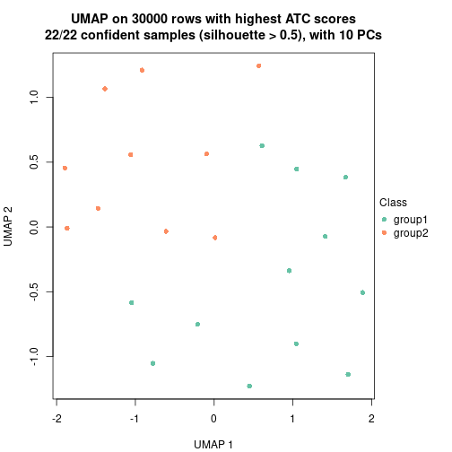</p>

</div>
<div id='tab-node-07111-dimension-reduction-2'>
<pre><code class="r">dimension_reduction(res, k = 3, method = &quot;UMAP&quot;)
</code></pre>

<p>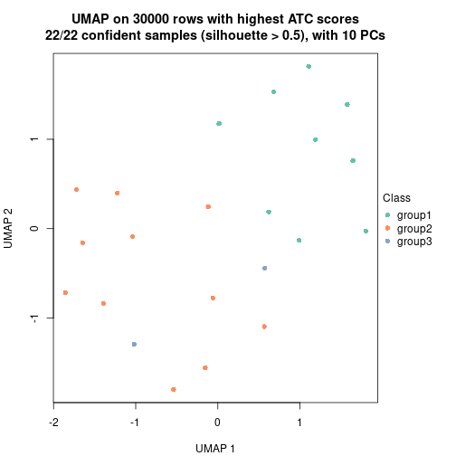</p>

</div>
<div id='tab-node-07111-dimension-reduction-3'>
<pre><code class="r">dimension_reduction(res, k = 4, method = &quot;UMAP&quot;)
</code></pre>

<p>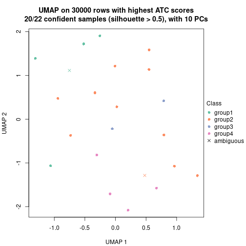</p>

</div>
<div id='tab-node-07111-dimension-reduction-4'>
<pre><code class="r">dimension_reduction(res, k = 5, method = &quot;UMAP&quot;)
</code></pre>

<p>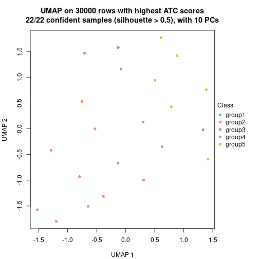</p>

</div>
<div id='tab-node-07111-dimension-reduction-5'>
<pre><code class="r">dimension_reduction(res, k = 6, method = &quot;UMAP&quot;)
</code></pre>

<p>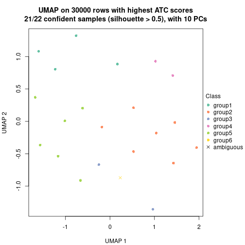</p>

</div>
<div id='tab-node-07111-dimension-reduction-6'>
<pre><code class="r">dimension_reduction(res, k = 7, method = &quot;UMAP&quot;)
</code></pre>

<p>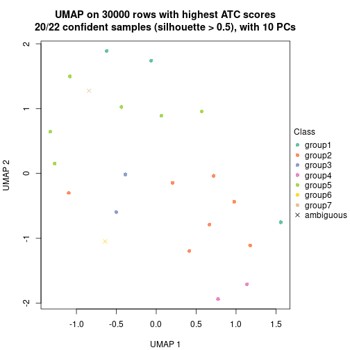</p>

</div>
<div id='tab-node-07111-dimension-reduction-7'>
<pre><code class="r">dimension_reduction(res, k = 8, method = &quot;UMAP&quot;)
</code></pre>

<p>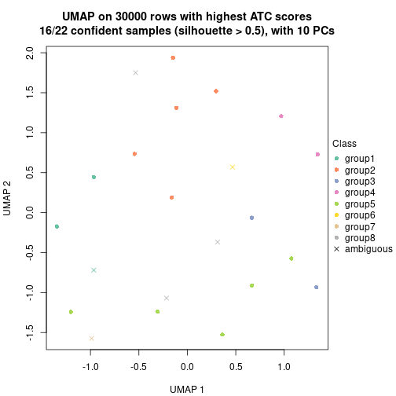</p>

</div>
</div>


Following heatmap shows how subgroups are split when increasing `k`:

```r
collect_classes(res)
```

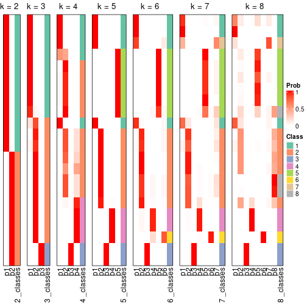


If matrix rows can be associated to genes, consider to use `functional_enrichment(res,
...)` to perform function enrichment for the signature genes. See [this vignette](https://jokergoo.github.io/cola_vignettes/functional_enrichment.html) for more detailed explanations.


 

---------------------------------------------------


### Node072


Parent node: [Node07](#Node07).
Child nodes: 
                Node0111-leaf
        ,
                Node0112-leaf
        ,
                Node0113-leaf
        ,
                Node0114-leaf
        ,
                Node0121-leaf
        ,
                Node0122-leaf
        ,
                Node0123-leaf
        ,
                Node0131-leaf
        ,
                Node0132-leaf
        ,
                Node0133-leaf
        ,
                Node0134-leaf
        ,
                Node0211-leaf
        ,
                Node0212-leaf
        ,
                [Node0213](#Node0213)
        ,
                Node0214-leaf
        ,
                [Node0221](#Node0221)
        ,
                Node0222-leaf
        ,
                Node0223-leaf
        ,
                [Node0231](#Node0231)
        ,
                Node0232-leaf
        ,
                Node0233-leaf
        ,
                [Node0234](#Node0234)
        ,
                Node0235-leaf
        ,
                Node0241-leaf
        ,
                [Node0242](#Node0242)
        ,
                Node0411-leaf
        ,
                Node0412-leaf
        ,
                Node0421-leaf
        ,
                Node0422-leaf
        ,
                Node0423-leaf
        ,
                Node0431-leaf
        ,
                Node0432-leaf
        ,
                Node0511-leaf
        ,
                Node0512-leaf
        ,
                Node0513-leaf
        ,
                Node0514-leaf
        ,
                Node0521-leaf
        ,
                Node0522-leaf
        ,
                Node0523-leaf
        ,
                Node0524-leaf
        ,
                Node0525-leaf
        ,
                Node0611-leaf
        ,
                [Node0612](#Node0612)
        ,
                Node0613-leaf
        ,
                [Node0711](#Node0711)
        ,
                Node0712-leaf
        ,
                Node0713-leaf
        ,
                [Node0721](#Node0721)
        ,
                Node0722-leaf
        ,
                Node0731-leaf
        ,
                Node0732-leaf
        ,
                Node0733-leaf
        .


The object with results only for a single top-value method and a single partitioning method 
can be extracted as:

```r
res = res_rh["072"]
```

A summary of `res` and all the functions that can be applied to it:

```r
res
```

```
#> A 'ConsensusPartition' object with k = 2, 3, 4, 5, 6, 7, 8.
#>   On a matrix with 30000 rows and 46 columns.
#>   Top rows (1000) are extracted by 'ATC' method.
#>   Subgroups are detected by 'kmeans' method.
#>   Performed in total 350 partitions by row resampling.
#>   Best k for subgroups seems to be 2.
#> 
#> Following methods can be applied to this 'ConsensusPartition' object:
#>  [1] "cola_report"             "collect_classes"         "collect_plots"          
#>  [4] "collect_stats"           "colnames"                "compare_partitions"     
#>  [7] "compare_signatures"      "consensus_heatmap"       "dimension_reduction"    
#> [10] "functional_enrichment"   "get_anno_col"            "get_anno"               
#> [13] "get_classes"             "get_consensus"           "get_matrix"             
#> [16] "get_membership"          "get_param"               "get_signatures"         
#> [19] "get_stats"               "is_best_k"               "is_stable_k"            
#> [22] "membership_heatmap"      "ncol"                    "nrow"                   
#> [25] "plot_ecdf"               "predict_classes"         "rownames"               
#> [28] "select_partition_number" "show"                    "suggest_best_k"         
#> [31] "test_to_known_factors"   "top_rows_heatmap"
```

`collect_plots()` function collects all the plots made from `res` for all `k` (number of subgroups)
into one single page to provide an easy and fast comparison between different `k`.

```r
collect_plots(res)
```

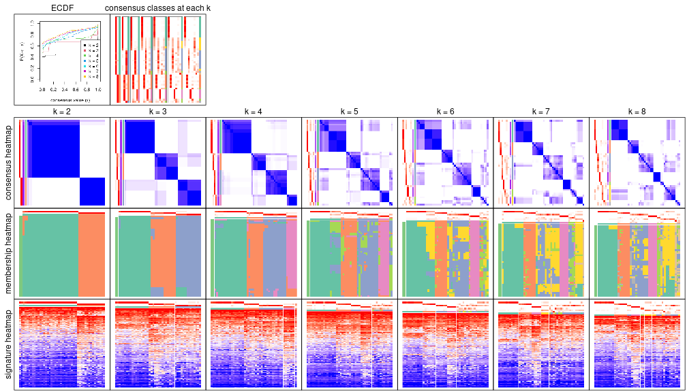

The plots are:

- The first row: a plot of the eCDF (empirical cumulative distribution
  function) curves of the consensus matrix for each `k` and the heatmap of
  predicted classes for each `k`.
- The second row: heatmaps of the consensus matrix for each `k`.
- The third row: heatmaps of the membership matrix for each `k`.
- The fouth row: heatmaps of the signatures for each `k`.

All the plots in panels can be made by individual functions and they are
plotted later in this section.

`select_partition_number()` produces several plots showing different
statistics for choosing "optimized" `k`. There are following statistics:

- eCDF curves of the consensus matrix for each `k`;
- 1-PAC. [The PAC score](https://en.wikipedia.org/wiki/Consensus_clustering#Over-interpretation_potential_of_consensus_clustering)
  measures the proportion of the ambiguous subgrouping.
- Mean silhouette score.
- Concordance. The mean probability of fiting the consensus subgroup labels in all
  partitions.
- Area increased. Denote $A_k$ as the area under the eCDF curve for current
  `k`, the area increased is defined as $A_k - A_{k-1}$.
- Rand index. The percent of pairs of samples that are both in a same cluster
  or both are not in a same cluster in the partition of k and k-1.
- Jaccard index. The ratio of pairs of samples are both in a same cluster in
  the partition of k and k-1 and the pairs of samples are both in a same
  cluster in the partition k or k-1.

The detailed explanations of these statistics can be found in [the _cola_
vignette](https://jokergoo.github.io/cola_vignettes/cola.html#toc_13).

Generally speaking, higher 1-PAC score, higher mean silhouette score or higher
concordance corresponds to better partition. Rand index and Jaccard index
measure how similar the current partition is compared to partition with `k-1`.
If they are too similar, we won't accept `k` is better than `k-1`.

```r
select_partition_number(res)
```

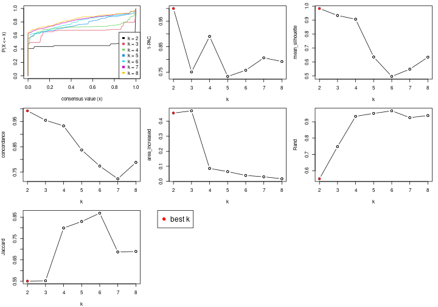

The numeric values for all these statistics can be obtained by `get_stats()`.

```r
get_stats(res)
```

```
#>   k 1-PAC mean_silhouette concordance area_increased  Rand Jaccard
#> 2 2 1.000           0.983       0.992         0.4547 0.551   0.551
#> 3 3 0.751           0.933       0.955         0.4692 0.748   0.552
#> 4 4 0.890           0.906       0.933         0.0855 0.933   0.799
#> 5 5 0.733           0.636       0.837         0.0642 0.952   0.829
#> 6 6 0.757           0.497       0.774         0.0388 0.967   0.868
#> 7 7 0.806           0.549       0.723         0.0298 0.926   0.687
#> 8 8 0.792           0.635       0.788         0.0165 0.938   0.689
```

`suggest_best_k()` suggests the best $k$ based on these statistics. The rules are as follows:

- All $k$ with Jaccard index larger than 0.95 are removed because increasing
  $k$ does not provide enough extra information. If all $k$ are removed, it is
  marked as no subgroup is detected.
- For all $k$ with 1-PAC score larger than 0.9, the maximal $k$ is taken as
  the best $k$, and other $k$ are marked as optional $k$.
- If it does not fit the second rule. The $k$ with the maximal vote of the
  highest 1-PAC score, highest mean silhouette, and highest concordance is
  taken as the best $k$.

```r
suggest_best_k(res)
```

```
#> [1] 2
```


Following is the table of the partitions (You need to click the **show/hide
code output** link to see it). The membership matrix (columns with name `p*`)
is inferred by
[`clue::cl_consensus()`](https://www.rdocumentation.org/link/cl_consensus?package=clue)
function with the `SE` method. Basically the value in the membership matrix
represents the probability to belong to a certain group. The finall subgroup
label for an item is determined with the group with highest probability it
belongs to.

In `get_classes()` function, the entropy is calculated from the membership
matrix and the silhouette score is calculated from the consensus matrix.


<script>
$( function() {
	$( '#tabs-node-072-get-classes' ).tabs();
} );
</script>
<div id='tabs-node-072-get-classes'>
<ul>
<li><a href='#tab-node-072-get-classes-1'>k = 2</a></li>
<li><a href='#tab-node-072-get-classes-2'>k = 3</a></li>
<li><a href='#tab-node-072-get-classes-3'>k = 4</a></li>
<li><a href='#tab-node-072-get-classes-4'>k = 5</a></li>
<li><a href='#tab-node-072-get-classes-5'>k = 6</a></li>
<li><a href='#tab-node-072-get-classes-6'>k = 7</a></li>
<li><a href='#tab-node-072-get-classes-7'>k = 8</a></li>
</ul>

<div id='tab-node-072-get-classes-1'>
<p><a id='tab-node-072-get-classes-1-a' style='color:#0366d6' href='#'>show/hide code output</a></p>
<pre><code class="r">cbind(get_classes(res, k = 2), get_membership(res, k = 2))
</code></pre>

<pre><code>#&gt;                 class entropy silhouette   p1   p2
#&gt; TCGA.86.8281.01     1   0.000      0.988 1.00 0.00
#&gt; TCGA.86.8358.01     1   0.000      0.988 1.00 0.00
#&gt; TCGA.78.7149.01     1   0.000      0.988 1.00 0.00
#&gt; TCGA.55.6642.01     1   0.000      0.988 1.00 0.00
#&gt; TCGA.33.6737.01     1   0.327      0.934 0.94 0.06
#&gt; TCGA.55.6968.01     1   0.000      0.988 1.00 0.00
#&gt; TCGA.75.7027.01     1   0.000      0.988 1.00 0.00
#&gt; TCGA.86.8279.01     1   0.000      0.988 1.00 0.00
#&gt; TCGA.33.4566.01     2   0.000      1.000 0.00 1.00
#&gt; TCGA.55.8615.01     1   0.000      0.988 1.00 0.00
#&gt; TCGA.05.5425.01     1   0.000      0.988 1.00 0.00
#&gt; TCGA.50.5066.02     1   0.000      0.988 1.00 0.00
#&gt; TCGA.55.8092.01     2   0.000      1.000 0.00 1.00
#&gt; TCGA.75.6207.01     2   0.000      1.000 0.00 1.00
#&gt; TCGA.69.7764.01     1   0.000      0.988 1.00 0.00
#&gt; TCGA.73.4676.01     2   0.000      1.000 0.00 1.00
#&gt; TCGA.MN.A4N4.01     1   0.795      0.694 0.76 0.24
#&gt; TCGA.44.8120.01     2   0.000      1.000 0.00 1.00
#&gt; TCGA.73.A9RS.01     2   0.000      1.000 0.00 1.00
#&gt; TCGA.97.7937.01     2   0.000      1.000 0.00 1.00
#&gt; TCGA.05.5428.01     2   0.000      1.000 0.00 1.00
#&gt; TCGA.91.A4BC.01     1   0.000      0.988 1.00 0.00
#&gt; TCGA.05.4433.01     1   0.327      0.934 0.94 0.06
#&gt; TCGA.50.5932.01     1   0.000      0.988 1.00 0.00
#&gt; TCGA.50.7109.01     1   0.000      0.988 1.00 0.00
#&gt; TCGA.78.7633.01     1   0.000      0.988 1.00 0.00
#&gt; TCGA.05.4396.01     2   0.000      1.000 0.00 1.00
#&gt; TCGA.78.7154.01     2   0.000      1.000 0.00 1.00
#&gt; TCGA.78.7167.01     1   0.000      0.988 1.00 0.00
#&gt; TCGA.55.8085.01     1   0.000      0.988 1.00 0.00
#&gt; TCGA.MP.A4TE.01     1   0.000      0.988 1.00 0.00
#&gt; TCGA.78.7542.01     2   0.000      1.000 0.00 1.00
#&gt; TCGA.55.7994.01     2   0.000      1.000 0.00 1.00
#&gt; TCGA.86.A4D0.01     1   0.000      0.988 1.00 0.00
#&gt; TCGA.99.8032.01     1   0.000      0.988 1.00 0.00
#&gt; TCGA.64.5779.01     1   0.000      0.988 1.00 0.00
#&gt; TCGA.95.7562.01     2   0.000      1.000 0.00 1.00
#&gt; TCGA.55.7284.01     1   0.000      0.988 1.00 0.00
#&gt; TCGA.91.6829.01     2   0.000      1.000 0.00 1.00
#&gt; TCGA.86.8669.01     1   0.000      0.988 1.00 0.00
#&gt; TCGA.MP.A4SV.01     2   0.000      1.000 0.00 1.00
#&gt; TCGA.NJ.A55R.01     1   0.000      0.988 1.00 0.00
#&gt; TCGA.33.AASB.01     1   0.000      0.988 1.00 0.00
#&gt; TCGA.97.8179.01     1   0.000      0.988 1.00 0.00
#&gt; TCGA.86.7713.01     1   0.000      0.988 1.00 0.00
#&gt; TCGA.62.A46S.01     1   0.000      0.988 1.00 0.00
</code></pre>

<script>
$('#tab-node-072-get-classes-1-a').parent().next().next().hide();
$('#tab-node-072-get-classes-1-a').click(function(){
  $('#tab-node-072-get-classes-1-a').parent().next().next().toggle();
  return(false);
});
</script>
</div>

<div id='tab-node-072-get-classes-2'>
<p><a id='tab-node-072-get-classes-2-a' style='color:#0366d6' href='#'>show/hide code output</a></p>
<pre><code class="r">cbind(get_classes(res, k = 3), get_membership(res, k = 3))
</code></pre>

<pre><code>#&gt;                 class entropy silhouette   p1   p2   p3
#&gt; TCGA.86.8281.01     1   0.000      0.992 1.00 0.00 0.00
#&gt; TCGA.86.8358.01     3   0.334      0.899 0.12 0.00 0.88
#&gt; TCGA.78.7149.01     1   0.000      0.992 1.00 0.00 0.00
#&gt; TCGA.55.6642.01     3   0.334      0.899 0.12 0.00 0.88
#&gt; TCGA.33.6737.01     3   0.000      0.922 0.00 0.00 1.00
#&gt; TCGA.55.6968.01     3   0.334      0.899 0.12 0.00 0.88
#&gt; TCGA.75.7027.01     1   0.000      0.992 1.00 0.00 0.00
#&gt; TCGA.86.8279.01     1   0.000      0.992 1.00 0.00 0.00
#&gt; TCGA.33.4566.01     2   0.000      0.912 0.00 1.00 0.00
#&gt; TCGA.55.8615.01     1   0.000      0.992 1.00 0.00 0.00
#&gt; TCGA.05.5425.01     3   0.334      0.899 0.12 0.00 0.88
#&gt; TCGA.50.5066.02     3   0.000      0.922 0.00 0.00 1.00
#&gt; TCGA.55.8092.01     2   0.369      0.901 0.00 0.86 0.14
#&gt; TCGA.75.6207.01     2   0.000      0.912 0.00 1.00 0.00
#&gt; TCGA.69.7764.01     1   0.000      0.992 1.00 0.00 0.00
#&gt; TCGA.73.4676.01     2   0.000      0.912 0.00 1.00 0.00
#&gt; TCGA.MN.A4N4.01     3   0.000      0.922 0.00 0.00 1.00
#&gt; TCGA.44.8120.01     2   0.369      0.901 0.00 0.86 0.14
#&gt; TCGA.73.A9RS.01     2   0.540      0.758 0.00 0.72 0.28
#&gt; TCGA.97.7937.01     2   0.369      0.901 0.00 0.86 0.14
#&gt; TCGA.05.5428.01     2   0.000      0.912 0.00 1.00 0.00
#&gt; TCGA.91.A4BC.01     3   0.000      0.922 0.00 0.00 1.00
#&gt; TCGA.05.4433.01     3   0.000      0.922 0.00 0.00 1.00
#&gt; TCGA.50.5932.01     1   0.000      0.992 1.00 0.00 0.00
#&gt; TCGA.50.7109.01     1   0.000      0.992 1.00 0.00 0.00
#&gt; TCGA.78.7633.01     1   0.000      0.992 1.00 0.00 0.00
#&gt; TCGA.05.4396.01     2   0.000      0.912 0.00 1.00 0.00
#&gt; TCGA.78.7154.01     2   0.000      0.912 0.00 1.00 0.00
#&gt; TCGA.78.7167.01     1   0.000      0.992 1.00 0.00 0.00
#&gt; TCGA.55.8085.01     1   0.000      0.992 1.00 0.00 0.00
#&gt; TCGA.MP.A4TE.01     3   0.000      0.922 0.00 0.00 1.00
#&gt; TCGA.78.7542.01     2   0.369      0.901 0.00 0.86 0.14
#&gt; TCGA.55.7994.01     2   0.000      0.912 0.00 1.00 0.00
#&gt; TCGA.86.A4D0.01     1   0.000      0.992 1.00 0.00 0.00
#&gt; TCGA.99.8032.01     1   0.000      0.992 1.00 0.00 0.00
#&gt; TCGA.64.5779.01     1   0.000      0.992 1.00 0.00 0.00
#&gt; TCGA.95.7562.01     2   0.502      0.810 0.00 0.76 0.24
#&gt; TCGA.55.7284.01     3   0.369      0.878 0.14 0.00 0.86
#&gt; TCGA.91.6829.01     3   0.000      0.922 0.00 0.00 1.00
#&gt; TCGA.86.8669.01     1   0.000      0.992 1.00 0.00 0.00
#&gt; TCGA.MP.A4SV.01     2   0.369      0.901 0.00 0.86 0.14
#&gt; TCGA.NJ.A55R.01     3   0.334      0.899 0.12 0.00 0.88
#&gt; TCGA.33.AASB.01     3   0.000      0.922 0.00 0.00 1.00
#&gt; TCGA.97.8179.01     1   0.334      0.851 0.88 0.00 0.12
#&gt; TCGA.86.7713.01     1   0.000      0.992 1.00 0.00 0.00
#&gt; TCGA.62.A46S.01     1   0.000      0.992 1.00 0.00 0.00
</code></pre>

<script>
$('#tab-node-072-get-classes-2-a').parent().next().next().hide();
$('#tab-node-072-get-classes-2-a').click(function(){
  $('#tab-node-072-get-classes-2-a').parent().next().next().toggle();
  return(false);
});
</script>
</div>

<div id='tab-node-072-get-classes-3'>
<p><a id='tab-node-072-get-classes-3-a' style='color:#0366d6' href='#'>show/hide code output</a></p>
<pre><code class="r">cbind(get_classes(res, k = 4), get_membership(res, k = 4))
</code></pre>

<pre><code>#&gt;                 class entropy silhouette   p1   p2   p3   p4
#&gt; TCGA.86.8281.01     1  0.0000      0.963 1.00 0.00 0.00 0.00
#&gt; TCGA.86.8358.01     3  0.3037      0.905 0.02 0.00 0.88 0.10
#&gt; TCGA.78.7149.01     1  0.0000      0.963 1.00 0.00 0.00 0.00
#&gt; TCGA.55.6642.01     3  0.0707      0.949 0.02 0.00 0.98 0.00
#&gt; TCGA.33.6737.01     3  0.1211      0.927 0.00 0.04 0.96 0.00
#&gt; TCGA.55.6968.01     3  0.0707      0.949 0.02 0.00 0.98 0.00
#&gt; TCGA.75.7027.01     1  0.0000      0.963 1.00 0.00 0.00 0.00
#&gt; TCGA.86.8279.01     1  0.0707      0.956 0.98 0.00 0.00 0.02
#&gt; TCGA.33.4566.01     4  0.2921      0.958 0.00 0.14 0.00 0.86
#&gt; TCGA.55.8615.01     1  0.0000      0.963 1.00 0.00 0.00 0.00
#&gt; TCGA.05.5425.01     3  0.0707      0.949 0.02 0.00 0.98 0.00
#&gt; TCGA.50.5066.02     3  0.0000      0.947 0.00 0.00 1.00 0.00
#&gt; TCGA.55.8092.01     2  0.0707      0.881 0.00 0.98 0.02 0.00
#&gt; TCGA.75.6207.01     4  0.2921      0.958 0.00 0.14 0.00 0.86
#&gt; TCGA.69.7764.01     1  0.0000      0.963 1.00 0.00 0.00 0.00
#&gt; TCGA.73.4676.01     4  0.2921      0.958 0.00 0.14 0.00 0.86
#&gt; TCGA.MN.A4N4.01     3  0.2345      0.870 0.00 0.10 0.90 0.00
#&gt; TCGA.44.8120.01     2  0.0707      0.881 0.00 0.98 0.02 0.00
#&gt; TCGA.73.A9RS.01     2  0.2345      0.832 0.00 0.90 0.10 0.00
#&gt; TCGA.97.7937.01     2  0.0707      0.881 0.00 0.98 0.02 0.00
#&gt; TCGA.05.5428.01     4  0.2921      0.958 0.00 0.14 0.00 0.86
#&gt; TCGA.91.A4BC.01     3  0.0000      0.947 0.00 0.00 1.00 0.00
#&gt; TCGA.05.4433.01     3  0.1913      0.926 0.00 0.04 0.94 0.02
#&gt; TCGA.50.5932.01     1  0.0000      0.963 1.00 0.00 0.00 0.00
#&gt; TCGA.50.7109.01     1  0.2335      0.923 0.92 0.00 0.06 0.02
#&gt; TCGA.78.7633.01     1  0.0000      0.963 1.00 0.00 0.00 0.00
#&gt; TCGA.05.4396.01     2  0.2345      0.744 0.00 0.90 0.00 0.10
#&gt; TCGA.78.7154.01     4  0.4522      0.747 0.00 0.32 0.00 0.68
#&gt; TCGA.78.7167.01     1  0.0000      0.963 1.00 0.00 0.00 0.00
#&gt; TCGA.55.8085.01     1  0.0000      0.963 1.00 0.00 0.00 0.00
#&gt; TCGA.MP.A4TE.01     3  0.2647      0.899 0.00 0.00 0.88 0.12
#&gt; TCGA.78.7542.01     2  0.0707      0.881 0.00 0.98 0.02 0.00
#&gt; TCGA.55.7994.01     4  0.2921      0.958 0.00 0.14 0.00 0.86
#&gt; TCGA.86.A4D0.01     1  0.3611      0.882 0.86 0.00 0.06 0.08
#&gt; TCGA.99.8032.01     1  0.1913      0.936 0.94 0.00 0.04 0.02
#&gt; TCGA.64.5779.01     1  0.0707      0.956 0.98 0.00 0.00 0.02
#&gt; TCGA.95.7562.01     2  0.2011      0.850 0.00 0.92 0.08 0.00
#&gt; TCGA.55.7284.01     3  0.1913      0.934 0.02 0.00 0.94 0.04
#&gt; TCGA.91.6829.01     2  0.5487      0.349 0.00 0.58 0.40 0.02
#&gt; TCGA.86.8669.01     1  0.0000      0.963 1.00 0.00 0.00 0.00
#&gt; TCGA.MP.A4SV.01     2  0.0707      0.881 0.00 0.98 0.02 0.00
#&gt; TCGA.NJ.A55R.01     3  0.0707      0.949 0.02 0.00 0.98 0.00
#&gt; TCGA.33.AASB.01     3  0.1211      0.941 0.00 0.00 0.96 0.04
#&gt; TCGA.97.8179.01     1  0.4939      0.717 0.74 0.00 0.22 0.04
#&gt; TCGA.86.7713.01     1  0.0000      0.963 1.00 0.00 0.00 0.00
#&gt; TCGA.62.A46S.01     1  0.2335      0.923 0.92 0.00 0.06 0.02
</code></pre>

<script>
$('#tab-node-072-get-classes-3-a').parent().next().next().hide();
$('#tab-node-072-get-classes-3-a').click(function(){
  $('#tab-node-072-get-classes-3-a').parent().next().next().toggle();
  return(false);
});
</script>
</div>

<div id='tab-node-072-get-classes-4'>
<p><a id='tab-node-072-get-classes-4-a' style='color:#0366d6' href='#'>show/hide code output</a></p>
<pre><code class="r">cbind(get_classes(res, k = 5), get_membership(res, k = 5))
</code></pre>

<pre><code>#&gt;                 class entropy silhouette   p1   p2   p3   p4   p5
#&gt; TCGA.86.8281.01     1  0.0000     0.8277 1.00 0.00 0.00 0.00 0.00
#&gt; TCGA.86.8358.01     3  0.4126    -0.2362 0.00 0.00 0.62 0.00 0.38
#&gt; TCGA.78.7149.01     1  0.0000     0.8277 1.00 0.00 0.00 0.00 0.00
#&gt; TCGA.55.6642.01     3  0.0609     0.5684 0.00 0.00 0.98 0.00 0.02
#&gt; TCGA.33.6737.01     3  0.4527     0.1875 0.00 0.04 0.70 0.00 0.26
#&gt; TCGA.55.6968.01     3  0.1410     0.5564 0.00 0.00 0.94 0.00 0.06
#&gt; TCGA.75.7027.01     1  0.0000     0.8277 1.00 0.00 0.00 0.00 0.00
#&gt; TCGA.86.8279.01     1  0.5263     0.6408 0.66 0.00 0.24 0.00 0.10
#&gt; TCGA.33.4566.01     4  0.1043     0.9544 0.00 0.04 0.00 0.96 0.00
#&gt; TCGA.55.8615.01     1  0.0609     0.8269 0.98 0.00 0.00 0.02 0.00
#&gt; TCGA.05.5425.01     3  0.0609     0.5736 0.00 0.00 0.98 0.00 0.02
#&gt; TCGA.50.5066.02     3  0.2732     0.4495 0.00 0.00 0.84 0.00 0.16
#&gt; TCGA.55.8092.01     2  0.0609     0.8498 0.00 0.98 0.00 0.02 0.00
#&gt; TCGA.75.6207.01     4  0.1043     0.9544 0.00 0.04 0.00 0.96 0.00
#&gt; TCGA.69.7764.01     1  0.0000     0.8277 1.00 0.00 0.00 0.00 0.00
#&gt; TCGA.73.4676.01     4  0.1043     0.9544 0.00 0.04 0.00 0.96 0.00
#&gt; TCGA.MN.A4N4.01     3  0.5599     0.0273 0.00 0.12 0.62 0.00 0.26
#&gt; TCGA.44.8120.01     2  0.2012     0.8469 0.00 0.92 0.00 0.02 0.06
#&gt; TCGA.73.A9RS.01     2  0.4613     0.5772 0.00 0.62 0.02 0.00 0.36
#&gt; TCGA.97.7937.01     2  0.0609     0.8498 0.00 0.98 0.00 0.02 0.00
#&gt; TCGA.05.5428.01     4  0.1043     0.9544 0.00 0.04 0.00 0.96 0.00
#&gt; TCGA.91.A4BC.01     3  0.1410     0.5571 0.00 0.00 0.94 0.00 0.06
#&gt; TCGA.05.4433.01     3  0.5305    -0.1103 0.00 0.04 0.64 0.02 0.30
#&gt; TCGA.50.5932.01     1  0.0609     0.8269 0.98 0.00 0.00 0.02 0.00
#&gt; TCGA.50.7109.01     1  0.5864     0.5311 0.56 0.00 0.32 0.00 0.12
#&gt; TCGA.78.7633.01     1  0.0609     0.8269 0.98 0.00 0.00 0.02 0.00
#&gt; TCGA.05.4396.01     2  0.2754     0.7749 0.00 0.88 0.00 0.08 0.04
#&gt; TCGA.78.7154.01     4  0.5083     0.7370 0.00 0.14 0.00 0.70 0.16
#&gt; TCGA.78.7167.01     1  0.0609     0.8269 0.98 0.00 0.00 0.02 0.00
#&gt; TCGA.55.8085.01     1  0.0000     0.8277 1.00 0.00 0.00 0.00 0.00
#&gt; TCGA.MP.A4TE.01     5  0.4798     0.4908 0.00 0.02 0.44 0.00 0.54
#&gt; TCGA.78.7542.01     2  0.1648     0.8494 0.00 0.94 0.00 0.02 0.04
#&gt; TCGA.55.7994.01     4  0.1043     0.9544 0.00 0.04 0.00 0.96 0.00
#&gt; TCGA.86.A4D0.01     1  0.6530     0.3448 0.44 0.00 0.36 0.00 0.20
#&gt; TCGA.99.8032.01     1  0.5864     0.5311 0.56 0.00 0.32 0.00 0.12
#&gt; TCGA.64.5779.01     1  0.4818     0.6907 0.72 0.00 0.18 0.00 0.10
#&gt; TCGA.95.7562.01     2  0.1732     0.8332 0.00 0.92 0.00 0.00 0.08
#&gt; TCGA.55.7284.01     3  0.2616     0.4774 0.00 0.00 0.88 0.02 0.10
#&gt; TCGA.91.6829.01     2  0.6422     0.1325 0.00 0.46 0.18 0.00 0.36
#&gt; TCGA.86.8669.01     1  0.0000     0.8277 1.00 0.00 0.00 0.00 0.00
#&gt; TCGA.MP.A4SV.01     2  0.0609     0.8498 0.00 0.98 0.00 0.02 0.00
#&gt; TCGA.NJ.A55R.01     3  0.0609     0.5684 0.00 0.00 0.98 0.00 0.02
#&gt; TCGA.33.AASB.01     5  0.4126     0.5139 0.00 0.00 0.38 0.00 0.62
#&gt; TCGA.97.8179.01     3  0.5934     0.1908 0.26 0.00 0.62 0.02 0.10
#&gt; TCGA.86.7713.01     1  0.0609     0.8269 0.98 0.00 0.00 0.02 0.00
#&gt; TCGA.62.A46S.01     1  0.5864     0.5311 0.56 0.00 0.32 0.00 0.12
</code></pre>

<script>
$('#tab-node-072-get-classes-4-a').parent().next().next().hide();
$('#tab-node-072-get-classes-4-a').click(function(){
  $('#tab-node-072-get-classes-4-a').parent().next().next().toggle();
  return(false);
});
</script>
</div>

<div id='tab-node-072-get-classes-5'>
<p><a id='tab-node-072-get-classes-5-a' style='color:#0366d6' href='#'>show/hide code output</a></p>
<pre><code class="r">cbind(get_classes(res, k = 6), get_membership(res, k = 6))
</code></pre>

<pre><code>#&gt;                 class entropy silhouette   p1   p2   p3   p4   p5   p6
#&gt; TCGA.86.8281.01     1  0.0000     0.7074 1.00 0.00 0.00 0.00 0.00 0.00
#&gt; TCGA.86.8358.01     3  0.5963    -0.0852 0.00 0.00 0.44 0.00 0.32 0.24
#&gt; TCGA.78.7149.01     1  0.0000     0.7074 1.00 0.00 0.00 0.00 0.00 0.00
#&gt; TCGA.55.6642.01     3  0.0547     0.6048 0.00 0.00 0.98 0.00 0.00 0.02
#&gt; TCGA.33.6737.01     3  0.5331     0.3870 0.00 0.04 0.66 0.00 0.20 0.10
#&gt; TCGA.55.6968.01     3  0.2790     0.5422 0.00 0.00 0.84 0.00 0.02 0.14
#&gt; TCGA.75.7027.01     1  0.1480     0.7074 0.94 0.00 0.00 0.00 0.02 0.04
#&gt; TCGA.86.8279.01     1  0.5867    -0.2936 0.48 0.00 0.28 0.00 0.00 0.24
#&gt; TCGA.33.4566.01     4  0.0000     0.9080 0.00 0.00 0.00 1.00 0.00 0.00
#&gt; TCGA.55.8615.01     1  0.1480     0.7074 0.94 0.00 0.00 0.00 0.02 0.04
#&gt; TCGA.05.5425.01     3  0.1807     0.6277 0.00 0.00 0.92 0.00 0.02 0.06
#&gt; TCGA.50.5066.02     3  0.2190     0.6331 0.00 0.00 0.90 0.00 0.04 0.06
#&gt; TCGA.55.8092.01     2  0.0000     0.9111 0.00 1.00 0.00 0.00 0.00 0.00
#&gt; TCGA.75.6207.01     4  0.0000     0.9080 0.00 0.00 0.00 1.00 0.00 0.00
#&gt; TCGA.69.7764.01     1  0.0000     0.7074 1.00 0.00 0.00 0.00 0.00 0.00
#&gt; TCGA.73.4676.01     4  0.0000     0.9080 0.00 0.00 0.00 1.00 0.00 0.00
#&gt; TCGA.MN.A4N4.01     3  0.6012     0.2601 0.00 0.14 0.62 0.00 0.14 0.10
#&gt; TCGA.44.8120.01     2  0.1865     0.8837 0.00 0.92 0.00 0.00 0.04 0.04
#&gt; TCGA.73.A9RS.01     5  0.6540     0.1173 0.00 0.32 0.02 0.00 0.36 0.30
#&gt; TCGA.97.7937.01     2  0.0000     0.9111 0.00 1.00 0.00 0.00 0.00 0.00
#&gt; TCGA.05.5428.01     4  0.0000     0.9080 0.00 0.00 0.00 1.00 0.00 0.00
#&gt; TCGA.91.A4BC.01     3  0.0547     0.6238 0.00 0.00 0.98 0.00 0.02 0.00
#&gt; TCGA.05.4433.01     3  0.5106     0.0249 0.00 0.02 0.50 0.00 0.44 0.04
#&gt; TCGA.50.5932.01     1  0.1480     0.7074 0.94 0.00 0.00 0.00 0.02 0.04
#&gt; TCGA.50.7109.01     1  0.5682    -0.3950 0.46 0.00 0.38 0.00 0.00 0.16
#&gt; TCGA.78.7633.01     1  0.1480     0.7074 0.94 0.00 0.00 0.00 0.02 0.04
#&gt; TCGA.05.4396.01     2  0.2474     0.8132 0.00 0.88 0.00 0.04 0.00 0.08
#&gt; TCGA.78.7154.01     4  0.6188     0.3742 0.00 0.08 0.00 0.52 0.08 0.32
#&gt; TCGA.78.7167.01     1  0.1480     0.7074 0.94 0.00 0.00 0.00 0.02 0.04
#&gt; TCGA.55.8085.01     1  0.0000     0.7074 1.00 0.00 0.00 0.00 0.00 0.00
#&gt; TCGA.MP.A4TE.01     5  0.4723     0.3236 0.00 0.00 0.14 0.00 0.68 0.18
#&gt; TCGA.78.7542.01     2  0.0937     0.9011 0.00 0.96 0.00 0.00 0.00 0.04
#&gt; TCGA.55.7994.01     4  0.0000     0.9080 0.00 0.00 0.00 1.00 0.00 0.00
#&gt; TCGA.86.A4D0.01     6  0.7265     0.0000 0.24 0.00 0.30 0.00 0.10 0.36
#&gt; TCGA.99.8032.01     1  0.5682    -0.3950 0.46 0.00 0.38 0.00 0.00 0.16
#&gt; TCGA.64.5779.01     1  0.5102     0.0580 0.62 0.00 0.24 0.00 0.00 0.14
#&gt; TCGA.95.7562.01     2  0.3746     0.7348 0.00 0.78 0.00 0.00 0.08 0.14
#&gt; TCGA.55.7284.01     3  0.3950     0.4350 0.00 0.00 0.72 0.00 0.04 0.24
#&gt; TCGA.91.6829.01     5  0.7208     0.4342 0.00 0.22 0.20 0.00 0.44 0.14
#&gt; TCGA.86.8669.01     1  0.0000     0.7074 1.00 0.00 0.00 0.00 0.00 0.00
#&gt; TCGA.MP.A4SV.01     2  0.0000     0.9111 0.00 1.00 0.00 0.00 0.00 0.00
#&gt; TCGA.NJ.A55R.01     3  0.0547     0.6048 0.00 0.00 0.98 0.00 0.00 0.02
#&gt; TCGA.33.AASB.01     5  0.3409     0.2832 0.00 0.00 0.30 0.00 0.70 0.00
#&gt; TCGA.97.8179.01     3  0.6471    -0.3128 0.20 0.00 0.48 0.00 0.04 0.28
#&gt; TCGA.86.7713.01     1  0.1480     0.7074 0.94 0.00 0.00 0.00 0.02 0.04
#&gt; TCGA.62.A46S.01     1  0.5682    -0.3950 0.46 0.00 0.38 0.00 0.00 0.16
</code></pre>

<script>
$('#tab-node-072-get-classes-5-a').parent().next().next().hide();
$('#tab-node-072-get-classes-5-a').click(function(){
  $('#tab-node-072-get-classes-5-a').parent().next().next().toggle();
  return(false);
});
</script>
</div>

<div id='tab-node-072-get-classes-6'>
<p><a id='tab-node-072-get-classes-6-a' style='color:#0366d6' href='#'>show/hide code output</a></p>
<pre><code class="r">cbind(get_classes(res, k = 7), get_membership(res, k = 7))
</code></pre>

<pre><code>#&gt;                 class entropy silhouette   p1   p2   p3  p4   p5   p6   p7
#&gt; TCGA.86.8281.01     1  0.1166     0.8905 0.94 0.00 0.00 0.0 0.00 0.06 0.00
#&gt; TCGA.86.8358.01     3  0.5982    -0.0791 0.00 0.00 0.36 0.0 0.02 0.36 0.26
#&gt; TCGA.78.7149.01     1  0.1166     0.8905 0.94 0.00 0.00 0.0 0.00 0.06 0.00
#&gt; TCGA.55.6642.01     3  0.2832     0.2219 0.00 0.00 0.76 0.0 0.00 0.24 0.00
#&gt; TCGA.33.6737.01     3  0.5655    -0.2298 0.00 0.00 0.44 0.0 0.38 0.16 0.02
#&gt; TCGA.55.6968.01     3  0.3294     0.2663 0.00 0.00 0.66 0.0 0.00 0.34 0.00
#&gt; TCGA.75.7027.01     1  0.0000     0.8974 1.00 0.00 0.00 0.0 0.00 0.00 0.00
#&gt; TCGA.86.8279.01     3  0.5596    -0.6351 0.30 0.00 0.40 0.0 0.00 0.30 0.00
#&gt; TCGA.33.4566.01     4  0.0000     1.0000 0.00 0.00 0.00 1.0 0.00 0.00 0.00
#&gt; TCGA.55.8615.01     1  0.0000     0.8974 1.00 0.00 0.00 0.0 0.00 0.00 0.00
#&gt; TCGA.05.5425.01     3  0.0000     0.4270 0.00 0.00 1.00 0.0 0.00 0.00 0.00
#&gt; TCGA.50.5066.02     3  0.3199     0.3722 0.00 0.00 0.80 0.0 0.06 0.14 0.00
#&gt; TCGA.55.8092.01     2  0.0000     0.8835 0.00 1.00 0.00 0.0 0.00 0.00 0.00
#&gt; TCGA.75.6207.01     4  0.0000     1.0000 0.00 0.00 0.00 1.0 0.00 0.00 0.00
#&gt; TCGA.69.7764.01     1  0.1166     0.8905 0.94 0.00 0.00 0.0 0.00 0.06 0.00
#&gt; TCGA.73.4676.01     4  0.0000     1.0000 0.00 0.00 0.00 1.0 0.00 0.00 0.00
#&gt; TCGA.MN.A4N4.01     3  0.5293     0.0210 0.00 0.00 0.58 0.0 0.24 0.16 0.02
#&gt; TCGA.44.8120.01     2  0.2512     0.8340 0.00 0.86 0.00 0.0 0.10 0.04 0.00
#&gt; TCGA.73.A9RS.01     5  0.1166     0.3393 0.00 0.06 0.00 0.0 0.94 0.00 0.00
#&gt; TCGA.97.7937.01     2  0.0000     0.8835 0.00 1.00 0.00 0.0 0.00 0.00 0.00
#&gt; TCGA.05.5428.01     4  0.0000     1.0000 0.00 0.00 0.00 1.0 0.00 0.00 0.00
#&gt; TCGA.91.A4BC.01     3  0.1886     0.3754 0.00 0.00 0.88 0.0 0.00 0.12 0.00
#&gt; TCGA.05.4433.01     3  0.6149     0.0324 0.00 0.00 0.52 0.0 0.16 0.10 0.22
#&gt; TCGA.50.5932.01     1  0.0000     0.8974 1.00 0.00 0.00 0.0 0.00 0.00 0.00
#&gt; TCGA.50.7109.01     6  0.5735     0.8801 0.18 0.00 0.36 0.0 0.00 0.44 0.02
#&gt; TCGA.78.7633.01     1  0.0000     0.8974 1.00 0.00 0.00 0.0 0.00 0.00 0.00
#&gt; TCGA.05.4396.01     2  0.3734     0.7270 0.00 0.78 0.00 0.0 0.04 0.14 0.04
#&gt; TCGA.78.7154.01     5  0.5234     0.0351 0.00 0.00 0.00 0.3 0.56 0.12 0.02
#&gt; TCGA.78.7167.01     1  0.0000     0.8974 1.00 0.00 0.00 0.0 0.00 0.00 0.00
#&gt; TCGA.55.8085.01     1  0.1166     0.8905 0.94 0.00 0.00 0.0 0.00 0.06 0.00
#&gt; TCGA.MP.A4TE.01     7  0.0863     0.0000 0.00 0.00 0.04 0.0 0.00 0.00 0.96
#&gt; TCGA.78.7542.01     2  0.1006     0.8764 0.00 0.96 0.00 0.0 0.02 0.02 0.00
#&gt; TCGA.55.7994.01     4  0.0000     1.0000 0.00 0.00 0.00 1.0 0.00 0.00 0.00
#&gt; TCGA.86.A4D0.01     6  0.5577     0.6642 0.08 0.00 0.28 0.0 0.00 0.56 0.08
#&gt; TCGA.99.8032.01     6  0.5798     0.8623 0.20 0.00 0.34 0.0 0.00 0.44 0.02
#&gt; TCGA.64.5779.01     1  0.5589    -0.5855 0.40 0.00 0.28 0.0 0.00 0.32 0.00
#&gt; TCGA.95.7562.01     2  0.3637     0.6864 0.00 0.72 0.00 0.0 0.24 0.04 0.00
#&gt; TCGA.55.7284.01     3  0.3199     0.3203 0.00 0.00 0.80 0.0 0.00 0.14 0.06
#&gt; TCGA.91.6829.01     5  0.5482     0.3767 0.00 0.04 0.10 0.0 0.62 0.22 0.02
#&gt; TCGA.86.8669.01     1  0.1166     0.8905 0.94 0.00 0.00 0.0 0.00 0.06 0.00
#&gt; TCGA.MP.A4SV.01     2  0.0000     0.8835 0.00 1.00 0.00 0.0 0.00 0.00 0.00
#&gt; TCGA.NJ.A55R.01     3  0.2832     0.2219 0.00 0.00 0.76 0.0 0.00 0.24 0.00
#&gt; TCGA.33.AASB.01     5  0.6930     0.0989 0.00 0.00 0.20 0.0 0.36 0.18 0.26
#&gt; TCGA.97.8179.01     3  0.4772    -0.2305 0.04 0.00 0.60 0.0 0.00 0.32 0.04
#&gt; TCGA.86.7713.01     1  0.0000     0.8974 1.00 0.00 0.00 0.0 0.00 0.00 0.00
#&gt; TCGA.62.A46S.01     6  0.5735     0.8801 0.18 0.00 0.36 0.0 0.00 0.44 0.02
</code></pre>

<script>
$('#tab-node-072-get-classes-6-a').parent().next().next().hide();
$('#tab-node-072-get-classes-6-a').click(function(){
  $('#tab-node-072-get-classes-6-a').parent().next().next().toggle();
  return(false);
});
</script>
</div>

<div id='tab-node-072-get-classes-7'>
<p><a id='tab-node-072-get-classes-7-a' style='color:#0366d6' href='#'>show/hide code output</a></p>
<pre><code class="r">cbind(get_classes(res, k = 8), get_membership(res, k = 8))
</code></pre>

<pre><code>#&gt;                 class entropy silhouette   p1   p2   p3  p4   p5   p6   p7   p8
#&gt; TCGA.86.8281.01     1   0.109     0.9501 0.94 0.00 0.00 0.0 0.00 0.06 0.00 0.00
#&gt; TCGA.86.8358.01     6   0.526    -0.1922 0.00 0.00 0.18 0.0 0.00 0.50 0.02 0.30
#&gt; TCGA.78.7149.01     1   0.109     0.9501 0.94 0.00 0.00 0.0 0.00 0.06 0.00 0.00
#&gt; TCGA.55.6642.01     3   0.438     0.4061 0.00 0.00 0.52 0.0 0.00 0.42 0.02 0.04
#&gt; TCGA.33.6737.01     3   0.432    -0.2351 0.00 0.00 0.60 0.0 0.10 0.00 0.00 0.30
#&gt; TCGA.55.6968.01     3   0.525     0.2959 0.00 0.00 0.38 0.0 0.00 0.34 0.00 0.28
#&gt; TCGA.75.7027.01     1   0.000     0.9595 1.00 0.00 0.00 0.0 0.00 0.00 0.00 0.00
#&gt; TCGA.86.8279.01     6   0.556     0.5111 0.36 0.00 0.14 0.0 0.02 0.46 0.00 0.02
#&gt; TCGA.33.4566.01     4   0.000     1.0000 0.00 0.00 0.00 1.0 0.00 0.00 0.00 0.00
#&gt; TCGA.55.8615.01     1   0.000     0.9595 1.00 0.00 0.00 0.0 0.00 0.00 0.00 0.00
#&gt; TCGA.05.5425.01     3   0.227     0.5489 0.00 0.00 0.82 0.0 0.00 0.18 0.00 0.00
#&gt; TCGA.50.5066.02     3   0.000     0.4370 0.00 0.00 1.00 0.0 0.00 0.00 0.00 0.00
#&gt; TCGA.55.8092.01     2   0.000     0.8585 0.00 1.00 0.00 0.0 0.00 0.00 0.00 0.00
#&gt; TCGA.75.6207.01     4   0.000     1.0000 0.00 0.00 0.00 1.0 0.00 0.00 0.00 0.00
#&gt; TCGA.69.7764.01     1   0.109     0.9501 0.94 0.00 0.00 0.0 0.00 0.06 0.00 0.00
#&gt; TCGA.73.4676.01     4   0.000     1.0000 0.00 0.00 0.00 1.0 0.00 0.00 0.00 0.00
#&gt; TCGA.MN.A4N4.01     3   0.213     0.3389 0.00 0.00 0.88 0.0 0.08 0.00 0.00 0.04
#&gt; TCGA.44.8120.01     2   0.227     0.7995 0.00 0.88 0.00 0.0 0.08 0.00 0.02 0.02
#&gt; TCGA.73.A9RS.01     5   0.257     0.5579 0.00 0.02 0.00 0.0 0.82 0.00 0.00 0.16
#&gt; TCGA.97.7937.01     2   0.000     0.8585 0.00 1.00 0.00 0.0 0.00 0.00 0.00 0.00
#&gt; TCGA.05.5428.01     4   0.000     1.0000 0.00 0.00 0.00 1.0 0.00 0.00 0.00 0.00
#&gt; TCGA.91.A4BC.01     3   0.329     0.5240 0.00 0.00 0.74 0.0 0.00 0.22 0.00 0.04
#&gt; TCGA.05.4433.01     3   0.414     0.2539 0.00 0.00 0.66 0.0 0.00 0.00 0.22 0.12
#&gt; TCGA.50.5932.01     1   0.000     0.9595 1.00 0.00 0.00 0.0 0.00 0.00 0.00 0.00
#&gt; TCGA.50.7109.01     6   0.276     0.6477 0.26 0.00 0.00 0.0 0.00 0.74 0.00 0.00
#&gt; TCGA.78.7633.01     1   0.000     0.9595 1.00 0.00 0.00 0.0 0.00 0.00 0.00 0.00
#&gt; TCGA.05.4396.01     2   0.520     0.5690 0.00 0.66 0.00 0.0 0.12 0.06 0.04 0.12
#&gt; TCGA.78.7154.01     5   0.294     0.6280 0.00 0.02 0.00 0.1 0.84 0.00 0.02 0.02
#&gt; TCGA.78.7167.01     1   0.000     0.9595 1.00 0.00 0.00 0.0 0.00 0.00 0.00 0.00
#&gt; TCGA.55.8085.01     1   0.109     0.9501 0.94 0.00 0.00 0.0 0.00 0.06 0.00 0.00
#&gt; TCGA.MP.A4TE.01     7   0.161     0.0000 0.00 0.00 0.04 0.0 0.00 0.04 0.92 0.00
#&gt; TCGA.78.7542.01     2   0.000     0.8585 0.00 1.00 0.00 0.0 0.00 0.00 0.00 0.00
#&gt; TCGA.55.7994.01     4   0.000     1.0000 0.00 0.00 0.00 1.0 0.00 0.00 0.00 0.00
#&gt; TCGA.86.A4D0.01     6   0.180     0.4838 0.08 0.00 0.00 0.0 0.00 0.90 0.00 0.02
#&gt; TCGA.99.8032.01     6   0.276     0.6477 0.26 0.00 0.00 0.0 0.00 0.74 0.00 0.00
#&gt; TCGA.64.5779.01     6   0.330     0.4194 0.44 0.00 0.00 0.0 0.00 0.56 0.00 0.00
#&gt; TCGA.95.7562.01     2   0.467     0.5033 0.00 0.64 0.02 0.0 0.26 0.00 0.04 0.04
#&gt; TCGA.55.7284.01     3   0.582     0.2610 0.00 0.00 0.50 0.0 0.02 0.30 0.06 0.12
#&gt; TCGA.91.6829.01     8   0.676     0.4476 0.00 0.00 0.26 0.0 0.30 0.02 0.12 0.30
#&gt; TCGA.86.8669.01     1   0.109     0.9501 0.94 0.00 0.00 0.0 0.00 0.06 0.00 0.00
#&gt; TCGA.MP.A4SV.01     2   0.000     0.8585 0.00 1.00 0.00 0.0 0.00 0.00 0.00 0.00
#&gt; TCGA.NJ.A55R.01     3   0.438     0.4061 0.00 0.00 0.52 0.0 0.00 0.42 0.02 0.04
#&gt; TCGA.33.AASB.01     8   0.638     0.4069 0.00 0.00 0.26 0.0 0.06 0.02 0.30 0.36
#&gt; TCGA.97.8179.01     6   0.629    -0.0514 0.02 0.00 0.34 0.0 0.02 0.44 0.06 0.12
#&gt; TCGA.86.7713.01     1   0.000     0.9595 1.00 0.00 0.00 0.0 0.00 0.00 0.00 0.00
#&gt; TCGA.62.A46S.01     6   0.309     0.6404 0.24 0.00 0.00 0.0 0.00 0.74 0.02 0.00
</code></pre>

<script>
$('#tab-node-072-get-classes-7-a').parent().next().next().hide();
$('#tab-node-072-get-classes-7-a').click(function(){
  $('#tab-node-072-get-classes-7-a').parent().next().next().toggle();
  return(false);
});
</script>
</div>
</div>

Heatmaps for the consensus matrix. It visualizes the probability of two
samples to be in a same group.


<script>
$( function() {
	$( '#tabs-node-072-consensus-heatmap' ).tabs();
} );
</script>
<div id='tabs-node-072-consensus-heatmap'>
<ul>
<li><a href='#tab-node-072-consensus-heatmap-1'>k = 2</a></li>
<li><a href='#tab-node-072-consensus-heatmap-2'>k = 3</a></li>
<li><a href='#tab-node-072-consensus-heatmap-3'>k = 4</a></li>
<li><a href='#tab-node-072-consensus-heatmap-4'>k = 5</a></li>
<li><a href='#tab-node-072-consensus-heatmap-5'>k = 6</a></li>
<li><a href='#tab-node-072-consensus-heatmap-6'>k = 7</a></li>
<li><a href='#tab-node-072-consensus-heatmap-7'>k = 8</a></li>
</ul>
<div id='tab-node-072-consensus-heatmap-1'>
<pre><code class="r">consensus_heatmap(res, k = 2)
</code></pre>

<p>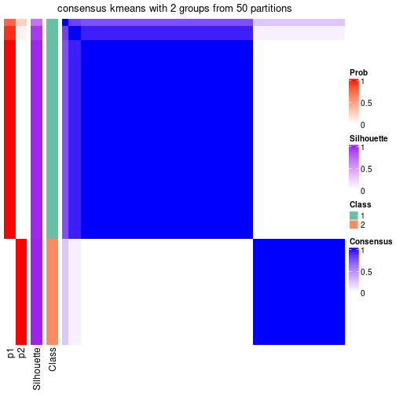</p>

</div>
<div id='tab-node-072-consensus-heatmap-2'>
<pre><code class="r">consensus_heatmap(res, k = 3)
</code></pre>

<p>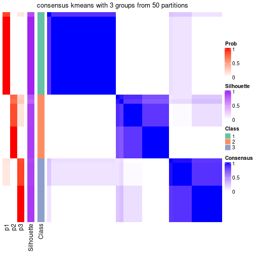</p>

</div>
<div id='tab-node-072-consensus-heatmap-3'>
<pre><code class="r">consensus_heatmap(res, k = 4)
</code></pre>

<p>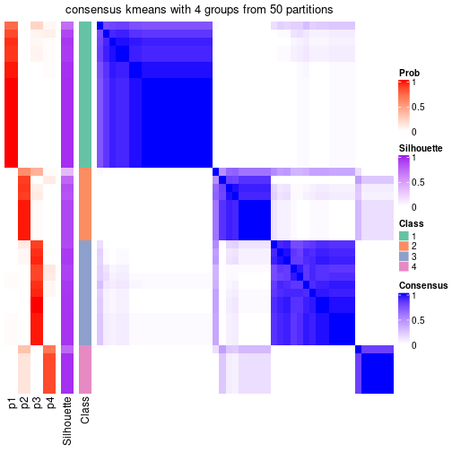</p>

</div>
<div id='tab-node-072-consensus-heatmap-4'>
<pre><code class="r">consensus_heatmap(res, k = 5)
</code></pre>

<p>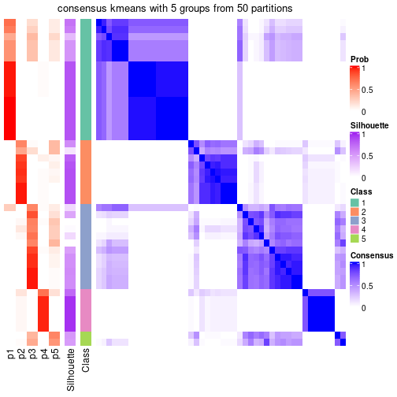</p>

</div>
<div id='tab-node-072-consensus-heatmap-5'>
<pre><code class="r">consensus_heatmap(res, k = 6)
</code></pre>

<p>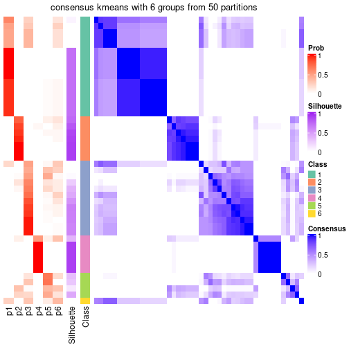</p>

</div>
<div id='tab-node-072-consensus-heatmap-6'>
<pre><code class="r">consensus_heatmap(res, k = 7)
</code></pre>

<p>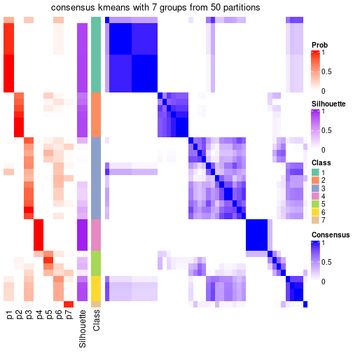</p>

</div>
<div id='tab-node-072-consensus-heatmap-7'>
<pre><code class="r">consensus_heatmap(res, k = 8)
</code></pre>

<p>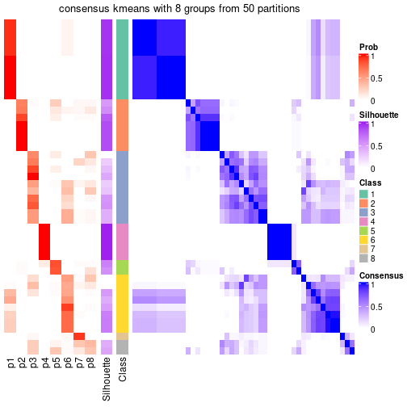</p>

</div>
</div>

Heatmaps for the membership of samples in all partitions to see how consistent they are:


<script>
$( function() {
	$( '#tabs-node-072-membership-heatmap' ).tabs();
} );
</script>
<div id='tabs-node-072-membership-heatmap'>
<ul>
<li><a href='#tab-node-072-membership-heatmap-1'>k = 2</a></li>
<li><a href='#tab-node-072-membership-heatmap-2'>k = 3</a></li>
<li><a href='#tab-node-072-membership-heatmap-3'>k = 4</a></li>
<li><a href='#tab-node-072-membership-heatmap-4'>k = 5</a></li>
<li><a href='#tab-node-072-membership-heatmap-5'>k = 6</a></li>
<li><a href='#tab-node-072-membership-heatmap-6'>k = 7</a></li>
<li><a href='#tab-node-072-membership-heatmap-7'>k = 8</a></li>
</ul>
<div id='tab-node-072-membership-heatmap-1'>
<pre><code class="r">membership_heatmap(res, k = 2)
</code></pre>

<p>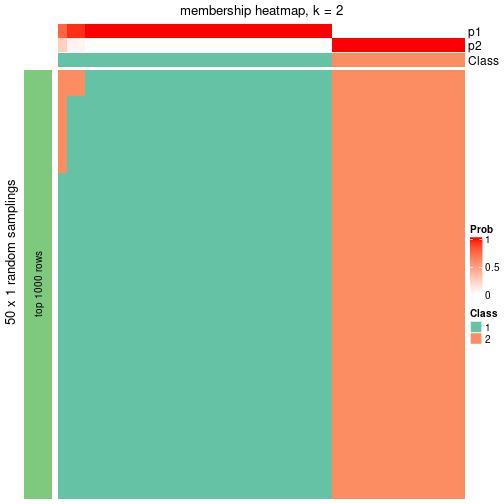</p>

</div>
<div id='tab-node-072-membership-heatmap-2'>
<pre><code class="r">membership_heatmap(res, k = 3)
</code></pre>

<p>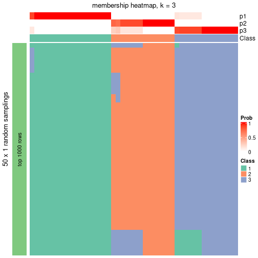</p>

</div>
<div id='tab-node-072-membership-heatmap-3'>
<pre><code class="r">membership_heatmap(res, k = 4)
</code></pre>

<p>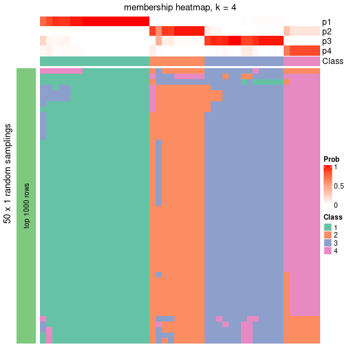</p>

</div>
<div id='tab-node-072-membership-heatmap-4'>
<pre><code class="r">membership_heatmap(res, k = 5)
</code></pre>

<p>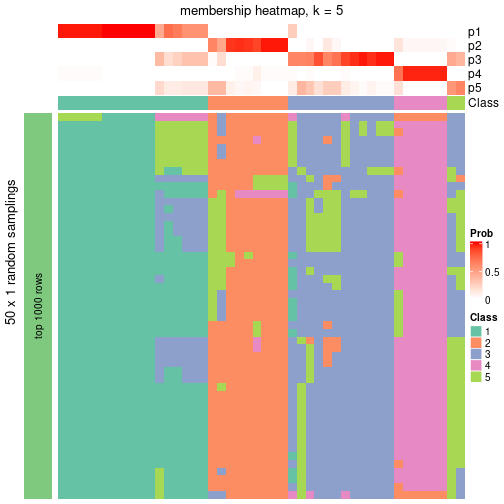</p>

</div>
<div id='tab-node-072-membership-heatmap-5'>
<pre><code class="r">membership_heatmap(res, k = 6)
</code></pre>

<p>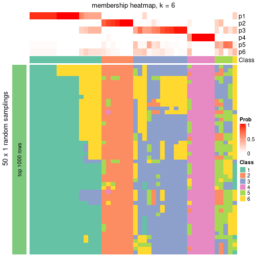</p>

</div>
<div id='tab-node-072-membership-heatmap-6'>
<pre><code class="r">membership_heatmap(res, k = 7)
</code></pre>

<p>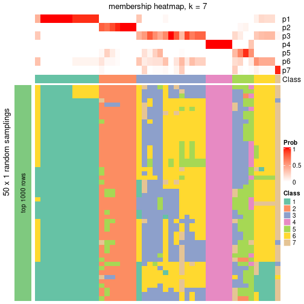</p>

</div>
<div id='tab-node-072-membership-heatmap-7'>
<pre><code class="r">membership_heatmap(res, k = 8)
</code></pre>

<p>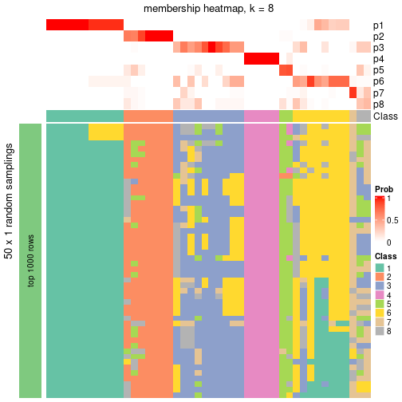</p>

</div>
</div>

As soon as the classes for columns are determined, the signatures
that are significantly different between subgroups can be looked for. 
Following are the heatmaps for signatures.


<script>
$( function() {
	$( '#tabs-node-072-get-signatures' ).tabs();
} );
</script>
<div id='tabs-node-072-get-signatures'>
<ul>
<li><a href='#tab-node-072-get-signatures-1'>k = 2</a></li>
<li><a href='#tab-node-072-get-signatures-2'>k = 3</a></li>
<li><a href='#tab-node-072-get-signatures-3'>k = 4</a></li>
<li><a href='#tab-node-072-get-signatures-4'>k = 5</a></li>
<li><a href='#tab-node-072-get-signatures-5'>k = 6</a></li>
<li><a href='#tab-node-072-get-signatures-6'>k = 7</a></li>
<li><a href='#tab-node-072-get-signatures-7'>k = 8</a></li>
</ul>
<div id='tab-node-072-get-signatures-1'>
<pre><code class="r">get_signatures(res, k = 2)
</code></pre>

<p>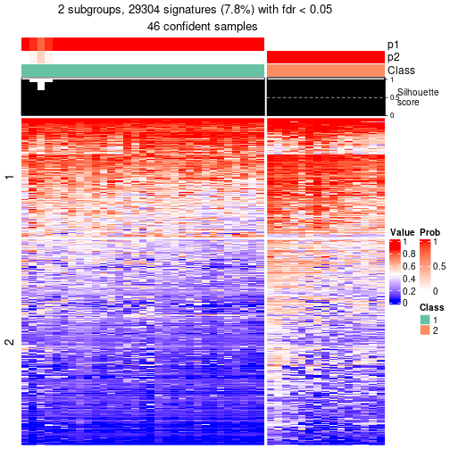</p>

</div>
<div id='tab-node-072-get-signatures-2'>
<pre><code class="r">get_signatures(res, k = 3)
</code></pre>

<p>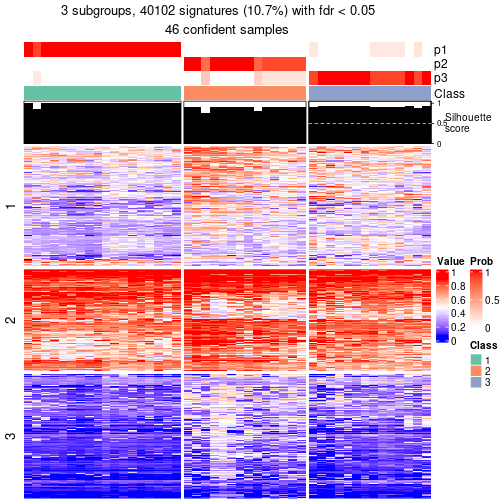</p>

</div>
<div id='tab-node-072-get-signatures-3'>
<pre><code class="r">get_signatures(res, k = 4)
</code></pre>

<p>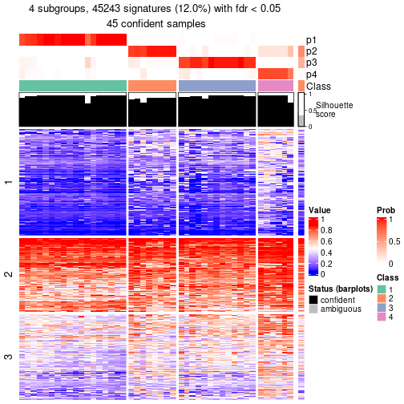</p>

</div>
<div id='tab-node-072-get-signatures-4'>
<pre><code class="r">get_signatures(res, k = 5)
</code></pre>

<p>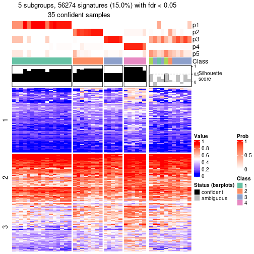</p>

</div>
<div id='tab-node-072-get-signatures-5'>
<pre><code class="r">get_signatures(res, k = 6)
</code></pre>

<p>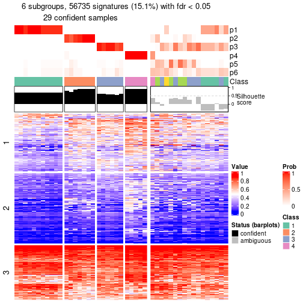</p>

</div>
<div id='tab-node-072-get-signatures-6'>
<pre><code class="r">get_signatures(res, k = 7)
</code></pre>

<p>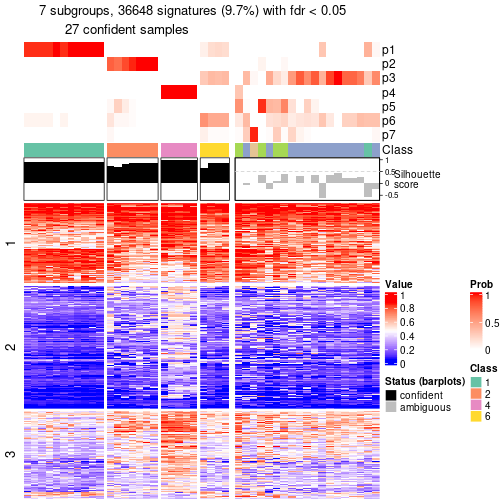</p>

</div>
<div id='tab-node-072-get-signatures-7'>
<pre><code class="r">get_signatures(res, k = 8)
</code></pre>

<p>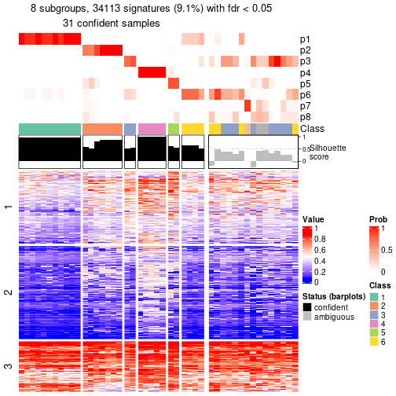</p>

</div>
</div>


Compare the overlap of signatures from different k:

```r
compare_signatures(res)
```

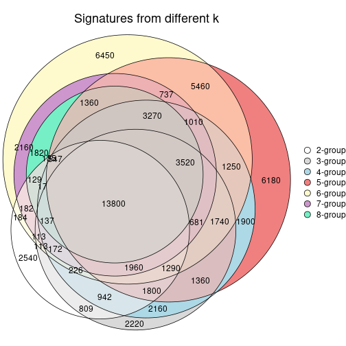

`get_signature()` returns a data frame invisibly. To get the list of signatures, the function
call should be assigned to a variable explicitly. In following code, if `plot` argument is set
to `FALSE`, no heatmap is plotted while only the differential analysis is performed.

```r
# code only for demonstration
tb = get_signature(res, k = ..., plot = FALSE)
```

An example of the output of `tb` is:

```
#>   which_row         fdr    mean_1    mean_2 scaled_mean_1 scaled_mean_2 km
#> 1        38 0.042760348  8.373488  9.131774    -0.5533452     0.5164555  1
#> 2        40 0.018707592  7.106213  8.469186    -0.6173731     0.5762149  1
#> 3        55 0.019134737 10.221463 11.207825    -0.6159697     0.5749050  1
#> 4        59 0.006059896  5.921854  7.869574    -0.6899429     0.6439467  1
#> 5        60 0.018055526  8.928898 10.211722    -0.6204761     0.5791110  1
#> 6        98 0.009384629 15.714769 14.887706     0.6635654    -0.6193277  2
...
```

The columns in `tb` are:

1. `which_row`: row indices corresponding to the input matrix.
2. `fdr`: FDR for the differential test. 
3. `mean_x`: The mean value in group x.
4. `scaled_mean_x`: The mean value in group x after rows are scaled.
5. `km`: Row groups if k-means clustering is applied to rows (which is done by automatically selecting number of clusters).

If there are too many signatures, `top_signatures = ...` can be set to only show the 
signatures with the highest FDRs:

```r
# code only for demonstration
# e.g. to show the top 500 most significant rows
tb = get_signature(res, k = ..., top_signatures = 500)
```

If the signatures are defined as these which are uniquely high in current group, `diff_method` argument
can be set to `"uniquely_high_in_one_group"`:

```r
# code only for demonstration
tb = get_signature(res, k = ..., diff_method = "uniquely_high_in_one_group")
```


UMAP plot which shows how samples are separated.


<script>
$( function() {
	$( '#tabs-node-072-dimension-reduction' ).tabs();
} );
</script>
<div id='tabs-node-072-dimension-reduction'>
<ul>
<li><a href='#tab-node-072-dimension-reduction-1'>k = 2</a></li>
<li><a href='#tab-node-072-dimension-reduction-2'>k = 3</a></li>
<li><a href='#tab-node-072-dimension-reduction-3'>k = 4</a></li>
<li><a href='#tab-node-072-dimension-reduction-4'>k = 5</a></li>
<li><a href='#tab-node-072-dimension-reduction-5'>k = 6</a></li>
<li><a href='#tab-node-072-dimension-reduction-6'>k = 7</a></li>
<li><a href='#tab-node-072-dimension-reduction-7'>k = 8</a></li>
</ul>
<div id='tab-node-072-dimension-reduction-1'>
<pre><code class="r">dimension_reduction(res, k = 2, method = &quot;UMAP&quot;)
</code></pre>

<p></p>

</div>
<div id='tab-node-072-dimension-reduction-2'>
<pre><code class="r">dimension_reduction(res, k = 3, method = &quot;UMAP&quot;)
</code></pre>

<p>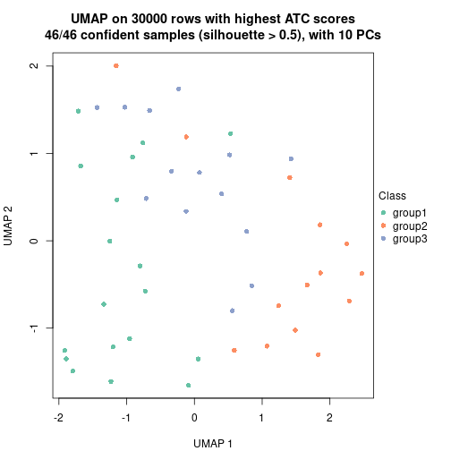</p>

</div>
<div id='tab-node-072-dimension-reduction-3'>
<pre><code class="r">dimension_reduction(res, k = 4, method = &quot;UMAP&quot;)
</code></pre>

<p>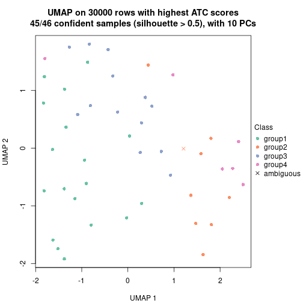</p>

</div>
<div id='tab-node-072-dimension-reduction-4'>
<pre><code class="r">dimension_reduction(res, k = 5, method = &quot;UMAP&quot;)
</code></pre>

<p>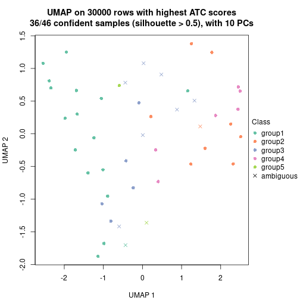</p>

</div>
<div id='tab-node-072-dimension-reduction-5'>
<pre><code class="r">dimension_reduction(res, k = 6, method = &quot;UMAP&quot;)
</code></pre>

<p>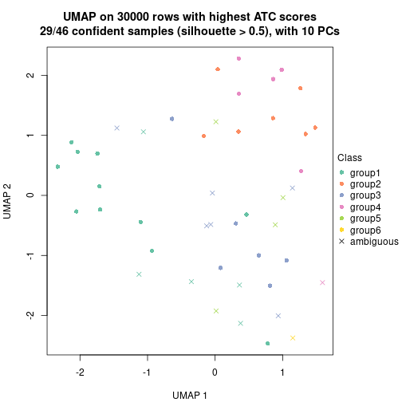</p>

</div>
<div id='tab-node-072-dimension-reduction-6'>
<pre><code class="r">dimension_reduction(res, k = 7, method = &quot;UMAP&quot;)
</code></pre>

<p>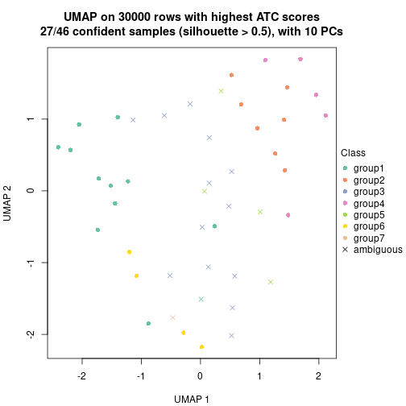</p>

</div>
<div id='tab-node-072-dimension-reduction-7'>
<pre><code class="r">dimension_reduction(res, k = 8, method = &quot;UMAP&quot;)
</code></pre>

<p>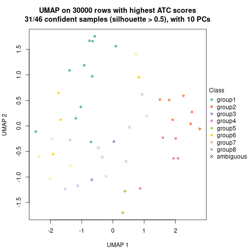</p>

</div>
</div>


Following heatmap shows how subgroups are split when increasing `k`:

```r
collect_classes(res)
```

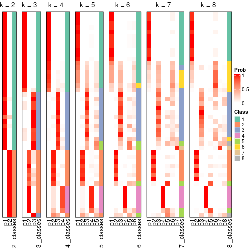


If matrix rows can be associated to genes, consider to use `functional_enrichment(res,
...)` to perform function enrichment for the signature genes. See [this vignette](https://jokergoo.github.io/cola_vignettes/functional_enrichment.html) for more detailed explanations.


 

---------------------------------------------------


### Node0721


Parent node: [Node072](#Node072).
Child nodes: 
                Node02131-leaf
        ,
                Node02132-leaf
        ,
                Node02211-leaf
        ,
                Node02212-leaf
        ,
                Node02311-leaf
        ,
                Node02312-leaf
        ,
                Node02313-leaf
        ,
                Node02314-leaf
        ,
                Node02341-leaf
        ,
                Node02342-leaf
        ,
                Node02343-leaf
        ,
                Node02344-leaf
        ,
                Node02345-leaf
        ,
                Node02421-leaf
        ,
                Node02422-leaf
        ,
                Node02423-leaf
        ,
                Node06121-leaf
        ,
                Node06122-leaf
        ,
                Node06123-leaf
        ,
                [Node07111](#Node07111)
        ,
                Node07112-leaf
        ,
                Node07211-leaf
        ,
                Node07212-leaf
        ,
                Node07213-leaf
        ,
                Node07214-leaf
        .


The object with results only for a single top-value method and a single partitioning method 
can be extracted as:

```r
res = res_rh["0721"]
```

A summary of `res` and all the functions that can be applied to it:

```r
res
```

```
#> A 'ConsensusPartition' object with k = 2, 3, 4, 5, 6, 7, 8.
#>   On a matrix with 30000 rows and 31 columns.
#>   Top rows (1000) are extracted by 'ATC' method.
#>   Subgroups are detected by 'skmeans' method.
#>   Performed in total 350 partitions by row resampling.
#>   Best k for subgroups seems to be 4.
#> 
#> Following methods can be applied to this 'ConsensusPartition' object:
#>  [1] "cola_report"             "collect_classes"         "collect_plots"          
#>  [4] "collect_stats"           "colnames"                "compare_partitions"     
#>  [7] "compare_signatures"      "consensus_heatmap"       "dimension_reduction"    
#> [10] "functional_enrichment"   "get_anno_col"            "get_anno"               
#> [13] "get_classes"             "get_consensus"           "get_matrix"             
#> [16] "get_membership"          "get_param"               "get_signatures"         
#> [19] "get_stats"               "is_best_k"               "is_stable_k"            
#> [22] "membership_heatmap"      "ncol"                    "nrow"                   
#> [25] "plot_ecdf"               "predict_classes"         "rownames"               
#> [28] "select_partition_number" "show"                    "suggest_best_k"         
#> [31] "test_to_known_factors"   "top_rows_heatmap"
```

`collect_plots()` function collects all the plots made from `res` for all `k` (number of subgroups)
into one single page to provide an easy and fast comparison between different `k`.

```r
collect_plots(res)
```

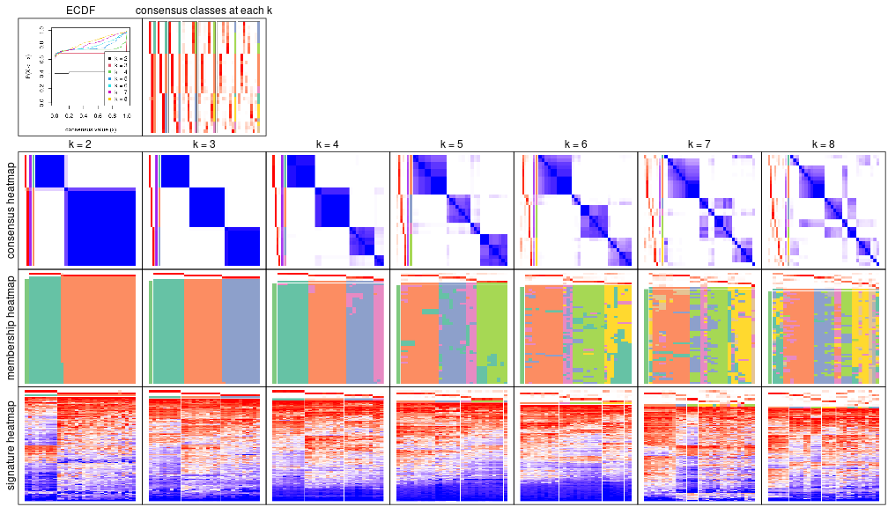

The plots are:

- The first row: a plot of the eCDF (empirical cumulative distribution
  function) curves of the consensus matrix for each `k` and the heatmap of
  predicted classes for each `k`.
- The second row: heatmaps of the consensus matrix for each `k`.
- The third row: heatmaps of the membership matrix for each `k`.
- The fouth row: heatmaps of the signatures for each `k`.

All the plots in panels can be made by individual functions and they are
plotted later in this section.

`select_partition_number()` produces several plots showing different
statistics for choosing "optimized" `k`. There are following statistics:

- eCDF curves of the consensus matrix for each `k`;
- 1-PAC. [The PAC score](https://en.wikipedia.org/wiki/Consensus_clustering#Over-interpretation_potential_of_consensus_clustering)
  measures the proportion of the ambiguous subgrouping.
- Mean silhouette score.
- Concordance. The mean probability of fiting the consensus subgroup labels in all
  partitions.
- Area increased. Denote $A_k$ as the area under the eCDF curve for current
  `k`, the area increased is defined as $A_k - A_{k-1}$.
- Rand index. The percent of pairs of samples that are both in a same cluster
  or both are not in a same cluster in the partition of k and k-1.
- Jaccard index. The ratio of pairs of samples are both in a same cluster in
  the partition of k and k-1 and the pairs of samples are both in a same
  cluster in the partition k or k-1.

The detailed explanations of these statistics can be found in [the _cola_
vignette](https://jokergoo.github.io/cola_vignettes/cola.html#toc_13).

Generally speaking, higher 1-PAC score, higher mean silhouette score or higher
concordance corresponds to better partition. Rand index and Jaccard index
measure how similar the current partition is compared to partition with `k-1`.
If they are too similar, we won't accept `k` is better than `k-1`.

```r
select_partition_number(res)
```

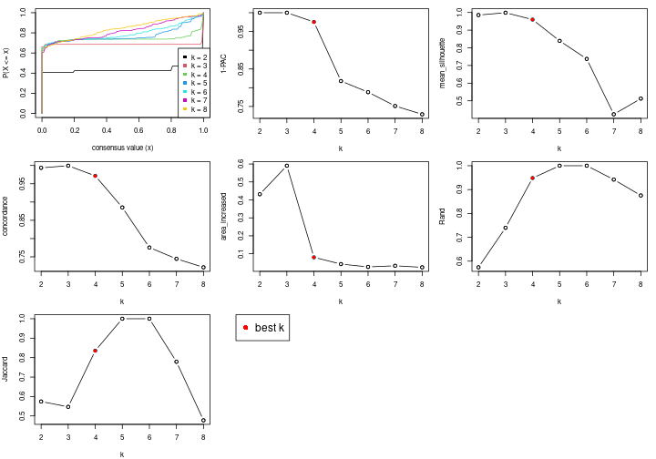

The numeric values for all these statistics can be obtained by `get_stats()`.

```r
get_stats(res)
```

```
#>   k 1-PAC mean_silhouette concordance area_increased  Rand Jaccard
#> 2 2 1.000           0.985       0.994         0.4315 0.574   0.574
#> 3 3 1.000           0.999       0.999         0.5904 0.740   0.547
#> 4 4 0.975           0.960       0.972         0.0802 0.948   0.836
#> 5 5 0.818           0.839       0.885         0.0424 1.000   1.000
#> 6 6 0.788           0.737       0.775         0.0267 1.000   1.000
#> 7 7 0.751           0.424       0.745         0.0330 0.942   0.779
#> 8 8 0.729           0.513       0.721         0.0245 0.875   0.477
```

`suggest_best_k()` suggests the best $k$ based on these statistics. The rules are as follows:

- All $k$ with Jaccard index larger than 0.95 are removed because increasing
  $k$ does not provide enough extra information. If all $k$ are removed, it is
  marked as no subgroup is detected.
- For all $k$ with 1-PAC score larger than 0.9, the maximal $k$ is taken as
  the best $k$, and other $k$ are marked as optional $k$.
- If it does not fit the second rule. The $k$ with the maximal vote of the
  highest 1-PAC score, highest mean silhouette, and highest concordance is
  taken as the best $k$.

```r
suggest_best_k(res)
```

```
#> [1] 4
#> attr(,"optional")
#> [1] 2 3
```

There is also optional best $k$ = 2 3 that is worth to check.

Following is the table of the partitions (You need to click the **show/hide
code output** link to see it). The membership matrix (columns with name `p*`)
is inferred by
[`clue::cl_consensus()`](https://www.rdocumentation.org/link/cl_consensus?package=clue)
function with the `SE` method. Basically the value in the membership matrix
represents the probability to belong to a certain group. The finall subgroup
label for an item is determined with the group with highest probability it
belongs to.

In `get_classes()` function, the entropy is calculated from the membership
matrix and the silhouette score is calculated from the consensus matrix.


<script>
$( function() {
	$( '#tabs-node-0721-get-classes' ).tabs();
} );
</script>
<div id='tabs-node-0721-get-classes'>
<ul>
<li><a href='#tab-node-0721-get-classes-1'>k = 2</a></li>
<li><a href='#tab-node-0721-get-classes-2'>k = 3</a></li>
<li><a href='#tab-node-0721-get-classes-3'>k = 4</a></li>
<li><a href='#tab-node-0721-get-classes-4'>k = 5</a></li>
<li><a href='#tab-node-0721-get-classes-5'>k = 6</a></li>
<li><a href='#tab-node-0721-get-classes-6'>k = 7</a></li>
<li><a href='#tab-node-0721-get-classes-7'>k = 8</a></li>
</ul>

<div id='tab-node-0721-get-classes-1'>
<p><a id='tab-node-0721-get-classes-1-a' style='color:#0366d6' href='#'>show/hide code output</a></p>
<pre><code class="r">cbind(get_classes(res, k = 2), get_membership(res, k = 2))
</code></pre>

<pre><code>#&gt;                 class entropy silhouette  p1  p2
#&gt; TCGA.86.8281.01     1   0.000       1.00 1.0 0.0
#&gt; TCGA.86.8358.01     2   0.000       0.99 0.0 1.0
#&gt; TCGA.78.7149.01     1   0.000       1.00 1.0 0.0
#&gt; TCGA.55.6642.01     2   0.000       0.99 0.0 1.0
#&gt; TCGA.33.6737.01     2   0.000       0.99 0.0 1.0
#&gt; TCGA.55.6968.01     2   0.000       0.99 0.0 1.0
#&gt; TCGA.75.7027.01     2   0.000       0.99 0.0 1.0
#&gt; TCGA.86.8279.01     1   0.000       1.00 1.0 0.0
#&gt; TCGA.55.8615.01     2   0.000       0.99 0.0 1.0
#&gt; TCGA.05.5425.01     2   0.000       0.99 0.0 1.0
#&gt; TCGA.50.5066.02     2   0.722       0.75 0.2 0.8
#&gt; TCGA.69.7764.01     1   0.000       1.00 1.0 0.0
#&gt; TCGA.MN.A4N4.01     2   0.000       0.99 0.0 1.0
#&gt; TCGA.91.A4BC.01     2   0.000       0.99 0.0 1.0
#&gt; TCGA.05.4433.01     2   0.000       0.99 0.0 1.0
#&gt; TCGA.50.5932.01     1   0.000       1.00 1.0 0.0
#&gt; TCGA.50.7109.01     2   0.000       0.99 0.0 1.0
#&gt; TCGA.78.7633.01     1   0.000       1.00 1.0 0.0
#&gt; TCGA.78.7167.01     1   0.000       1.00 1.0 0.0
#&gt; TCGA.55.8085.01     1   0.000       1.00 1.0 0.0
#&gt; TCGA.MP.A4TE.01     2   0.000       0.99 0.0 1.0
#&gt; TCGA.86.A4D0.01     2   0.000       0.99 0.0 1.0
#&gt; TCGA.99.8032.01     2   0.000       0.99 0.0 1.0
#&gt; TCGA.64.5779.01     2   0.000       0.99 0.0 1.0
#&gt; TCGA.55.7284.01     2   0.000       0.99 0.0 1.0
#&gt; TCGA.86.8669.01     2   0.000       0.99 0.0 1.0
#&gt; TCGA.NJ.A55R.01     2   0.000       0.99 0.0 1.0
#&gt; TCGA.33.AASB.01     2   0.000       0.99 0.0 1.0
#&gt; TCGA.97.8179.01     1   0.000       1.00 1.0 0.0
#&gt; TCGA.86.7713.01     2   0.000       0.99 0.0 1.0
#&gt; TCGA.62.A46S.01     2   0.000       0.99 0.0 1.0
</code></pre>

<script>
$('#tab-node-0721-get-classes-1-a').parent().next().next().hide();
$('#tab-node-0721-get-classes-1-a').click(function(){
  $('#tab-node-0721-get-classes-1-a').parent().next().next().toggle();
  return(false);
});
</script>
</div>

<div id='tab-node-0721-get-classes-2'>
<p><a id='tab-node-0721-get-classes-2-a' style='color:#0366d6' href='#'>show/hide code output</a></p>
<pre><code class="r">cbind(get_classes(res, k = 3), get_membership(res, k = 3))
</code></pre>

<pre><code>#&gt;                 class entropy silhouette p1   p2   p3
#&gt; TCGA.86.8281.01     1  0.0000      1.000  1 0.00 0.00
#&gt; TCGA.86.8358.01     2  0.0000      1.000  0 1.00 0.00
#&gt; TCGA.78.7149.01     1  0.0000      1.000  1 0.00 0.00
#&gt; TCGA.55.6642.01     2  0.0000      1.000  0 1.00 0.00
#&gt; TCGA.33.6737.01     3  0.0000      0.998  0 0.00 1.00
#&gt; TCGA.55.6968.01     2  0.0000      1.000  0 1.00 0.00
#&gt; TCGA.75.7027.01     3  0.0000      0.998  0 0.00 1.00
#&gt; TCGA.86.8279.01     1  0.0000      1.000  1 0.00 0.00
#&gt; TCGA.55.8615.01     3  0.0892      0.979  0 0.02 0.98
#&gt; TCGA.05.5425.01     3  0.0000      0.998  0 0.00 1.00
#&gt; TCGA.50.5066.02     3  0.0000      0.998  0 0.00 1.00
#&gt; TCGA.69.7764.01     1  0.0000      1.000  1 0.00 0.00
#&gt; TCGA.MN.A4N4.01     3  0.0000      0.998  0 0.00 1.00
#&gt; TCGA.91.A4BC.01     2  0.0000      1.000  0 1.00 0.00
#&gt; TCGA.05.4433.01     3  0.0000      0.998  0 0.00 1.00
#&gt; TCGA.50.5932.01     1  0.0000      1.000  1 0.00 0.00
#&gt; TCGA.50.7109.01     2  0.0000      1.000  0 1.00 0.00
#&gt; TCGA.78.7633.01     1  0.0000      1.000  1 0.00 0.00
#&gt; TCGA.78.7167.01     1  0.0000      1.000  1 0.00 0.00
#&gt; TCGA.55.8085.01     1  0.0000      1.000  1 0.00 0.00
#&gt; TCGA.MP.A4TE.01     2  0.0000      1.000  0 1.00 0.00
#&gt; TCGA.86.A4D0.01     2  0.0000      1.000  0 1.00 0.00
#&gt; TCGA.99.8032.01     2  0.0000      1.000  0 1.00 0.00
#&gt; TCGA.64.5779.01     2  0.0000      1.000  0 1.00 0.00
#&gt; TCGA.55.7284.01     3  0.0000      0.998  0 0.00 1.00
#&gt; TCGA.86.8669.01     2  0.0000      1.000  0 1.00 0.00
#&gt; TCGA.NJ.A55R.01     2  0.0000      1.000  0 1.00 0.00
#&gt; TCGA.33.AASB.01     3  0.0000      0.998  0 0.00 1.00
#&gt; TCGA.97.8179.01     1  0.0000      1.000  1 0.00 0.00
#&gt; TCGA.86.7713.01     3  0.0000      0.998  0 0.00 1.00
#&gt; TCGA.62.A46S.01     3  0.0000      0.998  0 0.00 1.00
</code></pre>

<script>
$('#tab-node-0721-get-classes-2-a').parent().next().next().hide();
$('#tab-node-0721-get-classes-2-a').click(function(){
  $('#tab-node-0721-get-classes-2-a').parent().next().next().toggle();
  return(false);
});
</script>
</div>

<div id='tab-node-0721-get-classes-3'>
<p><a id='tab-node-0721-get-classes-3-a' style='color:#0366d6' href='#'>show/hide code output</a></p>
<pre><code class="r">cbind(get_classes(res, k = 4), get_membership(res, k = 4))
</code></pre>

<pre><code>#&gt;                 class entropy silhouette   p1   p2   p3   p4
#&gt; TCGA.86.8281.01     1  0.0707      0.986 0.98 0.00 0.00 0.02
#&gt; TCGA.86.8358.01     2  0.0000      0.983 0.00 1.00 0.00 0.00
#&gt; TCGA.78.7149.01     1  0.0000      0.993 1.00 0.00 0.00 0.00
#&gt; TCGA.55.6642.01     2  0.2011      0.921 0.00 0.92 0.00 0.08
#&gt; TCGA.33.6737.01     3  0.0000      0.927 0.00 0.00 1.00 0.00
#&gt; TCGA.55.6968.01     2  0.0000      0.983 0.00 1.00 0.00 0.00
#&gt; TCGA.75.7027.01     3  0.0000      0.927 0.00 0.00 1.00 0.00
#&gt; TCGA.86.8279.01     1  0.0707      0.986 0.98 0.00 0.00 0.02
#&gt; TCGA.55.8615.01     4  0.1913      0.961 0.00 0.02 0.04 0.94
#&gt; TCGA.05.5425.01     3  0.1637      0.926 0.00 0.00 0.94 0.06
#&gt; TCGA.50.5066.02     3  0.2647      0.891 0.00 0.00 0.88 0.12
#&gt; TCGA.69.7764.01     1  0.0000      0.993 1.00 0.00 0.00 0.00
#&gt; TCGA.MN.A4N4.01     3  0.1211      0.928 0.00 0.00 0.96 0.04
#&gt; TCGA.91.A4BC.01     2  0.0000      0.983 0.00 1.00 0.00 0.00
#&gt; TCGA.05.4433.01     3  0.2921      0.880 0.00 0.00 0.86 0.14
#&gt; TCGA.50.5932.01     1  0.0000      0.993 1.00 0.00 0.00 0.00
#&gt; TCGA.50.7109.01     2  0.2011      0.921 0.00 0.92 0.00 0.08
#&gt; TCGA.78.7633.01     1  0.0000      0.993 1.00 0.00 0.00 0.00
#&gt; TCGA.78.7167.01     1  0.0000      0.993 1.00 0.00 0.00 0.00
#&gt; TCGA.55.8085.01     1  0.0707      0.986 0.98 0.00 0.00 0.02
#&gt; TCGA.MP.A4TE.01     2  0.0000      0.983 0.00 1.00 0.00 0.00
#&gt; TCGA.86.A4D0.01     2  0.0000      0.983 0.00 1.00 0.00 0.00
#&gt; TCGA.99.8032.01     2  0.0000      0.983 0.00 1.00 0.00 0.00
#&gt; TCGA.64.5779.01     2  0.0000      0.983 0.00 1.00 0.00 0.00
#&gt; TCGA.55.7284.01     3  0.3400      0.840 0.00 0.00 0.82 0.18
#&gt; TCGA.86.8669.01     2  0.0000      0.983 0.00 1.00 0.00 0.00
#&gt; TCGA.NJ.A55R.01     2  0.0000      0.983 0.00 1.00 0.00 0.00
#&gt; TCGA.33.AASB.01     3  0.0000      0.927 0.00 0.00 1.00 0.00
#&gt; TCGA.97.8179.01     1  0.0000      0.993 1.00 0.00 0.00 0.00
#&gt; TCGA.86.7713.01     4  0.0707      0.970 0.00 0.00 0.02 0.98
#&gt; TCGA.62.A46S.01     4  0.1211      0.967 0.00 0.00 0.04 0.96
</code></pre>

<script>
$('#tab-node-0721-get-classes-3-a').parent().next().next().hide();
$('#tab-node-0721-get-classes-3-a').click(function(){
  $('#tab-node-0721-get-classes-3-a').parent().next().next().toggle();
  return(false);
});
</script>
</div>

<div id='tab-node-0721-get-classes-4'>
<p><a id='tab-node-0721-get-classes-4-a' style='color:#0366d6' href='#'>show/hide code output</a></p>
<pre><code class="r">cbind(get_classes(res, k = 5), get_membership(res, k = 5))
</code></pre>

<pre><code>#&gt;                 class entropy silhouette   p1   p2   p3   p4   p5
#&gt; TCGA.86.8281.01     5  0.2280      0.858 0.12 0.00 0.00 0.00 0.88
#&gt; TCGA.86.8358.01     2  0.1410      0.906 0.06 0.94 0.00 0.00 0.00
#&gt; TCGA.78.7149.01     5  0.2929      0.848 0.18 0.00 0.00 0.00 0.82
#&gt; TCGA.55.6642.01     2  0.4170      0.770 0.08 0.78 0.00 0.14 0.00
#&gt; TCGA.33.6737.01     3  0.2929      0.798 0.18 0.00 0.82 0.00 0.00
#&gt; TCGA.55.6968.01     2  0.1410      0.906 0.06 0.94 0.00 0.00 0.00
#&gt; TCGA.75.7027.01     3  0.2516      0.796 0.14 0.00 0.86 0.00 0.00
#&gt; TCGA.86.8279.01     5  0.1732      0.875 0.08 0.00 0.00 0.00 0.92
#&gt; TCGA.55.8615.01     4  0.3999      0.763 0.24 0.02 0.00 0.74 0.00
#&gt; TCGA.05.5425.01     3  0.0609      0.837 0.00 0.00 0.98 0.02 0.00
#&gt; TCGA.50.5066.02     3  0.6721      0.495 0.24 0.00 0.58 0.12 0.06
#&gt; TCGA.69.7764.01     5  0.1043      0.886 0.04 0.00 0.00 0.00 0.96
#&gt; TCGA.MN.A4N4.01     3  0.1410      0.836 0.06 0.00 0.94 0.00 0.00
#&gt; TCGA.91.A4BC.01     2  0.0609      0.903 0.00 0.98 0.00 0.02 0.00
#&gt; TCGA.05.4433.01     3  0.2616      0.805 0.02 0.00 0.88 0.10 0.00
#&gt; TCGA.50.5932.01     5  0.1043      0.888 0.04 0.00 0.00 0.00 0.96
#&gt; TCGA.50.7109.01     2  0.4373      0.745 0.08 0.76 0.00 0.16 0.00
#&gt; TCGA.78.7633.01     5  0.2929      0.848 0.18 0.00 0.00 0.00 0.82
#&gt; TCGA.78.7167.01     5  0.2929      0.848 0.18 0.00 0.00 0.00 0.82
#&gt; TCGA.55.8085.01     5  0.2280      0.858 0.12 0.00 0.00 0.00 0.88
#&gt; TCGA.MP.A4TE.01     2  0.1410      0.906 0.06 0.94 0.00 0.00 0.00
#&gt; TCGA.86.A4D0.01     2  0.1410      0.906 0.06 0.94 0.00 0.00 0.00
#&gt; TCGA.99.8032.01     2  0.1410      0.906 0.06 0.94 0.00 0.00 0.00
#&gt; TCGA.64.5779.01     2  0.2012      0.885 0.06 0.92 0.00 0.02 0.00
#&gt; TCGA.55.7284.01     3  0.2616      0.810 0.02 0.00 0.88 0.10 0.00
#&gt; TCGA.86.8669.01     2  0.2012      0.885 0.06 0.92 0.00 0.02 0.00
#&gt; TCGA.NJ.A55R.01     2  0.0609      0.903 0.00 0.98 0.00 0.02 0.00
#&gt; TCGA.33.AASB.01     3  0.2516      0.815 0.14 0.00 0.86 0.00 0.00
#&gt; TCGA.97.8179.01     5  0.0609      0.890 0.02 0.00 0.00 0.00 0.98
#&gt; TCGA.86.7713.01     4  0.2077      0.829 0.04 0.00 0.04 0.92 0.00
#&gt; TCGA.62.A46S.01     4  0.2331      0.810 0.02 0.00 0.08 0.90 0.00
</code></pre>

<script>
$('#tab-node-0721-get-classes-4-a').parent().next().next().hide();
$('#tab-node-0721-get-classes-4-a').click(function(){
  $('#tab-node-0721-get-classes-4-a').parent().next().next().toggle();
  return(false);
});
</script>
</div>

<div id='tab-node-0721-get-classes-5'>
<p><a id='tab-node-0721-get-classes-5-a' style='color:#0366d6' href='#'>show/hide code output</a></p>
<pre><code class="r">cbind(get_classes(res, k = 6), get_membership(res, k = 6))
</code></pre>

<pre><code>#&gt;                 class entropy silhouette   p1   p2   p3   p4   p5   p6
#&gt; TCGA.86.8281.01     5  0.3483      0.812 0.12 0.00 0.04 0.02 0.82 0.00
#&gt; TCGA.86.8358.01     2  0.1480      0.895 0.02 0.94 0.04 0.00 0.00 0.00
#&gt; TCGA.78.7149.01     5  0.2793      0.794 0.00 0.00 0.20 0.00 0.80 0.00
#&gt; TCGA.55.6642.01     2  0.4345      0.714 0.02 0.74 0.18 0.06 0.00 0.00
#&gt; TCGA.33.6737.01     6  0.3864      0.524 0.48 0.00 0.00 0.00 0.00 0.52
#&gt; TCGA.55.6968.01     2  0.1480      0.895 0.02 0.94 0.04 0.00 0.00 0.00
#&gt; TCGA.75.7027.01     6  0.4806      0.486 0.38 0.00 0.06 0.00 0.00 0.56
#&gt; TCGA.86.8279.01     5  0.3572      0.814 0.10 0.00 0.06 0.02 0.82 0.00
#&gt; TCGA.55.8615.01     4  0.4337      0.551 0.02 0.00 0.48 0.50 0.00 0.00
#&gt; TCGA.05.5425.01     6  0.0547      0.673 0.02 0.00 0.00 0.00 0.00 0.98
#&gt; TCGA.50.5066.02     6  0.7015      0.312 0.36 0.00 0.06 0.10 0.04 0.44
#&gt; TCGA.69.7764.01     5  0.2190      0.849 0.06 0.00 0.04 0.00 0.90 0.00
#&gt; TCGA.MN.A4N4.01     6  0.0547      0.671 0.02 0.00 0.00 0.00 0.00 0.98
#&gt; TCGA.91.A4BC.01     2  0.0547      0.889 0.00 0.98 0.02 0.00 0.00 0.00
#&gt; TCGA.05.4433.01     6  0.2629      0.635 0.08 0.00 0.02 0.02 0.00 0.88
#&gt; TCGA.50.5932.01     5  0.0547      0.851 0.00 0.00 0.02 0.00 0.98 0.00
#&gt; TCGA.50.7109.01     2  0.5684      0.579 0.02 0.64 0.20 0.12 0.00 0.02
#&gt; TCGA.78.7633.01     5  0.2793      0.794 0.00 0.00 0.20 0.00 0.80 0.00
#&gt; TCGA.78.7167.01     5  0.2793      0.794 0.00 0.00 0.20 0.00 0.80 0.00
#&gt; TCGA.55.8085.01     5  0.3572      0.823 0.10 0.00 0.06 0.02 0.82 0.00
#&gt; TCGA.MP.A4TE.01     2  0.1480      0.895 0.02 0.94 0.04 0.00 0.00 0.00
#&gt; TCGA.86.A4D0.01     2  0.1480      0.895 0.02 0.94 0.04 0.00 0.00 0.00
#&gt; TCGA.99.8032.01     2  0.1480      0.895 0.02 0.94 0.04 0.00 0.00 0.00
#&gt; TCGA.64.5779.01     2  0.1480      0.876 0.02 0.94 0.04 0.00 0.00 0.00
#&gt; TCGA.55.7284.01     6  0.2350      0.641 0.10 0.00 0.02 0.00 0.00 0.88
#&gt; TCGA.86.8669.01     2  0.1814      0.855 0.00 0.90 0.10 0.00 0.00 0.00
#&gt; TCGA.NJ.A55R.01     2  0.0547      0.889 0.00 0.98 0.02 0.00 0.00 0.00
#&gt; TCGA.33.AASB.01     6  0.4282      0.557 0.42 0.00 0.02 0.00 0.00 0.56
#&gt; TCGA.97.8179.01     5  0.0547      0.853 0.02 0.00 0.00 0.00 0.98 0.00
#&gt; TCGA.86.7713.01     4  0.0937      0.640 0.00 0.00 0.00 0.96 0.00 0.04
#&gt; TCGA.62.A46S.01     4  0.5636      0.507 0.06 0.00 0.08 0.62 0.00 0.24
</code></pre>

<script>
$('#tab-node-0721-get-classes-5-a').parent().next().next().hide();
$('#tab-node-0721-get-classes-5-a').click(function(){
  $('#tab-node-0721-get-classes-5-a').parent().next().next().toggle();
  return(false);
});
</script>
</div>

<div id='tab-node-0721-get-classes-6'>
<p><a id='tab-node-0721-get-classes-6-a' style='color:#0366d6' href='#'>show/hide code output</a></p>
<pre><code class="r">cbind(get_classes(res, k = 7), get_membership(res, k = 7))
</code></pre>

<pre><code>#&gt;                 class entropy silhouette   p1   p2   p3   p4   p5   p6   p7
#&gt; TCGA.86.8281.01     3  0.3413     0.8490 0.00 0.00 0.62 0.00 0.38 0.00 0.00
#&gt; TCGA.86.8358.01     2  0.0504     0.7789 0.00 0.98 0.00 0.02 0.00 0.00 0.00
#&gt; TCGA.78.7149.01     5  0.0504     0.6181 0.00 0.00 0.02 0.00 0.98 0.00 0.00
#&gt; TCGA.55.6642.01     2  0.7417     0.4898 0.10 0.48 0.10 0.10 0.00 0.02 0.20
#&gt; TCGA.33.6737.01     1  0.3459     0.0000 0.60 0.00 0.00 0.00 0.00 0.40 0.00
#&gt; TCGA.55.6968.01     2  0.0504     0.7789 0.00 0.98 0.00 0.02 0.00 0.00 0.00
#&gt; TCGA.75.7027.01     6  0.6226    -0.0749 0.38 0.00 0.08 0.14 0.00 0.40 0.00
#&gt; TCGA.86.8279.01     3  0.3546     0.7601 0.00 0.00 0.54 0.00 0.46 0.00 0.00
#&gt; TCGA.55.8615.01     7  0.0000     0.0000 0.00 0.00 0.00 0.00 0.00 0.00 1.00
#&gt; TCGA.05.5425.01     6  0.1433     0.3361 0.08 0.00 0.00 0.00 0.00 0.92 0.00
#&gt; TCGA.50.5066.02     6  0.6920    -0.2637 0.28 0.00 0.26 0.14 0.00 0.32 0.00
#&gt; TCGA.69.7764.01     5  0.3943    -0.4689 0.02 0.00 0.42 0.00 0.56 0.00 0.00
#&gt; TCGA.MN.A4N4.01     6  0.1671     0.3152 0.10 0.00 0.00 0.00 0.00 0.90 0.00
#&gt; TCGA.91.A4BC.01     2  0.4507     0.7517 0.08 0.76 0.06 0.06 0.00 0.00 0.04
#&gt; TCGA.05.4433.01     6  0.1860     0.3727 0.02 0.00 0.02 0.04 0.00 0.92 0.00
#&gt; TCGA.50.5932.01     5  0.3186     0.4111 0.02 0.00 0.22 0.00 0.76 0.00 0.00
#&gt; TCGA.50.7109.01     2  0.7987     0.3868 0.10 0.42 0.12 0.12 0.00 0.04 0.20
#&gt; TCGA.78.7633.01     5  0.0000     0.6227 0.00 0.00 0.00 0.00 1.00 0.00 0.00
#&gt; TCGA.78.7167.01     5  0.0000     0.6227 0.00 0.00 0.00 0.00 1.00 0.00 0.00
#&gt; TCGA.55.8085.01     3  0.3496     0.8449 0.00 0.00 0.58 0.00 0.42 0.00 0.00
#&gt; TCGA.MP.A4TE.01     2  0.0504     0.7789 0.00 0.98 0.00 0.02 0.00 0.00 0.00
#&gt; TCGA.86.A4D0.01     2  0.0504     0.7789 0.00 0.98 0.00 0.02 0.00 0.00 0.00
#&gt; TCGA.99.8032.01     2  0.0000     0.7814 0.00 1.00 0.00 0.00 0.00 0.00 0.00
#&gt; TCGA.64.5779.01     2  0.5158     0.7263 0.06 0.70 0.12 0.08 0.00 0.00 0.04
#&gt; TCGA.55.7284.01     6  0.1363     0.3784 0.00 0.00 0.02 0.04 0.00 0.94 0.00
#&gt; TCGA.86.8669.01     2  0.5401     0.6944 0.02 0.66 0.14 0.12 0.00 0.00 0.06
#&gt; TCGA.NJ.A55R.01     2  0.3346     0.7720 0.04 0.84 0.06 0.04 0.00 0.00 0.02
#&gt; TCGA.33.AASB.01     6  0.4421    -0.7068 0.46 0.00 0.02 0.02 0.00 0.50 0.00
#&gt; TCGA.97.8179.01     5  0.3294    -0.0377 0.00 0.00 0.34 0.00 0.66 0.00 0.00
#&gt; TCGA.86.7713.01     4  0.4305     0.3981 0.00 0.00 0.02 0.66 0.00 0.04 0.28
#&gt; TCGA.62.A46S.01     4  0.7085     0.4366 0.02 0.00 0.12 0.38 0.00 0.20 0.28
</code></pre>

<script>
$('#tab-node-0721-get-classes-6-a').parent().next().next().hide();
$('#tab-node-0721-get-classes-6-a').click(function(){
  $('#tab-node-0721-get-classes-6-a').parent().next().next().toggle();
  return(false);
});
</script>
</div>

<div id='tab-node-0721-get-classes-7'>
<p><a id='tab-node-0721-get-classes-7-a' style='color:#0366d6' href='#'>show/hide code output</a></p>
<pre><code class="r">cbind(get_classes(res, k = 8), get_membership(res, k = 8))
</code></pre>

<pre><code>#&gt;                 class entropy silhouette   p1   p2   p3   p4   p5   p6   p7   p8
#&gt; TCGA.86.8281.01     3  0.0000     0.6788 0.00 0.00 1.00 0.00 0.00 0.00 0.00 0.00
#&gt; TCGA.86.8358.01     2  0.0000     0.7583 0.00 1.00 0.00 0.00 0.00 0.00 0.00 0.00
#&gt; TCGA.78.7149.01     5  0.3015     0.9166 0.00 0.00 0.32 0.00 0.68 0.00 0.00 0.00
#&gt; TCGA.55.6642.01     4  0.4848     0.7932 0.00 0.34 0.00 0.54 0.00 0.10 0.02 0.00
#&gt; TCGA.33.6737.01     1  0.4921     0.2677 0.52 0.00 0.00 0.00 0.00 0.26 0.00 0.22
#&gt; TCGA.55.6968.01     2  0.0000     0.7583 0.00 1.00 0.00 0.00 0.00 0.00 0.00 0.00
#&gt; TCGA.75.7027.01     8  0.3095     0.0000 0.02 0.00 0.00 0.00 0.00 0.24 0.00 0.74
#&gt; TCGA.86.8279.01     3  0.1804     0.6765 0.02 0.00 0.90 0.00 0.08 0.00 0.00 0.00
#&gt; TCGA.55.8615.01     7  0.2224     0.2420 0.00 0.00 0.00 0.12 0.00 0.02 0.86 0.00
#&gt; TCGA.05.5425.01     6  0.3227     0.5343 0.14 0.00 0.00 0.00 0.00 0.78 0.00 0.08
#&gt; TCGA.50.5066.02     1  0.6377     0.1657 0.50 0.00 0.20 0.04 0.04 0.20 0.02 0.00
#&gt; TCGA.69.7764.01     3  0.3078     0.6502 0.02 0.00 0.82 0.00 0.10 0.00 0.00 0.06
#&gt; TCGA.MN.A4N4.01     6  0.3227     0.5180 0.14 0.00 0.00 0.00 0.00 0.78 0.00 0.08
#&gt; TCGA.91.A4BC.01     2  0.2938     0.3820 0.00 0.70 0.00 0.30 0.00 0.00 0.00 0.00
#&gt; TCGA.05.4433.01     6  0.1408     0.5734 0.02 0.00 0.00 0.02 0.00 0.94 0.00 0.02
#&gt; TCGA.50.5932.01     3  0.4607    -0.0446 0.02 0.00 0.50 0.00 0.42 0.00 0.00 0.06
#&gt; TCGA.50.7109.01     4  0.4672     0.8189 0.00 0.24 0.00 0.62 0.00 0.12 0.02 0.00
#&gt; TCGA.78.7633.01     5  0.2852     0.9595 0.00 0.00 0.28 0.00 0.72 0.00 0.00 0.00
#&gt; TCGA.78.7167.01     5  0.2852     0.9595 0.00 0.00 0.28 0.00 0.72 0.00 0.00 0.00
#&gt; TCGA.55.8085.01     3  0.0808     0.6888 0.00 0.00 0.96 0.00 0.04 0.00 0.00 0.00
#&gt; TCGA.MP.A4TE.01     2  0.0000     0.7583 0.00 1.00 0.00 0.00 0.00 0.00 0.00 0.00
#&gt; TCGA.86.A4D0.01     2  0.0000     0.7583 0.00 1.00 0.00 0.00 0.00 0.00 0.00 0.00
#&gt; TCGA.99.8032.01     2  0.0808     0.7458 0.00 0.96 0.00 0.04 0.00 0.00 0.00 0.00
#&gt; TCGA.64.5779.01     2  0.3193     0.2293 0.00 0.62 0.00 0.38 0.00 0.00 0.00 0.00
#&gt; TCGA.55.7284.01     6  0.0000     0.5949 0.00 0.00 0.00 0.00 0.00 1.00 0.00 0.00
#&gt; TCGA.86.8669.01     2  0.4586    -0.0389 0.00 0.52 0.00 0.40 0.02 0.00 0.00 0.06
#&gt; TCGA.NJ.A55R.01     2  0.1947     0.6705 0.00 0.86 0.00 0.14 0.00 0.00 0.00 0.00
#&gt; TCGA.33.AASB.01     1  0.5674     0.2919 0.50 0.00 0.00 0.00 0.06 0.24 0.00 0.20
#&gt; TCGA.97.8179.01     3  0.3675     0.4137 0.00 0.00 0.66 0.00 0.30 0.00 0.00 0.04
#&gt; TCGA.86.7713.01     7  0.7832     0.2489 0.16 0.00 0.00 0.26 0.16 0.08 0.30 0.04
#&gt; TCGA.62.A46S.01     6  0.7304    -0.0819 0.10 0.00 0.00 0.22 0.08 0.40 0.18 0.02
</code></pre>

<script>
$('#tab-node-0721-get-classes-7-a').parent().next().next().hide();
$('#tab-node-0721-get-classes-7-a').click(function(){
  $('#tab-node-0721-get-classes-7-a').parent().next().next().toggle();
  return(false);
});
</script>
</div>
</div>

Heatmaps for the consensus matrix. It visualizes the probability of two
samples to be in a same group.


<script>
$( function() {
	$( '#tabs-node-0721-consensus-heatmap' ).tabs();
} );
</script>
<div id='tabs-node-0721-consensus-heatmap'>
<ul>
<li><a href='#tab-node-0721-consensus-heatmap-1'>k = 2</a></li>
<li><a href='#tab-node-0721-consensus-heatmap-2'>k = 3</a></li>
<li><a href='#tab-node-0721-consensus-heatmap-3'>k = 4</a></li>
<li><a href='#tab-node-0721-consensus-heatmap-4'>k = 5</a></li>
<li><a href='#tab-node-0721-consensus-heatmap-5'>k = 6</a></li>
<li><a href='#tab-node-0721-consensus-heatmap-6'>k = 7</a></li>
<li><a href='#tab-node-0721-consensus-heatmap-7'>k = 8</a></li>
</ul>
<div id='tab-node-0721-consensus-heatmap-1'>
<pre><code class="r">consensus_heatmap(res, k = 2)
</code></pre>

<p>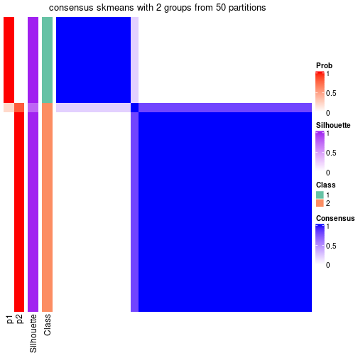</p>

</div>
<div id='tab-node-0721-consensus-heatmap-2'>
<pre><code class="r">consensus_heatmap(res, k = 3)
</code></pre>

<p>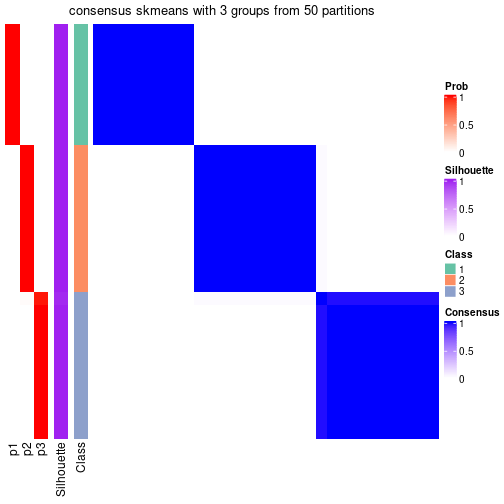</p>

</div>
<div id='tab-node-0721-consensus-heatmap-3'>
<pre><code class="r">consensus_heatmap(res, k = 4)
</code></pre>

<p>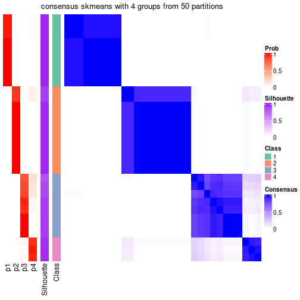</p>

</div>
<div id='tab-node-0721-consensus-heatmap-4'>
<pre><code class="r">consensus_heatmap(res, k = 5)
</code></pre>

<p>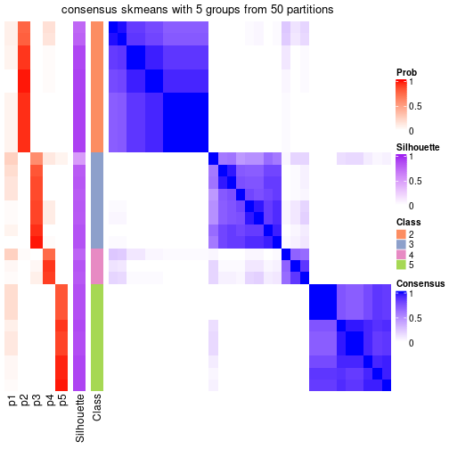</p>

</div>
<div id='tab-node-0721-consensus-heatmap-5'>
<pre><code class="r">consensus_heatmap(res, k = 6)
</code></pre>

<p>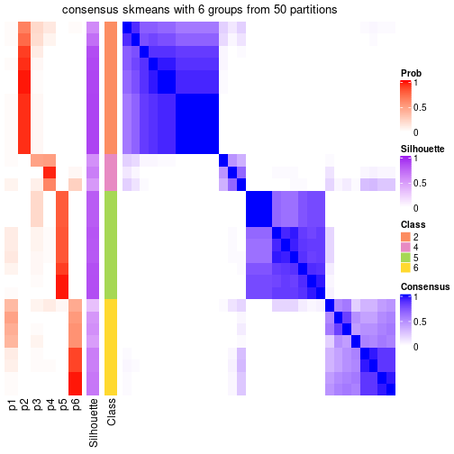</p>

</div>
<div id='tab-node-0721-consensus-heatmap-6'>
<pre><code class="r">consensus_heatmap(res, k = 7)
</code></pre>

<p>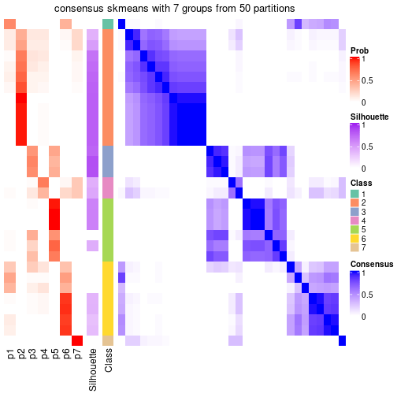</p>

</div>
<div id='tab-node-0721-consensus-heatmap-7'>
<pre><code class="r">consensus_heatmap(res, k = 8)
</code></pre>

<p>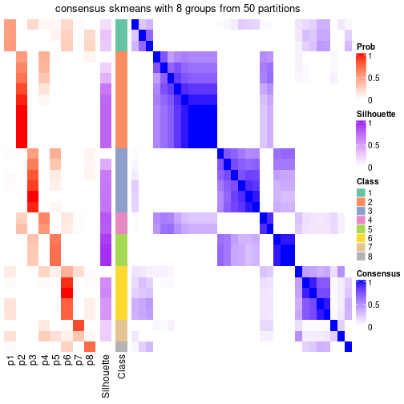</p>

</div>
</div>

Heatmaps for the membership of samples in all partitions to see how consistent they are:


<script>
$( function() {
	$( '#tabs-node-0721-membership-heatmap' ).tabs();
} );
</script>
<div id='tabs-node-0721-membership-heatmap'>
<ul>
<li><a href='#tab-node-0721-membership-heatmap-1'>k = 2</a></li>
<li><a href='#tab-node-0721-membership-heatmap-2'>k = 3</a></li>
<li><a href='#tab-node-0721-membership-heatmap-3'>k = 4</a></li>
<li><a href='#tab-node-0721-membership-heatmap-4'>k = 5</a></li>
<li><a href='#tab-node-0721-membership-heatmap-5'>k = 6</a></li>
<li><a href='#tab-node-0721-membership-heatmap-6'>k = 7</a></li>
<li><a href='#tab-node-0721-membership-heatmap-7'>k = 8</a></li>
</ul>
<div id='tab-node-0721-membership-heatmap-1'>
<pre><code class="r">membership_heatmap(res, k = 2)
</code></pre>

<p>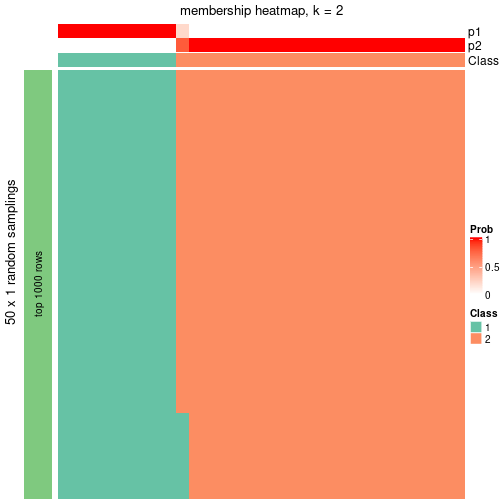</p>

</div>
<div id='tab-node-0721-membership-heatmap-2'>
<pre><code class="r">membership_heatmap(res, k = 3)
</code></pre>

<p>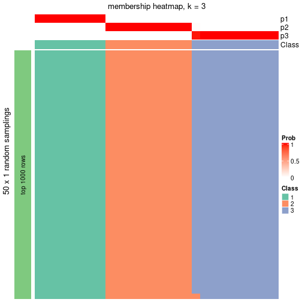</p>

</div>
<div id='tab-node-0721-membership-heatmap-3'>
<pre><code class="r">membership_heatmap(res, k = 4)
</code></pre>

<p>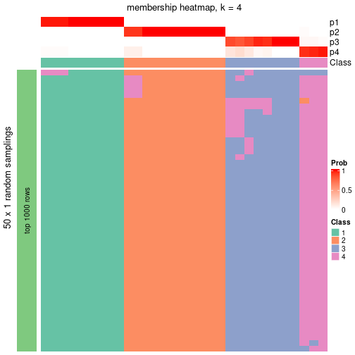</p>

</div>
<div id='tab-node-0721-membership-heatmap-4'>
<pre><code class="r">membership_heatmap(res, k = 5)
</code></pre>

<p>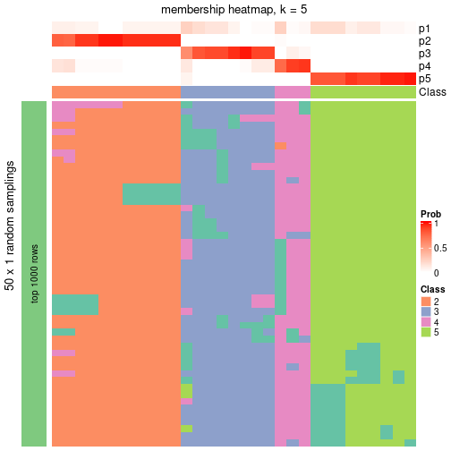</p>

</div>
<div id='tab-node-0721-membership-heatmap-5'>
<pre><code class="r">membership_heatmap(res, k = 6)
</code></pre>

<p>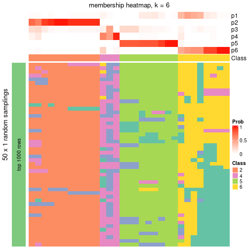</p>

</div>
<div id='tab-node-0721-membership-heatmap-6'>
<pre><code class="r">membership_heatmap(res, k = 7)
</code></pre>

<p>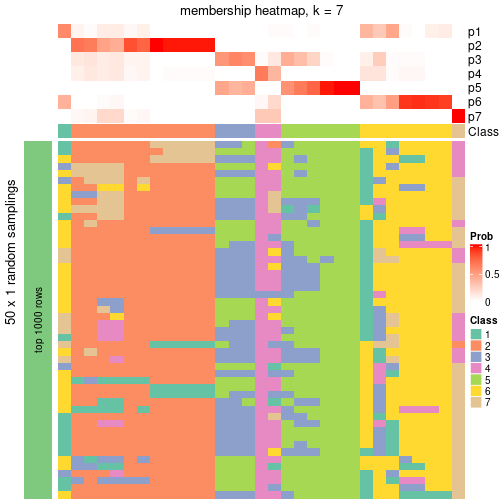</p>

</div>
<div id='tab-node-0721-membership-heatmap-7'>
<pre><code class="r">membership_heatmap(res, k = 8)
</code></pre>

<p>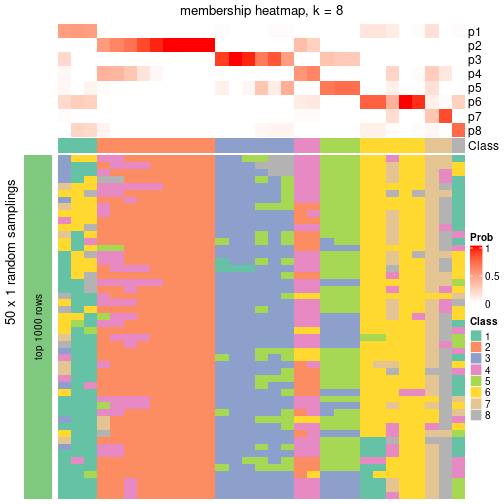</p>

</div>
</div>

As soon as the classes for columns are determined, the signatures
that are significantly different between subgroups can be looked for. 
Following are the heatmaps for signatures.


<script>
$( function() {
	$( '#tabs-node-0721-get-signatures' ).tabs();
} );
</script>
<div id='tabs-node-0721-get-signatures'>
<ul>
<li><a href='#tab-node-0721-get-signatures-1'>k = 2</a></li>
<li><a href='#tab-node-0721-get-signatures-2'>k = 3</a></li>
<li><a href='#tab-node-0721-get-signatures-3'>k = 4</a></li>
<li><a href='#tab-node-0721-get-signatures-4'>k = 5</a></li>
<li><a href='#tab-node-0721-get-signatures-5'>k = 6</a></li>
<li><a href='#tab-node-0721-get-signatures-6'>k = 7</a></li>
<li><a href='#tab-node-0721-get-signatures-7'>k = 8</a></li>
</ul>
<div id='tab-node-0721-get-signatures-1'>
<pre><code class="r">get_signatures(res, k = 2)
</code></pre>

<p>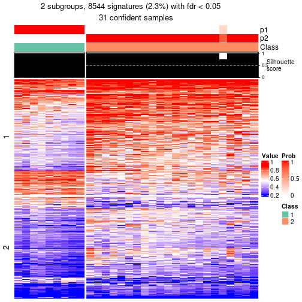</p>

</div>
<div id='tab-node-0721-get-signatures-2'>
<pre><code class="r">get_signatures(res, k = 3)
</code></pre>

<p>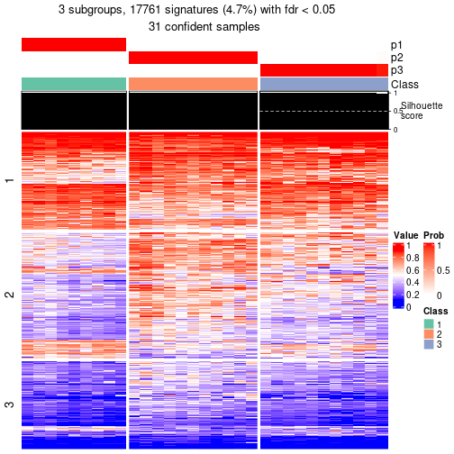</p>

</div>
<div id='tab-node-0721-get-signatures-3'>
<pre><code class="r">get_signatures(res, k = 4)
</code></pre>

<p>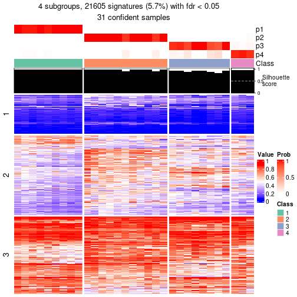</p>

</div>
<div id='tab-node-0721-get-signatures-4'>
<pre><code class="r">get_signatures(res, k = 5)
</code></pre>

<p>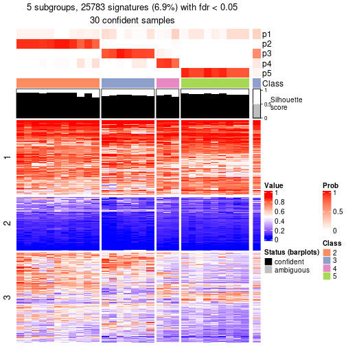</p>

</div>
<div id='tab-node-0721-get-signatures-5'>
<pre><code class="r">get_signatures(res, k = 6)
</code></pre>

<p>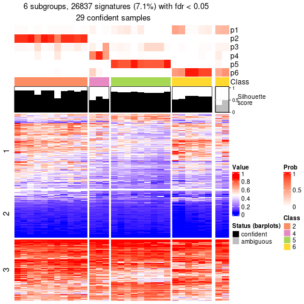</p>

</div>
<div id='tab-node-0721-get-signatures-6'>
<pre><code class="r">get_signatures(res, k = 7)
</code></pre>

<p>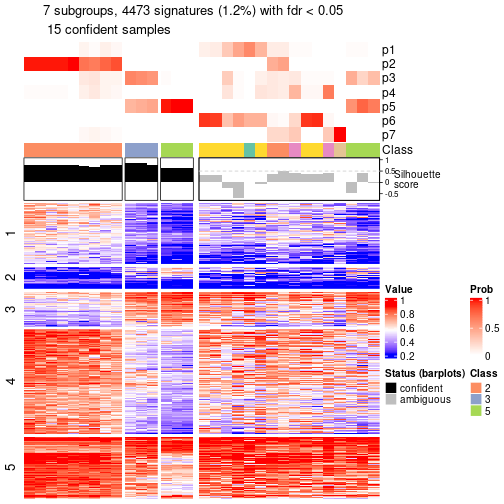</p>

</div>
<div id='tab-node-0721-get-signatures-7'>
<pre><code class="r">get_signatures(res, k = 8)
</code></pre>

<p>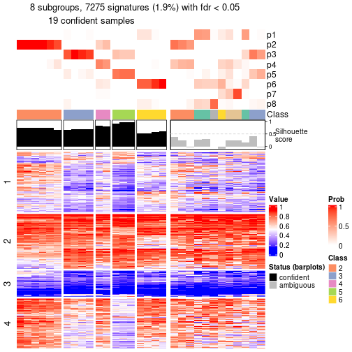</p>

</div>
</div>


Compare the overlap of signatures from different k:

```r
compare_signatures(res)
```

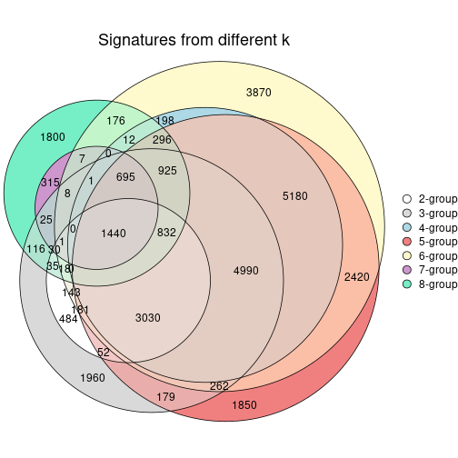

`get_signature()` returns a data frame invisibly. To get the list of signatures, the function
call should be assigned to a variable explicitly. In following code, if `plot` argument is set
to `FALSE`, no heatmap is plotted while only the differential analysis is performed.

```r
# code only for demonstration
tb = get_signature(res, k = ..., plot = FALSE)
```

An example of the output of `tb` is:

```
#>   which_row         fdr    mean_1    mean_2 scaled_mean_1 scaled_mean_2 km
#> 1        38 0.042760348  8.373488  9.131774    -0.5533452     0.5164555  1
#> 2        40 0.018707592  7.106213  8.469186    -0.6173731     0.5762149  1
#> 3        55 0.019134737 10.221463 11.207825    -0.6159697     0.5749050  1
#> 4        59 0.006059896  5.921854  7.869574    -0.6899429     0.6439467  1
#> 5        60 0.018055526  8.928898 10.211722    -0.6204761     0.5791110  1
#> 6        98 0.009384629 15.714769 14.887706     0.6635654    -0.6193277  2
...
```

The columns in `tb` are:

1. `which_row`: row indices corresponding to the input matrix.
2. `fdr`: FDR for the differential test. 
3. `mean_x`: The mean value in group x.
4. `scaled_mean_x`: The mean value in group x after rows are scaled.
5. `km`: Row groups if k-means clustering is applied to rows (which is done by automatically selecting number of clusters).

If there are too many signatures, `top_signatures = ...` can be set to only show the 
signatures with the highest FDRs:

```r
# code only for demonstration
# e.g. to show the top 500 most significant rows
tb = get_signature(res, k = ..., top_signatures = 500)
```

If the signatures are defined as these which are uniquely high in current group, `diff_method` argument
can be set to `"uniquely_high_in_one_group"`:

```r
# code only for demonstration
tb = get_signature(res, k = ..., diff_method = "uniquely_high_in_one_group")
```


UMAP plot which shows how samples are separated.


<script>
$( function() {
	$( '#tabs-node-0721-dimension-reduction' ).tabs();
} );
</script>
<div id='tabs-node-0721-dimension-reduction'>
<ul>
<li><a href='#tab-node-0721-dimension-reduction-1'>k = 2</a></li>
<li><a href='#tab-node-0721-dimension-reduction-2'>k = 3</a></li>
<li><a href='#tab-node-0721-dimension-reduction-3'>k = 4</a></li>
<li><a href='#tab-node-0721-dimension-reduction-4'>k = 5</a></li>
<li><a href='#tab-node-0721-dimension-reduction-5'>k = 6</a></li>
<li><a href='#tab-node-0721-dimension-reduction-6'>k = 7</a></li>
<li><a href='#tab-node-0721-dimension-reduction-7'>k = 8</a></li>
</ul>
<div id='tab-node-0721-dimension-reduction-1'>
<pre><code class="r">dimension_reduction(res, k = 2, method = &quot;UMAP&quot;)
</code></pre>

<p>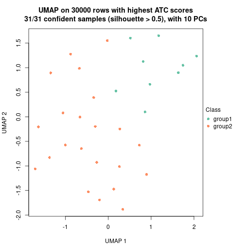</p>

</div>
<div id='tab-node-0721-dimension-reduction-2'>
<pre><code class="r">dimension_reduction(res, k = 3, method = &quot;UMAP&quot;)
</code></pre>

<p>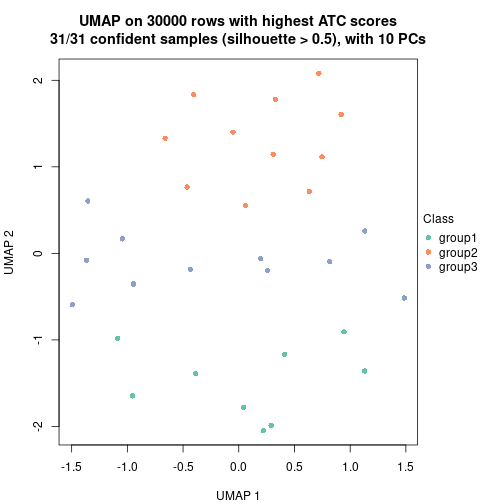</p>

</div>
<div id='tab-node-0721-dimension-reduction-3'>
<pre><code class="r">dimension_reduction(res, k = 4, method = &quot;UMAP&quot;)
</code></pre>

<p>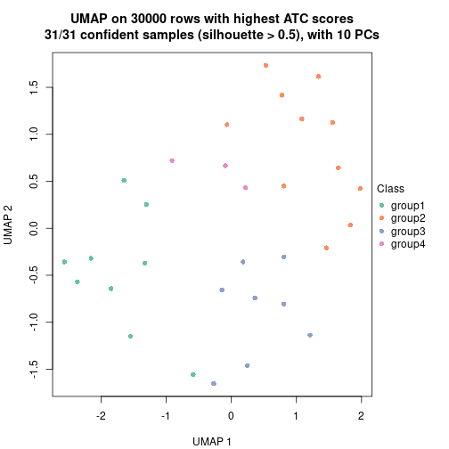</p>

</div>
<div id='tab-node-0721-dimension-reduction-4'>
<pre><code class="r">dimension_reduction(res, k = 5, method = &quot;UMAP&quot;)
</code></pre>

<p>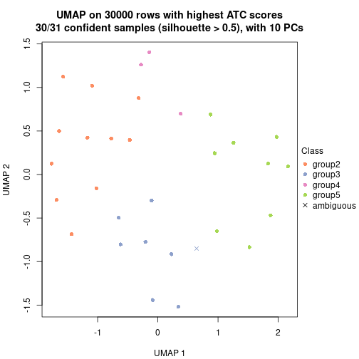</p>

</div>
<div id='tab-node-0721-dimension-reduction-5'>
<pre><code class="r">dimension_reduction(res, k = 6, method = &quot;UMAP&quot;)
</code></pre>

<p>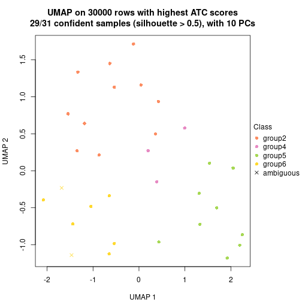</p>

</div>
<div id='tab-node-0721-dimension-reduction-6'>
<pre><code class="r">dimension_reduction(res, k = 7, method = &quot;UMAP&quot;)
</code></pre>

<p>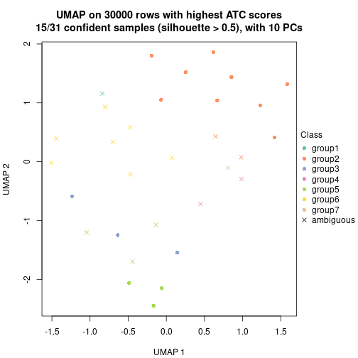</p>

</div>
<div id='tab-node-0721-dimension-reduction-7'>
<pre><code class="r">dimension_reduction(res, k = 8, method = &quot;UMAP&quot;)
</code></pre>

<p>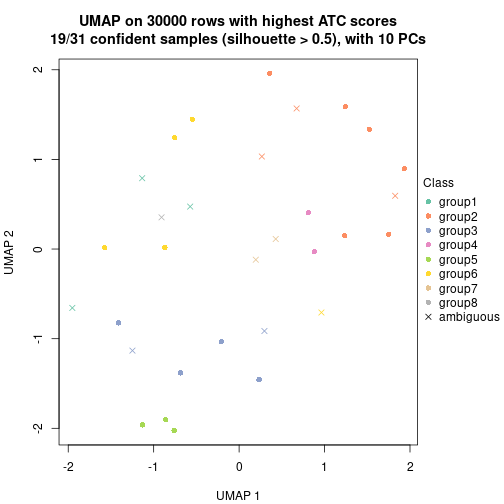</p>

</div>
</div>


Following heatmap shows how subgroups are split when increasing `k`:

```r
collect_classes(res)
```

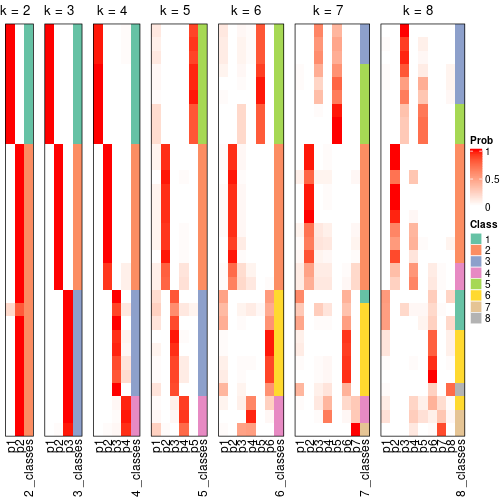


If matrix rows can be associated to genes, consider to use `functional_enrichment(res,
...)` to perform function enrichment for the signature genes. See [this vignette](https://jokergoo.github.io/cola_vignettes/functional_enrichment.html) for more detailed explanations.


 

---------------------------------------------------


### Node073


Parent node: [Node07](#Node07).
Child nodes: 
                Node0111-leaf
        ,
                Node0112-leaf
        ,
                Node0113-leaf
        ,
                Node0114-leaf
        ,
                Node0121-leaf
        ,
                Node0122-leaf
        ,
                Node0123-leaf
        ,
                Node0131-leaf
        ,
                Node0132-leaf
        ,
                Node0133-leaf
        ,
                Node0134-leaf
        ,
                Node0211-leaf
        ,
                Node0212-leaf
        ,
                [Node0213](#Node0213)
        ,
                Node0214-leaf
        ,
                [Node0221](#Node0221)
        ,
                Node0222-leaf
        ,
                Node0223-leaf
        ,
                [Node0231](#Node0231)
        ,
                Node0232-leaf
        ,
                Node0233-leaf
        ,
                [Node0234](#Node0234)
        ,
                Node0235-leaf
        ,
                Node0241-leaf
        ,
                [Node0242](#Node0242)
        ,
                Node0411-leaf
        ,
                Node0412-leaf
        ,
                Node0421-leaf
        ,
                Node0422-leaf
        ,
                Node0423-leaf
        ,
                Node0431-leaf
        ,
                Node0432-leaf
        ,
                Node0511-leaf
        ,
                Node0512-leaf
        ,
                Node0513-leaf
        ,
                Node0514-leaf
        ,
                Node0521-leaf
        ,
                Node0522-leaf
        ,
                Node0523-leaf
        ,
                Node0524-leaf
        ,
                Node0525-leaf
        ,
                Node0611-leaf
        ,
                [Node0612](#Node0612)
        ,
                Node0613-leaf
        ,
                [Node0711](#Node0711)
        ,
                Node0712-leaf
        ,
                Node0713-leaf
        ,
                [Node0721](#Node0721)
        ,
                Node0722-leaf
        ,
                Node0731-leaf
        ,
                Node0732-leaf
        ,
                Node0733-leaf
        .


The object with results only for a single top-value method and a single partitioning method 
can be extracted as:

```r
res = res_rh["073"]
```

A summary of `res` and all the functions that can be applied to it:

```r
res
```

```
#> A 'ConsensusPartition' object with k = 2, 3, 4, 5, 6, 7, 8.
#>   On a matrix with 30000 rows and 33 columns.
#>   Top rows (1000) are extracted by 'SD' method.
#>   Subgroups are detected by 'skmeans' method.
#>   Performed in total 350 partitions by row resampling.
#>   Best k for subgroups seems to be 3.
#> 
#> Following methods can be applied to this 'ConsensusPartition' object:
#>  [1] "cola_report"             "collect_classes"         "collect_plots"          
#>  [4] "collect_stats"           "colnames"                "compare_partitions"     
#>  [7] "compare_signatures"      "consensus_heatmap"       "dimension_reduction"    
#> [10] "functional_enrichment"   "get_anno_col"            "get_anno"               
#> [13] "get_classes"             "get_consensus"           "get_matrix"             
#> [16] "get_membership"          "get_param"               "get_signatures"         
#> [19] "get_stats"               "is_best_k"               "is_stable_k"            
#> [22] "membership_heatmap"      "ncol"                    "nrow"                   
#> [25] "plot_ecdf"               "predict_classes"         "rownames"               
#> [28] "select_partition_number" "show"                    "suggest_best_k"         
#> [31] "test_to_known_factors"   "top_rows_heatmap"
```

`collect_plots()` function collects all the plots made from `res` for all `k` (number of subgroups)
into one single page to provide an easy and fast comparison between different `k`.

```r
collect_plots(res)
```

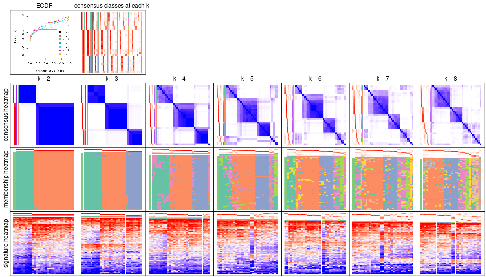

The plots are:

- The first row: a plot of the eCDF (empirical cumulative distribution
  function) curves of the consensus matrix for each `k` and the heatmap of
  predicted classes for each `k`.
- The second row: heatmaps of the consensus matrix for each `k`.
- The third row: heatmaps of the membership matrix for each `k`.
- The fouth row: heatmaps of the signatures for each `k`.

All the plots in panels can be made by individual functions and they are
plotted later in this section.

`select_partition_number()` produces several plots showing different
statistics for choosing "optimized" `k`. There are following statistics:

- eCDF curves of the consensus matrix for each `k`;
- 1-PAC. [The PAC score](https://en.wikipedia.org/wiki/Consensus_clustering#Over-interpretation_potential_of_consensus_clustering)
  measures the proportion of the ambiguous subgrouping.
- Mean silhouette score.
- Concordance. The mean probability of fiting the consensus subgroup labels in all
  partitions.
- Area increased. Denote $A_k$ as the area under the eCDF curve for current
  `k`, the area increased is defined as $A_k - A_{k-1}$.
- Rand index. The percent of pairs of samples that are both in a same cluster
  or both are not in a same cluster in the partition of k and k-1.
- Jaccard index. The ratio of pairs of samples are both in a same cluster in
  the partition of k and k-1 and the pairs of samples are both in a same
  cluster in the partition k or k-1.

The detailed explanations of these statistics can be found in [the _cola_
vignette](https://jokergoo.github.io/cola_vignettes/cola.html#toc_13).

Generally speaking, higher 1-PAC score, higher mean silhouette score or higher
concordance corresponds to better partition. Rand index and Jaccard index
measure how similar the current partition is compared to partition with `k-1`.
If they are too similar, we won't accept `k` is better than `k-1`.

```r
select_partition_number(res)
```

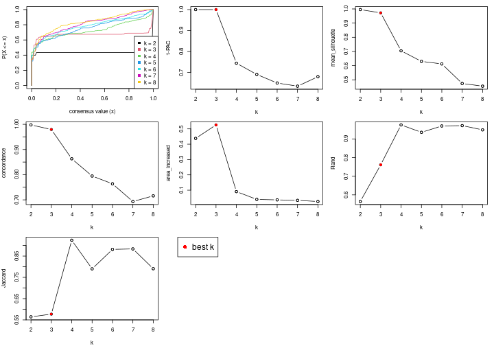

The numeric values for all these statistics can be obtained by `get_stats()`.

```r
get_stats(res)
```

```
#>   k 1-PAC mean_silhouette concordance area_increased  Rand Jaccard
#> 2 2 1.000           0.995       0.998         0.4379 0.564   0.564
#> 3 3 1.000           0.972       0.979         0.5256 0.761   0.577
#> 4 4 0.744           0.704       0.863         0.0906 0.975   0.924
#> 5 5 0.690           0.630       0.795         0.0399 0.936   0.790
#> 6 6 0.649           0.612       0.764         0.0367 0.970   0.881
#> 7 7 0.634           0.474       0.693         0.0336 0.972   0.884
#> 8 8 0.680           0.455       0.716         0.0261 0.949   0.791
```

`suggest_best_k()` suggests the best $k$ based on these statistics. The rules are as follows:

- All $k$ with Jaccard index larger than 0.95 are removed because increasing
  $k$ does not provide enough extra information. If all $k$ are removed, it is
  marked as no subgroup is detected.
- For all $k$ with 1-PAC score larger than 0.9, the maximal $k$ is taken as
  the best $k$, and other $k$ are marked as optional $k$.
- If it does not fit the second rule. The $k$ with the maximal vote of the
  highest 1-PAC score, highest mean silhouette, and highest concordance is
  taken as the best $k$.

```r
suggest_best_k(res)
```

```
#> [1] 3
#> attr(,"optional")
#> [1] 2
```

There is also optional best $k$ = 2 that is worth to check.

Following is the table of the partitions (You need to click the **show/hide
code output** link to see it). The membership matrix (columns with name `p*`)
is inferred by
[`clue::cl_consensus()`](https://www.rdocumentation.org/link/cl_consensus?package=clue)
function with the `SE` method. Basically the value in the membership matrix
represents the probability to belong to a certain group. The finall subgroup
label for an item is determined with the group with highest probability it
belongs to.

In `get_classes()` function, the entropy is calculated from the membership
matrix and the silhouette score is calculated from the consensus matrix.


<script>
$( function() {
	$( '#tabs-node-073-get-classes' ).tabs();
} );
</script>
<div id='tabs-node-073-get-classes'>
<ul>
<li><a href='#tab-node-073-get-classes-1'>k = 2</a></li>
<li><a href='#tab-node-073-get-classes-2'>k = 3</a></li>
<li><a href='#tab-node-073-get-classes-3'>k = 4</a></li>
<li><a href='#tab-node-073-get-classes-4'>k = 5</a></li>
<li><a href='#tab-node-073-get-classes-5'>k = 6</a></li>
<li><a href='#tab-node-073-get-classes-6'>k = 7</a></li>
<li><a href='#tab-node-073-get-classes-7'>k = 8</a></li>
</ul>

<div id='tab-node-073-get-classes-1'>
<p><a id='tab-node-073-get-classes-1-a' style='color:#0366d6' href='#'>show/hide code output</a></p>
<pre><code class="r">cbind(get_classes(res, k = 2), get_membership(res, k = 2))
</code></pre>

<pre><code>#&gt;                 class entropy silhouette   p1   p2
#&gt; TCGA.77.A5G1.01     2   0.000      0.996 0.00 1.00
#&gt; TCGA.55.6975.01     2   0.000      0.996 0.00 1.00
#&gt; TCGA.39.5040.01     2   0.000      0.996 0.00 1.00
#&gt; TCGA.62.8398.01     1   0.000      1.000 1.00 0.00
#&gt; TCGA.97.8176.01     1   0.000      1.000 1.00 0.00
#&gt; TCGA.91.6831.01     2   0.242      0.960 0.04 0.96
#&gt; TCGA.05.4415.01     2   0.000      0.996 0.00 1.00
#&gt; TCGA.49.AAR0.01     1   0.000      1.000 1.00 0.00
#&gt; TCGA.50.5072.01     2   0.000      0.996 0.00 1.00
#&gt; TCGA.55.8512.01     1   0.000      1.000 1.00 0.00
#&gt; TCGA.78.8640.01     2   0.000      0.996 0.00 1.00
#&gt; TCGA.62.A471.01     2   0.000      0.996 0.00 1.00
#&gt; TCGA.43.5668.01     2   0.000      0.996 0.00 1.00
#&gt; TCGA.55.8505.01     2   0.000      0.996 0.00 1.00
#&gt; TCGA.78.7148.01     1   0.000      1.000 1.00 0.00
#&gt; TCGA.39.5022.01     2   0.000      0.996 0.00 1.00
#&gt; TCGA.70.6722.01     2   0.000      0.996 0.00 1.00
#&gt; TCGA.91.6848.01     2   0.000      0.996 0.00 1.00
#&gt; TCGA.33.6738.01     2   0.000      0.996 0.00 1.00
#&gt; TCGA.43.6773.01     2   0.000      0.996 0.00 1.00
#&gt; TCGA.55.6972.01     1   0.000      1.000 1.00 0.00
#&gt; TCGA.86.7711.01     2   0.000      0.996 0.00 1.00
#&gt; TCGA.05.5420.01     2   0.000      0.996 0.00 1.00
#&gt; TCGA.86.8585.01     2   0.000      0.996 0.00 1.00
#&gt; TCGA.49.AAR9.01     2   0.000      0.996 0.00 1.00
#&gt; TCGA.05.4424.01     2   0.242      0.960 0.04 0.96
#&gt; TCGA.75.5146.01     1   0.000      1.000 1.00 0.00
#&gt; TCGA.50.5930.01     2   0.000      0.996 0.00 1.00
#&gt; TCGA.86.8674.01     1   0.000      1.000 1.00 0.00
#&gt; TCGA.78.7166.01     1   0.000      1.000 1.00 0.00
#&gt; TCGA.86.8055.01     2   0.000      0.996 0.00 1.00
#&gt; TCGA.78.7156.01     1   0.000      1.000 1.00 0.00
#&gt; TCGA.95.7947.01     2   0.000      0.996 0.00 1.00
</code></pre>

<script>
$('#tab-node-073-get-classes-1-a').parent().next().next().hide();
$('#tab-node-073-get-classes-1-a').click(function(){
  $('#tab-node-073-get-classes-1-a').parent().next().next().toggle();
  return(false);
});
</script>
</div>

<div id='tab-node-073-get-classes-2'>
<p><a id='tab-node-073-get-classes-2-a' style='color:#0366d6' href='#'>show/hide code output</a></p>
<pre><code class="r">cbind(get_classes(res, k = 3), get_membership(res, k = 3))
</code></pre>

<pre><code>#&gt;                 class entropy silhouette   p1   p2   p3
#&gt; TCGA.77.A5G1.01     3  0.0892      0.965 0.00 0.02 0.98
#&gt; TCGA.55.6975.01     2  0.0000      0.992 0.00 1.00 0.00
#&gt; TCGA.39.5040.01     2  0.0000      0.992 0.00 1.00 0.00
#&gt; TCGA.62.8398.01     1  0.0000      0.988 1.00 0.00 0.00
#&gt; TCGA.97.8176.01     1  0.0892      0.985 0.98 0.00 0.02
#&gt; TCGA.91.6831.01     2  0.1529      0.955 0.04 0.96 0.00
#&gt; TCGA.05.4415.01     2  0.0000      0.992 0.00 1.00 0.00
#&gt; TCGA.49.AAR0.01     1  0.0892      0.985 0.98 0.00 0.02
#&gt; TCGA.50.5072.01     2  0.0000      0.992 0.00 1.00 0.00
#&gt; TCGA.55.8512.01     1  0.0892      0.985 0.98 0.00 0.02
#&gt; TCGA.78.8640.01     2  0.0000      0.992 0.00 1.00 0.00
#&gt; TCGA.62.A471.01     2  0.0000      0.992 0.00 1.00 0.00
#&gt; TCGA.43.5668.01     2  0.0892      0.977 0.00 0.98 0.02
#&gt; TCGA.55.8505.01     2  0.0000      0.992 0.00 1.00 0.00
#&gt; TCGA.78.7148.01     1  0.0000      0.988 1.00 0.00 0.00
#&gt; TCGA.39.5022.01     3  0.1529      0.953 0.00 0.04 0.96
#&gt; TCGA.70.6722.01     3  0.0892      0.965 0.00 0.02 0.98
#&gt; TCGA.91.6848.01     2  0.0000      0.992 0.00 1.00 0.00
#&gt; TCGA.33.6738.01     2  0.0000      0.992 0.00 1.00 0.00
#&gt; TCGA.43.6773.01     3  0.0892      0.965 0.00 0.02 0.98
#&gt; TCGA.55.6972.01     1  0.0892      0.981 0.98 0.00 0.02
#&gt; TCGA.86.7711.01     3  0.1529      0.951 0.00 0.04 0.96
#&gt; TCGA.05.5420.01     3  0.0892      0.965 0.00 0.02 0.98
#&gt; TCGA.86.8585.01     3  0.0892      0.965 0.00 0.02 0.98
#&gt; TCGA.49.AAR9.01     2  0.0000      0.992 0.00 1.00 0.00
#&gt; TCGA.05.4424.01     3  0.6495      0.733 0.06 0.20 0.74
#&gt; TCGA.75.5146.01     1  0.0892      0.985 0.98 0.00 0.02
#&gt; TCGA.50.5930.01     3  0.0892      0.965 0.00 0.02 0.98
#&gt; TCGA.86.8674.01     1  0.0000      0.988 1.00 0.00 0.00
#&gt; TCGA.78.7166.01     1  0.0000      0.988 1.00 0.00 0.00
#&gt; TCGA.86.8055.01     2  0.1529      0.958 0.00 0.96 0.04
#&gt; TCGA.78.7156.01     1  0.0892      0.981 0.98 0.00 0.02
#&gt; TCGA.95.7947.01     2  0.0000      0.992 0.00 1.00 0.00
</code></pre>

<script>
$('#tab-node-073-get-classes-2-a').parent().next().next().hide();
$('#tab-node-073-get-classes-2-a').click(function(){
  $('#tab-node-073-get-classes-2-a').parent().next().next().toggle();
  return(false);
});
</script>
</div>

<div id='tab-node-073-get-classes-3'>
<p><a id='tab-node-073-get-classes-3-a' style='color:#0366d6' href='#'>show/hide code output</a></p>
<pre><code class="r">cbind(get_classes(res, k = 4), get_membership(res, k = 4))
</code></pre>

<pre><code>#&gt;                 class entropy silhouette   p1   p2   p3   p4
#&gt; TCGA.77.A5G1.01     3  0.0000     0.8832 0.00 0.00 1.00 0.00
#&gt; TCGA.55.6975.01     2  0.0707     0.8509 0.00 0.98 0.00 0.02
#&gt; TCGA.39.5040.01     2  0.0000     0.8567 0.00 1.00 0.00 0.00
#&gt; TCGA.62.8398.01     1  0.2011     0.7871 0.92 0.00 0.00 0.08
#&gt; TCGA.97.8176.01     1  0.2345     0.7906 0.90 0.00 0.00 0.10
#&gt; TCGA.91.6831.01     4  0.6838     0.0000 0.08 0.30 0.02 0.60
#&gt; TCGA.05.4415.01     2  0.1211     0.8467 0.00 0.96 0.00 0.04
#&gt; TCGA.49.AAR0.01     1  0.6831     0.5148 0.48 0.00 0.10 0.42
#&gt; TCGA.50.5072.01     2  0.0707     0.8509 0.00 0.98 0.00 0.02
#&gt; TCGA.55.8512.01     1  0.5062     0.7167 0.68 0.00 0.02 0.30
#&gt; TCGA.78.8640.01     2  0.0000     0.8567 0.00 1.00 0.00 0.00
#&gt; TCGA.62.A471.01     2  0.0000     0.8567 0.00 1.00 0.00 0.00
#&gt; TCGA.43.5668.01     2  0.4949     0.5087 0.00 0.76 0.18 0.06
#&gt; TCGA.55.8505.01     2  0.1913     0.8162 0.00 0.94 0.04 0.02
#&gt; TCGA.78.7148.01     1  0.2345     0.7962 0.90 0.00 0.00 0.10
#&gt; TCGA.39.5022.01     3  0.1211     0.8560 0.00 0.04 0.96 0.00
#&gt; TCGA.70.6722.01     3  0.0707     0.8688 0.02 0.00 0.98 0.00
#&gt; TCGA.91.6848.01     2  0.0000     0.8567 0.00 1.00 0.00 0.00
#&gt; TCGA.33.6738.01     2  0.0000     0.8567 0.00 1.00 0.00 0.00
#&gt; TCGA.43.6773.01     3  0.0000     0.8832 0.00 0.00 1.00 0.00
#&gt; TCGA.55.6972.01     1  0.4406     0.7314 0.70 0.00 0.00 0.30
#&gt; TCGA.86.7711.01     3  0.3400     0.6734 0.00 0.18 0.82 0.00
#&gt; TCGA.05.5420.01     3  0.0000     0.8832 0.00 0.00 1.00 0.00
#&gt; TCGA.86.8585.01     3  0.0000     0.8832 0.00 0.00 1.00 0.00
#&gt; TCGA.49.AAR9.01     2  0.2345     0.8035 0.00 0.90 0.00 0.10
#&gt; TCGA.05.4424.01     3  0.8172    -0.1956 0.04 0.14 0.44 0.38
#&gt; TCGA.75.5146.01     1  0.4277     0.7006 0.72 0.00 0.00 0.28
#&gt; TCGA.50.5930.01     3  0.0000     0.8832 0.00 0.00 1.00 0.00
#&gt; TCGA.86.8674.01     1  0.2921     0.7886 0.86 0.00 0.00 0.14
#&gt; TCGA.78.7166.01     1  0.1637     0.7833 0.94 0.00 0.00 0.06
#&gt; TCGA.86.8055.01     2  0.6261     0.0795 0.02 0.62 0.04 0.32
#&gt; TCGA.78.7156.01     1  0.4277     0.7326 0.72 0.00 0.00 0.28
#&gt; TCGA.95.7947.01     2  0.5392     0.2471 0.04 0.68 0.00 0.28
</code></pre>

<script>
$('#tab-node-073-get-classes-3-a').parent().next().next().hide();
$('#tab-node-073-get-classes-3-a').click(function(){
  $('#tab-node-073-get-classes-3-a').parent().next().next().toggle();
  return(false);
});
</script>
</div>

<div id='tab-node-073-get-classes-4'>
<p><a id='tab-node-073-get-classes-4-a' style='color:#0366d6' href='#'>show/hide code output</a></p>
<pre><code class="r">cbind(get_classes(res, k = 5), get_membership(res, k = 5))
</code></pre>

<pre><code>#&gt;                 class entropy silhouette   p1   p2   p3   p4   p5
#&gt; TCGA.77.A5G1.01     3  0.0609     0.8843 0.00 0.02 0.98 0.00 0.00
#&gt; TCGA.55.6975.01     2  0.1216     0.8483 0.00 0.96 0.00 0.02 0.02
#&gt; TCGA.39.5040.01     2  0.1648     0.8491 0.00 0.94 0.00 0.04 0.02
#&gt; TCGA.62.8398.01     1  0.3946     0.4986 0.80 0.00 0.00 0.12 0.08
#&gt; TCGA.97.8176.01     1  0.5013     0.4423 0.68 0.00 0.00 0.24 0.08
#&gt; TCGA.91.6831.01     4  0.4254     0.2118 0.00 0.22 0.00 0.74 0.04
#&gt; TCGA.05.4415.01     2  0.1820     0.8397 0.02 0.94 0.02 0.00 0.02
#&gt; TCGA.49.AAR0.01     4  0.7976    -0.3100 0.32 0.00 0.08 0.34 0.26
#&gt; TCGA.50.5072.01     2  0.1648     0.8493 0.00 0.94 0.00 0.02 0.04
#&gt; TCGA.55.8512.01     1  0.6671     0.2669 0.48 0.00 0.02 0.36 0.14
#&gt; TCGA.78.8640.01     2  0.1043     0.8466 0.00 0.96 0.00 0.00 0.04
#&gt; TCGA.62.A471.01     2  0.0609     0.8511 0.00 0.98 0.00 0.00 0.02
#&gt; TCGA.43.5668.01     2  0.4837     0.6553 0.00 0.74 0.18 0.02 0.06
#&gt; TCGA.55.8505.01     2  0.2675     0.8326 0.00 0.90 0.04 0.02 0.04
#&gt; TCGA.78.7148.01     1  0.4458     0.4430 0.76 0.00 0.00 0.12 0.12
#&gt; TCGA.39.5022.01     3  0.1410     0.8649 0.00 0.06 0.94 0.00 0.00
#&gt; TCGA.70.6722.01     3  0.2848     0.8350 0.02 0.02 0.90 0.02 0.04
#&gt; TCGA.91.6848.01     2  0.0000     0.8506 0.00 1.00 0.00 0.00 0.00
#&gt; TCGA.33.6738.01     2  0.0609     0.8498 0.00 0.98 0.00 0.00 0.02
#&gt; TCGA.43.6773.01     3  0.1043     0.8810 0.00 0.04 0.96 0.00 0.00
#&gt; TCGA.55.6972.01     5  0.4840     0.9012 0.32 0.00 0.00 0.04 0.64
#&gt; TCGA.86.7711.01     3  0.5705     0.3552 0.00 0.32 0.60 0.02 0.06
#&gt; TCGA.05.5420.01     3  0.0609     0.8843 0.00 0.02 0.98 0.00 0.00
#&gt; TCGA.86.8585.01     3  0.1216     0.8795 0.00 0.02 0.96 0.02 0.00
#&gt; TCGA.49.AAR9.01     2  0.4449     0.7426 0.00 0.78 0.02 0.06 0.14
#&gt; TCGA.05.4424.01     4  0.5925     0.0866 0.02 0.00 0.40 0.52 0.06
#&gt; TCGA.75.5146.01     1  0.6070     0.2973 0.44 0.00 0.00 0.44 0.12
#&gt; TCGA.50.5930.01     3  0.1216     0.8800 0.00 0.02 0.96 0.00 0.02
#&gt; TCGA.86.8674.01     1  0.4008     0.4162 0.82 0.00 0.02 0.08 0.08
#&gt; TCGA.78.7166.01     1  0.2927     0.4574 0.88 0.00 0.02 0.08 0.02
#&gt; TCGA.86.8055.01     2  0.7747     0.4081 0.04 0.56 0.12 0.18 0.10
#&gt; TCGA.78.7156.01     5  0.4540     0.9008 0.34 0.00 0.00 0.02 0.64
#&gt; TCGA.95.7947.01     2  0.5990     0.2976 0.00 0.52 0.04 0.40 0.04
</code></pre>

<script>
$('#tab-node-073-get-classes-4-a').parent().next().next().hide();
$('#tab-node-073-get-classes-4-a').click(function(){
  $('#tab-node-073-get-classes-4-a').parent().next().next().toggle();
  return(false);
});
</script>
</div>

<div id='tab-node-073-get-classes-5'>
<p><a id='tab-node-073-get-classes-5-a' style='color:#0366d6' href='#'>show/hide code output</a></p>
<pre><code class="r">cbind(get_classes(res, k = 6), get_membership(res, k = 6))
</code></pre>

<pre><code>#&gt;                 class entropy silhouette   p1   p2   p3   p4   p5   p6
#&gt; TCGA.77.A5G1.01     3  0.0547      0.845 0.00 0.00 0.98 0.02 0.00 0.00
#&gt; TCGA.55.6975.01     2  0.0000      0.833 0.00 1.00 0.00 0.00 0.00 0.00
#&gt; TCGA.39.5040.01     2  0.1267      0.831 0.00 0.94 0.00 0.00 0.00 0.06
#&gt; TCGA.62.8398.01     1  0.5996      0.457 0.62 0.00 0.00 0.12 0.10 0.16
#&gt; TCGA.97.8176.01     1  0.7048      0.248 0.44 0.00 0.02 0.34 0.08 0.12
#&gt; TCGA.91.6831.01     6  0.4806      0.000 0.02 0.02 0.00 0.48 0.00 0.48
#&gt; TCGA.05.4415.01     2  0.0937      0.830 0.00 0.96 0.00 0.00 0.00 0.04
#&gt; TCGA.49.AAR0.01     4  0.4066      0.435 0.12 0.00 0.08 0.78 0.02 0.00
#&gt; TCGA.50.5072.01     2  0.0000      0.833 0.00 1.00 0.00 0.00 0.00 0.00
#&gt; TCGA.55.8512.01     4  0.5210      0.411 0.26 0.00 0.06 0.64 0.04 0.00
#&gt; TCGA.78.8640.01     2  0.0937      0.833 0.00 0.96 0.00 0.00 0.00 0.04
#&gt; TCGA.62.A471.01     2  0.0000      0.833 0.00 1.00 0.00 0.00 0.00 0.00
#&gt; TCGA.43.5668.01     2  0.4179      0.726 0.00 0.76 0.06 0.00 0.02 0.16
#&gt; TCGA.55.8505.01     2  0.2048      0.753 0.00 0.88 0.12 0.00 0.00 0.00
#&gt; TCGA.78.7148.01     1  0.4334      0.438 0.72 0.00 0.00 0.22 0.04 0.02
#&gt; TCGA.39.5022.01     3  0.3045      0.793 0.00 0.06 0.86 0.02 0.00 0.06
#&gt; TCGA.70.6722.01     3  0.4221      0.749 0.04 0.00 0.80 0.08 0.02 0.06
#&gt; TCGA.91.6848.01     2  0.1267      0.831 0.00 0.94 0.00 0.00 0.00 0.06
#&gt; TCGA.33.6738.01     2  0.0937      0.833 0.00 0.96 0.00 0.00 0.00 0.04
#&gt; TCGA.43.6773.01     3  0.1092      0.847 0.00 0.00 0.96 0.02 0.00 0.02
#&gt; TCGA.55.6972.01     5  0.5259      0.813 0.16 0.00 0.00 0.24 0.60 0.00
#&gt; TCGA.86.7711.01     3  0.4887      0.586 0.00 0.22 0.68 0.00 0.02 0.08
#&gt; TCGA.05.5420.01     3  0.0547      0.847 0.00 0.00 0.98 0.02 0.00 0.00
#&gt; TCGA.86.8585.01     3  0.2882      0.828 0.00 0.02 0.86 0.02 0.00 0.10
#&gt; TCGA.49.AAR9.01     2  0.5150      0.490 0.00 0.62 0.00 0.00 0.22 0.16
#&gt; TCGA.05.4424.01     4  0.8196     -0.291 0.06 0.04 0.22 0.40 0.04 0.24
#&gt; TCGA.75.5146.01     4  0.2941      0.396 0.22 0.00 0.00 0.78 0.00 0.00
#&gt; TCGA.50.5930.01     3  0.3162      0.826 0.02 0.02 0.86 0.02 0.00 0.08
#&gt; TCGA.86.8674.01     1  0.4279      0.540 0.78 0.00 0.00 0.08 0.06 0.08
#&gt; TCGA.78.7166.01     1  0.2350      0.571 0.88 0.00 0.00 0.10 0.02 0.00
#&gt; TCGA.86.8055.01     2  0.7545      0.108 0.00 0.46 0.10 0.16 0.04 0.24
#&gt; TCGA.78.7156.01     5  0.5840      0.807 0.16 0.00 0.00 0.26 0.56 0.02
#&gt; TCGA.95.7947.01     2  0.6086      0.321 0.02 0.52 0.00 0.20 0.00 0.26
</code></pre>

<script>
$('#tab-node-073-get-classes-5-a').parent().next().next().hide();
$('#tab-node-073-get-classes-5-a').click(function(){
  $('#tab-node-073-get-classes-5-a').parent().next().next().toggle();
  return(false);
});
</script>
</div>

<div id='tab-node-073-get-classes-6'>
<p><a id='tab-node-073-get-classes-6-a' style='color:#0366d6' href='#'>show/hide code output</a></p>
<pre><code class="r">cbind(get_classes(res, k = 7), get_membership(res, k = 7))
</code></pre>

<pre><code>#&gt;                 class entropy silhouette   p1   p2   p3   p4   p5   p6   p7
#&gt; TCGA.77.A5G1.01     3  0.1006     0.6858 0.02 0.00 0.96 0.00 0.00 0.00 0.02
#&gt; TCGA.55.6975.01     2  0.4418     0.7175 0.06 0.76 0.02 0.00 0.00 0.08 0.08
#&gt; TCGA.39.5040.01     2  0.1363     0.7517 0.02 0.94 0.00 0.00 0.00 0.04 0.00
#&gt; TCGA.62.8398.01     4  0.7040    -0.1159 0.36 0.00 0.00 0.36 0.14 0.10 0.04
#&gt; TCGA.97.8176.01     1  0.6846     0.3061 0.42 0.00 0.00 0.34 0.06 0.08 0.10
#&gt; TCGA.91.6831.01     6  0.3284     0.0000 0.00 0.10 0.00 0.10 0.00 0.80 0.00
#&gt; TCGA.05.4415.01     2  0.5395     0.6466 0.08 0.66 0.02 0.00 0.00 0.16 0.08
#&gt; TCGA.49.AAR0.01     4  0.4029     0.4326 0.06 0.00 0.02 0.80 0.02 0.08 0.02
#&gt; TCGA.50.5072.01     2  0.2509     0.7445 0.06 0.88 0.00 0.00 0.00 0.04 0.02
#&gt; TCGA.55.8512.01     4  0.1664     0.4674 0.00 0.00 0.02 0.92 0.06 0.00 0.00
#&gt; TCGA.78.8640.01     2  0.1363     0.7509 0.00 0.94 0.00 0.00 0.00 0.04 0.02
#&gt; TCGA.62.A471.01     2  0.0863     0.7528 0.04 0.96 0.00 0.00 0.00 0.00 0.00
#&gt; TCGA.43.5668.01     2  0.3600     0.6876 0.02 0.82 0.04 0.00 0.00 0.04 0.08
#&gt; TCGA.55.8505.01     2  0.3346     0.7281 0.04 0.84 0.04 0.00 0.00 0.02 0.06
#&gt; TCGA.78.7148.01     4  0.6067     0.0740 0.34 0.00 0.00 0.48 0.04 0.12 0.02
#&gt; TCGA.39.5022.01     3  0.3965     0.5574 0.00 0.10 0.76 0.00 0.00 0.02 0.12
#&gt; TCGA.70.6722.01     3  0.4158     0.4977 0.06 0.02 0.76 0.00 0.00 0.02 0.14
#&gt; TCGA.91.6848.01     2  0.0504     0.7522 0.00 0.98 0.00 0.00 0.00 0.00 0.02
#&gt; TCGA.33.6738.01     2  0.0504     0.7517 0.00 0.98 0.00 0.00 0.00 0.02 0.00
#&gt; TCGA.43.6773.01     3  0.0863     0.6862 0.00 0.00 0.96 0.00 0.00 0.00 0.04
#&gt; TCGA.55.6972.01     5  0.4388     0.7037 0.02 0.00 0.00 0.30 0.64 0.00 0.04
#&gt; TCGA.86.7711.01     3  0.5377     0.2721 0.00 0.26 0.56 0.00 0.00 0.02 0.16
#&gt; TCGA.05.5420.01     3  0.1860     0.6764 0.02 0.00 0.92 0.00 0.02 0.00 0.04
#&gt; TCGA.86.8585.01     3  0.3208     0.6412 0.04 0.00 0.82 0.00 0.02 0.00 0.12
#&gt; TCGA.49.AAR9.01     2  0.6956     0.1201 0.02 0.40 0.00 0.00 0.16 0.12 0.30
#&gt; TCGA.05.4424.01     7  0.8365     0.0000 0.06 0.12 0.24 0.08 0.00 0.16 0.34
#&gt; TCGA.75.5146.01     4  0.3542     0.4397 0.04 0.00 0.02 0.84 0.02 0.04 0.04
#&gt; TCGA.50.5930.01     3  0.5565     0.3839 0.10 0.04 0.66 0.00 0.02 0.02 0.16
#&gt; TCGA.86.8674.01     1  0.5951     0.4677 0.58 0.00 0.00 0.24 0.06 0.08 0.04
#&gt; TCGA.78.7166.01     1  0.3606     0.5285 0.68 0.00 0.00 0.30 0.00 0.00 0.02
#&gt; TCGA.86.8055.01     2  0.7081    -0.0897 0.06 0.46 0.04 0.02 0.02 0.08 0.32
#&gt; TCGA.78.7156.01     5  0.4451     0.6995 0.10 0.00 0.00 0.26 0.64 0.00 0.00
#&gt; TCGA.95.7947.01     2  0.7476    -0.0689 0.02 0.46 0.02 0.12 0.02 0.22 0.14
</code></pre>

<script>
$('#tab-node-073-get-classes-6-a').parent().next().next().hide();
$('#tab-node-073-get-classes-6-a').click(function(){
  $('#tab-node-073-get-classes-6-a').parent().next().next().toggle();
  return(false);
});
</script>
</div>

<div id='tab-node-073-get-classes-7'>
<p><a id='tab-node-073-get-classes-7-a' style='color:#0366d6' href='#'>show/hide code output</a></p>
<pre><code class="r">cbind(get_classes(res, k = 8), get_membership(res, k = 8))
</code></pre>

<pre><code>#&gt;                 class entropy silhouette   p1   p2   p3   p4   p5   p6   p7   p8
#&gt; TCGA.77.A5G1.01     3  0.0471      0.786 0.02 0.00 0.98 0.00 0.00 0.00 0.00 0.00
#&gt; TCGA.55.6975.01     2  0.2864      0.634 0.06 0.84 0.00 0.00 0.00 0.00 0.02 0.08
#&gt; TCGA.39.5040.01     2  0.2132      0.632 0.00 0.88 0.00 0.00 0.00 0.04 0.00 0.08
#&gt; TCGA.62.8398.01     7  0.6688      0.233 0.02 0.00 0.00 0.32 0.22 0.02 0.36 0.06
#&gt; TCGA.97.8176.01     7  0.5796      0.387 0.12 0.00 0.00 0.18 0.04 0.02 0.60 0.04
#&gt; TCGA.91.6831.01     6  0.2071      0.000 0.00 0.00 0.04 0.02 0.00 0.90 0.04 0.00
#&gt; TCGA.05.4415.01     2  0.3601      0.576 0.16 0.76 0.02 0.00 0.00 0.00 0.00 0.06
#&gt; TCGA.49.AAR0.01     4  0.5144      0.359 0.08 0.00 0.06 0.70 0.08 0.06 0.02 0.00
#&gt; TCGA.50.5072.01     2  0.1804      0.651 0.00 0.90 0.00 0.00 0.00 0.00 0.02 0.08
#&gt; TCGA.55.8512.01     4  0.4396      0.360 0.00 0.00 0.12 0.74 0.08 0.02 0.02 0.02
#&gt; TCGA.78.8640.01     2  0.2407      0.657 0.08 0.86 0.00 0.00 0.00 0.00 0.00 0.06
#&gt; TCGA.62.A471.01     2  0.2680      0.651 0.12 0.84 0.00 0.00 0.00 0.00 0.02 0.02
#&gt; TCGA.43.5668.01     2  0.5943      0.385 0.20 0.56 0.04 0.00 0.00 0.10 0.00 0.10
#&gt; TCGA.55.8505.01     2  0.2991      0.619 0.04 0.86 0.04 0.00 0.00 0.02 0.02 0.02
#&gt; TCGA.78.7148.01     7  0.5216      0.214 0.00 0.00 0.00 0.42 0.10 0.00 0.44 0.04
#&gt; TCGA.39.5022.01     3  0.1275      0.781 0.04 0.02 0.94 0.00 0.00 0.00 0.00 0.00
#&gt; TCGA.70.6722.01     3  0.5963      0.536 0.14 0.00 0.62 0.06 0.00 0.06 0.04 0.08
#&gt; TCGA.91.6848.01     2  0.0808      0.653 0.00 0.96 0.00 0.00 0.00 0.00 0.00 0.04
#&gt; TCGA.33.6738.01     2  0.3078      0.630 0.06 0.82 0.00 0.00 0.00 0.02 0.00 0.10
#&gt; TCGA.43.6773.01     3  0.1091      0.783 0.06 0.00 0.94 0.00 0.00 0.00 0.00 0.00
#&gt; TCGA.55.6972.01     5  0.3337      0.527 0.02 0.00 0.00 0.16 0.78 0.00 0.04 0.00
#&gt; TCGA.86.7711.01     3  0.5081      0.545 0.08 0.20 0.64 0.00 0.00 0.06 0.02 0.00
#&gt; TCGA.05.5420.01     3  0.1275      0.788 0.04 0.02 0.94 0.00 0.00 0.00 0.00 0.00
#&gt; TCGA.86.8585.01     3  0.3651      0.732 0.16 0.04 0.76 0.00 0.00 0.00 0.04 0.00
#&gt; TCGA.49.AAR9.01     8  0.2852      0.000 0.00 0.28 0.00 0.00 0.00 0.00 0.00 0.72
#&gt; TCGA.05.4424.01     4  0.8659     -0.167 0.14 0.06 0.20 0.24 0.00 0.22 0.04 0.10
#&gt; TCGA.75.5146.01     4  0.3688      0.305 0.00 0.00 0.04 0.80 0.04 0.04 0.08 0.00
#&gt; TCGA.50.5930.01     3  0.4750      0.692 0.20 0.06 0.68 0.00 0.00 0.02 0.02 0.02
#&gt; TCGA.86.8674.01     7  0.6664      0.240 0.18 0.00 0.00 0.22 0.10 0.02 0.46 0.02
#&gt; TCGA.78.7166.01     7  0.2940      0.435 0.02 0.00 0.00 0.10 0.02 0.00 0.84 0.02
#&gt; TCGA.86.8055.01     2  0.8835     -0.271 0.16 0.28 0.06 0.10 0.00 0.16 0.08 0.16
#&gt; TCGA.78.7156.01     5  0.5612      0.555 0.10 0.00 0.00 0.14 0.64 0.02 0.04 0.06
#&gt; TCGA.95.7947.01     2  0.7391      0.118 0.20 0.40 0.04 0.02 0.00 0.22 0.02 0.10
</code></pre>

<script>
$('#tab-node-073-get-classes-7-a').parent().next().next().hide();
$('#tab-node-073-get-classes-7-a').click(function(){
  $('#tab-node-073-get-classes-7-a').parent().next().next().toggle();
  return(false);
});
</script>
</div>
</div>

Heatmaps for the consensus matrix. It visualizes the probability of two
samples to be in a same group.


<script>
$( function() {
	$( '#tabs-node-073-consensus-heatmap' ).tabs();
} );
</script>
<div id='tabs-node-073-consensus-heatmap'>
<ul>
<li><a href='#tab-node-073-consensus-heatmap-1'>k = 2</a></li>
<li><a href='#tab-node-073-consensus-heatmap-2'>k = 3</a></li>
<li><a href='#tab-node-073-consensus-heatmap-3'>k = 4</a></li>
<li><a href='#tab-node-073-consensus-heatmap-4'>k = 5</a></li>
<li><a href='#tab-node-073-consensus-heatmap-5'>k = 6</a></li>
<li><a href='#tab-node-073-consensus-heatmap-6'>k = 7</a></li>
<li><a href='#tab-node-073-consensus-heatmap-7'>k = 8</a></li>
</ul>
<div id='tab-node-073-consensus-heatmap-1'>
<pre><code class="r">consensus_heatmap(res, k = 2)
</code></pre>

<p>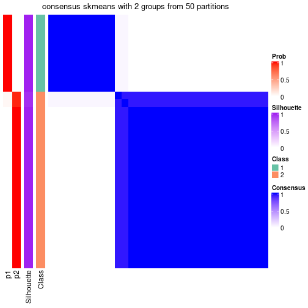</p>

</div>
<div id='tab-node-073-consensus-heatmap-2'>
<pre><code class="r">consensus_heatmap(res, k = 3)
</code></pre>

<p>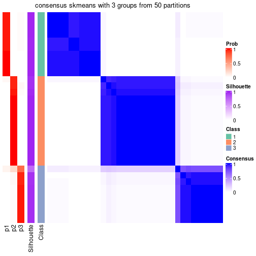</p>

</div>
<div id='tab-node-073-consensus-heatmap-3'>
<pre><code class="r">consensus_heatmap(res, k = 4)
</code></pre>

<p>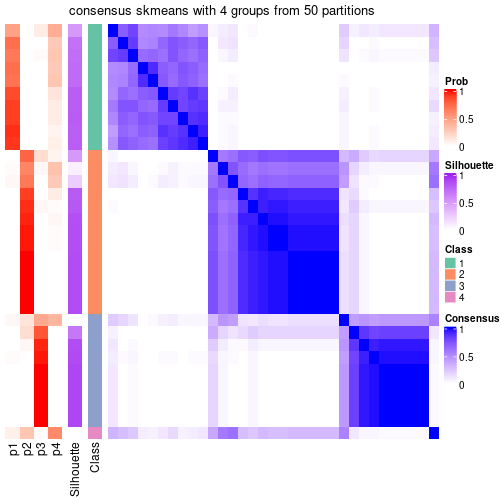</p>

</div>
<div id='tab-node-073-consensus-heatmap-4'>
<pre><code class="r">consensus_heatmap(res, k = 5)
</code></pre>

<p>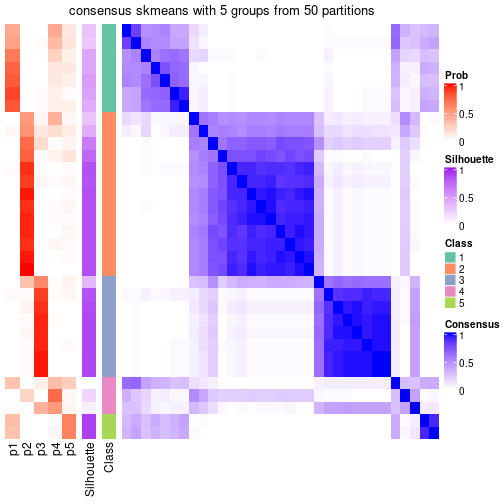</p>

</div>
<div id='tab-node-073-consensus-heatmap-5'>
<pre><code class="r">consensus_heatmap(res, k = 6)
</code></pre>

<p>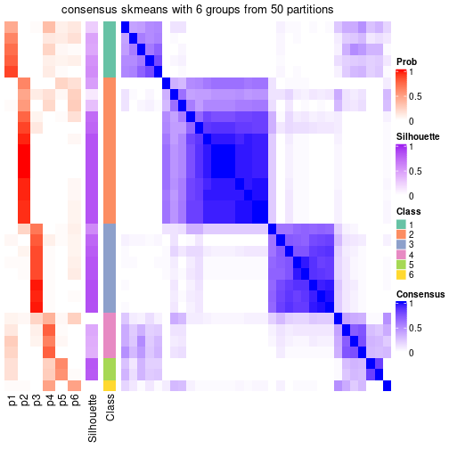</p>

</div>
<div id='tab-node-073-consensus-heatmap-6'>
<pre><code class="r">consensus_heatmap(res, k = 7)
</code></pre>

<p>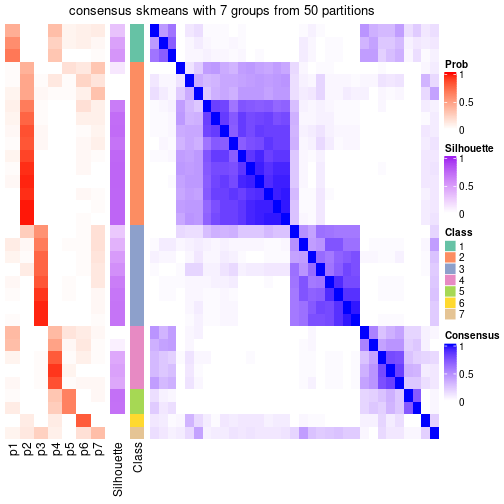</p>

</div>
<div id='tab-node-073-consensus-heatmap-7'>
<pre><code class="r">consensus_heatmap(res, k = 8)
</code></pre>

<p>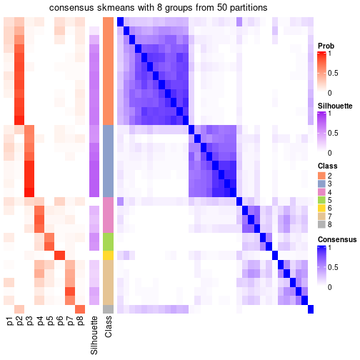</p>

</div>
</div>

Heatmaps for the membership of samples in all partitions to see how consistent they are:


<script>
$( function() {
	$( '#tabs-node-073-membership-heatmap' ).tabs();
} );
</script>
<div id='tabs-node-073-membership-heatmap'>
<ul>
<li><a href='#tab-node-073-membership-heatmap-1'>k = 2</a></li>
<li><a href='#tab-node-073-membership-heatmap-2'>k = 3</a></li>
<li><a href='#tab-node-073-membership-heatmap-3'>k = 4</a></li>
<li><a href='#tab-node-073-membership-heatmap-4'>k = 5</a></li>
<li><a href='#tab-node-073-membership-heatmap-5'>k = 6</a></li>
<li><a href='#tab-node-073-membership-heatmap-6'>k = 7</a></li>
<li><a href='#tab-node-073-membership-heatmap-7'>k = 8</a></li>
</ul>
<div id='tab-node-073-membership-heatmap-1'>
<pre><code class="r">membership_heatmap(res, k = 2)
</code></pre>

<p>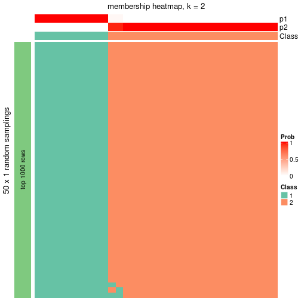</p>

</div>
<div id='tab-node-073-membership-heatmap-2'>
<pre><code class="r">membership_heatmap(res, k = 3)
</code></pre>

<p>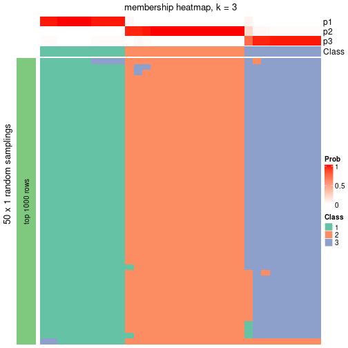</p>

</div>
<div id='tab-node-073-membership-heatmap-3'>
<pre><code class="r">membership_heatmap(res, k = 4)
</code></pre>

<p>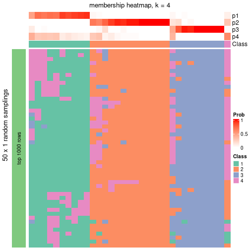</p>

</div>
<div id='tab-node-073-membership-heatmap-4'>
<pre><code class="r">membership_heatmap(res, k = 5)
</code></pre>

<p>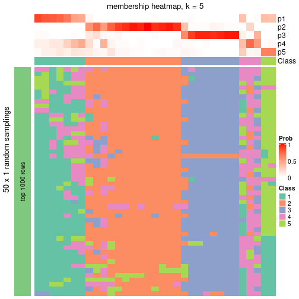</p>

</div>
<div id='tab-node-073-membership-heatmap-5'>
<pre><code class="r">membership_heatmap(res, k = 6)
</code></pre>

<p>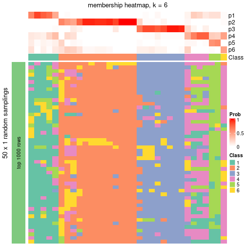</p>

</div>
<div id='tab-node-073-membership-heatmap-6'>
<pre><code class="r">membership_heatmap(res, k = 7)
</code></pre>

<p>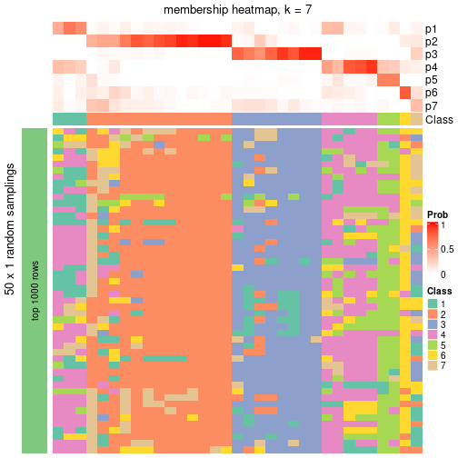</p>

</div>
<div id='tab-node-073-membership-heatmap-7'>
<pre><code class="r">membership_heatmap(res, k = 8)
</code></pre>

<p>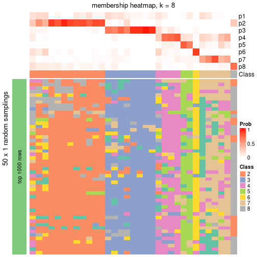</p>

</div>
</div>

As soon as the classes for columns are determined, the signatures
that are significantly different between subgroups can be looked for. 
Following are the heatmaps for signatures.


<script>
$( function() {
	$( '#tabs-node-073-get-signatures' ).tabs();
} );
</script>
<div id='tabs-node-073-get-signatures'>
<ul>
<li><a href='#tab-node-073-get-signatures-1'>k = 2</a></li>
<li><a href='#tab-node-073-get-signatures-2'>k = 3</a></li>
<li><a href='#tab-node-073-get-signatures-3'>k = 4</a></li>
<li><a href='#tab-node-073-get-signatures-4'>k = 5</a></li>
<li><a href='#tab-node-073-get-signatures-5'>k = 6</a></li>
<li><a href='#tab-node-073-get-signatures-6'>k = 7</a></li>
<li><a href='#tab-node-073-get-signatures-7'>k = 8</a></li>
</ul>
<div id='tab-node-073-get-signatures-1'>
<pre><code class="r">get_signatures(res, k = 2)
</code></pre>

<p>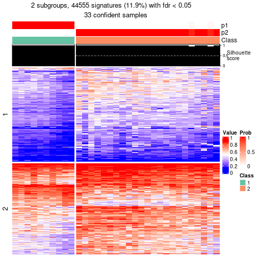</p>

</div>
<div id='tab-node-073-get-signatures-2'>
<pre><code class="r">get_signatures(res, k = 3)
</code></pre>

<p>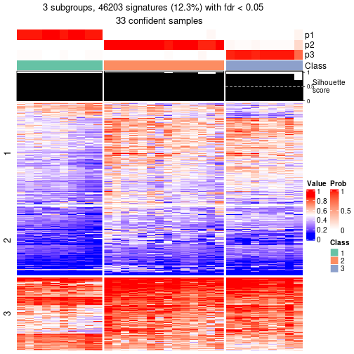</p>

</div>
<div id='tab-node-073-get-signatures-3'>
<pre><code class="r">get_signatures(res, k = 4)
</code></pre>

<p>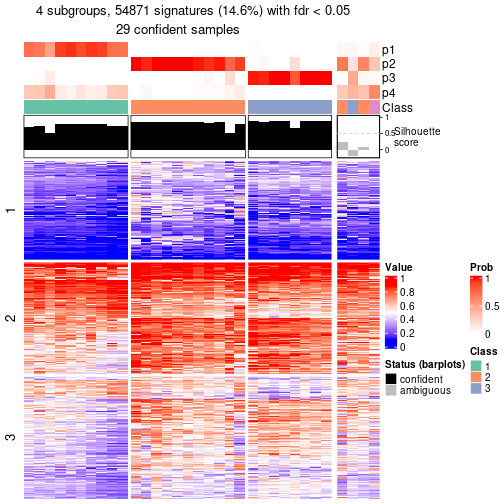</p>

</div>
<div id='tab-node-073-get-signatures-4'>
<pre><code class="r">get_signatures(res, k = 5)
</code></pre>

<p>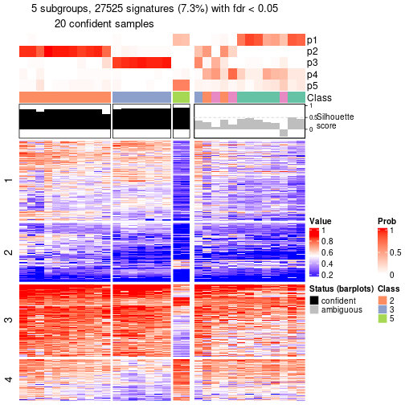</p>

</div>
<div id='tab-node-073-get-signatures-5'>
<pre><code class="r">get_signatures(res, k = 6)
</code></pre>

<p>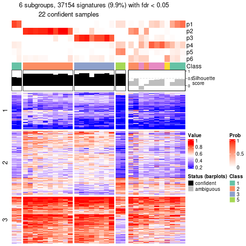</p>

</div>
<div id='tab-node-073-get-signatures-6'>
<pre><code class="r">get_signatures(res, k = 7)
</code></pre>

<p>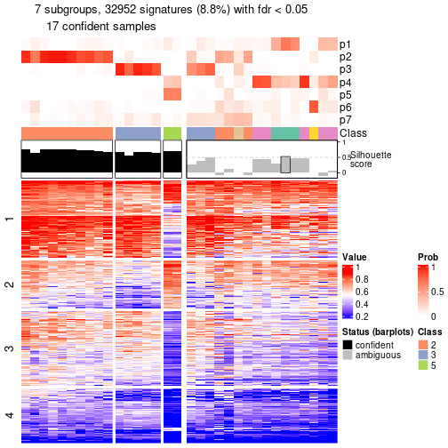</p>

</div>
<div id='tab-node-073-get-signatures-7'>
<pre><code class="r">get_signatures(res, k = 8)
</code></pre>

<p>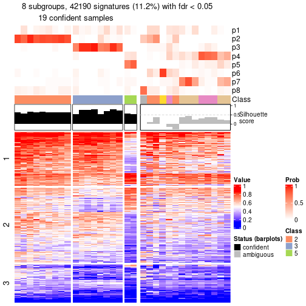</p>

</div>
</div>


Compare the overlap of signatures from different k:

```r
compare_signatures(res)
```

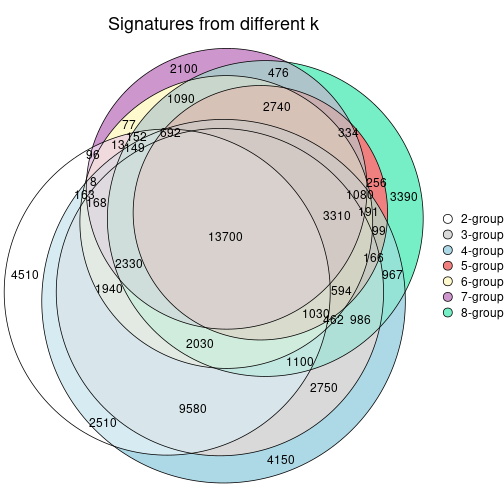

`get_signature()` returns a data frame invisibly. To get the list of signatures, the function
call should be assigned to a variable explicitly. In following code, if `plot` argument is set
to `FALSE`, no heatmap is plotted while only the differential analysis is performed.

```r
# code only for demonstration
tb = get_signature(res, k = ..., plot = FALSE)
```

An example of the output of `tb` is:

```
#>   which_row         fdr    mean_1    mean_2 scaled_mean_1 scaled_mean_2 km
#> 1        38 0.042760348  8.373488  9.131774    -0.5533452     0.5164555  1
#> 2        40 0.018707592  7.106213  8.469186    -0.6173731     0.5762149  1
#> 3        55 0.019134737 10.221463 11.207825    -0.6159697     0.5749050  1
#> 4        59 0.006059896  5.921854  7.869574    -0.6899429     0.6439467  1
#> 5        60 0.018055526  8.928898 10.211722    -0.6204761     0.5791110  1
#> 6        98 0.009384629 15.714769 14.887706     0.6635654    -0.6193277  2
...
```

The columns in `tb` are:

1. `which_row`: row indices corresponding to the input matrix.
2. `fdr`: FDR for the differential test. 
3. `mean_x`: The mean value in group x.
4. `scaled_mean_x`: The mean value in group x after rows are scaled.
5. `km`: Row groups if k-means clustering is applied to rows (which is done by automatically selecting number of clusters).

If there are too many signatures, `top_signatures = ...` can be set to only show the 
signatures with the highest FDRs:

```r
# code only for demonstration
# e.g. to show the top 500 most significant rows
tb = get_signature(res, k = ..., top_signatures = 500)
```

If the signatures are defined as these which are uniquely high in current group, `diff_method` argument
can be set to `"uniquely_high_in_one_group"`:

```r
# code only for demonstration
tb = get_signature(res, k = ..., diff_method = "uniquely_high_in_one_group")
```


UMAP plot which shows how samples are separated.


<script>
$( function() {
	$( '#tabs-node-073-dimension-reduction' ).tabs();
} );
</script>
<div id='tabs-node-073-dimension-reduction'>
<ul>
<li><a href='#tab-node-073-dimension-reduction-1'>k = 2</a></li>
<li><a href='#tab-node-073-dimension-reduction-2'>k = 3</a></li>
<li><a href='#tab-node-073-dimension-reduction-3'>k = 4</a></li>
<li><a href='#tab-node-073-dimension-reduction-4'>k = 5</a></li>
<li><a href='#tab-node-073-dimension-reduction-5'>k = 6</a></li>
<li><a href='#tab-node-073-dimension-reduction-6'>k = 7</a></li>
<li><a href='#tab-node-073-dimension-reduction-7'>k = 8</a></li>
</ul>
<div id='tab-node-073-dimension-reduction-1'>
<pre><code class="r">dimension_reduction(res, k = 2, method = &quot;UMAP&quot;)
</code></pre>

<p>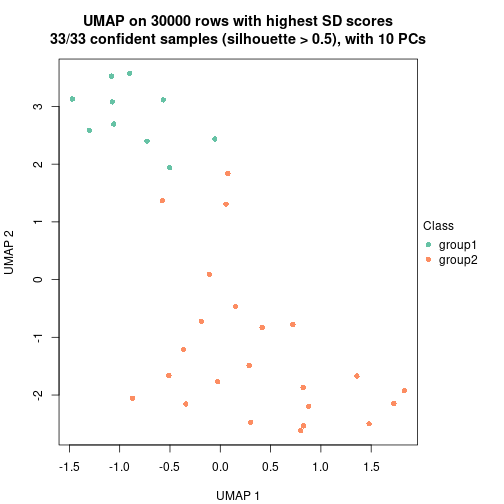</p>

</div>
<div id='tab-node-073-dimension-reduction-2'>
<pre><code class="r">dimension_reduction(res, k = 3, method = &quot;UMAP&quot;)
</code></pre>

<p>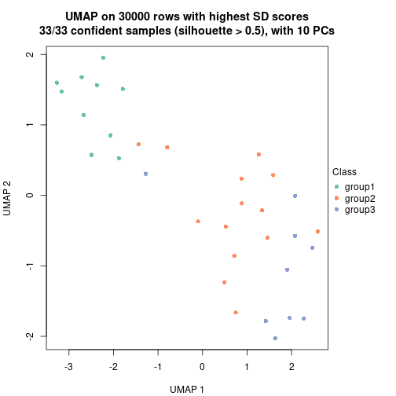</p>

</div>
<div id='tab-node-073-dimension-reduction-3'>
<pre><code class="r">dimension_reduction(res, k = 4, method = &quot;UMAP&quot;)
</code></pre>

<p>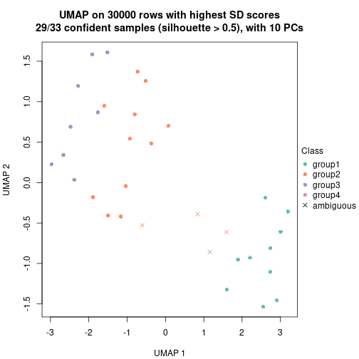</p>

</div>
<div id='tab-node-073-dimension-reduction-4'>
<pre><code class="r">dimension_reduction(res, k = 5, method = &quot;UMAP&quot;)
</code></pre>

<p>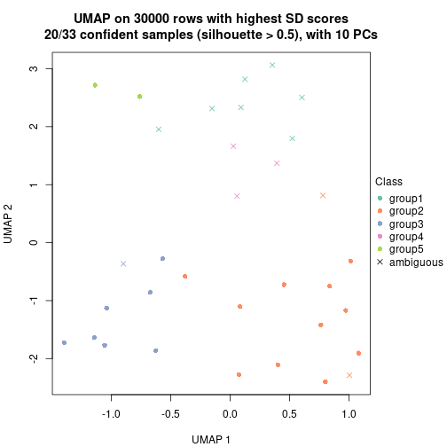</p>

</div>
<div id='tab-node-073-dimension-reduction-5'>
<pre><code class="r">dimension_reduction(res, k = 6, method = &quot;UMAP&quot;)
</code></pre>

<p>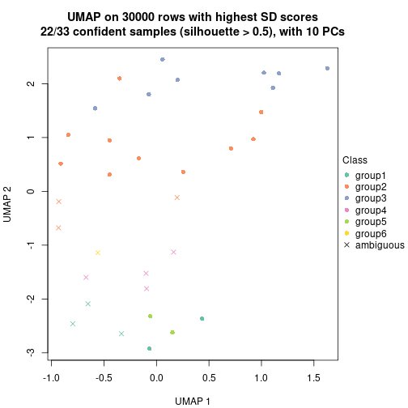</p>

</div>
<div id='tab-node-073-dimension-reduction-6'>
<pre><code class="r">dimension_reduction(res, k = 7, method = &quot;UMAP&quot;)
</code></pre>

<p>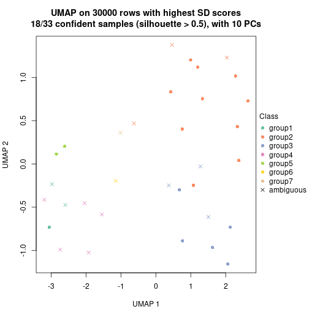</p>

</div>
<div id='tab-node-073-dimension-reduction-7'>
<pre><code class="r">dimension_reduction(res, k = 8, method = &quot;UMAP&quot;)
</code></pre>

<p>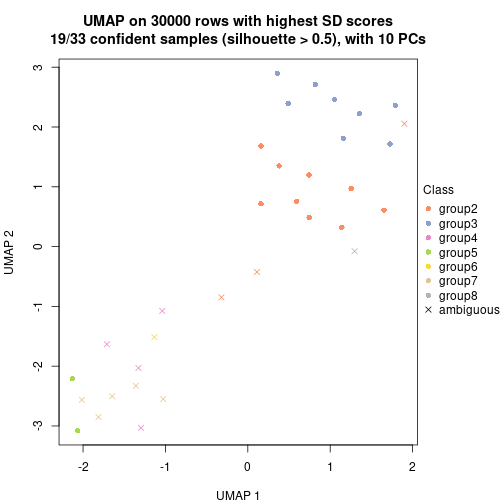</p>

</div>
</div>


Following heatmap shows how subgroups are split when increasing `k`:

```r
collect_classes(res)
```

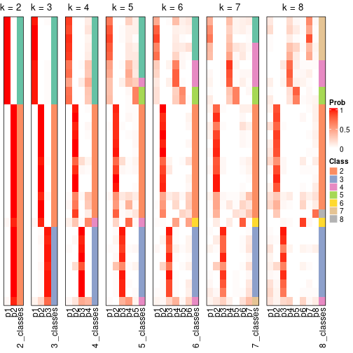


If matrix rows can be associated to genes, consider to use `functional_enrichment(res,
...)` to perform function enrichment for the signature genes. See [this vignette](https://jokergoo.github.io/cola_vignettes/functional_enrichment.html) for more detailed explanations.


 

## Session info


```r
sessionInfo()
```

```
#> R version 4.1.0 (2021-05-18)
#> Platform: x86_64-pc-linux-gnu (64-bit)
#> Running under: CentOS Linux 7 (Core)
#> 
#> Matrix products: default
#> BLAS/LAPACK: /usr/lib64/libopenblas-r0.3.3.so
#> 
#> locale:
#>  [1] LC_CTYPE=en_US.UTF-8       LC_NUMERIC=C               LC_TIME=en_US.UTF-8       
#>  [4] LC_COLLATE=en_US.UTF-8     LC_MONETARY=en_US.UTF-8    LC_MESSAGES=en_US.UTF-8   
#>  [7] LC_PAPER=en_US.UTF-8       LC_NAME=C                  LC_ADDRESS=C              
#> [10] LC_TELEPHONE=C             LC_MEASUREMENT=en_US.UTF-8 LC_IDENTIFICATION=C       
#> 
#> attached base packages:
#> [1] grid      stats     graphics  grDevices utils     datasets  methods   base     
#> 
#> other attached packages:
#> [1] genefilter_1.74.0    ComplexHeatmap_2.8.0 markdown_1.1         knitr_1.33          
#> [5] matrixStats_0.59.0   cola_1.9.4          
#> 
#> loaded via a namespace (and not attached):
#>   [1] bitops_1.0-7           bit64_4.0.5            doParallel_1.0.16      RColorBrewer_1.1-2    
#>   [5] httr_1.4.2             GenomeInfoDb_1.28.1    data.tree_1.0.0        tools_4.1.0           
#>   [9] utf8_1.2.1             R6_2.5.0               irlba_2.3.3            DBI_1.1.1             
#>  [13] BiocGenerics_0.38.0    colorspace_2.0-2       GetoptLong_1.0.5       gridExtra_2.3         
#>  [17] tidyselect_1.1.1       bit_4.0.4              compiler_4.1.0         Biobase_2.52.0        
#>  [21] Cairo_1.5-12.2         xml2_1.3.2             microbenchmark_1.4-7   slam_0.1-48           
#>  [25] scales_1.1.1           askpass_1.1            stringr_1.4.0          digest_0.6.27         
#>  [29] XVector_0.32.0         pkgconfig_2.0.3        umap_0.2.7.0           fastmap_1.1.0         
#>  [33] highr_0.9              rlang_0.4.11           GlobalOptions_0.1.2    rstudioapi_0.13       
#>  [37] RSQLite_2.2.7          impute_1.66.0          generics_0.1.0         shape_1.4.6           
#>  [41] jsonlite_1.7.2         mclust_5.4.7           dplyr_1.0.7            dendextend_1.15.1     
#>  [45] RCurl_1.98-1.3         magrittr_2.0.1         GenomeInfoDbData_1.2.6 Matrix_1.3-4          
#>  [49] fansi_0.5.0            Rcpp_1.0.7             munsell_0.5.0          S4Vectors_0.30.0      
#>  [53] viridis_0.6.1          reticulate_1.20        lifecycle_1.0.0        scatterplot3d_0.3-41  
#>  [57] stringi_1.7.3          zlibbioc_1.38.0        blob_1.2.1             parallel_4.1.0        
#>  [61] crayon_1.4.1           lattice_0.20-44        Biostrings_2.60.1      splines_4.1.0         
#>  [65] annotate_1.70.0        circlize_0.4.13        KEGGREST_1.32.0        polylabelr_0.2.0      
#>  [69] pillar_1.6.1           rjson_0.2.20           codetools_0.2-18       stats4_4.1.0          
#>  [73] XML_3.99-0.6           glue_1.4.2             evaluate_0.14          png_0.1-7             
#>  [77] vctrs_0.3.8            foreach_1.5.1          polyclip_1.10-0        purrr_0.3.4           
#>  [81] gtable_0.3.0           openssl_1.4.4          assertthat_0.2.1       clue_0.3-59           
#>  [85] cachem_1.0.5           ggplot2_3.3.5          xfun_0.24              eulerr_6.1.0          
#>  [89] xtable_1.8-4           skmeans_0.2-13         RSpectra_0.16-0        viridisLite_0.4.0     
#>  [93] survival_3.2-11        tibble_3.1.2           Polychrome_1.3.1       iterators_1.0.13      
#>  [97] AnnotationDbi_1.54.1   memoise_2.0.0          IRanges_2.26.0         cluster_2.1.2         
#> [101] ellipsis_0.3.2         brew_1.0-6
```


